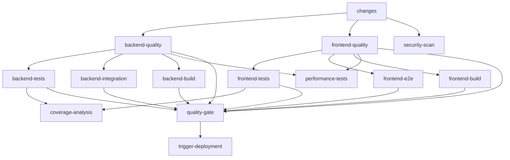

# TripSage AI CI/CD Architecture

## Overview

This document describes the comprehensive CI/CD pipeline architecture for TripSage AI, designed with security, performance, and maintainability as core principles.

## Table of Contents

- [Architecture Overview](#architecture-overview)
- [Validation Report](#validation-report)
- [Workflow Structure](#workflow-structure)
- [Security Implementation](#security-implementation)
- [Performance Optimizations](#performance-optimizations)
- [Required Secrets](#required-secrets)
- [Maintenance Guide](#maintenance-guide)

## Architecture Overview

The CI/CD system is built around three main workflows:

1. **Unified CI** (`ci.yml`) - Comprehensive testing and quality checks
2. **Deploy** (`deploy.yml`) - Automated deployment pipeline
3. **PR & Repository Utilities** (`utilities.yml`) - Automation helpers

### Key Design Principles

1. **Security First**: All GitHub Actions are pinned to specific commit SHAs
2. **Intelligent Path Filtering**: Only run relevant jobs based on file changes
3. **Parallelization**: Maximum job concurrency for faster feedback
4. **Caching Strategy**: Multi-level caching for dependencies and build artifacts
5. **Retry Logic**: Built-in retry mechanisms for flaky tests
6. **OIDC Authentication**: Secure, token-less authentication where possible

## Validation Report

### ✅ Syntax Validation

All YAML files have been validated and are syntactically correct:

- ✅ `.github/workflows/ci.yml` - Valid YAML
- ✅ `.github/workflows/deploy.yml` - Valid YAML
- ✅ `.github/workflows/utilities.yml` - Valid YAML
- ✅ `.github/actions/setup-python/action.yml` - Valid YAML
- ✅ `.github/actions/setup-node/action.yml` - Valid YAML
- ✅ `.github/actions/security-scan/action.yml` - Valid YAML
- ✅ `.github/dependabot.yml` - Valid YAML
- ✅ `.github/ci-config.yml` - Valid YAML

### ✅ Action Pinning

All GitHub Actions are pinned to commit SHAs unless GitHub mandates a supported major tag:

- `actions/checkout@b4ffde65f46336ab88eb53be808477a3936bae11` (v4.1.1)
- `actions/setup-python@82c7e631bb3cdc910f68e0081d67478d79c6982d` (v5.1.0)
- `actions/setup-node@60edb5dd545a775178f52524783378180af0d1f8` (v4.0.2)
- `actions/cache@v4` (GitHub deprecates pinning to the legacy commit; use supported major tag)
- `actions/upload-artifact@5d5d22a31266ced268874388b861e4b58bb5c2f3` (v4.3.1)
- `actions/download-artifact@c850b930e6ba138125429b7e5c93fc707a7f8427` (v4.1.4)
- `pnpm/action-setup@fe02b34f77f8bc703788d5817da081398fad5dd2` (v4.0.0)
- `dorny/paths-filter@4512585405083f25c027a35db413c2b3b9006d50` (v2.11.1)
- `codecov/codecov-action@e28ff129e5465c2c0dcc6f003fc735cb6ae0c673` (v4.5.0)
- `actions/github-script@60a0d83039c74a4aee543508d2ffcb1c3799cdea` (v7.0.1)
- `aquasecurity/trivy-action@6e7b7d1fd3e4fef0c5fa8cce1229c54b2c9bd0d8` (v0.24.0)
- `github/codeql-action/upload-sarif@4fa2a7953630fd2f3fb380f21be14ede0169dd4f` (v3.25.12)
- `actions/dependency-review-action@72eb03d02c7872a771aacd928f3123ac62ad6d3a` (v4.3.3)

### ✅ Path References

All path references are correctly structured:

- Backend paths: `tripsage/`, `tripsage_core/`, `scripts/`, `tests/`
- Frontend paths: `frontend/` with proper working directory settings
- Migration paths: `supabase/migrations/`, `scripts/database/`
- GitHub paths: `.github/workflows/`, `.github/actions/`

### ⚠️ Issues Found and Recommendations

1. **Missing uv installation for Windows**: The ci.yml workflow uses incorrect syntax for Windows uv installation. Lines 262-264 should be:

   ```yaml
   if [[ "$RUNNER_OS" == "Windows" ]]; then
     powershell -c "irm https://astral.sh/uv/install.ps1 | iex"
     echo "$env:USERPROFILE\.cargo\bin" | Out-File -FilePath $env:GITHUB_PATH -Encoding utf8 -Append
   ```

2. **Hardcoded Python version in setup-python action**: The action uses a different SHA than in ci.yml. Recommend updating to match.

3. **Missing error handling in composite actions**: The composite actions should include error handling for failed installations.

## Workflow Structure

### Unified CI Workflow

The main CI workflow implements a sophisticated job dependency graph:



### Key Features

1. **Path Filtering**: The `changes` job analyzes which files changed to skip unnecessary jobs
2. **Matrix Testing**: Tests run across multiple Python versions (3.11, 3.12, 3.13) and OS (Ubuntu, Windows, macOS)
3. **Service Containers**: PostgreSQL and DragonflyDB run as service containers for integration tests
4. **Coverage Tracking**: Automatic coverage reporting with Codecov integration
5. **Security Scanning**: Multiple security tools (Bandit, Safety, Trivy) run in parallel

## Security Implementation

### 1. Secrets Scanning

```yaml
- name: Check for hardcoded secrets
  run: |
    if git grep -i "fallback-secret\|development-only" . | grep -v "allowed-files"; then
      echo "❌ Hardcoded secrets detected!"
      exit 1
    fi
```

### 2. RLS Policy Validation

```yaml
- name: RLS Security Checks
  run: |
    tables=("trips" "memories" "flights" "accommodations" "notifications")
    for table in "${tables[@]}"; do
      if grep -q "CREATE POLICY.*ON $table" supabase/migrations/*.sql; then
        echo "✅ RLS policies found for $table"
      fi
    done
```

### 3. Dependency Scanning

- Bandit for Python static analysis
- Safety for known vulnerabilities
- Trivy for container scanning
- npm/pnpm audit for frontend dependencies

### 4. SARIF Upload

Security findings are uploaded to GitHub Security tab for centralized tracking.

## Performance Optimizations

### 1. Intelligent Caching

**Python/uv caching**:

```yaml
key: ${{ runner.os }}-uv-${{ matrix.python-version }}-${{ hashFiles('**/requirements*.txt', '**/pyproject.toml') }}
```

**Node/pnpm caching**:

```yaml
key: ${{ runner.os }}-pnpm-${{ inputs.node-version }}-${{ hashFiles('frontend/pnpm-lock.yaml') }}
```

**Next.js build caching**:

```yaml
path: ./frontend/.next/cache
key: ${{ runner.os }}-nextjs-${{ matrix.build-mode }}-${{ hashFiles('frontend/pnpm-lock.yaml') }}
```

### 2. Parallel Execution

- Backend and frontend jobs run in parallel
- Matrix strategy for multi-version testing
- Concurrent security scans

### 3. Retry Logic

```yaml
for i in {1..${{ env.MAX_RETRIES }}}; do
  if pytest tests/unit/; then
    break
  elif [ $i -eq ${{ env.MAX_RETRIES }} ]; then
    exit 1
  fi
  sleep ${{ env.RETRY_DELAY }}
done
```

## Required Secrets

The following secrets must be configured in GitHub repository settings:

### Essential Secrets

- `CODECOV_TOKEN` - For coverage reporting
- `SLACK_WEBHOOK_URL` - For CI notifications (optional)

### Deployment Secrets (Environment-specific)

- `SUPABASE_URL` - Supabase project URL
- `SUPABASE_ANON_KEY` - Supabase anonymous key
- `SUPABASE_SERVICE_KEY` - Supabase service role key
- `OPENAI_API_KEY` - OpenAI API key
- `ANTHROPIC_API_KEY` - Anthropic API key
- `DUFFEL_API_KEY` - Duffel API key
- `GOOGLE_MAPS_API_KEY` - Google Maps API key
- `DRAGONFLY_PASSWORD` - DragonflyDB password (if used)

### AWS Deployment (if using AWS)

- `AWS_ACCOUNT_ID` - AWS account ID for OIDC
- `AWS_REGION` - AWS region
- `AWS_ROLE_NAME` - IAM role for deployment

## Maintenance Guide

### Adding New Tests

1. Unit tests go in `tests/unit/`
2. Integration tests go in `tests/integration/`
3. Performance tests go in `tests/performance/`
4. E2E tests go in `frontend/tests/e2e/`

### Updating Dependencies

1. Python: Update `requirements*.txt` or `pyproject.toml`
2. Node: Update `frontend/package.json` and run `pnpm install`
3. Actions: Update SHA in workflows and `action.yml` files

### Coverage Thresholds

Configured in environment variables:

- Backend: `BACKEND_COVERAGE_THRESHOLD=85`
- Frontend: `FRONTEND_COVERAGE_THRESHOLD=80`

### Monitoring CI Performance

1. Check workflow run times in Actions tab
2. Monitor cache hit rates
3. Review artifact sizes
4. Track flaky test patterns

### Common Issues

1. **Cache misses**: Check if dependency files changed
2. **Flaky tests**: Increase retry count or timeout
3. **Service container failures**: Check health check configuration
4. **Windows-specific failures**: Ensure cross-platform compatibility

## Best Practices

1. **Always pin actions** to commit SHAs, not tags
2. **Use path filtering** to avoid unnecessary job runs
3. **Implement retry logic** for network-dependent tests
4. **Cache aggressively** but invalidate appropriately
5. **Run security scans** on every PR
6. **Keep secrets minimal** and rotate regularly
7. **Monitor performance** and optimize bottlenecks
8. **Document changes** to CI configuration

## Utilities Workflow Features

The utilities workflow provides several automation features:

1. **PR Validation**: Checks conventional commits, PR description quality
2. **Auto-labeling**: Labels PRs based on files changed
3. **Breaking Change Detection**: Identifies potential breaking changes
4. **Merge Conflict Detection**: Alerts on conflicts
5. **Code Quality Summary**: Provides metrics on PR changes
6. **Auto-assign Reviewers**: Based on CODEOWNERS
7. **Stale Management**: Marks and closes stale issues/PRs
8. **Release Automation**: Generates release notes
9. **PR Metrics**: Monthly metrics reports

## Conclusion

This CI/CD architecture provides a robust, secure, and performant foundation for TripSage AI development. The system is designed to catch issues early, provide fast feedback, and maintain high code quality standards while optimizing for developer experience.

For questions or improvements, please open an issue or contact the maintainers.
