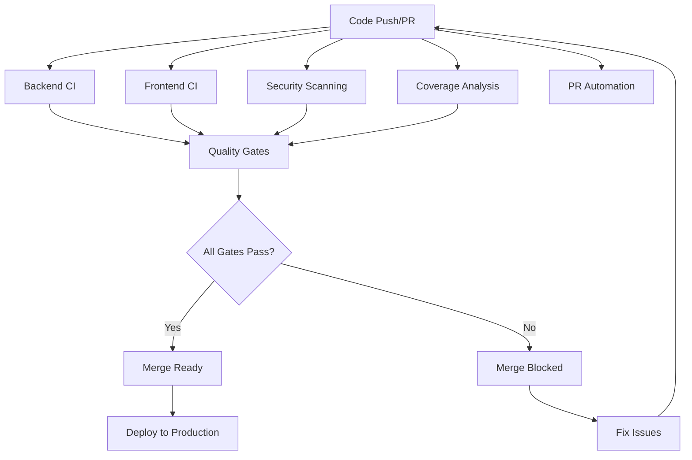
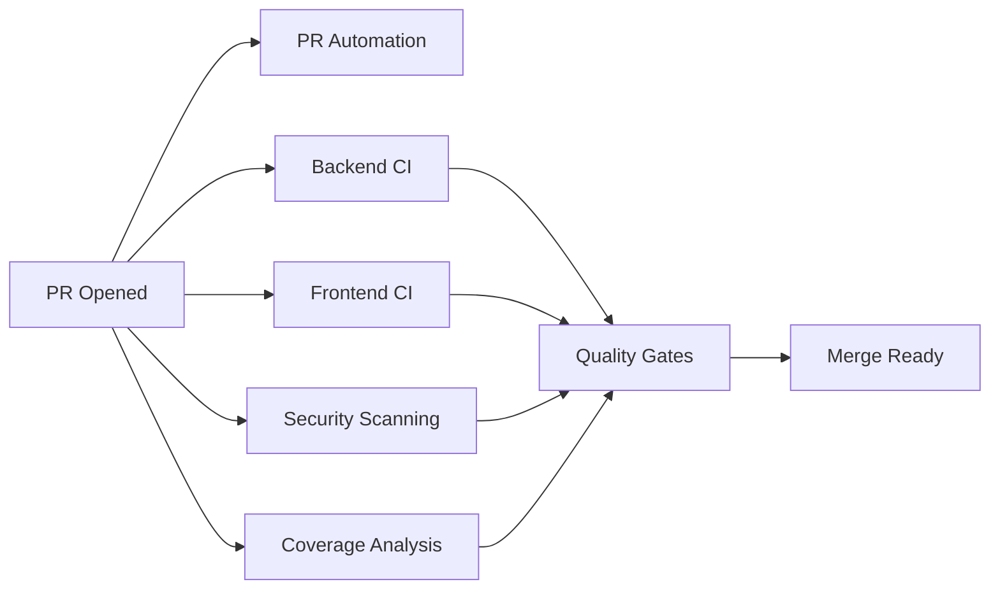

# CI/CD Pipeline Documentation

## Overview

TripSage implements a comprehensive CI/CD pipeline designed to ensure code quality, security, and maintainability. The pipeline consists of multiple workflows that run in parallel and feed into quality gates for safe merging.

## Pipeline Architecture



## Workflow Descriptions

### 1. Backend CI (`backend-ci.yml`)

**Purpose**: Validates Python backend code quality, functionality, and build integrity.

**Triggers**:
- Push to `main`, `dev`, feature branches
- Pull requests to `main`, `dev`
- Manual dispatch

**Jobs**:
- **Code Quality**: Linting with Ruff, type checking with MyPy
- **Unit Tests**: Fast unit test execution with pytest
- **Integration Tests**: Database and API integration tests
- **Build Validation**: Docker build and API startup verification
- **API Documentation**: OpenAPI spec validation
- **Performance Tests**: Basic API performance benchmarks

**Quality Thresholds**:
- Code coverage: ≥85%
- Zero critical linting errors
- All tests must pass
- API must start successfully
- Performance tests must complete within thresholds

### 2. Frontend CI (`frontend-ci-simple.yml`)

**Purpose**: Validates TypeScript/React frontend code quality and functionality.

**Triggers**:
- Push to `main`, `dev`, feature branches
- Pull requests to `main`, `dev`
- Manual dispatch

**Jobs**:
- **Code Quality**: Biome linting and formatting, TypeScript compilation
- **Unit Tests**: Vitest unit tests with coverage
- **E2E Tests**: Playwright end-to-end tests
- **Build Validation**: Next.js production build verification
- **Accessibility Tests**: axe-core accessibility scanning
- **Performance Tests**: Lighthouse performance audits

**Quality Thresholds**:
- Code coverage: ≥80%
- Zero TypeScript errors
- All tests must pass
- Build must succeed for production
- Performance score: ≥85

### 3. Security Scanning (`security.yml`)

**Purpose**: Comprehensive security vulnerability detection and assessment.

**Triggers**:
- Push to main branches and feature branches
- Pull requests
- Daily schedule (2 AM UTC)
- Manual dispatch

**Jobs**:
- **Secret Detection**: TruffleHog for exposed secrets
- **Python Security**: Bandit, Safety, Semgrep analysis
- **Frontend Security**: npm audit, XSS pattern detection
- **Dependency Check**: OWASP dependency vulnerability scanning
- **Docker Security**: Trivy container scanning, Docker Bench
- **Infrastructure Security**: Configuration security assessment

**Security Thresholds**:
- Zero exposed secrets
- Zero critical vulnerabilities
- Maximum 2 high-severity vulnerabilities
- All Docker images must pass security scan

### 4. Code Coverage Analysis (`coverage.yml`)

**Purpose**: Comprehensive test coverage analysis and enforcement.

**Triggers**:
- Push to `main`, `dev`
- Pull requests
- Daily schedule (3 AM UTC)
- Manual dispatch

**Features**:
- Combined backend and frontend coverage reporting
- Coverage trend tracking
- Codecov integration
- Historical coverage comparison
- Detailed coverage artifacts

### 5. PR Automation (`pr-automation.yml`)

**Purpose**: Automated pull request quality checks and enhancement.

**Features**:
- **Auto-labeling**: Based on file changes and PR size
- **Title validation**: Conventional commit format enforcement
- **Description requirements**: Minimum length and content checks
- **Breaking change detection**: Automatic detection and labeling
- **Reviewer assignment**: Automatic reviewer assignment
- **Merge conflict detection**: Proactive conflict identification
- **Quality summaries**: Comprehensive PR quality reports

### 6. Quality Gates (`quality-gates.yml`)

**Purpose**: Final quality validation before merge approval.

**Validation Criteria**:
- All CI workflows must pass
- Security scans must not find critical issues
- Coverage thresholds must be met
- No merge conflicts
- PR must have required approvals

## Quality Thresholds

| Metric | Threshold | Enforcement |
|--------|-----------|-------------|
| Backend Coverage | ≥85% | Hard fail |
| Frontend Coverage | ≥80% | Hard fail |
| Critical Vulnerabilities | 0 | Hard fail |
| High Vulnerabilities | ≤2 | Warning |
| Build Success | 100% | Hard fail |
| Test Pass Rate | 100% | Hard fail |
| Performance Score | ≥85 | Warning |

## Configuration Files

### Required Secrets

Set these in GitHub repository settings > Secrets and variables > Actions:

```bash
# Code Coverage
CODECOV_TOKEN=<your-codecov-token>

# Optional: Enhanced Security Scanning
SNYK_TOKEN=<your-snyk-token>
GITHUB_TOKEN=<automatically-provided>
```

### Environment Variables

```bash
# Coverage Thresholds
BACKEND_COVERAGE_THRESHOLD=85
FRONTEND_COVERAGE_THRESHOLD=80

# Security Thresholds
MAX_CRITICAL_VULNERABILITIES=0
MAX_HIGH_VULNERABILITIES=2
```

## Workflow Dependencies



## Branch Protection Rules

Configure these branch protection rules in GitHub:

### Main Branch (`main`)
- ✅ Require pull request reviews before merging
- ✅ Require status checks to pass before merging
  - Backend CI
  - Frontend CI
  - Security Scanning
  - Quality Gates
- ✅ Require branches to be up to date before merging
- ✅ Require conversation resolution before merging
- ✅ Restrict pushes that create files
- ✅ Do not allow bypassing the above settings

### Development Branch (`dev`)
- ✅ Require pull request reviews before merging
- ✅ Require status checks to pass before merging
  - Backend CI
  - Frontend CI
  - Quality Gates
- ✅ Allow administrators to bypass

## Troubleshooting Guide

### Common Issues and Solutions

#### 1. Backend CI Failures

**Coverage Below Threshold**
```bash
# Check current coverage
uv run pytest --cov=tripsage --cov=tripsage_core --cov-report=term-missing

# Add tests for uncovered code
# Update test files in tests/unit/ and tests/integration/
```

**Linting Errors**
```bash
# Fix formatting issues
ruff format .

# Fix linting issues
ruff check . --fix

# Manual fixes may be needed for complex issues
```

**Test Failures**
```bash
# Run specific failing test
uv run pytest tests/path/to/test.py::test_name -v

# Check test environment setup
# Ensure all required services are running (DragonflyDB, PostgreSQL)
```

#### 2. Frontend CI Failures

**TypeScript Errors**
```bash
# Check TypeScript compilation
cd frontend
pnpm type-check

# Fix type errors in source files
# Update type definitions if needed
```

**Test Failures**
```bash
# Run specific test suite
cd frontend
pnpm test src/components/specific-component

# Check test environment
# Update mocks and test data as needed
```

**Build Failures**
```bash
# Test production build locally
cd frontend
pnpm build

# Check for environment-specific issues
# Verify all environment variables are set
```

#### 3. Security Scan Failures

**Secrets Detected**
```bash
# Check for exposed secrets
git grep -i "api_key\|password\|secret" .

# Remove secrets from code
# Use environment variables instead
# Add secrets to .gitignore patterns
```

**Vulnerability in Dependencies**
```bash
# Check Python vulnerabilities
safety check

# Check Node.js vulnerabilities
cd frontend
pnpm audit

# Update vulnerable packages
# Consider security patches or alternatives
```

#### 4. Coverage Failures

**Coverage Below Threshold**
- Add unit tests for uncovered functions
- Add integration tests for workflows
- Remove dead code that can't be tested
- Update coverage configuration if needed

**Coverage Report Generation Failed**
```bash
# Regenerate coverage locally
uv run pytest --cov=tripsage --cov=tripsage_core --cov-report=html

# Check for missing test files
# Verify test discovery patterns
```

#### 5. Quality Gate Failures

**Multiple Workflow Failures**
- Address individual workflow failures first
- Check for systemic issues (environment, dependencies)
- Verify all required workflows are enabled

**Workflow Timeout**
- Check for infinite loops or hanging processes
- Optimize test execution time
- Increase timeout if necessary

### Emergency Procedures

#### Bypassing Quality Gates (Admin Only)

In emergency situations, administrators can:

1. **Temporarily disable branch protection**:
   - Go to Settings > Branches
   - Edit protection rule for target branch
   - Temporarily disable required status checks

2. **Force merge with admin privileges**:
   - Use "Merge without waiting for requirements to be met"
   - Document the reason in the merge commit
   - Create follow-up issue to address skipped checks

3. **Hotfix process**:
   ```bash
   # Create hotfix branch from main
   git checkout main
   git pull origin main
   git checkout -b hotfix/critical-fix
   
   # Make minimal changes
   # Push and create PR with "hotfix" label
   # Expedited review process applies
   ```

#### Rolling Back Failed Deployments

```bash
# Revert to previous commit
git revert HEAD

# Or reset to last known good commit
git reset --hard <good-commit-sha>
git push --force-with-lease
```

## Performance Optimization

### CI Execution Time Targets

| Workflow | Target Time | Current Average |
|----------|-------------|-----------------|
| Backend CI | <8 minutes | ~6 minutes |
| Frontend CI | <10 minutes | ~8 minutes |
| Security Scanning | <15 minutes | ~12 minutes |
| Coverage Analysis | <20 minutes | ~15 minutes |
| Quality Gates | <5 minutes | ~3 minutes |

### Optimization Strategies

1. **Parallel Execution**: Jobs run in parallel where possible
2. **Caching**: Dependencies and build artifacts are cached
3. **Selective Testing**: Only run relevant tests for smaller PRs
4. **Incremental Builds**: Build only changed components
5. **Resource Allocation**: Appropriate runner sizes for workloads

## Monitoring and Metrics

### Key Metrics Tracked

- **Pipeline Success Rate**: Percentage of successful pipeline runs
- **Average Execution Time**: Time from commit to completion
- **Coverage Trends**: Code coverage over time
- **Security Findings**: Number and severity of vulnerabilities
- **Deployment Frequency**: Number of successful deployments
- **Lead Time**: Time from PR creation to merge

### Dashboards and Reports

- **GitHub Actions Dashboard**: Built-in workflow monitoring
- **Codecov Dashboard**: Coverage trends and reports
- **Security Reports**: Vulnerability findings and trends
- **Quality Metrics**: Automated quality trend tracking

## Maintenance Schedule

### Daily Tasks (Automated)
- Security vulnerability scanning
- Dependency update checks
- Coverage trend updates
- Performance baseline updates

### Weekly Tasks
- Review failed workflow patterns
- Update dependency versions via Dependabot
- Clean up old workflow runs and artifacts
- Review and update security suppressions

### Monthly Tasks
- Review and update quality thresholds
- Audit CI performance and optimization opportunities
- Update CI tools and actions to latest versions
- Review branch protection rules and policies

### Quarterly Tasks
- Comprehensive CI pipeline audit
- Security tool evaluation and updates
- Performance benchmarking and optimization
- Team training on CI best practices

## Support and Contacts

### CI/CD Team Responsibilities
- **Primary Maintainer**: BjornMelin
- **Security Champion**: BjornMelin
- **Quality Assurance**: Team Lead

### Getting Help
1. **Check this documentation** for common issues
2. **Search GitHub Issues** for similar problems
3. **Create new issue** with CI/CD label if needed
4. **Contact team lead** for urgent issues

### Contributing to CI/CD
1. Fork repository and create feature branch
2. Make changes to workflow files
3. Test changes on feature branch
4. Create PR with detailed description
5. Request review from CI/CD maintainers

## Changelog

### Recent Updates
- **2025-06-11**: Comprehensive CI pipeline implementation
- **2025-06-11**: Added quality gates and automated PR checks
- **2025-06-11**: Implemented security scanning workflows
- **2025-06-11**: Added coverage analysis and reporting

### Planned Improvements
- Enhanced performance testing integration
- Advanced security scanning with custom rules
- Automated deployment to staging environments
- Integration with external monitoring tools