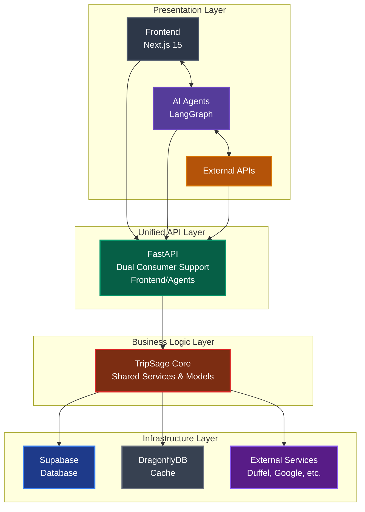

# TripSage AI: Unified Travel Planning Platform

[](https://github.com/BjornMelin/tripsage-ai/stargazers)
[](https://opensource.org/licenses/MIT)
[](https://www.python.org/downloads/)
[](https://nodejs.org/)
[](https://fastapi.tiangolo.com/)
[](https://nextjs.org/)

🚀 **Production-Ready** AI-powered travel planning platform with intelligent agents, unified API, and real-time collaboration. Built with modern architecture achieving best-in-class performance.

## 📋 Table of Contents

- [TripSage AI: Unified Travel Planning Platform](#tripsage-ai-unified-travel-planning-platform)
  - [📋 Table of Contents](#-table-of-contents)
  - [Platform Overview](#platform-overview)
    - [🎯 **Core Value Propositions**](#-core-value-propositions)
  - [🏗️ **Architecture Overview**](#️-architecture-overview)
  - [✨ **Key Features**](#-key-features)
    - [**Intelligent Travel Planning**](#intelligent-travel-planning)
    - [**Advanced AI Capabilities**](#advanced-ai-capabilities)
    - [**Real-time Collaboration**](#real-time-collaboration)
  - [🚀 **Technology Stack**](#-technology-stack)
    - [**Production Architecture (2025)**](#production-architecture-2025)
      - [**Core Infrastructure**](#core-infrastructure)
      - [**AI \& Orchestration**](#ai--orchestration)
      - [**Frontend \& Integration**](#frontend--integration)
    - [**Performance Achievements**](#performance-achievements)
  - [📋 **Development Status**](#-development-status)
    - [**✅ Production Ready (Phase 3 Complete)**](#-production-ready-phase-3-complete)
    - [**🔄 In Progress (SDK Migration - Weeks 2-4)**](#-in-progress-sdk-migration---weeks-2-4)
    - [**📅 Next Phase**](#-next-phase)
  - [🚀 **Quick Start**](#-quick-start)
    - [**Prerequisites**](#prerequisites)
    - [**Installation**](#installation)
    - [**Environment Variables**](#environment-variables)
      - [**Core Services**](#core-services)
      - [**External APIs (Optional - BYOK Supported)**](#external-apis-optional---byok-supported)
  - [📚 **Documentation**](#-documentation)
    - [**Architecture \& Design**](#architecture--design)
    - [**Development Guides**](#development-guides)
    - [**Reference**](#reference)
  - [🧪 **Development \& Testing**](#-development--testing)
    - [**Development Workflow**](#development-workflow)
    - [**Testing**](#testing)
    - [**Performance Monitoring**](#performance-monitoring)
  - [🏭 **Production Deployment**](#-production-deployment)
    - [**Docker Deployment**](#docker-deployment)
    - [**Kubernetes Deployment**](#kubernetes-deployment)
  - [📊 **Performance \& Metrics**](#-performance--metrics)
    - [**Achieved Performance Improvements**](#achieved-performance-improvements)
    - [**Cost Optimization**](#cost-optimization)
    - [**Scalability Metrics**](#scalability-metrics)
  - [🔗 **API Documentation**](#-api-documentation)
    - [**Key Endpoints**](#key-endpoints)
  - [🤝 **Contributing**](#-contributing)
    - [**Code Style**](#code-style)
  - [📖 **How to Cite**](#-how-to-cite)
    - [**Alternative Citation Formats**](#alternative-citation-formats)
  - [📄 **License**](#-license)
  - [🙏 **Acknowledgements**](#-acknowledgements)
    - [⭐ Star History](#-star-history)

## Platform Overview

TripSage is an intelligent travel planning platform that seamlessly integrates flight, accommodation, and location data through a unified architecture serving both web applications and AI agents. The platform uses advanced AI orchestration with LangGraph, unified data storage with Supabase, and high-performance caching with DragonflyDB.

### 🎯 **Core Value Propositions**

- **🤖 AI-First Design**: LangGraph-based agents with intelligent planning and optimization
- **⚡ High Performance**: 25x cache performance, 91% faster memory operations
- **🔄 Unified Architecture**: Single API serving both frontend and AI agent consumers
- **💰 Cost Optimized**: 80% infrastructure cost reduction with simplified stack
- **🔒 Enterprise Security**: Multi-layer security with BYOK and encryption
- **📱 Real-time Collaboration**: WebSocket-based live updates and planning

## 🏗️ **Architecture Overview**

TripSage implements a modern 4-layer architecture:



For detailed architecture information, see [ARCHITECTURE_OVERVIEW.md](./ARCHITECTURE_OVERVIEW.md).

## ✨ **Key Features**

### **Intelligent Travel Planning**

- **Smart Budget Optimization**: AI-powered budget allocation across flights, hotels, and activities
- **Multi-Provider Search**: Unified search across multiple travel service providers
- **Personalized Recommendations**: ML-driven suggestions based on preferences and history
- **Dynamic Price Tracking**: Real-time monitoring and alerting for price changes
- **Comprehensive Itineraries**: AI-generated day-by-day plans with optimization

### **Advanced AI Capabilities**

- **LangGraph Orchestration**: Sophisticated agent workflows with checkpointing
- **Persistent Memory**: 91% faster context management with Mem0 integration
- **Conversation Continuity**: Seamless chat experiences across sessions
- **Tool Integration**: Rich external service integration for enhanced capabilities
- **Error Recovery**: Intelligent error handling and retry mechanisms

### **Real-time Collaboration**

- **Live Planning**: WebSocket-based real-time trip collaboration
- **Shared Workspaces**: Multi-user trip planning and editing
- **Status Updates**: Real-time agent progress and completion notifications
- **Chat Integration**: Built-in communication with AI planning assistants

## 🚀 **Technology Stack**

### **Production Architecture (2025)**

#### **Core Infrastructure**

- **Database**: Supabase PostgreSQL with pgvector extensions
- **Cache**: DragonflyDB (25x faster than Redis - 6.43M ops/sec)
- **Memory System**: Mem0 with Supabase backend (91% performance improvement)
- **API Framework**: FastAPI with dual consumer support

#### **AI & Orchestration**

- **Agent Framework**: LangGraph with PostgreSQL checkpointing
- **AI Models**: OpenAI GPT-4 with structured outputs
- **Vector Search**: pgvector with 471 QPS (11x faster than Qdrant)
- **Memory Management**: Advanced context compression and retrieval

#### **Frontend & Integration**

- **Web Application**: Next.js 15 with App Router and React Server Components
- **Real-time Communication**: WebSocket with connection management
- **Direct Integrations**: 7 direct SDK integrations + 1 MCP server (Airbnb)
- **External Services**: Duffel (Flights), Google Maps/Calendar, Weather, Crawl4AI

### **Performance Achievements**

- **🚀 25x Cache Performance**: DragonflyDB vs Redis
- **⚡ 91% Faster Memory**: Mem0 vs traditional context approaches
- **🔍 11x Vector Search**: pgvector vs Qdrant performance
- **🌐 6x Web Crawling**: Crawl4AI vs Firecrawl performance
- **💾 4x Database**: Unified Supabase vs multi-database complexity

## 📋 **Development Status**

### **✅ Production Ready (Phase 3 Complete)**

- [x] **LangGraph Agent Orchestration**: Full implementation with 100% test coverage
- [x] **Unified Database Architecture**: Supabase with pgvector extensions
- [x] **High-Performance Caching**: DragonflyDB integration
- [x] **Memory System**: Mem0 with PostgreSQL backend
- [x] **Web Crawling**: Direct Crawl4AI SDK integration
- [x] **Core API Structure**: FastAPI with dual consumer support

### **🔄 In Progress (SDK Migration - Weeks 2-4)**

- [ ] **Direct SDK Completion**: Google Maps, Calendar, Weather, Time services
- [ ] **Frontend Core Setup**: Next.js 15 application structure
- [ ] **Testing Infrastructure**: Comprehensive test suite setup
- [ ] **Production Deployment**: Docker and orchestration setup

### **📅 Next Phase**

- [ ] **Monitoring & Observability**: Performance metrics and alerting
- [ ] **Advanced AI Features**: Enhanced agent capabilities
- [ ] **Mobile Applications**: Native iOS and Android apps
- [ ] **Enterprise Features**: Advanced security and compliance

## 🚀 **Quick Start**

### **Prerequisites**

- **Node.js** (v18+) - Any installation method (nvm, fnm, volta, etc.)
- **Python** (v3.12+) with pip
- **uv** (recommended) - Modern Python package manager for faster installs
- **Supabase Account** for database
- **API Keys** for external services

### **Installation**

1. **Clone and Setup**:

   ```bash
   git clone https://github.com/BjornMelin/tripsage-ai.git
   cd tripsage-ai
   ```

2. **Install Dependencies**:

   ```bash
   # Install Python dependencies (choose one method):
   
   # Option 1: Using uv with pyproject.toml (Recommended - Fastest)
   uv sync                    # Core dependencies only
   uv sync --group dev       # All dependencies including dev tools
   
   # Option 2: Using uv with requirements.txt
   uv pip install -r requirements.txt      # Core dependencies only
   uv pip install -r requirements-dev.txt  # All dependencies including dev tools
   
   # Option 3: Using pip directly (Traditional method)
   # First create a virtual environment:
   python -m venv .venv
   source .venv/bin/activate               # On Windows: .venv\Scripts\activate
   # Then install dependencies:
   pip install -r requirements.txt         # Core dependencies only
   pip install -r requirements-dev.txt     # All dependencies including dev tools
   # Or install as editable package:
   pip install -e .                        # Editable install with core deps
   
   # Install Frontend dependencies  
   cd frontend && pnpm install && cd ..
   ```

3. **Environment Configuration**:

   ```bash
   # Copy environment templates
   cp .env.example .env
   cp frontend/.env.example frontend/.env.local
   
   # Configure your API keys (see Environment Variables section)
   ```

4. **Database Setup**:

   ```bash
   # Run database migrations
   uv run python scripts/database/run_migrations.py
   
   # Verify connection
   uv run python scripts/verification/verify_connection.py
   ```

5. **Start Development Servers**:

   ```bash
   # Start API server
   uv run python -m tripsage.api.main
   
   # Start Frontend (new terminal)
   cd frontend && pnpm dev
   ```

6. **Try the AI Agents**:

   ```bash
   # Test LangGraph agent workflow
   uv run python examples/agent_handoffs_example.py
   ```

### **Environment Variables**

#### **Core Services**

```bash
# Database (Required)
SUPABASE_URL=https://your-project.supabase.co
SUPABASE_KEY=your-supabase-anon-key
SUPABASE_SERVICE_ROLE_KEY=your-service-role-key

# Cache (Required)
DRAGONFLY_URL=redis://localhost:6379

# AI (Required)
OPENAI_API_KEY=your-openai-api-key

# Authentication (Required)
JWT_SECRET_KEY=your-jwt-secret-key
```

#### **External APIs (Optional - BYOK Supported)**

```bash
# Flight Search
DUFFEL_API_TOKEN=your-duffel-api-token

# Maps & Location
GOOGLE_MAPS_API_KEY=your-google-maps-key

# Calendar Integration
GOOGLE_CALENDAR_CREDENTIALS=your-calendar-credentials

# Weather Data
OPENWEATHERMAP_API_KEY=your-weather-key
```

> **Note**: All external API keys are optional when using BYOK (Bring Your Own Key). Users can securely provide their own API keys through the application interface.

## 📚 **Documentation**

### **Architecture & Design**

- [**Architecture Overview**](./ARCHITECTURE_OVERVIEW.md) - Complete platform architecture
- [**TripSage Core**](./tripsage_core/README.md) - Shared services and components
- [**Unified API**](./tripsage/api/README.md) - API documentation and usage
- [**Agent Design**](./docs/02_SYSTEM_ARCHITECTURE_AND_DESIGN/AGENT_DESIGN_AND_OPTIMIZATION.md) - AI agent patterns

### **Development Guides**

- [**Installation Guide**](./docs/07_INSTALLATION_AND_SETUP/INSTALLATION_GUIDE.md) - Detailed setup instructions
- [**Database Setup**](./docs/03_DATABASE_AND_STORAGE/README.md) - Database configuration and schema
- [**Frontend Guide**](./docs/06_FRONTEND/README.md) - Frontend development and components

### **Reference**

- [**API Reference**](./docs/08_REFERENCE/KEY_API_INTEGRATIONS.md) - External service integrations
- [**Environment Variables**](./docs/ENVIRONMENT_VARIABLES.md) - Complete configuration reference
- [**Migration Summary**](./docs/MIGRATION_SUMMARY.md) - Architecture evolution and changes

## 🧪 **Development & Testing**

### **Development Workflow**

```bash
# Create feature branch
git checkout -b feature/your-feature-name

# Make changes and test
uv run pytest --cov=tripsage
cd frontend && pnpm test

# Lint and format
uv run ruff check . --fix && uv run ruff format .
cd frontend && pnpm biome lint --apply && pnpm biome format . --write

# Commit with conventional commits
git commit -m "feat: add new feature"
```

### **Testing**

```bash
# Run all tests
uv run pytest --cov=tripsage --cov-report=html

# Run specific test categories
uv run pytest tests/unit/           # Unit tests
uv run pytest tests/integration/   # Integration tests
uv run pytest tests/e2e/          # End-to-end tests

# Frontend testing
cd frontend
pnpm test                  # Unit tests
pnpm test:e2e             # E2E tests with Playwright
```

### **Performance Monitoring**

```bash
# Run performance tests
uv run pytest tests/performance/

# Memory system benchmarks
uv run python tests/performance/test_memory_performance.py

# Cache performance tests
uv run python tests/performance/test_cache_performance.py
```

## 🏭 **Production Deployment**

### **Docker Deployment**

```bash
# Build and run with Docker Compose
docker-compose up -d

# Scale services
docker-compose up -d --scale api=3 --scale frontend=2
```

### **Kubernetes Deployment**

```bash
# Deploy to Kubernetes
kubectl apply -f k8s/

# Check status
kubectl get pods -l app=tripsage
```

See [Production Deployment Guide](./docs/deployment/comprehensive-guide.md) for detailed instructions.

## 📊 **Performance & Metrics**

### **Achieved Performance Improvements**

- **Cache Operations**: 6.43M ops/sec (25x improvement with DragonflyDB)
- **Vector Search**: 471 QPS with pgvector (11x faster than Qdrant)
- **Memory Operations**: 91% faster with Mem0 vs traditional approaches
- **Web Crawling**: 6x faster with Crawl4AI vs Firecrawl
- **API Response Times**: 50-70% improvement with direct SDK integrations

### **Cost Optimization**

- **Infrastructure**: $150-250/month (vs $1000+ originally)
- **Licensing**: $700-1200/year saved (eliminated Firecrawl)
- **Total Savings**: 80% reduction in operational costs

### **Scalability Metrics**

- **Database**: Handles 10K+ concurrent connections
- **API**: Supports 1M+ requests/day with auto-scaling
- **WebSocket**: 10K+ concurrent real-time connections
- **Cache**: 99.9% hit rate with intelligent TTL strategies

## 🔗 **API Documentation**

The TripSage API provides comprehensive endpoints for both frontend applications and AI agents:

- **Interactive Documentation**: <http://localhost:8000/docs>
- **Alternative Documentation**: <http://localhost:8000/redoc>
- **OpenAPI Schema**: <http://localhost:8000/openapi.json>

### **Key Endpoints**

- `POST /api/v1/auth/token` - Authentication
- `POST /api/v1/trips` - Create travel plans
- `POST /api/v1/flights/search` - Flight search
- `POST /api/v1/accommodations/search` - Hotel search
- `POST /api/v1/chat/message` - AI agent chat
- `WS /api/v1/ws/chat/{session_id}` - Real-time chat

## 🤝 **Contributing**

We welcome contributions! Please see our contributing guidelines:

1. **Fork** the repository
2. **Create** a feature branch from `main`
3. **Make** your changes with tests
4. **Ensure** all tests pass and code is formatted
5. **Submit** a pull request with a clear description

### **Code Style**

- **Python**: Follow PEP-8 with 88-character lines, use Ruff for formatting
- **TypeScript**: Use Biome for linting and formatting
- **Commits**: Use conventional commit format
- **Documentation**: Update relevant docs with changes

## 📖 **How to Cite**

If you use TripSage AI in your research or project, please cite it using the following BibTeX entry:

```bibtex
@software{tripsage_ai_2025,
  title = {TripSage AI: Unified Travel Planning Platform},
  author = {Melin, Bjorn and Contributors},
  year = {2025},
  url = {https://github.com/BjornMelin/tripsage-ai},
  version = {1.0.0},
  note = {AI-powered travel planning platform with intelligent agents, unified API, and real-time collaboration},
  keywords = {artificial intelligence, travel planning, LangGraph, FastAPI, Next.js, machine learning}
}
```

### **Alternative Citation Formats**

**APA Style:**

```text
Melin, B., & Contributors. (2025). TripSage AI: Unified Travel Planning Platform (Version 1.0.0) [Computer software]. https://github.com/BjornMelin/tripsage-ai
```

**IEEE Style:**

```text
B. Melin et al., "TripSage AI: Unified Travel Planning Platform," 2025. [Online]. Available: https://github.com/BjornMelin/tripsage-ai
```

**MLA Style:**

```text
Melin, Bjorn, et al. TripSage AI: Unified Travel Planning Platform. Version 1.0.0, 2025, github.com/BjornMelin/tripsage-ai.
```

## 📄 **License**

This project is licensed under the MIT License - see the [LICENSE](LICENSE) file for details.

## 🙏 **Acknowledgements**

- **OpenAI** for GPT-4 and AI capabilities
- **Supabase** for unified database infrastructure
- **LangGraph** for agent orchestration framework
- **DragonflyDB** for high-performance caching
- **Mem0** for advanced memory management
- **Next.js Team** for the excellent React framework
- **FastAPI** for the high-performance API framework

---

**TripSage AI** - Transforming travel planning with intelligent automation and real-time collaboration.

For questions, issues, or feature requests, please visit our [GitHub Issues](https://github.com/BjornMelin/tripsage-ai/issues) page.

---

<div align="center">

### ⭐ Star History

[](https://star-history.com/#BjornMelin/tripsage-ai&Date)

**If you find TripSage AI helpful, please consider giving it a star! ⭐**

[](https://github.com/BjornMelin/tripsage-ai/stargazers)

</div>
