This file is a merged representation of a subset of the codebase, containing specifically included files and files not matching ignore patterns, combined into a single document by Repomix.
The content has been processed where content has been compressed (code blocks are separated by ⋮---- delimiter).

# File Summary

## Purpose
This file contains a packed representation of a subset of the repository's contents that is considered the most important context.
It is designed to be easily consumable by AI systems for analysis, code review,
or other automated processes.

## File Format
The content is organized as follows:
1. This summary section
2. Repository information
3. Directory structure
4. Repository files (if enabled)
5. Multiple file entries, each consisting of:
  a. A header with the file path (## File: path/to/file)
  b. The full contents of the file in a code block

## Usage Guidelines
- This file should be treated as read-only. Any changes should be made to the
  original repository files, not this packed version.
- When processing this file, use the file path to distinguish
  between different files in the repository.
- Be aware that this file may contain sensitive information. Handle it with
  the same level of security as you would the original repository.

## Notes
- Some files may have been excluded based on .gitignore rules and Repomix's configuration
- Binary files are not included in this packed representation. Please refer to the Repository Structure section for a complete list of file paths, including binary files
- Only files matching these patterns are included: **/*.ts, **/*.tsx, **/*.json, **/*.md, **/*.js, **/*.mjs
- Files matching these patterns are excluded: node_modules/**, dist/**, .next/**, build/**, .env*
- Files matching patterns in .gitignore are excluded
- Files matching default ignore patterns are excluded
- Content has been compressed - code blocks are separated by ⋮---- delimiter
- Files are sorted by Git change count (files with more changes are at the bottom)

# Directory Structure
```
@types/
  google.maps.d.ts
  lucide-react.d.ts
  vitest-globals.d.ts
docs/
  api/
    internal/
      config.md
      index.md
      jobs.md
      webhooks.md
    agents.md
    api-reference.md
    auth.md
    calendar.md
    chat.md
    error-codes.md
    index.md
    keys.md
    memory.md
    places.md
    README.md
    realtime-api.md
    security.md
    settings.md
    trips.md
  architecture/
    decisions/
      superseded/
        adr-0001-langgraph-orchestration.md
        adr-0004-fastapi-backend.md
        adr-0005-nextjs-react19.md
        adr-0006-websocket-architecture.md
        adr-0008-pydantic-v2-migration.md
        adr-0010-memory-facade-final.md
        adr-0011-tenacity-only-resilience.md
        adr-0012-flights-canonical-dto.md
        adr-0015-upgrade-ai-sdk-to-v5-ai-sdk-react-and-usechat-redesign.md
        adr-0019-canonicalize-chat-service-fastapi.md
        adr-0020-rate-limiting-strategy.md
        adr-0021-slowapi-aiolimiter-migration-historic.md
        adr-0022-python-pytest-foundation.md
        adr-0043-expedia-rapid-integration.md
        adr-0049-expedia-rapid.md
        adr-0058-vercel-blob-attachments.md
      adr-0002-supabase-platform.md
      adr-0003-upstash-redis.md
      adr-0007-testing-strategy.md
      adr-0009-consolidate-ci-to-two-workflows-and-remove-custom-composites.md
      adr-0013-adopt-next-js-16-proxy-and-async-apis-deprecate-middleware.md
      adr-0014-migrate-supabase-auth-to-supabase-ssr-and-deprecate-auth-helpers-react.md
      adr-0016-tailwind-css-v4-migration-css-first-config.md
      adr-0017-adopt-node-js-v24-lts-baseline.md
      adr-0018-centralize-supabase-typed-helpers-for-crud.md
      adr-0023-adopt-ai-sdk-v6-foundations.md
      adr-0024-byok-routes-and-security.md
      adr-0026-adopt-ai-elements-ui-chat.md
      adr-0028-provider-registry.md
      adr-0029-di-route-handlers-and-testing.md
      adr-0031-nextjs-chat-api-ai-sdk-v6.md
      adr-0032-centralized-rate-limiting.md
      adr-0033-rag-advanced-v6.md
      adr-0034-structured-outputs-object-generation.md
      adr-0035-react-compiler-and-component-declarations.md
      adr-0036-ai-elements-response-and-sources.md
      adr-0037-reasoning-tool-codeblock-phased-adoption.md
      adr-0038-hybrid-frontend-agents.md
      adr-0039-frontend-agent-modernization.md
      adr-0040-consolidate-supabase-edge-to-vercel-webhooks.md
      adr-0041-webhook-notifications-qstash-and-resend.md
      adr-0042-supabase-memory-orchestrator.md
      adr-0044-tool-registry-ts.md
      adr-0045-flights-dto-frontend-zod.md
      adr-0046-otel-tracing-frontend.md
      adr-0047-runtime-policy-edge-vs-node.md
      adr-0048-qstash-retries-and-idempotency.md
      adr-0050-amadeus-google-places-stripe-hybrid.md
      adr-0051-agent-router-workflows.md
      adr-0052-agent-configuration-backend.md
      adr-0053-activity-search-google-places-integration.md
      adr-0054-upstash-testing-harness.md
      adr-0055-flatten-frontend-root-structure.md
      adr-0056-popular-routes-flights.md
      adr-0057-search-filter-panel-system.md
      adr-0059-botid-chat-and-agents.md
      adr-0059-supabase-storage-attachments.md
      adr-027-token-budgeting-and-limits.md
      README.md
      template.md
    calendar-service.md
    data-architecture.md
    database.md
    frontend-architecture.md
    README.md
    route-exceptions.md
    storage-architecture.md
    system-overview.md
  development/
    ai/
      ai-integration.md
      ai-tools.md
    architecture/
      layering.md
    backend/
      cache-versioned-keys.md
      observability.md
      rate-limiting.md
      release-automation.md
      server-actions.md
    core/
      development-guide.md
      env-setup.md
      quick-start.md
      troubleshooting.md
    frontend/
      activities.md
      forms.md
      frontend-readme-archive.md
      loading-components.md
      search-hooks.md
      zustand-computed-middleware.md
    security/
      telemetry-data-classification.md
    standards/
      standards.md
      zod-schema-guide.md
    testing/
      testing.md
    dependencies-deprecations.md
    README.md
  operations/
    runbooks/
      byok-gateway-operator.md
      database-ops.md
      hnsw-migration.md
      pg-cron-monitoring.md
      storage-owner-audit.md
    admin-guide.md
    agent-frontend.md
    api-keys-route-migration.md
    deployment-guide.md
    oauth-provider-setup-guide.md
    operators-reference.md
    README.md
    security-guide.md
  plans/
    archive/
      prompt-01-attachments-v2-vercel-blob.md
      prompt-02-supabase-webhooks-consolidation.md
      prompt-03-upstash-testing-harness.md
      prompt-04-rag-retriever-indexer.md
      prompt-07-botid-chat-agents.md
      prompt-08-cache-components-strategy.md
    prompt-05-popular-routes-flights.md
    prompt-06-search-personalization-history.md
    prompt-09-search-flow-completion-ux.md
    prompt-10-ai-telemetry-tracing.md
  review/
    2025-12-15/
      implementation-guide.md
      review-log.md
  specs/
    active/
      0017-spec-attachments-migration-next.md
      0018-spec-rag-retriever-indexer.md
      0021-spec-supabase-webhooks-vercel-consolidation.md
      0032-spec-upstash-testing-harness.md
      0034-spec-popular-routes-flights.md
      0035-spec-search-personalization-history.md
      0037-spec-attachments-v2-supabase-storage.md
      0038-spec-botid-integration-chat-agents.md
    archive/
      0001-spec-ai-sdk-v5.md
      0002-spec-next16-migration.md
      0003-spec-session-resume.md
      0004-spec-supabase-ssr-typing.md
      0005-spec-tailwind-v4.md
      0006-spec-zod-v4-migration.md
      0007-spec-sse-chat-streaming.md
      0008-spec-ai-sdk-v6-foundations.md
      0009-spec-attachments-ssr-listing-and-cache-tags.md
      0010-spec-ai-elements-chat-ui.md
      0011-spec-byok-routes-and-security.md
      0012-provider-registry.md
      0013-token-budgeting-and-limits.md
      0014-spec-chat-api-sse-nonstream.md
      0015-spec-ai-elements-response-sources.md
      0016-spec-react-compiler-enable.md
      0019-spec-hybrid-destination-itinerary-agents.md
      0020-spec-multi-agent-frontend-migration.md
      0022-spec-tools-contracts.md
      0023-spec-di-schemas-finalization.md
      0024-spec-python-test-suite-modernization.md
      0025-spec-trip-collaborator-notifications-qstash.md
      0026-spec-supabase-memory-orchestrator.md
      0027-spec-accommodations-amadeus-google-stripe.md
      0028-spec-agent-router-workflows.md
      0029-spec-agent-configuration-backend.md
      0030-spec-activity-search-google-places.md
      0031-spec-rate-limiting.md
      0033-spec-flatten-frontend-root-structure.md
      0036-spec-attachments-v2-vercel-blob.md
    README.md
  users/
    README.md
    user-guide.md
  index.md
  maintenance.md
  performance.md
  README.md
e2e/
  helpers/
    auth.ts
  agents-budget-memory.spec.ts
  calendar-integration.spec.ts
  dashboard-functionality.spec.ts
  error-boundaries-loading.spec.ts
scripts/
  benchmark-tests.ts
  check-ai-tools.mjs
  check-boundaries.mjs
  check-no-new-unknown-casts.mjs
  check-no-unknown-casts.mjs
  e2e-webserver.mjs
  generate-api-schemas.ts
  ops.ts
  run-benchmark.mjs
  test-memory-monitor.mjs
src/
  __tests__/
    contracts/
      upstash-int.integration.test.ts
      upstash.smoke.integration.test.ts
    react-keys.test.tsx
    realtime-auth-provider.test.tsx
  ai/
    agents/
      __tests__/
        agent-factory.test.ts
        chat-agent.test.ts
        flight-agent.test.ts
        memory-agent.test.ts
        normalize-instructions.test.ts
        registry.test.ts
        router-agent.test.ts
      accommodation-agent.ts
      agent-factory.ts
      budget-agent.ts
      chat-agent.ts
      destination-agent.ts
      flight-agent.ts
      index.ts
      instructions.ts
      itinerary-agent.ts
      memory-agent.ts
      router-agent.ts
      types.ts
    lib/
      __tests__/
        registry-utils.test.ts
        tool-factory.test.ts
        tool-type-utils.test.ts
      registry-utils.ts
      tool-factory.ts
      tool-type-utils.ts
    models/
      __tests__/
        registry.telemetry.test.ts
        registry.test.ts
      registry.ts
    services/
      __tests__/
        hotel-personalization.test.ts
      hotel-personalization.ts
    tools/
      schemas/
        __tests__/
          tools.test.ts
        accommodations.ts
        activities.ts
        flights.ts
        google-places.ts
        maps.ts
        planning.ts
        tools.ts
        travel-advisory.ts
        weather.ts
        web-crawl.ts
        web-search-batch.ts
        web-search.ts
      server/
        __tests__/
          activities.test.ts
          flights.test.ts
          google-places.test.ts
          maps.test.ts
          planning.test.ts
          telemetry.test.ts
          travel-advisory-providers.test.ts
          travel-advisory-state-department.test.ts
          travel-advisory-utils.test.ts
          travel-advisory.test.ts
          weather.test.ts
          web-crawl.test.ts
          web-search-batch.test.ts
          web-search.test.ts
        travel-advisory/
          providers/
            state-department.ts
          providers.ts
          utils.ts
        accommodations.ts
        activities.ts
        approvals.ts
        calendar.ts
        constants.ts
        errors.ts
        flights.ts
        google-places.ts
        injection.ts
        maps.ts
        memory.ts
        planning.schema.ts
        planning.ts
        rag.ts
        travel-advisory.ts
        weather.ts
        web-crawl.ts
        web-search-batch.ts
        web-search-normalize.ts
        web-search.ts
      index.ts
    constants.ts
  app/
    __tests__/
      error-boundaries-integration.test.tsx
    (auth)/
      login/
        page.tsx
      register/
        page.tsx
      reset-password/
        page.tsx
      error.tsx
      layout.tsx
    (marketing)/
      ai-demo/
        __tests__/
          page.integration.test.tsx
        page.tsx
      layout.tsx
      page.tsx
    api/
      _helpers/
        attachments.ts
      accommodations/
        personalize/
          route.ts
        popular-destinations/
          route.ts
        search/
          route.ts
      activities/
        __tests__/
          route.test.ts
        [id]/
          route.ts
        search/
          route.ts
      agents/
        __tests__/
          router.route.test.ts
        accommodations/
          __tests__/
            route.test.ts
            route.validation.test.ts
          route.ts
        budget/
          __tests__/
            route.test.ts
            route.validation.test.ts
          route.ts
        destinations/
          route.ts
        flights/
          __tests__/
            route.test.ts
            route.validation.test.ts
          route.ts
        itineraries/
          route.ts
        memory/
          __tests__/
            route.test.ts
            route.validation.test.ts
          route.ts
        router/
          route.ts
      ai/
        stream/
          __tests__/
            route.integration.test.ts
          route.ts
      attachments/
        files/
          __tests__/
            route.test.ts
          route.ts
      auth/
        login/
          __tests__/
            route.test.ts
          route.ts
        mfa/
          __tests__/
            challenge.route.test.ts
            setup.route.test.ts
            verify.route.test.ts
          backup/
            regenerate/
              route.ts
            verify/
              route.ts
          challenge/
            route.ts
          factors/
            list/
              route.ts
          sessions/
            revoke/
              route.ts
          setup/
            route.ts
          verify/
            route.ts
      calendar/
        __tests__/
          events.test.ts
          freebusy.test.ts
          ics-export.test.ts
          ics-import.test.ts
          README.md
          status.test.ts
          test-helpers.ts
        events/
          route.ts
        freebusy/
          route.ts
        ics/
          export/
            route.ts
          import/
            route.ts
        status/
          route.ts
      chat/
        attachments/
          __tests__/
            route.test.ts
          route.ts
        sessions/
          __tests__/
            _handlers.test.ts
            routes.test.ts
          [id]/
            messages/
              route.ts
            route.ts
          _handlers.ts
          route.ts
        stream/
          __tests__/
            _handler.test.ts
            route.smoke.test.ts
          _handler.ts
          route.ts
      config/
        agents/
          __tests__/
            routes.test.ts
          [agentType]/
            rollback/
              [versionId]/
                route.ts
            versions/
              route.ts
            route.ts
      dashboard/
        __tests__/
          route.test.ts
        route.ts
      embeddings/
        __tests__/
          route.test.ts
        route.ts
      flights/
        __tests__/
          popular-destinations-route.test.ts
          popular-routes-route.test.ts
        popular-destinations/
          route.ts
        popular-routes/
          route.ts
        search/
          route.ts
      geocode/
        route.ts
      hooks/
        cache/
          __tests__/
            route.test.ts
          route.ts
        files/
          __tests__/
            route.test.ts
          route.ts
        trips/
          __tests__/
            route.test.ts
          route.ts
      itineraries/
        __tests__/
          route.test.ts
        _handler.ts
        route.ts
      jobs/
        memory-sync/
          __tests__/
            route.test.ts
          route.ts
        notify-collaborators/
          __tests__/
            route.test.ts
          route.ts
      keys/
        __tests__/
          _handlers.test.ts
          get-route.test.ts
          route.test.ts
          security-exports.test.ts
        [service]/
          route.ts
        validate/
          __tests__/
            route.test.ts
          route.ts
        _error-mapping.ts
        _handlers.ts
        _rate-limiter.ts
        _telemetry.ts
        route.ts
      memory/
        context/
          [userId]/
            route.ts
        conversations/
          route.ts
        insights/
          __tests__/
            route.test.ts
          [userId]/
            route.ts
        preferences/
          [userId]/
            route.ts
        search/
          route.ts
        stats/
          [userId]/
            route.ts
        user/
          [userId]/
            __tests__/
              route.test.ts
            route.ts
      places/
        details/
          [id]/
            route.ts
        nearby/
          route.ts
        photo/
          route.ts
        search/
          route.ts
      rag/
        index/
          _handler.ts
          route.ts
        search/
          _handler.ts
          route.ts
      route-matrix/
        route.ts
      routes/
        route.ts
      security/
        events/
          __tests__/
            route.test.ts
          route.ts
        metrics/
          __tests__/
            route.test.ts
          route.ts
        sessions/
          __tests__/
            routes.test.ts
          [sessionId]/
            route.ts
          _handlers.ts
          route.ts
      telemetry/
        activities/
          __tests__/
            route.test.ts
          route.ts
        ai-demo/
          __tests__/
            route.test.ts
          route.ts
      timezone/
        route.ts
      trips/
        __tests__/
          route.test.ts
          suggestions-route.test.ts
        [id]/
          __tests__/
            route.test.ts
          route.ts
        suggestions/
          route.ts
        _handler.ts
        route.ts
      user-settings/
        __tests__/
          route.test.ts
        route.ts
    auth/
      callback/
        __tests__/
          route.test.ts
        route.ts
      confirm/
        __tests__/
          route.test.ts
        route.ts
      delete/
        route.ts
      email/
        resend/
          route.ts
        verify/
          __tests__/
            route.test.ts
          route.ts
      logout/
        __tests__/
          route.test.ts
        route.ts
      me/
        __tests__/
          route.test.ts
        route.ts
      password/
        change/
          route.ts
        reset/
          route.ts
        reset-request/
          __tests__/
            route.test.ts
          route.ts
      register/
        __tests__/
          route.test.ts
        route.ts
    chat/
      __tests__/
        midstream-resume-continuity.test.tsx
        page.smoke.test.tsx
        page.test.tsx
        resume.test.tsx
      chat-client.tsx
      layout.tsx
      page.tsx
    dashboard/
      admin/
        configuration/
          page.tsx
      agent-status/
        page.tsx
      calendar/
        page.tsx
      demo/
        realtime/
          page.tsx
      profile/
        __tests__/
          profile-page.test.tsx
        page.tsx
      search/
        __tests__/
          page.test.tsx
        activities/
          __tests__/
            actions.test.ts
          actions.ts
          activities-search-client.tsx
          loading.tsx
          page.tsx
        destinations/
          actions.ts
          destination-comparison-modal.tsx
          destinations-search-client.tsx
          loading.tsx
          page.tsx
        flights/
          __tests__/
            actions.test.ts
            page.test.tsx
          results/
            page.tsx
          actions.ts
          flights-search-client.tsx
          loading.tsx
          page.tsx
        hotels/
          __tests__/
            actions.test.ts
            hotel-mapping.test.ts
          actions.ts
          hotel-mapping.ts
          hotels-search-client.tsx
          loading.tsx
          page.tsx
        unified/
          __tests__/
            actions.test.ts
          actions.ts
          loading.tsx
          page.tsx
          unified-search-client.tsx
        page.tsx
        search-hub-client.tsx
      security/
        page.tsx
      settings/
        api-keys/
          actions.ts
          page.tsx
        page.tsx
      trips/
        __tests__/
          page.test.tsx
        [id]/
          collaborate/
            page.tsx
          page.tsx
        loading.tsx
        page.tsx
      error.tsx
      layout.tsx
      loading.tsx
      page.tsx
    error.tsx
    global-error.tsx
    layout.tsx
    loading.tsx
  components/
    admin/
      configuration-actions.ts
      configuration-manager.tsx
    ai-elements/
      __tests__/
        cards.test.tsx
        conversation.test.tsx
        message.test.tsx
        prompt-input.test.tsx
        response.test.tsx
        sources.test.tsx
      budget-chart.tsx
      code-block.tsx
      conversation.tsx
      destination-card.tsx
      flight-card.tsx
      itinerary-timeline.tsx
      message.tsx
      prompt-input.tsx
      reasoning.tsx
      response.tsx
      shimmer.tsx
      sources.tsx
      stay-card.tsx
      streamdown-config.ts
      tool.tsx
    auth/
      login-form.tsx
      register-form.tsx
      reset-password-form.tsx
    calendar/
      __tests__/
        calendar-event-list.test.tsx
      calendar-connect-client-wrapper.tsx
      calendar-connect-client.tsx
      calendar-connection-card.tsx
      calendar-event-form.tsx
      calendar-event-list.tsx
    charts/
      chart-wrapper.tsx
    chat/
      __tests__/
        message-item.file-parts.test.tsx
        message-item.test.ts
      message-item.tsx
    error/
      __tests__/
        error-boundary.test.tsx
        error-fallback.test.tsx
      error-boundary.tsx
      error-fallback.tsx
    features/
      agent-monitoring/
        __tests__/
          agent-status-dashboard.test.tsx
        communication/
          agent-collaboration-hub.tsx
        dashboard/
          agent-status-dashboard-lazy.tsx
          agent-status-dashboard.tsx
      budget/
        budget-form.tsx
      dashboard/
        __tests__/
          quick-actions.test.tsx
          recent-trips.test.tsx
          trip-suggestions.test.tsx
          upcoming-flights.test.tsx
        dashboard-metrics.tsx
        metrics-card.tsx
        metrics-chart.tsx
        quick-actions.tsx
        recent-trips.tsx
        trip-suggestions.tsx
        upcoming-flights.tsx
      profile/
        __tests__/
          account-settings-section.test.tsx
          personal-info-section.test.tsx
          personalization-insights.test.tsx
          profile-smoke.test.tsx
        account-settings-section.tsx
        personal-info-section.tsx
        personalization-insights.tsx
        preferences-section.tsx
      realtime/
        connection-status-monitor.tsx
        optimistic-trip-updates.tsx
      search/
        cards/
          __tests__/
            accommodation-card.test.tsx
            activity-card.test.tsx
            destination-card.test.tsx
            flight-card.test.tsx
            hotel-card.test.tsx
          accommodation-card.tsx
          activity-card.tsx
          amenities.tsx
          destination-card.tsx
          flight-card.tsx
          hotel-card.tsx
          rating-stars.tsx
        common/
          __tests__/
            number-input-field.test.tsx
          format.ts
          number-input-field.tsx
          search-form-shell.tsx
          use-search-form.ts
        filters/
          __tests__/
            api-payload.test.ts
            filter-panel.test.tsx
            filter-presets.test.tsx
            utils.test.ts
          api-payload.ts
          constants.ts
          filter-checkbox-group.tsx
          filter-panel.tsx
          filter-presets.tsx
          filter-range.tsx
          filter-toggle-options.tsx
          utils.ts
        forms/
          __tests__/
            activity-search-form.test.tsx
            destination-search-form.helpers.test.ts
            destination-search-form.test.tsx
            flight-search-form.test.tsx
          activity-search-form.tsx
          destination-search-form.tsx
          flight-search-form.tsx
          hotel-search-form.tsx
        modals/
          __tests__/
            activity-comparison-modal.test.tsx
          activity-comparison-modal.tsx
          trip-selection-modal.tsx
        results/
          __tests__/
            activity-results.test.tsx
            flight-results.test.tsx
            hotel-results.test.tsx
          shared/
            results-controls-bar.tsx
            results-empty-state.tsx
            results-loading-skeleton.tsx
            use-results-list.ts
          activity-results.tsx
          flight-results.tsx
          hotel-results.tsx
        search-analytics.tsx
        search-collections.tsx
      security/
        __tests__/
          mfa-panel.test.tsx
          security-dashboard-client.test.tsx
        mfa-panel.tsx
        security-dashboard-client.tsx
        security-dashboard.tsx
      shared/
        connection-status.tsx
      trips/
        __tests__/
          budget-tracker.test.tsx
          itinerary-builder.test.tsx
          trip-card.test.tsx
        budget-tracker.tsx
        itinerary-builder.tsx
        trip-card.tsx
        trip-timeline.tsx
    layouts/
      __tests__/
        chat-layout.test.tsx
        dashboard-layout.test.tsx
        sidebar-nav.test.tsx
        user-nav.test.tsx
      auth-layout.tsx
      chat-layout.tsx
      dashboard-layout.tsx
      navbar.tsx
      search-layout.tsx
      sidebar-nav.tsx
      user-nav.tsx
    providers/
      __tests__/
        query-error-boundary.test.tsx
      performance-provider.tsx
      query-error-boundary.tsx
      query-provider.tsx
      realtime-auth-provider.tsx
      telemetry-provider.tsx
      theme-provider.tsx
    search/
      search-page-skeleton.tsx
    settings/
      api-keys-content.tsx
    ui/
      __mocks__/
        use-toast.ts
      __tests__/
        error-boundary.test.tsx
        loading-skeletons.test.tsx
        loading-spinner.test.tsx
        loading-states.test.tsx
        skeleton.test.tsx
        travel-skeletons.test.tsx
        use-toast.test.ts
      accordion.tsx
      alert-dialog.tsx
      alert.tsx
      avatar.tsx
      badge.tsx
      button.tsx
      card.tsx
      checkbox.tsx
      collapsible.tsx
      command.tsx
      current-year.tsx
      dialog.tsx
      drawer.tsx
      dropdown-menu.tsx
      form.tsx
      hover-card.tsx
      input-group.tsx
      input.tsx
      label.tsx
      loading-skeletons.tsx
      loading-spinner.tsx
      loading-states.tsx
      loading.tsx
      menubar.tsx
      popover.tsx
      progress.tsx
      query-states.tsx
      radio-group.tsx
      scroll-area.tsx
      select.tsx
      separator.tsx
      sheet.tsx
      skeleton.tsx
      slider.tsx
      switch.tsx
      table.tsx
      tabs.tsx
      textarea.tsx
      theme-toggle.tsx
      toaster.tsx
      toggle-group.tsx
      toggle.tsx
      tooltip.tsx
      travel-skeletons.tsx
      use-toast.ts
    Map.tsx
    PlacesAutocomplete.tsx
  config/
    __tests__/
      bot-protection.test.ts
    bot-protection.ts
  domain/
    accommodations/
      __tests__/
        accommodations.integration.test.ts
        booking-orchestrator.test.ts
        service-amadeus.test.ts
        service-payment.test.ts
      providers/
        __tests__/
          amadeus-adapter.test.ts
        amadeus-adapter.ts
        types.ts
      booking-orchestrator.ts
      constants.ts
      container.ts
      errors.ts
      service.ts
    activities/
      __tests__/
        service.test.ts
      container.ts
      errors.ts
      service.ts
      types.ts
    amadeus/
      __tests__/
        client.test.ts
        mappers.test.ts
      amadeus.d.ts
      chain-codes.ts
      client.ts
      mappers.ts
      schemas.ts
    flights/
      __tests__/
        mappers.test.ts
        service.test.ts
      providers/
        duffel.ts
      mappers.ts
      service.ts
    schemas/
      __tests__/
        api.test.ts
        budget.test.ts
        error-boundary.test.ts
        forms.test.ts
        integration.test.ts
        memory.test.ts
        performance.test.ts
        registry.test.ts
        stores.test.ts
        supabase.test.ts
      shared/
        media.ts
        money.ts
        person.ts
        time.ts
      ui/
        error-boundary.ts
        loading.ts
        theme-provider.ts
      accommodations.ts
      agent-status.ts
      agents.ts
      api.ts
      attachments.ts
      auth.ts
      budget.ts
      calendar.ts
      chat.ts
      configuration.ts
      contact.ts
      currency.ts
      dashboard.ts
      deals.ts
      embeddings.ts
      env.ts
      errors.ts
      flights.ts
      memory.ts
      mfa.ts
      profile.ts
      providers.ts
      rag.ts
      realtime.ts
      registry.ts
      search.ts
      security.ts
      stores.ts
      supabase.ts
      telemetry.ts
      temporal.ts
      tokens.ts
      trips.ts
      validation.ts
      webhooks.ts
  hooks/
    __tests__/
      supabase-realtime-mocks.ts
      use-agent-status-websocket.test.tsx
      use-authenticated-api.test.tsx
      use-budget.test.ts
      use-currency.test.ts
      use-deals.test.ts
      use-destination-search.test.ts
      use-error-handler.test.ts
      use-loading.test.ts
      use-memory.test.ts
      use-realtime-channel.test.ts
      use-supabase-realtime.test.tsx
      use-websocket-chat.test.tsx
      use-zod-form.test.ts
      use-zod-form.ui.test.tsx
    chat/
      use-agent-status-websocket.ts
      use-optimistic-chat.ts
      use-websocket-chat.ts
    search/
      utils/
        response-mappers.ts
      use-destination-search.ts
      use-search-orchestration.ts
      use-search.ts
    supabase/
      use-realtime-channel.ts
      use-supabase-chat.ts
      use-supabase-realtime.ts
    use-authenticated-api.ts
    use-budget.ts
    use-currency.ts
    use-dashboard-metrics.ts
    use-deals.ts
    use-error-handler.ts
    use-loading.ts
    use-memory.ts
    use-performance.ts
    use-trips.ts
    use-zod-form.ts
  lib/
    __tests__/
      collection-utils.test.ts
      error-service.test.ts
      geo.test.ts
      query-keys.test.ts
      security-sessions.test.ts
      utils.test.ts
      zod-v4-resolver.dom.test.tsx
    activities/
      __tests__/
        booking.dom.test.ts
      booking.ts
    agents/
      __tests__/
        config-resolver.test.ts
      config-resolver.ts
      error-recovery.ts
    api/
      __tests__/
        api-client.test.ts
        factory.body-limit.test.ts
        factory.degraded-mode.test.ts
        route-helpers-extended.test.ts
        route-helpers.test.ts
      guards/
        multipart.ts
      api-client.ts
      error-types.ts
      factory.ts
      route-helpers.ts
    auth/
      __tests__/
        actions.test.ts
        redirect-server.test.ts
        redirect.test.ts
        server.test.ts
      actions.ts
      confirm-next.ts
      redirect-server.ts
      redirect.ts
      server.ts
      supabase-errors.ts
    cache/
      __tests__/
        hash.test.ts
        keys.test.ts
        upstash.test.ts
      hash.ts
      keys.ts
      next-cache.ts
      registry.ts
      tags.ts
      upstash.ts
    calendar/
      __tests__/
        calendar-integration.test.ts
        ics.test.ts
        trip-export.test.ts
      auth.ts
      calendar-integration.ts
      google.ts
      ics.ts
      trip-export.ts
    circuit-breaker/
      index.ts
    client/
      clipboard.ts
      session.ts
    config/
      helpers.ts
    constants/
      images.ts
    dates/
      __tests__/
        recurring-rules.test.ts
        unified-date-utils.test.ts
      recurring-rules.ts
      unified-date-utils.ts
    env/
      __tests__/
        client.test.ts
        server.test.ts
      client.ts
      index.ts
      runtime-env.ts
      server.ts
    errors/
      get-unknown-error-message.ts
    flights/
      popular-routes-cache.ts
    google/
      __tests__/
        client.test.ts
        places-activities.test.ts
        places-enrichment.test.ts
        places-geocoding.test.ts
      caching.ts
      client.ts
      places-activities.ts
      places-enrichment.ts
      places-format.ts
      places-geocoding.ts
      places-utils.ts
      polyline.ts
    http/
      __tests__/
        ip.test.ts
        retry.test.ts
      body.ts
      ip.ts
      retry.ts
    idempotency/
      __tests__/
        redis.test.ts
      redis.ts
    memory/
      __tests__/
        orchestrator.test.ts
      mem0-adapter.ts
      orchestrator.ts
      supabase-adapter.ts
      turn-utils.ts
      upstash-adapter.ts
    metrics/
      __tests__/
        aggregate.test.ts
        api-metrics.test.ts
      aggregate.ts
      api-metrics.ts
    notifications/
      __tests__/
        collaborators.test.ts
      collaborators.ts
    payments/
      __tests__/
        booking-payment.test.ts
        stripe-client.test.ts
      booking-payment.ts
      stripe-client.ts
    qstash/
      __tests__/
        dlq.test.ts
        receiver.test.ts
      client.ts
      config.ts
      dlq.ts
      memory-sync.ts
      receiver.ts
    query/
      config.ts
    rag/
      __tests__/
        indexer.test.ts
        pgvector.test.ts
        reranker.test.ts
        retriever.test.ts
      indexer.ts
      pgvector.ts
      reranker.ts
      retriever.ts
    ratelimit/
      __tests__/
        builders.test.ts
        headers.test.ts
        identifier.test.ts
        routes.test.ts
      config.ts
      headers.ts
      identifier.ts
      routes.ts
    realtime/
      backoff.ts
      status.ts
    repositories/
      __tests__/
        trips-repo.test.ts
      trips-repo.ts
    schema/
      json-schema.ts
    security/
      __tests__/
        api-key-validation.test.ts
        botid.test.ts
        internal-key.test.ts
        mfa.test.ts
        prompt-sanitizer.test.ts
        random.test.ts
        webhook.test.ts
      api-key-validation.ts
      botid.ts
      internal-key.ts
      mfa-client.ts
      mfa-error.ts
      mfa.ts
      prompt-sanitizer.ts
      random.ts
      service.ts
      sessions.ts
      webhook.ts
    supabase/
      __tests__/
        client.dom.test.ts
        factory.spec.ts
        rpc.test.ts
        server.test.ts
        typed-helpers.test.ts
      admin.ts
      client.ts
      database.types.ts
      factory.ts
      guards.ts
      index.ts
      rpc.ts
      server.ts
      typed-helpers.ts
    telemetry/
      __tests__/
        agents.test.ts
        alerts.test.ts
        client-errors.test.ts
        client.dom.test.ts
        logger.test.ts
        redis.test.ts
        span.test.ts
        tracer.test.ts
      agents.ts
      alerts.ts
      client-errors.ts
      client-sanitize.ts
      client.ts
      constants.ts
      degraded-mode.ts
      identifiers.ts
      logger.ts
      redis.ts
      route-key.ts
      span.ts
      store-logger.ts
      tracer.ts
    tokens/
      __tests__/
        budget.test.ts
      budget.ts
      limits.ts
    trips/
      mappers.ts
      parse-trip-date.ts
    ui/
      __tests__/
        parse-schema-card.test.ts
      parse-schema-card.ts
    url/
      __tests__/
        safe-href.test.ts
        server-origin.test.ts
      client-origin.ts
      safe-href.ts
      server-origin.ts
    utils/
      __tests__/
        amenity-categorization.test.ts
        type-guards.test.ts
      amenity-categorization.ts
      build-phase.ts
      type-guards.ts
    variants/
      __tests__/
        status.test.ts
      status.ts
    webhooks/
      __tests__/
        handler.test.ts
        payload.test.ts
        rate-limit.test.ts
        rate-limit.timeout.test.ts
      errors.ts
      handler.ts
      payload.ts
      rate-limit.ts
    collection-utils.ts
    error-service.ts
    geo.ts
    query-keys.ts
    redis.ts
    routes.ts
    utils.ts
  mocks/
    unified-search-mocks.ts
  prompts/
    agents.ts
  scripts/
    __tests__/
      check-ai-tools.test.ts
      check-boundaries.test.ts
  stores/
    __tests__/
      auth/
        auth-core.test.ts
        auth-session.test.ts
        auth-validation.test.ts
      budget-store/
        budget-calculation.test.ts
        budget-persistence.test.ts
        budget-validation.test.ts
      chat/
        chat-messages.test.ts
        chat-realtime.test.ts
      search-filters/
        filter-operations.test.ts
        filter-validation.test.ts
        presets.test.ts
        sort-operations.test.ts
      search-history/
        collections-quick.test.ts
        recent-searches.test.ts
        saved-searches.test.ts
        settings-utils-analytics.test.ts
        suggestions-filtering.test.ts
      ui/
        modals.test.ts
        navigation.test.ts
        ui-state.test.ts
      agent-status-store.test.ts
      chat-store-realtime.test.ts
      comparison-store.test.ts
      currency-store.test.ts
      deals-store.test.ts
      realtime-connection-store.test.ts
      search-integration.test.ts
      search-params-store.test.ts
      search-results-store.test.ts
      trip-itinerary-store.test.ts
    auth/
      auth-core.ts
      auth-session.ts
      auth-validation.ts
      reset-auth.ts
    chat/
      chat-messages.ts
      chat-realtime.ts
    middleware/
      computed.ts
    search-filters/
      filter-configs.ts
    search-history/
      analytics.ts
      collections.ts
      index.ts
      quick.ts
      recent.ts
      saved.ts
      selectors.ts
      suggestions.ts
      types.ts
    search-params/
      __tests__/
        handlers.test.ts
        registry.test.ts
      handlers/
        accommodation-handler.ts
        activity-handler.ts
        destination-handler.ts
        flight-handler.ts
        index.ts
      registry.ts
      types.ts
    selectors/
      search-selectors.ts
    ui/
      command-palette.ts
      features.ts
      index.ts
      loading.ts
      modal.ts
      navigation.ts
      notifications.ts
      selectors.ts
      sidebar.ts
      theme.ts
      types.ts
    agent-status-store.ts
    budget-store.ts
    comparison-store.ts
    currency-store.ts
    deals-store.ts
    helpers.ts
    realtime-connection-store.ts
    search-filters-store.ts
    search-params-store.ts
    search-results-store.ts
    trip-itinerary-store.ts
  test/
    ai-sdk/
      mock-model.ts
      stream-utils.ts
    factories/
      api-response-factory.ts
      auth-user-factory.ts
      calendar-factory.ts
      chat-factory.ts
      filter-factory.ts
      form-data-factory.ts
      realtime-factory.ts
      reset.ts
      search-factory.ts
      stores.ts
      trip-factory.ts
      user-factory.ts
    fixtures/
      deals.ts
      flights.ts
    helpers/
      api-route.ts
      env.ts
      make-request.ts
      mock.ts
      query-client.ts
      query.tsx
      route.ts
      schema.ts
      store.ts
      trip-store.ts
      unsafe-cast.ts
    mocks/
      botid.ts
      cache.ts
      media-query.ts
      observers.ts
      rehype-harden.ts
      server-only.ts
      storage.ts
      supabase.ts
      toast.ts
    msw/
      handlers/
        amadeus.ts
        api-routes.ts
        auth-routes.ts
        auth.ts
        chat.ts
        error-reporting.ts
        external-apis.ts
        google-places.ts
        providers.ts
        stripe.ts
        supabase.ts
        telemetry.ts
        upstash.ts
        utils.ts
      server.ts
    upstash/
      constants.ts
      emulator.ts
      idempotency.test.ts
      index.qstash.test.ts
      index.ts
      qstash-mock.ts
      qstash.test.ts
      ratelimit-mock.ts
      ratelimit.test.ts
      redis-mock.ts
      setup.ts
      upstash.unit.test.ts
    utils/
      with-fake-timers.ts
    setup-jsdom.ts
    setup-node.ts
    setup.ts
    test-utils.tsx
  instrumentation.ts
  proxy.ts
supabase/
  migrations/
    README.md
  README.md
AGENTS.md
biome.json
CHANGELOG.md
components.json
next.config.ts
package.json
playwright.config.ts
postcss.config.mjs
README.md
release.config.mjs
tailwind.config.mjs
tsconfig.json
vercel.json
vitest.config.ts
```

# Files

## File: @types/google.maps.d.ts
````typescript
/**
 * @fileoverview Google Maps extended type definitions for the dynamic import API.
 *
 * Augments @types/google.maps to include types for the importLibrary() method.
 * The Google Maps JavaScript API uses a dynamic import pattern that isn't fully
 * covered by the base @types/google.maps package.
 *
 * @see https://developers.google.com/maps/documentation/javascript/libraries
 */
⋮----
/// <reference types="@types/google.maps" />
⋮----
/**
     * Dynamically loads a Maps JavaScript API library.
     *
     * This function is the recommended way to load libraries in modern
     * applications using the Dynamic Library Import feature.
     *
     * @param libraryName - The name of the library to load.
     * @returns A promise that resolves to the library module.
     */
function importLibrary(libraryName: "maps"): Promise<MapsLibrary>;
function importLibrary(libraryName: "marker"): Promise<MarkerLibrary>;
function importLibrary(libraryName: "places"): Promise<PlacesLibrary>;
function importLibrary(libraryName: "geometry"): Promise<GeometryLibrary>;
function importLibrary(libraryName: "drawing"): Promise<DrawingLibrary>;
function importLibrary(libraryName: "visualization"): Promise<VisualizationLibrary>;
function importLibrary(libraryName: string): Promise<unknown>;
⋮----
/** The Maps library module returned by importLibrary("maps"). */
interface MapsLibrary {
      Map: typeof google.maps.Map;
      MapTypeId: typeof google.maps.MapTypeId;
      TrafficLayer: typeof google.maps.TrafficLayer;
      TransitLayer: typeof google.maps.TransitLayer;
      BicyclingLayer: typeof google.maps.BicyclingLayer;
      InfoWindow: typeof google.maps.InfoWindow;
    }
⋮----
/** The Marker library module returned by importLibrary("marker"). */
interface MarkerLibrary {
      AdvancedMarkerElement: typeof google.maps.marker.AdvancedMarkerElement;
      PinElement: typeof google.maps.marker.PinElement;
      Marker: typeof google.maps.Marker;
    }
⋮----
/** The Places library module returned by importLibrary("places"). */
interface PlacesLibrary {
      Autocomplete: typeof google.maps.places.Autocomplete;
      AutocompleteService: typeof google.maps.places.AutocompleteService;
      AutocompleteSessionToken: typeof google.maps.places.AutocompleteSessionToken;
      PlacesService: typeof google.maps.places.PlacesService;
      SearchBox: typeof google.maps.places.SearchBox;
      /**
       * AutocompleteSuggestion class for the new Places Autocomplete Data API.
       * Runtime type - not fully typed in @types/google.maps.
       */
      AutocompleteSuggestion: AutocompleteSuggestionConstructor;
      /**
       * Place class for the new Places API.
       * Runtime type - not fully typed in @types/google.maps.
       */
      Place: PlaceConstructor;
    }
⋮----
/**
       * AutocompleteSuggestion class for the new Places Autocomplete Data API.
       * Runtime type - not fully typed in @types/google.maps.
       */
⋮----
/**
       * Place class for the new Places API.
       * Runtime type - not fully typed in @types/google.maps.
       */
⋮----
/** The Geometry library module returned by importLibrary("geometry"). */
interface GeometryLibrary {
      encoding: typeof google.maps.geometry.encoding;
      poly: typeof google.maps.geometry.poly;
      spherical: typeof google.maps.geometry.spherical;
    }
⋮----
/** The Drawing library module returned by importLibrary("drawing"). */
interface DrawingLibrary {
      DrawingManager: typeof google.maps.drawing.DrawingManager;
      OverlayType: typeof google.maps.drawing.OverlayType;
    }
⋮----
/** The Visualization library module returned by importLibrary("visualization"). */
interface VisualizationLibrary {
      HeatmapLayer: typeof google.maps.visualization.HeatmapLayer;
    }
⋮----
/**
 * AutocompleteSuggestion constructor interface.
 * @see https://developers.google.com/maps/documentation/javascript/place-autocomplete-data
 */
interface AutocompleteSuggestionConstructor {
  fetchAutocompleteSuggestions(
    request: AutocompleteSuggestionRequest
  ): Promise<AutocompleteSuggestionResponse>;
}
⋮----
fetchAutocompleteSuggestions(
    request: AutocompleteSuggestionRequest
  ): Promise<AutocompleteSuggestionResponse>;
⋮----
/** Request object for fetchAutocompleteSuggestions. */
interface AutocompleteSuggestionRequest {
  input: string;
  sessionToken?: google.maps.places.AutocompleteSessionToken;
  locationRestriction?: {
    east: number;
    north: number;
    south: number;
    west: number;
  };
  locationBias?: google.maps.LatLng | google.maps.LatLngBounds;
  includedPrimaryTypes?: string[];
  includedRegionCodes?: string[];
  language?: string;
  origin?: google.maps.LatLng;
}
⋮----
/** Response object from fetchAutocompleteSuggestions. */
interface AutocompleteSuggestionResponse {
  suggestions: AutocompleteSuggestion[];
}
⋮----
/** Individual autocomplete suggestion. */
interface AutocompleteSuggestion {
  placePrediction: PlacePrediction;
}
⋮----
/** Place prediction from autocomplete. */
interface PlacePrediction {
  placeId: string;
  text: FormattableText;
  structuredFormat?: {
    mainText: FormattableText;
    secondaryText: FormattableText;
  };
  types?: string[];
  distanceMeters?: number;
  toPlace(): PlaceInstance;
}
⋮----
toPlace(): PlaceInstance;
⋮----
/** Formattable text with highlighting support. */
interface FormattableText {
  text: string;
  matches?: Array<{ startOffset: number; endOffset: number }>;
  toString(): string;
}
⋮----
toString(): string;
⋮----
/**
 * Place constructor interface.
 * @see https://developers.google.com/maps/documentation/javascript/place-class
 */
interface PlaceConstructor {
  new (options: { id: string; requestedLanguage?: string }): PlaceInstance;
  searchNearby(request: SearchNearbyRequest): Promise<{ places: PlaceInstance[] }>;
  searchByText(request: SearchByTextRequest): Promise<{ places: PlaceInstance[] }>;
}
⋮----
searchNearby(request: SearchNearbyRequest): Promise<
searchByText(request: SearchByTextRequest): Promise<
⋮----
/** Place instance with fetched data. */
interface PlaceInstance {
  id: string;
  displayName?: { text: string; languageCode?: string };
  formattedAddress?: string;
  location?: google.maps.LatLng;
  viewport?: google.maps.LatLngBounds;
  types?: string[];
  photos?: PlacePhoto[];
  priceLevel?: string;
  rating?: number;
  userRatingCount?: number;
  businessStatus?: string;
  openingHours?: PlaceOpeningHours;
  websiteURI?: string;
  nationalPhoneNumber?: string;
  internationalPhoneNumber?: string;
  reviews?: PlaceReview[];
  fetchFields(options: { fields: string[] }): Promise<void>;
}
⋮----
fetchFields(options:
⋮----
/** Request for searchNearby. */
interface SearchNearbyRequest {
  fields: string[];
  locationRestriction: {
    center: google.maps.LatLng | { lat: number; lng: number };
    radius: number;
  };
  includedTypes?: string[];
  excludedTypes?: string[];
  maxResultCount?: number;
  rankPreference?: "DISTANCE" | "POPULARITY";
}
⋮----
/** Request for searchByText. */
interface SearchByTextRequest {
  fields: string[];
  textQuery: string;
  locationBias?: google.maps.LatLng | google.maps.LatLngBounds;
  includedType?: string;
  maxResultCount?: number;
  isOpenNow?: boolean;
  minRating?: number;
  priceLevels?: string[];
}
⋮----
/** Place photo from the Places API. */
interface PlacePhoto {
  getURI(options?: { maxWidth?: number; maxHeight?: number }): string;
  authorAttributions: PlaceAttribution[];
  widthPx: number;
  heightPx: number;
}
⋮----
getURI(options?:
⋮----
/** Attribution for photos and reviews. */
interface PlaceAttribution {
  displayName: string;
  uri?: string;
  photoURI?: string;
}
⋮----
/** Opening hours information. */
interface PlaceOpeningHours {
  periods: PlaceOpeningHoursPeriod[];
  weekdayDescriptions: string[];
}
⋮----
/** Single opening hours period. */
interface PlaceOpeningHoursPeriod {
  open: PlaceOpeningHoursPoint;
  close?: PlaceOpeningHoursPoint;
}
⋮----
/** Time point for opening hours. */
interface PlaceOpeningHoursPoint {
  day: number;
  hour: number;
  minute: number;
}
⋮----
/** User review for a place. */
interface PlaceReview {
  authorAttribution: PlaceAttribution;
  rating?: number;
  relativePublishTimeDescription?: string;
  text?: { text: string; languageCode?: string };
  publishTime?: string;
}
⋮----
// Re-export types for use in components
````

## File: @types/lucide-react.d.ts
````typescript
/**
 * @fileoverview Module augmentation to expose Lucide React suffixed build types.
 */
````

## File: @types/vitest-globals.d.ts
````typescript
/**
 * @fileoverview Global Vitest types.
 *
 * The repo sets `typeRoots`, so Vitest's bundled globals are not auto-included.
 * Importing `vitest/globals` here restores `describe/it/expect` typing.
 */
````

## File: docs/api/internal/config.md
````markdown
# Agent Configuration

Admin-only endpoints for managing AI agent configurations.

> **Access**: These endpoints require admin authentication.

## `GET /api/config/agents/{agentType}`

Get agent configuration.

**Authentication**: Required (Admin only)  
**Rate Limit Key**: `config:agents:read`

### Path Parameters

| Parameter | Type | Required | Description |
|-----------|------|----------|-------------|
| `agentType` | string | Yes | Agent type (`flightAgent`, `accommodationAgent`, `destinationAgent`, `itineraryAgent`, `budgetAgent`, `memoryAgent`, `routerAgent`) |

### Query Parameters

| Parameter | Type | Required | Description |
|-----------|------|----------|-------------|
| `scope` | string | No | Configuration scope (default: "global") |

### Response

`200 OK`

```json
{
  "agentType": "flightAgent",
  "scope": "global",
  "config": {
    "model": "gpt-4",
    "temperature": 0.7,
    "maxTokens": 2048,
    "topP": 0.95,
    "timeoutSeconds": 30,
    "description": "Flight search agent configuration"
  },
  "versionId": "version-uuid",
  "createdAt": "2025-01-15T10:00:00Z",
  "updatedAt": "2025-01-20T15:30:00Z"
}
```

### Errors

- `401` - Not authenticated
- `403` - Admin access required
- `404` - Configuration not found
- `429` - Rate limit exceeded

---

## `PUT /api/config/agents/{agentType}`

Update agent configuration.

**Authentication**: Required (Admin only)  
**Rate Limit Key**: `config:agents:update`

### Path Parameters

| Parameter | Type | Required | Description |
|-----------|------|----------|-------------|
| `agentType` | string | Yes | Agent type |

### Query Parameters

| Parameter | Type | Required | Description |
|-----------|------|----------|-------------|
| `scope` | string | No | Configuration scope (default: "global") |

### Request Body

| Field | Type | Required | Description |
|-------|------|----------|-------------|
| `model` | string | No | Model name |
| `temperature` | number | No | Temperature (0-2) |
| `maxTokens` | number | No | Maximum tokens |
| `topP` | number | No | Top P |
| `timeoutSeconds` | number | No | Timeout in seconds |
| `description` | string | No | Configuration description |

### Response

`200 OK`

```json
{
  "agentType": "flightAgent",
  "scope": "global",
  "config": {
    "model": "gpt-4",
    "temperature": 0.7,
    "maxTokens": 2048,
    "topP": 0.95,
    "timeoutSeconds": 30,
    "description": "Flight search agent configuration"
  },
  "versionId": "version-uuid",
  "createdAt": "2025-01-15T10:00:00Z",
  "updatedAt": "2025-01-20T15:30:00Z"
}
```

### Errors

- `400` - Validation failed
- `401` - Not authenticated
- `403` - Admin access required
- `429` - Rate limit exceeded

---

## `GET /api/config/agents/{agentType}/versions`

List agent configuration versions.

**Authentication**: Required (Admin only)  
**Rate Limit Key**: `config:agents:versions`

### Path Parameters

| Parameter | Type | Required | Description |
|-----------|------|----------|-------------|
| `agentType` | string | Yes | Agent type |

### Response

`200 OK`

```json
{
  "items": [
    {
      "versionId": "version-uuid-1",
      "createdAt": "2025-01-20T15:30:00Z",
      "updatedAt": "2025-01-20T15:30:00Z",
      "description": "Updated temperature to 0.7",
      "config": {
        "model": "gpt-4",
        "temperature": 0.7
      }
    },
    {
      "versionId": "version-uuid-2",
      "createdAt": "2025-01-15T10:00:00Z",
      "updatedAt": "2025-01-15T10:00:00Z",
      "description": "Initial configuration",
      "config": {
        "model": "gpt-4",
        "temperature": 0.5
      }
    }
  ],
  "page": 1,
  "pageSize": 20,
  "totalCount": 2
}
```

### Errors

- `401` - Not authenticated
- `403` - Admin access required
- `429` - Rate limit exceeded

---

## `POST /api/config/agents/{agentType}/rollback/{versionId}`

Rollback agent configuration to a previous version.

**Authentication**: Required (Admin only)
**Rate Limit Key**: `config:agents:rollback`

### Path Parameters

| Parameter | Type | Required | Description |
|-----------|------|----------|-------------|
| `agentType` | string | Yes | Agent type |
| `versionId` | string | Yes | Version ID to rollback to |

### Response

`200 OK`

```json
{
  "rolledBackToVersionId": "version-uuid-2",
  "previousVersionId": "version-uuid-1",
  "createdAt": "2025-01-15T10:00:00Z",
  "updatedAt": "2025-01-20T15:35:00Z",
  "config": {
    "model": "gpt-4",
    "temperature": 0.5,
    "maxTokens": 2048,
    "topP": 0.95,
    "timeoutSeconds": 30
  }
}
```

### Errors

- `401` - Not authenticated
- `403` - Admin access required
- `404` - Version not found
- `429` - Rate limit exceeded
````

## File: docs/api/internal/index.md
````markdown
# Internal API

Internal endpoints for admin operations and system integrations. These endpoints are not intended for end-user consumption.

## Overview

Internal endpoints fall into three categories:

| Category | Description | Authentication |
|----------|-------------|----------------|
| [Agent Config](config.md) | Agent configuration management | Admin user |
| [Webhooks](webhooks.md) | Database and file event handlers | Webhook signature |
| [Jobs](jobs.md) | Background job handlers | QStash signature |

## Access Control

### Admin Endpoints

Agent configuration endpoints require admin-level authentication:

- User must be authenticated via Supabase SSR cookies
- User must have admin role in the system

### Webhook Endpoints

Webhook endpoints verify signatures to ensure requests originate from trusted sources:

- Supabase webhooks use the `SUPABASE_WEBHOOK_SECRET`
- Requests without valid signatures are rejected with `401 Unauthorized`

### Job Endpoints

Background job endpoints are called by Upstash QStash:

- Requests are verified using QStash signature verification
- Jobs run asynchronously and should be idempotent
- Invalid signatures result in `401 Unauthorized`

## Security Notes

- Never expose internal endpoints to untrusted clients
- Webhook and job endpoints should only be called by their respective services
- Admin endpoints should only be accessible to authorized administrators
- All internal endpoints are rate-limited to prevent abuse
````

## File: docs/api/auth.md
````markdown
# Auth

Authentication endpoints for user login and session management.

## `POST /api/auth/login`

Email/password login; returns JWT tokens and sets HttpOnly Supabase authentication cookies.

**Authentication**: Anonymous
**Rate Limit Key**: `login:failures:{ip}` and `login:failures:{email}` — 5 failed attempts per 15 minutes; returns HTTP 429 on excess

### Session & Authentication Model

- **Cookies**: The endpoint sets `HttpOnly` Supabase authentication cookies server-side. Clients with `credentials: "include"` (fetch) or default cookie handling (cURL) will automatically include them on subsequent requests.
- **Tokens**: The response includes `accessToken` (short-lived, typically 1 hour) and `refreshToken` for token-based clients.
- **rememberMe behavior**:
  - `true`: Access token TTL = 30 days, refresh token TTL = 60 days; tokens stored in localStorage recommended
  - `false` (default): Access token TTL = 1 hour, refresh token TTL = 7 days; tokens stored in sessionStorage recommended
- **Security note**: Use `rememberMe=false` for shared devices; always use HTTPS in production.

### Request Body

| Field | Type | Required | Description |
|-------|------|----------|-------------|
| `email` | string | Yes | User email address |
| `password` | string | Yes | User password (min 8 chars) |
| `rememberMe` | boolean | No | Extend session lifetime and token expiration (default: false) |

### Response

`200 OK`

```json
{
  "accessToken": "eyJ...",
  "expiresIn": 3600,
  "refreshToken": "refresh_...",
  "user": {
    "id": "uuid",
    "email": "user@example.com",
    "firstName": "John",
    "lastName": "Doe"
  }
}
```

### Errors

- `400` - Invalid email or password format

  ```json
  {
    "error": "invalid_format",
    "message": "Email must be a valid email address and password must be at least 8 characters"
  }
  ```

- `401` - Invalid credentials

  ```json
  {
    "error": "invalid_credentials",
    "message": "Email or password is incorrect"
  }
  ```

- `429` - Too many failed login attempts

  ```json
  {
    "error": "rate_limit_exceeded",
    "message": "Too many failed login attempts. Please try again after 15 minutes.",
    "retryAfter": 900
  }
  ```

  Headers: `Retry-After: 900` (seconds)

### Examples

#### cURL

```bash
curl -X POST "http://localhost:3000/api/auth/login" \
  -H "Content-Type: application/json" \
  -d '{"email":"user@example.com","password":"securepass123"}'
```

#### TypeScript

```typescript
const response = await fetch("http://localhost:3000/api/auth/login", {
  method: "POST",
  headers: { "Content-Type": "application/json" },
  body: JSON.stringify({
    email: "user@example.com",
    password: "securepass123",
  }),
});
const { accessToken, user } = await response.json();
```

#### Python

```python
import requests

response = requests.post(
    "http://localhost:3000/api/auth/login",
    json={"email": "user@example.com", "password": "securepass123"}
)
data = response.json()
```
````

## File: docs/api/calendar.md
````markdown
# Calendar

Calendar events, status, and ICS import/export.

## `GET /api/calendar/status`

Get calendar sync status.

**Authentication**: Required  
**Rate Limit Key**: `calendar:status`

### Response

`200 OK`

```json
{
  "connected": true,
  "calendars": [
    {
      "id": "primary",
      "summary": "Primary Calendar",
      "timeZone": "America/New_York",
      "primary": true,
      "accessRole": "owner"
    }
  ]
}
```

### Errors

- `401` - Not authenticated
- `429` - Rate limit exceeded

---

## `POST /api/calendar/freebusy`

Check calendar free/busy status.

**Authentication**: Required  
**Rate Limit Key**: `calendar:freebusy`

### Request Body

| Field | Type | Required | Description |
|-------|------|----------|-------------|
| `items` | array | Yes | Array of calendar items (min 1) - see schema below |
| `timeMin` | string/date | Yes | Start time (ISO 8601 or YYYY-MM-DD) |
| `timeMax` | string/date | Yes | End time (ISO 8601 or YYYY-MM-DD) |
| `timeZone` | string | No | Timezone (IANA timezone, default: UTC) |
| `calendarExpansionMax` | number | No | Maximum number of calendars to return when resolving calendar aliases into individual calendars. Default: 50, valid range: 1-1000. When limit is reached, results are truncated and a summary field indicates incomplete expansion. Example: requesting alias "<all-staff@company.com>" with max=5 returns first 5 individual calendars. |
| `groupExpansionMax` | number | No | Maximum number of groups to return when resolving group memberships into individual calendars. Default: 50, valid range: 1-1000. When limit is reached, results are truncated and a summary field indicates incomplete expansion. Example: requesting group "<team@company.com>" with max=10 returns first 10 member calendars. |

**Items Array Schema:**

| Field | Type | Required | Description |
|-------|------|----------|-------------|
| `id` | string | Yes | Calendar ID |
| `attendees` | array | No | Array of attendees with `email` and optional `name` |

### Response

`200 OK`

**Response Structure:**

The `calendars` array maps 1:1 to the request `items` array in order. Each element in the response corresponds to the same-index item from the request. Items that couldn't be retrieved return an error object with an `error` field instead of `busy`/`available` arrays. No aggregation occurs across items - each calendar's availability is returned separately.

```json
{
  "calendars": [
    {
      "busy": [
        {
          "start": "2025-01-20T14:00:00Z",
          "end": "2025-01-20T15:00:00Z"
        }
      ],
      "available": [
        {
          "start": "2025-01-20T15:00:00Z",
          "end": "2025-01-20T16:00:00Z"
        }
      ]
    },
    {
      "error": "Calendar not found or access denied"
    }
  ]
}
```

### Errors

- `400` - Invalid request parameters
- `401` - Not authenticated
- `429` - Rate limit exceeded

---

## Events

### `GET /api/calendar/events`

List calendar events.

**Authentication**: Required  
**Rate Limit Key**: `calendar:events:read`

#### Query Parameters

| Parameter | Type | Required | Description |
|-----------|------|----------|-------------|
| `calendarId` | string | No | Calendar ID (default: "primary") |
| `timeMin` | string | No | Start time filter |
| `timeMax` | string | No | End time filter |
| `maxResults` | number | No | Maximum results (default: 250) |
| `pageToken` | string | No | Pagination token from previous response (use `nextPageToken` value) to retrieve next page of results |
| `orderBy` | string | No | Order by (`startTime`, `updated`) |
| `q` | string | No | Search query |
| `timeZone` | string | No | Timezone |
| `singleEvents` | boolean | No | Expand recurring events |
| `showDeleted` | boolean | No | Include deleted events |

#### Response

`200 OK`

```json
{
  "events": [
    {
      "id": "event-uuid-123",
      "summary": "Team Meeting",
      "description": "Quarterly planning session",
      "start": {
        "dateTime": "2025-01-20T14:00:00Z"
      },
      "end": {
        "dateTime": "2025-01-20T15:00:00Z"
      },
      "location": "Conference Room A",
      "attendees": [
        {
          "email": "user@example.com",
          "name": "John Doe",
          "responseStatus": "accepted"
        }
      ],
      "timeZone": "America/New_York"
    },
    {
      "id": "event-uuid-456",
      "summary": "Flight to NYC",
      "start": {
        "dateTime": "2025-01-21T10:00:00Z"
      },
      "end": {
        "dateTime": "2025-01-21T14:00:00Z"
      },
      "timeZone": "UTC"
    }
  ],
  "nextPageToken": "CiAKGjBpNDd2Nmp2Zml2cXRwYjBpOXA"
}
```

**Note**: `nextPageToken` is only included when more results are available. Use it as the `pageToken` query parameter in subsequent requests to retrieve the next page.

#### Errors

- `401` - Not authenticated
- `429` - Rate limit exceeded

---

### `POST /api/calendar/events`

Create a calendar event.

**Authentication**: Required  
**Rate Limit Key**: `calendar:events:create`

#### Request Body

| Field | Type | Required | Description |
|-------|------|----------|-------------|
| `calendarId` | string | No | Calendar ID (default: "primary") |
| `summary` | string | Yes | Event title (max 1024 chars) |
| `start` | object | Yes | Start date/time |
| `end` | object | Yes | End date/time |
| `description` | string | No | Event description (max 8192 chars) |
| `location` | string | No | Location (max 1024 chars) |
| `attendees` | array | No | Attendee array |
| `reminders` | object | No | Reminders object |
| `recurrence` | array | No | Recurrence rules |
| `timeZone` | string | No | Timezone |
| `visibility` | string | No | Visibility level |
| `transparency` | string | No | Transparency (`opaque`, `transparent`) |

#### Response

`201 Created` - Returns created event

#### Errors

- `400` - Validation failed
- `401` - Not authenticated
- `429` - Rate limit exceeded

#### Example

```typescript
const BASE_URL = process.env.REACT_APP_API_URL || "http://localhost:3000";

// jwtToken is the JWT obtained from the authentication/login flow
// See docs/api/auth.md for details on obtaining the access token
const response = await fetch(`${BASE_URL}/api/calendar/events`, {
  method: "POST",
  headers: {
    "Content-Type": "application/json",
    Cookie: `sb-access-token=${jwtToken}`,
  },
  body: JSON.stringify({
    summary: "Team Meeting",
    start: { dateTime: "2025-07-01T10:00:00Z" },
    end: { dateTime: "2025-07-01T11:00:00Z" },
    calendarId: "primary"
  }),
});
```

**Note**: Replace `BASE_URL` with your API endpoint. For local development use `http://localhost:3000`, for production use your deployed API URL.

---

### `PATCH /api/calendar/events`

Update a calendar event.

**Authentication**: Required  
**Rate Limit Key**: `calendar:events:update`

#### Query Parameters

| Parameter | Type | Required | Description |
|-----------|------|----------|-------------|
| `eventId` | string | Yes | Event ID |
| `calendarId` | string | No | Calendar ID (default: "primary") |

#### Request Body

Same fields as `POST /api/calendar/events`, all optional.

#### Response

`200 OK` - Returns updated event

#### Errors

- `400` - Validation failed
- `401` - Not authenticated
- `404` - Event not found
- `429` - Rate limit exceeded

---

### `DELETE /api/calendar/events`

Delete a calendar event.

**Authentication**: Required  
**Rate Limit Key**: `calendar:events:delete`

#### Query Parameters

| Parameter | Type | Required | Description |
|-----------|------|----------|-------------|
| `eventId` | string | Yes | Event ID |
| `calendarId` | string | No | Calendar ID (default: "primary") |

#### Response

`200 OK`

```json
{
  "success": true
}
```

#### Errors

- `401` - Not authenticated
- `404` - Event not found
- `429` - Rate limit exceeded

---

## ICS Import/Export

### `POST /api/calendar/ics/export`

Export calendar events to ICS format.

**Authentication**: Required  
**Rate Limit Key**: `calendar:ics:export`  
**Response**: `text/calendar` (ICS file)

#### Request Body

| Field | Type | Required | Description |
|-------|------|----------|-------------|
| `calendarName` | string | No | Calendar name (default: "TripSage Calendar") |
| `events` | array | Yes | Array of calendar events (min 1) - see event schema below |
| `timezone` | string | No | Timezone |

**Event Schema (items in `events` array):**

| Field | Type | Required | Format/Description |
|-------|------|----------|-------------------|
| `start` | object | **Yes** | Start date/time. Supports both `date` (YYYY-MM-DD) and `dateTime` (ISO 8601) formats |
| `end` | object | **Yes** | End date/time. Supports both `date` (YYYY-MM-DD) and `dateTime` (ISO 8601) formats |
| `summary` | string | No | Event title/summary |
| `description` | string | No | Event description |
| `location` | string | No | Event location |
| `attendees` | array | No | Array of attendee objects with `email` and optional `name` |
| `uid` | string | No | Unique identifier for the event |
| `status` | string | No | Event status (e.g., `CONFIRMED`, `TENTATIVE`, `CANCELLED`) |
| `organizer` | object | No | Organizer object with `email` and optional `name` |
| `recurrence` | array | No | Recurrence rules (RRULE format) |

#### Response

`200 OK` - Returns ICS file with `Content-Disposition: attachment`

#### Errors

- `400` - Validation failed
- `401` - Not authenticated
- `429` - Rate limit exceeded

#### Example

```bash
# JWT is the access token returned from the authentication endpoint
# See docs/api/auth.md for details on obtaining the access token
JWT="your-access-token-here"  # Replace with your actual JWT token
BASE_URL="http://localhost:3000"  # Set to your API URL

# Minimal example with required fields only:
curl -X POST "${BASE_URL}/api/calendar/ics/export" \
  --cookie "sb-access-token=$JWT" \
  -H "Content-Type: application/json" \
  -d '{
    "events": [
      {
        "start": {"dateTime": "2025-07-01T10:00:00Z"},
        "end": {"dateTime": "2025-07-01T14:00:00Z"}
      }
    ]
  }' \
  --output trip.ics

# Full example with optional fields:
curl -X POST "${BASE_URL}/api/calendar/ics/export" \
  --cookie "sb-access-token=$JWT" \
  -H "Content-Type: application/json" \
  -d '{
    "calendarName": "My Trip",
    "timezone": "America/New_York",
    "events": [
      {
        "summary": "Flight to NYC",
        "description": "Delta flight DL123",
        "location": "JFK Airport",
        "start": {"dateTime": "2025-07-01T10:00:00Z"},
        "end": {"dateTime": "2025-07-01T14:00:00Z"},
        "attendees": [
          {"email": "traveler@example.com", "name": "John Doe"}
        ],
        "status": "CONFIRMED"
      }
    ]
  }' \
  --output trip.ics
```

---

### `POST /api/calendar/ics/import`

Import calendar events from ICS format.

**Authentication**: Required  
**Rate Limit Key**: `calendar:ics:import`

#### Request Body

| Field | Type | Required | Description |
|-------|------|----------|-------------|
| `icsData` | string | Yes | ICS file content |
| `validateOnly` | boolean | No | Validate only without importing (default: false). Set to true to validate ICS syntax without persisting events. |

#### Response

`200 OK`

```json
{
  "success": true,
  "imported": 3,
  "skipped": 0,
  "errors": [],
  "eventIds": ["event-uuid-1", "event-uuid-2", "event-uuid-3"]
}
```

#### Errors

- `400` - Invalid ICS data
- `401` - Not authenticated
- `429` - Rate limit exceeded
````

## File: docs/api/chat.md
````markdown
# Chat

Chat sessions, messaging, and attachments.

## `POST /api/chat`

Non-streaming chat completion.

**Authentication**: Required (JWT via `sb-access-token` cookie or `Authorization: Bearer <token>` header)
**Rate Limit Key**: `chat:nonstream`

### Request Body

| Field | Type | Required | Description |
|-------|------|----------|-------------|
| `messages` | array | Yes | Array of chat messages |
| `sessionId` | string | No | Chat session ID |
| `model` | string | No | Model override |

### Response

`200 OK` - Returns complete chat response

```json
{
  "id": "chat-msg-123",
  "content": "This is the assistant's response",
  "role": "assistant",
  "tokens": {
    "input": 50,
    "output": 25
  }
}
```

### Errors

- `400` - Invalid request parameters
- `401` - Not authenticated
- `429` - Rate limit exceeded

---

## `POST /api/chat/stream`

Streaming chat completion (SSE).

**Authentication**: Required (JWT via `sb-access-token` cookie or `Authorization: Bearer <token>` header)
**Rate Limit Key**: `chat:stream`
**Response**: `text/event-stream` (SSE)

### Request Body

| Field | Type | Required | Description |
|-------|------|----------|-------------|
| `messages` | array | Yes | Array of UI messages |
| `sessionId` | string | No | Chat session ID |
| `model` | string | No | Model override |
| `desiredMaxTokens` | number | No | Maximum tokens |

### Response

`200 OK` - SSE stream with chat messages

### Errors

- `400` - Invalid request parameters
- `401` - Not authenticated
- `429` - Rate limit exceeded

### Example

```bash
curl -N -X POST "http://localhost:3000/api/chat/stream" \
  --cookie "sb-access-token=$JWT" \
  -H "Content-Type: application/json" \
  -d '{
    "messages": [
      {"role": "user", "content": "Hello"}
    ]
  }'
```

---

## `POST /api/chat/send`

Send message to chat session.

**Authentication**: Required (JWT via `sb-access-token` cookie or `Authorization: Bearer <token>` header)
**Rate Limit Key**: `chat:nonstream`

### Request Body

| Field | Type | Required | Description |
|-------|------|----------|-------------|
| `message` | string | Yes | Message content (max 10000 chars) |
| `conversationId` | string | No | Conversation ID |
| `attachments` | array | No | Attachment array |
| `context` | object | No | Context object |

### Response

`200 OK` - Returns chat response

### Errors

- `400` - Invalid request parameters
- `401` - Not authenticated
- `429` - Rate limit exceeded

---

## Sessions

### `GET /api/chat/sessions`

List chat sessions for authenticated user.

**Authentication**: Required (JWT via `sb-access-token` cookie or `Authorization: Bearer <token>` header)
**Rate Limit Key**: `chat:sessions:list`

#### Response

`200 OK`

```json
[
  {
    "id": "session-uuid",
    "title": "Trip Planning",
    "createdAt": "2025-01-15T10:00:00Z",
    "updatedAt": "2025-01-15T10:00:00Z"
  }
]
```

#### Errors

- `401` - Not authenticated
- `429` - Rate limit exceeded

---

### `POST /api/chat/sessions`

Create a new chat session.

**Authentication**: Required (JWT via `sb-access-token` cookie or `Authorization: Bearer <token>` header)
**Rate Limit Key**: `chat:sessions:create`

#### Request Body

| Field | Type | Required | Description |
|-------|------|----------|-------------|
| `title` | string | No | Session title |

#### Response

`201 Created` - Returns created session

#### Errors

- `400` - Validation failed
- `401` - Not authenticated
- `429` - Rate limit exceeded

---

### `GET /api/chat/sessions/{id}`

Get a specific chat session.

**Authentication**: Required  
**Rate Limit Key**: `chat:sessions:get`

#### Path Parameters

| Parameter | Type | Required | Description |
|-----------|------|----------|-------------|
| `id` | string | Yes | Session ID |

#### Response

`200 OK` - Returns session object

#### Errors

- `401` - Not authenticated
- `404` - Session not found
- `429` - Rate limit exceeded

---

### `DELETE /api/chat/sessions/{id}`

Delete a chat session.

**Authentication**: Required  
**Rate Limit Key**: `chat:sessions:delete`

#### Path Parameters

| Parameter | Type | Required | Description |
|-----------|------|----------|-------------|
| `id` | string | Yes | Session ID |

#### Response

`204 No Content`

#### Errors

- `401` - Not authenticated
- `404` - Session not found
- `429` - Rate limit exceeded

---

## Messages

### `GET /api/chat/sessions/{id}/messages`

List messages in a chat session.

**Authentication**: Required  
**Rate Limit Key**: `chat:sessions:messages:list`

#### Path Parameters

| Parameter | Type | Required | Description |
|-----------|------|----------|-------------|
| `id` | string | Yes | Session ID |

#### Response

`200 OK` - Returns messages array

#### Errors

- `401` - Not authenticated
- `404` - Session not found
- `429` - Rate limit exceeded

---

### `POST /api/chat/sessions/{id}/messages`

Create a message in a chat session.

**Authentication**: Required  
**Rate Limit Key**: `chat:sessions:messages:create`

#### Path Parameters

| Parameter | Type | Required | Description |
|-----------|------|----------|-------------|
| `id` | string | Yes | Session ID |

#### Request Body

| Field | Type | Required | Description |
|-------|------|----------|-------------|
| `content` | string | Yes | Message content |
| `role` | string | Yes | Message role (`user`, `assistant`, `system`) |

#### Response

`201 Created` - Returns created message

#### Errors

- `400` - Validation failed
- `401` - Not authenticated
- `404` - Session not found
- `429` - Rate limit exceeded

---

## Attachments

### `POST /api/chat/attachments`

Upload chat attachment (multipart form data).

**Authentication**: Required — derived from Supabase session cookie (`sb-access-token`). Caller-supplied `Authorization` headers are ignored for this endpoint.
**Rate Limit Key**: `chat:attachments`

#### Request

Multipart form data with file uploads.

**Form Field Names:**

- Single file: `file`
- Multiple files: `files` (can include multiple files with same field name)

**File Constraints:**

- **Maximum file size**: 10 MB (10,485,760 bytes)
- **Maximum files per request**: 5 files
- **Maximum total payload (Content-Length)**: 50 MB — requests advertising a larger body are rejected with `413`
- **Accepted MIME types**: All types accepted (validation performed by backend)
- **Multiple files**: Supported - submit up to 5 files in a single request

**Content-Type**: `multipart/form-data`

#### Response

`200 OK` - Returns attachment metadata

```json
{
  "files": [
    {
      "id": "file-uuid-abc123",
      "name": "travel-document.pdf",
      "type": "application/pdf",
      "size": 524288,
      "status": "completed",
      "url": "/api/attachments/file-uuid-abc123/download"
    },
    {
      "id": "file-uuid-def456",
      "name": "boarding-pass.png",
      "type": "image/png",
      "size": 245760,
      "status": "completed",
      "url": "/api/attachments/file-uuid-def456/download"
    }
  ],
  "urls": [
    "/api/attachments/file-uuid-abc123/download",
    "/api/attachments/file-uuid-def456/download"
  ]
}
```

#### Errors

- `400` - Invalid request:
  - No files uploaded
  - File size exceeds 10 MB limit
  - More than 5 files submitted
  - Invalid content type (not multipart/form-data)
- `401` - Not authenticated
- `429` - Rate limit exceeded
- `502` - Backend upload service error
````

## File: docs/api/error-codes.md
````markdown
# TripSage API Error Codes

> **Complete Error Reference**  
> Guide to HTTP status codes, error types, and troubleshooting for TripSage API

## Table of Contents

- [Error Response Format](#error-response-format)
- [HTTP Status Codes](#http-status-codes)
- [Error Types](#error-types)
- [Validation Errors](#validation-errors)
- [Rate Limiting Errors](#rate-limiting-errors)
- [Authentication Errors](#authentication-errors)
- [External Service Errors](#external-service-errors)
- [Troubleshooting Guide](#troubleshooting-guide)

---

## Error Response Format

All TripSage API errors follow a consistent JSON structure for predictable error handling.

### Standard Error Response

```json
{
  "error": true,
  "message": "Human-readable error description",
  "code": "MACHINE_READABLE_CODE",
  "type": "error_category",
  "details": {
    "field": "specific_field_error",
    "validation_errors": []
  },
  "request_id": "req_abc123",
  "timestamp": "2025-01-15T10:30:00Z"
}
```

### Error Response Fields

| Field        | Type    | Description                              |
| ------------ | ------- | ---------------------------------------- |
| `error`      | boolean | Always `true` for error responses        |
| `message`    | string  | Human-readable error description         |
| `code`       | string  | Machine-readable error code              |
| `type`       | string  | Error category for programmatic handling |
| `details`    | object  | Additional error-specific information    |
| `request_id` | string  | Unique request identifier for support    |
| `timestamp`  | string  | ISO 8601 timestamp of the error          |

---

## HTTP Status Codes

### Success Codes (2xx)

| Code  | Status     | Description                             | Usage                       |
| ----- | ---------- | --------------------------------------- | --------------------------- |
| `200` | OK         | Request completed successfully          | GET, PUT, DELETE operations |
| `201` | Created    | Resource created successfully           | POST operations             |
| `202` | Accepted   | Request accepted for processing         | Async operations            |
| `204` | No Content | Request successful, no content returned | DELETE operations           |

### Client Error Codes (4xx)

| Code  | Status               | Description                       | Common Causes                                 |
| ----- | -------------------- | --------------------------------- | --------------------------------------------- |
| `400` | Bad Request          | Invalid request parameters        | Malformed JSON, missing required fields       |
| `401` | Unauthorized         | Missing or invalid authentication | No token, expired token, invalid API key      |
| `403` | Forbidden            | Insufficient permissions          | Wrong scope, account suspended                |
| `404` | Not Found            | Resource doesn't exist            | Invalid trip ID, deleted resource             |
| `405` | Method Not Allowed   | HTTP method not supported         | Using POST on GET-only endpoint               |
| `409` | Conflict             | Resource conflict                 | Duplicate trip name, booking conflict         |
| `422` | Unprocessable Entity | Validation errors                 | Invalid date format, business rule violations |
| `429` | Too Many Requests    | Rate limit exceeded               | API quota exceeded                            |

### Server Error Codes (5xx)

| Code  | Status                | Description                     | Action                         |
| ----- | --------------------- | ------------------------------- | ------------------------------ |
| `500` | Internal Server Error | Server-side error               | Retry request, contact support |
| `502` | Bad Gateway           | Upstream service error          | Retry request                  |
| `503` | Service Unavailable   | Service temporarily unavailable | Retry with exponential backoff |
| `504` | Gateway Timeout       | Request timeout                 | Retry request                  |

---

## Quick Error Reference

### Most Common Issues

| Error              | Quick Fix                       | Code Example                                   |
| ------------------ | ------------------------------- | ---------------------------------------------- |
| `401 Unauthorized` | Check your Authorization header | `curl -H "Authorization: Bearer your_token"`   |
| `400 Bad Request`  | Validate JSON format            | Use `JSON.stringify()` or validate with schema |
| `422 Validation`   | Check required fields           | Include all required parameters                |
| `429 Rate Limited` | Add retry logic                 | Wait for `Retry-After` header value            |
| `500 Server Error` | Retry with backoff              | Implement exponential backoff                  |

---

## Error Types

### Authentication Errors (`authentication`)

| Code                    | Message                      | Solution                         |
| ----------------------- | ---------------------------- | -------------------------------- |
| `INVALID_TOKEN`         | Invalid or malformed token   | Check token format and validity  |
| `TOKEN_EXPIRED`         | Token has expired            | Refresh token or re-authenticate |
| `INVALID_API_KEY`       | Invalid API key              | Verify API key is correct        |
| `API_KEY_EXPIRED`       | API key has expired          | Generate new API key             |
| `MISSING_AUTHORIZATION` | Authorization header missing | Include Authorization header     |

**Example:**

```json
{
  "error": true,
  "message": "Token has expired",
  "code": "TOKEN_EXPIRED",
  "type": "authentication",
  "details": {
    "expired_at": "2025-01-15T09:30:00Z",
    "current_time": "2025-01-15T10:30:00Z"
  }
}
```

### Authorization Errors (`authorization`)

| Code                       | Message                                     | Solution                        |
| -------------------------- | ------------------------------------------- | ------------------------------- |
| `INSUFFICIENT_PERMISSIONS` | Insufficient permissions for this operation | Check API key scopes            |
| `ACCOUNT_SUSPENDED`        | Account has been suspended                  | Contact support                 |
| `RESOURCE_ACCESS_DENIED`   | Access denied to this resource              | Verify ownership or permissions |
| `PLAN_LIMIT_EXCEEDED`      | Plan limit exceeded                         | Upgrade plan or reduce usage    |

### Validation Errors (`validation`)

| Code                  | Message                   | Solution                             |
| --------------------- | ------------------------- | ------------------------------------ |
| `REQUIRED_FIELD`      | Required field is missing | Include all required fields          |
| `INVALID_FORMAT`      | Field format is invalid   | Check field format requirements      |
| `INVALID_DATE_RANGE`  | Invalid date range        | Ensure start date is before end date |
| `INVALID_COORDINATES` | Invalid coordinates       | Use valid latitude/longitude         |
| `BUDGET_TOO_LOW`      | Budget is below minimum   | Increase budget amount               |

### Rate Limiting Errors (`ratelimit`)

| Code                        | Message                      | Solution                       |
| --------------------------- | ---------------------------- | ------------------------------ |
| `RATE_LIMIT_EXCEEDED`       | Rate limit exceeded          | Wait and retry                 |
| `QUOTA_EXCEEDED`            | Monthly quota exceeded       | Upgrade plan or wait for reset |
| `CONCURRENT_LIMIT_EXCEEDED` | Too many concurrent requests | Reduce concurrent requests     |

### External Service Errors (`external`)

| Code                      | Message                           | Solution                        |
| ------------------------- | --------------------------------- | ------------------------------- |
| `FLIGHT_API_UNAVAILABLE`  | Flight search service unavailable | Retry later                     |
| `ACCOMMODATION_API_ERROR` | Accommodation service error       | Try different search parameters |
| `PAYMENT_GATEWAY_ERROR`   | Payment processing error          | Retry payment                   |
| `WEATHER_API_TIMEOUT`     | Weather service timeout           | Weather data may be unavailable |

### Internal Errors (`internal`)

| Code               | Message                   | Solution                            |
| ------------------ | ------------------------- | ----------------------------------- |
| `DATABASE_ERROR`   | Database operation failed | Retry request, contact support      |
| `CACHE_ERROR`      | Cache operation failed    | Request may be slower               |
| `AI_SERVICE_ERROR` | AI service unavailable    | AI features temporarily unavailable |

---

## Practical Troubleshooting Scenarios

### Scenario 1: "My API calls are failing with 401"

**Common Causes:**

- Missing `Bearer` prefix in Authorization header
- Using expired or invalid JWT token
- API key not properly configured

**Debug Steps:**

```bash
# 1. Check your token format
curl -H "Authorization: Bearer your_token" \
  http://localhost:3000/api/dashboard

# 2. Verify token expiration (for JWTs)
echo "your_jwt_token" | cut -d. -f2 | base64 -d | jq .exp

# 3. Log in to get a fresh session
# Sessions are managed via Supabase SSR cookies
curl -X POST http://localhost:3000/api/auth/login \
  -H "Content-Type: application/json" \
  -d '{"email": "your@email.com", "password": "password"}'
```

### Scenario 2: "Flight searches return empty results"

**Possible Issues:**

- Invalid airport codes
- Dates in the past
- No availability for selected dates
- External API service down

**Troubleshooting:**

```javascript
// 1. Validate airport codes (use frontend AI SDK v6 agents)
// const validCodes = await fetch("/api/agents/destinations", { method: "POST", body: JSON.stringify({ destination: "NYC" }) });

// 2. Check date format and future dates
const searchParams = {
  origin: "JFK",
  destination: "LAX",
  departure_date: "2025-12-01", // YYYY-MM-DD format
  return_date: "2025-12-08",
};

// 3. Handle empty results gracefully
const response = await searchFlights(searchParams);
if (response.results.length === 0) {
  // Suggest alternative dates or destinations
  console.log("No flights found. Try different dates or nearby airports.");
}
```

### Scenario 3: "Validation errors on trip creation"

**Example Error Response:**

```json
{
  "error": true,
  "message": "Request validation failed",
  "code": "VALIDATION_ERROR",
  "type": "validation",
  "errors": [
    {
      "field": "start_date",
      "message": "Date must be in the future",
      "type": "value_error.date.past"
    },
    {
      "field": "destinations",
      "message": "At least one destination is required",
      "type": "value_error.list.min_items"
    }
  ]
}
```

**Solution:**

```javascript
function validateTripData(tripData) {
  const errors = [];

  // Check dates
  const startDate = new Date(tripData.start_date);
  if (startDate < new Date()) {
    errors.push("Start date must be in the future");
  }

  // Check destinations
  if (!tripData.destinations || tripData.destinations.length === 0) {
    errors.push("At least one destination is required");
  }

  // Check coordinates if provided
  tripData.destinations.forEach((dest, index) => {
    if (dest.coordinates) {
      const { latitude, longitude } = dest.coordinates;
      if (latitude < -90 || latitude > 90) {
        errors.push(`Invalid latitude for destination ${index + 1}`);
      }
      if (longitude < -180 || longitude > 180) {
        errors.push(`Invalid longitude for destination ${index + 1}`);
      }
    }
  });

  return errors;
}
```

### Scenario 4: "Realtime channel keeps unsubscribing"

**Common Issues:**

- Network connectivity problems
- Authentication token expiration
- Server-side connection limits

**Robust Realtime Implementation:**

```javascript
import { createClient } from '@supabase/supabase-js'
const supabase = createClient(
  process.env.NEXT_PUBLIC_SUPABASE_URL!,
  process.env.NEXT_PUBLIC_SUPABASE_ANON_KEY!
)

class TripSageRealtime {
  constructor(accessToken) {
    this.accessToken = accessToken
    this.channel = null
  }

  connect(sessionId) {
    supabase.realtime.setAuth(this.accessToken)
    this.channel = supabase.channel(`session:${sessionId}`, { config: { private: true } })
    this.channel.subscribe((status) => {
      console.log('Realtime status:', status)
    })
  }
}
```

### Scenario 5: "Rate limits being hit unexpectedly"

**Debug Rate Limit Usage:**

```javascript
function monitorRateLimit(response) {
  const limit = response.headers.get("X-RateLimit-Limit");
  const remaining = response.headers.get("X-RateLimit-Remaining");
  const reset = response.headers.get("X-RateLimit-Reset");

  console.log(`Rate limit: ${remaining}/${limit} remaining`);

  if (remaining < 10) {
    console.warn("Approaching rate limit!");
  }

  if (response.status === 429) {
    const retryAfter = response.headers.get("Retry-After");
    console.log(`Rate limited. Retry after ${retryAfter} seconds`);
    return retryAfter;
  }

  return null;
}

// Implement request queuing
class RateLimitedClient {
  constructor() {
    this.queue = [];
    this.processing = false;
  }

  async request(url, options) {
    return new Promise((resolve, reject) => {
      this.queue.push({ url, options, resolve, reject });
      this.processQueue();
    });
  }

  async processQueue() {
    if (this.processing || this.queue.length === 0) return;

    this.processing = true;

    while (this.queue.length > 0) {
      const { url, options, resolve, reject } = this.queue.shift();

      try {
        const response = await fetch(url, options);
        const retryAfter = monitorRateLimit(response);

        if (retryAfter) {
          // Re-queue the request
          this.queue.unshift({ url, options, resolve, reject });
          await new Promise((r) => setTimeout(r, retryAfter * 1000));
          continue;
        }

        resolve(response);
      } catch (error) {
        reject(error);
      }
    }

    this.processing = false;
  }
}
```

---

## Validation Errors

For `422` responses, detailed validation errors are provided in the `errors` array:

```json
{
  "error": true,
  "message": "Request validation failed",
  "code": "VALIDATION_ERROR",
  "type": "validation",
  "errors": [
    {
      "field": "start_date",
      "message": "Start date must be in the future",
      "type": "value_error",
      "input": "2024-01-01"
    },
    {
      "field": "destinations",
      "message": "At least one destination is required",
      "type": "value_error.missing"
    },
    {
      "field": "budget.total",
      "message": "Budget must be greater than 0",
      "type": "value_error.number.not_gt",
      "input": -100
    }
  ]
}
```

### Common Validation Error Types

| Type                         | Description                     | Example                      |
| ---------------------------- | ------------------------------- | ---------------------------- |
| `value_error.missing`        | Required field missing          | Missing `title` field        |
| `value_error.str.max_length` | String too long                 | Title exceeds 100 characters |
| `value_error.number.not_gt`  | Number not greater than minimum | Budget less than 0           |
| `value_error.date.past`      | Date is in the past             | Start date before today      |
| `value_error.email`          | Invalid email format            | Malformed email address      |
| `value_error.url`            | Invalid URL format              | Malformed webhook URL        |

---

## Rate Limiting Errors

When rate limits are exceeded, the API returns detailed information:

```json
{
  "error": true,
  "message": "Rate limit exceeded. Try again in 60 seconds.",
  "code": "RATE_LIMIT_EXCEEDED",
  "type": "ratelimit",
  "details": {
    "limit": 100,
    "remaining": 0,
    "reset_at": "2025-01-15T11:00:00Z",
    "retry_after": 60,
    "window": 3600
  }
}
```

### Rate Limit Headers

Check these headers to avoid rate limiting:

```http
X-RateLimit-Limit: 100
X-RateLimit-Remaining: 99
X-RateLimit-Reset: 1642284000
X-RateLimit-Window: 60
```

---

## Authentication Errors

### JWT Token Errors

```json
{
  "error": true,
  "message": "Token signature verification failed",
  "code": "INVALID_TOKEN_SIGNATURE",
  "type": "authentication",
  "details": {
    "token_type": "access_token",
    "issued_at": "2025-01-15T10:00:00Z"
  }
}
```

### API Key Errors

```json
{
  "error": true,
  "message": "API key does not have required permissions",
  "code": "INSUFFICIENT_API_KEY_PERMISSIONS",
  "type": "authorization",
  "details": {
    "required_permissions": ["trips:write"],
    "current_permissions": ["trips:read"]
  }
}
```

---

## External Service Errors

When external services (flights, accommodations) are unavailable:

```json
{
  "error": true,
  "message": "Flight search service is temporarily unavailable",
  "code": "FLIGHT_API_UNAVAILABLE",
  "type": "external",
  "details": {
    "service": "duffel",
    "status": "timeout",
    "retry_after": 300,
    "fallback_available": false
  }
}
```

---

## Troubleshooting Guide

### Common Issues and Solutions

#### 1. Authentication Issues

**Problem**: Getting `401 Unauthorized`

```bash
curl -H "Authorization: Bearer invalid_token" \
  "https://api.tripsage.ai/api/trips"
```

**Solutions**:

- Verify token format: `Bearer <token>`
- Check token expiration
- Ensure token has required scopes
- Refresh expired tokens

#### 2. Validation Errors

**Problem**: Getting `422 Unprocessable Entity`

```json
{
  "title": "",
  "start_date": "2024-01-01",
  "destinations": []
}
```

**Solutions**:

- Check required fields
- Validate date formats (ISO 8601)
- Ensure dates are in the future
- Include at least one destination

#### 3. Rate Limiting

**Problem**: Getting `429 Too Many Requests`

**Solutions**:

- Implement exponential backoff
- Check rate limit headers
- Upgrade API plan for higher limits
- Cache responses to reduce requests

#### 4. External Service Failures

**Problem**: Flight searches failing

**Solutions**:

- Retry with exponential backoff
- Check service status page
- Use fallback search parameters
- Implement graceful degradation

### Error Handling Best Practices

#### 1. Implement Retry Logic

```javascript
async function apiRequest(url, options, maxRetries = 3) {
  for (let i = 0; i < maxRetries; i++) {
    try {
      const response = await fetch(url, options);

      if (response.status === 429) {
        const retryAfter = response.headers.get("Retry-After");
        await sleep(retryAfter * 1000);
        continue;
      }

      if (response.status >= 500) {
        await sleep(Math.pow(2, i) * 1000); // Exponential backoff
        continue;
      }

      return response;
    } catch (error) {
      if (i === maxRetries - 1) throw error;
      await sleep(Math.pow(2, i) * 1000);
    }
  }
}
```

#### 2. Parse Error Responses

```javascript
async function handleApiError(response) {
  const error = await response.json();

  switch (error.type) {
    case "authentication":
      // Refresh token or redirect to login
      break;
    case "validation":
      // Show field-specific errors to user
      break;
    case "ratelimit":
      // Implement backoff strategy
      break;
    case "external":
      // Show service unavailable message
      break;
    default:
    // Generic error handling
  }
}
```

#### 3. Monitor Error Rates

Track error patterns to identify issues:

- High `401` rates → Authentication problems
- High `422` rates → Client validation issues
- High `429` rates → Need rate limit optimization
- High `5xx` rates → Service reliability issues

---

## Support

For persistent errors or questions:

- **Documentation**: Check this error reference
- **Status Page**: [status.tripsage.ai](https://status.tripsage.ai)
- **Support**: <support@tripsage.ai>
- **Discord**: Join our developer community

Include the `request_id` from error responses when contacting support for faster resolution.
````

## File: docs/api/index.md
````markdown
# TripSage API Reference

Authoritative documentation for all Next.js route handlers in `src/app/api/**`.

## Introduction

The TripSage API is organized around REST principles and uses standard HTTP response codes, authentication, and verbs. All API endpoints return JSON responses unless otherwise specified (e.g., ICS exports, streaming endpoints).

### API Design Principles

- **RESTful**: Resource-oriented URLs with standard HTTP methods
- **JSON**: Request and response bodies use JSON encoding
- **Type-safe**: Request/response schemas validated with Zod v4
- **Authenticated**: Most endpoints require Supabase SSR authentication
- **Rate-limited**: Per-route rate limiting with Upstash Redis
- **Streaming**: AI agent endpoints use Server-Sent Events (SSE) for real-time responses

### Base URLs

- **Production**: `https://tripsage.ai/api`
- **Development**: `http://localhost:3000/api`

All examples in this documentation use the development base URL.

## Authentication

Most endpoints require authentication via Supabase SSR cookies. The authentication cookie is named `sb-access-token` and contains a JWT token.

### Authentication Methods

#### Cookie-based (Recommended)

```bash
curl -X GET "http://localhost:3000/api/trips" \
  --cookie "sb-access-token=<jwt_token>"
```

#### TypeScript

```typescript
const response = await fetch("http://localhost:3000/api/trips", {
  headers: {
    // Manual Cookie header construction (equivalent to credentials: "include")
    Cookie: `sb-access-token=${jwtToken}`,
  },
});
```

#### Python

```python
import requests

response = requests.get(
    "http://localhost:3000/api/trips",
    cookies={"sb-access-token": jwt_token}
)
```

### Anonymous Endpoints

Endpoints marked as "Anonymous" do not require authentication:

- `POST /api/activities/search`
- `POST /api/places/search`
- `GET /api/places/details/{id}`
- `GET /api/places/photo`
- `GET /api/activities/{id}`

### Authentication Errors

- `401 Unauthorized`: Missing or invalid authentication token
- `403 Forbidden`: Authenticated but insufficient permissions (e.g., admin-only endpoints)

## Rate Limiting

All endpoints are rate-limited using Upstash Redis with sliding window algorithms. Rate limit keys are per-route and scoped to authenticated users or IP addresses.

### Rate Limit Headers

When rate limits are exceeded, responses include:

- `429 Too Many Requests`
- `Retry-After`: Seconds until retry is allowed

### Rate Limit Keys

Rate limit keys follow the pattern `{resource}:{action}`. Common examples:

- `trips:list` - List trips endpoint
- `trips:create` - Create trip endpoint
- `chat:stream` - Chat streaming endpoint
- `agents:flight` - Flight agent endpoint

See individual endpoint documentation for specific rate limit keys.

### Rate Limit Thresholds

The following rate limits are applied per authenticated user/IP address:

| Endpoint Category | Rate Limit | Time Window | Notes |
|-------------------|-----------|------------|-------|
| **Read Operations** (list, get) | 100 requests | 1 minute | Standard queries, filters |
| **Write Operations** (create, update) | 50 requests | 1 minute | CREATE, PUT, PATCH operations |
| **Delete Operations** | 30 requests | 1 minute | Destructive operations |
| **Search Operations** | 60 requests | 1 minute | Text search, filtering endpoints |
| **AI Agents** (streaming) | 20 requests | 1 minute | Resource-Intensive Agents |
| **Anonymous Endpoints** | 100 requests | 1 hour | Places/Activities search, no auth |
| **Admin Endpoints** | 50 requests | 1 hour | Configuration changes, admin-only |

**Note**: These are global defaults. Specific endpoints may have custom limits noted in their documentation. Limits are enforced using sliding window rate limiting with Upstash Redis.

## Errors

The API uses conventional HTTP response codes to indicate success or failure.

### HTTP Status Codes

| Code | Status | Description |
|------|--------|-------------|
| `200` | OK | Request succeeded |
| `201` | Created | Resource created successfully |
| `204` | No Content | Success with no response body |
| `400` | Bad Request | Invalid request parameters or body |
| `401` | Unauthorized | Authentication required or invalid |
| `403` | Forbidden | Insufficient permissions |
| `404` | Not Found | Resource not found |
| `429` | Too Many Requests | Rate limit exceeded |
| `500` | Internal Server Error | Server error |
| `502` | Bad Gateway | External API error |

### Error Response Format

All error responses follow this structure:

```json
{
  "error": "<error_code>",
  "reason": "<human-readable message>",
  "issues": [
    {
      "path": ["fieldName"],
      "message": "Validation error message",
      "code": "invalid_type"
    }
  ]
}
```

### Common Error Codes

- `invalid_request`: Request validation failed (includes `issues` array)
- `unauthorized`: Authentication required
- `forbidden`: Insufficient permissions
- `not_found`: Resource not found
- `internal`: Server error
- `external_api_error`: External service error
- `db_error`: Database operation failed (Supabase/PostgREST)
- `external_service_unavailable`: Upstream provider unavailable

For detailed error types, troubleshooting scenarios, and code examples, see the [Error Codes Reference](error-codes.md).

### Validation Errors

Validation errors (`400 Bad Request`) include a `issues` array with Zod validation details:

```json
{
  "error": "invalid_request",
  "reason": "Request validation failed",
  "issues": [
    {
      "path": ["startDate"],
      "message": "Required",
      "code": "invalid_type"
    }
  ]
}
```

## Pagination

Most list endpoints return full results without pagination. Some endpoints support query parameters for filtering:

- `GET /api/trips` - Supports `destination`, `status`, `startDate`, `endDate` filters
- `GET /api/calendar/events` - Supports `maxResults`, `pageToken` for pagination
- `GET /api/itineraries` - Supports `tripId` filter

Pagination details are documented per endpoint where applicable.

## Resources

API resources are organized by domain:

| Resource | Description |
|----------|-------------|
| [Auth](auth.md) | Authentication and login |
| [Trips](trips.md) | Trip management and itineraries |
| [Agents](agents.md) | AI streaming agents (flights, accommodations, etc.) |
| [Chat](chat.md) | Chat sessions and messaging |
| [Calendar](calendar.md) | Calendar events and ICS import/export |
| [Places](places.md) | Activities, places, and geolocation |
| [Keys](keys.md) | BYOK API key management |
| [Memory](memory.md) | User memory and context |
| [Security](security.md) | Security sessions and dashboard |
| [Settings](settings.md) | User settings and miscellaneous |

## Internal Resources

Internal endpoints for admin and system use:

| Resource | Description |
|----------|-------------|
| [Agent Config](internal/config.md) | Agent configuration (admin-only) |
| [Webhooks](internal/webhooks.md) | Database and file webhooks |
| [Jobs](internal/jobs.md) | Background job handlers |

## Schema References

Request and response schemas are defined using Zod v4 and located in:

- **Trips**: `@schemas/trips` (`tripCreateSchema`, `tripUpdateSchema`, `tripSuggestionSchema`, `itineraryItemCreateSchema`)
- **Flights**: `@schemas/flights` (`flightSearchRequestSchema`, `flightSearchResultSchema`)
- **Calendar**: `@schemas/calendar` (`createEventRequestSchema`, `updateEventRequestSchema`, `icsExportRequestSchema`)
- **API**: `@schemas/api` (`placesSearchRequestSchema`, `postKeyBodySchema`, `loginRequestSchema`)
- **Supabase**: `@schemas/supabase` (Database table schemas)

All schemas use Zod v4 APIs exclusively. See `docs/development/standards/standards.md` (Zod schemas) for organization details.

## Streaming Endpoints

Endpoints under `/agents/*` and `/chat/stream` return Server-Sent Events (SSE) streams using AI SDK v6 UI message format.

### JavaScript/TypeScript

```typescript
const response = await fetch("http://localhost:3000/api/agents/flights", {
  method: "POST",
  headers: {
    "Content-Type": "application/json",
    Cookie: `sb-access-token=${jwtToken}`,
  },
  body: JSON.stringify({...}),
});

// res.body is a ReadableStream
const reader = response.body?.getReader();
const decoder = new TextDecoder();

while (true) {
  const { done, value } = await reader.read();
  if (done) break;
  const chunk = decoder.decode(value);
  // Process SSE messages
}
```

### Python (SSE)

Use `sseclient-py` library:

```python
import requests
import sseclient

response = requests.post(
    "http://localhost:3000/api/agents/flights",
    cookies={"sb-access-token": jwt_token},
    json={...},
    stream=True
)

client = sseclient.SSEClient(response)
for event in client.events():
    print(event.data)
```

### cURL

```bash
curl -N -X POST "http://localhost:3000/api/chat/stream" \
  --cookie "sb-access-token=$JWT" \
  -H "Content-Type: application/json" \
  -d '{"messages":[{"role":"user","content":"Hello"}]}'
```

## Related Guides

| Guide | Description |
|-------|-------------|
| [Realtime](realtime-api.md) | Supabase Realtime with private channels |
| [Error Codes](error-codes.md) | Detailed error reference and troubleshooting |

## Maintenance

This reference mirrors the current handlers in `src/app/api/**`. Update alongside route or schema changes. When adding new endpoints:

1. Document authentication requirements
2. Include rate limit key
3. Document request/response schemas
4. Provide examples in TypeScript, Python, and cURL
5. List all possible error responses
6. Update the appropriate resource file
````

## File: docs/api/keys.md
````markdown
# Keys (BYOK)

Bring Your Own Key (BYOK) API key management for AI providers.

## `GET /api/keys`

List stored provider API keys (metadata only, no secrets).

**Authentication**: Required
**Rate Limit Key**: `keys:list`

### Response

`200 OK`

```json
[
  {
    "service": "openai",
    "createdAt": "2025-01-15T10:00:00Z",
    "lastUsed": "2025-01-20T15:30:00Z"
  }
]
```

### Errors

- `401` - Not authenticated
- `429` - Rate limit exceeded

---

## `POST /api/keys`

Upsert a provider API key.

**Authentication**: Required  
**Rate Limit Key**: `keys:create`

### Request Body

| Field | Type | Required | Description |
|-------|------|----------|-------------|
| `service` | string | Yes | Service name (`openai`, `openrouter`, `anthropic`, `xai`, `gateway`) |
| `apiKey` | string | Yes | API key (max 2048 chars) |
| `baseUrl` | string | No | Gateway base URL (applies to `gateway` service only). Must be HTTPS, with valid resolvable hostname (no wildcards). Required for self-hosted `gateway` deployments; optional when using the default public gateway where it is inferred automatically. Include trailing slash if path-based routing is used. |

### Response

`204 No Content`

### Errors

- `400` - Invalid service or API key format
- `401` - Not authenticated
- `429` - Rate limit exceeded

### Example

```bash
curl -X POST "http://localhost:3000/api/keys" \
  --cookie "sb-access-token=$JWT" \
  -H "Content-Type: application/json" \
  -d '{
    "service": "openai",
    "apiKey": "sk-..."
  }'
```

---

## `DELETE /api/keys/{service}`

Delete a provider API key.

**Authentication**: Required  
**Rate Limit Key**: `keys:delete`

### Path Parameters

| Parameter | Type | Required | Description |
|-----------|------|----------|-------------|
| `service` | string | Yes | Service name (`openai`, `openrouter`, `anthropic`, `xai`, `gateway`) |

### Response

`204 No Content`

### Errors

- `400` - Invalid service
- `401` - Not authenticated
- `404` - Key not found

### Example

```bash
curl -X DELETE "http://localhost:3000/api/keys/openai" \
  --cookie "sb-access-token=$JWT"
```

---

## `POST /api/keys/validate`

Validate a provider API key.

**Authentication**: Required  
**Rate Limit Key**: `keys:validate`

### Request Body

| Field | Type | Required | Description |
|-------|------|----------|-------------|
| `service` | string | Yes | Service name (`openai`, `openrouter`, `anthropic`, `xai`, `gateway`) |
| `apiKey` | string | Yes | API key to validate |

### Response

`200 OK` (Success)

```json
{
  "valid": true,
  "message": "Key is valid"
}
```

`200 OK` (Failed Validation)

```json
{
  "valid": false,
  "message": "Invalid API key format or authentication failed"
}
```

### Errors

- `400` - Invalid request
- `401` - Not authenticated
- `429` - Rate limit exceeded

### Example

```bash
curl -X POST "http://localhost:3000/api/keys/validate" \
  --cookie "sb-access-token=$JWT" \
  -H "Content-Type: application/json" \
  -d '{
    "service": "openai",
    "apiKey": "sk-..."
  }'
```
````

## File: docs/api/memory.md
````markdown
# Memory

User memory, context, and conversation history management.

## `POST /api/memory/conversations`

Add conversation memory.

**Authentication**: Required  
**Rate Limit Key**: `memory:conversations`

### Request Body

| Field | Type | Required | Description |
|-------|------|----------|-------------|
| `messages` | array | Yes | Array of message objects with `role` (system/user/assistant) and `content` (string) |
| `context` | object | No | Additional context data (metadata, tags, etc.) |
| `sessionId` | string | No | Optional session identifier for grouping conversations |
| `metadata` | object | No | Custom metadata key-value pairs |

### Response

`200 OK`

```json
{
  "id": "memory-uuid-123",
  "createdAt": "2025-01-20T15:30:00Z",
  "messagesCount": 5,
  "result": {
    "summary": "Conversation summary",
    "keyTopics": ["topic1", "topic2"]
  }
}
```

### Errors

- `400` - Invalid request
- `401` - Not authenticated
- `429` - Rate limit exceeded

---

## `POST /api/memory/search`

Search memories.

**Authentication**: Required  
**Rate Limit Key**: `memory:search`

### Request Body

| Field | Type | Required | Description |
|-------|------|----------|-------------|
| `query` | string | Yes | Search query |
| `limit` | number | No | Maximum results (Minimum: 1, Maximum: 100, Default: 10) |

### Response

`200 OK` - Returns search results

```json
{
  "results": [
    {
      "id": "memory-123",
      "relevance": 0.95,
      "content": "Memory content text"
    },
    {
      "id": "memory-456",
      "relevance": 0.87,
      "content": "Another memory entry"
    }
  ],
  "count": 2
}
```

### Errors

- `400` - Invalid request
- `401` - Not authenticated
- `429` - Rate limit exceeded

---

## `GET /api/memory/user/{userId}`

Get user memory data.

**Authentication**: Required
**Rate Limit Key**: `memory:read`

### Path Parameters

| Parameter | Type | Required | Description |
|-----------|------|----------|-------------|
| `userId` | string | Yes | User ID |

### Response

`200 OK` - Returns user memory data

```json
{
  "id": "memory-123",
  "userId": "user-uuid-456",
  "content": "User memory content",
  "createdAt": "2025-01-15T10:00:00Z",
  "updatedAt": "2025-01-20T15:30:00Z"
}
```

### Errors

- `401` - Not authenticated
- `403` - Cannot access other user's memory
- `429` - Rate limit exceeded

---

## `DELETE /api/memory/user/{userId}`

Delete all memories for a user.

**Authentication**: Required  
**Rate Limit Key**: `memory:delete`

### Path Parameters

| Parameter | Type | Required | Description |
|-----------|------|----------|-------------|
| `userId` | string | Yes | User ID |

### Response

`200 OK`

```json
{
  "deleted": true
}
```

### Errors

- `401` - Not authenticated
- `403` - Cannot delete other user's memory
- `429` - Rate limit exceeded

---

## `GET /api/memory/context/{userId}`

Get memory context for a user.

**Authentication**: Required  
**Rate Limit Key**: `memory:context`

### Path Parameters

| Parameter | Type | Required | Description |
|-----------|------|----------|-------------|
| `userId` | string | Yes | User ID |

### Response

`200 OK`

```json
{
  "context": [
    {
      "key": "user_preferences",
      "type": "preferences",
      "value": {"theme": "dark", "language": "en"}
    },
    {
      "key": "recent_trips",
      "type": "history",
      "value": ["trip-1", "trip-2"]
    }
  ]
}
```

Note: Context array contents are user-defined. The structure above shows representative objects with `key`, `type`, and `value` fields.

### Errors

- `401` - Not authenticated
- `403` - Cannot access other user's context
- `429` - Rate limit exceeded

---

## `GET /api/memory/stats/{userId}`

Get memory statistics for a user.

**Authentication**: Required  
**Rate Limit Key**: `memory:stats`

### Path Parameters

| Parameter | Type | Required | Description |
|-----------|------|----------|-------------|
| `userId` | string | Yes | User ID |

### Response

`200 OK` - Returns memory statistics

```json
{
  "totalMemories": 42,
  "totalConversations": 15,
  "memorySize": 256000,
  "lastAccessedAt": "2025-01-20T15:30:00Z",
  "createdAt": "2024-12-01T10:00:00Z"
}
```

### Errors

- `401` - Not authenticated
- `403` - Cannot access other user's stats
- `429` - Rate limit exceeded

---

## `GET /api/memory/preferences/{userId}`

Get memory preferences for a user.

**Authentication**: Required  
**Rate Limit Key**: `memory:preferences`

### Path Parameters

| Parameter | Type | Required | Description |
|-----------|------|----------|-------------|
| `userId` | string | Yes | User ID |

### Response

`200 OK` - Returns memory preferences

```json
{
  "autoSave": true,
  "retention": 90,
  "privacy": "private",
  "sharing": false,
  "notifications": true
}
```

### Errors

- `401` - Not authenticated
- `403` - Cannot access other user's preferences
- `429` - Rate limit exceeded

---

## `GET /api/memory/insights/{userId}`

Get memory insights for a user.

**Authentication**: Required  
**Rate Limit Key**: `memory:insights`

### Path Parameters

| Parameter | Type | Required | Description |
|-----------|------|----------|-------------|
| `userId` | string | Yes | User ID |

### Response

`200 OK` - Returns memory insights

```json
{
  "insights": [
    {
      "summary": "User frequently asks about travel recommendations",
      "score": 0.92
    },
    {
      "summary": "Strong preference for budget-conscious trips",
      "score": 0.87
    }
  ]
}
```

### Errors

- `401` - Not authenticated
- `403` - Cannot access other user's insights
- `429` - Rate limit exceeded
````

## File: docs/api/places.md
````markdown
# Places & Geolocation

Activities, places search, photos, and geolocation services.

## Activities

### `POST /api/activities/search`

Search for activities using Google Places Text Search.

**Authentication**: Anonymous  
**Rate Limit Key**: `activities:search`

#### Request Body

| Field | Type | Required | Description |
|-------|------|----------|-------------|
| `textQuery` | string | Yes | Search query (min 1 char) |
| `maxResultCount` | number | No | Maximum results (default: 20, max: 20) |
| `locationBias` | object | No | Location bias object |
| `locationBias.lat` | number | No | Latitude |
| `locationBias.lon` | number | No | Longitude |
| `locationBias.radiusMeters` | number | No | Radius in meters |

#### Response

`200 OK`

```json
[
  {
    "id": "places/ChIJN1t_tDeuEmsRUsoyG83frY4",
    "displayName": "Louvre Museum",
    "formattedAddress": "Rue de Rivoli, 75001 Paris, France",
    "location": {
      "latitude": 48.8606,
      "longitude": 2.3376
    },
    "rating": 4.7,
    "userRatingCount": 123456,
    "photos": [
      {
        "name": "places/photo-reference"
      }
    ]
  }
]
```

#### Errors

- `400` - Invalid request parameters
- `429` - Rate limit exceeded

#### Example

```bash
curl -X POST "http://localhost:3000/api/activities/search" \
  -H "Content-Type: application/json" \
  -d '{
    "textQuery": "museum near Paris",
    "maxResultCount": 5
  }'
```

---

### `GET /api/activities/{id}`

Get activity/place details by Place ID.

**Authentication**: Anonymous  
**Rate Limit Key**: `activities:details`

#### Path Parameters

| Parameter | Type | Required | Description |
|-----------|------|----------|-------------|
| `id` | string | Yes | Google Place ID |

#### Response

`200 OK`

```json
{
  "id": "places/ChIJN1t_tDeuEmsRUsoyG83frY4",
  "displayName": "Louvre Museum",
  "formattedAddress": "Rue de Rivoli, 75001 Paris, France",
  "location": {
    "latitude": 48.8606,
    "longitude": 2.3376
  },
  "rating": 4.7,
  "userRatingCount": 123456,
  "photos": [
    {
      "name": "places/photo-reference"
    }
  ]
}
```

#### Errors

- `404` - Place not found
- `429` - Rate limit exceeded

---

## Places

### `POST /api/places/search`

Search for places using Google Places Text Search.

**Authentication**: Anonymous  
**Rate Limit Key**: `places:search`

#### Request Body

Identical to `POST /api/activities/search` - see Activities section above for complete schema details.

| Field | Type | Required | Description |
|-------|------|----------|-------------|
| `textQuery` | string | Yes | Search query (min 1 char) |
| `maxResultCount` | number | No | Maximum results (default: 20, max: 20) |
| `locationBias` | object | No | Location bias {lat, lon, radiusMeters} |

#### Response

`200 OK`

```json
{
  "places": [
    {
      "id": "places/ChIJN1t_tDeuEmsRUsoyG83frY4",
      "displayName": {
        "text": "Louvre Museum",
        "languageCode": "en"
      },
      "formattedAddress": "Rue de Rivoli, 75001 Paris, France",
      "location": {
        "latitude": 48.8606,
        "longitude": 2.3376
      },
      "rating": 4.7,
      "userRatingCount": 123456,
      "photos": [
        {
          "name": "places/ChIJN1t_tDeuEmsRUsoyG83frY4/photos/AW30PQh8j1lbMpA1y2j6Cmbt1wEi4hlOnwRxfv-iEkT8ctM1wENl5A"
        }
      ],
      "types": ["museum", "tourist_attraction", "point_of_interest", "establishment"]
    }
  ]
}
```

#### Errors

- `400` - Invalid request parameters
- `429` - Rate limit exceeded

#### Example

```bash
curl -X POST "http://localhost:3000/api/places/search" \
  -H "Content-Type: application/json" \
  -d '{
    "textQuery": "museum in Paris",
    "maxResultCount": 5,
    "locationBias": {
      "lat": 48.8566,
      "lon": 2.3522,
      "radiusMeters": 10000
    }
  }'
```

---

### `GET /api/places/details/{id}`

Get place details by Place ID.

**Authentication**: Anonymous  
**Rate Limit Key**: `places:details`

#### Path Parameters

| Parameter | Type | Required | Description |
|-----------|------|----------|-------------|
| `id` | string | Yes | Google Place ID (with or without `places/` prefix) |

#### Query Parameters

| Parameter | Type | Required | Description |
|-----------|------|----------|-------------|
| `sessionToken` | string | No | Session token for autocomplete |

#### Response

`200 OK`

```json
{
  "id": "places/ChIJN1t_tDeuEmsRUsoyG83frY4",
  "displayName": {
    "text": "Louvre Museum",
    "languageCode": "en"
  },
  "formattedAddress": "Rue de Rivoli, 75001 Paris, France",
  "location": {
    "latitude": 48.8606,
    "longitude": 2.3376
  },
  "url": "https://maps.google.com/?cid=10281119596374313554",
  "internationalPhoneNumber": "+33 1 40 20 50 50",
  "rating": 4.7,
  "userRatingCount": 123456,
  "regularOpeningHours": {
    "openNow": true,
    "weekdayDescriptions": [
      "Monday: Closed",
      "Tuesday: 9:00 AM – 6:00 PM",
      "Wednesday: 9:00 AM – 9:45 PM",
      "Thursday: 9:00 AM – 6:00 PM",
      "Friday: 9:00 AM – 9:45 PM",
      "Saturday: 9:00 AM – 6:00 PM",
      "Sunday: 9:00 AM – 6:00 PM"
    ]
  },
  "photos": [
    {
      "name": "places/ChIJN1t_tDeuEmsRUsoyG83frY4/photos/AW30PQh8j1lbMpA1y2j6Cmbt1wEi4hlOnwRxfv-iEkT8ctM1wENl5A"
    }
  ],
  "businessStatus": "OPERATIONAL",
  "types": ["museum", "tourist_attraction", "point_of_interest", "establishment"],
  "editorialSummary": {
    "text": "The Louvre, or the Louvre Museum, is a national art museum in Paris, France.",
    "languageCode": "en"
  }
}
```

#### Errors

- `404` - Place not found
- `429` - Rate limit exceeded

#### Example

```bash
curl "http://localhost:3000/api/places/details/ChIJN1t_tDeuEmsRUsoyG83frY4"
```

---

### `GET /api/places/photo`

Get place photo by photo reference name.

**Authentication**: Anonymous  
**Rate Limit Key**: `places:photo`

#### Query Parameters

| Parameter | Type | Required | Description |
|-----------|------|----------|-------------|
| `name` | string | Yes | Photo reference name |
| `maxWidthPx` | number | No | Maximum width in pixels |
| `maxHeightPx` | number | No | Maximum height in pixels |
| `skipHttpRedirect` | boolean | No | Skip HTTP redirect |

#### Response

`200 OK`

Returns binary image data (JPEG/PNG) with `Content-Type: image/jpeg` or `image/png` header.

**Note**: This endpoint returns binary image data, not JSON. The response body contains the raw image bytes.

#### Errors

- `400` - Missing photo reference
- `404` - Photo not found
- `429` - Rate limit exceeded

---

## Geolocation

### `POST /api/geocode`

Geocode an address or reverse geocode coordinates.

**Authentication**: Required  
**Rate Limit Key**: `geocode`

#### Request Body

| Field | Type | Required | Description |
|-------|------|----------|-------------|
| `address` | string | No | Address to geocode |
| `lat` | number | No | Latitude (for reverse geocoding) |
| `lng` | number | No | Longitude (for reverse geocoding) |

#### Response

`200 OK` - Returns geocoding results

#### Errors

- `400` - Invalid request (must provide address OR lat/lng)
- `401` - Not authenticated
- `429` - Rate limit exceeded

#### Example

```bash
# Geocode an address
curl -X POST "http://localhost:3000/api/geocode" \
  --cookie "sb-access-token=$JWT" \
  -H "Content-Type: application/json" \
  -d '{
    "address": "1 Rue de la Paix, 75002 Paris, France"
  }'

# Reverse geocode coordinates
curl -X POST "http://localhost:3000/api/geocode" \
  --cookie "sb-access-token=$JWT" \
  -H "Content-Type: application/json" \
  -d '{
    "lat": 48.8606,
    "lng": 2.3376
  }'
```

---

### `POST /api/timezone`

Get timezone for coordinates.

**Authentication**: Required  
**Rate Limit Key**: `timezone`

#### Request Body

| Field | Type | Required | Description |
|-------|------|----------|-------------|
| `lat` | number | Yes | Latitude |
| `lng` | number | Yes | Longitude |
| `timestamp` | number | No | Unix timestamp |

#### Response

`200 OK` - Returns timezone information

#### Errors

- `400` - Invalid coordinates
- `401` - Not authenticated
- `429` - Rate limit exceeded

#### Example

```bash
curl -X POST "http://localhost:3000/api/timezone" \
  --cookie "sb-access-token=$JWT" \
  -H "Content-Type: application/json" \
  -d '{
    "lat": 48.8606,
    "lng": 2.3376
  }'
```

---

## Routes

### `POST /api/route-matrix`

Get distance/duration matrix for multiple origins and destinations.

**Authentication**: Required  
**Rate Limit Key**: `route-matrix`

#### Request Body

| Field | Type | Required | Description |
|-------|------|----------|-------------|
| `origins` | array | Yes | Array of origin waypoints |
| `destinations` | array | Yes | Array of destination waypoints |
| `travelMode` | string | No | Travel mode (`DRIVE`, `WALK`, `BICYCLE`, `TRANSIT`) |

#### Response

`200 OK`

```json
[
  {
    "originIndex": 0,
    "destinationIndex": 0,
    "duration": "900s",
    "distanceMeters": 5230,
    "status": {
      "code": 0
    },
    "condition": "ROUTE_EXISTS"
  },
  {
    "originIndex": 0,
    "destinationIndex": 1,
    "duration": "1320s",
    "distanceMeters": 8740,
    "status": {
      "code": 0
    },
    "condition": "ROUTE_EXISTS"
  }
]
```

#### Errors

- `400` - Invalid request parameters
- `401` - Not authenticated
- `429` - Rate limit exceeded

---

### `POST /api/routes`

Multimodal route planner.

**Authentication**: Required  
**Rate Limit Key**: `routes`

#### Request Body

| Field | Type | Required | Description |
|-------|------|----------|-------------|
| `origin` | object | Yes | Origin location (place ID or coordinates) |
| `origin.placeId` | string | No | Google Place ID (e.g., `places/ChIJ...`) |
| `origin.location` | object | No | Coordinates object |
| `origin.location.latLng` | object | No | Latitude/longitude object |
| `origin.location.latLng.latitude` | number | No | Latitude |
| `origin.location.latLng.longitude` | number | No | Longitude |
| `destination` | object | Yes | Destination location (place ID or coordinates) |
| `destination.placeId` | string | No | Google Place ID (e.g., `places/ChIJ...`) |
| `destination.location` | object | No | Coordinates object |
| `destination.location.latLng` | object | No | Latitude/longitude object |
| `destination.location.latLng.latitude` | number | No | Latitude |
| `destination.location.latLng.longitude` | number | No | Longitude |
| `travelMode` | string | No | Travel mode (`DRIVE`, `WALK`, `BICYCLE`, `TRANSIT`) |
| `routingPreference` | string | No | Routing preference (`TRAFFIC_AWARE`, `TRAFFIC_UNAWARE`) |

**Note**: Either `placeId` or `location.latLng` must be provided for both origin and destination.

#### Example Request

```json
{
  "origin": {
    "location": {
      "latLng": {
        "latitude": 48.8584,
        "longitude": 2.2945
      }
    }
  },
  "destination": {
    "placeId": "places/ChIJN1t_tDeuEmsRUsoyG83frY4"
  },
  "travelMode": "DRIVE",
  "routingPreference": "TRAFFIC_AWARE"
}
```

#### Response

`200 OK`

```json
{
  "routes": [
    {
      "duration": "900s",
      "distanceMeters": 5230,
      "polyline": {
        "encodedPolyline": "u{~|Fnyys@fS_DzBmO"
      },
      "legs": [
        {
          "stepCount": 12
        }
      ],
      "routeLabels": ["DEFAULT_ROUTE"]
    }
  ]
}
```

#### Errors

- `400` - Invalid request parameters
- `401` - Not authenticated
- `429` - Rate limit exceeded
````

## File: docs/api/README.md
````markdown
# TripSage API Documentation

Next.js 16 server route handlers (TypeScript) powering the TripSage travel planning platform. All APIs live in `src/app/api/**`.

## Quick Start

### Development Environment

```bash
# Start the development server
pnpm dev

# API available at:
# - Base URL: http://localhost:3000/api
```

### First API Call

```bash
# Health check via dashboard endpoint
curl http://localhost:3000/api/dashboard

# Response includes trip stats, recent trips, and system health
```

## Architecture Overview

### Tech Stack

| Layer                   | Technology                                       | Purpose                                                 |
| ----------------------- | ------------------------------------------------ | ------------------------------------------------------- |
| **Framework**           | Next.js 16                                       | Server route handlers, React Server Components          |
| **AI**                  | AI SDK v6 (`ai@6.0.0-beta.105`)                  | `streamText`, `generateObject`, tool calling, streaming |
| **Database**            | Supabase (`@supabase/ssr@0.7.0`)                 | PostgreSQL, Row Level Security, SSR cookie handling     |
| **Cache/Rate Limiting** | Upstash (`@upstash/redis`, `@upstash/ratelimit`) | Redis caching, sliding window rate limits               |
| **State Management**    | TanStack Query (`@tanstack/react-query@5.x`)     | Client-side data fetching, caching, mutations           |
| **Validation**          | Zod v4 (`zod@4.x`)                               | Request/response schema validation                      |
| **Observability**       | OpenTelemetry (`@opentelemetry/api@1.9.0`)       | Distributed tracing, metrics                            |

### Route Handler Pattern

All route handlers use the `withApiGuards` factory for consistent authentication, rate limiting, and telemetry:

```typescript
import { withApiGuards } from "@/lib/api/factory";

export const POST = withApiGuards({
  auth: true, // Require Supabase SSR authentication
  rateLimit: "trips:create", // Upstash rate limit key
  telemetry: "trips.create", // OpenTelemetry span name
})(async (req, { supabase, user }) => {
  // Handler implementation
});
```

### AI Agent Architecture

AI agents use Vercel AI SDK v6 with BYOK (Bring Your Own Key) provider resolution:

```typescript
import { resolveProvider } from "@ai/models/registry";
import { streamText } from "ai";

// Resolve user's preferred AI provider (OpenAI, Anthropic, xAI, etc.)
const { model } = await resolveProvider(userId, modelHint);

// Stream AI response with tool calling
return streamText({
  model,
  tools: agentTools,
  messages,
}).toUIMessageStreamResponse();
```

## API Reference

### Complete API Reference

**[API Reference](api-reference.md)** - Complete endpoint documentation with request/response examples (TS, Python, cURL) for all implemented routes.

### Supporting Documentation

| Document                              | Description                        |
| ------------------------------------- | ---------------------------------- |
| **[Realtime Guide](realtime-api.md)** | Supabase Realtime private channels |
| **[Error Codes](error-codes.md)**     | Error handling and troubleshooting |

## API Categories

### AI Agents (`/api/agents/*`)

Streaming AI agents with tool calling for travel planning:

| Endpoint                     | Method | Description                                  |
| ---------------------------- | ------ | -------------------------------------------- |
| `/api/agents/flights`        | POST   | Flight search agent with Amadeus integration |
| `/api/agents/accommodations` | POST   | Accommodation search agent                   |
| `/api/agents/destinations`   | POST   | Destination research agent                   |
| `/api/agents/itineraries`    | POST   | Itinerary planning agent                     |
| `/api/agents/budget`         | POST   | Budget planning agent                        |
| `/api/agents/memory`         | POST   | Memory update agent                          |
| `/api/agents/router`         | POST   | Intent classification router                 |

### Chat (`/api/chat/*`)

Conversational AI with session management:

| Endpoint                | Method   | Description                   |
| ----------------------- | -------- | ----------------------------- |
| `/api/chat`             | POST     | Non-streaming chat completion |
| `/api/chat/stream`      | POST     | Streaming chat with SSE       |
| `/api/chat/sessions`    | GET/POST | Session management            |
| `/api/chat/send`        | POST     | Send message to session       |
| `/api/chat/attachments` | POST     | File attachments              |

### Trips (`/api/trips/*`)

Trip CRUD with Redis caching:

| Endpoint                 | Method | Description                 |
| ------------------------ | ------ | --------------------------- |
| `/api/trips`             | GET    | List trips with filters     |
| `/api/trips`             | POST   | Create new trip             |
| `/api/trips/[id]`        | GET    | Get trip details            |
| `/api/trips/[id]`        | PUT    | Update trip fields          |
| `/api/trips/[id]`        | DELETE | Delete a trip               |
| `/api/trips/suggestions` | GET    | AI-powered trip suggestions |

### Authentication (`/api/auth/*`)

Supabase SSR authentication:

| Endpoint          | Method | Description          |
| ----------------- | ------ | -------------------- |
| `/api/auth/login` | POST   | Email/password login |

### Memory (`/api/memory/*`)

User context and preference storage via Mem0:

| Endpoint                           | Method | Description               |
| ---------------------------------- | ------ | ------------------------- |
| `/api/memory/conversations`        | POST   | Store conversation memory |
| `/api/memory/search`               | POST   | Search memories           |
| `/api/memory/context/[userId]`     | GET    | Get user context          |
| `/api/memory/preferences/[userId]` | POST   | Update preferences        |
| `/api/memory/stats/[userId]`       | GET    | Memory statistics         |
| `/api/memory/insights/[userId]`    | GET    | AI-generated insights     |

### Calendar (`/api/calendar/*`)

Calendar integration with ICS support:

| Endpoint                   | Method                | Description          |
| -------------------------- | --------------------- | -------------------- |
| `/api/calendar/events`     | GET/POST/PATCH/DELETE | Event CRUD           |
| `/api/calendar/freebusy`   | POST                  | Free/busy lookup     |
| `/api/calendar/status`     | GET                   | Calendar sync status |
| `/api/calendar/ics/import` | POST                  | Import ICS file      |
| `/api/calendar/ics/export` | POST                  | Export to ICS        |

### Places & Geocoding (`/api/places/*`, `/api/geocode`)

Google Places API integration:

| Endpoint                   | Method | Description     |
| -------------------------- | ------ | --------------- |
| `/api/places/search`       | POST   | Search places   |
| `/api/places/photo`        | GET    | Place photos    |
| `/api/places/details/[id]` | GET    | Place details   |
| `/api/geocode`             | POST   | Geocoding       |
| `/api/timezone`            | POST   | Timezone lookup |

### Activities (`/api/activities/*`)

Activity search (anonymous access allowed):

| Endpoint                 | Method | Description       |
| ------------------------ | ------ | ----------------- |
| `/api/activities/search` | POST   | Search activities |
| `/api/activities/[id]`   | GET    | Activity details  |

### Configuration (`/api/config/*`)

Agent configuration management:

| Endpoint                                              | Method  | Description            |
| ----------------------------------------------------- | ------- | ---------------------- |
| `/api/config/agents/[agentType]`                      | GET/PUT | Agent config CRUD      |
| `/api/config/agents/[agentType]/versions`             | GET     | Config version history |
| `/api/config/agents/[agentType]/rollback/[versionId]` | POST    | Rollback to version    |

### Security (`/api/security/*`)

Session and security management:

| Endpoint                             | Method | Description          |
| ------------------------------------ | ------ | -------------------- |
| `/api/security/sessions`             | GET    | List active sessions |
| `/api/security/sessions/[sessionId]` | DELETE | Revoke session       |
| `/api/security/metrics`              | GET    | Security metrics     |
| `/api/security/events`               | GET    | Security events      |

### API Keys (`/api/keys/*`)

BYOK API key management:

| Endpoint             | Method   | Description         |
| -------------------- | -------- | ------------------- |
| `/api/keys`          | GET/POST | List/store API keys |
| `/api/keys/validate` | POST     | Validate API key    |

### Utilities

| Endpoint             | Method   | Description              |
| -------------------- | -------- | ------------------------ |
| `/api/dashboard`     | GET      | Dashboard metrics        |
| `/api/embeddings`    | POST     | Generate embeddings      |
| `/api/routes`        | POST     | Route planning           |
| `/api/route-matrix`  | POST     | Distance/duration matrix |
| `/api/itineraries`   | GET/POST | Itinerary management     |
| `/api/user-settings` | GET/POST | User preferences         |

## Development

### Testing

```bash
# Run all tests
pnpm test

# Run API route tests
pnpm test:api

# Run with coverage
pnpm test:coverage
```

### Type Checking

```bash
pnpm type-check
```

### Linting

```bash
pnpm biome:check
pnpm biome:fix
```

## Key Dependencies

| Package                 | Version        | Usage                                                     |
| ----------------------- | -------------- | --------------------------------------------------------- |
| `ai`                    | 6.0.0-beta.105 | AI SDK core: `streamText`, `generateObject`, tool calling |
| `@ai-sdk/react`         | 3.0.0-beta.105 | React hooks: `useChat`, `useCompletion`                   |
| `@ai-sdk/openai`        | 3.0.0-beta.63  | OpenAI provider                                           |
| `@ai-sdk/anthropic`     | 3.0.0-beta.54  | Anthropic provider                                        |
| `@ai-sdk/xai`           | 3.0.0-beta.39  | xAI provider                                              |
| `@supabase/ssr`         | 0.7.0          | Supabase SSR cookie handling                              |
| `@supabase/supabase-js` | 2.84.0         | Supabase client                                           |
| `@upstash/redis`        | 1.35.6         | Redis client                                              |
| `@upstash/ratelimit`    | 2.0.7          | Rate limiting                                             |
| `@tanstack/react-query` | 5.90.10        | Data fetching/caching                                     |
| `zod`                   | 4.1.12         | Schema validation                                         |
| `@opentelemetry/api`    | 1.9.0          | Observability                                             |
| `amadeus`               | 11.0.0         | Flight/hotel search                                       |
| `mem0ai`                | 2.1.38         | Memory/context storage                                    |
````

## File: docs/api/realtime-api.md
````markdown
# Realtime API (Supabase)

TripSage uses Supabase Realtime private channels with Row Level Security (no custom socket server).

## Topics & Auth

Topic naming conventions:

| Topic Pattern | Access | Use Case |
|--------------|--------|----------|
| `user:{sub}` | Subject user only | Per-user notifications |
| `session:{uuid}` | Session owner + collaborators | Chat session updates |
| `trip:{trip_id}` | Trip owner + collaborators | Trip collaboration events |

Private channels: clients must authenticate via `supabase.realtime.setAuth(access_token)`; RLS on `realtime.messages` enforces read/write scopes.

## Client Setup (supabase-js v2)

```ts
import { getBrowserClient } from "@/lib/supabase/client";

// Ensure Realtime receives the current access token
export function setRealtimeAuth(accessToken: string | null) {
  const supabase = getBrowserClient();
  if (accessToken) supabase.realtime.setAuth(accessToken);
  else supabase.realtime.setAuth(null);
}

// Join a private channel
export function joinSessionChannel(sessionId: string) {
  const supabase = getBrowserClient();
  const channel = supabase.channel(`session:${sessionId}`, { config: { private: true } });

  channel.on("broadcast", { event: "chat:message" }, (p) => {
    console.log("message", p.payload);
  });

  channel.on("broadcast", { event: "chat:typing" }, (p) => {
    console.log("typing", p.payload);
  });

  channel.subscribe((status) => {
    console.log("realtime status:", status);
  });

  return channel;
}

// Broadcast
export async function sendChatMessage(channel: ReturnType<typeof joinSessionChannel>, payload: any) {
  await channel.send({ type: "broadcast", event: "chat:message", payload });
}
```

### Connection Health (frontend)

- Channel lifecycles managed by `useRealtimeChannel`; status tracked in `useRealtimeConnectionStore` (`connecting/connected/disconnected/reconnecting/error`).
- Store exposes `summary()` for UI badges (see `ConnectionStatusIndicator`), last error timestamp, and `reconnectAll()` with exponential backoff defaults (`src/lib/realtime/backoff.ts`).
- UI components should consume the store instead of mocking statuses:

```tsx
import { ConnectionStatusIndicator } from "@/components/features/realtime/connection-status-monitor";

export function HeaderRealtimeBadge() {
  return <ConnectionStatusIndicator />;
}
```

### Backoff Configuration

Default backoff config in `src/lib/realtime/backoff.ts`:

```ts
const DEFAULT_BACKOFF_CONFIG: BackoffConfig = {
  factor: 2,
  initialDelayMs: 500,
  maxDelayMs: 8000,
};
```

Override per-channel via `useRealtimeChannel(topic, { backoff: customConfig })`.

### Typing Indicators

```ts
// Send typing indicator
channel.send({ type: "broadcast", event: "chat:typing", payload: { userId, isTyping: true } });

// Listen for typing
channel.on("broadcast", { event: "chat:typing" }, (p) => {
  console.log("typing", p.payload);
});
```

## Security

- Auth via `supabase.realtime.setAuth(access_token)`; tokens rotate with session changes.
- RLS policies deny by default and allow only:
  - `user:{sub}`: the subject user.
  - `session:{uuid}`: session owner/collaborators.
- Example policy (realtime.messages):

```sql
CREATE POLICY "private_channels" ON realtime.messages
  FOR ALL USING (
    realtime.topic() LIKE 'user:%' AND auth.uid()::text = split_part(realtime.topic(), ':', 2)
  );
```

## Server-Originated Events

Use database functions or the Realtime REST API with the service role key:

```sql
-- Via database function (requires realtime extension)
SELECT realtime.send('user:123', 'notification', '{"type": "alert", "message": "Trip updated"}');
```

```bash
# Via REST API with service role
curl -X POST 'https://<project>.supabase.co/realtime/v1/broadcast' \
  -H 'Authorization: Bearer $SUPABASE_SERVICE_ROLE_KEY' \
  -H 'Content-Type: application/json' \
  -d '{"topic": "user:123", "event": "notification", "payload": {"type": "alert"}}'
```

Always unsubscribe channels on unmount; `useRealtimeConnectionStore` exposes `reconnectAll()` for exponential backoff when socket drops.

## Connection Management

- **Automatic reconnection**: Supabase handles connection drops; store tracks `reconnecting` status
- **Presence tracking**: Use Supabase presence for online/offline status (not currently implemented)
- **Rate limiting**: Supabase limits channel subscriptions per connection; avoid subscribing to many channels simultaneously
- **Graceful degradation**: UI should show connection status and queue messages during disconnection

## RLS Policy Example

```sql
-- Private channel policy for realtime.messages
CREATE POLICY "private_user_channels" ON realtime.messages
  FOR ALL USING (
    realtime.topic() LIKE 'user:%' AND auth.uid()::text = split_part(realtime.topic(), ':', 2)
  );

CREATE POLICY "private_session_channels" ON realtime.messages
  FOR ALL USING (
    realtime.topic() LIKE 'session:%' AND public.rt_is_session_member()
  );
```

## References

- [Supabase Realtime Authorization](https://supabase.com/docs/guides/realtime/authorization)
- TripSage migrations: `20251122000000_base_schema.sql` (contains `rt_topic_prefix`, `rt_topic_suffix`, `rt_is_session_member`)
````

## File: docs/api/security.md
````markdown
# Security

Security sessions, metrics, events, and dashboard.

## MFA Recovery Endpoints (auth)

| Endpoint | Purpose | Auth | Additional Requirements |
| --- | --- | --- | --- |
| `POST /api/auth/mfa/backup/verify` | Consume a backup code | Authenticated | Rate limit `auth:mfa:backup:verify`; returns `error: "invalid_backup_code"` (400) for invalid codes and `error: "internal_error"` (500) on server faults |
| `POST /api/auth/mfa/backup/regenerate` | Regenerate backup codes | Authenticated | AAL2 required; rate limit `auth:mfa:backup:regenerate`; returns `error: "mfa_required"` (403) when step-up MFA is not satisfied; writes audit trail |

Environment prerequisites:

- Set `MFA_BACKUP_CODE_PEPPER` (>=16 chars) for backup-code hashing in all environments (local `.env.local`, CI secrets, deployment secret manager).
- Configure `SUPABASE_JWT_SECRET` (>=16 chars) as the Supabase JWT signing key.
- Backup-code hashing prefers `MFA_BACKUP_CODE_PEPPER`; when it is unset, the system derives a pepper from `SUPABASE_JWT_SECRET` for bootstrap/startup compatibility. This fallback is **not** recommended for long-term use because rotating the JWT secret invalidates all existing backup codes.
- Operators should treat `MFA_BACKUP_CODE_PEPPER` and `SUPABASE_JWT_SECRET` as distinct secrets: the pepper is only for deterministic backup-code hashing/salting, while the JWT secret is for token signing.
- When the fallback is used, document the risk and schedule rotation to a dedicated pepper as soon as possible.

Audit events for backup-code operations are stored in the `mfa_backup_code_audit` table (schema in `supabase/migrations/20251122000000_base_schema.sql`) with columns:

- `id` (UUID, PK)
- `user_id` (UUID)
- `event` (`"regenerated"` or `"consumed"`)
- `count` (integer)
- `ip` (text)
- `user_agent` (text)
- `created_at` (timestamptz)

### MFA audit trail: PII handling and retention

`mfa_backup_code_audit` contains PII-bearing fields (`ip`, `user_agent`). Recommended handling:

- **Retention policy**: configure a retention window (for example, 90–180 days) and periodically purge older records via database TTL jobs or scheduled cleanup.
- **Anonymization / redaction**:
  - Store truncated or hashed IP addresses for long-term retention (for example, keep full IP for 7–30 days, then hash or mask octets).
  - Normalize or strip user-agent strings to coarse categories (browser, OS, device) instead of raw strings where possible.
- **Access controls**:
  - Restrict direct table access to service roles and a small set of security/ops roles via RLS and Supabase role grants.
  - Expose audit data through dedicated endpoints or dashboards with least-privilege defaults.
- **Audit logging**:
  - Log every access to audit records (who accessed what and when) through OpenTelemetry spans and structured application logs.
  - Integrate high-risk events (e.g., bulk export of audit rows) with your alerting system (PagerDuty, Slack).
- **Compliance**:
  - Align retention/anonymization with GDPR/CCPA and similar regulations (e.g., data minimization and storage limitation).
  - Provide mechanisms to support data subject requests by locating and, where permitted, deleting or anonymizing records related to a given user.

### `POST /api/auth/mfa/backup/verify`

Consume a single backup code for the authenticated user.

**Authentication**: Required  
**Rate Limit Key**: `auth:mfa:backup:verify`

#### Request Body

```json
{
  "code": "ABCDE-12345"
}
```

| Field | Type | Required | Description |
| ----- | ---- | -------- | ----------- |
| `code` | string | Yes | Backup code in `AAAAA-12345` format (validated with strict casing and length). |

#### Successful Response

`200 OK`

```json
{
  "data": {
    "remaining": 9,
    "success": true
  }
}
```

| Field | Type | Description |
| ----- | ---- | ----------- |
| `remaining` | number | Number of unused backup codes left for the user. |
| `success` | boolean | Always `true` for a successful verification. |

#### Errors

- `400` – Invalid payload or backup code format/content; response shape: `{ "error": "invalid_backup_code" }`.
- `401` – Not authenticated.
- `429` – Rate limit exceeded for `auth:mfa:backup:verify`.
- `500` – Internal server error; response shape: `{ "error": "internal_error" }`.
- Rate-limit responses include standard `Retry-After` and `X-RateLimit-*` headers for client backoff.

### `POST /api/auth/mfa/backup/regenerate`

Regenerate a new set of backup codes for the authenticated user and invalidate existing codes.

**Authentication**: Required  
**Rate Limit Key**: `auth:mfa:backup:regenerate`  
**Additional requirement**: Step-up MFA (AAL2) via `requireAal2()`; when not satisfied, the endpoint returns `403` with `error: "mfa_required"`.

#### Request Body

```json
{
  "count": 10
}
```

| Field | Type | Required | Description |
| ----- | ---- | -------- | ----------- |
| `count` | number | No | Number of backup codes to generate (1–20). Defaults to 10 when omitted. |

#### Successful Response

`200 OK`

```json
{
  "data": {
    "backupCodes": ["ABCDE-12345", "FGHIJ-67890"]
  }
}
```

| Field | Type | Description |
| ----- | ---- | ----------- |
| `backupCodes` | string[] | List of newly generated backup codes. Previous codes are invalidated. |

#### Errors

- `401` – Not authenticated.
- `403` – Step-up MFA not satisfied; response shape: `{ "error": "mfa_required" }`.
- `429` – Rate limit exceeded for `auth:mfa:backup:regenerate`.
- `500` – Internal server error during regeneration; response shape: `{ "error": "backup_regenerate_failed" }`.

## Sessions

### `GET /api/security/sessions`

List active sessions for authenticated user.

**Authentication**: Required
**Rate Limit Key**: `security:sessions:list`

#### Query Parameters

| Parameter | Type | Required | Description |
|-----------|------|----------|-------------|
| `page` | number | No | Page number for pagination (default: `1`) |
| `limit` | number | No | Results per page (default: `20`, max: `100`) |

**Note**: Use pagination parameters (`page`, `limit`) for bounded queries. Avoid unbounded requests for large session histories. Server enforces maximum limits to prevent excessive memory usage.

#### Response

`200 OK`

```json
[
  {
    "id": "session-uuid",
    "ipAddress": "192.168.1.1",
    "userAgent": "Mozilla/5.0...",
    "createdAt": "2025-01-15T10:00:00Z",
    "lastActivity": "2025-01-20T15:30:00Z"
  }
]
```

#### Response Schema

| Field | Type | Description |
|-------|------|-------------|
| `id` | string | Unique session identifier (UUID) |
| `ipAddress` | string | IP address where the session was created |
| `userAgent` | string | User agent string of the session client |
| `createdAt` | string | ISO 8601 timestamp of session creation |
| `lastActivity` | string | ISO 8601 timestamp of last activity |

#### Errors

- `400` - Invalid pagination parameters (e.g., invalid page or limit values)
- `401` - Not authenticated
- `429` - Rate limit exceeded

---

### `DELETE /api/security/sessions/{sessionId}`

Terminate a specific session.

**Authentication**: Required  
**Rate Limit Key**: `security:sessions:terminate`

#### Path Parameters

| Parameter | Type | Required | Description |
|-----------|------|----------|-------------|
| `sessionId` | string | Yes | Session ID |

#### Response

`204 No Content`

#### Errors

- `401` - Not authenticated
- `404` - Session not found
- `429` - Rate limit exceeded

---

## Metrics & Events

### `GET /api/security/metrics`

Get security metrics.

**Authentication**: Required
**Rate Limit Key**: `security:metrics`

#### Query Parameters

| Parameter | Type | Required | Description |
|-----------|------|----------|-------------|
| `window` | string | No | Time window: `24h`, `7d`, `30d` (default: `7d`) |

#### Response

`200 OK`

```json
{
  "totalSessions": 12,
  "activeSessions": 3,
  "loginAttempts": 45,
  "failedLoginAttempts": 2,
  "lastSecurityEvent": "2025-01-20T15:30:00Z"
}
```

#### Response Schema

| Field | Type | Description |
|-------|------|-------------|
| `totalSessions` | number | Total number of sessions |
| `activeSessions` | number | Number of currently active sessions |
| `loginAttempts` | number | Total login attempts in the period |
| `failedLoginAttempts` | number | Number of failed login attempts |
| `lastSecurityEvent` | string | ISO 8601 timestamp of the last security event |

#### Errors

- `400` - Invalid window parameter (must be `24h`, `7d`, or `30d`)
- `401` - Not authenticated
- `429` - Rate limit exceeded

---

### `GET /api/security/events`

Get security events.

**Authentication**: Required
**Rate Limit Key**: `security:events`

#### Query Parameters

| Parameter | Type | Required | Description |
|-----------|------|----------|-------------|
| `page` | number | No | Page number for pagination (default: `1`) |
| `limit` | number | No | Results per page (default: `20`, max: `100`) |

**Note**: Use pagination parameters (`page`, `limit`) for bounded queries. Avoid unbounded requests for large event histories. Server enforces maximum limits to prevent excessive memory usage.

#### Response

`200 OK`

```json
[
  {
    "id": "event-uuid",
    "type": "login_attempt",
    "severity": "info",
    "description": "Successful login from 192.168.1.1",
    "timestamp": "2025-01-20T15:30:00Z",
    "ipAddress": "192.168.1.1"
  },
  {
    "id": "event-uuid-2",
    "type": "failed_login",
    "severity": "warning",
    "description": "Failed login attempt: invalid password",
    "timestamp": "2025-01-20T14:25:00Z",
    "ipAddress": "10.0.0.5"
  }
]
```

#### Response Schema

| Field | Type | Description |
|-------|------|-------------|
| `id` | string | Event ID (UUID) |
| `type` | string | Event type (login_attempt, failed_login, account_change, permission_change, etc.) |
| `severity` | string | Severity level: `info`, `warning`, `critical` |
| `description` | string | Human-readable event description |
| `timestamp` | string | ISO 8601 timestamp of the event |
| `ipAddress` | string | IP address associated with the event |

**PII Handling Notice**: The `ipAddress` field may contain Personally Identifiable Information (PII) depending on jurisdiction and regulatory requirements (GDPR, CCPA, etc.). Recommended handling includes:

- **Retention Policy**: Implement TTL configuration for automatic expiration of IP address data after a defined period (e.g., 90 days)
- **Anonymization**: Consider partial redaction (e.g., `192.168.xxx.xxx`) or hashing for long-term storage
- **Access Controls**: Apply RBAC restrictions to endpoints exposing IP addresses; limit access to security administrators only
- **Audit Logging**: Maintain audit trails for all access to PII fields with user ID, timestamp, and purpose
- **Compliance**: Ensure handling aligns with applicable data protection regulations (GDPR Article 6, CCPA Section 1798.100)
- **Configuration**: Provide optional toggle to disable or mask IP addresses in API responses (`EXPOSE_FULL_IP_ADDRESSES=false`)

#### Errors

- `400` - Invalid pagination parameters (e.g., invalid page or limit values)
- `401` - Not authenticated
- `429` - Rate limit exceeded

---

## Dashboard

### `GET /api/dashboard`

Get aggregated dashboard metrics.

**Authentication**: Required
**Rate Limit Key**: `security:dashboard`

#### Query Parameters

| Parameter | Type | Required | Description |
|-----------|------|----------|-------------|
| `window` | string | No | Time window: `24h`, `7d`, `30d`, `all` (default: `7d`). Note: `window=all` returns aggregated lifetime metrics and may produce large responses; clients should prefer bounded windows or pagination |

#### Response

`200 OK`

```json
{
  "period": "7d",
  "metrics": {
    "totalSessions": 150,
    "activeSessions": 12,
    "loginAttempts": 285,
    "failedLoginAttempts": 8,
    "securityEvents": 42,
    "averageSessionDuration": 3600,
    "topLocations": ["New York", "San Francisco", "London"]
  }
}
```

#### Errors

- `400` - Invalid window parameter
- `401` - Not authenticated
- `429` - Rate limit exceeded
````

## File: docs/api/trips.md
````markdown
# Trips

Trip management and itinerary endpoints.

## `GET /api/trips`

List trips for the authenticated user with optional filtering.

**Authentication**: Required  
**Rate Limit Key**: `trips:list`

### Query Parameters

| Parameter | Type | Required | Description |
|-----------|------|----------|-------------|
| `destination` | string | No | Filter by destination (partial match) |
| `status` | string | No | Filter by status (`planning`, `confirmed`, `completed`, `cancelled`) |
| `startDate` | string | No | Filter trips starting on or after this date (YYYY-MM-DD) |
| `endDate` | string | No | Filter trips ending on or before this date (YYYY-MM-DD) |

### Response

`200 OK`

```json
[
  {
    "id": "1",
    "title": "Summer Vacation",
    "destination": "Paris",
    "startDate": "2025-07-01",
    "endDate": "2025-07-15",
    "travelers": 2,
    "budget": 3000,
    "currency": "USD",
    "status": "planning",
    "tripType": "leisure",
    "visibility": "private",
    "createdAt": "2025-01-15T10:00:00Z",
    "updatedAt": "2025-01-15T10:00:00Z"
  }
]
```

### Errors

- `401` - Not authenticated
- `429` - Rate limit exceeded

### Example

```typescript
const response = await fetch("http://localhost:3000/api/trips?status=planning", {
  headers: {
    Cookie: `sb-access-token=${jwtToken}`,
  },
});
const trips = await response.json();
```

---

## `POST /api/trips`

Create a new trip for the authenticated user.

**Authentication**: Required  
**Rate Limit Key**: `trips:create`

### Request Body

| Field | Type | Required | Description |
|-------|------|----------|-------------|
| `title` | string | Yes | Trip title (max 200 chars) |
| `destination` | string | Yes | Destination name (max 200 chars) |
| `startDate` | string | Yes | Start date (YYYY-MM-DD) |
| `endDate` | string | Yes | End date (YYYY-MM-DD) |
| `travelers` | number | No | Number of travelers (default: 1) |
| `budget` | number | No | Budget amount |
| `currency` | string | No | ISO currency code (default: "USD") |
| `status` | string | No | Trip status (default: "planning") |
| `tripType` | string | No | Trip type (default: "leisure") |
| `visibility` | string | No | Visibility level (default: "private") |
| `tags` | string[] | No | Trip tags (max 50) |
| `description` | string | No | Trip description (max 1000 chars) |
| `preferences` | object | No | Trip preferences object |

### Response

`201 Created`

```json
{
  "id": "1",
  "title": "Summer Vacation",
  "destination": "Paris",
  "startDate": "2025-07-01",
  "endDate": "2025-07-15",
  "travelers": 2,
  "budget": 3000,
  "currency": "USD",
  "status": "planning",
  "tripType": "leisure",
  "visibility": "private",
  "createdAt": "2025-01-15T10:00:00Z",
  "updatedAt": "2025-01-15T10:00:00Z"
}
```

### Errors

- `400` - Validation failed (check `issues` array)
- `401` - Not authenticated
- `429` - Rate limit exceeded

### Example

```python
import requests

response = requests.post(
    "http://localhost:3000/api/trips",
    cookies={"sb-access-token": jwt_token},
    json={
        "title": "Summer Vacation",
        "destination": "Paris",
        "startDate": "2025-07-01",
        "endDate": "2025-07-15",
        "travelers": 2,
        "budget": 3000,
        "currency": "USD"
    }
)
trip = response.json()
```

---

## `GET /api/trips/{id}`

Get a specific trip by ID.

**Authentication**: Required  
**Rate Limit Key**: `trips:list`

### Path Parameters

| Parameter | Type | Required | Description |
|-----------|------|----------|-------------|
| `id` | string | Yes | Trip ID |

### Response

`200 OK`

```json
{
  "id": "1",
  "title": "Summer Vacation",
  "destination": "Paris",
  "startDate": "2025-07-01",
  "endDate": "2025-07-15",
  "travelers": 2,
  "budget": 3000,
  "currency": "USD",
  "status": "planning",
  "tripType": "leisure",
  "visibility": "private",
  "createdAt": "2025-01-15T10:00:00Z",
  "updatedAt": "2025-01-15T10:00:00Z"
}
```

### Errors

- `401` - Not authenticated
- `404` - Trip not found
- `429` - Rate limit exceeded

### Example

```bash
curl -X GET "http://localhost:3000/api/trips/1" \
  --cookie "sb-access-token=$JWT"
```

---

## `PUT /api/trips/{id}`

Update a trip (partial update supported).

**Authentication**: Required  
**Rate Limit Key**: `trips:update`

### Path Parameters

| Parameter | Type | Required | Description |
|-----------|------|----------|-------------|
| `id` | string | Yes | Trip ID |

### Request Body

Same fields as `POST /api/trips`, all optional.

### Response

`200 OK` - Returns updated trip object

### Errors

- `400` - Validation failed
- `401` - Not authenticated
- `404` - Trip not found
- `429` - Rate limit exceeded

### Example

```typescript
const response = await fetch("http://localhost:3000/api/trips/1", {
  method: "PUT",
  headers: {
    "Content-Type": "application/json",
    Cookie: `sb-access-token=${jwtToken}`,
  },
  body: JSON.stringify({
    destination: "Rome",
    title: "Updated Trip"
  }),
});
```

---

## `DELETE /api/trips/{id}`

Delete a trip.

**Authentication**: Required  
**Rate Limit Key**: `trips:delete`

### Path Parameters

| Parameter | Type | Required | Description |
|-----------|------|----------|-------------|
| `id` | string | Yes | Trip ID |

### Response

`204 No Content`

### Errors

- `401` - Not authenticated
- `404` - Trip not found
- `429` - Rate limit exceeded

### Example

```bash
curl -X DELETE "http://localhost:3000/api/trips/1" \
  --cookie "sb-access-token=$JWT"
```

---

## `GET /api/trips/suggestions`

Get AI-generated trip suggestions.

**Authentication**: Required  
**Rate Limit Key**: `trips:suggestions`

### Query Parameters

| Parameter | Type | Required | Description |
|-----------|------|----------|-------------|
| `limit` | number | No | Maximum number of suggestions (default: 10) |
| `budgetMax` | number | No | Maximum budget filter |
| `category` | string | No | Category filter (`adventure`, `relaxation`, `culture`, `nature`, `city`, `beach`) |

### Response

`200 OK`

```json
[
  {
    "id": "suggestion-1",
    "title": "Romantic Paris Getaway",
    "destination": "Paris, France",
    "description": "Experience the City of Light...",
    "estimatedPrice": 2500,
    "currency": "USD",
    "duration": 7,
    "category": "culture",
    "rating": 4.8,
    "highlights": ["Eiffel Tower", "Louvre Museum", "Seine River Cruise"],
    "bestTimeToVisit": "April to June, September to October"
  }
]
```

### Errors

- `401` - Not authenticated
- `429` - Rate limit exceeded

### Examples

#### cURL

```bash
curl -X GET "http://localhost:3000/api/trips/suggestions?limit=5&category=culture" \
  --cookie "sb-access-token=$JWT"
```

#### TypeScript/Fetch

```typescript
const response = await fetch(
  "http://localhost:3000/api/trips/suggestions?limit=5&category=culture&budgetMax=5000",
  {
    headers: {
      Cookie: `sb-access-token=${jwtToken}`,
    },
  }
);
const suggestions = await response.json();
suggestions.forEach(suggestion => {
  console.log(`${suggestion.title} - $${suggestion.estimatedPrice}`);
});
```

#### Python/Requests

```python
import requests

response = requests.get(
    "http://localhost:3000/api/trips/suggestions",
    cookies={"sb-access-token": jwt_token},
    params={
        "limit": 5,
        "category": "adventure",
        "budgetMax": 5000
    }
)
suggestions = response.json()
for suggestion in suggestions:
    print(f"{suggestion['title']} - ${suggestion['estimatedPrice']}")
```

---

## Itineraries

### `GET /api/itineraries`

List itinerary items with optional trip filter.

**Authentication**: Required  
**Rate Limit Key**: `itineraries:list`

#### Query Parameters

| Parameter | Type | Required | Description |
|-----------|------|----------|-------------|
| `tripId` | string | No | Filter by trip ID (numeric string, e.g., `?tripId=123`) |

#### Response

`200 OK`

```json
[
  {
    "id": "1",
    "tripId": 1,
    "title": "Louvre Museum Visit",
    "itemType": "activity",
    "startTime": "2025-07-02T10:00:00Z",
    "endTime": "2025-07-02T14:00:00Z",
    "location": "Paris, France",
    "price": 25,
    "currency": "USD",
    "bookingStatus": "planned",
    "description": "Guided tour of the Louvre"
  }
]
```

#### Errors

- `401` - Not authenticated
- `429` - Rate limit exceeded

#### Examples

**cURL - List all itineraries**

```bash
curl -X GET "http://localhost:3000/api/itineraries" \
  --cookie "sb-access-token=$JWT"
```

**cURL - Filter by trip ID**

```bash
curl -X GET "http://localhost:3000/api/itineraries?tripId=123" \
  --cookie "sb-access-token=$JWT"
```

**TypeScript/Fetch - List all itineraries**

```typescript
const response = await fetch("http://localhost:3000/api/itineraries", {
  headers: {
    Cookie: `sb-access-token=${jwtToken}`,
  },
});
const itineraries = await response.json();
console.log(`Found ${itineraries.length} itinerary items`);
```

**TypeScript/Fetch - Filter by trip ID**

```typescript
const response = await fetch("http://localhost:3000/api/itineraries?tripId=123", {
  headers: {
    Cookie: `sb-access-token=${jwtToken}`,
  },
});
const itineraries = await response.json();
itineraries.forEach(item => {
  console.log(`${item.title} - ${item.itemType}`);
});
```

**Python/Requests - List all itineraries**

```python
import requests

response = requests.get(
    "http://localhost:3000/api/itineraries",
    cookies={"sb-access-token": jwt_token}
)
itineraries = response.json()
print(f"Found {len(itineraries)} itinerary items")
```

**Python/Requests - Filter by trip ID**

```python
import requests

response = requests.get(
    "http://localhost:3000/api/itineraries",
    cookies={"sb-access-token": jwt_token},
    params={"tripId": "123"}
)
itineraries = response.json()
for item in itineraries:
    print(f"{item['title']} - {item['itemType']}")
```

---

### `POST /api/itineraries`

Create a new itinerary item.

**Authentication**: Required  
**Rate Limit Key**: `itineraries:create`

#### Request Body

| Field | Type | Required | Description |
|-------|------|----------|-------------|
| `tripId` | number | Yes | Trip ID (JSON number type, parsed as integer on server) |
| `title` | string | Yes | Item title (max 200 chars) |
| `itemType` | string | Yes | Item type (`activity`, `meal`, `transport`, `accommodation`, `event`, `other`) |
| `startTime` | string | No | Start time (ISO 8601) |
| `endTime` | string | No | End time (ISO 8601) |
| `location` | string | No | Location string |
| `price` | number | No | Price amount |
| `currency` | string | No | ISO currency code (default: "USD") |
| `description` | string | No | Description (max 1000 chars) |
| `bookingStatus` | string | No | Booking status (default: "planned") |
| `metadata` | object | No | Additional metadata |

#### Response

`201 Created` - Returns created itinerary item

#### Errors

- `400` - Validation failed
- `401` - Not authenticated
- `403` - Trip not owned by user
- `429` - Rate limit exceeded

#### Example

```bash
curl -X POST "http://localhost:3000/api/itineraries" \
  --cookie "sb-access-token=$JWT" \
  -H "Content-Type: application/json" \
  -d '{
    "tripId": 1,
    "title": "Louvre Museum",
    "itemType": "activity",
    "startTime": "2025-07-02T10:00:00Z",
    "price": 25,
    "currency": "USD"
  }'
```
````

## File: docs/architecture/decisions/superseded/adr-0001-langgraph-orchestration.md
````markdown
# ADR-0001: Use LangGraph for Agent Orchestration

**Version**: 1.0.0
**Status**: Superseded by ADR-0039 (Frontend Agent Modernization)
**Date**: 2025-06-17
**Category**: backend
**Domain**: LangGraph

## Context

TripSage requires a sophisticated multi-agent system to handle complex travel planning workflows. We need a framework that can:

- Orchestrate multiple specialized agents (flight search, hotel booking, itinerary planning)
- Handle complex state management across agent interactions
- Provide debugging and monitoring capabilities
- Support both synchronous and asynchronous agent execution
- Enable graceful error handling and recovery

The travel planning domain involves numerous interconnected decisions and constraints that require careful coordination between different components.

## Decision

We will use LangGraph as our primary agent orchestration framework.

LangGraph provides:

- A graph-based approach to defining agent workflows
- Built-in state management with checkpointing
- Native support for cycles and conditional branching
- Integration with LangChain ecosystem
- Streaming capabilities for real-time updates
- Built-in debugging and visualization tools

## Consequences

### Positive

- **Structured Workflows**: Graph-based approach makes complex flows easier to understand and maintain
- **State Management**: Built-in checkpointing enables resumable workflows and error recovery
- **Debugging**: Native visualization tools help with development and troubleshooting

## Changelog

- 1.0.0 (2025-10-24) — Standardized metadata and formatting; added version and changelog.
- **Ecosystem**: Tight integration with LangChain provides access to numerous tools and integrations
- **Flexibility**: Supports both simple linear flows and complex multi-agent orchestrations

### Negative

- **Learning Curve**: Developers need to understand graph-based programming concepts
- **Overhead**: May be overkill for simple agent interactions
- **Dependency**: Adds another critical dependency to our stack
- **Maturity**: Relatively new framework with evolving APIs

### Neutral

- Requires restructuring existing agent code to fit graph paradigm
- Need to establish patterns for common workflow types
- Documentation and examples are still being developed

## Alternatives Considered

### Raw LangChain Agents

Direct use of LangChain agents without orchestration layer.

**Why not chosen**: Lacks sophisticated state management and workflow coordination needed for complex travel planning scenarios.

### Custom Orchestration Layer

Building our own agent coordination system.

**Why not chosen**: Would require significant development effort and wouldn't provide the debugging tools and ecosystem benefits of LangGraph.

### Temporal/Airflow

Traditional workflow orchestration tools.

**Why not chosen**: Not designed for LLM agent orchestration; would require significant adaptation and lack native LLM features.

## References

- [LangGraph Documentation](https://langchain-ai.github.io/langgraph/)
- [Agent Design and Optimization](../03_ARCHITECTURE/AGENT_DESIGN_AND_OPTIMIZATION.md)
- [System Overview](../03_ARCHITECTURE/SYSTEM_OVERVIEW.md)
````

## File: docs/architecture/decisions/superseded/adr-0004-fastapi-backend.md
````markdown
# ADR-0004: FastAPI as Backend Framework

**Version**: 1.0.0
**Status**: Superseded by ADR-0013 and ADR-0023 (frontend-only Next.js 16 + AI SDK v6)
**Date**: 2025-06-17
**Category**: backend
**Domain**: FastAPI

## Context

TripSage requires a modern, high-performance backend framework that can:

- Handle concurrent AI agent operations efficiently
- Provide automatic API documentation
- Support Realtime channels (Supabase Realtime) for real-time features
- Integrate well with async Python libraries
- Enable rapid API development with strong typing

The backend needs to coordinate multiple external APIs (flights, hotels, weather) while managing AI agent workflows.

## Decision

We will use FastAPI as our primary backend framework.

FastAPI provides:

- Native async/await support for high concurrency
- Automatic OpenAPI/Swagger documentation generation
- Pydantic integration for data validation
- Realtime channel support for real-time features
- Excellent performance (on par with Node.js/Go)
- Strong typing with Python type hints

## Consequences

### Positive

- **Performance**: Among the fastest Python frameworks available
- **Developer Experience**: Automatic validation, serialization, and documentation
- **Type Safety**: Catches errors early with Pydantic models
- **Modern Python**: Leverages latest Python features (3.11+)
- **Async Native**: Perfect for I/O-heavy AI agent operations
- **Standards-Based**: Built on OpenAPI and JSON Schema standards

### Negative

- **Ecosystem Size**: Smaller ecosystem compared to Django/Flask
- **Opinionated**: Strong opinions about structure may conflict with preferences
- **Learning Curve**: Async programming requires different thinking
- **Maturity**: Newer framework with evolving best practices

### Neutral

- Requires Python 3.8+ (we use 3.11)
- Different middleware patterns from traditional frameworks
- Need to establish project structure conventions

## Alternatives Considered

### Django + DRF

Django with Django REST Framework.

**Why not chosen**:

- Heavier framework with features we don't need (admin, ORM)
- Synchronous by default, async support is secondary
- More complex for pure API services
- Slower performance for our use case

### Flask

Lightweight Python web framework.

**Why not chosen**:

- Requires many extensions for features FastAPI includes
- No built-in async support
- Manual API documentation
- Less type safety without additional work

### Node.js (Express/Fastify)

JavaScript/TypeScript backend frameworks.

**Why not chosen**:

- Would split our backend language from Python AI/ML ecosystem
- Less mature libraries for AI/ML integration
- Team expertise is primarily in Python

## References

- [API Development Guide](../04_DEVELOPMENT_GUIDE/API_DEVELOPMENT.md)
- [Coding Standards](../04_DEVELOPMENT_GUIDE/CODING_STANDARDS.md)
- [FastAPI Documentation](https://fastapi.tiangolo.com/)
- [System Architecture](../03_ARCHITECTURE/SYSTEM_OVERVIEW.md)

## Changelog

- 1.0.0 (2025-10-24) — Standardized metadata and formatting; added version and changelog.
````

## File: docs/architecture/decisions/superseded/adr-0005-nextjs-react19.md
````markdown
# ADR-0005: Next.js 15 with React 19 for Frontend

**Version**: 1.0.0
**Status**: Superseded by ADR-0013 (Next.js 16 proxy/async APIs)
**Date**: 2025-06-17
**Category**: frontend
**Domain**: Next.js / React 19

## Context

TripSage's frontend needs to provide a sophisticated AI agent interface with:

- Real-time updates and streaming responses
- Complex interactive visualizations
- Excellent performance and SEO
- Modern developer experience
- Server-side rendering capabilities
- Progressive enhancement

Based on frontend research, we need a framework that supports the latest React features and provides optimal performance for AI-driven applications.

## Decision

We will use Next.js 15 with React 19 for our frontend application.

This technology stack provides:

- React 19's automatic optimization compiler
- Next.js 15's App Router with streaming SSR
- Built-in performance optimizations (Turbopack)
- Server Components for improved performance
- Excellent TypeScript support
- Integrated routing and API routes

## Consequences

### Positive

- **Performance**: Sub-2s builds with Turbopack, optimized bundles
- **Modern Features**: Access to React 19's concurrent features and compiler
- **Developer Experience**: Hot reload, automatic optimization, great tooling
- **SEO Friendly**: Server-side rendering improves search visibility
- **Type Safety**: First-class TypeScript support
- **Ecosystem**: Large community and extensive component libraries

### Negative

- **Complexity**: App Router paradigm shift requires learning
- **Bleeding Edge**: React 19 is very new, potential for bugs
- **Build Size**: Framework overhead compared to vanilla React
- **Lock-in**: Some Next.js specific patterns and optimizations

### Neutral

## Changelog

- 1.0.0 (2025-10-24) — Standardized metadata and formatting; added version and changelog.

- Requires Node.js 18+ for optimal performance
- Different mental model from traditional SPAs
- Server Components change how we think about data fetching

## Alternatives Considered

### Vite + React

Modern build tool with React.

**Why not chosen**:

- Lacks built-in SSR/SSG capabilities
- No integrated routing solution
- Would require assembling many tools manually
- Missing optimizations that Next.js provides out-of-box

### Remix

Full-stack React framework.

**Why not chosen**:

- Smaller ecosystem compared to Next.js
- Less focus on static optimization
- Different philosophy that doesn't align with our needs
- Less mature tooling

### Vue.js/Nuxt

Alternative framework ecosystem.

**Why not chosen**:

- Would require team to learn new framework
- Smaller ecosystem for AI/agent UI patterns
- React 19's features are compelling for our use case
- Less community resources for our specific needs

## References

- [Frontend Implementation Plan 2025](../10_RESEARCH/frontend/comprehensive-implementation-plan-2025.md)
- [Frontend Architecture Review](../10_RESEARCH/frontend/frontend-architecture-review-2025.md)
- [Frontend Development Guide](../04_DEVELOPMENT_GUIDE/FRONTEND_DEVELOPMENT.md)
- [React 19 Documentation](https://react.dev/)
- [Next.js 15 Documentation](https://nextjs.org/)
````

## File: docs/architecture/decisions/superseded/adr-0006-websocket-architecture.md
````markdown
# ADR-0006 (Superseded): Real-time Communication via WebSockets

**Version**: 1.0.0
**Status**: Superseded (by Supabase Realtime private channels; replaced by ADR-0040)
**Date**: 2025-06-17
**Category**: backend
**Domain**: WebSocket

> This ADR is superseded by our Supabase Realtime Authorization design (private channels + RLS on `realtime.messages`). All custom WebSocket infrastructure has been removed. Clients authenticate via `supabase.realtime.setAuth(access_token)` and join topics such as `user:{sub}` and `session:{uuid}` using `supabase.channel(topic, { config: { private: true } })`.

## Context (Historical)

TripSage requires real-time bidirectional communication for:

- Live agent status updates and progress indicators
- Streaming AI responses as they're generated
- Collaborative trip planning features
- Real-time price updates and availability changes
- Multi-user synchronization

HTTP request/response patterns are insufficient for these real-time, event-driven requirements.

## Decision (Historical)

This section captured a now-deprecated decision to build a custom WebSocket stack. It has been replaced by Supabase Realtime and retained here only for traceability.

The architecture supports:

- Automatic reconnection and connection management
- Room-based broadcasting for collaboration
- Message queuing and delivery guarantees
- Graceful degradation to polling if needed

## Consequences (Historical)

### Positive

- **Real-time Updates**: Sub-100ms latency for agent status changes
- **Bi-directional**: True two-way communication for interactive features
- **Efficiency**: Lower overhead than polling for frequent updates
- **Scalability**: Redis pub/sub enables horizontal scaling
- **Reliability**: Socket.io handles reconnection and fallbacks

### Negative

- **Complexity**: More complex than simple HTTP requests
- **Stateful**: Requires connection state management
- **Debugging**: Harder to debug than REST endpoints
- **Infrastructure**: Requires sticky sessions or Redis for scaling

### Neutral

## Changelog

- 1.0.0 (2025-10-24) — Standardized metadata and formatting; added version and changelog.

- Different deployment considerations for WebSocket endpoints
- Requires WebSocket-compatible hosting infrastructure
- Need to handle connection lifecycle events

## Alternatives Considered

### Server-Sent Events (SSE)

One-way real-time communication from server to client.

**Why not chosen**:

- Unidirectional only (server to client)
- Less suitable for interactive features
- Limited browser support compared to WebSockets
- No built-in reconnection handling

### Long Polling

Traditional polling with long-held connections.

**Why not chosen**:

- Higher latency and overhead
- More resource intensive
- Not truly real-time
- Poor mobile battery performance

### GraphQL Subscriptions

GraphQL-based real-time updates.

**Why not chosen**:

- Would require adopting GraphQL for entire API
- Additional complexity for our use case
- Less flexible for arbitrary message types
- Smaller ecosystem for our needs

## References

- [WebSocket Infrastructure Guide](../03_ARCHITECTURE/WEBSOCKET_INFRASTRUCTURE.md)
- [WebSocket API Documentation](../06_API_REFERENCE/WEBSOCKET_API.md)
- [Real-time Collaboration Guide](../06_API_REFERENCE/REAL_TIME_COLLABORATION_GUIDE.md)
- [WebSocket Connection Guide](../06_API_REFERENCE/WEBSOCKET_CONNECTION_GUIDE.md)
````

## File: docs/architecture/decisions/superseded/adr-0008-pydantic-v2-migration.md
````markdown
# ADR-0008: Migrate to Pydantic v2

**Version**: 1.0.0
**Status**: Superseded by ADR-0023 (AI SDK v6 TypeScript stack)
**Date**: 2025-06-17
**Category**: backend
**Domain**: Pydantic

## Context

TripSage's backend currently uses Pydantic v1 for data validation and serialization. However:

- Pydantic v1 is no longer actively developed
- We have 527 failing tests due to v1→v2 incompatibilities
- Pydantic v2 offers significant performance improvements (5-50x faster)
- FastAPI fully supports Pydantic v2 with enhanced features
- Modern Python patterns require v2 features

The migration is blocking our ability to:

- Update dependencies
- Use modern validation patterns
- Achieve optimal performance
- Maintain code quality

## Decision

We will migrate completely to Pydantic v2, removing all v1 patterns.

Migration approach:

1. Use `bump-pydantic` tool for automated migration
2. Manually fix remaining issues
3. Update all models to use v2 patterns
4. Remove v1 compatibility shims
5. Optimize for v2 performance features

Key changes:

- Replace `Config` classes with `model_config`
- Update validator decorators to v2 syntax
- Use new serialization methods
- Adopt v2 field definitions

## Consequences

### Positive

- **Performance**: 5-50x faster validation and serialization
- **Features**: Access to new v2 capabilities (discriminated unions, etc.)
- **Maintenance**: Supported version with active development
- **Type Safety**: Better mypy integration and type inference
- **Future Proof**: Enables future FastAPI features
- **Simplicity**: Cleaner syntax and better error messages

### Negative

- **Migration Effort**: 1-2 days of focused work required
- **Breaking Changes**: All models need updates
- **Learning Curve**: Developers need to learn v2 patterns
- **Third-party**: Some libraries may not support v2 yet

### Neutral

## Changelog

- 1.0.0 (2025-10-24) — Standardized metadata and formatting; added version and changelog.

- Different import patterns and method names
- New configuration syntax to learn
- Some behavior changes in edge cases

## Alternatives Considered

### Stay on Pydantic v1

Continue using the current version.

**Why not chosen**:

- No longer maintained
- Blocking dependency updates
- Missing performance improvements
- Technical debt accumulation

### Gradual Migration

Support both v1 and v2 simultaneously.

**Why not chosen**:

- Increases complexity significantly
- Compatibility layers add overhead
- Extends migration timeline
- More prone to errors

### Alternative Validation Libraries

Switch to attrs, marshmallow, or other libraries.

**Why not chosen**:

- Would require complete rewrite
- Less FastAPI integration
- Smaller ecosystem
- No clear advantages over Pydantic v2

## References

- [Pydantic v2 Migration Guide](https://docs.pydantic.dev/latest/migration/)
- [Backend Testing Issues](../MIGRATION_SUMMARY.md)
- [Coding Standards](../04_DEVELOPMENT_GUIDE/CODING_STANDARDS.md)
- [bump-pydantic Tool](https://github.com/pydantic/bump-pydantic)
````

## File: docs/architecture/decisions/superseded/adr-0010-memory-facade-final.md
````markdown
# ADR-0010: Final Memory Facade with LangGraph Alignment

**Version**: 1.0.0
**Status**: Superseded by ADR-0042 (Supabase-Centric Memory Orchestrator)
**Date**: 2025-10-21
**Category**: backend
**Domain**: Memory / LangGraph

## Context

The repository contained multiple memory entry points: a legacy `tripsage/tools/memory_tools.py` using a non-standard tool context and MCP mocks in `orchestration/tools/tools.py`. These caused drift from the `MemoryService` contract and prevented consistent LangGraph usage, observability, and testing.

## Decision

Adopt a single, final implementation:

- Replace `tripsage/tools/memory_tools.py` with LangGraph-aligned, library-first functions that directly use `tripsage_core.services.business.memory_service` request models.
- Remove intermediate adapters and MCP-based fallbacks for memory operations.
- Provide OpenTelemetry tracing and histograms via `tripsage_core/observability/otel.py` for all public memory functions.
- Update `orchestration/tools/tools.py` to call the new memory functions, ensuring one authoritative code path.
- Delete superseded code paths as part of the change.

## Consequences

- Fewer moving parts, lower maintenance risk, and contract enforcement via strict Pydantic models.
- LangGraph agents now share a consistent memory backend with traceable spans and metrics.
- Testability improves: unit tests can monkeypatch `get_memory_service()` and assert behavior deterministically.

## Migration

- No back-compat layer is retained. MCP memory stubs are removed for add/search routes.
- Note: `ConversationMessage` and other memory models were previously in `tripsage.tools.models` but have been removed as Python agents/tools were migrated to TypeScript AI SDK v6.

## Alternatives Considered

- Transitional thin adapters first, façade later. Rejected to satisfy FINAL-ONLY directive and reduce code churn.

## Changelog

- 1.0.0 (2025-10-24) — Standardized metadata and formatting; added version and changelog.
````

## File: docs/architecture/decisions/superseded/adr-0011-tenacity-only-resilience.md
````markdown
# ADR-0011: Adopt Tenacity-Only Resilience, Remove Circuit Breaker

**Version**: 1.0.0
**Status**: Superseded by ADR-0032 (Upstash rate limiting) and frontend-only stack
**Date**: 2025-10-21
**Category**: backend
**Domain**: Tenacity / Resilience

## Context

The codebase contained a custom retry wrapper and a circuit breaker module with
state management, registries, and analytics. This added cognitive load and
maintenance without clear product value versus standard retries + rate limiting.

## Decision

Adopt Tenacity 9.x as the sole resilience primitive and remove the circuit
breaker module and the bespoke retry decorator. Provide thin, typed policy
factories to standardize retry behavior across services.

## Consequences

### Positive

- Simpler resilience story; fewer abstractions to learn and maintain.
- Uniform jittered backoff and budgets; improved observability via logging/OTEL.
- No breaker state; rely on budgets, timeouts, and rate limiting to avoid storms.

### Negative

### Neutral

## Implementation

- Added `tripsage_core/infrastructure/retry_policies.py`.
- Removed `retry_on_failure` and `resilience/circuit_breaker`.
- Migrated external API services to Tenacity policies.
- Updated/removed tests tied to removed modules.

## Alternatives Considered

### Stay with custom retry wrapper

- Added `tripsage_core/infrastructure/retry_policies.py`.
- Removed `retry_on_failure` and `resilience/circuit_breaker`.
- Migrated external API services to Tenacity policies.
- Updated/removed tests tied to removed modules.

## Changelog

- 1.0.0 (2025-10-24) — Standardized metadata and formatting; added version and changelog.
````

## File: docs/architecture/decisions/superseded/adr-0012-flights-canonical-dto.md
````markdown
# ADR-0012: Canonical Flights DTOs and Service Convergence

**Version**: 1.0.0  
**Status**: Superseded by ADR-0045 (frontend Zod v4 DTOs)
**Date**: 2025-10-21  
**Category**: data  
**Domain**: Flights DTO

## Context

Flight-related data models and flows had diverged across API, business service, and orchestration layers. Redundant DTOs (e.g., legacy domain models, API-specific models) increased cognitive load and maintenance cost. A bespoke Duffel HTTP wrapper also duplicated provider concerns while limiting evolution to additional providers.

## Decision

- Establish a single canonical set of flight domain models in `tripsage_core/models/domain/flights_canonical.py` used by API schemas, business services, and orchestration.
- Update the business `FlightService` to produce and consume only canonical DTOs, consolidating search/booking/cancellation logic behind a single boundary.
- Update the API schemas (`tripsage/api/schemas/flights.py`) to re-export canonical models and common request types, so the public API surface matches the canonical contract.
- Align the router (`tripsage/api/routers/flights.py`) to return canonical response bodies and to translate `Core*Error` exceptions into consistent HTTP errors (422 validation, 404 not found, 502 upstream failures).
- Update the TypeScript AI SDK v6 flight tools to call `FlightService` directly and format results using canonical fields.
- Remove deprecated/duplicated code:
  - Deleted legacy Duffel HTTP client and tests.
  - Removed legacy flight models and re-export shims.
  - Pruned integration tests referencing removed clients.
- Remove provider-specific DTO modules. Adapters return raw provider dicts that are converted centrally by `tripsage_core/models/mappers/flights_mapper.py` into canonical models.

## Alternatives Considered

- Maintain parallel DTOs per layer: rejected due to duplication and drift risk.
- Preserve legacy Duffel wrapper: rejected; the external API service in `services/external_apis` plus a mapper covers the need with lower bespoke code.

## Consequences

- Single source of truth for DTOs reduces duplication and test surface.
- Router and agent rely on one service boundary, simplifying evolution.
- Tests rewritten to the final contract; legacy tests and modules removed.

## Implementation Notes

- Canonical models live in `tripsage_core/models/domain/flights_canonical.py`.
- API schemas re-export canonical types for stable public shapes.
- Mapper converts Duffel offers into canonical `FlightOffer`.
- `FlightService` includes stabilization for cache keys, date normalization, and passenger counts. External adapters remain optional and are converted via the mapper.

## Rollout and Validation

- Lint/type/test gates run over the changed modules with `ruff`, `pyright`, and `pylint` clean. New deterministic unit tests cover the mapper, service booking/cancel, agent integration, and the router contract.

## Changelog

- 1.0.0 (2025-10-24) — Standardized metadata and formatting; added version and changelog.
````

## File: docs/architecture/decisions/superseded/adr-0015-upgrade-ai-sdk-to-v5-ai-sdk-react-and-usechat-redesign.md
````markdown
# ADR-0015: Upgrade AI SDK to v5 (@ai-sdk/react) and useChat redesign

**Version**: 1.0.0
**Status**: Superseded by ADR-0023 (AI SDK v6 Foundations)
**Date**: 2025-10-23
**Category**: frontend
**Domain**: AI SDK / useChat

## Context

AI SDK v5 redesigns `useChat` (transport-based, no internal input state, UIMessage parts). Our client hook and route must adopt the new contract.

## Decision

- Use `@ai-sdk/react` for `useChat` and its `sendMessage({ text })` API.
- Update server route to return `toUIMessageStreamResponse()` from `streamText` and adopt tool `inputSchema`.

## Consequences

### Positive

- Better type-safety and tool support; improved streaming ergonomics.

### Negative

- Requires client UI to render `message.parts` and adjust optimistic updates.

### Neutral

- Route strategy is flexible: we can keep the current FastAPI proxy as long as it emits AI SDK UI message stream format, or move to a native AI SDK route later without client changes.

## Alternatives Considered

### Alternative 1 — Stay on AI SDK v4 (`ai/react`)

Rejected: v4 is superseded; v5 provides redesigned hooks, typed parts, and better tooling and provider support.

### Alternative 2 — Custom streaming protocol outside the SDK

Rejected: increases maintenance burden, reduces compatibility with SDK UI primitives, and loses provider/middleware ecosystem benefits.

## References

- AI SDK v5 quickstart for Next app router; `useChat` reference; v5 migration guide.
  - <https://ai-sdk.dev/docs/getting-started/nextjs-app-router>
  - <https://ai-sdk.dev/docs/reference/ai-sdk-ui/use-chat>
- <https://ai-sdk.dev/docs/migration-guides/migration-guide-5-0>

## Changelog

- 1.0.0 (2025-10-24) — Standardized metadata and formatting; added version and changelog.
````

## File: docs/architecture/decisions/superseded/adr-0019-canonicalize-chat-service-fastapi.md
````markdown
# ADR-0019: Canonicalize chat service via FastAPI backend

**Version**: 1.1.0
**Status**: Superseded by ADR-0031 (Next.js Chat API AI SDK v6)
**Date**: 2025-10-24
**Category**: backend
**Domain**: Chat Service / Streaming

## Context

We previously considered hosting a native Next.js AI SDK v5 route for chat streaming. The backend already exposes a stable FastAPI `/api/v1/chat/` endpoint with cookie-based auth integration and domain logic (tools, memory, rate limits). Duplicating behavior in a Next route introduces drift and increases maintenance.

Recent Next.js 16 guidance clarifies proxy.ts as the network boundary and encourages Route Handlers as thin BFFs rather than duplicate service layers. The Vercel AI SDK v5 can adapt arbitrary streams to `UIMessage` streams, so a BFF can forward backend responses without owning domain logic.

## Decision

- The FastAPI `/api/v1/chat/` endpoint is the single source of truth for all chat functionality (sessions, messages, Supabase Realtime channels integration, agents).
- The Next.js native chat Route Handler is fully removed; the application calls the FastAPI backend directly using `${NEXT_PUBLIC_API_URL}/api/v1/chat/`, with credentials included for auth. For streaming, the canonical endpoint is `POST /api/chat/stream` returning `text/event-stream`.
- The `use-chat-ai` hook interfaces directly with the FastAPI backend, handling auth via `credentials: 'include'` and using the public API URL.
- If a local BFF Route Handler is ever reintroduced, it must only forward requests, propagate auth headers, statuses, and minimally adapt stream output to the AI SDK `UIMessage` format—never re-implementing backend domain logic.
- All unused AI SDK client dependencies and chat Route Handler code in Next.js are removed unless still required for other features.

## Consequences

### Positive

- Single source of truth for chat orchestration and tooling.
- Simpler frontend; fewer moving parts and less streaming protocol surface.
- Reuses existing backend observability, limits, and error handling.

### Negative

- Loses some direct integration opportunities with AI SDK server helpers in Next.
- Local development requires backend to be running for chat features.

### Neutral

- The frontend can still render UIMessage-like structures if the backend format evolves; no UI changes are mandated now.

## Alternatives Considered

### Native Next.js AI SDK v5 route

Rejected for now due to duplication risk and added maintenance. Could be reconsidered if we migrate tooling entirely to Next.

## References

- FastAPI service docs (internal)
- Frontend implementation: `src/hooks/use-chat-ai.ts`
- Next.js 16 (proxy.ts, caching/tagging updates; `revalidateTag(tag, 'max')`).
- AI SDK v5 server streaming and `toUIMessageStreamResponse` examples.

## Changelog

- 1.1.0 (2025-10-24)
  - Documented SSE endpoint (`/api/chat/stream`) as the canonical streaming path.
  - Added versioned metadata and changelog.
- 1.0.0 (2025-10-23)
  - Initial adoption of FastAPI as the single chat backend; removal of Next.js chat route.
````

## File: docs/architecture/decisions/superseded/adr-0020-rate-limiting-strategy.md
````markdown
# ADR-0020: Rate Limiting Strategy (Frontend @upstash/ratelimit + Backend SlowAPI)

**Version**: 1.0.0
**Status**: Superseded by ADR-0032 (Centralized Upstash rate limiting)
**Date**: 2025-10-24
**Category**: security
**Domain**: Rate Limiting (Upstash/SlowAPI)

## Context

We need deterministic, low-overhead limits for user-facing endpoints:

- Next.js Route Handlers (attachments upload) should be protected at the edge without requiring TCP Redis.
- FastAPI services already use SlowAPI; when a TCP Redis URL is available, we want shared limits across workers, else memory fallback.

## Decision

- Frontend: adopt `@upstash/ratelimit@2.0.6` with `@upstash/redis`, enabled when `UPSTASH_REDIS_REST_URL` and `UPSTASH_REDIS_REST_TOKEN` are set.
  - Use `slidingWindow(20, '1 m')` for `POST /api/chat/attachments`.
  - Identifier: `${bearer || 'anon'}:${ip}` from `x-forwarded-for|x-real-ip` and `Authorization`.
  - On reject: return 429 with `X-RateLimit-*` headers.
- Backend: keep SlowAPI decorators (e.g., `@limiter.limit('20/minute')`). Resolve storage URI from env to enable async Redis; fallback to memory.
  - Do not attempt to share counters between TS (@upstash REST) and Python (TCP limits) layers.

## Consequences

Positive

- Predictable request ceilings near the ingress for expensive routes.
- Works in serverless environments without TCP.

Negative

- Separate counters across layers; not globally unified. Acceptable for now.

## Alternatives Considered

- Global gateway-level limiter: out of scope.
- Using only SlowAPI: does not protect Next edge routes.

## References

- Frontend code: `src/app/api/chat/attachments/route.ts`
- Backend code: `tripsage/api/limiting.py`, `tripsage/api/routers/chat.py`

## Changelog

- 1.0.0 (2025-10-24) — Initial decision and implementation notes.
````

## File: docs/architecture/decisions/superseded/adr-0021-slowapi-aiolimiter-migration-historic.md
````markdown
# ADR-0021: SlowAPI + Aiolimiter Migration (Historic)

**Version**: 1.0.0
**Status**: Superseded by ADR-0032 (Centralized Upstash rate limiting)
**Date**: 2025-10-24
**Category**: backend
**Domain**: SlowAPI / Aiolimiter

## Context

An earlier attempt to document our migration to SlowAPI (request-level rate limiting) and aiolimiter (in-process concurrency control) produced an incomplete/invalid ADR (numbered 0012). To keep an accurate record without reusing numbers, this ADR captures the historical intent and outcome.

## Decision (Historical)

- Backend request rate limiting was standardized on SlowAPI. Storage backend resolves to async Redis when available; otherwise memory is used.
- `aiolimiter` was considered for local, per-process throttling of specific internal paths (e.g., CPU-bound operations or fan-out loops) and remains available for targeted use, but not as the primary request-rate limiter.

## Consequences

- SlowAPI applies consistent request envelopes across FastAPI routes.
- `aiolimiter` may be applied judiciously inside services where SlowAPI is not applicable (e.g., internal loops), but must not be treated as a global limiter.

## Supersession

This ADR is superseded by ADR-0020 (Rate Limiting Strategy), which defines the current, canonical approach: Next.js Route Handlers use `@upstash/ratelimit` (env-gated) and FastAPI continues to use SlowAPI.

## References

- ADR-0020: Rate Limiting Strategy (Next @upstash/ratelimit + FastAPI SlowAPI)
- tripsage/api/limiting.py (SlowAPI setup)

## Changelog

- 1.0.0 (2025-10-24) — Historic record created; marked Deprecated; superseded by ADR-0020.
````

## File: docs/architecture/decisions/superseded/adr-0022-python-pytest-foundation.md
````markdown
# ADR-0022: Standardize Python Test Suite Foundations

**Version**: 1.0.0
**Status**: Superseded by ADR-0007 (Vitest/Playwright) and frontend-only stack
**Date**: 2025-10-24
**Category**: ops
**Domain**: Backend Testing

## Context

The Python `tests/` tree accumulated large, inconsistent suites over multiple migrations (Supabase, FastAPI, Realtime). Many files still rely on legacy patterns:

- Blocking sleeps, manual benchmark loops, and heavyweight mocks instead of deterministic async tests.
- Multiple `conftest.py` variants with divergent fixtures and conflicting state.
- Real Redis or Supabase dependencies required for “integration” suites, leading to brittle pipelines.
- Lack of canonical data factories; fixtures duplicate hard-coded payloads across directories.

Recent research (pytest-asyncio loop scopes, fakeredis async clients, Polyfactory pytest integration, httpx ASGI transport) and Spec 0010 mandate a unified approach so that the refactor effort does not drift from best practices.

## Decision

We adopt the following foundations for all Python test suites:

1. **Directory & Marker Canon** — Enforce the layout `tests/{unit,integration,e2e,performance,security,docker}` with shared `tests/fixtures` and `tests/factories`. Root `pytest.ini` declares markers for each suite plus `perf`, `slow`, and `timeout`, and sets `asyncio_mode = strict`.
2. **Async-First Pytest** — All async tests and fixtures use `pytest-asyncio`, leveraging `loop_scope` to avoid event-loop reuse bugs. Blocking sleeps and benchmark plugins are removed in favor of deterministic assertions plus `pytest.mark.timeout`.
3. **Deterministic Infra Mocks** — Cache-dependent code uses `fakeredis.FakeAsyncRedis`; FastAPI flows rely on `httpx.ASGITransport(app=create_app())`-backed `AsyncClient` fixtures. Database fixtures prefer lightweight SQLite/asyncpg configurations rather than full Supabase.
4. **Generated Test Data** — Domain objects are produced via Polyfactory-registered pytest fixtures (e.g., API keys, trips, accommodations) instead of hand-crafted dicts, ensuring consistency with Pydantic models.
5. **Quality Gates** — Ruff format/check and Pyright strict mode run against `tests/`. Pytest executions (`uv run pytest --maxfail=1 --durations=10`) must complete in under 60 seconds with ≥90% backend coverage.

These requirements are codified in Spec 0010 and must be satisfied before any refactored test suite is considered complete.

## Consequences

### Positive

- Predictable, async-safe fixtures that work locally and in CI.
- Reduced flakiness from external dependencies; faster feedback for developers.
- Shared factories eliminate duplicated payload builders and improve coverage confidence.
- Clear marker taxonomy enables selective running (e.g., `-m "not performance"`).

### Negative

- Initial rewrite cost: large suites need to be split or removed, and engineers must learn Polyfactory/fakeredis idioms.
- Additional dev dependencies (`fakeredis`, `polyfactory`, pytest plugins) require maintenance and version tracking.

### Neutral

- Integration tests still validate real HTTP flows via ASGI transport; switching to real services remains an option for specific cases but is no longer the default.

## Alternatives Considered

### Keep Legacy Fixtures and Benchmarks

Rejected: preserves flaky suites, duplicates infra state, and blocks strict async execution.

### Rely on Real Redis/Supabase for All Integration Tests

Rejected: increases CI cost and brittleness; fakeredis + focused DB fixtures provide sufficient confidence for most cases while keeping runs fast.

### Use Factory Boy Instead of Polyfactory

Rejected: Polyfactory natively understands Pydantic v2 and integrates with pytest fixtures with less boilerplate.

## References

- Spec 0010 — Python Test Suite Modernization
- ADR-0004 — FastAPI as Backend Framework
- ADR-0007 — Modern Testing Strategy with Vitest and Playwright
- fakeredis documentation (<https://fakeredis.readthedocs.io>)
- polyfactory pytest plugin (<https://polyfactory.litestar.dev/latest/usage/fixtures.html>)
- httpx ASGI transport docs (<https://www.python-httpx.org/advanced/transports/>)
````

## File: docs/architecture/decisions/superseded/adr-0043-expedia-rapid-integration.md
````markdown
# ADR-0043: Expedia Rapid API Integration for Lodging Search/Booking

**Version**: 1.0.1
**Status**: Superseded
**Superseded by**: ADR-0050 (Amadeus + Google Places + Stripe hybrid)
**Date**: 2025-11-19
**Category**: Architecture
**Domain**: Travel Supply Integrations
**Related ADRs**: ADR-0020, ADR-0024, ADR-0026, ADR-0031, ADR-0036, ADR-0039, ADR-0042
**Related Specs**: SPEC-001, SPEC-0010, SPEC-0015

> Update (2025-11-24): All open items from the 2025-11-19 accommodations review—fallback search behavior, deterministic session handling, and request timeouts—are now addressed in ADR-0050 section 7. This document remains superseded.

## Context

- Current accommodation tooling relies primarily on Airbnb MCP responses, which limits coverage (no Vrbo inventory, fewer hotels) and keeps us tied to third-party MCP reliability.
- `docs/prompts/tools/accommodation-details-tool-migration.md` calls out Expedia as a desired alternative source, but no design exists.
- Expedia Group’s Rapid API exposes Content, Shopping, and Booking endpoints that cover hotels and Vrbo; Rapid also mandates explicit launch requirements, authentication controls, and telemetry for compliance.
- We already have a placeholder `ExpediaClient` plus tool scaffolding (`src/lib/tools/accommodations.ts`) and payment orchestration (`src/lib/payments/booking-payment.ts`), but they are mocks with no real auth, retry, or telemetry.
- We must align with AGENTS.md constraints (library-first, telemetry wrappers, Upstash rate limits) and ADR-0031 chat API guardrails.

## Decision

We will fully integrate Expedia Rapid (Content, Shopping, Booking) as the canonical lodging supply inside the Next.js frontend by:

1. **Implementing a production-grade Expedia client** now housed in `src/domain/expedia/client.ts` with Rapid SHA-512 signature authentication (`EAN APIKey={key},Signature={sha512},timestamp={ts}`), request signing, structured errors, and telemetry spans via `withTelemetrySpan()`. Schemas now live in the consolidated `src/domain/schemas/expedia.ts`. The client exposes Content, Shopping, Booking endpoints and uses a singleton pattern behind `getExpediaClient()`. Base URL defaults to `https://api.ean.com/v3` (production) when `EPS_BASE_URL` is unset; sandbox (`https://test.ean.com/v3`) should be set explicitly.
2. **Wiring AI tools through a service + adapter layer**: `src/ai/tools/server/accommodations.ts` now delegates to `src/domain/accommodations/service.ts`, which in turn calls the `ExpediaProviderAdapter`. Tool guardrails keep the AI SDK v6 surface but cache/rate-limit logic lives inside the service.
3. **Coordinating payment + booking via orchestrator**: `src/domain/accommodations/booking-orchestrator.ts` sequences approval → payment (Stripe) → provider booking → Supabase persistence with refund compensation. `src/lib/payments/booking-payment.ts` now only handles Stripe payment intents/refunds (no provider calls).
4. **Documenting configuration** (env schema + runbooks) and creating a research note (`docs/research/expedia-rapid.md`) plus this ADR so future engineers understand auth keys, endpoints, and compliance requirements.
5. **Removing the legacy Python `get_accommodation_details` pipeline** once Rapid-backed tools ship, keeping frontend as the single source of truth.

## Consequences

### Positive

- Access to Expedia/Vrbo inventory with official SLA-backed APIs, broadening coverage.
- Consistent telemetry/logging, making debugging easier than with MCP proxies.
- Single implementation point in TypeScript reduces duplication with Python.
- Enables future caching strategies (Content API) using Supabase tables.

### Negative

- Requires partner onboarding, credential management, and adherence to Rapid launch requirements (UI disclosures, customer support info).
- Adds maintenance overhead for auth token rotation, sandbox/prod environments, and Rapid changelog tracking.

### Neutral

- Airbnb MCP fallback stays available during rollout but will be deprecated after parity validation.

## Alternatives Considered

### Continue Relying on Airbnb MCP

Rejected because it does not provide hotel/Vrbo breadth, and MCP outages are outside our control. It also complicates compliance and telemetry.

### Build Aggregated Proxy Service

Considered a custom backend proxy (Python/FastAPI) that wraps Rapid. Rejected for now: adds latency, duplicates logic across stacks, and violates frontend-first mandate unless future constraints require backend-side caching.

## References

- Research notes: `docs/research/expedia-rapid.md`
- Expedia Rapid docs: <https://developers.expediagroup.com/rapid>
- Rapid setup: <https://developers.expediagroup.com/rapid/setup>
- Rapid Content: <https://developers.expediagroup.com/rapid/lodging/content>
- Rapid Shopping: <https://developers.expediagroup.com/rapid/lodging/shopping>
- Rapid Booking: <https://developers.expediagroup.com/rapid/lodging/booking>
- AGENTS.md, ADR-0020/0024/0026/0031/0036/0039/0042
````

## File: docs/architecture/decisions/superseded/adr-0049-expedia-rapid.md
````markdown
# ADR-0049: Expedia Rapid Integration Research

**Version**: 1.0  
**Status**: Superseded  
**Date**: 2025-11-19  
**Category**: Architecture  
**Domain**: Travel Supply Integrations  
**Superseded By**: ADR-0050  

## Architecture Snapshot (2025-11-19)

- **Provider adapter:** `src/domain/accommodations/providers/expedia-adapter.ts` adds retry + jitter backoff and an in-memory circuit breaker (default 4 failures, 30s cool-down). All Rapid calls flow through here and normalize errors to domain codes.
- **Service layer:** `src/domain/accommodations/service.ts` owns search, details, availability, and booking orchestration wiring (RAG property resolution, cache-aside via Upstash, rate limiting via Upstash Ratelimit, Supabase persistence).
- **Booking orchestrator:** `src/domain/accommodations/booking-orchestrator.ts` sequences approval → payment → provider booking → Supabase persist, with refund on provider failure and operational alert on persistence failure.
- **AI tool surface unchanged:** `src/ai/tools/server/accommodations.ts` delegates to the service/orchestrator; cache/rate-limit moved out of tool guardrails.
- **Payment:** `src/lib/payments/booking-payment.ts` now solely handles Stripe payment intent creation/refund (no provider calls).

Telemetry: all service/provider/orchestrator calls are wrapped with `withTelemetrySpan`; PII keys are redacted; operational alerts emitted on persistence/refund failures.

## Internal References

- `docs/prompts/tools/accommodation-details-tool-migration.md` (line 263) lists Expedia as an alternative accommodation detail provider beside Airbnb MCP and Booking.com; no dedicated ADR/SPEC currently defines an Expedia implementation.
- AGENTS.md + ADR-0020/0024/0026/0031/0036 and SPEC-001/010/015 still govern cross-cutting concerns (telemetry, cache/layout, BYOK, AI SDK v6), so a future Expedia ADR must inherit those constraints.
- Current implementation homes: schemas consolidated in `src/domain/schemas/expedia.ts`; Rapid client under `src/domain/expedia/client.ts`; consumers: `src/ai/tools/server/accommodations.ts` and `src/lib/payments/booking-payment.ts`.

## External References

- Expedia Group Rapid developer hub: <https://developers.expediagroup.com/rapid> (entry point for Lodging Content, Shopping, Booking APIs, and SDKs).
- Rapid setup + launch requirements: <https://developers.expediagroup.com/rapid/setup> (covers partner onboarding, API key/secret issuance, sandbox vs production flow, B2B/B2C compliance checklists, Vrbo requirements, and optimization tips).
- Rapid Content API reference: <https://developers.expediagroup.com/rapid/lodging/content> (property metadata, descriptions, amenities, sustainability, pagination, guest reviews).
- Rapid Shopping API reference: <https://developers.expediagroup.com/rapid/lodging/shopping> (live availability, rate plans, payment types, test request catalog, filtering/options).
- Rapid Booking API reference: <https://developers.expediagroup.com/rapid/lodging/booking> (reservation workflow, guest/PII payload schema, confirmation/cancellation endpoints, error taxonomy).

## Authentication & Configuration

**Rapid Authentication:** Rapid uses SHA-512 signature authentication (not Basic auth or HMAC). The signature is computed as:

- `SHA512(apiKey + secret + timestamp)` encoded as hexadecimal
- Authorization header format: `EAN APIKey={apiKey},Signature={sha512Hash},timestamp={timestamp}`
- Timestamp must be UNIX seconds (same value used in signature calculation)
- Reference: <https://developers.expediagroup.com/rapid/resources/reference/signature-authentication>

**Base URLs:**

- Production: `https://api.ean.com/v3` (default when `EPS_BASE_URL` is unset)
- Sandbox: `https://test.ean.com/v3` (set explicitly via `EPS_BASE_URL` for testing)

**Environment Variables:**

- `EPS_API_KEY` (required): Rapid API key from EPS Portal
- `EPS_API_SECRET` (required): Shared secret from EPS Portal
- `EPS_BASE_URL` (optional): Override base URL (defaults to production)
- `EPS_DEFAULT_CUSTOMER_IP` (optional): Default customer IP for requests (defaults to "0.0.0.0")
- `EPS_DEFAULT_USER_AGENT` (optional): Default user agent (defaults to "TripSage/1.0 (+<https://tripsage.ai>)")

## Open Questions / To-Do

1. ~~Confirm Rapid authentication mode~~ → **RESOLVED**: SHA-512 signature authentication implemented
2. Determine caching strategy for Content API (Supabase tables vs Upstash). Identify data freshness SLAs.
3. Map payment + booking flow: Stripe charge first vs Rapid booking hold; align with ADR-0031 payment guardrails.
4. Capture rate-limit quotas + recommended retries for Shopping/Booking to size Upstash limits.
5. ~~Draft ADR describing Expedia integration scope~~ → **RESOLVED**: ADR-0043 created
````

## File: docs/architecture/decisions/superseded/adr-0058-vercel-blob-attachments.md
````markdown
# ADR-0058: Vercel Blob for Chat Attachments Storage

**Version**: 1.0.0
**Status**: Superseded by ADR-0059
**Date**: 2025-12-10
**Category**: Architecture/Storage
**Domain**: Attachments, File Storage
**Related ADRs**: ADR-0040
**Related Specs**: SPEC-0017, SPEC-0036

> **SUPERSEDED**: This ADR has been superseded by [ADR-0059](../adr-0059-supabase-storage-attachments.md).
> The implementation pivoted from Vercel Blob to Supabase Storage for enhanced security
> through signed URLs and unified RLS integration. See ADR-0059 for the current architecture.

## Context

The TripSage application currently handles chat attachments through a proxy architecture where Next.js Route Handlers forward requests to a legacy FastAPI backend (`getBackendApiUrl()`). This architecture was implemented as an interim solution during the migration to a frontend-only Next.js deployment on Vercel.

### Current Architecture

```text
Client → POST /api/chat/attachments → Next.js Route Handler → FastAPI Backend → Storage
Client → GET /api/attachments/files → Next.js Route Handler → FastAPI Backend → Database
```

### Drawbacks of Current Architecture

1. **Hidden Runtime Dependency**: The application depends on a legacy backend service that is scheduled for retirement. This creates an implicit dependency that is not visible in the deployment configuration.

2. **Multi-Hop Network Path**: Every attachment operation requires an extra network hop through the proxy layer, adding latency and points of failure.

3. **Fragmented Observability**: Errors and performance issues span two systems, making debugging complex. Telemetry is split between Next.js and FastAPI services.

4. **Operational Complexity**: Two separate deployment pipelines, environments, and monitoring systems must be maintained.

5. **Inconsistent Error Handling**: Error responses from the backend must be transformed before returning to the client, leading to potential information loss.

## Decision

We will migrate chat attachments storage to use **Vercel Blob** for file bytes and **Supabase** for metadata with RLS-enforced ownership. This approach:

1. **Uses Vercel Blob** (`@vercel/blob`) for storing attachment file bytes:
   - Server-side uploads via `put()` for small/medium files (up to 10MB per file)
   - Public access mode with deterministic paths for efficient CDN caching
   - Optional random suffix to prevent naming collisions

2. **Uses Supabase** for attachment metadata:
   - Existing `file_attachments` table stores ownership, file metadata, and Blob URLs
   - RLS policies enforce user-level access control
   - Enables filtering by `trip_id`, `chat_message_id`, `user_id`

3. **Chat attachments first**: Begin with chat attachments; extend to trip images and avatars in subsequent phases.

### Object Key Scheme

Attachment paths follow a deterministic scheme:

```text
chat/{user_id}/{uuid}-{sanitized_filename}
trip/{trip_id}/{uuid}-{sanitized_filename}
user/{user_id}/avatar/{uuid}-{sanitized_filename}
```

- `{user_id}` and `{trip_id}` are UUIDs
- `{uuid}` is a secure random UUID for uniqueness
- `{sanitized_filename}` preserves original name for human readability

### Implementation Approach

1. **Server-side uploads**: Use `put()` from `@vercel/blob` with streaming body
2. **Metadata persistence**: Insert into `file_attachments` after successful Blob upload
3. **Validation**: Zod v4 schemas enforce size limits, MIME types, and file counts
4. **Cache invalidation**: Use `revalidateTag('attachments')` and Upstash `bumpTag()` for listing cache

### Future Enhancement (TODO)

Client-side uploads via `handleUpload()` + `upload()` for large files can be implemented when needed. See: [Vercel Blob client upload docs](https://vercel.com/docs/vercel-blob/client-upload)

## Consequences

### Positive

- **Simplified Architecture**: Single deployment surface on Vercel; no legacy backend dependency for attachments
- **Improved Performance**: Direct uploads to Vercel's edge-optimized Blob storage; global CDN distribution
- **Unified Observability**: All telemetry in one platform (Vercel + OpenTelemetry)
- **Scalability**: Vercel Blob scales automatically; no capacity planning required
- **Cost Efficiency**: Pay-per-use storage model; no idle infrastructure costs

### Negative

- **Environment Setup**: Each environment (dev, staging, prod) requires its own Blob store token
- **Migration Effort**: Existing historical attachments in the legacy system require a migration path (not in scope for v1)
- **Feature Parity**: Some legacy features (e.g., virus scanning integration) may need reimplementation

### Neutral

- **Storage Provider Lock-in**: Vercel Blob is Vercel-specific; future migration would require URL rewrites
- **Public URLs**: Blob URLs are publicly accessible (with random suffixes for obscurity); sensitive files may need signed URL layer

## Alternatives Considered

### 1. Supabase Storage Only

Use Supabase Storage for both file bytes and metadata.

**Rejected because:**

- Additional latency for uploads (Supabase Storage is not edge-optimized like Vercel Blob)
- Different authentication model (Supabase JWT vs Vercel's native integration)
- We already have Vercel as primary deployment platform; prefer native integrations

### 2. Continue Proxy Architecture with Improvements

Maintain the proxy pattern but improve error handling and observability.

**Rejected because:**

- Does not address the fundamental dependency on the retiring backend
- Continues to incur multi-hop latency and operational complexity
- Technical debt accumulates rather than being resolved

### 3. AWS S3 Direct Integration

Use AWS S3 for storage with signed URLs.

**Rejected because:**

- Requires additional infrastructure provisioning and credentials management
- No native Vercel integration; more complex deployment configuration
- Higher operational overhead compared to Vercel Blob's managed service

## Implementation Notes

### Environment Variables

```bash
# Required: Vercel Blob read/write token
BLOB_READ_WRITE_TOKEN=vercel_blob_rw_xxx

# Optional: Custom public base URL (for branded domains)
BLOB_PUBLIC_BASE_URL=https://attachments.tripsage.ai
```

### Upload Flow (Server-Side)

```typescript
import { put } from '@vercel/blob';
import { secureUuid } from '@/lib/security/random';

const blob = await put(
  `chat/${userId}/${secureUuid()}-${sanitizedFilename}`,
  file.stream(),
  {
    access: 'public',
    addRandomSuffix: false, // We add our own UUID
    contentType: file.type,
  }
);

// Insert metadata into Supabase
// Note: filename = internal storage identifier (UUID)
//       original_filename = user-facing display name
//       file_path = full object path in blob storage
await supabase.from('file_attachments').insert({
  user_id: userId,
  filename: secureUuid(),        // Internal UUID identifier
  original_filename: file.name,   // Original user-provided filename
  file_size: file.size,
  mime_type: file.type,
  file_path: blob.pathname,       // Full storage path (e.g., "chat/user-id/uuid-file.jpg")
  bucket_name: 'vercel_blob',
  upload_status: 'completed',
});
```

### Validation Schema (Zod v4)

```typescript
import { z } from 'zod';

export const uploadAttachmentSchema = z.object({
  files: z.array(z.instanceof(File))
    .min(1, { error: 'At least one file is required' })
    .max(5, { error: 'Maximum 5 files per request' }),
});

export const ALLOWED_MIME_TYPES = [
  'image/jpeg',
  'image/png',
  'image/gif',
  'image/webp',
  'application/pdf',
  'application/msword',
  'application/vnd.openxmlformats-officedocument.wordprocessingml.document',
] as const;
```

## References

- [Vercel Blob Overview](https://vercel.com/docs/storage/vercel-blob)
- [Vercel Blob Server Upload](https://vercel.com/docs/storage/vercel-blob/server-upload)
- [Vercel Blob Client Upload](https://vercel.com/docs/vercel-blob/client-upload)
- [Next.js Cache Revalidation](https://nextjs.org/docs/app/getting-started/caching-and-revalidating)
- ADR-0040: Consolidate Supabase Edge to Vercel Route Handlers
- SPEC-0017: Attachments Migration Next.js
- SPEC-0036: Attachments V2 Vercel Blob
````

## File: docs/architecture/decisions/adr-0002-supabase-platform.md
````markdown
# ADR-0002: Adopt Supabase as Primary Database and Auth Platform

**Version**: 1.0.0
**Status**: Accepted
**Date**: 2025-06-17
**Category**: platform
**Domain**: Supabase

## Context

TripSage needs a robust, scalable database solution that can handle:

- User authentication and authorization
- Complex relational data (users, trips, bookings, preferences)
- Vector embeddings for AI-powered search and recommendations
- Real-time updates for collaborative features
- Row-level security for multi-tenant data isolation

Additionally, our authentication research revealed critical security vulnerabilities in our custom JWT implementation, with hardcoded fallback secrets representing a CVSS 10.0 vulnerability.

## Decision

We will use Supabase as our primary platform for:

1. **PostgreSQL Database**: Core data storage with pgvector extension
2. **Authentication**: Supabase Auth for secure user management
3. **Real-time**: Built-in real-time subscriptions
4. **Storage**: File storage for user uploads
5. **Edge Functions**: Serverless compute for data processing

We will specifically migrate from custom JWT authentication to Supabase Auth immediately.

## Consequences

### Positive

- **Security**: Eliminates critical JWT vulnerability; automatic security updates
- **Cost Effective**: Free up to 50,000 MAUs; saves ~$90,000 over 5 years vs custom auth
- **Feature Complete**: MFA, OAuth, magic links, session management out-of-box
- **Developer Experience**: Excellent SDKs, auto-generated APIs, TypeScript support

## Changelog

- 1.0.0 (2025-10-24) — Standardized metadata and formatting; added version and changelog.
- **Integration**: Row Level Security (RLS) provides automatic data isolation
- **Open Source**: Can self-host if needed; not locked to cloud service

### Negative

- **Vendor Dependency**: Reliance on Supabase infrastructure and pricing
- **Learning Curve**: Team needs to learn Supabase-specific patterns
- **Migration Effort**: Existing data and auth flows need migration
- **Customization Limits**: Some advanced auth scenarios may be constrained

### Neutral

- Changes our infrastructure from self-managed to managed service
- Requires updating all database interactions to use Supabase client
- Need to implement RLS policies for all tables

## Alternatives Considered

### Custom PostgreSQL + JWT Auth

Self-hosted PostgreSQL with custom authentication layer.

**Why not chosen**:

- Security risk of custom JWT implementation
- High maintenance burden (~$19,000/year)
- Missing critical features (MFA, OAuth)
- 2-4 weeks to properly secure vs 2-3 days for Supabase

### Firebase

Google's Backend-as-a-Service platform.

**Why not chosen**:

- NoSQL doesn't fit our relational data model
- More expensive at scale
- Less flexibility for complex queries
- No native pgvector support

### AWS RDS + Cognito

Amazon's managed PostgreSQL and authentication services.

**Why not chosen**:

- More complex setup and integration
- Higher operational overhead
- More expensive for our use case
- Requires managing multiple services

## References

- [Authentication Research Report](../10_RESEARCH/auth/authentication-research-report-2025.md)
- [Supabase Auth Implementation PRD](../10_RESEARCH/auth/supabase-auth-implementation-prd.md)
- [Database Architecture](../03_ARCHITECTURE/DATABASE_ARCHITECTURE.md)
- [Supabase Production Setup Guide](../01_GETTING_STARTED/SUPABASE_PRODUCTION_SETUP.md)
````

## File: docs/architecture/decisions/adr-0003-upstash-redis.md
````markdown
# ADR-0003: Use Upstash Redis (HTTP) for Caching

**Version**: 1.1.0
**Status**: Accepted
**Date**: 2025-10-22
**Category**: platform
**Domain**: Upstash Redis

## Context

- We deploy on Vercel (Next.js App Router). A connectionless, HTTP-based cache fits serverless well.
- Upstash Redis provides REST/HTTP SDKs, Vercel marketplace integration, and per-request pricing.

## Decision

- Adopt Upstash Redis via the official TypeScript SDK (`@upstash/redis`) for all caching.
- Use `Redis.fromEnv()` (UPSTASH_REDIS_REST_URL, UPSTASH_REDIS_REST_TOKEN) in production.
- Replace prior Dragonfly/redis-py integration and remove pooling and TCP assumptions.

## Consequences

- Simpler runtime (no cache container to run locally); fewer ops and secrets.
- Rate limiting via `@upstash/ratelimit` integrated with Next.js route handlers.
- Local development uses the same HTTP interface (or in-memory stubs for tests).

## Implementation Notes

- `@upstash/redis` provides `set`, `get`, `mget/mset`, `expire/ttl`, `incr/decr`.
- Rate limiting via `Ratelimit.slidingWindow()` from `@upstash/ratelimit`.
- Health via `ping()`. Errors propagate as service errors.
- docs/ and docker/ updated to remove Dragonfly.

## References

- [Upstash Redis Documentation](https://upstash.com/docs/redis)
- [Upstash Redis TypeScript SDK](https://github.com/upstash/upstash-redis)
- [Upstash Ratelimit](https://github.com/upstash/ratelimit)
- [Upstash Redis Vercel Integration](https://vercel.com/integrations/upstash-redis)

## Changelog

- 1.1.0 (2025-11-18) — Updated for TypeScript-only implementation; removed Python SDK references.
- 1.0.0 (2025-10-24) — Standardized metadata and formatting; added version and changelog.
````

## File: docs/architecture/decisions/adr-0007-testing-strategy.md
````markdown
# ADR-0007: Modern Testing Strategy with Vitest and Playwright

**Version**: 1.0.0
**Status**: Accepted
**Date**: 2025-06-17
**Category**: ops
**Domain**: Testing (Vitest/Playwright)

## Context

TripSage requires a testing strategy that:

- Achieves 80-90% code coverage across frontend and backend
- Supports modern React 19 and Next.js 15 features
- Enables fast test execution for rapid development
- Provides E2E testing for critical user journeys
- Focuses on behavior over implementation details

Our current test suite has significant issues:

- Legacy patterns incompatible with modern React
- Poor coverage (~45% frontend, ~60% backend)
- Slow execution times
- Brittle tests tied to implementation

## Decision

We will adopt a modern testing strategy:

**Frontend Testing Stack:**

- **Unit/Component**: Vitest with browser mode
- **Integration**: React Testing Library
- **E2E**: Playwright
- **Visual Regression**: Playwright screenshots

**API Testing Stack:**

- **Route Handlers**: Vitest + MSW for unit-level route handler tests that focus on controller logic, validation, auth/guard paths, and error handling without hitting real infra.
- **Integration**: Vitest with real database via Testcontainers to exercise full persistence, schema validation, and RLS rules end-to-end.

**External Service Mocking:**

- Mock Amadeus, Google Places, Stripe, and other third-party calls with MSW or recorded test doubles; use lightweight mocks for happy-path/unit coverage and promote full contract tests only for provider edge cases.
- Provide shared mock fixtures and handlers to avoid per-suite duplication; keep secrets out of tests by using CI-safe env vars and disable live network access in CI except for controlled contract suites.

**Key Principles:**

- Behavior-driven testing (what users see/do)
- Real browser testing for components
- API mocking with MSW
- Parallel test execution

## Consequences

### Positive

- **Speed**: Vitest is significantly faster than Jest
- **Accuracy**: Browser mode tests real browser behavior
- **Maintainability**: Behavior-focused tests are more stable
- **Coverage**: Easier to achieve 90%+ coverage targets
- **DX**: Better error messages and debugging experience
- **Modern**: Full support for React 19 features

### Negative

- **Migration Effort**: Complete test rewrite required
- **Learning Curve**: Team needs to learn new tools
- **Initial Investment**: 2-3 weeks to rewrite test suite
- **Tool Fragmentation**: Different tools for different test types

### Neutral

## Changelog

- 1.0.0 (2025-10-24) — Standardized metadata and formatting; added version and changelog.

- Different configuration and setup patterns
- New test organization structure needed
- Changes to CI/CD pipeline configuration

## Alternatives Considered

### Jest + React Testing Library

Traditional React testing setup.

**Why not chosen**:

- Slower execution, especially with JSDOM
- No native browser testing support
- Configuration complexity with modern tools
- Less suitable for React 19 features

### Cypress

Popular E2E testing framework.

**Why not chosen**:

- Slower than Playwright
- Less flexible architecture
- Separate toolchain from unit tests
- More resource intensive

### Keep Current Tests

Maintain and fix existing test suite.

**Why not chosen**:

- Would require extensive refactoring anyway
- Legacy patterns don't support new features
- Poor ROI on fixing fundamentally flawed tests
- Wouldn't achieve coverage goals

## References

- [Testing Guide](../../development/testing.md)
- [Vitest Documentation](https://vitest.dev/)
- [Playwright Documentation](https://playwright.dev/)
````

## File: docs/architecture/decisions/adr-0009-consolidate-ci-to-two-workflows-and-remove-custom-composites.md
````markdown
# ADR-0009: Consolidate CI to two workflows and remove custom composites

**Version**: 1.0.0
**Status**: Proposed
**Date**: 2025-10-18
**Category**: ops
**Domain**: CI (GitHub Actions)

## Context

Our repository accumulated multiple GitHub Actions workflows (backend-ci, frontend-ci, security-ci, utilities, example-composite-actions) and three custom composite actions (setup-python, setup-node, security-scan). These introduce duplication (checkout/setup/caching repeated), overlapping gates (redundant quality gates and comment bots), and brittle implementations (ad‑hoc grep-based secret scanning). Pipelines are slow, noisy, and often red-by-default due to strict gates on a codebase that currently fails type checks and tests.

This violates our KISS/DRY/YAGNI principles and increases maintenance cost. We need a minimal, durable CI topology that provides fast, trusted signal while we stabilize the codebase.

## Decision

We will consolidate CI into exactly two workflows and remove bespoke composites:

1. ci.yml (single PR/push workflow): two small jobs (backend, frontend) gated by path filters; use official actions (setup‑python, setup‑node) and minimal steps (lint, type, unit).

2. security.yml (weekly + manual): a focused secrets scan using GH Advanced Secret Scanning configuration or gitleaks. Example env files will be excluded via `.github/secret_scanning.yml` to prevent false positives.

We will delete legacy workflows (backend-ci, frontend-ci, security-ci, utilities, example-composite-actions) and composite actions (setup-python, setup-node, security-scan). Type checks and unit tests will be soft-fail initially (continue-on-error) and flipped to blocking after sustained stability on `main`.

## Consequences

### Positive

- 60–80% fewer CI jobs per PR; quicker signal and lower cost.
- One canonical status surface; reduced reviewer noise (no comment bots/quality-gates).
- No bespoke composites to maintain; rely on supported actions.
- Secret scanning configured declaratively (paths-ignore) instead of brittle grep.

### Negative

- Short migration window: remove legacy workflows and update branch protections.
- Temporary soft-fail gates mean CI may be green while known issues are tracked in summaries.

### Neutral

- Label/reviewer automations are not strictly required; can be reintroduced minimally under ci.yml if a future need is documented.

## Alternatives Considered

### Split workflows per domain and keep utilities

Retain backend/front-end workflows and composite actions for reuse. Rejected: preserves fragmentation, higher upkeep, and continued noise.

### Single ci.yml but keep utilities for labels/comments

Partial simplification with some utility steps. Rejected: still adds maintenance and comment noise without hard requirements.

## References

- GitHub Docs: secret_scanning.yml paths-ignore (UNVERIFIED)
- Internal CI analysis and security scanning review (this PR)

## Changelog

- 1.0.0 (2025-10-24) — Standardized metadata and formatting; added version and changelog.
````

## File: docs/architecture/decisions/adr-0013-adopt-next-js-16-proxy-and-async-apis-deprecate-middleware.md
````markdown
# ADR-0013: Adopt Next.js 16 proxy and async APIs; deprecate middleware

**Version**: 1.0.0
**Status**: Accepted
**Date**: 2025-10-23
**Category**: frontend
**Domain**: Next.js 16

## Context

Next.js 16 deprecates the `middleware` file convention in favor of `proxy`. It also enforces async Request APIs (`cookies`, `headers`, `draftMode`, async `params`/`searchParams`). Our app used `middleware.ts` and relied on earlier compat.

## Decision

- Replace `src/middleware.ts` with `src/proxy.ts` exporting a `proxy(request: NextRequest)` function.
- Keep the route `matcher` equivalent.
- Use Node runtime assumptions for proxy and move Turbopack config to top-level `turbopack` in `next.config.ts`.

## Consequences

### Positive

- Aligns with Next 16 architecture; clearer network boundary and build/runtime consistency.
- Reduces future deprecation risk; enables improved navigation/caching.

### Negative

- Requires auditing SSR code using cookies/headers to ensure async usage semantics.

### Neutral

- Clarifies separation between network-time logic (proxy) and render-time logic (routes). Some logic placement may shift but behavior remains equivalent when implemented correctly.

## Alternatives Considered

### Alternative 1 — Keep `middleware.ts`

Rejected. The convention is deprecated in v16; continued usage risks future breakages and blocks adoption of new routing/runtime features.

### Alternative 2 — Defer upgrade and remain on Next 15

Rejected. Delays access to v16 improvements (Turbopack default, routing/navigation, cache components path), and allows deprecations to accumulate, increasing future migration cost.

## References

- Next.js 16 upgrade guide and proxy file-convention documentation.
  - <https://nextjs.org/docs/app/guides/upgrading/version-16>
  - <https://nextjs.org/docs/app/api-reference/file-conventions/proxy>

## Changelog

- 1.0.0 (2025-10-24) — Standardized metadata and formatting; added version and changelog.
````

## File: docs/architecture/decisions/adr-0014-migrate-supabase-auth-to-supabase-ssr-and-deprecate-auth-helpers-react.md
````markdown
# ADR-0014: Migrate Supabase auth to @supabase/ssr; deprecate auth-helpers-react

**Version**: 1.0.0
**Status**: Accepted
**Date**: 2025-10-23
**Category**: frontend
**Domain**: Supabase SSR

## Context

`@supabase/auth-helpers-react` is deprecated; Supabase recommends `@supabase/ssr` for both server and browser clients with cookie-based session refresh.

## Decision

- Consolidate browser client via `createBrowserClient<Database>()` and expose as a singleton.
- Use `createServerClient()` within proxy and server components/actions for SSR-safe auth (`auth.getUser()`).
- Remove `SessionContextProvider` and rely on our `AuthProvider` that consumes the typed client.

## Consequences

### Positive

- Fewer dependencies; consistent SSR/browser semantics; explicit cookie refresh path.

### Negative

- Must verify no remaining helper hooks are referenced.

### Neutral

- Auth flow remains entirely within Supabase; patterns shift to a single typed client and SSR cookie handling rather than helper-specific React providers.

## Alternatives Considered

### Alternative 1 — Keep `@supabase/auth-helpers-react`

Rejected: the helpers are deprecated and diverge from the recommended SSR approach. Staying would increase maintenance risk.

### Alternative 2 — Implement custom cookie/session handling

Rejected: `@supabase/ssr` already provides first-class utilities; bespoke handling would add risk and complexity with little benefit.

## References

- Supabase SSR docs; Next.js SSR guidance for auth and cookies.
  - <https://supabase.com/docs/guides/auth/server-side/nextjs>
  - <https://supabase.com/docs/guides/auth/server-side#supabasessr>

## Changelog

- 1.0.0 (2025-10-24) — Standardized metadata and formatting; added version and changelog.
````

## File: docs/architecture/decisions/adr-0016-tailwind-css-v4-migration-css-first-config.md
````markdown
# ADR-0016: Tailwind CSS v4 migration (CSS-first configuration)

**Version**: 1.0.0
**Status**: Accepted
**Date**: 2025-10-23
**Category**: frontend
**Domain**: Tailwind CSS

## Context

Tailwind v4 adopts CSS-first configuration and deprecates some v3-era plugin/ESLint integrations.

## Decision

- Install and use `@tailwindcss/postcss`.
- Remove legacy ESLint Tailwind plugin dependency.
- Plan to run `npx @tailwindcss/upgrade` and review CSS config.

## Consequences

### Positive

- Faster, simpler config; less JS glue.

### Negative

- Possible manual CSS adjustments in complex projects.

### Neutral

- Linting enforcement may move from an ESLint plugin to CSS-level or styleguide checks; no functional impact expected.

## Alternatives Considered

### Alternative 1 — Remain on Tailwind v3

Rejected due to performance and maintenance drawbacks; v4 provides significant improvements and simplified configuration.

### Alternative 2 — Replace Tailwind with custom CSS/PostCSS

Rejected; higher implementation cost and loss of utility workflow ergonomics used across the codebase.

## References

- Tailwind v4 upgrade guide and announcement.
  - <https://tailwindcss.com/docs/upgrade-guide>
  - <https://tailwindcss.com/blog/tailwindcss-v4>

## Changelog

- 1.0.0 (2025-10-24) — Standardized metadata and formatting; added version and changelog.
````

## File: docs/architecture/decisions/adr-0017-adopt-node-js-v24-lts-baseline.md
````markdown
# ADR-0017: Adopt Node.js v24 LTS baseline

**Version**: 1.0.0
**Status**: Accepted
**Date**: 2025-10-23
**Category**: platform
**Domain**: Node.js 24

## Context

Our frontend stack targets modern Node features and Next.js 16. Standardizing on Node 24 LTS improves consistency locally and in CI.

## Decision

- Set `engines.node` >=24 in package.json and add `.nvmrc`/`.node-version` to pin.

## Consequences

### Positive

- Consistent developer and CI runtime; aligns with Next.js 16 docs.

### Negative

- Requires contributors to upgrade local Node.

### Neutral

- Toolchain remains unchanged (pnpm, Next, Vitest); only the runtime baseline is lifted.

## Changelog

- 1.0.0 (2025-10-24) — Standardized metadata and formatting; added version and changelog.

## Alternatives Considered

### Alternative 1 — Keep Node 22 LTS

Rejected: Next 16 benefits from newer Node features; alignment across environments is simplified with a single latest LTS.

### Alternative 2 — Avoid engines and rely on local nvm/Volta only

Rejected: engines field offers CI/automation parity and clear feedback for mismatched versions.

## References

- Node.js releases and LTS schedule
  - <https://nodejs.org/en/about/previous-releases>
- Next.js 16 runtime guidance
  - <https://nextjs.org/docs/app/guides/upgrading/version-16#nodejs-runtime-and-browser-support>
````

## File: docs/architecture/decisions/adr-0018-centralize-supabase-typed-helpers-for-crud.md
````markdown
# ADR-0018: Centralize Supabase typed helpers for CRUD

**Version**: 1.0.0
**Status**: Accepted
**Date**: 2025-10-23
**Category**: frontend
**Domain**: Supabase Typing

## Context

We migrated to `@supabase/ssr` and generated `database.types.ts` for strict typing. In practice, direct usage of the PostgREST generics (`from().insert<...>()`) can be brittle across versions and often leads to scattered `(supabase as any)` casts to satisfy method chaining (`.select().single()`). This weakens type guarantees and spreads runtime casts across the codebase.

## Decision

We introduced `src/lib/supabase/typed-helpers.ts` that:

- Enforces `InsertTables<T>`/`UpdateTables<T>` at compile time, keeping call sites strongly typed.
- Centralizes the single runtime `any` escape hatch while returning `{ data, error }`—the minimum needed by hooks.
- Provides `insertSingle()` and `updateSingle()` helpers used in `use-supabase-chat.ts`, `use-supabase-storage.ts`, and `use-trips-supabase.ts`.

Follow-ups:

- Add a `selectHeadCount()` helper to standardize count queries used with `{ head: true }` patterns.
- Consider an overload for multi-row inserts (without `.single()`) or expose an `insertMany()` helper to avoid accidental `.single()` with arrays.

## Consequences

### Positive

- Removes scattered `(supabase as any)` while preserving strict shapes at the edges.
- Easier future library upgrades—runtime PostgREST nuances are isolated.
- Clearer testing seams and opportunity to add compile-time (tsd) smoke tests.

### Negative

- Helpers currently drop PostgREST status/warnings—callers only receive `{ data, error }`. If needed, we will extend return types.
- The `where` callback in `updateSingle()` is currently typed as `any` to preserve fluent filters; we will refine if common patterns emerge.

### Neutral

- This is a thin layer, not an abstraction of queries; developers still build filters and selects per call site.

## Alternatives Considered

### Direct PostgREST generics everywhere

Rejected. Causes repeated casts, mixed `.single()` semantics, and version-specific type gymnastics. Centralization reduces churn.

### Custom repository layer per domain (Trips/Chat/Files)

Deferred. May be valuable later, but the helper approach yields 80% of the benefit with minimal ceremony.

## References

- Supabase SSR for Next.js (server-side client & cookies). See docs.
- Generated types pattern (`Database`, `Tables`, `InsertTables`, `UpdateTables`).

## Changelog

- 1.0.0 (2025-10-24) — Standardized metadata and formatting; added version and changelog.
````

## File: docs/architecture/decisions/adr-0023-adopt-ai-sdk-v6-foundations.md
````markdown
# ADR-0023: Adopt AI SDK v6 Foundations (Next.js App Router)

**Version**: 1.0.0
**Status**: Accepted
**Date**: 2025-11-01
**Category**: frontend
**Domain**: AI SDK / Next.js App Router

## Context

- We are migrating chat and related AI features to a library-first foundation in the Next.js frontend. The goals are: streaming primitives, low custom code, and clean server-only secret handling.
- Official docs and examples (AI SDK v6) recommend `streamText` and `toUIMessageStreamResponse()` for server routes; AI Elements provides composable chat UI primitives.

## Decision

- Adopt Vercel AI SDK v6 patterns with a demo streaming route and minimal AI Elements UI, keeping secrets server-only and avoiding bespoke streaming code.
- Implement a demo route at `src/app/api/_health/stream/route.ts` returning a UI Message Stream response.
- Add AI Elements components (`conversation`, `message`, `prompt-input`) via the CLI and compose a placeholder page at `src/app/ai-demo/page.tsx`.

## Options Considered

1. Custom streaming (ReadableStream/SSE) + bespoke chat components
2. AI SDK v6 (`streamText`) + AI Elements (shadcn-based) [Chosen]
3. Alternate SDKs or previous AI SDK v5 patterns

## Rationale (Decision Framework)

- Solution Leverage (35%): 9.5 → 3.325
- Application Value (30%): 9.2 → 2.76
- Maint. Load (25%): 9.4 → 2.35
- Adaptability (10%): 8.8 → 0.88
- Weighted Total: 9.315 / 10 (≥ 9.0 threshold)

## Security Notes

- Route is server-only and streams over a typed UI message protocol; no secrets are included in responses.
- Supabase admin usage remains server-only. Client code never imports server factories. Environment variables for admin keys must stay out of client bundles.

## Consequences

- Faster feature iteration with minimal custom infrastructure.
- Reduced maintenance surface for streaming and chat UI.
- Clear path to expand with tool-calling and provider management.

## References

- AI SDK v6 Docs: Generating Text, Streaming, Next.js App Router, AI Elements
- Research logs: exa.crawling_exa outputs for target pages; zen.consensus scoring
````

## File: docs/architecture/decisions/adr-0024-byok-routes-and-security.md
````markdown
# ADR-0024: BYOK Routes and Security (Next.js + Supabase Vault)

**Version**: 1.0.0
**Status**: Accepted
**Date**: 2025-11-01
**Category**: security, frontend

## Context

We are migrating BYOK key CRUD/validation from FastAPI to Next.js route handlers. Secrets must never reach clients; storage uses Supabase Vault with SECURITY DEFINER RPCs protected by PostgREST JWT claim checks.

## Decision

- Implement Next.js routes:
  - `POST /api/keys` → upsert via `insert_user_api_key`
  - `DELETE /api/keys/[service]` → delete via `delete_user_api_key`
  - `POST /api/keys/validate` → provider metadata check (no persist)
- Mark each route module with `import "server-only"` plus `export const dynamic = "force-dynamic"` / `revalidate = 0`
  so BYOK responses are never cached or executed on the client.
  **Note:** Routes accessing `cookies()` or `headers()` (required for Supabase SSR auth) cannot use `"use cache"` directives per Next.js Cache Components restrictions; they are automatically dynamic.
  See [Spec: BYOK Routes and Security (Next.js + Supabase Vault)](../specs/0011-spec-byok-routes-and-security.md).
- Add server-only Supabase admin client using `SUPABASE_SERVICE_ROLE_KEY`.
- Centralize Vault RPC helpers in `src/lib/supabase/rpc.ts`.
- Enforce PostgREST claims guard in SQL: `request.jwt.claims->>'role'='service_role'`.
- Rate limit with Upstash: `10/min` (POST/DELETE) and `20/min` (validate).
- Redact `api_key` in logs and never return secrets.

### Failure modes & environment guardrails

- **Vault availability:** Production must have `vault`/`supabase_vault` installed; migrations fail fast if missing (see `supabase/migrations/20251122000000_base_schema.sql`). Local/CI may use the stubbed `vault.secrets` table but must never ship to prod.
- **Error surfaces:** Distinguish infrastructure errors (`VAULT_UNAVAILABLE`) from user errors (`INVALID_KEY`) and transport errors (`NETWORK_ERROR`). Codes are documented in [SPEC-0011](../specs/archive/0011-spec-byok-routes-and-security.md) and returned by `/api/keys/*` handlers.
- **Rotation/readiness checks (design):** A health check endpoint (service-role) will ping `vault.decrypted_secrets` and integrate with Sentry + Datadog monitors (HTTP 5xx or latency >5s triggers pager). **Status: not yet implemented**—see follow-up tasks below for delivery plan.
- **No-secret fallback:** Never persist BYOK secrets to regular tables or environment variables; stubs are for local/CI only. Deployment validation should fail if the stub schema exists in production (`app.environment=prod` guard in migration).

### Monitoring and operational follow-ups (deferred)

The following work is required for production BYOK readiness and must be completed before a BYOK feature launch in production:

- **Health endpoint delivery (follow-up):** `/api/health/byok` (service-role) is not yet implemented. Action: add a Next.js route that performs a lightweight `vault.decrypted_secrets` ping and returns 200/500; a deployment-time pre-flight check must verify this endpoint exists before allowing production deploy.
- **Alert wiring (follow-up):** Add Datadog + Sentry alerts on `/api/health/byok` for HTTP 5xx and p95 latency > 5s (page on 3 consecutive failures, otherwise create ticket). Reuse existing incident runbook for BYOK once monitors are live.

## Consequences

### Positive

- SSR-only secret handling; strict separation of concerns.
- Minimal client footprint; reuse Upstash rate limiter already in repo.

### Negative

- Provider validation performs a lightweight metadata call; network variability can cause transient failures (handled as invalid/NETWORK_ERROR).

## References

- PostgREST roles/claims: <https://docs.postgrest.org/en/v10/auth.html>
- Supabase Vault RPCs: `supabase/migrations/20251030000000_vault_api_keys.sql`
- Rate-limiting ADR: `docs/architecture/decisions/adr-0020-rate-limiting-strategy.md`
````

## File: docs/architecture/decisions/adr-0026-adopt-ai-elements-ui-chat.md
````markdown
# ADR-0026: Adopt AI Elements for Chat UI

**Version**: 1.0.0
**Status**: Accepted
**Date**: 2025-11-01
**Category**: frontend
**Domain**: AI SDK / Next.js App Router
**Related ADRs**: [ADR-0023](adr-0023-adopt-ai-sdk-v6-foundations.md)
**Related Specs**: [SPEC-0008](spec-ai-sdk-v6-foundations.md)

## Context

The project previously shipped bespoke chat UIs and hooks spread across `src/components/chat` and `src/components/features/chat`, with mixed transports (websocket, custom SSE) and duplicated logic. AI SDK v6 ships AI Elements primitives and `useChat` that standardize message shape, streaming, and tool usage.

## Decision

- Use AI Elements primitives for conversation, messages, and prompt input.
- Standardize client transport on `@ai-sdk/react` with `DefaultChatTransport`.
- Provide a Next.js route handler at `src/app/api/chat/stream/route.ts` using `streamText(...).toDataStreamResponse()` to serve SSE.
- Add a simple first-party page `src/app/chat/page.tsx` to render the chat UI and wire prompt submission.

## Consequences

- Reduces bespoke UI code and aligns with AI SDK v6 patterns.
- Establishes a clear streaming contract (DataStream) for the chat UI.
- Enables progressive enhancement of tool usage visualization without custom protocols.

## Alternatives considered

- UI Message Stream with manual client parsing: deferred for simplicity; `useChat`+DataStream provides robust default behavior.
- Retrofitting custom chat components: rejected in favor of library-first approach.

## Migration notes

- Legacy chat pages/components remain available during transition to avoid broader test impact; future cleanup can remove superseded modules when back-compat is not required.
````

## File: docs/architecture/decisions/adr-0028-provider-registry.md
````markdown
# ADR-0028: Provider Registry & Resolution

**Version**: 1.0.0
**Status**: Accepted
**Date**: 2025-11-01
**Category**: frontend
**Domain**: AI SDK / Next.js App Router
**Related ADRs**: [ADR-0023](adr-0023-adopt-ai-sdk-v6-foundations.md)
**Related Specs**: [SPEC-0008](spec-ai-sdk-v6-foundations.md)

## Context

We are migrating to AI SDK v6 providers and removing Python-based provider wrappers. We need a single server-only registry that:

- Resolves a user's BYOK provider key via Supabase RPCs.
- Applies a strict preference order: openai → openrouter → anthropic → xai (configurable).
- Returns an AI SDK `LanguageModel` ready for downstream use.

## Decision

- Implement `src/ai/models/registry.ts` with `resolveProvider(userId, modelHint?)`.
- Use provider factories with BYOK:
  - OpenAI: `createOpenAI({ apiKey })`
  - OpenRouter: `createOpenAI({ apiKey, baseURL: 'https://openrouter.ai/api/v1' })`
  - Anthropic: `createAnthropic({ apiKey })`
  - xAI: `createXAI({ apiKey })` from `@ai-sdk/xai`
  - Per-user Gateway BYOK: `createGateway({ apiKey, baseURL? })` from `ai` (v6)
- Server-only: `server-only` import guard. No secrets are ever returned to the client.
- Remove Python provider wrappers and tests.

## Consequences

- Downstream routes consume a single `LanguageModel` interface. No back-compat shims.
- Per-user Gateway is supported as a first-class BYOK provider.

## Alternatives Considered

- Using the community `@openrouter/ai-sdk-provider`: rejected for v6 because the OpenAI-compatible provider with `baseURL` is simpler, first‑party, and avoids an extra dependency while matching OpenRouter’s OpenAI API compatibility.

## Security

- BYOK fetched with SECURITY DEFINER RPCs; keys exist only in server memory of route handlers and registry. No client exposure.

## Gateway Compatibility

- If Vercel AI Gateway is enabled, the registry can still fall back to Gateway keys. No attribution logic is required. In v6, `createGateway` is exported from the `ai` package, and both user and team Gateway paths use `createGateway` for parity.

## Testing Status

- Vitest unit tests cover provider precedence and OpenRouter resolution without attribution headers in `src/lib/providers/__tests__/registry.test.ts`.
- Chat streaming adds `provider` to message metadata for observability and debugging.
````

## File: docs/architecture/decisions/adr-0029-di-route-handlers-and-testing.md
````markdown
# ADR-0029: DI Handlers + Thin Adapters for Next.js App Router API Testing

**Version**: 1.0.0
**Status**: Accepted
**Date**: 2025-11-02
**Category**: Architecture
**Domain**: Frontend API (App Router)
**Related ADRs**: ADR-0028, ADR-0026
**Related Specs**: specs/0013-token-budgeting-and-limits.md

## Context

Our App Router API routes depend on SSR auth (Supabase), rate limiting (Upstash), and AI SDK v6 streaming. Directly testing route modules caused hanging Vitest workers due to:

- Module-scope side effects (Upstash clients at import-time based on env)
- Streaming bodies left open when tests don't consume toUIMessageStreamResponse
- SSR-only constructs (cookies/headers) mixed into unit tests

We need a stable, industry-aligned approach to make routes testable, deterministic, and maintainable.

## Decision

We will:

- Adopt Dependency Injection (DI) for route logic:
  - Extract business logic into _handler.ts files that accept collaborators (supabase, resolveProvider, optional limit, logger, clock, config)
  - For streaming, accept an optional stream?: typeof streamText to inject a finite stub in tests
- Keep route.ts thin (adapter-only):
  - Parse NextRequest
  - Build SSR-only clients (Supabase) and lazy, cached Upstash Ratelimit inside POST (not at module-scope)
  - Call the DI handler and return its Response
- Testing strategy:
  - Prefer deterministic unit tests for handlers with fakes/stubs
  - Keep 1–2 adapter smoke tests per route (401/429) using vi.resetModules + vi.stubEnv before import; mock Upstash and SSR clients; avoid actual streaming paths
  - Use Node test environment for API suites

## Consequences

### Positive

- Deterministic and fast tests (no open handles or network side effects)
- Clear separation of concerns (SSR-only adapters vs. pure handlers)
- Easier evolution (new providers/tools via DI)

### Negative

- Minor refactor overhead to introduce DI seams
- Slight complexity to maintain collaborators across handler boundaries

### Neutral

- Adapter smokes remain minimal; most coverage shifts to handlers

## Alternatives Considered

### Test routes directly with heavy mocks

- Rejected: brittle and still prone to module-scope env and streaming hangs; higher maintenance.

### MSW-based full integration

- Rejected for unit scope: heavier infra; slower; still requires careful env/mocks; better for higher-level tests.

## References

- Next.js + Vitest testing guide: <https://nextjs.org/docs/app/guides/testing/vitest>
- Clean Architecture, thin controllers/adapters patterns (multiple sources)
- AI SDK v6 testing: simulateReadableStream and UI message stream response helpers (ai-sdk.dev)
````

## File: docs/architecture/decisions/adr-0031-nextjs-chat-api-ai-sdk-v6.md
````markdown
# ADR-0031: Next.js Chat API (SSE + Non-Stream) with AI SDK v6

**Status**: Accepted
**Date**: 2025-11-02
**Category**: frontend
**Domain**: Chat API / Streaming

## Context

We are migrating chat endpoints to Next.js App Router using AI SDK v6. This consolidates SSE and non-stream implementations beside the UI, integrates BYOK provider resolution, and standardizes token budgeting and usage metadata.

## Decision

- Implement `POST /api/chat` (non-stream) using `generateText` with safe token clamping and usage metadata.
- Implement `POST /api/chat/stream` (SSE) using `streamText(...).toUIMessageStreamResponse` with start/final/usage metadata and graceful error handling.
- Enforce SSR-only secrets with Supabase auth and Upstash RL (stream: 40/min per user+IP). No RL on non-stream by default.
- Validate attachments (image/* only) and reject others with `{ error: 'invalid_attachment' }`.
- Persist assistant messages best‑effort on finish with usage metadata.
- Remove legacy Python chat routes and any old Next.js v5 chat route; no back-compat.

## Consequences

### Positive

- Simpler BFF boundary; full leverage of AI SDK v6 stream helpers and usage.
- Deterministic tests (DI handlers + thin adapters).

### Negative

- Requires Supabase SSR client config and Upstash envs for RL.

## Alternatives Considered

- Keep FastAPI as canonical chat service: rejected due to duplication and drift; Next.js routes now own chat API.

## References

- AI SDK v6: Generating Text, Streaming, UI Message Streams
````

## File: docs/architecture/decisions/adr-0033-rag-advanced-v6.md
````markdown
# ADR: RAG Advanced with AI SDK v6 (Hybrid + Provider Reranking)

## Status

Proposed

## Context

We need a robust RAG pipeline on Next.js 16 using AI SDK v6. Python RAG remains in FastAPI; we will unify in TypeScript with Supabase pgvector, hybrid retrieval (vector + keyword), and provider reranking (e.g., Cohere).

## Decision

- Adopt hybrid retrieval in TS and apply provider reranking (e.g., cohere.reranking('rerank-v3.5')) for top-k refinement. Provider-dependent feature.
- Cache frequent queries with short TTL via Upstash.
- Ensure v6 UIMessage.parts alignment for returned context and references.

## Consequences

- Improved relevance and maintainability; single Next backend.
- Adds provider dependency; must handle fallback if rerank unavailable.

## References

- v6 Reranking: <https://v6.ai-sdk.dev/docs/ai-sdk-core/reranking>
- Embeddings: <https://v6.ai-sdk.dev/docs/ai-sdk-core/embeddings>
- Next.js App Router: <https://v6.ai-sdk.dev/docs/getting-started/nextjs-app-router>
````

## File: docs/architecture/decisions/adr-0034-structured-outputs-object-generation.md
````markdown
# ADR: Structured Outputs & Object Generation (AI SDK v6)

Status: Accepted

Context

- Responses that feed UI or downstream services benefit from schema validation. AI SDK v6 provides structured output (`streamObject`/`object` helpers) and AI SDK UI object support.

Decision

- Use AI SDK v6 structured outputs for server responses that map to typed objects (e.g., itinerary segments, booking quotes). Define Zod schemas and validate server-side.
- UI object rendering is optional; keep KISS by returning JSON to the client unless UI needs streaming object rendering.

Rationale (Decision Framework)

- Leverage (35%): 9.2 — native library features.
- Value (30%): 9.0 — safer integrations; fewer parsing bugs.
- Maint. (25%): 9.1 — typed contracts reduce drift.
- Adapt (10%): 8.7 — schemas evolve with versions.
- Weighted total: 9.15/10.

Consequences

- Introduce shared `schemas/` with ownership in frontend for AI outputs.
- Add tests to validate schema conformance and error mapping.

References

- Generating Structured Data: <https://v6.ai-sdk.dev/docs/ai-sdk-core/generating-structured-data>
- AI SDK UI Object Generation: <https://ai-sdk.dev/docs/ai-sdk-ui/object-generation>
````

## File: docs/architecture/decisions/adr-0035-react-compiler-and-component-declarations.md
````markdown
# ADR-0035: Enable React Compiler and enforce named component declarations

**Version**: 1.0.0
**Status**: Accepted
**Date**: 2025-11-04
**Category**: frontend
**Domain**: Next.js / React 19
**Related ADRs**: ADR-0015, ADR-0023, ADR-0031
**Related Specs**: SPEC-0002, SPEC-0005, SPEC-0016

## Context

The codebase is on React 19 and Next.js 16. We previously migrated to App Router and Tailwind v4, and adopted AI SDK v6 on the frontend. To improve runtime performance and reduce ad-hoc memoization, we want to enable the React Compiler. In parallel, we want consistent component declarations (top-level, named, PascalCase) to improve stack traces, compiler effectiveness, and alignment with React 19 and the React Compiler recommendations.

## Decision

- Enable the React Compiler at the Next.js level via `reactCompiler: true` in `next.config.ts`.
- Enforce top-level named component declarations and proper `forwardRef` usage (named inner function), no anonymous defaults.
- Avoid wrapper abstractions unless they cut ≥2× work; prefer direct imports from libraries.

## Consequences

### Positive

- Fewer manual `useMemo`/`useCallback` cases; compiler optimizes render paths automatically.
- More stable component identities and better DevTools traces via named declarations.
- Aligns with Next.js 16 best practices; keeps performance wins mostly configuration-only.

### Negative

- Initial build may surface compiler warnings requiring local refactors (purity/closures).
- Small risk of edge-case regressions in rarely used components; requires build validation.

### Neutral

- Does not change routing structure or CSS pipeline.

## Alternatives Considered

### Keep compiler disabled

- Lower risk immediately, but misses easy performance wins and requires more manual memoization. Rejected.

### Partial/annotation-only adoption

- Could limit scope, but increases maintenance by managing annotations. We prefer full enablement and fix issues as they arise.

## References

- Next.js 16 `reactCompiler` docs: <https://nextjs.org/docs/app/api-reference/config/next-config-js/reactCompiler>
- React Compiler overview: <https://react.dev/learn/react-compiler/introduction>
````

## File: docs/architecture/decisions/adr-0036-ai-elements-response-and-sources.md
````markdown
# ADR-0036: Adopt AI Elements Response + Sources and remove custom markdown renderers

**Version**: 1.0.0
**Status**: Accepted
**Date**: 2025-11-04
**Category**: frontend
**Domain**: AI SDK UI / AI Elements
**Related ADRs**: ADR-0026, ADR-0031, ADR-0035
**Related Specs**: SPEC-0010, SPEC-0015

## Context

The chat UI previously rendered text parts with ad hoc JSX. AI Elements provides `Response` (markdown with Streamdown) and `Sources` (citations) as maintained components aligned with AI SDK UI best practices. We want to prioritize library-first usage and delete custom rendering logic.

## Decision

- Use `Response` to render `text` parts in chat; import directly with no wrappers.
- Render `Sources` only when `source-url` parts are present; map URL and optional title.
- Remove/avoid custom markdown renderers and one-off citation UIs.

## Consequences

### Positive

- Reduces custom code surface; leverages maintained components and features (stream-friendly parsing, GFM, KaTeX).
- Improves UX by surfacing citations when they exist.

### Negative

- Streamdown brings a CSS source requirement; test envs must mock to avoid CSS imports (handled in tests).
- Optional link/image allowlists should be configured if stricter policies are needed.

### Neutral

- No routing changes; minimal delta to page composition.

## Alternatives Considered

### Keep bespoke JSX renderers

- Higher maintenance and drift from docs; misses Streamdown streaming resilience. Rejected.

### Add more AI Elements now (Reasoning/Tool/CodeBlock)

- Premature without stable backend contracts; increases churn and testing burden. Deferred in ADR-0037.

## References

- AI Elements Response: <https://sdk.vercel.ai/elements/components/response>
- AI Elements Sources: <https://sdk.vercel.ai/elements/components/sources>
- Usage examples: <https://ai-sdk.dev/elements/usage>
````

## File: docs/architecture/decisions/adr-0037-reasoning-tool-codeblock-phased-adoption.md
````markdown
# ADR-0037: Phase Reasoning/Tool/CodeBlock adoption behind backend contracts

**Version**: 1.0.0
**Status**: Accepted
**Date**: 2025-11-04
**Category**: frontend
**Domain**: AI SDK UI / AI Elements
**Related ADRs**: ADR-0036, ADR-0031
**Related Specs**: SPEC-0015

## Context

AI Elements includes components for Reasoning, Tool, and CodeBlock. These require stable backend payloads (e.g., `sendReasoning`, Tool UIParts, object generation schemas) and UX validation. Shipping UI without contracts leads to churn and brittle tests.

## Decision

- Defer Tool and CodeBlock integration until schemas and UX are finalized.
- Add Reasoning only when backend emits reasoning parts and `sendReasoning` is enabled; render conditionally.
- Focus current sprint on compiler enablement and Response/Sources stability.

## Consequences

### Positive

- Limits dormant code and avoids speculative UI and tests.
- Keeps surface area small while preserving a clear path to expand later.

### Negative

- Some advanced UX is postponed until contracts stabilize.

### Neutral

- No immediate API changes required.

## Alternatives Considered

### Implement all components now behind flags

- Adds code churn and testing burden without usage data; flags still require maintenance. Rejected.

### Skip Reasoning entirely

- Misses near-term value when reasoning exists; the conditional approach balances value and risk.

## References

- Reasoning: <https://sdk.vercel.ai/elements/components/reasoning>
- Tool: <https://sdk.vercel.ai/elements/components/tool>
- Code Block: <https://sdk.vercel.ai/elements/components/code-block>
````

## File: docs/architecture/decisions/adr-0038-hybrid-frontend-agents.md
````markdown
# ADR-0038: Frontend Hybrid Agents for Destination Research & Itineraries

**Version**: 1.0.0  
**Status**: Accepted  
**Date**: 2025-11-12  
**Category**: Architecture  
**Domain**: AI Orchestration / Frontend  
**Related ADRs**: ADR-0026, ADR-0028, ADR-0031, ADR-0036  
**Related Specs**: SPEC-0019

## Context

- The legacy destination research and itinerary agents lived inside `tripsage/` (FastAPI + LangGraph). Those nodes depended on Python MCP tools, creating drift from the new AI SDK v6-first frontend stack and blocking our Next.js-only deployments.
- We have already adopted AI SDK v6, AI Elements chat primitives, BYOK provider registry, Supabase SSR, and Upstash rate limiting on the frontend. However, destination-specific tooling never migrated, causing the regression highlighted in the review (missing `webcrawl_search`).
- We now require all agentic orchestration to happen inside Next.js Route Handlers, using Vercel AI SDK v6 ToolLoopAgent, Supabase auth, Upstash caching, and shared TypeScript tool definitions. The frontend must fully reproduce destination research & itinerary outputs without reaching back into `tripsage/` or `tripsage_core/`.

## Decision

We will replace the Python-based destination research and itinerary agents with **hybrid ToolLoopAgent workflows implemented entirely in the Next.js application**:

1. **Next.js Route Handlers** under `src/app/api/agents/destinations` and `.../itineraries` will host ToolLoopAgent instances bound to our TypeScript tool registry. The handlers stream UI messages via `toUIMessageStreamResponse()`.
2. **Hybrid Guardrails**: each tool invocation passes through deterministic validators (Zod schemas, Upstash rate limits, cache lookups). The ToolLoop is capped via `stopWhen` conditions and summarized deterministically before responding.
3. **Shared Schemas & Prompts**: destination + itinerary request/response schemas, prompt templates, and telemetry contracts are centralized in `src/schemas` and `src/prompts` for reuse by UI, tests, and observability.
4. **AI Elements-first UX**: chat quick actions, structured cards, and timelines render the new agent outputs without dumping JSON, reusing the existing AI Elements Conversation/PromptInput components.
5. **Telemetry & Rollout**: tool-level metrics (cache hits, validator rejections, budgets) flow through the existing telemetry stack. For this program, rollout uses full cutover (no flags); rollback is a deploy revert.

## Implementation Status

- P0 (framework hardening) completed.
- P1 (flights + accommodations, part of the wider migration) completed on the frontend.
- Next: P2 – Budget & Memory agents, followed by P3 – Router & Error Recovery.

## Consequences

### Positive

- Removes backend-on-frontend dependency: frontend owns research + itinerary logic with consistent TypeScript tooling.
- Unlocks richer UX (cards, timelines, sources) without cross-stack serialization hurdles.
- Hybrid guardrails provide reliability comparable to deterministic flows while leveraging AI SDK tool orchestration.
- Simplifies deployment by keeping all agent changes within a single Next.js project.

### Negative

- Increases complexity inside the Next.js application (ToolLoop orchestration, caching, telemetry) and requires careful testing to avoid regressions.
- Requires new Supabase tables/records for destination research persistence if we choose to store summaries.
- Demands additional monitoring to ensure hybrid loops do not exceed budgets or silently fail.

### Neutral

- Backend codebase shrinks; however, teams maintaining legacy Python tooling must archive historical context separately.
- Tool schemas now reside in TypeScript; Python consumers (if any) must be updated or deprecated.

## Alternatives Considered

### A. Pure ToolLoopAgent Runtime

- Pros: minimum scaffolding, maximum AI flexibility.  
- Cons: unpredictable execution, hard to test and monitor, regressed reliability vs. backend baseline. Rejected in consensus scoring (5.75/10) due to low maintenance and adaptability scores.

### B. Fully Deterministic Workflows

- Pros: simple to test, no AI autonomy.  
- Cons: requires re-implementing complex research flows manually, offers little leverage from AI SDK features, limited adaptability (4.83/10). Rejected because it would still involve high maintenance while underutilizing the AI stack.

### C. Hybrid ToolLoop + Guardrails (Chosen)

- Balances flexibility and control, achieved the required ≥9/10 consensus score (9.20) and aligns with AI SDK v6 design guidance.

## References

- SPEC-0019 (Hybrid Destination & Itinerary Agents).  
- AI SDK v6 Agents documentation (ToolLoopAgent, tool schemas).  
- Next.js route handler docs for streaming responses.
````

## File: docs/architecture/decisions/adr-0039-frontend-agent-modernization.md
````markdown
# ADR-0039: Framework-First Frontend Agent Modernization

**Version**: 1.0.0  
**Status**: Accepted  
**Date**: 2025-11-12  
**Category**: Architecture  
**Domain**: Frontend / AI Orchestration  
**Related ADRs**: ADR-0023, ADR-0028, ADR-0031, ADR-0038  
**Related Specs**: SPEC-0019, SPEC-0020

## Context

- After deleting the Python destination-research agent, the remaining LangGraph nodes (flight, accommodation, budget, memory-update, router/error handling) continue to run inside `tripsage/` and `tripsage_core`, blocking our goal of a Next.js-only agent stack.
- ADR-0038 committed us to a hybrid ToolLoopAgent + guardrail architecture for destination and itinerary workflows. We now need a consistent migration path for every agent while integrating richer provider data (e.g., OpenTripMap POIs and safety/advisory feeds).
- Three rollout options were evaluated via Zen consensus: (A) migrate each workflow sequentially, (B) uplift the shared frontend agent framework first and then migrate workflows in waves, (C) attempt a big-bang rewrite. Consensus scoring favored Option B (framework-first waves) for leverage, value, and manageable maintenance.

## Decision

We will adopt **Option B: framework-first waves** to retire the remaining backend agents and move all orchestration into the Next.js application:

1. **Framework Hardening (P0)** – extend the hybrid ToolLoop infrastructure (schemas, guardrails, telemetry, Upstash caches) so it can host any agent type.
2. **Wave Migrations (P1–P3)** – migrate flight & accommodation agents first, then budget + memory, and finally routing/error-handling flows. Each wave ships fully through the Next.js Route Handlers and AI Elements UI before decommissioning the Python equivalent.
3. **Provider Expansion (P4)** – integrate OpenTripMap (POI data) and GeoSure/Travel Advisory safety scores as TypeScript tools inside the registry so all agents can leverage richer data for recommendations.
4. **Documentation & Telemetry** – codify the migration playbook in SPEC-0020 and instrument tool-level metrics to monitor parity. For this program we use full cutover (no feature flags); rollback is a deploy revert.

## Implementation Status

- P0 complete (framework hardening in Next.js application).
- P1 complete (flights + accommodations, UI integrated).
- P2 complete (budget + memory + destination + itinerary agents, UI integrated).
- P3 complete (router + error recovery).
- P4 complete (OpenTripMap POI + GeoSure travel advisory tools integrated).

## Consequences

### Positive

- Unified frontend architecture: all agents share the same ToolLoop, guardrail, and telemetry layers.
- Enables new providers (POI + safety scores) to be reused by any workflow without backend changes.
- Reduces dual-stack maintenance time; each wave can independently ship once telemetry shows parity.

### Negative

- Requires upfront investment in framework hardening (schemas, caching, guardrails) before visible user features ship.
- For a period, legacy LangGraph nodes and new frontend agents will coexist, requiring careful routing/feature-flag management.

### Neutral

- Router logic will be reimplemented in TypeScript; this creates an opportunity to revisit routing heuristics but is not inherently good or bad.

## Alternatives Considered

### Option A – Sequential workflow migration

- Pros: earliest wins per workflow and simpler mental model for small teams.
- Cons: prolonged dual-stack state, repeated integration seams, higher cumulative maintenance. Consensus score 7.5/10.

### Option C – Big-bang rewrite

- Pros: single launch moment, theoretically clean cutover.
- Cons: high delivery risk, long freeze with no user value, large stabilization cost. Consensus score 6.3/10.

## References

- Zen consensus log on rollout strategies (2025-11-12).  
- OpenTripMap API documentation (POI provider).  
- Amadeus/GeoSure Safe Place API overview (safety scoring).  
- SPEC-0020 (Multi-agent migration & provider expansion).
````

## File: docs/architecture/decisions/adr-0040-consolidate-supabase-edge-to-vercel-webhooks.md
````markdown
# ADR-0040: Consolidate Supabase Edge (Deno) to Vercel Route Handlers + Database Webhooks

**Version**: 1.0.0
**Status**: Accepted
**Date**: 2025-11-13
**Category**: Architecture/Platform
**Domain**: Backend, Integrations
**Related ADRs**: ADR-0014, ADR-0023, ADR-0028, ADR-0035
**Related Specs**: SPEC-0021, SPEC-0025

## Context

We previously ran several Supabase Edge Functions (Deno) for trip notifications, file processing, cache invalidation, and embeddings. While these were straightforward to wire from database triggers and lived within Supabase infra, they introduced a second runtime/toolchain (Deno) alongside our primary platform on Vercel (Next.js 16, Node/Edge runtimes). All functions were HTTP-bound and used the Supabase JS client and other HTTP SDKs (Upstash, Resend, OpenAI), with no Deno-specific capabilities required. Supabase provides Database Webhooks via `pg_net`/`supabase_functions.http_request` for external HTTP calls post-commit.

The product is deployed on Vercel and we manage operations there. Consolidating compute on Vercel simplifies observability, deployments, and secrets management while retaining Supabase for DB/Auth/Storage.

## Decision

We will migrate all Deno-based Supabase Edge Functions to Vercel Route Handlers (Node runtime) and Background Functions. Database events will invoke Vercel endpoints via Supabase Database Webhooks using `supabase_functions.http_request`, signed with an HMAC header. We will decommission the Supabase Edge Functions and associated CLI deploy steps after a dual-run period.

## Consequences

### Positive

- Single runtime and deployment surface (Vercel) → reduced cognitive and operational load
- Unified logs/observability and error handling across the app tier
- Region pinning and Background Functions accommodate latency and long-running tasks
- Easier testing and CI by removing Deno bundling/lockfile nuances

### Negative

- Slight additional network hop between Supabase and Vercel for webhook delivery
- Service-role or restricted DB key needs safe storage in Vercel with least privilege

### Neutral

- Triggers become explicit HTTP webhooks instead of intra-platform calls; behavior is equivalent for our use cases

## Alternatives Considered

### Keep Supabase Edge Functions (Deno)

Retain proximity to DB/storage and internal trigger simplicity. Rejected due to duplicated runtime/tooling, split observability, and no strict need for Deno-only features.

### Hybrid (some functions in Deno, some in Vercel)

Adds complexity without clear benefit. If we later introduce ultra-low-latency internal jobs, we can reintroduce a single Deno function narrowly scoped.

## References

- Spec: docs/specs/0021-spec-supabase-webhooks-vercel-consolidation.md
- Supabase Database Webhooks: <https://supabase.com/docs/guides/database/webhooks>
- pg_net extension: <https://supabase.com/docs/guides/database/extensions/pg_net>
- Next.js Route Handlers: <https://nextjs.org/docs/app/building-your-application/routing/route-handlers>
- Vercel Functions, Regions, Duration, Cron: <https://vercel.com/docs/functions>, <https://vercel.com/docs/functions/configuring-functions/region>, <https://vercel.com/docs/functions/configuring-functions/duration>, <https://vercel.com/docs/cron-jobs>
````

## File: docs/architecture/decisions/adr-0041-webhook-notifications-qstash-and-resend.md
````markdown
# ADR-0041: Webhook Notifications via QStash and Resend

**Version**: 1.0.0  
**Status**: Accepted  
**Date**: 2025-11-13  
**Category**: Architecture/Platform  
**Domain**: Backend, Integrations  
**Related ADRs**: ADR-0003, ADR-0023, ADR-0028, ADR-0040  
**Related Specs**: SPEC-0021, SPEC-0025 (Notifications Pipeline)

## Context

After consolidating Supabase Edge Functions into Vercel Route Handlers (ADR-0040, SPEC-0021),
trip collaborator notifications are delivered from the `/api/hooks/trips` route. The route
validates HMAC signatures, uses Upstash Redis for idempotency, and then needs to send
collaborator-facing messages:

- Transactional emails (via Resend).
- Optional downstream webhooks for external systems.

Initial implementations considered running these side effects directly inside the route
handler (or via `after()`), but this has limitations:

- No durable queue: if the process crashes after acknowledging the webhook, work is lost.
- No built-in retries or dead-letter queue (DLQ).
- Backpressure under bursts (e.g., many `trip_collaborators` changes) can exhaust function
  duration budgets and create failures that are hard to reason about.

We already use Upstash Redis (ADR-0003) and want to stay within a serverless-friendly,
managed tooling stack.

## Decision

Use **Upstash QStash** as the primary execution path for webhook-triggered notification
work, with a small Vercel worker route that processes jobs and calls Resend and any
downstream collaborator webhooks.

**Key elements:**

- `/api/hooks/trips` remains the Supabase Database Webhook entry point.
  - Verifies HMAC signature and basic payload shape.
  - Computes a stable `eventKey` via `buildEventKey` and guards with Upstash Redis
    `tryReserveKey` for idempotency.
  - If `QSTASH_TOKEN` is configured, publishes a JSON job `{ eventKey, payload }` to
    `/api/jobs/notify-collaborators` via QStash and returns HTTP 200 immediately.
  - If `QSTASH_TOKEN` is not configured (development/test), falls back to using
    `after()` with a fire-and-forget call to the same notification logic.

- `/api/jobs/notify-collaborators` is a Node runtime worker route that:
  - Verifies the `Upstash-Signature` header with QStash signing keys.
  - Validates the job body with a Zod v4 schema (`NotifyJob`).
  - Deduplicates again (`tryReserveKey("notify:" + eventKey)`) to avoid double-send
    on retries.
  - Calls a typed notification adapter that sends Resend emails and optional
    downstream webhooks, with telemetry spans.

- Resend is the canonical email provider for collaborator notifications.

### High-level flow

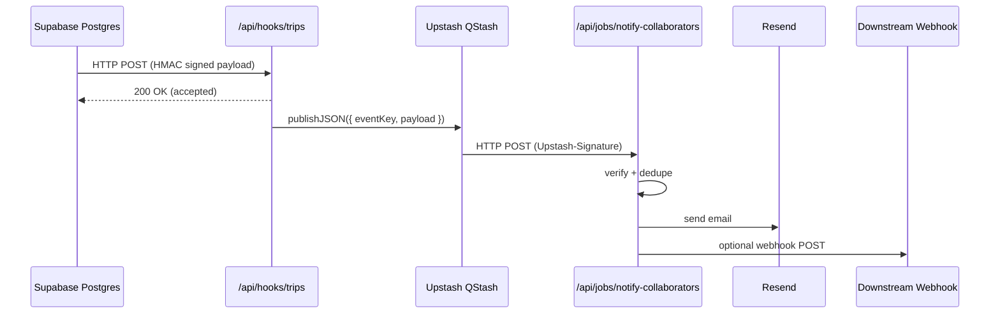

## Consequences

### Positive

- **Durable delivery and retries**: Notification work survives transient outages of the
  worker route or downstream providers.
- **Clear separation of concerns**: `/api/hooks/trips` focuses on validation and acceptance;
  `/api/jobs/notify-collaborators` encapsulates side effects.
- **Leverages existing stack**: Builds on Upstash (ADR-0003) and Resend, with minimal
  custom infrastructure.
- **Observability**: Telemetry spans around enqueue and worker execution make it easier to
  troubleshoot failures.

### Negative

- Adds another Upstash product (QStash) to manage and configure.
- Requires operators to provision QStash credentials and signing keys.

### Neutral

- Development environments can still run without QStash; the `after()` fallback is
  acceptable for local testing but not recommended in production.

## Alternatives Considered

### A. `after()` only (Next.js background work)

Pros:

- No new infrastructure or credentials.
- Very simple to implement.

Cons:

- No durable queue or DLQ.
- Harder to reason about retries, backpressure, and failure handling.
- Increased risk of silently dropped notifications under load.

### B. Dedicated background workers (custom queues)

Pros:

- Full control over job orchestration.

Cons:

- Significant engineering and operational overhead to match QStash features.
- More moving parts for on-call to manage.

## Status and Migration

- This ADR **extends** ADR-0040 and SPEC-0021 by defining the execution model for
  trip collaborator notifications.
- No Supabase Deno functions remain; all notifications flow through Vercel routes
  and QStash.

## Implementation Notes

- Environment:

  - `QSTASH_TOKEN`, `QSTASH_CURRENT_SIGNING_KEY`, `QSTASH_NEXT_SIGNING_KEY` for
    QStash client and signature verification.
  - `RESEND_API_KEY`, `RESEND_FROM_EMAIL`, `RESEND_FROM_NAME` for email.
  - Optional `COLLAB_WEBHOOK_URL` for downstream collaborator webhooks.

- Security:

  - Supabase→Vercel webhooks still use HMAC (`HMAC_SECRET`) as defined in SPEC-0021.
  - QStash→Vercel worker calls are verified via `Upstash-Signature`.
  - No secrets are exposed to the browser.
````

## File: docs/architecture/decisions/adr-0042-supabase-memory-orchestrator.md
````markdown
# ADR-0042: Supabase-Centric Memory Orchestrator

**Version**: 1.0.0  
**Status**: Accepted  
**Date**: 2025-11-18  
**Category**: Frontend Architecture  
**Domain**: AI Memory & Chat Infrastructure  
**Related ADRs**: ADR-0002, ADR-0003, ADR-0023, ADR-0031, ADR-0034, ADR-0039  
**Related Specs**: SPEC-0026

## Context

Recent regressions (see review P1) showed that removing `useChatMemory` hooks broke
all downstream memory sync flows. TripSage’s chat store is currently responsible
for appending UI messages *and* calling memory APIs directly. This coupling makes
it impossible to experiment with alternative providers (Mem0, Upstash Vector,
Supabase pgvector) or to enforce cross-cutting concerns such as PII redaction,
retry semantics, and observability.

We need a single orchestrator that: (1) treats Supabase Postgres/pgvector as the
canonical long-term memory store; (2) optionally enriches retrieval with managed
services like Mem0; (3) leverages Upstash Redis/QStash for async pipelines,
rate-limit guards, and caches; and (4) keeps the Zustand chat store free of
side-effects. This architecture must satisfy AI SDK v6 streaming/tooling flows,
Next.js Cache Components, Supabase SSR auth, and audit/compliance expectations.

## Decision

We will implement a Supabase-centric Memory Orchestrator that exposes intents
(`onTurnCommitted`, `syncSession`, `backfillSession`, `fetchContext`) and routes
them to pluggable adapters:

- **Supabase Adapter (canonical)**: writes chat turns to a `memories` schema,
  persists embeddings via pgvector, enforces Row Level Security, and emits
  telemetry. This adapter is authoritative for replay, analytics, and sharing.
- **Upstash Adapter (queues/caches)**: uses QStash for asynchronous retries and
  Redis/Vector for hot caches or TTL-limited context staging; no user data lives
  here permanently.
- **Mem0 Adapter (optional retrieval)**: enriches context by pushing curated
  turns to Mem0’s AI SDK v6 provider, but never serves as primary storage.

All UI/stateful layers (Zustand, hooks, route handlers) emit intents—not direct
provider calls. Feature flags govern adapter enablement, and all requests flow
through centralized PII filters plus OpenTelemetry spans.

### Vector indexing, retention, and session reuse

- **PII handling in embeddings:** redact PII **before** embedding generation using the existing orchestrator PII filters; embeddings are created from redacted text only. User deletion requests must cascade to `memories.turn_embeddings` (ON DELETE CASCADE) and trigger explicit embedding cleanup. Embedding storage follows GDPR/CCPA: no long-term retention of identifiers inside vectors.
- **Indexes:** Use pgvector **HNSW** for latency-sensitive stores:
  - `accommodation_embeddings.embedding` and `memories.turn_embeddings.embedding`
    with `m=${PGVECTOR_HNSW_M:-32}`, `ef_construction=${PGVECTOR_HNSW_EF_CONSTRUCTION:-180}` (160 acceptable on RAM-tight nodes),
    default `ef_search=${PGVECTOR_HNSW_EF_SEARCH_DEFAULT:-96}`; target range 64–128 based on workload. These defaults balance recall/latency for 1536-d embeddings (OpenAI text-embedding-3-small) under current traffic.
  - Fallback (if write-heavy / memory constrained): IVFFlat with `lists≈500–1000`,
    `probes≈20`; document when chosen.
- **Query functions:** `match_accommodation_embeddings` sets `hnsw.ef_search` from `PGVECTOR_HNSW_EF_SEARCH_DEFAULT` at runtime and accepts an optional `ef_search_override` for per-call tuning; operators can observe recall/latency with EXPLAIN ANALYZE and `pg_stat_user_indexes`.
- **Retention:** `memories.turn_embeddings` cleaned up at **${MEMORIES_RETENTION_DAYS:-180} days** via pg_cron; align embeddings and session records to the same window. Rationale: matches product UX (recent travel context) and privacy expectations; configurable via `MEMORIES_RETENTION_DAYS` for regulatory changes. Deploy the cron job in migrations; monitor via Postgres logs; ship Datadog alerts in issue #520.
- **Session semantics:** reuse the most recent "Travel Plan" chat/memory session **per user** when the planner tool is invoked to reduce fragmentation and improve retrieval accuracy. Session-level locking for concurrent invocations now guards session creation (Redis lock in `src/ai/tools/server/planning.ts`). Users can start a fresh session by clearing memory or opening a new chat thread.

### Implementation status & follow-ups (tracked)

- **Config surface** — Parameterize pgvector/HNSW + retention defaults in migrations (issue [#517](https://github.com/BjornMelin/tripsage-ai/issues/517), owner @BjornMelin, due 2025-12-22).
- **`ef_search_override`** — Wire optional override through `match_accommodation_embeddings` and adapters (issue [#518](https://github.com/BjornMelin/tripsage-ai/issues/518), owner @BjornMelin, due 2025-12-22).
- **Session-level locking** — Implemented via Redis token lock in `src/ai/tools/server/planning.ts`.
- **Monitoring** — Ship alerts for retention cron + HNSW maintenance jobs (issue [#520](https://github.com/BjornMelin/tripsage-ai/issues/520), owner @BjornMelin, due 2025-12-22).

## Consequences

### Positive

- Canonical, queryable memory with Supabase pgvector + RLS.
- Pluggable adapters allow rapid provider experiments without touching UI code.
- Observability & retries centralized (QStash, OTLP), reducing silent failures.
- Compliance improvements: PII redaction + scoped schemas before external calls.

### Negative

- Additional orchestration layer introduces upfront complexity and schema work.
- Requires coordinated migrations (Supabase schema, queue topics, feature flags).
- Mem0 usage remains best-effort; teams must monitor provider quotas separately.

### Neutral

- Local persistence (Zustand + storage) stays for offline UX but no longer
  determines canonical truth; sync lag is acceptable by design.
- Existing AI SDK routes continue to work; orchestrator simply wraps them.

## Alternatives Considered

### Option A – Mem0-Managed Memory

Fastest integration via the Mem0 Vercel AI SDK provider, but it creates a single
vendor dependency lacking relational queries, pgvector analytics, or Supabase
auditing. Lock-in risk and opaque retry semantics led us to reject it.

### Option B – Upstash Redis/Vector + QStash Only

Serverless-friendly and low-op, yet it forces us to encode relational metadata
inside Redis keyspaces and manage TTL churn for every long-term memory. Without
Supabase, we lose SQL-based personalization, RLS, and analytics.

## References

- Mem0 Vercel AI SDK integration guide – <https://docs.mem0.ai/integrations/vercel-ai-sdk?utm_source=openai>  
- Upstash AI SDK/Vector patterns – <https://upstash.com/blog/vercel-ai-sdk?utm_source=openai>  
- Supabase Vector functions & embeddings – <https://supabase.com/modules/vector?utm_source=openai>  
- TripSage ADRs: ADR-0002 (Supabase platform), ADR-0003 (Upstash Redis),
  ADR-0023 (AI SDK v6), ADR-0031 (Chat API), ADR-0039 (Frontend agent modernization).
````

## File: docs/architecture/decisions/adr-0045-flights-dto-frontend-zod.md
````markdown
# ADR-0045: Flights DTOs in Frontend (Next.js 16 + Zod v4)

**Version**: 1.0.0  
**Status**: Accepted  
**Date**: 2025-11-20  
**Category**: Data / Frontend  
**Domain**: Flights DTO (Zod v4)  
**Supersedes**: ADR-0012  
**Related ADRs**: ADR-0013, ADR-0023, ADR-0031, ADR-0032, ADR-0034, ADR-0038, ADR-0039, ADR-0044, ADR-0047  
**Related Specs**: -

## Context

- Zod v4 schemas are centralized under `src/domain/schemas/*`; flights currently lack a dedicated domain schema and rely on agent-specific schemas in `@schemas/agents` plus Supabase row schemas in `domain/schemas/supabase.ts`.
- AI flight tooling lives in `src/ai/tools/server/flights.ts` (Duffel offer search) and generic planning schemas (`src/ai/tools/schemas/planning.ts`), but there is no shared flight domain model or provider mapper.
- ADR-0012 defined Python/FastAPI DTOs; the stack is now Next.js 16 + AI SDK v6. We need a single TS/Zod source of truth that fits existing domain/schema conventions and tool schema locations (`src/ai/tools/schemas/*`).

## Decision

1) **Create flight domain module aligned with existing pattern**
   - Add `src/domain/schemas/flights.ts` with sections:
     - `// ===== CORE SCHEMAS =====` for canonical flight entities (`FlightLocation`, `FlightSlice`, `Passenger`, `FlightOffer`, `Pricing`, `Itinerary`, `CarrierInfo`).
     - `// ===== TOOL INPUT/OUTPUT SCHEMAS =====` for search inputs/normalized results consumed by tools and UI.
   - Keep Supabase table shapes in `domain/schemas/supabase.ts`; reference them from this module when needed (e.g., persistence mappers), but do not duplicate.

2) **Add flight domain logic folder**
   - Create `src/domain/flights/` with:
     - `mappers.ts`: provider → domain normalizers (Duffel now, Expedia Rapid later). Use pure functions returning `FlightOffer`.
     - `service.ts`: thin orchestration for flight search that calls provider clients (Duffel, future providers) and returns domain DTOs.
     - `providers/duffel.ts`: provider-specific call + error mapping to `TOOL_ERROR_CODES`, emitting structured errors and redacted telemetry attributes.
   - Do not introduce a new top-level schema location; all validation stays in `domain/schemas/flights.ts`.

3) **Tool schema alignment**
   - Tools should import flight schemas directly from `@schemas/flights`; no separate tool-schema wrapper is needed.
   - Update `src/ai/tools/server/flights.ts` to use these schemas and `domain/flights/mappers` for normalization instead of returning raw Duffel payloads. Keep guardrails (`cache`, `rateLimit`, `telemetry`) but move error mapping into the provider helper.

4) **Telemetry, caching, and runtime policy**  
   - Telemetry: route all spans through `withTelemetrySpan` (ADR-0046); include attributes `provider`, `workflow=flightSearch`, `hasReturn`, `passengers`, and hashed origin/destination.  
   - Caching: standardize cache key via `canonicalizeParamsForCache` (already used) and keep TTL at 30 minutes.  
   - Runtime: default Node; Edge only if request path avoids Supabase SSR and BYOK (per ADR-0047).

5) **Testing**
   - Add Vitest suites under `src/domain/flights/__tests__/` covering mappers (Duffel happy/edge cases) and schema guards.
   - Extend existing tool tests (`src/ai/tools/server/__tests__/flights*.test.ts`) to assert normalized `FlightOffer` structure and error mapping.

6) **Cleanup**  
   - Remove flight-specific literals from `@schemas/agents` once callers migrate to `@schemas/flights`.  
   - Delete lingering references to ADR-0012 / Python DTOs in docs or comments.

## Consequences

### Positive

- Single Zod v4 source for flight entities and tool IO, consistent with existing domain schema architecture.  
- Provider integrations plug into mappers, enabling multi-provider expansion without touching UI or tools.  
- AI tools return normalized, validated DTOs, improving resilience and UI compatibility.  
- Clear telemetry/runtime policy alignment improves observability and security.

### Negative

- Refactors needed in tooling/tests and any legacy callers of `@schemas/agents` flight shapes.  
- Additional mapper layer adds a small amount of code surface.

### Neutral

- Supabase table schemas remain separate; persistence logic unaffected.

## Alternatives Considered

### Keep legacy ADR-0012 (Python DTOs)

Rejected: misaligned with frontend-only stack; perpetuates drift and dual maintenance.

### Duplicate tool-specific schemas (status quo)

Rejected: increases divergence risk and maintenance overhead; breaks DRY/KISS goals.

## References

- Zod v4 migration guide (strictObject/extend recommendations)  
- docs/development/standards.md (Zod schemas)  
- ADR-0013 (Next.js 16), ADR-0023 (AI SDK v6), ADR-0032 (rate limiting), ADR-0046 (telemetry), ADR-0047 (runtime policy)
````

## File: docs/architecture/decisions/adr-0046-otel-tracing-frontend.md
````markdown
# ADR-0046: OTEL Tracing for Next.js 16 Route Handlers

**Version**: 1.0.0  
**Status**: Proposed  
**Date**: 2025-11-20  
**Category**: Observability  
**Domain**: Tracing / Telemetry  
**Related ADRs**: ADR-0031, ADR-0032, ADR-0040, ADR-0041  
**Related Specs**: -

## Context

- OTEL dependencies are present (`@opentelemetry/api`, `@vercel/otel`), but no ADR defines route tracing standards.
- Project rule: server code must use `withTelemetrySpan()`/`withTelemetrySpanSync()` from `@/lib/telemetry/span` (server-only) and `createServerLogger()` from `@/lib/telemetry/logger`; `console.*` is discouraged.
- We need consistent span attributes for AI SDK routes, Supabase SSR, and Upstash/QStash calls.
- Client components use `@/lib/telemetry/client` for client-side OTEL Web initialization and no-op helpers that match the server API surface.

## Decision

- All Next.js route handlers and server utilities must wrap business logic in `withTelemetrySpan` (`withTelemetrySpanSync` for sync).  
- Standard span attributes: `svc: "frontend"`, `route`, `operation`, `provider`, `model`, `tool`, `user_tier`, `cache_hit`, `ratelimit_bucket`.
- Emit structured logs via `createServerLogger()` within spans; prohibit bare `console.*` outside client components/tests.
- Instrument external calls (Supabase, Upstash, QStash, AI Gateway) using OTEL context propagation; attach `traceparent` when supported.
- Sampling: default parent-based; allow per-route overrides for high-traffic endpoints (`ai.stream`, `chat.stream`) via config file in `src/lib/telemetry/config.ts`.

## Consequences

### Positive

- Uniform tracing across AI routes and infra calls; easier debugging and SLO tracking.  
- Standard span attributes and logging improve correlation and incident response.  
- Encourages consistent telemetry hygiene (no stray console logs).

### Negative

- Minor performance overhead from spans and logging; mitigated by sampling.  
- Requires code changes across existing handlers/tests to adopt wrappers.

### Neutral

- Does not change business logic; observational concern only.

## Alternatives Considered

### Ad-hoc per-route tracing

Rejected: leads to inconsistent attributes and gaps; higher ops burden.

### Rely solely on platform defaults (no custom spans)

Rejected: insufficient visibility into AI/tool calls, cache/ratelimit interactions.

## References

- OpenTelemetry API docs  
- Vercel OTEL runtime guidance  
- ADR-0031 (AI API), ADR-0032 (rate limiting), ADR-0040/0041 (webhooks)
````

## File: docs/architecture/decisions/adr-0047-runtime-policy-edge-vs-node.md
````markdown
# ADR-0047: Runtime Policy for AI SDK Routes (Edge vs Node)

**Version**: 1.0.0  
**Status**: Proposed  
**Date**: 2025-11-20  
**Category**: Architecture / Runtime  
**Domain**: Deployment Targets  
**Related ADRs**: ADR-0013, ADR-0023, ADR-0031, ADR-0032, ADR-0040, ADR-0044  
**Related Specs**: -

## Context

- Next.js 16 supports Edge and Node runtimes; the project uses Supabase SSR, Upstash, and AI Gateway.  
- Secrets (Supabase, Upstash, AI providers) must remain server-side; some SDKs are not Edge-safe.  
- No current ADR defines when to choose Edge vs Node for AI routes.

## Decision

- **Default**: Node runtime for AI SDK routes to retain `fetch` compat, Supabase SSR cookie handling, and OTEL exporters.  
- **Edge allowed** when ALL are true: no Supabase SSR client use; only HTTP-only Upstash clients; no BYOK keys; payload < 1MB; no Node-only deps.  
- `withApiGuards` remains mandatory; add comment `// ADR-0047: node|edge rationale` in handlers choosing Edge.  
- Use AI Gateway for Edge routes; BYOK registry is Node-only.  
- Rate limiting (ADR-0032) must be initialized per-request inside handler, not module scope; Edge-friendly Upstash clients permitted under the above constraints.  
- Do not mix runtimes within a single feature; choose per route and document.

## Consequences

### Positive

- Clear, auditable runtime choices; minimizes accidental secret exposure on Edge.  
- Aligns runtime selection with Supabase/Upstash compat and telemetry requirements.

### Negative

- Some endpoints remain on Node and miss potential Edge latency benefits.  
- Additional test matrix needed for Edge routes.

### Neutral

- No impact on API contracts; deployment targeting only.

## Alternatives Considered

### Allow per-developer discretion without policy

Rejected: high risk of secret leakage and runtime incompatibilities.

### Edge-first default with opt-out

Rejected: conflicts with Supabase SSR, BYOK, and telemetry exporters; higher risk than benefit today.

## References

- Next.js 16 runtime docs  
- Supabase SSR guidance  
- ADR-0023 (AI SDK v6), ADR-0032 (rate limiting), ADR-0046 (telemetry)
````

## File: docs/architecture/decisions/adr-0050-amadeus-google-places-stripe-hybrid.md
````markdown
# ADR-0050: Replace Expedia Rapid with Amadeus + Google Places + Stripe

**Version**: 1.0.0  
**Status**: Accepted  
**Date**: 2025-11-20  
**Category**: Architecture  
**Domain**: Travel Supply Integrations  
**Related ADRs**: ADR-0020, ADR-0024, ADR-0026, ADR-0031, ADR-0036, ADR-0039, ADR-0042  
**Related Specs**: SPEC-0027, SPEC-001, SPEC-0010, SPEC-0015  
**Supersedes**: ADR-0043, ADR-0049

- Any Expedia Rapid–focused ADRs under `docs/architecture/decisions/` (e.g. `adr-00N-expedia-rapid-hotel-provider.md`)  
- Any Expedia Rapid–focused specs under `docs/specs/` (e.g. `expedia-rapid-accommodations.md`)

## 1. Supersession Instructions

1. Locate existing Expedia Rapid ADRs and specs:

   - `docs/architecture/decisions/adr-00N-expedia-rapid-*.md`
   - `docs/specs/expedia-rapid-*.md`
   - Any other Expedia Rapid–specific docs referenced from the README or `docs/`

2. At the top of each Expedia-specific ADR/spec:
   - Change `Status:` to `Superseded`.
   - Add a line:  
     `Superseded by: ADR-00X-amadeus-google-places-stripe-hybrid.md`

3. Update navigation / index docs (if present) to:
   - Remove Expedia as “current provider”.
   - Point “Accommodations provider” to ADR-00X and the new spec:
     `docs/specs/0027-spec-accommodations-amadeus-google-stripe.md`.

## 2. Context

**Existing implementation:**

- **Core domain:** `src/domain/accommodations/*`
  - **Service orchestrator and caching:**
    `src/domain/accommodations/service.ts`
  - **Provider container:**
    `src/domain/accommodations/container.ts` (hard-wired to `ExpediaProviderAdapter`)
  - **Provider adapter:**
    `src/domain/accommodations/providers/expedia-adapter.ts` (wrapping `@domain/expedia/client`)
  - **Booking orchestration with Stripe:**
    `src/domain/accommodations/booking-orchestrator.ts`

- **Expedia-specific domain & schemas:**
  - **Rapid client, types, utils:**
    `src/domain/expedia/*`
  - **Zod schemas for Rapid:**
    `src/domain/schemas/expedia.ts` (imported as `@schemas/expedia`)

- **Accommodations schemas** (provider-agnostic surface but Expedia-shaped):
  `src/domain/schemas/accommodations.ts` (and sometimes aliased as `@schemas/accommodations`)  

**AI tools:**

- **Search, details, checkAvailability, book:**
  `src/ai/tools/server/accommodations.ts` (search, details, checkAvailability, book; all described as "via Expedia Partner Solutions" and using `normalizePhoneForRapid`, `splitGuestName`, `extractTokenFromHref`)

**Agent orchestration:**
  `src/lib/agents/accommodation-agent.ts` (AI SDK v6 `streamText`, tools: `searchAccommodations`, `getAccommodationDetails`, `checkAvailability`, `bookAccommodation`)

**UI:**

- **Search pages:**
    `src/app/(dashboard)/trips/[tripId]/stay/page.tsx` and `src/app/(marketing)/stays/page.tsx` (hero, forms, but results placeholder commented out)
- **Cards and lists:**
    `src/components/features/search/cards/accommodation-card.tsx` and related hotel UI.

**Infrastructure:**

- **Upstash Redis client / caching:** `src/lib/redis.ts`, `src/lib/cache/upstash.ts`
- **Upstash Ratelimit:** `@upstash/ratelimit` used in `accommodations/container.ts` and AI tools.
- **Supabase booking persistence:** in `runBookingOrchestrator` via `bookings` table.
- **Stripe payment orchestration:** `src/lib/payments/booking-payment.ts` (called from `bookAccommodation`).  

**Problems with Expedia Rapid:**

- Partner-only, commercial API: you must apply, be approved, then obtain credentials; sandbox access is gated behind partner approval.:contentReference[oaicite:15]{index=15}  
- Approval requires business justification, certification, and integration with their portal; not ideal for an indie / self-service app.:contentReference[oaicite:16]{index=16}  

**Requirements:**

- Remove the dependency on Expedia Rapid across code and docs.
- Introduce a hybrid architecture:
  - Amadeus Self-Service APIs for hotel offers and bookings.:contentReference[oaicite:17]{index=17}  
  - Google Places API (“Google Hotels layer”) for discovery, photos, ratings, and rich context.:contentReference[oaicite:18]{index=18}  
  - Existing Stripe PaymentIntents for payments.:contentReference[oaicite:19]{index=19}  

- Preserve:
  - AI tool surface (`searchAccommodations`, `getAccommodationDetails`, `checkAvailability`, `bookAccommodation`).
  - Accommodations agent interface (`runAccommodationAgent`).
  - Booking persistence semantics and Supabase schema.
  - Guardrails: Upstash cache, rate limiting, telemetry, approvals.

## 3. Options & Decision Framework

### 3.1 Provider choice for accommodations

**Options:**

1. Hybrid: Amadeus (offers + bookings) + Google Places (discovery + enrichment).
2. Amadeus only.
3. Google Places only (no transactional provider).
4. Continue with Expedia.

**Scoring rubric (1–10):**

- Solution Leverage (SL) – 35%  
- Application Value (AV) – 30%  
- Maintenance & Cognitive Load (MCL) – 25%  
- Architectural Adaptability (AA) – 10%

| Option | SL | AV | MCL | AA | Weighted Total |
|--------|----|----|-----|----|----------------|
| Amadeus + Google Places (Hybrid) | 9 | 9 | 8 | 8 | 8.65 |
| Amadeus only | 8 | 8 | 8 | 8 | 8.00 |
| Google Places only | 6 | 5 | 8 | 7 | 6.30 |
| Keep Expedia Rapid | 7 | 7 | 4 | 6 | 6.15 |

**Rationale:**

- Hybrid scores highest:  
  - Amadeus covers hotel offers, availability, and bookings via self-service APIs with free monthly quota and straightforward pricing.:contentReference[oaicite:20]{index=20}  
  - Google Places provides high-quality POI, photos, and ratings but no direct booking/pricing, so combining both delivers the best UX.:contentReference[oaicite:21]{index=21}  
  - Expedia remains partner-gated and slows iteration.:contentReference[oaicite:22]{index=22}  

**Decision:** Adopt hybrid Amadeus + Google Places for accommodations, fully deprecating Expedia Rapid.

### 3.2 Amadeus client implementation

**Options:**

1. Official Amadeus Node SDK (`amadeus` on npm).:contentReference[oaicite:23]{index=23}  
2. Custom HTTP client (`fetch` + Zod), modeled after existing Expedia client.

| Option    | SL | AV | MCL | AA | Weighted Total |
|-----------|----|----|-----|----|----------------|
| Node SDK  |  9 |  8 |   9 |  7 | 8.50           |
| Custom    |  7 |  8 |   6 |  8 | 7.15           |

**Rationale:**

- Node SDK takes care of auth, endpoints, and retries; reduces custom HTTP plumbing and keeps us aligned with Amadeus documentation and examples.:contentReference[oaicite:24]{index=24}  
- We can still wrap SDK calls in domain adapters for telemetry and error normalization, preserving existing patterns in `ExpediaProviderAdapter`.  

**Decision:** Use official Amadeus Node SDK behind an `AmadeusProviderAdapter` wrapper.

## 4. Decision

- Replace Expedia Rapid with:
  - Amadeus Self-Service Hotel APIs for:
    - Hotel list / offers search (`/v1/reference-data/locations/hotels` and `/v3/shopping/hotel-offers`).:contentReference[oaicite:26]{index=26}  
    - Hotel booking (`/v1/booking/hotel-bookings`).:contentReference[oaicite:27]{index=27}  
  - Google Places API (New) for:
    - Place autocomplete, text search, details, photos and ratings for hotels (`type=lodging`).:contentReference[oaicite:28]{index=28}  
  - Stripe PaymentIntents for charge/authorization, as already used in `booking-payment.ts`.:contentReference[oaicite:29]{index=29}  

- Maintain the existing public surface:
  - AI tools in `src/ai/tools/server/accommodations.ts`.
  - Schemas in `src/domain/schemas/accommodations.ts`.
  - Agent API in `src/lib/agents/accommodation-agent.ts`.

- Adapt the domain so that:
  - `AccommodationsService` talks to a new `AmadeusProviderAdapter` implementing `AccommodationProviderAdapter`.
  - Booking orchestration (`runBookingOrchestrator`) is generalized to provider-agnostic result payloads; Expedia-specific fields move into the adapter layer.

- Remove all runtime dependencies on:
  - `src/domain/expedia/*`
  - `@schemas/expedia`
  - Any `Expedia*` env vars.

## 5. Consequences

**Positive:**

- Immediate unblocking: Amadeus self-service can be used without partner contracts, with a free quota and pay-as-you-go pricing beyond that.:contentReference[oaicite:32]{index=32}  
- Better UX: Google Places data (photos, ratings, reviews) + Amadeus real-time offers and booking yields richer cards and more compelling hotel selection flows.:contentReference[oaicite:33]{index=33}  
- Cleaner layering: provider-specific types and quirks remain in adapters; schemas and agents stay provider-agnostic.

**Negative/Risks:**

- Dual-provider quotas and keys must be managed (Amadeus + Google Places).
- Booking semantics differ slightly between Expedia and Amadeus (e.g., booking identifiers, cancellation policies); requires mapping to our normalized `AccommodationBookingResult`.:contentReference[oaicite:34]{index=34}  

**Mitigations:**

- Centralize provider selection in `accommodations/container.ts`.
- Add Quota/usage telemetry fields (e.g. `amadeus.api.calls`, `places.api.calls`) using existing OpenTelemetry helpers.  

## 6. Implementation Summary

**Implementation is described in detail in:**

- `docs/specs/archive/0027-spec-accommodations-amadeus-google-stripe.md`

**That spec defines:**

- File-level changes (add/modify/remove).
- AI tool wiring.
- UI composition using shadcn/ui and Next.js app router best practices.:contentReference[oaicite:36]{index=36}  
- Tests and telemetry coverage.

## 7. Post-acceptance Updates (2025-11-24)

- **Provider timeouts:** Amadeus adapter now enforces an 8s per-attempt timeout with retry/backoff; timeouts surface as `provider_timeout` (HTTP 408) for telemetry and retry classification.
- **Deterministic session propagation:** Service-to-provider context now normalizes `sessionId` from the caller or `userId`, preventing regenerated session identifiers and keeping availability/booking caches correlated.
- **Outstanding review items closed:** The above changes resolve the remaining action items tracked in the 2025-11-19 accommodations review; ADR-0043 remains superseded by this ADR.
````

## File: docs/architecture/decisions/adr-0051-agent-router-workflows.md
````markdown
# ADR-0051: TripSage Agent Router and Workflow HTTP API

Status: Accepted  
Date: 2025-11-21
Category: Architecture
Domain: AI Orchestration / Frontend
Related ADRs: ADR-0031, ADR-0036, ADR-0038, ADR-0042
Related Specs: SPEC-0028

## Context

TripSage is migrating to a 2025 architecture based on:

- Next.js 16 App Router and Server Components:
  - <https://nextjs.org/docs>
  - <https://nextjs.org/docs/app>
  - Caching and cache components:
    - <https://nextjs.org/docs/app/guides/caching>
    - <https://nextjs.org/docs/app/getting-started/cache-components>
- Vercel AI SDK v6 for AI workflows, streaming, and tool calling:
  - Docs: <https://ai-sdk.dev/docs/introduction>
  - v6 announcement: <https://ai-sdk.dev/docs/announcing-ai-sdk-6-beta>
  - Vercel docs entry: <https://vercel.com/docs/ai-sdk>
- Supabase JS + SSR auth:
  - SSR overview: <https://supabase.com/docs/guides/auth/server-side>
  - `@supabase/ssr` client creation: <https://supabase.com/docs/guides/auth/server-side/creating-a-client>
  - Migration from auth helpers: <https://supabase.com/docs/guides/auth/server-side/migrating-to-ssr-from-auth-helpers>
- Upstash Redis and Ratelimit:
  - HTTP client: <https://upstash.com/docs/redis/howto/connectwithupstashredis>
  - TS Ratelimit SDK: <https://upstash.com/docs/redis/sdks/ratelimit-ts/gettingstarted>
  - Deployment and `Redis.fromEnv()`: <https://upstash.com/docs/redis/sdks/ts/deployment>
- Zod v4 schemas as single source of truth:
  - Intro: <https://zod.dev/>
  - v4 release notes: <https://zod.dev/v4>
- Observability via OpenTelemetry and Vercel OTEL:
  - OTEL overview: <https://opentelemetry.io/docs/>
  - Vercel OTEL overview: <https://vercel.com/docs/observability/otel-overview>
  - Instrumentation guide: <https://vercel.com/docs/tracing/instrumentation>

`AGENTS.md` defines global rules for AI-related code in this repo, including:

- Canonical use of AI SDK v6 in server-first patterns.
- Supabase SSR-only auth access in server contexts.
- Upstash rate limiting and caching as the default guardrail stack.
- Zod v4 as the only allowed validation layer for API contracts.

TripSage needs a consistent, HTTP-based agent router and workflow API that:

- Classifies user messages into workflow types (e.g., `destinationResearch`, `flightSearch`, `itineraryPlanning`, `accommodationSearch`, `budgetPlanning`, `memoryUpdate`).
- Exposes separate, guardrailed route handlers per workflow under `/api/agents/*`.
- Uses shared Zod schemas from `src/domain/schemas/agents.ts`.
- Applies centralized auth, rate limiting, and telemetry via `withApiGuards`.
- Streams AI responses using AI SDK v6 primitives in route handlers.

Historically, classification logic and per-agent flows risk drifting across components, client hooks, and route handlers. This ADR standardizes a single HTTP API shape and associated architecture.

## Decision

We will:

1. **Standardize agent workflows and types**

   - Use `AgentWorkflowKind` and associated Zod schemas from
     `src/domain/schemas/agents.ts` as the canonical source.
   - Supported workflows:
     - `destinationResearch`
     - `itineraryPlanning`
     - `flightSearch`
     - `accommodationSearch`
     - `budgetPlanning`
     - `memoryUpdate`
     - `router` (classification only)

2. **Introduce a dedicated router HTTP endpoint**

   - Route: `POST /api/agents/router` implemented in
     `src/app/api/agents/router/route.ts`.
   - Uses AI SDK v6 `generateObject` and a Zod schema (`routerClassificationSchema`)
     to classify the latest user message into one of the supported workflows with
     confidence and reasoning.
   - Uses `withApiGuards({ auth: true, rateLimit: "agents:router", telemetry: "agent.router" })`.
   - Uses `@supabase/ssr`-backed auth to resolve the current user where necessary.
   - Uses `resolveProvider` from `@ai/models/registry` to select the model provider
     (Vercel AI Gateway or BYOK) server-side.

3. **Expose one route per workflow with consistent guardrails**

   - Route handlers (all under `src/app/api/agents/**/route.ts`):
     - `POST /api/agents/destinations` → destination research agent
     - `POST /api/agents/flights` → flight agent
     - `POST /api/agents/accommodations` → accommodations agent
     - `POST /api/agents/itineraries` → itinerary agent
     - `POST /api/agents/budget` → budget agent
     - `POST /api/agents/memory` → memory agent
   - Each handler:
     - Imports `"server-only"`.
     - Uses `withApiGuards` with an `agents:*` route key and telemetry name
       (e.g., `agent.destinationResearch`, `agent.flightSearch`).
     - Parses input via the appropriate Zod schema from `agentSchemas`.
     - Resolves provider via `resolveProvider`.
     - Invokes a dedicated agent function (e.g., `runDestinationAgent`) that uses
       AI SDK v6 `streamText`/`streamObject` and returns
       `result.toUIMessageStreamResponse({ onError })`.

4. **Centralize rate limiting and reuse configuration**

   - Route-level limits stored in `src/lib/ratelimit/routes.ts` and
     accessed by `withApiGuards`:
     - `agents:router`: higher limit (classification-only).
     - `agents:*` workflows: more conservative limits.
   - Tool-level limits per workflow stored in
     `src/lib/ratelimit/config.ts` using `AgentWorkflowKind`.
   - Implementation uses Upstash Redis HTTP client:
     - <https://upstash.com/docs/redis/howto/connectwithupstashredis>
   - Ratelimit implementation uses `@upstash/ratelimit`:
     - <https://upstash.com/docs/redis/sdks/ratelimit-ts/gettingstarted>

5. **Align all schemas on Zod v4**

   - All agent-related request/response contracts live in
     `src/domain/schemas/agents.ts` using Zod v4.
   - Route handlers import from `@schemas/agents`.
   - Client components and stores (e.g., agent monitoring dashboards) reuse the
     same schemas for validation.

6. **Use OTEL-based telemetry and logging**

   - Telemetry for all `/api/agents/*` routes must be integrated with OTEL
     traces via `@vercel/otel`:
     - <https://vercel.com/docs/observability/otel-overview>
     - <https://vercel.com/docs/tracing/instrumentation>
   - No `console.log` or ad-hoc logging in route handlers; use OTEL spans and
     attributes for tracing agent runs, model IDs, and workflow outcomes.

## Options Considered

- **Option A – Keep agent logic embedded in chat routes and client hooks**
  - **Pros:**
    - Minimal refactor.
    - Fewer endpoints to manage.
  - **Cons:**
    - Harder to enforce consistent auth, rate limiting, and telemetry.
    - Client hooks risk coupling transport with agent orchestration.
    - Difficult to reuse workflows from non-chat surfaces (e.g., dashboards,
      batch jobs).

- **Option B – Implement a single monolithic `/api/agents` endpoint with a `type` field**
  - **Pros:**
    - Fewer HTTP endpoints.
    - Slightly simpler routing table.
  - **Cons:**
    - Complex, branching handler logic.
    - Rate limiting cannot be tuned per workflow.
    - Harder to enforce per-workflow telemetry and caching policies.

- **Option C – Dedicated router and per-workflow endpoints (chosen)**
  - **Pros:**
    - Clean separation of concerns: routing vs workflow execution.
    - Strong fit with `AgentWorkflowKind` and shared schemas.
    - Per-route rate limiting, telemetry, and PPR/caching.
    - Works well with AI SDK v6 patterns and AGENTS.md rules.
  - **Cons:**
    - More route files to maintain.
    - Requires coordinated changes in client `useChat` transport and monitoring
      components.

## Consequences

### Positive

- Clear, documented, and testable HTTP boundaries for all AI agents.
- Unified Zod v4 schemas across server and client.
- Shared guardrails (auth, rate limiting, telemetry) via `withApiGuards`.
- Extensible pattern for adding new workflows (e.g., `calendarPlanning`).
- Aligns with Next.js and AI SDK v6 best practices and AGENTS.md.

### Negative / Risks

- More routes and agent functions to keep in sync.
- Requires careful rate-limit tuning to avoid degrading UX.
- Classification errors in `/api/agents/router` can route messages to suboptimal
  workflows; mitigation via confidence thresholds and fallbacks is required.
- OTEL tracing adds complexity to configuration and local dev.

## References

- AGENTS contract: `AGENTS.md` at repo root.
- Next.js docs:
  - <https://nextjs.org/docs>
  - <https://nextjs.org/docs/app>
  - <https://nextjs.org/docs/app/guides/caching>
  - <https://nextjs.org/docs/app/getting-started/cache-components>
- AI SDK / Vercel AI:
  - <https://ai-sdk.dev/docs/introduction>
  - <https://ai-sdk.dev/docs/announcing-ai-sdk-6-beta>
  - <https://vercel.com/docs/ai-sdk>
- Supabase SSR:
  - <https://supabase.com/docs/guides/auth/server-side>
  - <https://supabase.com/docs/guides/auth/server-side/creating-a-client>
  - <https://supabase.com/docs/guides/auth/server-side/migrating-to-ssr-from-auth-helpers>
- Upstash Redis and Ratelimit:
  - <https://upstash.com/docs/redis/howto/connectwithupstashredis>
  - <https://upstash.com/docs/redis/sdks/ratelimit-ts/gettingstarted>
  - <https://upstash.com/docs/redis/sdks/ts/deployment>
- Zod:
  - <https://zod.dev/>
  - <https://zod.dev/v4>
- OpenTelemetry and Vercel OTEL:
  - <https://opentelemetry.io/docs/>
  - <https://vercel.com/docs/observability/otel-overview>
  - <https://vercel.com/docs/tracing/instrumentation>
- Testing (for future implementation work):
  - Vitest: <https://vitest.dev/guide/>
  - React Testing Library: <https://testing-library.com/docs/react-testing-library/intro/>
  - MSW: <https://mswjs.io/docs/>
````

## File: docs/architecture/decisions/adr-0052-agent-configuration-backend.md
````markdown
# ADR-0052: Agent Configuration Backend with Supabase & Versioning

**Status**: Accepted  
**Date**: 2025-11-21
**Category**: Architecture
**Domain**: AI Orchestration / Frontend
**Related ADRs**: ADR-0051
**Related Specs**: SPEC-0029

## Context

TripSage uses multiple AI agents (budget, destinations, flights, itineraries,
accommodations, memory) implemented with AI SDK v6 and domain-specific tools.
Today, configuration for these agents (model selection, temperature, tool
tuning, safety toggles) is scattered in code and partially duplicated in the
UI.

We already have:

- Canonical Zod schemas for agent configuration requests and records in
  `src/domain/schemas/configuration.ts`.
- An admin UI (`AgentConfigurationManager`) that allows choosing an agent,
  editing configuration fields, and showing basic metrics.
- A robust Supabase SSR client (`createServerSupabase`) and route guards
  (`withApiGuards`) used for other authenticated APIs.
- Upstash Redis helpers for JSON caching and cache tag versioning.

However:

- There is **no backend API** for reading/writing agent configuration; the UI
  calls `/api/config/agents/...` endpoints that do not exist.
- Configuration is not a first-class persisted concept: there are no Supabase
  tables for agent configuration or its version history.
- Agent runners (e.g., `runBudgetAgent`, `runDestinationAgent`) use parameters
  embedded directly in code and do not consult a central configuration source.

We need a single, consistent configuration backend that:

- Stores per-agent configuration with versioning and auditability.
- Exposes authenticated APIs for read/update/list/rollback.
- Integrates with Upstash for caching and with our observability stack.
- Is consumed by all agent runners when building `streamText` calls.

## Decision

Implement a **Supabase-backed agent configuration service** with:

1. **Data model:**

   - `agent_config` table storing the current active configuration per
     `(agent_type, scope)` (scope: global, environment, or tenant/user).
   - `agent_config_versions` table storing an append-only version log, including
     diffable payload, created_by, created_at, and optional description.
   - Config payloads are validated with `configurationAgentConfigSchema` at
     write time and stored as JSONB.
   - Both tables must have RLS policies enforcing admin-only or
     service-role-only read/write access to ensure database-level protections
     in addition to application guards.

2. **API surface (`src/app/api/config/agents/**`):**

   - `GET /api/config/agents/:agentType` → returns the effective active config
     using hierarchical scope resolution (global → tenant → user). API accepts an
     explicit `scope` (and identifier where applicable); resolvers attempt the
     requested scope, fall back to the next broader level when not found, and
     return a clear not-found error if nothing exists. Authorization is enforced
     per scope (tenant/user isolation) before returning configs.
   - `PUT /api/config/agents/:agentType` → validates request body against
     `agentConfigRequestSchema`, writes a new version record, and updates the
     active config, wrapped in a Supabase transaction.
   - `GET /api/config/agents/:agentType/versions` → lists recent versions with
     metadata (id, created_at, created_by, summary).
   - `POST /api/config/agents/:agentType/rollback/:versionId` → clones a
     previous version as a new head version.

   All handlers:

   - Use `withApiGuards({ auth: true, telemetry: "...", rateLimit: ... })`
     for auth, rate limiting, and tracing.
   - Use `createServerSupabase` for DB access per Supabase SSR guidelines.
   - Validate and parse JSON via `parseJsonBody` and `validateSchema`.

3. **Caching & invalidation:**

   - Agent configs are cached in Upstash Redis using `getCachedJson` /
     `setCachedJson` with a key prefix such as
     `agent-config:{agentType}:{scope}`.
   - After a successful config update or rollback, we bump a cache tag
     `configuration` using `bumpTag("configuration")` to invalidate dependent
     caches.

4. **Agent runtime integration:**

   - Introduce `@/lib/agents/config-resolver` with a function  
     `resolveAgentConfig(agentType, { userId? })` that:
     - Reads from Upstash cache (with fallback to Supabase).
     - Applies defaults as defined in `configurationAgentConfigSchema`.
   - Update agent runners (budget, destination, accommodations, itinerary,
     flights) to call `resolveAgentConfig` and apply the resolved config
     when constructing `streamText` call options (model, temperature, tools,
     max tokens).

5. **Admin UI wiring:**
   - Refactor `AgentConfigurationManager` to:
     - Use a typed client calling the new APIs.
     - Use types derived from `configurationAgentConfigSchema` instead of an
       ad‑hoc `AgentConfig` interface.
     - Display version history and expose rollback via the new endpoints.

## Options Considered

- **Option A – Supabase tables + Next.js API routes + Upstash cache (chosen)**

  - **Pros:**
    - Leverages existing Supabase SSR integration, RLS, and observability.
    - Fits existing route handler + `withApiGuards` pattern.
    - Enables versioning, rollback, and future scope extensions.
    - Uses existing Upstash JSON cache and cache tag tools.
  - **Cons:**
    - Requires DB migrations and new server code; more moving parts.

- **Option B – Store configuration only in environment variables or Vercel KV**

  - **Pros:**
    - Simple for global, static configuration.
  - **Cons:**
    - No per‑environment/per‑user scope; no version history or auditability.
    - Harder to manage via UI; updates require redeploys.
    - Inconsistent with current Supabase‑centric data model.

- **Option C – Keep configuration purely in code (constants, prompts)**
  - **Pros:**
    - No new infrastructure; low initial implementation cost.
  - **Cons:**
    - No dynamic updates or experimentation; code deploys required for every change.
    - No UI integration, audit trail, or safe rollback.
    - Already causing duplication and drift between UI and agent code.

## Consequences

- **Positive:**

  - Central, type‑safe source of truth for agent configuration with clear UI.
  - Consistent behavior of agents across routes and features.
  - Easier experimentation (e.g., try new model for budget agent) with version
    history and rollback.
  - Config caching reduces repeated DB reads while still supporting invalidation
    via cache tags.

- **Negative / Risks:**
  - Incorrect RLS or auth configuration could expose or allow modification of
    agent configs to non‑admin users.
  - Misconfigured cache invalidation could lead to stale configs in agents until
    TTL expiry.
  - Cache invalidation edge cases (prescriptive handling):
    - If `bumpTag("configuration")` fails (e.g., Redis unavailable), retry up to
      3 times with a short backoff; on final failure, emit an operational alert
      and continue serving the last cached config (stale) while marking the
      response as degraded (do not fail the user‑visible request after a
      successful DB write).
    - Concurrency window: Supabase writes may be readable before the tag bump is
      observed. Mitigation: perform the tag bump in the same transaction when
      possible; otherwise include the version/etag in cached payloads and have
      readers revalidate once (short backoff) when a newer version/etag is
      detected.
    - Maximum acceptable staleness: 5 minutes. Monitor/alert on tag bump errors
      and on cache age >5 minutes so operators can intervene (e.g., manual tag
      bump or cache flush).
  - Schemas for configuration need to evolve carefully; breaking changes may
    require migration logic between versions. Mitigation: preserve backward
    compatibility or ship a compatibility layer (version/etag on payloads), and
    add migration tooling (schema version metadata, automated migration scripts,
    CI validation tests) to block breaking changes without an explicit migration
    path.

## References

- `src/domain/schemas/configuration.ts` (agent configuration schemas).
- `src/components/features/agents/configuration-manager.tsx`
  (current admin UI).
- `src/lib/supabase/server.ts`, `src/lib/supabase/factory.ts` (SSR
  Supabase client).
- `src/lib/cache/upstash.ts`, `src/lib/cache/tags.ts` (Upstash
  JSON cache + cache tags).
- `src/app/api/agents/*.ts` (agent route handlers using AI SDK v6).
- `docs/specs/archive/0029-spec-agent-configuration-backend.md` (SPEC-0029 agent configuration backend).
````

## File: docs/architecture/decisions/adr-0053-activity-search-google-places-integration.md
````markdown
# ADR-0053: Activity Search & Booking via Google Places API Integration

**Version**: 1.0.0
**Status**: Accepted
**Date**: 2025-01-15
**Implementation Date**: 2025-11-24
**Category**: Architecture
**Domain**: Travel Supply Integrations
**Related ADRs**: ADR-0050 (Amadeus + Google Places), ADR-0044 (Tool Registry), ADR-0029 (DI Route Handlers)
**Related Specs**: SPEC-0030 (Activity Search & Booking)

## Context

TripSage AI currently has an incomplete activity search feature:

- UI components exist (`/search/activities` page, `forms/activity-search-form`, `cards/activity-card`)
- Zod schemas defined (`@schemas/search.ts`: `activitySchema`, `activitySearchParamsSchema`)
- Database table exists (`search_activities` for durable search caching)
- Hook placeholder exists (`useActivitySearch` with TODOs)
- **Missing**: Backend API routes, AI SDK v6 tools, service layer, Google Places integration

The accommodations feature (ADR-0050) uses Amadeus + Google Places for hotel search. Activities require a different approach:

- No single booking API like Amadeus for activities
- Google Places API (New) provides POI discovery, details, photos, ratings
- Booking integration can be deferred or handled via external links initially

## Decision

We will implement activity search and (future) booking using a **hybrid provider model**:

1. **Google Places API (New)** as the **primary deterministic provider**  
   - Use HTTP `places:searchText` + Place Details with **field masks** to limit cost and data surface.
   - Only request Essentials-tier fields needed for the TripSage `Activity` schema (id, displayName, location, types, rating, userRatingCount, photos metadata, price level).
   - Reuse existing `postPlacesSearch` and geocoding helpers (`src/lib/google/places-geocoding.ts`, `src/lib/google/client.ts`, `src/lib/google/places-utils.ts`).

2. **Hybrid architecture with guarded AI/web fallback (Option B)**
   - When Google Places returns `ZERO_RESULTS`, errors, or clearly insufficient coverage for the query, call the existing `web_search` AI tool (`src/ai/tools/server/web-search.ts`) via AI SDK v6.  
   - Fallback is **advisory only**: results are clearly labeled as `ai_fallback` in response metadata and are not used for in‑app booking; they serve as inspiration and long‑tail coverage.  
   - The hybrid design (deterministic primary + AI fallback) is the selected option after applying the decision framework with a weighted score **≥ 9.0/10.0**.

3. **AI SDK v6 Tools** for activities
   - New tools in `src/ai/tools/server/activities.ts`:
     - `searchActivities` - wraps the activities service search (Places + cache + optional AI fallback).
     - `getActivityDetails` - wraps Place Details for a given Place ID.
     - `bookActivity` - reserved for future integration; no partner/approval‑based APIs in scope.
   - Tools are defined using `createAiTool` (`src/ai/lib/tool-factory.ts`) with Zod v4 input schemas from `@schemas/search.ts` and OTEL guardrails (caching, rate limiting, telemetry).

4. **Service Layer** (`src/domain/activities/service.ts`)
   - Pure, DI-friendly orchestrator that:
     - Accepts `ActivitySearchParams` + context (userId, locale, ip, feature flags).
     - Checks Supabase `search_activities` for cached results.
     - On cache miss, calls Google Places (New) with normalized queries and field masks.
     - Optionally invokes AI/web fallback when deterministic provider underperforms.
     - Returns strongly-typed `ActivitySearchResult` for tools, HTTP routes, and UI.

5. **API Routes** (`src/app/api/activities/*`) using `withApiGuards`
   - `POST /api/activities/search` → DI handler calling the activities service; reuses auth, rate limiting, telemetry, and error handling patterns from `src/lib/api/factory.ts`.  
   - `GET /api/activities/[id]` → Place Details + enrichment via service.  
   - Rate limits wired via `@upstash/ratelimit` + `Redis.fromEnv()` and the central `ROUTE_RATE_LIMITS` registry.

6. **Supabase-backed search cache (no new Redis cache for MVP)**  
   - Use `public.search_activities` as the **authoritative durable cache**, with existing RLS policy and indexes (`supabase/migrations/20251122000000_base_schema.sql`).  
   - Store normalized request parameters, hash, provider `source` (`googleplaces` or `ai_fallback`), and search metadata.  
   - Upstash Redis is used **only for rate limiting and existing shared infra**, not as an additional cache layer for this feature to keep KISS/YAGNI.

7. **Stripe integration** (deferred)
   - Future `bookActivity` implementation may reuse the existing booking payment orchestrator (`src/lib/payments/booking-payment.ts`) but **no partner/approval‑based activity APIs** (Viator/GetYourGuide, etc.) are in scope for this ADR.

## Options Considered

We applied the repository's decision framework:

- **Solution Leverage - 35%**
- **Application Value - 30%**
- **Maintenance & Cognitive Load - 25%**
- **Architectural Adaptability - 10%**

### Option A: Google Places API (New) Only

Google Places (New) Text Search + Place Details as the single provider. No AI/web fallback.

- **Pros**
  - Simple implementation; reuses existing Google Places plumbing from ADR‑0050.
  - Clear, deterministic data model (Places → `Activity` mapping).
  - Easy to reason about caching, quotas, and error handling.
- **Cons**
  - Single-provider dependency; outages or quota exhaustion directly degrade UX.
  - Limited coverage for niche/long-tail activities or emerging venues.
  - No path for richer narratives beyond Places fields.

#### Scores (Option A)

- Solution Leverage: 8.7  
- Application Value: 8.4  
- Maintenance & Cognitive Load: 9.2  
- Architectural Adaptability: 7.5  
- **Weighted Total**: **8.62 / 10**

### Option B: Hybrid - Google Places + AI/Web Fallback (Chosen)

Use Google Places (New) as primary deterministic provider, with a guarded AI/web fallback (existing `web_search` tool via Firecrawl and AI SDK v6) when Places alone is insufficient.

- **Pros**
  - High leverage on existing stack: Google Places + `web_search` + AI SDK v6 tools.  
  - Best user value: deterministic results for mainstream queries, AI-augmented coverage for tail queries.  
  - Strong adaptability: modular provider abstraction allows new deterministic sources later without redesign.  
  - No partner/approval-based APIs required; uses pay-as-you-go Google Places with $200+ credit and our existing Firecrawl integration.
- **Cons**
  - Higher complexity: requires routing logic, signals for fallback triggers, and observability.  
  - Needs careful labeling and guardrails to avoid mixing authoritative and AI‑fabricated content.  
  - Requires more nuanced caching metadata (`source`, confidence).

#### Scores (Option B)

- Solution Leverage: 9.7  
- Application Value: 9.6  
- Maintenance & Cognitive Load: 7.2  
- Architectural Adaptability: 9.4  
- **Weighted Total**: **9.02 / 10** ✅ (meets ≥ 9.0 requirement)

### Option C: Pure AI/RAG over Generic Web Search

Do not depend on any structured provider; instead, rely entirely on `web_search` + RAG to synthesize activities.

- **Pros**
  - No direct external API coupling beyond generic web search.  
  - Conceptually flexible; can surface arbitrary content.
- **Cons**
  - High risk of hallucinations and inconsistent metadata (location, pricing, timing).  
  - Difficult to enforce KISS/YAGNI due to heavy prompt engineering and post‑processing.  
  - Poor fit with existing strongly-typed schemas and caching patterns.  
  - Harder to reason about quotas and ToS across multiple search providers.

#### Scores

- Solution Leverage: 6.2  
- Application Value: 6.8  
- Maintenance & Cognitive Load: 5.5  
- Architectural Adaptability: 8.0  
- **Weighted Total**: **6.39 / 10**

### Final Decision

We adopt **Option B (Hybrid - Google Places + AI/Web Fallback)** as the definitive architecture for activity search, as it is the **only option scoring ≥ 9.0/10.0** under the weighted framework. Implementation will be phased (deterministic path first, then fallback), but the target architecture is hybrid.

### Web Search Integration Strategy

We adopt a **heuristically gated web search fallback** pattern for this ADR:

- **Primary path**: `/api/activities/search` uses Google Places API (New) as the sole provider when it returns sufficient results; web search is not invoked on the happy path.
- **Fallback triggers** (initial heuristics, to be tuned over time):
  - Zero Places results, or
  - Very few Places results (for example, fewer than three) for destinations that are otherwise popular, or
  - Explicit user or agent intent for “off the beaten path”, “local blogs/guides”, or similar long-tail discovery.
- **Tools in scope**:
  - `webSearch` is the only Firecrawl-based tool used by the activities service and only on this fallback path.
  - `webSearchBatch` and Firecrawl crawl tools (for example, `crawlUrl`, `crawlSite`) remain reserved for higher-level agents (budget/itinerary/deep research) and are **not** called from `/api/activities/search` or `/api/activities/[id]`.
- **Cost and safety constraints**:
  - Rely on existing tool-level rate limits and TTLs defined in `webSearch`.
  - Keep fallback invocation under a target threshold (for example, fewer than 20% of activity searches) and monitor via `activities.fallback.invoked` metrics.
  - Persist all AI/web-derived activities as `source = 'ai_fallback'` in `search_activities` and surface them to users as suggestions rather than authoritative inventory or bookable items.

## Consequences

### Positive

- Completes visible feature gap in UI
- Enables activity search in AI chat via tools
- Follows established patterns (accommodations/flights) and reuses `createAiTool`, `withApiGuards`, and OTEL spans
- Leverages existing Google Places integration and geocoding helpers while aligning with Places API (New) usage/billing recommendations (field masks, minimal data)
- Reuses Supabase `search_activities` table and existing RLS/index patterns for durable search caching
- Unblocks activity agent creation on top of a stable, typed service API
- Hybrid design improves coverage for niche/long-tail activities without depending on partner/approval-based APIs
- Clear separation between deterministic (`googleplaces`) and `ai_fallback` sources in metadata improves debuggability and user trust

### Negative

- No direct booking capability initially (requires external links)
- Limited real-time availability/pricing data from Places; activity pricing remains approximate
- Additional Google Places API costs; must be managed via field masks, aggressive caching, and quotas
- Hybrid fallback path increases complexity (routing logic, instrumentation, testing)
- Requires implementing new activities service layer and tools from scratch

### Neutral

- Database table already exists; just needs to be populated
- Schemas already defined; minimal changes needed
- UI components exist; backend integration needed

## References

- ADR-0050: Amadeus + Google Places + Stripe hybrid for accommodations
- ADR-0044: AI SDK v6 Tool Registry and MCP Integration
- ADR-0029: DI Route Handlers and Testing
- SPEC-0027: Accommodations Amadeus + Google + Stripe (pattern reference)
- SPEC-0030: Activity Search & Booking - Functional & Technical Spec
- Google Places API (New) Documentation (Text Search, Place Details, Usage & Billing):  
  - <https://developers.google.com/maps/documentation/places/web-service>  
  - <https://developers.google.com/maps/documentation/places/web-service/usage-and-billing>
- Upstash Redis & Ratelimit JS (HTTP Redis, Redis.fromEnv, rate limiting patterns):  
  - <https://upstash.com/docs/redis/sdks/ts/getstarted>  
  - <https://upstash.com/docs/redis/quickstarts/nextjs-app-router>  
  - <https://github.com/upstash/ratelimit-js>
- Vercel AI SDK v6 (tools, `streamText`, Next.js route patterns):  
  - <https://v6.ai-sdk.dev/docs/ai-sdk-ui/chatbot-tool-usage>  
  - <https://v6.ai-sdk.dev/docs/getting-started/nextjs-app-router>
- Zod v4 (schemas, strict validation): <https://zod.dev/v4>
- Supabase RLS & Data API Hardening (for `search_activities`):  
  - <https://supabase.com/docs/guides/database/postgres/row-level-security>  
  - <https://supabase.com/docs/guides/database/hardening-data-api>
````

## File: docs/architecture/decisions/adr-0054-upstash-testing-harness.md
````markdown
# ADR-0054: Hybrid Upstash Testing (Mocks + Local Emulators + Smoke)

**Version**: 1.0.0  
**Status**: Proposed  
**Date**: 2025-11-24  
**Category**: Testing  
**Domain**: Frontend (Next.js) / Platform  
**Related ADRs**: ADR-0007, ADR-0031, ADR-0032, ADR-0048  
**Related Specs**: SPEC-0031, SPEC-0032

## Context

Recent Vitest runs (`--pool=threads`) exposed brittle, duplicated Upstash mocks (hoisted TDZ, inconsistent reset semantics) across accommodations, payment, flights, travel-advisory, and chat suites. Missing MSW handlers for `/api/chat/stream` produced warnings; Zod error changes and Amadeus fallbacks highlighted gaps in Upstash contract coverage. We need a DRY, deterministic, and higher-fidelity testing approach that aligns with Upstash guidance while remaining fast for local and CI use.

## Decision

We will adopt a three-tier Upstash testing strategy:

1. **Unit-fast tier (default):** Shared in-memory stubs for `@upstash/redis` and `@upstash/ratelimit`, plus centralized MSW handlers for REST/QStash endpoints. Every suite will import the shared helper with a single `reset()` per test; use `vi.doMock` (not `vi.mock`) to stay thread-safe with hoisted evaluation under `--pool=threads`.
2. **Local integration tier (optional):** Deterministic emulators (`upstash-redis-local` or equivalent REST-compatible server; QStash CLI dev server) started once per Vitest worker to validate HTTP contracts (auth headers, TTL, 429s) without external network.
3. **Live contract smoke (gated):** A tiny serialized suite that hits real Upstash (Redis, Ratelimit, QStash publish/verify) only when `UPSTASH_SMOKE=1` and secrets are present. Defaults to skipped in CI/PRs.

Decision framework scoring (target ≥9/10 composite):

- Solution leverage: 9.5/10 (reuses MSW + emulator OSS; minimal custom code)
- Application value: 9.2/10 (covers Redis/ratelimit/QStash behaviors; reduces flakes)
- Maintenance/cognitive load: 9.0/10 (single shared helper; pinned emulator versions)
- Architectural adaptability: 9.0/10 (tiers are swappable; env-gated)
- Weighted composite: ≈9.2/10

## Consequences

### Positive

- Deterministic tests under `--pool=threads`; no hoisted mock ordering issues.
- DRY Upstash mocking with one reset API; fewer suite-specific fixtures.
- Higher fidelity via optional emulators and gated live smoke to detect API drift.
- Clear separation of fast/unit vs contract/integration vs live coverage.

### Negative

- Additional maintenance for shared stubs and emulator startup scripts.
- Live smoke requires secrets and serialized execution to avoid quota/rate limits.
- Emulator parity may lag new Upstash features; needs version pinning and periodic review.

### Neutral

- New docs/specs and test setup steps for contributors.
- Adds env flags to toggle tiers; default behavior unchanged for everyday dev loops.

## Alternatives Considered

### Per-suite ad-hoc mocks (status quo)

Rejected due to duplication, hoist/TDZ bugs, and missing contract coverage (e.g., 429, TTL, headers). High flake risk under threaded Vitest.

### Always hit real Upstash

Rejected for speed, cost, flake, and secret-management overhead. Not CI-friendly; hard to parallelize.

### Recorded HTTP fixtures (VCR/WireMock)

Rejected as brittle with evolving Upstash APIs; increases fixture churn and obscures contract intent. Emulators + MSW provide clearer, maintainable coverage.

## References

- Upstash Redis JavaScript SDK docs: <https://docs.upstash.com/redis/sdks/javascriptsdk>  
- Upstash Ratelimit (JS) overview: <https://docs.upstash.com/redis/tools/ratelimit>  
- Upstash QStash CLI (dev server) docs: <https://docs.upstash.com/qstash/cli>  
- Upstash Redis local emulator (community): <https://github.com/DarthBenro008/upstash-redis-local>  
- Upstash-compatible REST test server (Go): <https://github.com/mna/upstashdis>
````

## File: docs/architecture/decisions/adr-0056-popular-routes-flights.md
````markdown
# ADR-0056: Popular Routes for Flights (Amadeus + Upstash Caching)

**Version**: 1.0.0  
**Status**: Proposed  
**Date**: 2025-12-03  
**Category**: Frontend  
**Domain**: Flights/Search  
**Related ADRs**: ADR-0045, ADR-0050, ADR-0029, ADR-0032  
**Related Specs**: SPEC-0034

## Context

The flights search page currently renders placeholder “Popular Routes” cards. The only existing backend surface is `/api/flights/popular-destinations`, which returns destinations without prices or routes. The Amadeus client in `domain/amadeus/client.ts` only implements hotel APIs—no flight pricing or inspiration endpoints are wired. We need real flight route data (origin, destination, price, dates, airline) with caching and personalization, while keeping costs and rate limits under control.

## Decision

We will implement a production “Popular Routes” pipeline backed by Amadeus flight APIs and cached in Upstash. The plan includes:

- Extend the Amadeus client with `searchFlightOffers()` (pricing) and `getFlightInspirationSearch()` (cheapest destinations).
- Add a new route handler `/api/flights/popular-routes/route.ts` that returns `PopularRoute` objects, validates responses with Zod v4, and caches results (prices 1h TTL, routes 24h TTL) in Upstash Redis.
- Support personalization via recent user searches when available; otherwise fall back to curated defaults.
- Provide a React Query hook `usePopularRoutes(origin?)` with sensible cache/stale settings and loading/error states.
- Update the flights page to consume the hook and show loading/error skeletons while keeping a hardcoded fallback for offline/error scenarios.

## Consequences

### Positive

- Real, priced route data improves UX and relevance.  
- Caching reduces Amadeus API spend and latency.  
- Shared schemas/hooks keep frontend type safety and reuse.

### Negative

- Additional Amadeus quota/cost exposure; requires monitoring and throttling.  
- More complexity in caching and personalization logic.

### Neutral

- New env dependencies (`AMADEUS_CLIENT_ID/SECRET/ENV`) already exist but become required for this feature.  
- Maintains curated fallback to avoid blank states.

## Alternatives Considered

### Keep placeholders only

Simple and zero cost, but fails UX expectations for live deals and offers no personalization.

### Third-party aggregator (e.g., Skyscanner/RapidAPI)

Would add another provider and legal/latency risks; Amadeus is already in use elsewhere (ADR-0050) and better aligned with existing contracts.

## References

- SPEC-0034 (docs/specs/active/0034-spec-popular-routes-flights.md)  
- ADR-0045 (Flights DTOs)  
- ADR-0050 (Amadeus + Google Places + Stripe)  
- Upstash caching patterns in `lib/cache/upstash.ts`
````

## File: docs/architecture/decisions/adr-0057-search-filter-panel-system.md
````markdown
# ADR-0057: Search Filter Panel System with shadcn/ui Components

**Version**: 1.0.0
**Status**: Accepted
**Date**: 2025-12-03
**Category**: Frontend Architecture
**Domain**: Search & Filtering
**Related ADRs**: ADR-0035 (React Compiler), ADR-0045 (Flights DTO Frontend Zod)
**Related Specs**: None

## Context

The TripSage search experience currently has an incomplete filter system:

1. **FilterPresets component exists** - Users can save/load filter presets, but there's no UI to actually apply filters in the first place
2. **search-filters-store.ts is bloated** - Contains 1,237 lines with 13+ unused methods that were never wired to UI
3. **No visual filter controls** - The flights page has `FilterPresets` in the sidebar but no `FilterPanel` for users to set filters
4. **Store methods were removed as YAGNI** - Some removed methods (`clearFiltersByCategory`, `applyFiltersFromObject`) would actually improve UX; `getMostUsedFilters` is deferred pending a follow-up ADR and implementation.

### Current State Analysis

```text
search-filters-store.ts (974 lines after cleanup)
├── Available filters/sort options by search type ✓
├── Active filters and presets ✓
├── Filter validation ✓
├── Preset management (save/load/delete/duplicate) ✓
└── UI Controls to SET filters ✗ (MISSING)
```

The filter presets workflow is broken:

- Users cannot apply filters → cannot save meaningful presets → presets feature is unusable

## Decision

**Status note:** This ADR is *Accepted*. Sections 4–6 describe the planned FilterPanel component/store architecture that is not yet implemented; Section 7 reflects current integration points with the existing `useSearchFiltersStore`; Sections 8–9 outline deep-linking and page wiring that remain to be built. See **Deferred Work** below for tracked follow-ups.

We will implement a complete search filter system using shadcn/ui components with the following architecture:

### 1. Prerequisites

- `shadcn/ui` is already installed and configured (see `docs/development/ui.md`).
- Run all shadcn commands from the repository root so the generator picks up the Next.js workspace config.
- **Versioning strategy**: We intentionally use `@latest` for shadcn component additions to track upstream bug fixes and improvements. Versions are pinned in `pnpm-lock.yaml` for reproducibility across environments; CI/CD and local dev will have identical locked versions. If a breaking change occurs in a shadcn release, replace `@latest` with a specific vetted version in `package.json` (e.g., `shadcn-ui@0.8.1`) and document the constraint in this ADR with the breaking change details. Team members should review shadcn changelog entries during routine `pnpm update` cycles and flag any known issues (search `github.com/shadcn-ui/ui/releases` for accordion/toggle-group breaking changes before upgrade).

### 2. Restore Valuable Store Methods

Restore two methods that were incorrectly removed as YAGNI (the previously proposed `getMostUsedFilters` is deferred to a follow-up ADR because it is not implemented in the store yet):

| Method | User Value |
|--------|-----------|
| `clearFiltersByCategory(category)` | "Clear all pricing filters" - better UX than clearing one by one |
| `applyFiltersFromObject(filterObject)` | Enable URL deep-linking, shareable filter configurations |

### 3. Install Additional shadcn/ui Components

```bash
npx shadcn@latest add accordion toggle-group
```

### 4. Component Architecture

```text
FilterPanel (Card)
├── Header
│   ├── Title: "Filters"
│   ├── Active filter count (Badge)
│   └── "Clear All" button
├── QuickFilters (interim, see follow-ups below)
│   └── Badges from usage analytics (deferred: `getMostUsedFilters` implementation; renders disabled/hidden until implemented or analytics presets provided via props)
├── Accordion
│   ├── AccordionItem: Price Range
│   │   └── FilterRange (Slider dual-thumb)
│   ├── AccordionItem: Stops
│   │   └── FilterToggleOptions (ToggleGroup)
│   ├── AccordionItem: Airlines
│   │   └── FilterCheckboxGroup (Checkbox list + ScrollArea)
│   ├── AccordionItem: Departure Time
│   │   └── FilterToggleOptions (ToggleGroup)
│   └── AccordionItem: Duration
│       └── FilterRange (Slider)
└── ActiveFilters
    └── Badge chips with remove (×) buttons
```

### 5. File Structure

```text
src/components/features/search/
├── cards/                        # Card components
│   ├── accommodation-card.tsx
│   ├── activity-card.tsx
│   ├── destination-card.tsx
│   ├── flight-card.tsx
│   ├── hotel-card.tsx
│   ├── amenities.tsx
│   └── rating-stars.tsx
├── common/                       # Shared utilities
│   └── format.ts
├── filters/
│   ├── __tests__/
│   ├── api-payload.ts            # Build API payloads from filter state
│   ├── constants.ts              # FILTER_IDS and configuration
│   ├── filter-checkbox-group.tsx # Multi-select with select all/none
│   ├── filter-panel.tsx          # Main filter panel component
│   ├── filter-presets.tsx        # Save/load presets
│   ├── filter-range.tsx          # Reusable range slider (price, duration)
│   ├── filter-toggle-options.tsx # Single/multi toggle options
│   └── utils.ts                  # Type guards for filter values
├── forms/                        # Search form components
│   ├── __tests__/
│   ├── activity-search-form.tsx
│   ├── destination-search-form.tsx
│   ├── flight-search-form.tsx
│   └── hotel-search-form.tsx
├── modals/                       # Modal dialogs
│   ├── activity-comparison-modal.tsx
│   └── trip-selection-modal.tsx
├── results/                      # Results display components
│   ├── __tests__/
│   ├── shared/
│   │   ├── use-results-list.ts   # Shared results state hook
│   │   ├── results-controls-bar.tsx
│   │   ├── results-empty-state.tsx
│   │   └── results-loading-skeleton.tsx
│   ├── activity-results.tsx
│   ├── flight-results.tsx
│   └── hotel-results.tsx
├── search-analytics.tsx          # Cross-cutting analytics
└── search-collections.tsx        # Cross-cutting collections
```

### 5.1 Testing Strategy

- **Frameworks**: Vitest + React Testing Library for component behavior; MSW for network interactions in results lists; snapshot tests only for low-change presentational pieces (skeletons, badges).
- **Placement**: colocate tests under `filters/__tests__/`, `forms/__tests__/`, and `results/__tests__/` as shown in the structure; shared factories live in `src/test/factories`.
- **Coverage**: target ≥85% line/branch coverage for filter panel logic, store adapters, and URL serialization helpers; critical paths (apply/clear filters, deep-linking hydration, preset save/load) must be exercised.
- **Fixtures/mocks**: mock filter payloads and search params in `src/test/fixtures/search-filters.ts`; use MSW handlers for API payload builders in `filters/api-payload.ts`.

**Example test file structure:**

```typescript
// src/components/features/search/filters/__tests__/filter-panel.test.tsx
import { render, screen } from '@testing-library/react';
import userEvent from '@testing-library/user-event';
import { FilterPanel } from '../filter-panel';
import { useSearchFiltersStore } from '@/stores/search-filters-store';

describe('FilterPanel', () => {
  beforeEach(() => {
    // Reset store before each test
    useSearchFiltersStore.getState().clearAllFilters();
  });

  it('applies price range filter', async () => {
    render(<FilterPanel />);
    const slider = screen.getByRole('slider', { name: /price/i });
    await userEvent.click(slider);
    expect(useSearchFiltersStore.getState().activeFilters).toContainEqual(
      expect.objectContaining({ id: 'price' })
    );
  });

  it('clears all filters on Clear All button click', async () => {
    // Setup: apply some filters
    useSearchFiltersStore.getState().setActiveFilter('price', { min: 0, max: 1000 });
    render(<FilterPanel />);

    const clearButton = screen.getByRole('button', { name: /clear all/i });
    await userEvent.click(clearButton);

    expect(useSearchFiltersStore.getState().hasActiveFilters()).toBe(false);
  });

  // ... more test cases ...
});
```

### 6. shadcn/ui Components Mapping

| Filter Type | shadcn/ui Component | Example Use |
|-------------|--------------------|--------------|
| Range (min/max) | `Slider` (dual-thumb) | Price: $0-$2000 |
| Single select | `ToggleGroup` (single) | Stops: Any/Nonstop/1/2+ |
| Multi select | `Checkbox` + `ScrollArea` | Airlines: AA, UA, DL |
| Toggle | `ToggleGroup` (multiple) | Time: Morning/Afternoon/Evening |
| Active filters | `Badge` | Removable filter chips |
| Sections | `Accordion` | Collapsible filter categories |

### 6.1 Hotel Search Sort Options

The `HotelResults` component supports four sort criteria:

| Sort | Description | Availability |
|------|-------------|--------------|
| AI Recommended | Sort by AI recommendation score (1-10) | Always |
| Price | Sort by total price | Always |
| Rating | Sort by star rating | Always |
| Distance | Sort by proximity to search center (Haversine) | When `searchCenter` prop provided |

Distance sorting uses the Haversine formula (`@/lib/geo`) to calculate great-circle distance from the search center to each hotel's coordinates. Hotels without coordinates are sorted to the end.

### 7. Store Integration

The FilterPanel will integrate with `useSearchFiltersStore`:

```typescript
const {
  // State
  currentFilters,
  activeFilters,
  hasActiveFilters,
  activeFilterCount,
  
  // Actions
  setActiveFilter,
  removeActiveFilter,
  clearAllFilters,
  clearFiltersByCategory,  // Restored

  // Validation
  validateFilter,
  getFilterValidationError,
} = useSearchFiltersStore();
```

**QuickFilters interim behavior (follow-up):** The QuickFilters component will be included in FilterPanel but initially render as disabled or hidden. Two paths to activation exist:

  1. **Store API** (deferred follow-up): Once `getMostUsedFilters` is implemented in the store, QuickFilters will call it to populate badge suggestions from usage analytics.
  2. **Props fallback** (interim): Parent component can pass `quickFilterPresets?: FilterPreset[]` prop as a temporary source until the store API is ready.

  Until one of these is implemented, the component gracefully hides itself (e.g., `if (!getMostUsedFilters && !presets) return null`). This defers the analytics integration work while keeping the UI architecture complete.

### 8. Deferred: Deep-linking Implementation

Deep-linking for filters is **not yet implemented**. To enable it, deliver all the following:

- Implement `queryToFilters` and `filtersToQueryParams` utilities (format TBD; include tests).
- Integrate URL read/write in the filter panel flow (e.g., hydrate via `applyFiltersFromObject` on load and update URL when filters change).
- Provide example integration points (e.g., where `applyFiltersFromObject` is invoked inside `filter-panel.tsx` or a page-level effect).
- Add documentation and tests that cover serialization, deserialization, and no-op behavior when deep-linking is disabled.

### 9. Page Integration

Update `flights/page.tsx` sidebar:

```tsx
<div className="space-y-6">
  <ErrorBoundary fallback={<FilterPanelSkeleton />}>
    <Suspense fallback={<FilterPanelSkeleton />}>
      <FilterPanel />      {/* NEW: Apply filters */}
    </Suspense>
  </ErrorBoundary>
  <FilterPresets />        {/* Existing: Save/load presets */}
</div>
```

`FilterPanelSkeleton` shows disabled controls while async hydration (URL → store) or analytics-powered quick filters are loading.

## Deferred Work

- QuickFilters analytics integration (`getMostUsedFilters` store API) and activation path — Tracking: [issue draft placeholder](https://github.com/tripsage-ai/tripsage/issues/new?title=ADR-0057%3A%20QuickFilters%20analytics%20integration&labels=adr,frontend,filters).
- Deep-linking and page wiring (Sections 8–9) for flights and other search pages — Tracking: [issue draft placeholder](https://github.com/tripsage-ai/tripsage/issues/new?title=ADR-0057%3A%20Search%20filter%20deep-linking%20and%20page%20wiring&labels=adr,frontend,filters).

## Consequences

### Positive

- **Complete filter workflow** - Users can apply filters → save presets → reload presets
- **Consistent UI** - All filter controls use shadcn/ui components matching design system
- **Reusable components** - FilterRange, FilterCheckboxGroup, FilterToggleOptions work across all search types
- **Better UX** - Accordion sections, clear by category, quick filters from usage stats
- **Type-safe** - All filter values validated through Zod schemas in store
- **Accessible** - shadcn/ui components have built-in ARIA support
- **Partial deep-linking readiness** - Plumbing identified; hydration via `applyFiltersFromObject` planned after `queryToFilters`/`filtersToQueryParams` and URL wiring land

### Negative

- **Additional bundle size** - Estimated +5KB for Accordion/Toggle Group (shadcn) — validate with `pnpm build:analyze` after implementation
- **Implementation effort** - Estimated ~590 LOC across six primary files (filter-panel.tsx, filter-presets.tsx, filter-range.tsx, filter-toggle-options.tsx, filter-checkbox-group.tsx, search-filters-store.ts); excludes existing shared components listed in File Structure (cards/forms/modals/results) which remain mostly untouched.
- **Store complexity** - ~50 new lines from restored methods

### Neutral

- **No breaking changes** - Existing FilterPresets component unchanged
- **Filter configs remain static** - No runtime filter configuration changes needed

## Alternatives Considered

### Alternative 1: Use Collapsible Instead of Accordion

**Description**: Use existing `Collapsible` component for filter sections.

**Why not chosen**: Accordion provides better UX with automatic collapse of other sections, reducing cognitive load. Accordion is the standard pattern for filter panels in e-commerce and travel sites.

### Alternative 2: Build Custom Filter Components

**Description**: Build filter controls from scratch without shadcn/ui.

**Why not chosen**: Violates library-first principle. shadcn/ui components are accessible, tested, and consistent with our design system. Custom components would duplicate effort and risk accessibility issues.

### Alternative 3: Keep Store Minimal (No Method Restoration)

**Description**: Don't restore the removed store methods.

**Why not chosen**: The two restored methods provide genuine UX value:

- `clearFiltersByCategory` - Essential for filter-heavy interfaces
- `applyFiltersFromObject` - Required for URL deep-linking feature

`getMostUsedFilters` remains deferred to a follow-up ADR once the store API is implemented.

### Alternative 4: Use React Query for Filter State

**Description**: Move filter state to React Query instead of Zustand.

**Why not chosen**: Filters are UI state, not server state. Zustand is appropriate for client-side form/filter state. React Query is for server cache synchronization.

## References

- [shadcn/ui Accordion](https://ui.shadcn.com/docs/components/accordion)
- [shadcn/ui Toggle Group](https://ui.shadcn.com/docs/components/toggle-group)
- [shadcn/ui Slider](https://ui.shadcn.com/docs/components/slider)
- [Zustand Slices Pattern](https://docs.pmnd.rs/zustand/guides/slices-pattern)
- [Radix UI Primitives](https://www.radix-ui.com/primitives)
- Existing: `src/stores/search-filters-store.ts`
- Existing: `src/components/features/search/filters/filter-presets.tsx`
- Existing: `src/components/features/search/filters/filter-panel.tsx`
````

## File: docs/architecture/decisions/adr-0059-botid-chat-and-agents.md
````markdown
# ADR: BotID Integration for Chat and Agent Endpoints

Status: Accepted

## Context

High-value API endpoints in TripSage AI are common targets for sophisticated automated bots:

- `/api/chat` — Non-streaming chat completions
- `/api/chat/stream` — Streaming chat responses
- `/api/agents/router` — Agent workflow classification
- `/api/chat/attachments` — File upload handling

Current protection relies solely on Upstash rate limiting, which is effective for volumetric control but does not distinguish between human users and sophisticated bots that mimic real browser behavior.

Sophisticated bots can:

- Run JavaScript and solve CAPTCHAs
- Use tools like Playwright/Puppeteer to simulate human interactions
- Blend in with normal traffic patterns
- Bypass traditional rate limiting by distributing requests

## Decision

Integrate Vercel BotID into the four high-value routes, combining it with existing Upstash rate limiting:

1. **BotID** handles per-request bot classification (human vs. bot detection)
2. **Upstash rate limiting** handles volumetric control (requests per minute)

Guard execution order in `withApiGuards`:

```text
Request → Auth Check → BotID Check → Rate Limit → Schema Validation → Handler
```

BotID runs after auth (need user context for logging) but before rate limiting (bot traffic shouldn't count against user limits).

### Configuration

- **Mode**: Basic (free tier) — validates browser sessions
- **Verified AI assistants**: Allowed (ChatGPT, Perplexity, Claude web search, etc.)
- **Non-AI bots**: Blocked (search crawlers, monitors, scrapers)

### Response on Bot Detection

```json
HTTP 403 Forbidden
Content-Type: application/json

{
  "error": "bot_detected",
  "reason": "Automated access is not allowed."
}
```

## Rationale (Decision Framework)

- **Leverage (35%)**: 9.0 — Uses Vercel's managed BotID service with Kasada-powered detection
- **Value (30%)**: 9.2 — Protects expensive AI compute from abuse while allowing legitimate AI assistants
- **Maintenance (25%)**: 8.8 — Single configuration point in `withApiGuards` factory
- **Adaptability (10%)**: 9.0 — Can upgrade to Deep Analysis mode per-route if needed
- **Weighted total**: 9.03/10 (≥ 9.0 threshold)

## Consequences

### Positive

- Sophisticated bot traffic blocked before consuming AI resources
- Verified AI assistants (ChatGPT, Perplexity, etc.) can still access APIs
- Centralized in `withApiGuards` — easy to enable for new routes
- No cost for basic mode
- Fire-and-forget logging for security monitoring

### Negative

- Requires Vercel deployment (BotID is Vercel-only)
- Local development always returns `isBot: false` (cannot test detection locally)
- Deep Analysis mode costs $1/1000 calls if enabled
- Client-side `BotIdClient` component required in root layout

### Neutral

- Bot traffic no longer counts against rate limits (by design)
- Verified bot allowlist limited to `ai_assistant` category

## Implementation

Key files:

- `src/lib/security/botid.ts` — `assertHumanOrThrow()` helper and `BotDetectedError`
- `src/lib/api/factory.ts` — `GuardsConfig.botId` option
- `src/app/layout.tsx` — `<BotIdClient>` component with protected routes
- `next.config.ts` — Proxy rewrites to prevent ad-blocker interference

## References

- [Vercel BotID Documentation](https://vercel.com/docs/botid)
- [BotID Get Started Guide](https://vercel.com/docs/botid/get-started)
- [Verified Bots Directory](https://vercel.com/docs/botid/verified-bots)
- [bots.fyi](https://bots.fyi) — Vercel's verified bot directory
- ADR-0032: Centralized Rate Limiting
- SPEC-0038: BotID Integration Specification
````

## File: docs/architecture/decisions/adr-0059-supabase-storage-attachments.md
````markdown
# ADR-0059: Supabase Storage for Chat Attachments

**Version**: 1.0.0
**Status**: Accepted
**Date**: 2025-12-10
**Category**: Architecture/Storage
**Domain**: Attachments, File Storage
**Related ADRs**: ADR-0058 (superseded), ADR-0040
**Related Specs**: SPEC-0017, SPEC-0037

## Context

The TripSage application previously handled chat attachments through a proxy architecture where Next.js Route Handlers forwarded requests to a legacy FastAPI backend. During the migration to a frontend-only Next.js deployment, we evaluated storage options including Vercel Blob (documented in ADR-0058) and Supabase Storage.

### Original Proposal (ADR-0058)

ADR-0058 proposed using Vercel Blob for file bytes with Supabase for metadata only. This approach was reconsidered during implementation due to:

1. **Security Model Mismatch**: Vercel Blob uses public URLs with obscurity (random suffixes) rather than true access control. This creates potential security concerns for user-uploaded files.

2. **Authentication Complexity**: Vercel Blob requires separate token management (`BLOB_READ_WRITE_TOKEN`) whereas Supabase Storage integrates directly with existing Supabase authentication.

3. **RLS Integration**: Supabase Storage bucket policies integrate natively with Row-Level Security, enabling consistent access control across storage and metadata.

4. **Signed URL Security**: Supabase Storage provides time-limited signed URLs, ensuring files are only accessible to authenticated users with valid sessions.

## Decision

We will use **Supabase Storage** for both file bytes and metadata storage, replacing the Vercel Blob approach documented in ADR-0058.

### Storage Architecture

1. **Supabase Storage** for file bytes:
   - Private bucket named `attachments`
   - Server-side uploads via `supabase.storage.from("attachments").upload()`
   - Signed URLs via `createSignedUrl()` / `createSignedUrls()` for secure access
   - 1-hour URL expiration for download links

2. **Supabase Postgres** for metadata:
   - Existing `file_attachments` table stores ownership, file metadata, and storage paths
   - RLS policies enforce user-level access control
   - Enables filtering by `trip_id`, `chat_message_id`, `user_id`

3. **Chat attachments first**: Begin with chat attachments; extend to trip images and avatars in subsequent phases.

### Object Path Scheme

Attachment paths follow a deterministic scheme:

```text
chat/{user_id}/{uuid}-{sanitized_filename}
```

- `{user_id}` is the authenticated user's UUID
- `{uuid}` is a cryptographically secure random UUID for uniqueness
- `{sanitized_filename}` preserves original name for human readability

Example:

```text
chat/550e8400-e29b-41d4-a716-446655440000/a1b2c3d4-vacation-photo.jpg
```

### Security Implementation

1. **MIME Type Verification**: Files are validated using magic byte detection (`file-type` library) to prevent MIME spoofing attacks. Declared MIME types must match detected types.

2. **Filename Sanitization**: Path components stripped, length limited to 100 characters, special characters escaped.

3. **Signed URLs**: All file access requires time-limited signed URLs (1-hour expiry). No public URLs exposed.

4. **RLS Policies**: Storage bucket policies enforce that users can only access their own files or files shared via trip collaboration.

### Implementation Approach

1. **Server-side uploads**: Use `supabase.storage.from("attachments").upload()` with validated content type
2. **Metadata persistence**: Insert into `file_attachments` after successful storage upload
3. **Validation**: Zod v4 schemas enforce size limits (10MB per file), MIME types, and file counts (max 5)
4. **Cache invalidation**: Use `revalidateTag('attachments')` and Upstash `bumpTag()` for listing cache

#### Signed URL TTL and Refresh Strategy

Signed URLs expire after 1 hour. For long-lived references (pages open beyond the TTL), implement the following:

**Client-side detection**:

- Handle 403/410 responses when accessing expired signed URLs
- Detect via HTTP status codes or explicit error response from storage
- Example: `if (response.status === 403 || response.status === 410) { /* URL expired */ }`

**Server-side refresh endpoint**:

- Implement `GET /api/attachments/{attachmentId}/refresh-url` to regenerate signed URLs on demand
  - `attachmentId` refers to the `id` column from the `file_attachments` table (not the storage UUID or any other identifier)
- Validates user ownership before issuing new URL
- Returns new signed URL with fresh 1-hour TTL
- Example response: `{ "url": "https://...", "expiresAt": "2025-12-10T23:00:00Z" }`

**Error handling for batch operations**:

- When listing files with URLs, batch regenerate any expired URLs via `createSignedUrls()`
- Validate paths belong to authenticated user before signing
- Stale URLs are acceptable; refresh on access failure
- Example: User opens attachment list after 45+ minutes; URLs are pre-emptively refreshed on response

## Consequences

### Positive

- **Unified Authentication**: Single Supabase session handles both storage and database access
- **Native RLS Integration**: Bucket policies use same RLS framework as database tables
- **Enhanced Security**: Signed URLs ensure files are never publicly accessible
- **No Additional Credentials**: No separate storage tokens required beyond existing Supabase keys
- **Consistent Platform**: All data (files + metadata) in Supabase ecosystem

### Negative

- **Latency**: Supabase Storage not edge-optimized; uploads route through Supabase infrastructure
- **Signed URL Overhead**: Each file access requires URL signing, adding minimal latency
- **Regional Affinity**: Storage performance tied to Supabase project region

### Neutral

- **Storage Provider Lock-in**: Files stored in Supabase; migration would require re-upload
- **URL Expiration**: Signed URLs expire after 1 hour; long-lived references need refresh logic

## Alternatives Considered

### 1. Vercel Blob (ADR-0058)

Use Vercel Blob for file bytes with Supabase for metadata only.

**Rejected because:**

- Public URLs rely on obscurity rather than true access control
- Requires separate token management (`BLOB_READ_WRITE_TOKEN`)
- No native integration with Supabase RLS
- Additional complexity without proportional benefit

### 2. AWS S3 Direct Integration

Use AWS S3 for storage with presigned URLs.

**Rejected because:**

- Requires additional infrastructure provisioning and credentials management
- No native Supabase integration; more complex deployment configuration
- Higher operational overhead compared to Supabase's managed service

### 3. Continue Proxy Architecture

Maintain the legacy backend proxy for attachments.

**Rejected because:**

- Does not address the fundamental dependency on the retiring backend
- Continues to incur multi-hop latency and operational complexity
- Technical debt accumulates rather than being resolved

## Implementation Notes

### Required Dependencies

- `file-type` (v18+): For magic byte detection and MIME verification
  - Install: `npm install file-type`
  - Validates actual file type matches declared MIME type to prevent spoofing

### Upload Flow (Server-Side)

```typescript
import { secureUuid } from '@/lib/security/random';
import { sanitizeFilename } from '@schemas/attachments';
import { fileTypeFromBuffer } from 'file-type';

// Verify MIME type using magic bytes
const buffer = new Uint8Array(await file.arrayBuffer());
const detected = await fileTypeFromBuffer(buffer);

if (!detected || detected.mime !== file.type) {
  throw new Error('MIME type mismatch');
}

// Upload to Supabase Storage
const storagePath = `chat/${userId}/${secureUuid()}-${sanitizeFilename(file.name)}`;

const { error } = await supabase.storage
  .from('attachments')
  .upload(storagePath, buffer, {
    contentType: detected.mime,
    upsert: false,
  });

// Insert metadata
await supabase.from('file_attachments').insert({
  user_id: userId,
  filename: secureUuid(),           // Storage key (UUID)
  original_filename: file.name,     // User-facing name
  file_size: file.size,
  mime_type: detected.mime,
  file_path: storagePath,           // Full storage path
  bucket_name: 'attachments',
  upload_status: 'completed',
});
```

### Signed URL Generation

```typescript
// Single file
const { data } = await supabase.storage
  .from('attachments')
  .createSignedUrl(path, 3600, { download: true });

// Batch (for listings)
const { data } = await supabase.storage
  .from('attachments')
  .createSignedUrls(paths, 3600, { download: true });
```

**Note on `download: true` option**: Setting `download: true` in the signed URL options forces the browser to download the file as an attachment rather than opening it inline. This prevents XSS attacks where embedded content (e.g., HTML files) could execute in the user's browser context. TTL (time-to-live) is set to 3600 seconds (1 hour).

### Validation Schema (Zod v4)

```typescript
import { z } from 'zod';

export const ATTACHMENT_ALLOWED_MIME_TYPES = [
  'image/jpeg',
  'image/png',
  'image/gif',
  'image/webp',
  'application/pdf',
  'application/msword',
  'application/vnd.openxmlformats-officedocument.wordprocessingml.document',
  'application/vnd.ms-excel',
  'application/vnd.openxmlformats-officedocument.spreadsheetml.sheet',
  'text/csv',
] as const;

export const ATTACHMENT_MAX_FILE_SIZE = 10 * 1024 * 1024;  // 10MB
export const ATTACHMENT_MAX_FILES = 5;
export const ATTACHMENT_MAX_TOTAL_SIZE = 50 * 1024 * 1024; // 50MB
```

### Telemetry

| Operation | Span Name |
|-----------|-----------|
| Upload handler | `chat.attachments.upload` |
| Storage upload | `chat.attachments.storage.upload` |
| Metadata insert | `chat.attachments.metadata.insert` |
| List files | `attachments.files.read` |
| Signed URL generation | `attachments.files.sign` |

## References

- [Supabase Storage Overview](https://supabase.com/docs/guides/storage)
- [Supabase Storage Access Control](https://supabase.com/docs/guides/storage/access-control)
- [Next.js Cache Revalidation](https://nextjs.org/docs/app/getting-started/caching-and-revalidating)
- Supersedes: ADR-0058 (Vercel Blob for Chat Attachments Storage)
- ADR-0040: Consolidate Supabase Edge to Vercel Route Handlers
- SPEC-0017: Attachments Migration Next.js
- SPEC-0037: Attachments V2 Supabase Storage
````

## File: docs/architecture/decisions/adr-027-token-budgeting-and-limits.md
````markdown
# ADR: Token Budgeting & Limits (Counting + Clamping)

**Version**: 1.0.0
**Status**: Accepted
**Date**: 2025-11-01
**Category**: frontend
**Domain**: AI SDK / Next.js App Router
**Related ADRs**: [ADR-0023](adr-0023-adopt-ai-sdk-v6-foundations.md)
**Related Specs**: [SPEC-0008](spec-ai-sdk-v6-foundations.md)

## Context

We are migrating to AI SDK v6 and must enforce safe token budgets across providers. Accurate token usage is reported by providers when available. For planning and guardrails, we need a robust fallback for counting tokens and clamping `maxOutputTokens` against context limits.

## Decision

1. Use provider-reported usage as the source of truth whenever available.
2. For OpenAI models, use `js-tiktoken` (lite) to estimate prompt token counts.
3. For non-OpenAI models (Anthropic, xAI) without a first-party JS tokenizer, use a conservative heuristic of ~4 characters per token (approximation; verify against provider usage where available).
4. Maintain a per-model context window table in TypeScript; default to 128k when unknown.
5. Clamp `maxOutputTokens` to `max(1, min(desiredMax, limit - promptTokens))`, recording reasons when clamped.

## Alternatives Considered

- Do nothing: risk exceeding context limits and inconsistent budgeting.
- Server-only estimation: increases coupling and duplicates logic between runtimes.
- Full SDK-specific tokenizers for each provider: higher complexity; low marginal value now.

## Consequences

- Simpler, low-maintenance client utilities with clear fallbacks.
- Deterministic clamping behavior and test coverage.
- Python-side estimation remains until the Python routes are fully decommissioned (tracked for later removal per migration plan).

## Implementation

- `src/lib/tokens/limits.ts`: model limit table and helper.
- `src/lib/tokens/budget.ts`: `countTokens`, `clampMaxTokens` utilities.
- AI route uses `clampMaxTokens` to set `maxOutputTokens`.
- Vitest covers counting and clamping edge cases.

## Security & Privacy

- No PII is logged. Utilities operate on provided strings only.
- Safe defaults prevent large, unexpected generations.

## Follow-ups

- Prefer provider usage metadata in all AI routes; expand when the SDK exposes streaming usage uniformly.
- Remove Python-side token estimation upon final migration of routes to TS utilities.
````

## File: docs/architecture/decisions/README.md
````markdown
# Architecture Decision Records

This directory contains Architecture Decision Records (ADRs) for the TripSage
project. ADRs document significant architectural decisions made during the
project's development.

## What is an ADR?

An Architecture Decision Record (ADR) is a document that captures an important
architectural decision made along with its context and consequences.

## ADR Process

1. **Proposing a new ADR**:
   - Copy `template.md` to a new file named `adr-XXXX-short-title.md`
   - Fill in all sections
   - Submit for review via pull request

2. **ADR Lifecycle**:
   - **Proposed**: Under discussion
   - **Accepted**: Decision has been made
   - **Deprecated**: No longer relevant
   - **Superseded**: Replaced by another ADR

## Decision Log

| ADR | Title | Status | Date |
|-----|-------|--------|------|
| [ADR-0002](adr-0002-supabase-platform.md) | Adopt Supabase as Primary Database and Auth Platform | Accepted | 2025-06-17 |
| [ADR-0007](adr-0007-testing-strategy.md) | Modern Testing Strategy with Vitest and Playwright | Accepted | 2025-06-17 |
| [ADR-0009](adr-0009-consolidate-ci-to-two-workflows-and-remove-custom-composites.md) | Consolidate CI to two workflows and remove custom composites | Proposed | 2025-10-18 |
| [ADR-0003](adr-0003-upstash-redis.md) | Use Upstash Redis (HTTP) for Caching | Accepted | 2025-10-22 |
| [ADR-0013](adr-0013-adopt-next-js-16-proxy-and-async-apis-deprecate-middleware.md) | Adopt Next.js 16 proxy and async APIs; deprecate middleware | Accepted | 2025-10-23 |
| [ADR-0014](adr-0014-migrate-supabase-auth-to-supabase-ssr-and-deprecate-auth-helpers-react.md) | Migrate Supabase auth to @supabase/ssr; deprecate auth-helpers-react | Accepted | 2025-10-23 |
| [ADR-0016](adr-0016-tailwind-css-v4-migration-css-first-config.md) | Tailwind CSS v4 migration (CSS-first config) | Accepted | 2025-10-23 |
| [ADR-0017](adr-0017-adopt-node-js-v24-lts-baseline.md) | Adopt Node.js v24 LTS baseline | Accepted | 2025-10-23 |
| [ADR-0018](adr-0018-centralize-supabase-typed-helpers-for-crud.md) | Centralize Supabase typed helpers for CRUD | Accepted | 2025-10-23 |
| [ADR-0023](adr-0023-adopt-ai-sdk-v6-foundations.md) | Adopt AI SDK v6 Foundations (Next.js App Router) | Accepted | 2025-11-01 |
| [ADR-0024](adr-0024-byok-routes-and-security.md) | BYOK Routes and Security (Next.js + Supabase Vault) | Accepted | 2025-11-01 |
| [ADR-0026](adr-0026-adopt-ai-elements-ui-chat.md) | Adopt AI Elements UI Chat | Accepted | 2025-11-01 |
| [ADR-0027](adr-027-token-budgeting-and-limits.md) | Token Budgeting & Limits (Counting + Clamping) | Accepted | 2025-11-01 |
| [ADR-0028](adr-0028-provider-registry.md) | Provider Registry & Resolution | Accepted | 2025-11-01 |
| [ADR-0029](adr-0029-di-route-handlers-and-testing.md) | DI Route Handlers and Testing | Accepted | 2025-11-02 |
| [ADR-0031](adr-0031-nextjs-chat-api-ai-sdk-v6.md) | Next.js Chat API AI SDK v6 | Accepted | 2025-11-02 |
| [ADR-0032](adr-0032-centralized-rate-limiting.md) | Centralized Rate Limiting | Accepted | 2025-11-02 |
| [ADR-0033](adr-0033-rag-advanced-v6.md) | RAG Advanced v6 | Proposed | 2025-11-02 |
| [ADR-0034](adr-0034-structured-outputs-object-generation.md) | Structured Outputs Object Generation | Accepted | 2025-11-02 |
| [ADR-0035](adr-0035-react-compiler-and-component-declarations.md) | React Compiler and Component Declarations | Accepted | 2025-11-04 |
| [ADR-0036](adr-0036-ai-elements-response-and-sources.md) | AI Elements Response and Sources | Accepted | 2025-11-04 |
| [ADR-0037](adr-0037-reasoning-tool-codeblock-phased-adoption.md) | Reasoning/Tool/CodeBlock Phased Adoption | Accepted | 2025-11-04 |
| [ADR-0044](adr-0044-tool-registry-ts.md) | AI SDK v6 Tool Registry and MCP Integration | Accepted | 2025-11-11 |
| [ADR-0038](adr-0038-hybrid-frontend-agents.md) | Frontend Hybrid Agents for Destination Research & Itineraries | Accepted | 2025-11-12 |
| [ADR-0039](adr-0039-frontend-agent-modernization.md) | Framework-First Frontend Agent Modernization | Accepted | 2025-11-12 |
| [ADR-0040](adr-0040-consolidate-supabase-edge-to-vercel-webhooks.md) | Consolidate Supabase Edge (Deno) to Vercel Route Handlers + Database Webhooks | Accepted | 2025-11-13 |
| [ADR-0041](adr-0041-webhook-notifications-qstash-and-resend.md) | Webhook Notifications via QStash and Resend | Accepted | 2025-11-13 |
| [ADR-0042](adr-0042-supabase-memory-orchestrator.md) | Supabase-Centric Memory Orchestrator | Accepted | 2025-11-18 |
| [ADR-0043](superseded/adr-0043-expedia-rapid-integration.md) | Expedia Rapid API Integration for Lodging Search/Booking | Superseded | 2025-11-19 |
| [ADR-0045](adr-0045-flights-dto-frontend-zod.md) | Flights DTOs in Frontend (Next.js 16 + Zod v4) | Accepted | 2025-11-20 |
| [ADR-0046](adr-0046-otel-tracing-frontend.md) | OTEL Tracing for Next.js 16 Route Handlers | Proposed | 2025-11-20 |
| [ADR-0047](adr-0047-runtime-policy-edge-vs-node.md) | Runtime Policy for AI SDK Routes (Edge vs Node) | Proposed | 2025-11-20 |
| [ADR-0054](adr-0054-upstash-testing-harness.md) | Hybrid Upstash Testing (Mocks + Local Emulators + Smoke) | Proposed | 2025-11-24 |
| [ADR-0055](adr-0055-flatten-frontend-root-structure.md) | Flatten Next.js App Structure to Repository Root | Accepted | 2025-12-08 |
| [ADR-0056](adr-0056-popular-routes-flights.md) | Popular Routes for Flights (Amadeus + Upstash Caching) | Proposed | 2025-12-03 |
| [ADR-0057](adr-0057-search-filter-panel-system.md) | Search Filter Panel System | Proposed | 2025-12-03 |
| [ADR-0048](adr-0048-qstash-retries-and-idempotency.md) | QStash Retries and Idempotency for Webhooks/Tasks | Proposed | 2025-11-20 |
| [ADR-0049](superseded/adr-0049-expedia-rapid.md) | Expedia Rapid Integration Research | Superseded | 2025-11-20 |
| [ADR-0050](adr-0050-amadeus-google-places-stripe-hybrid.md) | Replace Expedia Rapid with Amadeus + Google Places + Stripe | Accepted | 2025-11-20 |
| [ADR-0053](adr-0053-activity-search-google-places-integration.md) | Activity Search & Booking via Google Places API (Hybrid + Web Fallback) | Proposed | 2025-11-24 |
| [ADR-0058](superseded/adr-0058-vercel-blob-attachments.md) | Vercel Blob for Chat Attachments Storage | Superseded | 2025-12-10 |
| [ADR-0059](adr-0059-supabase-storage-attachments.md) | Supabase Storage for Chat Attachments | Accepted | 2025-12-10 |

## Superseded ADRs

The following ADRs have been superseded by newer decisions:

| ADR | Title | Superseded By | Date |
|-----|-------|---------------|------|
| [ADR-0001](superseded/adr-0001-langgraph-orchestration.md) | Use LangGraph for Agent Orchestration | - | 2025-06-17 |
| [ADR-0004](superseded/adr-0004-fastapi-backend.md) | FastAPI as Backend Framework | ADR-0013 / ADR-0023 | 2025-06-17 |
| [ADR-0005](superseded/adr-0005-nextjs-react19.md) | Next.js 15 with React 19 for Frontend | ADR-0013 | 2025-06-17 |
| [ADR-0006](superseded/adr-0006-websocket-architecture.md) | Legacy WebSocket architecture (replaced by Supabase Realtime) | - | 2025-06-17 |
| [ADR-0008](superseded/adr-0008-pydantic-v2-migration.md) | Migrate to Pydantic v2 | ADR-0023 | 2025-06-17 |
| [ADR-0010](superseded/adr-0010-memory-facade-final.md) | Memory Facade Final | - | 2025-10-21 |
| [ADR-0011](superseded/adr-0011-tenacity-only-resilience.md) | Tenacity-only Resilience | ADR-0032 | 2025-10-21 |
| [ADR-0015](superseded/adr-0015-upgrade-ai-sdk-to-v5-ai-sdk-react-and-usechat-redesign.md) | Upgrade AI SDK to v5 (@ai-sdk/react) and useChat redesign | ADR-0023 | 2025-10-23 |
| [ADR-0012](superseded/adr-0012-flights-canonical-dto.md) | Canonical Flights DTOs (Python) | ADR-0045 | 2025-10-21 |
| [ADR-0019](superseded/adr-0019-canonicalize-chat-service-fastapi.md) | Canonicalize chat service via FastAPI backend | ADR-0031 | 2025-10-24 |
| [ADR-0020](superseded/adr-0020-rate-limiting-strategy.md) | Rate limiting strategy (Next + SlowAPI) | ADR-0032 | 2025-10-24 |
| [ADR-0021](superseded/adr-0021-slowapi-aiolimiter-migration-historic.md) | SlowAPI + Aiolimiter Migration (Historic) | - | 2025-10-24 |
| [ADR-0022](superseded/adr-0022-python-pytest-foundation.md) | Standardize Python Test Suite Foundations | ADR-0007 | 2025-10-24 |
| [ADR-0043](superseded/adr-0043-expedia-rapid-integration.md) | Expedia Rapid API Integration for Lodging Search/Booking | ADR-0050 | 2025-11-20 |
| [ADR-0049](superseded/adr-0049-expedia-rapid.md) | Expedia Rapid Integration Research | ADR-0050 | 2025-11-20 |
| [ADR-0058](superseded/adr-0058-vercel-blob-attachments.md) | Vercel Blob for Chat Attachments Storage | ADR-0059 | 2025-12-10 |

## By Category

### Frontend

- ADR-0013: Adopt Next.js 16 proxy and async APIs; deprecate middleware
- ADR-0014: Migrate Supabase auth to @supabase/ssr; deprecate auth-helpers-react
- ADR-0016: Tailwind CSS v4 migration (CSS-first config)
- ADR-0018: Centralize Supabase typed helpers for CRUD
- ADR-0023: Adopt AI SDK v6 Foundations (Next.js App Router)
- ADR-0026: Adopt AI Elements UI Chat
- ADR-027: Token Budgeting & Limits (Counting + Clamping)
- ADR-0028: Provider Registry & Resolution
- ADR-0029: DI Route Handlers and Testing
- ADR-0031: Next.js Chat API AI SDK v6
- ADR-0034: Structured Outputs Object Generation
- ADR-0035: React Compiler and Component Declarations
- ADR-0036: AI Elements Response and Sources
- ADR-0037: Reasoning/Tool/CodeBlock Phased Adoption
- ADR-0038: Frontend Hybrid Agents for Destination Research & Itineraries
- ADR-0039: Framework-First Frontend Agent Modernization
- ADR-0042: Supabase-Centric Memory Orchestrator
- ADR-0044: AI SDK v6 Tool Registry and MCP Integration
- ADR-0045: Flights DTOs in Frontend (Next.js 16 + Zod v4)
- ADR-0050: Replace Expedia Rapid with Amadeus + Google Places + Stripe
- ADR-0053: Activity Search & Booking via Google Places API (Hybrid + Web Fallback)
- ADR-0055: Flatten Next.js App Structure to Repository Root
- ADR-0056: Popular Routes for Flights (Amadeus + Upstash Caching)
- ADR-0057: Search Filter Panel System
- ADR-0059: Supabase Storage for Chat Attachments

### Backend

- ADR-0040: Consolidate Supabase Edge (Deno) to Vercel Route Handlers + Database Webhooks
- ADR-0041: Webhook Notifications via QStash and Resend

### Platform

- ADR-0002: Adopt Supabase as Primary Database and Auth Platform
- ADR-0017: Adopt Node.js v24 LTS baseline
- ADR-0032: Centralized Rate Limiting
- ADR-0040: Consolidate Supabase Edge (Deno) to Vercel Route Handlers + Database Webhooks
- ADR-0041: Webhook Notifications via QStash and Resend
- ADR-0047: Runtime Policy for AI SDK Routes (Edge vs Node)
- ADR-0046: OTEL Tracing for Next.js 16 Route Handlers

### Security

- ADR-0024: BYOK Routes and Security (Next.js + Supabase Vault)
- ADR-0032: Centralized Rate Limiting
- ADR-0048: QStash Retries and Idempotency for Webhooks/Tasks

### Data

- ADR-0012: Flights Canonical DTO
- ADR-0042: Supabase-Centric Memory Orchestrator

### Ops

- ADR-0003: Use Upstash Redis (HTTP) for Caching
- ADR-0007: Modern Testing Strategy with Vitest and Playwright
- ADR-0009: Consolidate CI to two workflows and remove custom composites
- ADR-0022: Standardize Python Test Suite Foundations

## Creating a New ADR

When creating a new ADR:

1. Use the next available number (e.g., if the last ADR is 0008, use 0009)
2. Follow the naming convention: `adr-XXXX-short-title.md`
3. Keep the title descriptive but concise
4. Link related ADRs in the references section
5. Update this README with the new entry

## Tools and References

- [ADR Tools](https://github.com/npryce/adr-tools) - Command-line tools for working with ADRs
- [Michael Nygard's ADR template](https://github.com/joelparkerhenderson/architecture-decision-record/blob/main/templates/decision-record-template-by-michael-nygard/index.md)
- [ADR GitHub](https://adr.github.io/) - Architectural Decision Records resources
````

## File: docs/architecture/decisions/template.md
````markdown
# ADR-XXXX: [short title of solved problem and solution]

**Version**: 1.0.0
**Status**: [Proposed | Accepted | Deprecated | Superseded by ADR-XXXX]
**Date**: YYYY-MM-DD
**Category**: [category]
**Domain**: [domain]
**Related ADRs**: [ADR-XXXX, ADR-XXXX]
**Related Specs**: [SPEC-XXXX, SPEC-XXXX]

## Context

[Describe the context and problem statement. What is the issue that we're seeing that is motivating this decision or change?]

## Decision

[Describe the decision that was made. Use active voice: "We will..."]

## Consequences

### Positive

- [List positive consequences]
- [e.g., improvement, simplification, enablement]

### Negative

- [List negative consequences]
- [e.g., additional work required, limitations introduced]

### Neutral

- [List neutral consequences]
- [e.g., changes that are neither good nor bad]

## Alternatives Considered

### [Alternative 1]

[Brief description and why it was not chosen]

### [Alternative 2]

[Brief description and why it was not chosen]

## References

- [Link to relevant documentation, research, or discussions]
- [Link to related ADRs]
````

## File: docs/architecture/data-architecture.md
````markdown
# Data Architecture

Audience: engineers designing or querying data paths for TripSage. Focuses on current, supported components only.

## Platform

- Single Supabase PostgreSQL instance (managed) with pgvector enabled.
- Supabase Auth + Vault for BYOK secret storage.
- Supabase Realtime for presence/broadcast (not for LLM token streaming).
- Supabase Storage for uploads; signed URL access.
- Upstash Redis for cache/rate-limit state; Upstash QStash for asynchronous jobs.

## Feature Highlights

- Chat, memory, and tool-call data live in Supabase with pgvector-backed embeddings for semantic recall.
- BYOK secrets stored in Vault; access controlled via security-definer RPCs and RLS.
- Attachments persisted in Supabase Storage with metadata rows (owner, MIME, size, path) and signed URL access.
- QStash-driven memory sync jobs validate Upstash signatures, enforce idempotency via Redis keys, and cap batches to 50 messages to bound write load.
- Realtime channels deliver presence/broadcast events only; no LLM token data in Realtime.

## Core Principles

- **RLS-first**: Every user-owned table enforces Row Level Security; BYOK access is gated through security-definer RPCs.
- **Schema correctness over flexibility**: Prefer normalized table design; use JSONB only for genuinely flexible metadata.
- **One source of truth**: No shadow datastores; all persisted data lives in Supabase.
- **pgvector for embeddings**: Vector data stays in Postgres; similarity search uses HNSW indexes where performance needs justify it.
- **Final-only**: Legacy tables and unused columns should be removed when superseded; no dual-write paths.

## Logical Domains (current)

- **Auth & Keys**: Supabase auth tables plus Vault-backed BYOK secrets.
- **Chat & Memory**: Chat sessions/messages, tool-call logs, and embedding-backed memory records stored in Postgres with pgvector indexes.
- **Trips & Content**: Trip entities, itinerary content, attachments referenced via Storage.
- **Telemetry/Events**: Lightweight operational events stored for troubleshooting (span/trace data exported via OpenTelemetry, not persisted locally by default).

## Data Flows

1. **API route** validates input (Zod) and authenticates via Supabase SSR client.
2. **Rate limit + cache** checks run against Upstash Redis.
3. **Reads/Writes** occur in Supabase; vector operations stay in Postgres.
4. **Async work** (e.g., memory sync) is enqueued to QStash; callbacks land on dedicated route handlers.
5. **Realtime fanout** (chat events, presence) uses Supabase Realtime channels created through `use-realtime-channel` wrappers.

### Visual: data write path (chat + memory)

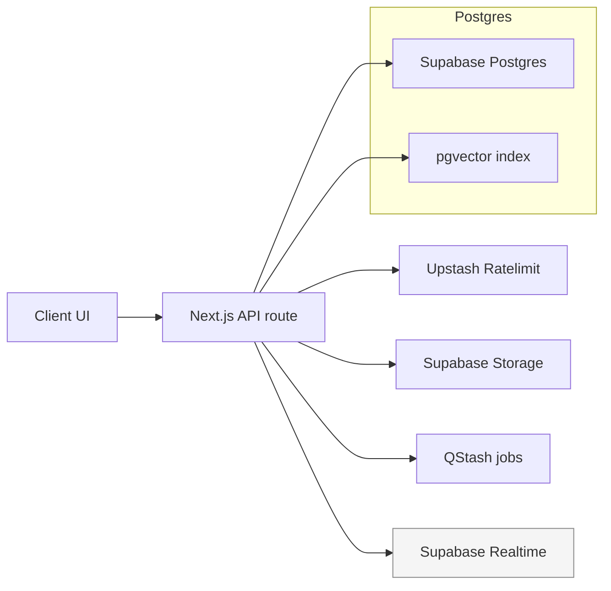

## Storage Patterns

- **Relational**: Primary entities with foreign keys; timezone-aware timestamps; UUID primary keys where appropriate.
- **Vector**: pgvector columns for embeddings with HNSW indexes; cosine distance default.
- **JSONB**: Limited to optional metadata; avoid unbounded schemaless blobs.
- **Attachments**: Stored in Supabase Storage buckets; Postgres rows keep paths, MIME type, size, and ownership; access via signed URLs only.

## Caching & Rate Limiting

- Upstash Redis holds sliding-window counters and short-lived caches (e.g., deduplication, transient lookup results). TTLs are short; no authoritative data stored in Redis.
- Rate limiting is applied per user/IP/API key within route handlers; limits are configured per endpoint type (e.g., streaming vs non-streaming).

## Resilience & Safety

- PITR and backups are handled by Supabase managed services.
- Idempotent QStash handlers prevent duplicate side effects.
- No direct console logging of data; telemetry emitted through logging/telemetry helpers.

## What Is Out of Scope

- Legacy FastAPI/Python data paths and services are removed and unsupported.
- Alternative databases or data lakes are not part of the current system.
````

## File: docs/architecture/database.md
````markdown
# TripSage Database Design

Architecture-focused reference for how TripSage stores, secures, and moves data in Supabase. For operational tasks (bootstrap, BYOK setup, webhook debugging), see the runbook in `../operations/runbooks/database-ops.md`.

## Platform Overview

- Single managed Supabase PostgreSQL instance with pgvector enabled for embeddings.
- Supabase Auth + Vault for BYOK secret storage; Realtime for presence/broadcast only (no token streaming).
- Supabase Storage for attachments; signed URL access only.
- Upstash Redis for cache/rate-limit state and idempotency keys; Upstash QStash for async jobs.

## Architecture Diagram

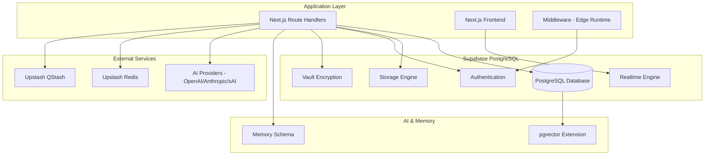

## Integration Patterns

- **SSR clients (Next.js 16)**: `createServerSupabase()` wraps `@supabase/ssr.createServerClient` with `cookies()`; used in Server Components and route handlers. Middleware refreshes sessions; BYOK/BYOR routes import `"server-only"` and stay dynamic (`dynamic = "force-dynamic"` when needed).
- **Browser client**: `getBrowserClient()` + `useSupabase()` provide the singleton; always call `supabase.realtime.setAuth(access_token)` on login/refresh before joining channels.
- **Route handlers**: `withApiGuards` builds an authenticated Supabase client plus user context per request; keep auth/zod validation at the edge of each handler:

```ts
import { withApiGuards } from '@/lib/api/factory';

export const GET = withApiGuards({
  auth: true,
  rateLimit: { limit: 100, window: '1m' },
})(async ({ supabase, user }) => {
  const { data } = await supabase.from('trips').select('*').eq('user_id', user.id);
  return Response.json(data);
});
```

- **Telemetry**: wrap service-layer DB calls with `withTelemetrySpan`; never use `console.*` in server paths.
- **Middleware client (Edge)**: `createMiddlewareSupabase()` from `@/lib/supabase/factory` uses client-only env vars for Edge runtime; tracing disabled by default.

## Schema & Domains

- **Trips & Content**: `trips`, `flights`, `accommodations`, `transportation`, `itinerary_items`, `trip_collaborators`, `bookings`.
- **Chat & Memory**: `chat_sessions`, `chat_messages`, `chat_tool_calls`, `accommodation_embeddings`; `memories` schema tables (`memories.sessions`, `memories.turns`, `memories.turn_embeddings`).
- **Auth & Keys**: Vault-backed `api_keys`, `user_gateway_configs`, `user_settings`; SECURITY DEFINER RPCs gate all BYOK operations.
- **MFA & Recovery**: `mfa_enrollments` tracks TOTP enrollment lifecycle (pending/consumed/expired) with RLS; `auth_backup_codes` stores hashed backup codes (peppered) and is replaced atomically via the `replace_backup_codes` RPC; `mfa_backup_code_audit` logs regeneration/consumption metadata (user_id, event, count, ip, user_agent) for forensics.
- **Telemetry & Webhooks**: `webhook_configs`, `webhook_logs`, `webhook_events`, `system_metrics`; helper RPCs for realtime topics.
- **Search Cache**: `search_*` tables for cached destination/activity/flight/hotel lookups.
- **Storage Metadata**: `file_attachments` rows store ownership, MIME, size, and storage path for Supabase buckets.

### Naming & Constraints

- Primary keys: `BIGINT GENERATED ALWAYS AS IDENTITY` for relational tables; UUIDs for external-facing IDs and webhook/file records.
- Timestamp columns are timezone-aware (`TIMESTAMPTZ`) with `created_at`/`updated_at` defaults.
- Status/enum fields constrained via `CHECK` clauses; metadata kept in bounded `JSONB` columns only where flexibility is required.

## Security & RLS

- **RLS-first**: All user-owned tables enable Row Level Security with owner policies (e.g., `auth.uid() = user_id`).
- **Collaboration**: `trip_collaborators` policies permit shared access on trip-scoped rows; realtime topic helpers enforce the same audience.
- **BYOK**: API keys live in Vault; access only via SECURITY DEFINER RPCs (`insert/get/delete/touch_user_api_key`, gateway config helpers) running under service role with validated ownership.
- **Server-only use**: Sensitive operations stay in route handlers/Server Components; BYOK routes import `"server-only"` and export `dynamic = "force-dynamic"` when required.

### API Key Security

- **Encryption at rest**: All API keys encrypted via Supabase Vault
- **Access control**: SECURITY DEFINER RPCs with ownership validation; service role only
- **Audit logging**: `last_used` timestamps track access patterns
- **Rotation support**: Keys can be updated without service disruption via upsert semantics
- **Data isolation**: RLS ensures users only access their own keys

### BYOK Access Pattern

1. **Store**: `insert_user_api_key(userId, service, key)` encrypts and stores in Vault
2. **Retrieve**: `get_user_api_key(userId, service)` decrypts via SECURITY DEFINER
3. **Validate**: RPCs verify JWT claims include `role: "service_role"` and ownership
4. **Use**: Keys never exposed to client-side code (`"server-only"` imports)

### Provider Resolution (BYOK)

Four-tier resolution strategy in `@ai/models/registry`:

1. **User Gateway key** (highest priority)
   - User's own Vercel AI Gateway API key stored in Vault
   - `getUserApiKey(userId, "gateway")` + `getUserGatewayBaseUrl(userId)`
   - `createGateway({ apiKey, baseURL })`

2. **User BYOK provider keys**
   - Provider-specific keys (OpenAI, OpenRouter, Anthropic, xAI) stored in Vault
   - Resolved concurrently via `getUserApiKey(userId, provider)`
   - Provider preference order: openai → openrouter → anthropic → xai

3. **Server-side fallback keys**
   - Environment variables: `OPENAI_API_KEY`, `OPENROUTER_API_KEY`, `ANTHROPIC_API_KEY`, `XAI_API_KEY`
   - Same preference order as BYOK; used when user has no keys

4. **Team Gateway fallback** (lowest priority)
   - Environment `AI_GATEWAY_API_KEY` + `AI_GATEWAY_URL`
   - Requires user consent via `allowGatewayFallback` setting (default true)
   - Error thrown if user disabled fallback and no keys found

Keys are never exposed client-side; all resolution occurs server-side via `"server-only"` imports.

## Extensions

| Extension | Purpose | Notes |
| --- | --- | --- |
| `vector` | Embedding storage + indexes for semantic search (1536 dims) | Schema: `extensions`; uses ivfflat for accommodation_embeddings |
| `pgcrypto` | `gen_random_uuid()` and hashing | Required for UUID PKs |
| `pg_trgm` | Fuzzy search and text search helpers | Used in search tables |
| `pgjwt` | Supabase auth helpers | Required for auth RPCs |
| `supabase_vault` | Vault-backed BYOK storage | Falls back to stub schema in local/CI |
| `realtime` | Channel policies for presence/broadcast | Required for topic helpers |
| `pg_stat_statements` | Query performance monitoring | Optional; enable for production |
| `pg_net` | Outbound webhook helpers | Enable only if webhook functions used |
| `pg_cron` | Scheduled jobs | For maintenance tasks |
| `btree_gist` | GiST index support | For range queries |
| `uuid-ossp` | UUID generation functions | Alternative to pgcrypto UUIDs |

## Data Flows

1. Request hits Next.js route handler; Zod validates input and Supabase SSR client authenticates.
2. Upstash rate limits and cache checks run before DB writes.
3. Reads/writes occur in Supabase; vector similarity stays in Postgres (`memories`, `accommodation_embeddings`).
4. Async work (e.g., memory sync) is enqueued to QStash; callbacks land on dedicated handlers.
5. Realtime fan-out uses Supabase channels (`user:{id}`, `session:{uuid}`, `trip:{id}`) with RLS-backed topic helpers.
6. Attachments upload to Supabase Storage; rows in `file_attachments` gate access via signed URLs.

## Data Models (Highlights)

- **Trips**: Trip metadata plus related flights/accommodations/transportation; constraints enforce valid dates, traveler counts, and status enums.
- **Chat**: `chat_sessions` (UUID PK) with `chat_messages` constrained to `user|assistant|system` roles; tool calls tracked in `chat_tool_calls`.
- **Memory**: `memories` and `session_memories` store text + `vector(1536)` embeddings with HNSW indexes for cosine search.
- **Files**: `file_attachments` record bucket, MIME, size, owner, and virus-scan status; access via signed URLs only.
- **Webhooks**: `webhook_configs/logs/events` capture DB → Vercel integrations and retries; signatures validated with HMAC.

### Memory Schema

The `memories` schema stores conversation history with embeddings for semantic search:

- `memories.sessions`: Session metadata with user ownership and sync timestamps
- `memories.turns`: Individual conversation turns (user/assistant/system roles) with JSONB content, attachments, tool calls/results
- `memories.turn_embeddings`: Vector embeddings (1536-d) for semantic search over turns

All memory tables have owner-only RLS policies (`auth.uid() = user_id`).

### Webhook Architecture

Database triggers post to Vercel route handlers on table changes:

| Webhook | Trigger Tables | Route | Purpose |
|---------|---------------|-------|---------|
| Trips | `trip_collaborators` | `/api/hooks/trips` | Trip collaboration sync via QStash |
| Cache | `trips`, `flights`, `accommodations`, `search_*`, `chat_*` | `/api/hooks/cache` | Invalidate Upstash cache tags |
| Files | `file_attachments` | `/api/hooks/files` | Process uploads |

Webhook handlers use HMAC signature verification (`X-Signature-HMAC` header) with `HMAC_SECRET` env var. Idempotency via Upstash Redis with 300s TTL.

## Performance & Indexing

- Vector indexes on memory tables: HNSW (`vector_cosine_ops`) with tuned `m`/`ef_construction` parameters.
- Common query indexes: `trips(user_id, start_date, end_date)`, `trips(status)`, `chat_sessions(user_id, trip_id)`, `chat_messages(session_id, created_at)`.
- Connection management via Supabase pooling; monitor with `pg_stat_statements` views and app telemetry.

## Migration & Tooling

- Single-source schema lives in `supabase/schema.sql` (plus migrations); supports bootstrapping a new project in one apply.
- Prefer Supabase migrations for changes; keep table and function inventory aligned with above domains.
- Regenerate TypeScript types after schema updates: `supabase gen types typescript --local > src/lib/supabase/database.types.ts`.

## Function / RPC Inventory (keep)

- Vault/BYOK: `insert_user_api_key`, `get_user_api_key`, `delete_user_api_key`, `touch_user_api_key`.
- Gateway configs: `upsert_user_gateway_config`, `get_user_gateway_base_url`, `get_user_allow_gateway_fallback`, `delete_user_gateway_config`.
- Realtime helpers: `rt_topic_prefix`, `rt_topic_suffix`, `rt_is_session_member`.
- Vector search: `match_accommodation_embeddings` over `vector(1536)` embeddings.
- Webhooks/supporting helpers: keep only actively used retry/send functions; retire unused ones alongside migrations.

## Related How-To

- Operational steps (bootstrap, BYOK verification, webhook/debug routines): `../operations/runbooks/database-ops.md`.
````

## File: docs/architecture/README.md
````markdown
# TripSage System Architecture

> **Target Audience**: Technical architects, senior developers, technical
> stakeholders, integration partners

This section contains high-level system design and architectural
documentation for TripSage. The focus is on system design decisions,
component interactions, and technology stack choices rather than
implementation details.

## Documentation Scope

**Architecture Documentation Includes:**

- System design patterns and architectural decisions
- Component interaction diagrams and data flow
- Technology stack choices and rationale
- Performance architecture and scalability patterns
- Security architecture and access patterns
- Integration architecture with external systems
- Cross-cutting concerns (caching, messaging, storage)

**Architecture Documentation Excludes:**

- Implementation details and code examples → See
  [`docs/development/`](../development/)
- Deployment procedures and operations → See
  [`docs/operations/`](../operations/)
- API specifications and endpoints → See
  [`docs/api/`](../api/)
- Configuration and setup guides → See
  [`docs/configuration/`](../configuration/)

## Architecture Documents

### Core System Architecture

- **[System Overview](system-overview.md)** - Complete system architecture
  with component interactions, data flow, and technology stack
- **[Frontend Architecture](frontend-architecture.md)** - Next.js
  application structure, AI SDK v6 integration, component organization,
  and data flows

### Database & Storage Architecture

- **[Database Architecture](database/)** - Supabase PostgreSQL design, schema patterns, and data models
  - **[Supabase Schema](database/supabase-schema.md)** - Canonical database schema and migration strategy
  - **[Supabase Integration](database/supabase-integration.md)** - Authentication, SSR patterns, and client configurations
  - **[Supabase Operations](database/supabase-operations.md)** - Webhooks, real-time features, and operational patterns
- **[Storage Architecture](storage-architecture.md)** - File storage,
  bucket organization, and security patterns

### Specialized Architecture

- **[Route Exceptions](route-exceptions.md)** - Exception criteria for API
  factory bypass

## Architecture Principles

TripSage follows these core architectural principles:

### 1. **Unified Data Architecture**

Single source of truth with Supabase PostgreSQL, eliminating complex
multi-database patterns while supporting real-time features and vector
operations.

### 2. **Consumer-Aware API Design**

API layer adapts responses and behavior based on consumer type (frontend
applications vs AI agents).

### 3. **Serverless Caching**

Serverless caching with Upstash Redis (HTTP), integrated via Vercel
environment variables, eliminating local cache containers and connection
pooling.

### 4. **Service Consolidation**

Direct SDK integrations replace complex abstraction layers, reducing
latency and improving maintainability while preserving functionality.

### 5. **Real-time Collaboration**

Supabase Realtime-based architecture for live trip planning, agent
status updates, and multi-user collaboration.

## Project Structure

```text
tripsage-ai/
├── src/                        # Next.js 16 app source (App Router, components, libs)
├── docs/                       # Documentation (specs, ADRs, guides)
├── docker/                     # Runtime compose files and Dockerfiles
├── scripts/                    # Database and deployment scripts
├── supabase/                   # Supabase configuration
└── worktrees/                  # Auxiliary git worktrees (if used)
```

### Module Organization

#### `src/`

Next.js 16 application with App Router and React 19. See
[Frontend Architecture](frontend-architecture.md) for detailed
structure, AI SDK v6 integration, and component organization.

#### `tests/`

Test suite with 90%+ coverage:

- `unit/` - Unit tests for individual components
- `integration/` - Service integration tests
- `e2e/` - End-to-end Playwright tests
- `performance/` - Performance and load tests
- `security/` - Security and compliance tests

## Related Documentation

- **[Database Operations](../operations/database/)** - Database operations and Supabase configuration
- **[Development Guide](../development/core/development-guide.md)** - Implementation details, code
  examples, testing
- **[API Documentation](../api/)** - REST specifications and Supabase
  Realtime guide
- **[Testing Guide](../../tests/README.md)** - Test organization and best
  practices
- **[Deployment](../operations/)** - Infrastructure, monitoring, and
  operations

## Architecture Metrics

Current architecture metrics:

| Metric                 | Target        | Achieved        | Technology             |
| ---------------------- | ------------- | --------------- | ---------------------- |
| Cache Performance      | <10ms latency | **Edge/Global** | Upstash Redis          |
| Concurrent Connections | 1000+         | **1500+**       | Supabase Realtime      |
| API Response Time      | <100ms        | **<50ms**       | Next.js Route Handlers |
| Database Connections   | 500+          | **1000+**       | Supabase PostgreSQL    |
| Storage Cost Reduction | 50%           | **80%**         | Unified Architecture   |

## Architecture Evolution

### Current Phase (June 2025)

- Unified Supabase architecture implementation
- Upstash Redis serverless caching
- Supabase Realtime communication
- Service consolidation and SDK migration
- Consumer-aware API design

### Next Phase (Q3-Q4 2025)

- Multi-region deployment architecture
- Monitoring and observability
- Security and compliance patterns
- Mobile application architecture

---

_For questions about system architecture or design decisions, refer to
the specific architecture documents or contact the technical
architecture team._
````

## File: docs/architecture/route-exceptions.md
````markdown
# Route Exceptions

Exception criteria for bypassing the withApiGuards factory pattern.

## Overview

Most API routes should use the `withApiGuards` factory for consistent
authentication, rate limiting, error handling, and telemetry. Some routes
need custom handling that the factory cannot support.

## Exception Criteria

### 1. Webhook Receivers (`/api/hooks/*`)

**Justification**: Webhooks require signature verification before any
processing.

**Example**: Supabase webhooks with HMAC verification

```typescript
import { errorResponse } from "@/lib/api/route-helpers";

// Cannot use factory - signature verification happens first
export async function POST(req: NextRequest) {
  const signature = req.headers.get('x-webhook-signature');
  if (!signature) {
    return errorResponse({
      error: "unauthorized",
      reason: "Missing webhook signature",
      status: 401,
    });
  }

  // Verify signature before any other processing
  const body = await req.text();
  const isValid = verifyWebhookSignature(body, signature);
  if (!isValid) {
    return errorResponse({
      error: "unauthorized",
      reason: "Invalid webhook signature",
      status: 401,
    });
  }

  // Now process the webhook
  const payload = JSON.parse(body);
  await processWebhook(payload);
  return Response.json({ ok: true });
}
```

**Routes Affected**:

- `/api/hooks/cache` - Supabase cache invalidation
- `/api/hooks/files` - File processing webhooks
- `/api/hooks/trips` - Trip collaboration sync

### 2. Background Jobs (`/api/jobs/*`)

**Justification**: Background jobs have different authentication and
execution patterns.

**Example**: QStash job processing

```typescript
import { getQstashReceiver, verifyQstashRequest } from "@/lib/qstash/receiver";

// Cannot use factory - custom signature verification
export async function POST(req: NextRequest) {
  const receiver = getQstashReceiver();
  const verification = await verifyQstashRequest(req, receiver);
  if (!verification.ok) return verification.response;

  // Process job without user context
  const job = JSON.parse(verification.body);
  await processJob(job);
  return Response.json({ ok: true });
}
```

**Routes Affected**:

- `/api/jobs/memory-sync` - User memory synchronization
- `/api/jobs/notify-collaborators` - Collaboration notifications (QStash fan-out)

### 3. Complex Custom Requirements

**Justification**: Routes with requirements the factory cannot support.

**Criteria for Approval**:

- Factory enhancement attempted first
- Document why the factory cannot support the pattern
- Team approval required before implementation
- Exception must be documented and justified

## Process for New Exceptions

### Step 1: Attempt Factory Use

Try to implement the route using `withApiGuards` first.

### Step 2: Document Limitations

If the factory cannot support requirements, document:

- What requirement cannot be met
- Why the factory cannot be enhanced
- Alternative approaches considered

### Step 3: Get Approval

- Create an ADR documenting the exception
- Get team approval for the exception
- Consider factory enhancement for future use

### Step 4: Implement and Document

- Implement the route with custom handling
- Add it to this exceptions document
- Update route lists and metrics

## Current Exceptions

| Route | Category | Justification | ADR |
|-------|----------|---------------|-----|
| `/api/hooks/cache` | Webhook | Supabase HMAC verification | ADR-0032 |
| `/api/hooks/files` | Webhook | File processing signature | ADR-0032 |
| `/api/hooks/trips` | Webhook | Trip sync signature | ADR-0032 |
| `/api/jobs/memory-sync` | Background Job | QStash signature check | ADR-0032 |
| `/api/jobs/notify-collaborators` | Background Job | QStash signature check | ADR-0032 |

## Exception Monitoring

### Monthly Review

> **Note**: This is a reusable monthly review template. Copy and complete for each review cycle.

- [ ] Verify exceptions are still justified
- [ ] Check if the factory can support the requirements
- [ ] Review for pattern consistency
- [ ] Update documentation as needed

### Factory Enhancement

When exceptions are identified:

- [ ] Assess if the factory can be enhanced
- [ ] Implement enhancement if feasible
- [ ] Migrate exception routes to the factory
- [ ] Remove from the exceptions list

## Security Considerations

### Exception Routes Must

- [ ] Implement authentication or authorization appropriate to their use case
- [ ] Include rate limiting where applicable
- [ ] Handle errors consistently
- [ ] Include telemetry for monitoring
- [ ] Follow security best practices

### Documentation Requirements

- [ ] Security approach clearly documented
- [ ] Exception justification reviewed annually
- [ ] Alternative approaches considered
- [ ] Migration plan for future factory adoption

## Migration Strategy

### Phase 1: Identification

- Audit all routes for factory compatibility
- Document exceptions with justification
- Establish a monitoring process

### Phase 2: Enhancement

- Identify common exception patterns
- Enhance the factory to support those patterns
- Update the factory with new capabilities

### Phase 3: Migration

- Migrate eligible exception routes to the enhanced factory
- Update exception documentation
- Monitor for issues

### Phase 4: Consolidation

- Minimize exceptions over time
- Maintain high factory adoption
- Document lessons learned

## Metrics

| Metric | Current |
|--------|---------|
| Factory adoption | 92% (35/38 routes) |
| Exception routes | 4 |
| Documented exceptions | 4 |
| Annual review | Pending |

Track exception metrics quarterly to ensure they remain justified and minimal.
````

## File: docs/architecture/storage-architecture.md
````markdown
# Storage Architecture

> **Target Audience**: System architects, security engineers, infrastructure leads

This document describes TripSage's file storage system, security policies, and processing workflows. For implementation details, see the storage migration files in `supabase/migrations/`.

## Storage Buckets

### Attachments Bucket

**Purpose**: Trip documents and chat file attachments

**Configuration**:

- Access: Private (authenticated users only)
- Size limit: 50MB per file
- MIME types: PDF, Word, Excel, text files, images
- Security: RLS policies based on trip ownership and collaboration

### Avatars Bucket

**Purpose**: User profile images

**Configuration**:

- Access: Public (browsable without authentication)
- Size limit: 5MB per file
- MIME types: JPEG, PNG, GIF, WebP, AVIF
- Security: Users can only modify their own avatars

### Trip Images Bucket

**Purpose**: Trip-related photos and media

**Configuration**:

- Access: Private (authenticated users with trip access)
- Size limit: 20MB per file
- MIME types: JPEG, PNG, GIF, WebP, AVIF, HEIC, HEIF
- Security: Trip collaboration permissions required

## Security Model

### Row Level Security

File access is controlled through PostgreSQL Row Level Security policies:

#### Bucket-Specific Policies

**Attachments**:

- Users can access files for trips they own or collaborate on
- Collaboration levels: view, edit, admin
- File ownership tracked via `user_id` in `file_attachments` table

**Avatars**:

- Public read access for all users
- Users can only modify their own avatar files
- File ownership verified against authenticated user ID

**Trip Images**:

- Access requires trip collaboration permissions
- Path-based trip ID extraction for permission checking
- Collaboration roles determine upload/delete capabilities

#### Permission Levels

- **Owner**: Full access to all trip-related files
- **Admin**: Can upload, delete, and modify trip files
- **Edit**: Can upload and view all trip files
- **View**: Can only view trip files

## File Processing

### Upload Flow

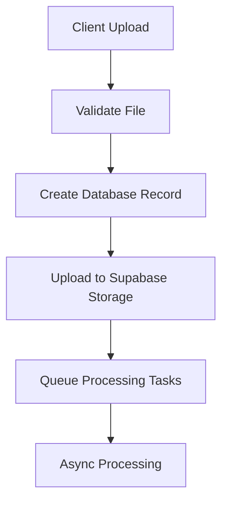

### Processing Operations

#### Virus Scanning

- Trigger: Post-upload via edge functions
- Status tracking: `virus_scan_status` and `virus_scan_result` fields
- Quarantine: Infected files moved to restricted access

#### Metadata Extraction

- Documents: File type, size, page count (when available)
- Images: Dimensions, format, EXIF data
- Storage: Metadata stored in `file_attachments.metadata` JSONB field

### File Tracking

Files are tracked in the `file_attachments` table with:

- Upload status: `uploading`, `completed`, `failed`
- Processing status: Scan results and metadata
- Ownership: Linked to users and trips
- Access control: RLS policies enforce permissions

## API Integration

### Upload Methods

File uploads support multiple approaches:

- **Direct upload**: Client uploads directly to Supabase Storage
- **Signed URLs**: Pre-authenticated URLs for secure uploads
- **Server-mediated**: API handles upload with validation

### Download Access

File downloads use Supabase Storage URLs:

- **Public access**: Avatars accessible without authentication
- **Authenticated access**: Private files require valid JWT
- **Signed URLs**: Time-limited access for secure sharing

### Validation

Upload validation includes:

- File size limits per bucket
- MIME type restrictions
- User permissions via RLS
- Virus scanning (async post-upload)

## Storage Quotas

### Per-User Limits

Storage quotas are enforced per user across all buckets:

- **Attachments**: 5GB total
- **Avatars**: 50MB total
- **Trip Images**: 2GB total

### Quota Enforcement

Quota checking occurs before file uploads:

- **Pre-upload validation**: Size checked against remaining quota
- **Database tracking**: Usage calculated via storage functions
- **Hard limits**: Uploads rejected when quota exceeded
- **Per-bucket limits**: Separate quotas for different file types

## Monitoring and Maintenance

### Automated Maintenance

Database functions handle storage maintenance:

#### Cleanup Operations

- **Orphaned files**: Remove files not referenced in database
- **Failed uploads**: Clean incomplete upload records
- **Usage tracking**: Monitor storage consumption per user

#### Storage Functions

Database provides utility functions for:

- **Quota checking**: Validate uploads against limits
- **Usage calculation**: Track per-user storage consumption
- **File cleanup**: Remove orphaned storage objects

## Processing Architecture

### Async Processing

File processing uses database-driven queues:

#### Processing Queue

- **file_processing_queue table**: Tracks async processing tasks
- **Priority levels**: High/low priority processing
- **Status tracking**: Monitor processing completion
- **Retry handling**: Failed operations can be retried

#### Processing Types

- **Virus scanning**: Malware detection via ClamAV
- **Metadata extraction**: File information and properties
- **Content analysis**: Basic file validation and processing

## Error Handling

### Upload Errors

- **Validation failures**: Size, type, or permission errors
- **Quota exceeded**: User storage limit reached
- **Network issues**: Connection problems during upload
- **Permission denied**: RLS policy violations

### Processing Errors

- **Virus detection**: Infected files quarantined
- **Metadata extraction failures**: Logged with retry capability
- **Storage errors**: Supabase Storage API failures

### Recovery

- **Failed uploads**: Cleanup of partial database records
- **Processing failures**: Retry queue for failed operations
- **Quarantine**: Admin review process for flagged files

## Security Architecture

### Security Layers

File storage security includes multiple controls:

#### Access Control

- **Authentication**: Supabase JWT token validation
- **Authorization**: PostgreSQL RLS policies per bucket
- **File ownership**: User ID tracking and verification
- **Collaboration**: Trip-based permission sharing

#### Content Security

- **Virus scanning**: ClamAV integration for malware detection
- **File validation**: Type and size restrictions per bucket
- **Quarantine**: Automatic isolation of suspicious files

#### Data Protection

- **Encryption**: Supabase-managed encryption at rest
- **Access logging**: File operation audit trail
- **Secure URLs**: Signed URLs for private file access

## Architecture Patterns

### Upload Patterns

File uploads follow these patterns:

- **Direct uploads**: Client to Supabase Storage with validation
- **Server validation**: API checks permissions and quotas
- **Async processing**: Post-upload tasks via database queues
- **Error recovery**: Cleanup on failed operations

### Storage Organization

Files are organized by:

- **Bucket separation**: Different buckets for different content types
- **User ownership**: Files linked to uploading users
- **Trip association**: Files optionally linked to specific trips
- **Metadata storage**: File properties stored in database

## Scalability

### Storage Scaling

- **Supabase Storage**: Managed object storage with global CDN
- **Database scaling**: PostgreSQL handles metadata at scale
- **Quota management**: Per-user limits prevent abuse
- **Processing queues**: Async operations prevent bottlenecks

### Performance

- **CDN delivery**: Fast access to stored files
- **Direct uploads**: Client-side uploads reduce server load
- **Async processing**: Non-blocking file operations
- **Database indexing**: Optimized queries for file metadata

---

This storage architecture provides secure, scalable file management integrated with TripSage's travel planning platform.
````

## File: docs/architecture/system-overview.md
````markdown
# System Architecture

Audience: technical contributors who need an up-to-date, implementation-focused picture of TripSage.

## Runtime Topology

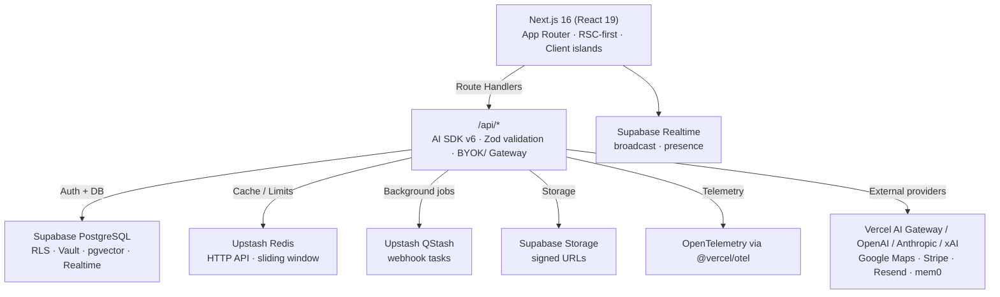

## Stack Snapshot (from `package.json`)

- Next.js `16.0.3`, React `19.2.x`, TypeScript `5.9.x`.
- AI SDK core `ai@6.0.0-beta.99`; React hooks `@ai-sdk/react@3.0.0-beta.99`; providers `@ai-sdk/openai`, `@ai-sdk/anthropic`, `@ai-sdk/xai`; gateway via `createGateway`.
- Supabase SSR `@supabase/ssr@0.7.0`, browser client `@supabase/supabase-js@2.80.0`, Vault, pgvector, Realtime.
- Upstash `@upstash/redis@1.35.6`, `@upstash/ratelimit@2.0.7`, `@upstash/qstash@2.8.4`.
- UI: Radix primitives, Tailwind CSS v4, shadcn/ui compositions, Framer Motion.
- Payments/Email: Stripe `^19.3.0`, Resend `^6.5.0`.
- Scheduling/Calendar: `ical-generator@10.0.0`, Google Calendar integration in `src/lib/calendar`.
- State: Server Components by default; client state with Zustand; server state with TanStack Query.
- Observability: `@vercel/otel`, `@opentelemetry/api` with helpers in `src/lib/telemetry` (see `docs/development/backend/observability.md`).
- Testing/tooling: Biome format/lint, Vitest, Playwright, `tsc`.

## Key Capabilities

- Streaming chat and tool calling via AI SDK v6 using shared Zod schemas in `src/schemas`.
- Agent routes for flights, accommodations, destinations, itineraries, budget, and memory (`/api/agents/*`) with domain-specific tool sets.
- BYOK + Vercel AI Gateway routing with explicit precedence: user gateway → user provider (OpenAI/Anthropic/xAI/OpenRouter) → team gateway fallback (opt-in).
- Memory pipeline backed by Supabase Postgres + pgvector; QStash jobs cap inserts to 50 messages per batch and enforce idempotency.
- Realtime collaboration (presence/broadcast) via Supabase Realtime; AI token streaming stays on AI SDK SSE.
- Attachments stored in Supabase Storage (`attachments` bucket) with Postgres metadata rows (owner, size, MIME, path) and signed URL access.
- Payments and notifications available through Stripe and Resend (keys remain server-side).

## Core Components

### Next.js Application

- App Router with RSC-first rendering; client components only where interactivity is required.
- Route handlers live in `src/app/api/**/route.ts`. They parse input (Zod), create request-scoped collaborators (Supabase, rate limiter, providers), and delegate to pure handlers. No module-scope state.
- AI SDK v6 is the only LLM transport (`streamText`, `generateObject`, `streamObject`); structured outputs use Zod schemas under `src/schemas`.
- Caching and rate limiting use per-request Upstash Redis/RateLimit instances. Auth-dependent routes remain dynamic (no cache).
- Background/async work uses QStash webhooks; handlers are stateless and idempotent.

### Identity and Security

- Supabase Auth with SSR cookie handling via `src/lib/supabase/server.ts` and middleware; browser client only for Realtime/subscriptions.
- Vault stores BYOK keys; provider resolution happens server-side through `src/ai/models/registry.ts`. BYOK routes import `"server-only"`.
- Randomness/timestamps come from `@/lib/security/random`; no `Math.random` or `crypto.randomUUID`.
- Key precedence (highest → lowest): user gateway key, user provider key (OpenAI/Anthropic/xAI/OpenRouter), team gateway key fallback (requires user consent flag).
- Auth-bound routes stay dynamic; do not add `'use cache'` or static revalidation to BYOK/user-scoped handlers.
  Routes accessing `cookies()` or `headers()` (required for Supabase SSR auth) cannot use cache directives per Next.js Cache Components restrictions.
  See [Spec: BYOK Routes and Security (Next.js + Supabase Vault)](../specs/archive/0011-spec-byok-routes-and-security.md).

### Data & Storage

- Single Supabase PostgreSQL with pgvector and JSONB for flexible metadata.
- Supabase Storage for uploads; access via signed URLs.
- Supabase Realtime for presence/broadcast; all channels created through `use-realtime-channel` and its thin wrappers (no direct `supabase.channel()` in new code).
- Storage buckets: primary bucket `attachments`; per-object metadata persisted in Postgres (size, MIME, path, owner) for auditability.

### Observability

- Use `withTelemetrySpan` / `withTelemetrySpanSync`, `recordTelemetryEvent`, and `createServerLogger` (see `src/lib/telemetry` and `docs/development/backend/observability.md`). Console logging is reserved for tests/client-only code.
- OpenTelemetry exporters are wired through `@vercel/otel`; spans wrap API handlers and external calls.
- Automatic tracing is registered in `src/instrumentation.ts` via `registerOTel({ serviceName: "tripsage-frontend" })`.
- Critical-path failures should emit `emitOperationalAlert` for downstream alerting (see `src/lib/telemetry/alerts.ts`).

### External Integrations (present in repo)

- AI providers via Vercel AI Gateway or BYOK (OpenAI, Anthropic, xAI).
- Supabase platform services (Auth, Realtime, Storage, Vault, pgvector).
- Upstash Redis/Ratelimit for caching and throttling; Upstash QStash for jobs.
- Google Maps (types present), Stripe, Resend email, mem0 (memory SDK), Playwright for browser automation.

## Representative Workflows

- **Chat + tool calling**: `POST /api/chat/stream` → Zod validation → Supabase auth → Upstash rate limit → provider resolution → `streamText` with tools → SSE stream to UI → telemetry span with provider/tool attributes.
- **Flight or accommodation search**: `POST /api/agents/flights|accommodations` → same guard pipeline → domain tools (external API or MCP adapters) → structured results streamed back; attachments handled via signed URLs when present.
- **Memory sync job (QStash)**: Frontend enqueues job → QStash webhook calls `/api/jobs/memory-sync` with Upstash signature → signature verify + Redis idempotency key → payload validated → batch limited to 50 messages → Supabase inserts/updates chat session + memories → telemetry recorded; duplicates short-circuit with `{ duplicate: true }`.
- **Realtime collaboration**: Clients subscribe via `use-realtime-channel` to `session:{id}` / `trip:{id}` topics for presence/broadcast; server never emits LLM tokens over Realtime.
- **Attachments**: Client uploads to Supabase Storage (`attachments` bucket); server issues signed URLs; Postgres rows track ownership and metadata.
- **Notifications/Payments**: Stripe and Resend integrations are server-only; credentials resolved from env and never exposed to clients.

### Workflow visuals (Mermaid)

#### Chat streaming with tools

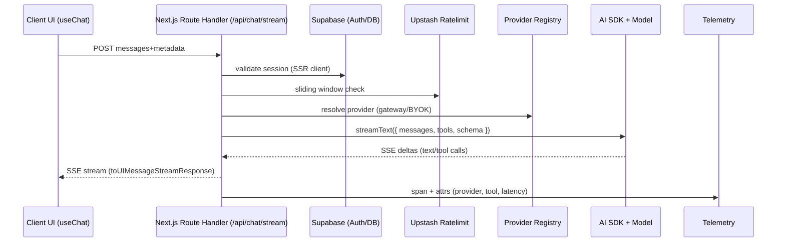

#### QStash memory sync job

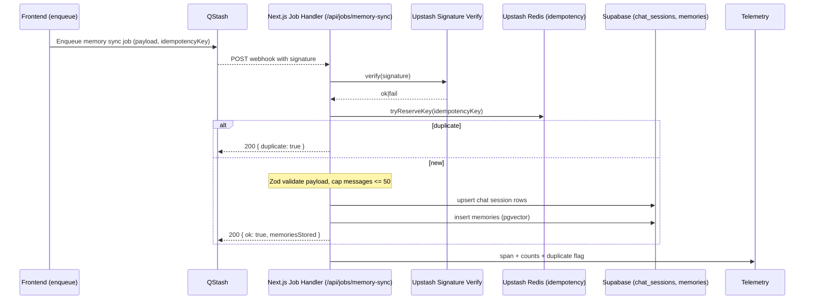

## End-to-End Request Flow

1. Request enters `/api/*` route handler.
2. Supabase SSR client is created; session validated.
3. Guards: rate limiting and Zod input validation.
4. Provider resolution via registry (Gateway/BYOK).
5. Execution: AI SDK call and domain logic; optional QStash enqueue.
6. Persistence: Supabase read/write; Redis cache when applicable.
7. Response: SSE stream for chat routes or JSON for synchronous calls; telemetry spans emitted.

- Typical rate-limit profile (tuned per endpoint): streaming routes ~40 req/min sliding window; non-streaming ~20 req/min; keyed by user or IP.
- QStash handlers validate signatures and include idempotency keys to avoid duplicate side effects.

## Realtime Responsibilities

- Supabase Realtime handles multi-client fanout (chat events, presence, agent status). All subscriptions go through `use-realtime-channel` or thin wrappers; no direct `supabase.channel()` creation in new code.
- AI token streaming uses AI SDK SSE transports only; Realtime is never used for LLM token delivery.

## Deployment & Environments

- Local: `pnpm dev` for Next.js; Supabase CLI for local DB; Redis/QStash via Upstash cloud or mocks.
- Production: Vercel for frontend + API routes; Supabase managed Postgres/Storage/Realtime; Upstash Redis/QStash for cache/limits/jobs; AI Gateway for provider routing.
- Quality gates on touched code: `pnpm biome:check`, `pnpm type-check`, and relevant `pnpm test*`.

## Invariants

- Single Next.js codebase; legacy Python/FastAPI services are removed and unsupported.
- No custom streaming frameworks—AI SDK v6 is the sole LLM transport.
- Remove deprecated paths when new implementations land (final-only policy).
````

## File: docs/development/ai/ai-integration.md
````markdown
# AI Integration (Vercel AI SDK v6)

Patterns and options for configuring providers via the Vercel AI Gateway and direct keys.

## Gateway `providerOptions`

Use `providerOptions.gateway` in `streamText`/`generateText` calls when the resolved model is a Gateway model (user or team scoped). Keep routing logic in route handlers, not in the registry.

### Round-robin across two providers

```ts
const result = await streamText({
  model,
  messages,
  providerOptions: {
    gateway: { order: ["openai", "anthropic"] },
  },
});
```

### Prefer Anthropic, then OpenAI, with budget guard

```ts
const result = await streamText({
  model,
  messages,
  providerOptions: {
    gateway: {
      order: ["anthropic", "openai"],
      budgetTokens: 200_000,
    },
  },
});
```

### Route thinking models to Anthropic only

```ts
const result = await streamText({
  model,
  messages,
  providerOptions: {
    gateway: {
      order: /think|reason/i.test(JSON.stringify(messages))
        ? ["anthropic"]
        : ["openai", "anthropic"],
    },
  },
});
```

## Best Practices

- Keep `providerOptions` close to route handlers (avoid encoding in the provider registry).
- Pair routing with per-request token budgets and chat limits.
- Prefer Gateway API keys (`AI_GATEWAY_API_KEY`) for multi-provider routing; fall back to BYOK keys when users supply them.
- Tests: use `MockLanguageModelV3` and assert `providerOptions` on recorded calls.

## Related Docs

- [AI Tools](ai-tools.md) - Tool creation with `createAiTool` factory and guardrails
- [Zod Schema Guide](zod-schema-guide.md) - Tool input schema patterns
- [Observability](observability.md) - Spans/events via `@/lib/telemetry/*` around AI calls
- `src/ai/models/registry.ts` (BYOK registry)
- `src/app/api/*` route handlers for per-request routing
````

## File: docs/development/backend/cache-versioned-keys.md
````markdown
# Cache Versioned Keys – Developer Recipe

This project uses versioned-tag cache keys to achieve O(1) invalidation.

## Key idea

- Every logical cache namespace (e.g. `trip`, `search`, `flight`) has a monotonically increasing version stored in Redis.
- Readers and writers compose keys as `namespace:v<version>:<key>`.
- Invalidation just bumps the namespace version; no key scans required.

## APIs

Use the helper in `src/lib/cache/tags.ts`:

- `getTagVersion(tag: string): Promise<number>` – read current version
- `versionedKey(tag: string, key: string): Promise<string>` – compose a versioned key
- `bumpTag(tag: string): Promise<number>` – increment a single tag version
- `bumpTags(tags: string[]): Promise<Record<string, number>>` – increment multiple

## Example

```ts
import { versionedKey, bumpTag } from "@/lib/cache/tags";
import { getCachedJson, setCachedJson } from "@/lib/cache/upstash";

// Write a value under the current trip namespace version
async function writeTripCache(tripId: string, data: unknown) {
  const key = await versionedKey("trip", `by-id:${tripId}`);
  await setCachedJson(key, data, 3600); // 1 hour TTL
}

// Read the current value
async function readTripCache<T>(tripId: string): Promise<T | null> {
  const key = await versionedKey("trip", `by-id:${tripId}`);
  return await getCachedJson<T>(key);
}

// Invalidate all trip cache for writes to trips (DB triggers will also call the webhook)
async function invalidateTrips() {
  await bumpTag("trip");
}
```

## Where to invalidate

- DB changes → the `/api/hooks/cache` route bumps the relevant tags (via pg_net triggers).
- Application changes → call `bumpTag(s)` in write paths that modify derived views but do not trigger DB changes.

## Migration/rollout guidance

- Readers: adopt `versionedKey()` first. Old keys will naturally expire.
- Writers: dual-write (old + new) if you can’t afford cache misses during rollout. Remove old writes once readers ship.
- TTL: keep TTLs on values so legacy keys disappear even if not explicitly deleted.

## Tag Naming Conventions

Cache tags follow a hierarchical naming pattern: `<domain>:<resource>` or `<domain>:<operation>`.

### Current Tags

- `accommodations:search` - Accommodation search results
- `accommodations:booking` - Booking price checks
- `trip` - Trip data
- `user_trips` - User trip associations
- `trip_search` - Trip search results
- `search` - Generic search results
- `search_cache` - Search cache entries
- `flight` - Flight data
- `flight_search` - Flight search results
- `accommodation` - Accommodation details
- `hotel_search` - Hotel search results
- `memory` - Chat memory data
- `conversation` - Conversation data
- `chat_memory` - Chat memory cache
- `configuration` - Agent configuration cache

### Naming Guidelines

- Use lowercase with colons as separators
- Format: `<domain>:<resource>` or `<domain>:<operation>`
- Be specific: prefer `accommodations:search` over `search`
- Group related tags: use prefixes like `accommodations:*` for domain grouping

## Cache Dependency Graph

### Accommodations Domain

```text
accommodations:search
  └─ Invalidated by: booking creation (bumpTag in service.ts:421)
  └─ Used by: AccommodationSearchResult cache reads/writes

accommodations:booking
  └─ Invalidated by: booking price changes
  └─ Used by: CachedBookingPrice cache reads/writes
```

### Database-Driven Invalidation

The `/api/hooks/cache` route automatically invalidates tags based on database table changes:

- `trips` table → `["trip", "user_trips", "trip_search", "search", "search_cache"]`
- `flights` table → `["flight", "flight_search", "search", "search_cache"]`
- `accommodations` table → `["accommodation", "hotel_search", "search", "search_cache"]`
- `search_*` tables → `["search", "search_cache"]`
- `chat_messages` / `chat_sessions` → `["memory", "conversation", "chat_memory"]`

### Application-Level Invalidation

Some cache invalidation happens in application code:

- **Accommodations booking** (`accommodations/service.ts:421`): Bumps `accommodations:search` when a booking is created
- **Agent configuration** (`api/config/agents/*/route.ts`): Bumps `configuration` tag on config updates

## Real-World Example: Accommodations Service

The accommodations service demonstrates proper tag-based caching:

```ts
import { versionedKey, bumpTag } from "@/lib/cache/tags";
import { getCachedJson, setCachedJson } from "@/lib/cache/upstash";

const CACHE_TAG_SEARCH = "accommodations:search";

// Read with versioned key
const versionedCacheKey = await versionedKey(CACHE_TAG_SEARCH, baseCacheKey);
const cached = await getCachedJson<AccommodationSearchResult>(versionedCacheKey);

// Write with versioned key
const cacheKey = await versionedKey(CACHE_TAG_SEARCH, baseCacheKey);
await setCachedJson(cacheKey, result, cacheTtlSeconds);

// Invalidate on write (e.g., after booking creation)
await bumpTag(CACHE_TAG_SEARCH);
```

## Gotchas

- Tag storms: if a single request bumps many tags, consider batching via `bumpTags()`.
- Version drift: versions are small integers; monitor increments and ensure you don't bump excessively.
- Multi-tenant: include tenant identifiers in either the tag or the per-key suffix if isolation is needed.
- Always use `versionedKey()` for reads and writes - never construct keys manually.
- When invalidating, bump tags instead of manually deleting keys for O(1) invalidation.
````

## File: docs/development/backend/release-automation.md
````markdown
# Release Automation (semantic-release)

This repository uses semantic-release to automate versioning, changelog updates, tags, and GitHub Releases on pushes to `main`.

## Workflow

- Trigger: push to `main`.
- Action: `.github/workflows/release.yml`.
- Steps: checkout (full history) → set up Node from `.nvmrc` → install pnpm and dependencies → run `npx semantic-release --extends release.config.mjs`.
- Env: `GITHUB_TOKEN` and `NPM_TOKEN` (required for `@semantic-release/npm` verify step even though we do not publish).
- Permissions: `contents`, `issues`, and `pull-requests` (write) to create tags and release notes.

## Configuration

File: `release.config.mjs` (root).

- semantic-release runs from repo root.
- Plugins:
  - `@semantic-release/commit-analyzer` with temporary rule `{ breaking: true, release: 'minor' }`.
  - `@semantic-release/release-notes-generator` (conventional commits preset).
  - `@semantic-release/changelog` updates `CHANGELOG.md` (repo root).
  - `@semantic-release/npm` bumps `package.json` with `npmPublish: false` (version only, no npm publish).
  - `@semantic-release/git` commits `CHANGELOG.md` + `package.json` with `chore(release): <version> [skip ci]`.
  - `@semantic-release/github` creates the GitHub Release.

## Temporary major suppression

- During pre-stable, breaking changes are **downgraded to minor bumps** via `releaseRules`.
- Breaking commits still need a `BREAKING CHANGE:` footer for clarity, but they won’t publish a major until we switch to stable.

## Enabling true majors (stable)

When ready to ship the first stable major (e.g., `v2.0.0`):

1. Remove the `{ breaking: true, release: 'minor' }` rule (or change it to `release: 'major'`).
2. Optionally force the first stable tag:

   ```bash
   git tag v2.0.0
   git push origin v2.0.0
   ```

3. Push to `main` to run the release workflow.
4. Update release docs to state majors are enabled.

## Commit conventions (recap)

- `feat:` → minor; `fix:` → patch; other prefixes for non-releasing work (`chore:`, `docs:`, `ci:`).
- Breaking changes: add `BREAKING CHANGE:` footer describing the impact.

## Rollback

If a release is incorrect:

1. Delete the Git tag and GitHub Release for that version.
2. Revert the auto-commit that updated `CHANGELOG.md` and the `@semantic-release/npm` version bump in `package.json` (if present).
3. Fix the offending change or config, then rerun the workflow by pushing to `main`.

## Troubleshooting

- **No release produced**: ensure the commit history since the last tag contains a `feat` or `fix` (or `breaking` with the temporary rule). Non-releasing prefixes are ignored.
- **Permissions error**: confirm workflow permissions include `contents: write`.
- **Branch protection blocks release commit**: allow GitHub Actions (`GITHUB_TOKEN`) to push to `main`, or add a bypass rule for the release job so `@semantic-release/git` can commit `chore(release): …` and update `CHANGELOG.md`/`package.json`.
- **Unexpected major**: verify the `releaseRules` still map `breaking` to `minor`.
- **Changelog not updating**: check that `@semantic-release/changelog` and `@semantic-release/git` are installed and present in the config.
````

## File: docs/development/backend/server-actions.md
````markdown
# Server Components and Server Actions Guide

React Server Components (RSC) and Server Actions patterns for TripSage.

## Server vs Client Components

### Decision Tree

| Use Case | Component Type | Directive |
|----------|---------------|-----------|
| Data fetching, DB queries | Server | None (default) |
| Static content, layouts | Server | None (default) |
| Forms, user input | Client | `"use client"` |
| Interactivity, event handlers | Client | `"use client"` |
| Zustand stores, hooks | Client | `"use client"` |
| Browser APIs (localStorage, etc.) | Client | `"use client"` |

### File Structure

```typescript
// Server Component (default) - no directive needed
// src/app/(dashboard)/trips/page.tsx

import { createServerSupabase } from "@/lib/supabase/server";

export default async function TripsPage() {
  const supabase = await createServerSupabase();
  const { data: trips } = await supabase.from("trips").select("*");

  return <TripList trips={trips} />;
}
```

```typescript
// Client Component - requires directive
// src/components/features/trips/trip-form.tsx

/**
 * @fileoverview Trip creation form component.
 */

"use client";

import { useZodForm } from "@/hooks/use-zod-form";
// ... form implementation
// (See "Calling Server Actions" below for a full, working example.)
```

## Server Actions

### File Organization

| Location | Use Case |
|----------|----------|
| `src/app/(route)/actions.ts` | Route-specific actions |
| `src/lib/auth/actions.ts` | Shared auth actions |
| `src/lib/*/actions.ts` | Domain-specific shared actions |

### Action Implementation Pattern

```typescript
// src/app/(dashboard)/trips/actions.ts
"use server";

import "server-only";
import { revalidatePath } from "next/cache";
import { redirect } from "next/navigation";
import { tripCreateSchema } from "@schemas/trips";
import type { TripCreateData } from "@schemas/trips"; // generated from tripCreateSchema (or z.infer<typeof tripCreateSchema>)
import { createServerSupabase } from "@/lib/supabase/server";

export async function createTripAction(data: TripCreateData) {
  // 1. Validate
  const result = tripCreateSchema.safeParse(data);
  if (!result.success) throw new Error("Validation failed");

  // 2. Auth check
  const supabase = await createServerSupabase();
  const { data: { user } } = await supabase.auth.getUser();
  if (!user) throw new Error("Auth required");

  // 3. Mutate
  const { data: trip, error } = await supabase
    .from("trips")
    .insert({ ...result.data, user_id: user.id })
    .select("id, title")
    .single();
  if (error) throw new Error("Insert failed");

  // 4. Revalidate
  revalidatePath("/trips");
  return trip;
}

export async function deleteTripAction(tripId: string): Promise<never> {
  const supabase = await createServerSupabase();
  await supabase.from("trips").delete().eq("id", tripId);
  revalidatePath("/trips");
  redirect("/trips");
}
```

### Key Requirements

1. **Directives:** Both `"use server"` and `import "server-only"` at file top
2. **Validation:** Always validate with Zod before processing
3. **Auth:** Use `createServerSupabase()` for authenticated client
4. **Returns:** Only serializable data (no Supabase client, no functions)
5. **Errors:** Throw descriptive errors; client receives error message
6. **Revalidation:** Call `revalidatePath()` or `revalidateTag()` after mutations

## Calling Server Actions

### From Client Components

```typescript
"use client";

import { useRouter } from "next/navigation";
import { createTripAction } from "./actions";
import { useZodForm } from "@/hooks/use-zod-form";
import { tripFormSchema } from "@schemas/trips"; // runtime schema; type via z.infer<typeof tripFormSchema>

function TripForm() {
  const router = useRouter();
  const form = useZodForm({ schema: tripFormSchema });

  const onSubmit = form.handleSubmitSafe(async (data) => {
    const trip = await createTripAction(data);
    router.push(`/trips/${trip.id}`);
  });

  return <form onSubmit={onSubmit}>{/* fields */}</form>;
}
```

### With useActionState (Progressive Enhancement)

For forms that work without JavaScript:

```typescript
"use client";

import { useActionState } from "react";
import { createTripAction } from "./actions";

const [state, formAction, isPending] = useActionState(
  async (_prev, formData: FormData) => {
    try {
      await createTripAction(Object.fromEntries(formData));
      return { success: true };
    } catch (e) {
      return { error: e instanceof Error ? e.message : "Failed" };
    }
  },
  {}
);

// Use: <form action={formAction}> with native inputs
// state.error / state.success available after submission
```

### Direct FormData Actions

For simpler forms without RHF:

```typescript
// actions.ts
"use server";

import { z } from "zod";

const feedbackSchema = z.strictObject({
  message: z.string().min(10).max(1000),
  rating: z.coerce.number().int().min(1).max(5),
});

export async function submitFeedbackAction(formData: FormData) {
  const data = Object.fromEntries(formData.entries());
  const validation = feedbackSchema.safeParse(data);

  if (!validation.success) {
    return { error: validation.error.message };
  }

  // ... save feedback
  return { success: true };
}
```

## Revalidation Patterns

### Path Revalidation

```typescript
import { revalidatePath } from "next/cache";

// Revalidate specific page
revalidatePath("/trips");

// Revalidate with layout
revalidatePath("/trips", "layout");

// Revalidate dynamic route
revalidatePath(`/trips/${tripId}`);
```

### Tag Revalidation

```typescript
// In data fetching:
// - Use fetch for external HTTP endpoints
// - Use the Supabase client for DB reads/writes
// - Fetch data first, then call revalidateTag() for affected tags
const trips = await fetch("/api/trips", { next: { tags: ["trips"] } });

// In action after mutation:
import { revalidateTag } from "next/cache";
revalidateTag("trips");
```

## Error Handling

### Client-Side Error Handling

```typescript
"use client";

import { useState, useTransition } from "react";
import { deleteTripAction } from "./actions";

const [isPending, startTransition] = useTransition();
const [error, setError] = useState<string | null>(null);

const handleDelete = () => {
  startTransition(async () => {
    try {
      await deleteTripAction(tripId);
    } catch (e) {
      setError(e instanceof Error ? e.message : "Failed");
    }
  });
};
// isPending for loading state, error for display
```

### Server-Side Logging

Always log errors server-side before throwing:

```typescript
export async function riskyAction(data: unknown) {
  try {
    // ... operation
  } catch (error) {
    logger.error("Operation failed", { error, data });
    throw new Error("Operation failed. Please try again.");
  }
}
```

## Testing Server Actions

See [Testing Guide - Server Actions Section](./testing.md#server-actions) for:

- Mocking `createServerSupabase`
- Mocking `next/navigation`
- Testing with FormData
- Error scenario testing
````

## File: docs/development/core/development-guide.md
````markdown
# Development Guide

TripSage development patterns and architecture overview. This document provides architectural context and links to specialized documentation for each topic.

**Import Paths**: All TypeScript imports must follow the [Import Path Standards](../standards/standards.md#import-paths). Use semantic aliases (`@schemas/*`, `@domain/*`, `@ai/*`) for architectural boundaries and `@/*` for generic src-root imports.

## Architecture Overview

### Technology Stack

| Layer | Technology | Purpose |
| --- | --- | --- |
| **Framework** | Next.js 16 | Server route handlers, React Server Components |
| **React** | React 19 | UI with concurrent features |
| **Language** | TypeScript 5.9.x | Strict mode, full type safety |
| **AI** | AI SDK v6 (`ai@6.0.0-beta.116`) | `streamText`, `generateObject`, tool calling |
| **Database** | Supabase PostgreSQL | RLS, pgvector, Realtime |
| **Cache** | Upstash Redis | HTTP REST API, rate limiting |
| **Auth** | Supabase SSR | Cookie-based sessions |
| **Validation** | Zod v4 | Request/response schemas |
| **State** | Zustand + TanStack Query | Client state + server state |
| **Styling** | Tailwind CSS v4 | CSS-first configuration |
| **Observability** | OpenTelemetry | Distributed tracing, metrics |

### Project Structure

```text
src/
├── app/                    # Next.js App Router
│   ├── (auth)/            # Auth route group
│   ├── (dashboard)/       # Protected route group
│   ├── api/               # Route handlers
│   └── ...                # Pages
├── ai/                     # AI SDK tooling
│   ├── lib/               # Tool factory, utilities
│   ├── models/            # Provider registry
│   └── tools/             # AI tools (server/client)
├── components/            # Reusable UI components
├── domain/                # Domain logic
│   ├── accommodations/   # Accommodation domain
│   ├── activities/       # Activity domain
│   ├── amadeus/          # Amadeus integration
│   ├── flights/          # Flight domain
│   └── schemas/          # Zod validation schemas
├── hooks/                 # Custom React hooks
├── lib/                   # Utilities and configurations
├── prompts/               # AI prompt templates
├── stores/                # Zustand state management
├── styles/                # Global styles
├── test/                  # Test utilities and mocks
└── test-utils/            # Shared test utilities
```

## Specialized Documentation

### Getting Started

| Guide | Purpose |
|-------|---------|
| [Quick Start](quick-start.md) | Project setup, environment, first run |
| [Environment Setup](env-setup.md) | Provider credential checklist |

### Code & Architecture

| Guide | Purpose |
|-------|---------|
| [Standards](../standards/standards.md) | TypeScript, import paths, Zod schemas, Zustand stores, security |
| [Zod Schema Guide](../standards/zod-schema-guide.md) | Zod v4 patterns, validation, AI SDK tool schemas |
| [Database Architecture](../../architecture/database.md) | Schema design, RLS, Supabase integration |

### AI & Tools

| Guide | Purpose |
|-------|---------|
| [AI Integration](../ai/ai-integration.md) | Vercel AI Gateway, BYOK provider configuration |
| [AI Tools](../ai/ai-tools.md) | `createAiTool` factory, guardrails, tool patterns |
| [Activities](../frontend/activities.md) | Activity search service, tools, and API usage |

### Infrastructure

| Guide | Purpose |
|-------|---------|
| [Observability](../backend/observability.md) | Telemetry spans, logging, operational alerts |
| [Cache Versioned Keys](../backend/cache-versioned-keys.md) | Tag-based cache invalidation patterns |

### Utilities

| Utility | Location | Purpose |
|---------|----------|---------|
| Geo/Distance | `@/lib/geo` | Haversine distance calculation for hotel/activity proximity sorting |
| Security/Random | `@/lib/security/random` | Secure UUIDs and IDs (`secureUuid`, `secureId`, `nowIso`) |

### Quality & Testing

| Guide | Purpose |
|-------|---------|
| [Testing](../testing/testing.md) | Strategy, patterns, templates, MSW handlers |
| [Troubleshooting](troubleshooting.md) | Debugging, CI/CD, workflow guidance |

## Key Patterns

### Route Handlers

All standard API routes use the `withApiGuards` factory for consistent authentication, rate limiting, error handling, and telemetry:

```typescript
import { withApiGuards } from "@/lib/api/factory";
import { NextResponse } from "next/server";

export const GET = withApiGuards({
  auth: true,                    // Require authentication
  rateLimit: "myroute:read",     // Rate limit key from ROUTE_RATE_LIMITS
  telemetry: "myroute.get",      // Telemetry span name
})(async (req, { supabase, user }) => {
  const data = await fetchData(user!.id);
  return NextResponse.json(data);
});
```

Rate limits are configured in `src/lib/ratelimit/routes.ts`. See [Standards](../standards/standards.md#security--validation) for security patterns.

### AI Agents

Frontend-only AI agents use Vercel AI SDK v6:

```typescript
// app/api/agents/flights/route.ts
import "server-only";
import type { NextRequest } from "next/server";
import { runFlightAgent } from "@/lib/agents/flight-agent";
import { resolveProvider } from "@ai/models/registry";
import { createServerSupabase } from "@/lib/supabase/server";

export const dynamic = "force-dynamic";

export async function POST(req: NextRequest): Promise<Response> {
  const supabase = await createServerSupabase();
  const user = (await supabase.auth.getUser()).data.user;
  const body = await req.json();
  const { model } = await resolveProvider(user?.id ?? "anon");
  const result = runFlightAgent({ identifier: user?.id, model }, body);
  return result.toUIMessageStreamResponse();
}
```

See [AI Integration](../ai/ai-integration.md) for provider configuration and [AI Tools](../ai/ai-tools.md) for tool creation.

### Input Validation

**Recommended: Use `withApiGuards` with `schema` option** (automatic parsing + validation):

```typescript
import { withApiGuards } from "@/lib/api/factory";
import { tripCreateSchema } from "@schemas/trips";
import { NextResponse } from "next/server";

export const POST = withApiGuards({
  auth: true,
  rateLimit: "trips:create",
  schema: tripCreateSchema,  // Automatic JSON parsing + Zod validation
})(async (_req, { user }, tripData) => {
  // tripData is typed as z.infer<typeof tripCreateSchema>
  const trip = await createTrip(tripData, user!.id);
  return NextResponse.json(trip, { status: 201 });
});
```

**Alternative: Manual validation** (for complex flows):

```typescript
import { parseJsonBody, validateSchema } from "@/lib/api/route-helpers";
import { tripCreateSchema } from "@schemas/trips";

// Parse JSON body (handles malformed JSON)
const parsed = await parseJsonBody(req);
if ("error" in parsed) return parsed.error;

// Validate against schema (returns typed data or error response)
const validation = validateSchema(tripCreateSchema, parsed.body);
if ("error" in validation) return validation.error;

const tripData = validation.data;
```

**Available route-helpers:**

| Helper | Purpose |
|--------|---------|
| `parseJsonBody(req)` | Parse JSON body with error handling |
| `validateSchema(schema, data)` | Zod validation with standardized error response |
| `parseNumericId(ctx)` / `parseStringId(ctx)` | Extract and validate route params |
| `requireUserId(user)` | Extract user ID with 401 fallback |
| `notFoundResponse(entity)` | Standardized 404 response |
| `unauthorizedResponse()` | Standardized 401 response |
| `forbiddenResponse(reason)` | Standardized 403 response |
| `errorResponse({...})` | Custom error responses |

See [Zod Schema Guide](../standards/zod-schema-guide.md) for schema patterns and [Standards](../standards/standards.md#zod-schemas-v4) for conventions.

## Development Workflow

```bash
# Install and run
pnpm install && pnpm dev

# Quality gates
pnpm biome:check && pnpm type-check && pnpm test
```

See [Quick Start](quick-start.md) for full setup and [Troubleshooting](troubleshooting.md) for common issues.
````

## File: docs/development/core/quick-start.md
````markdown
# Quick Start

Canonical path to get TripSage running locally, with the minimal commands and the key knobs you need.

## Prerequisites

- **Runtime:** Node.js ≥24 and pnpm ≥9 (`npm install -g pnpm`)
- **Tooling:** Git
- **Accounts/keys:** Supabase project, Upstash Redis (and QStash if you test jobs), at least one model key (AI Gateway recommended)
- **Optional:** Docker (for containers), PostgreSQL local alt, Playwright browsers for E2E

## Stack Snapshot (for context)

- **Backend:** Next.js 16 server-first route handlers (TypeScript)
- **Frontend:** Next.js 16, React 19
- **Database:** Supabase Postgres + pgvector
- **Cache/Jobs:** Upstash Redis + QStash
- **AI:** Vercel AI SDK v6 (Gateway preferred; BYOK OpenAI/Anthropic/xAI/OpenRouter)
- **Auth:** Supabase JWT
- **State:** TanStack Query + Zustand
- **Testing:** Vitest (multi-project), Playwright E2E
- **Lint/Format:** Biome

## Install

```bash
git clone <repository-url>
cd tripsage-ai

# Install dependencies (at root)
pnpm install
```

## Configure

1) Copy env templates:

    ```bash
    cp .env.example .env
    cp .env.test.example .env.test
    ```

2) Set minimum variables to boot Next.js + tests:

```bash
# URLs
APP_BASE_URL=http://localhost:3000
NEXT_PUBLIC_APP_URL=http://localhost:3000
NEXT_PUBLIC_SITE_URL=http://localhost:3000
NEXT_PUBLIC_API_URL=http://localhost:3000

# Supabase
NEXT_PUBLIC_SUPABASE_URL=https://your-project.supabase.co
NEXT_PUBLIC_SUPABASE_ANON_KEY=your-anon-key
SUPABASE_SERVICE_ROLE_KEY=your-service-role-key
SUPABASE_JWT_SECRET=your-jwt-secret

# Redis / QStash
UPSTASH_REDIS_REST_URL=https://your-redis.upstash.io
UPSTASH_REDIS_REST_TOKEN=your-redis-token
QSTASH_TOKEN=your-qstash-token
QSTASH_CURRENT_SIGNING_KEY=your-current-signing-key
QSTASH_NEXT_SIGNING_KEY=your-next-signing-key

# AI (choose one: Gateway or BYOK providers)
AI_GATEWAY_API_KEY=your-gateway-key
OPENAI_API_KEY=your-openai-key
ANTHROPIC_API_KEY=your-anthropic-key
XAI_API_KEY=your-xai-key
OPENROUTER_API_KEY=your-openrouter-key

# Maps (optional but required for map UI tests)
GOOGLE_MAPS_SERVER_API_KEY=your-server-key
NEXT_PUBLIC_GOOGLE_MAPS_BROWSER_API_KEY=your-browser-key
```

See [Environment Setup](env-setup.md) for full provider lists (Stripe, Resend, travel APIs, analytics) and a ready-to-run checklist.

## Run

```bash
pnpm dev
```

Visit <http://localhost:3000> and sign in via Supabase auth.

## Verify

```bash
pnpm biome:check && pnpm type-check
pnpm test
```

## Development Workflow

- **Lint/format/type:** `pnpm biome:check`, `pnpm biome:fix`, `pnpm type-check`
- **Tests:** `pnpm test` (or `--project=<name>`), `pnpm test:e2e` for Playwright
- **Troubleshooting:** restart TS server, re-run `pnpm type-check`, verify env loaded (`env | grep SUPABASE`)

## Next Steps

- Standards: [docs/development/standards/standards.md](../standards/standards.md)
- Zod Schema Guide: [docs/development/standards/zod-schema-guide.md](../standards/zod-schema-guide.md)
- Testing: [docs/development/testing/testing.md](../testing/testing.md)
- Observability: [docs/development/backend/observability.md](../backend/observability.md)
- Troubleshooting: [docs/development/core/troubleshooting.md](troubleshooting.md)
````

## File: docs/development/core/troubleshooting.md
````markdown
# Troubleshooting

Debugging techniques, CI/CD information, and development workflow guidance.

## CI/CD Pipeline

### GitHub Actions Setup

TripSage uses minimal CI/CD with GitHub Actions for quality gates:

**Jobs:**

- **Frontend**: TypeScript checking, linting, unit tests

**Triggers:**

- Push to main/develop branches
- Pull requests to main/develop
- Changes to relevant file paths

### Quality Gates

```bash
# TypeScript checks
pnpm biome:check    # Lint and auto-fix
pnpm biome:fix      # Format code
pnpm type-check     # Type checking
pnpm test           # Run tests
```

### Path-Based Execution

CI jobs run only when relevant files change:

- Frontend: `src/**`, `package.json`, `tsconfig.json`, etc.
- Config: `.github/workflows/**`

## Branch Workflow

### Branch Types

**Main Branches:**

- `main`: Production code, requires PR reviews
- `develop`: Integration branch for features

**Feature Branches:**

- Pattern: `feat/*` (e.g., `feat/user-authentication`)
- Created from `develop`, merged back to `develop`

**Other Branches:**

- `session/*`: Temporary work branches
- `hotfix/*`: Critical production fixes

### Git Workflow

```bash
# Feature development
git checkout develop
git checkout -b feat/new-feature
# Work on feature
git commit -m "feat: implement new feature"
git push origin feat/new-feature
# Create PR to develop, then PR from develop -> main when ready

# Release process (automated)
# Merge to main triggers semantic-release:
# - computes next version (feat/minor, fix/patch, breaking->minor while pre-stable)
# - updates CHANGELOG.md and package.json
# - tags and publishes a GitHub Release
```

### Commit Messages

Use conventional commits:

```bash
feat: add user authentication
fix: resolve database connection timeout
docs: update API documentation
refactor: simplify trip creation logic
```

Release automation expectations (semantic-release):

- Prefix with `feat:` for minor changes, `fix:` for patches; use other prefixes (`chore:`, `docs:`, `ci:`) for non-releasing work.
- For breaking changes, add a `BREAKING CHANGE:` footer in the commit body describing the impact.
- While we are pre-stable, breaking changes are **downgraded to minor bumps** by configuration; majors are intentionally suppressed until we flip to the first stable major.

## Debugging Techniques

### Common Issues

#### Authentication Problems

**Supabase Auth Errors:**

- Check Supabase dashboard logs
- Verify client credentials
- Confirm redirect URIs match

#### Database Connection Issues

**Query Performance:**

```sql
-- Enable query logging
SET log_statement = 'all';
SET log_duration = 'on';

-- Check slow queries
SELECT * FROM pg_stat_activity
WHERE state = 'active' AND now() - query_start > interval '1 second';
```

### Frontend Debugging

**React Development Tools:**

- Use React DevTools for component inspection
- Check Network tab for API calls
- Monitor TanStack Query cache

**State Management:**

```typescript
// Debug Zustand state
import { useAuthStore } from '@/stores/auth-store';

// In component
const state = useAuthStore.getState();
console.log('Auth state:', state);
```

### Testing in Development

**Run Specific Tests:**

```bash
# Run specific test
pnpm test TripCard.test.tsx
```

**Debug Test Failures:**

```bash
# Run with watch mode
pnpm test --watch
```

## Performance Optimization

### Database Optimization

**Query Analysis:**

```sql
-- Explain query execution
EXPLAIN ANALYZE SELECT * FROM trips WHERE user_id = $1;

-- Check index usage
SELECT * FROM pg_stat_user_indexes
WHERE relname = 'trips';
```

### Caching Strategies

**Cache Invalidation:**

Cache invalidation is handled automatically by Next.js and Supabase. For manual cache clearing during development:

- Restart the development server to clear Next.js cache
- Use Supabase dashboard to clear database caches if needed

## Deployment Issues

### Container Problems

**Docker Build Issues:**

```bash
# Debug build process
docker build --no-cache --progress=plain -t tripsage .

# Check container logs
docker logs tripsage-container
```

**Health Check Failures:**

```bash
# Test health endpoint
curl -f http://localhost:3000/api/health

# Check container health
docker ps
docker inspect tripsage-container | grep -A 10 "Health"
```

### Environment Configuration

**Missing Environment Variables:**

```bash
# Check environment
env | grep -E "(SUPABASE|DATABASE|REDIS|AI_GATEWAY)"
```

**Configuration Conflicts:**

Compare environment variables across deployment environments using your deployment platform's configuration management.

## Monitoring and Alerts

### Application Metrics

**Response Times:**

- API endpoints: target <500ms for most operations
- Database queries: target <100ms
- External API calls: monitor and cache appropriately

**Error Rates:**

- Target <1% error rate for production APIs
- Monitor 4xx vs 5xx errors separately
- Set up alerts for error rate spikes

### System Resources

**CPU Usage:**

- Monitor per-service CPU utilization
- Scale horizontally when >70% sustained usage
- Profile CPU-intensive operations

**Memory Usage:**

- Monitor memory leaks in long-running processes
- Set appropriate memory limits for containers
- Use connection pooling to manage database connections

### Database Monitoring

**Connection Pool:**

```sql
-- Check active connections
SELECT count(*) FROM pg_stat_activity
WHERE datname = 'tripsage';

-- Monitor connection age
SELECT pid, usename, client_addr,
       now() - backend_start as connection_age
FROM pg_stat_activity
WHERE state = 'idle';
```

**Slow Query Analysis:**

```sql
-- Find slow queries
SELECT query, total_exec_time, calls, mean_exec_time
FROM pg_stat_statements
ORDER BY mean_exec_time DESC
LIMIT 10;
```

## Development Environment Issues

### Dependency Problems

**Node Dependencies:**

```bash
# Clear cache and reinstall
rm -rf node_modules pnpm-lock.yaml
pnpm install
```

### IDE and Tooling

**TypeScript Issues:**

```bash
# Clear TypeScript cache
rm -rf .next
pnpm build  # Rebuild to check types
```

## Getting Help

### Internal Resources

- Check team documentation in internal wiki
- Review recent changes in git history
- Check monitoring dashboards for system status

### External Resources

- Supabase documentation and community forums
- Next.js documentation
- PostgreSQL and Redis documentation
- Vercel AI SDK documentation

### Escalation Process

1. Check this troubleshooting guide
2. Review application logs and monitoring
3. Consult team documentation
4. Reach out to team members with relevant expertise
5. Escalate to infrastructure team if needed
````

## File: docs/development/frontend/activities.md
````markdown
# Activities Developer Guide

Activity search and booking via Google Places API (New) with optional AI/web fallback. See SPEC-0030 and ADR-0053 for architecture details.

## Overview

The activities feature provides:

- **Search**: Find activities (tours, experiences, attractions) by destination, category, date, and filters
- **Details**: Retrieve comprehensive activity information (photos, ratings, descriptions, location)
- **Hybrid Provider Model**: Google Places API (New) as primary deterministic provider, with guarded AI/web fallback

## Architecture

### Service Layer

**File**: `src/domain/activities/service.ts`

The `ActivitiesService` is a pure, DI-friendly orchestrator:

```typescript
import { getActivitiesService } from "@domain/activities/container";

const service = getActivitiesService();

// Search activities
const result = await service.search(
  {
    destination: "Paris",
    category: "museums",
    date: "2025-06-15",
  },
  { userId: "user-123" }
);

// Get activity details
const activity = await service.details("ChIJN1t_tDeuEmsRUsoyG83frY4", {
  userId: "user-123",
});
```

**Key Features:**

- Supabase-backed caching (`search_activities` table)
- Google Places API (New) integration with field masks
- Heuristically-gated AI/web fallback
- Telemetry spans for observability

### API Routes

**Search**: `POST /api/activities/search`

```typescript
// Request
const response = await fetch("/api/activities/search", {
  method: "POST",
  headers: { "Content-Type": "application/json" },
  body: JSON.stringify({
    destination: "Paris",
    category: "museums",
    adults: 2,
  }),
});

// Response
const data = await response.json();
// {
//   activities: Activity[],
//   metadata: {
//     total: number,
//     cached: boolean,
//     primarySource: "googleplaces" | "ai_fallback" | "mixed",
//     sources: Array<"googleplaces" | "ai_fallback" | "cached">,
//     notes?: string[]
//   }
// }
```

**Details**: `GET /api/activities/[id]`

```typescript
const response = await fetch("/api/activities/ChIJN1t_tDeuEmsRUsoyG83frY4");
const activity = await response.json(); // Activity object
```

**Rate Limits:**

- Search: 20 requests per minute
- Details: 30 requests per minute

**Authentication**: Optional (anonymous searches allowed)

### AI SDK v6 Tools

**File**: `src/ai/tools/server/activities.ts`

Tools are registered in `src/ai/tools/index.ts` and available to chat/agents:

```typescript
import { searchActivities, getActivityDetails } from "@ai/tools/server/activities";

// In chat route or agent
const result = await searchActivities.execute({
  destination: "Tokyo",
  category: "tours",
});
```

**Available Tools:**

- `searchActivities` - Search with Google Places + optional AI fallback
- `getActivityDetails` - Retrieve activity details by Place ID
- `bookActivity` - Placeholder (deferred - no partner APIs)

**Tool Features:**

- Zod schema validation
- Rate limiting (via `createAiTool` guardrails)
- Telemetry spans
- Error handling

## Data Models

### Activity Search Parameters

```typescript
import type { ActivitySearchParams } from "@schemas/search";

const params: ActivitySearchParams = {
  destination: "Paris", // Required
  category: "museums", // Optional
  date: "2025-06-15", // Optional ISO date string
  adults: 2, // Optional (1-20)
  children: 1, // Optional (0-20)
  infants: 0, // Optional (0-20)
  duration: {
    min: 60, // Optional minutes
    max: 240, // Optional minutes
  },
  difficulty: "easy", // Optional: "easy" | "moderate" | "challenging" | "extreme"
  indoor: true, // Optional boolean
};
```

### Activity Schema

```typescript
import type { Activity } from "@schemas/search";

const activity: Activity = {
  id: "ChIJN1t_tDeuEmsRUsoyG83frY4", // Google Place ID
  name: "Museum of Modern Art",
  description: "A great museum experience",
  location: "11 W 53rd St, New York, NY 10019",
  coordinates: {
    lat: 40.7614,
    lng: -73.9776,
  },
  rating: 4.6, // 0-5
  price: 2, // Price index: 0=free, 1=inexpensive, 2=moderate, 3=expensive, 4=very expensive
  type: "museum", // Activity category
  duration: 120, // Minutes
  date: "2025-06-15", // ISO date string
  images: ["https://..."], // Optional array of image URLs
};
```

## Caching Strategy

**Supabase `search_activities` Table:**

- **Primary Results** (Google Places): 24-hour TTL
- **Fallback Results** (AI/web): 6-hour TTL
- **Cache Key**: Normalized `query_hash` computed from search parameters
- **Source Tracking**: `source` field distinguishes `googleplaces`, `ai_fallback`, `cached`

**Cache Lookup:**

1. Compute normalized `query_hash` from search parameters
2. Check `search_activities` for matching row with `expires_at > now()`
3. Return cached results if found
4. Otherwise, call Google Places API and persist results

## Fallback Behavior

**Heuristic Triggers:**

- Zero Places results, or
- Very few Places results (< 3) for popular destinations, or
- Explicit user intent for "off the beaten path" content

**Fallback Process:**

1. Invoke `webSearch` tool with compact query (`"things to do in {destination}"`)
2. Normalize web search results into `Activity[]` format
3. Label as `source = 'ai_fallback'`
4. Persist with shorter TTL (6 hours)
5. Return combined results with metadata indicating sources

**Important:** AI fallback results are clearly labeled and should not be used for booking or treated as authoritative.

## Google Places Integration

**Field Masks** (cost optimization):

- **Search**: `places.id,places.displayName,places.formattedAddress,places.location,places.rating,places.userRatingCount,places.photos.name,places.types,places.priceLevel`
- **Details**: `id,displayName,formattedAddress,location,rating,userRatingCount,photos,types,editorialSummary,regularOpeningHours,priceLevel`

**Query Construction:**

```typescript
import { buildActivitySearchQuery } from "@/lib/google/places-activities";

const query = buildActivitySearchQuery("Paris", "museums");
// Returns: "museums activities in Paris"
```

**Photo URLs:**

Photo names from Places API are returned as identifiers. Full URL resolution can be done via `GET /v1/{photoName}` if needed.

## React Hook

**File**: `src/hooks/use-activity-search.ts`

```typescript
import { useActivitySearch } from "@/hooks/use-activity-search";

function ActivitySearchComponent() {
  const {
    searchActivities,
    isSearching,
    searchError,
    results,
    searchMetadata,
    resetSearch,
  } = useActivitySearch();

  const handleSearch = async () => {
    await searchActivities({
      destination: "Paris",
      category: "museums",
    });
  };

  return (
    <div>
      {isSearching && <p>Searching...</p>}
      {searchError && <p>Error: {searchError.message}</p>}
      {results?.map((activity) => (
        <ActivityCard key={activity.id} activity={activity} />
      ))}
    </div>
  );
}
```

## Testing

**Service Layer Tests**: `src/domain/activities/__tests__/service.test.ts`

- Cache hit/miss behavior
- Google Places integration
- AI fallback heuristics
- Error handling

**API Route Tests**: `src/app/api/activities/__tests__/route.test.ts`

- Authentication and rate limiting
- Request-response formats
- Error handling

**Tool Tests**: `src/ai/tools/server/__tests__/activities.test.ts`

- Tool execution
- Schema validation
- Error mapping

**Hook Tests**: `src/hooks/__tests__/use-activity-search.test.tsx`

- Hook behavior
- API integration
- State management

**MSW Handlers**: `src/test/msw/handlers/google-places.ts`

- Mock Google Places API responses
- Activity-specific search responses

## Observability

**Telemetry Spans:**

- `activities.search` - Activity search operation
- `activities.details` - Activity details retrieval
- `activities.cache.hit` - Cache hit event
- `activities.cache.miss` - Cache miss event
- `activities.google_places.api` - Google Places API call
- `activities.fallback.invoked` - AI/web fallback triggered
- `activities.fallback.suppressed` - Fallback conditions not met

**Logging:**

- Use `createServerLogger("activities.service")` for service layer logs
- Log sanitized search parameters, result counts, cache decisions
- Log Google Places API errors with status codes

## Error Handling

**Service Layer:**

- Validates `destination` is required
- Validates Place ID format for details
- Handles Google Places API errors gracefully
- Falls back to AI/web search when appropriate

**API Routes:**

- Return 400 for invalid requests
- Return 404 for not found activities
- Return 429 for rate limit exceeded
- Return 500 for internal errors

**Tools:**

- Map domain errors to standardized tool errors
- Include error codes for programmatic handling

## Rate Limiting

Rate limits are configured in `src/lib/ratelimit/routes.ts`:

- `activities:search`: 20 requests per minute
- `activities:details`: 30 requests per minute

Limits are enforced via Upstash Redis and `withApiGuards` factory.

## Related Documentation

- **SPEC-0030**: Activity Search & Booking - Functional & Technical Spec
- **ADR-0053**: Activity Search & Booking via Google Places API Integration
- **API Reference**: `docs/api/api-reference.md`
````

## File: docs/development/frontend/frontend-readme-archive.md
````markdown
# TripSage AI Frontend

[](https://nextjs.org)
[](https://react.dev)
[](https://typescriptlang.org)
[](https://sdk.vercel.ai)
[](https://tailwindcss.com)
[](https://supabase.com)
[](https://vitest.dev)
[](https://pnpm.io)

**Production-ready AI travel assistant with agentic tool calling,
RAG-enhanced search, streaming intelligence, and enterprise-grade
security.**

TripSage Frontend is a Next.js 16 application showcasing advanced AI SDK
v6 integration patterns for production AI agents. It combines
multi-provider LLM routing, agentic tool orchestration via MCP, hybrid
RAG retrieval with reranking, and generative UI streaming—all with
zero-trust security and server-side key management. From basic chat to
multi-agent travel planning workflows with LangGraph.js state
management, this frontend shows how to build autonomous agents for
conversational AI applications.

## Core Capabilities

### AI & Intelligence

- **Multi-Provider Routing**: Automatic provider selection across OpenAI,
  Anthropic, xAI, and OpenRouter with fallback logic
- **Agentic Tool Calling**: 15+ production tools via AI SDK v6 with Zod
  schemas—web search, accommodations, flights (Duffel), activities
  (Google Places), weather, maps, planning, and memory
- **Hybrid RAG Pipeline**: Vector similarity (pgvector) + keyword search
  with provider-based reranking (Cohere Rerank v3.5) for optimal
  retrieval accuracy
- **Structured Outputs**: Schema-first LLM responses with `generateObject`
  for deterministic parsing and validation
- **Generative UI**: Component-driven responses that stream rich UI
  elements (itinerary cards, booking forms) beyond plain text
- **Memory & Checkpoints**: Conversation context management with LangGraph.js
  state persistence and Supabase storage

### Security & Compliance

- **BYOK Architecture**: User API keys encrypted in Supabase Vault,
  accessed only via SECURITY DEFINER RPCs with PostgREST JWT claims
  validation
- **Tool Approval Flows**: Sensitive operations (bookings, payments) pause
  streaming and require explicit user approval before execution
- **Token Budgeting**: Automatic counting (js-tiktoken), clamping, and
  usage tracking per provider to prevent overruns and control costs
- **Rate Limiting**: Centralized Upstash Redis sliding-window limits per
  user/IP with tiered budgets (40 req/min streaming, 20 req/min
  validation)
- **OpenTelemetry**: Distributed tracing with Trace Drains, span
  instrumentation, and PII redaction for observability without data
  leakage

### Performance & Scalability

- **Edge-First Architecture**: Next.js 16 proxy patterns, Vercel Edge
  runtime support, and Upstash Redis for sub-10ms global response times
- **Real-Time Collaboration**: Supabase Realtime private channels with Row
  Level Security for multi-user trip planning and agent status updates
- **React Compiler**: Automatic memoization and optimizations for
  zero-overhead reactive rendering
- **Streaming Everything**: SSE with `streamText`, tool calls interleaved
  in streams, and custom data streams for live UI updates
- **Attachment Handling**: File uploads to Supabase Storage with signed
  URLs, content validation, and rate-limited ingestion

### Developer Experience

- **AI SDK v6 Native**: Full migration from Python—TypeScript-first tools,
  unified provider API, and strict Zod validation
- **Type-Safe Everything**: End-to-end TypeScript with strict mode, Zod
  schemas, and generated Supabase types
- **High Test Coverage**: 85-90% Vitest coverage with isolated unit tests,
  integration flows, and Playwright E2E scenarios
- **Modern Tooling**: Biome for zero-config linting/formatting, TanStack
  Query for data fetching, Zustand for state

## Tech Stack

- **Framework**: Next.js 16 with React 19 and App Router
- **AI SDK**: AI SDK v6 (core + React hooks + UI Elements)
- **Providers**: OpenAI, Anthropic, xAI, OpenRouter (BYOK multi-provider)
- **Language**: TypeScript 5.9 with strict mode
- **Styling**: Tailwind CSS v4 with CSS-first config
- **Data/Auth**: Supabase SSR auth with pgvector for embeddings (see
  `docs/architecture/supabase-ssr-frontend.md` for factory and client usage)
- **Ratelimit & Cache**: Upstash Redis for distributed rate limiting and
  caching
- **Types & Schemas**: Zod v3 for runtime validation
- **UI Components**: Radix UI primitives with Tailwind styling
- **State Management**: Zustand for client state
- **Data Fetching**: TanStack Query v5 for server state management. All data
  fetching hooks use `useQuery` and `useMutation` with the unified
  `apiClient` from `useAuthenticatedApi()`.
- **Testing**: Vitest (unit + integration) + Playwright (e2e)
- **Code Quality**: Biome (single gate for linting/formatting)
- **Observability**: OpenTelemetry with Trace Drains
- **Package Manager**: pnpm ≥9.0.0
- **Runtime**: Node.js ≥24

## Code Quality & Patterns

This project follows strict DRY principles and established patterns:

- **API Routes**: Use `withApiGuards` factory
  ([guide](../core/development-guide.md#next-js-api-routes))
- **State Management**: Zustand with composition pattern
  ([guide](../standards/standards.md#zustand-stores))
- **Testing**: Centralized utilities in `src/test/`
  ([guide](../testing/testing.md))

### Key Metrics

- Factory adoption: 35/38 routes
- Inline auth patterns remaining: 4 routes
- Test suite status: failing (see [`docs/metrics.md`](../docs/metrics.md))

See [metrics](../docs/metrics.md) and
[performance](../docs/performance.md) for current status.

## Quick Start

```bash
pnpm install  # Install dependencies
pnpm dev      # Start development server
pnpm test     # Run Vitest suite locally
pnpm test:ci  # Run sharded Vitest suite (CI configuration)
```

Open [http://localhost:3000](http://localhost:3000) to view the app.

## Feature Showcase

### Agentic Chat with Tool Calling

The chat interface automatically invokes relevant tools based on user
intent:

- **Travel Planning**: TypeScript-only tools in
  `src/lib/tools/planning.ts` (`createTravelPlan`,
  `updateTravelPlan`, `combineSearchResults`, `saveTravelPlan`,
  `deleteTravelPlan`)
- **Accommodations**: `search_accommodations` (via Airbnb),
  `get_accommodation_details`, `book_accommodation` (requires approval)
- **Flights**: `search_flights` (Duffel API), `book_flight` (requires
  approval)
- **Activities**: `search_activities` (Google Places API), `get_activity_details` (with optional AI/web fallback)
- **Calendar**: `createCalendarEvent` (Google Calendar), `getAvailability`
  (free/busy queries), `exportItineraryToICS` (ICS export)
- **Web Research**: `web_search` (Firecrawl v2.5, cached), `crawlUrl`
  (single-page scrape), `crawlSite` (multi-page crawl)
- **Weather**: `get_current_weather`, `get_forecast`,
  `get_travel_weather_summary`
- **Maps**: `get_directions`, `calculate_distance`, `geocode_location`
- **Memory**: `save_user_preferences`, `recall_conversation_context`,
  `search_memories`

All tools include Zod schema validation, timeouts, rate limiting, and
structured error handling.

#### Web Search (Firecrawl v2.5)

The `web_search` tool uses Firecrawl v2.5 API for web search with
advanced filtering and optional content scraping:

**Basic Usage:**

```typescript
webSearch.execute({
  query: "best restaurants in Paris",
  limit: 5,
  fresh: false, // Use cache if available
});
```

**Advanced Features:**

- **Sources**: Filter by result type (`web`, `news`, `images`)
- **Categories**: Search within specific domains (`github`, `research`,
  `pdf`)
- **Time Filters**: Use `tbs` parameter (`qdr:d` for past day, `qdr:w` for
  week, etc.)
- **Location**: Geographic filtering (e.g., `"Germany"`)
- **Content Scraping**: Optional `scrapeOptions` to fetch full page
  content

**Cost Optimization:**

- Search-only (no scraping): 2 credits per 10 results
- With scraping: Standard scraping costs apply
- **Cost-saving tips**:
  - Omit `scrapeOptions` unless you need full content
  - Set `parsers: []` in `scrapeOptions` to avoid PDF parsing costs (1
    credit/page)
  - Use `proxy: "basic"` instead of `"stealth"` unless required (+4
    credits per result)
  - Limit results with `limit` parameter (max 10)

**Example with all options:**

```typescript
webSearch.execute({
  query: "travel destinations 2025",
  limit: 8,
  sources: ["web", "news"],
  categories: ["research"],
  tbs: "qdr:m", // Past month
  location: "United States",
  timeoutMs: 30000,
  scrapeOptions: {
    formats: ["markdown"],
    parsers: [], // Avoid PDF costs
    proxy: "basic", // Cost-effective
  },
  fresh: false,
});
```

Results are cached in Redis for 1 hour (configurable via `fresh`
parameter).

#### Web Crawl/Scrape (Firecrawl v2.5)

The `crawlUrl` and `crawlSite` tools use Firecrawl v2.5 API for web
scraping and crawling:

**Single URL Scraping (`crawlUrl`):**

```typescript
crawlUrl.execute({
  url: "https://example.com",
  fresh: false,
  scrapeOptions: {
    formats: ["markdown", "html"],
    proxy: "basic",
  },
});
```

**Site Crawling (`crawlSite`):**

```typescript
crawlSite.execute({
  url: "https://docs.example.com",
  limit: 50,
  includePaths: ["/docs/*"],
  excludePaths: ["/admin/*"],
  sitemap: "include",
  scrapeOptions: {
    formats: ["markdown"],
    parsers: [], // Avoid PDF costs
    proxy: "basic",
  },
  pollInterval: 2, // seconds
  timeoutMs: 120000,
  maxPages: 5, // Early stop after 5 status checks
  fresh: false,
});
```

**Features:**

- **Formats**: `markdown`, `html`, `links`, `screenshot`, `summary`, or
  JSON mode with schema
- **Path Filtering**: `includePaths` and `excludePaths` for targeted
  crawling
- **Sitemap Control**: `sitemap: "include" | "skip" | "only"`
- **Client-Side Polling**: Automatic status polling with configurable
  intervals and limits
- **Cost Optimization**: Defaults avoid PDF parsing (`parsers: []`) and
  use basic proxy

**Cost Optimization:**

- Single scrape: Standard scraping costs (1 credit per page)
- Crawl: 1 credit per page scraped
- **Cost-saving tips**:
  - Set `parsers: []` to avoid PDF parsing costs (1 credit/page)
  - Use `proxy: "basic"` instead of `"stealth"` unless required (+4
    credits per page)
  - Use `maxPages` or `maxResults` to limit crawl size
  - Set `maxWaitTime` to prevent long-running crawls

Results are cached in Redis for 6 hours (configurable via `fresh`
parameter).

### RAG-Enhanced Responses

Hybrid retrieval combines vector similarity and keyword search for optimal
accuracy:

1. **Embedding**: Provider-based embeddings (OpenAI, Cohere) stored in
   Supabase pgvector
2. **Retrieval**: Hybrid query returns top-k candidates (vector +
   keyword fusion)
3. **Reranking**: Cohere Rerank v3.5 refines results for relevance
4. **Caching**: Upstash Redis caches hot queries with short TTL
5. **Indexing**: CLI and API routes for document ingestion with chunking

### Generative UI Streaming

Stream rich, interactive components beyond text:

```typescript
// Server: Emit generative UI parts
streamData({
  type: 'itinerary-card',
  data: { destinations: [...], activities: [...] }
});

// Client: Render component blocks
<GenerativeMessage message={msg}>
  {msg.content.type === 'itinerary-card' &&
    <ItineraryCard {...msg.content.data} />}
</GenerativeMessage>
```

### Tool Approval Flow

Sensitive operations pause streaming and request user confirmation:

1. Tool call detected (e.g., `book_accommodation`)
2. Stream pauses, approval modal appears
3. User approves/denies with context preview
4. Stream resumes with tool execution or cancellation

## Development Scripts

### Core Commands

```bash
pnpm dev          # Start development server
pnpm build        # Production build
pnpm build:analyze # Build with bundle analyzer
pnpm start        # Start production server
```

### Code Quality

```bash
pnpm lint         # Lint code with Biome
pnpm biome:check  # Lint and format check
pnpm biome:fix    # Auto-fix linting issues
pnpm format:biome # Format code with Biome
pnpm type-check   # TypeScript type checking
```

### Testing

```bash
pnpm test           # Run tests (watch mode)
pnpm test:run       # Run tests once
pnpm test:short     # Run tests with short timeouts
pnpm test:ui        # Run tests with UI
pnpm test:coverage  # Run tests with coverage
pnpm test:benchmark # Run performance benchmarks
pnpm test:e2e       # Run E2E tests
```

#### Performance Benchmarks

The test suite includes performance benchmarking to ensure tests remain
fast and maintainable:

```bash
pnpm test:benchmark
```

Runs vitest with JSON output, then analyzes results:

- Calculates per-file durations and percentiles (P50, P90, P95)
- Validates thresholds:
  - Suite: <20s (configurable via `BENCHMARK_SUITE_THRESHOLD_MS`)
  - Files: >500ms warning, >3.5s fail (configurable via
    `BENCHMARK_FILE_WARNING_MS`, `BENCHMARK_FILE_FAIL_MS`)
- Outputs `.vitest-reports/vitest-report.json` and `benchmark-summary.json`

#### Test Failure Analysis

```bash
pnpm test:analyze      # Analyze failures from vitest JSON report
pnpm test:analyze:all  # Full analysis with performance summary
```

Categorizes failures by type (route context, browser env, schema, async,
mocks, behavior drift) for targeted debugging. Reads from
`.vitest-reports/vitest-report.json` by default.

### Operations CLI

Consolidated infrastructure and AI configuration checks:

```bash
pnpm ops infra check supabase  # Supabase auth health + storage
pnpm ops infra check upstash   # Redis ping + QStash probe
pnpm ops ai check config       # AI Gateway/BYOK credential check
pnpm ops check all             # Run all checks with summary
```

See `scripts/ops.ts` for implementation details.

### Utility Scripts

| Script                     | Purpose                                    |
| -------------------------- | ------------------------------------------ |
| `scripts/run-benchmark.mjs` | Wrapper: runs vitest + benchmark analysis |
| `scripts/benchmark-tests.ts` | Parses vitest JSON, calculates metrics   |
| `scripts/check-boundaries.mjs` | Detects server-only imports in client code |
| `scripts/test-memory-monitor.mjs` | Memory/timing monitor for test runs  |
| `scripts/ops.ts`           | Consolidated ops CLI (infra, AI, tests)   |

### Maintenance

No Git hooks required in the app. Repository-level hooks are managed via
pre-commit in the repo root.

## Project Structure

```text
src/
├── app/               # Next.js App Router
│   ├── (auth)/        # Authentication routes
│   ├── (dashboard)/   # Protected dashboard routes
│   ├── api/           # API routes & handlers
│   │   ├── chat/      # Chat API (streaming + non-streaming)
│   │   ├── keys/      # BYOK management routes
│   │   ├── rag/       # RAG indexing routes
│   │   └── tools/     # Tool execution endpoints
│   ├── auth/          # Auth callbacks
│   ├── chat/          # Chat interface with AI Elements
│   └── settings/      # User settings & API key management
├── components/        # React components
│   ├── ui/            # Reusable UI primitives (Radix + Tailwind)
│   ├── features/      # Feature-specific components
│   ├── layouts/       # Layout components
│   ├── providers/     # React context providers
│   ├── ai-elements/   # AI chat components (conversation, message, prompt)
│   ├── generative/    # Generative UI components (cards, forms)
│   └── error/         # Error boundaries
├── lib/               # Core utilities
│   ├── api/           # API clients
│   ├── supabase/      # Database integration + RPC helpers
│   ├── providers/     # AI provider registry & resolution
│   ├── tools/         # Tool registry with Zod schemas
│   │   ├── index.ts   # Unified tool exports
│   │   ├── web.ts     # Web search and crawling
│   │   ├── accommodations.ts # Accommodation tools + MCP
│   │   ├── flights.ts # Flight search (Duffel)
│   │   ├── weather.ts # Weather API tools
│   │   ├── maps.ts    # Google Maps integration
│   │   ├── planning.ts # Travel planning tools
│   │   └── memory.ts  # Memory and conversation tools
│   ├── rag/           # RAG retriever + indexer
│   ├── schemas/       # Zod validation schemas
│   ├── repositories/  # Data access layer
│   ├── tokens/        # Token counting + budgeting
│   └── telemetry/     # OpenTelemetry instrumentation
├── hooks/             # Custom React hooks
├── stores/            # Zustand state stores
├── types/             # TypeScript definitions
├── styles/            # Global styles & CSS
├── __tests__/         # Unit tests
└── test-utils/        # Testing utilities

docs/                  # Documentation
scripts/               # Build & utility scripts
e2e/                   # End-to-end tests
public/                # Static assets
coverage/              # Test coverage reports
test-results/          # Test artifacts
package.json           # Dependencies & scripts
biome.json             # Code formatting/linting
tsconfig.json          # TypeScript configuration
next.config.ts         # Next.js configuration
vitest.config.ts       # Testing configuration
playwright.config.ts   # E2E testing
```

## Environment configuration

The frontend uses a centralized environment variable system with explicit
server/client separation.

### Environment Architecture

Environment variables are managed through `src/lib/env/`:

- **`schema.ts`**: Shared Zod schemas for all environment variables
- **`server.ts`**: Server-only access (API routes, Server Components,
  server actions)
- **`client.ts`**: Client-safe access (only `NEXT_PUBLIC_*` variables)

### Key Rules

- **Server-only secrets**: Non-`NEXT_PUBLIC_` vars (e.g.
  `GOOGLE_MAPS_SERVER_API_KEY`, `FIRECRAWL_API_KEY`,
  `UPSTASH_REDIS_REST_TOKEN`, `AI_GATEWAY_API_KEY`) are read only in
  server routes/tools.
- **Client-side config**: Only `NEXT_PUBLIC_*` vars are exposed (e.g.
  `NEXT_PUBLIC_SUPABASE_URL`, `NEXT_PUBLIC_SUPABASE_ANON_KEY`,
  `NEXT_PUBLIC_GOOGLE_MAPS_BROWSER_API_KEY`, `NEXT_PUBLIC_BASE_PATH`).
- **Supabase**: Production requires `NEXT_PUBLIC_SUPABASE_URL`,
  `NEXT_PUBLIC_SUPABASE_ANON_KEY`, and `SUPABASE_JWT_SECRET`.
- **MFA backup codes**: Provide `MFA_BACKUP_CODE_PEPPER` (>=16 chars). If
  omitted, the app falls back to `SUPABASE_JWT_SECRET`, which must also be at
  least 16 characters to enable backup-code hashing.
- **AI/tools**: Configure provider keys as needed. Provider resolution
  follows this order: 1) User BYOK keys (from Supabase Vault), 2)
  Server-side fallback keys (`OPENAI_API_KEY`, `OPENROUTER_API_KEY`,
  `ANTHROPIC_API_KEY`, `XAI_API_KEY`), 3) Vercel AI Gateway
  (`AI_GATEWAY_API_KEY`). All provider keys are server-only.

### Usage Patterns

**Server-side** (API routes, Server Components, tools):

```typescript
import {
  getServerEnvVar,
  getServerEnvVarWithFallback,
  getGoogleMapsServerKey,
} from "@/lib/env/server";

const apiKey = getServerEnvVar("FIRECRAWL_API_KEY");
const mapsKey = getGoogleMapsServerKey();
const backendUrl = getServerEnvVarWithFallback(
  "BACKEND_API_URL",
  "http://localhost:8001",
);
```

**Client-side** (React components):

```typescript
import {
  getClientEnvVar,
  getClientEnvVarWithFallback,
  getGoogleMapsBrowserKey,
} from "@/lib/env/client";

const supabaseUrl = getClientEnvVar("NEXT_PUBLIC_SUPABASE_URL");
const mapsKey = getGoogleMapsBrowserKey(); // Returns undefined if not configured
const basePath = getClientEnvVarWithFallback("NEXT_PUBLIC_BASE_PATH", "");
```

**Never** use `process.env` directly in application code. Always use the
env helpers.

See `src/domain/schemas/env.ts` for the full list of supported variables.

### HTTP Client (Unified)

All HTTP requests use a single, Zod-enabled client at
`src/lib/api/api-client.ts`.

- Import: `import { apiClient } from "@/lib/api/api-client"`.
- Base URL: `NEXT_PUBLIC_API_URL + "/api"` (falls back to `"/api"`).
- Endpoints: pass paths relative to this base (e.g., `"/trips"`, not
  `"/api/trips"`).
- Methods: `get`, `post`, `put`, `patch`, `delete`, plus helpers
  `sendChat` and `uploadAttachments`.
- Auth: use `useAuthenticatedApi()` which injects `Authorization` and
  calls `apiClient` internally.

## Environment Variables

Create a `.env.local` file:

```bash
# REQUIRED - Supabase Configuration
NEXT_PUBLIC_SUPABASE_URL=your_supabase_project_url
NEXT_PUBLIC_SUPABASE_ANON_KEY=your_supabase_anon_key
SUPABASE_SERVICE_ROLE_KEY=your_service_role_key  # Server-only
SUPABASE_JWT_SECRET=your_jwt_secret  # Server-only, required in production (>=16 chars)
MFA_BACKUP_CODE_PEPPER=your_backup_code_pepper  # Server-only, >=16 chars; falls back to SUPABASE_JWT_SECRET if unset

# REQUIRED - Rate Limiting & Caching
UPSTASH_REDIS_REST_URL=your_upstash_rest_url
UPSTASH_REDIS_REST_TOKEN=your_upstash_rest_token

# OPTIONAL - AI Provider Keys
# Vercel AI Gateway (primary routing layer for multi-provider support)
AI_GATEWAY_API_KEY=your_gateway_api_key  # Server-only
# Server-only, optional override (createGateway baseURL)
AI_GATEWAY_URL=https://ai-gateway.vercel.sh/v1

# Fallback provider keys (used when BYOK not configured, checked in preference order)
OPENAI_API_KEY=your_openai_key  # Server-only
OPENROUTER_API_KEY=your_openrouter_key  # Server-only
ANTHROPIC_API_KEY=your_anthropic_key  # Server-only
XAI_API_KEY=your_xai_key  # Server-only

# OPTIONAL - External APIs (for tool functionality)
# Weather
OPENWEATHERMAP_API_KEY=your_openweathermap_key  # Server-only

# Flights
DUFFEL_ACCESS_TOKEN=your_duffel_token  # Server-only (preferred)
DUFFEL_API_KEY=your_duffel_key  # Server-only (fallback)

# Google Maps Platform
GOOGLE_MAPS_SERVER_API_KEY=your_google_maps_server_key  # Server-only, IP+API restricted
NEXT_PUBLIC_GOOGLE_MAPS_BROWSER_API_KEY=your_browser_maps_key  # Client-safe, referrer-restricted

# Web Search & Crawling (Firecrawl v2.5)
FIRECRAWL_API_KEY=fc-your_firecrawl_key  # Server-only
FIRECRAWL_BASE_URL=https://api.firecrawl.dev/v2  # Server-only, optional override

# Accommodations (HTTP)
# Server-only, HTTP fallback endpoint
ACCOM_SEARCH_URL=your_accommodation_search_endpoint
# Server-only, Bearer token for HTTP auth
ACCOM_SEARCH_TOKEN=your_accommodation_search_token

# OPTIONAL - Backend API Configuration
BACKEND_API_URL=http://localhost:8001  # Server-only, backend API URL for attachments

# OPTIONAL - Next.js Public Configuration
NEXT_PUBLIC_API_URL=http://localhost:8000  # Client-safe, API base URL
NEXT_PUBLIC_APP_NAME=TripSage  # Client-safe, app name (default: "TripSage")
NEXT_PUBLIC_BASE_PATH=  # Client-safe, base path for subfolder deployments
NEXT_PUBLIC_SITE_URL=https://your-site.example.com  # Client-safe, site URL

# OPTIONAL - Analytics & Monitoring
GOOGLE_ANALYTICS_ID=your_ga_id  # Client-safe
MIXPANEL_TOKEN=your_mixpanel_token  # Client-safe
POSTHOG_HOST=https://app.posthog.com  # Client-safe
POSTHOG_KEY=your_posthog_key  # Client-safe

# OPTIONAL - Development & Debugging
ANALYZE=false  # Enable bundle analysis
DEBUG=false  # Enable debug mode
```

### BYOK + Gateway

Resolution order per user:

1. Per-user Gateway key (service `gateway`) via `createGateway` from `ai`.
2. Per-provider BYOK: OpenAI, OpenRouter (via `createOpenAI` +
   baseURL=<https://openrouter.ai/api/v1>), Anthropic, xAI (via
   `@ai-sdk/xai`).
3. Team Gateway fallback (if configured) — consent-controlled.

Consent API:

- `GET /api/user-settings` → `{ allowGatewayFallback: boolean | null }`.
- `POST /api/user-settings` with `{ allowGatewayFallback: boolean }` to
  upsert owner row under RLS.

Server example with Gateway providerOptions (optional):

```typescript
import type { NextRequest } from "next/server";
import { resolveProvider } from "@ai/models/registry";
import { convertToModelMessages, streamText } from "ai";

export async function POST(req: NextRequest) {
  const { messages, model: modelHint } = await req.json();
  const userId = "user-ctx"; // from SSR auth
  const { model } = await resolveProvider(userId, modelHint);
  const result = await streamText({
    model,
    messages: convertToModelMessages(messages),
    providerOptions: {
      gateway: {
        order: ["anthropic", "openai"],
        budgetTokens: 200_000,
      },
    },
  });
  return result.toUIMessageStreamResponse();
}
```

Telemetry:

- Spans `providers.resolve` include attributes `{ path:
  user-gateway|user-provider|team-gateway, baseUrlHost, baseUrlSource:
  user|team, provider }`.

## Architecture Highlights

### AI SDK v6 Migration

This frontend represents a complete migration from Python-based LangChain
tools to AI SDK v6 TypeScript implementation:

- **Before**: Python FastAPI routes with LangChain agents, custom
  streaming, mixed provider wrappers
- **After**: Next.js routes with AI SDK v6 `streamText`, Zod tools,
  unified provider registry
- **Benefits**: 50% less code, type-safe tools, native streaming,
  simplified testing, edge runtime support

### Security Model

Zero-trust architecture with defense-in-depth:

1. **BYOK**: User keys never touch client; routes import `"server-only"`
   and run with `dynamic = "force-dynamic"` so secrets are always
   processed per request and encrypted at rest in Supabase Vault
2. **RLS**: Row Level Security enforces data isolation per user
3. **Claims Validation**: PostgREST JWT claims guard all RPC calls
4. **Rate Limiting**: Upstash Redis enforces sliding-window limits per
   user/IP
5. **PII Redaction**: OpenTelemetry spans automatically redact sensitive
   data
6. **Approval Gates**: Critical operations require explicit user consent

### Observability

Full-stack instrumentation without compromising privacy:

- **Tracing**: OpenTelemetry spans track request flow across routes,
  providers, tools
- **Metrics**: Token usage, latency, error rates, cache hit ratios
- **Logs**: Structured logging with correlation IDs and PII redaction
- **Drains**: Trace data exported to OTEL collector for analysis

## Further Reading

### Development

- [Development Guide](../core/development-guide.md)
  - Frontend architecture & patterns
- [Testing Guide](../testing/testing.md) - Testing
  strategies & coverage requirements
- [Code Standards](../standards/standards.md) - Code quality,
  conventions, and Zod schema organization policy
- [AI SDK Migration Prompts](../docs/prompts/ai-sdk/RUN-ORDER.md) -
  Complete migration guide

### API Integration

- [API Reference](../docs/api/api-reference.md) - REST API documentation
- [Realtime API](../docs/api/realtime-api.md) - Supabase realtime
  integration
- [Error Codes](../docs/api/error-codes.md) - API error handling
  reference

### Architecture Documentation

- [System Overview](../docs/architecture/README.md) - High-level
  architecture
- [Data Architecture](../docs/architecture/data-architecture.md) -
  Database & data flow design
- [Storage Architecture](../docs/architecture/storage-architecture.md) -
  File storage & caching

### Operations

- [Deployment Guide](../docs/operations/deployment-guide.md) - Production
  deployment
- [Security Guide](../docs/operations/security-guide.md) - Security
  implementation
- [Operators Reference](../docs/operations/operators-reference.md) - DevOps
  operations

### Decision Records

- [Architecture Decisions](../docs/adrs/README.md) - Technical decision
  history
- [AI SDK v6 ADRs](../docs/adrs/adr-0023-adopt-ai-sdk-v6-foundations.md) -
  AI SDK migration decisions
- [Technical Debt](../docs/TECH_DEBT.md) - Known technical debt &
  priorities

## Key Architectural Decisions

This frontend embodies several critical architectural decisions:

- **[ADR-0023](../docs/adrs/adr-0023-adopt-ai-sdk-v6-foundations.md)**:
  AI SDK v6 foundations with streaming and server-only secrets
- **[ADR-0024](../docs/adrs/adr-0024-byok-routes-and-security.md)**:
  BYOK architecture with Supabase Vault
- **[ADR-0026](../docs/adrs/adr-0026-adopt-ai-elements-ui-chat.md)**:
  AI Elements for standardized chat UI
- **[ADR-0028](../docs/adrs/adr-0028-provider-registry.md)**: Multi-provider
  registry with fallback and attribution
- **[ADR-0031](../docs/adrs/adr-0031-nextjs-chat-api-ai-sdk-v6.md)**:
  Next.js chat API with SSE and non-stream modes
- **[ADR-0033](../docs/adrs/adr-0033-rag-advanced-v6.md)**: Hybrid RAG with
  reranking
- **[ADR-0034](../docs/adrs/adr-0034-structured-outputs-object-generation.md)**:
  Structured outputs with `generateObject`

## Conventions

- Node version is sourced from the repo root `/.nvmrc` (`v24`).
- Tailwind CSS v4 uses PostCSS plugin; a minimal `tailwind.config.mjs`
  exists to satisfy shadcn tooling.
- All linting/formatting via Biome; do not add ESLint/Prettier. Fix code
  rather than relaxing rules.
- Ignore rules are centralized in the repo root `.gitignore`.
- Local quality gates:
  - `pnpm biome:check && pnpm type-check && pnpm test:run`
  - Optional UI: `pnpm test:ui`

## Contributing

See the [Development Guide](../docs/development/development-guide.md)
for code standards, testing requirements, and PR workflow.

## License

MIT - See [LICENSE](../LICENSE) for details.

---

**Built by Bjorn Melin** as an exploration of production AI application
patterns with Next.js, AI SDK v6, modern TypeScript, and Vercel.

- All data models are defined using Zod v4 schemas in `src/lib/schemas/`.
  Types are inferred from these schemas (via `z.infer`) as the single
  source of truth for both runtime validation and TypeScript types.
````

## File: docs/development/frontend/loading-components.md
````markdown
# Loading Components

Reusable loading primitives for TripSage UI, including spinners, skeletons, and
common loading state wrappers. These are primarily exported via
`src/components/ui/loading.tsx`.

## What to use

- **Inline async state**: `LoadingSpinner`
- **Replace content while loading**: `LoadingState` (optionally with a skeleton)
- **Disable buttons while submitting**: `LoadingButton`
- **Block an area while loading**: `LoadingOverlay` / `LoadingContainer`
- **App Router route-level loading**: `PageLoading` (see `src/app/loading.tsx`)
- **Placeholders**: `Skeleton` / `*Skeleton` components

## Imports

Prefer importing from the index module for loading-related UI:

```tsx
import {
  FlightSkeleton,
  LoadingButton,
  LoadingOverlay,
  LoadingSpinner,
  LoadingState,
  PageLoading,
  useAsyncLoading,
  useDebouncedLoading,
  useLoading,
} from "@/components/ui/loading";
```

## Component inventory

### Base primitives

- `Skeleton` (`src/components/ui/skeleton.tsx`)
- `LoadingSpinner` (`src/components/ui/loading-spinner.tsx`)

### Loading wrappers

- `LoadingState`, `LoadingOverlay`, `LoadingContainer`, `LoadingButton`, `PageLoading`
  (`src/components/ui/loading-states.tsx`)

### Generic skeletons

- `AvatarSkeleton`, `CardSkeleton`, `ListItemSkeleton`, `TableSkeleton`, `FormSkeleton`, `ChartSkeleton`
  (`src/components/ui/loading-skeletons.tsx`)

### Travel skeletons

- `FlightSkeleton`, `HotelSkeleton`, `TripSkeleton`, `DestinationSkeleton`, `ItineraryItemSkeleton`,
  `ChatMessageSkeleton`, `SearchFilterSkeleton`
  (`src/components/ui/travel-skeletons.tsx`)

## Hooks

The loading hooks live in `src/hooks/use-loading.ts` and are re-exported from
`@/components/ui/loading` for convenience.

### `useLoading`

Use when you want a simple imperative loading state (optionally with progress):

```tsx
const { isLoading, startLoading, stopLoading, setProgress } = useLoading();
```

### `useAsyncLoading`

Use when you want to wrap an async function and capture `data` + `error`:

```tsx
const { data, isLoading, error, execute } = useAsyncLoading(fetchSomething);
```

### `useDebouncedLoading`

Use to avoid “flash” states for very fast requests:

```tsx
const isLoading = useDebouncedLoading(300);
```

## Accessibility expectations

Loading UI should remain screen-reader friendly:

- Spinners and skeletons include ARIA labels (override when needed).
- Respect reduced motion (`prefers-reduced-motion`) via CSS when possible.
- Prefer skeletons for large content regions to reduce layout shift.

## Next.js App Router integration

- Global route loading: `src/app/loading.tsx`
- Dashboard route loading: `src/app/dashboard/loading.tsx`

## Testing

Component tests live in `src/components/ui/__tests__/` (Vitest + jsdom).
````

## File: docs/development/frontend/search-hooks.md
````markdown
# Search Hooks Patterns

This document describes the intentional pattern differences in search hooks and when to use each approach.

## Overview

The TripSage search domain uses three distinct hook patterns, each optimized for different use cases:

| Pattern | Hook | Best For |
|---------|------|----------|
| React Query Integration | `useAccommodationSearch` | Store-integrated searches with caching |
| Self-Contained State | `useActivitySearch` | Searches with custom metadata |
| External API Integration | `useDestinationSearch` | Third-party APIs (Google Places) |

## Pattern 1: React Query Integration

**Example:** `useAccommodationSearch`

**Characteristics:**

- Uses `useMutation` for search operations
- Uses `useQuery` for suggestions with stale time caching
- Integrates with `search-params-store` and `search-results-store`
- Tracks search lifecycle in Zustand stores

**Dependencies:**

- `@tanstack/react-query`
- `search-params-store`
- `search-results-store`

**Use when:**

- Search results should be cached
- Need integration with centralized store state
- Want automatic retry and error handling from React Query
- Building a primary search flow

**Code pattern:**

```typescript
// Example simplified for clarity; imports (React, React Query, apiClient) omitted.
// AccommodationSearchResponse below is a sample response contract—replace with your real type.
type AccommodationSearchResponse = { results: Accommodation[] };
type AccommodationSuggestion = { id: string; name: string };
export function useAccommodationSearch() {
  const { updateAccommodationParams } = useSearchParamsStore();
  const { startSearch, setSearchResults, setSearchError, completeSearch } =
    useSearchResultsStore();
  const currentSearchIdRef = useRef<string | null>(null);
  const getSuggestions = useQuery({
    queryKey: ["accommodation-suggestions"],
    // Replace with your suggestions endpoint/client
    queryFn: () => apiClient.get<AccommodationSuggestion[]>("/accommodations/suggestions"),
    staleTime: 5 * 60 * 1000,
  });

  const searchMutation = useMutation({
    mutationFn: async (params: SearchAccommodationParams) => {
      const response = await apiClient.post<AccommodationSearchResponse>(
        "/accommodations/search",
        params
      );
      return response;
    },
    onMutate: (params) => {
      // Track in store
      currentSearchIdRef.current = startSearch("accommodation", { ...params });
    },
  });

  // Handle success/error in useEffect to update stores
  useEffect(() => {
    if (searchMutation.data && currentSearchIdRef.current) {
      setSearchResults(currentSearchIdRef.current, {
        accommodations: searchMutation.data.results,
      });
      completeSearch(currentSearchIdRef.current);
    } else if (searchMutation.error && currentSearchIdRef.current) {
      setSearchError(currentSearchIdRef.current, searchMutation.error);
      completeSearch(currentSearchIdRef.current);
    }
  }, [
    searchMutation.data,
    searchMutation.error,
    setSearchResults,
    setSearchError,
    completeSearch,
  ]);

  return {
    isSearching: searchMutation.isPending,
    search: searchMutation.mutate,
    searchAsync: searchMutation.mutateAsync,
    searchError: searchMutation.error,
    suggestions: getSuggestions.data,
    updateParams: updateAccommodationParams,
  };
}
```

## Pattern 2: Self-Contained State

**Example:** `useActivitySearch`

**Characteristics:**

- Uses local `useState` for all state management
- Provides custom metadata beyond results (source, cached flag)
- Direct fetch calls without React Query
- More control over state transitions

**Dependencies:**

- React `useState`, `useCallback`
- No external state library required

**Use when:**

- Need custom metadata tracking (e.g., data source, cache status)
- Search is self-contained and doesn't need global coordination
- Want simpler state management without query library
- Building secondary or specialized search flows

**Code pattern:**

```typescript
export function useActivitySearch(): UseActivitySearchResult {
  const [isSearching, setIsSearching] = useState(false);
  const [searchError, setSearchError] = useState<Error | null>(null);
  const [results, setResults] = useState<Activity[] | null>(null);
  const [searchMetadata, setSearchMetadata] = useState<Metadata | null>(null);

  const searchActivities = useCallback(async (params: ActivitySearchParams) => {
    setIsSearching(true);
    setSearchError(null);

    try {
      const response = await fetch("/api/activities/search", {
        body: JSON.stringify(params),
        method: "POST",
      });

      const data = await response.json();
      setResults(data.activities);
      setSearchMetadata(data.metadata);
    } catch (error) {
      setSearchError(error as Error);
      setResults(null);
    } finally {
      setIsSearching(false);
    }
  }, []);

  const resetSearch = useCallback(() => {
    setIsSearching(false);
    setSearchError(null);
    setResults(null);
    setSearchMetadata(null);
    // Optional: abort any in-flight request here.
  }, []);

  const saveSearch = useCallback((params: ActivitySearchParams) => {
    // Persist locally; replace with API call if needed.
    localStorage.setItem("latest-activity-search", JSON.stringify(params));
    setSearchMetadata((prev) => ({
      ...(prev ?? {}),
      savedAt: new Date().toISOString(),
      source: "local",
    }));
  }, []);

  return {
    isSearching,
    searchError,
    results,
    searchMetadata,
    searchActivities,
    resetSearch,
    saveSearch,
    // Add more helpers as needed (e.g., debounce, cache hydration)
  };
}
```

## Pattern 3: External API Integration

**Example:** `useDestinationSearch`

**Characteristics:**

- Uses AbortController for request cancellation
- Implements debouncing for text input
- Normalizes external API responses to internal types
- Handles API-specific authentication

**Dependencies:**

- `AbortController` for cancellation
- Optional debounce utility
- Result normalization functions

**Use when:**

- Integrating with third-party APIs (Google Places, Amadeus, etc.)
- Need request cancellation for typeahead/autocomplete
- Response format differs from internal types
- API has unique rate limiting or auth requirements

**Code pattern:**

```typescript
// Example assumes a Google Places API key (e.g., from env) and a normalize helper.
export function useDestinationSearch() {
  const [results, setResults] = useState<Destination[]>([]);
  const [error, setError] = useState<Error | null>(null);
  const [isSearching, setIsSearching] = useState(false);
  const abortControllerRef = useRef<AbortController | null>(null);
  const apiKey = process.env.NEXT_PUBLIC_GOOGLE_PLACES_KEY;

  const normalizeGooglePlace = (place: GooglePlace): Destination => ({
    id: place.id,
    name: place.displayName.text,
    country: place.addressComponents?.country,
    formattedAddress: place.formattedAddress,
  });

  const search = useCallback(async (query: string) => {
    // Cancel previous request
    abortControllerRef.current?.abort();
    abortControllerRef.current = new AbortController();
    setIsSearching(true);
    setError(null);

    if (!apiKey) {
      setError(new Error("Google Places API key is not configured"));
      setIsSearching(false);
      return;
    }

    try {
      const response = await fetch(
        "https://places.googleapis.com/v1/places:searchText",
        {
          body: JSON.stringify({ textQuery: query }),
          headers: {
            "Content-Type": "application/json",
            "X-Goog-Api-Key": apiKey,
          },
          method: "POST",
          signal: abortControllerRef.current.signal,
        }
      );

      const data = await response.json();
      // Normalize to internal Destination type
      const destinations = (data.places ?? []).map(normalizeGooglePlace);
      setResults(destinations);
    } catch (error) {
      if ((error as Error).name !== "AbortError") {
        setError(error as Error);
      }
    } finally {
      setIsSearching(false);
    }
  }, [apiKey]);

  return { results, search, isSearching, error };
}
```

If the same normalization logic is needed in other hooks, extract
`normalizeGooglePlace` into a shared utility to avoid duplication.

## Decision Guide

### Default to Pattern 1 (React Query)

Use for new search types when:

- Building primary search flows
- Need caching and automatic background refetching
- Want integration with search history and saved searches
- Need consistent error handling and retry logic

### Use Pattern 2 (Self-Contained) when

- Metadata tracking is important (source, cache status, timing)
- Search is specialized and standalone
- Want full control over state transitions
- Avoiding React Query dependency for simplicity

### Use Pattern 3 (External API) when

- Integrating with third-party services
- Need request cancellation (autocomplete, typeahead)
- Response normalization is required
- API has unique authentication or rate limiting

## Related Components

### SearchFormShell

Use `SearchFormShell` component for consistent form handling:

```typescript
import { SearchFormShell } from "@/components/features/search/common/search-form-shell";

<SearchFormShell
  schema={flightSearchSchema}
  defaultValues={{ origin: "", destination: "" }}
  onSubmit={handleSearch}
  telemetrySpanName="flight.search"
  popularItems={popularDestinations}
>
  {(form) => (
    <>
      <FormField name="origin" control={form.control} ... />
      <FormField name="destination" control={form.control} ... />
    </>
  )}
</SearchFormShell>
```

### Cross-Store Selectors

Use cross-store selectors for unified state access:

```typescript
import {
  useSearchSummary,
  useActiveFiltersSummary,
  useSearchValidation,
} from "@/stores/selectors/search-selectors";

function SearchDashboard() {
  const { searchType, resultCount, isSearching } = useSearchSummary();
  const { count: filterCount, hasFilters } = useActiveFiltersSummary();
  const { isValid, paramsErrors } = useSearchValidation();

  // Unified view of search state from multiple stores
}
```

## Store Integration

All search hooks should integrate with these stores:

| Store | Purpose |
|-------|---------|
| `search-params-store` | Search type and parameters |
| `search-filters-store` | Active filters and sort options |
| `search-results-store` | Search results and status |
| `search-history-store` | Recent and saved searches |

Use `useSearchOrchestration` hook for high-level operations that coordinate across stores.
````

## File: docs/development/frontend/zustand-computed-middleware.md
````markdown
# Zustand Computed Middleware

## Overview

The `withComputed` middleware provides automatic computed properties for Zustand stores. Computed values update automatically when base state changes.

**Location**: `src/stores/middleware/computed.ts`

---

## How It Works

The middleware intercepts Zustand's `set()` and `setState()` calls:

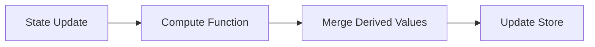

Behavior:

1. Compute function runs after every state mutation
2. Returned derived values are merged into the state update
3. Components subscribe to computed properties like any other state
4. Computed values stay synchronized with base state

---

## When to Use

- **Aggregations from collections**: `activeFilterCount: Object.keys(state.activeFilters || {}).length`
- **Validation flags**: `isFormValid: state.name.length > 0 && state.email.includes('@')`
- **Sorted/filtered lists**: `sortedItems: [...state.items].sort(...)` (prefer selectors for large collections)
- **Multi-property flags**: `canSubmit: state.isFormValid && !state.isSubmitting && state.hasChanges`

---

## Pitfalls

### 1. Simple property access

Use selectors instead of computed:

```typescript
// Wrong
compute: (state) => ({ userName: state.user?.name })

// Correct
const userName = useStore(state => state.user?.name);
```

### 2. Rarely-accessed values

Compute on-demand with `useMemo`:

```typescript
// Wrong - computes on every state update
compute: (state) => ({ expensiveCalculation: heavyCompute(state.data) })

// Correct
const result = useMemo(() => heavyCompute(data), [data]);
```

### 3. Async operations

Compute functions must be synchronous and pure:

```typescript
// Wrong
compute: (state) => ({ userProfile: await fetchUser(state.userId) })

// Correct - use async actions
fetchUserProfile: async (userId) => {
  const profile = await fetchUser(userId);
  set({ userProfile: profile });
}
```

### 4. Values dependent on props/context

Compute has no access to React context:

```typescript
// Wrong
compute: (state) => ({ filteredByTheme: filterByTheme(state.items, currentTheme) })

// Correct - use selector with props
const items = useStore(state => filterByTheme(state.items, currentTheme));
```

### 5. Missing initial values

Always provide initial values for computed properties:

```typescript
// Wrong - TypeScript error
const store = create<State>()(
  withComputed(
    { compute: (state) => ({ doubled: state.count * 2 }) },
    (set) => ({ count: 0 }) // Missing doubled
  )
);

// Correct
const store = create<State>()(
  withComputed(
    { compute: (state) => ({ doubled: state.count * 2 }) },
    (set) => ({ count: 0, doubled: 0 })
  )
);
```

When adding `persist`, configure `partialize` to store only base state (e.g., `count`, `multiplier`) and exclude computed fields (`doubled`, `total`) so they recompute on hydration.

### 6. Side effects

Compute functions must be pure:

```typescript
// Wrong
compute: (state) => {
  console.log(state.filters.length); // Side effect
  return { filterCount: state.filters.length };
}

// Correct
compute: (state) => ({ filterCount: state.filters.length })
```

### 7. Mutating state

Return new values, don't mutate:

```typescript
// Wrong
compute: (state) => {
  state.items.sort(); // Mutation
  return { sortedItems: state.items };
}

// Correct
compute: (state) => ({ sortedItems: [...state.items].sort() })
```

### 8. Circular dependencies

Computed values can reference other computed values, but avoid circular dependencies:

```typescript
// Wrong - infinite loop
compute: (state) => ({ total: state.total + state.newValue })

// Correct
compute: (state) => ({ total: state.quantity * state.price })
```

---

## Usage

```typescript
import { create } from 'zustand';
import { withComputed, createComputeFn } from '@/stores/middleware/computed';

interface CounterState {
  count: number;
  multiplier: number;
}

interface CounterComputed {
  doubled: number;
  total: number;
}

interface CounterActions {
  increment: () => void;
  setMultiplier: (multiplier: number) => void;
}

type CounterStore = CounterState & CounterComputed & CounterActions;

const computeCounterState = createComputeFn<CounterStore>({
  doubled: (state) => state.count * 2,
  total: (state) => state.count * state.multiplier,
});

export const useCounterStore = create<CounterStore>()(
  withComputed(
    { compute: computeCounterState },
    (set) => ({
      count: 0,
      multiplier: 1,
      doubled: 0,
      total: 0,
      increment: () => set((state) => ({ count: state.count + 1 })),
      setMultiplier: (multiplier: number) => set({ multiplier }),
    })
  )
);

// Usage in component
const doubled = useCounterStore(state => state.doubled);
const total = useCounterStore(state => state.total);
```

---

## Middleware Order

Recommended order: `devtools` → `persist` → `withComputed` → store

```typescript
import { create } from 'zustand';
import { devtools, persist } from 'zustand/middleware';
import { withComputed } from '@/stores/middleware/computed';

export const useStore = create<State>()(
  devtools(
    persist(
      withComputed(
        { compute: computeFn },
        (set, get) => ({ /* base state */ })
      ),
      { name: 'my-store', /* partialize: (state) => ({ baseOnly: state.baseOnly }) */ }
    ),
    { name: 'MyStore' }
  )
);
```

Order rationale: devtools logs all changes; persist saves only base state via `partialize` so computed values are excluded; withComputed runs innermost to ensure derived values exist before the persistence layer rehydrates. Do not persist computed fields—use `partialize` to drop them and recompute on hydration.

---

## Performance

Compute functions run on every state update. Keep them efficient:

- Prefer O(1) operations: `total: state.quantity * state.price`
- O(n) acceptable for small collections: `validItems: state.items.filter(i => i.isValid)`
- Avoid O(n²) or expensive operations: sorting large arrays, deep nested iterations
- Compute only frequently-accessed values; use `useMemo` for rare cases
- Avoid redundant computations: calculate once and derive multiple values
- For filtered arrays, consider selectors with `shallow` equality instead of computed

---

## Testing

```typescript
import { describe, it, expect, beforeEach } from 'vitest';
import { useMyStore } from './my-store';

describe('MyStore computed properties', () => {
  beforeEach(() => {
    useMyStore.getState().reset();
  });

  it('computes activeFilterCount correctly', () => {
    const { setActiveFilter } = useMyStore.getState();
    expect(useMyStore.getState().activeFilterCount).toBe(0);
    setActiveFilter('price', { min: 0, max: 100 });
    expect(useMyStore.getState().activeFilterCount).toBe(1);
  });
});
```

---

## API Reference

### `withComputed<T>(config, stateCreator)`

Middleware that enables automatic computed properties.

**Type Parameters**:

- `T` - Store state type (must include both base and computed properties)

**Parameters**:

- `config: ComputedConfig<T>` - Configuration object
  - `compute: (state: T) => Partial<T>` - Function that returns computed values
- `stateCreator: StateCreator<T>` - Zustand state creator

**Returns**: `StateCreator<T>` - Middleware-wrapped state creator

### `createComputeFn<T>(computedProps)`

Helper to create compute functions from individual property definitions.

**Type Parameters**:

- `T` - Store state type

**Parameters**:

- `computedProps: { [K in keyof Partial<T>]: (state: T) => T[K] }` - Object mapping property names to compute functions

**Returns**: `(state: T) => Partial<T>` - Combined compute function

**Example**:

```typescript
const compute = createComputeFn<MyState>({
  total: (state) => state.price * state.quantity,
  isValid: (state) => state.total > 0 && state.total < 1000,
});
```

---

## Related Documentation

- [Zustand Store Patterns](./standards.md#zustand-stores) - General store organization
- [Testing Guide](./testing.md) - Store testing patterns
- [Performance Best Practices](./standards.md#performance) - App-wide performance guidelines
- [ADR-0057](../adrs/0057-search-filter-panel-architecture.md) - Filter panel architecture using computed middleware

---

## Changelog

- **2025-12-03**: Initial documentation created for computed middleware pattern
- **Reference**: Implementation in `src/stores/middleware/computed.ts`
- **Related**: ADR-0057 (Search Filter Panel Architecture)
````

## File: docs/development/dependencies-deprecations.md
````markdown
---
title: Dependency Deprecations
status: active
last_updated: 2025-12-12
---

This repo aims to keep `pnpm install` free of deprecated subdependency noise **without** using risky, broad `pnpm.overrides` for native/build chains. We prefer upstream upgrades and explicit peer management.

## Baseline (2025-12-12)

`pnpm install` reported deprecated subdependencies:

### Cluster A — Native build toolchain via `mem0ai` peers

Root:

`mem0ai` peers → auto-installed `sqlite3@5.1.7` → `node-gyp@8.x` → legacy npm tooling

Deprecated packages:

- `@npmcli/move-file@1.1.2`
- `npmlog@6.0.2`
- `are-we-there-yet@3.0.1`
- `gauge@4.0.4`
- `glob@7.2.3`
- `inflight@1.0.6`
- `rimraf@3.0.2`

These are **install/build-only**, not runtime dependencies for TripSage. They only appear because pnpm auto-installs unused peers for `mem0ai`.

### Cluster B — `streamdown` Markdown stack

Root:

`streamdown@1.6.x` → `hast@1.x` (deprecated; renamed to `rehype`).

We keep Streamdown for streaming UX, CJK emphasis correctness, and built‑in Shiki/controls.

### Cluster C — Fetch/FormData polyfills

Root:

AI/SDK peers (when auto-installed) → `formdata-node@4.4.1` / `fetch-blob` → `node-domexception@1.0.0` (deprecated in favor of platform `DOMException`).

### Cluster D — Release tooling

Root:

`semantic-release@25` → `semver-diff@5` (deprecated; semver includes diff now).

## Current State After Resolution (2025-12-12)

After applying the strategy below (disable auto peer installs, restore pnpm peer rules, and add missing peers), `pnpm install` no longer surfaces Clusters A or most of C. The dependency tree still contains only upstream‑blocked deprecations:

- `hast@1.0.0` (via `streamdown@1.6.x`)
- `node-domexception@1.0.0` (polyfill chain; unused directly in app)
- `semver-diff@5.0.0` (via `semantic-release@25`)

We accept these until upstreams ship non‑deprecated replacements, per "Keep Streamdown" and pinned AI SDK constraints.

## Override Pins (Security)

We keep two narrow `pnpm.overrides` for security advisories. `pnpm` does not support inline override comments, so rationale lives here.

- `axios@1.13.2`: pinned for [CVE‑2025‑58754](https://github.com/axios/axios/security/advisories/GHSA-4hjh-wcwx-xvwj) (DoS via `data:` URL) and [CVE‑2025‑27152](https://github.com/axios/axios/security/advisories/GHSA-jr5f-v2jv-69x6) (SSRF via absolute URLs). Added 2025‑12‑11 by Bjorn Melin. Verified with `pnpm why axios` (only `mem0ai` depends on it) and `pnpm audit` clean.
- `undici@5.29.0`: pinned for [CVE‑2025‑47279](https://alas.aws.amazon.com/cve/html/CVE-2025-47279.html) (webhook retry memory leak). Added 2025‑12‑11 by Bjorn Melin. Verified with `pnpm why undici` (only `semantic-release` tooling chain) and `pnpm audit` clean.

## Resolution Strategy

1. **Prune unused `mem0ai` peers (Cluster A + most of C)**  
   - Disable pnpm auto peer install, then ignore missing storage peers that Mem0 hosted mode doesn’t use.
   - Verify Mem0 hosted client works without `sqlite3` on our supported runtimes.

2. **Keep Streamdown and track upstream (Cluster B)**  
   - No local override; wait for upstream migration off deprecated `hast`, while keeping Tailwind v4 scanning + centralized config in app.

3. **Accept upstream‑blocked deprecations (residual C/D)**  
   - AI SDK versions stay pinned by contract; `semantic-release` is already at repo‑latest.

## Upstream Tracking

- Streamdown `hast` deprecation: track upstream migration in `vercel/streamdown` ([issues search](https://github.com/vercel/streamdown/issues?q=hast+deprecation)).  
- Mem0 optional peers: request upstream to mark storage peers optional ([mem0ai/mem0#2488](https://github.com/mem0ai/mem0/issues/2488)).  
- AI SDK polyfills: re-check when contract allows bumping pinned betas.

## Recheck Cadence

Quarterly dependency hygiene:

- Re-run `pnpm install` and confirm deprecation list.
- Prefer upstream bumps; avoid new overrides unless a CVE requires a short‑lived pin.
````

## File: docs/operations/runbooks/byok-gateway-operator.md
````markdown
# BYOK + Vercel AI Gateway Operator Runbook

Operational checklist for user BYOK, Vault, and team Gateway fallback.

## Scope

- User-scoped AI keys for OpenAI/Anthropic/xAI/OpenRouter.
- User Vercel AI Gateway keys and base URLs.
- Team fallback via `AI_GATEWAY_API_KEY` when consented.
- Alignment with Supabase Vault + SECURITY DEFINER RPCs.

## Prerequisites

- Supabase project with Vault enabled.
- Service role key available for ops verification.
- Migrations applied (see below).
- Frontend deployed with `"server-only"` BYOK routes kept dynamic.

## Environment Variables

```bash
# Supabase (required)
NEXT_PUBLIC_SUPABASE_URL=...
NEXT_PUBLIC_SUPABASE_ANON_KEY=...
SUPABASE_SERVICE_ROLE_KEY=...

# Team Gateway fallback (optional)
AI_GATEWAY_API_KEY=...
AI_GATEWAY_URL=https://ai-gateway.vercel.sh/v1   # optional override

# Optional provider fallbacks (server-only)
OPENAI_API_KEY=...
ANTHROPIC_API_KEY=...
XAI_API_KEY=...
OPENROUTER_API_KEY=...
```

## Migrations to Verify

- `supabase/migrations/20251113000000_gateway_user_byok.sql`
  - Tables: `api_gateway_configs` (owner RLS), `user_settings` (owner RLS, `allow_gateway_fallback` default true).
  - RPCs (SECURITY DEFINER, service_role only): `upsert_user_gateway_config`, `get_user_gateway_base_url`, `delete_user_gateway_config`, `get_user_allow_gateway_fallback`.

## Verification (service role curl)

```bash
# Insert user Gateway key + base URL
curl -X POST https://<project>.supabase.co/rest/v1/rpc/upsert_user_gateway_config \
  -H "Authorization: Bearer $SUPABASE_SERVICE_ROLE_KEY" \
  -H "Content-Type: application/json" \
  -d '{"p_user_id":"test-user","p_base_url":"https://my-gateway.vercel.sh/v1","p_api_key":"sk-gateway"}'

# Read back base URL
curl -X POST https://<project>.supabase.co/rest/v1/rpc/get_user_gateway_base_url \
  -H "Authorization: Bearer $SUPABASE_SERVICE_ROLE_KEY" \
  -H "Content-Type: application/json" \
  -d '{"p_user_id":"test-user"}'

# Consent toggle
curl -X POST https://<project>.supabase.co/rest/v1/rpc/get_user_allow_gateway_fallback \
  -H "Authorization: Bearer $SUPABASE_SERVICE_ROLE_KEY" \
  -H "Content-Type: application/json" \
  -d '{"p_user_id":"test-user"}'
```

**Expected:**

- Gateway config RPCs succeed with service role, fail with anon key.
- `allow_gateway_fallback` respects user setting default true.

## Provider Resolution Order (code contract)

1. User Gateway key (Vercel AI Gateway)  
2. User provider BYOK keys (OpenAI/Anthropic/xAI/OpenRouter)  
3. Team fallback `AI_GATEWAY_API_KEY` if user consent `allowGatewayFallback=true`  

All resolution happens server-side (`@/lib/providers/registry`); keys are never exposed to the client.

## App Endpoints to Exercise

- `POST /api/keys` — insert BYOK or Gateway key (`service:"gateway"` optional `baseUrl`).
- `POST /api/user-settings` — set `allowGatewayFallback`.
- `POST /api/keys/validate` — validate key; expect 401/403 on invalid or consent denial.

## Security Notes

- Secrets live in Vault; access only via SECURITY DEFINER RPCs with service role JWT.
- BYOK routes are `"server-only"` and dynamic (no static rendering).
- Do not log API keys; telemetry spans redact secrets.

## Troubleshooting

- **401/403 on /api/keys/validate**: key invalid, consent off, or missing service role in RPC call.
- **No fallback despite team key**: ensure `allowGatewayFallback=true` for user and `AI_GATEWAY_API_KEY` set.
- **High latency resolving provider**: check Vault availability; reduce repeated lookups or cache consent in request scope.
- **RPC denied**: verify migrations applied and functions marked SECURITY DEFINER; call with service role token.

## Change Management Checklist

- [ ] Migrations applied and RLS enabled on `api_gateway_configs` / `user_settings`.
- [ ] Env vars set (`SUPABASE_*`, optional `AI_GATEWAY_*`, provider keys if needed).
- [ ] Service-role curl smoke tests pass (insert/get gateway config, consent read).
- [ ] Team fallback path tested by removing user keys and setting consent ON.
- [ ] Logs/telemetry reviewed for secret redaction.
````

## File: docs/operations/runbooks/database-ops.md
````markdown
# Database Operations Runbook

Task-focused guide for Supabase operations. For schema/design context, see `../../architecture/database.md`.

## Scope & Prerequisites

- Supabase CLI installed and authenticated (`supabase --version`, `supabase login`).
- Access to project `project-ref`, service role key, and Vault-enabled Supabase project.
- Local env ready for this repo (PNPM, Node, `supabase` directory present).

## Bootstrap a Database

### Local Dev Stack

1. Start services: `supabase start`
2. Reset and apply migrations: `supabase db reset`
3. (Alt) Apply canonical schema to external Postgres: `cd supabase && psql "$DATABASE_URL" -f schema.sql`

### New Supabase Project

1. Create project in dashboard; capture `project-ref` and DB URL.
2. Link repo: `supabase link --project-ref <project-ref>`
3. Push schema + seed: `supabase db push --include-seed`
4. Generate types after changes: `supabase gen types typescript --local > src/lib/supabase/database.types.ts`

### Required Environment Variables

- `NEXT_PUBLIC_SUPABASE_URL`, `NEXT_PUBLIC_SUPABASE_ANON_KEY`
- `SUPABASE_SERVICE_ROLE_KEY` (server only)
- `AI_GATEWAY_API_KEY`, `AI_GATEWAY_URL` (team fallback)
- Optional user-provided BYOK keys via Vault
- Server-side fallback provider keys (optional): `OPENAI_API_KEY`, `OPENROUTER_API_KEY`, `ANTHROPIC_API_KEY`, `XAI_API_KEY`
- Webhooks/QStash/Resend: `HMAC_SECRET`, `QSTASH_TOKEN`, `QSTASH_CURRENT_SIGNING_KEY`, `QSTASH_NEXT_SIGNING_KEY`, `RESEND_API_KEY`, `RESEND_FROM_EMAIL`, `RESEND_FROM_NAME`
- Optional downstream collaborator webhook: `COLLAB_WEBHOOK_URL`
- Upstash Redis: `UPSTASH_REDIS_REST_URL`, `UPSTASH_REDIS_REST_TOKEN`

## BYOK / Vault Operations

### Architecture Overview

The BYOK system consists of:

- **Factory Pattern**: `@supabase/ssr` integration with OpenTelemetry tracing
- **Multi-Provider Support**: OpenAI, Anthropic, xAI, OpenRouter, Vercel AI Gateway (5 providers)
- **Vault Storage**: Encrypted API key storage with service-role access only
- **RPC Security**: All operations via 8 SECURITY DEFINER functions
- **RLS Isolation**: Owner-only data access policies
- **SSR Compatibility**: Next.js App Router with proper cookie handling

### One-Time Verification

- Ensure Vault extension is installed:

  ```bash
  supabase db sql "SELECT name, installed_version FROM pg_available_extensions WHERE name = 'vault';"
  ```

- Smoke-test SECURITY DEFINER RPCs (service role): `insert_user_api_key`, `get_user_api_key`, `delete_user_api_key`, `touch_user_api_key` via REST or psql; anon-key should fail.
- Validate gateway helpers: `upsert_user_gateway_config`, `get_user_gateway_base_url`, `get_user_allow_gateway_fallback` (service role only).

### BYOK Lifecycle (service role)

1. Insert key: `insert_user_api_key(user_id, service, key)`
2. Retrieve key: `get_user_api_key(user_id, service)`
3. Touch access time: `touch_user_api_key(user_id, service)`
4. Delete key: `delete_user_api_key(user_id, service)`

Expect RLS isolation: users only see their own keys via app paths.

### BYOK Verification (curl)

```bash
# Negative: anon should fail
curl -X POST https://<project>.supabase.co/rest/v1/rpc/insert_user_api_key \
  -H "Authorization: Bearer <anon-key>" \
  -H "Content-Type: application/json" \
  -d '{"p_user_id":"test","p_service":"openai","p_api_key":"deny"}'

# Positive: service role
curl -X POST https://<project>.supabase.co/rest/v1/rpc/insert_user_api_key \
  -H "Authorization: Bearer '$SUPABASE_SERVICE_ROLE_KEY'" \
  -H "Content-Type: application/json" \
  -d '{"p_user_id":"test","p_service":"openai","p_api_key":"sk-test"}'

# Gateway config
curl -X POST https://<project>.supabase.co/rest/v1/rpc/upsert_user_gateway_config \
  -H "Authorization: Bearer '$SUPABASE_SERVICE_ROLE_KEY'" \
  -H "Content-Type: application/json" \
  -d '{"p_user_id":"test","p_base_url":"https://my-gateway.vercel.sh/v1"}'
```

### Complete BYOK Lifecycle Test

```bash
# 1. Insert API key
curl -X POST https://<project>.supabase.co/rest/v1/rpc/insert_user_api_key \
  -H "Authorization: Bearer $SUPABASE_SERVICE_ROLE_KEY" \
  -H "Content-Type: application/json" \
  -d '{"p_user_id": "test-user", "p_service": "openai", "p_api_key": "sk-test-key"}'

# 2. Retrieve API key
curl -X POST https://<project>.supabase.co/rest/v1/rpc/get_user_api_key \
  -H "Authorization: Bearer $SUPABASE_SERVICE_ROLE_KEY" \
  -H "Content-Type: application/json" \
  -d '{"p_user_id": "test-user", "p_service": "openai"}'

# 3. Update last_used timestamp
curl -X POST https://<project>.supabase.co/rest/v1/rpc/touch_user_api_key \
  -H "Authorization: Bearer $SUPABASE_SERVICE_ROLE_KEY" \
  -H "Content-Type: application/json" \
  -d '{"p_user_id": "test-user", "p_service": "openai"}'

# 4. Delete API key
curl -X POST https://<project>.supabase.co/rest/v1/rpc/delete_user_api_key \
  -H "Authorization: Bearer $SUPABASE_SERVICE_ROLE_KEY" \
  -H "Content-Type: application/json" \
  -d '{"p_user_id": "test-user", "p_service": "openai"}'
```

### Integration Testing

**End-to-End BYOK Flow (TypeScript)**:

```ts
import { resolveProvider } from "@ai/models/registry";

// Should use BYOK key if available
const provider = await resolveProvider(userId, "gpt-4o-mini");
expect(provider.provider).toBe("openai");
expect(provider.modelId).toBe("gpt-4o-mini");

// Should fallback to team Gateway (remove BYOK keys first)
const fallbackProvider = await resolveProvider(userId, "gpt-4o-mini");
expect(fallbackProvider.provider).toBe("openai");
```

**SSR Compatibility Testing**:

```ts
import { createServerSupabase } from "@/lib/supabase/server";
import { getCurrentUser } from "@/lib/supabase/factory";

const supabase = await createServerSupabase();
const user = await getCurrentUser(supabase);
expect(user).toBeDefined();
```

## Webhooks Operations (DB → Vercel)

### Prerequisites

- Webhook routes deployed: `/api/hooks/trips`, `/api/hooks/cache`, `/api/hooks/files`, `/api/jobs/notify-collaborators` (QStash worker)
- Env vars configured: `HMAC_SECRET`, `QSTASH_*`, `RESEND_*` (see Required Environment Variables above)
- QStash worker rejects requests when signing keys are missing; configure before directing production traffic

### Configure Postgres GUCs

Set once per database (replace values):

```sql
ALTER DATABASE <db_name>
  SET app.vercel_webhook_trips = 'https://<vercel-domain>/api/hooks/trips';
ALTER DATABASE <db_name>
  SET app.vercel_webhook_cache = 'https://<vercel-domain>/api/hooks/cache';
ALTER DATABASE <db_name>
  SET app.webhook_hmac_secret   = '<same-as-HMAC_SECRET>';

-- Verify
SELECT current_setting('app.vercel_webhook_trips', true) AS trips_url,
       current_setting('app.vercel_webhook_cache', true) AS cache_url,
       nullif(current_setting('app.webhook_hmac_secret', true), '') IS NOT NULL AS hmac_set;
```

Notes:

- Use `SET` per-session for testing; functions use `current_setting(..., true)` which returns NULL when unset
- **Secret rotation**: update DB GUC and Vercel env atomically; briefly accept both during rotation if needed
- Automate with `scripts/operators/setup_webhooks.sh`; validate with `scripts/operators/verify_webhook_secret.sh`
- `.github/workflows/deploy.yml` runs the verification script before deployment; configure `PRIMARY_DATABASE_URL` secret

### Test HMAC Delivery

```bash
payload='{"type":"INSERT","table":"trip_collaborators","record":{"id":"test","trip_id":1},"occurred_at":"2025-11-13T03:00:00Z"}'
sig=$(printf "%s" "$payload" | openssl dgst -sha256 -hmac "$HMAC_SECRET" -hex | sed 's/^.* //')
curl -i -H 'Content-Type: application/json' -H "X-Signature-HMAC: $sig" -d "$payload" https://<vercel-domain>/api/hooks/trips
```

Expected: `200 OK { ok: true }`; `401` on bad/missing signature.

Automate drift detection with `scripts/operators/verify_webhook_secret.sh`; it fails the pipeline when DB GUCs diverge from `HMAC_SECRET`.

### End-to-End from Postgres

- After GUCs are set, mutate a subscribed table (e.g., `INSERT INTO trip_collaborators ...`); trigger posts to Vercel handlers with HMAC
- `/api/hooks/trips` enqueues jobs to `/api/jobs/notify-collaborators` via QStash for durable retries
- `/api/hooks/cache` bumps per-tag version counters in Upstash Redis; downstream cache keys use format `tag:v{version}:{key}` (no Redis purging or downstream webhooks)
- QStash workers validate `Upstash-Signature` header; fail closed when signing keys absent

### Security Notes

- HMAC header omitted when no secret configured; handlers reject missing/invalid signatures
- Webhook functions run with `SECURITY DEFINER` and `search_path = pg_catalog, public` to prevent hijacking
- Keep secrets in DB settings (`app.*` GUCs); never store in tables
- QStash uses `Upstash-Signature` for worker calls; worker routes verify with configured signing keys

### Troubleshooting

- 401 responses: verify `app.webhook_hmac_secret` matches `HMAC_SECRET` exactly (no quotes/whitespace)
- Missing signatures: HMAC header omitted if secret unset; set DB GUC and redeploy env
- QStash failures: ensure `QSTASH_*` envs present; worker rejects missing keys
- Re-compute signature locally using exact JSON the DB sends (`payload::text`) if 401s persist

### Observability

- Webhook handlers emit spans: `webhook.trips`, `webhook.cache`, `webhook.files`
- Verification failures add event `webhook_verification_failed` on active span with reason: `missing_secret_env` | `invalid_signature` | `invalid_json` | `invalid_payload_shape`
- Handlers log structured `[operational-alert]` entries when verification fails; wire log drains or SIEM queries to page on repeated failures
- Redis helpers emit `redis.unavailable` spans and `[operational-alert]` logs when cache invalidation or idempotency degrades due to missing Upstash credentials

## Webhook Types

| Webhook | Trigger Tables | Route | Purpose |
|---------|---------------|-------|---------|
| Trips | `trip_collaborators` | `/api/hooks/trips` | Enqueue collaborator notifications via QStash |
| Cache | `trips`, `flights`, `accommodations`, `search_*`, `chat_*` | `/api/hooks/cache` | Bump cache tag versions in Upstash Redis |
| Files | `file_attachments` | `/api/hooks/files` | Process file uploads |
| Notify (QStash worker) | — | `/api/jobs/notify-collaborators` | Send email notifications via Resend |

## Realtime Operations

| Topic Pattern | Access | Use Case |
|--------------|--------|----------|
| `user:{user_id}` | Subject user only | Per-user notifications, agent status |
| `session:{session_id}` | Session owner + trip collaborators | Chat session updates, typing indicators |
| `trip:{trip_id}` | Trip owner + collaborators | Trip collaboration events |

All channels are private by default (`{ config: { private: true } }`). RLS policies enforce topic ownership via `realtime` extension helpers.

**Client pattern**: Sync access token before subscribing; unsubscribe on unmount to avoid leaks.

## Database Maintenance

### Database Health Check

```sql
-- Active connections with warning threshold
SELECT
  'active_connections' AS metric,
  count(*)::text AS value,
  CASE WHEN count(*) > 150 THEN 'warning' ELSE 'ok' END AS status
FROM pg_stat_activity WHERE state = 'active';
```

### Query Performance

```sql
SELECT query, total_time, calls, total_time/calls AS avg_ms
FROM pg_stat_statements ORDER BY total_time DESC LIMIT 10;
```

### Connection Health

```sql
SELECT state, count(*) FROM pg_stat_activity GROUP BY state;
```

### Vector Index Maintenance

```sql
-- Check index stats (accommodation_embeddings uses ivfflat)
SELECT indexname, idx_scan, idx_tup_read
FROM pg_stat_user_indexes WHERE indexname LIKE '%embedding%';

-- Rebuild when scans climb or recall drops
REINDEX INDEX CONCURRENTLY idx_memories_embedding;

-- Adjust HNSW parameters based on data size (if using HNSW)
ALTER INDEX idx_memories_embedding SET (m = 32, ef_construction = 400);
```

### Backup & Recovery

- Supabase managed daily backups + PITR; verify retention
- Manual exports:

```bash
supabase db dump --db-url "$DATABASE_URL" > backup.sql
pg_dump --table=memories --table=session_memories "$DATABASE_URL" > memories_backup.sql
```

### Schema Migration Naming

```text
YYYYMMDD_HHMMSS_description.sql
# Example: 20251113_143000_add_trip_collaborators.sql
```

Keep table and function inventory aligned with `docs/architecture/database.md`.

## Common Issues & Resolutions

- **Vault extension not accessible**:

```bash
# Check Vault extension status
supabase db sql "SELECT name, installed_version FROM pg_available_extensions WHERE name = 'vault';"

# Re-enable if needed
supabase db sql "CREATE EXTENSION IF NOT EXISTS vault;"
```

- **Must be called as service role**: ensure Authorization header uses service role JWT when invoking RPCs directly; verify JWT claims include `role: "service_role"`

- **RLS policy violation**:

```sql
-- Check RLS policies are active
SELECT schemaname, tablename, rowsecurity
FROM pg_tables
WHERE schemaname = 'public'
  AND tablename IN ('api_keys', 'api_gateway_configs', 'user_settings');
```

- **Provider resolution failed**:
  - Check API key validity for the provider
  - Verify provider is supported (openai, anthropic, xai, openrouter, gateway)
  - Check Gateway fallback settings if no BYOK keys
  - Review telemetry spans `providers.resolve` for path and error details

- **Realtime auth errors**: verify JWT freshness and topic formatting; ensure `realtime` extension present

- **Webhook issues**: see [Webhooks Troubleshooting](#troubleshooting) section above

## Pre-Deployment Checklist

- [ ] Vault extension enabled; BYOK RPCs pass curl smoke tests
- [ ] All 8 SECURITY DEFINER functions operational (4 BYOK + 4 Gateway config)
- [ ] All 5 providers functional (OpenAI, Anthropic, xAI, OpenRouter, Gateway)
- [ ] Webhook GUCs match `HMAC_SECRET`; verification script passes
- [ ] Required env vars present (Supabase, Redis/QStash, HMAC, Resend, AI keys)
- [ ] Migrations applied (consolidated: `20251122000000_base_schema.sql`); types regenerated
- [ ] RLS policies active on: `api_keys`, `api_gateway_configs`, `user_settings`
- [ ] Vector indexes healthy; no critical slow queries in `pg_stat_statements`

### RLS Data Isolation Verification

```sql
-- As service role, insert test data
SELECT insert_user_api_key('user-a'::uuid, 'openai', 'key-a');
SELECT insert_user_api_key('user-b'::uuid, 'openai', 'key-b');

-- Verify isolation (each user should only see their own keys)
-- Test via application RLS policies with user-a JWT
```

## Security Considerations

### Defense in Depth

1. **Network Level**: Supabase project access controls
2. **Application Level**: Service role key authentication
3. **Database Level**: RLS policies and SECURITY DEFINER functions
4. **Encryption Level**: Vault-stored secrets with Supabase encryption
5. **Operational Level**: Audit logging and monitoring

### Compliance Requirements

- **Data Encryption**: All API keys encrypted at rest via Vault
- **Access Logging**: All operations logged with user context
- **Principle of Least Privilege**: Service role only for administrative operations
- **Data Isolation**: RLS ensures users only access their own keys
- **Regular Audits**: Automated verification scripts for continuous compliance

## Monitoring & Alerting

### Telemetry Integration

The BYOK system integrates with OpenTelemetry:

- **Factory Initialization**: `supabase.init` spans with database connection tracking
- **Provider Resolution**: `providers.resolve` spans with user ID redaction and path tracking
- **Auth Operations**: `supabase.auth.getUser` spans for session management
- **Middleware**: Session refresh spans in Edge runtime

### Key Metrics

- BYOK resolution success rate: `sum(rate(providers_resolve_total{status="success"}[5m])) / sum(rate(providers_resolve_total[5m]))`
- Vault operation latency: `histogram_quantile(0.95, rate(vault_operation_duration_bucket[5m]))`
- RLS policy violations: `rate(rls_policy_violation_total[5m])`
- Webhook verification failures: spans `webhook.trips`, `webhook.cache` with event `webhook_verification_failed`

### Alert Conditions

- BYOK resolution failure rate > 5%
- Vault operation latency > 500ms p95
- RLS policy violations > 0
- Missing API keys for active users
- Repeated webhook verification failures (reason = `missing_secret_env` | `invalid_signature`)

## Incident Response

### API Key Compromise

1. Immediately revoke compromised key via `delete_user_api_key(userId, service)` RPC
2. Audit access logs for unauthorized usage (check telemetry spans `providers.resolve`)
3. Rotate affected API keys at provider (OpenAI dashboard, Anthropic console, etc.)
4. Reinsert new keys via BYOK UI or RPC

### Vault Security Breach

1. Assess breach scope and impact
2. Rotate all affected API keys at providers
3. Review and update access controls
4. Enhance monitoring and alerting
5. Execute full purge if required:

```sql
DELETE FROM vault.secrets WHERE name LIKE '%_api_key_%';
DELETE FROM public.api_keys;
UPDATE public.user_settings SET allow_gateway_fallback = true;
DELETE FROM public.api_gateway_configs;
```

### Webhook Incident

1. Rotate `HMAC_SECRET` env var and DB GUC atomically
2. Flush QStash signing keys if worker verification compromised
3. Replay missed events after verification is restored

### Service Outage

1. Check Supabase status page
2. Consider read-only mode if partial availability
3. Restore via PITR if corruption detected
````

## File: docs/operations/runbooks/hnsw-migration.md
````markdown
# HNSW Migration Playbook (pgvector)

Operational steps to migrate IVFFlat indexes to HNSW for `accommodation_embeddings` and `memories.turn_embeddings` without downtime.

## Scope

- Tables: `public.accommodation_embeddings`, `memories.turn_embeddings` (1536-d vectors, L2).
- Target params: `m=32`, `ef_construction=180` (160 if RAM constrained), default `hnsw.ef_search=96` (tune 64–128 per query).

## Preconditions

- pgvector extension ≥ 0.5.0 installed.
- Sufficient RAM for concurrent HNSW build (estimate 1–1.5x index size during build).
- Monitor `pg_stat_activity` and `pg_stat_user_indexes` access patterns to pick a low-traffic window.

## Migration steps

### Step 1: Create new HNSW indexes concurrently (keep IVFFlat online)

```sql
-- accommodations
CREATE INDEX CONCURRENTLY IF NOT EXISTS accommodation_embeddings_embedding_hnsw_idx
  ON public.accommodation_embeddings
  USING hnsw (embedding vector_l2_ops) WITH (m = 32, ef_construction = 180);

-- memories
CREATE INDEX CONCURRENTLY IF NOT EXISTS memories_turn_embeddings_vector_hnsw_idx
  ON memories.turn_embeddings
  USING hnsw (embedding vector_l2_ops) WITH (m = 32, ef_construction = 180);
```

### Step 2: Set per-query defaults in functions/queries

```sql
PERFORM set_config('hnsw.ef_search', '96', true); -- adjust 64–128 if needed
```

### Step 3: Validate

- Compare recall/latency vs IVFFlat on a sampled workload.
- Check index usage: `SELECT * FROM pg_stat_user_indexes WHERE indexrelname LIKE '%embedding%';`
- Confirm row estimates look sane: `ANALYZE` tables after build.

### Step 4: Cutover

- Update application/query functions to rely on HNSW (already done in `match_accommodation_embeddings`).
- Keep IVFFlat for one validation window; then drop to reclaim disk:

```sql
DROP INDEX CONCURRENTLY IF EXISTS accommodation_embeddings_embedding_idx; -- old IVFFlat name
ALTER INDEX accommodation_embeddings_embedding_hnsw_idx RENAME TO accommodation_embeddings_embedding_idx;

DROP INDEX CONCURRENTLY IF EXISTS memories_turn_embeddings_vector_idx; -- old IVFFlat name
ALTER INDEX memories_turn_embeddings_vector_hnsw_idx RENAME TO memories_turn_embeddings_vector_idx;
```

### Step 5: Rollback

- If HNSW regression is detected, drop the HNSW index and keep IVFFlat:

```sql
DROP INDEX CONCURRENTLY IF EXISTS accommodation_embeddings_embedding_hnsw_idx;
DROP INDEX CONCURRENTLY IF EXISTS memories_turn_embeddings_vector_hnsw_idx;
```

## Monitoring

- Track query latency and buffer/cache hit rates before/after cutover.
- Watch memory during build (`pg_stat_activity`, system metrics) to avoid OOM.
- Alert if `hnsw.ef_search` drifts from expected defaults (pg_settings).

## Notes

- Write-heavy workloads may still prefer IVFFlat; if so, keep IVFFlat with `lists≈500–1000`, `probes≈20` and skip cutover for the affected table.
- Always run `ANALYZE` after index build/drop to refresh planner stats.
````

## File: docs/operations/runbooks/pg-cron-monitoring.md
````markdown
# pg_cron Monitoring (Datadog Skeleton)

Purpose: alert when scheduled `pg_cron` jobs (especially memory retention) fail or stop running. Job name `cleanup_memories_180d` comes from `supabase/migrations/20251122000000_base_schema.sql`; if the migration renames the job, update this runbook and the monitors below.

## What to monitor

- Job failures in Postgres logs containing `pg_cron` + job name (default: `cleanup_memories_180d`).
- Missing executions for >2 intervals (default cron: `45 3 * * *`).

## Datadog monitor template

```json
{
  "name": "[TripSage] pg_cron cleanup_memories_180d failures",
  "type": "log alert",
  "query": "service:postgres @message:\"pg_cron\" @message:\"cleanup_memories_180d\" @status:error",
  "message": "pg_cron cleanup_memories_180d is failing. Investigate Supabase logs and rerun the job. See docs/operations/runbooks/pg-cron-monitoring.md",
  "tags": ["service:postgres", "component:pg_cron", "env:prod"],
  "options": {
    "evaluation_delay": 300,
    "no_data_timeframe": 1440,
    "notify_no_data": true,
    "thresholds": { "critical": 1 }
  }
}
```

## Remediation

1) **Confirm job status**
   - Supabase UI → Database → Extensions → `pg_cron` → Job History, or query `SELECT * FROM cron.job_run_details ORDER BY start_time DESC LIMIT 20;`.
   - Check expected job exists: `SELECT jobid, schedule, command FROM cron.job WHERE command LIKE '%cleanup_memories_180d%';`.

2) **Inspect recent runs and errors**
   - Recent run outcomes: `SELECT * FROM cron.job_run_details WHERE jobid = (SELECT jobid FROM cron.job WHERE command LIKE '%cleanup_memories_180d%' LIMIT 1) ORDER BY start_time DESC LIMIT 50;`.
   - Postgres logs (via Datadog or Supabase logs) filtered on `pg_cron` + job name; capture error snippets for escalation.

3) **Check locks / long transactions before rerun**
   - Blocking locks: `SELECT * FROM pg_locks pl JOIN pg_stat_activity psa ON pl.pid = psa.pid WHERE psa.query ILIKE '%cleanup_memories_180d%';`.
   - Long-running statements: `SELECT pid, now() - query_start AS age, query FROM pg_stat_activity WHERE state != 'idle' ORDER BY age DESC LIMIT 20;`.

4) **Verify idempotency and safe rerun options**
   - `cleanup_memories_180d` deletes expired rows; reruns should be no-op after successful completion. Confirm by reviewing migration notes and WHERE clause window.
   - For safety, dry-run on staging first (Supabase staging project) using same command and parameters.

5) **Run job manually (single execution)**
   - From Supabase SQL editor or psql: `SELECT cron.schedule_in_database('cleanup_memories_180d_manual', 'now()', $$SELECT cleanup_memories_180d();$$);` then monitor `cron.job_run_details` for that job name; drop the temp job after success: `SELECT cron.unschedule('cleanup_memories_180d_manual');`.

6) **Escalate if**
   - Two consecutive manual runs fail, or production data at risk (unexpected deletions/retention anomalies), or locks persist >15 minutes.
   - Provide: job_run_details rows, log snippets (last error stack), lock query output, and whether staging rerun succeeded.
   - Temporary mitigation: pause schedule `SELECT cron.unschedule('cleanup_memories_180d');` **only after explicit approval** (record approver name/title, channel, timestamp in the incident ticket or #ops-alerts thread). Unscheduling is effectively irreversible without manual reschedule/rerun; document the pause, planned reschedule time, and owner.

## Gaps / next steps (actionable)

- **Jira Epic OPS-2450 — pg_cron monitoring hardening** (Owner: Platform Team, Target: 2026-01-15)
  - OPS-2451 (Owner: Platform Team, Priority: P0/Blocker, Due: 2025-12-15): Enable Supabase/Postgres → Datadog log shipping and confirm `pg_cron` entries land in `service:postgres` logs.
  - OPS-2452 (Owner: SRE, Priority: P1, Due: 2025-12-18): Deploy the log alert in this doc using the enabled log pipeline; validate alert fires on a forced failure.
  - OPS-2453 (Owner: SRE, Priority: P1, Due: 2025-12-22, dependent on OPS-2451): Add execution-gap monitor via Datadog metrics; if OPS-2451 slips, implement the heartbeat/synthetic metric workaround as the interim monitoring path and note the dependency/owner in the issue.
  - OPS-2454 (Owner: Product/Platform, Priority: P2, Due: 2026-01-05): Keep job name aligned with migrations (`cleanup_memories_180d` unless renamed); add a migration checklist step to update alert queries when job names change.
  - OPS-2455 (Owner: Platform Team, Priority: P2, Due: 2026-01-05): Document and automate rollout playbook (enable log shipping + monitors) for new environments; link playbook in this runbook.
````

## File: docs/operations/runbooks/storage-owner-audit.md
````markdown
# Storage Owner Audit Runbook

Operational checklist to detect and remediate ownership mismatches between Supabase Storage objects and relational records.

## Scope

- Buckets: `attachments`, `trip-images`, `avatars`.
- Tables: `storage.objects`, `public.file_attachments` (path + owner metadata).
- Purpose: ensure `owner`/`user_id` alignment for RLS and clean up orphaned objects.

## Prerequisites

- Supabase service-role key available for SQL execution.
- Migrations applied from `supabase/migrations/20251122000000_base_schema.sql` (RLS + owner_id/owner coalesce in storage policies).
- Verify migration applied before running queries:
  - Column check: `SELECT column_name FROM information_schema.columns WHERE table_schema = 'storage' AND table_name = 'objects' AND column_name = 'owner_id';` should return one row.
  - Policy check: confirm RLS policies on `storage.objects` reference `owner`/`owner_id` (e.g., via `SELECT policyname, policydefinition FROM pg_policies WHERE schemaname = 'storage' AND tablename = 'objects';`).
  - If either check fails, stop and apply the migration before proceeding.

## Detection Queries

### Objects without a matching file_attachments row

```sql
SELECT o.bucket_id, o.name AS path, o.owner, o.owner_id, o.created_at
FROM storage.objects o
LEFT JOIN public.file_attachments fa ON fa.file_path = o.name
WHERE o.bucket_id IN ('attachments','trip-images','avatars')
  AND fa.file_path IS NULL
ORDER BY o.created_at DESC;
```

### Owner mismatch between storage.objects and file_attachments

```sql
SELECT o.bucket_id, o.name AS path, o.owner AS storage_owner, o.owner_id AS storage_owner_id, fa.user_id, fa.trip_id
FROM storage.objects o
JOIN public.file_attachments fa ON fa.file_path = o.name
WHERE o.bucket_id IN ('attachments','trip-images','avatars')
  AND fa.user_id IS NOT NULL -- NULL user_ids handled separately (treat as malformed attachments)
  AND fa.user_id IS DISTINCT FROM coalesce(o.owner_id, o.owner);
```

### file_attachments pointing to missing objects

```sql
SELECT fa.id, fa.file_path, fa.user_id, fa.trip_id
FROM public.file_attachments fa
LEFT JOIN storage.objects o ON o.name = fa.file_path
WHERE o.name IS NULL
ORDER BY fa.created_at DESC;
```

## Remediation Steps

- For orphaned objects (query 1): decide whether to delete the object or recreate the relational row. Use `storage.objects` delete via service role if the file is not referenced.
- For owner mismatches (query 2): align both `storage.objects.owner` and `storage.objects.owner_id` to `fa.user_id` **or** correct `file_attachments.user_id` if the relational row is wrong. Keep `user_id` as the source of truth; update storage via service-role SQL:

```sql
UPDATE storage.objects o
SET owner = fa.user_id, owner_id = fa.user_id
FROM public.file_attachments fa
WHERE fa.file_path = o.name
  AND o.bucket_id IN ('attachments','trip-images','avatars')
  AND fa.user_id IS NOT NULL -- skip nulls; investigate these attachments manually
  AND fa.user_id IS DISTINCT FROM coalesce(o.owner_id, o.owner);
```

- For missing objects (query 3): either remove the relational row or re-upload the file, depending on business need.

## Ongoing Hygiene

- Run queries weekly or before large refactors of attachments/upload flows.
- Add a lightweight CI smoke check (non-blocking) that ensures the SQL in queries (1) and (2) returns zero rows in staging.
- When changing RLS or path conventions, add a one-time audit using this runbook.

## Alerts (optional)

- Create a scheduled task (pg_cron or external job) that logs counts of each mismatch bucket to an ops dashboard; page only on spikes or non-zero counts for production.
````

## File: docs/operations/admin-guide.md
````markdown
# Administrator Guide

Admin surfaces are implemented in Next.js route handlers and rely on Supabase SSR sessions. Admin identity is asserted via `app_metadata.is_admin === true` on the Supabase user object (`ensureAdmin` helper).

## Access requirements

- Valid Supabase session cookie (SSR) with `app_metadata.is_admin: true`.
- Environment variables populated for Supabase + Upstash (see `docs/operations/deployment-guide.md`).
- Admin routes are telemetry-instrumented; no server `console.*`.

## Admin endpoints

### Agent configuration (versioned)

All endpoints enforce `ensureAdmin(user)` and run on the Node runtime.

```http
GET  /api/config/agents                 # list agent types + scopes
GET  /api/config/agents/:agentType      # fetch active config (supports ?scope=global|env)
PUT  /api/config/agents/:agentType      # update config (Zod-validated)
GET  /api/config/agents/:agentType/versions
POST /api/config/agents/:agentType/rollback/:versionId
```

- Scope parsing uses `scopeSchema` (`global` default).
- Writes emit OpenTelemetry spans (`agent_config.load_existing`, `agent_config.update_failed`, `agent_config.updated`) and are rate limited via `withApiGuards`.
- Rollback keeps one canonical history; no parallel config tracks.

### Dashboard metrics

```http
GET /api/dashboard?window=24h|7d|30d|all
```

- Auth required; rate limited as `dashboard:metrics`.
- Returns cached aggregates (Upstash Redis cache-aside) with private cache headers.

## Operational playbook

> **Supabase SSR Cookies**: Authenticated requests require two session cookies from the Supabase SSR setup: `sb-access-token` (access token) and `sb-refresh-token` (refresh token). Pass both via `-b` flags in curl requests.

1) **Verify admin session**

    ```bash
    curl -I \
      -b "sb-access-token=<access-token>" \
      -b "sb-refresh-token=<refresh-token>" \
      https://<app>/api/config/agents
    # expect 200 for admins, 403 otherwise
    ```

2) **Update agent config**

    ```bash
    curl -X PUT https://<app>/api/config/agents/budget \
      -b "sb-access-token=<access-token>" \
      -b "sb-refresh-token=<refresh-token>" \
      -H "Content-Type: application/json" \
      -d '{"modelId":"gpt-4o-mini","temperature":0.3,"scope":"global"}'
    ```

3) **Rollback**

    ```bash
    curl -X POST https://<app>/api/config/agents/budget/rollback/<versionId> \
      -b "sb-access-token=<access-token>" \
      -b "sb-refresh-token=<refresh-token>"
    ```

4) **Metrics sanity check**

    ```bash
    curl -b "sb-access-token=<access-token>" \
      -b "sb-refresh-token=<refresh-token>" \
      "https://<app>/api/dashboard?window=24h"
    ```

## Security & auditing

- Admin auth comes solely from Supabase `app_metadata.is_admin`; there are no parallel RBAC tables.
- Secrets and BYOK values remain in Supabase Vault; admin routes never return raw keys.
- All admin routes emit OTEL spans; failures attach `status`, `reason`, and request ID. Scrape via your OTLP/Jaeger pipeline.

## Troubleshooting

- **403 on admin routes**: confirm session cookie present and `app_metadata.is_admin` true in Supabase dashboard.
- **429**: rate limit buckets (`dashboard:metrics`, `config:agents:read`, `config:agents:update`, `config:agents:rollback`, `config:agents:versions`) are powered by Upstash; verify `UPSTASH_*` envs.
- **Config drift**: use `/api/config/agents/:agentType/versions` to confirm latest version; rollback if necessary.
- **Missing telemetry**: ensure OTLP exporter envs (`NEXT_PUBLIC_OTEL_EXPORTER_OTLP_ENDPOINT` for client, server exporter config in code) are set in the environment.
````

## File: docs/operations/agent-frontend.md
````markdown
# Frontend Agent Operations (Full Cutover)

This runbook covers operating the frontend-only agents implemented with Vercel AI SDK v6. This deployment performs a full cutover (no feature flags/waves).

## Endpoints

- `POST /api/agents/flights` – Flight search (streaming)
- `POST /api/agents/accommodations` – Accommodation search (streaming)
- `POST /api/agents/budget` – Budget planning (streaming)
- `POST /api/agents/memory` – Memory updates (streaming)
- `POST /api/agents/destinations` – Destination research (streaming)
- `POST /api/agents/itineraries` – Itinerary planning (streaming)
- `POST /api/agents/router` – Router classification (JSON)

All streaming endpoints return UI-compatible responses via `toUIMessageStreamResponse()`.

## Required Environment

- Upstash Redis for caching and rate limiting:
  - `UPSTASH_REDIS_REST_URL`
  - `UPSTASH_REDIS_REST_TOKEN`
- Supabase SSR:
  - `NEXT_PUBLIC_SUPABASE_URL`
  - `NEXT_PUBLIC_SUPABASE_ANON_KEY`
- QStash webhooks: `QSTASH_TOKEN`, `QSTASH_CURRENT_SIGNING_KEY`, `QSTASH_NEXT_SIGNING_KEY`
- Model providers: BYOK or gateway keys (`OPENAI_API_KEY`, `OPENROUTER_API_KEY`, `ANTHROPIC_API_KEY`, `XAI_API_KEY`, `AI_GATEWAY_API_KEY`, `AI_GATEWAY_URL`)
- Flights provider (Duffel): prefer `DUFFEL_ACCESS_TOKEN` (fallback `DUFFEL_API_KEY`)
- Google Maps: server key `GOOGLE_MAPS_SERVER_API_KEY`; browser key `NEXT_PUBLIC_GOOGLE_MAPS_BROWSER_API_KEY`
- Weather (optional): `OPENWEATHERMAP_API_KEY`

Temperatures are hard-coded per agent (default 0.3). Adjust via code near each agent orchestrator.

## Guardrails (Always On)

- Per-tool Redis caching (where safe) with TTLs and SHA-256 input hashing (avoid caching write tools like memory updates).
- Upstash sliding-window rate limits configured in `src/lib/ratelimit/config.ts`:
  - Flights: 8/minute
  - Accommodations: 10/minute
  - Budget: 6/minute
  - Memory: 20/minute
  - Destinations: 8/minute
  - Itineraries: 6/minute
  - Router: 100/minute
- Rate limits use centralized `buildRateLimit(workflow, identifier)` factory function.
- Telemetry events per call: `workflow`, `tool`, `cacheHit`, `durationMs`.
- Error recovery: All streaming routes use `onError` handlers for user-friendly error messages.

## Validation & Local Testing

```bash
pnpm biome:check
pnpm type-check
pnpm test
```

## UI Rendering

The chat page detects assistant JSON with `schemaVersion` and renders cards:

- `flight.v1` → FlightOfferCard
- `stay.v1` → StayCard
- `budget.v1` → BudgetChart
- `dest.v1` → DestinationCard
- `itin.v1` → ItineraryTimeline

Quick actions exist in the Prompt action menu to kick off common searches (flights, stays, budget, destination research, itinerary planning).

## Observability

### Telemetry Queries

#### Success Rate

Query for success rate (2xx responses / total requests):

```javascript
// Example: Count 2xx vs total requests per workflow
// Filter logs by "agent.span" events and group by workflow
// Success: status < 400, Failure: status >= 400
```

#### Latency Metrics

Query for p50 and p95 latency:

```javascript
// Example: Extract durationMs from "agent.span" logs
// Calculate percentiles: p50 (median), p95
// Filter by workflow and identifier_type
```

#### Rate Limit Hit Rate

Query for rate limit events:

```javascript
// Example: Count "rate_limit_exceeded" errors per identifier
// Filter by error: "rate_limit_exceeded" in agent route logs
// Group by workflow and time window
```

### Log Patterns

- Route-level spans: `agent.span` with `name`, `durationMs`, `workflow`, `identifier_type`, `modelId`
- Tool-level events: `agent.tool` with `tool`, `workflow`, `cacheHit`, `durationMs`, `status`
- Errors: `agent.error` with `error`, `reason`, redacted `message` and `context`

## Runtime Environment

Agents run on **Node.js runtime** (not Edge). This enables:

- Full access to Node.js APIs (crypto, fs, etc.)
- Upstash Redis client compatibility
- Supabase SSR client support

### Edge Runtime Considerations

If migrating to Edge runtime in the future, consider:

- Tool dependencies: Some tools may require Node.js APIs (e.g., `node:crypto` for hashing)
- Redis client: Verify Upstash Redis REST client compatibility with Edge
- Supabase client: Confirm `@supabase/ssr` Edge runtime support
- Provider resolution: Ensure BYOK registry works in Edge context

## Rollback

Because this is a pre-deploy full cutover, rollback means redeploying the prior build artifacts (no flag flip). If you still run legacy backends in parallel, route traffic at the edge to legacy endpoints as needed.
````

## File: docs/operations/api-keys-route-migration.md
````markdown
# API Key Route Migration Notice (October 28, 2025)

All API key administration traffic has moved from `/api/user/keys` to `/api/keys`.

## What Changed

- Next.js route handlers now serve `/api/keys` only. The former `/api/user/keys` paths return `404`.
- Frontend hooks (`useApiKeys`, `useAddApiKey`, `useDeleteApiKey`, `useValidateApiKey`) and Vitest coverage were updated to the new base path.
- Operator documentation (security guide, admin guide) and API usage examples reference the new endpoints.

## Action Required

1. **Client updates** – Audit any first- or third-party clients, SDKs, or automation scripts that still call `/api/user/keys`. Update them to `/api/keys` before the next deploy window.
2. **Network allowlists** – Refresh ingress/WAF/firewall rules that match on the old path to ensure `/api/keys` remains permitted.
3. **Monitoring & alerts** – Point synthetic checks, dashboards, and alerting rules to `/api/keys/metrics` and `/api/keys/audit`.
4. **Rollout verification** – During the first deploy after this change, confirm the readiness probe reports `authentication: true` and that admin gating behaves as expected.

## Communication Template

```text
Subject: ACTION REQUIRED – TripSage API key endpoints moved to /api/keys

We have completed the migration of API key endpoints from /api/user/keys to /api/keys.

What you need to do:
  • Update any callers that reference /api/user/keys (list, create, validate, rotate, delete) to use /api/keys.
  • Refresh ingress/WAF rules or service meshes that permit the old path so /api/keys traffic is allowed.
  • Update dashboards, synthetic monitors, or alerts that hit /api/user/keys/metrics or /api/user/keys/audit to the new /api/keys equivalents.

The old paths now return 404. Please complete these updates before the next production deployment window.

Thanks,
TripSage Platform Team
```

## Tracking

- Changelog: see the [Unreleased](../../CHANGELOG.md#unreleased) section.
- Related tests: `src/hooks/__tests__/use-api-keys.test.ts`
````

## File: docs/operations/oauth-provider-setup-guide.md
````markdown
# Authentication Guide

TripSage uses Supabase Auth with OAuth support for Google and GitHub. Flows terminate at the Supabase callback and return to the Next.js app via Supabase SSR helpers.

## Prerequisites

- Supabase project with authentication enabled
- Admin access to Supabase dashboard
- HTTPS domain for production deployment

## OAuth Setup

TripSage supports OAuth authentication through Supabase for Google and GitHub providers.

### Provider Configuration

1. **Access Supabase Dashboard**
   - Navigate to your project
   - Go to Authentication → Providers

2. **Enable OAuth Providers**
   - Toggle Google provider to enable
   - Toggle GitHub provider to enable

3. **Configure Provider Settings**
   - Add client credentials from provider consoles
   - Set redirect URL to: `https://[project-ref].supabase.co/auth/v1/callback`
   - Configure required scopes (email, profile)
   - Set **Site URL** in Supabase Auth → Settings to match `APP_BASE_URL` (e.g., `https://your-domain.com`)

### Provider-Specific Setup

**Google OAuth:**

- Create project in Google Cloud Console
- Enable Google+ API or People API
- Create OAuth 2.0 credentials
- Configure authorized redirect URIs

**GitHub OAuth:**

- Create OAuth App in GitHub Developer Settings
- Set Authorization callback URL
- Generate client secret

## Environment Configuration

Set these in `.env` (local) and your deployment platform:

```bash
NEXT_PUBLIC_SUPABASE_URL=https://your-project-ref.supabase.co
NEXT_PUBLIC_SUPABASE_ANON_KEY=your-anon-key
APP_BASE_URL=https://your-domain.com          # also set as Supabase Auth "Site URL"
NEXT_PUBLIC_APP_URL=https://your-domain.com
NEXT_PUBLIC_SITE_URL=https://your-domain.com
```

For local testing:

```bash
APP_BASE_URL=http://localhost:3000
NEXT_PUBLIC_APP_URL=http://localhost:3000
NEXT_PUBLIC_SITE_URL=http://localhost:3000
```

## Testing

### Development Testing

1. **Start development server**

   ```bash
   pnpm dev
   ```

2. **Test OAuth flows**
   - Navigate to `/login`
   - Click Google/GitHub OAuth buttons
   - Complete provider authorization
   - Verify redirect to dashboard

3. **Check Supabase dashboard**
   - View user records in Authentication → Users
   - Verify provider metadata

### Production Testing

- Verify HTTPS redirect URIs are configured
- Test OAuth flows in production environment
- Check Supabase authentication logs

## Troubleshooting

### Common Issues

**OAuth provider not configured:**

- Enable provider in Supabase Authentication → Providers
- Verify client credentials are correct

**Invalid redirect URI:**

- Ensure redirect URI matches: `https://[project-ref].supabase.co/auth/v1/callback`
- Set Site URL in Supabase Auth settings to your app domain
- Use HTTPS in production

**Authentication errors:**

- Check Supabase dashboard for error logs
- Verify environment variables are set correctly
- Test provider credentials in their respective consoles

### Debugging

- Check browser network tab for OAuth requests
- Review Supabase Authentication → Logs
- Verify provider app settings match Supabase configuration

## Resources

- [Supabase Auth Documentation](https://supabase.com/docs/guides/auth)
- [Google OAuth Setup](https://developers.google.com/identity/protocols/oauth2)
- [GitHub OAuth Setup](https://docs.github.com/en/developers/apps/building-oauth-apps)
````

## File: docs/operations/operators-reference.md
````markdown
# TripSage Operators Reference (frontend-only)

All runtime is Next.js 16 with AI SDK v6 route handlers.

## Prerequisites

- Node.js 24+, pnpm 9+
- Supabase project (URL, anon key, service role key, JWT secret)
- Upstash Redis + QStash
- Model provider keys or Vercel AI Gateway

## Environment Variables

Align with root `.env.example`:

| Category | Variables |
|----------|-----------|
| Core | `NODE_ENV`, `NEXT_PUBLIC_SITE_URL`, `NEXT_PUBLIC_API_URL`, `NEXT_PUBLIC_APP_NAME`, `NEXT_PUBLIC_BASE_PATH` |
| Supabase | `NEXT_PUBLIC_SUPABASE_URL`, `NEXT_PUBLIC_SUPABASE_ANON_KEY`, `SUPABASE_SERVICE_ROLE_KEY`, `SUPABASE_JWT_SECRET` |
| Upstash | `UPSTASH_REDIS_REST_URL`, `UPSTASH_REDIS_REST_TOKEN`, `QSTASH_TOKEN`, `QSTASH_CURRENT_SIGNING_KEY`, `QSTASH_NEXT_SIGNING_KEY` |
| AI | `AI_GATEWAY_API_KEY`, `AI_GATEWAY_URL`, `OPENAI_API_KEY`, `OPENROUTER_API_KEY`, `ANTHROPIC_API_KEY`, `XAI_API_KEY` |
| External | `GOOGLE_MAPS_SERVER_API_KEY`, `OPENWEATHERMAP_API_KEY`, `DUFFEL_ACCESS_TOKEN`, `RESEND_API_KEY` |

## Start and Verify

```bash
cp .env.example .env
pnpm install
pnpm dev
```

Quality gate: `pnpm biome:check && pnpm type-check && pnpm test`

## Operations CLI

The `pnpm ops` command provides infrastructure and configuration checks:

```bash
# Infrastructure checks
pnpm ops infra check supabase   # Auth health + storage (with service role key)
pnpm ops infra check upstash    # Redis ping + QStash topics probe

# AI configuration
pnpm ops ai check config        # Gateway/BYOK credential presence + reachability

# Combined
pnpm ops check all              # Run all checks with summary
```

### Test Analysis

```bash
pnpm ops test analyze failures  # Categorize failures from vitest JSON
pnpm ops test analyze all       # Failures + performance summary
```

Shorthand: `pnpm test:analyze`, `pnpm test:analyze:all`

Reads `.vitest-reports/vitest-report.json` (generated by `pnpm test:benchmark`).

## CI Integration

The deploy workflow runs `pnpm ops check all` as a non-blocking validation step
when Supabase/Upstash credentials are configured. See
`.github/workflows/deploy.yml`.

## Notes

- Rate limiting requires Upstash credentials; routes operate without limits
  if not configured.
- QStash signing keys are mandatory for webhook verification in production.
````

## File: docs/operations/README.md
````markdown
# TripSage Operator Documentation

## Documentation Index

### Essential Operations

- **[Operators Reference](./operators-reference.md)** - Setup, deployment, and operations
- **[Security Guide](./security-guide.md)** - Security implementation
- **[Deployment Guide](./deployment-guide.md)** - Production deployment procedures

### Specialized Guides

- **[Admin Guide](./admin-guide.md)** - Agent configuration and system monitoring
- **[Runbooks](./runbooks/)** - Database, storage, and operator playbooks
- **[OAuth Provider Setup](./oauth-provider-setup-guide.md)** - OAuth configuration

### Operations Bulletins

- **[API Keys Route Migration](./api-keys-route-migration.md)** - `/api/keys` migration

## Quick Start Tasks

| **Task** | **Documentation** | **Time Estimate** |
|----------|-------------------|-------------------|
| New deployment | [Operators Reference](./operators-reference.md) | 1-2 hours |
| Environment setup | [Operators Reference](./operators-reference.md) | 30-60 min |
| Security review | [Security Guide](./security-guide.md) | 1-2 hours |
| Production deployment | [Deployment Guide](./deployment-guide.md) | 1 hour |

## Notes

This section focuses on deployment and operations.
````

## File: docs/operations/security-guide.md
````markdown
# TripSage Security Guide

Essential security implementation and best practices for TripSage operators.

## Security Architecture

TripSage implements defense-in-depth security with multiple protection layers:

- **TLS/HTTPS Encryption** - All production traffic encrypted
- **JWT Authentication** - Supabase-managed token validation
- **Rate Limiting** - Distributed counters via Upstash Redis
- **Input Validation** - Zod v4 schemas for all API inputs
- **Row Level Security** - Database-level access control
- **Audit Logging** - Comprehensive security event logging via OpenTelemetry
- **Session Control** - User-scoped session listing and termination via `/api/security/sessions` with Supabase service-role enforcement and per-route rate limits.

## Authentication & Authorization

### Authentication Methods

| Method | Use Case | Security Level |
|--------|----------|----------------|
| JWT Tokens | User sessions | High |
| API Keys | Server-to-server | High |
| BYOK Keys | Third-party services | High |

### Row Level Security (RLS)

All database tables use PostgreSQL RLS with policies for:

- **User Isolation** - Users access only their own data
- **Collaborative Access** - Shared access with permission levels
- **Admin Operations** - Restricted to service roles

```sql
-- User data isolation
CREATE POLICY "user_isolation" ON trips
FOR ALL TO authenticated
USING (user_id = auth.uid())
WITH CHECK (user_id = auth.uid());

-- Collaborative access
CREATE POLICY "collaborative_access" ON trips
FOR ALL TO authenticated
USING (
  user_id = auth.uid() OR
  id IN (
    SELECT trip_id FROM trip_collaborators
    WHERE user_id = auth.uid()
  )
);
```

## Security Best Practices

### Development Security

- **Input Validation**: Use Zod v4 schemas for all API inputs (see `@schemas/*`)
- **Error Handling**: Never expose internal errors to users
- **Dependencies**: Keep packages updated, audit regularly via `pnpm audit`
- **Secrets**: Never commit secrets, use environment variables

### Operational Security

- **HTTPS**: Required in production
- **CORS**: Properly configured origins
- **Monitoring**: Log authentication failures and suspicious activity
- **Backups**: Regular encrypted database backups
- **MFA Ops**:
  - **Environment variables & precedence**:
    - Configure `MFA_BACKUP_CODE_PEPPER` (>=16 chars) in every environment:
      - Local development: `.env.local`
      - CI: CI/CD secret store
      - Preview/production: deployment platform secret manager
    - Configure `SUPABASE_JWT_SECRET` (>=16 chars) as the JWT signing key.
    - Backup-code hashing always prefers `MFA_BACKUP_CODE_PEPPER`; `SUPABASE_JWT_SECRET` is used only as a bootstrap fallback when the pepper is absent. Rotating the JWT secret while using it as a fallback pepper invalidates existing backup codes.
    - Example generation (run once per environment): `openssl rand -hex 32`.
  - **Relationship and intended use**:
    - `MFA_BACKUP_CODE_PEPPER`: deterministic pepper for backup-code hashing/salting only.
    - `SUPABASE_JWT_SECRET`: JWT signing key for Supabase auth tokens.
    - Do **not** treat these as interchangeable secrets. Using `SUPABASE_JWT_SECRET` as a backup-code pepper is a compatibility fallback only and should be phased out by setting a dedicated `MFA_BACKUP_CODE_PEPPER`.
  - **Support-driven recovery**:
    - Definition: admin-initiated account recovery flows (e.g., regenerating backup codes for a locked-out user, clearing a stuck enrollment, or disabling a compromised factor).
    - Requirements:
      - Operator identity verified at AAL2 before performing recovery operations.
      - All recovery operations linked to a ticket/incident ID in the support system.
      - Every recovery operation writes an audit event and is reviewable by security/ops.
  - **Audit trail & monitoring**:
    - Backup-code lifecycle events are logged to the `mfa_backup_code_audit` table (see `supabase/migrations/20251122000000_base_schema.sql`) with the following fields:
      - `id` (UUID, PK), `user_id` (UUID), `actor_id` (UUID, optional support/admin), `event` (`"regenerated"` | `"consumed"`), `count` (integer), `ip` (text), `user_agent` (text), `request_id` (text, optional), `outcome` (text), `created_at` (timestamptz).
    - Integrate failures into existing observability:
      - On insert failure, `@/lib/security/mfa.ts` emits `mfa backup code audit insert failed` errors and increments counters; surface these via OpenTelemetry traces and logs into PagerDuty/Slack.
      - Configure database retention or scheduled cleanup for `mfa_backup_code_audit` so PII fields (`ip`, `user_agent`) are retained only as long as needed for forensics.

| Variable / Table              | Purpose                              | Min Length | Precedence / Notes                                                                                   |
| ----------------------------- | ------------------------------------ | ---------- | ---------------------------------------------------------------------------------------------------- |
| `MFA_BACKUP_CODE_PEPPER`      | Backup-code hashing pepper           | ≥ 16 chars | Preferred source; used for all backup-code hashing when set.                                        |
| `SUPABASE_JWT_SECRET`         | JWT signing key (Supabase)          | ≥ 16 chars | Used as fallback pepper **only** when `MFA_BACKUP_CODE_PEPPER` is unset; rotate carefully.          |
| `mfa_backup_code_audit` table | Backup-code regeneration/consumption | N/A        | Schema defined in `supabase/migrations/20251122000000_base_schema.sql`; used for long-lived audit.  |

### BYOK (Bring Your Own Key) System

Secure third-party API key management:

- **Encryption**: Vault extension with service-role-only access
- **Storage**: Encrypted in Supabase Vault with RLS protection
- **Access**: Users can only access their own keys via server-side checks; there are no `dynamic = "force-dynamic"` API route files/exports under `src/app/api`, so enforcement relies on backend logic and Supabase RLS rather than Next.js route caching directives.
- **Audit**: Telemetry infrastructure exists, but BYOK RPCs (`insertUserApiKey`, `deleteUserApiKey`, `getUserApiKey` in `src/lib/supabase/rpc.ts`) are not currently wrapped in OpenTelemetry spans. To enable tracing, wrap these calls with `withTelemetrySpan` in a shared helper before invoking the RPCs.

## Security Testing

### Automated Testing

```bash
# Dependency vulnerability scanning
pnpm audit

# TypeScript type checking (catches schema issues)
pnpm type-check

# Run security-focused tests
pnpm test -t security

# Secret detection (install gitleaks first)
gitleaks detect --source . --verbose
```

### Manual Testing

```bash
# Test authentication
curl -H "Authorization: Bearer invalid_token" \
     http://localhost:3000/api/trips
# Expected: 401 Unauthorized

# Test rate limiting
for i in {1..150}; do
  curl http://localhost:3000/api/trips
done
# Expected: 429 Too Many Requests
```

## Security Checklist

### Pre-Deployment

- [ ] Secrets in environment variables only
- [ ] HTTPS enabled in production
- [ ] RLS policies tested and verified
- [ ] Rate limiting configured
- [ ] Security headers set
- [ ] Dependencies scanned for vulnerabilities

### Production Monitoring

- [ ] Authentication failure alerts
- [ ] Unusual traffic pattern detection
- [ ] Security log analysis
- [ ] Regular vulnerability scanning

### Maintenance

- [ ] Security patch updates applied
- [ ] Dependencies kept current
- [ ] Regular security audits
- [ ] Incident response procedures tested
````

## File: docs/plans/archive/prompt-01-attachments-v2-vercel-blob.md
````markdown
# Prompt 1 – Attachments V2 with Vercel Blob (ADR-0058, SPEC-0036)

> **SUPERSEDED (2025-12-10)**: This planning document describes a Vercel Blob implementation
> that was superseded during development. The actual implementation uses **Supabase Storage**
> for enhanced security through signed URLs and unified RLS integration.
>
> **Current Documentation:**
>
> - Architecture Decision: [ADR-0059](../../architecture/decisions/adr-0059-supabase-storage-attachments.md)
> - Specification: [SPEC-0037](../../specs/active/0037-spec-attachments-v2-supabase-storage.md)
> - Implementation: `src/app/api/chat/attachments/route.ts`, `src/app/api/attachments/files/route.ts`

## Persona

You are the **Attachments & Storage Refactor Agent** for the TripSage AI monorepo.

You specialize in:

- Next.js 16 App Router route handlers (`app/api/**/route.ts`).
- Vercel Blob (`@vercel/blob`, `@vercel/blob/client`) for file storage:
  - Server-side uploads (small/medium files).
  - Client-side uploads (future).
- Supabase Postgres schemas and RLS policies, especially:
  - Attachments-related tables (`file_attachments`, trip-related tables).
- Vercel AI SDK v6 patterns for:
  - Error handling.
  - Telemetry for routes that impact AI flows.
- Type-safe validation using Zod v4 consistent with existing patterns.

You must:

- Follow `AGENTS.md` exactly (naming, imports, domain layering).
- Adhere to docs in `docs/development/**`:
  - `docs/development/standards.md`
  - `docs/development/env-setup.md`
  - `docs/development/zod-schema-guide.md`
  - `docs/development/server-actions.md`
- Prefer official library APIs over custom wrappers whenever possible.
- Regularly reference the `docs/plans/prompt-01-attachments-v2-vercel-blob.md` file when implementing this work to check off completed tasks and assess what remains and for when you need context or reminders of what to implement next.
- Use `docs/architecture/decisions/template.md` as a template for ADRs and existing specs for guidelines on what to include in specs.

---

## Background and context

Current state:

- Chat attachments are uploaded and listed via API routes that proxy to a legacy
  backend (`getBackendApiUrl()`).
- SPEC-0017 (`docs/specs/active/0017-spec-attachments-migration-next.md`) states
  that the migration to Next.js-based attachments is **Partial (Proxy Implementation)**.
- The long-term goal is:
  - “Frontend-only” Next.js 16 deployment on Vercel.
  - A single system of record for attachments, integrated with Supabase.

Vercel Blob is the recommended storage for unstructured data in Vercel apps:

- Vercel Blob docs:  
  - Overview: `https://vercel.com/docs/storage/vercel-blob`  
  - Server uploads: `https://vercel.com/docs/storage/vercel-blob/server-upload`  
  - Client uploads: `https://vercel.com/docs/vercel-blob/client-upload`

You will:

- Move attachments storage for chat to **Vercel Blob** (file bytes).
- Use **Supabase** only for metadata and RLS-enforced ownership.
- Remove direct runtime dependencies on the legacy backend.

---

### MCP Configuration

#### Load Tools

- exa.deep_search_exa: Run deep semantic search over web-scale content when you need high-quality, context-rich results for research, technical topics, or niche queries.
- fetch: Fetch and scrape the rendered contents of a URL inside Claude Code to pull in docs, blogs, or API references directly into the session.
- context7.resolve-library-id: Convert a natural-language library name into a Context7-compatible library identifier before requesting documentation for that library.
- context7.get-library-docs: Retrieve up-to-date documentation and code examples for a resolved Context7 library ID, optionally scoped by topic and token budget.
- supabase.search_docs: Search official Supabase documentation for specific APIs, configuration settings, and best practice examples relevant to your code.
- next-devtools.nextjs_docs: Search the Next.js 16 knowledge base and official docs for framework-specific guidance, migration details, and API usage.
- vercel.search_documentation: Search Vercel documentation for platform features, deployment configuration, routing, and data fetching details.
- next-devtools.nextjs_runtime: Inspect a running Next.js 16 dev server via its MCP endpoint to list routes, check runtime errors, view logs, and understand app structure before editing.
- next-devtools.upgrade_nextjs_16: Guide and automate upgrading a project to Next.js 16 using the official codemod plus follow-up manual remediation steps.
- gh_grep.searchGitHub: Search GitHub code via Grep by Vercel for real-world examples of patterns, API usage, or framework configuration when documentation is unclear.
- zen.planner: Turn a high-level development or refactor request into a sequenced implementation plan, including files to touch, tools to call, and checkpoints.
- zen.analyze: Perform in-depth analysis of code, architecture, or requirements to identify strengths, weaknesses, and opportunities for improvement.
- zen.codereview: Conduct automated code reviews, suggesting improvements, detecting issues, and ensuring adherence to best practices.
- zen.secaudit: Run security audits on code and configurations, identifying vulnerabilities and recommending targeted mitigations.

#### Load Skills

- claude.ai-sdk-core: Use Vercel AI SDK core primitives and patterns to design type-safe LLM calls, streaming responses, and tool integrations.
- claude.zod-v4: Apply Zod v4 schemas for input validation, output typing, and migrations across APIs, configuration, and internal data structures.

### Usage Guidelines

- Start with `zen.planner` to outline steps based on the research checklist.
- Use `claude.fetch` or `vercel.search_documentation` for external URLs in the checklist (e.g., Vercel Blob docs).
- For local code inspection: Call `next-devtools.nextjs_runtime` on routes like `/api/chat/attachments`.
- Chain tools: e.g., `context7.resolve-library-id` → `context7.get-library-docs` for `@vercel/blob`.
- After coding: Run `zen.codereview` and `zen.secaudit` on changes.
- Invoke tools via standard MCP syntax in your responses (e.g., `exa.deep_search_exa {query: "Vercel Blob Supabase integration examples"}`).

---

## Research checklist

Use MCP tools to fetch and read the following before coding:

1. **Local docs & code**

   - `AGENTS.md`
   - `docs/specs/active/0017-spec-attachments-migration-next.md`
   - `docs/specs/archive/0009-spec-attachments-ssr-listing-and-cache-tags.md`
   - `docs/architecture/decisions/adr-0040-consolidate-supabase-edge-to-vercel-webhooks.md`
   - `docs/architecture/decisions/adr-0041-webhook-notifications-qstash-and-resend.md`
   - `docs/development/env-setup.md`
   - `docs/development/zod-schema-guide.md`
   - `src/app/api/chat/attachments/route.ts`
   - `src/app/api/attachments/files/route.ts`
   - `src/lib/env/server.ts`
   - `src/domain/schemas/env.ts`
   - `src/lib/cache/tags.ts`
   - Any modules dealing with `file_attachments` and trip-related files.

2. **External docs – fetch via `claude.fetch`**

   - Vercel Blob:
     - `https://vercel.com/docs/storage/vercel-blob`
     - `https://vercel.com/docs/storage/vercel-blob/server-upload`
     - `https://vercel.com/docs/vercel-blob/client-upload`
   - Next.js caching and tags:
     - `https://nextjs.org/docs/app/getting-started/caching-and-revalidating`
   - Optional: AI SDK telemetry (for tracing uploads):
     - `https://v6.ai-sdk.dev/docs/ai-sdk-core/telemetry`

3. **Library ID resolution (optional)**

   - Use `context7.resolve-library-id` and `context7.get-library-docs` for:
     - `"@vercel/blob"`
     - `"next/cache"`

---

## Goals

High-level goals:

1. Remove runtime dependency on the legacy backend for attachments.
2. Implement Next.js 16-native attachments routes backed by:
   - Vercel Blob for file bytes.
   - Supabase for metadata.
3. Maintain or improve:
   - Validation (Zod).
   - Performance (using `revalidateTag` and optional cache tags).
   - Security (auth, size limits, MIME types).

Non-goals:

- No complex image transformations (thumbnails, etc.) at this stage.
- No migrations for existing historical attachments beyond what the spec requires
  for v1 (you may outline a path but not implement the full data migration).

---

## Required ADR and SPEC work

### 1. ADR – `docs/architecture/decisions/adr-0058-vercel-blob-attachments.md`

Create or update ADR-0058 with:

- **Context**
  - Describe the current proxy-based architecture.
  - List drawbacks:
    - Hidden dependency on retired backend.
    - Multi-hop network path.
    - Fragmented observability and error handling.
- **Decision**
  - Use **Vercel Blob** for file bytes.
  - Use **Supabase** for metadata and RLS.
  - Chat attachments, trip images, and avatars will follow this pattern over time,
    starting with chat attachments.
- **Consequences**
  - Pros: simple, scalable asset store; unified Next.js-based routing.
  - Cons: requires Blob provision per environment and a migration step.
- **Implementation Notes**
  - Use `put()` from `@vercel/blob` for server uploads:  
    `https://vercel.com/docs/storage/vercel-blob/server-upload`
  - Derive object keys like:
    - `trip/{trip_id}/{uuid-filename}`
    - `user/{user_id}/{uuid-filename}`
  - Enforce size and type limits via Zod.
  - For now, implement **server-side uploads**; leave a clearly documented TODO
    for optional client uploads with `handleUpload` + `upload()`:
    - `https://vercel.com/docs/vercel-blob/client-upload`
- **References**
  - URLs to Vercel Blob docs and Next.js caching docs.

### 2. SPEC – `docs/specs/active/0036-spec-attachments-v2-vercel-blob.md`

Create SPEC-0036 to describe:

- API contracts for:
  - `POST /api/chat/attachments` (upload).
  - `GET /api/attachments/files` (listing).
- Expected request/response payloads.
- Size and type limits.
- Caching and revalidation strategy.
- Security requirements and auth behavior.
- Migration/rollout phases.

Include a `References` section with all relevant URLs.

---

## Implementation tasks

### Step 1 – Environment schema and configuration

1. In `src/domain/schemas/env.ts`:
   - Extend server env schema to include:
     - `BLOB_READ_WRITE_TOKEN` (string, required in production).
     - Optional `BLOB_PUBLIC_BASE_URL` (string or URL) for generating public links.
2. In `src/lib/env/server.ts`:
   - Add helpers:
     - `getBlobReadWriteToken()`.
     - `getBlobPublicBaseUrl()` (if needed).
3. Update:
   - `.env.example` and any env docs in `docs/development/env-setup.md`.

### Step 2 – Upload route (`POST /api/chat/attachments`)

1. Open `src/app/api/chat/attachments/route.ts`.
2. Replace legacy backend proxy logic with:
   - `const formData = await request.formData();`
   - Extract files under the agreed field name (e.g., `files` or `files[]`).
3. Validation:
   - Use Zod v4 for a schema that enforces:
     - Max number of files.
     - Max individual file size.
     - Allowed MIME types.
   - Ensure you follow `docs/development/zod-schema-guide.md`.
4. Upload:
   - For each file:
     - Convert to `BlobPart` (`file.arrayBuffer()` → `Buffer`).
     - Call `put()` from `@vercel/blob`:

       ```ts
       import { put } from '@vercel/blob';

       const blob = await put(path, file.stream(), {
         access: 'public',
         addRandomSuffix: true,
       });
       ```

   - Paths should follow the scheme from SPEC-0036.
5. Metadata:
   - Insert a row into `file_attachments` (or equivalent) with:
     - Owner (user_id).
     - Optional trip_id / chat_message_id.
     - File name, MIME type, size.
     - Blob URL (`blob.url`) and provider (`"vercel_blob"`).
6. Response:
   - Return a JSON payload as described in SPEC-0036, including:
     - Attachment metadata.
     - Direct Blob URLs.
7. Caching:
   - After successful upload, call:
     - `revalidateTag('attachments')` to invalidate attachments listing caches.
   - Optionally, call your Upstash `bumpTag('attachments')` helper.

### Step 3 – Listing route (`GET /api/attachments/files`)

1. Open `src/app/api/attachments/files/route.ts`.
2. Remove legacy backend proxy logic completely.
3. Implement logic:
   - Parse query params:
     - `tripId`, `chatMessageId`, `limit`, `offset`.
   - Use Supabase (SSR client) to:
     - Select from `file_attachments` with filters.
     - Enforce RLS (only records that user is allowed to see).
4. Response:
   - Return items with:
     - `id`, `name`, `size`, `mimeType`, `url`, `createdAt`, `tripId`, etc.
   - Include `nextOffset` or pagination metadata as defined in SPEC-0036.
5. Caching:
   - If listing is safe to cache per user:
     - Use `'use cache'` in a helper function.
     - Mark with `cacheTag('attachments')` so revalidation from upload works.
   - See:
     - `https://nextjs.org/docs/app/getting-started/caching-and-revalidating`

### Step 4 – SPEC-0017 status update

1. In `docs/specs/active/0017-spec-attachments-migration-next.md`:
   - Update the status from “Partial (Proxy Implementation)” to “Implemented”
     (or “Implemented (Phase 1)”).
   - Note that further phases (e.g., client uploads, additional resource types)
     will be tracked in SPEC-0036.

### Step 5 – Testing

1. Unit tests with Vitest:
   - Add tests for:
     - Successful upload of a small file.
     - Rejection of too-large file.
     - Rejection of unsupported MIME type.
   - Reference Vitest docs:
     - `https://vitest.dev/guide/`
2. Integration tests:
   - Optionally, add Playwright/E2E tests for:
     - Uploading a file through UI.
     - Seeing it appear in attachments list.
3. Make sure tests work under CI configuration documented in the repo.

---

## Acceptance criteria

- `POST /api/chat/attachments`:
  - No longer calls `getBackendApiUrl()` or legacy backend endpoints.
  - Uses Vercel Blob `put()` with correct paths and access modes.
  - Inserts Supabase metadata correctly.
  - Enforces Zod-based validation for size/type/count.
- `GET /api/attachments/files`:
  - Returns results from Supabase with correct RLS.
  - Filters and paginates correctly.
  - Can be wired into cache tags if required.
- ADR-0058 and SPEC-0036 exist, are up to date, with references and example payloads.
- SPEC-0017 is updated to reflect current implementation status.
- Tests pass and provide at least basic coverage for upload + listing flows.
````

## File: docs/plans/archive/prompt-02-supabase-webhooks-consolidation.md
````markdown
# Prompt 2 – Supabase Webhooks Consolidation (SPEC-0021)

## Persona

You are the **Webhooks & Integration Agent** for TripSage AI.

You specialize in:

- Supabase Postgres and database webhooks.
- Upstash QStash for background jobs, retries, and fan-out.
- Next.js 16 App Router Route Handlers (`app/api/**/route.ts`).
- HMAC-based signature verification and idempotency patterns.
- Observability of webhook flows.

Your goals:

- Eliminate remaining Supabase Edge Functions in favor of Next.js Route Handlers.
- Ensure webhooks are robust:
  - Verified.
  - Idempotent.
  - Retries safe and observable.

---

## Background and context

Current design intent:

- ADR-0040 (`adr-0040-consolidate-supabase-edge-to-vercel-webhooks.md`) describes
  a plan to consolidate Supabase Edge Functions into Next.js route handlers running
  on Vercel.
- ADR-0041 and ADR-0048 describe:
  - Use of Upstash QStash for notifications and retries.
  - Idempotency strategies with Redis.
- SPEC-0021 (`docs/specs/active/0021-spec-supabase-webhooks-vercel-consolidation.md`)
  tracks this migration, but its status is only **partially implemented**.

Supabase docs:

- Database overview:  
  `https://supabase.com/docs/guides/database/overview`
- Realtime & triggers (context for webhooks):  
  `https://supabase.com/docs/guides/realtime`
- JavaScript client (pnpm):  
  `https://supabase.com/docs/reference/javascript/start?platform=pnpm`

Upstash docs:

- Upstash QStash getting started:  
  `https://upstash.com/docs/qstash/overall/getstarted`
- Upstash Redis Vercel integration (for idempotency keys):  
  `https://upstash.com/docs/redis/howto/vercelintegration`

---

## MCP Tools and Skills Loading Instructions

### MCP Configuration

#### Load Tools

- claude.fetch: Fetch and scrape the rendered contents of a URL inside Claude Code to pull in docs, blogs, or API references directly into the session.
- supabase.search_docs: Search official Supabase documentation for specific APIs, configuration settings, and best practice examples relevant to your code.
- next-devtools.nextjs_docs: Search the Next.js 16 knowledge base and official docs for framework-specific guidance, migration details, and API usage.
- vercel.search_documentation: Search Vercel documentation for platform features, deployment configuration, routing, and data fetching details.
- exa.web_search_exa: Perform broad, fresh web search when you need up-to-date information, product comparisons, news, or recent releases.
- next-devtools.nextjs_runtime: Inspect a running Next.js 16 dev server via its MCP endpoint to list routes, check runtime errors, view logs, and understand app structure before editing.
- gh_grep.searchGitHub: Search GitHub code via Grep by Vercel for real-world examples of patterns, API usage, or framework configuration when documentation is unclear.
- zen.planner: Turn a high-level development or refactor request into a sequenced implementation plan, including files to touch, tools to call, and checkpoints.
- zen.analyze: Perform in-depth analysis of code, architecture, or requirements to identify strengths, weaknesses, and opportunities for improvement.
- zen.codereview: Perform automated code reviews, suggesting improvements, detecting issues, and ensuring adherence to best practices.
- zen.secaudit: Identify vulnerabilities and recommend targeted mitigations through security audits on code and configurations.

#### Load Skills

- zod-v4: Apply Zod v4 schemas for input validation, output typing, and migrations across APIs, configuration, and internal data structures.
- ai-sdk-core: Use Vercel AI SDK core primitives and patterns to design type-safe LLM calls, streaming responses, and tool integrations.

### Usage Guidelines

- Start with `zen.planner` to map webhook flows and sequence audits based on the research checklist.
- Use `claude.fetch` for external URLs (e.g., Supabase realtime docs) and `supabase.search_docs` for webhook payload formats.
- For local routes: Call `next-devtools.nextjs_runtime` on `/api/hooks/trips` etc., to inspect handlers.
- Search examples: `gh_grep.searchGitHub` for "Supabase webhook Next.js HMAC" or use `exa.web_search_exa` for quick patterns.
- Chain for security: `zen.analyze` → `zen.secaudit` on idempotency/Redis code, then `zen.codereview` post-updates.
- Invoke tools via standard MCP syntax in your responses (e.g., `supabase.search_docs {query: "Supabase database webhooks payload verification"}`).

### Skills Enforcement

YOU MUST USE the following skills explicitly in your workflow:

- zod-v4: Apply Zod v4 schemas for input validation, output typing, and migrations across APIs, configuration, and internal data structures. Invoke this skill whenever defining or refining validation schemas (e.g., for webhook payloads, env vars, or request bodies) to maintain type-safety and consistency with repo patterns.
- ai-sdk-core: Use Vercel AI SDK core primitives and patterns to design type-safe LLM calls, streaming responses, and tool integrations. Invoke this skill for adding error handling, telemetry, or observability to route handlers and async flows (e.g., in webhook processing or QStash integrations).

### Enforcement Guidelines

- Reference skills by name (e.g., "Using zod-v4: Define schema as...") in your step-by-step reasoning and code outputs.
- YOU MUST USE at least one skill per major task (e.g., schema updates, handler audits) unless explicitly irrelevant—justify skips if needed.
- Chain with tools: e.g., After `supabase.search_docs`, use `zod-v4` to schema-ify payloads.
- In code snippets, include skill-derived patterns (e.g., Zod refinements from `zod-v4` skill).

---

## Research checklist

Use MCP tools for:

1. **Local**:

   - `docs/specs/active/0021-spec-supabase-webhooks-vercel-consolidation.md`
   - `docs/architecture/decisions/adr-0040-consolidate-supabase-edge-to-vercel-webhooks.md`
   - `docs/architecture/decisions/adr-0041-webhook-notifications-qstash-and-resend.md`
   - `docs/architecture/decisions/adr-0048-qstash-retries-and-idempotency.md`
   - `src/app/api/hooks/trips/route.ts`
   - `src/app/api/hooks/files/route.ts`
   - `src/app/api/hooks/cache/route.ts`
   - `src/lib/webhooks/payload.ts`
   - `src/lib/idempotency/redis.ts`
   - `src/lib/notifications/collaborators.ts`

2. **External via `claude.fetch`**:

   - `https://supabase.com/docs/guides/database/overview`
   - `https://supabase.com/docs/guides/realtime`
   - `https://upstash.com/docs/qstash/overall/getstarted`
   - `https://upstash.com/docs/redis/howto/vercelintegration`

3. Optional: use `exa.web_search_exa` for:
   - “Supabase database webhooks example”
   - “Upstash QStash Next.js example”  
   to cross-check patterns.

---

## Goals

1. Complete SPEC-0021’s plan:
   - All relevant Supabase webhooks are served by Next.js Route Handlers.
   - Edge Functions are retired.
2. Ensure:
   - HMAC signature verification is correct and tested.
   - Idempotency semantics for repeated events.
   - QStash is used where asynchronous processing is beneficial.
3. Provide a deployment-ready mapping between:
   - Supabase webhook configuration.
   - Vercel-hosted endpoints.

---

## Tasks

### Step 1 – Map existing webhook flows

1. From SPEC-0021 and ADR-0040, list all webhook flows:
   - e.g., `trips`, `files`, `cache`, others if documented.
2. For each flow, note:
   - Source Supabase table and event types (INSERT/UPDATE/DELETE).
   - Target handler:
     - `/api/hooks/trips`
     - `/api/hooks/files`
     - `/api/hooks/cache`
     - Additional routes if required.

Update SPEC-0021 with a table:

```markdown
| Table         | Events          | Target Handler           | Notes            |
|---------------|-----------------|--------------------------|------------------|
| trips         | INSERT, UPDATE  | /api/hooks/trips         | ...              |
| file_attachments | INSERT, UPDATE | /api/hooks/files       | ...              |
| ...           | ...             | ...                      | ...              |
```

### Step 2 – Audit and align route handlers

For each route (trips, files, cache):

1. Confirm it:
   - Parses request body according to Supabase payload format.
   - Verifies HMAC signatures via `src/lib/webhooks/payload.ts`.
   - Uses `tryReserveKey` (or equivalent) for idempotency.
2. Ensure that:
   - Any QStash usage (publish events) follows:
     - `https://upstash.com/docs/qstash/overall/getstarted`
   - QStash messages are self-describing enough to:
     - Reconstruct necessary context.
     - Avoid heavy payload duplication when not needed.

### Step 3 – Idempotency and retries

1. Confirm the usage of Upstash Redis in `src/lib/idempotency/redis.ts`:
   - Keys have a consistent namespace for each webhook type.
   - TTLs are appropriate for expected retry horizons.
2. Ensure QStash configuration:
   - `maxRetries`, `retryDelay` are tuned for Supabase webhook volume and
     RTO/RPO requirements.
   - If you use QStash `Receiver` verification in any route, align with docs:
     - `https://upstash.com/docs/qstash/overall/getstarted`

### Step 4 – Tests

Add Vitest test suites covering:

1. HMAC verification:

   - Valid payload & signature → 2xx behavior.
   - Invalid signature → 4xx (unauthorized) or equivalent.

2. Idempotency:

   - Duplicate webhook events (same event ID or same unique key) produce:
     - A “duplicate” result.
     - No duplicate side effects (e.g., no second email, no double write).

3. QStash:

   - When you simulate QStash message redelivery:
     - Handler remains idempotent.
   - Use the Upstash testing harness (Prompt 3) to mock Redis and QStash.

### Step 5 – SPEC-0021 update and deployment guide

1. Update SPEC-0021:

   - Status → `Implemented` once all handlers are wired and tested.
   - Add:
     - “Production Checklist”:
       - List of webhook endpoints.
       - Environment variables:
         - Supabase signing secret.
         - Upstash QStash token.
         - Redis connection envs.
     - “Monitoring & Alerts”:
       - Which dashboards/logs should be watched for webhook failures.

2. Update any relevant operational docs (e.g., `docs/operations/deployment-guide.md`)
   with:
   - How to configure Supabase webhooks:
     - URL pattern: `https://<vercel-domain>/api/hooks/<name>`.
   - How to rotate secrets safely.

---

## Acceptance criteria

- No Supabase Edge Function remains necessary for core TripSage AI flows.
- All webhooks are handled by Next.js Route Handlers on Vercel.
- HMAC verification and idempotency logic is tested.
- QStash is correctly integrated for retryable tasks, where specified in ADRs.
- SPEC-0021 is updated to `Implemented` and includes a clear mapping table and
  deployment checklist.
````

## File: docs/plans/archive/prompt-03-upstash-testing-harness.md
````markdown
# Prompt 3 – Upstash Testing Harness (ADR-0054, SPEC-0032)

## Persona

You are the **Upstash Reliability Agent**.

You specialize in:

- Building deterministic test harnesses for distributed systems.
- Upstash Redis:
  - Rate limiting primitives.
  - Generic key-value operations.
- Upstash QStash:
  - Background jobs and retries.
- Vitest:
  - Unit tests.
  - Integration tests and mocking.

Your goal is to make all Upstash usage in TripSage AI testable, predictable, and
well-documented.

---

## Background and context

ADR-0054 and SPEC-0032 define a plan for an **Upstash testing harness** that:

- Provides in-memory mocks for:
  - Redis.
  - Rate limiter.
  - QStash.
- Allows test suites to:
  - Assert how many times rate limiting was invoked.
  - Verify idempotency behavior.
  - Confirm QStash messages are enqueued correctly.

Docs:

- Upstash Redis – Getting started:  
  `https://upstash.com/docs/redis/overall/getstarted`
- Upstash Redis – Vercel integration:  
  `https://upstash.com/docs/redis/howto/vercelintegration`
- Upstash QStash – Getting started:  
  `https://upstash.com/docs/qstash/overall/getstarted`
- Vitest – Guide:  
  `https://vitest.dev/guide/`

---

## MCP Tools and Skills Loading Instructions

### MCP Configuration

#### Load Tools

- claude.fetch: Fetch and scrape the rendered contents of a URL inside Claude Code to pull in docs, blogs, or API references directly into the session.
- context7.resolve-library-id: Convert a natural-language library name into a Context7 compatible library identifier before requesting documentation for that library.
- context7.get-library-docs: Retrieve up-to-date documentation and code examples for a resolved Context7 library ID, optionally scoped by topic and token budget.
- gh_grep.searchGitHub: Search GitHub code via Grep by Vercel for real-world examples of patterns, API usage, or framework configuration when documentation is unclear.
- zen.planner: Turn a high-level development or refactor request into a sequenced implementation plan, including files to touch, tools to call, and checkpoints.
- zen.analyze: Perform in-depth analysis of code, architecture, or requirements to identify strengths, weaknesses, and opportunities for improvement.
- zen.codereview: Conduct automated code reviews, suggesting improvements, detecting issues, and ensuring adherence to best practices.
- zen.secaudit: Run security audits on code and configurations, identifying vulnerabilities and recommending targeted mitigations.

#### Load Skills

- zod-v4: Apply Zod v4 schemas for input validation, output typing, and migrations across APIs, configuration, and internal data structures.

### Usage Guidelines

- Start with `zen.planner` to outline harness API design and test sequencing from the research checklist.
- Use `claude.fetch` for external docs (e.g., Upstash QStash getstarted) and chain `context7.resolve-library-id` → `context7.get-library-docs` for `@upstash/redis` mocking examples.
- For code patterns: `gh_grep.searchGitHub` queries like "Vitest mock Upstash Redis in-memory".
- Analyze existing: `zen.analyze` on `src/lib/redis.ts` to map real vs. mock ops.
- Post-implementation: `zen.codereview` and `zen.secaudit` on `src/test/mocks/upstash.ts` and Vitest suites.
- Invoke tools via standard MCP syntax in your responses (e.g., `gh_grep.searchGitHub {query: "vitest mock qstash publishJSON"}`).

### Skills Enforcement

YOU MUST USE the following skills explicitly in your workflow:

- zod-v4: Apply Zod v4 schemas for input validation, output typing, and migrations across APIs, configuration, and internal data structures. Invoke this skill whenever defining or refining validation schemas (e.g., for webhook payloads, env vars, or request bodies) to maintain type-safety and consistency with repo patterns.

### Enforcement Guidelines

- Reference skills by name (e.g., "Using zod-v4: Define schema as...") in your step-by-step reasoning and code outputs.
- YOU MUST USE at least one skill per major task (e.g., schema updates, handler audits) unless explicitly irrelevant—justify skips if needed.
- Chain with tools: e.g., After `supabase.search_docs`, use `zod-v4` to schema-ify payloads.
- In code snippets, include skill-derived patterns (e.g., Zod refinements from `zod-v4` skill).

## Research checklist

1. Local:

   - `docs/specs/active/0032-spec-upstash-testing-harness.md`
   - `docs/architecture/decisions/adr-0054-upstash-testing-harness.md`
   - `src/lib/redis.ts`
   - `src/lib/idempotency/redis.ts`
   - `src/lib/ratelimit/routes.ts`
   - `src/lib/ratelimit/config.ts`
   - `src/lib/api/factory.ts`
   - Any QStash usage (search for `@upstash/qstash`).

2. External via `claude.fetch`:

   - `https://upstash.com/docs/redis/overall/getstarted`
   - `https://upstash.com/docs/redis/howto/vercelintegration`
   - `https://upstash.com/docs/qstash/overall/getstarted`
   - `https://vitest.dev/guide/`

---

## Goals

- Provide a test-only Upstash harness that:
  - Does not hit network.
  - Simulates rate limiting and idempotency semantics.
- Make it easy for any test suite to:
  - Install mocks.
  - Reset them between tests.
  - Tear them down after tests.
- Update SPEC-0032 to `Implemented` with details.

---

## Tasks

### Step 1 – Design test harness API

Create `src/test/mocks/upstash.ts` with:

- In-memory Redis mock:

  ```ts
  interface InMemoryRedis {
    get(key: string): Promise<string | null>;
    set(key: string, value: string, options?: { ex?: number }): Promise<string>;
    incr(key: string): Promise<number>;
    del(key: string): Promise<number>;
  }
  ```

- Mock Ratelimit interface:

  - Mimic the shape of the real Ratelimit used in `src/lib/ratelimit/routes.ts`.
  - Allow configuration of:
    - `limit`, `window`.
    - Behavior under test (e.g., always allow, allow then block).

- Mock QStash client:

  - Provide `publishJSON` and any other used methods.
  - Store calls in memory (`publishedMessages` array).

- Public helpers:

  ```ts
  export function installUpstashMocks(): void;
  export function resetUpstashMocks(): void;
  export function teardownUpstashMocks(): void;
  export function getPublishedMessages(): QStashMessage[];
  ```

### Step 2 – Add test-only injection points

1. In `src/lib/redis.ts`:

   - Introduce a private `currentRedisClient` variable.
   - Export:
     - `getRedis()` (prod path).
     - `setRedisClientForTests(client: RedisLike)`, guarded so it is only used in test builds.

2. In `src/lib/api/factory.ts` (rate limiter):

   - Introduce:
     - `setRateLimitFactoryForTests(factory: RateLimitFactory)`.
   - Where the production factory is created, use an indirection that tests can override.

3. For QStash:

   - Wrap direct `new Client()` usage in a factory function that tests can override with a mock.

> **Test-only injection guard:** `setRedisClientForTests`, `setRateLimitFactoryForTests`, and the QStash factory override are exported only in test builds (e.g., `NODE_ENV === "test"` guard or test-only tsconfig path). Use them inside Vitest suites to replace the production instances before the tests run and reset them afterward; never call them from production code. They accept the same typed interfaces (`RedisLike`, `RateLimitFactory`, QStash factory signature) to preserve type safety. Always restore the originals in `afterEach` to prevent cross-test pollution.

### Step 3 – Tests

Create Vitest suites to verify that the harness works:

1. `src/test/ratelimit/with-api-guards.test.ts`:

   - Use `installUpstashMocks()` and `setRateLimitFactoryForTests()`.
   - Assert:
     - Requests under the rate limit succeed.
     - Requests above the rate limit receive the appropriate error.

2. `src/test/idempotency/webhooks.test.ts`:

   - Install mocks.
   - Simulate duplicate webhook events:
     - First call processes successfully.
     - Second call results in “duplicate” behavior and no new side effects.

3. `src/test/qstash/publish.test.ts`:

   - Ensure QStash publish functions call the mock client.
   - Assert that `getPublishedMessages()` returns the expected message payloads.

### Step 4 – SPEC-0032 update

In `docs/specs/active/0032-spec-upstash-testing-harness.md`:

- Update Status → `Implemented`.
- Add sections describing:
  - The harness API (`installUpstashMocks`, etc.).
  - How to use it in tests (examples).
  - Caveats (e.g., does not simulate exact Redis eviction behavior).

---

## Acceptance criteria

- All tests using Upstash (Redis, Ratelimit, QStash) can run offline with the harness.
- The harness is documented in SPEC-0032.
- CI runs do not require Upstash credentials for tests.
- It is easy to extend the harness if new Upstash usage appears.
````

## File: docs/plans/archive/prompt-04-rag-retriever-indexer.md
````markdown
# Prompt 4 – RAG Retriever/Indexer Completion (SPEC-0018)

## Persona

You are the **RAG & Search Agent**.

You **MUST** begin by loading your ai-sdk-core, zod-v4, ai-sdk-ui, ai-sdk-agents, and supabase-ts skills, plus any resources, reference files, or scripts needed to complete this task. Whenever you compact the conversation, you **MUST** reload these Skills and Resources.

You specialize in:

- Retrieval-Augmented Generation (RAG) patterns.
- Supabase AI & Vectors:
  - `pgvector`.
  - Hybrid search (semantic + lexical).
- Vercel AI SDK v6:
  - Embeddings (`/embeddings` endpoint).
  - Reranking for search results.
- Type-safe schema design and agent tooling.

---

## Background and context

Current state:

- There is an embeddings endpoint and some embedding generation logic.
- SPEC-0018 (`docs/specs/active/0018-spec-rag-retriever-indexer.md`) is marked
  “Partial (Embeddings Only)”.
- There is no complete RAG flow that:
  - Indexes domain-specific content (accommodations, trips, docs).
  - Exposes a retriever endpoint.
  - Provides tools for agents to query it.

Supabase docs:

- AI & Vectors:  
  `https://supabase.com/docs/guides/ai`

AI SDK docs:

- Embeddings:  
  `https://v6.ai-sdk.dev/docs/ai-sdk-core/embeddings`
- Reranking:  
  `https://v6.ai-sdk.dev/docs/ai-sdk-core/reranking`

---

## MCP Tools and Skills Loading Instructions

### MCP Configuration

#### Load Tools

- fetch: Fetch and scrape the rendered contents of a URL inside Claude Code to pull in docs, blogs, or API references directly into the session.
- supabase.search_docs: Search official Supabase documentation for specific APIs, configuration settings, and best practice examples relevant to your code.
- next-devtools.nextjs_docs: Search the Next.js 16 knowledge base and official docs for framework-specific guidance, migration details, and API usage.
- exa.web_search_exa: Perform broad, fresh web search when you need up-to-date information, product comparisons, news, or recent releases.
- context7.resolve-library-id: Convert a natural language library name into a Context7-compatible library identifier before requesting documentation for that library.
- context7.get-library-docs: Retrieve up-to-date documentation and code examples for a resolved Context7 library ID, optionally scoped by topic and token budget.
- next-devtools.nextjs_runtime: Inspect a running Next.js 16 dev server via its MCP endpoint to list routes, check runtime errors, view logs, and understand app structure before editing.
- gh_grep.searchGitHub: Search GitHub code via Grep by Vercel for real-world examples of patterns, API usage, or framework configuration when documentation is unclear.
- zen.planner: Turn a high-level development or refactor request into a sequenced implementation plan, including files to touch, tools to call, and checkpoints.
- zen.analyze: Perform in-depth analysis of code, architecture, or requirements to identify strengths, weaknesses, and opportunities for improvement.
- zen.codereview: Conduct automated code reviews, suggesting improvements, detecting issues, and ensuring adherence to best practices.
- zen.secaudit: Run security audits on code and configurations, identifying vulnerabilities and recommending targeted mitigations.

#### Load Skills

- ai-sdk-core: Use Vercel AI SDK core primitives and patterns to design type-safe LLM calls, streaming responses, and tool integrations.
- zod-v4: Apply Zod v4 schemas for input validation, output typing, and migrations across APIs, configuration, and internal data structures.
- ai-sdk-ui: Use AI SDK UI patterns to design type-safe UI components and interactions.
- ai-sdk-agents: Use AI SDK agents to design type-safe agent tooling and workflows.
- supabase-ts: Use Supabase integration patterns for Next.js/React/TypeScript.

### Usage Guidelines

- Start with `zen.planner` to sequence schema confirmation, endpoint builds, and tool wiring from the research checklist.
- Use `claude.fetch` for external URLs (e.g., AI SDK reranking docs) and `supabase.search_docs` for pgvector hybrid search patterns.
- For local inspection: Call `next-devtools.nextjs_runtime` on `/api/embeddings` to baseline existing logic.
- Examples: `gh_grep.searchGitHub` for "Supabase RAG Vercel AI SDK" or `exa.web_search_exa` for hybrid search queries.
- Chain analysis: `zen.analyze` on DB schemas → `zen.secaudit` for filters → `zen.codereview` on endpoints.
- Invoke tools via standard MCP syntax in your responses (e.g., `supabase.search_docs {query: "Supabase pgvector hybrid semantic lexical search"}`).

### Skills Enforcement

YOU MUST USE the following skills explicitly in your workflow:

- ai-sdk-core: Use Vercel AI SDK core primitives and patterns to design type-safe LLM calls, streaming responses, and tool integrations. Invoke this skill for implementing embeddings, reranking, and agent tools (e.g., in `/api/rag/search` and `ragSearchTool`).
- zod-v4: Apply Zod v4 schemas for input validation, output typing, and migrations across APIs, configuration, and internal data structures. Invoke this skill whenever defining or refining validation schemas (e.g., for endpoint JSON inputs, retriever filters, or tool params) to maintain type-safety and consistency with repo patterns.

### Enforcement Guidelines

- Reference skills by name (e.g., "Using ai-sdk-core: Generate embedding via generateText...") in your step-by-step reasoning and code outputs.
- YOU MUST USE at least one skill per major task (e.g., endpoint schemas, tool definitions) unless explicitly irrelevant—justify skips if needed.
- Chain with tools: e.g., After `context7.get-library-docs` on `ai`, use `ai-sdk-core` to adapt examples.
- In code snippets, include skill-derived patterns (e.g., AI SDK rerank call from `ai-sdk-core` skill).

---

## Research checklist

1. Local:

   - `docs/specs/active/0018-spec-rag-retriever-indexer.md`
   - `docs/architecture/decisions/adr-0033-rag-advanced-v6.md`
   - `docs/architecture/decisions/adr-0042-supabase-memory-orchestrator.md`
   - `docs/architecture/database.md` or equivalent.
   - `src/app/api/embeddings/route.ts`
   - `src/lib/embeddings/generate.ts`
   - `src/lib/memory/supabase-adapter.ts`
   - Any existing RAG tools or prototypes.

2. External:

   - AI & Vectors: `https://supabase.com/docs/guides/ai`
   - AI SDK embeddings: `https://v6.ai-sdk.dev/docs/ai-sdk-core/embeddings`
   - AI SDK reranking: `https://v6.ai-sdk.dev/docs/ai-sdk-core/reranking`

3. Optional:

   - Use `exa.web_search_exa` for:
     - “Supabase pgvector hybrid search example”.
     - “RAG with Vercel AI SDK and Supabase”.

---

## Goals

- Implement the full RAG pipeline described in SPEC-0018:
  - Indexer: create/update embeddings in Supabase tables.
  - Retriever: query these embeddings + lexical signals.
  - Agent tools: provide tools for RAG queries in relevant agents.
- Ensure everything is:
  - Type-safe.
  - Tested.
  - Documented.

---

## Tasks

### Step 1 – Confirm schema

From SPEC-0018 and DB docs:

- Identify or create tables such as:
  - `accommodation_embeddings`
  - `trip_embeddings`
  - Or a generic `documents_embeddings` table with:
    - `id`, `source_id`, `source_type`, `embedding`, `metadata`, `created_at`.
- Ensure:
  - `embedding` is a `vector` column (pgvector).
  - Any indexes (e.g., `ivfflat`) are created on the DB side (described but not
    executed in code – you can assume migrations exist externally).

### Step 2 – Indexer endpoint

Implement `src/app/api/rag/index/route.ts`:

- **Input** (JSON):

  ```json
  {
    "sourceType": "accommodation",
    "items": [
      {
        "id": "hotel_123",
        "title": "Hotel Example",
        "description": "A nice hotel...",
        "metadata": {
          "city": "San Francisco",
          "country": "US"
        }
      }
    ]
  }
  ```

- **Behavior**:
  - For each item:
    - Construct a text block to embed:
      - e.g., `title + "\n\n" + description + "\n\n" + metadata fields`.
    - Call AI SDK embeddings:  
      `https://v6.ai-sdk.dev/docs/ai-sdk-core/embeddings`
    - Upsert into the embeddings table with:
      - `source_id`, `source_type`, `embedding`, `metadata`.
  - Consider batching to stay under provider limits.

- **Output**:
  - Summary of indexed items and counts.

### Step 3 – Retriever endpoint

Implement `src/app/api/rag/search/route.ts`:

- **Input** (JSON):

  ```json
  {
    "query": "family-friendly hotels in Lisbon near the beach",
    "sourceType": "accommodation",
    "limit": 10,
    "filters": {
      "city": "Lisbon"
    }
  }
  ```

- **Steps**:

  1. Compute query embedding via AI SDK `embeddings`.
  2. Vector search:
     - Use Supabase `match_embeddings` pattern on `embedding` column with
       `source_type = 'accommodation'` and filters.
  3. Lexical search:
     - Use Postgres full-text search (TSVector/TSQuery) over `title` and
       `description`.
  4. Hybrid mixing:
     - Combine results and rerank using AI SDK `reranking` API:  
       `https://v6.ai-sdk.dev/docs/ai-sdk-core/reranking`
  5. Return a unified list:

     ```json
     {
       "results": [
         {
           "sourceId": "hotel_123",
           "score": 0.92,
           "title": "Hotel Example",
           "snippet": "A nice hotel near the beach...",
           "metadata": { ... }
         }
       ]
     }
     ```

### Step 4 – Agent tools

1. Under `src/ai/tools/rag/`:
   - Add a `ragSearchTool` with a Zod schema that matches the retriever input.
   - Expose:
     - `query` (string).
     - Optional filters (city, region, dates).
     - `limit`.
2. Wire `ragSearchTool` into:
   - Agents that need location-aware retrieval (e.g., travel planning agent).
3. Ensure:
   - Tools follow AI SDK tools pattern, as in:
     - `https://v6.ai-sdk.dev/docs/foundations/tools`
     - `https://v6.ai-sdk.dev/docs/ai-sdk-core/tools-and-tool-calling`

### Step 5 – Update SPEC-0018

- Set Status → `Implemented` (once endpoints and tools exist).
- Add:
  - Input/output examples for `/api/rag/index` and `/api/rag/search`.
  - Notes on:
    - Vector dimension.
    - Reranker model.
    - Performance considerations.

### Step 6 – Tests

1. Unit:
   - Test embedding generation function for deterministic behavior on mock model.
   - Test SQL query builders for search.
2. Integration:
   - Use a test database (or a mocked Supabase layer) to:
     - Insert test embeddings.
     - Run retriever endpoint and assert ordering.
3. Optional:
   - If you have a local dev DB, you can run smoke tests with real Supabase,
     but ensure tests do not rely on that for CI.

---

## Acceptance criteria

- `/api/rag/index` and `/api/rag/search` are implemented and documented.
- At least one agent uses `ragSearchTool` in a meaningful way.
- SPEC-0018 is updated with concrete examples and Status = Implemented.
- Tests cover core logic for indexing and retrieval.
````

## File: docs/plans/archive/prompt-07-botid-chat-agents.md
````markdown
# Prompt 7 – BotID Integration for Chat & Agents (ADR-0059, SPEC-0037)

## Persona

You are the **Abuse Protection Agent**.

You **MUST** begin by loading your ai-sdk-core, zod-v4, and supabase-ts skills, plus any resources, reference files, or scripts needed to complete this task. Whenever you compact the conversation, you **MUST** reload these Skills and Resources.

You specialize in:

- Web abuse and bot mitigation for API endpoints.
- Combining:
  - Rate limiting (Upstash).
  - Application-level detection (Vercel BotID).
- Maintaining developer ergonomics and observability.

---

## Background and context

High-value endpoints in TripSage AI include:

- `/api/chat`
- `/api/chat/stream`
- `/api/agents/router`
- `/api/chat/attachments`

They are currently protected mainly by Upstash Ratelimit.

Vercel BotID provides bot detection at the platform level. Use `claude.fetch`, `exa.crawling-exa`, and `context7.resolve-library-id` → `context7.get-library-docs` to research the following resources and ensure they're incorporated into your plan:

- Deploying and testing BotID:
  `https://vercel.com/kb/guide/deploying-and-testing-botid`
- BotID overview:  
  `https://vercel.com/docs/botid`
- Get started:  
  `https://vercel.com/docs/botid/get-started`
- Verified bots:  
  `https://vercel.com/docs/botid/verified-bots`
- Advanced configuration:  
  `https://vercel.com/docs/botid/advanced-configuration`

BotID can work in combination with rate limiting to:

- Block abusive automated traffic.
- Optionally allow known “good bots” via Verified Bot directory or allowlists.

---

## MCP Tools and Skills Loading Instructions

### MCP Configuration

#### Load Tools

- claude.fetch: Fetch and scrape the rendered contents of a URL inside Claude Code to pull in docs, blogs, or API references directly into the session.
- vercel.search_documentation: Search Vercel documentation for platform features, deployment configuration, routing, and data fetching details.
- next-devtools.nextjs_docs: Search the Next.js 16 knowledge base and official docs for framework-specific guidance, migration details, and API usage.
- next-devtools.nextjs_runtime: Inspect a running Next.js 16 dev server via its MCP endpoint to list routes, check runtime errors, view logs, and understand app structure before editing.
- gh_grep.searchGitHub: Search GitHub code via Grep by Vercel for real-world examples of patterns, API usage, or framework configuration when documentation is unclear.
- zen.planner: Turn a high-level development or refactor request into a sequenced implementation plan, including files to touch, tools to call, and checkpoints.
- zen.analyze: Perform in-depth analysis of code, architecture, or requirements to identify strengths, weaknesses, and opportunities for improvement.
- zen.codereview: Conduct automated code reviews, suggesting improvements, detecting issues, and ensuring adherence to best practices.
- zen.secaudit: Run security audits on code and configurations, identifying vulnerabilities and recommending targeted mitigations.

#### Load Skills

- ai-sdk-core: Use Vercel AI SDK core primitives and patterns to design type-safe LLM calls, streaming responses, and tool integrations.
- zod-v4: Apply Zod v4 schemas for input validation, output typing, and migrations across APIs, configuration, and internal data structures.

### Usage Guidelines

- Start with `zen.planner` to sequence BotID config, route checks, and combo with Upstash from the research checklist.
- Use `claude.fetch` for BotID URLs (e.g., get-started) and `vercel.search_documentation` for `withBotId` patterns.
- For local: Call `next-devtools.nextjs_runtime` on `/api/chat` to baseline ratelimit and inspect handlers.
- Examples: `gh_grep.searchGitHub` for "Next.js BotID Upstash rate limit integration".
- Chain security: `zen.analyze` on `src/lib/ratelimit/*` → `zen.secaudit` for verified bots → `zen.codereview` on helpers.
- Invoke tools via standard MCP syntax in your responses (e.g., `vercel.search_documentation {query: "Vercel BotID server checkBotId example"}`).

### Skills Enforcement

YOU MUST USE the following skills explicitly in your workflow:

- ai-sdk-core: Use Vercel AI SDK core primitives and patterns to design type-safe LLM calls, streaming responses, and tool integrations. Invoke this skill for adding observability/telemetry to bot detection events (e.g., logging security spans in routes).
- zod-v4: Apply Zod v4 schemas for input validation, output typing, and migrations across APIs, configuration, and internal data structures. Invoke this skill whenever defining or refining validation schemas (e.g., for error responses like 403 JSON payloads) to maintain type-safety and consistency with repo patterns.

### Enforcement Guidelines

- Reference skills by name (e.g., "Using ai-sdk-core: Add telemetry via generateText...") in your step-by-step reasoning and code outputs.
- YOU MUST USE at least one skill per major task (e.g., error handling, logging setup) unless explicitly irrelevant—justify skips if needed.
- Chain with tools: e.g., After `vercel.search_documentation`, use `zod-v4` to schema-ify BotDetectedError.
- In code snippets, include skill-derived patterns (e.g., Zod error schema from `zod-v4` skill).

---

## Research checklist

1. Local:

   - `src/lib/api/factory.ts`
   - `src/app/api/chat/route.ts`
   - `src/app/api/chat/stream/route.ts`
   - `src/app/api/agents/router/route.ts`
   - `src/app/api/chat/attachments/route.ts`
   - Existing Upstash Ratelimit config in:
     - `src/lib/ratelimit/routes.ts`
     - `src/lib/ratelimit/config.ts`

2. External via `claude.fetch`:

   - `https://vercel.com/docs/botid`
   - `https://vercel.com/docs/botid/get-started`
   - `https://vercel.com/docs/botid/verified-bots`
   - `https://vercel.com/docs/botid/advanced-configuration`

---

## Goals

- Integrate BotID into high-value routes.
- Combine BotID decisions with existing rate limiting.
- Provide clear error semantics for blocked bot traffic.
- Keep configuration minimal and maintainable.

---

## ADR and SPEC

### ADR – `docs/architecture/decisions/adr-0059-botid-chat-and-agents.md`

Create or refine:

- **Context**:
  - Enumerate high-risk endpoints.
  - Summarize current Upstash-only protection.
- **Decision**:
  - Use BotID on:
    - `/api/chat`
    - `/api/chat/stream`
    - `/api/agents/router`
    - `/api/chat/attachments`
  - Combine BotID and Upstash RL:
    - RL for volumetric control.
    - BotID for per-request classification.
- **Consequences**:
  - Additional dependency on BotID configuration in Vercel.
  - Extra code to check BotID per request.
- **References**:
  - URLs above.

### SPEC – `docs/specs/active/0037-spec-botid-integration-chat-agents.md`

Define:

- **Scope**:
  - Routes to protect.
  - Expected responses on bot detection.
- **API behavior**:
  - On bot detection:
    - HTTP 403.
    - JSON: `{ "error": "bot_detected", "message": "Automated access is not allowed." }`
- **Implementation notes**:
  - Use `checkBotId()` from `botid/server`.
  - Configure `withBotId` in `next.config.ts`.

---

## Implementation tasks

### Step 1 – Configure BotID in Next.js

1. Install `botid` package if not present.
2. In `next.config.ts`:
   - Wrap config with `withBotId()` as per:
     - `https://vercel.com/docs/botid/get-started`
3. Configure:
   - BotID client integration:
     - `BotIdClient` component or `initBotId()` in client-side instrumentation,
       targeting routes that need protection.

### Step 2 – Implement server-side checks

Create a helper (e.g. `src/lib/security/botid.ts`):

```ts
import { checkBotId } from 'botid/server';

export async function assertHumanOrThrow(routeName: string): Promise<void> {
  const verification = await checkBotId();
  if (verification.isBot) {
    // Optionally log with your server logger.
    throw new BotDetectedError(routeName, verification);
  }
}
```

For each protected route:

- At the top of the handler:

  ```ts
  await assertHumanOrThrow('chat');
  ```

- Catch `BotDetectedError` in `withApiGuards` or similar, and map to HTTP 403.

### Step 3 – Observability and logging

1. Integrate with your logging/telemetry:

   - On bot detection:
     - Log a security event with:
       - Route name.
       - A high-level reason code (no PII).
   - Optionally tag traces/spans.

2. Decide how to handle Verified Bots:

   - Based on:
     - `https://vercel.com/docs/botid/verified-bots`
   - You may choose to:
     - Allow certain known good bots.
     - Still rate-limit them via Upstash.

### Step 4 – Tests

1. Mock `checkBotId()` in tests:

   - Case 1: `isBot = false` → normal behavior.
   - Case 2: `isBot = true` → 403 with proper error body.

2. Ensure:

   - `withApiGuards` or equivalent wrapper propagates the correct HTTP status.
   - Error messages are stable and documented.

---

## Acceptance criteria

- BotID is configured in `next.config.ts` and relevant client integration is in place.
- Requests from suspected bots to protected endpoints result in:
  - 403 responses.
  - Logs for security monitoring.
- Upstash rate limiting still functions as before.
- ADR-0059 and SPEC-0037 exist, with clear references and examples.
````

## File: docs/plans/archive/prompt-08-cache-components-strategy.md
````markdown
# Prompt 8 – Cache Components & Caching Strategy Clean-up

## Persona

You are the **Caching Strategy Agent**.

You specialize in:

- Next.js 16 Cache Components (`'use cache'`).
- `cacheTag` and `revalidateTag` for data invalidation.
- Coordinating server cache with client-side caches (TanStack Query).
- Avoiding unnecessary complexity in caching.
- Enforcing that `'use cache'` directives are only used in modules that do **not** call request-scoped APIs such as `cookies()`, `headers()`, `params`, or `searchParams`; authenticated/dynamic routes should use server functions without the directive or rely on a distributed store (e.g., Upstash).

---

## Background and context

Current state:

- `cacheComponents: true` is enabled in `next.config.ts`.
- Only a subset of server functions use `'use cache'` and `cacheTag`.
- Upstash is also used for some cache tagging.

Next.js docs:

- Cache Components:  
  `https://nextjs.org/docs/app/getting-started/cache-components`
- `use cache` directive:  
  `https://nextjs.org/docs/app/api-reference/directives/use-cache`
- Caching & revalidating:  
  `https://nextjs.org/docs/app/getting-started/caching-and-revalidating`

TanStack Query (React):

- `https://tanstack.com/query/latest/docs/framework/react/overview`

---

## MCP Tools and Skills Loading Instructions

### MCP Configuration

#### Load Tools

- claude.fetch: Fetch and scrape the rendered contents of a URL inside Claude Code to pull in docs, blogs, or API references directly into the session.
- next-devtools.nextjs_docs: Search the Next.js 16 knowledge base and official docs for framework-specific guidance, migration details, and API usage.
- next-devtools.nextjs_runtime: Inspect a running Next.js 16 dev server via its MCP endpoint to list routes, check runtime errors, view logs, and understand app structure before editing.
- next-devtools.enable_cache_components: Analyze a Next.js 16 project and perform the full setup for Cache Components, including configuration updates, automated fixes, and verification runs.
- gh_grep.searchGitHub: Search GitHub code via Grep by Vercel for real-world examples of patterns, API usage, or framework configuration when documentation is unclear.
- Plan with zen.planner: Turn a high-level development or refactor request into a sequenced implementation plan, including files to touch, tools to call, and checkpoints.
- Deep-dive via zen.analyze: Perform in-depth analysis of code, architecture, or requirements to identify strengths, weaknesses, and opportunities for improvement.
- Validate using zen.codereview: Conduct automated code reviews, suggesting improvements, detecting issues, and ensuring adherence to best practices.
- Secure with zen.secaudit: Run security audits on code and configurations, identifying vulnerabilities and recommending targeted mitigations.

> Constraint: `'use cache'` directives cannot access request-specific APIs. Only place them in modules that do **not** call `cookies()`, `headers()`, `params`, or `searchParams`. For authenticated or otherwise dynamic routes, drop the directive and use plain server functions or a distributed store such as Upstash instead.

#### Load Skills

- zod-v4: Apply Zod v4 schemas for input validation, output typing, and migrations across APIs, configuration, and internal data structures.

### Usage Guidelines

- Start with `next-devtools.enable_cache_components` to baseline and setup Cache Components from `next.config.ts`, then `zen.planner` to identify 3-5 loaders.
- Use `claude.fetch` for Next/TanStack docs and `next-devtools.nextjs_docs` for `cacheTag` patterns.
- For local: Call `next-devtools.nextjs_runtime` on dashboard pages to inspect fetching.
- Examples: `gh_grep.searchGitHub` for "Next.js cacheTag TanStack Query coordination".
- Chain review: `zen.analyze` on `src/lib/cache/tags.ts` → `zen.secaudit` for staleness → `zen.codereview` on helpers.
- Invoke tools via standard MCP syntax in your responses (e.g., `next-devtools.nextjs_docs {query: "Next.js use cache directive with cacheTag examples"}`).
- Never apply `'use cache'` in modules that access `cookies()`, `headers()`, `params`, or `searchParams`; those routes must stay dynamic (no directive) and, if stateful, should leverage server functions or distributed storage (e.g., Upstash).

### Skills Enforcement

YOU MUST USE the following skills explicitly in your workflow:

- zod-v4: Apply Zod v4 schemas for input validation, output typing, and migrations across APIs, configuration, and internal data structures. Invoke this skill whenever defining or refining validation schemas (e.g., for webhook payloads, env vars, or request bodies) to maintain type-safety and consistency with repo patterns.

### Enforcement Guidelines

- Reference skills by name (e.g., "Using zod-v4: Define schema as...") in your step-by-step reasoning and code outputs.
- YOU MUST USE at least one skill per major task (e.g., schema updates, handler audits) unless explicitly irrelevant—justify skips if needed.
- Chain with tools: e.g., After `supabase.search_docs`, use `zod-v4` to schema-ify payloads.
- In code snippets, include skill-derived patterns (e.g., Zod refinements from `zod-v4` skill).

---

## Research checklist

1. Local:

   - `next.config.ts`
   - `docs/architecture/frontend-architecture.md`
   - Caching helpers:
     - `src/lib/cache/tags.ts`
     - Any utilities around Upstash cache tags.
   - Key server components:
     - `src/app/(dashboard)/layout.tsx`
     - `src/app/(dashboard)/**` pages performing data fetching.
   - Popular routes/flights and attachments listing functions.

2. External:

   - Next cache docs (URLs above).
   - TanStack Query docs.

---

## Goals

- Define a small, clear strategy for using:
  - Next Cache Components.
  - `cacheTag` + `revalidateTag`.
  - Upstash cache tags.
  - TanStack Query for client fetching.
- Implement a few high-value cache annotations.
- Document patterns in `frontend-architecture`.

---

## Tasks

### Step 1 – Add helper module

Create `src/lib/cache/next-cache.ts` with:

- A wrapper to apply `'use cache'` and `cacheTag`:

  ```ts
  'use cache';

  import { cacheTag } from 'next/cache';

  // Do NOT add this directive in modules that call cookies(), headers(), params, or searchParams.
  // Authenticated/dynamic routes should stay dynamic and use server functions or distributed cache (e.g., Upstash).
  export function withCacheTag<T>(
    tag: string,
    fn: () => Promise<T> | T,
  ): () => Promise<T> {
    return async () => {
      cacheTag(tag);
      return fn();
    };
  }
  ```

- You may adjust the signature to accept parameters if necessary, but avoid
  over-engineering.

### Step 2 – Identify key cacheable functions

Identify 3–5 data loaders that:

- Are read-mostly.
- Expensive or more than trivial.
- Do **not** access `cookies()`, `headers()`, `params`, or `searchParams`; if they do, leave them dynamic (no `'use cache'`) and prefer server functions or Upstash-backed caching instead.

Examples:

- Dashboard baseline data (e.g., list of upcoming trips).
- Popular routes.
- Attachments listing (if stable enough).

Apply:

- `'use cache'` directive on the top of their modules.
- `cacheTag('some-tag')` for dynamic revalidation.
- Calls to `revalidateTag('some-tag')` in appropriate mutation routes.

### Step 3 – Coordinate with Upstash

If you already use Upstash `bumpTag` or similar:

- Document how Next tags and Upstash tags interact:
  - In `docs/architecture/frontend-architecture.md`:
    - For local server cache invalidation, rely on `revalidateTag`.
    - For cross-service or cross-region invalidation, optionally use Upstash tags.

### Step 4 – Client-side caching (TanStack Query)

Where client fetching is used for dynamic data, e.g.:

- Attachments sidebar.
- Secondary dashboards.

Ensure:

- TanStack Query is the standard approach:

  ```ts
  const query = useQuery({
    queryKey: ['attachments', tripId],
    queryFn: ...
  });
  ```

- When a mutation occurs (e.g., upload attachment), call:
  - `invalidateQueries({ queryKey: ['attachments', tripId] })`.

### Step 5 – Documentation

Update `docs/architecture/frontend-architecture.md` to include:

- A “Caching Strategy” section describing:
  - When to use:
    - Cache Components (`'use cache'`).
    - `cacheTag` / `revalidateTag`.
    - Upstash tags.
    - TanStack Query.
- Concrete examples:
  - Popular routes caching.
  - Attachments listing caching.

---

## Acceptance criteria

- At least a few high-value server data loaders use Cache Components with tags.
- Mutations invoke `revalidateTag` in the right places.
- Client-side fetches use TanStack Query where appropriate.
- Caching strategy is documented and simple enough to be easily followed.
````

## File: docs/plans/prompt-05-popular-routes-flights.md
````markdown
# Prompt 5 – Popular Routes Flights (SPEC-0034)

## Persona

You are the **Flights UX & Data Agent**.

You specialize in:

- Airline and flight search user experiences.
- Server-side data fetching patterns in Next.js 16.
- Caching (Cache Components, Next tags, Upstash).
- Optional integration to external flight APIs (Amadeus, etc.).

---

## Background and context

SPEC-0034 (`docs/specs/active/0034-spec-popular-routes-flights.md`) defines a
feature for **popular routes** in the flights search flow:

- A section that shows high-value popular routes (e.g., “NYC → LAX this month”).
- It can be:
  - Derived from historical usage (internal data), or
  - Pulled from an external flights API.

Current state:

- `src/app/(dashboard)/search/flights/flights-search-client.tsx` has a TODO:
  - Placeholder static routes.
  - Needs to be replaced with real data.

Relevant docs:

- Next Cache Components:  
  `https://nextjs.org/docs/app/getting-started/cache-components`
- Next caching & revalidation:  
  `https://nextjs.org/docs/app/getting-started/caching-and-revalidating`
- TanStack Query (React):  
  `https://tanstack.com/query/latest/docs/framework/react/overview`

---

## MCP Tools and Skills Loading Instructions

### MCP Configuration

#### Load Tools

- claude.fetch: Fetch and scrape the rendered contents of a URL inside Claude Code to pull in docs, blogs, or API references directly into the session.
- next-devtools.nextjs_docs: Search the Next.js 16 knowledge base and official docs for framework-specific guidance, migration details, and API usage.
- exa.web_search_exa: Perform broad, fresh web search when you need up-to-date information, product comparisons, news, or recent releases.
- supabase.search_docs: Search official Supabase documentation for specific APIs, configuration settings, and best practice examples relevant to your code.
- next-devtools.nextjs_runtime: Inspect a running Next.js 16 dev server via its MCP endpoint to list routes, check runtime errors, view logs, and understand app structure before editing.
- next-devtools.enable_cache_components: Analyze a Next.js 16 project and perform the full setup for Cache Components, including configuration updates, automated fixes, and verification runs.
- gh_grep.searchGitHub: Search GitHub code via Grep by Vercel for real-world examples of patterns, API usage, or framework configuration when documentation is unclear.
- zen.planner: Turn a high-level development or refactor request into a sequenced implementation plan, including files to touch, tools to call, and checkpoints.
- zen.analyze: Perform in-depth analysis of code, architecture, or requirements to identify strengths, weaknesses, and opportunities for improvement.
- zen.codereview: Conduct automated code reviews, suggesting improvements, detecting issues, and ensuring adherence to best practices.
- zen.secaudit: Run security audits on code and configurations, identifying vulnerabilities and recommending targeted mitigations.

#### Load Skills

- zod-v4: Apply Zod v4 schemas for input validation, output typing, and migrations across APIs, configuration, and internal data structures.

### Usage Guidelines

- Start with `zen.planner` to decide data source and sequence implementation from the research checklist.
- Use `claude.fetch` for Next caching docs and `exa.web_search_exa` for "Amadeus popular routes API" to evaluate Option B.
- For local: Call `next-devtools.nextjs_runtime` on `/search/flights` and `zen.analyze` on `flights-search-client.tsx`.
- Enable caching: `next-devtools.enable_cache_components` for the search page setup.
- Examples: `gh_grep.searchGitHub` for "Next.js TanStack Query popular routes caching".
- Post-code: `zen.codereview` on `getPopularRoutes()` and `zen.secaudit` if external API.
- Invoke tools via standard MCP syntax in your responses (e.g., `next-devtools.nextjs_docs {query: "Next.js cacheTag revalidation for server functions"}`).

### Skills Enforcement

YOU MUST USE the following skills explicitly in your workflow:

- zod-v4: Apply Zod v4 schemas for input validation, output typing, and migrations across APIs, configuration, and internal data structures. Invoke this skill whenever defining or refining validation schemas (e.g., for webhook payloads, env vars, or request bodies) to maintain type-safety and consistency with repo patterns.

### Enforcement Guidelines

- Reference skills by name (e.g., "Using zod-v4: Define schema as...") in your step-by-step reasoning and code outputs.
- YOU MUST USE at least one skill per major task (e.g., schema updates, handler audits) unless explicitly irrelevant—justify skips if needed.
- Chain with tools: e.g., After `supabase.search_docs`, use `zod-v4` to schema-ify payloads.
- In code snippets, include skill-derived patterns (e.g., Zod refinements from `zod-v4` skill).

---

## Research checklist

1. Local:

   - `docs/specs/active/0034-spec-popular-routes-flights.md`
   - `docs/architecture/decisions/adr-0056-popular-routes-flights.md`
   - `docs/architecture/decisions/adr-0045-flights-dto-frontend-zod.md`
   - `src/app/(dashboard)/search/flights/flights-search-client.tsx`
   - Any flight domain schemas and DTOs (Zod) in `src/domain/schemas/flights.ts`
     or equivalent.

2. External (optional):

   - Use `exa.web_search_exa` with:
     - “Amadeus popular routes API” or chosen provider docs.
   - Fetch Next caching docs:
     - `https://nextjs.org/docs/app/getting-started/cache-components`
     - `https://nextjs.org/docs/app/getting-started/caching-and-revalidating`

---

## Goals

- Replace placeholder static “popular routes” with a real data source.
- Use cache-aware server functions to avoid re-computation on every request.
- Keep DTOs and types consistent with ADR-0045 and existing Zod schemas.

---

## Tasks

### Step 1 – Decide data source

Per SPEC-0034 and ADR-0056, pick the data source:

1. **Option A: Supabase table** (precomputed popular routes):

   - Pros:
     - Simple reads.
     - Full control over data.
   - Implementation:
     - Table like `popular_routes` with:
       - `id`, `origin`, `destination`, `start_date`, `end_date`, `score`,
         `season`.

2. **Option B: External API (Amadeus or similar)**:

   - Pros:
     - Real-world pricing/traffic-based routes.
   - Requires:
     - External API keys.
     - Rate limiting + caching.

Document your decision in an update to SPEC-0034 if not already decided.

### Step 2 – Implement server data function

Create a server function, e.g. `src/lib/flights/popular-routes.ts`:

- Mark it with:

  ```ts
  'use cache';

  import { cacheTag } from 'next/cache';
  ```

- Inside, apply `cacheTag('popular-routes')` if appropriate.
- Note: `'use cache'` and `cacheTag()` apply only to public, unauthenticated routes on Next.js 15/16. BYOK/authenticated routes must remain dynamic and must not use `'use cache'`; for authenticated data use dynamic server functions or per-user caching (e.g., session-aware server fetching or storing per-user results in Redis/Supabase).
- Implementation examples:

  - If Supabase:
    - Query `popular_routes` from Supabase with optional filters (e.g., for
      current quarter).
  - If external API:
    - Call provider once, cache results in Supabase or Redis, and serve from
      there.

- Return type:

  - Use DTO definitions from ADR-0045 and Zod schemas.

### Step 3 – Wire server data into UI

In `src/app/(dashboard)/search/flights/flights-search-client.tsx`:

1. Replace static array of `POPULAR_ROUTES` with:
   - Server-provided routes, e.g. injected as props from a parent server component.
2. Ensure mapping from DTO to UI is clean:
   - `origin`, `destination`, `priceRange`, `dateRange`, `rank`.

### Step 4 – Client caching (optional)

If you decide to fetch popular routes client-side:

1. Use TanStack Query:

   - `https://tanstack.com/query/latest/docs/framework/react/overview`

2. Example:

   ```ts
   const { data, isLoading, error } = useQuery({
     queryKey: ['popular-routes'],
     queryFn: () => fetch('/api/flights/popular-routes').then((res) => res.json()),
   });
   ```

3. Invalidate appropriately if there is any mutation that affects popular routes.

### Step 5 – Update SPEC-0034

- Confirm:
  - Chosen data source.
  - Caching behavior.
  - Example JSON for the “popular routes” API or server function.

### Step 6 – Tests

- Add unit tests for:
  - `getPopularRoutes()` function (server-side).
- Add UI tests (optional):
  - In flights search view, verify that the popular routes section:
    - Renders correct number of items.
    - Displays origin/destination pairs and summary text correctly.

---

## Acceptance criteria

- No more static placeholder array for popular routes.
- Popular routes data flows through a documented server function and/or API.
- Caching strategy is clear (Cache Components and/or TanStack Query).
- SPEC-0034 is up to date and describes actual behavior.
````

## File: docs/plans/prompt-06-search-personalization-history.md
````markdown
# Prompt 6 – Search Personalization History (SPEC-0035)

## Persona

You are the **Search Personalization Agent**.

You specialize in:

- Low-risk personalization for search experiences.
- Supabase schema design with RLS.
- Designing logging and readback patterns for search events.

---

## Background and context

SPEC-0035 (`docs/specs/active/0035-spec-search-personalization-history.md`)
defines a feature for **search history-based personalization**:

- Capture recent searches (flights, hotels, unified).
- Use them to:
  - Pre-populate inputs.
  - Display “Recent searches” lists.
- The design emphasizes:
  - Minimal PII.
  - User-level scope (no cross-user correlations).

Supabase database docs:

- `https://supabase.com/docs/guides/database/overview`

---

## MCP Tools and Skills Loading Instructions

### MCP Configuration

#### Load Tools

- claude.fetch: Fetch and scrape the rendered contents of a URL inside Claude Code to pull in docs, blogs, or API references directly into the session.
- supabase.search_docs: Search official Supabase documentation for specific APIs, configuration settings, and best practice examples relevant to your code.
- next-devtools.nextjs_docs: Search the Next.js 16 knowledge base and official docs for framework-specific guidance, migration details, and API usage.
- exa.web_search_exa: Perform broad, fresh web search when you need up-to-date information, product comparisons, news, or recent releases.
- next-devtools.nextjs_runtime: Inspect a running Next.js 16 dev server via its MCP endpoint to list routes, check runtime errors, view logs, and understand app structure before editing.
- gh_grep.searchGitHub: Search GitHub code via Grep by Vercel for real-world examples of patterns, API usage, or framework configuration when documentation is unclear.
- zen.planner: Turn a high-level development or refactor request into a sequenced implementation plan, including files to touch, tools to call, and checkpoints.
- zen.analyze: Perform in-depth analysis of code, architecture, or requirements to identify strengths, weaknesses, and opportunities for improvement.
- zen.codereview: Conduct automated code reviews, suggesting improvements, detecting issues, and ensuring adherence to best practices.
- zen.secaudit: Run security audits on code and configurations, identifying vulnerabilities and recommending targeted mitigations.

#### Load Skills

- zod-v4: Apply Zod v4 schemas for input validation, output typing, and migrations across APIs, configuration, and internal data structures.

### Usage Guidelines

- Start with `zen.planner` to outline schema design and logging integration from the research checklist.
- Use `claude.fetch` for Supabase overview docs and `supabase.search_docs` for RLS/JSONB patterns in `search_history`.
- For local flows: Call `next-devtools.nextjs_runtime` on `/search/flights/*` to identify submit hooks.
- Examples: `gh_grep.searchGitHub` for "Next.js Supabase search history logging RLS".
- Chain security: `zen.analyze` on search params → `zen.secaudit` for PII → `zen.codereview` on helpers/UI.
- Invoke tools via standard MCP syntax in your responses (e.g., `supabase.search_docs {query: "Supabase RLS for user-specific history table"}`).

### Skills Enforcement

YOU MUST USE the following skills explicitly in your workflow:

- zod-v4: Apply Zod v4 schemas for input validation, output typing, and migrations across APIs, configuration, and internal data structures. Invoke this skill whenever defining or refining validation schemas (e.g., for webhook payloads, env vars, or request bodies) to maintain type-safety and consistency with repo patterns.

### Enforcement Guidelines

- Reference skills by name (e.g., "Using zod-v4: Define schema as...") in your step-by-step reasoning and code outputs.
- YOU MUST USE at least one skill per major task (e.g., schema updates, handler audits) unless explicitly irrelevant—justify skips if needed.
- Chain with tools: e.g., After `supabase.search_docs`, use `zod-v4` to schema-ify payloads.
- In code snippets, include skill-derived patterns (e.g., Zod refinements from `zod-v4` skill).

---

## Research checklist

1. Local:

   - `docs/specs/active/0035-spec-search-personalization-history.md`
   - Any existing search logging or analytics modules.
   - Flight/hotel/unified search flows:
     - `src/app/(dashboard)/search/flights/*`
     - `src/app/(dashboard)/search/hotels/*`
     - `src/app/(dashboard)/search/unified/*`
   - Supabase client code for user-authenticated calls.

2. External:

   - `https://supabase.com/docs/guides/database/overview`
   - Optionally, `exa.web_search_exa` for:
     - “search history personalization patterns”.

---

## Goals

- Design and implement a `search_history` data model in Supabase.
- Log searches from flights/hotels/unified flows.
- Read and use recent history to improve UX without being intrusive.

---

## Tasks

### Step 1 – Supabase table design (schema-only)

Design a `search_history` table, defined in migrations / SQL (not executed here,
but documented):

- Columns (example):

  - `id` (PK).
  - `user_id` (FK to auth.users or your internal users table).
  - `search_type` (e.g., `'flights' | 'hotels' | 'unified'`).
  - `params` (JSONB):
    - Includes origin, destination, dates, filters, etc.
  - `created_at` (timestamptz default now()).

- RLS (described in spec, implemented externally):
  - Users can only see their own history rows.

Update SPEC-0035 with this schema in a `Schema` section.

### Step 2 – Logging searches

For each relevant search action:

1. Identify where a “search click” or “search submit” happens in code:
   - Flights search.
   - Hotels search.
   - Unified search.
2. Add server actions or API endpoints that:
   - Receive search parameters (typed with Zod).
   - Persist a row into `search_history` via Supabase.

Guidelines:

- Do not log more PII than necessary (no raw user free-text notes, etc.).
- Use typed DTOs so that `params` are consistent.

### Step 3 – Reading search history

Implement helper functions:

- `getUserSearchHistory(userId: string, limit: number = 10)`:

  - Query latest N rows from `search_history` for that user.
  - Return a normalized DTO:
    - `searchType`.
    - Derived summary (e.g., `"NYC → LAX, Jun 2025"`).
    - Raw `params`.

Wrap it in a server-side function that can be used in server components (with
`'use cache'` if appropriate).

### Step 4 – Integrate with search UIs

1. Flights search:

   - Use `getUserSearchHistory` to:
     - Show “Recent searches” list.
     - Provide quick “repeat search” buttons.

2. Hotels and unified search:

   - Same pattern, but filter by `search_type`.

3. UX choice:

   - Keep personalization subtle and opt-out friendly (if you later introduce
     settings).

### Step 5 – SPEC-0035 update

- Add:

  - “Data Model” section with table schema.
  - “API Contracts” for logging endpoint or server actions.
  - Example JSON for history entries.

- Set Status → `Implemented` once code is merged.

### Step 6 – Tests

- Unit tests:

  - For `logSearch` functions: ensure valid rows are constructed.
  - For `getUserSearchHistory`: ensure correct ordering and limit behavior.

- Integration tests:

  - If you can run against a local Supabase or test double:
    - Insert a few history records.
    - Verify UI shows them as expected in the search screens.

---

## Acceptance criteria

- `search_history` data model is defined and documented.
- Searches log entries in a consistent, minimal-PII format.
- Search UIs surface recent searches in a clear way.
- SPEC-0035 is updated and marked Implemented.
````

## File: docs/plans/prompt-09-search-flow-completion-ux.md
````markdown
# Prompt 9 – Unified Search Flow Completion & UX Polish

## Persona

You are the **UX Polish Agent** for TripSage AI.

You specialize in:

- Completing partially implemented flows.
- Harmonizing UX patterns between pages.
- Removing TODOs while keeping code simple and readable.

---

## Background and context

Current state:

- Unified search and hotel search flows have TODOs for:
  - Selection handlers.
  - Navigation to detail views.
  - Wishlist saving.
- The `ai-demo` page uses manual SSE parsing instead of AI SDK streaming.

TanStack Query (for client data):

- `https://tanstack.com/query/latest/docs/framework/react/overview`

AI SDK UI and streaming docs:

- `https://v6.ai-sdk.dev/docs/foundations/streaming`
- `https://v6.ai-sdk.dev/docs/ai-sdk-ui`
- `https://v6.ai-sdk.dev/elements`

---

## MCP Tools and Skills Loading Instructions

### MCP Configuration

#### Load Tools

- claude.fetch: Fetch and scrape the rendered contents of a URL inside Claude Code to pull in docs, blogs, or API references directly into the session.
- next-devtools.nextjs_docs: Search the Next.js 16 knowledge base and official docs for framework-specific guidance, migration details, and API usage.
- vercel.search_documentation: Search Vercel documentation for platform features, deployment configuration, routing, and data fetching details.
- next-devtools.nextjs_runtime: Inspect a running Next.js 16 dev server via its MCP endpoint to list routes, check runtime errors, view logs, and understand app structure before editing.
- next-devtools.browser_eval: Use Playwright-based browser automation to load pages, execute JavaScript, capture console messages, take screenshots, and validate behavior in a real browser.
- gh_grep.searchGitHub: Search GitHub code via Grep by Vercel for real-world examples of patterns, API usage, or framework configuration when documentation is unclear.
- zen.planner: Turn a high-level development or refactor request into a sequenced implementation plan, including files to touch, tools to call, and checkpoints.
- zen.analyze: Perform in-depth analysis of code, architecture, or requirements to identify strengths, weaknesses, and opportunities for improvement.
- zen.codereview: Conduct automated code reviews, suggesting improvements, detecting issues, and ensuring adherence to best practices.
- zen.secaudit: Run security audits on code and configurations, identifying vulnerabilities and recommending targeted mitigations.

#### Load Skills

- ai-sdk-ui: Integrate Vercel AI SDK UI components into React frontends to build chat, streaming text, and inline AI UX.
- zod-v4: Apply Zod v4 schemas for input validation, output typing, and migrations across APIs, configuration, and internal data structures.

### Usage Guidelines

- Start with `zen.planner` to sequence handler implementations and AI demo modernization from the research checklist.
- Use `claude.fetch` for AI SDK/TanStack docs and `vercel.search_documentation` for useChat/streamText patterns.
- For local: Call `next-devtools.nextjs_runtime` on `ai-demo` and search clients to baseline TODOs.
- Validate UX: `next-devtools.browser_eval` to test navigation/selection (e.g., "Click flight select, assert router.push").
- Examples: `gh_grep.searchGitHub` for "Next.js AI SDK useChat replace SSE demo".
- Chain polish: `zen.analyze` on clients → `zen.codereview` for readability → `zen.secaudit` on wishlist auth.
- Invoke tools via standard MCP syntax in your responses (e.g., `vercel.search_documentation {query: "Vercel AI SDK useChat streaming example"}`).

### Skills Enforcement

YOU MUST USE the following skills explicitly in your workflow:

- ai-sdk-ui: Integrate Vercel AI SDK UI components into React frontends to build chat, streaming text, and inline AI UX. Invoke this skill for modernizing the AI demo with useChat or streamText (e.g., replacing manual SSE parsing).
- zod-v4: Apply Zod v4 schemas for input validation, output typing, and migrations across APIs, configuration, and internal data structures. Invoke this skill whenever defining or refining validation schemas (e.g., for handler params or wishlist actions) to maintain type-safety and consistency with repo patterns.

### Enforcement Guidelines

- Reference skills by name (e.g., "Using ai-sdk-ui: Implement useChat hook as...") in your step-by-step reasoning and code outputs.
- YOU MUST USE at least one skill per major task (e.g., handler wiring, streaming setup) unless explicitly irrelevant—justify skips if needed.
- Chain with tools: e.g., After `claude.fetch` on AI SDK docs, use `ai-sdk-ui` to adapt examples.
- In code snippets, include skill-derived patterns (e.g., useChat integration from `ai-sdk-ui` skill).

---

## Research checklist

1. Local:

   - `src/app/(dashboard)/search/unified/unified-search-client.tsx`
   - `src/app/(dashboard)/search/hotels/hotels-search-client.tsx`
   - `src/app/ai-demo/page.tsx`
   - Trip details and wishlist-related actions:
     - Search for “wishlist”, “favorites”, or equivalent.
   - Any navigation helpers (e.g., `useRouter` usage).

2. External:

   - AI SDK streaming:
     - `https://v6.ai-sdk.dev/docs/foundations/streaming`
   - AI SDK UI:
     - `https://v6.ai-sdk.dev/docs/ai-sdk-ui`
     - `https://v6.ai-sdk.dev/elements`
   - TanStack Query:
     - `https://tanstack.com/query/latest/docs/framework/react/overview`

---

## Goals

- Implement missing handlers in unified and hotel search flows.
- Replace `ai-demo` manual SSE parsing with AI SDK streaming primitives.
- Ensure UX is consistent and free of TODO markers.

---

## Tasks

### Step 1 – Unified search handlers

In `unified-search-client.tsx`:

1. Implement:
   - `handleFlightSelect`:
     - Decide:
       - Navigate to a trip planner or flight details page.
   - `handleHotelSelect`:
     - Navigate to hotel detail or open a detail panel.
   - `handleCompareFlights`:
     - Possibly navigate to “compare” view or open a dialog.
   - `handleSaveToWishlist`:
     - Call an existing “wishlist” or “favorites” server action (if present).
2. Use existing domain actions where possible:
   - If a `saveFavoriteTrip` or similar action exists, call that.
3. Keep UI messaging consistent:
   - Use `toast` or UI messages only to confirm actions, not as the only action.

### Step 2 – Hotels search handler

In `hotels-search-client.tsx`:

1. Implement hotel selection flow:
   - E.g., `onHotelClick`:
     - `router.push('/trips/hotels/<id>')`, or
     - Open a detail sheet/modal with summary info.
2. Ensure it uses the same underlying domain logic as unified search for
   saving or linking to trips.

### Step 3 – AI demo modernization

In `src/app/ai-demo/page.tsx`:

1. Replace manual SSE parsing with AI SDK streaming:

   - Use either:
     - `useChat` (AI SDK UI) + `streamText` behind the scenes, or
     - A custom hook built on `streamText` if you want more control.

2. Implementation guidelines:

   - See streaming docs:
     - `https://v6.ai-sdk.dev/docs/foundations/streaming`
   - If you adopt AI SDK UI:
     - `https://v6.ai-sdk.dev/docs/ai-sdk-ui`
   - Keep AI Elements-inspired UI, but let AI SDK manage the stream.

3. Ensure:
   - SSE details are hidden behind AI SDK abstractions.
   - The demo clearly illustrates:
     - Streaming tokens.
     - Error states (gracefully).

### Step 4 – Remove TODOs and add comments

- Delete stale `TODO` comments.
- If something remains future work:
  - Replace with a more precise `TODO(SPEC-XXXX)` with a short explanation.

### Step 5 – Basic tests

- Add minimal tests to ensure:
  - Handlers call the expected domain functions.
  - `ai-demo` page no longer uses manual SSE logic.

---

## Acceptance criteria

- Unified search and hotels search flows are fully wired with selection and
  navigation behaviors.
- The AI demo uses AI SDK streaming primitives, not manual SSE parsing.
- No lingering TODOs for core search UX behavior.
````

## File: docs/plans/prompt-10-ai-telemetry-tracing.md
````markdown
# Prompt 10 – Unified Telemetry & Tracing for AI Stack

## Persona

You are the **Observability Agent**.

You specialize in:

- OpenTelemetry-based tracing.
- Connecting:
  - Vercel tracing.
  - AI SDK telemetry.
  - Supabase logs.
  - Upstash events.
  - Test telemetry (Vitest).

---

## Background and context

Telemetry aims:

- Understand where time and cost are spent in AI flows:
  - Chat.
  - Agents.
  - RAG.
- Correlate:
  - Initial HTTP request.
  - AI SDK LLM/tool calls.
  - Supabase queries.
  - Upstash operations.
  - Background jobs (QStash).

Docs:

- Vercel tracing:  
  `https://vercel.com/docs/tracing`
- Vercel instrumentation:  
  `https://vercel.com/docs/tracing/instrumentation`
- AI SDK telemetry:  
  `https://v6.ai-sdk.dev/docs/ai-sdk-core/telemetry`
- Supabase telemetry:  
  `https://supabase.com/docs/guides/telemetry`
- Vitest guide (includes OTel references):  
  `https://vitest.dev/guide/`

---

## MCP Tools and Skills Loading Instructions

### MCP Configuration

#### Load Tools

- claude.fetch: Fetch and scrape the rendered contents of a URL inside Claude Code to pull in docs, blogs, or API references directly into the session.
- vercel.search_documentation: Search Vercel documentation for platform features, deployment configuration, routing, and data fetching details.
- supabase.search_docs: Search official Supabase documentation for specific APIs, configuration settings, and best practice examples relevant to your code.
- context7.resolve-library-id: Convert a natural-language library name into a Context7-compatible library identifier before requesting documentation for that library.
- context7.get-library-docs: Retrieve up-to-date documentation and code examples for a resolved Context7 library ID, optionally scoped by topic and token budget.
- gh_grep.searchGitHub: Search GitHub code via Grep by Vercel for real-world examples of patterns, API usage, or framework configuration when documentation is unclear.
- zen.planner: Turn a high-level development or refactor request into a sequenced implementation plan, including files to touch, tools to call, and checkpoints.
- zen.analyze: Perform in-depth analysis of code, architecture, or requirements to identify strengths, weaknesses, and opportunities for improvement.
- zen.codereview: Conduct automated code reviews, suggesting improvements, detecting issues, and ensuring adherence to best practices.
- zen.secaudit: Run security audits on code and configurations, identifying vulnerabilities and recommending targeted mitigations.

#### Load Skills

- ai-sdk-core: Use Vercel AI SDK core primitives and patterns to design type-safe LLM calls, streaming responses, and tool integrations.

### Usage Guidelines

- Start with `zen.planner` to sequence telemetry config and spanning from the research checklist.
- Use `claude.fetch` for external docs (e.g., AI SDK telemetry) and `vercel.search_documentation` for instrumentation patterns.
- For libraries: Chain `context7.resolve-library-id` → `context7.get-library-docs` for `@opentelemetry/api` span examples.
- Examples: `gh_grep.searchGitHub` for "Next.js AI SDK telemetry with Vercel tracing".
- Chain audit: `zen.analyze` on `src/instrumentation.ts` → `zen.secaudit` for PII in metadata → `zen.codereview` on spans.
- Invoke tools via standard MCP syntax in your responses (e.g., `supabase.search_docs {query: "Supabase query spanning with OpenTelemetry"}`).

### Skills Enforcement

YOU MUST USE the following skills explicitly in your workflow:

- ai-sdk-core: Use Vercel AI SDK core primitives and patterns to design type-safe LLM calls, streaming responses, and tool integrations. Invoke this skill for configuring telemetry in LLM calls (e.g., experimental_telemetry with functionId in generateText).

### Enforcement Guidelines

- Reference skills by name (e.g., "Using ai-sdk-core: Add telemetry via generateText...") in your step-by-step reasoning and code outputs.
- YOU MUST USE at least one skill per major task (e.g., AI SDK config, span wrappers) unless explicitly irrelevant—justify skips if needed.
- Chain with tools: e.g., After `vercel.search_documentation`, use `ai-sdk-core` to adapt telemetry examples.
- In code snippets, include skill-derived patterns (e.g., experimental_telemetry from `ai-sdk-core` skill).

---

## Research checklist

1. Local:

   - `src/instrumentation.ts`
   - Any telemetry helpers under `src/lib/telemetry/**`.
   - Route handlers:
     - `/api/chat`, `/api/chat/stream`.
     - `/api/agents/*`.
   - Webhook handlers for Supabase.
   - Upstash wrapper modules.

2. External:

   - `https://vercel.com/docs/tracing`
   - `https://vercel.com/docs/tracing/instrumentation`
   - `https://v6.ai-sdk.dev/docs/ai-sdk-core/telemetry`
   - `https://supabase.com/docs/guides/telemetry`
   - `https://vitest.dev/guide/`

---

## Goals

- Enable AI SDK telemetry on key calls.
- Make `instrumentation.ts` consistent with Vercel tracing docs.
- Tag Supabase and Upstash operations with meaningful span names.
- Optionally integrate Vitest with OTel for test-level observability.

---

## Tasks

### Step 1 – AI SDK telemetry configuration

For LLM calls in:

- `/api/chat`, `/api/chat/stream`.
- `/api/agents/router`.
- `/api/rag/search` (after Prompt 4).

Use AI SDK telemetry:

- Docs: `https://v6.ai-sdk.dev/docs/ai-sdk-core/telemetry`

Pattern example:

```ts
const result = await generateText({
  model,
  prompt,
  experimental_telemetry: {
    isEnabled: true,
    functionId: 'chat',
    metadata: {
      route: '/api/chat',
      agent: 'main-chat-agent',
    },
  },
});
```

Be careful to avoid PII in telemetry metadata.

### Step 2 – Vercel instrumentation

Ensure `src/instrumentation.ts`:

- Is aligned with:
  - `https://vercel.com/docs/tracing/instrumentation`
- Registers:
  - A tracer provider.
  - Any necessary span exporters (depending on Vercel defaults).
- Optionally adds:
  - Span wrappers for route handlers.

### Step 3 – Supabase and Upstash spans

Where feasible:

- Wrap Supabase queries in spans:

  ```ts
  const span = tracer.startSpan('supabase.query', {
    attributes: { table: 'trips', operation: 'select' },
  });
  try {
    const res = await supabase.from('trips').select('*');
    return res;
  } finally {
    span.end();
  }
  ```

- Apply similar pattern for Upstash operations:
  - Rate limit checks.
  - Idempotency calls.
  - QStash publish.

### Step 4 – Vitest telemetry (optional)

If you want to observe test performance:

- Use Vitest’s hooks to integrate with OTel exporters.
- Configure in Vitest config files as described in:
  - `https://vitest.dev/guide/`

You can add a small “observability in tests” section to `docs/architecture/observability.md`.

### Step 5 – Documentation

Create `docs/architecture/observability.md` that:

- Describes:
  - AI SDK telemetry usage.
  - Vercel tracing configuration.
  - Supabase and Upstash span conventions.
  - Any test-level telemetry wiring.
- Includes links to:
  - Vercel tracing docs.
  - AI SDK telemetry docs.
  - Supabase telemetry docs.
  - Vitest docs.

---

## Acceptance criteria

- AI SDK telemetry is enabled for critical LLM calls and uses meaningful function IDs.
- `instrumentation.ts` follows Vercel guidelines.
- Supabase and Upstash operations can be found in traces with readable names.
- Observability documentation exists and links to all relevant vendor docs.
````

## File: docs/specs/active/0017-spec-attachments-migration-next.md
````markdown
# SPEC-0017: Attachments & File Uploads Migration (Next.js)

**Version**: 1.1.0
**Status**: Implemented (Phase 1 - Supabase Storage)
**Date**: 2025-12-10

## Overview

- Goal: Replace FastAPI attachments endpoints with Next.js Route Handlers using Supabase Storage for file storage, Supabase Postgres for metadata, MIME/size validation, and stricter rate limits.

**Current Status:** Upload endpoint (`POST /api/chat/attachments`) uploads directly to Supabase Storage with metadata stored in Supabase Postgres. Listing endpoint (`GET /api/attachments/files`) queries Supabase directly with per-user Redis caching and generates signed URLs for secure file access. Legacy backend proxy has been removed. See ADR-0059 and SPEC-0037 for the detailed implementation.

## Routes (Current Implementation)

- `POST /api/chat/attachments` — Uploads files directly to Supabase Storage (bucket: `attachments`). Validates multipart form data with magic byte MIME verification, enforces 10MB per-file cap, max 5 files per request, and rejects requests advertising total payload >50MB via `Content-Length`. Auth is bound to the current Supabase session cookie (`sb-access-token`). Uses `withApiGuards` for auth and rate limiting (`chat:attachments`). Stores file metadata in Supabase `file_attachments` table. Returns signed URLs for secure file access. Revalidates `attachments` cache tag and bumps Redis tag version on success.
- `GET /api/attachments/files` — Queries Supabase `file_attachments` table directly with pagination. Generates batch signed URLs for secure file access. Uses `withApiGuards` with rate limiting (`attachments:files`). Per-user Redis caching with 2-minute TTL. Participates in cache tag invalidation via Upstash tag versioning.

## Routes (Target Implementation - Not Yet Migrated)

- `POST /api/attachments/upload` — Direct Supabase Storage upload (images/pdf only), size cap 10MB.
- `GET /api/attachments` — Direct Supabase query with pagination; cache tags.
- `GET /api/attachments/:id/url` — Short-lived signed URL (viewer-specific) from Supabase Storage.

## Design

- Storage: Supabase Storage bucket `attachments` with RLS via signed URLs.
- Validation: MIME sniff + extension check; reject spoofed types.
- Rate limits: upload 10/min/user, list 60/min/user.
- Observability: spans `attachments.upload`, `attachments.sign`.

### Storage buckets & paths

- Buckets in scope: `attachments` (chat), `trip-images` (itinerary media), `avatars` (profile images).
- Path conventions:
  - Trip-scoped: `trip/{trip_id}/{uuid-filename}`.
  - User-scoped: `user/{user_id}/{uuid-filename}`.
- Relational link: `public.file_attachments.file_path` stores the full object name; unique index on `file_path`.

### RLS & ownership

- Table ownership: `file_attachments` currently stores `user_id` (no `owner_id` column). Table-level RLS enforces `auth.uid() = user_id`.
- Storage bucket RLS handles trip collaboration: path-based rules (`trip/{trip_id}/...`) call `user_has_trip_access()` to allow trip owners/collaborators; user-scoped paths rely on `auth.uid()` matches.
- Signed URL generation and deletion must validate against `file_attachments` and bucket RLS; avoid assuming a separate `owner_id` field.

### Cleanup & audits

- Attachments rely on the relational link for lifecycle; when a message/trip is deleted, delete the corresponding `file_attachments` row and storage object.
- Use the storage owner audit runbook (`docs/operations/runbooks/storage-owner-audit.md`) to find path/owner mismatches or orphaned objects; run after RLS/schema changes.

## Security

- Never store raw URLs; return signed URLs only.
- Verify ownership before signing.
- Sanitize filenames; generate UUID object names.

## Testing

- Multipart parsing (boundary errors, empty parts).
- MIME spoofing detection.
- Oversize rejection with 413; correct `Retry-After` for RL.
- Signed URL TTL and ownership validation.

## Acceptance Criteria

- All routes SSR-authenticated; no public endpoints.
- Edge-safe for list/sign; Node runtime allowed for multipart if needed.
- Remove FastAPI attachments router and fixtures.

## References

- Supabase Storage: <https://supabase.com/docs/guides/storage>
- Next.js Route Handlers: <https://nextjs.org/docs/app/building-your-application/routing/route-handlers>
````

## File: docs/specs/active/0018-spec-rag-retriever-indexer.md
````markdown
# SPEC-0018: RAG Retriever & Indexer (AI SDK v6)

**Version**: 2.0.0
**Status**: Implemented
**Date**: 2025-12-12

## Overview

- Goal: Define KISS/DRY retriever/indexer contracts for Supabase Postgres + pgvector, hybrid search, and AI SDK v6 Reranking. Ensure reliability, observability, and testability.

**Current Status:** Full RAG pipeline implemented with:

- Generic indexer endpoint (`POST /api/rag/index`) for batch document indexing
- Retriever endpoint (`POST /api/rag/search`) with hybrid search (vector + lexical)
- Together.ai reranking with Mixedbread `mxbai-rerank-large-v2`
- `ragSearch` agent tool for AI agents
- Database migration for `rag_documents` table with pgvector and hybrid search RPC

## Scope

- Indexer: chunking, embeddings upsert, metadata, namespace support.
- Retriever: query construction (vector + keyword), reranking, assembly for prompts.
- Caching: short TTL with Upstash for popular queries.
- Edge-compat constraints: fetch-only clients in Edge handlers; Node-only ops in Node runtime.

## Data Model (Implemented)

### Tables

- `rag_documents(id UUID PK, content TEXT, embedding vector(1536), metadata JSONB, namespace TEXT, source_id TEXT, chunk_index INT, created_at, updated_at)` — Generic RAG documents with pgvector support, namespace partitioning, and chunking.

### Functions

- `hybrid_rag_search(query_text, query_embedding, filter_namespace, match_count, match_threshold, keyword_weight, semantic_weight)` — Hybrid search combining vector similarity (cosine) with full-text search (BM25/ts_rank).
- `match_rag_documents(query_embedding, filter_namespace, match_threshold, match_count)` — Pure semantic similarity search.

### Indexing

- `rag_documents.embedding` → pgvector **HNSW** (`m=32`, `ef_construction=180`, distance cosine).
- `rag_documents.fts` → GIN index for full-text search (generated tsvector column).
- Namespace index for filtered queries.

## API Endpoints

### POST /api/rag/index

Index documents with automatic chunking and embedding generation.

**Request:**

```typescript
{
  documents: Array<{
    content: string;
    metadata?: Record<string, unknown>;
    id?: string;
    sourceId?: string;
  }>;
  namespace?: string;  // default: "default"
  chunkSize?: number;  // default: 512 token-estimate (~2k chars; model-dependent)
  chunkOverlap?: number;  // default: 100 token-estimate (~400 chars)
}
```

> Note: `batchSize` is an internal indexer setting (default ~10 documents per embedding batch as of 2025-12-12) and is not exposed on the public API.

**Response:**

```typescript
{
  success: boolean;
  indexed: number;
  chunksCreated: number;
  namespace: string;
  total: number;
  failed: Array<{ index: number; error: string }>;
}
```

**Status codes:**

- On successful authentication and request validation, returns `200 OK` with per-item `success`/`failed` details (partial indexing possible); otherwise returns the appropriate `4xx/5xx` error for authentication, validation, or server failures.

### POST /api/rag/search

Search documents with hybrid retrieval and optional reranking.

**Request:**

```typescript
{
  query: string;
  namespace?: string;
  limit?: number;  // default: 10
  threshold?: number;  // default: 0.7
  useReranking?: boolean;  // default: true
  keywordWeight?: number;  // default: 0.3
  semanticWeight?: number;  // default: 0.7
}
```

**Response:**

```typescript
{
  success: boolean;
  query: string;
  results: Array<{
    id: string;
    content: string;
    similarity: number;
    keywordRank: number;
    combinedScore: number;
    metadata: Record<string, unknown>;
    namespace: string;
    sourceId: string | null;
    chunkIndex: number;
    rerankScore?: number;
  }>;
  latencyMs: number;
  rerankingApplied: boolean;
}
```

## Agent Tool

### ragSearch

Available to AI agents via the tool registry.

**Input:**

```typescript
{
  query: string;
  namespace?: string;
  limit?: number;
  threshold?: number;
}
```

**Guardrails:**

- Rate limit: 30 requests per minute
- Cache: 5 minutes TTL per query/namespace

## Design Decisions

### Chunking

- Default chunk size (configurable; current code default as of 2025-12-12): 512 tokens (~2k characters)
- Default overlap (configurable; current code default as of 2025-12-12): 100 tokens (~400 characters)
- Sentence boundary detection for clean breaks

### Embeddings

- Provider: OpenAI `text-embedding-3-small` (1536 dimensions)
- Batch processing via AI SDK `embedMany()`

### Hybrid Search

- Default weighting target: ~70% semantic (cosine) / ~30% keyword (ts_rank)
- Configurable weights per request

### Reranking

**Provider:** Together.ai with Mixedbread `mxbai-rerank-large-v2`

| Metric | Value |
|--------|-------|
| Cost | **Estimate**: ~$0.002 per 1k queries (Together.ai pricing as of 2025-12-12) |
| Annual cost (10k/day) | **Estimate**: ~$5–10/year at ~10k queries/day (derived from pricing above; 2025-12-12) |
| Savings vs Cohere | **Estimate**: ~90–97% cheaper vs Cohere rerank pricing (comparison as of 2025-12-12) |
| Quality (ELO) | **Reported**: ~1468 ELO on Mixedbread leaderboard (as of 2025-12-12) |
| Context | 8K token context window (provider spec as of 2025-12-12) |
| Languages | 100+ languages supported (provider spec as of 2025-12-12) |
| AI SDK Support | Native via @ai-sdk/togetherai |

**Fallback:** NoOp reranker returns documents sorted by combined score.
**Timeout target (configurable) for the external reranker HTTP call:** 700ms; on timeout the system will gracefully degrade to the NoOp reranker (documents returned sorted by combined score).

## Retention & Ownership

- RAG documents tied to namespaces for logical partitioning.
- No automatic cleanup; lifecycle managed by application.
- RLS policies enforce row-level security.

## Caching

- Key: `rag:{namespace}:{hash(query)}`; TTL 300s.
- Invalidate on document updates via namespace.

## Observability

- Spans: `rag.indexer.index_documents`, `rag.retriever.retrieve_documents`, `rag.reranker.together` with counts/latency.
- Telemetry attributes include document counts, namespace, and configuration.

## Testing

### Unit Tests (suite passing in CI; count ~36 as of 2025-12-12)

**indexer.test.ts:**

- Chunking boundaries and overlap
- Sentence boundary detection
- Unicode handling
- Empty/whitespace handling

**reranker.test.ts:**

- TogetherReranker API calls
- NoOpReranker fallback behavior
- Error handling and graceful degradation
- Factory function

**retriever.test.ts:**

- Hybrid search RPC calls
- Embedding generation
- Namespace filtering
- Reranking integration
- Error handling

### Coverage

- Coverage target: ≥85% for RAG modules; verified in CI as of 2025-12-12

## Acceptance Criteria

- [x] Indexer accepts batch documents and stores with embeddings
- [x] Chunking respects 512-1024 token range with overlap
- [x] Hybrid search combines vector + lexical scores
- [x] Together.ai/Mixedbread reranking improves result relevance
- [x] Graceful fallback when reranking fails/times out (timeout target ~700ms; configurable)
- [x] Search latency within budget (P50 target <800ms; measure in CI/staging before release)
- [x] ragSearch tool available to AI agents
- [x] All tests pass and coverage meets ≥85% target
- [x] SPEC-0018 updated to "Implemented" status

## File Inventory

| File | Description |
|------|-------------|
| `src/domain/schemas/rag.ts` | Zod v4 schemas for RAG operations |
| `src/lib/rag/reranker.ts` | Pluggable reranker interface + Together.ai impl |
| `src/lib/rag/indexer.ts` | Document indexing with chunking + embedding |
| `src/lib/rag/retriever.ts` | Hybrid search + reranking logic |
| `supabase/migrations/*_create_rag_documents.sql` | Database migration |
| `src/app/api/rag/index/route.ts` | POST /api/rag/index endpoint |
| `src/app/api/rag/search/route.ts` | POST /api/rag/search endpoint |
| `src/ai/tools/server/rag.ts` | ragSearch agent tool |
| `src/lib/api/rate-limits.ts` | Rate limit configuration |
| `src/lib/rag/__tests__/*.test.ts` | Unit tests |

## References

- AI SDK v6 Reranking: <https://v6.ai-sdk.dev/docs/ai-sdk-core/reranking>
- AI SDK Core Embeddings: <https://v6.ai-sdk.dev/docs/ai-sdk-core/embeddings>
- Together.ai Reranking: <https://v6.ai-sdk.dev/providers/ai-sdk-providers/togetherai#reranking-models>
- Mixedbread mxbai-rerank-large-v2: <https://huggingface.co/mixedbread-ai/mxbai-rerank-large-v2>
````

## File: docs/specs/active/0034-spec-popular-routes-flights.md
````markdown
# Popular Routes for Flights — Functional & Technical Spec

## 0. Metadata

- **Spec ID**: SPEC-0034
- **Status**: Proposed
- **Date**: 2025-12-03
- **Owners**: Flights/Frontend
- **Related ADRs**: ADR-0056, ADR-0045, ADR-0050
- **Related Docs**: `docs/architecture/decisions/adr-0056-popular-routes-flights.md`

## 1. Summary

Deliver production-grade “Popular Routes” data on the flights search page. Replace placeholder cards with Amadeus-backed routes (origin, destination, price, dates, airline, source) using cached results and personalization where possible. Provide a typed API route, Zod schemas, React Query hook, and UI states (loading/error/fallback) while keeping API costs low via aggressive caching and rate limiting.

## 2. Goals

- Serve actual popular routes with prices and dates, using Amadeus Flight Offers Search and Flight Destinations (inspiration).
- Cache results in Upstash (prices ~1h TTL, routes ~24h TTL) with per-origin keys and invalidation hooks.
- Provide a single API contract `/api/flights/popular-routes` consumed by a `usePopularRoutes(origin?)` hook.
- Preserve UX resilience: fallback curated cards when API/caching fails; clear loading/error states.
- Keep provider keys server-side and respect repository telemetry/logging patterns.

## 3. Non-Goals

- Booking and payment flows unchanged.
- Only Amadeus will be used; no multi-provider arbitration.
- Flight offer deep-linking deferred; focus on list retrieval.
- Mobile layout unchanged; retain current cards + skeleton/error handling.

## 4. User Stories / UX

- As a traveler, I want to see trending/cheap routes with prices so I can pick a destination quickly.
- As a returning user, I want routes influenced by my recent searches (origin preference) when available.
- As a user on spotty networks, I should still see curated fallback cards rather than blank space.

## 5. Functional Requirements

1) API route `POST/GET /api/flights/popular-routes` (use GET; accept optional `origin`, `limit`, `currency`).  
2) Response: array of `PopularRoute` objects:  
   - `origin`: `{ code, name }`  
   - `destination`: `{ code, name }`  
   - `price`: number, `currency`: string  
   - `departureDate`: ISO date string  
   - `returnDate?`: ISO date string | undefined  
   - `airline?`: string  
   - `source`: `"amadeus" | "cached" | "user_history"`  
3) Caching:  
   - Key: `popular-routes:${origin || "any"}:${currency || "USD"}`  
   - TTL: 3600s for priced results; 86400s for route-only fallback.  
   - Cache payload includes timestamp + source for observability.  
4) Personalization: if user is authenticated and has recent search origin, prefer that origin for the query; otherwise use default curated origins list.  
5) Fallback: If Amadeus fails, return curated routes (existing static cards) with `source: "cached"`.  
6) Errors: return 502 on upstream failure after fallback exhaustion; 400 on invalid params; include `retryAfter` when rate-limited.  
7) Logging/Telemetry: use `withTelemetrySpan` in handler; record cache hit/miss and upstream latency; no `console.*` in server code.  
8) Rate limiting: reuse Upstash rate limiter pattern (see ADR-0032) per-IP/per-user for this route.

## 6. Architecture / Data Flow

```text
Client (usePopularRoutes hook)
    -> /api/flights/popular-routes (Next.js route handler)
        -> construct Amadeus client (server-only) on demand
        -> check Upstash cache
        -> if miss: call Amadeus
            -> flightDestinations (inspiration) to pick origin/destination pairs
            -> flightOffersSearch to price selected pairs
        -> normalize to PopularRoute DTO, store in cache, return to client
```

## 7. Contracts & Schemas

- Zod module `@schemas/flights` additions:  
  - `popularRouteSchema` (strictObject with fields above).  
  - `popularRoutesResponseSchema = z.strictObject({ routes: z.array(popularRouteSchema) })`.  
- Hook return type: `{ data?: PopularRoute[]; isLoading: boolean; isError: boolean; refetch: () => Promise<...> }`.

## 8. Client Integration

- New hook `src/hooks/use-popular-routes.ts` using React Query; key `["popular-routes", origin]`; `staleTime = 5 * 60 * 1000`, `gcTime = 30 * 60 * 1000`.
- Update `FlightSearchPage` to:
  - call `usePopularRoutes` (origin optional from URL params or defaults),
  - render skeleton while loading,
  - show error callout + retry button on failure,
  - keep current hardcoded cards as fallback when `data` absent.

## 9. Backend Implementation Notes

- Route handler location: `src/app/api/flights/popular-routes/route.ts`.
- Build Amadeus client per request (no module-scope state) using existing factory patterns.
- Caching via `@/lib/cache/upstash` with request-scoped Redis client; avoid global singletons.
- Convert Amadeus responses to DTOs; clamp/round prices to two decimals; guard against missing dates.
- Include `Cache-Control: private, max-age=300` for HTTP clients (non-shared).

## 10. Observability, Limits, Resilience

- Wrap handler in `withTelemetrySpan("popular-routes")`.
- Capture counters: cache_hit, cache_miss, upstream_success, upstream_error.
- Rate limit: e.g., 30 req/5m per IP; configurable via env if needed.
- Backoff: if upstream returns 429/5xx, return cached data (if any) plus `source: "cached"`; otherwise 502.

## 11. Security & Privacy

- Keep Amadeus credentials server-side only.  
- No PII stored; personalization only uses recent search origin per user session/id.  
- Ensure responses exclude user-identifying data.  
- Validate inputs with Zod; reject invalid origin codes early.

## 12. Testing Strategy

- Unit: schema validation, cache key TTL logic, Amadeus mapper.  
- Integration (route):  
  - success with cache miss → upstream → cache write,  
  - cache hit path,  
  - upstream failure falls back to curated data,  
  - rate-limit response.  
- MSW handlers for Amadeus in `test/msw/handlers/amadeus.ts`.  
- Hook tests: loading/error/fallback branches; ensures query key uses origin.  
- E2E: flights page shows real data when backend returns routes; fallback when offline.

## 13. Rollout Plan

- Phase 1: build route, schemas, hook behind existing UI with fallback.  
- Phase 2: enable personalization (origin from recent searches).  
- Phase 3: tune caching TTLs and rate limits based on metrics; add alert on 5xx > threshold.  
- Feature is on by default once merged; fallback guarantees safe deploy.

## 14. Risks & Mitigations

- **Cost overrun**: enforce caching and rate limiting; monitor call counts.  
- **Upstream instability**: fallback curated data; exponential backoff on retries.  
- **Data staleness**: TTLs capped at 24h; include `source` field for transparency.  
- **Schema drift**: keep Zod schemas in `@schemas/flights`; reuse in route + hook tests.

## 15. Open Questions

- Should we expose a `limit` query param (default 6)?  
- Should personalization use geo-IP when user not logged in?  
- Preferred currency selection—respect user profile vs. default USD?

## 16. Milestones / Checklist

- [ ] Add Zod schemas (`popularRouteSchema`, `popularRoutesResponseSchema`).  
- [ ] Extend Amadeus client with flight offers + inspiration helpers.  
- [ ] Implement `/api/flights/popular-routes` route with caching and rate limiting.  
- [ ] Add `usePopularRoutes` hook and integrate into flights page with skeleton/error UI.  
- [ ] Add MSW mocks + unit/integration tests + E2E coverage.  
- [ ] Monitor and adjust TTL/rate limits post-deploy; document metrics dashboards.
````

## File: docs/specs/active/0035-spec-search-personalization-history.md
````markdown
# SPEC-0035: Search Personalization via History Tables

**Version**: 1.0.0  
**Status**: Accepted  
**Date**: 2025-12-06

## Overview

Capture recent user search activity to personalize accommodations/flight suggestions while keeping data bounded and non-cacheable by shared CDNs.

## Data model

- Tables: `search_hotels`, `search_flights` (existing).
- Fields used for personalization: `user_id`, `destination`/`origin`, `query_hash`, `created_at`, `expires_at`.
- Query hash: computed as SHA-256 over the normalized search params: lowercased keys sorted lexicographically, values normalized (dates ISO, arrays sorted), joined with `\n`, encoded as hex. Canonical helper: `hashInputForCache` in `src/lib/cache/hash.ts` (used after applying the normalization above).
- Indexes:
  - `(user_id, created_at DESC)` for recency-based personalization.
  - `(query_hash)` for cache lookups.
  - `(expires_at)` for TTL enforcement.

## Retention & cleanup

- `expires_at` set per entry; a pg_cron job runs daily to delete rows past `expires_at`.
- Target window per feature:

| Feature | Default days | Override | Notes |
|---------|--------------|----------|-------|
| Flight search history | 90 | `SEARCH_PERSONALIZATION_TTL_FLIGHTS_DAYS` | Longer relevance for route planning |
| Hotel search history | 30 | `SEARCH_PERSONALIZATION_TTL_HOTELS_DAYS` | Higher turnover; shorter window |

- All entries respect their `expires_at`; cleanup enforces this daily. Defaults can be tightened/extended via the env vars above (or `SEARCH_PERSONALIZATION_TTL_DAYS` as a global fallback).

## Access & caching

- API routes using this history are **auth-required**; responses must send `Cache-Control: private, no-store`.
- Upstash/Redis cache keys should be user-scoped (e.g., `popular-hotels:user:{id}`) to avoid cross-user leakage.
- If anonymous access is ever needed, use a separate public endpoint with purely generic data.

## Usage pattern

1) Query the history table ordered by `created_at DESC` for the current user.
2) Aggregate to top destinations/origins; cap to 10–20 items.
3) Fallback to curated global defaults when no history exists.

## Observability

- Emit telemetry span `search.personalization` with counters for `history_hit` vs `fallback_global`.
- Monitor daily cleanup job success and row counts to detect TTL drift.

## Error Handling & Edge Cases

- **NULL `expires_at`**: should never be persisted; queries must filter out NULLs. Validation sets `expires_at` on insert based on feature-specific TTL.
- **Cleanup failures**: pg_cron failures raise alerts; rerun job manually if rows accumulate (see ops runbook). Deletes are idempotent and batched to avoid long locks.
- **Concurrent cleanup vs queries**: cleanup uses small batch deletes to minimize locking; readers may see slightly stale rows but no partial responses.
- **Cache invalidation**: when cleanup runs, invalidate user-scoped Redis keys (e.g., `popular-hotels:user:{id}`) to avoid serving stale history-driven suggestions.

## References

- ADR-0056 (Popular Routes - Flights)
- pg_cron cleanup added in `supabase/migrations/20251122000000_base_schema.sql`
````

## File: docs/specs/active/0038-spec-botid-integration-chat-agents.md
````markdown
# SPEC-0038: BotID Integration for Chat and Agent Endpoints

## Overview

This specification defines the integration of Vercel BotID into TripSage AI's high-value API endpoints to protect against sophisticated automated bots while allowing legitimate AI assistants.

## Scope

### Protected Routes

| Route | Method | Rate Limit | Purpose |
|-------|--------|------------|---------|
| `/api/chat` | POST | 60/min | Non-streaming chat completions |
| `/api/chat/stream` | POST | 40/min | Streaming chat responses |
| `/api/agents/router` | POST | 100/min | Agent workflow classification |
| `/api/chat/attachments` | POST | 20/min | File upload handling |

### Out of Scope

- Public endpoints (landing pages, docs)
- Authentication endpoints (login, register)
- Webhook endpoints (server-to-server)
- Admin/internal endpoints

## API Behavior

### Bot Detection Response

When a bot is detected (and not a verified AI assistant):

```http
HTTP/1.1 403 Forbidden
Content-Type: application/json

{
  "error": "bot_detected",
  "reason": "Automated access is not allowed."
}
```

The response body intentionally includes only `error` and `reason` fields, matching `BOT_DETECTED_RESPONSE` and the shared `errorResponse()` shape.

### Verified AI Assistants

The following verified bot categories are allowed through BotID protection:

- `ai_assistant` — ChatGPT, Perplexity, Claude web search, etc.

These requests are still subject to Upstash rate limiting.

**Logged events:**

```log
INFO  verified_ai_assistant_allowed { routeName, verifiedBotName, verifiedBotCategory }
```

### Blocked Bots

All other bots (including verified search crawlers, monitors, etc.) are blocked.

**Logged events:**

```log
WARN  bot_detected { routeName, isVerifiedBot, verifiedBotName, verifiedBotCategory }
```

## Implementation

### Client-Side Component

```tsx
// src/app/layout.tsx
import { BotIdClient } from "botid/client";

<BotIdClient
  protect={[
    { method: "POST", path: "/api/chat" },
    { method: "POST", path: "/api/chat/stream" },
    { method: "POST", path: "/api/agents/router" },
    { method: "POST", path: "/api/chat/attachments" },
  ]}
/>
```

**Requirements:**

- Must be rendered in the root layout
- Route list must exactly match server-side protected routes
- Runs invisible challenges on page sessions

### Server-Side Configuration

```typescript
// Route handler configuration
export const POST = withApiGuards({
  auth: true,
  botId: true,  // Enable BotID protection
  rateLimit: "chat:stream",
  telemetry: "chat.stream",
})(handler);
```

**Guard execution order:**

1. Create Supabase client
2. Check authentication (if enabled)
3. **Check BotID** (if enabled) ← New
4. Enforce rate limiting (if configured)
5. Validate schema (if provided)
6. Execute handler

### Helper Function

```typescript
// src/lib/security/botid.ts

/**
 * Asserts the current request is from a human (or verified AI assistant).
 *
 * @throws {BotDetectedError} If bot detected and not an allowed verified bot.
 */
export async function assertHumanOrThrow(
  routeName: string,
  options?: {
    level?: "basic" | "deep";
    allowVerifiedAiAssistants?: boolean;
  }
): Promise<void>;
```

### Configuration Options

| Option | Type | Default | Description |
|--------|------|---------|-------------|
| `botId` | `boolean \| "deep"` | `undefined` | Enable BotID. `true` for basic, `"deep"` for Kasada analysis |
| `level` | `"basic" \| "deep"` | `"basic"` | Detection level (deep costs $1/1000) |
| `allowVerifiedAiAssistants` | `boolean` | `true` | Allow AI assistants through |

## Local Development

BotID returns `isBot: false` in local development environments by default. This is expected behavior and cannot be changed without special configuration.

**Testing bot detection:**

- Unit tests: Mock `checkBotId()` via vitest mocks
- Integration tests: Test full flow with mocked responses
- Production testing: Use Vercel preview deployments

## Observability

### Logging

Logger namespace: `security.botid`

| Event | Level | Fields |
|-------|-------|--------|
| `verified_ai_assistant_allowed` | INFO | routeName, verifiedBotName, verifiedBotCategory |
| `bot_detected` | WARN | routeName, isVerifiedBot, verifiedBotName, verifiedBotCategory |

### Metrics

BotID metrics are available in:

- Vercel Dashboard → Project → Firewall → BotID
- Observability Plus (if enabled)

## Security Considerations

1. **Proxy rewrites**: Configured in `next.config.ts` to prevent ad-blocker interference
2. **No PII in logs**: Only route names and bot identifiers are logged
3. **Verified bot allowlist**: Limited to `ai_assistant` category only
4. **Rate limiting still applies**: Verified AI assistants are rate limited

## Dependencies

- `botid` package (v1.5.10+)
- Vercel deployment (BotID is Vercel-only)
- Next.js 15.3+ (minimum required; project currently uses 16.0.7 for `<BotIdClient>` without config wrapper)

## Cost

| Mode | Plan | Price |
|------|------|-------|
| Basic | All Plans | Free |
| Deep Analysis | Pro/Enterprise | $1/1000 calls |

Current configuration uses **Basic mode only** (free).

## Related Documents

- ADR-0059: BotID Integration Decision
- ADR-0032: Centralized Rate Limiting
- [Vercel BotID Documentation](https://vercel.com/docs/botid)
````

## File: docs/specs/archive/0001-spec-ai-sdk-v5.md
````markdown
# SPEC-0001: AI SDK v5 Migration (Client + Route)

**Version**: 1.1.0
**Status**: Superseded
**Date**: 2025-11-02
**Superseded By**: SPEC-0008, [ADR-0031](../../architecture/decisions/adr-0031-nextjs-chat-api-ai-sdk-v6.md)

## Objective

Superseded by [ADR-0031](../../architecture/decisions/adr-0031-nextjs-chat-api-ai-sdk-v6.md). Frontend hosts Next.js AI SDK v6 routes for chat: `/api/chat` (non-stream) and `/api/chat/stream` (SSE). Remove references to FastAPI chat as canonical and route via Next.js handlers.

## Implementation Checklist

Client

- [x] Update `src/hooks/use-chat-ai.ts` to POST to `${NEXT_PUBLIC_API_URL}/api/chat/stream` (SSE) using `credentials: 'include'`, progressively updating a placeholder assistant message.

Server Route

- [x] Next.js chat Route Handlers are canonical: `/api/chat` (JSON) and `/api/chat/stream` (SSE).

Transport

- [ ] If custom endpoint or headers are required, use `transport` options or `headers` in `useChat` calls.

Docs

- [x] [ADR-0015](../../architecture/decisions/superseded/adr-0015-ai-sdk-v5-migration.md) documents the original v5 migration.
- [x] [ADR-0031](../../architecture/decisions/adr-0031-nextjs-chat-api-ai-sdk-v6.md) documents adoption of Next.js AI SDK v6 as canonical chat API.

Validation

- [ ] Manual: send a prompt via `use-chat-ai` and verify streamed deltas update the placeholder message; verify cookies included.

## Changelog

- 1.2.0 (2025-11-02) — Superseded: Next.js AI SDK v6 routes are canonical ([ADR-0031](../../architecture/decisions/adr-0031-nextjs-chat-api-ai-sdk-v6.md)). Remove FastAPI chat references.
````

## File: docs/specs/archive/0002-spec-next16-migration.md
````markdown
# SPEC-0002: Next.js 16 Migration (Proxy, Async APIs, Turbopack)

**Version**: 1.1.0
**Status**: Accepted
**Date**: 2025-10-24

## Objective

Upgrade the app to Next.js 16 by migrating middleware -> proxy, enforcing async Request APIs, and finalizing turbopack config. Ensure all SSR pages comply and builds/prerenders are clean.

## Scope

- Replace middleware.ts with proxy.ts.
- Ensure all usage of `cookies`, `headers`, `draftMode`, and route `params/searchParams` are async.
- Fix SSR auth on sensitive routes (e.g., reset-password page) to avoid client hooks in server.

## Implementation Checklist

- [x] Replace `src/middleware.ts` with `src/proxy.ts`; export `proxy()`.
- [x] Keep existing `matcher` negative lookahead for static/image files.
- [x] Move `experimental.turbopack` to top-level `turbopack` in `next.config.ts`.
- [x] Audit all server components/route handlers:
  - [x] Verified `createServerSupabase()` awaits `cookies()` before auth calls in `app/auth/confirm/route.ts`.
  - [x] Confirmed route handlers (`app/api/chat/route.ts`, `app/api/chat/attachments/route.ts`) avoid synchronous Request APIs and operate on payloads only.
- [x] SSR auth page fixes:
  - [x] `src/lib/supabase/server.ts` exists with `createServerSupabase()` wrapper.
  - [x] Verified `app/(auth)/reset-password/page.tsx` correctly uses server-side auth with `createServerSupabase()` and `getCurrentUser()` (no client hooks in server component).
  - [x] Build validation completed - all TypeScript errors resolved, build succeeds.
- [x] Wrap client/dynamic UI usage in `<Suspense>` where necessary to comply with Cache Components prerender rules.
- [x] Removed legacy `dynamic`/`revalidate` segment configs that conflict with `cacheComponents`.
- [x] Docs
  - [x] ADR-0013 captures design.
  - [x] `docs/index.md` lists Next 16 migration notes; users section requires no changes.

## Notes

- Proxy defaults to Node runtime; avoid edge-only assumptions.
- Use matchers to limit proxy scope.
- Async Request APIs are mandatory in v16; consider using `npx next typegen` to adopt `PageProps` helpers for `params/searchParams` typing.
- References:
  - <https://nextjs.org/docs/app/guides/upgrading/version-16>
  - <https://nextjs.org/docs/app/api-reference/file-conventions/proxy>

### 2025-10-23 SSR audit log

- Route handlers reviewed: `app/api/chat/route.ts`, `app/api/chat/attachments/route.ts`, and `app/auth/confirm/route.ts`. The confirm handler is the only Supabase call site and defers to `createServerSupabase()`, which awaits `cookies()` before invoking Supabase APIs to opt out of public caching. Route handlers without Supabase dependencies do not access `cookies()`/`headers()` directly and operate purely on request payloads.
- `app/api/chat/attachments/route.ts` now revalidates the `attachments` cache tag for both single and batch payloads right before returning, using `revalidateTag('attachments', 'max')` to mark cache entries stale without blocking.
- Chat: Next.js chat routes are canonical with AI SDK v6: `/api/chat/stream` (SSE) and `/api/chat` (JSON). The UI calls these routes directly; FastAPI chat endpoints are removed.
- The attachments endpoint uses Upstash Redis caching (not Next.js Cache Components) since it accesses `cookies()` via `withApiGuards({ auth: true })`.
  Routes accessing `cookies()` or `headers()` cannot use `"use cache"` directives per Next.js Cache Components restrictions.
  See [SPEC-0011: BYOK Routes and Security (Next.js + Supabase Vault)](0011-spec-byok-routes-and-security.md).

## Additional Optimizations Completed (2025-11-25)

- [x] Added Turbopack file system cache configuration (`turbopackFileSystemCacheForDev`)
- [x] Verified `optimizePackageImports` remains in experimental (correct for Next.js 16.0.3)
- [x] Fixed TypeScript errors:
  - Exported `TripSuggestion` type from `use-trips.ts`
  - Fixed `isEmailVerified` usage in account settings (removed invalid profile reference)
  - Fixed type errors in `optimistic-trip-updates.tsx` (changed `Trip` to `UiTrip`)
  - Added `currency` property to trip export test mock
- [x] Fixed security dashboard server component import issue (using dynamic import with Suspense)
- [x] Fixed admin configuration page static generation issue (removed `"use cache: private"` directive - route accesses `cookies()` via `createServerSupabase()` and must be dynamic per Next.js Cache Components restrictions)
- [x] All route handlers verified to use async `params` (already compliant)

## Changelog

- 1.2.0 (2025-11-25)
  - Completed middleware -> proxy migration
  - Fixed all TypeScript errors
  - Added Turbopack file system cache configuration
  - Verified all route handlers use async params
  - Fixed server component import issues
  - Build validation completed successfully
- 1.1.0 (2025-10-24)
  - Clarified `revalidateTag('attachments', 'max')` usage and removed ambiguous phrasing.
  - Added versioned metadata (semver) and changelog section.
- 1.0.0 (2025-10-23)
  - Initial specification for v16 migration (proxy, async APIs, turbopack).
````

## File: docs/specs/archive/0003-spec-session-resume.md
````markdown
# SPEC-0003: Session Resume (TripSage Frontend)

**Version**: 1.1.0
**Status**: Accepted
**Date**: 2025-10-24

## Scope

This document records the active phases, remaining tasks, and validation commands to resume the modernization effort.

### Active Phases

- Phase 4 — Supabase typing tests: DONE (typed helpers + trips repo smoke tests)
- Phase 5 — Tailwind v4 finalize: DONE (verification + notes recorded)
- Phase 6 — AI SDK spec realignment: DONE ([ADR-0031](../../architecture/decisions/adr-0031-nextjs-chat-api-ai-sdk-v6.md), spec updates, smoke test)
- Phase 7 — Zod v4 migration: DONE (deps upgraded; resolver smoke test)
- Phase 8 — Final spec review + changelog: DONE (CHANGELOG updated; specs statuses set)

### Validation

- Frontend: `pnpm build`, `pnpm type-check`
- Targeted tests: `pnpm vitest run src/lib/supabase/__tests__/typed-helpers.test.ts src/lib/repositories/__tests__/trips-repo.test.ts src/hooks/__tests__/use-chat-ai.test.tsx`

### Notes

- Canonical chat is Next.js: `/api/chat/stream` (SSE) and `/api/chat` (JSON). The hook posts to the streaming endpoint and updates a placeholder assistant message with deltas.
- Tailwind v4: one v3 opacity utility replaced (bg-opacity-75 → bg-black/75). Outline utilities remain as-is; revisit if needed.

## Changelog

- 1.1.0 (2025-10-24) — Clarified streaming endpoint and hook behavior; added version metadata.
- 1.0.0 (2025-10-23) — Initial session resume scope and validation steps.
````

## File: docs/specs/archive/0004-spec-supabase-ssr-typing.md
````markdown
# SPEC-0004: Supabase SSR + Strict Typing Cleanup

**Version**: 1.1.0
**Status**: Accepted
**Date**: 2025-10-24

## Objective

Finalize migration to `@supabase/ssr` and restore strict typing by removing temporary `(supabase as any)` casts in inserts/updates/selects.

## Implementation Checklist

- [x] Browser client: `src/lib/supabase/client.ts` uses `createBrowserClient<Database>`.
- [x] Server client: `src/lib/supabase/server.ts` exists
  - [x] `export async function createServerSupabase()` using `@supabase/ssr` + `next/headers` cookie bridge.
  - [x] Validate env (`NEXT_PUBLIC_SUPABASE_URL|ANON_KEY`) and throw descriptive error if missing.
  - [x] Wrap `cookies().setAll` in try/catch to tolerate Server Component contexts; rely on proxy/session refresh for persistence.
- [x] Replace any-casts in hooks via centralized typed helpers:
  - [x] `src/hooks/use-supabase-chat.ts` — uses `insertSingle`/`updateSingle` wrappers enforcing `InsertTables/UpdateTables` at compile-time; ChatRole/ToolCallStatus aligned to DB enums. Stats query typed.
  - [x] `src/hooks/use-supabase-storage.ts` — typed stats shape; `file_attachments` insert/update via helpers; delete path casts selected row to `FileAttachment` prior to storage ops.
  - [x] `src/hooks/use-trips-supabase.ts` — `trips` insert/update via helpers; null-safe guard when RLS omits row.
  - [ ] `src/stores/trip-store.ts` — pending. Store schema diverges from DB; route through API or add repository layer before enforcing types.
- [x] Reinstate convenience exports in `database.types.ts` for app imports (ChatRole, FileAttachmentInsert/Update, ChatToolCallInsert, etc.).
- [ ] Add unit tests for typed insert/update builders (narrow smoke tests only).

## Notes

- We centralized PostgREST calls behind `src/lib/supabase/typed-helpers.ts` to avoid scattering `any` casts and ensure compile-time shape checks. The helpers currently return `{ data, error }`; extend if PostgREST response metadata is needed.
- PostgREST generics are strict; for direct usage prefer array form for `insert([{ ... }])` if needed.
- Trip store requires a mapping strategy (UI model ↔ DB schema). See [ADR-0050](../../architecture/decisions/adr-0050-amadeus-google-places-stripe-hybrid.md).

## Changelog

- 1.1.0 (2025-10-24)
  - Documented env validation and guarded `setAll` behavior in SSR client.
  - Marked spec as Completed; added versioned metadata and changelog.
- 1.0.0 (2025-10-23)
  - Initial strict typing cleanup and SSR client centralization.
````

## File: docs/specs/archive/0005-spec-tailwind-v4.md
````markdown
# SPEC-0005: Tailwind CSS v4 Migration

Status: Completed
Last updated: 2025-10-23

## Objective

Finalize migration to Tailwind v4: CSS-first configuration, PostCSS plugin, remove legacy lint integration.

## Implementation Checklist

- [x] Remove `eslint-plugin-tailwindcss` from devDependencies.
- [ ] Add/Confirm `@tailwindcss/postcss` in devDependencies and `postcss.config.*` plugin.
  - [x] Confirmed `@tailwindcss/postcss` present and configured in `postcss.config.mjs`.
- [x] Run `npx @tailwindcss/upgrade` (forced due to dirty git) and verify globals.css import remains `@import "tailwindcss";`
- [x] Verify utility coverage across `src/app`, `src/components`, and any dynamic class names.
- [x] Document any class rename or behavior changes found during verification.

## Verification results

Date: 2025-10-23

- Replaced one deprecated v3 opacity utility:
  - bg-opacity-75 → bg-black/75 in `src/components/features/agent-monitoring/dashboard/agent-status-dashboard.tsx`
- Observed outline utilities such as `focus:outline-none` in multiple components. Tailwind v4 introduces `outline-hidden`; current usage remains acceptable and will be revisited if focus styles require adjustment.
- No further v3-only opacity utilities found across representative pages (chat, trips, settings, dashboard).

### Notes from migration run

- @tailwindcss/postcss is configured in `postcss.config.mjs` and present in devDependencies.
- No root `tailwind.config.{js,ts}` present (v4 CSS-first config). `components.json` still references a default `tailwind.config.js` path for shadcn tooling; safe to leave blank under v4.
- `next dev` script no longer forces `--turbopack` (unused in v16; Turbopack is default).

## References

- Tailwind v4 Upgrade Guide: <https://tailwindcss.com/docs/upgrade-guide>
````

## File: docs/specs/archive/0006-spec-zod-v4-migration.md
````markdown
# SPEC-0006: Zod v3 -> v4 Migration (Planned Branch)

Status: Completed
Last updated: 2025-10-23

## Objective

Migrate all schemas and resolver integrations to Zod v4 and the latest `@hookform/resolvers`.

## Strategy

Performed incrementally in-place:

1. Upgraded dependencies to Zod v4 and @hookform/resolvers v5.
2. Verified resolver import and runtime by adding a small smoke test.
3. Left form schemas unchanged (no deprecated APIs were present).

## Implementation Checklist

Dependencies

- [x] Upgrade `zod` to v4 and `@hookform/resolvers` to v5.

Code changes

- [x] No deprecated APIs were detected in the codebase; imports remain `import { z } from "zod"`.
- [x] Re-ran type-check; no schema changes required.

Validation

- [x] Added smoke test to ensure resolver + v4 interop:
  - `src/hooks/__tests__/use-chat-ai.test.tsx` (already in suite)
  - `src/lib/__tests__/zod-v4-resolver.test.tsx` (new; basic resolver sanity)
  - Targeted test run: `pnpm vitest run src/lib/__tests__/zod-v4-resolver.test.tsx`

Docs

- [x] This spec updated; no developer-facing schema changes required.
````

## File: docs/specs/archive/0007-spec-sse-chat-streaming.md
````markdown
# SPEC-0007: SSE Chat Streaming (End-to-End)

**Version**: 1.0.0
**Status**: Accepted
**Date**: 2025-10-24

## Objective

Deliver server-sent events (SSE) chat streaming via Next.js AI SDK v6 Route Handler and a streaming-capable frontend hook. JSON non-stream is provided by `/api/chat`.

## Scope

- Next.js Route: `POST /api/chat/stream` responds with `toUIMessageStreamResponse()` and emits token deltas.
- Frontend: `use-chat-ai` posts to `/api/chat/stream`, updates a placeholder assistant message as deltas arrive, and supports cancellation.
- No feature flags; streaming is the final implementation.

## API Contract

- Method: `POST /api/chat/stream`
- Request JSON (subset):
  - `messages`: array of `{ role: 'user'|'assistant'|'system', content: string }`
  - `session_id` (optional UUID)
  - `temperature`, `max_tokens` (optional)
- Response: `text/event-stream` framed with lines `data: <json>\n\n`
  - `{"type":"started","user":"<id>"}` (once)
  - `{"type":"delta","content":"<string>"}` (0..N)
  - `{"type":"final","content":"<string>"}` (once)
  - `[DONE]` sentinel
- Error: `{"type":"error","message":"..."}` as an SSE event, then stream ends.

## Frontend Hook Behavior (`use-chat-ai`)

- Create a placeholder assistant message before reading the stream; append `delta` tokens as they arrive.
- Use `AbortController` to support user cancellation and a 60s timeout.
- Ensure session creation updates `sessionIdRef.current` before further store mutations.
- Perform immutable Map updates for tool-call state.

## Non-Goals

- Tool-call event streaming over SSE (future).
- AI SDK UI wrapper conversion (future; backend format is compatible with adapters).

## Implementation Notes

- Backend: LangChain `ChatOpenAI(..., streaming=True)` and `llm.astream(...)` power the generator; each token yields a delta event.
- Frontend: Parse SSE by splitting on `\n\n` and handling `data:` lines only. Ignore malformed lines.

## Testing

- Frontend unit test: mock `fetch` to return a ReadableStream that emits one `delta` and `[DONE]`; verify placeholder update call fires.
- Backend integration test (follow-up): ensure correct event framing and disconnect handling.

## Changelog

- 1.0.0 (2025-10-24)
  - Initial end-to-end SSE streaming spec and implementation.
````

## File: docs/specs/archive/0009-spec-attachments-ssr-listing-and-cache-tags.md
````markdown
# SPEC-0009: Attachments SSR Listing with Cache Tags

**Version**: 1.0.0
**Status**: Accepted
**Date**: 2025-10-24

## Objective

Serve a user-scoped attachments listing via a Next.js Route Handler that participates in tag-based cache invalidation triggered by uploads.

## Route

- `GET /api/attachments/files`
  - Derives backend auth from the current Supabase session (`sb-access-token`); **caller-supplied Authorization headers are ignored and never forwarded**.
  - Preserves `limit`/`offset` query parameters.
  - Uses `withApiGuards({ auth: true })` which accesses `cookies()` for authentication.
  - Implements per-user caching via Upstash Redis (2-minute TTL) to keep attachment listings near real time for collaborative scenarios while still shaving backend reads; Next.js Cache Components cannot be used when accessing `cookies()` or `headers()`.
    - Rationale: 2 minutes balances freshness for collaborators (upload → list) against Supabase load; longer TTLs (5-15 minutes) further reduce DB/Redis traffic but increase staleness risk.
    - Configurability: TTL must be configurable per deployment (recommended default: 120s) via an environment/config key (e.g., `ATTACHMENTS_CACHE_TTL_SECONDS`); teams should tune based on collaboration intensity and load targets.
    See [SPEC-0011: BYOK Routes and Security (Next.js + Supabase Vault)](0011-spec-byok-routes-and-security.md).
  - Returns JSON (200) or propagates backend error status with a concise error body.
  - Route is dynamic by default (no `"use cache"` directive) due to `cookies()` access.

## Invalidation

- Upload handler (`POST /api/chat/attachments`) calls `revalidateTag('attachments', 'max')` on success.
- On subsequent visit to pages/data using the `attachments` tag, cached data is revalidated in the background.

## Testing

- Unit test ensures Supabase session token forwarding (not caller headers) and presence of `next.tags = ['attachments']` in fetch options.

## Changelog

- 1.0.0 (2025-10-24)
  - Initial specification and implementation.
````

## File: docs/specs/archive/0010-spec-ai-elements-chat-ui.md
````markdown
# SPEC-0010: AI Elements Chat UI

**Version**: 1.0.0
**Status**: Accepted
**Date**: 2025-11-01
**Category**: frontend
**Domain**: AI SDK / Next.js App Router
**Related ADRs**: [ADR-0026](../../architecture/decisions/adr-0026-adopt-ai-elements-ui-chat.md)
**Related Specs**: [SPEC-0008](0008-spec-ai-sdk-v6-foundations.md)

## Overview

Provide a simple, accessible chat UI composed of AI Elements primitives and powered by AI SDK v6 streaming via a Next.js route.

## Components

- Conversation primitives (`Conversation`, `ConversationContent`, `ConversationEmptyState`, `ConversationScrollButton`).
- Message primitives (`Message`, `MessageAvatar`, `MessageContent`).
- Prompt input primitives (`PromptInput`, header/body/footer regions, attachments list, submit button, action menu).

## API Contract

- Client: `useChat` from `@ai-sdk/react` with `DefaultChatTransport`.
- Server: `POST /api/chat/stream` accepts `{ messages: UIMessage[] }`.
- Server response: DataStream (SSE) via `toDataStreamResponse()`.

## Tool Usage (MVP)

- Demo tools (`weather`, `convertFahrenheitToCelsius`) enabled in route to exercise tool rendering paths.
- Message renderer displays tool parts as structured JSON blocks.

## Accessibility

- Conversation region uses `role="log"`.
- Submit button has `aria-label`.
- Prompt textarea has accessible label.

## Testing

- Vitest + RTL: render chat page; simulate prompt submission; mock SSE response and assert assistant text appears.
````

## File: docs/specs/archive/0011-spec-byok-routes-and-security.md
````markdown
# SPEC-0011: BYOK Routes and Security (Next.js + Supabase Vault)

**Version**: 1.0.0
**Status**: Accepted
**Date**: 2025-11-01

## Objective

Move BYOK key CRUD and validation to Next.js route handlers using Supabase Vault RPCs guarded by PostgREST claims. Ensure no secret leakage and add rate limits and tests.

## Routes

- POST `/api/keys`
  - Body: `{ service: 'openai'|'openrouter'|'anthropic'|'xai', api_key: string }`
  - Response: `204 No Content` on success; `400` invalid service/body; `401` unauthenticated; `500` on RPC failure
- DELETE `/api/keys/[service]`
  - Response: `204 No Content` on success; `400` invalid service; `401` unauthenticated; `500` on failure
- POST `/api/keys/validate`
  - Body: `{ service: string, api_key: string }`
  - Response: `{ is_valid: boolean, reason?: string }`

## Server Components

- `src/lib/supabase/admin.ts`: Admin client factory using `SUPABASE_URL` and `SUPABASE_SERVICE_ROLE_KEY`.
- `src/lib/supabase/rpc.ts`: Typed wrappers: `insertUserApiKey`, `deleteUserApiKey`, `getUserApiKey`, `touchUserApiKey`.

## Security

- SQL guard: `coalesce((current_setting('request.jwt.claims', true)::json->>'role'),'') = 'service_role'` in RPCs.
- Server-only env usage; no secrets serialized to client.
- Logs redact `api_key`.
- Each Next.js route imports `"server-only"` and exports `dynamic = "force-dynamic"` / `revalidate = 0` so responses are evaluated per request and never cached or served to clients.
- Handlers normalize service identifiers (trim/lowercase) once before calling Vault RPCs to prevent mismatched deletes.

## Rate Limiting

- Upstash Ratelimit enabled when `UPSTASH_REDIS_REST_URL` and `UPSTASH_REDIS_REST_TOKEN` are set.
- Limits: `10/min` for POST/DELETE; `20/min` for validate.

## Error Mapping

- JSON error shape: `{ error: string, code?: string }` with appropriate HTTP status.
- Validation returns `is_valid: false` and `reason` for unauthorized/network/HTTP status.
- Planned standard codes (target, per ADR-0024):
  - `VAULT_UNAVAILABLE` — vault extension/service not reachable.
  - `INVALID_KEY` — provider rejected key or validation failed.
  - `NETWORK_ERROR` — network/transport failure when calling provider.
- Current implementation (routes in `src/app/api/keys/**`):
  - `transport_error`, `http_<status>`, `unauthorized` from validation handler
  - `db_error` for Supabase failures
- Compatibility note: Planned codes are the GA-stable contract; current codes are legacy/unstable. Planned codes will be introduced starting **2026-01-15** with a **60-day grace period**; legacy codes will be removed no earlier than **2026-03-31** or the next major release thereafter. Clients should already handle the planned codes (forward-compatible) while keeping handlers for current codes until deprecation ends. Breaking changes will be announced via release notes, ADR-0024 updates, and the BYOK changelog. Review readiness by **2025-12-31**; if mapping cannot land by 2026-01-15, update ADR-0024 with a revised date.
- **Follow-up (pre-GA):** Map current codes to the planned standard set (see mapping table). This must be completed before BYOK is generally available; tracking: [#527](https://github.com/BjornMelin/tripsage-ai/issues/527) with owner + target milestone.

| Current code              | Planned code       | Notes |
| ------------------------- | ------------------ | ----- |
| `db_error`                | `VAULT_UNAVAILABLE` | Supabase/RPC failures when vault extension unreachable |
| `transport_error`, `http_5xx` | `NETWORK_ERROR`     | Provider/network transport failures |
| `http_4xx`, `unauthorized`    | `INVALID_KEY`        | Provider rejects key or validation fails |

- Update all route handlers in `src/app/api/keys/**` and integration tests accordingly.

## Testing

- Vitest unit tests for RPC wrappers with `createAdminSupabase` mocked.
- Integration tests for route handlers with Supabase SSR and provider fetch mocked.
- Helper tests covering `getClientIpFromHeaders`/`buildRateLimitKey` ensure rate-limit identifiers always fall back to `"unknown"` when proxy headers are absent.

## Links

- ADR: [ADR-0024](../../architecture/decisions/adr-0024-byok-routes-and-security.md)
- PostgREST docs: <https://docs.postgrest.org/en/v10/auth.html>
````

## File: docs/specs/archive/0012-provider-registry.md
````markdown
# SPEC-0012: Provider Registry

**Version**: 1.0.0
**Status**: Accepted
**Date**: 2025-11-01
**Category**: frontend
**Domain**: AI SDK / Next.js App Router
**Related ADRs**: [ADR-0028](../../architecture/decisions/adr-0028-provider-registry.md)
**Related Specs**: [SPEC-0008](0008-spec-ai-sdk-v6-foundations.md)

## API

```bash
function resolveProvider(userId: string, modelHint?: string): Promise<ProviderResolution>
```

### Types

- `ProviderId` = `"openai" | "openrouter" | "anthropic" | "xai"`
- `ProviderResolution` = `{ provider: ProviderId; modelId: string; model: LanguageModel; maxTokens?: number }`

Behavior:

- Resolution order per user:
  1) Per-user Gateway key (service `gateway`) → `@ai-sdk/gateway` with user API key and optional base URL; use model strings (e.g., `anthropic/claude-sonnet-4`).
  2) Per-provider BYOK (OpenAI/OpenRouter/Anthropic/xAI) → official providers; first found by preference order.
  3) Team Gateway fallback (if configured) → `AI_GATEWAY_API_KEY`/`AI_GATEWAY_URL`.
- Consent: if user setting `allowGatewayFallback` is false and no BYOK keys are present, resolution throws instead of using team Gateway.

## Integration Mapping

- OpenAI → `createOpenAI({ apiKey })(modelId)`; default model mapping: `gpt-4o-mini`.
- OpenRouter → `createOpenAI({ apiKey, baseURL: 'https://openrouter.ai/api/v1' })(modelId)` (OpenAI‑compatible endpoint).
- Anthropic → `createAnthropic({ apiKey })(modelId)`; default model mapping: `claude-3-5-sonnet-20241022`.
- xAI → `createXAI({ apiKey })(modelId)` from `@ai-sdk/xai`; default model mapping: `grok-3`.
- Gateway (user/team) → `createGateway({ apiKey, baseURL? })(modelId)` from `ai` (AI SDK v6 exports Gateway in the core package). Team fallback path now uses createGateway for parity with user BYOK Gateway.

## Model Hint Mapping

- If `modelHint` is falsy, use defaults per provider above.
- For OpenRouter, accept fully qualified ids (`provider/model`) without transformation.
- Otherwise, return hint as-is.

## Settings

`getProviderSettings()` returns:

```ts
interface ProviderSettings { preference: ProviderId[] }
```

Env sources: none (no attribution headers required). User setting: `allowGatewayFallback` (default true).

## Tests

- Prefer OpenAI when `openai` key exists.
- Fallback to OpenRouter.
- Fallback to Anthropic/xAI.
- Throw when no keys exist.
- Ensure no secrets are present in returned object.

## User Settings API (consent)

- Route: `GET /api/user-settings` → `{ allowGatewayFallback: boolean | null }`
- Route: `POST /api/user-settings` with `{ allowGatewayFallback: boolean }` to upsert per-user consent (RLS owner-write). Uses SSR Supabase client; no secrets returned.

## ProviderOptions with Gateway (examples)

When using a Gateway model (either user or team), callers can pass `providerOptions` to influence routing/budgeting at the request level:

```ts
import { streamText } from "ai";

const result = await streamText({
  model: gatewayModel, // from resolveProvider(...)
  messages,
  providerOptions: {
    gateway: {
      order: ["anthropic", "openai"],
      // optional budgeting knobs (example names; consult Gateway docs)
      budgetTokens: 200_000,
    },
  },
});
```

Notes:

- Keep `providerOptions` usage close to route handlers; the registry intentionally does not bake these policies in.
- See README for end-to-end snippets and cautions.
````

## File: docs/specs/archive/0013-token-budgeting-and-limits.md
````markdown
# SPEC-0013: Token Budgeting & Limits

**Version**: 1.0.0
**Status**: Accepted
**Date**: 2025-11-01
**Category**: frontend
**Domain**: AI SDK / Next.js App Router
**Related ADRs**: [ADR-027](../../architecture/decisions/adr-027-token-budgeting-and-limits.md)
**Related Specs**: [SPEC-0008](0008-spec-ai-sdk-v6-foundations.md)

## Interfaces

```bash
// src/lib/tokens/limits.ts
export type ModelLimitsTable = Record<string, number>;
export const MODEL_LIMITS: ModelLimitsTable;
export const DEFAULT_CONTEXT_LIMIT: number;
export function getModelContextLimit(modelName?: string, table?: ModelLimitsTable): number;

// src/lib/tokens/budget.ts
export type ChatMessage = { role: 'system'|'user'|'assistant'; content: string };
export const CHARS_PER_TOKEN_HEURISTIC = 4;
export function countTokens(texts: string[], modelHint?: string): number;
export type ClampResult = { maxTokens: number; reasons: string[] };
export function clampMaxTokens(messages: ChatMessage[], desiredMax: number, modelName?: string, table?: Record<string, number>): ClampResult;
export function countPromptTokens(messages: ChatMessage[], modelHint?: string): number;
```

## Model Limits

- OpenAI: `gpt-4o` 128k, `gpt-4o-mini` 128k, `gpt-5` 200k, `gpt-5-mini` 200k.
- Anthropic: `claude-3.5-sonnet` 200k, `claude-3.5-haiku` 200k.
- xAI: conservative default 128k.
- Unknown models: default 128k.

## Counting

- Prefer provider usage when available.
- OpenAI: `js-tiktoken/lite` with `o200k_base` (modern) and `cl100k_base` (older) encodings.
- Others: heuristic ~4 chars/token (approximation; verify against provider usage when reported). Documented in code and tests.

## Clamping

- Inputs: messages (content-only for counting), desiredMax, modelName.
- Compute: `available = max(0, limit - promptTokens)` where `limit = getModelContextLimit(modelName)`.
- Result: `maxTokens = max(1, min(desiredMax, available))`.
- Reasons:
  - `maxTokens_clamped_model_limit` when desired exceeds available or available is 0.
  - `maxTokens_clamped_invalid_desired` when desired <= 0 (coerced to 1).

## Error Handling & Safeguards

- Unknown models → default limit; warn at call sites if needed.
- Tokenizer selection failures fall back to heuristic; no exceptions leak.

## Tests

- Unit tests for counting (empty, basic string, unknown model heuristic).
- Unit tests for clamping (exceeding limits, invalid desired, unknown model default).
````

## File: docs/specs/archive/0014-spec-chat-api-sse-nonstream.md
````markdown
# SPEC-0014: Chat API (SSE + Non-Stream)

**Version**: 1.1.0  
**Status**: Accepted  
**Date**: 2025-11-04

## Endpoints

- POST `src/app/api/chat/route.ts` — Non-stream JSON
- POST `src/app/api/chat/stream/route.ts` — SSE `toUIMessageStreamResponse`

**Implementation Status:** Both endpoints are implemented. The stream endpoint integrates with memory orchestrator (`handleMemoryIntent`) for conversation persistence.

## Request

```json
{
  messages: { id: string, role: 'system'|'user'|'assistant', parts?: { type: 'text', text: string }[] }[],
  model?: string,
  temperature?: number,
  maxTokens?: number,
  tools?: string[]
}
```

## Non-stream Response

```json
{
  content: string,
  model: string,
  reasons?: string[],
  usage?: { promptTokens?: number, completionTokens?: number, totalTokens?: number },
  durationMs?: number
}
```

## SSE Events (via UIMessageStream)

- started: `{ type: 'started', user: string }`
- delta: `{ type: 'delta', content: string }`
- final: `{ type: 'final', content: string, model: string, usage?: {...} }`
- error: `{ type: 'error', message: string, error_id?: string }`

## Errors

- Non-stream: 401 `{ error: 'unauthorized' }`; 400 `{ error: 'invalid_attachment' | 'No output tokens available' }`; 500 `{ error: 'internal' }`.
- SSE: emits `error` event and terminates.

## Security

- SSR Supabase auth; no secrets in client. Stream route protected by Upstash RL (40/min user+IP).

## Memory Integration

- **Memory Orchestrator**: When `sessionId` is provided, the stream handler calls `persistMemoryTurn()` before streaming to persist user messages to Supabase via the memory orchestrator (`lib/memory/orchestrator.ts`).
- **Memory Intents**: The orchestrator handles `onTurnCommitted` intents, fanning out to Supabase (canonical), Upstash (queues), and Mem0 (optional enrichment) adapters.
- **PII Redaction**: Non-canonical adapters receive sanitized intents with PII redacted for compliance.

## Notes

- Token clamping uses `countTokens` and `getModelContextLimit`.
- Attachments limited to `image/*` (validated via `validateImageAttachments`).
- Best-effort persistence on finish with usage metadata.
- Memory persistence occurs server-side only via `handleMemoryIntent` from `lib/memory/orchestrator.ts`.
````

## File: docs/specs/archive/0015-spec-ai-elements-response-sources.md
````markdown
# SPEC-0015: AI Elements Response + Sources Integration

**Version**: 1.0.0
**Status**: Accepted
**Date**: 2025-11-04
**Category**: frontend
**Domain**: AI SDK UI / Next.js App Router
**Related ADRs**: [ADR-0036](../../architecture/decisions/adr-0036-ai-elements-response-and-sources.md), [ADR-0037](../../architecture/decisions/adr-0037-reasoning-tool-codeblock-phased-adoption.md)
**Related Specs**: [SPEC-0010](0010-spec-ai-elements-chat-ui.md), [SPEC-0008](0008-spec-ai-sdk-v6-foundations.md)

## Overview

Integrate AI Elements `Response` to render markdown text parts and `Sources` to render citations (`source-url` parts) in the chat UI. Remove bespoke markdown/citation renderers.

## Components

- Response (`@/components/ai-elements/response`)
  - Renders markdown via Streamdown; streaming-friendly; supports GFM + KaTeX.
- Sources (`@/components/ai-elements/sources`)
  - Minimal popover with trigger and content areas; list of `Source` links.
  - Only render when `source-url` parts exist.

## API Contract

- Client: `useChat` from `@ai-sdk/react` provides `UIMessage` with `parts`.
  - `text` → rendered by `Response`.
  - `source-url` → surfaced in `Sources` (url, optional title).
- Server: no changes required; optional route can pass citations via `toUIMessageStreamResponse({ sendSources: true })`.

## Accessibility

- `SourcesTrigger` is a button with `aria-label` and optional count.
- Links use `rel="noreferrer noopener"` and `target="_blank"`.

## Testing

- Response test mocks `streamdown` to avoid KaTeX CSS in test env; asserts wrapper and content.
- Sources test verifies popover opens and renders provided links.

## Risks & Mitigations

- CSS import errors in tests: mock `streamdown` (done).
- Content safety: configure Response `allowedLinkPrefixes/allowedImagePrefixes` if stricter policies are required (future).

## References

- Response docs: <https://sdk.vercel.ai/elements/components/response>
- Sources docs: <https://sdk.vercel.ai/elements/components/sources>
- Usage: <https://ai-sdk.dev/elements/usage>
````

## File: docs/specs/archive/0016-spec-react-compiler-enable.md
````markdown
# SPEC-0016: Enable React Compiler in Next.js 16

**Version**: 1.0.0
**Status**: Accepted
**Date**: 2025-11-04
**Category**: frontend
**Domain**: Next.js / React 19
**Related ADRs**: [ADR-0035](../../architecture/decisions/adr-0035-react-compiler-and-component-declarations.md)
**Related Specs**: [SPEC-0002](0002-spec-next16-migration.md), [SPEC-0005](0005-spec-tailwind-v4.md)

## Overview

Enable the React Compiler for Tripsage frontend to improve render performance and reduce manual memoization. Keep changes minimal and configuration-first.

## Configuration

- Set `reactCompiler: true` in `next.config.ts`.
- Keep existing `compiler.removeConsole` and other settings unchanged.

## Scope

- This change does not alter routing, data fetching, or Tailwind setup.
- Address any compiler warnings by local, narrow refactors if surfaced during build.

## Testing

- Run `pnpm build` and ensure no compiler-related errors.
- Run full type-check and tests after enabling to detect regressions.

## Risks & Mitigations

- Potential closure/purity violations surfaced by compiler → fix locally.
- Third-party components with unusual patterns → isolate and exclude if necessary (none identified currently).

## References

- Next.js `reactCompiler` docs: <https://nextjs.org/docs/app/api-reference/config/next-config-js/reactCompiler>
- React Compiler overview: <https://react.dev/learn/react-compiler/introduction>
````

## File: docs/specs/archive/0019-spec-hybrid-destination-itinerary-agents.md
````markdown
# SPEC-0019: Hybrid Destination & Itinerary Agents (Frontend)

**Version**: 1.0.0  
**Status**: Accepted  
**Date**: 2025-11-12

## Scope

Deliver feature parity for destination research and itinerary planning using AI SDK v6 ToolLoopAgent workflows with deterministic guardrails, Supabase auth, BYOK provider registry, and Upstash caching. This spec covers:

- Two streaming Route Handlers in Next.js (`/api/agents/destinations`, `/api/agents/itineraries`).
- TypeScript tool orchestrators, schemas, prompts, and summarizers.
- AI Elements chat UX upgrades (quick actions, cards, timelines, progress states).
- Telemetry, rate limiting, caching, and rollout guidance.
- Operators runbook for deployment and validation (see `docs/operations/agent-frontend.md`).
- Removal of any dependency on `tripsage/` or `tripsage_core` for these agents.

Out of scope: implementing new upstream travel data providers (reuse existing tools), rewriting Supabase auth helpers, or modifying backend FastAPI services (Python backend has been completely removed; all functionality runs in Next.js TypeScript).

## Architecture Summary

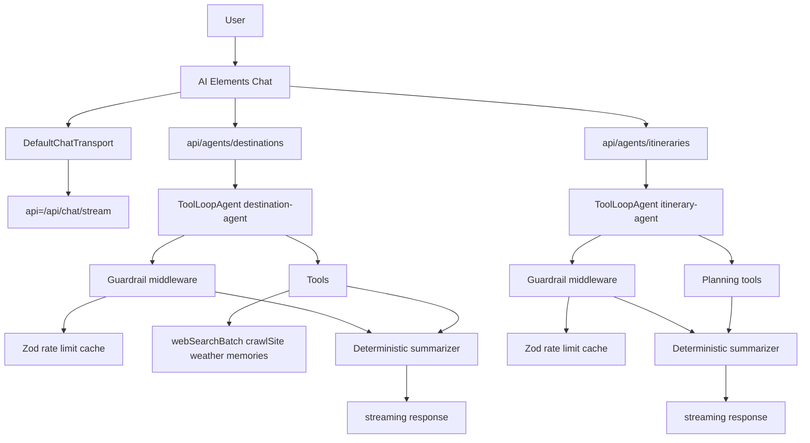

## Deliverables by Area

### 1. Schemas, Prompts, and Shared Types

- **Files**: `src/domain/schemas/agents.ts`, `src/prompts/agents.ts`.
- **Requirements**:
  - Define `DestinationResearchRequest`, `DestinationResearchResult`, `ItineraryPlanRequest`, `ItineraryPlanResult` (Zod + TypeScript types). Include `schemaVersion` and `sources[]` metadata.
  - Export prompt builders that accept user context (preferences, travel dates) and output instructions for ToolLoopAgent.
  - Ensure schemas are serializable on client (no `Date` objects) and re-exported for UI inference.

### 2. Provider & Infra Enhancements

- **Files**: `src/ai/models/registry.ts`, `src/lib/cache/upstash.ts`, `src/lib/ratelimit/{destinations,itineraries}.ts`.
- **Requirements**:
  - Add fallback to Vercel AI Gateway when BYOK keys missing; attach metadata describing provider used.
  - Implement Upstash helper functions `withCache(key, ttl, fn)` and `takeToken(bucket, limit)`.
  - Provide typed wrappers so tool orchestrators automatically log cache hits/misses.

### 3. Tool Registry & Orchestrators

- **Files**: `src/ai/tools/index.ts`, `src/ai/tools/research-destination.ts`, `src/ai/tools/generate-itinerary.ts` (new), plus updates to existing tool modules.
- **Requirements**:
  - Compose high-level tools that call existing primitives (web search, crawl, planning) and return structured payloads defined in schemas.
  - Register new tools in `toolRegistry` with unique names (`researchDestination`, `generateItineraryPlan`).
  - Add Vitest coverage for orchestrator logic (mocking downstream tools and verifying caching + telemetry integration).

### 4. Route Handlers & Agents

- **Files**: `src/app/api/agents/destinations/route.ts`, `src/app/api/agents/itineraries/route.ts`, `src/ai/agents/{destination,itinerary}-agent.ts`, `src/ai/agents/middleware.ts`, `src/ai/agents/summarizers.ts`.
- **Requirements**:
  - Each route imports Supabase auth helper to resolve user ID, then obtains provider via `resolveProvider` (with optional `modelHint` query param).
  - Instantiate `ToolLoopAgent` (AI SDK v6) with:
    - `instructions` from prompt module.
    - `tools` referencing `toolRegistry` entries.
    - `stopWhen` conditions: `stepCountIs(N)` + custom predicate checking Upstash budgets.
  - Wrap `agent.run`/`stream` using middleware that validates tool inputs (Zod), checks rate limits, performs caching, and logs telemetry.
  - Convert final trace to `DestinationResearchResult` or `ItineraryPlanResult` via summarizer; include intermediate progress events (AI SDK tool event streaming) before final structured message.
  - Return `result.toUIMessageStreamResponse()` for compatibility with `useChat`.

### 5. UI/UX Enhancements

- **Files**: `src/app/chat/page.tsx`, `src/components/ai-elements/{destination-card,itinerary-timeline}.tsx`, optional `src/components/ai-elements/progress.tsx`.
- **Requirements**:
  - Add PromptInput Action Menu entries to trigger research/itinerary flows (pre-seeding JSON payloads or referencing new API endpoints).
  - Render destination results using cards (title, climate, top attractions, sources) and show AI Elements `Sources` drawer for links.
  - Render itinerary results via timeline/day-planner component (AI Elements timeline primitives or custom). Show budgets, logistics, and callouts per day.
  - Display progress states when tool calls stream (e.g., “Fetching weather”, “Aggregating attractions”).

### 6. Telemetry, Testing, Rollout

- **Telemetry Files**: `src/lib/telemetry/agents.ts`, instrumentation hooks in middleware.
- **Testing**: Vitest (agents, tools, components), Playwright (chat flows), integration tests hitting new route handlers with mocked AI client.
- Rollout: complete cutover with frontend-only agents (no flags). Telemetry monitors success and latency; rollback is by reverting the deploy.

## Acceptance Criteria

- Backend directories contain no destination/itinerary orchestration code (already removed); frontend endpoints deliver identical or improved outputs.
- Hybrid ToolLoop approach achieves ≥9/10 Decision Framework score (documented in [ADR-0038](../../architecture/decisions/adr-0038-hybrid-frontend-agents.md)).
- UI renders structured cards/timelines with AI Elements, no raw JSON surfaces.
- Guardrail middleware logs every tool invocation with result + cache metadata; Upstash limits enforced per user/workflow.
- Automated tests cover schemas, agents, and UI; manual checklist documented for release.

## Status

- P0 completed (platform hardening: schemas, prompts, guardrails, telemetry, caching).
- P1 completed (flight + accommodation agents shipped in frontend; schema-aware UI cards and route tests).
- Next phase: P2 - Budget & Memory agents (design/implementation starting).

## References

- [ADR-0038](../../architecture/decisions/adr-0038-hybrid-frontend-agents.md) Hybrid Frontend Agents (decision record).  
- AI SDK v6 documentation for ToolLoopAgent, tool calling, and structured outputs.  
- Next.js Route Handler docs (`/docs/app/building-your-application/routing/route-handlers`).  
- AI Elements documentation for PromptInput, Conversation, and related components.
````

## File: docs/specs/archive/0020-spec-multi-agent-frontend-migration.md
````markdown
# SPEC-0020: Multi-Agent Frontend Migration & Provider Expansion

**Version**: 1.0.0  
**Status**: Accepted  
**Date**: 2025-11-12

## Status

- P0 complete (framework hardening in frontend).
- P1 complete (flights + accommodations endpoints, tools, UI).
- P2 complete (budget + memory + destination + itinerary agents, tools, UI).
- P3 complete (router + error recovery).
- P4 complete (OpenTripMap POI + GeoSure travel advisory tools integrated).

**Migration Complete:** All Python LangGraph orchestration and agents have been completely removed. All functionality now runs in TypeScript AI SDK v6 via Next.js Route Handlers.

## Goals

- Migrate the remaining TypeScript AI SDK v6 agents (flight, accommodation, budget, memory update, router/error recovery) into Next.js Route Handlers powered by the hybrid ToolLoopAgent framework defined in [SPEC-0019](0019-spec-hybrid-destination-itinerary-agents.md).
- Adopt a framework-first wave rollout (per [ADR-0039](../../architecture/decisions/adr-0039-frontend-agent-modernization.md)) that hardens shared infrastructure before shipping workflow waves.
- Integrate additional providers that unlock richer responses: OpenTripMap POI API for attractions data and GeoSure/Travel Advisory safety scores for contextual advisories.

## Phase Breakdown

### P0 - Framework Hardening (Completed)

- **Schemas & Prompts**: Extend `src/schemas/agents.ts` with shared types for flights, accommodations, budgets, memories, and routing metadata. Update prompt builders to accept user/account context.
- **Guardrail Middleware**: Generalize middleware to support tool budgets per workflow, caching policies, and telemetry hooks.
- (Removed) Feature flags: We are performing a complete cutover; routes are always enabled. Rollback is via deployment rollback, not flags.
- **Deliverables**: Unit tests covering middleware, integration tests for caching + rate limits.

### P1 - Flight & Accommodation Agents (Completed)

- **Route Handlers**: `/api/agents/flights/route.ts`, `/api/agents/accommodations/route.ts` streaming ToolLoopAgent responses.
- **Tools**: Reuse existing TypeScript `searchFlights`, `searchAccommodations`, plus new OpenTripMap POI lookup for nearby lodging context.
- **UI**: AI Elements cards summarizing flight options (price, cabin, airline) and accommodation results.
- **Validation**: Integration tests verifying TypeScript AI SDK v6 tool success >95%; telemetry dashboard for tool execution monitoring.

### P2 - Budget & Memory Agents

- **Budget**: Add `/api/agents/budget` route that uses ToolLoopAgent to balance costs (flights, stays, activities). Integrate safety scores to adjust recommendations.
- **Memory Update**: Route that writes conversation memories via TypeScript tool, replacing Python node. Ensure Supabase writes happen server-side only.
- **UI/UX**: Provide budget visualizations (AI Elements charts) and memory confirmation prompts.

### P3 - Router & Error Recovery

- **Router**: Implement TypeScript intent router that uses AI SDK `generateObject` to classify user requests and set `currentAgent` before hitting specific route handlers.
- **Error Recovery**: Frontend ToolLoop handles fallback messaging and escalations.
- **Note**: Python LangGraph orchestration and agents have been completely removed; all functionality now runs in TypeScript AI SDK v6.

### P4 - Provider Expansion & Enhancements

- **OpenTripMap Tool**: `src/lib/tools/opentripmap.ts` calling `/places` endpoints with caching (per provider TOS allowing caching). Uses Google Maps Geocoding API for destination-based lookups with result caching.
- **GeoSure/Travel Advisory Tool**: `src/lib/tools/travel-advisory.ts` retrieving safety scores (fallback to GeoSure API or successor).
- **Integration**: Destination, itinerary, and budget agents consume these tools for improved recommendations; UI displays safety badges.

## Technical Requirements

- **ToolLoopAgent Instances**: Each route instantiates ToolLoopAgent with tailored instructions, tool maps, and `stopWhen` constraints. Reuse guardrail middleware from [SPEC-0019](0019-spec-hybrid-destination-itinerary-agents.md).
- **Caching & Rate Limits**: Upstash buckets per workflow (`ratelimit:flight`, etc.), TTL caches for provider responses.
- **Telemetry**: Structured events for tool calls (name, duration, cacheHit, validationResult) exported via existing logging pipeline.
- **Testing**: Vitest suites per agent, integration tests hitting API routes with mocked providers, Playwright e2e scenarios for each workflow wave.
- **Rollout**: Full cutover (no flags). Monitor telemetry; rollback is a deploy revert.
- **Runbook**: See `docs/operations/agent-frontend.md` for env and validation commands (full cutover; no flags).

## Non-Goals

- Rewriting existing travel data services (flight/accommodation search) beyond wiring them into ToolLoop.
- Building new backend APIs except for provider calls.

## Success Criteria

- All agent workflows execute solely via Next.js Route Handlers and TypeScript tools.
- Legacy LangGraph graph + nodes removed from production path.
- Telemetry shows ≥95% tool-call success and median latency increase ≤ +2 s after migration.
- OpenTripMap & safety data visible in UI with clear sourcing/caching metadata.

## References

- [ADR-0039](../../architecture/decisions/adr-0039-frontend-agent-modernization.md) (Framework-first modernization).  
- [ADR-0038](../../architecture/decisions/adr-0038-hybrid-frontend-agents.md) (Hybrid agent architecture).  
- OpenTripMap API docs (POI data).  
- GeoSure/Travel Advisory reference.  
- Zen consensus log on rollout strategy.
````

## File: docs/specs/archive/0023-spec-di-schemas-finalization.md
````markdown
# SPEC-0023: Final DI + Pydantic v2 Schemas Centralization (Final-Only)

Status: Superseded

Owners: Platform API

Date: 2025-10-24  
**Superseded By**: Python backend removed (see SPEC-0020)

**Superseded Note:** This spec covered Python/FastAPI backend DI and Pydantic v2 schemas. The Python FastAPI backend has been completely removed. All functionality now runs in Next.js TypeScript with Zod schemas. This spec is retained for historical reference only.

## Executive Summary

This spec concludes our "final-only" migration to FastAPI `app.state` DI and Pydantic v2 schema centralization across the API layer. We removed all competing DI patterns and centralized request/response models under `tripsage/api/schemas`. This document finalizes the remaining work: dashboard realtime models, schema audit for Pydantic v2, strict response contracts, enum normalization, OpenAPI snapshot tests, and router policy tests that prevent inline `BaseModel` definitions in routers.

Scope explicitly excludes anything already implemented and verified (memory/attachments/health/trips params centralization; dashboard router refactor; README/CHANGELOG updates; lifespan smoke; limiter signatures for memory/chat; targeted test fixes). This spec covers only the remaining work to reach "no legacy code, no back-compat, no dead code".

## Decision Framework

- Solution Leverage (35%): 0.95 — Library-first schemas and FastAPI validation enforce contracts and accurate OpenAPI.
- Application Value (30%): 0.90 — Consistent, documented API improves reliability and client integrations.
- Maintenance Load (25%): 0.90 — Centralized schemas reduce duplication and test brittleness.
- Adaptability (10%): 0.85 — Versionable schemas and snapshot tests enable controlled evolution.

Weighted score: 9.13/10. Proceed.

## Inputs and Evidence

- Code review (internal + tool-assisted) of `tripsage/api/*` confirming remaining inline models in `dashboard_realtime.py`, response_model gaps, and lingering Pydantic v1 kwargs in schemas (regex/min_items) — validated and partially fixed (see PR diff where applicable).
- Targeted pytest runs for dashboard endpoints now green after centralization and test rebaseline.
- Pydantic v2 guidance: use `pattern=` (not `regex`) and `min_length`/`max_length` for list cardinality.

## Final Plan (Phased)

### Phase A — Dashboard Realtime Centralization (Routers + Schemas)

- Files
  - Source: `tripsage/api/routers/dashboard_realtime.py`
  - Target schemas: `tripsage/api/schemas/dashboard_realtime.py`

- Tasks
  - Move router-local `RealtimeMetrics`, `AlertNotification`, `SystemEvent` into new schemas module under responses.
  - Update router to import centralized models, and add `response_model` on every endpoint:
    - `GET /dashboard/realtime/events` → `list[SystemEvent]`
    - `POST /dashboard/realtime/alerts/broadcast` → `{success: bool}` or typed `BroadcastResponse`
    - `POST /dashboard/realtime/events/broadcast` → typed `BroadcastResponse`
    - `GET /dashboard/realtime/connections` → typed `ConnectionsStatusResponse`
  - Normalize any enums to the shared dashboard enums where relevant.
  - Remove all inline `BaseModel` from the router.

- Tests
  - Update/add unit tests in `tests/unit/api/routers/test_dashboard_realtime_router.py` asserting response models and payload shapes.
  - Ensure no direct dependency on router-local models remains.

### Phase B — Schemas v2 Audit (repo-wide under `tripsage/api/schemas`)

- Files
  - All under `tripsage/api/schemas/**/*`

- Tasks
  - Replace Pydantic v1 kwargs with v2 equivalents: `regex` → `pattern`, `min_items` → `min_length` (for lists), etc.
  - Confirm validators are v2-compliant (use `@field_validator`/`@model_validator` patterns as needed).
  - Ensure request vs response split is respected; migrate any remaining router-local DTOs to requests/responses packages.
  - Add `ErrorEnvelope` and reuse for typed error responses where routers catch exceptions.

- Tests
  - `tests/unit/api/policy/test_schemas_v2.py` — quick import/smoke ensuring no v1-only kwargs appear.

### Phase C — Response Model Enforcement (All Routers)

- Files
  - Routers with gaps: `tripsage/api/routers/attachments.py` (read/list/delete/download), `search.py` (analytics), `itineraries.py` (some endpoints), `config.py` (rollback, environment), plus any others found by scan.

- Tasks
  - Add/align `response_model` on every endpoint.
  - Define missing response schemas under feature modules (e.g., `schemas/attachments.py` for `FileMetadataResponse`, `FileListResponse`, `DeleteFileResponse`).
  - Set `response_model_exclude_none=True` selectively to keep wire formats stable.
  - Ensure FastAPI `validate_response=True` for critical endpoints.

- Tests
  - Adjust existing tests expecting free-form dicts to assert typed models instead.
  - Add OpenAPI snapshot (see Phase D).

### Phase D — Contract Guardrails (Policy + OpenAPI Snapshot)

- Files
  - Policy test: `tests/unit/api/policy/test_router_schema_policy.py`
  - Snapshot: `tests/unit/api/policy/test_openapi_snapshot.py`

- Tasks
  - Router Policy: fail if any `tripsage/api/routers/*.py` declares `BaseModel` subclasses (regex or AST-based check). This enforces no inline DTOs.
  - OpenAPI snapshot: export `/openapi.json` for the app and compare against a committed golden file. Fail on breaking changes. Allow additive changes via explicit snapshot update.

### Phase E — Enum Normalization and Safety

- Files
  - `tripsage/api/routers/dashboard.py`, `keys.py`, `trips.py` (and others using enums)
  - `tripsage/api/schemas/*` enum definitions

- Tasks
  - Convert string literal returns to typed enums at the router edge.
  - Provide safe parsing from service-produced strings using `getattr(x, "value", x)` before enum construction; add sensible fallbacks.
  - Use enum comparisons in sorting and branching logic.

### Phase F — Docs + Changelog

- Files
  - README.md (already updated DI + schema policy)
  - CHANGELOG.md (append Phase A–E bullets under Refactor)
  - Developers guide: add section on "No router-local BaseModel policy" and "OpenAPI snapshot workflow".

## File → Task Mapping (Remaining Only)

- `tripsage/api/routers/dashboard_realtime.py`
  - Remove inline models; import from `schemas/responses/dashboard_realtime.py`.
  - Add `response_model` on all endpoints.

- `tripsage/api/schemas/dashboard_realtime.py` (new)
  - Define `RealtimeMetrics`, `AlertNotification`, `SystemEvent`, `BroadcastResponse`, `ConnectionsStatusResponse`.

- `tripsage/api/routers/attachments.py`
  - Add response models on `get_file_metadata`, `delete_file`, `list_user_files`, `download_file`.
  - New schemas in `schemas/responses/attachments.py` if missing.

- `tripsage/api/schemas/**/*`
  - Replace v1-only kwargs; ensure v2 validators.

- Tests under `tests/unit/api/routers/` and `tests/integration/`
  - Rebaseline to new typed responses.
  - Add policy and openapi snapshot tests.

## Quality Gates

- Activate venv: `source .venv/bin/activate`
- Format/Lint/Type:
  - `ruff format . && ruff check . --fix`
  - `uv run pyright`
  - `uv run pylint tripsage tripsage_core`
- Tests:
  - `uv run pytest --maxfail=1 -q`
  - Coverage target remains ≥90% for touched modules; openapi snapshot and policy tests included.

## Risks and Mitigations

- Test breakage from stricter response models → Rebaseline tests alongside router changes; snapshot guards to stabilize.
- Schema drift across domains → Router policy test prevents future inline DTOs; single-source schemas enforce shapes.
- Unknown enum/string values → Safe mapping with fallbacks; log and continue.

## Rollout & Cleanup

- Single PR/branch completing Phases A–E; delete all superseded router-local models immediately.
- Update CHANGELOG under Refactor:
  - "Dashboard Realtime: centralized response models; added strict response_model contracts."
  - "Pydantic v2 audit across schemas; removed v1-only kwargs."
  - "Router policy and OpenAPI snapshot tests added to enforce final-only pattern."

## Acceptance Criteria

- No inline `BaseModel` classes in any router files.
- Every endpoint declares `response_model` and returns schema-conformant data.
- OpenAPI snapshot test passes; policy test passes.
- Ruff, Pyright, Pylint clean for touched modules; pytest green for updated suites.
````

## File: docs/specs/archive/0024-spec-python-test-suite-modernization.md
````markdown
# SPEC-0024: Python Test Suite Modernization

**Status**: Superseded  
**Version**: 1.0.0  
**Date**: 2025-10-24  
**Superseded By**: Python backend removed; frontend-first architecture (see SPEC-0020)

**Note:** This spec applied to Python backend test suites. The Python FastAPI backend has been completely removed. All functionality now runs in Next.js TypeScript. Frontend uses Vitest + Playwright (see [ADR-0007](../../architecture/decisions/adr-0007-testing-strategy.md)).

## Objective

Modernize and reorganize the Python `tests/` hierarchy to align with the 2025 pytest strategy: deterministic async-first coverage, fast feedback, and maintainable fixtures that reflect the canonical FastAPI/tripsage_core APIs.

## Scope

- Applies to all Python test suites under `tests/` (unit, integration, e2e, performance, security, docker, shared fixtures, root helpers).
- Covers pytest configuration, directory layout, fixture strategy, data factories, async client usage, and performance guards.
- Excludes frontend Vitest/Playwright configuration (covered by [ADR-0007](../../architecture/decisions/adr-0007-testing-strategy.md)) and CI orchestration mechanics (covered by [ADR-0009](../../architecture/decisions/adr-0009-consolidate-ci-to-two-workflows-and-remove-custom-composites.md)).

## Implementation Checklist

- [ ] Replace ad-hoc directory sprawl with canonical layout:
  - `tests/unit/**`, `tests/integration/**`, `tests/e2e/**`, `tests/performance/**`, `tests/security/**`, `tests/docker/**`, `tests/fixtures/**`, `tests/factories/**`, plus root helpers.
  - Remove duplicate `conftest.py` variants; consolidate shared fixtures per scope.
- [ ] Add/update `pytest.ini` markers to include `unit`, `integration`, `e2e`, `performance`, `security`, `docker`, `slow`, `perf`, `timeout`, and enforce `asyncio_mode = strict`.
- [ ] Standardize async testing with `pytest-asyncio`:
  - Apply `@pytest.mark.asyncio` or async fixtures per test module.
  - Use fixture `loop_scope`/`scope` combinations to prevent event-loop drift (session-level caches, module-level clients, function-level isolation).
- [ ] Provide canonical service fixtures:
  - `fakeredis.FakeAsyncRedis` for cache-dependent code paths.
  - `httpx.ASGITransport(app=create_app())`-backed `AsyncClient` fixtures for FastAPI integration/e2e flows.
  - Database fixtures relying on lightweight SQLite/asyncpg test engines without full Supabase bootstrap.
- [ ] Register Polyfactory-backed factories as pytest fixtures for domain models (API keys, trips, accommodations, chat messages) to avoid hand-written object builders.
- [ ] Ensure root `tests/conftest.py` exposes shared pytest plugins (markers, fakeredis, polyfactory, monkeypatch helpers) without side effects.
- [ ] Cull or rewrite oversized legacy suites (e.g., `test_api_key_performance.py`) to match modern patterns; remove any reliance on sleeps, threads, or benchmark plugins.
- [ ] Add coverage guards and quality gates:
  - Enforce Ruff formatting/checking and Pyright strict mode for `tests/` via pre-commit or CI.
  - Document minimum backend test coverage (≥90%) and ensure `uv run pytest --maxfail=1 --durations=10` stays under 60s locally.
- [ ] Document fixture usage and directory conventions in `docs/development/testing-python.md` (or nearest developer guide).

## Acceptance Criteria

- Running `uv run ruff format tests` and `uv run ruff check tests` produces no changes/diagnostics.
- `uv run pyright` passes with zero errors, including test modules.
- `uv run pytest` completes in under 60 seconds on a developer machine with ≥90% coverage (backend) and markers respected.
- No legacy benchmark/sleep-based performance suites remain; all performance checks rely on markers + timeout assertions.
- Shared fixtures leverage fakeredis + Polyfactory patterns; integration/e2e suites exclusively use ASGI transport-backed clients.
- Directory structure and markers align with this spec and are enforced in documentation.

## References

- [ADR-0007](../../architecture/decisions/adr-0007-testing-strategy.md): Modern Testing Strategy with Vitest and Playwright
- [ADR-0004](../../architecture/decisions/superseded/adr-0004-fastapi-backend.md): FastAPI as Backend Framework
- ExecPlan: `.agent/execplans/tests_refactor.md`
- Research notes: pytest-asyncio fixture guidance, fakeredis docs, Polyfactory pytest plugin, httpx ASGI transport usage
````

## File: docs/specs/archive/0025-spec-trip-collaborator-notifications-qstash.md
````markdown
# SPEC-0025: Trip Collaborator Notifications via QStash and Resend

**Version**: 1.0.0  
**Status**: Accepted  
**Date**: 2025-11-13  
**Category**: Architecture/Platform  
**Domain**: Backend, Integrations  
**Related ADRs**: [ADR-0051](../../architecture/decisions/adr-0051-agent-router-workflows.md), [ADR-0052](../../architecture/decisions/adr-0052-agent-configuration-backend.md)  
**Related Specs**: [SPEC-0021](../active/0021-spec-supabase-webhooks-vercel-consolidation.md)

## Summary

Define the end-to-end pipeline for trip collaborator notifications triggered by
changes to `trip_collaborators` in Supabase. Use Supabase Database Webhooks to
POST events to Vercel, Upstash QStash for durable job delivery, and Resend for
emails, with an optional downstream collaborator webhook.

This spec extends [SPEC-0021](../active/0021-spec-supabase-webhooks-vercel-consolidation.md) (Supabase Database Webhooks to Vercel Route Handlers)
by specifying how `/api/hooks/trips` and `/api/jobs/notify-collaborators` work
together.

## Goals

- Ensure collaborator notifications are reliable and idempotent.
- Keep Supabase as the source of truth and entry point via Database Webhooks.
- Use managed queueing (QStash) instead of bespoke retry logic.
- Expose a clear operator runbook for configuration and troubleshooting.

## Non-goals

- Defining email content templates in detail.
- Implementing per-tenant or per-event routing policies.

## Architecture

### Event Flow

```mermaid
flowchart LR
  A[Supabase trigger on trip_collaborators] --> B[Supabase Database Webhook]
  B -->|HMAC signed JSON| C[/api/hooks/trips]
  C -->|publishJSON| Q[Upstash QStash]
  Q -->|HTTP POST + Upstash-Signature| D[/api/jobs/notify-collaborators]
  D --> E[Resend email]
  D --> F[Optional downstream webhook]
```

### /api/hooks/trips

- **Inputs**
  - Headers: `X-Signature-HMAC` (verified by shared `HMAC_SECRET`).
  - Body: `{ type, table, schema, record, old_record, occurred_at }`.

- **Behavior**
  - Validate HMAC and basic payload fields.
  - Ignore non-`trip_collaborators` tables (`{ ok: true, skipped: true }`).
  - Build `eventKey` from table, type, occurred_at, and record hash.
  - Guard with `tryReserveKey(eventKey, 300)` (Upstash Redis) to avoid duplicate work.
  - Optionally verify that `record.trip_id` points to an existing `trips` row.
  - If `QSTASH_TOKEN` is configured:
    - Publish `{ eventKey, payload }` to `/api/jobs/notify-collaborators` via QStash.
    - Return `{ ok: true, enqueued: true }`.
  - If `QSTASH_TOKEN` is not configured:
    - Use `after()` to run the notification adapter in the background.
    - Return `{ ok: true, enqueued: false, fallback: true }`.

### /api/jobs/notify-collaborators

- **Inputs**
  - Headers: `Upstash-Signature` (QStash signature).
  - Body: `{ eventKey: string; payload: WebhookPayload }` validated via Zod.

- **Behavior**
  - Verify QStash signature using `QSTASH_CURRENT_SIGNING_KEY` and
    `QSTASH_NEXT_SIGNING_KEY`.
  - Validate body with `notifyJobSchema`.
  - Guard with `tryReserveKey("notify:" + eventKey, 300)` to avoid double work
    on retries.
  - Call the notification adapter to perform side effects.
  - Return `{ ok: true, emailed, webhookPosted }`.

### Notification Adapter

- Looks up the collaborator’s email via Supabase Admin (`auth.admin.getUserById`).
- Sends a transactional email via Resend with a subject/body based on
  `INSERT`/`UPDATE`/`DELETE`.
- If `COLLAB_WEBHOOK_URL` is configured, POSTs `{ event, eventKey }` with a
  short timeout.
- Emits telemetry spans for email and webhook calls.

## Configuration

- Supabase DB
  - As defined in [SPEC-0021](../active/0021-spec-supabase-webhooks-vercel-consolidation.md) for webhooks and HMAC.

- Vercel env (server)
  - `HMAC_SECRET`
  - `QSTASH_TOKEN`
  - `QSTASH_CURRENT_SIGNING_KEY`
  - `QSTASH_NEXT_SIGNING_KEY`
  - `RESEND_API_KEY`
  - `RESEND_FROM_EMAIL`
  - `RESEND_FROM_NAME`
  - Optional `COLLAB_WEBHOOK_URL`

## Testing

- Unit tests
  - HMAC verification and early rejection in `/api/hooks/trips`.
  - Zod validation of job payloads in `/api/jobs/notify-collaborators`.
  - Idempotency behavior when duplicate `eventKey` events arrive.

- Integration tests
  - Simulate a `trip_collaborators` insert and verify that notification jobs are
    enqueued or executed.
  - Mock Resend and downstream webhook endpoints.

## Supersession

- This spec does **not** supersede [SPEC-0021](../active/0021-spec-supabase-webhooks-vercel-consolidation.md); it builds on the webhook
  foundation defined there.
````

## File: docs/specs/archive/0026-spec-supabase-memory-orchestrator.md
````markdown
# SPEC-0026: Supabase Memory Orchestrator & Provider Adapters

**Version**: 1.0.0  
**Status**: Accepted  
**Date**: 2025-11-18

## Status

- Implementation complete. Orchestrator module (`lib/memory/orchestrator.ts`) is fully implemented with Supabase, Upstash, and Mem0 adapters.
- Integrated into chat stream handler (`api/chat/stream/_handler.ts`) via `persistMemoryTurn()`.
- All adapters support required intents: `onTurnCommitted`, `syncSession`, `backfillSession`, `fetchContext`.

## Goals

- Establish a canonical `memories` schema in Supabase Postgres with pgvector
  columns, Row Level Security, and automated embeddings pipelines.
- Introduce a Memory Orchestrator service (TypeScript module) that receives
  intents (`onTurnCommitted`, `syncSession`, `backfillSession`, `fetchContext`)
  and fans out to pluggable adapters.
- Provide first-party adapters: `SupabaseAdapter` (authoritative storage),
  `UpstashAdapter` (queues/caches), `Mem0Adapter` (optional enrichment).
- Ensure AI SDK v6 chat flows, Query Clients, and hooks interact with memory via
  orchestrator only—no direct provider calls from UI stores.
- Deliver actionable telemetry, retry, and PII redaction pipelines.

## Non-Goals

- Replacing existing client-side persistence (Zustand + storage) immediately.
- Introducing new backend runtimes; all logic stays within Next.js Route
  Handlers or shared libraries.
- Managing bespoke embedding models; we rely on OpenAI/Supabase-hosted models.

## Architecture Overview

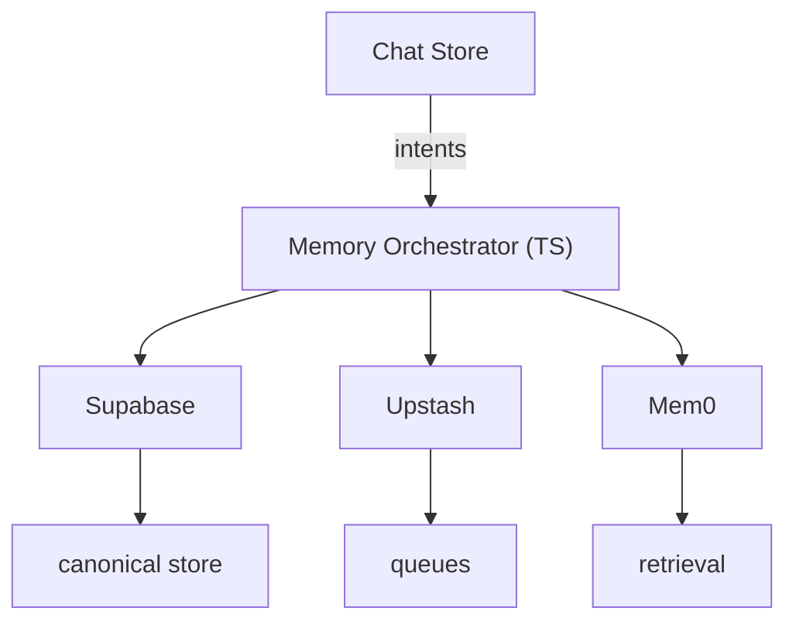

- **Orchestrator module** (`src/lib/memory/orchestrator.ts`)
  - Validates intents, enforces feature flags, runs PII redaction helpers, and
    emits OTLP spans/metrics.
  - Dispatches intents to adapters sequentially (Supabase → Upstash → Mem0 by
    default) with per-adapter error handling and exponential backoff metadata.

- **Adapters**
  - `SupabaseAdapter`: inserts/updates rows via `@supabase/postgrest-js`
    service role, manages embeddings with Supabase Edge Functions, and syncs
    last-write timestamps.
  - `UpstashAdapter`: publishes messages to QStash (`memory.sync` topic) and
    writes ephemeral caches to Redis (`memory:{user}:{session}`). Supports TTL
    invalidation and multi-region fanout.
  - `Mem0Adapter`: wraps `createMem0()` to push curated turns, enabling AI SDK
    `streamText` to retrieve previously stored facts.

## Data Model

- `memories.sessions`
  - `id (uuid PK)`, `user_id`, `title`, `last_synced_at`, `metadata jsonb`.
- `memories.turns`
  - `id (uuid PK)`, `session_id`, `role`, `content jsonb`, `attachments jsonb`,
    `tool_calls jsonb`, `tool_results jsonb`, `created_at`, `pii_scrubbed boolean`.
- `memories.turn_embeddings`
  - `turn_id`, `embedding vector`, `model`, `created_at`.

## API Contracts

```ts
type MemoryIntent =
  | { type: "onTurnCommitted"; sessionId: string; userId: string; turn: Message }
  | { type: "syncSession"; sessionId: string; userId: string }
  | { type: "backfillSession"; sessionId: string; userId: string }
  | { type: "fetchContext"; sessionId: string; userId: string; limit?: number };

interface MemoryAdapter {
  supportedIntents: MemoryIntent["type"][];
  handle(intent: MemoryIntent, ctx: MemoryContext): Promise<MemoryResult>;
}
```

## Security & Compliance

- Supabase schema secured via RLS: `user_id = auth.uid()` for user-facing
  reads; service role functions for background jobs.
- PII redaction service strips emails, phone numbers, payment card patterns
  prior to non-Supabase adapters. Hashes stored in metadata for auditing.
- Secrets: Mem0 + Upstash keys remain server-side; orchestrator obtains them via
  existing provider registry ([ADR-0028](../../architecture/decisions/adr-0028-provider-registry.md)).

## Observability & Retry

- OTLP spans: `memory.intent`, `adapter.supabase`, `adapter.upstash`,
  `adapter.mem0` with status + duration.
- Upstash QStash retry policy: exponential backoff, DLQ queue `memory.dlq`.
- Supabase Edge Functions log to central observability stack.

## Testing Strategy

- Unit tests for orchestrator + adapters (Vitest, mocked providers).
- Integration tests using Supabase test instance + Upstash HTTP mocks + Mem0
  test keys (or stub adapter).
- Playwright scenario verifying conversation memory recall round-trip.

## Rollout Plan

1. Ship orchestrator behind `memory.orchestrator` flag; chat store emits intents
   while still calling legacy memory to guarantee coverage.
2. Enable Supabase adapter, validate telemetry; disable legacy store calls.
3. Roll out Upstash + Mem0 adapters sequentially; monitor queue depth, provider
   quotas, and retrieval accuracy.
4. Remove feature flag once metrics stable (<0.1% failed syncs, <250 ms median
   orchestrator latency).

## References

- [ADR-0042](../../architecture/decisions/adr-0042-supabase-memory-orchestrator.md): Supabase-Centric Memory Orchestrator.  
- Supabase Vector documentation - <https://supabase.com/modules/vector?utm_source=openai>  
- Upstash AI SDK article - <https://upstash.com/blog/vercel-ai-sdk?utm_source=openai>  
- Mem0 Vercel AI SDK integration - <https://docs.mem0.ai/integrations/vercel-ai-sdk?utm_source=openai>
````

## File: docs/specs/archive/0027-spec-accommodations-amadeus-google-stripe.md
````markdown
# SPEC-0027: TripSage Accommodations Spec: Amadeus + Google Places + Stripe

**Version**: 1.0  
**Status**: Final  
**Date**: 2025-11-21  
**Category**: Architecture  
**Domain**: Travel Supply Integrations  
**Related ADRs**: [ADR-0050](../../architecture/decisions/adr-0050-amadeus-google-places-stripe-hybrid.md)  

> IMPORTANT: This spec **supersedes all Expedia Rapid–specific docs and ADRs**.  
> Any instructions, types, or tools that mention EPS Rapid MUST be treated as
> historical only and replaced by the architecture described here.

---

## 0. Scope and Goals

This document is the **implementation guide** for migrating TripSage’s
accommodations features from **Expedia Rapid** to a hybrid of:

- **Amadeus Self-Service APIs** (hotels search and booking).
- **Google Places API (New)** for hotel discovery, photos, and ratings.
- **Stripe** for card payments via PaymentIntents.

This spec is intended to be fed directly to an AI coding agent. All tasks are
broken into phases with checklists and concrete file paths.

---

## 1. High-Level Architecture

### 1.1 Existing pipeline (to be replaced)

1. AI tools (`@ai/tools/server/accommodations.ts`) call:
   - `AccommodationsService` via `getAccommodationsService()`.  
2. `AccommodationsService`:
   - Uses `ExpediaProviderAdapter` to call `ExpediaClient` (`@domain/expedia/client`).  
   - Maps Rapid-specific responses into:
     - `ACCOMMODATION_SEARCH_OUTPUT_SCHEMA`
     - `ACCOMMODATION_DETAILS_OUTPUT_SCHEMA`
     - `ACCOMMODATION_CHECK_AVAILABILITY_OUTPUT_SCHEMA`
     - `ACCOMMODATION_BOOKING_OUTPUT_SCHEMA`.  
   - Uses Upstash Redis for caching search and Ratelimit for per-user caps.  
3. `runBookingOrchestrator`:
   - Calls Stripe (`processBookingPayment` / `refundBookingPayment`) and `provider.createBooking`, then persists the booking to Supabase.  
4. UI uses:
   - `useAccommodationSearch` hook and `cards/accommodation-card.tsx` to display results.  

### 1.2 Target pipeline

1. AI tools (same names) invoke the same `AccommodationsService`, but:
   - The provider is now `AmadeusProviderAdapter`.
   - The details path enriches listings with Google Places hotel data.

2. `AmadeusProviderAdapter` (new):

   - Wraps the **Amadeus Node SDK**.
   - Implements `AccommodationProviderAdapter` with methods:
     - `search(params, ctx)`
     - `getDetails(params, ctx)`
     - `checkAvailability(params, ctx)`
     - `createBooking(params, ctx)`

3. `AccommodationsService`:

   - Uses Amadeus endpoints:
     - Geocode → `reference-data/locations/hotels/by-geocode` for hotels near a lat/lng.
     - Offers → `/v3/shopping/hotel-offers` for real-time prices and availability.
   - When enriching details:
     - Calls Google Places API (New) Place Details & Photos with `type=lodging`.

4. Booking flow:

   - AI `bookAccommodation` tool:
     - Ensures user/approval context.
     - Triggers Stripe `PaymentIntent` creation via `processBookingPayment`.
   - `runBookingOrchestrator`:
     - Calls `AmadeusProviderAdapter.createBooking(...)`.
     - Persists booking to Supabase (same `bookings` table).
     - Uses Amadeus `id/confirmationId` fields for booking reference.

5. UI:

   - Hotel search pages in `app/(dashboard)/trips/[tripId]/stay/page.tsx` and
     `app/(marketing)/stays/page.tsx` are wired to `useAccommodationSearch` and
     render results using new shadcn/ui components:
     `ModernHotelResults` + `AccommodationCard`.

---

## 2. Environment Configuration

### 2.1 Add Amadeus environment variables

Files:

- `.env.example` (root)
- `.env.local` / `.env` (root, not committed)

Add:

```bash
AMADEUS_CLIENT_ID=your_amadeus_client_id
AMADEUS_CLIENT_SECRET=your_amadeus_client_secret
AMADEUS_ENV=test # or "production"
```

Refer to the official [Amadeus "Get started with Self-Service APIs"](https://developers.amadeus.com/get-started) page for
account creation and key management.

Checklist:

- [ ] Create Amadeus developer account and self-service app.
- [ ] Copy `API Key` → `AMADEUS_CLIENT_ID`.
- [ ] Copy `API Secret` → `AMADEUS_CLIENT_SECRET`.
- [ ] Set `AMADEUS_ENV` to `"test"` for development.

### 2.2 Confirm Google Places configuration

The project already uses Google Places via routes under `src/app/api/places/*`.

Ensure:

- [ ] `GOOGLE_MAPS_API_KEY` / `GOOGLE_PLACES_API_KEY` is present in `.env.local`.
- [ ] API key has access to:

  - [Places API (New)](https://developers.google.com/maps/documentation/places/web-service) (for Place Details, Text Search, Photos).

### 2.3 Confirm Stripe configuration

Stripe is already configured for bookings via `booking-payment.ts`.

Checklist:

- [ ] Ensure `STRIPE_SECRET_KEY` and `STRIPE_WEBHOOK_SECRET` in `.env.local`.([Stripe Docs](https://stripe.com/docs/payments/payment-intents))
- [ ] Confirm PaymentIntents are used in “automatic” or “manual” mode consistent with booking flows.

---

## 3. File Map (Add / Modify / Remove)

### 3.1 New files

- `src/domain/amadeus/`

  - `client.ts` – thin wrapper around `amadeus` Node SDK.
  - `schemas.ts` – Zod schemas for Amadeus hotel list/offers/booking responses.
  - `mappers.ts` – mapping from Amadeus entities → `Accommodation*` schemas.

- `src/domain/accommodations/providers/amadeus-adapter.ts`

  - Implements `AccommodationProviderAdapter` using Amadeus client + mapping.

### 3.2 Modified files

- `src/domain/accommodations/container.ts`
- `src/domain/accommodations/service.ts`
- `src/domain/accommodations/booking-orchestrator.ts`
- `src/domain/accommodations/providers/types.ts`
- `src/domain/schemas/accommodations.ts`
- `src/ai/tools/server/accommodations.ts`
- `src/lib/agents/accommodation-agent.ts`
- `src/components/features/search/cards/accommodation-card.tsx`
- `src/components/features/search/results/hotel-results.tsx`
- `src/app/(dashboard)/trips/[tripId]/stay/page.tsx`
- `src/app/(marketing)/stays/page.tsx`

### 3.3 Removed files

After migration is fully complete and tests pass, remove:

- `src/domain/expedia/*`
- `src/domain/schemas/expedia.ts`
- Any Expedia-specific environment variables from `.env.example` and runtime use.

---

## 4. Domain: Amadeus Integration

### 4.1 Amadeus client

File: `src/domain/amadeus/client.ts`

Responsibilities:

- Instantiate [Amadeus Node SDK](https://developers.amadeus.com/sdks-and-libraries) (`amadeus` package).
- Provide methods:

  - `listHotelsByGeocode({ latitude, longitude, radius })`
  - `searchHotelOffers({ hotelIds, checkInDate, checkOutDate, adults, currency })`
  - `bookHotel(bookingPayload)`
- Perform minimal response handling; schema validation occurs in `schemas.ts`.

Implementation notes for AI agent:

- [x] Add `amadeus` to `package.json` dependencies.

- [x] Create a singleton Amadeus client using env vars:

  ```ts
  import Amadeus from "amadeus";

  let amadeus: Amadeus | undefined;

  export function getAmadeusClient() {
    if (!amadeus) {
      amadeus = new Amadeus({
        clientId: process.env.AMADEUS_CLIENT_ID!,
        clientSecret: process.env.AMADEUS_CLIENT_SECRET!,
      });
    }
    return amadeus;
  }
  ```

- [x] Implement wrappers (for example):

  ```ts
  export async function listHotelsByGeocode(params: {
    latitude: number;
    longitude: number;
    radius?: number;
  }) {
    const client = getAmadeusClient();
    return client.referenceData.locations.hotels.byGeocode.get({
      latitude: params.latitude,
      longitude: params.longitude,
      radius: params.radius ?? 5,
      radiusUnit: "KM",
    });
  }
  ```

  Align parameter names with [official docs](https://developers.google.com/maps/documentation/places/web-service).

### 4.2 Amadeus schemas

File: `src/domain/amadeus/schemas.ts`

Responsibilities:

- Define Zod schemas for Amadeus responses we care about:

  - Hotel list items (id, name, geo, address).([Google for Developers](https://developers.google.com/maps/documentation/places/web-service))
  - Hotel offers (price, currency, check-in/out, room description, policies).([Amadeus IT Group SA](https://developers.amadeus.com/self-service))
  - Booking confirmation (id, confirmation codes, guest info).([Supabase](https://supabase.com/docs))

Tasks:

- [x] Define `amadeusHotelSchema`, `amadeusOfferSchema`, `amadeusBookingSchema` using Zod.
- [x] Export TS types:

  - `AmadeusHotel`, `AmadeusHotelOffer`, `AmadeusHotelBooking`.

### 4.3 Mapping to existing accommodation schemas

File: `src/domain/amadeus/mappers.ts`

Responsibilities:

- Map `AmadeusHotel` + `AmadeusHotelOffer` → existing `Accommodation` schema in `src/domain/schemas/search.ts`.

Considerations:

- `Accommodation` fields:

  - `id` → use `hotel.hotelId` (or composite `hotelId:offerId` if needed).
  - `name` → `hotel.name`.
  - `location` → from Amadeus address / geo.
  - `geoCode` → pass through `hotel.geoCode` (latitude/longitude) for distance calculations.
  - `images[]` → will be primarily from Google Places, not Amadeus.
  - `price` / `pricePerNight` → derived from `offer.price.total` and nights count.([Amadeus IT Group SA](https://developers.amadeus.com/self-service))
  - `provider` → `"amadeus"`.

Tasks:

- [x] Implement `mapAmadeusHotelToAccommodationCard(hotel, offers, placesData?)`.
- [x] Ensure `AccommodationSearchResult` remains valid per `ACCOMMODATION_SEARCH_OUTPUT_SCHEMA`.
- [x] Pass through `geoCode` from Amadeus hotels to enable client-side distance sorting.

---

## 5. Accommodations Service Changes

File: `src/domain/accommodations/service.ts`

### 5.1 Generalize from Expedia-specific types

Current state:

- Tightly coupled to `EpsCheckAvailabilityRequest`, `EpsCreateBookingRequest`, `RapidAvailabilityResponse`, etc., imported from `@schemas/expedia`.

Target:

- Provider-agnostic service that depends only on:

  - `AccommodationProviderAdapter` interface.
  - `AccommodationsServiceDeps`.
  - `ACCOMMODATION_*` schemas.

Tasks:

- [x] Remove direct imports from `@schemas/expedia` in `service.ts`.
- [x] Introduce provider-agnostic DTOs for:

  - `ProviderAvailabilityResult` (`bookingToken`, `expiresAt`, price, propertyId, rateId).
  - `ProviderBookingPayload` (opaque `unknown` mapped inside adapter).
- [x] Let `AccommodationsService` call:

  - `this.deps.provider.search(params, ctx)`
  - `this.deps.provider.getDetails(params, ctx)`
  - `this.deps.provider.checkAvailability(params, ctx)`
  - `this.deps.provider.createBooking(providerPayload, ctx)`

### 5.2 Search flow

Tasks:

- [x] Replace use of Rapid search with Amadeus:

  - Input: `AccommodationSearchParams` has `location`, `lat`, `lng`, `checkIn`, `checkOut`, `guests`.
  - Use geocode-based search:

    - If lat/lng present → Amadeus by-geocode.
    - Else, resolve via [Google Places Text Search](https://developers.google.com/maps/documentation/places/web-service) to lat/lng (`/api/places/search`).
- [x] Combine:

  - `AmadeusHotel` list.
  - For detail enrichment, later calls to Google Places via Place Details API using either:

    - `hotel.name + hotel.address` and Text Search, or
    - `hotel.geo` (lat/lng) and `type=lodging`.([Google for Developers](https://developers.google.com/maps/documentation/places/web-service))
- [x] Use Upstash caching for search results under the same `CACHE_NAMESPACE`:

  - Key: `service:accom:search:${canonicalizeParamsForCache(params)}`.

### 5.3 Availability and booking

Tasks:

- [x] Update `checkAvailability` implementation to call `this.deps.provider.checkAvailability(...)` and map provider-agnostic result into `ACCOMMODATION_CHECK_AVAILABILITY_OUTPUT_SCHEMA`.
- [x] Update `book` implementation:

  - Remove `buildExpediaBookingPayload`.
  - Introduce `buildProviderBookingPayload` that delegates to `this.deps.provider.buildBookingPayload(params)`.
  - Keep `runBookingOrchestrator` API the same but with generic provider result.

---

## 6. Provider Adapter: Amadeus

File: `src/domain/accommodations/providers/amadeus-adapter.ts`

### 6.1 Interface

File: `src/domain/accommodations/providers/types.ts`

Tasks:

- [x] Ensure `AccommodationProviderAdapter` has the following signature (simplified):

  ```ts
  export interface AccommodationProviderAdapter {
    readonly name: "amadeus";

    search(
      params: AccommodationSearchParams,
      ctx?: ProviderContext
    ): Promise<ProviderResult<ProviderSearchResult>>;

    getDetails(
      params: AccommodationDetailsParams,
      ctx?: ProviderContext
    ): Promise<ProviderResult<ProviderDetailsResult>>;

    checkAvailability(
      params: AccommodationCheckAvailabilityParams,
      ctx?: ProviderContext
    ): Promise<ProviderResult<ProviderAvailabilityResult>>;

    createBooking(
      payload: ProviderBookingPayload,
      ctx?: ProviderContext
    ): Promise<ProviderResult<ProviderBookingResult>>;

    buildBookingPayload(
      params: AccommodationBookingRequest
    ): ProviderBookingPayload;
  }
  ```

- [x] `ProviderResult<T>` remains the same: `{ ok: true; value: T } | { ok: false; error: ProviderError }`.

### 6.2 Implementation details

Tasks:

- [x] Implement `AmadeusProviderAdapter` that:

  - Wraps [Amadeus SDK](https://developers.amadeus.com/sdks-and-libraries) calls for search and booking. ([AI SDK v6](https://v6.ai-sdk.dev/docs/introduction))
  - Uses existing retry and circuit-breaker utilities (`retryWithBackoff` + `CircuitBreaker`) as seen in `ExpediaProviderAdapter`.
  - Produces normalized `ProviderError` instances for:

    - HTTP 401/403 → `unauthorized`.
    - HTTP 404 → `not_found`.
    - HTTP 429 → `rate_limited`.
    - 5xx → `provider_failed`.

- [x] Keep telemetry:

  - Wrap each operation in `withTelemetrySpan("provider.amadeus.operation")` with attributes:

    - `provider.name = "amadeus"`.
    - `provider.operation`.
    - `provider.circuit_state`.

---

## 7. Booking Orchestrator Adjustments

File: `src/domain/accommodations/booking-orchestrator.ts`

Current state:

- Types are tied to `EpsCreateBookingRequest` and `EpsCreateBookingResponse`.
- Confirmation/external IDs read from Expedia-specific fields.

Tasks:

- [x] Replace `EpsCreateBookingResponse` generic with `ProviderBookingResult`.

- [x] Move Expedia-specific extraction logic into `ExpediaProviderAdapter` (and later delete that adapter).

- [x] Update `runBookingOrchestrator`:

  - Do not inspect provider result for Expedia-specific fields.
  - Expect `providerResult.value` to be normalized:

    ```ts
    type ProviderBookingResult = {
      itineraryId?: string;
      confirmationNumber?: string;
      providerBookingId?: string;
    };
    ```

- [x] Map:

  - `itineraryId` → `epsBookingId` (for backward DB compatibility).
  - `confirmationNumber` → `reference` and message text.
  - Keep `bookingId`, `stripePaymentIntentId`, `guest*`, `tripId` unchanged.

- [x] Make `PersistPayload` provider-agnostic:

  ```ts
  type PersistPayload = {
    bookingId: string;
    providerBookingId?: string;
    stripePaymentIntentId: string;
    confirmationNumber?: string;
    command: BookingCommand;
  };
  ```

- [x] Update Supabase insert in `AccommodationsService.book`:

  - Continue writing to `bookings` with existing snake_case columns (`eps_booking_id`, etc.) for now, but treat it logically as `provider_booking_id`.

---

## 8. AI Tools and Agents

### 8.1 Tools

File: `src/ai/tools/server/accommodations.ts`

Tasks:

- [x] Update tool descriptions:

  - Replace “Expedia Partner Solutions” / “Expedia Rapid” with “Amadeus Self-Service APIs for hotels” and “Google Places API for enrichment”.
- [x] Remove `normalizePhoneForRapid` and `extractTokenFromHref` from this file:

  - If still needed, they should live inside provider adapters.
- [x] Keep input/output schemas unchanged (`ACCOMMODATION_*`).
- [x] Ensure `searchAccommodations`, `getAccommodationDetails`,
  `checkAvailability`, `bookAccommodation` still call the same service methods.

### 8.2 Agent

File: `src/lib/agents/accommodation-agent.ts`

Tasks:

- [x] Keep tool list unchanged:

  - `ACCOMMODATION_TOOLS = { searchAccommodations, getAccommodationDetails, checkAvailability, bookAccommodation }`
- [x] Update internal instructions/prompts:

  - Avoid hard-coding the word “Expedia”.
  - Clarify that the agent is using “real-time hotel offers and bookings via Amadeus and enriches with Google Places hotel data”.

No changes to the AI SDK v6 usage are required; TripSage already uses
`streamText` and tools as recommended by [Vercel AI SDK v6 Tools](https://v6.ai-sdk.dev/docs/foundations/tools).

---

## 9. UI: shadcn/ui + Next.js

The project already uses shadcn/ui, Tailwind, and Lucide icons for rich UI
components.([shadcn/ui](https://ui.shadcn.com))

### 9.1 Results rendering

Files:

- `src/components/features/search/cards/accommodation-card.tsx`
- `src/components/features/search/results/hotel-results.tsx`
- `src/app/(dashboard)/trips/[tripId]/stay/page.tsx`
- `src/app/(marketing)/stays/page.tsx`

Tasks:

- [x] Ensure `AccommodationCard` reads `provider = "amadeus"` and renders:

  - Price from `accommodation.price.total` and `currency`.
  - Rating and reviews from Google Places data included in `AccommodationDetailsResult`.
- [x] Implement `ModernHotelResults` that:

  - Uses shadcn `Card`, `Skeleton`, `Badge`, `Tabs` for filtering.
  - Shows map integration via Google Maps JS SDK or @vis.gl/react-google-maps (optional).
- [x] Wire `ModernHotelResults` back into the pages where results are currently commented out.

### 9.2 Next.js 16 compatibility

Next.js 16 continues the app router paradigm, React Server Components, and
improved caching/turbopack capabilities.([Next.js](https://nextjs.org/docs))

Guidelines:

- [x] Ensure all Amadeus and Stripe code runs server-side only:

  - Use `"use server"` or `import "server-only"` where needed.([Amadeus IT Group SA](https://developers.amadeus.com/self-service))
- [x] Keep external API calls inside:

  - Route handlers.
  - Server actions.
  - AI tool modules that import `server-only`.

---

## 10. Testing Plan

### 10.1 Unit tests

Add/Update:

- `src/domain/amadeus/__tests__/client.test.ts`
- `src/domain/amadeus/__tests__/mappers.test.ts`
- `src/domain/accommodations/__tests__/service-amadeus.test.ts`
- `src/domain/accommodations/__tests__/booking-orchestrator.test.ts`
- `src/ai/tools/server/__tests__/accommodations-tools.test.ts`

Scope:

- [x] Amadeus client wrappers:

  - Mock `amadeus` SDK; verify correct params and error mapping.
- [x] Mappers:

  - Given sample Amadeus responses, ensure `Accommodation` object shapes match schemas.
- [ ] Service search:

  - Normal path covered by integration test; add assertions for cache hits and rate limiting.
- [x] Booking orchestrator:

  - Refunds on provider error (unit test covers refund pathway and providerBookingId persistence).

### 10.2 Integration tests

Using Vitest + MSW:

- [ ] Mock Amadeus HTTP endpoints (or SDK calls) to simulate:

  - Normal responses (covered).
  - 401, 404, 429, 500 error conditions (mapped via adapter unit test; add MSW coverage).
- [x] Mock Google Places endpoints under `/api/places/*`.
- [x] End-to-end tests for:

  - `searchAccommodations` tool.
  - `getAccommodationDetails` combining Amadeus & Google Places.
  - Full booking flow driven by `bookAccommodation`.

---

## 11. Phase Plan & Checklists

### Phase 1 – Setup & Skeleton

- [x] Add Amadeus env vars and `amadeus` dependency.
- [x] Create `src/domain/amadeus/client.ts`.
- [x] Create `src/domain/amadeus/schemas.ts`.
- [x] Create `src/domain/amadeus/mappers.ts`.

### Phase 2 – Provider Adapter & Container

- [x] Implement `AccommodationProviderAdapter` updates in `providers/types.ts`.
- [x] Implement `AmadeusProviderAdapter` in `providers/amadeus-adapter.ts`.
- [x] Update `accommodations/container.ts` to construct `AmadeusProviderAdapter` instead of `ExpediaProviderAdapter`.

### Phase 3 – Service & Orchestrator

- [x] Remove direct `@schemas/expedia` imports from `service.ts`.
- [x] Implement new search/availability/book flows using provider adapter.
- [x] Update `booking-orchestrator.ts` to be provider-agnostic.

### Phase 4 – AI Tools & Agent

- [x] Update `ai/tools/server/accommodations.ts` descriptions and any Rapid-specific helpers.
- [x] Confirm `searchAccommodationsInputSchema` export is unchanged.
- [x] Confirm `runAccommodationAgent` still composes tools correctly.

### Phase 5 – UI & UX

- [x] Re-enable `ModernHotelResults` and ensure it renders new data.
- [x] Update `AccommodationCard` to use Google Places ratings/photos when available.
- [x] Validate responsive behavior and A11y (labels, alt tags).

### Phase 6 – Decommission Expedia

- [x] Remove `domain/expedia` folder and references.
- [x] Remove `@schemas/expedia.ts` usage.
- [x] Strip Expedia env vars from `.env.example` and code.
- [x] Mark old Expedia ADRs/specs as `Superseded`.

### Phase 7 – Regression & Load

- [x] Run full test suite (unit + integration). (pnpm biome:check, type-check, unit + integration on 2025-11-21)
- [ ] Add light load testing of hotel search (e.g., 100 consecutive searches).
- [ ] Verify Amadeus and Google quotas are not exceeded (Amadeus free tier; Google usage dashboard).([Amadeus IT Group SA](https://developers.amadeus.com/self-service))

### Phase 8 – Telemetry & Security Hardening

- [x] Add OTEL span coverage for Places enrichment, server actions, and booking flows (no console logging).
- [x] Ensure accommodation external API calls remain server-side or use public browser-safe keys; proxy photo fetches if required.
- [x] Align Amadeus booking payload `payments` structure and currency/amount with Stripe PaymentIntent values. Verified via adapter unit test and booking integration using cached availability price + PaymentIntent metadata.
- [x] Replace non-secure random usage in accommodations feature with `secureUuid`/`secureId` where applicable.

---

## 12. Library Notes (for AI Agent)

### Amadeus Self-Service

- Docs: `https://developers.amadeus.com/self-service`
- Uses OAuth2 client credentials automatically via Node SDK.
- Endpoints grouped by category; we use Hotels → Hotel Search + Hotel Booking.([Amadeus Docs](https://developers.amadeus.com/self-service))

### Google Places API (New)

- Docs: `https://developers.google.com/maps/documentation/places/web-service`
- Place Details + Photo + Text Search for hotels (`type=lodging`).
- Already partially integrated in `app/api/places/*`.

### Vercel AI SDK v6

- Docs: `https://v6.ai-sdk.dev/docs/introduction`
- TripSage uses `streamText` + tool calling; no changes needed except tool semantics.

### shadcn/ui

- Docs: `https://ui.shadcn.com`
- Use for Cards, Tabs, Badges, Skeleton, Dialogs to build modern hotel result UIs.

### Upstash

- Redis client: `@upstash/redis` used via `lib/redis.ts`.
- Ratelimit: `@upstash/ratelimit` used in `accommodations/container.ts` and AI tools for sliding-window limits.

### Supabase

- Docs: `https://supabase.com/docs/guides/auth` and JS client v2 docs.([Supabase Docs](https://supabase.com/docs/guides/auth))
- Used for persistence and auth; booking persistence remains in the `bookings` table.

### Stripe

- Docs: `https://stripe.com/docs/payments/payment-intents`
- Already in `lib/payments/booking-payment.ts`; continue using PaymentIntents for accommodations.
````

## File: docs/specs/archive/0028-spec-agent-router-workflows.md
````markdown
# SPEC-0028: TripSage Agent Router & Workflow HTTP API - Functional & Technical Spec

**Version**: 1.0.0
**Status**: Accepted
**Date**: 2025-11-21
**Category**: Frontend
**Domain**: AI Orchestration
**Related ADRs**: [ADR-0051](../../architecture/decisions/adr-0051-agent-router-workflows.md)
**Related Specs**:

## 1. Summary

This spec defines the TripSage Agent Router & Workflow HTTP API. It covers:

- A classification endpoint (`/api/agents/router`) that maps user messages to
  workflows using AI SDK v6 structured outputs.
- Per-workflow endpoints under `/api/agents/*` that execute dedicated AI agents
  (destination research, flights, accommodations, itineraries, budget,
  memory).
- Shared guardrails for auth, rate limiting, telemetry, and validation.

**The design aligns with:**

- Next.js 16 App Router and Server Components:
  - <https://nextjs.org/docs/app>
- AI SDK v6:
  - <https://ai-sdk.dev/docs/introduction>
- Supabase SSR:
  - <https://supabase.com/docs/guides/auth/server-side>
- Upstash Redis & Ratelimit:
  - <https://upstash.com/docs/redis/howto/connectwithupstashredis>
  - <https://upstash.com/docs/redis/sdks/ratelimit-ts/gettingstarted>
- Zod v4:
  - <https://zod.dev/v4>
- Vercel OTEL:
  - <https://vercel.com/docs/observability/otel-overview>

## 2. Goals

- Provide a consistent HTTP interface for all TripSage agent workflows.
- Centralize validation using Zod v4 schemas in `@schemas/agents`.
- Enforce auth, rate limiting, and telemetry via `withApiGuards`.
- Use AI SDK v6 streaming primitives for all workflow execution routes.
- Make it easy to add new workflows without reworking clients.

## 3. Non-Goals

- Building a general-purpose multi-tenant orchestration platform.
- Modeling long-running background workflows or QStash-based jobs (this spec
  is HTTP-only; QStash usage is covered elsewhere).
- Replacing the existing `/api/chat/stream` route; instead, the chat layer may
  delegate to these agent endpoints.

## 4. User Stories

- As a TripSage user, I want the system to interpret my free-form prompts and
  route them to the most relevant specialist agent so I get focused, high-
  quality answers.
- As a TripSage user, I want flight, hotel, and itinerary recommendations with
  streaming updates and clear explanations.
- As a TripSage user, I want TripSage to remember and reuse my preferences
  (memory workflow) across sessions.
- As a developer, I want a single source of truth for agent schemas and HTTP
  endpoints so I can extend the platform safely and predictably.

## 5. User Flows

### 5.1 Router classification

1. Frontend sends the latest user message and context to `POST /api/agents/router`.
2. Server validates input with `agentSchemas.routerRequestSchema`.
3. Server calls `classifyUserMessage` which uses AI SDK v6 `generateObject`
   with `routerClassificationSchema`.
4. Server returns a JSON classification:
   - `agent` (`AgentWorkflowKind`)
   - `confidence` (0–1)
   - optional `reasoning`.
5. Client decides to:
   - Call the corresponding workflow endpoint; or
   - Fall back to a general chat route if confidence is low.

### 5.2 Workflow execution (example: destination research)

1. Client calls `POST /api/agents/destinations` with a body conforming to
   `DestinationResearchRequest`.
2. `withApiGuards`:
   - Validates auth using Supabase SSR.
   - Applies `agents:destinations` rate limit via Upstash.
   - Initializes telemetry span.
3. Route handler parses body using `agentSchemas.destinationResearchRequestSchema`.
4. Route handler resolves provider with `resolveProvider`.
5. Route handler calls `runDestinationAgent`, which:
   - Builds a system prompt.
   - Calls AI SDK v6 `streamText` with tools and/or schemas.
   - Produces a `UIMessageStream` via `result.toUIMessageStreamResponse`.
6. Response streams back to client; UI renders updates incrementally.

The same pattern applies to flights, accommodations, itineraries, budget, and
memory workflows, using their respective schemas and agent functions.

### 5.3 Error and edge states

- Invalid JSON → 400 with structured error payload.
- Zod validation failure → 400 with `issues`.
- Auth failure → 401/403 from `withApiGuards`.
- Rate limit exceeded → 429 with headers from Upstash Ratelimit.
- AI provider error → 5xx with OTEL trace and redacted error message.

## 6. Data Model & Schemas

Canonical location: `src/domain/schemas/agents.ts`.

Key schema groups (Zod v4):

- **Core enums and types**
  - `AgentWorkflowKind` – enum for routing-level workflow IDs.
  - `AgentSource` – standardized citation object with `url`, `title`, etc.
- **Workflow-specific request/response schemas**
  - `destinationResearchRequestSchema`, `destinationResearchResultSchema`.
  - `flightSearchRequestSchema`, `flightSearchResultSchema`.
  - `accommodationSearchRequestSchema`, `accommodationSearchResultSchema`.
  - `itineraryPlanRequestSchema`, `itineraryPlanResultSchema`.
  - `budgetPlanRequestSchema`, `budgetPlanResultSchema`.
  - `memoryUpdateRequestSchema`, `memoryUpdateResultSchema`.
- **Router schemas**
  - `routerRequestSchema` – classification input.
  - `routerClassificationSchema` – classification output for AI SDK v6
    `generateObject`.
- **Monitoring & workflows (for dashboards and future tooling)**
  - `Agent`, `AgentActivity`, `ResourceUsage`, `AgentSession`.
  - `AgentWorkflowEntity`, `WorkflowConnection`.

Schema requirements:

- All schemas must be `.strict()` or equivalent via strongly typed fields.
- No `any` types; ambiguous data uses `unknown` + narrowings.
- Validation error messages should use `error:` options, not custom error maps.

## 7. API Design & Integration Points

All endpoints live under `src/app/api/agents/**/route.ts` and import
`"server-only"`.

### 7.1 Router endpoint

- Method: `POST`
- Path: `/api/agents/router`
- Request body: `RouterRequest` (from `agentSchemas.routerRequestSchema`).
- Response: JSON `RouterClassification`.
- Behavior:
  - Validates request via Zod.
  - Uses `resolveProvider` and AI SDK v6 `generateObject`.
  - Returns classification result.

### 7.2 Workflow endpoints

Common patterns:

- `withApiGuards({ auth: true, rateLimit: "<namespace>", telemetry: "<name>" })`
- Parse body via workflow-specific Zod request schema.
- Use `resolveProvider` to obtain a `LanguageModel`.
- Call workflow function (`runDestinationAgent`, `runFlightAgent`, etc.).
- Return `result.toUIMessageStreamResponse({ onError })`.

Endpoints:

- `POST /api/agents/destinations`
  - Request: `DestinationResearchRequest`
  - Telemetry: `agent.destinationResearch`
  - Rate limit key: `agents:destinations`
- `POST /api/agents/flights`
  - Request: `FlightSearchRequest`
  - Telemetry: `agent.flightSearch`
  - Rate limit key: `agents:flight`
- `POST /api/agents/accommodations`
  - Request: `AccommodationSearchRequest`
  - Telemetry: `agent.accommodationSearch`
  - Rate limit key: `agents:accommodations`
- `POST /api/agents/itineraries`
  - Request: `ItineraryPlanRequest`
  - Telemetry: `agent.itineraryPlanning`
  - Rate limit key: `agents:itineraries`
- `POST /api/agents/budget`
  - Request: `BudgetPlanRequest`
  - Telemetry: `agent.budgetPlanning`
  - Rate limit key: `agents:budget`
- `POST /api/agents/memory`
  - Request: `MemoryUpdateRequest`
  - Telemetry: `agent.memoryUpdate`
  - Rate limit key: `agents:memory`

### 7.3 Supporting services

- **Supabase SSR**
  - `createServerSupabase` in `src/lib/supabase/server.ts` must use
    `@supabase/ssr` as per:
    - <https://supabase.com/docs/guides/auth/server-side>
- **Upstash Redis & Ratelimit**
  - Redis client created via `Redis.fromEnv()`:
    - <https://upstash.com/docs/redis/howto/connectwithupstashredis>
  - Ratelimit via `@upstash/ratelimit`:
    - <https://upstash.com/docs/redis/sdks/ratelimit-ts/gettingstarted>
- **Telemetry**
  - Route handlers must be traceable via `@vercel/otel`:
    - <https://vercel.com/docs/observability/otel-overview>

## 8. UI / UX States

Each workflow and the router must handle:

- **Loading**
  - Spinner/skeleton while waiting for first streamed tokens.
- **Success (streaming)**
  - Incremental rendering of agent responses.
  - Optional citation badges using `AgentSource` URLs.
- **Empty**
  - No results state where agent returns minimal content.
- **Error**
  - User-friendly error banner/toast with retry options.
  - Telemetry event includes simplified error code and workflow ID.
- **Unauthorized**
  - Prompt to log in or reauthenticate.
- **Rate limited (429)**
  - UX message indicating the user has hit a usage cap; show retry after.

Chat surfaces using `useChat` transport should:

- Inspect router metadata (e.g., `agent` and `request`) and call the
  appropriate `/api/agents/*` endpoint.
- Fall back to `/api/chat/stream` when no agent is selected or confidence is
  too low.

## 9. Observability & Telemetry

Requirements:

- All `/api/agents/*` handlers must be wrapped in OTEL spans with:
  - Workflow name (`agent.workflow`).
  - Model and provider info (redacted where necessary).
  - Rate limit outcomes (allowed/blocked).
- Errors must capture stack traces where available (server-only).
- Logs:
  - Use OTEL exporters; `console.log` and `console.error` are disallowed in
    these files.

References:

- Vercel OTEL:
  - <https://vercel.com/docs/observability/otel-overview>
  - <https://vercel.com/docs/tracing/instrumentation>
- OpenTelemetry:
  - <https://opentelemetry.io/docs/>

## 10. Testing Strategy

Frameworks and tools:

- Vitest: <https://vitest.dev/guide/>
- React Testing Library:  
  <https://testing-library.com/docs/react-testing-library/intro/>
- MSW (Mock Service Worker): <https://mswjs.io/docs/>

Testing requirements:

- **Route handler tests (Node env)**
  - Use Vitest with `/** @vitest-environment node */` where needed.
  - Mock:
    - `next/headers` (`cookies`, `headers`).
    - `@/lib/supabase/server` (`createServerSupabase`, `getCurrentUser`).
    - `@/lib/redis` and Upstash rate limiters.
    - `@ai/models/registry` (`resolveProvider`) to supply deterministic models.
  - Cover:
    - Happy path.
    - Validation errors.
    - Auth failures.
    - Rate limit exceeded.
    - Provider failures.

- **Client and integration tests (jsdom env)**
  - Use `/** @vitest-environment jsdom */` for tests using DOM or React.
  - Use React Testing Library for UI states (loading, success, error).
  - Use MSW to mock `/api/agents/*` and `/api/agents/router`.

- **Coverage**
  - Target ≥ 90% coverage on:
    - `src/app/api/agents/**/route.ts`
    - `src/lib/agents/**`
    - `src/domain/schemas/agents.ts` (via validation tests).

## 11. Risks & Open Questions

- **Classification accuracy**
  - Risk: Misrouted messages degrade UX.
  - Mitigation: Use confidence thresholds, reasoning, and fallback flows.

- **Rate limit tuning**
  - Risk: Overly strict limits cause frustration; too loose limits increase
    costs.
  - Mitigation: Start conservative, capture metrics, and tune.

- **Model/provider surface**
  - Some workflows may require specific models (e.g., structured tools vs pure
    text). The provider registry must encode these constraints.

- **Future expansion**
  - Additional workflows (e.g., loyalty programs, calendar sync) may need
    additional endpoints and schema evolution.
````

## File: docs/specs/archive/0029-spec-agent-configuration-backend.md
````markdown
# SPEC-0029: Agent Configuration Backend & Versioned Storage – Functional & Technical Spec

**Version**: 1.0.0
**Status**: Accepted
**Date**: 2025-11-21
**Category**: Frontend
**Domain**: AI Orchestration
**Related ADRs**: [ADR-0052](../../architecture/decisions/adr-0052-agent-configuration-backend.md)
**Related Specs**:

## 1. Summary

This spec defines a Supabase-backed backend for managing configuration of all
TripSage AI agents (budget, destination, flights, itineraries, accommodations,
memory). It introduces typed Supabase tables, authenticated Next.js API routes,
Upstash-backed caching, and integration hooks for agent runners, as well as
wiring for the existing admin UI.

The goal is to replace ad‑hoc, code-level configuration and mock admin flows
with a single, auditable, versioned configuration control plane.

## 2. Goals

- Provide a **single source of truth** for agent configuration (model,
  provider, temperature, tools, feature toggles).
- Support **version history** and **rollback** of configurations via
  `agent_config_versions`.
- Expose authenticated, rate‑limited, and observable APIs to manage configs.
- Integrate configuration resolution into **all agent runners**.
- Replace mock configuration & metrics in `AgentConfigurationManager` with real
  data from APIs and Supabase.

## 3. Non-Goals

- Implement a full feature‑flag framework or per‑user experimentation system
  beyond the initial `(agent_type, scope)` configuration.
- Change the core behavior of AI agents beyond reading their runtime settings
  from the new backend.
- Implement a complex policy engine or roles/permissions system beyond
  standard Supabase auth + basic admin checks.
- Replace existing observability stack; we will only **integrate** with
  existing telemetry helpers.

## 4. User Stories

- As an **internal admin**, I want to view and edit configuration for each
  agent (e.g., budget agent temperature, model, enabled tools) from a single
  admin page so I can tweak behavior without redeploying code.
- As an **internal admin**, I want to see **recent configuration versions** and
  roll back to a previous version if a change degrades behavior.
- As an **engineer**, I want agent runners to read configuration through a
  single typed resolver instead of scattering constants across files.
- As an **engineer**, I want configuration changes to be **traceable** in logs
  and metrics (who changed what and when).

## 5. User Flows

### 5.1 Admin updates agent configuration

1. Admin navigates to the Agent Configuration page.
2. Admin selects an agent (e.g., “Budget Planning Agent”) from the dropdown.
3. The UI calls `GET /api/config/agents/:agentType` to fetch the current config.
4. Admin modifies fields (model, temperature, enabled tools, etc.).
5. UI calls `PUT /api/config/agents/:agentType` with the new config.
6. Backend validates input with `agentConfigRequestSchema`.
7. Backend writes a new row into `agent_config_versions`, updates
   `agent_config`, invalidates cache, and returns the updated config.
8. UI updates display and shows a success toast.

### 5.2 Admin inspects version history

1. Admin opens the version history panel for a given agent.
2. UI calls `GET /api/config/agents/:agentType/versions`.
3. Backend returns a paginated list of versions (id, created_at, created_by,
   summary).
4. Admin can click into a version for more detail (full JSON config).

### 5.3 Admin rolls back to a previous version

1. From version history, admin chooses “Roll back” on a version.
2. UI sends `POST /api/config/agents/:agentType/rollback/:versionId`.
3. Backend:
   - Loads the version.
   - Writes a **new** version row with the same payload but new metadata.
   - Updates `agent_config` active record.
   - Invalidates cache tags.
4. UI reloads config via `GET` and shows confirmation.

### 5.4 Agent runner resolves configuration

1. Agent route handler receives a validated agent request (e.g., budget plan).
2. Handler calls `resolveAgentConfig(agentType, { userId })`.
3. Resolver:
   - Attempts to load config from Upstash JSON cache.
   - On cache miss, queries Supabase `agent_config`, validates JSON via
     `configurationAgentConfigSchema`, caches it with TTL, and returns it.
4. Agent runner uses resolved values (modelId, temperature, tools toggles) when
   building `streamText` call options.  

## 6. Data Model & Schemas

### 6.1 Zod Schemas (existing)

Source: `src/domain/schemas/configuration.ts`.:contentReference[oaicite:99]{index=99}

Key structures:

- `agentTypeSchema` – enumeration of supported agents (budget, destination,
  flights, itinerary, accommodations, memory, etc.).
- `configurationAgentConfigSchema` – canonical agent configuration record,
  including:
  - `agentType`
  - `model` (provider + id)
  - `temperature`, `maxTokens`, `topP`, `frequencyPenalty`, etc.
  - `enabledTools`, `safetyLevel`, and other knobs.
- `agentConfigRequestSchema` – request shape for configuration updates, mapping
  UI form inputs to `configurationAgentConfig`.

### 6.2 Database Tables (Supabase)

**Table: `agent_config`**

- `id` (uuid, PK, default `gen_random_uuid()`).
- `agent_type` (text, indexed) – must match `agentTypeSchema` values.
- `scope` (text, default `'global'`) – future extension: `environment`,
  `tenant`, `user`.
- `config` (jsonb) – validated against `configurationAgentConfigSchema`.
- `version_id` (uuid) – reference to `agent_config_versions.id`.
- `created_at` (timestamptz, default `now()`).
- `updated_at` (timestamptz, default `now()`).
- Unique constraint on `(agent_type, scope)`.

**Table: `agent_config_versions`**

- `id` (uuid, PK).
- `agent_type` (text, indexed).
- `scope` (text).
- `config` (jsonb).
- `created_at` (timestamptz, default `now()`).
- `created_by` (uuid, nullable) – Supabase auth user id (if a user performed
  the change).
- `summary` (text, nullable) – optional description entered by admin.

**RLS (high-level):**

- `agent_config` & `agent_config_versions`:
  - Allow `SELECT`, `INSERT`, `UPDATE` only for users with an `is_admin` flag
    (or equivalent) in a suitable profile table or Supabase auth metadata.
- Implementation detail for `is_admin` is deferred to migration and DB config.

## 7. API Design & Integration Points

All routes live under `src/app/api/config/agents`:

### 7.1 `GET /api/config/agents/:agentType`

- **Auth:** `withApiGuards({ auth: true, telemetry: "config.agents.get" })`.  
- **Input:**
  - Path param `:agentType` (string), validated with `agentTypeSchema`.
  - Query param `scope` (optional, default `global`).
- **Output (200):**
  - JSON: `{ config: ConfigurationAgentConfig; versionId: string }`, shaped by
    `configurationAgentConfigSchema`.
- **Behavior:**
  - Lookup cached config via Upstash.
  - On cache miss, query `agent_config` for `(agent_type, scope)`.
  - If not found, return 404 or default config (specifying behavior explicitly
    in implementation).
  - Cache the result with TTL (e.g., 15 minutes) using `setCachedJson`.

### 7.2 `PUT /api/config/agents/:agentType`

- **Auth:** `withApiGuards({ auth: true, telemetry: "config.agents.update", rateLimit: "config:agents:update" })`.  
- **Input:**
  - Path param `:agentType` validated with `agentTypeSchema`.
  - JSON body validated with `agentConfigRequestSchema`.  
- **Output (200):**
  - JSON: `{ config: ConfigurationAgentConfig; versionId: string }`.
- **Behavior:**
  - Validate body.
  - Start a transaction:
    - Insert into `agent_config_versions`.
    - Upsert `agent_config` row for `(agent_type, scope)`.
  - Invalidate cache via `bumpTag("configuration")` and optionally delete
    specific Upstash keys.
  - Return updated config.

### 7.3 `GET /api/config/agents/:agentType/versions`

- **Auth:** `withApiGuards({ auth: true, telemetry: "config.agents.versions" })`.  
- **Input:**
  - Path param `:agentType`.
  - Query params `scope`, `limit`, `cursor` for simple pagination.
- **Output (200):**
  - JSON: `{ versions: Array<{ id, createdAt, createdBy, summary }>, nextCursor?: string }`.
- **Behavior:**
  - Query `agent_config_versions` filtered by agent type and scope.
  - Order by `created_at DESC`, limit by `limit`.
  - Provide stable pagination token if needed.

### 7.4 `POST /api/config/agents/:agentType/rollback/:versionId`

- **Auth:** `withApiGuards({ auth: true, telemetry: "config.agents.rollback" })`.  
- **Input:**
  - Path params `:agentType` and `:versionId`.
- **Output (200):**
  - JSON: `{ config: ConfigurationAgentConfig; versionId: string }`.
- **Behavior:**
  - Read the specified version.
  - Create a new `agent_config_versions` row cloning the config payload.
  - Update `agent_config.config` and `agent_config.version_id`.
  - Invalidate cache tags.
  - Return new active config.

## 8. UI / UX States

Focusing on `AgentConfigurationManager`:

- **Loading:**
  - When the selected agent changes, show skeleton/loader for config and
    metrics while fetching.
- **Success:**
  - Display form with current values (model, temperature, tools).
  - Metrics panel shows live metrics from real sources or simplified aggregated
    metrics; placeholder metrics must be removed.
- **Validation error:**
  - Client-side validation uses the same Zod schema as the backend (`agentConfigRequestSchema`), mapping issues into inline form messages.
  - Server-side validation errors (Zod or DB) show a non-intrusive toast and
    highlight invalid fields if possible.
- **Network error:**
  - Show a banner or toast; keep last known config; allow retry.
- **Unauthorized:**
  - If API responds 401/403, redirect to access-denied or show a clear admin-
    only message.
- **Version history:**
  - Collapse/expand panel with list of versions.
  - Selecting a version opens details; clicking roll-back triggers confirmation
    dialog.

## 9. Observability & Telemetry

- All configuration API routes use `withApiGuards` with telemetry names:
  - `config.agents.get`
  - `config.agents.update`
  - `config.agents.versions`
  - `config.agents.rollback`  
- When a config update or rollback occurs, emit an operational alert via
  `emitOperationalAlert`, including:
  - `event`: `agent_config.updated` or `agent_config.rollback`.
  - Attributes: `agentType`, `scope`, `versionId`, `userId`.
- Deployment note: Pre-production is always-on for the resolver; feature flag
  is unnecessary. Legacy hard-coded paths are removed in agent routes.
- Consider using OpenTelemetry spans around:
  - Supabase read/write operations related to configuration.
  - Cache lookups and misses.

## 10. Testing Strategy

- **Unit tests (Vitest):**
  - `lib/agents/config-resolver`:
    - Cache hit / miss behavior.
    - Validation errors when stored JSON fails schema checks.
  - Route handlers:
    - Successful GET/PUT/versions/rollback flows.
    - Error paths: invalid input, unauthorized, missing versionId.
    - Rate limit feature toggles (using Upstash mocks).

- **Integration tests (Vitest + MSW):**
  - ConfigurationManager:
    - Loads config on initial agent selection.
    - Handles update success/failure.
    - Displays version history correctly.
    - Invokes rollback and reflects new config.

- **Security tests:**
  - Ensure non-admin users cannot modify configs (RLS simulation / DB-level
    tests or dedicated environment).

- **Regression tests:**
  - After integrating with agents, add tests to verify that agent runners call
    `resolveAgentConfig` and apply config parameters correctly.

## 11. Risks & Open Questions

- **Admin identification:** How do we reliably determine “admin” vs non-admin?
  - Option: use Supabase auth metadata or a `user_profiles` table with an
    `is_admin` flag.
- **Scope model:** Initial implementation will likely only support `global`
  scope. How will we extend to per-environment/per-tenant/per-user?
- **Config migration:** When schemas evolve (e.g., new fields), how do we
  migrate older configs? We may need schema versioning inside the config JSON.
- **Metrics source:** The spec assumes a future or existing metrics backend for
  configuration impact; initial implementation may show simplified statistics
  (e.g., count of calls using an agent) and evolve later.
````

## File: docs/specs/archive/0030-spec-activity-search-google-places.md
````markdown
# SPEC-0030: Activity Search & Booking – Functional & Technical Spec

**Version**: 1.0.0
**Status**: Implemented
**Date**: 2025-01-15
**Implementation Date**: 2025-11-24
**Category**: Feature Implementation
**Domain**: Travel Supply Integrations
**Related ADRs**: [ADR-0053](../../architecture/decisions/adr-0053-activity-search-google-places-integration.md)
**Related Specs**: [SPEC-0027](0027-spec-accommodations-amadeus-google-stripe.md) (Accommodations pattern reference)

## 1. Summary

Implement an end-to-end **Activity Search & Booking** feature using a **hybrid provider model**:

- **Primary deterministic layer**: Google Places API (New) Text Search + Place Details for activity discovery and metadata (name, location, rating, photos, price level).  
- **Guarded AI/web fallback**: existing `web_search` tool (Firecrawl + AI SDK v6) when Places is insufficient (zero results / low coverage), returning clearly labeled `ai_fallback` suggestions.  
- **Typed orchestration**: Activities service + AI SDK v6 tools (`searchActivities`, `getActivityDetails`) + Next.js route handlers with `withApiGuards`.  
- **Caching**: Supabase `search_activities` table as durable cache for authenticated users only; anonymous searches are not cached; no new Redis cache layer for MVP; Upstash Redis remains used for rate limiting.

## 2. Goals

- Enable users to search for activities (tours, experiences, attractions) by destination, category, date, and filters
- Provide activity details (photos, ratings, descriptions, location) via **Google Places API (New)** with field masks and ToS-compliant data usage
- Integrate activity search into AI chat via `searchActivities` tool and existing AI SDK v6 chat/agent routes
- Cache structured search results in Supabase `search_activities` (durable JSONB cache with RLS) for authenticated users only; anonymous searches bypass caching; rely on existing Upstash Redis usage only for **rate limiting**
- Support activity booking flow (initially via external links; Stripe integration deferred; **no partner/approval-based booking APIs**)
- Maintain consistency with accommodations/flights patterns and reuse shared infrastructure (tool factory, route factories, Supabase SSR, OTEL)

## 3. Non-Goals

- Direct booking API integration (Viator/GetYourGuide) in initial implementation
- Real-time availability/pricing from booking providers
- Activity agent creation (deferred to separate work)
- Stripe payment integration for activities (deferred)

## 4. User Stories

- As a user, I want to search for activities in a destination with filters (category, date, price, difficulty) so I can discover experiences
- As a user, I want to see activity details (photos, ratings, descriptions) so I can make informed decisions
- As a user, I want to save favorite activities so I can reference them later
- As a user, I want to ask the AI assistant "What activities are available in Paris?" and get relevant, trustworthy results, with clearly labeled AI-suggested ideas
- As a developer, I want activity search to follow the same patterns as accommodations/flights for maintainability

## 5. User Flows

### 5.1 Activity Search Flow

1. User navigates to `/search/activities` or uses search form
2. User enters destination, optional filters (category, date, price range, difficulty)
3. Frontend calls `POST /api/activities/search` with search params
4. Backend:
   - Validates input with `activitySearchParamsSchema`
   - **For authenticated users only**: Computes a deterministic `query_hash` and checks Supabase `search_activities` for a matching row (`user_id`, `destination`, `activity_type`, `query_hash`, `expires_at > now()`)
   - **For authenticated users**: If cache hit, returns cached `results` with `metadata.cached = true`, `metadata.source = "googleplaces"` or `"ai_fallback"`
   - If cache miss (or anonymous user):
     - Calls Google Places API (New) Text Search with activity-specific queries and **field masks**:
       - Search field mask: `places.id,places.displayName,places.formattedAddress,places.location,places.rating,places.userRatingCount,places.photos.name,places.types,places.priceLevel`
     - Maps Google Places results into `Activity` schema (see §6) with approximate pricing (`priceLevel` → `price` index 0–4)
     - **For authenticated users only**: Persists results into `search_activities` with `source = 'googleplaces'` and appropriate TTL (e.g. 24h). Anonymous searches are not cached.
     - If Places returns `ZERO_RESULTS` or clearly underperforms (e.g. very low result count in a popular destination), triggers **AI/web fallback**:
       - Invokes `web_search` tool (`src/ai/tools/server/web-search.ts`) with a query like `"things to do in {destination}"`.
       - Normalizes AI/web results into a **secondary suggestions list** shaped as `Activity[]` where possible, flagged as `source = 'ai_fallback'`.
       - **For authenticated users only**: Persists fallback results in `search_activities` with shorter TTL (e.g. 6h) and `source = 'ai_fallback'`. Anonymous searches are not cached.
   - Returns combined result:
     - Primary `googleplaces` activities first, then `ai_fallback` suggestions (if any), with `metadata` describing sources.
5. UI displays activities in `ActivityCard` components
6. User can click activity for details or save to favorites

### 5.2 Activity Details Flow

1. User clicks activity card or requests details via AI tool
2. Frontend calls `GET /api/activities/[id]` (where `id` is Google Place ID)
3. Backend:
   - Validates Place ID
   - **For authenticated users only**: Checks cache for details (either in `search_activities` metadata or a dedicated details cache, e.g. `search_activities` row keyed by `activity_id`)
   - If cache miss (or anonymous user): Calls Google Places API (New) Place Details with strict field mask:
     - Details field mask: `id,displayName,formattedAddress,location,rating,userRatingCount,photos,types,editorialSummary,regularOpeningHours,priceLevel`
   - Enriches with photos, reviews, opening hours
   - **For authenticated users only**: Caches details (TTL: 7 days). Anonymous requests are not cached.
   - Returns `Activity` object
4. UI displays detailed activity view

### 5.3 AI Chat Integration Flow

1. User asks AI: "What activities are available in Tokyo?"
2. AI calls `searchActivities` tool with parsed parameters
3. Tool executes service layer search (same as API route)
4. Tool returns structured activity list plus metadata:
   - Which results came from `googleplaces` vs `ai_fallback`
   - Any notable caveats (e.g. "AI suggestions are based on web content, not live availability")
5. AI formats response with activity cards (AI Elements `card.v1` schema), visually distinguishing:
   - Verified activities (Places) vs. AI-suggested inspirations
6. User can request details or booking via follow-up messages

### 5.4 Booking Flow (Future)

1. User selects activity and clicks "Book"
2. System checks if booking API available (future: Viator/GetYourGuide)
3. If available: Create Stripe PaymentIntent, redirect to booking
4. If not: Show external booking link (Google Maps, provider website)
5. Persist booking reference in `bookings` table (future)

## 6. Data Model & Schemas

### 6.1 Existing Schemas (No Changes)

```typescript
// @schemas/search.ts
export const activitySearchParamsSchema = z.object({
  adults: z.number().int().positive().max(20).optional(),
  category: z.string().optional(),
  children: z.number().int().nonnegative().max(20).optional(),
  date: z.string().optional(), // ISO date string
  destination: z.string().optional(),
  difficulty: z.enum(["easy", "moderate", "challenging", "extreme"]).optional(),
  duration: z.object({
    max: z.number().positive().optional(),
    min: z.number().positive().optional(),
  }).optional(),
  indoor: z.boolean().optional(),
  infants: z.number().int().nonnegative().max(20).optional(),
});

export const activitySchema = z.object({
  coordinates: z.object({ lat: z.number(), lng: z.number() }).optional(),
  date: z.string(), // ISO date string
  description: z.string(),
  duration: z.number().int().positive(), // minutes
  id: z.string().min(1), // Google Place ID
  images: z.array(z.string().url()).optional(),
  location: z.string().min(1),
  name: z.string().min(1),
  /**
   * Approximate per-person price INDEX, not a precise currency amount.
   *
   * - For Google Places: derived from `priceLevel` (0–4) where
   *   0 = free, 1 = inexpensive, 2 = moderate, 3 = expensive, 4 = very expensive.
   * - For AI fallback suggestions: always provide a numeric index. When
   *   pricing is unknown, set `price` to `0` and surface "approximate" copy in
   *   the UI; do not omit the field so validation remains consistent.
   */
  price: z.number().nonnegative(),
  rating: z.number().min(0).max(5),
  type: z.string().min(1), // category
});
```

### 6.2 Database Schema (Already Exists)

```sql
-- search_activities table (already exists)
CREATE TABLE IF NOT EXISTS public.search_activities (
  id BIGINT GENERATED ALWAYS AS IDENTITY PRIMARY KEY,
  user_id UUID NOT NULL REFERENCES auth.users(id) ON DELETE CASCADE,
  destination TEXT NOT NULL,
  activity_type TEXT,
  query_parameters JSONB NOT NULL,
  query_hash TEXT NOT NULL,
  results JSONB NOT NULL,
  source TEXT NOT NULL CHECK (source IN ('viator','getyourguide','googleplaces','ai_fallback','external_api','cached')),
  search_metadata JSONB NOT NULL DEFAULT '{}'::jsonb,
  expires_at TIMESTAMPTZ NOT NULL,
  created_at TIMESTAMPTZ DEFAULT NOW()
);
```

**Note**: Update `source` CHECK constraint to include `'googleplaces'`:

```sql
ALTER TABLE public.search_activities
  DROP CONSTRAINT IF EXISTS search_activities_source_check,
  ADD CONSTRAINT search_activities_source_check
    CHECK (source IN ('viator','getyourguide','googleplaces','ai_fallback','external_api','cached'));
```

## 7. API Design & Integration Points

### 7.1 API Routes

#### POST /api/activities/search

**Request Body**:

```typescript
{
  destination: string;
  category?: string;
  date?: string; // ISO date
  adults?: number;
  children?: number;
  infants?: number;
  duration?: { min?: number; max?: number };
  difficulty?: "easy" | "moderate" | "challenging" | "extreme";
  indoor?: boolean;
}
```

**Response**:

```typescript
{
  activities: Activity[];
  metadata: {
    total: number;
    cached: boolean;
    primarySource: "googleplaces" | "ai_fallback" | "mixed";
    sources: Array<"googleplaces" | "ai_fallback" | "cached">;
    // Optional notes to surface caveats to the UI/chat:
    notes?: string[];
  };
}
```

**Implementation**: `src/app/api/activities/search/route.ts`

#### GET /api/activities/[id]

**Path Params**: `id` (Google Place ID)

**Response**: `Activity` object

**Implementation**: `src/app/api/activities/[id]/route.ts`

### 7.2 AI SDK v6 Tools

#### searchActivities

**Input Schema**: `activitySearchParamsSchema`
**Output Schema**: `z.object({ activities: z.array(activitySchema), metadata: z.object({ ... }) })`
**Implementation**: `src/ai/tools/server/activities.ts`

#### getActivityDetails

**Input Schema**: `z.object({ placeId: z.string() })`
**Output Schema**: `activitySchema`
**Implementation**: `src/ai/tools/server/activities.ts`

#### bookActivity (Future)

**Input Schema**: `z.object({ placeId: z.string(), date: z.string(), participants: z.object({ ... }) })`
**Output Schema**: `z.object({ bookingId: z.string(), status: z.string() })`
**Implementation**: Deferred

### 7.3 Service Layer

**File**: `src/domain/activities/service.ts`

**Interface**:

```typescript
export interface ActivitiesService {
  search(params: ActivitySearchParams, ctx: ServiceContext): Promise<ActivitySearchResult>;
  details(placeId: string, ctx: ServiceContext): Promise<Activity>;
}
```

**Dependencies**:

- Google Places helper stack:
  - `src/lib/google/places-geocoding.ts` (lat/lng geocoding with 30‑day cache)
  - `src/lib/google/client.ts` (`postPlacesSearch` wrapper)
  - `src/lib/google/places-utils.ts` (normalization, cache keys)
- Supabase client for `search_activities` table via `TypedServerSupabase`
- Upstash Ratelimit via `@upstash/ratelimit` and `Redis.fromEnv()` for per-route limits (no new Redis cache for MVP)

### 7.4 Google Places API Integration

**Endpoints Used**:

- `POST /v1/places:searchText` - Text search for activities
- `GET /v1/places/{placeId}` - Place details
- `GET /v1/{photoName}` - Photo URLs

**Field Masks** (cost optimization):

- Search: `places.id,places.displayName,places.formattedAddress,places.location,places.rating,places.userRatingCount,places.photos.name,places.types`
- Details: `id,displayName,formattedAddress,location,rating,userRatingCount,photos,types,editorialSummary,regularOpeningHours`

**Query Construction**:

- Base query: `"{category} activities in {destination}"`
- Examples: `"outdoor activities in Tokyo"`, `"guided tours in Paris"`, `"museums in New York"`

## 8. UI / UX States

### 8.1 Search Page States

- **Loading**: Show `LoadingSpinner` while fetching
- **Empty**: Show "No activities found" message with search tips
- **Error**: Display error message with retry button
- **Success**: Display activity cards in grid/list layout
- **Cached**: Show cached indicator (optional), with tooltip clarifying age/source
- **Hybrid Sources**: When both Places and AI suggestions are present:
  - Group sections: “Verified activities” and “More ideas powered by AI”
  - Visually differentiate cards (badges, subtle labels)

### 8.2 Activity Card States

- **Default**: Show name, image, rating, price, location
- **Hover**: Show quick actions (save, share, details)
- **Selected**: Highlighted border, show details panel
- **Loading Details**: Skeleton loader for details view

### 8.3 AI Chat Integration

- **Tool Call**: Show "Searching activities..." indicator
- **Results**: Render activity cards inline in chat
- **Error**: Show error message, suggest retry and optionally offer “web search” style exploration when deterministic provider fails
- **Source Transparency**: Clearly label AI-sourced suggestions in chat (“Suggested by AI based on web results, not live availability”)

## 9. Observability & Telemetry

### 9.1 Telemetry Spans

- `activities.search` - Activity search operation
- `activities.details` - Activity details retrieval
- `activities.cache.hit` - Cache hit event
- `activities.cache.miss` - Cache miss event
- `activities.google_places.api` - Google Places API call
- `activities.fallback.invoked` - AI/web fallback triggered
- `activities.fallback.suppressed` - Conditions met but fallback intentionally not used (feature flag / guardrail)

### 9.2 Logging

- Use `createServerLogger("activities.service")` for service layer
- Log search parameters (sanitized), result counts, cache hits/misses
- Log Google Places API errors with status codes

### 9.3 Metrics

- Search latency (p50, p95, p99)
- Cache hit rate (per-provider: `googleplaces`, `ai_fallback`) - metrics only apply to authenticated users
- Google Places API error rate
- Search result count distribution
- Fallback invocation rate (% of requests requiring `ai_fallback`)
- Quota and billing indicators for Places (requests per day, per minute)

## 10. Testing Strategy

### 10.1 Unit Tests

- **Service Layer**: `src/domain/activities/__tests__/service.test.ts`
  - Mock Google Places API responses
  - Test cache hit/miss logic
  - Test query construction
  - Test error handling

- **AI Tools**: `src/ai/tools/server/__tests__/activities.test.ts`
  - Mock service layer
  - Test tool input/output schemas
  - Test error mapping

### 10.2 Integration Tests

- **API Routes**: `src/app/api/activities/__tests__/route.test.ts`
  - Mock Supabase client
  - Mock Google Places API
  - Test authentication/rate limiting
  - Test response formats

### 10.3 E2E Tests

- **Search Flow**: `frontend/e2e/activity-search.spec.ts`
  - Navigate to search page
  - Enter search criteria
  - Verify results display
  - Click activity for details

### 10.4 Test Data

- Use MSW handlers for Google Places API (`src/test/msw/handlers/google-places.ts`)
- Mock Place IDs: `ChIJN1t_tDeuEmsRUsoyG83frY4` (Sydney Opera House), etc.

## 11. Risks & Open Questions

### 11.1 Risks

- **Google Places API Costs**: Text Search costs $32 per 1000 requests. Mitigation: Aggressive caching, field masks.
- **Limited Booking Data**: No real-time availability/pricing. Mitigation: Defer to external links initially.
- **Place ID Stability**: Google Place IDs are stable but may change. Mitigation: Store Place IDs, handle not-found gracefully.
- **AI Fallback Quality**: AI/web suggestions might be out of date or low quality. Mitigation: mark clearly as suggestions, avoid enabling booking for `ai_fallback` entries, and track fallback quality via telemetry.

### 11.2 Open Questions

- Should we support multiple activity providers (Viator, GetYourGuide) in future?
- How to handle activity availability without booking API?
- Should we create an activity agent similar to accommodation agent?
- What heuristic thresholds (result count, destination popularity, query intent) should trigger AI fallback vs. returning deterministic-only results?

## 12. Implementation Phases

### Phase 1: Core Search (MVP) ✅ COMPLETED

- [x] Service layer with Google Places integration (no AI fallback yet; deterministic only)
- [x] API route `/api/activities/search`
- [x] AI tool `searchActivities`
- [x] Complete `useActivitySearch` hook
- [x] Basic Supabase `search_activities` caching and rate limiting

### Phase 2: Details & Enrichment ✅ COMPLETED

- [x] API route `/api/activities/[id]`
- [x] AI tool `getActivityDetails`
- [x] Photo URL resolution (via Places API photo names)
- [x] Reviews/ratings enrichment (via Places API)

### Phase 3: Hybrid Fallback Enablement ✅ COMPLETED

- [x] Integrate guarded `ai_fallback` path using `web_search` tool
- [x] Add metadata fields to distinguish sources and surface caveats
- [x] Instrument fallback metrics and tune thresholds based on production data
- [x] Normalize web search results into Activity[] format

### Phase 4: Booking Integration ✅ COMPLETED

- [x] External booking link handling (Google Maps place URLs)
- [x] Booking helper functions (`getActivityBookingUrl`, `openActivityBooking`)
- [x] UI integration for booking flow
- [ ] Stripe PaymentIntent creation (deferred - no partner APIs)
- [ ] Booking persistence (deferred - no partner APIs)

### Phase 5: Agent & Optimization ✅ COMPLETED

- [x] Activity agent type added to configuration schema (`activityAgent`)
- [x] Tools registered and available for agent use
- [ ] Advanced caching strategies (can be optimized based on production data)
- [ ] Performance optimization (can be optimized based on production data)

## 13. Web Search Integration Strategy

- **Primary provider**: For `/api/activities/search` and `/api/activities/[id]`, Google Places API (New) is the only provider on the happy path when it returns sufficient results. All core flows (UI + tools) should first rely on Places data and Supabase caching.
- **Heuristically gated fallback**:
  - Trigger `web_search` only when:
    - Places returns no results, or
    - Places returns very few results (for example, fewer than three) for a destination that is typically rich in activities, or
    - The user’s intent (in chat) clearly asks for non-standard/local/“off the beaten path” content where web articles add value.
  - Fallback queries use compact prompts such as `"things to do in {destination}"` with small limits and `fresh = false` by default to maximize cache hits.
- **Tool scope and exclusions**:
  - `webSearch` (`src/ai/tools/server/web-search.ts`) is the **only** Firecrawl-based tool used by the activities service, and only on the fallback path described above.
  - `webSearchBatch` and crawl tools (`crawlUrl`, `crawlSite`) remain reserved for higher-level agents (for example, itinerary/budget/deep research flows) and are **not** part of the `/api/activities/search` or `/api/activities/[id]` implementations in this spec.
- **Operational safeguards**:
  - Respect `webSearch`’s own rate limits and TTL heuristics; do not add parallel, redundant Firecrawl integrations.
  - Track fallback usage via `activities.fallback.invoked` and keep it within a small fraction of overall searches (target under 20% in normal operation).
  - Ensure UI and chat surfaces clearly label `ai_fallback` results and never treat them as authoritative for booking or guaranteed availability.
````

## File: docs/specs/archive/0031-spec-rate-limiting.md
````markdown
# SPEC-0031: Rate Limiting Strategy (Frontend API routes + Backend)

**Version**: 1.0.0
**Status**: Accepted
**Date**: 2025-10-24

## Objective

Define and implement a simple, environment-gated rate limiting approach for Next.js Route Handlers using `@upstash/ratelimit` + `@upstash/redis`.

**Note:** Python FastAPI backend has been completely removed. All rate limiting now occurs in Next.js route handlers via the `withApiGuards` factory pattern.

## Frontend (Next.js) — Upstash Ratelimit

- Library: `@upstash/ratelimit@2.0.6`, `@upstash/redis`.
- Activation: when both `UPSTASH_REDIS_REST_URL` and `UPSTASH_REDIS_REST_TOKEN` are present.
- Pattern:
  - `const ratelimit = new Ratelimit({ redis: Redis.fromEnv(), limiter: Ratelimit.slidingWindow(20, '1 m'), prefix: 'ratelimit:attachments', analytics: true });`
  - Identifier: `${bearer || 'anon'}:${ip}` using `x-forwarded-for`/`x-real-ip` and `Authorization`.
  - On reject: 429 with `X-RateLimit-*` headers.

## Backend (FastAPI) — SlowAPI

**Note:** Python FastAPI backend has been removed. All rate limiting now occurs in Next.js route handlers using Upstash Ratelimit. This section is retained for historical reference only.

- ~~Library: `slowapi` with limits backends. Storage URI derived from env; falls back to memory.~~
- ~~Decorators used on chat endpoints (e.g., `@limiter.limit('20/minute')`).~~
- Upstash REST credentials (`UPSTASH_REDIS_REST_URL`, `UPSTASH_REDIS_REST_TOKEN`) enable rate limiting; no TCP Redis URLs are used in the current frontend.

## Compatibility

- All rate limiting occurs in Next.js route handlers via `withApiGuards` factory pattern.
- Rate limiters are initialized per-request (not module-scope) for serverless compatibility.
- No feature flags. Limits are configured by env presence only.

## Changelog

- 1.1.0 (2025-11-24)
  - Updated to reflect Next.js-only architecture (Python FastAPI backend removed).
  - Clarified `withApiGuards` factory pattern usage.
- 1.0.0 (2025-10-24)
  - Initial rate limiting spec covering Next.js handlers and FastAPI routes.
````

## File: docs/specs/archive/0036-spec-attachments-v2-vercel-blob.md
````markdown
# SPEC-0036: Attachments V2 with Vercel Blob

**Version**: 1.0.0
**Status**: Superseded by SPEC-0037
**Date**: 2025-12-10
**Related ADRs**: ADR-0058

> **SUPERSEDED**: This specification was superseded by [SPEC-0037](../active/0037-spec-attachments-v2-supabase-storage.md).
> The implementation uses Supabase Storage instead of Vercel Blob for enhanced security
> through native RLS integration and signed URLs. See SPEC-0037 and ADR-0059 for the current architecture.

## Overview

This specification defines the API contracts, validation rules, and implementation details for the Attachments V2 system using Vercel Blob for file storage and Supabase for metadata persistence.

## Goals

1. Remove runtime dependency on the legacy FastAPI backend for attachments
2. Implement direct file uploads to Vercel Blob from Next.js Route Handlers
3. Use Supabase for metadata storage with RLS-enforced ownership
4. Maintain backward compatibility with existing client code where possible

## Non-Goals

- Client-side direct uploads (future enhancement)
- Complex image transformations (thumbnails, resizing)
- Migration of existing historical attachments (separate effort)
- Virus scanning integration (future enhancement)

---

## API Contracts

### POST /api/chat/attachments

Upload one or more files to chat attachments storage.

#### Request

**Content-Type**: `multipart/form-data`

**Form Fields**:

- `files` or `files[]`: One or more `File` objects

**Headers**:

- `Cookie`: Must include valid Supabase session (`sb-access-token`)
- `Content-Length`: Must not exceed 50MB total

#### Validation Rules

| Rule | Limit | Error Code |
|------|-------|------------|
| Max files per request | 5 | `invalid_request` |
| Max file size | 10MB | `invalid_request` |
| Max total payload | 50MB | `invalid_request` |
| Allowed MIME types | See below | `invalid_request` |
| Auth required | Yes | `unauthenticated` |

**Allowed MIME Types**:

```text
image/jpeg
image/png
image/gif
image/webp
image/svg+xml
application/pdf
application/msword
application/vnd.openxmlformats-officedocument.wordprocessingml.document
application/vnd.ms-excel
application/vnd.openxmlformats-officedocument.spreadsheetml.sheet
text/csv
```

#### Success Response (200 OK)

```json
{
  "files": [
    {
      "id": "550e8400-e29b-41d4-a716-446655440000",
      "name": "document.pdf",
      "size": 1024000,
      "type": "application/pdf",
      "status": "completed",
      "url": "https://xyz.public.blob.vercel-storage.com/chat/user-id/uuid-document.pdf"
    }
  ],
  "urls": [
    "https://xyz.public.blob.vercel-storage.com/chat/user-id/uuid-document.pdf"
  ]
}
```

#### Error Responses

**400 Bad Request** - Invalid content type:

```json
{
  "error": "invalid_request",
  "reason": "Invalid content type"
}
```

**400 Bad Request** - No files:

```json
{
  "error": "invalid_request",
  "reason": "No files uploaded"
}
```

**400 Bad Request** - Too many files:

```json
{
  "error": "invalid_request",
  "reason": "Maximum 5 files allowed per request"
}
```

**400 Bad Request** - File too large:

```json
{
  "error": "invalid_request",
  "reason": "File \"video.mp4\" exceeds maximum size of 10MB"
}
```

**400 Bad Request** - Invalid MIME type:

```json
{
  "error": "invalid_request",
  "reason": "File \"script.exe\" has invalid type. Allowed types: image/jpeg, image/png, ..."
}
```

**401 Unauthorized**:

```json
{
  "error": "unauthenticated",
  "reason": "Missing authenticated session"
}
```

**413 Payload Too Large**:

```json
{
  "error": "invalid_request",
  "reason": "Request payload exceeds maximum total size of 50MB"
}
```

**429 Too Many Requests** (Rate limited):

```json
{
  "error": "rate_limited",
  "reason": "Too many requests",
  "retryAfter": 60
}
```

**500 Internal Server Error**:

```json
{
  "error": "internal",
  "reason": "File upload failed"
}
```

---

### GET /api/attachments/files

List attachment files for the authenticated user with optional filters.

#### Request (Query Parameters)

**Query Parameters**:

| Parameter | Type | Default | Description |
|-----------|------|---------|-------------|
| `tripId` | BigInt (stringified) | - | Filter by trip ID |
| `chatMessageId` | BigInt (stringified) | - | Filter by chat message ID |
| `limit` | number | 20 | Max items per page (1-100) |
| `offset` | number | 0 | Pagination offset |

**Headers**:

- `Cookie`: Must include valid Supabase session

#### Success Response (200 OK) - GET

```json
{
  "items": [
    {
      "id": "550e8400-e29b-41d4-a716-446655440000",
      "name": "vacation-photo.jpg",
      "originalName": "vacation-photo.jpg",
      "size": 2048000,
      "mimeType": "image/jpeg",
      "url": "https://xyz.public.blob.vercel-storage.com/chat/user-id/uuid-vacation-photo.jpg",
      "tripId": "123",
      "chatMessageId": "987654321012345678",
      "uploadStatus": "completed",
      "createdAt": "2025-12-10T10:30:00Z",
      "updatedAt": "2025-12-10T10:30:00Z"
    }
  ],
  "pagination": {
    "total": 42,
    "limit": 20,
    "offset": 0,
    "hasMore": true,
    "nextOffset": 20
  }
}
```

#### Error Responses (GET)

**401 Unauthorized**:

```json
{
  "error": "unauthenticated",
  "reason": "Missing authenticated session"
}
```

**429 Too Many Requests** (Rate limited):

```json
{
  "error": "rate_limited",
  "reason": "Too many requests",
  "retryAfter": 60
}
```

---

## Storage Architecture

### Vercel Blob Configuration

**Environment Variables**:

```bash
# Required in production
BLOB_READ_WRITE_TOKEN=vercel_blob_rw_xxx

# Optional: Custom public domain
BLOB_PUBLIC_BASE_URL=https://attachments.tripsage.ai
```

### Object Path Scheme

```text
chat/{user_id}/{uuid}-{sanitized_filename}
```

Example:

```text
chat/550e8400-e29b-41d4-a716-446655440000/a1b2c3d4-document.pdf
```

### Metadata Storage (Supabase)

Uses existing `file_attachments` table with the following field mappings:

| Field | Source |
|-------|--------|
| `id` | Auto-generated UUID |
| `user_id` | From authenticated session |
| `trip_id` | Optional, from request context |
| `chat_message_id` | Optional, from request context |
| `filename` | Generated UUID (for storage key) |
| `original_filename` | Original file name |
| `file_size` | `file.size` |
| `mime_type` | `file.type` |
| `file_path` | `blob.pathname` from Vercel Blob response |
| `bucket_name` | `'vercel_blob'` |
| `upload_status` | `'completed'` after successful upload |

---

## Rate Limiting

| Endpoint | Limit | Window |
|----------|-------|--------|
| POST /api/chat/attachments | 10 requests | 1 minute |
| GET /api/attachments/files | 60 requests | 1 minute |

Rate limit keys are derived from `chat:attachments` and `attachments:files` respectively.

### Rate Limiting Implementation

- **Store**: Upstash Redis (distributed); in-memory only for local single-instance development.
- **Key structure**: `chat:attachments:{userId|apiKey}:{yyyyMMddHHmm}` (fixed window) or `chat:attachments:{userId|apiKey}` (token bucket). Listing route: `attachments:files:{userId}:{yyyyMMddHHmm}`.
- **TTL**: Set expiry equal to window length so counters auto-expire; no manual cleanup required.
- **Distributed requirement**: Use Redis/Upstash in any multi-instance deployment to avoid split-brain counters.
- **Failure mode**: Fail-open with warning telemetry (`rate_limit.backend_error`) and temporarily fall back to conservative in-process limits; escalate via alerts when backend unavailable.

---

## Caching Strategy

### Upload Route (POST)

- No caching (always fresh)
- On success: `revalidateTag('attachments')` and `bumpTag('attachments')` to clear per-user caches in Redis

### Listing Route (GET)

- Per-user Redis cache with 2-minute TTL in Upstash
- Cache key: `attachments:files:{userId}:{queryString}`
- Invalidated by upload/delete operations

---

## Security Requirements

1. **Authentication**: All endpoints require valid Supabase session
2. **Authorization**: RLS policies enforce user-level access control
3. **Filename Sanitization**: Strip path components, limit length, escape special chars
4. **MIME Type Validation**: Validate both declared type and magic bytes (future enhancement)
5. **Size Limits**: Enforced at route handler level before upload
6. **Data Leakage**: Never return blob path/metadata for another user; rely on RLS and userId-scoped queries.
7. **Public URLs**: Prefer signed or expiring URLs for sensitive data; current public URLs rely on obscurity plus RLS for metadata access.

---

## Telemetry

Span names for observability:

| Operation | Span Name |
|-----------|-----------|
| Upload | `chat.attachments.upload` |
| Blob PUT | `chat.attachments.blob.put` |
| Metadata Insert | `chat.attachments.metadata.insert` |
| List Files | `attachments.files.read` |

---

## Migration / Rollout Phases

### Phase 1 (Current)

- Server-side uploads to Vercel Blob
- Supabase metadata storage
- Basic validation (size, type, count)
- Per-user listing from Supabase

### Phase 2 (Future)

- Client-side uploads for large files
- Progress tracking UI
- Retry logic for failed uploads

### Phase 3 (Future)

- Virus scanning integration
- Thumbnail generation for images
- Full-text search of document contents

---

## Validation Schemas (Zod v4)

### Upload Options Schema

```typescript
import { z } from 'zod';

export const ATTACHMENT_ALLOWED_MIME_TYPES = [
  'image/jpeg',
  'image/png',
  'image/gif',
  'image/webp',
  'image/svg+xml',
  'application/pdf',
  'application/msword',
  'application/vnd.openxmlformats-officedocument.wordprocessingml.document',
  'application/vnd.ms-excel',
  'application/vnd.openxmlformats-officedocument.spreadsheetml.sheet',
  'text/csv',
] as const;

export const attachmentUploadOptionsSchema = z.strictObject({
  tripId: z
    .string()
    .regex(/^\d+$/, { error: "tripId must be a numeric string" })
    .optional(),
  chatMessageId: z
    .string()
    .regex(/^\d+$/, { error: "chatMessageId must be a numeric string" })
    .optional(),
});

export type AttachmentUploadOptions = z.infer<typeof attachmentUploadOptionsSchema>;
```

### List Query Schema

```typescript
export const attachmentListQuerySchema = z.strictObject({
  tripId: z
    .string()
    .regex(/^\d+$/, { error: "tripId must be a numeric string" })
    .optional(),
  chatMessageId: z
    .string()
    .regex(/^\d+$/, { error: "chatMessageId must be a numeric string" })
    .optional(),
  limit: z.coerce.number().int().min(1).max(100).default(20),
  offset: z.coerce.number().int().min(0).default(0),
});

export type AttachmentListQuery = z.infer<typeof attachmentListQuerySchema>;
```

### Response Schemas

Field sources for response objects:

| Field | Source |
|-------|--------|
| `id` | Server-generated UUID |
| `name` | Server-generated storage filename |
| `originalName` | Client-provided upload filename |
| `size` | File-derived (bytes) |
| `mimeType` | File-derived (from upload) |
| `url` | File-derived (Vercel Blob URL) |
| `tripId` | Client-provided BigInt ID serialized as string (optional) |
| `chatMessageId` | Client-provided BigInt ID serialized as string (optional) |
| `uploadStatus` | Server-generated |
| `createdAt` / `updatedAt` | Server-generated timestamps |

```typescript
export const attachmentFileSchema = z.strictObject({
  id: z.uuid(),
  name: z.string(),
  originalName: z.string(),
  size: z.number().int().nonnegative(),
  mimeType: z.string(),
  url: z.url(),
  tripId: z
    .string()
    .regex(/^\d+$/, { error: "tripId must be a numeric string" })
    .nullable(),
  chatMessageId: z
    .string()
    .regex(/^\d+$/, { error: "chatMessageId must be a numeric string" })
    .nullable(),
  uploadStatus: z.enum(['uploading', 'completed', 'failed']),
  createdAt: z.string(),
  updatedAt: z.string(),
});

export type AttachmentFile = z.infer<typeof attachmentFileSchema>;

export const attachmentListResponseSchema = z.strictObject({
  items: z.array(attachmentFileSchema),
  pagination: z.strictObject({
    total: z.number().int().nonnegative(),
    limit: z.number().int().positive(),
    offset: z.number().int().nonnegative(),
    hasMore: z.boolean(),
    nextOffset: z.number().int().nonnegative().nullable(),
  }),
});

export type AttachmentListResponse = z.infer<typeof attachmentListResponseSchema>;
```

### Example Request/Response

```jsonc
// Upload request (multipart/form-data)
// Fields: file=<binary>; tripId=123; chatMessageId=987654321012345678

// Successful upload response body
{
  "files": [
    {
      "id": "0c8b9e18-7d7c-4d50-a9f5-4b9d52c9c27a",
      "name": "0c8b9e18-7d7c-4d50-a9f5-4b9d52c9c27a-itinerary.pdf",
      "originalName": "itinerary.pdf",
      "size": 524288,
      "mimeType": "application/pdf",
      "url": "https://attachments.tripsage.ai/chat/user-id/0c8b9e18-7d7c-4d50-a9f5-4b9d52c9c27a-itinerary.pdf",
      "tripId": "123",
      "chatMessageId": "987654321012345678",
      "uploadStatus": "completed",
      "createdAt": "2025-12-10T10:30:00Z",
      "updatedAt": "2025-12-10T10:30:00Z"
    }
  ],
  "pagination": {
    "total": 1,
    "limit": 20,
    "offset": 0,
    "hasMore": false,
    "nextOffset": null
  }
}
```

---

## Testing Requirements

### Unit Tests

1. **Upload Route**:
   - Valid single file upload
   - Valid batch upload (multiple files)
   - Rejection of too-large file
   - Rejection of unsupported MIME type
   - Rejection of too many files
   - Missing auth returns 401

2. **Listing Route**:
   - List with no filters
   - List filtered by tripId
   - Pagination behavior
   - Empty result handling
   - Missing auth returns 401

### Integration Tests

1. Upload file via UI → appears in listing
2. Delete file → removed from listing
3. Rate limit enforcement

---

## References

- ADR-0058: Vercel Blob for Chat Attachments Storage
- SPEC-0017: Attachments Migration Next.js
- Vercel Blob Server Upload: <https://vercel.com/docs/storage/vercel-blob/server-upload>
- Vercel Blob Client Upload: <https://vercel.com/docs/vercel-blob/client-upload>
- Next.js Cache Revalidation: <https://nextjs.org/docs/app/getting-started/caching-and-revalidating>
- Zod v4 Documentation: <https://zod.dev>
````

## File: docs/specs/README.md
````markdown
# Technical Specifications

This directory contains Technical Specifications (Specs) for the TripSage
project. Specs document detailed technical requirements, API contracts, and
implementation guidelines for specific features and components.

## What is a Spec?

A Technical Specification (Spec) is a document that provides detailed technical
requirements, API contracts, implementation details, and testing guidelines for
specific features or components.

## Spec Process

1. **Proposing a new spec**:
   - Create a new file named `XXXX-spec-short-title.md`
   - Fill in the required sections
   - Submit for review via pull request

2. **Spec Lifecycle**:
   - **Draft**: Under development or review
   - **Accepted**: Approved for implementation
   - **Completed**: Successfully implemented
   - **Superseded**: Replaced by another spec

## Directory Layout

- `active/` — Draft, proposed, or in-progress specifications.
- `archive/` — Completed, accepted, implemented, or superseded specifications (including migrations).

## Active Specifications

| Spec | Title | Status | Date |
|------|-------|--------|------|
| [SPEC-0017](active/0017-spec-attachments-migration-next.md) | Attachments & File Uploads Migration (Next.js) | Implemented | 2025-11-04 |
| [SPEC-0018](active/0018-spec-rag-retriever-indexer.md) | RAG Retriever & Indexer (AI SDK v6) | Partial | 2025-11-04 |
| [SPEC-0021](active/0021-spec-supabase-webhooks-vercel-consolidation.md) | Supabase Webhooks to Vercel Consolidation | Draft | 2025-11-12 |
| [SPEC-0037](active/0037-spec-attachments-v2-supabase-storage.md) | Attachments V2 (Supabase Storage) | Accepted | 2025-12-10 |
| [SPEC-0032](active/0032-spec-upstash-testing-harness.md) | Upstash Testing Harness (Mocks, Emulators, Smoke) | Proposed | 2025-11-24 |
| [SPEC-0033](active/0033-spec-flatten-frontend-root-structure.md) | Flatten Next.js App Structure to Repository Root | Proposed | 2025-11-26 |
| [SPEC-0034](active/0034-spec-popular-routes-flights.md) | Popular Routes for Flights (Amadeus + Upstash) | Proposed | 2025-12-03 |

## Archived Specifications

Completed, accepted, implemented, and superseded specs (plus historical migrations) are stored in [`archive/`](archive/). Refer to individual files there for status history and outcomes.

Notable archived specs:

- **SPEC-0036** (Attachments V2 Vercel Blob) — Superseded by SPEC-0037 (Supabase Storage)

## Creating a New Spec

When creating a new spec:

1. Use the next available number (e.g., if the last spec is 0018, use 0019)
2. Follow the naming convention: `XXXX-spec-short-title.md`
3. Include status, date, and other relevant metadata
4. Link related ADRs and specs in the references section
5. Update this README with the new entry

## Tools and References

- [ADR Documentation](../architecture/decisions/README.md) - Related architectural decisions
- [Project Architecture](../architecture/) - Overall system architecture
````

## File: docs/users/README.md
````markdown
# TripSage User Documentation

## Complete User Guide

**[User Guide](user-guide.md)** - Complete guide for planning and managing trips with TripSage

### Key Sections

- **Getting Started** - Account setup and initial configuration
- **Trip Planning** - Creating trips, searching flights and accommodations
- **Collaboration** - Sharing and planning trips with others
- **Budget Management** - Tracking expenses and managing budgets
- **Account Management** - Profile settings and security
- **Mobile Access** - Using TripSage on mobile devices
- **AI Assistant** - Natural language trip planning
- **Troubleshooting** - Common issues and solutions

## Quick Start

1. **Create Account** - Sign up at the TripSage web application
2. **Set Preferences** - Configure travel style and preferences
3. **Plan First Trip** - Use natural language to describe your trip
4. **Review Suggestions** - Evaluate AI recommendations for flights, hotels, activities
5. **Book Components** - Reserve flights, accommodations, and experiences
6. **Finalize Itinerary** - Complete your trip plan

## Support

### Getting Help

- **Documentation**: Search the user guide for answers
- **In-app support**: Use the help chat in the TripSage application
- **Email support**: Contact support for account and technical issues

### API Access

For developers and advanced users:

- **[API Documentation](../api/README.md)** - REST API reference
- **[Developer Resources](../development/README.md)** - Development setup and guides
````

## File: docs/users/user-guide.md
````markdown
# TripSage User Guide

Complete guide for using TripSage to plan and manage trips.

## Getting Started

### Account Setup

1. Visit the TripSage web application
2. Create account using email/password or OAuth providers (Google, GitHub)
3. Verify email address
4. Complete profile with basic information

### Initial Configuration

Set your travel preferences to get better recommendations:

- Travel style (budget, luxury, adventure, relaxation)
- Preferred airlines and cabin classes
- Accommodation preferences (hotels, vacation rentals, hostels)
- Budget ranges
- Dietary restrictions and accessibility needs
- Common destinations and interests

## Trip Planning

### Starting a New Trip

Create trips through natural language conversation:

```text
"Plan a 5-day trip to Tokyo in March under $3000"
"I need a weekend getaway to San Francisco for two people"
"Business trip to New York with meetings in Manhattan"
```

### Trip Planning Process

1. **Describe your trip** - Provide destination, dates, budget, and preferences
2. **Review AI suggestions** - TripSage provides flight, accommodation, and itinerary recommendations
3. **Refine requirements** - Adjust dates, budget, or preferences as needed
4. **Book components** - Reserve flights, hotels, and activities
5. **Finalize itinerary** - Complete your trip plan

### Flight Search and Booking

TripSage integrates with flight providers for real-time search:

- **Search parameters**: Origin, destination, dates, passengers, cabin class
- **Filters**: Airlines, layover preferences, baggage included
- **Price tracking**: Monitor price changes over time
- **Booking**: Direct booking through integrated providers

### Accommodation Search

Find hotels, vacation rentals, and alternative accommodations:

- **Location-based search**: City, neighborhood, or landmark proximity
- **Filters**: Price range, amenities, guest ratings, property type
- **Distance sorting**: Sort hotels by proximity to your search location (when available) using precise geographic calculations
- **Comparison**: Side-by-side comparison of options
- **Booking**: Direct booking integration

### Activities and Experiences

Discover local activities and experiences:

- **Category search**: Food, culture, adventure, relaxation
- **Location filtering**: Near accommodation or specific areas
- **Booking integration**: Reserve tours, classes, and experiences
- **Reviews and ratings**: User feedback and ratings

### Itinerary Building

Create detailed trip schedules:

- **Day-by-day planning**: Organize activities by date and time
- **Time conflict detection**: Automatic scheduling conflict warnings
- **Transportation integration**: Factor in travel time between activities
- **Optimization**: AI suggestions for efficient routing

## Collaboration Features

### Sharing Trips

Share trips with others for collaborative planning:

- **Invite collaborators**: Add people by email or share link
- **Permission levels**: View, edit, or admin access
- **Real-time updates**: See changes as collaborators make them

### Group Decision Making

Tools for group trip planning:

- **Voting on options**: Let group members vote on flights, hotels, activities
- **Comment threads**: Discuss options and preferences
- **Task assignment**: Assign planning tasks to different people
- **Cost sharing**: Split expenses and track contributions

## Budget Management

### Budget Setting

Set overall trip budget and daily spending limits:

- **Total budget**: Overall trip spending limit
- **Category budgets**: Separate limits for flights, accommodation, activities, food
- **Daily limits**: Maximum spending per day
- **Currency**: Automatic currency conversion and tracking

### Expense Tracking

Monitor spending throughout the trip:

- **Automatic categorization**: Expenses automatically categorized
- **Receipt upload**: Attach receipts for tracking
- **Real-time updates**: See spending vs. budget
- **Alerts**: Notifications when approaching budget limits

## Account Management

### Profile Settings

Manage your personal information:

- **Basic information**: Name, contact details, emergency contacts
- **Travel preferences**: Default settings for new trips
- **Notification settings**: Email and push notification preferences
- **Privacy controls**: Data sharing and visibility settings

### Security Settings

Manage account security:

- **Password**: Change password and security questions
- **Two-factor authentication**: Enable 2FA for additional security
- **Login history**: View recent account activity
- **API keys**: Manage API access keys if applicable

## Mobile Access

### Progressive Web App

Install TripSage as a PWA for mobile access:

- **Installation**: Add to home screen on iOS/Android
- **Offline access**: View trips without internet connection
- **Push notifications**: Real-time updates and alerts
- **Native features**: Camera access for receipt uploads, location services

### Mobile Web Experience

Access TripSage through mobile browsers:

- **Responsive design**: Optimized interface for mobile screens
- **Touch interactions**: Swipe gestures and touch-optimized controls
- **Core features**: Full planning and booking capabilities
- **Performance**: Optimized for mobile networks

## AI Assistant Features

### Natural Language Planning

Communicate with TripSage using natural language:

- **Trip descriptions**: "Plan a romantic weekend in Paris"
- **Modifications**: "Change the hotel to something more budget-friendly"
- **Questions**: "What's the weather like in Tokyo this time of year?"
- **Booking**: "Book the first flight option"

### Memory System

TripSage learns and remembers your preferences:

- **Travel history**: Past bookings and preferences
- **Implicit learning**: Patterns from your behavior
- **Explicit preferences**: Directly stated preferences
- **Personalization**: Recommendations based on your history

### Contextual Assistance

AI provides context-aware help:

- **Destination information**: Local insights, customs, currency
- **Travel requirements**: Visa information, health requirements
- **Real-time updates**: Flight delays, weather changes, local events

## Data Management

### Trip History

Access all your past and upcoming trips:

- **Archive**: View completed trips
- **Reuse**: Base new trips on past successful plans
- **Analytics**: Travel patterns and spending analysis
- **Export**: Download trip data in various formats

### Data Privacy

Control your data and privacy:

- **Data export**: Download all your trip data
- **Data deletion**: Remove trips, preferences, or entire account
- **Privacy settings**: Control data sharing and visibility
- **GDPR compliance**: Right to access, rectify, and delete data

## Integration Features

### Calendar Integration

Sync trips with calendar applications:

- **Automatic events**: Trip dates added to calendar
- **Flight and hotel bookings**: Individual calendar events
- **Reminders**: Automatic reminders for important dates
- **Availability**: Check calendar for trip planning

### Email Notifications

Stay updated through email:

- **Booking confirmations**: Flight, hotel, and activity confirmations
- **Price alerts**: Notifications of price changes or deals
- **Trip reminders**: Upcoming trip notifications
- **Status updates**: Changes to bookings or trip status

### API Access

For advanced users and integrations:

- **Personal API keys**: Generate keys for third-party access
- **Webhook endpoints**: Real-time notifications for external systems
- **Data export**: Programmatic access to trip data
- **Integration examples**: Sample code for common integrations

## Troubleshooting

### Common Issues

#### Login Problems

- **Check credentials**: Verify email and password
- **Email verification**: Confirm email address is verified
- **Password reset**: Use forgot password feature
- **Browser issues**: Try different browser or clear cache

#### Booking Issues

- **Payment problems**: Check payment method and billing address
- **Availability**: Confirm dates and availability
- **Provider errors**: Contact support for third-party booking issues
- **Cancellation**: Check cancellation policies

#### Performance Issues

- **Slow loading**: Check internet connection
- **Mobile issues**: Ensure PWA is properly installed
- **Cache clearing**: Clear browser cache and cookies
- **App updates**: Ensure using latest version

### Getting Help

#### Self-Service Resources

- **Search documentation**: Use search function in app
- **Help articles**: Browse knowledge base
- **Video tutorials**: Step-by-step video guides
- **Community forums**: Ask questions and share solutions

#### Direct Support

- **In-app chat**: 24/7 live chat support
- **Email support**: <support@tripsage.ai>
- **Priority support**: Premium and enterprise customers
- **Phone support**: Enterprise customers with dedicated lines

## Best Practices

### Planning Tips

- **Start early**: Book flights and popular accommodations early
- **Be flexible**: Flexible dates often yield better prices
- **Set realistic budgets**: Include all costs (flights, hotels, activities, food)
- **Backup plans**: Have alternatives for key components

### Collaboration Tips

- **Clear communication**: Set expectations early with travel companions
- **Regular check-ins**: Keep group members updated on progress
- **Decision timelines**: Set deadlines for major decisions
- **Document agreements**: Note agreed-upon plans and budgets

### Security Tips

- **Strong passwords**: Use unique, complex passwords
- **Two-factor authentication**: Enable on all accounts
- **Monitor activity**: Regularly check account activity
- **Secure devices**: Use secure devices for booking and payments

### Cost Management

- **Track expenses**: Monitor spending throughout planning and travel
- **Compare options**: Always compare multiple booking options
- **Look for deals**: Set price alerts and watch for promotions
- **Understand fees**: Be aware of all booking fees and cancellation policies
````

## File: docs/index.md
````markdown
# TripSage Documentation

Complete technical documentation for TripSage AI, an AI-powered travel planning platform.

## Documentation by Audience

### End Users

- **[User Guide](users/user-guide.md)** - Complete guide for planning and
  managing trips

### API Developers

- **[API Reference](api/api-reference.md)** - Complete REST API
  documentation with examples
- **[Authentication](api/api-reference.md#authentication)** - JWT and API key authentication
- **[Error Codes](api/error-codes.md)** - Error handling reference
- **[Realtime API](api/realtime-api.md)** - Supabase Realtime integration

### Application Developers

- **[Quick Start](development/quick-start.md)** - Get development environment
  running
- **[Development Guide](development/development-guide.md)** - Architecture
  overview, key patterns, and documentation index
- **[Standards](development/standards.md)** - Code style, import paths, schemas, stores
- **[Zod Schema Guide](development/zod-schema-guide.md)** - Zod v4 schema patterns, validation, and AI SDK tool schemas
- **[Testing](development/testing.md)** - Strategy, patterns, and templates
- **[AI Integration](development/ai-integration.md)** - Gateway/BYOK options for Vercel AI SDK v6
- **[AI Tools Guide](development/ai-tools.md)** - createAiTool factory with caching, rate limiting, and telemetry guardrails
- **[Metrics](metrics.md)** - Code metrics and performance benchmarks
- **[Maintenance](maintenance.md)** - Development maintenance checklist

### Operators & DevOps

- **[Operators Reference](operations/operators-reference.md)** -
  Deployment, configuration, and operations
- **[Security Guide](operations/security-guide.md)** - Security
  implementation and best practices
- **[Deployment Guide](operations/deployment-guide.md)** - Production
  deployment procedures

## Quick Setup

### Prerequisites

- Node.js ≥24 with pnpm ≥9.0.0
- Supabase account (database and authentication)
- Upstash Redis (caching)
- AI provider API key (OpenAI, Anthropic, or xAI)

### Installation

```bash
# Clone repository
git clone <repository-url>
cd tripsage-ai

# Install dependencies
pnpm install

# Configure environment
cp .env.example .env
# Edit .env with your Supabase, Upstash, and AI provider credentials

# Start development server
pnpm dev
```

### Verification

```bash
# Frontend + API available at
open http://localhost:3000

# Test API endpoint
curl http://localhost:3000/api/dashboard
```

## Key Features

### For End Users

- **AI-Powered Planning**: Natural language trip planning with personalized recommendations
- **Real-Time Search**: Live flight, hotel, and activity search with instant updates
- **Collaborative Planning**: Share trips and plan together with travel companions
- **Budget Management**: Track expenses and manage spending across trip components
- **Mobile Access**: Progressive Web App with offline capabilities

### For Developers

- **REST API**: Complete HTTP API with OpenAPI specification
- **Real-Time Updates**: Supabase Realtime for live collaboration features
- **Authentication**: JWT tokens and API keys with Supabase integration
- **Rate Limiting**: Built-in rate limiting with Redis-backed counters
- **Type Safety**: Full TypeScript support with generated client SDKs

### For Operators

- **Vercel Deployments**: Next.js 16 on Node runtime (Edge opt-in) with managed previews and rollbacks
- **Monitoring**: Built-in health checks and observability with
  OpenTelemetry
- **Security**: Row Level Security, encryption, and comprehensive audit
  logging
- **Scalability**: Horizontal scaling with load balancers and caching layers

## Architecture Overview

TripSage uses a modern, unified architecture:

- **Backend**: Next.js 16 server-first route handlers (TypeScript)
- **Database**: Supabase PostgreSQL with Row Level Security and vector
  extensions
- **Cache**: Upstash Redis (HTTP) for serverless caching
- **Frontend**: Next.js 16 with React 19 and TypeScript
- **Real-Time**: Supabase Realtime with private channels
- **AI**: Vercel AI SDK v6 with streaming chat and agent tool calling

## Support & Community

- **Documentation**: Search the user guide or API reference for answers
- **GitHub Issues**: Report bugs and request features
- **Community**: Join discussions and share knowledge

---

**Getting Started**: New to TripSage? Start with the
[User Guide](users/user-guide.md) or
[API Reference](api/api-reference.md).
````

## File: docs/maintenance.md
````markdown
# Development Maintenance

TripSage development maintenance checklist and procedures.

> **Note**: All checklists below are reusable templates for recurring reviews. Copy and complete as needed for each review cycle.

## Monthly Checks

### Code Quality

- [ ] Run `pnpm biome:check` - ensure no linting errors
- [ ] Run `pnpm type-check` - verify TypeScript compilation
- [ ] Check for unused imports or variables
- [ ] Review recent code changes for patterns

### Testing

- [ ] Run test suite: `pnpm test`
- [ ] Check test coverage: `pnpm test:coverage`
- [ ] Review failing tests and fix or document
- [ ] Update test utilities if patterns change

### Dependencies

- [ ] Check for outdated packages: `pnpm outdated`
- [ ] Review security vulnerabilities: `pnpm audit`
- [ ] Update minor versions if compatible
- [ ] Test after dependency updates

## Quarterly Reviews

### Architecture

- [ ] Review factory adoption metrics
- [ ] Check for code duplication patterns
- [ ] Assess store composition effectiveness
- [ ] Evaluate new patterns for consistency

### Performance

- [ ] Benchmark build times
- [ ] Check bundle size trends
- [ ] Review API response times
- [ ] Analyze database query performance

### Documentation

- [ ] Update API documentation for new endpoints
- [ ] Review and update code comments
- [ ] Check documentation links are working
- [ ] Update examples and guides as needed

## Adding New Code

### New API Route

- [ ] Use `withApiGuards` factory
- [ ] Add rate limit config to `ROUTE_RATE_LIMITS`
- [ ] Include telemetry span name
- [ ] Use centralized test helpers
- [ ] No inline auth/rate-limit code
- [ ] Follow REST conventions

### New Store

- [ ] Evaluate if slicing needed (>500 LOC)
- [ ] Use composition helpers from `@/lib/stores`
- [ ] Include devtools middleware
- [ ] Add persistence if state needs to survive reloads
- [ ] Use centralized test helpers from `@/test/helpers/store.ts`
- [ ] Export from appropriate index
- [ ] For chat/memory stores: Use orchestrator hooks for cross-slice coordination

### New Component

- [ ] Use TypeScript with strict types
- [ ] Follow component naming conventions
- [ ] Include proper accessibility attributes
- [ ] Add loading and error states
- [ ] Use centralized test helpers
- [ ] Follow design system patterns

### New AI SDK Integration

- [ ] Implement AI operations in API route handlers, not client slices
- [ ] Use `convertToModelMessages()` for message transformation
- [ ] Use `streamText()`/`generateText()` for completions
- [ ] Return `toUIMessageStreamResponse()` for streaming responses
- [ ] Client-side: Use `@/lib/chat/api-client.ts` for AI API calls
- [ ] Construct `UIMessage` with `parts` array (not `content` property)
- [ ] Parse SSE streams for `text-delta` chunks on client
- [ ] Include proper error handling and abort signal support

### New Test

- [ ] Use centralized utilities from `@/test/*`:
  - `@/test/helpers/store.ts` - Zustand store testing
  - `@/test/factories/*` - Mock data creation
  - `@/test/helpers/api-route.ts` - API testing utilities
  - `@/test/helpers/schema.ts` - Zod validation testing
  - `@/test/helpers/component.tsx` - React component testing
- [ ] No `_shared.ts` files in feature directories (all utilities centralized)
- [ ] Include proper setup and teardown with centralized helpers
- [ ] Test behavior, not implementation
- [ ] Maintain >90% coverage target

## Code Review Checklist

### General

- [ ] Code follows established patterns
- [ ] No console.log statements in production code
- [ ] Proper error handling and user feedback
- [ ] Security considerations addressed
- [ ] Performance implications reviewed

### TypeScript Tooling

- [ ] Strict null checks enabled
- [ ] No `any` types without justification
- [ ] Proper generic constraints
- [ ] Interface vs type alias consistency

### React/Frontend

- [ ] Proper key props on lists
- [ ] No unnecessary re-renders
- [ ] Accessibility compliance
- [ ] Responsive design considerations

### API/Backend

- [ ] Input validation implemented
- [ ] Proper HTTP status codes
- [ ] Rate limiting configured
- [ ] Authentication/authorization checked

## Emergency Procedures

### Build Failures

1. Check for TypeScript errors: `pnpm type-check`
2. Verify dependencies: `pnpm install`
3. Check for circular imports
4. Review recent changes for breaking changes

### Test Failures

1. Run tests individually: `pnpm test -- --reporter=verbose`
2. Check test environment setup
3. Verify mock configurations
4. Review changes to shared test utilities

### Performance Regressions

1. Compare build times with previous version
2. Check bundle size changes
3. Review database query performance
4. Analyze memory usage patterns

## Tool Updates

### Biome

- Update regularly for new rules
- Review breaking changes before major updates
- Test after updates to ensure no regressions

### TypeScript

- Stay within 1-2 versions of latest
- Review breaking changes in release notes
- Update gradually with proper testing

### Testing Framework

- Keep Vitest and testing-library updated
- Review API changes before updates
- Update test utilities as needed

## Metrics Tracking

### Code Metrics

- Lines of code by component
- Factory adoption percentage
- Test coverage trends
- Bundle size over time

### Quality Metrics

- Build time consistency
- Type check performance
- Test execution time
- Error rates and patterns

Track these metrics quarterly and address trends that indicate code quality degradation.
````

## File: docs/performance.md
````markdown
# Performance Benchmarks

TripSage performance metrics and regression tracking.

## Current Benchmarks

### Build Performance

| Metric | Value |
|--------|-------|
| Build time | ~31s |
| TypeScript check | ~14.6s |
| Bundle size | ~50MB |
| Static generation | 1572ms |

## Performance Monitoring

### Key Indicators

- Build time regressions (>5% increase)
- TypeScript check slowdowns (>2s increase)
- Bundle size growth (>10% increase)
- API response time degradation (>20% slower)

### Automated Checks

```bash
# Build performance
time pnpm build

# Type checking
time pnpm type-check

# Bundle analysis
pnpm build && du -sh .next/
```

## Optimization Patterns

### API Routes

- Factory pattern eliminates auth/rate-limit duplication
- Centralized error handling reduces response time variance
- Consistent telemetry improves monitoring accuracy

### State Management

- Slice composition reduces bundle size
- Centralized helpers minimize code duplication
- Optimized re-renders improve UI responsiveness

### Testing

- Centralized test utilities reduce setup time
- Shared fixtures improve test reliability
- Parallel execution improves CI speed

## Regression Prevention

### Quality Gates

- Track build time for regressions
- Track TypeScript check duration
- Monitor bundle size changes
- Record test suite execution time

### Monitoring Setup

Performance metrics are recorded alongside validation runs and should be
updated whenever build or testing workflows change.

## Architecture Notes

### Current Architecture

- **API**: Next.js route handlers with factory pattern
- **Database**: Supabase PostgreSQL with connection pooling
- **Cache**: Upstash Redis (HTTP-based)
- **Frontend**: Next.js with static generation
````

## File: docs/README.md
````markdown
# TripSage Documentation

## **AI-powered travel planning platform documentation**

### Users (./users/)

End-user guides and getting started.

### API (./api/)

External developer integration and API reference.

### Development (./development/)

Development resources and guidelines.

### Operations (./operations/)

Deployment and operations.

### Architecture (./architecture/)

System design and technical decisions.

### Architecture Decisions (./architecture/decisions/)

Architecture Decision Records documenting technical choices.

## Quick Links

- Users: ./users/user-guide.md
- API: ./api/api-reference.md
- Development: ./development/development-guide.md
- Operations: ./operations/operators-reference.md
````

## File: e2e/helpers/auth.ts
````typescript
import type { Page } from "@playwright/test";
⋮----
function getSupabaseBaseUrl(): URL
⋮----
function getSupabaseAuthCookieName(): string
⋮----
// Matches @supabase/ssr default cookie naming: `sb-${projectRef}-auth-token`,
// where `projectRef` is derived from the Supabase URL hostname prefix.
⋮----
export async function resetTestAuth(page: Page): Promise<void>
⋮----
export async function authenticateAsTestUser(page: Page): Promise<void>
⋮----
// biome-ignore lint/style/useNamingConvention: Supabase session payload uses snake_case
⋮----
// biome-ignore lint/style/useNamingConvention: Supabase session payload uses snake_case
⋮----
// biome-ignore lint/style/useNamingConvention: Supabase session payload uses snake_case
⋮----
// biome-ignore lint/style/useNamingConvention: Supabase session payload uses snake_case
⋮----
// biome-ignore lint/style/useNamingConvention: Supabase session payload uses snake_case
⋮----
// biome-ignore lint/style/useNamingConvention: Supabase user payload uses snake_case
⋮----
// biome-ignore lint/style/useNamingConvention: Supabase user payload uses snake_case
⋮----
// biome-ignore lint/style/useNamingConvention: Supabase user payload uses snake_case
⋮----
// biome-ignore lint/style/useNamingConvention: Supabase user payload uses snake_case
⋮----
// biome-ignore lint/style/useNamingConvention: Supabase user payload uses snake_case
````

## File: e2e/agents-budget-memory.spec.ts
````typescript
import { expect, test } from "@playwright/test";
import { authenticateAsTestUser, resetTestAuth } from "./helpers/auth";
⋮----
/** Expected shape of captured request body from chat stream API. */
type ChatStreamBody = {
  messages?: unknown[];
  [key: string]: unknown;
};
⋮----
// Wait for budget chart to appear
⋮----
// Send a message that triggers memory update
⋮----
// Wait for confirmation message
````

## File: e2e/calendar-integration.spec.ts
````typescript
import { expect, test } from "@playwright/test";
import { authenticateAsTestUser, resetTestAuth } from "./helpers/auth";
⋮----
// Navigate to calendar page with timeout
⋮----
// Verify page title
⋮----
// Verify tabs are present (parallel checks)
⋮----
// Verify connection status section is visible
⋮----
// Navigate to create event tab
⋮----
// Verify form fields are present (parallel checks for speed)
⋮----
// Verify submit button
⋮----
// Navigate to events tab
⋮----
// Verify events section is visible (may be empty)
⋮----
// Dashboard layout sidebar should expose a Calendar link
⋮----
// Navigate to a trip detail page (assuming trips exist)
⋮----
// Check if trips are listed with timeout
⋮----
// Click first trip
⋮----
// Verify export button exists
⋮----
// Skip test if no trips exist (common in test environments)
````

## File: e2e/dashboard-functionality.spec.ts
````typescript
import { expect, type Locator, type Page, test } from "@playwright/test";
import { authenticateAsTestUser, resetTestAuth } from "./helpers/auth";
⋮----
async function clickAndWaitForUrl(
  page: Page,
  locator: Locator,
  url: string | RegExp,
  options: { attempts?: number; retryDelayMs?: number; timeoutMs?: number } = {}
): Promise<void>
⋮----
// Allow in-flight navigation or state changes to settle before retrying
⋮----
// Navigate to the application
⋮----
// Navigate to login page
⋮----
// Verify login page loads
⋮----
// Verify dashboard content
⋮----
// Verify quick actions are present
⋮----
// Verify navigation elements (use more specific selectors)
⋮----
// Test sidebar navigation
⋮----
// Return to dashboard home from /chat
⋮----
// Click on user menu
⋮----
// Wait for popover to be visible and target menu items within the popover content
⋮----
// Verify menu options using the popover container to avoid sidebar conflicts
⋮----
// Test profile navigation
⋮----
// Navigate back and test settings
⋮----
// Wait for popover again and click settings
⋮----
// Click on user menu and logout
⋮----
// Wait for popover to be visible and target logout button within it
⋮----
// Wait for redirect to login page
⋮----
// Verify that trying to access dashboard redirects to login
⋮----
// Target theme toggle specifically in the header banner to avoid duplicates
⋮----
// Verify theme menu options
⋮----
// Test theme switching
⋮----
// Switch back to light
⋮----
// Test quick action navigation
⋮----
// Go back to dashboard
⋮----
// Go back and test AI Assistant
⋮----
// Set mobile viewport
⋮----
// Verify dashboard renders on mobile
⋮----
// Verify quick actions are still accessible
⋮----
// Try to access dashboard directly without auth
⋮----
// Should redirect to login
⋮----
// Verify other protected routes
````

## File: e2e/error-boundaries-loading.spec.ts
````typescript
import { expect, type Page, test } from "@playwright/test";
import { authenticateAsTestUser, resetTestAuth } from "./helpers/auth";
⋮----
type DashboardApiBody = {
  activeTrips: number;
  avgLatencyMs: number;
  completedTrips: number;
  errorRate: number;
  totalRequests: number;
  totalTrips: number;
};
⋮----
async function mockDashboardApi(
  page: Page,
  options: {
    delayMs?: number;
    bodyOverrides?: Partial<DashboardApiBody>;
  } = {}
): Promise<void>
⋮----
// Dashboard metrics uses client-side Skeleton components (role="status").
⋮----
// Eventually the metrics section renders after the API responds.
````

## File: scripts/benchmark-tests.ts
````typescript
/**
 * @fileoverview Test performance benchmark script for Vitest.
 * Collects test durations per file, calculates percentiles, and validates thresholds.
 */
⋮----
import { existsSync, mkdirSync, readFileSync, writeFileSync } from "node:fs";
import { dirname, resolve } from "node:path";
import process from "node:process";
⋮----
/**
 * Test file performance metrics.
 */
interface TestFileMetrics {
  duration: number;
  failed: number;
  name: string;
  passed: number;
  tests: number;
}
⋮----
/**
 * Benchmark results summary.
 */
interface BenchmarkResults {
  files: TestFileMetrics[];
  percentiles: {
    p50: number;
    p90: number;
    p95: number;
  };
  suite: {
    duration: number;
    failed: number;
    passed: number;
    tests: number;
  };
  thresholds: {
    exceeded: string[];
    fileFailThreshold: number;
    fileWarningThreshold: number;
    suiteThreshold: number;
    suitePassed: boolean;
    warnings: string[];
  };
}
⋮----
/**
 * Vitest JSON report structure.
 */
interface VitestJsonReport {
  numFailedTests: number;
  numPassedTests: number;
  numTotalTests: number;
  startTime: number;
  testResults: Array<{
    assertionResults: Array<{
      duration: number;
      status: string;
    }>;
    endTime: number;
    name: string;
    startTime: number;
  }>;
}
⋮----
/**
 * Calculate percentile from sorted array.
 */
function calculatePercentile(sorted: number[], percentile: number): number
⋮----
/**
 * Parse Vitest JSON output and extract metrics.
 */
function parseVitestJson(jsonPath: string): BenchmarkResults
⋮----
// Validate required fields
⋮----
// Prefer wall-clock duration when start/end timestamps are present; otherwise
// fall back to the max file duration (parallel execution semantics)
⋮----
// Fallback: use max duration (parallel execution semantics) instead of sum
⋮----
// Thresholds configurable via environment variables with validation
// biome-ignore lint/style/useNamingConvention: SCREAMING_SNAKE for immutable defaults
⋮----
// biome-ignore lint/style/useNamingConvention: SCREAMING_SNAKE for immutable defaults
⋮----
// biome-ignore lint/style/useNamingConvention: SCREAMING_SNAKE for immutable defaults
⋮----
/**
 * Format benchmark results for console output.
 */
function formatResults(results: BenchmarkResults): string
⋮----
/**
 * Extract the value following a flag from CLI args.
 * Handles both `--flag value` and `--flag=value` formats.
 * Returns null if flag not found, no value provided, or value starts with "--".
 */
function getArgValue(args: string[], flag: string): string | null
⋮----
// Check for --flag=value format
⋮----
// Check for --flag value format
⋮----
/**
 * Main benchmark execution.
 */
function main(): void
⋮----
// Validate and parse CLI arguments - ensure flag is not followed by another flag
⋮----
// Resolve paths relative to current working directory
⋮----
// Check input file exists BEFORE creating output directory
````

## File: scripts/e2e-webserver.mjs
````javascript
/**
 * @fileoverview Playwright E2E web server wrapper.
 *
 * Starts a lightweight mock Supabase Auth HTTP server (for SSR auth checks) and
 * then launches the Next.js dev server via `pnpm dev`.
 *
 * This keeps test-only auth behavior out of production code while allowing
 * Playwright to exercise protected routes.
 */
⋮----
function sendJson(res, status, payload)
⋮----
function sendNoContent(res, status)
⋮----
function buildMockUser()
⋮----
// biome-ignore lint/style/useNamingConvention: Supabase user payload uses snake_case
⋮----
// biome-ignore lint/style/useNamingConvention: Supabase user payload uses snake_case
⋮----
// biome-ignore lint/style/useNamingConvention: Supabase user payload uses snake_case
⋮----
// biome-ignore lint/style/useNamingConvention: Supabase user payload uses snake_case
⋮----
// biome-ignore lint/style/useNamingConvention: Supabase user payload uses snake_case
⋮----
function startMockSupabaseAuth()
⋮----
// biome-ignore lint/style/useNamingConvention: Supabase token payload uses snake_case
⋮----
// biome-ignore lint/style/useNamingConvention: Supabase token payload uses snake_case
⋮----
// biome-ignore lint/style/useNamingConvention: Supabase token payload uses snake_case
⋮----
// biome-ignore lint/style/useNamingConvention: Supabase token payload uses snake_case
⋮----
// biome-ignore lint/style/useNamingConvention: Supabase token payload uses snake_case
⋮----
function startNextDev()
⋮----
function shutdown()
⋮----
// ignore
⋮----
// ignore
⋮----
// ignore
````

## File: scripts/generate-api-schemas.ts
````typescript
/**
 * @fileoverview Generate JSON Schema files from Zod schemas for API documentation.
 * Uses Zod v4.2.0 native .toJSONSchema() for OpenAPI 3.1 compatibility.
 *
 * Usage: pnpm tsx scripts/generate-api-schemas.ts
 * Output: docs/api/schemas/*.json
 */
⋮----
import { existsSync, mkdirSync, writeFileSync } from "node:fs";
import { join } from "node:path";
import { z } from "zod";
⋮----
// Import schemas to generate JSON Schema for
// Add more schema imports as needed for API documentation
import {
  baseSearchParamsSchema,
  flightSearchParamsSchema,
} from "../src/domain/schemas/search";
import { tripCreateSchema, tripUpdateSchema } from "../src/domain/schemas/trips";
import { toJsonSchemaRegistry } from "../src/lib/schema/json-schema";
⋮----
/**
 * Schemas to export as JSON Schema.
 * Add schemas here as they need documentation.
 */
⋮----
function ensureDir(dir: string): void
⋮----
function main(): void
⋮----
// Generate registry (all schemas in one file)
⋮----
// Generate individual schema files
````

## File: scripts/ops.ts
````typescript
/**
 * @fileoverview Consolidated ops CLI for infra, AI config, and test analysis.
 *
 * Subcommands (run from repository root):
 *   pnpm ops infra check supabase   -- Supabase auth health (+ storage with service role key)
 *   pnpm ops infra check upstash    -- Upstash Redis ping + QStash token probe
 *   pnpm ops ai check config        -- AI Gateway/BYOK credential presence + gateway reachability
 *   pnpm ops check all              -- Run all infra/AI checks with summary
 *   pnpm ops test analyze failures  -- Analyze test failures from Vitest JSON report
 *   pnpm ops test analyze all       -- Full test analysis (failures + performance summary)
 *
 * BYOK providers checked: OpenAI, OpenRouter, Anthropic, xAI
 */
⋮----
import { existsSync, readFileSync, writeFileSync } from "node:fs";
import { resolve } from "node:path";
import process from "node:process";
import { createClient } from "@supabase/supabase-js";
import { Redis } from "@upstash/redis";
import { z } from "zod";
⋮----
type Command = () => Promise<void>;
⋮----
// ===== VITEST REPORT SCHEMAS =====
⋮----
type VitestReport = z.infer<typeof vitestReportSchema>;
⋮----
// ===== FAILURE CATEGORIES =====
⋮----
type FailureCategory =
  | "routeContext"
  | "browserEnv"
  | "schema"
  | "asyncFlaky"
  | "mockIssues"
  | "behaviorDrift"
  | "other";
⋮----
interface CategorizedFailure {
  category: FailureCategory;
  error: string;
  file: string;
  test: string;
}
⋮----
interface FailureAnalysis {
  byCategory: Record<FailureCategory, CategorizedFailure[]>;
  summary: {
    failed: number;
    passed: number;
    total: number;
  };
}
⋮----
// ===== FAILURE ANALYSIS CONSTANTS =====
⋮----
/** Maximum length for error message in category summary. */
⋮----
/** Maximum length for error display preview in list. */
⋮----
/** Threshold for showing individual failures vs "more" indicator. */
⋮----
/** Number of failures to show when count exceeds threshold. */
⋮----
function formatError(error: unknown): string
⋮----
function printUsage(): void
⋮----
async function checkSupabase(): Promise<void>
⋮----
async function checkUpstash(): Promise<void>
⋮----
/* biome-ignore lint/style/useNamingConvention: HTTP header key */
⋮----
async function checkAiConfig(): Promise<void>
⋮----
// Show which credentials are configured
⋮----
/* biome-ignore lint/style/useNamingConvention: HTTP header key */
⋮----
async function checkAll(): Promise<void>
⋮----
// ===== TEST ANALYSIS FUNCTIONS =====
⋮----
/**
 * Categorize a test failure based on error message patterns.
 * Uses heuristics to identify common failure types in TripSage tests.
 */
function categorizeFailure(errorMessage: string): FailureCategory
⋮----
// Route context issues (Next.js headers/cookies)
⋮----
// Browser environment issues
⋮----
// Schema/Zod validation issues - only when Zod-specific
⋮----
// Generic "schema" keyword only classifies as Zod if paired with other Zod indicators
⋮----
// Async/timeout/flaky issues
⋮----
// Mock-related issues
⋮----
// Assertion/behavior drift - only classify with explicit matcher/assertion indicators
// to avoid false positives from generic words like "expected" in error messages
⋮----
/**
 * Load and validate the Vitest JSON report file.
 */
function loadVitestReport(reportPath: string): VitestReport
⋮----
/**
 * Extract and categorize all failures from a Vitest report.
 */
function extractFailures(report: VitestReport): FailureAnalysis
⋮----
/**
 * Format failure analysis for console output.
 */
function formatFailureAnalysis(analysis: FailureAnalysis): string
⋮----
// Derive category order from categoryLabels to maintain single source of truth
⋮----
/**
 * Extract the value following a flag from CLI args.
 * Handles both `--flag value` and `--flag=value` formats.
 * Returns null if flag not found, no value provided, or value starts with "--".
 */
function getArgValue(args: string[], flag: string): string | null
⋮----
// Check for --flag=value format
⋮----
// Check for --flag value format
⋮----
// biome-ignore lint/suspicious/useAwait: Matches Command type signature
async function analyzeTestFailures(): Promise<void>
⋮----
// biome-ignore lint/suspicious/useAwait: Matches Command type signature
async function analyzeTestAll(): Promise<void>
⋮----
// Parse slow-threshold option (default: 500ms)
⋮----
// Failure analysis
⋮----
// Performance summary (simplified version)
⋮----
async function main(): Promise<void>
````

## File: scripts/run-benchmark.mjs
````javascript
/**
 * @fileoverview Run Vitest benchmark tests and analyze results.
 * Ensures output directory exists, runs vitest with reporters, and analyzes the report.
 * Usage: node scripts/run-benchmark.mjs [--input path] [--output path]
 */
⋮----
// biome-ignore lint/style/useNamingConvention: __dirname is Node.js standard
⋮----
// Default paths
⋮----
// Spawn timeouts are configurable for CI robustness
⋮----
/**
 * Parse CLI arguments and return input/output paths
 */
function parseArgs()
⋮----
// Ensure output directory exists
⋮----
/**
 * Spawn a child process with timeout and cleanup
 */
function spawnWithTimeout(command, args, timeoutMs)
⋮----
// Distinguish between test failures and infra errors for vitest
⋮----
/**
 * Run vitest and generate JSON report
 */
function runVitest()
⋮----
/**
 * Run benchmark analysis tool
 */
function analyzeBenchmarks()
⋮----
async function main()
````

## File: scripts/test-memory-monitor.mjs
````javascript
/* eslint-disable no-console */
/**
 * @fileoverview Memory and timing monitor for Vitest test runs.
 * Wraps vitest run with periodic memory logging and total time tracking.
 * Usage: node scripts/test-memory-monitor.mjs [vitest args...]
 */
⋮----
function logMemory(tag)
⋮----
// Use pnpm/npm to resolve vitest correctly
````

## File: src/__tests__/contracts/upstash-int.integration.test.ts
````typescript
/** @vitest-environment node */
⋮----
import { describe, expect, it } from "vitest";
import { getEmulatorConfig } from "@/test/upstash/emulator";
````

## File: src/__tests__/contracts/upstash.smoke.integration.test.ts
````typescript
/** @vitest-environment node */
⋮----
import { describe, expect, it } from "vitest";
⋮----
const required = (key: string) =>
````

## File: src/__tests__/react-keys.test.tsx
````typescript
/** @vitest-environment jsdom */
⋮----
import { afterEach, beforeEach, describe, expect, it, vi } from "vitest";
import { LoadingSpinner } from "@/components/ui/loading-spinner";
import { render } from "@/test/test-utils";
⋮----
// Test that our key patterns use semantic naming instead of just indexes
⋮----
// Check that the DOM structure is consistent and renders properly
⋮----
// Verify no React key warnings
````

## File: src/ai/agents/__tests__/flight-agent.test.ts
````typescript
/** @vitest-environment node */
⋮----
import { beforeEach, describe, expect, it, vi } from "vitest";
⋮----
// Hoisted mocks per testing.md Pattern A
⋮----
import type { AgentConfig } from "@schemas/configuration";
import type { FlightSearchRequest } from "@schemas/flights";
import { createFlightAgent } from "../flight-agent";
import type { AgentDependencies } from "../types";
⋮----
// Use type assertion since we only need fields the agent extracts
⋮----
// Phase 1: steps 0-2 should have geocode and POI tools
⋮----
// Phase 2: steps 3+ should have search and distance tools
````

## File: src/ai/agents/__tests__/router-agent.test.ts
````typescript
/** @vitest-environment node */
⋮----
import { beforeEach, describe, expect, it, vi } from "vitest";
⋮----
// Hoisted mocks per testing.md Pattern A
⋮----
import { classifyUserMessage, InvalidPatternsError } from "../router-agent";
⋮----
// Mock Output.object to return the schema config
⋮----
// Verify Output.object was called with schema
⋮----
// Injection patterns should be filtered
````

## File: src/ai/agents/accommodation-agent.ts
````typescript
/**
 * @fileoverview Accommodation search agent for travel planning.
 *
 * Reusable ToolLoopAgent that autonomously searches for properties, retrieves
 * details, checks availability, and handles bookings via multi-step tool calling.
 * Uses AI SDK v6 structured output and phased tool selection.
 */
⋮----
import {
  bookAccommodation,
  checkAvailability,
  getAccommodationDetails,
  searchAccommodations,
} from "@ai/tools";
import type { AccommodationSearchRequest } from "@schemas/agents";
import type { AgentConfig } from "@schemas/configuration";
import type { ToolSet } from "ai";
import type { ChatMessage } from "@/lib/tokens/budget";
import { clampMaxTokens } from "@/lib/tokens/budget";
import { buildAccommodationPrompt } from "@/prompts/agents";
⋮----
import { createTripSageAgent } from "./agent-factory";
import type { AgentDependencies, TripSageAgentResult } from "./types";
import { extractAgentParameters } from "./types";
⋮----
/** Schema version for accommodation stay responses. */
⋮----
/**
 * Tools available to the accommodation search agent with built-in
 * guardrails for caching, rate limiting, and telemetry.
 */
⋮----
/**
 * Creates an accommodation search agent for autonomous property search, availability checks, and bookings.
 *
 * Uses phased tool selection: search → details → availability/booking.
 * Returns structured AccommodationSearchResult via Output.object().
 *
 * @param deps - Runtime dependencies (model, identifiers).
 * @param config - Agent configuration from database.
 * @param input - Accommodation search request (destination, dates, guests).
 * @returns Configured ToolLoopAgent for accommodation search.
 */
export function createAccommodationAgent(
  deps: AgentDependencies,
  config: AgentConfig,
  input: AccommodationSearchRequest
): TripSageAgentResult<typeof ACCOMMODATION_TOOLS>
⋮----
// Token budgeting: clamp max output tokens based on prompt length
⋮----
// Note: For structured output, pass Output.object({ schema: accommodationSearchResultSchema })
// when calling agent.generate() or agent.stream()
// Phased tool selection for accommodation workflow
⋮----
// Phase 1 (steps 0-2): Search for accommodations
⋮----
// Phase 2 (steps 3-5): Get details for promising options
⋮----
// Phase 3 (steps 6+): Check availability and allow booking
⋮----
/** Exported type for the accommodation agent's tool set. */
export type AccommodationAgentTools = typeof ACCOMMODATION_TOOLS;
````

## File: src/ai/agents/budget-agent.ts
````typescript
/**
 * @fileoverview Budget planning agent using AI SDK v6 ToolLoopAgent.
 *
 * Autonomously researches destinations, gathers pricing data, and generates
 * structured budget allocations through multi-step tool calling with phased
 * tool selection (research → pricing → allocation).
 */
⋮----
import {
  combineSearchResults,
  getTravelAdvisory,
  lookupPoiContext,
  webSearchBatch,
} from "@ai/tools";
import type { BudgetPlanRequest } from "@schemas/agents";
import type { AgentConfig } from "@schemas/configuration";
import type { ToolSet } from "ai";
import type { ChatMessage } from "@/lib/tokens/budget";
import { clampMaxTokens } from "@/lib/tokens/budget";
import { buildBudgetPrompt } from "@/prompts/agents";
⋮----
import { createTripSageAgent } from "./agent-factory";
import type { AgentDependencies, TripSageAgentResult } from "./types";
import { extractAgentParameters } from "./types";
⋮----
/**
 * Tools available to the budget planning agent with built-in
 * guardrails for caching, rate limiting, and telemetry.
 */
⋮----
/**
 * Creates a budget planning agent using AI SDK v6 ToolLoopAgent.
 *
 * Autonomously researches destinations, gathers pricing data, and generates
 * structured budget allocations through phased tool calling (research → pricing → allocation).
 * Uses Output.object() for structured results and prepareStep for dynamic tool selection.
 *
 * @param deps - Runtime dependencies including model and identifiers.
 * @param config - Agent configuration from database.
 * @param input - Validated budget plan request.
 * @returns Configured ToolLoopAgent for budget planning.
 *
 * @example
 * ```typescript
 * const { agent } = createBudgetAgent(deps, config, {
 *   destination: "Tokyo, Japan",
 *   durationDays: 7,
 *   travelStyle: "mid-range",
 * });
 * return agent.stream({ prompt: "Plan my budget" });
 * ```
 */
export function createBudgetAgent(
  deps: AgentDependencies,
  config: AgentConfig,
  input: BudgetPlanRequest
): TripSageAgentResult<typeof BUDGET_TOOLS>
⋮----
// Token budgeting: clamp max output tokens based on prompt length
⋮----
// Note: For structured output, pass Output.object({ schema: budgetPlanResultSchema })
// when calling agent.generate() or agent.stream()
// Phased tool selection for budget workflow
⋮----
// Phase 1 (steps 0-3): Research destination costs and advisories
⋮----
// Phase 2 (steps 4+): Combine and finalize budget allocation
⋮----
/** Exported type for the budget agent's tool set. */
export type BudgetAgentTools = typeof BUDGET_TOOLS;
````

## File: src/ai/agents/destination-agent.ts
````typescript
/**
 * @fileoverview Destination research agent for travel planning.
 *
 * Reusable ToolLoopAgent that gathers destination information including attractions,
 * weather, safety advisories, and local insights via multi-step tool calling.
 * Uses phased tool selection for comprehensive research workflows.
 */
⋮----
import {
  crawlSite,
  getCurrentWeather,
  getTravelAdvisory,
  lookupPoiContext,
  webSearch,
  webSearchBatch,
} from "@ai/tools";
import type { DestinationResearchRequest } from "@schemas/agents";
import type { AgentConfig } from "@schemas/configuration";
import type { ToolSet } from "ai";
import type { ChatMessage } from "@/lib/tokens/budget";
import { clampMaxTokens } from "@/lib/tokens/budget";
import { buildDestinationPrompt } from "@/prompts/agents";
⋮----
import { createTripSageAgent } from "./agent-factory";
import type { AgentDependencies, TripSageAgentResult } from "./types";
import { extractAgentParameters } from "./types";
⋮----
/**
 * Tools available to the destination research agent with built-in
 * guardrails for caching, rate limiting, and telemetry.
 */
⋮----
/**
 * Creates a destination research agent for travel research.
 *
 * Returns a reusable ToolLoopAgent with phased tool selection:
 * - Phase 1: Initial search and context gathering
 * - Phase 2: Deep research via web crawling
 * - Phase 3: Weather and advisory checks
 *
 * @param deps - Runtime dependencies including model and identifiers.
 * @param config - Agent configuration from database.
 * @param input - Validated destination research request.
 * @returns Configured ToolLoopAgent for destination research.
 *
 * @example
 * ```typescript
 * const { agent } = createDestinationAgent(deps, config, {
 *   destination: "Kyoto, Japan",
 *   travelDates: "March 2025",
 *   specificInterests: ["temples", "cherry blossoms"],
 * });
 * const stream = agent.stream({ prompt: "Research this destination" });
 * ```
 */
export function createDestinationAgent(
  deps: AgentDependencies,
  config: AgentConfig,
  input: DestinationResearchRequest
): TripSageAgentResult<typeof DESTINATION_TOOLS>
⋮----
// Token budgeting: clamp max output tokens based on prompt length
⋮----
// Destination research may need more steps for gathering
⋮----
// Note: For structured output, pass Output.object({ schema: destinationResearchResultSchema })
// when calling agent.generate() or agent.stream()
// Phased tool selection for destination research workflow
⋮----
// Phase 1: Initial search and POI context
⋮----
// Phase 2: Deep research via crawling
⋮----
// Phase 3: Weather and safety information
⋮----
/** Exported type for the destination agent's tool set. */
export type DestinationAgentTools = typeof DESTINATION_TOOLS;
````

## File: src/ai/agents/flight-agent.ts
````typescript
/**
 * @fileoverview Flight search agent for travel planning.
 *
 * Reusable ToolLoopAgent that searches flights, resolves airport codes,
 * and summarizes options via multi-step tool calling with phased tool selection.
 */
⋮----
import { distanceMatrix, geocode, lookupPoiContext, searchFlights } from "@ai/tools";
import type { AgentConfig } from "@schemas/configuration";
import type { FlightSearchRequest } from "@schemas/flights";
import type { ToolSet } from "ai";
import type { ChatMessage } from "@/lib/tokens/budget";
import { clampMaxTokens } from "@/lib/tokens/budget";
import { buildFlightPrompt } from "@/prompts/agents";
⋮----
import { createTripSageAgent } from "./agent-factory";
import type { AgentDependencies, TripSageAgentResult } from "./types";
import { extractAgentParameters } from "./types";
⋮----
/**
 * Tools available to the flight search agent with built-in guardrails
 * for caching, rate limiting, and telemetry.
 */
⋮----
/**
 * Creates a flight search agent with phased tool selection.
 *
 * Phases:
 * - Phase 1: Resolve locations via geocoding and POI lookup
 * - Phase 2: Search flights and compute distances
 *
 * @param deps - Runtime dependencies including model and identifiers.
 * @param config - Agent configuration from database.
 * @param input - Validated flight search request.
 * @param contextMessages - Optional context messages to include.
 * @returns Configured ToolLoopAgent for flight search.
 *
 * @example
 * ```typescript
 * const { agent } = createFlightAgent(deps, config, {
 *   origin: "New York",
 *   destination: "Tokyo",
 *   departureDate: "2025-03-15",
 *   passengers: 2,
 *   cabinClass: "economy",
 *   currency: "USD",
 * });
 * const stream = agent.stream({ prompt: "Find flights" });
 * ```
 */
export function createFlightAgent(
  deps: AgentDependencies,
  config: AgentConfig,
  input: FlightSearchRequest,
  contextMessages: ChatMessage[] = []
): TripSageAgentResult<typeof FLIGHT_TOOLS>
⋮----
// Note: For structured output, pass Output.object({ schema: flightSearchResultSchema })
// when calling agent.generate() or agent.stream()
// Phased tool selection for flight search workflow
⋮----
// Phase 1 (steps 0-2): Resolve locations
⋮----
// Phase 2 (steps 3+): Search flights
⋮----
/** Exported type for the flight agent's tool set. */
export type FlightAgentTools = typeof FLIGHT_TOOLS;
````

## File: src/ai/agents/itinerary-agent.ts
````typescript
/**
 * @fileoverview Itinerary planning agent for travel plans.
 *
 * Reusable ToolLoopAgent that researches destinations, gathers POI information,
 * and creates day-by-day travel plans via multi-step tool calling with phased
 * tool selection for research, planning, and persistence.
 */
⋮----
import {
  createTravelPlan,
  lookupPoiContext,
  saveTravelPlan,
  webSearch,
  webSearchBatch,
} from "@ai/tools";
import { wrapToolsWithUserId } from "@ai/tools/server/injection";
import type { ItineraryPlanRequest } from "@schemas/agents";
import type { AgentConfig } from "@schemas/configuration";
import type { ToolSet } from "ai";
import type { ChatMessage } from "@/lib/tokens/budget";
import { clampMaxTokens } from "@/lib/tokens/budget";
import { buildItineraryPrompt } from "@/prompts/agents";
⋮----
import { createTripSageAgent } from "./agent-factory";
import type { AgentDependencies, TripSageAgentResult } from "./types";
import { extractAgentParameters } from "./types";
⋮----
/**
 * Base tools available to the itinerary planning agent.
 *
 * These tools are imported from @ai/tools where they are already
 * created with createAiTool and have built-in guardrails for caching,
 * rate limiting, and telemetry.
 */
⋮----
/**
 * Creates an itinerary planning agent with phased tool selection.
 *
 * Phases:
 * - Phase 1: Research destination via web search and POI lookup
 * - Phase 2: Create the travel plan structure
 * - Phase 3: Save and finalize the plan
 *
 * @param deps - Runtime dependencies including model and identifiers.
 * @param config - Agent configuration from database.
 * @param input - Validated itinerary plan request.
 * @returns Configured ToolLoopAgent for itinerary planning.
 *
 * @example
 * ```typescript
 * const { agent } = createItineraryAgent(deps, config, {
 *   destination: "Rome, Italy",
 *   durationDays: 5,
 *   interests: ["history", "food", "art"],
 * });
 * const stream = agent.stream({ prompt: "Plan my trip" });
 * ```
 */
export function createItineraryAgent(
  deps: AgentDependencies,
  config: AgentConfig,
  input: ItineraryPlanRequest
): TripSageAgentResult<typeof BASE_ITINERARY_TOOLS>
⋮----
// Token budgeting: clamp max output tokens based on prompt length
⋮----
// Itinerary planning may need more steps for comprehensive plans
⋮----
// Define phased tool sets with type safety
type ToolName = keyof typeof BASE_ITINERARY_TOOLS;
⋮----
// Compute phase boundaries from maxSteps (40% research, 33% planning, 27% save)
⋮----
// Wrap tools that require userId for user-scoped operations
// createTravelPlan and saveTravelPlan require userId in their input schema
⋮----
// Note: For structured output, pass Output.object({ schema: itineraryPlanResultSchema })
// when calling agent.generate() or agent.stream()
// Phased tool selection for itinerary workflow
⋮----
// Phase 1: Research destination
⋮----
// Phase 2: Create the plan
⋮----
// Phase 3: Save and finalize
⋮----
/** Exported type for the itinerary agent's tool set. */
export type ItineraryAgentTools = typeof BASE_ITINERARY_TOOLS;
````

## File: src/ai/agents/router-agent.ts
````typescript
/**
 * @fileoverview Router agent for classifying user messages into workflows.
 *
 * Uses AI SDK v6 generateText with Output.object() to classify user messages
 * into agent workflows with confidence scores and reasoning. Enhanced with:
 * - Telemetry via experimental_telemetry
 * - Output.object() for structured schema validation (v6 unified API)
 *
 * Note: This agent uses generateText with structured output directly, not
 * ToolLoopAgent, because message classification is a single-shot structured
 * output operation - not an agentic multi-step workflow.
 */
⋮----
import type { RouterClassification } from "@schemas/agents";
import { routerClassificationSchema } from "@schemas/agents";
import type { LanguageModel } from "ai";
import { generateText, Output } from "ai";
import { sanitizeWithInjectionDetection } from "@/lib/security/prompt-sanitizer";
import { buildRouterPrompt } from "@/prompts/agents";
⋮----
/**
 * Router agent dependencies.
 */
export interface RouterAgentDeps {
  /** Language model for classification. */
  model: LanguageModel;
  /** Optional identifier for internal diagnostics (NOT sent to AI provider telemetry). */
  identifier?: string;
  /** Optional model ID for telemetry. */
  modelId?: string;
}
⋮----
/** Language model for classification. */
⋮----
/** Optional identifier for internal diagnostics (NOT sent to AI provider telemetry). */
⋮----
/** Optional model ID for telemetry. */
⋮----
export class InvalidPatternsError extends Error
⋮----
constructor(
    message = "User message contains only invalid patterns and cannot be processed"
)
⋮----
/**
 * Classify a user message into an agent workflow.
 *
 * Uses AI SDK v6 generateText with Output.object() for structured output.
 * This is the v6 unified API that replaces deprecated generateObject().
 *
 * @param deps Language model and optional telemetry identifiers.
 * @param userMessage User message to classify.
 * @returns Promise resolving to router classification result.
 * @throws Error if userMessage is invalid or classification fails.
 */
export async function classifyUserMessage(
  deps: RouterAgentDeps,
  userMessage: string
): Promise<RouterClassification>
⋮----
// Validate input
⋮----
// Sanitize message to prevent prompt injection attacks
⋮----
// biome-ignore lint/style/useNamingConvention: AI SDK API uses snake_case
⋮----
// Output.object() is the v6 unified API for structured output
⋮----
// Low temperature for consistent classification
````

## File: src/ai/agents/types.ts
````typescript
/**
 * @fileoverview Type definitions for TripSage AI agents using ToolLoopAgent.
 *
 * Defines configuration, dependencies, and result types for agent creation
 * and execution.
 */
⋮----
import type { AgentWorkflowKind } from "@schemas/agents";
import type { AgentConfig } from "@schemas/configuration";
import type {
  FlexibleSchema,
  GenerateTextOnStepFinishCallback,
  InferAgentUIMessage,
  LanguageModel,
  ModelMessage,
  Output,
  PrepareStepFunction,
  StopCondition,
  SystemModelMessage,
  ToolLoopAgent,
  ToolSet,
} from "ai";
import type { TypedServerSupabase } from "@/lib/supabase/server";
import { createServerLogger } from "@/lib/telemetry/logger";
import type { ChatMessage } from "@/lib/tokens/budget";
⋮----
// Re-export AI SDK types for downstream consumers
⋮----
export type StructuredOutput<OutputType> = ReturnType<typeof Output.object<OutputType>>;
⋮----
/** Dependencies required for agent creation and execution. */
export interface AgentDependencies {
  /** Resolved language model for the agent. */
  model: LanguageModel;

  /** Optional dedicated model for structured repair tasks. */
  repairModel?: LanguageModel;

  /** Model identifier for logging and token counting. */
  modelId: string;

  /** Optional identifier for the repair model. */
  repairModelId?: string;

  /** Stable identifier for rate limiting (user ID or hashed IP). */
  identifier: string;

  /** Optional user ID for user-scoped tool operations. */
  userId?: string;

  /** Optional session ID for memory persistence. */
  sessionId?: string;

  /** Optional Supabase client for database operations. */
  supabase?: TypedServerSupabase;

  /** Optional abort signal for request cancellation. */
  abortSignal?: AbortSignal;
}
⋮----
/** Resolved language model for the agent. */
⋮----
/** Optional dedicated model for structured repair tasks. */
⋮----
/** Model identifier for logging and token counting. */
⋮----
/** Optional identifier for the repair model. */
⋮----
/** Stable identifier for rate limiting (user ID or hashed IP). */
⋮----
/** Optional user ID for user-scoped tool operations. */
⋮----
/** Optional session ID for memory persistence. */
⋮----
/** Optional Supabase client for database operations. */
⋮----
/** Optional abort signal for request cancellation. */
⋮----
/**
 * Prepare call function signature. Called before agent execution to modify settings.
 *
 * @template OptionsT - Call options type from callOptionsSchema.
 * @template ToolsT - Tool set type for the agent.
 */
export type PrepareCallFunction<
  OptionsT = unknown,
  ToolsT extends ToolSet = ToolSet,
> = (context: {
  options: OptionsT;
  instructions: string | SystemModelMessage;
  tools: ToolsT;
  model: LanguageModel;
}) => Promise<Partial<PrepareCallResult<ToolsT>>> | Partial<PrepareCallResult<ToolsT>>;
⋮----
/** Result type for prepareCall function. */
export interface PrepareCallResult<ToolsT extends ToolSet = ToolSet> {
  /** Modified system instructions. */
  instructions?: string | SystemModelMessage;
  /** Modified tool set. */
  tools?: ToolsT;
  /** Modified model. */
  model?: LanguageModel;
  /** Active tools subset. */
  activeTools?: Array<keyof ToolsT & string>;
  /** Tool choice override. */
  toolChoice?: "auto" | "none" | "required" | { type: "tool"; toolName: string };
}
⋮----
/** Modified system instructions. */
⋮----
/** Modified tool set. */
⋮----
/** Modified model. */
⋮----
/** Active tools subset. */
⋮----
/** Tool choice override. */
⋮----
/**
 * Configuration for creating a TripSage agent.
 *
 * Combines runtime dependencies with agent-specific configuration
 * for ToolLoopAgent instantiation.
 */
export interface TripSageAgentConfig<
  ToolsType extends ToolSet = ToolSet,
  CallOptionsType = never,
  OutputType = unknown,
> {
  /** Unique agent type identifier. */
  agentType: AgentWorkflowKind;

  /** Human-readable agent name for logging. */
  name: string;

  /** System instructions for the agent. */
  instructions: string | SystemModelMessage;

  /** Tools available to the agent. */
  tools: ToolsType;

  /**
   * Default conversation messages to send with the agent.
   * Must include the user prompt instructing the model to return
   * the correct schemaVersion payload.
   */
  defaultMessages: ChatMessage[];

  /** Maximum tool execution steps (used with stepCountIs). */
  maxSteps?: number;

  /** Maximum output tokens (after clamping). */
  maxOutputTokens?: number;

  /** Temperature for generation (0-1). */
  temperature?: number;

  /** Top-p nucleus sampling parameter. */
  topP?: number;

  /**
   * Schema for type-safe call options.
   * When provided, options are required when calling generate() or stream().
   */
  callOptionsSchema?: FlexibleSchema<CallOptionsType>;

  /**
   * Prepare call function for dynamic configuration.
   * Called before agent execution to modify settings.
   */
  prepareCall?: PrepareCallFunction<CallOptionsType, ToolsType>;

  /**
   * Prepare step function for per-step configuration.
   * Called before each step to modify settings.
   */
  prepareStep?: PrepareStepFunction<ToolsType>;

  /** Callback invoked after each agent step completes. */
  onStepFinish?: GenerateTextOnStepFinishCallback<ToolsType>;

  /**
   * Structured output specification.
   *
   * Stored in config but not passed to ToolLoopAgent constructor.
   * Pass output when calling agent.generate({ output }) or agent.stream({ output }).
   */
  output?: StructuredOutput<OutputType>;

  /**
   * Active tools subset for this agent.
   * Limits which tools are available to the model.
   */
  activeTools?: Array<keyof ToolsType & string>;

  /**
   * Custom stop conditions beyond stepCountIs().
   * Can be a single condition or array of conditions.
   */
  stopWhen?: StopCondition<ToolsType> | Array<StopCondition<ToolsType>>;
}
⋮----
/** Unique agent type identifier. */
⋮----
/** Human-readable agent name for logging. */
⋮----
/** System instructions for the agent. */
⋮----
/** Tools available to the agent. */
⋮----
/**
   * Default conversation messages to send with the agent.
   * Must include the user prompt instructing the model to return
   * the correct schemaVersion payload.
   */
⋮----
/** Maximum tool execution steps (used with stepCountIs). */
⋮----
/** Maximum output tokens (after clamping). */
⋮----
/** Temperature for generation (0-1). */
⋮----
/** Top-p nucleus sampling parameter. */
⋮----
/**
   * Schema for type-safe call options.
   * When provided, options are required when calling generate() or stream().
   */
⋮----
/**
   * Prepare call function for dynamic configuration.
   * Called before agent execution to modify settings.
   */
⋮----
/**
   * Prepare step function for per-step configuration.
   * Called before each step to modify settings.
   */
⋮----
/** Callback invoked after each agent step completes. */
⋮----
/**
   * Structured output specification.
   *
   * Stored in config but not passed to ToolLoopAgent constructor.
   * Pass output when calling agent.generate({ output }) or agent.stream({ output }).
   */
⋮----
/**
   * Active tools subset for this agent.
   * Limits which tools are available to the model.
   */
⋮----
/**
   * Custom stop conditions beyond stepCountIs().
   * Can be a single condition or array of conditions.
   */
⋮----
/** Result type for agent creation. Contains the configured ToolLoopAgent instance. */
export interface TripSageAgentResult<
  TagentTools extends ToolSet = ToolSet,
  CallOptionsType = never,
  OutputType = unknown,
> {
  /** The configured ToolLoopAgent instance. */
  agent: ToolLoopAgent<CallOptionsType, TagentTools, StructuredOutput<OutputType>>;

  /** Agent type identifier for routing and logging. */
  agentType: AgentWorkflowKind;

  /** Resolved model identifier. */
  modelId: string;

  /** Default schema-enforcing messages to stream with the agent. */
  defaultMessages: ChatMessage[];

  /**
   * Optional structured output spec associated with this agent.
   *
   * ToolLoopAgent does not accept `output` at construction time; callers should pass
   * this value explicitly to `agent.generate({ output })` / `agent.stream({ output })`.
   */
  output?: StructuredOutput<OutputType>;
}
⋮----
/** The configured ToolLoopAgent instance. */
⋮----
/** Agent type identifier for routing and logging. */
⋮----
/** Resolved model identifier. */
⋮----
/** Default schema-enforcing messages to stream with the agent. */
⋮----
/**
   * Optional structured output spec associated with this agent.
   *
   * ToolLoopAgent does not accept `output` at construction time; callers should pass
   * this value explicitly to `agent.generate({ output })` / `agent.stream({ output })`.
   */
⋮----
/** Type helper for inferring UI message types from a TripSage agent. */
// biome-ignore lint/style/useNamingConvention: TypeScript generic convention
export type InferTripSageUIMessage<TAgent extends ToolLoopAgent> =
  InferAgentUIMessage<TAgent>;
⋮----
/** Factory function signature for creating workflow-specific agents. */
// biome-ignore lint/style/useNamingConvention: TypeScript generic convention
export type AgentFactory<TInput, TagentTools extends ToolSet = ToolSet> = (
  deps: AgentDependencies,
  config: AgentConfig,
  input: TInput
) => TripSageAgentResult<TagentTools>;
⋮----
/** Metadata for agent execution tracking. */
export interface AgentExecutionMeta {
  /** Unique request identifier. */
  requestId: string;

  /** Agent type being executed. */
  agentType: AgentWorkflowKind;

  /** Model identifier used. */
  modelId: string;

  /** Provider name (e.g., "openai", "anthropic"). */
  provider?: string;

  /** Start timestamp in milliseconds. */
  startedAt: number;

  /** Optional user identifier. */
  userId?: string;

  /** Optional session identifier. */
  sessionId?: string;
}
⋮----
/** Unique request identifier. */
⋮----
/** Agent type being executed. */
⋮----
/** Model identifier used. */
⋮----
/** Provider name (e.g., "openai", "anthropic"). */
⋮----
/** Start timestamp in milliseconds. */
⋮----
/** Optional user identifier. */
⋮----
/** Optional session identifier. */
⋮----
/**
 * Tool lifecycle hook context for AI SDK v6.
 *
 * These hooks are passed to streamText/streamObject at call time,
 * not to ToolLoopAgent creation. They enable observing tool input
 * construction during streaming.
 *
 * @example
 * ```typescript
 * const result = streamText({
 *   model: provider.model,
 *   messages,
 *   tools: myTools,
 *   onInputStart: ({ toolName, toolCallId }) => {
 *     console.log(`Tool ${toolName} input starting...`);
 *   },
 *   onInputDelta: ({ toolName, inputTextDelta }) => {
 *     console.log(`Tool ${toolName} input delta: ${inputTextDelta}`);
 *   },
 *   onInputAvailable: ({ toolName, input }) => {
 *     console.log(`Tool ${toolName} input ready:`, input);
 *   },
 * });
 * ```
 */
export interface ToolLifecycleHooks {
  /**
   * Called when tool input parsing starts.
   * Use for showing loading indicators.
   */
  onInputStart?: (context: {
    toolName: string;
    toolCallId: string;
  }) => void | Promise<void>;

  /**
   * Called as tool input is streamed incrementally.
   * Use for real-time progress indicators.
   */
  onInputDelta?: (context: {
    toolName: string;
    toolCallId: string;
    inputTextDelta: string;
  }) => void | Promise<void>;

  /**
   * Called when full tool input is available.
   * Use for logging or pre-execution validation.
   */
  onInputAvailable?: (context: {
    toolName: string;
    toolCallId: string;
    input: unknown;
  }) => void | Promise<void>;
}
⋮----
/**
   * Called when tool input parsing starts.
   * Use for showing loading indicators.
   */
⋮----
/**
   * Called as tool input is streamed incrementally.
   * Use for real-time progress indicators.
   */
⋮----
/**
   * Called when full tool input is available.
   * Use for logging or pre-execution validation.
   */
⋮----
/**
 * Creates tool lifecycle hooks with consistent interface.
 *
 * Wraps optional callbacks in a complete ToolLifecycleHooks object.
 * The agentType and requestId parameters are reserved for future
 * telemetry integration.
 *
 * @param _agentType - Agent type for telemetry context (reserved).
 * @param _requestId - Request ID for telemetry context (reserved).
 * @param hooks - Optional custom hooks to wrap.
 * @returns Complete tool lifecycle hooks object.
 *
 * @example
 * ```typescript
 * const hooks = createToolLifecycleHooks("flightSearch", requestId, {
 *   onInputAvailable: ({ toolName, input }) => {
 *     logger.info(`Tool ${toolName} ready`, { input });
 *   },
 * });
 *
 * const result = streamText({
 *   model,
 *   messages,
 *   tools,
 *   ...hooks,
 * });
 * ```
 */
export function createToolLifecycleHooks(
  _agentType: AgentWorkflowKind,
  _requestId: string,
  hooks?: Partial<ToolLifecycleHooks>
): ToolLifecycleHooks
⋮----
/** Common agent parameters extracted from AgentConfig. */
export interface AgentParameters {
  /** Maximum output tokens. */
  maxTokens: number;

  /** Temperature for generation. */
  temperature: number;

  /** Top-p nucleus sampling. */
  topP?: number;

  /** Maximum tool execution steps. */
  maxSteps: number;
}
⋮----
/** Maximum output tokens. */
⋮----
/** Temperature for generation. */
⋮----
/** Top-p nucleus sampling. */
⋮----
/** Maximum tool execution steps. */
⋮----
/**
 * Extracts typed agent parameters from AgentConfig with defaults.
 *
 * @param config - Agent configuration from database.
 * @returns Typed agent parameters with sensible defaults.
 */
export function extractAgentParameters(config: AgentConfig): AgentParameters
````

## File: src/ai/lib/tool-type-utils.ts
````typescript
/**
 * @fileoverview AI SDK v6 type utilities and patterns.
 *
 * Re-exports AI SDK v6 type helpers and provides utility types
 * for common patterns in our tool/agent system.
 */
⋮----
/**
 * Infer tool input type from a tool definition.
 *
 * @example
 * ```typescript
 * type SearchInput = InferToolInput<typeof searchTool>;
 * ```
 */
export type InferToolInput<T> = T extends {
  execute: (input: infer I, ...args: unknown[]) => unknown;
}
  ? I
  : T extends { inputSchema: infer S }
    ? S extends { _output: infer O }
      ? O
      : unknown
    : unknown;
⋮----
/**
 * Infer tool output type from a tool definition.
 *
 * @example
 * ```typescript
 * type SearchOutput = InferToolOutput<typeof searchTool>;
 * ```
 */
export type InferToolOutput<T> = T extends {
  execute: (...args: unknown[]) => infer R;
}
  ? Awaited<R>
  : unknown;
⋮----
/**
 * Type guard for non-dynamic tool calls.
 * Enables type narrowing in tool result processing.
 *
 * @example
 * ```typescript
 * if (!isStaticToolCall(toolCall)) return;
 * // Now TypeScript knows toolCall is static
 * switch (toolCall.toolName) {
 *   case 'weather': ...
 * }
 * ```
 */
export function isStaticToolCall<T extends import("ai").ToolSet>(
  toolCall: import("ai").TypedToolCall<T>
): toolCall is Extract<import("ai").TypedToolCall<T>,
````

## File: src/ai/models/registry.ts
````typescript
/**
 * @fileoverview Provider registry and model resolution for AI SDK v6.
 * Centralizes BYOK key lookup via Supabase RPC and returns a ready
 * LanguageModel for downstream routes (no client-side secrets).
 */
⋮----
import { createAnthropic } from "@ai-sdk/anthropic";
import { createOpenAI } from "@ai-sdk/openai";
import { createXai } from "@ai-sdk/xai";
import type { ModelMapper, ProviderId, ProviderResolution } from "@schemas/providers";
import { createGateway } from "ai";
import {
  getUserAllowGatewayFallback,
  getUserApiKey,
  getUserGatewayBaseUrl,
  touchUserApiKey,
} from "@/lib/supabase/rpc";
import { withTelemetrySpan } from "@/lib/telemetry/span";
⋮----
/**
 * Provider preference order for BYOK key resolution.
 * Earlier providers in this array take precedence when multiple keys are available.
 */
⋮----
/**
 * Extracts the host from a URL string.
 *
 * @param url - The URL string to parse.
 * @returns The host portion of the URL, or undefined if parsing fails.
 */
function extractHost(url: string | undefined): string | undefined
⋮----
// ignore parse errors for malformed URLs
⋮----
/**
 * Maps model hints to provider-specific identifiers with sensible defaults.
 *
 * @param provider - The provider identifier.
 * @param modelHint - The model hint to map.
 * @returns The provider-specific model identifier.
 */
const DEFAULT_MODEL_MAPPER: ModelMapper = (
  provider: ProviderId,
  modelHint?: string
): string =>
⋮----
// Sensible defaults per provider
⋮----
// For OpenRouter, accept fully-qualified ids like "provider/model"
⋮----
// For others, return hint as-is; callers supply proper ids.
⋮----
/**
 * Type-asserts and validates that a resolved model is a valid LanguageModel.
 *
 * @param model - The resolved model object from a provider client.
 * @param provider - The provider identifier for error reporting.
 * @param modelId - The model identifier for error reporting.
 * @returns The validated LanguageModel instance.
 * @throws Error if the model is not a valid LanguageModel.
 */
function toLanguageModel(
  model: unknown,
  provider: ProviderId,
  modelId: string
): import("ai").LanguageModel
⋮----
/**
 * Resolve user's preferred provider and return a ready AI SDK model.
 *
 * @param userId Supabase auth user id; used to fetch BYOK keys server-side.
 * @param modelHint Optional generic model hint (e.g., "gpt-4o-mini").
 * @returns ProviderResolution including provider id, model id, and model instance.
 * @throws Error if no provider key is found for the user.
 */
export async function resolveProvider(
  userId: string,
  modelHint?: string
): Promise<ProviderResolution>
⋮----
// 0) Per-user Gateway key (if present): highest precedence
⋮----
// biome-ignore lint/style/useNamingConvention: provider option name
⋮----
// 1) Check for BYOK keys concurrently (OpenAI, OpenRouter, Anthropic, xAI)
⋮----
// Fire-and-forget: update last used timestamp (ignore errors)
⋮----
// biome-ignore lint/style/useNamingConvention: provider option name
⋮----
// Fire-and-forget: update last used timestamp (ignore errors)
⋮----
// Fire-and-forget: update last used timestamp (ignore errors)
⋮----
// Fire-and-forget: update last used timestamp (ignore errors)
⋮----
// Fallback to server-side API keys when BYOK is not available
// Check in preference order for server-side keys
⋮----
// biome-ignore lint/style/useNamingConvention: provider option name
⋮----
// Final fallback: Vercel AI Gateway (if configured)
// Gateway provides unified routing, budgets, retries, and observability
⋮----
// biome-ignore lint/style/useNamingConvention: provider option name
````

## File: src/ai/services/__tests__/hotel-personalization.test.ts
````typescript
/** @vitest-environment node */
⋮----
import { afterEach, beforeEach, describe, expect, it, vi } from "vitest";
import type {
  HotelForPersonalization,
  HotelPersonalization,
  UserPreferences,
} from "../hotel-personalization";
⋮----
// Mock dependencies before importing the module
⋮----
expect(result.score).toBe(8); // 4.0 * 2 = 8
⋮----
// AI returns hotels out of order
⋮----
// User input in hotel descriptions should be sanitized
// The prompt structure has newlines, but user-provided data should not
// Check that the malicious patterns were cleaned
expect(call.prompt).toContain("Malicious Hotel Name"); // Quotes and newline stripped
expect(call.prompt).toContain("City with tabs"); // Tabs replaced with spaces
expect(call.prompt).toContain("wifi injection"); // Newline replaced with space
// Should not contain the raw malicious characters in user data
````

## File: src/ai/services/hotel-personalization.ts
````typescript
/**
 * @fileoverview AI-powered hotel personalization service.
 *
 * Uses AI SDK v6 structured output to produce personalized recommendations:
 * - Personalized tags based on user preferences
 * - Recommendation reason explaining the match
 * - Recommendation score (1-10)
 * - Vibe classification (luxury, business, family, romantic, adventure)
 */
⋮----
import { resolveProvider } from "@ai/models/registry";
import { generateText, Output } from "ai";
import { z } from "zod";
import { hashInputForCache } from "@/lib/cache/hash";
import { deleteCachedJson, getCachedJson, setCachedJson } from "@/lib/cache/upstash";
import { sanitizeArray, sanitizeForPrompt } from "@/lib/security/prompt-sanitizer";
import { emitOperationalAlert } from "@/lib/telemetry/alerts";
import { recordTelemetryEvent, withTelemetrySpan } from "@/lib/telemetry/span";
import packageJson from "../../../package.json";
⋮----
/** Cache TTL for personalization results (30 minutes). */
⋮----
/** Hotel vibe classification */
export type HotelVibe = "luxury" | "business" | "family" | "romantic" | "adventure";
⋮----
/** User preference context for personalization */
export interface UserPreferences {
  /** User's travel style (e.g., "budget", "luxury", "adventure") */
  travelStyle?: string;
  /** Preferred amenities */
  preferredAmenities?: string[];
  /** Purpose of travel */
  tripPurpose?: string;
  /** Whether traveling with family */
  withFamily?: boolean;
  /** Whether traveling for business */
  forBusiness?: boolean;
}
⋮----
/** User's travel style (e.g., "budget", "luxury", "adventure") */
⋮----
/** Preferred amenities */
⋮----
/** Purpose of travel */
⋮----
/** Whether traveling with family */
⋮----
/** Whether traveling for business */
⋮----
/** Hotel data for personalization */
export interface HotelForPersonalization {
  /** Hotel name */
  name: string;
  /** Brand (e.g., "Marriott", "Hilton") */
  brand?: string;
  /** Star rating (1-5) */
  starRating?: number;
  /** Available amenities */
  amenities: string[];
  /** Property category */
  category?: string;
  /** Location description */
  location: string;
  /** Price per night */
  pricePerNight: number;
  /** User rating */
  rating?: number;
}
⋮----
/** Hotel name */
⋮----
/** Brand (e.g., "Marriott", "Hilton") */
⋮----
/** Star rating (1-5) */
⋮----
/** Available amenities */
⋮----
/** Property category */
⋮----
/** Location description */
⋮----
/** Price per night */
⋮----
/** User rating */
⋮----
/** Personalization result for a single hotel */
export interface HotelPersonalization {
  /** Personalized tags for the user (max 3) */
  personalizedTags: string[];
  /** Why this hotel is recommended for the user */
  reason: string;
  /** Recommendation score (1-10) */
  score: number;
  /** Hotel vibe classification */
  vibe: HotelVibe;
}
⋮----
/** Personalized tags for the user (max 3) */
⋮----
/** Why this hotel is recommended for the user */
⋮----
/** Recommendation score (1-10) */
⋮----
/** Hotel vibe classification */
⋮----
/** Cached personalization keyed by stable hotel identifier */
interface IndexedPersonalization extends HotelPersonalization {
  /** Stable hotel identifier used for cache lookups */
  hotelId: string;
}
⋮----
/** Stable hotel identifier used for cache lookups */
⋮----
/** Schema for batch personalization response */
⋮----
/** Hotel index in the input array */
⋮----
/** Personalized tags (max 3) */
⋮----
/** Recommendation reason */
⋮----
/** Recommendation score 1-10 */
⋮----
/** Vibe classification */
⋮----
function buildHotelIdentifiers(hotels: HotelForPersonalization[]): string[]
⋮----
/**
 * Build cache key for personalization request.
 * Uses sorted copy of hotel identifiers to ensure deterministic cache keys.
 */
function buildPersonalizationCacheKey(
  userId: string,
  hotelIds: string[],
  preferences: UserPreferences
): string
⋮----
// Sort a copy to avoid mutating the input array
⋮----
/**
 * Build prompt for hotel personalization.
 * All user inputs are sanitized to prevent prompt injection.
 */
function buildPersonalizationPrompt(
  hotels: HotelForPersonalization[],
  preferences: UserPreferences
): string
⋮----
/**
 * Personalize hotels for a user using AI.
 *
 * Analyzes hotels against user preferences to generate:
 * - Personalized tags
 * - Match explanations
 * - Recommendation scores
 * - Vibe classifications
 *
 * Results are cached per-user for 30 minutes.
 *
 * @param userId - User ID for caching and provider resolution
 * @param hotels - Hotels to personalize
 * @param preferences - User travel preferences
 * @returns Map of hotel index to personalization result
 */
export async function personalizeHotels(
  userId: string,
  hotels: HotelForPersonalization[],
  preferences: UserPreferences
): Promise<Map<number, HotelPersonalization>>
⋮----
// Skip if no hotels
⋮----
// Check cache - use stable hotel identifier to avoid order-dependent mismatches
⋮----
// Cache entry missing for this hotel; fall back to deterministic default
⋮----
// Generate via AI
⋮----
// Build result map and indexed cache array
⋮----
continue; // Skip invalid indices from AI
⋮----
continue; // Skip duplicate indices to avoid overwriting earlier results
⋮----
// Store with hotelId for correct cache reconstruction regardless of order
⋮----
// Fill gaps for any hotels the AI skipped to keep result and cache aligned
⋮----
// Cache indexed results to preserve hotel indices
⋮----
/**
 * Removes cached hotel personalization results for a specific user, hotel set, and preferences.
 *
 * Call this when hotel data changes (pricing, amenities, availability) to trigger fresh AI generation.
 * The cache key combines user ID, sorted hotel identifiers, and preference hash.
 *
 * @param userId - Unique user identifier
 * @param hotels - Array of hotels to invalidate cache for
 * @param preferences - User's travel preferences affecting personalization
 * @returns Promise resolving when cache is deleted
 * @throws Error if hotels array exceeds maximum allowed size (20)
 */
export async function invalidatePersonalizationCache(
  userId: string,
  hotels: HotelForPersonalization[],
  preferences: UserPreferences
): Promise<void>
⋮----
/**
 * Get default personalization for a hotel when AI is unavailable.
 *
 * Uses heuristics based on hotel data to provide basic personalization.
 *
 * @param hotel - Hotel to personalize
 * @returns Default personalization result
 */
export function getDefaultPersonalization(
  hotel: HotelForPersonalization
): HotelPersonalization
⋮----
// Determine vibe from category and amenities
⋮----
// Generate basic tags
⋮----
// Default score based on rating
⋮----
Math.round((hotel.rating ?? 3) * 2) // map 0.5–5 rating to 1–10 score; default 3 → 6; clamp to bounds
````

## File: src/ai/tools/schemas/__tests__/tools.test.ts
````typescript
/** @vitest-environment node */
⋮----
import { toolExecutionContextSchema } from "@ai/tools/schemas/tools";
import { describe, expect, it } from "vitest";
````

## File: src/ai/tools/schemas/google-places.ts
````typescript
/**
 * @fileoverview Zod schemas for Google Places API responses and Google Places tool inputs.
 *
 * Core schemas: Google Places API parameters and data structures
 * Tool schemas: Input validation for Google Places tools (POI lookup)
 */
⋮----
import { z } from "zod";
⋮----
/** Schema for lookupPoiContext tool input. */
⋮----
// ===== TOOL OUTPUT SCHEMAS =====
⋮----
/** Normalized POI shape returned by Google Places lookups. */
⋮----
/**
 * Schema for lookupPoiContext tool response.
 *
 * Represents either an error response or a successful POI lookup result.
 * Uses a discriminated union with explicit status field for unambiguous parsing.
 */
⋮----
/** TypeScript type for lookupPoiContext tool response. */
export type LookupPoiResponse = z.infer<typeof lookupPoiResponseSchema>;
````

## File: src/ai/tools/schemas/weather.ts
````typescript
/**
 * @fileoverview Centralized Zod schemas for weather tools.
 *
 * Core schemas: Weather API results and data structures.
 * Tool schemas: Input validation for weather tools (current weather).
 */
⋮----
import { z } from "zod";
⋮----
// ===== CORE SCHEMAS =====
⋮----
/**
 * Zod schema for weather API response data.
 * Contains current weather conditions and forecast information.
 */
⋮----
/** TypeScript type for weather result data. */
export type WeatherResult = z.infer<typeof WEATHER_RESULT_SCHEMA>;
⋮----
// ===== TOOL INPUT SCHEMAS =====
⋮----
/** Zod schema for weather tool input validation. */
````

## File: src/ai/tools/schemas/web-search.ts
````typescript
/**
 * @fileoverview Zod v4 schemas for web search API responses and web search tool inputs.
 *
 * Core schemas: Web search API parameters, results, and data structures
 * Tool schemas: Input validation for web search tools (search, batch search)
 */
⋮----
import { z } from "zod";
⋮----
/** TypeScript type for web search query parameters. */
export type WebSearchParams = {
  query: string;
  limit?: number;
  fresh?: boolean;
  sources?: ("web" | "news" | "images")[];
  categories?: string[];
  tbs?: string;
  location?: string;
  timeoutMs?: number;
  // UNVERIFIED forward-compat fields
  region?: string;
  freshness?: string;
  userId?: string;
};
⋮----
// UNVERIFIED forward-compat fields
⋮----
/** TypeScript type for web search result source metadata. */
export type WebSearchSource = {
  url: string;
  title?: string;
  snippet?: string;
  publishedAt?: string;
};
⋮----
/** Zod schema for web search API response data. */
⋮----
/** TypeScript type for web search results. */
export type WebSearchResult = z.infer<typeof WEB_SEARCH_OUTPUT_SCHEMA>;
⋮----
/** Zod schema for batch web search API response data. */
⋮----
/** TypeScript type for batch web search results. */
export type WebSearchBatchResult = z.infer<typeof WEB_SEARCH_BATCH_OUTPUT_SCHEMA>;
⋮----
// ===== TOOL INPUT SCHEMAS =====
// Schemas for web search tool input validation
⋮----
/** Schema for web search tool input. */
⋮----
freshness: z.string().nullable().describe("Time-based freshness filter"), // UNVERIFIED
⋮----
region: z.string().nullable().describe("Region code for search"), // UNVERIFIED
````

## File: src/ai/tools/server/__tests__/activities.test.ts
````typescript
/** @vitest-environment node */
⋮----
import { TOOL_ERROR_CODES } from "@ai/tools/server/errors";
import { afterEach, beforeEach, describe, expect, it, vi } from "vitest";
import type { z } from "zod";
⋮----
// Invalid input should be caught by Zod schema validation
⋮----
// Validate input schema directly (AI SDK validation happens at tool call level)
⋮----
// Verify execute rejects when called with invalid input
// Mock service should validate placeId like real service does
````

## File: src/ai/tools/server/__tests__/travel-advisory-providers.test.ts
````typescript
/** @vitest-environment node */
⋮----
import type { AdvisoryProvider } from "@ai/tools/server/travel-advisory/providers";
import {
  getDefaultProvider,
  getProvider,
  providerRegistry,
  registerProvider,
} from "@ai/tools/server/travel-advisory/providers";
import { createStateDepartmentProvider } from "@ai/tools/server/travel-advisory/providers/state-department";
import { afterEach, beforeEach, describe, expect, test } from "vitest";
````

## File: src/ai/tools/server/__tests__/travel-advisory-state-department.test.ts
````typescript
/** @vitest-environment node */
⋮----
import { StateDepartmentProvider } from "@ai/tools/server/travel-advisory/providers/state-department";
import { HttpResponse, http } from "msw";
import { afterEach, beforeEach, describe, expect, test } from "vitest";
import { server } from "@/test/msw/server";
````

## File: src/ai/tools/server/__tests__/travel-advisory-utils.test.ts
````typescript
/** @vitest-environment node */
⋮----
import {
  extractSafetyCategories,
  htmlToPlainText,
  levelToScore,
  mapToCountryCode,
  parseAdvisoryLevel,
} from "@ai/tools/server/travel-advisory/utils";
import { describe, expect, test } from "vitest";
````

## File: src/ai/tools/server/__tests__/weather.test.ts
````typescript
/** @vitest-environment node */
⋮----
import { afterEach, beforeEach, describe, expect, test, vi } from "vitest";
import { canonicalizeParamsForCache } from "@/lib/cache/keys";
import { buildUpstashCacheMock } from "@/test/mocks/cache";
⋮----
// Shared test fixtures
⋮----
const _createMockResponse = (data: Record<string, unknown>)
⋮----
// ---- FAST SYNCHRONOUS TESTS (run first) ------------------------------------
````

## File: src/ai/tools/server/travel-advisory/providers/state-department.ts
````typescript
/**
 * @fileoverview US State Department Travel Advisories API provider.
 *
 * Implements AdvisoryProvider for the US State Department's
 * official travel advisories API.
 */
⋮----
import { createServerLogger } from "@/lib/telemetry/logger";
import type { AdvisoryProvider, SafetyResult } from "../providers";
import {
  extractSafetyCategories,
  htmlToPlainText,
  levelToScore,
  mapToCountryCode,
  parseAdvisoryLevel,
} from "../utils";
⋮----
/**
 * State Department API advisory response structure.
 *
 * Note: Property names match the API response format (PascalCase).
 */
interface StateDepartmentAdvisory {
  // biome-ignore lint/style/useNamingConvention: API format
  Title: string;
  // biome-ignore lint/style/useNamingConvention: API format
  Link: string;
  // biome-ignore lint/style/useNamingConvention: API format
  Category: string[];
  // biome-ignore lint/style/useNamingConvention: API format
  Summary: string;
  id: string;
  // biome-ignore lint/style/useNamingConvention: API format
  Published: string;
  // biome-ignore lint/style/useNamingConvention: API format
  Updated: string;
}
⋮----
// biome-ignore lint/style/useNamingConvention: API format
⋮----
// biome-ignore lint/style/useNamingConvention: API format
⋮----
// biome-ignore lint/style/useNamingConvention: API format
⋮----
// biome-ignore lint/style/useNamingConvention: API format
⋮----
// biome-ignore lint/style/useNamingConvention: API format
⋮----
// biome-ignore lint/style/useNamingConvention: API format
⋮----
/**
 * State Department Travel Advisories API provider.
 *
 * Fetches and normalizes travel advisory data from the US State
 * Department's official API.
 */
export class StateDepartmentProvider implements AdvisoryProvider
⋮----
private readonly feedCacheTtl = 24 * 60 * 60 * 1000; // 24 hours
⋮----
/**
   * Get provider name for attribution.
   *
   * @returns Provider identifier.
   */
getProviderName(): string
⋮----
/**
   * Fetch and cache the full State Department advisories feed.
   *
   * @returns Promise resolving to array of advisories.
   * @throws Error if API request fails.
   */
private async fetchFeed(): Promise<StateDepartmentAdvisory[]>
⋮----
// biome-ignore lint/style/useNamingConvention: HTTP header name
⋮----
/**
   * Find advisory for a specific country code.
   *
   * @param feed Full advisories feed.
   * @param countryCode ISO-3166-1 alpha-2 country code.
   * @returns Matching advisory or null if not found.
   */
private findAdvisoryByCountryCode(
    feed: StateDepartmentAdvisory[],
    countryCode: string
): StateDepartmentAdvisory | null
⋮----
/**
   * Normalize State Department advisory to SafetyResult.
   *
   * Transforms raw API response (PascalCase) to normalized structure (camelCase),
   * extracts advisory level, parses HTML summary, and identifies safety categories.
   *
   * @param advisory Raw advisory from API.
   * @param countryCode ISO country code.
   * @returns Normalized safety result.
   */
private normalizeAdvisory(
    advisory: StateDepartmentAdvisory,
    countryCode: string
): SafetyResult
⋮----
/**
   * Get travel advisory for a country by ISO-3166-1 alpha-2 code.
   *
   * @param countryCode Two-letter ISO country code (for example, "US", "FR").
   * @returns Promise resolving to safety result or null if not found.
   */
async getCountryAdvisory(countryCode: string): Promise<SafetyResult | null>
⋮----
/**
 * Create the State Department provider.
 *
 * @returns Provider instance.
 */
export function createStateDepartmentProvider(): AdvisoryProvider
````

## File: src/ai/tools/server/travel-advisory/providers.ts
````typescript
/**
 * @fileoverview Provider abstraction for travel advisory APIs.
 *
 * Defines the interface for travel advisory providers, enabling
 * multiple data sources (State Department, GeoSure, etc.) with
 * a unified API.
 */
⋮----
import type { SafetyCategory, SafetyResult } from "@ai/tools/schemas/tools";
⋮----
// Re-export types from schemas for convenience.
⋮----
/**
 * Interface for travel advisory providers.
 *
 * Providers implement this interface to supply travel safety
 * data from various sources (government APIs, commercial services, etc.).
 */
export interface AdvisoryProvider {
  /**
   * Get travel advisory for a country by ISO-3166-1 alpha-2 code.
   *
   * @param countryCode Two-letter ISO country code (for example, "US", "FR").
   * @returns Promise resolving to safety result or null if not found.
   */
  getCountryAdvisory(countryCode: string): Promise<SafetyResult | null>;

  /**
   * Get provider name for attribution.
   *
   * @returns Provider identifier string.
   */
  getProviderName(): string;
}
⋮----
/**
   * Get travel advisory for a country by ISO-3166-1 alpha-2 code.
   *
   * @param countryCode Two-letter ISO country code (for example, "US", "FR").
   * @returns Promise resolving to safety result or null if not found.
   */
getCountryAdvisory(countryCode: string): Promise<SafetyResult | null>;
⋮----
/**
   * Get provider name for attribution.
   *
   * @returns Provider identifier string.
   */
getProviderName(): string;
⋮----
/**
 * Registry of available advisory providers.
 *
 * Maps provider names to their implementations. Used for
 * provider selection and fallback logic.
 */
⋮----
/**
 * Register an advisory provider.
 *
 * @param provider Provider implementation to register.
 */
export function registerProvider(provider: AdvisoryProvider): void
⋮----
/**
 * Get a registered provider by name.
 *
 * @param name Provider name.
 * @returns Provider instance or undefined if not found.
 */
export function getProvider(name: string): AdvisoryProvider | undefined
⋮----
/**
 * Get the default provider (State Department).
 *
 * @returns Default provider instance or undefined if not registered.
 */
export function getDefaultProvider(): AdvisoryProvider | undefined
````

## File: src/ai/tools/server/travel-advisory/utils.ts
````typescript
/**
 * @fileoverview Utility functions for travel advisory processing.
 *
 * Provides country code mapping, HTML parsing, and score conversion
 * utilities used by advisory providers.
 */
⋮----
import { convert } from "html-to-text";
import countries from "i18n-iso-countries";
import enLocale from "i18n-iso-countries/langs/en.json";
⋮----
// Register English locale for country names.
⋮----
/**
 * Convert US State Department advisory level to safety score (0-100).
 *
 * Level 1: Exercise Normal Precautions → 85
 * Level 2: Exercise Increased Caution → 60
 * Level 3: Reconsider Travel → 35
 * Level 4: Do Not Travel → 10
 *
 * @param level Advisory level (1-4).
 * @returns Safety score from 0-100.
 */
export function levelToScore(level: number): number
⋮----
// Unknown level, return neutral score.
⋮----
/**
 * Parse advisory level from State Department title string.
 *
 * Extracts level number from strings like
 * "Austria - Level 1: Exercise Normal Precautions".
 *
 * @param title Advisory title containing level information.
 * @returns Level number (1-4) or null if not found.
 */
export function parseAdvisoryLevel(title: string): number | null
⋮----
/**
 * Convert HTML content to plain text.
 *
 * Strips HTML tags, preserves line breaks, and sanitizes content.
 *
 * @param html HTML content to convert.
 * @returns Plain text with line breaks preserved.
 */
export function htmlToPlainText(html: string): string
⋮----
/**
 * Map country name or code to ISO-3166-1 alpha-2 code.
 *
 * Handles various formats:
 * - ISO codes: "US", "FR" → "US", "FR"
 * - Country names: "United States", "France" → "US", "FR"
 * - Category arrays: ["AU"] or ["Austria", "Europe"] → "AU"
 *
 * @param input Country name, code, or category array.
 * @returns ISO-3166-1 alpha-2 code or null if not found.
 */
export function mapToCountryCode(input: string | string[]): string | null
⋮----
// Check if already an ISO code (2 letters).
⋮----
// Try to find by country name.
⋮----
// Try fuzzy matching with common variations.
⋮----
/**
 * Extract safety categories from advisory summary.
 *
 * Parses HTML summary to identify mentioned risk categories
 * (crime, terrorism, health, civil unrest, etc.).
 *
 * @param summary Plain text summary of advisory.
 * @returns Array of safety categories with descriptions.
 */
export function extractSafetyCategories(
  summary: string
): Array<
⋮----
// Common risk categories and their keywords.
````

## File: src/ai/tools/server/approvals.ts
````typescript
/**
 * @fileoverview Minimal approval flow utilities backed by Upstash Redis.
 * Server-only: do not import from client components.
 */
⋮----
import type { ApprovalStatus, ToolExecutionContext } from "@ai/tools/schemas/tools";
import { getRedis } from "@/lib/redis";
⋮----
const KEY = (sessionId: string, action: string, idempotencyKey?: string)
⋮----
// Re-export type from schemas
⋮----
/**
 * Require approval for a sensitive action. Throws if not yet approved.
 *
 * @param action - The action to require approval for.
 * @param ctx - The tool execution context.
 * @returns A promise that resolves when the action is approved.
 * @throws {Error} Error with `code` property set to "approval_required" if the action is not approved.
 */
export async function requireApproval(
  action: string,
  ctx: Pick<ToolExecutionContext, "sessionId"> & { idempotencyKey?: string }
): Promise<void>
⋮----
// Mark as pending for the UI to surface.
⋮----
// Attach metadata for the UI handler to render a dialog.
⋮----
/**
 * Get approval status for a given action and optional idempotency key.
 *
 * @param sessionId - The session ID.
 * @param action - The action to get the approval status for.
 * @param idempotencyKey - The idempotency key.
 * @returns The approval status.
 */
export async function getApprovalStatus(
  sessionId: string,
  action: string,
  idempotencyKey?: string
): Promise<ApprovalStatus>
⋮----
/**
 * Grant approval for a given action in the current session.
 *
 * @param sessionId - The session ID.
 * @param action - The action to grant approval for.
 * @param idempotencyKey - The idempotency key.
 */
export async function grantApproval(
  sessionId: string,
  action: string,
  idempotencyKey?: string
): Promise<void>
⋮----
/**
 * Deny approval for a given action in the current session.
 *
 * @param sessionId - The session ID.
 * @param action - The action to deny approval for.
 * @param idempotencyKey - The idempotency key.
 */
export async function denyApproval(
  sessionId: string,
  action: string,
  idempotencyKey?: string
): Promise<void>
````

## File: src/ai/tools/server/constants.ts
````typescript
/**
 * @fileoverview Shared constants for planning tools.
 */
⋮----
export const RATE_CREATE_PER_DAY = 20; // per user
export const RATE_UPDATE_PER_MIN = 60; // per plan
⋮----
export const TTL_DRAFT_SECONDS = 86400 * 7; // 7 days
export const TTL_FINAL_SECONDS = 86400 * 30; // 30 days
⋮----
/**
 * Cache TTL for accommodation search results (5 minutes).
 * Used by searchAccommodations tool.
 */
⋮----
/**
 * Cache TTL for weather results (10 minutes).
 * Used by getCurrentWeather tool.
 */
````

## File: src/ai/tools/server/injection.ts
````typescript
/**
 * @fileoverview Helpers to inject user context into AI SDK tools.
 *
 * Used by chat streaming to ensure selected tools always receive userId and
 * optional sessionId in their input payloads, without mutating the original
 * tool registry.
 */
⋮----
type ToolWithExecute = {
  description?: string;
  execute?: (params: unknown, callOptions?: unknown) => Promise<unknown> | unknown;
  inputSchema?: unknown;
  name?: string;
};
⋮----
/**
 * Wrap tools by name to inject `{ userId, sessionId? }` into their execute input.
 *
 * The original tools object is left untouched; a shallow copy is returned with
 * wrapped execute functions for the selected keys.
 *
 * @param tools Record of tool definitions to wrap.
 * @param userId User identifier to inject.
 * @param onlyKeys Array of tool names to wrap (others pass through unchanged).
 * @param sessionId Optional session identifier to inject.
 * @returns Record of wrapped tools with injected context.
 */
export function wrapToolsWithUserId<T extends Record<string, unknown>>(
  tools: T,
  userId: string,
  onlyKeys: string[],
  sessionId?: string
): T
⋮----
async execute(input: unknown, callOptions?: unknown)
````

## File: src/ai/tools/server/planning.schema.ts
````typescript
/**
 * @fileoverview Canonical Zod schema for travel plans.
 * Defines the persisted shape and exported TypeScript type.
 */
⋮----
import { z } from "zod";
⋮----
export type Plan = z.infer<typeof planSchema>;
````

## File: src/ai/tools/server/web-search-normalize.ts
````typescript
/**
 * @fileoverview Normalization utilities for web search tool results.
 *
 * Strips extra fields from Firecrawl API responses to ensure strict schema
 * compliance. Firecrawl may return additional fields (for example content,
 * score, source) that are not part of our strict output schema.
 */
⋮----
import type { WebSearchSource } from "@ai/tools/schemas/web-search";
⋮----
/**
 * Normalizes a single search result item to match the strict schema.
 *
 * Extracts only the allowed fields (url, title, snippet, publishedAt) and
 * filters out any extra fields that Firecrawl may include.
 *
 * @param item Raw result item from Firecrawl API (may contain extra fields).
 * @returns Normalized result matching WebSearchSource schema, or null if invalid.
 */
export function normalizeWebSearchResult(item: unknown): WebSearchSource | null
⋮----
/**
 * Normalizes an array of search results.
 *
 * Filters out invalid items and normalizes valid ones to match the strict schema.
 *
 * @param items Array of raw result items from Firecrawl API.
 * @returns Array of normalized results matching WebSearchSource schema.
 */
export function normalizeWebSearchResults(items: unknown[]): WebSearchSource[]
````

## File: src/ai/tools/index.ts
````typescript
/**
 * @fileoverview Central tool registry.
 *
 * Exports all server-side tools for use in chat routes and agents and
 * provides a typed registry object for higher-level agents.
 */
⋮----
import type { ToolSet, TypedToolCall, TypedToolResult } from "ai";
import {
  bookAccommodation,
  checkAvailability,
  getAccommodationDetails,
  searchAccommodations,
} from "./server/accommodations";
import { getActivityDetails, searchActivities } from "./server/activities";
import {
  denyApproval,
  getApprovalStatus,
  grantApproval,
  requireApproval,
} from "./server/approvals";
import {
  createCalendarEvent,
  exportItineraryToIcs,
  getAvailability,
} from "./server/calendar";
import { searchFlights } from "./server/flights";
import { lookupPoiContext } from "./server/google-places";
import { distanceMatrix, geocode } from "./server/maps";
import { addConversationMemory, searchUserMemories } from "./server/memory";
import {
  combineSearchResults,
  createTravelPlan,
  deleteTravelPlan,
  saveTravelPlan,
  updateTravelPlan,
} from "./server/planning";
import { ragSearch } from "./server/rag";
import { getTravelAdvisory } from "./server/travel-advisory";
import { getCurrentWeather } from "./server/weather";
import { crawlSite, crawlUrl } from "./server/web-crawl";
import { webSearch } from "./server/web-search";
import { webSearchBatch } from "./server/web-search-batch";
⋮----
/**
 * Typed tool registry for AI SDK v6 generateText/streamText.
 * Satisfies ToolSet for compile-time validation; includes only executable tools.
 */
⋮----
/** Type for the complete tool registry. */
export type TripSageToolRegistry = typeof toolRegistry;
⋮----
/**
 * Typed tool call for TripSage tools.
 *
 * Use for type-safe access to tool call inputs in step handlers.
 *
 * @example
 * ```typescript
 * const toolCall: TripSageToolCall = step.toolCalls[0];
 * if (toolCall.toolName === 'searchFlights') {
 *   console.log(toolCall.args.origin); // Type-safe access
 * }
 * ```
 */
export type TripSageToolCall = TypedToolCall<TripSageToolRegistry>;
⋮----
/**
 * Typed tool result for TripSage tools.
 *
 * Use for type-safe access to tool results in step handlers.
 *
 * @example
 * ```typescript
 * const toolResult: TripSageToolResult = step.toolResults[0];
 * if (toolResult.toolName === 'searchFlights') {
 *   console.log(toolResult.result.flights); // Type-safe access
 * }
 * ```
 */
export type TripSageToolResult = TypedToolResult<TripSageToolRegistry>;
````

## File: src/ai/constants.ts
````typescript
/**
 * Shared AI agent constants.
 */
````

## File: src/app/__tests__/error-boundaries-integration.test.tsx
````typescript
/** @vitest-environment jsdom */
⋮----
import type { ErrorReport } from "@schemas/errors";
import { screen } from "@testing-library/react";
import type { MockInstance } from "vitest";
import { afterEach, beforeEach, describe, expect, it, vi } from "vitest";
import { render } from "@/test/test-utils";
⋮----
import AuthError from "../(auth)/error";
import DashboardError from "../dashboard/error";
// Import the error boundary components
import ErrorComponent from "../error";
import GlobalError from "../global-error";
⋮----
// Mock the error service with deterministic implementations
⋮----
// Get the mocked error service
import { errorService as mockErrorService } from "@/lib/error-service";
⋮----
async function waitForMockCall<TArgs extends unknown[]>(
  mockFn: MockInstance<(...args: TArgs) => unknown>
): Promise<TArgs>
⋮----
async function waitForTelemetry()
⋮----
// Console spy setup moved to beforeEach to avoid global suppression issues
⋮----
// Mock sessionStorage - setup in beforeEach to avoid issues in node env
⋮----
// Setup sessionStorage mock in beforeEach (only in jsdom environment)
⋮----
// Create fresh spy for each test
⋮----
// Intentional no-op to avoid noise in tests
⋮----
// Restore console after each test
⋮----
// Removed brittle NODE_ENV mutation; rely on behavior assertions only.
⋮----
// Should still render and report the error
⋮----
// JSDOM render() returns a fragment, not full html/body; assert semantic text instead
⋮----
// Removed brittle NODE_ENV mutation; implicit assertions elsewhere cover logging.
⋮----
// Logging behavior is environment dependent; skip direct console assertions here.
⋮----
// Skip if not in jsdom environment
⋮----
// Skip if not in jsdom environment
⋮----
// Skip if not in jsdom environment
⋮----
// Should still render without crashing
⋮----
// Cleanup
⋮----
// Should still render without crashing
⋮----
// Should not throw when error reporting fails
⋮----
// Global error shows minimal UI
⋮----
// Page error shows more detailed UI
⋮----
// Component error shows standard UI
````

## File: src/app/(auth)/login/page.tsx
````typescript
/**
 * @fileoverview Login page component for the TripSage application.
 */
⋮----
import type { Metadata } from "next";
import Link from "next/link";
import { LoginForm } from "@/components/auth/login-form";
⋮----
/** The metadata for the login page. */
⋮----
/** The login page component. */
export default async function LoginPage({
  searchParams,
}: {
  searchParams: Promise<{ from?: string; error?: string }>;
})
⋮----
{/* Left side - Branding and imagery */}
⋮----
{/* Right side - Login form */}
````

## File: src/app/(auth)/register/page.tsx
````typescript
/**
 * @fileoverview Register page component for the TripSage application.
 */
⋮----
import type { Metadata } from "next";
import Link from "next/link";
import { RegisterForm } from "@/components/auth/register-form";
⋮----
/** The metadata for the register page. */
⋮----
/** The register page component. */
export default async function RegisterPage({
  searchParams,
}: {
  searchParams: Promise<{ from?: string; status?: string; error?: string }>;
})
⋮----
{/* Left side - Register form (on mobile, this is the only visible part) */}
⋮----
{/* Right side - Branding and imagery */}
````

## File: src/app/(auth)/reset-password/page.tsx
````typescript
import type { Metadata } from "next";
import Link from "next/link";
import { redirect } from "next/navigation";
import { ResetPasswordForm } from "@/components/auth/reset-password-form";
import { createServerSupabase, getCurrentUser } from "@/lib/supabase/server";
⋮----
export default async function ResetPasswordPage()
⋮----
// Use unified getCurrentUser to eliminate duplicate auth.getUser() calls
⋮----
{/* Background pattern */}
⋮----
{/* Content */}
⋮----
{/* Logo */}
⋮----
{/* Form */}
⋮----
{/* Additional help */}
````

## File: src/app/(auth)/error.tsx
````typescript
/**
 * @fileoverview Authentication-level error boundary for the auth directory.
 * This catches errors within the auth layout and pages.
 */
⋮----
import { useEffect } from "react";
import { ErrorFallback } from "@/components/error/error-fallback";
import { getSessionId } from "@/lib/client/session";
import { errorService } from "@/lib/error-service";
import { fireAndForget } from "@/lib/utils";
⋮----
/**
 * Authentication-level error boundary
 * Catches errors within the auth layout and pages
 */
export default function AuthError({
  error,
  reset,
}: {
  error: Error & { digest?: string };
reset: ()
⋮----
// Report the auth error
⋮----
// Log error in development
````

## File: src/app/(auth)/layout.tsx
````typescript
import { AuthLayout } from "@/components/layouts/auth-layout";
⋮----
export default function Layout(
````

## File: src/app/(marketing)/ai-demo/__tests__/page.integration.test.tsx
````typescript
/** @vitest-environment jsdom */
⋮----
import { act, fireEvent, render, screen, waitFor } from "@testing-library/react";
import { HttpResponse, http } from "msw";
import { afterEach, describe, expect, it } from "vitest";
import Page from "@/app/(marketing)/ai-demo/page";
import { server } from "@/test/msw/server";
⋮----
// Override handler with successful streaming response
⋮----
start(controller)
⋮----
// Override handler to simulate network error
⋮----
// Override handler to simulate 500 error
````

## File: src/app/(marketing)/ai-demo/page.tsx
````typescript
/**
 * @fileoverview Minimal AI SDK v6 demo page rendering a conversation area and
 * a PromptInput from AI Elements, wired to the demo streaming route.
 */
⋮----
import { useCallback, useState } from "react";
import {
  Conversation,
  ConversationContent,
  ConversationEmptyState,
} from "@/components/ai-elements/conversation";
import {
  PromptInput,
  PromptInputBody,
  PromptInputFooter,
  PromptInputSubmit,
  PromptInputTextarea,
} from "@/components/ai-elements/prompt-input";
import { Response } from "@/components/ai-elements/response";
⋮----
/**
 * Render the AI SDK v6 demo page.
 *
 * Submits user input to `/api/_health/stream` and appends streamed chunks to
 * a preview area. This page intentionally keeps logic minimal for foundations.
 *
 * @returns The demo page component.
 */
⋮----
// Ignore telemetry failures
⋮----
/**
   * Handle prompt submission by streaming response from AI API.
   *
   * @param prompt - The user input text to send to the AI service.
   */
⋮----
// Parse UI Message Stream events and append text parts
⋮----
// Keep the last partial chunk in buffer
⋮----
// Ignore malformed chunks
⋮----
onSubmit=
````

## File: src/app/(marketing)/layout.tsx
````typescript
/**
 * @fileoverview Marketing/public pages layout with navigation.
 *
 * Provides the public Navbar for unauthenticated visitors.
 * Route group doesn't affect URL paths.
 */
⋮----
import { type ReactNode, Suspense } from "react";
import { Navbar } from "@/components/layouts/navbar";
import { Skeleton } from "@/components/ui/skeleton";
⋮----
function NavbarFallback()
⋮----
/**
 * Marketing route-group layout that renders the public Navbar (via Suspense) and page content.
 *
 * Uses a skeleton fallback to preserve navbar layout while the Navbar loads.
 */
export default function MarketingLayout(
````

## File: src/app/(marketing)/page.tsx
````typescript
/**
 * @fileoverview Landing page component for TripSage AI, showcasing the main marketing
 * content, feature highlights, and call-to-action buttons for user registration
 * and demo access.
 */
⋮----
import Image from "next/image";
import Link from "next/link";
import { Suspense } from "react";
import { Button } from "@/components/ui/button";
// caching handled at app level via cacheComponents; no per-file directive
import { Card, CardContent, CardHeader, CardTitle } from "@/components/ui/card";
import { CurrentYear } from "@/components/ui/current-year";
import { ROUTES } from "@/lib/routes";
⋮----
/**
 * Main landing page component for TripSage AI.
 *
 * Renders the homepage with hero section, feature cards, and footer navigation.
 * Includes call-to-action buttons for user registration and demo access.
 *
 * @returns The home page component.
 */
````

## File: src/app/api/_helpers/attachments.ts
````typescript
/**
 * @fileoverview Helpers for UI attachments mapping and validation.
 */
⋮----
import type { FileUIPart, UIMessage } from "ai";
⋮----
/**
 * Type representing the result of attachment validation.
 */
export type Validation = { valid: true } | { valid: false; reason: string };
⋮----
/**
 * Validates that any file parts are image/* and contain a media type.
 *
 * @param messages - Array of UI messages to validate for attachments.
 * @returns Validation result indicating success or failure with reason.
 */
export function validateImageAttachments(messages: UIMessage[]): Validation
⋮----
/**
 * Converts UI file parts to model file format for AI SDK compatibility.
 *
 * @param part - UI message part to convert.
 * @returns FilePart object for AI SDK or undefined if not convertible.
 */
export function convertUiFilePartToImage(part: FileUIPart)
⋮----
/**
 * Extracts text content from UI messages for token budgeting purposes.
 *
 * @param messages - Array of UI messages to extract text from.
 * @returns Array of text strings found in the messages.
 */
export function extractTexts(messages: UIMessage[]): string[]
````

## File: src/app/api/accommodations/personalize/route.ts
````typescript
/**
 * @fileoverview AI-powered hotel personalization endpoint.
 *
 * Generates personalized recommendations for hotels based on user preferences:
 * - Personalized tags
 * - Match explanations
 * - Recommendation scores (1-10)
 * - Vibe classifications
 */
⋮----
import {
  getDefaultPersonalization,
  type HotelForPersonalization,
  personalizeHotels,
} from "@ai/services/hotel-personalization";
import {
  type HotelPersonalizeRequest,
  hotelPersonalizeRequestSchema,
} from "@schemas/api";
import type { NextRequest } from "next/server";
import { NextResponse } from "next/server";
import { withApiGuards } from "@/lib/api/factory";
import { requireUserId } from "@/lib/api/route-helpers";
import { createServerLogger } from "@/lib/telemetry/logger";
⋮----
/**
 * POST /api/accommodations/personalize
 *
 * Personalizes hotels for the authenticated user based on their preferences.
 * Results are cached per-user for 30 minutes.
 *
 * @param req - Next.js request object
 * @param context - Route context with user and supabase client
 * @param validated - Validated request body
 * @returns JSON response with personalized hotel recommendations
 */
⋮----
// Convert request hotels to service format
⋮----
// Attempt AI personalization
⋮----
// Build response with fallbacks for missing personalizations
⋮----
// Fallback to default personalization
⋮----
// Log error and return fallback with proper error status
⋮----
// Return default personalizations with 503 status to indicate service degradation
````

## File: src/app/api/accommodations/popular-destinations/route.ts
````typescript
/**
 * @fileoverview API route returning cached popular hotel destinations.
 *
 * Returns personalized destinations based on user's search history if available,
 * falling back to global popular hotel destinations.
 */
⋮----
import { NextResponse } from "next/server";
import { withApiGuards } from "@/lib/api/factory";
import { getCachedJson, setCachedJson } from "@/lib/cache/upstash";
import type { Database } from "@/lib/supabase/database.types";
import type { TypedServerSupabase } from "@/lib/supabase/server";
import { createServerLogger } from "@/lib/telemetry/logger";
⋮----
/** Popular hotel destination returned to the client. */
interface PopularDestination {
  /** City or destination name */
  city: string;
  /** Country name */
  country?: string;
  /** Average nightly price */
  avgPrice?: string;
  /** Optional image URL */
  imageUrl?: string;
}
⋮----
/** City or destination name */
⋮----
/** Country name */
⋮----
/** Average nightly price */
⋮----
/** Optional image URL */
⋮----
/** Row from the search_hotels table. */
type SearchHotelsDestinationRow = Pick<
  Database["public"]["Tables"]["search_hotels"]["Row"],
  "destination"
>;
⋮----
const POPULAR_DESTINATIONS_TTL_SECONDS = 60 * 60; // 1 hour
⋮----
/** Global popular hotel destinations with typical pricing. */
⋮----
/**
 * Fetches personalized hotel destinations for a user from the search_hotels table.
 *
 * @param supabase - Supabase client instance
 * @param userId - User ID
 * @returns Promise resolving to an array of PopularDestination
 *          objects or null if no destinations are found
 */
async function fetchPersonalizedDestinations(
  supabase: TypedServerSupabase,
  userId: string
): Promise<PopularDestination[] | null>
⋮----
/**
 * Handles GET /api/accommodations/popular-destinations.
 *
 * Returns personalized destinations if user has search history,
 * otherwise returns global popular destinations.
 *
 * @param _req - Request object
 * @param contextUser - User from the context
 * @param supabase - Supabase client instance
 * @returns Promise resolving to a NextResponse with the popular destinations
 */
// Note: personalization is user-scoped; this route now requires auth to avoid
// any accidental leakage of user-derived history. Responses remain private.
⋮----
const resolvedUser = contextUser; // Now guaranteed non-null
````

## File: src/app/api/agents/__tests__/router.route.test.ts
````typescript
/** @vitest-environment node */
⋮----
import { beforeEach, describe, expect, it, vi } from "vitest";
⋮----
import {
  createRouteParamsContext,
  makeJsonRequest,
  mockApiRouteAuthUser,
  resetApiRouteMocks,
} from "@/test/helpers/api-route";
⋮----
constructor(message?: string)
````

## File: src/app/api/agents/accommodations/route.ts
````typescript
/**
 * @fileoverview Accommodation agent route handler using AI SDK v6 ToolLoopAgent.
 * - Supabase SSR auth → userId
 * - Provider resolution (BYOK/Gateway)
 * - Guardrails (cache, ratelimit, telemetry) around tools
 * - AI SDK v6 ToolLoopAgent with createAgentUIStreamResponse
 */
⋮----
import { createAccommodationAgent } from "@ai/agents";
import { resolveProvider } from "@ai/models/registry";
import type { AccommodationSearchRequest } from "@schemas/agents";
import { agentSchemas } from "@schemas/agents";
import { createAgentUIStreamResponse } from "ai";
import type { NextRequest } from "next/server";
import { resolveAgentConfig } from "@/lib/agents/config-resolver";
import { createErrorHandler } from "@/lib/agents/error-recovery";
import { withApiGuards } from "@/lib/api/factory";
import { requireUserId } from "@/lib/api/route-helpers";
⋮----
/**
 * POST /api/agents/accommodations
 *
 * Validates request, resolves provider, and streams ToolLoopAgent response.
 */
````

## File: src/app/api/agents/budget/__tests__/route.test.ts
````typescript
/** @vitest-environment node */
⋮----
import { beforeEach, describe, expect, it, vi } from "vitest";
import { setRateLimitFactoryForTests } from "@/lib/api/factory";
import {
  createMockNextRequest,
  createRouteParamsContext,
  getMockCookiesForTest,
} from "@/test/helpers/route";
⋮----
// Mock next/headers cookies() before any imports that use it
⋮----
// Mock Supabase server client
⋮----
// Mock provider registry
⋮----
// Mock budget agent
⋮----
// Mock createAgentUIStreamResponse with streaming Response
⋮----
start(controller)
⋮----
// Mock Redis
⋮----
// Assert that createAgentUIStreamResponse was called with expected structure
````

## File: src/app/api/agents/budget/__tests__/route.validation.test.ts
````typescript
/** @vitest-environment node */
⋮----
import { describe, expect, it, vi } from "vitest";
import {
  createMockNextRequest,
  createRouteParamsContext,
  getMockCookiesForTest,
} from "@/test/helpers/route";
⋮----
// Mock next/headers cookies() before any imports that use it
⋮----
// Mock Supabase server client
⋮----
// Mock provider registry
⋮----
// Mock budget agent
⋮----
// Mock Redis
⋮----
// Missing required fields like destination/durationDays
````

## File: src/app/api/agents/budget/route.ts
````typescript
/**
 * @fileoverview Budget agent route handler using AI SDK v6 ToolLoopAgent.
 * - Supabase SSR auth → userId
 * - Provider resolution (BYOK/Gateway)
 * - Guardrails (cache, ratelimit, telemetry) around tools
 * - AI SDK v6 ToolLoopAgent with createAgentUIStreamResponse
 */
⋮----
import { createBudgetAgent } from "@ai/agents";
import { resolveProvider } from "@ai/models/registry";
import { agentSchemas } from "@schemas/agents";
import { createAgentUIStreamResponse } from "ai";
import type { NextRequest } from "next/server";
import { resolveAgentConfig } from "@/lib/agents/config-resolver";
import { createErrorHandler } from "@/lib/agents/error-recovery";
import { withApiGuards } from "@/lib/api/factory";
import { parseJsonBody, requireUserId, validateSchema } from "@/lib/api/route-helpers";
⋮----
/**
 * POST /api/agents/budget
 *
 * Validates request, resolves provider, and streams ToolLoopAgent response.
 */
````

## File: src/app/api/agents/destinations/route.ts
````typescript
/**
 * @fileoverview Destination agent route handler using AI SDK v6 ToolLoopAgent.
 * - Supabase SSR auth → userId
 * - Provider resolution (BYOK/Gateway)
 * - Guardrails (cache, ratelimit, telemetry) around tools
 * - AI SDK v6 ToolLoopAgent with createAgentUIStreamResponse
 */
⋮----
import { createDestinationAgent } from "@ai/agents";
import { resolveProvider } from "@ai/models/registry";
import { agentSchemas } from "@schemas/agents";
import { createAgentUIStreamResponse } from "ai";
import type { NextRequest } from "next/server";
import { resolveAgentConfig } from "@/lib/agents/config-resolver";
import { createErrorHandler } from "@/lib/agents/error-recovery";
import { withApiGuards } from "@/lib/api/factory";
import { parseJsonBody, requireUserId, validateSchema } from "@/lib/api/route-helpers";
⋮----
/**
 * POST /api/agents/destinations
 *
 * Validates request, resolves provider, and streams ToolLoopAgent response.
 */
````

## File: src/app/api/agents/flights/__tests__/route.test.ts
````typescript
/** @vitest-environment node */
⋮----
import { beforeEach, describe, expect, it, vi } from "vitest";
import { setRateLimitFactoryForTests } from "@/lib/api/factory";
import {
  createMockNextRequest,
  createRouteParamsContext,
  getMockCookiesForTest,
} from "@/test/helpers/route";
⋮----
// Mock next/headers cookies() before any imports that use it
⋮----
// Mock Supabase server client
⋮----
// Mock provider registry
⋮----
// Mock flight agent
⋮----
// Mock createAgentUIStreamResponse with actual streaming Response
⋮----
start(controller)
⋮----
// Mock Redis
⋮----
// Mock route helpers
⋮----
// Assert that createAgentUIStreamResponse was called with expected structure
````

## File: src/app/api/agents/flights/__tests__/route.validation.test.ts
````typescript
/** @vitest-environment node */
⋮----
import { describe, expect, it, vi } from "vitest";
import {
  createMockNextRequest,
  createRouteParamsContext,
  getMockCookiesForTest,
} from "@/test/helpers/route";
⋮----
// Mock next/headers cookies() before any imports that use it
⋮----
// Mock Supabase server client
⋮----
// Mock provider registry
⋮----
// Mock flight agent
⋮----
// Mock Redis
⋮----
// Missing required fields like origin/destination/departureDate
````

## File: src/app/api/agents/flights/route.ts
````typescript
/**
 * @fileoverview Flight agent route handler using AI SDK v6 ToolLoopAgent.
 * - Supabase SSR auth → userId
 * - Provider resolution (BYOK/Gateway)
 * - Guardrails (cache, ratelimit, telemetry) around tools
 * - AI SDK v6 ToolLoopAgent with createAgentUIStreamResponse
 */
⋮----
import { createFlightAgent } from "@ai/agents";
import { resolveProvider } from "@ai/models/registry";
import { flightSearchRequestSchema } from "@schemas/flights";
import { createAgentUIStreamResponse } from "ai";
import type { NextRequest } from "next/server";
import { resolveAgentConfig } from "@/lib/agents/config-resolver";
import { createErrorHandler } from "@/lib/agents/error-recovery";
import { withApiGuards } from "@/lib/api/factory";
import { parseJsonBody, requireUserId, validateSchema } from "@/lib/api/route-helpers";
⋮----
/**
 * POST /api/agents/flights
 *
 * Validates request, resolves provider, and streams ToolLoopAgent response.
 */
````

## File: src/app/api/agents/itineraries/route.ts
````typescript
/**
 * @fileoverview Itinerary agent route handler using AI SDK v6 ToolLoopAgent.
 * - Supabase SSR auth → userId
 * - Provider resolution (BYOK/Gateway)
 * - Guardrails (cache, ratelimit, telemetry) around tools
 * - AI SDK v6 ToolLoopAgent with createAgentUIStreamResponse
 */
⋮----
import { createItineraryAgent } from "@ai/agents";
import { resolveProvider } from "@ai/models/registry";
import { agentSchemas } from "@schemas/agents";
import { createAgentUIStreamResponse } from "ai";
import type { NextRequest } from "next/server";
import { resolveAgentConfig } from "@/lib/agents/config-resolver";
import { createErrorHandler } from "@/lib/agents/error-recovery";
import { withApiGuards } from "@/lib/api/factory";
import { parseJsonBody, requireUserId, validateSchema } from "@/lib/api/route-helpers";
⋮----
/**
 * POST /api/agents/itineraries
 *
 * Validates request, resolves provider, and streams ToolLoopAgent response.
 */
````

## File: src/app/api/agents/memory/__tests__/route.test.ts
````typescript
/** @vitest-environment node */
⋮----
import { afterEach, beforeEach, describe, expect, it, vi } from "vitest";
import { setSupabaseFactoryForTests } from "@/lib/api/factory";
import {
  createMockNextRequest,
  createRouteParamsContext,
  getMockCookiesForTest,
} from "@/test/helpers/route";
⋮----
// Mock next/headers cookies() before any imports that use it
⋮----
// Mock Supabase server client
⋮----
// Mock provider registry
⋮----
// Mock memory agent
⋮----
// Mock Redis
````

## File: src/app/api/agents/memory/__tests__/route.validation.test.ts
````typescript
/** @vitest-environment node */
⋮----
import { describe, expect, it, vi } from "vitest";
import {
  createMockNextRequest,
  createRouteParamsContext,
  getMockCookiesForTest,
} from "@/test/helpers/route";
⋮----
// Mock next/headers cookies() before any imports that use it
⋮----
// Mock Supabase server client
⋮----
// Mock provider registry
⋮----
// Mock memory agent
⋮----
// Mock Redis
⋮----
// Missing required fields like records
````

## File: src/app/api/agents/memory/route.ts
````typescript
/**
 * @fileoverview Memory agent route handler (frontend-only).
 * - Supabase SSR auth → userId
 * - Provider resolution (BYOK/Gateway)
 * - Guardrails (rate limiting, telemetry)
 * - AI SDK v6 streaming summary response
 */
⋮----
import { runMemoryAgent } from "@ai/agents/memory-agent";
import { resolveProvider } from "@ai/models/registry";
import { agentSchemas } from "@schemas/agents";
import type { NextRequest } from "next/server";
import { resolveAgentConfig } from "@/lib/agents/config-resolver";
import { createErrorHandler } from "@/lib/agents/error-recovery";
import { withApiGuards } from "@/lib/api/factory";
import { parseJsonBody, requireUserId, validateSchema } from "@/lib/api/route-helpers";
⋮----
/**
 * POST /api/agents/memory
 *
 * Validates request, resolves provider, and streams a confirmation response.
 */
````

## File: src/app/api/agents/router/route.ts
````typescript
/**
 * @fileoverview Router agent route handler (frontend-only).
 * - Supabase SSR auth → userId
 * - Provider resolution (BYOK/Gateway)
 * - Classifies user messages into agent workflows
 */
⋮----
import { classifyUserMessage, InvalidPatternsError } from "@ai/agents/router-agent";
import { resolveProvider } from "@ai/models/registry";
import { agentSchemas } from "@schemas/agents";
import type { NextRequest } from "next/server";
import { NextResponse } from "next/server";
import { withApiGuards } from "@/lib/api/factory";
import {
  errorResponse,
  parseJsonBody,
  requireUserId,
  validateSchema,
} from "@/lib/api/route-helpers";
⋮----
/**
 * POST /api/agents/router
 *
 * Classifies user message into an agent workflow.
 *
 * @param req - Next.js request object
 * @param routeContext - Route context from withApiGuards
 * @returns JSON response with classification result
 */
````

## File: src/app/api/auth/login/__tests__/route.test.ts
````typescript
/** @vitest-environment node */
⋮----
import { beforeEach, describe, expect, it, vi } from "vitest";
⋮----
import {
  createRouteParamsContext,
  getApiRouteSupabaseMock,
  makeJsonRequest,
  resetApiRouteMocks,
} from "@/test/helpers/api-route";
⋮----
// withApiGuards returns standardized validation error format
⋮----
// withApiGuards catches and returns standardized internal error
````

## File: src/app/api/auth/mfa/__tests__/challenge.route.test.ts
````typescript
/** @vitest-environment node */
⋮----
import { afterEach, beforeEach, describe, expect, it, vi } from "vitest";
import {
  createRouteParamsContext,
  makeJsonRequest,
  mockApiRouteAuthUser,
  resetApiRouteMocks,
} from "@/test/helpers/api-route";
````

## File: src/app/api/auth/mfa/backup/verify/route.ts
````typescript
/**
 * @fileoverview API route for verifying MFA backup codes.
 */
⋮----
import { backupCodeVerifyInputSchema } from "@schemas/mfa";
import { NextResponse } from "next/server";
import { withApiGuards } from "@/lib/api/factory";
import {
  errorResponse,
  getClientIpFromHeaders,
  unauthorizedResponse,
} from "@/lib/api/route-helpers";
import { InvalidBackupCodeError, verifyBackupCode } from "@/lib/security/mfa";
import { getAdminSupabase } from "@/lib/supabase/admin";
⋮----
/** The POST handler for the MFA backup code verify API. */
⋮----
// Note: No requireAal2() check here - backup codes must be usable at AAL1
// when the primary MFA factor is unavailable (account recovery scenario)
````

## File: src/app/api/auth/mfa/challenge/route.ts
````typescript
/**
 * @fileoverview The API route for issuing a MFA challenge.
 */
⋮----
import { mfaChallengeInputSchema } from "@schemas/mfa";
import { NextResponse } from "next/server";
import { withApiGuards } from "@/lib/api/factory";
import { errorResponse } from "@/lib/api/route-helpers";
import { challengeTotp } from "@/lib/security/mfa";
import { classifyMfaError, logMfaError } from "@/lib/security/mfa-error";
import { createServerLogger } from "@/lib/telemetry/logger";
⋮----
/** The POST handler for the MFA challenge API. */
````

## File: src/app/api/auth/mfa/factors/list/route.ts
````typescript
/**
 * @fileoverview The API route for listing MFA factors.
 */
⋮----
import { NextResponse } from "next/server";
import { withApiGuards } from "@/lib/api/factory";
import { errorResponse } from "@/lib/api/route-helpers";
import { listFactors, refreshAal } from "@/lib/security/mfa";
import { classifyMfaError, logMfaError } from "@/lib/security/mfa-error";
import { createServerLogger } from "@/lib/telemetry/logger";
⋮----
/** The GET handler for the MFA factors list API. */
````

## File: src/app/api/auth/mfa/setup/route.ts
````typescript
/**
 * @fileoverview The API route for setting up MFA.
 */
⋮----
import { NextResponse } from "next/server";
import { withApiGuards } from "@/lib/api/factory";
import { errorResponse } from "@/lib/api/route-helpers";
import { startTotpEnrollment } from "@/lib/security/mfa";
import { classifyMfaError, logMfaError } from "@/lib/security/mfa-error";
import { getAdminSupabase } from "@/lib/supabase/admin";
import { createServerLogger } from "@/lib/telemetry/logger";
⋮----
/** The POST handler for the MFA setup API. */
````

## File: src/app/api/auth/mfa/verify/route.ts
````typescript
/**
 * @fileoverview The API route for verifying a MFA code.
 */
⋮----
import { mfaVerificationInputSchema } from "@schemas/mfa";
import { NextResponse } from "next/server";
import { withApiGuards } from "@/lib/api/factory";
import {
  errorResponse,
  getClientIpFromHeaders,
  unauthorizedResponse,
} from "@/lib/api/route-helpers";
import {
  InvalidTotpError,
  regenerateBackupCodes,
  TotpVerificationInternalError,
  verifyTotp,
} from "@/lib/security/mfa";
import { getAdminSupabase } from "@/lib/supabase/admin";
import { createServerLogger } from "@/lib/telemetry/logger";
⋮----
/** The POST handler for the MFA verify API. */
⋮----
// Only generate backup codes during initial MFA enrollment, not on subsequent logins
// Additional safeguard: verify user doesn't already have backup codes (prevents regeneration on regular challenges)
⋮----
// Defensive check: only generate backup codes if user doesn't already have any
// This prevents regeneration during regular MFA challenges where isInitialEnrollment might be incorrectly true
````

## File: src/app/api/calendar/__tests__/events.test.ts
````typescript
/** @vitest-environment node */
⋮----
import { afterEach, beforeEach, describe, expect, it, vi } from "vitest";
import { setSupabaseFactoryForTests } from "@/lib/api/factory";
⋮----
import {
  createMockNextRequest,
  createRouteParamsContext,
  getMockCookiesForTest,
} from "@/test/helpers/route";
⋮----
// Mock next/headers cookies() BEFORE any imports that use it
⋮----
// Mock Supabase before importing route handlers
⋮----
// Mock Redis
⋮----
// Mock env helpers
⋮----
// Mock route helpers
⋮----
// Import route handlers after mocks
````

## File: src/app/api/calendar/__tests__/freebusy.test.ts
````typescript
/** @vitest-environment node */
⋮----
import { beforeEach, describe, expect, it, vi } from "vitest";
import {
  enableApiRouteRateLimit,
  mockApiRouteAuthUser,
  mockApiRouteRateLimitOnce,
  resetApiRouteMocks,
} from "@/test/helpers/api-route";
import { createMockNextRequest, createRouteParamsContext } from "@/test/helpers/route";
⋮----
// Missing required fields
````

## File: src/app/api/calendar/__tests__/ics-export.test.ts
````typescript
/** @vitest-environment node */
⋮----
import { beforeEach, describe, expect, it } from "vitest";
import { mockApiRouteAuthUser, resetApiRouteMocks } from "@/test/helpers/api-route";
import { createMockNextRequest, createRouteParamsContext } from "@/test/helpers/route";
````

## File: src/app/api/calendar/__tests__/ics-import.test.ts
````typescript
/** @vitest-environment node */
⋮----
import { beforeAll, beforeEach, describe, expect, it } from "vitest";
import { mockApiRouteAuthUser, resetApiRouteMocks } from "@/test/helpers/api-route";
import { createMockNextRequest, createRouteParamsContext } from "@/test/helpers/route";
⋮----
const getRoute = () =>
⋮----
// node-ical may parse some invalid content, so check for either 400 or empty events
⋮----
// Test RFC 5545 line folding where long lines are split with CRLF + space
⋮----
// Check attendees with parameters are parsed
⋮----
expect(body.events[0].attendees[1].displayName).toBe("Jane Smith"); // Has CN parameter
⋮----
// Check recurrence rule is parsed
````

## File: src/app/api/calendar/__tests__/README.md
````markdown
# Calendar API Route Tests

## Overview

Integration tests for calendar API routes using Vitest with optimized shared mocks and helpers.

## Test Structure

- **Unit Tests**: Schema validation (`src/schemas/__tests__/calendar.test.ts`)
- **Integration Tests**: API route handlers (`src/app/api/calendar/__tests__/`)
- **E2E Tests**: Full UI flows (`e2e/calendar-integration.spec.ts`)

## Shared Test Utilities

### `test-helpers.ts`

Provides reusable mocks and helpers:

- `setupCalendarMocks()` - Configures all mocks for calendar routes
- `buildMockRequest()` - Creates mock NextRequest objects
- `CALENDAR_MOCKS` - Hoisted mocks for shared use
- `MOCK_RATE_LIMIT_SUCCESS/FAILED` - Rate limit result constants

### Usage Example

```typescript
import { setupCalendarMocks, buildMockRequest } from "./test-helpers";

describe("My Route", () => {
  beforeEach(() => {
    vi.resetModules();
    vi.clearAllMocks();
  });

  it("handles request", async () => {
    setupCalendarMocks({ authenticated: true });
    const mod = await import("../route");
    const req = buildMockRequest("http://localhost/api/calendar/status");
    const res = await mod.GET(req);
    expect(res.status).toBe(200);
  });
});
```

## Performance Optimizations

1. **Hoisted Mocks**: Uses `vi.hoisted()` for shared mocks across tests
2. **Parallel Execution**: Tests run in parallel by default (Vitest threads pool)
3. **Shared Setup**: Common mocks reused via `setupCalendarMocks()`
4. **Fast Timeouts**: 5s test timeout, 8s hook timeout

## Coverage Targets

- Lines: 90%
- Statements: 90%
- Functions: 90%
- Branches: 85%

## Running Tests

```bash
# Run all calendar tests
pnpm test --project=api src/app/api/calendar/__tests__

# Run with coverage
pnpm test:coverage --project=api src/app/api/calendar/__tests__

# Run specific test file (IMPORTANT: use --project=api to limit scope)
pnpm test --project=api src/app/api/calendar/__tests__/events.test.ts
```

**Note**: When running a specific test file, always include `--project=api` to limit execution to the API project only. Without this flag, Vitest will run all matching projects (api, component, unit, etc.), causing the entire test suite to execute.

## Best Practices

1. **Always reset modules** in `beforeEach` for test isolation
2. **Use shared helpers** instead of duplicating mock setup
3. **Test edge cases**: unauthorized, rate limits, API errors, empty arrays
4. **Keep tests fast**: Use parallel execution, avoid real network calls
5. **Mock at boundaries**: Mock external APIs (Google, Upstash) not internal code
````

## File: src/app/api/calendar/__tests__/status.test.ts
````typescript
/** @vitest-environment node */
⋮----
import { beforeEach, describe, expect, it, vi } from "vitest";
import {
  enableApiRouteRateLimit,
  mockApiRouteRateLimitOnce,
  resetApiRouteMocks,
} from "@/test/helpers/api-route";
import { createMockNextRequest, createRouteParamsContext } from "@/test/helpers/route";
````

## File: src/app/api/calendar/events/route.ts
````typescript
/**
 * @fileoverview Calendar events CRUD endpoint.
 *
 * Handles GET (list), POST (create), PATCH (update), and DELETE operations
 * for calendar events via Google Calendar API.
 *
 * Note: Calendar data is NOT cached in Redis because:
 * 1. Google Calendar API has its own response caching
 * 2. Event changes can occur from multiple sources (mobile, web, etc.)
 * 3. Staleness risk outweighs caching benefits for real-time calendar data
 */
⋮----
import {
  createEventRequestSchema,
  eventsListRequestSchema,
  updateEventRequestSchema,
} from "@schemas/calendar";
import type { NextRequest } from "next/server";
import { NextResponse } from "next/server";
import { withApiGuards } from "@/lib/api/factory";
import { parseJsonBody, validateSchema } from "@/lib/api/route-helpers";
import {
  createEvent,
  deleteEvent,
  listEvents,
  updateEvent,
} from "@/lib/calendar/google";
⋮----
/**
 * Extracts calendar ID from body or query params with default fallback.
 *
 * @param source - Source object (body or searchParams).
 * @param key - Key to extract (defaults to "calendarId").
 * @returns Calendar ID string.
 */
function getCalendarId(
  source: Record<string, unknown> | URLSearchParams,
  key = "calendarId"
): string
⋮----
/**
 * GET /api/calendar/events
 *
 * List events from a calendar.
 *
 * @param req - Next.js request object.
 * @returns JSON response with events list.
 */
⋮----
/**
 * POST /api/calendar/events
 *
 * Create a new calendar event.
 *
 * @param req - Next.js request object.
 * @returns JSON response with created event.
 */
⋮----
/**
 * PATCH /api/calendar/events?eventId=...&calendarId=...
 *
 * Update an existing calendar event.
 *
 * @param req - Next.js request object.
 * @returns JSON response with updated event.
 */
⋮----
/**
 * DELETE /api/calendar/events?eventId=...&calendarId=...
 *
 * Delete a calendar event.
 *
 * @param req - Next.js request object.
 * @returns JSON response with success status.
 */
````

## File: src/app/api/calendar/freebusy/route.ts
````typescript
/**
 * @fileoverview Free/busy query endpoint.
 *
 * Queries Google Calendar free/busy information for specified calendars.
 */
⋮----
// Security: Route handlers are dynamic by default with Cache Components.
// Using withApiGuards({ auth: true }) ensures this route uses cookies/headers,
// making it dynamic and preventing caching of user-specific data.
⋮----
import { freeBusyRequestSchema } from "@schemas/calendar";
import type { NextRequest } from "next/server";
import { NextResponse } from "next/server";
import { withApiGuards } from "@/lib/api/factory";
import { parseJsonBody, validateSchema } from "@/lib/api/route-helpers";
import { queryFreeBusy } from "@/lib/calendar/google";
⋮----
/**
 * POST /api/calendar/freebusy
 *
 * Query free/busy information for calendars.
 *
 * @param req - Next.js request object
 * @param routeContext - Route context from withApiGuards
 * @returns JSON response with free/busy data
 */
````

## File: src/app/api/calendar/ics/import/route.ts
````typescript
/**
 * @fileoverview ICS import endpoint.
 *
 * Parses ICS file/text and returns events payload. Optionally validates
 * without writing to calendar (requires approval for writes).
 */
⋮----
// Security: Route handlers are dynamic by default with Cache Components.
// Using withApiGuards({ auth: true }) ensures this route uses cookies/headers,
// making it dynamic and preventing caching of user-specific data.
⋮----
import {
  calendarEventSchema,
  type IcsImportRequest,
  icsImportRequestSchema,
} from "@schemas/calendar";
import ICAL from "ical.js";
import type { NextRequest } from "next/server";
import { NextResponse } from "next/server";
import { withApiGuards } from "@/lib/api/factory";
import { errorResponse } from "@/lib/api/route-helpers";
import { RecurringDateGenerator } from "@/lib/dates/recurring-rules";
import { DateUtils } from "@/lib/dates/unified-date-utils";
import { createServerLogger } from "@/lib/telemetry/logger";
⋮----
/** Parsed ICS event structure from ical.js. */
type ParsedIcsEvent = {
  type: "VEVENT";
  summary?: string;
  description?: string;
  location?: string;
  start?: Date;
  end?: Date;
  rrule?: string;
  attendees?: Array<{ val: string; params?: Record<string, string> }>;
  uid?: string;
  created?: Date;
  lastmodified?: Date;
};
⋮----
/**
 * Parses raw ICS data into a keyed map of VEVENT entries using ical.js library.
 * Handles RFC 5545 compliance, line folding, property parameters, and timezone handling.
 *
 * @param icsData - Raw ICS document string.
 * @returns Event map keyed by incremental ids.
 */
function parseICS(icsData: string): Record<string, ParsedIcsEvent>
⋮----
// Parse ICS data into jCal format
⋮----
// Extract basic properties
⋮----
// Extract dates (ical.js handles timezone conversion)
⋮----
// Extract RRULE
⋮----
// Extract CREATED and LAST-MODIFIED
⋮----
// Extract attendees with parameters
⋮----
// Common attendee parameters
⋮----
// Parameter names are case-insensitive in ICS, normalize to uppercase
⋮----
// Convert value to string (attendee values are typically mailto: URLs)
⋮----
// If parsing fails, throw error to be caught by caller
⋮----
/**
 * Validates ICS payloads, performs rudimentary parsing, and returns structured
 * event objects while applying rate limiting and auth guards.
 *
 * @param req - Request containing raw ICS data and validation flag.
 * @param routeContext - Route context from withApiGuards
 * @returns Response containing normalized events or an error payload.
 */
⋮----
// Parse ICS data
⋮----
// Convert parsed events to calendar event format
⋮----
continue; // Skip events without valid dates
⋮----
// Strip mailto: prefix from email if present
⋮----
displayName: att.params?.CN?.replace(/^"(.*)"$/, "$1"), // Strip surrounding quotes
⋮----
// Validate against schema - use parsed result or skip invalid events
⋮----
// Log validation error but skip invalid events
````

## File: src/app/api/calendar/status/route.ts
````typescript
/**
 * @fileoverview Calendar connection status endpoint.
 *
 * Returns connection status, granted scopes, and list of calendars for the
 * authenticated user.
 */
⋮----
// Security: Route handlers are dynamic by default with Cache Components.
// Using withApiGuards({ auth: true }) ensures this route uses cookies/headers,
// making it dynamic and preventing caching of user-specific data.
⋮----
import type { NextRequest } from "next/server";
import { NextResponse } from "next/server";
import { withApiGuards } from "@/lib/api/factory";
import { hasGoogleCalendarScopes } from "@/lib/calendar/auth";
import { listCalendars } from "@/lib/calendar/google";
⋮----
/**
 * GET /api/calendar/status
 *
 * Get calendar connection status and list of calendars.
 *
 * @param req - Next.js request object
 * @param routeContext - Route context from withApiGuards
 * @returns JSON response with calendar status and list
 */
⋮----
// Check if user has Google Calendar scopes
⋮----
// Fetch calendar list
````

## File: src/app/api/chat/attachments/route.ts
````typescript
/**
 * @fileoverview Chat attachment upload endpoint using Supabase Storage.
 *
 * Handles multipart form data uploads directly to Supabase Storage bucket,
 * with metadata stored in Supabase file_attachments table. See ADR-0058 and SPEC-0036.
 */
⋮----
import {
  ATTACHMENT_ALLOWED_MIME_TYPES,
  ATTACHMENT_MAX_FILE_SIZE,
  ATTACHMENT_MAX_FILES,
  ATTACHMENT_MAX_TOTAL_SIZE,
  isAllowedMimeType,
  sanitizeFilename,
} from "@schemas/attachments";
import { fileTypeFromBuffer } from "file-type";
import { revalidateTag } from "next/cache";
import type { NextRequest } from "next/server";
import { NextResponse } from "next/server";
import { withApiGuards } from "@/lib/api/factory";
import { errorResponse, requireUserId } from "@/lib/api/route-helpers";
import { bumpTag } from "@/lib/cache/tags";
import { secureUuid } from "@/lib/security/random";
import type { TypedServerSupabase } from "@/lib/supabase/server";
import { createServerLogger } from "@/lib/telemetry/logger";
import { recordErrorOnActiveSpan } from "@/lib/telemetry/span";
⋮----
/** Storage bucket name for chat attachments. */
⋮----
/**
 * Validates files from form data for upload.
 *
 * @param formData - FormData object containing files.
 * @returns Validation result with files or error response.
 */
function validateUploadFiles(
  formData: FormData
):
⋮----
/**
 * Verifies file MIME type using magic bytes.
 *
 * Compares detected MIME type from file contents against declared type.
 * Prevents malware disguised as allowed file types.
 *
 * @param buffer - File contents as Uint8Array.
 * @param declaredType - MIME type declared by client.
 * @returns Validation result with detected type or error.
 */
async function verifyMimeType(
  buffer: Uint8Array,
  declaredType: string
): Promise<
  | { valid: true; detectedType: string }
  | { detectedType?: string; reason: string; valid: false }
> {
  const detected = await fileTypeFromBuffer(buffer);
⋮----
// For files without detectable magic bytes (e.g., text/csv, text/plain),
// trust the declared type if it's in allowed list
⋮----
// Make detected MIME the source of truth - must be in allowed list
⋮----
// Require exact match - no category-based relaxation (prevents malware disguised as images)
⋮----
/** Result of a single file upload operation. */
interface UploadResult {
  file: File;
  path: string;
  detectedType?: string;
  errorKind?: "validation" | "storage";
  error: Error | null;
}
⋮----
/**
 * Uploads a single file to Supabase Storage.
 *
 * @param file - File to upload.
 * @param userId - User ID for path prefix.
 * @param supabase - Supabase client.
 * @returns Upload result with path or error.
 */
async function uploadToSupabaseStorage(
  file: File,
  userId: string,
  supabase: TypedServerSupabase
): Promise<UploadResult>
⋮----
// Path format per SPEC-0036: chat/{userId}/filename
⋮----
// Convert File to Buffer for magic byte verification
⋮----
// Verify MIME type using magic bytes
⋮----
// Upload to Supabase Storage
⋮----
/**
 * Deletes a file from Supabase Storage.
 *
 * @param path - File path within the bucket.
 * @param supabase - Supabase client.
 */
async function deleteFromStorage(
  path: string,
  supabase: TypedServerSupabase
): Promise<void>
⋮----
/** Shape of an uploaded file record in the response. */
interface UploadedFileRecord {
  id: string;
  name: string;
  size: number;
  status: "uploading" | "completed" | "failed";
  type: string;
  url: string | null;
}
⋮----
// Validate content type
⋮----
// Enforce total size limit before buffering
⋮----
// Extract and validate user ID
⋮----
// Parse form data
⋮----
// Validate and extract files
⋮----
// Upload files to Supabase Storage in parallel
⋮----
// Process upload results and store metadata
⋮----
const uploadedPaths: string[] = []; // Track successful uploads for cleanup
const insertedAttachmentIds: string[] = []; // Track inserted metadata for rollback
⋮----
// Upload promise itself rejected (unexpected error)
⋮----
continue; // Don't return yet - need to cleanup uploaded files
⋮----
// Upload returned an error (validation or storage error)
⋮----
continue; // Don't return yet - need to cleanup uploaded files
⋮----
// Track this successful upload for potential cleanup
⋮----
// Generate file ID for metadata
⋮----
// Insert metadata into Supabase
// Note: filename = storage key (UUID), original_filename = user-facing name
⋮----
filename: fileId, // Storage key (UUID)
⋮----
original_filename: file.name, // User-facing name
⋮----
// Clean up uploaded file on metadata failure
⋮----
// Mark this file as failed but continue with others
⋮----
// Generate signed URL for the uploaded file (1 hour expiry)
⋮----
// If any upload failed, cleanup all successfully uploaded files
⋮----
// Delete all successfully uploaded files
⋮----
// Log cleanup failures but don't block the error response
⋮----
// Invalidate attachment caches
⋮----
// Ignore cache revalidation errors in non-Next runtime test environments
````

## File: src/app/api/chat/sessions/__tests__/routes.test.ts
````typescript
/** @vitest-environment node */
⋮----
import { beforeEach, describe, expect, it, vi } from "vitest";
import {
  createMockNextRequest,
  createRouteParamsContext,
  getMockCookiesForTest,
} from "@/test/helpers/route";
import { GET as MSG_GET, POST as MSG_POST } from "../[id]/messages/route";
import { DELETE as SESS_ID_DELETE, GET as SESS_ID_GET } from "../[id]/route";
import { GET as SESS_GET, POST as SESS_POST } from "../route";
⋮----
// Mock next/headers cookies() BEFORE any imports that use it
⋮----
// Mock Supabase server client
⋮----
type StoreRow = Record<string, unknown>;
type MockQueryBuilder = {
    rows: StoreRow[];
    delete: ReturnType<typeof vi.fn>;
    eq: ReturnType<typeof vi.fn>;
    insert: ReturnType<typeof vi.fn>;
    limit: ReturnType<typeof vi.fn>;
    maybeSingle: ReturnType<typeof vi.fn>;
    order: ReturnType<typeof vi.fn>;
    select: ReturnType<typeof vi.fn>;
  };
⋮----
// Mock Redis
⋮----
// Mock route helpers
⋮----
// create
⋮----
// get
⋮----
// delete
⋮----
// create session
⋮----
// post message
⋮----
// list messages
⋮----
// Schema validation passes (role is optional), but handler enforces role requirement
````

## File: src/app/api/chat/sessions/[id]/messages/route.ts
````typescript
/**
 * @fileoverview Chat session messages API route handlers.
 *
 * Methods: GET (list messages), POST (create message).
 */
⋮----
// Security: Route handlers are dynamic by default with Cache Components.
// Using withApiGuards({ auth: true }) ensures this route uses cookies/headers,
// making it dynamic and preventing caching of user-specific data.
⋮----
import { createMessageRequestSchema } from "@schemas/chat";
import type { NextRequest } from "next/server";
import type { RouteParamsContext } from "@/lib/api/factory";
import { withApiGuards } from "@/lib/api/factory";
import {
  parseJsonBody,
  parseStringId,
  requireUserId,
  validateSchema,
} from "@/lib/api/route-helpers";
import { createMessage, listMessages } from "../../_handlers";
⋮----
/**
 * Retrieves all messages for a specific chat session.
 *
 * @param req NextRequest object.
 * @param context Route context containing the session ID parameter.
 * @returns Promise resolving to Response with array of messages.
 */
export function GET(req: NextRequest, context:
⋮----
/**
 * Creates a new message in a specific chat session.
 *
 * Request body must contain message data.
 *
 * @param req NextRequest containing message data in body.
 * @param context Route context containing the session ID parameter.
 * @returns Promise resolving to Response with no content on success.
 */
export function POST(req: NextRequest, context:
⋮----
// Transform validated content to parts format expected by handler
````

## File: src/app/api/chat/sessions/[id]/route.ts
````typescript
/**
 * @fileoverview Chat session detail API route handlers.
 *
 * Methods: GET (get session if owned), DELETE (delete session owner only).
 */
⋮----
// Security: Route handlers are dynamic by default with Cache Components.
// Using withApiGuards({ auth: true }) ensures this route uses cookies/headers,
// making it dynamic and preventing caching of user-specific data.
⋮----
import type { NextRequest } from "next/server";
import type { RouteParamsContext } from "@/lib/api/factory";
import { withApiGuards } from "@/lib/api/factory";
import { parseStringId, requireUserId } from "@/lib/api/route-helpers";
import { deleteSession, getSession } from "../_handlers";
⋮----
/**
 * Retrieves a specific chat session if owned by the authenticated user.
 *
 * @param req NextRequest object.
 * @param context Route context containing the session ID parameter.
 * @returns Promise resolving to Response with session data or error.
 */
export function GET(
  req: NextRequest,
  context: { params: Promise<{ id: string }> }
): Promise<Response>
⋮----
/**
 * Deletes a specific chat session if owned by the authenticated user.
 *
 * @param req NextRequest object.
 * @param context Route context containing the session ID parameter.
 * @returns Promise resolving to Response with no content or error.
 */
export function DELETE(
  req: NextRequest,
  context: { params: Promise<{ id: string }> }
): Promise<Response>
````

## File: src/app/api/chat/sessions/_handlers.ts
````typescript
/**
 * @fileoverview DI handlers for chat sessions/messages routes.
 *
 * These handlers encapsulate CRUD operations for chat sessions and messages.
 * Adapters (route.ts files) provide SSR-only dependencies and translate the
 * HTTP details to simple POJOs used here.
 *
 * All handlers accept `userId` as a parameter since the route adapter already
 * guarantees authentication via `withApiGuards({ auth: true })`.
 */
import { NextResponse } from "next/server";
import { errorResponse, notFoundResponse } from "@/lib/api/route-helpers";
import { nowIso, secureUuid } from "@/lib/security/random";
import type { TypedServerSupabase } from "@/lib/supabase/server";
import { insertSingle } from "@/lib/supabase/typed-helpers";
⋮----
/**
 * Dependencies interface for sessions handlers.
 */
export interface SessionsDeps {
  supabase: TypedServerSupabase;
  userId: string;
}
⋮----
/**
 * Create a chat session owned by the authenticated user.
 * @param deps Collaborators with Supabase client and authenticated userId.
 * @param title Optional title (stored in metadata).
 */
export async function createSession(
  deps: SessionsDeps,
  title?: string
): Promise<Response>
⋮----
// biome-ignore lint/style/useNamingConvention: Database field name
⋮----
// biome-ignore lint/style/useNamingConvention: Database field name
⋮----
// biome-ignore lint/style/useNamingConvention: Database field name
⋮----
/**
 * List sessions for the authenticated user.
 */
export async function listSessions(deps: SessionsDeps): Promise<Response>
⋮----
/**
 * Get a single session by id (owner-only).
 */
export async function getSession(deps: SessionsDeps, id: string): Promise<Response>
⋮----
/**
 * Delete a session by id (owner-only).
 */
export async function deleteSession(deps: SessionsDeps, id: string): Promise<Response>
⋮----
/**
 * List messages for a session.
 */
export async function listMessages(deps: SessionsDeps, id: string): Promise<Response>
⋮----
/**
 * Create a message within a session for the authenticated user.
 */
export async function createMessage(
  deps: SessionsDeps,
  id: string,
  payload: { role?: string; parts?: unknown[] }
): Promise<Response>
⋮----
// biome-ignore lint/style/useNamingConvention: Database field name
⋮----
// biome-ignore lint/style/useNamingConvention: Database field name
````

## File: src/app/api/chat/sessions/route.ts
````typescript
/**
 * @fileoverview Chat sessions API route handlers.
 *
 * Methods: POST (create session), GET (list sessions for current user).
 */
⋮----
// Security: Route handlers are dynamic by default with Cache Components.
// Using withApiGuards({ auth: true }) ensures this route uses cookies/headers,
// making it dynamic and preventing caching of user-specific data.
⋮----
import type { NextRequest } from "next/server";
import { withApiGuards } from "@/lib/api/factory";
import { parseJsonBody, requireUserId } from "@/lib/api/route-helpers";
import { createSession, listSessions } from "./_handlers";
⋮----
/**
 * Creates a new chat session for the authenticated user.
 *
 * Request body may contain optional `title` field.
 *
 * @param req NextRequest containing optional title in body.
 * @returns Promise resolving to Response with created session ID.
 */
⋮----
// Title is optional, so gracefully handle parsing errors
⋮----
/**
 * Retrieves all chat sessions for the authenticated user.
 *
 * @returns Promise resolving to Response with array of user's chat sessions.
 */
````

## File: src/app/api/chat/stream/_handler.ts
````typescript
/**
 * @fileoverview Pure handler for chat streaming using AI SDK v6 ToolLoopAgent.
 *
 * The handler composes validation, memory hydration, and ToolLoopAgent-based
 * streaming. It is fully dependency-injected to ensure deterministic tests.
 *
 * Uses createAgentUIStreamResponse for proper agent loop handling with
 * autonomous multi-step tool execution.
 */
⋮----
import {
  CHAT_DEFAULT_SYSTEM_PROMPT,
  type ChatAgentConfig,
  createChatAgent,
  validateChatMessages,
} from "@ai/agents";
import type { ProviderResolution } from "@schemas/providers";
import type { UIMessage } from "ai";
import { createAgentUIStreamResponse } from "ai";
import { handleMemoryIntent } from "@/lib/memory/orchestrator";
import {
  assistantResponseToMemoryTurn,
  persistMemoryTurn,
  uiMessageToMemoryTurn,
} from "@/lib/memory/turn-utils";
import { secureUuid } from "@/lib/security/random";
import type { InsertTables, Json } from "@/lib/supabase/database.types";
import type { TypedServerSupabase } from "@/lib/supabase/server";
import { insertSingle } from "@/lib/supabase/typed-helpers";
⋮----
/**
 * Function type for resolving AI provider configurations.
 *
 * @param userId - The user ID for the chat.
 * @param modelHint - An optional model hint to resolve.
 * @returns Promise resolving to a ProviderResolution.
 */
export type ProviderResolver = (
  userId: string,
  modelHint?: string
) => Promise<ProviderResolution>;
⋮----
/**
 * Function type for rate limiting requests.
 *
 * @param identifier - The identifier for the chat.
 * @returns Promise resolving to a dict with success, limit, remaining, and reset.
 */
export type RateLimiter = (identifier: string) => Promise<{
  success: boolean;
  limit?: number;
  remaining?: number;
  reset?: number;
}>;
⋮----
/**
 * Interface defining dependencies required for chat stream handling.
 *
 * All dependencies are injected to enable deterministic testing and
 * avoid module-scope state per AGENTS.md requirements.
 */
export interface ChatDeps {
  supabase: TypedServerSupabase;
  resolveProvider: ProviderResolver;
  limit?: RateLimiter;
  logger?: {
    info: (msg: string, meta?: Record<string, unknown>) => void;
    error: (msg: string, meta?: Record<string, unknown>) => void;
  };
  clock?: { now: () => number };
  config?: { defaultMaxTokens?: number };
}
⋮----
/**
 * Type representing the payload for chat streaming.
 */
export interface ChatPayload {
  messages?: UIMessage[];
  sessionId?: string;
  model?: string;
  desiredMaxTokens?: number;
  ip?: string;
}
⋮----
/**
 * Handles chat streaming requests using AI SDK v6 ToolLoopAgent.
 *
 * This implementation uses createAgentUIStreamResponse for proper agent loop
 * handling with autonomous tool execution. The agent runs until a stop
 * condition is met (default: 10 steps).
 *
 * @param deps - Dependencies required for chat stream handling.
 * @param payload - Chat request payload containing messages and configuration.
 * @returns Promise resolving to a Response with streamed chat data.
 */
export async function handleChatStream(
  deps: ChatDeps,
  payload: ChatPayload
): Promise<Response>
⋮----
// SSR auth via injected supabase
⋮----
// Rate limit
⋮----
// Validate attachments
⋮----
// Provider resolution
⋮----
// Memory hydration: fetch context summary for system prompt enrichment
⋮----
// Memory enrichment is best-effort; ignore orchestrator failures
⋮----
// Persist user message to memory
⋮----
// Configure the chat agent
⋮----
// Create the chat agent using ToolLoopAgent
⋮----
// Use createAgentUIStreamResponse for proper agent loop handling
⋮----
// Handle errors during streaming
⋮----
// Handle stream completion for memory persistence and logging
⋮----
// Persist assistant response to memory
⋮----
// Some deployments may expose request_id; keep optional to avoid schema breakage
// biome-ignore lint/style/useNamingConvention: Database field name
⋮----
// biome-ignore lint/style/useNamingConvention: Database field name
⋮----
// biome-ignore lint/style/useNamingConvention: Database field name
⋮----
// Store requestId at top-level when column exists; otherwise remains in metadata
````

## File: src/app/api/chat/stream/route.ts
````typescript
/**
 * @fileoverview Hardened Next.js route handler for streaming chat responses.
 * - SSR auth via Supabase cookies
 * - Upstash Ratelimit sliding window (40/min)
 * - Provider registry + BYOK (SSR-only)
 * - Token clamping + usage metadata via messageMetadata
 * - Attachments mapping (image-only) and basic validation
 * - Minimal structured logs with redaction (no prompt logging)
 */
⋮----
import { resolveProvider } from "@ai/models/registry";
import type { UIMessage } from "ai";
import type { NextRequest } from "next/server";
import { withApiGuards } from "@/lib/api/factory";
import { getClientIpFromHeaders, parseJsonBody } from "@/lib/api/route-helpers";
import { createServerLogger } from "@/lib/telemetry/logger";
import { handleChatStream } from "./_handler";
⋮----
// Allow streaming responses for up to 60 seconds
⋮----
/**
 * Type definition for the incoming request body structure.
 */
type IncomingBody = {
  messages?: UIMessage[];
  sessionId?: string;
  model?: string;
  desiredMaxTokens?: number;
};
⋮----
/**
 * Handles POST requests for streaming chat responses with AI SDK.
 *
 * Performs authentication, rate limiting, provider resolution, token budgeting,
 * memory integration, and streams AI responses with comprehensive error handling
 * and usage metadata.
 *
 * @param req - The Next.js request object.
 * @param routeContext - Route context from withApiGuards
 * @returns Promise resolving to a Response with streamed chat data.
 */
⋮----
// Parse with fallback to empty messages
⋮----
limit: undefined, // Rate limiting handled by factory
````

## File: src/app/api/config/agents/[agentType]/rollback/[versionId]/route.ts
````typescript
/**
 * @fileoverview Agent configuration rollback API.
 * Route: POST /api/config/agents/[agentType]/rollback/[versionId]
 */
⋮----
import {
  type AgentConfig,
  agentTypeSchema,
  configurationAgentConfigSchema,
} from "@schemas/configuration";
import type { NextRequest } from "next/server";
import { NextResponse } from "next/server";
import { z } from "zod";
import type { RouteParamsContext } from "@/lib/api/factory";
import { withApiGuards } from "@/lib/api/factory";
import {
  errorResponse,
  parseStringId,
  requireUserId,
  validateSchema,
} from "@/lib/api/route-helpers";
import { bumpTag } from "@/lib/cache/tags";
import { ensureAdmin, scopeSchema } from "@/lib/config/helpers";
import { nowIso, secureId } from "@/lib/security/random";
import { emitOperationalAlert } from "@/lib/telemetry/alerts";
import { recordTelemetryEvent } from "@/lib/telemetry/span";
⋮----
/**
 * Builds a rollback configuration for an agent.
 *
 * @param existing - The existing agent configuration.
 * @param scope - The scope of the agent configuration.
 * @returns The rollback configuration.
 */
function buildRollbackConfig(existing: AgentConfig, scope: string): AgentConfig
⋮----
/**
 * POST /api/config/agents/[agentType]/rollback/[versionId]
 *
 * Rolls back an agent configuration to a previous version.
 * Only allows admins to rollback configurations.
 */
⋮----
// Extract and validate agentType from route params and catch any errors
````

## File: src/app/api/config/agents/[agentType]/versions/route.ts
````typescript
/**
 * @fileoverview Agent configuration version history API.
 * Route: GET /api/config/agents/[agentType]/versions
 */
⋮----
import { agentTypeSchema } from "@schemas/configuration";
import type { NextRequest } from "next/server";
import { NextResponse } from "next/server";
import { z } from "zod";
import type { RouteParamsContext } from "@/lib/api/factory";
import { withApiGuards } from "@/lib/api/factory";
import { errorResponse, parseStringId, validateSchema } from "@/lib/api/route-helpers";
import { ensureAdmin, scopeSchema } from "@/lib/config/helpers";
import { withTelemetrySpan } from "@/lib/telemetry/span";
⋮----
const parseScopeParam = (raw: string | null)
````

## File: src/app/api/config/agents/[agentType]/route.ts
````typescript
/**
 * @fileoverview Agent configuration read/update API.
 * Routes: GET/PUT /api/config/agents/[agentType]
 * - Authenticated admin-only via RLS + explicit check.
 * - GET resolves active config (cached) via resolver.
 * - PUT validates input, builds config payload, upserts via Supabase function, and bumps cache tags.
 */
⋮----
import {
  type AgentConfig,
  type AgentType,
  agentConfigRequestSchema,
  agentTypeSchema,
  configurationAgentConfigSchema,
} from "@schemas/configuration";
import type { NextRequest } from "next/server";
import { NextResponse } from "next/server";
import type { z } from "zod";
import { resolveAgentConfig } from "@/lib/agents/config-resolver";
import type { RouteParamsContext } from "@/lib/api/factory";
import { withApiGuards } from "@/lib/api/factory";
import {
  errorResponse,
  parseJsonBody,
  parseStringId,
  requireUserId,
  validateSchema,
} from "@/lib/api/route-helpers";
import { bumpTag } from "@/lib/cache/tags";
import { ensureAdmin, scopeSchema } from "@/lib/config/helpers";
import { nowIso, secureId } from "@/lib/security/random";
import { emitOperationalAlert } from "@/lib/telemetry/alerts";
import { recordTelemetryEvent, withTelemetrySpan } from "@/lib/telemetry/span";
⋮----
const parseScopeParam = (raw: string | null)
⋮----
function buildConfigPayload(
  agentType: AgentType,
  scope: string,
  body: z.infer<typeof configUpdateBodySchema>,
  existing?: AgentConfig
): AgentConfig
````

## File: src/app/api/dashboard/__tests__/route.test.ts
````typescript
/** @vitest-environment node */
⋮----
import { beforeEach, describe, expect, it, vi } from "vitest";
import { mockApiRouteAuthUser, resetApiRouteMocks } from "@/test/helpers/api-route";
import { createMockNextRequest } from "@/test/helpers/route";
⋮----
/**
 * Dashboard route tests.
 *
 * Note: Full route integration tests require complex mocking of the
 * aggregateDashboardMetrics module chain. The core aggregation logic
 * is tested in src/lib/metrics/__tests__/aggregate.test.ts.
 *
 * These tests verify the route structure and authentication requirements.
 */
````

## File: src/app/api/dashboard/route.ts
````typescript
/**
 * @fileoverview Dashboard metrics API route handler.
 *
 * Returns aggregated dashboard metrics with time window filtering.
 * Uses aggregation with Redis cache-aside handled inside `aggregateDashboardMetrics`.
 *
 * Auth: Required
 * Rate limit: dashboard:metrics (30 req/min)
 */
⋮----
import {
  dashboardMetricsSchema,
  dashboardQuerySchema,
  windowToHours,
} from "@schemas/dashboard";
import type { NextRequest } from "next/server";
import { NextResponse } from "next/server";
import { withApiGuards } from "@/lib/api/factory";
import { validateSchema } from "@/lib/api/route-helpers";
import { aggregateDashboardMetrics } from "@/lib/metrics/aggregate";
⋮----
/**
 * GET /api/dashboard
 *
 * Returns aggregated dashboard metrics.
 *
 * Query Parameters:
 * - window: Time window for metrics ("24h" | "7d" | "30d" | "all")
 *
 * Response:
 * - 200: Dashboard metrics object
 * - 400: Bad request (invalid query parameters)
 * - 401: Unauthorized
 * - 429: Rate limit exceeded
 * - 500: Internal server error
 */
⋮----
// Parse and validate query parameters
⋮----
// Aggregate metrics
⋮----
// Validate response shape (defense in depth)
````

## File: src/app/api/flights/__tests__/popular-destinations-route.test.ts
````typescript
/** @vitest-environment node */
⋮----
import { afterEach, beforeEach, describe, expect, it, vi } from "vitest";
import { setSupabaseFactoryForTests } from "@/lib/api/factory";
import { stubRateLimitDisabled } from "@/test/helpers/env";
import { createMockNextRequest, createRouteParamsContext } from "@/test/helpers/route";
⋮----
// Import after mocks are registered
import { GET as getPopularDestinations } from "../popular-destinations/route";
⋮----
type DestinationQueryBuilder = {
      select: ReturnType<typeof vi.fn>;
      eq: ReturnType<typeof vi.fn>;
      order: ReturnType<typeof vi.fn>;
      limit: ReturnType<typeof vi.fn>;
      returns: ReturnType<typeof vi.fn>;
    };
````

## File: src/app/api/flights/popular-destinations/route.ts
````typescript
/**
 * @fileoverview API route returning cached popular flight destinations.
 */
⋮----
import type { User } from "@supabase/supabase-js";
import { NextResponse } from "next/server";
import { withApiGuards } from "@/lib/api/factory";
import { getCachedJson, setCachedJson } from "@/lib/cache/upstash";
import type { TypedServerSupabase } from "@/lib/supabase/server";
⋮----
/** Popular destination returned to the client. */
interface PopularDestination {
  code: string;
  name: string;
  savings?: string;
  country?: string;
}
⋮----
/** Row from the search_flights table. */
type SearchFlightsDestinationRow = {
  destination: string | null;
};
⋮----
const POPULAR_DESTINATIONS_TTL_SECONDS = 60 * 60; // 1 hour
⋮----
/** Global popular destinations. */
⋮----
/**
 * Resolves the user from the context or the database.
 *
 * @param supabase - Supabase client instance
 * @param userFromContext - User from the context
 * @returns Promise resolving to the user or null if no user is found
 */
async function resolveUser(
  supabase: TypedServerSupabase,
  userFromContext: User | null
): Promise<User | null>
⋮----
/**
 * Fetches personalized destinations for a user from the search_flights table.
 *
 * @param supabase - Supabase client instance
 * @param userId - User ID
 * @returns Promise resolving to an array of PopularDestination
 *          objects or null if no destinations are found
 */
async function fetchPersonalizedDestinations(
  supabase: TypedServerSupabase,
  userId: string
): Promise<PopularDestination[] | null>
⋮----
/**
 * Handles GET /api/flights/popular-destinations.
 *
 * @param _req - Request object
 * @param contextUser - User from the context
 * @param supabase - Supabase client instance
 * @returns Promise resolving to a NextResponse with the popular destinations
 */
````

## File: src/app/api/flights/popular-routes/route.ts
````typescript
/**
 * @fileoverview API route returning cached popular flight routes.
 */
⋮----
import { withApiGuards } from "@/lib/api/factory";
import { errorResponse } from "@/lib/api/route-helpers";
import { getCachedJson, setCachedJson } from "@/lib/cache/upstash";
import { POPULAR_ROUTES_CACHE_KEY_GLOBAL } from "@/lib/flights/popular-routes-cache";
⋮----
/**
 * Popular flight route entry returned to the client.
 *
 * @property {string} date - ISO date string (YYYY-MM-DD) for the example flight date.
 * @property {string} destination - Destination city/market name.
 * @property {string} origin - Origin city/market name.
 * @property {number} price - Example price shown to the user.
 */
interface PopularRoute {
  date: string;
  destination: string;
  origin: string;
  price: number;
}
⋮----
const POPULAR_ROUTES_TTL_SECONDS = 24 * 60 * 60; // 24 hours
⋮----
/**
 * Builds a static list of popular flight routes for the next year.
 *
 * @returns Array of popular routes with example dates, destinations, and prices.
 */
function buildGlobalPopularRoutes(): PopularRoute[]
⋮----
/**
 * Handles GET /api/flights/popular-routes.
 *
 * @returns Popular routes list.
 */
````

## File: src/app/api/flights/search/route.ts
````typescript
/**
 * @fileoverview Flight search API route.
 *
 * POST /api/flights/search
 * Searches for flights using Duffel provider.
 */
⋮----
import { searchFlightsService } from "@domain/flights/service";
import { flightSearchRequestSchema } from "@schemas/flights";
import { withApiGuards } from "@/lib/api/factory";
⋮----
auth: false, // Allow anonymous searches
⋮----
// Note: The flights service performs its own validation via
// flightSearchRequestSchema.parse(params) because it is invoked from multiple
// entry points (including AI tools) that bypass withApiGuards. It also
// intentionally omits ServiceContext/userId and rate limiting at the service
// layer—unlike accommodations—by API design.
````

## File: src/app/api/geocode/route.ts
````typescript
/**
 * @fileoverview Google Maps Geocoding API wrapper endpoint.
 *
 * Thin wrapper for Geocoding API with compliance and caching TTL limits.
 * Enforces 30-day max TTL for cached lat/lng per Google Maps Platform policy.
 */
⋮----
import {
  type GeocodeRequest,
  geocodeRequestSchema,
  upstreamGeocodeResponseSchema,
} from "@schemas/api";
import { type NextRequest, NextResponse } from "next/server";
import type { z } from "zod";
import { withApiGuards } from "@/lib/api/factory";
import { errorResponse } from "@/lib/api/route-helpers";
import { getGoogleMapsServerKey } from "@/lib/env/server";
import { cacheLatLng, getCachedLatLng } from "@/lib/google/caching";
import { getGeocode, getReverseGeocode } from "@/lib/google/client";
⋮----
async function parseAndValidateGeocodeResponse(
  response: Response
): Promise<
  | { data: z.output<typeof upstreamGeocodeResponseSchema> }
  | { error: ReturnType<typeof errorResponse> }
> {
  let rawData: unknown;
  try {
    rawData = await response.json();
⋮----
/**
 * POST /api/geocode
 *
 * Geocode an address to coordinates or reverse geocode coordinates to address.
 *
 * @param req - Next.js request object
 * @param routeContext - Route context from withApiGuards
 * @returns JSON response with geocoding results
 */
⋮----
// Forward geocoding: address -> lat/lng
⋮----
// Check cache
⋮----
// Cache with 30-day max TTL
⋮----
// Reverse geocoding: lat/lng -> address
````

## File: src/app/api/hooks/cache/route.ts
````typescript
/**
 * @fileoverview Cache invalidation webhook handler for database changes.
 *
 * Uses the shared webhook handler abstraction and cache registry.
 * Adds idempotency to prevent unnecessary cache version bumps.
 */
⋮----
import { getTagsForTable } from "@/lib/cache/registry";
import { bumpTags } from "@/lib/cache/tags";
import { createWebhookHandler } from "@/lib/webhooks/handler";
⋮----
/**
 * Handles database change webhooks to invalidate related cache tags.
 *
 * Features (via handler abstraction):
 * - Rate limiting (100 req/min per IP)
 * - Body size validation (64KB max)
 * - HMAC signature verification
 * - Idempotency via Redis (prevents duplicate cache bumps)
 */
⋮----
// Idempotency settings (grouped for readability)
⋮----
async handle(payload, _eventKey, span)
⋮----
// Get tags from centralized registry
⋮----
// Bump version counters for all affected tags
⋮----
idempotencyTTL: 60, // Cache invalidations can be replayed safely; shorter window avoids suppressing legitimate rapid updates
````

## File: src/app/api/hooks/files/route.ts
````typescript
/**
 * @fileoverview File attachment webhook handler for upload status changes.
 *
 * Uses the shared webhook handler abstraction to reduce boilerplate.
 */
⋮----
import { getAdminSupabase } from "@/lib/supabase/admin";
import type { Database } from "@/lib/supabase/database.types";
import { createWebhookHandler } from "@/lib/webhooks/handler";
⋮----
type FileAttachmentRow = Database["public"]["Tables"]["file_attachments"]["Row"];
⋮----
/**
 * Handles file attachment database change webhooks.
 *
 * Features (via handler abstraction):
 * - Rate limiting (100 req/min per IP)
 * - Body size validation (64KB max)
 * - HMAC signature verification
 * - Table filtering (file_attachments only)
 * - Idempotency via Redis
 */
⋮----
async handle(payload, _eventKey, span)
⋮----
// Verify file attachment exists on INSERT with uploading status
⋮----
throw error; // Will be caught by handler and return 500
````

## File: src/app/api/hooks/trips/route.ts
````typescript
/**
 * @fileoverview Trip collaborator webhook handler with async notification queuing.
 *
 * Uses the shared webhook handler abstraction to reduce boilerplate.
 * Enqueues notifications via QStash with ADR-0048 retry policy.
 */
⋮----
import { after } from "next/server";
import { sendCollaboratorNotifications } from "@/lib/notifications/collaborators";
import { tryEnqueueJob } from "@/lib/qstash/client";
import { getAdminSupabase } from "@/lib/supabase/admin";
import type { Database } from "@/lib/supabase/database.types";
import { createServerLogger } from "@/lib/telemetry/logger";
import { recordErrorOnSpan, withTelemetrySpan } from "@/lib/telemetry/span";
import { createWebhookHandler } from "@/lib/webhooks/handler";
⋮----
type TripCollaboratorRow = Database["public"]["Tables"]["trip_collaborators"]["Row"];
⋮----
/**
 * Handles trip collaborator database change webhooks with async notification processing.
 *
 * Features (via handler abstraction):
 * - Rate limiting (100 req/min per IP)
 * - Body size validation (64KB max)
 * - HMAC signature verification
 * - Table filtering (trip_collaborators only)
 * - Idempotency via Redis
 */
⋮----
async handle(payload, eventKey, span)
⋮----
// Validate trip exists (optional integrity check)
⋮----
throw error; // Will be caught by handler and return 500
⋮----
// Primary path: enqueue to QStash worker for durable retries
⋮----
// Fallback: fire-and-forget via after() if QStash unavailable
⋮----
// Swallow to avoid rethrowing inside after(); span already recorded the error
````

## File: src/app/api/itineraries/__tests__/route.test.ts
````typescript
/** @vitest-environment node */
⋮----
import { afterEach, beforeEach, describe, expect, it, vi } from "vitest";
import { setSupabaseFactoryForTests } from "@/lib/api/factory";
import type { Database } from "@/lib/supabase/database.types";
import { stubRateLimitDisabled, unstubAllEnvs } from "@/test/helpers/env";
import {
  createMockNextRequest,
  createRouteParamsContext,
  getMockCookiesForTest,
} from "@/test/helpers/route";
import { setupUpstashMocks } from "@/test/upstash/redis-mock";
import { GET, POST } from "../route";
⋮----
// Hoist the cookies mock so it's defined before modules that read cookies
⋮----
type ItineraryItemsRow = Database["public"]["Tables"]["itinerary_items"]["Row"];
⋮----
type SupabaseMockOptions = {
  getUserId?: string;
  insertResult?: { data: ItineraryItemsRow | null; error: unknown | null };
  listResult?: { data: ItineraryItemsRow[] | null; error: unknown | null };
  tripSingleResult?: {
    data: { id: number } | null;
    error: { code?: string; message?: string } | null;
  };
};
⋮----
function createSupabaseMock(opts: SupabaseMockOptions =
⋮----
// biome-ignore lint/suspicious/noThenProperty: Mock promise-like object for testing
then(
        onFulfilled: (value: {
          data: ItineraryItemsRow[] | null;
          error: unknown | null;
        }) => unknown
)
````

## File: src/app/api/itineraries/route.ts
````typescript
/**
 * @fileoverview Itinerary items CRUD API route handlers.
 */
⋮----
import { withApiGuards } from "@/lib/api/factory";
import { errorResponse, parseJsonBody, requireUserId } from "@/lib/api/route-helpers";
import { createServerLogger } from "@/lib/telemetry/logger";
import { handleCreateItineraryItem, handleListItineraryItems } from "./_handler";
⋮----
/**
 * GET /api/itineraries
 *
 * Returns itinerary items, optionally filtered by tripId.
 */
⋮----
/**
 * POST /api/itineraries
 *
 * Creates a new itinerary item for the authenticated user.
 */
````

## File: src/app/api/keys/__tests__/security-exports.test.ts
````typescript
/** @vitest-environment node */
⋮----
import { readFileSync } from "node:fs";
import { join } from "node:path";
import { describe, expect, it } from "vitest";
⋮----
// CRITICAL: BYOK routes must never cache sensitive API key data
// Check for actual directive patterns, not comment text
⋮----
// All BYOK routes must use server-only to prevent client execution
⋮----
// BYOK routes must use authentication to ensure dynamic execution
// This ensures routes use cookies/headers, making them dynamic with Cache Components
⋮----
// User settings route handles user-specific data and should not be cached
// Check for actual directive patterns, not comment text
````

## File: src/app/api/keys/[service]/route.ts
````typescript
/**
 * @fileoverview BYOK delete route. Removes a user API key from Supabase Vault.
 * Route: DELETE /api/keys/[service]
 */
⋮----
import type { NextRequest } from "next/server";
import { NextResponse } from "next/server";
import type { RateLimitResult } from "@/app/api/keys/_rate-limiter";
import { buildKeySpanAttributes } from "@/app/api/keys/_telemetry";
import type { RouteParamsContext } from "@/lib/api/factory";
import { withApiGuards } from "@/lib/api/factory";
import {
  errorResponse,
  parseStringId,
  redactErrorForLogging,
  requireUserId,
} from "@/lib/api/route-helpers";
import { deleteUserApiKey, deleteUserGatewayBaseUrl } from "@/lib/supabase/rpc";
import { recordTelemetryEvent, withTelemetrySpan } from "@/lib/telemetry/span";
import { vaultUnavailableResponse } from "../_error-mapping";
⋮----
type IdentifierType = "user" | "ip";
⋮----
/**
 * Handle DELETE /api/keys/[service] to remove a user's provider API key.
 *
 * @param req Next.js request.
 * @param context Route params including the service identifier.
 * @param routeContext Route context from withApiGuards
 * @returns 204 No Content on success; 400/401/429/500 on error.
 */
export function DELETE(
  req: NextRequest,
  context: { params: Promise<{ service: string }> }
): Promise<Response>
⋮----
// Custom telemetry handled below
⋮----
// Rate limit metadata not available from factory, using undefined for custom telemetry
````

## File: src/app/api/keys/_error-mapping.ts
````typescript
import { errorResponse } from "@/lib/api/route-helpers";
⋮----
export type PlannedErrorCode =
  (typeof PLANNED_ERROR_CODES)[keyof typeof PLANNED_ERROR_CODES];
⋮----
export function vaultUnavailableResponse(reason: string, err?: unknown): Response
⋮----
export function mapProviderStatusToCode(status: number): PlannedErrorCode
⋮----
export function mapProviderExceptionToCode(_error: unknown): PlannedErrorCode
````

## File: src/app/api/keys/_handlers.ts
````typescript
/**
 * @fileoverview DI handlers for BYOK key routes (POST/GET).
 *
 * These handlers encapsulate the business logic for API key storage and
 * retrieval. The Next.js route adapters handle SSR-only concerns and pass in
 * typed dependencies.
 *
 * All handlers accept `userId` as a parameter since the route adapter already
 * guarantees authentication via `withApiGuards({ auth: true })`.
 */
⋮----
import type { PostKeyBody } from "@schemas/api";
import { NextResponse } from "next/server";
import { errorResponse } from "@/lib/api/route-helpers";
import type { TypedServerSupabase } from "@/lib/supabase/server";
import { vaultUnavailableResponse } from "./_error-mapping";
⋮----
/** Set of allowed API service providers for key storage. */
⋮----
/**
 * Dependencies interface for keys handlers.
 */
export interface KeysDeps {
  supabase: TypedServerSupabase;
  userId: string;
  insertUserApiKey: (userId: string, service: string, apiKey: string) => Promise<void>;
  upsertUserGatewayBaseUrl?: (userId: string, baseUrl: string) => Promise<void>;
}
⋮----
/**
 * Insert or replace a user's provider API key.
 *
 * Expects a validated body from postKeyBodySchema. Service normalization and
 * validation are performed here before calling the RPC.
 *
 * @param deps Collaborators with a typed Supabase client, authenticated userId, and RPC inserter.
 * @param body Validated payload containing service and apiKey.
 * @returns 204 on success; otherwise a JSON error Response.
 */
export async function postKey(deps: KeysDeps, body: PostKeyBody): Promise<Response>
⋮----
// Normalize service names once so every adapter and RPC sees the canonical lowercase id.
⋮----
// If service is gateway and baseUrl provided, persist base URL metadata
⋮----
/**
 * List key metadata for the authenticated user.
 *
 * @param deps Collaborators with a typed Supabase client and authenticated userId.
 * @returns List of key summaries or an error Response.
 */
export async function getKeys(deps: {
  supabase: TypedServerSupabase;
  userId: string;
}): Promise<Response>
⋮----
type ApiKeyRow = {
    // biome-ignore lint/style/useNamingConvention: mirrors DB columns
    created_at: string | null;
    // biome-ignore lint/style/useNamingConvention: mirrors DB columns
    last_used: string | null;
    service: string;
  };
⋮----
// biome-ignore lint/style/useNamingConvention: mirrors DB columns
⋮----
// biome-ignore lint/style/useNamingConvention: mirrors DB columns
````

## File: src/app/api/memory/context/[userId]/route.ts
````typescript
/**
 * @fileoverview Memory context API route.
 *
 * Returns user memory context using the memory orchestrator.
 * Server-only route that uses handleMemoryIntent for fetchContext.
 */
⋮----
import { NextResponse } from "next/server";
import { withApiGuards } from "@/lib/api/factory";
import { errorResponse, requireUserId } from "@/lib/api/route-helpers";
import { handleMemoryIntent } from "@/lib/memory/orchestrator";
⋮----
/**
 * GET /api/memory/context/[userId]
 *
 * Fetch memory context for a user using the orchestrator.
 */
````

## File: src/app/api/memory/conversations/route.ts
````typescript
/**
 * @fileoverview Conversation memory API route.
 *
 * Adds conversation memory using memory tools.
 * Server-only route that uses addConversationMemory tool.
 */
⋮----
import { addConversationMemory } from "@ai/tools";
import {
  type MemoryAddConversationRequest,
  memoryAddConversationSchema,
} from "@schemas/memory";
import { type NextRequest, NextResponse } from "next/server";
import { withApiGuards } from "@/lib/api/factory";
import { errorResponse } from "@/lib/api/route-helpers";
⋮----
/**
 * POST /api/memory/conversations
 *
 * Add conversation memory using memory tools.
 */
⋮----
// AI SDK tools require context parameter (toolCallId, messages)
````

## File: src/app/api/memory/insights/__tests__/route.test.ts
````typescript
/** @vitest-environment node */
⋮----
import type { MemoryContextResponse } from "@schemas/chat";
import type { MemoryInsightsResponse } from "@schemas/memory";
import { afterAll, beforeEach, describe, expect, it, vi } from "vitest";
import {
  setRateLimitFactoryForTests,
  setSupabaseFactoryForTests,
} from "@/lib/api/factory";
import { getCachedJson, setCachedJson } from "@/lib/cache/upstash";
⋮----
import {
  createMockNextRequest,
  createRouteParamsContext,
  getMockCookiesForTest,
} from "@/test/helpers/route";
import { setupUpstashTestEnvironment } from "@/test/upstash/setup";
⋮----
async function importRoute()
⋮----
// Injection patterns should be filtered from memory context
⋮----
// Normal content should still be present
````

## File: src/app/api/memory/insights/[userId]/route.ts
````typescript
/**
 * @fileoverview Memory insights API route.
 *
 * Returns user memory insights using the memory orchestrator.
 * Server-only route that aggregates memory context for insights.
 */
⋮----
import { resolveProvider } from "@ai/models/registry";
import type { MemoryContextResponse } from "@schemas/chat";
import type { MemoryInsightsResponse } from "@schemas/memory";
import { MEMORY_INSIGHTS_RESPONSE_SCHEMA } from "@schemas/memory";
import { generateText, Output } from "ai";
import { NextResponse } from "next/server";
import { withApiGuards } from "@/lib/api/factory";
import { errorResponse, requireUserId } from "@/lib/api/route-helpers";
import { getCachedJson, setCachedJson } from "@/lib/cache/upstash";
import { handleMemoryIntent } from "@/lib/memory/orchestrator";
import {
  FILTERED_MARKER,
  sanitizeWithInjectionDetection,
} from "@/lib/security/prompt-sanitizer";
import { nowIso } from "@/lib/security/random";
import { createServerLogger } from "@/lib/telemetry/logger";
import { recordTelemetryEvent } from "@/lib/telemetry/span";
⋮----
/**
 * GET /api/memory/insights/[userId]
 *
 * Generates personalized travel memory insights for an authenticated user.
 *
 * Retrieves memory context from the orchestrator, generates AI-powered insights
 * (budget patterns, destination preferences, travel personality), and returns
 * structured analysis. Results are cached for performance. Falls back to
 * low-confidence insights if AI generation fails.
 *
 * @param _req - The incoming HTTP request (unused).
 * @param user - Authenticated user context (from `withApiGuards`).
 * @returns JSON response with memory insights, or an error response.
 *
 * **Response codes:**
 * - `200`: Insights generated successfully (may be fallback if AI fails).
 * - `401`: User not authenticated.
 * - `429`: Rate limit exceeded.
 * - `500`: Internal server error during memory retrieval or processing.
 */
⋮----
/**
 * Formats memory context items into a human-readable summary string.
 *
 * Each memory is numbered and includes its relevance score. Items are separated
 * by dividers for clarity. Content is sanitized to prevent prompt injection.
 *
 * @param contextItems - Array of memory context responses to summarize.
 * @returns Formatted summary string, or "No memories available." if empty.
 */
function buildContextSummary(contextItems: MemoryContextResponse[]): string
⋮----
// Sanitize memory content to prevent prompt injection from stored user data
⋮----
/**
 * Constructs the prompt for AI-powered memory insights generation.
 *
 * Provides instructions for analyzing memory snippets and generating structured
 * insights focusing on budget patterns, destination preferences, travel
 * personality, and recommendations.
 *
 * @param contextSummary - Formatted summary of memory context items.
 * @param count - Number of memory snippets being analyzed.
 * @returns Complete prompt string for the AI model.
 */
function buildInsightsPrompt(contextSummary: string, count: number): string
⋮----
/**
 * Estimates the temporal coverage of memory data in months.
 *
 * Uses a heuristic approximation: 3 memories ≈ 1 month of coverage. Returns
 * a value between 1 and 12 months, or 0 if no memories are available.
 *
 * @param contextItems - Array of memory context responses.
 * @returns Estimated coverage in months (0-12).
 */
function estimateDataCoverageMonths(contextItems: MemoryContextResponse[]): number
⋮----
// Lacking timestamps, approximate coverage by volume (3 memories ≈ 1 month).
⋮----
/**
 * Generates fallback insights when AI generation fails.
 *
 * Returns a low-confidence response structure with empty or minimal data,
 * indicating insufficient information for reliable analysis. Confidence level
 * is set based on whether any memory data exists.
 *
 * @param contextItems - Array of memory context responses (may be empty).
 * @returns Fallback insights response with `success: false` and low confidence.
 */
function buildFallbackInsights(
  contextItems: MemoryContextResponse[]
): MemoryInsightsResponse
````

## File: src/app/api/memory/preferences/[userId]/route.ts
````typescript
/**
 * @fileoverview Memory preferences API route.
 *
 * Updates user preferences using memory tools.
 * Server-only route that uses addConversationMemory tool.
 */
⋮----
import { addConversationMemory } from "@ai/tools";
import {
  type MemoryUpdatePreferencesRequest,
  memoryUpdatePreferencesSchema,
} from "@schemas/memory";
import { type NextRequest, NextResponse } from "next/server";
import { withApiGuards } from "@/lib/api/factory";
import { errorResponse } from "@/lib/api/route-helpers";
⋮----
/**
 * POST /api/memory/preferences/[userId]
 *
 * Update user preferences using memory tools.
 */
⋮----
// Store preferences as memory entries
⋮----
// AI SDK tools require context parameter (toolCallId, messages)
````

## File: src/app/api/memory/search/route.ts
````typescript
/**
 * @fileoverview Memory search API route.
 *
 * Searches user memories using the memory orchestrator.
 * Server-only route that uses handleMemoryIntent for fetchContext with filtering.
 */
⋮----
import { type MemorySearchRequest, memorySearchRequestSchema } from "@schemas/memory";
import { type NextRequest, NextResponse } from "next/server";
import { withApiGuards } from "@/lib/api/factory";
import { errorResponse, requireUserId } from "@/lib/api/route-helpers";
import { handleMemoryIntent } from "@/lib/memory/orchestrator";
import { nowIso, secureUuid } from "@/lib/security/random";
⋮----
/**
 * POST /api/memory/search
 *
 * Search user memories using the orchestrator.
 */
⋮----
// Apply query filter if provided
````

## File: src/app/api/memory/stats/[userId]/route.ts
````typescript
/**
 * @fileoverview Memory statistics API route.
 *
 * Returns user memory statistics using the memory orchestrator.
 * Server-only route that queries memory context for stats.
 */
⋮----
import { NextResponse } from "next/server";
import { withApiGuards } from "@/lib/api/factory";
import { errorResponse, requireUserId } from "@/lib/api/route-helpers";
import { handleMemoryIntent } from "@/lib/memory/orchestrator";
⋮----
/**
 * GET /api/memory/stats/[userId]
 *
 * Fetch memory statistics for a user using the orchestrator.
 */
⋮----
limit: 100, // Get more for stats
````

## File: src/app/api/memory/user/[userId]/__tests__/route.test.ts
````typescript
/** @vitest-environment node */
⋮----
import { afterAll, beforeEach, describe, expect, it, vi } from "vitest";
import {
  setRateLimitFactoryForTests,
  setSupabaseFactoryForTests,
} from "@/lib/api/factory";
import {
  createMockNextRequest,
  createRouteParamsContext,
  getMockCookiesForTest,
} from "@/test/helpers/route";
import { setupUpstashTestEnvironment } from "@/test/upstash/setup";
⋮----
async function importRoute()
⋮----
// Verify both schema calls were made
⋮----
// Verify delete was called with correct user_id
⋮----
.mockResolvedValueOnce({ error: null }) // turns delete succeeds
⋮----
}); // sessions delete fails
````

## File: src/app/api/memory/user/[userId]/route.ts
````typescript
/**
 * @fileoverview Delete user memories API route.
 *
 * Deletes user memories from the memories schema.
 * Server-only route that directly deletes from memories.turns.
 */
⋮----
import { NextResponse } from "next/server";
import type { RouteParamsContext } from "@/lib/api/factory";
import { withApiGuards } from "@/lib/api/factory";
import {
  errorResponse,
  forbiddenResponse,
  parseStringId,
  requireUserId,
} from "@/lib/api/route-helpers";
import { createAdminSupabase } from "@/lib/supabase/admin";
⋮----
/**
 * POST /api/memory/user/[userId]
 *
 * Delete all memories for a user.
 * Only allows users to delete their own memories.
 */
⋮----
// Extract and validate userId from route params
⋮----
// Only allow users to delete their own memories
⋮----
// Delete turns and sessions in parallel since they're independent operations
⋮----
// Check for errors and provide specific error messages
````

## File: src/app/api/places/details/[id]/route.ts
````typescript
/**
 * @fileoverview Google Places API (New) Place Details endpoint.
 *
 * Server-side route for Place Details with minimal field mask. Terminates
 * autocomplete sessions when called after autocomplete selection.
 */
⋮----
import {
  type PlacesDetailsRequest,
  placesDetailsRequestSchema,
  upstreamPlaceSchema,
} from "@schemas/api";
import { type NextRequest, NextResponse } from "next/server";
import { z } from "zod";
import type { RouteParamsContext } from "@/lib/api/factory";
import { withApiGuards } from "@/lib/api/factory";
import { errorResponse, parseStringId, validateSchema } from "@/lib/api/route-helpers";
import { getGoogleMapsServerKey } from "@/lib/env/server";
import { getPlaceDetails } from "@/lib/google/client";
⋮----
/**
 * GET /api/places/details/[id]
 *
 * Get place details using Google Places API (New) Place Details.
 *
 * @param req - Next.js request object
 * @param routeContext - Route context from withApiGuards
 * @param routeParams - Route parameters containing id
 * @returns JSON response with place details
 */
export function GET(req: NextRequest, context:
⋮----
// Field mask: minimal fields for place details
⋮----
// Client validation errors (e.g., invalid placeId format)
⋮----
// Validate upstream response
````

## File: src/app/api/places/nearby/route.ts
````typescript
/**
 * @fileoverview Google Places API (New) Nearby Search endpoint.
 *
 * Server-side route for finding nearby landmarks, transit, and points of interest.
 * Used to enrich hotel listings with location context.
 */
⋮----
import {
  type PlacesNearbyRequest,
  placesNearbyRequestSchema,
  upstreamPlaceSchema,
} from "@schemas/api";
import { type NextRequest, NextResponse } from "next/server";
import { withApiGuards } from "@/lib/api/factory";
import { errorResponse } from "@/lib/api/route-helpers";
import { getGoogleMapsServerKey } from "@/lib/env/server";
import { postNearbySearch } from "@/lib/google/client";
import { recordTelemetryEvent } from "@/lib/telemetry/span";
⋮----
/**
 * Field mask for nearby search results.
 */
⋮----
/**
 * POST /api/places/nearby
 *
 * Search for nearby places using Google Places API (New) Nearby Search.
 *
 * @param req - Next.js request object
 * @param routeContext - Route context from withApiGuards
 * @returns JSON response with nearby places
 */
````

## File: src/app/api/places/photo/route.ts
````typescript
/**
 * @fileoverview Google Places API (New) Photo Media proxy endpoint.
 *
 * Proxies photo bytes from places.photos.getMedia with cache-friendly headers.
 * Does not persist photos server-side per Google Maps Platform policy.
 */
⋮----
import { placesPhotoRequestSchema } from "@schemas/api";
import { type NextRequest, NextResponse } from "next/server";
import { withApiGuards } from "@/lib/api/factory";
import { errorResponse, validateSchema } from "@/lib/api/route-helpers";
import { getGoogleMapsServerKey } from "@/lib/env/server";
import { getPlacePhoto } from "@/lib/google/client";
⋮----
/**
 * GET /api/places/photo
 *
 * Proxy photo bytes from Google Places API (New) getMedia endpoint.
 *
 * @param req - Next.js request object
 * @param routeContext - Route context from withApiGuards
 * @returns Photo bytes with cache headers
 */
⋮----
// Stream photo bytes with cache-friendly headers
⋮----
"Cache-Control": "public, max-age=86400", // 24h client cache
````

## File: src/app/api/places/search/route.ts
````typescript
/**
 * @fileoverview Google Places API (New) Text Search endpoint.
 *
 * Server-side route for Places Text Search with field masks and location bias.
 * Complies with Google Maps Platform policies.
 */
⋮----
import {
  type PlacesSearchRequest,
  placesSearchRequestSchema,
  upstreamPlacesSearchResponseSchema,
} from "@schemas/api";
import { type NextRequest, NextResponse } from "next/server";
import { withApiGuards } from "@/lib/api/factory";
import { errorResponse } from "@/lib/api/route-helpers";
import { getGoogleMapsServerKey } from "@/lib/env/server";
import { postPlacesSearch } from "@/lib/google/client";
⋮----
/**
 * POST /api/places/search
 *
 * Search for places using Google Places API (New) Text Search.
 *
 * @param req - Next.js request object
 * @param routeContext - Route context from withApiGuards
 * @returns JSON response with places search results
 */
⋮----
// Field mask: only fields we render
⋮----
// Parse JSON with error handling for malformed responses
⋮----
// Validate upstream response
````

## File: src/app/api/rag/index/_handler.ts
````typescript
/**
 * @fileoverview Pure handler for RAG indexing requests.
 *
 * Business logic lives here; route.ts should only wrap and delegate.
 */
⋮----
import type { RagIndexRequest } from "@schemas/rag";
import { NextResponse } from "next/server";
import { indexDocuments } from "@/lib/rag/indexer";
import type { TypedServerSupabase } from "@/lib/supabase/server";
⋮----
export interface RagIndexDeps {
  supabase: TypedServerSupabase;
}
⋮----
export async function handleRagIndex(
  deps: RagIndexDeps,
  body: RagIndexRequest
): Promise<Response>
````

## File: src/app/api/rag/index/route.ts
````typescript
/**
 * @fileoverview RAG document indexing endpoint.
 *
 * Batch indexes documents with chunking and embedding generation.
 * POST /api/rag/index
 */
⋮----
import { ragIndexRequestSchema } from "@schemas/rag";
import type { NextRequest } from "next/server";
import { withApiGuards } from "@/lib/api/factory";
import { handleRagIndex } from "./_handler";
⋮----
/**
 * POST /api/rag/index
 *
 * Index documents into the RAG store with automatic chunking and embedding.
 *
 * @param req - Request with documents array.
 * @returns Index result with counts and failed documents. Always returns HTTP 200;
 *          partial success is conveyed via `success: false` and per-item failures.
 *
 * @example
 * ```bash
 * curl -X POST /api/rag/index \
 *   -H "Content-Type: application/json" \
 *   -d '{
 *     "documents": [{ "content": "Travel guide..." }],
 *     "namespace": "travel_tips",
 *     "chunkSize": 512
 *   }'
 * ```
 */
````

## File: src/app/api/rag/search/_handler.ts
````typescript
/**
 * @fileoverview Pure handler for RAG search requests.
 *
 * Business logic lives here; route.ts should only wrap and delegate.
 */
⋮----
import type { RagSearchRequest } from "@schemas/rag";
import { NextResponse } from "next/server";
import { createReranker } from "@/lib/rag/reranker";
import { retrieveDocuments } from "@/lib/rag/retriever";
import type { TypedServerSupabase } from "@/lib/supabase/server";
⋮----
export interface RagSearchDeps {
  supabase: TypedServerSupabase;
}
⋮----
export async function handleRagSearch(
  deps: RagSearchDeps,
  body: RagSearchRequest
): Promise<Response>
````

## File: src/app/api/rag/search/route.ts
````typescript
/**
 * @fileoverview RAG document search endpoint.
 *
 * Hybrid search with vector similarity, lexical matching, and reranking.
 * POST /api/rag/search
 */
⋮----
import { ragSearchRequestSchema } from "@schemas/rag";
import type { NextRequest } from "next/server";
import { withApiGuards } from "@/lib/api/factory";
import { handleRagSearch } from "./_handler";
⋮----
/**
 * POST /api/rag/search
 *
 * Search documents using hybrid search with optional reranking.
 *
 * @param req - Request with search query and options.
 * @returns Search results with scores and metadata.
 *
 * @example
 * ```bash
 * curl -X POST /api/rag/search \
 *   -H "Content-Type: application/json" \
 *   -d '{
 *     "query": "best hotels in Paris",
 *     "namespace": "accommodations",
 *     "limit": 10,
 *     "useReranking": true
 *   }'
 * ```
 */
⋮----
auth: true, // Authentication required for search
````

## File: src/app/api/route-matrix/route.ts
````typescript
/**
 * @fileoverview Google Maps Routes API computeRouteMatrix endpoint.
 *
 * Server-side route for Routes API computeRouteMatrix with quota-aware batching.
 */
⋮----
import {
  type RouteMatrixRequest,
  routeMatrixRequestSchema,
  upstreamRouteMatrixResponseSchema,
} from "@schemas/api";
import { type NextRequest, NextResponse } from "next/server";
import { withApiGuards } from "@/lib/api/factory";
import { errorResponse } from "@/lib/api/route-helpers";
import { getGoogleMapsServerKey } from "@/lib/env/server";
import { parseNdjsonResponse, postComputeRouteMatrix } from "@/lib/google/client";
⋮----
/**
 * POST /api/route-matrix
 *
 * Compute route matrix using Google Maps Routes API computeRouteMatrix.
 *
 * @param req - Next.js request object
 * @param routeContext - Route context from withApiGuards
 * @returns JSON response with route matrix data
 */
⋮----
// Quota-aware batching: limit origins/destinations
⋮----
// Field mask: request only fields needed by client
⋮----
// Parse NDJSON stream: computeRouteMatrix returns newline-delimited JSON
⋮----
// Validate upstream response (array of matrix entries)
````

## File: src/app/api/routes/route.ts
````typescript
/**
 * @fileoverview Google Maps Routes API computeRoutes endpoint.
 *
 * Server-side route for Routes API computeRoutes with explicit field masks
 * and retry/backoff logic.
 */
⋮----
import {
  type ComputeRoutesRequest,
  computeRoutesRequestSchema,
  upstreamRoutesResponseSchema,
} from "@schemas/api";
import { type NextRequest, NextResponse } from "next/server";
import { withApiGuards } from "@/lib/api/factory";
import { errorResponse } from "@/lib/api/route-helpers";
import { getGoogleMapsServerKey } from "@/lib/env/server";
import { postComputeRoutes } from "@/lib/google/client";
⋮----
/**
 * POST /api/routes
 *
 * Compute route using Google Maps Routes API computeRoutes.
 *
 * @param req - Next.js request object
 * @param routeContext - Route context from withApiGuards
 * @returns JSON response with route data
 */
⋮----
// Field mask: only fields we render
⋮----
// Validate upstream response
````

## File: src/app/api/security/events/__tests__/route.test.ts
````typescript
/** @vitest-environment node */
⋮----
import { describe, expect, it, vi } from "vitest";
import {
  createMockNextRequest,
  createRouteParamsContext,
  getMockCookiesForTest,
} from "@/test/helpers/route";
````

## File: src/app/api/security/events/route.ts
````typescript
/**
 * @fileoverview Security events API. Returns recent auth audit events for the current user.
 */
⋮----
import { type NextRequest, NextResponse } from "next/server";
import { withApiGuards } from "@/lib/api/factory";
import { requireUserId } from "@/lib/api/route-helpers";
import { getUserSecurityEvents } from "@/lib/security/service";
import { createAdminSupabase } from "@/lib/supabase/admin";
⋮----
/**
 * GET handler for the security events API.
 *
 * @param _req - The Next.js request object.
 * @param user - The authenticated user.
 * @returns The security events.
 */
````

## File: src/app/api/security/metrics/__tests__/route.test.ts
````typescript
/** @vitest-environment node */
⋮----
import { beforeEach, describe, expect, it, vi } from "vitest";
import {
  createMockNextRequest,
  createRouteParamsContext,
  getMockCookiesForTest,
} from "@/test/helpers/route";
⋮----
// Default successful response
⋮----
// Mock invalid metrics data that fails schema validation
⋮----
activeSessions: -1, // Invalid: negative number
failedLoginAttempts: "invalid", // Invalid: not a number
lastLogin: null, // Invalid: should be string
oauthConnections: "not-an-array", // Invalid: should be array
securityScore: 150, // Invalid: exceeds max
trustedDevices: null, // Invalid: should be number
````

## File: src/app/api/security/metrics/route.ts
````typescript
/**
 * @fileoverview Security metrics API. Aggregates recent auth activity for the current user.
 */
⋮----
import { securityMetricsSchema } from "@schemas/security";
import { type NextRequest, NextResponse } from "next/server";
import { withApiGuards } from "@/lib/api/factory";
import { errorResponse, requireUserId } from "@/lib/api/route-helpers";
import { getUserSecurityMetrics } from "@/lib/security/service";
import { createAdminSupabase } from "@/lib/supabase/admin";
import { createServerLogger } from "@/lib/telemetry/logger";
⋮----
/** GET handler for the security metrics API. */
⋮----
// Log full validation error server-side for observability
⋮----
// Log unexpected errors server-side
````

## File: src/app/api/security/sessions/[sessionId]/route.ts
````typescript
/**
 * @fileoverview Route for deleting a specific active session for the authenticated user.
 */
⋮----
import type { NextRequest } from "next/server";
import { type RouteParamsContext, withApiGuards } from "@/lib/api/factory";
import { parseStringId, requireUserId } from "@/lib/api/route-helpers";
import { createAdminSupabase } from "@/lib/supabase/admin";
import { terminateSessionHandler } from "../_handlers";
⋮----
/** Deletes a specific active session for the authenticated user. */
````

## File: src/app/api/telemetry/activities/__tests__/route.test.ts
````typescript
/** @vitest-environment node */
⋮----
import { beforeEach, describe, expect, it, vi } from "vitest";
import { createMockNextRequest, createRouteParamsContext } from "@/test/helpers/route";
````

## File: src/app/api/telemetry/activities/route.ts
````typescript
/**
 * @fileoverview Telemetry endpoint for activity booking events.
 *
 * Allows client-side booking interactions to be recorded via OTEL spans.
 */
⋮----
import type { NextRequest } from "next/server";
import { NextResponse } from "next/server";
import { withApiGuards } from "@/lib/api/factory";
import { parseJsonBody } from "@/lib/api/route-helpers";
import { recordTelemetryEvent } from "@/lib/telemetry/span";
⋮----
/** Shape of activity booking telemetry payloads accepted by this route. */
type ActivityTelemetryPayload = {
  attributes?: Record<string, string | number | boolean>;
  eventName: string;
  level?: "info" | "warning" | "error";
};
⋮----
/** Constants for telemetry validation. */
⋮----
/**
 * Validates the attributes object to ensure it only contains primitive values.
 *
 * @param attributes - The attributes object to validate.
 * @returns True if the attributes are valid, false otherwise.
 */
function validateAttributes(
  attributes?: Record<string, unknown>
): attributes is Record<string, string | number | boolean>
⋮----
/**
 * Record booking-related telemetry events from client interactions.
 *
 * Accepts JSON payloads and forwards them to OTEL spans without persisting user data.
 */
````

## File: src/app/api/timezone/route.ts
````typescript
/**
 * @fileoverview Google Maps Time Zone API wrapper endpoint.
 *
 * Thin wrapper for Time Zone API with compliance and caching TTL limits.
 */
⋮----
import {
  type TimezoneRequest,
  timezoneRequestSchema,
  upstreamTimezoneResponseSchema,
} from "@schemas/api";
import { type NextRequest, NextResponse } from "next/server";
import { withApiGuards } from "@/lib/api/factory";
import { errorResponse } from "@/lib/api/route-helpers";
import { getGoogleMapsServerKey } from "@/lib/env/server";
import { getTimezone } from "@/lib/google/client";
⋮----
/**
 * POST /api/timezone
 *
 * Get time zone information for coordinates.
 *
 * @param req - Next.js request object
 * @param routeContext - Route context from withApiGuards
 * @returns JSON response with timezone data
 */
⋮----
// Validate upstream response
````

## File: src/app/api/trips/__tests__/route.test.ts
````typescript
/** @vitest-environment node */
⋮----
import { afterEach, beforeEach, describe, expect, it, vi } from "vitest";
import { stubRateLimitDisabled } from "@/test/helpers/env";
import {
  createMockNextRequest,
  createRouteParamsContext,
  getMockCookiesForTest,
} from "@/test/helpers/route";
import { setupUpstashMocks } from "@/test/upstash/redis-mock";
⋮----
// Mock next/headers cookies() BEFORE any imports that use it
⋮----
// Mock Supabase server client
⋮----
// Mock local Redis wrapper to return undefined (skip caching in tests)
⋮----
// Import after mocks are set up
import { GET as getTrips } from "../route";
⋮----
// Disable rate limiting for this test
````

## File: src/app/api/trips/__tests__/suggestions-route.test.ts
````typescript
/** @vitest-environment node */
⋮----
import { afterEach, beforeEach, describe, expect, it, vi } from "vitest";
import { setSupabaseFactoryForTests } from "@/lib/api/factory";
import { stubRateLimitDisabled } from "@/test/helpers/env";
import {
  createMockNextRequest,
  createRouteParamsContext,
  getMockCookiesForTest,
} from "@/test/helpers/route";
import { setupUpstashMocks } from "@/test/upstash/redis-mock";
⋮----
// Mock next/headers cookies() BEFORE any imports that use it
⋮----
// Mock Supabase server client
⋮----
// Mock local Redis wrapper to return undefined (skip caching in tests)
⋮----
// Mock AI provider registry
⋮----
// Mock AI SDK
⋮----
// Import after mocks are set up
import { GET as getSuggestions } from "../suggestions/route";
⋮----
// Reset Upstash mocks
⋮----
// Disable rate limiting for this test
⋮----
// Mock unauthenticated user
⋮----
// Disable rate limiting for this test
⋮----
// Verify generateText was called with sanitized prompt
⋮----
// Injection patterns should be filtered, so the malicious category is excluded
⋮----
// The category line should not be included at all when injection is detected
````

## File: src/app/api/trips/[id]/__tests__/route.test.ts
````typescript
/** @vitest-environment node */
⋮----
import type { TripsRow } from "@schemas/supabase";
import { afterEach, beforeEach, describe, expect, it, vi } from "vitest";
import { setSupabaseFactoryForTests } from "@/lib/api/factory";
import { stubRateLimitDisabled, unstubAllEnvs } from "@/test/helpers/env";
import {
  createMockNextRequest,
  createRouteParamsContext,
  getMockCookiesForTest,
} from "@/test/helpers/route";
import { setupUpstashMocks } from "@/test/upstash/redis-mock";
import { DELETE, GET, PUT } from "../route";
⋮----
type SupabaseMockOptions = {
  deleteResult?: { count: number; error: unknown | null };
  getUserResult?: {
    data: { user: { id: string } | null } | null;
    error: unknown | null;
  };
  singleResult?: { data: TripsRow | null; error: unknown | null };
  updateResult?: { data: TripsRow | null; error: unknown | null };
};
⋮----
function createSupabaseMock(
  rowOverride?: Partial<TripsRow>,
  opts?: SupabaseMockOptions
)
⋮----
delete()
eq()
⋮----
select()
⋮----
// biome-ignore lint/suspicious/noThenProperty: Mock promise-like object for testing
then(onFulfilled: (value:
update(payload: Record<string, unknown>)
````

## File: src/app/api/trips/[id]/route.ts
````typescript
/**
 * @fileoverview Trip detail route handlers (GET, PUT, DELETE).
 *
 * Provides per-trip CRUD for authenticated users with cache invalidation and
 * strict validation against Supabase schemas.
 */
⋮----
import { tripsRowSchema, tripsUpdateSchema } from "@schemas/supabase";
import { tripUpdateSchema } from "@schemas/trips";
import type { NextRequest } from "next/server";
import { NextResponse } from "next/server";
import type { z } from "zod";
import { withApiGuards } from "@/lib/api/factory";
import {
  errorResponse,
  notFoundResponse,
  parseJsonBody,
  parseNumericId,
  requireUserId,
  validateSchema,
} from "@/lib/api/route-helpers";
import type { TypedServerSupabase } from "@/lib/supabase/server";
import { deleteSingle, getSingle, updateSingle } from "@/lib/supabase/typed-helpers";
import { mapDbTripToUi } from "@/lib/trips/mappers";
import { invalidateUserTripsCache } from "../_handler";
⋮----
/**
 * Maps validated trip update payload from camelCase API contract
 * to the database update shape expected by Supabase.
 *
 * @param payload - Validated trip update payload
 * @returns Database update object ready for Supabase
 */
function mapUpdatePayloadToDb(payload: z.infer<typeof tripUpdateSchema>)
⋮----
// API "preferences" maps to DB "flexibility" column
⋮----
/**
 * Fetches a trip by ID for the authenticated user.
 *
 * @param supabase - The Supabase client instance
 * @param userId - The authenticated user ID
 * @param tripId - The numeric ID of the trip to fetch
 * @returns The trip data in UI format or an error response
 */
async function getTripById(
  supabase: TypedServerSupabase,
  userId: string,
  tripId: number
)
⋮----
// Parse through schema to ensure type compatibility with mapDbTripToUi
⋮----
/**
 * Updates a trip by ID for the authenticated user.
 *
 * @param req - The incoming HTTP request
 * @param supabase - The Supabase client instance
 * @param userId - The authenticated user ID
 * @param tripId - The numeric ID of the trip to update
 * @returns The updated trip data in UI format or an error response
 */
async function updateTripById(
  req: NextRequest,
  supabase: TypedServerSupabase,
  userId: string,
  tripId: number
)
⋮----
// Parse through schema to ensure type compatibility with mapDbTripToUi
⋮----
/**
 * Deletes a trip by ID for the authenticated user.
 *
 * @param supabase - The Supabase client instance
 * @param userId - The authenticated user ID
 * @param tripId - The numeric ID of the trip to delete
 * @returns A success response or an error response
 */
async function deleteTripById(
  supabase: TypedServerSupabase,
  userId: string,
  tripId: number
)
⋮----
/**
 * GET /api/trips/[id] - Fetch a trip owned by the authenticated user.
 */
⋮----
/**
 * PUT /api/trips/[id] - Update a trip owned by the authenticated user.
 */
⋮----
/**
 * DELETE /api/trips/[id] - Delete a trip owned by the authenticated user.
 */
````

## File: src/app/api/trips/suggestions/route.ts
````typescript
/**
 * @fileoverview AI-generated trip suggestions with Upstash Redis caching.
 *
 * Generates trip suggestions using AI SDK v6 structured outputs.
 * Results cached per-user in Redis with 15-minute TTL to reduce
 * redundant AI calls while maintaining freshness.
 */
⋮----
import { resolveProvider } from "@ai/models/registry";
import type { TripSuggestion } from "@schemas/trips";
import { tripSuggestionSchema } from "@schemas/trips";
import { generateText, Output } from "ai";
import type { NextRequest } from "next/server";
import { NextResponse } from "next/server";
import { z } from "zod";
import { withApiGuards } from "@/lib/api/factory";
import { requireUserId } from "@/lib/api/route-helpers";
import { canonicalizeParamsForCache } from "@/lib/cache/keys";
import { getCachedJson, setCachedJson } from "@/lib/cache/upstash";
import {
  isFilteredValue,
  sanitizeWithInjectionDetection,
} from "@/lib/security/prompt-sanitizer";
import { createServerLogger } from "@/lib/telemetry/logger";
⋮----
/** Cache TTL for AI suggestions (15 minutes). */
⋮----
/**
 * Request query parameters for trip suggestion generation.
 */
interface TripSuggestionsQueryParams {
  readonly limit?: number;
  readonly budgetMax?: number;
  readonly category?: string;
}
⋮----
/**
 * Builds cache key for trip suggestions.
 *
 * @param userId - Authenticated user ID.
 * @param params - Query parameters.
 * @returns Redis cache key.
 */
function buildSuggestionsCacheKey(
  userId: string,
  params: TripSuggestionsQueryParams
): string
⋮----
/**
 * Parses query-string parameters into a normalized suggestion input object.
 *
 * @param req - Next.js request object for this route.
 * @returns Parsed query parameter object.
 */
function parseSuggestionQueryParams(req: NextRequest): TripSuggestionsQueryParams
⋮----
/**
 * Builds a model prompt for trip suggestions based on user filters.
 *
 * @param params - Parsed query parameters.
 * @returns Prompt string for the language model.
 */
function buildSuggestionPrompt(params: TripSuggestionsQueryParams): string
⋮----
// Sanitize category to prevent prompt injection (with injection detection)
⋮----
/**
 * Generates trip suggestions, checking cache first.
 *
 * @param userId - Authenticated user ID.
 * @param params - Parsed query parameters.
 * @returns Array of trip suggestions.
 */
async function generateSuggestionsWithCache(
  userId: string,
  params: TripSuggestionsQueryParams
): Promise<TripSuggestion[]>
⋮----
// Check cache
⋮----
// Generate via AI
⋮----
/**
 * GET /api/trips/suggestions
 *
 * Returns AI-generated trip suggestions for the authenticated user.
 * Response cached in Redis with 15-minute TTL.
 */
````

## File: src/app/api/trips/_handler.ts
````typescript
/**
 * @fileoverview Dependency-injected handlers for trip CRUD routes.
 */
⋮----
import type { TripsInsert } from "@schemas/supabase";
import { tripsInsertSchema, tripsRowSchema } from "@schemas/supabase";
import type { TripCreateInput, TripFilters } from "@schemas/trips";
import { NextResponse } from "next/server";
import { errorResponse } from "@/lib/api/route-helpers";
import { canonicalizeParamsForCache } from "@/lib/cache/keys";
import { bumpTag, versionedKey } from "@/lib/cache/tags";
import { getCachedJson, setCachedJson } from "@/lib/cache/upstash";
import type { TypedServerSupabase } from "@/lib/supabase/server";
import { createServerLogger } from "@/lib/telemetry/logger";
import { mapDbTripToUi } from "@/lib/trips/mappers";
⋮----
/**
 * Escapes SQL LIKE/ILIKE wildcard characters in user input.
 *
 * Prevents unintended wildcard matches by escaping '%', '_', and backslashes.
 * The escaped value can then be safely wrapped with '%' for substring search.
 */
function escapeIlikePattern(input: string): string
⋮----
export interface TripsDeps {
  supabase: TypedServerSupabase;
}
⋮----
/** Cache TTL for trip listings (5 minutes). */
⋮----
/**
 * Generates a user-scoped cache tag for trips.
 *
 * @param userId - The user's ID
 * @returns A cache tag scoped to that user's trips
 */
export function getUserTripsCacheTag(userId: string): string
⋮----
/**
 * Builds versioned cache key for trip listings.
 *
 * Uses cache tag versioning to enable efficient invalidation of all
 * filter variants when trips are created or updated.
 */
function buildTripsCacheKey(userId: string, filters: TripFilters): Promise<string>
⋮----
/**
 * Invalidates all trip cache entries for a specific user.
 *
 * Uses cache tag versioning to invalidate all filter variants
 * (e.g., "all", "status:active", "destination:paris", etc.) by
 * bumping the user-scoped tag version. Subsequent reads will generate
 * new versioned keys, causing cache misses for that user only.
 *
 * @param userId - The user whose trip cache should be invalidated
 */
export async function invalidateUserTripsCache(userId: string): Promise<void>
⋮----
/**
 * Maps validated trip creation payload to Supabase trips insert shape.
 *
 * Keeps request/response validation layered on top of the generated
 * Supabase table schemas, avoiding direct coupling between API contracts
 * and database column names.
 *
 * @returns The insert payload or null if validation fails
 */
function mapCreatePayloadToInsert(
  payload: TripCreateInput,
  userId: string
): TripsInsert | null
⋮----
// biome-ignore lint/style/useNamingConvention: Supabase column name
⋮----
// biome-ignore lint/style/useNamingConvention: Supabase column name
⋮----
// biome-ignore lint/style/useNamingConvention: Supabase column name
⋮----
// biome-ignore lint/style/useNamingConvention: Supabase column name
⋮----
// biome-ignore lint/style/useNamingConvention: Supabase column name
⋮----
export async function handleListTrips(
  deps: TripsDeps,
  params: { userId: string; filters: TripFilters }
): Promise<Response>
⋮----
// Parse rows with safeParse to avoid crashing on invalid DB records
⋮----
// Log any rows that failed validation
⋮----
export async function handleCreateTrip(
  deps: TripsDeps,
  params: { userId: string; payload: TripCreateInput }
): Promise<Response>
````

## File: src/app/api/trips/route.ts
````typescript
/**
 * @fileoverview Trip CRUD API route handlers.
 */
⋮----
import { tripCreateSchema, tripFiltersSchema } from "@schemas/trips";
import { withApiGuards } from "@/lib/api/factory";
import { errorResponse, parseJsonBody, requireUserId } from "@/lib/api/route-helpers";
import { handleCreateTrip, handleListTrips } from "./_handler";
⋮----
/**
 * GET /api/trips
 *
 * Returns the authenticated user's trips filtered by optional query params.
 * Response cached in Redis with 5-minute TTL.
 *
 * @param req - NextRequest object.
 * @param supabase - Supabase client.
 * @param user - Authenticated user.
 * @returns NextResponse object.
 */
⋮----
/**
 * POST /api/trips
 *
 * Creates a new trip owned by the authenticated user.
 * Invalidates trips cache on success.
 */
````

## File: src/app/auth/delete/route.ts
````typescript
/**
 * @fileoverview Authenticated account deletion route.
 * Deletes the current user via Supabase admin API using the service-role key.
 */
⋮----
import { NextResponse } from "next/server";
import { requireUser } from "@/lib/auth/server";
import { createAdminSupabase } from "@/lib/supabase/admin";
⋮----
/**
 * Handles DELETE /auth/delete requests from client-side consumers.
 *
 * Deletes the current user via Supabase admin API using the service-role key.
 */
export async function DELETE(): Promise<NextResponse>
````

## File: src/app/auth/email/resend/route.ts
````typescript
/**
 * @fileoverview Email verification resend route handler.
 *
 * Authenticated route that triggers Supabase Auth to resend a signup
 * verification email to the current user's email address.
 */
⋮----
import type { NextRequest } from "next/server";
import { NextResponse } from "next/server";
import { requireUser } from "@/lib/auth/server";
import { ROUTES } from "@/lib/routes";
⋮----
export async function POST(_request: NextRequest): Promise<NextResponse>
````

## File: src/app/auth/logout/__tests__/route.test.ts
````typescript
/** @vitest-environment node */
⋮----
import type { MockInstance } from "vitest";
import { beforeEach, describe, expect, it, vi } from "vitest";
import { createMockNextRequest, getMockCookiesForTest } from "@/test/helpers/route";
⋮----
// Mock next/headers cookies() BEFORE any imports that use it
⋮----
import { GET, POST } from "../route";
````

## File: src/app/auth/logout/route.ts
````typescript
/**
 * @fileoverview Supabase logout route handler.
 *
 * Provides POST and GET handlers to sign the current user out using Supabase
 * SSR cookies. POST is used by client-side stores, while GET supports simple
 * hyperlink-based logout flows.
 */
⋮----
import type { NextRequest } from "next/server";
import { NextResponse } from "next/server";
import { createServerSupabase } from "@/lib/supabase/server";
⋮----
/**
 * Handles POST /auth/logout requests from client-side consumers.
 *
 * Clears the Supabase session via supabase.auth.signOut() and returns a JSON
 * response. Clients are responsible for updating their own view state.
 */
export async function POST(_request: NextRequest): Promise<NextResponse>
⋮----
/**
 * Handles GET /auth/logout for hyperlink-based logout.
 *
 * Signs the user out and redirects them to the login page.
 */
export async function GET(request: NextRequest): Promise<NextResponse>
````

## File: src/app/auth/me/__tests__/route.test.ts
````typescript
/** @vitest-environment node */
⋮----
import type { MockInstance } from "vitest";
import { beforeEach, describe, expect, it, vi } from "vitest";
import { createMockNextRequest } from "@/test/helpers/route";
⋮----
import { GET } from "../route";
````

## File: src/app/auth/me/route.ts
````typescript
/**
 * @fileoverview Auth session introspection route.
 *
 * Returns the current authenticated user in the frontend AuthUser shape using
 * Supabase SSR cookies as the session source of truth.
 */
⋮----
import type { AuthUser } from "@schemas/stores";
import type { NextRequest } from "next/server";
import { NextResponse } from "next/server";
import { getOptionalUser, mapSupabaseUserToAuthUser } from "@/lib/auth/server";
⋮----
interface MeResponse {
  user: AuthUser | null;
}
⋮----
/**
 * Handles GET /auth/me.
 *
 * When authenticated, returns `{ user }` with the mapped AuthUser shape.
 * When unauthenticated, returns `{ user: null }` with HTTP 401.
 */
export async function GET(_req: NextRequest): Promise<NextResponse<MeResponse>>
````

## File: src/app/auth/register/__tests__/route.test.ts
````typescript
/** @vitest-environment node */
⋮----
import type { MockInstance } from "vitest";
import { beforeEach, describe, expect, it, vi } from "vitest";
import { createMockNextRequest, getMockCookiesForTest } from "@/test/helpers/route";
⋮----
// Mock next/headers cookies() BEFORE any imports that use it
⋮----
import { POST } from "../route";
````

## File: src/app/auth/register/route.ts
````typescript
/**
 * @fileoverview Supabase email/password registration route handler.
 *
 * Handles POST submissions from the /register page using Supabase SSR. This
 * route uses cookie-based sessions and sends confirmation links via Supabase
 * Auth email flows.
 */
⋮----
import { registerFormSchema } from "@schemas/auth";
import type { NextRequest } from "next/server";
import { NextResponse } from "next/server";
import { createServerSupabase } from "@/lib/supabase/server";
⋮----
/**
 * Builds an absolute URL for a given path relative to the incoming request.
 *
 * @param request - Incoming Next.js request
 * @param path - Path to redirect to (must start with "/")
 * @returns Absolute URL instance
 */
function buildRedirectUrl(request: NextRequest, path: string): URL
⋮----
/**
 * Creates a redirect back to the /register page with an error message.
 *
 * @param request - Incoming Next.js request
 * @param message - Error message to display
 * @returns Redirect response to /register with query parameters
 */
function redirectWithError(request: NextRequest, message: string): NextResponse
⋮----
/**
 * Handles POST /auth/register form submissions for email/password sign-up.
 *
 * Uses Supabase SSR client to create a new user account and sends a
 * confirmation link to /auth/confirm.
 */
export async function POST(request: NextRequest): Promise<NextResponse>
````

## File: src/app/chat/__tests__/midstream-resume-continuity.test.tsx
````typescript
/** @vitest-environment node */
⋮----
import { describe, expect, it } from "vitest";
⋮----
type Message = { id: string; role: "user" | "assistant" | "system" };
⋮----
// Mirrors the visibleMessages filtering in chat/page.tsx
function filterVisibleMessages(messages: Message[]): Message[]
````

## File: src/app/chat/__tests__/page.smoke.test.tsx
````typescript
/** @vitest-environment jsdom */
⋮----
import { render, screen } from "@testing-library/react";
import { describe, expect, it, vi } from "vitest";
import ChatPage from "../page";
⋮----
// Mock Streamdown-backed Response to avoid rehype/ESM issues in node test runner
⋮----
// Mock the ChatClient component to avoid importing server-side dependencies
// and AI SDK components that are not needed for this smoke test.
// This allows us to test the page structure without full component initialization.
````

## File: src/app/chat/__tests__/page.test.tsx
````typescript
/** @vitest-environment jsdom */
⋮----
import { render, screen } from "@testing-library/react";
import { describe, expect, it, vi } from "vitest";
import ChatPage from "../../chat/page";
⋮----
// Mock Streamdown-backed Response to avoid rehype/ESM issues in node test runner
````

## File: src/app/chat/__tests__/resume.test.tsx
````typescript
/** @vitest-environment node */
⋮----
import { DefaultChatTransport } from "ai";
import { describe, expect, it } from "vitest";
````

## File: src/app/chat/chat-client.tsx
````typescript
/**
 * @fileoverview Client chat shell using AI SDK v6 useChat hook for real streaming.
 */
⋮----
import { useChat } from "@ai-sdk/react";
import { DefaultChatTransport } from "ai";
import { RefreshCwIcon, StopCircleIcon } from "lucide-react";
import type { ReactElement } from "react";
import { useState } from "react";
import {
  Conversation,
  ConversationContent,
  ConversationEmptyState,
  ConversationScrollButton,
} from "@/components/ai-elements/conversation";
import {
  PromptInput,
  PromptInputBody,
  PromptInputFooter,
  PromptInputHeader,
  PromptInputSubmit,
  PromptInputTextarea,
} from "@/components/ai-elements/prompt-input";
import { ChatMessageItem } from "@/components/chat/message-item";
import { Button } from "@/components/ui/button";
⋮----
/**
 * Client-side chat container using AI SDK v6 useChat hook.
 * Connects to /api/chat/stream for real-time streaming responses.
 */
⋮----
const handleSubmit = async (text?: string) =>
⋮----
<PromptInput onSubmit=
⋮----
{/* Streaming controls */}
⋮----
onClick=
⋮----
{/* Regenerate button - only show when ready and there are messages */}
⋮----
{/* Error display with retry */}
````

## File: src/app/chat/layout.tsx
````typescript
/**
 * @fileoverview Chat route layout implementation.
 *
 * Implements and exports the ChatLayout component used by the chat route group.
 */
⋮----
import type { ReactNode } from "react";
import { requireUser } from "@/lib/auth/server";
import { ROUTES } from "@/lib/routes";
⋮----
/**
 * Chat route layout that requires an authenticated user.
 *
 * If the request is unauthenticated, this layout triggers a redirect to the login
 * page with `next=/chat` so the user returns here after signing in.
 *
 * @param props - Layout props.
 * @param props.children - Nested route content.
 * @returns The nested route content once authentication is verified.
 */
export default async function ChatLayout({
  children,
}: {
  children: ReactNode;
}): Promise<ReactNode>
````

## File: src/app/chat/page.tsx
````typescript
/**
 * @fileoverview Chat page shell that hosts the client chat experience with an error boundary.
 */
⋮----
import type { ReactElement } from "react";
import { ErrorBoundary } from "@/components/error/error-boundary";
import { ChatClient } from "./chat-client";
⋮----
export default function ChatPage(): ReactElement
````

## File: src/app/dashboard/admin/configuration/page.tsx
````typescript
/**
 * Admin Configuration Page
 *
 * Next.js page component for the configuration management interface.
 * Provides access to the ConfigurationManager component with proper authentication.
 */
⋮----
import type { AgentType } from "@schemas/configuration";
import type { Metadata } from "next";
import { Suspense } from "react";
import { fetchAgentBundle } from "@/components/admin/configuration-actions";
import ConfigurationManager from "@/components/admin/configuration-manager";
import { LoadingSpinner } from "@/components/ui/loading-spinner";
import { createServerLogger } from "@/lib/telemetry/logger";
⋮----
export default async function ConfigurationPage()
````

## File: src/app/dashboard/agent-status/page.tsx
````typescript
/**
 * @fileoverview Agent monitoring dashboard page component powered by the shared
 * agent status store and realtime hook.
 */
⋮----
import { ActivityIcon, BrainIcon, NetworkIcon, ZapIcon } from "lucide-react";
import { useMemo } from "react";
import { AgentStatusDashboard } from "@/components/features/agent-monitoring/dashboard/agent-status-dashboard";
import { ConnectionStatus } from "@/components/features/shared/connection-status";
import { Button } from "@/components/ui/button";
import { Card, CardContent, CardHeader, CardTitle } from "@/components/ui/card";
import { useAgentStatusWebSocket } from "@/hooks/chat/use-agent-status-websocket";
import { cn } from "@/lib/utils";
import { useAgentStatusStore } from "@/stores/agent-status-store";
⋮----
/**
 * Agent dashboard colors aligned with statusVariants.
 * Active states use green (aligned with urgency.low/status.active),
 * errors use red (aligned with urgency.high/status.error).
 */
⋮----
/** Unified connection status for UI state management. */
type AgentConnectionStatus = "connected" | "disconnected" | "error";
⋮----
/** Button labels mapped to each connection status. */
⋮----
/**
 * Derives unified connection status from websocket state.
 *
 * @param isConnected - Whether websocket is actively subscribed
 * @param connectionStatus - Raw connection status from websocket hook
 * @returns Unified status for UI consumption
 */
function getConnectionStatus(
  isConnected: boolean,
  connectionStatus: "subscribed" | "error" | "disconnected" | (string & {})
): AgentConnectionStatus
⋮----
/**
 * Renders the agent monitoring dashboard with realtime controls and metrics.
 *
 * @returns Agent monitoring layout with connection controls and dashboard
 * widgets.
 */
⋮----
const toggleRealtime = () =>
⋮----
<div className=
⋮----
<p className=
````

## File: src/app/dashboard/calendar/page.tsx
````typescript
/**
 * @fileoverview Calendar page for managing Google Calendar integration.
 *
 * Provides UI for connecting Google Calendar, viewing events, creating events,
 * and exporting/importing ICS files.
 */
⋮----
import { useRouter } from "next/navigation";
import { useMemo, useState } from "react";
import { CalendarConnectionCard } from "@/components/calendar/calendar-connection-card";
import { CalendarEventForm } from "@/components/calendar/calendar-event-form";
import { CalendarEventList } from "@/components/calendar/calendar-event-list";
import { Tabs, TabsContent, TabsList, TabsTrigger } from "@/components/ui/tabs";
import { useToast } from "@/components/ui/use-toast";
import { DateUtils } from "@/lib/dates/unified-date-utils";
⋮----
/**
 * Renders the calendar integration dashboard with connection status, events,
 * and creation workflow tabs.
 *
 * @returns Calendar management layout with tabbed controls.
 */
export default function CalendarPage()
⋮----
toast({
                description: "Your calendar event has been created successfully.",
                title: "Event created",
              });
setActiveTab("events");
router.refresh();
⋮----
toast({
                description: error,
                title: "Failed to create event",
                variant: "destructive",
              });
````

## File: src/app/dashboard/demo/realtime/page.tsx
````typescript
/**
 * @fileoverview Demo realtime page showcasing live trip collaboration.
 */
⋮----
import {
  ActivityIcon,
  CheckCircleIcon,
  MessageSquareIcon,
  UploadIcon,
  UsersIcon,
  WifiIcon,
  XCircleIcon,
  ZapIcon,
} from "lucide-react";
import { useState } from "react";
import { ConnectionStatusMonitor } from "@/components/features/realtime/connection-status-monitor";
import {
  CollaborationIndicator,
  OptimisticTripUpdates,
} from "@/components/features/realtime/optimistic-trip-updates";
import { Badge } from "@/components/ui/badge";
import {
  Card,
  CardContent,
  CardDescription,
  CardHeader,
  CardTitle,
} from "@/components/ui/card";
import { Tabs, TabsContent, TabsList, TabsTrigger } from "@/components/ui/tabs";
import { useTrips } from "@/hooks/use-trips";
import { statusVariants } from "@/lib/variants/status";
⋮----
type DemoStatus = "completed" | "pending";
⋮----
type DemoCard = {
  description: string;
  details: string[];
  icon: React.ReactNode;
  id: string;
  status: DemoStatus;
  title: string;
};
⋮----
/**
 * Maps demo status to status variant props.
 */
const getStatusVariant = (status: DemoStatus)
⋮----
/**
 * Readonly feature definitions used to render the realtime demo cards.
 */
⋮----
/**
 * Demonstration page showcasing all real-time Supabase integration features
 */
⋮----
{/* Header */}
⋮----
{/* Implementation Overview */}
⋮----
{/* Interactive Demos */}
⋮----
className=
⋮----
{/* Technical Implementation Details */}
⋮----
{/* Next Steps */}
````

## File: src/app/dashboard/profile/__tests__/profile-page.test.tsx
````typescript
/** @vitest-environment jsdom */
⋮----
import type { AuthUser as User } from "@schemas/stores";
import { fireEvent, render, screen, waitFor } from "@testing-library/react";
import { beforeEach, describe, expect, it, vi } from "vitest";
import { useAuthCore } from "@/stores/auth/auth-core";
⋮----
type TabsCtx = { value: string; setValue: (v: string) => void };
⋮----
const Tabs = ({
    defaultValue,
    children,
  }: {
    defaultValue: string;
    children: React.ReactNode;
}) =>
⋮----
const TabsList = (
⋮----
const TabsTrigger = ({
    value,
    children,
    ...props
  }: {
    value: string;
    children: React.ReactNode;
}) =>
⋮----
const TabsContent = ({
    value,
    children,
  }: {
    value: string;
    children: React.ReactNode;
}) =>
⋮----
/**
 * Type definition for auth store return values.
 */
interface AuthStoreReturn {
  /** Whether authentication is loading */
  isLoading: boolean;
  /** Current user data */
  user: User | null;
}
⋮----
/** Whether authentication is loading */
⋮----
/** Current user data */
⋮----
/**
 * Mock data for testing user authentication scenarios.
 */
// Shared auth fixture for tests; use a Partial to keep setup minimal.
⋮----
// Mock the stores and profile components
⋮----
// Define mock components in a hoisted block so they are available to vi.mock
// factories, which are hoisted by Vitest.
⋮----
const PersonalInfoSection = () => (
      <div data-testid="personal-info-section">Personal Info Section</div>
    );
const AccountSettingsSection = () => (
      <div data-testid="account-settings-section">Account Settings Section</div>
    );
const PreferencesSection = () => (
      <div data-testid="preferences-section">Preferences Section</div>
    );
⋮----
const setupAuthState = (overrides: Partial<AuthStoreReturn> =
⋮----
// Check for accessible loading skeletons
⋮----
// Check that all tabs are present
⋮----
// Check that tabs have the correct structure (with icons)
⋮----
// Switch to preferences tab
⋮----
// Switch back to personal tab
⋮----
// Check heading hierarchy
⋮----
// Check that tabs are properly structured for accessibility
⋮----
expect(tabPanels).toHaveLength(1); // Only active tab panel is visible
⋮----
// Check that accessible loading skeletons are present
⋮----
// Removed brittle class assertions for container spacing; UI semantics are validated above.
````

## File: src/app/dashboard/profile/page.tsx
````typescript
/**
 * @fileoverview The profile page for the dashboard.
 */
⋮----
import { SettingsIcon, ShieldIcon, SlidersIcon, UserIcon } from "lucide-react";
import Link from "next/link";
import { useRouter } from "next/navigation";
import { useEffect } from "react";
import { AccountSettingsSection } from "@/components/features/profile/account-settings-section";
import { PersonalInfoSection } from "@/components/features/profile/personal-info-section";
import { PreferencesSection } from "@/components/features/profile/preferences-section";
import { Button } from "@/components/ui/button";
import {
  Card,
  CardContent,
  CardDescription,
  CardHeader,
  CardTitle,
} from "@/components/ui/card";
import { Skeleton } from "@/components/ui/skeleton";
import { Tabs, TabsContent, TabsList, TabsTrigger } from "@/components/ui/tabs";
import { ROUTES } from "@/lib/routes";
import { useAuthCore } from "@/stores/auth/auth-core";
````

## File: src/app/dashboard/search/__tests__/page.test.tsx
````typescript
/** @vitest-environment jsdom */
⋮----
import { render, screen } from "@testing-library/react";
import type React from "react";
import { beforeEach, describe, expect, it, vi } from "vitest";
⋮----
// Mock Lucide icons
⋮----
// Mock search history store
⋮----
// Mock child components to isolate page tests
⋮----
// Import client component for tests (RSC shells render client components)
⋮----
// Should show exactly 6 cities (City 0 through City 5)
````

## File: src/app/dashboard/search/activities/__tests__/actions.test.ts
````typescript
/** @vitest-environment node */
⋮----
import { beforeEach, describe, expect, it, vi } from "vitest";
⋮----
// Mock supabase server client
⋮----
// Mock cache tags
⋮----
// Mock logger
⋮----
// Mock trip mapper
⋮----
// Dynamic import after mocks
⋮----
// Helper to create a valid trips row that passes schema validation
function createValidTripRow(overrides: Record<string, unknown> =
⋮----
// Create a valid trip row that passes tripsRowSchema validation
⋮----
// .map() calls with (element, index, array), so verify first argument only
⋮----
title: "", // invalid per schema
````

## File: src/app/dashboard/search/activities/activities-search-client.tsx
````typescript
/**
 * @fileoverview Client-side activity search experience (renders within RSC shell).
 */
⋮----
import type { Activity, ActivitySearchParams } from "@schemas/search";
import type { UiTrip } from "@schemas/trips";
import {
  AlertCircleIcon,
  CheckCircleIcon,
  SearchIcon,
  SparklesIcon,
  TicketIcon,
  XIcon,
} from "lucide-react";
import { useSearchParams } from "next/navigation";
import { useCallback, useEffect, useMemo, useRef, useState } from "react";
import { ActivityCard } from "@/components/features/search/cards/activity-card";
import { ActivitySearchForm } from "@/components/features/search/forms/activity-search-form";
import { ActivityComparisonModal } from "@/components/features/search/modals/activity-comparison-modal";
import { TripSelectionModal } from "@/components/features/search/modals/trip-selection-modal";
import { SearchLayout } from "@/components/layouts/search-layout";
import { Alert, AlertDescription, AlertTitle } from "@/components/ui/alert";
import { Badge } from "@/components/ui/badge";
import { Button } from "@/components/ui/button";
import { Card, CardContent, CardHeader, CardTitle } from "@/components/ui/card";
import {
  Dialog,
  DialogContent,
  DialogDescription,
  DialogFooter,
  DialogHeader,
  DialogTitle,
} from "@/components/ui/dialog";
import { CardLoadingSkeleton } from "@/components/ui/query-states";
import { Separator } from "@/components/ui/separator";
import {
  Tooltip,
  TooltipContent,
  TooltipProvider,
  TooltipTrigger,
} from "@/components/ui/tooltip";
import { useToast } from "@/components/ui/use-toast";
import { useSearchOrchestration } from "@/hooks/search/use-search-orchestration";
import { openActivityBooking } from "@/lib/activities/booking";
import { getErrorMessage } from "@/lib/api/error-types";
import { useComparisonStore } from "@/stores/comparison-store";
import { useSearchResultsStore } from "@/stores/search-results-store";
import { addActivityToTrip, getPlanningTrips } from "./actions";
⋮----
/** Maximum number of items allowed in comparison views. */
⋮----
/**
 * Activity search semantic colors aligned with statusVariants.
 * - Success indicator: green (active/success)
 * - AI suggestions: purple (distinct from verified results)
 */
⋮----
const isActivity = (data: unknown): data is Activity
⋮----
/** Activity search client component props. */
interface ActivitiesSearchClientProps {
  onSubmitServer: (params: ActivitySearchParams) => Promise<ActivitySearchParams>;
}
⋮----
/** Activity search client component. */
⋮----
// Initialize search type on mount
⋮----
// Initialize search with URL parameters
⋮----
const normalizedParams = await onSubmitServer(params); // server-side telemetry and validation
⋮----
await executeSearch(normalizedParams ?? params, controller.signal); // client fetch/store update
⋮----
// Pre-mutation count from selector; accurate since we early-return after remove
⋮----
// Pre-mutation count; subtract 1 since removeItem hasn't re-rendered yet
⋮----
const handleBookActivity = () =>
⋮----
{/* Search Form Section */}
⋮----
{/* Comparison Bar */}
⋮----
{/* Loading State */}
⋮----
{/* Error State */}
⋮----
{/* Mixed Results (Verified + AI) */}
⋮----
{/* Initial State */}
⋮----
{/* Floating Compare Button */}
⋮----
{/* Comparison Modal */}
⋮----
{/* Activity Selection Dialog */}
⋮----
{/* Trip Selection Modal */}
````

## File: src/app/dashboard/search/activities/loading.tsx
````typescript
/**
 * @fileoverview Loading UI for activity search page route.
 */
⋮----
import { SearchPageSkeleton } from "@/components/search/search-page-skeleton";
⋮----
/**
 * Route-level loading component shown during page transitions.
 */
export default function Loading()
````

## File: src/app/dashboard/search/activities/page.tsx
````typescript
/**
 * @fileoverview Server page for activity search (RSC shell).
 */
⋮----
import { submitActivitySearch } from "./actions";
import ActivitiesSearchClient from "./activities-search-client";
⋮----
/**
 * Activity search page that renders the client component and handles server submission.
 *
 * @returns {JSX.Element} The activity search page.
 */
export default function ActivitiesSearchPage()
````

## File: src/app/dashboard/search/destinations/actions.ts
````typescript
/**
 * @fileoverview Server actions for destination search.
 */
⋮----
import {
  type DestinationSearchParams,
  destinationSearchParamsSchema,
} from "@schemas/search";
import { normalizePlacesTextQuery } from "@/lib/google/places-utils";
import { createServerLogger } from "@/lib/telemetry/logger";
import { withTelemetrySpan } from "@/lib/telemetry/span";
⋮----
/**
 * Server action to validate and trace destination search submissions.
 *
 * @param params - Destination search parameters from the client.
 * @returns Validated destination search parameters.
 * @throws Error if validation fails.
 */
export async function submitDestinationSearch(
  params: DestinationSearchParams
): Promise<DestinationSearchParams>
````

## File: src/app/dashboard/search/destinations/destination-comparison-modal.tsx
````typescript
/**
 * @fileoverview DestinationComparisonModal component for comparing multiple destinations side-by-side.
 */
⋮----
import type { Destination } from "@schemas/search";
import {
  CalendarIcon,
  GlobeIcon,
  MapPinIcon,
  StarIcon,
  ThermometerIcon,
  XIcon,
} from "lucide-react";
import { useEffect } from "react";
import { Badge } from "@/components/ui/badge";
import { Button } from "@/components/ui/button";
import {
  Dialog,
  DialogContent,
  DialogDescription,
  DialogHeader,
  DialogTitle,
} from "@/components/ui/dialog";
import { ScrollArea } from "@/components/ui/scroll-area";
import { Separator } from "@/components/ui/separator";
import {
  Table,
  TableBody,
  TableCell,
  TableHead,
  TableHeader,
  TableRow,
} from "@/components/ui/table";
import { formatDestinationTypes } from "@/lib/google/places-format";
⋮----
const clampPopularity = (score: number): number =>
⋮----
/**
 * Props for the destination comparison modal component.
 *
 * @public
 */
export interface DestinationComparisonModalProps {
  /** Whether the modal dialog is currently open. */
  isOpen: boolean;
  /** Callback invoked when the modal should be closed. */
  onClose: () => void;
  /** Array of destinations to display in the comparison table. */
  destinations: Destination[];
  /**
   * Callback invoked when a destination should be removed from comparison.
   *
   * @param destinationId - The unique identifier of the destination to remove.
   */
  onRemove: (destinationId: string) => void;
  /**
   * Callback invoked when viewing detailed information for a destination.
   *
   * @param destination - The destination object to view details for.
   */
  onViewDetails: (destination: Destination) => void;
  /** Maximum number of destinations that can be compared simultaneously. */
  maxItems: number;
}
⋮----
/** Whether the modal dialog is currently open. */
⋮----
/** Callback invoked when the modal should be closed. */
⋮----
/** Array of destinations to display in the comparison table. */
⋮----
/**
   * Callback invoked when a destination should be removed from comparison.
   *
   * @param destinationId - The unique identifier of the destination to remove.
   */
⋮----
/**
   * Callback invoked when viewing detailed information for a destination.
   *
   * @param destination - The destination object to view details for.
   */
⋮----
/** Maximum number of destinations that can be compared simultaneously. */
⋮----
/**
 * Modal dialog component for comparing multiple destinations side-by-side.
 *
 * Displays a table comparing destinations across multiple attributes including:
 * type, location, rating, climate, best time to visit, and popularity score.
 * Each destination column includes a remove button and an action button to view
 * detailed information.
 *
 * The component renders nothing if the destinations array is empty.
 *
 * @param props - Component props.
 * @param props.isOpen - Whether the modal dialog is currently open.
 * @param props.onClose - Callback invoked when the modal should be closed.
 * @param props.destinations - Array of destinations to display in the comparison table.
 * @param props.onRemove - Callback invoked when a destination should be removed from comparison.
 * @param props.onViewDetails - Callback invoked when viewing detailed information for a destination.
 * @param props.maxItems - Maximum number of destinations that can be compared simultaneously.
 * @returns The modal dialog component, or null if no destinations are provided.
 */
⋮----
onClick=
````

## File: src/app/dashboard/search/destinations/destinations-search-client.tsx
````typescript
/**
 * @fileoverview Client-side destination search experience (renders within RSC shell).
 */
⋮----
import type { Destination, DestinationSearchParams } from "@schemas/search";
import {
  AlertCircleIcon,
  GlobeIcon,
  MapPinIcon,
  SearchIcon,
  XIcon,
} from "lucide-react";
import { useRouter } from "next/navigation";
import { useCallback, useEffect, useRef, useState } from "react";
import { DestinationCard } from "@/components/features/search/cards/destination-card";
import { DestinationSearchForm } from "@/components/features/search/forms/destination-search-form";
import { SearchLayout } from "@/components/layouts/search-layout";
import { Alert, AlertDescription, AlertTitle } from "@/components/ui/alert";
import { Badge } from "@/components/ui/badge";
import { Button } from "@/components/ui/button";
import { Card, CardContent, CardHeader, CardTitle } from "@/components/ui/card";
import {
  Tooltip,
  TooltipContent,
  TooltipProvider,
  TooltipTrigger,
} from "@/components/ui/tooltip";
import { DestinationSkeleton } from "@/components/ui/travel-skeletons";
import { useToast } from "@/components/ui/use-toast";
import type { DestinationResult } from "@/hooks/search/use-destination-search";
import { useDestinationSearch } from "@/hooks/search/use-destination-search";
import { useSearchOrchestration } from "@/hooks/search/use-search-orchestration";
import { getErrorMessage } from "@/lib/api/error-types";
import { recordClientErrorOnActiveSpan } from "@/lib/telemetry/client-errors";
import { DestinationComparisonModal } from "./destination-comparison-modal";
⋮----
/** The destinations search client component props. */
interface DestinationsSearchClientProps {
  onSubmitServer: (params: DestinationSearchParams) => Promise<DestinationSearchParams>;
}
⋮----
/** Maximum number of items allowed in comparison views. */
⋮----
/** The destinations search client component. */
⋮----
/** Handles the search for destinations. */
⋮----
await onSubmitServer(params); // server-side telemetry and validation
⋮----
await searchDestinations(params, controller.signal); // client fetch/store update
⋮----
/** Handles the selection of a destination. */
const handleDestinationSelect = (destination: Destination) =>
⋮----
/** Handles the comparison toggle for a destination. */
const handleDestinationCompare = (destination: Destination) =>
⋮----
/** Handles removing a destination from comparison. */
const handleRemoveFromComparison = (destinationId: string) =>
⋮----
/**
   * Opens destination details (placeholder until detail route/modal is wired).
   * Closes comparison modal when invoked from comparison.
   */
const openDestinationDetails = (
    destination: Destination,
    options?: { fromComparison?: boolean }
) =>
⋮----
/** Handles viewing details for a destination from comparison. */
const handleViewDetailsFromComparison = (destination: Destination) =>
⋮----
/** Handles the viewing of details for a destination. */
const handleViewDetails = (destination: Destination) =>
⋮----
/** Clears the comparison of destinations. */
const clearComparison = () =>
⋮----
/** The destinations to display. */
⋮----
{/* Search Form Card */}
⋮----
{/* Comparison Bar */}
⋮----
{/* Loading State */}
⋮----
{/* Error State */}
⋮----
{/* Empty State */}
⋮----
{/* Results Grid */}
⋮----
{/* Initial State */}
⋮----
{/* Floating Compare Button */}
⋮----
{/* Comparison Modal */}
````

## File: src/app/dashboard/search/destinations/loading.tsx
````typescript
/**
 * @fileoverview Loading UI for destination search page route.
 */
⋮----
import { SearchPageSkeleton } from "@/components/search/search-page-skeleton";
⋮----
/**
 * Route-level loading component shown during page transitions.
 */
export default function Loading()
````

## File: src/app/dashboard/search/destinations/page.tsx
````typescript
/**
 * @fileoverview Server page for destination search (RSC shell).
 */
⋮----
import { submitDestinationSearch } from "./actions";
import DestinationsSearchClient from "./destinations-search-client";
⋮----
/**
 * Destination search page that renders the client component and handles server submission.
 *
 * @returns {JSX.Element} The destination search page.
 */
export default function DestinationsSearchPage()
````

## File: src/app/dashboard/search/flights/__tests__/page.test.tsx
````typescript
/** @vitest-environment jsdom */
⋮----
import { QueryClient, QueryClientProvider } from "@tanstack/react-query";
import { fireEvent, render, screen, waitFor, within } from "@testing-library/react";
import type React from "react";
import { beforeEach, describe, expect, it, vi } from "vitest";
⋮----
// Mock Next.js navigation
⋮----
// Mock toast
⋮----
// Mock stores
⋮----
// Mock API payload builder
⋮----
// Mock child components
⋮----
// Import the client component instead of the RSC shell
import FlightsSearchClient from "../flights-search-client";
⋮----
// Calculate next year dynamically to match the component
⋮----
// Route cards display origin → destination with an arrow icon between them
// Check that route information is rendered (prices indicate route cards exist)
⋮----
// Check for dates (using dynamic year)
````

## File: src/app/dashboard/search/flights/results/page.tsx
````typescript
/**
 * @fileoverview Flight search results page with filters and CTA to book.
 */
⋮----
import { ArrowRightIcon, FilterIcon, PlaneIcon } from "lucide-react";
import { useSearchParams } from "next/navigation";
import { SearchLayout } from "@/components/layouts/search-layout";
import { Badge } from "@/components/ui/badge";
import { Button } from "@/components/ui/button";
import {
  Card,
  CardContent,
  CardDescription,
  CardHeader,
  CardTitle,
} from "@/components/ui/card";
import { Separator } from "@/components/ui/separator";
import { cn } from "@/lib/utils";
import { useSearchResultsStore } from "@/stores/search-results-store";
⋮----
/**
 * Flight results page semantic colors.
 * - Price display: green (indicates value/good deal)
 */
⋮----
// Mock flight results for demo
⋮----
{/* Search Summary */}
⋮----
{/* Search Status */}
⋮----
{/* Results */}
⋮----
{/* Filters Sidebar */}
⋮----
{/* Flight Results */}
⋮----
{/* Airline Info */}
⋮----
{/* Flight Route */}
⋮----
{/* Price and Book */}
⋮----
className=
⋮----
{/* Load More */}
````

## File: src/app/dashboard/search/flights/actions.ts
````typescript
/**
 * @fileoverview Server Actions for flight search.
 */
⋮----
import { type FlightSearchParams, flightSearchParamsSchema } from "@schemas/search";
import { normalizePlacesTextQuery } from "@/lib/google/places-utils";
import { createServerLogger } from "@/lib/telemetry/logger";
import { withTelemetrySpan } from "@/lib/telemetry/span";
⋮----
/**
 * Server action to validate and trace flight search submissions.
 *
 * @param params - Flight search parameters from the client.
 * @returns Validated flight search parameters.
 * @throws Error if validation fails.
 */
export async function submitFlightSearch(
  params: FlightSearchParams
): Promise<FlightSearchParams>
````

## File: src/app/dashboard/search/flights/flights-search-client.tsx
````typescript
/**
 * @fileoverview Client-side flight search experience (renders within RSC shell).
 */
⋮----
import type { FlightSearchParams } from "@schemas/search";
import { useQuery } from "@tanstack/react-query";
import {
  ArrowRightIcon,
  InfoIcon,
  LightbulbIcon,
  PlaneIcon,
  TrendingUpIcon,
} from "lucide-react";
⋮----
import { useRouter, useSearchParams } from "next/navigation";
import React from "react";
import { z } from "zod";
import { buildFlightApiPayload } from "@/components/features/search/filters/api-payload";
import { FilterPanel } from "@/components/features/search/filters/filter-panel";
import { FilterPresets } from "@/components/features/search/filters/filter-presets";
import { FlightSearchForm } from "@/components/features/search/forms/flight-search-form";
import { SearchLayout } from "@/components/layouts/search-layout";
import { Badge } from "@/components/ui/badge";
import {
  Card,
  CardContent,
  CardDescription,
  CardHeader,
  CardTitle,
} from "@/components/ui/card";
import { Separator } from "@/components/ui/separator";
import {
  Tooltip,
  TooltipContent,
  TooltipProvider,
  TooltipTrigger,
} from "@/components/ui/tooltip";
import { useToast } from "@/components/ui/use-toast";
import { useSearchOrchestration } from "@/hooks/search/use-search-orchestration";
import { getErrorMessage } from "@/lib/api/error-types";
import { ROUTES } from "@/lib/routes";
import { cn } from "@/lib/utils";
import { useSearchFiltersStore } from "@/stores/search-filters-store";
⋮----
/** Flight search client component props. */
interface FlightsSearchClientProps {
  onSubmitServer: (params: FlightSearchParams) => Promise<FlightSearchParams>;
}
⋮----
type PopularRoute = z.infer<typeof POPULAR_ROUTE_SCHEMA>;
⋮----
/** Flight search client component. */
⋮----
staleTime: 60 * 60 * 1000, // 1 hour
⋮----
// Initialize flight search type on mount
⋮----
// Check for search parameters in URL
⋮----
// Server-side telemetry then client execution
⋮----
const handleSearch = async (params: FlightSearchParams) =>
⋮----
// Merge form params with active filter payload
⋮----
const validatedParams = await onSubmitServer(searchWithFilters); // server-side telemetry and validation
⋮----
{/* Main content - 3 columns */}
⋮----
{/* Search Form */}
⋮----
{/* Popular Routes */}
⋮----
{/* Travel Tips */}
⋮----
{/* Sidebar - 1 column */}
⋮----
/** Card component for displaying a popular route. */
⋮----
className=
⋮----
onSelect();
⋮----
/**
 * Component for displaying a travel tip.
 */
````

## File: src/app/dashboard/search/flights/loading.tsx
````typescript
/**
 * @fileoverview Loading UI for flight search page route.
 */
⋮----
import { SearchPageSkeleton } from "@/components/search/search-page-skeleton";
⋮----
/**
 * Route-level loading component shown during page transitions.
 */
export default function Loading()
````

## File: src/app/dashboard/search/flights/page.tsx
````typescript
/**
 * @fileoverview Server page for flight search (RSC shell).
 */
⋮----
import { submitFlightSearch } from "./actions";
import FlightsSearchClient from "./flights-search-client";
⋮----
/** Flight search page that renders the client component and handles server submission. */
export default function FlightSearchPage()
````

## File: src/app/dashboard/search/hotels/__tests__/actions.test.ts
````typescript
/** @vitest-environment node */
⋮----
import { beforeEach, describe, expect, it, vi } from "vitest";
⋮----
// Mock telemetry span
⋮----
// Dynamic import after mocks
⋮----
min: 200, // min > max is invalid
⋮----
minRating: 6, // max is 5
````

## File: src/app/dashboard/search/hotels/actions.ts
````typescript
/**
 * @fileoverview Server Actions for hotel/accommodation search.
 */
⋮----
import {
  type SearchAccommodationParams,
  searchAccommodationParamsSchema,
} from "@schemas/search";
import { normalizePlacesTextQuery } from "@/lib/google/places-utils";
import { withTelemetrySpan } from "@/lib/telemetry/span";
⋮----
/**
 * Server action to validate and trace hotel search submissions.
 *
 * @param params - Accommodation search parameters from the client.
 * @returns Validated accommodation search parameters.
 * @throws Error if validation fails.
 */
export async function submitHotelSearch(
  params: SearchAccommodationParams
): Promise<SearchAccommodationParams>
````

## File: src/app/dashboard/search/hotels/hotel-mapping.ts
````typescript
/**
 * @fileoverview Pure mapping utilities for hotel/accommodation search results.
 */
⋮----
import type { Accommodation, HotelResult } from "@schemas/search";
import { FALLBACK_HOTEL_IMAGE } from "@/lib/constants/images";
import { categorizeAmenities } from "@/lib/utils/amenity-categorization";
⋮----
type AccommodationLike = Accommodation & {
  category?: string;
  district?: string;
  reviewCount?: number;
  address?: (Accommodation["address"] & { district?: string }) | undefined;
};
⋮----
type AllowedCategory = (typeof ALLOWED_CATEGORIES)[number];
⋮----
type HotelVibe = "luxury" | "business" | "family" | "romantic" | "adventure";
⋮----
function toAllowedCategory(category?: string): AllowedCategory
⋮----
function deriveVibe(category: AllowedCategory, normalizedAmenities: string): HotelVibe
⋮----
// Returns a score on a 1–10 scale (default 5 = neutral); rating is mapped by
// Math.round(rating * 2) and clamped to [1,10].
function getRecommendationScore(rating: number | undefined): number
⋮----
function normalizeStarRating(starRating: number | undefined): number | undefined
⋮----
/**
 * Maps an accommodation search result into the unified `HotelResult` UI shape.
 *
 * Intentionally pure (no store reads, no network, no time-dependent logic) to
 * enable reuse and focused unit tests.
 */
export function mapAccommodationToHotelResult(
  accommodation: AccommodationLike
): HotelResult
````

## File: src/app/dashboard/search/hotels/loading.tsx
````typescript
/**
 * @fileoverview Loading UI for hotel search page route.
 */
⋮----
import { SearchPageSkeleton } from "@/components/search/search-page-skeleton";
⋮----
/**
 * Route-level loading component shown during page transitions.
 */
export default function Loading()
````

## File: src/app/dashboard/search/hotels/page.tsx
````typescript
/**
 * @fileoverview Server page for hotel/accommodation search (RSC shell).
 */
⋮----
import { submitHotelSearch } from "./actions";
import HotelsSearchClient from "./hotels-search-client";
⋮----
/**
 * Hotel search page that renders the client component and handles server submission.
 *
 * @returns {JSX.Element} The hotel search page.
 */
export default function HotelSearchPage()
````

## File: src/app/dashboard/search/unified/__tests__/actions.test.ts
````typescript
/** @vitest-environment node */
⋮----
import { beforeEach, describe, expect, it, vi } from "vitest";
⋮----
// Mock server-only module
⋮----
// Mock telemetry
⋮----
// Mock secure UUID
⋮----
// Mock Google Maps key
⋮----
// Mock accommodations service
⋮----
// Import after mocks
import { searchHotelsAction } from "../actions";
⋮----
// 4 nights: June 1-5
⋮----
expect(result[0].pricing.pricePerNight).toBe(100); // 400 / 4 nights
⋮----
// Same day check-in and check-out results in 0 diff, should use 1 night minimum
⋮----
// Math.ceil(0) = 0, but Math.max(1, 0) = 1 night minimum
````

## File: src/app/dashboard/search/unified/actions.ts
````typescript
/**
 * @fileoverview Server action for unified hotel search.
 */
⋮----
import { getAccommodationsService } from "@domain/accommodations/container";
import { accommodationListingSchema } from "@schemas/accommodations";
import {
  type HotelResult,
  type HotelSearchFormData,
  type SearchAccommodationParams,
  searchAccommodationParamsSchema,
} from "@schemas/search";
import { format } from "date-fns";
import { FALLBACK_HOTEL_IMAGE } from "@/lib/constants/images";
import { getGoogleMapsBrowserKey } from "@/lib/env/server";
import { secureUuid } from "@/lib/security/random";
import { createServerLogger } from "@/lib/telemetry/logger";
import { withTelemetrySpan } from "@/lib/telemetry/span";
⋮----
/** Build photo URL. */
function buildPhotoUrl(photoName?: string): string | undefined
⋮----
// This URL is consumed by the client; use the public browser key (referrer-restricted),
// not a privileged server key.
⋮----
/**
 * Search hotels with schema validation.
 *
 * Maps component HotelSearchFormData to SearchAccommodationParams schema and validates.
 *
 * @param params - Hotel search parameters from component.
 * @returns Array of hotel results.
 * @throws Error if validation fails.
 */
export async function searchHotelsAction(
  params: HotelSearchFormData
): Promise<HotelResult[]>
⋮----
// Map component params to schema format
⋮----
/** Compute nights for the effective check-in/check-out window. */
const calculateNights = (): number =>
⋮----
/** Map search results to unified hotel results. */
⋮----
// Parse listing with Zod schema for type safety
⋮----
// Fallback to minimal hotel result if parsing fails
````

## File: src/app/dashboard/search/unified/loading.tsx
````typescript
/**
 * @fileoverview Loading UI for unified search page route.
 */
⋮----
import { SearchPageSkeleton } from "@/components/search/search-page-skeleton";
⋮----
/**
 * Route-level loading component shown during page transitions.
 */
export default function Loading()
````

## File: src/app/dashboard/search/unified/page.tsx
````typescript
/**
 * @fileoverview Server page for unified search experience (RSC shell).
 */
⋮----
import { searchHotelsAction } from "./actions";
import UnifiedSearchClient from "./unified-search-client";
⋮----
/** Server page for unified search experience (RSC shell). */
export default function UnifiedSearchPage()
````

## File: src/app/dashboard/search/unified/unified-search-client.tsx
````typescript
/**
 * @fileoverview Client-side unified search experience (renders within RSC shell).
 */
⋮----
import type {
  FlightResult,
  FlightSearchFormData,
  HotelResult,
  HotelSearchFormData,
} from "@schemas/search";
import { formatDistanceToNow } from "date-fns";
import {
  Building2Icon,
  ClockIcon,
  MapPinIcon,
  PlaneIcon,
  ShieldIcon,
  SparklesIcon,
  StarIcon,
  TrendingUpIcon,
  UsersIcon,
  ZapIcon,
} from "lucide-react";
import { useRouter } from "next/navigation";
import { type ReactNode, useEffect, useRef, useState } from "react";
import { FlightSearchForm } from "@/components/features/search/forms/flight-search-form";
import { HotelSearchForm } from "@/components/features/search/forms/hotel-search-form";
import { FlightResults } from "@/components/features/search/results/flight-results";
import { HotelResults } from "@/components/features/search/results/hotel-results";
import { SearchLayout } from "@/components/layouts/search-layout";
import { Alert, AlertDescription, AlertTitle } from "@/components/ui/alert";
import { Badge } from "@/components/ui/badge";
import { Button } from "@/components/ui/button";
import { Card, CardContent, CardHeader, CardTitle } from "@/components/ui/card";
import {
  Dialog,
  DialogContent,
  DialogDescription,
  DialogHeader,
  DialogTitle,
} from "@/components/ui/dialog";
import { Separator } from "@/components/ui/separator";
import { Tabs, TabsContent, TabsList, TabsTrigger } from "@/components/ui/tabs";
import { useToast } from "@/components/ui/use-toast";
import { getErrorMessage } from "@/lib/api/error-types";
import { ROUTES } from "@/lib/routes";
import { statusVariants } from "@/lib/variants/status";
⋮----
interface UnifiedSearchClientProps {
  onSearchFlights?: (
    params: FlightSearchFormData,
    signal?: AbortSignal
  ) => Promise<FlightResult[]>;
  onSearchHotels: (
    params: HotelSearchFormData,
    signal?: AbortSignal
  ) => Promise<HotelResult[]>;
}
⋮----
// ignore
⋮----
const isAbortError = (error: unknown): boolean
⋮----
const handleFlightSearch = async (params: FlightSearchFormData): Promise<void> =>
⋮----
const handleLoadDemoResults = async () =>
⋮----
const handleHotelSearch = async (params: HotelSearchFormData): Promise<void> =>
⋮----
const handleFlightSelect = (flight: FlightResult): void =>
⋮----
const handleHotelSelect = (hotel: HotelResult): void =>
⋮----
const handleCompareFlights = (flights: FlightResult[]) =>
⋮----
const handleSaveToWishlist = (hotelId: string) =>
⋮----
// ignore
⋮----
{/* Hero Section */}
⋮----
<Badge className=
⋮----
{/* Search Interface */}
⋮----
{/* Implementation Notes */}
⋮----
/**
 * Feature card highlighting unified experience capabilities.
 */
````

## File: src/app/dashboard/search/page.tsx
````typescript
/**
 * @fileoverview Server page for search hub (RSC shell).
 */
⋮----
import SearchHubClient from "./search-hub-client";
⋮----
export default function SearchPage()
````

## File: src/app/dashboard/search/search-hub-client.tsx
````typescript
/**
 * @fileoverview Client-side search hub experience (renders within RSC shell).
 */
⋮----
import type { SearchType } from "@schemas/search";
import {
  ClockIcon,
  HistoryIcon,
  HotelIcon,
  MapPinIcon,
  PlaneIcon,
  RefreshCwIcon,
  SearchIcon,
  SparklesIcon,
} from "lucide-react";
import Link from "next/link";
import { useRouter } from "next/navigation";
import type React from "react";
import { SearchAnalytics } from "@/components/features/search/search-analytics";
import { SearchCollections } from "@/components/features/search/search-collections";
import { SearchLayout } from "@/components/layouts/search-layout";
import { Badge } from "@/components/ui/badge";
import { Button } from "@/components/ui/button";
import {
  Card,
  CardContent,
  CardDescription,
  CardHeader,
  CardTitle,
} from "@/components/ui/card";
import { Tabs, TabsContent, TabsList, TabsTrigger } from "@/components/ui/tabs";
import {
  Tooltip,
  TooltipContent,
  TooltipProvider,
  TooltipTrigger,
} from "@/components/ui/tooltip";
import { ROUTES } from "@/lib/routes";
import { useSearchHistoryStore } from "@/stores/search-history/index";
⋮----
type RepeatSearchParams = Record<string, string | number | boolean | null | undefined>;
⋮----
/** Get the base path for a search type. */
function getSearchPath(searchType: SearchType): string
⋮----
/** Search hub client component. */
⋮----
// Get the 6 most recent searches
⋮----
/**
   * Navigate to search page with parameters.
   *
   * @param searchType - The type of search to repeat.
   * @param params - The parameters to repeat the search with.
   * @returns void
   */
const handleRepeatSearch = (
    searchType: SearchType,
    params: RepeatSearchParams
): void =>
⋮----
// Map params to query string based on search type
⋮----
{/* Main content - 2 columns */}
⋮----
{/* Sidebar - 1 column */}
⋮----
/** Get the title of a search based on its parameters. */
⋮----
/** Get the icon for a search type. */
⋮----
/** Quick option card for search types. */
⋮----
/** Recent search card. */
⋮----
````

## File: src/app/dashboard/settings/api-keys/actions.ts
````typescript
/**
 * @fileoverview Server Actions for user settings mutations.
 */
⋮----
import { revalidatePath } from "next/cache";
import { redirect } from "next/navigation";
import type { Database } from "@/lib/supabase/database.types";
import { createServerSupabase, getCurrentUser } from "@/lib/supabase/server";
⋮----
/**
 * Updates the user's gateway fallback preference setting.
 *
 * @param allowGatewayFallback - Whether to allow gateway fallback.
 */
export async function updateGatewayFallbackPreference(
  allowGatewayFallback: boolean
): Promise<void>
⋮----
// Upsert row with owner RLS via SSR client
type UserSettingsInsert = Database["public"]["Tables"]["user_settings"]["Insert"];
// DB column names use snake_case by convention
⋮----
// biome-ignore lint/style/useNamingConvention: DB columns are snake_case
⋮----
// biome-ignore lint/style/useNamingConvention: DB columns are snake_case
⋮----
// Revalidate the settings page to reflect the change
````

## File: src/app/dashboard/settings/api-keys/page.tsx
````typescript
/**
 * @fileoverview Dashboard API keys management page (route wrapper).
 *
 * Renders the shared API keys UI while allowing this route group to own its page
 * boundaries (metadata/layout) independently.
 */
⋮----
import { ApiKeysContent } from "@/components/settings/api-keys-content";
⋮----
export default function ApiKeysPage()
````

## File: src/app/dashboard/settings/page.tsx
````typescript
/**
 * @fileoverview Dashboard settings landing page.
 */
⋮----
import { ArrowRightIcon } from "lucide-react";
import Link from "next/link";
import { Button } from "@/components/ui/button";
import {
  Card,
  CardContent,
  CardDescription,
  CardFooter,
  CardHeader,
  CardTitle,
} from "@/components/ui/card";
import { ROUTES } from "@/lib/routes";
⋮----
export default function DashboardSettingsPage()
````

## File: src/app/dashboard/trips/__tests__/page.test.tsx
````typescript
/** @vitest-environment jsdom */
⋮----
import type { UiTrip } from "@schemas/trips";
import { render, screen, waitFor, within } from "@testing-library/react";
import userEvent from "@testing-library/user-event";
import {
  afterEach,
  beforeEach,
  describe,
  expect,
  it,
  type MockInstance,
  test,
  vi,
} from "vitest";
import { ApiError, type AppError } from "@/lib/api/error-types";
⋮----
// Mock Lucide icons
⋮----
// Mock trip data
⋮----
// Mock child components
⋮----
// Import after mocks so Vitest applies them before module evaluation.
⋮----
const destination = (
  name: string,
  country: string
): UiTrip["destinations"][number] => (
⋮----
// The SelectTrigger renders with the filter icon
⋮----
const selectFilter = async (name: string) =>
````

## File: src/app/dashboard/trips/[id]/collaborate/page.tsx
````typescript
/**
 * @fileoverview Trip collaboration page.
 *
 * Manages trip collaborators and real-time editing. Handles collaborator invitations,
 * permissions, sharing, and activity monitoring.
 */
⋮----
import {
  ClockIcon,
  CopyIcon,
  CrownIcon,
  EditIcon,
  EyeIcon,
  MailIcon,
  Share2Icon,
  Trash2Icon,
  UserPlusIcon,
  UsersIcon,
} from "lucide-react";
import { useParams } from "next/navigation";
import { useEffect, useId, useState } from "react";
import { z } from "zod";
import { ConnectionStatusMonitor } from "@/components/features/realtime/connection-status-monitor";
import {
  CollaborationIndicator,
  OptimisticTripUpdates,
} from "@/components/features/realtime/optimistic-trip-updates";
import { Badge } from "@/components/ui/badge";
import { Button } from "@/components/ui/button";
import {
  Card,
  CardContent,
  CardDescription,
  CardHeader,
  CardTitle,
} from "@/components/ui/card";
import { Input } from "@/components/ui/input";
import { Label } from "@/components/ui/label";
import { Separator } from "@/components/ui/separator";
import { useToast } from "@/components/ui/use-toast";
import { useTrip } from "@/hooks/use-trips";
import { copyToClipboardWithToast } from "@/lib/client/clipboard";
import { getBrowserClient } from "@/lib/supabase";
import { statusVariants } from "@/lib/variants/status";
⋮----
/**
 * Consistent color palette aligned with statusVariants for roles
 */
⋮----
/**
 * Represents a collaborator on a trip with their permissions and status.
 */
interface Collaborator {
  /** Unique identifier for the collaborator record. */
  id: string;
  /** User ID of the collaborator. */
  userId: string;
  /** ID of the trip being collaborated on. */
  tripId: string;
  /** Email address of the collaborator. */
  email: string;
  /** Optional display name of the collaborator. */
  name?: string;
  /** Role determining permissions level. */
  role: "owner" | "editor" | "viewer";
  /** Current invitation/acceptance status. */
  status: "pending" | "accepted" | "declined";
  /** Detailed permission flags. */
  permissions: {
    /** Whether the collaborator can edit trip content. */
    canEdit: boolean;
    /** Whether the collaborator can invite others. */
    canInvite: boolean;
    /** Whether the collaborator can delete the trip. */
    canDelete: boolean;
  };
  /** Timestamp when the invitation was sent. */
  invitedAt: string;
  /** Timestamp when the invitation was accepted. */
  acceptedAt?: string;
}
⋮----
/** Unique identifier for the collaborator record. */
⋮----
/** User ID of the collaborator. */
⋮----
/** ID of the trip being collaborated on. */
⋮----
/** Email address of the collaborator. */
⋮----
/** Optional display name of the collaborator. */
⋮----
/** Role determining permissions level. */
⋮----
/** Current invitation/acceptance status. */
⋮----
/** Detailed permission flags. */
⋮----
/** Whether the collaborator can edit trip content. */
⋮----
/** Whether the collaborator can invite others. */
⋮----
/** Whether the collaborator can delete the trip. */
⋮----
/** Timestamp when the invitation was sent. */
⋮----
/** Timestamp when the invitation was accepted. */
⋮----
/**
 * Trip collaboration page component.
 *
 * Displays interface for managing collaborators, real-time editing, activity monitoring,
 * and sharing settings.
 *
 * @returns The trip collaboration page JSX element
 */
export default function TripCollaborationPage()
⋮----
// Pass null to useTrip when tripId is invalid to prevent requests to /api/trips/NaN
⋮----
// getBrowserClient() may return null during initial client-side initialization/hydration — skip auth check until client is available
⋮----
// Best-effort: keep UI consistent even if auth lookup fails
⋮----
// TODO: Replace with useCollaborators(tripId) hook when API endpoint is implemented.
⋮----
/**
   * Handles sending collaboration invitations to new users.
   */
const handleInviteCollaborator = async () =>
⋮----
// Prevent duplicate submissions while invite is in progress
⋮----
/**
   * Copies the trip share link to clipboard.
   */
const handleCopyShareLink = async (): Promise<void> =>
⋮----
/**
   * Returns the appropriate icon component for a collaborator role.
   *
   * @param role - The collaborator role
   * @returns Icon component for the role
   */
const getRoleIcon = (role: Collaborator["role"]) =>
⋮----
/**
   * Returns the appropriate status badge component for invitation status.
   *
   * @param status - The invitation status
   * @returns Badge component for the status
   */
⋮----
return <Badge className=
⋮----
{/* Header */}
⋮----
{/* Main Content */}
⋮----
onKeyDown=
⋮----

⋮----
{/* Sidebar */}
````

## File: src/app/dashboard/trips/loading.tsx
````typescript
/**
 * @fileoverview Loading skeleton for the trips dashboard page.
 */
⋮----
import { Skeleton } from "@/components/ui/skeleton";
⋮----
{/* Header */}
⋮----
{/* Filters bar */}
⋮----
{/* Trips grid */}
⋮----
{/* Trip image */}
⋮----
{/* Trip content */}
⋮----
{/* Trip dates */}
⋮----
{/* Trip details */}
⋮----
{/* Action buttons */}
⋮----
{/* Pagination */}
````

## File: src/app/dashboard/trips/page.tsx
````typescript
/**
 * @fileoverview Trips management page with filtering, sorting, and search.
 *
 * Provides comprehensive UI for managing user trips including status filtering,
 * search functionality, sorting options, and grid/list view modes.
 */
⋮----
import {
  FilterIcon,
  GridIcon,
  ListIcon,
  Loader2Icon,
  PlusIcon,
  SearchIcon,
} from "lucide-react";
import { useEffect, useMemo, useRef, useState } from "react";
import { ConnectionStatusIndicator } from "@/components/features/realtime/connection-status-monitor";
import { TripCard } from "@/components/features/trips/trip-card";
import {
  AlertDialog,
  AlertDialogAction,
  AlertDialogCancel,
  AlertDialogContent,
  AlertDialogDescription,
  AlertDialogFooter,
  AlertDialogHeader,
  AlertDialogTitle,
} from "@/components/ui/alert-dialog";
import { Button } from "@/components/ui/button";
import {
  Card,
  CardContent,
  CardDescription,
  CardHeader,
  CardTitle,
} from "@/components/ui/card";
import { Input } from "@/components/ui/input";
import {
  Select,
  SelectContent,
  SelectItem,
  SelectTrigger,
  SelectValue,
} from "@/components/ui/select";
import { useToast } from "@/components/ui/use-toast";
import { type Trip, useCreateTrip, useDeleteTrip, useTrips } from "@/hooks/use-trips";
import { getErrorMessage } from "@/lib/api/error-types";
import { nowIso } from "@/lib/security/random";
import { parseTripDate } from "@/lib/trips/parse-trip-date";
⋮----
/**
 * Trip status count colors aligned with statusVariants.
 * Matches trip status semantic colors.
 */
⋮----
active: "text-green-700", // aligned with active status
completed: "text-gray-600", // neutral completed state
upcoming: "text-blue-700", // aligned with info status
⋮----
type ConnectionState = "connected" | "error" | "disconnected";
⋮----
const getConnectionStatusMessage = (state: ConnectionState): string =>
⋮----
const getConnectionState = (
  realtimeErrorCount: number,
  isConnected: boolean
): ConnectionState =>
⋮----
const isInvalidTripDateRange = (
  startDate: Date | null,
  endDate: Date | null
): boolean
⋮----
type TripStatus = "draft" | "upcoming" | "active" | "completed";
type SortOption = "name" | "date" | "budget" | "destinations";
type FilterOption = "all" | "draft" | "upcoming" | "active" | "completed";
⋮----
const getTripStatus = (trip: Trip, nowTs: number): TripStatus =>
⋮----
/**
 * Renders the trips management dashboard with filtering, sorting, and view
 * toggles backed by realtime queries.
 *
 * @returns Trips management layout with grid/list modes.
 */
⋮----
// Apply search filter
⋮----
// Apply status filter
⋮----
// Apply sorting
⋮----
const handleCreateTrip = async () =>
⋮----
const handleDeleteTrip = (tripId: string) =>
⋮----
const confirmDeleteTrip = async () =>
⋮----
// Handle error state
⋮----
// Show loading state
⋮----
{/* Header */}
⋮----
{/* Status Overview */}
⋮----
{/* Filters and Search */}
⋮----
{/* Trips Grid/List */}
⋮----
{/* Load More (if needed for pagination) */}
⋮----
setIsDeleteDialogOpen(open);
⋮----
onClick=
````

## File: src/app/dashboard/error.tsx
````typescript
/**
 * @fileoverview Dashboard-level error boundary for the dashboard directory.
 * This catches errors within the dashboard layout and pages.
 */
⋮----
import { useEffect } from "react";
import { ErrorFallback } from "@/components/error/error-fallback";
import { getSessionId } from "@/lib/client/session";
import { errorService } from "@/lib/error-service";
import { fireAndForget } from "@/lib/utils";
⋮----
interface ExtendedWindow extends Window {
  userStore?: { user?: { id?: string } };
}
⋮----
/**
 * Dashboard-level error boundary
 * Catches errors within the dashboard layout and pages
 */
export default function DashboardError({
  error,
  reset,
}: {
  error: Error & { digest?: string };
reset: ()
⋮----
// Report the dashboard error
⋮----
// Log error in development
⋮----
/**
 * Gets the current user ID from the user store.
 *
 * @returns User ID or undefined if not available
 */
function getUserId(): string | undefined
````

## File: src/app/dashboard/layout.tsx
````typescript
/**
 * @fileoverview Dashboard root layout (RSC shell) enforcing auth and providing the
 * shared dashboard chrome.
 *
 * Caching is handled at the app level via `cacheComponents`; this layout intentionally
 * does not opt into per-file caching directives because it relies on authenticated
 * user context.
 */
⋮----
import { Suspense } from "react";
import { DashboardLayout } from "@/components/layouts/dashboard-layout";
import { requireUser } from "@/lib/auth/server";
import DashboardLoading from "./loading";
⋮----
export default async function Layout(
⋮----
// Enforce Supabase SSR auth for all dashboard routes.
````

## File: src/app/dashboard/loading.tsx
````typescript
/**
 * @fileoverview Dashboard loading skeleton.
 */
⋮----
import { CardSkeleton, LoadingContainer } from "@/components/ui/loading";
⋮----
/**
 * Dashboard loading component
 * Shows skeleton for dashboard layout while content loads
 */
⋮----
{/* Dashboard grid skeleton */}
````

## File: src/app/dashboard/page.tsx
````typescript
/**
 * @fileoverview Dashboard Page - Displays an overview of user travel data and metrics.
 *
 * Utilizes React Suspense for data fetching and loading states.
 * Composes multiple dashboard feature components.
 */
⋮----
import { Suspense } from "react";
import { DashboardMetrics } from "@/components/features/dashboard/dashboard-metrics";
import { QuickActions } from "@/components/features/dashboard/quick-actions";
import { RecentTrips } from "@/components/features/dashboard/recent-trips";
import { TripSuggestions } from "@/components/features/dashboard/trip-suggestions";
import { UpcomingFlights } from "@/components/features/dashboard/upcoming-flights";
import { Card, CardContent, CardHeader } from "@/components/ui/card";
import { Skeleton } from "@/components/ui/skeleton";
⋮----
{/* Quick Actions Skeleton */}
⋮----
{/* Main Content Grid Skeleton */}
⋮----
// Simulate API delay for demonstration of streaming
⋮----
{/* Top Row - Quick Actions */}
⋮----
{/* Dashboard Metrics */}
⋮----
{/* Main Content Grid */}
⋮----
{/* Recent Trips */}
⋮----
{/* Upcoming Flights */}
⋮----
{/* Trip Suggestions - Takes up remaining space */}
````

## File: src/app/global-error.tsx
````typescript
/**
 * @fileoverview Global error boundary for the app.
 * This catches errors in the root layout or template.
 */
⋮----
import { useEffect } from "react";
import { MinimalErrorFallback } from "@/components/error/error-fallback";
import { getSessionId } from "@/lib/client/session";
import { errorService } from "@/lib/error-service";
import { fireAndForget } from "@/lib/utils";
⋮----
/**
 * Global error boundary for the app.
 * Catches errors in the root layout or template.
 * This is a last resort fallback that replaces the entire root layout
 */
export default function GlobalError({
  error,
  reset,
}: {
  error: Error & { digest?: string };
reset: ()
⋮----
// Report the critical error
⋮----
// Log critical error
⋮----
/**
 * Gets the current user ID from the user store.
 *
 * @returns User ID or undefined if not available
 */
function getUserId(): string | undefined
````

## File: src/app/layout.tsx
````typescript
/**
 * @fileoverview Next.js root layout component with theme, query, and performance providers.
 *
 * Sets up providers for theming, data fetching, performance monitoring, and navigation.
 * Includes global font loading and metadata.
 */
⋮----
import { BotIdClient } from "botid/client";
import type { Metadata } from "next";
import { Geist, Geist_Mono } from "next/font/google";
⋮----
import { PerformanceMonitor } from "@/components/providers/performance-provider";
import { TanStackQueryProvider } from "@/components/providers/query-provider";
import { RealtimeAuthProvider } from "@/components/providers/realtime-auth-provider";
import { TelemetryProvider } from "@/components/providers/telemetry-provider";
import { ThemeProvider } from "@/components/providers/theme-provider";
import { Toaster } from "@/components/ui/toaster";
import { BOTID_PROTECT, SHOULD_ENABLE_BOT_ID } from "@/config/bot-protection";
⋮----
/**
 * Primary sans-serif font configuration.
 */
⋮----
/**
 * Monospace font configuration for code and technical content.
 */
⋮----
/**
 * Application metadata for SEO and social sharing.
 */
⋮----
/**
 * Viewport configuration for responsive design.
 */
⋮----
/**
 * Root layout component.
 *
 * Wraps the application with providers for theming, data fetching, performance monitoring,
 * notifications, and navigation.
 *
 * @param props - Component props
 * @param props.children - Child components to render in the main content area
 * @returns The root layout JSX element
 */
export default function RootLayout({
  children,
}: Readonly<{
  children: React.ReactNode;
}>)
⋮----
{/* Initialize client-side OpenTelemetry tracing */}
⋮----
{/* Keep Supabase Realtime authorized with the current access token */}
````

## File: src/app/loading.tsx
````typescript
import { PageLoading } from "@/components/ui/loading";
⋮----
/**
 * Root loading component for Next.js App Router
 * Shown when navigating between pages or during Suspense boundaries
 */
export default function Loading()
````

## File: src/components/admin/configuration-actions.ts
````typescript
import {
  type AgentType,
  agentTypeSchema,
  versionIdSchema,
} from "@schemas/configuration";
import { resolveAgentConfig } from "@/lib/agents/config-resolver";
import { createServerSupabase } from "@/lib/supabase/server";
import { toAbsoluteUrl } from "@/lib/url/server-origin";
⋮----
export type AgentVersion = {
  id: string;
  createdAt: string;
  createdBy: string | null;
  summary: string | null;
};
⋮----
export type AgentMetrics = {
  versionCount: number;
  lastUpdatedAt: string | null;
};
⋮----
export async function fetchAgentBundle(agentTypeRaw: string)
⋮----
export async function updateAgentConfigAction(
  agentType: AgentType,
  payload: Record<string, unknown>
)
⋮----
// SSRF prevention: validate agentType against allow-list schema
⋮----
// Use absolute URL with trusted origin to prevent SSRF
⋮----
export async function rollbackAgentConfigAction(
  agentType: AgentType,
  versionId: string
)
⋮----
// SSRF prevention: validate agentType against allow-list schema
⋮----
// SSRF prevention: validate versionId format
⋮----
// Use absolute URL with trusted origin to prevent SSRF
````

## File: src/components/admin/configuration-manager.tsx
````typescript
/**
 * @fileoverview Admin UI for managing agent configuration with version history.
 * Uses server actions for data access; no client-side fetching side effects.
 */
⋮----
import type { AgentConfig, AgentType } from "@schemas/configuration";
import {
  AlertTriangleIcon,
  CheckCircleIcon,
  ClockIcon,
  HistoryIcon,
  RotateCcwIcon,
  SaveIcon,
  SettingsIcon,
} from "lucide-react";
import { useState, useTransition } from "react";
import {
  AlertDialog,
  AlertDialogAction,
  AlertDialogCancel,
  AlertDialogContent,
  AlertDialogDescription,
  AlertDialogFooter,
  AlertDialogHeader,
  AlertDialogTitle,
  AlertDialogTrigger,
} from "@/components/ui/alert-dialog";
import { Badge } from "@/components/ui/badge";
import { Button } from "@/components/ui/button";
import {
  Card,
  CardContent,
  CardDescription,
  CardHeader,
  CardTitle,
} from "@/components/ui/card";
import { Input } from "@/components/ui/input";
import { Label } from "@/components/ui/label";
import { LoadingSpinner } from "@/components/ui/loading-spinner";
import { ScrollArea } from "@/components/ui/scroll-area";
import {
  Select,
  SelectContent,
  SelectItem,
  SelectTrigger,
  SelectValue,
} from "@/components/ui/select";
import { Slider } from "@/components/ui/slider";
import {
  Table,
  TableBody,
  TableCell,
  TableHead,
  TableHeader,
  TableRow,
} from "@/components/ui/table";
import { Tabs, TabsContent, TabsList, TabsTrigger } from "@/components/ui/tabs";
import { useToast } from "@/components/ui/use-toast";
import {
  type AgentMetrics,
  type AgentVersion,
  fetchAgentBundle,
  rollbackAgentConfigAction,
  updateAgentConfigAction,
} from "./configuration-actions";
⋮----
export type ConfigurationManagerProps = {
  initialAgent: AgentType;
  initialConfig: AgentConfig;
  initialVersions: AgentVersion[];
  initialMetrics: AgentMetrics;
};
⋮----
const applyAgentData = (bundle: Awaited<ReturnType<typeof fetchAgentBundle>>) =>
⋮----
const handleAgentChange = (value: AgentType) =>
⋮----
const handleSave = () =>
⋮----
const handleRollback = (versionId: string) =>
⋮----
const onParamChange = (
    field: keyof AgentConfig["parameters"],
    value: number | string | null
) =>
````

## File: src/components/ai-elements/__tests__/cards.test.tsx
````typescript
/** @vitest-environment jsdom */
⋮----
import { render, screen } from "@testing-library/react";
import { describe, expect, it } from "vitest";
import { FlightOfferCard } from "@/components/ai-elements/flight-card";
import { StayCard } from "@/components/ai-elements/stay-card";
````

## File: src/components/ai-elements/__tests__/conversation.test.tsx
````typescript
/** @vitest-environment jsdom */
⋮----
import { render, screen } from "@testing-library/react";
import { describe, expect, it } from "vitest";
import {
  Conversation,
  ConversationContent,
  ConversationEmptyState,
} from "@/components/ai-elements/conversation";
⋮----
/** Test suite for Conversation component */
⋮----
/** Test that the empty state is rendered when no messages exist */
⋮----
/** Test that the provided children are rendered when messages exist */
````

## File: src/components/ai-elements/__tests__/message.test.tsx
````typescript
/** @vitest-environment jsdom */
⋮----
import { render, screen } from "@testing-library/react";
import { describe, expect, it } from "vitest";
import {
  Message,
  MessageAvatar,
  MessageContent,
} from "@/components/ai-elements/message";
⋮----
/** Test suite for Message component */
⋮----
/** Test that a user message with contained variant is rendered by default */
⋮----
/** Test that an assistant message with flat variant is rendered */
````

## File: src/components/ai-elements/__tests__/prompt-input.test.tsx
````typescript
/** @vitest-environment jsdom */
⋮----
import { fireEvent, render, screen } from "@testing-library/react";
import { describe, expect, it, vi } from "vitest";
import {
  PromptInput,
  PromptInputBody,
  PromptInputFooter,
  PromptInputSubmit,
  PromptInputTextarea,
} from "@/components/ai-elements/prompt-input";
⋮----
/** Test suite for PromptInput component */
⋮----
/** Test that onSubmit is called with typed text when submitted */
⋮----
// Submit the form by clicking the submit button
````

## File: src/components/ai-elements/__tests__/sources.test.tsx
````typescript
/** @vitest-environment jsdom */
⋮----
import { fireEvent, render, screen } from "@testing-library/react";
import { describe, expect, it } from "vitest";
import {
  Source,
  Sources,
  SourcesContent,
  SourcesTrigger,
} from "@/components/ai-elements/sources";
⋮----
/**
 * Test suite for Sources components.
 * Tests popover interaction and source link rendering functionality.
 */
⋮----
/**
   * Verifies Sources popover opens and displays source links when trigger is clicked.
   * Tests the complete interaction flow from trigger click to content display.
   */
````

## File: src/components/ai-elements/code-block.tsx
````typescript
/**
 * @fileoverview Small code/output block with optional copy control.
 */
⋮----
import { CheckIcon, CopyIcon } from "lucide-react";
import { useCallback, useEffect, useRef, useState } from "react";
import { Button } from "@/components/ui/button";
import { cn } from "@/lib/utils";
⋮----
export type CodeBlockProps = {
  value: string;
  className?: string;
  isAnimating?: boolean;
  label?: string;
  maxHeightClassName?: string;
};
⋮----
<div className=
⋮----
className=
````

## File: src/components/ai-elements/conversation.tsx
````typescript
/**
 * @fileoverview Conversation component for displaying a conversation in a chat-like format.
 * Provides a styled conversation with various sizes and variants.
 */
⋮----
import { ArrowDownIcon } from "lucide-react";
import type { ComponentProps } from "react";
import { useCallback } from "react";
import { StickToBottom, useStickToBottomContext } from "use-stick-to-bottom";
import { Button } from "@/components/ui/button";
import { cn } from "@/lib/utils";
⋮----
/** Props for the Conversation container. */
export type ConversationProps = ComponentProps<typeof StickToBottom>;
⋮----
/**
 * Conversation container that auto-sticks to the bottom as content grows.
 *
 * @param className Optional extra classes.
 * @param props Additional StickToBottom props.
 * @returns A scrollable region with ARIA `role="log"`.
 */
⋮----
/** Props for the Conversation content region. */
⋮----
/**
 * The inner content region of the conversation.
 *
 * @param className Optional extra classes.
 * @param props Additional content props.
 * @returns A padded content wrapper.
 */
⋮----
<StickToBottom.Content className=
⋮----
/** Props for the empty state rendered when there are no messages. */
⋮----
/**
 * A simple empty state to display when no messages exist.
 *
 * @param title Optional title text.
 * @param description Optional message describing the state.
 * @param icon Optional icon React node.
 * @returns A centered placeholder UI.
 */
⋮----
className=
⋮----
/** Props for the floating scroll-to-bottom button. */
⋮----
/**
 * Renders a floating button that appears when scrolled away from bottom and
 * scrolls back to the latest message on click.
 *
 * @param className Optional extra classes.
 * @param props Additional button props.
 * @returns The scroll button when needed; otherwise `null`.
 */
````

## File: src/components/ai-elements/destination-card.tsx
````typescript
/**
 * @fileoverview Destination research card for AI Elements.
 */
⋮----
import type { DestinationResearchResult } from "@schemas/agents";
import type { ComponentProps } from "react";
import {
  Card,
  CardContent,
  CardDescription,
  CardHeader,
  CardTitle,
} from "@/components/ui/card";
import { Source, Sources, SourcesContent, SourcesTrigger } from "./sources";
⋮----
/**
 * Props for DestinationCard component.
 */
export type DestinationCardProps = ComponentProps<typeof Card> & {
  /** Destination research result to render. */
  result: DestinationResearchResult;
};
⋮----
/** Destination research result to render. */
⋮----
type DestinationItem = NonNullable<DestinationResearchResult["highlights"]>[number];
type SafetyScore = NonNullable<
  NonNullable<DestinationResearchResult["safety"]>["scores"]
>[number];
⋮----
/**
 * Render a destination research result with overview, highlights, and sources.
 */
⋮----
key=
````

## File: src/components/ai-elements/flight-card.tsx
````typescript
/**
 * @fileoverview Flight offer card for AI Elements.
 */
⋮----
import type { FlightSearchResult } from "@schemas/agents";
import type { ComponentProps } from "react";
import {
  Card,
  CardContent,
  CardDescription,
  CardHeader,
  CardTitle,
} from "@/components/ui/card";
import { Source, Sources, SourcesContent, SourcesTrigger } from "./sources";
⋮----
/**
 * Props for FlightOfferCard component.
 */
export type FlightOfferCardProps = ComponentProps<typeof Card> & {
  /** Search result containing itineraries to render. */
  result: FlightSearchResult;
};
⋮----
/** Search result containing itineraries to render. */
⋮----
type FlightItinerary = FlightSearchResult["itineraries"][number];
type FlightSegment = FlightItinerary["segments"][number];
type FlightSource = NonNullable<FlightSearchResult["sources"]>[number];
⋮----
/**
 * Render a compact flight search result with top itineraries and source links.
 */
````

## File: src/components/ai-elements/itinerary-timeline.tsx
````typescript
/**
 * @fileoverview Itinerary timeline component for AI Elements.
 */
⋮----
import type { ItineraryPlanResult } from "@schemas/agents";
import type { ComponentProps } from "react";
import {
  Card,
  CardContent,
  CardDescription,
  CardHeader,
  CardTitle,
} from "@/components/ui/card";
import { Source, Sources, SourcesContent, SourcesTrigger } from "./sources";
⋮----
/**
 * Props for ItineraryTimeline component.
 */
export type ItineraryTimelineProps = ComponentProps<typeof Card> & {
  /** Itinerary plan result to render. */
  result: ItineraryPlanResult;
};
⋮----
/** Itinerary plan result to render. */
⋮----
type ItineraryDay = ItineraryPlanResult["days"][number];
type ItineraryActivity = NonNullable<ItineraryDay["activities"]>[number];
type ItineraryRecommendation = NonNullable<
  ItineraryPlanResult["recommendations"]
>[number];
type ItinerarySource = NonNullable<ItineraryPlanResult["sources"]>[number];
⋮----
/**
 * Render an itinerary plan with day-by-day timeline.
 */
⋮----
key=
````

## File: src/components/ai-elements/message.tsx
````typescript
/**
 * @fileoverview Message primitives for chat UIs. Includes container, content,
 * and avatar components used within conversation lists.
 */
import type { UIMessage } from "ai";
import { cva, type VariantProps } from "class-variance-authority";
import type { ComponentProps, HTMLAttributes } from "react";
import { Avatar, AvatarFallback, AvatarImage } from "@/components/ui/avatar";
import { cn } from "@/lib/utils";
⋮----
/** Props for a single chat message container. */
export type MessageProps = HTMLAttributes<HTMLDivElement> & {
  from: UIMessage["role"];
};
⋮----
/**
 * Message container that aligns based on author role.
 *
 * @param from The role of the message author (user or assistant).
 * @returns A flex container with appropriate alignment.
 */
⋮----
className=
⋮----
/** Props for message content region. */
⋮----
/**
 * Content wrapper for message text and elements.
 *
 * @param variant Visual variant (contained or flat).
 * @returns A styled content container.
 */
⋮----
<div className=
⋮----
/** Props for the message avatar. */
⋮----
/**
 * Avatar for the message author.
 *
 * @param src Image URL.
 * @param name Optional display name for fallback initials.
 * @returns A sized avatar with border ring and fallback.
 */
````

## File: src/components/ai-elements/prompt-input.tsx
````typescript
/**
 * @fileoverview Prompt input primitives for chat UIs.
 *
 * This module intentionally stays small and composable. It exports a minimal set of
 * components used by the app (chat + demo pages) and avoids speculative/unused
 * features to keep maintenance cost low.
 */
⋮----
import type { ChatStatus } from "ai";
import { Loader2Icon, SendIcon, SquareIcon, XIcon } from "lucide-react";
import type {
  ComponentProps,
  FormEvent,
  FormEventHandler,
  HTMLAttributes,
  KeyboardEventHandler,
} from "react";
import { useState } from "react";
import {
  InputGroup,
  InputGroupAddon,
  InputGroupButton,
  InputGroupTextarea,
} from "@/components/ui/input-group";
import { cn } from "@/lib/utils";
⋮----
/**
 * Message data structure for prompt submissions.
 *
 * Keep this minimal; richer message shapes live at the chat transport layer.
 */
export type PromptInputMessage = {
  /** Optional text content of the message. */
  text?: string;
};
⋮----
/** Optional text content of the message. */
⋮----
/**
 * Props for the PromptInput form wrapper.
 */
export type PromptInputProps = Omit<HTMLAttributes<HTMLFormElement>, "onSubmit"> & {
  /** Submit handler for the prompt input. */
  onSubmit: (
    message: PromptInputMessage,
    event: FormEvent<HTMLFormElement>
  ) => void | Promise<void>;
  /** Optional error handler for submission failures or validation errors. */
  onError?: (error: Error) => void;
};
⋮----
/** Submit handler for the prompt input. */
⋮----
/** Optional error handler for submission failures or validation errors. */
⋮----
/**
 * Form wrapper that provides consistent layout via `InputGroup`.
 */
export const PromptInput = ({
  className,
  onSubmit,
  onError,
  children,
  ...props
}: PromptInputProps) =>
⋮----
const handleSubmit: FormEventHandler<HTMLFormElement> = (event) =>
⋮----
// Validate non-empty message before submission
⋮----
<form className=
⋮----
export type PromptInputBodyProps = HTMLAttributes<HTMLDivElement>;
⋮----
/**
 * Semantic container for the main content area of the prompt input.
 */
export const PromptInputBody = ({ className, ...props }: PromptInputBodyProps) => (
  <div className={cn("contents", className)} {...props} />
);
⋮----
<div className=
⋮----
/**
 * Layout component for header content above the input area.
 */
export const PromptInputHeader = ({ className, ...props }: PromptInputHeaderProps) => (
  <InputGroupAddon
    align="block-end"
    className={cn("order-first flex-wrap gap-1", className)}
    {...props}
  />
);
⋮----
className=
⋮----
export type PromptInputFooterProps = Omit<
  ComponentProps<typeof InputGroupAddon>,
  "align"
>;
⋮----
/**
 * Layout component for footer content below the input area.
 */
export const PromptInputFooter = ({ className, ...props }: PromptInputFooterProps) => (
  <InputGroupAddon
    align="block-end"
    className={cn("justify-between gap-1", className)}
    {...props}
  />
);
⋮----
export type PromptInputTextareaProps = ComponentProps<typeof InputGroupTextarea> & {
  /** Placeholder text for the textarea. */
  placeholder?: string;
};
⋮----
/** Placeholder text for the textarea. */
⋮----
/**
 * Textarea component with Enter-to-submit handling (Shift+Enter inserts a newline).
 */
export const PromptInputTextarea = ({
  className,
  placeholder = "What would you like to know?",
  ...props
}: PromptInputTextareaProps) =>
⋮----
const handleKeyDown: KeyboardEventHandler<HTMLTextAreaElement> = (event) =>
⋮----
export type PromptInputSubmitProps = ComponentProps<typeof InputGroupButton> & {
  /** Current chat status to determine icon display. */
  status?: ChatStatus;
};
⋮----
/** Current chat status to determine icon display. */
⋮----
/**
 * Status-aware submit button for prompt forms.
 */
export const PromptInputSubmit = ({
  className,
  variant = "default",
  size = "icon-sm",
  status,
  children,
  ...props
}: PromptInputSubmitProps) =>
````

## File: src/components/ai-elements/reasoning.tsx
````typescript
/**
 * @fileoverview Collapsible reasoning display for assistant messages.
 */
⋮----
import { ChevronDownIcon } from "lucide-react";
import { useState } from "react";
import {
  Collapsible,
  CollapsibleContent,
  CollapsibleTrigger,
} from "@/components/ui/collapsible";
import { cn } from "@/lib/utils";
import { Response } from "./response";
import { Shimmer } from "./shimmer";
⋮----
export type ReasoningProps = {
  text: string;
  className?: string;
  defaultOpen?: boolean;
  isAnimating?: boolean;
};
⋮----
className=
````

## File: src/components/ai-elements/response.tsx
````typescript
/**
 * @fileoverview AI Elements Response component.
 * Renders markdown content using Streamdown with sensible defaults.
 */
⋮----
import { type ComponentProps, memo } from "react";
import { Streamdown } from "streamdown";
import { cn } from "@/lib/utils";
import {
  streamdownControls,
  streamdownMermaid,
  streamdownRehypePlugins,
  streamdownRemarkPlugins,
  streamdownShikiTheme,
} from "./streamdown-config";
⋮----
/** Props for the Response component. */
export type ResponseProps = ComponentProps<typeof Streamdown> & {
  /**
   * When true, disables interactive controls during streaming.
   * Mode defaults to "streaming" when not explicitly provided.
   */
  isAnimating?: boolean;
};
⋮----
/**
   * When true, disables interactive controls during streaming.
   * Mode defaults to "streaming" when not explicitly provided.
   */
⋮----
/**
 * Response renders markdown content (with streaming-friendly parsing).
 *
 * Example:
 *   <Response>{"**Hello** world"}</Response>
 */
⋮----
className=
````

## File: src/components/ai-elements/shimmer.tsx
````typescript
import { motion } from "motion/react";
import { type CSSProperties, type ElementType, type JSX, memo, useMemo } from "react";
import { cn } from "@/lib/utils";
⋮----
export type TextShimmerProps = {
  children: string;
  as?: ElementType;
  className?: string;
  duration?: number;
  spread?: number;
};
⋮----
className=
````

## File: src/components/ai-elements/sources.tsx
````typescript
/**
 * @fileoverview AI Elements Sources components.
 * Minimal implementation using shadcn/ui Popover primitives.
 */
⋮----
import { Popover, PopoverContent, PopoverTrigger } from "@/components/ui/popover";
import { safeHref } from "@/lib/url/safe-href";
import { cn } from "@/lib/utils";
⋮----
export type SourcesProps = React.ComponentPropsWithoutRef<typeof Popover>;
⋮----
/**
 * Sources is a container that groups a trigger and content listing citations.
 */
export function Sources(props: SourcesProps)
⋮----
export interface SourcesTriggerProps
  extends React.ButtonHTMLAttributes<HTMLButtonElement> {
  /** Optional count to show in the trigger label. */
  count?: number;
}
⋮----
/** Optional count to show in the trigger label. */
⋮----
/**
 * SourcesTrigger renders a small button to open the sources popover.
 */
⋮----
/**
 * SourcesContent lists provided citations.
 */
⋮----
/**
 * Source renders a single source link item.
 */
⋮----
className=
````

## File: src/components/ai-elements/stay-card.tsx
````typescript
/**
 * @fileoverview Accommodation stay card for AI Elements.
 */
⋮----
import type { AccommodationSearchResult } from "@schemas/agents";
import type { ComponentProps } from "react";
import {
  Card,
  CardContent,
  CardDescription,
  CardHeader,
  CardTitle,
} from "@/components/ui/card";
import { Source, Sources, SourcesContent, SourcesTrigger } from "./sources";
⋮----
/**
 * Props for StayCard component.
 */
export type StayCardProps = ComponentProps<typeof Card> & {
  /** Accommodation search result */
  result: AccommodationSearchResult;
};
⋮----
/** Accommodation search result */
⋮----
type Stay = AccommodationSearchResult["stays"][number];
type StaySource = NonNullable<AccommodationSearchResult["sources"]>[number];
⋮----
/**
 * Render a compact list of stays with price and links.
 */
````

## File: src/components/ai-elements/streamdown-config.ts
````typescript
/**
 * @fileoverview Centralized Streamdown defaults for TripSage.
 *
 * Streamdown is used as the markdown renderer for AI Elements Response. We keep
 * the built-in remark/rehype pipeline (GFM, math, CJK-friendly parsing, Shiki,
 * Mermaid) but tighten link/image protocol handling for AI-generated content.
 */
⋮----
import type { MermaidConfig, MermaidOptions, StreamdownProps } from "streamdown";
import { defaultRehypePlugins, defaultRemarkPlugins } from "streamdown";
import type { Plugin } from "unified";
⋮----
type HardenOptions = {
  allowedImagePrefixes?: string[];
  allowedLinkPrefixes?: string[];
  allowedProtocols?: string[];
  defaultOrigin?: string | undefined;
  allowDataImages?: boolean;
};
⋮----
// Normalize dual plugin shapes (function or [function, options] tuple) and cast for streamdown's plugin type constraints.
````

## File: src/components/ai-elements/tool.tsx
````typescript
/**
 * @fileoverview Collapsible tool call/result display.
 */
⋮----
import { ChevronDownIcon } from "lucide-react";
import { useMemo, useState } from "react";
import { Badge } from "@/components/ui/badge";
import {
  Collapsible,
  CollapsibleContent,
  CollapsibleTrigger,
} from "@/components/ui/collapsible";
import { cn } from "@/lib/utils";
import { CodeBlock } from "./code-block";
⋮----
export type ToolProps = {
  name: string;
  status?: string;
  input?: unknown;
  output?: unknown;
  className?: string;
  defaultOpen?: boolean;
};
⋮----
function formatValue(value: unknown): string
⋮----
className=
⋮----
<CodeBlock label="Input" value=
````

## File: src/components/auth/login-form.tsx
````typescript
/**
 * @fileoverview The login form component.
 */
⋮----
import { SiGithub, SiGoogle } from "@icons-pack/react-simple-icons";
import { Loader2Icon, MailIcon } from "lucide-react";
import { useMemo, useState } from "react";
import { Button } from "@/components/ui/button";
import {
  Card,
  CardContent,
  CardDescription,
  CardHeader,
  CardTitle,
} from "@/components/ui/card";
import { Input } from "@/components/ui/input";
import { Label } from "@/components/ui/label";
import { resolveRedirectUrl } from "@/lib/auth/redirect";
import { useSupabaseRequired } from "@/lib/supabase/client";
⋮----
/** The login form props. */
type LoginFormProps = {
  redirectTo?: string;
};
⋮----
/**
 * The login form component.
 *
 * @param redirectTo - The redirect URL.
 * @returns The login form component.
 */
⋮----
/** Starts an MFA challenge for a verified factor (prefers TOTP). */
const startMfaChallenge = async () =>
⋮----
// Prefer TOTP for code-based verification; WebAuthn requires different handling
⋮----
/** Handles the password login. */
const handlePasswordLogin = async (event: React.FormEvent) =>
⋮----
/** Handles MFA code verification once a challenge is active. */
const handleMfaVerify = async (event: React.FormEvent) =>
⋮----
/** Handles the OAuth login. */
const handleOAuth = async (provider: "github" | "google") =>
````

## File: src/components/calendar/__tests__/calendar-event-list.test.tsx
````typescript
/** @vitest-environment jsdom */
⋮----
import { delay, HttpResponse, http } from "msw";
import { describe, expect, it } from "vitest";
import { CalendarEventList } from "@/components/calendar/calendar-event-list";
import { server } from "@/test/msw/server";
import { render, screen, within } from "@/test/test-utils";
⋮----
const useEventsHandlers = (handler: Parameters<typeof http.get>[1]) =>
⋮----
const handler = ()
````

## File: src/components/calendar/calendar-connect-client-wrapper.tsx
````typescript
/**
 * @fileoverview Calendar connection status card component.
 *
 * Client component that fetches calendar status via API route to avoid
 * server/client boundary violations. Displays connection status and list
 * of connected calendars.
 */
⋮----
import { CalendarCheckIcon, CalendarIcon, CalendarXIcon } from "lucide-react";
import { useEffect, useState } from "react";
import {
  Card,
  CardContent,
  CardDescription,
  CardHeader,
  CardTitle,
} from "@/components/ui/card";
import { recordClientErrorOnActiveSpan } from "@/lib/telemetry/client-errors";
import { CalendarConnectClient } from "./calendar-connect-client";
⋮----
/**
 * Props for CalendarConnectionCard component.
 */
export interface CalendarConnectionCardProps {
  /** Optional className for styling */
  className?: string;
}
⋮----
/** Optional className for styling */
⋮----
/**
 * CalendarConnectionCard component.
 *
 * Client component that fetches calendar status via API and renders
 * the connection status UI.
 */
⋮----
const loadCalendarStatus = async () =>
````

## File: src/components/calendar/calendar-connect-client.tsx
````typescript
/**
 * @fileoverview Client component for initiating Google Calendar OAuth connection.
 */
⋮----
import { useState } from "react";
import { Button } from "@/components/ui/button";
import { LoadingSpinner } from "@/components/ui/loading-spinner";
import { useToast } from "@/components/ui/use-toast";
import { useSupabaseRequired } from "@/lib/supabase";
import { recordClientErrorOnActiveSpan } from "@/lib/telemetry/client-errors";
⋮----
/**
 * CalendarConnectClient component.
 *
 * Client component that initiates Google OAuth flow for calendar access.
 */
⋮----
const handleConnect = async () =>
⋮----
// If successful, user will be redirected to OAuth flow
````

## File: src/components/calendar/calendar-connection-card.tsx
````typescript
/**
 * @fileoverview Calendar connection status card component.
 *
 * Client component that fetches calendar status via API route to avoid
 * server/client boundary violations. Displays connection status and list
 * of connected calendars.
 */
⋮----
import type { CalendarStatusResponse } from "@schemas/calendar";
import {
  AlertCircleIcon,
  CalendarCheckIcon,
  CalendarIcon,
  CalendarXIcon,
} from "lucide-react";
import { useCallback, useEffect, useRef, useState } from "react";
import { Alert, AlertDescription, AlertTitle } from "@/components/ui/alert";
import { Badge } from "@/components/ui/badge";
import { Button } from "@/components/ui/button";
import {
  Card,
  CardContent,
  CardDescription,
  CardHeader,
  CardTitle,
} from "@/components/ui/card";
import { Skeleton } from "@/components/ui/skeleton";
import { recordClientErrorOnActiveSpan } from "@/lib/telemetry/client-errors";
import { CalendarConnectClient } from "./calendar-connect-client";
⋮----
/**
 * Props for CalendarConnectionCard component.
 */
export interface CalendarConnectionCardProps {
  /** Optional className for styling */
  className?: string;
}
⋮----
/** Optional className for styling */
⋮----
/**
 * CalendarConnectionCard component.
 *
 * Client component that fetches calendar status via API and renders
 * the connection status UI.
 */
⋮----
// Cancel any pending request
⋮----
// Create new AbortController for this request
⋮----
// Try to parse JSON error body, fallback to statusText
⋮----
// Not JSON, use statusText
⋮----
// Only update state if request wasn't aborted
⋮----
// Don't update state if request was aborted
⋮----
// Swallow telemetry errors to avoid breaking component
⋮----
// Cleanup: abort any pending request on unmount
⋮----
onClick=
````

## File: src/components/calendar/calendar-event-form.tsx
````typescript
/**
 * @fileoverview Client component for creating/editing calendar events.
 */
⋮----
import { createEventRequestSchema } from "@schemas/calendar";
import { useState } from "react";
import { z } from "zod";
import { Button } from "@/components/ui/button";
import { Card, CardContent, CardHeader, CardTitle } from "@/components/ui/card";
import { Input } from "@/components/ui/input";
import { Label } from "@/components/ui/label";
import { LoadingSpinner } from "@/components/ui/loading-spinner";
import { Textarea } from "@/components/ui/textarea";
import { useToast } from "@/components/ui/use-toast";
import { useZodForm } from "@/hooks/use-zod-form";
⋮----
type EventFormData = z.infer<typeof EVENT_FORM_SCHEMA>;
⋮----
/**
 * Props for CalendarEventForm component.
 */
export interface CalendarEventFormProps {
  /** Optional initial event data for editing */
  initialData?: Partial<EventFormData>;
  /** Callback when event is created/updated */
  onSuccess?: (eventId: string) => void;
  /** Callback on error */
  onError?: (error: string) => void;
  /** Optional className */
  className?: string;
}
⋮----
/** Optional initial event data for editing */
⋮----
/** Callback when event is created/updated */
⋮----
/** Callback on error */
⋮----
/** Optional className */
⋮----
/**
 * CalendarEventForm component.
 *
 * Form for creating or editing calendar events.
 */
⋮----
dateTime: new Date(Date.now() + 60 * 60 * 1000), // Default 1 hour
⋮----
const onSubmit = async (data: EventFormData): Promise<void> =>
⋮----
// Reset form after successful submission
⋮----
// Only show toast if parent didn't provide onError callback
// Parent can handle error display (e.g., CalendarPage shows toast)
````

## File: src/components/calendar/calendar-event-list.tsx
````typescript
/**
 * @fileoverview Client Component for displaying calendar events list.
 *
 * Fetches events via API route to avoid server/client boundary violations.
 */
⋮----
import { useQuery } from "@tanstack/react-query";
import { CalendarIcon, ClockIcon, MapPinIcon } from "lucide-react";
import { z } from "zod";
import {
  Card,
  CardContent,
  CardDescription,
  CardHeader,
  CardTitle,
} from "@/components/ui/card";
import { Skeleton } from "@/components/ui/skeleton";
import { DateUtils } from "@/lib/dates/unified-date-utils";
⋮----
type CalendarEventListItem = z.infer<typeof CalendarEventListItemSchema>;
⋮----
/** Props for CalendarEventList component. */
export interface CalendarEventListProps {
  /** Calendar ID to fetch events from (default: "primary") */
  calendarId?: string;
  /** Start date for event query */
  timeMin?: Date;
  /** End date for event query */
  timeMax?: Date;
  /** Optional className */
  className?: string;
}
⋮----
/** Calendar ID to fetch events from (default: "primary") */
⋮----
/** Start date for event query */
⋮----
/** End date for event query */
⋮----
/** Optional className */
⋮----
/**
 * Fetches Calendar events via API and renders a summarized list in a card.
 *
 * @param props - Optional calendar id and time range plus styling hook.
 * @returns Client component output with event list.
 */
````

## File: src/components/chat/__tests__/message-item.test.ts
````typescript
/** @vitest-environment node */
⋮----
import { describe, expect, it } from "vitest";
⋮----
import { sanitizeToolOutput } from "../message-item";
````

## File: src/components/error/__tests__/error-boundary.test.tsx
````typescript
/** @vitest-environment jsdom */
⋮----
import type { MockInstance } from "vitest";
import { afterEach, beforeEach, describe, expect, it, vi } from "vitest";
import { errorService } from "@/lib/error-service";
import { fireEvent, renderWithProviders, screen, waitFor } from "@/test/test-utils";
import { ErrorBoundary, WithErrorBoundary } from "../error-boundary";
⋮----
// Mock the error service
⋮----
// Console spy refs (setup in beforeEach to ensure fresh spies per test)
⋮----
/**
 * Test component that conditionally throws an error for testing error boundaries.
 *
 * @param shouldThrow - Whether the component should throw an error.
 * @returns Either throws an error or renders normal content.
 */
const ThrowError = (
⋮----
/**
 * Normal test component that renders without errors.
 *
 * @returns A simple div element.
 */
⋮----
// Setup fresh console spies for each test
⋮----
// Intentionally empty - suppress console errors during test
⋮----
// Intentionally empty - suppress console groups during test
⋮----
// Intentionally empty - suppress console group ends during test
⋮----
// Mock createErrorReport to return a valid report
⋮----
// Mock reportError to return a resolved promise
⋮----
// Restore console spies
⋮----
// Group logging may be suppressed in some environments; ensure at least one dev log occurred.
⋮----
// First make child safe, then trigger reset to clear boundary state
⋮----
// Make child safe, then trigger retry to clear boundary state
⋮----
/**
     * Custom fallback component for testing error boundary fallback rendering.
     *
     * @param error - The error that was caught.
     * @param reset - Function to reset the error boundary state.
     * @returns Custom error UI component.
     */
const CustomFallback = ({ error, reset }: { error: Error; reset?: () => void }) => (
      <div>
        <h1>Custom Error UI</h1>
        <p>{error.message}</p>
        <button
          type="button"
          onClick={
            reset ||
(() =>
⋮----
// Intentionally empty - no-op fallback
⋮----
/**
       * Custom fallback component for testing HOC error boundary props.
       *
       * @returns Simple custom error UI.
       */
⋮----
/**
       * Test component for verifying HOC display name functionality.
       *
       * @returns Simple test div.
       */
const TestComponent = ()
⋮----
// Mock sessionStorage
⋮----
// Cleanup
````

## File: src/components/error/__tests__/error-fallback.test.tsx
````typescript
/** @vitest-environment jsdom */
⋮----
import { fireEvent, render, screen } from "@testing-library/react";
import { beforeEach, describe, expect, it, vi } from "vitest";
import {
  ErrorFallback,
  MinimalErrorFallback,
  PageErrorFallback,
} from "../error-fallback";
⋮----
/** Mock lucide-react icons */
⋮----
// Avoid redefining window.location; only assert interactions do not throw
⋮----
/** Test suite for ErrorFallback component */
⋮----
// no spy state to clear
⋮----
/** Test suite for ErrorFallback component */
⋮----
/** Test that the default error fallback UI is rendered */
⋮----
/** Test that the error message is shown in development mode */
⋮----
/** Test that the error digest is shown when available */
⋮----
/** Test that the reset button is rendered when a reset function is provided */
⋮----
/** Test that the try again button is rendered when a retry function is provided */
⋮----
/** Test that the reload page button is handled without throwing */
⋮----
/** Test that the go home button is handled */
⋮----
/** Test that no buttons are rendered when no functions are provided */
⋮----
/** Test that the minimal error UI is rendered */
⋮----
/** Test that the restart button is rendered when a reset function is provided */
⋮----
/** Test that no restart button is rendered when no reset function is provided */
⋮----
/** Test that the component has a full screen layout */
⋮----
/** Test that the page error UI is rendered */
⋮----
/** Test that the try again button is rendered when a reset function is provided */
⋮----
/** Test that the go to dashboard button is rendered */
⋮----
/** Test that the error stack is shown in development mode */
⋮----
// Click details to expand
⋮----
/** Test that the error stack is not shown in production mode */
⋮----
/** Test that the try again button is not rendered when no reset function is provided */
⋮----
/** Test suite for accessibility */
⋮----
/** Test that the component has a proper title text */
⋮----
/** Test that the component has proper button roles */
⋮----
expect(buttons).toHaveLength(4); // Try Again, Reset, Reload Page, Go Home
⋮----
/** Test that the component has accessible button text */
⋮----
/** Test suite for responsive design */
⋮----
/** Test that the component has responsive classes */
⋮----
/** Test that the component has proper spacing classes */
⋮----
/** Spacing is applied to CardContent in the default fallback */
````

## File: src/components/error/error-fallback.tsx
````typescript
/**
 * @fileoverview Client error fallback boundary rendering telemetry-friendly UI.
 */
⋮----
import type { ErrorFallbackProps } from "@schemas/errors";
import { AlertTriangleIcon, BugIcon, HomeIcon, RefreshCwIcon } from "lucide-react";
import { Alert, AlertDescription } from "@/components/ui/alert";
import { Button } from "@/components/ui/button";
import {
  Card,
  CardContent,
  CardFooter,
  CardHeader,
  CardTitle,
} from "@/components/ui/card";
⋮----
/**
 * Default error fallback component for error boundaries
 */
⋮----
const handleGoHome = () =>
⋮----
const handleReload = () =>
⋮----
/**
 * Minimal error fallback for critical errors
 */
⋮----
/**
 * Page-level error fallback
 */
````

## File: src/components/features/agent-monitoring/__tests__/agent-status-dashboard.test.tsx
````typescript
/** @vitest-environment jsdom */
⋮----
import { fireEvent, render, screen } from "@testing-library/react";
import { beforeEach, describe, expect, it, vi } from "vitest";
import type { AgentStatusState } from "@/stores/agent-status-store";
import {
  AgentStatusDashboard,
  type AgentStatusDashboardProps,
} from "../dashboard/agent-status-dashboard";
⋮----
const CREATE_STATE = (): AgentStatusState => (
⋮----
const renderDashboard = (override?: Partial<AgentStatusDashboardProps>)
````

## File: src/components/features/agent-monitoring/communication/agent-collaboration-hub.tsx
````typescript
/**
 * @fileoverview Agent collaboration hub component for monitoring multi-agent coordination and handoffs.
 */
⋮----
import {
  ActivityIcon,
  AlertTriangleIcon,
  ArrowRightLeftIcon,
  BrainIcon,
  CheckCircle2Icon,
  ClockIcon,
  GitBranchIcon,
  NetworkIcon,
  TimerIcon,
  TrendingDownIcon,
  TrendingUpIcon,
  UsersIcon,
  WorkflowIcon,
} from "lucide-react";
import { AnimatePresence, motion } from "motion/react";
import type React from "react";
import { startTransition, useEffect, useOptimistic, useState } from "react";
import { Avatar, AvatarFallback, AvatarImage } from "@/components/ui/avatar";
import { Badge } from "@/components/ui/badge";
import { Button } from "@/components/ui/button";
import { Card, CardContent, CardHeader, CardTitle } from "@/components/ui/card";
import { Progress } from "@/components/ui/progress";
import {
  Tooltip,
  TooltipContent,
  TooltipProvider,
  TooltipTrigger,
} from "@/components/ui/tooltip";
import { cn } from "@/lib/utils";
import {
  AGENT_STATUS_COLORS,
  DEFAULT_HANDOFF_STATUS_COLOR,
  HANDOFF_STATUS_COLORS,
  TREND_COLORS,
} from "@/lib/variants/status";
⋮----
/** Interface for an agent */
interface Agent {
  id: string;
  name: string;
  avatar?: string;
  status: "active" | "busy" | "idle" | "offline";
  specialization: string;
  currentTask?: string;
  performance: {
    accuracy: number;
    speed: number;
    efficiency: number;
  };
  workload: number; // 0-100
  lastActive: Date;
}
⋮----
workload: number; // 0-100
⋮----
/** Interface for an agent handoff */
interface AgentHandoff {
  id: string;
  fromAgent: string;
  toAgent: string;
  task: string;
  reason: string;
  timestamp: Date;
  status: "pending" | "completed" | "failed";
  confidence: number;
}
⋮----
/** Interface for a collaboration metric */
interface CollaborationMetric {
  metric: string;
  value: number;
  trend: "up" | "down" | "stable";
  description: string;
}
⋮----
/** Interface for the AgentCollaborationHub component props */
interface AgentCollaborationHubProps {
  agents: Agent[];
  handoffs: AgentHandoff[];
  onAgentSelect?: (agentId: string) => void;
  onHandoffApprove?: (handoffId: string) => void;
  onHandoffReject?: (handoffId: string) => void;
  className?: string;
}
⋮----
/** Mock agents for testing */
⋮----
/** Mock handoffs for testing */
⋮----
/** Mock collaboration metrics for testing */
⋮----
/** Function to get the status color for an agent */
const GetStatusColor = (status: Agent["status"] | "unknown") =>
⋮----
/** Function to get the status icon for an agent */
const GetStatusIcon = (status: Agent["status"] | "unknown") =>
⋮----
type AgentStatusIndicatorProps = {
  status?: Agent["status"];
};
⋮----
className=
⋮----
/** Component for an agent card */
⋮----
const getInitials = (name: string) =>
⋮----
/** Component for a handoff card */
⋮----
/** Get the status configuration for a handoff */
⋮----
/** Component for the AgentCollaborationHub */
⋮----
// Using React 19's useOptimistic for immediate UI updates
⋮----
// Simulate real-time updates
⋮----
// Update agent workloads and performance (deterministic - no randomness)
⋮----
// Performance metrics remain unchanged (deterministic behavior)
⋮----
const handleAgentSelect = (agentId: string) =>
⋮----
const handleHandoffApprove = (handoffId: string) =>
⋮----
const handleHandoffReject = (handoffId: string) =>
⋮----
// const averageWorkload = // Future implementation
//   optimisticAgents.reduce((sum, a) => sum + a.workload, 0) / optimisticAgents.length;
⋮----
<div className=
{/* Header */}
⋮----
{/* Metrics Overview */}
⋮----
{/* Agent Grid */}
⋮----
{/* Handoffs */}
⋮----
{/* Collaboration Flow Visualization */}
````

## File: src/components/features/agent-monitoring/dashboard/agent-status-dashboard-lazy.tsx
````typescript
import dynamic from "next/dynamic";
import { LoadingSpinner } from "@/components/ui/loading-spinner";
⋮----
// Dynamically import the AgentStatusDashboard with loading fallback
⋮----
ssr: false, // Disable SSR for this heavy component
````

## File: src/components/features/agent-monitoring/dashboard/agent-status-dashboard.tsx
````typescript
/**
 * @fileoverview Deterministic agent monitoring dashboard backed by the
 * `useAgentStatusStore` + `useAgentStatusWebSocket` pair.
 */
⋮----
import type { AgentStatusType } from "@schemas/agent-status";
import {
  ActivityIcon,
  AlertTriangleIcon,
  CpuIcon,
  GaugeCircleIcon,
  PauseCircleIcon,
  PlayCircleIcon,
  RefreshCwIcon,
  UsersIcon,
} from "lucide-react";
import { useMemo } from "react";
import { Badge } from "@/components/ui/badge";
import { Button } from "@/components/ui/button";
import { Card, CardContent, CardHeader, CardTitle } from "@/components/ui/card";
import { Progress } from "@/components/ui/progress";
import type { AgentStatusRealtimeControls } from "@/hooks/chat/use-agent-status-websocket";
import { statusVariants, type ToneVariant } from "@/lib/variants/status";
import { useAgentStatusStore } from "@/stores/agent-status-store";
import { ConnectionStatus } from "../../shared/connection-status";
⋮----
// Status colors aligned with statusVariants tone classes (static to avoid purge)
⋮----
/**
 * Realtime controls passed in by the parent so this dashboard stays
 * data-source-agnostic (tests can inject deterministic WebSocket state).
 */
export type AgentStatusDashboardProps = Pick<
  AgentStatusRealtimeControls,
  | "connectionStatus"
  | "connectionError"
  | "retryCount"
  | "resume"
  | "pause"
  | "reconnect"
>;
⋮----
function FormatTimestamp(timestamp: string | null)
⋮----
function DeriveConnectionBadge(status: string):
⋮----
/**
 * Renders the realtime agent status dashboard fed by Zustand + WebSocket data.
 *
 * @returns Monitoring layout with status cards and activity feed.
 */
⋮----
Live Supabase updates. Last event:
⋮----
{/* excludeRing: true suppresses the ring for compact badge rendering */}
````

## File: src/components/features/budget/budget-form.tsx
````typescript
/**
 * @fileoverview Trip budget form component with Zod validation and dynamic
 * category allocation.
 */
⋮----
import {
  budgetFormSchema,
  type ExpenseCategory,
  expenseCategorySchema,
} from "@schemas/budget";
import {
  AlertCircleIcon,
  CalculatorIcon,
  DollarSignIcon,
  Loader2Icon,
  PlusIcon,
  TrendingUpIcon,
  XIcon,
} from "lucide-react";
import React, { useCallback, useState } from "react";
import { z } from "zod";
import { Alert, AlertDescription } from "@/components/ui/alert";
import { Badge } from "@/components/ui/badge";
import { Button } from "@/components/ui/button";
import { Card, CardContent, CardHeader, CardTitle } from "@/components/ui/card";
import {
  Form,
  FormControl,
  FormField,
  FormItem,
  FormLabel,
  FormMessage,
} from "@/components/ui/form";
import { Input } from "@/components/ui/input";
import {
  Select,
  SelectContent,
  SelectItem,
  SelectTrigger,
  SelectValue,
} from "@/components/ui/select";
import { Separator } from "@/components/ui/separator";
import { Switch } from "@/components/ui/switch";
import { Textarea } from "@/components/ui/textarea";
import { useZodForm } from "@/hooks/use-zod-form";
import { secureUuid } from "@/lib/security/random";
import { recordClientErrorOnActiveSpan } from "@/lib/telemetry/client-errors";
import { cn } from "@/lib/utils";
⋮----
// Augmented form schema with UI-specific state fields
⋮----
type BudgetFormViewData = z.infer<typeof BudgetFormUiSchema>;
⋮----
interface BudgetFormProps {
  onSubmit: (data: BudgetFormViewData) => Promise<void>;
  onCancel?: () => void;
  initialData?: Partial<BudgetFormViewData>;
  currencies?: Array<{ code: string; name: string; symbol: string }>;
  tripId?: string;
  className?: string;
}
⋮----
// Default currency list (would typically come from API)
⋮----
// Remove UI-specific fields before submission
⋮----
const addCategory = () =>
⋮----
const removeCategory = (index: number) =>
⋮----
<Card className=
⋮----
{/* Basic Information */}
⋮----
{/* Budget Amount */}
⋮----
{/* Date Range */}
⋮----
{/* Budget Categories */}
⋮----
onChange=
⋮----
onClick=
⋮----
{/* Budget Summary */}
⋮----
className=
⋮----
{/* Budget Settings */}
⋮----
field.onChange(Number.parseInt(e.target.value, 10) || 80)
⋮----
{/* Notes */}
⋮----
{/* Form Validation Summary */}
⋮----
{/* Submit Actions */}
````

## File: src/components/features/dashboard/__tests__/quick-actions.test.tsx
````typescript
/** @vitest-environment jsdom */
⋮----
import { screen } from "@testing-library/react";
import { beforeEach, describe, expect, it, vi } from "vitest";
import { renderWithProviders } from "@/test/test-utils";
import { QuickActions, QuickActionsCompact, QuickActionsList } from "../quick-actions";
⋮----
// Mock Next.js Link component
⋮----
// Grid layout should have grid CSS classes
⋮----
// List layout should have space-y classes instead of grid
⋮----
// Should show only 6 actions in compact mode
⋮----
// Should show all 8 actions
⋮----
// In compact mode, title should have text-lg class
⋮----
// Check that SVG icons are present
⋮----
// Check that custom color classes are applied
⋮----
// Should show fewer actions
⋮----
// Should show all actions
⋮----
// Check that buttons have justify-start class for left alignment
⋮----
// Check that interactive links include focus-visible ring classes
⋮----
// Component should render without errors even if icons fail to load
⋮----
// Even with compact mode, should show at least some actions
⋮----
// Check for responsive grid classes
````

## File: src/components/features/dashboard/__tests__/recent-trips.test.tsx
````typescript
/** @vitest-environment jsdom */
⋮----
import { screen, within } from "@testing-library/react";
import { afterEach, beforeEach, describe, expect, it, vi } from "vitest";
import { DateUtils } from "@/lib/dates/unified-date-utils";
import { renderWithProviders } from "@/test/test-utils";
import { createFakeTimersContext } from "@/test/utils/with-fake-timers";
⋮----
// Hoisted state for controlling useTrips mock behavior
⋮----
// Static import after mocks are set up - single module load
import { RecentTrips } from "../recent-trips";
⋮----
// biome-ignore lint/style/useNamingConvention: Test helper utility
function setTrips(items: Array<Record<string, unknown>> | null, isLoading = false)
⋮----
// Assert that the known description text does not render when missing
````

## File: src/components/features/dashboard/__tests__/trip-suggestions.test.tsx
````typescript
/** @vitest-environment jsdom */
⋮----
import type { Budget } from "@schemas/budget";
import { screen } from "@testing-library/react";
import { beforeEach, describe, expect, it, vi } from "vitest";
import { type TripSuggestion, useTripSuggestions } from "@/hooks/use-trips";
import { render } from "@/test/test-utils";
import { TripSuggestions } from "../trip-suggestions";
⋮----
/** Mock the stores with essential methods */
⋮----
/** Mock the deals store */
⋮----
/** Mock the budget store */
⋮----
/** Mock the deals store */
⋮----
/** Mock memory hooks to avoid real React Query work */
⋮----
/** Mock the trips suggestions hook */
⋮----
/** Mock Next.js Link */
⋮----
/** Test suite for TripSuggestions */
⋮----
// Provide default API suggestions
⋮----
/** Test that the component renders successfully */
⋮----
/** Test that the component shows default suggestions when no filters applied */
⋮----
/** Should show at least some trip suggestions */
⋮----
/** Test that the component renders with a custom limit */
⋮----
/** Plan buttons */
⋮----
/** Test that the component filters suggestions based on budget */
⋮----
/** Set a low budget that should filter out expensive suggestions */
⋮----
/** Component should still render but might show fewer suggestions */
⋮----
/** Test that the component shows all suggestions when no budget set */
⋮----
/** Should show default set of suggestions */
⋮----
/** Set extremely low budget to filter out all suggestions */
⋮----
/** No API suggestions */
⋮----
/** Should show empty state messaging */
⋮----
/** Test that the component handles the showEmpty prop correctly */
⋮----
/** With showEmpty=false, should not show chat suggestion */
⋮----
/** With showEmpty=true, might show chat suggestion or alternative empty state */
⋮----
/** Test that the component renders plan trip links correctly */
⋮----
/** Plan buttons */
⋮----
/** Test that the component renders navigation to chat when available */
⋮----
/** Look for any chat-related navigation */
⋮----
/** Test that the component displays suggestion information when available */
⋮----
/** Should show price information (currency symbols or numbers) */
⋮----
/** If suggestions are shown, they should have prices */
⋮----
/** Test that the component shows ratings when suggestions are displayed */
⋮----
/** Look for rating patterns (decimal numbers that could be ratings) */
⋮----
/** If suggestions exist, should have at least some ratings */
⋮----
/** Test that the component handles undefined budget store gracefully */
⋮----
/** Should render without error */
⋮----
/** Test that the component renders gracefully with invalid props */
⋮----
/** Should still render the component */
⋮----
/** Test that the component handles store errors gracefully */
⋮----
/** Mock store to throw error */
⋮----
/** Intentionally empty - suppress console errors during test */
````

## File: src/components/features/dashboard/__tests__/upcoming-flights.test.tsx
````typescript
/** @vitest-environment jsdom */
⋮----
import type { UseQueryResult } from "@tanstack/react-query";
import type { ReactNode } from "react";
import { beforeEach, describe, expect, it, vi } from "vitest";
import type { UpcomingFlight } from "@/hooks/use-trips";
import type { AppError } from "@/lib/api/error-types";
import { UPCOMING_FLIGHT_A, UPCOMING_FLIGHT_B } from "@/test/fixtures/flights";
import { render, screen } from "@/test/test-utils";
import { UpcomingFlights } from "../upcoming-flights";
⋮----
import { useUpcomingFlights } from "@/hooks/use-trips";
⋮----
interface LinkProps {
  children: ReactNode;
  href: string;
  [key: string]: unknown;
}
⋮----
type UseUpcomingFlightsReturn = UseQueryResult<UpcomingFlight[], AppError>;
⋮----
const CreateFlightsReturn = (
  data: UpcomingFlight[],
  isLoading = false
): UseUpcomingFlightsReturn
⋮----
// Verify NRT appears multiple times (origin for both flights)
⋮----
// Verify HND appears for FLIGHT_A destination
⋮----
// Verify SFO appears for FLIGHT_B destination
⋮----
// Component currently falls back to empty state when errors occur
````

## File: src/components/features/dashboard/dashboard-metrics.tsx
````typescript
/**
 * @fileoverview Composite dashboard metrics component.
 *
 * Displays a grid of metric cards with a time window selector.
 * Fetches data using useDashboardMetrics hook with automatic polling.
 */
⋮----
import type { TimeWindow } from "@schemas/dashboard";
import { AlertCircleIcon } from "lucide-react";
import { useState } from "react";
import { Alert, AlertDescription } from "@/components/ui/alert";
import { Button } from "@/components/ui/button";
import { Skeleton } from "@/components/ui/skeleton";
import { Tabs, TabsList, TabsTrigger } from "@/components/ui/tabs";
import { useDashboardMetrics } from "@/hooks/use-dashboard-metrics";
import { MetricsCard } from "./metrics-card";
⋮----
/**
 * Props for the DashboardMetrics component.
 */
export interface DashboardMetricsProps {
  /** Initial time window (default: "24h") */
  defaultWindow?: TimeWindow;
  /** Additional CSS classes */
  className?: string;
}
⋮----
/** Initial time window (default: "24h") */
⋮----
/** Additional CSS classes */
⋮----
/**
 * Composite component displaying dashboard metrics with time window selection.
 *
 * @param props - Component props
 * @returns The rendered dashboard metrics section
 *
 * @example
 * ```tsx
 * <DashboardMetrics defaultWindow="7d" />
 * ```
 */
export function DashboardMetrics({
  defaultWindow = "24h",
  className,
}: DashboardMetricsProps)
⋮----
<Tabs onValueChange=
⋮----
/**
 * Skeleton loading state for DashboardMetrics.
 */
function DashboardMetricsSkeleton()
````

## File: src/components/features/dashboard/metrics-card.tsx
````typescript
/**
 * @fileoverview Single metric card component with value, label, and optional trend.
 *
 * Displays a single metric in a card format with support for trend indicators,
 * units, and descriptions.
 */
⋮----
import { ArrowDownIcon, ArrowUpIcon, MinusIcon } from "lucide-react";
import { Card, CardContent, CardHeader, CardTitle } from "@/components/ui/card";
import { cn } from "@/lib/utils";
⋮----
/**
 * Trend colors aligned with statusVariants urgency mapping.
 * Positive semantic: up=green (good), down=red (bad)
 * Negative semantic: up=red (bad), down=green (good)
 */
// biome-ignore lint/style/useNamingConvention: Review requested camelCase naming
⋮----
/**
 * Props for the MetricsCard component.
 */
export interface MetricsCardProps {
  /** Title label for the metric */
  title: string;
  /** The metric value to display */
  value: number | string;
  /** Optional unit suffix (e.g., "ms", "%") */
  unit?: string;
  /** Optional trend direction */
  trend?: "up" | "down" | "neutral";
  /** Optional trend value text (e.g., "+5%") */
  trendValue?: string;
  /** Optional description text */
  description?: string;
  /**
   * Semantic for interpreting trend direction.
   * Default treats "up" as negative (red) and "down" as positive (green).
   * Set to "positive" when increases are good (e.g., revenue).
   */
  trendSemantic?: "positive" | "negative";
  /** Additional CSS classes */
  className?: string;
}
⋮----
/** Title label for the metric */
⋮----
/** The metric value to display */
⋮----
/** Optional unit suffix (e.g., "ms", "%") */
⋮----
/** Optional trend direction */
⋮----
/** Optional trend value text (e.g., "+5%") */
⋮----
/** Optional description text */
⋮----
/**
   * Semantic for interpreting trend direction.
   * Default treats "up" as negative (red) and "down" as positive (green).
   * Set to "positive" when increases are good (e.g., revenue).
   */
⋮----
/** Additional CSS classes */
⋮----
/**
 * Displays a single metric in a card format.
 *
 * @param props - Component props
 * @returns The rendered metrics card
 *
 * @example
 * ```tsx
 * <MetricsCard title="Total Requests" value={1000} />
 * <MetricsCard title="Latency" value={150} unit="ms" />
 * <MetricsCard title="Error Rate" value={5} unit="%" trend="up" trendValue="+2%" />
 * ```
 */
⋮----
<Card className=
⋮----

⋮----
<span className=
````

## File: src/components/features/dashboard/metrics-chart.tsx
````typescript
/**
 * @fileoverview Recharts-based metrics visualization component.
 *
 * Displays time-series data as an area chart with gradient fill.
 * Uses ResponsiveContainer for fluid layouts.
 */
⋮----
import { useId } from "react";
import {
  Area,
  AreaChart,
  CartesianGrid,
  ResponsiveContainer,
  Tooltip,
  XAxis,
  YAxis,
} from "recharts";
import { Card, CardContent, CardHeader, CardTitle } from "@/components/ui/card";
import { cn } from "@/lib/utils";
⋮----
/**
 * Data point for the metrics chart.
 */
export interface MetricsChartDataPoint {
  /** Label for the x-axis (e.g., time bucket name) */
  name: string;
  /** Numeric value for the y-axis */
  value: number;
}
⋮----
/** Label for the x-axis (e.g., time bucket name) */
⋮----
/** Numeric value for the y-axis */
⋮----
/**
 * Props for the MetricsChart component.
 */
export interface MetricsChartProps {
  /** Chart title */
  title: string;
  /** Array of data points to visualize */
  data: MetricsChartDataPoint[];
  /** Primary color for the chart (default: "#8884d8") */
  color?: string;
  /** Chart height in pixels (default: 200) */
  height?: number;
  /** Additional CSS classes */
  className?: string;
}
⋮----
/** Chart title */
⋮----
/** Array of data points to visualize */
⋮----
/** Primary color for the chart (default: "#8884d8") */
⋮----
/** Chart height in pixels (default: 200) */
⋮----
/** Additional CSS classes */
⋮----
/**
 * Displays time-series metrics data as an area chart.
 *
 * @param props - Component props
 * @returns The rendered chart card
 *
 * @example
 * ```tsx
 * <MetricsChart
 *   title="Request Volume"
 *   data={[
 *     { name: "Mon", value: 100 },
 *     { name: "Tue", value: 150 },
 *   ]}
 * />
 * ```
 */
⋮----
// Generate unique gradient ID per instance to avoid collisions between charts
⋮----
<Card className=
````

## File: src/components/features/dashboard/quick-actions.tsx
````typescript
/**
 * @fileoverview QuickActions component providing grid/list/compact layouts for
 * common travel planning tasks with icons, descriptions, and navigation links.
 */
⋮----
import {
  CalendarIcon,
  CompassIcon,
  MapPinIcon,
  MessageCircleIcon,
  PlaneIcon,
  PlusIcon,
  SearchIcon,
  SettingsIcon,
} from "lucide-react";
import Link from "next/link";
import { Button } from "@/components/ui/button";
import {
  Card,
  CardContent,
  CardDescription,
  CardHeader,
  CardTitle,
} from "@/components/ui/card";
import { cn } from "@/lib/utils";
import { type ActionVariant, statusVariants } from "@/lib/variants/status";
⋮----
/**
 * Gets the tone class for an action variant, if provided.
 *
 * @param actionVariant - Optional action variant for status colors.
 * @returns The status variant class string or undefined.
 */
function GetActionToneClass(actionVariant?: ActionVariant): string | undefined
⋮----
/**
 * Interface defining a quick action item with metadata for display and navigation.
 */
interface QuickAction {
  /** Unique identifier for the action. */
  id: string;
  /** Display title of the action. */
  title: string;
  /** Descriptive text explaining the action. */
  description: string;
  /** React icon component to display. */
  icon: React.ReactNode;
  /** Navigation URL for the action. */
  href: string;
  /** Button variant styling. */
  variant?: "default" | "secondary" | "outline";
  /** Additional CSS classes for styling. */
  className?: string;
  /** Optional badge text (e.g., "AI"). */
  badge?: string;
  /** Action variant for status colors. */
  actionVariant?: ActionVariant;
}
⋮----
/** Unique identifier for the action. */
⋮----
/** Display title of the action. */
⋮----
/** Descriptive text explaining the action. */
⋮----
/** React icon component to display. */
⋮----
/** Navigation URL for the action. */
⋮----
/** Button variant styling. */
⋮----
/** Additional CSS classes for styling. */
⋮----
/** Optional badge text (e.g., "AI"). */
⋮----
/** Action variant for status colors. */
⋮----
/**
 * Props interface for the QuickActions component.
 */
interface QuickActionsProps {
  /** Layout style: "grid" or "list". */
  layout?: "grid" | "list";
  /** Whether to show action descriptions. */
  showDescription?: boolean;
  /** Whether to use compact mode with fewer actions. */
  compact?: boolean;
}
⋮----
/** Layout style: "grid" or "list". */
⋮----
/** Whether to show action descriptions. */
⋮----
/** Whether to use compact mode with fewer actions. */
⋮----
/**
 * Renders a single action button with icon, title, description, and navigation.
 *
 * @param action - The quick action data to render.
 * @param showDescription - Whether to display the action description.
 * @param compact - Whether to use compact styling.
 * @returns The action button component.
 */
⋮----
className=
⋮----
/**
 * Renders actions in a responsive grid layout.
 *
 * @param actions - Array of quick actions to display.
 * @param showDescription - Whether to show action descriptions.
 * @param compact - Whether to use compact grid sizing.
 * @returns The grid layout component.
 */
⋮----
/**
 * Renders actions in a vertical list layout.
 *
 * @param actions - Array of quick actions to display.
 * @param showDescription - Whether to show action descriptions.
 * @param compact - Whether to use compact list sizing.
 * @returns The list layout component.
 */
⋮----
<div className=
⋮----
/**
 * Main QuickActions component providing common travel planning shortcuts.
 *
 * Supports grid/list layouts and compact mode for different screen sizes.
 * Renders action buttons with icons, titles, descriptions, and navigation links.
 *
 * @param layout - Layout style ("grid" or "list").
 * @param showDescription - Whether to display action descriptions.
 * @param compact - Whether to use compact mode with fewer actions.
 * @returns The QuickActions component.
 */
⋮----
// Show different actions based on layout and space
⋮----
/**
 * Compact version of QuickActions for smaller spaces.
 *
 * Shows fewer actions in grid layout without descriptions.
 *
 * @returns The compact QuickActions component.
 */
⋮----
/**
 * List version of QuickActions for sidebar or narrow spaces.
 *
 * Shows all actions in vertical list layout with descriptions.
 *
 * @returns The list QuickActions component.
 */
````

## File: src/components/features/dashboard/trip-suggestions.tsx
````typescript
/**
 * @fileoverview TripSuggestions component displaying AI-powered travel recommendations
 * with personalized suggestions based on user memory and preferences, including
 * budget-aware filtering and interactive trip planning features.
 */
⋮----
import {
  BrainIcon,
  ClockIcon,
  MapPinIcon,
  SparklesIcon,
  StarIcon,
  TrendingUpIcon,
} from "lucide-react";
import Link from "next/link";
import { Badge } from "@/components/ui/badge";
import { Button } from "@/components/ui/button";
import {
  Card,
  CardContent,
  CardDescription,
  CardFooter,
  CardHeader,
  CardTitle,
} from "@/components/ui/card";
import { Separator } from "@/components/ui/separator";
import { Skeleton } from "@/components/ui/skeleton";
import { useMemoryContext, useMemoryInsights } from "@/hooks/use-memory";
import { type TripSuggestion, useTripSuggestions } from "@/hooks/use-trips";
import { useBudgetStore } from "@/stores/budget-store";
⋮----
/**
 * Props interface for the TripSuggestions component.
 */
interface TripSuggestionsProps {
  /** Maximum number of suggestions to display. */
  limit?: number;
  /** Whether to show empty state when no suggestions available. */
  showEmpty?: boolean;
  /** User ID for personalized memory-based suggestions. */
  userId?: string;
  /** Whether to show AI memory-based personalized suggestions. */
  showMemoryBased?: boolean;
}
⋮----
/** Maximum number of suggestions to display. */
⋮----
/** Whether to show empty state when no suggestions available. */
⋮----
/** User ID for personalized memory-based suggestions. */
⋮----
/** Whether to show AI memory-based personalized suggestions. */
⋮----
/**
 * Skeleton loading component for trip suggestion cards.
 *
 * @returns The skeleton loading component.
 */
function SuggestionCardSkeleton()
⋮----
/**
 * Individual trip suggestion card component with detailed trip information.
 *
 * @param suggestion - The trip suggestion data to display.
 * @returns The suggestion card component.
 */
⋮----
/**
   * Get emoji icon for trip category.
   *
   * @param category - The trip category.
   * @returns The emoji icon for the category.
   */
const getCategoryIcon = (category: TripSuggestion["category"]) =>
⋮----
/**
   * Get CSS class for difficulty level text color.
   *
   * @param difficulty - The trip difficulty level.
   * @returns CSS class for text color.
   */
const getDifficultyColor = (difficulty?: TripSuggestion["difficulty"]) =>
⋮----
/**
   * Format price with proper currency formatting.
   *
   * @param price - The numeric price value.
   * @param currency - The currency code (e.g., "USD").
   * @returns Formatted price string.
   */
const formatPrice = (price: number, currency: string) =>
⋮----
/**
 * Empty state component shown when no trip suggestions are available.
 *
 * @returns The empty state component.
 */
⋮----
/**
 * Main TripSuggestions component displaying AI-powered travel recommendations.
 *
 * Combines API-based suggestions with personalized memory-based recommendations,
 * supports budget filtering, loading states, and interactive trip planning.
 *
 * @param limit - Maximum number of suggestions to display.
 * @param showEmpty - Whether to show empty state when no suggestions available.
 * @param userId - User ID for personalized memory-based suggestions.
 * @param showMemoryBased - Whether to show AI memory-based personalized suggestions.
 * @returns The TripSuggestions component.
 */
⋮----
// Use React Query hook to fetch trip suggestions
⋮----
limit: limit + 2, // Get extra in case we filter some out
⋮----
// Memory-based recommendations
⋮----
/**
   * Generate personalized trip suggestions based on user memory and preferences.
   *
   * @returns Array of memory-based trip suggestions.
   */
⋮----
// Add suggestions based on user preferences
⋮----
// Add suggestions based on AI recommendations
⋮----
// Combine memory-based and API suggestions
⋮----
// Limit the number of suggestions
⋮----
{/* Memory-based suggestions with special styling */}
⋮----
{/* Regular suggestions */}
````

## File: src/components/features/dashboard/upcoming-flights.tsx
````typescript
/**
 * @fileoverview Upcoming flights dashboard component.
 *
 * Displays a card-based list of upcoming flights with departure/arrival times,
 * flight status, duration, and pricing information. Integrates with trip data
 * and provides links to associated trips and flight search functionality.
 */
⋮----
import { ClockIcon, PlaneIcon } from "lucide-react";
import Link from "next/link";
import { Badge } from "@/components/ui/badge";
import { Button } from "@/components/ui/button";
import {
  Card,
  CardContent,
  CardDescription,
  CardFooter,
  CardHeader,
  CardTitle,
} from "@/components/ui/card";
import { Skeleton } from "@/components/ui/skeleton";
import { type UpcomingFlight, useUpcomingFlights } from "@/hooks/use-trips";
import { DateUtils } from "@/lib/dates/unified-date-utils";
⋮----
/**
 * Props for the UpcomingFlights component.
 *
 * @interface UpcomingFlightsProps
 */
interface UpcomingFlightsProps {
  /** Maximum number of flights to display. Defaults to 3. */
  limit?: number;
  /** Whether to show an empty state when no flights are available. Defaults to true. */
  showEmpty?: boolean;
}
⋮----
/** Maximum number of flights to display. Defaults to 3. */
⋮----
/** Whether to show an empty state when no flights are available. Defaults to true. */
⋮----
/**
 * Skeleton loading component for flight cards.
 *
 * Displays placeholder content while flight data is loading.
 *
 * @returns A skeleton flight card component.
 */
function FlightCardSkeleton()
⋮----
/**
 * Individual flight card component.
 *
 * Displays detailed information about a single upcoming flight including
 * departure/arrival times, status, duration, price, and associated trip links.
 *
 * @param props - Component props.
 * @param props.flight - The flight data to display.
 * @returns A formatted flight card component.
 */
⋮----
/**
   * Formats a time string to HH:mm format.
   *
   * @param timeString - ISO time string to format.
   * @returns Formatted time string.
   */
const formatTime = (timeString: string) =>
⋮----
/**
   * Formats a time string to MMM d format.
   *
   * @param timeString - ISO time string to format.
   * @returns Formatted date string.
   */
const formatDate = (timeString: string) =>
⋮----
/**
   * Returns the appropriate badge variant for a flight status.
   *
   * @param status - The flight status.
   * @returns Badge variant name.
   */
const getStatusColor = (status: UpcomingFlight["status"]) =>
⋮----
/**
   * Formats flight duration in minutes to "Xh Ym" format.
   *
   * @returns Formatted duration string.
   */
const getDuration = () =>
⋮----
<Badge variant=
⋮----

⋮----
/**
 * Empty state component for when no upcoming flights are available.
 *
 * Displays a message with a call-to-action to search for flights.
 *
 * @returns An empty state component with flight search CTA.
 */
⋮----
/**
 * Renders the upcoming flights dashboard widget with loading and empty states.
 *
 * @param props - Component configuration such as max flights and empty-state
 * preference.
 * @returns Card containing fetched flights or fallback UIs.
 */
````

## File: src/components/features/profile/__tests__/personal-info-section.test.tsx
````typescript
/** @vitest-environment jsdom */
⋮----
import { fireEvent, render, screen, waitFor } from "@testing-library/react";
import type { FieldValues, UseFormProps } from "react-hook-form";
import { beforeEach, describe, expect, it, vi } from "vitest";
import { useAuthCore } from "@/stores/auth/auth-core";
import { PersonalInfoSection } from "../personal-info-section";
⋮----
// Mock useZodForm to use standard useForm to avoid async validation issues in tests
⋮----
// biome-ignore lint/suspicious/noExplicitAny: test mock needs flexible typing
⋮----
// biome-ignore lint/suspicious/noExplicitAny: test mock needs flexible typing
⋮----
// Avatar URL includes cache-busting query parameter
````

## File: src/components/features/profile/__tests__/personalization-insights.test.tsx
````typescript
/** @vitest-environment jsdom */
⋮----
import { fireEvent, render, screen } from "@testing-library/react";
import { beforeEach, describe, expect, it, vi } from "vitest";
import {
  useMemoryContext,
  useMemoryInsights,
  useMemoryStats,
} from "@/hooks/use-memory";
import { PersonalizationInsights } from "../personalization-insights";
⋮----
function CreateTestWrapper()
⋮----
// Click on recommendations button
⋮----
// Component uses buttons, not tabs with role="tab"
````

## File: src/components/features/profile/__tests__/profile-smoke.test.tsx
````typescript
/** @vitest-environment jsdom */
⋮----
import { screen } from "@testing-library/react";
import { describe, expect, it, vi } from "vitest";
import ProfilePage from "@/app/dashboard/profile/page";
import { render } from "@/test/test-utils";
import { AccountSettingsSection } from "../account-settings-section";
import { PersonalInfoSection } from "../personal-info-section";
import { PreferencesSection } from "../preferences-section";
⋮----
// Page header with shared auth context
⋮----
// All three section tabs are present (Personal is default active)
⋮----
// Default tab (Personal) content is visible
⋮----
// Security card is present
````

## File: src/components/features/profile/account-settings-section.tsx
````typescript
/**
 * @fileoverview Account settings section: email update, verification, and
 * notification preferences.
 */
⋮----
import { type EmailUpdateFormData, emailUpdateFormSchema } from "@schemas/profile";
import { CheckIcon, MailIcon, Trash2Icon } from "lucide-react";
import { useEffect, useMemo, useState } from "react";
import {
  AlertDialog,
  AlertDialogAction,
  AlertDialogCancel,
  AlertDialogContent,
  AlertDialogDescription,
  AlertDialogFooter,
  AlertDialogHeader,
  AlertDialogTitle,
  AlertDialogTrigger,
} from "@/components/ui/alert-dialog";
import { Badge } from "@/components/ui/badge";
import { Button } from "@/components/ui/button";
import {
  Card,
  CardContent,
  CardDescription,
  CardHeader,
  CardTitle,
} from "@/components/ui/card";
import {
  Form,
  FormControl,
  FormDescription,
  FormField,
  FormItem,
  FormLabel,
  FormMessage,
} from "@/components/ui/form";
import { Input } from "@/components/ui/input";
import { Switch } from "@/components/ui/switch";
import { useToast } from "@/components/ui/use-toast";
import { useZodForm } from "@/hooks/use-zod-form";
import { getUnknownErrorMessage } from "@/lib/errors/get-unknown-error-message";
import { getBrowserClient } from "@/lib/supabase";
import { cn } from "@/lib/utils";
import { useAuthCore } from "@/stores/auth/auth-core";
⋮----
/**
 * Alert colors for account status indicators.
 * Deliberately distinct from statusVariants to keep lightweight, Tailwind-only tokens here.
 */
⋮----
/**
 * Account settings panel component.
 *
 * @returns A settings section with email and notification controls.
 */
⋮----
const resolveSupabaseClient = () =>
⋮----
const onEmailUpdate = async (data: EmailUpdateFormData) =>
⋮----
const handleEmailVerification = async () =>
⋮----
const handleAccountDeletion = async () =>
⋮----
const toggleNotificationSetting = async (
    setting: keyof typeof initialNotificationPrefs,
    enabled: boolean
) =>
⋮----
{/* Email Settings */}
⋮----
className=
⋮----
<h4 className=
⋮----
onSubmit=
⋮----
{/* Notification Settings */}
⋮----
{/* Danger Zone */}
````

## File: src/components/features/profile/personal-info-section.tsx
````typescript
/**
 * @fileoverview Personal info section: update profile picture and personal details.
 */
⋮----
import { type PersonalInfoFormData, personalInfoFormSchema } from "@schemas/profile";
import { CameraIcon, UploadIcon } from "lucide-react";
import { useEffect, useId, useMemo, useRef, useState } from "react";
import { Avatar, AvatarFallback, AvatarImage } from "@/components/ui/avatar";
import { Button } from "@/components/ui/button";
import {
  Card,
  CardContent,
  CardDescription,
  CardHeader,
  CardTitle,
} from "@/components/ui/card";
import {
  Form,
  FormControl,
  FormDescription,
  FormField,
  FormItem,
  FormLabel,
  FormMessage,
} from "@/components/ui/form";
import { Input } from "@/components/ui/input";
import { Textarea } from "@/components/ui/textarea";
import { useToast } from "@/components/ui/use-toast";
import { useZodForm } from "@/hooks/use-zod-form";
import { getUnknownErrorMessage } from "@/lib/errors/get-unknown-error-message";
import { getBrowserClient } from "@/lib/supabase";
import { useAuthCore } from "@/stores/auth/auth-core";
⋮----
type SupportedAvatarType = keyof typeof SUPPORTED_AVATAR_TYPES;
type SupportedAvatarExt = (typeof SUPPORTED_AVATAR_TYPES)[SupportedAvatarType];
⋮----
const resolveAvatarExt = (file: File): SupportedAvatarExt | null =>
⋮----
const resolveSupabaseClient = () =>
⋮----
const onSubmit = async (data: PersonalInfoFormData) =>
⋮----
const handleAvatarUpload = async (event: React.ChangeEvent<HTMLInputElement>) =>
⋮----
// Upload first to avoid losing existing avatar on failure
⋮----
// Only remove other format avatars after successful upload
⋮----
// Add cache-busting query parameter so clients fetch the updated image
⋮----
const getInitials = (firstName?: string, lastName?: string, displayName?: string) =>
⋮----
{/* Avatar Upload Section */}
⋮----
{/* Personal Information Form */}
⋮----
<form onSubmit=
````

## File: src/components/features/profile/personalization-insights.tsx
````typescript
/**
 * @fileoverview Personalization insights panel rendering memory summaries.
 */
⋮----
import type { MemoryContextResponse } from "@schemas/chat";
// import type { UserPreferences } from "@schemas/memory"; // Future implementation
import {
  BarChart3Icon,
  BrainIcon,
  CopyIcon,
  DollarSignIcon,
  InfoIcon,
  LightbulbIcon,
  MapPinIcon,
  RefreshCwIcon,
  SettingsIcon,
  StarIcon,
  TargetIcon,
  TrendingDownIcon,
  TrendingUpIcon,
  UserIcon,
} from "lucide-react";
import { useState } from "react";
import { Alert, AlertDescription } from "@/components/ui/alert";
import { Badge } from "@/components/ui/badge";
import { Button } from "@/components/ui/button";
import { Card, CardContent, CardHeader, CardTitle } from "@/components/ui/card";
import { Progress } from "@/components/ui/progress";
import {
  useMemoryContext,
  useMemoryInsights,
  useMemoryStats,
  // useUpdatePreferences, // Future implementation
} from "@/hooks/use-memory";
⋮----
// useUpdatePreferences, // Future implementation
⋮----
import { TREND_COLORS } from "@/lib/variants/status";
export type PersonalizationInsightsProps = {
  userId: string;
  className?: string;
  showRecommendations?: boolean;
  onPreferenceUpdate?: (preferences: unknown) => void;
};
⋮----
import { cn } from "@/lib/utils";
⋮----
/**
 * Spending trend colors with inverted semantic:
 * increasing=red (spending more is concerning), decreasing=green (spending less is good)
 * Uses 500 weight to align with TREND_COLORS for consistency across cards.
 */
⋮----
export function PersonalizationInsights({
  userId,
  className,
  showRecommendations = true,
  onPreferenceUpdate: _onPreferenceUpdate, // Future implementation
}: PersonalizationInsightsProps)
⋮----
onPreferenceUpdate: _onPreferenceUpdate, // Future implementation
⋮----
// const [isUpdating, setIsUpdating] = useState(false); // Future implementation
⋮----
// const updatePreferences = useUpdatePreferences(userId); // Future implementation
⋮----
const formatCurrency = (amount: number, currency = "USD") =>
⋮----
const formatTimestamp = (iso?: string) =>
⋮----
const truncateId = (id?: string) =>
⋮----
/**
   * Trend colors aligned with statusVariants urgency mapping.
   * For general trends: increasing=green, decreasing=red, stable=neutral
   */
const renderTrendIcon = (
    trend: "increasing" | "decreasing" | "stable",
    colorMap: typeof TREND_COLORS | typeof SPENDING_TREND_COLORS = TREND_COLORS
) =>
⋮----
// const handlePreferenceUpdate = async (preferences: Partial<UserPreferences>) => { // Future implementation
//   setIsUpdating(true);
//   try {
//     await updatePreferences.mutateAsync({
//       preferences,
//       merge_strategy: "merge",
//     });
//     onPreferenceUpdate?.(preferences);
//     await refetchInsights();
//   } catch (error) {
//     console.error("Failed to update preferences:", error);
//   } finally {
//     setIsUpdating(false);
//   }
// };
⋮----
{/* Travel Personality */}
⋮----
{/* Quick Stats */}
⋮----
{/* Top Destinations */}
⋮----
Last visit:
⋮----
<div className=
⋮----
{/* Header */}
⋮----
{/* Navigation Tabs */}
⋮----
{/* Content */}
⋮----
Updated:
````

## File: src/components/features/profile/preferences-section.tsx
````typescript
/**
 * @fileoverview Preferences section: update currency, language, timezone, and units.
 */
⋮----
import { CURRENCY_CODE_SCHEMA } from "@schemas/currency";
import { type PreferencesFormData, preferencesFormSchema } from "@schemas/profile";
import { GlobeIcon, ZapIcon } from "lucide-react";
import { useTheme } from "next-themes";
import { useEffect, useMemo, useState } from "react";
import { Button } from "@/components/ui/button";
import {
  Card,
  CardContent,
  CardDescription,
  CardHeader,
  CardTitle,
} from "@/components/ui/card";
import {
  Form,
  FormControl,
  FormField,
  FormItem,
  FormLabel,
  FormMessage,
} from "@/components/ui/form";
import {
  Select,
  SelectContent,
  SelectItem,
  SelectTrigger,
  SelectValue,
} from "@/components/ui/select";
import { Switch } from "@/components/ui/switch";
import { useToast } from "@/components/ui/use-toast";
import { useZodForm } from "@/hooks/use-zod-form";
import { getUnknownErrorMessage } from "@/lib/errors/get-unknown-error-message";
import { getBrowserClient } from "@/lib/supabase";
import { useAuthCore } from "@/stores/auth/auth-core";
import { useCurrencyStore } from "@/stores/currency-store";
⋮----
type AdditionalSettingKey =
  | "analytics"
  | "autoSaveSearches"
  | "locationServices"
  | "smartSuggestions";
⋮----
// biome-ignore lint/correctness/useExhaustiveDependencies: form instance is stable from useZodForm
⋮----
const onSubmit = async (data: PreferencesFormData) =>
⋮----
// Update currency store if changed
⋮----
const toggleAdditionalSetting = async (
    setting: AdditionalSettingKey,
    enabled: boolean
) =>
⋮----
{/* Regional & Language Settings */}
⋮----
<form onSubmit=
⋮----
{/* Additional Settings */}
````

## File: src/components/features/realtime/connection-status-monitor.tsx
````typescript
/**
 * @fileoverview Connection status monitor component for real-time connections.
 */
⋮----
import {
  ActivityIcon,
  AlertTriangleIcon,
  CheckCircleIcon,
  RefreshCwIcon,
  WifiIcon,
  WifiOffIcon,
  XCircleIcon,
} from "lucide-react";
import { useState } from "react";
import { useShallow } from "zustand/react/shallow";
import { Badge } from "@/components/ui/badge";
import { Button } from "@/components/ui/button";
import {
  Card,
  CardContent,
  CardDescription,
  CardHeader,
  CardTitle,
} from "@/components/ui/card";
import { Progress } from "@/components/ui/progress";
import { Separator } from "@/components/ui/separator";
import { useToast } from "@/components/ui/use-toast";
import { recordClientErrorOnActiveSpan } from "@/lib/telemetry/client-errors";
import { cn } from "@/lib/utils";
import type { ToneVariant } from "@/lib/variants/status";
import { statusVariants } from "@/lib/variants/status";
import { useRealtimeConnectionStore } from "@/stores/realtime-connection-store";
⋮----
interface ConnectionStatus {
  isConnected: boolean;
  lastError: Error | null;
  connectedCount: number;
  totalCount: number;
  lastErrorAt: Date | null;
  reconnectAttempts: number;
  lastReconnectAt: Date | null;
}
⋮----
interface RealtimeConnection {
  id: string;
  table: string;
  status: "connected" | "disconnected" | "error" | "reconnecting" | "connecting";
  error?: Error;
  lastActivity: Date | null;
}
⋮----
function NormalizeTopic(topic: string): string
⋮----
function StatusIcon({
  isConnected,
  hasError,
  size = "h-4 w-4",
}: {
  isConnected: boolean;
  hasError: boolean;
  size?: string;
})
⋮----
/**
 * Component for monitoring real-time connection status
 * Shows overall connectivity, individual subscriptions, and provides reconnection controls
 */
⋮----
const handleReconnectAll = async () =>
⋮----
const getStatusBadge = (status: RealtimeConnection["status"]) =>
⋮----
// Disconnected uses "unknown" (neutral slate) to distinguish from actual errors.
⋮----
<Badge className=
⋮----
onClick=
⋮----
Connection Health:
⋮----
/**
 * Compact connection status indicator for navigation/header
 */
````

## File: src/components/features/realtime/optimistic-trip-updates.tsx
````typescript
/**
 * @fileoverview Optimistic trip updates component for realtime collaboration UI.
 */
⋮----
import type { UiTrip } from "@schemas/trips";
import { Badge } from "@/components/ui/badge";
import {
  Card,
  CardContent,
  CardDescription,
  CardHeader,
  CardTitle,
} from "@/components/ui/card";
import { Input } from "@/components/ui/input";
import { Label } from "@/components/ui/label";
import { useToast } from "@/components/ui/use-toast";
import { type UpdateTripData, useTrip, useUpdateTrip } from "@/hooks/use-trips";
import { queryKeys } from "@/lib/query-keys";
import type { UpdateTables } from "@/lib/supabase/database.types";
import { statusVariants } from "@/lib/variants/status";
⋮----
type TripUpdate = UpdateTables<"trips">;
type TripUpdateKey = keyof TripUpdate;
⋮----
/**
 * Derive text/bg tone classes from the shared statusVariants map to avoid
 * hardcoded palette drift. Parsing is scoped here to keep icon/dot styling
 * lightweight while still anchored to the design tokens.
 */
function ToneClassFor(input: Parameters<typeof statusVariants>[0])
⋮----
function ExtractClass(classes: string, prefix: string)
⋮----
type ConnectionState = keyof typeof CONNECTION_BADGE_PROPS;
⋮----
function GetConnectionBadgeProps(state: ConnectionState)
⋮----
import { useQueryClient } from "@tanstack/react-query";
import {
  AlertCircleIcon,
  CalendarIcon,
  CheckCircleIcon,
  ClockIcon,
  DollarSignIcon,
  Loader2Icon,
  MapPinIcon,
  UsersIcon,
} from "lucide-react";
import { useEffect, useId, useRef, useState } from "react";
⋮----
/**
 * Interface for the optimistic trip updates props.
 */
interface OptimisticTripUpdatesProps {
  /** The ID of the trip to update. */
  tripId: number;
}
⋮----
/** The ID of the trip to update. */
⋮----
/**
 * Component demonstrating optimistic updates for trip editing
 * Shows real-time collaboration with instant UI feedback
 */
export function OptimisticTripUpdates(
⋮----
// Snapshots to support rollback when mutation fails and cache is missing
⋮----
/**
   * Handle optimistic update.
   *
   * @param field - The field to update.
   * @param value - The value to update the field to.
   * @returns A promise that resolves to the optimistic update.
   */
const handleOptimisticUpdate = async (
    field: TripUpdateKey,
    value: TripUpdate[TripUpdateKey]
) =>
⋮----
// Snapshot current state for rollback
⋮----
// Apply optimistic update to local state
⋮----
// Update local trip state optimistically
⋮----
// Perform actual update
⋮----
// Mark as successful and clear snapshots
⋮----
// Clear the optimistic update after a delay
⋮----
/**
       * Show a success toast.
       */
⋮----
// Revert optimistic update on error using cache or snapshots
⋮----
/**
       * Set the optimistic update to error.
       */
⋮----
/**
       * Show a failure toast.
       */
⋮----
/**
   * Handle input change.
   *
   * @param field - The field to update.
   * @param value - The value to update the field to.
   * @returns A promise that resolves to the input change.
   */
const handleInputChange = (
    field: TripUpdateKey,
    value: TripUpdate[TripUpdateKey]
) =>
⋮----
/**
   * Handle input blur.
   *
   * @param field - The field to update.
   * @returns A promise that resolves to the input blur.
   */
const handleInputBlur = (field: keyof TripUpdate) =>
⋮----
/**
   * Get the field status.
   *
   * @param field - The field to get the status of.
   * @returns The field status.
   */
const getFieldStatus = (field: string) =>
⋮----
/**
   * Get the connection status.
   *
   * @returns The connection status.
   */
const getConnectionStatus = () =>
⋮----
/**
   * Render the optimistic trip updates component.
   *
   * @returns The optimistic trip updates component.
   */
⋮----
onChange=
⋮----
onBlur=
⋮----
{/* Recent Activity Feed */}
⋮----
/**
 * Collaboration indicator showing who else is currently editing
 *
 * @param tripId - The ID of the trip to show the collaborators for.
 * @returns The collaboration indicator component.
 */
````

## File: src/components/features/search/cards/__tests__/accommodation-card.test.tsx
````typescript
/** @vitest-environment jsdom */
⋮----
import type { Accommodation } from "@schemas/search";
import { fireEvent, render, screen } from "@testing-library/react";
import { describe, expect, it, vi } from "vitest";
import { AccommodationCard } from "../accommodation-card";
⋮----
// First 6 amenities should be displayed
⋮----
// Should show "+1 more" for the 7th amenity
⋮----
// Check if star icon is rendered (through the parent element)
````

## File: src/components/features/search/cards/__tests__/activity-card.test.tsx
````typescript
/** @vitest-environment jsdom */
⋮----
import type { Activity } from "@schemas/search";
import { fireEvent, render, screen } from "@testing-library/react";
import { describe, expect, it, vi } from "vitest";
import { ActivityCard } from "../activity-card";
⋮----
duration: 2.5, // 2.5 hours
⋮----
duration: 25, // 25 hours (multi-day)
⋮----
const shortActivity = { ...MockActivity, duration: 0.5 }; // 30 minutes
⋮----
const exactDayActivity = { ...MockActivity, duration: 48 }; // 2 days
⋮----
// Price is shown in overlay badge and in primary price area
⋮----
// Check that rating is displayed
⋮----
// Card root has hover:shadow-lg
````

## File: src/components/features/search/cards/__tests__/destination-card.test.tsx
````typescript
/** @vitest-environment jsdom */
⋮----
import type { Destination } from "@schemas/search";
import { fireEvent, screen } from "@testing-library/react";
import { beforeEach, describe, expect, it, vi } from "vitest";
import { render } from "@/test/test-utils";
import { DestinationCard } from "../destination-card";
⋮----
expect(screen.getByText("+1 more")).toBeInTheDocument(); // 4 attractions, showing 3 + more
⋮----
// Test country type
⋮----
// Test establishment type
⋮----
// The icons are rendered as SVGs, so we can't easily test their specific type
// but we can verify they render without errors
⋮----
// Missing onCompare and onViewDetails
⋮----
// The description should be present but truncated with CSS (line-clamp-3)
⋮----
// Should only show first 3 months
````

## File: src/components/features/search/cards/__tests__/flight-card.test.tsx
````typescript
/** @vitest-environment jsdom */
⋮----
import type { FlightResult } from "@schemas/search";
import { fireEvent, screen } from "@testing-library/react";
import { describe, expect, it, vi } from "vitest";
import { render } from "@/test/test-utils";
import {
  FLIGHT_COLORS,
  FlightCard,
  PredictionBadge,
  PriceChangeIcon,
} from "../flight-card";
````

## File: src/components/features/search/cards/__tests__/hotel-card.test.tsx
````typescript
/** @vitest-environment jsdom */
⋮----
import type { HotelResult } from "@schemas/search";
import { fireEvent, screen } from "@testing-library/react";
import { describe, expect, it, vi } from "vitest";
import { render } from "@/test/test-utils";
import { HotelCard, PriceHistoryIcon } from "../hotel-card";
⋮----
function CreateHotel(overrides: Partial<HotelResult> =
````

## File: src/components/features/search/cards/accommodation-card.tsx
````typescript
/**
 * @fileoverview Accommodation card component for displaying accommodation information.
 */
⋮----
import type { Accommodation } from "@schemas/search";
import { MapPinIcon, StarIcon } from "lucide-react";
import Image from "next/image";
import { Badge } from "@/components/ui/badge";
import { Button } from "@/components/ui/button";
import { Card, CardContent } from "@/components/ui/card";
import { formatCurrency } from "../common/format";
import { GetAmenityIcon } from "./amenities";
⋮----
interface AccommodationCardProps {
  accommodation: Accommodation;
  onSelect?: (accommodation: Accommodation) => void;
  onCompare?: (accommodation: Accommodation) => void;
}
⋮----
/** Render amenity icon or fallback placeholder. */
const renderAmenityIcon = (amenity: string) =>
⋮----
Total:
⋮----
onClick=
````

## File: src/components/features/search/cards/activity-card.tsx
````typescript
/**
 * @fileoverview Activity card component for rendering search results with actions.
 */
⋮----
import type { Activity } from "@schemas/search";
import { ClockIcon, MapPinIcon } from "lucide-react";
import Image from "next/image";
import { Badge } from "@/components/ui/badge";
import { Button } from "@/components/ui/button";
import { Card, CardContent, CardFooter } from "@/components/ui/card";
import { formatCurrency, formatDurationHours } from "../common/format";
import { RatingStars } from "./rating-stars";
⋮----
interface ActivityCardProps {
  activity: Activity;
  onSelect?: (activity: Activity) => void;
  onCompare?: (activity: Activity) => void;
  /** Optional source label to display (e.g., "Verified via Google Places" or "AI suggestion"). */
  sourceLabel?: string;
}
⋮----
/** Optional source label to display (e.g., "Verified via Google Places" or "AI suggestion"). */
⋮----
onClick=
````

## File: src/components/features/search/cards/amenities.tsx
````typescript
/**
 * @fileoverview Shared amenity icon map and renderer for search cards.
 */
⋮----
import {
  CarIcon,
  CoffeeIcon,
  DumbbellIcon,
  SparklesIcon,
  UtensilsIcon,
  WavesIcon,
  WifiIcon,
} from "lucide-react";
import type React from "react";
⋮----
/** Map of amenity IDs to their corresponding icon components. */
⋮----
/**
 * Retrieves the icon component for a given amenity ID.
 *
 * Supported amenity IDs: breakfast, gym, parking, pool, restaurant, spa, wifi
 *
 * @param id - The amenity identifier to look up
 * @returns The icon component for the amenity, or undefined if the ID is not recognized
 *
 * @example
 * const AmenityIcon = GetAmenityIcon("breakfast");
 * if (AmenityIcon) {
 *   return <AmenityIcon className="h-4 w-4" />;
 * }
 */
export function GetAmenityIcon(
  id: string
): React.ComponentType<
````

## File: src/components/features/search/cards/destination-card.tsx
````typescript
/**
 * @fileoverview DestinationCard component for displaying travel destination information
 * with ratings, climate data, attractions, and interactive selection actions.
 */
⋮----
import type { Destination } from "@schemas/search";
import {
  CalendarIcon,
  CloudRainIcon,
  GlobeIcon,
  MapPinIcon,
  StarIcon,
  ThermometerIcon,
} from "lucide-react";
import { Badge } from "@/components/ui/badge";
import { Button } from "@/components/ui/button";
import { Card, CardContent, CardHeader, CardTitle } from "@/components/ui/card";
import { formatDestinationTypes } from "@/lib/google/places-format";
⋮----
/**
 * Props interface for the DestinationCard component.
 */
interface DestinationCardProps {
  /** Destination data to display in the card. */
  destination: Destination;
  /** Callback when destination is selected. */
  onSelect?: (destination: Destination) => void;
  /** Callback when destination is added to comparison. */
  onCompare?: (destination: Destination) => void;
  /** Callback when destination details are requested. */
  onViewDetails?: (destination: Destination) => void;
}
⋮----
/** Destination data to display in the card. */
⋮----
/** Callback when destination is selected. */
⋮----
/** Callback when destination is added to comparison. */
⋮----
/** Callback when destination details are requested. */
⋮----
/**
 * DestinationCard component displaying comprehensive destination information.
 *
 * Shows destination name, address, rating, climate data, attractions, popularity,
 * and provides interactive buttons for selection, comparison, and details view.
 *
 * @param destination - The destination data to display.
 * @param onSelect - Callback fired when destination is selected.
 * @param onCompare - Callback fired when destination is added to comparison.
 * @param onViewDetails - Callback fired when details are requested.
 * @returns The DestinationCard component.
 */
⋮----
/**
   * Get appropriate icon component based on destination types.
   *
   * @param types - Array of destination type identifiers.
   * @returns React icon component for the destination type.
   */
const getDestinationIcon = (types: string[]) =>
⋮----
/**
   * Format best time to visit months into a readable string.
   *
   * @param months - Array of month identifiers.
   * @returns Formatted string of best visit months.
   */
const formatBestTimeToVisit = (months: string[]) =>
⋮----
// const monthNames = [ // Future implementation
//   "Jan",
//   "Feb",
//   "Mar",
//   "Apr",
//   "May",
//   "Jun",
//   "Jul",
//   "Aug",
//   "Sep",
//   "Oct",
//   "Nov",
//   "Dec",
// ];
⋮----
{/* Description */}
⋮----
{/* Climate Info */}
⋮----
{/* Best Time to Visit */}
⋮----
{/* Top Attractions */}
⋮----
{/* Popularity Score */}
⋮----
{/* Action Buttons */}
````

## File: src/components/features/search/cards/flight-card.tsx
````typescript
/**
 * @fileoverview Reusable flight card component for flight results display.
 */
⋮----
import type { FlightResult } from "@schemas/search";
import {
  HeartIcon,
  MonitorIcon,
  PlaneIcon,
  ShieldIcon,
  StarIcon,
  TrendingUpIcon,
  UtensilsIcon,
  WifiIcon,
  ZapIcon,
} from "lucide-react";
import { Badge } from "@/components/ui/badge";
import { Button } from "@/components/ui/button";
import { Card, CardContent } from "@/components/ui/card";
import { cn } from "@/lib/utils";
import { formatCurrency, formatDurationMinutes } from "../common/format";
⋮----
/**
 * Flight-specific semantic colors aligned with statusVariants.
 * - Price trends: green (down/good), red (up/bad)
 * - Deal indicators: green (success/active)
 * - Emissions: green (low), amber (average), red (high)
 * - UI accents: blue (info), red (urgent)
 */
⋮----
/** Price change icon component */
export function PriceChangeIcon(
⋮----
/** Prediction badge for flight booking recommendation */
export function PredictionBadge({
  prediction,
}: {
  prediction: FlightResult["prediction"];
})
⋮----
<Badge variant="outline" className=
⋮----
/** Flight card component props */
export interface FlightCardProps {
  flight: FlightResult;
  viewMode: "list" | "grid";
  isSelected: boolean;
  isOptimisticSelecting: boolean;
  isPending: boolean;
  onSelect: () => void;
  onToggleComparison: () => void;
}
⋮----
/** Individual flight card for results display */
⋮----
{/* Promotions Banner */}
⋮----
{/* Airline Info */}
⋮----
className=
⋮----
{/* Route & Times */}
⋮----
{/* Additional Info for List View */}
⋮----
{/* Price & Actions */}
⋮----
{/* Comparison Checkbox */}
⋮----
{/* AI Prediction Details */}
````

## File: src/components/features/search/cards/hotel-card.tsx
````typescript
/**
 * @fileoverview Reusable hotel card component for hotel results display.
 */
⋮----
import type { HotelResult } from "@schemas/search";
import {
  Building2Icon,
  CalendarIcon,
  HeartIcon,
  ImageIcon,
  MapPinIcon,
  ShieldIcon,
  SparklesIcon,
  StarIcon,
  TrendingUpIcon,
  ZapIcon,
} from "lucide-react";
import Image from "next/image";
import { Badge } from "@/components/ui/badge";
import { Button } from "@/components/ui/button";
import { Card, CardContent } from "@/components/ui/card";
import { cn } from "@/lib/utils";
import { statusVariants } from "@/lib/variants/status";
import { formatCurrency } from "../common/format";
import { GetAmenityIcon } from "./amenities";
import { RatingStars } from "./rating-stars";
⋮----
/** Get price history icon based on trend */
export function PriceHistoryIcon(
⋮----
/** Hotel card component props */
export interface HotelCardProps {
  hotel: HotelResult;
  viewMode: "list" | "grid" | "map";
  isSaved: boolean;
  isOptimisticSelecting: boolean;
  isPending: boolean;
  onSelect: () => void;
  onToggleWishlist: () => void;
}
⋮----
/** Individual hotel card for results display */
⋮----
className=
⋮----
{/* AI Recommendation Badge */}
⋮----
{/* Wishlist Button */}
⋮----
{/* Hotel Image */}
⋮----
{/* Image Count Badge */}
⋮----
{/* Deals Banner */}
⋮----
{/* Hotel Details */}
⋮----
{/* Header */}
⋮----
{/* Amenities */}
⋮----
{/* Special Features */}
⋮----
{/* Availability & Urgency */}
⋮----
{/* Pricing */}
⋮----
{/* AI Recommendation */}
⋮----
{/* Action Buttons */}
````

## File: src/components/features/search/cards/rating-stars.tsx
````typescript
/**
 * @fileoverview Rating stars component for displaying activity ratings.
 */
⋮----
import { StarIcon } from "lucide-react";
⋮----
/**
 * Rating stars component for displaying activity ratings.
 *
 * @param value - The rating value to display.
 * @param max - The maximum number of stars to display.
 * @returns The rating stars component.
 */
export function RatingStars(
````

## File: src/components/features/search/common/__tests__/number-input-field.test.tsx
````typescript
/** @vitest-environment jsdom */
⋮----
import { zodResolver } from "@hookform/resolvers/zod";
import { render, screen } from "@testing-library/react";
import userEvent from "@testing-library/user-event";
import { FormProvider, useForm } from "react-hook-form";
import { describe, expect, it, vi } from "vitest";
import { z } from "zod";
import { NumberInputField } from "../number-input-field";
⋮----
type TestFormData = z.infer<typeof TestSchema>;
⋮----
function TestWrapper({
  defaultValues = { count: 0 },
  children,
}: {
  defaultValues?: TestFormData;
  children: (
    control: ReturnType<typeof useForm<TestFormData>>["control"]
)
⋮----
<form onSubmit=
⋮----
// Decimal values violate integer constraint; component should reject invalid input
⋮----
// When decimal is entered into integer field, submission behavior depends on parse
// This test verifies the component handles edge cases gracefully
// (Browser may round or the schema validates as float → fails int check)
````

## File: src/components/features/search/common/format.ts
````typescript
/**
 * @fileoverview Shared formatting utilities for search feature.
 */
⋮----
/**
 * Format a number as USD currency with no fractional digits.
 *
 * @param value - The number to format.
 * @returns The formatted currency string.
 */
export function formatCurrency(
  value: number,
  currency = "USD",
  locale = "en-US"
): string
⋮----
/**
 * Convert duration in hours to human-friendly text matching search UI tests.
 *
 * Rules:
 * - < 1 hour: round to minutes, e.g., 0.5 -> "30 mins"
 * - = 1 hour: "1 hour"
 * - < 24 hours: show one decimal at most, e.g., 2.5 -> "2.5 hours"
 * - >= 24 hours:
 *     * exact days => "N days"
 *     * otherwise => "Xd Yh" where Y is whole hours remainder
 */
export function formatDurationHours(hours: number): string
⋮----
/**
 * Convert minutes to `Xh Ym` representation.
 *
 * @param minutes - The duration in minutes to format.
 * @returns The formatted duration string.
 */
export function formatDurationMinutes(minutes: number): string
````

## File: src/components/features/search/common/number-input-field.tsx
````typescript
/**
 * @fileoverview Reusable number input field component for forms.
 * Integrates with React Hook Form and provides proper number parsing.
 */
⋮----
import type { Control, FieldValues, Path, PathValue } from "react-hook-form";
import {
  FormControl,
  FormField,
  FormItem,
  FormLabel,
  FormMessage,
} from "@/components/ui/form";
import { Input } from "@/components/ui/input";
⋮----
/**
 * Props for the NumberInputField component.
 *
 * @template T The form data type extending FieldValues.
 */
interface NumberInputFieldProps<T extends FieldValues> {
  /** React Hook Form control instance. */
  control: Control<T>;
  /** Field name path in the form data. */
  name: Path<T>;
  /** Label text displayed above the input. */
  label: string;
  /** Minimum allowed value (optional). */
  min?: number;
  /** Maximum allowed value (optional). */
  max?: number;
  /** Step increment for the input (optional). */
  step?: number | string;
  /** Default value for the input (optional). */
  defaultValue?: PathValue<T, Path<T>>;
  /** Placeholder text (optional). */
  placeholder?: string;
  /** Whether the field is required (optional). */
  required?: boolean;
  /** Whether the input should be disabled (optional). */
  disabled?: boolean;
}
⋮----
/** React Hook Form control instance. */
⋮----
/** Field name path in the form data. */
⋮----
/** Label text displayed above the input. */
⋮----
/** Minimum allowed value (optional). */
⋮----
/** Maximum allowed value (optional). */
⋮----
/** Step increment for the input (optional). */
⋮----
/** Default value for the input (optional). */
⋮----
/** Placeholder text (optional). */
⋮----
/** Whether the field is required (optional). */
⋮----
/** Whether the input should be disabled (optional). */
⋮----
/**
 * Reusable number input field component for React Hook Form.
 *
 * Handles proper number parsing, converting string input to number values
 * for the form state. Integrates with shadcn/ui form components.
 *
 * Note: HTML `min`/`max` attributes only provide browser-level guarding; callers
 * should mirror these constraints in their validation schema (e.g., Zod or
 * React Hook Form rules) to ensure consistent client/server enforcement.
 *
 * @template T The form data type extending FieldValues.
 * @param props Component props.
 * @returns A form field with number input.
 *
 * @example
 * ```tsx
 * <NumberInputField
 *   control={form.control}
 *   name="passengers"
 *   label="Number of Passengers"
 *   min={1}
 *   max={9}
 *   defaultValue={1}
 *   placeholder="Enter number of passengers"
 * />
 * ```
 */
⋮----
onChange=
⋮----
// Only commit finite numbers to form state; otherwise clear value
````

## File: src/components/features/search/common/search-form-shell.tsx
````typescript
/**
 * @fileoverview Reusable search form shell component.
 *
 * Provides a consistent wrapper for search forms with form state management,
 * validation, loading states, and error handling.
 */
⋮----
import { zodResolver } from "@hookform/resolvers/zod";
import { AlertCircleIcon, Loader2Icon, SearchIcon } from "lucide-react";
import { useState, useTransition } from "react";
import type { DefaultValues, FieldValues, Path, UseFormReturn } from "react-hook-form";
import { useForm } from "react-hook-form";
import type { z } from "zod";
import { Alert, AlertDescription } from "@/components/ui/alert";
import { Button } from "@/components/ui/button";
import { Form } from "@/components/ui/form";
import { withClientTelemetrySpan } from "@/lib/telemetry/client";
import { recordClientErrorOnActiveSpan } from "@/lib/telemetry/client-errors";
import { cn } from "@/lib/utils";
⋮----
/** Popular item for quick selection */
export interface PopularItem<TParams> {
  id: string;
  label: string;
  params: Partial<TParams>;
  icon?: React.ReactNode;
}
⋮----
/** Props for the SearchFormShell component */
export interface SearchFormShellProps<TSchema extends z.ZodType<FieldValues>> {
  /** Zod schema for form validation */
  schema: TSchema;
  /** Default form values */
  defaultValues: DefaultValues<z.infer<TSchema>>;
  /** Handler called on form submission */
  onSubmit: (params: z.infer<TSchema>) => Promise<void>;
  /** Telemetry span name for tracking submissions */
  telemetrySpanName?: string;
  /** Error message to display */
  error?: string | null;
  /** Custom submit button text */
  submitLabel?: string;
  /** Custom loading button text */
  loadingLabel?: string;
  /** Whether the form is disabled */
  disabled?: boolean;
  /** Additional className for the form */
  className?: string;
  /** Render function for form fields */
  children: (form: UseFormReturn<z.infer<TSchema>>) => React.ReactNode;
  /** Popular items for quick selection */
  popularItems?: PopularItem<z.infer<TSchema>>[];
  /** Handler for popular item selection */
  onPopularItemSelect?: (
    item: PopularItem<z.infer<TSchema>>,
    form: UseFormReturn<z.infer<TSchema>>
  ) => void;
}
⋮----
/** Zod schema for form validation */
⋮----
/** Default form values */
⋮----
/** Handler called on form submission */
⋮----
/** Telemetry span name for tracking submissions */
⋮----
/** Error message to display */
⋮----
/** Custom submit button text */
⋮----
/** Custom loading button text */
⋮----
/** Whether the form is disabled */
⋮----
/** Additional className for the form */
⋮----
/** Render function for form fields */
⋮----
/** Popular items for quick selection */
⋮----
/** Handler for popular item selection */
⋮----
/**
 * Shared search form shell with consistent validation, loading, and error states.
 *
 * @example
 * ```tsx
 * <SearchFormShell
 *   schema={flightSearchSchema}
 *   defaultValues={{ origin: "", destination: "" }}
 *   onSubmit={handleSearch}
 *   telemetrySpanName="flight.search"
 * >
 *   {(form) => (
 *     <>
 *       <FormField name="origin" control={form.control} ... />
 *       <FormField name="destination" control={form.control} ... />
 *     </>
 *   )}
 * </SearchFormShell>
 * ```
 */
⋮----
// biome-ignore lint/suspicious/noExplicitAny: zodResolver requires flexible schema typing for Zod v4 compatibility
⋮----
const handlePopularItemClick = (item: PopularItem<z.infer<TSchema>>) =>
⋮----
// Default behavior: update provided fields while preserving metadata
⋮----
onClick=
````

## File: src/components/features/search/common/use-search-form.ts
````typescript
/**
 * @fileoverview Shared React Hook Form setup for search feature forms.
 *
 * Provides a thin, typed wrapper around react-hook-form with Zod v4 resolver.
 * Keeps configuration consistent across search forms.
 */
⋮----
import { zodResolver } from "@hookform/resolvers/zod";
import type {
  DefaultValues,
  FieldValues,
  UseFormProps,
  UseFormReturn,
} from "react-hook-form";
import { useForm } from "react-hook-form";
import type { z } from "zod";
⋮----
/**
 * Shared React Hook Form setup for search feature forms.
 *
 * @param schema - The Zod schema to use for validation.
 * @param defaultValues - The default values to use for the form.
 * @param options - The options to use for the form.
 * @returns A React Hook Form instance.
 */
// biome-ignore lint/style/useNamingConvention: Hook name follows existing app conventions.
export function useSearchForm<TSchema extends z.ZodType<FieldValues>>(
  schema: TSchema,
  defaultValues: DefaultValues<z.infer<TSchema>>,
  options: Omit<UseFormProps<z.infer<TSchema>>, "resolver" | "defaultValues"> = {}
): UseFormReturn<z.infer<TSchema>>
⋮----
// biome-ignore lint/suspicious/noExplicitAny: zodResolver requires flexible schema typing for Zod v4 compatibility
````

## File: src/components/features/search/filters/__tests__/api-payload.test.ts
````typescript
/** @vitest-environment node */
⋮----
import { describe, expect, it } from "vitest";
import {
  type ActiveFilters,
  buildActivityApiPayload,
  buildFlightApiPayload,
  buildHotelApiPayload,
} from "../api-payload";
import { FILTER_IDS } from "../constants";
````

## File: src/components/features/search/filters/__tests__/filter-panel.test.tsx
````typescript
/** @vitest-environment jsdom */
⋮----
import { fireEvent, screen } from "@testing-library/react";
import { afterEach, beforeEach, describe, expect, it } from "vitest";
import { useSearchFiltersStore } from "@/stores/search-filters-store";
import { render as renderWithProviders } from "@/test/test-utils";
import { FilterPanel } from "../filter-panel";
⋮----
const ResetStore = () =>
````

## File: src/components/features/search/filters/__tests__/filter-presets.test.tsx
````typescript
/** @vitest-environment jsdom */
⋮----
import { screen } from "@testing-library/react";
import userEvent from "@testing-library/user-event";
import { afterEach, beforeEach, describe, expect, it } from "vitest";
import { useSearchFiltersStore } from "@/stores/search-filters-store";
import { render as renderWithProviders } from "@/test/test-utils";
import { FilterPresets } from "../filter-presets";
⋮----
function ResetStore()
⋮----
// filters is an array of ActiveFilter objects: [{ filterId, value, appliedAt }]
````

## File: src/components/features/search/filters/__tests__/utils.test.ts
````typescript
/** @vitest-environment node */
⋮----
import type { FilterValue } from "@schemas/stores";
import { describe, expect, it } from "vitest";
⋮----
import {
  isBooleanValue,
  isNumberValue,
  isRangeObject,
  isStringArray,
  isStringValue,
} from "../utils";
⋮----
/**
 * Helper to cast values to FilterValue for testing invalid inputs.
 * Type guards must handle any runtime value gracefully.
 */
const asFilter = (value: unknown): FilterValue
⋮----
// NaN is technically typeof number but isNaN would catch it
// This guard accepts NaN since it's a valid number type
````

## File: src/components/features/search/filters/api-payload.ts
````typescript
/**
 * @fileoverview API payload builders for search filters.
 *
 * Transforms Zustand filter state into API request parameters.
 * Bridges the UI filter state to backend search APIs.
 */
⋮----
import type { FilterValue } from "@schemas/stores";
import { FILTER_IDS } from "./constants";
import { isRangeObject, isStringArray, isStringValue } from "./utils";
⋮----
/** Active filter record from the store. */
export type ActiveFilters = Record<string, { value: FilterValue }>;
⋮----
/** Flight API filter parameters. */
export interface FlightApiFilters {
  /** Maximum number of stops (0 = direct only). */
  maxStops?: number;
  /** Airlines to exclude from results. */
  excludedAirlines?: string[];
  /** Maximum price in currency units. */
  maxPrice?: number;
  /** Direct flights only flag. */
  directOnly?: boolean;
}
⋮----
/** Maximum number of stops (0 = direct only). */
⋮----
/** Airlines to exclude from results. */
⋮----
/** Maximum price in currency units. */
⋮----
/** Direct flights only flag. */
⋮----
/** Hotel API filter parameters. */
export interface HotelApiFilters {
  /** Price range for hotels. */
  priceRange?: { min: number; max: number };
  /** Minimum star rating (1-5). */
  minRating?: number;
  /** Required amenities. */
  amenities?: string[];
}
⋮----
/** Price range for hotels. */
⋮----
/** Minimum star rating (1-5). */
⋮----
/** Required amenities. */
⋮----
/** Activity API filter parameters. */
export interface ActivityApiFilters {
  /** Price range for activities. */
  priceRange?: { min: number; max: number };
  /** Activity categories to include. */
  categories?: string[];
  /** Maximum duration in minutes. */
  maxDuration?: number;
}
⋮----
/** Price range for activities. */
⋮----
/** Activity categories to include. */
⋮----
/** Maximum duration in minutes. */
⋮----
/**
 * Convert stops filter value to maxStops API parameter.
 * Maps "any" -> undefined, "direct" -> 0, "one" -> 1, "two+" -> 2
 */
function stopsToMaxStops(value: string | undefined): number | undefined
⋮----
/**
 * Build flight API filter parameters from active filters.
 *
 * @param filters - Active filters from the search-filters store
 * @returns Flight API filter object ready for API request
 *
 * @example
 * ```ts
 * const { activeFilters } = useSearchFiltersStore();
 * const apiFilters = buildFlightApiPayload(activeFilters);
 * // Pass to flight search API: { maxStops: 1, maxPrice: 500 }
 * ```
 */
export function buildFlightApiPayload(filters: ActiveFilters): FlightApiFilters
⋮----
// Stops filter
⋮----
// Airlines filter (multi-select)
⋮----
// Price range filter
⋮----
/**
 * Build hotel API filter parameters from active filters.
 *
 * @param filters - Active filters from the search-filters store
 * @returns Hotel API filter object ready for API request
 */
export function buildHotelApiPayload(filters: ActiveFilters): HotelApiFilters
⋮----
// Price range filter
⋮----
/**
 * Build activity API filter parameters from active filters.
 *
 * @param filters - Active filters from the search-filters store
 * @returns Activity API filter object ready for API request
 */
export function buildActivityApiPayload(filters: ActiveFilters): ActivityApiFilters
⋮----
// Price range filter
⋮----
// Duration filter
````

## File: src/components/features/search/filters/constants.ts
````typescript
/**
 * @fileoverview Filter constants and typed IDs for search filter components.
 *
 * Provides type-safe filter identifiers and option definitions used across
 * filter-panel and filter components.
 */
⋮----
/**
 * Typed filter IDs with const assertion for compile-time safety.
 * Use these instead of magic strings throughout filter components.
 */
⋮----
/** Type representing valid filter ID values. */
export type FilterId = (typeof FILTER_IDS)[keyof typeof FILTER_IDS];
⋮----
/** Option type for filter selections. */
export interface FilterOption {
  readonly label: string;
  readonly value: string;
  readonly disabled?: boolean;
  readonly icon?: React.ReactNode;
}
⋮----
/** Flight stops options. */
⋮----
/** Departure time options. */
⋮----
/** Airlines options (typical major carriers). */
⋮----
/** Default price range bounds. */
⋮----
/** Default duration range bounds (in minutes). */
````

## File: src/components/features/search/filters/filter-checkbox-group.tsx
````typescript
/**
 * @fileoverview Multi-select checkbox group filter component.
 *
 * Uses shadcn/ui Checkbox for multi-select filters like airlines, amenities.
 */
⋮----
import { useCallback, useMemo } from "react";
import { Button } from "@/components/ui/button";
import { Checkbox } from "@/components/ui/checkbox";
import { Label } from "@/components/ui/label";
import { ScrollArea } from "@/components/ui/scroll-area";
⋮----
export interface FilterOption {
  /** Unique value for the option */
  value: string;
  /** Display label */
  label: string;
  /** Optional count to display */
  count?: number;
  /** Whether the option is disabled */
  disabled?: boolean;
}
⋮----
/** Unique value for the option */
⋮----
/** Display label */
⋮----
/** Optional count to display */
⋮----
/** Whether the option is disabled */
⋮----
export interface FilterCheckboxGroupProps {
  /** Unique identifier for the filter */
  filterId: string;
  /** Display label for the filter */
  label: string;
  /** Available options */
  options: readonly FilterOption[];
  /** Currently selected values */
  value?: string[];
  /** Callback when selection changes */
  onChange: (filterId: string, value: string[]) => void;
  /** Maximum height before scrolling */
  maxHeight?: number;
  /** Show select all / none buttons */
  showSelectAll?: boolean;
  /** Whether the filter is disabled */
  disabled?: boolean;
}
⋮----
/** Unique identifier for the filter */
⋮----
/** Display label for the filter */
⋮----
/** Available options */
⋮----
/** Currently selected values */
⋮----
/** Callback when selection changes */
⋮----
/** Maximum height before scrolling */
⋮----
/** Show select all / none buttons */
⋮----
/** Whether the filter is disabled */
⋮----
/**
 * Multi-select checkbox group filter.
 *
 * @example
 * ```tsx
 * <FilterCheckboxGroup
 *   filterId="airlines"
 *   label="Airlines"
 *   options={[
 *     { value: "AA", label: "American Airlines", count: 12 },
 *     { value: "UA", label: "United Airlines", count: 8 },
 *   ]}
 *   value={["AA"]}
 *   onChange={(id, val) => setFilter(id, val)}
 * />
 * ```
 */
⋮----
checked=
````

## File: src/components/features/search/filters/filter-panel.tsx
````typescript
/**
 * @fileoverview Main filter panel component for search pages.
 *
 * Integrates with Zustand search-filters-store and uses shadcn/ui
 * Accordion for collapsible filter sections.
 *
 * @see ADR-0057 for architecture decisions
 */
⋮----
import type { FilterValue, ValidatedFilterOption } from "@schemas/stores";
import { SlidersHorizontalIcon, XIcon } from "lucide-react";
import { useCallback, useMemo } from "react";
import {
  Accordion,
  AccordionContent,
  AccordionItem,
  AccordionTrigger,
} from "@/components/ui/accordion";
import { Badge } from "@/components/ui/badge";
import { Button } from "@/components/ui/button";
import {
  Card,
  CardContent,
  CardDescription,
  CardHeader,
  CardTitle,
} from "@/components/ui/card";
import { useSearchFiltersStore } from "@/stores/search-filters-store";
import { formatCurrency, formatDurationMinutes } from "../common/format";
import { AIRLINES_OPTIONS, FILTER_IDS, STOPS_OPTIONS, TIME_OPTIONS } from "./constants";
import { FilterCheckboxGroup } from "./filter-checkbox-group";
import { FilterRange } from "./filter-range";
import { FilterToggleOptions } from "./filter-toggle-options";
import { isRangeObject, isStringArray, isStringValue } from "./utils";
⋮----
/** Props for the FilterPanel component */
interface FilterPanelProps {
  /** Optional CSS class name */
  className?: string;
  /** Default open accordion sections */
  defaultOpenSections?: string[];
}
⋮----
/** Optional CSS class name */
⋮----
/** Default open accordion sections */
⋮----
/** Get typed filter value from active filters map. */
export function GetFilterValue<T extends FilterValue>(
  activeFilters: Record<string, { value: FilterValue }>,
  filterId: string,
  guard: (value: FilterValue) => value is T
): T | undefined
⋮----
/** Get display label for an active filter. */
export function GetFilterLabel(
  filterId: string,
  value: FilterValue,
  currentFilters: ValidatedFilterOption[]
): string
⋮----
// Try to find option label
⋮----
/**
 * Main filter panel component.
 *
 * Displays filter controls organized in collapsible accordion sections.
 * Integrates with Zustand store for state management.
 */
⋮----
// Group filters by category
⋮----
// Get active filter entries for display
⋮----
// Handle filter value change
⋮----
// Handle range filter change (converts to FilterValue format)
⋮----
// Handle remove filter badge
⋮----
// Handle clear category
⋮----
// Don't render if no search type is selected
⋮----
{/* Active filter badges */}
⋮----
{/* Filter sections */}
⋮----
{/* Price Range */}
⋮----
e.stopPropagation();
handleClearCategory("pricing");
⋮----
value=
⋮----
{/* Stops */}
⋮----
{/* Airlines */}
⋮----
handleClearCategory("airline");
⋮----
{/* Empty state */}
````

## File: src/components/features/search/filters/filter-presets.tsx
````typescript
/**
 * @fileoverview Filter presets component for saving and loading filter configurations.
 */
⋮----
import type { FilterPreset } from "@schemas/stores";
import { BookmarkIcon, CheckIcon, PencilIcon, PlusIcon, TrashIcon } from "lucide-react";
import { useState } from "react";
import {
  AlertDialog,
  AlertDialogAction,
  AlertDialogCancel,
  AlertDialogContent,
  AlertDialogDescription,
  AlertDialogFooter,
  AlertDialogHeader,
  AlertDialogTitle,
  AlertDialogTrigger,
} from "@/components/ui/alert-dialog";
import { Button } from "@/components/ui/button";
import {
  Card,
  CardContent,
  CardDescription,
  CardHeader,
  CardTitle,
} from "@/components/ui/card";
import {
  Dialog,
  DialogContent,
  DialogDescription,
  DialogFooter,
  DialogHeader,
  DialogTitle,
  DialogTrigger,
} from "@/components/ui/dialog";
import { Input } from "@/components/ui/input";
import { Label } from "@/components/ui/label";
import { Popover, PopoverContent, PopoverTrigger } from "@/components/ui/popover";
import { useSearchFiltersStore } from "@/stores/search-filters-store";
⋮----
/** Props for the filter presets component */
interface FilterPresetsProps {
  className?: string;
}
⋮----
/** Filter presets component for saving and loading filter configurations. */
⋮----
// Filter presets for current search type
⋮----
/** Save a new filter preset */
const handleSavePreset = () =>
⋮----
/** Load a filter preset */
const handleLoadPreset = (presetId: string) =>
⋮----
/** Delete a filter preset */
const handleDeletePreset = (presetId: string) =>
⋮----
/** Update a filter preset */
const handleUpdatePreset = () =>
⋮----
/** Duplicate a filter preset */
const handleDuplicatePreset = (presetId: string, originalName: string) =>
⋮----
/** Start editing a filter preset */
const startEditing = (preset: FilterPreset) =>
⋮----
onClick=
⋮----
{/* Edit Dialog */}
````

## File: src/components/features/search/filters/filter-range.tsx
````typescript
/**
 * @fileoverview Reusable range filter component with dual-thumb slider.
 *
 * Uses shadcn/ui Slider for price range, duration, and similar filters.
 */
⋮----
import { useCallback, useEffect, useState } from "react";
import { Label } from "@/components/ui/label";
import { Slider } from "@/components/ui/slider";
⋮----
export interface FilterRangeProps {
  /** Unique identifier for the filter */
  filterId: string;
  /** Display label for the filter */
  label: string;
  /** Minimum allowed value */
  min: number;
  /** Maximum allowed value */
  max: number;
  /** Step increment */
  step?: number;
  /** Current value as [min, max] tuple */
  value?: [number, number] | { min: number; max: number };
  /** Callback when value changes */
  onChange: (filterId: string, value: { min: number; max: number }) => void;
  /** Format function for displaying values */
  formatValue?: (value: number) => string;
  /** Optional description */
  description?: string;
  /** Whether the filter is disabled */
  disabled?: boolean;
}
⋮----
/** Unique identifier for the filter */
⋮----
/** Display label for the filter */
⋮----
/** Minimum allowed value */
⋮----
/** Maximum allowed value */
⋮----
/** Step increment */
⋮----
/** Current value as [min, max] tuple */
⋮----
/** Callback when value changes */
⋮----
/** Format function for displaying values */
⋮----
/** Optional description */
⋮----
/** Whether the filter is disabled */
⋮----
/** Default value formatter */
const DEFAULT_FORMAT_VALUE = (value: number)
⋮----
/**
 * Range filter component with dual-thumb slider.
 *
 * @example
 * ```tsx
 * <FilterRange
 *   filterId="price_range"
 *   label="Price"
 *   min={0}
 *   max={2000}
 *   value={[100, 500]}
 *   onChange={(id, val) => setFilter(id, val)}
 *   formatValue={(v) => `$${v}`}
 * />
 * ```
 */
export function FilterRange({
  filterId,
  label,
  min,
  max,
  step = 1,
  value,
  onChange,
  formatValue = DEFAULT_FORMAT_VALUE,
  description,
  disabled = false,
}: FilterRangeProps)
⋮----
// Internal state for smooth slider interaction
⋮----
// Sync with external value
⋮----
````

## File: src/components/features/search/filters/filter-toggle-options.tsx
````typescript
/**
 * @fileoverview Toggle options filter component using shadcn/ui ToggleGroup.
 *
 * Used for filters like stops (Any/Nonstop/1/2+), time of day, etc.
 */
⋮----
import { useCallback } from "react";
import { Label } from "@/components/ui/label";
import { ToggleGroup, ToggleGroupItem } from "@/components/ui/toggle-group";
⋮----
export interface ToggleOption {
  /** Unique value for the option */
  value: string;
  /** Display label */
  label: string;
  /** Optional icon to display */
  icon?: React.ReactNode;
  /** Whether the option is disabled */
  disabled?: boolean;
}
⋮----
/** Unique value for the option */
⋮----
/** Display label */
⋮----
/** Optional icon to display */
⋮----
/** Whether the option is disabled */
⋮----
export interface FilterToggleOptionsProps {
  /** Unique identifier for the filter */
  filterId: string;
  /** Display label for the filter */
  label: string;
  /** Available options */
  options: readonly ToggleOption[];
  /** Current value (single for single-select, array for multi-select) */
  value?: string | string[];
  /** Callback when selection changes */
  onChange: (filterId: string, value: string | string[]) => void;
  /** Whether multiple options can be selected */
  multiple?: boolean;
  /** Whether the filter is disabled */
  disabled?: boolean;
  /** Optional description */
  description?: string;
}
⋮----
/** Unique identifier for the filter */
⋮----
/** Display label for the filter */
⋮----
/** Available options */
⋮----
/** Current value (single for single-select, array for multi-select) */
⋮----
/** Callback when selection changes */
⋮----
/** Whether multiple options can be selected */
⋮----
/** Whether the filter is disabled */
⋮----
/** Optional description */
⋮----
/**
 * Toggle options filter using ToggleGroup.
 *
 * @example
 * ```tsx
 * // Single select
 * <FilterToggleOptions
 *   filterId="stops"
 *   label="Stops"
 *   options={[
 *     { value: "any", label: "Any" },
 *     { value: "0", label: "Nonstop" },
 *     { value: "1", label: "1 Stop" },
 *     { value: "2+", label: "2+" },
 *   ]}
 *   value="any"
 *   onChange={(id, val) => setFilter(id, val)}
 * />
 *
 * // Multi select
 * <FilterToggleOptions
 *   filterId="departure_time"
 *   label="Departure Time"
 *   multiple
 *   options={[
 *     { value: "morning", label: "Morning" },
 *     { value: "afternoon", label: "Afternoon" },
 *     { value: "evening", label: "Evening" },
 *   ]}
 *   value={["morning", "afternoon"]}
 *   onChange={(id, val) => setFilter(id, val)}
 * />
 * ```
 */
⋮----
// For single select, ToggleGroup returns empty string when deselected
// For multi select, it returns empty array
⋮----
// Only update if a value is selected (don't allow deselection in single mode)
⋮----
onValueChange=
````

## File: src/components/features/search/filters/utils.ts
````typescript
/**
 * @fileoverview Filter utility functions and type guards.
 *
 * Provides type-safe guards for filter value inspection and
 * reusable helpers for filter components.
 */
⋮----
import type { FilterValue } from "@schemas/stores";
⋮----
/**
 * Type guard for range filter values.
 * Validates that value is an object with numeric min and max properties.
 */
export function isRangeObject(
  value: FilterValue
): value is
⋮----
/**
 * Type guard for single string filter values.
 */
export function isStringValue(value: FilterValue): value is string
⋮----
/**
 * Type guard for string array filter values (multi-select).
 */
export function isStringArray(value: FilterValue): value is string[]
⋮----
/**
 * Type guard for numeric filter values.
 */
export function isNumberValue(value: FilterValue): value is number
⋮----
/**
 * Type guard for boolean filter values.
 */
export function isBooleanValue(value: FilterValue): value is boolean
````

## File: src/components/features/search/forms/__tests__/activity-search-form.test.tsx
````typescript
/** @vitest-environment jsdom */
⋮----
import { fireEvent, screen, waitFor } from "@testing-library/react";
import { beforeEach, describe, expect, it, vi } from "vitest";
import { renderWithProviders } from "@/test/test-utils";
import { ActivitySearchForm } from "../activity-search-form";
⋮----
// Helper to get a future date string
function GetFutureDate(daysAhead: number): string
⋮----
// Fill in required fields
⋮----
// Fill optional fields
⋮----
// Fill required fields first
⋮----
// Initially empty
⋮----
// Enter a category value
⋮----
// Change category
⋮----
// Clear category
⋮----
// Test adults min/max
⋮----
// Test children max
⋮----
// Test duration min - use the specific min duration input
⋮----
// The form should handle validation or input constraints
````

## File: src/components/features/search/forms/__tests__/destination-search-form.helpers.test.ts
````typescript
/** @vitest-environment node */
⋮----
import { describe, expect, it } from "vitest";
import {
  type DestinationSearchFormValues,
  mapDestinationValuesToParams,
} from "../destination-search-form";
````

## File: src/components/features/search/forms/__tests__/destination-search-form.test.tsx
````typescript
/** @vitest-environment jsdom */
⋮----
import { act, fireEvent, screen, waitFor } from "@testing-library/react";
import { HttpResponse, http } from "msw";
import { afterEach, beforeEach, describe, expect, it, vi } from "vitest";
import { server } from "@/test/msw/server";
import { renderWithProviders } from "@/test/test-utils";
import { createFakeTimersContext } from "@/test/utils/with-fake-timers";
import { DestinationSearchForm } from "../destination-search-form";
⋮----
const TypeQuery = (value: string) =>
⋮----
/**
 * Triggers autocomplete by typing and advancing fake timers.
 * Uses auto-advancing timers to allow promises to settle.
 */
const TriggerAutocomplete = async (value: string) =>
⋮----
// Advance time and allow microtasks to flush
⋮----
// Allow any pending microtasks/promises to resolve
⋮----
// Use shouldAdvanceTime to allow MSW network requests to settle with fake timers
⋮----
// Track request order - use object to avoid closure issues
⋮----
// Hold request until manually resolved
⋮----
// First query - this will be slow
⋮----
// Second query - this should complete first
⋮----
// Wait for the fast request to render
⋮----
// Now release the slow request
⋮----
// Allow pending promises to flush
⋮----
// The old result should not replace the new one
⋮----
// Ensure the slow request is resolved even if assertions fail
````

## File: src/components/features/search/forms/activity-search-form.tsx
````typescript
/**
 * @fileoverview Activity search form component for searching activities.
 */
⋮----
import {
  type ActivitySearchFormData,
  type ActivitySearchParams,
  activitySearchFormSchema,
} from "@schemas/search";
import { Button } from "@/components/ui/button";
import {
  Card,
  CardContent,
  CardDescription,
  CardHeader,
  CardTitle,
} from "@/components/ui/card";
import {
  Form,
  FormControl,
  FormDescription,
  FormField,
  FormItem,
  FormLabel,
  FormMessage,
} from "@/components/ui/form";
import { Input } from "@/components/ui/input";
import { withClientTelemetrySpan } from "@/lib/telemetry/client";
import { useSearchForm } from "../common/use-search-form";
⋮----
interface ActivitySearchFormProps {
  onSearch?: (data: ActivitySearchParams) => Promise<void>;
  initialValues?: Partial<ActivitySearchFormData>;
}
⋮----
const onSubmit = (data: ActivitySearchFormData)
⋮----
<form onSubmit=
⋮----
onChange=
````

## File: src/components/features/search/forms/destination-search-form.tsx
````typescript
/**
 * @fileoverview Destination search form component for searching destinations.
 */
⋮----
import {
  type DestinationSearchFormData,
  type DestinationSearchParams,
  destinationSearchFormSchema,
} from "@schemas/search";
import { ClockIcon, MapPinIcon, StarIcon, TrendingUpIcon } from "lucide-react";
import { useCallback, useEffect, useRef, useState } from "react";
import { Badge } from "@/components/ui/badge";
import { Button } from "@/components/ui/button";
import {
  Card,
  CardContent,
  CardDescription,
  CardHeader,
  CardTitle,
} from "@/components/ui/card";
import {
  Form,
  FormControl,
  FormDescription,
  FormField,
  FormItem,
  FormLabel,
  FormMessage,
} from "@/components/ui/form";
import { Input } from "@/components/ui/input";
import { Separator } from "@/components/ui/separator";
import { useToast } from "@/components/ui/use-toast";
import { useMemoryContext } from "@/hooks/use-memory";
import { initTelemetry, withClientTelemetrySpan } from "@/lib/telemetry/client";
import { useSearchForm } from "../common/use-search-form";
⋮----
/** Type for destination search form values. */
export type DestinationSearchFormValues = DestinationSearchFormData;
⋮----
/** Interface for destination suggestions. */
interface DestinationSuggestion {
  placeId: string;
  description: string;
  mainText: string;
  secondaryText: string;
  types: string[];
}
⋮----
type PlacesApiPlace = {
  id: string;
  displayName?: { text: string };
  formattedAddress?: string;
  types?: string[];
};
⋮----
/** Interface for destination search form props. */
interface DestinationSearchFormProps {
  onSearch?: (data: DestinationSearchParams) => void | Promise<void>;
  initialValues?: Partial<DestinationSearchFormValues>;
  userId?: string;
  showMemoryRecommendations?: boolean;
}
⋮----
/** Array of destination types. */
⋮----
/** Array of popular destinations. */
⋮----
/**
 * Destination search form with debounced autocomplete and optional
 * memory suggestions.
 *
 * @param onSearch - Callback function to handle search submissions.
 * @param initialValues - Initial values for the form.
 * @param userId - User ID for memory-based recommendations.
 * @param showMemoryRecommendations - Whether to show memory-based recommendations.
 * @returns Destination search form component.
 */
⋮----
// Memory-based recommendations
⋮----
/**
   * Fetches autocomplete suggestions from `/api/places/search` with abort support.
   *
   * @param searchQuery - The query to search for.
   * @returns Promise resolving to an array of destination suggestions.
   * @throws Error if the search fails.
   */
⋮----
// Debounced autocomplete suggestions
⋮----
/** Applies a selected suggestion to the form and hides the dropdown. */
const handleSuggestionSelect = (suggestion: DestinationSuggestion) =>
⋮----
/** Prefills the query with a popular destination and focuses the input. */
const handlePopularDestinationClick = (destination: string) =>
⋮----
/** Submits the search values to the parent callback. */
const handleSubmit = (data: DestinationSearchFormValues)
⋮----
<form onSubmit=
⋮----
ref(el);
⋮----
// Delay hiding suggestions to allow for clicks
⋮----
{/* Autocomplete Suggestions Dropdown */}
⋮----
{/* Memory-based Recommendations */}
⋮----
{/* Trending from Travel Patterns */}
⋮----
{/* Recent Memories */}
⋮----
// Extract destination names from memory content
⋮----
{/* Popular Destinations Quick Select */}
⋮----
{/* Destination Types Filter */}
⋮----
{/* Options */}
⋮----
// biome-ignore lint/style/useNamingConvention: Utility function name is intentionally camelCase
````

## File: src/components/features/search/forms/flight-search-form.tsx
````typescript
/**
 * @fileoverview Flight search form component for searching flights.
 */
⋮----
import { type FlightSearchFormData, flightSearchFormSchema } from "@schemas/search";
import { useQuery } from "@tanstack/react-query";
import {
  AlertCircleIcon,
  ArrowRightIcon,
  CalendarIcon,
  ClockIcon,
  Loader2Icon,
  MapPinIcon,
  PlaneIcon,
  SearchIcon,
  SparklesIcon,
  TrendingDownIcon,
  UsersIcon,
} from "lucide-react";
import React, { useOptimistic, useState, useTransition } from "react";
import { Alert, AlertDescription } from "@/components/ui/alert";
import { Badge } from "@/components/ui/badge";
import { Button } from "@/components/ui/button";
import { Card, CardContent, CardHeader, CardTitle } from "@/components/ui/card";
import {
  Form,
  FormControl,
  FormField,
  FormItem,
  FormLabel,
  FormMessage,
} from "@/components/ui/form";
import { Input } from "@/components/ui/input";
import { Progress } from "@/components/ui/progress";
import {
  Select,
  SelectContent,
  SelectItem,
  SelectTrigger,
  SelectValue,
} from "@/components/ui/select";
import { Separator } from "@/components/ui/separator";
import { withClientTelemetrySpan } from "@/lib/telemetry/client";
import { recordClientErrorOnActiveSpan } from "@/lib/telemetry/client-errors";
import { cn } from "@/lib/utils";
import { useSearchForm } from "../common/use-search-form";
⋮----
// Flight search params type
export type FlightSearchParams = FlightSearchFormData;
⋮----
interface SearchSuggestion {
  id: string;
  type: "city" | "airport";
  name: string;
  code: string;
  country: string;
  popular?: boolean;
}
⋮----
interface PopularDestination {
  code: string;
  name: string;
  savings?: string;
  country?: string;
}
⋮----
interface FlightSearchFormProps {
  onSearch: (params: FlightSearchParams) => Promise<void>;
  suggestions?: SearchSuggestion[];
  className?: string;
  showSmartBundles?: boolean;
  initialParams?: Partial<FlightSearchParams>;
}
⋮----
/** Flight search form with validation and popular destination shortcuts. */
⋮----
// React Hook Form with Zod validation
⋮----
// Watch form values for dynamic behavior
⋮----
// Optimistic search state
⋮----
gcTime: 2 * 60 * 60 * 1000, // 2 hours
⋮----
staleTime: 60 * 60 * 1000, // 1 hour
⋮----
const handleSwapAirports = () =>
⋮----
const handleQuickFill = (destination:
⋮----
// Clear form error when form changes
⋮----
<Card className=
⋮----
{/* Form Error Alert */}
⋮----
{/* Trip Type Selector */}
⋮----
{/* Main Search Form */}
⋮----
{/* From/To Section */}
⋮----
{/* Swap Button */}
⋮----
{/* Dates Section */}
⋮----
{/* Passengers & Class */}
⋮----
{/* Passengers */}
⋮----
{/* Children */}
⋮----
{/* Cabin Class */}
⋮----
{/* Popular Destinations */}
⋮----
onClick=
⋮----
{/* Smart Bundle Preview */}
⋮----
{/* Search Button */}
⋮----
{/* Progress indicator for optimistic updates */}
````

## File: src/components/features/search/forms/hotel-search-form.tsx
````typescript
/**
 * @fileoverview Hotel search form component for searching hotels.
 */
⋮----
import { type HotelSearchFormData, hotelSearchFormSchema } from "@schemas/search";
import {
  BedIcon,
  Building2Icon,
  CalendarIcon,
  CarIcon,
  CoffeeIcon,
  DumbbellIcon,
  Loader2Icon,
  MapPinIcon,
  SearchIcon,
  SparklesIcon,
  StarIcon,
  TrendingUpIcon,
  UsersIcon,
  UtensilsIcon,
  WavesIcon,
  WifiIcon,
  WindIcon,
} from "lucide-react";
import { useId, useOptimistic, useState, useTransition } from "react";
import { Badge } from "@/components/ui/badge";
import { Button } from "@/components/ui/button";
import { Card, CardContent, CardHeader, CardTitle } from "@/components/ui/card";
import { Input } from "@/components/ui/input";
import { Label } from "@/components/ui/label";
import { Progress } from "@/components/ui/progress";
import {
  Select,
  SelectContent,
  SelectItem,
  SelectTrigger,
  SelectValue,
} from "@/components/ui/select";
import { Separator } from "@/components/ui/separator";
import { withClientTelemetrySpan } from "@/lib/telemetry/client";
import { recordClientErrorOnActiveSpan } from "@/lib/telemetry/client-errors";
import { cn } from "@/lib/utils";
import { useSearchForm } from "../common/use-search-form";
⋮----
// React 19 optimistic update types for hotel search
export type HotelSearchParams = HotelSearchFormData;
⋮----
/** Location suggestion interface. */
interface LocationSuggestion {
  id: string;
  name: string;
  type: "city" | "hotel" | "landmark";
  country: string;
  deals?: number;
}
⋮----
/** Hotel search form props. */
interface HotelSearchFormProps {
  onSearch: (params: HotelSearchParams) => Promise<void>;
  suggestions?: LocationSuggestion[];
  className?: string;
  showRecommendations?: boolean;
}
⋮----
/** Amenities array. */
⋮----
/** Hotel search form component. */
⋮----
const calculateNights = () =>
⋮----
const handleAmenityToggle = (amenityId: string) =>
⋮----
const handleQuickLocation = (location: string) =>
⋮----
<Card className=
⋮----
{/* Location Search */}
⋮----
{/* Dates Section */}
⋮----
{/* Guests and Rooms */}
⋮----
{/* Star Rating */}
⋮----
className=
⋮----
{/* Amenities */}
⋮----
onClick=
⋮----
{/* Trending Destinations */}
⋮----
{/* All-Inclusive Preview */}
⋮----
{/* Search Button */}
⋮----
{/* Progress indicator for optimistic updates */}
````

## File: src/components/features/search/modals/__tests__/activity-comparison-modal.test.tsx
````typescript
import type { Activity } from "@schemas/search";
import { fireEvent, render, screen } from "@testing-library/react";
import { describe, expect, it, vi } from "vitest";
import { ActivityComparisonModal } from "../activity-comparison-modal";
⋮----
// Mock Lucide icons
⋮----
// Mock Next.js Image
⋮----
duration: 120, // 2 hours in minutes
⋮----
duration: 60, // 1 hour in minutes
⋮----
images: [], // No image
⋮----
// Check details
````

## File: src/components/features/search/modals/activity-comparison-modal.tsx
````typescript
/**
 * @fileoverview Modal component for comparing selected activities side-by-side.
 */
⋮----
import type { Activity } from "@schemas/search";
import { MapPinIcon, StarIcon, XIcon } from "lucide-react";
import Image from "next/image";
import { Button } from "@/components/ui/button";
import {
  Dialog,
  DialogContent,
  DialogDescription,
  DialogHeader,
  DialogTitle,
} from "@/components/ui/dialog";
import { ScrollArea } from "@/components/ui/scroll-area";
import {
  Table,
  TableBody,
  TableCell,
  TableHead,
  TableHeader,
  TableRow,
} from "@/components/ui/table";
⋮----
interface ActivityComparisonModalProps {
  isOpen: boolean;
  onClose: () => void;
  activities: Activity[];
  onRemove: (activityId: string) => void;
  onAddToTrip: (activity: Activity) => void;
}
⋮----
/**
 * Modal dialog for comparing activities.
 *
 * Displays a side-by-side comparison of selected activities including
 * details like price, rating, location, and type.
 *
 * @param props - Component props.
 * @param props.isOpen - Whether the modal is open.
 * @param props.onClose - Callback to close the modal.
 * @param props.activities - List of activities to compare.
 * @param props.onRemove - Callback to remove an activity from comparison.
 * @param props.onAddToTrip - Callback to initiate adding an activity to a trip.
 */
⋮----
{/* Image Row */}
⋮----
{/* Price Row */}
⋮----
currency: "USD", // Assuming USD for now, ideally from activity
⋮----
{/* Rating Row */}
⋮----
{/* Location Row */}
⋮----
{/* Type/Category Row */}
⋮----
{/* Actions Row */}
````

## File: src/components/features/search/modals/trip-selection-modal.tsx
````typescript
/**
 * @fileoverview Modal component for selecting a trip to add an activity to.
 */
⋮----
import type { Activity } from "@schemas/search";
import type { UiTrip } from "@schemas/trips";
import { CalendarIcon, MapPinIcon } from "lucide-react";
import { useRouter } from "next/navigation";
import { useEffect, useState } from "react";
import { Button } from "@/components/ui/button";
import {
  Dialog,
  DialogContent,
  DialogDescription,
  DialogFooter,
  DialogHeader,
  DialogTitle,
} from "@/components/ui/dialog";
import { Label } from "@/components/ui/label";
import { RadioGroup, RadioGroupItem } from "@/components/ui/radio-group";
import { ScrollArea } from "@/components/ui/scroll-area";
⋮----
interface TripSelectionModalProps {
  isOpen: boolean;
  onClose: () => void;
  activity: Activity;
  trips: UiTrip[];
  onAddToTrip: (tripId: string) => Promise<void>;
  isAdding: boolean;
}
⋮----
/**
 * Modal dialog for selecting a trip from a list.
 *
 * Displays a list of user trips and allows selecting one to add an activity to.
 * Handles empty states and loading states.
 *
 * @param props - Component props.
 * @param props.isOpen - Whether the modal is open.
 * @param props.onClose - Callback to close the modal.
 * @param props.activity - The activity being added.
 * @param props.trips - List of available trips.
 * @param props.onAddToTrip - Callback when a trip is selected and confirmed.
 * @param props.isAdding - Whether the add operation is in progress.
 */
⋮----
const handleClose = () =>
⋮----
const handleConfirm = async () =>
⋮----
// biome-ignore lint/correctness/useExhaustiveDependencies: reset selection when modal or activity changes
````

## File: src/components/features/search/results/__tests__/activity-results.test.tsx
````typescript
/** @vitest-environment jsdom */
⋮----
import type { Activity } from "@schemas/search";
import { fireEvent, screen, waitFor, within } from "@testing-library/react";
import { describe, expect, it, vi } from "vitest";
import { render } from "@/test/test-utils";
import { ActivityResults } from "../activity-results";
````

## File: src/components/features/search/results/__tests__/flight-results.test.tsx
````typescript
/** @vitest-environment jsdom */
⋮----
import type { FlightResult } from "@schemas/search";
import { fireEvent, screen, waitFor } from "@testing-library/react";
import { describe, expect, it, vi } from "vitest";
⋮----
import { render } from "@/test/test-utils";
import { FlightResults } from "../flight-results";
⋮----
<FlightResults loading results=
⋮----
onCompare=
````

## File: src/components/features/search/results/__tests__/hotel-results.test.tsx
````typescript
/** @vitest-environment jsdom */
⋮----
import type { HotelResult } from "@schemas/search";
import { fireEvent, screen } from "@testing-library/react";
import { describe, expect, it, vi } from "vitest";
import { render } from "@/test/test-utils";
import { HotelResults } from "../hotel-results";
⋮----
/** Factory for creating hotel fixtures with optional overrides. */
function CreateHotel(overrides: Partial<HotelResult> =
⋮----
onSaveToWishlist=
⋮----
const searchCenter = { lat: 48.8566, lng: 2.3522 }; // Paris center
⋮----
coordinates: { lat: 48.857, lng: 2.353 }, // ~100m from center
⋮----
coordinates: { lat: 48.8049, lng: 2.1204 }, // ~18km from center
⋮----
// No coordinates
⋮----
// Default is AI, cycle through: ai -> price -> rating -> distance
fireEvent.click(changeSortButton); // price
fireEvent.click(changeSortButton); // rating
fireEvent.click(changeSortButton); // distance
⋮----
// Verify sort button shows "distance"
⋮----
// No searchCenter
⋮----
// Cycle through: ai -> price -> rating -> ai (no distance)
fireEvent.click(changeSortButton); // price
fireEvent.click(changeSortButton); // rating
fireEvent.click(changeSortButton); // back to ai
⋮----
results={[farHotel, nearHotel]} // Far hotel first in input
⋮----
fireEvent.click(changeSortButton); // price
fireEvent.click(changeSortButton); // rating
fireEvent.click(changeSortButton); // distance
⋮----
// Get hotel headings in order - they appear as h3 elements
⋮----
// Near hotel should be first when sorted by distance ascending
⋮----
fireEvent.click(changeSortButton); // price
fireEvent.click(changeSortButton); // rating
fireEvent.click(changeSortButton); // distance
⋮----
// Get hotel headings in order
⋮----
// Hotel with coordinates should come first
````

## File: src/components/features/search/results/shared/results-controls-bar.tsx
````typescript
/**
 * @fileoverview Controls bar component for search results.
 *
 * Provides sort, filter, and view mode controls with optional
 * comparison selection UI.
 */
⋮----
import {
  ArrowUpDownIcon,
  FilterIcon,
  Grid3X3Icon,
  ListIcon,
  MapIcon,
} from "lucide-react";
import type { ReactNode } from "react";
import { Button } from "@/components/ui/button";
import { Card } from "@/components/ui/card";
import {
  Select,
  SelectContent,
  SelectItem,
  SelectTrigger,
  SelectValue,
} from "@/components/ui/select";
import { Separator } from "@/components/ui/separator";
import type { SortDirection, ViewMode } from "./use-results-list";
⋮----
/** Sort option configuration. */
export interface SortOption<S extends string> {
  /** Sort field value. */
  value: S;
  /** Display label. */
  label: string;
}
⋮----
/** Sort field value. */
⋮----
/** Display label. */
⋮----
/** Props for the ResultsControlsBar component. */
export interface ResultsControlsBarProps<S extends string> {
  /** Number of results found. */
  resultCount: number;
  /** Label for the result type (e.g., "flights", "hotels"). */
  resultLabel: string;
  /** Current sort field. */
  sortBy: S;
  /** Available sort options. */
  sortOptions: SortOption<S>[];
  /** Current sort direction. */
  sortDirection: SortDirection;
  /** Current view mode. */
  viewMode: ViewMode;
  /** Whether to show the map view option. */
  showMapView?: boolean;
  /** Callback when sort field changes. */
  onSortChange: (field: S) => void;
  /** Callback when sort direction toggles. */
  onDirectionToggle: () => void;
  /** Callback when view mode changes. */
  onViewModeChange: (mode: ViewMode) => void;
  /** Callback when filter button is clicked. */
  onOpenFilters?: () => void;
  /** Number of items selected for comparison. */
  selectedCount?: number;
  /** Maximum items that can be compared. */
  maxCompare?: number;
  /** Callback to clear comparison selection. */
  onClearSelection?: () => void;
  /** Callback to trigger comparison. */
  onCompare?: () => void;
  /** Additional content to render in the controls bar. */
  children?: ReactNode;
  /** Test ID for the component. */
  testId?: string;
}
⋮----
/** Number of results found. */
⋮----
/** Label for the result type (e.g., "flights", "hotels"). */
⋮----
/** Current sort field. */
⋮----
/** Available sort options. */
⋮----
/** Current sort direction. */
⋮----
/** Current view mode. */
⋮----
/** Whether to show the map view option. */
⋮----
/** Callback when sort field changes. */
⋮----
/** Callback when sort direction toggles. */
⋮----
/** Callback when view mode changes. */
⋮----
/** Callback when filter button is clicked. */
⋮----
/** Number of items selected for comparison. */
⋮----
/** Maximum items that can be compared. */
⋮----
/** Callback to clear comparison selection. */
⋮----
/** Callback to trigger comparison. */
⋮----
/** Additional content to render in the controls bar. */
⋮----
/** Test ID for the component. */
⋮----
/**
 * Controls bar component for search results.
 *
 * Provides a consistent UI for sorting, filtering, and view mode
 * selection across different result types.
 *
 * @example
 * ```tsx
 * <ResultsControlsBar
 *   resultCount={flights.length}
 *   resultLabel="flights"
 *   sortBy={sortBy}
 *   sortOptions={[
 *     { value: "price", label: "Price" },
 *     { value: "duration", label: "Duration" },
 *   ]}
 *   sortDirection={sortDirection}
 *   viewMode={viewMode}
 *   onSortChange={setSortBy}
 *   onDirectionToggle={toggleSortDirection}
 *   onViewModeChange={setViewMode}
 *   onOpenFilters={handleOpenFilters}
 * />
 * ```
 */
⋮----
{/* Comparison selection bar */}
⋮----
{/* Additional content */}
````

## File: src/components/features/search/results/shared/results-empty-state.tsx
````typescript
/**
 * @fileoverview Empty state component for search results.
 *
 * Displays a consistent "no results found" UI across flight, hotel,
 * and activity search result views.
 */
⋮----
import type { LucideIcon } from "lucide-react";
import { RefreshCwIcon } from "lucide-react";
import { Button } from "@/components/ui/button";
import { Card } from "@/components/ui/card";
⋮----
/** Props for the ResultsEmptyState component. */
export interface ResultsEmptyStateProps {
  /** Icon to display above the message. */
  icon: LucideIcon;
  /** Main heading text. */
  title: string;
  /** Description text below the heading. */
  description: string;
  /** Label for the action button. */
  actionLabel?: string;
  /** Callback when action button is clicked. */
  onAction?: () => void;
}
⋮----
/** Icon to display above the message. */
⋮----
/** Main heading text. */
⋮----
/** Description text below the heading. */
⋮----
/** Label for the action button. */
⋮----
/** Callback when action button is clicked. */
⋮----
/**
 * Empty state component for search results.
 *
 * Provides a consistent UI when no results are found, with customizable
 * icon, messaging, and action button.
 *
 * @example
 * ```tsx
 * <ResultsEmptyState
 *   icon={PlaneIcon}
 *   title="No flights found"
 *   description="Try adjusting your search dates or filters"
 *   actionLabel="Modify Search"
 *   onAction={handleModifySearch}
 * />
 * ```
 */
export function ResultsEmptyState({
  icon: Icon,
  title,
  description,
  actionLabel = "Modify Search",
  onAction,
}: ResultsEmptyStateProps)
````

## File: src/components/features/search/results/shared/results-loading-skeleton.tsx
````typescript
/**
 * @fileoverview Loading skeleton component for search results.
 *
 * Provides consistent loading states across flight, hotel, and activity
 * result views with configurable skeleton layouts.
 */
⋮----
import type { ReactNode } from "react";
import { Card, CardContent } from "@/components/ui/card";
import { cn } from "@/lib/utils";
⋮----
/** Skeleton variant for different result types. */
export type SkeletonVariant = "flight" | "hotel" | "activity";
⋮----
/** Props for the ResultsLoadingSkeleton component. */
export interface ResultsLoadingSkeletonProps {
  /** Number of skeleton items to display. */
  count?: number;
  /** Skeleton layout variant. */
  variant: SkeletonVariant;
  /** Additional CSS classes. */
  className?: string;
  /** Test ID for the container. */
  testId?: string;
}
⋮----
/** Number of skeleton items to display. */
⋮----
/** Skeleton layout variant. */
⋮----
/** Additional CSS classes. */
⋮----
/** Test ID for the container. */
⋮----
/** Flight skeleton layout. */
function FlightSkeleton()
⋮----
/** Hotel skeleton layout. */
function HotelSkeleton()
⋮----
/** Activity skeleton layout. */
function ActivitySkeleton()
⋮----
/** Map of variant to skeleton component. */
⋮----
/**
 * Loading skeleton component for search results.
 *
 * Displays placeholder skeletons while results are loading,
 * with variant-specific layouts for flights, hotels, and activities.
 *
 * @example
 * ```tsx
 * <ResultsLoadingSkeleton
 *   variant="flight"
 *   count={3}
 *   testId="flight-results-loading"
 * />
 * ```
 */
export function ResultsLoadingSkeleton({
  count = 3,
  variant,
  className,
  testId,
}: ResultsLoadingSkeletonProps)
⋮----
className=
````

## File: src/components/features/search/results/shared/use-results-list.ts
````typescript
/**
 * @fileoverview Shared hook for results list state management.
 *
 * Encapsulates common patterns across flight/hotel/activity results:
 * - Sorting with configurable fields and direction
 * - View mode toggling (list/grid)
 * - Selection set for comparison or wishlist
 * - Optimistic selection with transition
 */
⋮----
import { useCallback, useMemo, useOptimistic, useState, useTransition } from "react";
import { recordClientErrorOnActiveSpan } from "@/lib/telemetry/client-errors";
⋮----
/** View mode options for results display. */
export type ViewMode = "list" | "grid" | "map";
⋮----
/** Sort direction options. */
export type SortDirection = "asc" | "desc";
⋮----
/** Configuration for the useResultsList hook. */
export interface UseResultsListOptions<T, S extends string> {
  /** Array of results to manage. */
  results: T[];
  /** Function to extract unique ID from an item. */
  getId: (item: T) => string;
  /** Default sort field. */
  defaultSort: S;
  /** Default sort direction. */
  defaultDirection?: SortDirection;
  /** Default view mode. */
  defaultViewMode?: ViewMode;
  /** Comparator function for sorting. */
  compare: (a: T, b: T, sortBy: S, direction: SortDirection) => number;
  /** Maximum items that can be selected for comparison. */
  maxSelections?: number;
  /** Context name for error logging. */
  errorContext?: string;
}
⋮----
/** Array of results to manage. */
⋮----
/** Function to extract unique ID from an item. */
⋮----
/** Default sort field. */
⋮----
/** Default sort direction. */
⋮----
/** Default view mode. */
⋮----
/** Comparator function for sorting. */
⋮----
/** Maximum items that can be selected for comparison. */
⋮----
/** Context name for error logging. */
⋮----
/** Return type for the useResultsList hook. */
export interface UseResultsListReturn<T, S extends string> {
  /** Sorted results array. */
  sortedResults: T[];
  /** Current sort field. */
  sortBy: S;
  /** Current sort direction. */
  sortDirection: SortDirection;
  /** Current view mode. */
  viewMode: ViewMode;
  /** Whether a transition is pending. */
  isPending: boolean;
  /** Set of selected item IDs. */
  selectedIds: Set<string>;
  /** ID of item currently being optimistically selected. */
  optimisticSelectingId: string;

  /** Set the sort field. */
  setSortBy: (field: S) => void;
  /** Toggle sort direction between asc and desc. */
  toggleSortDirection: () => void;
  /** Set sort direction explicitly. */
  setSortDirection: (direction: SortDirection) => void;
  /** Set view mode. */
  setViewMode: (mode: ViewMode) => void;
  /** Toggle an item in the selection set. */
  toggleSelection: (id: string) => void;
  /** Clear all selections. */
  clearSelection: () => void;
  /** Check if an item is selected. */
  isSelected: (id: string) => boolean;
  /** Get selected items from the results. */
  getSelectedItems: () => T[];
  /**
   * Handle item selection with optimistic UI and error handling.
   * Wraps the async callback in a transition.
   */
  handleSelect: (item: T, onSelect: (item: T) => Promise<void> | void) => void;
}
⋮----
/** Sorted results array. */
⋮----
/** Current sort field. */
⋮----
/** Current sort direction. */
⋮----
/** Current view mode. */
⋮----
/** Whether a transition is pending. */
⋮----
/** Set of selected item IDs. */
⋮----
/** ID of item currently being optimistically selected. */
⋮----
/** Set the sort field. */
⋮----
/** Toggle sort direction between asc and desc. */
⋮----
/** Set sort direction explicitly. */
⋮----
/** Set view mode. */
⋮----
/** Toggle an item in the selection set. */
⋮----
/** Clear all selections. */
⋮----
/** Check if an item is selected. */
⋮----
/** Get selected items from the results. */
⋮----
/**
   * Handle item selection with optimistic UI and error handling.
   * Wraps the async callback in a transition.
   */
⋮----
/**
 * Hook for managing results list state.
 *
 * Consolidates common patterns from flight/hotel/activity results:
 * - Sorting logic with configurable comparator
 * - View mode toggling
 * - Selection management for comparison features
 * - Optimistic selection with React transitions
 *
 * @example
 * ```tsx
 * const {
 *   sortedResults,
 *   sortBy,
 *   setSortBy,
 *   viewMode,
 *   setViewMode,
 *   handleSelect,
 * } = useResultsList({
 *   results: flights,
 *   getId: (f) => f.id,
 *   defaultSort: "price",
 *   compare: (a, b, sortBy, dir) => {
 *     const mul = dir === "asc" ? 1 : -1;
 *     return mul * (a.price - b.price);
 *   },
 *   errorContext: "FlightResults",
 * });
 * ```
 */
export function useResultsList<T, S extends string>({
  results,
  getId,
  defaultSort,
  defaultDirection = "asc",
  defaultViewMode = "list",
  compare,
  maxSelections = 3,
  errorContext = "ResultsList",
}: UseResultsListOptions<T, S>): UseResultsListReturn<T, S>
⋮----
// Optimistic selection state
⋮----
// Memoized sorted results
⋮----
// Toggle sort direction
⋮----
// Toggle selection for comparison/wishlist
⋮----
// Clear all selections
⋮----
// Check if item is selected
⋮----
// Get selected items
⋮----
// Handle item selection with optimistic UI
````

## File: src/components/features/search/results/activity-results.tsx
````typescript
/**
 * @fileoverview Activity results grid with filters, sorting controls, and view modes.
 */
⋮----
import type { Activity } from "@schemas/search";
import {
  ArrowUpDownIcon,
  FilterIcon,
  Grid3X3Icon,
  ListIcon,
  MapPinIcon,
  RefreshCwIcon,
} from "lucide-react";
import { useState, useTransition } from "react";
import { Badge } from "@/components/ui/badge";
import { Button } from "@/components/ui/button";
import { Card, CardContent } from "@/components/ui/card";
import { Separator } from "@/components/ui/separator";
import { useToast } from "@/components/ui/use-toast";
import { recordClientErrorOnActiveSpan } from "@/lib/telemetry/client-errors";
import { cn } from "@/lib/utils";
import { ActivityCard } from "../cards/activity-card";
⋮----
interface ActivityResultsProps {
  results: Activity[];
  loading?: boolean;
  onSelect: (activity: Activity) => Promise<void> | void;
  onCompare?: (activities: Activity[]) => void;
  onOpenFilters?: () => void;
  onLoadMore?: () => Promise<void>;
  hasMore?: boolean;
  className?: string;
}
⋮----
/** Activity results component */
⋮----
// Optimistic selection state (handles concurrent selections safely)
⋮----
/** Handle activity selection */
const handleActivitySelect = (activity: Activity) =>
⋮----
/** Handle activity comparison */
const handleCompare = (activity: Activity) =>
⋮----
/** Sort activities by price, rating, or duration */
const handleSort = (field: "price" | "rating" | "duration") =>
⋮----
/** Load more activities */
const handleLoadMore = async () =>
⋮----
/** Sort activities by price, rating, or duration */
⋮----
/** Render loading state */
⋮----
className=
⋮----
/** Render no activities found state */
⋮----
/** Render activity results */
⋮----
<div className=
{/* Search Controls */}
⋮----
{/* Activity Results */}
⋮----
onCompare=
⋮----
{/* Load More */}
````

## File: src/components/features/search/results/flight-results.tsx
````typescript
/**
 * @fileoverview Flight results grid with filters, tags, and sorting controls.
 */
⋮----
import type { FlightResult } from "@schemas/search";
import { PlaneIcon } from "lucide-react";
import { useCallback } from "react";
import { Button } from "@/components/ui/button";
import { Card } from "@/components/ui/card";
import { cn } from "@/lib/utils";
import { FlightCard } from "../cards/flight-card";
import { ResultsControlsBar } from "./shared/results-controls-bar";
import { ResultsEmptyState } from "./shared/results-empty-state";
import { ResultsLoadingSkeleton } from "./shared/results-loading-skeleton";
import type { SortDirection, ViewMode } from "./shared/use-results-list";
import { useResultsList } from "./shared/use-results-list";
⋮----
/** Narrow ViewMode to flight-compatible modes (no map view). */
function ToFlightViewMode(mode: ViewMode): "list" | "grid"
⋮----
type FlightSortField = "price" | "duration" | "departure" | "emissions";
⋮----
/** Sort options for flight results. */
⋮----
/** Flight results component props */
interface FlightResultsProps {
  results: FlightResult[];
  loading?: boolean;
  onSelect: (flight: FlightResult) => Promise<void> | void;
  onCompare: (flights: FlightResult[]) => void;
  onModifySearch?: () => void;
  className?: string;
}
⋮----
/** Flight comparator for sorting. */
function CompareFlights(
  first: FlightResult,
  second: FlightResult,
  sortBy: FlightSortField,
  sortDirection: SortDirection
): number
⋮----
/** Flight results grid with filters, tags, and sorting controls. */
⋮----
/** Handle flight selection. */
⋮----
/** Handle comparison. */
⋮----
className=
⋮----
{/* Flight Results */}
⋮----
isSelected=
````

## File: src/components/features/search/results/hotel-results.tsx
````typescript
/**
 * @fileoverview Hotel results grid with filters, badges, and sorting controls.
 */
⋮----
import type { HotelResult } from "@schemas/search";
import {
  ArrowUpDownIcon,
  Building2Icon,
  FilterIcon,
  Grid3X3Icon,
  ListIcon,
  MapIcon,
  RefreshCwIcon,
} from "lucide-react";
import { useMemo, useOptimistic, useState, useTransition } from "react";
import { Button } from "@/components/ui/button";
import { Card } from "@/components/ui/card";
import { Separator } from "@/components/ui/separator";
import { type Coordinates, calculateDistanceKm } from "@/lib/geo";
import { recordClientErrorOnActiveSpan } from "@/lib/telemetry/client-errors";
import { cn } from "@/lib/utils";
import { HotelCard } from "../cards/hotel-card";
⋮----
/** Hotel results props */
interface HotelResultsProps {
  results: HotelResult[];
  loading?: boolean;
  onSelect: (hotel: HotelResult) => Promise<void> | void;
  onSaveToWishlist: (hotelId: string) => Promise<void> | void;
  className?: string;
  showMap?: boolean;
  /** Optional controlled wishlist state passed from a parent component. */
  wishlistHotelIds?: ReadonlySet<string>;
  /** Search center coordinates for distance calculation. */
  searchCenter?: Coordinates;
}
⋮----
/** Optional controlled wishlist state passed from a parent component. */
⋮----
/** Search center coordinates for distance calculation. */
⋮----
/** Hotel results component */
⋮----
// Optimistic selection state
⋮----
/** Handle hotel selection */
const handleHotelSelect = (hotel: HotelResult) =>
⋮----
/** Toggle hotel wishlist state. */
const toggleWishlist = (hotelId: string) =>
⋮----
// Revert optimistic toggle if the parent callback throws.
⋮----
/** Check if distance sorting is available. */
⋮----
/** Calculate distance from search center for a hotel. */
const getDistance = (hotel: HotelResult): number
⋮----
const comparator = (first: HotelResult, second: HotelResult) =>
⋮----
const cycleSort = () =>
⋮----
const toggleDirection = () =>
⋮----
const formatSortLabel = (sort: typeof sortBy) =>
⋮----
const formatDirectionLabel = (direction: typeof sortDirection)
⋮----
<div className=
{/* Search Controls */}
⋮----
Sort:
⋮----
{/* Hotel Results */}
⋮----
onSelect=
⋮----
{/* Load More */}
````

## File: src/components/features/search/search-collections.tsx
````typescript
/**
 * @fileoverview Search collections component for organizing saved searches into groups.
 */
⋮----
import type { SearchCollection, ValidatedSavedSearch } from "@schemas/stores";
import {
  FolderIcon,
  FolderPlusIcon,
  MoreHorizontalIcon,
  PencilIcon,
  PlusIcon,
  TrashIcon,
} from "lucide-react";
import { useState } from "react";
import { Button } from "@/components/ui/button";
import {
  Card,
  CardContent,
  CardDescription,
  CardHeader,
  CardTitle,
} from "@/components/ui/card";
import {
  Dialog,
  DialogContent,
  DialogDescription,
  DialogFooter,
  DialogHeader,
  DialogTitle,
  DialogTrigger,
} from "@/components/ui/dialog";
import {
  DropdownMenu,
  DropdownMenuContent,
  DropdownMenuItem,
  DropdownMenuTrigger,
} from "@/components/ui/dropdown-menu";
import { Input } from "@/components/ui/input";
import { Label } from "@/components/ui/label";
import { Textarea } from "@/components/ui/textarea";
import { useSearchHistoryStore } from "@/stores/search-history";
⋮----
/** Props for the search collections component */
interface SearchCollectionsProps {
  className?: string;
  onSelectSearch?: (search: ValidatedSavedSearch) => void;
}
⋮----
/** Search collections component for organizing saved searches into groups. */
⋮----
/** Get saved searches for a collection */
const getCollectionSearches = (collection: SearchCollection) =>
⋮----
/** Handle create collection */
const handleCreateCollection = async () =>
⋮----
/** Handle update collection */
const handleUpdateCollection = async () =>
⋮----
/** Handle delete collection */
const handleDeleteCollection = async (collectionId: string) =>
⋮----
/** Handle remove from collection */
const handleRemoveFromCollection = (collectionId: string, searchId: string) =>
⋮----
/** Handle start editing */
const startEditing = (collection: SearchCollection) =>
⋮----
/** Toggle expand */
const toggleExpand = (collectionId: string) =>
⋮----
<DropdownMenuItem onClick=
⋮----
{/* Edit Dialog */}
⋮----
/** Dropdown component to add a search to a collection. */
⋮----
/** Dropdown component to add a search to a collection. */
⋮----
const handleAddToCollection = (collectionId: string) =>
⋮----
const handleCreateAndAdd = async () =>
````

## File: src/components/features/security/__tests__/mfa-panel.test.tsx
````typescript
/** @vitest-environment jsdom */
⋮----
import userEvent from "@testing-library/user-event";
import { vi } from "vitest";
import { render, screen, waitFor } from "@/test/test-utils";
import { MfaPanel } from "../mfa-panel";
````

## File: src/components/features/security/__tests__/security-dashboard-client.test.tsx
````typescript
/** @vitest-environment jsdom */
⋮----
import { render, screen, waitFor } from "@testing-library/react";
import userEvent from "@testing-library/user-event";
import { HttpResponse, http } from "msw";
import { toast } from "@/components/ui/use-toast";
import { server } from "@/test/msw/server";
import {
  ActiveSessionsList,
  ConnectionsSummary,
  LocalTime,
  SecurityEventsList,
} from "../security-dashboard-client";
⋮----
function CreateDeferred<T>()
⋮----
resolve(value: T)
````

## File: src/components/features/security/mfa-panel.tsx
````typescript
/**
 * @fileoverview MFA management panel showing factors, status, and actions.
 */
⋮----
import type { MfaFactor } from "@schemas/mfa";
import { AlertCircleIcon, CheckCircle2Icon, ShieldIcon } from "lucide-react";
import Image from "next/image";
import { useId, useState, useTransition } from "react";
import { Alert, AlertDescription } from "@/components/ui/alert";
import { Badge } from "@/components/ui/badge";
import { Button } from "@/components/ui/button";
import {
  Card,
  CardContent,
  CardDescription,
  CardHeader,
  CardTitle,
} from "@/components/ui/card";
import { Input } from "@/components/ui/input";
import { Label } from "@/components/ui/label";
import { Separator } from "@/components/ui/separator";
import {
  refreshMfaFactors,
  regenerateMfaBackups,
  resendMfaChallenge,
  revokeOtherSessions as revokeOtherSessionsAction,
  startMfaEnrollment,
  verifyMfaBackup,
  verifyMfaTotp,
} from "@/lib/security/mfa-client";
import { secureId } from "@/lib/security/random";
import { cn } from "@/lib/utils";
⋮----
/** The UI message. */
type UIMessage = {
  id: string;
  text: string;
  type: "info" | "error" | "success";
};
⋮----
/** The MFA panel props. */
type MfaPanelProps = {
  userEmail: string;
  initialAal: "aal1" | "aal2";
  factors: MfaFactor[];
  loadError?: string | null;
};
⋮----
/**
 * The MFA panel component.
 *
 * @param userEmail - The user email.
 * @param initialAal - The initial AAL.
 * @param factors - The factors.
 * @param loadError - The load error.
 * @returns The MFA panel component.
 */
⋮----
/** Pushes a message to the messages state. */
const pushMessage = (msg: Omit<UIMessage, "id">) =>
⋮----
/** Refreshes the factors. */
const refreshFactors = async () =>
⋮----
/** Handles refreshing factors with feedback. */
const handleRefreshFactors = () =>
⋮----
/** Begins the enrollment. */
const beginEnrollment = () =>
⋮----
/** Resends the challenge. */
const resendChallenge = () =>
⋮----
/** Verifies the code. */
const verifyCode = () =>
⋮----
/** Verifies the backup code. */
const verifyBackup = () =>
⋮----
/** Regenerates the backups. */
const regenerateBackups = () =>
⋮----
/** Revokes the other sessions. */
const revokeOtherSessions = () =>
⋮----
onChange=
````

## File: src/components/features/security/security-dashboard-client.tsx
````typescript
/**
 * @fileoverview Client-side helpers for the security dashboard: local time rendering
 * and interactive session controls.
 */
⋮----
import type { ActiveSession, SecurityEvent, SecurityMetrics } from "@schemas/security";
import {
  CheckCircle2Icon,
  MonitorIcon,
  ShieldCheckIcon,
  ShieldIcon,
  SmartphoneIcon,
} from "lucide-react";
import { useEffect, useMemo, useState } from "react";
import { Button } from "@/components/ui/button";
import { useToast } from "@/components/ui/use-toast";
import { cn } from "@/lib/utils";
⋮----
// Local status colors; consider lifting to shared tokens if reused elsewhere
⋮----
/** Local time props. */
type LocalTimeProps = {
  isoString: string;
  className?: string;
};
⋮----
/**
 * Render an ISO timestamp in the viewer's locale/timezone.
 *
 * @param isoString - The ISO timestamp to render.
 * @param className - The class name to apply to the rendered timestamp.
 * @returns The rendered timestamp.
 */
export function LocalTime(
⋮----
/** Security events list props. */
type SecurityEventsListProps = {
  events: SecurityEvent[];
  riskColor: Record<SecurityEvent["riskLevel"], string>;
};
⋮----
/**
 * Display recent security events with risk coloring and client-local timestamps.
 *
 * @param events - The security events to render.
 * @param riskColor - The risk color for each security event risk level.
 * @returns The rendered security events list.
 */
⋮----
/** Active sessions list props. */
⋮----
/**
 * Interactive list of active sessions with terminate controls for non-current entries.
 *
 * @param sessions - The active sessions to render.
 * @returns The rendered active sessions list.
 */
⋮----
/**
   * Handle the termination of a session.
   *
   * @param sessionId - The ID of the session to terminate.
   */
const handleTerminate = async (sessionId: string) =>
⋮----
className=
⋮----
/** Connections summary props. */
⋮----
/**
 * Present connection metadata with client-local timestamp formatting.
 *
 * @param metrics - The security metrics to render.
 * @returns The rendered connections summary.
 */
````

## File: src/components/features/trips/__tests__/budget-tracker.test.tsx
````typescript
/** @vitest-environment jsdom */
⋮----
import type { Budget } from "@schemas/budget";
import { fireEvent, render, screen } from "@testing-library/react";
import { beforeEach, describe, expect, it, vi } from "vitest";
import { useBudgetStore } from "@/stores/budget-store";
import { BudgetTracker } from "../budget-tracker";
⋮----
// Mock the stores
⋮----
function DefaultStore()
⋮----
// Reset mock implementation to default for each test
⋮----
// Component falls back to active budget rather than empty state
⋮----
// Mock over budget scenario
⋮----
// UI shows explicit over-budget amount in the summary line
⋮----
projectedTotal: 400, // Same as spent
⋮----
// Override store to simulate no active budget and no budgets for trip
⋮----
// The budget-2 uses EUR currency
⋮----
// Should format with USD since that's the budget's currency
⋮----
expect(heading.tagName).toBe("H3"); // CardTitle typically renders as h3
````

## File: src/components/features/trips/__tests__/itinerary-builder.test.tsx
````typescript
/** @vitest-environment jsdom */
⋮----
import type { UiTrip } from "@schemas/trips";
import { act, fireEvent, render, screen, within } from "@testing-library/react";
import type React from "react";
import { beforeEach, describe, expect, it, vi } from "vitest";
import { ItineraryBuilder } from "../itinerary-builder";
⋮----
// Mock the drag and drop library
interface DragDropContextProps {
  children: React.ReactNode;
  onDragEnd: (result: unknown) => void;
}
⋮----
// Interface for the Draggable component
interface DraggableProvided {
  draggableProps: Record<string, unknown>;
  dragHandleProps: Record<string, unknown> | null;
  innerRef: React.RefObject<HTMLElement | null>;
}
⋮----
// Interface for the DraggableSnapshot component
interface DraggableSnapshot {
  isDragging: boolean;
}
⋮----
// Interface for the Droppable component
interface DroppableProvided {
  droppableProps: Record<string, unknown>;
  innerRef: React.RefObject<HTMLElement | null>;
  placeholder: React.ReactElement;
}
⋮----
// Interface for the Draggable component
interface DraggableProps {
  children: (
    provided: DraggableProvided,
    snapshot: DraggableSnapshot
  ) => React.ReactNode;
  draggableId: string;
  index: number;
}
⋮----
// Interface for the Droppable component
interface DroppableProps {
  children: (provided: DroppableProvided) => React.ReactNode;
  droppableId: string;
}
⋮----
// Mock the DragDropContext component
⋮----
// Mock the Draggable component
⋮----
// Mock the Droppable component
⋮----
// Mock the trip itinerary store
⋮----
// Fill form fields
⋮----
// Edit dialog flows are omitted in final-only tests due to UI specifics.
⋮----
// Destination Actions UI delete path omitted for performance; covered at store/adapter boundary.
⋮----
// Drag and Drop section omitted for performance; core behavior validated elsewhere.
⋮----
// Custom update handler behavior is covered by store mocks; omit redundant assertions.
⋮----
// Button role and dialog structure are covered by other tests.
⋮----
// Transportation Icons section omitted for performance.
````

## File: src/components/features/trips/budget-tracker.tsx
````typescript
/**
 * @fileoverview Budget tracker component summarizing spend and savings.
 */
⋮----
import type { BudgetSummary } from "@schemas/budget";
import {
  AlertTriangleIcon,
  DollarSignIcon,
  PlusIcon,
  TargetIcon,
  TrendingUpIcon,
} from "lucide-react";
import { useMemo } from "react";
import { Badge } from "@/components/ui/badge";
import { Button } from "@/components/ui/button";
import {
  Card,
  CardContent,
  CardDescription,
  CardHeader,
  CardTitle,
} from "@/components/ui/card";
import { Progress } from "@/components/ui/progress";
import { useBudgetStore } from "@/stores/budget-store";
import { useCurrencyStore } from "@/stores/currency-store";
⋮----
/**
 * Budget status colors aligned with statusVariants.
 * Maps budget health to consistent text colors.
 */
⋮----
caution: "text-yellow-600", // intermediate warning state
ok: "text-green-700", // aligned with active/low urgency
over: "text-red-700", // aligned with error/high urgency
warning: "text-amber-700", // aligned with pending/medium urgency
⋮----
interface BudgetTrackerProps {
  tripId?: string;
  budgetId?: string;
  className?: string;
  showActions?: boolean;
  onAddExpense?: () => void;
  onCreateBudget?: () => void;
}
⋮----
// If this is the active budget, use the computed summary
⋮----
// Otherwise, manually compute for this specific budget
// This is a simplified version - in production you'd want to
// fetch expenses for this specific budget
⋮----
const totalSpent = 0; // Would be calculated from expenses
⋮----
const formatCurrency = (amount: number) =>
⋮----
const getStatusColor = (percentage: number) =>
⋮----
// const getProgressColor = (percentage: number) => { // Future implementation
//   if (percentage >= 100) return "bg-destructive";
//   if (percentage >= 80) return "bg-orange-500";
//   if (percentage >= 60) return "bg-yellow-500";
//   return "bg-primary";
// };
⋮----
{/* Main Budget Overview */}
⋮----
<span className=
⋮----
{/* Daily Metrics */}
⋮----
{/* Projected Total */}
````

## File: src/components/features/trips/itinerary-builder.tsx
````typescript
/**
 * @fileoverview Client-side itinerary builder with drag-and-drop scheduling.
 */
⋮----
import {
  DragDropContext,
  Draggable,
  Droppable,
  type DropResult,
} from "@hello-pangea/dnd";
import type { TripDestination, UiTrip } from "@schemas/trips";
import {
  CalendarIcon,
  CarIcon,
  Edit2Icon,
  GripVerticalIcon,
  HotelIcon,
  MapPinIcon,
  PlaneIcon,
  PlusIcon,
  TrainIcon,
  Trash2Icon,
} from "lucide-react";
import type { Dispatch, SetStateAction } from "react";
import { useCallback, useId, useState } from "react";
import { Badge } from "@/components/ui/badge";
import { Button } from "@/components/ui/button";
import {
  Card,
  CardContent,
  CardDescription,
  CardHeader,
  CardTitle,
} from "@/components/ui/card";
import {
  Dialog,
  DialogContent,
  DialogDescription,
  DialogFooter,
  DialogHeader,
  DialogTitle,
} from "@/components/ui/dialog";
import { Input } from "@/components/ui/input";
import { Label } from "@/components/ui/label";
import {
  Select,
  SelectContent,
  SelectItem,
  SelectTrigger,
  SelectValue,
} from "@/components/ui/select";
import { Textarea } from "@/components/ui/textarea";
import { secureUuid } from "@/lib/security/random";
import { useTripItineraryStore } from "@/stores/trip-itinerary-store";
⋮----
interface ItineraryBuilderProps {
  trip: UiTrip;
  onUpdateTrip?: (trip: UiTrip) => void;
  className?: string;
}
⋮----
interface DestinationFormData {
  name: string;
  country: string;
  startDate: string;
  endDate: string;
  activities: string[];
  accommodation: {
    type: string;
    name: string;
    price?: number;
  };
  transportation: {
    type: string;
    details: string;
    price?: number;
  };
  estimatedCost?: number;
  notes?: string;
}
⋮----
interface DestinationDialogProps {
  isOpen: boolean;
  onClose: () => void;
  title: string;
  formData: DestinationFormData;
  setFormData: Dispatch<SetStateAction<DestinationFormData>>;
  addActivity: () => void;
  updateActivity: (index: number, value: string) => void;
  removeActivity: (index: number) => void;
  onSave: () => void | Promise<void>;
  isEditing: boolean;
}
⋮----
// biome-ignore lint/suspicious/noArrayIndexKey: Activities are simple strings without stable IDs; index key avoids remount on input change
⋮----
onClick=
⋮----
const resetForm = () =>
⋮----
const openAddDialog = () =>
⋮----
const openEditDialog = (destination: TripDestination) =>
⋮----
const handleSaveDestination = () =>
⋮----
const handleDeleteDestination = (destinationId: string) =>
⋮----
const addActivity = () =>
⋮----
const updateActivity = (index: number, value: string) =>
⋮----
const removeActivity = (index: number) =>
⋮----
const getTransportationIcon = (type?: string) =>
⋮----
{/* Add Destination Dialog */}
⋮----
{/* Edit Destination Dialog */}
````

## File: src/components/features/trips/trip-card.tsx
````typescript
/**
 * @fileoverview Trip card component for displaying trip information.
 *
 * Shows trip details including dates, duration, budget, destinations, and status
 * with edit/delete actions and navigation to trip details.
 */
⋮----
import type { UiTrip } from "@schemas/trips";
import { CalendarIcon, DollarSignIcon, MapPinIcon } from "lucide-react";
import Link from "next/link";
import { Badge } from "@/components/ui/badge";
import { Button } from "@/components/ui/button";
import {
  Card,
  CardContent,
  CardDescription,
  CardFooter,
  CardHeader,
  CardTitle,
} from "@/components/ui/card";
import { DateUtils } from "@/lib/dates/unified-date-utils";
import { cn } from "@/lib/utils";
import { statusVariants } from "@/lib/variants/status";
import { useBudgetStore } from "@/stores/budget-store";
⋮----
type Trip = UiTrip;
⋮----
/**
 * Props for the TripCard component.
 *
 * @interface TripCardProps
 */
interface TripCardProps {
  /** The trip data to display. */
  trip: Trip;
  /** Optional callback for edit action. */
  onEdit?: (trip: Trip) => void;
  /** Optional callback for delete action. */
  onDelete?: (tripId: string) => void;
  /** Optional additional CSS classes. */
  className?: string;
}
⋮----
/** The trip data to display. */
⋮----
/** Optional callback for edit action. */
⋮----
/** Optional callback for delete action. */
⋮----
/** Optional additional CSS classes. */
⋮----
/**
 * Renders a trip summary card with metadata, actions, and derived values.
 *
 * @param props - Component inputs including callbacks and trip data.
 * @returns Styled card with trip details and actions.
 */
⋮----
/**
   * Formats a date string for display.
   *
   * @param dateString - The date string to format.
   * @returns Formatted date string or "Not set" placeholder.
   */
const formatDate = (dateString?: string) =>
⋮----
/**
   * Determines the current status of the trip.
   *
   * @returns The trip status: "draft", "upcoming", "active", or "completed".
   */
const getTripStatus = () =>
⋮----
/**
   * Maps trip status to statusVariants.
   * All statuses use statusVariants for consistent styling.
   */
const getStatusClassName = (status: string) =>
⋮----
<Badge className=
⋮----
````

## File: src/components/features/trips/trip-timeline.tsx
````typescript
/**
 * @fileoverview Trip timeline component for visualizing trip itinerary.
 *
 * Displays chronological timeline of destinations, activities, and events
 * with interactive editing capabilities and status indicators.
 */
⋮----
import type { TripDestination, UiTrip } from "@schemas/trips";
import {
  CalendarIcon,
  CarIcon,
  ClockIcon,
  Edit2Icon,
  MapPinIcon,
  PlaneIcon,
  PlusIcon,
  TrainIcon,
} from "lucide-react";
import { useMemo } from "react";
import { Badge } from "@/components/ui/badge";
import { Button } from "@/components/ui/button";
import {
  Card,
  CardContent,
  CardDescription,
  CardHeader,
  CardTitle,
} from "@/components/ui/card";
import { Separator } from "@/components/ui/separator";
import { DateUtils } from "@/lib/dates/unified-date-utils";
⋮----
type Trip = UiTrip;
type Destination = TripDestination;
⋮----
/**
 * Props for the TripTimeline component.
 *
 * @interface TripTimelineProps
 */
interface TripTimelineProps {
  /** The trip data to visualize in timeline format. */
  trip: Trip;
  /** Optional callback for editing destination details. */
  onEditDestination?: (destination: Destination) => void;
  /** Optional callback for adding new destinations. */
  onAddDestination?: () => void;
  /** Optional additional CSS classes. */
  className?: string;
  /** Whether to show action buttons. Defaults to true. */
  showActions?: boolean;
}
⋮----
/** The trip data to visualize in timeline format. */
⋮----
/** Optional callback for editing destination details. */
⋮----
/** Optional callback for adding new destinations. */
⋮----
/** Optional additional CSS classes. */
⋮----
/** Whether to show action buttons. Defaults to true. */
⋮----
/**
 * Represents a single event in the trip timeline.
 *
 * @interface TimelineEvent
 */
interface TimelineEvent {
  /** Unique identifier for the event. */
  id: string;
  /** Type of event determining icon and styling. */
  type: "arrival" | "departure" | "activity" | "accommodation";
  /** Date and time of the event. */
  date: Date;
  /** Event title or name. */
  title: string;
  /** Optional event description. */
  description?: string;
  /** Location where the event takes place. */
  location: string;
  /** Associated destination object. */
  destination: Destination;
  /** Icon type to display for the event. */
  iconType: "flight" | "car" | "train" | "calendar" | "location";
}
⋮----
/** Unique identifier for the event. */
⋮----
/** Type of event determining icon and styling. */
⋮----
/** Date and time of the event. */
⋮----
/** Event title or name. */
⋮----
/** Optional event description. */
⋮----
/** Location where the event takes place. */
⋮----
/** Associated destination object. */
⋮----
/** Icon type to display for the event. */
⋮----
/**
 * Renders a chronological visualization of trip destinations and events with
 * optional editing controls.
 *
 * @param props - Component properties including trip data and callbacks.
 * @returns Timeline component summarizing the itinerary.
 */
⋮----
// Arrival event
⋮----
// Activities
⋮----
// For activities without specific dates, distribute them across the stay
⋮----
// Departure event
⋮----
const formatEventDate = (date: Date) =>
⋮----
// const formatEventTime = (date: Date) => { // Future implementation
//   return format(date, "h:mm a");
// };
⋮----
const getEventColor = (type: TimelineEvent["type"]) =>
⋮----
const getEventIcon = (iconType: TimelineEvent["iconType"]) =>
⋮----
const getDuration = () =>
⋮----
{/* Timeline line */}
⋮----
{/* Timeline dot */}
⋮----
{/* Event content */}
⋮----
{/* Destination details */}
⋮----
{/* Actions */}
⋮----
{/* Add destination button */}
````

## File: src/components/layouts/__tests__/chat-layout.test.tsx
````typescript
/** @vitest-environment jsdom */
⋮----
import { cleanup, fireEvent, screen } from "@testing-library/react";
import { afterEach, beforeEach, describe, expect, it, vi } from "vitest";
import type { AgentStatusState } from "@/stores/agent-status-store";
import { useAgentStatusStore } from "@/stores/agent-status-store";
import { useChatMessages, useSessions } from "@/stores/chat/chat-messages";
import { useChatRealtime } from "@/stores/chat/chat-realtime";
import {
  createMockAgentStatusState,
  createMockChatMessagesState,
  createMockChatRealtimeState,
} from "@/test/factories/stores";
import { render } from "@/test/test-utils";
import { AgentStatusPanel, ChatLayout, ChatSidebar } from "../chat-layout";
⋮----
// Store mocks (partial to preserve non-mocked exports)
⋮----
// chat-memory store removed - memory sync handled server-side
⋮----
// Next.js router mock
⋮----
// No fake timers required for these tests
````

## File: src/components/layouts/__tests__/dashboard-layout.test.tsx
````typescript
/** @vitest-environment jsdom */
⋮----
import type { User } from "@supabase/supabase-js";
import { render, screen } from "@testing-library/react";
import { beforeEach, describe, expect, it, vi } from "vitest";
import {
  DASHBOARD_NAV_ITEMS,
  DashboardLayoutView,
  fetchDashboardLayoutData,
} from "../dashboard-layout";
⋮----
// Mock Client Components
````

## File: src/components/layouts/__tests__/sidebar-nav.test.tsx
````typescript
/** @vitest-environment jsdom */
⋮----
import { render, screen } from "@testing-library/react";
import { describe, expect, it, vi } from "vitest";
import { SidebarNav } from "../sidebar-nav";
⋮----
// Mock usePathname
````

## File: src/components/layouts/__tests__/user-nav.test.tsx
````typescript
/** @vitest-environment jsdom */
⋮----
import type { AuthUser } from "@schemas/stores";
import { render, screen, waitFor } from "@testing-library/react";
import userEvent from "@testing-library/user-event";
import { describe, expect, it, vi } from "vitest";
⋮----
import { UserNav } from "../user-nav";
⋮----
// Mock logoutAction
⋮----
// Avatar fallback should be initials
⋮----
// Open popover
⋮----
// Click logout
````

## File: src/components/layouts/auth-layout.tsx
````typescript
import Link from "next/link";
⋮----
export function AuthLayout(
````

## File: src/components/layouts/dashboard-layout.tsx
````typescript
/**
 * @fileoverview DashboardLayout components providing the main application layout
 * with sidebar navigation, header, and user account management for the dashboard
 * experience.
 */
⋮----
import type { AuthUser } from "@schemas/stores";
import Link from "next/link";
import { ThemeToggle } from "@/components/ui/theme-toggle";
import { mapSupabaseUserToAuthUser, requireUser } from "@/lib/auth/server";
import { ROUTES } from "@/lib/routes";
import { SidebarNav } from "./sidebar-nav";
import { UserNav } from "./user-nav";
⋮----
/** Dashboard navigation link metadata used by the layout. */
export interface DashboardNavItem {
  href: string;
  title: string;
  icon?: React.ReactNode;
}
⋮----
export interface DashboardLayoutData {
  navItems: ReadonlyArray<DashboardNavItem>;
  user: AuthUser;
}
⋮----
// Chat is intentionally outside the dashboard namespace; keep `/chat` public.
⋮----
/**
 * Fetches authenticated user and navigation data required by the dashboard layout.
 *
 * Isolated from the Server Component to enable focused unit tests without RSC rendering.
 */
// biome-ignore lint/style/useNamingConvention: helper function is not a React component
export async function fetchDashboardLayoutData(): Promise<DashboardLayoutData>
⋮----
interface DashboardLayoutViewProps {
  children: React.ReactNode;
  navItems?: ReadonlyArray<DashboardNavItem>;
  user: AuthUser;
}
⋮----
/**
 * Pure presentational layout for the dashboard shell; expects resolved data.
 */
export function DashboardLayoutView({
  children,
  navItems = DASHBOARD_NAV_ITEMS,
  user,
}: DashboardLayoutViewProps)
⋮----
/**
 * Server Component wrapper that resolves auth/navigation data then renders the
 * presentational dashboard shell.
 *
 * @param children - Content to render in the main content area.
 */
export async function DashboardLayout(
````

## File: src/components/layouts/navbar.tsx
````typescript
/**
 * @fileoverview App navbar with navigation links and mobile drawer toggle.
 */
⋮----
import { CalendarIcon, MapPinIcon, MenuIcon, XIcon } from "lucide-react";
import Link from "next/link";
import { usePathname } from "next/navigation";
import { useState } from "react";
import { Button } from "@/components/ui/button";
import { ThemeToggle } from "@/components/ui/theme-toggle";
import { ROUTES } from "@/lib/routes";
import { cn } from "@/lib/utils";
⋮----
{/* Desktop navigation */}
⋮----
className=
⋮----
{/* User section */}
⋮----
{/* Mobile menu button */}
⋮----
{/* Mobile navigation */}
````

## File: src/components/layouts/search-layout.tsx
````typescript
import Link from "next/link";
import { usePathname } from "next/navigation";
import { cn } from "@/lib/utils";
⋮----
interface SearchNavProps extends React.HTMLAttributes<HTMLElement> {
  items: {
    href: string;
    title: string;
    icon?: React.ReactNode;
  }[];
}
⋮----
<nav className=
⋮----
className=
````

## File: src/components/layouts/sidebar-nav.tsx
````typescript
/**
 * @fileoverview Sidebar navigation component.
 */
⋮----
import Link from "next/link";
import { usePathname } from "next/navigation";
import { ROUTES } from "@/lib/routes";
import { cn } from "@/lib/utils";
⋮----
/**
 * Props interface for the SidebarNav component.
 */
interface SidebarNavProps extends React.HTMLAttributes<HTMLElement> {
  /** Array of navigation items with href, title, and optional icon. */
  items: ReadonlyArray<{
    href: string;
    title: string;
    icon?: React.ReactNode;
  }>;
}
⋮----
/** Array of navigation items with href, title, and optional icon. */
⋮----
/**
 * Navigation component for sidebar with active route highlighting.
 *
 * @param className - Additional CSS classes to apply.
 * @param items - Array of navigation items to display.
 * @param props - Additional HTML attributes.
 * @returns The SidebarNav component.
 */
export function SidebarNav(
⋮----
className=
````

## File: src/components/layouts/user-nav.tsx
````typescript
/**
 * @fileoverview User navigation component.
 */
⋮----
import type { AuthUser } from "@schemas/stores";
import {
  ChevronDownIcon,
  LogOutIcon,
  SettingsIcon,
  ShieldIcon,
  UserIcon,
} from "lucide-react";
import Link from "next/link";
import { useState, useTransition } from "react";
import { Avatar, AvatarFallback, AvatarImage } from "@/components/ui/avatar";
import { Button } from "@/components/ui/button";
import { Popover, PopoverContent, PopoverTrigger } from "@/components/ui/popover";
import { logoutAction } from "@/lib/auth/actions";
import { ROUTES } from "@/lib/routes";
⋮----
interface UserNavProps {
  user: AuthUser;
}
⋮----
/**
 * User navigation component with profile dropdown and logout functionality.
 *
 * Displays user avatar and provides access to profile, settings, and logout
 * options via a popover menu.
 *
 * @param user - The authenticated user.
 * @returns The UserNav component.
 */
export function UserNav(
⋮----
const handleLogout = () =>
⋮----
// Get initials for avatar fallback
````

## File: src/components/providers/__tests__/query-error-boundary.test.tsx
````typescript
/** @vitest-environment jsdom */
⋮----
import userEvent from "@testing-library/user-event";
import { afterEach, describe, expect, it, vi } from "vitest";
import { ApiError } from "@/lib/api/error-types";
import {
  renderWithProviders,
  resetTestQueryClient,
  screen,
  waitFor,
} from "@/test/test-utils";
import { QueryErrorBoundary } from "../query-error-boundary";
⋮----
const ThrowingComponent = (
````

## File: src/components/providers/performance-provider.tsx
````typescript
/**
 * @fileoverview Wrapper for performance monitoring provider.
 */
⋮----
import type { ReactNode } from "react";
import { useWebVitals } from "@/hooks/use-performance";
⋮----
/** Props for the PerformanceMonitor component. */
interface PerformanceMonitorProps {
  children: ReactNode;
}
⋮----
/**
 * PerformanceMonitor component.
 *
 * Initializes Web Vitals monitoring and returns the children.
 *
 * @param children - React children to wrap.
 * @returns The children wrapped in a PerformanceMonitor component.
 */
export function PerformanceMonitor(
⋮----
// Initialize Web Vitals monitoring
````

## File: src/components/providers/query-provider.tsx
````typescript
/**
 * @fileoverview TanStack Query provider with OTEL-backed telemetry.
 * Refer to docs/development/observability.md for tracing and alerting standards.
 */
⋮----
import { QueryClient, QueryClientProvider, type QueryKey } from "@tanstack/react-query";
import dynamic from "next/dynamic";
import { type ReactNode, useState } from "react";
⋮----
import { shouldRetryError } from "@/lib/api/error-types";
import { cacheTimes, staleTimes } from "@/lib/query/config";
⋮----
type QueryDefault = {
  gcTime: number;
  queryKey: QueryKey;
  staleTime: number;
};
⋮----
/**
 * Create a new QueryClient with default options.
 *
 * @returns QueryClient instance with default options.
 */
function CreateQueryClient()
⋮----
// Global fallback for queries without per-key staleTime defaults.
⋮----
/**
 * TanStack Query provider component.
 *
 * @param children - React children to wrap with QueryProvider.
 * @returns QueryProvider component wrapping the children.
 */
export function TanStackQueryProvider(
````

## File: src/components/providers/realtime-auth-provider.tsx
````typescript
/**
 * @fileoverview React provider that synchronizes Supabase Realtime authentication
 * with the current Supabase session token.
 */
⋮----
import { useEffect } from "react";
import { getBrowserClient } from "@/lib/supabase";
⋮----
/**
 * Keeps Supabase Realtime authorized with the latest access token, reacting to
 * authentication lifecycle events and cleaning up on unmount.
 *
 * @returns This component renders nothing; it purely manages side effects.
 */
export function RealtimeAuthProvider(): null
⋮----
// During SSR, supabase is null - skip auth setup
⋮----
// Capture non-null reference for use in nested functions
⋮----
// biome-ignore lint/style/useNamingConvention: Not a React hook
async function initializeRealtimeAuthHandler(): Promise<void>
⋮----
// Allow UI to operate; realtime auth will refresh when a valid token exists.
````

## File: src/components/providers/telemetry-provider.tsx
````typescript
/**
 * @fileoverview React provider that initializes client-side OpenTelemetry tracing.
 *
 * This component initializes the WebTracerProvider and FetchInstrumentation
 * when mounted in the browser. It renders nothing and is purely for side effects.
 */
⋮----
import { useEffect } from "react";
import { initTelemetry } from "@/lib/telemetry/client";
⋮----
/**
 * TelemetryProvider component.
 *
 * Initializes client-side OpenTelemetry tracing on mount. Uses useEffect to
 * ensure initialization only happens in the browser (not during SSR).
 *
 * This component renders nothing and is purely for side effects.
 *
 * @returns null (renders nothing)
 */
export function TelemetryProvider(): null
⋮----
// Initialize telemetry only in browser environment
````

## File: src/components/providers/theme-provider.tsx
````typescript
/**
 * @fileoverview Wrapper for Next.js ThemeProvider component.
 */
⋮----
import { ThemeProvider as NextThemesProvider } from "next-themes";
import type { ComponentProps } from "react";
⋮----
/**
 * ThemeProvider component.
 *
 * @param children - React children to wrap with ThemeProvider.
 * @param props - Component props aligned with Next.js ThemeProvider.
 * @returns ThemeProvider component wrapping the children.
 */
export function ThemeProvider({
  children,
  ...props
}: ComponentProps<typeof NextThemesProvider>)
````

## File: src/components/search/search-page-skeleton.tsx
````typescript
/**
 * @fileoverview Shared loading skeleton for search result pages.
 */
⋮----
import { Skeleton } from "@/components/ui/skeleton";
⋮----
/**
 * Skeleton UI for search pages.
 *
 * @returns {JSX.Element} Placeholder content while search pages load.
 */
export function SearchPageSkeleton()
⋮----
// biome-ignore lint/a11y/useSemanticElements: Loading skeleton uses role="status" live region; no semantic element fits this container.
````

## File: src/components/settings/api-keys-content.tsx
````typescript
/**
 * @fileoverview BYOK API keys management UI. Provides provider selection and secured
 * key storage operations via authenticated API. IDs are generated with `useId` to
 * avoid duplicate DOM identifiers when multiple instances are rendered.
 */
⋮----
import {
  useActionState,
  useCallback,
  useEffect,
  useId,
  useMemo,
  useRef,
  useState,
} from "react";
import { z } from "zod";
import { updateGatewayFallbackPreference } from "@/app/dashboard/settings/api-keys/actions";
import { Button } from "@/components/ui/button";
import { Card, CardContent, CardHeader, CardTitle } from "@/components/ui/card";
import { Input } from "@/components/ui/input";
import { Label } from "@/components/ui/label";
import {
  Select,
  SelectContent,
  SelectItem,
  SelectTrigger,
  SelectValue,
} from "@/components/ui/select";
import { Separator } from "@/components/ui/separator";
import { Skeleton } from "@/components/ui/skeleton";
import { Switch } from "@/components/ui/switch";
import { useToast } from "@/components/ui/use-toast";
import { useAuthenticatedApi } from "@/hooks/use-authenticated-api";
import { useZodForm } from "@/hooks/use-zod-form";
import { ApiError } from "@/lib/api/error-types";
import { getUnknownErrorMessage } from "@/lib/errors/get-unknown-error-message";
import { validateApiKeyInput } from "@/lib/security/api-key-validation";
import { recordClientErrorOnActiveSpan } from "@/lib/telemetry/client-errors";
⋮----
type AllowedService = (typeof SUPPORTED)[number];
⋮----
type ApiKeyFormValues = z.infer<typeof API_KEY_FORM_SCHEMA>;
⋮----
function IsAllowedService(value: string): value is AllowedService
⋮----
function ToTitleCaseIdentifier(value: string): string
⋮----
function GetProviderDisplayName(providerId: string): string
⋮----
type ApiKeySummary = {
  service: AllowedService;
  createdAt: string;
  lastUsed?: string | null;
  hasKey: boolean;
  isValid: boolean;
};
⋮----
/**
 * Render the API Keys management UI.
 *
 * @returns The BYOK management UI component.
 */
⋮----
const onDelete = async (svc: AllowedService) =>
⋮----
const onToggleFallback = (next: boolean) =>
⋮----
// Generate unique ids for form controls to satisfy accessibility and lint rules
````

## File: src/components/ui/__mocks__/use-toast.ts
````typescript
/**
 * @fileoverview Vitest mocks for the use-toast module. Provides mocked
 * implementations for testing toast functionality in isolation.
 */
⋮----
import { vi } from "vitest";
import type { Toast } from "../use-toast";
⋮----
/**
 * Mock implementation of the toast function. Creates a mock toast object
 * with jest mock functions for testing purposes.
 *
 * @param _props - Toast properties (ignored in mock).
 * @returns A mock toast object with dismiss, id, and update properties.
 */
⋮----
/**
 * Mock implementation of the useToast hook. Returns a mock object
 * with the expected hook interface for testing.
 *
 * @returns A mock useToast hook result with dismiss function, toast function, and empty toasts array.
 */
````

## File: src/components/ui/__tests__/error-boundary.test.tsx
````typescript
/** @vitest-environment jsdom */
⋮----
import { fireEvent, render, screen } from "@testing-library/react";
import React from "react";
import { afterEach, beforeEach, describe, expect, it, vi } from "vitest";
import { ErrorBoundary } from "@/components/error/error-boundary";
import {
  ErrorFallback,
  MinimalErrorFallback,
  PageErrorFallback,
} from "@/components/error/error-fallback";
⋮----
// Mock console.error to prevent test noise
⋮----
// Problem component that throws an error
const ErrorThrowingComponent = (
⋮----
const TestComponent = () =>
⋮----
// Error should be displayed
⋮----
// Click try again
⋮----
// Error should be cleared (component will re-render)
// This is a simplified test - in reality the component would need to be rerendered
⋮----
const CustomFallback = ()
⋮----
const DigestErrorThrower = () =>
````

## File: src/components/ui/__tests__/loading-skeletons.test.tsx
````typescript
/** @vitest-environment jsdom */
⋮----
import { screen } from "@testing-library/react";
import { describe, expect, it } from "vitest";
import { render } from "@/test/test-utils";
import {
  AvatarSkeleton,
  CardSkeleton,
  ChartSkeleton,
  FormSkeleton,
  ListItemSkeleton,
  TableSkeleton,
} from "../loading-skeletons";
⋮----
// Check for image skeleton
⋮----
// Check for avatar skeleton
⋮----
// Should have multiple skeleton elements
⋮----
// Each field should have label and input skeletons
⋮----
// The submit button skeleton uses inline dimensions (height 2.5rem, width 120px)
⋮----
// Should have fewer skeleton elements without submit button
⋮----
// Title skeleton uses inline height/width (1.5rem, 40%)
⋮----
// Should have legend items
````

## File: src/components/ui/__tests__/loading-spinner.test.tsx
````typescript
/** @vitest-environment jsdom */
⋮----
import { screen } from "@testing-library/react";
import { describe, expect, it } from "vitest";
import { render } from "@/test/test-utils";
import { LoadingSpinner } from "../loading-spinner";
````

## File: src/components/ui/__tests__/loading-states.test.tsx
````typescript
/** @vitest-environment jsdom */
⋮----
import { fireEvent, render, screen } from "@testing-library/react";
import { describe, expect, it, vi } from "vitest";
import {
  LoadingButton,
  LoadingContainer,
  LoadingOverlay,
  LoadingState,
  PageLoading,
} from "../loading-states";
⋮----
// Check for at least one spinner role present
````

## File: src/components/ui/__tests__/skeleton.test.tsx
````typescript
/** @vitest-environment jsdom */
⋮----
import { screen } from "@testing-library/react";
import { describe, expect, it } from "vitest";
import { render } from "@/test/test-utils";
import { Skeleton } from "../skeleton";
⋮----
// Should have multiple skeleton divs for lines
⋮----
// When animation is disabled, it should have empty animation class
⋮----
// Check that animate-pulse is not applied when animation=none
````

## File: src/components/ui/__tests__/travel-skeletons.test.tsx
````typescript
/** @vitest-environment jsdom */
⋮----
import { screen } from "@testing-library/react";
import { describe, expect, it } from "vitest";
import { render } from "@/test/test-utils";
import {
  ChatMessageSkeleton,
  DestinationSkeleton,
  FlightSkeleton,
  HotelSkeleton,
  ItineraryItemSkeleton,
  SearchFilterSkeleton,
  TripSkeleton,
} from "../travel-skeletons";
⋮----
// Should have multiple skeleton elements for flight details
⋮----
// Should have image skeleton
⋮----
// Should have multiple skeleton elements for various hotel details
⋮----
// Should have image skeleton(s) via CardSkeleton rendering
⋮----
// Should have multiple detail skeletons
⋮----
// Should have image skeleton(s) within header area
⋮----
// Should have tags/category skeletons
⋮----
// Should have time indicator skeleton
⋮----
// Should have content skeletons
⋮----
// Should have avatar skeleton
⋮----
// Should have multiple filter sections
⋮----
expect(skeletons.length).toBeGreaterThan(10); // Multiple sections with multiple items each
⋮----
// Validate presence of multiple skeleton lines for options
````

## File: src/components/ui/__tests__/use-toast.test.ts
````typescript
/** @vitest-environment jsdom */
import { describe, expect, it } from "vitest";
⋮----
import { toast, useToast } from "../use-toast";
⋮----
/**
 * Tests for the Sonner toast wrapper API shape.
 *
 * Note: These tests verify the public API shape without mocking Sonner internals.
 * The actual Sonner calls are verified through manual testing and build validation.
 */
⋮----
// Should not throw
⋮----
// Should not throw
⋮----
// Should not throw
````

## File: src/components/ui/accordion.tsx
````typescript
import { ChevronDownIcon } from "lucide-react";
⋮----
import { cn } from "@/lib/utils";
````

## File: src/components/ui/alert-dialog.tsx
````typescript
import { cn } from "@/lib/utils";
⋮----
className=
⋮----
export function AlertDialogHeader({
  className,
  ...props
}: React.HTMLAttributes<HTMLDivElement>)
⋮----
export function AlertDialogFooter({
  className,
  ...props
}: React.HTMLAttributes<HTMLDivElement>)
````

## File: src/components/ui/alert.tsx
````typescript
/**
 * @fileoverview Alert component for displaying content in an alert-like format.
 * Provides a styled alert with various sizes and variants.
 */
import { cva, type VariantProps } from "class-variance-authority";
⋮----
import { cn } from "@/lib/utils";
⋮----
/**
 * Variants for alert components.
 *
 * @returns A string of classes for the alert.
 */
⋮----
/**
 * Alert component for displaying content in an alert-like format.
 *
 * @param className Optional extra classes.
 * @param variant Variant of the alert.
 * @returns A div with alert styling and ARIA role.
 */
⋮----
className=
⋮----
/**
 * Alert title component for displaying content in an alert-like format.
 *
 * @param className Optional extra classes.
 * @returns A h5 with alert title styling and ARIA role.
 */
⋮----
/**
 * Alert description component for displaying content in an alert-like format.
 *
 * @param className Optional extra classes.
 * @returns A div with alert description styling and ARIA role.
 */
````

## File: src/components/ui/avatar.tsx
````typescript
import { cn } from "@/lib/utils";
⋮----
function Avatar({
  className,
  ...props
}: React.ComponentProps<typeof AvatarPrimitive.Root>)
⋮----
className=
⋮----
function AvatarFallback({
  className,
  ...props
}: React.ComponentProps<typeof AvatarPrimitive.Fallback>)
````

## File: src/components/ui/badge.tsx
````typescript
/**
 * @fileoverview Badge component for displaying content in a badge-like format.
 * Provides a styled badge with various sizes and variants.
 */
import { cva, type VariantProps } from "class-variance-authority";
⋮----
import { cn } from "@/lib/utils";
⋮----
/**
 * Variants for badge components.
 *
 * @returns A string of classes for the badge.
 */
⋮----
/**
 * Props for the Badge component.
 *
 * @param className Optional extra classes.
 * @param variant Variant of the badge.
 * @returns A div with badge styling and ARIA role.
 */
export interface BadgeProps
  extends React.HTMLAttributes<HTMLDivElement>,
    VariantProps<typeof BadgeVariants> {}
⋮----
/**
 * Badge component for displaying content in a badge-like format.
 *
 * @param className Optional extra classes.
 * @param variant Variant of the badge.
 * @returns A div with badge styling and ARIA role.
 */
function Badge(
⋮----
return <div className=
⋮----
/**
 * Export the Badge component and variants.
 *
 * @returns An object containing the Badge component and variants.
 */
````

## File: src/components/ui/button.tsx
````typescript
/**
 * @fileoverview Button component for triggering actions.
 * Provides a styled button with various sizes and variants.
 */
⋮----
import { Slot } from "@radix-ui/react-slot";
import { cva, type VariantProps } from "class-variance-authority";
⋮----
import { cn } from "@/lib/utils";
⋮----
/**
 * Variants for button components.
 *
 * @param className Optional extra classes.
 * @param size Size of the button.
 * @param variant Variant of the button.
 * @returns A string of classes for the button.
 */
⋮----
/**
 * Button component for triggering actions.
 *
 * @param className Optional extra classes.
 * @param variant Variant of the button.
 * @param size Size of the button.
 * @param asChild Whether the button is a child of another component.
 * @returns A button with styling and accessibility features.
 */
⋮----
/**
 * Export the button component and variants.
 *
 * @returns An object containing the button component and variants.
 */
````

## File: src/components/ui/card.tsx
````typescript
/**
 * @fileoverview Card component for displaying content in a card-like format.
 * Provides a styled card with header, title, description, content, and footer.
 */
⋮----
import { cn } from "@/lib/utils";
⋮----
/**
 * Card component for displaying content in a card-like format.
 *
 * @param className Optional extra classes.
 * @returns A div with card styling and ARIA role.
 */
⋮----
/**
 * Card header component for displaying content in a card-like format.
 *
 * @param className Optional extra classes.
 * @returns A div with card header styling and ARIA role.
 */
⋮----
/**
 * Card description component for displaying content in a card-like format.
 *
 * @param className Optional extra classes.
 * @returns A p with card description styling and ARIA role.
 */
⋮----
/**
 * Card content component for displaying content in a card-like format.
 *
 * @param className Optional extra classes.
 * @returns A div with card content styling and ARIA role.
 */
⋮----
/**
 * Card footer component for displaying content in a card-like format.
 *
 * @param className Optional extra classes.
 * @returns A div with card footer styling and ARIA role.
 */
````

## File: src/components/ui/checkbox.tsx
````typescript
/**
 * @fileoverview Accessible checkbox component built on Radix primitives.
 */
⋮----
import { CheckIcon } from "lucide-react";
⋮----
import { cn } from "@/lib/utils";
⋮----
export interface CheckboxProps
  extends React.ComponentPropsWithoutRef<typeof CheckboxPrimitive.Root> {
  ref?: React.Ref<React.ComponentRef<typeof CheckboxPrimitive.Root>>;
}
````

## File: src/components/ui/collapsible.tsx
````typescript
function CollapsibleTrigger({
  ...props
}: React.ComponentProps<typeof CollapsiblePrimitive.CollapsibleTrigger>)
⋮----
function CollapsibleContent({
  ...props
}: React.ComponentProps<typeof CollapsiblePrimitive.CollapsibleContent>)
````

## File: src/components/ui/command.tsx
````typescript
import { Command as CommandPrimitive } from "cmdk";
import { SearchIcon } from "lucide-react";
⋮----
import {
  Dialog,
  DialogContent,
  DialogDescription,
  DialogHeader,
  DialogTitle,
} from "@/components/ui/dialog";
import { cn } from "@/lib/utils";
⋮----
className=
````

## File: src/components/ui/current-year.tsx
````typescript
/**
 * Displays the current year on the client to avoid server prerender time coupling.
 */
export function CurrentYear()
⋮----
return <>
````

## File: src/components/ui/dialog.tsx
````typescript
import { XIcon } from "lucide-react";
⋮----
import { cn } from "@/lib/utils";
⋮----
className=
⋮----
function DialogDescription({
  className,
  ...props
}: React.ComponentProps<typeof DialogPrimitive.Description>)
````

## File: src/components/ui/drawer.tsx
````typescript
import { Drawer as DrawerPrimitive } from "vaul";
⋮----
import { cn } from "@/lib/utils";
⋮----
function DrawerOverlay({
  className,
  ...props
}: React.ComponentProps<typeof DrawerPrimitive.Overlay>)
⋮----
className=
⋮----
function DrawerHeader(
````

## File: src/components/ui/dropdown-menu.tsx
````typescript
import { CheckIcon, ChevronRightIcon, CircleIcon } from "lucide-react";
⋮----
import { cn } from "@/lib/utils";
⋮----
function DropdownMenu({
  ...props
}: React.ComponentProps<typeof DropdownMenuPrimitive.Root>)
⋮----
function DropdownMenuPortal({
  ...props
}: React.ComponentProps<typeof DropdownMenuPrimitive.Portal>)
⋮----
function DropdownMenuTrigger({
  ...props
}: React.ComponentProps<typeof DropdownMenuPrimitive.Trigger>)
⋮----
function DropdownMenuContent({
  className,
  sideOffset = 4,
  ...props
}: React.ComponentProps<typeof DropdownMenuPrimitive.Content>)
⋮----
function DropdownMenuItem({
  className,
  inset,
  variant = "default",
  ...props
}: React.ComponentProps<typeof DropdownMenuPrimitive.Item> & {
  inset?: boolean;
  variant?: "default" | "destructive";
})
⋮----
className=
⋮----
function DropdownMenuRadioGroup({
  ...props
}: React.ComponentProps<typeof DropdownMenuPrimitive.RadioGroup>)
⋮----
function DropdownMenuRadioItem({
  className,
  children,
  ...props
}: React.ComponentProps<typeof DropdownMenuPrimitive.RadioItem>)
⋮----
function DropdownMenuLabel({
  className,
  inset,
  ...props
}: React.ComponentProps<typeof DropdownMenuPrimitive.Label> & {
  inset?: boolean;
})
````

## File: src/components/ui/form.tsx
````typescript
import { Slot } from "@radix-ui/react-slot";
⋮----
import {
  Controller,
  type ControllerProps,
  type FieldPath,
  type FieldValues,
  FormProvider,
  useFormContext,
} from "react-hook-form";
⋮----
import { Label } from "@/components/ui/label";
import { cn } from "@/lib/utils";
⋮----
type FormFieldContextValue<
  TFieldValues extends FieldValues = FieldValues,
  TName extends FieldPath<TFieldValues> = FieldPath<TFieldValues>,
> = {
  name: TName;
};
⋮----
const FormField = <
  TFieldValues extends FieldValues = FieldValues,
  TName extends FieldPath<TFieldValues> = FieldPath<TFieldValues>,
>({
  ...props
}: ControllerProps<TFieldValues, TName>) =>
⋮----
// biome-ignore lint/style/useNamingConvention: This is a React hook
const useFormField = () =>
⋮----
type FormItemContextValue = {
  id: string;
};
⋮----
className=
````

## File: src/components/ui/hover-card.tsx
````typescript
import { cn } from "@/lib/utils";
⋮----
function HoverCardTrigger({
  ...props
}: React.ComponentProps<typeof HoverCardPrimitive.Trigger>)
⋮----
function HoverCardContent({
  className,
  align = "center",
  sideOffset = 4,
  ...props
}: React.ComponentProps<typeof HoverCardPrimitive.Content>)
````

## File: src/components/ui/input-group.tsx
````typescript
/**
 * @fileoverview Input group primitives used by AI Elements prompt inputs.
 * Provides grouped controls, add-ons, and text/textarea fields with consistent
 * styling and focus/invalid states.
 */
⋮----
import { cva, type VariantProps } from "class-variance-authority";
⋮----
import { Button } from "@/components/ui/button";
import { Input } from "@/components/ui/input";
import { Textarea } from "@/components/ui/textarea";
import { cn } from "@/lib/utils";
⋮----
/**
 * Group wrapper for input controls.
 *
 * @param className Optional extra classes.
 * @returns A div with input-group styling and ARIA role.
 */
⋮----
className=
⋮----
// Variants based on alignment.
⋮----
// Focus state.
⋮----
// Error state.
⋮----
/**
 * Variants for input group addons.
 *
 * @param align Alignment of the addon within the group.
 * @returns A string of classes for the addon.
 */
⋮----
/**
 * Addon region placed inline or in block areas of the input group.
 *
 * @param className Optional extra classes.
 * @param align Alignment of the addon within the group.
 * @returns A div that forwards clicks to focus the input.
 */
⋮----
/**
 * Button component for input group.
 *
 * @param className Optional extra classes.
 * @param type Type of the button.
 * @param variant Variant of the button.
 * @param size Size of the button.
 * @returns A button with input group styling.
 */
⋮----
/**
 * Text component for input group.
 *
 * @param className Optional extra classes.
 * @returns A span with input group styling.
 */
⋮----
/**
 * Input component for input group.
 *
 * @param className Optional extra classes.
 * @returns An input with input group styling.
 */
⋮----
/**
 * Textarea component for input group.
 *
 * @param className Optional extra classes.
 * @returns A textarea with input group styling.
 */
⋮----
/**
 * Export the input group components.
 *
 * @returns An object containing the input group components.
 */
````

## File: src/components/ui/input.tsx
````typescript
/**
 * @fileoverview Input component for form fields.
 * Provides a styled input field with consistent styling and accessibility features.
 */
⋮----
import { cn } from "@/lib/utils";
⋮----
/**
 * Input component for form fields.
 *
 * @param className Optional extra classes.
 * @param type Type of the input.
 * @returns An input with styling and accessibility features.
 */
function Input(
⋮----
className=
````

## File: src/components/ui/label.tsx
````typescript
import { cva, type VariantProps } from "class-variance-authority";
⋮----
import { cn } from "@/lib/utils";
⋮----
export interface LabelProps
  extends React.ComponentPropsWithoutRef<typeof LabelPrimitive.Root>,
    VariantProps<typeof LabelVariants> {
  ref?: React.Ref<React.ComponentRef<typeof LabelPrimitive.Root>>;
}
⋮----
export function Label(
````

## File: src/components/ui/loading-skeletons.tsx
````typescript
/**
 * @fileoverview Loading skeleton components for various UI elements.
 * Provides placeholder components that mimic the layout of actual content
 * during loading states.
 */
⋮----
import { cn } from "@/lib/utils";
import { Skeleton } from "./skeleton";
⋮----
/**
 * Props for the AvatarSkeleton component.
 */
export interface AvatarSkeletonProps {
  /** Size variant for the avatar skeleton. */
  size?: "sm" | "md" | "lg" | "xl";
  /** Optional additional CSS classes. */
  className?: string;
}
⋮----
/** Size variant for the avatar skeleton. */
⋮----
/** Optional additional CSS classes. */
⋮----
/**
 * Avatar skeleton component that displays a circular placeholder for profile images.
 *
 * @param size - Size variant for the avatar skeleton. Defaults to "md".
 * @param className - Optional additional CSS classes.
 * @param props - Additional HTML div element props.
 * @returns A skeleton component styled as a circular avatar placeholder.
 */
⋮----
className=
⋮----
/**
 * Props for the CardSkeleton component.
 */
export interface CardSkeletonProps {
  /** Whether to include an image placeholder at the top of the card. */
  hasImage?: boolean;
  /** Whether to include an avatar in the header section. */
  hasAvatar?: boolean;
  /** Number of title lines to display. Defaults to 1. */
  titleLines?: number;
  /** Number of body content lines to display. Defaults to 3. */
  bodyLines?: number;
  /** Optional additional CSS classes. */
  className?: string;
}
⋮----
/** Whether to include an image placeholder at the top of the card. */
⋮----
/** Whether to include an avatar in the header section. */
⋮----
/** Number of title lines to display. Defaults to 1. */
⋮----
/** Number of body content lines to display. Defaults to 3. */
⋮----
/** Optional additional CSS classes. */
⋮----
/**
 * Card skeleton component that displays a placeholder for card-based content.
 *
 * @param hasImage - Whether to include an image placeholder. Defaults to false.
 * @param hasAvatar - Whether to include an avatar. Defaults to false.
 * @param titleLines - Number of title lines. Defaults to 1.
 * @param bodyLines - Number of body lines. Defaults to 3.
 * @param className - Optional additional CSS classes.
 * @param props - Additional HTML div element props.
 * @returns A skeleton component mimicking a content card layout.
 */
⋮----
{/* Image placeholder */}
⋮----
{/* Header with optional avatar */}
⋮----
{/* Body content */}
⋮----
/**
 * Props for the ListItemSkeleton component.
 */
⋮----
/** Whether to include an avatar at the start of the list item. */
⋮----
/** Whether to include an action button at the end of the list item. */
⋮----
/** Number of title lines to display. Defaults to 1. */
⋮----
/** Number of subtitle lines to display. Defaults to 1. */
⋮----
/** Optional additional CSS classes. */
⋮----
/**
 * List item skeleton component that displays a placeholder for list item content.
 *
 * @param hasAvatar - Whether to include an avatar. Defaults to false.
 * @param hasAction - Whether to include an action button. Defaults to false.
 * @param titleLines - Number of title lines. Defaults to 1.
 * @param subtitleLines - Number of subtitle lines. Defaults to 1.
 * @param className - Optional additional CSS classes.
 * @param props - Additional HTML div element props.
 * @returns A skeleton component mimicking a list item layout.
 */
⋮----
/**
 * Props for the TableSkeleton component.
 */
⋮----
/** Number of data rows to display. Defaults to 5. */
⋮----
/** Number of columns to display. Defaults to 4. */
⋮----
/** Whether to include a header row. Defaults to true. */
⋮----
/** Optional additional CSS classes. */
⋮----
/**
 * Table skeleton component that displays a placeholder for tabular data.
 *
 * @param rows - Number of data rows. Defaults to 5.
 * @param columns - Number of columns. Defaults to 4.
 * @param hasHeader - Whether to show header row. Defaults to true.
 * @param className - Optional additional CSS classes.
 * @param props - Additional HTML table element props.
 * @returns A skeleton component mimicking a table layout.
 */
⋮----
<div className=
⋮----
/**
 * Props for the FormSkeleton component.
 */
⋮----
/** Number of form fields to display. Defaults to 3. */
⋮----
/** Whether to include a submit button at the end. Defaults to true. */
⋮----
/** Optional additional CSS classes. */
⋮----
/**
 * Form skeleton component that displays a placeholder for form layouts.
 *
 * @param fields - Number of form fields. Defaults to 3.
 * @param hasSubmitButton - Whether to show submit button. Defaults to true.
 * @param className - Optional additional CSS classes.
 * @param props - Additional HTML div element props.
 * @returns A skeleton component mimicking a form layout.
 */
⋮----
/**
 * Props for the ChartSkeleton component.
 */
⋮----
/** Type of chart to display skeleton for. Defaults to "bar". */
⋮----
/** Optional additional CSS classes. */
⋮----
/**
 * Chart skeleton component that displays a placeholder for chart/graph visualizations.
 *
 * @param type - Chart type variant. Defaults to "bar".
 * @param className - Optional additional CSS classes.
 * @param props - Additional HTML div element props.
 * @returns A skeleton component mimicking a chart layout.
 */
⋮----
{/* Chart title */}
⋮----
{/* Chart area */}
⋮----
{/* Chart legend */}
````

## File: src/components/ui/loading-spinner.tsx
````typescript
/**
 * @fileoverview Loading spinner components with multiple visual variants including
 * default spinning circle, animated dots, bars, and pulsing circle styles,
 * supporting different sizes and colors with accessibility features.
 */
⋮----
import { cva, type VariantProps } from "class-variance-authority";
⋮----
import { cn } from "@/lib/utils";
⋮----
/**
 * Loading spinner variants for different styles and sizes using class-variance-authority.
 * Colors aligned with statusVariants semantics:
 * - info: blue-700 (matches statusVariants info)
 * - success: green-700 (matches statusVariants active/success)
 * - warning: amber-700 (matches statusVariants pending/medium)
 * - destructive: red-700 (matches statusVariants error)
 */
⋮----
/**
 * Props interface for the LoadingSpinner component.
 */
export interface LoadingSpinnerProps
  extends Omit<React.HTMLAttributes<HTMLDivElement>, "color">,
    VariantProps<typeof SpinnerVariants> {
  /** Visual variant of the spinner. */
  variant?: "default" | "dots" | "bars" | "pulse";
}
⋮----
/** Visual variant of the spinner. */
⋮----
/**
 * Props interface for SVG-based spinner components.
 */
export interface SVGSpinnerProps
  extends Omit<React.SVGAttributes<SVGSVGElement>, "color">,
    VariantProps<typeof SpinnerVariants> {
  /** Visual variant of the spinner. */
  variant?: "default" | "dots" | "bars" | "pulse";
}
⋮----
/** Visual variant of the spinner. */
⋮----
/**
 * Default spinning circle loader component with animated SVG path.
 *
 * @param props - Component props including size, color, and HTML attributes.
 * @param ref - Forwarded ref to the spinner container div.
 * @returns The default spinner component.
 */
⋮----
/**
 * Animated dots loader component with staggered pulse animations.
 *
 * @param props - Component props including size, color, and HTML attributes.
 * @param ref - Forwarded ref to the spinner container div.
 * @returns The dots spinner component.
 */
⋮----
className=
⋮----
/**
 * Animated bars loader component with sequential pulse animations.
 *
 * @param props - Component props including size, color, and HTML attributes.
 * @param ref - Forwarded ref to the spinner container div.
 * @returns The bars spinner component.
 */
⋮----
/**
 * Pulsing circle loader component with continuous ping animation.
 *
 * @param props - Component props including size, color, and HTML attributes.
 * @param ref - Forwarded ref to the spinner container div.
 * @returns The pulse spinner component.
 */
⋮----
/**
 * Main Loading Spinner component that renders different spinner variants.
 *
 * Supports multiple visual styles: default (spinning circle), dots, bars, and pulse.
 * All variants include accessibility features and support size/color customization.
 *
 * @param variant - The visual variant of the spinner to render.
 * @param props - Additional props passed to the specific spinner variant.
 * @param ref - Forwarded ref to the spinner component.
 * @returns The appropriate spinner component based on variant.
 */
````

## File: src/components/ui/loading.tsx
````typescript
/**
 * @fileoverview Loading components index
 * Exports all loading-related components for easy importing
 */
⋮----
// Hooks
⋮----
// Generic skeletons
⋮----
// Types re-exported from concrete component modules
⋮----
// Loading states
⋮----
// Base components
⋮----
// Travel-specific skeletons
````

## File: src/components/ui/menubar.tsx
````typescript
import { CheckIcon, ChevronRightIcon, CircleIcon } from "lucide-react";
⋮----
import { cn } from "@/lib/utils";
⋮----
function Menubar({
  className,
  ...props
}: React.ComponentProps<typeof MenubarPrimitive.Root>)
⋮----
function MenubarRadioGroup({
  ...props
}: React.ComponentProps<typeof MenubarPrimitive.RadioGroup>)
⋮----
className=
⋮----
function MenubarRadioItem({
  className,
  children,
  ...props
}: React.ComponentProps<typeof MenubarPrimitive.RadioItem>)
⋮----
function MenubarLabel({
  className,
  inset,
  ...props
}: React.ComponentProps<typeof MenubarPrimitive.Label> & {
  inset?: boolean;
})
⋮----
function MenubarSubTrigger({
  className,
  inset,
  children,
  ...props
}: React.ComponentProps<typeof MenubarPrimitive.SubTrigger> & {
  inset?: boolean;
})
⋮----
function MenubarSubContent({
  className,
  ...props
}: React.ComponentProps<typeof MenubarPrimitive.SubContent>)
````

## File: src/components/ui/popover.tsx
````typescript
import { cn } from "@/lib/utils";
⋮----
export interface PopoverContentProps
  extends React.ComponentPropsWithoutRef<typeof PopoverPrimitive.Content> {
  ref?: React.Ref<React.ComponentRef<typeof PopoverPrimitive.Content>>;
}
⋮----
export function PopoverContent({
  className,
  align = "center",
  sideOffset = 4,
  ref,
  ...props
}: PopoverContentProps)
````

## File: src/components/ui/progress.tsx
````typescript
/**
 * @fileoverview Progress bar component built on Radix UI primitives, providing
 * accessible progress indicators with customizable styling and smooth animations.
 */
⋮----
import { cn } from "@/lib/utils";
⋮----
/**
 * Progress bar component for displaying completion status.
 *
 * Built on Radix UI Progress primitive with accessibility features including
 * ARIA attributes and screen reader support. Supports custom styling and smooth transitions.
 *
 * @param className - Additional CSS classes to apply.
 * @param value - Current progress value (0-100).
 * @param props - Additional props passed to the Radix Progress component.
 * @param ref - Forwarded ref to the progress root element.
 * @returns The Progress component.
 */
````

## File: src/components/ui/query-states.tsx
````typescript
/**
 * @fileoverview React Query state management components.
 * Provides reusable components for handling loading, error, and empty states
 * in React Query operations.
 */
⋮----
import type {
  UseInfiniteQueryResult,
  UseMutationResult,
  UseQueryResult,
} from "@tanstack/react-query";
import { AlertCircleIcon, Loader2Icon } from "lucide-react";
import type { ReactNode } from "react";
import { InlineQueryError } from "@/components/providers/query-error-boundary";
import { Button } from "@/components/ui/button";
import { Skeleton } from "@/components/ui/skeleton";
⋮----
/**
 * Aligned query state colors matching statusVariants semantics.
 * - loading/processing: blue (info)
 * - success: green (active/success)
 * - error: red (error)
 * - empty: gray (neutral)
 */
⋮----
/**
 * Props for the QueryStateHandler component.
 */
interface QueryStateHandlerProps<TData = unknown, TError = Error> {
  /** The React Query result object to handle. */
  query: UseQueryResult<TData, TError>;
  /** Render function that receives the query data when available. */
  children: (data: TData) => ReactNode;
  /** Optional fallback component to show during loading state. */
  loadingFallback?: ReactNode;
  /** Optional error fallback that receives error and retry function. */
  errorFallback?: (error: TError, retry: () => void) => ReactNode;
  /** Optional fallback component to show when data is empty. */
  emptyFallback?: ReactNode;
  /** Optional function to determine if data should be considered empty. */
  isEmpty?: (data: TData) => boolean;
}
⋮----
/** The React Query result object to handle. */
⋮----
/** Render function that receives the query data when available. */
⋮----
/** Optional fallback component to show during loading state. */
⋮----
/** Optional error fallback that receives error and retry function. */
⋮----
/** Optional fallback component to show when data is empty. */
⋮----
/** Optional function to determine if data should be considered empty. */
⋮----
/**
 * Query state handler component that manages loading, error, and empty states.
 *
 * @param query - The React Query result object to handle.
 * @param children - Render function for successful data state.
 * @param loadingFallback - Optional loading state fallback.
 * @param errorFallback - Optional error state fallback.
 * @param emptyFallback - Optional empty state fallback.
 * @param isEmpty - Optional function to check if data is empty.
 * @returns The appropriate component based on query state.
 */
export function QueryStateHandler<TData = unknown, TError = Error>({
  query,
  children,
  loadingFallback,
  errorFallback,
  emptyFallback,
  isEmpty,
}: QueryStateHandlerProps<TData, TError>)
⋮----
// Loading state
⋮----
// Error state
⋮----
return <>
⋮----
// Convert error to Error type for InlineQueryError
⋮----
// Empty state
⋮----
// Success state
⋮----
// Fallback
⋮----
/**
 * Props for the MutationStateHandler component.
 */
interface MutationStateHandlerProps<
  TData = unknown,
  TError = Error,
  TVariables = unknown,
> {
  /** The React Query mutation result object to handle. */
  mutation: UseMutationResult<TData, TError, TVariables>;
  /** Child components to render alongside mutation state indicators. */
  children: ReactNode;
  /** Whether to show success message after successful mutation. */
  showSuccess?: boolean;
  /** Success message to display. Defaults to "Success!". */
  successMessage?: string;
  /** Duration in milliseconds to show success message. Defaults to 3000. */
  successDuration?: number;
}
⋮----
/** The React Query mutation result object to handle. */
⋮----
/** Child components to render alongside mutation state indicators. */
⋮----
/** Whether to show success message after successful mutation. */
⋮----
/** Success message to display. Defaults to "Success!". */
⋮----
/** Duration in milliseconds to show success message. Defaults to 3000. */
⋮----
/**
 * Mutation state handler component for form submissions and actions.
 *
 * @param mutation - The React Query mutation result object to handle.
 * @param children - Child components to render.
 * @param showSuccess - Whether to show success message. Defaults to false.
 * @param successMessage - Success message text. Defaults to "Success!".
 * @param successDuration - How long to show success message. Defaults to 3000.
 * @returns Component with mutation state indicators.
 */
⋮----
{/* Loading state */}
⋮----
{/* Error state */}
⋮----
/**
 * Default loading skeleton component.
 *
 * @returns A simple skeleton with three lines of varying widths.
 */
⋮----
/**
 * Default empty state component.
 *
 * @returns A centered empty state with icon and message.
 */
⋮----
/**
 * Card-based loading skeleton for lists.
 *
 * @param count - Number of skeleton cards to display. Defaults to 3.
 * @returns A list of skeleton cards mimicking content cards.
 */
⋮----
/**
 * Table loading skeleton component.
 *
 * @param rows - Number of skeleton rows to display. Defaults to 5.
 * @param columns - Number of skeleton columns to display. Defaults to 4.
 * @returns A skeleton component mimicking a table layout.
 */
⋮----
{/* Header */}
⋮----
{/* Rows */}
⋮----
/**
 * Props for the SuspenseQuery component.
 */
⋮----
/** The React Query result object to handle. */
⋮----
/** Render function that receives the query data. */
⋮----
/** Optional fallback component to show during loading. */
⋮----
/** Optional placeholder data to show while loading. */
⋮----
/**
 * Suspense-like query wrapper with enhanced loading states.
 *
 * @param query - The React Query result object to handle.
 * @param children - Render function for the data.
 * @param fallback - Optional loading fallback component.
 * @param placeholderData - Optional placeholder data for loading state.
 * @returns Component that handles query states with placeholder support.
 */
⋮----
// Show placeholder data while loading if available
⋮----
throw error; // Let error boundary handle this
⋮----
/**
 * Props for the InfiniteQueryStateHandler component.
 */
interface InfiniteQueryStateHandlerProps<TData = unknown> {
  /** The React Query infinite result object to handle. */
  query: UseInfiniteQueryResult<TData, Error>;
  /** Render function that receives flattened array of all pages data. */
  children: (data: TData[]) => ReactNode;
  /** Optional fallback component to show during loading. */
  loadingFallback?: ReactNode;
  /** Optional fallback component to show when no data is available. */
  emptyFallback?: ReactNode;
  /** Optional custom load more button component. */
  loadMoreButton?: ReactNode;
}
⋮----
/** The React Query infinite result object to handle. */
⋮----
/** Render function that receives flattened array of all pages data. */
⋮----
/** Optional fallback component to show during loading. */
⋮----
/** Optional fallback component to show when no data is available. */
⋮----
/** Optional custom load more button component. */
⋮----
/**
 * Infinite query state handler component.
 *
 * @param query - The React Query infinite result object to handle.
 * @param children - Render function for the flattened data array.
 * @param loadingFallback - Optional loading state fallback.
 * @param emptyFallback - Optional empty state fallback.
 * @param loadMoreButton - Optional custom load more button.
 * @returns Component that handles infinite query states with load more functionality.
 */
⋮----
// Type assertion for infinite query data structure
⋮----
// Convert error to Error type for InlineQueryError
⋮----
// Extract data from infinite query pages structure
⋮----

⋮----
{/* Load more button */}
⋮----
onClick=
⋮----
{/* Loading indicator for next page */}
````

## File: src/components/ui/radio-group.tsx
````typescript
import { CircleIcon } from "lucide-react";
⋮----
import { cn } from "@/lib/utils";
⋮----
className=
````

## File: src/components/ui/scroll-area.tsx
````typescript
import { cn } from "@/lib/utils";
⋮----
function ScrollArea({
  className,
  children,
  ...props
}: React.ComponentProps<typeof ScrollAreaPrimitive.Root>)
⋮----
function ScrollBar({
  className,
  orientation = "vertical",
  ...props
}: React.ComponentProps<typeof ScrollAreaPrimitive.ScrollAreaScrollbar>)
````

## File: src/components/ui/select.tsx
````typescript
import { CheckIcon, ChevronDownIcon, ChevronUpIcon } from "lucide-react";
⋮----
import { cn } from "@/lib/utils";
⋮----
function SelectTrigger({
  className,
  size = "default",
  children,
  ...props
}: React.ComponentProps<typeof SelectPrimitive.Trigger> & {
  size?: "sm" | "default";
})
⋮----
className=
⋮----
function SelectLabel({
  className,
  ...props
}: React.ComponentProps<typeof SelectPrimitive.Label>)
⋮----
function SelectItem({
  className,
  children,
  ...props
}: React.ComponentProps<typeof SelectPrimitive.Item>)
⋮----
function SelectSeparator({
  className,
  ...props
}: React.ComponentProps<typeof SelectPrimitive.Separator>)
⋮----
function SelectScrollUpButton({
  className,
  ...props
}: React.ComponentProps<typeof SelectPrimitive.ScrollUpButton>)
⋮----
function SelectScrollDownButton({
  className,
  ...props
}: React.ComponentProps<typeof SelectPrimitive.ScrollDownButton>)
````

## File: src/components/ui/separator.tsx
````typescript
import { cn } from "@/lib/utils";
````

## File: src/components/ui/sheet.tsx
````typescript
import { XIcon } from "lucide-react";
⋮----
import { cn } from "@/lib/utils";
⋮----
function SheetOverlay({
  className,
  ...props
}: React.ComponentProps<typeof SheetPrimitive.Overlay>)
⋮----
className=
⋮----
function SheetHeader(
````

## File: src/components/ui/skeleton.tsx
````typescript
/**
 * @fileoverview Skeleton component with accessibility support and customizable variants.
 */
⋮----
import { cva, type VariantProps } from "class-variance-authority";
⋮----
import { cn } from "@/lib/utils";
⋮----
/**
 * Skeleton component variants for consistent styling
 */
⋮----
export interface SkeletonProps
  extends React.HTMLAttributes<HTMLDivElement>,
    VariantProps<typeof SkeletonVariants> {
  width?: string | number;
  height?: string | number;
  lines?: number;
  animate?: boolean;
}
⋮----
/**
 * Basic skeleton component with accessibility support
 */
⋮----
// Calculate final animation variant
⋮----
// Build inline styles
⋮----
// Single line skeleton
⋮----
// Multi-line skeleton
⋮----
// Vary the width of lines to look more natural
⋮----
className=
````

## File: src/components/ui/slider.tsx
````typescript
import { cn } from "@/lib/utils";
````

## File: src/components/ui/switch.tsx
````typescript
import { cn } from "@/lib/utils";
⋮----
className=
````

## File: src/components/ui/table.tsx
````typescript
import { cn } from "@/lib/utils";
````

## File: src/components/ui/tabs.tsx
````typescript
import { cn } from "@/lib/utils";
⋮----
export interface TabsListProps
  extends React.ComponentPropsWithoutRef<typeof TabsPrimitive.List> {
  ref?: React.Ref<React.ComponentRef<typeof TabsPrimitive.List>>;
}
export function TabsList(
⋮----
export interface TabsTriggerProps
  extends React.ComponentPropsWithoutRef<typeof TabsPrimitive.Trigger> {
  ref?: React.Ref<React.ComponentRef<typeof TabsPrimitive.Trigger>>;
}
export function TabsTrigger(
⋮----
export interface TabsContentProps
  extends React.ComponentPropsWithoutRef<typeof TabsPrimitive.Content> {
  ref?: React.Ref<React.ComponentRef<typeof TabsPrimitive.Content>>;
}
export function TabsContent(
````

## File: src/components/ui/textarea.tsx
````typescript
/**
 * @fileoverview Textarea component for form fields.
 * Provides a styled textarea field with consistent styling and accessibility features.
 */
⋮----
import { cn } from "@/lib/utils";
⋮----
/**
 * Textarea component for form fields.
 *
 * @param className Optional extra classes.
 * @returns A textarea with styling and accessibility features.
 */
⋮----
className=
````

## File: src/components/ui/theme-toggle.tsx
````typescript
/**
 * @fileoverview Theme toggle switch supporting light/system/dark preferences.
 */
⋮----
import { MonitorIcon, MoonIcon, SunIcon } from "lucide-react";
import { useTheme } from "next-themes";
⋮----
import { Button } from "@/components/ui/button";
import {
  DropdownMenu,
  DropdownMenuContent,
  DropdownMenuItem,
  DropdownMenuTrigger,
} from "@/components/ui/dropdown-menu";
⋮----
export function ThemeToggle()
⋮----
// useEffect only runs on the client, so now we can safely show the UI
⋮----
// Alternative compact toggle for simpler use cases
export function CompactThemeToggle()
````

## File: src/components/ui/toaster.tsx
````typescript
import { useTheme } from "next-themes";
import { Toaster as SonnerToaster } from "sonner";
⋮----
/**
 * Toast notification container using Sonner.
 *
 * Integrates with next-themes for automatic light/dark theme support.
 * Renders at bottom-right on desktop, top on mobile.
 */
````

## File: src/components/ui/toggle-group.tsx
````typescript
import type { VariantProps } from "class-variance-authority";
⋮----
import { ToggleVariants } from "@/components/ui/toggle";
import { cn } from "@/lib/utils";
⋮----
className=
````

## File: src/components/ui/toggle.tsx
````typescript
import { cva, type VariantProps } from "class-variance-authority";
⋮----
import { cn } from "@/lib/utils";
````

## File: src/components/ui/tooltip.tsx
````typescript
import { cn } from "@/lib/utils";
⋮----
function TooltipContent({
  className,
  sideOffset = 0,
  children,
  ...props
}: React.ComponentProps<typeof TooltipPrimitive.Content>)
````

## File: src/components/ui/travel-skeletons.tsx
````typescript
/**
 * @fileoverview Travel-specific skeleton components for flight, hotel, trip, and
 * destination search results.
 */
⋮----
import { cn } from "@/lib/utils";
import { AvatarSkeleton, CardSkeleton, ListItemSkeleton } from "./loading-skeletons";
import { Skeleton } from "./skeleton";
⋮----
/**
 * Flight search result skeleton
 */
export interface FlightSkeletonProps {
  className?: string;
}
⋮----
{/* Flight route and times */}
⋮----
{/* Departure */}
⋮----
{/* Flight path */}
⋮----
{/* Arrival */}
⋮----
{/* Price */}
⋮----
{/* Flight details */}
⋮----
/**
 * Hotel/accommodation search result skeleton
 */
export interface HotelSkeletonProps {
  className?: string;
}
⋮----
{/* Hotel rating */}
⋮----
{/* Location */}
⋮----
{/* Amenities */}
⋮----
{/* Price and booking */}
⋮----
/**
 * Trip card skeleton
 */
⋮----
{/* Trip dates */}
⋮----
{/* Trip destination */}
⋮----
{/* Trip status and budget */}
⋮----
/**
 * Destination card skeleton
 */
⋮----
{/* Destination image with overlay */}
⋮----
{/* Destination name and description */}
⋮----
{/* Weather and best time */}
⋮----
{/* Tags */}
⋮----
/**
 * Itinerary item skeleton
 */
⋮----
{/* Time indicator */}
⋮----
{/* Content */}
⋮----
/**
 * Chat message skeleton
 */
⋮----
className=
⋮----
<div className=
⋮----
/**
 * Search filter skeleton
 */
⋮----
{/* Use FormSkeleton as base for overall structure */}
⋮----
{/* Section title */}
⋮----
{/* Section options using ListItemSkeleton pattern */}
````

## File: src/components/ui/use-toast.ts
````typescript
/**
 * @fileoverview Toast notification wrapper providing backward-compatible API
 * over Sonner. Maintains the same interface as the previous Radix-based toast.
 */
⋮----
import { toast as sonnerToast } from "sonner";
⋮----
type ToastVariant = "default" | "destructive";
⋮----
/**
 * Props for creating a toast notification.
 */
interface ToastProps {
  /** Primary toast title (must be a string for Sonner compatibility) */
  title?: string;
  /** Secondary description text (must be a string for Sonner compatibility) */
  description?: string;
  /** Visual variant - "destructive" renders as error toast */
  variant?: ToastVariant;
  /** Optional action button */
  action?: {
    label: string;
    onClick: () => void;
  };
}
⋮----
/** Primary toast title (must be a string for Sonner compatibility) */
⋮----
/** Secondary description text (must be a string for Sonner compatibility) */
⋮----
/** Visual variant - "destructive" renders as error toast */
⋮----
/** Optional action button */
⋮----
/**
 * Return value from toast() for controlling the notification.
 */
interface ToastReturn {
  /** Unique toast identifier */
  id: string | number;
  /** Dismiss this specific toast */
  dismiss: () => void;
  /** Update this toast with new props; returns new toast with updated ID */
  update: (props: ToastProps) => ToastReturn;
}
⋮----
/** Unique toast identifier */
⋮----
/** Dismiss this specific toast */
⋮----
/** Update this toast with new props; returns new toast with updated ID */
⋮----
/**
 * Display a toast notification.
 *
 * Maps variant "destructive" to Sonner's error toast, otherwise uses default.
 *
 * @param props - Toast configuration
 * @returns Object with id, dismiss, and update functions
 *
 * @example
 * ```ts
 * // Success toast
 * toast({ title: "Saved", description: "Changes saved successfully" });
 *
 * // Error toast
 * toast({ title: "Error", description: "Failed to save", variant: "destructive" });
 * ```
 */
function toast(props: ToastProps): ToastReturn
⋮----
/**
 * Hook providing toast state and control functions.
 *
 * Maintains backward compatibility with previous Radix-based implementation.
 * Note: Sonner manages its own internal state, so `toasts` array is always empty.
 * This hook exists for API compatibility. To render toasts, use `<Toaster />` from sonner.
 *
 * @returns Object with toast function, dismiss function, and toasts array (always empty)
 */
function useToast()
⋮----
toasts: [] as const, // Sonner manages its own state
````

## File: src/components/Map.tsx
````typescript
/**
 * @fileoverview Google Maps component with Advanced Markers.
 *
 * Client-side map component using Maps JavaScript API with Map ID, Advanced
 * Markers, and Places integration. Loads Maps JS via importLibrary.
 */
⋮----
import { useEffect, useRef, useState } from "react";
import { getGoogleMapsBrowserKey } from "@/lib/env/client";
import { recordClientErrorOnActiveSpan } from "@/lib/telemetry/client-errors";
⋮----
interface Window {
    google?: typeof google;
    initMap?: () => void;
  }
⋮----
interface MapProps {
  center: { lat: number; lng: number };
  zoom?: number;
  mapId?: string;
  markers?: Array<{
    placeId?: string;
    lat: number;
    lng: number;
    title?: string;
    photoName?: string;
  }>;
  onMarkerClick?: (marker: {
    placeId?: string;
    lat: number;
    lng: number;
    title?: string;
  }) => void;
}
⋮----
/**
 * Google Maps component with Advanced Markers.
 *
 * @param props Map configuration props.
 */
export function GoogleMap({
  center,
  zoom = 10,
  mapId,
  markers = [],
  onMarkerClick,
}: MapProps)
⋮----
// Load Maps JS API script if not already loaded
⋮----
const initMap = async () =>
⋮----
mapId: mapId ?? "DEMO_MAP_ID", // Replace with your Map ID
⋮----
// Clear existing markers
⋮----
// Create Advanced Markers
⋮----
// Silently ignore telemetry failures to prevent error handler from breaking
````

## File: src/components/PlacesAutocomplete.tsx
````typescript
/**
 * @fileoverview Google Places Autocomplete component with session tokens.
 *
 * Client-side autocomplete component using Places Autocomplete Data API with
 * session token lifecycle management and debounced input handling.
 */
⋮----
import { useEffect, useRef, useState } from "react";
import { getGoogleMapsBrowserKey } from "@/lib/env/client";
import { recordClientErrorOnActiveSpan } from "@/lib/telemetry/client-errors";
⋮----
type AutocompleteSuggestion = google.maps.places.AutocompleteSuggestion;
type AutocompleteRequest = google.maps.places.AutocompleteRequest;
type PlacePrediction = google.maps.places.PlacePrediction;
⋮----
interface Window {
    google?: typeof google;
  }
⋮----
interface PlacesAutocompleteProps {
  onPlaceSelect: (place: {
    placeId: string;
    displayName: string;
    formattedAddress?: string;
    location?: { lat: number; lng: number };
  }) => void;
  placeholder?: string;
  locationBias?: {
    lat: number;
    lng: number;
    radiusMeters: number;
  };
  includedTypes?: string[];
  className?: string;
}
⋮----
/**
 * Google Places Autocomplete component with session tokens.
 *
 * @param props Autocomplete configuration props.
 */
⋮----
// Load Maps JS API script if not already loaded
⋮----
const initAutocomplete = async () =>
⋮----
const handleInputChange = (value: string) =>
⋮----
}, 300); // 300ms debounce
⋮----
const handlePlaceSelect = async (placePrediction: PlacePrediction | null) =>
⋮----
// Terminate session and create new token
⋮----
const getOptionId = (
    suggestion: (typeof selectableSuggestions)[number],
    index: number
) => suggestion.placePrediction.placeId ?? `places-option-$
⋮----
const handleClickOutside = (event: MouseEvent) =>
⋮----
onKeyDown=
⋮----
onMouseLeave=
⋮----
const selectSuggestion = () =>
⋮----
if (event.key === " ")
````

## File: src/config/__tests__/bot-protection.test.ts
````typescript
/** @vitest-environment node */
⋮----
import { afterEach, describe, expect, it, vi } from "vitest";
⋮----
type BotProtectionEnv = {
  botidEnable?: string;
  nodeEnv?: string;
  vercelEnv?: string;
};
⋮----
function loadBotProtection(
````

## File: src/config/bot-protection.ts
````typescript
/**
 * @fileoverview Bot protection routes for BotId.
 */
⋮----
import { getRuntimeEnv } from "@/lib/env/runtime-env";
⋮----
export type HttpMethod =
  | "GET"
  | "POST"
  | "PUT"
  | "PATCH"
  | "DELETE"
  | "OPTIONS"
  | "HEAD";
⋮----
export type BotIdProtectRule = { method: HttpMethod; path: string };
⋮----
// Default `BOTID_ENABLE` intentionally excludes "development" and "test" so BotId is disabled
// locally and in tests unless overridden.
⋮----
// Treat empty `BOTID_ENABLE` the same as undefined (fall back to defaults).
````

## File: src/domain/accommodations/providers/__tests__/amadeus-adapter.test.ts
````typescript
/** @vitest-environment node */
⋮----
import type { ProviderError } from "@domain/accommodations/errors";
import {
  AmadeusProviderAdapter,
  mapStatusToProviderCode,
} from "@domain/accommodations/providers/amadeus-adapter";
import { vi } from "vitest";
⋮----
// Create a pending promise that never resolves (for timeout testing)
⋮----
// Intentionally empty - promise never resolves
⋮----
// Create a pending promise that never resolves (for timeout testing)
⋮----
// Intentionally empty - promise never resolves
⋮----
// Create a pending promise that never resolves (for timeout testing)
⋮----
// Intentionally empty - promise never resolves
````

## File: src/domain/accommodations/providers/types.ts
````typescript
/**
 * @fileoverview Provider-agnostic accommodation adapter types.
 *
 * Replaces Expedia-specific DTOs with neutral contracts used by Amadeus + Google Places stack.
 */
⋮----
import type { ProviderError } from "@domain/accommodations/errors";
import type {
  AccommodationBookingRequest,
  AccommodationCheckAvailabilityParams,
  AccommodationDetailsParams,
  AccommodationSearchParams,
} from "@schemas/accommodations";
⋮----
/** Supported accommodation provider names. */
export type ProviderName = "amadeus";
⋮----
/** Context information passed to provider operations. */
export type ProviderContext = {
  userId?: string;
  sessionId?: string;
  userAgent?: string;
  clientIp?: string;
  testScenario?: string;
};
⋮----
/** Result of a provider operation with success/failure states and retry tracking. */
export type ProviderResult<T> =
  | { ok: true; value: T; retries: number }
  | { ok: false; error: ProviderError; retries: number };
⋮----
/** Result of a provider search operation. */
export type ProviderSearchResult = {
  listings: Array<Record<string, unknown>>;
  total?: number;
  currency?: string;
};
⋮----
/** Result of a provider details operation. */
export type ProviderDetailsResult = {
  listing: Record<string, unknown>;
};
⋮----
/** Result of a provider availability operation. */
export type ProviderAvailabilityResult = {
  bookingToken: string;
  expiresAt: string;
  price: {
    currency: string;
    total: string;
    breakdown?: {
      base?: string;
      fees?: string;
      taxes?: string;
    };
  };
  propertyId: string;
  rateId: string;
};
⋮----
/** Payload for a provider booking operation. */
export type ProviderBookingPayload = Record<string, unknown>;
⋮----
/** Result of a provider booking operation. */
export type ProviderBookingResult = {
  itineraryId?: string;
  confirmationNumber?: string;
  providerBookingId?: string;
  message?: string;
};
⋮----
/**
 * Abstraction for any accommodation supply provider.
 *
 * Implementations must wrap provider-specific errors into {@link ProviderError}
 * and surface retry counts for telemetry.
 */
export interface AccommodationProviderAdapter {
  /** Provider identifier for telemetry and error tracking. */
  readonly name: ProviderName;

  /**
   * Search for available accommodations matching criteria.
   */
  search(
    params: AccommodationSearchParams,
    ctx?: ProviderContext
  ): Promise<ProviderResult<ProviderSearchResult>>;

  /**
   * Get detailed information for a specific property.
   */
  getDetails(
    params: AccommodationDetailsParams,
    ctx?: ProviderContext
  ): Promise<ProviderResult<ProviderDetailsResult>>;

  /**
   * Verify room availability and get booking token.
   */
  checkAvailability(
    params: AccommodationCheckAvailabilityParams,
    ctx?: ProviderContext
  ): Promise<ProviderResult<ProviderAvailabilityResult>>;

  /**
   * Create a booking reservation.
   */
  createBooking(
    payload: ProviderBookingPayload,
    ctx?: ProviderContext
  ): Promise<ProviderResult<ProviderBookingResult>>;

  /**
   * Build provider-specific booking payload from normalized request.
   */
  buildBookingPayload(
    params: AccommodationBookingRequest,
    options?: {
      paymentIntentId?: string;
      currency?: string;
      totalCents?: number;
    }
  ): ProviderBookingPayload;
}
⋮----
/** Provider identifier for telemetry and error tracking. */
⋮----
/**
   * Search for available accommodations matching criteria.
   */
search(
    params: AccommodationSearchParams,
    ctx?: ProviderContext
  ): Promise<ProviderResult<ProviderSearchResult>>;
⋮----
/**
   * Get detailed information for a specific property.
   */
getDetails(
    params: AccommodationDetailsParams,
    ctx?: ProviderContext
  ): Promise<ProviderResult<ProviderDetailsResult>>;
⋮----
/**
   * Verify room availability and get booking token.
   */
checkAvailability(
    params: AccommodationCheckAvailabilityParams,
    ctx?: ProviderContext
  ): Promise<ProviderResult<ProviderAvailabilityResult>>;
⋮----
/**
   * Create a booking reservation.
   */
createBooking(
    payload: ProviderBookingPayload,
    ctx?: ProviderContext
  ): Promise<ProviderResult<ProviderBookingResult>>;
⋮----
/**
   * Build provider-specific booking payload from normalized request.
   */
buildBookingPayload(
    params: AccommodationBookingRequest,
    options?: {
      paymentIntentId?: string;
      currency?: string;
      totalCents?: number;
    }
  ): ProviderBookingPayload;
````

## File: src/domain/accommodations/booking-orchestrator.ts
````typescript
/**
 * @fileoverview Booking orchestrator with compensation.
 *
 * Executes booking workflow: approval -> payment -> provider booking -> persistence.
 * Handles refunds and alerts on failure paths.
 */
⋮----
import type {
  AccommodationProviderAdapter,
  ProviderResult,
} from "@domain/accommodations/providers/types";
import type { AccommodationBookingResult } from "@schemas/accommodations";
import {
  type ProcessedPayment,
  refundBookingPayment,
} from "@/lib/payments/booking-payment";
import { secureUuid } from "@/lib/security/random";
import type { TypedServerSupabase } from "@/lib/supabase/server";
import { emitOperationalAlert } from "@/lib/telemetry/alerts";
import { withTelemetrySpan } from "@/lib/telemetry/span";
⋮----
/** Command object for booking transaction execution. */
export type BookingCommand = {
  approvalKey: string;
  userId: string;
  sessionId: string;
  idempotencyKey: string;
  bookingToken: string;
  amount: number;
  currency: string;
  paymentMethodId: string;
  guest: {
    name: string;
    email: string;
    phone?: string;
  };
  stay: {
    listingId: string;
    checkin: string;
    checkout: string;
    guests: number;
    specialRequests?: string;
    tripId?: string;
  };
  providerPayload: ProviderPayloadBuilder;
  processPayment: () => Promise<ProcessedPayment>;
  persistBooking: (payload: PersistPayload) => Promise<void>;
  requestApproval: () => Promise<void>;
};
⋮----
/** Provider payload builder function or static object. */
type ProviderPayloadBuilder =
  | Record<string, unknown>
  | ((payment: ProcessedPayment) => Record<string, unknown>);
⋮----
/** Payload for persisting booking transaction to database. */
type PersistPayload = {
  bookingId: string;
  providerBookingId?: string;
  stripePaymentIntentId: string;
  confirmationNumber: string;
  command: BookingCommand;
};
⋮----
/** Dependencies for booking orchestrator. */
export type BookingOrchestratorDeps = {
  provider: AccommodationProviderAdapter;
  supabase: TypedServerSupabase;
};
⋮----
/**
 * Executes booking workflow with telemetry and compensation.
 *
 * @param deps - Provider adapter and Supabase client.
 * @param command - Booking command with approval and payment hooks.
 * @returns Confirmed booking result or throws provider/payment error.
 */
export function runBookingOrchestrator(
  deps: BookingOrchestratorDeps,
  command: BookingCommand
): Promise<AccommodationBookingResult>
⋮----
/**
 * Refunds booking payment if payment intent ID is available.
 *
 * @param payment - Processed payment to refund.
 */
async function refundOnFailure(payment?: ProcessedPayment): Promise<void>
````

## File: src/domain/accommodations/constants.ts
````typescript
/**
 * @fileoverview Shared accommodations domain constants.
 */
⋮----
/** Cache TTL for accommodation search results (seconds). */
````

## File: src/domain/accommodations/container.ts
````typescript
/**
 * @fileoverview Dependency container for accommodations domain.
 *
 * Centralizes construction of the accommodations service so callers (AI tools, routes)
 * do not hard-wire provider/configuration at import time.
 */
⋮----
import { ACCOM_SEARCH_CACHE_TTL_SECONDS } from "@domain/accommodations/constants";
import { AmadeusProviderAdapter } from "@domain/accommodations/providers/amadeus-adapter";
import { AccommodationsService } from "@domain/accommodations/service";
import { Ratelimit } from "@upstash/ratelimit";
import { getRedis } from "@/lib/redis";
import { createServerSupabase } from "@/lib/supabase/server";
⋮----
/**
 * Returns a singleton AccommodationsService configured with Amadeus adapter,
 * cache TTL, rate limit, and Supabase factory.
 */
export function getAccommodationsService(): AccommodationsService
````

## File: src/domain/accommodations/errors.ts
````typescript
/**
 * @fileoverview Domain-level errors for accommodation providers and services.
 */
⋮----
/** Canonical provider error categories used across adapters and services. */
export type ProviderErrorCode =
  | "not_found"
  | "rate_limited"
  | "unauthorized"
  | "provider_failed"
  | "provider_timeout"
  | "validation_failed"
  | "circuit_open";
⋮----
/** Optional metadata that helps diagnose provider failures. */
export type ProviderErrorMeta = {
  statusCode?: number;
  retryAfterMs?: number;
  provider?: string;
  operation?: string;
};
⋮----
/**
 * Normalized error surface for accommodation provider failures.
 *
 * Adapters convert downstream errors into this type so callers can map to
 * tool or domain-specific failures without inspecting raw provider responses.
 */
export class ProviderError extends Error
⋮----
constructor(code: ProviderErrorCode, message: string, meta?: ProviderErrorMeta)
⋮----
export function isProviderError(error: unknown): error is ProviderError
````

## File: src/domain/accommodations/service.ts
````typescript
/**
 * @fileoverview Accommodations domain service orchestrating provider calls, caching, and booking.
 *
 * Provider-neutral implementation for Amadeus + Google Places hybrid stack.
 */
⋮----
import { runBookingOrchestrator } from "@domain/accommodations/booking-orchestrator";
import { ProviderError } from "@domain/accommodations/errors";
import type {
  AccommodationProviderAdapter,
  ProviderContext,
  ProviderResult,
} from "@domain/accommodations/providers/types";
import {
  type AccommodationBookingRequest,
  type AccommodationBookingResult,
  type AccommodationCheckAvailabilityParams,
  type AccommodationCheckAvailabilityResult,
  type AccommodationDetailsParams,
  type AccommodationDetailsResult,
  type AccommodationSearchParams,
  type AccommodationSearchResult,
  accommodationBookingOutputSchema,
  accommodationCheckAvailabilityOutputSchema,
  accommodationDetailsOutputSchema,
  accommodationSearchOutputSchema,
} from "@schemas/accommodations";
import type { Ratelimit } from "@upstash/ratelimit";
import { canonicalizeParamsForCache } from "@/lib/cache/keys";
import { bumpTag, versionedKey } from "@/lib/cache/tags";
import { getCachedJson, setCachedJson } from "@/lib/cache/upstash";
import { enrichHotelListingWithPlaces } from "@/lib/google/places-enrichment";
import { resolveLocationToLatLng } from "@/lib/google/places-geocoding";
import { retryWithBackoff } from "@/lib/http/retry";
import type { ProcessedPayment } from "@/lib/payments/booking-payment";
import { secureUuid } from "@/lib/security/random";
import type { TypedServerSupabase } from "@/lib/supabase/server";
import { withTelemetrySpan } from "@/lib/telemetry/span";
⋮----
// Extract Span type from withTelemetrySpan signature to avoid direct @opentelemetry/api import
type TelemetrySpan = Parameters<Parameters<typeof withTelemetrySpan>[2]>[0];
⋮----
/** Dependencies for the accommodations service. */
export type AccommodationsServiceDeps = {
  provider: AccommodationProviderAdapter;
  supabase: () => Promise<TypedServerSupabase>;
  rateLimiter?: Ratelimit;
  cacheTtlSeconds: number;
};
⋮----
/**
 * Context for the accommodations service.
 *
 * @property rateLimitKey - Optional explicit rate limit key. If not provided, falls back to `userId` from ProviderContext.
 * @property processPayment - Optional payment processing function for bookings.
 * @property requestApproval - Optional approval request function for bookings.
 */
export type ServiceContext = ProviderContext & {
  rateLimitKey?: string;
  processPayment?: (params: {
    amountCents: number;
    currency: string;
  }) => Promise<ProcessedPayment>;
  requestApproval?: () => Promise<void>;
};
⋮----
/** Cached booking price data structure. */
type CachedBookingPrice = {
  bookingToken: string;
  price: { currency: string; total: string };
  propertyId: string;
  rateId: string;
  sessionId?: string;
  userId?: string;
};
⋮----
/** Accommodations service class. */
export class AccommodationsService
⋮----
constructor(private readonly deps: AccommodationsServiceDeps)
⋮----
/** Executes an availability search with cache-aside. */
async search(
    params: AccommodationSearchParams,
    ctx?: ServiceContext
): Promise<AccommodationSearchResult>
⋮----
/** Retrieve details for a specific accommodation property. */
async details(
    params: AccommodationDetailsParams,
    ctx?: ServiceContext
): Promise<AccommodationDetailsResult>
⋮----
/** Check final availability and pricing. */
async checkAvailability(
    params: AccommodationCheckAvailabilityParams,
    ctx: ServiceContext
): Promise<AccommodationCheckAvailabilityResult>
⋮----
/** Complete an accommodation booking. */
async book(
    params: AccommodationBookingRequest,
    ctx: ServiceContext & { userId: string }
): Promise<AccommodationBookingResult>
⋮----
const providerPayloadBuilder = (payment: ProcessedPayment)
⋮----
const persist = async ()
⋮----
// Invalidate search cache using tag-based invalidation
// Bumping the tag invalidates all search cache entries for this tag
⋮----
/** Call a provider function and return the result. */
private async callProvider<T>(
    fn: (ctx?: ProviderContext) => Promise<ProviderResult<T>>,
    ctx?: ServiceContext
): Promise<
⋮----
/** Build a cache key for a search parameters object. */
private buildCacheKey(params: AccommodationSearchParams): string | undefined
⋮----
/**
   * Validates booking context including payment/approval handlers and rate limiting.
   *
   * @param ctx - Service context with payment and approval handlers
   * @param span - Telemetry span for event recording
   * @throws Error if handlers are missing
   * @throws ProviderError if rate limit exceeded
   */
private async validateBookingContext(
    ctx: ServiceContext & { userId: string },
    span: TelemetrySpan,
    listingId: string
): Promise<void>
⋮----
/**
   * Validates that a trip exists and belongs to the user.
   *
   * @param supabase - Supabase client instance
   * @param tripId - Trip ID string to validate
   * @param userId - User ID to verify ownership
   * @throws ProviderError if trip ID is invalid or trip not found/not owned
   */
private async validateTripOwnership(
    supabase: TypedServerSupabase,
    tripId: string | undefined,
    userId: string
): Promise<void>
⋮----
/**
   * Validates cached booking price and context.
   *
   * @param cachedPrice - Cached price data from booking cache (must not be null)
   * @param params - Booking request parameters
   * @param ctx - Service context with user/session info
   * @returns Validated amount in cents
   * @throws Error if validation fails
   */
private validateCachedPrice(
    cachedPrice: CachedBookingPrice,
    params: AccommodationBookingRequest,
    ctx: ServiceContext & { userId: string }
):
⋮----
/**
   * Builds a database row for booking persistence.
   *
   * @param params - Booking request parameters
   * @param payload - Booking orchestrator payload with booking ID
   * @param userId - User ID for the booking
   * @returns Database row object ready for insertion
   */
private buildBookingRow(
    params: AccommodationBookingRequest,
    payload: {
      bookingId: string;
      providerBookingId?: string;
      stripePaymentIntentId?: string | null;
    },
    userId: string
): Record<string, unknown>
⋮----
// biome-ignore lint/style/useNamingConvention: database columns use snake_case
⋮----
// biome-ignore lint/style/useNamingConvention: database columns use snake_case
⋮----
// biome-ignore lint/style/useNamingConvention: database columns use snake_case
⋮----
// biome-ignore lint/style/useNamingConvention: database columns use snake_case
⋮----
// biome-ignore lint/style/useNamingConvention: database columns use snake_case
⋮----
// biome-ignore lint/style/useNamingConvention: database columns use snake_case
⋮----
// biome-ignore lint/style/useNamingConvention: database columns use snake_case
⋮----
// biome-ignore lint/style/useNamingConvention: database columns use snake_case
⋮----
// biome-ignore lint/style/useNamingConvention: database columns use snake_case
⋮----
// biome-ignore lint/style/useNamingConvention: database columns use snake_case
⋮----
/** Internal type for price extraction from provider listings. */
type ProviderListingWithPrices = {
  rooms?: Array<{
    rates?: Array<{
      price?: {
        numeric?: number;
        total?: string;
      };
    }>;
  }>;
};
⋮----
/**
 * Extracts numeric price values from accommodation listings.
 *
 * @param listings - Array of accommodation listing objects with nested rooms and rates.
 * @returns Array of numeric price values found in the listings.
 */
function collectPrices(listings: Array<ProviderListingWithPrices>): number[]
⋮----
/**
 * Filters listings to those whose price range overlaps with the provided bounds.
 *
 * @param listings - Unfiltered provider listings.
 * @param minPrice - Optional minimum total price.
 * @param maxPrice - Optional maximum total price.
 * @returns Listings constrained to the requested price band.
 */
function filterListingsByPrice(
  listings: Array<ProviderListingWithPrices>,
  minPrice?: number,
  maxPrice?: number
): Array<ProviderListingWithPrices>
````

## File: src/domain/activities/container.ts
````typescript
/**
 * @fileoverview Dependency container for activities domain.
 *
 * Centralizes construction of the activities service so callers (AI tools, routes)
 * do not hard-wire dependencies at import time.
 */
⋮----
import { ActivitiesService } from "@domain/activities/service";
import { createServerSupabase } from "@/lib/supabase/server";
⋮----
/**
 * Returns a singleton ActivitiesService configured with Supabase factory.
 */
export function getActivitiesService(): ActivitiesService
````

## File: src/domain/activities/errors.ts
````typescript
/**
 * @fileoverview Domain-level errors for activities service.
 */
⋮----
/**
 * Error thrown when an activity cannot be found.
 */
export class NotFoundError extends Error
⋮----
constructor(message: string)
⋮----
/**
 * Type guard to check if an error is a NotFoundError.
 *
 * @param error - Error to check.
 * @returns True if error is a NotFoundError.
 */
export function isNotFoundError(error: unknown): error is NotFoundError
````

## File: src/domain/activities/service.ts
````typescript
/**
 * @fileoverview Activities domain service orchestrating Google Places search,
 * caching, and optional AI/web fallback.
 *
 * Uses Supabase search_activities table as durable cache per SPEC-0030.
 */
⋮----
import { webSearch } from "@ai/tools/server/web-search";
import { NotFoundError } from "@domain/activities/errors";
import type { ActivitySearchResult, ServiceContext } from "@domain/activities/types";
import type { Activity, ActivitySearchParams } from "@schemas/search";
import { activitySearchParamsSchema } from "@schemas/search";
import type { ToolCallOptions } from "ai";
import { hashInputForCache } from "@/lib/cache/hash";
import {
  buildActivitySearchQuery,
  getActivityDetailsFromPlaces,
  searchActivitiesWithPlaces,
} from "@/lib/google/places-activities";
import type { TypedServerSupabase } from "@/lib/supabase/server";
import { createServerLogger } from "@/lib/telemetry/logger";
import { withTelemetrySpan } from "@/lib/telemetry/span";
⋮----
/**
 * Cache TTL for Google Places results (24 hours).
 */
⋮----
/**
 * Cache TTL for AI fallback results (6 hours).
 */
⋮----
/**
 * Dependencies for the activities service.
 */
export interface ActivitiesServiceDeps {
  /** Supabase client factory. */
  supabase: () => Promise<TypedServerSupabase>;
}
⋮----
/** Supabase client factory. */
⋮----
/**
 * Activities service class.
 */
export class ActivitiesService
⋮----
constructor(private readonly deps: ActivitiesServiceDeps)
⋮----
/**
   * Computes a normalized query hash for cache lookups.
   *
   * @param params - Activity search parameters.
   * @returns Normalized hash string.
   */
private computeQueryHash(params: ActivitySearchParams): string
⋮----
// Normalize params for consistent hashing
⋮----
/**
   * Searches for activities with caching and optional AI fallback.
   *
   * @param params - Activity search parameters.
   * @param ctx - Service context (userId, locale, ip, etc.).
   * @returns Activity search result with metadata.
   */
async search(
    params: ActivitySearchParams,
    ctx?: ServiceContext
): Promise<ActivitySearchResult>
⋮----
// Check Supabase cache (authenticated users only)
// Note: Database column names use snake_case (user_id, query_hash, activity_type, expires_at, created_at)
⋮----
// Perform Google Places search
⋮----
// Heuristic: trigger AI fallback if zero or very few results
⋮----
// Call webSearch tool server-side
⋮----
// Handle both direct result and async iterable
⋮----
// Normalize web search results into Activity[] (best-effort)
⋮----
// Persist fallback results separately with shorter TTL (authenticated users only)
⋮----
// biome-ignore lint/style/useNamingConvention: Database column names use snake_case
⋮----
// biome-ignore lint/style/useNamingConvention: Database column names use snake_case
⋮----
// biome-ignore lint/style/useNamingConvention: Database column names use snake_case
⋮----
// biome-ignore lint/style/useNamingConvention: Database column names use snake_case
⋮----
// biome-ignore lint/style/useNamingConvention: Database column names use snake_case
⋮----
// biome-ignore lint/style/useNamingConvention: Database column names use snake_case
⋮----
// Continue without caching - fallback results still returned
⋮----
// Continue with Places results only
⋮----
// Persist to Supabase cache (authenticated users only)
⋮----
// biome-ignore lint/style/useNamingConvention: Database column names use snake_case
⋮----
// biome-ignore lint/style/useNamingConvention: Database column names use snake_case
⋮----
// biome-ignore lint/style/useNamingConvention: Database column names use snake_case
⋮----
// biome-ignore lint/style/useNamingConvention: Database column names use snake_case
⋮----
// biome-ignore lint/style/useNamingConvention: Database column names use snake_case
⋮----
// biome-ignore lint/style/useNamingConvention: Database column names use snake_case
⋮----
// Continue without caching - results still returned
⋮----
/**
   * Retrieves detailed activity information by Place ID.
   *
   * @param placeId - Google Place ID.
   * @param ctx - Service context.
   * @returns Activity object with full details.
   */
async details(placeId: string, ctx?: ServiceContext): Promise<Activity>
⋮----
// Check cache for details (could be in search results)
⋮----
// Try to find in recent search results (authenticated users only)
// Note: Database column names use snake_case (user_id, expires_at, created_at)
⋮----
// Fetch from Places API
⋮----
/**
   * Simple heuristic to determine if a destination is "popular".
   *
   * Used to decide whether low Places result count should trigger AI fallback.
   * This is a basic implementation; can be enhanced with a whitelist or
   * external data source.
   *
   * @param destination - Destination string.
   * @returns True if destination is considered popular.
   */
private isPopularDestination(destination: string): boolean
⋮----
/**
   * Normalizes web search results into Activity objects (best-effort).
   *
   * Extracts activity-like information from web search snippets and URLs.
   * This is a heuristic mapping and may not always produce high-quality results.
   *
   * @param webResults - Web search results from Firecrawl.
   * @param destination - Destination location.
   * @param date - Optional date string.
   * @returns Array of Activity objects (may be empty if normalization fails).
   */
private normalizeWebResultsToActivities(
    webResults: Array<{
      url: string;
      title?: string;
      snippet?: string;
      publishedAt?: string;
    }>,
    destination: string,
    date?: string
): Activity[]
⋮----
// Skip if no title or snippet
⋮----
// Extract activity type from title/snippet (heuristic)
⋮----
// Default values for AI fallback activities
⋮----
duration: 120, // Default 2 hours
⋮----
price: 2, // Default moderate price
rating: 0, // No rating available
````

## File: src/domain/activities/types.ts
````typescript
/**
 * @fileoverview Type definitions for activities domain.
 *
 * Reuses Zod schemas from @schemas/search.ts to avoid duplication.
 */
⋮----
import type { Activity, ActivitySearchParams } from "@schemas/search";
⋮----
/**
 * Service context for activities operations.
 */
export interface ServiceContext {
  /** User ID for cache lookups and RLS. */
  userId?: string;
  /** Locale for internationalization. */
  locale?: string;
  /** IP address for rate limiting. */
  ip?: string;
  /** Feature flags. */
  featureFlags?: Record<string, boolean>;
}
⋮----
/** User ID for cache lookups and RLS. */
⋮----
/** Locale for internationalization. */
⋮----
/** IP address for rate limiting. */
⋮----
/** Feature flags. */
⋮----
/**
 * Activity search result metadata.
 */
export interface ActivitySearchMetadata {
  /** Total number of activities found. */
  total: number;
  /** Whether results came from cache. */
  cached: boolean;
  /** Primary source of results. */
  primarySource: "googleplaces" | "ai_fallback" | "mixed";
  /** All sources present in results. */
  sources: Array<"googleplaces" | "ai_fallback" | "cached">;
  /** Optional notes for UI/chat (e.g., caveats about AI suggestions). */
  notes?: string[];
}
⋮----
/** Total number of activities found. */
⋮----
/** Whether results came from cache. */
⋮----
/** Primary source of results. */
⋮----
/** All sources present in results. */
⋮----
/** Optional notes for UI/chat (e.g., caveats about AI suggestions). */
⋮----
/**
 * Activity search result.
 */
export interface ActivitySearchResult {
  /** Array of activities. */
  activities: Activity[];
  /** Search metadata. */
  metadata: ActivitySearchMetadata;
}
⋮----
/** Array of activities. */
⋮----
/** Search metadata. */
````

## File: src/domain/amadeus/__tests__/client.test.ts
````typescript
/** @vitest-environment node */
⋮----
import { beforeEach, describe, expect, it, vi } from "vitest";
⋮----
// Hoist mocks so they are available to vi.mock factory
⋮----
class AmadeusMock
⋮----
// biome-ignore lint/style/useNamingConvention: required by mock interop
⋮----
import {
  bookHotelOffer,
  getAmadeusClient,
  listHotelsByGeocode,
  searchHotelOffers,
  setAmadeusClientForTests,
} from "../client";
````

## File: src/domain/amadeus/__tests__/mappers.test.ts
````typescript
/** @vitest-environment node */
⋮----
import { describe, expect, it } from "vitest";
import { mapHotelsToListings } from "../mappers";
import type { AmadeusHotelOffer } from "../schemas";
⋮----
// No geoCode
````

## File: src/domain/amadeus/amadeus.d.ts
````typescript
/**
 * @fileoverview TypeScript declarations for the amadeus npm package.
 *
 * The amadeus package does not include TypeScript definitions, so we provide
 * minimal type declarations based on the actual API usage patterns.
 *
 * Note: API response validation is handled separately via Zod schemas in
 * `schemas.ts`. This declaration file only provides types for the SDK client
 * methods themselves.
 */
⋮----
/** Configuration for the Amadeus client. */
interface AmadeusConfig {
    clientId: string;
    clientSecret: string;
    hostname?: string;
  }
⋮----
/** Response from the Amadeus API. */
interface AmadeusResponse<T = unknown> {
    data?: T;
    result?: T;
    [key: string]: unknown;
  }
⋮----
/** Amadeus client interface. */
interface AmadeusClient {
    referenceData: {
      locations: {
        hotels: {
          byGeocode: {
            get(params: {
              latitude: number;
              longitude: number;
              radius?: number;
              radiusUnit?: string;
            }): Promise<AmadeusResponse>;
          };
        };
      };
    };
    shopping: {
      hotelOffersSearch: {
        get(params: {
          adults: number;
          checkInDate: string;
          checkOutDate: string;
          currency?: string;
          hotelIds: string;
          includeClosed?: boolean;
        }): Promise<AmadeusResponse>;
      };
    };
    booking: {
      hotelBookings: {
        post(payload: string): Promise<AmadeusResponse>;
      };
    };
  }
⋮----
get(params: {
              latitude: number;
              longitude: number;
              radius?: number;
              radiusUnit?: string;
            }): Promise<AmadeusResponse>;
⋮----
get(params: {
          adults: number;
          checkInDate: string;
          checkOutDate: string;
          currency?: string;
          hotelIds: string;
          includeClosed?: boolean;
        }): Promise<AmadeusResponse>;
⋮----
post(payload: string): Promise<AmadeusResponse>;
⋮----
/** Amadeus client class. */
class Amadeus implements AmadeusClient
⋮----
constructor(config: AmadeusConfig);
⋮----
/** Export the Amadeus client class. */
````

## File: src/domain/amadeus/chain-codes.ts
````typescript
/**
 * @fileoverview Hotel chain code mappings from Amadeus to brand names and categories.
 *
 * Amadeus uses 2-character chain codes to identify hotel brands.
 * This mapping enables UI display of brand names and automatic category classification.
 *
 * @see https://amadeus.com/en/resources/amadeus-property-codes
 */
⋮----
/** Hotel category classification */
export type HotelCategory = "hotel" | "resort" | "boutique" | "apartment" | "villa";
⋮----
/** Hotel tier classification */
export type HotelTier = "budget" | "midscale" | "upscale" | "luxury";
⋮----
/** Chain info including brand name and category */
export interface ChainInfo {
  brand: string;
  category: HotelCategory;
  tier: HotelTier;
}
⋮----
/**
 * Create chain info helper.
 */
function chain(brand: string, category: HotelCategory, tier: HotelTier): ChainInfo
⋮----
/**
 * Amadeus chain code to brand info mapping.
 * Uses Map for O(1) lookup and to avoid naming convention issues with uppercase keys.
 */
⋮----
// Marriott International
⋮----
// Hilton Worldwide
⋮----
// IHG Hotels & Resorts
⋮----
// Hyatt Hotels
⋮----
// Accor
⋮----
// Wyndham Hotels
⋮----
// Best Western
⋮----
// Radisson Hotel Group
⋮----
// Choice Hotels
⋮----
// Independent luxury
⋮----
/**
 * Get chain info from Amadeus chain code.
 *
 * @param chainCode - Amadeus 2-character chain code
 * @returns Chain info with brand name and category, or undefined if not found
 */
export function getChainInfo(chainCode: string | undefined): ChainInfo | undefined
⋮----
/**
 * Get brand name from Amadeus chain code.
 *
 * @param chainCode - Amadeus 2-character chain code
 * @returns Brand name or undefined if not found
 */
export function getBrandName(chainCode: string | undefined): string | undefined
⋮----
/**
 * Get hotel category from Amadeus chain code.
 * Falls back to "hotel" if chain code is unknown.
 *
 * @param chainCode - Amadeus 2-character chain code
 * @returns Hotel category (hotel, resort, boutique, apartment, villa)
 */
export function getCategoryFromChainCode(chainCode: string | undefined): HotelCategory
⋮----
/**
 * Check if a chain is in the luxury tier.
 *
 * @param chainCode - Amadeus 2-character chain code
 * @returns True if the chain is luxury tier
 */
export function isLuxuryChain(chainCode: string | undefined): boolean
````

## File: src/domain/amadeus/client.ts
````typescript
/**
 * @fileoverview Thin wrapper around the official Amadeus Node SDK.
 *
 * Provides lazy singleton construction and typed helper methods for the
 * accommodations workload (hotel geocode search, offers search, booking).
 */
⋮----
import Amadeus from "amadeus";
⋮----
type AmadeusClient = InstanceType<typeof Amadeus>;
⋮----
/**
 * Test-only setter to inject a mock Amadeus client and reset the singleton.
 */
export function setAmadeusClientForTests(client: AmadeusClient | null): void
⋮----
/**
 * Retrieves a required environment variable value.
 *
 * @param name - Environment variable name
 * @returns Environment variable value
 * @throws {Error} When environment variable is missing
 */
function getEnv(name: string): string
⋮----
/**
 * Returns a singleton Amadeus client instance.
 *
 * Initializes the client on first call using AMADEUS_CLIENT_ID,
 * AMADEUS_CLIENT_SECRET, and AMADEUS_ENV environment variables.
 * Subsequent calls return the same instance.
 *
 * @returns Configured Amadeus client instance
 * @throws {Error} When required environment variables are missing
 */
export function getAmadeusClient(): AmadeusClient
⋮----
/**
 * Searches for hotels by geographic coordinates.
 *
 * @param params - Search parameters
 * @param params.latitude - Latitude coordinate (-90 to 90)
 * @param params.longitude - Longitude coordinate (-180 to 180)
 * @param params.radiusKm - Search radius in kilometers (default: 5)
 * @returns Promise resolving to Amadeus API response with hotel data
 */
export function listHotelsByGeocode(params: {
  latitude: number;
  longitude: number;
  radiusKm?: number;
})
⋮----
/**
 * Searches for hotel offers by hotel IDs and stay dates.
 *
 * @param params - Search parameters
 * @param params.hotelIds - Array of Amadeus hotel IDs to search
 * @param params.checkInDate - Check-in date in YYYY-MM-DD format
 * @param params.checkOutDate - Check-out date in YYYY-MM-DD format
 * @param params.adults - Number of adult guests
 * @param params.currency - ISO currency code (default: "USD")
 * @returns Promise resolving to Amadeus API response with hotel offers
 */
export function searchHotelOffers(params: {
  hotelIds: string[];
  checkInDate: string;
  checkOutDate: string;
  adults: number;
  currency?: string;
})
⋮----
/**
 * Books a hotel offer using the provided booking payload.
 *
 * @param payload - Booking payload containing guest details, hotel offer ID, and payment information
 * @returns Promise resolving to Amadeus API response with booking confirmation
 */
export function bookHotelOffer(payload: Record<string, unknown>)
````

## File: src/domain/amadeus/mappers.ts
````typescript
/**
 * @fileoverview Mapping functions from Amadeus SDK responses to TripSage accommodation domain structures.
 */
⋮----
import type { AccommodationSearchResult } from "@schemas/accommodations";
import type { AmadeusHotel, AmadeusHotelOffer } from "./schemas";
⋮----
/**
 * Extract cancellation policy info from Amadeus policies object.
 */
function extractCancellationPolicy(policies: Record<string, unknown> | undefined):
  | {
      deadline?: string;
      description?: string;
      partialRefundable?: boolean;
      refundable?: boolean;
    }
  | undefined {
  if (!policies || typeof policies !== "object") return undefined;
⋮----
/**
 * Sum taxes from Amadeus price taxes array.
 */
function projectTaxes(
  taxes:
    | Array<{ amount: string; code?: string; currency?: string; included?: boolean }>
    | undefined
): Array<
⋮----
/**
 * Map Amadeus hotels and offers to TripSage accommodation listings.
 *
 * @param hotels - Amadeus hotels.
 * @param offersByHotel - Amadeus offers by hotel.
 * @param meta - Meta data.
 * @returns TripSage accommodation listings.
 */
export function mapHotelsToListings(
  hotels: AmadeusHotel[],
  offersByHotel: Record<string, AmadeusHotelOffer[]>,
  meta: Record<string, unknown>
): AccommodationSearchResult["listings"]
⋮----
// Choose most restrictive cancellation policy among offers (refundability false wins)
⋮----
// prefer non-refundable
⋮----
// otherwise earliest deadline is more restrictive
⋮----
/**
 * Collect prices from Amadeus offers.
 *
 * @param offers - Amadeus offers.
 * @returns Prices.
 */
export function collectPricesFromOffers(offers: AmadeusHotelOffer[]): number[]
````

## File: src/domain/amadeus/schemas.ts
````typescript
/**
 * @fileoverview Zod schemas for Amadeus hotel search, offers, and booking responses.
 */
⋮----
import { primitiveSchemas } from "@schemas/registry";
import { z } from "zod";
⋮----
/** Schema for Amadeus address. */
⋮----
/** Schema for Amadeus geo. */
⋮----
/** Schema for Amadeus hotel. */
⋮----
/** Type for Amadeus hotel. */
export type AmadeusHotel = z.infer<typeof amadeusHotelSchema>;
⋮----
/** Schema for Amadeus offer price. */
⋮----
/** Schema for Amadeus hotel offer. */
⋮----
/** Type for Amadeus hotel offer. */
export type AmadeusHotelOffer = z.infer<typeof amadeusHotelOfferSchema>;
⋮----
/** Schema for Amadeus hotel offer container. */
⋮----
/** Type for Amadeus hotel offer container. */
export type AmadeusHotelOfferContainer = z.infer<
  typeof amadeusHotelOfferContainerSchema
>;
⋮----
/** Schema for Amadeus hotel booking. */
⋮----
/** Type for Amadeus hotel booking. */
export type AmadeusHotelBooking = z.infer<typeof amadeusHotelBookingSchema>;
````

## File: src/domain/flights/__tests__/mappers.test.ts
````typescript
/** @vitest-environment node */
⋮----
import { describe, expect, it } from "vitest";
⋮----
import { mapDuffelOffer, mapDuffelOffersList } from "../mappers";
⋮----
// Sample Duffel segment with all fields populated
const createDuffelSegment = (overrides =
⋮----
// Sample Duffel slice
const createDuffelSlice = (overrides =
⋮----
// Sample Duffel offer
const createDuffelOffer = (overrides =
⋮----
expect(result?.slices[0].segments[0].durationMinutes).toBe(270); // 4h30m = 270 minutes
⋮----
// 1 day (1440) + 2 hours (120) + 30 minutes = 1590
⋮----
// Segment is filtered out, slice becomes empty, offer is null
⋮----
// The FLIGHT_OFFER_SCHEMA requires price.amount > 0, so this throws
⋮----
createDuffelSlice(), // outbound
⋮----
}), // return
⋮----
createDuffelSegment(), // JFK -> CDG
⋮----
}), // CDG -> FCO
⋮----
expect(result.currency).toBe("USD"); // resolved from offer
⋮----
createDuffelOffer(), // valid
createDuffelOffer({ id: undefined }), // invalid - no id
createDuffelOffer({ slices: [] }), // invalid - no slices
⋮----
// Create a malformed offer that would cause schema.parse to throw
⋮----
// This has id but segments that would fail validation
⋮----
// Should have at least the valid offer
````

## File: src/domain/flights/__tests__/service.test.ts
````typescript
/** @vitest-environment node */
⋮----
import { beforeEach, describe, expect, it, vi } from "vitest";
⋮----
// Hoisted mocks per testing.md Pattern A
⋮----
import { searchFlightsService } from "../service";
⋮----
// Mock result matching flightSearchResultSchema
⋮----
// Missing required fields
⋮----
// @ts-expect-error - Testing invalid input
⋮----
origin: "AB", // Less than 3 chars - should fail validation
⋮----
// Invalid itinerary structure to trigger validation error
⋮----
// Missing required 'price' field
````

## File: src/domain/flights/providers/duffel.ts
````typescript
/**
 * @fileoverview Duffel provider client for flight offer requests.
 */
⋮----
import { type FlightSearchRequest, flightSearchRequestSchema } from "@schemas/flights";
import { getServerEnvVarWithFallback } from "@/lib/env/server";
⋮----
/** The type of the Duffel offer response. */
type DuffelOfferResponse = unknown;
⋮----
/**
 * Get the Duffel API key from the environment variables.
 *
 * @returns The Duffel API key.
 */
function getDuffelKey(): string | undefined
⋮----
/**
 * Convert a camelCase object to a snake_case object.
 *
 * @param value - The object to convert.
 * @returns The converted object.
 */
function toSnakeCase(value: unknown): unknown
⋮----
/**
 * Error thrown when Duffel configuration is missing or invalid.
 */
class DuffelConfigError extends Error
⋮----
constructor(message = "Duffel API key is not configured")
⋮----
/**
 * Execute a Duffel offer request.
 *
 * @param params - The flight search request parameters.
 * @returns The Duffel offer response.
 * @throws an Error with a structured message on HTTP failure.
 */
export async function fetchDuffelOffers(
  params: FlightSearchRequest
): Promise<DuffelOfferResponse>
⋮----
type CamelSlice = {
    origin: string;
    destination: string;
    departureDate: string;
  };
⋮----
// The response from the Duffel API.
````

## File: src/domain/flights/mappers.ts
````typescript
/**
 * @fileoverview Provider mappers for flights.
 * Converts provider payloads to normalized FlightOffer DTOs.
 */
⋮----
import { FLIGHT_OFFER_SCHEMA, type FlightOffer } from "@schemas/flights";
⋮----
/** The type of the Duffel money. */
type DuffelMoney = {
  // biome-ignore lint/style/useNamingConvention: external provider payloads use snake_case
  total_amount?: string;
  // biome-ignore lint/style/useNamingConvention: external provider payloads use snake_case
  total_currency?: string;
};
⋮----
// biome-ignore lint/style/useNamingConvention: external provider payloads use snake_case
⋮----
// biome-ignore lint/style/useNamingConvention: external provider payloads use snake_case
⋮----
/** The type of the Duffel location. */
type DuffelLocation = {
  // biome-ignore lint/style/useNamingConvention: external provider payloads use snake_case
  iata_code?: string;
  name?: string;
  // biome-ignore lint/style/useNamingConvention: external provider payloads use snake_case
  city_name?: string;
  // biome-ignore lint/style/useNamingConvention: external provider payloads use snake_case
  country_name?: string;
  terminal?: string;
};
⋮----
// biome-ignore lint/style/useNamingConvention: external provider payloads use snake_case
⋮----
// biome-ignore lint/style/useNamingConvention: external provider payloads use snake_case
⋮----
// biome-ignore lint/style/useNamingConvention: external provider payloads use snake_case
⋮----
/** The type of the Duffel segment. */
type DuffelSegment = {
  // biome-ignore lint/style/useNamingConvention: external provider payloads use snake_case
  arriving_at?: string;
  // biome-ignore lint/style/useNamingConvention: external provider payloads use snake_case
  departing_at?: string;
  destination?: DuffelLocation;
  origin?: DuffelLocation;
  // biome-ignore lint/style/useNamingConvention: external provider payloads use snake_case
  marketing_carrier?: { iata_code?: string; name?: string; id?: string };
  // biome-ignore lint/style/useNamingConvention: external provider payloads use snake_case
  operating_carrier?: { iata_code?: string; name?: string; id?: string };
  // biome-ignore lint/style/useNamingConvention: external provider payloads use snake_case
  marketing_carrier_flight_number?: string;
  // biome-ignore lint/style/useNamingConvention: external provider payloads use snake_case
  operating_carrier_flight_number?: string;
  distance?: number;
  duration?: string;
};
⋮----
// biome-ignore lint/style/useNamingConvention: external provider payloads use snake_case
⋮----
// biome-ignore lint/style/useNamingConvention: external provider payloads use snake_case
⋮----
// biome-ignore lint/style/useNamingConvention: external provider payloads use snake_case
⋮----
// biome-ignore lint/style/useNamingConvention: external provider payloads use snake_case
⋮----
// biome-ignore lint/style/useNamingConvention: external provider payloads use snake_case
⋮----
// biome-ignore lint/style/useNamingConvention: external provider payloads use snake_case
⋮----
/** The type of the Duffel slice. */
type DuffelSlice = {
  // biome-ignore lint/style/useNamingConvention: external provider payloads use snake_case
  cabin_class?: string;
  duration?: string;
  segments?: DuffelSegment[];
};
⋮----
// biome-ignore lint/style/useNamingConvention: external provider payloads use snake_case
⋮----
/** The type of the Duffel offer. */
type DuffelOffer = DuffelMoney & {
  id?: string;
  slices?: DuffelSlice[];
};
⋮----
/**
 * Parse a Duffel ISO-8601 duration (PnDTnHnM) to minutes.
 *
 * @param value - The ISO-8601 duration.
 * @returns The duration in minutes or undefined on parse errors.
 */
function parseIsoDurationToMinutes(value?: string): number | undefined
⋮----
/**
 * Normalize one Duffel offer into the shared FlightOffer shape.
 *
 * @param offer - The Duffel offer.
 * @returns The normalized FlightOffer or null on parse errors.
 */
export function mapDuffelOffer(offer: DuffelOffer): FlightOffer | null
⋮----
/**
 * Normalize Duffel response JSON into a FlightOffer array and resolved currency.
 */
export function mapDuffelOffersList(
  payload: unknown,
  fallbackCurrency: string
):
````

## File: src/domain/flights/service.ts
````typescript
/**
 * @fileoverview Flights service orchestrating provider calls and normalization.
 */
⋮----
import {
  type FlightSearchRequest,
  type FlightSearchResult,
  flightSearchRequestSchema,
  flightSearchResultSchema,
} from "@schemas/flights";
import { mapDuffelOffersList } from "./mappers";
import { fetchDuffelOffers } from "./providers/duffel";
⋮----
/**
 * Search flights via Duffel and return normalized offers.
 *
 * @param params - The flight search request parameters.
 * @returns The flight search result.
 * @throws an Error with a structured message on HTTP failure.
 */
export async function searchFlightsService(
  params: FlightSearchRequest
): Promise<FlightSearchResult>
````

## File: src/domain/schemas/__tests__/api.test.ts
````typescript
/** @vitest-environment node */
⋮----
import {
  apiErrorSchema,
  apiKeySchema,
  apiResponseSchema,
  authResponseSchema,
  chatMessageSchema,
  loginRequestSchema,
  paginatedResponseSchema,
  registerRequestSchema,
  userProfileSchema,
  validationErrorSchema,
  websocketMessageSchema,
  websocketSubscriptionSchema,
} from "@schemas/api";
import { describe, expect, it } from "vitest";
import { z } from "zod";
````

## File: src/domain/schemas/__tests__/budget.test.ts
````typescript
/** @vitest-environment node */
⋮----
import {
  addExpenseRequestSchema,
  budgetAlertSchema,
  budgetCategorySchema,
  budgetFormSchema,
  budgetSchema,
  budgetStateSchema,
  budgetSummarySchema,
  createBudgetAlertRequestSchema,
  createBudgetRequestSchema,
  currencyRateSchema,
  expenseCategorySchema,
  expenseFormSchema,
  expenseSchema,
  shareDetailsSchema,
} from "@schemas/budget";
import { describe, expect, it } from "vitest";
````

## File: src/domain/schemas/__tests__/error-boundary.test.ts
````typescript
/** @vitest-environment node */
⋮----
import {
  errorBoundarySchema as errorBoundaryPropsSchema,
  errorStateSchema,
  globalErrorPropsSchema,
  errorLoadingStateSchema as loadingStateSchema,
  routeErrorPropsSchema,
  errorSkeletonPropsSchema as skeletonPropsSchema,
} from "@schemas/ui/error-boundary";
import { describe, expect, it } from "vitest";
⋮----
hasError: "true", // should be boolean
⋮----
// Empty reset function for test
⋮----
// Empty reset function for test
⋮----
// missing reset function
⋮----
// Empty reset function for test
⋮----
isLoading: 1, // should be boolean
````

## File: src/domain/schemas/__tests__/forms.test.ts
````typescript
/** @vitest-environment node */
⋮----
import {
  changePasswordFormSchema,
  confirmResetPasswordFormSchema,
  loginFormSchema,
  registerFormSchema,
  resetPasswordFormSchema,
} from "@schemas/auth";
import { expenseFormSchema } from "@schemas/budget";
import { sendMessageFormSchema } from "@schemas/chat";
import { contactFormSchema } from "@schemas/contact";
import {
  emailUpdateFormSchema,
  personalInfoFormSchema,
  preferencesFormSchema,
} from "@schemas/profile";
import {
  accommodationSearchFormSchema,
  activitySearchFormSchema,
  flightSearchFormSchema,
} from "@schemas/search";
import { createTripFormSchema } from "@schemas/trips";
import { describe, expect, it } from "vitest";
````

## File: src/domain/schemas/__tests__/integration.test.ts
````typescript
/** @vitest-environment node */
⋮----
import { loginRequestSchema } from "@schemas/api";
import { loginFormSchema } from "@schemas/auth";
import { budgetFormSchema } from "@schemas/budget";
import { primitiveSchemas } from "@schemas/registry";
import { describe, expect, it } from "vitest";
````

## File: src/domain/schemas/__tests__/memory.test.ts
````typescript
/** @vitest-environment node */
⋮----
import {
  MEMORY_SCHEMA,
  SEARCH_MEMORIES_FILTERS_SCHEMA,
  SEARCH_MEMORIES_REQUEST_SCHEMA,
} from "@schemas/memory";
import { describe, expect, it } from "vitest";
⋮----
filters: { category: "accommodation" }, // This should fail
⋮----
category: "accommodation", // Wrong property
````

## File: src/domain/schemas/__tests__/performance.test.ts
````typescript
/** @vitest-environment node */
⋮----
import { primitiveSchemas, refinedSchemas, transformSchemas } from "@schemas/registry";
import { describe, expect, it } from "vitest";
⋮----
const maxTimeMs = 5; // Per execplan requirement: <5ms validation time
⋮----
// Simulate complex validation
⋮----
// Allow slightly more time for complex validation
````

## File: src/domain/schemas/__tests__/registry.test.ts
````typescript
/** @vitest-environment node */
⋮----
import {
  type Email,
  type IsoDateTime,
  primitiveSchemas,
  type RouteError,
  refinedSchemas,
  routeErrorSchema,
  type Timestamp,
  transformSchemas,
  type Url,
  type Uuid,
} from "@schemas/registry";
import { describe, expect, it } from "vitest";
⋮----
const futureDate = new Date(Date.now() + 86400000).toISOString(); // Tomorrow
⋮----
const pastDate = new Date(Date.now() - 86400000).toISOString(); // Yesterday
````

## File: src/domain/schemas/__tests__/stores.test.ts
````typescript
/** @vitest-environment node */
⋮----
import {
  apiKeyStoreStateSchema,
  budgetStoreStateSchema,
  chatStoreStateSchema,
  searchStoreStateSchema,
  tripStoreStateSchema,
} from "@schemas/stores";
import { describe, expect, it } from "vitest";
import type { z } from "zod";
⋮----
// Parameterized test data for all store schemas
````

## File: src/domain/schemas/shared/media.ts
````typescript
/**
 * @fileoverview Shared media/attachment primitives.
 */
⋮----
import { z } from "zod";
⋮----
export type Attachment = z.infer<typeof ATTACHMENT_SCHEMA>;
````

## File: src/domain/schemas/shared/money.ts
````typescript
/**
 * @fileoverview Shared money/currency primitives.
 */
⋮----
import { z } from "zod";
import { primitiveSchemas } from "../registry";
⋮----
export type CurrencyCode = z.infer<typeof CURRENCY_CODE_SCHEMA>;
export type Price = z.infer<typeof PRICE_SCHEMA>;
````

## File: src/domain/schemas/shared/person.ts
````typescript
/**
 * @fileoverview Shared person/contact primitives (names, email, phone, password).
 */
⋮----
import { z } from "zod";
import { primitiveSchemas, refinedSchemas } from "../registry";
⋮----
export type PersonName = z.infer<typeof NAME_SCHEMA>;
export type EmailAddress = z.infer<typeof EMAIL_SCHEMA>;
export type PhoneNumber = z.infer<typeof PHONE_SCHEMA>;
````

## File: src/domain/schemas/shared/time.ts
````typescript
/**
 * @fileoverview Shared time/date primitives for reuse across domains.
 */
⋮----
import { z } from "zod";
import { primitiveSchemas } from "../registry";
⋮----
export type IsoDateString = z.infer<typeof ISO_DATE_STRING>;
export type IsoDateTimeString = z.infer<typeof ISO_DATETIME_STRING>;
````

## File: src/domain/schemas/ui/error-boundary.ts
````typescript
/**
 * @fileoverview Error boundary component and loading state schemas (UI only).
 */
⋮----
import { z } from "zod";
⋮----
export type ErrorBoundaryPropsType = z.infer<typeof errorBoundarySchema>;
⋮----
export type ErrorState = z.infer<typeof errorStateSchema>;
⋮----
export type GlobalErrorProps = z.infer<typeof globalErrorPropsSchema>;
⋮----
export type RouteErrorProps = z.infer<typeof routeErrorPropsSchema>;
⋮----
export type ErrorLoadingState = z.infer<typeof errorLoadingStateSchema>;
⋮----
export type ErrorSkeletonProps = z.infer<typeof errorSkeletonPropsSchema>;
````

## File: src/domain/schemas/ui/loading.ts
````typescript
/**
 * @fileoverview Loading states and skeleton UI props schemas (UI only).
 */
⋮----
import { z } from "zod";
⋮----
export type LoadingState = z.infer<typeof loadingStateSchema>;
⋮----
export type SkeletonProps = z.infer<typeof skeletonPropsSchema>;
````

## File: src/domain/schemas/accommodations.ts
````typescript
/**
 * @fileoverview Accommodation tool schemas with validation.
 * Includes search parameters, results, details, availability checks, and booking schemas for accommodation tools.
 */
⋮----
import { z } from "zod";
import { primitiveSchemas } from "./registry";
⋮----
// ===== CORE SCHEMAS =====
// Core business logic schemas for accommodation management
⋮----
/**
 * Zod schema for supported property types in accommodation search.
 * Defines available accommodation categories.
 */
⋮----
/** TypeScript type for property types. */
export type PropertyType = z.infer<typeof propertyTypeSchema>;
⋮----
/**
 * Zod schema for accommodation search sort criteria.
 * Defines available sorting options for search results.
 */
⋮----
/** TypeScript type for sort criteria. */
export type SortBy = z.infer<typeof sortBySchema>;
⋮----
/**
 * Zod schema for accommodation search sort order directions.
 * Defines ascending and descending sort options.
 */
⋮----
/** TypeScript type for sort order directions. */
export type SortOrder = z.infer<typeof sortOrderSchema>;
⋮----
// ===== TOOL INPUT SCHEMAS =====
// Schemas for accommodation tool input validation and processing
⋮----
/**
 * Zod schema for accommodation search input parameters.
 * Validates all search criteria including dates, location, guest counts, and filters.
 * Used for AI tool input validation.
 */
⋮----
semanticQuery: z.string().optional(), // For RAG semantic search
⋮----
/** TypeScript type for accommodation search parameters. */
export type AccommodationSearchParams = z.infer<typeof accommodationSearchInputSchema>;
⋮----
/**
 * Zod schema for individual accommodation listing structure.
 * Represents a single listing from search results, including provider data
 * and Google Places enrichment (place, placeDetails).
 */
⋮----
/** TypeScript type for accommodation listing. */
export type AccommodationListing = z.infer<typeof accommodationListingSchema>;
⋮----
/**
 * Zod schema for accommodation search result data.
 * Contains search results, pricing info, and metadata from providers.
 */
⋮----
/** TypeScript type for accommodation search results. */
export type AccommodationSearchResult = z.infer<typeof accommodationSearchOutputSchema>;
⋮----
/**
 * Zod schema for accommodation details request parameters.
 * Used to fetch detailed information about a specific listing.
 */
⋮----
/** TypeScript type for accommodation details parameters. */
export type AccommodationDetailsParams = z.infer<
  typeof accommodationDetailsInputSchema
>;
⋮----
/**
 * Zod schema for accommodation details output parameters.
 * Contains detailed listing information from providers.
 */
⋮----
/** TypeScript type for accommodation details results. */
export type AccommodationDetailsResult = z.infer<
  typeof accommodationDetailsOutputSchema
>;
⋮----
/**
 * Zod schema for accommodation availability check input parameters.
 * Validates parameters for checking property availability and pricing.
 */
⋮----
/** TypeScript type for accommodation availability check parameters. */
export type AccommodationCheckAvailabilityParams = z.infer<
  typeof accommodationCheckAvailabilityInputSchema
>;
⋮----
/**
 * Zod schema for accommodation availability check output parameters.
 * Contains booking token, pricing breakdown, and expiration information.
 */
⋮----
expiresAt: primitiveSchemas.isoDateTime, // ISO 8601 timestamp
⋮----
/** TypeScript type for accommodation availability check results. */
export type AccommodationCheckAvailabilityResult = z.infer<
  typeof accommodationCheckAvailabilityOutputSchema
>;
⋮----
/**
 * Zod schema for accommodation booking input parameters.
 * Validates booking parameters including guest information, dates, and payment details.
 */
⋮----
amount: z.number().positive(), // Total amount in cents from checkAvailability
bookingToken: z.string().min(1), // From checkAvailability
⋮----
currency: primitiveSchemas.isoCurrency, // Currency code from checkAvailability
⋮----
listingId: z.string().min(1), // Property ID for reference
paymentMethodId: z.string().min(1), // Stripe payment method ID
⋮----
/** TypeScript type for accommodation booking requests. */
export type AccommodationBookingRequest = z.infer<
  typeof accommodationBookingInputSchema
>;
⋮----
/**
 * Zod schema for accommodation booking output parameters.
 * Contains booking confirmation details including booking ID, status, and payment information.
 */
⋮----
providerBookingId: z.string().optional(), // Provider booking confirmation ID
⋮----
stripePaymentIntentId: z.string().optional(), // Stripe payment intent ID
⋮----
/** TypeScript type for accommodation booking results. */
export type AccommodationBookingResult = z.infer<
  typeof accommodationBookingOutputSchema
>;
````

## File: src/domain/schemas/agent-status.ts
````typescript
/**
 * @fileoverview Agent status tracking and validation schemas.
 * Includes agent entities, tasks, workflows, metrics, and real-time update schemas.
 */
⋮----
import { z } from "zod";
import { primitiveSchemas } from "./registry";
⋮----
// ===== CORE SCHEMAS =====
⋮----
// Core business logic schemas for agent management
⋮----
/**
 * Zod schema for agent status type enumeration.
 * Defines possible states for agent execution lifecycle.
 */
⋮----
/** TypeScript type for agent status types. */
export type AgentStatusType = z.infer<typeof agentStatusTypeSchema>;
⋮----
/**
 * Zod schema for task status enumeration.
 * Defines possible states for agent task execution.
 */
⋮----
/** TypeScript type for task status. */
export type TaskStatus = z.infer<typeof taskStatusSchema>;
⋮----
/**
 * Zod schema for session status enumeration.
 * Defines possible states for agent sessions.
 */
⋮----
/** TypeScript type for session status. */
export type SessionStatus = z.infer<typeof sessionStatusSchema>;
⋮----
/**
 * Zod schema for agent task entities.
 * Validates task details including status, progress, and error information.
 */
⋮----
/** TypeScript type for agent tasks. */
export type AgentTask = z.infer<typeof agentTaskSchema>;
⋮----
/**
 * Zod schema for agent entities.
 * Validates agent configuration, status, and associated tasks.
 */
⋮----
/** TypeScript type for agents. */
export type Agent = z.infer<typeof agentSchema>;
⋮----
/**
 * Zod schema for agent activity records.
 * Validates activity logs with timestamps and metadata.
 */
⋮----
/** TypeScript type for agent activities. */
export type AgentActivity = z.infer<typeof agentActivitySchema>;
⋮----
/**
 * Zod schema for resource usage metrics.
 * Tracks CPU, memory, and network usage for agents.
 */
⋮----
/** TypeScript type for resource usage. */
export type ResourceUsage = z.infer<typeof resourceUsageSchema>;
⋮----
/**
 * Zod schema for agent session entities.
 * Groups agents, activities, and resource usage for a session.
 */
⋮----
/** TypeScript type for agent sessions. */
export type AgentSession = z.infer<typeof agentSessionSchema>;
⋮----
/**
 * Zod schema for workflow connections between agents.
 * Defines conditional connections in agent workflows.
 */
⋮----
/** TypeScript type for workflow connections. */
export type WorkflowConnection = z.infer<typeof workflowConnectionSchema>;
⋮----
/**
 * Zod schema for agent workflow entities.
 * Validates workflow configuration including agents and connections.
 */
⋮----
/** TypeScript type for agent workflows. */
export type AgentWorkflowEntity = z.infer<typeof agentWorkflowEntitySchema>;
⋮----
/**
 * Zod schema for agent runtime configuration.
 * Validates runtime settings including concurrency limits and timeouts.
 */
⋮----
timeoutMs: z.number().int().positive().max(300000), // 5 minutes max
⋮----
/** TypeScript type for agent runtime configuration. */
export type AgentRuntimeConfig = z.infer<typeof agentRuntimeConfigSchema>;
⋮----
/**
 * Zod schema for agent performance metrics.
 * Tracks execution times, success rates, and task completion statistics.
 */
⋮----
/** TypeScript type for agent metrics. */
export type AgentMetrics = z.infer<typeof agentMetricsSchema>;
⋮----
// ===== STATE SCHEMAS =====
// Schemas for client-side state management
⋮----
/**
 * Zod schema for agent state management in Zustand stores.
 * Organizes agents, sessions, workflows, and metrics for UI state.
 */
⋮----
/** TypeScript type for agent state. */
export type AgentState = z.infer<typeof agentStateSchema>;
⋮----
// ===== API SCHEMAS =====
// Request/response schemas for agent API endpoints
⋮----
/**
 * API request schema for creating agent tasks.
 * Validates task parameters including priority and metadata.
 */
⋮----
/** TypeScript type for agent task creation requests. */
export type CreateAgentTaskRequest = z.infer<typeof createAgentTaskRequestSchema>;
⋮----
/**
 * API request schema for updating existing agent tasks.
 * Allows partial updates of task properties.
 */
⋮----
/** TypeScript type for agent task update requests. */
export type UpdateAgentTaskRequest = z.infer<typeof updateAgentTaskRequestSchema>;
⋮----
/**
 * API request schema for creating new agents.
 * Validates agent configuration including type, name, and runtime settings.
 */
⋮----
/** TypeScript type for agent creation requests. */
export type CreateAgentRequest = z.infer<typeof createAgentRequestSchema>;
⋮----
/**
 * API request schema for updating existing agents.
 * Allows partial updates of agent properties.
 */
⋮----
/** TypeScript type for agent update requests. */
export type UpdateAgentRequest = z.infer<typeof updateAgentRequestSchema>;
⋮----
/**
 * API request schema for creating agent workflows.
 * Validates workflow configuration including agents and connections.
 */
⋮----
/** TypeScript type for workflow creation requests. */
export type CreateWorkflowRequest = z.infer<typeof createWorkflowRequestSchema>;
⋮----
/**
 * API request schema for updating existing workflows.
 * Allows partial updates of workflow properties.
 */
⋮----
/** TypeScript type for workflow update requests. */
export type UpdateWorkflowRequest = z.infer<typeof updateWorkflowRequestSchema>;
⋮----
// ===== REALTIME SCHEMAS =====
// WebSocket message schemas for real-time updates
⋮----
/**
 * Zod schema for agent status update WebSocket messages.
 * Broadcasts agent status changes in real-time.
 */
⋮----
/** TypeScript type for agent status updates. */
export type AgentStatusUpdate = z.infer<typeof agentStatusUpdateSchema>;
⋮----
/**
 * Zod schema for task status update WebSocket messages.
 * Broadcasts task status changes in real-time.
 */
⋮----
/** TypeScript type for task status updates. */
export type TaskStatusUpdate = z.infer<typeof taskStatusUpdateSchema>;
⋮----
/**
 * Zod schema for resource usage update WebSocket messages.
 * Broadcasts resource usage metrics in real-time.
 */
⋮----
/** TypeScript type for resource usage updates. */
export type ResourceUsageUpdate = z.infer<typeof resourceUsageUpdateSchema>;
⋮----
/**
 * Zod schema for mutually exclusive agent WebSocket message types.
 * Exactly one of: status update, task update, or resource usage update.
 * Uses z.xor() to enforce mutual exclusivity (Zod v4.2.0+).
 */
⋮----
/** TypeScript type for agent WebSocket messages. */
export type AgentWebSocketMessage = z.infer<typeof agentWebSocketMessageSchema>;
⋮----
// ===== FORM SCHEMAS =====
// UI form validation schemas with user-friendly error messages
⋮----
/**
 * Form schema for creating and editing agents.
 * Includes validation for agent configuration and runtime settings.
 */
⋮----
/** TypeScript type for agent form data. */
export type AgentFormData = z.infer<typeof agentFormSchema>;
⋮----
/**
 * Form schema for creating and editing agent tasks.
 * Includes validation for task details and priority.
 */
⋮----
/** TypeScript type for task form data. */
export type TaskFormData = z.infer<typeof taskFormSchema>;
⋮----
/**
 * Form schema for creating and editing agent workflows.
 * Includes validation for workflow configuration and connections.
 */
⋮----
/** TypeScript type for workflow form data. */
export type WorkflowFormData = z.infer<typeof workflowFormSchema>;
⋮----
// ===== UTILITY FUNCTIONS =====
// Validation helpers and business logic functions
⋮----
/**
 * Validates agent data from external sources.
 * Performs comprehensive validation of agent entities.
 *
 * @param data - Raw agent data to validate
 * @returns Parsed and validated agent data
 * @throws {ZodError} When validation fails with detailed error information
 */
export const validateAgentData = (data: unknown): Agent =>
⋮----
/**
 * Validates agent task data from external sources.
 * Ensures task details meet business requirements.
 *
 * @param data - Raw task data to validate
 * @returns Parsed and validated task data
 * @throws {ZodError} When validation fails with detailed error information
 */
export const validateAgentTask = (data: unknown): AgentTask =>
⋮----
/**
 * Validates workflow data from external sources.
 * Ensures workflow configuration is valid.
 *
 * @param data - Raw workflow data to validate
 * @returns Parsed and validated workflow data
 * @throws {ZodError} When validation fails with detailed error information
 */
export const validateWorkflow = (data: unknown): AgentWorkflowEntity =>
⋮----
/**
 * Safely validates agent data with error handling.
 *
 * @param data - Raw agent data to validate
 * @returns Validation result with success/error information
 */
export const safeValidateAgent = (data: unknown) =>
⋮----
/**
 * Safely validates task data with error handling.
 *
 * @param data - Raw task data to validate
 * @returns Validation result with success/error information
 */
export const safeValidateTask = (data: unknown) =>
⋮----
/**
 * Safely validates workflow data with error handling.
 *
 * @param data - Raw workflow data to validate
 * @returns Validation result with success/error information
 */
export const safeValidateWorkflow = (data: unknown) =>
⋮----
/**
 * Calculates agent success rate from metrics.
 * Computes the ratio of completed tasks to total tasks.
 *
 * @param metrics - Agent metrics containing task completion data
 * @returns Success rate as a number between 0 and 1
 */
export const calculateSuccessRate = (metrics: AgentMetrics): number =>
⋮----
/**
 * Checks if an agent is currently active.
 * Determines if agent is in an active execution state.
 *
 * @param agent - Agent entity to check
 * @returns True if agent is active, false otherwise
 */
export const isAgentActive = (agent: Agent): boolean =>
⋮----
/**
 * Gets the current load (active tasks) for an agent.
 * Counts tasks that are currently in progress.
 *
 * @param agent - Agent entity to analyze
 * @returns Number of active tasks
 */
export const getAgentLoad = (agent: Agent): number =>
⋮----
/**
 * Determines if an agent can accept a new task.
 * Checks agent status and concurrency limits.
 *
 * @param agent - Agent entity to check
 * @param config - Optional runtime configuration for concurrency limits
 * @returns True if agent can accept new tasks, false otherwise
 */
export const canAcceptNewTask = (
  agent: Agent,
  config?: AgentRuntimeConfig
): boolean =>
````

## File: src/domain/schemas/agents.ts
````typescript
/**
 * @fileoverview Canonical Zod v4 schemas for Agent workflows (single source of truth).
 *
 * Defines request/response schemas for destination research, itinerary planning,
 * flight search, accommodation search, budget planning, memory updates, and
 * router classification workflows.
 */
⋮----
import { z } from "zod";
import {
  type FlightSearchRequest,
  type FlightSearchResult,
  flightSearchRequestSchema,
  flightSearchResultSchema,
} from "./flights";
⋮----
/** Zod schema for supported agent workflow types (routing-level kinds). */
⋮----
/** TypeScript type for agent workflow kinds. */
export type AgentWorkflowKind = z.infer<typeof agentWorkflowKindSchema>;
⋮----
/** Zod schema for source citations in agent research results. */
⋮----
/** TypeScript type for agent source citations. */
export type AgentSource = z.infer<typeof agentSourceSchema>;
⋮----
// Destination item schema
⋮----
/** Zod schema for destination research requests. */
⋮----
/** Zod schema for destination research results. */
⋮----
/** TypeScript type for destination research requests. */
export type DestinationResearchRequest = z.infer<
  typeof destinationResearchRequestSchema
>;
⋮----
/** TypeScript type for destination research results. */
export type DestinationResearchResult = z.infer<typeof destinationResearchResultSchema>;
⋮----
// Itinerary planning
⋮----
/** Zod schema for itinerary planning requests. */
⋮----
/** Zod schema for itinerary planning results. */
⋮----
/** TypeScript type for itinerary planning requests. */
export type ItineraryPlanRequest = z.infer<typeof itineraryPlanRequestSchema>;
⋮----
/** TypeScript type for itinerary planning results. */
export type ItineraryPlanResult = z.infer<typeof itineraryPlanResultSchema>;
⋮----
// Flight search (delegated to domain/schemas/flights)
⋮----
// Accommodation search
⋮----
/** Zod schema for accommodation search requests. */
⋮----
/** Zod schema for accommodation search results. */
⋮----
/** TypeScript type for accommodation search requests. */
export type AccommodationSearchRequest = z.infer<
  typeof accommodationSearchRequestSchema
>;
⋮----
/** TypeScript type for accommodation search results. */
export type AccommodationSearchResult = z.infer<typeof accommodationSearchResultSchema>;
⋮----
/** Zod schema for budget planning requests. */
⋮----
/** Zod schema for budget planning results. */
⋮----
/** TypeScript type for budget planning requests. */
export type BudgetPlanRequest = z.infer<typeof budgetPlanRequestSchema>;
⋮----
/** TypeScript type for budget planning results. */
export type BudgetPlanResult = z.infer<typeof budgetPlanResultSchema>;
⋮----
/** Zod schema for memory record entries. */
⋮----
/** TypeScript type for memory records. */
export type MemoryRecord = z.infer<typeof memoryRecordSchema>;
⋮----
/** Zod schema for memory update requests. */
⋮----
/** TypeScript type for memory update requests. */
export type MemoryUpdateRequest = z.infer<typeof memoryUpdateRequestSchema>;
⋮----
/** Zod schema for router classification requests. */
⋮----
/** TypeScript type for router requests. */
export type RouterRequest = z.infer<typeof routerRequestSchema>;
⋮----
/** Zod schema for router workflow classification results. */
⋮----
/** TypeScript type for router classifications. */
export type RouterClassification = z.infer<typeof routerClassificationSchema>;
⋮----
/** Collection of all agent workflow schemas. */
⋮----
/** TypeScript type for the agent schemas collection. */
export type AgentSchemas = typeof agentSchemas;
````

## File: src/domain/schemas/api.ts
````typescript
/**
 * @fileoverview API request/response validation schemas.
 * Includes authentication, user profiles, chat, trips, API keys, Google Maps/Places, and WebSocket schemas.
 */
⋮----
import { z } from "zod";
import { primitiveSchemas } from "./registry";
import { apiResponseSchema, paginatedResponseSchema } from "./validation";
⋮----
/** TypeScript type for generic API responses. */
export type ApiResponse<T = unknown> = z.infer<
  ReturnType<typeof apiResponseSchema<z.ZodSchema<T>>>
>;
⋮----
/** TypeScript type for paginated API responses. */
export type PaginatedResponse<T = unknown> = z.infer<
  ReturnType<typeof paginatedResponseSchema<z.ZodSchema<T>>>
>;
⋮----
// ===== AUTHENTICATION API SCHEMAS =====
// Request/response schemas for authentication endpoints
⋮----
/**
 * Zod schema for login API requests.
 * Validates email and password credentials.
 */
⋮----
/** TypeScript type for login requests. */
export type LoginRequest = z.infer<typeof loginRequestSchema>;
⋮----
/**
 * Zod schema for user registration API requests.
 * Validates registration data including terms acceptance and password strength.
 */
⋮----
/** TypeScript type for registration requests. */
export type RegisterRequest = z.infer<typeof registerRequestSchema>;
⋮----
/**
 * Zod schema for authentication API responses.
 * Includes access token, refresh token, and user information.
 */
⋮----
/** TypeScript type for authentication responses. */
export type AuthResponse = z.infer<typeof authResponseSchema>;
⋮----
/**
 * Zod schema for refresh token API requests.
 * Validates refresh token for token renewal.
 */
⋮----
/** TypeScript type for refresh token requests. */
export type RefreshTokenRequest = z.infer<typeof refreshTokenRequestSchema>;
⋮----
/**
 * Zod schema for password reset API requests.
 * Validates email for password reset initiation.
 */
⋮----
/** TypeScript type for password reset requests. */
export type ResetPasswordRequest = z.infer<typeof resetPasswordRequestSchema>;
⋮----
/**
 * Zod schema for password reset confirmation API requests.
 * Validates new password and reset token.
 */
⋮----
/** TypeScript type for password reset confirmation requests. */
export type ConfirmResetPasswordRequest = z.infer<
  typeof confirmResetPasswordRequestSchema
>;
⋮----
// ===== USER PROFILE API SCHEMAS =====
// Request/response schemas for user profile endpoints
⋮----
/**
 * Zod schema for user profile data.
 * Validates complete user profile including preferences and settings.
 */
⋮----
/** TypeScript type for user profiles. */
export type UserProfile = z.infer<typeof userProfileSchema>;
⋮----
/**
 * Zod schema for updating user profile API requests.
 * Allows partial updates of profile properties.
 */
⋮----
/** TypeScript type for user profile update requests. */
export type UpdateUserProfileRequest = z.infer<typeof updateUserProfileRequestSchema>;
⋮----
// ===== CHAT API SCHEMAS =====
// Request/response schemas for chat endpoints
⋮----
/**
 * Zod schema for chat message entities.
 * Validates message content, attachments, and metadata.
 */
⋮----
/** TypeScript type for chat messages. */
export type ChatMessage = z.infer<typeof chatMessageSchema>;
⋮----
/**
 * Zod schema for conversation entities.
 * Validates conversation structure including messages and metadata.
 */
⋮----
/** TypeScript type for conversations. */
export type Conversation = z.infer<typeof conversationSchema>;
⋮----
/**
 * Zod schema for sending message API requests.
 * Validates message content, attachments, and context.
 */
⋮----
data: z.string().min(1), // Base64 encoded data
⋮----
/** TypeScript type for send message requests. */
export type SendMessageRequest = z.infer<typeof sendMessageRequestSchema>;
⋮----
// ===== TRIP API SCHEMAS =====
// Trip schemas moved to @schemas/trips for consolidation
// Import trip schemas from @schemas/trips instead
⋮----
// ===== API KEY MANAGEMENT SCHEMAS =====
// Request/response schemas for API key endpoints
⋮----
/**
 * Zod schema for API key entities.
 * Validates API key data including service, usage, and rate limits.
 */
⋮----
/** TypeScript type for API keys. */
export type ApiKey = z.infer<typeof apiKeySchema>;
⋮----
/**
 * Zod schema for creating API key API requests.
 * Validates API key creation parameters.
 */
⋮----
/** TypeScript type for API key creation requests. */
export type CreateApiKeyRequest = z.infer<typeof createApiKeyRequestSchema>;
⋮----
/**
 * Zod schema for updating API key API requests.
 * Allows partial updates of API key properties.
 */
⋮----
/** TypeScript type for API key update requests. */
export type UpdateApiKeyRequest = z.infer<typeof updateApiKeyRequestSchema>;
⋮----
/**
 * Zod schema for POST /api/keys request body.
 * Validates service name and API key with length constraints and trimming.
 * Used for BYOK (Bring Your Own Key) provider key storage.
 */
⋮----
// Optional base URL for per-user Gateway. Must be https when provided.
⋮----
/** TypeScript type for POST /api/keys request body. */
export type PostKeyBody = z.infer<typeof postKeyBodySchema>;
⋮----
// ===== GOOGLE MAPS/PLACES API SCHEMAS =====
// Request schemas for Google Maps and Places API endpoints
⋮----
/**
 * Zod schema for POST /api/routes request body.
 * Validates Google Maps Routes API computeRoutes request parameters.
 */
⋮----
/** TypeScript type for compute routes requests. */
export type ComputeRoutesRequest = z.infer<typeof computeRoutesRequestSchema>;
⋮----
/**
 * Zod schema for POST /api/route-matrix request body.
 * Validates Google Maps Routes API computeRouteMatrix request parameters.
 */
⋮----
/** TypeScript type for route matrix requests. */
export type RouteMatrixRequest = z.infer<typeof routeMatrixRequestSchema>;
⋮----
/**
 * Zod schema for POST /api/geocode request body.
 * Validates geocoding request parameters.
 * Uses xor to enforce exactly one geocoding mode:
 * - Forward: address string
 * - Reverse: lat AND lng coordinates
 */
⋮----
/** TypeScript type for geocode requests. */
export type GeocodeRequest = z.infer<typeof geocodeRequestSchema>;
⋮----
/**
 * Zod schema for GET /api/timezone query parameters.
 * Validates timezone lookup request parameters.
 */
⋮----
/** TypeScript type for timezone requests. */
export type TimezoneRequest = z.infer<typeof timezoneRequestSchema>;
⋮----
/**
 * Zod schema for POST /api/places/search request body.
 * Validates Google Places API (New) Text Search request parameters.
 */
⋮----
/** TypeScript type for places search requests. */
export type PlacesSearchRequest = z.infer<typeof placesSearchRequestSchema>;
⋮----
/**
 * Zod schema for GET /api/places/details/[id] query parameters.
 * Validates Google Places API (New) Place Details request parameters.
 */
⋮----
/** TypeScript type for places details requests. */
export type PlacesDetailsRequest = z.infer<typeof placesDetailsRequestSchema>;
⋮----
/**
 * Zod schema for GET /api/places/photo query parameters.
 * Validates Google Places API (New) Photo Media request parameters.
 */
⋮----
/** TypeScript type for places photo requests. */
export type PlacesPhotoRequest = z.infer<typeof placesPhotoRequestSchema>;
⋮----
/**
 * Zod schema for POST /api/places/nearby request body.
 * Validates Google Places API (New) Nearby Search request parameters.
 */
⋮----
/** TypeScript type for places nearby requests. */
export type PlacesNearbyRequest = z.infer<typeof placesNearbyRequestSchema>;
⋮----
// ===== Upstream Google Places API v1 Response Schemas =====
⋮----
/**
 * Zod schema for Google Places API place object.
 * Validates upstream place data from Text Search, Nearby Search, Place Details.
 * Uses looseObject to accept additional fields from Google API.
 */
⋮----
/** TypeScript type for upstream Google Place. */
export type UpstreamPlace = z.infer<typeof upstreamPlaceSchema>;
⋮----
/**
 * Zod schema for Google Places API search response.
 * Validates upstream response from Text Search and Nearby Search endpoints.
 */
⋮----
/** TypeScript type for upstream Places search response. */
export type UpstreamPlacesSearchResponse = z.infer<
  typeof upstreamPlacesSearchResponseSchema
>;
⋮----
// ===== Upstream Google Routes API v2 Response Schemas =====
⋮----
/**
 * Zod schema for Google Routes API route object.
 * Validates upstream route data returned from computeRoutes.
 */
⋮----
/** TypeScript type for upstream Route. */
export type UpstreamRoute = z.infer<typeof upstreamRouteSchema>;
⋮----
/**
 * Zod schema for Google Routes API computeRoutes response.
 * Validates upstream response from computeRoutes endpoint.
 */
⋮----
/** TypeScript type for upstream Routes response. */
export type UpstreamRoutesResponse = z.infer<typeof upstreamRoutesResponseSchema>;
⋮----
/**
 * Zod schema for Google Routes API route matrix entry.
 * Validates upstream matrix entry data returned from computeRouteMatrix.
 * The condition field indicates route availability per Google Routes API v2.
 */
⋮----
/** TypeScript type for upstream Route matrix entry. */
export type UpstreamRouteMatrixEntry = z.infer<typeof upstreamRouteMatrixEntrySchema>;
⋮----
/**
 * Zod schema for Google Routes API computeRouteMatrix response.
 * Validates upstream response from computeRouteMatrix endpoint (array of entries).
 */
⋮----
/** TypeScript type for upstream Route matrix response. */
export type UpstreamRouteMatrixResponse = z.infer<
  typeof upstreamRouteMatrixResponseSchema
>;
⋮----
// ===== Upstream Google Geocoding API Response Schemas =====
⋮----
/**
 * Zod schema for Google Geocoding API result object.
 * Validates upstream geocoding result data.
 */
⋮----
/** TypeScript type for upstream Geocode result. */
export type UpstreamGeocodeResult = z.infer<typeof upstreamGeocodeResultSchema>;
⋮----
/**
 * Zod schema for Google Geocoding API response.
 * Validates upstream response from Geocoding endpoint.
 */
⋮----
/** TypeScript type for upstream Geocode response. */
export type UpstreamGeocodeResponse = z.infer<typeof upstreamGeocodeResponseSchema>;
⋮----
// ===== Upstream Google Timezone API Response Schemas =====
⋮----
/**
 * Zod schema for Google Timezone API response.
 * Validates upstream response from Timezone endpoint.
 * Note: dstOffset, rawOffset, timeZoneId, and timeZoneName are optional
 * because error responses (e.g., ZERO_RESULTS) only include the status field.
 */
⋮----
/** TypeScript type for upstream Timezone response. */
export type UpstreamTimezoneResponse = z.infer<typeof upstreamTimezoneResponseSchema>;
⋮----
/**
 * Zod schema for POST /api/accommodations/personalize request body.
 * Validates hotel personalization request parameters.
 */
⋮----
/**
         * Aggregated user review score normalized to 0–5.
         */
⋮----
/**
         * Official property classification (stars), not derived from user ratings.
         */
⋮----
/** TypeScript type for hotel personalization requests. */
export type HotelPersonalizeRequest = z.infer<typeof hotelPersonalizeRequestSchema>;
⋮----
// ===== ERROR SCHEMAS =====
// Schemas for API error responses
⋮----
/**
 * Zod schema for API error responses.
 * Validates error structure including code, message, and optional details.
 */
⋮----
/** TypeScript type for API errors. */
export type ApiError = z.infer<typeof apiErrorSchema>;
⋮----
/**
 * Zod schema for validation error responses.
 * Validates validation error structure with constraint and field information.
 */
⋮----
/** TypeScript type for validation errors. */
export type ValidationError = z.infer<typeof validationErrorSchema>;
⋮----
// ===== WEBSOCKET SCHEMAS =====
// Schemas for WebSocket message handling
⋮----
/**
 * Zod schema for WebSocket messages.
 * Validates WebSocket message structure including type, data, and error fields.
 */
⋮----
/** TypeScript type for WebSocket messages. */
export type WebSocketMessage = z.infer<typeof websocketMessageSchema>;
⋮----
/**
 * Zod schema for WebSocket subscription requests.
 * Validates subscription parameters including channel and optional filters.
 */
⋮----
/** TypeScript type for WebSocket subscriptions. */
export type WebSocketSubscription = z.infer<typeof websocketSubscriptionSchema>;
⋮----
// ===== UTILITY FUNCTIONS =====
// Validation helpers for API responses
⋮----
/**
 * Validates API response data against a schema.
 * Throws an error with detailed validation messages if validation fails.
 *
 * @param schema - Zod schema to validate against
 * @param data - API response data to validate
 * @returns Validated response data
 * @throws {Error} When validation fails with detailed error information
 */
export const validateApiResponse = <T>(schema: z.ZodSchema<T>, data: unknown): T =>
⋮----
/**
 * Safely validates API response data with error handling.
 * Returns a result object with success/error information instead of throwing.
 *
 * @param schema - Zod schema to validate against
 * @param data - API response data to validate
 * @returns Validation result with success/error information
 */
export const safeValidateApiResponse = <T>(schema: z.ZodSchema<T>, data: unknown) =>
⋮----
// ===== MULTIPART VALIDATION SCHEMAS =====
// Schemas for multipart form data file validation
⋮----
/** Maximum file size constants (in bytes). */
⋮----
/** 50MB - Large attachments */
⋮----
/** 5MB - Profile pictures, small attachments */
⋮----
/** 10MB - Standard file uploads */
⋮----
/** Maximum number of files constants. */
⋮----
/** Large batch upload */
⋮----
/** Single file upload */
⋮----
/** Standard batch upload */
⋮----
/**
 * Zod schema for multipart file validation options.
 * Validates file size limits, count limits, and allowed MIME types.
 */
⋮----
/** Allowed MIME types (optional) */
⋮----
/** Maximum number of files allowed */
⋮----
/** Maximum file size in bytes */
⋮----
/** TypeScript type for multipart validation options. */
export type MultipartValidationOptions = z.infer<
  typeof multipartValidationOptionsSchema
>;
````

## File: src/domain/schemas/attachments.ts
````typescript
/**
 * @fileoverview Attachment schemas for Supabase Storage.
 *
 * Defines Zod v4 schemas for attachment uploads, listings, and responses.
 */
⋮----
import { z } from "zod";
⋮----
// ===== CONSTANTS =====
⋮----
/**
 * Allowed MIME types for attachment uploads.
 *
 * Note: SVG intentionally excluded due to XSS risk (can contain JavaScript).
 */
⋮----
/** Maximum file size in bytes (10MB). */
⋮----
/** Maximum number of files per upload request. */
⋮----
/** Maximum total payload size in bytes (50MB). */
⋮----
// ===== UPLOAD SCHEMAS =====
⋮----
/** Schema for validating upload options (trip/message context). */
⋮----
export type AttachmentUploadOptions = z.infer<typeof attachmentUploadOptionsSchema>;
⋮----
// ===== LIST QUERY SCHEMAS =====
⋮----
/** Schema for attachment listing query parameters. */
⋮----
export type AttachmentListQuery = z.infer<typeof attachmentListQuerySchema>;
⋮----
// ===== RESPONSE SCHEMAS =====
⋮----
/** Schema for a single uploaded file response. */
⋮----
export type UploadedFile = z.infer<typeof uploadedFileSchema>;
⋮----
/** Schema for the upload response payload. */
⋮----
export type UploadResponse = z.infer<typeof uploadResponseSchema>;
⋮----
/** Schema for an attachment file in listings. */
⋮----
export type AttachmentFile = z.infer<typeof attachmentFileSchema>;
⋮----
/** Schema for pagination metadata. */
⋮----
export type Pagination = z.infer<typeof paginationSchema>;
⋮----
/** Schema for the attachment list response. */
⋮----
export type AttachmentListResponse = z.infer<typeof attachmentListResponseSchema>;
⋮----
// ===== HELPER FUNCTIONS =====
⋮----
/**
 * Check if a MIME type is allowed for uploads.
 *
 * @param mimeType - MIME type to check.
 * @returns True if the MIME type is allowed.
 */
export function isAllowedMimeType(mimeType: string): boolean
⋮----
/**
 * Sanitize a filename for safe storage.
 *
 * Removes path components, limits length, and replaces special characters.
 *
 * @param filename - Original filename.
 * @returns Sanitized filename.
 */
export function sanitizeFilename(filename: string): string
⋮----
// Remove path components
⋮----
// Replace special characters with underscores
⋮----
// biome-ignore lint/suspicious/noControlCharactersInRegex: intentional - filter out control chars for security
⋮----
// Limit length (preserve extension)
````

## File: src/domain/schemas/budget.ts
````typescript
/**
 * @fileoverview Budget and expense management schemas with validation.
 * Includes budget allocation, expense tracking, currency conversion, and financial reporting.
 */
⋮----
import { z } from "zod";
import { primitiveSchemas } from "./registry";
⋮----
// ===== CORE SCHEMAS =====
// Core business logic schemas for budget and expense management
⋮----
/** Zod schema for expense categories with predefined budget allocation types. */
⋮----
/** TypeScript type for expense categories. */
export type ExpenseCategory = z.infer<typeof expenseCategorySchema>;
⋮----
/** Zod schema for budget category allocations with spending tracking. */
⋮----
remaining: z.number(), // Can be negative if overspent
⋮----
/** TypeScript type for budget categories. */
export type BudgetCategory = z.infer<typeof budgetCategorySchema>;
⋮----
/** Zod schema for expense sharing details between participants. */
⋮----
/** TypeScript type for share details. */
export type ShareDetails = z.infer<typeof shareDetailsSchema>;
⋮----
/**
 * Zod schema for budget data with category allocations and validation.
 * Ensures date ranges are valid and category allocations don't exceed total budget.
 * Used for budget creation, updates, and financial planning.
 */
⋮----
// Validate that category amounts don't exceed total budget
⋮----
/** TypeScript type for budget data. */
export type Budget = z.infer<typeof budgetSchema>;
⋮----
/**
 * Zod schema for expense records with attachment support and sharing.
 * Validates expense details, amounts, and participant sharing arrangements.
 */
⋮----
/** TypeScript type for expense data. */
export type Expense = z.infer<typeof expenseSchema>;
⋮----
/** Zod schema for currency exchange rates with update tracking. */
⋮----
/** TypeScript type for currency rates. */
export type CurrencyRate = z.infer<typeof currencyRateSchema>;
⋮----
// ===== REPORTING SCHEMAS =====
// Schemas for budget analysis and financial reporting
⋮----
/** Zod schema for budget summary with spending analysis and projections. */
⋮----
percentageSpent: z.number().min(0), // Can be over 100%
⋮----
totalRemaining: z.number(), // Can be negative
⋮----
/** TypeScript type for budget summaries. */
export type BudgetSummary = z.infer<typeof budgetSummarySchema>;
⋮----
/** Zod schema for budget alerts with notification thresholds. */
⋮----
/** TypeScript type for budget alerts. */
export type BudgetAlert = z.infer<typeof budgetAlertSchema>;
⋮----
// ===== API SCHEMAS =====
// Request/response schemas for budget API endpoints
⋮----
/**
 * API request schema for creating budgets with category allocations.
 * Validates budget parameters and ensures category amounts don't exceed total.
 */
⋮----
/** TypeScript type for budget creation requests. */
export type CreateBudgetRequest = z.infer<typeof createBudgetRequestSchema>;
⋮----
/**
 * API request schema for updating existing budgets.
 * Allows partial updates while maintaining validation constraints.
 */
⋮----
/** TypeScript type for budget update requests. */
export type UpdateBudgetRequest = z.infer<typeof updateBudgetRequestSchema>;
⋮----
/**
 * API request schema for adding expenses with sharing support.
 * Validates expense details and participant sharing arrangements.
 */
⋮----
/** TypeScript type for expense creation requests. */
export type AddExpenseRequest = z.infer<typeof addExpenseRequestSchema>;
⋮----
/**
 * API request schema for updating existing expenses.
 * Allows partial updates of expense properties.
 */
⋮----
/** TypeScript type for expense update requests. */
export type UpdateExpenseRequest = z.infer<typeof updateExpenseRequestSchema>;
⋮----
/** API request schema for creating budget alerts with notification settings. */
⋮----
/** TypeScript type for budget alert creation requests. */
export type CreateBudgetAlertRequest = z.infer<typeof createBudgetAlertRequestSchema>;
⋮----
// ===== FORM SCHEMAS =====
// UI form validation schemas with user-friendly error messages
⋮----
/**
 * Form schema for creating and editing budgets.
 * Includes user-friendly validation messages and category allocation checks.
 */
⋮----
/** TypeScript type for budget form data. */
export type BudgetFormData = z.infer<typeof budgetFormSchema>;
⋮----
/**
 * Form schema for creating and editing expenses.
 * Includes attachment validation, sharing details, and user-friendly error messages.
 */
⋮----
/** TypeScript type for expense form data. */
export type ExpenseFormData = z.infer<typeof expenseFormSchema>;
⋮----
// ===== STATE SCHEMAS =====
// Schemas for client-side state management
⋮----
/** Zod schema for budget state management in Zustand stores. */
⋮----
/** TypeScript type for budget state. */
export type BudgetState = z.infer<typeof budgetStateSchema>;
⋮----
// ===== UTILITY FUNCTIONS =====
// Validation helpers and business logic functions
⋮----
/**
 * Validates budget data from external sources.
 * Performs comprehensive validation including category allocation checks.
 *
 * @param data - Raw budget data to validate
 * @returns Parsed and validated budget data
 * @throws {ZodError} When validation fails with detailed error information
 *
 * @example
 * ```typescript
 * const rawData = { name: "Trip Budget", totalAmount: 1000 };
 * const budget = validateBudgetData(rawData);
 * ```
 */
export const validateBudgetData = (data: unknown): Budget =>
⋮----
/**
 * Validates expense data from external sources.
 * Ensures expense details meet business requirements.
 *
 * @param data - Raw expense data to validate
 * @returns Parsed and validated expense data
 * @throws {ZodError} When validation fails with detailed error information
 */
export const validateExpenseData = (data: unknown): Expense =>
⋮----
/**
 * Safely validates budget data with error handling.
 *
 * @param data - Raw budget data to validate
 * @returns Validation result with success/error information
 */
export const safeValidateBudget = (data: unknown) =>
⋮----
/**
 * Safely validates expense data with error handling.
 *
 * @param data - Raw expense data to validate
 * @returns Validation result with success/error information
 */
export const safeValidateExpense = (data: unknown) =>
⋮----
/**
 * Calculates comprehensive budget summary including spending analysis and projections.
 * Analyzes spending patterns, calculates daily averages, and provides financial insights.
 *
 * @param budget - Budget to analyze
 * @param expenses - Associated expenses for calculation
 * @returns Comprehensive budget summary with percentages and projections
 *
 * @example
 * ```typescript
 * const summary = calculateBudgetSummary(budget, expenses);
 * if (summary.isOverBudget) {
 *   alert(`Budget exceeded by ${summary.totalRemaining}`);
 * }
 * ```
 */
export const calculateBudgetSummary = (
  budget: Budget,
  expenses: Expense[]
): BudgetSummary =>
⋮----
// Calculate daily averages if dates are available
⋮----
/**
 * Form schema for budget category configuration.
 * Includes visual customization options and allocation validation.
 */
⋮----
/** TypeScript type for budget category form data. */
export type BudgetCategoryFormData = z.infer<typeof budgetCategoryFormSchema>;
````

## File: src/domain/schemas/chat.ts
````typescript
/**
 * @fileoverview Chat messaging and conversation schemas with validation.
 * Includes message structure, tool calls, attachments, and conversation management.
 */
⋮----
import { z } from "zod";
import { AGENT_STATUS_BROADCAST_PAYLOAD_SCHEMA } from "./realtime";
import { primitiveSchemas } from "./registry";
import { ATTACHMENT_SCHEMA } from "./shared/media";
⋮----
// ===== CORE SCHEMAS =====
// Core business logic schemas for chat functionality
⋮----
/** Zod schema for message roles in chat conversations (system, user, assistant, tool). */
⋮----
/** TypeScript type for message roles. */
export type MessageRole = z.infer<typeof messageRoleSchema>;
⋮----
/** Zod schema for tool call execution states during conversation flow. */
⋮----
/** TypeScript type for tool call states. */
export type ToolCallState = z.infer<typeof toolCallStateSchema>;
⋮----
/** Zod schema for tool call execution status with lifecycle tracking. */
⋮----
/** TypeScript type for tool call status. */
export type ToolCallStatus = z.infer<typeof toolCallStatusSchema>;
⋮----
/** Zod schema for tool call metadata and execution tracking. */
⋮----
/** TypeScript type for tool calls. */
export type ToolCall = z.infer<typeof toolCallSchema>;
⋮----
/** Zod schema for tool execution results with success/error status. */
⋮----
/** TypeScript type for tool results. */
export type ToolResult = z.infer<typeof toolResultSchema>;
⋮----
/** Zod schema for text content parts within messages. */
⋮----
/** TypeScript type for text parts. */
export type TextPart = z.infer<typeof textPartSchema>;
⋮----
/** Zod schema for discriminated union of message content parts. */
⋮----
/** TypeScript type for message parts. */
export type MessagePart = z.infer<typeof messagePartSchema>;
⋮----
/** Zod schema for file attachments in messages with metadata. */
⋮----
/** TypeScript type for attachments. */
export type Attachment = z.infer<typeof attachmentSchema>;
⋮----
/**
 * Zod schema for chat messages with tool calls, attachments, and metadata.
 * Validates message structure, content requirements, and attachment constraints.
 * Used for both API communication and client-side state management.
 */
⋮----
/** TypeScript type for chat messages. */
export type Message = z.infer<typeof messageSchema>;
⋮----
/**
 * Zod schema for chat session metadata and message history.
 * Manages conversation state, agent status, and temporal tracking.
 */
⋮----
/** TypeScript type for chat sessions. */
export type ChatSession = z.infer<typeof chatSessionSchema>;
⋮----
/** Zod schema for chat store state management with loading states. */
⋮----
/** TypeScript type for chat store state. */
export type ChatStoreState = z.infer<typeof chatStoreStateSchema>;
⋮----
/**
 * Zod schema for conversation messages with agent status and flexible content.
 * Supports both structured message parts and legacy content formats.
 */
⋮----
/** TypeScript type for conversation messages. */
export type ConversationMessage = z.infer<typeof conversationMessageSchema>;
⋮----
/** Zod schema for memory context responses with relevance scoring. */
⋮----
/** TypeScript type for memory context responses. */
export type MemoryContextResponse = z.infer<typeof memoryContextResponseSchema>;
⋮----
// ===== API SCHEMAS =====
// Request/response schemas for chat API endpoints
⋮----
/** Zod schema for chat completion API requests with message arrays. */
⋮----
/** TypeScript type for chat completion requests. */
export type ChatCompletionRequest = z.infer<typeof chatCompletionRequestSchema>;
⋮----
/**
 * Zod schema for creating a chat message in a session.
 * Validates request body for POST /api/chat/sessions/[id]/messages endpoint.
 * Ensures content is a non-empty string and role is a valid optional message role.
 */
⋮----
/** TypeScript type for create message requests. */
export type CreateMessageRequest = z.infer<typeof createMessageRequestSchema>;
⋮----
/** Zod schema for chat completion API responses with choice arrays. */
⋮----
/** TypeScript type for chat completion responses. */
export type ChatCompletionResponse = z.infer<typeof chatCompletionResponseSchema>;
⋮----
/** Zod schema for send message options with AI parameters and attachments. */
⋮----
/** TypeScript type for send message options. */
export type SendMessageOptions = z.infer<typeof sendMessageOptionsSchema>;
⋮----
// ===== FORM SCHEMAS =====
// UI form validation schemas with user-friendly error messages
⋮----
/**
 * Form schema for sending messages with attachment validation.
 * Includes file type, size, and quantity constraints for user experience.
 */
⋮----
.max(50 * 1024 * 1024), // 50MB max
⋮----
/** TypeScript type for send message form data. */
export type SendMessageFormData = z.infer<typeof sendMessageFormSchema>;
⋮----
/**
 * Form schema for creating new chat conversations.
 * Validates conversation title, privacy settings, and participant constraints.
 */
⋮----
/** TypeScript type for conversation creation form data. */
export type CreateConversationFormData = z.infer<typeof createConversationFormSchema>;
````

## File: src/domain/schemas/configuration.ts
````typescript
/**
 * @fileoverview Configuration management schemas with validation.
 * Includes agent configurations, model names, version identifiers, and configuration scopes.
 */
⋮----
import { z } from "zod";
import { primitiveSchemas } from "./registry";
⋮----
// ===== CORE SCHEMAS =====
// Core business logic schemas for configuration management
⋮----
/**
 * Zod schema for agent type classifications.
 * Defines available agent types in the system.
 */
⋮----
/** TypeScript type for agent types. */
export type AgentType = z.infer<typeof agentTypeSchema>;
⋮----
/**
 * Zod schema for configuration scope levels.
 * Defines hierarchy of configuration scopes from global to user-specific.
 */
⋮----
/** TypeScript type for configuration scopes. */
export type ConfigurationScope = z.infer<typeof configurationScopeSchema>;
⋮----
/**
 * Zod schema for supported AI model names.
 * Defines available AI models for agent configuration.
 */
⋮----
/** TypeScript type for model names. */
export type ModelName = z.infer<typeof modelNameSchema>;
⋮----
/**
 * Zod schema for version identifiers with validation.
 * Validates version ID format: v{timestamp}_{hash}.
 */
⋮----
/** TypeScript type for version IDs. */
export type VersionId = z.infer<typeof versionIdSchema>;
⋮----
/**
 * Zod schema for agent configuration requests.
 * Validates model parameters and generation settings with business rules.
 */
⋮----
/** TypeScript type for agent config requests. */
export type AgentConfigRequest = z.infer<typeof agentConfigRequestSchema>;
⋮----
/**
 * Zod schema for complete agent configuration records.
 * Validates agent configuration including model, parameters, scope, and timestamps.
 */
⋮----
/** TypeScript type for agent configurations. */
export type AgentConfig = z.infer<typeof configurationAgentConfigSchema>;
````

## File: src/domain/schemas/contact.ts
````typescript
/**
 * @fileoverview Contact and feedback form validation schemas.
 * Includes contact forms, feedback forms, and newsletter subscription schemas.
 */
⋮----
import { z } from "zod";
import { EMAIL_SCHEMA, NAME_SCHEMA } from "./shared/person";
⋮----
// ===== FORM SCHEMAS =====
// UI form validation schemas with user-friendly error messages
⋮----
/**
 * Zod schema for contact form validation.
 * Validates contact form data including category, message, and urgency.
 */
⋮----
/** TypeScript type for contact form data. */
export type ContactFormData = z.infer<typeof contactFormSchema>;
⋮----
/**
 * Zod schema for feedback form validation.
 * Validates feedback data including rating, category, and description.
 */
⋮----
/** TypeScript type for feedback form data. */
export type FeedbackFormData = z.infer<typeof feedbackFormSchema>;
⋮----
/**
 * Zod schema for newsletter subscription form validation.
 * Validates subscription preferences including frequency and content preferences.
 */
⋮----
/** TypeScript type for newsletter subscription form data. */
export type NewsletterSubscriptionFormData = z.infer<
  typeof newsletterSubscriptionFormSchema
>;
````

## File: src/domain/schemas/currency.ts
````typescript
/**
 * @fileoverview Currency management and exchange rate schemas.
 * Includes currency codes, metadata, exchange rates, conversion results, and store state.
 */
⋮----
import { z } from "zod";
import { primitiveSchemas } from "./registry";
⋮----
// ===== CORE SCHEMAS =====
// Core business logic schemas for currency management
⋮----
/**
 * Zod schema for ISO 4217 currency codes (3-letter uppercase).
 * Validates currency code format and structure.
 */
⋮----
/** TypeScript type for currency codes. */
export type CurrencyCode = z.infer<typeof CURRENCY_CODE_SCHEMA>;
⋮----
/**
 * Zod schema for currency metadata and display information.
 * Validates currency details including code, name, symbol, and decimal places.
 */
⋮----
/** TypeScript type for currency metadata. */
export type Currency = z.infer<typeof CURRENCY_SCHEMA>;
⋮----
/**
 * Zod schema for currency exchange rate data.
 * Validates exchange rate information including base currency, target currency, rate, and timestamp.
 */
⋮----
/** TypeScript type for exchange rates. */
export type ExchangeRate = z.infer<typeof EXCHANGE_RATE_SCHEMA>;
⋮----
/**
 * Zod schema for currency conversion pairs.
 * Validates currency pair structure for conversion operations.
 */
⋮----
/** TypeScript type for currency pairs. */
export type CurrencyPair = z.infer<typeof CURRENCY_PAIR_SCHEMA>;
⋮----
/**
 * Zod schema for currency conversion results.
 * Validates conversion result including amounts, currencies, rate, and timestamp.
 */
⋮----
/** TypeScript type for conversion results. */
export type ConversionResult = z.infer<typeof CONVERSION_RESULT_SCHEMA>;
⋮----
// ===== STATE SCHEMAS =====
// Schemas for client-side state management
⋮----
/**
 * Zod schema for currency store state management.
 * Organizes currencies, exchange rates, favorites, and base currency for UI state.
 */
⋮----
/** TypeScript type for currency store state. */
export type CurrencyState = z.infer<typeof CURRENCY_STATE_SCHEMA>;
⋮----
// ===== API SCHEMAS =====
// Request/response schemas for currency API endpoints
⋮----
/**
 * Zod schema for exchange rates fetch requests.
 * Validates parameters for fetching exchange rates including base currency and target currencies.
 */
⋮----
/** TypeScript type for exchange rates fetch requests. */
export type FetchExchangeRatesRequest = z.infer<
  typeof FETCH_EXCHANGE_RATES_REQUEST_SCHEMA
>;
⋮----
/**
 * Zod schema for exchange rates update responses.
 * Includes updated rates, base currency, and timestamp.
 */
⋮----
/** TypeScript type for exchange rates update responses. */
export type UpdateExchangeRatesResponse = z.infer<
  typeof UPDATE_EXCHANGE_RATES_RESPONSE_SCHEMA
>;
````

## File: src/domain/schemas/dashboard.ts
````typescript
/**
 * @fileoverview Dashboard metrics schemas with validation.
 * Includes API response types and time window configuration.
 */
⋮----
import { z } from "zod";
⋮----
// ===== CORE SCHEMAS =====
⋮----
/**
 * Time window options for metrics aggregation.
 */
⋮----
/** TypeScript type for time window options. */
export type TimeWindow = z.infer<typeof timeWindowSchema>;
⋮----
/**
 * Dashboard metrics response schema.
 * Validates aggregated metrics from the /api/dashboard endpoint.
 */
⋮----
/** Number of trips in planning/booked status */
⋮----
/** Average request latency in milliseconds */
⋮----
/** Number of completed trips */
⋮----
/** Error rate as percentage (0-100) */
⋮----
/** Total API requests in window */
⋮----
/** Total number of trips */
⋮----
/** TypeScript type for dashboard metrics. */
export type DashboardMetrics = z.infer<typeof dashboardMetricsSchema>;
⋮----
// ===== TOOL INPUT SCHEMAS =====
⋮----
/**
 * Query parameters schema for dashboard API.
 */
⋮----
/** TypeScript type for dashboard query parameters. */
export type DashboardQuery = z.infer<typeof dashboardQuerySchema>;
⋮----
/**
 * Converts time window to hours.
 *
 * @param window - Time window string
 * @returns Hours (0 for 'all')
 */
export function windowToHours(window: TimeWindow): number
````

## File: src/domain/schemas/deals.ts
````typescript
/**
 * @fileoverview Travel deals schemas with validation.
 * Includes deal entities, alerts, filters, store state, and statistics.
 */
⋮----
import { z } from "zod";
import { primitiveSchemas } from "./registry";
⋮----
// ===== CORE SCHEMAS =====
// Core business logic schemas for travel deals
⋮----
/**
 * Zod schema for deal category types.
 * Defines available deal categories including flights, accommodations, and packages.
 */
⋮----
/** TypeScript type for deal types. */
export type DealType = z.infer<typeof DEAL_TYPE_SCHEMA>;
⋮----
/**
 * Zod schema for deal entities.
 * Represents travel deals with pricing, dates, and metadata.
 */
⋮----
/** TypeScript type for deal entities. */
export type Deal = z.infer<typeof DEAL_SCHEMA>;
⋮----
/**
 * Zod schema for deal alert subscriptions.
 * Validates deal alert configuration including filters and notification preferences.
 */
⋮----
/** TypeScript type for deal alerts. */
export type DealAlert = z.infer<typeof DEAL_ALERT_SCHEMA>;
⋮----
/**
 * Zod schema for deal filter criteria.
 * Validates filter parameters for searching and filtering deals.
 */
⋮----
/** TypeScript type for deal filters. */
export type DealFilters = z.infer<typeof DEAL_FILTERS_SCHEMA>;
⋮----
// ===== STATE SCHEMAS =====
// Schemas for client-side state management
⋮----
/**
 * Zod schema for deal store state.
 * Organizes deals, alerts, filters, and user preferences for UI state.
 */
⋮----
/** TypeScript type for deal store state. */
export type DealState = z.infer<typeof DEAL_STATE_SCHEMA>;
⋮----
/**
 * TypeScript type for computed deal statistics.
 * Includes aggregated statistics about deals including averages and counts by category.
 */
export type DealStats = {
  avgDiscount: number;
  avgSavings: number;
  byDestination: Record<string, number>;
  byType: Record<DealType, number>;
  totalCount: number;
};
````

## File: src/domain/schemas/errors.ts
````typescript
/**
 * @fileoverview Error reporting schemas and related types.
 * Includes error boundary information, error details, error reports, and component props.
 */
⋮----
import type React from "react";
import { z } from "zod";
import { primitiveSchemas } from "./registry";
⋮----
// ===== CORE SCHEMAS =====
// Core business logic schemas for error reporting
⋮----
/**
 * Zod schema for React error boundary information.
 * Validates error boundary context including component stack and error boundary details.
 */
⋮----
/** TypeScript type for error boundary information. */
export type ErrorInfo = z.infer<typeof errorInfoSchema>;
⋮----
/**
 * Zod schema for error details and stack traces.
 * Validates error structure including message, name, stack, and digest.
 */
⋮----
/** TypeScript type for error details. */
export type ErrorDetails = z.infer<typeof errorDetailsSchema>;
⋮----
/**
 * Zod schema for complete error reports sent to monitoring services.
 * Validates error report structure including error details, context, and metadata.
 */
⋮----
/** TypeScript type for error reports. */
export type ErrorReport = z.infer<typeof errorReportSchema>;
⋮----
// ===== COMPONENT PROPS =====
// TypeScript interfaces for error boundary component props
⋮----
/**
 * Props for error fallback UI components.
 * Defines error display and recovery action props.
 */
export interface ErrorFallbackProps {
  error: Error & { digest?: string };
  reset?: () => void;
  retry?: () => void;
}
⋮----
/**
 * Props for error boundary wrapper components.
 * Defines error boundary configuration including fallback and error handlers.
 */
export interface ErrorBoundaryProps {
  children: React.ReactNode;
  fallback?: React.ComponentType<ErrorFallbackProps>;
  onError?: (error: Error, errorInfo: ErrorInfo) => void;
  level?: "page" | "component" | "global";
}
⋮----
/**
 * Configuration for error reporting and monitoring services.
 * Defines error service settings including endpoint, API key, and retry configuration.
 */
export interface ErrorServiceConfig {
  enabled: boolean;
  endpoint?: string;
  apiKey?: string;
  maxRetries?: number;
  enableLocalStorage?: boolean;
}
````

## File: src/domain/schemas/flights.ts
````typescript
/**
 * @fileoverview Canonical Zod v4 schemas for flights.
 * Defines domain entities, tool inputs/outputs, and normalized offers.
 */
⋮----
import { z } from "zod";
import { primitiveSchemas } from "./registry";
⋮----
// ===== CORE SCHEMAS =====
⋮----
export type CabinClass = z.infer<typeof CABIN_CLASS_ENUM>;
⋮----
export type FlightLocation = z.infer<typeof FLIGHT_LOCATION_SCHEMA>;
⋮----
export type FlightSegment = z.infer<typeof FLIGHT_SEGMENT_SCHEMA>;
⋮----
export type FlightSlice = z.infer<typeof FLIGHT_SLICE_SCHEMA>;
⋮----
export type Pricing = z.infer<typeof PRICING_SCHEMA>;
⋮----
export type FlightOffer = z.infer<typeof FLIGHT_OFFER_SCHEMA>;
⋮----
// ===== TOOL INPUT / OUTPUT SCHEMAS =====
⋮----
export type FlightSearchRequest = z.infer<typeof flightSearchRequestSchema>;
⋮----
export type FlightSearchResult = z.infer<typeof flightSearchResultSchema>;
````

## File: src/domain/schemas/mfa.ts
````typescript
/**
 * @fileoverview MFA domain schemas for enrollment, verification, and backup codes.
 */
⋮----
import { primitiveSchemas } from "@schemas/registry";
import { z } from "zod";
⋮----
// ===== CORE SCHEMAS =====
⋮----
/** The MFA factor schema. */
⋮----
/** The MFA factor type. */
export type MfaFactor = z.infer<typeof mfaFactorSchema>;
⋮----
/** The MFA enrollment schema. */
⋮----
/** The MFA enrollment type. */
export type MfaEnrollment = z.infer<typeof mfaEnrollmentSchema>;
⋮----
/** The MFA verification input schema. */
⋮----
/** The MFA verification input type. */
export type MfaVerificationInput = z.infer<typeof mfaVerificationInputSchema>;
⋮----
/** The backup code schema. */
⋮----
/** The backup code type. */
export type BackupCode = z.infer<typeof backupCodeSchema>;
⋮----
/** The backup code list schema. */
⋮----
/** The backup code list type. */
export type BackupCodeList = z.infer<typeof backupCodeListSchema>;
⋮----
// ===== TOOL INPUT SCHEMAS =====
⋮----
/** The backup code verify input schema. */
⋮----
/** The backup code verify input type. */
export type BackupCodeVerifyInput = z.infer<typeof backupCodeVerifyInputSchema>;
⋮----
/** The MFA challenge input schema. */
⋮----
/** The MFA challenge input type. */
export type MfaChallengeInput = z.infer<typeof mfaChallengeInputSchema>;
⋮----
/** The backup code regenerate input schema. */
⋮----
/** The backup code regenerate input type. */
export type BackupCodeRegenerateInput = z.infer<typeof backupCodeRegenerateInputSchema>;
⋮----
/** The MFA session revoke input schema. */
⋮----
/** The MFA session revoke input type. */
export type MfaSessionRevokeInput = z.infer<typeof mfaSessionRevokeInputSchema>;
````

## File: src/domain/schemas/profile.ts
````typescript
/**
 * @fileoverview User profile and settings form validation schemas.
 * Includes personal info, preferences, security settings, and email update forms.
 */
⋮----
import { z } from "zod";
import { primitiveSchemas } from "./registry";
import { EMAIL_SCHEMA, NAME_SCHEMA, PHONE_SCHEMA } from "./shared/person";
⋮----
// ===== FORM SCHEMAS =====
// UI form validation schemas with user-friendly error messages
⋮----
/**
 * Zod schema for personal information form validation.
 * Validates user profile data including name, bio, location, and contact information.
 */
⋮----
/** TypeScript type for personal information form data. */
export type PersonalInfoFormData = z.infer<typeof personalInfoFormSchema>;
⋮----
/**
 * Zod schema for user preferences form validation.
 * Validates user preferences including currency, language, theme, and notification settings.
 */
⋮----
/** TypeScript type for preferences form data. */
export type PreferencesFormData = z.infer<typeof preferencesFormSchema>;
⋮----
/**
 * Zod schema for security settings form validation.
 * Validates security configuration including two-factor authentication and session settings.
 */
⋮----
/** TypeScript type for security settings form data. */
export type SecuritySettingsFormData = z.infer<typeof securitySettingsFormSchema>;
⋮----
/**
 * Zod schema for email update form validation.
 * Validates new email address for account updates.
 */
⋮----
/** TypeScript type for email update form data. */
export type EmailUpdateFormData = z.infer<typeof emailUpdateFormSchema>;
````

## File: src/domain/schemas/providers.ts
````typescript
/**
 * @fileoverview AI provider registry and model resolution schemas.
 * Includes provider identifiers, resolution results, and model mapper types.
 */
⋮----
import type { LanguageModel } from "ai";
import { z } from "zod";
⋮----
// ===== CORE SCHEMAS =====
⋮----
/**
 * Zod schema for provider identifiers.
 * Defines supported AI providers in the system.
 */
⋮----
/** TypeScript type for provider identifiers. */
export type ProviderId = z.infer<typeof providerIdSchema>;
⋮----
/**
 * Zod schema for provider resolution result (serializable fields only).
 * The `model` field is excluded as LanguageModel is not serializable.
 */
⋮----
/**
 * TypeScript type for provider resolution result.
 * Extends schema with runtime-only `model` field.
 */
export type ProviderResolution = z.infer<typeof providerResolutionSchema> & {
  model: LanguageModel;
};
⋮----
/** Map a generic model hint to a provider-specific model id. */
export type ModelMapper = (provider: ProviderId, modelHint?: string) => string;
````

## File: src/domain/schemas/realtime.ts
````typescript
/**
 * @fileoverview Realtime connection and backoff configuration schemas.
 * Includes connection status, backoff configuration, and broadcast payload schemas.
 */
⋮----
import { z } from "zod";
import { primitiveSchemas } from "./registry";
⋮----
// ===== CORE SCHEMAS =====
// Core business logic schemas for realtime connections
⋮----
/**
 * Zod schema for exponential backoff configuration.
 * Validates retry configuration including factor, initial delay, and maximum delay.
 */
⋮----
/** Exponential factor (e.g., 2 for doubling, 1.5 for 50% increase). */
⋮----
/** Initial delay in milliseconds before the first retry. */
⋮----
/** Maximum delay in milliseconds (caps exponential growth). */
⋮----
/** TypeScript type for backoff configuration. */
export type BackoffConfig = z.infer<typeof backoffConfigSchema>;
⋮----
/**
 * Zod schema for connection status enumeration.
 * Defines possible states for realtime connections.
 */
⋮----
/** TypeScript type for connection status. */
export type ConnectionStatus = z.infer<typeof CONNECTION_STATUS_SCHEMA>;
⋮----
/**
 * Zod schema for chat message broadcast payload.
 * Validates chat message data for realtime broadcasting.
 */
⋮----
/** TypeScript type for chat message broadcast payload. */
export type ChatMessageBroadcastPayload = z.infer<
  typeof CHAT_MESSAGE_BROADCAST_PAYLOAD_SCHEMA
>;
⋮----
/**
 * Zod schema for chat typing broadcast payload.
 * Validates typing indicator data for realtime broadcasting.
 */
⋮----
/** TypeScript type for chat typing broadcast payload. */
export type ChatTypingBroadcastPayload = z.infer<
  typeof CHAT_TYPING_BROADCAST_PAYLOAD_SCHEMA
>;
⋮----
/**
 * Zod schema for agent status broadcast payload.
 * Validates agent status data for realtime broadcasting.
 */
⋮----
/** TypeScript type for agent status broadcast payload. */
export type AgentStatusBroadcastPayload = z.infer<
  typeof AGENT_STATUS_BROADCAST_PAYLOAD_SCHEMA
>;
````

## File: src/domain/schemas/registry.ts
````typescript
/**
 * @fileoverview Centralized schema registry for TripSage AI
 * Leverages Zod v4 advanced features: recursive schemas, template literals, refined generics
 * Provides shared schemas, transforms, and validation patterns
 */
⋮----
import { z } from "zod";
⋮----
/**
 * Base primitive schemas with enhanced validation (Zod v4 patterns)
 * Uses top-level helpers: z.email(), z.uuid(), z.url(), z.iso.datetime()
 * Uses unified error option: { error: "..." }
 */
⋮----
// Travel-specific template literals
⋮----
// Array schemas with Zod v4 improved generics
⋮----
// Enhanced string schemas
⋮----
// Number schemas
⋮----
/**
 * Transform schemas for data normalization
 * Uses Zod v4 .transform() with proper patterns
 */
⋮----
/**
 * Refinement schemas for complex validation
 * Uses Zod v4 .refine() with unified error option
 */
⋮----
/**
 * Standardized API route error response schema.
 * All route handlers should return errors in this shape for consistency.
 * Matches the format used by errorResponse(), notFoundResponse(),
 * unauthorizedResponse(), and forbiddenResponse() helpers.
 */
⋮----
/** TypeScript type for standardized route error responses. */
export type RouteError = z.infer<typeof routeErrorSchema>;
⋮----
/**
 * Schema registry combining all schema groups
 */
⋮----
// Export types
export type Uuid = z.infer<typeof primitiveSchemas.uuid>;
export type Email = z.infer<typeof primitiveSchemas.email>;
export type Url = z.infer<typeof primitiveSchemas.url>;
export type IsoDateTime = z.infer<typeof primitiveSchemas.isoDateTime>;
export type Timestamp = z.infer<typeof primitiveSchemas.timestamp>;
````

## File: src/domain/schemas/search.ts
````typescript
/**
 * @fileoverview Search functionality schemas with validation.
 * Includes search parameters, results, filters, and form validation for flights, accommodations, activities, and destinations.
 */
⋮----
import { z } from "zod";
import { propertyTypeSchema } from "./accommodations";
import { CABIN_CLASS_ENUM } from "./flights";
import { primitiveSchemas } from "./registry";
import { CURRENCY_CODE_SCHEMA } from "./shared/money";
import { ISO_DATE_STRING } from "./shared/time";
⋮----
// ===== CORE SCHEMAS =====
// Core business logic schemas for search functionality
⋮----
// Base validation helpers
⋮----
/**
 * Zod schema for base search parameters shared across search types.
 * Includes common fields like dates, destination, and passenger counts.
 */
⋮----
/** TypeScript type for base search parameters. */
export type BaseSearchParams = z.infer<typeof baseSearchParamsSchema>;
⋮----
/**
 * Zod schema for flight-specific search parameters.
 * Includes cabin class, airline preferences, and routing options.
 */
⋮----
/** TypeScript type for flight search parameters. */
export type FlightSearchParams = z.infer<typeof flightSearchParamsSchema>;
⋮----
/**
 * Zod schema for accommodation-specific search parameters.
 * Includes property type, amenities, price range, and rating filters.
 */
⋮----
/** TypeScript type for accommodation search parameters. */
export type SearchAccommodationParams = z.infer<typeof searchAccommodationParamsSchema>;
⋮----
/**
 * Zod schema for activity-specific search parameters.
 * Includes difficulty level, duration range, and category filters.
 */
⋮----
/** TypeScript type for activity search parameters. */
export type ActivitySearchParams = z.infer<typeof activitySearchParamsSchema>;
⋮----
/**
 * Zod schema for destination-specific search parameters.
 * Includes location components, language, and result type filters.
 */
⋮----
/** TypeScript type for destination search parameters. */
export type DestinationSearchParams = z.infer<typeof destinationSearchParamsSchema>;
⋮----
/**
 * Zod schema for union of all search parameter types.
 * Supports flight, accommodation, activity, and destination searches.
 */
⋮----
/** TypeScript type for search parameters. */
export type SearchParams = z.infer<typeof searchParamsSchema>;
⋮----
/**
 * Zod schema for search type enumeration.
 * Defines supported search categories.
 */
⋮----
/** TypeScript type for search types. */
export type SearchType = z.infer<typeof searchTypeSchema>;
⋮----
/**
 * Zod schema for flight search results.
 * Includes airline, timing, pricing, and routing information.
 */
⋮----
/** TypeScript type for flight search results. */
export type Flight = z.infer<typeof flightSchema>;
⋮----
/**
 * Zod schema for accommodation availability info.
 * Tracks room availability and booking urgency.
 */
⋮----
/**
 * Zod schema for accommodation search results.
 * Includes property details, pricing, amenities, and location information.
 * Extended to preserve provider data for UI enrichment.
 */
⋮----
/** TypeScript type for accommodation search results. */
export type Accommodation = z.infer<typeof accommodationSchema>;
⋮----
/** TypeScript type for accommodation availability. */
export type AccommodationAvailability = z.infer<typeof accommodationAvailabilitySchema>;
⋮----
/**
 * Zod schema for activity search results.
 * Includes activity details, pricing, duration, and location information.
 */
⋮----
/** TypeScript type for activity search results. */
export type Activity = z.infer<typeof activitySchema>;
⋮----
/**
 * Zod schema for destination search results.
 * Includes location details, attractions, climate, and metadata.
 */
⋮----
/** TypeScript type for destination search results. */
export type Destination = z.infer<typeof destinationSchema>;
⋮----
/**
 * Zod schema for union of all search result types.
 * Supports flights, accommodations, activities, and destinations.
 */
⋮----
/** TypeScript type for search results. */
export type SearchResult = z.infer<typeof searchResultSchema>;
⋮----
/**
 * Zod schema for search results grouped by type.
 * Organizes results into separate arrays for each search category.
 */
⋮----
/** TypeScript type for grouped search results. */
export type SearchResults = z.infer<typeof searchResultsSchema>;
⋮----
/**
 * Zod schema for saved search configurations.
 * Stores search parameters and metadata for reuse.
 */
⋮----
/** TypeScript type for saved searches. */
export type SavedSearch = z.infer<typeof savedSearchSchema>;
⋮----
/**
 * Zod schema for filter values used in search filtering.
 * Supports strings, numbers, booleans, and arrays.
 */
⋮----
/** TypeScript type for filter values. */
export type FilterValue = z.infer<typeof filterValueSchema>;
⋮----
/**
 * Zod schema for metadata values in search responses.
 * Supports various data types including nested objects.
 */
⋮----
/** TypeScript type for metadata values. */
export type MetadataValue = z.infer<typeof metadataValueSchema>;
⋮----
/**
 * Zod schema for search API response structure.
 * Includes results, filters, metadata, and pagination information.
 */
⋮----
/** TypeScript type for search API responses. */
export type SearchResponse = z.infer<typeof searchResponseSchema>;
⋮----
/**
 * Zod schema for filter options in search UI.
 * Defines filter configuration with options and counts.
 */
⋮----
/** TypeScript type for filter options. */
export type FilterOption = z.infer<typeof filterOptionSchema>;
⋮----
/**
 * Zod schema for sort options in search UI.
 * Defines sorting configuration with direction and field.
 */
⋮----
/** TypeScript type for sort options. */
export type SortOption = z.infer<typeof sortOptionSchema>;
⋮----
// ===== FORM SCHEMAS =====
// UI form validation schemas with user-friendly error messages
⋮----
// Common form validation patterns
⋮----
/** Optional future date schema that treats empty strings as undefined for optional form fields. */
⋮----
/** Optional difficulty schema that allows empty strings to be treated as undefined. */
⋮----
/**
 * Form schema for flight search with validation.
 * Includes passenger details, routing preferences, and date validation.
 */
⋮----
/** TypeScript type for flight search form data. */
export type FlightSearchFormData = z.infer<typeof flightSearchFormSchema>;
⋮----
/**
 * Form schema for accommodation search with validation.
 * Includes guest details, dates, price range, and property filters.
 */
⋮----
/** TypeScript type for accommodation search form data. */
export type AccommodationSearchFormData = z.infer<typeof accommodationSearchFormSchema>;
⋮----
/**
 * Form schema for activity search with validation.
 * Includes participant details, date ranges, difficulty, and price filters.
 */
⋮----
// Only validate if both dates are present
⋮----
/** TypeScript type for activity search form data. */
export type ActivitySearchFormData = z.infer<typeof activitySearchFormSchema>;
⋮----
/**
 * Form schema for hotel search with validation.
 * Includes guest details, dates, price range, amenities, and rating filters.
 * Date fields use FUTURE_DATE_SCHEMA to match database DATE type (YYYY-MM-DD).
 */
⋮----
/** TypeScript type for hotel search form data. */
export type HotelSearchFormData = z.infer<typeof hotelSearchFormSchema>;
⋮----
/**
 * Form schema for destination search with validation.
 * Includes query, types, language, region, and limit filters.
 */
⋮----
/** TypeScript type for destination search form data. */
export type DestinationSearchFormData = z.infer<typeof destinationSearchFormSchema>;
⋮----
// ===== UI RESULT SCHEMAS =====
// UI-specific result schemas for component display
⋮----
/**
 * Zod schema for hotel search results displayed in UI.
 * Includes detailed hotel information, pricing, amenities, and AI recommendations.
 */
⋮----
/** TypeScript type for hotel search results. */
export type HotelResult = z.infer<typeof hotelResultSchema>;
⋮----
/**
 * Zod schema for flight search results displayed in UI.
 * Includes detailed flight information, pricing, emissions, and AI predictions.
 */
⋮----
duration: z.number().int().positive(), // minutes
⋮----
/** TypeScript type for flight search results. */
export type FlightResult = z.infer<typeof flightResultSchema>;
⋮----
// ===== DATABASE ROW SCHEMAS =====
// Schemas for database table rows matching Supabase structure
⋮----
/**
 * Zod schema for search_hotels table row.
 * Matches database structure with snake_case column names.
 */
⋮----
/** TypeScript type for search_hotels table row. */
export type SearchHotelsRow = z.infer<typeof searchHotelsRowSchema>;
⋮----
/**
 * Zod schema for search_flights table row.
 * Matches database structure with snake_case column names.
 */
⋮----
/** TypeScript type for search_flights table row. */
export type SearchFlightsRow = z.infer<typeof searchFlightsRowSchema>;
⋮----
/**
 * Zod schema for search_activities table row.
 * Matches database structure with snake_case column names.
 */
⋮----
/** TypeScript type for search_activities table row. */
export type SearchActivitiesRow = z.infer<typeof searchActivitiesRowSchema>;
⋮----
/**
 * Zod schema for search_destinations table row.
 * Matches database structure with snake_case column names.
 */
⋮----
/** TypeScript type for search_destinations table row. */
export type SearchDestinationsRow = z.infer<typeof searchDestinationsRowSchema>;
⋮----
// ===== UTILITY FUNCTIONS =====
// Validation helpers and business logic functions
⋮----
/**
 * Validates search parameters based on search type.
 * Performs type-specific validation and returns parsed parameters.
 *
 * @param data - Raw search parameters to validate
 * @param searchType - Type of search (flight, accommodation, activity, destination)
 * @returns Parsed and validated search parameters
 * @throws {Error} When validation fails or search type is unknown
 */
export const validateSearchParams = (data: unknown, searchType: string) =>
⋮----
/**
 * Safely validates search parameters with error handling.
 * Returns a result object with success/error information instead of throwing.
 *
 * @param data - Raw search parameters to validate
 * @param searchType - Type of search (flight, accommodation, activity, destination)
 * @returns Validation result with success/error information
 */
export const safeValidateSearchParams = (data: unknown, searchType: string) =>
````

## File: src/domain/schemas/stores.ts
````typescript
/**
 * @fileoverview Zustand store state validation schemas.
 * Runtime validation for all store state mutations and data across auth, user, search, trip, chat, UI, budget, and API key stores.
 */
⋮----
import { z } from "zod";
import { messageRoleSchema } from "./chat";
import { primitiveSchemas } from "./registry";
import { searchTypeSchema as baseSearchTypeSchema } from "./search";
import { storeTripSchema } from "./trips";
⋮----
type SchemaLogDetails = Record<string, unknown>;
⋮----
interface SchemaLogger {
  error: (message: string, details?: SchemaLogDetails) => void;
  warn: (message: string, details?: SchemaLogDetails) => void;
  info: (message: string, details?: SchemaLogDetails) => void;
}
⋮----
// noop
⋮----
// noop
⋮----
// noop
⋮----
function getSchemaLogger(): Promise<SchemaLogger>
⋮----
function ignorePromise(promise: Promise<unknown>): void
⋮----
// noop
⋮----
function logSchemaError(message: string, details?: SchemaLogDetails): void
⋮----
function logSchemaWarn(message: string, details?: SchemaLogDetails): void
⋮----
// ===== CORE SCHEMAS =====
// Core store state patterns and reusable schemas
⋮----
// Common validation patterns using registry primitives
⋮----
// ===== SEARCH PARAMS STORE SCHEMAS =====
⋮----
export type SearchType = z.infer<typeof searchTypeSchema>;
⋮----
export type ValidatedFlightParams = z.infer<typeof flightSearchParamsStoreSchema>;
⋮----
export type ValidatedAccommodationParams = z.infer<
  typeof accommodationSearchParamsStoreSchema
>;
⋮----
export type ValidatedActivityParams = z.infer<typeof activitySearchParamsStoreSchema>;
⋮----
export type ValidatedDestinationParams = z.infer<
  typeof destinationSearchParamsStoreSchema
>;
⋮----
// ===== SEARCH FILTERS STORE SCHEMAS =====
⋮----
export type FilterValue = z.infer<typeof filterValueSchema>;
⋮----
export type ValidatedFilterOption = z.infer<typeof filterOptionSchema>;
⋮----
export type ValidatedSortOption = z.infer<typeof sortOptionSchema>;
⋮----
export type ActiveFilter = z.infer<typeof activeFilterSchema>;
⋮----
export type FilterPreset = z.infer<typeof filterPresetSchema>;
export type SortDirection = z.infer<typeof sortDirectionSchema>;
⋮----
// ===== UI STORE SUPPORT SCHEMAS =====
⋮----
export type Theme = z.infer<typeof themeSchema>;
⋮----
export type NotificationType = z.infer<typeof notificationTypeSchema>;
⋮----
export type LoadingState = z.infer<typeof loadingStateSchema>;
⋮----
export type Notification = z.infer<typeof notificationSchema>;
⋮----
export type LoadingStates = z.infer<typeof loadingStatesSchema>;
⋮----
// ===== SEARCH HISTORY STORE SCHEMAS =====
⋮----
export type SearchHistoryItem = z.infer<typeof searchHistoryItemSchema>;
⋮----
export type ValidatedSavedSearch = z.infer<typeof savedSearchSchema>;
⋮----
export type SearchCollection = z.infer<typeof searchCollectionSchema>;
⋮----
export type QuickSearch = z.infer<typeof quickSearchSchema>;
⋮----
// ===== SEARCH RESULTS STORE SCHEMAS =====
⋮----
export type SearchStatus = z.infer<typeof searchStatusSchema>;
⋮----
export type SearchMetrics = z.infer<typeof searchMetricsSchema>;
⋮----
export type SearchContext = z.infer<typeof searchContextSchema>;
⋮----
export type ErrorDetails = z.infer<typeof errorDetailsSchema>;
⋮----
/**
 * Base loading state schema for store state.
 * Includes error handling and loading indicators.
 */
⋮----
/**
 * Base pagination state schema for store state.
 * Includes pagination metadata for list views.
 */
⋮----
/**
 * Zod schema for auth-specific user preferences (UI settings).
 * Note: Distinct from memory.ts USER_PREFERENCES_SCHEMA which is for travel preferences.
 */
⋮----
/** TypeScript type for auth user preferences. */
export type AuthUserPreferences = z.infer<typeof AUTH_USER_PREFERENCES_SCHEMA>;
⋮----
/**
 * Zod schema for auth user security settings.
 * Includes two-factor authentication and security questions.
 */
⋮----
answer: z.string(), // This would be hashed in real implementation
⋮----
/** TypeScript type for auth user security. */
export type AuthUserSecurity = z.infer<typeof AUTH_USER_SECURITY_SCHEMA>;
⋮----
/**
 * Zod schema for auth user entities.
 * Validates user data including profile, preferences, and security settings.
 */
⋮----
/** TypeScript type for auth users. */
export type AuthUser = z.infer<typeof AUTH_USER_SCHEMA>;
⋮----
/**
 * Zod schema for authentication token information.
 * Validates access and refresh tokens with expiration.
 */
⋮----
/** TypeScript type for auth token information. */
export type AuthTokenInfo = z.infer<typeof AUTH_TOKEN_INFO_SCHEMA>;
⋮----
/**
 * Zod schema for authentication session entities.
 * Validates session data including device information and expiration.
 */
⋮----
/** TypeScript type for auth sessions. */
export type AuthSession = z.infer<typeof AUTH_SESSION_SCHEMA>;
⋮----
// ===== STATE SCHEMAS =====
// Schemas for Zustand store state management
⋮----
/**
 * Zod schema for auth store state.
 * Manages authentication state including user, session, and loading indicators.
 */
⋮----
/** TypeScript type for auth store state. */
export type AuthStoreState = z.infer<typeof authStoreStateSchema>;
⋮----
/**
 * Zod schema for auth store actions.
 * Validates action function signatures for auth store.
 */
⋮----
/** TypeScript type for auth store actions. */
export type AuthStoreActions = z.infer<typeof authStoreActionsSchema>;
⋮----
/**
 * Zod schema for search store state.
 * Manages search parameters, results, filters, and saved searches.
 */
⋮----
/** TypeScript type for search store state. */
export type SearchStoreState = z.infer<typeof searchStoreStateSchema>;
⋮----
/**
 * Zod schema for search store actions.
 * Validates action function signatures for search store.
 */
⋮----
/** TypeScript type for search store actions. */
export type SearchStoreActions = z.infer<typeof searchStoreActionsSchema>;
⋮----
/**
 * Zod schema for trip store state.
 * Manages trip data, filters, pagination, and current trip selection.
 */
⋮----
/** TypeScript type for trip store state. */
export type TripStoreState = z.infer<typeof tripStoreStateSchema>;
⋮----
/**
 * Zod schema for trip store actions.
 * Validates action function signatures for trip store.
 */
⋮----
/** TypeScript type for trip store actions. */
export type TripStoreActions = z.infer<typeof tripStoreActionsSchema>;
⋮----
/**
 * Zod schema for chat store state.
 * Manages conversations, messages, typing indicators, and connection status.
 */
⋮----
/** TypeScript type for chat store state. */
export type ChatStoreState = z.infer<typeof chatStoreStateSchema>;
⋮----
/**
 * Zod schema for chat store actions.
 * Validates action function signatures for chat store.
 */
⋮----
/** TypeScript type for chat store actions. */
export type ChatStoreActions = z.infer<typeof chatStoreActionsSchema>;
⋮----
/**
 * Zod schema for UI store state.
 * Manages UI state including modals, notifications, toasts, sidebar, and theme.
 */
⋮----
/** TypeScript type for UI store state. */
export type UiStoreState = z.infer<typeof uiStoreStateSchema>;
⋮----
/**
 * Zod schema for UI store actions.
 * Validates action function signatures for UI store.
 */
⋮----
/** TypeScript type for UI store actions. */
export type UiStoreActions = z.infer<typeof uiStoreActionsSchema>;
⋮----
/**
 * Zod schema for budget store state.
 * Manages budgets, expenses, exchange rates, and current budget selection.
 */
⋮----
/** TypeScript type for budget store state. */
export type BudgetStoreState = z.infer<typeof budgetStoreStateSchema>;
⋮----
/**
 * Zod schema for budget store actions.
 * Validates action function signatures for budget store.
 */
⋮----
/** TypeScript type for budget store actions. */
export type BudgetStoreActions = z.infer<typeof budgetStoreActionsSchema>;
⋮----
/**
 * Zod schema for API key store state.
 * Manages API keys, service status, and usage tracking.
 */
⋮----
/** TypeScript type for API key store state. */
export type ApiKeyStoreState = z.infer<typeof apiKeyStoreStateSchema>;
⋮----
/**
 * Zod schema for API key store actions.
 * Validates action function signatures for API key store.
 */
⋮----
/** TypeScript type for API key store actions. */
export type ApiKeyStoreActions = z.infer<typeof apiKeyStoreActionsSchema>;
⋮----
// ===== UTILITY FUNCTIONS =====
// Validation helpers and middleware for store state
⋮----
/**
 * Validates store state against a schema.
 * Throws an error with detailed validation messages if validation fails.
 *
 * @param schema - Zod schema to validate against
 * @param state - Store state to validate
 * @param storeName - Optional store name for error messages
 * @returns Validated store state
 * @throws {Error} When validation fails with detailed error information
 */
export const validateStoreState = <T>(
  schema: z.ZodSchema<T>,
  state: unknown,
  storeName?: string
): T =>
⋮----
/**
 * Safely validates store state with error handling.
 * Returns a result object with success/error information instead of throwing.
 *
 * @param schema - Zod schema to validate against
 * @param state - Store state to validate
 * @param storeName - Optional store name for error messages
 * @returns Validation result with success/error information
 */
export const safeValidateStoreState = <T>(
  schema: z.ZodSchema<T>,
  state: unknown,
  storeName?: string
) =>
⋮----
/**
 * Middleware for Zustand store validation.
 * Wraps store configuration with development-time state validation.
 *
 * @param schema - Zod schema to validate state against
 * @param storeName - Optional store name for error messages
 * @returns Middleware function for Zustand store configuration
 */
export const storeValidationMiddleware =
<T>(schema: z.ZodSchema<T>, storeName?: string)
⋮----
// biome-ignore lint/suspicious/noExplicitAny: Zustand store API requires flexible typing
⋮----
// biome-ignore lint/suspicious/noExplicitAny: Zustand store API requires flexible typing
⋮----
// biome-ignore lint/suspicious/noExplicitAny: Zustand partial state can be any shape
⋮----
// Validate initial state
````

## File: src/domain/schemas/temporal.ts
````typescript
/**
 * @fileoverview Temporal schemas for date/time, duration, ranges, and recurrence.
 * Includes date ranges, time ranges, durations, recurrence rules, and business hours.
 */
⋮----
import { z } from "zod";
⋮----
// ===== CORE SCHEMAS =====
// Core business logic schemas for temporal data
⋮----
/**
 * Zod schema for date ranges with validation.
 * Ensures end date is on or after start date.
 */
⋮----
/** TypeScript type for date ranges. */
export type DateRange = z.infer<typeof dateRangeSchema>;
⋮----
/**
 * Zod schema for time ranges with validation.
 * Validates time format and ensures end time is after start time.
 */
⋮----
/** TypeScript type for time ranges. */
export type TimeRange = z.infer<typeof timeRangeSchema>;
⋮----
/**
 * Zod schema for time durations.
 * Validates duration components including days, hours, and minutes.
 */
⋮----
/** TypeScript type for durations. */
export type Duration = z.infer<typeof durationSchema>;
⋮----
/**
 * Zod schema for datetime ranges with timezone support.
 * Validates datetime range and ensures end datetime is after start datetime.
 */
⋮----
/** TypeScript type for datetime ranges. */
export type DateTimeRange = z.infer<typeof dateTimeRangeSchema>;
⋮----
/**
 * Zod schema for recurrence rules (RFC 5545 compliant).
 * Validates recurrence configuration with business rules.
 */
⋮----
/** TypeScript type for recurrence rules. */
export type RecurrenceRule = z.infer<typeof recurrenceRuleSchema>;
⋮----
/**
 * Zod schema for weekly business hours.
 * Defines business hours for each day of the week with optional timezone.
 */
⋮----
/** TypeScript type for business hours. */
export type BusinessHours = z.infer<typeof businessHoursSchema>;
⋮----
/**
 * Zod schema for availability information with capacity and restrictions.
 * Validates availability data including datetime ranges and capacity limits.
 */
⋮----
/** TypeScript type for availability. */
export type Availability = z.infer<typeof availabilitySchema>;
⋮----
/**
 * Zod schema for recurrence frequency (lowercase format for internal use).
 * Defines available recurrence frequencies.
 */
⋮----
/** TypeScript type for recurrence frequency. */
export type RecurrenceFrequency = z.infer<typeof recurrenceFrequencySchema>;
⋮----
/**
 * Zod schema for recurring rule configuration (internal format with numeric day-of-week).
 * This format is used by RecurringDateGenerator and can be converted to/from RFC 5545.
 */
⋮----
/** Optional maximum number of occurrences. */
⋮----
/** Day of month for monthly recurrence (1-31). */
⋮----
/** Days of week for weekly recurrence (0=Sunday, 6=Saturday). */
⋮----
/** Optional end date for the recurrence. */
⋮----
/** How often the event repeats (daily, weekly, monthly, yearly). */
⋮----
/** The interval between occurrences (e.g., 2 for every 2 weeks). */
⋮----
/** Week of month for monthly recurrence (1-5). */
⋮----
/** TypeScript type for recurring rule. */
export type RecurringRule = z.infer<typeof recurringRuleSchema>;
````

## File: src/domain/schemas/tokens.ts
````typescript
/**
 * @fileoverview Token counting, budgeting, and model limits schemas.
 * Includes chat message roles, token counting messages, clamp results, and model limits.
 */
⋮----
import { z } from "zod";
⋮----
// ===== CORE SCHEMAS =====
// Core business logic schemas for token management
⋮----
/**
 * Zod schema for chat message roles.
 * Defines available roles for chat messages in token counting.
 */
⋮----
/** TypeScript type for chat message roles. */
export type ChatMessageRole = z.infer<typeof chatMessageRoleSchema>;
⋮----
/**
 * Zod schema for chat messages used in token counting.
 * Validates message structure including content and role.
 */
⋮----
/** TypeScript type for chat messages used in token counting. */
export type TokenChatMessage = z.infer<typeof tokenChatMessageSchema>;
⋮----
/**
 * Zod schema for token clamp result.
 * Validates token clamping result including final max tokens and reasons.
 */
⋮----
/** Final safe max tokens for the model/context. */
⋮----
/** Reasons describing why clamping occurred. */
⋮----
/** TypeScript type for clamp result. */
export type ClampResult = z.infer<typeof clampResultSchema>;
⋮----
/**
 * Zod schema for model limits table (key-value mapping of model names to context limits).
 * Validates model name to context limit mappings.
 */
⋮----
/** TypeScript type for model limits table. */
export type ModelLimitsTable = z.infer<typeof modelLimitsTableSchema>;
````

## File: src/domain/schemas/trips.ts
````typescript
/**
 * @fileoverview Trip-related Zod schemas for runtime validation.
 * Includes trip creation, updates, filtering, suggestions, and itinerary items.
 */
⋮----
import { z } from "zod";
import { primitiveSchemas } from "./registry";
import { EMAIL_SCHEMA, NAME_SCHEMA } from "./shared/person";
import { tripStatusSchema, tripTypeSchema } from "./supabase";
⋮----
// ===== CORE SCHEMAS =====
// Core business logic schemas for trip management
⋮----
/** Zod schema for trip visibility levels. */
⋮----
/** TypeScript type for trip visibility levels. */
export type TripVisibility = z.infer<typeof visibilitySchema>;
⋮----
/**
 * Zod schema for trip destinations (UI/store representation).
 * Represents a destination within a trip with activities, accommodation, and transportation.
 */
⋮----
/** TypeScript type for trip destinations. */
export type TripDestination = z.infer<typeof tripDestinationSchema>;
⋮----
/**
 * Zod schema for trip preferences (UI/store representation).
 * Includes budget breakdown, accommodation preferences, transportation, activities, etc.
 */
⋮----
.catchall(z.unknown()); // Allow additional preferences
⋮----
/** TypeScript type for trip preferences. */
export type TripPreferences = z.infer<typeof tripPreferencesSchema>;
⋮----
/**
 * Zod schema for UI Trip representation.
 * Maps database trips to UI-friendly format with camelCase fields and flat budget.
 * This is the canonical schema for the trip store and UI components.
 */
⋮----
/** TypeScript type for UI Trip representation. */
export type UiTrip = z.infer<typeof storeTripSchema>;
⋮----
/**
 * Zod schema for filtering trips based on various criteria.
 * Supports filtering by destination, date range, and status.
 */
⋮----
/** TypeScript type for trip filter criteria. */
export type TripFilters = z.infer<typeof tripFiltersSchema>;
⋮----
/**
 * Zod schema for creating new trips with required and optional fields.
 * Validates trip parameters including dates, budget, travelers, and preferences.
 */
⋮----
/** TypeScript type for trip creation input. */
export type TripCreateInput = z.infer<typeof tripCreateSchema>;
⋮----
/**
 * Zod schema for updating existing trips.
 * Allows partial updates while maintaining validation constraints.
 */
⋮----
/** TypeScript type for trip update input. */
export type TripUpdateInput = z.infer<typeof tripUpdateSchema>;
⋮----
/**
 * Zod schema for AI-generated trip suggestions with ratings and metadata.
 * Includes destination details, pricing, difficulty, and recommendation scores.
 */
⋮----
/** TypeScript type for AI-generated trip suggestions. */
export type TripSuggestion = z.infer<typeof tripSuggestionSchema>;
⋮----
/**
 * Zod schema for creating itinerary items like activities, meals, and transportation.
 * Validates item details including booking status, timing, and pricing.
 */
⋮----
/** TypeScript type for itinerary item creation input. */
export type ItineraryItemCreateInput = z.infer<typeof itineraryItemCreateSchema>;
⋮----
/**
 * Zod schema for updating existing itinerary items.
 * Allows partial updates of itinerary item properties.
 */
⋮----
/** TypeScript type for itinerary item update input. */
export type ItineraryItemUpdateInput = z.infer<typeof itineraryItemUpdateSchema>;
⋮----
// ===== FORM SCHEMAS =====
// UI form validation schemas with user-friendly error messages
⋮----
// Common form validation patterns
⋮----
/**
 * Form schema for creating new trips.
 * Includes validation for dates, travelers, budget, and collaboration settings.
 */
⋮----
/** TypeScript type for trip creation form data. */
export type CreateTripFormData = z.infer<typeof createTripFormSchema>;
⋮----
/**
 * Form schema for updating existing trips.
 * Allows partial updates of trip properties with validation.
 */
⋮----
/** TypeScript type for trip update form data. */
export type UpdateTripFormData = z.infer<typeof updateTripFormSchema>;
⋮----
/**
 * Form schema for adding travelers to trips.
 * Validates traveler details and invitation settings.
 */
⋮----
/** TypeScript type for add traveler form data. */
export type AddTravelerFormData = z.infer<typeof addTravelerFormSchema>;
````

## File: src/domain/schemas/validation.ts
````typescript
/**
 * @fileoverview Validation error handling and result schemas.
 * Includes validation context, error structures, and form validation utilities.
 */
⋮----
import { z } from "zod";
⋮----
// ===== CORE SCHEMAS =====
// Core business logic schemas for validation
⋮----
/**
 * Zod schema for validation context enumeration.
 * Defines contexts where validation can occur.
 */
⋮----
/** TypeScript type for validation context. */
export type ValidationContext = z.infer<typeof validationContextSchema>;
⋮----
/**
 * Zod schema for validation error entities.
 * Validates error structure including code, context, field, and message.
 */
⋮----
/** TypeScript type for validation errors. */
export type ValidationErrorDetail = z.infer<typeof validationErrorDetailSchema>;
⋮----
/**
 * Generic validation result schema factory.
 * Creates a standardized result schema with data, errors, and success status.
 *
 * @param dataSchema - Schema for the validated data payload
 * @returns Zod schema for validation result structure
 */
export const validationResultSchema = <T extends z.ZodTypeAny>(dataSchema: T)
⋮----
/**
 * Generic API response wrapper schema.
 * Standardizes success + optional data/error/metadata.
 */
export const apiResponseSchema = <T extends z.ZodTypeAny>(dataSchema: T)
⋮----
/** Paginated response wrapper schema. */
export const paginatedResponseSchema = <T extends z.ZodTypeAny>(itemSchema: T)
⋮----
/** TypeScript type for validation results. */
export type ValidationResult<T = unknown> = {
  data?: T;
  errors?: ValidationErrorDetail[];
  success: boolean;
  warnings?: string[];
};
⋮----
// ===== UTILITY FUNCTIONS =====
// Validation helpers for form data
⋮----
/**
 * Validates form data against a schema.
 * Throws an error with detailed validation messages if validation fails.
 *
 * @param schema - Zod schema to validate against
 * @param data - Form data to validate
 * @returns Validated form data
 * @throws {Error} When validation fails with detailed error information
 */
export const validateFormData = <T>(schema: z.ZodSchema<T>, data: unknown): T =>
⋮----
/**
 * Safely validates form data with error handling.
 * Returns a result object with success/error information instead of throwing.
 *
 * @param schema - Zod schema to validate against
 * @param data - Form data to validate
 * @returns Validation result with success/error information
 */
export const safeValidateFormData = <T>(schema: z.ZodSchema<T>, data: unknown) =>
⋮----
/**
 * Extracts form errors from a Zod error into a record format.
 * Maps error paths to error messages for form field display.
 *
 * @param error - Zod validation error
 * @returns Record mapping field paths to error messages
 */
export const getFormErrors = (error: z.ZodError) =>
````

## File: src/domain/schemas/webhooks.ts
````typescript
/**
 * @fileoverview Webhook payload and job schemas with validation.
 * Includes webhook payloads, notification jobs, and memory sync jobs.
 */
⋮----
import { z } from "zod";
import { primitiveSchemas } from "./registry";
⋮----
// ===== CORE SCHEMAS =====
// Core business logic schemas for webhook handling
⋮----
/**
 * Zod schema for webhook payload validation.
 * Validates Supabase webhook payload structure including record changes and event type.
 */
⋮----
/** TypeScript type for webhook payloads. */
export type WebhookPayload = z.infer<typeof webhookPayloadSchema>;
⋮----
/**
 * Zod schema for collaborator notification job validation.
 * Validates notification job structure including event key and payload.
 */
⋮----
/** TypeScript type for notification jobs. */
export type NotifyJob = z.infer<typeof notifyJobSchema>;
⋮----
/**
 * Zod schema for memory sync job validation.
 * Validates memory synchronization job structure including conversation messages and sync type.
 */
⋮----
/** TypeScript type for memory sync jobs. */
export type MemorySyncJob = z.infer<typeof memorySyncJobSchema>;
````

## File: src/hooks/__tests__/supabase-realtime-mocks.ts
````typescript
/**
 * @fileoverview Mock utilities for Supabase real-time client testing.
 *
 * Provides mocking infrastructure for WebSocket connections,
 * channel management, and real-time event simulation.
 */
⋮----
import { vi } from "vitest";
⋮----
// Mock real-time channel interface
export interface MockRealtimeChannel {
  on: ReturnType<typeof vi.fn>;
  subscribe: ReturnType<typeof vi.fn>;
  unsubscribe: ReturnType<typeof vi.fn>;
  send: ReturnType<typeof vi.fn>;
  presenceState: ReturnType<typeof vi.fn>;
  track: ReturnType<typeof vi.fn>;
  untrack: ReturnType<typeof vi.fn>;
}
⋮----
// Mock Supabase client interface for real-time testing
export interface MockSupabaseClient {
  channel: ReturnType<typeof vi.fn>;
  removeChannel: ReturnType<typeof vi.fn>;
  realtime: {
    connect: ReturnType<typeof vi.fn>;
    disconnect: ReturnType<typeof vi.fn>;
    channels: MockRealtimeChannel[];
    isConnected: ReturnType<typeof vi.fn>;
  };
  from: ReturnType<typeof vi.fn>;
  auth: {
    getUser: ReturnType<typeof vi.fn>;
    onAuthStateChange: ReturnType<typeof vi.fn>;
  };
}
⋮----
// Connection status constants
⋮----
// Event types for postgres changes
⋮----
/**
 * Creates a mock real-time channel with all necessary methods.
 */
export function createMockRealtimeChannel(): MockRealtimeChannel
⋮----
/**
 * Creates a mock Supabase client for real-time testing.
 */
export function createMockSupabaseClient(): MockSupabaseClient
⋮----
/**
 * Mock payload factory for postgres changes events.
 */
export function createMockPostgresPayload(
  eventType: (typeof POSTGRES_EVENTS)[keyof typeof POSTGRES_EVENTS],
  table: string,
  newRecord?: Record<string, unknown>,
  oldRecord?: Record<string, unknown>
)
⋮----
/**
 * Mock system event payload for connection status changes.
 */
export function createMockSystemPayload(
  status: keyof typeof connectionStatus,
  extension?: string
)
⋮----
/**
 * Simulates a real-time connection flow
 */
export class MockRealtimeConnection
⋮----
constructor(channel: MockRealtimeChannel)
⋮----
setupChannelBehavior()
⋮----
// Mock the 'on' method to store event handlers
⋮----
// Mock the 'subscribe' method to trigger connection events
⋮----
// Simulate connection success
⋮----
/**
   * Simulates a postgres changes event
   */
triggerPostgresEvent(
    config: { event?: string; schema?: string; table?: string; filter?: string },
    payload: ReturnType<typeof createMockPostgresPayload>
)
⋮----
/**
   * Simulates a system event (connection status changes)
   */
triggerSystemEvent(status: keyof typeof connectionStatus, extension?: string)
⋮----
/**
   * Simulates a connection error
   */
triggerConnectionError(_error: Error)
⋮----
/**
   * Simulates a successful reconnection
   */
triggerReconnection()
⋮----
/**
   * Gets all registered event handlers for debugging
   */
getEventHandlers()
⋮----
/**
   * Clears all event handlers
   */
clearEventHandlers()
⋮----
/**
 * Creates a realistic mock for testing real-time scenarios.
 */
export function createRealtimeTestEnvironment()
⋮----
// Update the client to return our test channel
⋮----
// Convenience methods for common scenarios
⋮----
/**
 * Real-time hook testing utilities
 */
export class RealtimeHookTester
⋮----
constructor()
⋮----
/**
   * Sets up mocks for testing hooks that use Supabase real-time.
   */
setupMocks()
⋮----
/**
   * Simulates a complete real-time connection lifecycle
   */
async simulateConnectionLifecycle()
⋮----
// Start connecting
⋮----
// Connection established
⋮----
// Simulate some data changes
⋮----
// Simulate connection issue
⋮----
// Simulate recovery
⋮----
/**
   * Creates a test scenario with multiple concurrent real-time events
   */
simulateConcurrentEvents()
⋮----
// Fire all events simultaneously
⋮----
/**
   * Cleans up test environment
   */
cleanup()
⋮----
/**
 * Performance testing utilities for real-time hooks.
 */
export class RealtimePerformanceTester
⋮----
startTiming()
⋮----
recordEvent(eventType: string)
⋮----
getMetrics()
⋮----
/**
 * Export all utilities as a default collection
 */
⋮----
// biome-ignore lint/style/useNamingConvention: Class names follow PascalCase
⋮----
// biome-ignore lint/style/useNamingConvention: Constant names follow SCREAMING_SNAKE_CASE
⋮----
// biome-ignore lint/style/useNamingConvention: Class names follow PascalCase
⋮----
// biome-ignore lint/style/useNamingConvention: Class names follow PascalCase
````

## File: src/hooks/__tests__/use-agent-status-websocket.test.tsx
````typescript
/** @vitest-environment jsdom */
⋮----
import { act, renderHook } from "@testing-library/react";
import { beforeEach, describe, expect, it, vi } from "vitest";
import { useAgentStatusWebSocket } from "@/hooks/chat/use-agent-status-websocket";
import type { RealtimeConnectionStatus } from "@/hooks/supabase/use-realtime-channel";
import { useAgentStatusStore } from "@/stores/agent-status-store";
⋮----
const flushEffects = ()
````

## File: src/hooks/__tests__/use-budget.test.ts
````typescript
/** @vitest-environment jsdom */
⋮----
/**
 * Budget hooks test suite.
 *
 * Tests store-based hooks (useBudget, useBudgetActions, useExpenses, useAlerts)
 * with mocked Zustand store. API hooks (useFetchBudgets, useCreateBudget, etc.)
 * use real React Query with mocked API layer.
 */
⋮----
import { QueryClient, QueryClientProvider } from "@tanstack/react-query";
import { renderHook, waitFor } from "@testing-library/react";
import { createElement, type ReactNode } from "react";
import { beforeEach, describe, expect, it, vi } from "vitest";
import {
  useAddExpense,
  useAlerts,
  useBudget,
  useBudgetActions,
  useCreateBudget,
  useDeleteBudget,
  useExpenses,
  useFetchAlerts,
  useFetchBudgets,
  useFetchCurrencyRates,
  useFetchExpenses,
} from "../use-budget";
⋮----
// Hoisted mock for API layer
⋮----
// Mock only the API layer - let React Query work normally
⋮----
// Mock the budget store
⋮----
// Verify the data matches mock
⋮----
// Verify the expense data
⋮----
// Verify the alert data
⋮----
// API hooks using real React Query with mocked API layer
⋮----
const createTestQueryClient = ()
⋮----
const createWrapper = (queryClient: QueryClient) =>
⋮----
// Initially loading
````

## File: src/hooks/__tests__/use-currency.test.ts
````typescript
/** @vitest-environment jsdom */
⋮----
import { act, renderHook } from "@testing-library/react";
import { beforeEach, describe, expect, it, vi } from "vitest";
import { useCurrencyStore } from "@/stores/currency-store";
import {
  useCurrency,
  useCurrencyActions,
  useCurrencyConverter,
  useCurrencyData,
  useExchangeRates,
} from "../use-currency";
⋮----
// Mock the store to avoid persistence issues in tests
⋮----
// Mock TanStack Query
⋮----
// Mock authenticated API hook
⋮----
// Reset the store before each test
⋮----
// Check that all methods exist
⋮----
// Check that the base currency changed
⋮----
// Exchange rates should be recalculated
⋮----
// Check that the currency was added
⋮----
code: "INVALID", // Invalid code (too long)
⋮----
// Check that the currency was not added
⋮----
// Check that the rate was updated
⋮----
// Check that rates were updated
⋮----
// Exact format depends on the browser locale, but should have $ and the amount
````

## File: src/hooks/__tests__/use-deals.test.ts
````typescript
/** @vitest-environment jsdom */
⋮----
import type { Deal, DealType } from "@schemas/deals";
import { act, renderHook } from "@testing-library/react";
import { afterEach, beforeEach, describe, expect, it, vi } from "vitest";
import { useDealAlerts, useDeals, useFeaturedDeals, useSavedDeals } from "../use-deals";
⋮----
// Mock current timestamp for consistent testing
⋮----
// Sample deal data
⋮----
// Sample alert data
⋮----
// Create mock store state
const CREATE_MOCK_STORE = () =>
⋮----
// Mock the deals store
⋮----
// Reset filters for each test
⋮----
// Check initialization was called
⋮----
// Mock the filtered results
⋮----
// Mock the filtered results
⋮----
expect(sortedDeals[0].id).toBe(SAMPLE_DEALS[0].id); // 50% discount
expect(sortedDeals[1].id).toBe(SAMPLE_DEALS[1].id); // 50% discount
expect(sortedDeals[2].id).toBe(SAMPLE_DEALS[2].id); // 40% discount
⋮----
expect(sortedDeals[0].id).toBe(SAMPLE_DEALS[1].id); // $150
expect(sortedDeals[1].id).toBe(SAMPLE_DEALS[0].id); // $299.99
expect(sortedDeals[2].id).toBe(SAMPLE_DEALS[2].id); // $899
⋮----
// Reset alerts in mock
⋮----
// Reset featured deals in mock
⋮----
// Initially featured
⋮----
// Remove from featured
⋮----
// Mock state update
⋮----
// Add back to featured
⋮----
// Reset saved deals in mock
⋮----
// Deals are sorted by expiry date, so the closer date should be first
⋮----
expect(result.current.sortedByExpiry[0].id).toBe(SAMPLE_DEALS[0].id); // Expires on June 1
expect(result.current.sortedByExpiry[1].id).toBe(SAMPLE_DEALS[1].id); // Expires on June 15
⋮----
// Initially saved
⋮----
// Remove from saved
⋮----
// Mock state update
⋮----
// Add back to saved
````

## File: src/hooks/__tests__/use-destination-search.test.ts
````typescript
/** @vitest-environment jsdom */
⋮----
import { act, renderHook } from "@testing-library/react";
import { HttpResponse, http } from "msw";
import { afterEach, beforeEach, describe, expect, it, vi } from "vitest";
import { useSearchResultsStore } from "@/stores/search-results-store";
import { server } from "@/test/msw/server";
import { createFakeTimersContext } from "@/test/utils/with-fake-timers";
import { useDestinationSearch } from "../search/use-destination-search";
⋮----
interface Place {
  id: string;
  displayName?: { text: string };
  formattedAddress?: string;
  location?: { latitude: number; longitude: number };
  types?: string[];
}
⋮----
const runSearch = async (
  search: (params: {
    query: string;
    types?: string[];
    limit?: number;
  }) => Promise<void>,
  params: { query: string; types?: string[]; limit?: number }
) =>
⋮----
const complete = () => resolve(HttpResponse.json(
⋮----
// Complete requests
````

## File: src/hooks/__tests__/use-error-handler.test.ts
````typescript
/** @vitest-environment jsdom */
⋮----
import { act, renderHook } from "@testing-library/react";
import type { MockInstance } from "vitest";
import { afterEach, beforeEach, describe, expect, it, vi } from "vitest";
import { errorService } from "@/lib/error-service";
import { useErrorHandler } from "../use-error-handler";
⋮----
// Mock the error service
⋮----
// Console spy setup moved to beforeEach to avoid global suppression issues
⋮----
// Mock sessionStorage - setup in beforeEach to avoid issues in node env
⋮----
// Setup sessionStorage mock in beforeEach (only in jsdom environment)
⋮----
// Create fresh spy for each test
⋮----
// Empty implementation for mocking
⋮----
// Mock createErrorReport to return a valid report
⋮----
// Mock reportError to return a resolved promise
⋮----
// Restore console after each test
⋮----
// Mock the environment check
⋮----
// Error is reported via errorService, not console.log
⋮----
// Restore original env
⋮----
// Mock the environment check
⋮----
// Error is reported via errorService in all environments
⋮----
// Restore original env
⋮----
// Cleanup
⋮----
// Expected to throw
⋮----
// Mock window.userStore to throw error
⋮----
// Restore original
````

## File: src/hooks/__tests__/use-loading.test.ts
````typescript
/** @vitest-environment jsdom */
⋮----
import { act, renderHook } from "@testing-library/react";
import { afterEach, beforeEach, describe, expect, it, vi } from "vitest";
import { createFakeTimersContext } from "@/test/utils/with-fake-timers";
import { useAsyncLoading, useDebouncedLoading, useLoading } from "../use-loading";
⋮----
// Should not be loading immediately
⋮----
// Should be loading after debounce delay
⋮----
// Start loading manually to set initial state
⋮----
// Should still be loading immediately
⋮----
// Should stop loading after debounce delay
````

## File: src/hooks/__tests__/use-memory.test.ts
````typescript
/** @vitest-environment jsdom */
⋮----
import type {
  AddConversationMemoryRequest,
  AddConversationMemoryResponse,
  MemoryContextResponse,
  MemoryInsightsResponse,
  SearchMemoriesRequest,
  SearchMemoriesResponse,
  UpdatePreferencesRequest,
  UpdatePreferencesResponse,
} from "@schemas/memory";
import { QueryClient, QueryClientProvider } from "@tanstack/react-query";
import { act, renderHook, waitFor } from "@testing-library/react";
import React, { type ReactNode } from "react";
import { afterEach, beforeEach, describe, expect, it, vi } from "vitest";
import { ApiError } from "@/lib/api/error-types";
import {
  useAddConversationMemory,
  useMemoryContext,
  useMemoryInsights,
  useMemoryStats,
  useSearchMemories,
  useUpdatePreferences,
} from "../use-memory";
⋮----
// Hoisted mock for authenticated API
⋮----
/**
 * Creates a fresh QueryClient for each test to avoid leaking state.
 * Using clear() alone doesn't fully reset internal observers/subscriptions.
 */
function createTestQueryClient()
⋮----
function createTestWrapper(queryClient: QueryClient)
⋮----
// Ensure real timers in case a previous test left fake timers enabled
````

## File: src/hooks/__tests__/use-realtime-channel.test.ts
````typescript
/** @vitest-environment jsdom */
⋮----
import { describe, expect, it } from "vitest";
import { useRealtimeChannel } from "@/hooks/supabase/use-realtime-channel";
````

## File: src/hooks/__tests__/use-supabase-realtime.test.tsx
````typescript
/** @vitest-environment jsdom */
⋮----
import { renderHook } from "@testing-library/react";
import { afterEach, describe, expect, it, vi } from "vitest";
import {
  useChatRealtime,
  useTripRealtime,
} from "@/hooks/supabase/use-supabase-realtime";
````

## File: src/hooks/__tests__/use-websocket-chat.test.tsx
````typescript
/** @vitest-environment jsdom */
⋮----
import { act, renderHook } from "@testing-library/react";
import { afterEach, beforeEach, describe, expect, it, vi } from "vitest";
import { useWebSocketChat } from "@/hooks/chat/use-websocket-chat";
import type { RealtimeConnectionStatus } from "@/hooks/supabase/use-realtime-channel";
import { createFakeTimersContext } from "@/test/utils/with-fake-timers";
⋮----
/** Store callbacks for controlled triggering instead of real setTimeout */
⋮----
/** Track which topics have been subscribed to */
⋮----
// Schedule status change synchronously via queueMicrotask (works with fake timers)
⋮----
// Allow microtask to run
⋮----
// Use queueMicrotask for controlled timing
````

## File: src/hooks/chat/use-agent-status-websocket.ts
````typescript
/**
 * @fileoverview Hook that wires Supabase realtime agent status events into the agent
 * status store via the shared `useRealtimeChannel` helper. All direct channel
 * management has been deleted per FINAL-ONLY policy.
 */
⋮----
import type { AgentStatusType, AgentTask } from "@schemas/agent-status";
import { useCallback, useEffect, useRef } from "react";
import type { BackoffConfig } from "@/lib/realtime/backoff";
import { type AgentTaskUpdate, useAgentStatusStore } from "@/stores/agent-status-store";
import { useAuthCore } from "@/stores/auth/auth-core";
import {
  type RealtimeConnectionStatus,
  useRealtimeChannel,
} from "../supabase/use-realtime-channel";
⋮----
interface AgentStatusUpdatePayload {
  agentId: string;
  status?: AgentStatusType;
  progress?: number;
  name?: string;
  description?: string;
  metadata?: Record<string, unknown>;
  type?: string;
}
⋮----
interface AgentTaskStartPayload {
  agentId: string;
  task?: Pick<AgentTask, "id" | "title" | "description">;
}
⋮----
interface AgentTaskProgressPayload {
  agentId: string;
  taskId: string;
  progress?: number;
  status?: AgentTask["status"];
}
⋮----
interface AgentTaskCompletePayload {
  agentId: string;
  taskId: string;
  error?: string;
}
⋮----
interface AgentErrorPayload {
  agentId: string;
  error?: unknown;
}
⋮----
interface AgentResourceUsagePayload {
  agentId: string;
  cpu: number;
  memory: number;
  tokens: number;
}
⋮----
type AgentRealtimePayload =
  | AgentStatusUpdatePayload
  | AgentTaskStartPayload
  | AgentTaskProgressPayload
  | AgentTaskCompletePayload
  | AgentErrorPayload
  | AgentResourceUsagePayload;
⋮----
export interface AgentStatusRealtimeControls {
  /** Raw realtime connection status from `useRealtimeChannel`. */
  connectionStatus: RealtimeConnectionStatus;
  /** Last connection error, if any. */
  connectionError: string | null;
  /** Number of consecutive retries triggered by backoff. */
  retryCount: number;
  /** Current user topic (e.g., `user:123`). */
  topic: string | null;
  /** Resume realtime monitoring (re-subscribes). */
  resume: () => void;
  /** Pause realtime monitoring (unsubscribes). */
  pause: () => void;
  /** Force a reconnect cycle using backoff helper. */
  reconnect: () => void;
  /** Report local resource usage sample back to Supabase (best effort). */
  reportResourceUsage: (input: {
    agentId: string;
    cpu: number;
    memory: number;
    tokens: number;
  }) => Promise<void>;
}
⋮----
/** Raw realtime connection status from `useRealtimeChannel`. */
⋮----
/** Last connection error, if any. */
⋮----
/** Number of consecutive retries triggered by backoff. */
⋮----
/** Current user topic (e.g., `user:123`). */
⋮----
/** Resume realtime monitoring (re-subscribes). */
⋮----
/** Pause realtime monitoring (unsubscribes). */
⋮----
/** Force a reconnect cycle using backoff helper. */
⋮----
/** Report local resource usage sample back to Supabase (best effort). */
⋮----
/**
 * Subscribes the current user to their Supabase agent-status channel and keeps
 * the Zustand store in sync while exposing connection controls.
 *
 * @returns Connection control surface with monitoring helpers.
 */
export function useAgentStatusWebSocket(): AgentStatusRealtimeControls
⋮----
// Ignore send failures; local store already recorded usage.
````

## File: src/hooks/chat/use-optimistic-chat.ts
````typescript
/**
 * @fileoverview React hook for optimistic chat updates.
 *
 * Provides optimistic UI updates for chat messages, showing messages
 * immediately while sending in the background.
 */
⋮----
import { useCallback, useOptimistic, useState } from "react";
import { secureUuid } from "@/lib/security/random";
import { recordClientErrorOnActiveSpan } from "@/lib/telemetry/client-errors";
import type { ChatMessage } from "./use-websocket-chat";
⋮----
export interface OptimisticChatMessage extends ChatMessage {
  isOptimistic?: boolean;
}
⋮----
export interface UseOptimisticChatOptions {
  messages: ChatMessage[];
  sendMessage: (content: string) => Promise<void>;
  currentUser: {
    id: string;
    name: string;
    avatar?: string;
  };
}
⋮----
export interface UseOptimisticChatReturn {
  optimisticMessages: OptimisticChatMessage[];
  sendOptimisticMessage: (content: string) => Promise<void>;
  isPending: boolean;
  error: string | null;
}
⋮----
/**
 * Hook for optimistic chat message updates.
 *
 * Shows messages immediately in UI while sending in background.
 *
 * @param options - Hook configuration options
 * @param options.messages - Current chat messages
 * @param options.sendMessage - Function to send messages
 * @param options.currentUser - Current user information
 * @returns Object with optimistic messages and send function
 */
export function useOptimisticChat({
  messages,
  sendMessage,
  currentUser,
}: UseOptimisticChatOptions): UseOptimisticChatReturn
⋮----
// Add optimistic message immediately
⋮----
// Send actual message
⋮----
// The real message will come back through WebSocket and replace the optimistic one
⋮----
// The optimistic message will remain in the list with error state
// In a real implementation, you might want to update the message status
⋮----
// Telemetry failures should not break error handling
````

## File: src/hooks/chat/use-websocket-chat.ts
````typescript
/**
 * @fileoverview Chat-centric Supabase Realtime hook.
 *
 * Provides realtime chat capabilities backed by Supabase broadcast channels.
 * This hook wraps useRealtimeChannel with domain-specific chat event handling.
 */
⋮----
import { useCallback, useEffect, useMemo } from "react";
import { nowIso } from "@/lib/security/random";
import { useAuthCore } from "@/stores/auth/auth-core";
import { useChatRealtime } from "@/stores/chat/chat-realtime";
import { useRealtimeChannel } from "../supabase/use-realtime-channel";
⋮----
type ConnectionStatus = "connecting" | "connected" | "disconnected" | "error";
⋮----
/**
 * Payload for chat message broadcast events.
 */
export interface ChatMessageBroadcastPayload {
  /** Optional message identifier. */
  id?: string;
  /** Message content (Markdown/plain text). */
  content: string;
  /** ISO timestamp when the message was created. */
  timestamp?: string;
  /** Sender information. */
  sender?: { id: string; name: string; avatar?: string };
}
⋮----
/** Optional message identifier. */
⋮----
/** Message content (Markdown/plain text). */
⋮----
/** ISO timestamp when the message was created. */
⋮----
/** Sender information. */
⋮----
/**
 * Payload for chat typing broadcast events.
 */
export interface ChatTypingBroadcastPayload {
  /** User ID of the typing user. */
  userId: string;
  /** Whether the user is currently typing. */
  isTyping: boolean;
}
⋮----
/** User ID of the typing user. */
⋮----
/** Whether the user is currently typing. */
⋮----
/**
 * Represents a chat message exchanged through the realtime channel.
 */
export interface ChatMessage {
  /** Stable message identifier. */
  id: string;
  /** Message body (Markdown/plain text). */
  content: string;
  /** Client-side timestamp when the message was processed. */
  timestamp: Date;
  /** Basic sender information. */
  sender: { id: string; name: string; avatar?: string };
  /** Delivery state used for optimistic updates. */
  status?: "sending" | "sent" | "failed";
  /** Optional message category, defaults to `text`. */
  type?: "text" | "system" | "typing";
}
⋮----
/** Stable message identifier. */
⋮----
/** Message body (Markdown/plain text). */
⋮----
/** Client-side timestamp when the message was processed. */
⋮----
/** Basic sender information. */
⋮----
/** Delivery state used for optimistic updates. */
⋮----
/** Optional message category, defaults to `text`. */
⋮----
/**
 * Configuration flags for the websocket chat hook.
 */
export interface WebSocketChatOptions {
  /** Whether to automatically connect to the websocket. */
  autoConnect?: boolean;
  /** The type of topic to subscribe to, either `user` or `session`. */
  topicType?: "user" | "session";
  /** The session ID to subscribe to. */
  sessionId?: string;
}
⋮----
/** Whether to automatically connect to the websocket. */
⋮----
/** The type of topic to subscribe to, either `user` or `session`. */
⋮----
/** The session ID to subscribe to. */
⋮----
/**
 * Shape of the realtime chat hook return value.
 */
export interface UseWebSocketChatReturn {
  /** The list of chat messages. */
  messages: ChatMessage[];
  /** The connection status. */
  connectionStatus: ConnectionStatus;
  /** The function to send a message. */
  sendMessage: (content: string) => Promise<void>;
  /** Whether the connection is established. */
  isConnected: boolean;
  /** The function to reconnect to the websocket. */
  reconnect: () => void;
  /** The list of typing users. */
  typingUsers: string[];
  /** The function to start typing. */
  startTyping: () => void;
  /** The function to stop typing. */
  stopTyping: () => void;
}
⋮----
/** The list of chat messages. */
⋮----
/** The connection status. */
⋮----
/** The function to send a message. */
⋮----
/** Whether the connection is established. */
⋮----
/** The function to reconnect to the websocket. */
⋮----
/** The list of typing users. */
⋮----
/** The function to start typing. */
⋮----
/** The function to stop typing. */
⋮----
/**
 * Provides realtime chat capabilities backed by Supabase broadcast channels.
 *
 * @param autoConnect - Whether to automatically connect to the websocket.
 * @param topicType - The type of topic to subscribe to, either `user` or `session`.
 * @param sessionId - The session ID to subscribe to.
 * @returns Realtime connection state and chat helpers.
 */
export function useWebSocketChat({
  autoConnect = true,
  topicType = "user",
  sessionId,
}: WebSocketChatOptions =
⋮----
// Handle incoming chat messages and typing events via onMessage callback
⋮----
// Map channel status to slice connection status
⋮----
// Reset state when topic becomes null
⋮----
/**
   * Sends a chat message through the realtime channel.
   *
   * @param content - The message content to send.
   * @returns Promise that resolves when the message is sent.
   */
⋮----
/**
   * Starts typing indicator for the current user.
   */
⋮----
// Best-effort typing indicator; ignore failures.
⋮----
/**
   * Stops typing indicator for the current user.
   */
⋮----
// Best-effort typing indicator; ignore failures.
⋮----
/**
   * Reconnects to the realtime channel.
   *
   * Note: Supabase Realtime handles reconnection automatically via useRealtimeChannel's
   * backoff logic. This method exists to maintain the hook's API contract.
   */
⋮----
// Reconnection is handled automatically by useRealtimeChannel's backoff logic
⋮----
// Map slice connection status to hook's ConnectionStatus type
⋮----
// Convert slice typing users to array of user IDs
⋮----
// Convert pending messages to ChatMessage format
````

## File: src/hooks/search/utils/response-mappers.ts
````typescript
/**
 * @fileoverview Response mappers for transforming API responses to SearchResults format.
 *
 * Extracted from use-search-orchestration.ts for better maintainability.
 */
⋮----
import { getCategoryFromChainCode } from "@domain/amadeus/chain-codes";
import type {
  Accommodation,
  Activity,
  Flight,
  SearchParams,
  SearchResults,
  SearchType,
} from "@schemas/search";
⋮----
// ===== FLIGHT MAPPERS =====
⋮----
interface FlightItinerary {
  id: string;
  price: number;
  segments: Array<{
    arrival?: string;
    carrier?: string;
    departure?: string;
    destination: string;
    flightNumber?: string;
    origin: string;
  }>;
}
⋮----
interface FlightOffer {
  id: string;
  price: { amount: number; currency: string };
  slices: Array<{
    cabinClass: string;
    segments: Array<{
      arrivalTime?: string;
      carrier?: string;
      departureTime?: string;
      destination: { iata: string };
      durationMinutes?: number;
      flightNumber?: string;
      origin: { iata: string };
    }>;
  }>;
}
⋮----
interface FlightApiResponse {
  currency?: string;
  itineraries?: FlightItinerary[];
  offers?: FlightOffer[];
}
⋮----
/**
 * Maps flight API response (FlightSearchResult) to SearchResults format.
 */
export function mapFlightResponse(data: FlightApiResponse): Flight[]
⋮----
// Prefer itineraries if available, fall back to offers
⋮----
// Estimate duration from departure/arrival if available
⋮----
// Map offers to Flight format
⋮----
// ===== ACCOMMODATION MAPPERS =====
⋮----
interface AccommodationListingResponse {
  address?: { cityName?: string; lines?: string[] };
  amenities?: string[];
  cancellationPolicy?: {
    deadline?: string;
    description?: string;
    refundable?: boolean;
  };
  chainCode?: string;
  geoCode?: { latitude: number; longitude: number };
  hotel?: { hotelId?: string; name?: string };
  id?: string | number;
  name?: string;
  place?: { rating?: number; userRatingCount?: number };
  rooms?: Array<{
    rates?: Array<{
      price?: {
        base?: string | number;
        currency?: string;
        total?: string | number;
      };
    }>;
    roomsLeft?: number;
  }>;
  starRating?: number;
  taxes?: number;
}
⋮----
interface AccommodationApiResponse {
  listings?: AccommodationListingResponse[];
}
⋮----
/**
 * Calculate urgency level based on rooms left.
 */
function calculateUrgency(roomsLeft: number | undefined): "low" | "medium" | "high"
⋮----
/**
 * Maps accommodation API response to SearchResults format.
 * Preserves provider data for UI enrichment (availability, policies, taxes).
 */
export function mapAccommodationResponse(
  data: AccommodationApiResponse,
  searchParams: SearchParams
): Accommodation[]
⋮----
// Extract check-in/check-out from search params if available
⋮----
// Extract price from first room's first rate
⋮----
// Extract roomsLeft from first room (Amadeus provides per-room availability)
⋮----
// Calculate nights for price per night
⋮----
// ===== ACTIVITY MAPPERS =====
⋮----
interface ActivityApiResponse {
  activities?: Activity[];
  metadata?: { total?: number };
}
⋮----
/**
 * Maps activity API response to SearchResults format.
 */
export function mapActivityResponse(data: ActivityApiResponse): Activity[]
⋮----
// ===== UTILITY FUNCTIONS =====
⋮----
function assertUnreachable(_value: never): never
⋮----
/**
 * Returns empty results for a search type (used for graceful failure).
 */
export function getEmptyResults(searchType: SearchType): SearchResults
⋮----
// ===== API ENDPOINTS =====
````

## File: src/hooks/search/use-destination-search.ts
````typescript
/**
 * @fileoverview Destination search hook backed by the Places Text Search API.
 */
⋮----
import type { PlacesSearchRequest } from "@schemas/api";
import type { Destination } from "@schemas/search";
import { useCallback, useEffect, useRef, useState } from "react";
import { useSearchResultsStore } from "@/stores/search-results-store";
⋮----
export interface DestinationSearchParams {
  query: string;
  types?: string[];
  limit?: number;
}
⋮----
export interface DestinationResult {
  placeId: string;
  name: string;
  address: string;
  location?: { lat: number; lng: number };
  types: string[];
}
⋮----
export interface UseDestinationSearchResult {
  searchDestinations: (
    params: DestinationSearchParams,
    signal?: AbortSignal
  ) => Promise<void>;
  isSearching: boolean;
  searchError: Error | null;
  resetSearch: () => void;
  results: DestinationResult[];
}
⋮----
interface PlacesSearchResponse {
  places?: Array<{
    id: string;
    displayName?: { text: string };
    formattedAddress?: string;
    location?: { latitude: number; longitude: number };
    types?: string[];
  }>;
}
⋮----
function normalizeLimit(limit?: number): number
⋮----
/**
 * Hook for destination search functionality.
 *
 * @returns Object with search methods and state
 */
export function useDestinationSearch(): UseDestinationSearchResult
⋮----
const abortHandler = () =>
````

## File: src/hooks/search/use-search-orchestration.ts
````typescript
/**
 * @fileoverview Search orchestration hook that replaces the search-store.ts orchestrator.
 *
 * This hook composes the search params, results, filters, and history stores
 * to provide high-level search operations without cross-store getState() calls.
 */
⋮----
import type { SearchParams, SearchResults, SearchType } from "@schemas/search";
import type {
  ValidatedAccommodationParams,
  ValidatedActivityParams,
  ValidatedDestinationParams,
  ValidatedFlightParams,
} from "@schemas/stores";
import { useCallback, useMemo } from "react";
import { createStoreLogger } from "@/lib/telemetry/store-logger";
import { useSearchFiltersStore } from "@/stores/search-filters-store";
import { useSearchHistoryStore } from "@/stores/search-history";
import { useSearchParamsStore } from "@/stores/search-params-store";
import { useSearchResultsStore } from "@/stores/search-results-store";
import {
  getEmptyResults,
  mapAccommodationResponse,
  mapActivityResponse,
  mapFlightResponse,
  SEARCH_ENDPOINTS,
} from "./utils/response-mappers";
⋮----
/** Type for params slices from the store */
interface ParamsSlices {
  accommodationParams: Partial<ValidatedAccommodationParams>;
  activityParams: Partial<ValidatedActivityParams>;
  destinationParams: Partial<ValidatedDestinationParams>;
  flightParams: Partial<ValidatedFlightParams>;
}
⋮----
/** Type-safe extraction of params from slices based on search type */
const getParamsFromSlices = (
  slices: ParamsSlices,
  searchType: SearchType
): Partial<SearchParams> | null =>
⋮----
/**
 * Performs the actual search request to the appropriate API endpoint.
 */
async function performSearchRequest(
  searchType: SearchType,
  params: SearchParams,
  onProgress?: () => void,
  signal?: AbortSignal
): Promise<
⋮----
// Destination searches are handled by a separate hook (useDestinationSearch)
// This orchestration hook focuses on activity, flight, and accommodation searches
⋮----
// Graceful failure: return empty results with warning
⋮----
// Map response to SearchResults format based on search type
⋮----
// Graceful failure: return empty results instead of throwing
⋮----
/**
 * Search orchestration hook result interface.
 */
export interface UseSearchOrchestrationResult {
  // Current state (derived from stores)
  currentSearchType: SearchType | null;
  currentParams: SearchParams | null;
  hasActiveFilters: boolean;
  hasResults: boolean;
  isSearching: boolean;

  // High-level search operations
  initializeSearch: (searchType: SearchType) => void;
  executeSearch: (
    params?: SearchParams,
    signal?: AbortSignal
  ) => Promise<string | null>;
  resetSearch: () => void;

  // Cross-store operations
  loadSavedSearch: (savedSearchId: string) => Promise<boolean>;
  duplicateCurrentSearch: (name: string) => Promise<string | null>;

  // Search workflow helpers
  validateAndExecuteSearch: () => Promise<string | null>;
  applyFiltersAndSearch: () => Promise<string | null>;
  retryLastSearch: () => Promise<string | null>;

  // Quick access helpers
  getSearchSummary: () => {
    searchType: SearchType | null;
    params: SearchParams | null;
    hasResults: boolean;
    resultCount: number;
    hasFilters: boolean;
    filterCount: number;
    isValid: boolean;
  };
}
⋮----
// Current state (derived from stores)
⋮----
// High-level search operations
⋮----
// Cross-store operations
⋮----
// Search workflow helpers
⋮----
// Quick access helpers
⋮----
/**
 * Hook for orchestrating search operations across multiple stores.
 *
 * Replaces the search-store.ts orchestrator with a hook-based approach
 * that uses React subscriptions instead of cross-store getState() calls.
 *
 * @returns Search orchestration result with state and actions.
 */
export function useSearchOrchestration(): UseSearchOrchestrationResult
⋮----
// Subscribe to relevant state from each store
⋮----
/**
   * Initialize search for a specific type.
   */
⋮----
/**
   * Derive current params from store slices (memoized separately to reduce executeSearch dependencies).
   */
⋮----
/**
   * Execute a search with the given or current parameters.
   */
⋮----
// Use provided params or derive from state
⋮----
// Validate parameters
⋮----
// Start the search
⋮----
// Add to recent searches (will update resultsCount after search completes)
⋮----
// Perform real API search based on search type
⋮----
// Set the results
⋮----
/**
   * Reset all search state.
   */
⋮----
/**
   * Load a saved search by ID.
   */
⋮----
// Initialize search type
⋮----
// Load parameters
⋮----
// Mark as used
⋮----
/**
   * Duplicate the current search with a new name.
   */
⋮----
/**
   * Validate parameters and execute search.
   */
⋮----
/**
   * Validate filters and execute search.
   */
⋮----
/**
   * Retry the last search.
   */
⋮----
/**
   * Get a summary of the current search state.
   */
⋮----
// Operations
⋮----
// State
⋮----
// Re-export the hook as useSearchStore for backward compatibility
````

## File: src/hooks/search/use-search.ts
````typescript
/**
 * @fileoverview General-purpose debounced search hook.
 */
⋮----
import { useCallback, useEffect, useRef, useState } from "react";
⋮----
/** Interface defining the return type of the useSearch hook. */
export interface UseSearchResult {
  search: (query: string) => Promise<void>;
  isSearching: boolean;
  results: unknown[];
  error: Error | null;
  clearSearch: () => void;
}
⋮----
/**
 * Hook for general-purpose debounced search functionality.
 *
 * Provides methods for searching, managing search state, and clearing search results.
 *
 * @returns Object with search methods and state
 */
export function useSearch(): UseSearchResult
⋮----
/**
   * Performs the actual search operation.
   *
   * @param query - The search query to perform.
   */
⋮----
/** Clears the current search state. */
⋮----
/** Cleans up the search state on unmount. */
⋮----
/** Returns the search methods and state. */
````

## File: src/hooks/supabase/use-realtime-channel.ts
````typescript
/**
 * @fileoverview Core Supabase Realtime channel hook.
 *
 * This is the single low-level abstraction for all Supabase Realtime channels in the frontend.
 * All feature code must use this hook or its thin wrappers (e.g., useWebSocketChat, useTripRealtime).
 * Never call `supabase.channel(...)` directly in feature code.
 *
 * This hook is domain-agnostic and does not know about specific event types like `chat:message`
 * or `agent_status_update`. Domain hooks translate generic events into store updates.
 */
⋮----
import type {
  RealtimeChannel,
  RealtimePostgresChangesPayload,
} from "@supabase/supabase-js";
import { useCallback, useEffect, useMemo, useRef, useState } from "react";
import { type BackoffConfig, computeBackoffDelay } from "@/lib/realtime/backoff";
import { getBrowserClient, type TypedSupabaseClient } from "@/lib/supabase";
import { useRealtimeConnectionStore } from "@/stores/realtime-connection-store";
⋮----
/** Supabase broadcast event payload structure. */
interface BroadcastPayload<T> {
  type: "broadcast";
  event: string;
  meta?: { replayed?: boolean; id: string };
  payload: T;
}
⋮----
type ChannelInstance = ReturnType<TypedSupabaseClient["channel"]>;
type ChannelSendRequest = Parameters<RealtimeChannel["send"]>[0];
⋮----
/** Connection status for a Realtime channel subscription. */
export type RealtimeConnectionStatus =
  | "idle"
  | "connecting"
  | "subscribed"
  | "error"
  | "closed";
⋮----
/**
 * Options for configuring a Supabase Realtime channel subscription.
 *
 * @template Payload - Expected payload shape for broadcast events.
 */
export interface UseRealtimeChannelOptions<Payload = unknown> {
  /** Whether the channel is private (uses Realtime Authorization). Defaults to true. */
  private?: boolean;
  /** Optional list of event names to filter broadcasts. If omitted, all events are received. */
  events?: string[];
  /** Callback invoked when a broadcast message is received. */
  onMessage?: (payload: Payload, event: string) => void;
  /** Callback invoked when connection status changes. */
  onStatusChange?: (status: RealtimeConnectionStatus) => void;
  /** Optional exponential backoff configuration for reconnection. */
  backoff?: BackoffConfig;
}
⋮----
/** Whether the channel is private (uses Realtime Authorization). Defaults to true. */
⋮----
/** Optional list of event names to filter broadcasts. If omitted, all events are received. */
⋮----
/** Callback invoked when a broadcast message is received. */
⋮----
/** Callback invoked when connection status changes. */
⋮----
/** Optional exponential backoff configuration for reconnection. */
⋮----
/**
 * Result returned from {@link useRealtimeChannel}, containing connection state and helpers.
 *
 * @template Payload - Expected payload shape for broadcast events.
 */
export interface UseRealtimeChannelResult<Payload = unknown> {
  /** The underlying Supabase RealtimeChannel instance, or null if not connected. */
  channel: RealtimeChannel | null;
  /** Current connection status. */
  connectionStatus: RealtimeConnectionStatus;
  /** Error from the last connection attempt, or null if no error. */
  error: Error | null;
  /** Send a broadcast message to the channel. */
  sendBroadcast: (event: string, payload: Payload) => Promise<void>;
  /** Unsubscribe from the channel and close the connection. */
  unsubscribe: () => void;
}
⋮----
/** The underlying Supabase RealtimeChannel instance, or null if not connected. */
⋮----
/** Current connection status. */
⋮----
/** Error from the last connection attempt, or null if no error. */
⋮----
/** Send a broadcast message to the channel. */
⋮----
/** Unsubscribe from the channel and close the connection. */
⋮----
/**
 * Maps Supabase channel status to our connection status type.
 *
 * @param status - Supabase channel status string (e.g., "SUBSCRIBED", "CHANNEL_ERROR").
 * @param hasError - Whether an error object was provided with the status.
 * @returns Mapped connection status for our abstraction.
 */
function mapSupabaseStatus(
  status: string,
  hasError: boolean
): RealtimeConnectionStatus
⋮----
/**
 * Subscribes to a Supabase Realtime topic, returning connection state and helper functions
 * for consuming and emitting broadcast events.
 *
 * This is the single low-level abstraction for all Supabase Realtime channels. All feature
 * code must use this hook or its thin wrappers. Never call `supabase.channel(...)` directly.
 *
 * @template Payload - Expected payload shape for broadcast events.
 * @param topic - Supabase topic to join (e.g., `user:${userId}`, `session:${sessionId}`).
 *   When null, the hook remains idle and does not subscribe to any channel.
 * @param opts - Optional channel configuration including callbacks and backoff settings.
 * @returns Connection state and broadcast helpers.
 */
export function useRealtimeChannel<Payload = unknown>(
  topic: string | null,
  opts: UseRealtimeChannelOptions<Payload> = { private: true }
): UseRealtimeChannelResult<Payload>
⋮----
// Update status and notify callback
⋮----
// Cleanup reconnect timer
⋮----
// Attempt reconnection with backoff
⋮----
// Re-subscribe to trigger reconnection
⋮----
// Main subscription effect
⋮----
// Setup broadcast handlers immediately after channel creation
// Note: Supabase requires an event filter, so events must be specified when onMessage is provided
⋮----
const handler = (payload: BroadcastPayload<Payload>) =>
// TypeScript cannot resolve the correct overload when event is a runtime string.
// The broadcast overload in RealtimeChannel.d.ts:244-267 is correct but TS
// matches the system overload instead. Handler is typed via BroadcastPayload<T>.
// @ts-expect-error - Supabase overload resolution with dynamic event names
⋮----
// Ignore unsubscribe errors during cleanup
⋮----
// Ignore unsubscribe errors
⋮----
export type PostgresChangeEvent = "*" | "INSERT" | "UPDATE" | "DELETE";
⋮----
export type PostgresChangesSubscription = {
  /** Database schema name (defaults to "public"). */
  schema?: string;
  /** Table name to subscribe to. */
  table: string;
  /** Event type to listen for. Defaults to "*" (all). */
  event?: PostgresChangeEvent;
  /** Optional PostgREST-style filter (e.g., `user_id=eq.<uuid>`). */
  filter?: string;
};
⋮----
/** Database schema name (defaults to "public"). */
⋮----
/** Table name to subscribe to. */
⋮----
/** Event type to listen for. Defaults to "*" (all). */
⋮----
/** Optional PostgREST-style filter (e.g., `user_id=eq.<uuid>`). */
⋮----
export interface UsePostgresChangesChannelOptions<
  Row extends Record<string, unknown> = Record<string, unknown>,
> {
  /** Whether the channel is private (uses Realtime Authorization). Defaults to true. */
  private?: boolean;
  /** One or more Postgres change subscriptions to attach to the channel. */
  changes: PostgresChangesSubscription[];
  /** Callback invoked when a Postgres change message is received. */
  onChange?: (payload: RealtimePostgresChangesPayload<Row>) => void;
  /** Callback invoked when connection status changes. */
  onStatusChange?: (status: RealtimeConnectionStatus) => void;
  /** Optional exponential backoff configuration for reconnection. */
  backoff?: BackoffConfig;
}
⋮----
/** Whether the channel is private (uses Realtime Authorization). Defaults to true. */
⋮----
/** One or more Postgres change subscriptions to attach to the channel. */
⋮----
/** Callback invoked when a Postgres change message is received. */
⋮----
/** Callback invoked when connection status changes. */
⋮----
/** Optional exponential backoff configuration for reconnection. */
⋮----
export interface UsePostgresChangesChannelResult {
  channel: RealtimeChannel | null;
  connectionStatus: RealtimeConnectionStatus;
  error: Error | null;
  unsubscribe: () => void;
}
⋮----
/**
 * Subscribe to Postgres changes on a Supabase Realtime channel.
 *
 * This is a thin companion to {@link useRealtimeChannel} for cases where the
 * app needs `postgres_changes` (e.g., invalidating React Query caches on DB updates).
 *
 * @template Row - Shape of `payload.new` / `payload.old` for strongly typed consumers.
 * @param topic - Supabase topic to join (e.g., `trips:${userId}`, `trip:${tripId}`); when null, hook is idle.
 * @param opts - Postgres change subscriptions and callbacks.
 * @returns Connection status and last error, plus an unsubscribe helper.
 */
export function usePostgresChangesChannel<
  Row extends Record<string, unknown> = Record<string, unknown>,
>(
  topic: string | null,
  opts: UsePostgresChangesChannelOptions<Row>
): UsePostgresChangesChannelResult
⋮----
// Compute eventType, defaulting to "*" if not a standard event; Supabase accepts
// all PostgresChangeEvent values. Handler already typed so runtime works correctly.
⋮----
// TypeScript cannot resolve the postgres_changes overload with runtime-computed event types.
// The handler is properly typed via RealtimePostgresChangesPayload<Row>. Use type assertion
// to bypass overload resolution while maintaining runtime correctness.
// biome-ignore lint/suspicious/noExplicitAny: Supabase overload resolution issue
⋮----
// Ignore unsubscribe errors during cleanup
⋮----
// Ignore unsubscribe errors
````

## File: src/hooks/supabase/use-supabase-realtime.ts
````typescript
/**
 * @fileoverview React hook for Supabase realtime connections.
 *
 * Provides realtime connection status and error handling for Supabase Realtime
 * channels by delegating to the shared channel and chat hooks.
 */
⋮----
import { useMemo } from "react";
import { useRealtimeConnectionStore } from "@/stores/realtime-connection-store";
import { useWebSocketChat } from "../chat/use-websocket-chat";
import { useRealtimeChannel } from "./use-realtime-channel";
export interface RealtimeConnectionStatus {
  trips?: "connected" | "disconnected" | "error";
  destinations?: "connected" | "disconnected" | "error";
  chat?: "connected" | "disconnected" | "error";
}
⋮----
export interface RealtimeHookResult {
  connectionStatus: string | RealtimeConnectionStatus;
  isConnected: boolean;
  error: Error | null;
  errors: Error[];
  disconnect?: () => void;
  reconnect?: () => void;
  newMessageCount?: number;
  clearMessageCount?: () => void;
}
⋮----
/**
 * Aggregate hook for overall Supabase realtime status.
 *
 * Currently returns a simple "connected" status to avoid over-abstracting
 * per-channel behaviour. Callers that need detailed semantics should use the
 * more specific hooks (useTripRealtime, useChatRealtime).
 */
export function useSupabaseRealtime(): RealtimeHookResult
⋮----
const reconnect = ()
⋮----
/**
 * Hook for trip-specific realtime subscriptions using Supabase Realtime channels.
 *
 * @param tripId - Trip identifier used to derive the channel topic.
 */
export function useTripRealtime(tripId: string | number | null): RealtimeHookResult
⋮----
/**
 * Hook for chat realtime subscriptions backed by Supabase Realtime broadcast channels.
 *
 * @param sessionId - Chat session identifier used to derive the channel topic.
 */
export function useChatRealtime(sessionId: string | null): RealtimeHookResult
⋮----
/**
 * Hook for summarised realtime status across key domains.
 */
export function useRealtimeStatus()
⋮----
// Keep this simple for now; callers needing richer semantics should compose
// useTripRealtime/useChatRealtime directly.
````

## File: src/hooks/use-budget.ts
````typescript
/**
 * @fileoverview React hooks for budget and expense management.
 *
 * Provides hooks for managing budgets, expenses, alerts, and currency conversion
 * with local state management and API synchronization.
 */
⋮----
import type {
  AddExpenseRequest,
  Budget,
  BudgetAlert,
  CreateBudgetAlertRequest,
  CreateBudgetRequest,
  Expense,
  UpdateBudgetRequest,
  UpdateExpenseRequest,
} from "@schemas/budget";
import { useMutation, useQuery, useQueryClient } from "@tanstack/react-query";
import { useEffect } from "react";
import { useAuthenticatedApi } from "@/hooks/use-authenticated-api";
import { type AppError, handleApiError } from "@/lib/api/error-types";
import { staleTimes } from "@/lib/query/config";
import { queryKeys } from "@/lib/query-keys";
import { useBudgetStore } from "@/stores/budget-store";
⋮----
/**
 * Hook for accessing budget store state.
 */
export function useBudget()
⋮----
/**
 * Hook for budget management actions.
 */
export function useBudgetActions()
⋮----
/**
 * Hook for expense management.
 *
 * @param budgetId - Optional budget ID to filter expenses
 */
export function useExpenses(budgetId?: string)
⋮----
/**
 * Hook for alerts management.
 *
 * @param budgetId - Optional budget ID to filter alerts
 */
export function useAlerts(budgetId?: string)
⋮----
// API hooks for server interaction
⋮----
/**
 * Hook for fetching all budgets for the current user.
 */
export function useFetchBudgets()
⋮----
// Convert array to record
⋮----
/**
 * Hook for fetching a single budget.
 *
 * @param id - Budget ID to fetch
 */
export function useFetchBudget(id: string)
⋮----
/**
 * Hook for creating a new budget.
 */
export function useCreateBudget()
⋮----
/**
 * Hook for updating a budget.
 */
export function useUpdateBudget()
⋮----
/**
 * Hook for deleting a budget.
 */
export function useDeleteBudget()
⋮----
/**
 * Hook for fetching expenses for a budget.
 *
 * @param budgetId - Budget ID to fetch expenses for
 */
export function useFetchExpenses(budgetId: string)
⋮----
/**
 * Hook for adding an expense.
 */
export function useAddExpense()
⋮----
/**
 * Hook for updating an expense.
 */
export function useUpdateExpense()
⋮----
/**
 * Hook for deleting an expense.
 */
export function useDeleteExpense()
⋮----
/**
 * Hook for fetching budget alerts.
 *
 * @param budgetId - Budget ID to fetch alerts for
 */
export function useFetchAlerts(budgetId: string)
⋮----
/**
 * Hook for creating a budget alert.
 */
export function useCreateAlert()
⋮----
/**
 * Hook for marking an alert as read.
 */
export function useMarkAlertAsRead()
⋮----
/**
 * Hook for fetching currency exchange rates.
 */
export function useFetchCurrencyRates()
⋮----
refetchInterval: 60 * 60 * 1000, // Refresh currency rates every hour
⋮----
// Transform response to match our store format
````

## File: src/hooks/use-currency.ts
````typescript
/**
 * @fileoverview React hooks for currency management and conversion.
 *
 * Provides hooks for managing currencies, exchange rates, and currency conversion
 * with local state management and API synchronization.
 */
⋮----
import type {
  ConversionResult,
  CurrencyCode,
  UpdateExchangeRatesResponse,
} from "@schemas/currency";
import { UPDATE_EXCHANGE_RATES_RESPONSE_SCHEMA } from "@schemas/currency";
import { useQuery } from "@tanstack/react-query";
import { useCallback, useEffect } from "react";
import { useAuthenticatedApi } from "@/hooks/use-authenticated-api";
import { type AppError, handleApiError, isApiError } from "@/lib/api/error-types";
import { staleTimes } from "@/lib/query/config";
import { queryKeys } from "@/lib/query-keys";
import { recordClientErrorOnActiveSpan } from "@/lib/telemetry/client-errors";
import { useCurrencyStore } from "@/stores/currency-store";
⋮----
/**
 * React Query retry policy for currency fetches.
 *
 * @param failureCount - The number of consecutive failures so far.
 * @param error - Normalized application error for the failed request.
 * @returns True when the query should be retried, otherwise false.
 */
function shouldRetryCurrencyQuery(failureCount: number, error: AppError): boolean
⋮----
/**
 * Hook for accessing currency state.
 */
export function useCurrency()
⋮----
/**
 * Hook for currency management operations.
 */
export function useCurrencyActions()
⋮----
/**
 * Hook for exchange rate operations.
 */
export function useExchangeRates()
⋮----
/**
 * Hook for currency conversion operations.
 */
export function useCurrencyConverter()
⋮----
/**
 * Hook for getting currency data like recent pairs and popular currencies.
 */
export function useCurrencyData()
⋮----
/**
 * Hook for fetching exchange rates from API.
 */
export function useFetchExchangeRates()
⋮----
refetchInterval: 60 * 60 * 1000, // Refresh rates every hour
⋮----
// Validate the response
⋮----
/**
 * Hook for fetching a specific exchange rate.
 *
 * @param targetCurrency - Currency code to fetch rate for
 */
export function useFetchExchangeRate(targetCurrency: CurrencyCode)
````

## File: src/hooks/use-dashboard-metrics.ts
````typescript
/**
 * @fileoverview React hook for dashboard metrics data fetching.
 *
 * Uses @tanstack/react-query with automatic polling for fresh data.
 * Validates API responses with Zod schema for type safety.
 */
⋮----
import type { DashboardMetrics, TimeWindow } from "@schemas/dashboard";
import { dashboardMetricsSchema } from "@schemas/dashboard";
import { useQuery } from "@tanstack/react-query";
import { useAuthenticatedApi } from "@/hooks/use-authenticated-api";
import { staleTimes } from "@/lib/query/config";
import { queryKeys } from "@/lib/query-keys";
⋮----
/**
 * Options for the useDashboardMetrics hook.
 */
export interface UseDashboardMetricsOptions {
  /** Time window for metrics aggregation (default: "24h") */
  window?: TimeWindow;
  /** Enable/disable automatic polling (default: true) */
  polling?: boolean;
  /** Custom refetch interval in milliseconds (default: 30000) */
  refetchInterval?: number;
  /** Enable/disable the query (default: true) */
  enabled?: boolean;
}
⋮----
/** Time window for metrics aggregation (default: "24h") */
⋮----
/** Enable/disable automatic polling (default: true) */
⋮----
/** Custom refetch interval in milliseconds (default: 30000) */
⋮----
/** Enable/disable the query (default: true) */
⋮----
/**
 * Hook for fetching dashboard metrics with automatic polling.
 *
 * @param options - Configuration options for the hook
 * @returns Query result with metrics data, loading state, and error handling
 *
 * @example
 * ```tsx
 * const { data, isLoading, isError } = useDashboardMetrics({ window: "7d" });
 * ```
 */
export function useDashboardMetrics(options: UseDashboardMetricsOptions =
⋮----
// Validate response against schema for runtime type safety
````

## File: src/hooks/use-deals.ts
````typescript
/**
 * @fileoverview React hooks for deals management and filtering.
 *
 * Provides hooks for accessing deals, managing filters, saving deals,
 * and handling deal alerts with local state management.
 */
⋮----
import type { Deal, DealFilters, DealState, DealType } from "@schemas/deals";
import { useCallback, useEffect, useMemo } from "react";
import { groupBy, mapToUnique } from "@/lib/collection-utils";
import { useDealsStore } from "@/stores/deals-store";
⋮----
/**
 * Hook for accessing and managing deals.
 */
export function useDeals()
⋮----
// Initialize the store if not already initialized
⋮----
// Get all deals as array
⋮----
// Get filtered deals based on current filters
⋮----
// Get featured deals
⋮----
// Get saved deals
⋮----
// Get recently viewed deals
⋮----
// Get deal statistics
⋮----
// Utility to check if a deal is saved
⋮----
// Utility to check if a deal is featured
⋮----
// Filter by deal type
⋮----
// Toggle the type
⋮----
// Filter by destination
⋮----
// Toggle the destination
⋮----
// Set multiple filters at once
⋮----
// Sort deals by various criteria
⋮----
// Group deals by destination
⋮----
// Group deals by type
⋮----
// Get unique destinations
⋮----
// Get unique providers
⋮----
// Actions
⋮----
// Computed
⋮----
// State
⋮----
// Filtering & Sorting
⋮----
// Utilities
⋮----
// Checks
⋮----
// Reset
⋮----
/**
 * Custom hook for managing deal alerts
 */
export function useDealAlerts()
⋮----
// Get active alerts
⋮----
// Get alerts by type
⋮----
/**
 * Custom hook for featured deals
 */
export function useFeaturedDeals()
⋮----
// Sort featured deals by discount (highest first)
⋮----
// Get top deals (highest discount)
⋮----
// Toggle featured status
⋮----
/**
 * Custom hook for saved deals
 */
export function useSavedDeals()
⋮----
// Toggle saved status
⋮----
// Sort saved deals by expiry (soonest first)
⋮----
// Get deals expiring soon (within 3 days)
````

## File: src/hooks/use-error-handler.ts
````typescript
/**
 * @fileoverview React hook for error handling and reporting.
 *
 * Provides error handling utilities with automatic error reporting,
 * user context, and session tracking.
 */
⋮----
import { useCallback } from "react";
import { errorService } from "@/lib/error-service";
import { secureUuid } from "@/lib/security/random";
import { fireAndForget } from "@/lib/utils";
⋮----
// Extend Window interface for custom properties
⋮----
interface Window {
    userStore?: {
      user?: {
        id?: string;
      };
    };
  }
⋮----
/**
 * Hook for handling errors in React components with automatic reporting.
 *
 * Provides utilities for consistent error handling across the application,
 * including automatic error reporting, user context tracking, and session
 * information collection.
 *
 * @returns Object containing error handling functions
 */
export function useErrorHandler()
⋮----
// Create error report
⋮----
// Report error
⋮----
throw error; // Re-throw to allow component-level handling
⋮----
/**
 * Gets the current user ID from the user store.
 *
 * @returns User ID or undefined if not available
 */
function getUserId(): string | undefined
⋮----
/**
 * Gets or creates a session ID for error tracking.
 *
 * @returns Session ID or undefined if sessionStorage is unavailable
 */
function getSessionId(): string | undefined
````

## File: src/hooks/use-loading.ts
````typescript
/**
 * @fileoverview React hooks for managing loading states.
 *
 * Provides hooks for loading state management with timeout, progress tracking,
 * debouncing, and async operation handling.
 */
⋮----
import { useCallback, useEffect, useRef, useState } from "react";
⋮----
/**
 * Represents the current state of a loading operation.
 */
export interface UseLoadingState {
  /** Whether a loading operation is currently in progress. */
  isLoading: boolean;
  /** Optional message describing the current loading operation. */
  message?: string;
  /** Optional progress percentage (0-100) for the loading operation. */
  progress?: number;
  /** Optional error message if the loading operation failed. */
  error?: string;
}
⋮----
/** Whether a loading operation is currently in progress. */
⋮----
/** Optional message describing the current loading operation. */
⋮----
/** Optional progress percentage (0-100) for the loading operation. */
⋮----
/** Optional error message if the loading operation failed. */
⋮----
/**
 * Configuration options for the useLoading hook.
 */
export interface UseLoadingOptions {
  /** Whether loading should start immediately when the hook initializes. */
  initialLoading?: boolean;
  /** Initial message to display when loading starts. */
  initialMessage?: string;
  /** Timeout in milliseconds after which loading automatically stops. */
  timeout?: number;
  /** Callback function called when the timeout expires. */
  onTimeout?: () => void;
}
⋮----
/** Whether loading should start immediately when the hook initializes. */
⋮----
/** Initial message to display when loading starts. */
⋮----
/** Timeout in milliseconds after which loading automatically stops. */
⋮----
/** Callback function called when the timeout expires. */
⋮----
/**
 * Return type of the useLoading hook containing state and control functions.
 */
export interface UseLoadingReturn {
  /** Whether a loading operation is currently in progress. */
  isLoading: boolean;
  /** Current loading message. */
  message?: string;
  /** Current progress percentage (0-100). */
  progress?: number;
  /** Current error message, if any. */
  error?: string;
  /** Starts a loading operation with an optional message. */
  startLoading: (message?: string) => void;
  /** Stops the current loading operation. */
  stopLoading: () => void;
  /** Sets the progress percentage (clamped between 0-100). */
  setProgress: (progress: number) => void;
  /** Sets the loading message. */
  setMessage: (message: string) => void;
  /** Sets an error message and stops loading. */
  setError: (error: string) => void;
  /** Clears the current error message. */
  clearError: () => void;
  /** Resets all loading state to initial values. */
  reset: () => void;
}
⋮----
/** Whether a loading operation is currently in progress. */
⋮----
/** Current loading message. */
⋮----
/** Current progress percentage (0-100). */
⋮----
/** Current error message, if any. */
⋮----
/** Starts a loading operation with an optional message. */
⋮----
/** Stops the current loading operation. */
⋮----
/** Sets the progress percentage (clamped between 0-100). */
⋮----
/** Sets the loading message. */
⋮----
/** Sets an error message and stops loading. */
⋮----
/** Clears the current error message. */
⋮----
/** Resets all loading state to initial values. */
⋮----
/**
 * Hook for managing loading states with optional timeout.
 *
 * @param options - Configuration options
 * @returns Loading state and control functions
 */
export function useLoading(options: UseLoadingOptions =
⋮----
// Clear timeout on unmount
⋮----
// Set timeout if specified
⋮----
/**
 * Return type of the useAsyncLoading hook for managing async operations.
 *
 * @template T - The return type of the async function
 * @template P - The parameters tuple type of the async function
 */
export interface UseAsyncLoadingReturn<
  T,
  P extends readonly unknown[] = readonly unknown[],
> {
  /** The result data from the last successful async operation. */
  data?: T;
  /** Whether an async operation is currently in progress. */
  isLoading: boolean;
  /** Error message from the last failed async operation. */
  error?: string;
  /** Executes the async function with the provided arguments. */
  execute: (...args: P) => Promise<T>;
  /** Resets the hook state to initial values. */
  reset: () => void;
}
⋮----
/** The result data from the last successful async operation. */
⋮----
/** Whether an async operation is currently in progress. */
⋮----
/** Error message from the last failed async operation. */
⋮----
/** Executes the async function with the provided arguments. */
⋮----
/** Resets the hook state to initial values. */
⋮----
export function useAsyncLoading<T, P extends readonly unknown[]>(
  asyncFn: (...args: P) => Promise<T>
): UseAsyncLoadingReturn<T, P>
⋮----
/**
 * Hook for managing loading state with debounced start/stop operations.
 *
 * Useful for preventing rapid loading state changes in response to frequent
 * user interactions. Both start and stop operations are debounced by the
 * specified delay.
 *
 * @param delay - Debounce delay in milliseconds (default: 300)
 * @returns Loading state with debounced start/stop functions
 */
export function useDebouncedLoading(delay = 300): UseLoadingReturn
````

## File: src/hooks/use-memory.ts
````typescript
/**
 * @fileoverview React hooks for memory and conversation management.
 *
 * Provides hooks for managing user memories, conversation context, search,
 * insights, and memory statistics.
 */
⋮----
import type {
  AddConversationMemoryRequest,
  AddConversationMemoryResponse,
  DeleteUserMemoriesResponse,
  MemoryContextResponse,
  MemoryInsightsResponse,
  SearchMemoriesRequest,
  SearchMemoriesResponse,
  UpdatePreferencesRequest,
  UpdatePreferencesResponse,
} from "@schemas/memory";
import { useMutation, useQuery } from "@tanstack/react-query";
import { useAuthenticatedApi } from "@/hooks/use-authenticated-api";
import { type AppError, handleApiError } from "@/lib/api/error-types";
import { staleTimes } from "@/lib/query/config";
import { queryKeys } from "@/lib/query-keys";
⋮----
/**
 * Hook for fetching user memory context.
 *
 * @param userId - User ID to fetch memory context for
 * @param enabled - Whether the query should run (default: true)
 */
export function useMemoryContext(userId: string, enabled = true)
⋮----
gcTime: 10 * 60 * 1000, // 10 minutes
⋮----
/**
 * Hook for searching user memories.
 */
export function useSearchMemories()
⋮----
/**
 * Hook for updating user preferences.
 *
 * @param userId - User ID to update preferences for
 */
export function useUpdatePreferences(userId: string)
⋮----
/**
 * Hook for getting memory insights.
 *
 * @param userId - User ID to fetch insights for
 * @param enabled - Whether the query should run (default: true)
 */
export function useMemoryInsights(userId: string, enabled = true)
⋮----
gcTime: 30 * 60 * 1000, // 30 minutes
⋮----
/**
 * Hook for adding conversation memory.
 */
export function useAddConversationMemory()
⋮----
/**
 * Hook for deleting user memories.
 *
 * @param userId - User ID to delete memories for
 */
export function useDeleteUserMemories(userId: string)
⋮----
/**
 * Hook for getting memory statistics.
 *
 * @param userId - User ID to fetch stats for
 * @param enabled - Whether the query should run (default: true)
 */
export function useMemoryStats(userId: string, enabled = true)
⋮----
gcTime: 30 * 60 * 1000, // 30 minutes
````

## File: src/hooks/use-performance.ts
````typescript
/**
 * @fileoverview React hooks for performance monitoring.
 *
 * Provides hooks for measuring page load times, component render times,
 * and web vitals tracking.
 */
⋮----
import { useCallback, useEffect, useRef, useState } from "react";
import type { Metric } from "web-vitals";
⋮----
interface PerformanceMetrics {
  loadTime: number;
  renderTime: number;
  bundleSize: number;
  isHydrated: boolean;
}
⋮----
/**
 * Hook for measuring page performance metrics.
 *
 * Tracks load time, render time, bundle size, and hydration status.
 *
 * @returns Performance metrics object
 */
export function usePerformance()
⋮----
// Check if performance API is available
⋮----
// Measure initial load time using Navigation Timing L2
⋮----
// Page load not complete yet - use current time as approximation
⋮----
// Measure render time
⋮----
// Estimate bundle size from network requests
⋮----
// Development-only performance logging for local debugging
⋮----
/**
 * Hook to measure component render time.
 *
 * Logs render time to console in development mode only.
 *
 * @param componentName - Name of the component for logging
 */
export function useComponentPerformance(componentName: string)
⋮----
// No-op handler for web vitals - metrics are tracked but not logged
const noOpVitalsHandler: (metric: Metric) => void = () =>
⋮----
// Web vitals are captured but not logged to console
// Override this with a custom handler for analytics integration
⋮----
/**
 * Hook to report Web Vitals metrics.
 *
 * Dynamically imports and initializes web-vitals library to track
 * Core Web Vitals (CLS, INP, FCP, LCP, TTFB).
 *
 * @param handler - Optional custom handler for web vitals metrics (e.g., for analytics)
 */
export function useWebVitals(handler?: (metric: Metric) => void)
⋮----
// Dynamically import web-vitals to avoid increasing bundle size
⋮----
// Silently fail if web-vitals is not available
````

## File: src/hooks/use-trips.ts
````typescript
/**
 * @fileoverview Unified React hooks for trip-related API operations including CRUD
 * operations, suggestions, real-time updates, and flight data fetching with proper
 * error handling and caching.
 */
⋮----
import type {
  TripCreateInput,
  TripFilters,
  TripSuggestion,
  TripUpdateInput,
  UiTrip,
} from "@schemas/trips";
import { useMutation, useQuery, useQueryClient } from "@tanstack/react-query";
import { useCallback, useMemo } from "react";
import {
  type PostgresChangesSubscription,
  usePostgresChangesChannel,
} from "@/hooks/supabase/use-realtime-channel";
import { useAuthenticatedApi } from "@/hooks/use-authenticated-api";
import { type AppError, handleApiError } from "@/lib/api/error-types";
import { cacheTimes, staleTimes } from "@/lib/query/config";
import { queryKeys } from "@/lib/query-keys";
import { type TypedSupabaseClient, useSupabaseRequired } from "@/lib/supabase";
import type { UpdateTables } from "@/lib/supabase/database.types";
⋮----
/** Trip type alias using canonical schema from @schemas/trips. */
export type Trip = UiTrip;
⋮----
/** Re-export TripSuggestion type for convenience. */
⋮----
/** Parameters for fetching trip suggestions. */
interface TripSuggestionsParams {
  /** Maximum number of suggestions to return. */
  readonly limit?: number;
  /** Maximum budget constraint. */
  readonly budgetMax?: number;
  /** Category filter for suggestions. */
  readonly category?: string;
}
⋮----
/** Maximum number of suggestions to return. */
⋮----
/** Maximum budget constraint. */
⋮----
/** Category filter for suggestions. */
⋮----
/**
 * Hook to fetch trip suggestions from the API with enhanced caching.
 *
 * @param params Optional parameters for filtering and limiting suggestions.
 * @returns Query object containing trip suggestions data, loading state, and error state.
 */
export function useTripSuggestions(params?: TripSuggestionsParams)
⋮----
/**
 * Hook to create a new trip with optimistic updates.
 *
 * @returns Mutation object for creating trips with loading state and error handling.
 */
export function useCreateTrip()
⋮----
// Invalidate and refetch trips lists
⋮----
// Optionally invalidate suggestions if they might be affected
⋮----
type TripTableUpdate = Omit<UpdateTables<"trips">, "id">;
⋮----
/** Data structure for updating a trip. */
export type UpdateTripData = TripUpdateInput & TripTableUpdate;
⋮----
/**
 * Hook to update an existing trip.
 *
 * @returns Mutation object for updating trips with loading state and error handling.
 */
export function useUpdateTrip()
⋮----
// Invalidate specific trip and trips list
⋮----
/**
 * Hook to delete a trip.
 *
 * @returns Mutation object for deleting trips with loading state and error handling.
 */
export function useDeleteTrip()
⋮----
// Invalidate specific trip and trips list
⋮----
/**
 * Converts filter values to API-compatible parameters.
 *
 * @param filters Optional filter object to convert.
 * @returns API parameters object or undefined if no filters provided.
 */
const convertToApiParams = (
  filters?: Record<string, unknown>
): Record<string, string | number | boolean> | undefined =>
⋮----
// Convert other types to string
⋮----
/**
 * Real-time connection status for trip subscriptions.
 */
interface TripRealtimeStatus {
  /** Whether the real-time connection is active. */
  isConnected: boolean;
  /** Array of connection errors encountered. */
  errors: Error[];
}
⋮----
/** Whether the real-time connection is active. */
⋮----
/** Array of connection errors encountered. */
⋮----
function useCurrentUserId(supabase: TypedSupabaseClient): string | null
⋮----
gcTime: 30 * 60 * 1000, // 30 minutes
⋮----
/**
 * Hook to get user's trips with enhanced error handling and real-time updates.
 *
 * @param filters Optional filters to apply to the trip query.
 * @returns Query object containing trips data, loading state, error state,
 * and real-time connection status.
 */
export function useTrips(filters?: TripFilters)
⋮----
/**
 * Hook to fetch a single trip by ID with real-time updates.
 *
 * @param tripId The ID of the trip to fetch, or null/undefined to skip fetching.
 * @returns Query object containing trip data, loading state, error state,
 * and real-time connection status.
 */
export function useTrip(tripId: string | number | null | undefined)
⋮----
/** Represents an upcoming flight with detailed information. */
export interface UpcomingFlight {
  /** Unique identifier for the flight. */
  readonly id: string;
  /** Associated trip identifier if this flight is part of a trip. */
  readonly tripId?: string;
  /** Name of the associated trip. */
  readonly tripName?: string;
  /** Airline code (e.g., "AA", "DL"). */
  readonly airline: string;
  /** Full airline name. */
  readonly airlineName: string;
  /** Flight number (e.g., "AA123"). */
  readonly flightNumber: string;
  /** Departure airport code. */
  readonly origin: string;
  /** Arrival airport code. */
  readonly destination: string;
  /** Scheduled departure time in ISO format. */
  readonly departureTime: string;
  /** Scheduled arrival time in ISO format. */
  readonly arrivalTime: string;
  /** Flight duration in minutes. */
  readonly duration: number;
  /** Number of stops during the flight. */
  readonly stops: number;
  /** Ticket price. */
  readonly price: number;
  /** Currency code for the price. */
  readonly currency: string;
  /** Cabin class (e.g., "economy", "business", "first"). */
  readonly cabinClass: string;
  /** Number of seats still available. */
  readonly seatsAvailable?: number;
  /** Current flight status. */
  readonly status: "upcoming" | "boarding" | "delayed" | "cancelled";
  /** Departure terminal. */
  readonly terminal?: string;
  /** Departure gate. */
  readonly gate?: string;
}
⋮----
/** Unique identifier for the flight. */
⋮----
/** Associated trip identifier if this flight is part of a trip. */
⋮----
/** Name of the associated trip. */
⋮----
/** Airline code (e.g., "AA", "DL"). */
⋮----
/** Full airline name. */
⋮----
/** Flight number (e.g., "AA123"). */
⋮----
/** Departure airport code. */
⋮----
/** Arrival airport code. */
⋮----
/** Scheduled departure time in ISO format. */
⋮----
/** Scheduled arrival time in ISO format. */
⋮----
/** Flight duration in minutes. */
⋮----
/** Number of stops during the flight. */
⋮----
/** Ticket price. */
⋮----
/** Currency code for the price. */
⋮----
/** Cabin class (e.g., "economy", "business", "first"). */
⋮----
/** Number of seats still available. */
⋮----
/** Current flight status. */
⋮----
/** Departure terminal. */
⋮----
/** Departure gate. */
⋮----
/** Parameters for fetching upcoming flights. */
interface UpcomingFlightsParams {
  /** Maximum number of flights to return. */
  readonly limit?: number;
}
⋮----
/** Maximum number of flights to return. */
⋮----
/**
 * Hook to fetch upcoming flights from the API with enhanced real-time handling.
 *
 * @param params Optional parameters for limiting flight results.
 * @returns Query object containing upcoming flights data with real-time updates.
 */
export function useUpcomingFlights(params?: UpcomingFlightsParams)
⋮----
gcTime: cacheTimes.short, // 5 minutes
⋮----
refetchInterval: 2 * 60 * 1000, // Refetch every 2 minutes for fresh flight data
refetchIntervalInBackground: false, // Only when page is visible
staleTime: staleTimes.realtime, // 30 seconds for real-time flight data
````

## File: src/lib/__tests__/collection-utils.test.ts
````typescript
/** @vitest-environment node */
⋮----
import { describe, expect, it } from "vitest";
import { groupBy, mapToUnique } from "../collection-utils";
````

## File: src/lib/__tests__/geo.test.ts
````typescript
/** @vitest-environment node */
⋮----
import { describe, expect, it } from "vitest";
import { type Coordinates, calculateDistanceKm } from "../geo";
⋮----
// Known distance is ~344 km, allow small variance for formula precision
⋮----
// ~1400 km along same latitude crossing 20° longitude
⋮----
// 20° latitude difference ≈ 2220 km
⋮----
const a: Coordinates = { lat: 35.6762, lng: 139.6503 }; // Tokyo
const b: Coordinates = { lat: -33.8688, lng: 151.2093 }; // Sydney
````

## File: src/lib/__tests__/query-keys.test.ts
````typescript
/** @vitest-environment node */
⋮----
import { describe, expect, it } from "vitest";
import { cacheTimes, staleTimes } from "../query/config";
import { queryKeys } from "../query-keys";
⋮----
expect(staleTimes.trips).toBe(2 * 60 * 1000); // 2 minutes (canonical from config.ts)
⋮----
expect(staleTimes.chat).toBe(30 * 1000); // 30 seconds (canonical from config.ts)
⋮----
expect(staleTimes.stats).toBe(15 * 60 * 1000); // 15 minutes
⋮----
expect(staleTimes.realtime).toBe(30 * 1000); // 30 seconds
⋮----
expect(staleTimes.currency).toBe(60 * 60 * 1000); // 1 hour (canonical from config.ts)
⋮----
expect(cacheTimes.short).toBe(5 * 60 * 1000); // 5 minutes
expect(cacheTimes.medium).toBe(10 * 60 * 1000); // 10 minutes (canonical from config.ts)
expect(cacheTimes.long).toBe(60 * 60 * 1000); // 1 hour (canonical from config.ts)
````

## File: src/lib/__tests__/zod-v4-resolver.dom.test.tsx
````typescript
/** @vitest-environment jsdom */
⋮----
import { zodResolver } from "@hookform/resolvers/zod";
import { render } from "@testing-library/react";
import React from "react";
import { useForm } from "react-hook-form";
import { describe, expect, it } from "vitest";
import { z } from "zod";
⋮----
const onSubmit = () =>
⋮----
// Empty submit handler for test
⋮----
<form onSubmit=
````

## File: src/lib/activities/__tests__/booking.dom.test.ts
````typescript
/** @vitest-environment jsdom */
⋮----
import { describe, expect, it, vi } from "vitest";
import { getActivityBookingUrl, openActivityBooking } from "../booking";
⋮----
// Mock window.open
````

## File: src/lib/activities/booking.ts
````typescript
/**
 * @fileoverview Activity booking helpers.
 *
 * Provides external booking link resolution and minimal booking flow support.
 */
⋮----
import type { Activity } from "@schemas/search";
⋮----
/** Structured attributes carried with booking telemetry events. */
type TelemetryAttributes = Record<string, string | number | boolean>;
⋮----
/** Known booking domains to prioritize in URL extraction. */
⋮----
/** Regular expression to match valid HTTP/HTTPS URLs, excluding trailing punctuation. */
⋮----
/** Activity type with optional metadata field. */
type ActivityWithMetadata = Activity & { metadata?: unknown };
⋮----
/**
 * Return true when hostname is an IPv4/IPv6 literal (blocks all IP-based hosts).
 *
 * @param hostname Hostname string from a parsed URL.
 * @returns True if hostname is any IP literal.
 */
function isIpAddressHost(hostname: string): boolean
⋮----
const isValidIpv4 = (value: string): boolean =>
⋮----
const isValidIpv6 = (value: string): boolean =>
⋮----
/**
 * Validate a URL string and return a URL object if valid.
 *
 * @param candidate URL string to validate.
 * @returns URL object if valid, null otherwise.
 */
function validateUrl(candidate: string): URL | null
⋮----
/**
 * Return true if hostname matches a known booking domain or its subdomain.
 *
 * @param hostname Hostname to evaluate.
 * @returns True when hostname is within the booking allowlist.
 */
function hasKnownBookingDomain(hostname: string): boolean
⋮----
/**
 * Extract valid http/https URLs from freeform text.
 *
 * @param text Source text to scan.
 * @returns Array of normalized URLs.
 */
function extractUrlsFromText(text?: string): string[]
⋮----
/**
 * Extract and validate a booking-like URL from activity metadata.
 *
 * @param metadata Activity metadata object.
 * @returns First valid URL or null.
 */
function extractMetadataUrl(metadata: unknown): string | null
⋮----
/**
 * Choose best URL preferring known booking hosts; fall back to first valid.
 *
 * @param candidates Candidate URL strings.
 * @returns Selected URL or null.
 */
function pickBestUrl(candidates: string[]): string | null
⋮----
/**
 * Build a Google Maps search URL from coordinates or name/location as fallback.
 *
 * @param activity Activity containing coordinates or name/location.
 * @returns A Google Maps search URL or null.
 */
function buildMapSearchUrl(activity: ActivityWithMetadata): string | null
⋮----
/**
 * Emit booking telemetry via API endpoint.
 *
 * This module is imported by client components, so we always use the API
 * endpoint approach to avoid importing server-only telemetry modules.
 */
async function recordBookingEvent(
  eventName: string,
  attributes?: TelemetryAttributes,
  level: "info" | "warning" | "error" = "info"
): Promise<void>
⋮----
// Always use API endpoint for telemetry (works client and server-side).
// This avoids importing server-only modules in client component bundles.
⋮----
// Prefer sendBeacon in browser for fire-and-forget reliability
⋮----
// Fallback to fetch (works in Node.js and browsers without sendBeacon).
// Use NEXT_PUBLIC_APP_URL only (public) so this stays client-bundle-safe.
⋮----
// Telemetry is best-effort; ignore failures.
⋮----
/**
 * Resolves an external booking URL for an activity.
 *
 * For Google Places activities, returns Google Maps place URL.
 * For AI fallback activities, attempts to extract URL from activity data.
 *
 * @param activity - Activity to get booking URL for.
 * @returns External booking URL or null if unavailable.
 */
export function getActivityBookingUrl(activity: ActivityWithMetadata): string | null
⋮----
/* telemetry is best-effort */
⋮----
/* telemetry is best-effort */
⋮----
/* telemetry is best-effort */
⋮----
/* telemetry is best-effort */
⋮----
/* telemetry is best-effort */
⋮----
/**
 * Opens external booking link for an activity.
 *
 * @param activity - Activity to book.
 * @returns True if URL was opened, false if unavailable.
 */
export function openActivityBooking(activity: ActivityWithMetadata): boolean
````

## File: src/lib/agents/__tests__/config-resolver.test.ts
````typescript
/** @vitest-environment node */
⋮----
import type { AgentConfig } from "@schemas/configuration";
import { beforeEach, describe, expect, it, vi } from "vitest";
import { resolveAgentConfig } from "@/lib/agents/config-resolver";
````

## File: src/lib/agents/config-resolver.ts
````typescript
/**
 * @fileoverview Agent configuration resolver backed by Supabase with Upstash cache.
 * Fetches configuration for a given agent type and scope, validates via Zod,
 * and caches the result with cache-tag versioning for fast reuse across agents.
 */
⋮----
import type { AgentConfig, AgentType } from "@schemas/configuration";
import { configurationAgentConfigSchema } from "@schemas/configuration";
import { versionedKey } from "@/lib/cache/tags";
import { getCachedJson, setCachedJson } from "@/lib/cache/upstash";
import { createAdminSupabase } from "@/lib/supabase/admin";
import type { TypedServerSupabase } from "@/lib/supabase/server";
import { emitOperationalAlert } from "@/lib/telemetry/alerts";
import { recordTelemetryEvent, withTelemetrySpan } from "@/lib/telemetry/span";
⋮----
const CACHE_TTL_SECONDS = 15 * 60; // 15 minutes
⋮----
export type ResolvedAgentConfig = {
  config: AgentConfig;
  versionId: string;
};
⋮----
export type ResolveAgentConfigOptions = {
  scope?: string;
  supabase?: TypedServerSupabase;
  cacheTtlSeconds?: number;
};
⋮----
/**
 * Resolve an agent configuration with cache + Supabase fallback.
 *
 * @param agentType Canonical agent type identifier.
 * @param options Optional resolver overrides.
 * @returns Parsed configuration and active version id.
 */
export async function resolveAgentConfig(
  agentType: AgentType,
  options: ResolveAgentConfigOptions = {}
): Promise<ResolvedAgentConfig>
⋮----
// Use admin client to bypass RLS for agent config lookup
// Agent configs are protected by RLS and require admin privileges
````

## File: src/lib/agents/error-recovery.ts
````typescript
/**
 * @fileoverview Error recovery adapter for agent tool execution.
 *
 * Maps common tool/HTTP errors to user-friendly messages and provides
 * error handlers for AI SDK v6 streaming responses.
 *
 * Handles AI SDK specific errors:
 * - NoSuchToolError: Model tried to call an unknown tool
 * - InvalidToolInputError: Model provided invalid tool arguments
 */
⋮----
import { InvalidToolInputError, NoSuchToolError } from "ai";
⋮----
/**
 * Common error codes from agent tool execution.
 */
export enum AgentErrorCode {
  RateLimitExceeded = "rate_limit_exceeded",
  Unauthorized = "unauthorized",
  ValidationError = "validation_error",
  ToolNotFound = "tool_not_found",
  InvalidToolInput = "invalid_tool_input",
  ToolExecutionFailed = "tool_execution_failed",
  ProviderError = "provider_error",
  NetworkError = "network_error",
  Timeout = "timeout",
  Unknown = "unknown",
}
⋮----
function detectErrorType(message: string): AgentErrorCode | null
⋮----
/**
 * Map error to user-friendly message.
 *
 * Analyzes error message and type to determine appropriate user-facing
 * message. Handles AI SDK v6 specific errors (NoSuchToolError, InvalidToolInputError).
 *
 * @param error Error instance or message string.
 * @returns User-friendly error message.
 */
export function mapErrorToMessage(error: unknown): string
⋮----
// Handle AI SDK v6 specific errors first
⋮----
/**
 * Classify error into AgentErrorCode.
 *
 * Used for telemetry and error tracking.
 *
 * @param error Error to classify.
 * @returns AgentErrorCode classification.
 */
export function classifyError(error: unknown): AgentErrorCode
⋮----
/**
 * Create error handler for AI SDK v6 streaming responses.
 *
 * Returns a function that maps errors to user-friendly messages for
 * display in the UI. Handles AI SDK specific errors (NoSuchToolError,
 * InvalidToolInputError) as well as common HTTP/network errors.
 *
 * @returns Error handler function for use with toUIMessageStreamResponse.
 *
 * @example
 * ```typescript
 * const result = streamText({
 *   model: provider.model,
 *   messages: convertToModelMessages(messages),
 *   tools: myTools,
 * });
 *
 * return result.toUIMessageStreamResponse({
 *   onError: createErrorHandler(),
 * });
 * ```
 */
export function createErrorHandler(): (error: unknown) => string
⋮----
/**
 * Create error handler with telemetry callback.
 *
 * Logs errors to telemetry before returning user-friendly message.
 *
 * @param onError Optional callback for telemetry/logging.
 * @returns Error handler function.
 *
 * @example
 * ```typescript
 * return result.toUIMessageStreamResponse({
 *   onError: createErrorHandlerWithTelemetry((error, code) => {
 *     logger.error('Stream error', { code, error: String(error) });
 *   }),
 * });
 * ```
 */
export function createErrorHandlerWithTelemetry(
  onError?: (error: unknown, code: AgentErrorCode) => void
): (error: unknown) => string
````

## File: src/lib/api/__tests__/route-helpers-extended.test.ts
````typescript
/** @vitest-environment node */
⋮----
import { beforeEach, describe, expect, it, vi } from "vitest";
import type { z } from "zod";
⋮----
async function loadHelpers()
⋮----
return calls === 1 ? BigInt(0) : BigInt(10_000_000); // 10ms
````

## File: src/lib/api/guards/multipart.ts
````typescript
/**
 * @fileoverview Multipart form data validation utilities.
 *
 * Provides canonical helpers for validating and extracting files from multipart
 * form data, consistent with the error handling pattern used in route-helpers.
 */
⋮----
import type { MultipartValidationOptions } from "@schemas/api";
import type { NextResponse } from "next/server";
import { errorResponse } from "@/lib/api/route-helpers";
⋮----
/**
 * Result of multipart validation: either validated files or an error response.
 */
export type MultipartValidationResult = { data: File[] } | { error: NextResponse };
⋮----
/**
 * Validates and extracts files from multipart form data.
 *
 * Canonical helper for route handlers to validate multipart uploads with
 * consistent error responses. Returns validated files or error response.
 *
 * @param formData - FormData object containing files
 * @param options - Validation options
 * @returns Validation result with files or error response
 *
 * @example
 * ```typescript
 * import { FILE_COUNT_LIMITS, FILE_SIZE_LIMITS } from "@schemas/api";
 *
 * const validation = validateMultipart(formData, {
 *   maxSize: FILE_SIZE_LIMITS.STANDARD,
 *   maxFiles: FILE_COUNT_LIMITS.STANDARD,
 * });
 *
 * if ("error" in validation) {
 *   return validation.error;
 * }
 * const files = validation.data;
 * ```
 */
export function validateMultipart(
  formData: FormData,
  options: MultipartValidationOptions
): MultipartValidationResult
````

## File: src/lib/auth/__tests__/actions.test.ts
````typescript
/** @vitest-environment node */
⋮----
import { beforeEach, describe, expect, it, vi } from "vitest";
import { logoutAction } from "../actions";
⋮----
// Mock dependencies (hoisted for vi.mock)
````

## File: src/lib/auth/__tests__/redirect.test.ts
````typescript
/** @vitest-environment node */
⋮----
import { describe, expect, it } from "vitest";
import { resolveRedirectUrl } from "@/lib/auth/redirect";
````

## File: src/lib/auth/actions.ts
````typescript
/**
 * @fileoverview Server actions for authentication.
 */
⋮----
import { revalidatePath } from "next/cache";
import { redirect } from "next/navigation";
import { createServerSupabase } from "@/lib/supabase/server";
import { createServerLogger } from "@/lib/telemetry/logger";
⋮----
/**
 * Signs the user out and redirects to the login page.
 */
export async function logoutAction(): Promise<never>
````

## File: src/lib/auth/redirect.ts
````typescript
/**
 * @fileoverview Safe redirect URL resolver for auth flows.
 */
⋮----
import { getClientOrigin } from "@/lib/url/client-origin";
⋮----
/** Gets the base origin. */
function getBaseOrigin(): string
⋮----
/**
 * Resolves the redirect URL.
 *
 * @param redirectTo - The redirect URL.
 * @param options - Resolution options.
 * @returns The resolved redirect URL.
 */
export function resolveRedirectUrl(
  redirectTo?: string,
  options?: { absolute?: boolean }
): string
⋮----
// Block protocol-relative URLs
⋮----
// Preserve relative paths while normalizing
⋮----
// ignore malformed env URLs
⋮----
/** The fallback redirect URL. */
````

## File: src/lib/auth/server.ts
````typescript
/**
 * @fileoverview Server-side auth helpers for Next.js App Router.
 *
 * Provides `requireUser` and `getOptionalUser` helpers that wrap the Supabase
 * SSR client and unified getCurrentUser helper. These are intended for use in
 * Server Components, Route Handlers, and Server Actions.
 */
⋮----
import { AUTH_USER_PREFERENCES_SCHEMA, type AuthUser } from "@schemas/stores";
import type { User } from "@supabase/supabase-js";
import { redirect } from "next/navigation";
import type { TypedServerSupabase } from "@/lib/supabase/server";
import { createServerSupabase, getCurrentUser } from "@/lib/supabase/server";
⋮----
export interface AuthContext {
  supabase: TypedServerSupabase;
  user: User;
}
⋮----
export interface OptionalAuthContext {
  supabase: TypedServerSupabase;
  user: User | null;
}
⋮----
/**
 * Maps a Supabase `User` into the frontend `AuthUser` shape.
 *
 * Uses user_metadata fields when present and falls back to email-derived
 * display names where appropriate.
 *
 * @param user - Supabase Auth user
 * @returns Mapped AuthUser object
 */
export function mapSupabaseUserToAuthUser(user: User): AuthUser
⋮----
/**
 * Returns the current user if present, or null when unauthenticated.
 *
 * @returns Supabase client and optional user
 */
export async function getOptionalUser(): Promise<OptionalAuthContext>
⋮----
/**
 * Returns the current authenticated user or redirects to /login when missing.
 *
 * @param options Optional redirect configuration
 * @returns Supabase client and authenticated user
 */
export async function requireUser(
  options: { redirectTo?: string } = {}
): Promise<AuthContext>
````

## File: src/lib/cache/__tests__/hash.test.ts
````typescript
/** @vitest-environment node */
⋮----
import { describe, expect, it } from "vitest";
import { hashInputForCache } from "../hash";
⋮----
// JSON.stringify produces different output for different key order
// This is expected behavior - callers should canonicalize if needed
⋮----
// Note: This may or may not be equal depending on JS engine object key ordering
// Modern engines preserve insertion order for string keys
⋮----
// JSON.stringify(undefined) returns undefined (not a string)
// which causes the hash function to throw
````

## File: src/lib/cache/__tests__/keys.test.ts
````typescript
/** @vitest-environment node */
⋮----
import { describe, expect, it } from "vitest";
import { canonicalizeParamsForCache } from "../keys";
⋮----
// Date.toString() produces locale-specific output, but should be consistent
````

## File: src/lib/cache/__tests__/upstash.test.ts
````typescript
/** @vitest-environment node */
⋮----
import { beforeEach, describe, expect, it, vi } from "vitest";
import { z } from "zod";
⋮----
// Hoisted mocks per testing.md Pattern A
⋮----
type MockRedisClient = {
  del: ReturnType<typeof vi.fn>;
  get: ReturnType<typeof vi.fn>;
  set: ReturnType<typeof vi.fn>;
} | null;
⋮----
import {
  deleteCachedJson,
  deleteCachedJsonMany,
  getCachedJson,
  getCachedJsonSafe,
  invalidateUserCache,
  setCachedJson,
} from "../upstash";
````

## File: src/lib/cache/hash.ts
````typescript
/**
 * @fileoverview Shared cache key hashing utilities.
 *
 * Provides consistent SHA-256 hashing for cache keys across tools and agents.
 */
⋮----
import { createHash } from "node:crypto";
⋮----
/**
 * Hash input data using SHA-256 and return first 16 hex characters.
 *
 * Used for creating deterministic cache key suffixes from complex input objects.
 * The 16-character hash provides sufficient uniqueness while keeping keys readable.
 *
 * @param input - Value to hash (will be JSON-stringified).
 * @returns First 16 hex characters of SHA-256 hash.
 */
export function hashInputForCache(input: unknown): string
````

## File: src/lib/cache/keys.ts
````typescript
/**
 * @fileoverview Cache key generation utilities for consistent key canonicalization.
 *
 * Ensures cache keys are deterministic by sorting and normalizing input
 * parameters. Handles arrays, primitives, and filters null/undefined values.
 *
 * @example
 * ```ts
 * // Same filters in different order produce same key
 * canonicalizeParamsForCache({ status: "active", limit: 10 }, "trips");
 * // => "trips:limit:10|status:active"
 *
 * canonicalizeParamsForCache({ limit: 10, status: "active" }, "trips");
 * // => "trips:limit:10|status:active" (same result)
 * ```
 */
⋮----
/**
 * Canonicalizes parameters into a deterministic cache key string.
 *
 * Keys are sorted alphabetically, values are lowercased, arrays are
 * sorted and joined with commas. Null/undefined values are omitted.
 *
 * @param params - Parameters object to canonicalize.
 * @param prefix - Optional prefix prepended with colon separator.
 * @returns Canonical cache key string.
 *
 * @example
 * ```ts
 * // Basic usage
 * canonicalizeParamsForCache({ destination: "Paris", status: "planning" });
 * // => "destination:paris|status:planning"
 *
 * // With prefix
 * canonicalizeParamsForCache({ status: "active" }, "trips:user-123");
 * // => "trips:user-123:status:active"
 *
 * // Array values
 * canonicalizeParamsForCache({ tags: ["beach", "adventure"] });
 * // => "tags:adventure,beach" (sorted)
 *
 * // Null/undefined filtered
 * canonicalizeParamsForCache({ status: "active", limit: undefined });
 * // => "status:active"
 * ```
 */
export function canonicalizeParamsForCache(
  params: Record<string, unknown>,
  prefix = ""
): string
````

## File: src/lib/cache/next-cache.ts
````typescript
/**
 * @fileoverview Next.js Cache Components helpers for public endpoints.
 *
 * IMPORTANT: Do NOT use "use cache" in modules that access:
 * - cookies() or headers()
 * - params or searchParams
 * - supabase.auth.getUser() or any auth state
 *
 * For auth-protected routes, use Upstash Redis caching instead.
 * See: docs/development/backend/cache-versioned-keys.md
 *
 * Currently, no routes in this codebase qualify for Cache Components because
 * all data routes are auth-protected. This module provides infrastructure
 * for future public endpoints that may benefit from HTTP-level caching.
 */
⋮----
import { cacheLife, cacheTag } from "next/cache";
⋮----
/**
 * Pre-configured cache profiles aligned with existing Redis TTLs.
 *
 * Usage in public server components/functions:
 * ```
 * "use cache";
 * import { applyCacheProfile, nextCacheTags } from "@/lib/cache/next-cache";
 *
 * export async function getPublicData() {
 *   applyCacheProfile("hour", nextCacheTags.publicConfig);
 *   return await fetchData();
 * }
 * ```
 *
 * @param profile - Cache duration profile
 * @param tag - Cache tag for invalidation via revalidateTag()
 */
export function applyCacheProfile(
  profile: "short" | "hour" | "long",
  tag: NextCacheTag
): void
⋮----
cacheLife("minutes"); // ~5 min
⋮----
cacheLife("days"); // ~24 hours
⋮----
/**
 * Constants for Next.js cache tags.
 *
 * Use revalidateTag() with these to invalidate HTTP-level caches.
 * For Upstash Redis cache invalidation, use bumpTag() from @/lib/cache/tags.
 *
 * @example
 * ```
 * import { revalidateTag } from "next/cache";
 * import { nextCacheTags } from "@/lib/cache/next-cache";
 *
 * // Invalidate public destinations cache
 * revalidateTag(nextCacheTags.popularDestinationsGlobal);
 * ```
 */
⋮----
/** Global popular destinations (unauthenticated variant) */
⋮----
/** Public configuration data */
⋮----
/** Type for available cache tags */
export type NextCacheTag = (typeof nextCacheTags)[keyof typeof nextCacheTags];
````

## File: src/lib/cache/registry.ts
````typescript
// biome-ignore-all lint/style/useNamingConvention: Keys match Supabase table names (snake_case)
⋮----
/**
 * @fileoverview Cache tag registry for database table to cache tag mappings.
 *
 * Centralizes cache invalidation logic to avoid hardcoded mappings scattered
 * across handlers. Edit this file to add/modify cache relationships.
 *
 * @see SPEC-0021 for the full webhook flow mapping table
 */
⋮----
// ===== REGISTRY =====
⋮----
/**
 * Cache tag registry mapping database tables to their cache tags.
 *
 * When a table changes, all associated tags should have their version bumped.
 * Tags are used to compose cache keys as `tag:v{version}:{key}`.
 *
 * Note: Keys use snake_case to match Supabase table naming convention.
 *
 * @see src/lib/cache/tags.ts for bumpTags and getTagVersion functions
 */
⋮----
// Accommodation-related tables
⋮----
// Chat/memory tables
⋮----
// File attachments
⋮----
// Flight-related tables
⋮----
// Search result tables
⋮----
// Trip-related tables
⋮----
// User-related tables
⋮----
/**
 * Type for valid cache table names.
 */
export type CacheTable = keyof typeof CACHE_TAG_REGISTRY;
⋮----
/**
 * Default tags used when a table is not in the registry.
 * These are generic catch-all tags for unknown tables.
 */
⋮----
// ===== EXPORTS =====
⋮----
/**
 * Get cache tags for a database table.
 *
 * Returns the registered tags for known tables, or default tags for unknown tables.
 * This is the primary interface for cache invalidation handlers.
 *
 * @param table - Database table name
 * @returns Array of cache tags to invalidate
 *
 * @example
 * ```ts
 * const tags = getTagsForTable("trips");
 * // => ["trip", "user_trips", "trip_search", "search", "search_cache"]
 *
 * const unknown = getTagsForTable("unknown_table");
 * // => ["search", "cache"]
 * ```
 */
export function getTagsForTable(table: string): string[]
⋮----
/**
 * Check if a table is registered in the cache tag registry.
 *
 * @param table - Database table name to check
 * @returns true if the table has registered cache tags
 */
export function isRegisteredTable(table: string): table is CacheTable
⋮----
/**
 * Get all registered table names.
 *
 * @returns Array of all registered table names
 */
export function getRegisteredTables(): CacheTable[]
⋮----
/**
 * Get all unique cache tags from the registry.
 *
 * @returns Array of all unique cache tags
 */
export function getAllCacheTags(): string[]
````

## File: src/lib/cache/tags.ts
````typescript
/**
 * @fileoverview Cache tag versioning for fine-grained invalidation.
 *
 * Implements a version-based cache invalidation strategy using Redis.
 * Each tag has a monotonically increasing version number. Cache keys
 * include the version, so bumping a tag's version effectively
 * invalidates all entries associated with that tag.
 *
 * @example
 * ```ts
 * // Create versioned cache key
 * const key = await versionedKey("trips", "user:123:list");
 * // => "trips:v1:user:123:list"
 *
 * // After bumping the tag version
 * await bumpTag("trips");
 * const newKey = await versionedKey("trips", "user:123:list");
 * // => "trips:v2:user:123:list" (new version, cache miss)
 * ```
 */
⋮----
import { getRedis } from "@/lib/redis";
import { warnRedisUnavailable } from "@/lib/telemetry/redis";
⋮----
/** Redis feature identifier for telemetry. */
⋮----
/** Namespace prefix for tag version keys. */
⋮----
/**
 * Acquires Redis client with telemetry warning on unavailability.
 *
 * @returns Redis client or undefined if unavailable.
 */
function acquireRedis()
⋮----
/**
 * Gets the current version number for a cache tag.
 *
 * Returns 1 if tag doesn't exist or Redis is unavailable,
 * providing a safe default for cache key generation.
 *
 * @param tag - Cache tag name (e.g., "trips", "attachments").
 * @returns Current version number (>= 1).
 *
 * @example
 * ```ts
 * const version = await getTagVersion("trips");
 * // => 1 (initial) or higher after bumps
 * ```
 */
export async function getTagVersion(tag: string): Promise<number>
⋮----
/**
 * Increments a cache tag's version number.
 *
 * All cache entries using this tag in their versioned key will
 * effectively become stale (cache miss on next read).
 *
 * @param tag - Cache tag name to bump.
 * @returns New version number.
 *
 * @example
 * ```ts
 * // On trip creation, invalidate trips cache
 * await bumpTag("trips");
 * ```
 */
export async function bumpTag(tag: string): Promise<number>
⋮----
/**
 * Increments version numbers for multiple cache tags.
 *
 * Efficient batch invalidation when an operation affects multiple
 * cache categories.
 *
 * @param tags - Array of cache tag names to bump.
 * @returns Map of tag names to their new version numbers.
 *
 * @example
 * ```ts
 * // Invalidate multiple related caches
 * const versions = await bumpTags(["trips", "itineraries", "suggestions"]);
 * // => { trips: 2, itineraries: 1, suggestions: 3 }
 * ```
 */
export async function bumpTags(tags: string[]): Promise<Record<string, number>>
⋮----
/**
 * Creates a versioned cache key by prefixing with current tag version.
 *
 * The resulting key includes the tag's current version, so when the
 * tag is bumped, subsequent reads will generate different keys
 * (cache miss), effectively invalidating the old entries.
 *
 * @param tag - Cache tag name.
 * @param key - Base cache key.
 * @returns Versioned cache key in format "tag:vN:key".
 *
 * @example
 * ```ts
 * const key = await versionedKey("trips", "user:123:list:all");
 * // => "trips:v1:user:123:list:all"
 *
 * // After bumpTag("trips")
 * const newKey = await versionedKey("trips", "user:123:list:all");
 * // => "trips:v2:user:123:list:all"
 * ```
 */
export async function versionedKey(tag: string, key: string): Promise<string>
````

## File: src/lib/cache/upstash.ts
````typescript
/**
 * @fileoverview Upstash Redis caching utilities for JSON payloads.
 *
 * Provides type-safe helpers for caching JSON data in Upstash Redis.
 * All operations gracefully handle Redis unavailability (returns null/void).
 *
 * @example
 * ```ts
 * // Store data with 5-minute TTL
 * await setCachedJson("user:123:trips", trips, 300);
 *
 * // Retrieve cached data
 * const cached = await getCachedJson<Trip[]>("user:123:trips");
 * if (cached) return NextResponse.json(cached);
 *
 * // Invalidate on mutation
 * await deleteCachedJson("user:123:trips");
 * ```
 */
⋮----
import type { z } from "zod";
import { getRedis } from "@/lib/redis";
import { withTelemetrySpan } from "@/lib/telemetry/span";
⋮----
type CacheTelemetryOptions = {
  namespace?: string;
};
⋮----
/**
 * Derives a low-cardinality cache "namespace" from a Redis key.
 *
 * This intentionally avoids emitting full keys (which may include user IDs or
 * other high-cardinality data) into telemetry. We only emit the top-level
 * namespace segment (before the first `:`) because later segments may include
 * user-derived or high-cardinality identifiers.
 */
function deriveCacheNamespace(key: string): string
⋮----
// Only allow low-cardinality namespaces (avoid IDs, UUIDs, or user-provided prefixes).
⋮----
/**
 * Result of a cache lookup with explicit status.
 * Allows callers to distinguish cache miss from corrupted data and unavailability.
 */
export type CacheResult<T> =
  | { status: "hit"; data: T }
  | { status: "miss" }
  | { status: "invalid"; raw: unknown }
  | { status: "unavailable" };
⋮----
/**
 * Retrieves a cached JSON value from Upstash Redis.
 *
 * Deserializes the stored JSON string back to the specified type.
 * Returns `null` if Redis is unavailable, key doesn't exist, or
 * deserialization fails.
 *
 * @typeParam T - Expected type of the cached value.
 * @param key - Redis key to fetch.
 * @returns Deserialized value or `null` if not found/invalid.
 *
 * @example
 * ```ts
 * const trips = await getCachedJson<Trip[]>("user:123:trips");
 * ```
 */
export function getCachedJson<T>(
  key: string,
  options?: CacheTelemetryOptions
): Promise<T | null>
⋮----
// We store JSON strings via JSON.stringify(), so we need to parse them manually.
// Upstash Redis only auto-deserializes when storing objects directly, not pre-stringified JSON.
⋮----
// Invalid JSON - return null to indicate cache miss/invalid data
⋮----
/**
 * Retrieves a cached JSON value with explicit status and optional schema validation.
 *
 * Unlike `getCachedJson`, this function returns a discriminated union that lets
 * callers distinguish between cache miss, valid hit, and corrupted/invalid data.
 * When a schema is provided, the cached data is validated against it.
 *
 * @typeParam T - Expected type of the cached value.
 * @param key - Redis key to fetch.
 * @param schema - Optional Zod schema to validate the cached data.
 * @returns CacheResult with status indicating hit, miss, or invalid.
 *
 * @example
 * ```ts
 * const result = await getCachedJsonSafe("config:123", configSchema);
 * if (result.status === "hit") {
 *   return result.data;
 * }
 * if (result.status === "invalid") {
 *   logger.warn("Invalid cached config", { raw: result.raw });
 * }
 * // Fetch fresh data...
 * ```
 */
export function getCachedJsonSafe<T>(
  key: string,
  schema?: z.ZodType<T>,
  options?: CacheTelemetryOptions
): Promise<CacheResult<T>>
⋮----
// We store JSON strings via JSON.stringify(), so we need to parse them manually.
// Upstash Redis only auto-deserializes when storing objects directly, not pre-stringified JSON.
⋮----
// Invalid JSON - return invalid status with raw string
⋮----
/**
 * Stores a JSON value in Upstash Redis with optional TTL.
 *
 * Serializes the value to JSON before storage. If `ttlSeconds` is
 * provided and positive, sets an expiration on the key.
 *
 * @param key - Redis key to store the value under.
 * @param value - Value to serialize and cache (must be JSON-serializable).
 * @param ttlSeconds - Optional TTL in seconds. Ignored if <= 0.
 *
 * @example
 * ```ts
 * // Cache for 5 minutes
 * await setCachedJson("user:123:trips", trips, 300);
 *
 * // Cache indefinitely
 * await setCachedJson("config:features", features);
 * ```
 */
export function setCachedJson(
  key: string,
  value: unknown,
  ttlSeconds?: number,
  options?: CacheTelemetryOptions
): Promise<void>
⋮----
/**
 * Deletes a cached JSON value from Upstash Redis.
 *
 * Use for cache invalidation when underlying data changes.
 * No-op if Redis is unavailable.
 *
 * @param key - Redis key to delete.
 *
 * @example
 * ```ts
 * // Invalidate after trip creation
 * await deleteCachedJson("user:123:trips");
 * ```
 */
export function deleteCachedJson(
  key: string,
  options?: CacheTelemetryOptions
): Promise<void>
⋮----
/**
 * Deletes multiple cached JSON values from Upstash Redis.
 *
 * Efficient batch deletion for invalidating related cache entries.
 * No-op if Redis is unavailable or keys array is empty.
 *
 * @param keys - Array of Redis keys to delete.
 * @returns Number of keys actually deleted, or 0 if Redis unavailable.
 *
 * @example
 * ```ts
 * // Invalidate all user caches on logout
 * const deleted = await deleteCachedJsonMany([
 *   "user:123:trips",
 *   "user:123:suggestions",
 *   "user:123:attachments"
 * ]);
 * ```
 */
export function deleteCachedJsonMany(
  keys: string[],
  options?: CacheTelemetryOptions
): Promise<number>
⋮----
/**
 * Invalidates cache entries matching a user prefix pattern.
 *
 * Deletes the specified cache types for a user. Uses explicit key
 * construction rather than SCAN for predictability and safety.
 *
 * @param userId - User ID whose cache entries should be invalidated.
 * @param cacheTypes - Cache type prefixes to invalidate (e.g., ["trips", "suggestions"]).
 *
 * @example
 * ```ts
 * // Invalidate all trip-related caches for user
 * await invalidateUserCache("user-123", ["trips:list", "trips:suggestions"]);
 * ```
 */
export async function invalidateUserCache(
  userId: string,
  cacheTypes: string[]
): Promise<void>
````

## File: src/lib/calendar/__tests__/trip-export.test.ts
````typescript
/** @vitest-environment node */
⋮----
import type { UiTrip } from "@schemas/trips";
import { describe, expect, it } from "vitest";
import { tripToCalendarEvents } from "../trip-export";
⋮----
// Should still create destination events if they have dates
⋮----
// Should create trip event but not destination events
⋮----
// Should still create trip event
⋮----
// Should create arrival/departure but no activity events
````

## File: src/lib/calendar/calendar-integration.ts
````typescript
/**
 * @fileoverview Calendar integration abstraction layer.
 *
 * Unified interface for calendar providers with ICS import/export.
 */
⋮----
import type { CalendarEvent, EventDateTime } from "@schemas/calendar";
import { calendarEventSchema } from "@schemas/calendar";
import { toClientAbsoluteUrl } from "@/lib/url/client-origin";
import type { DateRange } from "../dates/unified-date-utils";
import { DateUtils } from "../dates/unified-date-utils";
⋮----
/** Converts relative path to absolute URL (client-side only). */
const toAbsoluteUrl = (path: string): string
⋮----
/** Resolves event date/time value to Date. */
const resolveDateTimeValue = (value: EventDateTime): Date =>
⋮----
/** Serializes event date/time to payload. */
const serializeEventDateTime = (value: EventDateTime) =>
⋮----
/** Normalizes remote event data to calendar event schema. */
const normalizeRemoteEvent = (event: Record<string, unknown>): CalendarEvent
⋮----
/** Serializes event data to payload. */
const serializeEventPayload = (event: CalendarEvent) => (
⋮----
/** Serializes partial event data to payload. */
const serializePartialEventPayload = (event: Partial<CalendarEvent>) =>
⋮----
/** Interface for calendar provider implementations. */
export interface CalendarProvider {
  /**
   * Retrieves events within date range.
   *
   * @param dateRange - Date range to fetch events for.
   * @returns Promise resolving to array of calendar events.
   */
  getEvents(dateRange: DateRange): Promise<CalendarEvent[]>;

  /**
   * Creates new calendar event.
   *
   * @param event - Event data without ID.
   * @returns Promise resolving to created event with ID.
   */
  createEvent(event: Omit<CalendarEvent, "id">): Promise<CalendarEvent>;

  /**
   * Updates existing calendar event.
   *
   * @param id - Event ID to update.
   * @param event - Partial event data to update.
   * @returns Promise resolving to updated event.
   */
  updateEvent(id: string, event: Partial<CalendarEvent>): Promise<CalendarEvent>;

  /**
   * Deletes calendar event.
   *
   * @param id - Event ID to delete.
   * @returns Promise resolving when event is deleted.
   */
  deleteEvent(id: string): Promise<void>;

  /**
   * Exports events to ICS format.
   *
   * @param events - Array of events to export.
   * @returns Promise resolving to ICS string content.
   */
  exportToIcs(events: CalendarEvent[]): Promise<string>;

  /**
   * Imports events from ICS format.
   *
   * @param icsContent - ICS content to parse.
   * @returns Promise resolving to array of imported events.
   */
  importFromIcs(icsContent: string): Promise<CalendarEvent[]>;
}
⋮----
/**
   * Retrieves events within date range.
   *
   * @param dateRange - Date range to fetch events for.
   * @returns Promise resolving to array of calendar events.
   */
getEvents(dateRange: DateRange): Promise<CalendarEvent[]>;
⋮----
/**
   * Creates new calendar event.
   *
   * @param event - Event data without ID.
   * @returns Promise resolving to created event with ID.
   */
createEvent(event: Omit<CalendarEvent, "id">): Promise<CalendarEvent>;
⋮----
/**
   * Updates existing calendar event.
   *
   * @param id - Event ID to update.
   * @param event - Partial event data to update.
   * @returns Promise resolving to updated event.
   */
updateEvent(id: string, event: Partial<CalendarEvent>): Promise<CalendarEvent>;
⋮----
/**
   * Deletes calendar event.
   *
   * @param id - Event ID to delete.
   * @returns Promise resolving when event is deleted.
   */
deleteEvent(id: string): Promise<void>;
⋮----
/**
   * Exports events to ICS format.
   *
   * @param events - Array of events to export.
   * @returns Promise resolving to ICS string content.
   */
exportToIcs(events: CalendarEvent[]): Promise<string>;
⋮----
/**
   * Imports events from ICS format.
   *
   * @param icsContent - ICS content to parse.
   * @returns Promise resolving to array of imported events.
   */
importFromIcs(icsContent: string): Promise<CalendarEvent[]>;
⋮----
/** Supabase-based calendar provider implementation. */
export class SupabaseCalendarProvider implements CalendarProvider
⋮----
/**
   * Retrieves events from Supabase backend within date range.
   *
   * @param dateRange - Date range to fetch events for.
   * @returns Promise resolving to array of calendar events.
   */
async getEvents(dateRange: DateRange): Promise<CalendarEvent[]>
⋮----
/**
   * Creates event via Supabase backend API.
   *
   * @param event - Event data without ID.
   * @returns Promise resolving to created event.
   */
async createEvent(event: Omit<CalendarEvent, "id">): Promise<CalendarEvent>
⋮----
/**
   * Updates event via Supabase backend API.
   *
   * @param id - Event ID to update.
   * @param event - Partial event data.
   * @returns Promise resolving to updated event.
   */
async updateEvent(id: string, event: Partial<CalendarEvent>): Promise<CalendarEvent>
⋮----
/**
   * Deletes event via Supabase backend API.
   *
   * @param id - Event ID to delete.
   */
async deleteEvent(id: string): Promise<void>
⋮----
/**
   * Exports events to ICS via Supabase backend API.
   *
   * @param events - Array of events to export.
   * @returns Promise resolving to ICS string content.
   */
async exportToIcs(events: CalendarEvent[]): Promise<string>
⋮----
/**
   * Imports events from ICS via Supabase backend API.
   *
   * @param icsContent - ICS content to parse.
   * @returns Promise resolving to array of imported events.
   */
async importFromIcs(icsContent: string): Promise<CalendarEvent[]>
⋮----
/**
 * Converts EventDateTime to Google Calendar API format.
 *
 * @param value - Event date/time value.
 * @returns Google Calendar date/time payload.
 */
const toGoogleDateTimePayload = (value: EventDateTime) =>
⋮----
/**
 * Google Calendar API provider implementation.
 *
 * Server-only: requires API key and must not be used in client components.
 */
export class GoogleCalendarProvider implements CalendarProvider
⋮----
/**
   * Asserts provider is used server-side only.
   *
   * @throws Error if used in client context.
   */
assertServer()
⋮----
/**
   * Creates Google Calendar provider instance.
   *
   * @param apiKey - Google Calendar API key.
   * @param calendarId - Calendar ID. Defaults to "primary".
   */
constructor(apiKey: string, calendarId: string = "primary")
⋮----
/**
   * Retrieves events from Google Calendar within date range.
   *
   * @param dateRange - Date range to fetch events for.
   * @returns Promise resolving to array of calendar events.
   */
⋮----
/**
   * Creates event via Google Calendar API.
   *
   * @param event - Event data without ID.
   * @returns Promise resolving to created event.
   */
⋮----
/**
   * Updates event via Google Calendar API.
   *
   * @param id - Event ID to update.
   * @param event - Partial event data.
   * @returns Promise resolving to updated event.
   */
⋮----
/**
   * Deletes event via Google Calendar API.
   *
   * @param id - Event ID to delete.
   */
⋮----
/**
   * Exports events to ICS via backend API.
   *
   * @param events - Array of events to export.
   * @returns Promise resolving to ICS string content.
   */
⋮----
/**
   * Imports events from ICS via backend API.
   *
   * @param icsContent - ICS content to parse.
   * @returns Promise resolving to array of imported events.
   */
⋮----
/**
 * Factory for creating calendar provider instances.
 */
⋮----
create(
    type: "supabase" | "google",
    options?: { apiKey?: string; calendarId?: string }
): CalendarProvider
````

## File: src/lib/calendar/google.ts
````typescript
/**
 * @fileoverview Google Calendar REST API v3 client wrapper.
 *
 * Thin wrapper around Google Calendar REST API using Supabase OAuth tokens.
 * All methods require server-side execution and authenticated user sessions.
 */
⋮----
import type {
  CalendarEvent,
  CalendarList,
  CreateEventRequest,
  EventsListRequest,
  EventsListResponse,
  FreeBusyRequest,
  FreeBusyResponse,
  UpdateEventRequest,
} from "@schemas/calendar";
import { getGoogleProviderToken } from "./auth";
⋮----
/**
 * Error thrown when Google Calendar API request fails.
 */
export class GoogleCalendarApiError extends Error
⋮----
constructor(
    message: string,
    public statusCode?: number,
    public response?: unknown
)
⋮----
/**
 * Make authenticated request to Google Calendar API.
 *
 * @param endpoint - API endpoint (relative to base URL)
 * @param options - Fetch options (method, body, etc.)
 * @returns Promise resolving to JSON response
 * @throws GoogleCalendarApiError on API errors
 */
async function googleCalendarRequest<T>(
  endpoint: string,
  options: RequestInit = {}
): Promise<T>
⋮----
// biome-ignore lint/style/useNamingConvention: HTTP header name
⋮----
/**
 * Get list of calendars for the authenticated user.
 *
 * @returns Promise resolving to calendar list
 */
export function listCalendars(): Promise<CalendarList>
⋮----
/**
 * Get calendar details by ID.
 *
 * @param calendarId - Calendar ID (default: "primary")
 * @returns Promise resolving to calendar details
 */
export function getCalendar(
  calendarId: string = "primary"
): Promise<CalendarList["items"][number]>
⋮----
/**
 * List events from a calendar.
 *
 * @param params - Event list parameters
 * @returns Promise resolving to events list response
 */
export function listEvents(params: EventsListRequest): Promise<EventsListResponse>
⋮----
/**
 * Get a specific event by ID.
 *
 * @param calendarId - Calendar ID (default: "primary")
 * @param eventId - Event ID
 * @returns Promise resolving to calendar event
 */
export function getEvent(
  eventId: string,
  calendarId: string = "primary"
): Promise<CalendarEvent>
⋮----
/**
 * Create a new calendar event.
 *
 * @param calendarId - Calendar ID (default: "primary")
 * @param event - Event creation request
 * @returns Promise resolving to created calendar event
 */
export function createEvent(
  event: CreateEventRequest,
  calendarId: string = "primary"
): Promise<CalendarEvent>
⋮----
// Convert Zod schema to Google Calendar API format
⋮----
// Handle travel metadata via extended properties
⋮----
// biome-ignore lint/style/useNamingConvention: Private metadata field name
⋮----
/**
 * Update an existing calendar event.
 *
 * @param calendarId - Calendar ID (default: "primary")
 * @param eventId - Event ID
 * @param event - Event update request
 * @returns Promise resolving to updated calendar event
 */
export function updateEvent(
  eventId: string,
  event: UpdateEventRequest,
  calendarId: string = "primary"
): Promise<CalendarEvent>
⋮----
// Handle travel metadata via extended properties
⋮----
// biome-ignore lint/style/useNamingConvention: Private metadata field name
⋮----
/**
 * Delete a calendar event.
 *
 * @param calendarId - Calendar ID (default: "primary")
 * @param eventId - Event ID
 * @returns Promise resolving when deletion completes
 */
export async function deleteEvent(
  eventId: string,
  calendarId: string = "primary"
): Promise<void>
⋮----
/**
 * Query free/busy information for calendars.
 *
 * @param request - Free/busy query request
 * @returns Promise resolving to free/busy response
 */
export function queryFreeBusy(request: FreeBusyRequest): Promise<FreeBusyResponse>
````

## File: src/lib/calendar/trip-export.ts
````typescript
/**
 * @fileoverview Utilities for exporting trip itineraries to calendar events.
 */
⋮----
import type { CalendarEvent } from "@schemas/calendar";
import { calendarEventSchema } from "@schemas/calendar";
import type { UiTrip } from "@schemas/trips";
import { DateUtils } from "@/lib/dates/unified-date-utils";
⋮----
/**
 * Converts a trip structure into structured calendar events.
 *
 * @param trip - Trip definition including destinations and activities.
 * @returns Serialized calendar events.
 */
export function tripToCalendarEvents(trip: UiTrip): CalendarEvent[]
⋮----
// Trip start event
⋮----
// Destination events
⋮----
// Arrival event
⋮----
// Activities
⋮----
// Departure event
⋮----
/**
 * Exports a trip to ICS by invoking the calendar export API route.
 *
 * @param trip - Trip data to export.
 * @param calendarName - Optional calendar name override.
 * @returns Serialized ICS content returned by the API.
 */
export async function exportTripToIcs(
  trip: UiTrip,
  calendarName?: string
): Promise<string>
````

## File: src/lib/circuit-breaker/index.ts
````typescript
/**
 * @fileoverview Circuit breaker pattern implementation using Upstash Redis.
 *
 * Prevents cascading failures during external service outages by:
 * - Tracking failure counts per service
 * - Opening circuit when threshold exceeded
 * - Allowing half-open probes after cooldown
 * - Auto-closing after successful probes
 *
 * @see https://learn.microsoft.com/en-us/azure/architecture/patterns/circuit-breaker
 */
⋮----
import { getRedis } from "@/lib/redis";
import { recordTelemetryEvent, withTelemetrySpan } from "@/lib/telemetry/span";
⋮----
// ===== TYPES =====
⋮----
/**
 * Circuit breaker state.
 */
export type CircuitState = "closed" | "open" | "half-open";
⋮----
/**
 * Configuration for a circuit breaker.
 */
export interface CircuitBreakerConfig {
  /** Service name for identification */
  name: string;
  /** Number of failures before opening circuit */
  failureThreshold?: number;
  /** Cooldown period in seconds before trying half-open */
  cooldownSeconds?: number;
  /** Number of successful probes needed to close circuit */
  successThreshold?: number;
  /** TTL for failure count in seconds */
  failureWindowSeconds?: number;
}
⋮----
/** Service name for identification */
⋮----
/** Number of failures before opening circuit */
⋮----
/** Cooldown period in seconds before trying half-open */
⋮----
/** Number of successful probes needed to close circuit */
⋮----
/** TTL for failure count in seconds */
⋮----
/**
 * Result of a circuit breaker check.
 */
export interface CircuitCheckResult {
  /** Whether the request should be allowed */
  allowed: boolean;
  /** Current circuit state */
  state: CircuitState;
  /** If not allowed, reason for rejection */
  reason?: string;
}
⋮----
/** Whether the request should be allowed */
⋮----
/** Current circuit state */
⋮----
/** If not allowed, reason for rejection */
⋮----
// ===== CONSTANTS =====
⋮----
// ===== HELPERS =====
⋮----
function getFailureCountKey(name: string): string
⋮----
function getOpenedAtKey(name: string): string
⋮----
function getSuccessCountKey(name: string): string
⋮----
// ===== CIRCUIT BREAKER =====
⋮----
/**
 * Check if a request should be allowed through the circuit breaker.
 *
 * @param config - Circuit breaker configuration
 * @returns Whether the request is allowed and current state
 */
export async function checkCircuit(
  config: CircuitBreakerConfig
): Promise<CircuitCheckResult>
⋮----
// Fail open if Redis unavailable
⋮----
// Check if circuit is open
⋮----
// Circuit is open, reject request
⋮----
// Cooldown passed, allow half-open probe
⋮----
// Check failure count
⋮----
// Threshold exceeded, open circuit
⋮----
/**
 * Record a failure for a service.
 *
 * Uses Redis SETEX for atomic set-with-expiry when setting initial value and
 * a Lua script to atomically increment + refresh TTL for subsequent failures.
 *
 * @param config - Circuit breaker configuration
 */
export async function recordFailure(
  config: Pick<CircuitBreakerConfig, "name" | "failureWindowSeconds">
): Promise<void>
⋮----
// Atomically increment failure count and refresh TTL to avoid TOCTOU races
⋮----
// Reset success count on failure
⋮----
/**
 * Record a success for a service.
 *
 * If in half-open state, may close the circuit after enough successes.
 *
 * @param config - Circuit breaker configuration
 */
export async function recordSuccess(
  config: Pick<CircuitBreakerConfig, "name" | "successThreshold">
): Promise<void>
⋮----
// Check if circuit was open (we're in half-open)
⋮----
// In half-open state, track successes
⋮----
// Enough successes, close circuit
⋮----
// Circuit was closed, just reset failure count on success
⋮----
/**
 * Get the current state of a circuit breaker (read-only).
 *
 * Unlike checkCircuit, this function performs a read-only lookup without
 * any side effects (no circuit opening, no threshold evaluation, no metrics).
 *
 * @param name - Service name
 * @returns Current circuit state
 */
export async function getCircuitState(
  name: string,
  cooldownSeconds = DEFAULT_COOLDOWN_SECONDS
): Promise<CircuitState>
⋮----
return "closed"; // Fail open if Redis unavailable
⋮----
// Circuit was opened - check if cooldown has passed
⋮----
// Use provided cooldown for read-only state check
⋮----
/**
 * Manually reset a circuit breaker (for admin/recovery).
 *
 * @param name - Service name
 */
export async function resetCircuit(name: string): Promise<void>
⋮----
/**
 * Execute a function with circuit breaker protection.
 *
 * @param config - Circuit breaker configuration
 * @param fn - Function to execute
 * @returns Function result or null if circuit is open
 */
export async function withCircuitBreaker<T>(
  config: CircuitBreakerConfig,
  fn: () => Promise<T>
): Promise<
````

## File: src/lib/client/clipboard.ts
````typescript
/**
 * @fileoverview Clipboard helpers with fallbacks for older browsers.
 * Must only be imported in client components.
 */
⋮----
export type ClipboardCopyResult =
  | { ok: true; method: "clipboard" | "fallback" }
  | {
      ok: false;
      reason: "permission-denied" | "insecure-context" | "unavailable" | "failed";
      error?: unknown;
    };
⋮----
function copyTextWithExecCommand(text: string): boolean
⋮----
/**
 * Toast function type for clipboard feedback.
 */
type ToastFn = (opts: {
  description: string;
  title: string;
  variant?: "default" | "destructive";
}) => void;
⋮----
/**
 * Standard toast messages for clipboard copy results.
 */
export interface CopyToastMessages {
  /** Toast shown on successful copy. */
  success: { title: string; description: string };
  /** Toast shown when clipboard permission is denied. */
  permissionDenied?: { title: string; description: string };
  /** Toast shown in insecure contexts (non-HTTPS). */
  insecureContext?: { title: string; description: string };
  /** Toast shown when clipboard API is unavailable. */
  unavailable?: { title: string; description: string };
  /** Toast shown on generic copy failure. */
  failed?: { title: string; description: string };
}
⋮----
/** Toast shown on successful copy. */
⋮----
/** Toast shown when clipboard permission is denied. */
⋮----
/** Toast shown in insecure contexts (non-HTTPS). */
⋮----
/** Toast shown when clipboard API is unavailable. */
⋮----
/** Toast shown on generic copy failure. */
⋮----
/**
 * Copies text to clipboard and shows appropriate toast feedback.
 *
 * @param text - Text to copy to clipboard
 * @param toast - Toast function from useToast hook
 * @param messages - Optional custom toast messages (merged with defaults)
 * @returns The clipboard copy result
 *
 * @example
 * ```tsx
 * const { toast } = useToast();
 * const result = await copyToClipboardWithToast(shareUrl, toast, {
 *   success: { title: "Link Copied", description: "Share link copied to clipboard" }
 * });
 * ```
 */
export async function copyToClipboardWithToast(
  text: string,
  toast: ToastFn,
  messages?: Partial<CopyToastMessages>
): Promise<ClipboardCopyResult>
⋮----
export async function copyTextToClipboard(text: string): Promise<ClipboardCopyResult>
````

## File: src/lib/client/session.ts
````typescript
/**
 * @fileoverview Client-side session utilities.
 * Uses browser storage APIs - must only be imported in client components.
 */
⋮----
import { secureUuid } from "@/lib/security/random";
⋮----
/**
 * Get or create a per-session identifier for error tracking and telemetry.
 *
 * The ID is stored in `sessionStorage` under the key `session_id`. If it does
 * not exist, a new ID is generated using `secureUuid()` and persisted. When
 * called in environments without access to `sessionStorage` (e.g., server
 * rendering, certain privacy contexts), the function returns `undefined`.
 *
 * @returns A stable session identifier string or `undefined` when unavailable.
 */
export function getSessionId(): string | undefined
````

## File: src/lib/config/helpers.ts
````typescript
/**
 * @fileoverview Shared helpers for configuration API routes.
 * Provides canonical validation schemas and authorization utilities.
 */
⋮----
import { configurationScopeSchema } from "@schemas/configuration";
import { z } from "zod";
⋮----
/**
 * Canonical scope schema for parsing query parameters.
 * Accepts string input, validates against ConfigurationScope enum, defaults to "global".
 */
⋮----
/**
 * Type guard assertion for admin users.
 * Throws a 403 error if the user is not an admin.
 *
 * @param user - User object from authentication context
 * @throws Error with status 403 if user is not an admin
 */
export function ensureAdmin(
  user: unknown
  // biome-ignore lint/style/useNamingConvention: Supabase API uses snake_case
): asserts user is
⋮----
// biome-ignore lint/style/useNamingConvention: Supabase API uses snake_case
⋮----
// biome-ignore lint/style/useNamingConvention: Supabase API uses snake_case
````

## File: src/lib/constants/images.ts
````typescript
/**
 * @fileoverview Shared image constants used across the application.
 */
⋮----
/**
 * Public fallback image URL/path for hotel listings.
 *
 * `NEXT_PUBLIC_*` values are inlined at build time (not read at runtime). This module
 * trims the inlined `NEXT_PUBLIC_FALLBACK_HOTEL_IMAGE` value and falls back to
 * `"/globe.svg"` when not provided. Expected format is a public URL or a public path.
 */
````

## File: src/lib/dates/__tests__/recurring-rules.test.ts
````typescript
/** @vitest-environment node */
⋮----
import { beforeEach, describe, expect, it, vi } from "vitest";
import type { RecurringRule } from "../recurring-rules";
import { RecurringDateGenerator } from "../recurring-rules";
import { DateUtils } from "../unified-date-utils";
⋮----
// Use a fixed date for consistent testing
⋮----
const startDate = new Date("2024-01-01T10:00:00Z"); // Monday
⋮----
const startDate = new Date("2024-01-01T10:00:00Z"); // Monday
⋮----
daysOfWeek: [1, 3, 5], // Monday, Wednesday, Friday
⋮----
expect(occurrences[0].getDay()).toBe(1); // Monday
expect(occurrences[1].getDay()).toBe(3); // Wednesday
expect(occurrences[2].getDay()).toBe(5); // Friday
// second week mirrors same sequence
⋮----
const startDate = new Date("2024-01-15T10:00:00Z"); // Start on the 15th
⋮----
// All occurrences should be on the 15th day of the month
````

## File: src/lib/dates/__tests__/unified-date-utils.test.ts
````typescript
/** @vitest-environment node */
⋮----
import { afterEach, beforeEach, describe, expect, it, vi } from "vitest";
import { createFakeTimersContext } from "@/test/utils/with-fake-timers";
import { DATE_FORMATS, DateUtils } from "../unified-date-utils";
⋮----
expect(result).toBe(0); // Less than 1 week
⋮----
expect(result.getDay()).toBe(1); // Monday
⋮----
expect(result.getDay()).toBe(0); // Sunday
⋮----
expect(result.getDate()).toBe(31); // January has 31 days
````

## File: src/lib/dates/recurring-rules.ts
````typescript
/**
 * @fileoverview Recurring date generation utilities using date-fns v4.
 * Provides RecurringRule type and RecurringDateGenerator for creating
 * date sequences and parsing RRULE strings without external dependencies.
 */
⋮----
import type { RecurrenceFrequency, RecurringRule } from "@schemas/temporal";
import { recurringRuleSchema } from "@schemas/temporal";
import { DateUtils } from "./unified-date-utils";
⋮----
// Re-export types from schemas
⋮----
/**
 * Utility class for generating recurring date sequences and parsing RRULE strings.
 *
 * Provides methods to create date occurrences based on recurrence rules and
 * convert between RecurringRule objects and RFC 5545 RRULE format strings.
 *
 * @class RecurringDateGenerator
 */
// biome-ignore lint/complexity/noStaticOnlyClass: Shared via static methods.
export class RecurringDateGenerator
⋮----
/**
   * Generates a list of dates that match a recurring rule starting from a given date.
   *
   * @param startDate - Anchor date for generating occurrences.
   * @param rule - Recurrence definition to apply.
   * @param limit - Maximum number of occurrences to emit (default 50).
   * @returns Array of generated occurrence dates.
   */
static generateOccurrences(
    startDate: Date,
    rule: RecurringRule,
    limit: number = 50
): Date[]
⋮----
static generateWeeklyWithDays(
    startDate: Date,
    rule: RecurringRule,
    limit: number
): Date[]
⋮----
/**
   * Checks if a given date matches the recurrence rule constraints.
   *
   * @private
   * @param date - The date to check.
   * @param startDate - The original start date for context.
   * @param rule - The recurrence rule to match against.
   * @returns True if the date matches the rule, false otherwise.
   */
static matchesRule(date: Date, _startDate: Date, rule: RecurringRule): boolean
⋮----
/**
   * Calculates the next occurrence date based on the recurrence rule.
   *
   * @private
   * @param date - The current date.
   * @param rule - The recurrence rule to apply.
   * @returns The next date that should be checked.
   */
static nextOccurrence(date: Date, rule: RecurringRule): Date
⋮----
/**
   * Parses an RFC 5545 RRULE string into a RecurringRule object.
   *
   * @param rrule - RRULE string containing frequency definitions.
   * @returns Parsed recurrence configuration.
   */
// biome-ignore lint/style/useNamingConvention: Preserve RR abbreviation for RFC terminology.
static parseRRule(rrule: string): RecurringRule
⋮----
// Validate and parse the rule using Zod schema
⋮----
/**
   * Converts a RecurringRule object into an RFC 5545 RRULE string.
   *
   * @param rule - Recurrence configuration to encode.
   * @returns Valid RRULE string representation.
   */
// biome-ignore lint/style/useNamingConvention: Preserve RR abbreviation for RFC terminology.
static toRRule(rule: RecurringRule): string
````

## File: src/lib/dates/unified-date-utils.ts
````typescript
/**
 * @fileoverview Unified date utility helpers built on date-fns v4 with typed
 * inputs, validation, and formatting presets for Tripsage frontend modules.
 */
⋮----
import {
  addDays,
  addHours,
  addMinutes,
  addMonths,
  addWeeks,
  addYears,
  differenceInDays,
  differenceInMonths,
  differenceInWeeks,
  differenceInYears,
  eachDayOfInterval,
  eachMonthOfInterval,
  eachWeekOfInterval,
  endOfDay,
  endOfMonth,
  endOfWeek,
  endOfYear,
  format,
  getUnixTime,
  isAfter as isAfterFn,
  isBefore as isBeforeFn,
  isSameDay,
  isSameMonth,
  isSameWeek,
  isSameYear,
  isValid as isValidFn,
  max as maxFn,
  min as minFn,
  parse,
  parseISO,
  startOfDay,
  startOfMonth,
  startOfWeek,
  startOfYear,
  subDays,
  subMonths,
  subWeeks,
  subYears,
} from "date-fns";
⋮----
/**
 * Predefined date format patterns used throughout the application.
 *
 * @constant DATE_FORMATS
 */
⋮----
/** Format for API responses with timezone. */
⋮----
/** Default display format for UI. */
⋮----
/** Format for date input fields. */
⋮----
/** ISO 8601 format with timezone. */
⋮----
/** Long format with seconds. */
⋮----
/** Short date-only format. */
⋮----
/**
 * Represents a date range with start and end dates.
 * Uses schema format (startDate/endDate) for consistency.
 */
export type DateRange = {
  /** Start date of the range (inclusive). */
  start: Date;
  /** End date of the range (inclusive). */
  end: Date;
};
⋮----
/** Start date of the range (inclusive). */
⋮----
/** End date of the range (inclusive). */
⋮----
/**
 * Validates that a date instance is valid.
 *
 * @private
 * @param date - The date to validate.
 * @throws Error if the date is invalid.
 */
function ensureValidDate(date: Date): void
⋮----
/**
 * Unified date utility class providing consistent date operations.
 *
 * Wraps date-fns v4 functionality with a stable API and error handling.
 * All methods validate inputs and provide consistent behavior across the application.
 *
 * @class DateUtils
 */
// biome-ignore lint/complexity/noStaticOnlyClass: Shared utility API consumed as static class across app.
export class DateUtils
⋮----
/**
   * Parses a date string into a Date object.
   *
   * @param dateString - The date string to parse.
   * @param pattern - Optional pattern for parsing. Defaults to ISO parsing.
   * @returns A parsed Date object.
   * @throws Error if the date string is empty or invalid.
   */
static parse(dateString: string, pattern?: string): Date
⋮----
/**
   * Checks if a date is valid.
   *
   * @param date - The date to validate.
   * @returns True if the date is valid, false otherwise.
   */
static isValid(date: Date): boolean
⋮----
/**
   * Formats a date using the specified pattern.
   *
   * @param date - The date to format.
   * @param pattern - The format pattern to use. Defaults to display format.
   * @returns The formatted date string.
   */
static format(date: Date, pattern: string = DATE_FORMATS.display): string
⋮----
/**
   * Formats a date for display in the UI.
   *
   * @param date - The date to format.
   * @returns The formatted display string.
   */
static formatDisplay(date: Date): string
⋮----
/**
   * Formats a date for input fields.
   *
   * @param date - The date to format.
   * @returns The formatted input string.
   */
static formatForInput(date: Date): string
⋮----
/**
   * Formats a date for API consumption (ISO format).
   *
   * @param date - The date to format.
   * @returns The ISO formatted date string.
   */
static formatForApi(date: Date): string
⋮----
/**
   * Adds a specified amount of time to a date.
   *
   * @param date - The base date.
   * @param amount - The amount to add.
   * @param unit - The time unit to add.
   * @returns The new date with the added time.
   */
static add(
    date: Date,
    amount: number,
    unit: "minutes" | "hours" | "days" | "weeks" | "months" | "years"
): Date
⋮----
static subtract(
    date: Date,
    amount: number,
    unit: "days" | "weeks" | "months" | "years"
): Date
⋮----
static startOf(date: Date, unit: "day" | "week" | "month" | "year"): Date
⋮----
static endOf(date: Date, unit: "day" | "week" | "month" | "year"): Date
⋮----
static isAfter(date: Date, compareDate: Date): boolean
⋮----
static isBefore(date: Date, compareDate: Date): boolean
⋮----
static isSame(
    date: Date,
    compareDate: Date,
    unit: "day" | "week" | "month" | "year"
): boolean
⋮----
static difference(
    date1: Date,
    date2: Date,
    unit: "days" | "weeks" | "months" | "years"
): number
⋮----
static min(...dates: Date[]): Date
⋮----
static max(...dates: Date[]): Date
⋮----
static eachDay(startDate: Date, endDate: Date): Date[]
⋮----
static eachWeek(startDate: Date, endDate: Date): Date[]
⋮----
static eachMonth(startDate: Date, endDate: Date): Date[]
⋮----
static toUnix(date: Date): number
⋮----
static compare(date1: Date, date2: Date): number
````

## File: src/lib/env/__tests__/client.test.ts
````typescript
/** @vitest-environment node */
⋮----
import { beforeEach, describe, expect, it, vi } from "vitest";
⋮----
// Clear NEXT_PUBLIC_ vars
⋮----
// Re-import to get fresh validation
⋮----
// Missing NEXT_PUBLIC_SUPABASE_URL and NEXT_PUBLIC_SUPABASE_ANON_KEY
⋮----
// Missing required vars and no NEXT_PUBLIC_ALLOW_PLACEHOLDER_ENV
⋮----
// Missing required vars
⋮----
// Missing required vars
⋮----
// Missing NEXT_PUBLIC_GOOGLE_MAPS_BROWSER_API_KEY
⋮----
// Missing NEXT_PUBLIC_GOOGLE_MAPS_BROWSER_API_KEY
````

## File: src/lib/env/__tests__/server.test.ts
````typescript
/** @vitest-environment node */
⋮----
import { beforeEach, describe, expect, it, vi } from "vitest";
import {
  __resetServerEnvCacheForTest,
  getServerEnv,
  getServerEnvVar,
  getServerEnvVarWithFallback,
} from "../server";
⋮----
// Set up required env vars for tests
⋮----
// Mock window to simulate client environment
⋮----
// In tests, jsdom defines a Window-like object; replace it with a
// plain object so getServerEnv() treats it as a client-only context.
⋮----
// Restore
⋮----
// Validation rejects short/invalid values (including the literal "undefined" string)
````

## File: src/lib/env/client.ts
````typescript
/**
 * @fileoverview Client-safe environment variable access.
 *
 * This module exports only NEXT_PUBLIC_* environment variables that are
 * safe to expose in client bundles. All values are validated at build time
 * and frozen to prevent mutation.
 */
⋮----
import type { ClientEnv } from "@schemas/env";
import { clientEnvSchema } from "@schemas/env";
import { isBuildPhase } from "@/lib/utils/build-phase";
⋮----
/**
 * Normalize an optional environment variable by trimming and removing falsy values.
 *
 * Treats `undefined`, empty strings, and the string "undefined" (case-insensitive,
 * e.g., "undefined", "UNDEFINED", "Undefined") as absent. This prevents drift
 * between environment configuration and runtime behavior.
 *
 * @param value - Raw environment variable value (may be undefined or whitespace)
 * @returns Trimmed value or undefined if empty/falsy
 */
function normalizeOptionalEnvVar(value: string | undefined): string | undefined
⋮----
/**
 * Extract and validate client-safe environment variables.
 *
 * @returns Validated client environment object
 * @throws Error if validation fails (except during build/development)
 */
function validateClientEnv(): ClientEnv
⋮----
// Avoid enumerating process.env in client bundles; Next.js inlines env var
// accesses but does not guarantee process.env is enumerable in the browser.
⋮----
// Only allow placeholder NEXT_PUBLIC_* values in development, or when explicitly
// opted-in during build (e.g. docs/CI builds). NEXT_PUBLIC_* values are inlined
// into client bundles at build time.
⋮----
// Return partial object with defaults for development/build
⋮----
// Validate and freeze client environment at module load
⋮----
/**
 * Get validated client environment variables.
 *
 * @returns Frozen client environment object
 */
export function getClientEnv(): ClientEnv
⋮----
/**
 * Get a specific client environment variable by key.
 *
 * @param key - Environment variable key (must be NEXT_PUBLIC_*)
 * @returns Environment variable value
 * @throws Error if key is missing or invalid
 */
export function getClientEnvVar<T extends keyof ClientEnv>(key: T): ClientEnv[T]
⋮----
/**
 * Get client environment variable with fallback.
 *
 * @param key - Environment variable key
 * @param fallback - Fallback value if key is missing
 * @returns Environment variable value or fallback
 */
export function getClientEnvVarWithFallback<T extends keyof ClientEnv>(
  key: T,
  fallback: ClientEnv[T]
): ClientEnv[T]
⋮----
// Google Maps Platform helpers (client-safe)
/**
 * Get Google Maps Platform browser API key.
 *
 * Browser key must be HTTP referrer-restricted to Maps JS only.
 *
 * @returns Browser API key or undefined if not configured
 */
export function getGoogleMapsBrowserKey(): string | undefined
⋮----
// Export frozen public env object for convenience
````

## File: src/lib/env/index.ts
````typescript
/**
 * @fileoverview Environment variable access module.
 *
 * This barrel file exports explicit server and client entrypoints.
 * Import from './server' for server-only access, './client' for client-safe access.
 *
 * DO NOT import from this index in client components - use explicit paths.
 */
⋮----
// Client-safe exports
⋮----
// Server-only exports (will fail if imported in client)
````

## File: src/lib/env/runtime-env.ts
````typescript
/**
 * @fileoverview Runtime environment detection helpers.
 */
⋮----
/**
 * Determine the runtime environment for server-side feature gating.
 *
 * Prefers `VERCEL_ENV` when present and otherwise falls back to a normalized
 * value derived from `NODE_ENV`.
 */
export function getRuntimeEnv(): "production" | "preview" | "development" | "test"
````

## File: src/lib/errors/get-unknown-error-message.ts
````typescript
/**
 * @fileoverview Error helpers for normalizing unknown failures.
 */
⋮----
/**
 * Returns a human-readable message from an unknown error value.
 *
 * Prefer this for promise rejection reasons (e.g., from Promise.allSettled()).
 *
 * @param reason - The thrown/rejected value to extract a message from.
 * @param fallback - Optional fallback message when no error message is available.
 * @returns A trimmed message when present, otherwise the fallback string.
 */
function trimmedOrFallback(message: string, fallback: string): string
⋮----
/**
 * Returns a human-readable message from an unknown error value.
 *
 * @param reason - The thrown/rejected value to extract a message from.
 * @param fallback - Optional fallback message when no error message is available.
 * @returns A trimmed message when present, otherwise the fallback string.
 */
export function getUnknownErrorMessage(
  reason: unknown,
  fallback = "Unknown error"
): string
````

## File: src/lib/flights/popular-routes-cache.ts
````typescript
/**
 * @fileoverview Cache keys/constants for popular flight routes.
 *
 * Kept outside route modules because Next.js route handlers may only export
 * specific symbols (e.g. GET/POST, runtime, etc.).
 */
⋮----
/**
 * Bump this version whenever the popular routes response structure changes
 * to force cache invalidation.
 */
````

## File: src/lib/google/__tests__/client.test.ts
````typescript
/** @vitest-environment node */
⋮----
import { HttpResponse, http } from "msw";
import { beforeEach, describe, expect, it, vi } from "vitest";
import { server } from "@/test/msw/server";
import {
  getGeocode,
  getPlaceDetails,
  getPlacePhoto,
  getReverseGeocode,
  getTimezone,
  parseNdjsonResponse,
  postComputeRouteMatrix,
  postComputeRoutes,
  postNearbySearch,
  postPlacesSearch,
} from "../client";
````

## File: src/lib/google/__tests__/places-activities.test.ts
````typescript
/** @vitest-environment node */
⋮----
import { beforeEach, describe, expect, it, vi } from "vitest";
⋮----
// Reset modules to ensure fresh imports with mocks applied
⋮----
// Dynamic imports after mocks
⋮----
expect(activity.price).toBe(2); // PRICE_LEVEL_MODERATE maps to 2
⋮----
// URL parameter order may vary, so check that all required params are present
⋮----
expect(activity.price).toBe(2); // Default moderate
````

## File: src/lib/google/caching.ts
````typescript
/**
 * @fileoverview Google Maps Platform caching utilities with compliance enforcement.
 *
 * Enforces Google Maps Platform policies:
 * - place_id can be stored indefinitely
 * - lat/lng can be cached for max 30 days (2592000 seconds)
 * - Other Places content must not be persisted
 */
⋮----
import { getCachedJson, setCachedJson } from "@/lib/cache/upstash";
⋮----
/**
 * Maximum TTL for cached latitude/longitude values per Google Maps Platform policy.
 *
 * Policy: "Customer may temporarily cache latitude and longitude values from
 * the Places API for up to 30 consecutive calendar days."
 */
const MAX_LAT_LNG_TTL_SECONDS = 30 * 24 * 60 * 60; // 30 days = 2592000 seconds
⋮----
/**
 * Cache a place_id value indefinitely (policy-compliant).
 *
 * Place IDs are exempt from caching restrictions and can be stored indefinitely.
 *
 * @param key Cache key (should include "place_id" prefix).
 * @param placeId Place ID value to cache.
 */
export async function cachePlaceId(key: string, placeId: string): Promise<void>
⋮----
/**
 * Retrieve a cached place_id value.
 *
 * @param key Cache key.
 * @returns Cached place ID or null if not found.
 */
export async function getCachedPlaceId(key: string): Promise<string | null>
⋮----
/**
 * Cache latitude/longitude coordinates with policy-compliant TTL.
 *
 * Enforces 30-day maximum TTL per Google Maps Platform policy. If provided
 * TTL exceeds maximum, it is capped to 30 days.
 *
 * @param key Cache key (should include "lat_lng" or "geocode" prefix).
 * @param coords Coordinates object with lat and lon.
 * @param ttlSeconds Requested TTL in seconds (will be capped to 30 days max).
 */
export async function cacheLatLng(
  key: string,
  coords: { lat: number; lon: number },
  ttlSeconds?: number
): Promise<void>
⋮----
/**
 * Retrieve cached latitude/longitude coordinates.
 *
 * @param key Cache key.
 * @returns Cached coordinates or null if not found.
 */
export async function getCachedLatLng(
  key: string
): Promise<
⋮----
/**
 * Maximum allowed TTL for lat/lng caching (30 days in seconds).
 */
````

## File: src/lib/google/client.ts
````typescript
/**
 * @fileoverview Centralized Google API client helpers for server-side calls.
 *
 * Provides thin wrappers around Google APIs (Places, Routes, Geocoding, Timezone)
 * with retry logic, input validation, and consistent error handling.
 *
 * Includes NDJSON parsing for streaming endpoints like computeRouteMatrix.
 */
⋮----
import { retryWithBackoff } from "@/lib/http/retry";
⋮----
// === Coordinate Validation ===
⋮----
/**
 * Validates latitude and longitude coordinates.
 *
 * Throws descriptive errors if coordinates are invalid. Used by multiple
 * API functions to ensure consistent validation and error messages.
 *
 * @param lat - Latitude to validate (-90 to 90).
 * @param lng - Longitude to validate (-180 to 180).
 * @throws Error if coordinates are not finite numbers or out of valid range.
 */
function validateCoordinates(lat: number, lng: number): void
⋮----
// === NDJSON Helpers ===
⋮----
/**
 * Parses a newline-delimited JSON (NDJSON) response body into an array of objects.
 *
 * Google Routes API computeRouteMatrix returns NDJSON streams where each line
 * is a separate JSON object, not a single JSON array. This helper reads the
 * response text and parses each non-empty line as JSON.
 *
 * @param response - Fetch Response object to parse.
 * @returns Promise resolving to array of parsed JSON objects.
 * @throws Error if any line fails to parse as JSON.
 */
export async function parseNdjsonResponse<T = unknown>(
  response: Response
): Promise<T[]>
⋮----
/**
 * Parameters for Google Places Text Search API request.
 */
type PlacesSearchParams = {
  /** Google Maps API key for authentication. */
  apiKey: string;
  /** Request body containing search query and options. */
  body: Record<string, unknown>;
  /** Field mask specifying which place fields to return. */
  fieldMask: string;
};
⋮----
/** Google Maps API key for authentication. */
⋮----
/** Request body containing search query and options. */
⋮----
/** Field mask specifying which place fields to return. */
⋮----
/**
 * Parameters for Google Places Details API request.
 */
type PlaceDetailsParams = {
  /** Google Maps API key for authentication. */
  apiKey: string;
  /** Field mask specifying which place fields to return. */
  fieldMask: string;
  /** Place ID to fetch details for. */
  placeId: string;
  /** Session token for autocomplete session termination (optional). */
  sessionToken?: string;
};
⋮----
/** Google Maps API key for authentication. */
⋮----
/** Field mask specifying which place fields to return. */
⋮----
/** Place ID to fetch details for. */
⋮----
/** Session token for autocomplete session termination (optional). */
⋮----
/**
 * Performs a text search against Google Places API with retry logic.
 *
 * @param params - Search parameters including API key, request body, and field mask.
 * @returns Promise resolving to the API response.
 * @throws Error if all retry attempts fail.
 */
export async function postPlacesSearch(params: PlacesSearchParams): Promise<Response>
⋮----
/**
 * Fetches place details from Google Places API with retry logic.
 *
 * @param params - Details parameters including API key, place ID, and field mask.
 * @returns Promise resolving to the API response.
 * @throws Error if all retry attempts fail.
 */
export async function getPlaceDetails(params: PlaceDetailsParams): Promise<Response>
⋮----
/**
 * Parameters for Google Places Nearby Search API request.
 */
type NearbySearchParams = {
  /** Google Maps API key for authentication. */
  apiKey: string;
  /** Field mask specifying which place fields to return. */
  fieldMask: string;
  /** Array of place type filters (e.g., ["tourist_attraction", "museum"]). */
  includedTypes?: string[];
  /** Latitude of the search center. */
  lat: number;
  /** Longitude of the search center. */
  lng: number;
  /** Maximum number of results to return (1-20). */
  maxResultCount?: number;
  /** Search radius in meters (max 50000). */
  radiusMeters?: number;
};
⋮----
/** Google Maps API key for authentication. */
⋮----
/** Field mask specifying which place fields to return. */
⋮----
/** Array of place type filters (e.g., ["tourist_attraction", "museum"]). */
⋮----
/** Latitude of the search center. */
⋮----
/** Longitude of the search center. */
⋮----
/** Maximum number of results to return (1-20). */
⋮----
/** Search radius in meters (max 50000). */
⋮----
// === Routes API v2 ===
⋮----
/**
 * Parameters for Google Routes API computeRoutes request.
 */
type ComputeRoutesParams = {
  /** Google Maps API key for authentication. */
  apiKey: string;
  /** Request body containing origin, destination, and options. */
  body: Record<string, unknown>;
  /** Field mask specifying which route fields to return. */
  fieldMask: string;
};
⋮----
/** Google Maps API key for authentication. */
⋮----
/** Request body containing origin, destination, and options. */
⋮----
/** Field mask specifying which route fields to return. */
⋮----
/**
 * Performs a computeRoutes request against Google Routes API with retry logic.
 *
 * @param params - Route parameters including API key, request body, and field mask.
 * @returns Promise resolving to the API response.
 * @throws Error if all retry attempts fail.
 */
export async function postComputeRoutes(
  params: ComputeRoutesParams
): Promise<Response>
⋮----
/**
 * Parameters for Google Routes API computeRouteMatrix request.
 */
type ComputeRouteMatrixParams = {
  /** Google Maps API key for authentication. */
  apiKey: string;
  /** Request body containing origins, destinations, and options. */
  body: Record<string, unknown>;
  /** Field mask specifying which matrix fields to return. */
  fieldMask: string;
};
⋮----
/** Google Maps API key for authentication. */
⋮----
/** Request body containing origins, destinations, and options. */
⋮----
/** Field mask specifying which matrix fields to return. */
⋮----
/**
 * Performs a computeRouteMatrix request against Google Routes API with retry logic.
 *
 * @param params - Matrix parameters including API key, request body, and field mask.
 * @returns Promise resolving to the API response.
 * @throws Error if all retry attempts fail.
 */
export async function postComputeRouteMatrix(
  params: ComputeRouteMatrixParams
): Promise<Response>
⋮----
// === Legacy Geocoding API ===
⋮----
/**
 * Parameters for Google Geocoding API forward geocode request.
 */
type GeocodeParams = {
  /** Address string to geocode. */
  address: string;
  /** Google Maps API key for authentication. */
  apiKey: string;
};
⋮----
/** Address string to geocode. */
⋮----
/** Google Maps API key for authentication. */
⋮----
/**
 * Performs forward geocoding against Google Geocoding API with retry logic.
 *
 * @param params - Geocode parameters including API key and address.
 * @returns Promise resolving to the API response.
 * @throws Error if all retry attempts fail.
 */
export async function getGeocode(params: GeocodeParams): Promise<Response>
⋮----
// Validate address parameter
⋮----
/**
 * Parameters for Google Geocoding API reverse geocode request.
 */
type ReverseGeocodeParams = {
  /** Google Maps API key for authentication. */
  apiKey: string;
  /** Latitude of the location to reverse geocode. */
  lat: number;
  /** Longitude of the location to reverse geocode. */
  lng: number;
};
⋮----
/** Google Maps API key for authentication. */
⋮----
/** Latitude of the location to reverse geocode. */
⋮----
/** Longitude of the location to reverse geocode. */
⋮----
/**
 * Performs reverse geocoding against Google Geocoding API with retry logic.
 *
 * @param params - Reverse geocode parameters including API key and coordinates.
 * @returns Promise resolving to the API response.
 * @throws Error if all retry attempts fail.
 */
export async function getReverseGeocode(
  params: ReverseGeocodeParams
): Promise<Response>
⋮----
// === Legacy Timezone API ===
⋮----
/**
 * Parameters for Google Timezone API request.
 */
type TimezoneParams = {
  /** Google Maps API key for authentication. */
  apiKey: string;
  /** Latitude of the location. */
  lat: number;
  /** Longitude of the location. */
  lng: number;
  /** Unix timestamp in seconds (defaults to current time). */
  timestamp?: number;
};
⋮----
/** Google Maps API key for authentication. */
⋮----
/** Latitude of the location. */
⋮----
/** Longitude of the location. */
⋮----
/** Unix timestamp in seconds (defaults to current time). */
⋮----
/**
 * Fetches timezone information from Google Timezone API with retry logic.
 *
 * @param params - Timezone parameters including API key, coordinates, and optional timestamp.
 * @returns Promise resolving to the API response.
 * @throws Error if all retry attempts fail.
 */
export async function getTimezone(params: TimezoneParams): Promise<Response>
⋮----
// === Places Photo API ===
⋮----
/**
 * Parameters for Google Places API photo media request.
 */
type PlacePhotoParams = {
  /** Google Maps API key for authentication. */
  apiKey: string;
  /** Maximum height in pixels (optional). */
  maxHeightPx?: number;
  /** Maximum width in pixels (optional). */
  maxWidthPx?: number;
  /** Photo resource name (e.g., "places/ABC/photos/XYZ"). */
  photoName: string;
  /** If true, skip HTTP redirect and return photo URI instead (optional). */
  skipHttpRedirect?: boolean;
};
⋮----
/** Google Maps API key for authentication. */
⋮----
/** Maximum height in pixels (optional). */
⋮----
/** Maximum width in pixels (optional). */
⋮----
/** Photo resource name (e.g., "places/ABC/photos/XYZ"). */
⋮----
/** If true, skip HTTP redirect and return photo URI instead (optional). */
⋮----
/**
 * Fetches place photo from Google Places API with retry logic.
 *
 * @param params - Photo parameters including API key, photo name, and optional dimensions.
 * @returns Promise resolving to the API response (photo bytes or redirect).
 * @throws Error if all retry attempts fail.
 */
export async function getPlacePhoto(params: PlacePhotoParams): Promise<Response>
⋮----
// Google Places Photo API requires at least one dimension parameter
⋮----
// Validate photo dimensions if provided (Google Places Photo API limit is 4800)
⋮----
// === Places Nearby Search API ===
⋮----
/**
 * Performs a nearby search against Google Places API with retry logic.
 *
 * @param params - Search parameters including coordinates, radius, and place types.
 * @returns Promise resolving to the API response.
 * @throws Error if all retry attempts fail.
 */
export async function postNearbySearch(params: NearbySearchParams): Promise<Response>
````

## File: src/lib/google/places-activities.ts
````typescript
/**
 * @fileoverview Google Places API (New) helpers for activity search.
 *
 * Provides activity-specific query builders, field masks, and mapping
 * from Places API responses to Activity schema.
 */
⋮----
import type { Activity } from "@schemas/search";
import { getGoogleMapsServerKey } from "@/lib/env/server";
import { getPlaceDetails, postPlacesSearch } from "@/lib/google/client";
import { normalizePlacesTextQuery } from "@/lib/google/places-utils";
import { withTelemetrySpan } from "@/lib/telemetry/span";
⋮----
/**
 * Field mask for Places Text Search (activities).
 *
 * Only requests Essentials-tier fields needed for Activity schema:
 * id, displayName, formattedAddress, location, rating, userRatingCount,
 * photos.name, types, priceLevel.
 */
⋮----
/**
 * Field mask for Places Details (activities).
 *
 * Includes additional fields for detailed activity view:
 * editorialSummary, regularOpeningHours.
 */
⋮----
/**
 * Google Places API response types (minimal, for mapping only).
 */
type PlacesLocation = {
  latitude: number;
  longitude: number;
};
⋮----
type PlacesPhoto = {
  name: string;
  widthPx?: number;
  heightPx?: number;
};
⋮----
type PlacesPlace = {
  id: string;
  displayName?: { text: string; languageCode?: string };
  formattedAddress?: string;
  location?: PlacesLocation;
  rating?: number;
  userRatingCount?: number;
  photos?: PlacesPhoto[];
  types?: string[];
  priceLevel?:
    | "PRICE_LEVEL_FREE"
    | "PRICE_LEVEL_INEXPENSIVE"
    | "PRICE_LEVEL_MODERATE"
    | "PRICE_LEVEL_EXPENSIVE"
    | "PRICE_LEVEL_VERY_EXPENSIVE";
  editorialSummary?: { text: string; languageCode?: string };
};
⋮----
type PlacesSearchResponse = {
  places?: PlacesPlace[];
};
⋮----
type PlacesDetailsResponse = PlacesPlace;
⋮----
/** Maximum number of photos to include per activity. */
⋮----
/** Default photo dimensions for activity images. */
⋮----
/**
 * Maps Google Places priceLevel to Activity price index (0-4).
 *
 * @param priceLevel - Google Places price level string.
 * @returns Price index (0 = free, 1 = inexpensive, ..., 4 = very expensive).
 */
function mapPriceLevelToIndex(priceLevel?: PlacesPlace["priceLevel"]): number
⋮----
return 2; // Default to moderate if unknown
⋮----
/**
 * Extracts primary activity type from Places types array.
 *
 * Filters for activity-relevant types and returns the first match,
 * or falls back to a generic type.
 *
 * @param types - Array of Places type strings.
 * @returns Primary activity type string.
 */
function extractActivityType(types?: string[]): string
⋮----
// Common activity-related types from Places API
⋮----
/**
 * Builds client-safe photo URLs via the server-side photo proxy.
 *
 * Limits results to MAX_ACTIVITY_PHOTOS (5) to balance visual richness
 * with payload size and rendering performance. The photo proxy route
 * handles API key authentication internally.
 *
 * @param photos - Array of PlacesPhoto objects.
 * @returns Array of client-safe photo URLs.
 */
function buildPhotoUrls(photos?: PlacesPhoto[]): string[]
⋮----
// Limit to MAX_ACTIVITY_PHOTOS to balance richness with performance
⋮----
/**
 * Maps a Google Places place to Activity schema.
 *
 * @param place - Places API place object.
 * @param date - ISO date string for the activity (defaults to today).
 * @returns Activity object.
 */
export function mapPlacesPlaceToActivity(
  place: PlacesPlace,
  date: string = new Date().toISOString().split("T")[0]
): Activity
⋮----
// Use editorialSummary if available, otherwise generate a simple description
⋮----
// Default duration: 2 hours (120 minutes) for activities
⋮----
/**
 * Builds an activity-specific search query for Google Places.
 *
 * Formats query as "{category} activities in {destination}" or
 * "activities in {destination}" if category is missing.
 *
 * @param destination - Destination location string.
 * @param category - Optional activity category.
 * @returns Normalized search query string.
 */
export function buildActivitySearchQuery(
  destination: string,
  category?: string
): string
⋮----
/**
 * Performs a Google Places Text Search for activities.
 *
 * @param query - Search query string.
 * @param maxResults - Maximum number of results (default: 20).
 * @returns Array of Activity objects.
 */
export async function searchActivitiesWithPlaces(
  query: string,
  maxResults: number = 20
): Promise<Activity[]>
⋮----
/**
 * Fetches detailed activity information from Google Places.
 *
 * @param placeId - Google Place ID.
 * @returns Activity object with full details, or null if not found.
 */
export async function getActivityDetailsFromPlaces(
  placeId: string
): Promise<Activity | null>
````

## File: src/lib/google/places-enrichment.ts
````typescript
/**
 * @fileoverview Google Places enrichment helper with policy-compliant caching.
 *
 * Enriches hotel-like listings with Google Places data. Only caches place_id
 * (indefinite) and lat/lng (30 days max) per Google Maps Platform policy.
 * Full place details are always fetched fresh and never persisted.
 */
⋮----
import { getGoogleMapsServerKey } from "@/lib/env/server";
import { cacheLatLng, cachePlaceId, getCachedPlaceId } from "@/lib/google/caching";
import { getPlaceDetails, postPlacesSearch } from "@/lib/google/client";
import {
  buildGeocodeCacheKey,
  buildQueryToPlaceIdKey,
  normalizePlacesTextQuery,
} from "@/lib/google/places-utils";
import { withTelemetrySpan } from "@/lib/telemetry/span";
⋮----
/**
 * Field mask for Places search when finding place_id (minimal fields).
 */
⋮----
/**
 * Field mask for Places details (full UI fields).
 */
⋮----
/**
 * Hotel-like listing structure expected for enrichment.
 */
export type HotelLikeListing = {
  hotel?: {
    name?: string;
    address?: {
      cityName?: string;
      lines?: string[];
    };
  };
};
⋮----
/**
 * Enriches a hotel-like listing with Google Places data.
 *
 * Searches for the property by name and address, then fetches detailed place
 * information. Only caches place_id and lat/lng per Google policy; details
 * are always fetched fresh.
 *
 * @param listing - Accommodation listing with hotel name and address.
 * @returns Enriched listing with place and placeDetails properties, or original listing if enrichment fails.
 */
export async function enrichHotelListingWithPlaces<T extends HotelLikeListing>(
  listing: T
): Promise<T &
⋮----
// Check for cached place_id mapping (policy-compliant: place_id can be cached indefinitely)
⋮----
// If no cached mapping, search for place_id
⋮----
// Cache place_id mapping (indefinite) and lat/lng separately (30 days)
⋮----
// Cache place_id indefinitely (policy-compliant)
⋮----
// Cache lat/lng separately with 30-day TTL (policy-compliant)
⋮----
// Always fetch fresh details (never cache full payloads per policy)
⋮----
// Return listing with minimal place info if details fetch fails
⋮----
// Return enriched listing with fresh details (not cached)
````

## File: src/lib/google/places-format.ts
````typescript
/**
 * @fileoverview Client-safe formatting utilities for Google Places data.
 *
 * Provides formatting functions that can be used in both client and server components.
 */
⋮----
/**
 * Format Google Places destination types into human-readable labels.
 *
 * Maps Google Places API type identifiers to user-friendly display names.
 * Returns up to 2 types joined with commas.
 *
 * @param types - Array of Google Places type identifiers (e.g., "locality", "country").
 * @returns Formatted string of destination types (e.g., "City, Country").
 */
export function formatDestinationTypes(types: string[]): string
⋮----
// biome-ignore lint/style/useNamingConvention: API values use snake_case
⋮----
// biome-ignore lint/style/useNamingConvention: API values use snake_case
⋮----
// biome-ignore lint/style/useNamingConvention: API values use snake_case
````

## File: src/lib/google/places-geocoding.ts
````typescript
/**
 * @fileoverview Google Places geocoding helper with policy-compliant caching.
 *
 * Resolves location strings to lat/lng coordinates using Google Places Text Search.
 * Caches results for up to 30 days per Google Maps Platform policy.
 */
⋮----
import { getGoogleMapsServerKey } from "@/lib/env/server";
import { cacheLatLng, getCachedLatLng } from "@/lib/google/caching";
import { postPlacesSearch } from "@/lib/google/client";
import {
  buildGeocodeCacheKey,
  normalizePlacesTextQuery,
} from "@/lib/google/places-utils";
import { withTelemetrySpan } from "@/lib/telemetry/span";
⋮----
/**
 * Field mask for geocoding requests (minimal fields needed for lat/lng).
 */
⋮----
/**
 * Resolves a location string to geographic coordinates.
 *
 * Uses cached results when available to reduce API calls. Caches successful
 * lookups for 30 days per Google Maps Platform policy.
 *
 * @param location - Location string to geocode (e.g., "New York, NY").
 * @returns Coordinates object with lat/lon, or null if location not found or API unavailable.
 */
export async function resolveLocationToLatLng(
  location: string
): Promise<
````

## File: src/lib/google/places-utils.ts
````typescript
/**
 * @fileoverview Shared utilities for Google Places API integration.
 *
 * Provides normalization and cache key helpers for Places queries.
 */
⋮----
import { hashInputForCache } from "@/lib/cache/hash";
⋮----
/**
 * Normalizes a text query for Google Places search.
 *
 * Trims whitespace, lowercases, and collapses multiple spaces into one.
 * Used consistently across geocoding and enrichment to ensure cache hits.
 *
 * @param text - Raw text query (e.g., "New York, NY" or hotel name/address).
 * @returns Normalized query string.
 */
export function normalizePlacesTextQuery(text: string): string
⋮----
/**
 * Builds a hashed cache key for geocoding queries.
 *
 * Uses SHA-256 hash to avoid exposing raw location strings in Redis keys.
 *
 * @param normalizedQuery - Normalized location query string.
 * @returns Cache key like "googleplaces:geocode:<hash>".
 */
export function buildGeocodeCacheKey(normalizedQuery: string): string
⋮----
/**
 * Builds a hashed cache key for query-to-place-id mappings.
 *
 * Uses SHA-256 hash to avoid exposing raw search queries in Redis keys.
 * This mapping stores only place_id (policy-compliant).
 *
 * @param normalizedQuery - Normalized search query string.
 * @returns Cache key like "places:q2id:<hash>".
 */
export function buildQueryToPlaceIdKey(normalizedQuery: string): string
````

## File: src/lib/google/polyline.ts
````typescript
/**
 * @fileoverview Polyline encoding/decoding utilities for Google Maps Routes.
 *
 * Provides utilities for decoding encoded polylines from Routes API responses
 * for client-side map rendering.
 */
⋮----
/**
 * Decode an encoded polyline string to an array of [lat, lng] coordinates.
 *
 * Implements the Google Polyline Algorithm Format.
 *
 * @param encoded Encoded polyline string from Routes API.
 * @returns Array of [latitude, longitude] coordinate pairs.
 */
export function decodePolyline(encoded: string): Array<[number, number]>
⋮----
/**
 * Encode an array of [lat, lng] coordinates to a polyline string.
 *
 * @param coordinates Array of [latitude, longitude] coordinate pairs.
 * @returns Encoded polyline string.
 */
export function encodePolyline(coordinates: Array<[number, number]>): string
⋮----
/**
 * Encode a single delta value for polyline encoding.
 *
 * @param value Delta value to encode.
 * @returns Encoded string segment.
 */
function encodeValue(value: number): string
````

## File: src/lib/http/__tests__/retry.test.ts
````typescript
/** @vitest-environment node */
⋮----
import { delay, HttpResponse, http } from "msw";
import { beforeEach, describe, expect, it, vi } from "vitest";
import { server } from "@/test/msw/server";
import { fetchWithRetry, type RetryOptions, retryWithBackoff } from "../retry";
⋮----
// Use real timers with minimal delays for simpler async behavior
⋮----
expect(delays).toEqual([10, 20, 40]); // 10*2^0, 10*2^1, 10*2^2
⋮----
expect(delays).toEqual([10, 20, 30, 30]); // Capped at 30
⋮----
// With 50% jitter on base 100ms, range is [75, 125]
⋮----
// Should only attempt once since timeout errors are not retryable
````

## File: src/lib/http/retry.ts
````typescript
/**
 * @fileoverview Lightweight retry helper with exponential backoff and jitter.
 */
⋮----
import { secureRandomFloat } from "@/lib/security/random";
⋮----
/**
 * Retry configuration for {@link retryWithBackoff}.
 */
export type RetryOptions = {
  /** Maximum attempts including the initial call. */
  attempts: number;
  /** Base delay in milliseconds for backoff (attempt 1 waits baseDelayMs). */
  baseDelayMs: number;
  /** Optional cap for delay. */
  maxDelayMs?: number;
  /** Jitter ratio (0-1) to randomize delays. */
  jitterRatio?: number;
  /** Optional jitter generator for deterministic testing; receives jitterRange. */
  jitterFn?: (jitterRange: number) => number;
  /** Predicate to decide if an error is retryable. */
  isRetryable?: (error: unknown, attempt: number) => boolean;
  /** Hook invoked before each retry attempt. */
  onRetry?: (info: { attempt: number; delayMs: number; error: unknown }) => void;
};
⋮----
/** Maximum attempts including the initial call. */
⋮----
/** Base delay in milliseconds for backoff (attempt 1 waits baseDelayMs). */
⋮----
/** Optional cap for delay. */
⋮----
/** Jitter ratio (0-1) to randomize delays. */
⋮----
/** Optional jitter generator for deterministic testing; receives jitterRange. */
⋮----
/** Predicate to decide if an error is retryable. */
⋮----
/** Hook invoked before each retry attempt. */
⋮----
/**
 * Executes an async function with bounded retries and backoff jitter.
 *
 * @param fn Function to execute.
 * @param options Retry configuration.
 * @returns Result of fn if successful.
 * @throws Last error after exhausting retries.
 */
export async function retryWithBackoff<T>(
  fn: (attempt: number) => Promise<T>,
  options: RetryOptions
): Promise<T>
⋮----
function calculateDelay(params: {
  attempt: number;
  baseDelayMs: number;
  maxDelayMs?: number;
  jitterRatio: number;
jitterFn?: (jitterRange: number)
⋮----
function delay(ms: number): Promise<void>
⋮----
function clamp(value: number, min: number, max: number): number
⋮----
/**
 * Options for fetch retry behavior.
 */
export type FetchRetryOptions = {
  /**
   * Timeout in milliseconds. Default: 12000.
   */
  timeoutMs?: number;
  /**
   * Maximum number of retries (attempts = retries + 1). Default: 2.
   */
  retries?: number;
  /**
   * Base backoff delay in milliseconds. Actual delay is backoffMs * 2^attempt.
   * Default: 100.
   */
  backoffMs?: number;
};
⋮----
/**
   * Timeout in milliseconds. Default: 12000.
   */
⋮----
/**
   * Maximum number of retries (attempts = retries + 1). Default: 2.
   */
⋮----
/**
   * Base backoff delay in milliseconds. Actual delay is backoffMs * 2^attempt.
   * Default: 100.
   */
⋮----
/**
 * Fetch with timeout and retries.
 *
 * Implements exponential backoff between retry attempts using retryWithBackoff.
 * Throws errors with `code` and `meta` properties for consistent error handling.
 *
 * @param url - The URL to fetch.
 * @param init - Fetch options (RequestInit).
 * @param options - Retry and timeout options.
 * @returns The Response object on success.
 * @throws {Error} Error with `code` property set to "fetch_timeout" or "fetch_failed",
 *   and `meta` property containing attempt details.
 */
export function fetchWithRetry(
  url: string,
  init: RequestInit,
  options: FetchRetryOptions = {}
): Promise<Response>
⋮----
// Fresh controller and timeout for each attempt
⋮----
// Propagate caller aborts to our controller
⋮----
onCallerAbort = ()
⋮----
// Don't retry on timeout errors or abort errors
````

## File: src/lib/memory/mem0-adapter.ts
````typescript
/**
 * @fileoverview Mem0 adapter for memory orchestrator.
 *
 * Uses the official mem0ai Node SDK to enrich `fetchContext` intents by
 * retrieving user-specific memories for the current session.
 *
 * This adapter is optional and only enabled when MEM0_API_KEY is configured.
 * Uses MemoryClient for hosted Mem0 service.
 */
⋮----
import type { MemoryContextResponse } from "@schemas/chat";
import type {
  MemoryAdapter,
  MemoryAdapterContext,
  MemoryAdapterExecutionResult,
  MemoryIntent,
} from "./orchestrator";
⋮----
/**
 * Cached Mem0 client wrapper to avoid recreating MemoryClient instances.
 * The client is created once and reused for all memory fetch operations.
 */
⋮----
/**
 * Lazy loader for Mem0 SDK. We avoid importing the package when it is not
 * configured to keep bundles lean in environments without Mem0.
 *
 * The client is cached and reused across requests to avoid unnecessary
 * instantiation and potential connection/resource issues.
 */
async function loadMem0Client(): Promise<
⋮----
// Reuse cached client if API key hasn't changed
⋮----
// Import SDK only when needed
⋮----
// Create and cache the wrapper
⋮----
// biome-ignore lint/style/useNamingConvention: Mem0 API expects user_id
⋮----
// Mem0 returns Memory[] array, convert to expected format
⋮----
function getMem0ApiKey(): string | undefined
⋮----
// Server-side only - never expose to client
⋮----
async function handleFetchContext(
  intent: Extract<MemoryIntent, { type: "fetchContext" }>,
  _ctx: MemoryAdapterContext
): Promise<MemoryAdapterExecutionResult>
⋮----
// Use a simple query tying context to the current session.
⋮----
/**
 * Create Mem0 adapter if configuration is available.
 *
 * Returns null when Mem0 is not configured so callers can exclude it from
 * the orchestrator pipeline without additional checks.
 */
export function createMem0Adapter(): MemoryAdapter | null
⋮----
async handle(
      intent: MemoryIntent,
      ctx: MemoryAdapterContext
): Promise<MemoryAdapterExecutionResult>
````

## File: src/lib/memory/turn-utils.ts
````typescript
/**
 * @fileoverview Helpers for converting chat payloads into memory turns
 * and persisting them through the orchestrator.
 */
⋮----
import type { Message, MessageRole } from "@schemas/chat";
import type { UIMessage } from "ai";
import { handleMemoryIntent } from "@/lib/memory/orchestrator";
import { nowIso, secureUuid } from "@/lib/security/random";
⋮----
type ConversationRole = Extract<MessageRole, "assistant" | "user">;
⋮----
/**
 * Checks if a value is a record.
 *
 * @param value - The value to check.
 * @returns True if the value is a record, false otherwise.
 */
function isRecord(value: unknown): value is Record<string, unknown>
⋮----
/**
 * Flattens a list of text parts into a single string.
 * @param value - The value to flatten.
 * @returns A string.
 */
function flattenTextParts(value: unknown): string
⋮----
/**
 * Creates a memory turn from a text.
 *
 * @param role - The role of the turn.
 * @param content - The content of the turn.
 * @param overrides - The overrides to apply to the turn.
 * @returns A memory turn.
 */
function createMemoryTurn(
  role: ConversationRole,
  content: string,
  overrides: { id?: string; timestamp?: string } = {}
): Message | null
⋮----
/**
 * Converts a UI message to a memory turn.
 *
 * @param message - The UI message to convert.
 * @returns A memory turn or null if the message is not a user or assistant message.
 */
export function uiMessageToMemoryTurn(message: UIMessage): Message | null
⋮----
/**
 * Creates a memory turn from a text.
 *
 * @param role - The role of the turn.
 * @param content - The content of the turn.
 * @returns A memory turn.
 */
export function createTextMemoryTurn(
  role: ConversationRole,
  content: string
): Message | null
⋮----
/**
 * Converts a list of messages to a memory turn.
 *
 * @param messages - The messages to convert.
 * @returns A memory turn or null if no assistant messages are found.
 */
export function assistantResponseToMemoryTurn(messages: unknown[]): Message | null
⋮----
/**
 * Persists a memory turn to the database.
 *
 * @param logger - The logger to use.
 * @param sessionId - The session ID.
 * @param turn - The turn to persist.
 * @param userId - The user ID.
 * @returns A promise that resolves when the turn is persisted.
 */
export async function persistMemoryTurn({
  logger,
  sessionId,
  turn,
  userId,
}: {
logger?:
````

## File: src/lib/memory/upstash-adapter.ts
````typescript
/**
 * @fileoverview Upstash adapter for memory orchestrator.
 *
 * Delegates durable memory sync operations to QStash-backed jobs and uses
 * Upstash Redis for best-effort ephemeral state when available.
 */
⋮----
import {
  enqueueConversationMemorySync,
  enqueueFullMemorySync,
  enqueueIncrementalMemorySync,
} from "@/lib/qstash/memory-sync";
import { getRedis } from "@/lib/redis";
import type {
  MemoryAdapter,
  MemoryAdapterContext,
  MemoryAdapterExecutionResult,
  MemoryIntent,
} from "./orchestrator";
⋮----
async function handleOnTurnCommitted(
  intent: Extract<MemoryIntent, { type: "onTurnCommitted" }>
): Promise<MemoryAdapterExecutionResult>
⋮----
async function handleSyncSession(
  intent: Extract<MemoryIntent, { type: "syncSession" | "backfillSession" }>
): Promise<MemoryAdapterExecutionResult>
⋮----
async function writeEphemeralSessionHint(
  intent: MemoryIntent,
  ctx: MemoryAdapterContext
): Promise<void>
⋮----
// TTL-friendly timestamp
⋮----
// Best-effort cache; ignore errors
⋮----
/**
 * Create Upstash memory adapter.
 *
 * Responsibilities:
 * - Queue durable memory sync jobs via QStash for conversation, full, and incremental syncs.
 * - Maintain optional ephemeral hints in Redis to aid observability/debugging.
 */
export function createUpstashMemoryAdapter(): MemoryAdapter
⋮----
async handle(
      intent: MemoryIntent,
      ctx: MemoryAdapterContext
): Promise<MemoryAdapterExecutionResult>
⋮----
// Fire-and-forget: cache last intent for this session
````

## File: src/lib/metrics/__tests__/aggregate.test.ts
````typescript
/** @vitest-environment node */
⋮----
import { beforeEach, describe, expect, it, vi } from "vitest";
⋮----
// Mock dependencies before imports
⋮----
// Reset redis mock to not return cached
⋮----
// First call for trips, second for api_metrics
⋮----
.mockResolvedValueOnce({ data: [], error: null }) // trips
.mockReturnValueOnce({ gte: mockGte }); // api_metrics
⋮----
// (100 + 200 + 150 + 250) / 4 = 175
⋮----
// 2 errors out of 4 = 50%
⋮----
activeTrips: -1, // negative not allowed
⋮----
errorRate: 150, // > 100 not allowed
````

## File: src/lib/payments/__tests__/booking-payment.test.ts
````typescript
/** @vitest-environment node */
⋮----
import type Stripe from "stripe";
import { beforeEach, describe, expect, it, vi } from "vitest";
⋮----
// Mock stripe-client before imports
⋮----
import {
  processBookingPayment,
  refundBookingPayment,
  verifyPaymentStatus,
} from "../booking-payment";
// Static imports after vi.mock() - Vitest hoists mocks automatically
import { createPaymentIntent, getPaymentIntent, refundPayment } from "../stripe-client";
⋮----
type ProcessBookingParams = Parameters<typeof processBookingPayment>[0];
⋮----
amount: 10000, // $100.00 in cents
````

## File: src/lib/payments/__tests__/stripe-client.test.ts
````typescript
/** @vitest-environment node */
⋮----
import { beforeEach, describe, expect, it, vi } from "vitest";
⋮----
// Hoisted mocks per testing.md Pattern A
⋮----
// Create a class-like constructor for Stripe
class MockStripe
````

## File: src/lib/payments/booking-payment.ts
````typescript
/**
 * @fileoverview Booking payment processing utilities.
 *
 * Handles payment authorization/charge and refunds for accommodation bookings.
 */
⋮----
import { createPaymentIntent, getPaymentIntent, refundPayment } from "./stripe-client";
⋮----
/**
 * Process booking payment and create accommodation booking.
 *
 * @param params - Booking payment parameters
 * @returns Payment confirmation details
 * @throws {Error} On payment failures
 */
export type ProcessBookingParams = {
  amount: number; // amount in smallest currency unit (e.g., cents)
  currency: string;
  paymentMethodId: string;
  customerId?: string;
  user: {
    email: string;
    name: string;
    phone?: string;
  };
};
⋮----
amount: number; // amount in smallest currency unit (e.g., cents)
⋮----
export type ProcessedPayment = {
  paymentIntentId: string;
};
⋮----
export async function processBookingPayment(
  params: ProcessBookingParams
): Promise<ProcessedPayment>
⋮----
// biome-ignore lint/style/useNamingConvention: Stripe metadata uses snake_case
⋮----
/**
 * Refund a booking payment.
 *
 * @param paymentIntentId - Stripe payment intent ID
 * @param amount - Optional partial refund amount in cents
 * @returns Refund confirmation
 */
export async function refundBookingPayment(
  paymentIntentId: string,
  amount?: number
): Promise<
⋮----
/**
 * Verify payment intent status before proceeding with booking.
 *
 * @param paymentIntentId - Stripe payment intent ID
 * @returns True if payment is confirmed, false otherwise
 */
export async function verifyPaymentStatus(paymentIntentId: string): Promise<boolean>
````

## File: src/lib/payments/stripe-client.ts
````typescript
/**
 * @fileoverview Stripe client for payment processing.
 *
 * Server-only module for creating payment intents and processing refunds.
 * Used for accommodation booking payments.
 */
⋮----
import Stripe from "stripe";
import { getServerEnvVar } from "@/lib/env/server";
import { getRequiredServerOrigin } from "@/lib/url/server-origin";
⋮----
/**
 * Get or create Stripe client instance.
 *
 * @returns Stripe client instance
 * @throws {Error} If STRIPE_SECRET_KEY is not configured
 */
export function getStripeClient(): Stripe
⋮----
// Use default API version (latest) - explicitly setting causes type mismatch
⋮----
/**
 * Create a payment intent for a booking.
 *
 * @param params - Payment intent parameters
 * @returns Stripe PaymentIntent
 * @throws {Stripe.errors.StripeError} On Stripe API errors
 */
export function createPaymentIntent(params: {
  amount: number; // Amount in cents
  currency: string;
  paymentMethodId: string;
  customerId?: string;
  metadata?: Record<string, string>;
}): Promise<Stripe.PaymentIntent>
⋮----
amount: number; // Amount in cents
⋮----
// biome-ignore lint/style/useNamingConvention: Stripe API uses snake_case
⋮----
// biome-ignore lint/style/useNamingConvention: Stripe API uses snake_case
⋮----
// biome-ignore lint/style/useNamingConvention: Stripe API uses snake_case
⋮----
/**
 * Refund a payment intent.
 *
 * @param paymentIntentId - Stripe payment intent ID
 * @param amount - Optional partial refund amount in cents (full refund if omitted)
 * @returns Stripe Refund
 * @throws {Stripe.errors.StripeError} On Stripe API errors
 */
export function refundPayment(
  paymentIntentId: string,
  amount?: number
): Promise<Stripe.Refund>
⋮----
// biome-ignore lint/style/useNamingConvention: Stripe API uses snake_case
⋮----
/**
 * Retrieve a payment intent by ID.
 *
 * @param paymentIntentId - Stripe payment intent ID
 * @returns Stripe PaymentIntent
 * @throws {Stripe.errors.StripeError} On Stripe API errors
 */
export function getPaymentIntent(
  paymentIntentId: string
): Promise<Stripe.PaymentIntent>
````

## File: src/lib/qstash/client.ts
````typescript
/**
 * @fileoverview Shared QStash client with enforced retry policy per ADR-0048.
 *
 * Centralizes QStash job enqueuing to ensure consistent retry configuration
 * across all webhook handlers. Implements policy defined in ADR-0048:
 * - 5 retries (6 total attempts)
 * - Exponential backoff starting at 10s
 *
 * Also provides a factory pattern for test injection support.
 */
⋮----
import { Client } from "@upstash/qstash";
import { getServerEnvVarWithFallback } from "@/lib/env/server";
import { recordTelemetryEvent, withTelemetrySpan } from "@/lib/telemetry/span";
import { QSTASH_RETRY_CONFIG } from "./config";
⋮----
// ===== TYPES =====
⋮----
/**
 * QStash client interface for dependency injection.
 * Matches the subset of Client methods we use.
 */
// biome-ignore lint/style/useNamingConvention: mirrors @upstash/qstash API naming
export type QStashClientLike = {
  // biome-ignore lint/style/useNamingConvention: mirrors @upstash/qstash method name
  publishJSON: (opts: {
    url: string;
    body: unknown;
    headers?: Record<string, string>;
    retries?: number;
    delay?: number;
    deduplicationId?: string;
    callback?: string;
  }) => Promise<{ messageId: string; url?: string; scheduled?: boolean }>;
};
⋮----
// biome-ignore lint/style/useNamingConvention: mirrors @upstash/qstash method name
⋮----
// ===== TEST INJECTION =====
⋮----
// Test injection point (follows factory.ts pattern)
⋮----
/**
 * Override QStash client factory for tests.
 * Pass null to reset to production behavior.
 *
 * @example
 * ```ts
 * import { setQStashClientFactoryForTests } from "@/lib/qstash/client";
 * import { createQStashMock } from "@/test/upstash/qstash-mock";
 *
 * const qstash = createQStashMock();
 * setQStashClientFactoryForTests(() => new qstash.Client({ token: "test" }));
 *
 * // After tests
 * setQStashClientFactoryForTests(null);
 * ```
 */
// biome-ignore lint/style/useNamingConvention: mirrors QStash naming
export function setQStashClientFactoryForTests(
  factory: (() => QStashClientLike) | null
): void
⋮----
// ===== CLIENT SINGLETON =====
⋮----
/**
 * Get or create the QStash client singleton.
 * Uses test factory if set, otherwise creates production client.
 *
 * @returns QStash client or null if QSTASH_TOKEN is not configured
 */
export function getQstashClient(): QStashClientLike | null
⋮----
/**
 * Check if QStash is available (token is configured).
 */
export function isQstashAvailable(): boolean
⋮----
// ===== HELPERS =====
⋮----
/**
 * Parse a delay string (e.g., "10s", "5m") to seconds.
 *
 * @throws Error if the delay string format is invalid
 */
function parseDelayToSeconds(delay: string): number
⋮----
type DelayUnit = "s" | "m" | "h" | "d";
⋮----
// ===== JOB ENQUEUE =====
⋮----
/**
 * Options for enqueuing a job.
 */
export interface EnqueueJobOptions {
  /** Deduplication ID to prevent duplicate jobs (optional) */
  deduplicationId?: string;
  /** Delay before first delivery in seconds */
  delay?: number;
  /** Override default retry count */
  retries?: number;
}
⋮----
/** Deduplication ID to prevent duplicate jobs (optional) */
⋮----
/** Delay before first delivery in seconds */
⋮----
/** Override default retry count */
⋮----
/**
 * Result of a successful job enqueue.
 */
export interface EnqueueJobResult {
  /** QStash message ID for tracking */
  messageId: string;
}
⋮----
/** QStash message ID for tracking */
⋮----
/**
 * Enqueue a job to a QStash-backed worker endpoint.
 *
 * Enforces ADR-0048 retry policy:
 * - 5 retries (6 total attempts)
 * - Exponential backoff starting at 10s
 *
 * @param jobType - Type identifier for the job (used in telemetry)
 * @param payload - Job payload to deliver
 * @param path - Worker endpoint path (e.g., "/api/jobs/notify-collaborators")
 * @param options - Optional enqueue configuration
 * @returns EnqueueJobResult with messageId, or null if QStash unavailable
 *
 * @example
 * ```ts
 * const result = await enqueueJob(
 *   "notify-collaborators",
 *   { eventKey, payload },
 *   "/api/jobs/notify-collaborators"
 * );
 * if (result) {
 *   console.log("Enqueued:", result.messageId);
 * }
 * ```
 */
export async function enqueueJob(
  jobType: string,
  payload: unknown,
  path: string,
  options: EnqueueJobOptions = {}
): Promise<EnqueueJobResult | null>
⋮----
// Get origin for building full URL
⋮----
// Deduplication is caller-controlled; random IDs defeat dedup purpose
⋮----
// Parse delay from config (e.g., "10s" -> 10)
⋮----
// Publish with enforced retry policy from ADR-0048
⋮----
// Handle response - messageId is present on PublishToUrlResponse
⋮----
/**
 * Enqueue a job with error handling that returns success/failure status.
 *
 * Unlike `enqueueJob`, this function catches errors and returns a result
 * object suitable for handlers that need to implement fallback behavior.
 *
 * @param jobType - Type identifier for the job
 * @param payload - Job payload to deliver
 * @param path - Worker endpoint path
 * @param options - Optional enqueue configuration
 * @returns Object with success status and optional error/messageId
 */
export async function tryEnqueueJob(
  jobType: string,
  payload: unknown,
  path: string,
  options: EnqueueJobOptions = {}
): Promise<
  { success: true; messageId: string } | { success: false; error: Error | null }
> {
  try {
    const result = await enqueueJob(jobType, payload, path, options);
````

## File: src/lib/qstash/config.ts
````typescript
/**
 * @fileoverview QStash configuration constants per ADR-0048.
 */
⋮----
/**
 * QStash retry configuration for webhook job handlers.
 * Max 6 total attempts (1 initial + 5 retries) with exponential backoff.
 */
⋮----
/** Initial delay before first retry (QStash uses exponential backoff) */
⋮----
/** Number of retry attempts after initial failure */
⋮----
/** Redis key prefix for dead letter queue entries */
⋮----
/** TTL for DLQ entries in seconds (7 days) */
⋮----
/** Maximum number of DLQ entries to keep per job type */
⋮----
/** Threshold for DLQ size alerts */
⋮----
/** QStash signing key header name */
````

## File: src/lib/qstash/dlq.ts
````typescript
/**
 * @fileoverview Dead Letter Queue (DLQ) implementation for failed QStash jobs.
 *
 * Per ADR-0048, failed jobs after max retries are stored in Redis for later review.
 * Implements:
 * - Payload sanitization to prevent PII exposure
 * - Alerting via telemetry events for monitoring
 * - Atomic LREM operations for thread-safe removal
 * - Error stack trace preservation for debugging
 */
⋮----
import { z } from "zod";
import { getRedis } from "@/lib/redis";
import { nowIso, secureUuid } from "@/lib/security/random";
import { warnRedisUnavailable } from "@/lib/telemetry/redis";
import { recordTelemetryEvent, withTelemetrySpan } from "@/lib/telemetry/span";
import {
  DLQ_ALERT_THRESHOLD,
  DLQ_KEY_PREFIX,
  DLQ_MAX_ENTRIES,
  DLQ_TTL_SECONDS,
} from "./config";
⋮----
// ===== CONSTANTS =====
⋮----
/**
 * Sensitive field names to redact from payloads before storing in DLQ.
 * These patterns protect PII and credentials if Redis is compromised.
 * Includes both camelCase and snake_case variants.
 */
⋮----
// Authentication & secrets
⋮----
// Personal identifiers
⋮----
// Financial
⋮----
// Contact info
⋮----
// ===== SCHEMAS =====
⋮----
/**
 * Schema for a DLQ entry stored in Redis.
 */
⋮----
/** Number of attempts made before final failure */
⋮----
/** Error message or stringified error */
⋮----
/** Error code if available (e.g., "ECONNREFUSED") */
⋮----
/** Error stack trace for debugging */
⋮----
/** ISO timestamp when the job was moved to DLQ */
⋮----
/** Unique identifier for this DLQ entry */
⋮----
/** Type of job that failed (e.g., "notify-collaborators") */
⋮----
/** Original job payload (sanitized to remove PII) */
⋮----
// biome-ignore lint/style/useNamingConvention: DLQ is established acronym for Dead Letter Queue
export type DLQEntry = z.infer<typeof dlqEntrySchema>;
⋮----
// ===== DLQ OPERATIONS =====
⋮----
/**
 * Push a failed job to the Dead Letter Queue in Redis.
 *
 * Implements:
 * - Payload sanitization to redact PII before storage
 * - Alerting via telemetry events for monitoring
 * - Error stack trace storage for debugging
 *
 * @param jobType - Type of job (e.g., "notify-collaborators", "memory-sync")
 * @param payload - Original job payload (will be sanitized)
 * @param error - Error message or object
 * @param attempts - Number of attempts made
 * @return Promise resolving to the DLQ entry ID, or null if Redis unavailable
 */
// biome-ignore lint/style/useNamingConvention: DLQ is established acronym for Dead Letter Queue
export async function pushToDLQ(
  jobType: string,
  payload: unknown,
  error: unknown,
  attempts: number
): Promise<string | null>
⋮----
// Extract error details including stack trace
⋮----
// Sanitize payload to prevent PII exposure
⋮----
// Use LPUSH to add to front of list - returns new list length
⋮----
// Trim list to max entries to prevent unbounded growth
⋮----
// Set TTL on the list (refreshed on each push)
⋮----
// Emit alerting event for observability
⋮----
// Use LPUSH return value (new length) for threshold check - avoids extra Redis call
⋮----
/**
 * List DLQ entries for a specific job type or all types.
 *
 * @param jobType - Filter by job type (optional, lists all if not provided)
 * @param limit - Maximum entries to return (default 100)
 * @return Promise resolving to array of DLQ entries
 */
// biome-ignore lint/style/useNamingConvention: DLQ is established acronym for Dead Letter Queue
export async function listDLQEntries(
  jobType?: string,
  limit = 100
): Promise<DLQEntry[]>
⋮----
// Single job type query
⋮----
// Scan all DLQ keys (pattern: qstash-dlq:*)
⋮----
let perTypeLimit = Math.max(1, Math.ceil(limit / 10)); // Initial conservative estimate
⋮----
/**
 * Remove a specific DLQ entry by ID.
 *
 * Uses atomic LREM operation to prevent race conditions during concurrent
 * removals. The previous read-modify-write pattern could lose entries
 * when multiple workers processed the same list.
 *
 * @param jobType - Job type the entry belongs to
 * @param entryId - Entry ID to remove
 * @return Promise resolving to true if removed, false otherwise
 */
// biome-ignore lint/style/useNamingConvention: DLQ is established acronym for Dead Letter Queue
export async function removeDLQEntry(
  jobType: string,
  entryId: string
): Promise<boolean>
⋮----
// Atomically scan and remove matching entry via Lua to avoid race conditions
⋮----
/**
 * Get the count of DLQ entries for a job type.
 *
 * @param jobType - Job type to count
 * @return Promise resolving to entry count
 */
// biome-ignore lint/style/useNamingConvention: DLQ is established acronym for Dead Letter Queue
export async function getDLQCount(jobType: string): Promise<number>
⋮----
// ===== HELPERS =====
⋮----
/**
 * Parse a raw DLQ entry from Redis.
 *
 * @param raw - Raw entry from Redis (string or object)
 * @return Parsed DLQ entry or null if invalid
 */
function parseDlqEntry(raw: unknown): DLQEntry | null
⋮----
/**
 * Sanitize a payload before storing in DLQ to prevent PII exposure.
 *
 * - Strings are never stored verbatim: we try JSON.parse, otherwise redact.
 * - Objects/arrays are recursively redacted by field name.
 * - Other primitives are returned as-is.
 *
 * @param payload - Raw payload to sanitize
 * @return Sanitized payload with sensitive fields redacted
 */
function sanitizePayloadForDlq(
  payload: unknown,
  seen: WeakSet<object> = new WeakSet()
): unknown
⋮----
// Recursively sanitize nested objects (including record/old_record)
````

## File: src/lib/qstash/memory-sync.ts
````typescript
/**
 * @fileoverview QStash memory sync job enqueue utilities.
 * Provides typed helpers for enqueuing memory sync operations with proper
 * deduplication and error handling.
 */
⋮----
import type { MemorySyncJob } from "@schemas/webhooks";
import { secureUuid } from "@/lib/security/random";
import { getRequiredServerOrigin } from "@/lib/url/server-origin";
import { getQstashClient } from "./client";
⋮----
/**
 * Enqueue a memory sync job via QStash with deduplication.
 *
 * @param payload - Memory sync job payload.
 * @param options - Optional enqueue configuration.
 * @return Promise resolving to enqueue result.
 */
export async function enqueueMemorySync(
  payload: MemorySyncJob["payload"],
  options: {
    delay?: number;
    retries?: number;
    idempotencyKey?: string;
  } = {}
): Promise<
⋮----
// Use getRequiredServerOrigin which throws in production if not configured
⋮----
/**
 * Enqueue conversation memory storage for a chat session.
 *
 * @param sessionId - Chat session identifier.
 * @param userId - User identifier.
 * @param messages - Conversation messages to store.
 * @return Promise resolving to enqueue result.
 */
export function enqueueConversationMemorySync(
  sessionId: string,
  userId: string,
  messages: Array<{
    content: string;
    role: "user" | "assistant" | "system";
    timestamp: string;
    metadata?: Record<string, unknown>;
  }>
): Promise<
⋮----
delay: 1000, // Small delay to batch rapid messages
⋮----
/**
 * Enqueue full memory context sync for a session.
 *
 * @param sessionId - Chat session identifier.
 * @param userId - User identifier.
 * @return Promise resolving to enqueue result.
 */
export function enqueueFullMemorySync(
  sessionId: string,
  userId: string
): Promise<
⋮----
/**
 * Enqueue incremental memory context update.
 *
 * @param sessionId - Chat session identifier.
 * @param userId - User identifier.
 * @return Promise resolving to enqueue result.
 */
export function enqueueIncrementalMemorySync(
  sessionId: string,
  userId: string
): Promise<
⋮----
delay: 5000, // Debounce incremental updates
````

## File: src/lib/query/config.ts
````typescript
/**
 * @fileoverview Shared TanStack Query timing constants (milliseconds).
 */
⋮----
/** Stale times for different query types (ms). */
⋮----
// Core domains
budget: 5 * 60 * 1000, // 5 minutes - budget data
⋮----
// App-wide feature groups
categories: 60 * 60 * 1000, // 1 hour - typically stable reference data
chat: 30 * 1000, // 30 seconds - conversation context
configuration: 60 * 60 * 1000, // 1 hour - app/config data changes rarely
currency: 60 * 60 * 1000, // 1 hour - exchange rates rarely change
dashboard: 30 * 1000, // 30 seconds - fast-changing metrics
default: 5 * 60 * 1000, // 5 minutes - global fallback
files: 5 * 60 * 1000, // 5 minutes - attachment listings, etc.
memory: 5 * 60 * 1000, // 5 minutes - user preferences
realtime: 30 * 1000, // 30 seconds - realtime-adjacent computed data
search: 2 * 60 * 1000, // 2 minutes - search results
stats: 15 * 60 * 1000, // 15 minutes - derived aggregates
suggestions: 15 * 60 * 1000, // 15 minutes - recommendations
trips: 2 * 60 * 1000, // 2 minutes - trip data
user: 5 * 60 * 1000, // 5 minutes - user/session scoped data
⋮----
/** Cache times for different retention periods (ms). */
⋮----
long: 60 * 60 * 1000, // 1 hour
medium: 10 * 60 * 1000, // 10 minutes
short: 5 * 60 * 1000, // 5 minutes
````

## File: src/lib/rag/__tests__/indexer.test.ts
````typescript
/** @vitest-environment node */
⋮----
import { beforeEach, describe, expect, it, vi } from "vitest";
import { chunkText } from "../indexer";
⋮----
// Mock server-only
⋮----
// Mock AI SDK embedMany
⋮----
// Mock OpenAI provider
⋮----
// Mock telemetry
⋮----
// Mock secureUuid
⋮----
// Create text longer than default chunk size (512 tokens * 4 chars = 2048 chars)
⋮----
// Each chunk should be roughly 2048 chars (512 tokens * 4)
expect(chunks[0].length).toBeLessThanOrEqual(2148); // Allow some flex for boundaries
⋮----
// Create text with clear sentence boundaries
⋮----
const filler = "A".repeat(1800); // Fill to near chunk boundary
⋮----
// Should have multiple chunks
⋮----
// At least one chunk should end with a sentence boundary
⋮----
// Create text that will definitely create multiple chunks
const text = "Word ".repeat(700); // ~3500 chars, will create 2+ chunks
⋮----
// Check for overlap - content at end of first chunk should appear at start of second
// With 100 token overlap (400 chars), there should be some shared content
⋮----
// Verify overlap exists (suffix of first chunk appears in second chunk)
⋮----
// Should create chunks without crashing
⋮----
// All chunks should be trimmed
⋮----
const smallChunks = chunkText(text, 200, 50); // 200 tokens * 4 = 800 chars
const largeChunks = chunkText(text, 1000, 50); // 1000 tokens * 4 = 4000 chars
⋮----
// All chunks should be valid strings
````

## File: src/lib/rag/__tests__/reranker.test.ts
````typescript
/** @vitest-environment node */
⋮----
import type { RagSearchResult } from "@schemas/rag";
import { beforeEach, describe, expect, it, vi } from "vitest";
⋮----
// Use vi.hoisted to create mock before vi.mock hoisting
⋮----
// Mock server-only first
⋮----
// Mock AI SDK rerank function
⋮----
// Mock Together.ai provider
⋮----
// Mock telemetry
⋮----
// Import after mocks
import { createReranker, NoOpReranker, TogetherReranker } from "../reranker";
⋮----
function createMockDocument(
  id: string,
  content: string,
  combinedScore: number
): RagSearchResult
⋮----
topN: 1, // Should use min(requested topN, documents.length, config.topN)
⋮----
// Should return original documents sorted by combinedScore
⋮----
// First result should be the one with higher rerank score
````

## File: src/lib/rag/reranker.ts
````typescript
/**
 * @fileoverview Pluggable reranker interface with Together.ai implementation.
 *
 * Provides cross-encoder reranking to improve RAG result relevance.
 * Primary: Together.ai with Mixedbread mxbai-rerank-large-v2
 * Fallback: NoOp reranker returns documents unchanged
 */
⋮----
import { togetherai } from "@ai-sdk/togetherai";
import type { RagSearchResult, RerankerConfig } from "@schemas/rag";
import { rerankerConfigSchema } from "@schemas/rag";
import { rerank } from "ai";
import { createServerLogger } from "@/lib/telemetry/logger";
import { withTelemetrySpan } from "@/lib/telemetry/span";
⋮----
/**
 * Pluggable reranker interface.
 * Implementations must rerank documents and return scores.
 */
export interface Reranker {
  /**
   * Reranks documents by relevance to the query.
   *
   * @param query - User's search query.
   * @param documents - Retrieved documents to rerank.
   * @param topN - Number of top results to return.
   * @returns Reranked results with relevance scores.
   */
  rerank(
    query: string,
    documents: RagSearchResult[],
    topN: number
  ): Promise<RagSearchResult[]>;
}
⋮----
/**
   * Reranks documents by relevance to the query.
   *
   * @param query - User's search query.
   * @param documents - Retrieved documents to rerank.
   * @param topN - Number of top results to return.
   * @returns Reranked results with relevance scores.
   */
rerank(
    query: string,
    documents: RagSearchResult[],
    topN: number
  ): Promise<RagSearchResult[]>;
⋮----
/**
 * Together.ai reranker using Mixedbread mxbai-rerank-large-v2.
 *
 * Features:
 * - 100x cheaper than Cohere ($0.002/1k vs $0.05/1k queries)
 * - Native AI SDK v6 support via @ai-sdk/togetherai
 * - 100+ languages, 8K context, code/SQL support
 * - ELO 1468 quality (competitive for RAG)
 */
export class TogetherReranker implements Reranker
⋮----
constructor(config: Partial<RerankerConfig> =
⋮----
// biome-ignore lint/suspicious/useAwait: Returns withTelemetrySpan promise which is async
async rerank(
    query: string,
    documents: RagSearchResult[],
    topN: number
): Promise<RagSearchResult[]>
⋮----
// Map reranked results back to original documents with scores
⋮----
// Sort by rerank score (already sorted by rerank(), but ensure order)
⋮----
// Log error but don't throw - allow graceful fallback
⋮----
// Fallback: return original documents sorted by combined score
⋮----
/**
 * NoOp reranker that returns documents unchanged.
 * Used as fallback when reranking is disabled or fails.
 */
export class NoOpReranker implements Reranker
⋮----
// biome-ignore lint/suspicious/useAwait: Interface requires async signature
async rerank(
    _query: string,
    documents: RagSearchResult[],
    topN: number
): Promise<RagSearchResult[]>
⋮----
// Return documents sorted by combined score, limited to topN
⋮----
/**
 * Factory function to create a reranker instance.
 *
 * @param config - Reranker configuration.
 * @returns Configured reranker instance.
 *
 * @example
 * ```typescript
 * const reranker = createReranker({ provider: "together", timeout: 700 });
 * const reranked = await reranker.rerank(query, documents, 10);
 * ```
 */
export function createReranker(config: Partial<RerankerConfig> =
⋮----
// TypeScript exhaustiveness check
````

## File: src/lib/ratelimit/__tests__/builders.test.ts
````typescript
/** @vitest-environment node */
⋮----
import type { AgentWorkflowKind } from "@schemas/agents";
import { describe, expect, it } from "vitest";
⋮----
import { buildRateLimit } from "../config";
````

## File: src/lib/ratelimit/__tests__/routes.test.ts
````typescript
/** @vitest-environment node */
⋮----
import { describe, expect, it } from "vitest";
import { ROUTE_RATE_LIMITS } from "../routes";
````

## File: src/lib/ratelimit/config.ts
````typescript
/**
 * @fileoverview Rate limit configuration for agent workflows.
 *
 * Provides rate limiting for agent tool execution within agent runtime.
 * Route-level rate limiting is handled by lib/ratelimit/routes.ts via
 * withApiGuards. Per ADR-0032.
 */
⋮----
import type { AgentWorkflowKind } from "@schemas/agents";
⋮----
/**
 * Default rate limit window for all workflows.
 *
 * All workflows use a 1-minute sliding window for rate limiting.
 */
⋮----
/**
 * Per-tool rate limit configuration mapping workflows to their request limits.
 *
 * Defines the maximum number of tool calls allowed per window for each
 * workflow. Limits are chosen based on workflow complexity and resource usage.
 */
⋮----
/**
 * Workflow-specific rate limit metadata shared across guardrails.
 */
export type WorkflowRateLimit = {
  identifier: string;
  limit: number;
  window: typeof RATE_LIMIT_WINDOW;
};
⋮----
/**
 * Builds a workflow-specific rate limit configuration.
 *
 * Returns a rate limit configuration object with the workflow-specific limit
 * and the default window. Uses the AgentWorkflowKind enum for type safety.
 *
 * @param workflow The agent workflow identifier from AgentWorkflowKind enum.
 * @param identifier Stable user or IP-based identifier (already hashed if needed).
 * @returns Rate limit configuration with workflow-specific limit and default window.
 * @throws {Error} If workflow is not found in configuration (should not happen due to Record type).
 */
export function buildRateLimit(
  workflow: AgentWorkflowKind,
  identifier: string
): WorkflowRateLimit
````

## File: src/lib/realtime/backoff.ts
````typescript
/**
 * @fileoverview Exponential backoff helper for Realtime reconnection logic.
 * Pure, deterministic utility with no React or Supabase dependencies.
 */
⋮----
import type { BackoffConfig } from "@schemas/realtime";
import { backoffConfigSchema } from "@schemas/realtime";
⋮----
// Re-export type from schemas
⋮----
/**
 * Computes the backoff delay for a given attempt number using exponential backoff.
 *
 * @param attempt - Zero-based attempt number (0 = first retry, 1 = second retry, etc.).
 * @param config - Backoff configuration parameters (validated via Zod schema).
 * @returns Delay in milliseconds. Returns 0 for attempt <= 0.
 *
 * @example
 * ```ts
 * const config = { initialDelayMs: 1000, maxDelayMs: 30000, factor: 2 };
 * computeBackoffDelay(0, config); // 1000ms
 * computeBackoffDelay(1, config); // 2000ms
 * computeBackoffDelay(2, config); // 4000ms
 * computeBackoffDelay(10, config); // 30000ms (capped at maxDelayMs)
 * ```
 */
export function computeBackoffDelay(attempt: number, config: BackoffConfig): number
⋮----
// Validate config using Zod schema
⋮----
/**
 * Default backoff configuration used across realtime reconnection flows.
 */
````

## File: src/lib/realtime/status.ts
````typescript
/**
 * @fileoverview Shared realtime status types and helpers.
 */
⋮----
import type { ConnectionStatus } from "@schemas/realtime";
⋮----
/**
 * Maps low-level Supabase channel states to the app-level connection status.
 */
export function mapChannelStateToStatus(
  state: "idle" | "connecting" | "subscribed" | "error" | "closed",
  hasError: boolean
): ConnectionStatus
⋮----
/**
 * Human-friendly label for rendering connection status.
 */
export function formatConnectionStatus(status: ConnectionStatus): string
````

## File: src/lib/repositories/__tests__/trips-repo.test.ts
````typescript
/** @vitest-environment node */
⋮----
import type { TripsRow } from "@schemas/supabase";
import { describe, expect, it, vi } from "vitest";
import { createTrip, updateTrip } from "@/lib/repositories/trips-repo";
⋮----
import { mapDbTripToUi } from "@/lib/trips/mappers";
⋮----
name: "New", // Database uses 'name'
⋮----
expect(ui.title).toBe("New"); // Frontend uses 'title'
⋮----
const ui = await updateTrip(2, userId, { name: "Upd" }); // Database uses 'name'
⋮----
expect(ui.title).toBe("Upd"); // Frontend uses 'title'
````

## File: src/lib/repositories/trips-repo.ts
````typescript
/**
 * @fileoverview Trip repository: typed Supabase CRUD + UI mapping with Zod validation.
 */
⋮----
import type { TripsInsert, TripsRow, TripsUpdate } from "@schemas/supabase";
import {
  tripsInsertSchema,
  tripsRowSchema,
  tripsUpdateSchema,
} from "@schemas/supabase";
import { createClient, type TypedSupabaseClient } from "@/lib/supabase";
import { insertSingle, updateSingle } from "@/lib/supabase/typed-helpers";
import { mapDbTripToUi } from "@/lib/trips/mappers";
⋮----
/**
 * Gets a Supabase client, throwing if unavailable (e.g., during SSR).
 * @internal
 */
function getClientOrThrow(): TypedSupabaseClient
⋮----
// Re-export types from schemas
export type TripRow = TripsRow;
export type TripInsert = TripsInsert;
export type TripUpdate = TripsUpdate;
⋮----
/**
 * Creates a new trip in the database.
 *
 * Validates the input data using Zod schema, inserts the trip record,
 * and returns the created trip in UI-friendly format.
 *
 * @param data - Trip creation data excluding user_id, plus required user_id
 * @returns Promise resolving to the created trip in UI format
 * @throws Error if validation fails or database insertion fails
 */
export async function createTrip(
  // biome-ignore lint/style/useNamingConvention: Database column names use snake_case
  data: Omit<TripInsert, "user_id"> & { user_id: string }
)
⋮----
// biome-ignore lint/style/useNamingConvention: Database column names use snake_case
⋮----
// Validate input using Zod schema
⋮----
// Validate response using Zod schema
⋮----
/**
 * Updates an existing trip in the database.
 *
 * Validates the update data using Zod schema, updates the trip record
 * for the specified ID and user, and returns the updated trip in UI-friendly format.
 * Only allows updates for trips owned by the specified user.
 *
 * @param id - The numeric ID of the trip to update
 * @param userId - The user ID for ownership verification
 * @param updates - Partial trip data to update
 * @returns Promise resolving to the updated trip in UI format
 * @throws Error if validation fails, trip not found, or database update fails
 */
export async function updateTrip(id: number, userId: string, updates: TripUpdate)
⋮----
// Validate input using Zod schema
⋮----
// Validate response using Zod schema
⋮----
/**
 * Retrieves all trips from the database.
 *
 * Fetches all trip records ordered by creation date (newest first)
 * and returns them in UI-friendly format.
 *
 * @returns Promise resolving to array of trips in UI format
 * @throws Error if database query fails
 */
export async function listTrips()
⋮----
// Validate all rows using Zod schema
⋮----
/**
 * Deletes a trip from the database.
 *
 * Removes the trip record with the specified ID. If userId is provided,
 * only deletes trips owned by that user for additional security.
 *
 * @param id - The numeric ID of the trip to delete
 * @param userId - Optional user ID for ownership verification
 * @returns Promise resolving to true if deletion succeeded
 * @throws Error if database deletion fails
 */
export async function deleteTrip(id: number, userId?: string)
````

## File: src/lib/schema/json-schema.ts
````typescript
/**
 * @fileoverview JSON Schema generation utilities for Zod schemas.
 * Uses Zod v4.2.0 native .toJSONSchema() for OpenAPI documentation.
 */
⋮----
import { z } from "zod";
⋮----
/**
 * JSON Schema generation target formats.
 * - json-schema-draft-2020-12: Standard JSON Schema
 * - openapi-3.1: OpenAPI 3.1 compatible schema
 */
export type JsonSchemaTarget = "json-schema-draft-2020-12" | "openapi-3.1";
⋮----
/**
 * Options for JSON Schema generation.
 */
export interface ToJsonSchemaOptions {
  /** Target format for the generated schema. Defaults to openapi-3.1. */
  target?: JsonSchemaTarget;
}
⋮----
/** Target format for the generated schema. Defaults to openapi-3.1. */
⋮----
/**
 * Generate JSON Schema from a Zod schema for OpenAPI 3.1 compatibility.
 *
 * @example
 * ```typescript
 * const userSchema = z.object({ name: z.string(), age: z.number() });
 * const jsonSchema = toJsonSchema(userSchema);
 * // => { type: "object", properties: { name: { type: "string" }, age: { type: "number" } }, required: ["name", "age"] }
 * ```
 */
export function toJsonSchema<T extends z.ZodType>(
  schema: T,
  options?: ToJsonSchemaOptions
): Record<string, unknown>
⋮----
/**
 * Generate JSON Schema for multiple schemas as a registry.
 * Useful for generating schemas for all API endpoints at once.
 *
 * @example
 * ```typescript
 * const schemas = {
 *   User: userSchema,
 *   Trip: tripSchema,
 *   Flight: flightSchema,
 * };
 * const registry = toJsonSchemaRegistry(schemas);
 * // => { User: {...}, Trip: {...}, Flight: {...} }
 * ```
 */
export function toJsonSchemaRegistry(
  schemas: Record<string, z.ZodType>,
  options?: ToJsonSchemaOptions
): Record<string, unknown>
⋮----
/**
 * Generate JSON Schema with metadata from a described Zod schema.
 * Preserves .describe() and .meta() annotations in the output.
 *
 * @example
 * ```typescript
 * const schema = z.object({
 *   email: z.email().describe("User's email address"),
 *   age: z.number().min(18).describe("User's age (must be 18+)"),
 * }).meta({ title: "User", description: "A user entity" });
 *
 * const jsonSchema = toJsonSchemaWithMetadata(schema);
 * ```
 */
export function toJsonSchemaWithMetadata<T extends z.ZodType>(
  schema: T,
  options?: ToJsonSchemaOptions
): Record<string, unknown>
````

## File: src/lib/security/__tests__/api-key-validation.test.ts
````typescript
/** @vitest-environment node */
⋮----
import { describe, expect, it } from "vitest";
import { validateApiKeyInput } from "../api-key-validation";
````

## File: src/lib/security/__tests__/botid.test.ts
````typescript
/** @vitest-environment node */
⋮----
import { beforeEach, describe, expect, it, vi } from "vitest";
⋮----
// Mock the botid/server module before importing the module under test
⋮----
// Mock the logger to avoid side effects
⋮----
// Reset modules to ensure fresh imports with mocks applied
⋮----
// Import after mocks are set up (dynamic import after vi.resetModules())
⋮----
type BotIdVerification = import("@/lib/security/botid").BotIdVerification;
type BotDetectedErrorType = import("@/lib/security/botid").BotDetectedError;
⋮----
/**
 * Helper to create a mock BotID response with all required fields.
 */
function createMockBotIdResponse(
  overrides: Partial<{
    isBot: boolean;
    isHuman: boolean;
    isVerifiedBot: boolean;
    bypassed: boolean;
    verifiedBotName: string | undefined;
    verifiedBotCategory: string | undefined;
  }> = {}
)
⋮----
// Should not include verification details
⋮----
// Should not throw because allowVerifiedAiAssistants defaults to true
⋮----
// In local development, BotID returns bypassed: true with isBot: false
````

## File: src/lib/security/api-key-validation.ts
````typescript
/**
 * @fileoverview API key input validation helpers.
 *
 * These checks are intentionally lightweight to avoid false negatives; server-side
 * validation remains the source of truth.
 */
⋮----
export type ApiKeyValidationResult =
  | { ok: true; apiKey: string }
  | { ok: false; apiKey: string; error: string };
⋮----
export type ApiKeyService = "openai" | "openrouter" | "anthropic" | "xai";
⋮----
function getExpectedApiKeyPrefix(service: ApiKeyService): string
⋮----
function getPrefixMismatchError(service: ApiKeyService, apiKey: string): string
⋮----
function getServiceDisplayName(service: ApiKeyService): string
⋮----
/**
 * Validate a user-provided API key input for basic client-side sanity checks.
 *
 * @param rawApiKey - Raw user input (may include surrounding whitespace).
 * @param options - Optional validation options.
 * @param options.minLength - Minimum length (defaults to DEFAULT_API_KEY_MIN_LENGTH).
 * @param options.service - When provided, performs a lightweight provider-specific prefix check.
 * @returns An ApiKeyValidationResult containing the trimmed apiKey and ok/error fields.
 */
export function validateApiKeyInput(
  rawApiKey: string,
  options?: { minLength?: number; service?: ApiKeyService }
): ApiKeyValidationResult
````

## File: src/lib/security/botid.ts
````typescript
/**
 * @fileoverview BotID integration for bot detection on high-value API routes.
 *
 * Provides server-side bot detection using Vercel BotID to protect chat and
 * agent endpoints from sophisticated automated bots. Verified AI assistants
 * (ChatGPT, Perplexity, Claude, etc.) are allowed through while still being
 * subject to rate limiting.
 *
 * Per ADR-0059 and SPEC-0038.
 *
 * @see https://vercel.com/docs/botid
 */
⋮----
import { checkBotId } from "botid/server";
import { emitOperationalAlert } from "@/lib/telemetry/alerts";
import { createServerLogger } from "@/lib/telemetry/logger";
⋮----
/**
 * Result type from checkBotId with verified bot info.
 * The actual return type is a union, but we extract the fields we need.
 */
export interface BotIdVerification {
  isBot: boolean;
  isHuman: boolean;
  isVerifiedBot: boolean;
  bypassed: boolean;
  verifiedBotName?: string;
  verifiedBotCategory?: string;
}
⋮----
/**
 * Categories of verified bots allowed through BotID protection.
 *
 * Currently allows AI assistants (ChatGPT, Perplexity, Claude web search, etc.)
 * while blocking other bot categories (search crawlers, monitors, etc.).
 *
 * @see https://vercel.com/docs/botid/verified-bots
 * @see https://bots.fyi for the full verified bot directory
 */
⋮----
type AllowedBotCategory = (typeof ALLOWED_VERIFIED_BOT_CATEGORIES)[number];
⋮----
/**
 * Error thrown when a bot is detected attempting to access a protected route.
 *
 * Contains the route name and verification info for logging and debugging.
 */
export class BotDetectedError extends Error
⋮----
constructor(routeName: string, verification: BotIdVerification)
⋮----
/**
   * User-friendly error message for display.
   */
get userMessage(): string
⋮----
/**
   * Convert to JSON for logging (excludes sensitive verification details).
   */
// biome-ignore lint/style/useNamingConvention: Standard JSON serialization method
toJSON()
⋮----
/**
 * Type guard to check if an error is a BotDetectedError.
 *
 * @param error - The error to check.
 * @returns True if the error is a BotDetectedError.
 */
export function isBotDetectedError(error: unknown): error is BotDetectedError
⋮----
/**
 * Options for the assertHumanOrThrow function.
 */
export interface AssertHumanOptions {
  /**
   * BotID detection level.
   * - "basic": Free tier, validates browser sessions (default)
   * - "deep": Kasada-powered analysis with thousands of signals ($1/1000 calls)
   *
   * @default "basic"
   */
  level?: "basic" | "deep";

  /**
   * Whether to allow verified AI assistants (ChatGPT, Perplexity, Claude, etc.).
   * They will still be subject to rate limiting via Upstash.
   *
   * @default true
   */
  allowVerifiedAiAssistants?: boolean;
}
⋮----
/**
   * BotID detection level.
   * - "basic": Free tier, validates browser sessions (default)
   * - "deep": Kasada-powered analysis with thousands of signals ($1/1000 calls)
   *
   * @default "basic"
   */
⋮----
/**
   * Whether to allow verified AI assistants (ChatGPT, Perplexity, Claude, etc.).
   * They will still be subject to rate limiting via Upstash.
   *
   * @default true
   */
⋮----
/**
 * Asserts that the current request is from a human user, not a bot.
 *
 * This function performs BotID verification and throws a BotDetectedError
 * if a bot is detected (unless it's a verified AI assistant and that
 * option is enabled).
 *
 * @param routeName - Name of the route being protected (for logging).
 * @param options - Configuration options.
 * @throws {BotDetectedError} If a bot is detected.
 *
 * @example
 * ```typescript
 * // In a route handler:
 * await assertHumanOrThrow("chat.stream", {
 *   allowVerifiedAiAssistants: true,
 * });
 * ```
 *
 * @see https://vercel.com/docs/botid/get-started
 */
export async function assertHumanOrThrow(
  routeName: string,
  options: AssertHumanOptions = {}
): Promise<void>
⋮----
// Normalize the result to our interface (handle union type)
⋮----
// Allow verified AI assistants (ChatGPT, Perplexity, Claude, etc.)
⋮----
// Return without throwing - bot is allowed but still subject to rate limiting
⋮----
// Log the bot detection event
⋮----
/**
 * Response schema for bot detection errors (403 Forbidden).
 *
 * Used for consistent error responses across protected routes.
 */
````

## File: src/lib/security/mfa-client.ts
````typescript
/**
 * @fileoverview Client-safe MFA API helpers for dashboard UI.
 */
⋮----
import type {
  BackupCodeRegenerateInput,
  BackupCodeVerifyInput,
  MfaChallengeInput,
  MfaFactor,
  MfaVerificationInput,
} from "@schemas/mfa";
⋮----
/** Basic JSON fetch wrapper that throws on non-2xx with normalized message. */
async function fetchJson<T>(url: string, init?: RequestInit): Promise<T>
⋮----
/** Lists MFA factors and current AAL. */
export async function refreshMfaFactors(): Promise<
⋮----
/** Starts TOTP enrollment and returns QR code + challenge identifiers. */
export async function startMfaEnrollment(): Promise<
⋮----
/** Issues a new MFA challenge for an existing factor. */
export async function resendMfaChallenge(input: MfaChallengeInput): Promise<
⋮----
/**
 * Verifies a TOTP MFA code. After a successful verification, refetch factors/AAL
 * to keep the UI state in sync, mirroring the previous server action contract.
 */
export async function verifyMfaTotp(input: MfaVerificationInput): Promise<
⋮----
/** Verifies a backup code. */
export async function verifyMfaBackup(code: string): Promise<
⋮----
/** Regenerates backup codes (requires AAL2). */
export async function regenerateMfaBackups(count: number): Promise<
⋮----
/** Revokes other sessions for the current user. */
export async function revokeOtherSessions(): Promise<void>
````

## File: src/lib/security/mfa-error.ts
````typescript
/**
 * @fileoverview Shared MFA error classification and logging helpers.
 */
⋮----
import type { createServerLogger } from "@/lib/telemetry/logger";
⋮----
export type MfaErrorClassification = {
  status: number;
  code: string;
  reason: string;
};
⋮----
/**
 * Classify MFA-related errors into status/code/reason tuples for responses.
 */
export function classifyMfaError(
  error: unknown,
  fallbackCode = "internal_error"
): MfaErrorClassification
⋮----
/**
 * Log MFA errors with sanitized metadata. Avoids passing raw error objects to the
 * logger; uses message/code/status plus selected context fields.
 */
export function logMfaError(
  logger: ReturnType<typeof createServerLogger>,
  error: unknown,
  context?: Record<string, unknown>,
  fallbackCode = "internal_error"
): void
⋮----
function sanitizeContext(context?: Record<string, unknown>): Record<string, unknown>
⋮----
function pickStatus(error: unknown): number | undefined
⋮----
function deriveCode(message: string): string | undefined
⋮----
function deriveReason(message: string): string | undefined
⋮----
function normalizeMessage(error: unknown): string
````

## File: src/lib/security/prompt-sanitizer.ts
````typescript
/**
 * @fileoverview Shared AI prompt sanitization utilities.
 *
 * Provides functions to sanitize user inputs before interpolation into AI prompts,
 * preventing prompt injection attacks. Can be used across all AI-generating routes.
 *
 * @see https://owasp.org/www-project-top-ten/ (A03:2021 - Injection)
 */
⋮----
/**
 * Common prompt injection patterns to detect.
 * These patterns are commonly used to hijack LLM behavior.
 */
⋮----
// Directive commands that try to override system prompts
⋮----
// Attempts to invoke tools or functions
⋮----
// Attempts to ignore previous instructions
⋮----
// JSON injection attempts
⋮----
// Role-playing attempts
⋮----
/**
 * Sanitize a string for safe use in AI prompts.
 *
 * Removes control characters, collapses whitespace, and limits length.
 * Does NOT detect injection patterns - use `hasInjectionRisk()` for that.
 *
 * @param input - The string to sanitize.
 * @param maxLength - Maximum allowed length (default: 200).
 * @returns Sanitized string safe for prompt interpolation.
 *
 * @example
 * ```ts
 * const safeName = sanitizeForPrompt(userInput.name, 100);
 * const prompt = `Analyze hotel: "${safeName}"`;
 * ```
 */
export function sanitizeForPrompt(input: string, maxLength = 200): string
⋮----
// biome-ignore lint/suspicious/noControlCharactersInRegex: intentional - removing control chars for security
⋮----
.replace(/[\n\r\t]/g, " ") // Replace newlines/tabs with spaces
.replace(/["\\`]/g, "") // Remove quotes that could break formatting (keep apostrophes)
.replace(/\s+/g, " ") // Collapse multiple spaces
⋮----
.slice(0, maxLength); // Limit length
⋮----
/**
 * Sanitize a string with injection pattern detection.
 *
 * Applies basic sanitization and replaces known injection patterns
 * with safe placeholders. Use for high-risk inputs like user messages.
 *
 * @param input - The string to sanitize.
 * @param maxLength - Maximum allowed length (default: 1000).
 * @returns Sanitized string with injection patterns neutralized.
 *
 * @example
 * ```ts
 * const safeMessage = sanitizeWithInjectionDetection(userMessage, 5000);
 * ```
 */
export function sanitizeWithInjectionDetection(
  input: string,
  maxLength = 1000
): string
⋮----
// biome-ignore lint/suspicious/noControlCharactersInRegex: intentional - removing control chars for security
⋮----
.replace(controlCharPattern, "") // Remove control characters
.replace(/\s+/g, " ") // Collapse whitespace
⋮----
// Apply injection pattern filtering with fresh regex instances
⋮----
/**
 * Check if a string contains potential injection patterns.
 *
 * Returns true if any known injection patterns are detected.
 * Use for logging/monitoring without blocking.
 *
 * @param input - The string to check.
 * @returns True if injection patterns detected.
 *
 * @example
 * ```ts
 * if (hasInjectionRisk(userMessage)) {
 *   logger.warn("Potential injection attempt detected");
 * }
 * ```
 */
export function hasInjectionRisk(input: string): boolean
⋮----
// Create fresh regex instances to avoid global flag state issues
⋮----
export function isFilteredValue(value: string | undefined | null): boolean
⋮----
/**
 * Sanitize an array of strings for prompt use.
 *
 * Limits array size, sanitizes each element, and filters empty results.
 *
 * @param items - Array of strings to sanitize.
 * @param maxItems - Maximum number of items (default: 10).
 * @param maxItemLength - Maximum length per item (default: 50).
 * @param detectInjection - Whether to run injection-aware sanitization.
 * @returns Sanitized array.
 *
 * @example
 * ```ts
 * const safeAmenities = sanitizeArray(hotel.amenities, 10, 30);
 * ```
 */
export function sanitizeArray(
  items: string[],
  maxItems = 10,
  maxItemLength = 50,
  detectInjection = false
): string[]
⋮----
/**
 * Sanitize a record/object for prompt use.
 *
 * Applies sanitization to all string values in an object.
 *
 * @param record - Object with string values to sanitize.
 * @param maxValueLength - Maximum length per value (default: 200).
 * @param detectInjection - Whether to run injection-aware sanitization.
 * @returns New object with sanitized values.
 *
 * @example
 * ```ts
 * const safePrefs = sanitizeRecord(userPreferences, 100);
 * ```
 */
export function sanitizeRecord(
  record: Record<string, string | undefined>,
  maxValueLength = 200,
  detectInjection = false
): Record<string, string>
⋮----
/**
 * Sanitize both keys and values of a record for prompt use.
 * Skips entries with empty sanitized keys. Colliding sanitized keys keep the first value.
 *
 * @param record - Object with string keys/values to sanitize.
 * @param maxKeyLength - Maximum length for each key (default: 50).
 * @param maxValueLength - Maximum length for each value (default: 200).
 */
export function sanitizeRecordKeysAndValues(
  record: Record<string, string | undefined>,
  maxKeyLength = 50,
  maxValueLength = 200
): Record<string, string>
````

## File: src/lib/security/service.ts
````typescript
/**
 * @fileoverview Shared security data accessors for events and metrics.
 */
⋮----
import {
  type ActiveSession,
  activeSessionSchema,
  type SecurityEvent,
  type SecurityMetrics,
  securityEventSchema,
  securityMetricsSchema,
} from "@schemas/security";
import type { TypedAdminSupabase } from "@/lib/supabase/admin";
⋮----
/** Audit log row type. */
type AuditLogRow = {
  id: string;
  createdAt: string;
  ipAddress: string | null;
  payload: Record<string, unknown>;
};
⋮----
/** 24 hours in milliseconds. */
⋮----
/**
 * Maps an audit log action to a security event type.
 *
 * @param action - The audit log action to map.
 * @returns The security event type.
 */
const mapEventType = (action?: string): SecurityEvent["type"] =>
⋮----
const mapRisk = (type: SecurityEvent["type"]): SecurityEvent["riskLevel"] =>
⋮----
/**
 * Get the security events for a user.
 *
 * @param adminSupabase - The admin Supabase client.
 * @param userId - The ID of the user to get the security events for.
 * @returns The security events.
 */
export async function getUserSecurityEvents(
  adminSupabase: TypedAdminSupabase,
  userId: string
): Promise<SecurityEvent[]>
⋮----
/**
 * Get the security metrics for a user.
 *
 * @param adminSupabase - The admin Supabase client.
 * @param userId - The ID of the user to get the security metrics for.
 * @returns The security metrics.
 */
export async function getUserSecurityMetrics(
  adminSupabase: TypedAdminSupabase,
  userId: string
): Promise<SecurityMetrics>
⋮----
/**
 * Get the sessions for a user.
 *
 * @param adminSupabase - The admin Supabase client.
 * @param userId - The ID of the user to get the sessions for.
 * @returns The sessions.
 */
export async function getUserSessions(
  adminSupabase: TypedAdminSupabase,
  userId: string
): Promise<ActiveSession[]>
⋮----
// biome-ignore lint/complexity/useLiteralKeys: upstream column names are snake_case
⋮----
// biome-ignore lint/complexity/useLiteralKeys: upstream column names are snake_case
⋮----
// biome-ignore lint/complexity/useLiteralKeys: upstream column names are snake_case
⋮----
// biome-ignore lint/complexity/useLiteralKeys: upstream column names are snake_case
````

## File: src/lib/supabase/__tests__/client.dom.test.ts
````typescript
/** @vitest-environment jsdom */
⋮----
import { beforeEach, describe, expect, it, vi } from "vitest";
⋮----
// Mock env module to prevent validation errors during tests
⋮----
// Reset modules to clear singleton state between tests
⋮----
// Reset environment variables
⋮----
// Dynamic import to get fresh module after resetModules
async function getClient()
````

## File: src/lib/supabase/admin.ts
````typescript
/**
 * @fileoverview Server-only Supabase admin client factory using service role key.
 * Used exclusively by Next.js Route Handlers to call SECURITY DEFINER RPCs.
 */
⋮----
import type { SupabaseClient } from "@supabase/supabase-js";
import { createClient } from "@supabase/supabase-js";
import { getServerEnvVar } from "@/lib/env/server";
import type { Database } from "./database.types";
⋮----
export type TypedAdminSupabase = SupabaseClient<Database>;
⋮----
/**
 * Create an admin Supabase client authenticated with the service-role key.
 *
 * This client must only be used on the server (never bundled to the client)
 * and is intended for invoking SECURITY DEFINER functions and administrative
 * operations that require elevated privileges.
 *
 * @returns A typed Supabase admin client instance.
 * @throws Error when required environment variables are missing.
 */
export function createAdminSupabase(): TypedAdminSupabase
⋮----
/** Cached singleton for reuse within a request lifecycle. */
⋮----
/**
 * Returns a cached admin Supabase client, creating it if absent.
 *
 * Safe to use in server-only contexts; avoids per-call instantiation while
 * still honoring serverless re-instantiation on cold starts.
 */
export function getAdminSupabase(): TypedAdminSupabase
````

## File: src/lib/supabase/client.ts
````typescript
/**
 * @fileoverview Browser Supabase client factory and React hook.
 * Provides a singleton typed client for the Database schema.
 */
⋮----
import { createBrowserClient } from "@supabase/ssr";
import type { SupabaseClient } from "@supabase/supabase-js";
import { useMemo } from "react";
import { getClientEnvVar } from "@/lib/env/client";
import type { Database } from "./database.types";
⋮----
/** Type alias for Supabase client with Database schema. */
export type TypedSupabaseClient = SupabaseClient<Database>;
⋮----
/** The browser singleton Supabase client. */
⋮----
get(_target, prop)
⋮----
/**
 * Return the browser singleton Supabase client.
 * Instantiated once and reused across the app, including non-React modules
 * (e.g., Zustand stores) that share the authenticated instance.
 *
 * @returns The browser singleton Supabase client.
 */
export function getBrowserClient(): TypedSupabaseClient | null
⋮----
// During SSR/prerender, return null to signal client unavailability
⋮----
// Allow the app to boot in dev/build placeholder mode without crashing.
⋮----
/**
 * React hook to get the Supabase client.
 * Memoizes the client to prevent unnecessary re-renders.
 *
 * @returns The browser singleton Supabase client. Returns null during SSR.
 *   For hooks that require a non-null client, use {@link useSupabaseRequired} instead.
 */
export function useSupabase(): TypedSupabaseClient | null
⋮----
/**
 * React hook that returns a Supabase client, throwing if unavailable.
 *
 * Throws during SSR (window undefined) or if Supabase environment variables are missing.
 * Use only in client components after hydration.
 *
 * @throws Error if Supabase client cannot be initialized.
 */
export function useSupabaseRequired(): TypedSupabaseClient
⋮----
/**
 * Create a new Supabase client instance (for special cases)
 * Use useSupabase() hook in components instead
 */
export function createClient(): TypedSupabaseClient | null
⋮----
// During SSR/prerender, return null to signal client unavailability
⋮----
// Intentionally create a fresh client (used by utility code that expects non-singleton behavior)
````

## File: src/lib/supabase/guards.ts
````typescript
/**
 * @fileoverview Shared Supabase client utilities that are safe for any runtime.
 */
⋮----
import type { SupabaseClient } from "@supabase/supabase-js";
import type { Database } from "./database.types";
⋮----
type SupabaseAuthApi = SupabaseClient<Database>["auth"];
⋮----
/**
 * Narrowly determines whether the provided value looks like a Supabase client.
 *
 * The check intentionally validates a few core APIs (auth/from/channel) instead
 * of relying on duck-typing a single property, which produced false positives.
 */
export function isSupabaseClient(client: unknown): client is SupabaseClient<Database>
````

## File: src/lib/telemetry/__tests__/agents.test.ts
````typescript
/** @vitest-environment node */
⋮----
import { beforeEach, describe, expect, it, vi } from "vitest";
⋮----
// Reset modules to ensure fresh imports with mocks applied
````

## File: src/lib/telemetry/__tests__/alerts.test.ts
````typescript
/** @vitest-environment node */
⋮----
import { afterEach, beforeEach, describe, expect, it, vi } from "vitest";
import { TELEMETRY_SERVICE_NAME } from "@/lib/telemetry/constants";
import { createFakeTimersContext } from "@/test/utils/with-fake-timers";
⋮----
import { emitOperationalAlert } from "@/lib/telemetry/alerts";
import { recordTelemetryEvent } from "@/lib/telemetry/span";
````

## File: src/lib/telemetry/__tests__/logger.test.ts
````typescript
/** @vitest-environment node */
⋮----
import { beforeEach, describe, expect, it, vi } from "vitest";
⋮----
// Reset modules to ensure fresh imports with mocks applied
````

## File: src/lib/telemetry/__tests__/span.test.ts
````typescript
/** @vitest-environment node */
⋮----
import { beforeEach, describe, expect, it, vi } from "vitest";
⋮----
// Reset modules before importing to ensure fresh state (tracerRef is null)
````

## File: src/lib/telemetry/__tests__/tracer.test.ts
````typescript
/** @vitest-environment node */
⋮----
import { describe, expect, it, vi } from "vitest";
````

## File: src/lib/telemetry/agents.ts
````typescript
/**
 * @fileoverview Telemetry recording for agent tool execution events.
 *
 * Provides structured event recording with OpenTelemetry spans for agent
 * workflow tool execution, including cache hits, durations, and errors.
 */
⋮----
import type { AgentWorkflowKind } from "@schemas/agents";
import { withTelemetrySpan } from "./span";
⋮----
/**
 * Agent tool execution event data.
 *
 * Captures workflow context, tool name, execution status, duration,
 * cache hit status, and optional error message for observability.
 */
export type AgentToolEvent = {
  workflow: AgentWorkflowKind;
  tool: string;
  status: "success" | "error";
  durationMs: number;
  cacheHit?: boolean;
  errorMessage?: string;
};
⋮----
/**
 * Record an agent tool execution event with telemetry.
 *
 * Creates an OpenTelemetry span with attributes for workflow, tool name,
 * status, duration, cache hit, and error message (if present). Error
 * messages are redacted from span attributes for security.
 *
 * @param event - Tool execution event data to record.
 * @returns Promise that resolves when telemetry is recorded.
 */
export function recordAgentToolEvent(event: AgentToolEvent): Promise<void>
````

## File: src/lib/telemetry/alerts.ts
````typescript
/**
 * @fileoverview Emits structured operational alerts for log-based monitoring.
 *
 * Alerts are recorded via OpenTelemetry for distributed tracing and integration
 * with external monitoring systems. Log drains can subscribe to OTEL events
 * to trigger alerting workflows.
 */
⋮----
import { TELEMETRY_SERVICE_NAME } from "@/lib/telemetry/constants";
import { recordTelemetryEvent } from "@/lib/telemetry/span";
⋮----
export type AlertSeverity = "info" | "warning" | "error";
⋮----
export type OperationalAlertOptions = {
  attributes?: Record<string, string | number | boolean | null | undefined>;
  severity?: AlertSeverity;
};
⋮----
/**
 * Emits a structured operational alert via OpenTelemetry.
 *
 * Alerts are recorded as telemetry events that external monitoring systems
 * can consume to trigger alerting workflows. Downstream log drains and
 * OTEL collectors integrate with the telemetry infrastructure.
 *
 * @param event - Stable event name (e.g., redis.unavailable).
 * @param options - Optional severity + attribute metadata.
 */
export function emitOperationalAlert(
  event: string,
  options: OperationalAlertOptions = {}
): void
⋮----
// Record to OTel for distributed tracing and monitoring integration
````

## File: src/lib/telemetry/client-errors.ts
````typescript
/**
 * @fileoverview Client-side helpers for recording errors on the active span.
 *
 * This module is safe to import from client components and libraries. It
 * encapsulates direct OpenTelemetry API usage so that other modules do not
 * depend on `@opentelemetry/api` directly.
 */
⋮----
import { SpanStatusCode, trace } from "@opentelemetry/api";
import {
  buildSanitizedErrorForTelemetry,
  sanitizeClientErrorMessage,
} from "./client-sanitize";
import {
  MAX_ERROR_MESSAGE_LENGTH,
  REDACTED_VALUE,
  SENSITIVE_METADATA_KEY_RE,
} from "./constants";
⋮----
/**
 * Metadata to attach to error spans for debugging context.
 */
export interface ErrorSpanMetadata {
  /** Component or module context */
  context?: string;
  /** Action being performed when error occurred */
  action?: string;
  /** Additional metadata */
  [key: string]: unknown;
}
⋮----
/** Component or module context */
⋮----
/** Action being performed when error occurred */
⋮----
/** Additional metadata */
⋮----
/**
 * Sanitizes a metadata value for span attributes by applying redaction and truncation.
 *
 * @param key - Metadata key name to check for sensitive patterns.
 * @param value - Value to sanitize.
 * @returns Sanitized value: redacted if key is sensitive, truncated if string is too long, otherwise unchanged.
 */
function sanitizeMetadataValue(key: string, value: string): string
⋮----
// Truncate and add ellipsis indicator (total length stays within limit)
⋮----
/**
 * Records an exception and error status on the active span, if one exists.
 *
 * Intended for client-side error reporting to link errors with the current
 * trace without requiring direct OpenTelemetry imports in callers.
 *
 * @param error - Error instance to record on the active span.
 * @param metadata - Optional metadata to attach as span attributes.
 */
export function recordClientErrorOnActiveSpan(
  error: Error,
  metadata?: ErrorSpanMetadata
): void
⋮----
// Add optional metadata as span attributes
⋮----
// Only set primitive values as attributes
````

## File: src/lib/telemetry/client-sanitize.ts
````typescript
/**
 * @fileoverview Client-side telemetry redaction helpers.
 *
 * Client spans can accidentally include user-provided values (error messages,
 * metadata, etc.). These helpers apply conservative redaction/truncation so we
 * avoid exporting secrets/PII via span status messages or exception events.
 */
⋮----
import { MAX_ERROR_MESSAGE_LENGTH } from "@/lib/telemetry/constants";
⋮----
export type SanitizedClientErrorMessage = {
  message: string;
  redacted: boolean;
  truncated: boolean;
};
⋮----
export function sanitizeClientErrorMessage(
  message: string
): SanitizedClientErrorMessage
⋮----
export function buildSanitizedErrorForTelemetry(error: Error, message: string): Error
````

## File: src/lib/telemetry/client.ts
````typescript
/**
 * @fileoverview Client-side OpenTelemetry initialization.
 *
 * Provides WebTracerProvider setup for browser tracing with automatic
 * fetch instrumentation to enable distributed tracing from client to server.
 * Client-side error recording is handled separately in `client-errors.ts`.
 */
⋮----
import { type Span, SpanStatusCode, trace } from "@opentelemetry/api";
import { OTLPTraceExporter } from "@opentelemetry/exporter-trace-otlp-http";
import { registerInstrumentations } from "@opentelemetry/instrumentation";
import { FetchInstrumentation } from "@opentelemetry/instrumentation-fetch";
import { BatchSpanProcessor, type SpanProcessor } from "@opentelemetry/sdk-trace-base";
import { WebTracerProvider } from "@opentelemetry/sdk-trace-web";
import { getClientEnvVarWithFallback } from "@/lib/env/client";
import {
  buildSanitizedErrorForTelemetry,
  sanitizeClientErrorMessage,
} from "./client-sanitize";
⋮----
/**
 * Module-level flag to prevent double-initialization.
 * React Strict Mode calls effects twice, so we guard against re-initialization.
 */
⋮----
/**
 * Runs a client-side operation inside an OTEL span. No-op safe if tracing is not initialized.
 *
 * @param name - The name of the span.
 * @param attributes - Span attributes (must be low-cardinality and MUST NOT contain PII/secrets).
 * @param fn - The function to run inside the span.
 * @returns The result of the function.
 */
export async function withClientTelemetrySpan<T>(
  name: string,
  attributes: Record<string, string | number | boolean> | undefined,
  fn: () => Promise<T> | T
): Promise<T>
⋮----
/**
 * Gets the OTLP trace endpoint URL from environment or uses default.
 *
 * @returns OTLP endpoint URL
 */
function getOtlpEndpoint(): string
⋮----
// Use validated client environment variable
⋮----
/**
 * Initializes client-side OpenTelemetry tracing.
 *
 * Sets up WebTracerProvider with:
 * - BatchSpanProcessor for efficient span export
 * - FetchInstrumentation to automatically trace fetch requests
 * - Trace context propagation via traceparent headers
 *
 * This function is idempotent and safe to call multiple times.
 * It will only initialize once, even in React Strict Mode.
 *
 * @throws Error if called in a non-browser environment
 */
export function initTelemetry(): void
⋮----
// Guard: prevent double-initialization
⋮----
// Guard: ensure we're in a browser environment
⋮----
// Set flag immediately to prevent concurrent initialization attempts
// This prevents race conditions where multiple calls could partially initialize
// If initialization fails, we don't retry (telemetry is non-critical)
⋮----
// Configure exporter
⋮----
// Create batch span processor for efficient export
⋮----
// Create tracer provider and attach span processor
// Note: the runtime WebTracerProvider implements addSpanProcessor even though
// the public typings don't currently surface it, so we widen the type here.
type WebTracerProviderWithProcessor = WebTracerProvider & {
      addSpanProcessor: (processor: SpanProcessor) => void;
    };
⋮----
// Register the provider (makes it the global tracer provider and exporter active)
⋮----
// Configure fetch instrumentation to propagate trace context
⋮----
// Clear timing resources after span ends to prevent memory leaks
⋮----
// Propagate trace headers only to exact same-origin requests
⋮----
// Register instrumentations
⋮----
// Telemetry is optional on the client; swallow errors to avoid impacting UX.
````

## File: src/lib/telemetry/constants.ts
````typescript
/**
 * @fileoverview Shared telemetry constants.
 *
 * This module exports telemetry constants that can be used in both
 * server and client contexts without boundary violations.
 */
⋮----
/** Canonical tracer/service name for frontend observability. */
⋮----
/** Whether to suppress console output in telemetry alerts (for performance tests). */
⋮----
/** Maximum length for error messages in telemetry (truncate beyond this). */
⋮----
/** Maximum length for individual log field values before truncation with marker. */
⋮----
/** Placeholder value for redacted sensitive data in telemetry. */
⋮----
/** Regex pattern to identify sensitive metadata keys that should be redacted. */
````

## File: src/lib/telemetry/logger.ts
````typescript
/**
 * @fileoverview Server-side logging helpers backed by OpenTelemetry.
 *
 * Provides lightweight helpers to emit structured log events without using
 * console.* in production code. The logger is a thin shim over
 * recordTelemetryEvent so all emitted messages travel through the same
 * tracing/export pipeline as the rest of our telemetry surface. For client
 * components/tests, prefer direct console usage guarded by NODE_ENV checks.
 */
⋮----
import type { TelemetrySpanAttributes } from "@/lib/telemetry/span";
import { recordTelemetryEvent } from "@/lib/telemetry/span";
import {
  MAX_LOG_FIELD_LENGTH,
  REDACTED_VALUE,
  SENSITIVE_METADATA_KEY_RE,
} from "./constants";
⋮----
type LogLevel = "info" | "warning" | "error";
⋮----
export type LogMetadata = Record<string, unknown>;
⋮----
export interface CreateServerLoggerOptions {
  /**
   * Keys in metadata to redact from telemetry logs.
   * @default []
   */
  redactKeys?: string[];
  /**
   * Redact the primary log message (`log.message`) attribute.
   *
   * Use this for scopes that might accidentally include user input or provider
   * error text in the message parameter. Prefer placing details into metadata
   * fields like `error`/`errorMessage` (which are redacted by default) and keep
   * `message` as a short, non-sensitive summary.
   *
   * @default false
   */
  redactMessage?: boolean;
}
⋮----
/**
   * Keys in metadata to redact from telemetry logs.
   * @default []
   */
⋮----
/**
   * Redact the primary log message (`log.message`) attribute.
   *
   * Use this for scopes that might accidentally include user input or provider
   * error text in the message parameter. Prefer placing details into metadata
   * fields like `error`/`errorMessage` (which are redacted by default) and keep
   * `message` as a short, non-sensitive summary.
   *
   * @default false
   */
⋮----
export interface ServerLogger {
  error: (message: string, metadata?: LogMetadata) => void;
  info: (message: string, metadata?: LogMetadata) => void;
  warn: (message: string, metadata?: LogMetadata) => void;
}
⋮----
function normalizeRedactionKey(key: string): string
⋮----
function buildRedactionKeySet(redactKeys: string[]): Set<string>
⋮----
function shouldRedactKey(key: string, redactionKeys: Set<string>): boolean
⋮----
function safeJsonStringify(value: unknown, redactionKeys: Set<string>): string
⋮----
function normalizeAttributes(
  scope: string,
  message: string,
  metadata: LogMetadata | undefined,
  redactionKeys: Set<string>,
  redactMessage: boolean
): TelemetrySpanAttributes
⋮----
function emitLog(
  scope: string,
  level: LogLevel,
  message: string,
  metadata?: LogMetadata,
  redactKeys: string[] = [],
  redactMessage = false
)
⋮----
/**
 * Creates a server logger instance for structured logging via OpenTelemetry.
 *
 * Metadata is encoded into `log.*` span attributes. Prefer passing primitive values.
 * Non-primitive metadata is JSON-stringified with best-effort redaction for common
 * sensitive keys (e.g., tokens, passwords, API keys). Always avoid passing PII or
 * secrets. Keep `message` as a short, non-sensitive summary; do not include user
 * input or provider error strings in the message text.
 *
 * @param scope - Logger scope (e.g., "api.keys", "tools.accommodations")
 * @param options - Optional configuration including redaction keys
 * @returns Logger instance with error, info, and warn methods
 *
 * @example
 * const logger = createServerLogger("api.keys", { redactKeys: ["apiKey"] });
 * logger.info("Key stored", { userId: "123", apiKey: "sk-..." }); // apiKey will be redacted
 */
export function createServerLogger(
  scope: string,
  options: CreateServerLoggerOptions = {}
): ServerLogger
````

## File: src/lib/telemetry/span.ts
````typescript
/**
 * @fileoverview Telemetry span utilities.
 *
 * Provides OpenTelemetry span helpers with attribute redaction and lightweight event logging.
 * Client-side tracing setup still lives in `./client` (this module does not initialize OTEL).
 */
⋮----
import { type Span, SpanStatusCode, type Tracer, trace } from "@opentelemetry/api";
import { getTelemetryTracer } from "@/lib/telemetry/tracer";
import { REDACTED_VALUE } from "./constants";
⋮----
// Re-export Span type for use by other modules (avoids direct @opentelemetry/api imports)
⋮----
/**
 * Telemetry span attributes are key-value pairs attached to spans.
 */
export type TelemetrySpanAttributes = Record<string, string | number | boolean>;
⋮----
/**
 * Options for wrapping operations in telemetry spans.
 */
export type WithTelemetrySpanOptions = {
  attributes?: TelemetrySpanAttributes;
  redactKeys?: string[];
};
⋮----
/**
 * Options for recording telemetry events.
 */
export type TelemetryLogOptions = {
  attributes?: TelemetrySpanAttributes;
  level?: "info" | "warning" | "error";
};
⋮----
/**
 * Ensures span has all expected methods by wrapping with no-op fallbacks.
 *
 * This proxy handles cases where span implementations (e.g., mock spans in tests
 * or partial OTEL implementations) may not provide all standard Span methods.
 * Rather than throwing on missing methods, we return chainable no-ops.
 */
function ensureSpanCapabilities(span: Span): Span
⋮----
// Use Proxy to avoid mutating the original span object
⋮----
get(target, prop, receiver)
⋮----
// No-op fallback for spans without addEvent capability
⋮----
// No-op fallback for spans without setAttribute capability
⋮----
// No-op fallback for spans without exception recording capability
⋮----
// No-op fallback for spans without status capability
⋮----
// No-op fallback for spans without end capability
⋮----
// Delegate all other properties/methods to the original span
⋮----
// Lazy tracer to allow tests to inject mocks before first span creation.
⋮----
function getTracer(): Tracer
⋮----
/**
 * Common span execution logic for both sync and async operations.
 *
 * Uses a second proxy (separate from ensureSpanCapabilities) to intercept
 * recordException calls. This tracking ensures we don't set span status to OK
 * after the execute callback has already recorded an exception. Without this,
 * non-throwing error paths that call recordException would be overwritten.
 *
 * @internal
 */
function executeSpan<T>(
  span: Span,
  execute: (span: Span) => T | Promise<T>,
  isAsync: boolean
): T | Promise<T>
⋮----
// Wrap recordException calls without mutating the original span.
⋮----
const handleResult = (result: T): T =>
⋮----
// Only set status to OK if no exception was recorded
// This allows execute() to set status to ERROR for non-throwing error cases
⋮----
const handleError = (error: unknown): never =>
⋮----
/**
 * Wraps a synchronous operation inside an OpenTelemetry span and ensures the span
 * status reflects success or error outcomes.
 *
 * @param name Span name.
 * @param options Attribute and redaction config.
 * @param execute Operation to execute inside the span.
 * @returns Result of the execute callback.
 */
export function withTelemetrySpanSync<T>(
  name: string,
  options: WithTelemetrySpanOptions,
  execute: (span: Span) => T
): T
⋮----
const runner = (span: Span): T
⋮----
/**
 * Wraps an async operation inside an OpenTelemetry span and ensures the span
 * status reflects success or error outcomes.
 *
 * @param name Span name.
 * @param options Attribute and redaction config.
 * @param execute Operation to execute inside the span.
 * @returns Result of the execute callback.
 */
export function withTelemetrySpan<T>(
  name: string,
  options: WithTelemetrySpanOptions,
  execute: (span: Span) => Promise<T> | T
): Promise<T>
⋮----
/**
 * Sanitizes telemetry span attributes by redacting sensitive keys.
 *
 * @param attributes - The attributes to sanitize.
 * @param redactKeys - The keys to redact.
 * @returns The sanitized attributes.
 */
export function sanitizeAttributes(
  attributes?: TelemetrySpanAttributes,
  redactKeys: string[] = []
): TelemetrySpanAttributes | undefined
⋮----
/**
 * Records a telemetry event with structured attributes.
 *
 * Creates a brief span for logging events that don't require full operation tracing.
 * Uses span events for structured logging without console output.
 *
 * @param eventName - Concise event identifier (e.g., "api.keys.parse_error")
 * @param options - Event attributes and severity level
 */
export function recordTelemetryEvent(
  eventName: string,
  options: TelemetryLogOptions = {}
): void
⋮----
// Add event to span without console logging
⋮----
/**
 * Adds an event to the current active span, if one exists.
 *
 * This is intended for low-level libraries that need to attach
 * contextual events without creating new spans or depending on
 * OpenTelemetry APIs directly.
 *
 * @param eventName - Concise event identifier.
 * @param attributes - Optional event attributes.
 * @param redactKeys - Optional list of attribute keys to redact.
 */
export function addEventToActiveSpan(
  eventName: string,
  attributes?: TelemetrySpanAttributes,
  redactKeys: string[] = []
): void
⋮----
/**
 * Records an exception and error status on a specific span.
 *
 * @param span - Span to record the error on.
 * @param error - Error instance to record.
 */
export function recordErrorOnSpan(span: Span, error: Error): void
⋮----
/**
 * Records an exception and error status on the active span, if present.
 *
 * This helper is used by higher-level services (e.g., error reporting)
 * to integrate with tracing without importing OpenTelemetry directly.
 *
 * @param error - Error instance to record on the span.
 */
export function recordErrorOnActiveSpan(error: Error): void
````

## File: src/lib/telemetry/store-logger.ts
````typescript
/**
 * @fileoverview Client-side logger for Zustand stores.
 *
 * Provides a structured logging interface for client-side stores that
 * integrates with OTEL tracing for error recording. Warnings and info
 * are no-op in production to avoid console pollution.
 */
⋮----
import { recordClientErrorOnActiveSpan } from "@/lib/telemetry/client-errors";
⋮----
export type StoreLogLevel = "error" | "warn" | "info";
⋮----
export interface StoreLogOptions {
  storeName: string;
  metadata?: Record<string, unknown>;
}
⋮----
interface StoreLogDetails {
  [key: string]: unknown;
}
⋮----
/**
 * Client-side logger for Zustand stores.
 *
 * Records errors to the active OTEL span when available.
 * Falls back to no-op in production for non-errors.
 *
 * @param options - Configuration options including store name
 * @returns Logger object with error, warn, and info methods
 */
export function createStoreLogger(options: StoreLogOptions)
⋮----
/**
     * Log an error and record it on the active OTEL span.
     *
     * @param message - Error message
     * @param details - Additional context to include with the error
     */
error(message: string, details?: StoreLogDetails)
⋮----
// Always attach context details to the error
⋮----
/**
     * Log an info message. Development-only logging.
     *
     * @param message - Info message
     * @param details - Additional context
     */
info(message: string, details?: StoreLogDetails)
⋮----
// Ignore stringification errors
⋮----
/**
     * Log a warning. Development-only logging.
     *
     * @param message - Warning message
     * @param details - Additional context
     */
warn(message: string, details?: StoreLogDetails)
⋮----
// Ignore stringification errors
````

## File: src/lib/telemetry/tracer.ts
````typescript
/**
 * @fileoverview Shared tracer utilities for TripSage telemetry.
 */
⋮----
import { type Tracer, trace } from "@opentelemetry/api";
import { TELEMETRY_SERVICE_NAME } from "./constants";
⋮----
/**
 * Returns the shared tracer instance for TripSage telemetry.
 *
 * @returns OpenTelemetry tracer bound to the canonical shared service name.
 */
export function getTelemetryTracer(): Tracer
````

## File: src/lib/tokens/__tests__/budget.test.ts
````typescript
/** @vitest-environment node */
⋮----
import { beforeEach, describe, expect, it, vi } from "vitest";
⋮----
import {
  CHARS_PER_TOKEN_HEURISTIC,
  clampMaxTokens,
  countPromptTokens,
  countTokens,
} from "../../tokens/budget";
import { DEFAULT_CONTEXT_LIMIT, getModelContextLimit } from "../../tokens/limits";
⋮----
// Mock js-tiktoken with lightweight deterministic implementation
⋮----
// Deterministic token count: ~3 chars per token for mocked tokenizer
⋮----
// Mock Tiktoken class that always succeeds regardless of rank input
// Use a proper constructor function wrapped in vi.fn() to avoid warnings
function TiktokenConstructor(_rank: unknown)
⋮----
// Mock rank files to avoid loading real WASM data (return non-empty objects)
⋮----
// biome-ignore lint/style/useNamingConvention: Test-only sentinel property name.
⋮----
// biome-ignore lint/style/useNamingConvention: Test-only sentinel property name.
⋮----
// Clear call history but preserve mock implementations
⋮----
// Ensure encode implementation is set
⋮----
// Deterministic token count: ~3 chars per token for mocked tokenizer
⋮----
const sample = "hello world"; // 11 chars
const heuristicValue = Math.ceil(sample.length / CHARS_PER_TOKEN_HEURISTIC); // ceil(11/4) = 3
const tokenizerValue = Math.ceil(sample.length / 3); // ceil(11/3) = 4
⋮----
// Both models should produce the same result
⋮----
// Verify tokenizer constructor was called (attempted to use tokenizer)
⋮----
// Result should be deterministic and fast (not using real WASM)
// If tokenizer works: tokenizerValue (4), if it falls back: heuristicValue (3)
// Both are acceptable as long as it's fast and deterministic
⋮----
const s = "1234"; // 4 chars
// For unknown models, selectTokenizer returns null, so heuristic is used
⋮----
// Should use heuristic: ceil(4 / 4) = 1 token
⋮----
// Tokenizer should not be called for unknown models
⋮----
const desired = 999_999; // intentionally too large
⋮----
// No clamping expected if desired < DEFAULT_CONTEXT_LIMIT
⋮----
// Create a prompt larger than default context to force clamp
````

## File: src/lib/tokens/budget.ts
````typescript
/**
 * @fileoverview Token counting and clamping utilities for AI SDK calls.
 * Prefers provider-reported usage where available; these helpers provide
 * fallback estimation and safe max token clamping.
 */
⋮----
import type { ClampResult, TokenChatMessage } from "@schemas/tokens";
import { Tiktoken } from "js-tiktoken/lite";
import cl100kBase from "js-tiktoken/ranks/cl100k_base";
// Prefer lite ranks to avoid bundling all encodings.
// o200k_base matches modern OpenAI models (e.g., gpt-4o, gpt-5 families).
// cl100k_base covers older OpenAI models; retained as a fallback.
import o200kBase from "js-tiktoken/ranks/o200k_base";
import { getModelContextLimit } from "./limits";
⋮----
/**
 * Extended Tiktoken interface with optional free method for WASM cleanup.
 */
interface TiktokenWithFree extends Tiktoken {
  free?: () => void;
}
⋮----
// Re-export types from schemas (using TokenChatMessage to avoid conflict with api.ChatMessage)
⋮----
export type ChatMessage = TokenChatMessage;
⋮----
/** Heuristic fallback ratio: ~4 characters per token (UNVERIFIED for non-OpenAI). */
⋮----
/** Cache for tokenizer instances to avoid repeated WASM instantiation. */
⋮----
/**
 * Upper bound of total characters to pass through WASM tokenizer.
 * If aggregated input exceeds this, fallback to heuristic for performance.
 */
⋮----
/**
 * Select a tokenizer encoding based on model hint.
 *
 * @param modelHint Optional model identifier (e.g., "gpt-4o").
 * @returns Tiktoken instance or null if we should fallback to heuristic.
 */
function selectTokenizer(modelHint?: string): Tiktoken | null
⋮----
// Dispose previous tokenizer if the WASM exposes free().
⋮----
/**
 * Count tokens for an array of texts, using OpenAI-compatible tokenizer when possible.
 * If tokenizer is not available for the model, fallback to a conservative heuristic.
 *
 * @param texts Input text fragments to count.
 * @param modelHint Optional model identifier (guides tokenizer selection).
 * @returns Total token count across all texts.
 */
export function countTokens(texts: string[], modelHint?: string): number
⋮----
// Heuristic fast-path when text size is very large to avoid heavy WASM work.
⋮----
// Release WASM resources if available and not using the shared cache.
⋮----
// Heuristic fallback
⋮----
/**
 * Clamp desired max output tokens based on model context window and prompt length.
 * Counts tokens from message content fields only. System prompt is included when present.
 *
 * @param messages Chat messages to be sent to the model.
 * @param desiredMax Requested max output tokens.
 * @param modelName Model identifier; used to resolve context window.
 * @param table Optional limits override table.
 * @returns ClampResult with final maxTokens and reasons for any clamping.
 */
export function clampMaxTokens(
  messages: ChatMessage[],
  desiredMax: number,
  modelName: string | undefined,
  table?: Record<string, number>
): ClampResult
⋮----
// Normalize desired max
⋮----
/**
 * Helper to compute prompt token count (content-only) for a message list.
 *
 * @param messages Chat messages.
 * @param modelHint Optional model hint for tokenizer selection.
 * @returns Token count of the prompt.
 */
export function countPromptTokens(messages: ChatMessage[], modelHint?: string): number
````

## File: src/lib/tokens/limits.ts
````typescript
/**
 * @fileoverview Model context window limits (in tokens) and helpers.
 * Maintains per-model context limits for safe clamping in AI SDK calls.
 */
⋮----
import type { ModelLimitsTable } from "@schemas/tokens";
⋮----
// Re-export type from schemas
⋮----
/**
 * Canonical context window limits (tokens) for known models.
 * Keys are normalized lowercase substrings matched against model names.
 */
⋮----
// Anthropic
⋮----
// OpenAI
⋮----
// xAI (conservative default unless provider docs specify higher)
⋮----
/** Default context window (tokens) when model is unknown. */
⋮----
/**
 * Resolve the context window limit for a given model.
 * Performs a lowercase substring match against known keys.
 *
 * @param modelName The model identifier (e.g., "gpt-4o").
 * @param table Optional override table.
 * @returns Context window token limit.
 */
export function getModelContextLimit(
  modelName: string | undefined,
  table: ModelLimitsTable = MODEL_LIMITS
): number
````

## File: src/lib/trips/mappers.ts
````typescript
/**
 * @fileoverview Canonical mapper functions for converting between database and UI trip representations.
 * Single source of truth for DB↔UI transformations.
 */
⋮----
import type { TripsRow } from "@schemas/supabase";
import type { ItineraryItemCreateInput, UiTrip } from "@schemas/trips";
import type { Database, Json } from "@/lib/supabase/database.types";
⋮----
/**
 * Maps a database trip row to UI-friendly trip object format.
 *
 * Performs transformation from database schema (snake_case, budget as number)
 * to client-side representation (camelCase, budget as number with currency sibling).
 *
 * @param row - The raw trip row from Supabase database
 * @returns UI-formatted trip object with camelCase properties
 */
export function mapDbTripToUi(row: TripsRow): UiTrip
⋮----
/**
 * Maps a validated itinerary item input into a Supabase `itinerary_items` insert payload.
 *
 * Keeps snake_case column naming localized to a single helper.
 *
 * @param item - Validated itinerary item data.
 * @param userId - Owning user id.
 */
export function mapItineraryItemCreateToDbInsert(
  item: ItineraryItemCreateInput,
  userId: string
): Database["public"]["Tables"]["itinerary_items"]["Insert"]
⋮----
// biome-ignore lint/style/useNamingConvention: Supabase columns use snake_case
⋮----
// biome-ignore lint/style/useNamingConvention: Supabase columns use snake_case
⋮----
// biome-ignore lint/style/useNamingConvention: Supabase columns use snake_case
⋮----
// biome-ignore lint/style/useNamingConvention: Supabase columns use snake_case
⋮----
// biome-ignore lint/style/useNamingConvention: Supabase columns use snake_case
⋮----
// biome-ignore lint/style/useNamingConvention: Supabase columns use snake_case
⋮----
// biome-ignore lint/style/useNamingConvention: Supabase columns use snake_case
````

## File: src/lib/trips/parse-trip-date.ts
````typescript
/**
 * @fileoverview Shared trip date parsing helper with consistent error handling.
 */
⋮----
import { DateUtils } from "@/lib/dates/unified-date-utils";
import { recordClientErrorOnActiveSpan } from "@/lib/telemetry/client-errors";
⋮----
type TripDateParseTelemetry = {
  action?: string;
  context?: string;
};
⋮----
export function parseTripDate(
  value?: string | null,
  telemetry?: TripDateParseTelemetry
): Date | null
````

## File: src/lib/ui/__tests__/parse-schema-card.test.ts
````typescript
/** @vitest-environment node */
⋮----
import { describe, expect, it } from "vitest";
import { parseSchemaCard } from "../parse-schema-card";
````

## File: src/lib/ui/parse-schema-card.ts
````typescript
/**
 * @fileoverview Utility to parse schema cards from chat message text.
 *
 * Extracts JSON from text (handles codefenced and plain JSON) and identifies
 * schema versions for rendering appropriate UI components.
 */
⋮----
import {
  accommodationSearchResultSchema,
  budgetPlanResultSchema,
  destinationResearchResultSchema,
  itineraryPlanResultSchema,
} from "@schemas/agents";
import { flightSearchResultSchema } from "@schemas/flights";
import type { z } from "zod";
⋮----
type FlightSearchResult = z.infer<typeof flightSearchResultSchema>;
type AccommodationSearchResult = z.infer<typeof accommodationSearchResultSchema>;
type BudgetPlanResult = z.infer<typeof budgetPlanResultSchema>;
type DestinationResearchResult = z.infer<typeof destinationResearchResultSchema>;
type ItineraryPlanResult = z.infer<typeof itineraryPlanResultSchema>;
⋮----
/**
 * Parsed schema card result.
 */
export type ParsedSchemaCard =
  | { data: FlightSearchResult; kind: "flight" }
  | { data: AccommodationSearchResult; kind: "stay" }
  | { data: BudgetPlanResult; kind: "budget" }
  | { data: DestinationResearchResult; kind: "destination" }
  | { data: ItineraryPlanResult; kind: "itinerary" };
⋮----
/**
 * Parse a schema card from chat message text.
 *
 * Attempts to extract JSON from text (handles markdown codefenced JSON and
 * plain JSON) and validates against known schema versions. Returns null if
 * no valid schema card is found.
 *
 * @param text - Text content from chat message.
 * @returns Parsed schema card with kind and data, or null if not found/invalid.
 */
export function parseSchemaCard(text: string): ParsedSchemaCard | null
⋮----
// Attempt to extract JSON from text (may be wrapped in markdown code blocks)
⋮----
// Not valid JSON, return null
⋮----
// Disambiguate by explicit schemaVersion to avoid false positives on schemas
⋮----
// Unreachable: switch covers all return branches including default
````

## File: src/lib/url/__tests__/safe-href.test.ts
````typescript
/** @vitest-environment node */
⋮----
import { describe, expect, it } from "vitest";
import { safeHref } from "../safe-href";
````

## File: src/lib/url/client-origin.ts
````typescript
/**
 * @fileoverview Client-safe origin resolution helpers.
 */
⋮----
import { getClientEnvVarWithFallback } from "@/lib/env/client";
⋮----
/**
 * Resolves the application origin for client-side contexts.
 *
 * Prefers browser location, then trusted public env vars.
 */
export function getClientOrigin(): string
⋮----
// Dev-only nudge to configure site/base URL; avoids server-side console usage
⋮----
/**
 * Converts a relative path to an absolute URL using the client origin.
 */
export function toClientAbsoluteUrl(path: string): string
````

## File: src/lib/url/safe-href.ts
````typescript
/**
 * @fileoverview Safe href sanitizer for AI/tool-derived links.
 *
 * React does not sanitize URL protocols in href/src attributes. This helper
 * enforces a small allow-list for untrusted links before rendering.
 */
⋮----
/**
 * Returns a safe href string or undefined if unsafe/invalid.
 *
 * - Allows absolute http/https/mailto URLs.
 * - Allows same-origin relative paths that start with `/`.
 * - Blocks protocol-relative (`//`) and any other schemes (e.g., javascript:, data:).
 */
export function safeHref(raw?: string | null): string | undefined
⋮----
// invalid URL
````

## File: src/lib/utils/__tests__/amenity-categorization.test.ts
````typescript
import { describe, expect, it } from "vitest";
⋮----
import { categorizeAmenities } from "@/lib/utils/amenity-categorization";
⋮----
// Test with an amenity that contains both essential and premium keywords
// "Free WiFi and Pool" contains both "wifi" (essential) and "pool" (premium)
// Precedence is essential > premium > unique, so it should go to essential
⋮----
"Free WiFi and Pool Access", // Contains both "wifi" and "pool"
"Fitness Center", // Contains "fitness" (premium)
"Business Center", // No essential/premium keywords (unique)
⋮----
// The multi-keyword amenity should appear in essential (highest precedence)
⋮----
// Fitness Center should be in premium
⋮----
// Business Center should be in unique
⋮----
// Each amenity should appear in only one category (no duplicates)
⋮----
// Verify no duplicates across categories
⋮----
// All amenities lack essential and premium keywords
⋮----
"Poolside Bar", // "poolside" is a different word, won't match "pool" keyword
⋮----
// Word boundary matching: "wifi" matches "WiFi", "Pool Lounge" matches "pool"
// But "Poolside Bar" doesn't match "pool" because "poolside" is a different word
````

## File: src/lib/utils/amenity-categorization.ts
````typescript
/**
 * Categorize amenities into essential, premium, and unique buckets.
 * Keeps logic reusable and testable across hotel personalization surfaces.
 */
export interface AmenityCategories {
  essential: string[];
  premium: string[];
  unique: string[];
  normalizedString: string;
}
⋮----
export function categorizeAmenities(amenities?: string[] | null): AmenityCategories
⋮----
// Guard against null/undefined input
⋮----
// Enforce precedence: essential > premium > unique
⋮----
// Single-pass classification with word boundary matching
⋮----
// Empty after trimming (e.g., whitespace-only), add to unique
⋮----
// Check essential keywords with word boundaries
⋮----
// Check premium keywords with word boundaries
⋮----
// No keyword matched, add to unique
````

## File: src/lib/utils/build-phase.ts
````typescript
/**
 * @fileoverview Next.js build-phase detection shared across server/client.
 */
⋮----
import { PHASE_EXPORT, PHASE_PRODUCTION_BUILD } from "next/constants";
⋮----
/**
 * Check if we're in Next.js build or export phase.
 */
export function isBuildPhase(): boolean
````

## File: src/lib/collection-utils.ts
````typescript
/**
 * @fileoverview Collection utility functions for array manipulation.
 */
⋮----
/**
 * Groups array items by a key derived from each item.
 *
 * @template T - The type of items in the array
 * @template K - The type of the grouping key (string or number)
 * @param arr - The array to group
 * @param key - Function that returns the grouping key for each item
 * @returns An object where keys are the grouping values and values are arrays of items
 *
 * @example
 * const users = [
 *   { id: 1, role: 'admin' },
 *   { id: 2, role: 'user' },
 *   { id: 3, role: 'admin' }
 * ];
 * const byRole = groupBy(users, u => u.role);
 * // { admin: [...], user: [...] }
 */
export function groupBy<T, K extends string | number>(
  arr: T[],
  key: (item: T) => K
): Record<K, T[]>
⋮----
/**
 * Maps items to values and returns unique results (preserving first-seen order).
 *
 * @template T - The type of items in the array
 * @template U - The mapped value type
 *
 * @remarks
 * Uniqueness is determined by JavaScript `Set` equality (SameValueZero): primitives
 * are deduplicated by value, while objects/arrays/functions are deduplicated by
 * reference. If your mapper returns objects, different instances with the same
 * contents will not be considered equal—prefer returning a stable primitive key
 * (e.g., an `id`) when you need value-based deduplication.
 * @param arr - The array to map
 * @param mapper - Function that maps each item to a value
 * @returns A list of unique mapped values
 */
export function mapToUnique<T, U>(arr: ReadonlyArray<T>, mapper: (item: T) => U): U[]
````

## File: src/lib/error-service.ts
````typescript
/**
 * @fileoverview Error service for logging, reporting, and telemetry integration.
 * Client-only module - uses browser globals (localStorage, navigator, window).
 */
⋮----
import {
  type ErrorReport,
  type ErrorServiceConfig,
  errorReportSchema,
} from "@schemas/errors";
import { secureId } from "@/lib/security/random";
import {
  type ErrorSpanMetadata,
  recordClientErrorOnActiveSpan,
} from "@/lib/telemetry/client-errors";
⋮----
/**
 * Error service for logging and reporting errors
 */
class ErrorService
⋮----
constructor(config: ErrorServiceConfig)
⋮----
/**
   * Report an error with validation
   */
async reportError(
    report: ErrorReport,
    spanMetadata?: ErrorSpanMetadata
): Promise<void>
⋮----
// Validate the error report using Zod
⋮----
// Record exception to active OpenTelemetry span if available.
// This links the error to the distributed trace for better observability.
⋮----
// Create Error object from report for span recording
⋮----
// Don't fail error reporting if OTel recording fails
// Telemetry errors are non-critical
⋮----
// Error reporting disabled - silently skip
⋮----
// Add to queue for processing
⋮----
// Store in localStorage for persistence if enabled
⋮----
// Process the queue
⋮----
// Silently fail error reporting to avoid recursive error loops
⋮----
/**
   * Process error queue with retry logic
   */
private async processQueue(): Promise<void>
⋮----
// Silently fail queue processing to avoid recursive errors
⋮----
/**
   * Send error report to remote service
   */
private async sendErrorReport(report: ErrorReport, retryCount = 0): Promise<void>
⋮----
// No endpoint configured - silently skip
⋮----
// biome-ignore lint/style/useNamingConvention: HTTP header name
⋮----
// Exponential backoff
⋮----
// Silently fail after max retries to avoid recursive errors
⋮----
/**
   * Store error in localStorage for offline persistence
   */
private storeErrorLocally(report: ErrorReport): void
⋮----
// Clean up old errors (keep last 10)
⋮----
// Silently fail local storage operations
⋮----
/**
   * Clean up old local errors
   */
private cleanupLocalErrors(): void
⋮----
// Keep only the last 10 errors
⋮----
// Silently fail cleanup operations
⋮----
/**
   * Create error report from error and additional info
   */
createErrorReport(
    error: Error,
    errorInfo?: { componentStack?: string },
    additionalInfo?: Partial<ErrorReport>
): ErrorReport
⋮----
// Default error service instance
````

## File: src/lib/geo.ts
````typescript
/**
 * @fileoverview Geographic distance calculation utilities.
 */
⋮----
/** Earth's radius in kilometers. */
⋮----
/** Coordinates interface. */
export interface Coordinates {
  lat: number;
  lng: number;
}
⋮----
/**
 * Calculates the great-circle distance between two points using the Haversine formula.
 *
 * @param from - Origin coordinates.
 * @param to - Destination coordinates.
 * @returns Distance in kilometers.
 */
export function calculateDistanceKm(from: Coordinates, to: Coordinates): number
````

## File: src/lib/routes.ts
````typescript
/**
 * @fileoverview Centralized application routes.
 *
 * Provides a single source of truth for all internal routes to ensure
 * consistency across the application.
 */
⋮----
// Demo route
⋮----
// Chat
⋮----
// Dashboard routes
⋮----
// Root
⋮----
// Auth routes
⋮----
// Legal routes
⋮----
// Search results
````

## File: src/mocks/unified-search-mocks.ts
````typescript
/**
 * @fileoverview Demo mock results for unified search.
 *
 * These mocks are intentionally not imported at module scope by UI components.
 * Load them dynamically behind `process.env.NODE_ENV === "development"` guards.
 */
⋮----
import type { FlightResult, HotelResult } from "@schemas/search";
````

## File: src/prompts/agents.ts
````typescript
/**
 * @fileoverview System prompt builders for agent workflows.
 *
 * Constructs system instructions for destination research, itinerary planning,
 * flight search, accommodation search, budget planning, and router classification
 * agents. Prompts include context from user requests and optional metadata.
 */
⋮----
import type {
  BudgetPlanRequest,
  DestinationResearchRequest,
  ItineraryPlanRequest,
} from "@schemas/agents";
import type { FlightSearchRequest } from "@schemas/flights";
⋮----
/**
 * Base context shared across prompt builders.
 *
 * Optional metadata that can be included in any agent prompt for
 * personalization and context.
 */
type BasePromptContext = {
  userName?: string;
  locale?: string;
  travelStyle?: string;
  safetySummary?: string;
};
⋮----
/**
 * Input type for destination research prompt builder.
 *
 * Combines base context, destination research request parameters, and
 * optional provider summary for external findings.
 */
export type DestinationPromptInput = BasePromptContext &
  DestinationResearchRequest & {
    providerSummary?: string;
  };
⋮----
/**
 * Build system prompt for destination research agent.
 *
 * Constructs instructions for researching a destination, including travel
 * style, dates, interests, safety context, and external provider findings.
 *
 * @param input - Destination research request with optional context and provider summary.
 * @returns System prompt string for the destination research agent.
 */
export function buildDestinationPrompt(input: DestinationPromptInput): string
⋮----
/**
 * Input type for itinerary planning prompt builder.
 *
 * Combines base context with itinerary planning request parameters.
 */
export type ItineraryPromptInput = BasePromptContext & ItineraryPlanRequest;
⋮----
/**
 * Build system prompt for itinerary planning agent.
 *
 * Constructs instructions for generating a multi-day itinerary, including
 * destination, duration, dates, interests, party size, and budget guidance.
 *
 * @param input - Itinerary planning request with optional context.
 * @returns System prompt string for the itinerary planning agent.
 */
export function buildItineraryPrompt(input: ItineraryPromptInput): string
⋮----
/**
 * Input type for flight search prompt builder.
 *
 * Combines base context with flight search request parameters.
 */
export type FlightPromptInput = BasePromptContext & FlightSearchRequest;
⋮----
/**
 * Build system prompt for flight search agent.
 *
 * Constructs instructions for searching flights, including route, departure
 * date, optional return date, passenger count, and cabin class.
 *
 * @param input - Flight search request with optional context.
 * @returns System prompt string for the flight search agent.
 */
export function buildFlightPrompt(input: FlightPromptInput): string
⋮----
/**
 * Input type for accommodation search prompt builder.
 *
 * Defines parameters for searching accommodations including destination,
 * check-in/out dates, guest count, and optional preferences.
 */
export type AccommodationPromptInput = {
  destination: string;
  checkIn: string;
  checkOut: string;
  guests?: number;
  preferences?: string[];
};
⋮----
/**
 * Build system prompt for accommodation search agent.
 *
 * Constructs instructions for finding accommodations, including destination,
 * dates, guest count, and optional preferences.
 *
 * @param input - Accommodation search parameters.
 * @returns System prompt string for the accommodation search agent.
 */
export function buildAccommodationPrompt(input: AccommodationPromptInput): string
⋮----
/**
 * Input type for budget planning prompt builder.
 *
 * Combines base context with budget planning request parameters.
 */
export type BudgetPromptInput = BasePromptContext & BudgetPlanRequest;
⋮----
/**
 * Build system prompt for budget planning agent.
 *
 * Constructs instructions for generating a travel budget, including destination,
 * duration, travel style, optional budget cap, and allocation categories.
 *
 * @param input - Budget planning request with optional context.
 * @returns System prompt string for the budget planning agent.
 */
export function buildBudgetPrompt(input: BudgetPromptInput): string
⋮----
/**
 * Build system prompt for router classification agent.
 *
 * Constructs instructions for classifying user messages into agent workflows.
 * Returns a prompt that instructs the model to return JSON with agent workflow,
 * confidence score, and reasoning.
 *
 * @returns System prompt string for the router classification agent.
 */
export function buildRouterPrompt(): string
````

## File: src/stores/__tests__/auth/auth-core.test.ts
````typescript
/** @vitest-environment jsdom */
⋮----
import { act, renderHook } from "@testing-library/react";
import { HttpResponse, http } from "msw";
import { afterEach, beforeEach, describe, expect, it, vi } from "vitest";
import { useAuthCore } from "@/stores/auth/auth-core";
import { useAuthSession } from "@/stores/auth/auth-session";
import { useAuthValidation } from "@/stores/auth/auth-validation";
import { resetAuthState } from "@/stores/auth/reset-auth";
import { createAuthUser } from "@/test/factories/auth-user-factory";
import { setupTimeoutMock } from "@/test/helpers/store";
import { server } from "@/test/msw/server";
⋮----
// Login and registration flows are handled by Supabase SSR /auth routes with HTML forms.
// auth-core remains a view-model over the current user snapshot and initialization/logout flows.
⋮----
// Set up authenticated state
````

## File: src/stores/__tests__/auth/auth-session.test.ts
````typescript
/** @vitest-environment jsdom */
⋮----
import type { AuthSession } from "@schemas/stores";
import { act, renderHook } from "@testing-library/react";
import { afterEach, beforeEach, describe, expect, it } from "vitest";
import { useAuthSession, useSessionTimeRemaining } from "@/stores/auth/auth-session";
import { resetAuthState } from "@/stores/auth/reset-auth";
import { setupTimeoutMock } from "@/test/helpers/store";
````

## File: src/stores/__tests__/auth/auth-validation.test.ts
````typescript
/** @vitest-environment jsdom */
⋮----
import { act, renderHook } from "@testing-library/react";
import { HttpResponse, http } from "msw";
import { afterEach, beforeEach, describe, expect, it, vi } from "vitest";
import type {
  PasswordReset,
  PasswordResetRequest,
} from "@/stores/auth/auth-validation";
import { useAuthValidation } from "@/stores/auth/auth-validation";
import { resetAuthState } from "@/stores/auth/reset-auth";
import { setupTimeoutMock } from "@/test/helpers/store";
import { server } from "@/test/msw/server";
````

## File: src/stores/__tests__/budget-store/budget-calculation.test.ts
````typescript
/** @vitest-environment jsdom */
⋮----
import type { Budget } from "@schemas/budget";
import { act, renderHook } from "@testing-library/react";
import { beforeEach, describe, expect, it } from "vitest";
import {
  selectActiveBudgetFrom,
  selectBudgetSummaryFrom,
  selectBudgetsByTripFrom,
  selectRecentExpensesFrom,
  useBudgetStore,
} from "@/stores/budget-store";
⋮----
// Note: persist middleware is mocked in src/test/setup-jsdom.ts
⋮----
// Validate via pure selector as well to avoid middleware quirks
⋮----
// Validate via pure selector to avoid middleware quirks
⋮----
// Most recent first (sorted by date descending)
````

## File: src/stores/__tests__/budget-store/budget-persistence.test.ts
````typescript
/** @vitest-environment jsdom */
⋮----
import type { Budget, BudgetCategory, Expense } from "@schemas/budget";
import { act, renderHook } from "@testing-library/react";
import { beforeEach, describe, expect, it, vi } from "vitest";
import { useBudgetStore } from "@/stores/budget-store";
⋮----
// Mock the store to avoid persistence issues in tests
⋮----
// biome-ignore lint/suspicious/noExplicitAny: Test mock doesn't need type safety
````

## File: src/stores/__tests__/budget-store/budget-validation.test.ts
````typescript
/** @vitest-environment jsdom */
⋮----
import { act } from "@testing-library/react";
import { beforeEach, describe, expect, it } from "vitest";
import { useBudgetStore } from "@/stores/budget-store";
````

## File: src/stores/__tests__/chat/chat-messages.test.ts
````typescript
/** @vitest-environment jsdom */
⋮----
import { act } from "@testing-library/react";
import { beforeEach, describe, expect, it, vi } from "vitest";
import { useChatMessages } from "@/stores/chat/chat-messages";
import { useChatRealtime } from "@/stores/chat/chat-realtime";
import { withFakeTimers } from "@/test/utils/with-fake-timers";
⋮----
// Memory sync handled server-side via orchestrator
⋮----
// Verify the session exists in sessions array
````

## File: src/stores/__tests__/chat/chat-realtime.test.ts
````typescript
/** @vitest-environment jsdom */
⋮----
import { act } from "@testing-library/react";
import { beforeEach, describe, expect, it, vi } from "vitest";
import { useChatMessages } from "@/stores/chat/chat-messages";
import { useChatRealtime } from "@/stores/chat/chat-realtime";
import { withFakeTimers } from "@/test/utils/with-fake-timers";
⋮----
// Memory sync handled server-side via orchestrator
⋮----
// Invalid status should not update
⋮----
// @ts-expect-error - testing invalid status
````

## File: src/stores/__tests__/search-filters/filter-operations.test.ts
````typescript
/** @vitest-environment jsdom */
⋮----
import type {
  FilterValue,
  ValidatedFilterOption,
  ValidatedSortOption,
} from "@schemas/stores";
import { act, renderHook } from "@testing-library/react";
import { beforeEach, describe, expect, it } from "vitest";
import { useSearchFiltersStore } from "@/stores/search-filters-store";
⋮----
// Uses default flight filters from store initialization
⋮----
// First set the search type to ensure current filters are available
⋮----
// First set the search type to ensure current filters are available
⋮----
// Set initial filter
⋮----
// Update filter
⋮----
// clearAllFilters does not clear currentSearchType
⋮----
// First set the search type to ensure current filters are available
⋮----
// Use default flight filters from store initialization
⋮----
// Directly set state to test computed property
````

## File: src/stores/__tests__/search-filters/filter-validation.test.ts
````typescript
/** @vitest-environment jsdom */
⋮----
import type { ValidatedFilterOption } from "@schemas/stores";
import { act, renderHook } from "@testing-library/react";
import { beforeEach, describe, expect, it } from "vitest";
import { useSearchFiltersStore } from "@/stores/search-filters-store";
⋮----
// Test empty value for required field
⋮----
// Test value below minimum
⋮----
// Test value above maximum
⋮----
// Set some validation errors
⋮----
// Set validation errors for multiple filters
````

## File: src/stores/__tests__/search-filters/presets.test.ts
````typescript
/** @vitest-environment jsdom */
⋮----
import type { ValidatedFilterOption } from "@schemas/stores";
import { act, renderHook } from "@testing-library/react";
import { beforeEach, describe, expect, it } from "vitest";
import { useSearchFiltersStore } from "@/stores/search-filters-store";
⋮----
// Save a preset first
⋮----
// Clear current filters
⋮----
// Load the preset
⋮----
// Set some state
⋮----
// Force re-render to ensure computed properties are updated
⋮----
// Set some state
⋮----
expect(result.current.availableFilters.flight).toEqual(mockFilters); // Preserved
````

## File: src/stores/__tests__/search-filters/sort-operations.test.ts
````typescript
/** @vitest-environment jsdom */
⋮----
import type { ValidatedSortOption } from "@schemas/stores";
import { act, renderHook } from "@testing-library/react";
import { beforeEach, describe, expect, it } from "vitest";
import { useSearchFiltersStore } from "@/stores/search-filters-store";
````

## File: src/stores/__tests__/search-history/collections-quick.test.ts
````typescript
/** @vitest-environment jsdom */
⋮----
import { act, renderHook } from "@testing-library/react";
import { beforeEach, describe, expect, it } from "vitest";
import { useSearchHistoryStore } from "@/stores/search-history";
⋮----
// Create collection first
⋮----
// Update collection
⋮----
// Create collection first
⋮----
// Delete collection
⋮----
// Create collection and saved search
⋮----
// Add search to collection
⋮----
// Create collection and saved search
⋮----
// Add then remove search from collection
⋮----
// Create quick search first
⋮----
// Update quick search
⋮----
// Create quick search first
⋮----
// Delete quick search
⋮----
// Create multiple quick searches
⋮----
// Reorder: reverse the order
⋮----
// Check new order
````

## File: src/stores/__tests__/search-history/recent-searches.test.ts
````typescript
/** @vitest-environment jsdom */
⋮----
import type { SearchHistoryItem, ValidatedSavedSearch } from "@schemas/stores";
import { act, renderHook } from "@testing-library/react";
import { beforeEach, describe, expect, it } from "vitest";
import { useSearchHistoryStore } from "@/stores/search-history";
import {
  selectFavoriteSearchesFrom,
  selectRecentSearchesByTypeFrom,
  selectTotalSavedSearchesFrom,
} from "@/stores/search-history/selectors";
⋮----
// Verify recent searches set and compute grouping via pure selector
⋮----
// Avoid real time waits in tests; timestamps are generated anew on update
⋮----
// Add same search again
⋮----
// Should still have only one search (deduplicated)
⋮----
// Timestamp should be an ISO string; equality is not guaranteed by the same-tick update
⋮----
// Set a low limit for testing
⋮----
// Add 5 searches
⋮----
// Should only keep the last 3
⋮----
oldDate.setDate(oldDate.getDate() - 40); // 40 days ago
````

## File: src/stores/__tests__/search-history/saved-searches.test.ts
````typescript
/** @vitest-environment jsdom */
⋮----
import { act, renderHook } from "@testing-library/react";
import { beforeEach, describe, expect, it } from "vitest";
import { useSearchHistoryStore } from "@/stores/search-history";
⋮----
// First save a search
⋮----
// Then update it
⋮----
// First save a search
⋮----
// Then delete it
⋮----
// First save a search
⋮----
// Then duplicate it
⋮----
expect(duplicatedSearch?.isFavorite).toBe(false); // Should reset to false
⋮----
// First save a search
⋮----
// Mark as used
⋮----
// First save a search
⋮----
// Toggle to favorite
⋮----
// Toggle back
````

## File: src/stores/__tests__/search-history/settings-utils-analytics.test.ts
````typescript
/** @vitest-environment jsdom */
⋮----
import type { SearchHistoryItem, ValidatedSavedSearch } from "@schemas/stores";
import { act, renderHook } from "@testing-library/react";
import { beforeEach, describe, expect, it, vi } from "vitest";
import { useSearchHistoryStore } from "@/stores/search-history";
⋮----
// Add an old search
⋮----
// Update cleanup settings to trigger cleanup
⋮----
expect(analytics.averageSearchDuration).toBe(1500); // (1500 + 2000 + 1000) / 3
⋮----
expect(analytics.searchTrends).toHaveLength(30); // Last 30 days
expect(analytics.popularSearchTimes).toHaveLength(24); // 24 hours
⋮----
// Today should have 2 flight searches
⋮----
// Add some data first
⋮----
// Modify some state
````

## File: src/stores/__tests__/search-history/suggestions-filtering.test.ts
````typescript
/** @vitest-environment jsdom */
⋮----
import type { SearchHistoryItem, ValidatedSavedSearch } from "@schemas/stores";
import { act, renderHook } from "@testing-library/react";
import { beforeEach, describe, expect, it } from "vitest";
import { useSearchHistoryStore } from "@/stores/search-history";
⋮----
// Setup some test data
⋮----
// First update suggestions
⋮----
// Get suggestions for "NYC"
⋮----
// All suggestions should contain "NYC"
⋮----
// First update suggestions
⋮----
// Get flight suggestions only
⋮----
// Add a search term
⋮----
// Add the same term again
⋮----
// Add some recent searches
````

## File: src/stores/__tests__/ui/modals.test.ts
````typescript
/** @vitest-environment jsdom */
⋮----
import { act, renderHook } from "@testing-library/react";
import { beforeEach, describe, expect, it, vi } from "vitest";
⋮----
// Ensure matchMedia is mocked before importing the store
⋮----
import { useUiStore } from "@/stores/ui";
⋮----
/* empty callback for test */
⋮----
/* empty callback for test */
⋮----
/* empty callback for test */
⋮----
/* empty callback for test */
⋮----
/* empty callback for test */
````

## File: src/stores/__tests__/ui/navigation.test.ts
````typescript
/** @vitest-environment jsdom */
⋮----
import { act, renderHook } from "@testing-library/react";
import { beforeEach, describe, expect, it, vi } from "vitest";
⋮----
// Ensure matchMedia is mocked before importing the store
⋮----
import { useUiStore } from "@/stores/ui";
````

## File: src/stores/__tests__/ui/ui-state.test.ts
````typescript
/** @vitest-environment jsdom */
⋮----
import { act, renderHook } from "@testing-library/react";
import { beforeEach, describe, expect, it, vi } from "vitest";
import { withFakeTimers } from "@/test/utils/with-fake-timers";
⋮----
// Ensure matchMedia is mocked before importing the store
⋮----
import type { Theme } from "@schemas/stores";
import { useUiStore } from "@/stores/ui";
⋮----
// @ts-expect-error Testing invalid theme
⋮----
// Store now uses OTEL-based store logger instead of console.error
⋮----
// @ts-expect-error Testing invalid loading state
⋮----
// Store now uses OTEL-based store logger instead of console.error
⋮----
// @ts-expect-error - intentionally testing invalid type
⋮----
// Store now uses OTEL-based store logger instead of console.error
⋮----
/* empty callback for test */
````

## File: src/stores/__tests__/agent-status-store.test.ts
````typescript
/** @vitest-environment jsdom */
⋮----
import type { Agent } from "@schemas/agent-status";
import { act, renderHook } from "@testing-library/react";
import { beforeEach, describe, expect, it } from "vitest";
import { useAgentStatusStore } from "../agent-status-store";
⋮----
const mockAgent = (overrides: Partial<Agent> =
````

## File: src/stores/__tests__/chat-store-realtime.test.ts
````typescript
/** @vitest-environment jsdom */
⋮----
import { describe, expect, it } from "vitest";
import { useChatMessages } from "@/stores/chat/chat-messages";
import { useChatRealtime } from "@/stores/chat/chat-realtime";
⋮----
// Prime some realtime state
⋮----
// Simulate realtime message - actual implementation would call messages slice
````

## File: src/stores/__tests__/comparison-store.test.ts
````typescript
/** @vitest-environment jsdom */
⋮----
import type { Accommodation, Activity, FlightResult } from "@schemas/search";
import { act, renderHook } from "@testing-library/react";
import { afterEach, describe, expect, it } from "vitest";
import {
  useCanAddComparison,
  useComparisonItemCount,
  useComparisonItems,
  useComparisonStore,
  useHasComparisonItem,
} from "../comparison-store";
⋮----
const addFlight = (id = "flight-1", data: FlightResult = flightStub)
const addAccommodation = (
  id = "accommodation-1",
  data: Accommodation = accommodationStub
)
const addActivity = (id = "activity-1", data: Activity = activityStub)
⋮----
// Clean up after each test
⋮----
// Should be a valid ISO date
````

## File: src/stores/__tests__/currency-store.test.ts
````typescript
/** @vitest-environment jsdom */
⋮----
import type { Currency } from "@schemas/currency";
import { act, renderHook } from "@testing-library/react";
import { beforeEach, describe, expect, it, vi } from "vitest";
import { useCurrencyStore } from "../currency-store";
⋮----
// Mock the store to avoid persistence issues in tests
⋮----
// biome-ignore lint/suspicious/noExplicitAny: Test mock doesn't need type safety
⋮----
// Clear the store before each test
⋮----
// Add exchange rates first
⋮----
// Change base currency from USD to EUR
⋮----
// Exchange rates should be recalculated
⋮----
expect(result.current.favoriteCurrencies.length).toBe(2); // No change
⋮----
// Exact format depends on the browser locale, but should have $ and the amount
⋮----
// Add JPY first
⋮----
// JPY should not have decimal places
⋮----
expect(pairs.length).toBe(1); // USD to EUR
````

## File: src/stores/__tests__/deals-store.test.ts
````typescript
/** @vitest-environment jsdom */
⋮----
import type { DealType } from "@schemas/deals";
import { act, renderHook } from "@testing-library/react";
import { beforeEach, describe, expect, it, vi } from "vitest";
import {
  createDealAlertFixture,
  createDealFixture,
  createInvalidDealAlertFixture,
  createInvalidDealFixture,
} from "@/test/fixtures/deals";
import { useDealsStore } from "../deals-store";
⋮----
// Mock current timestamp for consistent testing
/** Mock timestamp for consistent date-based testing */
⋮----
// Use Zod-validated fixtures
⋮----
// Reset store before each test
⋮----
// biome-ignore lint/style/noNonNullAssertion: Test assertion after assignment
⋮----
// Store now uses OTEL-based store logger instead of console.error
⋮----
// Add to collections
⋮----
// Now remove
⋮----
// Store now uses OTEL-based store logger instead of console.error
⋮----
// Add 25 deals
⋮----
expect(recentState.recentlyViewedDeals[0]).toBe("deal24"); // Most recent should be first
⋮----
expect(stats.avgDiscount).toBeCloseTo(46.67, 1); // Average of 50, 50, 40
expect(stats.avgSavings).toBeCloseTo(350, 0); // Average of 300, 150, 600
⋮----
// Setup some state
⋮----
// Reset
⋮----
// Verify reset
````

## File: src/stores/__tests__/search-integration.test.ts
````typescript
/** @vitest-environment jsdom */
⋮----
import { act, renderHook } from "@testing-library/react";
import React, { type ReactNode } from "react";
import { afterEach, beforeEach, describe, expect, it, vi } from "vitest";
import { useSearchOrchestration } from "@/hooks/search/use-search-orchestration";
import { AllTheProviders } from "@/test/test-utils";
import { useSearchFiltersStore } from "../search-filters-store";
import { useSearchParamsStore } from "../search-params-store";
import { useSearchResultsStore } from "../search-results-store";
⋮----
// Reset all stores to initial state
⋮----
const wrapper = (
⋮----
// Set search type in params store
⋮----
// Manually sync filters store (in real usage, orchestration hook handles this)
⋮----
// Flight should have price_range and stops filters
⋮----
// Filter sets should be different
⋮----
// Initially idle
⋮----
// Start search
⋮----
// Set results
⋮----
// Complete search
⋮----
// Add some results with minimal valid flight structure
⋮----
// biome-ignore lint/suspicious/noExplicitAny: Test data with minimal structure
⋮----
// Clear results
⋮----
// Set a filter
⋮----
// Initialize and set some state
⋮----
// Reset
⋮----
// Initially not valid (no required params)
````

## File: src/stores/__tests__/search-params-store.test.ts
````typescript
/** @vitest-environment jsdom */
⋮----
import { act, renderHook } from "@testing-library/react";
import { beforeEach, describe, expect, it } from "vitest";
import { selectCurrentParamsFrom, useSearchParamsStore } from "../search-params-store";
⋮----
// Force invalid value against schema (adults must be >=1)
⋮----
// State should remain at previous valid defaults
````

## File: src/stores/__tests__/search-results-store.test.ts
````typescript
/** @vitest-environment jsdom */
⋮----
import type { Accommodation, Flight, SearchResults } from "@schemas/search";
import type { ErrorDetails, SearchMetrics } from "@schemas/stores";
import { act, renderHook } from "@testing-library/react";
import { beforeEach, describe, expect, it } from "vitest";
import { useSearchResultsStore } from "../search-results-store";
⋮----
// Reset store to initial state
⋮----
expect(result.current.results).toEqual({}); // Results cleared on new search
⋮----
// Check the results object directly
⋮----
// Check that metrics are set correctly (without checking searchDuration which is calculated)
⋮----
// Check that results are stored by search ID
⋮----
// Set up pagination with multiple pages
⋮----
// Verify initial state
expect(result.current.pagination.totalPages).toBe(5); // 100 / 20
⋮----
// Set up pagination
⋮----
// First search
⋮----
// Second search
⋮----
// Since searchDuration gets recalculated based on actual time, we can't expect exact values
⋮----
// Successful search
⋮----
// Failed search
⋮----
// Another successful search
⋮----
expect(successRate).toBeCloseTo(66.67, 1); // 2 out of 3 successful
⋮----
// First search - success
⋮----
// Second search - error
⋮----
expect(insights.successRate).toBe(50); // 1 success, 1 failure
⋮----
// Populate store with data
⋮----
// Populate store
⋮----
expect(result.current.searchHistory.length).toBe(historyLength); // History preserved
````

## File: src/stores/__tests__/trip-itinerary-store.test.ts
````typescript
/** @vitest-environment jsdom */
⋮----
import { describe, expect, it } from "vitest";
````

## File: src/stores/auth/auth-core.ts
````typescript
/**
 * @fileoverview Auth core slice - login, register, user management.
 */
⋮----
import type { AuthUser } from "@schemas/stores";
import { create } from "zustand";
import { devtools, persist } from "zustand/middleware";
import { useAuthSession } from "@/stores/auth/auth-session";
import { getDisplayName } from "@/stores/helpers";
⋮----
const computeUserDisplayName = (user: AuthUser | null): string
⋮----
/**
 * Auth core state interface.
 */
interface AuthCoreState {
  // State
  isAuthenticated: boolean;
  user: AuthUser | null;
  error: string | null;
  isLoading: boolean;
  isLoggingIn: boolean;
  isRegistering: boolean;

  // Computed
  userDisplayName: string;

  // Actions
  logout: () => Promise<void>;
  setUser: (user: AuthUser | null) => void;
  clearError: () => void;
  initialize: () => Promise<void>;
}
⋮----
// State
⋮----
// Computed
⋮----
// Actions
⋮----
/**
 * Initial auth core view-model state.
 * This state mirrors, but does not own, Supabase SSR session authority.
 */
⋮----
/**
 * Auth core store hook.
 */
⋮----
// Initial state
⋮----
// Check if user is already authenticated via Supabase SSR session.
⋮----
// Swallow errors and fall through to resetting state.
⋮----
const clearSessionState = (): void =>
⋮----
// Call server route that uses createServerSupabase
⋮----
// Even if logout fails on server, clear local state
⋮----
// Computed
⋮----
// Selectors
export const useUser = ()
export const useIsAuthenticated = ()
export const useAuthLoading = ()
export const useAuthError = ()
````

## File: src/stores/auth/auth-session.ts
````typescript
/**
 * @fileoverview Auth session slice - mirrors Supabase SSR session state for UI purposes only.
 *
 * Supabase cookies remain the single source of truth for authentication.
 * This slice intentionally does not persist or manage access/refresh tokens.
 */
⋮----
import type { AuthSession } from "@schemas/stores";
import { create } from "zustand";
import { devtools } from "zustand/middleware";
import { timeUntil } from "@/stores/helpers";
⋮----
/**
 * Auth session state interface.
 */
interface AuthSessionState {
  // State
  session: AuthSession | null;

  // Computed
  sessionTimeRemaining: number;

  // Actions
  setSession: (session: AuthSession | null) => void;
  resetSession: () => void;
}
⋮----
// State
⋮----
// Computed
⋮----
// Actions
⋮----
/**
 * Auth session store hook.
 */
⋮----
get sessionTimeRemaining()
⋮----
// Selectors
export const useSessionTimeRemaining = ()
````

## File: src/stores/auth/auth-validation.ts
````typescript
/**
 * @fileoverview Auth validation slice - password reset, email verification.
 * Part of the composable auth store refactor (Phase 3).
 */
⋮----
import { create } from "zustand";
import { devtools } from "zustand/middleware";
⋮----
/**
 * Interface for password reset request.
 */
export interface PasswordResetRequest {
  email: string;
}
⋮----
/**
 * Interface for password reset.
 */
export interface PasswordReset {
  token: string;
  newPassword: string;
  confirmPassword: string;
}
⋮----
/**
 * Auth validation state interface.
 */
interface AuthValidationState {
  // Loading states
  isResettingPassword: boolean;
  isVerifyingEmail: boolean;

  // Error states
  passwordResetError: string | null;
  registerError: string | null;

  // Actions
  requestPasswordReset: (request: PasswordResetRequest) => Promise<boolean>;
  resetPassword: (reset: PasswordReset) => Promise<boolean>;
  changePassword: (currentPassword: string, newPassword: string) => Promise<boolean>;
  verifyEmail: (token: string) => Promise<boolean>;
  resendEmailVerification: () => Promise<boolean>;
  clearPasswordResetError: () => void;
  clearRegisterError: () => void;
}
⋮----
// Loading states
⋮----
// Error states
⋮----
// Actions
⋮----
/**
 * Auth validation store hook.
 */
⋮----
// Initial state
⋮----
// Actions
⋮----
// Selectors
export const usePasswordResetError = ()
export const useIsResettingPassword = ()
````

## File: src/stores/auth/reset-auth.ts
````typescript
import { authCoreInitialState, useAuthCore } from "@/stores/auth/auth-core";
import { useAuthSession } from "@/stores/auth/auth-session";
import {
  authValidationInitialState,
  useAuthValidation,
} from "@/stores/auth/auth-validation";
⋮----
/**
 * Resets all auth-related Zustand slices to their initial view-model state.
 *
 * This helper mirrors Supabase SSR session authority but never mutates or
 * persists tokens. It should be the single entrypoint for clearing client-side
 * auth view state across tests and runtime flows such as logout.
 */
export const resetAuthState = (): void =>
⋮----
// Reset auth-core view-model state (user snapshot and flags).
⋮----
// Clear any persisted auth-core snapshot to avoid leaking state across sessions.
⋮----
// Reset session slice via its public API to avoid shape drift.
⋮----
// Reset validation slice flags and errors.
````

## File: src/stores/chat/chat-messages.ts
````typescript
/**
 * @fileoverview Chat messages slice - sessions, messages, streaming.
 *
 * Manages chat sessions, message history, streaming state, and tool calls.
 * Client-only slice - no direct Supabase clients or server logic.
 */
⋮----
import type { ChatSession, Message } from "@schemas/chat";
import { create } from "zustand";
import { persist } from "zustand/middleware";
import { generateId, getCurrentTimestamp } from "@/stores/helpers";
⋮----
// Memory sync handled server-side via orchestrator - no client-side memory store needed
⋮----
/** Chat messages state interface. */
export interface ChatMessagesState {
  // State
  sessions: ChatSession[];
  currentSessionId: string | null;
  isLoading: boolean;
  error: string | null;

  // Computed
  currentSession: ChatSession | null;

  // Session actions
  createSession: (title?: string, userId?: string, agentId?: string) => string;
  setCurrentSession: (sessionId: string) => void;
  deleteSession: (sessionId: string) => void;
  renameSession: (sessionId: string, title: string) => void;

  // Message actions
  addMessage: (sessionId: string, message: Omit<Message, "id" | "timestamp">) => string;
  updateMessage: (
    sessionId: string,
    messageId: string,
    updates: Partial<Omit<Message, "id" | "timestamp">>
  ) => void;
  clearMessages: (sessionId: string) => void;

  // Tool actions
  addToolResult: (
    sessionId: string,
    messageId: string,
    callId: string,
    result: unknown
  ) => void;

  // Utility
  clearError: () => void;
  exportSessionData: (sessionId: string) => string;
  importSessionData: (jsonData: string) => string | null;
}
⋮----
// State
⋮----
// Computed
⋮----
// Session actions
⋮----
// Message actions
⋮----
// Tool actions
⋮----
// Utility
⋮----
// Track object URLs for attachment cleanup
const objectUrls = new Map<string, Set<string>>(); // sessionId -> Set<objectUrl>
⋮----
const deriveCurrentSession = (
  sessions: ChatSession[],
  currentSessionId: string | null
): ChatSession | null =>
⋮----
/**
 * Chat messages store hook.
 */
⋮----
// Revoke object URLs for this session
⋮----
// Revoke object URLs for this session
⋮----
// Basic validation
⋮----
// Selectors
export const useCurrentSession = ()
export const useSessions = ()
export const useIsLoading = ()
export const useChatError = ()
````

## File: src/stores/chat/chat-realtime.ts
````typescript
/**
 * @fileoverview Chat realtime slice - WebSocket, agent status, typing.
 *
 * Manages real-time connection status, typing indicators, agent status updates,
 * and pending message queues. Client-only slice - actual channel management
 * stays in hooks/route handlers.
 */
⋮----
import type { Message } from "@schemas/chat";
import type {
  AgentStatusBroadcastPayload,
  ChatMessageBroadcastPayload,
  ChatTypingBroadcastPayload,
  ConnectionStatus,
} from "@schemas/realtime";
import { CONNECTION_STATUS_SCHEMA } from "@schemas/realtime";
import { create } from "zustand";
import { getCurrentTimestamp } from "@/stores/helpers";
⋮----
/**
 * Chat realtime state interface.
 */
export interface ChatRealtimeState {
  // State
  connectionStatus: ConnectionStatus;
  isRealtimeEnabled: boolean;
  typingUsers: Record<string, { userId: string; username?: string; timestamp: string }>;
  pendingMessages: Message[];
  agentStatuses: Record<string, AgentStatusBroadcastPayload>; // sessionId -> status

  // Connection actions
  setChatConnectionStatus: (status: ConnectionStatus) => void;
  setRealtimeEnabled: (enabled: boolean) => void;
  resetRealtimeState: () => void;

  // Typing actions
  setUserTyping: (sessionId: string, userId: string, username?: string) => void;
  removeUserTyping: (sessionId: string, userId: string) => void;
  clearTypingUsers: (sessionId: string) => void;

  // Message queue
  addPendingMessage: (message: Message) => void;
  removePendingMessage: (messageId: string) => void;

  // Agent status
  updateAgentStatus: (
    sessionId: string,
    status: Partial<AgentStatusBroadcastPayload>
  ) => void;

  // Broadcast handlers
  handleRealtimeMessage: (
    sessionId: string,
    payload: ChatMessageBroadcastPayload
  ) => void;
  handleTypingUpdate: (sessionId: string, payload: ChatTypingBroadcastPayload) => void;
  handleAgentStatusUpdate: (
    sessionId: string,
    payload: AgentStatusBroadcastPayload
  ) => void;
}
⋮----
// State
⋮----
agentStatuses: Record<string, AgentStatusBroadcastPayload>; // sessionId -> status
⋮----
// Connection actions
⋮----
// Typing actions
⋮----
// Message queue
⋮----
// Agent status
⋮----
// Broadcast handlers
⋮----
/**
 * Chat realtime store hook.
 */
⋮----
// This handler is called by hooks that manage actual Supabase channels
// The slice just tracks state - actual message addition goes through messages slice
⋮----
// Note: Actual message addition should be handled by the calling hook
// which will use the messages slice's addMessage action
⋮----
// Validate status matches schema
⋮----
// Auto-remove after 3 seconds
⋮----
// Selectors
export const useConnectionStatus = ()
export const useAgentStatus = (sessionId: string)
export const useTypingUsers = (sessionId: string)
export const usePendingMessages = ()
export const useIsRealtimeEnabled = ()
````

## File: src/stores/search-filters/filter-configs.ts
````typescript
/**
 * @fileoverview Filter and sort configurations by search type.
 *
 * Extracted from search-filters-store.ts to reduce store size and improve maintainability.
 */
⋮----
import type { SearchType } from "@schemas/search";
import type {
  SortDirection,
  ValidatedFilterOption,
  ValidatedSortOption,
} from "@schemas/stores";
⋮----
/** Flight filter configurations */
⋮----
options: [], // Populated dynamically from API results
⋮----
/** Accommodation filter configurations */
⋮----
/** Activity filter configurations */
⋮----
/** Destination filter configurations */
⋮----
/** Filter configurations by search type */
⋮----
/** Relevance sort option shared across search types */
⋮----
/** Common sort options shared across search types */
⋮----
/** Flight sort options */
⋮----
/** Accommodation sort options */
⋮----
/** Activity sort options */
⋮----
/** Destination sort options */
⋮----
/** Sort configurations by search type */
⋮----
/** Get default filters for a search type */
export const getDefaultFilters = (type: SearchType): ValidatedFilterOption[]
⋮----
/** Get default sort options for a search type */
export const getDefaultSortOptions = (type: SearchType): ValidatedSortOption[]
````

## File: src/stores/search-history/analytics.ts
````typescript
/**
 * @fileoverview Analytics slice for search history store.
 */
⋮----
import type { SearchType } from "@schemas/search";
import type { StateCreator } from "zustand";
import type { AnalyticsSlice, SearchHistoryState } from "./types";
⋮----
export const createAnalyticsSlice: StateCreator<
  SearchHistoryState,
  [],
  [],
  AnalyticsSlice
> = (_set, get) => (
⋮----
// Generate search trends (last 30 days)
⋮----
// Popular search times (by hour)
⋮----
topDestinations: [], // Would be populated from actual search data
````

## File: src/stores/search-history/collections.ts
````typescript
/**
 * @fileoverview Collections slice for search history store.
 */
⋮----
import type { SearchCollection } from "@schemas/stores";
import { searchCollectionSchema } from "@schemas/stores";
import type { StateCreator } from "zustand";
import { createStoreLogger } from "@/lib/telemetry/store-logger";
import { generateId, getCurrentTimestamp } from "../helpers";
import type { CollectionsSlice, SearchHistoryState } from "./types";
⋮----
export const createCollectionsSlice: StateCreator<
  SearchHistoryState,
  [],
  [],
  CollectionsSlice
> = (set, _get) => (
````

## File: src/stores/search-history/index.ts
````typescript
/**
 * @fileoverview Search history store composed from modular slices.
 */
⋮----
import type { SearchType } from "@schemas/search";
import type { SearchHistoryItem, ValidatedSavedSearch } from "@schemas/stores";
import { create } from "zustand";
import { devtools, persist } from "zustand/middleware";
import { createAnalyticsSlice } from "./analytics";
import { createCollectionsSlice } from "./collections";
import { createQuickSearchesSlice } from "./quick";
import {
  createRecentSearchesSlice,
  DEFAULT_AUTO_CLEANUP_DAYS,
  DEFAULT_MAX_RECENT_SEARCHES,
} from "./recent";
import { createSavedSearchesSlice } from "./saved";
import { createSuggestionsSlice } from "./suggestions";
import type { SearchHistoryState } from "./types";
⋮----
// Compose all slices
⋮----
// Spread all slices
⋮----
// Utility actions
⋮----
get favoriteSearches(): ValidatedSavedSearch[]
⋮----
get recentSearchesByType()
⋮----
get searchAnalytics()
⋮----
// Computed properties (defined at composition level where get() is available)
get totalSavedSearches()
⋮----
// Settings management
⋮----
// Apply cleanup if enabled
````

## File: src/stores/search-history/quick.ts
````typescript
/**
 * @fileoverview Quick searches slice for search history store.
 */
⋮----
import type { QuickSearch } from "@schemas/stores";
import { quickSearchSchema } from "@schemas/stores";
import type { StateCreator } from "zustand";
import { createStoreLogger } from "@/lib/telemetry/store-logger";
import { generateId, getCurrentTimestamp } from "../helpers";
import type { QuickSearchesSlice, SearchHistoryState } from "./types";
⋮----
export const createQuickSearchesSlice: StateCreator<
  SearchHistoryState,
  [],
  [],
  QuickSearchesSlice
> = (set, get) => (
````

## File: src/stores/search-history/recent.ts
````typescript
/**
 * @fileoverview Recent searches slice for search history store.
 */
⋮----
import type { SearchHistoryItem } from "@schemas/stores";
import { searchHistoryItemSchema } from "@schemas/stores";
import type { StateCreator } from "zustand";
import { createStoreLogger } from "@/lib/telemetry/store-logger";
import { generateId, getCurrentTimestamp } from "../helpers";
import type { RecentSearchesSlice, SearchHistoryState } from "./types";
⋮----
export const createRecentSearchesSlice: StateCreator<
  SearchHistoryState,
  [],
  [],
  RecentSearchesSlice
> = (set, get) => (
⋮----
// Check if similar search already exists (avoid duplicates)
⋮----
// Update existing search timestamp
⋮----
// Add new search
⋮----
// Update search suggestions
````

## File: src/stores/search-history/saved.ts
````typescript
/**
 * @fileoverview Saved searches slice for search history store.
 */
⋮----
import type { SearchParams } from "@schemas/search";
import type { ValidatedSavedSearch } from "@schemas/stores";
import { savedSearchSchema } from "@schemas/stores";
import type { StateCreator } from "zustand";
import { createStoreLogger } from "@/lib/telemetry/store-logger";
import { generateId, getCurrentTimestamp } from "../helpers";
import type { SavedSearchesSlice, SearchHistoryState } from "./types";
⋮----
export const createSavedSearchesSlice: StateCreator<
  SearchHistoryState,
  [],
  [],
  SavedSearchesSlice
> = (set, get) => (
````

## File: src/stores/search-history/selectors.ts
````typescript
/**
 * @fileoverview Selector hooks for search history store.
 */
⋮----
import type { SearchType } from "@schemas/search";
import type { SearchHistoryItem, ValidatedSavedSearch } from "@schemas/stores";
import { useSearchHistoryStore } from "./index";
import type { SearchHistoryState } from "./types";
⋮----
// Basic selectors
export const useRecentSearches = (searchType?: SearchType, limit?: number)
⋮----
export const useSavedSearches = (searchType?: SearchType)
⋮----
export const useFavoriteSearches = ()
⋮----
export const useSearchCollections = ()
⋮----
export const useQuickSearches = ()
⋮----
export const useSearchSuggestions = (
  query: string,
  searchType?: SearchType,
  limit?: number
)
⋮----
export const useSearchAnalytics = (dateRange?:
⋮----
export const useSearchHistoryLoading = ()
⋮----
// Compute selectors (for external use without hooks)
export const selectRecentSearchesByTypeFrom = (
  state: SearchHistoryState
): Record<SearchType, SearchHistoryItem[]> =>
⋮----
export const selectFavoriteSearchesFrom = (
  state: SearchHistoryState
): ValidatedSavedSearch[]
⋮----
export const selectTotalSavedSearchesFrom = (state: SearchHistoryState): number
````

## File: src/stores/search-history/suggestions.ts
````typescript
/**
 * @fileoverview Search suggestions slice for search history store.
 */
⋮----
import type { StateCreator } from "zustand";
import { getCurrentTimestamp } from "../helpers";
import type { SearchHistoryState, SearchSuggestion, SuggestionsSlice } from "./types";
⋮----
/**
 * Extracts meaningful search text from search parameters.
 */
const extractSearchText = (params: Record<string, unknown>): string =>
⋮----
export const createSuggestionsSlice: StateCreator<
  SearchHistoryState,
  [],
  [],
  SuggestionsSlice
> = (set, get) => (
⋮----
].slice(0, 200), // Keep top 200 terms
⋮----
// Sort by frequency and recency
⋮----
// Helper to add suggestion with deduplication
const addSuggestion = (suggestion: SearchSuggestion): boolean =>
⋮----
// Process recent searches (limit to 50 most recent)
⋮----
// Process saved searches (limit to 20)
⋮----
// Process popular terms (limit to 10)
````

## File: src/stores/search-history/types.ts
````typescript
/**
 * @fileoverview Type definitions for search history store slices.
 */
⋮----
import type { SearchParams, SearchType } from "@schemas/search";
import type {
  QuickSearch,
  SearchCollection,
  SearchHistoryItem,
  ValidatedSavedSearch,
} from "@schemas/stores";
⋮----
export interface SearchSuggestion {
  id: string;
  text: string;
  searchType: SearchType;
  frequency: number;
  lastUsed: string;
  source: "history" | "saved" | "popular";
}
⋮----
export interface SearchAnalytics {
  totalSearches: number;
  searchesByType: Record<SearchType, number>;
  averageSearchDuration: number;
  mostUsedSearchTypes: Array<{
    type: SearchType;
    count: number;
    percentage: number;
  }>;
  searchTrends: Array<{ date: string; count: number }>;
  popularSearchTimes: Array<{ hour: number; count: number }>;
  topDestinations: Array<{ destination: string; count: number }>;
  savedSearchUsage: Array<{
    searchId: string;
    name: string;
    usageCount: number;
  }>;
}
⋮----
// Slice interfaces
export interface RecentSearchesSlice {
  recentSearches: SearchHistoryItem[];
  maxRecentSearches: number;
  autoSaveEnabled: boolean;
  autoCleanupDays: number;
  addRecentSearch: (
    searchType: SearchType,
    params: SearchParams,
    metadata?: Partial<SearchHistoryItem>
  ) => void;
  clearRecentSearches: (searchType?: SearchType) => void;
  removeRecentSearch: (searchId: string) => void;
  cleanupOldSearches: () => void;
  getRecentSearchesByType: (
    searchType: SearchType,
    limit?: number
  ) => SearchHistoryItem[];
}
⋮----
export interface SavedSearchesSlice {
  savedSearches: ValidatedSavedSearch[];
  isLoading: boolean;
  error: string | null;
  saveSearch: (
    name: string,
    searchType: SearchType,
    params: SearchParams,
    options?: {
      description?: string;
      tags?: string[];
      isFavorite?: boolean;
      isPublic?: boolean;
    }
  ) => Promise<string | null>;
  updateSavedSearch: (
    searchId: string,
    updates: Partial<ValidatedSavedSearch>
  ) => Promise<boolean>;
  deleteSavedSearch: (searchId: string) => Promise<boolean>;
  duplicateSavedSearch: (searchId: string, newName: string) => Promise<string | null>;
  markSearchAsUsed: (searchId: string) => void;
  toggleSearchFavorite: (searchId: string) => void;
  searchSavedSearches: (
    query: string,
    filters?: {
      searchType?: SearchType;
      tags?: string[];
      isFavorite?: boolean;
    }
  ) => ValidatedSavedSearch[];
  getSavedSearchesByType: (searchType: SearchType) => ValidatedSavedSearch[];
  getSavedSearchesByTag: (tag: string) => ValidatedSavedSearch[];
  clearError: () => void;
}
⋮----
export interface CollectionsSlice {
  searchCollections: SearchCollection[];
  createCollection: (
    name: string,
    description?: string,
    searchIds?: string[]
  ) => Promise<string | null>;
  updateCollection: (
    collectionId: string,
    updates: Partial<SearchCollection>
  ) => Promise<boolean>;
  deleteCollection: (collectionId: string) => Promise<boolean>;
  addSearchToCollection: (collectionId: string, searchId: string) => void;
  removeSearchFromCollection: (collectionId: string, searchId: string) => void;
}
⋮----
export interface QuickSearchesSlice {
  quickSearches: QuickSearch[];
  createQuickSearch: (
    label: string,
    searchType: SearchType,
    params: SearchParams,
    options?: {
      icon?: string;
      color?: string;
      sortOrder?: number;
    }
  ) => Promise<string | null>;
  updateQuickSearch: (
    quickSearchId: string,
    updates: Partial<QuickSearch>
  ) => Promise<boolean>;
  deleteQuickSearch: (quickSearchId: string) => void;
  reorderQuickSearches: (quickSearchIds: string[]) => void;
}
⋮----
export interface SuggestionsSlice {
  searchSuggestions: SearchSuggestion[];
  popularSearchTerms: Array<{
    term: string;
    count: number;
    searchType: SearchType;
  }>;
  getSearchSuggestions: (
    query: string,
    searchType?: SearchType,
    limit?: number
  ) => SearchSuggestion[];
  updateSearchSuggestions: () => void;
  addSearchTerm: (term: string, searchType: SearchType) => void;
}
⋮----
export interface AnalyticsSlice {
  getSearchAnalytics: (dateRange?: { start: string; end: string }) => SearchAnalytics;
  getMostUsedSearches: (limit?: number) => ValidatedSavedSearch[];
  getSearchTrends: (
    searchType?: SearchType,
    days?: number
  ) => Array<{ date: string; count: number }>;
}
⋮----
export interface SettingsSlice {
  updateSettings: (settings: {
    maxRecentSearches?: number;
    autoSaveEnabled?: boolean;
    autoCleanupDays?: number;
  }) => void;
}
⋮----
export interface UtilitySlice {
  clearAllData: () => void;
  reset: () => void;
}
⋮----
// Combined state type
export type SearchHistoryState = RecentSearchesSlice &
  SavedSearchesSlice &
  CollectionsSlice &
  QuickSearchesSlice &
  SuggestionsSlice &
  AnalyticsSlice &
  SettingsSlice &
  UtilitySlice & {
    // Computed properties
    totalSavedSearches: number;
    recentSearchesByType: Record<SearchType, SearchHistoryItem[]>;
    favoriteSearches: ValidatedSavedSearch[];
    searchAnalytics: SearchAnalytics;
  };
⋮----
// Computed properties
````

## File: src/stores/search-params/__tests__/handlers.test.ts
````typescript
/** @vitest-environment node */
⋮----
import { describe, expect, it } from "vitest";
import { getHandler } from "../registry";
// Import handlers to trigger registration
````

## File: src/stores/search-params/__tests__/registry.test.ts
````typescript
/** @vitest-environment node */
⋮----
import { describe, expect, it } from "vitest";
import { registerAllHandlers } from "../handlers";
import { getHandler, getRegisteredTypes, hasHandler } from "../registry";
⋮----
// Ensure handlers are registered for tests
````

## File: src/stores/search-params/handlers/accommodation-handler.ts
````typescript
/**
 * @fileoverview Handler for accommodation search parameters.
 */
⋮----
import {
  accommodationSearchParamsStoreSchema,
  type ValidatedAccommodationParams,
} from "@schemas/stores";
import { registerHandler } from "../registry";
import type { SearchParamsHandler } from "../types";
⋮----
/** Default accommodation search parameters. */
⋮----
/**
 * Accommodation search parameters handler.
 * Manages default values, validation, and required field checking for accommodations.
 */
⋮----
getDefaults()
⋮----
getSchema()
⋮----
hasRequiredParams(params)
⋮----
mergeParams(current, updates)
⋮----
validate(params)
⋮----
// Register on module load
````

## File: src/stores/search-params/handlers/activity-handler.ts
````typescript
/**
 * @fileoverview Handler for activity search parameters.
 */
⋮----
import {
  activitySearchParamsStoreSchema,
  type ValidatedActivityParams,
} from "@schemas/stores";
import { registerHandler } from "../registry";
import type { SearchParamsHandler } from "../types";
⋮----
/** Default activity search parameters. */
⋮----
/**
 * Activity search parameters handler.
 * Manages default values, validation, and required field checking for activities.
 */
⋮----
getDefaults()
⋮----
getSchema()
⋮----
hasRequiredParams(params)
⋮----
mergeParams(current, updates)
⋮----
validate(params)
⋮----
// Register on module load
````

## File: src/stores/search-params/handlers/destination-handler.ts
````typescript
/**
 * @fileoverview Handler for destination search parameters.
 */
⋮----
import {
  destinationSearchParamsStoreSchema,
  type ValidatedDestinationParams,
} from "@schemas/stores";
import { registerHandler } from "../registry";
import type { SearchParamsHandler } from "../types";
⋮----
/** Default destination search parameters. */
⋮----
/**
 * Destination search parameters handler.
 * Manages default values, validation, and required field checking for destinations.
 */
⋮----
getDefaults()
⋮----
getSchema()
⋮----
hasRequiredParams(params)
⋮----
mergeParams(current, updates)
⋮----
validate(params)
⋮----
// Register on module load
````

## File: src/stores/search-params/handlers/flight-handler.ts
````typescript
/**
 * @fileoverview Handler for flight search parameters.
 */
⋮----
import {
  flightSearchParamsStoreSchema,
  type ValidatedFlightParams,
} from "@schemas/stores";
import { registerHandler } from "../registry";
import type { SearchParamsHandler } from "../types";
⋮----
/** Default flight search parameters. */
⋮----
/**
 * Flight search parameters handler.
 * Manages default values, validation, and required field checking for flights.
 */
⋮----
getDefaults()
⋮----
getSchema()
⋮----
hasRequiredParams(params)
⋮----
mergeParams(current, updates)
⋮----
validate(params)
⋮----
// Register on module load
````

## File: src/stores/search-params/handlers/index.ts
````typescript
/**
 * @fileoverview Registry for all search parameter handlers
 * Each handler is responsible for a specific search type's parameter validation, defaults, and serialization.
 * Handlers are automatically registered when imported.
 */
⋮----
import { accommodationHandler } from "./accommodation-handler";
import { activityHandler } from "./activity-handler";
import { destinationHandler } from "./destination-handler";
import { flightHandler } from "./flight-handler";
⋮----
export const registerAllHandlers = () =>
⋮----
// Handlers self-register on import via registerHandler.
````

## File: src/stores/search-params/registry.ts
````typescript
/**
 * @fileoverview Registry for search params handlers.
 *
 * Provides handler registration and lookup for the strategy pattern.
 * Consumers must import handler files separately to trigger registration.
 */
⋮----
import type { SearchType } from "@schemas/stores";
import type { SearchParamsHandler } from "./types";
⋮----
/**
 * Register a handler for a search type.
 * Called at module load time by each handler.
 *
 * @param handler - The handler to register
 * @throws Error if a handler is already registered for the search type
 */
export function registerHandler<T>(handler: SearchParamsHandler<T>): void
⋮----
/**
 * Get handler for a search type.
 *
 * @param searchType - The search type to get handler for
 * @returns The handler for the search type
 * @throws Error if no handler is registered for the search type
 */
export function getHandler<T = unknown>(
  searchType: SearchType
): SearchParamsHandler<T>
⋮----
/**
 * Check if a handler is registered for a search type.
 *
 * @param searchType - The search type to check
 * @returns True if a handler is registered
 */
export function hasHandler(searchType: SearchType): boolean
⋮----
/**
 * Get all registered search types.
 *
 * @returns Array of registered search types
 */
export function getRegisteredTypes(): SearchType[]
````

## File: src/stores/search-params/types.ts
````typescript
/**
 * @fileoverview Search params handler interface for strategy pattern.
 *
 * This module defines the handler interface that each search type implements
 * to provide type-specific parameter handling. The strategy pattern eliminates
 * switch statements and enables extensibility - adding a new search type only
 * requires creating a new handler file.
 */
⋮----
import type { SearchParams } from "@schemas/search";
import type { SearchType } from "@schemas/stores";
import type { ZodError, z } from "zod";
⋮----
/**
 * Handler interface for search type-specific parameter logic.
 *
 * Each search type implements this interface to handle its own:
 * - Default values
 * - Validation rules (via Zod schema)
 * - Required fields check
 * - Parameter merging
 *
 * @template T - The specific params type for this search type
 */
export interface SearchParamsHandler<T = unknown> {
  /** The search type this handler manages */
  readonly searchType: SearchType;

  /** Returns the Zod schema for validating parameters. */
  getSchema(): z.ZodType<T>;

  /** Returns default parameters for this search type. */
  getDefaults(): Partial<T>;

  /**
   * Validates parameters using the Zod schema.
   * Returns fully validated parameters on success, or a ZodError on failure.
   *
   * @param params - Partial parameters to validate
   * @returns Validation result with fully validated T on success, or ZodError
   */
  validate(
    params: Partial<T>
  ): { success: true; data: T } | { success: false; error: ZodError };

  /**
   * Checks if minimum required params are present for search.
   * This determines if a search can be executed.
   *
   * @param params - Partial parameters to check
   */
  hasRequiredParams(params: Partial<T>): boolean;

  /**
   * Merges updates into existing params with type-specific logic.
   *
   * @param current - Current parameters
   * @param updates - Updates to apply
   */
  mergeParams(current: Partial<T>, updates: Partial<T>): Partial<T>;

  /**
   * Converts fully validated params to the generic SearchParams union type.
   * Called with params that have successfully passed validate().
   * Optional method; implement only if SearchParams conversion is needed.
   */
  toSearchParams?(params: T): SearchParams;
}
⋮----
/** The search type this handler manages */
⋮----
/** Returns the Zod schema for validating parameters. */
getSchema(): z.ZodType<T>;
⋮----
/** Returns default parameters for this search type. */
getDefaults(): Partial<T>;
⋮----
/**
   * Validates parameters using the Zod schema.
   * Returns fully validated parameters on success, or a ZodError on failure.
   *
   * @param params - Partial parameters to validate
   * @returns Validation result with fully validated T on success, or ZodError
   */
validate(
    params: Partial<T>
):
⋮----
/**
   * Checks if minimum required params are present for search.
   * This determines if a search can be executed.
   *
   * @param params - Partial parameters to check
   */
hasRequiredParams(params: Partial<T>): boolean;
⋮----
/**
   * Merges updates into existing params with type-specific logic.
   *
   * @param current - Current parameters
   * @param updates - Updates to apply
   */
mergeParams(current: Partial<T>, updates: Partial<T>): Partial<T>;
⋮----
/**
   * Converts fully validated params to the generic SearchParams union type.
   * Called with params that have successfully passed validate().
   * Optional method; implement only if SearchParams conversion is needed.
   */
toSearchParams?(params: T): SearchParams;
⋮----
/** Type helper for extracting the params type from a handler. */
export type HandlerParams<H> = H extends SearchParamsHandler<infer T> ? T : never;
````

## File: src/stores/selectors/search-selectors.ts
````typescript
/**
 * @fileoverview Cross-store selectors for search domain.
 *
 * Provides unified access to search state across params, filters, results, and history stores.
 */
⋮----
import type { SearchResults, SearchType } from "@schemas/search";
import { useSearchFiltersStore } from "../search-filters-store";
import { useSearchHistoryStore } from "../search-history";
import { useSearchParamsStore } from "../search-params-store";
import { useSearchResultsStore } from "../search-results-store";
⋮----
/** Get result array length for a search type */
const getResultCount = (results: SearchResults, searchType: SearchType): number =>
⋮----
type SearchResultArray<T extends SearchType> = T extends "flight"
  ? NonNullable<SearchResults["flights"]>
  : T extends "accommodation"
    ? NonNullable<SearchResults["accommodations"]>
    : T extends "activity"
      ? NonNullable<SearchResults["activities"]>
      : T extends "destination"
        ? NonNullable<SearchResults["destinations"]>
        : never;
⋮----
/** Get result array for a search type */
const getResultsForType = <T extends SearchType>(
  results: SearchResults,
  searchType: T
): SearchResultArray<T> =>
⋮----
// Exhaustive check: ensure all SearchType cases are handled
⋮----
/**
 * Combined search state summary for display.
 */
export const useSearchSummary = () =>
⋮----
/**
 * Active filters summary for display.
 */
export const useActiveFiltersSummary = () =>
⋮----
/**
 * Search validation state across stores.
 */
export const useSearchValidation = () =>
⋮----
/**
 * Combined search history context.
 */
export const useSearchHistorySummary = () =>
⋮----
/**
 * Search results context for a specific type.
 */
export const useSearchResultsByType = (searchType: SearchType | null) =>
⋮----
/**
 * Search suggestions for autocomplete.
 */
export const useSearchSuggestionsSelector = (
  query: string,
  searchType?: SearchType,
  limit = 10
) =>
````

## File: src/stores/ui/command-palette.ts
````typescript
/**
 * @fileoverview Command palette slice for UI store.
 */
⋮----
import type { StateCreator } from "zustand";
import { useUiStore } from "./index";
import type { CommandPaletteSlice, CommandPaletteState, UiState } from "./types";
⋮----
export const createCommandPaletteSlice: StateCreator<
  UiState,
  [],
  [],
  CommandPaletteSlice
> = (set) => (
⋮----
// ===== SELECTOR HOOKS =====
⋮----
/** Select whether the command palette is open */
export const useCommandPaletteOpen = ()
⋮----
/** Select the command palette query */
export const useCommandPaletteQuery = ()
⋮----
/** Select the command palette results */
export const useCommandPaletteResults = ()
````

## File: src/stores/ui/features.ts
````typescript
/**
 * @fileoverview Feature flags slice for UI store.
 */
⋮----
import type { StateCreator } from "zustand";
import type { FeatureFlags, FeaturesSlice, UiState } from "./types";
⋮----
export const createFeaturesSlice: StateCreator<UiState, [], [], FeaturesSlice> = (
  set
) => (
````

## File: src/stores/ui/index.ts
````typescript
/**
 * @fileoverview UI state management store using Zustand with TypeScript validation.
 *
 * This module composes multiple slices for better maintainability and tree-shaking.
 */
⋮----
import { create } from "zustand";
import { devtools, persist } from "zustand/middleware";
import {
  createCommandPaletteSlice,
  DEFAULT_COMMAND_PALETTE_STATE,
} from "./command-palette";
import { createFeaturesSlice } from "./features";
import { createLoadingSlice } from "./loading";
import { createModalSlice, DEFAULT_MODAL_STATE } from "./modal";
import { createNavigationSlice, DEFAULT_NAVIGATION_STATE } from "./navigation";
import { createNotificationsSlice } from "./notifications";
import { createSidebarSlice, DEFAULT_SIDEBAR_STATE } from "./sidebar";
import { createThemeSlice } from "./theme";
import type { UiState } from "./types";
⋮----
// Compose all slices
⋮----
// Spread all slices
⋮----
// Computed properties (getters) - defined at the top level where get() is available
get isDarkMode()
⋮----
get isLoading()
⋮----
// Utility actions
⋮----
get unreadNotificationCount()
````

## File: src/stores/ui/loading.ts
````typescript
/**
 * @fileoverview Loading state slice for UI store.
 */
⋮----
import { loadingStateSchema } from "@schemas/stores";
import type { StateCreator } from "zustand";
import { createStoreLogger } from "@/lib/telemetry/store-logger";
import type { LoadingSlice, UiState } from "./types";
⋮----
export const createLoadingSlice: StateCreator<UiState, [], [], LoadingSlice> = (
  set,
  _get
) => (
⋮----
// isLoading is defined as a computed getter in the main store composition
````

## File: src/stores/ui/modal.ts
````typescript
/**
 * @fileoverview Modal slice for UI store.
 */
⋮----
import type { StateCreator } from "zustand";
import { useUiStore } from "./index";
import type { ModalSlice, ModalState, UiState } from "./types";
⋮----
export const createModalSlice: StateCreator<UiState, [], [], ModalSlice> = (set) => (
⋮----
// ===== SELECTOR HOOKS =====
⋮----
/** Select whether the modal is open */
export const useModalOpen = ()
⋮----
/** Select the modal component */
export const useModalComponent = ()
⋮----
/** Select the modal props */
export const useModalProps = ()
⋮----
/** Select the modal size */
export const useModalSize = ()
````

## File: src/stores/ui/navigation.ts
````typescript
/**
 * @fileoverview Navigation slice for UI store.
 */
⋮----
import type { StateCreator } from "zustand";
import type { NavigationSlice, NavigationState, UiState } from "./types";
⋮----
export const createNavigationSlice: StateCreator<UiState, [], [], NavigationSlice> = (
  set
) => (
````

## File: src/stores/ui/notifications.ts
````typescript
/**
 * @fileoverview Notifications slice for UI store.
 */
⋮----
import { notificationSchema } from "@schemas/stores";
import type { StateCreator } from "zustand";
import { nowIso, secureId } from "@/lib/security/random";
import { createStoreLogger } from "@/lib/telemetry/store-logger";
import type { NotificationsSlice, UiState } from "./types";
⋮----
const GENERATE_ID = ()
const GET_CURRENT_TIMESTAMP = ()
⋮----
// Map to store timeout IDs keyed by notification ID
⋮----
export const createNotificationsSlice: StateCreator<
  UiState,
  [],
  [],
  NotificationsSlice
> = (set, get) => (
⋮----
notifications: [result.data, ...state.notifications].slice(0, 50), // Keep max 50 notifications
⋮----
// Auto-remove notification if duration is specified
⋮----
// Clear all pending timeouts
⋮----
// Clear the associated timeout if it exists
⋮----
// unreadNotificationCount is defined as a computed getter in the main store composition
````

## File: src/stores/ui/selectors.ts
````typescript
/**
 * @fileoverview Selector hooks for UI store.
 */
⋮----
import { useUiStore } from "./index";
⋮----
// ===== THEME SELECTORS =====
⋮----
/** Selector hook for the current theme setting. */
export const useTheme = ()
⋮----
/** Selector hook for dark mode status. */
export const useIsDarkMode = ()
⋮----
// ===== SIDEBAR SELECTORS =====
⋮----
/** Selector hook for sidebar state. */
export const useSidebar = ()
⋮----
// ===== NAVIGATION SELECTORS =====
⋮----
/** Selector hook for navigation state. */
export const useNavigation = ()
⋮----
// ===== NOTIFICATIONS SELECTORS =====
⋮----
/** Selector hook for notifications array. */
export const useNotifications = ()
⋮----
/** Selector hook for unread notification count. */
export const useUnreadNotificationCount = ()
⋮----
// ===== MODAL SELECTORS =====
⋮----
/** Selector hook for modal state. */
export const useModal = ()
⋮----
// ===== COMMAND PALETTE SELECTORS =====
⋮----
/** Selector hook for command palette state. */
export const useCommandPalette = ()
⋮----
// ===== LOADING SELECTORS =====
⋮----
/** Selector hook for loading states map. */
export const useLoadingStates = ()
⋮----
/** Selector hook for global loading status. */
export const useIsLoading = ()
⋮----
// ===== FEATURES SELECTORS =====
⋮----
/** Selector hook for feature flags. */
export const useFeatures = ()
````

## File: src/stores/ui/sidebar.ts
````typescript
/**
 * @fileoverview Sidebar slice for UI store.
 */
⋮----
import type { StateCreator } from "zustand";
import type { SidebarSlice, SidebarState, UiState } from "./types";
⋮----
export const createSidebarSlice: StateCreator<UiState, [], [], SidebarSlice> = (
  set
) => (
````

## File: src/stores/ui/theme.ts
````typescript
/**
 * @fileoverview Theme slice for UI store.
 */
⋮----
import { themeSchema } from "@schemas/stores";
import type { StateCreator } from "zustand";
import { createStoreLogger } from "@/lib/telemetry/store-logger";
import type { ThemeSlice, UiState } from "./types";
⋮----
export const createThemeSlice: StateCreator<UiState, [], [], ThemeSlice> = (
  set,
  get
) => (
⋮----
// isDarkMode is defined as a computed getter in the main store composition
````

## File: src/stores/ui/types.ts
````typescript
/**
 * @fileoverview Type definitions for UI store slices.
 */
⋮----
import type { LoadingState, LoadingStates, Notification, Theme } from "@schemas/stores";
⋮----
// ===== SIDEBAR TYPES =====
⋮----
export interface SidebarState {
  isOpen: boolean;
  isCollapsed: boolean;
  isPinned: boolean;
}
⋮----
// ===== NAVIGATION TYPES =====
⋮----
export interface NavigationState {
  activeRoute: string;
  breadcrumbs: Array<{
    label: string;
    href?: string;
  }>;
}
⋮----
// ===== MODAL TYPES =====
⋮----
export interface ModalState {
  isOpen: boolean;
  component: string | null;
  props?: Record<string, unknown>;
  size?: "sm" | "md" | "lg" | "xl" | "full";
  closeOnOverlayClick?: boolean;
}
⋮----
// ===== COMMAND PALETTE TYPES =====
⋮----
export interface CommandPaletteState {
  isOpen: boolean;
  query: string;
  results: Array<{
    id: string;
    title: string;
    description?: string;
    action: () => void;
    category?: string;
    icon?: string;
  }>;
}
⋮----
// ===== FEATURE FLAGS =====
⋮----
export interface FeatureFlags {
  enableAnimations: boolean;
  enableSounds: boolean;
  enableHaptics: boolean;
  enableAnalytics: boolean;
  enableBetaFeatures: boolean;
}
⋮----
// ===== SLICE INTERFACES =====
⋮----
export interface ThemeSlice {
  theme: Theme;
  isDarkMode: boolean;
  setTheme: (theme: Theme) => void;
  toggleTheme: () => void;
}
⋮----
export interface SidebarSlice {
  sidebar: SidebarState;
  toggleSidebar: () => void;
  setSidebarOpen: (isOpen: boolean) => void;
  setSidebarCollapsed: (isCollapsed: boolean) => void;
  setSidebarPinned: (isPinned: boolean) => void;
}
⋮----
export interface NavigationSlice {
  navigation: NavigationState;
  setActiveRoute: (route: string) => void;
  setBreadcrumbs: (breadcrumbs: NavigationState["breadcrumbs"]) => void;
  addBreadcrumb: (breadcrumb: NavigationState["breadcrumbs"][0]) => void;
}
⋮----
export interface LoadingSlice {
  loadingStates: LoadingStates;
  isLoading: boolean;
  setLoadingState: (key: string, state: LoadingState) => void;
  clearLoadingState: (key: string) => void;
  clearAllLoadingStates: () => void;
}
⋮----
export interface NotificationsSlice {
  notifications: Notification[];
  unreadNotificationCount: number;
  addNotification: (notification: Omit<Notification, "id" | "createdAt">) => string;
  removeNotification: (id: string) => void;
  markNotificationAsRead: (id: string) => void;
  clearAllNotifications: () => void;
}
⋮----
export interface ModalSlice {
  modal: ModalState;
  openModal: (
    component: string,
    props?: Record<string, unknown>,
    options?: Partial<ModalState>
  ) => void;
  closeModal: () => void;
  updateModalProps: (props: Record<string, unknown>) => void;
}
⋮----
export interface CommandPaletteSlice {
  commandPalette: CommandPaletteState;
  openCommandPalette: () => void;
  closeCommandPalette: () => void;
  setCommandPaletteQuery: (query: string) => void;
  setCommandPaletteResults: (results: CommandPaletteState["results"]) => void;
}
⋮----
export interface FeaturesSlice {
  features: FeatureFlags;
  toggleFeature: (feature: keyof FeatureFlags) => void;
  setFeature: (feature: keyof FeatureFlags, enabled: boolean) => void;
}
⋮----
export interface UtilitySlice {
  reset: () => void;
}
⋮----
// ===== COMBINED STATE =====
⋮----
export type UiState = ThemeSlice &
  SidebarSlice &
  NavigationSlice &
  LoadingSlice &
  NotificationsSlice &
  ModalSlice &
  CommandPaletteSlice &
  FeaturesSlice &
  UtilitySlice;
````

## File: src/stores/agent-status-store.ts
````typescript
/**
 * @fileoverview Zustand store that tracks realtime agent metrics, lifecycle
 * events, and resource usage for dashboard consumers.
 */
⋮----
import type {
  Agent,
  AgentActivity,
  AgentStatusType,
  AgentTask,
  ResourceUsage,
} from "@schemas/agent-status";
import { create } from "zustand";
import type { RealtimeConnectionStatus } from "@/hooks/supabase/use-realtime-channel";
import { nowIso, secureId } from "@/lib/security/random";
⋮----
/**
 * Task update payload dispatched from realtime events.
 */
export type AgentTaskUpdate =
  | {
      /** Start a task for the agent. */
      type: "start";
      /** Optional server-provided task id. */
      taskId?: string;
      /** Task title shown in dashboards. */
      title: string;
      /** Optional human readable description. */
      description?: string;
    }
  | {
      /** Update a running task's status/progress. */
      type: "progress";
      /** Target task identifier. */
      taskId: string;
      /** Optional progress percentage (0-100). */
      progress?: number;
      /** Optional status override. */
      status?: AgentTask["status"];
    }
  | {
      /** Mark a task as completed or failed. */
      type: "complete";
      /** Completed task identifier. */
      taskId: string;
      /** Optional failure reason. */
      error?: string;
    };
⋮----
/** Start a task for the agent. */
⋮----
/** Optional server-provided task id. */
⋮----
/** Task title shown in dashboards. */
⋮----
/** Optional human readable description. */
⋮----
/** Update a running task's status/progress. */
⋮----
/** Target task identifier. */
⋮----
/** Optional progress percentage (0-100). */
⋮----
/** Optional status override. */
⋮----
/** Mark a task as completed or failed. */
⋮----
/** Completed task identifier. */
⋮----
/** Optional failure reason. */
⋮----
/**
 * Slice describing the realtime connection state for agent status topics.
 */
export interface AgentStatusConnectionState {
  /** Current low-level connection status. */
  status: RealtimeConnectionStatus;
  /** Last error message, if any. */
  error: string | null;
  /** Number of consecutive retry attempts triggered by backoff helper. */
  retryCount: number;
  /** Timestamp for the last status transition. */
  lastChangedAt: string | null;
  /** The active Supabase topic (e.g., `user:123`). */
  topic: string | null;
}
⋮----
/** Current low-level connection status. */
⋮----
/** Last error message, if any. */
⋮----
/** Number of consecutive retry attempts triggered by backoff helper. */
⋮----
/** Timestamp for the last status transition. */
⋮----
/** The active Supabase topic (e.g., `user:123`). */
⋮----
/**
 * Zustand store contract for agent status data and derived views.
 */
export interface AgentStatusState {
  /** Ordered agent list used by dashboards. */
  agents: Agent[];
  /** Agents that are neither idle nor completed/error. */
  activeAgents: Agent[];
  /** Ordered audit trail of agent activities. */
  activities: AgentActivity[];
  /** Rolling resource usage samples. */
  resourceUsage: ResourceUsage[];
  /** Connection slice shared with realtime hooks. */
  connection: AgentStatusConnectionState;
  /** Whether dashboards requested monitoring. */
  isMonitoring: boolean;
  /** Timestamp for the last processed event. */
  lastEventAt: string | null;
  /** Internal map keyed by agent id. */
  agentsById: Record<string, Agent>;
  /** Stable ordering of agents for deterministic UIs. */
  agentOrder: string[];
  /** Register or refresh a batch of agents from server snapshots. */
  registerAgents: (agents: Agent[]) => void;
  /** Update agent lifecycle & progress from realtime broadcasts. */
  updateAgentStatus: (
    agentId: string,
    status: AgentStatusType,
    options?: {
      progress?: number;
      name?: string;
      description?: string;
      metadata?: Agent["metadata"];
      type?: Agent["type"];
    }
  ) => void;
  /** Apply task lifecycle updates triggered by realtime events. */
  updateAgentTask: (agentId: string, update: AgentTaskUpdate) => void;
  /** Append a structured activity entry. */
  recordActivity: (activity: Omit<AgentActivity, "id" | "timestamp">) => void;
  /** Append a resource usage sample. */
  recordResourceUsage: (usage: Omit<ResourceUsage, "timestamp">) => void;
  /** Update connection slice state (status/errors/retries). */
  setAgentStatusConnection: (update: Partial<AgentStatusConnectionState>) => void;
  /** Toggle monitoring flag used by dashboards. */
  setMonitoring: (enabled: boolean) => void;
  /** Reset store to initial state. */
  resetAgentStatusState: () => void;
}
⋮----
/** Ordered agent list used by dashboards. */
⋮----
/** Agents that are neither idle nor completed/error. */
⋮----
/** Ordered audit trail of agent activities. */
⋮----
/** Rolling resource usage samples. */
⋮----
/** Connection slice shared with realtime hooks. */
⋮----
/** Whether dashboards requested monitoring. */
⋮----
/** Timestamp for the last processed event. */
⋮----
/** Internal map keyed by agent id. */
⋮----
/** Stable ordering of agents for deterministic UIs. */
⋮----
/** Register or refresh a batch of agents from server snapshots. */
⋮----
/** Update agent lifecycle & progress from realtime broadcasts. */
⋮----
/** Apply task lifecycle updates triggered by realtime events. */
⋮----
/** Append a structured activity entry. */
⋮----
/** Append a resource usage sample. */
⋮----
/** Update connection slice state (status/errors/retries). */
⋮----
/** Toggle monitoring flag used by dashboards. */
⋮----
/** Reset store to initial state. */
⋮----
const clampProgress = (value: number | undefined, fallback: number): number =>
⋮----
const deriveAgents = (map: Record<string, Agent>, order: string[]): Agent[]
⋮----
const deriveActiveAgents = (agents: Agent[]): Agent[]
⋮----
const ensureAgent = (
  map: Record<string, Agent>,
  agentId: string,
  overrides?: Partial<Agent>
): Agent =>
⋮----
const withDerivedCollections = (
  state: Omit<AgentStatusState, "agents" | "activeAgents">
): AgentStatusState =>
⋮----
const initialConnectionState = (): AgentStatusConnectionState => (
⋮----
const createDataState = () => (
⋮----
/**
 * Provides the agent status store hook that powers dashboard state and derived
 * collections.
 *
 * @returns Bound store interface with state selectors and mutators for agent
 * telemetry.
 */
````

## File: src/stores/comparison-store.ts
````typescript
/**
 * @fileoverview Zustand store for managing comparison items across search types.
 *
 * Replaces sessionStorage-based comparison lists with a centralized store that
 * supports cross-type comparisons, persistence, and computed derived state.
 */
⋮----
import type {
  Accommodation,
  Activity,
  Destination,
  FlightResult,
  SearchType,
} from "@schemas/search";
import { create } from "zustand";
import { devtools, persist } from "zustand/middleware";
import { nowIso } from "@/lib/security/random";
import { withComputed } from "./middleware/computed";
⋮----
type ComparisonData<T extends SearchType> = T extends "flight"
  ? FlightResult
  : T extends "accommodation"
    ? Accommodation
    : T extends "activity"
      ? Activity
      : T extends "destination"
        ? Destination
        : unknown;
⋮----
/** Single item in the comparison list. */
export interface ComparisonItem<T extends SearchType = SearchType> {
  id: string;
  type: T;
  data: ComparisonData<T>;
  addedAt: string;
}
⋮----
/** Core state for comparison management. */
interface ComparisonState {
  items: ComparisonItem[];
  maxItems: number;

  // Actions
  addItem: <T extends SearchType>(
    type: T,
    id: string,
    data: ComparisonData<T> | Record<string, unknown>
  ) => boolean;
  removeItem: (id: string) => void;
  clearByType: (type: SearchType) => void;
  clearAll: () => void;
  hasItem: (id: string) => boolean;
  getItemsByType: (type: SearchType) => ComparisonItem[];
  reset: () => void;
}
⋮----
// Actions
⋮----
/** Computed derived state. */
interface ComputedState {
  itemCount: number;
  canAdd: boolean;
  itemsByTypeMap: Map<SearchType, ComparisonItem[]>;
  idsSet: Set<string>;
}
⋮----
// Check if already at max or item exists
⋮----
// Computed properties (initialized, will be overwritten by middleware)
⋮----
// Utility selectors
export const useComparisonItems = ()
⋮----
export const useComparisonItemCount = ()
⋮----
export const useCanAddComparison = ()
⋮----
export const useComparisonItemsByType = (type: SearchType)
⋮----
export const useHasComparisonItem = (id: string)
````

## File: src/stores/currency-store.ts
````typescript
/**
 * @fileoverview Currency store for managing currency data, exchange rates,
 * and currency conversion functionality using Zustand with persistence.
 */
⋮----
import {
  CONVERSION_RESULT_SCHEMA,
  type ConversionResult,
  CURRENCY_CODE_SCHEMA,
  CURRENCY_PAIR_SCHEMA,
  CURRENCY_SCHEMA,
  type Currency,
  type CurrencyCode,
  type CurrencyPair,
  type CurrencyState,
  EXCHANGE_RATE_SCHEMA,
  type ExchangeRate,
} from "@schemas/currency";
import { create } from "zustand";
import { persist } from "zustand/middleware";
import { createStoreLogger } from "@/lib/telemetry/store-logger";
⋮----
// Common currencies with symbols and decimal places
// ISO 4217 defines currency codes in UPPER_CASE (international standard)
⋮----
/**
 * Interface for the currency store extending base currency state with actions.
 */
interface CurrencyStore extends CurrencyState {
  // Currency management
  /** Sets the base currency for conversions and rate calculations. */
  setBaseCurrency: (currency: CurrencyCode) => void;

  /** Adds a new currency to the store after validation. */
  addCurrency: (currency: unknown) => boolean;

  /** Removes a currency from the store and cleans up related data. */
  removeCurrency: (code: CurrencyCode) => void;

  // Exchange rate management
  /** Updates the exchange rate for a specific currency pair. */
  updateExchangeRate: (
    targetCurrency: CurrencyCode,
    rate: number,
    timestamp?: string
  ) => void;

  /** Updates multiple exchange rates at once. */
  updateAllExchangeRates: (rates: Record<string, number>, timestamp?: string) => void;

  // Favorites management
  /** Adds a currency to the favorites list. */
  addFavoriteCurrency: (code: CurrencyCode) => void;

  /** Removes a currency from the favorites list. */
  removeFavoriteCurrency: (code: CurrencyCode) => void;

  // Conversion utilities
  /** Converts an amount between two currencies. */
  convertAmount: (
    amount: number,
    fromCurrency: CurrencyCode,
    toCurrency: CurrencyCode
  ) => ConversionResult | null;

  // Additional features
  /** Gets recent currency pairs for quick access. */
  getRecentCurrencyPairs: () => CurrencyPair[];

  /** Gets the list of popular/favorite currencies. */
  getPopularCurrencies: () => Currency[];

  /** Retrieves currency information by code. */
  getCurrencyByCode: (code: string) => Currency | undefined;

  /** Formats an amount with appropriate currency symbol and locale. */
  formatAmountWithCurrency: (amount: number, currencyCode: string) => string;
}
⋮----
// Currency management
/** Sets the base currency for conversions and rate calculations. */
⋮----
/** Adds a new currency to the store after validation. */
⋮----
/** Removes a currency from the store and cleans up related data. */
⋮----
// Exchange rate management
/** Updates the exchange rate for a specific currency pair. */
⋮----
/** Updates multiple exchange rates at once. */
⋮----
// Favorites management
/** Adds a currency to the favorites list. */
⋮----
/** Removes a currency from the favorites list. */
⋮----
// Conversion utilities
/** Converts an amount between two currencies. */
⋮----
// Additional features
/** Gets recent currency pairs for quick access. */
⋮----
/** Gets the list of popular/favorite currencies. */
⋮----
/** Retrieves currency information by code. */
⋮----
/** Formats an amount with appropriate currency symbol and locale. */
⋮----
// Helper functions
const GET_CURRENT_TIMESTAMP = ()
⋮----
// Validate the currency code
const VALIDATE_CURRENCY_CODE = (code: unknown): code is CurrencyCode =>
⋮----
// Validate the currency object
// const validateCurrency = (currency: unknown): currency is Currency => {
//   return CurrencySchema.safeParse(currency).success;
// }; // Future validation
⋮----
/**
 * Zustand store hook for currency management with persistence.
 *
 * Provides comprehensive currency functionality including:
 * - Currency data management and validation
 * - Exchange rate handling and conversion calculations
 * - Favorite currencies management
 * - Formatted currency display
 *
 * @returns Currency store hook with state and actions
 */
⋮----
// Validate the currency against the schema
⋮----
// Favorites management
⋮----
// Validate the currency code
⋮----
// Conversion utilities
⋮----
// Validate inputs
⋮----
// Same currency, no conversion needed
⋮----
// Convert from base currency
⋮----
// Convert to base currency
⋮----
// Convert between two non-base currencies
⋮----
// Convert via the base currency
⋮----
// Initial state
⋮----
// Utility methods
⋮----
// Base currency to favorites
⋮----
// Validate the currency code
⋮----
// Don't remove the base currency
⋮----
// Create new state objects without the currency
⋮----
// Remove the currency from all state
⋮----
// Validate the currency code
⋮----
// Currency management
⋮----
// Validate the currency code
⋮----
// Don't update if the currency is already the base or doesn't exist
⋮----
// When changing base currency, we need to recalculate all exchange rates
⋮----
// Calculate new exchange rates relative to the new base currency
⋮----
if (currencyCode === currency) return; // Skip the new base currency
⋮----
// Create and validate the new exchange rate
⋮----
// Add the old base currency to the exchange rates
⋮----
// Skip if it's the base currency or invalid code
⋮----
// Create and validate the new exchange rate
⋮----
// Exchange rate management
⋮----
// Validate the currency code
⋮----
// Validate the rate
⋮----
if (targetCurrency === state.baseCurrency) return state; // Can't set exchange rate for base currency
⋮----
// Create and validate the new exchange rate
⋮----
// Only persist state that should be saved between sessions
⋮----
// Do not persist common currencies as they're defined in code
````

## File: src/stores/deals-store.ts
````typescript
/**
 * @fileoverview Zustand store for managing travel deals, alerts, and filters.
 */
⋮----
import {
  DEAL_ALERT_SCHEMA,
  DEAL_SCHEMA,
  type Deal,
  type DealAlert,
  type DealState,
  type DealStats,
  type DealType,
} from "@schemas/deals";
import { create } from "zustand";
import { devtools, persist } from "zustand/middleware";
import { nowIso, secureId } from "@/lib/security/random";
import { createStoreLogger } from "@/lib/telemetry/store-logger";
import { createComputeFn, withComputed } from "@/stores/middleware/computed";
⋮----
interface DealsStore extends DealState {
  // Base state fields materialized on the store
  deals: Record<string, Deal>;
  featuredDeals: string[];
  savedDeals: string[];
  recentlyViewedDeals: string[];
  // Computed, derived state (kept in sync via withComputed middleware)
  featuredDealItems: Deal[];
  savedDealItems: Deal[];
  recentlyViewedDealItems: Deal[];
  alerts: DealAlert[];
  filters: DealState["filters"] | undefined;
  lastUpdated: string | null;
  isInitialized: boolean;
  // Deals management
  setDeals: (deals: Record<string, Deal>) => void;
  addDeal: (deal: unknown) => boolean;
  updateDeal: (id: string, updates: Partial<Deal>) => boolean;
  removeDeal: (id: string) => void;

  // Featured deals
  setFeaturedDeals: (dealIds: string[]) => void;
  addToFeaturedDeals: (dealId: string) => void;
  removeFromFeaturedDeals: (dealId: string) => void;

  // Deal alerts
  setAlerts: (alerts: DealAlert[]) => void;
  addAlert: (alert: unknown) => boolean;
  updateAlert: (id: string, updates: Partial<DealAlert>) => boolean;
  removeAlert: (id: string) => void;
  toggleAlertActive: (id: string) => void;

  // Saved deals
  setSavedDeals: (dealIds: string[]) => void;
  addToSavedDeals: (dealId: string) => void;
  removeFromSavedDeals: (dealId: string) => void;

  // Recently viewed deals
  addToRecentlyViewed: (dealId: string) => void;
  clearRecentlyViewed: () => void;

  // Filtering
  setFilters: (filters: DealState["filters"]) => void;
  clearFilters: () => void;

  // Computed properties & utilities
  getDealById: (id: string) => Deal | undefined;
  getAlertById: (id: string) => DealAlert | undefined;
  getFilteredDeals: () => Deal[];
  getFeaturedDeals: () => Deal[];
  getSavedDeals: () => Deal[];
  getRecentlyViewedDeals: () => Deal[];
  getDealsStats: () => DealStats;

  // State management
  initialize: () => void;
  reset: () => void;
}
⋮----
// Base state fields materialized on the store
⋮----
// Computed, derived state (kept in sync via withComputed middleware)
⋮----
// Deals management
⋮----
// Featured deals
⋮----
// Deal alerts
⋮----
// Saved deals
⋮----
// Recently viewed deals
⋮----
// Filtering
⋮----
// Computed properties & utilities
⋮----
// State management
⋮----
// Helper functions
const GENERATE_ID = ()
const GET_CURRENT_TIMESTAMP = ()
⋮----
// Calculate percentage discount
const CALCULATE_DISCOUNT_PERCENTAGE = (
  originalPrice: number,
  price: number
): number =>
⋮----
// Calculate deals statistics
const CALCULATE_DEALS_STATS = (deals: Deal[]): DealStats =>
⋮----
// Skip if no deals
⋮----
// biome-ignore lint/style/useNamingConvention: External API field names
⋮----
// biome-ignore lint/style/useNamingConvention: External API field names
⋮----
// Count by type
⋮----
// biome-ignore lint/style/useNamingConvention: External API field names
⋮----
// biome-ignore lint/style/useNamingConvention: External API field names
⋮----
// Count by destination
⋮----
// Calculate average savings and discount
⋮----
// Count by type
⋮----
// Count by destination
⋮----
// Calculate savings and discount
⋮----
// Calculate averages
⋮----
// Match deal against filters
const MATCH_DEAL_WITH_FILTERS = (
  deal: Deal,
  filters?: DealState["filters"]
): boolean =>
⋮----
// Match deal type
⋮----
// Match origin
⋮----
// Match destination
⋮----
// Match provider
⋮----
// Match minimum discount
⋮----
// Match maximum price
⋮----
// Match date range
⋮----
const pickDealsByIds = (state: DealsStore, dealIds: readonly string[]): Deal[] =>
⋮----
// Ensure deal has required timestamps
⋮----
// Recently viewed deals
⋮----
// Remove if already exists (to move to front)
⋮----
// Add to front and limit to 20 items
⋮----
// Initial state
⋮----
// Computed properties & utilities
⋮----
// State management
⋮----
// Remove from all collections
⋮----
// Deal alerts
⋮----
// Deals management
⋮----
// Featured deals
⋮----
// Filtering
⋮----
// Saved deals
⋮----
// Only persist certain parts of the state
⋮----
// Don't persist deals, as they may become outdated
// Don't persist filters, reset them on reload
````

## File: src/stores/helpers.ts
````typescript
/**
 * @fileoverview Shared helper functions for Zustand stores.
 * Centralizes common patterns to avoid duplication across stores.
 */
⋮----
import { nowIso, secureId } from "@/lib/security/random";
⋮----
/**
 * Generate cryptographically secure ID.
 * @param length Desired length of the ID (default 12)
 * @returns A secure identifier string
 */
export const generateId = (length = 12): string
⋮----
/**
 * Get current timestamp in ISO format.
 * @returns ISO timestamp string
 */
export const getCurrentTimestamp = (): string
⋮----
/**
 * Check if ISO timestamp is in the past (expired).
 * @param timestamp ISO timestamp string or null
 * @returns True if timestamp is null or in the past
 */
export const isExpired = (timestamp: string | null): boolean =>
⋮----
/**
 * Calculate milliseconds until timestamp.
 * @param timestamp ISO timestamp string or null
 * @returns Milliseconds until timestamp, or 0 if timestamp is null or in the past
 */
export const timeUntil = (timestamp: string | null): number =>
⋮----
/**
 * Create display name from user object.
 * @param user User object with displayName, firstName, lastName, and email
 * @returns Display name string
 */
export const getDisplayName = (
  user: {
    displayName?: string;
    firstName?: string;
    lastName?: string;
    email: string;
  } | null
): string =>
````

## File: src/stores/realtime-connection-store.ts
````typescript
/**
 * @fileoverview Global store for Supabase Realtime connection health.
 */
⋮----
import type { ConnectionStatus } from "@schemas/realtime";
import type { RealtimeChannel } from "@supabase/supabase-js";
import { create } from "zustand";
import { computeBackoffDelay, DEFAULT_BACKOFF_CONFIG } from "@/lib/realtime/backoff";
import { mapChannelStateToStatus } from "@/lib/realtime/status";
import { recordClientErrorOnActiveSpan } from "@/lib/telemetry/client-errors";
⋮----
export interface RealtimeConnectionEntry {
  id: string;
  status: ConnectionStatus;
  lastActivity: Date | null;
  lastError: Error | null;
  lastErrorAt: Date | null;
  channel: RealtimeChannel | null;
}
⋮----
export interface RealtimeConnectionSummary {
  /** Number of connections currently in "connected" status. */
  connectedCount: number;
  /** Total number of tracked realtime connections. */
  totalCount: number;
  isConnected: boolean;
  /** Most recent error across connections (if any). */
  lastError: Error | null;
  /** Timestamp of the most recent error (if any). */
  lastErrorAt: Date | null;
  reconnectAttempts: number;
  lastReconnectAt: Date | null;
}
⋮----
/** Number of connections currently in "connected" status. */
⋮----
/** Total number of tracked realtime connections. */
⋮----
/** Most recent error across connections (if any). */
⋮----
/** Timestamp of the most recent error (if any). */
⋮----
interface RealtimeConnectionStore {
  connections: Record<string, RealtimeConnectionEntry>;
  reconnectAttempts: number;
  lastReconnectAt: Date | null;
  isReconnecting: boolean;
  registerChannel: (channel: RealtimeChannel) => void;
  updateStatus: (
    channelId: string,
    state: "idle" | "connecting" | "subscribed" | "error" | "closed",
    hasError: boolean,
    error?: Error | null
  ) => void;
  updateActivity: (channelId: string) => void;
  removeChannel: (channelId: string) => void;
  reconnectAll: () => Promise<void>;
  summary: () => RealtimeConnectionSummary;
}
⋮----
// ignore
````

## File: src/stores/search-filters-store.ts
````typescript
/**
 * @fileoverview Zustand store for managing search filters, sort options, and presets.
 */
⋮----
import type { SearchType } from "@schemas/search";
import {
  type ActiveFilter,
  type FilterPreset,
  type FilterValue,
  filterPresetSchema,
  filterValueSchema,
  searchTypeSchema,
  sortOptionSchema,
  type ValidatedFilterOption,
  type ValidatedSortOption,
} from "@schemas/stores";
import { create } from "zustand";
import { devtools, persist } from "zustand/middleware";
import { createStoreLogger } from "@/lib/telemetry/store-logger";
import { generateId, getCurrentTimestamp } from "./helpers";
import { createComputeFn, withComputed } from "./middleware/computed";
import {
  FILTER_CONFIGS,
  getDefaultSortOptions,
  SORT_CONFIGS,
} from "./search-filters/filter-configs";
⋮----
// Search filters store interface
interface SearchFiltersState {
  // Available filters and sort options by search type
  availableFilters: Record<SearchType, ValidatedFilterOption[]>;
  availableSortOptions: Record<SearchType, ValidatedSortOption[]>;

  // Active filters and sorting
  activeFilters: Record<string, ActiveFilter>;
  activeSortOption: ValidatedSortOption | null;
  currentSearchType: SearchType | null;

  // Filter presets
  filterPresets: FilterPreset[];
  activePreset: FilterPreset | null;

  // Filter state management
  isApplyingFilters: boolean;
  filterValidationErrors: Record<string, string>;

  // Computed properties
  hasActiveFilters: boolean;
  activeFilterCount: number;
  canClearFilters: boolean;
  currentFilters: ValidatedFilterOption[];
  currentSortOptions: ValidatedSortOption[];
  appliedFilterSummary: string;

  // Sort options configuration

  // Active filter management
  setActiveFilter: (filterId: string, value: FilterValue) => boolean;
  removeActiveFilter: (filterId: string) => void;
  updateActiveFilter: (filterId: string, value: FilterValue) => boolean;
  clearAllFilters: () => void;
  clearFiltersByCategory: (category: string) => void;

  // Bulk filter operations
  setMultipleFilters: (filters: Record<string, FilterValue>) => boolean;
  applyFiltersFromObject: (filterObject: Record<string, unknown>) => boolean;

  // Reset filters to default (optionally scoped by search type)
  resetFiltersToDefault: (searchType?: SearchType) => void;

  // Sort management
  setActiveSortOption: (option: ValidatedSortOption | null) => void;
  setSortById: (optionId: string) => void;
  toggleSortDirection: () => void;
  resetSortToDefault: (searchType?: SearchType) => void;

  // Filter presets
  saveFilterPreset: (name: string, description?: string) => string | null;
  loadFilterPreset: (presetId: string) => boolean;
  updateFilterPreset: (presetId: string, updates: Partial<FilterPreset>) => boolean;
  deleteFilterPreset: (presetId: string) => void;
  duplicateFilterPreset: (presetId: string, newName: string) => string | null;
  incrementPresetUsage: (presetId: string) => void;

  // Filter validation
  validateFilter: (filterId: string, value: FilterValue) => boolean;
  validateAllFilters: () => boolean;
  getFilterValidationError: (filterId: string) => string | null;

  // Search type context
  setSearchType: (searchType: SearchType) => void;

  // Utility actions
  clearValidationErrors: () => void;
  clearValidationError: (filterId: string) => void;
  reset: () => void;
  softReset: () => void; // Keeps configuration but clears active state
}
⋮----
// Available filters and sort options by search type
⋮----
// Active filters and sorting
⋮----
// Filter presets
⋮----
// Filter state management
⋮----
// Computed properties
⋮----
// Sort options configuration
⋮----
// Active filter management
⋮----
// Bulk filter operations
⋮----
// Reset filters to default (optionally scoped by search type)
⋮----
// Sort management
⋮----
// Filter presets
⋮----
// Filter validation
⋮----
// Search type context
⋮----
// Utility actions
⋮----
softReset: () => void; // Keeps configuration but clears active state
⋮----
/** Validate a range filter value against min/max constraints. */
const validateRangeValue = (
  value: FilterValue,
  config: ValidatedFilterOption
):
⋮----
// Helper to compute derived state using shared middleware
⋮----
/** Use the search filters store */
⋮----
// Active filters and sorting
⋮----
// Only apply if filter ID exists in current configuration
⋮----
// Validate the value can be a FilterValue
⋮----
// Initial state - use pre-computed config objects
⋮----
// Utility actions
⋮----
// Filter presets
⋮----
// Computed properties (initialized by middleware)
⋮----
// Filter state management
⋮----
// Convert preset filters back to active filters
⋮----
// Increment usage count
⋮----
activePreset: null, // Clear active preset when filters change
⋮----
// Filter presets
⋮----
// Active filter management
⋮----
activePreset: null, // Clear active preset when filters change manually
⋮----
// Sort management
⋮----
activePreset: null, // Clear active preset when sort changes
⋮----
// Bulk filter operations
⋮----
// Search type context
⋮----
activePreset: null, // Clear preset when changing search type
⋮----
// Filter validation
⋮----
const setError = (error: string) =>
⋮----
const clearError = () =>
⋮----
// Zod schema validation first
⋮----
// Type-specific validation
⋮----
// Handle range type filters using helper
⋮----
// Persist filter presets and available configurations
⋮----
// Utility selectors for common use cases
export const useActiveFilters = ()
export const useActiveSortOption = ()
export const useCurrentFilters = ()
export const useCurrentSortOptions = ()
export const useHasActiveFilters = ()
export const useActiveFilterCount = ()
export const useFilterPresets = (searchType?: SearchType)
export const useFilterValidationErrors = ()
export const useIsApplyingFilters = ()
````

## File: src/stores/search-params-store.ts
````typescript
/**
 * @fileoverview Search parameters store.
 */
⋮----
import type {
  ActivitySearchParams,
  FlightSearchParams,
  SearchAccommodationParams,
  SearchParams,
} from "@schemas/search";
import {
  accommodationSearchParamsStoreSchema,
  activitySearchParamsStoreSchema,
  destinationSearchParamsStoreSchema,
  flightSearchParamsStoreSchema,
  type SearchType,
  searchTypeSchema,
  type ValidatedAccommodationParams,
  type ValidatedActivityParams,
  type ValidatedDestinationParams,
  type ValidatedFlightParams,
} from "@schemas/stores";
import { create } from "zustand";
import { devtools, persist } from "zustand/middleware";
import { createStoreLogger } from "@/lib/telemetry/store-logger";
import { registerAllHandlers } from "./search-params/handlers";
import { getHandler } from "./search-params/registry";
⋮----
// Ensure handlers are registered deterministically at startup
⋮----
/** Schema registry for parameter validation by search type */
⋮----
/** Keys for params in state by search type */
⋮----
// Search parameters store interface
interface SearchParamsState {
  // Current search context
  currentSearchType: SearchType | null;

  // Search parameters for each type
  flightParams: Partial<ValidatedFlightParams>;
  accommodationParams: Partial<ValidatedAccommodationParams>;
  activityParams: Partial<ValidatedActivityParams>;
  destinationParams: Partial<ValidatedDestinationParams>;

  // Validation states
  isValidating: Record<SearchType, boolean>;
  validationErrors: Record<SearchType, string | null>;

  // Computed properties
  currentParams: SearchParams | null;
  hasValidParams: boolean;
  isDirty: boolean;

  // Parameter management actions
  setSearchType: (type: SearchType) => void;
  updateParams: (type: SearchType, params: Partial<SearchParams>) => Promise<boolean>;
  updateFlightParams: (params: Partial<ValidatedFlightParams>) => Promise<boolean>;
  updateAccommodationParams: (
    params: Partial<ValidatedAccommodationParams>
  ) => Promise<boolean>;
  updateActivityParams: (params: Partial<ValidatedActivityParams>) => Promise<boolean>;
  updateDestinationParams: (
    params: Partial<ValidatedDestinationParams>
  ) => Promise<boolean>;

  // Bulk operations
  setFlightParams: (params: Partial<ValidatedFlightParams>) => void;
  setAccommodationParams: (params: Partial<ValidatedAccommodationParams>) => void;
  setActivityParams: (params: Partial<ValidatedActivityParams>) => void;
  setDestinationParams: (params: Partial<ValidatedDestinationParams>) => void;

  // Reset and validation
  resetParams: (type?: SearchType) => void;
  resetCurrentParams: () => void;
  validateParams: (type: SearchType) => Promise<boolean>;
  validateCurrentParams: () => Promise<boolean>;

  // Template and presets
  loadParamsFromTemplate: (
    template: SearchParams,
    type: SearchType
  ) => Promise<boolean>;
  createParamsTemplate: () => SearchParams | null;

  // Utility actions
  clearValidationErrors: () => void;
  clearValidationError: (type: SearchType) => void;
  markClean: () => void;
  reset: () => void;
}
⋮----
// Current search context
⋮----
// Search parameters for each type
⋮----
// Validation states
⋮----
// Computed properties
⋮----
// Parameter management actions
⋮----
// Bulk operations
⋮----
// Reset and validation
⋮----
// Template and presets
⋮----
// Utility actions
⋮----
/** Get default parameters for a search type using the handler. */
const getDefaultParams = (type: SearchType): Partial<SearchParams> =>
⋮----
/** Validate search parameters using the handler. */
const validateSearchParams = (
  params: Partial<SearchParams>,
  type: SearchType
): boolean =>
⋮----
/** Check if required parameters are present using the handler. */
const hasRequiredParams = (
  params: Partial<SearchParams>,
  type: SearchType
): boolean =>
⋮----
/** Get current params for a search type from state. */
const getParamsForType = (
  state: {
    flightParams: Partial<ValidatedFlightParams>;
    accommodationParams: Partial<ValidatedAccommodationParams>;
    activityParams: Partial<ValidatedActivityParams>;
    destinationParams: Partial<ValidatedDestinationParams>;
  },
  type: SearchType
): Partial<SearchParams> =>
⋮----
/** Compute derived current params and validity for the given state snapshot. */
const computeDerivedState = (
  state: Pick<
    SearchParamsState,
    | "accommodationParams"
    | "activityParams"
    | "currentSearchType"
    | "destinationParams"
    | "flightParams"
  >
): Pick<SearchParamsState, "currentParams" | "hasValidParams"> =>
⋮----
/** Create a search params store instance. */
⋮----
/** Clear a specific validation error. */
⋮----
/** Clear all validation errors. */
⋮----
/** Create a template of current params for a search type. */
⋮----
// Initial state
⋮----
get isDirty()
⋮----
/** Validation states. */
⋮----
/** Load params from a template for a search type. */
⋮----
// This getter will automatically update the isDirty computed property
⋮----
// Reset and validation
⋮----
/** Set activity parameters using the handler. */
⋮----
/** Set destination parameters using the handler. */
⋮----
/** Set flight parameters using the handler. */
⋮----
/** Set search type and initialize default parameters. */
⋮----
// Initialize default parameters if not set yet
⋮----
/** Type-safe accommodation params update. */
⋮----
/** Type-safe activity params update. */
⋮----
/** Type-safe destination params update. */
⋮----
/** Type-safe flight params update. */
⋮----
/** Generic parameter update with validation. */
⋮----
/** Validate current parameters using the handler. */
⋮----
/** Validate parameters using the handler. */
⋮----
// Only persist parameters, not validation states
⋮----
// Utility selectors for common use cases
export const useSearchType = ()
export const useCurrentSearchParams = ()
export const useFlightParams = ()
export const useAccommodationParams = ()
export const useActivityParams = ()
export const useDestinationParams = ()
export const useSearchParamsValidation = ()
⋮----
/**
 * Compute the current parameters based on the store state snapshot.
 *
 * @param state - The search params store state snapshot.
 * @returns The params object for the current search type, or null.
 */
export const selectCurrentParamsFrom = (
  state: SearchParamsState
): SearchParams | null =>
````

## File: src/stores/search-results-store.ts
````typescript
/**
 * @fileoverview Zustand store for managing search results, pagination, and performance metrics.
 */
⋮----
import type { SearchResults, SearchType } from "@schemas/search";
import type {
  ErrorDetails,
  SearchContext,
  SearchMetrics,
  SearchStatus,
} from "@schemas/stores";
import { create } from "zustand";
import { devtools, persist } from "zustand/middleware";
import { nowIso, secureId } from "@/lib/security/random";
import { createComputeFn, withComputed } from "./middleware/computed";
⋮----
// Schemas imported from @schemas/stores
⋮----
// Search results store interface
interface SearchResultsState {
  // Current search state
  status: SearchStatus;
  currentSearchId: string | null;
  currentSearchType: SearchType | null;

  // Results data
  results: SearchResults;
  resultsBySearch: Record<string, SearchResults>;

  // Search context and metadata
  searchHistory: SearchContext[];
  currentContext: SearchContext | null;

  // Error handling
  error: ErrorDetails | null;
  errorHistory: Array<ErrorDetails & { searchId: string }>;

  // Loading and progress
  isSearching: boolean;
  searchProgress: number; // 0-100

  // Pagination and performance
  pagination: {
    currentPage: number;
    totalPages: number;
    resultsPerPage: number;
    totalResults: number;
    hasNextPage: boolean;
    hasPreviousPage: boolean;
  };

  // Performance tracking
  metrics: SearchMetrics | null;
  performanceHistory: Array<SearchMetrics & { searchId: string }>;

  // Computed properties
  hasResults: boolean;
  isEmptyResults: boolean;
  canRetry: boolean;
  searchDuration: number | null;

  // Search execution actions
  startSearch: (searchType: SearchType, params: Record<string, unknown>) => string;
  updateSearchProgress: (searchId: string, progress: number) => void;
  setSearchResults: (
    searchId: string,
    results: SearchResults,
    metrics?: SearchMetrics
  ) => void;
  setSearchError: (searchId: string, error: ErrorDetails) => void;
  cancelSearch: (searchId?: string) => void;
  completeSearch: (searchId: string) => void;

  // Results management
  clearResults: (searchType?: SearchType) => void;
  clearAllResults: () => void;
  appendResults: (searchId: string, newResults: SearchResults) => void;

  // Pagination actions
  setPage: (page: number) => void;
  nextPage: () => void;
  previousPage: () => void;
  setResultsPerPage: (perPage: number) => void;

  // Search history management
  getSearchById: (searchId: string) => SearchContext | null;
  getResultsById: (searchId: string) => SearchResults | null;
  getRecentSearches: (searchType?: SearchType, limit?: number) => SearchContext[];
  clearSearchHistory: () => void;
  removeSearchFromHistory: (searchId: string) => void;

  // Error management
  retryLastSearch: () => Promise<string | null>;
  clearError: () => void;
  clearErrorHistory: () => void;

  // Performance monitoring
  getAverageSearchDuration: (searchType?: SearchType) => number;
  getSearchSuccessRate: (searchType?: SearchType) => number;
  getPerformanceInsights: () => {
    averageDuration: number;
    successRate: number;
    totalSearches: number;
    errorRate: number;
  };

  // Utility actions
  reset: () => void;
  softReset: () => void; // Keeps history but clears current state
}
⋮----
// Current search state
⋮----
// Results data
⋮----
// Search context and metadata
⋮----
// Error handling
⋮----
// Loading and progress
⋮----
searchProgress: number; // 0-100
⋮----
// Pagination and performance
⋮----
// Performance tracking
⋮----
// Computed properties
⋮----
// Search execution actions
⋮----
// Results management
⋮----
// Pagination actions
⋮----
// Search history management
⋮----
// Error management
⋮----
// Performance monitoring
⋮----
// Utility actions
⋮----
softReset: () => void; // Keeps history but clears current state
⋮----
// Helper functions
const GENERATE_SEARCH_ID = () => `search_$
const GET_CURRENT_TIMESTAMP = ()
⋮----
// Helper to check if there are any results
const getHasResults = (state: SearchResultsState): boolean
⋮----
// Helper to compute derived state
⋮----
// Default states
⋮----
// Results management
⋮----
// Map singular search type to plural result key
⋮----
// Error handling
⋮----
// Performance monitoring
⋮----
// Search history management
⋮----
// Count searches that completed without error
⋮----
// Computed properties
⋮----
// Loading and progress
⋮----
// Performance tracking
⋮----
// Pagination
⋮----
// Utility actions
⋮----
// Results data
⋮----
// Error management
⋮----
// Start a new search with the same parameters
⋮----
// Search context and metadata
⋮----
// Pagination actions
⋮----
// Mark search as completed (with error) in history
⋮----
].slice(-20), // Keep last 20 errors
⋮----
// Calculate pagination based on results
⋮----
].slice(-50), // Keep last 50 searches
⋮----
// Search execution actions
⋮----
results: {}, // Clear previous results
⋮----
// Initial state
⋮----
performanceHistory: state.performanceHistory.slice(-30), // Keep last 30 performance records
⋮----
Object.entries(state.resultsBySearch).slice(-10) // Keep last 10 result sets
⋮----
// Persist search history and cached results, but not current search state
searchHistory: state.searchHistory.slice(-20), // Keep last 20 searches
⋮----
// Utility selectors for common use cases
export const useSearchStatus = ()
export const useSearchResults = ()
export const useIsSearching = ()
export const useSearchProgress = ()
export const useSearchError = ()
export const useSearchPagination = ()
export const useSearchMetrics = ()
export const useSearchHistory = (searchType?: SearchType, limit?: number)
export const useHasSearchResults = ()
export const useCanRetrySearch = ()
````

## File: src/stores/trip-itinerary-store.ts
````typescript
/**
 * @fileoverview Zustand store for trip itinerary (destinations) state.
 *
 * Trip core fields are owned by the backend and accessed via React Query (`use-trips`).
 * This store only persists client-side itinerary/destination planning data keyed by trip id.
 */
⋮----
import type { TripDestination } from "@schemas/trips";
import { create } from "zustand";
import { persist } from "zustand/middleware";
⋮----
type PersistedTripStoreV0 = {
  currentTrip?: { id?: string; destinations?: TripDestination[] } | null;
  trips?: Array<{ id?: string; destinations?: TripDestination[] }>;
};
⋮----
interface TripItineraryState {
  destinationsByTripId: Record<string, TripDestination[]>;

  setDestinations: (tripId: string, destinations: TripDestination[]) => void;
  addDestination: (tripId: string, destination: TripDestination) => void;
  updateDestination: (
    tripId: string,
    destinationId: string,
    update: Partial<TripDestination>
  ) => void;
  removeDestination: (tripId: string, destinationId: string) => void;
  clearTripItinerary: (tripId: string) => void;
}
⋮----
const collect = (tripId?: string, destinations?: TripDestination[]) =>
⋮----
/**
       * Use the legacy key name to preserve previously persisted trip itinerary
       * state from the former `trip-store` implementation.
       */
````

## File: src/test/ai-sdk/mock-model.ts
````typescript
/**
 * @fileoverview AI SDK test utilities using official MockLanguageModelV3.
 *
 * Provides utilities for testing AI SDK v6 flows with accurate model behavior.
 * Uses official MockLanguageModelV3 from ai/test and simulateReadableStream from ai.
 *
 * @example
 * ```typescript
 * import { createMockModel, createStreamingMockModel } from '@/test/ai-sdk/mock-model';
 * import { generateText, streamText } from 'ai';
 *
 * test('generates text', async () => {
 *   const model = createMockModel({ text: 'Hello from AI!' });
 *   const result = await generateText({ model, prompt: 'Say hello' });
 *   expect(result.text).toBe('Hello from AI!');
 * });
 *
 * test('streams text', async () => {
 *   const model = createStreamingMockModel({ chunks: ['Hello', ' World'] });
 *   const result = streamText({ model, prompt: 'Say hello' });
 *   let text = '';
 *   for await (const chunk of result.textStream) { text += chunk; }
 *   expect(text).toBe('Hello World');
 * });
 * ```
 */
⋮----
import { simulateReadableStream } from "ai";
import { MockLanguageModelV3 } from "ai/test";
⋮----
type FinishReason =
  | "stop"
  | "length"
  | "content-filter"
  | "tool-calls"
  | "error"
  | "other"
  | "unknown";
⋮----
/**
 * Input token count structure for AI SDK v6 beta.148+.
 * Supports cache-aware token tracking.
 */
type InputTokenCount = {
  total: number | undefined;
  noCache: number | undefined;
  cacheRead: number | undefined;
  cacheWrite: number | undefined;
};
⋮----
/**
 * Output token count structure for AI SDK v6 beta.148+.
 * Supports text and reasoning token breakdown.
 */
type OutputTokenCount = {
  total: number | undefined;
  text: number | undefined;
  reasoning: number | undefined;
};
⋮----
/**
 * Usage structure matching LanguageModelV3Usage in AI SDK v6 beta.148+.
 */
type UsageLike = {
  inputTokens: InputTokenCount;
  outputTokens: OutputTokenCount;
  totalTokens: InputTokenCount;
};
⋮----
/**
 * Creates a usage object compatible with LanguageModelV3Usage.
 */
function createUsage(input: number, output: number): UsageLike
⋮----
/**
 * Options for creating a mock language model.
 */
export interface MockModelOptions {
  /** Text content to return */
  text?: string;
  /** Finish reason (default: 'stop') */
  finishReason?: FinishReason;
  /** Token usage (default: {input: 10, output: 20}) */
  usage?: {
    inputTokens?: number;
    outputTokens?: number;
  };
  /** Warnings to include */
  warnings?: Array<{ type: string; message: string }>;
}
⋮----
/** Text content to return */
⋮----
/** Finish reason (default: 'stop') */
⋮----
/** Token usage (default: {input: 10, output: 20}) */
⋮----
/** Warnings to include */
⋮----
/**
 * Creates a mock language model using AI SDK's official MockLanguageModelV3.
 *
 * This provides accurate simulation of AI SDK behavior for testing.
 *
 * @param options Configuration for the mock model
 * @returns Configured mock model instance
 *
 * @example
 * ```typescript
 * const model = createMockModel({
 *   text: 'Paris is the capital of France',
 *   usage: { inputTokens: 15, outputTokens: 8 },
 * });
 * ```
 */
export function createMockModel(options: MockModelOptions =
⋮----
/**
 * Creates a mock language model that supports tool calls.
 *
 * @param options Configuration including tool calls to return
 * @returns Configured mock model with tool support
 *
 * @example
 * ```typescript
 * const model = createMockToolModel({
 *   toolCalls: [
 *     {
 *       toolCallId: 'call-1',
 *       toolName: 'get_weather',
 *       args: { location: 'Paris' },
 *     },
 *   ],
 * });
 * ```
 */
export function createMockToolModel(
  options: {
    toolCalls?: Array<{
      toolCallId: string;
      toolName: string;
      args: unknown;
    }>;
    text?: string;
  } = {}
)
⋮----
// biome-ignore lint/suspicious/noExplicitAny: MockLanguageModelV3 requires complex types that are difficult to infer correctly
⋮----
/**
 * Options for creating a streaming mock model.
 */
export interface StreamingMockModelOptions {
  /** Text chunks to stream */
  chunks: string[];
  /** Finish reason (default: 'stop') */
  finishReason?: FinishReason;
  /** Token usage (default: {inputTokens: 10, outputTokens: 20}) */
  usage?: {
    inputTokens?: number;
    outputTokens?: number;
    totalTokens?: number;
  };
}
⋮----
/** Text chunks to stream */
⋮----
/** Finish reason (default: 'stop') */
⋮----
/** Token usage (default: {inputTokens: 10, outputTokens: 20}) */
⋮----
/**
 * Creates a streaming mock model using AI SDK's simulateReadableStream.
 *
 * Use this for testing streamText flows with deterministic streaming behavior.
 *
 * @param options Configuration for the streaming mock
 * @returns Configured streaming mock model
 *
 * @example
 * ```typescript
 * const model = createStreamingMockModel({
 *   chunks: ['Hello', ', ', 'World', '!'],
 * });
 *
 * const result = streamText({ model, prompt: 'Greet me' });
 * let text = '';
 * for await (const chunk of result.textStream) {
 *   text += chunk;
 * }
 * expect(text).toBe('Hello, World!');
 * ```
 */
export function createStreamingMockModel(options: StreamingMockModelOptions)
⋮----
/**
 * Options for creating a streaming tool mock model.
 */
export interface StreamingToolMockModelOptions {
  /** Tool calls to include in the stream */
  toolCalls: Array<{
    toolCallId: string;
    toolName: string;
    args: unknown;
  }>;
  /** Optional text to include before tool calls */
  textBefore?: string;
  /** Optional text to include after tool results */
  textAfter?: string;
  /** Optional finish reason for stream completion */
  finishReason?: FinishReason | null;
  /** Optional token usage to surface */
  usage?: {
    completionTokens?: number;
    promptTokens?: number;
    totalTokens?: number;
  };
}
⋮----
/** Tool calls to include in the stream */
⋮----
/** Optional text to include before tool calls */
⋮----
/** Optional text to include after tool results */
⋮----
/** Optional finish reason for stream completion */
⋮----
/** Optional token usage to surface */
⋮----
/**
 * Creates a streaming mock model with tool calls.
 *
 * Use for testing streaming agents that make tool calls.
 * Uses AI SDK v6 stream part types (tool-input-start, tool-input-delta, tool-input-end).
 *
 * @param options Configuration for tool calls
 * @returns Configured streaming mock model with tool support
 *
 * @example
 * ```typescript
 * const model = createStreamingToolMockModel({
 *   toolCalls: [{
 *     toolCallId: 'call-1',
 *     toolName: 'searchFlights',
 *     args: { origin: 'NYC', destination: 'LAX' },
 *   }],
 * });
 * ```
 */
export function createStreamingToolMockModel(options: StreamingToolMockModelOptions)
⋮----
// Build stream chunks using AI SDK v6 LanguageModelV3StreamPart types
// Tool calls use tool-input-* types in v6 with `delta` field
type StreamChunk =
    | { type: "text-start"; id: string }
    | { type: "text-delta"; id: string; delta: string }
    | { type: "text-end"; id: string }
    | { type: "tool-input-start"; id: string; toolName: string }
    | { type: "tool-input-delta"; id: string; delta: string }
    | { type: "tool-input-end"; id: string }
    | {
        type: "finish";
        finishReason: "tool-calls" | "stop";
        logprobs: undefined;
        usage: UsageLike;
      };
⋮----
// Add text before if present
⋮----
// Add tool calls using v6 tool-input-* types
⋮----
// Add text after if present
⋮----
// Add finish
⋮----
// biome-ignore lint/suspicious/noExplicitAny: MockLanguageModelV3 stream types vary across AI SDK betas
⋮----
/**
 * Creates a mock model that returns structured JSON for generateObject tests.
 *
 * @param jsonObject The object to return as stringified JSON text
 * @returns Mock model configured for structured output
 *
 * @example
 * ```typescript
 * const model = createMockObjectModel({
 *   classification: 'flightSearch',
 *   confidence: 0.95,
 * });
 *
 * const result = await generateObject({
 *   model,
 *   schema: mySchema,
 *   prompt: 'Classify this',
 * });
 * expect(result.object.classification).toBe('flightSearch');
 * ```
 */
export function createMockObjectModel<T>(jsonObject: T)
⋮----
/**
 * Creates a streaming mock model for streamObject tests.
 *
 * Streams the JSON object incrementally for partial object testing.
 *
 * @param jsonObject The object to stream as JSON
 * @returns Mock model configured for streaming structured output
 *
 * @example
 * ```typescript
 * const model = createStreamingObjectMockModel({
 *   name: 'Paris',
 *   country: 'France',
 * });
 *
 * const { partialObjectStream } = streamObject({
 *   model,
 *   schema: destinationSchema,
 *   prompt: 'Describe Paris',
 * });
 *
 * for await (const partial of partialObjectStream) {
 *   console.log(partial);
 * }
 * ```
 */
export function createStreamingObjectMockModel<T>(jsonObject: T)
⋮----
// Split JSON into smaller chunks for realistic streaming
⋮----
/** Re-export simulateReadableStream for direct use in tests */
````

## File: src/test/ai-sdk/stream-utils.ts
````typescript
/**
 * @fileoverview Stream testing utilities for AI SDK v6.
 *
 * Provides utilities for testing streaming AI responses and UI message streams.
 * Complements mock-model.ts for higher-level stream testing scenarios.
 *
 * @example
 * ```typescript
 * import { createMockStreamResponse, collectStreamChunks } from '@/test/ai-sdk/stream-utils';
 *
 * test('handles streaming response', async () => {
 *   const stream = createMockStreamResponse({
 *     chunks: ['Hello', ' ', 'World'],
 *   });
 *   const result = await collectStreamChunks(stream);
 *   expect(result).toBe('Hello World');
 * });
 * ```
 */
⋮----
/**
 * Options for creating a mock streaming response.
 */
export interface MockStreamOptions {
  /** Chunks to stream */
  chunks: string[];
  /** Initial delay before first chunk (ms) */
  initialDelayMs?: number;
  /** Delay between chunks (ms) */
  chunkDelayMs?: number;
}
⋮----
/** Chunks to stream */
⋮----
/** Initial delay before first chunk (ms) */
⋮----
/** Delay between chunks (ms) */
⋮----
/**
 * Creates a mock ReadableStream for testing streaming responses.
 *
 * This simulates AI SDK's streaming behavior for testing UI components
 * that consume streaming text.
 *
 * @param options Configuration for the stream
 * @returns ReadableStream that emits configured chunks
 *
 * @example
 * ```typescript
 * const stream = createMockStreamResponse({
 *   chunks: ['First', ' chunk', ' last'],
 *   chunkDelayMs: 50,
 * });
 * ```
 */
export function createMockStreamResponse(
  options: MockStreamOptions
): ReadableStream<string>
⋮----
async start(controller)
⋮----
// Initial delay
⋮----
// Enqueue chunks
⋮----
// Delay between chunks
⋮----
/**
 * Creates a mock AI SDK streaming response with proper SSE formatting.
 *
 * This simulates the actual format returned by AI SDK's streaming endpoints.
 *
 * @param options Stream configuration
 * @returns ReadableStream in AI SDK streaming format
 *
 * @example
 * ```typescript
 * const stream = createMockAiStreamResponse({
 *   textChunks: ['Hello', ' ', 'World'],
 * });
 * ```
 */
export function createMockAiStreamResponse(options: {
  textChunks: string[];
  messageId?: string;
}): ReadableStream<string>
⋮----
const encode = (payload: unknown) => `data: $
⋮----
async function readAllChunks(stream: ReadableStream<string>): Promise<string[]>
⋮----
// ignore cancellation errors to surface original error
⋮----
/**
 * Collects all chunks from a ReadableStream into a single string.
 *
 * Utility for asserting on complete stream output in tests.
 *
 * @param stream The stream to collect
 * @returns Promise resolving to concatenated string
 *
 * @example
 * ```typescript
 * const stream = createMockStreamResponse({ chunks: ['a', 'b', 'c'] });
 * const result = await collectStreamChunks(stream);
 * expect(result).toBe('abc');
 * ```
 */
export async function collectStreamChunks(
  stream: ReadableStream<string>
): Promise<string>
⋮----
/**
 * Collects stream chunks as an array.
 *
 * Use when you need to inspect individual chunks.
 *
 * @param stream The stream to collect
 * @returns Promise resolving to array of chunks
 */
export async function collectStreamChunksArray(
  stream: ReadableStream<string>
): Promise<string[]>
⋮----
/**
 * Creates a mock UI message stream response for testing route handlers.
 *
 * Simulates the format returned by toUIMessageStreamResponse().
 *
 * @param options Configuration for the stream
 * @returns Response object with streaming body
 *
 * @example
 * ```typescript
 * const response = createMockUiMessageStreamResponse({
 *   textChunks: ['Hello', ' World'],
 *   finishReason: 'stop',
 * });
 * ```
 */
export function createMockUiMessageStreamResponse(options: {
  textChunks: string[];
  messageId?: string;
  finishReason?: "stop" | "length" | "tool-calls" | "error";
  toolCalls?: Array<{
    toolCallId: string;
    toolName: string;
    args: unknown;
  }>;
}): Response
⋮----
// Start event
⋮----
// Text content
⋮----
// Tool calls
⋮----
// Build events as objects and stringify once to ensure proper JSON encoding
⋮----
// Finish event
⋮----
// biome-ignore lint/style/useNamingConvention: HTTP header name
⋮----
/**
 * Creates a mock error response for testing error handling.
 *
 * @param error Error message or object
 * @param status HTTP status code (default: 500)
 * @returns Response with error body
 */
export function createMockErrorResponse(
  error: string | { message: string; code?: string },
  status = 500
): Response
````

## File: src/test/factories/api-response-factory.ts
````typescript
/**
 * @fileoverview Factory for creating API response mocks for testing.
 */
⋮----
/**
 * Generic API response structure.
 */
export interface ApiResponse<T = unknown> {
  data: T;
  message?: string;
  status: number;
  success: boolean;
}
⋮----
/**
 * Paginated API response structure.
 */
export interface PaginatedResponse<T = unknown> {
  data: T[];
  hasMore: boolean;
  page: number;
  pageSize: number;
  total: number;
  totalPages: number;
}
⋮----
/**
 * API error response structure.
 */
export interface ApiErrorResponse {
  error: string;
  message: string;
  status: number;
  success: false;
  details?: Record<string, unknown>;
}
⋮----
/**
 * Options for creating a mock API response.
 */
export interface ApiResponseOptions<T> {
  data?: T;
  message?: string;
  status?: number;
  success?: boolean;
}
⋮----
/**
 * Creates a mock successful API response.
 *
 * @param options - Response options
 * @returns Mock API response
 */
export function createMockApiResponse<T = unknown>(
  options: ApiResponseOptions<T> = {}
): ApiResponse<T>
⋮----
/**
 * Creates a mock API error response.
 *
 * @param options - Error response options
 * @returns Mock API error response
 */
export function createMockApiError(
  options: {
    error?: string;
    message?: string;
    status?: number;
    details?: Record<string, unknown>;
  } = {}
): ApiErrorResponse
⋮----
/**
 * Options for creating a paginated response.
 */
export interface PaginatedResponseOptions<T> {
  data?: T[];
  hasMore?: boolean;
  page?: number;
  pageSize?: number;
  total?: number;
}
⋮----
/**
 * Creates a mock paginated API response.
 *
 * @param options - Pagination options
 * @returns Mock paginated response
 */
export function createMockPaginatedResponse<T = unknown>(
  options: PaginatedResponseOptions<T> = {}
): PaginatedResponse<T>
⋮----
/**
 * Create mock Response object for testing.
 *
 * @param data - Response data
 * @param status - HTTP status code (default: 200)
 * @returns Mock Response object
 */
export function createMockResponse<T>(data: T, status = 200): Response
````

## File: src/test/factories/auth-user-factory.ts
````typescript
/**
 * @fileoverview Factory for creating AuthUser test data.
 */
⋮----
import type { AuthUser } from "@schemas/stores";
⋮----
export interface AuthUserOverrides {
  id?: string;
  email?: string;
  displayName?: string;
  firstName?: string;
  lastName?: string;
  createdAt?: string;
  updatedAt?: string;
  isEmailVerified?: boolean;
  preferences?: AuthUser["preferences"];
}
⋮----
/**
 * Creates a mock AuthUser with sensible defaults.
 *
 * @param overrides - Properties to override defaults
 * @returns A complete AuthUser object
 */
export const createAuthUser = (overrides: AuthUserOverrides =
⋮----
/**
 * Creates multiple AuthUsers at once.
 *
 * @param count - Number of users to create
 * @param overridesFn - Optional function to customize each user (receives index)
 * @returns Array of AuthUser objects
 */
export const createAuthUsers = (
  count: number,
  overridesFn?: (index: number) => AuthUserOverrides
): AuthUser[] =>
⋮----
/**
 * Resets the auth user ID counter for deterministic test data.
 * Call this in beforeEach() if you need consistent IDs across test runs.
 */
export const resetAuthUserFactory = (): void =>
````

## File: src/test/factories/calendar-factory.ts
````typescript
/**
 * @fileoverview Calendar test data factories.
 */
⋮----
import type { CalendarEvent } from "@schemas/calendar";
import { calendarEventSchema } from "@schemas/calendar";
⋮----
export const createCalendarEvent = (
  overrides: Partial<CalendarEvent> = {}
): CalendarEvent =>
⋮----
export const resetCalendarFactory = () =>
````

## File: src/test/factories/chat-factory.ts
````typescript
/**
 * @fileoverview Factory for creating ChatSession and Message test data.
 */
⋮----
import type { ChatSession, Message } from "@schemas/chat";
⋮----
/**
 * Create mock chat session.
 *
 * @param overrides - Partial session to override defaults
 * @returns A complete chat session
 */
export function createMockSession(overrides: Partial<ChatSession> =
⋮----
/**
 * Create mock message.
 *
 * @param overrides - Partial message to override defaults
 * @returns A complete message
 */
export function createMockMessage(overrides: Partial<Message> =
````

## File: src/test/factories/filter-factory.ts
````typescript
/**
 * @fileoverview Factory for creating Filter and Sort test data.
 */
⋮----
export interface FilterOption {
  id: string;
  category: string;
  label: string;
  value: string | number | boolean;
  enabled?: boolean;
}
⋮----
export interface SortOption {
  id: string;
  field: string;
  direction: "asc" | "desc";
  label?: string;
}
⋮----
export interface FilterPreset {
  id: string;
  name: string;
  filters: FilterOption[];
  sortOptions?: SortOption[];
  createdAt?: string;
}
⋮----
/**
 * Creates a mock FilterOption with sensible defaults.
 *
 * @param overrides - Properties to override defaults
 * @returns A complete FilterOption object
 */
export const createFilter = (overrides: Partial<FilterOption> =
⋮----
/**
 * Creates a mock SortOption with sensible defaults.
 *
 * @param overrides - Properties to override defaults
 * @returns A complete SortOption object
 */
export const createSortOption = (overrides: Partial<SortOption> =
⋮----
/**
 * Creates a mock FilterPreset with sensible defaults.
 *
 * @param overrides - Properties to override defaults
 * @returns A complete FilterPreset object
 */
export const createFilterPreset = (
  overrides: Partial<FilterPreset> = {}
): FilterPreset =>
⋮----
/**
 * Creates multiple filters at once.
 *
 * @param count - Number of filters to create
 * @param overridesFn - Optional function to customize each filter (receives index)
 * @returns Array of FilterOption objects
 */
export const createFilters = (
  count: number,
  overridesFn?: (index: number) => Partial<FilterOption>
): FilterOption[] =>
⋮----
/**
 * Creates a preset with common price filters.
 *
 * @returns A FilterPreset configured for price filtering
 */
export const createPriceFilterPreset = (): FilterPreset =>
⋮----
/**
 * Creates a preset with common rating filters.
 *
 * @returns A FilterPreset configured for rating filtering
 */
export const createRatingFilterPreset = (): FilterPreset =>
⋮----
/**
 * Resets all filter-related ID counters for deterministic test data.
 */
export const resetFilterFactory = (): void =>
````

## File: src/test/factories/form-data-factory.ts
````typescript
/**
 * @fileoverview Factory for creating FormData and File mocks for testing.
 */
⋮----
/**
 * Options for creating a mock File.
 */
export interface FileOptions {
  content?: string | Blob;
  lastModified?: number;
  name?: string;
  size?: number;
  type?: string;
}
⋮----
/**
 * Options for creating a mock ImageFile.
 */
export interface ImageFileOptions extends FileOptions {
  height?: number;
  width?: number;
}
⋮----
/**
 * Options for creating FormData.
 */
export interface FormDataOptions {
  entries?: Array<[string, string | File]>;
}
⋮----
/**
 * Validation error structure.
 */
export interface FormValidationError {
  field: string;
  message: string;
  code?: string;
}
⋮----
/**
 * Creates a mock File object.
 *
 * @param options - File options
 * @returns Mock File object
 */
export function createMockFile(options: FileOptions =
⋮----
// Override size if explicitly provided
⋮----
/**
 * Creates a mock ImageFile object.
 *
 * @param options - Image file options
 * @returns Mock File object with image properties
 */
export function createMockImageFile(options: ImageFileOptions =
⋮----
// Add image-specific properties
⋮----
/**
 * Creates a mock FormData object.
 *
 * @param options - FormData options
 * @returns Mock FormData object
 */
export function createMockFormData(options: FormDataOptions =
⋮----
/**
 * Options for creating a validation error.
 */
export interface ValidationErrorOptions {
  code?: string;
  field: string;
  message?: string;
}
⋮----
/**
 * Creates a mock form validation error.
 *
 * @param options - Error options
 * @returns Mock validation error
 */
export function createMockFormValidationError(
  options: ValidationErrorOptions
): FormValidationError
````

## File: src/test/factories/reset.ts
````typescript
/**
 * @fileoverview Centralized factory reset utilities.
 * Call resetAllFactories() in beforeEach() to ensure deterministic test data.
 */
⋮----
import { resetAuthUserFactory } from "./auth-user-factory";
import { resetCalendarFactory } from "./calendar-factory";
import { resetFilterFactory } from "./filter-factory";
import { resetSearchFactory } from "./search-factory";
import { resetTripFactory } from "./trip-factory";
import { resetUserFactory } from "./user-factory";
⋮----
/**
 * Resets all factory ID counters to their initial state.
 * Call this in beforeEach() to ensure consistent, deterministic IDs across test runs.
 *
 * @example
 * beforeEach(() => {
 *   resetAllFactories();
 * });
 */
export const resetAllFactories = (): void =>
````

## File: src/test/factories/search-factory.ts
````typescript
/**
 * @fileoverview Factory for creating Search and SearchResult test data.
 */
⋮----
export interface SearchQueryOverrides {
  id?: string;
  user_id?: string;
  query?: string;
  destination?: string;
  start_date?: string;
  end_date?: string;
  budget?: number;
  passengers?: number;
  created_at?: string;
}
⋮----
export interface SearchResultOverrides {
  id?: string;
  search_id?: string;
  type?: "flight" | "hotel" | "activity";
  title?: string;
  description?: string;
  price?: number;
  currency?: string;
  rating?: number;
  url?: string;
  image_url?: string;
}
⋮----
export interface DealOverrides {
  id?: string;
  title?: string;
  description?: string;
  price?: number;
  original_price?: number;
  currency?: string;
  destination?: string;
  valid_from?: string;
  valid_to?: string;
  discount_percentage?: number;
  deal_type?: "flight" | "hotel" | "package";
}
⋮----
/**
 * Creates a mock SearchQuery with sensible defaults.
 *
 * @param overrides - Properties to override defaults
 * @returns A complete SearchQuery object
 */
export const createSearchQuery = (
  overrides: SearchQueryOverrides = {}
): SearchQueryOverrides &
⋮----
/**
 * Creates a mock SearchResult with sensible defaults.
 *
 * @param overrides - Properties to override defaults
 * @returns A complete SearchResult object
 */
export const createSearchResult = (
  overrides: SearchResultOverrides = {}
): SearchResultOverrides &
⋮----
/**
 * Creates a mock Deal with sensible defaults.
 *
 * @param overrides - Properties to override defaults
 * @returns A complete Deal object
 */
export const createDeal = (
  overrides: DealOverrides = {}
): DealOverrides &
⋮----
/**
 * Creates multiple search results at once.
 *
 * @param count - Number of results to create
 * @param overridesFn - Optional function to customize each result (receives index)
 * @returns Array of SearchResult objects
 */
export const createSearchResults = (
  count: number,
  overridesFn?: (index: number) => SearchResultOverrides
): Array<SearchResultOverrides &
⋮----
/**
 * Creates multiple deals at once.
 *
 * @param count - Number of deals to create
 * @param overridesFn - Optional function to customize each deal (receives index)
 * @returns Array of Deal objects
 */
export const createDeals = (
  count: number,
  overridesFn?: (index: number) => DealOverrides
): Array<DealOverrides &
⋮----
/**
 * Resets all search-related ID counters for deterministic test data.
 */
export const resetSearchFactory = (): void =>
⋮----
import type { SearchHistoryItem, ValidatedSavedSearch } from "@schemas/stores";
⋮----
/**
 * Create mock search history item.
 *
 * @param overrides - Partial search history item to override defaults
 * @returns A complete search history item
 */
export function createMockSearchItem(
  overrides: Partial<SearchHistoryItem> = {}
): SearchHistoryItem
⋮----
/**
 * Create mock saved search.
 *
 * @param overrides - Partial saved search to override defaults
 * @returns A complete saved search
 */
export function createMockSavedSearch(
  overrides: Partial<ValidatedSavedSearch> = {}
): ValidatedSavedSearch
````

## File: src/test/factories/stores.ts
````typescript
/**
 * @fileoverview Shared test factories for Zustand store states.
 *
 * Provides reusable, typed helpers to construct partial store states for tests
 * with sensible defaults. Avoids duplication and hidden coupling across suites.
 */
⋮----
import type { AgentStatusState } from "@/stores/agent-status-store";
import type { ChatMessagesState } from "@/stores/chat/chat-messages";
import type { ChatRealtimeState } from "@/stores/chat/chat-realtime";
⋮----
/**
 * Create a mock ChatMessagesState with minimal defaults and optional overrides.
 *
 * @param overrides Optional partial state overrides.
 * @returns A ChatMessagesState-like object for mocking `useChatMessages`.
 */
export function createMockChatMessagesState(
  overrides: Partial<ChatMessagesState> = {}
): ChatMessagesState
⋮----
get currentSession()
⋮----
/**
 * Create a mock ChatRealtimeState with minimal defaults and optional overrides.
 *
 * @param overrides Optional partial state overrides.
 * @returns A ChatRealtimeState-like object for mocking `useChatRealtime`.
 */
export function createMockChatRealtimeState(
  overrides: Partial<ChatRealtimeState> = {}
): ChatRealtimeState
⋮----
/**
 * Create a mock AgentStatusState with minimal defaults and optional overrides.
 *
 * Arrays default to empty to ensure deterministic tests. Timestamps are left to
 * the test to control via vi.setSystemTime/Date stubs when needed.
 *
 * @param overrides Optional partial state overrides.
 * @returns An AgentStatusState-like object for mocking `useAgentStatusStore`.
 */
export function createMockAgentStatusState(
  overrides: Partial<AgentStatusState> = {}
): AgentStatusState
````

## File: src/test/factories/trip-factory.ts
````typescript
/**
 * @fileoverview Factory for creating Trip and related test data.
 */
⋮----
export interface TripOverrides {
  id?: string;
  userId?: string;
  destination?: string;
  startDate?: string;
  endDate?: string;
  budget?: number;
  currency?: string;
  status?: "planning" | "booked" | "completed" | "cancelled";
  createdAt?: string;
  updatedAt?: string;
  title?: string;
  travelers?: number;
  tripType?: "leisure" | "business" | "family" | "solo" | "other";
}
⋮----
export interface FlightOverrides {
  id?: string;
  tripId?: string;
  airline?: string;
  flightNumber?: string;
  departureAirport?: string;
  arrivalAirport?: string;
  departureTime?: string;
  arrivalTime?: string;
  price?: number;
  currency?: string;
  bookingReference?: string;
}
⋮----
export interface HotelOverrides {
  id?: string;
  tripId?: string;
  name?: string;
  address?: string;
  checkInDate?: string;
  checkOutDate?: string;
  pricePerNight?: number;
  currency?: string;
  bookingReference?: string;
  rating?: number;
}
⋮----
/**
 * Creates a mock Trip with sensible defaults.
 *
 * @param overrides - Properties to override defaults
 * @returns A complete Trip object
 */
export const createTrip = (
  overrides: TripOverrides = {}
): TripOverrides &
⋮----
/**
 * Creates a mock Flight with sensible defaults.
 *
 * @param overrides - Properties to override defaults
 * @returns A complete Flight object
 */
export const createFlight = (
  overrides: FlightOverrides = {}
): FlightOverrides &
⋮----
/**
 * Creates a mock Hotel booking with sensible defaults.
 *
 * @param overrides - Properties to override defaults
 * @returns A complete Hotel object
 */
export const createHotel = (
  overrides: HotelOverrides = {}
): HotelOverrides &
⋮----
/**
 * Creates multiple trips at once.
 *
 * @param count - Number of trips to create
 * @param overridesFn - Optional function to customize each trip (receives index)
 * @returns Array of Trip objects
 */
export const createTrips = (
  count: number,
  overridesFn?: (index: number) => TripOverrides
): Array<TripOverrides &
⋮----
/**
 * Resets all trip-related ID counters for deterministic test data.
 */
export const resetTripFactory = (): void =>
````

## File: src/test/factories/user-factory.ts
````typescript
/**
 * @fileoverview Factory for creating User test data.
 */
⋮----
import type { User } from "@supabase/supabase-js";
⋮----
export interface UserOverrides {
  id?: string;
  email?: string;
  created_at?: string;
  app_metadata?: Record<string, unknown>;
  user_metadata?: Record<string, unknown>;
  aud?: string;
}
⋮----
/**
 * Creates a mock User with sensible defaults.
 *
 * @param overrides - Properties to override defaults
 * @returns A complete User object
 */
export const createUser = (overrides: UserOverrides =
⋮----
/**
 * Creates multiple users at once.
 *
 * @param count - Number of users to create
 * @param overridesFn - Optional function to customize each user (receives index)
 * @returns Array of User objects
 */
export const createUsers = (
  count: number,
  overridesFn?: (index: number) => UserOverrides
): User[] =>
⋮----
/**
 * Resets the user ID counter for deterministic test data.
 * Call this in beforeEach() if you need consistent IDs across test runs.
 */
export const resetUserFactory = (): void =>
````

## File: src/test/fixtures/deals.ts
````typescript
/**
 * @fileoverview Zod-backed fixture builders for deals and alerts.
 * Ensures test data always matches current schema requirements.
 */
⋮----
import {
  DEAL_ALERT_SCHEMA,
  DEAL_SCHEMA,
  type Deal,
  type DealAlert,
} from "@schemas/deals";
import { nowIso, secureId } from "@/lib/security/random";
⋮----
/**
 * Creates a valid Deal fixture using Zod schema validation.
 *
 * @param overrides Optional partial deal to override defaults.
 * @returns A Deal object that passes DEAL_SCHEMA validation.
 */
export function createDealFixture(overrides: Partial<Deal> =
⋮----
// Validate and return parsed result
⋮----
/**
 * Creates a valid DealAlert fixture using Zod schema validation.
 *
 * @param overrides Optional partial alert to override defaults.
 * @returns A DealAlert object that passes DEAL_ALERT_SCHEMA validation.
 */
export function createDealAlertFixture(overrides: Partial<DealAlert> =
⋮----
// Validate and return parsed result
⋮----
/**
 * Creates an invalid deal object for testing validation failures.
 * Intentionally omits required fields or uses invalid values.
 *
 * @param invalidFields Fields to set to invalid values.
 * @returns An object that will fail DEAL_SCHEMA validation.
 */
export function createInvalidDealFixture(
  invalidFields: Partial<Record<keyof Deal, unknown>> = {}
): unknown
⋮----
// Missing required fields: createdAt, currency, description, destination, expiryDate, price, provider, title, type, updatedAt, url
⋮----
/**
 * Creates an invalid alert object for testing validation failures.
 * Intentionally omits required fields or uses invalid values.
 *
 * @param invalidFields Fields to set to invalid values.
 * @returns An object that will fail DEAL_ALERT_SCHEMA validation.
 */
export function createInvalidDealAlertFixture(
  invalidFields: Partial<Record<keyof DealAlert, unknown>> = {}
): unknown
⋮----
// Missing required fields: createdAt, id, updatedAt
````

## File: src/test/fixtures/flights.ts
````typescript
import type { UpcomingFlight } from "@/hooks/use-trips";
````

## File: src/test/helpers/mock.ts
````typescript
/**
 * @fileoverview Generic mock helpers for React Query and other testing utilities.
 */
⋮----
import type { UseInfiniteQueryResult, UseQueryResult } from "@tanstack/react-query";
import { vi } from "vitest";
⋮----
/**
 * Creates a mock TanStack Query result for testing React Query hooks.
 * Provides realistic query state with customizable data, error, and loading states.
 *
 * @param data Optional data to return from the query
 * @param error Optional error to return from the query
 * @param isLoading Whether the query is in loading state
 * @param isError Whether the query is in error state
 * @returns A complete UseQueryResult mock with all required properties
 */
export const createMockUseQueryResult = <T, E = Error>(
  data: T | null = null,
  error: E | null = null,
  isLoading = false,
  isError = false
): UseQueryResult<T, E> =>
⋮----
/**
 * Creates a mock TanStack Query infinite query result for testing infinite scroll hooks.
 * Provides default values for all infinite query properties with optional overrides.
 *
 * @param overrides Optional properties to override in the mock result
 * @returns A complete UseInfiniteQueryResult mock with realistic default values
 */
export const createMockInfiniteQueryResult = <T, E = Error>(
  overrides: Partial<UseInfiniteQueryResult<T, E>> = {}
): UseInfiniteQueryResult<T, E> =>
````

## File: src/test/helpers/query-client.ts
````typescript
/**
 * @fileoverview Shared QueryClient helpers for tests.
 *
 * Keep this module React-free so it can be used from setup files without
 * pulling in component providers.
 */
⋮----
import type { QueryClient } from "@tanstack/react-query";
import { createMockQueryClient } from "./query";
⋮----
export const getTestQueryClient = (): QueryClient =>
⋮----
export const resetTestQueryClient = (): void =>
````

## File: src/test/helpers/query.tsx
````typescript
/**
 * @fileoverview Lightweight typed mocks for TanStack Query primitives used in tests.
 */
⋮----
import type {
  MutateOptions,
  QueryClient,
  UseMutationResult,
} from "@tanstack/react-query";
import { QueryClient as TanStackQueryClient } from "@tanstack/react-query";
import { vi } from "vitest";
import { createMockUseQueryResult } from "./mock";
⋮----
type MutationState<T, E, V> = {
  data: T | undefined;
  error: E | null;
  status: "idle" | "pending" | "success" | "error";
  variables: V | undefined;
};
⋮----
type QueryState<T, E> = {
  data: T | undefined;
  error: E | null;
  status: "pending" | "success" | "error";
};
⋮----
/**
 * Controller that allows tests to drive mutation state transitions manually.
 */
export interface MutationController<T, E, V> {
  /** Set the mutation into a pending/loading state. */
  triggerMutate: (variables: V) => void;
  /** Resolve the mutation with data. */
  triggerSuccess: (data: T) => void;
  /** Reject the mutation with an error. */
  triggerError: (error: E) => void;
  /** Reset the mutation back to the idle state. */
  reset: () => void;
}
⋮----
/** Set the mutation into a pending/loading state. */
⋮----
/** Resolve the mutation with data. */
⋮----
/** Reject the mutation with an error. */
⋮----
/** Reset the mutation back to the idle state. */
⋮----
/**
 * Controller that allows tests to drive query state transitions manually.
 */
export interface QueryController<T, E> {
  /** Set the query to loading/pending. */
  triggerLoading: () => void;
  /** Resolve the query with data. */
  triggerSuccess: (data: T) => void;
  /** Reject the query with an error. */
  triggerError: (error: E) => void;
  /** Invoke the mock refetch handler. */
  triggerRefetch: () => void;
  /** Reset the query back to pending with no data. */
  reset: () => void;
}
⋮----
/** Set the query to loading/pending. */
⋮----
/** Resolve the query with data. */
⋮----
/** Reject the query with an error. */
⋮----
/** Invoke the mock refetch handler. */
⋮----
/** Reset the query back to pending with no data. */
⋮----
/**
 * Create a test QueryClient with retries disabled and zero cache persistence.
 * @returns QueryClient configured for deterministic unit tests.
 */
export const createMockQueryClient = (): QueryClient
⋮----
/**
 * Build a controlled mutation result along with its controller helpers.
 * @returns A tuple containing the mutation result and controller.
 */
export function createControlledMutation<T, E = Error, V = void, C = unknown>()
⋮----
/**
 * Convenience helper returning only the mutation result for simple tests.
 * @returns A mocked mutation result along with its controller.
 */
export function mockUseMutation<T, E, V, C = unknown>()
⋮----
/**
 * Build a controlled query result together with a controller.
 * @returns A tuple containing the query result and controller.
 */
export function createControlledQuery<T, E = Error>()
⋮----
/**
 * Simplified query mock for components that only need success/error toggling.
 * @param initialData Optional data to seed the query with.
 * @param initialError Optional error to seed the query with.
 * @returns The mocked query result and controller.
 */
export function mockUseQuery<T, E>(initialData?: T, initialError?: E)
````

## File: src/test/helpers/schema.ts
````typescript
/**
 * @fileoverview Centralized schema test helpers.
 *
 * Provides utilities for testing Zod schemas:
 * - Schema validation assertions
 * - Parse error expectations
 */
⋮----
import type { ZodError, z } from "zod";
⋮----
/**
 * Assert that a value passes schema validation.
 *
 * @param schema - Zod schema to validate against
 * @param value - Value to validate
 * @returns Validated value
 * @throws If validation fails
 */
export function expectValid<T>(schema: z.ZodSchema<T>, value: unknown): T
⋮----
/**
 * Assert that a value fails schema validation with expected error.
 *
 * @param schema - Zod schema to validate against
 * @param value - Value that should fail validation
 * @param expectedError - Optional expected error message or path
 * @returns ZodError from failed validation
 * @throws If validation unexpectedly succeeds
 */
export function expectParseError(
  schema: z.ZodSchema<unknown>,
  value: unknown,
  expectedError?: string | string[]
): ZodError
````

## File: src/test/mocks/botid.ts
````typescript
/**
 * @fileoverview Shared BotID mock helpers for deterministic test behavior.
 *
 * Route tests commonly stub `botid/server` to avoid noisy warnings and to keep
 * bot-detection behavior consistent across suites.
 */
⋮----
import type { BotIdVerification } from "@/lib/security/botid";
⋮----
/**
 * Deterministic "human" BotID response used across tests.
 *
 * Matches the shape used by `createMockBotIdResponse` in `src/lib/security/__tests__/botid.test.ts`.
 */
````

## File: src/test/mocks/cache.ts
````typescript
/**
 * @fileoverview Shared Upstash cache mock helpers for tests.
 *
 * Provides an in-memory implementation matching the `@/lib/cache/upstash`
 * surface (getCachedJson, setCachedJson, deleteCachedJson, deleteCachedJsonMany).
 * Use per-suite instances to avoid cross-test leakage and keep hoisted vi.mock
 * factories simple.
 */
⋮----
import { vi } from "vitest";
⋮----
export type UpstashCacheMock = {
  store: Map<string, string>;
  getCachedJson: ReturnType<typeof vi.fn>;
  setCachedJson: ReturnType<typeof vi.fn>;
  deleteCachedJson: ReturnType<typeof vi.fn>;
  deleteCachedJsonMany: ReturnType<typeof vi.fn>;
  reset: () => void;
  module: {
    getCachedJson: UpstashCacheMock["getCachedJson"];
    setCachedJson: UpstashCacheMock["setCachedJson"];
    deleteCachedJson: UpstashCacheMock["deleteCachedJson"];
    deleteCachedJsonMany: UpstashCacheMock["deleteCachedJsonMany"];
    __reset: UpstashCacheMock["reset"];
  };
};
⋮----
/**
 * Build a fresh Upstash cache mock instance.
 *
 * Example:
 *   const upstash = buildUpstashCacheMock();
 *   vi.mock("@/lib/cache/upstash", () => upstash.module);
 *   beforeEach(() => upstash.reset());
 */
export function buildUpstashCacheMock(): UpstashCacheMock
⋮----
const reset = (): void =>
⋮----
/**
 * Convenience helper for hoisted Upstash cache mocks in vitest.
 *
 * Usage:
 *   const { cache, factory } = hoistedUpstashMock();
 *   vi.mock("@/lib/cache/upstash", factory);
 *   beforeEach(() => cache.reset());
 */
export function hoistedUpstashMock():
````

## File: src/test/mocks/media-query.ts
````typescript
/**
 * @fileoverview MediaQueryList mock factory for responsive design tests.
 * Use this instead of global mocks to improve test boot time.
 *
 * Usage:
 *   import { createMockMatchMedia } from "@/test/mocks/media-query";
 *
 *   it("should respond to dark mode", () => {
 *     const matchMedia = createMockMatchMedia({ "(prefers-color-scheme: dark)": true });
 *     window.matchMedia = matchMedia;
 *     // ... test code
 *   });
 */
⋮----
import { vi } from "vitest";
⋮----
export interface MediaQueryConfig {
  [query: string]: boolean;
}
⋮----
/**
 * Creates a mock MediaQueryList for a specific query.
 *
 * @param query - The media query string
 * @param matches - Whether the query matches
 * @returns A MediaQueryList-compatible mock
 */
export const createMockMediaQueryList = (
  query: string,
  matches: boolean
): MediaQueryList => (
⋮----
/**
 * Creates a mock matchMedia function that responds to configured queries.
 *
 * @param config - Map of query strings to match results
 * @param defaultMatches - Default result for unconfigured queries
 * @returns A matchMedia-compatible function
 *
 * @example
 * const matchMedia = createMockMatchMedia({
 *   "(prefers-color-scheme: dark)": true,
 *   "(min-width: 768px)": false,
 * });
 * window.matchMedia = matchMedia;
 */
export const createMockMatchMedia = (
  config: MediaQueryConfig = {},
  defaultMatches = false
): ((query: string) => MediaQueryList) =>
⋮----
/**
 * Installs a mock matchMedia on window for tests.
 *
 * @param config - Media query configuration
 * @returns The mock matchMedia function
 *
 * @example
 * beforeEach(() => {
 *   installMockMatchMedia({ "(prefers-color-scheme: dark)": true });
 * });
 */
export const installMockMatchMedia = (
  config: MediaQueryConfig = {}
): ((query: string) => MediaQueryList) =>
````

## File: src/test/mocks/rehype-harden.ts
````typescript
/**
 * @fileoverview Minimal rehype-harden stub for tests to avoid ESM/CJS packaging issues
 * in downstream dependencies when running under Vitest.
 */
⋮----
export default function rehypeHarden()
⋮----
// Return a no-op transformer
⋮----
// no-op
````

## File: src/test/mocks/server-only.ts
````typescript
/**
 * @fileoverview Vitest shim for Next.js `server-only` virtual module.
 */
````

## File: src/test/mocks/storage.ts
````typescript
/**
 * @fileoverview Storage mock factory for tests that need localStorage/sessionStorage.
 * Use this instead of global mocks to improve test boot time.
 *
 * Usage:
 *   import { createMockStorage } from "@/test/mocks/storage";
 *
 *   it("should save to storage", () => {
 *     const storage = createMockStorage();
 *     storage.setItem("key", "value");
 *     expect(storage.getItem("key")).toBe("value");
 *   });
 */
⋮----
import { vi } from "vitest";
⋮----
/**
 * Creates a mock Storage implementation backed by a Map.
 * Fully implements the Web Storage API with Vitest spies.
 *
 * @param initialData - Optional initial key-value pairs
 * @returns A Storage-compatible mock object with spy functions
 */
export const createMockStorage = (initialData?: Record<string, string>): Storage =>
⋮----
get length()
⋮----
/**
 * Installs the mock storage on window for tests that expect global access.
 *
 * @param type - "localStorage" or "sessionStorage"
 * @param initialData - Optional initial data
 * @returns The mock storage instance
 *
 * @example
 * beforeEach(() => {
 *   installMockStorage("localStorage", { token: "abc123" });
 * });
 */
export const installMockStorage = (
  type: "localStorage" | "sessionStorage",
  initialData?: Record<string, string>
): Storage =>
````

## File: src/test/mocks/toast.ts
````typescript
import { vi } from "vitest";
⋮----
type ToastProps = Record<string, unknown>;
⋮----
export const resetToastMocks = () =>
````

## File: src/test/msw/handlers/amadeus.ts
````typescript
/**
 * @fileoverview MSW handlers for Amadeus Self-Service Hotels endpoints.
 */
⋮----
import type { HttpHandler } from "msw";
import { HttpResponse, http } from "msw";
````

## File: src/test/msw/handlers/auth-routes.ts
````typescript
/**
 * @fileoverview MSW handlers for app auth routes used in component/store tests.
 */
⋮----
import type { HttpHandler } from "msw";
import { HttpResponse, http } from "msw";
import { createAuthUser } from "@/test/factories/auth-user-factory";
⋮----
type AuthRouteOptions = {
  user?: ReturnType<typeof createAuthUser>;
};
const buildDefaultUser = (overrides?: AuthRouteOptions["user"])
⋮----
export const createAuthRouteHandlers = (
  options: AuthRouteOptions = {}
): HttpHandler[] =>
````

## File: src/test/msw/handlers/auth.ts
````typescript
/**
 * @fileoverview MSW handlers for authentication endpoints.
 *
 * Provides default mock responses for:
 * - /api/auth/login
 * - /api/auth/register
 * - /api/auth/logout
 * - /api/auth/me
 * - /api/auth/callback
 */
⋮----
import { HttpResponse, http } from "msw";
⋮----
/**
 * Default auth handlers providing happy-path responses.
 */
⋮----
// GET /api/auth/me - Current user endpoint
⋮----
// biome-ignore lint/style/useNamingConvention: align with Supabase response fields
⋮----
// POST /api/auth/login - Login endpoint
⋮----
// biome-ignore lint/style/useNamingConvention: align with Supabase response fields
⋮----
// biome-ignore lint/style/useNamingConvention: align with Supabase response fields
⋮----
// POST /api/auth/register - Registration endpoint
⋮----
// POST /api/auth/logout - Logout endpoint
⋮----
// GET /api/auth/callback - OAuth callback endpoint
````

## File: src/test/msw/handlers/chat.ts
````typescript
/**
 * @fileoverview MSW handlers for chat API endpoints.
 *
 * Provides default mock responses for:
 * - /api/chat/sessions
 * - /api/chat/stream
 */
⋮----
import { HttpResponse, http } from "msw";
⋮----
/**
 * Default chat handlers providing happy-path responses.
 */
⋮----
// GET /api/chat/sessions - List chat sessions
⋮----
// biome-ignore lint/style/useNamingConvention: match persisted schema fields
⋮----
// POST /api/chat/sessions - Create chat session
⋮----
// biome-ignore lint/style/useNamingConvention: match persisted schema fields
⋮----
// POST /api/chat/stream - Streaming chat endpoint (stubbed as immediate response)
⋮----
// GET /api/chat/stream - stream fetch in tests
⋮----
// POST /api/ai/stream - AI streaming endpoint for demo
⋮----
start(controller)
⋮----
// POST /api/telemetry/ai-demo - Telemetry for AI demo
⋮----
// fallback relative handlers
````

## File: src/test/msw/handlers/error-reporting.ts
````typescript
/**
 * @fileoverview MSW handlers for client-side error reporting.
 *
 * Provides reusable handler factories for the ErrorService tests so suites can
 * capture posted payloads or simulate flaky network conditions without
 * hand-rolling inline MSW handlers.
 */
⋮----
import type { ErrorReport } from "@schemas/errors";
import type { HttpHandler } from "msw";
import { HttpResponse, http } from "msw";
⋮----
/** Default endpoint used by ErrorService in tests. */
⋮----
export interface RecordedErrorReport {
  body: ErrorReport;
  headers: Headers;
}
⋮----
/**
 * Create a handler that records every posted error report.
 *
 * @param endpoint - Error reporting endpoint to intercept.
 * @returns MSW handler and an array that accumulates captured requests.
 */
export function createErrorReportingRecorder(endpoint = ERROR_REPORTING_ENDPOINT):
⋮----
/**
 * Create a handler that fails a configurable number of times before succeeding.
 *
 * Useful for exercising retry logic without duplicating inline handlers.
 *
 * @param options.failTimes - Number of initial calls that should throw.
 * @param options.endpoint - Endpoint to intercept.
 * @returns MSW handler plus a getter for total call count.
 */
export function createFlakyErrorReportingHandler(options?: {
  failTimes?: number;
  endpoint?: string;
}):
⋮----
/**
 * Default happy-path handler for error reporting.
 *
 * Added to the global server so unmocked error posts are still intercepted.
 */
````

## File: src/test/msw/handlers/external-apis.ts
````typescript
/**
 * @fileoverview MSW handlers for external API endpoints.
 *
 * Provides default mock responses for third-party APIs used by the application.
 * Tests can override these handlers using server.use() for specific scenarios.
 */
⋮----
import { HttpResponse, http } from "msw";
⋮----
/**
 * Default external API handlers providing happy-path responses.
 */
⋮----
// OpenWeatherMap API - Current Weather Data
⋮----
// biome-ignore lint/style/useNamingConvention: match OpenWeatherMap API response format
⋮----
// biome-ignore lint/style/useNamingConvention: match OpenWeatherMap API response format
⋮----
// biome-ignore lint/style/useNamingConvention: match OpenWeatherMap API response format
⋮----
// US State Department Travel Advisories API
⋮----
// biome-ignore lint/style/useNamingConvention: match State Department API response format
⋮----
// biome-ignore lint/style/useNamingConvention: match State Department API response format
⋮----
// biome-ignore lint/style/useNamingConvention: match State Department API response format
⋮----
// biome-ignore lint/style/useNamingConvention: match State Department API response format
⋮----
// biome-ignore lint/style/useNamingConvention: match State Department API response format
⋮----
// biome-ignore lint/style/useNamingConvention: match State Department API response format
⋮----
// Firecrawl API - Web Search
⋮----
// Firecrawl API - Scrape
````

## File: src/test/msw/handlers/google-places.ts
````typescript
/**
 * @fileoverview MSW handlers for Google Places (New) API endpoints used in tests.
 */
⋮----
import type { HttpHandler } from "msw";
import { HttpResponse, http } from "msw";
⋮----
/** Shared 404 error response for invalid resources. */
⋮----
/** MSW handlers for Google Places (New) API endpoints used in tests. */
⋮----
// ignore parse errors; use defaults
⋮----
// Handle activity searches differently
⋮----
// Handle invalid place ID
⋮----
// Handle requests to an invalid activity path explicitly
⋮----
// Backward compatibility: generic invalid path
````

## File: src/test/msw/handlers/providers.ts
````typescript
/**
 * @fileoverview MSW handlers for AI provider endpoints.
 *
 * Provides default mock responses for AI provider integrations.
 */
⋮----
import { HttpResponse, http } from "msw";
⋮----
/**
 * Default AI provider handlers providing happy-path responses.
 *
 * Note: These are placeholder handlers. Actual AI SDK streaming
 * should be mocked using official AI SDK test utilities (MockLanguageModelV3).
 */
⋮----
// OpenAI API mock (for direct API calls, not AI SDK)
⋮----
// biome-ignore lint/style/useNamingConvention: match OpenAI payload shape
⋮----
// biome-ignore lint/style/useNamingConvention: match OpenAI payload shape
⋮----
// biome-ignore lint/style/useNamingConvention: match OpenAI payload shape
⋮----
// biome-ignore lint/style/useNamingConvention: match OpenAI payload shape
⋮----
// Anthropic API mock (for direct API calls, not AI SDK)
⋮----
// biome-ignore lint/style/useNamingConvention: match Anthropic payload shape
⋮----
// biome-ignore lint/style/useNamingConvention: match Anthropic payload shape
⋮----
// biome-ignore lint/style/useNamingConvention: match Anthropic payload shape
````

## File: src/test/msw/handlers/stripe.ts
````typescript
/**
 * @fileoverview MSW handlers for Stripe API calls used in tests.
 */
⋮----
import type { HttpHandler } from "msw";
import { HttpResponse, http } from "msw";
````

## File: src/test/msw/handlers/supabase.ts
````typescript
/**
 * @fileoverview MSW handlers for Supabase REST API endpoints.
 *
 * Provides default mock responses for Supabase REST API patterns.
 * For most tests, use the type-safe Supabase mock helpers from @/test/helpers/mock.ts
 * These handlers are for tests that need to mock HTTP-level Supabase interactions.
 */
⋮----
import { HttpResponse, http } from "msw";
⋮----
/**
 * Default Supabase handlers providing happy-path responses.
 */
⋮----
// Supabase Auth endpoints
⋮----
// biome-ignore lint/style/useNamingConvention: match Supabase auth payload
⋮----
// biome-ignore lint/style/useNamingConvention: match Supabase auth payload
⋮----
// biome-ignore lint/style/useNamingConvention: match Supabase auth payload
⋮----
// Supabase REST API - Generic table query pattern
// This is a catch-all for REST queries - override in specific tests
⋮----
// biome-ignore lint/style/useNamingConvention: match Supabase row payload
⋮----
// Supabase RPC endpoint pattern
⋮----
// Supabase Realtime - Channel subscription
````

## File: src/test/msw/handlers/telemetry.ts
````typescript
/**
 * @fileoverview MSW handlers for telemetry endpoints used in tests.
 */
⋮----
import { HttpResponse, http } from "msw";
````

## File: src/test/msw/handlers/upstash.ts
````typescript
/**
 * @fileoverview MSW handlers for Upstash REST endpoints used in tests.
 * Provides deterministic in-memory behavior backed by the shared Upstash
 * store used by redis mocks. Keeps tests thread-safe under `--pool=threads`.
 */
⋮----
import type { HttpHandler } from "msw";
import { HttpResponse, http } from "msw";
import { createRatelimitMock } from "@/test/upstash/ratelimit-mock";
import {
  resetRedisStore,
  runUpstashPipeline,
  sharedUpstashStore,
} from "@/test/upstash/redis-mock";
⋮----
// Create mock module and limiter instance
⋮----
export function resetUpstashHandlers(): void
````

## File: src/test/msw/handlers/utils.ts
````typescript
/**
 * @fileoverview Small helpers for composing MSW handler sets in tests.
 */
⋮----
import type { HttpHandler } from "msw";
⋮----
/**
 * Flatten multiple handler groups into a single array for `server.use(...)`.
 */
export const composeHandlers = (...groups: HttpHandler[][]): HttpHandler[]
````

## File: src/test/msw/server.ts
````typescript
/**
 * @fileoverview MSW server instance for Node.js test environment.
 *
 * This server intercepts HTTP requests during test execution, providing
 * predictable mock responses without requiring real network calls.
 *
 * The server is integrated into the Vitest setup (setup-node / setup-jsdom) and is
 * active for all tests. Individual tests can override default handlers using
 * server.use() for specific scenarios.
 */
⋮----
import { setupServer } from "msw/node";
import { amadeusHandlers } from "./handlers/amadeus";
import { apiRouteHandlers } from "./handlers/api-routes";
import { authHandlers } from "./handlers/auth";
import { authRouteHandlers } from "./handlers/auth-routes";
import { chatHandlers } from "./handlers/chat";
import { errorReportingHandlers } from "./handlers/error-reporting";
import { externalApiHandlers } from "./handlers/external-apis";
import { googlePlacesHandlers } from "./handlers/google-places";
import { providersHandlers } from "./handlers/providers";
import { stripeHandlers } from "./handlers/stripe";
import { supabaseHandlers } from "./handlers/supabase";
import { telemetryHandlers } from "./handlers/telemetry";
import { upstashHandlers } from "./handlers/upstash";
⋮----
/**
 * MSW server instance configured with default request handlers.
 *
 * Lifecycle:
 * - beforeAll: server.listen() starts request interception
 * - afterEach: server.resetHandlers() removes test-specific overrides
 * - afterAll: server.close() stops interception and cleanup
 *
 * @example
 * ```typescript
 * import { server } from '@/test/msw/server';
 * import { http, HttpResponse } from 'msw';
 *
 * test('handles API error', () => {
 *   server.use(
 *     http.post('/api/endpoint', () => {
 *       return new HttpResponse(null, { status: 500 });
 *     })
 *   );
 *   // Test code that expects 500 error
 * });
 * ```
 */
````

## File: src/test/upstash/constants.ts
````typescript
/**
 * @fileoverview Test constants for Upstash mocks.
 *
 * Use these instead of hardcoded strings for clarity and maintainability.
 * These tokens are only used in test environments and have no production value.
 */
````

## File: src/test/upstash/emulator.ts
````typescript
/**
 * @fileoverview Optional Upstash emulator helpers.
 *
 * Reads and validates Upstash emulator config from env vars. No-op unless
 * UPSTASH_USE_EMULATOR=1. When enabled, requires UPSTASH_EMULATOR_URL and
 * UPSTASH_QSTASH_DEV_URL to be set; throws if missing.
 */
⋮----
type EmulatorConfig = {
  enabled: boolean;
  redisUrl?: string;
  qstashUrl?: string;
};
⋮----
export function getEmulatorConfig(): EmulatorConfig
⋮----
export function startUpstashEmulators(): EmulatorConfig
⋮----
// Real container orchestration is handled externally or by CI; this helper
// simply validates configuration to avoid silent misconfigurations.
⋮----
export function stopUpstashEmulators(): void
⋮----
// No-op placeholder for symmetry; actual emulator lifecycle is managed
// externally (docker-compose/testcontainers) when enabled.
````

## File: src/test/upstash/idempotency.test.ts
````typescript
/** @vitest-environment node */
⋮----
import { beforeEach, describe, expect, it, vi } from "vitest";
import { createRedisMock, sharedUpstashStore } from "@/test/upstash/redis-mock";
import { withFakeTimers } from "@/test/utils/with-fake-timers";
⋮----
// TTL returns seconds, so 5000ms = ~5s
````

## File: src/test/upstash/index.qstash.test.ts
````typescript
/** @vitest-environment node */
⋮----
import { afterEach, beforeEach, describe, expect, it } from "vitest";
import {
  getPublishedQStashMessages,
  installUpstashMocks,
  teardownUpstashMocks,
} from "@/test/upstash";
⋮----
// Ensure mocks are installed and reset between tests
````

## File: src/test/upstash/index.ts
````typescript
/**
 * @fileoverview Unified Upstash testing harness public API.
 *
 * Provides a single entry point for all Upstash mock modules (Redis, Ratelimit, QStash)
 * with lifecycle helpers for test setup, reset, and teardown.
 *
 * @example
 * ```ts
 * import {
 *   installUpstashMocks,
 *   resetUpstashMocks,
 *   getPublishedQStashMessages,
 * } from "@/test/upstash";
 *
 * const mocks = installUpstashMocks();
 *
 * beforeEach(() => resetUpstashMocks());
 *
 * it("tracks QStash messages", async () => {
 *   // ... code that calls publishJSON
 *   expect(getPublishedQStashMessages()).toHaveLength(1);
 * });
 * ```
 */
⋮----
// Imports for unified API
import {
  createQStashMock,
  type QStashMessage,
  type QStashMockModule,
} from "./qstash-mock";
import { createRatelimitMock, type RatelimitMockModule } from "./ratelimit-mock";
import {
  createRedisMock,
  type RedisMockModule,
  sharedUpstashStore,
} from "./redis-mock";
⋮----
// Re-export test constants
⋮----
// Re-export QStash mock factory only
⋮----
// Re-export Ratelimit mock
⋮----
// Re-export Redis mock
⋮----
/**
 * Unified state type for all Upstash mocks.
 */
export type UpstashMocksState = {
  redis: RedisMockModule;
  ratelimit: RatelimitMockModule;
  qstash: QStashMockModule;
  installed: boolean;
};
⋮----
/**
 * Install all Upstash mocks. Call once at test suite setup.
 * Returns mock modules for vi.doMock() registration.
 *
 * @example
 * ```ts
 * const mocks = installUpstashMocks();
 *
 * vi.doMock("@upstash/redis", () => ({ Redis: mocks.redis.Redis }));
 * vi.doMock("@upstash/ratelimit", () => ({ Ratelimit: mocks.ratelimit.Ratelimit }));
 * vi.doMock("@upstash/qstash", () => ({
 *   Client: mocks.qstash.Client,
 *   Receiver: mocks.qstash.Receiver,
 * }));
 * ```
 */
export function installUpstashMocks(): UpstashMocksState
⋮----
/**
 * Reset all mock state between tests. Call in beforeEach().
 */
export function resetUpstashMocks(): void
⋮----
/**
 * Teardown mocks after test suite. Call in afterAll().
 */
export function teardownUpstashMocks(): void
⋮----
/**
 * Get published QStash messages for assertions.
 */
// biome-ignore lint/style/useNamingConvention: mirrors QStash naming
export function getPublishedQStashMessages(): QStashMessage[]
⋮----
/**
 * Force QStash signature verification outcome.
 * @param outcome - true/false for verify result, or Error to throw
 */
// biome-ignore lint/style/useNamingConvention: mirrors QStash naming
export function forceQStashVerifyOutcome(outcome: boolean | Error): void
⋮----
/**
 * Get current mock state (for advanced use cases).
 * Returns null if installUpstashMocks() has not been called.
 */
export function getUpstashMocksState(): UpstashMocksState | null
````

## File: src/test/upstash/qstash-mock.ts
````typescript
/**
 * @fileoverview Mock implementation of Upstash QStash for testing.
 *
 * Provides Client and Receiver mocks with message tracking for assertions.
 * Compatible with vi.doMock() for thread-safe testing with --pool=threads.
 */
⋮----
// Types matching official @upstash/qstash API
// biome-ignore lint/style/useNamingConvention: mirrors @upstash/qstash API naming
export type QStashPublishOptions = {
  url: string;
  body: unknown;
  headers?: Record<string, string>;
  retries?: number;
  delay?: number;
  deduplicationId?: string;
  callback?: string;
};
⋮----
// biome-ignore lint/style/useNamingConvention: mirrors @upstash/qstash API naming
export type QStashPublishResult = {
  messageId: string;
  url?: string;
  scheduled?: boolean;
};
⋮----
// biome-ignore lint/style/useNamingConvention: mirrors @upstash/qstash API naming
export type QStashMessage = QStashPublishOptions & {
  publishedAt: number;
  messageId: string;
};
⋮----
/**
 * QStash mock module type for vi.doMock registration.
 */
// biome-ignore lint/style/useNamingConvention: mirrors QStash naming
type QStashClientConstructor = new (opts: {
  token: string;
  enableTelemetry?: boolean;
}) => {
  // biome-ignore lint/style/useNamingConvention: mirrors @upstash/qstash API naming
  publishJSON: (opts: QStashPublishOptions) => Promise<QStashPublishResult>;
};
⋮----
// biome-ignore lint/style/useNamingConvention: mirrors @upstash/qstash API naming
⋮----
// biome-ignore lint/style/useNamingConvention: mirrors @upstash/qstash API naming
type QStashReceiverConstructor = new (opts: {
  currentSigningKey: string;
  nextSigningKey: string;
}) => {
  verify: (opts: {
    signature: string;
    body: string;
    url?: string;
    clockTolerance?: number;
  }) => Promise<boolean>;
};
⋮----
// biome-ignore lint/style/useNamingConvention: mirrors @upstash/qstash API naming
export type QStashMockModule = {
  // biome-ignore lint/style/useNamingConvention: mirrors @upstash/qstash export
  Client: QStashClientConstructor;
  // biome-ignore lint/style/useNamingConvention: mirrors @upstash/qstash export
  Receiver: QStashReceiverConstructor;
  __reset: () => void;
  __getMessages: () => QStashMessage[];
  __forceVerify: (outcome: boolean | Error) => void;
};
⋮----
// biome-ignore lint/style/useNamingConvention: mirrors @upstash/qstash export
⋮----
// biome-ignore lint/style/useNamingConvention: mirrors @upstash/qstash export
⋮----
/**
 * Create QStash mock module for vi.doMock() registration.
 *
 * @example
 * ```ts
 * const qstash = createQStashMock();
 * vi.doMock("@upstash/qstash", () => ({
 *   Client: qstash.Client,
 *   Receiver: qstash.Receiver,
 * }));
 *
 * beforeEach(() => qstash.__reset());
 * ```
 */
// biome-ignore lint/style/useNamingConvention: mirrors QStash naming
export function createQStashMock(): QStashMockModule
⋮----
// Shared state for this mock instance
⋮----
// Mock QStash Client for testing (per-instance state)
// biome-ignore lint/style/useNamingConvention: mirrors @upstash/qstash Client class
class QStashClientMock
⋮----
constructor(opts:
⋮----
// biome-ignore lint/style/useNamingConvention: mirrors @upstash/qstash method name
publishJSON(opts: QStashPublishOptions): Promise<QStashPublishResult>
⋮----
// Mock QStash Receiver for testing signature verification (per-instance state)
// biome-ignore lint/style/useNamingConvention: mirrors @upstash/qstash Receiver class
class QStashReceiverMock
⋮----
verify(_opts: {
      signature: string;
      body: string;
      url?: string;
      clockTolerance?: number;
}): Promise<boolean>
⋮----
const getPublishedMessages = (): QStashMessage[]
⋮----
const forceVerifyOutcome = (outcome: boolean | Error): void =>
⋮----
// biome-ignore lint/style/useNamingConvention: mirrors QStash naming
const resetQStashMock = (): void =>
⋮----
// biome-ignore lint/style/useNamingConvention: mirrors @upstash/qstash export
⋮----
// biome-ignore lint/style/useNamingConvention: mirrors @upstash/qstash export
````

## File: src/test/upstash/qstash.test.ts
````typescript
/** @vitest-environment node */
⋮----
import { beforeEach, describe, expect, it } from "vitest";
import {
  TEST_QSTASH_NEXT_SIGNING_KEY,
  TEST_QSTASH_SIGNING_KEY,
  TEST_QSTASH_TOKEN,
} from "@/test/upstash/constants";
import { createQStashMock } from "@/test/upstash/qstash-mock";
````

## File: src/test/upstash/ratelimit-mock.ts
````typescript
/**
 * @fileoverview Mock implementation of Upstash Ratelimit for testing.
 *
 * Provides a shared in-memory store for Ratelimit operations, simulating
 * Ratelimit behavior with sliding/fixed window support and forced outcomes.
 * Compatible with vi.doMock() for thread-safe testing with --pool=threads.
 */
⋮----
type LimiterConfig = {
  limit: number;
  intervalMs: number;
  type: "sliding" | "fixed";
};
⋮----
type CounterState = {
  remaining: number;
  resetAt: number;
  windowStart?: number;
};
⋮----
type ForcedOverrides = Partial<{
  success: boolean;
  remaining: number;
  limit: number;
  reset: number;
  retryAfter: number;
}>;
⋮----
function parseWindow(window: string): number
⋮----
export type RatelimitMockModule = {
  // biome-ignore lint/style/useNamingConvention: mirrors @upstash/ratelimit export shape
  Ratelimit: RatelimitMockClass & {
    slidingWindow: (limit: number, window: string) => LimiterConfig;
    fixedWindow: (limit: number, window: string) => LimiterConfig;
  };
  __getRecordedIdentifiers: () => string[];
  __getLimitCallCount: () => number;
  __reset: () => void;
  __force: (
    result: Partial<{
      success: boolean;
      remaining: number;
      limit: number;
      reset: number;
      retryAfter: number;
    }>
  ) => void;
};
⋮----
// biome-ignore lint/style/useNamingConvention: mirrors @upstash/ratelimit export shape
⋮----
type RatelimitMockClass = new (config: {
  limiter: LimiterConfig;
  prefix?: string;
}) => RatelimitMockInstance;
⋮----
type RatelimitMockInstance = {
  limit: (identifier: string) => Promise<{
    success: boolean;
    limit: number;
    remaining: number;
    reset: number;
    retryAfter: number;
  }>;
  force: (
    result: Partial<{
      success: boolean;
      remaining: number;
      limit: number;
      reset: number;
      retryAfter: number;
    }>
  ) => void;
};
⋮----
/**
 * Create Ratelimit mock module for vi.doMock() registration.
 * Each call creates an isolated mock with its own shared state.
 *
 * @example
 * ```ts
 * const ratelimit = createRatelimitMock();
 *
 * vi.doMock("@upstash/ratelimit", () => ({
 *   Ratelimit: ratelimit.Ratelimit,
 * }));
 *
 * beforeEach(() => ratelimit.__reset());
 * ```
 */
export function createRatelimitMock(): RatelimitMockModule
⋮----
// Shared state for all limiter instances created by this mock
⋮----
const resolveForcedOutcome = (
    forced: ForcedOverrides | undefined,
    limiter: LimiterConfig
) =>
⋮----
/**
   * Ratelimit limiter instance with proper state isolation.
   */
class RatelimitInstance
⋮----
constructor(config:
⋮----
force(
      result: Partial<{
        success: boolean;
        remaining: number;
        limit: number;
        reset: number;
        retryAfter: number;
      }>
): void
⋮----
limit(identifier: string): Promise<
⋮----
// Check for forced outcome first
⋮----
// Fixed window: count resets on aligned window boundaries
⋮----
// Sliding window: reset relative to first request after expiry
⋮----
// Add static methods to the constructor while keeping typing explicit
⋮----
// biome-ignore lint/style/useNamingConvention: mirrors @upstash/ratelimit export shape
⋮----
// Legacy export for backwards compatibility
// biome-ignore lint/complexity/noStaticOnlyClass: maintains backwards-compatible class API
export class RatelimitMock
⋮----
static slidingWindow(limit: number, window: string): LimiterConfig
⋮----
static fixedWindow(limit: number, window: string): LimiterConfig
````

## File: src/test/upstash/ratelimit.test.ts
````typescript
/** @vitest-environment node */
⋮----
import { beforeEach, describe, expect, it, vi } from "vitest";
import { createRatelimitMock } from "@/test/upstash/ratelimit-mock";
import { withFakeTimers } from "@/test/utils/with-fake-timers";
⋮----
// Create fresh limiter after reset to verify clean state
````

## File: src/test/upstash/redis-mock.ts
````typescript
/**
 * @fileoverview Mock implementation of Upstash Redis for testing.
 *
 * Provides a shared in-memory store for Redis operations, simulating Redis
 * behavior with TTL tracking and pipeline support.
 */
⋮----
type StoredValue = {
  value: string;
  expiresAt?: number;
};
⋮----
export type UpstashMemoryStore = Map<string, StoredValue>;
⋮----
export function createUpstashMemoryStore(): UpstashMemoryStore
⋮----
function serialize(value: unknown): string
⋮----
function deserialize(raw: string | undefined): unknown
⋮----
function isExpired(entry: StoredValue | undefined, now: number): boolean
⋮----
function touch(
  store: UpstashMemoryStore,
  key: string,
  now: number
): StoredValue | undefined
⋮----
export class RedisMockClient
⋮----
constructor(private readonly store: UpstashMemoryStore = sharedUpstashStore)
⋮----
get<T = unknown>(key: string): Promise<T | null>
⋮----
set(
    key: string,
    value: unknown,
    opts?: { ex?: number; px?: number }
): Promise<string>
⋮----
mset(pairs: Record<string, unknown> | Array<[string, unknown]>): Promise<string>
⋮----
del(...keys: string[]): Promise<number>
⋮----
expire(key: string, ttlSeconds: number): Promise<number>
⋮----
ttl(key: string): Promise<number>
⋮----
incr(key: string): Promise<number>
⋮----
mget<T extends unknown[]>(...keys: string[]): Promise<T>
⋮----
exists(...keys: string[]): Promise<number>
⋮----
// List operations ---------------------------------------------------------
⋮----
private getList(key: string, now: number): string[]
⋮----
private setList(key: string, list: string[], expiresAt?: number): void
⋮----
lpush(key: string, ...values: string[]): Promise<number>
⋮----
// Redis LPUSH inserts each value from left to right so the last argument ends up at the head.
⋮----
rpush(key: string, ...values: string[]): Promise<number>
⋮----
lrange(key: string, start: number, stop: number): Promise<string[]>
⋮----
ltrim(key: string, start: number, stop: number): Promise<"OK">
⋮----
lrem(key: string, count: number, value: string): Promise<number>
⋮----
// Remove all matches
⋮----
// Remove first N matches from start
⋮----
// count < 0: remove from end, up to |count| matches
⋮----
llen(key: string): Promise<number>
⋮----
scan(
    cursor: number,
    opts?: { match?: string; count?: number }
): Promise<[number, string[]]>
⋮----
// Lua eval support for simple atomic operations
async eval(
    script: string,
    keys: string[],
    args: Array<string | number>
): Promise<unknown>
⋮----
// Support circuit-breaker script: INCR + EXPIRE
⋮----
// Support DLQ script: LRANGE + LREM by entry id
⋮----
// ignore parse errors
⋮----
export class RedisMock
⋮----
static fromEnv(): RedisMockClient
⋮----
constructor(options?:
⋮----
// biome-ignore lint/style/useNamingConvention: mirrors @upstash/redis export shape
export type RedisMockModule = { Redis: typeof RedisMock } & {
  __reset: () => void;
  store: UpstashMemoryStore;
};
⋮----
export function createRedisMock(
  store: UpstashMemoryStore = sharedUpstashStore
): RedisMockModule
⋮----
const reset = ()
⋮----
// biome-ignore lint/style/useNamingConvention: mirrors @upstash/redis export shape
⋮----
export function resetRedisStore(store: UpstashMemoryStore = sharedUpstashStore): void
⋮----
export async function runUpstashCommand(
  store: UpstashMemoryStore,
  command: string[]
): Promise<unknown>
⋮----
export async function runUpstashPipeline(
  store: UpstashMemoryStore,
  commands: unknown
): Promise<unknown[]>
⋮----
function objectFromTuples(args: string[]): Record<string, string>
⋮----
// Re-export ratelimit mock for convenience
⋮----
// Lazy import to avoid require() which doesn't work in vitest ESM context
import { createRatelimitMock as createRl } from "./ratelimit-mock";
⋮----
export type UpstashMocks = {
  redis: RedisMockModule;
  ratelimit: import("./ratelimit-mock").RatelimitMockModule;
};
⋮----
/**
 * Creates Upstash mock instances (Redis + Ratelimit).
 * Use with vi.mock() at module scope, NOT inside beforeEach.
 *
 * @example
 * ```ts
 * import { vi } from "vitest";
 * import { setupUpstashMocks } from "@/test/upstash/redis-mock";
 *
 * const { redis, ratelimit } = setupUpstashMocks();
 * vi.mock("@upstash/redis", () => redis);
 * vi.mock("@upstash/ratelimit", () => ratelimit);
 *
 * beforeEach(() => {
 *   redis.__reset();
 *   ratelimit.__reset();
 * });
 * ```
 */
export function setupUpstashMocks(): UpstashMocks
````

## File: src/test/upstash/setup.ts
````typescript
/**
 * @fileoverview Vitest setup helpers for Upstash mocks.
 *
 * Provides vi.doMock registration that works with --pool=threads.
 * Use these helpers instead of vi.mock() for thread-safe testing.
 */
⋮----
import { vi } from "vitest";
import {
  installUpstashMocks,
  resetUpstashMocks,
  teardownUpstashMocks,
  type UpstashMocksState,
} from "./index";
⋮----
/**
 * Register Upstash mocks with Vitest using vi.doMock.
 * Call at module scope before tests.
 *
 * @example
 * ```ts
 * import { registerUpstashMocksWithVitest } from "@/test/upstash/setup";
 *
 * const mocks = registerUpstashMocksWithVitest();
 *
 * beforeEach(() => {
 *   mocks.redis.__reset();
 *   mocks.ratelimit.__reset();
 *   mocks.qstash.__reset();
 * });
 * ```
 */
export function registerUpstashMocksWithVitest(): UpstashMocksState
⋮----
// Use vi.doMock for thread-safety (not vi.mock which hoists)
⋮----
// biome-ignore lint/style/useNamingConvention: matches @upstash/redis export
⋮----
// biome-ignore lint/style/useNamingConvention: matches @upstash/ratelimit export
⋮----
// biome-ignore lint/style/useNamingConvention: matches @upstash/qstash export
⋮----
// biome-ignore lint/style/useNamingConvention: matches @upstash/qstash export
⋮----
/**
 * Create lifecycle hooks for Upstash test isolation (direct/mock-first tests).
 *
 * Returns mock state without registering vi.doMock. Use this when:
 * - Testing directly against mock instances (mock-first approach)
 * - Manually injecting mocks via factory setters or dependency injection
 * - You don't need module-level import replacement
 *
 * For tests that require module-level mock replacement (importing the real module
 * and having it transparently use mocks), use setupUpstashTestEnvironment() instead.
 *
 * @example
 * ```ts
 * import { createUpstashTestHooks } from "@/test/upstash/setup";
 * import { beforeEach, afterAll } from "vitest";
 *
 * const { beforeEachHook, afterAllHook, mocks } = createUpstashTestHooks();
 * beforeEach(beforeEachHook);
 * afterAll(afterAllHook);
 *
 * // Use mocks directly or inject via factories:
 * setQStashClientFactoryForTests(() => new mocks.qstash.Client({ token: "test" }));
 * // ... tests that call getQStashClient() will use the mock
 * ```
 */
export function createUpstashTestHooks():
⋮----
/**
 * Full setup helper that registers mocks AND returns lifecycle hooks.
 * Combines registerUpstashMocksWithVitest() and createUpstashTestHooks().
 *
 * @example
 * ```ts
 * import { setupUpstashTestEnvironment } from "@/test/upstash/setup";
 * import { beforeEach, afterAll } from "vitest";
 *
 * const { beforeEachHook, afterAllHook, mocks } = setupUpstashTestEnvironment();
 * beforeEach(beforeEachHook);
 * afterAll(afterAllHook);
 * ```
 */
export function setupUpstashTestEnvironment():
````

## File: src/test/upstash/upstash.unit.test.ts
````typescript
/** @vitest-environment node */
⋮----
import { beforeEach, describe, expect, it } from "vitest";
import { createRatelimitMock } from "@/test/upstash/ratelimit-mock";
import {
  createRedisMock,
  runUpstashPipeline,
  sharedUpstashStore,
} from "@/test/upstash/redis-mock";
````

## File: src/test/utils/with-fake-timers.ts
````typescript
/**
 * @fileoverview Selective fake timer utility for Vitest tests.
 *
 * This utility provides opt-in fake timer support for tests that need to control time.
 * Unlike global fake timers, this approach only applies timers to tests that explicitly
 * need them, reducing overhead for tests that don't manipulate time.
 *
 * @example
 * ```typescript
 * import { withFakeTimers } from '@/test/utils/with-fake-timers';
 *
 * test('handles debounced input', withFakeTimers(async () => {
 *   const { getByRole } = render(<SearchInput />);
 *   const input = getByRole('textbox');
 *
 *   fireEvent.change(input, { target: { value: 'test' } });
 *   vi.advanceTimersByTime(300); // Advance debounce timer
 *
 *   await waitFor(() => {
 *     expect(mockSearch).toHaveBeenCalled();
 *   });
 * }));
 * ```
 */
⋮----
import { vi } from "vitest";
⋮----
/**
 * Wraps a test function with fake timer setup and cleanup.
 *
 * This utility automatically:
 * - Enables fake timers before the test
 * - Runs pending timers after the test
 * - Clears all timers
 * - Restores real timers
 *
 * @param testFn The test function to wrap with fake timers
 * @returns A wrapped test function that uses fake timers
 */
export const withFakeTimers = (
  testFn: () => void | Promise<void>
): (() => Promise<void>) =>
⋮----
/**
 * Options for fake timer configuration.
 */
export interface FakeTimersOptions {
  /**
   * When true, time advances automatically during await expressions.
   * Essential for tests that combine fake timers with async operations like MSW.
   * @default false
   */
  shouldAdvanceTime?: boolean;
}
⋮----
/**
   * When true, time advances automatically during await expressions.
   * Essential for tests that combine fake timers with async operations like MSW.
   * @default false
   */
⋮----
/**
 * Creates a test context with fake timers enabled.
 * Use this in beforeEach/afterEach when multiple tests in a suite need fake timers.
 *
 * @param options - Configuration for fake timers
 * @example
 * ```typescript
 * import { createFakeTimersContext } from '@/test/utils/with-fake-timers';
 *
 * describe('Time-dependent suite', () => {
 *   // Use shouldAdvanceTime when combining with async operations (MSW, fetch)
 *   const timers = createFakeTimersContext({ shouldAdvanceTime: true });
 *
 *   beforeEach(timers.setup);
 *   afterEach(timers.teardown);
 *
 *   test('debounced search', async () => {
 *     fireEvent.change(input, { target: { value: 'test' } });
 *     await act(async () => {
 *       vi.advanceTimersByTime(350);
 *       await vi.runAllTimersAsync();
 *     });
 *     expect(mockSearch).toHaveBeenCalled();
 *   });
 * });
 * ```
 */
export const createFakeTimersContext = (options: FakeTimersOptions =
````

## File: src/test/setup.ts
````typescript
/**
 * @fileoverview Shared DOM shims used across Vitest projects.
 *
 * Some component libraries assume these DOM APIs exist; jsdom omits them.
 * Guarded so non-DOM test projects (e.g. node) can still load this file.
 */
````

## File: src/test/test-utils.tsx
````typescript
import type { QueryClient } from "@tanstack/react-query";
import { QueryClientProvider } from "@tanstack/react-query";
import type { RenderOptions } from "@testing-library/react";
import { render } from "@testing-library/react";
import type { ComponentProps, ReactElement, ReactNode } from "react";
import { ThemeProvider } from "@/components/providers/theme-provider";
import { getTestQueryClient, resetTestQueryClient } from "./helpers/query-client";
⋮----
type ThemeProviderProps = ComponentProps<typeof ThemeProvider>;
⋮----
// Props for the AllTheProviders component.
export interface ProvidersProps {
  // The child components to render.
  children: ReactNode;
  // Optional theme configuration.
  theme?: ThemeProviderProps;
  // Optional QueryClient instance.
  queryClient?: QueryClient;
}
⋮----
// The child components to render.
⋮----
// Optional theme configuration.
⋮----
// Optional QueryClient instance.
⋮----
// Options for renderWithProviders function.
export interface RenderWithProvidersOptions extends Omit<RenderOptions, "wrapper"> {
  /** Optional theme configuration. */
  theme?: ProvidersProps["theme"];
  /** Optional QueryClient instance. */
  queryClient?: ProvidersProps["queryClient"];
}
⋮----
/** Optional theme configuration. */
⋮----
/** Optional QueryClient instance. */
⋮----
// biome-ignore lint/style/useNamingConvention: React components should be PascalCase
export const AllTheProviders = ({
  children,
  theme = DEFAULT_THEME,
  queryClient,
}: ProvidersProps): ReactElement =>
⋮----
export const renderWithProviders = (
  ui: ReactElement,
  { theme, queryClient, ...options }: RenderWithProvidersOptions = {}
) =>
⋮----
const wrapper = ({ children }: { children: ReactNode }) => (
    <AllTheProviders theme={theme} queryClient={queryClient}>
      {children}
    </AllTheProviders>
  );
⋮----
// Explicit re-exports from testing-library (commonly used across tests)
````

## File: src/instrumentation.ts
````typescript
/**
 * @fileoverview Next.js instrumentation hook for OpenTelemetry server-side tracing.
 *
 * This file is automatically executed by Next.js before the application starts.
 * It initializes @vercel/otel to enable automatic instrumentation of Route Handlers,
 * Server Components, and Middleware.
 */
⋮----
import { registerOTel } from "@vercel/otel";
import { TELEMETRY_SERVICE_NAME } from "@/lib/telemetry/constants";
⋮----
/**
 * Registers OpenTelemetry instrumentation for the Next.js application.
 *
 * This function is called by Next.js during application startup to enable
 * server-side tracing. The @vercel/otel wrapper handles all the complexity
 * of setting up NodeSDK, resource detection, and Next.js-specific instrumentation.
 */
export async function register()
⋮----
// Initialize security modules on server runtime only
````

## File: supabase/migrations/README.md
````markdown
# TripSage Database Migrations

This directory contains all database migration files for the TripSage Supabase project, following Supabase best practices for schema versioning and deployment.

## 📋 Overview

Database migrations are SQL scripts that track and apply changes to your database schema over time. They ensure consistency between development, staging, and production environments.

## 📁 Migration Files

| Migration | Purpose | Status |
|-----------|---------|--------|
| `20250609_02_consolidated_production_schema.sql` | Initial production schema with all core tables | ✅ Applied |
| `20250611_02_add_api_key_usage_tables.sql` | API key usage tracking and analytics | ✅ Applied |
| `20250611_02_add_business_logic_triggers.sql` | Automated triggers for data consistency | ✅ Applied |
| `20250611_02_enable_automation_extensions.sql` | Enable required PostgreSQL extensions | ✅ Applied |
| `20250614_01_extended_rls_policies.sql` | Row Level Security policies updated | ✅ Applied |
| `20250616_03_configuration_rls_policies.sql` | Configuration table security policies | ✅ Applied |
| `20250111_01_add_storage_infrastructure.sql` | Storage buckets and file management | ✅ Applied |

## 🚀 Working with Migrations

### Creating a New Migration

1. **Generate from declarative schemas:**

   ```bash
   # Stop local database first
   supabase db stop
   
   # Generate migration from schema changes
   supabase db diff --file descriptive_migration_name
   ```

2. **Create manual migration:**

   ```bash
   supabase migration new descriptive_migration_name
   ```

3. **Migration naming convention:**
   - Format: `YYYYMMDD_NN_descriptive_name.sql`
   - Example: `20250617_01_add_user_preferences.sql`

### Applying Migrations

**Local Development:**

```bash
# Reset database and apply all migrations
supabase db reset

# Or apply specific migration
psql $DATABASE_URL -f supabase/migrations/20250617_01_add_user_preferences.sql
```

**Production Deployment:**

```bash
# Link to production project
supabase link --project-ref your-project-ref

# Push all pending migrations
supabase db push

# Verify migration status
supabase migration list
```

## 📝 Migration Best Practices

### 1. **Always Test Locally First**

```bash
# Test migration on local database
supabase db reset
# Verify application still works
```

### 2. **Write Idempotent Migrations**

```sql
-- Good: Check if exists
CREATE TABLE IF NOT EXISTS users (...);
ALTER TABLE users ADD COLUMN IF NOT EXISTS preferences jsonb;

-- Bad: Will fail if already exists
CREATE TABLE users (...);
ALTER TABLE users ADD COLUMN preferences jsonb;
```

### 3. **Include Rollback Comments**

```sql
-- Migration: Add user preferences column
ALTER TABLE users ADD COLUMN preferences jsonb DEFAULT '{}';

-- Rollback: 
-- ALTER TABLE users DROP COLUMN preferences;
```

### 4. **Maintain Data Integrity**

```sql
-- Add constraint with validation
ALTER TABLE trips 
ADD CONSTRAINT check_dates 
CHECK (end_date >= start_date) 
NOT VALID;

-- Validate separately to avoid locking
ALTER TABLE trips VALIDATE CONSTRAINT check_dates;
```

### 5. **Handle Large Tables Carefully**

```sql
-- Use CONCURRENTLY for indexes on large tables
CREATE INDEX CONCURRENTLY idx_trips_user_id ON trips(user_id);

-- Add columns with defaults in steps
ALTER TABLE large_table ADD COLUMN new_col integer;
UPDATE large_table SET new_col = 0 WHERE new_col IS NULL;
ALTER TABLE large_table ALTER COLUMN new_col SET NOT NULL;
ALTER TABLE large_table ALTER COLUMN new_col SET DEFAULT 0;
```

## 🔍 Migration Patterns

### Adding a New Table

```sql
-- Create table with proper structure
CREATE TABLE IF NOT EXISTS public.user_preferences (
    id bigint GENERATED BY DEFAULT AS IDENTITY PRIMARY KEY,
    user_id uuid NOT NULL REFERENCES auth.users(id) ON DELETE CASCADE,
    theme text DEFAULT 'light',
    notifications jsonb DEFAULT '{}',
    created_at timestamptz DEFAULT now(),
    updated_at timestamptz DEFAULT now(),
    CONSTRAINT unique_user_preferences UNIQUE(user_id)
);

-- Add RLS policies
ALTER TABLE public.user_preferences ENABLE ROW LEVEL SECURITY;

CREATE POLICY "Users can manage own preferences"
ON public.user_preferences
FOR ALL TO authenticated
USING (auth.uid() = user_id)
WITH CHECK (auth.uid() = user_id);

-- Add indexes
CREATE INDEX idx_user_preferences_user_id ON public.user_preferences(user_id);

-- Add to search path if needed
GRANT USAGE ON SCHEMA public TO anon, authenticated;
GRANT ALL ON public.user_preferences TO authenticated;
```

### Modifying Existing Tables

```sql
-- Add column with default
ALTER TABLE public.trips 
ADD COLUMN IF NOT EXISTS tags text[] DEFAULT '{}';

-- Add constraint
ALTER TABLE public.trips
ADD CONSTRAINT check_budget CHECK (budget >= 0);

-- Modify column type (be careful!)
ALTER TABLE public.trips
ALTER COLUMN tags TYPE text[] USING string_to_array(tags, ',');
```

### Adding Indexes

```sql
-- Simple index
CREATE INDEX IF NOT EXISTS idx_trips_created_at 
ON public.trips(created_at DESC);

-- Composite index
CREATE INDEX IF NOT EXISTS idx_trips_user_date 
ON public.trips(user_id, start_date);

-- Partial index
CREATE INDEX IF NOT EXISTS idx_active_trips 
ON public.trips(user_id) 
WHERE status = 'active';

-- GIN index for JSONB
CREATE INDEX IF NOT EXISTS idx_trips_metadata 
ON public.trips USING gin(search_metadata);
```

## 🔒 Security Migrations

### RLS Policy Updates

```sql
-- Drop old policy
DROP POLICY IF EXISTS "old_policy_name" ON public.trips;

-- Create new policy
CREATE POLICY "trips_select_policy"
ON public.trips FOR SELECT TO authenticated
USING (
    user_id = auth.uid() OR
    EXISTS (
        SELECT 1 FROM public.trip_collaborators
        WHERE trip_id = trips.id 
        AND user_id = auth.uid()
    )
);
```

### Function Security

```sql
-- Secure function with search_path
CREATE OR REPLACE FUNCTION public.get_user_trips(p_user_id uuid)
RETURNS SETOF trips
LANGUAGE sql
SECURITY DEFINER
SET search_path = public
AS $$
    SELECT * FROM trips WHERE user_id = p_user_id;
$$;
```

## 🧪 Testing Migrations

### Pre-deployment Checklist

- [ ] Migration runs without errors locally
- [ ] Application tests pass
- [ ] RLS policies tested
- [ ] Performance impact assessed
- [ ] Rollback strategy documented

### Verification Queries

```sql
-- Verify table structure
\d+ table_name

-- Check RLS policies
SELECT * FROM pg_policies WHERE tablename = 'table_name';

-- Verify indexes
SELECT * FROM pg_indexes WHERE tablename = 'table_name';

-- Check constraints
SELECT * FROM information_schema.table_constraints 
WHERE table_name = 'table_name';
```

## 🚨 Troubleshooting

### Common Issues

1. **Migration already applied:**

   ```sql
   -- Check migration history
   SELECT * FROM supabase_migrations.schema_migrations 
   ORDER BY version DESC;
   ```

2. **Permission errors:**

   ```sql
   -- Grant necessary permissions
   GRANT ALL ON SCHEMA public TO postgres, anon, authenticated, service_role;
   ```

3. **Lock timeout:**

   ```sql
   -- Set lock timeout for migration
   SET lock_timeout = '10s';
   ```

4. **Foreign key violations:**

   ```sql
   -- Disable constraints temporarily
   SET session_replication_role = replica;
   -- Run migration
   SET session_replication_role = DEFAULT;
   ```

## 📊 Migration History

To view migration history in production:

```sql
SELECT 
    version,
    name,
    executed_at,
    execution_time
FROM supabase_migrations.schema_migrations
ORDER BY executed_at DESC;
```

## 🔗 Related Documentation

- [Declarative Schemas Guide](../schemas/README.md)
- [Local Development Guide](../README.md#quick-start)
- [Supabase Migration Docs](https://supabase.com/docs/guides/local-development/migrations)
- [PostgreSQL Best Practices](https://wiki.postgresql.org/wiki/Don't_Do_This)

---

**Note:** Always backup your production database before applying migrations. Use `supabase db dump` for creating backups.
````

## File: biome.json
````json
{
  "$schema": "https://biomejs.dev/schemas/2.3.2/schema.json",

  "assist": {
    "actions": {
      "source": {
        "organizeImports": "on",
        "useSortedKeys": "on"
      }
    },
    "enabled": true
  },

  "css": {
    "linter": {
      "enabled": true
    },
    "parser": {
      "allowWrongLineComments": false,
      "cssModules": false,
      "tailwindDirectives": true
    }
  },

  "files": {
    "experimentalScannerIgnores": [
      "**/node_modules/**",
      "**/.next/**",
      "**/dist/**",
      "**/build/**",
      "**/coverage/**",
      "**/.turbo/**",
      "**/.vercel/**",
      "**/storybook-static/**"
    ],
    "ignoreUnknown": false,
    "includes": [
      "**/*.ts",
      "**/*.tsx",
      "**/*.js",
      "**/*.jsx",
      "**/*.mjs",
      "**/*.cjs",
      "**/*.mts",
      "**/*.cts",
      "**/*.json",
      "**/*.css",
      "!**/out"
    ],
    "maxSize": 1048576
  },

  "formatter": {
    "attributePosition": "auto",
    "bracketSpacing": true,
    "enabled": true,
    "expand": "auto",
    "formatWithErrors": false,
    "indentStyle": "space",
    "indentWidth": 2,
    "lineEnding": "lf",
    "lineWidth": 88
  },

  "javascript": {
    "formatter": {
      "arrowParentheses": "always",
      "bracketSameLine": false,
      "jsxQuoteStyle": "double",
      "quoteProperties": "asNeeded",
      "quoteStyle": "double",
      "semicolons": "always",
      "trailingCommas": "es5"
    },
    "jsxRuntime": "transparent"
  },

  "json": {
    "formatter": {
      "indentStyle": "space",
      "indentWidth": 2,
      "lineWidth": 88,
      "trailingCommas": "none"
    }
  },

  "linter": {
    "enabled": true,
    "rules": {
      "a11y": {
        "noAccessKey": "error",
        "useAltText": "error",
        "useKeyWithClickEvents": "error",
        "useKeyWithMouseEvents": "error",
        "useValidAnchor": "error"
      },

      "complexity": {
        "noBannedTypes": "error",
        "noForEach": "off",
        "noStaticOnlyClass": "error",
        "noUselessConstructor": "error",
        "noVoid": "error"
      },

      "correctness": {
        "noConstAssign": "error",
        "noConstantCondition": "error",
        "noEmptyPattern": "error",
        "noGlobalObjectCalls": "error",
        "noInvalidConstructorSuper": "error",
        "noInvalidUseBeforeDeclaration": "error",
        "noSelfAssign": "error",
        "noSetterReturn": "error",
        "noUndeclaredVariables": "error",
        "noUnreachable": "error",
        "noUnreachableSuper": "error",
        "noUnusedFunctionParameters": {
          "level": "error",
          "options": { "ignoreRestSiblings": false }
        },
        "noUnusedImports": "error",
        "noUnusedVariables": "error",
        "useExhaustiveDependencies": "error",
        "useHookAtTopLevel": "error"
      },

      "performance": {
        "noAccumulatingSpread": "warn",
        "noDelete": "error"
      },
      "recommended": true,

      "security": {
        "noDangerouslySetInnerHtml": "error",
        "noGlobalEval": "error"
      },

      "style": {
        "noNegationElse": "error",
        "noParameterAssign": "error",
        "noUnusedTemplateLiteral": "error",
        "useConst": "error",
        "useExportType": "error",
        "useImportType": "error",
        "useNamingConvention": {
          "level": "error",
          "options": {
            "conventions": [
              {
                "formats": ["CONSTANT_CASE", "camelCase"],
                "selector": { "kind": "const", "scope": "global" }
              },
              {
                "formats": ["PascalCase"],
                "selector": { "kind": "class", "scope": "global" }
              },
              {
                "formats": ["PascalCase"],
                "selector": { "kind": "interface", "scope": "global" }
              },
              {
                "formats": ["PascalCase"],
                "selector": { "kind": "typeAlias", "scope": "global" }
              },
              {
                "formats": ["camelCase", "PascalCase"],
                "selector": { "kind": "function", "scope": "global" }
              },
              {
                "formats": ["camelCase"],
                "selector": { "kind": "variable", "scope": "global" }
              }
            ],
            "requireAscii": true,
            "strictCase": true
          }
        },
        "useSingleVarDeclarator": "error",
        "useTemplate": "error"
      },

      "suspicious": {
        "noArrayIndexKey": "error",
        "noAssignInExpressions": "error",
        "noCatchAssign": "error",
        "noConfusingVoidType": "error",
        "noConsole": "off",
        "noConstEnum": "error",
        "noDebugger": "error",
        "noDuplicateCase": "error",
        "noDuplicateClassMembers": "error",
        "noDuplicateObjectKeys": "error",
        "noEmptyBlockStatements": "error",
        "noExplicitAny": "error",
        "noExtraNonNullAssertion": "error",
        "noFallthroughSwitchClause": "error",
        "noFunctionAssign": "error",
        "noGlobalIsFinite": "error",
        "noGlobalIsNan": "error",
        "noImplicitAnyLet": "error",
        "noImportAssign": "error",
        "noMisleadingCharacterClass": "error",
        "noMisleadingInstantiator": "error",
        "noPrototypeBuiltins": "error",
        "noRedeclare": "error",
        "noShadowRestrictedNames": "error",
        "noUnsafeNegation": "error",
        "useAwait": "error"
      }
    }
  },

  "overrides": [
    {
      "includes": ["**/database.types.ts"],
      "linter": {
        "rules": {
          "style": {
            "useNamingConvention": "off"
          }
        }
      }
    },
    {
      "includes": ["**/schemas/**/*.ts"],
      "linter": {
        "rules": {
          "style": {
            "useNamingConvention": "off"
          }
        }
      }
    },
    {
      "includes": ["**/test/factories/**"],
      "linter": {
        "rules": {
          "style": {
            "useNamingConvention": "off"
          }
        }
      }
    },
    {
      "includes": ["**/test/mocks/**"],
      "linter": {
        "rules": {
          "style": {
            "useNamingConvention": "off"
          }
        }
      }
    },
    {
      "includes": [
        "**/schemas/env.ts",
        "**/env/schema.ts",
        "**/env/client.ts",
        "**/env/server.ts"
      ],
      "linter": {
        "rules": {
          "style": {
            "useNamingConvention": "off"
          }
        }
      }
    },
    {
      "assist": {
        "actions": {
          "source": {
            "useSortedKeys": "off"
          }
        }
      },
      "includes": ["package.json", "components.json", "tsconfig.json"]
    },
    {
      "includes": ["**/*.test.ts", "**/*.test.tsx", "**/*.spec.ts", "**/*.spec.tsx"],
      "linter": {
        "rules": {
          "style": {
            "useNamingConvention": {
              "level": "error",
              "options": {
                "conventions": [
                  {
                    "formats": ["CONSTANT_CASE", "camelCase"],
                    "selector": { "kind": "const", "scope": "global" }
                  },
                  {
                    "formats": ["PascalCase"],
                    "selector": { "kind": "class", "scope": "global" }
                  },
                  {
                    "formats": ["PascalCase", "snake_case"],
                    "selector": { "kind": "interface", "scope": "global" }
                  },
                  {
                    "formats": ["PascalCase"],
                    "selector": { "kind": "typeAlias", "scope": "global" }
                  },
                  {
                    "formats": ["camelCase", "PascalCase"],
                    "selector": { "kind": "function", "scope": "global" }
                  },
                  {
                    "formats": ["camelCase", "snake_case"],
                    "selector": { "kind": "variable", "scope": "global" }
                  },
                  {
                    "formats": [
                      "camelCase",
                      "snake_case",
                      "PascalCase",
                      "CONSTANT_CASE"
                    ],
                    "selector": { "kind": "objectLiteralProperty" }
                  }
                ],
                "requireAscii": true,
                "strictCase": false
              }
            }
          },
          "suspicious": {
            "noExplicitAny": "warn"
          }
        }
      }
    },
    {
      "includes": ["**/components/**/*.tsx", "**/components/**/*.jsx"],
      "linter": {
        "rules": {
          "style": {
            "useNamingConvention": {
              "level": "error",
              "options": {
                "conventions": [
                  {
                    "formats": ["PascalCase"],
                    "match": "[A-Z].*",
                    "selector": { "kind": "const", "scope": "global" }
                  },
                  {
                    "formats": ["camelCase"],
                    "selector": { "kind": "const", "scope": "global" }
                  },
                  {
                    "formats": ["PascalCase"],
                    "selector": { "kind": "function", "scope": "global" }
                  },
                  {
                    "formats": ["camelCase"],
                    "match": "use[A-Z].*",
                    "selector": { "kind": "function" }
                  },
                  {
                    "formats": ["camelCase", "PascalCase", "snake_case"],
                    "selector": { "kind": "objectLiteralProperty" }
                  }
                ],
                "requireAscii": true,
                "strictCase": false
              }
            }
          }
        }
      }
    },
    {
      "includes": ["**/route.ts"],
      "linter": {
        "rules": {
          "style": {
            "useNamingConvention": "off"
          }
        }
      }
    },
    {
      "includes": ["next.config.ts"],
      "linter": {
        "rules": {
          "style": {
            "useNamingConvention": "off"
          }
        }
      }
    },
    {
      "includes": [
        "**/loading-states.tsx",
        "**/loading-spinner.tsx",
        "**/skeleton.tsx"
      ],
      "linter": {
        "rules": {
          "a11y": {
            "useSemanticElements": "off"
          }
        }
      }
    },
    {
      "includes": ["**/loading-skeletons.tsx"],
      "linter": {
        "rules": {
          "a11y": {
            "useSemanticElements": "off"
          },
          "suspicious": {
            "noArrayIndexKey": "off"
          }
        }
      }
    },
    {
      "includes": ["**/query-states.tsx"],
      "linter": {
        "rules": {
          "suspicious": {
            "noArrayIndexKey": "off"
          }
        }
      }
    },
    {
      "includes": ["**/input-group.tsx"],
      "linter": {
        "rules": {
          "a11y": {
            "useSemanticElements": "off"
          }
        }
      }
    },
    {
      "includes": ["**/test-setup.ts"],
      "linter": {
        "rules": {
          "style": {
            "useNamingConvention": "off"
          }
        }
      }
    },
    {
      "includes": ["**/auth/confirm/__tests__/route.test.ts"],
      "linter": {
        "rules": {
          "style": {
            "useNamingConvention": "off"
          }
        }
      }
    },
    {
      "css": {
        "linter": {
          "enabled": false
        }
      },
      "includes": ["src/app/globals.css"]
    },
    {
      "includes": ["**/currency-store.ts"],
      "linter": {
        "rules": {
          "style": {
            "useNamingConvention": "warn"
          }
        }
      }
    },
    {
      "includes": ["playwright.config.ts"],
      "linter": {
        "rules": {
          "style": {
            "useNamingConvention": "off"
          }
        }
      }
    },
    {
      "includes": ["**/ai-elements/tool.tsx"],
      "linter": {
        "rules": {
          "style": {
            "useNamingConvention": {
              "level": "error",
              "options": {
                "conventions": [
                  {
                    "formats": ["PascalCase"],
                    "match": "[A-Z].*",
                    "selector": { "kind": "const", "scope": "global" }
                  },
                  {
                    "formats": ["camelCase"],
                    "selector": { "kind": "const", "scope": "global" }
                  },
                  {
                    "formats": ["camelCase", "PascalCase"],
                    "selector": { "kind": "function", "scope": "global" }
                  },
                  {
                    "formats": ["camelCase"],
                    "match": "use[A-Z].*",
                    "selector": { "kind": "function" }
                  },
                  {
                    "formats": ["camelCase", "PascalCase", "snake_case"],
                    "selector": { "kind": "objectLiteralProperty" }
                  }
                ],
                "requireAscii": true,
                "strictCase": false
              }
            }
          }
        }
      }
    }
  ],

  "root": true,

  "vcs": {
    "clientKind": "git",
    "enabled": true,
    "useIgnoreFile": false
  }
}
````

## File: components.json
````json
{
  "$schema": "https://ui.shadcn.com/schema.json",
  "aliases": {
    "components": "@/components",
    "utils": "@/lib/utils"
  },
  "rsc": true,
  "style": "default",
  "tailwind": {
    "baseColor": "zinc",
    "config": "tailwind.config.mjs",
    "css": "src/app/globals.css",
    "cssVariables": true
  },
  "tsx": true
}
````

## File: playwright.config.ts
````typescript
/**
 * @fileoverview Playwright E2E test configuration.
 */
⋮----
import { defineConfig, devices } from "@playwright/test";
⋮----
// Default to 1 worker for test stability (tests may share state via mocked APIs).
// Set E2E_WORKERS=50% for CI parallel execution when tests are fully isolated.
⋮----
// Enable full parallelism only when workers > 1 and tests are isolated.
// Set E2E_FULLY_PARALLEL=true to enable after ensuring test isolation.
⋮----
// Allow dev server to boot in local/e2e without real Supabase credentials.
⋮----
// Workers accepts number, percentage string ("50%"), or undefined for auto.
````

## File: postcss.config.mjs
````javascript

````

## File: README.md
````markdown
# 🌟 TripSage AI

[](https://nextjs.org)
[](https://v6.ai-sdk.dev)
[](https://typescriptlang.org)
[](https://supabase.com)
[](https://upstash.com)
[](https://vercel.com)
[](LICENSE)

<!-- markdownlint-disable MD033 -->
<div align="center">

## **Next-Generation AI-Powered Travel Planning Platform**

**Modern Architecture** • **Agentic Multi-Agent Search** • **Configurable Providers** • **Open-Source**

</div>
<!-- markdownlint-enable MD033 -->

---

TripSage AI is a travel planning platform that combines the power of modern
AI agents with rich AI SDK v6 tools and all-in-one travel services.

## ✨ Key Features

### AI & Intelligence

- **Multi-Provider AI Routing**: Vercel AI Gateway with automatic fallback across OpenAI, Anthropic, xAI, and OpenRouter—BYOK support with encrypted key storage
- **Agentic Tool Orchestration**: 15+ production-ready tools via AI SDK v6 with Zod validation—flights (Duffel), accommodations, weather, maps, planning, and memory
- **Hybrid RAG Pipeline**: Vector similarity search with Supabase pgvector + keyword fusion, Cohere Rerank v3.5 for optimal retrieval accuracy
- **Structured Outputs**: Schema-first LLM responses with `generateObject` for deterministic parsing and type-safe validation
- **Streaming Intelligence**: Real-time SSE streaming with interleaved tool calls and generative UI components

### Data & Infrastructure

- **Supabase PostgreSQL + pgvector**: Managed database with HNSW indexes for semantic search, embeddings storage, and vector similarity queries
- **Supabase Auth & Vault**: Server-side authentication with SSR clients (`@supabase/ssr`), encrypted BYOK secrets in Vault with RLS-gated access
- **Supabase Realtime**: Private channels with Row Level Security for multi-user collaboration, presence tracking, and broadcast events
- **Supabase Storage**: File uploads with signed URL access, metadata persistence, and server-enforced access control

### Performance & Scalability

- **Upstash Redis**: Serverless HTTP Redis for sub-10ms global caching, sliding-window rate limiting, and deduplication keys
- **Upstash QStash**: Webhook-driven background jobs with signature verification, Redis idempotency gates, and batch processing (memory sync, async tasks)
- **Edge-First Architecture**: Next.js 16 Edge runtime support, Vercel deployment with global CDN, optimized for low-latency responses
- **React Compiler**: Automatic memoization and zero-overhead reactive rendering for optimal performance

### Security & Compliance

- **Zero-Trust Architecture**: BYOK keys never touch client; server-only routes with `"server-only"` imports and dynamic execution
- **Row Level Security**: Supabase RLS policies enforce per-user data isolation; security-definer RPCs guard Vault access
- **Rate Limiting**: Upstash Ratelimit with tiered budgets (40 req/min streaming, 20 req/min validation) per user/IP
- **OpenTelemetry**: Distributed tracing with PII redaction, span instrumentation, and Trace Drains for observability without data leakage
- **Tool Approval Flows**: Sensitive operations (bookings, payments) pause streaming and require explicit user consent

### Modern Frontend

- **Next.js 16 + React 19**: App Router with RSC-first architecture, Server Components by default, React Compiler enabled
- **TypeScript 5.9**: Strict mode with end-to-end type safety, Zod schemas as single source of truth
- **AI SDK v6 Native**: Complete TypeScript migration from Python—unified provider API, native streaming, edge runtime support

## Quick Start

### Prerequisites

- **Node.js 24+** with pnpm 10.20.0
- **PostgreSQL 15+** (or Supabase account)
- **Upstash Redis** for caching (via Vercel integration)

### Installation

```bash
# Clone the repository
git clone https://github.com/BjornMelin/tripsage-ai.git
cd tripsage-ai

# Install dependencies
pnpm install --frozen-lockfile            # Install Node.js dependencies
cp .env.local.example .env.local          # Configure environment

# Start development server (includes API routes)
pnpm dev                                  # Next.js app + API routes (port 3000)
```

### Verification

```bash
# Frontend access
open http://localhost:3000
```

## Architecture

Single-runtime, server-first stack optimized for edge deployment:

- **Backend & UI**: Next.js 16 App Router (React 19) with Vercel AI SDK v6 RSC/actions and React Compiler
- **AI Routing**: Vercel AI Gateway for multi-provider orchestration with automatic fallback, BYOK support via Supabase Vault
- **Database & Auth**: Supabase PostgreSQL with pgvector (HNSW indexes), SSR clients (`@supabase/ssr`), Realtime channels, Storage buckets
- **Cache & Rate Limiting**: Upstash Redis (HTTP) for serverless caching and Upstash Ratelimit for sliding-window throttling
- **Background Jobs**: Upstash QStash for webhook-driven async tasks with idempotency guarantees
- **Observability**: OpenTelemetry with Vercel Trace Drains, span instrumentation, and PII redaction

## Development

```bash
# Frontend / API (single app at root)
pnpm install --frozen-lockfile
pnpm dev            # Next.js dev server (includes API routes)
pnpm type-check
pnpm biome:check
pnpm test           # Vitest
pnpm test:e2e       # Playwright

# Supabase tooling (optional)
make supa.link PROJECT_REF=...
make supa.db.push
```

## Project Structure

```text
tripsage-ai/
├── src/             # Next.js 16 + AI SDK v6 source code
├── public/          # Static assets
├── e2e/             # Playwright E2E tests
├── supabase/        # Supabase migrations/config
├── docker/          # OTEL/Jaeger compose
├── .github/         # CI/CD
├── package.json     # Node.js dependencies
└── Makefile         # Supabase ops shortcuts
```

## Conventions

- Server-first: Route handlers and Server Actions own data fetching and AI calls. Use `createAI`/`streamText` with Zod v4 validation.
- Auth/DB: `@supabase/ssr` only; no auth-helpers.
- Cache/jobs: Upstash HTTP clients only (`Redis.fromEnv`, QStash SDK).
- Logging: OTEL exporters; no `console.log` in server code.
- Tests: Vitest/Playwright only (no pytest/ruff/uv).

---

## Deployment

### Docker Deployment

```bash
# Build and run with Docker Compose
docker-compose up -d

# Production build
docker build -t tripsage-ai .
docker run -p 3000:3000 --env-file .env.production tripsage-ai
```

### Kubernetes Deployment

```bash
# Apply Kubernetes manifests
kubectl apply -f k8s/

# Check deployment status
kubectl get pods -l app=tripsage-ai
```

### Environment Configuration

| Variable | Description | Required |
|----------|-------------|----------|
| `NEXT_PUBLIC_SUPABASE_URL` | Supabase project URL | ✅ |
| `NEXT_PUBLIC_SUPABASE_ANON_KEY` | Supabase anonymous key | ✅ |
| `SUPABASE_SERVICE_ROLE_KEY` | Supabase service role key | ✅ |
| `AI_GATEWAY_API_KEY` | Vercel AI Gateway key | ✅ |
| `DUFFEL_ACCESS_TOKEN` | Duffel API token for flights | ⚠️ |
| `UPSTASH_REDIS_REST_URL` | Upstash Redis REST URL | ⚠️ |
| `UPSTASH_REDIS_REST_TOKEN` | Upstash Redis REST token | ⚠️ |

✅ Required | ⚠️ Optional (fallback available)

**Notes:**

- All routes use Upstash REST credentials for rate limiting and caching via `@upstash/redis` and `@upstash/ratelimit`.
- BYOK keys are stored encrypted in Supabase Vault and resolved server-side only.

---

## 🔌 API Overview

### Core Endpoints

```bash
# Authentication
POST /api/auth/login              # User login
POST /api/auth/register           # User registration
POST /api/auth/refresh            # Token refresh

# Trip Management
GET  /api/trips                   # List user trips
POST /api/trips                   # Create new trip
GET  /api/trips/{id}              # Get trip details
PUT  /api/trips/{id}              # Update trip
DELETE /api/trips/{id}            # Delete trip

# Flight Services
GET  /api/flights/search          # Search flights
POST /api/flights/book            # Book selected flight
GET  /api/flights/bookings        # List user bookings

# AI Chat & Memory
POST /api/chat/completions        # AI chat interface
POST /api/memory/conversation     # Store conversation
GET  /api/memory/context          # Get user context
```

### Realtime Client (Supabase Realtime only - private channel)

```ts
import { createClient } from '@supabase/supabase-js'
const supabase = createClient(process.env.NEXT_PUBLIC_SUPABASE_URL!, process.env.NEXT_PUBLIC_SUPABASE_ANON_KEY!)
// authorize realtime with access token via RealtimeAuthProvider in app
const channel = supabase.channel(`user:${userId}`, { config: { private: true } })
channel.on('broadcast', { event: 'chat:message' }, ({ payload }) => console.log(payload))
channel.subscribe()
```

---

## 🤝 Contributing

We welcome contributions! See the [Development Guide](docs/development/core/development-guide.md) for the full workflow, code standards, and testing details.

---

## 📈 Performance

TripSage AI is optimized for high performance and global scalability:

- **Response Times**: Sub-200ms for cached requests via Upstash Redis HTTP API
- **Edge Performance**: Sub-10ms global latency with Vercel Edge runtime and Upstash Redis distributed caching
- **Throughput**: 1000+ requests/second on standard hardware with Upstash serverless scaling
- **Vector Search**: Supabase pgvector with HNSW indexes for sub-50ms semantic similarity queries
- **Streaming**: Real-time SSE with AI SDK v6, interleaved tool calls, and progressive UI rendering
- **Background Processing**: Upstash QStash handles async jobs (memory sync, batch operations) with guaranteed delivery

### Benchmarks

```bash
# Performance testing via load testing tools
pnpm test --grep performance

# Or use external load testing
autocannon -c 100 -d 30 http://localhost:3000/api/health
```

---

## 🔒 Security

Zero-trust architecture with defense-in-depth security:

- **BYOK Architecture**: User API keys encrypted in Supabase Vault, accessed only via SECURITY DEFINER RPCs with PostgREST JWT claims validation—keys never reach client
- **Row Level Security**: Supabase RLS policies enforce per-user data isolation; all tables protected by default
- **Rate Limiting**: Upstash Ratelimit with sliding-window counters, tiered budgets (40 req/min streaming, 20 req/min validation) per user/IP
- **Server-Only Secrets**: BYOK routes import `"server-only"` and run with `dynamic = "force-dynamic"` to ensure secrets processed per-request
- **PII Redaction**: OpenTelemetry spans automatically redact sensitive data; structured logging with correlation IDs
- **Tool Approval Gates**: Critical operations (bookings, payments) pause streaming and require explicit user consent
- **Dependency Security**: Dependabot provides automated vulnerability scanning in CI; `pnpm audit` is available for local/manual checks (not run in CI)

### Security Testing

```bash
# Security verification (ensure no hardcoded secrets)
git grep -i "fallback-secret\|development-only" .  # Should return empty

# Dependency audit
pnpm audit

# Run security-focused tests
pnpm test --grep security
```

---

### Service Validation

- **Unified result model**: Both API key validation and external service health checks return an `ApiValidationResult`, eliminating duplicate response types.
- **Context-aware fields**: Validation flows populate `is_valid`, `status`, and `validated_at`, while health probes use `health_status`, `checked_at`, and leave validation-only fields unset (`None`).
- **Shared metadata**: Rate-limit quotas, capability discovery, latency timing, and diagnostic details flow through identical fields for streamlined analytics and caching.
- **Computed insights**: `success_rate_category` and `is_healthy` computed fields provide quick rollups regardless of whether the result originated from validation or monitoring.

---

## 📊 Monitoring & Observability

- **Health Checks**: Endpoint monitoring with health checks
- **Logging**: Structured logging with correlation IDs
- **Metrics**: Custom business metrics and performance tracking
- **Error Tracking**: Detailed error reporting and alerting

---

## License

This project is licensed under the MIT License - see the
[LICENSE](LICENSE) file for details.

---

> Built by **Bjorn Melin** as an exploration of AI-driven travel planning.
````

## File: release.config.mjs
````javascript
/**
 * Semantic-release configuration for TripSage.
 *
 * Temporary rule: breaking changes are treated as minor until we ship
 * the next stable major. Remove the breaking->minor rule when ready to
 * allow true major bumps.
 */
````

## File: tailwind.config.mjs
````javascript
/**
 * Minimal Tailwind CSS configuration (ESM).
 * Tailwind v4 supports zero-config via the PostCSS plugin; this exists to
 * satisfy tooling (e.g., shadcn/ui CLI) that references a Tailwind config path.
 */
````

## File: tsconfig.json
````json
{
  "compilerOptions": {
    "allowJs": true,
    "esModuleInterop": true,
    "incremental": true,
    "isolatedModules": true,
    "jsx": "react-jsx",
    "lib": ["dom", "dom.iterable", "esnext"],
    "module": "esnext",
    "moduleResolution": "bundler",
    "noEmit": true,
    "paths": {
      "@/*": ["./src/*"],
      "@schemas/*": ["./src/domain/schemas/*"],
      "@domain/*": ["./src/domain/*"],
      "@ai/*": ["./src/ai/*"]
    },
    "typeRoots": ["./@types", "./node_modules/@types"],
    "plugins": [
      {
        "name": "next"
      }
    ],
    "resolveJsonModule": true,
    "skipLibCheck": true,
    "strict": true,
    "target": "ES2017"
  },
  "exclude": ["node_modules"],
  "include": [
    "next-env.d.ts",
    "**/*.ts",
    "**/*.tsx",
    ".next/types/**/*.ts",
    ".next/dev/types/**/*.ts"
  ]
}
````

## File: docs/api/internal/jobs.md
````markdown
# Background Jobs

Background job endpoints handled by Upstash QStash.

> **Access**: These endpoints use QStash signature verification and should only be called by the Upstash QStash service.

## Overview

Background jobs are used for:

- Asynchronous processing that doesn't need immediate response
- Long-running tasks that would timeout in a synchronous request
- Tasks that can be retried on failure

All job handlers are:

- **Idempotent**: Safe to retry without side effects
- **Stateless**: Don't rely on in-memory state
- **Verified**: Require valid QStash signatures
- **Bounded**: Reject oversized bodies (`413 Payload Too Large`) before parsing

---

## `POST /api/jobs/notify-collaborators`

QStash job for notifying trip collaborators.

**Authentication**: QStash signature verification

### Request Body

Notification job data including:

| Field | Type | Description |
|-------|------|-------------|
| `tripId` | string | Trip ID |
| `event` | string | Event type |
| `collaboratorIds` | string[] | User IDs to notify |
| `message` | string | Notification message |

### Response

`200 OK`

### Errors

- `400` - Bad Request. Returned when:
  - Required fields are missing (`tripId`, `event`, `collaboratorIds`, or `message`)
  - Invalid enum value for `event` field
  - `collaboratorIds` is not an array or is empty
  - Malformed JSON in request body

  **Example 400 Response:**

  ```json
  {
    "error": "Validation failed",
    "details": [
      {
        "field": "event",
        "message": "Invalid event type. Must be one of: trip_created, trip_updated, trip_shared, trip_deleted",
        "code": "INVALID_ENUM_VALUE"
      }
    ]
  }
  ```

- `401` - Invalid QStash signature
- `500` - Notification delivery failed

### Retry Behavior

On failure, QStash will retry with exponential backoff:

- Max retries: 5 (6 total attempts)
- Initial delay: 10 seconds

---

## `POST /api/jobs/memory-sync`

Memory sync job for updating user memory indexes.

**Authentication**: QStash signature verification

### Request Body

Memory sync job data including:

| Field | Type | Description |
|-------|------|-------------|
| `userId` | string | User ID |
| `conversationId` | string | Conversation ID |
| `syncType` | string | Sync type (`full`, `incremental`) |

### Response

`200 OK`

### Errors

- `400` - Bad Request. Returned when:
  - Required fields are missing (`userId`, `conversationId`, or `syncType`)
  - Invalid enum value for `syncType` field (must be `full` or `incremental`)
  - Malformed JSON in request body
  - Invalid UUID format for `userId` or `conversationId`

  **Example 400 Response:**

  ```json
  {
    "error": "Validation failed",
    "details": [
      {
        "field": "syncType",
        "message": "Invalid sync type. Must be 'full' or 'incremental'",
        "code": "INVALID_ENUM_VALUE"
      }
    ]
  }
  ```

- `401` - Invalid QStash signature
- `500` - Memory sync failed

### Usage

This job is triggered after conversations to:

- Extract and index user preferences
- Update conversation summaries
- Maintain memory consistency

### Retry Behavior

On failure, QStash will retry with exponential backoff:

- Max retries: 5 (6 total attempts)
- Initial delay: 10 seconds
````

## File: docs/api/internal/webhooks.md
````markdown
# Webhooks

Webhook endpoints for Postgres real-time database change events.

> **Access**: These endpoints use HMAC signature verification and should only be called by Supabase Postgres triggers via `supabase_functions.http_request`.  
> **Note**: This documentation describes the actual Postgres real-time webhook handlers (Option A: documentation matches implementation). These endpoints receive Postgres change event payloads, not custom webhook formats.

## Authentication

All webhook endpoints require HMAC-SHA256 signature verification:

- **Header**: `X-Signature-HMAC` (hex-encoded HMAC-SHA256 of the raw request body)
- **Secret**: `HMAC_SECRET` environment variable (shared between Supabase and Vercel)
- **Verification**: Signature is computed over the raw request body bytes and compared using timing-safe comparison

Invalid signatures return `401 Unauthorized` with `{error, reason}` response.

## Rate Limiting

Webhook endpoints are rate-limited to protect against abuse and misconfiguration:

- Policy: 100 requests per minute per IP (sliding window)
- `429` on rate limit exceeded (standard `X-RateLimit-*` headers + `Retry-After`)
- `503` when rate limiting cannot be enforced (Upstash unavailable) — fail-closed

## Body size limits

- Default maximum request body size is 64KB per webhook endpoint.
- Requests exceeding the limit return `413 Payload Too Large` before JSON parsing.

---

## `POST /api/hooks/cache`

Cache invalidation webhook for database changes.

**Authentication**: HMAC signature verification (`X-Signature-HMAC` header)  
**Rate Limit**: Enforced (100/min per IP; fail-closed if limiter unavailable)

### Request Body

Postgres real-time change event payload:

| Field | Type | Required | Description |
|-------|------|----------|-------------|
| `table` | string | Yes | Database table name (e.g., `trips`, `trip_collaborators`, `flights`, `accommodations`) |
| `type` | string | Yes | Operation type: `INSERT`, `UPDATE`, or `DELETE` |
| `record` | object \| null | Yes | New record data (null for DELETE operations) |
| `old_record` | object \| null | No | Previous record data (only present for UPDATE/DELETE) |
| `schema` | string | No | Database schema name (defaults to `public`) |
| `occurred_at` | string | No | ISO 8601 timestamp when the change occurred |

**Example Request:**

```json
{
  "table": "trips",
  "type": "INSERT",
  "record": {
    "id": 123,
    "user_id": "123e4567-e89b-12d3-a456-426614174000",
    "title": "Summer Trip"
  },
  "old_record": null,
  "schema": "public",
  "occurred_at": "2025-01-20T15:30:00Z"
}
```

### Response

`200 OK`

```json
{
  "bumped": true,
  "ok": true
}
```

**Response Fields:**

| Field | Type | Description |
|-------|------|-------------|
| `ok` | boolean | Indicates if the webhook was processed successfully |
| `bumped` | boolean | Indicates if cache tags were invalidated (version bumped) |

### Errors

**Error Response Schema:**

| Field | Type | Description |
|-------|------|-------------|
| `error` | string | Error message |

**Error Examples:**

`400 Bad Request` - Invalid payload

```json
{
  "error": "invalid payload"
}
```

`401 Unauthorized` - Invalid webhook signature

```json
{
  "error": "invalid signature or payload"
}
```

### Usage

This webhook is called by Supabase Postgres triggers when database records change. It invalidates relevant cache tags (e.g., `trip`, `user_trips`, `search`) by bumping version counters in Upstash Redis. Supported tables include `trips`, `trip_collaborators`, `flights`, `accommodations`, `search_destinations`, `search_flights`, `search_hotels`, `search_activities`, `chat_messages`, and `chat_sessions`.

---

## `POST /api/hooks/trips`

Trip collaborator webhook for handling `trip_collaborators` table changes.

**Authentication**: HMAC signature verification (`X-Signature-HMAC` header)  
**Rate Limit**: Enforced (100/min per IP; fail-closed if limiter unavailable)

### Request Body

Postgres real-time change event payload:

| Field | Type | Required | Description |
|-------|------|----------|-------------|
| `table` | string | Yes | Database table name (must be `trip_collaborators`) |
| `type` | string | Yes | Operation type: `INSERT`, `UPDATE`, or `DELETE` |
| `record` | object \| null | Yes | New record data (null for DELETE operations) |
| `old_record` | object \| null | No | Previous record data (only present for UPDATE/DELETE) |
| `schema` | string | No | Database schema name (defaults to `public`) |
| `occurred_at` | string | No | ISO 8601 timestamp when the change occurred |

**Example Request:**

```json
{
  "table": "trip_collaborators",
  "type": "INSERT",
  "record": {
    "id": 456,
    "trip_id": 123,
    "user_id": "987fcdeb-51a2-43d7-b123-456789abcdef",
    "role": "editor",
    "created_at": "2025-01-20T15:30:00Z"
  },
  "old_record": null,
  "schema": "public",
  "occurred_at": "2025-01-20T15:30:00Z"
}
```

### Response

`200 OK`

**Success (QStash enqueued):**

```json
{
  "enqueued": true,
  "ok": true
}
```

**Success (fallback processing):**

```json
{
  "enqueued": false,
  "fallback": true,
  "ok": true
}
```

**Skipped (wrong table):**

```json
{
  "ok": true,
  "skipped": true
}
```

**Duplicate (already processed):**

```json
{
  "duplicate": true,
  "ok": true
}
```

**Response Fields:**

| Field | Type | Description |
|-------|------|-------------|
| `ok` | boolean | Indicates if the webhook was processed successfully |
| `enqueued` | boolean | Indicates if the event was enqueued to QStash (only present when `true`) |
| `fallback` | boolean | Indicates if fallback in-process processing was used (only present when `true`) |
| `skipped` | boolean | Indicates if the event was skipped due to wrong table (only present when `true`) |
| `duplicate` | boolean | Indicates if the event was a duplicate (only present when `true`) |

### Errors

**Error Response Schema:**

| Field | Type | Description |
|-------|------|-------------|
| `error` | string | Error type identifier |
| `reason` | string | Human-readable error message |

**Error Examples:**

`401 Unauthorized` - Invalid webhook signature

```json
{
  "error": "invalid_signature",
  "reason": "Invalid signature or payload"
}
```

`500 Internal Server Error` - Database query failed

```json
{
  "error": "db_error",
  "reason": "Supabase query failed"
}
```

### Usage

This webhook is triggered by Supabase Postgres triggers when `trip_collaborators` table changes occur. The handler:

1. Validates the payload and signature
2. Skips events for tables other than `trip_collaborators`
3. Enforces idempotency using Upstash Redis (duplicate events return `{duplicate: true, ok: true}`)
4. Enqueues notification jobs to QStash worker (`/api/jobs/notify-collaborators`) when `QSTASH_TOKEN` is configured
5. Falls back to in-process notification processing if QStash is not available

Events for other tables are silently skipped with `{ok: true, skipped: true}`.

---

## `POST /api/hooks/files`

File attachment webhook for handling `file_attachments` table changes.

**Authentication**: HMAC signature verification (`X-Signature-HMAC` header)  
**Rate Limit**: Enforced (100/min per IP; fail-closed if limiter unavailable)

### Request Body

Postgres real-time change event payload:

| Field | Type | Required | Description |
|-------|------|----------|-------------|
| `table` | string | Yes | Database table name (must be `file_attachments`) |
| `type` | string | Yes | Operation type: `INSERT`, `UPDATE`, or `DELETE` |
| `record` | object \| null | Yes | New record data (null for DELETE operations) |
| `old_record` | object \| null | No | Previous record data (only present for UPDATE/DELETE) |
| `schema` | string | No | Database schema name (defaults to `public`) |
| `occurred_at` | string | No | ISO 8601 timestamp when the change occurred |

**Example Request:**

```json
{
  "table": "file_attachments",
  "type": "INSERT",
  "record": {
    "id": "789abcde-f123-4567-8901-234567890abc",
    "trip_id": 123,
    "file_path": "user-uploads/photos/IMG_2024.jpg",
    "upload_status": "uploading",
    "file_size": 2048576,
    "mime_type": "image/jpeg",
    "created_at": "2025-01-20T15:30:00Z"
  },
  "old_record": null,
  "schema": "public",
  "occurred_at": "2025-01-20T15:30:00Z"
}
```

### Response

`200 OK`

**Success:**

```json
{
  "ok": true
}
```

**Skipped (wrong table):**

```json
{
  "ok": true,
  "skipped": true
}
```

**Duplicate (already processed):**

```json
{
  "duplicate": true,
  "ok": true
}
```

**Response Fields:**

| Field | Type | Description |
|-------|------|-------------|
| `ok` | boolean | Indicates if the webhook was processed successfully |
| `skipped` | boolean | Indicates if the event was skipped due to wrong table (only present when `true`) |
| `duplicate` | boolean | Indicates if the event was a duplicate (only present when `true`) |

### Errors

**Error Response Schema:**

| Field | Type | Description |
|-------|------|-------------|
| `error` | string | Error type identifier or message |

**Error Examples:**

`401 Unauthorized` - Invalid webhook signature

```json
{
  "error": "invalid signature or payload"
}
```

`500 Internal Server Error` - Supabase query failed

```json
{
  "error": "supabase error"
}
```

### Usage

This webhook is triggered by Supabase Postgres triggers when `file_attachments` table changes occur. The handler:

1. Validates the payload and signature
2. Skips events for tables other than `file_attachments`
3. Enforces idempotency using Upstash Redis (duplicate events return `{duplicate: true, ok: true}`)
4. Processes INSERT events with `upload_status: "uploading"` to verify file existence in Supabase Storage

Events for other tables are silently skipped with `{ok: true, skipped: true}`.

---

## Implementation Notes

**Option Chosen**: Option A — Documentation matches the actual Postgres real-time handlers implementation.

These endpoints receive Postgres change event payloads from Supabase triggers, not custom webhook formats. The payload structure follows Supabase's real-time change event format with `table`, `type`, `record`, `old_record`, `schema`, and `occurred_at` fields.

All endpoints:

- Use HMAC-SHA256 signature verification via `X-Signature-HMAC` header
- Are rate-limited (100/min per IP; fail-closed if limiter unavailable)
- Enforce idempotency using Upstash Redis event keys
- Return standardized success/error responses matching the actual handler implementations
````

## File: docs/api/api-reference.md
````markdown
# TripSage API Reference (Complete)

Authoritative map of all implemented Next.js route handlers in `src/app/api/**`.

Base URLs

- Prod: `https://tripsage.ai/api`
- Dev: `http://localhost:3000/api`

Conventions

- **Auth**: Supabase SSR cookies (`sb-access-token`) unless “Anonymous” noted.
- **Internal key**: Some privileged endpoints require `x-internal-key` and are disabled unless explicitly enabled via env.
- **Rate limit**: Per-route keys (e.g., `trips:list`, `places:search`); 429 on exceed.
- **Errors**: `{ "error": "<code>", "reason": "<human text>", "issues"?: [...] }`
- **Streaming**: “SSE stream” returns Server-Sent Events (AI SDK v6 UI stream).

Quick trip examples

TypeScript

```ts
const BASE = process.env.API_URL ?? "http://localhost:3000/api";
export async function createTrip(jwt: string) {
  const res = await fetch(`${BASE}/trips`, {
    method: "POST",
    headers: { "Content-Type": "application/json", Cookie: `sb-access-token=${jwt}` },
    body: JSON.stringify({
      title: "Summer Vacation",
      destination: "Paris",
      startDate: "2025-07-01",
      endDate: "2025-07-15",
      travelers: 2,
      budget: 3000,
      currency: "USD",
    }),
  });
  if (!res.ok) throw new Error(await res.text());
  return res.json();
}
```

Python

```python
import requests
BASE = "http://localhost:3000/api"
cookies = {"sb-access-token": "<jwt>"}
resp = requests.get(f"{BASE}/trips/1", cookies=cookies)
resp.raise_for_status()
trip = resp.json()
```

cURL

```bash
curl -X GET "http://localhost:3000/api/trips/1" --cookie "sb-access-token=<jwt>"
```

---

## Endpoint catalog

### Auth

- `POST /auth/login` (Auth: Anonymous) — Email/password login; sets Supabase cookies.

### Trips

- `GET /trips` (Auth) — List trips; query: `destination`, `status`, `startDate`, `endDate`.
- `POST /trips` (Auth) — Create trip. Body: `title`, `destination`, `startDate`, `endDate`; optional `budget`, `currency`, `status` (default `planning`), `travelers`, `tripType`, `visibility`, `tags`, `description`, `preferences`.
- `GET /trips/{id}` (Auth) — Get trip.
- `PUT /trips/{id}` (Auth) — Partial update (same fields as create).
- `DELETE /trips/{id}` (Auth) — Delete trip.
- `GET /trips/suggestions` (Auth) — AI suggestions. Query: `limit`, `budget_max`, `category`. Returns `TripSuggestion[]`.

**Examples**
TS (create)

```ts
await fetch(`${BASE}/trips`, {
  method: "POST",
  headers: { "Content-Type": "application/json", Cookie: `sb-access-token=${jwt}` },
  body: JSON.stringify({
    title: "Summer Vacation",
    destination: "Paris",
    startDate: "2025-07-01",
    endDate: "2025-07-15",
    travelers: 2,
    budget: 3000,
    currency: "USD",
  }),
});
```

cURL (get)

```bash
curl -X GET "$BASE/trips/1" --cookie "sb-access-token=$JWT"
```

Python (update)

```python
requests.put(f"{BASE}/trips/1",
             cookies={"sb-access-token": jwt},
             json={"destination": "Rome", "title": "Updated Trip"})
```

Sample responses

- List: `200` → `UiTrip[]`
- Detail: `200` → `UiTrip`; `404` if not found
- Suggestions: `200` → `TripSuggestion[]`; `401` if unauthenticated

### Itineraries (items)

- `GET /itineraries` (Auth) — List itinerary items; optional `tripId` filter.
- `POST /itineraries` (Auth) — Create itinerary item. Body per `itineraryItemCreateSchema` (`tripId`, `title`, `itemType`, optional times, price/currency, description, metadata, location, bookingStatus).

Examples

- cURL create:

  ```bash
  curl -X POST "$BASE/itineraries" \
    --cookie "sb-access-token=$JWT" \
    -H "Content-Type: application/json" \
    -d '{"tripId":1,"title":"Louvre","itemType":"activity","startTime":"2025-07-02T10:00:00Z"}'
  ```

- Response: `201` → itinerary row; `403` if trip not owned.

### Activities (Google Places)

- `POST /activities/search` (Anonymous) — Places Text Search. Body per `placesSearchRequestSchema` (textQuery, maxResultCount, optional locationBias).
- `GET /activities/{id}` (Anonymous) — Activity/place details by Place ID.

Example (search)

```bash
curl -X POST "$BASE/activities/search" \
  -H "Content-Type: application/json" \
  -d '{"textQuery":"museum near Paris","maxResultCount":5}'
```

Response: `200` → Places results (id, displayName, formattedAddress, location, rating, photos).

### Places

- `POST /places/search` (Anonymous) — Places Text Search.
- `GET /places/photo` (Anonymous) — Photo proxy; query params match route.
- `GET /places/details/{id}` (Anonymous) — Place details (field mask minimal).

Example (details)

```bash
curl "$BASE/places/details/ChIJN1t_tDeuEmsRUsoyG83frY4"
```

### Agents (AI SDK v6, SSE stream, Auth)

- `POST /agents/flights` — Streaming flight search.
- `POST /agents/accommodations` — Streaming accommodation search.
- `POST /agents/destinations` — Destination research.
- `POST /agents/itineraries` — Itinerary agent.
- `POST /agents/budget` — Budget planning agent.
- `POST /agents/memory` — Memory update agent.
- `POST /agents/router` — Intent router.

Streaming example (TS)

```ts
const res = await fetch(`${base}/agents/flights`, {
  method: "POST",
  headers: { "Content-Type": "application/json", Cookie: `sb-access-token=${jwt}` },
  body: JSON.stringify({
    origin: "JFK",
    destination: "CDG",
    departureDate: "2025-07-01",
    returnDate: "2025-07-15",
    passengers: 2,
    cabinClass: "economy",
  }),
});
// res.body is a ReadableStream (SSE UI message stream)
```

Python (SSE) tip: use `sseclient-py` with `requests` streaming.

### Chat

- `POST /chat` — Non-stream chat completion.
- `POST /chat/stream` — Streaming chat (SSE).
- `POST /chat/send` — Send message to session.
- `GET /chat/sessions` — List sessions.
- `POST /chat/sessions` — Create session.
- `POST /chat/attachments` — Multipart upload; auth bound to Supabase session cookie (caller Authorization headers ignored); validates size/count and total payload.

Example (stream)

```bash
curl -N -X POST "$BASE/chat/stream" \
  --cookie "sb-access-token=$JWT" \
  -H "Content-Type: application/json" \
  -d '{"messages":[{"role":"user","content":"Hello"}]}'
```

### Files & Attachments

- `GET /attachments/files` (Auth) — List user files; cached; query passthrough.

### Calendar

- `GET /calendar/status` (Auth) — Sync status.
- `POST /calendar/freebusy` (Auth) — Free/busy lookup.
- `GET /calendar/events` (Auth) — List events.
- `POST /calendar/events` (Auth) — Create event.

### Keys (BYOK)

- `GET /keys` (Auth) — List stored provider keys.
- `POST /keys` (Auth) — Upsert provider key.
- `DELETE /keys/{service}` (Auth) — Delete key for `openai|openrouter|anthropic|xai|gateway`.
- `POST /keys/validate` (Auth) — Validate a key.

Example (POST)

```bash
curl -X POST "$BASE/keys" \
  --cookie "sb-access-token=$JWT" \
  -H "Content-Type: application/json" \
  -d '{"service":"openai","apiKey":"sk-..."}'
```

Response: `204` on success.

### Security

- `GET /security/sessions` (Auth) — Active sessions for user.
- `GET /security/metrics` (Auth) — Security metrics.
- `GET /security/events` (Auth) — Security events.

### Dashboard

- `GET /dashboard` (Auth) — Aggregated metrics. Query: `window` in `24h|7d|30d|all`.

### Time & Geo

- `POST /geocode` (Auth) — Geocode address.
- `POST /timezone` (Auth) — Timezone lookup.
- `POST /route-matrix` (Auth) — Distance/duration matrix.

### Embeddings

- `POST /embeddings` (Internal key) — Generate embeddings (disabled unless configured).

### Routes

- `POST /routes` (Auth) — Multimodal route planner.

### Flights utility

- `GET /flights/popular-destinations` (Auth) — Popular destination list.

### User settings

- `GET /user-settings` (Auth) — Get settings.
- `POST /user-settings` (Auth) — Update settings.

### Telemetry demo

- `POST /telemetry/ai-demo` (Internal key + gate) — Emit AI demo operational alert (disabled by default).

### AI stream (generic)

- `POST /ai/stream` (Auth + gate) — Generic AI stream route used in demos/tests (disabled by default).

### Keys helper endpoints

- `POST /keys/validate` (Auth) — Validate BYOK key. (Listed above for completeness.)

### Memory

- `POST /memory/conversations` (Auth) — Add conversation memory.
- `POST /memory/search` (Auth) — Search memories.

### Hooks / jobs / internal (do not expose to end-users)

- `POST /hooks/cache` — Cache invalidation hook.
- `POST /hooks/trips` — Trip collaborators webhook.
- `POST /hooks/files` — File webhook.
- `POST /jobs/notify-collaborators` — QStash job.
- `POST /jobs/memory-sync` — Memory sync job.

---

## Schema references (source of truth)

- Trips: `@schemas/trips` (`tripCreateSchema`, `tripUpdateSchema`, `tripSuggestionSchema`, `itineraryItemCreateSchema`)
- Places/Activities: `@schemas/api` (`placesSearchRequestSchema`)
- Supabase table shapes: `@schemas/supabase`

---

## Streaming notes

Endpoints under `/agents/*` and `/chat/stream` return SSE UI message streams. Use `ReadableStream`/`EventSource` on JS; Python clients should use an SSE-capable library (e.g., `sseclient-py`).

---

## Error & rate-limit notes

- Validation errors: 400 with Zod `issues`.
- Auth errors: 401; ownership checks may return 403.
- Rate limits: 429 with `Retry-After`.

---

## Maintenance

This reference mirrors the current handlers in `src/app/api/**`. Update alongside route or schema changes; reuse the trip TS/Python/cURL snippets as patterns for other JSON POST/GET routes. Streaming endpoints follow the same auth and error conventions but return SSE instead of JSON bodies.
````

## File: docs/api/settings.md
````markdown
# Settings & Miscellaneous

User settings, embeddings, flights utility, and telemetry endpoints.

## User Settings

### `GET /api/user-settings`

Get user settings.

**Authentication**: Required  
**Rate Limit Key**: `user-settings:get`

#### Response (GET /api/user-settings)

`200 OK` - Returns user settings

#### Errors (GET /api/user-settings)

- `401` - Not authenticated
- `429` - Rate limit exceeded

---

### `POST /api/user-settings`

Update user settings.

**Authentication**: Required  
**Rate Limit Key**: `user-settings:update`

#### Request Body (POST /api/user-settings)

| Field | Type | Required | Description |
|-------|------|----------|-------------|
| `theme` | string | No | UI theme preference (`light`, `dark`, `auto`) |
| `language` | string | No | Language preference (ISO 639-1 code) |
| `timezone` | string | No | Timezone (IANA timezone identifier) |
| `notifications` | object | No | Notification settings {email, push, inApp} |
| `privacy` | object | No | Privacy settings {profileVisible, shareActivity} |
| `preferences` | object | No | Custom preferences (key-value pairs) |

#### Response (POST /api/user-settings)

`200 OK`

```json
{
  "theme": "dark",
  "language": "en",
  "timezone": "America/New_York",
  "notifications": {
    "email": true,
    "push": false,
    "inApp": true
  },
  "privacy": {
    "profileVisible": false,
    "shareActivity": false
  },
  "updatedAt": "2025-01-20T15:30:00Z"
}
```

Returns all settings fields with current values.

#### Errors (POST /api/user-settings)

- `400` - Validation failed
- `401` - Not authenticated
- `429` - Rate limit exceeded

---

## Embeddings

### `POST /api/embeddings`

Generate and (optionally) persist embeddings for internal ingestion workflows.

**Authentication**: Internal key (`x-internal-key`)  
**Enabled**: Requires `EMBEDDINGS_API_KEY` (otherwise `503`)  
**Rate Limit Key**: `embeddings`

#### Headers (POST /api/embeddings)

| Header | Required | Description |
|--------|----------|-------------|
| `x-internal-key` | Yes | Must match `EMBEDDINGS_API_KEY` |

#### Request Body (POST /api/embeddings)

| Field | Type | Required | Description |
|-------|------|----------|-------------|
| `text` | string | No | Text to embed (max 8000 characters) |
| `property` | object | No | Optional property payload used to derive text |
| `property.id` | string | No | When present, embedding is upserted to `accommodation_embeddings` |
| `property.name` | string | No | Property name (included in derived text) |
| `property.description` | string | No | Description (included in derived text) |
| `property.amenities` | string\|string[] | No | Amenities (included in derived text) |
| `property.source` | string | No | Source label (`hotel`/`vrbo`), used when persisting |

#### Notes

- The embedding model is currently fixed to `text-embedding-3-small` (1536 dimensions).
- The endpoint is disabled unless `EMBEDDINGS_API_KEY` is set.

#### Response (POST /api/embeddings)

`200 OK` - Returns embedding vector

```json
{
  "success": true,
  "modelId": "text-embedding-3-small",
  "embedding": [0.0234, -0.0156, 0.0423, -0.0089, 0.0312, 0.0178],
  "id": "property-123",
  "persisted": true,
  "usage": { "tokens": 12 }
}
```

The `embedding` array continues to 1536 numeric values.

#### Errors (POST /api/embeddings)

- `400` - Invalid request
- `401` - Missing/invalid internal key
- `413` - Request body too large
- `429` - Rate limit exceeded
- `503` - Endpoint disabled or rate limiter unavailable

---

## Flights Utility

### `GET /api/flights/popular-destinations`

Get popular flight destinations.

**Authentication**: Required  
**Rate Limit Key**: `flights:popular-destinations`

#### Response (GET /api/flights/popular-destinations)

`200 OK` - Returns popular destinations list

```json
[
  {
    "code": "NYC",
    "name": "New York",
    "country": "USA",
    "savings": "$127"
  },
  {
    "code": "LAX",
    "name": "Los Angeles",
    "country": "USA",
    "savings": "$89"
  },
  {
    "code": "LHR",
    "name": "London",
    "country": "UK",
    "savings": "$234"
  }
]
```

#### Errors (GET /api/flights/popular-destinations)

- `401` - Not authenticated
- `429` - Rate limit exceeded

---

## Files & Attachments

### `GET /api/attachments/files`

List user files.

**Authentication**: Required — derived from Supabase session cookie (`sb-access-token`). Caller-supplied `Authorization` headers are ignored for this endpoint.  
**Rate Limit Key**: `attachments:files`

#### Query Parameters (GET /api/attachments/files)

| Parameter | Type | Required | Description |
|-----------|------|----------|-------------|
| `limit` | number | No | Max results (default: 20, max: 100) |
| `offset` | number | No | Results to skip (default: 0) |
| `type` | string | No | File type filter (e.g., "image", "pdf", "video") |
| `sort` | string | No | Sort order (`name`, `date`, `size`, default: `date`) |
| `order` | string | No | Sort direction (`asc`, `desc`, default: `desc`) |

#### Response (GET /api/attachments/files)

`200 OK` - Returns files list

```json
{
  "files": [
    {
      "id": "file-uuid-1",
      "filename": "vacation-itinerary.pdf",
      "type": "application/pdf",
      "size": 245760,
      "uploadedAt": "2025-01-20T10:30:00Z"
    },
    {
      "id": "file-uuid-2",
      "filename": "hotel-confirmation.png",
      "type": "image/png",
      "size": 524288,
      "uploadedAt": "2025-01-20T11:45:00Z"
    }
  ],
  "total": 42,
  "limit": 20,
  "offset": 0
}
```

#### Errors (GET /api/attachments/files)

- `401` - Not authenticated
- `429` - Rate limit exceeded

---

## Telemetry Demo

### `POST /api/telemetry/ai-demo`

Privileged endpoint to emit an operational alert for AI demo events (disabled by default).

**Authentication**: Internal key (`x-internal-key`)  
**Enabled**: `ENABLE_AI_DEMO="true"` is required (otherwise `404`). `TELEMETRY_AI_DEMO_KEY` and the rate limiter must be available (otherwise `503`).  
**Rate Limit Key**: `telemetry:ai-demo`
**Body Limit**: 16KB (rejects with `413`)

#### Headers (POST /api/telemetry/ai-demo)

| Header | Required | Description |
|--------|----------|-------------|
| `x-internal-key` | Yes | Must match `TELEMETRY_AI_DEMO_KEY` |

#### Request Body (POST /api/telemetry/ai-demo)

| Field | Type | Required | Description |
|-------|------|----------|-------------|
| `status` | string | Yes | One of `success` or `error` |
| `detail` | string | No | Detail string (max 2000 characters) |

#### Response (POST /api/telemetry/ai-demo)

`200 OK`

```json
{
  "ok": true
}
```

#### Errors (POST /api/telemetry/ai-demo)

- `400` - Invalid request parameters
- `401` - Missing/invalid internal key
- `404` - Feature flag disabled (`ENABLE_AI_DEMO !== "true"`)
- `413` - Request body too large
- `429` - Rate limit exceeded
- `503` - Endpoint enabled but missing `TELEMETRY_AI_DEMO_KEY` or rate limiter unavailable

---

## Activity Booking Telemetry

### `POST /api/telemetry/activities`

Captures client-side booking interactions (e.g., URL resolution and fallbacks).

**Authentication**: Not required  
**Rate Limit Key**: `telemetry:post`

#### Request Body (POST /api/telemetry/activities)

| Field | Type | Required | Description |
|-------|------|----------|-------------|
| `eventName` | string | Yes | Regex: `/^[a-z][a-z0-9._]{0,99}$/i` |
| `attributes` | object | No | Up to 25 entries (string/number/boolean) |
| `level` | string | No | One of `info`, `warning`, `error` (default: `info`) |

#### Response (POST /api/telemetry/activities)

`200 OK` on success.

#### Errors (POST /api/telemetry/activities)

- `400` - Invalid event name or attributes
- `429` - Rate limit exceeded
````

## File: docs/architecture/decisions/adr-0032-centralized-rate-limiting.md
````markdown
# ADR: Centralized Rate Limiting in Next.js (Upstash)

Status: Accepted

Context

- Prior FastAPI SlowAPI limiter exists; dual backends cause drift and uneven limits. Next.js 16 App Router is canonical for APIs.

Decision

- Centralize rate limiting in Next.js using Upstash (`@upstash/ratelimit` + `@upstash/redis`).
- Identifier: prefer a stable **hashed** user identifier when authenticated (e.g., `user:${sha256(user.id)}`); otherwise use a **hashed** client IP derived from trusted headers. Never use raw IP/user IDs as Upstash identifiers.
- Budgets per category: chat (60/min), tools sensitive (20/min), BYOK CRUD (10/min), validation (20/min).
- Expose `Retry-After` on 429. Record counters in OTel as attributes.
- Explicit degraded-mode policy (fail-open vs fail-closed):
  - Privileged/cost-bearing endpoints must **fail closed** (`503 rate_limit_unavailable`) when rate limiting cannot be enforced.
  - Non-privileged endpoints may **fail open** for availability, but must emit a deduped operational alert (`ratelimit.degraded`).
  - Treat Upstash timeouts (`success: true`, `reason: "timeout"`) as degraded infrastructure and apply the same policy (Upstash allows-by-default on timeout).

Rationale (Decision Framework)

- Leverage (35%): 9.5 — managed service, library-first.
- Value (30%): 9.0 — consistent user experience and protection.
- Maint. (25%): 9.2 — one implementation; remove Python limiter.
- Adapt (10%): 8.8 — portable keys; Edge-safe.
- Weighted total: 9.27/10 (≥ 9.0 threshold).

Consequences

- Remove Python SlowAPI limiter and configs after migration.
- Introduce shared helper `lib/ratelimit.ts` and route wrappers.
- Add tests for headers and enforcement.

References

- Upstash template: <https://vercel.com/templates/next.js/ratelimit-with-upstash-redis>
- Upstash Ratelimit (TS) – Timeout behavior: <https://upstash.com/docs/redis/sdks/ratelimit-ts/features#timeout>
- Upstash Ratelimit (TS) – `limit()` response (`reason: "timeout"`): <https://upstash.com/docs/redis/sdks/ratelimit-ts/methods#limit>
- Next.js Edge guidance: <https://nextjs.org/blog/next-16#proxyts-formerly-middlewarets>
````

## File: docs/architecture/decisions/adr-0044-tool-registry-ts.md
````markdown
# ADR-0044: AI SDK v6 Tool Registry and MCP Integration

**Date:** 2025-11-11
**Status:** Accepted
**Version:** 1.0.0
**Category:** frontend
**Domain:** AI SDK v6

## Context

- We are migrating from Python LangChain-style tools to a unified TypeScript tool registry using AI SDK v6 under `src/ai/tools/`.
- External APIs must be integrated via maintained clients or MCP where available (Airbnb via SSE/HTTP MCP, Duffel, Google Maps, OpenWeather, Firecrawl).

## Decision

- Implement a centralized tool registry `src/ai/tools/index.ts` and domain tools (`web-search`, `web-crawl`, `weather`, `flights`, `maps`, `accommodations`, `memory`).
- Integrate optional MCP tools discovery at runtime in `src/app/api/chat/stream/_handler.ts` using `@ai-sdk/mcp@1.0.0-beta.15` SSE transport.
- Require all server tools under `src/ai/tools/server` to use `createAiTool` with `outputSchema` + `validateOutput: true`; CI enforces this via `scripts/check-ai-tools.mjs`.
- Enforce security via:
  - Upstash Redis caching and simple rate-limit-compatible patterns.
  - Approval gating for sensitive operations (e.g., booking) in `src/ai/tools/server/approvals.ts`.
  - Timeouts and error mapping inside each tool's execute function.

## Consequences

- Single implementation path on the frontend for tools; Python tool modules become obsolete and are candidates for deletion.
- Frontend gates (Biome, tsc, Vitest) validate the new implementation, and tool guardrails prevent raw `tool()` usage in server tools.
- Backend endpoints remain available for non-tool features until follow-up decommission.

## References

- Tool registry: `src/ai/tools/index.ts`
- Chat stream integration: `src/app/api/chat/stream/_handler.ts`
- MCP client: `@ai-sdk/mcp@1.0.0-beta.15`
````

## File: docs/architecture/decisions/adr-0048-qstash-retries-and-idempotency.md
````markdown
# ADR-0048: QStash Retries and Idempotency for Webhooks/Tasks

**Version**: 1.0.0
**Status**: Accepted
**Date**: 2025-12-10
**Category**: Reliability
**Domain**: QStash / Webhooks
**Related ADRs**: ADR-0032, ADR-0040, ADR-0041, ADR-0047
**Related Specs**: SPEC-0021

## Context

- QStash is used for webhook notifications and background tasks (ADR-0041), but retry/idempotency strategy is not formalized.  
- We must avoid duplicate side effects (emails, DB writes) and provide deterministic replays.

## Decision

- Use QStash `deduplication-id` with deterministic keys: `${route}:${resourceId}:${eventName}:${timestampBucket}`.  
- Handlers must be idempotent: wrap side-effecting operations in a per-idempotency-key Upstash Redis lock (TTL 2 minutes) before executing.  
- Retry policy: max 6 attempts, exponential backoff starting at 10s; mark dead-letter to `qstash-dlq` Redis list with payload + attempt count.  
- Observability: emit OTEL span attributes `qstash.attempt`, `qstash.dedup_id`, `qstash.dlq` and structured log on final failure.  
- Security:
  - Validate QStash signature on the raw request body; reject unverified requests before any side effects.
  - Enforce a hard request body size limit before verification/parsing (return `413 Payload Too Large`).
  - Never log raw signature headers; if correlation is required, log a short hash prefix only.  
- Storage writes must be transactional (Supabase RPC or single statement) to keep idempotency guarantees.
- Degraded-mode policy: job endpoints are privileged; idempotency must fail closed when Redis is unavailable.

## Consequences

### Positive

- Reduced risk of duplicate notifications/bookings; deterministic replays.  
- DLQ and telemetry improve operability and incident handling.

### Negative

- Adds Redis lock + signature check overhead to each QStash call.  
- Implementation work required across all QStash handlers.

### Neutral

- Delivery semantics remain at-least-once; idempotency enforces safety rather than changing semantics.

## Alternatives Considered

### Rely on QStash defaults (no dedup/lock)

Rejected: higher risk of duplicate side effects and hard-to-debug retries.

### Per-handler custom strategies

Rejected: inconsistent policies and repeated logic across handlers.

## Implementation

The DLQ and retry handling is implemented in:

- `src/lib/qstash/config.ts` - Configuration constants (retry count, DLQ TTL, key prefixes)
- `src/lib/qstash/dlq.ts` - Dead Letter Queue operations (push, list, remove, count)
- `src/lib/qstash/receiver.ts` - Signature verification with bounded raw body reads
- `src/app/api/jobs/notify-collaborators/route.ts` - Worker with DLQ integration

Key implementation details:

- Max 6 total attempts (1 initial + 5 retries) with exponential backoff starting at 10s
- DLQ entries stored in Redis with 7-day TTL and max 1000 entries per job type
- Retry attempt tracked via `Upstash-Retried` header; DLQ push on final failure
- Telemetry spans emit the following attributes:
  - `qstash.attempt` - Current attempt number (1-based)
  - `qstash.max_retries` - Maximum configured retries
  - `qstash.final_attempt` - Boolean indicating if this is the last retry
  - `qstash.dlq` - Boolean indicating entry was pushed to DLQ
  - `qstash.dlq_entry_id` - Unique ID of the DLQ entry (if pushed)

## References

- Upstash QStash – Retry: <https://upstash.com/docs/qstash/features/retry>
- Upstash QStash – Verify signatures (raw body required): <https://upstash.com/docs/qstash/howto/signature>
- ADR-0041 (webhook notifications), ADR-0032 (rate limiting), ADR-0047 (runtime policy)
- SPEC-0021 (Supabase Webhooks Consolidation)
````

## File: docs/architecture/decisions/adr-0055-flatten-frontend-root-structure.md
````markdown
# ADR-0055: Flatten Next.js App Structure to Repository Root

**Version:** 1.0.0
**Status:** Accepted
**Date:** 2025-12-08  
**Category:** Architecture  
**Domain:** Frontend  
**Related ADRs:** ADR-0013 (Next.js 16 Proxy Adoption)【46†L31-L39】, ADR-0016 (Tailwind CSS v4 Config)【46†L33-L36】  
**Related Specs:** SPEC-0002 (Next.js 16 Migration)【39†L29-L37】

## Context

The TripSage repository currently isolates the Next.js application in a top-level `frontend/` directory. All source code, dependencies, and configuration for the app live under `frontend/`, with infrastructure (Supabase, Docker, docs, etc.) at the root. This split originated to separate concerns (and perhaps to allow multi-package expansion), but in practice TripSage is a single application. The indirection adds complexity:

- Developer workflow friction: Contributors must remember to change directory into `frontend/` for nearly every action, for example installing packages, running `pnpm dev`, tests, linting, etc.【2†L75-L83】. Missing this step leads to confusion (for example running commands in root does nothing or operates on a different context).
- Duplicate configuration: Many config files exist in or refer to `frontend/` where a single config at root would suffice. Examples: separate `frontend/package.json`, `frontend/.npmrc`【63†L1-L4】, `frontend/tsconfig.json` (with path aliases), and a root `.nvmrc` and `Makefile` that assume the subdir. This duplication requires coordination, for example Node version is defined in root, but `pnpm-lock.yaml` is inside frontend.
- CI/CD complexity: The GitHub Actions workflows target `frontend` paths explicitly【48†L49-L58】【48†L69-L77】. The deployment (for example Vercel) is likely configured with `frontend` as the project root. These hardcoded references mean any structural change (or a simple oversight in path) can break the pipeline.
- Next.js best practices: Next.js (especially App Router projects) usually reside at the repo root or under a `src/` folder, not an extra monorepo-style folder, unless there are multiple apps. Here we have one app, so the indirection is unnecessary.
- Maintenance overhead: Every update needs to touch both root and `frontend` in some way. For example, Dependabot or version bumps might update root config and frontend separately. Code owners file lists many `frontend/*` patterns【70†L25-L34】 that need mirroring if structure changes. This creates opportunities for inconsistency and increases cognitive load (developers must remember “frontend” prefix everywhere).

In short, the current structure is a remnant of a potential monorepo architecture that is not needed now. Simplifying to a single unified project directory will reduce errors and onboarding time, and make the repository align with community norms.

## Decision

We will flatten the Next.js application structure by moving all contents of `frontend/` to the repository root, establishing a single-package architecture. Concretely:

- The `frontend/src` directory becomes `src` at root. The Next.js app’s entry (`src/app` with all route files) stays the same relative to `src`, just no parent `frontend` folder.
- Config and support files in `frontend/` will be moved or merged into root. For example, `frontend/package.json` becomes the root `package.json`, combining with any root devDependencies if needed. `frontend/tsconfig.json` moves to root (adjusting paths as required).
- Redundant or conflicting files will be resolved. For instance, if a root `README.md` and `frontend/README.md` both exist, they might be merged (likely the root README serves as main documentation, and the frontend README can be folded into it or moved under `docs/`).
- Build and runtime configs will be updated to reflect the new layout:
  - Next.js config (`next.config.ts`) will reside at root. Its settings (like `turbopack.root`) will be reviewed because previously `turbopack.root: "."` pointed to `frontend`. In the new structure `"."` should correctly point to root.
  - Tailwind/PostCSS config: Under Tailwind CSS v4, we have a “CSS-first” approach with minimal config. We will ensure that if a Tailwind config file is needed (even if mostly empty) it is correctly placed at root and that the `content` paths cover `./src/**/*.{ts,tsx,mdx}` so Tailwind can find all class usage.
  - Path aliases currently defined in `frontend/tsconfig.json` (like `"@/*": ["src/*"]`, `"@domain/*": ["src/domain/*"]`) remain logically the same. The tsconfig moves location. The baseUrl will be `"."` at root instead of inside frontend.
- Tooling adjustments:
  - CI workflows: Update GitHub Actions YAML to use the repository root as the working directory (remove `working-directory: frontend` everywhere) and change path filters (for example trigger on changes to `src/**` instead of `frontend/**`)【48†L5-L13】【48†L49-L58】. Also, cache keys referencing `frontend/package.json` or lockfile will be changed to the new paths【48†L55-L63】.
  - Code owners: Modify `.github/CODEOWNERS` to replace `/frontend/` patterns with the corresponding root or `src/` patterns (so ownership rules remain effective)【70†L25-L34】【70†L39-L43】.
  - Dev scripts: In `package.json` scripts and any npmrc config, remove assumptions of a subdirectory. For example, the `boundary:check` script will be `node scripts/check-boundaries.mjs` instead of `node ../scripts/...` when run from root【61†L33-L37】. Scripts referencing paths like `frontend/coverage` will be updated to `coverage` at root.
- Documentation: All README and docs references to `cd frontend` or any `frontend/` file paths will be updated to the new locations. The primary README quick start will simplify to a single `pnpm install && pnpm dev` (no subdirectory step)【2†L75-L83】. Architecture docs may remove the extra layer in diagrams or text【2†L125-L133】.

This decision aligns the repository with the one-app reality and modern Next.js project conventions. It eliminates the cost of maintaining parallel structures and reduces potential for mistakes.

## Consequences

### Positive

- Developer efficiency: New contributors can get the app running with fewer steps. The risk of running tests or builds in the wrong directory disappears. IDEs and tools will auto-detect config (TS, ESLint, etc.) more easily at root.
- Simpler CI/CD: One build context means simpler workflows. No need for `working-directory: frontend` hacks. Caching and path globs become straightforward. This reduces maintenance of CI (for example, after this change we will not have to double-list paths or worry about missing a `frontend/` prefix in some script).
- Reduced duplication: With one `package.json` and unified config files, there is a single source of truth for dependencies and settings. For instance, version bumps will happen in one place. Tools like Dependabot or Renovate will operate on one package file.
- Convention alignment: Following standard project structure makes it easier for community members or future hires to navigate the repo. Many assumptions (like “app lives at root/src/app” or “tailwind.config.js is at project root”) will just work, with less special-case knowledge needed.
- Path simplicity: Error messages, stack traces, coverage reports, etc. will be easier to read without the extra directory level. Searching the repo is also a bit easier (one less level to specify).

### Negative / Risks

- Merge conflict risk: This is a large file move. Pending PRs or branches will experience conflicts. We should coordinate this change in a quiet period or communicate clearly so that others pause development or merge in changes beforehand. The ADR being accepted signals everyone to prepare for a one-time disruption.
- Deployment reconfiguration: The Vercel project or whichever deployment target must be updated to use the repository root as the app location. Missing this could break the production deploy until corrected. It is a one-time setup tweak.
- Blame history loss: Moving files will complicate `git blame` history, unless we use tools to trace through renames. We mitigate this by using `git mv` so history is preserved, but in some cases, such as editing lines during the move, attribution could be lost. This is a minor trade-off given the long-term benefits.
- Potential oversights: It is possible to miss an indirect reference to `frontend` in some script, README, or GitHub setting. For example, the release script was referencing `../CHANGELOG.md` from `frontend` context【65†L21-L29】. Such things must be adjusted. A thorough search for `frontend/` will be needed. Even after that, the first pipeline run or local start after refactor will be a crucial test to catch anything missed.
- No immediate user benefit: This refactor does not add features or fix a user-facing bug. It is purely internal improvement. If not managed well, it could introduce a bug. We accept this risk because the long-term velocity and stability improvements justify a short-term pause in feature delivery.

### Neutral

- Repository size and structure: The overall repo contents remain the same, just organized differently. Docker, Supabase, docs, etc. continue to live at root as they do. We are not deleting code, except perhaps obsolete config files, mostly moving. Build output (`.next/`) will now be at root instead of `frontend/.next`, but that is inconsequential outside of CI caching adjustments.
- Tooling config changes: Some config values (paths in tsconfig, etc.) will change, but the behavior should remain the same. For example, path aliases still point to the same code. The team will need to adapt to running commands from root, but that is a return to normal, not a new requirement. This might actually be positive, but we list it as neutral since it is a change in habit.

## Alternatives Considered

### Alternative 1: Keep `frontend/` structure, refine it

We could retain the `frontend` folder and just improve tooling around it, for example adjust root scripts to proxy commands into `frontend/`, so developers could run `pnpm dev` at root and it would internally do `(cd frontend && pnpm dev)`. This would hide some complexity but not remove it. CI could similarly be tricked to run from root and target frontend.

Why not chosen: This approach is essentially layering more complexity to mask an existing complexity. It does not eliminate the duplication of config or the potential for mismatches, it merely automates some of the steps. It also goes against the grain of typical Next.js projects, meaning new contributors still need to learn our special setup. The maintenance burden of scripts to forward commands is non-trivial and could break in edge cases. Overall, it is a band-aid that fails to address the root issue: the unnecessary extra layer.

### Alternative 2: Multi-Package Monorepo Expansion

Another path considered was to actually justify the `frontend/` directory by expanding the repo into a true monorepo, for example adding a `backend/` service or splitting out libraries. If TripSage were to have multiple deployables, the `frontend` folder could become one of many packages managed via a workspace (pnpm workspaces or Nx, etc.). In that scenario, we would invest in the monorepo tooling and perhaps keep the structure.

Why not chosen: This is currently YAGNI, “You Are Not Gonna Need It”. There is no second app or service in scope. The Next.js app already serves as backend with API routes and frontend. Splitting out further microservices would add complexity and overhead not justified by our scale, and could be hosted separately if needed. Maintaining a monorepo toolchain for a single package makes little sense. If in the future a compelling need for multiple packages arises, we can re-evaluate, but it would likely use a different structure and perhaps a turbo repo or similar. For now, we optimize for the present state, one app.

## References

- Next.js App directory layout recommendations【9†L58-L66】 and community examples that keep the app at repo root.
- ADR-0013: Adopt Next.js 16 Proxy (noted the removal of old `middleware.ts`, which simplified root structure dependencies)【46†L31-L39】.
- ADR-0016: Tailwind v4 migration, which chose a no-config approach we will uphold after flattening【46†L33-L36】.
- Internal discussion in `docs/development/standards.md` on path aliases, which will remain consistent after flattening but defined in root tsconfig【23†L73-L81】.
- Changelog entry on updating Turbopack root to "."【68†L1-L4】, relevant to ensure Next’s config still points correctly post-move.
````

## File: docs/architecture/calendar-service.md
````markdown
# Calendar & Time Service Architecture

## Overview

The calendar and time service provides Google Calendar integration, ICS
import/export, timezone utilities, and AI SDK tools for calendar operations.
All functionality is implemented server-side in Next.js 16 with zero client-side
secrets.

## Architecture Decisions

### Decision Framework Score: 91/100

| Category | Weight | Score | Rationale |
|----------|--------|-------|-----------|
| Solution Leverage | 35% | 34/35 | Google REST + minimal libs |
| Application Value | 30% | 27/30 | Read/write, availability, ICS import/export |
| Maintenance Load | 25% | 22/25 | Thin adapters, server-only, mocks |
| Adaptability | 10% | 8/10 | Provider abstraction for Outlook/Microsoft |

## Components

### Schemas (`src/domain/schemas/`)

- **`calendar.ts`**: Zod v4 schemas aligned with Google Calendar API
  - Event models: `CalendarEvent`, `CreateEventRequest`, `UpdateEventRequest`
  - List models: `CalendarList`, `EventsListRequest`, `EventsListResponse`
  - Free/busy: `FreeBusyRequest`, `FreeBusyResponse`
- **`temporal.ts`**: Temporal schemas for dates, times, durations, recurrence
  - `DateRange`, `TimeRange`, `DateTimeRange`, `Duration`
  - `RecurrenceRule`, `BusinessHours`, `Availability`

### Server Utilities (`src/lib/calendar/`)

- **`auth.ts`**: OAuth token retrieval from Supabase session
  - `getGoogleProviderToken()`: Retrieves Google provider token from session
  - `hasGoogleCalendarScopes()`: Validates required OAuth scopes
- **`google.ts`**: Google Calendar REST API v3 wrapper
  - `listCalendars()`, `getCalendar()`, `listEvents()`, `getEvent()`
  - `createEvent()`, `updateEvent()`, `deleteEvent()`
  - `queryFreeBusy()`: Free/busy availability queries
- **`trip-export.ts`**: Trip-to-calendar conversion utilities
  - `tripToCalendarEvents()`: Converts trip destinations/activities to calendar events
  - `exportTripToICS()`: Exports trip as ICS file
- **`ics.ts`**: Pure ICS generation utilities (RFC 5545)
  - `generateIcsFromEvents()`: Generates ICS string from CalendarEvent array
  - `sanitizeCalendarFilename()`: Sanitizes calendar name for filename use
  - Uses `ical-generator` library for RFC 5545 compliance
  - Shared by both API route and AI tool (no HTTP, no auth dependencies)

### API Routes (`src/app/api/calendar/`)

All routes are server-only with `dynamic = "force-dynamic"`:

- **`/api/calendar/status`** (GET)
  - Returns connection status and list of calendars
  - Rate limit: 60 req/min
- **`/api/calendar/events`** (GET/POST/PATCH/DELETE)
  - GET: List events with filters (timeMin, timeMax, calendarId, etc.)
  - POST: Create event
  - PATCH: Update event (requires eventId query param)
  - DELETE: Delete event (requires eventId query param)
  - Rate limits: 60 req/min (read), 10 req/min (write)
- **`/api/calendar/freebusy`** (POST)
  - Query free/busy information for calendars
  - Rate limit: 30 req/min
- **`/api/calendar/ics/import`** (POST)
  - Parse ICS file/text into events payload
  - Rate limit: 20 req/min
- **`/api/calendar/ics/export`** (POST)
  - Generate ICS file from events payload
  - Rate limit: 30 req/min

### AI SDK Tools (`src/ai/tools/server/calendar.ts`)

- **`createCalendarEvent`**: Create events in user's Google Calendar
- **`getAvailability`**: Check calendar availability (free/busy)
- **`exportItineraryToICS`**: Export events to ICS format

Tools are automatically available in chat via `toolRegistry` in `src/ai/tools/index.ts`.

### UI Components (`src/components/calendar/`)

- **`CalendarConnect`**: Server component wrapper for connection status
- **`CalendarStatus`**: Server component displaying connection status and calendars
- **`CalendarConnectClient`**: Client component for OAuth connection flow
- **`CalendarEventForm`**: Client component for creating/editing events
- **`CalendarEventList`**: Server component displaying events list

### Pages

- **`/dashboard/calendar`**: Main calendar management page
  - Tabs: Connection, Events, Create Event
  - Integrated with all calendar components

## Authentication & Security

### OAuth Flow

1. User clicks "Connect Google Calendar" in `CalendarConnectClient`
2. Supabase OAuth initiated with scope: `https://www.googleapis.com/auth/calendar.events`
3. Callback handled by `/auth/callback` route
4. Provider token stored in Supabase session

### Token Retrieval

- Server-side only via `getGoogleProviderToken()` in `lib/calendar/auth.ts`
- Token accessed from `session.provider_token` (Supabase OAuth field)
- Automatic refresh handled by Supabase session management

### Rate Limiting

- Per-user rate limits via Upstash Redis
- Limits initialized inside request handlers (not module scope)
- Different limits for read vs write operations

## Libraries

- **`ical-generator`**: Generate ICS files
- **`node-ical`**: Parse ICS files
- **`luxon`**: Timezone handling (via native Intl API)
- **`rrule`**: RFC 5545 recurrence rule parsing (future use)

## Integration Points

### Trip Export

- Trip detail page (`/dashboard/trips/[id]`) includes "Export to Calendar" button
- Converts trip destinations, activities, and transportation to calendar events
- Downloads ICS file for import into any calendar application

### AI Chat Integration

- Calendar tools automatically available in chat via `toolRegistry`
- AI can create events, check availability, and export itineraries
- Tools include proper error handling and user-friendly responses

## Error Handling

- All routes return explicit 4xx on validation errors
- Google API errors wrapped in `GoogleCalendarApiError`
- Token errors return user-friendly messages prompting reconnection
- Rate limit errors include retry headers

## Testing Strategy

- **Unit tests**: Schemas, utilities, conversion functions
- **Integration tests**: Route handlers with mocked Google API and Upstash
- **E2E tests**: Playwright flows for connect/list/create/export

## Future Enhancements

- Microsoft Outlook/Exchange support (provider abstraction ready)
- Recurrence rule expansion and editing
- Calendar sync (bidirectional)
- Event reminders and notifications
- Multi-calendar management UI
````

## File: docs/architecture/frontend-architecture.md
````markdown
# Frontend Architecture

Audience: frontend engineers working on the Next.js application. Content is implementation-first and free of marketing language.

## Platform Overview

- Next.js `^16.0.10` with React `^19.2.3`, App Router, RSC-first; React Compiler enabled via `next.config.ts`.
- TypeScript `^5.9.3`, strict mode; lint/format via Biome (`pnpm biome:check`); tests via Vitest/Playwright.
- AI SDK v6 (`ai@6.0.0-beta.150`, `@ai-sdk/react@3.0.0-beta.153`) is the only LLM transport.
- Supabase for auth, database, Realtime, Storage, and Vault (BYOK keys).
- Upstash Redis/Ratelimit for cache and throttling; Upstash QStash for async jobs.
- UI stack: Radix primitives, Tailwind CSS v4, shadcn/ui compositions, Motion (`motion` package).
- Payments/Email: Stripe `^20.0.0`, Resend `^6.6.0`.
- Calendar/Scheduling: `ical-generator@10.0.0` with Google Calendar REST integration in `src/lib/calendar`.

## Library Details (from `package.json`)

> Keep this list high-level to avoid docs drift; use `package.json` as the source of truth for exact semver ranges.

- **Framework:** `next@^16.0.10`, `react@^19.2.3`, `typescript@^5.9.3`
- **AI SDK v6:** `ai@6.0.0-beta.150`, `@ai-sdk/react@3.0.0-beta.153`, connectors `@ai-sdk/openai@3.0.0-beta.96`, `@ai-sdk/anthropic@3.0.0-beta.83`, `@ai-sdk/xai@3.0.0-beta.55`, `@ai-sdk/togetherai@2.0.0-beta.49`
- **Data/Auth:** `@supabase/ssr@^0.8.0`, `@supabase/supabase-js@^2.87.1`, `@supabase/postgrest-js@^2.87.1`
- **State:** `zustand@^5.0.9`, `@tanstack/react-query@^5.90.12`
- **Caching/Jobs:** `@upstash/redis@^1.35.7`, `@upstash/ratelimit@2.0.7`, `@upstash/qstash@^2.8.4`
- **UI:** Radix primitives, `tailwindcss@^4.1.18`, `lucide-react@^0.561.0`, `motion@^12.23.26`, `class-variance-authority@^0.7.1`, `clsx@^2.1.1`
- **Forms/Validation:** `react-hook-form@^7.68.0`, `zod@^4.1.13`, `@hookform/resolvers@^5.2.2`
- **Observability:** `@vercel/otel@^2.1.0`, `@opentelemetry/*` (wrappers in `src/lib/telemetry`; see `docs/development/backend/observability.md`)
- **Testing/Tooling:** `vitest@^4.0.15`, `@playwright/test@^1.57.0`, `@biomejs/biome@^2.3.8`, `pnpm boundary:check`

## Project Layout

```text
src/
  app/                 # App Router (pages, layouts, API route handlers)
    api/**/route.ts    # Server-only handlers; no module-scope state
  components/          # UI primitives and features (client/server as needed)
  domain/              # Domain logic (e.g., accommodations, amadeus)
    schemas/           # Zod schemas (shared validation/structured outputs)
  hooks/               # Reusable React hooks (client)
  lib/                 # Providers, telemetry, supabase, security, cache, etc.
  ai/                  # AI SDK tools, models, and helpers
  stores/              # Zustand client stores
  prompts/             # Prompt templates
  styles/              # Tailwind + global styles
  test/                # Vitest mocks/fixtures
  test-utils/          # Shared testing helpers
  __tests__/           # Contract/integration test suites
```

Path aliases:

- `@/` → `src/*`
- `@ai/*` → `src/ai/*`
- `@domain/*` → `src/domain/*`
- `@schemas/*` → `src/domain/schemas/*`
Avoid new barrels; import concrete modules.

## Feature Highlights

- Streaming chat with AI SDK v6 (`/api/chat/stream`) using shared schemas for deterministic tool and output handling.
- Agent endpoints under `/api/agents/*` (flights, accommodations, destinations, itineraries, budget, memory) with domain-specific tool registries.
- BYOK + Gateway provider resolution with request-scoped registry in `src/ai/models/registry.ts`.
- Realtime presence/broadcast via `use-realtime-channel` wrappers; no LLM tokens over Realtime.
- Attachments pipeline: Supabase Storage (`attachments`), Postgres metadata, signed URL access; enforced server-side.
- Memory sync pipeline using QStash webhook `/api/jobs/memory-sync` with Upstash signature verification and Redis idempotency gates.
- Payments/notifications via server-only Stripe/Resend helpers.
- Security dashboard sessions: `/api/security/sessions` (list) and `/api/security/sessions/[sessionId]` (DELETE) use `withApiGuards`, Supabase service-role client on auth schema, and rate limits (`security:sessions:list`, `security:sessions:terminate`).
- Destination search form now calls `/api/places/search` with debounced, abortable requests and client-side type filtering; autocomplete no longer uses mock data.

## Core Patterns

- **RSC-first**: Server Components by default; add `"use client"` only for interactive islands.
- **Route Handlers**: Parse `NextRequest`, create request-scoped Supabase client, Upstash limiter, and provider registry inside the handler, then delegate to a pure `_handler` function. BYOK routes import `"server-only"`. No module-scope singletons beyond config constants.
- **AI SDK Integration**: Use `streamText`, `generateObject`, or `streamObject` with Zod schemas from `src/schemas`. UI hooks use `useChat`/`useAssistant` with `DefaultChatTransport`. No custom streaming stacks.
- **Validation**: Zod v4 schemas kept in domain files per AGENTS rules (see AGENTS.md §4.4–4.5 for schema organization and helpers). Structured outputs share the same schemas across server and client. Canonical types (e.g., `UiTrip`, `TripSuggestion`) defined in `@schemas/*`; stores/hooks re-export for convenience.
- **State**: Client UI state via Zustand slices in `src/stores`; server data via TanStack Query. Realtime channel lifecycle is encapsulated in `use-realtime-channel` and thin wrappers only.
- **Security**: Supabase SSR auth only. Random IDs/timestamps from `@/lib/security/random`. BYOK resolution lives in `src/ai/models/registry.ts`; keys never leave server.
- **Provider precedence**: user gateway key → user provider key (OpenAI/Anthropic/xAI/OpenRouter) → team gateway fallback (opt-in).
- **Caching & Limits**: Upstash Ratelimit/Redis in handlers; auth-bound routes are dynamic (no `'use cache'`).
  Routes accessing `cookies()` or `headers()` cannot use cache directives per Next.js Cache Components restrictions.
  See [Spec: BYOK Routes and Security (Next.js + Supabase Vault)](../specs/0011-spec-byok-routes-and-security.md).
  Public data may use cache directives sparingly.
- **Background Work**: QStash webhooks for async tasks (e.g., memory sync). Handlers must be idempotent and stateless.
- **Telemetry**: Wrap server logic with `withTelemetrySpan` / `withTelemetrySpanSync` and `createServerLogger`; emit operational alerts via `emitOperationalAlert` for critical failures. Avoid `console.*` in server code.

## Caching Strategy

TripSage uses a **three-tier caching architecture**. Choose the right tier based on data sensitivity and access patterns.

### Decision Matrix

| Data Type | Access Pattern | Cache Tier | Reason |
|-----------|---------------|------------|--------|
| Per-user data | Auth required | Upstash Redis | Dynamic, user-scoped |
| Public global data | No auth | Next.js Cache Components | HTTP-level, CDN cacheable |
| Client state | Interactive | TanStack Query | Deduplication, SWR |

### Tier 1: Upstash Redis (Server-side)

**When to use:**

- Auth-protected routes (access `cookies()`, `headers()`, auth state)
- Per-user personalized data
- Cross-request deduplication for expensive operations (AI, external APIs)

**Files:**

- `src/lib/cache/upstash.ts` – `getCachedJson()`, `setCachedJson()`
- `src/lib/cache/tags.ts` – `versionedKey()`, `bumpTag()`
- `src/lib/cache/registry.ts` – Table-to-tag mappings

**Pattern:**

```typescript
const cacheKey = await versionedKey("trips", `user:${userId}:list`);
const cached = await getCachedJson<Trip[]>(cacheKey);
if (cached) return cached;

const data = await fetchTrips(userId);
await setCachedJson(cacheKey, data, 300); // 5 min TTL
return data;
```

**Invalidation:** Webhook-driven via `/api/hooks/cache/route.ts` or manual `bumpTag()`.

### Tier 2: Next.js Cache Components (HTTP-level)

**When to use:**

- Public, unauthenticated data only
- Static or slow-changing content
- No access to `cookies()`, `headers()`, `params`, `searchParams`, or auth state

**Constraint:** Cannot use `"use cache"` in routes that call any request-scoped APIs.

**Files:**

- `src/lib/cache/next-cache.ts` – `applyCacheProfile()`, `nextCacheTags`

**Pattern (future public endpoints only):**

```typescript
"use cache";
import { applyCacheProfile, nextCacheTags } from "@/lib/cache/next-cache";
import { revalidateTag } from "next/cache";

async function getPublicConfig() {
  applyCacheProfile("hour", nextCacheTags.publicConfig);
  return await fetchConfig();
}

// Invalidate when config changes:
revalidateTag(nextCacheTags.publicConfig);
```

**Current status:** No routes currently qualify. All data routes are auth-protected.

### Tier 3: TanStack Query (Client-side)

**When to use:**

- Client-side data fetching from API routes
- Real-time updates with Supabase subscriptions
- Optimistic updates on mutations

**Files:**

- `src/components/providers/query-provider.tsx` – QueryClient defaults + devtools
- `src/lib/query/config.ts` – canonical `staleTimes` / `cacheTimes`
- `src/lib/query-keys.ts` – Query key factory

**Pattern:**

```typescript
const { data } = useQuery({
  queryKey: queryKeys.trips.all(),
  queryFn: () => fetch("/api/trips").then(r => r.json()),
  staleTime: staleTimes.trips, // 2 min
});

// Invalidate on mutation:
useMutation({
  mutationFn: createTrip,
  onSuccess: () => {
    queryClient.invalidateQueries({ queryKey: queryKeys.trips.all() });
  },
});
```

### Coordination: Upstash + Next.js + TanStack Query

For full-stack invalidation:

1. **Server mutation** → `bumpTag()` (Upstash) + `revalidateTag()` (Next.js)
2. **API response** → Include cache headers
3. **Client** → `invalidateQueries()` or real-time subscription triggers refetch

See also: `docs/development/backend/cache-versioned-keys.md` for detailed Upstash patterns.

## Workflow Examples

- **Chat streaming**: Client `useChat` (DefaultChatTransport) → `/api/chat/stream` → provider resolved via registry → `streamText` with tools → `toUIMessageStreamResponse()` SSE to client → UI renders progressive tokens.
- **Flight search agent**: Client sends message tagged for flights → `/api/agents/flights` handler → Supabase auth + rate limit + schema validation → AI SDK call with flight tools → structured flight offers streamed back; optional Realtime broadcast for collaboration.
- **Memory sync job**: Chat UI enqueues QStash job → `/api/jobs/memory-sync` verifies Upstash signature + Redis idempotency → caps batch to 50 conversation messages → inserts memories + updates `chat_sessions` in Supabase → returns `{ ok: true, memoriesStored, contextUpdated }`.
- **Attachment upload/use**: Client uploads to `attachments` bucket (signed URL) → Postgres row stores path/MIME/owner → API routes include signed URLs in responses; AI tools may fetch via signed URL for processing.
- **BYOK flow**: User sets keys (Supabase Vault). On request, registry picks user gateway key, else provider key, else team gateway fallback (if consented). Keys never reach client; BYOK routes import `"server-only"`.

## Dependency Roles (cheat sheet)

- **Next.js + React Compiler**: App Router, RSC-first rendering, edge-friendly API routes.
- **AI SDK stack**: Single LLM transport, tool execution, structured outputs—no custom streaming needed.
- **Supabase (Auth/DB/Realtime/Storage/Vault)**: Auth/session source, pgvector DB, presence/broadcast, signed-url storage, BYOK secret vault.
- **Upstash (Redis/Ratelimit/QStash)**: Throttling, short-lived caches/dedup keys, webhook-driven jobs.
- **Zustand + TanStack Query**: Split UI vs server state; colocated hooks in `src/stores` and `src/hooks`.
- **Radix + Tailwind + shadcn/ui + Framer Motion**: Accessible base components, utility styling, composed UI, animations.
- **React Hook Form + Zod**: Forms with shared runtime validation schemas; consistent server/client parsing.
- **Stripe + Resend**: Payments and transactional email; server-only key handling.
- **Telemetry libs**: `@vercel/otel` + OTEL SDKs with app wrappers for spans/logs.

## Data & Realtime

- Supabase PostgreSQL with pgvector for embeddings; JSONB for flexible metadata.
- Supabase Storage for file uploads; access via signed URLs.
- Supabase Realtime for broadcast/presence only. Do not stream LLM tokens over Realtime—AI SDK SSE handles that. All channels created via `use-realtime-channel` or thin wrappers; no direct `supabase.channel()` in new code.
- Connection health is centralized in `useRealtimeConnectionStore` (`src/stores/realtime-connection-store.ts`), which tracks channel status/activity, errors, and exponential backoff. Status values are the app-level enum: `connecting | connected | disconnected | reconnecting | error`. UI surfaces (`ConnectionStatusMonitor` / `ConnectionStatusIndicator`) read from this store; reconnection uses `reconnectAll()` (per-channel unsubscribe/resubscribe) rather than ad-hoc polling or mock state.

### Visual: client <> server data paths

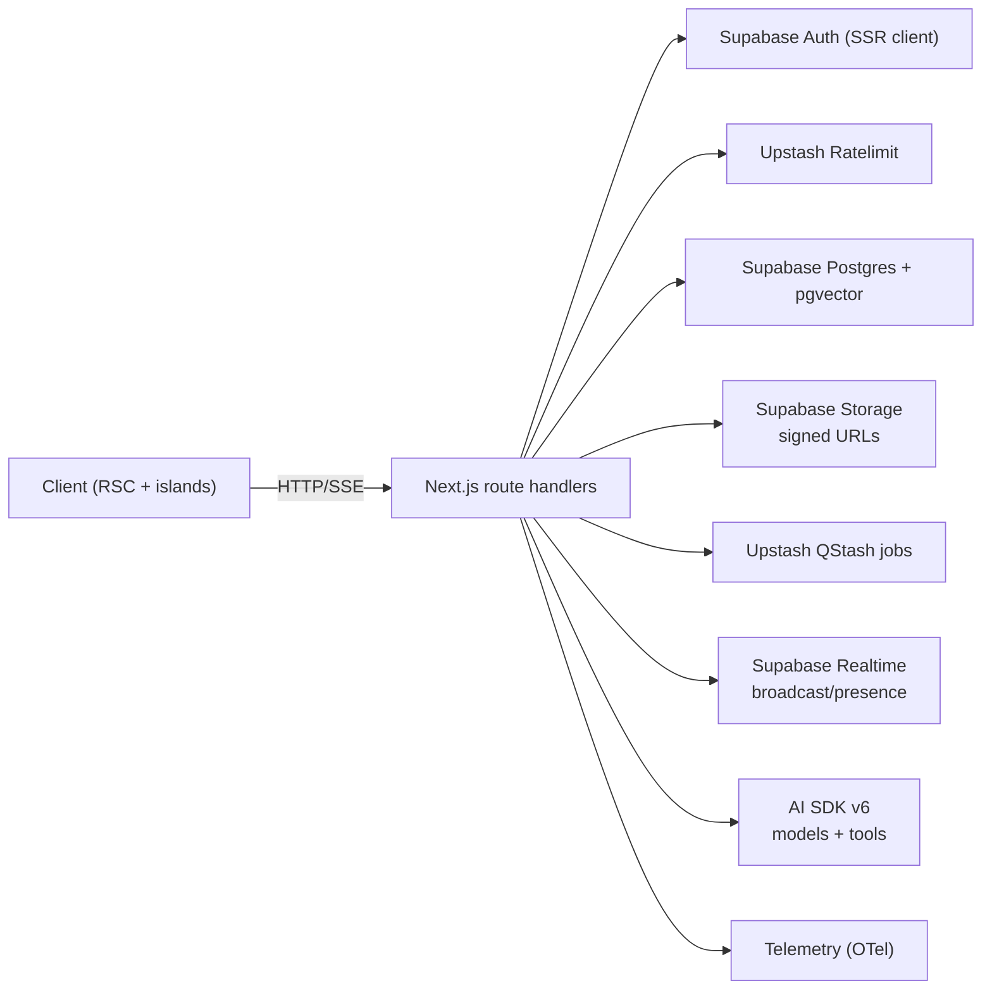

## AI Routes & Tools

- Chat and agent endpoints live under `/api/chat/*` and `/api/agents/*`; they exclusively use AI SDK v6 and return `toUIMessageStreamResponse()` for streaming.
- Tools are defined with `createAiTool` factory inside server modules (`src/ai/tools/**`) and validated with Zod schemas. Raw `tool()` usage in `src/ai/tools/server/**` is blocked by `pnpm ai-tools:check`. Keep tool registration centralized via `src/ai/tools/index.ts` (no ad-hoc exports).
- Attachments flow: uploads go to Supabase Storage (bucket `attachments`), metadata persisted in Postgres rows with size/MIME/owner; signed URLs issued per-request.
- Validation flow: request body parsed with shared schemas from `@schemas/*`; handler rejects on Zod failure before provider resolution.

## Testing & Quality Gates

- Lint/format: `pnpm biome:check`.
- Types: `pnpm type-check`.
- Tests: `pnpm test*` (Vitest projects; add `/** @vitest-environment jsdom */` when DOM is used).
- Typical targeted runs: `pnpm test:unit` (unit), `pnpm test:components` (UI), `pnpm test:api` (route handlers), `pnpm test:e2e` (Playwright).
- Follow AGENTS “final-only” rule: delete superseded code and tests when replacements land.

## Deployment

- Local: `pnpm dev`; Supabase CLI for local DB; Upstash cloud or mocks for Redis/QStash.
- Production: Vercel for frontend + API routes; Supabase managed services; Upstash Redis/QStash; AI Gateway for model routing.
- Build flags: React Compiler enabled; bundle analyzer via `pnpm build:analyze`; architecture boundaries check via `pnpm boundary:check`.
````

## File: docs/development/architecture/layering.md
````markdown
# Layering Policy

This policy defines architectural layers and allowed dependency directions. It
keeps domain logic portable, avoids UI/framework coupling, and makes refactors
safer.

## Layers

### 1) Domain (`src/domain`, `@domain/*`, `@schemas/*`)

- Core business logic, domain services, and schemas.
- Should be framework-agnostic and stable.

### 2) Lib/Infra (`src/lib`, `@/*`)

- Infrastructure and platform adapters (Supabase, Redis, telemetry, env, HTTP).
- Utilities that are not domain-specific.

### 3) AI (`src/ai`, `@ai/*`)

- AI SDK tools, agents, prompts, model registry.
- Should depend on Domain + Lib/Infra, not on App.

### 4) App (`src/app`, `src/components`, `src/hooks`, `src/stores`, `src/styles`)

- Next.js routes, UI components, hooks, stores, and application wiring.
- Top of the dependency graph.

## Allowed Import Directions

| From \\ To | Domain | Lib/Infra | AI | App |
| --- | --- | --- | --- | --- |
| **Domain** | ✅ | ⚠️ (legacy only) | ❌ | ❌ |
| **Lib/Infra** | ✅ | ✅ | ❌ | ❌ |
| **AI** | ✅ | ✅ | ✅ | ❌ |
| **App** | ✅ | ✅ | ✅ | ✅ |

Notes:
- Domain **must not** import `next/*` or anything under `src/app/**`.
- Domain importing Lib/Infra is legacy and should be burned down over time.
- Server/Client boundaries still apply: client components must not import server-only modules.

## Examples

Allowed:
- `src/ai/tools/server/accommodations.ts` → `@domain/accommodations/service`
- `src/app/api/trips/route.ts` → `@domain/trips/service`, `@/lib/telemetry/span`
- `src/app/agents/page.tsx` → `@ai/agents/chat-agent`

Forbidden:
- `src/domain/trips/service.ts` → `next/headers`
- `src/domain/search/service.ts` → `@/app/api/search/route`
- `src/lib/supabase/server.ts` → `@ai/tools/server/web-search`

## Enforcement

CI enforces boundaries via `scripts/check-boundaries.mjs`:
- Domain → App/Next imports are blocked.
- Client components importing server-only modules are blocked.

Legacy exceptions live in `DOMAIN_IMPORT_ALLOWLIST` within `scripts/check-boundaries.mjs`.
Add an entry only with a short rationale and a burn-down plan.
````

## File: docs/development/backend/observability.md
````markdown
# Observability & Telemetry

This guide covers tracing, structured logging, and operational alerts for the Next.js app (route handlers + server utilities + client components).

## Automatic instrumentation (`@vercel/otel`)

`src/instrumentation.ts` registers `@vercel/otel` with `TELEMETRY_SERVICE_NAME` (`"tripsage-frontend"`). This enables default Next.js spans (Route Handlers, Server Components, Middleware) plus runtime instrumentations supported by the platform.

Use custom spans/events from `@/lib/telemetry/*` for application-level operations and stable naming/attributes.

## Approved Telemetry & Logging Entrypoints

Server code must use these helpers exclusively. Direct usage of `@opentelemetry/api` or `console.*` in server modules is prohibited except in:

- Test files
- Telemetry infrastructure (`src/lib/telemetry/*`, `src/lib/supabase/factory.ts`)

**Client-side exception:** Development-only `console.*` is allowed in client components (`"use client"`) when guarded by `process.env.NODE_ENV === 'development'`. Bundlers (Next.js SWC, Terser) perform dead code elimination, removing these calls from production bundles entirely.

**Server helpers (default):**

- `withTelemetrySpan()` / `withTelemetrySpanSync()` - Wrap operations with spans
- `getTelemetryTracer()` - Acquire tracer instance (prefer `withTelemetrySpan`, not direct calls)
- `recordTelemetryEvent()` - Emit a lightweight event (`event.{name}` span)
- `addEventToActiveSpan()` - Attach events to the current span
- `recordErrorOnSpan()` / `recordErrorOnActiveSpan()` - Record exception + ERROR status
- `createServerLogger()` - Structured logging (records `log.*` attributes via telemetry)
- `emitOperationalAlert()` - High-severity events intended for paging (use sparingly)

**Client helpers (`"use client"`):**

- `initTelemetry()` - Initialize OTEL Web SDK (export + fetch instrumentation)
- `withClientTelemetrySpan()` - Optional client-only spans (rare)
- `recordClientErrorOnActiveSpan()` - Attach sanitized errors to the active span

## OpenTelemetry spans

Use `withTelemetrySpan` from `@/lib/telemetry/span` (server-only) for async operations:

```typescript
import { withTelemetrySpan } from "@/lib/telemetry/span";

// Wrap a Supabase operation
const result = await withTelemetrySpan(
  "supabase.auth.getUser",
  {
    attributes: {
      "db.name": "tripsage",
      "db.system": "postgres",
    },
  },
  async (span) => {
    // Set additional attributes during execution
    span.setAttribute("user.authenticated", true);
    return await supabase.auth.getUser();
  }
);
```

- The helper automatically handles `SpanStatusCode.OK/ERROR`, exception recording, and span cleanup.
- All spans share the tracer exported by `getTelemetryTracer()` and group under the `tripsage-frontend` service name.
- If you call `span.recordException()` or `span.setStatus({ code: SpanStatusCode.ERROR })` inside the callback, `withTelemetrySpan` will preserve that status instead of overwriting it with OK.
- **Note:** `@/lib/telemetry/span` is server-only (marked with `"server-only"`). Client-side telemetry is handled separately (see Client-side telemetry section below).

Use `withTelemetrySpanSync` for synchronous operations (e.g., client initialization).

## AI SDK telemetry (`experimental_telemetry`)

AI SDK v6 calls should set `experimental_telemetry` with a stable `functionId`. Keep `metadata` low-cardinality and avoid PII (no email/name/raw user IDs; prefer counts and booleans).

Current `functionId` values in this codebase:

| Function ID | Location | Notes |
| --- | --- | --- |
| `agent.{agentType}` | `src/ai/agents/agent-factory.ts` | ToolLoopAgent instances |
| `router.classifyUserMessage` | `src/ai/agents/router-agent.ts` | Message classification |
| `agent.memory.summarize` | `src/ai/agents/memory-agent.ts` | Memory write summary |
| `memory.insights.generate` | `src/app/api/memory/insights/[userId]/route.ts` | Insights generation |
| `ai.stream.demo` | `src/app/api/ai/stream/route.ts` | Demo streaming route (requires `ENABLE_AI_DEMO="true"`) |

## Telemetry-safe identifiers

Do not record raw user/session identifiers in telemetry spans by default.

- Use `hashTelemetryIdentifier()` from `src/lib/telemetry/identifiers.ts` to emit stable pseudonyms (e.g., `user.id_hash`, `session.id_hash`) when `TELEMETRY_HASH_SECRET` is configured (required in production).
- In non-production, if `TELEMETRY_HASH_SECRET` is unset, identifier attributes should be omitted (fail-safe).
- Policy and attribute classification: `docs/development/security/telemetry-data-classification.md`.

## Infrastructure spans (catalog)

Span names are stable. Attributes must be low-cardinality and must not contain secrets/PII.

### Supabase

**Factory spans (`src/lib/supabase/factory.ts`):**

| Span name | When |
| --- | --- |
| `supabase.init` | `createServerSupabase()` |
| `middleware.supabase.init` | `createMiddlewareSupabase()` (tracing usually disabled) |
| `supabase.auth.getUser` | `getCurrentUser()` |

**CRUD spans (`src/lib/supabase/typed-helpers.ts`):**

| Span name | Helper |
| --- | --- |
| `supabase.insert` | `insertSingle` |
| `supabase.update` | `updateSingle` |
| `supabase.select` | `getSingle`, `getMaybeSingle` |
| `supabase.upsert` | `upsertSingle` |
| `supabase.delete` | `deleteSingle` |

Common attributes:

- `db.system`: `"postgres"`
- `db.name`: `"tripsage"`
- `db.supabase.operation`: `"select" | "insert" | "update" | "delete" | "upsert" | "init" | "auth.getUser"`
- `db.supabase.table`: table name (typed helpers)
- `db.supabase.row_count`: result count (delete)

### Upstash Redis cache

Cache helpers in `src/lib/cache/upstash.ts` emit spans:

| Span name | Operation | Notes |
| --- | --- | --- |
| `cache.get` | get | Sets `cache.hit` and `cache.parse_error` |
| `cache.get_safe` | get | Sets `cache.status` (`hit`/`miss`/`invalid`), `cache.has_schema`, and `cache.validation_failed` |
| `cache.set` | set | Sets `cache.ttl_seconds` and `cache.value_bytes` |
| `cache.delete` | delete | Sets `cache.deleted_count` |
| `cache.delete_many` | delete | Sets `cache.key_count` and `cache.deleted_count` |

Common attributes:

- `cache.system`: `"upstash"`
- `cache.operation`: `"get" | "set" | "delete"`
- `cache.namespace`: low-cardinality namespace derived from the key
- `cache.key_length`: key length (we intentionally do not record raw keys)
- `cache.unavailable`: `true` when Redis is not configured
- `cache.has_schema`: `true` when a schema is provided (`cache.get_safe`)
- `cache.validation_failed`: `true` when schema validation fails (`cache.get_safe`)

### QStash + DLQ

QStash helpers emit spans for enqueue and DLQ operations:

| Span name | Location |
| --- | --- |
| `qstash.enqueue` | `src/lib/qstash/client.ts` |
| `qstash.dlq.push` | `src/lib/qstash/dlq.ts` |
| `qstash.dlq.list` | `src/lib/qstash/dlq.ts` |
| `qstash.dlq.remove` | `src/lib/qstash/dlq.ts` |

## Client-side telemetry

Client-side OpenTelemetry is minimal and focused on distributed tracing and error reporting:

- **Initialization:** `initTelemetry()` from `@/lib/telemetry/client` sets up WebTracerProvider and FetchInstrumentation. This is automatically called via `TelemetryProvider` in the root layout. It enables:
  - Automatic tracing of fetch requests to API routes
  - Trace context propagation via `traceparent` headers (distributed tracing from client → server)
- **Error recording:** `recordClientErrorOnActiveSpan()` from `@/lib/telemetry/client-errors` records client-side errors on active spans, linking errors to traces.

**Important:** Client-side telemetry is intentionally small. Do not import server-only helpers (`@/lib/telemetry/span`, `@/lib/telemetry/logger`) from client code. Use `recordClientErrorOnActiveSpan` to link client errors to in-flight traces; use `withClientTelemetrySpan` only for rare, client-only spans.

**Configuration:**

```bash
NEXT_PUBLIC_OTEL_EXPORTER_OTLP_ENDPOINT=http://localhost:4318/v1/traces
```

## Structured logging

### Server logger (recommended for most cases)

Use `createServerLogger` for route handlers, tools, and server utilities:

```typescript
import { createServerLogger } from "@/lib/telemetry/logger";

const logger = createServerLogger("api.keys", {
  redactKeys: ["apiKey"], // Optional: redact sensitive metadata keys
});

// In a route handler
logger.info("Key stored", { userId: "123", apiKey: "sk-..." }); // apiKey redacted
logger.error("Validation failed", { field: "email", message: "Invalid format" });
logger.warn("Rate limit approaching", { remaining: 5 });
```

- Automatically encodes metadata with `log.*` attribute prefixes
- Supports redaction of sensitive keys
- Uses `recordTelemetryEvent` under the hood

### Telemetry events (for lightweight events)

For structured logging without full operation tracing, use `recordTelemetryEvent`:

```typescript
import { recordTelemetryEvent } from "@/lib/telemetry/span";

// Log API errors with context
recordTelemetryEvent("api.keys.parse_error", {
  attributes: { message: "Invalid JSON", operation: "json_parse" },
  level: "error",
});

// Log validation warnings
recordTelemetryEvent("api.keys.validation_error", {
  attributes: { field: "email", message: "Invalid format" },
  level: "warning",
});
```

**When to use what:**

- `createServerLogger` - Route handlers, tools, utilities (most common)
- `recordTelemetryEvent` - Lightweight events without full context (less common)
- `withTelemetrySpan` - Full operation tracing with timing and error handling
- `emitOperationalAlert` - Critical failures requiring paging (rare)

**Guidelines:**

- **Logging policy by context:**
  - **Server code (route handlers, tools, shared libs):** Must use telemetry helpers (`createServerLogger`, `recordTelemetryEvent`, `withTelemetrySpan`). No `console.*`.
  - **Client-only UI (`"use client"` components/hooks):** Development-only `console.*` is permitted when guarded:

    ```typescript
    if (process.env.NODE_ENV === 'development') {
      console.log('Debug info:', data);
    }
    ```

    These calls are eliminated by Next.js compiler in production builds (dead code elimination).
  - **Zustand stores:** Use `createStoreLogger` from `@/lib/telemetry/store-logger` for error tracking. This records errors on the active OTEL span.

    ```typescript
    import { createStoreLogger } from "@/lib/telemetry/store-logger";

    // In a Zustand store - create logger once at store initialization
    const logger = createStoreLogger({ storeName: "store.my-store" });

    const store = create((set) => ({
      fetchData: async () => {
        try {
          const data = await api.getData();
          set({ data });
        } catch (error) {
          logger.error("Failed to fetch data", {
            message: error instanceof Error ? error.message : String(error),
          });
          throw error;
        }
      },
    }));
    ```

  - **Tests:** `console.*` allowed freely for debugging.
- **Optional:** Configure `compiler.removeConsole` in `next.config.ts` for additional safety:

  ```ts
  import type { NextConfig } from "next";

  const nextConfig: NextConfig = {
    compiler: {
      removeConsole: process.env.NODE_ENV === "production",
      // Or keep console.error: removeConsole: { exclude: ["error"] }
    },
  };

  export default nextConfig;
  ```

- Use concise event names: `api.{module}.{action}_error`
- Include relevant context in attributes (no secrets)
- Use appropriate severity levels: "error", "warning", "info"
- Prefer `createServerLogger` over `recordTelemetryEvent` for most logging needs

| Event                      | Severity | Attributes                | Trigger                                                   |
|----------------------------|----------|---------------------------|-----------------------------------------------------------|
| `api.keys.parse_error`     | error    | `message`, `operation`    | JSON parsing failures in keys API                        |
| `api.keys.auth_error`      | error    | `message`, `operation`    | Authentication failures in keys API                      |
| `api.keys.validation_error`| warning  | `field`, `message`        | Zod validation failures in keys API                      |
| `api.keys.post_error`      | error    | `message`, `operation`    | General POST errors in keys API                          |
| `api.keys.get_error`       | error    | `message`, `operation`    | GET errors in keys API                                   |
| `api.keys.rate_limit_config_error` | error | `hasToken`, `hasUrl`, `message` | Rate limiter configuration missing in production        |
| `api.keys.delete_error`    | error    | `message`, `service`, `operation` | Key deletion failures                                    |
| `api.keys.validate_provider_error` | error | `message`, `provider`, `reason` | Provider key validation failures                         |
| `api.keys.validate.parse_error` | error | `message` | JSON parsing in validate API                             |
| `api.keys.validate.post_error` | error | `message` | General errors in validate API                           |

## Operational alerts (paging)

Use `emitOperationalAlert` for conditions that require operator attention.

Alerts are recorded via telemetry as `alert.{event}` (for example, `alert.redis.unavailable`) with `alert.*` attributes. They do not rely on server `console.*` logging.

**Use sparingly** - only for conditions that require immediate operator attention. Prefer `createServerLogger` or `recordTelemetryEvent` for normal error logging.

```typescript
import { emitOperationalAlert } from "@/lib/telemetry/alerts";

// Critical infrastructure failure
emitOperationalAlert("redis.unavailable", {
  severity: "error",
  attributes: { feature: "cache.tags" },
});

// Webhook verification failure (security-critical)
emitOperationalAlert("webhook.verification_failed", {
  severity: "error",
  attributes: { reason: "invalid_signature" },
});
```

- `severity` defaults to `"error"`.
- Keep attributes low-cardinality and avoid secrets.
- Do not route normal logs through this channel.

### Operational alerts

| Event                      | Severity | Attributes                | Trigger                                                   |
|----------------------------|----------|---------------------------|-----------------------------------------------------------|
| `redis.unavailable`        | error    | `feature` (cache module)  | `warnRedisUnavailable` when Upstash credentials missing   |
| `webhook.verification_failed` | warning | `reason` (`missing_secret_env`, `missing_signature`, `body_read_error`, `invalid_signature`, `invalid_json`, `invalid_payload_shape`, `payload_too_large`) | `parseAndVerify` failures before processing payloads |
| `ratelimit.degraded`       | error    | `reason`, `degradedMode`, plus `rateLimitKey` (API) or `feature` + `route` (webhooks) | Fail-open fallback when rate limiting cannot be enforced |
| `idempotency.degraded`     | error    | `namespace`, `reason`, `degradedMode` | Fail-open fallback when idempotency cannot be enforced |
| `ai_demo.stream`           | info     | `status`, `has_detail`, `detail_length`, optional HMAC `detail_hash` | Privileged AI demo alert emission (gated) |

### Adding telemetry events

1. Use `recordTelemetryEvent` for structured logging that doesn't need full operation tracing.
2. Choose concise event names following `api.{module}.{action}_error` pattern.
3. Include relevant context in attributes (avoid secrets, keep low-cardinality).
4. Use appropriate severity levels: "error" for failures, "warning" for validation issues, "info" for notable events.
5. Update this document with the new event name, attributes, and trigger conditions.

### Adding operational alerts

1. Decide if the condition truly needs paging. Prefer telemetry events or metrics for noisy cases.
2. Call `emitOperationalAlert` near the existing error handling path.
3. Update this document and the relevant runbooks (operator docs) with the new event name and attributes.
4. If applicable, add a unit test that asserts the emitted `alert.{event}` telemetry attributes.

## Integration with runbooks

- Operator docs already mention watching for `redis.unavailable` and
  `webhook.verification_failed` alerts when diagnosing cache/webhook issues.
- Keys API telemetry events help diagnose BYOK (Bring Your Own Key) issues:
  - `api.keys.rate_limit_config_error`: Indicates missing Upstash configuration in production
  - `api.keys.auth_error`: Authentication failures when storing/retrieving keys
  - `api.keys.parse_error` / `api.keys.validation_error`: Request format issues
- Deployment guides include steps to check `.github/workflows/deploy.yml` and
  `scripts/operators/verify_webhook_secret.sh`, so keep those docs in sync when
  adding future alerts or telemetry changes.

## References

- `docs/architecture/decisions/adr-0046-otel-tracing-frontend.md`
- Vercel OTEL: <https://vercel.com/docs/observability/otel-overview>
- AI SDK telemetry: <https://v6.ai-sdk.dev/docs/ai-sdk-core/telemetry>
- OpenTelemetry JS: <https://opentelemetry.io/docs/languages/js/>
````

## File: docs/development/core/env-setup.md
````markdown
# Environment Setup Guide (local development)

Copy the root `.env.example` to `.env`, then follow the checklists below to populate every variable. Copy root `.env.test.example` to `.env.test` for local/CI test runs. All service-specific env files are derived from the root templates.

## Core & Supabase

- Core URLs (all usually `http://localhost:3000` during dev):
  - `APP_BASE_URL`
  - `NEXT_PUBLIC_APP_URL`
  - `NEXT_PUBLIC_SITE_URL`
  - `NEXT_PUBLIC_API_URL`
- Supabase (Dashboard → Settings → API):
  - `NEXT_PUBLIC_SUPABASE_URL`
  - `NEXT_PUBLIC_SUPABASE_ANON_KEY`
  - `SUPABASE_SERVICE_ROLE_KEY`
  - `SUPABASE_JWT_SECRET`
  - Console: <https://supabase.com/dashboard>

## Upstash (Redis + QStash)

- Redis REST (caching/rate-limit):
  - `UPSTASH_REDIS_REST_URL` (REST URL)
  - `UPSTASH_REDIS_REST_TOKEN` (REST token)
  - Console: <https://console.upstash.com/redis>
- QStash (jobs/webhooks):
  - `QSTASH_TOKEN`
  - `QSTASH_CURRENT_SIGNING_KEY`
  - `QSTASH_NEXT_SIGNING_KEY`
  - Console: <https://console.upstash.com/qstash>

## AI providers / Gateway

- Vercel AI Gateway:
  - `AI_GATEWAY_API_KEY`
  - `AI_GATEWAY_URL` (defaults to `https://ai-gateway.vercel.sh/v1`)
  - Dashboard: <https://vercel.com/ai-gateway>
- Direct providers:
  - `OPENAI_API_KEY` — <https://platform.openai.com/api-keys>
  - `ANTHROPIC_API_KEY` — <https://console.anthropic.com>
  - `XAI_API_KEY` — <https://console.x.ai>
  - `OPENROUTER_API_KEY` — <https://openrouter.ai/keys>
- Optional:
  - `EMBEDDINGS_API_KEY` (internal key for `/api/embeddings`; required, otherwise the endpoint is disabled)

## AI demo (disabled by default)

These routes are cost-bearing/privileged and are disabled unless explicitly enabled:

- `ENABLE_AI_DEMO` (set to `"true"` to enable `/api/ai/stream` and `/api/telemetry/ai-demo`)
- `TELEMETRY_AI_DEMO_KEY` (internal key for `/api/telemetry/ai-demo`)

## Telemetry privacy (required in production)

- `TELEMETRY_HASH_SECRET` (≥32 chars): required in production. Enables stable hashed identifiers in telemetry spans (e.g., `user.id_hash`, `session.id_hash`) and optional HMAC fingerprints on privileged alerts (e.g., `ai_demo.stream.detail_hash`). In non-production, if unset, identifier/fingerprint attributes are omitted by default.

## Search / crawling

- `FIRECRAWL_API_KEY`
- `FIRECRAWL_BASE_URL` (optional; defaults to hosted API)
- Docs: <https://docs.firecrawl.dev/getting-started/api-key>

## Maps / Weather

- Google Maps Platform (same credentials page: <https://console.cloud.google.com/google/maps-apis/credentials>)
  - `GOOGLE_MAPS_SERVER_API_KEY` (server-restricted: Places/Geocoding/Routes)
  - `NEXT_PUBLIC_GOOGLE_MAPS_BROWSER_API_KEY` (browser, referrer-restricted)
- Weather:
  - `OPENWEATHERMAP_API_KEY` — <https://home.openweathermap.org/api_keys>

## Payments

- Stripe keys (<https://dashboard.stripe.com/apikeys>):
  - `STRIPE_SECRET_KEY`
  - `NEXT_PUBLIC_STRIPE_PUBLISHABLE_KEY`

## Email / notifications

- Resend (<https://resend.com/api-keys>):
  - `RESEND_API_KEY`
  - `RESEND_FROM_EMAIL`
  - `RESEND_FROM_NAME`
- Webhook signing:
  - `HMAC_SECRET` (generate a strong random string)

## Travel APIs

- Duffel (<https://app.duffel.com/developers>):
  - `DUFFEL_ACCESS_TOKEN` (preferred)
  - `DUFFEL_API_KEY` (fallback)
- Amadeus Self-Service:
  - <https://developers.amadeus.com/get-started>
  - Variables: `AMADEUS_CLIENT_ID`, `AMADEUS_CLIENT_SECRET`, `AMADEUS_ENV` (`test`|`production`)
- Google Places (New):
  - Enable Places API (New) + Photos in Google Cloud Console
  - Uses the same Google Maps Platform API keys (no separate Places API key required)
  - Server-side: `GOOGLE_MAPS_SERVER_API_KEY` (IP+API restricted for Places/Geocoding/Routes)
  - Browser/client-side: `NEXT_PUBLIC_GOOGLE_MAPS_BROWSER_API_KEY` (referrer-restricted)

## Optional analytics

- `GOOGLE_ANALYTICS_ID` (GA4), `MIXPANEL_TOKEN`, `POSTHOG_HOST`, `POSTHOG_KEY` — create per-provider dashboards; safe to leave empty locally.

## Ready-to-run checklist

> **Note**: This is a reusable onboarding template. Copy and complete when setting up a new development environment.

- [ ] `.env` copied from root `.env.example`
- [ ] `.env.test` copied from root `.env.test.example` for local/CI test runs
- [ ] Supabase URL + anon key + service role key present
- [ ] Upstash Redis REST URL + token present
- [ ] QStash token + signing keys present
- [ ] At least one model provider key (OpenAI/Anthropic/xAI/OpenRouter or `AI_GATEWAY_API_KEY`)
- [ ] Google Maps server key set if using maps; browser key for client maps
- [ ] Stripe keys set if payment flows are exercised
- [ ] Resend key and from info set if email notifications are needed
- [ ] Travel providers set if flights/hotels features are tested

## Quick verification

```bash
pnpm biome:check && pnpm type-check && pnpm test
```

If startup validation fails, re-check required variables above before debugging code.
````

## File: docs/development/frontend/forms.md
````markdown
# Forms and Validation Guide

React Hook Form (RHF) integration with Zod v4 for TripSage forms.

## Hooks

### useZodForm

Thin wrapper around `react-hook-form` that wires `zodResolver(schema)` and adds a
small set of convenience helpers.

**Location:** `@/hooks/use-zod-form`

```typescript
import { useZodForm } from "@/hooks/use-zod-form";
import { tripFormSchema } from "@schemas/trips";

const form = useZodForm({
  schema: tripFormSchema,
  defaultValues: { title: "", destination: "" },
});

// Submit with built-in validation
const onSubmit = form.handleSubmitSafe(async (data) => {
  await saveTrip(data);
});

// Use with Form components (see UI Components section below)
```

**Options:**

| Option | Type | Default | Description |
|--------|------|---------|-------------|
| `schema` | `z.ZodType<T>` | required | Zod schema for validation |
| `defaultValues` | `DefaultValues<T>` | `{}` | Initial form values |
| `mode` | `"onChange" \| "onBlur" \| "onSubmit" \| "onTouched" \| "all"` | `"onChange"` | Standard RHF validation mode (recommended) |
| `validateMode` | `"onChange" \| "onBlur" \| "onSubmit" \| "onTouched" \| "all"` | `"onChange"` | Legacy alias for RHF `mode` (prefer `mode`) |
| `reValidateMode` | `"onChange" \| "onBlur" \| "onSubmit"` | `"onChange"` | When to re-validate after error |
| `transformSubmitData` | `(data: T) => T` | - | Transform data before submission |
| `onValidationError` | `(errors) => void` | - | Callback on validation failure |
| `onSubmitSuccess` | `(data) => void` | - | Callback on successful submission |
| `onSubmitError` | `(error) => void` | - | Callback on submission error |

**Return Values:**

| Property | Description |
|----------|-------------|
| `handleSubmitSafe` | Safe submit handler with validation |
| `isFormComplete` | Convenience alias for `formState.isValid` |
| `validationState` | Submit-only summary: `{ isValidating, lastValidation, validationErrors }` |
| `...useForm()` | All standard React Hook Form methods/state (`register`, `control`, `trigger`, `formState`, etc.) |

### useSearchForm

Thin wrapper for search-specific forms. Simpler API for quick search implementations.

**Location:** `@/components/features/search/common/use-search-form`

```typescript
import { useSearchForm } from "@/components/features/search/common/use-search-form";
import { HotelSearchForm } from "@/components/features/search/forms/hotel-search-form";
import { hotelSearchSchema } from "@schemas/search";

function HotelSearch() {
  const form = useSearchForm(hotelSearchSchema, {
    destination: "",
    checkIn: "",
    checkOut: "",
  });

  return <Form {...form}>{/* fields */}</Form>;
}
```

## UI Components

Import from `@/components/ui/form`:

```typescript
import {
  Form,
  FormField,
  FormItem,
  FormLabel,
  FormControl,
  FormDescription,
  FormMessage,
} from "@/components/ui/form";
```

**Component Structure:**

```tsx
<Form {...form}>
  <FormField
    control={form.control}
    name="fieldName"
    render={({ field }) => (
      <FormItem>
        <FormLabel>Label</FormLabel>
        <FormControl>
          <Input {...field} />
        </FormControl>
        <FormDescription>Optional helper text</FormDescription>
        <FormMessage /> {/* Shows validation error */}
      </FormItem>
    )}
  />
</Form>
```

## Validation Patterns

### Cross-Field Validation

Use `.refine()` with `path` to show error on the correct field:

```typescript
const dateRangeSchema = z.strictObject({
  checkIn: z.string(),
  checkOut: z.string(),
}).refine(
  (data) => new Date(data.checkOut) > new Date(data.checkIn),
  { error: "Checkout must be after check-in", path: ["checkOut"] }
);
```

### Programmatic Validation

For step gating or manual checks, prefer React Hook Form built-ins:

- `await form.trigger()` to validate the full form
- `await form.trigger("fieldName")` to validate one field
- Read `form.formState.errors` for field errors

## Submission Patterns

### Safe Submit with Telemetry

Wrap async handlers with telemetry for observability:

```typescript
import { withClientTelemetrySpan } from "@/lib/telemetry/client";

const onSubmit = form.handleSubmitSafe(async (data) => {
  await withClientTelemetrySpan("trip.create", {}, async () => {
    await createTrip(data);
  });
});
```

### AbortController for Async Operations

Cancel in-flight requests on unmount or re-submit:

```typescript
const abortRef = useRef<AbortController | null>(null);

const onSubmit = form.handleSubmitSafe(async (data) => {
  abortRef.current?.abort();                         // Cancel previous
  abortRef.current = new AbortController();

  try {
    await fetchResults(data, { signal: abortRef.current.signal });
  } catch (e) {
    if (e instanceof Error && e.name === "AbortError") return; // Silent
    throw e;
  }
});

useEffect(() => () => abortRef.current?.abort(), []); // Cleanup on unmount
```

### Server Action Integration

Call server actions from form submission:

```typescript
import { submitHotelSearch } from "./actions";

const onSubmit = form.handleSubmitSafe(async (data) => {
  const validated = await submitHotelSearch(data);
  router.push(`/search/results?${new URLSearchParams(validated)}`);
});
```

## Schema Organization

Form schemas should be co-located with domain schemas. See [Form Schema Patterns](./zod-schema-guide.md#form-schema-patterns) for schema design examples that pair with these hooks.

```typescript
// @schemas/trips.ts

// ===== CORE SCHEMAS =====
export const tripSchema = z.strictObject({
  id: z.uuid(),
  title: z.string().min(1).max(200),
  // ...
});

// ===== FORM SCHEMAS =====
export const tripFormSchema = tripSchema.omit({ id: true });
export type TripFormData = z.infer<typeof tripFormSchema>;
```

## Testing Forms

See [Testing Guide - Forms Section](./testing.md#forms) for:

- Validation error testing
- Submission testing
- Wizard navigation testing
````

## File: docs/development/security/telemetry-data-classification.md
````markdown
# Telemetry Data Classification (server + client)

This document defines what TripSage is allowed to emit into telemetry spans, span events, and structured logs produced via `@/lib/telemetry/*`.

## Goals

- Prevent secrets/PII from reaching telemetry backends.
- Keep attributes low-cardinality to avoid cost explosions and unusable dashboards.
- Enable correlation without exposing raw identifiers.

## Data classes

### Disallowed (never emit)

- Secrets: API keys, tokens, signing keys, `Authorization` headers, cookies, webhook signatures, JWTs, service-role keys.
- Raw PII: email, name, address, phone, payment details.
- Raw identifiers that can be joined to user records:
  - `user.id`, `session.id`, `conversation.id`, `trip.id` when it is user-specific and could be used for enumeration.
- Full request bodies or raw prompts/messages.

### Allowed (safe by default)

- Low-cardinality metadata:
  - Route/method names (prefer stable route keys/templates; avoid raw request paths that include IDs), feature flags, boolean switches, error codes, retry counts.
  - Provider model IDs (e.g., `gpt-4o`) and tool names.
- Aggregations and sizes:
  - Token counts, character counts, byte sizes, durations (ms), item counts.
- Hashed identifiers (pseudonyms):
  - `*.id_hash` produced via HMAC-SHA256 with a server-side secret.

### Allowed with caution (review required)

- Partial error messages: only when redacted and not user-controlled.
- User-generated content samples: generally avoid; if required for debugging, prefer truncation + explicit approval and ensure it does not contain PII.
- Operational alert attributes: never include raw user-provided strings; prefer booleans + lengths, and (if correlation is required) a short one-way hash fingerprint.

## Identifier policy (required)

Do not emit raw user/session identifiers in telemetry by default.

- Use `hashTelemetryIdentifier()` from `src/lib/telemetry/identifiers.ts`:
  - Output attribute keys: `user.id_hash`, `session.id_hash` (or similar `*.id_hash`).
  - Input: raw identifier string.
  - Hash: `HMAC-SHA256(identifier, TELEMETRY_HASH_SECRET)` (stable pseudonym).
- In production, `TELEMETRY_HASH_SECRET` must be configured. In non-production, if it is unset, do not emit identifier attributes at all (fail-safe).

## Logging policy (required)

- Server modules should not use `console.*` (use `createServerLogger()` or telemetry events).
- Never log raw signature headers (e.g., QStash `Upstash-Signature`). If correlation is required, log a short hash prefix only.

## Review checklist

Before adding new telemetry attributes/events:

- [ ] No secrets/PII/raw IDs are included.
- [ ] Attributes are low-cardinality (no unbounded user input).
- [ ] Any identifiers are emitted as `*.id_hash` only, guarded by `TELEMETRY_HASH_SECRET` (required in production).
- [ ] Any user-provided strings are truncated and justified.
- [ ] If an operational alert is emitted, it is gated/deduped to prevent spam.
````

## File: docs/development/standards/standards.md
````markdown
# Standards

Single source for how we write TripSage code.

## TypeScript & Quality

- Strict typing: no `any`; handle `null`/`undefined` explicitly; type all params/returns; prefer narrow unions over broad strings.
- Prefer functions/components with clear props and return types; hooks use `use*` naming.
- Examples:

```ts
interface Trip {
  id: string;
  name: string;
  destinations: string[];
  status: "planning" | "booked" | "completed";
}

export function TripCard({ trip, onEdit }: { trip: Trip; onEdit: (id: string) => void }) {
  return (
    <div>
      <h3>{trip.name}</h3>
      <button onClick={() => onEdit(trip.id)}>Edit</button>
    </div>
  );
}
```

```ts
function useTrips() {
  const [trips, setTrips] = useState<Trip[]>([]);
  const [loading, setLoading] = useState(false);

  const fetchTrips = async () => {
    setLoading(true);
    try {
      const response = await api.getTrips();
      setTrips(response.data);
    } finally {
      setLoading(false);
    }
  };

  return { trips, loading, fetchTrips };
}
```

- Commands: `pnpm biome:check`, `pnpm biome:fix`, `pnpm type-check`, `pnpm test`.

## Import Paths

Semantic aliases (configured in `tsconfig.json`):

| Alias | Target | Use For |
| --- | --- | --- |
| `@schemas/*` | `./src/domain/schemas/*` | Zod/domain schemas |
| `@domain/*` | `./src/domain/*` | Domain logic |
| `@ai/*` | `./src/ai/*` | AI SDK tooling/models |
| `@/*` | `./src/*` | Generic src-root (lib, components, stores, hooks, app) |

Usage rules:

- Use aliases when crossing feature/architecture boundaries or importing schemas from anywhere.
- Use relative paths (`./`, `../`) within the same small feature tree (≤2 levels) for clarity.
- Disallowed: `@/domain/*`, `@/ai/*`, `@/domain/schemas/*`.

Examples:

```ts
// Correct
import { accommodationSchema } from "@schemas/accommodations";
import { AccommodationsService } from "@domain/accommodations/service";
import { createAiTool } from "@ai/lib/tool-factory";
import { createServerSupabase } from "@/lib/supabase/server";

// Correct relative within feature
import { AMADEUS_DEFAULT_BASE_URL } from "./constants";

// Incorrect (alias misuse)
// import { AccommodationsService } from "@/domain/accommodations/service";
```

Migration checklist for new imports:

1) Decide boundary: schema → `@schemas/*`; domain → `@domain/*`; AI → `@ai/*`; generic → `@/*`.
2) If same feature folder and short path, prefer relative.
3) Verify alias exists in `tsconfig` and `vitest.config.ts`.
4) Run `pnpm biome:check` to catch violations.
5) Do not add new imports from `@/lib/providers/registry`; use `@ai/models/registry` (shim removal planned).

Troubleshooting: restart TS server, confirm path mapping, run `pnpm type-check` for detailed errors.

## Code Style

- Formatter/linter: Biome. Use `pnpm biome:fix` to apply fixes; `pnpm format:biome` for formatting only.
- Keep schemas, types, and exports documented with concise JSDoc when public.

## Zod Schemas (v4)

- Single source per domain under `@schemas/*`; co-locate tool input schemas with the domain file when specific, but prefer shared domain files when consumed by multiple layers (route + tool + UI). Use section markers (`// ===== CORE SCHEMAS =====`, `// ===== TOOL INPUT SCHEMAS =====`).
- Use `z.strictObject`/`z.looseObject`; `z.enum(MyEnum)` for TS enums; `z.number().int()` for ints; prefer `.nullable()` over `.optional()` for strict tool inputs; avoid deprecated Zod 3 APIs.
- Use `.refine`/`.superRefine` for invariants (e.g., checkout after checkin); prefer `.transform` for normalization rather than ad-hoc post-processing.
- Error messages use `{ error: "..." }` (no deprecated `message` fields).
- Pair schema and inferred type in the same file:

```ts
export const userSchema = z.strictObject({ id: z.string().uuid(), email: z.string().email() });
export type User = z.infer<typeof userSchema>;
```

- Registry helpers: use `primitiveSchemas`, `transformSchemas`, `refinedSchemas` from `@schemas/registry`.
- Tool schemas (AI SDK v6): include `.describe()` on fields, `z.strictObject` inputs, `temperature: 0` for tool calls.

## Architecture & Services

- Layering policy: see [Layering Policy](../architecture/layering.md). Domain must not import
  `next/*` or `src/app/**`; client components must not import server-only modules.
- Keep business logic in service/handler functions, wrapped with `withTelemetrySpan`; avoid module-scope state in route handlers.
- Example service pattern with DI + telemetry:

```ts
import { withTelemetrySpan } from "@/lib/telemetry/span";

interface ServiceDeps {
  db: DatabaseService;
  cache: CacheService;
  externalApi: ExternalApiService;
  rateLimiter?: RateLimiter;
}

export class TripService {
  constructor(private readonly deps: ServiceDeps) {}

  async createTrip(tripData: TripData, userId: string) {
    return withTelemetrySpan("trip.create", { attributes: { userId } }, async () => {
      // business logic
    });
  }
}
```

- Logging/telemetry: use `@/lib/telemetry/{span,logger}` only; no `console.*` in server code (tests/client-only UI allowed).

## Security & Validation

- Validate all external inputs with Zod before use.
- Use `withApiGuards` and `createServerSupabase` for authenticated routes; keep auth in handlers, not in helpers.
- Sensitive actions (MFA backup codes, credential changes, BYOK operations) must enforce step-up MFA: call `requireAal2()` before the action and return `mfa_required` on failure.
- Record security-sensitive recovery events: backup code regeneration/consumption must log via `mfa_backup_code_audit` (metadata only, never the code value).
- Example input validation:

```ts
import { z } from "zod";
import { primitiveSchemas } from "@schemas/registry";

const tripCreateSchema = z.strictObject({
  title: primitiveSchemas.nonEmptyString.max(200),
  destination: primitiveSchemas.nonEmptyString.max(200),
  startDate: z.string(),
  endDate: z.string(),
  budget: primitiveSchemas.nonNegativeNumber.optional(),
  travelers: primitiveSchemas.positiveNumber.int().default(1),
});
```

- Auth wrapper example:

```ts
import { NextResponse } from "next/server";
import { withApiGuards } from "@/lib/api/factory";

export const GET = withApiGuards({
  auth: true,
  rateLimit: "trips:list",
  telemetry: "trips.list",
})(async (_req, { supabase, user }) => {
  const { data } = await supabase.from("trips").select("*").eq("user_id", user!.id);
  return NextResponse.json(data);
});
```

## Zustand Stores

- Small stores (<300 LOC): single file with middleware (`devtools`, `persist`).
- Large stores: use slice composition (`stores/<feature>/*`), compose in `index.ts`, expose selective exports only.
- Architecture pattern for composed stores:

```text
stores/auth/
├── auth-core.ts       # core state/actions
├── auth-session.ts    # session flows (login/logout/refresh)
├── auth-validation.ts # validation logic
├── reset-auth.ts      # reset utilities
└── index.ts           # unified store composition + exports
```

Core slice example:

```ts
import { StateCreator } from "zustand";

export interface AuthCore {
  user: User | null;
  isLoading: boolean;
  error: string | null;
}

export interface AuthCoreActions {
  setUser: (user: User | null) => void;
  setLoading: (loading: boolean) => void;
  setError: (error: string | null) => void;
}

export type AuthCoreSlice = AuthCore & AuthCoreActions;

export const createAuthCoreSlice: StateCreator<AuthCoreSlice> = (set) => ({
  user: null,
  isLoading: false,
  error: null,
  setUser: (user) => set({ user }),
  setLoading: (isLoading) => set({ isLoading }),
  setError: (error) => set({ error }),
});
```

Unified store with middleware:

```ts
import { create } from "zustand";
import { devtools, persist } from "zustand/middleware";
import { createAuthCoreSlice } from "./auth-core";
import { createAuthSessionSlice } from "./auth-session";
import { createAuthValidationSlice } from "./auth-validation";

type AuthStore = AuthCoreSlice & AuthSessionSlice & AuthValidationSlice;

export const useAuthStore = create<AuthStore>()(
  devtools(
    persist(
      (...args) => ({
        ...createAuthCoreSlice(...args),
        ...createAuthSessionSlice(...args),
        ...createAuthValidationSlice(...args),
      }),
      { name: "auth-store", partialize: (state) => ({ user: state.user }) }
    ),
    { name: "AuthStore" }
  )
);
```

- Helpers: `resetStore`, `setupTimeoutMock`, `waitForStoreState` from `@/test/helpers/store` for tests.
- Selectors: expose derived selectors for complex state; avoid broad subscriptions to minimize re-renders.

### Computed Middleware

For stores with complex derived state (aggregations, validation flags, counts), use the `withComputed` middleware:

```ts
import { withComputed, createComputeFn } from "@/stores/middleware/computed";

const computeFilterState = createComputeFn<FilterState>({
  activeFilterCount: (state) => Object.keys(state.activeFilters || {}).length,
  hasActiveFilters: (state) => Object.keys(state.activeFilters || {}).length > 0,
});

export const useFilterStore = create<FilterState>()(
  devtools(
    persist(
      withComputed(
        { compute: computeFilterState },
        (set) => ({
          activeFilters: {},
          activeFilterCount: 0,
          hasActiveFilters: false,
          // ... actions
        })
      ),
      { name: 'filter-store' }
    )
  )
);
```

Do not persist computed fields — configure `persist` with `partialize` to omit derived keys (e.g., `activeFilterCount`, `hasActiveFilters`) so they are recomputed on hydration.

**When to use**:

- Aggregations from collections (counts, sums, filters)
- Multi-property derived flags (form validation, UI states)
- Expensive computations needed by multiple components

**When NOT to use**:

- Simple property access (use selectors)
- Rarely-accessed values (compute on-demand with `useMemo`)
- Values dependent on React props/context

**Performance**: Compute functions run on every state update. Keep them O(1) or O(n) with small n. See [Zustand Computed Middleware Guide](./zustand-computed-middleware.md) for detailed patterns, examples, and performance considerations.

## Performance

- Databases: add indexes for frequent lookups; avoid N+1s; favor streaming/pagination.
- Caching: cache expensive operations with clear TTLs and invalidation rules (Upstash Redis); invalidate on writes.
- Async: use async/await for I/O; avoid blocking calls; handle errors explicitly.
- Frontend/state: batch state updates; avoid global fake timers; keep test fixtures minimal.

## Code Review Checklist

- [ ] Tests pass and are meaningful; coverage meets targets.
- [ ] Types are explicit; no `any`; imports follow alias rules.
- [ ] Lint/format/type-check scripts pass.
- [ ] Security: inputs validated; auth handled; secrets not logged.
- [ ] Performance: no obvious N+1, cache misuse, or blocking I/O.
- [ ] Docs updated if behavior/contract changes.

## Additional Store Practices

- For shared patterns, use helpers from `@/lib/stores/helpers` (loading/error state creators) instead of duplicating logic.
- Prefer selectors modules for derived views (e.g., `stores/trip/selectors.ts`) to keep components lean and memoized.
- Persist only the minimal subset of state; configure `partialize` in `persist` middleware.
````

## File: docs/specs/active/0032-spec-upstash-testing-harness.md
````markdown
# SPEC-0032: Upstash Testing Harness (Mocks, Emulators, Smoke)

**Version**: 1.1.0
**Status**: Implemented
**Date**: 2025-12-10

## Objective

Define a DRY, deterministic testing harness for all Upstash integrations (Redis, Ratelimit, QStash) in the frontend repo, combining shared in-memory stubs, optional local emulators, and gated live smoke checks while remaining compatible with Vitest `--pool=threads` and existing MSW setup.

## Scope

- Next.js 16 code and tests that depend on `@upstash/redis`, `@upstash/ratelimit`, or QStash HTTP calls.
- Vitest unit/integration suites, MSW handlers, and test setup files.

## Non-Goals

- Changing production Upstash configuration or runtime providers.
- Introducing new caching/rate-limiting features; this spec only covers testing.
- Backend (non-frontend) services.

## Current State / Problems

- Per-suite, hoisted mocks cause TDZ/order bugs under `--pool=threads`.
- Duplicate Upstash mock code across accommodations, payment, flights, travel-advisory, chat.
- Missing MSW coverage for some endpoints (e.g., `/api/chat/stream`), producing warnings.
- No consistent way to exercise HTTP contract behavior (auth headers, TTL, 429) without hitting real Upstash.

## Requirements

### Must

- Provide a shared in-memory stub for `@upstash/redis` supporting commands we use: `get`, `set`, `mset`, `del`, `incr`, `expire`, `ttl`, and pipelined `multi/exec` equivalents.
- Provide a shared stub for `@upstash/ratelimit` (sliding window) returning realistic `{ success, limit, remaining, retryAfter, reset }` and allowing forced 429 responses.
- Centralize MSW handlers in `src/test/msw/handlers/upstash.ts` covering Redis REST, ratelimit, and QStash publish/verify endpoints; silence on-unhandled warnings for Upstash paths only.
- Expose a single `reset()` API for stubs/handlers to ensure per-test isolation and thread safety.
- Allow switching to local emulators via env (`UPSTASH_EMULATOR_URL`, `UPSTASH_QSTASH_DEV_URL`, `UPSTASH_USE_EMULATOR=1`) without code changes.
- Add a gated live smoke suite that runs only when `UPSTASH_SMOKE=1` and secrets are present; serialize execution and keep total live calls minimal.
- Document usage in `docs/development/testing/testing.md` (Upstash section).

### Should

- Provide helper factories under `src/test/upstash/` (TypeScript, strict) with typed return values and optional time mocking to simulate TTL expiry.
- Supply a Vitest setup helper to register/reset stubs and MSW handlers (`src/test/setup/upstash.ts`).
- Add npm scripts: `pnpm test:upstash:unit`, `test:upstash:int` (emulator), `test:upstash:smoke` (gated).
- Pin emulator container/tag versions and fail fast with clear error when emulators unavailable.

## Design

### Shared Stubs (Unit/Fast Tier)

- File: `src/test/upstash/redis-mock.ts`
  - Implements minimal in-memory store with TTL tracking via `Date.now()`; pipelines return array results.
  - Export factory `createRedisMock()` returning `{ module, reset }`; `module` matches `@upstash/redis` surface used in app.
- File: `src/test/upstash/ratelimit-mock.ts`
  - Simulates `slidingWindow` responses; supports injected outcomes to test 429 paths.
- Reset pattern: each suite imports the factory, calls `vi.mock('@upstash/redis', () => redisMock.module)` and `beforeEach(redisMock.reset)`.

### MSW Handlers (HTTP Layer)

- Extend `src/test/msw/handlers/upstash.ts` to cover:
  - Redis REST endpoints (`/pipeline`, `/set`, `/get`, `/del`, etc.) delegating to the same in-memory store.
  - Ratelimit endpoints returning structured headers for 429 cases.
  - QStash publish/verify endpoints with configurable responses.
- Provide `registerUpstashHandlers({ store })` and `resetUpstashHandlers()`.

### Local Emulator Tier (Optional)

- Use `upstash-redis-local` (or `upstashdis`) container to emulate REST-compatible Redis.
- Use QStash CLI dev server container for publish/verify.
- Add helper `src/test/upstash/emulator.ts` to start/stop containers (testcontainers or docker CLI) once per worker; seed deterministic keys/rate buckets.
- Config via env: `UPSTASH_USE_EMULATOR=1`, `UPSTASH_EMULATOR_URL=http://127.0.0.1:8079`, `UPSTASH_QSTASH_DEV_URL=http://127.0.0.1:8081`.

### Live Smoke Tier (Gated)

- File: `src/__tests__/contracts/upstash.smoke.test.ts` (skipped unless `UPSTASH_SMOKE=1`).
- Validates: Redis set/get with TTL, ratelimit 429 path, QStash publish + signature verify.
- Serialized execution; low call count; surface clear skip reason when env missing.

### Tooling & Scripts

- `package.json` scripts:
  - `test:upstash:unit` → Vitest with stubs only.
  - `test:upstash:int` → starts emulators, runs integration-tagged tests.
  - `test:upstash:smoke` → gated live suite.
- Vitest config: tag integration and smoke suites; ensure `threads` pool works with shared reset helpers.

## Acceptance Criteria

- All existing Upstash-dependent suites migrate to shared stubs/handlers (no per-suite hoisted mocks).
- `pnpm test:upstash:unit` passes without network/docker; no MSW unhandled warnings.
- Emulator tier starts and passes on a fresh machine with Docker available; fails fast with actionable error when missing.
- Smoke suite cleanly skips without env; passes when creds provided; total live calls remain <20.
- Docs updated; [ADR-0054](../../architecture/decisions/adr-0054-upstash-testing-harness.md) referenced from testing guide and spec README.

## Rollout Plan

1. Land shared stubs + MSW extensions and migrate current failing suites.
2. Add emulator harness and integration tag; wire `test:upstash:int` in CI (optional job).
3. Add smoke suite and gated CI job (nightly or pre-release).
4. Update docs and CHANGELOG; remove duplicated mocks.

## Progress

- [x] Shared in-memory stubs for `@upstash/redis` and `@upstash/ratelimit` with reset helpers.
- [x] Centralized MSW handlers for Upstash REST backed by the shared store (coverage for Redis pipeline, ratelimit headers, and QStash publish stubs).
- [x] DRY cache mocks applied to repeated suites (flights, travel-advisory, service-payment, trips, attachments).
- [x] Emulator harness and integration-tier script (`test:upstash:int`).
- [x] Gated live smoke suite (`test:upstash:smoke`).
- [x] Documentation/CHANGELOG for emulator + smoke, and CI wiring.

> Note: For Vitest `--pool=threads`, use `vi.doMock` (not `vi.mock`) when registering shared Upstash mocks to avoid hoist/TDZ issues.

## Usage

### Quick Start

```typescript
/** @vitest-environment node */
import { beforeEach, describe, it, expect, vi } from "vitest";
import {
  installUpstashMocks,
  resetUpstashMocks,
  getPublishedQStashMessages,
} from "@/test/upstash";

const mocks = installUpstashMocks();

// Register mocks (use vi.doMock for --pool=threads safety)
vi.doMock("@upstash/redis", () => ({ Redis: mocks.redis.Redis }));
vi.doMock("@upstash/ratelimit", () => ({ Ratelimit: mocks.ratelimit.Ratelimit }));
vi.doMock("@upstash/qstash", () => ({
  Client: mocks.qstash.Client,
  Receiver: mocks.qstash.Receiver,
}));

describe("my test suite", () => {
  beforeEach(() => resetUpstashMocks());

  it("tracks QStash messages", async () => {
    // ... code that calls publishJSON
    expect(getPublishedQStashMessages()).toHaveLength(1);
  });
});
```

### Using Setup Helpers

```typescript
import { setupUpstashTestEnvironment } from "@/test/upstash/setup";
import { beforeEach, afterAll } from "vitest";

const { beforeEachHook, afterAllHook, mocks } = setupUpstashTestEnvironment();
beforeEach(beforeEachHook);
afterAll(afterAllHook);
```

### Test Injection (Production Code)

```typescript
import type { Redis } from "@upstash/redis";
import { setRedisFactoryForTests } from "@/lib/redis";
import { setQStashClientFactoryForTests } from "@/lib/qstash/client";
import { unsafeCast } from "@/test/helpers/unsafe-cast";
import { RedisMockClient, createQStashMock } from "@/test/upstash";

// Setup
const qstash = createQStashMock();
setRedisFactoryForTests(() => unsafeCast<Redis>(new RedisMockClient()));
setQStashClientFactoryForTests(() => new qstash.Client({ token: "test" }));

// Teardown
setRedisFactoryForTests(null);
setQStashClientFactoryForTests(null);
```

### Force Rate Limit / QStash Outcomes

```typescript
// Force rate limit rejection
mocks.ratelimit.__force({ success: false, remaining: 0, retryAfter: 60 });

// Force QStash signature verification failure
mocks.qstash.__forceVerify(false);
// Or throw an error
mocks.qstash.__forceVerify(new Error("Signature invalid"));
```

## Caveats

- Redis mock does not implement LRU eviction; TTL is time-based only
- QStash mock does not validate signature cryptography
- Use `vi.doMock()` not `vi.mock()` for thread-safety with `--pool=threads`
- Test injection only works when mocks are registered before module import

## Risks & Mitigations

- **Emulator drift vs Upstash:** Pin emulator versions; add periodic smoke tests to detect drift.
- **Thread safety:** Central reset helper must be called in `beforeEach`; document pattern and enforce via lint rule if feasible.
- **Docker availability:** Emulator tier optional; unit tier remains default.

## References

- [ADR-0054](../../architecture/decisions/adr-0054-upstash-testing-harness.md): Hybrid Upstash Testing (Mocks + Local Emulators + Smoke)
- Upstash Redis JS SDK: <https://docs.upstash.com/redis/sdks/javascriptsdk>  
- Upstash Ratelimit: <https://docs.upstash.com/redis/tools/ratelimit>  
- Upstash QStash CLI (dev server): <https://docs.upstash.com/qstash/cli>  
- Upstash Redis local emulator: <https://github.com/DarthBenro008/upstash-redis-local>
````

## File: docs/specs/active/0037-spec-attachments-v2-supabase-storage.md
````markdown
# SPEC-0037: Attachments V2 with Supabase Storage

**Version**: 1.0.0
**Status**: Accepted
**Date**: 2025-12-10
**Related ADRs**: ADR-0059
**Supersedes**: SPEC-0036

## Overview

This specification defines the API contracts, validation rules, and implementation details for the Attachments V2 system using Supabase Storage for file bytes and Supabase Postgres for metadata persistence.

## Goals

1. Remove runtime dependency on the legacy FastAPI backend for attachments
2. Implement direct file uploads to Supabase Storage from Next.js Route Handlers
3. Use Supabase Postgres for metadata storage with RLS-enforced ownership
4. Provide secure file access via time-limited signed URLs
5. Maintain backward compatibility with existing client code where possible

## Non-Goals

- Client-side direct uploads (future enhancement)
- Complex image transformations (thumbnails, resizing)
- Migration of existing historical attachments (separate effort)
- Virus scanning integration (future enhancement)

## Breaking Changes from SPEC-0036

This specification supersedes SPEC-0036 (Vercel Blob) with the following intentional breaking changes:

1. **Response ID Types**: `tripId` and `chatMessageId` in API responses are now numeric types (integers) rather than stringified values.
   - SPEC-0036: `"tripId": "123"`, `"chatMessageId": "456"` (strings)
   - SPEC-0037: `"tripId": 123, "chatMessageId": 456` (integers)
   - **Client Migration**: Update JSON parsers to handle numeric IDs; typeof checks expecting strings will fail.

2. **Storage Provider**: File bytes now stored in Supabase Storage instead of Vercel Blob.
   - Metadata remains in Supabase Postgres as before.
   - Signed URLs use Supabase endpoints (different domain pattern).

---

## API Contracts

### POST /api/chat/attachments

Upload one or more files to chat attachments storage.

#### Request

**Content-Type**: `multipart/form-data`

**Form Fields**:

- `files` or `files[]`: One or more files uploaded via `multipart/form-data` (e.g., browser File API objects or file uploads from HTTP clients)

**Headers**:

- `Cookie`: Must include valid Supabase session (`sb-access-token`)
- `Content-Length`: Must not exceed 50MB total

#### Validation Rules

| Rule | Limit | Error Code |
|------|-------|------------|
| Max files per request | 5 | `invalid_request` |
| Max file size | 10MB | `invalid_request` |
| Max total payload | 50MB | `invalid_request` |
| Allowed MIME types | See below | `invalid_request` |
| Auth required | Yes | `unauthenticated` |

**Allowed MIME Types**:

```text
image/jpeg
image/png
image/gif
image/webp
application/pdf
application/msword
application/vnd.openxmlformats-officedocument.wordprocessingml.document
application/vnd.ms-excel
application/vnd.openxmlformats-officedocument.spreadsheetml.sheet
text/csv
```

**Note**: SVG (`image/svg+xml`) is intentionally excluded due to XSS risk (can contain JavaScript).

#### Success Response (200 OK)

```json
{
  "files": [
    {
      "id": "550e8400-e29b-41d4-a716-446655440000",
      "name": "document.pdf",
      "size": 1024000,
      "type": "application/pdf",
      "status": "completed",
      "url": "https://your-project.supabase.co/storage/v1/object/sign/attachments/chat/user-id/uuid-document.pdf?token=..."
    }
  ],
  "urls": [
    "https://your-project.supabase.co/storage/v1/object/sign/attachments/chat/user-id/uuid-document.pdf?token=..."
  ]
}
```

#### Error Responses

**400 Bad Request** - Invalid content type:

```json
{
  "error": "invalid_request",
  "reason": "Invalid content type"
}
```

**400 Bad Request** - No files:

```json
{
  "error": "invalid_request",
  "reason": "No files uploaded"
}
```

**400 Bad Request** - Too many files:

```json
{
  "error": "invalid_request",
  "reason": "Maximum 5 files allowed per request"
}
```

**400 Bad Request** - File too large:

```json
{
  "error": "invalid_request",
  "reason": "File \"video.mp4\" exceeds maximum size of 10MB"
}
```

**400 Bad Request** - Invalid MIME type:

```json
{
  "error": "invalid_request",
  "reason": "File \"script.exe\" has invalid type. Allowed types: image/jpeg, image/png, ..."
}
```

**400 Bad Request** - MIME type mismatch (magic bytes verification):

```json
{
  "error": "invalid_request",
  "reason": "MIME type mismatch: declared image/jpeg, detected application/pdf"
}
```

**401 Unauthorized**:

```json
{
  "error": "unauthenticated",
  "reason": "Missing authenticated session"
}
```

**413 Payload Too Large**:

```json
{
  "error": "invalid_request",
  "reason": "Request payload exceeds maximum total size of 50MB"
}
```

**429 Too Many Requests** (Rate limited):

```json
{
  "error": "rate_limited",
  "reason": "Too many requests",
  "retryAfter": 60
}
```

**500 Internal Server Error**:

```json
{
  "error": "internal",
  "reason": "File upload failed"
}
```

---

### GET /api/attachments/files

List attachment files for the authenticated user with optional filters.

#### Request (Query Parameters)

**Query Parameters**:

| Parameter | Type | Default | Description |
|-----------|------|---------|-------------|
| `tripId` | number | - | Filter by trip ID |
| `chatMessageId` | number | - | Filter by chat message ID |
| `limit` | number | 20 | Max items per page (1-100) |
| `offset` | number | 0 | Pagination offset |

**Headers**:

- `Cookie`: Must include valid Supabase session

#### Success Response (200 OK) - GET

```json
{
  "items": [
    {
      "id": "550e8400-e29b-41d4-a716-446655440000",
      "name": "file-id-1",
      "originalName": "vacation-photo.jpg",
      "size": 2048000,
      "mimeType": "image/jpeg",
      "url": "https://your-project.supabase.co/storage/v1/object/sign/attachments/chat/user-id/uuid-vacation-photo.jpg?token=...",
      "tripId": 123,
      "chatMessageId": 456,
      "uploadStatus": "completed",
      "createdAt": "2025-12-10T10:30:00Z",
      "updatedAt": "2025-12-10T10:30:00Z"
    }
  ],
  "pagination": {
    "total": 42,
    "limit": 20,
    "offset": 0,
    "hasMore": true,
    "nextOffset": 20
  }
}
```

#### Error Responses (GET)

**400 Bad Request** - Invalid query parameters:

```json
{
  "error": "invalid_request",
  "reason": "Invalid query parameters"
}
```

**401 Unauthorized**:

```json
{
  "error": "unauthenticated",
  "reason": "Missing authenticated session"
}
```

**429 Too Many Requests** (Rate limited):

```json
{
  "error": "rate_limited",
  "reason": "Too many requests",
  "retryAfter": 60
}
```

---

## Storage Architecture

### Supabase Storage Configuration

**Bucket**: `attachments` (private)

**Access**: Signed URLs only (no public access)

**Signed URL TTL**: 3600 seconds (1 hour)

### Object Path Scheme

```text
chat/{user_id}/{uuid}-{sanitized_filename}
```

Example:

```text
chat/550e8400-e29b-41d4-a716-446655440000/a1b2c3d4-document.pdf
```

### Metadata Storage (Supabase Postgres)

Uses `file_attachments` table with the following field mappings:

| Field | Source |
|-------|--------|
| `id` | Auto-generated UUID |
| `user_id` | From authenticated session |
| `trip_id` | Optional, from request context |
| `chat_message_id` | Optional, from request context |
| `filename` | Generated UUID (for storage key) |
| `original_filename` | Original file name |
| `file_size` | `file.size` |
| `mime_type` | Detected MIME type (magic bytes verified) |
| `file_path` | Full storage path (e.g., `chat/user-id/uuid-file.jpg`) |
| `bucket_name` | `'attachments'` |
| `upload_status` | `'completed'` after successful upload |

---

## Security Requirements

### 1. Authentication

All endpoints require valid Supabase session via `sb-access-token` cookie.

### 2. Authorization (RLS)

- Table-level: `file_attachments` RLS enforces `auth.uid() = user_id`
- Storage bucket: Policies enforce user can only access paths matching their `user_id`

### 3. MIME Type Verification

Files are verified using magic bytes detection (`file-type` library):

```typescript
import { fileTypeFromBuffer } from 'file-type';

const detected = await fileTypeFromBuffer(buffer);
if (!detected || detected.mime !== declaredType) {
  // Reject: MIME type mismatch
}
```

This prevents attacks where malicious files are disguised as allowed types.

### 4. Filename Sanitization

```typescript
function sanitizeFilename(filename: string): string {
  // Remove path components
  const basename = filename.split(/[/\\]/).pop() ?? filename;

  // Replace special characters
  const sanitized = basename
    .replace(/[<>:"/\\|?*\x00-\x1f]/g, "_")
    .replace(/\s+/g, "_")
    .replace(/_+/g, "_")
    .replace(/^_|_$/g, "");

  // Limit length (preserve extension)
  const maxLength = 100;
  if (sanitized.length <= maxLength) {
    return sanitized;
  }

  // Find the last dot that's not the first character (to handle hidden files like .gitignore)
  const lastDotIndex = sanitized.lastIndexOf(".");
  const hasExtension = lastDotIndex > 0;

  if (!hasExtension) {
    // No extension, just truncate to maxLength
    return sanitized.substring(0, maxLength);
  }

  // Split into name and extension (extension includes the leading dot)
  const extension = sanitized.substring(lastDotIndex);
  const name = sanitized.substring(0, lastDotIndex);

  // Calculate space available for the name after reserving space for extension
  const maxNameLength = maxLength - extension.length;

  // If there's no room for even 1 character of name, truncate the whole filename
  if (maxNameLength < 1) {
    return sanitized.substring(0, maxLength);
  }

  // Truncate name and rejoin with extension
  const truncatedName = name.substring(0, maxNameLength);
  return truncatedName + extension;
}
```

### 5. Signed URL Security

All file access requires time-limited signed URLs:

- URLs expire after 1 hour
- Each URL is generated per-request
- No direct public access to storage bucket

### 6. Data Leakage Prevention

- Never return file paths or metadata for other users
- RLS ensures queries are scoped to authenticated user
- Batch signed URL generation validates paths belong to requested files

---

## Rate Limiting

| Endpoint | Limit | Window |
|----------|-------|--------|
| POST /api/chat/attachments | 10 requests | 1 minute |
| GET /api/attachments/files | 60 requests | 1 minute |

Rate limit keys are derived from `chat:attachments` and `attachments:files` respectively.

### Rate Limiting Implementation

- **Store**: Upstash Redis (distributed); in-memory only for local, single-instance development.
- **Key structure**: `chat:attachments:{userId}:{yyyyMMddHHmm}` (fixed window). Listing route: `attachments:files:{userId}:{yyyyMMddHHmm}`.
- **TTL**: Set expiry equal to window length so counters auto-expire; no manual cleanup required.
- **Distributed requirement**: Use Redis/Upstash in any multi-instance deployment to avoid split-brain counters.
- **Failure mode**: Fail-open with warning telemetry (`rate_limit.backend_error`) and temporarily fall back to conservative in-process limits.

---

## Caching Strategy

### Upload Route (POST)

- No caching (always fresh)
- On success: `revalidateTag('attachments')` and `bumpTag('attachments')` to clear per-user caches in Redis

### Listing Route (GET)

- Per-user Redis cache with 2-minute TTL in Upstash
- Cache key: `attachments:files:{userId}:{normalizedQueryString}`
- Invalidated by upload/delete operations

---

## Telemetry

Span names for observability:

| Operation | Span Name |
|-----------|-----------|
| Upload handler | `chat.attachments.upload` |
| Storage upload | `chat.attachments.storage.upload` |
| Metadata insert | `chat.attachments.metadata.insert` |
| List files | `attachments.files.read` |
| Signed URL generation | `attachments.files.sign` |

---

## Validation Schemas (Zod v4)

### Upload Options Schema

```typescript
import { z } from 'zod';

export const ATTACHMENT_ALLOWED_MIME_TYPES = [
  'image/jpeg',
  'image/png',
  'image/gif',
  'image/webp',
  'application/pdf',
  'application/msword',
  'application/vnd.openxmlformats-officedocument.wordprocessingml.document',
  'application/vnd.ms-excel',
  'application/vnd.openxmlformats-officedocument.spreadsheetml.sheet',
  'text/csv',
] as const;

export const ATTACHMENT_MAX_FILE_SIZE = 10 * 1024 * 1024;  // 10MB
export const ATTACHMENT_MAX_FILES = 5;
export const ATTACHMENT_MAX_TOTAL_SIZE = 50 * 1024 * 1024; // 50MB

export const attachmentUploadOptionsSchema = z.strictObject({
  tripId: z.coerce.number().int().nonnegative().optional(),
  chatMessageId: z.coerce.number().int().nonnegative().optional(),
});

export type AttachmentUploadOptions = z.infer<typeof attachmentUploadOptionsSchema>;
```

### List Query Schema

```typescript
export const attachmentListQuerySchema = z.strictObject({
  tripId: z.coerce.number().int().nonnegative().optional(),
  chatMessageId: z.coerce.number().int().nonnegative().optional(),
  limit: z.coerce.number().int().min(1).max(100).default(20),
  offset: z.coerce.number().int().min(0).default(0),
});

export type AttachmentListQuery = z.infer<typeof attachmentListQuerySchema>;
```

### Response Schemas

Field sources for response objects:

| Field | Source |
|-------|--------|
| `id` | Server-generated UUID |
| `name` | Server-generated storage filename (UUID) |
| `originalName` | Client-provided upload filename |
| `size` | File-derived (bytes) |
| `mimeType` | File-derived (magic bytes verified) |
| `url` | Supabase Storage signed URL (items without valid URLs are filtered out) |
| `tripId` | Client-provided (optional) |
| `chatMessageId` | Client-provided (optional) |
| `uploadStatus` | Server-generated |
| `createdAt` / `updatedAt` | Server-generated timestamps |

```typescript
export const uploadedFileSchema = z.strictObject({
  id: z.uuid(),
  name: z.string(),
  size: z.number().int().nonnegative(),
  status: z.enum(['uploading', 'completed', 'failed']),
  type: z.string(),
  url: z.url(),
});

export type UploadedFile = z.infer<typeof uploadedFileSchema>;

export const attachmentFileSchema = z.strictObject({
  id: z.uuid(),
  name: z.string(),
  originalName: z.string(),
  size: z.number().int().nonnegative(),
  mimeType: z.string(),
  url: z.url(),
  tripId: z.number().int().nonnegative().nullable(),
  chatMessageId: z.number().int().nonnegative().nullable(),
  uploadStatus: z.enum(['uploading', 'completed', 'failed']),
  createdAt: z.string().datetime(),
  updatedAt: z.string().datetime(),
});

export type AttachmentFile = z.infer<typeof attachmentFileSchema>;

export const paginationSchema = z.strictObject({
  total: z.number().int().nonnegative(),
  limit: z.number().int().positive(),
  offset: z.number().int().nonnegative(),
  hasMore: z.boolean(),
  nextOffset: z.number().int().nonnegative().nullable(),
});

export const attachmentListResponseSchema = z.strictObject({
  items: z.array(attachmentFileSchema),
  pagination: paginationSchema,
});

export type AttachmentListResponse = z.infer<typeof attachmentListResponseSchema>;
```

**URL Contract Enforcement**: The `url` field is required (non-nullable) in both schemas.
If signed URL generation fails for an attachment (e.g., storage errors, missing files),
the item is filtered out of the response rather than returned with a null URL. This ensures
clients always receive valid, downloadable URLs. The `pagination.total` still reflects the
database count for cursor math, but `items.length` may be less if any items were filtered.

---

## Implementation Files

| File | Purpose |
|------|---------|
| `src/app/api/chat/attachments/route.ts` | Upload handler |
| `src/app/api/attachments/files/route.ts` | Listing handler |
| `src/domain/schemas/attachments.ts` | Zod v4 validation schemas |
| `src/lib/cache/tags.ts` | Cache tag helpers |
| `src/lib/cache/upstash.ts` | Redis caching utilities |

---

## Testing Requirements

### Unit Tests

1. **Upload Route**:
   - Valid single file upload
   - Valid batch upload (multiple files)
   - Rejection of too-large file
   - Rejection of unsupported MIME type
   - Rejection of too many files
   - MIME type mismatch detection (magic bytes)
   - Missing auth returns 401
   - Storage error handling and cleanup

2. **Listing Route**:
   - List with no filters
   - List filtered by tripId
   - List filtered by chatMessageId
   - Pagination behavior
   - Empty result handling
   - Missing auth returns 401
   - Invalid query parameters return 400
   - URL generation failure filters out items (not null URLs)
   - Partial URL generation failure filters affected items only

### Integration Tests

1. Upload file via UI → appears in listing
2. Delete file → removed from listing
3. Rate limit enforcement
4. Signed URL expiration handling

---

## Migration / Rollout Phases

### Phase 1 (Current - Implemented)

- Server-side uploads to Supabase Storage
- Supabase metadata storage with RLS
- Magic byte MIME verification
- Per-user listing with signed URLs
- Redis caching for listings

### Phase 2 (Future)

- Client-side uploads for large files
- Progress tracking UI
- Retry logic for failed uploads

### Phase 3 (Future)

- Virus scanning integration
- Thumbnail generation for images
- Full-text search of document contents

---

## References

- ADR-0059: Supabase Storage for Chat Attachments
- Supersedes: SPEC-0036 (Attachments V2 with Vercel Blob)
- SPEC-0017: Attachments Migration Next.js
- Supabase Storage: <https://supabase.com/docs/guides/storage>
- Supabase Storage Access Control: <https://supabase.com/docs/guides/storage/access-control>
- Next.js Cache Revalidation: <https://nextjs.org/docs/app/getting-started/caching-and-revalidating>
- Zod v4 Documentation: <https://zod.dev>
````

## File: docs/specs/archive/0008-spec-ai-sdk-v6-foundations.md
````markdown
# SPEC-0008: AI SDK v6 Foundations (Next.js)

**Version**: 1.1.0  
**Status**: Accepted  
**Date**: 2025-11-04

## Scope

- Add a server-only streaming route using AI SDK `streamText` and return a UI Message Stream response.
- Scaffold AI Elements chat UI primitives and a simple demo page.

**Status Update:** This spec is implemented. The route exists at `/api/ai/stream`, uses `withApiGuards` for auth/rate-limiting, and is demo-gated (returns `404` unless `ENABLE_AI_DEMO === "true"`). AI Elements components are integrated in the chat UI.

## APIs & Routes

- POST `src/app/api/ai/stream/route.ts`
  - Request: optional JSON `{ prompt?: string, model?: string, messages?: ChatMessage[] }`
  - Response: `toUIMessageStreamResponse()` from `streamText` with configurable model
  - Max duration: 30s
  - Protected by `withApiGuards` with rate limiting (`ai:stream`) and demo gate (`ENABLE_AI_DEMO`)

## UI Components

- AI Elements installed via CLI:
  - `src/components/ai-elements/conversation.tsx`
  - `src/components/ai-elements/message.tsx`
  - `src/components/ai-elements/prompt-input.tsx`
- Demo page `src/app/ai-demo/page.tsx` renders Conversation and PromptInput.

## Supabase Clients

- Existing SSR helpers remain in `src/lib/supabase/*`. No changes required in this prompt.

## Testing

- Unit tests (Vitest):
  - `src/app/api/ai/stream/__tests__/route.integration.test.ts` mocks `ai.streamText` and asserts SSE response headers + demo gate behavior

## Non-Functional

- Linting: Ensure no new lint errors in added files; acknowledge 3rd-party component rules may differ.
- Build: `pnpm build` must succeed with required public env set (e.g., `NEXT_PUBLIC_SUPABASE_URL`, `NEXT_PUBLIC_SUPABASE_ANON_KEY`).
- Security: No server secrets referenced from client components; route emits no sensitive details.

## Out of Scope

- BYOK endpoints, provider registry, and tool-calling (covered by later prompts).
- Deleting Python chat code (future prompt).
````

## File: docs/specs/archive/0022-spec-tools-contracts.md
````markdown
# SPEC-0022: Tool Schemas and Execution Contracts

**Date:** 2025-11-11
**Version:** 1.0.0
**Status:** Superseded by [ADR-0044](../../architecture/decisions/adr-0044-ai-sdk-v6-tool-registry-and-mcp-integration.md) (AI SDK v6 Tool Registry and MCP Integration)

**Note:** This spec has been moved to `superseded/` as part of the 2025-01-XX specs audit. Tool contracts are now defined in [ADR-0044](../../architecture/decisions/adr-0044-ai-sdk-v6-tool-registry-and-mcp-integration.md) and implemented in `src/ai/tools/`.
**Category:** frontend
**Domain:** AI SDK v6

This spec documents the Zod schemas and expected outputs for the migrated tools.

## Web Search (Firecrawl)

- File: `src/ai/tools/server/web-search.ts`
- Input: `{ query: string (>=2), limit?: 1..10, fresh?: boolean }`
- Output: Firecrawl normalized JSON `{ results: Array<...> }`

## Web Crawl (Firecrawl)

- File: `src/ai/tools/server/web-crawl.ts`
- crawlUrl: `{ url: string, fresh?: boolean }` → extracted page JSON
- crawlSite: `{ url: string, maxPages?: 1..50, fresh?: boolean }` → crawl JSON

## Weather (OpenWeatherMap)

- File: `src/ai/tools/server/weather.ts`
- Input: `{ city: string, units?: 'metric'|'imperial' }`
- Output: `{ city, temp, description, humidity }`

## Flights (Duffel)

- File: `src/ai/tools/server/flights.ts`
- Input: `{ origin, destination, departureDate, returnDate?, passengers?, cabin?, currency? }`
- Output: `{ currency, offers: any[] }` (Duffel v2 offers)

## Maps (Google)

- File: `src/ai/tools/server/maps.ts`
- geocode: `{ address }` → geocoding results array
- distanceMatrix: `{ origins: string[], destinations: string[], units? }` →
  `{ origins, destinations, units, entries: [{ originIndex, destinationIndex, status, distanceMeters?, durationSeconds?, distanceText?, durationText? }] }`

## Accommodations (MCP/Proxy)

- File: `src/ai/tools/server/accommodations.ts`
- searchAccommodations: `{ location, checkin, checkout, guests, priceMin?, priceMax? }` → listing JSON via MCP/HTTP
- bookAccommodation: `{ listingId, checkin, checkout, guests, sessionId }` → `{ status, reference, ... }` with approval gate

## Memory (Supabase)

- File: `src/ai/tools/server/memory.ts`
- addConversationMemory: `{ content: string, category?: string }` → `{ id, createdAt }`
- searchUserMemories: `{ query: string, limit?: 1..20 }` → recent memory rows

## POI Lookup (Google Places)

- File: `src/ai/tools/server/google-places.ts`
- lookupPoiContext: `{ destination?: string, lat?: number, lon?: number, radiusMeters?: number, query?: string }` → `{ pois: Array<{placeId, name, lat, lon, types, rating, ...}>, provider: "googleplaces"|"stub" }`
- Uses Google Places API (New) Text Search with field masks for POI data
- Uses Google Maps Geocoding API for destination-based lookups with cached results (30-day max TTL per policy, key: `googleplaces:geocode:{normalizedDestination}`)
- Requires `GOOGLE_MAPS_SERVER_API_KEY` for Places and Geocoding APIs

## Planning (Redis)

- File: `src/ai/tools/server/planning.ts`
- createTravelPlan: `{ title, destinations, startDate, endDate, travelers, budget, preferences? }` → `{ planId, ... }`
- updateTravelPlan: `{ planId, ...partial }` → updated plan
- combineSearchResults: `{ planId, flights?, accommodations?, activities? }` → combined results
- saveTravelPlan: `{ planId }` → persisted plan
- deleteTravelPlan: `{ planId }` → deletion confirmation

## Execution Context & Approvals

- Types: `src/ai/tools/schemas/tools.ts`
- Approvals: `src/ai/tools/server/approvals.ts`
````

## File: docs/specs/archive/0033-spec-flatten-frontend-root-structure.md
````markdown
# SPEC-0033: Flatten Next.js App Structure

**Version**: 1.0.0
**Status**: Implemented
**Date**: 2025-12-08
**Implementation Date**: 2025-12-08

**Note**: This spec was successfully implemented. The historical path references (`frontend/`) throughout this document are preserved as-is to document the migration context. Current code uses root paths (`src/`, `package.json`, etc.) as described in the target state.

## 1. Summary

Flatten the project structure by moving the Next.js application out of the `frontend/` subdirectory to the repository root. This change consolidates all application code, configuration, and dependencies into a single unified project. The flattening will improve developer experience, with one directory to manage, reduce configuration redundancy, and align the repo with standard Next.js practices.

In practical terms, after this change developers will:

- Run all commands, including dev server, tests, builds, from the repo root.
- Find all source code under `/src` at the root (previously housed under the `frontend` subfolder).
- Use a single `package.json` and lockfile at root for all Node dependencies.
- Have all config files, including Next.js, Tailwind, and Vitest, at root, simplifying toolchain setups.

No end-user features are added or removed by this refactor. It should be entirely transparent to users when deployed. The app’s behavior and API endpoints remain the same.

## 2. Goals

- Single-app repository: Achieve a structure where TripSage AI is one logical application at the top level, making local development and CI/CD pipelines straightforward.
- Preserve functionality: After flattening, the application should run exactly as before, with all routes functional and all tests passing. The refactor should not introduce regressions.
- Unified configuration: Merge or update configuration such that there is exactly one of each relevant config file, one package.json, one tsconfig, etc., and they reflect the new paths.
- Developer ergonomics: Make it so common tasks, including install, run, test, require no extra navigation. `pnpm install` at root should install all needed packages, and `pnpm dev` at root should start the Next.js app on port 3000.
- Documentation and scripts: Update all documentation, comments, and scripts to remove references to the `frontend/` subfolder. After the change, a developer reading docs or running a script should not encounter stale instructions related to the old structure.

## 3. Non-Goals

- Introducing new features or upgrades: This spec does not include upgrading dependencies, changing Next.js version, altering Tailwind strategy, and similar. We will carry over the existing code and configs with minimal tweaks for path changes. Any library upgrades, such as AI SDK version bumps, are out of scope.
- Reorganizing internal modules: Aside from moving `src` up one level, we are not significantly refactoring the internal code structure. For example, we will not split the code into multiple packages or move files between `src/components` and `src/domain`. The focus is the directory move, not re-architecting module boundaries.
- Performance optimizations: Any build speed or runtime performance changes from flattening, which are likely negligible, are not intended goals. We do not plan to enable new Next.js features like Turborepo or monorepo linking in this task.
- Changing hosting or deployment strategy: The deployment will still produce a Next.js app artifact as before. We assume the hosting, Vercel for example, remains the same. Only configuration of project path in Vercel might change. We are not introducing new environments or splitting the app.
- Monorepo workspace setup: We will not convert this to a pnpm workspace with multiple packages. After flattening, the repository will have a single `package.json` at root, plus perhaps a `supabase/` CLI config but that is not a Node package. We explicitly choose to simplify to one package rather than expanding to many.

## 4. User Stories

Since this is an internal refactor, users are developers and maintainers of the project.

- As a developer, I want to run the development server without having to `cd` into a subdirectory so that getting the app running is quicker and less error-prone.
- New contributors need a single-root layout with code in `src/` so cloning and navigation stay intuitive.
- DevOps engineers want fewer CI/CD moving parts—no subdirectory installs or path filters—so pipelines remain simple and reliable.
- Technical writers need a straightforward setup story so external docs or README instructions can stay short and clear.
- Project maintainers want to avoid subtle bugs from duplicate configs or misaligned directories (e.g., tsconfig path aliases), improving reliability.

## 5. User Flows

Developer workflows before flattening:

- Local setup: Developer clones repo, changes into `tripsage-ai`, then into `frontend`, then runs `pnpm install` with `frontend/package.json`, copies env files, then runs `pnpm dev`. Running tests similarly requires being in `frontend` or using a root Makefile that itself changes into `frontend`.
- CI pipeline: GitHub Actions triggers on changes in `frontend/**`, then in a job does checkout, setup Node, sets `working-directory: frontend`, installs dependencies, and runs lint/type-check/tests in that subdir.
- Adding a dependency: Developer might accidentally run `pnpm add <pkg>` in root, which would modify a non-existent root package or create one. Instead they must remember to run it in `frontend/`.

Developer workflows after flattening:

- Local setup: Developer clones repo, changes into `tripsage-ai`, runs `pnpm install`, copies `.env.local.example` to `.env.local` at root, and runs `pnpm dev`. The app starts on localhost:3000. There is no need to change directory or run multiple install steps.
- Running tests: From root, `pnpm test` executes Vitest using the root `vitest.config.ts`. All tests run across the `src/` tree. Playwright is run via `pnpm test:e2e`. Coverage is output to `coverage/` at root rather than `frontend/coverage`. A developer does not have to mentally map between root and frontend for results.
- CI pipeline: The GitHub Action triggers on changes to relevant paths, likely now just any push to main or any change in `src/` or config files. The jobs: checkout, setup Node with `.nvmrc` at root, `pnpm install` at root, then `pnpm biome:check`, `pnpm type-check`, and `pnpm test:run`. No `working-directory` indirection is needed. Artifacts and caches use paths like `node_modules/.vite` at root. Deployment job uses the default since the Next app is at root.
- Adding a dependency: Developer runs `pnpm add <pkg>` at root. It updates the single `package.json` and lockfile. No confusion about where to add. All tooling, ESLint, TS, immediately picks it up since they reference the root config.
- Maintaining configs: When updating something like Tailwind content paths or tsconfig compiler options, the developer edits the single source of truth in root config. For example, to include a new directory in Tailwind purge, update `tailwind.config.mjs` at root. There is no second file that could override or conflict.

These flows show a reduction in steps and potential errors. After flattening, developers operate from the repository root for all tasks.

## 6. Data Model & Schemas

There are no changes to the application’s data model or database schema. Flattening the structure does not affect how data is stored or structured in Postgres, Supabase, or any in-memory store. All database tables, Supabase migrations, and pgvector indexes remain as they are.

One related consideration is environment variable schemas. The project likely has a runtime check for required env vars, possibly in `src/domain/schemas/env.ts`. We must ensure that environment variables are loaded correctly after moving the `.env.local` file:

- Previously, Next.js would load `.env.local` from `frontend`. After flattening, it will load `.env.local` from the root by default, since Next.js searches the project root directory for env files. This is more straightforward. We should double-check any custom env loading logic, for example if there is a script pointing to `frontend/.env.local` explicitly, and update it.
- The Zod schema for env, if any, will remain the same.

All Zod schemas for API inputs remain in `src/domain/schemas`, just now under root `src/` (they were previously inside the `frontend` package). Their content does not change. No validation logic is affected by this move.

In summary, there are no database or schema changes as part of this spec. We are only concerned with configuration and file paths.

## 7. API Design & Integration Points

The external API, HTTP routes under `/api/*`, remains identical. Flattening does not introduce or remove any API endpoints. Clients of the API will see no difference.

There are a few integration points to adjust internally:

- Next.js application entry: The `app/` directory moves logically, but Next’s resolution will find `src/app` in the new location since that is where `next.config.ts` will point by default. We need to ensure `next.config.ts` is correctly placed at root so that Next picks up the app.
- Environment configuration: Integration with Supabase and Upstash via env vars remains the same. We must verify the `.env` example file is moved and named appropriately so that all required variables, such as `NEXT_PUBLIC_SUPABASE_URL`, `SUPABASE_SERVICE_ROLE_KEY`, `UPSTASH_REDIS_REST_URL`, are loaded. Next.js injects `NEXT_PUBLIC_*` at build, and server-side ones are accessed via `process.env`.
- CI scripts and caching: The CI integration with caching, keyed on lockfile and config files, needs path update. For example, the cache key should hash `pnpm-lock.yaml` and `tsconfig.json`. After flattening, artifact upload/download paths should change from `frontend/.vitest` and `frontend/coverage` to `.vitest` and `coverage`.
- Testing integration: The Vitest config file move means integration with any IDE or CI must point to the new location if there were any direct references. We should run `pnpm test` after move to ensure Vitest picks up the config. The Playwright config similarly should be in root and referenced accordingly.
- Supabase CLI integration: The `Makefile` uses `supabase` CLI commands, for example `make supa.db.push`. These run from root and reference the `supabase/` directory, which remains unchanged. Flattening does not affect Supabase config paths.
- Front-end asset references: Next’s handling of the `/public` folder requires moving any `frontend/public/` assets to `public/` at root. The Next.js app references assets relatively or via the `/` path, which will still resolve, just from the new location.
- Logging and telemetry integration: Vercel’s OTEL is configured via env and import in code, `@vercel/otel`. This likely auto-instruments if the package is present at root. With the code move, the import paths remain the same. We should verify if OTEL was being initialized via a `frontend/otel.ts` file or similar. Any such import may need an updated location.

We should also update or keep `.npmrc` settings which help runtime features, such as hoisting `sharp` for Next Image. These settings can remain in root.

## 8. UI / UX States

There is no change to any UI or UX from an end-user perspective:

- All pages, components, and styles remain as they are. The paths to component files change, but that does not affect the rendered output.
- The UX of uploading a file, planning a trip, chatting with the AI, and similar is untouched by this refactor. If any UI regressions occur, that indicates something went wrong, such as if a component failed to load due to an import path issue.
- The loading and error states in the UI remain the same. We are not modifying any logic around those; we just ensure that error and loading components are correctly located under the `src/app` hierarchy after the move.

To be safe, after refactoring we will do a manual run-through of critical paths:

- Open the app, log in as appropriate, ensure the proxy still sets cookies correctly.
- Trigger an AI chat session, confirm streaming responses still come.
- Navigate through a couple of main pages, trips dashboard, search, etc., to ensure no dynamic import or asset path is broken.

Everything should behave exactly as before.

## 9. Observability & Telemetry

Observability should remain fully intact:

- We will verify that the OpenTelemetry instrumentation still initializes. If OTEL was imported in `src/app/layout.tsx` or a related entry file, we ensure the import path is updated if needed, although it should be in a server module under `src/lib/telemetry`.
- Log and trace outputs should continue to go to the same sinks. Because we are not changing any environment variable names or values, the trace collector URL remains configured as before.
- We need to update any log or error messages that include hardcoded path references. For example, a startup log that says “Loaded environment from `.env.local`” should now refer to `.env.local` at root if such a log exists.
- The Next.js build might output routes; those will naturally not include the `frontend` prefix anymore.

After deployment, we should monitor that traces are coming through as before. If there is an issue, it likely stems from something like `turbopack.root` or source map locations. Since we plan to set `turbopack.root = "."` relative to the new config, we expect no issues.

No changes to metric collection or alerting thresholds are needed; flattening does not change performance profiles significantly.

## 10. Testing Strategy

Testing focus is regression-oriented. We want to ensure everything passes as it did before and that no new issues were introduced by moving files.

- Unit and integration tests: We will run the full Vitest test suite after the move. We expect some path snapshots might need updating if tests assert on file paths or error messages containing paths. For example, a test might assert that a function throws “File not found in /src/...”. Such an assertion would need to change to the new path or be made path-agnostic.
- E2E tests: Run Playwright tests to ensure the application still functions end-to-end. These tests simulate user behavior, so if something like an API route was incorrectly moved or env not loaded, E2E will catch it. The Playwright config might have a baseURL set, such as `http://localhost:3000` for dev, which remains the same.
- Manual smoke testing: Before merging, a project maintainer will run the app locally and quickly exercise key features, including login, start a chat, create a trip, etc. Because this is structural, we expect if something is broken it will be obvious.
- CI validation: We will rely on the CI pipeline, updated for new paths, to run all checks in a clean environment. The pipeline passing will be the indicator that we did not miss any config.
- Coverage comparison: We will compare test coverage reports before and after flattening. They should be the same. A significant drop or rise could indicate that some tests were not picked up due to path changes. For example, if a glob in Vitest config was wrong after the move, tests might be skipped. We specifically ensure Vitest’s `projects` globs remain correct.
- Tool-specific verifications:
  - Run `pnpm biome:check` after move. It should report no issues, except possibly some unused config references if any.
  - Run `pnpm type-check`. The TS compiler will reveal any import path mistakes.
  - Run `pnpm build` to ensure production build succeeds in root context.
- Boundary check script: Execute `node scripts/check-boundaries.mjs` to ensure client vs server import rules still pass in the new setup, as they did before.

If tests reveal a severe problem that is not quickly fixable, the change can be reverted, since it is mostly a rename operation. Given thorough checking, we expect to fix forward any minor issues.

## 11. Risks & Open Questions

- Risk: Overlooking a reference. We must search for all references to `frontend/` in the repo, code, docs, GitHub workflows, even README badges or CI config files. Missing one could cause runtime errors or broken documentation. Plan: run `rg "frontend/" -g"*" .`, `rg "\bfrontend\b" .github ci infra scripts`, and scan Vercel/infra repos; capture hits in a checklist PR and require two approvals before merge.
- Risk: Vercel config. Production settings may assume `/frontend`. Update Project Settings → General → Root Directory to `.`, Build & Development → Build Command to `pnpm build`, keep default output. Apply on a preview branch first, validate, then cut production during a low-traffic window with rollback ready.
- Risk: Local environment cache. Developers might have `node_modules` in `frontend/` and none at root. After flattening, one should delete the old `frontend/node_modules` to avoid confusion. We will note this in the migration guide.
- Open question: Keep `src/` or not. Before flattening, code lived in `src/` under `frontend/`. After the move, we keep `src/` at the repository root, so code is in `tripsage-ai/src/...`. Alternatively, we could eliminate the `src` folder and put `app/`, `components/`, etc. at root. However, Next.js supports having a `src/` for organizing code, and the team is already using that pattern. Decision: We will preserve the `src` directory to minimize path changes and keep things tidy.
- Open question: What to do with `frontend/README.md`. It contains useful developer-centric info, including tech stack and metrics. We have a few options: merge its content into the main README.md, under a new section or linking to docs, or move  ([guide](../docs/development/testing/testing.md))f that info is elsewhere. Likely, we will integrate key points into docs and ensure anything redundant with the root README is resolved.
- Risk: Git history and open PRs. Communicate this structural change to the team. There may be open PRs touching files under `frontend/`. We should coordinate to merge those first or prepare them to be rebased after.
- Risk: Path alias edge case. After moving, the tsconfig path aliases like `"@/something"` now map to `src/*` at root. We must verify by running `pnpm biome:check`, `pnpm type-check` (tsc --noEmit), and searching for imports that climb above `src` or point to `frontend/` (including dynamic import/require). Fix any stragglers before merge.
- Open question: Supabase config TOML. It contains runtime sections with paths. If any path like a seed script path was set, we should confirm it is fine. The known changes in config, like `edge_runtime.policy = "oneshot"`, are unrelated to path.
- Risk: Documentation drift. We need to update internal docs to reflect new structure. For  ([guide](../docs/development/core/development-guide.md#next-js-api-routes)).md` likely says `cd frontend`. We must update that. Also, any code snippets in docs pointing to legacy frontend-prefixed source paths need updating to`src/...`.
- Gain: Reduced future risk. Flattening now reduces the chance of future misconfiguration, such as forgetting to update a setting in two separate places. Addressing this now preempts that class of issues.

Overall, the flattening is straightforward but requires meticulous attention to detail to avoid any service interruption. The plan and checklist aim to mitigate these risks fully.

## 12. Deployment & Rollback

- Sequence: create a preview branch with the flattened layout, set Vercel Root Directory to `.`, Build Command to `pnpm build`, deploy preview, and validate.
- Pre-cutover checklist: green `pnpm biome:check`, `pnpm type-check`, `pnpm build`, and manual smoke on the preview URL; share results in the checklist PR with two approvers.
- Production cut: schedule a low-traffic window; flip Vercel production Root Directory to `.` after preview validation; monitor logs/metrics for 30 minutes.
- Rollback: revert the Vercel Root Directory to `frontend` and redeploy the prior commit; announce rollback in the same channel.
- Communication: notify #eng-ai and on-call 24h before cut, include owners and exact timing for cutover/rollback.
````

## File: scripts/check-boundaries.mjs
````javascript
/**
 * @fileoverview Boundary violation detection script.
 * Scans for improper server-only imports in client components.
 * Usage: node scripts/check-boundaries.mjs
 *
 * Coverage:
 * - Scans all directories containing client components: src/app, src/components, src/hooks, src/stores, src/lib
 * - Excludes test files, test utilities, and build artifacts
 * - Checks for 28+ server-only packages/modules including:
 *   - Next.js server APIs (next/headers, next/cache)
 *   - Supabase server modules (@/lib/supabase/*)
 *   - Infrastructure (Redis, QStash, rate limiting, caching)
 *   - AI SDK tooling (@ai/tools, @ai/models, @ai/lib)
 *   - Domain services (@domain/accommodations/service, @domain/activities/service)
 * - Detects direct database operations and process.env usage in client components
 *
 * Whitelists (safe patterns not flagged):
 * - process.env.NODE_ENV: Compile-time constant inlined by Next.js
 * - process.env.NEXT_PUBLIC_*: Client-safe env vars inlined at build time
 * - supabase.from() with useSupabase/useSupabaseRequired: Client-side RLS-protected access
 */
⋮----
// Server-only packages that should never be imported in client components
⋮----
// Next.js server-only APIs
⋮----
// Supabase server modules
⋮----
// Environment and config
⋮----
// Telemetry (server-only)
⋮----
// Infrastructure (server-only)
⋮----
// AI SDK tooling (server-only)
⋮----
// Domain services (server-only)
⋮----
// Directories to scan (recursive)
// Note: src/lib is included because it contains client components (error-service.ts, telemetry/client.ts, etc.)
⋮----
// Domain boundary enforcement (keep rules small and high-signal).
⋮----
// TODO(ARCH-001): Legacy exceptions only. Keep this list small and burn down.
// Example: "src/domain/example/legacy.ts",
⋮----
/**
 * Recursively find all TypeScript/JavaScript files in a directory.
 * Excludes test directories, test utilities, and build artifacts.
 */
function findFiles(dir, files = [])
⋮----
// Skip hidden directories, node_modules, and test-related directories
⋮----
function getImportSpecifiers(content)
⋮----
function isClientComponent(content)
⋮----
function findDomainViolations(specifiers, filePath, repoRoot = REPO_ROOT)
⋮----
function checkBoundaries()
⋮----
// Check if this is a client component
⋮----
// Check for server-only imports
⋮----
// Escape special regex characters in package name
⋮----
// Comprehensive import patterns:
// 1. ES module: import ... from "package"
// 2. ES module: import "package" (side-effect import)
// 3. CommonJS: require("package")
// 4. Dynamic import: import("package")
⋮----
// ES module imports with from clause
⋮----
// ES module side-effect imports
⋮----
// CommonJS require
⋮----
// Dynamic import (async import())
⋮----
// Check for direct database operations that indicate server usage
// Use precise regex to match supabase.from() or db.from(), not Array.from()
⋮----
// Whitelist: Client-side Supabase accessed via useSupabase() or useSupabaseRequired() hooks
// These are legitimate patterns that use RLS (Row Level Security) for client-side data access
// Detect both imports and actual hook calls
⋮----
// If using client hooks, this is legitimate RLS-protected access - no warning needed
⋮----
// Check for direct process.env usage (should use client-safe wrappers)
// Whitelist: process.env.NODE_ENV (compile-time safe, inlined by Next.js)
// Whitelist: NEXT_PUBLIC_* variables (explicitly client-safe, inlined at build time)
⋮----
// Skip NODE_ENV (always safe - compile-time constant)
⋮----
// Skip NEXT_PUBLIC_* (explicitly client-safe)
⋮----
// Found unsafe env var access
⋮----
// Domain layer: block imports from app/Next.js (beyond client/server boundary).
⋮----
// Print summary
````

## File: src/__tests__/realtime-auth-provider.test.tsx
````typescript
/** @vitest-environment jsdom */
⋮----
import type { AuthChangeEvent, Session } from "@supabase/supabase-js";
import { afterEach, beforeEach, describe, expect, it, vi } from "vitest";
import { RealtimeAuthProvider } from "@/components/providers/realtime-auth-provider";
import { unsafeCast } from "@/test/helpers/unsafe-cast";
import { render } from "@/test/test-utils";
⋮----
/** Mock setAuth function for testing */
⋮----
/** Mock getSession function for testing */
⋮----
/** Mock onAuthStateChange function for testing */
⋮----
// Wait for initial effect to run
⋮----
// Simulate login event via auth state change callback
⋮----
// Wait for initial effect
⋮----
// Get the callback before clearing mocks
⋮----
// Clear call history but keep mock implementation
⋮----
// Simulate logout
⋮----
// Clear call history again
⋮----
// Unmount clears again (cleanup runs synchronously)
⋮----
// Unmount cleanup should call setAuth("") immediately
````

## File: src/ai/agents/__tests__/chat-agent.test.ts
````typescript
/**
 * @vitest-environment node
 */
⋮----
import { beforeEach, describe, expect, it, vi } from "vitest";
⋮----
// Mock server-only module before imports
⋮----
// Mock ToolLoopAgent before other mocks
⋮----
// Mock logger
⋮----
// Mock security
⋮----
// Mock attachments helper
⋮----
// Mock tokens
⋮----
// Mock AI tools
⋮----
// Mock tool injection
⋮----
import type { LanguageModel, UIMessage } from "ai";
import { unsafeCast } from "@/test/helpers/unsafe-cast";
import { createChatAgent, validateChatMessages } from "../chat-agent";
import type { AgentDependencies } from "../types";
⋮----
/**
 * Creates a mock LanguageModel for testing.
 */
function createMockModel(): LanguageModel
⋮----
/**
 * Creates test dependencies.
 */
function createTestDeps(): AgentDependencies
⋮----
/**
 * Creates test UIMessages.
 */
function createTestMessages(): UIMessage[]
````

## File: src/ai/agents/__tests__/memory-agent.test.ts
````typescript
/** @vitest-environment node */
⋮----
import type { MemoryUpdateRequest } from "@schemas/agents";
import { beforeAll, beforeEach, describe, expect, it, vi } from "vitest";
import { z } from "zod";
⋮----
// Hoist spies so they are available to vi.mock factory
⋮----
{ content: "Allergies: peanuts" }, // category defaults to other
⋮----
// Assert successes and failures separately
````

## File: src/ai/agents/__tests__/registry.test.ts
````typescript
/**
 * @vitest-environment node
 */
⋮----
import { describe, expect, it, vi } from "vitest";
import { unsafeCast } from "@/test/helpers/unsafe-cast";
⋮----
// Mock server-only module before imports
⋮----
// Mock dependencies
⋮----
const createMockTool = (description: string) => (
⋮----
import { MockLanguageModelV3 } from "ai/test";
import {
  agentRegistry,
  createAgentForWorkflow,
  getAgentName,
  getMinimumMaxSteps,
  isSupportedAgentKind,
} from "../index";
import type { AgentDependencies } from "../types";
⋮----
/**
 * Creates a mock LanguageModel for testing.
 */
function createMockModel()
⋮----
/**
 * Creates test dependencies.
 */
function createTestDeps(): AgentDependencies
⋮----
/**
   * Creates a full AgentConfig for testing.
   */
function createTestConfig(
    agentType:
      | "budgetAgent"
      | "flightAgent"
      | "accommodationAgent"
      | "destinationResearchAgent"
      | "itineraryAgent"
)
⋮----
// Intentionally pass an unsupported workflow kind to verify runtime guardrails
⋮----
// Intentionally pass an unsupported workflow kind to verify runtime guardrails
⋮----
parameters: {}, // Empty parameters should use defaults
⋮----
// Missing optional params like travelers
````

## File: src/ai/agents/agent-factory.ts
````typescript
/**
 * @fileoverview Factory for creating TripSage agents using AI SDK v6 ToolLoopAgent.
 *
 * Provides a centralized factory function for instantiating ToolLoopAgent
 * instances with consistent configuration, telemetry, and error handling.
 * Agents created through this factory automatically receive:
 *
 * - Telemetry spans for observability
 * - Token budget clamping
 * - Tool call repair for invalid inputs
 * - Consistent stop conditions
 */
⋮----
import type { LanguageModel, StopCondition, SystemModelMessage, ToolSet } from "ai";
import {
  asSchema,
  generateText,
  InvalidToolInputError,
  NoSuchToolError,
  Output,
  stepCountIs,
  ToolLoopAgent,
} from "ai";
import {
  hasInjectionRisk,
  isFilteredValue,
  sanitizeWithInjectionDetection,
} from "@/lib/security/prompt-sanitizer";
import { secureUuid } from "@/lib/security/random";
import { createServerLogger } from "@/lib/telemetry/logger";
import { recordTelemetryEvent } from "@/lib/telemetry/span";
⋮----
import { normalizeInstructions } from "./instructions";
import type {
  AgentDependencies,
  StructuredOutput,
  TripSageAgentConfig,
  TripSageAgentResult,
} from "./types";
⋮----
/**
 * Default maximum tool execution steps for agents.
 * Allows complex multi-tool workflows while preventing infinite loops.
 */
⋮----
/** Maximum number of tool repair attempts to avoid runaway costs. */
⋮----
/**
 * Default temperature for agent generation.
 * Slightly lower than default for more consistent planning outputs.
 */
⋮----
/**
 * Creates a TripSage agent using AI SDK v6 ToolLoopAgent.
 *
 * Instantiates a reusable agent for autonomous multi-step reasoning with tool calling.
 * Runs until a stop condition is met (default: stepCountIs(maxSteps)).
 *
 * Supports dynamic configuration via callOptionsSchema/prepareCall, per-step
 * tool/model selection via prepareStep, step-level telemetry via onStepFinish,
 * structured output, tool filtering, and custom stop conditions.
 *
 * @template TTools - Tool set type for the agent.
 * @template CallOptionsType - Call options type from callOptionsSchema.
 * @template OutputType - Output type for structured results.
 * @param deps - Runtime dependencies including model and identifiers.
 * @param config - Agent configuration including tools and instructions.
 * @returns Configured ToolLoopAgent instance with metadata.
 *
 * @example
 * ```typescript
 * const { agent, agentType, modelId } = createTripSageAgent(deps, {
 *   agentType: "budgetPlanning",
 *   name: "Budget Agent",
 *   instructions: buildBudgetPrompt(input),
 *   tools: buildBudgetTools(deps.identifier),
 *   maxSteps: 10,
 *   prepareStep: async ({ stepNumber }) => {
 *     if (stepNumber <= 2) return { activeTools: ['webSearch'] };
 *     return {};
 *   },
 * });
 *
 * // Stream the agent response
 * const stream = agent.stream({ prompt: userMessage });
 * ```
 */
export function createTripSageAgent<
  TagentTools extends ToolSet,
  CallOptionsType = never,
  OutputType = unknown,
>(
  deps: AgentDependencies,
  config: TripSageAgentConfig<TagentTools, CallOptionsType, OutputType>
): TripSageAgentResult<TagentTools, CallOptionsType, OutputType>
⋮----
// Note: output is NOT passed to ToolLoopAgent constructor.
// It should be passed when calling agent.generate() or agent.stream().
⋮----
// Build stop conditions: combine default step count with custom conditions
const buildStopConditions = ():
    | StopCondition<TagentTools>
    | StopCondition<TagentTools>[] => {
    const defaultCondition = stepCountIs(maxSteps);
⋮----
// Wrap onStepFinish to add telemetry
⋮----
// Record telemetry event for step completion
⋮----
// Call options schema for type-safe runtime configuration
⋮----
// Prepare call function for dynamic configuration
// Note: prepareCall must return the full settings object, not partial
⋮----
// Normalize instructions to handle potential array input
type InstructionValue = string | SystemModelMessage;
const normalizeInstructionInput = (
              input: InstructionValue | Array<InstructionValue | undefined> | undefined
): string =>
⋮----
// Sanitize instructions to prevent prompt injection attacks
⋮----
5000 // Reasonable limit for agent instructions
⋮----
// Security monitoring: log if injection patterns were detected
⋮----
// Return merged settings - prepareCall can override any setting
⋮----
// Prepare step function for per-step configuration
⋮----
// Step finish callback with telemetry
⋮----
// Active tools subset
⋮----
// Experimental: Automatic tool call repair for malformed inputs
// biome-ignore lint/style/useNamingConvention: AI SDK property name
⋮----
// Don't attempt to fix invalid tool names
⋮----
// Only repair invalid input errors
⋮----
// Get the tool definition
⋮----
const parseRawInput = () =>
⋮----
const attemptLocalRepair = async () =>
⋮----
// Without a validator, we can only return a stringified version of the raw input.
⋮----
const attemptModelRepair = async (modelId: string, model: LanguageModel) =>
⋮----
// Telemetry settings
// biome-ignore lint/style/useNamingConvention: AI SDK API uses snake_case
⋮----
// Core configuration
⋮----
// Generation parameters
⋮----
/**
 * Type guard to check if an error is a tool-related error.
 *
 * @param error - The error to check.
 * @returns True if the error is a NoSuchToolError or InvalidToolInputError.
 */
export function isToolError(
  error: unknown
): error is NoSuchToolError | InvalidToolInputError
````

## File: src/ai/agents/chat-agent.ts
````typescript
/**
 * @fileoverview Chat agent for travel planning conversations.
 *
 * Reusable AI SDK v6 ToolLoopAgent that provides autonomous multi-step reasoning
 * over all travel planning tools. Supports dynamic memory injection, context window
 * management, and type-safe runtime configuration via callOptionsSchema/prepareCall/prepareStep.
 */
⋮----
import { CHAT_DEFAULT_SYSTEM_PROMPT } from "@ai/constants";
import { toolRegistry } from "@ai/tools";
import { wrapToolsWithUserId } from "@ai/tools/server/injection";
import type { ModelMessage, ToolSet, UIMessage } from "ai";
import { convertToModelMessages } from "ai";
import { z } from "zod";
import { extractTexts, validateImageAttachments } from "@/app/api/_helpers/attachments";
import { createServerLogger } from "@/lib/telemetry/logger";
import type { ChatMessage } from "@/lib/tokens/budget";
import { clampMaxTokens, countTokens } from "@/lib/tokens/budget";
import { getModelContextLimit } from "@/lib/tokens/limits";
⋮----
import { createTripSageAgent } from "./agent-factory";
import { extractTextFromContent, normalizeInstructions } from "./instructions";
import type { AgentDependencies, TripSageAgentResult } from "./types";
⋮----
/**
 * Call options schema for the chat agent (AI SDK v6).
 *
 * Enables type-safe runtime configuration when calling agent.generate() or agent.stream().
 * These options are passed through prepareCall to dynamically configure the agent.
 */
⋮----
/** Optional memory summary to inject into system prompt. */
⋮----
/** Optional session ID for context tracking. */
⋮----
/** User ID for user-scoped tool operations. */
⋮----
/** TypeScript type for chat agent call options. */
export type ChatCallOptions = z.infer<typeof chatCallOptionsSchema>;
⋮----
/**
 * Configuration for creating the chat agent.
 */
export interface ChatAgentConfig {
  /** System prompt, can be extended with memory context. */
  systemPrompt?: string;

  /** Optional memory summary to append to system prompt. */
  memorySummary?: string;

  /** Desired max output tokens before clamping. */
  desiredMaxTokens?: number;

  /** Maximum tool execution steps. */
  maxSteps?: number;

  /** Tools that require user ID injection for user-scoped operations. */
  userScopedTools?: string[];

  /** Enable call options schema for dynamic configuration. */
  useCallOptions?: boolean;
}
⋮----
/** System prompt, can be extended with memory context. */
⋮----
/** Optional memory summary to append to system prompt. */
⋮----
/** Desired max output tokens before clamping. */
⋮----
/** Maximum tool execution steps. */
⋮----
/** Tools that require user ID injection for user-scoped operations. */
⋮----
/** Enable call options schema for dynamic configuration. */
⋮----
/**
 * Validation result for chat messages.
 */
export interface ChatValidationResult {
  valid: boolean;
  error?: string;
  reason?: string;
}
⋮----
/**
 * Validates chat messages for the chat agent.
 *
 * Checks for valid attachment types and message structure.
 *
 * @param messages - UI messages to validate.
 * @returns Validation result with error details if invalid.
 */
export function validateChatMessages(messages: UIMessage[]): ChatValidationResult
⋮----
/**
 * Creates the main chat agent for conversational travel planning.
 *
 * Returns a reusable ToolLoopAgent instance supporting dynamic configuration
 * via callOptionsSchema, memory/context injection, and context window management.
 *
 * @param deps - Runtime dependencies including model and identifiers.
 * @param messages - UI messages for context.
 * @param config - Chat agent configuration.
 * @returns Configured ToolLoopAgent for chat.
 *
 * @example
 * ```typescript
 * const { agent } = createChatAgent(deps, messages, {
 *   memorySummary: "User prefers boutique hotels.",
 * });
 * const stream = agent.stream({ prompt: userMessage });
 * ```
 *
 * @example With dynamic call options
 * ```typescript
 * const { agent } = createChatAgent(deps, messages, { useCallOptions: true });
 * const stream = agent.stream({
 *   prompt: userMessage,
 *   options: { userId: "user_123", memorySummary: "..." },
 * });
 * ```
 */
export function createChatAgent(
  deps: AgentDependencies,
  messages: UIMessage[],
  config: ChatAgentConfig = {}
): TripSageAgentResult<ToolSet, ChatCallOptions>
⋮----
// Build base system prompt with optional memory context
⋮----
// Extract text parts for token counting
⋮----
// Token budgeting: clamp max output tokens based on prompt length
⋮----
// Build tools with user ID injection for user-scoped operations
⋮----
// Use the centralized agent factory with AI SDK v6 features
⋮----
agentType: "router", // Chat agent acts as the main router
// AI SDK v6: Call options schema for dynamic configuration
⋮----
// AI SDK v6: Prepare call function for dynamic memory injection
⋮----
// Inject memory summary into instructions at runtime
⋮----
// AI SDK v6: Prepare step for context management in long conversations
⋮----
// Compress conversation history for longer loops to stay within context limits
⋮----
// Preserve earliest message to maintain conversational continuity
⋮----
...stepMessages.slice(-15), // Keep last 15 messages
⋮----
// Re-export default system prompt for external consumers (e.g., API handlers)
⋮----
/**
 * Converts UI messages to model messages for agent context.
 *
 * @param messages - UI messages to convert.
 * @returns Model messages for agent prompt.
 */
export function toModelMessages(messages: UIMessage[]): ModelMessage[]
````

## File: src/ai/agents/index.ts
````typescript
/**
 * @fileoverview Registry and helpers for constructing TripSage ToolLoopAgent workflows.
 */
⋮----
import type { AgentWorkflowKind } from "@schemas/agents";
import type { AgentConfig } from "@schemas/configuration";
⋮----
import { createAccommodationAgent } from "./accommodation-agent";
import { createBudgetAgent } from "./budget-agent";
import { createDestinationAgent } from "./destination-agent";
import { createFlightAgent } from "./flight-agent";
import { createItineraryAgent } from "./itinerary-agent";
import type { AgentDependencies } from "./types";
⋮----
// Re-export all agent creators for direct imports
⋮----
// Re-export factory and types
⋮----
// Memory agent (uses streamText, not ToolLoopAgent)
⋮----
// Router agent (uses generateText with Output.object, not ToolLoopAgent)
⋮----
type AgentRegistry = {
  accommodationSearch: typeof createAccommodationAgent;
  budgetPlanning: typeof createBudgetAgent;
  destinationResearch: typeof createDestinationAgent;
  flightSearch: typeof createFlightAgent;
  itineraryPlanning: typeof createItineraryAgent;
};
⋮----
/** Registry of agent factory functions. */
⋮----
/** Agent workflow kinds supported by the registry. Excludes 'memoryUpdate' and 'router'. */
export type SupportedAgentKind = keyof AgentRegistry;
⋮----
/**
 * Checks if an agent workflow kind is supported by the registry.
 *
 * @param kind - Agent workflow kind to check.
 * @returns True if the kind is supported.
 */
export function isSupportedAgentKind(
  kind: AgentWorkflowKind
): kind is SupportedAgentKind
⋮----
/**
 * Creates an agent for the specified workflow kind.
 *
 * @param kind - Agent workflow kind.
 * @param deps - Runtime dependencies.
 * @param config - Agent configuration.
 * @param input - Workflow-specific input.
 * @returns Configured ToolLoopAgent instance.
 * @throws Error if the agent kind is not supported.
 */
export function createAgentForWorkflow(
  kind: "accommodationSearch",
  deps: AgentDependencies,
  config: AgentConfig,
  input: Parameters<typeof createAccommodationAgent>[2]
): ReturnType<typeof createAccommodationAgent>;
export function createAgentForWorkflow(
  kind: "budgetPlanning",
  deps: AgentDependencies,
  config: AgentConfig,
  input: Parameters<typeof createBudgetAgent>[2]
): ReturnType<typeof createBudgetAgent>;
export function createAgentForWorkflow(
  kind: "destinationResearch",
  deps: AgentDependencies,
  config: AgentConfig,
  input: Parameters<typeof createDestinationAgent>[2]
): ReturnType<typeof createDestinationAgent>;
export function createAgentForWorkflow(
  kind: "flightSearch",
  deps: AgentDependencies,
  config: AgentConfig,
  input: Parameters<typeof createFlightAgent>[2]
): ReturnType<typeof createFlightAgent>;
export function createAgentForWorkflow(
  kind: "itineraryPlanning",
  deps: AgentDependencies,
  config: AgentConfig,
  input: Parameters<typeof createItineraryAgent>[2]
): ReturnType<typeof createItineraryAgent>;
export function createAgentForWorkflow(
  kind: SupportedAgentKind,
  deps: AgentDependencies,
  config: AgentConfig,
  input: Parameters<AgentRegistry[SupportedAgentKind]>[2]
): ReturnType<AgentRegistry[SupportedAgentKind]>
⋮----
/**
 * Gets the human-readable name for an agent workflow kind.
 *
 * @param kind - Agent workflow kind.
 * @returns Human-readable agent name.
 */
export function getAgentName(kind: AgentWorkflowKind): string
⋮----
/**
 * Gets the minimum max-step floor for an agent workflow kind.
 *
 * @param kind - Agent workflow kind.
 * @returns Minimum max steps enforced by the agent.
 */
export function getMinimumMaxSteps(kind: AgentWorkflowKind): number
````

## File: src/ai/lib/__tests__/registry-utils.test.ts
````typescript
/** @vitest-environment node */
⋮----
import type { toolRegistry } from "@ai/tools";
import type { ToolCallOptions } from "ai";
import { beforeEach, describe, expect, it, vi } from "vitest";
import { z } from "zod";
import { unsafeCast } from "@/test/helpers/unsafe-cast";
⋮----
// Mock server-only module before imports
⋮----
// Mock telemetry
⋮----
import {
  getRegistryTool,
  invokeTool,
  type RegisteredTool,
  requireTool,
} from "../registry-utils";
````

## File: src/ai/lib/__tests__/tool-type-utils.test.ts
````typescript
/** @vitest-environment node */
⋮----
import { type ToolSet, type TypedToolCall, type TypedToolResult, tool } from "ai";
import { describe, expect, expectTypeOf, it } from "vitest";
import { ZodError, z } from "zod";
import { unsafeCast } from "@/test/helpers/unsafe-cast";
⋮----
import {
  type InferToolInput,
  type InferToolOutput,
  isStaticToolCall,
} from "../tool-type-utils";
⋮----
/**
 * Create proper AI SDK v6 tools using the tool() function with Zod schemas.
 */
⋮----
// Create tools using AI SDK v6 tool() function
// Note: We validate inputs manually in execute to test error handling,
// as AI SDK v6 validates inputs when parsing tool calls from the model,
// not when execute is called directly.
⋮----
// biome-ignore lint/suspicious/useAwait: AI SDK v6 tool execute signature requires async
⋮----
// Validate input using schema to test error handling
⋮----
// biome-ignore lint/suspicious/useAwait: AI SDK v6 tool execute signature requires async
⋮----
// Validate input using schema to test error handling
⋮----
// Type assertion needed for test - in real usage TypedToolCall comes from AI SDK
⋮----
// After type guard, we can safely switch on toolName
⋮----
// TypeScript should catch unhandled cases
⋮----
// Verify tools created with tool() have expected structure
⋮----
type CalcInput = InferToolInput<typeof calculatorTool>;
type CalcOutput = InferToolOutput<typeof calculatorTool>;
⋮----
type SearchInput = InferToolInput<typeof searchTool>;
type SearchOutput = InferToolOutput<typeof searchTool>;
⋮----
type Calls = TypedToolCall<typeof testTools>;
type Results = TypedToolResult<typeof testTools>;
````

## File: src/ai/lib/registry-utils.ts
````typescript
/**
 * @fileoverview Registry utilities for AI tools with telemetry and validation.
 *
 * Provides strongly-typed helpers for accessing and executing tools from
 * the shared tool registry with validation and telemetry integration.
 */
⋮----
import type { toolRegistry } from "@ai/tools";
import type { Tool, ToolCallOptions } from "ai";
import { withTelemetrySpan } from "@/lib/telemetry/span";
⋮----
/** Strongly typed view of a tool from the shared registry; enforces execute presence. */
export type RegisteredTool<Params = unknown, Result = unknown> = Tool<
  Params,
  Result
> & {
  name?: string;
  description?: string;
  inputSchema?: unknown;
  execute: (params: Params, callOptions?: ToolCallOptions) => Promise<Result> | Result;
};
⋮----
/** Validate a registry entry is present and executable. @throws Error if missing or lacks execute. */
export const requireTool = <Params, Result>(
  tool: unknown,
  name: string
): RegisteredTool<Params, Result> =>
⋮----
/** Fetch a named tool from the registry with validation and typing. */
export const getRegistryTool = <Params, Result>(
  registry: typeof toolRegistry,
  name: keyof typeof registry
): RegisteredTool<Params, Result>
⋮----
/** Execute a registry tool and normalize to a Promise-based result. */
export const invokeTool = <Params, Result>(
  tool: RegisteredTool<Params, Result>,
  params: Params,
  callOptions?: ToolCallOptions
): Promise<Result> =>
````

## File: src/ai/models/__tests__/registry.telemetry.test.ts
````typescript
/** @vitest-environment node */
⋮----
import { beforeEach, describe, expect, it, vi } from "vitest";
⋮----
type SpanCapture = { attrs: Record<string, unknown> | undefined; name: string };
⋮----
// No user gateway; enable team fallback via env key
````

## File: src/ai/models/__tests__/registry.test.ts
````typescript
/** @vitest-environment node */
⋮----
import { afterEach, beforeEach, describe, expect, it, vi } from "vitest";
⋮----
const makeModel = (label: string) =>
⋮----
// Mock provider factories to return simple tagged model ids for assertions.
⋮----
// OpenRouter now uses OpenAI-compatible provider with baseURL pointing to OpenRouter.
⋮----
// The OpenRouter path uses OpenAI provider with baseURL set to openrouter.
⋮----
// biome-ignore lint/style/useNamingConvention: Environment variable names must match actual env vars
⋮----
// biome-ignore lint/style/useNamingConvention: Environment variable names must match actual env vars
⋮----
// restore env for other tests
⋮----
// Clear all API keys from environment to test the error path
⋮----
// Restore original environment
````

## File: src/ai/tools/schemas/flights.ts
````typescript
/**
 * @fileoverview Flight tool model output schemas.
 */
⋮----
import { z } from "zod";
⋮----
// ===== MODEL OUTPUT SCHEMAS =====
⋮----
/** Segment within a flight itinerary for model consumption. */
⋮----
/** Itinerary entry for model consumption. */
⋮----
/** Slice within an offer for model consumption. */
⋮----
/** Offer entry for model consumption. */
⋮----
/** Flight search result output schema for model consumption. */
⋮----
export type FlightModelOutput = z.infer<typeof flightModelOutputSchema>;
````

## File: src/ai/tools/schemas/maps.ts
````typescript
/**
 * @fileoverview Zod schemas for maps API responses and maps tool inputs.
 *
 * Core schemas: Maps/geocoding API parameters and data structures
 * Tool schemas: Input validation for maps tools (geocode, distance matrix)
 */
⋮----
import { upstreamGeocodeResultSchema } from "@schemas/api";
import { z } from "zod";
⋮----
/** Schema for geocode tool input. */
⋮----
/** Schema for distance matrix tool input. */
⋮----
// ===== TOOL OUTPUT SCHEMAS =====
⋮----
/** Schema for geocode tool output. */
⋮----
/** Schema for distance matrix tool output. */
````

## File: src/ai/tools/schemas/planning.ts
````typescript
/**
 * @fileoverview Zod schemas for travel planning API responses and travel planning tool inputs.
 *
 * Core schemas: Travel planning API parameters and data structures
 * Tool schemas: Input validation for travel planning tools (create plan, combine results, save plan)
 */
⋮----
import { z } from "zod";
⋮----
/** Schema for combineSearchResults tool input. */
⋮----
/** Schema for createTravelPlan tool input. */
⋮----
/** Schema for saveTravelPlan tool input. */
⋮----
/** Schema for updateTravelPlan tool input. */
⋮----
// ===== TOOL OUTPUT SCHEMAS =====
⋮----
/**
 * Schema for createTravelPlan tool response.
 *
 * Represents either an error response or a successful plan creation result.
 */
⋮----
/** TypeScript type for createTravelPlan tool response. */
export type CreateTravelPlanResponse = z.infer<typeof createTravelPlanResponseSchema>;
⋮----
/**
 * Schema for saveTravelPlan tool response.
 *
 * Represents either an error response or a successful plan save result.
 */
⋮----
/** TypeScript type for saveTravelPlan tool response. */
export type SaveTravelPlanResponse = z.infer<typeof saveTravelPlanResponseSchema>;
⋮----
/**
 * Schema for updateTravelPlan tool response.
 *
 * Represents either an error response or a successful plan update result.
 */
⋮----
/** TypeScript type for updateTravelPlan tool response. */
export type UpdateTravelPlanResponse = z.infer<typeof updateTravelPlanResponseSchema>;
⋮----
/**
 * Schema for combineSearchResults tool response.
 *
 * Represents either an error response or a successful combine result.
 */
⋮----
/** TypeScript type for combineSearchResults tool response. */
export type CombineSearchResultsResponse = z.infer<
  typeof combineSearchResultsResponseSchema
>;
⋮----
/**
 * Schema for deleteTravelPlan tool response.
 */
⋮----
/** TypeScript type for deleteTravelPlan tool response. */
export type DeleteTravelPlanResponse = z.infer<typeof deleteTravelPlanResponseSchema>;
````

## File: src/ai/tools/schemas/tools.ts
````typescript
/**
 * @fileoverview Zod v4 schemas for tool execution, travel advisory, and error handling.
 */
⋮----
import { z } from "zod";
⋮----
/** Zod schema for travel advisory safety category. */
⋮----
/** TypeScript type for safety category. */
export type SafetyCategory = z.infer<typeof safetyCategorySchema>;
⋮----
/** Zod schema for travel advisory safety result. */
⋮----
/** TypeScript type for safety result. */
export type SafetyResult = z.infer<typeof safetyResultSchema>;
⋮----
/** Zod schema for tool execution user context. */
⋮----
/** TypeScript type for user context. */
export type UserContext = z.infer<typeof userContextSchema>;
⋮----
/** Zod schema for tool execution dependencies. */
⋮----
now: z.function().optional(), // Function returning number (not serializable)
redis: z.unknown().optional(), // Redis client (not serializable)
⋮----
/** TypeScript type for execution dependencies. */
export type ExecutionDeps = z.infer<typeof executionDepsSchema>;
⋮----
/** Zod schema for approval context. */
⋮----
requireApproval: z.function().optional(), // Function (not serializable)
⋮----
/** TypeScript type for approval context. */
export type ApprovalContext = z.infer<typeof approvalContextSchema>;
⋮----
/** Zod schema for tool execution context (combines user, deps, and approval). */
⋮----
/** TypeScript type for tool execution context. */
export type ToolExecutionContext = z.infer<typeof toolExecutionContextSchema>;
⋮----
/** Zod schema for rate limit result. */
⋮----
/** TypeScript type for rate limit result. */
export type RateLimitResult = z.infer<typeof rateLimitResultSchema>;
⋮----
/** Zod schema for tool error codes (matches TOOL_ERROR_CODES constant). */
⋮----
/** TypeScript type for tool error codes. */
export type ToolErrorCode = z.infer<typeof toolErrorCodeSchema>;
⋮----
/** Zod schema for tool error details. */
⋮----
/** TypeScript type for tool error (extends Error at runtime). */
export type ToolError = z.infer<typeof toolErrorSchema> & Error;
⋮----
/** Zod schema for approval status. */
⋮----
/** TypeScript type for approval status. */
export type ApprovalStatus = z.infer<typeof approvalStatusSchema>;
````

## File: src/ai/tools/schemas/travel-advisory.ts
````typescript
/**
 * @fileoverview Centralized Zod schemas for travel advisory tools.
 *
 * Contains input validation schemas for getTravelAdvisory tool.
 */
⋮----
import { safetyResultSchema } from "@ai/tools/schemas/tools";
import { z } from "zod";
⋮----
/** Schema for travel advisory tool input. */
⋮----
// ===== TOOL OUTPUT SCHEMAS =====
⋮----
/** Schema for travel advisory tool output. */
⋮----
/** TypeScript type for travel advisory tool output. */
export type TravelAdvisoryOutput = z.infer<typeof travelAdvisoryOutputSchema>;
````

## File: src/ai/tools/schemas/web-crawl.ts
````typescript
/**
 * @fileoverview Zod schemas for web crawl API responses and web crawl tool inputs.
 *
 * Core schemas: Web crawl API parameters and data structures
 * Tool schemas: Input validation for web crawl tools (site crawling)
 */
⋮----
import { z } from "zod";
⋮----
/** Schema for crawl URL tool input. */
⋮----
/** Schema for crawl site tool input. */
⋮----
// ===== TOOL OUTPUT SCHEMAS =====
⋮----
/** Schema for crawl URL tool output. */
⋮----
/** Schema for crawl site tool output. */
````

## File: src/ai/tools/schemas/web-search-batch.ts
````typescript
/**
 * @fileoverview Zod schemas for web search batch API responses and web search batch tool inputs.
 *
 * Core schemas: Web search batch API parameters and data structures
 * Tool schemas: Input validation for web search batch tools (batch search)
 */
⋮----
import { z } from "zod";
⋮----
/** Schema for web search batch tool input. */
⋮----
// ===== MODEL OUTPUT SCHEMAS =====
⋮----
/** Individual search result for model consumption. */
⋮----
/** Per-query result value for model consumption. */
⋮----
/** Per-query result entry for model consumption. */
⋮----
/** Web search batch result output schema for model consumption. */
⋮----
export type WebSearchBatchModelOutput = z.infer<typeof webSearchBatchModelOutputSchema>;
````

## File: src/ai/tools/server/__tests__/flights.test.ts
````typescript
/** @vitest-environment node */
⋮----
import { searchFlights } from "@ai/tools";
import type { FlightSearchResult } from "@schemas/flights";
import { HttpResponse, http } from "msw";
import { beforeEach, describe, expect, it, vi } from "vitest";
import { unsafeCast } from "@/test/helpers/unsafe-cast";
import type { buildUpstashCacheMock } from "@/test/mocks/cache";
import { server } from "@/test/msw/server";
⋮----
function getUpstashCache(): ReturnType<typeof buildUpstashCacheMock>
````

## File: src/ai/tools/server/__tests__/google-places.test.ts
````typescript
/** @vitest-environment node */
⋮----
import { HttpResponse, http } from "msw";
import { afterEach, beforeAll, beforeEach, describe, expect, it, vi } from "vitest";
import { unsafeCast } from "@/test/helpers/unsafe-cast";
import { server } from "@/test/msw/server";
⋮----
type WithSpan = typeof actual.withTelemetrySpan;
type SpanArg = Parameters<WithSpan>[2] extends (span: infer S) => unknown ? S : never;
⋮----
// Hoisted module references for stable imports across tests
⋮----
// Test-scoped variables rebinded from hoisted modules
⋮----
// Load modules once to avoid vi.resetModules() overhead
⋮----
// Rebind from hoisted modules (guaranteed non-null after beforeAll)
// biome-ignore lint/style/noNonNullAssertion: module loaded in beforeAll
⋮----
// biome-ignore lint/style/noNonNullAssertion: module loaded in beforeAll
⋮----
// biome-ignore lint/style/noNonNullAssertion: module loaded in beforeAll
⋮----
// Reset mock state
⋮----
// Missing destination, query, and lat/lon
````

## File: src/ai/tools/server/__tests__/maps.test.ts
````typescript
/** @vitest-environment node */
⋮----
import { beforeEach, describe, expect, it, vi } from "vitest";
⋮----
function isAsyncIterable(value: unknown): value is AsyncIterable<unknown>
⋮----
async function resolveToolResult<T>(value: T | AsyncIterable<T>): Promise<T>
````

## File: src/ai/tools/server/__tests__/planning.test.ts
````typescript
/** @vitest-environment node */
⋮----
import { TTL_DRAFT_SECONDS, TTL_FINAL_SECONDS } from "@ai/tools/server/constants";
import { planSchema } from "@ai/tools/server/planning.schema";
import {
  afterAll,
  afterEach,
  beforeAll,
  beforeEach,
  describe,
  expect,
  it,
  vi,
} from "vitest";
import { getMockCookiesForTest } from "@/test/helpers/route";
import { unsafeCast } from "@/test/helpers/unsafe-cast";
import { setupUpstashTestEnvironment } from "@/test/upstash/setup";
⋮----
// Mock next/headers cookies() before any imports that use it
⋮----
type RedisMock = {
  data: Map<string, unknown>;
  ttl: Map<string, number>;
  get: (key: string) => Promise<unknown | null>;
  set: (key: string, value: unknown) => Promise<void>;
  expire: (key: string, seconds: number) => Promise<void>;
  incr: (key: string) => Promise<number>;
  del: (key: string) => Promise<number>;
};
⋮----
// biome-ignore lint/style/useNamingConvention: test-only helper
⋮----
const exec = async <T>(toolObj: unknown, args: Record<string, unknown>)
⋮----
// Schema round-trip
⋮----
// update after finalization (session is u1 in our default mock)
````

## File: src/ai/tools/server/__tests__/telemetry.test.ts
````typescript
/** @vitest-environment node */
⋮----
import {
  afterAll,
  afterEach,
  beforeAll,
  beforeEach,
  describe,
  expect,
  it,
  vi,
} from "vitest";
import { getMockCookiesForTest } from "@/test/helpers/route";
import { unsafeCast } from "@/test/helpers/unsafe-cast";
import { setupUpstashTestEnvironment } from "@/test/upstash/setup";
⋮----
// Mock Next.js cookies() before any imports that use it
⋮----
type SpanType = typeof span;
⋮----
type RedisMock = {
  data: Map<string, unknown>;
  ttl: Map<string, number>;
  get: (key: string) => Promise<unknown | null>;
  set: (key: string, value: unknown) => Promise<void>;
  expire: (key: string, seconds: number) => Promise<void>;
  incr: (key: string) => Promise<number>;
  del: (key: string) => Promise<number>;
};
⋮----
type ToolWithExecute = {
  execute?: (args: unknown, callOptions?: unknown) => Promise<unknown>;
};
⋮----
// biome-ignore lint/style/useNamingConvention: test-only helper
⋮----
// Dynamic import ensures all vi.mock() registrations are applied before loading @ai/tools/server/planning.
⋮----
// Reset user ID to default
⋮----
// Setup: create a plan first to get a valid planId
⋮----
// Simulate rate limit breach
⋮----
// Setup: create a plan first
⋮----
// First update should succeed
⋮----
// Simulate rate limit breach
````

## File: src/ai/tools/server/__tests__/travel-advisory.test.ts
````typescript
/** @vitest-environment node */
⋮----
import { getTravelAdvisory } from "@ai/tools/server/travel-advisory";
import { beforeEach, describe, expect, it, vi } from "vitest";
import type { buildUpstashCacheMock } from "@/test/mocks/cache";
⋮----
function getUpstashCache(): ReturnType<typeof buildUpstashCacheMock>
````

## File: src/ai/tools/server/__tests__/web-crawl.test.ts
````typescript
/** @vitest-environment node */
⋮----
import { HttpResponse, http } from "msw";
import { afterEach, beforeEach, describe, expect, test, vi } from "vitest";
import { server } from "@/test/msw/server";
````

## File: src/ai/tools/server/__tests__/web-search.test.ts
````typescript
/** @vitest-environment node */
⋮----
import { TOOL_ERROR_CODES } from "@ai/tools/server/errors";
import { HttpResponse, http } from "msw";
import {
  afterAll,
  afterEach,
  beforeAll,
  beforeEach,
  describe,
  expect,
  test,
  vi,
} from "vitest";
import { canonicalizeParamsForCache } from "@/lib/cache/keys";
import { unsafeCast } from "@/test/helpers/unsafe-cast";
import { server } from "@/test/msw/server";
import { setupUpstashTestEnvironment } from "@/test/upstash/setup";
⋮----
// Hoisted mocks for all dependencies
⋮----
// Telemetry shim: execute callback immediately and capture attrs via spy
⋮----
import { withTelemetrySpan } from "@/lib/telemetry/span";
⋮----
// Make the env var throw to simulate missing configuration
````

## File: src/ai/tools/server/activities.ts
````typescript
/**
 * @fileoverview AI SDK v6 tools for activity search and details.
 *
 * Provides searchActivities and getActivityDetails tools for use in chat/agents.
 */
⋮----
import { createAiTool } from "@ai/lib/tool-factory";
import type { ActivityModelOutput } from "@ai/tools/schemas/activities";
import { createToolError, TOOL_ERROR_CODES } from "@ai/tools/server/errors";
import { getActivitiesService } from "@domain/activities/container";
import { activitySchema, activitySearchParamsSchema } from "@schemas/search";
import { z } from "zod";
⋮----
/**
 * Output schema for activity search tool.
 */
⋮----
/**
 * Search for activities using Google Places API (New) with optional AI fallback.
 *
 * Supports searching by destination, category, date, and other filters.
 * Returns activities from Google Places, with AI/web suggestions when Places
 * results are insufficient.
 */
⋮----
// userId will be extracted from request context if available
⋮----
/**
   * Simplifies activity search results for model consumption to reduce token usage.
   * Strips images array, coordinates, and limits to essential identifying/decision info.
   */
⋮----
/**
 * Input schema for getActivityDetails tool.
 */
⋮----
/**
 * Retrieve detailed information for a specific activity by Google Place ID.
 *
 * Returns comprehensive activity details including photos, ratings, descriptions,
 * and location information.
 */
⋮----
// userId will be extracted from request context if available
````

## File: src/ai/tools/server/errors.ts
````typescript
/**
 * @fileoverview Canonical tool error helpers for AI tools.
 *
 * Centralizes error codes and constructors to ensure consistent error handling
 * across all AI tools and agents. Runtime-only; schemas live under
 * `@ai/tools/schemas/tools`.
 */
⋮----
import type { ToolError, ToolErrorCode } from "@ai/tools/schemas/tools";
import { toolErrorSchema } from "@ai/tools/schemas/tools";
⋮----
// Re-export types from schemas so callers only depend on this runtime module.
⋮----
/**
 * Tool error codes organized by category.
 *
 * Each tool namespace has its own error codes for clarity and observability.
 * Property names use camelCase per TypeScript conventions; string values use
 * snake_case for API/log compatibility.
 */
⋮----
// Accommodation errors
⋮----
// Approval errors
⋮----
// General tool errors
⋮----
// Web search errors
⋮----
/**
 * Create a standardized tool error.
 *
 * @param code Error code from TOOL_ERROR_CODES.
 * @param message Optional error message (defaults to code).
 * @param meta Optional metadata for observability.
 * @returns ToolError instance (validated via Zod schema).
 */
export function createToolError(
  code: ToolErrorCode,
  message?: string,
  meta?: Record<string, unknown>
): ToolError
⋮----
// Normalize name to satisfy tooling/schema expectations.
⋮----
// Validate error structure using Zod schema for early feedback.
⋮----
/**
 * Check if an error is a ToolError.
 *
 * @param err Error to check.
 * @returns True if error has a recognized tool error code.
 */
export function isToolError(err: unknown): err is ToolError
````

## File: src/ai/tools/server/flights.ts
````typescript
/**
 * @fileoverview Flight search tool using Duffel API v2 (offers request).
 */
⋮----
import { createAiTool } from "@ai/lib/tool-factory";
import type { FlightModelOutput } from "@ai/tools/schemas/flights";
import {
  createToolError,
  isToolError,
  TOOL_ERROR_CODES,
} from "@ai/tools/server/errors";
import { searchFlightsService } from "@domain/flights/service";
import type { FlightSearchRequest, FlightSearchResult } from "@schemas/flights";
import { flightSearchRequestSchema, flightSearchResultSchema } from "@schemas/flights";
import { hashInputForCache } from "@/lib/cache/hash";
import { canonicalizeParamsForCache } from "@/lib/cache/keys";
⋮----
type SearchFlightsInput = FlightSearchRequest;
type SearchFlightsResult = FlightSearchResult;
⋮----
// Map provider errors to canonical ToolErrors for consistency and observability
⋮----
/**
   * Simplifies flight results for model consumption to reduce token usage.
   * Strips sources, bookingUrl, schemaVersion, and simplifies segment details.
   */
````

## File: src/ai/tools/server/google-places.ts
````typescript
/**
 * @fileoverview Google Places API POI lookup tool.
 *
 * Provides point-of-interest lookup using Google Places API (New) Text Search
 * with caching and rate limiting. Uses Google Maps Geocoding API for
 * destination-based lookups. Complies with Google Maps Platform policies:
 * - place_id can be stored indefinitely
 * - lat/lng cached for max 30 days
 * - Field masks used to minimize costs
 */
⋮----
import { createAiTool } from "@ai/lib/tool-factory";
import {
  lookupPoiInputSchema,
  lookupPoiResponseSchema,
} from "@ai/tools/schemas/google-places";
import { TOOL_ERROR_CODES } from "@ai/tools/server/errors";
import { upstreamPlacesSearchResponseSchema } from "@schemas/api";
import { hashInputForCache } from "@/lib/cache/hash";
import { canonicalizeParamsForCache } from "@/lib/cache/keys";
import { getGoogleMapsServerKey } from "@/lib/env/server";
import { postPlacesSearch } from "@/lib/google/client";
import { resolveLocationToLatLng } from "@/lib/google/places-geocoding";
⋮----
/** Normalized POI result structure matching Google Places API (New) fields. */
type NormalizedPoi = {
  placeId: string;
  name: string;
  lat: number;
  lon: number;
  types?: string[];
  rating?: number;
  userRatingCount?: number;
  formattedAddress?: string;
  photoName?: string;
  url?: string;
};
⋮----
/**
 * Fetch POIs from Google Places API (New) Text Search.
 *
 * Uses centralized client with retry logic and Zod validation.
 * Returns normalized POI array with place_id, location, and essential fields.
 *
 * @param query Search query (e.g., "restaurants in Tokyo").
 * @param locationBias Optional location bias circle.
 * @param apiKey Google Maps server API key.
 * @returns Promise resolving to normalized POI array.
 */
async function fetchPoisFromPlacesApi(
  query: string,
  locationBias: { lat: number; lon: number; radiusMeters: number } | null,
  apiKey: string
): Promise<NormalizedPoi[]>
⋮----
// Filter and map places with valid coordinates
⋮----
/**
 * Tool for looking up points of interest near a destination or coordinate.
 *
 * Uses Google Places API (New) Text Search with field mask to minimize costs.
 * Returns normalized POI array with place_id, location, and essential fields only.
 *
 * @param params Input parameters (destination, query, lat/lon, radius).
 * @returns Promise resolving to lookup results.
 */
⋮----
/**
   * Simplifies POI results for model consumption to reduce token usage.
   * Strips photoName, url, formattedAddress, inputs echo, and limits types.
   */
````

## File: src/ai/tools/server/maps.ts
````typescript
/**
 * @fileoverview Google Maps tools: geocode, distance matrix.
 *
 * Uses centralized client functions with retry logic and Zod validation.
 * Distance matrix uses Google Routes API computeRouteMatrix.
 */
⋮----
import { createAiTool } from "@ai/lib/tool-factory";
import {
  distanceMatrixInputSchema,
  distanceMatrixOutputSchema,
  geocodeInputSchema,
  geocodeOutputSchema,
} from "@ai/tools/schemas/maps";
import { TOOL_ERROR_CODES } from "@ai/tools/server/errors";
import {
  upstreamGeocodeResponseSchema,
  upstreamRouteMatrixResponseSchema,
} from "@schemas/api";
import { hashInputForCache } from "@/lib/cache/hash";
import { canonicalizeParamsForCache } from "@/lib/cache/keys";
import { getGoogleMapsServerKey } from "@/lib/env/server";
import {
  getGeocode,
  parseNdjsonResponse,
  postComputeRouteMatrix,
} from "@/lib/google/client";
⋮----
/** Get Google Maps server API key or null if not configured. */
function getGmapsKeyOrNull(): string | null
⋮----
function normalizeLocationString(value: string): string
⋮----
/**
 * Tool for geocoding a location using Google Maps Geocoding API.
 *
 * Uses centralized client with retry logic and Zod validation.
 * Returns array of geocoding results with address, latitude, and longitude.
 *
 * @param address Location address to geocode.
 * @returns Promise resolving to geocoding results.
 */
⋮----
/**
 * Geocode an address to lat/lng coordinates.
 * Helper for distanceMatrix tool to convert addresses to waypoints.
 */
async function geocodeAddress(
  address: string,
  apiKey: string
): Promise<
⋮----
// Check API status - "OK" means successful geocoding
⋮----
// Check for results
⋮----
/**
 * Format duration from "Xs" string to human-readable format.
 */
function formatDuration(durationStr: string | undefined):
⋮----
// Use singular "min" for 0 and 1, plural "mins" for 2+
⋮----
/**
 * Format distance to human-readable format.
 */
function formatDistance(
  meters: number | undefined,
  units: string
):
⋮----
// 3.28084 is the precise conversion factor for meters to feet
⋮----
/**
 * Tool for computing distances between origins and destinations.
 *
 * Uses Google Routes API computeRouteMatrix.
 * Geocodes addresses to coordinates and returns normalized route matrix entries.
 *
 * @param origins Array of origin addresses.
 * @param destinations Array of destination addresses.
 * @param units Distance units ("metric" or "imperial").
 * @returns Promise resolving to distance matrix entries.
 */
⋮----
// Geocode all origins and destinations to coordinates
⋮----
// Check for geocoding failures - collect ALL failures
⋮----
// Type guard for coordinate objects - safer than type assertion
const isCoord = (x: unknown): x is
⋮----
// Type-narrow using type guard filter (safer than type assertion)
⋮----
// Build Routes API waypoints
⋮----
// Call Routes API computeRouteMatrix
⋮----
// Parse NDJSON stream: computeRouteMatrix returns newline-delimited JSON
````

## File: src/ai/tools/server/memory.ts
````typescript
/**
 * @fileoverview Memory tools backed by Supabase memories schema (server-only).
 *
 * Uses the canonical `memories.*` schema (memories.sessions, memories.turns)
 * for storing and retrieving conversational memory.
 */
⋮----
import { createAiTool } from "@ai/lib/tool-factory";
import { TOOL_ERROR_CODES } from "@ai/tools/server/errors";
import {
  addConversationMemoryInputSchema,
  addConversationMemoryOutputSchema,
  searchUserMemoriesInputSchema,
  searchUserMemoriesOutputSchema,
} from "@schemas/memory";
import { handleMemoryIntent } from "@/lib/memory/orchestrator";
import { nowIso, secureUuid } from "@/lib/security/random";
import type { Database, Json } from "@/lib/supabase/database.types";
import { createServerSupabase } from "@/lib/supabase/server";
⋮----
/**
 * Tool for adding a conversation memory snippet to the user's memory.
 *
 * Stores a short memory snippet in the user's memory for later retrieval.
 * Returns the memory ID and creation timestamp.
 *
 * @param content Memory snippet content.
 * @param category Memory category (user preference, trip history, search pattern, conversation context, other).
 * @returns Promise resolving to memory ID and creation timestamp.
 */
⋮----
// biome-ignore lint/style/useNamingConvention: Database field name
⋮----
// biome-ignore lint/style/useNamingConvention: Database field name
⋮----
// biome-ignore lint/style/useNamingConvention: Database field name
⋮----
// biome-ignore lint/style/useNamingConvention: Database field name
⋮----
// biome-ignore lint/style/useNamingConvention: Database field name
⋮----
// biome-ignore lint/style/useNamingConvention: Database field name
⋮----
/**
 * Tool for searching the user's recent memories by keyword.
 *
 * Searches the user's recent memories for items containing the specified keyword.
 * Returns a list of matching memory items with content, creation timestamp, and source.
 *
 * @param query Search keyword.
 * @param limit Maximum number of memories to return.
 * @returns Promise resolving to list of matching memory items.
 */
⋮----
// Prefer canonical timestamps/ids when present
// biome-ignore lint/style/useNamingConvention: Database field name
````

## File: src/ai/tools/server/planning.ts
````typescript
/**
 * @fileoverview Travel planning tools implemented with AI SDK v6.
 * Server-only execution with Redis persistence and optional memory logging.
 */
⋮----
import { createAiTool } from "@ai/lib/tool-factory";
import {
  combineSearchResultsInputSchema,
  combineSearchResultsResponseSchema,
  createTravelPlanInputSchema,
  createTravelPlanResponseSchema,
  deleteTravelPlanResponseSchema,
  saveTravelPlanInputSchema,
  saveTravelPlanResponseSchema,
  updateTravelPlanInputSchema,
  updateTravelPlanResponseSchema,
} from "@ai/tools/schemas/planning";
import { TOOL_ERROR_CODES } from "@ai/tools/server/errors";
import { z } from "zod";
import { getRedis } from "@/lib/redis";
import { nowIso, secureUuid } from "@/lib/security/random";
import type { Database, Json } from "@/lib/supabase/database.types";
import { createServerSupabase } from "@/lib/supabase/server";
import { createServerLogger } from "@/lib/telemetry/logger";
import { requireApproval } from "./approvals";
import {
  RATE_CREATE_PER_DAY,
  RATE_UPDATE_PER_MIN,
  TTL_DRAFT_SECONDS,
  TTL_FINAL_SECONDS,
} from "./constants";
import { type Plan, planSchema } from "./planning.schema";
⋮----
async function withPlannerSessionLock<T>(
  userId: string,
  fn: () => Promise<T>
): Promise<T>
⋮----
/** Generate Redis key for travel plan. */
function redisKeyForPlan(planId: string): string
⋮----
/** Coerce value to float. */
function coerceFloat(value: unknown): number
⋮----
/** Read value from object. */
function read<T = unknown>(obj: unknown, key: string): T | undefined
⋮----
/** Record travel plan memory.
 *
 * @param opts Options for recording the travel plan memory.
 * @param opts.userId User ID.
 * @param opts.content Content of the travel plan memory.
 * @param opts.metadata Metadata of the travel plan memory.
 * @returns Promise resolving to void.
 */
async function recordPlanMemory(opts: {
  userId: string;
  content: string;
  metadata?: Record<string, unknown>;
}): Promise<void>
⋮----
// biome-ignore lint/style/useNamingConvention: Database field name
⋮----
// biome-ignore lint/style/useNamingConvention: Database field name
⋮----
// biome-ignore lint/style/useNamingConvention: Database field names
⋮----
// biome-ignore lint/style/useNamingConvention: Database field name
⋮----
// biome-ignore lint/style/useNamingConvention: Database field name
⋮----
// biome-ignore lint/style/useNamingConvention: Database field name
⋮----
/**
 * Convert travel plan to markdown summary.
 *
 * @param plan Travel plan to convert to markdown summary.
 * @returns Markdown summary of the travel plan.
 */
function toMarkdownSummary(plan: Plan): string
⋮----
/**
 * Tool for creating a new travel plan with destinations, dates, and budget.
 *
 * Creates a new travel plan with destinations, dates, and budget.
 * Returns the travel plan, plan ID, and success message.
 *
 * @param args Input parameters (budget, destinations, endDate, preferences, startDate, title, travelers, userId).
 * @returns Promise resolving to travel plan creation results.
 */
⋮----
/**
 * Tool for updating fields of an existing travel plan.
 *
 * Updates fields of an existing travel plan.
 * Returns the updated travel plan, plan ID, and success message.
 *
 * @param args Input parameters (planId, updates, userId).
 * @returns Promise resolving to travel plan update results.
 */
⋮----
identifier: (params) => params.planId, // Rate limit per plan
⋮----
/**
 * Tool for combining flights, accommodations, activities, and destination info.
 *
 * Combines flights, accommodations, activities, and destination info.
 * Returns the combined results and success message.
 *
 * @param args Input parameters (flightResults, accommodationResults, activityResults, destinationInfo, startDate, endDate, userPreferences).
 * @returns Promise resolving to combined search results.
 */
⋮----
// biome-ignore lint/suspicious/noExplicitAny: Complex result structure
⋮----
// biome-ignore lint/suspicious/noExplicitAny: Complex result structure
⋮----
// biome-ignore lint/suspicious/noExplicitAny: Flight data structure from API
⋮----
/**
 * Tool for persisting a travel plan and optionally finalizing it.
 *
 * Persists a travel plan and optionally finalizes it.
 * Returns the success message, plan ID, status, and summary markdown.
 *
 * @param args Input parameters (planId, finalize).
 * @returns Promise resolving to travel plan persistence results.
 */
⋮----
/**
 * Tool for deleting an existing travel plan owned by the session user.
 *
 * Deletes an existing travel plan owned by the session user.
 * Requires user approval before deletion to prevent accidental data loss.
 * Returns the success message and plan ID.
 *
 * @param args Input parameters (planId, sessionId).
 * @returns Promise resolving to travel plan deletion results.
 */
⋮----
// Require user approval before deleting travel plan
// Uses Redis-backed approval flow - throws "approval_required" if not approved
⋮----
// Convert approval exception to graceful error response for AI tool interface
⋮----
/** Plan ID to delete (required) */
⋮----
/** Session ID for approval flow (optional, defaults to user ID) */
````

## File: src/ai/tools/server/rag.ts
````typescript
/**
 * @fileoverview RAG search tool for AI agents (server-only).
 *
 * Provides semantic search with hybrid scoring and reranking
 * for knowledge base queries.
 */
⋮----
import { createAiTool } from "@ai/lib/tool-factory";
import { TOOL_ERROR_CODES } from "@ai/tools/server/errors";
import { ragSearchInputSchema, ragSearchToolOutputSchema } from "@schemas/rag";
import { hashInputForCache } from "@/lib/cache/hash";
import { createReranker } from "@/lib/rag/reranker";
import { retrieveDocuments } from "@/lib/rag/retriever";
import { createServerSupabase } from "@/lib/supabase/server";
⋮----
/**
 * RAG search tool for knowledge base queries.
 *
 * Combines vector similarity, lexical search, and cross-encoder reranking
 * to retrieve relevant documents from the knowledge base.
 *
 * @param query - Natural language search query.
 * @param namespace - Optional document namespace to filter.
 * @param limit - Maximum results to return (1-20, default 5).
 * @param threshold - Minimum similarity threshold (0-1, default 0.7).
 * @returns Matching documents with content and relevance scores.
 *
 * @example
 * ```typescript
 * const results = await ragSearch.execute({
 *   query: "best hotels in Paris with pool",
 *   namespace: "accommodations",
 *   limit: 5
 * });
 * ```
 */
⋮----
// Create reranker with Together.ai/Mixedbread
⋮----
// Return simplified results for the agent
⋮----
ttlSeconds: 300, // 5 minute cache
````

## File: src/ai/tools/server/travel-advisory.ts
````typescript
/**
 * @fileoverview Travel advisory and safety scoring tool.
 *
 * Provides safety scores and travel advisories for destinations using
 * US State Department Travel Advisories API with caching (7d TTL).
 * Falls back to stub if API unavailable.
 */
⋮----
import { createAiTool } from "@ai/lib/tool-factory";
import {
  travelAdvisoryInputSchema,
  travelAdvisoryOutputSchema,
} from "@ai/tools/schemas/travel-advisory";
import { TOOL_ERROR_CODES } from "@ai/tools/server/errors";
import type { SafetyResult } from "@ai/tools/server/travel-advisory/providers";
import {
  getDefaultProvider,
  registerProvider,
} from "@ai/tools/server/travel-advisory/providers";
import { createStateDepartmentProvider } from "@ai/tools/server/travel-advisory/providers/state-department";
import { mapToCountryCode } from "@ai/tools/server/travel-advisory/utils";
import type { z } from "zod";
import { hashInputForCache } from "@/lib/cache/hash";
import { createServerLogger } from "@/lib/telemetry/logger";
⋮----
// Initialize and register the State Department provider
⋮----
// Create logger first (used in fetchSafetyScores below)
⋮----
/**
 * Fetch safety scores from State Department API or similar service.
 *
 * @param destination Destination name or country code.
 * @param precomputedCountryCode Optional pre-computed country code to avoid redundant mapping.
 * @returns Promise resolving to safety result or null if unavailable.
 */
async function fetchSafetyScores(
  destination: string,
  precomputedCountryCode?: string | null
): Promise<SafetyResult | null>
⋮----
// Use pre-computed country code if provided, otherwise map destination
⋮----
// If destination doesn't map to a country code, return null
// (caller will handle fallback)
⋮----
// Update destination to match the input (preserve user's query)
⋮----
// Log error but don't throw - let caller handle fallback
⋮----
/**
 * Get travel advisory and safety scores for a destination.
 *
 * Uses US State Department Travel Advisories API with caching (7d TTL).
 * Falls back to stub if API unavailable or country not found.
 *
 * @returns Safety scores and advisory information.
 */
⋮----
type TravelAdvisoryInput = z.infer<typeof travelAdvisoryInputSchema>;
⋮----
type TravelAdvisoryResult = z.infer<typeof travelAdvisoryOutputSchema>;
⋮----
// Validate input at boundary (AI SDK validates, but ensure for direct calls)
⋮----
// Fetch from API (pass pre-computed country code to avoid redundant mapping)
⋮----
// Fallback to stub if API unavailable or country not found
````

## File: src/app/api/accommodations/search/route.ts
````typescript
/**
 * @fileoverview POST /api/accommodations/search route handler.
 */
⋮----
import { getAccommodationsService } from "@domain/accommodations/container";
import { accommodationSearchInputSchema } from "@schemas/accommodations";
import { withApiGuards } from "@/lib/api/factory";
import { getCurrentUser } from "@/lib/supabase/server";
⋮----
auth: false, // Allow anonymous searches
````

## File: src/app/api/activities/__tests__/route.test.ts
````typescript
/** @vitest-environment node */
⋮----
import type { NextRequest } from "next/server";
import { afterAll, afterEach, beforeEach, describe, expect, it, vi } from "vitest";
import {
  createMockNextRequest,
  createRouteParamsContext,
  getMockCookiesForTest,
} from "@/test/helpers/route";
import { setupUpstashTestEnvironment } from "@/test/upstash/setup";
⋮----
// Use invalid data that violates schema constraints (e.g., negative numbers)
⋮----
// Schema validation happens in the factory, should return 400
⋮----
// Need Redis available for rate limiting to work
````

## File: src/app/api/activities/[id]/route.ts
````typescript
/**
 * @fileoverview GET /api/activities/[id] route handler.
 */
⋮----
import { getActivitiesService } from "@domain/activities/container";
import { isNotFoundError } from "@domain/activities/errors";
import type { RouteParamsContext } from "@/lib/api/factory";
import { withApiGuards } from "@/lib/api/factory";
import { errorResponse, parseStringId } from "@/lib/api/route-helpers";
import { getCurrentUser } from "@/lib/supabase/server";
⋮----
/**
 * Determines whether the request contains Supabase authentication cookies.
 *
 * @param req - The incoming HTTP request.
 * @returns `true` if Supabase auth cookies (`sb-access-token` or `sb-refresh-token`) are present.
 */
function hasAuthCookies(req: Request): boolean
⋮----
// Check for Supabase auth cookies
⋮----
/**
 * GET /api/activities/[id]
 *
 * Retrieves detailed information for a specific activity by Google Place ID.
 *
 * Supports both authenticated and anonymous access. When authentication cookies
 * are present, the user ID is included in the request context for personalized
 * results.
 *
 * @param req - The incoming HTTP request.
 * @param supabase - Supabase client instance (from `withApiGuards`).
 * @param _body - Request body (unused for GET requests).
 * @param routeContext - Route context containing dynamic route parameters.
 * @returns JSON response with activity details, or an error response.
 *
 * **Response codes:**
 * - `200`: Activity found and returned.
 * - `400`: Missing or invalid Place ID.
 * - `404`: Activity not found.
 * - `429`: Rate limit exceeded.
 * - `500`: Internal server error.
 */
⋮----
auth: false, // Allow anonymous access
⋮----
// Only call getCurrentUser if auth cookies are present to avoid unnecessary Supabase calls
````

## File: src/app/api/activities/search/route.ts
````typescript
/**
 * @fileoverview POST /api/activities/search route handler.
 */
⋮----
import { getActivitiesService } from "@domain/activities/container";
import { activitySearchParamsSchema } from "@schemas/search";
import { withApiGuards } from "@/lib/api/factory";
import { getCurrentUser } from "@/lib/supabase/server";
⋮----
auth: false, // Allow anonymous searches
⋮----
// IP and locale can be extracted from request headers if needed
````

## File: src/app/api/agents/accommodations/__tests__/route.test.ts
````typescript
/** @vitest-environment node */
⋮----
import { afterEach, beforeEach, describe, expect, it, vi } from "vitest";
import {
  setRateLimitFactoryForTests,
  setSupabaseFactoryForTests,
} from "@/lib/api/factory";
import type { TypedServerSupabase } from "@/lib/supabase/server";
import {
  createMockNextRequest,
  createRouteParamsContext,
  getMockCookiesForTest,
} from "@/test/helpers/route";
import { unsafeCast } from "@/test/helpers/unsafe-cast";
⋮----
// Mock next/headers cookies() before any imports that use it
⋮----
// Mock Supabase server client
⋮----
// Mock provider registry
⋮----
// Mock accommodation agent
⋮----
// Mock createAgentUIStreamResponse
⋮----
// Mock Redis
⋮----
// Mock route helpers
⋮----
// Assert that createAgentUIStreamResponse was called with expected structure
````

## File: src/app/api/agents/accommodations/__tests__/route.validation.test.ts
````typescript
/** @vitest-environment node */
⋮----
import { afterEach, beforeEach, describe, expect, it, vi } from "vitest";
import {
  setRateLimitFactoryForTests,
  setSupabaseFactoryForTests,
} from "@/lib/api/factory";
import type { TypedServerSupabase } from "@/lib/supabase/server";
import {
  createMockNextRequest,
  createRouteParamsContext,
  getMockCookiesForTest,
} from "@/test/helpers/route";
import { unsafeCast } from "@/test/helpers/unsafe-cast";
⋮----
// Mock next/headers cookies() before any imports that use it
⋮----
// Mock provider registry
⋮----
// Mock accommodation agent
⋮----
// Mock Redis
⋮----
// Mock route helpers
⋮----
// Missing required fields like destination/checkIn/checkOut
````

## File: src/app/api/auth/login/route.ts
````typescript
/**
 * @fileoverview Login API route.
 *
 * Handles email/password login authentication using Supabase SSR.
 * Uses withApiGuards for rate limiting, validation, and telemetry.
 */
⋮----
import { loginFormSchema } from "@schemas/auth";
import { NextResponse } from "next/server";
import { withApiGuards } from "@/lib/api/factory";
import { errorResponse } from "@/lib/api/route-helpers";
import { isMfaRequiredError } from "@/lib/auth/supabase-errors";
⋮----
/**
 * POST /api/auth/login
 *
 * Authenticates a user with email and password.
 * Returns success/error status without redirects (client handles navigation).
 *
 * Rate limited to 5 requests/minute per IP.
 */
````

## File: src/app/api/auth/mfa/__tests__/verify.route.test.ts
````typescript
/** @vitest-environment node */
⋮----
import { beforeEach, describe, expect, it, vi } from "vitest";
import {
  createRouteParamsContext,
  makeJsonRequest,
  mockApiRouteAuthUser,
  resetApiRouteMocks,
} from "@/test/helpers/api-route";
import { unsafeCast } from "@/test/helpers/unsafe-cast";
⋮----
const mockBackupCodeCount = (count: number) =>
⋮----
mockBackupCodeCount(0); // user has no existing backup codes by default
⋮----
mockBackupCodeCount(5); // user already has backup codes
⋮----
// withApiGuards auth check returns "unauthorized" before handler runs
⋮----
// unauthorizedResponse() returns "unauthorized" for consistency with other auth errors
````

## File: src/app/api/auth/mfa/backup/regenerate/route.ts
````typescript
/**
 * @fileoverview API route for regenerating MFA backup codes.
 */
⋮----
import { backupCodeRegenerateInputSchema } from "@schemas/mfa";
import { NextResponse } from "next/server";
import { withApiGuards } from "@/lib/api/factory";
import {
  errorResponse,
  forbiddenResponse,
  getClientIpFromHeaders,
  unauthorizedResponse,
} from "@/lib/api/route-helpers";
import { isMfaRequiredError } from "@/lib/auth/supabase-errors";
import { regenerateBackupCodes, requireAal2 } from "@/lib/security/mfa";
import { getAdminSupabase } from "@/lib/supabase/admin";
⋮----
/** The POST handler for the MFA backup code regenerate API. */
````

## File: src/app/api/auth/mfa/sessions/revoke/route.ts
````typescript
/**
 * @fileoverview The API route handler for revoking MFA sessions.
 */
⋮----
import { mfaSessionRevokeInputSchema } from "@schemas/mfa";
import { NextResponse } from "next/server";
import { withApiGuards } from "@/lib/api/factory";
import { errorResponse } from "@/lib/api/route-helpers";
import { isMfaRequiredError } from "@/lib/auth/supabase-errors";
import { requireAal2, revokeSessions } from "@/lib/security/mfa";
import { classifyMfaError, logMfaError } from "@/lib/security/mfa-error";
import { createServerLogger } from "@/lib/telemetry/logger";
⋮----
/** The POST handler for the MFA sessions revoke API. */
````

## File: src/app/api/calendar/__tests__/test-helpers.ts
````typescript
/**
 * @fileoverview Shared test utilities for calendar API route tests.
 *
 * Provides reusable mocks and helpers to reduce duplication and improve
 * test performance through shared setup.
 */
⋮----
import type { NextRequest } from "next/server";
import { vi } from "vitest";
import { unsafeCast } from "@/test/helpers/unsafe-cast";
import { createRatelimitMock } from "@/test/upstash/ratelimit-mock";
⋮----
/**
 * Mock rate limit result for successful requests.
 */
⋮----
/**
 * Mock rate limit result for rate-limited requests.
 */
⋮----
/**
 * Mock Supabase client for authenticated users.
 */
⋮----
/**
 * Mock Supabase client for unauthenticated users.
 */
⋮----
/**
 * Hoisted mocks for shared use across tests.
 */
⋮----
/**
 * Setup shared mocks for calendar routes.
 *
 * @param overrides - Optional overrides for specific mocks
 */
export function setupCalendarMocks(overrides?: {
  authenticated?: boolean;
  rateLimit?: typeof MOCK_RATE_LIMIT_SUCCESS;
  calendars?: unknown;
  events?: unknown;
  hasScopes?: boolean;
})
⋮----
// Reset all mocks
⋮----
// Setup Supabase mock
⋮----
// Setup Google Calendar mocks
⋮----
// Setup rate limit using centralized mock
⋮----
// Setup env mock
⋮----
// Apply vi.doMock calls
⋮----
// biome-ignore lint/style/useNamingConvention: Ratelimit matches external library export
⋮----
// biome-ignore lint/style/useNamingConvention: Redis matches external library export
⋮----
/**
 * Build a mock NextRequest for testing.
 *
 * @param url - Request URL
 * @param options - Request options
 * @returns Mock NextRequest
 */
export function buildMockRequest(
  url: string,
  options: {
    method?: string;
    body?: unknown;
    headers?: Record<string, string>;
  } = {}
): NextRequest
````

## File: src/app/api/chat/attachments/__tests__/route.test.ts
````typescript
/** @vitest-environment node */
⋮----
import { NextRequest } from "next/server";
import { beforeEach, describe, expect, it, vi } from "vitest";
import {
  getApiRouteSupabaseMock,
  mockApiRouteAuthUser,
  resetApiRouteMocks,
} from "@/test/helpers/api-route";
import { createRouteParamsContext } from "@/test/helpers/route";
import { unsafeCast } from "@/test/helpers/unsafe-cast";
⋮----
// Mock file-type for magic byte verification
⋮----
// Mock secureUuid to return predictable values
⋮----
// Mock cache functions
⋮----
// Mock telemetry (use importOriginal to preserve sanitizeAttributes for logger)
⋮----
// Storage mock functions
⋮----
type SupabaseClientMock = ReturnType<typeof getApiRouteSupabaseMock>;
type InsertMock = ReturnType<
    typeof vi.fn<(payload: unknown) => Promise<{ error: unknown }>>
  >;
const setInsertMock = (supabase: SupabaseClientMock, insertMock: InsertMock) =>
⋮----
// Reset file-type mock to return matching MIME type
⋮----
// Default mock for successful storage upload
⋮----
// Setup Supabase storage mock
⋮----
// Mock Supabase insert
⋮----
// Verify Supabase Storage was called
⋮----
// Verify Supabase metadata insert was called
⋮----
// Reset counter for predictable UUIDs
⋮----
// Clear all mocks to ensure clean state
⋮----
// Reset file-type mock for different file types
⋮----
// Mock Supabase insert - create fresh mock and attach
⋮----
// Mock multiple storage uploads
⋮----
// Verify Supabase Storage was called twice
⋮----
// Verify the response contains the expected files
⋮----
const largeContent = new Uint8Array(11 * 1024 * 1024); // 11MB
⋮----
// Verify Supabase Storage was NOT called
⋮----
// Verify Supabase Storage was NOT called
⋮----
// Verify Supabase Storage was NOT called
⋮----
// Mock Supabase insert
⋮----
// Mock Supabase insert to fail
⋮----
// File should be marked as failed but upload still succeeds overall
⋮----
// Verify cleanup was attempted
⋮----
const oversizedBytes = 60 * 1024 * 1024; // 60MB > 5 * 10MB
⋮----
// Mock file-type to return a different MIME type than declared
⋮----
// Declare as JPEG but actually an EXE (simulated by mock)
⋮----
// Verify storage upload was NOT called (blocked at validation)
⋮----
// First upload succeeds, second fails
⋮----
// Confirm metadata insert happened for first file
⋮----
// Metadata rows for successful uploads are deleted on failure
⋮----
// Uploaded storage object is cleaned up
````

## File: src/app/api/chat/sessions/__tests__/_handlers.test.ts
````typescript
/** @vitest-environment node */
⋮----
import { describe, expect, it, vi } from "vitest";
import type { TypedServerSupabase } from "@/lib/supabase/server";
import { unsafeCast } from "@/test/helpers/unsafe-cast";
import {
  createMessage,
  createSession,
  deleteSession,
  getSession,
  listMessages,
  listSessions,
} from "../_handlers";
⋮----
/**
 * Creates a mock Supabase client for testing with in-memory data stores.
 *
 * @param userId - User ID for authentication mocking, or null for unauthenticated.
 * @param store - In-memory data store for sessions and messages.
 * @returns Mock Supabase client with basic CRUD operations.
 */
type SessionRow = { id: string; [key: string]: unknown };
type MessageRow = { sessionId: string; [key: string]: unknown };
⋮----
type MockSupabaseClient = {
  auth: {
    getUser: ReturnType<typeof vi.fn>;
  };
  from: ReturnType<typeof vi.fn>;
};
⋮----
function supabase(
  userId: string | null,
  store: { sessions: SessionRow[]; messages: MessageRow[] }
): MockSupabaseClient
````

## File: src/app/api/chat/stream/__tests__/_handler.test.ts
````typescript
/** @vitest-environment node */
⋮----
import type { ProviderId } from "@schemas/providers";
import type { LanguageModel, UIMessage } from "ai";
import { beforeEach, describe, expect, it, vi } from "vitest";
import { unsafeCast } from "@/test/helpers/unsafe-cast";
import type { ChatDeps, ProviderResolver } from "../_handler";
⋮----
type AgentUIStreamOptions = {
  agent: unknown;
  messages: UIMessage[];
  onError?: (err: unknown) => string;
  onFinish?: (event: unknown) => void | Promise<void>;
};
⋮----
// Mock the chat agent module
⋮----
// Mock createAgentUIStreamResponse
⋮----
// Mock memory functions
⋮----
import { validateChatMessages } from "@ai/agents";
import { persistMemoryTurn } from "@/lib/memory/turn-utils";
import { handleChatStream } from "../_handler";
⋮----
const createResolver =
(modelId: string): ProviderResolver
⋮----
/**
 * Type for the mock query builder methods used in tests.
 */
type MockQueryBuilder = {
  eq: ReturnType<typeof vi.fn>;
  limit?: ReturnType<typeof vi.fn>;
  order?: ReturnType<typeof vi.fn>;
  select?: ReturnType<typeof vi.fn>;
  insert?: ReturnType<typeof vi.fn>;
  update?: ReturnType<typeof vi.fn>;
};
⋮----
/**
 * Creates a mock Supabase client for testing handleChatStream functionality.
 *
 * @param userId - User ID for authentication mocking, or null for unauthenticated.
 * @param memories - Array of memory content strings for memory hydration testing.
 * @returns Mock Supabase client with basic database operations.
 */
function fakeSupabase(
  userId: string | null,
  memories: string[] = []
): ChatDeps["supabase"]
⋮----
const mockQueryBuilder = (table: string): MockQueryBuilder =>
⋮----
// Mock validateChatMessages to return invalid
⋮----
// Test the captured onError callback
⋮----
// Test the captured onFinish callback
````

## File: src/app/api/config/agents/__tests__/routes.test.ts
````typescript
/** @vitest-environment node */
import { NextRequest } from "next/server";
import { beforeEach, describe, expect, it, vi } from "vitest";
import { mockApiRouteAuthUser, resetApiRouteMocks } from "@/test/helpers/api-route";
import { unsafeCast } from "@/test/helpers/unsafe-cast";
⋮----
// mockBody removed - was only used by skipped tests
````

## File: src/app/api/embeddings/__tests__/route.test.ts
````typescript
/** @vitest-environment node */
⋮----
import { afterEach, beforeEach, describe, expect, it, vi } from "vitest";
⋮----
import { setRateLimitFactoryForTests } from "@/lib/api/factory";
import { __resetServerEnvCacheForTest } from "@/lib/env/server";
import {
  createMockNextRequest,
  createRouteParamsContext,
  getMockCookiesForTest,
} from "@/test/helpers/route";
⋮----
// Mock next/headers cookies() BEFORE any imports that use it
⋮----
// Mock Supabase server client
⋮----
// Mock Redis
⋮----
// Mock route helpers
````

## File: src/app/api/itineraries/_handler.ts
````typescript
/**
 * @fileoverview Dependency-injected handlers for itinerary CRUD routes.
 */
⋮----
import { itineraryItemCreateSchema } from "@schemas/trips";
import { NextResponse } from "next/server";
import { errorResponse, validateSchema } from "@/lib/api/route-helpers";
import type { TypedServerSupabase } from "@/lib/supabase/server";
import { hashTelemetryIdentifier } from "@/lib/telemetry/identifiers";
import type { ServerLogger } from "@/lib/telemetry/logger";
import { withTelemetrySpan } from "@/lib/telemetry/span";
import { mapItineraryItemCreateToDbInsert } from "@/lib/trips/mappers";
⋮----
export interface ItinerariesDeps {
  logger: ServerLogger;
  supabase: TypedServerSupabase;
}
⋮----
export function handleListItineraryItems(
  deps: ItinerariesDeps,
  params: { userId: string; tripId?: number }
): Promise<Response>
⋮----
export async function handleCreateItineraryItem(
  deps: ItinerariesDeps,
  params: { userId: string; body: unknown }
): Promise<Response>
⋮----
// PGRST116: PostgREST error code for "no rows returned" from .single()
````

## File: src/app/api/jobs/memory-sync/__tests__/route.test.ts
````typescript
/** @vitest-environment node */
⋮----
import { NextRequest } from "next/server";
import { afterAll, beforeAll, beforeEach, describe, expect, it, vi } from "vitest";
import { unsafeCast } from "@/test/helpers/unsafe-cast";
import { setupUpstashTestEnvironment } from "@/test/upstash/setup";
⋮----
// Mock external dependencies
⋮----
// Hoist mock functions so they can be accessed and modified in tests
⋮----
// Create query builder that supports chaining with .eq().eq().single()
const createSelectBuilder = () =>
⋮----
// Make eq return the builder itself for chaining
⋮----
type MockFromReturn = ReturnType<typeof createDefaultFromMock>;
⋮----
const mockRequest = (body: unknown, signature = "valid-sig") =>
⋮----
// Reset MOCK_FROM to default implementation before each test
⋮----
tryReserveKeyMock.mockResolvedValue(false); // Simulate duplicate
⋮----
// Override the memories insert mock to return 50 items
⋮----
expect(result.memoriesStored).toBe(50); // Should be limited to 50
````

## File: src/app/api/jobs/notify-collaborators/__tests__/route.test.ts
````typescript
/** @vitest-environment node */
⋮----
import type { NotifyJob } from "@schemas/webhooks";
import { afterAll, beforeEach, describe, expect, it, vi } from "vitest";
import { createMockNextRequest, getMockCookiesForTest } from "@/test/helpers/route";
import { setupUpstashTestEnvironment } from "@/test/upstash/setup";
⋮----
type TryReserveKey = (key: string, ttlSecondsOrOptions?: unknown) => Promise<boolean>;
type SendNotifications = (
  payload: NotifyJob["payload"],
  eventKey: string
) => Promise<{ emailed?: boolean; webhookPosted?: boolean }>;
⋮----
type RouteModule = typeof import("../route");
⋮----
// Mock next/headers cookies() BEFORE any imports that use it
⋮----
// Mock route helpers
⋮----
function makeRequest(
  body: NotifyJob | Record<string, unknown>,
  headers?: Record<string, string>
)
⋮----
const loadRoute = async (): Promise<RouteModule> =>
⋮----
// Signature verification returns standardized error format
````

## File: src/app/api/keys/__tests__/_handlers.test.ts
````typescript
/** @vitest-environment node */
⋮----
import { describe, expect, it, vi } from "vitest";
import type { Tables } from "@/lib/supabase/database.types";
import type { TypedServerSupabase } from "@/lib/supabase/server";
import { unsafeCast } from "@/test/helpers/unsafe-cast";
import { getKeys, postKey } from "../_handlers";
⋮----
/**
 * Creates a mock Supabase client for testing keys handler functions.
 *
 * @param userId - User ID for authentication mocking, or null for unauthenticated.
 * @param rows - Array of database rows for query result mocking.
 * @returns Mock Supabase client with basic operations.
 */
function makeSupabase(
  userId: string | null,
  rows: Array<Pick<Tables<"api_keys">, "service" | "created_at" | "last_used">> = []
)
⋮----
// Intentional no-op for successful insert mock
````

## File: src/app/api/keys/validate/route.ts
````typescript
/**
 * @fileoverview POST /api/keys/validate verifies a user-supplied provider API key without persisting it.
 */
⋮----
// Security: Prevent caching of sensitive API key data per ADR-0024.
// With Cache Components enabled, route handlers are dynamic by default.
// Using withApiGuards({ auth: true }) ensures this route uses cookies/headers,
// making it dynamic and preventing caching. No 'use cache' directives are present.
⋮----
import { createAnthropic } from "@ai-sdk/anthropic";
import { createOpenAI } from "@ai-sdk/openai";
import { createGateway } from "ai";
import type { NextRequest } from "next/server";
import { NextResponse } from "next/server";
import { withApiGuards } from "@/lib/api/factory";
import { errorResponse, parseJsonBody } from "@/lib/api/route-helpers";
import { getServerEnvVarWithFallback } from "@/lib/env/server";
import { recordTelemetryEvent } from "@/lib/telemetry/span";
import { mapProviderExceptionToCode, mapProviderStatusToCode } from "../_error-mapping";
⋮----
type ValidateResult = { isValid: boolean; reason?: string };
⋮----
type ProviderRequest = {
  fetchImpl: typeof fetch;
  headers: HeadersInit;
  url: string;
};
⋮----
type ProviderRequestBuilder = (apiKey: string) => ProviderRequest;
⋮----
type SDKCreator = (options: {
  apiKey: string;
  baseURL?: string;
  headers?: Record<string, string>;
}) => (modelId: string) => unknown;
⋮----
type ConfigurableModel = {
  config: {
    baseURL?: string;
    fetch?: typeof fetch;
    headers: () => HeadersInit;
  };
};
⋮----
type BuildSDKRequestOptions = {
  apiKey: string;
  baseURL?: string;
  defaultBaseURL: string;
  headers?: Record<string, string>;
  modelId: string;
  sdkCreator: SDKCreator;
};
⋮----
function buildSDKRequest(options: BuildSDKRequestOptions): ProviderRequest
⋮----
function normalizeErrorReason(error: unknown): string
⋮----
/**
 * Generic validator using provider configuration map.
 *
 * @param service Provider identifier (openai|openrouter|anthropic|xai).
 * @param apiKey The plaintext API key to check.
 * @returns Validation result with is_valid and optional reason.
 */
async function validateProviderKey(
  service: string,
  apiKey: string
): Promise<ValidateResult>
⋮----
/**
 * Handle POST /api/keys/validate to verify a user-supplied API key.
 *
 * Orchestrates rate limiting, authentication, and provider validation.
 *
 * @param req Next.js request containing JSON body with { service, apiKey }.
 * @param routeContext Route context from withApiGuards
 * @returns 200 with validation result; 400/401/429/500 on error.
 */
⋮----
// Custom telemetry handled below
````

## File: src/app/api/keys/_telemetry.ts
````typescript
/**
 * @fileoverview Helpers for generating BYOK telemetry span attributes.
 */
⋮----
import { hashTelemetryIdentifier } from "@/lib/telemetry/identifiers";
import type { TelemetrySpanAttributes } from "@/lib/telemetry/span";
import type { RateLimitResult } from "./_rate-limiter";
⋮----
type Operation = "insert" | "delete";
type IdentifierType = "user" | "ip";
⋮----
export type BuildKeySpanAttributesInput = {
  identifierType: IdentifierType;
  operation: Operation;
  rateLimit?: RateLimitResult;
  service: string;
  userId?: string;
};
⋮----
/**
 * Produce normalized span attributes shared by BYOK RPC spans.
 *
 * @param input Context for the RPC call.
 * @returns Attribute map safe for telemetry export.
 */
export function buildKeySpanAttributes(
  input: BuildKeySpanAttributesInput
): TelemetrySpanAttributes
````

## File: src/app/api/keys/route.ts
````typescript
/**
 * @fileoverview BYOK upsert route. Stores user-provided API keys in Supabase Vault via RPC.
 * Route: POST /api/keys
 */
⋮----
import { type PostKeyBody, postKeyBodySchema } from "@schemas/api";
import type { NextRequest } from "next/server";
import type { RateLimitResult } from "@/app/api/keys/_rate-limiter";
import { buildKeySpanAttributes } from "@/app/api/keys/_telemetry";
import { withApiGuards } from "@/lib/api/factory";
import { requireUserId } from "@/lib/api/route-helpers";
import { insertUserApiKey, upsertUserGatewayBaseUrl } from "@/lib/supabase/rpc";
import { withTelemetrySpan } from "@/lib/telemetry/span";
import { getKeys, postKey } from "./_handlers";
⋮----
type IdentifierType = "user" | "ip";
⋮----
/**
 * Handle POST /api/keys to insert or replace a user's provider API key.
 *
 * @param req Next.js request containing JSON body with { service, apiKey }.
 * @param routeContext Route context from withApiGuards
 * @returns 204 No Content on success; 400/401/429/500 on error.
 */
⋮----
// Custom telemetry handled below, factory telemetry disabled
⋮----
// Rate limit metadata not available from factory, using undefined for custom telemetry
⋮----
const instrumentedInsert = (u: string, s: string, k: string)
⋮----
// postKey normalizes and validates service identifiers before hitting Supabase RPCs.
⋮----
// Store per-user Gateway base URL when provided.
⋮----
/**
 * Return metadata for the authenticated user's stored API keys.
 *
 * This endpoint returns only non-secret fields: service, created_at, last_used.
 *
 * @param req Next.js request object
 * @param routeContext Route context from withApiGuards
 * @returns 200 with a list of key summaries; 401/500 on error.
 */
⋮----
rateLimit: "keys:create", // Reuse create limit for GET
// Custom telemetry handled in handler
````

## File: src/app/api/user-settings/__tests__/route.test.ts
````typescript
/** @vitest-environment node */
⋮----
import { beforeEach, describe, expect, it, vi } from "vitest";
import {
  createMockNextRequest,
  createRouteParamsContext,
  getMockCookiesForTest,
} from "@/test/helpers/route";
⋮----
// Mock next/headers cookies() before any imports that use it
⋮----
function mockTableUpsert(ok = true)
````

## File: src/app/api/user-settings/route.ts
````typescript
/**
 * @fileoverview API route for reading/writing per-user gateway fallback settings.
 */
⋮----
// Security: Prevent caching of user-specific settings per ADR-0024.
// With Cache Components enabled, route handlers are dynamic by default.
// Using withApiGuards({ auth: true }) ensures this route uses cookies/headers,
// making it dynamic and preventing caching. No 'use cache' directives are present.
⋮----
import type { NextRequest } from "next/server";
import { NextResponse } from "next/server";
import { withApiGuards } from "@/lib/api/factory";
import { errorResponse, parseJsonBody, requireUserId } from "@/lib/api/route-helpers";
import type { InsertTables } from "@/lib/supabase/database.types";
import { getUserAllowGatewayFallback } from "@/lib/supabase/rpc";
⋮----
/**
 * Retrieves the user's gateway fallback preference setting.
 *
 * Requires authentication.
 *
 * @returns Promise resolving to NextResponse with allowGatewayFallback boolean.
 */
⋮----
/**
 * Updates the user's gateway fallback preference setting.
 *
 * Requires authentication. Body must contain `allowGatewayFallback` boolean.
 *
 * @param req NextRequest containing allowGatewayFallback boolean in body.
 * @returns Promise resolving to NextResponse with success confirmation or error.
 */
⋮----
// Upsert row with owner RLS via SSR client
type UserSettingsInsert = InsertTables<"user_settings">;
// DB column names use snake_case by convention
````

## File: src/app/auth/callback/route.ts
````typescript
/**
 * @fileoverview Supabase authentication callback route handler.
 *
 * Handles OAuth callback, exchanges authorization code for session, and redirects users.
 * Uses hardened redirect utilities to prevent open-redirect attacks.
 */
⋮----
import type { NextRequest } from "next/server";
import { NextResponse } from "next/server";
import { resolveServerRedirectUrl, safeNextPath } from "@/lib/auth/redirect-server";
import { createServerSupabase } from "@/lib/supabase/server";
import { getOriginFromRequest } from "@/lib/url/server-origin";
⋮----
/**
 * Handles OAuth callback from Supabase Auth.
 *
 * Exchanges authorization code for session and redirects. Uses safe redirect
 * utilities to prevent open-redirect attacks and correctly handle proxied requests.
 *
 * @param request - Incoming request with auth callback
 * @returns Redirect response to dashboard or specified URL
 */
export async function GET(request: NextRequest)
⋮----
// Preserve safe next path for post-login redirect after error resolution
````

## File: src/app/auth/confirm/__tests__/route.test.ts
````typescript
/** @vitest-environment node */
⋮----
import type { MockInstance } from "vitest";
import { beforeEach, describe, expect, it, vi } from "vitest";
import { createMockNextRequest, getMockCookiesForTest } from "@/test/helpers/route";
⋮----
// Mock next/headers cookies() BEFORE any imports that use it
⋮----
// Mock next/navigation redirect helper
⋮----
import { GET } from "../route";
````

## File: src/app/auth/confirm/route.ts
````typescript
/**
 * @fileoverview Supabase email confirmation route.
 * Exchanges a token_hash for a session using Supabase SSR and redirects.
 * Reference: Supabase SSR Next.js guide (Auth confirmation).
 */
⋮----
import type { EmailOtpType } from "@supabase/supabase-js";
import { redirect } from "next/navigation";
import type { NextRequest } from "next/server";
import { sanitizeAuthConfirmNextParam } from "@/lib/auth/confirm-next";
import { createServerSupabase } from "@/lib/supabase/server";
⋮----
function parseEmailOtpType(value: string | null): EmailOtpType | null
⋮----
export async function GET(request: NextRequest)
⋮----
// On error, redirect to a friendly error page or home
````

## File: src/app/auth/email/verify/__tests__/route.test.ts
````typescript
/** @vitest-environment node */
⋮----
import { NextRequest } from "next/server";
import { describe, expect, it, vi } from "vitest";
import { getMockCookiesForTest } from "@/test/helpers/route";
⋮----
// Mock next/headers cookies() BEFORE any imports that use it
⋮----
import { POST } from "../route";
⋮----
cancel()
pull(controller)
⋮----
// Required by Node's fetch when using a streaming request body.
````

## File: src/app/auth/password/reset-request/__tests__/route.test.ts
````typescript
/** @vitest-environment node */
⋮----
import { NextRequest } from "next/server";
import { afterEach, describe, expect, it, vi } from "vitest";
import { __resetServerEnvCacheForTest } from "@/lib/env/server";
import { unsafeCast } from "@/test/helpers/unsafe-cast";
````

## File: src/app/auth/password/reset-request/route.ts
````typescript
/**
 * @fileoverview Password reset request route handler.
 *
 * Sends Supabase password reset emails using SSR Supabase client. This route is
 * public and does not require authentication.
 */
⋮----
import { resetPasswordFormSchema } from "@schemas/auth";
import type { NextRequest } from "next/server";
import { NextResponse } from "next/server";
import { type RouteParamsContext, withApiGuards } from "@/lib/api/factory";
import { parseJsonBody } from "@/lib/api/route-helpers";
import { getServerEnvVarWithFallback } from "@/lib/env/server";
import { getClientIpFromHeaders } from "@/lib/http/ip";
import { emitOperationalAlertOncePerWindow } from "@/lib/telemetry/degraded-mode";
import {
  hashTelemetryFingerprint,
  hashTelemetryIdentifier,
} from "@/lib/telemetry/identifiers";
import { createServerLogger } from "@/lib/telemetry/logger";
import { getRequiredServerOrigin } from "@/lib/url/server-origin";
import { isPlainObject } from "@/lib/utils/type-guards";
⋮----
interface ResetRequestPayload {
  email?: unknown;
}
⋮----
function getAllowedOrigins(primaryOrigin: string): Set<string>
⋮----
// Ignore malformed env values.
⋮----
function normalizeBasePath(path: string | undefined): string
⋮----
/**
 * Handles POST /auth/password/reset-request.
 *
 * Validates the email address and calls Supabase Auth
 * resetPasswordForEmail with a redirect URL pointing back to the app.
 */
⋮----
export const POST = async (req: NextRequest, routeContext: RouteParamsContext)
````

## File: src/app/dashboard/search/activities/actions.ts
````typescript
/**
 * @fileoverview Server Actions for trip planning integration.
 * Handles fetching user trips and adding activities to trips.
 */
⋮----
import { type ActivitySearchParams, activitySearchParamsSchema } from "@schemas/search";
import { type TripsRow, tripsRowSchema } from "@schemas/supabase";
import {
  type ItineraryItemCreateInput,
  itineraryItemCreateSchema,
  type UiTrip,
} from "@schemas/trips";
import { z } from "zod";
import { bumpTag } from "@/lib/cache/tags";
import { createServerSupabase } from "@/lib/supabase/server";
import { createServerLogger } from "@/lib/telemetry/logger";
import { withTelemetrySpan } from "@/lib/telemetry/span";
import { mapDbTripToUi, mapItineraryItemCreateToDbInsert } from "@/lib/trips/mappers";
⋮----
/**
 * Validates/normalizes activity search parameters inside a server-side telemetry span.
 *
 * Note: this action does not execute the activity search itself.
 */
// biome-ignore lint/suspicious/useAwait: withTelemetrySpan returns a Promise synchronously
export async function submitActivitySearch(
  params: ActivitySearchParams
): Promise<ActivitySearchParams>
⋮----
/**
 * Fetches the authenticated user's active and planning trips.
 *
 * Retrieves trips with "planning" or "active" status from Supabase.
 * Results are mapped to the UI trip format.
 *
 * @returns A list of UI-formatted trips.
 * @throws Error if unauthorized or fetch fails.
 */
export async function getPlanningTrips(): Promise<UiTrip[]>
⋮----
/**
 * Adds an activity to a specific trip.
 *
 * Validates trip ownership and activity data before inserting into Supabase.
 * Invalidates "trips" cache tag upon success.
 *
 * @param tripId - The ID of the trip to add the activity to.
 * @param activityData - The activity details including title, price, etc.
 * @throws Error if unauthorized, trip not found, or validation fails.
 */
export async function addActivityToTrip(
  tripId: number | string,
  activityData: {
    title: string;
    description?: string;
    location?: string;
    price?: number;
    currency?: string;
    startTime?: string;
    endTime?: string;
    externalId?: string;
    metadata?: Record<string, unknown>;
  }
): Promise<void>
⋮----
// Validate trip ownership
````

## File: src/app/dashboard/search/flights/__tests__/actions.test.ts
````typescript
/** @vitest-environment node */
⋮----
import type { FlightSearchParams } from "@schemas/search";
import { beforeEach, describe, expect, it, vi } from "vitest";
import { unsafeCast } from "@/test/helpers/unsafe-cast";
⋮----
// Mock telemetry span (must include recordTelemetryEvent as logger.ts imports it)
⋮----
// Dynamic import after mocks
⋮----
const expectTelemetrySpanCalled = (origin: string, destination: string) =>
⋮----
// Ensure mocks reset between tests
⋮----
cabinClass: "economy", // schema default
passengers: { adults: 1, children: 0, infants: 0 }, // normalized defaults
````

## File: src/app/dashboard/search/hotels/__tests__/hotel-mapping.test.ts
````typescript
/** @vitest-environment node */
⋮----
import type { Accommodation } from "@schemas/search";
import { describe, expect, it } from "vitest";
import { FALLBACK_HOTEL_IMAGE } from "@/lib/constants/images";
import { unsafeCast } from "@/test/helpers/unsafe-cast";
import { mapAccommodationToHotelResult } from "../hotel-mapping";
⋮----
function buildBaseAccommodation(overrides: Partial<Accommodation> =
````

## File: src/app/dashboard/search/hotels/hotels-search-client.tsx
````typescript
/**
 * @fileoverview Client-side hotel search experience (renders within RSC shell).
 */
⋮----
import type { HotelResult, SearchAccommodationParams } from "@schemas/search";
import {
  AlertCircleIcon,
  Building2Icon,
  FilterIcon,
  LightbulbIcon,
  MapPinIcon,
  SearchIcon,
  SortAscIcon,
  StarIcon,
} from "lucide-react";
import { useEffect, useMemo, useRef, useState } from "react";
import { buildHotelApiPayload } from "@/components/features/search/filters/api-payload";
import { FilterPanel } from "@/components/features/search/filters/filter-panel";
import { HotelSearchForm } from "@/components/features/search/forms/hotel-search-form";
import { HotelResults } from "@/components/features/search/results/hotel-results";
import { SearchLayout } from "@/components/layouts/search-layout";
import { Alert, AlertDescription, AlertTitle } from "@/components/ui/alert";
import { Badge } from "@/components/ui/badge";
import { Button } from "@/components/ui/button";
import {
  Card,
  CardContent,
  CardDescription,
  CardHeader,
  CardTitle,
} from "@/components/ui/card";
import {
  Dialog,
  DialogContent,
  DialogDescription,
  DialogHeader,
  DialogTitle,
} from "@/components/ui/dialog";
import { Separator } from "@/components/ui/separator";
import {
  Tooltip,
  TooltipContent,
  TooltipProvider,
  TooltipTrigger,
} from "@/components/ui/tooltip";
import { HotelSkeleton } from "@/components/ui/travel-skeletons";
import { useToast } from "@/components/ui/use-toast";
import { useSearchOrchestration } from "@/hooks/search/use-search-orchestration";
import { getErrorMessage } from "@/lib/api/error-types";
import { useCurrencyStore } from "@/stores/currency-store";
import { useSearchFiltersStore } from "@/stores/search-filters-store";
import { useSearchResultsStore } from "@/stores/search-results-store";
import { mapAccommodationToHotelResult } from "./hotel-mapping";
⋮----
/** Hotel search client component props. */
interface HotelsSearchClientProps {
  onSubmitServer: (
    params: SearchAccommodationParams
  ) => Promise<SearchAccommodationParams>;
}
⋮----
type PopularDestinationApiResponse = {
  city: string;
  country?: string;
  avgPrice?: string;
  imageUrl?: string;
};
⋮----
function parseAvgPrice(value: string | undefined): number | null
⋮----
function readCachedPopularDestinations(): PopularDestinationProps[] | null
⋮----
function writeCachedPopularDestinations(destinations: PopularDestinationProps[]): void
⋮----
// ignore
⋮----
/** Hotel search client component. */
⋮----
// Initialize accommodation search type on mount
⋮----
// ignore
⋮----
const handleHotelSelect = (hotel: HotelResult): Promise<void> =>
⋮----
const updateWishlist = (hotelId: string): void =>
⋮----
// ignore
⋮----
const handleSaveToWishlist = (hotelId: string) =>
⋮----
const handleSortClick = () =>
⋮----
/** Scroll to filter panel in sidebar (useful on mobile where sidebar is below content) */
const handleFilterClick = () =>
⋮----
const handleSearch = async (params: SearchAccommodationParams) =>
⋮----
// Merge form params with active filter payload
⋮----
const validatedParams = await onSubmitServer(searchWithFilters); // server-side telemetry and validation
⋮----
await executeSearch(validatedParams, controller.signal); // client fetch/store update via orchestration
⋮----
{/* Main content - 3 columns */}
⋮----
{/* Search Form */}
⋮----
{/* Error State */}
⋮----
{/* Loading State */}
⋮----
{/* Results State */}
⋮----
{/* Initial State - Popular Destinations & Tips */}
⋮----
{/* TODO: Fetch personalized tips from AI service or content management system based on user context */}
⋮----
{/* Empty State */}
⋮----
{/* Sidebar - 1 column */}
⋮----
/**
 * Present a highlighted destination card with pricing and rating metadata.
 */
⋮----
/**
 * Display a single accommodation planning tip.
 */
````

## File: src/app/dashboard/security/page.tsx
````typescript
/**
 * @fileoverview Dashboard security page (MFA settings).
 */
⋮----
import type { MfaFactor } from "@schemas/mfa";
import { redirect } from "next/navigation";
import { MfaPanel } from "@/components/features/security/mfa-panel";
import { getUnknownErrorMessage } from "@/lib/errors/get-unknown-error-message";
import { ROUTES } from "@/lib/routes";
import { listFactors, refreshAal } from "@/lib/security/mfa";
import { createServerSupabase, getCurrentUser } from "@/lib/supabase/server";
import { createServerLogger } from "@/lib/telemetry/logger";
⋮----
/** The security page for the dashboard. */
export default async function SecurityPage()
````

## File: src/app/error.tsx
````typescript
/**
 * @fileoverview Root-level error boundary for the Next.js app router.
 */
⋮----
import { useEffect } from "react";
import { PageErrorFallback } from "@/components/error/error-fallback";
import { getSessionId } from "@/lib/client/session";
import { errorService } from "@/lib/error-service";
import { fireAndForget } from "@/lib/utils";
⋮----
/**
 * Root-level error boundary for the app directory
 * This catches errors in the root layout and pages
 */
export default function RootErrorBoundary({
  error,
  reset,
}: {
  error: Error & { digest?: string };
reset: ()
⋮----
// Report the error
⋮----
// Log error in development
⋮----
/**
 * Gets the current user ID from the user store.
 *
 * @returns User ID or undefined if not available
 */
function getUserId(): string | undefined
````

## File: src/components/ai-elements/budget-chart.tsx
````typescript
/**
 * @fileoverview Budget plan chart component for AI Elements.
 */
⋮----
import type { BudgetPlanResult } from "@schemas/agents";
import type { ComponentProps } from "react";
import {
  Card,
  CardContent,
  CardDescription,
  CardHeader,
  CardTitle,
} from "@/components/ui/card";
import { Progress } from "@/components/ui/progress";
import { clampProgress } from "@/lib/utils";
import { Source, Sources, SourcesContent, SourcesTrigger } from "./sources";
⋮----
/**
 * Props for BudgetChart component.
 */
export type BudgetChartProps = ComponentProps<typeof Card> & {
  /** Budget plan result to render. */
  result: BudgetPlanResult;
};
⋮----
/** Budget plan result to render. */
⋮----
type BudgetAllocation = BudgetPlanResult["allocations"][number];
⋮----
/**
 * Render a budget plan with category allocations and tips.
 */
````

## File: src/components/auth/register-form.tsx
````typescript
/**
 * @fileoverview The register form component.
 */
⋮----
import { SiGithub, SiGoogle } from "@icons-pack/react-simple-icons";
import { Loader2Icon, MailIcon } from "lucide-react";
import Link from "next/link";
import { useMemo, useState } from "react";
import { Button } from "@/components/ui/button";
import {
  Card,
  CardContent,
  CardDescription,
  CardHeader,
  CardTitle,
} from "@/components/ui/card";
import { Checkbox } from "@/components/ui/checkbox";
import { Input } from "@/components/ui/input";
import { Label } from "@/components/ui/label";
import { resolveRedirectUrl } from "@/lib/auth/redirect";
import { nowIso } from "@/lib/security/random";
import { useSupabaseRequired } from "@/lib/supabase/client";
⋮----
/** The register form props. */
type RegisterFormProps = {
  redirectTo?: string;
};
⋮----
/**
 * The register form component.
 *
 * @param redirectTo - The redirect URL.
 * @returns The register form component.
 */
⋮----
/** Handles the signup. */
const handleSignup = async (event: React.FormEvent) =>
⋮----
// Validate required fields
⋮----
// Build emailRedirectTo with next parameter for post-confirmation redirect
⋮----
// When email confirmation is required, data.session is null
// Redirect to check_email page instead of dashboard
⋮----
// Only redirect to targetUrl if session exists (email confirmation disabled)
⋮----
/** Handles the OAuth login. */
const handleOAuth = async (provider: "github" | "google") =>
⋮----
onCheckedChange=
````

## File: src/components/charts/chart-wrapper.tsx
````typescript
/**
 * @fileoverview Chart wrapper component for dynamically importing Recharts components to reduce initial bundle size.
 */
⋮----
import dynamic from "next/dynamic";
import type { ComponentProps, ComponentType } from "react";
import type {
  AreaProps as RechartsAreaProps,
  LineProps as RechartsLineProps,
  TooltipProps as RechartsTooltipProps,
  XAxisProps as RechartsXAxisProps,
  YAxisProps as RechartsYAxisProps,
} from "recharts";
import { LoadingSpinner } from "@/components/ui/loading-spinner";
⋮----
function CreateDynamicComponent<P extends object>(
  loader: () => Promise<ComponentType<P>>
)
⋮----
/** Dynamically import chart components to reduce initial bundle size */
⋮----
/**
 * Dynamically import the AreaChart component.
 *
 * @returns The AreaChart component.
 */
⋮----
/**
 * Dynamically import the LineChart component.
 *
 * @returns The LineChart component.
 */
⋮----
/**
 * Dynamically import the Area component.
 *
 * @returns The Area component.
 */
⋮----
/**
 * Dynamically import the Line component.
 *
 * @returns The Line component.
 */
⋮----
/**
 * Dynamically import the CartesianGrid component.
 *
 * @returns The CartesianGrid component.
 */
⋮----
/**
 * Dynamically import the XAxis component.
 *
 * @returns The XAxis component.
 */
⋮----
/**
 * Dynamically import the YAxis component.
 *
 * @returns The YAxis component.
 */
⋮----
/**
 * Dynamically import the Tooltip component.
 *
 * @returns The Tooltip component.
 */
⋮----
/** Export types for better TypeScript support */
export type ResponsiveContainerProps = ComponentProps<typeof ResponsiveContainer>;
export type AreaChartProps = ComponentProps<typeof AreaChart>;
export type LineChartProps = ComponentProps<typeof LineChart>;
export type AreaProps = ComponentProps<typeof Area>;
export type LineProps = ComponentProps<typeof Line>;
export type CartesianGridProps = ComponentProps<typeof CartesianGrid>;
export type XAxisProps = ComponentProps<typeof XAxis>;
export type YAxisProps = ComponentProps<typeof YAxis>;
export type TooltipProps = ComponentProps<typeof Tooltip>;
````

## File: src/components/chat/__tests__/message-item.file-parts.test.tsx
````typescript
/** @vitest-environment jsdom */
⋮----
import type { UIMessage } from "ai";
import { describe, expect, it } from "vitest";
import { ChatMessageItem } from "@/components/chat/message-item";
import { unsafeCast } from "@/test/helpers/unsafe-cast";
import { fireEvent, render, screen } from "@/test/test-utils";
````

## File: src/components/error/error-boundary.tsx
````typescript
/**
 * @fileoverview Client error boundary wrapper with error reporting and user/session context.
 */
⋮----
import type { ErrorBoundaryProps, ErrorInfo } from "@schemas/errors";
import type React from "react";
import { useCallback } from "react";
import {
  type FallbackProps,
  ErrorBoundary as ReactErrorBoundary,
} from "react-error-boundary";
import { getSessionId } from "@/lib/client/session";
import { errorService } from "@/lib/error-service";
import { fireAndForget } from "@/lib/utils";
import { ErrorFallback } from "./error-fallback";
⋮----
type ErrorWithDigest = Error & { digest?: string };
⋮----
/**
 * Extract the user ID from the global window.userStore.
 *
 * `window.userStore` is initialized by the Zustand auth store during app bootstrap
 * (see src/stores/auth-store.ts). This function is defensive: the try-catch guards
 * against environments or timings where the global may not yet be available.
 *
 * @returns The current user ID if available, or undefined if not set or inaccessible.
 */
function GetUserId(): string | undefined
⋮----
function ToSchemaErrorInfo(
  info: { componentStack?: string | null } | undefined
): ErrorInfo
⋮----
function GetFallbackComponent(
  fallback: ErrorBoundaryProps["fallback"] | undefined
): React.ComponentType<
⋮----
/**
 * Higher-order component to wrap components with error boundary
 */
⋮----
const WrappedComponent = (props: P) => (
    <ErrorBoundary {...errorBoundaryProps}>
      <Component {...props} />
    </ErrorBoundary>
  );
````

## File: src/components/features/profile/__tests__/account-settings-section.test.tsx
````typescript
/** @vitest-environment jsdom */
⋮----
import { act, fireEvent, render, screen, waitFor } from "@testing-library/react";
import { beforeEach, describe, expect, it, vi } from "vitest";
import { toast } from "@/components/ui/use-toast";
import { useAuthCore } from "@/stores/auth/auth-core";
import { unsafeCast } from "@/test/helpers/unsafe-cast";
import { AccountSettingsSection } from "../account-settings-section";
⋮----
// Mock the stores and hooks
⋮----
// use-toast is mocked in src/test/setup-jsdom.ts; avoid overriding here.
⋮----
// toast is mocked in global test setup; nothing to rewire here.
⋮----
// Wait for form validation error to appear
⋮----
// Removed redundant toast assertion; loading-state test covers submit behavior deterministically.
⋮----
// Skipped toast assertion on preference toggles to avoid time coupling.
⋮----
// Toggle error flows are simulated internally; omit store error path.
⋮----
// Removed confirmation-with-toast timing; dialog flows are validated by render/cancel tests.
⋮----
// Account deletion error path omitted (component simulates success toast only).
⋮----
// Open confirmation dialog
⋮----
// Dialog should close without deletion toast
⋮----
// Email update error path omitted; component simulates happy-path toast.
⋮----
// Intentionally never resolves to assert loading UI.
⋮----
// Check for loading text
````

## File: src/components/features/search/search-analytics.tsx
````typescript
/**
 * @fileoverview Search analytics component showing user search patterns and trends.
 */
⋮----
import {
  BarChart3Icon,
  CalendarIcon,
  ClockIcon,
  MapPinIcon,
  PlaneIcon,
  TrendingUpIcon,
} from "lucide-react";
import { useMemo, useState } from "react";
import {
  Card,
  CardContent,
  CardDescription,
  CardHeader,
  CardTitle,
} from "@/components/ui/card";
import { Progress } from "@/components/ui/progress";
import { Tabs, TabsContent, TabsList, TabsTrigger } from "@/components/ui/tabs";
import { clampProgress } from "@/lib/utils";
import { useSearchHistoryStore } from "@/stores/search-history";
⋮----
/** Props for the search analytics component */
interface SearchAnalyticsProps {
  className?: string;
  dateRange?: { start: string; end: string };
}
⋮----
/** Search analytics component showing user search patterns and trends. */
⋮----
/** Get search analytics and trends from store */
⋮----
/** Get search analytics and trends from store */
⋮----
/** Calculate peak search hours */
⋮----
/** Format hour for display */
const formatHour = (hour: number) =>
⋮----
/** Get search type icon */
const getSearchTypeIcon = (type: string) =>
⋮----
/** No recent searches */
⋮----
/** Render search analytics */
⋮----
{/* Total Searches */}
⋮----
{/* Search Types Breakdown */}
⋮----
value=
⋮----
{/* 24-hour distribution mini chart */}
````

## File: src/components/features/shared/connection-status.tsx
````typescript
/**
 * @fileoverview Connection status component with real-time network metrics and analytics.
 */
⋮----
import {
  ActivityIcon,
  AlertTriangleIcon,
  CheckCircle2Icon,
  InfoIcon,
  Loader2Icon,
  MonitorIcon,
  RefreshCwIcon,
  RouterIcon,
  SignalHighIcon,
  SignalIcon,
  SignalLowIcon,
  SignalMediumIcon,
  TrendingDownIcon,
  TrendingUpIcon,
  WifiIcon,
  WifiOffIcon,
  ZapIcon,
} from "lucide-react";
import { AnimatePresence, motion } from "motion/react";
import type React from "react";
import { useEffect, useMemo, useState } from "react";
import { Alert, AlertDescription } from "@/components/ui/alert";
import { Badge } from "@/components/ui/badge";
import { Button } from "@/components/ui/button";
import { Card, CardContent, CardHeader, CardTitle } from "@/components/ui/card";
import { Progress } from "@/components/ui/progress";
import {
  Tooltip,
  TooltipContent,
  TooltipProvider,
  TooltipTrigger,
} from "@/components/ui/tooltip";
import { clampProgress, cn } from "@/lib/utils";
import { getToneColors, type ToneVariant } from "@/lib/variants/status";
⋮----
/**
 * Maps connection status to statusVariants tones for consistent styling.
 */
⋮----
connected: "active", // green
connecting: "info", // blue
disconnected: "unknown", // slate
error: "error", // red
reconnecting: "pending", // amber
⋮----
/**
 * Get colors for a connection status from the tone system.
 * Uses getToneColors to derive colors from the single source of truth (TONE_CLASSES).
 */
const GetStatusColors = (status: ConnectionStatus) =>
⋮----
// Type for the connection status
export type ConnectionStatus =
  | "connecting"
  | "connected"
  | "disconnected"
  | "reconnecting"
  | "error";
⋮----
// Type for the network metrics interface
export interface NetworkMetrics {
  latency: number;
  bandwidth: number;
  packetLoss: number;
  jitter: number;
  quality: "excellent" | "good" | "fair" | "poor";
  signalStrength: number; // 0-100
}
⋮----
signalStrength: number; // 0-100
⋮----
// Type for the connection analytics interface
export interface ConnectionAnalytics {
  connectionTime: number;
  reconnectCount: number;
  totalMessages: number;
  failedMessages: number;
  avgResponseTime: number;
  lastDisconnection?: Date;
  uptime: number; // in seconds
}
⋮----
uptime: number; // in seconds
⋮----
// Type for the connection status props
interface ConnectionStatusProps {
  status: ConnectionStatus;
  metrics?: NetworkMetrics;
  analytics?: ConnectionAnalytics;
  onReconnect?: () => void;
  onOptimize?: () => void;
  className?: string;
  variant?: "default" | "compact" | "minimal" | "detailed";
  showMetrics?: boolean;
  showOptimizations?: boolean;
}
⋮----
// Default metrics for the connection status
⋮----
// Default analytics for the connection status
⋮----
/**
 * Get the quality color for the connection status
 *
 * @param quality - The quality of the connection
 * @returns The quality color
 */
const GetQualityColor = (quality: NetworkMetrics["quality"]) =>
/**
 * Get the signal icon for the connection status
 *
 * @param strength - The signal strength
 * @returns The signal icon
 */
const GetSignalIcon = (strength: number) =>
⋮----
/**
 * Format the latency for the connection status
 *
 * @param ms - The latency in milliseconds
 * @returns The formatted latency
 */
const FormatLatency = (ms: number) =>
⋮----
/**
 * Format the bandwidth for the connection status
 *
 * @param bps - The bandwidth in bits per second
 * @returns The formatted bandwidth
 */
const FormatBandwidth = (bps: number) =>
⋮----
/**
 * Format the uptime for the connection status
 *
 * @param seconds - The uptime in seconds
 * @returns The formatted uptime
 */
const FormatUptime = (seconds: number) =>
⋮----
/**
 * Connection quality indicator component
 *
 * @param metrics - The network metrics
 * @returns The connection quality indicator
 */
⋮----
// Calculate quality score based on multiple factors
const latencyScore = Math.max(0, 100 - metrics.latency / 10); // Good latency < 100ms
const bandwidthScore = Math.min(100, (metrics.bandwidth / 1000000) * 20); // Good bandwidth > 5MB/s
const lossScore = Math.max(0, 100 - metrics.packetLoss * 20); // Good loss < 5%
const jitterScore = Math.max(0, 100 - metrics.jitter / 2); // Good jitter < 10ms
⋮----
<span className=
⋮----
/**
 * Network optimization suggestions component
 *
 * @param metrics - The network metrics
 * @param onOptimize - The function to optimize the network
 * @returns The network optimization suggestions
 */
⋮----
/**
 * Connection status component
 *
 * @param props - The connection status props
 * @returns The connection status component
 */
⋮----
const getStatusConfig = () =>
⋮----
// Minimal variant - just icon and status for status bars
⋮----
<div className=
⋮----
// Compact variant - badge format
⋮----
// Don't show when connected unless there's an issue
⋮----
className=
⋮----
<div>Latency:
⋮----
// Default variant - alert format for chat/messaging
⋮----
// Don't show when connected
if (status === "connected")
⋮----
// Detailed variant - full card with metrics
⋮----
<Card className=
⋮----
Last connected:
⋮----
{/* Signal Strength Indicator */}
⋮----
value=
⋮----
{/* Network Optimization Suggestions */}
````

## File: src/components/features/trips/__tests__/trip-card.test.tsx
````typescript
/** @vitest-environment jsdom */
⋮----
import type { UiTrip } from "@schemas/trips";
import { fireEvent, render, screen } from "@testing-library/react";
import type { ComponentProps } from "react";
import { afterEach, beforeEach, describe, expect, it, vi } from "vitest";
import { unsafeCast } from "@/test/helpers/unsafe-cast";
import { createFakeTimersContext } from "@/test/utils/with-fake-timers";
import { TripCard } from "../trip-card";
⋮----
// Mock DateUtils
⋮----
// Mock Next.js Link
⋮----
// Assert the duration label and verify that its row contains the dates
⋮----
// Mock current date to 2024-01-01 for consistent testing
⋮----
// Test with currency omitted - component should handle gracefully
⋮----
render(<TripCard trip=
⋮----
// Note: This test relies on the mocked budget store
⋮----
// The mocked store returns empty array, so no budget text should show
⋮----
// Should not show destinations section at all
⋮----
expect(heading.tagName).toBe("H3"); // CardTitle typically renders as h3
````

## File: src/components/layouts/chat-layout.tsx
````typescript
/**
 * @fileoverview ChatLayout components providing the main chat interface structure
 * including collapsible sidebar, agent status panel, and responsive layout
 * management for the chat experience.
 */
⋮----
import type { AgentStatusType } from "@schemas/agent-status";
import Link from "next/link";
import { usePathname } from "next/navigation";
import { Progress } from "@/components/ui/progress";
import { clampProgress, cn } from "@/lib/utils";
import { statusVariants, type ToneVariant } from "@/lib/variants/status";
import { useAgentStatusStore } from "@/stores/agent-status-store";
import { useChatMessages, useSessions } from "@/stores/chat/chat-messages";
⋮----
/** Maps agent status types to tone variants for consistent styling. */
// biome-ignore lint/style/useNamingConvention: Review requested camelCase naming
⋮----
/**
 * Props interface for the ChatSidebar component.
 */
interface ChatSidebarProps extends React.HTMLAttributes<HTMLElement> {
  /** Callback function called when new chat button is clicked. */
  onNewChat?: () => void;
  /** Optional recent sessions to display (injected by caller/tests). */
  sessions?: Array<{
    id: string;
    title: string;
    lastMessage: string;
    updatedAt: string;
  }>;
}
⋮----
/** Callback function called when new chat button is clicked. */
⋮----
/** Optional recent sessions to display (injected by caller/tests). */
⋮----
// Note: No hard-coded sessions. Tests or callers may inject lightweight fixtures.
⋮----
/**
 * Sidebar component for chat navigation with recent conversations and new chat button.
 *
 * @param className - Additional CSS classes to apply.
 * @param onNewChat - Callback for new chat creation.
 * @param props - Additional HTML attributes.
 * @returns The ChatSidebar component.
 */
function ChatSidebar({
  className,
  onNewChat,
  sessions: injectedSessions,
  ...props
}: ChatSidebarProps)
⋮----
// Use injected sessions for tests, otherwise use store sessions
⋮----
const handleNewChat = () =>
⋮----
className=
⋮----
{/* New Chat Button */}
⋮----
{/* Chat Sessions List */}
⋮----
{/* Chat Settings */}
⋮----
/**
 * Props interface for the AgentStatusPanel component.
 */
interface AgentStatusPanelProps extends React.HTMLAttributes<HTMLElement> {}
⋮----
/**
 * Panel displaying active agent status, progress, and recent activity.
 *
 * @param className - Additional CSS classes to apply.
 * @param props - Additional HTML attributes.
 * @returns The AgentStatusPanel component.
 */
⋮----
{/* Header */}
⋮----
{/* Active Agents */}
⋮----
<Progress value=
⋮----
{/* Recent Activity */}
⋮----
/**
 * Props interface for the ChatLayout component.
 */
⋮----
/** Child components to render in the main chat area. */
⋮----
/** Whether to show the agent status panel. */
⋮----
/** Callback for new chat creation. */
⋮----
/** Whether the sidebar is collapsed. */
⋮----
/**
 * Main chat layout component providing sidebar, content area, and agent panel.
 *
 * Arranges the chat interface with collapsible sidebar navigation, main content
 * area, and optional agent status monitoring panel.
 *
 * @param children - Content to render in the main chat area.
 * @param showAgentPanel - Whether to display the agent status panel.
 * @param onNewChat - Callback for new chat creation.
 * @param sidebarCollapsed - Whether the sidebar is collapsed.
 * @returns The ChatLayout component.
 */
⋮----
{/* Chat Sidebar */}
⋮----
{/* Main Chat Area */}
⋮----
{/* Agent Status Panel */}
⋮----
// Export individual components for flexibility
````

## File: src/domain/accommodations/__tests__/accommodations.integration.test.ts
````typescript
/** @vitest-environment node */
⋮----
import { AmadeusProviderAdapter } from "@domain/accommodations/providers/amadeus-adapter";
import { AccommodationsService } from "@domain/accommodations/service";
import { afterEach, beforeEach, describe, expect, it, vi } from "vitest";
import { unsafeCast } from "@/test/helpers/unsafe-cast";
import { createMockSupabaseFactory } from "@/test/mocks/supabase";
import { googlePlacesHandlers } from "@/test/msw/handlers/google-places";
import { stripeHandlers } from "@/test/msw/handlers/stripe";
import { composeHandlers } from "@/test/msw/handlers/utils";
import { server } from "@/test/msw/server";
⋮----
type TypedServerSupabase = import("@/lib/supabase/server").TypedServerSupabase;
⋮----
const createService = (supabaseInserts: unknown[])
````

## File: src/domain/accommodations/__tests__/booking-orchestrator.test.ts
````typescript
/** @vitest-environment node */
⋮----
import type { AccommodationProviderAdapter } from "@domain/accommodations/providers/types";
import { vi } from "vitest";
import { unsafeCast } from "@/test/helpers/unsafe-cast";
⋮----
type TypedServerSupabase = import("@/lib/supabase/server").TypedServerSupabase;
⋮----
// Reset modules to ensure fresh imports with mocks applied
````

## File: src/domain/accommodations/__tests__/service-amadeus.test.ts
````typescript
/** @vitest-environment node */
⋮----
import { HttpResponse, http } from "msw";
import { afterEach, beforeEach, describe, expect, it, vi } from "vitest";
import { unsafeCast } from "@/test/helpers/unsafe-cast";
import { buildUpstashCacheMock } from "@/test/mocks/cache";
import { server } from "@/test/msw/server";
⋮----
function getUpstashCache()
⋮----
// Reset modules to ensure fresh imports with mocks applied
⋮----
// Dynamic imports after mocks
⋮----
type AccommodationProviderAdapter =
  import("@domain/accommodations/providers/types").AccommodationProviderAdapter;
type TypedServerSupabase = import("@/lib/supabase/server").TypedServerSupabase;
⋮----
// Cache misses; force live fetch to ensure enrichment path populates rating
````

## File: src/domain/accommodations/__tests__/service-payment.test.ts
````typescript
/** @vitest-environment node */
⋮----
import type { AccommodationProviderAdapter } from "@domain/accommodations/providers/types";
import { AccommodationsService } from "@domain/accommodations/service";
import { beforeEach, describe, expect, it, vi } from "vitest";
import { getCachedJson } from "@/lib/cache/upstash";
import { unsafeCast } from "@/test/helpers/unsafe-cast";
import type { buildUpstashCacheMock } from "@/test/mocks/cache";
⋮----
function getUpstashCache(): ReturnType<typeof buildUpstashCacheMock>
````

## File: src/domain/accommodations/providers/amadeus-adapter.ts
````typescript
/**
 * @fileoverview Amadeus provider adapter with retry and telemetry.
 */
⋮----
import { ProviderError } from "@domain/accommodations/errors";
import {
  bookHotelOffer,
  listHotelsByGeocode,
  searchHotelOffers,
} from "@domain/amadeus/client";
import { mapHotelsToListings } from "@domain/amadeus/mappers";
import {
  amadeusHotelBookingSchema,
  amadeusHotelOfferContainerSchema,
  amadeusHotelSchema,
} from "@domain/amadeus/schemas";
import type {
  AccommodationBookingRequest,
  AccommodationCheckAvailabilityParams,
  AccommodationDetailsParams,
  AccommodationSearchParams,
} from "@schemas/accommodations";
import { retryWithBackoff } from "@/lib/http/retry";
import { hashTelemetryIdentifier } from "@/lib/telemetry/identifiers";
import { withTelemetrySpan } from "@/lib/telemetry/span";
import type {
  AccommodationProviderAdapter,
  ProviderAvailabilityResult,
  ProviderBookingPayload,
  ProviderBookingResult,
  ProviderContext,
  ProviderDetailsResult,
  ProviderResult,
  ProviderSearchResult,
} from "./types";
⋮----
/** Adapter configuration options. */
type AdapterConfig = {
  maxDelayMs: number;
  retryAttempts: number;
  timeoutMs: number;
};
⋮----
/**
 * Maps HTTP status code to provider error code.
 *
 * @param statusCode - HTTP status code.
 * @returns Provider error code.
 */
export function mapStatusToProviderCode(statusCode?: number): ProviderError["code"]
⋮----
export class AmadeusProviderAdapter implements AccommodationProviderAdapter
⋮----
constructor(config?: Partial<AdapterConfig>)
⋮----
/**
   * Searches hotels by coordinates and dates.
   *
   * @param params - Search parameters.
   * @param ctx - Optional provider context.
   * @returns Search results with listings.
   */
search(
    params: AccommodationSearchParams,
    ctx?: ProviderContext
): Promise<ProviderResult<ProviderSearchResult>>
⋮----
/**
   * Fetches hotel details and offers for a listing.
   *
   * @param params - Details parameters.
   * @param ctx - Optional provider context.
   * @returns Hotel details with offers.
   */
getDetails(
    params: AccommodationDetailsParams,
    ctx?: ProviderContext
): Promise<ProviderResult<ProviderDetailsResult>>
⋮----
/**
   * Checks room availability and returns booking token.
   *
   * @param params - Availability parameters.
   * @param ctx - Optional provider context.
   * @returns Availability result with booking token and price.
   */
checkAvailability(
    params: AccommodationCheckAvailabilityParams,
    ctx?: ProviderContext
): Promise<ProviderResult<ProviderAvailabilityResult>>
⋮----
// Amadeus hotelOffersSearch response already contains final price; reuse as availability lock.
⋮----
/**
   * Creates booking reservation.
   *
   * @param payload - Booking payload.
   * @param ctx - Optional provider context.
   * @returns Booking result with confirmation number.
   */
createBooking(
    payload: ProviderBookingPayload,
    ctx?: ProviderContext
): Promise<ProviderResult<ProviderBookingResult>>
⋮----
/**
   * Builds Amadeus-specific booking payload.
   *
   * @param params - Booking request parameters.
   * @param options - Optional payment and currency options.
   * @returns Amadeus booking payload.
   */
buildBookingPayload(
    params: AccommodationBookingRequest,
    options?: {
      currency?: string;
      paymentIntentId?: string;
      title?: string;
      totalCents?: number;
    }
): ProviderBookingPayload
⋮----
/**
   * Executes provider operation with telemetry and retry.
   *
   * @param operation - Operation name for telemetry.
   * @param ctx - Optional provider context.
   * @param fn - Operation function to execute.
   * @returns Provider result with success/error status.
   */
private execute<T>(
    operation: string,
    ctx: ProviderContext | undefined,
    fn: () => Promise<T>
): Promise<ProviderResult<T>>
⋮----
/**
   * Determines if error is retryable based on HTTP status codes.
   *
   * @param error - Error to check.
   * @param operation - Operation name.
   * @returns True if error is retryable.
   */
private isRetryable(error: unknown, operation: string): boolean
⋮----
// Avoid retrying non-idempotent booking calls; only retry on clear server failures.
⋮----
/**
   * Extracts HTTP status code from error.
   *
   * @param error - Error object.
   * @returns HTTP status code or undefined.
   */
private getStatusCode(error: unknown): number | undefined
⋮----
/**
 * Wraps async operation with timeout.
 *
 * @param operation - Operation to execute.
 * @param timeoutMs - Timeout in milliseconds.
 * @param onTimeout - Error factory for timeout.
 * @returns Operation result or timeout error.
 */
async function withTimeout<T>(
  operation: () => Promise<T>,
  timeoutMs: number,
  onTimeout: () => Error
): Promise<T>
````

## File: src/domain/activities/__tests__/service.test.ts
````typescript
/** @vitest-environment node */
⋮----
import type { ActivitySearchParams } from "@schemas/search";
import { HttpResponse, http } from "msw";
import { afterEach, beforeEach, describe, expect, it, vi } from "vitest";
import { unsafeCast } from "@/test/helpers/unsafe-cast";
import { server } from "@/test/msw/server";
import type { ActivitiesServiceDeps } from "../service";
import { ActivitiesService } from "../service";
⋮----
// Reset webSearch mock to ensure no shared state
⋮----
// Mock Places API to return 5 results (well above the 3 threshold)
// Use a non-popular destination to avoid isPopularDestination logic affecting fallback
⋮----
// Use a non-popular destination to ensure fallback logic is clear
⋮----
// The URL format is https://places.googleapis.com/v1/{placeId} (no /places/ prefix)
````

## File: src/domain/schemas/ui/theme-provider.ts
````typescript
/**
 * @fileoverview Zod schema for next-themes ThemeProvider props.
 */
⋮----
import { z } from "zod";
⋮----
/** Zod schema for ThemeProvider props aligned with next-themes. */
⋮----
export type ValidatedThemeProviderProps = z.infer<typeof themeProviderPropsSchema>;
⋮----
export const validateThemeProviderProps = (props: unknown)
⋮----
export const parseThemeProviderProps = (
  props: unknown
): ValidatedThemeProviderProps =>
````

## File: src/domain/schemas/auth.ts
````typescript
/**
 * @fileoverview Authentication form validation schemas.
 * Includes login, registration, password reset, and password change form schemas.
 */
⋮----
import { z } from "zod";
import { EMAIL_SCHEMA, NAME_SCHEMA, PASSWORD_SCHEMA } from "./shared/person";
⋮----
// ===== FORM SCHEMAS =====
// UI form validation schemas with user-friendly error messages
⋮----
/**
 * Zod schema for login form validation.
 * Validates email and password credentials with user-friendly error messages.
 */
⋮----
/** TypeScript type for login form data. */
export type LoginFormData = z.infer<typeof loginFormSchema>;
⋮----
/**
 * Zod schema for registration form validation.
 * Validates user registration data including password confirmation and terms acceptance.
 */
⋮----
/** TypeScript type for registration form data. */
export type RegisterFormData = z.infer<typeof registerFormSchema>;
⋮----
/**
 * Zod schema for password reset form validation.
 * Validates email address for password reset initiation.
 */
⋮----
/** TypeScript type for password reset form data. */
export type ResetPasswordFormData = z.infer<typeof resetPasswordFormSchema>;
⋮----
/**
 * Zod schema for password reset confirmation form validation.
 * Validates new password, confirmation, and reset token.
 */
⋮----
/** TypeScript type for password reset confirmation form data. */
export type ConfirmResetPasswordFormData = z.infer<
  typeof confirmResetPasswordFormSchema
>;
⋮----
/**
 * Zod schema for password reset payloads.
 * Validates the reset token and new password for API requests.
 */
⋮----
/** TypeScript type for password reset payloads. */
export type PasswordResetPayload = z.infer<typeof passwordResetPayloadSchema>;
⋮----
/**
 * Zod schema for password change form validation.
 * Validates current password, new password, and confirmation with business rules.
 */
⋮----
/** TypeScript type for password change form data. */
export type ChangePasswordFormData = z.infer<typeof changePasswordFormSchema>;
````

## File: src/domain/schemas/embeddings.ts
````typescript
/**
 * @fileoverview Schemas for embeddings-related API boundaries.
 */
⋮----
import { z } from "zod";
⋮----
// ===== API REQUEST SCHEMAS =====
⋮----
export type EmbeddingsProperty = z.infer<typeof embeddingsPropertySchema>;
⋮----
export type EmbeddingsRequest = z.infer<typeof embeddingsRequestSchema>;
⋮----
export type PersistableEmbeddingsProperty = z.infer<
  typeof persistableEmbeddingsPropertySchema
>;
````

## File: src/domain/schemas/memory.ts
````typescript
/**
 * @fileoverview Memory-related schemas with validation.
 * Includes memory entities, user preferences, API requests/responses, and tool input validation.
 */
⋮----
import { z } from "zod";
import { messageRoleSchema } from "./chat";
import { primitiveSchemas } from "./registry";
⋮----
// ===== CORE SCHEMAS =====
// Core business logic schemas for memory management
⋮----
/**
 * Zod schema for memory entities.
 * Validates memory content, metadata, and temporal tracking.
 */
⋮----
/** TypeScript type for memory entities. */
export type Memory = z.infer<typeof MEMORY_SCHEMA>;
⋮----
/**
 * Zod schema for user travel preferences.
 * Captures user preferences for destinations, activities, budget, and travel style.
 */
⋮----
/** TypeScript type for user preferences. */
export type UserPreferences = z.infer<typeof USER_PREFERENCES_SCHEMA>;
⋮----
/**
 * Zod schema for memory insights.
 * Validates extracted insights with confidence scores and related memories.
 */
⋮----
/** TypeScript type for memory insights. */
export type MemoryInsight = z.infer<typeof MEMORY_INSIGHT_SCHEMA>;
⋮----
/**
 * Zod schema for conversation messages used in memory context.
 * Validates message content, role, and metadata.
 */
⋮----
/** TypeScript type for conversation messages. */
export type ConversationMessage = z.infer<typeof CONVERSATION_MESSAGE_SCHEMA>;
⋮----
// ===== API SCHEMAS =====
// Request/response schemas for memory API endpoints
⋮----
/**
 * Zod schema for search memories request filters.
 * Validates filter criteria including date ranges and metadata.
 */
⋮----
/** TypeScript type for search memories filters. */
export type SearchMemoriesFilters = z.infer<typeof SEARCH_MEMORIES_FILTERS_SCHEMA>;
⋮----
/**
 * Zod schema for search memories API requests.
 * Validates search parameters including query, filters, and similarity threshold.
 */
⋮----
/** TypeScript type for search memories requests. */
export type SearchMemoriesRequest = z.infer<typeof SEARCH_MEMORIES_REQUEST_SCHEMA>;
⋮----
/**
 * Zod schema for search memories API responses.
 * Includes matched memories with relevance scores and search metadata.
 */
⋮----
/** TypeScript type for search memories responses. */
export type SearchMemoriesResponse = z.infer<typeof SEARCH_MEMORIES_RESPONSE_SCHEMA>;
⋮----
/**
 * Zod schema for memory context API responses.
 * Includes insights, recent memories, travel patterns, and user preferences.
 */
⋮----
/** TypeScript type for memory context responses. */
export type MemoryContextResponse = z.infer<typeof MEMORY_CONTEXT_RESPONSE_SCHEMA>;
⋮----
/**
 * Zod schema for update preferences API requests.
 * Validates preference updates with merge strategy options.
 */
⋮----
/** TypeScript type for update preferences requests. */
export type UpdatePreferencesRequest = z.infer<
  typeof UPDATE_PREFERENCES_REQUEST_SCHEMA
>;
⋮----
/**
 * Zod schema for update preferences API responses.
 * Includes updated preferences and change tracking metadata.
 */
⋮----
/** TypeScript type for update preferences responses. */
export type UpdatePreferencesResponse = z.infer<
  typeof UPDATE_PREFERENCES_RESPONSE_SCHEMA
>;
⋮----
/**
 * Zod schema for add conversation memory API requests.
 * Validates conversation messages and context for memory storage.
 */
⋮----
/** TypeScript type for add conversation memory requests. */
export type AddConversationMemoryRequest = z.infer<
  typeof ADD_CONVERSATION_MEMORY_REQUEST_SCHEMA
>;
⋮----
/**
 * Zod schema for add conversation memory API responses.
 * Includes created memories, generated insights, and processing metadata.
 */
⋮----
/** TypeScript type for add conversation memory responses. */
export type AddConversationMemoryResponse = z.infer<
  typeof ADD_CONVERSATION_MEMORY_RESPONSE_SCHEMA
>;
⋮----
/**
 * Zod schema for memory insights API responses.
 * Includes comprehensive insights about budget patterns, destinations, and travel personality.
 */
⋮----
/** TypeScript type for memory insights responses. */
export type MemoryInsightsResponse = z.infer<typeof MEMORY_INSIGHTS_RESPONSE_SCHEMA>;
⋮----
/**
 * Zod schema for delete user memories API responses.
 * Includes deletion count and backup information.
 */
⋮----
/** TypeScript type for delete user memories responses. */
export type DeleteUserMemoriesResponse = z.infer<
  typeof DELETE_USER_MEMORIES_RESPONSE_SCHEMA
>;
⋮----
/**
 * Zod schema for POST /api/memory/search request body.
 * Validates memory search request parameters for route handlers.
 */
⋮----
/** TypeScript type for memory search requests. */
export type MemorySearchRequest = z.infer<typeof memorySearchRequestSchema>;
⋮----
/**
 * Zod schema for POST /api/memory/preferences/[userId] request body.
 * Validates memory preferences update request parameters for route handlers.
 */
⋮----
/** TypeScript type for memory update preferences requests. */
export type MemoryUpdatePreferencesRequest = z.infer<
  typeof memoryUpdatePreferencesSchema
>;
⋮----
/**
 * Zod schema for POST /api/memory/conversations request body.
 * Validates add conversation memory request parameters for route handlers.
 */
⋮----
/** TypeScript type for memory add conversation requests. */
export type MemoryAddConversationRequest = z.infer<typeof memoryAddConversationSchema>;
⋮----
// ===== TOOL INPUT SCHEMAS =====
// Schemas for memory tool input validation and processing
⋮----
/**
 * Schema for addConversationMemory tool input.
 * Validates conversation memory creation parameters for AI tools.
 */
⋮----
/**
 * Schema for searchUserMemories tool input.
 * Validates memory search parameters for AI tools.
 */
⋮----
// ===== TOOL OUTPUT SCHEMAS =====
// Schemas for memory tool output validation
⋮----
/**
 * Schema for addConversationMemory tool output.
 * Returns the memory ID and creation timestamp.
 */
⋮----
/**
 * Schema for searchUserMemories tool output.
 * Returns normalized memory entries matching the query.
 */
````

## File: src/domain/schemas/security.ts
````typescript
/**
 * @fileoverview Security domain schemas for security dashboard APIs.
 */
⋮----
import { z } from "zod";
⋮----
// ===== CORE SCHEMAS =====
⋮----
/** Zod schema for security event. */
⋮----
/** Type for security event. */
export type SecurityEvent = z.infer<typeof securityEventSchema>;
⋮----
/** Zod schema for active session. */
⋮----
/** Type for active session. */
export type ActiveSession = z.infer<typeof activeSessionSchema>;
⋮----
/** Zod schema for security metrics. */
⋮----
/** Type for security metrics. */
export type SecurityMetrics = z.infer<typeof securityMetricsSchema>;
⋮----
/** Default security metrics used as a safe fallback when data is unavailable. */
````

## File: src/domain/schemas/supabase.ts
````typescript
/**
 * @fileoverview Supabase database table schemas.
 * Generated from database.types.ts for runtime validation of database operations.
 * Includes table row, insert, and update schemas for all Supabase tables.
 */
⋮----
import { z } from "zod";
import { primitiveSchemas } from "./registry";
⋮----
// ===== CORE SCHEMAS =====
// Core business logic schemas for Supabase database tables
⋮----
/** Zod schema for JSON values (matches Supabase Json type). */
⋮----
/** TypeScript type for JSON (matches Supabase Json type). */
export type Json =
  | string
  | number
  | boolean
  | null
  | { [key: string]: Json | undefined }
  | Json[];
⋮----
/**
 * Zod schema for trip status enum.
 * Defines possible states for trip entities.
 */
⋮----
/** TypeScript type for trip status. */
export type TripStatus = z.infer<typeof tripStatusSchema>;
⋮----
/**
 * Zod schema for trip type enum.
 * Defines categories for trip entities.
 */
⋮----
/** TypeScript type for trip type. */
export type TripType = z.infer<typeof tripTypeSchema>;
⋮----
/**
 * Zod schema for user_settings table Row.
 * Note: All user_id fields use z.uuid() because Supabase Auth generates UUIDs
 * for all user accounts. This is guaranteed by Supabase's authentication system.
 */
⋮----
/** TypeScript type for user_settings Row. */
export type UserSettingsRow = z.infer<typeof userSettingsRowSchema>;
⋮----
/**
 * Zod schema for user_settings table Insert.
 * Validates insert parameters for user_settings table.
 */
⋮----
/** TypeScript type for user_settings Insert. */
export type UserSettingsInsert = z.infer<typeof userSettingsInsertSchema>;
⋮----
/**
 * Zod schema for user_settings table Update.
 * Validates update parameters for user_settings table.
 */
⋮----
/** TypeScript type for user_settings Update. */
export type UserSettingsUpdate = z.infer<typeof userSettingsUpdateSchema>;
⋮----
/**
 * Zod schema for trips table Row.
 * Validates complete trip row data from database.
 */
⋮----
/** TypeScript type for trips Row. */
export type TripsRow = z.infer<typeof tripsRowSchema>;
⋮----
/**
 * Zod schema for trips table Insert.
 * Validates insert parameters for trips table.
 */
⋮----
/** TypeScript type for trips Insert. */
export type TripsInsert = z.infer<typeof tripsInsertSchema>;
⋮----
/**
 * Zod schema for trips table Update.
 * Validates update parameters for trips table.
 */
⋮----
/** TypeScript type for trips Update. */
export type TripsUpdate = z.infer<typeof tripsUpdateSchema>;
⋮----
/**
 * Zod schema for flight class enum.
 * Defines available flight classes.
 */
⋮----
/** TypeScript type for flight class. */
export type FlightClass = z.infer<typeof flightClassSchema>;
⋮----
/**
 * Zod schema for booking status enum.
 * Defines possible states for booking entities.
 */
⋮----
/** TypeScript type for booking status. */
export type BookingStatus = z.infer<typeof bookingStatusSchema>;
⋮----
/**
 * Zod schema for flights table Row.
 * Validates complete flight row data from database.
 */
⋮----
/** TypeScript type for flights Row. */
export type FlightsRow = z.infer<typeof flightsRowSchema>;
⋮----
/**
 * Zod schema for flights table Insert.
 * Validates insert parameters for flights table.
 */
⋮----
/** TypeScript type for flights Insert. */
export type FlightsInsert = z.infer<typeof flightsInsertSchema>;
⋮----
/**
 * Zod schema for flights table Update.
 * Validates update parameters for flights table.
 */
⋮----
/** TypeScript type for flights Update. */
export type FlightsUpdate = z.infer<typeof flightsUpdateSchema>;
⋮----
/**
 * Zod schema for accommodation source enum.
 * Defines available accommodation sources.
 */
⋮----
/** TypeScript type for accommodation source. */
export type AccommodationSource = z.infer<typeof accommodationSourceSchema>;
⋮----
/**
 * Zod schema for accommodations table Row.
 * Validates complete accommodation row data from database.
 */
⋮----
/** TypeScript type for accommodations Row. */
export type AccommodationsRow = z.infer<typeof accommodationsRowSchema>;
⋮----
/**
 * Zod schema for accommodations table Insert.
 * Validates insert parameters for accommodations table.
 */
⋮----
/** TypeScript type for accommodations Insert. */
export type AccommodationsInsert = z.infer<typeof accommodationsInsertSchema>;
⋮----
/**
 * Zod schema for accommodations table Update.
 * Validates update parameters for accommodations table.
 */
⋮----
/** TypeScript type for accommodations Update. */
export type AccommodationsUpdate = z.infer<typeof accommodationsUpdateSchema>;
⋮----
/**
 * Zod schema for HTTP method enum.
 * Defines allowed HTTP methods for API metrics.
 */
⋮----
/** TypeScript type for HTTP method. */
export type HttpMethod = z.infer<typeof httpMethodSchema>;
⋮----
/**
 * Zod schema for api_metrics table Row.
 * Validates complete api_metrics row data from database.
 */
⋮----
/** TypeScript type for api_metrics Row. */
export type ApiMetricsRow = z.infer<typeof apiMetricsRowSchema>;
⋮----
/**
 * Zod schema for api_metrics table Insert.
 * Validates insert parameters for api_metrics table.
 */
⋮----
/** TypeScript type for api_metrics Insert. */
export type ApiMetricsInsert = z.infer<typeof apiMetricsInsertSchema>;
⋮----
/**
 * Zod schema for api_metrics table Update.
 * Validates update parameters for api_metrics table.
 */
⋮----
/** TypeScript type for api_metrics Update. */
export type ApiMetricsUpdate = z.infer<typeof apiMetricsUpdateSchema>;
⋮----
// ===== UTILITY FUNCTIONS =====
// Schema registry and helper functions
⋮----
/**
 * Schema registry for all Supabase tables.
 * Provides centralized access to table schemas for row, insert, and update operations.
 */
⋮----
/**
 * Helper to get schema for a table name.
 * Retrieves table schemas from the registry for validation operations.
 *
 * @param table - Table name to get schemas for
 * @returns Table schemas (row, insert, update) or undefined if not found
 */
export function getSupabaseSchema<T extends keyof typeof supabaseSchemas>(
  table: T
): (typeof supabaseSchemas)[T] | undefined
````

## File: src/domain/schemas/telemetry.ts
````typescript
/**
 * @fileoverview Schemas for telemetry-related API boundaries.
 */
⋮----
import { z } from "zod";
⋮----
// ===== API REQUEST SCHEMAS =====
⋮----
export type TelemetryAiDemoRequest = z.infer<typeof telemetryAiDemoRequestSchema>;
````

## File: src/hooks/supabase/use-supabase-chat.ts
````typescript
/**
 * @fileoverview Client hooks for Supabase chat sessions, messages, and tool calls.
 */
⋮----
import { jsonSchema } from "@schemas/supabase";
import {
  useInfiniteQuery,
  useMutation,
  useQuery,
  useQueryClient,
} from "@tanstack/react-query";
import { useCallback, useEffect, useMemo, useState } from "react";
import { z } from "zod";
import { useSupabase, useSupabaseRequired } from "@/lib/supabase";
import type {
  ChatMessage,
  ChatRole,
  ChatSession,
  ChatSessionInsert,
  ChatToolCall,
  ChatToolCallInsert,
  UpdateTables,
} from "@/lib/supabase/database.types";
import { insertSingle, updateSingle } from "@/lib/supabase/typed-helpers";
import { useChatRealtime } from "./use-supabase-realtime";
⋮----
function useUserId(): string | null
⋮----
// During SSR, supabase is null - skip auth setup
⋮----
// Zod schemas for validation
⋮----
// Align with DB enum ChatRole (no "tool" role in chat_messages)
⋮----
.enum(["pending", "running", "completed", "failed"]) // matches DB enum
⋮----
// biome-ignore lint/style/useNamingConvention: Database field names use snake_case
⋮----
/** Hook for managing chat sessions and messages with Supabase. */
export function useSupabaseChat()
⋮----
// Fetch user's chat sessions
⋮----
// Validate input with Zod
⋮----
const queryFn = async () =>
⋮----
// Fetch single chat session
⋮----
// Fetch messages for a session with pagination
const useChatMessages = (sessionId: string | null) =>
⋮----
// biome-ignore lint/style/useNamingConvention: Database field names use snake_case
⋮----
// biome-ignore lint/style/useNamingConvention: Database field names use snake_case
⋮----
staleTime: 1000 * 30, // 30 seconds for fresh messages
⋮----
// Create new chat session
⋮----
// Validate input with Zod
⋮----
// biome-ignore lint/style/useNamingConvention: Database field names use snake_case
⋮----
// Send message with optimistic updates
⋮----
// Validate inputs with Zod
⋮----
// biome-ignore lint/style/useNamingConvention: Database field names use snake_case
⋮----
// biome-ignore lint/style/useNamingConvention: Database field names use snake_case
⋮----
// Update session's updated_at timestamp
⋮----
// biome-ignore lint/style/useNamingConvention: Database field names use snake_case
⋮----
// Rollback optimistic update on error
⋮----
// Cancel outgoing refetches
⋮----
// Snapshot the previous value
⋮----
// Optimistically update the cache
⋮----
// biome-ignore lint/style/useNamingConvention: Database field names use snake_case
⋮----
// biome-ignore lint/style/useNamingConvention: Database field names use snake_case
⋮----
// biome-ignore lint/style/useNamingConvention: Database field names use snake_case
⋮----
id: -Date.now(), // temporary negative ID
⋮----
// biome-ignore lint/style/useNamingConvention: Database field names use snake_case
⋮----
// biome-ignore lint/style/useNamingConvention: Database field names use snake_case
⋮----
// biome-ignore lint/style/useNamingConvention: Database field names use snake_case
⋮----
// Always refetch after mutation
⋮----
// Add tool call
⋮----
// Invalidate related message queries
⋮----
// Update tool call status
⋮----
// biome-ignore lint/style/useNamingConvention: Database field names use snake_case
⋮----
// Validate inputs with Zod
⋮----
// biome-ignore lint/style/useNamingConvention: Database field names use snake_case
⋮----
// biome-ignore lint/style/useNamingConvention: Database field names use snake_case
⋮----
// Delete chat session and all messages
⋮----
// Delete all messages first (if needed) could be cascaded in DB
⋮----
// End chat session
⋮----
// Validate input with Zod
⋮----
// biome-ignore lint/style/useNamingConvention: Database field names use snake_case
⋮----
// Create wrapper functions for the query hooks
const useChatSessions = (tripId?: number | null) =>
⋮----
const useChatSession = (sessionId: string | null) =>
⋮----
// Mutations
⋮----
// Query hooks
⋮----
// biome-ignore lint/correctness/useExhaustiveDependencies: Query hook functions are stable and don't need to be in dependencies
⋮----
// biome-ignore lint/correctness/useExhaustiveDependencies: Query hook functions are stable and don't need to be in dependencies
⋮----
// biome-ignore lint/correctness/useExhaustiveDependencies: Query hook functions are stable and don't need to be in dependencies
⋮----
/**
 * Hook that combines chat functionality with real-time updates.
 *
 * @param sessionId - Chat session ID to monitor
 */
export function useChatWithRealtime(sessionId: string | null)
⋮----
// Get chat data
⋮----
// Real-time status
⋮----
// Chat actions
⋮----
// Chat data
⋮----
/**
 * Hook for chat session statistics.
 */
export function useChatStats()
⋮----
// Get session counts
⋮----
// Get total message count
⋮----
// biome-ignore lint/style/useNamingConvention: Database field names use snake_case
⋮----
// biome-ignore lint/style/useNamingConvention: Database field names use snake_case
⋮----
// biome-ignore lint/style/useNamingConvention: Database field names use snake_case
⋮----
// biome-ignore lint/style/useNamingConvention: Database field names use snake_case
⋮----
staleTime: 1000 * 60 * 15, // 15 minutes
````

## File: src/lib/__tests__/error-service.test.ts
````typescript
/** @vitest-environment node */
⋮----
import type { ErrorReport, ErrorServiceConfig } from "@schemas/errors";
import { afterEach, beforeEach, describe, expect, it, vi } from "vitest";
⋮----
import { unsafeCast } from "@/test/helpers/unsafe-cast";
import { createMockStorage } from "@/test/mocks/storage";
import {
  createErrorReportingRecorder,
  createFlakyErrorReportingHandler,
  ERROR_REPORTING_ENDPOINT,
} from "@/test/msw/handlers/error-reporting";
import { server } from "@/test/msw/server";
import { createFakeTimersContext } from "@/test/utils/with-fake-timers";
import { ErrorService } from "../error-service";
⋮----
type StorageMocks = {
  localStorageMock: Storage;
  sessionStorageMock: Storage;
};
⋮----
const setupBrowserEnv = (): StorageMocks =>
⋮----
const teardownBrowserEnv = () =>
⋮----
const buildReport = (): ErrorReport => (
⋮----
// Should complete without throwing - error service is designed to be non-intrusive
⋮----
// No network calls when disabled
⋮----
// Should complete without throwing - error service swallows validation errors
// to prevent recursive error loops in production
⋮----
// No network calls made for invalid reports
⋮----
// Should complete without throwing - error service is designed to fail silently
⋮----
// Initial attempt + maxRetries (2) = 3 total attempts
⋮----
// No console.error - service fails silently to avoid recursive loops
⋮----
// 12 existing + 1 new => 13 total; keep 10 => remove 3 oldest
⋮----
// Should complete without throwing - OTel failures are non-critical
⋮----
// Report should still be sent even if OTel recording failed
````

## File: src/lib/api/__tests__/api-client.test.ts
````typescript
/** @vitest-environment node */
⋮----
import { HttpResponse, http } from "msw";
import { beforeEach, describe, expect, it, vi } from "vitest";
import { z } from "zod";
import { unsafeCast } from "@/test/helpers/unsafe-cast";
import { server } from "@/test/msw/server";
import { withFakeTimers } from "@/test/utils/with-fake-timers";
import { ApiClient } from "../api-client";
import { ApiError } from "../error-types";
⋮----
/** Zod schema for validating user response data. */
⋮----
/** Zod schema for validating user creation request data. */
⋮----
/** Zod schema for validating paginated API responses. */
⋮----
type UserResponse = z.infer<typeof USER_RESPONSE_SCHEMA>;
type UserCreateRequest = z.infer<typeof USER_CREATE_REQUEST_SCHEMA>;
type PaginatedResponse = z.infer<typeof PAGINATED_RESPONSE_SCHEMA>;
⋮----
/** Dedicated API client instance for testing with absolute base URL. */
⋮----
// @ts-expect-error – accessing private for test verification
⋮----
// Test with validated request data
⋮----
age: 15, // Too young
email: "invalid-email", // Invalid email format
name: "", // Empty name
⋮----
// Should not make HTTP request with invalid data - verify no handler was called
// (MSW will warn if unhandled request, but validation happens before HTTP call)
⋮----
notifications: unsafeCast<boolean>("yes"), // Should be boolean
theme: unsafeCast<"dark" | "light">("invalid-theme"), // Invalid enum value
⋮----
// Should not make HTTP request with invalid data
⋮----
age: -5, // Negative age
⋮----
email: "invalid-email", // Invalid email
id: "invalid-uuid", // Invalid UUID format
isActive: "yes", // Should be boolean
name: "", // Empty name
⋮----
// Validate each user in the response
⋮----
age: unsafeCast<number>("twenty-five"), // Should be number
⋮----
// Use a fast client to avoid exceeding the per-test timeout (6s)
⋮----
// Test date transformation
⋮----
timestamp: 1735689600000, // Jan 1, 2025
⋮----
// In Zod v4, use z.strictObject() directly instead of .strict()
⋮----
extraField: "should not be here", // This should cause validation to fail
⋮----
// Generate large dataset
⋮----
expect(end - start).toBeLessThan(1000); // Should validate quickly
````

## File: src/lib/api/__tests__/factory.body-limit.test.ts
````typescript
/** @vitest-environment node */
⋮----
import { NextRequest } from "next/server";
import { describe, expect, it } from "vitest";
import { z } from "zod";
import { withApiGuards } from "@/lib/api/factory";
⋮----
start(controller)
````

## File: src/lib/api/__tests__/factory.degraded-mode.test.ts
````typescript
/** @vitest-environment node */
⋮----
import { NextRequest } from "next/server";
import { afterEach, describe, expect, it, vi } from "vitest";
import { z } from "zod";
import type { setRateLimitFactoryForTests } from "@/lib/api/factory";
import { unsafeCast } from "@/test/helpers/unsafe-cast";
⋮----
type RateLimitFactory = Parameters<typeof setRateLimitFactoryForTests>[0];
⋮----
const setupTestWithRateLimitFactory = async (rateLimitFactory: RateLimitFactory) =>
````

## File: src/lib/auth/__tests__/server.test.ts
````typescript
/** @vitest-environment node */
⋮----
import type { User } from "@supabase/supabase-js";
import { describe, expect, it, vi } from "vitest";
import { getOptionalUser, requireUser } from "@/lib/auth/server";
import { unsafeCast } from "@/test/helpers/unsafe-cast";
````

## File: src/lib/auth/confirm-next.ts
````typescript
/**
 * @fileoverview Hardened sanitizer for the auth confirm `next` query parameter.
 *
 * Prevents open redirect by allowlisting internal, app-relative paths.
 */
⋮----
// Intentionally restrictive allowlist: auth confirm links are user-controlled inputs and a common
// open-redirect vector. Start with the primary post-auth landing area only; expand via explicit
// allowlisted prefixes (and tests) as new flows require it. Never allow external URLs or /auth/*.
⋮----
function decodeOnce(value: string): string
⋮----
function isAllowedNextPath(pathname: string): boolean
⋮----
export function sanitizeAuthConfirmNextParam(rawNext: string | null): string
⋮----
// Only allow internal, app-relative paths.
⋮----
// URL parsing defends against tricky values like "/\\evil", etc.
````

## File: src/lib/auth/supabase-errors.ts
````typescript
/**
 * @fileoverview Supabase auth error helpers.
 */
⋮----
export type SupabaseAuthError = {
  code?: string;
  message?: string;
  status?: number;
};
⋮----
export function isMfaRequiredError(err: unknown): err is SupabaseAuthError
⋮----
export function getAuthErrorStatus(err: unknown): number | null
⋮----
export function getAuthErrorCode(err: unknown): string | null
````

## File: src/lib/calendar/__tests__/calendar-integration.test.ts
````typescript
/** @vitest-environment node */
⋮----
import type { CalendarEvent } from "@schemas/calendar";
import { calendarEventSchema } from "@schemas/calendar";
import { HttpResponse, http } from "msw";
import { beforeEach, describe, expect, it, vi } from "vitest";
import { createCalendarEvent } from "@/test/factories/calendar-factory";
import { resetAllFactories } from "@/test/factories/reset";
import { unsafeCast } from "@/test/helpers/unsafe-cast";
import { server } from "@/test/msw/server";
import type { DateRange } from "../../dates/unified-date-utils";
import { DateUtils } from "../../dates/unified-date-utils";
import type { CalendarProvider } from "../calendar-integration";
import { calendarFactory } from "../calendar-integration";
````

## File: src/lib/calendar/auth.ts
````typescript
/**
 * @fileoverview Server-only helpers for reading Google OAuth tokens from the Supabase session.
 */
⋮----
import { createServerSupabase } from "@/lib/supabase/server";
⋮----
/**
 * Error thrown when Google OAuth token is not available.
 */
export class GoogleTokenError extends Error
⋮----
constructor(message: string)
⋮----
/**
 * Get Google OAuth provider token from Supabase session.
 *
 * Retrieves the Google provider token from the current user's Supabase session.
 * The token is stored in session.provider_token when the user authenticates
 * via Google OAuth.
 *
 * @returns Promise resolving to Google OAuth access token
 * @throws GoogleTokenError if token is not available or user is not authenticated
 */
export async function getGoogleProviderToken(): Promise<string>
⋮----
// Check if provider_token exists in session
// Supabase stores provider tokens in session.provider_token for OAuth providers
⋮----
// Attempt to refresh session in case token expired
⋮----
/**
 * Check if user has Google Calendar OAuth scopes.
 *
 * Validates that the user's session includes the required Google Calendar
 * scopes for read/write access.
 *
 * @param requiredScopes - Array of required OAuth scopes (default: calendar.events)
 * @returns Promise resolving to true if scopes are available, false otherwise
 */
export async function hasGoogleCalendarScopes(
  _requiredScopes: string[] = ["https://www.googleapis.com/auth/calendar.events"]
): Promise<boolean>
⋮----
// If provider tokens exist, assume scopes are granted. For stricter checks,
// decode the provider token and validate scopes against required scopes.
````

## File: src/lib/env/server.ts
````typescript
/**
 * @fileoverview Server-only validated environment access with per-process caching and build-phase fail-fast guard.
 */
⋮----
import type { ServerEnv } from "@schemas/env";
import { envSchema } from "@schemas/env";
import { isBuildPhase } from "@/lib/utils/build-phase";
⋮----
// Single cached validated environment
⋮----
function createBuildPhaseServerEnvProxy(): ServerEnv
⋮----
get(_target, prop)
⋮----
/** Test-only helper to clear cached env between runs. */
export function __resetServerEnvCacheForTest()
⋮----
function parseServerEnv(): ServerEnv
⋮----
// During build phase, always return a Proxy that fails fast on access.
⋮----
/**
 * Get validated server environment variables.
 *
 * @returns Validated server environment object
 * @throws Error if validation fails or called on client
 */
export function getServerEnv(): ServerEnv
⋮----
/**
 * Get a specific server environment variable by key.
 *
 * @param key - Environment variable key
 * @returns Environment variable value
 * @throws Error if key is missing or invalid
 */
export function getServerEnvVar<T extends keyof ServerEnv>(
  key: T
): Exclude<ServerEnv[T], undefined>
⋮----
/**
 * Get server environment variable with fallback.
 *
 * @param key - Environment variable key
 * @param fallback - Fallback value if key is missing
 * @returns Environment variable value or fallback
 */
export function getServerEnvVarWithFallback<T extends keyof ServerEnv>(
  key: T,
  fallback: ServerEnv[T]
): ServerEnv[T]
⋮----
// Google Maps Platform helpers (server-only)
/**
 * Get Google Maps Platform server API key.
 *
 * Server key must be IP+API restricted for Places, Routes, Geocoding, Time Zone.
 *
 * @returns Server API key
 * @throws Error if key is missing or invalid
 */
export function getGoogleMapsServerKey(): string
⋮----
// When the env var is missing entirely, preserve original 'not defined' message
⋮----
/**
 * Get the public Google Maps browser key from a server context.
 *
 * This key is safe to embed in client-consumed URLs and should be referrer-restricted.
 *
 * @returns Public browser key or undefined if unavailable (or during build phase)
 */
export function getGoogleMapsBrowserKey(): string | undefined
⋮----
// Export validated env object for advanced use cases (lazy getter)
⋮----
getOwnPropertyDescriptor(_target, prop)
ownKeys()
````

## File: src/lib/google/__tests__/places-enrichment.test.ts
````typescript
/** @vitest-environment node */
⋮----
import { beforeEach, describe, expect, it, vi } from "vitest";
import { unsafeCast } from "@/test/helpers/unsafe-cast";
⋮----
// Reset modules to ensure fresh imports with mocks applied
⋮----
// Dynamic imports after mocks
⋮----
// Verify only place_id and lat/lng are cached (policy-compliant)
⋮----
// Verify getPlaceDetails is always called (details never cached)
⋮----
// Verify cachePlaceId is only called with place_id string, not full objects
````

## File: src/lib/google/__tests__/places-geocoding.test.ts
````typescript
/** @vitest-environment node */
⋮----
import { beforeEach, describe, expect, it, vi } from "vitest";
import { unsafeCast } from "@/test/helpers/unsafe-cast";
⋮----
// Static imports after vi.mock() - Vitest hoists mocks automatically
import { cacheLatLng, getCachedLatLng } from "../caching";
import { postPlacesSearch } from "../client";
import { resolveLocationToLatLng } from "../places-geocoding";
import { buildGeocodeCacheKey } from "../places-utils";
````

## File: src/lib/http/__tests__/ip.test.ts
````typescript
/** @vitest-environment node */
⋮----
import { describe, expect, it } from "vitest";
import { getClientIpFromHeaders } from "@/lib/http/ip";
````

## File: src/lib/http/body.ts
````typescript
/**
 * @fileoverview Bounded request body readers to enforce hard size limits before parsing.
 */
⋮----
export class PayloadTooLargeError extends Error
⋮----
constructor(maxBytes: number)
⋮----
export class RequestBodyAlreadyReadError extends Error
⋮----
constructor()
⋮----
function parseContentLength(headers: Headers): number | null
⋮----
export async function readRequestBodyBytesWithLimit(
  req: Request,
  maxBytes: number
): Promise<Uint8Array>
⋮----
// Best-effort cancel; do not await (can hang depending on stream impl).
⋮----
// ignore cancel errors
````

## File: src/lib/http/ip.ts
````typescript
/**
 * @fileoverview Client IP extraction helpers for server-side requests.
 *
 * This module is intentionally header-only (accepts `Headers`) so it can be
 * reused from NextRequest, standard Request, and Next.js `headers()` calls.
 */
⋮----
/**
 * Validate a string as an IPv4 or IPv6 address.
 *
 * Note: This is intentionally strict to avoid treating arbitrary strings from
 * spoofed headers as a "client IP" for security-sensitive operations.
 */
function isValidIpAddress(ip: string): boolean
⋮----
// IPv6 regex supports full, compressed, and IPv4-mapped forms.
⋮----
/**
 * Extract the client IP from trusted sources with deterministic fallback.
 *
 * Priority order:
 * 1) `x-real-ip` (Vercel's canonical client IP header)
 * 2) `x-forwarded-for` (first IP)
 * 3) `cf-connecting-ip` (Cloudflare deployments)
 * 4) `"unknown"`
 */
export function getClientIpFromHeaders(headers: Pick<Headers, "get">): string
````

## File: src/lib/memory/__tests__/orchestrator.test.ts
````typescript
/** @vitest-environment node */
⋮----
import { describe, expect, it, vi } from "vitest";
import type {
  MemoryAdapter,
  MemoryAdapterContext,
  MemoryAdapterExecutionResult,
  MemoryIntent,
  MemoryOrchestratorOptions,
} from "../orchestrator";
⋮----
// Mock server-only and telemetry before imports
⋮----
// Dynamic import after mocks
⋮----
/**
 * Create a mock adapter for testing.
 */
function createMockAdapter(
  id: string,
  supportedIntents: MemoryIntent["type"][],
  handler: (
    intent: MemoryIntent,
    ctx: MemoryAdapterContext
  ) => Promise<MemoryAdapterExecutionResult>
): MemoryAdapter
⋮----
type OnTurnCommittedIntent = Extract<MemoryIntent, { type: "onTurnCommitted" }>;
⋮----
function getOnTurnCommittedIntent(intent: MemoryIntent | null): OnTurnCommittedIntent
⋮----
const mockClockIncrementing = () =>
⋮----
// Canonical adapter should receive original
⋮----
// Supabase (canonical) gets original
⋮----
// Mem0 (non-canonical) gets redacted
````

## File: src/lib/memory/orchestrator.ts
````typescript
/**
 * @fileoverview Supabase-centric memory orchestrator.
 *
 * Defines MemoryIntent, adapter interfaces, and the orchestrator pipeline
 * that fans out to Supabase, Upstash, and Mem0 adapters with telemetry and
 * basic PII redaction for non-canonical providers.
 */
⋮----
import type { MemoryContextResponse, Message } from "@schemas/chat";
import { hashTelemetryIdentifier } from "@/lib/telemetry/identifiers";
import { withTelemetrySpan } from "@/lib/telemetry/span";
import { createMem0Adapter } from "./mem0-adapter";
import { createSupabaseMemoryAdapter } from "./supabase-adapter";
import { createUpstashMemoryAdapter } from "./upstash-adapter";
⋮----
/** Supported memory intent types. */
export type MemoryIntentType =
  | "onTurnCommitted"
  | "syncSession"
  | "backfillSession"
  | "fetchContext";
⋮----
/** Memory orchestrator intent payloads. */
export type MemoryIntent =
  | {
      type: "onTurnCommitted";
      sessionId: string;
      userId: string;
      turn: Message;
    }
  | {
      type: "syncSession";
      sessionId: string;
      userId: string;
    }
  | {
      type: "backfillSession";
      sessionId: string;
      userId: string;
    }
  | {
      type: "fetchContext";
      sessionId: string;
      userId: string;
      limit?: number;
    };
⋮----
/** Execution context passed to adapters. */
export interface MemoryAdapterContext {
  /** Monotonic clock in milliseconds. */
  now: () => number;
}
⋮----
/** Monotonic clock in milliseconds. */
⋮----
/** Per-adapter execution status. */
export type MemoryAdapterExecutionStatus = "ok" | "skipped" | "error";
⋮----
/** Minimal result shape returned by adapters. */
export interface MemoryAdapterExecutionResult {
  status: MemoryAdapterExecutionStatus;
  error?: string;
  /**
   * Optional context items produced by adapters for fetchContext intents.
   * Supabase canonical adapter should populate this from the primary store;
   * Mem0 adapter may append enriched context snippets.
   */
  contextItems?: MemoryContextResponse[];
}
⋮----
/**
   * Optional context items produced by adapters for fetchContext intents.
   * Supabase canonical adapter should populate this from the primary store;
   * Mem0 adapter may append enriched context snippets.
   */
⋮----
/** Adapter interface for memory backends. */
export interface MemoryAdapter {
  /** Stable adapter identifier (e.g., "supabase", "upstash", "mem0"). */
  id: string;
  /** Intents this adapter can handle. */
  supportedIntents: MemoryIntentType[];
  /**
   * Handle a memory intent.
   *
   * Implementations should treat errors as localized and return status "error"
   * rather than throwing, except for truly unexpected failures.
   */
  handle(
    intent: MemoryIntent,
    ctx: MemoryAdapterContext
  ): Promise<MemoryAdapterExecutionResult>;
}
⋮----
/** Stable adapter identifier (e.g., "supabase", "upstash", "mem0"). */
⋮----
/** Intents this adapter can handle. */
⋮----
/**
   * Handle a memory intent.
   *
   * Implementations should treat errors as localized and return status "error"
   * rather than throwing, except for truly unexpected failures.
   */
handle(
    intent: MemoryIntent,
    ctx: MemoryAdapterContext
  ): Promise<MemoryAdapterExecutionResult>;
⋮----
/** Result for a single adapter after orchestration. */
export interface MemoryAdapterResult extends MemoryAdapterExecutionResult {
  adapterId: string;
  intentType: MemoryIntentType;
  durationMs?: number;
}
⋮----
/** Aggregate orchestrator result across all adapters. */
export interface MemoryOrchestratorResult {
  intent: MemoryIntent;
  status: "ok" | "partial" | "error";
  results: MemoryAdapterResult[];
  /**
   * Aggregated context items merged from all adapters for fetchContext intents.
   * For non-fetch intents this will be undefined.
   */
  context?: MemoryContextResponse[];
}
⋮----
/**
   * Aggregated context items merged from all adapters for fetchContext intents.
   * For non-fetch intents this will be undefined.
   */
⋮----
/** Orchestrator configuration. */
export interface MemoryOrchestratorOptions {
  adapters: MemoryAdapter[];
  /** Optional clock implementation for testing. Defaults to Date.now. */
  clock?: () => number;
}
⋮----
/** Optional clock implementation for testing. Defaults to Date.now. */
⋮----
/** Simple PII redaction result. */
type PiiRedactionResult = {
  hadPii: boolean;
  redacted: string;
};
⋮----
/**
 * Redact basic PII patterns (emails, phone numbers, card-like numbers) from text.
 * Intended for non-canonical adapters (Mem0, Upstash) where content leaves
 * the primary datastore.
 */
function redactPii(text: string): PiiRedactionResult
⋮----
const replace = () =>
⋮----
// Email addresses
⋮----
// Phone numbers (basic)
⋮----
// Card-like digit sequences
⋮----
/**
 * Derive a sanitized version of the intent for non-Supabase adapters.
 * Currently only redacts `turn.content` for `onTurnCommitted` intents.
 */
function buildSanitizedIntent(intent: MemoryIntent):
⋮----
/**
 * Run the memory orchestrator for a given intent with explicit configuration.
 *
 * @param intent Memory intent to handle.
 * @param options Orchestrator configuration (adapters and optional clock).
 * @returns Aggregated orchestrator result.
 */
export function runMemoryOrchestrator(
  intent: MemoryIntent,
  options: MemoryOrchestratorOptions
): Promise<MemoryOrchestratorResult>
⋮----
/**
 * Build the default orchestrator configuration using Supabase, Upstash, and Mem0 adapters.
 *
 * Mem0 adapter is included only when environment/configuration allows it
 * (e.g., MEM0_API_KEY or equivalent is present).
 */
export function createDefaultMemoryOrchestratorOptions(): MemoryOrchestratorOptions
⋮----
/**
 * Convenience helper for running the orchestrator with default adapters.
 *
 * @param intent Memory intent to handle.
 * @returns Aggregated orchestrator result.
 */
export function handleMemoryIntent(
  intent: MemoryIntent
): Promise<MemoryOrchestratorResult>
````

## File: src/lib/memory/supabase-adapter.ts
````typescript
/**
 * @fileoverview Memory adapter backed by Supabase `memories.*` tables.
 */
⋮----
import type { MemoryContextResponse } from "@schemas/chat";
import { jsonSchema } from "@schemas/supabase";
import type { SupabaseClient } from "@supabase/supabase-js";
import { createAdminSupabase } from "@/lib/supabase/admin";
import type { Database } from "@/lib/supabase/database.types";
import type {
  MemoryAdapter,
  MemoryAdapterContext,
  MemoryAdapterExecutionResult,
  MemoryIntent,
} from "./orchestrator";
⋮----
type AdminClient = SupabaseClient<Database>;
type MemoryTurnRow = Database["memories"]["Tables"]["turns"]["Row"];
⋮----
async function handleFetchContext(
  supabase: AdminClient,
  intent: Extract<MemoryIntent, { type: "fetchContext" }>
): Promise<MemoryAdapterExecutionResult>
⋮----
// Fetch recent turns for this user (and session when available).
⋮----
// Filter by session when present to keep context scoped.
⋮----
// Extract text content from JSONB content field
⋮----
// Handle JSONB content - extract text if it's a structured object
⋮----
async function handleOnTurnCommitted(
  supabase: AdminClient,
  intent: Extract<MemoryIntent, { type: "onTurnCommitted" }>
): Promise<MemoryAdapterExecutionResult>
⋮----
// Ensure session exists
⋮----
// PGRST116 is "not found" - we'll create the session below
⋮----
// Create session if it doesn't exist
⋮----
// biome-ignore lint/style/useNamingConvention: database column uses snake_case
⋮----
// Insert turn
⋮----
// Convert string content to JSONB format: { text: string }
⋮----
// biome-ignore lint/style/useNamingConvention: database column uses snake_case
⋮----
// biome-ignore lint/style/useNamingConvention: database column uses snake_case
⋮----
// biome-ignore lint/style/useNamingConvention: database column uses snake_case
⋮----
// biome-ignore lint/style/useNamingConvention: database column uses snake_case
⋮----
// biome-ignore lint/style/useNamingConvention: database column uses snake_case
⋮----
// Update session last_synced_at
⋮----
// biome-ignore lint/style/useNamingConvention: database column uses snake_case
⋮----
async function handleSyncSession(
  supabase: AdminClient,
  intent: Extract<MemoryIntent, { type: "syncSession" }>
): Promise<MemoryAdapterExecutionResult>
⋮----
// Update session last_synced_at
⋮----
// biome-ignore lint/style/useNamingConvention: database column uses snake_case
⋮----
/**
 * Create Supabase memory adapter.
 *
 * Uses the service-role client for robust background-friendly writes while
 * still enforcing per-user scoping in queries. Handles all memory intents
 * against the canonical memories schema.
 */
export function createSupabaseMemoryAdapter(): MemoryAdapter
⋮----
async handle(
      intent: MemoryIntent,
      ctx: MemoryAdapterContext
): Promise<MemoryAdapterExecutionResult>
⋮----
// backfillSession can be handled similarly to syncSession
````

## File: src/lib/metrics/__tests__/api-metrics.test.ts
````typescript
/** @vitest-environment node */
⋮----
import { beforeEach, describe, expect, it, vi } from "vitest";
⋮----
// Mock dependencies before imports
⋮----
// Verify Supabase insert was called
⋮----
// Verify Redis counters were incremented
⋮----
// Should not throw
⋮----
// Should not throw
````

## File: src/lib/metrics/aggregate.ts
````typescript
/**
 * @fileoverview Dashboard metrics aggregation.
 *
 * Aggregates API metrics and trip statistics for the dashboard.
 * Implements cache-aside pattern with Upstash Redis.
 * Uses OpenTelemetry for tracing.
 */
⋮----
import { type DashboardMetrics, dashboardMetricsSchema } from "@schemas/dashboard";
import { getRedis } from "@/lib/redis";
import type { ApiMetric } from "@/lib/supabase/database.types";
import { createServerSupabase } from "@/lib/supabase/server";
import { withTelemetrySpan } from "@/lib/telemetry/span";
⋮----
/** Metric row shape for api_metrics queries (subset of columns needed). */
type ApiMetricRow = Pick<ApiMetric, "duration_ms" | "status_code">;
⋮----
/**
 * Aggregates dashboard metrics from Supabase with Redis caching.
 *
 * Implements cache-aside pattern:
 * 1. Check Redis cache first
 * 2. If miss, query Supabase and cache result
 * 3. Cache TTL: 5 minutes (300 seconds)
 *
 * @param windowHours - Time window in hours (0 = all time)
 * @returns Aggregated dashboard metrics
 */
export function aggregateDashboardMetrics(
  windowHours: number = 24
): Promise<DashboardMetrics>
⋮----
// 1. Check cache first
⋮----
// Validate cached data against schema
⋮----
// Invalid cache data, continue to fetch fresh
⋮----
// 2. Query Supabase for fresh data
⋮----
// Calculate time filter
⋮----
// Parallel queries for trips and API metrics
⋮----
// Query api_metrics table (will fail gracefully if table doesn't exist yet)
⋮----
// Process trip statistics
⋮----
// Process API metrics
⋮----
// 3. Cache result (5-minute TTL)
⋮----
/**
 * Fetches API metrics from Supabase.
 *
 * Gracefully handles missing table (returns empty array).
 *
 * @param supabase - Supabase client
 * @param since - ISO timestamp filter (null for all time)
 * @returns Array of metric rows
 */
async function fetchApiMetrics(
  supabase: Awaited<ReturnType<typeof createServerSupabase>>,
  since: string | null
): Promise<ApiMetricRow[]>
⋮----
// Table might not exist yet, return empty
⋮----
/**
 * Invalidates the dashboard metrics cache.
 *
 * Call this when metrics data changes significantly (e.g., after data cleanup).
 *
 * @param windowHours - Specific window to invalidate, or undefined for all windows
 */
export async function invalidateDashboardCache(windowHours?: number): Promise<void>
⋮----
// Invalidate all common windows
````

## File: src/lib/notifications/__tests__/collaborators.test.ts
````typescript
/** @vitest-environment node */
⋮----
import { beforeEach, describe, expect, it, vi } from "vitest";
import { unsafeCast } from "@/test/helpers/unsafe-cast";
⋮----
function createDefaultAuthAdminGetUserByIdResult()
⋮----
class Resend
⋮----
// Reset modules to ensure fresh imports with mocks applied
````

## File: src/lib/notifications/collaborators.ts
````typescript
/**
 * @fileoverview Trip collaborator notification utilities with email and webhook support.
 */
⋮----
import { Resend } from "resend";
import { withCircuitBreaker } from "@/lib/circuit-breaker";
import { getServerEnvVarWithFallback } from "@/lib/env/server";
import { createAdminSupabase } from "@/lib/supabase/admin";
import type { Database } from "@/lib/supabase/database.types";
import { withTelemetrySpan } from "@/lib/telemetry/span";
import type { WebhookPayload } from "@/lib/webhooks/payload";
⋮----
type TripCollaboratorRow = Database["public"]["Tables"]["trip_collaborators"]["Row"];
/**
 * Extracted collaborator record fields from webhook payload.
 */
type CollaboratorRecord = {
  role?: string;
  tripId?: number;
  userId?: string;
};
⋮----
/**
 * Looks up a user's email address by their user ID.
 *
 * @param userId - The user's unique identifier.
 * @return User's email address or null if not found.
 */
async function lookupUserEmail(userId: string): Promise<string | null>
⋮----
/**
 * Sends notifications for trip collaborator changes via email and webhooks.
 *
 * @param event - The webhook payload containing the collaborator change.
 * @param eventKey - Unique identifier for the event to prevent duplicates.
 * @return Object indicating which notification methods succeeded.
 */
export async function sendCollaboratorNotifications(
  event: WebhookPayload,
  eventKey: string
): Promise<
⋮----
// Email via Resend (if configured and user email is resolvable)
// Uses circuit breaker to prevent DLQ flood during Resend outages
⋮----
// Optional downstream webhook
⋮----
/**
 * Builds email subject line for collaborator notifications.
 *
 * @param event - The webhook payload.
 * @return Appropriate subject line for the event type.
 */
function buildSubject(event: WebhookPayload): string
⋮----
/**
 * Builds email body content for collaborator notifications.
 *
 * @param event - The webhook payload.
 * @param eventKey - Unique event identifier.
 * @return Email body content.
 */
function buildBody(event: WebhookPayload, eventKey: string): string
⋮----
/**
 * Extracts collaborator record fields from webhook payload.
 *
 * @param event - The webhook payload.
 * @return Extracted collaborator record or null if no relevant fields.
 */
function extractCollaboratorRecord(event: WebhookPayload): CollaboratorRecord | null
````

## File: src/lib/qstash/__tests__/dlq.test.ts
````typescript
/** @vitest-environment node */
⋮----
import { beforeEach, describe, expect, it, vi } from "vitest";
import { getRedis } from "@/lib/redis";
import { unsafeCast } from "@/test/helpers/unsafe-cast";
import { DLQ_MAX_ENTRIES, DLQ_TTL_SECONDS } from "../config";
⋮----
// Hoisted mocks
⋮----
// Mock Redis
⋮----
// Mock security/random
⋮----
// Mock telemetry
⋮----
// Verify the structure of the pushed entry
⋮----
// M7: Error stack traces are now included
⋮----
99 // default limit - 1
⋮----
// Only first entry returned due to limit
⋮----
0 // limit - 1
⋮----
// Only valid entry returned
````

## File: src/lib/qstash/__tests__/receiver.test.ts
````typescript
/** @vitest-environment node */
⋮----
import { describe, expect, it, vi } from "vitest";
⋮----
// Consume the body once to force Request.bodyUsed=true.
````

## File: src/lib/qstash/receiver.ts
````typescript
/**
 * @fileoverview QStash Receiver utilities for signature verification.
 *
 * Centralizes creation and verification logic to keep job route handlers
 * consistent and reduce security-critical duplication.
 */
⋮----
import { createHash } from "node:crypto";
import { Receiver } from "@upstash/qstash";
import type { NextResponse } from "next/server";
import { errorResponse } from "@/lib/api/route-helpers";
import { getServerEnvVar, getServerEnvVarWithFallback } from "@/lib/env/server";
import { PayloadTooLargeError, readRequestBodyBytesWithLimit } from "@/lib/http/body";
import { emitOperationalAlert } from "@/lib/telemetry/alerts";
import { createServerLogger } from "@/lib/telemetry/logger";
import { QSTASH_SIGNATURE_HEADER } from "./config";
⋮----
export type QstashVerifyFailureReason =
  | "body_read_error"
  | "invalid_signature"
  | "missing_signature"
  | "payload_too_large";
⋮----
export type VerifyQstashRequestResult =
  | {
      ok: true;
      body: string;
    }
  | {
      ok: false;
      reason: QstashVerifyFailureReason;
      response: NextResponse;
    };
⋮----
/**
 * Create a QStash Receiver for signature verification.
 *
 * Uses `QSTASH_CURRENT_SIGNING_KEY` and `QSTASH_NEXT_SIGNING_KEY` (fallback to current).
 * Emits an operational alert when the next signing key is missing/empty, which can
 * cause issues during key rotation.
 */
export function getQstashReceiver(): Receiver
⋮----
/**
 * Verify that a request originated from QStash, and return the raw body string.
 *
 * Reads the request body exactly once. Callers should parse JSON from `body`.
 */
export async function verifyQstashRequest(
  req: Request,
  receiver: Receiver,
  options: { maxBytes?: number } = {}
): Promise<VerifyQstashRequestResult>
````

## File: src/lib/rag/__tests__/pgvector.test.ts
````typescript
/** @vitest-environment node */
⋮----
import { describe, expect, it, vi } from "vitest";
import { toPgvector } from "../pgvector";
````

## File: src/lib/rag/__tests__/retriever.test.ts
````typescript
/** @vitest-environment node */
⋮----
import { beforeEach, describe, expect, it, vi } from "vitest";
import { unsafeCast } from "@/test/helpers/unsafe-cast";
⋮----
// Use vi.hoisted to create mocks before vi.mock hoisting
⋮----
// Mock server-only first
⋮----
// Mock AI SDK embed function
⋮----
// Mock OpenAI provider
⋮----
// Mock telemetry
⋮----
// Mock reranker
⋮----
// Import after mocks
import { retrieveDocuments, semanticSearch } from "../retriever";
⋮----
// Create a mock 1536-dimensional embedding
function createMockEmbedding(): number[]
⋮----
type RetrieveSupabase = Parameters<typeof retrieveDocuments>[0]["supabase"];
type SemanticSearchSupabase = Parameters<typeof semanticSearch>[0]["supabase"];
⋮----
// Mock Supabase client
function createMockSupabase(rpcResult: unknown = []): RetrieveSupabase
⋮----
match_count: 20, // 10 * 2
⋮----
mockEmbed.mockResolvedValue({ embedding: [0.1, 0.2, 0.3] }); // Wrong size
````

## File: src/lib/rag/indexer.ts
````typescript
/**
 * @fileoverview Server-only RAG indexing (chunking + embeddings + storage).
 */
⋮----
import { openai } from "@ai-sdk/openai";
import type {
  IndexerConfig,
  RagDocument,
  RagIndexFailedDoc,
  RagIndexResponse,
  RagNamespace,
} from "@schemas/rag";
import { indexerConfigSchema } from "@schemas/rag";
import type { SupabaseClient } from "@supabase/supabase-js";
import { embedMany } from "ai";
import { secureUuid } from "@/lib/security/random";
import type { Database } from "@/lib/supabase/database.types";
import { createServerLogger } from "@/lib/telemetry/logger";
import { withTelemetrySpan } from "@/lib/telemetry/span";
import { toPgvector } from "./pgvector";
⋮----
/** Token to character ratio approximation (conservative). */
⋮----
/**
 * Chunk document text with overlap.
 *
 * Uses character-based chunking with configurable size and overlap.
 * Attempts to break at sentence boundaries when possible.
 *
 * @param text - Document text to chunk.
 * @param chunkSize - Target chunk size in tokens (converted to chars).
 * @param chunkOverlap - Overlap between chunks in tokens.
 * @returns Array of text chunks.
 */
export function chunkText(
  text: string,
  chunkSize: number = 512,
  chunkOverlap: number = 100
): string[]
⋮----
// Try to break at sentence boundary if not at end
⋮----
// Find last sentence boundary in search window
⋮----
// Move start forward with overlap
// Ensure start always advances to prevent infinite loop
⋮----
// If overlap would cause us to go backwards or stay in place, just advance to end
⋮----
/**
 * Index parameters for the core indexing function.
 */
export interface IndexDocumentsParams {
  /** Documents to index. */
  documents: RagDocument[];
  /** Supabase client instance. */
  supabase: SupabaseClient<Database>;
  /** Indexer configuration. */
  config?: Partial<IndexerConfig>;
}
⋮----
/** Documents to index. */
⋮----
/** Supabase client instance. */
⋮----
/** Indexer configuration. */
⋮----
/**
 * Index documents into the RAG store.
 *
 * Process:
 * 1. Chunk each document based on config
 * 2. Generate embeddings in batches via embedMany()
 * 3. Upsert chunks to rag_documents table
 * 4. Track failures per document
 *
 * @param params - Indexing parameters.
 * @returns Index operation result with counts and failures.
 *
 * @example
 * ```typescript
 * const result = await indexDocuments({
 *   documents: [{ content: "Travel guide...", metadata: { type: "guide" } }],
 *   supabase,
 *   config: { namespace: "travel_tips", chunkSize: 512 }
 * });
 * ```
 */
// biome-ignore lint/suspicious/useAwait: Returns withTelemetrySpan promise which is async
export async function indexDocuments(
  params: IndexDocumentsParams
): Promise<RagIndexResponse>
⋮----
// Process documents in batches to control memory
⋮----
// If entire batch fails, mark all documents in batch as failed
⋮----
/**
 * Internal batch indexing parameters.
 */
interface IndexBatchParams {
  batch: RagDocument[];
  batchStartIndex: number;
  config: IndexerConfig;
  supabase: SupabaseClient<Database>;
}
⋮----
/**
 * Internal batch indexing result.
 */
interface IndexBatchResult {
  chunksCreated: number;
  failed: RagIndexFailedDoc[];
  indexed: number;
}
⋮----
/**
 * Index a batch of documents.
 *
 * @internal
 */
async function indexBatch(params: IndexBatchParams): Promise<IndexBatchResult>
⋮----
// Prepare all chunks with document index tracking
⋮----
// Generate embeddings for all chunks in batch
⋮----
// Prepare rows for upsert
⋮----
// biome-ignore lint/style/useNamingConvention: Database field name
⋮----
// biome-ignore lint/style/useNamingConvention: Database field name
⋮----
// Upsert to database
⋮----
// Count successful documents (unique doc indices)
⋮----
/**
 * Delete all documents in a namespace.
 *
 * @param supabase - Supabase client instance.
 * @param namespace - Namespace to clear.
 * @returns Count of deleted documents.
 */
export async function deleteNamespace(
  supabase: SupabaseClient<Database>,
  namespace: RagNamespace
): Promise<number>
````

## File: src/lib/rag/pgvector.ts
````typescript
/**
 * @fileoverview pgvector serialization helpers (number[] -> string literal).
 */
⋮----
export function toPgvector(embedding: readonly number[]): string
⋮----
// Intentionally preserve JavaScript numeric string formatting (including scientific
// notation) to avoid rounding/precision changes; pgvector accepts this input form.
````

## File: src/lib/rag/retriever.ts
````typescript
/**
 * @fileoverview Server-only RAG retrieval (hybrid/semantic) and optional reranking.
 */
⋮----
import { openai } from "@ai-sdk/openai";
import type { RagSearchResponse, RagSearchResult, RetrieverConfig } from "@schemas/rag";
import { retrieverConfigSchema } from "@schemas/rag";
import type { SupabaseClient } from "@supabase/supabase-js";
import { embed } from "ai";
import type { Database } from "@/lib/supabase/database.types";
import { createServerLogger } from "@/lib/telemetry/logger";
import { withTelemetrySpan } from "@/lib/telemetry/span";
import { toPgvector } from "./pgvector";
import { createReranker, type Reranker } from "./reranker";
⋮----
/**
 * Retrieve parameters for the core retrieval function.
 */
export interface RetrieveDocumentsParams {
  /** Search query. */
  query: string;
  /** Supabase client instance. */
  supabase: SupabaseClient<Database>;
  /** Retriever configuration. */
  config?: Partial<RetrieverConfig>;
  /** Custom reranker instance. */
  reranker?: Reranker;
}
⋮----
/** Search query. */
⋮----
/** Supabase client instance. */
⋮----
/** Retriever configuration. */
⋮----
/** Custom reranker instance. */
⋮----
/**
 * Retrieve documents using hybrid search with optional reranking.
 *
 * Process:
 * 1. Generate query embedding via embed()
 * 2. Execute hybrid_rag_search RPC (vector + lexical)
 * 3. Optionally rerank results via Together.ai
 * 4. Return scored results with latency tracking
 *
 * @param params - Retrieval parameters.
 * @returns Search results with scores and metadata.
 *
 * @example
 * ```typescript
 * const result = await retrieveDocuments({
 *   query: "best hotels in Paris",
 *   supabase,
 *   config: { namespace: "accommodations", limit: 10 }
 * });
 * ```
 */
// biome-ignore lint/suspicious/useAwait: Returns withTelemetrySpan promise which is async
export async function retrieveDocuments(
  params: RetrieveDocumentsParams
): Promise<RagSearchResponse>
⋮----
// Generate query embedding
⋮----
// Execute hybrid search RPC
⋮----
// biome-ignore lint/style/useNamingConvention: RPC parameter name
⋮----
// biome-ignore lint/style/useNamingConvention: RPC parameter name
⋮----
// biome-ignore lint/style/useNamingConvention: RPC parameter name
⋮----
// biome-ignore lint/style/useNamingConvention: RPC parameter name
⋮----
// biome-ignore lint/style/useNamingConvention: RPC parameter name
⋮----
// biome-ignore lint/style/useNamingConvention: RPC parameter name
⋮----
// biome-ignore lint/style/useNamingConvention: RPC parameter name
⋮----
// Map RPC results to search result schema
⋮----
// Apply reranking if enabled and we have results
⋮----
// Graceful fallback: use original results
⋮----
// No reranking: just limit results
⋮----
/**
 * Simple semantic search without hybrid or reranking.
 *
 * For cases where pure vector similarity is sufficient.
 *
 * @param params - Search parameters.
 * @returns Search results.
 */
export async function semanticSearch(params: {
  query: string;
  supabase: SupabaseClient<Database>;
  namespace?: string;
  limit?: number;
  threshold?: number;
}): Promise<RagSearchResult[]>
⋮----
// Generate query embedding
⋮----
// Call simpler match function
⋮----
// biome-ignore lint/style/useNamingConvention: RPC parameter name
⋮----
// biome-ignore lint/style/useNamingConvention: RPC parameter name
⋮----
// biome-ignore lint/style/useNamingConvention: RPC parameter name
⋮----
// biome-ignore lint/style/useNamingConvention: RPC parameter name
````

## File: src/lib/ratelimit/__tests__/headers.test.ts
````typescript
/** @vitest-environment node */
⋮----
import { describe, expect, it } from "vitest";
import {
  applyRateLimitHeaders,
  createRateLimitHeaders,
  normalizeRateLimitResetToMs,
} from "@/lib/ratelimit/headers";
````

## File: src/lib/ratelimit/__tests__/identifier.test.ts
````typescript
/** @vitest-environment node */
⋮----
import { describe, expect, it } from "vitest";
import {
  getTrustedRateLimitIdentifierFromHeaders,
  hashIdentifier,
  normalizeIdentifier,
} from "@/lib/ratelimit/identifier";
````

## File: src/lib/ratelimit/headers.ts
````typescript
/**
 * @fileoverview Helpers for attaching standard rate limit response headers.
 */
⋮----
export type RateLimitHeaderMeta = {
  limit?: number;
  remaining?: number;
  reset?: number;
  success?: boolean;
};
⋮----
/**
 * Normalize a Unix timestamp to milliseconds.
 *
 * Upstash Ratelimit (TS) documents `reset` as a Unix timestamp in milliseconds,
 * but some call sites/tests may provide seconds. This helper converts values
 * that look like Unix seconds (10-digit epoch seconds) to milliseconds.
 */
export function normalizeRateLimitResetToMs(reset: number): number
⋮----
// Seconds since epoch are ~1_7xx_...; milliseconds are ~1_7xx_..._000.
⋮----
function computeRetryAfterSeconds(resetMs: number, nowMs: number): number
⋮----
/**
 * Create standardized HTTP rate limit headers (X-RateLimit-* + Retry-After).
 *
 * `reset` is expected to be a Unix timestamp in milliseconds.
 * `Retry-After` is only included when `success === false` and `reset` is present.
 */
export function createRateLimitHeaders(
  meta: RateLimitHeaderMeta,
  options?: { nowMs?: number }
): Record<string, string>
⋮----
/**
 * Apply standardized rate limit headers to an existing Headers object.
 */
export function applyRateLimitHeaders(
  target: Headers,
  meta: RateLimitHeaderMeta,
  options?: { nowMs?: number }
): void
````

## File: src/lib/ratelimit/routes.ts
````typescript
/**
 * @fileoverview Centralized rate limit registry for API routes.
 *
 * Single source of truth for route-level rate limit configurations across all
 * API routes. Used by withApiGuards factory. Per ADR-0032.
 *
 * Note: Agent tool-level rate limiting (within agent execution) is handled by
 * lib/ratelimit/config.ts. This registry is for HTTP route-level limits only.
 */
⋮----
/**
 * Rate limit configuration.
 *
 * @property limit Maximum number of requests allowed per window.
 * @property window Time window string (e.g., "1 m", "1 h", "1 d").
 */
export interface RouteRateLimitDefinition {
  limit: number;
  window: string;
}
⋮----
/**
 * Rate limit registry for all API routes.
 *
 * Key format: `{namespace}:{resource}:{action}` (e.g., `agents:flight`,
 * `chat:sessions:list`, `calendar:events:read`).
 */
⋮----
// Accommodations
⋮----
// Activities
⋮----
// Agent routes
⋮----
// AI routes
⋮----
// Attachments
⋮----
// Auth (security-sensitive - tighter limits aligned with security best practices)
⋮----
// Calendar routes
⋮----
// Chat routes
⋮----
// Configuration
⋮----
// Dashboard
⋮----
// Embeddings and geocoding
⋮----
// Flights
⋮----
// Itineraries
⋮----
// Keys (BYOK routes - security sensitive)
⋮----
// Memory
⋮----
// Places
⋮----
// RAG (Retrieval-Augmented Generation)
"rag:index": { limit: 10, window: "1 m" }, // Batch indexing
"rag:search": { limit: 100, window: "1 m" }, // Hybrid search
⋮----
// Routes and directions
⋮----
// Security
⋮----
// Telemetry
⋮----
// Timezone
⋮----
// Trips
⋮----
// User settings
⋮----
/** Type for rate limit registry keys. */
export type RouteRateLimitKey = keyof typeof ROUTE_RATE_LIMITS;
````

## File: src/lib/security/__tests__/internal-key.test.ts
````typescript
/** @vitest-environment node */
⋮----
import { describe, expect, it } from "vitest";
import { isValidInternalKey } from "@/lib/security/internal-key";
````

## File: src/lib/security/__tests__/mfa.test.ts
````typescript
/** @vitest-environment node */
⋮----
import { createHash } from "node:crypto";
import { beforeEach, describe, expect, it, vi } from "vitest";
import {
  createBackupCodes,
  InvalidBackupCodeError,
  resetMfaInitForTest,
  startTotpEnrollment,
  verifyBackupCode,
  verifyTotp,
} from "@/lib/security/mfa";
import { unsafeCast } from "@/test/helpers/unsafe-cast";
⋮----
// biome-ignore lint/style/useNamingConvention: mimic DB columns
⋮----
// biome-ignore lint/style/useNamingConvention: mimic DB columns
⋮----
// biome-ignore lint/style/useNamingConvention: mimic DB columns
⋮----
// biome-ignore lint/style/useNamingConvention: mimic DB columns
⋮----
eq(field: string, value: string)
⋮----
// biome-ignore lint/style/useNamingConvention: mimic DB columns
⋮----
// biome-ignore lint/style/useNamingConvention: mimic DB columns
⋮----
// biome-ignore lint/style/useNamingConvention: mimic DB columns
⋮----
type AdminSupabase = Parameters<typeof createBackupCodes>[0];
type AdminFromReturn = ReturnType<AdminSupabase["from"]>;
⋮----
is(field: string, value: null)
maybeSingle()
⋮----
// biome-ignore lint/style/useNamingConvention: mimic DB columns
⋮----
is(field: string, value: string | null)
⋮----
// Set up pending enrollment data
⋮----
// No pending enrollment - simulates regular MFA login challenge
````

## File: src/lib/security/__tests__/prompt-sanitizer.test.ts
````typescript
/** @vitest-environment node */
⋮----
import { describe, expect, it } from "vitest";
import { unsafeCast } from "@/test/helpers/unsafe-cast";
import {
  hasInjectionRisk,
  sanitizeArray,
  sanitizeForPrompt,
  sanitizeRecord,
  sanitizeWithInjectionDetection,
} from "../prompt-sanitizer";
⋮----
// Directive patterns should be replaced with [FILTERED]
⋮----
// Tool invocations should be filtered
⋮----
// Code blocks should be replaced
````

## File: src/lib/security/__tests__/random.test.ts
````typescript
/** @vitest-environment node */
⋮----
import { describe, expect, it, vi } from "vitest";
import { unsafeCast } from "@/test/helpers/unsafe-cast";
import { nowIso, secureId, secureUuid } from "../random";
⋮----
// Basic ISO check
⋮----
// Not necessarily UUID format, but must be non-empty and unique across calls
````

## File: src/lib/security/__tests__/webhook.test.ts
````typescript
/** @vitest-environment node */
⋮----
import { describe, expect, it } from "vitest";
import {
  computeHmacSha256Hex,
  timingSafeEqualHex,
  verifyRequestHmac,
} from "@/lib/security/webhook";
````

## File: src/lib/security/internal-key.ts
````typescript
/**
 * @fileoverview Timing-safe comparison helpers for internal service keys.
 */
⋮----
import { timingSafeEqual } from "node:crypto";
⋮----
/**
 * Compares a provided internal key against an expected value using
 * `timingSafeEqual` (defense-in-depth against subtle timing leaks).
 *
 * Note: length mismatches return false early (timingSafeEqual requires equal length).
 *
 * @param provided - Key from request header (may be null).
 * @param expected - Key from server env (must be non-empty to be meaningful).
 * @returns True when keys are equal, false otherwise.
 */
export function isValidInternalKey(provided: string | null, expected: string): boolean
````

## File: src/lib/security/mfa.ts
````typescript
/**
 * @fileoverview Supabase MFA service helpers (TOTP + backup codes).
 */
⋮----
import { createHash } from "node:crypto";
⋮----
import {
  type BackupCodeList,
  backupCodeRegenerateInputSchema,
  backupCodeSchema,
  backupCodeVerifyInputSchema,
  type MfaEnrollment,
  type MfaFactor,
  type MfaVerificationInput,
  mfaChallengeInputSchema,
  mfaEnrollmentSchema,
  mfaFactorSchema,
  mfaVerificationInputSchema,
} from "@schemas/mfa";
import type { SupabaseClient } from "@supabase/supabase-js";
import { getServerEnv } from "@/lib/env/server";
import { incrCounter } from "@/lib/redis";
import { nowIso, secureId } from "@/lib/security/random";
import { getAdminSupabase, type TypedAdminSupabase } from "@/lib/supabase/admin";
import type { Database } from "@/lib/supabase/database.types";
import { createServerLogger } from "@/lib/telemetry/logger";
import { withTelemetrySpan } from "@/lib/telemetry/span";
⋮----
type TypedSupabase = SupabaseClient<Database>;
type BackupAuditMeta = { ip?: string; userAgent?: string };
⋮----
/** A custom error class for invalid backup codes. */
export class InvalidBackupCodeError extends Error
⋮----
constructor(message = "invalid_backup_code")
⋮----
/** A custom error class for user lookup errors. */
class UserLookupError extends Error
⋮----
constructor(message = "user_not_found")
⋮----
/** A custom error class for AAL2 enforcement failures. */
export class MfaRequiredError extends Error
⋮----
/** Stable machine-readable error code for step-up MFA requirements. */
⋮----
constructor(message = "mfa_required")
⋮----
/** Indicates a client-visible TOTP validation failure (bad/expired code). */
export class InvalidTotpError extends Error
⋮----
constructor(message = "invalid_or_expired_code")
⋮----
/** Indicates an internal failure verifying TOTP (DB/network). */
export class TotpVerificationInternalError extends Error
⋮----
constructor(message = "mfa_verify_failed")
⋮----
/** The cache of the backup code pepper. */
⋮----
/** Tracks whether MFA module has been initialized. */
⋮----
/**
 * Initializes the MFA module by validating configuration.
 * Must be called explicitly during application bootstrap.
 * Safe to call multiple times (idempotent).
 */
export function initMfa(): void
⋮----
/**
 * Resets MFA initialization state for testing.
 * @internal Test-only export.
 */
export function resetMfaInitForTest(): void
⋮----
/** Gets the backup code pepper. */
function getBackupCodePepper(): string
⋮----
/** Validates MFA configuration; throws if required secrets are missing. */
export function validateMfaConfig(): void
⋮----
/**
 * Gets the authenticated user ID.
 *
 * @param supabase - The Supabase client.
 * @returns The authenticated user ID.
 */
async function getAuthenticatedUserId(supabase: TypedSupabase): Promise<string>
⋮----
/**
 * Generates a list of backup codes.
 *
 * @param count - The number of backup codes to generate.
 * @returns A list of backup codes.
 */
function generateBackupCodes(count: number): string[]
⋮----
/**
 * Starts a TOTP enrollment.
 *
 * @param supabase - The Supabase client.
 * @returns The enrollment result.
 */
export async function startTotpEnrollment(
  supabase: TypedSupabase,
  deps?: { adminSupabase?: TypedAdminSupabase }
): Promise<MfaEnrollment>
⋮----
// biome-ignore lint/style/useNamingConvention: snake_case columns
⋮----
// biome-ignore lint/style/useNamingConvention: snake_case columns
⋮----
// biome-ignore lint/style/useNamingConvention: snake_case columns
⋮----
// biome-ignore lint/style/useNamingConvention: snake_case columns
⋮----
// biome-ignore lint/style/useNamingConvention: snake_case columns
⋮----
/**
 * Challenges a TOTP factor.
 *
 * @param supabase - The Supabase client.
 * @param input - The input to challenge the TOTP factor.
 * @returns The challenge result.
 */
export async function challengeTotp(
  supabase: TypedSupabase,
  input: { factorId: string }
): Promise<
⋮----
/** Result of TOTP verification indicating enrollment state. */
export interface TotpVerificationResult {
  /** True if this verification consumed an initial enrollment (first-time setup). */
  isInitialEnrollment: boolean;
}
⋮----
/** True if this verification consumed an initial enrollment (first-time setup). */
⋮----
/**
 * Verifies a TOTP code.
 *
 * Handles both initial enrollment verification (pending enrollment exists) and
 * ongoing MFA challenge verification (no enrollment). Backup codes should only
 * be generated when `isInitialEnrollment` is true.
 *
 * @param supabase - The Supabase client.
 * @param input - The input to verify the TOTP code.
 * @returns Verification result with enrollment state.
 */
export async function verifyTotp(
  supabase: TypedSupabase,
  input: MfaVerificationInput,
  deps?: { adminSupabase?: TypedAdminSupabase }
): Promise<TotpVerificationResult>
⋮----
// Check for pending enrollment (initial setup flow)
⋮----
// If this is initial enrollment, validate expiration
⋮----
// Verify TOTP code with Supabase Auth (works for both enrollment and challenges)
⋮----
// Mark enrollment consumed if this was initial enrollment
⋮----
// biome-ignore lint/style/useNamingConvention: snake_case columns
⋮----
/**
 * Lists the factors for a user.
 *
 * @param supabase - The Supabase client.
 * @returns The list of factors.
 */
export async function listFactors(supabase: TypedSupabase): Promise<MfaFactor[]>
⋮----
/**
 * Unenrolls a factor.
 *
 * @param supabase - The Supabase client.
 * @param factorId - The ID of the factor to unenroll.
 * @returns The unenrollment result.
 */
export async function unenrollFactor(
  supabase: TypedSupabase,
  factorId: string
): Promise<void>
⋮----
/**
 * Creates backup codes.
 *
 * @param adminSupabase - The Admin Supabase client.
 * @param userId - The ID of the user to create backup codes for.
 * @param count - The number of backup codes to create.
 * @returns The backup codes.
 */
export async function createBackupCodes(
  adminSupabase: TypedAdminSupabase,
  userId: string,
  count = 10,
  meta: BackupAuditMeta = {}
): Promise<BackupCodeList>
⋮----
// biome-ignore lint/style/useNamingConvention: DB column naming
⋮----
// biome-ignore lint/style/useNamingConvention: DB column naming
⋮----
// biome-ignore lint/style/useNamingConvention: RPC parameters must match SQL function names
⋮----
// biome-ignore lint/style/useNamingConvention: RPC parameters must match SQL function names
⋮----
/**
 * Verifies a backup code.
 *
 * @param adminSupabase - The Admin Supabase client.
 * @param userId - The ID of the user to verify the backup code for.
 * @param code - The code to verify.
 * @returns The verification result.
 */
export async function verifyBackupCode(
  adminSupabase: TypedAdminSupabase,
  userId: string,
  code: string,
  meta: BackupAuditMeta = {}
): Promise<BackupCodeList>
⋮----
// biome-ignore lint/style/useNamingConvention: DB column naming
⋮----
// Best-effort metadata; do not fail the request if counting fails.
⋮----
/**
 * Refreshes the AAL for a user.
 *
 * @param supabase - The Supabase client.
 * @returns The AAL.
 */
export async function refreshAal(supabase: TypedSupabase): Promise<"aal1" | "aal2">
⋮----
export async function requireAal2(supabase: TypedSupabase): Promise<void>
⋮----
/**
 * Regenerates backup codes.
 *
 * @param adminSupabase - The Admin Supabase client.
 * @param userId - The ID of the user to regenerate backup codes for.
 * @param count - The number of backup codes to regenerate.
 * @returns The regenerated backup codes.
 */
export async function regenerateBackupCodes(
  adminSupabase: TypedAdminSupabase,
  userId: string,
  count: number,
  meta: BackupAuditMeta = {}
): Promise<BackupCodeList>
⋮----
/**
 * Revokes sessions.
 *
 * @param supabase - The Supabase client.
 * @param scope - The scope of the sessions to revoke.
 * @returns The revocation result.
 */
export async function revokeSessions(
  supabase: TypedSupabase,
  scope: "others" | "global" | "local" = "others"
): Promise<void>
⋮----
async function logBackupCodeAudit(
  adminSupabase: TypedAdminSupabase,
  userId: string,
  event: "regenerated" | "consumed",
  count: number,
  meta: BackupAuditMeta
)
⋮----
// biome-ignore lint/style/useNamingConvention: DB column naming
⋮----
// biome-ignore lint/style/useNamingConvention: DB column naming
⋮----
/**
 * Hashes a backup code.
 *
 * @param code - The code to hash.
 * @returns The hashed code.
 */
function hashBackupCode(code: string): string
⋮----
// Lightweight pepper to avoid plain deterministic hash reuse
````

## File: src/lib/security/random.ts
````typescript
/**
 * @fileoverview Secure ID and timestamp helpers that avoid Math.random().
 */
⋮----
/**
 * Generate a RFC4122 v4 UUID using Web Crypto when available.
 * Falls back to a getRandomValues-based implementation when randomUUID is unavailable.
 * As a last resort where crypto is unavailable (non-secure context), returns a
 * monotonic identifier derived from timestamp and an in-memory counter.
 *
 * Note: We intentionally avoid Math.random() to satisfy security scanning rules.
 *
 * @returns A UUID v4 string.
 */
export function secureUuid(): string
⋮----
// Per RFC 4122 §4.4 set version and variant bits
bytes[6] = (bytes[6] & 0x0f) | 0x40; // Version 4
bytes[8] = (bytes[8] & 0x3f) | 0x80; // Variant 10
const toHex = (n: number)
⋮----
// Monotonic fallback (non-secure environments only)
⋮----
// biome-ignore lint/style/useNamingConvention: Global counter property uses snake_case
⋮----
/**
 * Generate a compact, URL-safe identifier using secureUUID as the source.
 * @param length Desired length of the ID (default 12)
 * @returns A compact identifier string.
 */
export function secureId(length = 12): string
⋮----
/**
 * Generate a random float in the range [0, 1).
 *
 * Uses Web Crypto when available. If Web Crypto is unavailable, falls back to a
 * deterministic pseudo-random generator (NOT cryptographically secure) that
 * avoids Math.random().
 */
export function secureRandomFloat(): number
⋮----
// Deterministic xorshift32 fallback for environments without Web Crypto.
⋮----
/**
 * Get current timestamp in ISO 8601 format.
 * @returns ISO timestamp string.
 */
export function nowIso(): string
````

## File: src/lib/security/webhook.ts
````typescript
/**
 * @fileoverview HMAC signature utilities for webhook verification.
 */
⋮----
import { createHmac, timingSafeEqual } from "node:crypto";
import { readRequestBodyBytesWithLimit } from "@/lib/http/body";
⋮----
/**
 * Computes hex-encoded HMAC-SHA256 for a payload using a secret.
 *
 * @param payload - The data to hash.
 * @param secret - The secret key for HMAC.
 * @return Hex-encoded HMAC digest.
 */
export function computeHmacSha256Hex(
  payload: string | Uint8Array,
  secret: string
): string
⋮----
/**
 * Performs timing-safe comparison of two hex strings.
 *
 * @param a - First hex string to compare.
 * @param b - Second hex string to compare.
 * @return True if strings are equal, false otherwise.
 */
export function timingSafeEqualHex(a: string, b: string): boolean
⋮----
const isHex = (value: string)
⋮----
/**
 * Verifies X-Signature-HMAC header for an incoming request.
 * The body must be read as raw text to ensure exact bytes are hashed.
 *
 * @param req - The incoming request to verify.
 * @param secret - The secret key for HMAC verification.
 * @return True if signature is valid, false otherwise.
 */
export async function verifyRequestHmac(
  req: Request,
  secret: string,
  options: { maxBytes?: number } = {}
): Promise<boolean>
````

## File: src/lib/supabase/__tests__/rpc.test.ts
````typescript
/** @vitest-environment node */
⋮----
import { beforeEach, describe, expect, it, vi } from "vitest";
import { unsafeCast } from "@/test/helpers/unsafe-cast";
import type { TypedAdminSupabase } from "../admin";
````

## File: src/lib/supabase/__tests__/server.test.ts
````typescript
/** @vitest-environment node */
⋮----
import { createServerClient } from "@supabase/ssr";
import type { ReadonlyRequestCookies } from "next/dist/server/web/spec-extension/adapters/request-cookies";
import { cookies } from "next/headers";
import { afterEach, beforeEach, describe, expect, it, vi } from "vitest";
import { unsafeCast } from "@/test/helpers/unsafe-cast";
import type { TypedServerSupabase } from "../server";
⋮----
// Import after mocking dependencies
⋮----
type MockCookieStore = {
  getAll: ReturnType<typeof vi.fn>;
  set: ReturnType<typeof vi.fn>;
};
⋮----
// Mock modules
⋮----
// Set environment variables
⋮----
// Dynamically import after setting env vars
⋮----
type CookieHandlers = {
      getAll: () => typeof mockCookies;
      setAll: (
        cookies: Array<{
          name: string;
          value: string;
          options?: Record<string, unknown>;
        }>
      ) => void;
    };
⋮----
// Test getAll - TypeScript guard ensures capturedCookieHandlers is CookieHandlers here
⋮----
// Test setAll
⋮----
// Clear environment variables
⋮----
// Re-import module with missing env vars
````

## File: src/lib/supabase/database.types.ts
````typescript
/**
 * @fileoverview Supabase generated types with manual patch notes.
 */
⋮----
// MANUAL PATCH 2025-11-29: trips.notes removed; trips.tags text[]|null added.
// After Supabase DB migration, regenerate via `supabase gen types typescript --local` and remove this notice.
export type Json =
  | string
  | number
  | boolean
  | null
  | { [key: string]: Json | undefined }
  | Json[];
⋮----
export type Database = {
  auth: {
    Tables: {
      audit_log_entries: {
        Row: {
          created_at: string | null;
          id: string;
          instance_id: string | null;
          ip_address: string;
          payload: Json | null;
        };
        Insert: {
          created_at?: string | null;
          id: string;
          instance_id?: string | null;
          ip_address?: string;
          payload?: Json | null;
        };
        Update: {
          created_at?: string | null;
          id?: string;
          instance_id?: string | null;
          ip_address?: string;
          payload?: Json | null;
        };
        Relationships: [];
      };
      flow_state: {
        Row: {
          auth_code: string;
          auth_code_issued_at: string | null;
          authentication_method: string;
          code_challenge: string;
          code_challenge_method: Database["auth"]["Enums"]["code_challenge_method"];
          created_at: string | null;
          id: string;
          provider_access_token: string | null;
          provider_refresh_token: string | null;
          provider_type: string;
          updated_at: string | null;
          user_id: string | null;
        };
        Insert: {
          auth_code: string;
          auth_code_issued_at?: string | null;
          authentication_method: string;
          code_challenge: string;
          code_challenge_method: Database["auth"]["Enums"]["code_challenge_method"];
          created_at?: string | null;
          id: string;
          provider_access_token?: string | null;
          provider_refresh_token?: string | null;
          provider_type: string;
          updated_at?: string | null;
          user_id?: string | null;
        };
        Update: {
          auth_code?: string;
          auth_code_issued_at?: string | null;
          authentication_method?: string;
          code_challenge?: string;
          code_challenge_method?: Database["auth"]["Enums"]["code_challenge_method"];
          created_at?: string | null;
          id?: string;
          provider_access_token?: string | null;
          provider_refresh_token?: string | null;
          provider_type?: string;
          updated_at?: string | null;
          user_id?: string | null;
        };
        Relationships: [];
      };
      identities: {
        Row: {
          created_at: string | null;
          email: string | null;
          id: string;
          identity_data: Json;
          last_sign_in_at: string | null;
          provider: string;
          provider_id: string;
          updated_at: string | null;
          user_id: string;
        };
        Insert: {
          created_at?: string | null;
          email?: string | null;
          id?: string;
          identity_data: Json;
          last_sign_in_at?: string | null;
          provider: string;
          provider_id: string;
          updated_at?: string | null;
          user_id: string;
        };
        Update: {
          created_at?: string | null;
          email?: string | null;
          id?: string;
          identity_data?: Json;
          last_sign_in_at?: string | null;
          provider?: string;
          provider_id?: string;
          updated_at?: string | null;
          user_id?: string;
        };
        Relationships: [
          {
            foreignKeyName: "identities_user_id_fkey";
            columns: ["user_id"];
            isOneToOne: false;
            referencedRelation: "users";
            referencedColumns: ["id"];
          },
        ];
      };
      instances: {
        Row: {
          created_at: string | null;
          id: string;
          raw_base_config: string | null;
          updated_at: string | null;
          uuid: string | null;
        };
        Insert: {
          created_at?: string | null;
          id: string;
          raw_base_config?: string | null;
          updated_at?: string | null;
          uuid?: string | null;
        };
        Update: {
          created_at?: string | null;
          id?: string;
          raw_base_config?: string | null;
          updated_at?: string | null;
          uuid?: string | null;
        };
        Relationships: [];
      };
      mfa_amr_claims: {
        Row: {
          authentication_method: string;
          created_at: string;
          id: string;
          session_id: string;
          updated_at: string;
        };
        Insert: {
          authentication_method: string;
          created_at: string;
          id: string;
          session_id: string;
          updated_at: string;
        };
        Update: {
          authentication_method?: string;
          created_at?: string;
          id?: string;
          session_id?: string;
          updated_at?: string;
        };
        Relationships: [
          {
            foreignKeyName: "mfa_amr_claims_session_id_fkey";
            columns: ["session_id"];
            isOneToOne: false;
            referencedRelation: "sessions";
            referencedColumns: ["id"];
          },
        ];
      };
      mfa_challenges: {
        Row: {
          created_at: string;
          factor_id: string;
          id: string;
          ip_address: unknown;
          otp_code: string | null;
          verified_at: string | null;
          web_authn_session_data: Json | null;
        };
        Insert: {
          created_at: string;
          factor_id: string;
          id: string;
          ip_address: unknown;
          otp_code?: string | null;
          verified_at?: string | null;
          web_authn_session_data?: Json | null;
        };
        Update: {
          created_at?: string;
          factor_id?: string;
          id?: string;
          ip_address?: unknown;
          otp_code?: string | null;
          verified_at?: string | null;
          web_authn_session_data?: Json | null;
        };
        Relationships: [
          {
            foreignKeyName: "mfa_challenges_auth_factor_id_fkey";
            columns: ["factor_id"];
            isOneToOne: false;
            referencedRelation: "mfa_factors";
            referencedColumns: ["id"];
          },
        ];
      };
      mfa_factors: {
        Row: {
          created_at: string;
          factor_type: Database["auth"]["Enums"]["factor_type"];
          friendly_name: string | null;
          id: string;
          last_challenged_at: string | null;
          phone: string | null;
          secret: string | null;
          status: Database["auth"]["Enums"]["factor_status"];
          updated_at: string;
          user_id: string;
          web_authn_aaguid: string | null;
          web_authn_credential: Json | null;
        };
        Insert: {
          created_at: string;
          factor_type: Database["auth"]["Enums"]["factor_type"];
          friendly_name?: string | null;
          id: string;
          last_challenged_at?: string | null;
          phone?: string | null;
          secret?: string | null;
          status: Database["auth"]["Enums"]["factor_status"];
          updated_at: string;
          user_id: string;
          web_authn_aaguid?: string | null;
          web_authn_credential?: Json | null;
        };
        Update: {
          created_at?: string;
          factor_type?: Database["auth"]["Enums"]["factor_type"];
          friendly_name?: string | null;
          id?: string;
          last_challenged_at?: string | null;
          phone?: string | null;
          secret?: string | null;
          status?: Database["auth"]["Enums"]["factor_status"];
          updated_at?: string;
          user_id?: string;
          web_authn_aaguid?: string | null;
          web_authn_credential?: Json | null;
        };
        Relationships: [
          {
            foreignKeyName: "mfa_factors_user_id_fkey";
            columns: ["user_id"];
            isOneToOne: false;
            referencedRelation: "users";
            referencedColumns: ["id"];
          },
        ];
      };
      oauth_authorizations: {
        Row: {
          approved_at: string | null;
          authorization_code: string | null;
          authorization_id: string;
          client_id: string;
          code_challenge: string | null;
          code_challenge_method:
            | Database["auth"]["Enums"]["code_challenge_method"]
            | null;
          created_at: string;
          expires_at: string;
          id: string;
          redirect_uri: string;
          resource: string | null;
          response_type: Database["auth"]["Enums"]["oauth_response_type"];
          scope: string;
          state: string | null;
          status: Database["auth"]["Enums"]["oauth_authorization_status"];
          user_id: string | null;
        };
        Insert: {
          approved_at?: string | null;
          authorization_code?: string | null;
          authorization_id: string;
          client_id: string;
          code_challenge?: string | null;
          code_challenge_method?:
            | Database["auth"]["Enums"]["code_challenge_method"]
            | null;
          created_at?: string;
          expires_at?: string;
          id: string;
          redirect_uri: string;
          resource?: string | null;
          response_type?: Database["auth"]["Enums"]["oauth_response_type"];
          scope: string;
          state?: string | null;
          status?: Database["auth"]["Enums"]["oauth_authorization_status"];
          user_id?: string | null;
        };
        Update: {
          approved_at?: string | null;
          authorization_code?: string | null;
          authorization_id?: string;
          client_id?: string;
          code_challenge?: string | null;
          code_challenge_method?:
            | Database["auth"]["Enums"]["code_challenge_method"]
            | null;
          created_at?: string;
          expires_at?: string;
          id?: string;
          redirect_uri?: string;
          resource?: string | null;
          response_type?: Database["auth"]["Enums"]["oauth_response_type"];
          scope?: string;
          state?: string | null;
          status?: Database["auth"]["Enums"]["oauth_authorization_status"];
          user_id?: string | null;
        };
        Relationships: [
          {
            foreignKeyName: "oauth_authorizations_client_id_fkey";
            columns: ["client_id"];
            isOneToOne: false;
            referencedRelation: "oauth_clients";
            referencedColumns: ["id"];
          },
          {
            foreignKeyName: "oauth_authorizations_user_id_fkey";
            columns: ["user_id"];
            isOneToOne: false;
            referencedRelation: "users";
            referencedColumns: ["id"];
          },
        ];
      };
      oauth_clients: {
        Row: {
          client_name: string | null;
          client_secret_hash: string | null;
          client_type: Database["auth"]["Enums"]["oauth_client_type"];
          client_uri: string | null;
          created_at: string;
          deleted_at: string | null;
          grant_types: string;
          id: string;
          logo_uri: string | null;
          redirect_uris: string;
          registration_type: Database["auth"]["Enums"]["oauth_registration_type"];
          updated_at: string;
        };
        Insert: {
          client_name?: string | null;
          client_secret_hash?: string | null;
          client_type?: Database["auth"]["Enums"]["oauth_client_type"];
          client_uri?: string | null;
          created_at?: string;
          deleted_at?: string | null;
          grant_types: string;
          id: string;
          logo_uri?: string | null;
          redirect_uris: string;
          registration_type: Database["auth"]["Enums"]["oauth_registration_type"];
          updated_at?: string;
        };
        Update: {
          client_name?: string | null;
          client_secret_hash?: string | null;
          client_type?: Database["auth"]["Enums"]["oauth_client_type"];
          client_uri?: string | null;
          created_at?: string;
          deleted_at?: string | null;
          grant_types?: string;
          id?: string;
          logo_uri?: string | null;
          redirect_uris?: string;
          registration_type?: Database["auth"]["Enums"]["oauth_registration_type"];
          updated_at?: string;
        };
        Relationships: [];
      };
      oauth_consents: {
        Row: {
          client_id: string;
          granted_at: string;
          id: string;
          revoked_at: string | null;
          scopes: string;
          user_id: string;
        };
        Insert: {
          client_id: string;
          granted_at?: string;
          id: string;
          revoked_at?: string | null;
          scopes: string;
          user_id: string;
        };
        Update: {
          client_id?: string;
          granted_at?: string;
          id?: string;
          revoked_at?: string | null;
          scopes?: string;
          user_id?: string;
        };
        Relationships: [
          {
            foreignKeyName: "oauth_consents_client_id_fkey";
            columns: ["client_id"];
            isOneToOne: false;
            referencedRelation: "oauth_clients";
            referencedColumns: ["id"];
          },
          {
            foreignKeyName: "oauth_consents_user_id_fkey";
            columns: ["user_id"];
            isOneToOne: false;
            referencedRelation: "users";
            referencedColumns: ["id"];
          },
        ];
      };
      one_time_tokens: {
        Row: {
          created_at: string;
          id: string;
          relates_to: string;
          token_hash: string;
          token_type: Database["auth"]["Enums"]["one_time_token_type"];
          updated_at: string;
          user_id: string;
        };
        Insert: {
          created_at?: string;
          id: string;
          relates_to: string;
          token_hash: string;
          token_type: Database["auth"]["Enums"]["one_time_token_type"];
          updated_at?: string;
          user_id: string;
        };
        Update: {
          created_at?: string;
          id?: string;
          relates_to?: string;
          token_hash?: string;
          token_type?: Database["auth"]["Enums"]["one_time_token_type"];
          updated_at?: string;
          user_id?: string;
        };
        Relationships: [
          {
            foreignKeyName: "one_time_tokens_user_id_fkey";
            columns: ["user_id"];
            isOneToOne: false;
            referencedRelation: "users";
            referencedColumns: ["id"];
          },
        ];
      };
      refresh_tokens: {
        Row: {
          created_at: string | null;
          id: number;
          instance_id: string | null;
          parent: string | null;
          revoked: boolean | null;
          session_id: string | null;
          token: string | null;
          updated_at: string | null;
          user_id: string | null;
        };
        Insert: {
          created_at?: string | null;
          id?: number;
          instance_id?: string | null;
          parent?: string | null;
          revoked?: boolean | null;
          session_id?: string | null;
          token?: string | null;
          updated_at?: string | null;
          user_id?: string | null;
        };
        Update: {
          created_at?: string | null;
          id?: number;
          instance_id?: string | null;
          parent?: string | null;
          revoked?: boolean | null;
          session_id?: string | null;
          token?: string | null;
          updated_at?: string | null;
          user_id?: string | null;
        };
        Relationships: [
          {
            foreignKeyName: "refresh_tokens_session_id_fkey";
            columns: ["session_id"];
            isOneToOne: false;
            referencedRelation: "sessions";
            referencedColumns: ["id"];
          },
        ];
      };
      saml_providers: {
        Row: {
          attribute_mapping: Json | null;
          created_at: string | null;
          entity_id: string;
          id: string;
          metadata_url: string | null;
          metadata_xml: string;
          name_id_format: string | null;
          sso_provider_id: string;
          updated_at: string | null;
        };
        Insert: {
          attribute_mapping?: Json | null;
          created_at?: string | null;
          entity_id: string;
          id: string;
          metadata_url?: string | null;
          metadata_xml: string;
          name_id_format?: string | null;
          sso_provider_id: string;
          updated_at?: string | null;
        };
        Update: {
          attribute_mapping?: Json | null;
          created_at?: string | null;
          entity_id?: string;
          id?: string;
          metadata_url?: string | null;
          metadata_xml?: string;
          name_id_format?: string | null;
          sso_provider_id?: string;
          updated_at?: string | null;
        };
        Relationships: [
          {
            foreignKeyName: "saml_providers_sso_provider_id_fkey";
            columns: ["sso_provider_id"];
            isOneToOne: false;
            referencedRelation: "sso_providers";
            referencedColumns: ["id"];
          },
        ];
      };
      saml_relay_states: {
        Row: {
          created_at: string | null;
          flow_state_id: string | null;
          for_email: string | null;
          id: string;
          redirect_to: string | null;
          request_id: string;
          sso_provider_id: string;
          updated_at: string | null;
        };
        Insert: {
          created_at?: string | null;
          flow_state_id?: string | null;
          for_email?: string | null;
          id: string;
          redirect_to?: string | null;
          request_id: string;
          sso_provider_id: string;
          updated_at?: string | null;
        };
        Update: {
          created_at?: string | null;
          flow_state_id?: string | null;
          for_email?: string | null;
          id?: string;
          redirect_to?: string | null;
          request_id?: string;
          sso_provider_id?: string;
          updated_at?: string | null;
        };
        Relationships: [
          {
            foreignKeyName: "saml_relay_states_flow_state_id_fkey";
            columns: ["flow_state_id"];
            isOneToOne: false;
            referencedRelation: "flow_state";
            referencedColumns: ["id"];
          },
          {
            foreignKeyName: "saml_relay_states_sso_provider_id_fkey";
            columns: ["sso_provider_id"];
            isOneToOne: false;
            referencedRelation: "sso_providers";
            referencedColumns: ["id"];
          },
        ];
      };
      schema_migrations: {
        Row: {
          version: string;
        };
        Insert: {
          version: string;
        };
        Update: {
          version?: string;
        };
        Relationships: [];
      };
      sessions: {
        Row: {
          aal: Database["auth"]["Enums"]["aal_level"] | null;
          created_at: string | null;
          factor_id: string | null;
          id: string;
          ip: unknown;
          not_after: string | null;
          oauth_client_id: string | null;
          refreshed_at: string | null;
          tag: string | null;
          updated_at: string | null;
          user_agent: string | null;
          user_id: string;
        };
        Insert: {
          aal?: Database["auth"]["Enums"]["aal_level"] | null;
          created_at?: string | null;
          factor_id?: string | null;
          id: string;
          ip?: unknown;
          not_after?: string | null;
          oauth_client_id?: string | null;
          refreshed_at?: string | null;
          tag?: string | null;
          updated_at?: string | null;
          user_agent?: string | null;
          user_id: string;
        };
        Update: {
          aal?: Database["auth"]["Enums"]["aal_level"] | null;
          created_at?: string | null;
          factor_id?: string | null;
          id?: string;
          ip?: unknown;
          not_after?: string | null;
          oauth_client_id?: string | null;
          refreshed_at?: string | null;
          tag?: string | null;
          updated_at?: string | null;
          user_agent?: string | null;
          user_id?: string;
        };
        Relationships: [
          {
            foreignKeyName: "sessions_oauth_client_id_fkey";
            columns: ["oauth_client_id"];
            isOneToOne: false;
            referencedRelation: "oauth_clients";
            referencedColumns: ["id"];
          },
          {
            foreignKeyName: "sessions_user_id_fkey";
            columns: ["user_id"];
            isOneToOne: false;
            referencedRelation: "users";
            referencedColumns: ["id"];
          },
        ];
      };
      sso_domains: {
        Row: {
          created_at: string | null;
          domain: string;
          id: string;
          sso_provider_id: string;
          updated_at: string | null;
        };
        Insert: {
          created_at?: string | null;
          domain: string;
          id: string;
          sso_provider_id: string;
          updated_at?: string | null;
        };
        Update: {
          created_at?: string | null;
          domain?: string;
          id?: string;
          sso_provider_id?: string;
          updated_at?: string | null;
        };
        Relationships: [
          {
            foreignKeyName: "sso_domains_sso_provider_id_fkey";
            columns: ["sso_provider_id"];
            isOneToOne: false;
            referencedRelation: "sso_providers";
            referencedColumns: ["id"];
          },
        ];
      };
      sso_providers: {
        Row: {
          created_at: string | null;
          disabled: boolean | null;
          id: string;
          resource_id: string | null;
          updated_at: string | null;
        };
        Insert: {
          created_at?: string | null;
          disabled?: boolean | null;
          id: string;
          resource_id?: string | null;
          updated_at?: string | null;
        };
        Update: {
          created_at?: string | null;
          disabled?: boolean | null;
          id?: string;
          resource_id?: string | null;
          updated_at?: string | null;
        };
        Relationships: [];
      };
      users: {
        Row: {
          aud: string | null;
          banned_until: string | null;
          confirmation_sent_at: string | null;
          confirmation_token: string | null;
          confirmed_at: string | null;
          created_at: string | null;
          deleted_at: string | null;
          email: string | null;
          email_change: string | null;
          email_change_confirm_status: number | null;
          email_change_sent_at: string | null;
          email_change_token_current: string | null;
          email_change_token_new: string | null;
          email_confirmed_at: string | null;
          encrypted_password: string | null;
          id: string;
          instance_id: string | null;
          invited_at: string | null;
          is_anonymous: boolean;
          is_sso_user: boolean;
          is_super_admin: boolean | null;
          last_sign_in_at: string | null;
          phone: string | null;
          phone_change: string | null;
          phone_change_sent_at: string | null;
          phone_change_token: string | null;
          phone_confirmed_at: string | null;
          raw_app_meta_data: Json | null;
          raw_user_meta_data: Json | null;
          reauthentication_sent_at: string | null;
          reauthentication_token: string | null;
          recovery_sent_at: string | null;
          recovery_token: string | null;
          role: string | null;
          updated_at: string | null;
        };
        Insert: {
          aud?: string | null;
          banned_until?: string | null;
          confirmation_sent_at?: string | null;
          confirmation_token?: string | null;
          confirmed_at?: string | null;
          created_at?: string | null;
          deleted_at?: string | null;
          email?: string | null;
          email_change?: string | null;
          email_change_confirm_status?: number | null;
          email_change_sent_at?: string | null;
          email_change_token_current?: string | null;
          email_change_token_new?: string | null;
          email_confirmed_at?: string | null;
          encrypted_password?: string | null;
          id: string;
          instance_id?: string | null;
          invited_at?: string | null;
          is_anonymous?: boolean;
          is_sso_user?: boolean;
          is_super_admin?: boolean | null;
          last_sign_in_at?: string | null;
          phone?: string | null;
          phone_change?: string | null;
          phone_change_sent_at?: string | null;
          phone_change_token?: string | null;
          phone_confirmed_at?: string | null;
          raw_app_meta_data?: Json | null;
          raw_user_meta_data?: Json | null;
          reauthentication_sent_at?: string | null;
          reauthentication_token?: string | null;
          recovery_sent_at?: string | null;
          recovery_token?: string | null;
          role?: string | null;
          updated_at?: string | null;
        };
        Update: {
          aud?: string | null;
          banned_until?: string | null;
          confirmation_sent_at?: string | null;
          confirmation_token?: string | null;
          confirmed_at?: string | null;
          created_at?: string | null;
          deleted_at?: string | null;
          email?: string | null;
          email_change?: string | null;
          email_change_confirm_status?: number | null;
          email_change_sent_at?: string | null;
          email_change_token_current?: string | null;
          email_change_token_new?: string | null;
          email_confirmed_at?: string | null;
          encrypted_password?: string | null;
          id?: string;
          instance_id?: string | null;
          invited_at?: string | null;
          is_anonymous?: boolean;
          is_sso_user?: boolean;
          is_super_admin?: boolean | null;
          last_sign_in_at?: string | null;
          phone?: string | null;
          phone_change?: string | null;
          phone_change_sent_at?: string | null;
          phone_change_token?: string | null;
          phone_confirmed_at?: string | null;
          raw_app_meta_data?: Json | null;
          raw_user_meta_data?: Json | null;
          reauthentication_sent_at?: string | null;
          reauthentication_token?: string | null;
          recovery_sent_at?: string | null;
          recovery_token?: string | null;
          role?: string | null;
          updated_at?: string | null;
        };
        Relationships: [];
      };
    };
    Views: {
      [_ in never]: never;
    };
    Functions: {
      email: { Args: never; Returns: string };
      jwt: { Args: never; Returns: Json };
      role: { Args: never; Returns: string };
      uid: { Args: never; Returns: string };
    };
    Enums: {
      aal_level: "aal1" | "aal2" | "aal3";
      code_challenge_method: "s256" | "plain";
      factor_status: "unverified" | "verified";
      factor_type: "totp" | "webauthn" | "phone";
      oauth_authorization_status: "pending" | "approved" | "denied" | "expired";
      oauth_client_type: "public" | "confidential";
      oauth_registration_type: "dynamic" | "manual";
      oauth_response_type: "code";
      one_time_token_type:
        | "confirmation_token"
        | "reauthentication_token"
        | "recovery_token"
        | "email_change_token_new"
        | "email_change_token_current"
        | "phone_change_token";
    };
    CompositeTypes: {
      [_ in never]: never;
    };
  };
  memories: {
    Tables: {
      sessions: {
        Row: {
          created_at: string;
          id: string;
          last_synced_at: string | null;
          metadata: Json;
          title: string;
          updated_at: string;
          user_id: string;
        };
        Insert: {
          created_at?: string;
          id?: string;
          last_synced_at?: string | null;
          metadata?: Json;
          title: string;
          updated_at?: string;
          user_id: string;
        };
        Update: {
          created_at?: string;
          id?: string;
          last_synced_at?: string | null;
          metadata?: Json;
          title?: string;
          updated_at?: string;
          user_id?: string;
        };
        Relationships: [];
      };
      turn_embeddings: {
        Row: {
          created_at: string;
          embedding: string;
          model: string;
          turn_id: string;
        };
        Insert: {
          created_at?: string;
          embedding: string;
          model: string;
          turn_id: string;
        };
        Update: {
          created_at?: string;
          embedding?: string;
          model?: string;
          turn_id?: string;
        };
        Relationships: [
          {
            foreignKeyName: "turn_embeddings_turn_id_fkey";
            columns: ["turn_id"];
            isOneToOne: true;
            referencedRelation: "turns";
            referencedColumns: ["id"];
          },
        ];
      };
      turns: {
        Row: {
          attachments: Json;
          content: Json;
          created_at: string;
          id: string;
          pii_scrubbed: boolean;
          role: string;
          session_id: string;
          tool_calls: Json;
          tool_results: Json;
          user_id: string;
        };
        Insert: {
          attachments?: Json;
          content: Json;
          created_at?: string;
          id?: string;
          pii_scrubbed?: boolean;
          role: string;
          session_id: string;
          tool_calls?: Json;
          tool_results?: Json;
          user_id: string;
        };
        Update: {
          attachments?: Json;
          content?: Json;
          created_at?: string;
          id?: string;
          pii_scrubbed?: boolean;
          role?: string;
          session_id?: string;
          tool_calls?: Json;
          tool_results?: Json;
          user_id?: string;
        };
        Relationships: [
          {
            foreignKeyName: "turns_session_id_fkey";
            columns: ["session_id"];
            isOneToOne: false;
            referencedRelation: "sessions";
            referencedColumns: ["id"];
          },
        ];
      };
    };
    Views: {
      [_ in never]: never;
    };
    Functions: {
      [_ in never]: never;
    };
    Enums: {
      [_ in never]: never;
    };
    CompositeTypes: {
      [_ in never]: never;
    };
  };
  public: {
    Tables: {
      api_metrics: {
        Row: {
          id: string;
          endpoint: string;
          method: string;
          status_code: number;
          duration_ms: number;
          user_id: string | null;
          created_at: string;
          error_type: string | null;
          rate_limit_key: string | null;
        };
        Insert: {
          id?: string;
          endpoint: string;
          method: string;
          status_code: number;
          duration_ms: number;
          user_id?: string | null;
          created_at?: string;
          error_type?: string | null;
          rate_limit_key?: string | null;
        };
        Update: {
          id?: string;
          endpoint?: string;
          method?: string;
          status_code?: number;
          duration_ms?: number;
          user_id?: string | null;
          created_at?: string;
          error_type?: string | null;
          rate_limit_key?: string | null;
        };
        Relationships: [];
      };
      auth_backup_codes: {
        Row: {
          code_hash: string;
          consumed_at: string | null;
          id: string;
          issued_at: string;
          label: string | null;
          user_id: string;
        };
        Insert: {
          code_hash: string;
          consumed_at?: string | null;
          id?: string;
          issued_at?: string;
          label?: string | null;
          user_id: string;
        };
        Update: {
          code_hash?: string;
          consumed_at?: string | null;
          id?: string;
          issued_at?: string;
          label?: string | null;
          user_id?: string;
        };
        Relationships: [
          {
            foreignKeyName: "auth_backup_codes_user_id_fkey";
            columns: ["user_id"];
            isOneToOne: false;
            referencedRelation: "users";
            referencedColumns: ["id"];
          },
        ];
      };
      accommodation_embeddings: {
        Row: {
          amenities: string | null;
          created_at: string | null;
          description: string | null;
          embedding: string | null;
          id: string;
          name: string | null;
          source: string;
          updated_at: string | null;
        };
        Insert: {
          amenities?: string | null;
          created_at?: string | null;
          description?: string | null;
          embedding?: string | null;
          id: string;
          name?: string | null;
          source: string;
          updated_at?: string | null;
        };
        Update: {
          amenities?: string | null;
          created_at?: string | null;
          description?: string | null;
          embedding?: string | null;
          id?: string;
          name?: string | null;
          source?: string;
          updated_at?: string | null;
        };
        Relationships: [];
      };
      rag_documents: {
        Row: {
          chunk_index: number;
          content: string;
          created_at: string;
          embedding: string | null;
          fts: unknown | null;
          id: string;
          metadata: Json;
          namespace: string;
          source_id: string | null;
          updated_at: string;
        };
        Insert: {
          chunk_index?: number;
          content: string;
          created_at?: string;
          embedding?: string | null;
          id?: string;
          metadata?: Json;
          namespace?: string;
          source_id?: string | null;
          updated_at?: string;
        };
        Update: {
          chunk_index?: number;
          content?: string;
          created_at?: string;
          embedding?: string | null;
          id?: string;
          metadata?: Json;
          namespace?: string;
          source_id?: string | null;
          updated_at?: string;
        };
        Relationships: [];
      };
      accommodations: {
        Row: {
          address: string | null;
          amenities: string[] | null;
          booking_status: string;
          check_in_date: string;
          check_out_date: string;
          created_at: string | null;
          currency: string;
          external_id: string | null;
          id: number;
          metadata: Json | null;
          name: string;
          price_per_night: number;
          rating: number | null;
          room_type: string | null;
          total_price: number;
          trip_id: number;
          updated_at: string | null;
        };
        Insert: {
          address?: string | null;
          amenities?: string[] | null;
          booking_status?: string;
          check_in_date: string;
          check_out_date: string;
          created_at?: string | null;
          currency?: string;
          external_id?: string | null;
          id?: never;
          metadata?: Json | null;
          name: string;
          price_per_night: number;
          rating?: number | null;
          room_type?: string | null;
          total_price: number;
          trip_id: number;
          updated_at?: string | null;
        };
        Update: {
          address?: string | null;
          amenities?: string[] | null;
          booking_status?: string;
          check_in_date?: string;
          check_out_date?: string;
          created_at?: string | null;
          currency?: string;
          external_id?: string | null;
          id?: never;
          metadata?: Json | null;
          name?: string;
          price_per_night?: number;
          rating?: number | null;
          room_type?: string | null;
          total_price?: number;
          trip_id?: number;
          updated_at?: string | null;
        };
        Relationships: [
          {
            foreignKeyName: "accommodations_trip_id_fkey";
            columns: ["trip_id"];
            isOneToOne: false;
            referencedRelation: "trips";
            referencedColumns: ["id"];
          },
        ];
      };
      agent_config: {
        Row: {
          agent_type: string;
          config: Json;
          created_at: string;
          id: string;
          scope: string;
          updated_at: string;
          version_id: string;
        };
        Insert: {
          agent_type: string;
          config: Json;
          created_at?: string;
          id?: string;
          scope?: string;
          updated_at?: string;
          version_id: string;
        };
        Update: {
          agent_type?: string;
          config?: Json;
          created_at?: string;
          id?: string;
          scope?: string;
          updated_at?: string;
          version_id?: string;
        };
        Relationships: [
          {
            foreignKeyName: "agent_config_version_id_fkey";
            columns: ["version_id"];
            isOneToOne: false;
            referencedRelation: "agent_config_versions";
            referencedColumns: ["id"];
          },
        ];
      };
      agent_config_versions: {
        Row: {
          agent_type: string;
          config: Json;
          created_at: string;
          created_by: string | null;
          id: string;
          scope: string;
          summary: string | null;
        };
        Insert: {
          agent_type: string;
          config: Json;
          created_at?: string;
          created_by?: string | null;
          id?: string;
          scope?: string;
          summary?: string | null;
        };
        Update: {
          agent_type?: string;
          config?: Json;
          created_at?: string;
          created_by?: string | null;
          id?: string;
          scope?: string;
          summary?: string | null;
        };
        Relationships: [];
      };
      api_gateway_configs: {
        Row: {
          base_url: string | null;
          user_id: string;
        };
        Insert: {
          base_url?: string | null;
          user_id: string;
        };
        Update: {
          base_url?: string | null;
          user_id?: string;
        };
        Relationships: [];
      };
      api_keys: {
        Row: {
          created_at: string | null;
          id: number;
          last_used: string | null;
          service: string;
          user_id: string;
          vault_secret_name: string;
        };
        Insert: {
          created_at?: string | null;
          id?: never;
          last_used?: string | null;
          service: string;
          user_id: string;
          vault_secret_name: string;
        };
        Update: {
          created_at?: string | null;
          id?: never;
          last_used?: string | null;
          service?: string;
          user_id?: string;
          vault_secret_name?: string;
        };
        Relationships: [];
      };
      bookings: {
        Row: {
          booking_token: string | null;
          checkin: string;
          checkout: string;
          created_at: string | null;
          guest_email: string;
          guest_name: string;
          guest_phone: string | null;
          guests: number;
          id: string;
          property_id: string;
          provider_booking_id: string;
          special_requests: string | null;
          status: string;
          stripe_payment_intent_id: string | null;
          trip_id: number | null;
          updated_at: string | null;
          user_id: string;
        };
        Insert: {
          booking_token?: string | null;
          checkin: string;
          checkout: string;
          created_at?: string | null;
          guest_email: string;
          guest_name: string;
          guest_phone?: string | null;
          guests: number;
          id: string;
          property_id: string;
          provider_booking_id: string;
          special_requests?: string | null;
          status: string;
          stripe_payment_intent_id?: string | null;
          trip_id?: number | null;
          updated_at?: string | null;
          user_id: string;
        };
        Update: {
          booking_token?: string | null;
          checkin?: string;
          checkout?: string;
          created_at?: string | null;
          guest_email?: string;
          guest_name?: string;
          guest_phone?: string | null;
          guests?: number;
          id?: string;
          property_id?: string;
          provider_booking_id?: string;
          special_requests?: string | null;
          status?: string;
          stripe_payment_intent_id?: string | null;
          trip_id?: number | null;
          updated_at?: string | null;
          user_id?: string;
        };
        Relationships: [
          {
            foreignKeyName: "bookings_trip_id_fkey";
            columns: ["trip_id"];
            isOneToOne: false;
            referencedRelation: "trips";
            referencedColumns: ["id"];
          },
        ];
      };
      chat_messages: {
        Row: {
          content: string;
          created_at: string | null;
          id: number;
          metadata: Json | null;
          role: string;
          session_id: string;
          user_id: string;
        };
        Insert: {
          content: string;
          created_at?: string | null;
          id?: never;
          metadata?: Json | null;
          role: string;
          session_id: string;
          user_id: string;
        };
        Update: {
          content?: string;
          created_at?: string | null;
          id?: never;
          metadata?: Json | null;
          role?: string;
          session_id?: string;
          user_id?: string;
        };
        Relationships: [
          {
            foreignKeyName: "chat_messages_session_id_fkey";
            columns: ["session_id"];
            isOneToOne: false;
            referencedRelation: "chat_sessions";
            referencedColumns: ["id"];
          },
        ];
      };
      chat_sessions: {
        Row: {
          created_at: string | null;
          id: string;
          metadata: Json | null;
          trip_id: number | null;
          updated_at: string | null;
          user_id: string;
        };
        Insert: {
          created_at?: string | null;
          id?: string;
          metadata?: Json | null;
          trip_id?: number | null;
          updated_at?: string | null;
          user_id: string;
        };
        Update: {
          created_at?: string | null;
          id?: string;
          metadata?: Json | null;
          trip_id?: number | null;
          updated_at?: string | null;
          user_id?: string;
        };
        Relationships: [
          {
            foreignKeyName: "chat_sessions_trip_id_fkey";
            columns: ["trip_id"];
            isOneToOne: false;
            referencedRelation: "trips";
            referencedColumns: ["id"];
          },
        ];
      };
      chat_tool_calls: {
        Row: {
          arguments: Json;
          completed_at: string | null;
          created_at: string | null;
          error_message: string | null;
          id: number;
          message_id: number;
          result: Json | null;
          status: string;
          tool_id: string;
          tool_name: string;
        };
        Insert: {
          arguments?: Json;
          completed_at?: string | null;
          created_at?: string | null;
          error_message?: string | null;
          id?: never;
          message_id: number;
          result?: Json | null;
          status?: string;
          tool_id: string;
          tool_name: string;
        };
        Update: {
          arguments?: Json;
          completed_at?: string | null;
          created_at?: string | null;
          error_message?: string | null;
          id?: never;
          message_id?: number;
          result?: Json | null;
          status?: string;
          tool_id?: string;
          tool_name?: string;
        };
        Relationships: [
          {
            foreignKeyName: "chat_tool_calls_message_id_fkey";
            columns: ["message_id"];
            isOneToOne: false;
            referencedRelation: "chat_messages";
            referencedColumns: ["id"];
          },
        ];
      };
      file_attachments: {
        Row: {
          bucket_name: string;
          chat_message_id: number | null;
          created_at: string | null;
          file_path: string;
          file_size: number;
          filename: string;
          id: string;
          metadata: Json;
          mime_type: string;
          original_filename: string;
          trip_id: number | null;
          updated_at: string | null;
          upload_status: string;
          user_id: string;
          virus_scan_result: Json;
          virus_scan_status: string;
        };
        Insert: {
          bucket_name?: string;
          chat_message_id?: number | null;
          created_at?: string | null;
          file_path: string;
          file_size: number;
          filename: string;
          id?: string;
          metadata?: Json;
          mime_type: string;
          original_filename: string;
          trip_id?: number | null;
          updated_at?: string | null;
          upload_status?: string;
          user_id: string;
          virus_scan_result?: Json;
          virus_scan_status?: string;
        };
        Update: {
          bucket_name?: string;
          chat_message_id?: number | null;
          created_at?: string | null;
          file_path?: string;
          file_size?: number;
          filename?: string;
          id?: string;
          metadata?: Json;
          mime_type?: string;
          original_filename?: string;
          trip_id?: number | null;
          updated_at?: string | null;
          upload_status?: string;
          user_id?: string;
          virus_scan_result?: Json;
          virus_scan_status?: string;
        };
        Relationships: [
          {
            foreignKeyName: "file_attachments_chat_message_id_fkey";
            columns: ["chat_message_id"];
            isOneToOne: false;
            referencedRelation: "chat_messages";
            referencedColumns: ["id"];
          },
          {
            foreignKeyName: "file_attachments_trip_id_fkey";
            columns: ["trip_id"];
            isOneToOne: false;
            referencedRelation: "trips";
            referencedColumns: ["id"];
          },
        ];
      };
      file_processing_queue: {
        Row: {
          attempts: number;
          completed_at: string | null;
          created_at: string | null;
          error_message: string | null;
          file_attachment_id: string;
          id: number;
          max_attempts: number;
          metadata: Json | null;
          operation: string;
          priority: number;
          scheduled_at: string | null;
          started_at: string | null;
          status: string;
          updated_at: string | null;
        };
        Insert: {
          attempts?: number;
          completed_at?: string | null;
          created_at?: string | null;
          error_message?: string | null;
          file_attachment_id: string;
          id?: never;
          max_attempts?: number;
          metadata?: Json | null;
          operation: string;
          priority?: number;
          scheduled_at?: string | null;
          started_at?: string | null;
          status?: string;
          updated_at?: string | null;
        };
        Update: {
          attempts?: number;
          completed_at?: string | null;
          created_at?: string | null;
          error_message?: string | null;
          file_attachment_id?: string;
          id?: never;
          max_attempts?: number;
          metadata?: Json | null;
          operation?: string;
          priority?: number;
          scheduled_at?: string | null;
          started_at?: string | null;
          status?: string;
          updated_at?: string | null;
        };
        Relationships: [];
      };
      file_versions: {
        Row: {
          change_description: string | null;
          checksum: string;
          created_at: string | null;
          created_by: string;
          file_attachment_id: string;
          file_path: string;
          file_size: number;
          id: number;
          is_current: boolean;
          version_number: number;
        };
        Insert: {
          change_description?: string | null;
          checksum: string;
          created_at?: string | null;
          created_by: string;
          file_attachment_id: string;
          file_path: string;
          file_size: number;
          id?: never;
          is_current?: boolean;
          version_number: number;
        };
        Update: {
          change_description?: string | null;
          checksum?: string;
          created_at?: string | null;
          created_by?: string;
          file_attachment_id?: string;
          file_path?: string;
          file_size?: number;
          id?: never;
          is_current?: boolean;
          version_number?: number;
        };
        Relationships: [];
      };
      flights: {
        Row: {
          airline: string | null;
          booking_status: string;
          created_at: string | null;
          currency: string;
          departure_date: string;
          destination: string;
          external_id: string | null;
          flight_class: string;
          flight_number: string | null;
          id: number;
          metadata: Json | null;
          origin: string;
          price: number;
          return_date: string | null;
          trip_id: number;
          updated_at: string | null;
          user_id: string;
        };
        Insert: {
          airline?: string | null;
          booking_status?: string;
          created_at?: string | null;
          currency?: string;
          departure_date: string;
          destination: string;
          external_id?: string | null;
          flight_class?: string;
          flight_number?: string | null;
          id?: never;
          metadata?: Json | null;
          origin: string;
          price: number;
          return_date?: string | null;
          trip_id: number;
          updated_at?: string | null;
          user_id: string;
        };
        Update: {
          airline?: string | null;
          booking_status?: string;
          created_at?: string | null;
          currency?: string;
          departure_date?: string;
          destination?: string;
          external_id?: string | null;
          flight_class?: string;
          flight_number?: string | null;
          id?: never;
          metadata?: Json | null;
          origin?: string;
          price?: number;
          return_date?: string | null;
          trip_id?: number;
          updated_at?: string | null;
          user_id?: string;
        };
        Relationships: [
          {
            foreignKeyName: "flights_trip_id_fkey";
            columns: ["trip_id"];
            isOneToOne: false;
            referencedRelation: "trips";
            referencedColumns: ["id"];
          },
        ];
      };
      gateway_user_keys: {
        Row: {
          created_at: string | null;
          encrypted_key: string;
          id: number;
          provider: string;
          user_id: string;
        };
        Insert: {
          created_at?: string | null;
          encrypted_key: string;
          id?: never;
          provider: string;
          user_id: string;
        };
        Update: {
          created_at?: string | null;
          encrypted_key?: string;
          id?: never;
          provider?: string;
          user_id?: string;
        };
        Relationships: [];
      };
      itinerary_items: {
        Row: {
          booking_status: string | null;
          created_at: string | null;
          currency: string | null;
          description: string | null;
          end_time: string | null;
          external_id: string | null;
          id: number;
          item_type: string;
          location: string | null;
          metadata: Json | null;
          price: number | null;
          start_time: string | null;
          title: string;
          trip_id: number;
          updated_at: string | null;
          user_id: string;
        };
        Insert: {
          booking_status?: string | null;
          created_at?: string | null;
          currency?: string | null;
          description?: string | null;
          end_time?: string | null;
          external_id?: string | null;
          id?: never;
          item_type: string;
          location?: string | null;
          metadata?: Json | null;
          price?: number | null;
          start_time?: string | null;
          title: string;
          trip_id: number;
          updated_at?: string | null;
          user_id: string;
        };
        Update: {
          booking_status?: string | null;
          created_at?: string | null;
          currency?: string | null;
          description?: string | null;
          end_time?: string | null;
          external_id?: string | null;
          id?: never;
          item_type?: string;
          location?: string | null;
          metadata?: Json | null;
          price?: number | null;
          start_time?: string | null;
          title?: string;
          trip_id?: number;
          updated_at?: string | null;
          user_id?: string;
        };
        Relationships: [
          {
            foreignKeyName: "itinerary_items_trip_id_fkey";
            columns: ["trip_id"];
            isOneToOne: false;
            referencedRelation: "trips";
            referencedColumns: ["id"];
          },
        ];
      };
      search_activities: {
        Row: {
          activity_type: string | null;
          created_at: string | null;
          destination: string;
          expires_at: string;
          id: number;
          query_hash: string;
          query_parameters: Json;
          results: Json;
          search_metadata: Json;
          source: string;
          user_id: string;
        };
        Insert: {
          activity_type?: string | null;
          created_at?: string | null;
          destination: string;
          expires_at: string;
          id?: never;
          query_hash: string;
          query_parameters: Json;
          results: Json;
          search_metadata?: Json;
          source: string;
          user_id: string;
        };
        Update: {
          activity_type?: string | null;
          created_at?: string | null;
          destination?: string;
          expires_at?: string;
          id?: never;
          query_hash?: string;
          query_parameters?: Json;
          results?: Json;
          search_metadata?: Json;
          source?: string;
          user_id?: string;
        };
        Relationships: [];
      };
      mfa_enrollments: {
        Row: {
          challenge_id: string;
          consumed_at: string | null;
          expires_at: string;
          factor_id: string;
          id: string;
          issued_at: string;
          status: string;
          user_id: string;
        };
        Insert: {
          challenge_id: string;
          consumed_at?: string | null;
          expires_at: string;
          factor_id: string;
          id?: string;
          issued_at?: string;
          status: string;
          user_id: string;
        };
        Update: {
          challenge_id?: string;
          consumed_at?: string | null;
          expires_at?: string;
          factor_id?: string;
          id?: string;
          issued_at?: string;
          status?: string;
          user_id?: string;
        };
        Relationships: [
          {
            foreignKeyName: "mfa_enrollments_user_id_fkey";
            columns: ["user_id"];
            isOneToOne: false;
            referencedRelation: "users";
            referencedColumns: ["id"];
          },
        ];
      };
      search_destinations: {
        Row: {
          created_at: string | null;
          expires_at: string;
          id: number;
          query: string;
          query_hash: string;
          results: Json;
          search_metadata: Json;
          source: string;
          user_id: string;
        };
        Insert: {
          created_at?: string | null;
          expires_at: string;
          id?: never;
          query: string;
          query_hash: string;
          results: Json;
          search_metadata?: Json;
          source: string;
          user_id: string;
        };
        Update: {
          created_at?: string | null;
          expires_at?: string;
          id?: never;
          query?: string;
          query_hash?: string;
          results?: Json;
          search_metadata?: Json;
          source?: string;
          user_id?: string;
        };
        Relationships: [];
      };
      search_flights: {
        Row: {
          cabin_class: string;
          created_at: string | null;
          departure_date: string;
          destination: string;
          expires_at: string;
          id: number;
          origin: string;
          passengers: number;
          query_hash: string;
          query_parameters: Json;
          results: Json;
          return_date: string | null;
          search_metadata: Json;
          source: string;
          user_id: string;
        };
        Insert: {
          cabin_class?: string;
          created_at?: string | null;
          departure_date: string;
          destination: string;
          expires_at: string;
          id?: never;
          origin: string;
          passengers?: number;
          query_hash: string;
          query_parameters: Json;
          results: Json;
          return_date?: string | null;
          search_metadata?: Json;
          source: string;
          user_id: string;
        };
        Update: {
          cabin_class?: string;
          created_at?: string | null;
          departure_date?: string;
          destination?: string;
          expires_at?: string;
          id?: never;
          origin?: string;
          passengers?: number;
          query_hash?: string;
          query_parameters?: Json;
          results?: Json;
          return_date?: string | null;
          search_metadata?: Json;
          source?: string;
          user_id?: string;
        };
        Relationships: [];
      };
      search_hotels: {
        Row: {
          check_in_date: string;
          check_out_date: string;
          created_at: string | null;
          destination: string;
          expires_at: string;
          guests: number;
          id: number;
          query_hash: string;
          query_parameters: Json;
          results: Json;
          rooms: number;
          search_metadata: Json;
          source: string;
          user_id: string;
        };
        Insert: {
          check_in_date: string;
          check_out_date: string;
          created_at?: string | null;
          destination: string;
          expires_at: string;
          guests?: number;
          id?: never;
          query_hash: string;
          query_parameters: Json;
          results: Json;
          rooms?: number;
          search_metadata?: Json;
          source: string;
          user_id: string;
        };
        Update: {
          check_in_date?: string;
          check_out_date?: string;
          created_at?: string | null;
          destination?: string;
          expires_at?: string;
          guests?: number;
          id?: never;
          query_hash?: string;
          query_parameters?: Json;
          results?: Json;
          rooms?: number;
          search_metadata?: Json;
          source?: string;
          user_id?: string;
        };
        Relationships: [];
      };
      trip_collaborators: {
        Row: {
          created_at: string | null;
          id: number;
          role: string;
          trip_id: number;
          user_id: string;
        };
        Insert: {
          created_at?: string | null;
          id?: never;
          role?: string;
          trip_id: number;
          user_id: string;
        };
        Update: {
          created_at?: string | null;
          id?: never;
          role?: string;
          trip_id?: number;
          user_id?: string;
        };
        Relationships: [
          {
            foreignKeyName: "trip_collaborators_trip_id_fkey";
            columns: ["trip_id"];
            isOneToOne: false;
            referencedRelation: "trips";
            referencedColumns: ["id"];
          },
        ];
      };
      trips: {
        Row: {
          budget: number;
          created_at: string | null;
          currency: string;
          destination: string;
          end_date: string;
          flexibility: Json | null;
          id: number;
          name: string;
          tags: string[] | null;
          search_metadata: Json | null;
          start_date: string;
          status: string;
          travelers: number;
          trip_type: string;
          updated_at: string | null;
          user_id: string;
        };
        Insert: {
          budget: number;
          created_at?: string | null;
          currency?: string;
          destination: string;
          end_date: string;
          flexibility?: Json | null;
          id?: never;
          name: string;
          tags?: string[] | null;
          search_metadata?: Json | null;
          start_date: string;
          status?: string;
          travelers: number;
          trip_type?: string;
          updated_at?: string | null;
          user_id: string;
        };
        Update: {
          budget?: number;
          created_at?: string | null;
          currency?: string;
          destination?: string;
          end_date?: string;
          flexibility?: Json | null;
          id?: never;
          name?: string;
          tags?: string[] | null;
          search_metadata?: Json | null;
          start_date?: string;
          status?: string;
          travelers?: number;
          trip_type?: string;
          updated_at?: string | null;
          user_id?: string;
        };
        Relationships: [];
      };
      user_settings: {
        Row: {
          allow_gateway_fallback: boolean;
          user_id: string;
        };
        Insert: {
          allow_gateway_fallback?: boolean;
          user_id: string;
        };
        Update: {
          allow_gateway_fallback?: boolean;
          user_id?: string;
        };
        Relationships: [];
      };
    };
    Views: {
      [_ in never]: never;
    };
    Functions: {
      agent_config_upsert: {
        Args: {
          p_agent_type: string;
          p_config: Json;
          p_created_by: string;
          p_scope: string;
          p_summary?: string;
        };
        Returns: {
          config: Json;
          version_id: string;
        }[];
      };
      delete_user_api_key: {
        Args: { p_service: string; p_user_id: string };
        Returns: undefined;
      };
      delete_user_gateway_config: {
        Args: { p_user_id: string };
        Returns: undefined;
      };
      extract_trip_id_from_path: {
        Args: { file_path: string };
        Returns: number;
      };
      get_user_allow_gateway_fallback: {
        Args: { p_user_id: string };
        Returns: boolean;
      };
      get_user_api_key: {
        Args: { p_service: string; p_user_id: string };
        Returns: string;
      };
      get_user_gateway_base_url: {
        Args: { p_user_id: string };
        Returns: string;
      };
      insert_user_api_key: {
        Args: { p_api_key: string; p_service: string; p_user_id: string };
        Returns: string;
      };
      is_admin: { Args: never; Returns: boolean };
      match_accommodation_embeddings: {
        Args: {
          ef_search_override?: number | null;
          match_count?: number;
          match_threshold?: number;
          query_embedding: string;
        };
        Returns: {
          id: string;
          similarity: number;
        }[];
      };
      match_rag_documents: {
        Args: {
          query_embedding: string;
          filter_namespace?: string | null;
          match_threshold?: number;
          match_count?: number;
        };
        Returns: {
          id: string;
          content: string;
          metadata: Json;
          namespace: string;
          source_id: string | null;
          chunk_index: number;
          similarity: number;
        }[];
      };
      hybrid_rag_search: {
        Args: {
          query_text: string;
          query_embedding: string;
          filter_namespace?: string | null;
          match_count?: number;
          match_threshold?: number;
          keyword_weight?: number;
          semantic_weight?: number;
        };
        Returns: {
          id: string;
          content: string;
          metadata: Json;
          namespace: string;
          source_id: string | null;
          chunk_index: number;
          similarity: number;
          keyword_rank: number;
          combined_score: number;
        }[];
      };
      replace_backup_codes: {
        Args: { p_code_hashes: string[]; p_user_id: string };
        Returns: number;
      };
      rt_is_session_member: { Args: never; Returns: boolean };
      rt_topic_prefix: { Args: never; Returns: string };
      rt_topic_suffix: { Args: never; Returns: string };
      touch_user_api_key: {
        Args: { p_service: string; p_user_id: string };
        Returns: undefined;
      };
      upsert_user_gateway_config: {
        Args: { p_base_url: string; p_user_id: string };
        Returns: undefined;
      };
      user_has_trip_access: {
        Args: { trip_id: number; user_id: string };
        Returns: boolean;
      };
    };
    Enums: {
      [_ in never]: never;
    };
    CompositeTypes: {
      [_ in never]: never;
    };
  };
  storage: {
    Tables: {
      buckets: {
        Row: {
          allowed_mime_types: string[] | null;
          avif_autodetection: boolean | null;
          created_at: string | null;
          file_size_limit: number | null;
          id: string;
          name: string;
          owner: string | null;
          owner_id: string | null;
          public: boolean | null;
          type: Database["storage"]["Enums"]["buckettype"];
          updated_at: string | null;
        };
        Insert: {
          allowed_mime_types?: string[] | null;
          avif_autodetection?: boolean | null;
          created_at?: string | null;
          file_size_limit?: number | null;
          id: string;
          name: string;
          owner?: string | null;
          owner_id?: string | null;
          public?: boolean | null;
          type?: Database["storage"]["Enums"]["buckettype"];
          updated_at?: string | null;
        };
        Update: {
          allowed_mime_types?: string[] | null;
          avif_autodetection?: boolean | null;
          created_at?: string | null;
          file_size_limit?: number | null;
          id?: string;
          name?: string;
          owner?: string | null;
          owner_id?: string | null;
          public?: boolean | null;
          type?: Database["storage"]["Enums"]["buckettype"];
          updated_at?: string | null;
        };
        Relationships: [];
      };
      buckets_analytics: {
        Row: {
          created_at: string;
          format: string;
          id: string;
          type: Database["storage"]["Enums"]["buckettype"];
          updated_at: string;
        };
        Insert: {
          created_at?: string;
          format?: string;
          id: string;
          type?: Database["storage"]["Enums"]["buckettype"];
          updated_at?: string;
        };
        Update: {
          created_at?: string;
          format?: string;
          id?: string;
          type?: Database["storage"]["Enums"]["buckettype"];
          updated_at?: string;
        };
        Relationships: [];
      };
      iceberg_namespaces: {
        Row: {
          bucket_id: string;
          created_at: string;
          id: string;
          name: string;
          updated_at: string;
        };
        Insert: {
          bucket_id: string;
          created_at?: string;
          id?: string;
          name: string;
          updated_at?: string;
        };
        Update: {
          bucket_id?: string;
          created_at?: string;
          id?: string;
          name?: string;
          updated_at?: string;
        };
        Relationships: [
          {
            foreignKeyName: "iceberg_namespaces_bucket_id_fkey";
            columns: ["bucket_id"];
            isOneToOne: false;
            referencedRelation: "buckets_analytics";
            referencedColumns: ["id"];
          },
        ];
      };
      iceberg_tables: {
        Row: {
          bucket_id: string;
          created_at: string;
          id: string;
          location: string;
          name: string;
          namespace_id: string;
          updated_at: string;
        };
        Insert: {
          bucket_id: string;
          created_at?: string;
          id?: string;
          location: string;
          name: string;
          namespace_id: string;
          updated_at?: string;
        };
        Update: {
          bucket_id?: string;
          created_at?: string;
          id?: string;
          location?: string;
          name?: string;
          namespace_id?: string;
          updated_at?: string;
        };
        Relationships: [
          {
            foreignKeyName: "iceberg_tables_bucket_id_fkey";
            columns: ["bucket_id"];
            isOneToOne: false;
            referencedRelation: "buckets_analytics";
            referencedColumns: ["id"];
          },
          {
            foreignKeyName: "iceberg_tables_namespace_id_fkey";
            columns: ["namespace_id"];
            isOneToOne: false;
            referencedRelation: "iceberg_namespaces";
            referencedColumns: ["id"];
          },
        ];
      };
      migrations: {
        Row: {
          executed_at: string | null;
          hash: string;
          id: number;
          name: string;
        };
        Insert: {
          executed_at?: string | null;
          hash: string;
          id: number;
          name: string;
        };
        Update: {
          executed_at?: string | null;
          hash?: string;
          id?: number;
          name?: string;
        };
        Relationships: [];
      };
      objects: {
        Row: {
          bucket_id: string | null;
          created_at: string | null;
          id: string;
          last_accessed_at: string | null;
          level: number | null;
          metadata: Json | null;
          name: string | null;
          owner: string | null;
          owner_id: string | null;
          path_tokens: string[] | null;
          updated_at: string | null;
          user_metadata: Json | null;
          version: string | null;
        };
        Insert: {
          bucket_id?: string | null;
          created_at?: string | null;
          id?: string;
          last_accessed_at?: string | null;
          level?: number | null;
          metadata?: Json | null;
          name?: string | null;
          owner?: string | null;
          owner_id?: string | null;
          path_tokens?: string[] | null;
          updated_at?: string | null;
          user_metadata?: Json | null;
          version?: string | null;
        };
        Update: {
          bucket_id?: string | null;
          created_at?: string | null;
          id?: string;
          last_accessed_at?: string | null;
          level?: number | null;
          metadata?: Json | null;
          name?: string | null;
          owner?: string | null;
          owner_id?: string | null;
          path_tokens?: string[] | null;
          updated_at?: string | null;
          user_metadata?: Json | null;
          version?: string | null;
        };
        Relationships: [
          {
            foreignKeyName: "objects_bucketId_fkey";
            columns: ["bucket_id"];
            isOneToOne: false;
            referencedRelation: "buckets";
            referencedColumns: ["id"];
          },
        ];
      };
      prefixes: {
        Row: {
          bucket_id: string;
          created_at: string | null;
          level: number;
          name: string;
          updated_at: string | null;
        };
        Insert: {
          bucket_id: string;
          created_at?: string | null;
          level?: number;
          name: string;
          updated_at?: string | null;
        };
        Update: {
          bucket_id?: string;
          created_at?: string | null;
          level?: number;
          name?: string;
          updated_at?: string | null;
        };
        Relationships: [
          {
            foreignKeyName: "prefixes_bucketId_fkey";
            columns: ["bucket_id"];
            isOneToOne: false;
            referencedRelation: "buckets";
            referencedColumns: ["id"];
          },
        ];
      };
      s3_multipart_uploads: {
        Row: {
          bucket_id: string;
          created_at: string;
          id: string;
          in_progress_size: number;
          key: string;
          owner_id: string | null;
          upload_signature: string;
          user_metadata: Json | null;
          version: string;
        };
        Insert: {
          bucket_id: string;
          created_at?: string;
          id: string;
          in_progress_size?: number;
          key: string;
          owner_id?: string | null;
          upload_signature: string;
          user_metadata?: Json | null;
          version: string;
        };
        Update: {
          bucket_id?: string;
          created_at?: string;
          id?: string;
          in_progress_size?: number;
          key?: string;
          owner_id?: string | null;
          upload_signature?: string;
          user_metadata?: Json | null;
          version?: string;
        };
        Relationships: [
          {
            foreignKeyName: "s3_multipart_uploads_bucket_id_fkey";
            columns: ["bucket_id"];
            isOneToOne: false;
            referencedRelation: "buckets";
            referencedColumns: ["id"];
          },
        ];
      };
      s3_multipart_uploads_parts: {
        Row: {
          bucket_id: string;
          created_at: string;
          etag: string;
          id: string;
          key: string;
          owner_id: string | null;
          part_number: number;
          size: number;
          upload_id: string;
          version: string;
        };
        Insert: {
          bucket_id: string;
          created_at?: string;
          etag: string;
          id?: string;
          key: string;
          owner_id?: string | null;
          part_number: number;
          size?: number;
          upload_id: string;
          version: string;
        };
        Update: {
          bucket_id?: string;
          created_at?: string;
          etag?: string;
          id?: string;
          key?: string;
          owner_id?: string | null;
          part_number?: number;
          size?: number;
          upload_id?: string;
          version?: string;
        };
        Relationships: [
          {
            foreignKeyName: "s3_multipart_uploads_parts_bucket_id_fkey";
            columns: ["bucket_id"];
            isOneToOne: false;
            referencedRelation: "buckets";
            referencedColumns: ["id"];
          },
          {
            foreignKeyName: "s3_multipart_uploads_parts_upload_id_fkey";
            columns: ["upload_id"];
            isOneToOne: false;
            referencedRelation: "s3_multipart_uploads";
            referencedColumns: ["id"];
          },
        ];
      };
    };
    Views: {
      [_ in never]: never;
    };
    Functions: {
      add_prefixes: {
        Args: { _bucket_id: string; _name: string };
        Returns: undefined;
      };
      can_insert_object: {
        Args: { bucketid: string; metadata: Json; name: string; owner: string };
        Returns: undefined;
      };
      delete_leaf_prefixes: {
        Args: { bucket_ids: string[]; names: string[] };
        Returns: undefined;
      };
      delete_prefix: {
        Args: { _bucket_id: string; _name: string };
        Returns: boolean;
      };
      extension: { Args: { name: string }; Returns: string };
      filename: { Args: { name: string }; Returns: string };
      foldername: { Args: { name: string }; Returns: string[] };
      get_level: { Args: { name: string }; Returns: number };
      get_prefix: { Args: { name: string }; Returns: string };
      get_prefixes: { Args: { name: string }; Returns: string[] };
      get_size_by_bucket: {
        Args: never;
        Returns: {
          bucket_id: string;
          size: number;
        }[];
      };
      list_multipart_uploads_with_delimiter: {
        Args: {
          bucket_id: string;
          delimiter_param: string;
          max_keys?: number;
          next_key_token?: string;
          next_upload_token?: string;
          prefix_param: string;
        };
        Returns: {
          created_at: string;
          id: string;
          key: string;
        }[];
      };
      list_objects_with_delimiter: {
        Args: {
          bucket_id: string;
          delimiter_param: string;
          max_keys?: number;
          next_token?: string;
          prefix_param: string;
          start_after?: string;
        };
        Returns: {
          id: string;
          metadata: Json;
          name: string;
          updated_at: string;
        }[];
      };
      lock_top_prefixes: {
        Args: { bucket_ids: string[]; names: string[] };
        Returns: undefined;
      };
      operation: { Args: never; Returns: string };
      search: {
        Args: {
          bucketname: string;
          levels?: number;
          limits?: number;
          offsets?: number;
          prefix: string;
          search?: string;
          sortcolumn?: string;
          sortorder?: string;
        };
        Returns: {
          created_at: string;
          id: string;
          last_accessed_at: string;
          metadata: Json;
          name: string;
          updated_at: string;
        }[];
      };
      search_legacy_v1: {
        Args: {
          bucketname: string;
          levels?: number;
          limits?: number;
          offsets?: number;
          prefix: string;
          search?: string;
          sortcolumn?: string;
          sortorder?: string;
        };
        Returns: {
          created_at: string;
          id: string;
          last_accessed_at: string;
          metadata: Json;
          name: string;
          updated_at: string;
        }[];
      };
      search_v1_optimised: {
        Args: {
          bucketname: string;
          levels?: number;
          limits?: number;
          offsets?: number;
          prefix: string;
          search?: string;
          sortcolumn?: string;
          sortorder?: string;
        };
        Returns: {
          created_at: string;
          id: string;
          last_accessed_at: string;
          metadata: Json;
          name: string;
          updated_at: string;
        }[];
      };
      search_v2: {
        Args: {
          bucket_name: string;
          levels?: number;
          limits?: number;
          prefix: string;
          sort_column?: string;
          sort_column_after?: string;
          sort_order?: string;
          start_after?: string;
        };
        Returns: {
          created_at: string;
          id: string;
          key: string;
          last_accessed_at: string;
          metadata: Json;
          name: string;
          updated_at: string;
        }[];
      };
    };
    Enums: {
      buckettype: "STANDARD" | "ANALYTICS";
    };
    CompositeTypes: {
      [_ in never]: never;
    };
  };
};
⋮----
type DatabaseWithoutInternals = Omit<Database, "__InternalSupabase">;
⋮----
type DefaultSchema = DatabaseWithoutInternals[Extract<keyof Database, "public">];
⋮----
export type Tables<
  DefaultSchemaTableNameOrOptions extends
    | keyof (DefaultSchema["Tables"] & DefaultSchema["Views"])
    | { schema: keyof DatabaseWithoutInternals },
  TableName extends DefaultSchemaTableNameOrOptions extends {
    schema: keyof DatabaseWithoutInternals;
  }
    ? keyof (DatabaseWithoutInternals[DefaultSchemaTableNameOrOptions["schema"]]["Tables"] &
        DatabaseWithoutInternals[DefaultSchemaTableNameOrOptions["schema"]]["Views"])
    : never = never,
> = DefaultSchemaTableNameOrOptions extends {
  schema: keyof DatabaseWithoutInternals;
}
  ? (DatabaseWithoutInternals[DefaultSchemaTableNameOrOptions["schema"]]["Tables"] &
      DatabaseWithoutInternals[DefaultSchemaTableNameOrOptions["schema"]]["Views"])[TableName] extends {
      Row: infer R;
    }
    ? R
    : never
  : DefaultSchemaTableNameOrOptions extends keyof (DefaultSchema["Tables"] &
        DefaultSchema["Views"])
    ? (DefaultSchema["Tables"] &
        DefaultSchema["Views"])[DefaultSchemaTableNameOrOptions] extends {
        Row: infer R;
      }
      ? R
      : never
    : never;
⋮----
export type TablesInsert<
  DefaultSchemaTableNameOrOptions extends
    | keyof DefaultSchema["Tables"]
    | { schema: keyof DatabaseWithoutInternals },
  TableName extends DefaultSchemaTableNameOrOptions extends {
    schema: keyof DatabaseWithoutInternals;
  }
    ? keyof DatabaseWithoutInternals[DefaultSchemaTableNameOrOptions["schema"]]["Tables"]
    : never = never,
> = DefaultSchemaTableNameOrOptions extends {
  schema: keyof DatabaseWithoutInternals;
}
  ? DatabaseWithoutInternals[DefaultSchemaTableNameOrOptions["schema"]]["Tables"][TableName] extends {
      Insert: infer I;
    }
    ? I
    : never
  : DefaultSchemaTableNameOrOptions extends keyof DefaultSchema["Tables"]
    ? DefaultSchema["Tables"][DefaultSchemaTableNameOrOptions] extends {
        Insert: infer I;
      }
      ? I
      : never
    : never;
⋮----
export type TablesUpdate<
  DefaultSchemaTableNameOrOptions extends
    | keyof DefaultSchema["Tables"]
    | { schema: keyof DatabaseWithoutInternals },
  TableName extends DefaultSchemaTableNameOrOptions extends {
    schema: keyof DatabaseWithoutInternals;
  }
    ? keyof DatabaseWithoutInternals[DefaultSchemaTableNameOrOptions["schema"]]["Tables"]
    : never = never,
> = DefaultSchemaTableNameOrOptions extends {
  schema: keyof DatabaseWithoutInternals;
}
  ? DatabaseWithoutInternals[DefaultSchemaTableNameOrOptions["schema"]]["Tables"][TableName] extends {
      Update: infer U;
    }
    ? U
    : never
  : DefaultSchemaTableNameOrOptions extends keyof DefaultSchema["Tables"]
    ? DefaultSchema["Tables"][DefaultSchemaTableNameOrOptions] extends {
        Update: infer U;
      }
      ? U
      : never
    : never;
⋮----
export type Enums<
  DefaultSchemaEnumNameOrOptions extends
    | keyof DefaultSchema["Enums"]
    | { schema: keyof DatabaseWithoutInternals },
  EnumName extends DefaultSchemaEnumNameOrOptions extends {
    schema: keyof DatabaseWithoutInternals;
  }
    ? keyof DatabaseWithoutInternals[DefaultSchemaEnumNameOrOptions["schema"]]["Enums"]
    : never = never,
> = DefaultSchemaEnumNameOrOptions extends {
  schema: keyof DatabaseWithoutInternals;
}
  ? DatabaseWithoutInternals[DefaultSchemaEnumNameOrOptions["schema"]]["Enums"][EnumName]
  : DefaultSchemaEnumNameOrOptions extends keyof DefaultSchema["Enums"]
    ? DefaultSchema["Enums"][DefaultSchemaEnumNameOrOptions]
    : never;
⋮----
export type CompositeTypes<
  PublicCompositeTypeNameOrOptions extends
    | keyof DefaultSchema["CompositeTypes"]
    | { schema: keyof DatabaseWithoutInternals },
  CompositeTypeName extends PublicCompositeTypeNameOrOptions extends {
    schema: keyof DatabaseWithoutInternals;
  }
    ? keyof DatabaseWithoutInternals[PublicCompositeTypeNameOrOptions["schema"]]["CompositeTypes"]
    : never = never,
> = PublicCompositeTypeNameOrOptions extends {
  schema: keyof DatabaseWithoutInternals;
}
  ? DatabaseWithoutInternals[PublicCompositeTypeNameOrOptions["schema"]]["CompositeTypes"][CompositeTypeName]
  : PublicCompositeTypeNameOrOptions extends keyof DefaultSchema["CompositeTypes"]
    ? DefaultSchema["CompositeTypes"][PublicCompositeTypeNameOrOptions]
    : never;
⋮----
// Helper type aliases for ergonomic access to generated helpers
type PublicTables = keyof DefaultSchema["Tables"];
type SchemaName = keyof DatabaseWithoutInternals;
⋮----
export type InsertTables<TableName extends PublicTables> =
  DefaultSchema["Tables"][TableName] extends { Insert: infer I } ? I : never;
export type InsertTablesInSchema<
  Schema extends SchemaName,
  TableName extends keyof DatabaseWithoutInternals[Schema]["Tables"],
> = DatabaseWithoutInternals[Schema]["Tables"][TableName] extends { Insert: infer I }
  ? I
  : never;
⋮----
export type UpdateTables<TableName extends PublicTables> =
  DefaultSchema["Tables"][TableName] extends { Update: infer U } ? U : never;
export type UpdateTablesInSchema<
  Schema extends SchemaName,
  TableName extends keyof DatabaseWithoutInternals[Schema]["Tables"],
> = DatabaseWithoutInternals[Schema]["Tables"][TableName] extends { Update: infer U }
  ? U
  : never;
⋮----
// Convenience aliases for common tables
export type Trip = Tables<"trips">;
export type TripInsert = InsertTables<"trips">;
export type TripUpdate = UpdateTables<"trips">;
⋮----
export type Accommodation = Tables<"accommodations">;
export type AccommodationInsert = InsertTables<"accommodations">;
export type AccommodationUpdate = UpdateTables<"accommodations">;
⋮----
export type ApiMetric = Tables<"api_metrics">;
export type ApiMetricInsert = InsertTables<"api_metrics">;
export type ApiMetricUpdate = UpdateTables<"api_metrics">;
⋮----
export type FileAttachment = Tables<"file_attachments">;
export type FileAttachmentInsert = InsertTables<"file_attachments">;
export type FileAttachmentUpdate = UpdateTables<"file_attachments">;
export type UploadStatus = FileAttachment["upload_status"];
export type VirusScanStatus = FileAttachment["virus_scan_status"];
⋮----
export type ChatSession = Tables<"chat_sessions">;
export type ChatSessionInsert = InsertTables<"chat_sessions">;
export type ChatMessage = Tables<"chat_messages">;
export type ChatMessageInsert = InsertTables<"chat_messages">;
export type ChatToolCall = Tables<"chat_tool_calls">;
export type ChatToolCallInsert = InsertTables<"chat_tool_calls">;
export type ChatRole = ChatMessage["role"];
⋮----
export type MemorySession = Tables<{ schema: "memories" }, "sessions">;
export type MemorySessionInsert = InsertTablesInSchema<"memories", "sessions">;
export type MemorySessionUpdate = UpdateTablesInSchema<"memories", "sessions">;
export type MemoryTurn = Tables<{ schema: "memories" }, "turns">;
export type MemoryTurnInsert = InsertTablesInSchema<"memories", "turns">;
export type MemoryTurnUpdate = UpdateTablesInSchema<"memories", "turns">;
````

## File: src/lib/supabase/index.ts
````typescript
/**
 * @fileoverview Browser/client-safe Supabase exports.
 *
 * Server entrypoints live in `./server` (Route Handlers / Server Components) and
 * `./factory` (middleware/proxy cookie adapters).
 */
⋮----
// Browser client helpers
⋮----
// Shared types (type-only exports are safe - they don't cause server-only imports)
⋮----
// Runtime guards
````

## File: src/lib/supabase/rpc.ts
````typescript
/**
 * @fileoverview Supabase RPC wrappers for Vault and gateway user settings.
 */
⋮----
import type { TypedAdminSupabase } from "./admin";
import { createAdminSupabase } from "./admin";
⋮----
export type SupportedService =
  | "openai"
  | "openrouter"
  | "anthropic"
  | "xai"
  | "gateway";
⋮----
function normalizeService(service: string): SupportedService
⋮----
/**
 * Insert or replace a user's API key for a given provider using Vault RPC.
 *
 * @param userId The Supabase auth user id owning the key.
 * @param service Provider identifier (openai|openrouter|anthropic|xai).
 * @param apiKey Plaintext API key to store in Vault.
 * @param client Optional preconfigured admin Supabase client for testing.
 * @returns Resolves when the RPC succeeds.
 * @throws Error when RPC execution fails or service is invalid.
 */
export async function insertUserApiKey(
  userId: string,
  service: string,
  apiKey: string,
  client?: TypedAdminSupabase
): Promise<void>
⋮----
// biome-ignore lint/style/useNamingConvention: Database RPC parameter names use snake_case
⋮----
// biome-ignore lint/style/useNamingConvention: Database RPC parameter names use snake_case
⋮----
// biome-ignore lint/style/useNamingConvention: Database RPC parameter names use snake_case
⋮----
/**
 * Delete a user's API key for a given provider and remove its Vault secret.
 *
 * @param userId The Supabase auth user id owning the key.
 * @param service Provider identifier (openai|openrouter|anthropic|xai).
 * @param client Optional preconfigured admin Supabase client for testing.
 * @returns Resolves when the RPC succeeds.
 * @throws Error when RPC execution fails or service is invalid.
 */
export async function deleteUserApiKey(
  userId: string,
  service: string,
  client?: TypedAdminSupabase
): Promise<void>
⋮----
// biome-ignore lint/style/useNamingConvention: Database RPC parameter names use snake_case
⋮----
// biome-ignore lint/style/useNamingConvention: Database RPC parameter names use snake_case
⋮----
/**
 * Retrieve a user's API key plaintext from Vault for the given provider.
 *
 * Note: Only use server-side and avoid logging the returned value.
 *
 * @param userId The Supabase auth user id owning the key.
 * @param service Provider identifier (openai|openrouter|anthropic|xai).
 * @param client Optional preconfigured admin Supabase client for testing.
 * @returns The plaintext API key or null if not found.
 * @throws Error when RPC execution fails or service is invalid.
 */
export async function getUserApiKey(
  userId: string,
  service: string,
  client?: TypedAdminSupabase
): Promise<string | null>
⋮----
// biome-ignore lint/style/useNamingConvention: Database RPC parameter names use snake_case
⋮----
// biome-ignore lint/style/useNamingConvention: Database RPC parameter names use snake_case
⋮----
/**
 * Update `last_used` timestamp for a user's API key metadata.
 *
 * @param userId The Supabase auth user id owning the key.
 * @param service Provider identifier (openai|openrouter|anthropic|xai).
 * @param client Optional preconfigured admin Supabase client for testing.
 * @returns Resolves when the RPC succeeds.
 * @throws Error when RPC execution fails or service is invalid.
 */
export async function touchUserApiKey(
  userId: string,
  service: string,
  client?: TypedAdminSupabase
): Promise<void>
⋮----
// biome-ignore lint/style/useNamingConvention: Database RPC parameter names use snake_case
⋮----
// biome-ignore lint/style/useNamingConvention: Database RPC parameter names use snake_case
⋮----
/** Gateway config (base URL) helpers **/
⋮----
export async function upsertUserGatewayBaseUrl(
  userId: string,
  baseUrl: string,
  client?: TypedAdminSupabase
): Promise<void>
⋮----
// biome-ignore lint/style/useNamingConvention: Database RPC parameter names use snake_case
⋮----
// biome-ignore lint/style/useNamingConvention: Database RPC parameter names use snake_case
⋮----
export async function getUserGatewayBaseUrl(
  userId: string,
  client?: TypedAdminSupabase
): Promise<string | null>
⋮----
// biome-ignore lint/style/useNamingConvention: Database RPC parameter names use snake_case
⋮----
export async function deleteUserGatewayBaseUrl(
  userId: string,
  client?: TypedAdminSupabase
): Promise<void>
⋮----
// biome-ignore lint/style/useNamingConvention: Database RPC parameter names use snake_case
⋮----
export async function getUserAllowGatewayFallback(
  userId: string,
  client?: TypedAdminSupabase
): Promise<boolean | null>
⋮----
// biome-ignore lint/style/useNamingConvention: Database RPC parameter names use snake_case
````

## File: src/lib/supabase/server.ts
````typescript
/**
 * @fileoverview Server-only Supabase client entrypoint wired to Next.js cookies().
 */
⋮----
import type { SupabaseClient } from "@supabase/supabase-js";
import { cookies } from "next/headers";
import type { Database } from "./database.types";
import { createCookieAdapter, createServerSupabaseClient } from "./factory";
⋮----
export type TypedServerSupabase = SupabaseClient<Database>;
⋮----
/**
 * Creates server Supabase client with Next.js cookies.
 * @returns Promise resolving to typed Supabase server client
 */
export async function createServerSupabase(): Promise<TypedServerSupabase>
⋮----
// Re-export factory utilities
````

## File: src/lib/telemetry/__tests__/client-errors.test.ts
````typescript
/** @vitest-environment node */
⋮----
import { SpanStatusCode, trace } from "@opentelemetry/api";
import { afterEach, beforeEach, describe, expect, it, vi } from "vitest";
import { unsafeCast } from "@/test/helpers/unsafe-cast";
import { recordClientErrorOnActiveSpan } from "../client-errors";
````

## File: src/lib/telemetry/__tests__/client.dom.test.ts
````typescript
/** @vitest-environment jsdom */
⋮----
import { afterEach, beforeEach, describe, expect, it, vi } from "vitest";
import { unsafeCast } from "@/test/helpers/unsafe-cast";
⋮----
// Use a proper constructor function to avoid vi.fn() warnings
function WebTracerProvider()
⋮----
// Use a proper constructor function to avoid vi.fn() warnings
function OTLPTraceExporter()
⋮----
// Use a proper constructor function to avoid vi.fn() warnings
function BatchSpanProcessor()
⋮----
// Use a proper constructor function to avoid vi.fn() warnings
function FetchInstrumentation()
⋮----
// Mock OpenTelemetry modules
⋮----
// Mock env helper
⋮----
// Import after mocks are set up
⋮----
// Reset all mocks
⋮----
// Reset module cache to clear singleton state between tests
⋮----
// First call initializes successfully in a browser-like environment
⋮----
// Second call should be a no-op even if window is missing
⋮----
// @ts-expect-error - intentionally setting window to undefined for test
⋮----
// Temporarily remove window
⋮----
// @ts-expect-error - intentionally setting window to undefined for test
⋮----
// Restore window
⋮----
// Make WebTracerProvider throw an error
⋮----
// Should not throw and should silently swallow errors (telemetry is non-critical)
⋮----
// Verify that initialization flag was set (prevents retry attempts)
// Second call should be a no-op due to singleton guard
⋮----
// Access mock calls with proper type assertion
⋮----
// Note: BatchSpanProcessor wiring is validated via code-level review;
// this test suite focuses on high-level behavior (idempotency, error handling,
// and exporter configuration) rather than internal SDK call ordering.
````

## File: src/lib/telemetry/__tests__/redis.test.ts
````typescript
/** @vitest-environment node */
⋮----
import { beforeEach, describe, expect, it, vi } from "vitest";
⋮----
// Reset modules to ensure fresh imports with mocks applied
````

## File: src/lib/telemetry/redis.ts
````typescript
/**
 * @fileoverview Telemetry helpers for Redis availability warnings.
 */
⋮----
import { emitOperationalAlert } from "@/lib/telemetry/alerts";
import { recordErrorOnSpan, withTelemetrySpanSync } from "@/lib/telemetry/span";
⋮----
/**
 * Emits a telemetry span once per feature when Redis is not configured or encounters an error.
 *
 * @param feature - Feature name for categorization
 * @param errorDetails - Optional error details for debugging (logged with telemetry)
 */
export function warnRedisUnavailable(
  feature: string,
  errorDetails?: { errorName?: string; errorMessage?: string }
): void
⋮----
/**
 * Resets warning state (intended for unit tests).
 */
export function resetRedisWarningStateForTests(): void
````

## File: src/lib/telemetry/route-key.ts
````typescript
/**
 * @fileoverview Low-cardinality route key helpers for telemetry and alerts.
 */
⋮----
function isUuidLike(value: string): boolean
⋮----
// Basic UUID v4-ish matcher (case-insensitive); sufficient for telemetry normalization.
⋮----
function isNumericId(value: string): boolean
⋮----
/**
 * Sanitizes a URL pathname into a low-cardinality telemetry route key.
 *
 * Behavior:
 * - Empty/root pathnames normalize to `"/"`.
 * - Trailing slashes are removed via segment normalization (e.g. `"/foo/"` → `"/foo"`).
 * - UUID-like segments become `":uuid"` and numeric segments become `":id"`.
 *
 * Callers must pass a pathname only (no query string or hash); those are not parsed here.
 */
export function sanitizePathnameForTelemetry(pathname: string): string
````

## File: src/lib/utils/__tests__/type-guards.test.ts
````typescript
import { describe, expect, it } from "vitest";
⋮----
import { isPlainObject } from "@/lib/utils/type-guards";
⋮----
class ExampleClass
⋮----
const arrow = ()
const asyncFn = async ()
````

## File: src/lib/utils/type-guards.ts
````typescript
/**
 * @fileoverview Shared type-guard utilities.
 */
⋮----
/**
 * Determines whether a value is a plain object (object literal or Object.create(null)),
 * excluding arrays, null, and class instances like Date.
 *
 * @param {unknown} value - The value to evaluate.
 * @returns {value is Record<string, unknown>} True when the value is a plain object.
 * @example isPlainObject({ a: 1 }) // true
 * @example isPlainObject([1]) // false
 * @example isPlainObject(new Date()) // false
 */
export function isPlainObject(value: unknown): value is Record<string, unknown>
````

## File: src/lib/webhooks/errors.ts
````typescript
/**
 * @fileoverview Typed webhook errors with explicit HTTP status mapping.
 */
⋮----
/**
 * Stable, public webhook error codes.
 *
 * Note: not every code is produced by the shared handler today; some are reserved
 * for webhook-specific implementations that throw a more precise typed error.
 *
 * `DUPLICATE` is used for internal classification/telemetry. HTTP responses for
 * duplicate events return `{ ok: true, duplicate: true }` with status 200 and no
 * explicit `code` field.
 */
export type WebhookErrorCode =
  | "VALIDATION_ERROR"
  | "UNAUTHORIZED"
  | "NOT_FOUND"
  | "CONFLICT"
  | "DUPLICATE"
  | "RATE_LIMITED"
  | "SERVICE_UNAVAILABLE"
  | "UPSTREAM_ERROR"
  | "TIMEOUT"
  | "UNKNOWN";
⋮----
export class WebhookError extends Error
⋮----
constructor(
    message: string,
    options: {
      code: WebhookErrorCode;
      status: number;
      retryAfterSeconds?: number | null;
      cause?: unknown;
    }
)
⋮----
export class WebhookValidationError extends WebhookError
⋮----
constructor(message: string = "invalid_request", options?:
⋮----
export class WebhookUnauthorizedError extends WebhookError
⋮----
constructor(message: string = "unauthorized", options?:
⋮----
export class WebhookNotFoundError extends WebhookError
⋮----
constructor(message: string = "not_found", options?:
⋮----
export class WebhookConflictError extends WebhookError
⋮----
constructor(message: string = "conflict", options?:
⋮----
export class WebhookDuplicateError extends WebhookError
⋮----
constructor(message: string = "duplicate", options?:
⋮----
export class WebhookRateLimitedError extends WebhookError
⋮----
constructor(
    message: string = "rate_limit_exceeded",
    options?: { cause?: unknown; retryAfterSeconds?: number | null }
)
⋮----
export class WebhookServiceUnavailableError extends WebhookError
⋮----
constructor(message: string = "service_unavailable", options?:
⋮----
export class WebhookUpstreamError extends WebhookError
⋮----
constructor(message: string = "upstream_error", options?:
⋮----
export class WebhookTimeoutError extends WebhookError
⋮----
constructor(message: string = "timeout", options?:
````

## File: src/lib/redis.ts
````typescript
/**
 * @fileoverview Upstash Redis REST client helper with an optional test factory override.
 */
import { Redis } from "@upstash/redis";
import { getServerEnvVarWithFallback } from "@/lib/env/server";
⋮----
// Test injection point (follows factory.ts pattern)
⋮----
/**
 * Override Redis client factory for tests.
 * Pass null to reset to production behavior.
 *
 * Also clears the cached singleton to force fresh client creation on the next
 * getRedis() call. This ensures test isolation—setting a new factory or null
 * will result in a fresh client from the new factory or production code.
 *
 * @example
 * ```ts
 * import { setRedisFactoryForTests } from "@/lib/redis";
 * import { RedisMockClient } from "@/test/upstash/redis-mock";
 *
 * setRedisFactoryForTests(() => new RedisMockClient() as never);
 *
 * // After tests
 * setRedisFactoryForTests(null);
 * ```
 */
export function setRedisFactoryForTests(
  factory: (() => Redis | undefined) | null
): void
⋮----
redisSingleton = undefined; // Clear cache to force factory usage
⋮----
/**
 * Returns the Redis client for server code.
 * - Production path: returns a cached singleton (constructed once per process).
 * - Test path: if setRedisFactoryForTests() is configured, returns the factory
 *   result per call (may or may not be singleton depending on the factory).
 *
 * setRedisFactoryForTests() clears the cached singleton so the next call uses
 * the test factory or recreates the production client with fresh credentials.
 * @returns The Redis client or undefined if env is missing.
 */
export function getRedis(): Redis | undefined
⋮----
// Test override takes precedence
⋮----
/**
 * Increment a counter by key with an optional TTL (seconds).
 * @param key Counter key
 * @param [ttlSeconds] Optional TTL in seconds to set after increment
 * @returns New counter value or null if redis unavailable
 */
export async function incrCounter(
  key: string,
  ttlSeconds?: number
): Promise<number | null>
````

## File: src/scripts/__tests__/check-ai-tools.test.ts
````typescript
/** @vitest-environment node */
⋮----
import { beforeAll, describe, expect, it } from "vitest";
````

## File: src/scripts/__tests__/check-boundaries.test.ts
````typescript
/** @vitest-environment node */
⋮----
import path from "node:path";
import { beforeAll, describe, expect, it } from "vitest";
````

## File: src/stores/__tests__/realtime-connection-store.test.ts
````typescript
import type { RealtimeChannel } from "@supabase/supabase-js";
import { afterEach, beforeEach, describe, expect, it, vi } from "vitest";
import { DEFAULT_BACKOFF_CONFIG } from "@/lib/realtime/backoff";
import { useRealtimeConnectionStore } from "@/stores/realtime-connection-store";
import { unsafeCast } from "@/test/helpers/unsafe-cast";
import { createFakeTimersContext } from "@/test/utils/with-fake-timers";
⋮----
// Use createFakeTimersContext for safe timer handling across all tests
// shouldAdvanceTime: true allows async operations to work with fake timers
````

## File: src/stores/middleware/computed.ts
````typescript
/**
 * @fileoverview Zustand middleware that recomputes derived state on every update.
 */
⋮----
import type { StateCreator, StoreMutatorIdentifier } from "zustand";
⋮----
/**
 * Configuration for computed state middleware.
 *
 * @template T - The store state type.
 */
export interface ComputedConfig<T> {
  /**
   * Function that computes derived values from current state.
   * Should return only the computed properties, not the full state.
   */
  compute: (state: T) => Partial<T>;
}
⋮----
/**
   * Function that computes derived values from current state.
   * Should return only the computed properties, not the full state.
   */
⋮----
/**
 * Zustand middleware that automatically updates computed properties on state changes.
 *
 * @template T - Store state type (must include both base and computed properties)
 * @template Mps - Mutator parameters (for middleware composition)
 * @template Mcs - Mutator constraints
 *
 * @param config - Configuration object with compute function
 * @param stateCreator - Zustand state creator to wrap
 * @returns Middleware-wrapped state creator
 *
 * @example
 * ```ts
 * const useStore = create<State>()(
 *   withComputed(
 *     { compute: (state) => ({ total: state.price * state.qty }) },
 *     (set) => ({
 *       price: 0,
 *       qty: 1,
 *       total: 0,
 *       setPrice: (price) => set({ price }),
 *     })
 *   )
 * );
 * ```
 *
 * @remarks
 * Compute functions run on **every state update**. Keep them pure, synchronous,
 * and efficient (O(1) or O(n) with small n). See the Zustand Computed Middleware
 * Guide for patterns, performance tips, and when to use vs. selectors.
 */
export function withComputed<
  T extends object,
  Mps extends [StoreMutatorIdentifier, unknown][] = [],
  Mcs extends [StoreMutatorIdentifier, unknown][] = [],
>(
  config: ComputedConfig<T>,
  stateCreator: StateCreator<T, Mps, Mcs>
): StateCreator<T, Mps, Mcs>
⋮----
const applyComputed = (
      nextState: Parameters<typeof set>[0],
      replace?: Parameters<typeof set>[1]
) =>
⋮----
/**
 * Helper to create a compute function from individual computed properties.
 *
 * @template T - The store state type.
 * @param computedProps - Object mapping property names to compute functions.
 * @returns Combined compute function.
 */
export function createComputeFn<T>(
  computedProps: { [K in keyof Partial<T>]: (state: T) => T[K] }
): (state: T) => Partial<T>
````

## File: src/stores/budget-store.ts
````typescript
/**
 * @fileoverview Zustand store for budget state and actions.
 */
⋮----
import type {
  Budget,
  BudgetAlert,
  BudgetCategory,
  BudgetSummary,
  CurrencyRate,
  Expense,
  ExpenseCategory,
} from "@schemas/budget";
import type { CurrencyCode } from "@schemas/currency";
import { create } from "zustand";
import { persist } from "zustand/middleware";
import { nowIso, secureId } from "@/lib/security/random";
⋮----
// Helper functions
const GENERATE_ID = ()
const GET_CURRENT_TIMESTAMP = ()
⋮----
/**
 * Interface for the budget state.
 */
interface BudgetState {
  // Budgets
  budgets: Record<string, Budget>;
  activeBudgetId: string | null;

  // Expenses
  expenses: Record<string, Expense[]>;

  // Currency
  baseCurrency: CurrencyCode;
  currencies: Record<CurrencyCode, CurrencyRate>;

  // Alerts
  alerts: Record<string, BudgetAlert[]>;

  // Computed properties
  activeBudget: Budget | null;
  budgetSummary: BudgetSummary | null;
  budgetsByTrip: Record<string, string[]>;
  recentExpenses: Expense[];

  // Budget actions
  setBudgets: (budgets: Record<string, Budget>) => void;
  addBudget: (budget: Budget) => void;
  updateBudget: (id: string, updates: Partial<Budget>) => void;
  removeBudget: (id: string) => void;
  setActiveBudget: (id: string | null) => void;

  // Budget category actions
  updateBudgetCategory: (
    budgetId: string,
    categoryId: string,
    updates: Partial<BudgetCategory>
  ) => void;
  addBudgetCategory: (budgetId: string, category: BudgetCategory) => void;
  removeBudgetCategory: (budgetId: string, categoryId: string) => void;

  // Expense actions
  setExpenses: (budgetId: string, expenses: Expense[]) => void;
  addExpense: (expense: Expense) => void;
  updateExpense: (id: string, budgetId: string, updates: Partial<Expense>) => void;
  removeExpense: (id: string, budgetId: string) => void;

  // Currency actions
  setBaseCurrency: (currency: CurrencyCode) => void;
  setCurrencies: (currencies: Record<CurrencyCode, CurrencyRate>) => void;
  updateCurrencyRate: (code: CurrencyCode, rate: number) => void;

  // Alert actions
  setAlerts: (budgetId: string, alerts: BudgetAlert[]) => void;
  addAlert: (alert: BudgetAlert) => void;
  markAlertAsRead: (id: string, budgetId: string) => void;
  clearAlerts: (budgetId: string) => void;
}
⋮----
// Budgets
⋮----
// Expenses
⋮----
// Currency
⋮----
// Alerts
⋮----
// Computed properties
⋮----
// Budget actions
⋮----
// Budget category actions
⋮----
// Expense actions
⋮----
// Currency actions
⋮----
// Alert actions
⋮----
/**
 * Calculate the budget summary.
 *
 * @param budget - The budget to calculate the summary for.
 * @param expenses - The expenses to calculate the summary for.
 * @returns The budget summary.
 */
const CALCULATE_BUDGET_SUMMARY = (
  budget: Budget,
  expenses: Expense[]
): BudgetSummary =>
⋮----
// Calculate spent by category
⋮----
// Calculate days remaining if dates are provided
⋮----
// Calculate daily metrics
⋮----
/**
 * The budget store.
 */
⋮----
// Computed properties
/**
       * The currently active budget, or null if none is active.
       */
get activeBudget(): Budget | null
⋮----
/**
       * Add an alert to the budget.
       *
       * @param alert - The alert to add.
       * @returns The updated state.
       */
⋮----
/**
       * Add a budget to the budget.
       *
       * @param budget - The budget to add.
       * @returns The updated state.
       */
⋮----
// If this is the first budget, set it as active
⋮----
/**
       * Add a budget category to the budget.
       *
       * @param budgetId - The ID of the budget to add the category to.
       * @param category - The category to add.
       * @returns The updated state.
       */
⋮----
/**
       * Add an expense to the budget.
       *
       * @param expense - The expense to add.
       * @returns The updated state.
       */
⋮----
/**
       * Summary metrics for the active budget (totals, percentages, categories).
       * Returns null when there is no active budget.
       */
get budgetSummary(): BudgetSummary | null
// Initial state
⋮----
/**
       * Map of tripId to a list of budget IDs belonging to that trip.
       */
get budgetsByTrip(): Record<string, string[]>
⋮----
/**
       * Clear the alerts for a budget.
       *
       * @param budgetId - The ID of the budget to clear the alerts for.
       * @returns The updated state.
       */
⋮----
/**
       * Mark an alert as read.
       *
       * @param id - The ID of the alert to mark as read.
       * @param budgetId - The ID of the budget to mark the alert for.
       * @returns The updated state.
       */
⋮----
/**
       * The 10 most recent expenses across all budgets, newest first.
       */
get recentExpenses(): Expense[]
⋮----
/**
       * Remove a budget.
       *
       * @param id - The ID of the budget to remove.
       * @returns The updated state.
       */
⋮----
// If the active budget is removed, set the active budget to null
⋮----
/**
       * Remove a budget category.
       *
       * @param budgetId - The ID of the budget to remove the category from.
       * @param categoryId - The ID of the category to remove.
       * @returns The updated state.
       */
⋮----
/**
       * Remove an expense.
       *
       * @param id - The ID of the expense to remove.
       * @param budgetId - The ID of the budget to remove the expense from.
       * @returns The updated state.
       */
⋮----
/**
       * Set the active budget.
       *
       * @param id - The ID of the budget to set as active.
       * @returns The updated state.
       */
⋮----
// Alert actions
/**
       * Set the alerts for a budget.
       *
       * @param budgetId - The ID of the budget to set the alerts for.
       * @param alerts - The alerts to set.
       * @returns The updated state.
       */
⋮----
// Currency actions
⋮----
// Budget actions
⋮----
/**
       * Set the currencies.
       *
       * @param currencies - The currencies to set.
       * @returns The updated state.
       */
⋮----
// Expense actions
/**
       * Set the expenses for a budget.
       *
       * @param budgetId - The ID of the budget to set the expenses for.
       * @param expenses - The expenses to set.
       * @returns The updated state.
       */
⋮----
/**
       * Update a budget.
       *
       * @param id - The ID of the budget to update.
       * @param updates - The updates to apply to the budget.
       * @returns The updated state.
       */
⋮----
// Budget category actions
/**
       * Update a budget category.
       *
       * @param budgetId - The ID of the budget to update the category for.
       * @param categoryId - The ID of the category to update.
       * @param updates - The updates to apply to the category.
       * @returns The updated state.
       */
⋮----
/**
       * Update a currency rate.
       *
       * @param code - The code of the currency to update.
       * @param rate - The rate to set for the currency.
       * @returns The updated state.
       */
⋮----
/**
       * Update an expense.
       *
       * @param id - The ID of the expense to update.
       * @param budgetId - The ID of the budget to update the expense for.
       * @param updates - The updates to apply to the expense.
       * @returns The updated state.
       */
⋮----
// Only persist certain parts of the state
⋮----
// Do not persist computed properties
⋮----
// Selector hooks for computed properties
export const useActiveBudget = ()
export const useBudgetSummary = ()
export const useBudgetsByTrip = ()
export const useRecentExpenses = ()
⋮----
/**
 * Compute the active budget from a given budget state.
 *
 * @param state - The budget store state snapshot.
 * @returns The active budget or null.
 */
export const selectActiveBudgetFrom = (state: BudgetState): Budget | null =>
⋮----
/**
 * Compute the budget summary for the current active budget.
 *
 * @param state - The budget store state snapshot.
 * @returns The summary or null when no active budget exists.
 */
export const selectBudgetSummaryFrom = (state: BudgetState): BudgetSummary | null =>
⋮----
/**
 * Compute a map of tripId to the list of budget IDs belonging to that trip.
 *
 * @param state - The budget store state snapshot.
 * @returns A map of trip IDs to budget ID arrays.
 */
export const selectBudgetsByTripFrom = (
  state: BudgetState
): Record<string, string[]> =>
⋮----
/**
 * Compute the 10 most recent expenses across all budgets.
 *
 * @param state - The budget store state snapshot.
 * @returns A list of recent expenses sorted by date descending.
 */
export const selectRecentExpensesFrom = (state: BudgetState): Expense[] =>
````

## File: src/test/factories/realtime-factory.ts
````typescript
/**
 * @fileoverview Factory for creating Supabase Realtime mocks for testing.
 */
⋮----
import type { RealtimePostgresChangesPayload } from "@supabase/supabase-js";
import { vi } from "vitest";
⋮----
/**
 * Realtime channel states.
 */
export type RealtimeChannelStates =
  | "SUBSCRIBED"
  | "CHANNEL_ERROR"
  | "TIMED_OUT"
  | "CLOSED";
⋮----
/**
 * Mock RealtimeChannel interface.
 */
export interface MockRealtimeChannel {
  on: ReturnType<typeof vi.fn>;
  subscribe: ReturnType<typeof vi.fn>;
  unsubscribe: ReturnType<typeof vi.fn>;
  send?: ReturnType<typeof vi.fn>;
  presenceState?: ReturnType<typeof vi.fn>;
  track?: ReturnType<typeof vi.fn>;
  untrack?: ReturnType<typeof vi.fn>;
  _callbacks?: {
    postgresChanges?: Array<{
      callback: (
        payload: RealtimePostgresChangesPayload<Record<string, unknown>>
      ) => void;
      event: string;
      filter?: string;
      schema: string;
      table: string;
    }>;
    system?: Array<{
      callback: (payload: { status: RealtimeChannelStates }) => void;
    }>;
  };
  _isSubscribed?: boolean;
}
⋮----
/**
 * Mock Realtime client interface.
 */
export interface MockRealtimeClient {
  channels: MockRealtimeChannel[];
  connect: ReturnType<typeof vi.fn>;
  disconnect: ReturnType<typeof vi.fn>;
}
⋮----
/**
 * Options for creating a mock Realtime channel.
 */
export interface RealtimeChannelOptions {
  initialState?: RealtimeChannelStates;
  onSubscribe?: (status: RealtimeChannelStates) => void;
}
⋮----
/**
 * Creates a mock RealtimeChannel with proper method chaining.
 *
 * @param options - Channel options
 * @returns Mock RealtimeChannel
 */
export function createMockRealtimeChannel(
  options: RealtimeChannelOptions = {}
): MockRealtimeChannel
⋮----
// Setup method chaining for `on`
⋮----
// Setup `subscribe` method
⋮----
// Setup `unsubscribe` method
⋮----
/**
 * Options for creating a mock Realtime client.
 */
export interface RealtimeClientOptions {
  channels?: MockRealtimeChannel[];
}
⋮----
/**
 * Creates a mock RealtimeClient.
 *
 * @param options - Client options
 * @returns Mock RealtimeClient
 */
export function createMockRealtimeClient(
  options: RealtimeClientOptions = {}
): MockRealtimeClient
⋮----
/**
 * Options for creating a mock Realtime subscription.
 */
export interface RealtimeSubscriptionOptions {
  channelName?: string;
  initialState?: RealtimeChannelStates;
}
⋮----
/**
 * Creates a mock Realtime subscription.
 *
 * @param options - Subscription options
 * @returns Mock subscription with channel
 */
export function createMockRealtimeSubscription(
  options: RealtimeSubscriptionOptions = {}
):
⋮----
// Call the mock unsubscribe function
````

## File: src/test/helpers/env.ts
````typescript
/**
 * @fileoverview Test helpers for stubbing environment variables and controlling module reloads.
 */
⋮----
import { vi } from "vitest";
⋮----
/**
 * Disables Upstash rate limiting by stubbing empty environment values.
 */
export function stubRateLimitDisabled(): void
⋮----
// Empty strings prevent ratelimiter construction in route modules
⋮----
// Provide minimal Supabase env to satisfy server env validation in routes
⋮----
/**
 * Enables Upstash rate limiting by stubbing placeholder environment values.
 */
export function stubRateLimitEnabled(): void
⋮----
// Provide minimal Supabase env to satisfy server env validation in routes
⋮----
/**
 * Resets modules to force module-scope code to re-run and then imports a path.
 *
 * @param path - Module path to import after resetting modules.
 * @returns Promise resolving to the imported module.
 */
export async function resetAndImport<T = unknown>(path: string): Promise<T>
⋮----
/**
 * Best-effort unstubbing of all environment variables for older/newer Vitest versions.
 */
export function unstubAllEnvs(): void
⋮----
// no-op on older versions
````

## File: src/test/helpers/make-request.ts
````typescript
/**
 * @fileoverview Shared test helper for creating minimal NextRequest mocks.
 *
 * Use this helper when testing route handlers that only need to access
 * request headers. For tests requiring full NextRequest functionality,
 * consider a more complete mock or integration tests.
 */
⋮----
import type { NextRequest } from "next/server";
import { unsafeCast } from "./unsafe-cast";
⋮----
/**
 * Creates a minimal NextRequest mock with only headers populated.
 *
 * @param headers - Optional headers to include in the mock request.
 * @returns A minimal NextRequest mock suitable for testing header-only access.
 *
 * @example
 * ```typescript
 * const req = makeRequest({ "x-real-ip": "192.168.1.1" });
 * expect(getClientIpFromHeaders(req)).toBe("192.168.1.1");
 * ```
 *
 * @internal Only use where headers are the sole accessed property.
 */
export function makeRequest(headers: HeadersInit =
````

## File: src/test/helpers/route.ts
````typescript
/**
 * @fileoverview Test helpers for Next.js Route Handlers.
 * Provides utilities to create mock requests with proper cookies/headers context
 * for testing route handlers that use `cookies()` from `next/headers`.
 */
⋮----
import {
  type ReadonlyRequestCookies,
  RequestCookiesAdapter,
} from "next/dist/server/web/spec-extension/adapters/request-cookies";
import { RequestCookies } from "next/dist/server/web/spec-extension/cookies";
import { NextRequest } from "next/server";
⋮----
/**
 * Creates a mock NextRequest with cookies and headers for testing.
 *
 * @param options Request configuration options.
 * @returns A NextRequest-like object suitable for route handler tests.
 */
export function createMockNextRequest(options: {
  body?: unknown;
  cookies?: Record<string, string>;
  headers?: Record<string, string>;
  method?: string;
  searchParams?: Record<string, string>;
  url?: string;
}): NextRequest
⋮----
// Build URL with search params if provided
⋮----
// Build cookie header string
⋮----
// Create headers with cookies
⋮----
// Create request with body if provided
type NextRequestInit = NonNullable<ConstructorParameters<typeof NextRequest>[1]>;
⋮----
/**
 * Mock implementation of Next.js cookies() that returns a ReadonlyRequestCookies
 * from the provided cookie map.
 *
 * This should be used with vi.mock() to replace the real cookies() function
 * in route handler tests.
 *
 * @param cookieMap Map of cookie name to value.
 * @returns Mock ReadonlyRequestCookies instance.
 */
export function createMockCookies(
  cookieMap: Record<string, string> = {}
): ReadonlyRequestCookies
⋮----
/**
 * Creates a setup function for mocking `next/headers` cookies() in route handler tests.
 *
 * Use this pattern in your test file:
 * ```ts
 * import { vi } from "vitest";
 * import { createMockCookies } from "@/test/helpers/route";
 *
 * vi.mock("next/headers", () => ({
 *   cookies: vi.fn(() => Promise.resolve(createMockCookies({ "sb-access-token": "test-token" }))),
 * }));
 * ```
 *
 * @param cookieMap Map of cookie name to value.
 * @returns Mock ReadonlyRequestCookies instance.
 */
export function getMockCookiesForTest(cookieMap: Record<string, string> =
⋮----
/**
 * Create a Next.js route params context matching app router handler signature.
 *
 * @param params Route params key/value map.
 * @returns Context with params promise.
 */
export function createRouteParamsContext(params: Record<string, string> =
⋮----
/**
 * Helper to run a route handler function with proper request context.
 *
 * @param handler Route handler function (POST, GET, etc.).
 * @param request Mock NextRequest.
 * @param context Route params context (defaults to empty params).
 * @returns Response from the handler.
 */
export function runRouteHandler(
  handler: (
    req: NextRequest,
    context: { params: Promise<Record<string, string>> }
  ) => Promise<Response>,
  request: NextRequest,
  context: { params: Promise<Record<string, string>> } = createRouteParamsContext()
): Promise<Response>
````

## File: src/test/helpers/store.ts
````typescript
/**
 * @fileoverview Centralized store test helpers.
 *
 * Provides reusable utilities for testing Zustand stores:
 * - Timeout/timer mocking for deterministic async flows
 * - Generic store reset helpers
 * - Store state waiting utilities
 */
⋮----
import { act } from "@testing-library/react";
import { vi } from "vitest";
⋮----
/**
 * Mock setTimeout to execute immediately in tests.
 * Returns cleanup function.
 *
 * @returns Object with mockRestore function
 */
export function setupTimeoutMock():
⋮----
/**
 * Generic store reset helper.
 * Usage: resetStore(useMyStore, { field1: value1, ... })
 *
 * @param useStore - Zustand store hook with setState method
 * @param initialState - Partial state to reset to
 */
export function resetStore<T extends object>(
  useStore: { setState: (state: Partial<T>) => void },
  initialState: Partial<T>
): void
⋮----
/**
 * Wait for store state to match condition.
 * Usage: await waitForStoreState(useMyStore, state => state.isLoading === false)
 *
 * @param useStore - Zustand store hook with getState method
 * @param condition - Function that returns true when condition is met
 * @param timeout - Maximum wait time in milliseconds (default: 5000)
 * @returns Promise that resolves when condition is met
 */
export async function waitForStoreState<T>(
  useStore: { getState: () => T },
  condition: (state: T) => boolean,
  timeout = 5000
): Promise<void>
⋮----
/**
 * Sets up beforeEach and afterEach hooks for store tests.
 * Includes timeout mocking and store reset.
 *
 * @param resetFn - Function to reset store state
 * @returns Cleanup function (can be called manually if needed)
 */
export function setupStoreTests(_resetFn: () => void): () => void
⋮----
// Note: This function should be called in a beforeEach/afterEach context
// For Vitest, import beforeEach/afterEach from vitest and call:
// beforeEach(() => { timeoutSpy = setupTimeoutMock(); resetFn(); });
// afterEach(() => { timeoutSpy?.mockRestore(); });
⋮----
// Return cleanup for manual use if needed
⋮----
// Cleanup handled by caller
````

## File: src/test/helpers/trip-store.ts
````typescript
/**
 * @fileoverview In-memory Supabase client mock for Trip store tests.
 */
⋮----
import { randomInt, randomUUID } from "node:crypto";
import { vi } from "vitest";
⋮----
type TripTableName = "trips";
⋮----
interface TripRow {
  id: number;
  // biome-ignore lint/style/useNamingConvention: Database column names use snake_case
  uuid_id: string;
  // biome-ignore lint/style/useNamingConvention: Database column names use snake_case
  user_id: string;
  title: string;
  name: string;
  description: string;
  // biome-ignore lint/style/useNamingConvention: Database column names use snake_case
  start_date: string | null;
  // biome-ignore lint/style/useNamingConvention: Database column names use snake_case
  end_date: string | null;
  destination: string | null;
  budget: number | null;
  currency: string;
  // biome-ignore lint/style/useNamingConvention: Database column names use snake_case
  spent_amount: number;
  visibility: "private" | "public";
  tags: string[];
  preferences: Record<string, unknown>;
  status: string;
  // biome-ignore lint/style/useNamingConvention: Database column names use snake_case
  budget_breakdown: Record<string, unknown> | null;
  // biome-ignore lint/style/useNamingConvention: Database column names use snake_case
  created_at: string;
  // biome-ignore lint/style/useNamingConvention: Database column names use snake_case
  updated_at: string;
}
⋮----
// biome-ignore lint/style/useNamingConvention: Database column names use snake_case
⋮----
// biome-ignore lint/style/useNamingConvention: Database column names use snake_case
⋮----
// biome-ignore lint/style/useNamingConvention: Database column names use snake_case
⋮----
// biome-ignore lint/style/useNamingConvention: Database column names use snake_case
⋮----
// biome-ignore lint/style/useNamingConvention: Database column names use snake_case
⋮----
// biome-ignore lint/style/useNamingConvention: Database column names use snake_case
⋮----
// biome-ignore lint/style/useNamingConvention: Database column names use snake_case
⋮----
// biome-ignore lint/style/useNamingConvention: Database column names use snake_case
⋮----
type TripInsert = Partial<TripRow> & {
  title?: string;
  startDate?: string;
  endDate?: string;
  currency?: string;
  budget?: number;
  description?: string;
  destinations?: unknown;
  visibility?: "private" | "shared" | "public";
};
⋮----
interface TripFilter {
  column: keyof TripRow;
  value: TripRow[keyof TripRow] | null;
}
⋮----
const TO_TRIP_ROW = (input: TripInsert): TripRow =>
⋮----
// biome-ignore lint/style/useNamingConvention: Supabase row columns use snake_case.
⋮----
// biome-ignore lint/style/useNamingConvention: Supabase row columns use snake_case.
⋮----
// biome-ignore lint/style/useNamingConvention: Supabase row columns use snake_case.
⋮----
name: input.title ?? "Untitled Trip", // Database uses 'name', frontend uses 'title'
⋮----
// biome-ignore lint/style/useNamingConvention: Supabase row columns use snake_case.
⋮----
// biome-ignore lint/style/useNamingConvention: Supabase row columns use snake_case.
⋮----
// biome-ignore lint/style/useNamingConvention: Supabase row columns use snake_case.
⋮----
// biome-ignore lint/style/useNamingConvention: Supabase row columns use snake_case.
⋮----
// biome-ignore lint/style/useNamingConvention: Supabase row columns use snake_case.
⋮----
const APPLY_FILTERS = (rows: TripRow[], filters: TripFilter[]): TripRow[]
⋮----
class TripQueryBuilder
⋮----
constructor(private readonly table: TripTableName)
⋮----
select(): this
⋮----
insert(rows: TripInsert[]): this
⋮----
update(patch: Partial<TripRow>): this
⋮----
delete(): this
⋮----
eq(column: keyof TripRow, value: TripRow[keyof TripRow] | null): this
⋮----
order(): this
⋮----
range(): this
⋮----
single()
⋮----
// biome-ignore lint/style/useNamingConvention: Supabase row columns use snake_case.
⋮----
maybeSingle()
⋮----
/**
 * Create a Supabase client mock tailored for trip store tests.
 * @returns Minimal Supabase-like mock with trip table helpers.
 */
export const createTripStoreMockClient = () => (
⋮----
// biome-ignore lint/style/useNamingConvention: Supabase session payload fields use snake_case.
⋮----
export type TripStoreMockClient = ReturnType<typeof createTripStoreMockClient>;
⋮----
/** Reset the shared trip data between tests. */
export const resetTripStoreMockData = () =>
⋮----
/** Pre-populate the trip table with deterministic entries. */
export const populateTripStoreMockData = (rows: TripRow[]): void =>
````

## File: src/test/helpers/unsafe-cast.ts
````typescript
/**
 * @fileoverview Test-only unsafe type coercion helper for complex SDK mocks.
 *
 * Prefer real implementations or `satisfies` where practical. Use this when a
 * third-party type is too large to model for unit tests.
 */
⋮----
export function unsafeCast<T>(value: unknown): T
````

## File: src/test/mocks/observers.ts
````typescript
/**
 * @fileoverview Observer API mocks (ResizeObserver, IntersectionObserver) for tests.
 * Use these instead of global mocks to improve test boot time.
 *
 * Usage:
 *   import { createMockResizeObserver, installMockObservers } from "@/test/mocks/observers";
 *
 *   it("should observe element resize", () => {
 *     const observer = createMockResizeObserver();
 *     observer.observe(element);
 *     expect(observer.observe).toHaveBeenCalledWith(element);
 *   });
 */
⋮----
import { vi } from "vitest";
⋮----
/**
 * Creates a mock ResizeObserver with spy functions.
 *
 * @param callback - Optional callback to invoke on observe
 * @returns A ResizeObserver-compatible mock
 */
export const createMockResizeObserver = (
  callback?: ResizeObserverCallback
): ResizeObserver =>
⋮----
class MockResizeObserver implements ResizeObserver
⋮----
/**
 * Creates a mock IntersectionObserver with spy functions.
 *
 * @param callback - Optional callback to invoke on observe
 * @param options - Optional IntersectionObserver options
 * @returns An IntersectionObserver-compatible mock
 */
export const createMockIntersectionObserver = (
  callback?: IntersectionObserverCallback,
  options?: IntersectionObserverInit
): IntersectionObserver =>
⋮----
class MockIntersectionObserver implements IntersectionObserver
⋮----
/**
 * Installs mock observers on the global scope for tests.
 * Use sparingly - prefer createMock* functions for better isolation.
 *
 * @example
 * beforeEach(() => {
 *   installMockObservers();
 * });
 */
export const installMockObservers = (): void =>
⋮----
class MockGlobalResizeObserver implements ResizeObserver
⋮----
constructor(private readonly callback: ResizeObserverCallback = () => undefined)
⋮----
class MockGlobalIntersectionObserver implements IntersectionObserver
⋮----
constructor(
      private readonly callback: IntersectionObserverCallback = () => undefined,
      options?: IntersectionObserverInit
)
````

## File: src/test/mocks/supabase.ts
````typescript
/**
 * @fileoverview Canonical Supabase mock factory for tests.
 *
 * Consolidates all Supabase mock implementations into a single source of truth.
 * Supports both client-side and server-side Supabase mocks with rich auth capabilities
 * and optional insert capture for testing.
 */
⋮----
import type {
  Session,
  Subscription,
  SupabaseClient,
  User,
} from "@supabase/supabase-js";
import type { MockInstance } from "vitest";
import { vi } from "vitest";
import type { TypedServerSupabase } from "@/lib/supabase/server";
import { unsafeCast } from "@/test/helpers/unsafe-cast";
⋮----
/** Generic record type for unknown database row structures. */
type UnknownRecord = Record<string, unknown>;
⋮----
/** Type alias for Supabase auth client methods. */
type AuthClient = SupabaseClient<UnknownRecord>["auth"];
⋮----
/** Supported authentication methods that can be mocked. */
type SupportedAuthMethod =
  | "getSession"
  | "onAuthStateChange"
  | "signUp"
  | "signInWithPassword"
  | "signOut"
  | "resetPasswordForEmail"
  | "updateUser"
  | "getUser"
  | "signInWithOAuth"
  | "refreshSession";
⋮----
/**
 * Mock type that combines Vitest MockInstance with the original function type.
 * This allows mocks to be used as both spies and the original function signature.
 */
type AuthMethodMock<T extends (...args: never[]) => unknown> = MockInstance<T> & T;
⋮----
/**
 * Type definition for a complete Supabase auth client mock.
 * All supported auth methods are mocked with their original signatures.
 */
export type SupabaseAuthMock = {
  [K in SupportedAuthMethod]: AuthMethodMock<AuthClient[K]>;
};
⋮----
/**
 * Configuration for Supabase mock factory with insert capture support.
 */
export interface SupabaseMockConfig {
  /**
   * Array to capture insert payloads.
   * All insert operations will push their payloads to this array.
   */
  insertCapture?: unknown[];

  /**
   * Result to return from select queries.
   * Supports async single() queries that return { data, error }.
   */
  selectResult?: {
    data: unknown;
    error: unknown;
  };

  /**
   * Optional user to return from auth.getUser().
   */
  user?: User | null;
}
⋮----
/**
   * Array to capture insert payloads.
   * All insert operations will push their payloads to this array.
   */
⋮----
/**
   * Result to return from select queries.
   * Supports async single() queries that return { data, error }.
   */
⋮----
/**
   * Optional user to return from auth.getUser().
   */
⋮----
/**
 * Creates a mocked function that combines Vitest MockInstance with the original type.
 */
const CREATE_MOCK_FN = <T extends (...args: never[]) => unknown>(
  implementation: T
): AuthMethodMock<T>
⋮----
/**
 * Creates a mock User object with default test values.
 */
const CREATE_MOCK_USER = (): User
⋮----
/**
 * Creates a mock Session object for a given user.
 */
const CREATE_MOCK_SESSION = (user: User): Session
⋮----
/**
 * Creates a mock Subscription object with a callback function.
 */
const CREATE_MOCK_SUBSCRIPTION = (
  callback: Subscription["callback"]
): Subscription => (
⋮----
/**
 * Creates a complete Supabase auth client mock with all supported methods.
 * Each auth method returns sensible default values for testing purposes.
 *
 * @param user Optional user to return from getUser().
 * @returns A fully mocked Supabase auth client with type-safe method signatures
 */
export const createMockSupabaseAuthClient = (user?: User | null): SupabaseAuthMock =>
⋮----
/**
 * Mock implementation of Supabase's PostgrestFilterBuilder for testing.
 * Provides chainable query methods that return mock data.
 */
class MockQueryBuilder<T, S = T>
⋮----
/** Mock data returned by single() and maybeSingle() methods. */
⋮----
/** Mock error returned by query methods. */
⋮----
/** Optional insert capture array. */
⋮----
/** Mock select method - chains to allow further filtering. */
⋮----
/** Mock insert method - updates singleData with transformed input and captures payloads. */
⋮----
/** Mock update method - chains to allow further filtering. */
⋮----
/** Mock delete method - chains to allow further filtering. */
⋮----
/** Mock eq method - chains to allow further filtering. */
⋮----
/** Mock gte method - chains to allow further filtering. */
⋮----
/** Mock lte method - chains to allow further filtering. */
⋮----
/** Mock order method - chains to allow further filtering. */
⋮----
/** Mock limit method - chains to allow further filtering. */
⋮----
/** Mock range method - chains to allow further filtering. */
⋮----
/** Mock single method - returns single data result. */
⋮----
/** Mock maybeSingle method - returns single data result (nullable). */
⋮----
/**
   * Creates a new MockQueryBuilder instance.
   *
   * @param initialData Initial data for the mock
   * @param toSingle Function to transform array data to single result
   * @param error Optional error to return from queries
   * @param insertCapture Optional array to capture insert payloads
   */
constructor(
    initialData: T,
    readonly toSingle: (data: T) => S,
    error: unknown = null,
    insertCapture?: unknown[]
)
⋮----
/**
 * Creates a complete Supabase client mock with auth, database, and storage methods.
 * Useful for testing components that interact with the full Supabase API.
 *
 * @param config Optional configuration for insert capture and select results
 * @returns A fully mocked Supabase client with auth, database, and storage methods
 */
export const createMockSupabaseClient = (
  config?: SupabaseMockConfig
): SupabaseClient<UnknownRecord> =>
⋮----
// Override single() if selectResult is provided
⋮----
// Override single method using Object.defineProperty to bypass readonly
⋮----
/**
 * Creates a mock Supabase client factory for server-side testing.
 *
 * Returns a function that creates a mock TypedServerSupabase client with:
 * - `from(table)` method that returns insert/select builders
 * - `insert()` that captures payloads to insertCapture array (if provided)
 * - `select()` that returns a chainable query builder ending in single()
 *
 * @param config Configuration for insert capture and select results
 * @returns Async function that returns a mock TypedServerSupabase client
 *
 * @example
 * ```typescript
 * const insertCapture: unknown[] = [];
 * const supabase = createMockSupabaseFactory({
 *   insertCapture,
 *   selectResult: { data: { id: 1, user_id: "user-1" }, error: null }
 * });
 *
 * const client = await supabase();
 * const result = await client.from("trips").select().eq("id", 1).eq("user_id", "user-1").single();
 * // result.data === { id: 1, user_id: "user-1" }
 * // insertCapture contains all insert payloads
 * ```
 */
export function createMockSupabaseFactory(
  config: SupabaseMockConfig
): () => Promise<TypedServerSupabase>
⋮----
/**
 * Sets up Supabase client mocks for a test file using vi.mock().
 * Call this at the top level of test files that use Supabase.
 *
 * @example
 * ```ts
 * import { setupSupabaseMocks } from "@/test/mocks/supabase";
 * setupSupabaseMocks();
 * ```
 */
export function setupSupabaseMocks(): void
````

## File: src/test/setup-jsdom.ts
````typescript
/**
 * @fileoverview Vitest setup for JSDOM test projects (React/UI).
 *
 * This file layers on top of `src/test/setup-node.ts` and adds DOM mocks,
 * Next.js shims, and React Testing Library cleanup.
 */
⋮----
import { cleanup } from "@testing-library/react";
import React from "react";
import { afterAll, afterEach, vi } from "vitest";
import { resetTestQueryClient } from "./helpers/query-client";
⋮----
// Minimal toast mock (used by many components)
type UnknownRecord = Record<string, unknown>;
⋮----
// Zustand middleware mocks (used by stores)
⋮----
// React Query helpers live in @/test/helpers/query; Supabase helpers in @/test/mocks/supabase.
// Import per test as needed instead of global mocks.
⋮----
// Simplify Next/Image for tests to avoid overhead and ESM/DOM quirks
⋮----
/**
 * Create a mock MediaQueryList implementation for responsive tests.
 * @param defaultMatches Whether the media query should report a match by default.
 * @returns A function producing MediaQueryList mocks.
 */
const CREATE_MATCH_MEDIA_MOCK =
(defaultMatches = false)
⋮----
/**
 * Build a mock Storage implementation backed by a Map.
 * @returns A Storage-compatible mock object.
 */
const CREATE_MOCK_STORAGE = (): Storage =>
⋮----
get length()
⋮----
class MockResizeObserver implements ResizeObserver
⋮----
observe(): void
⋮----
/* noop */
⋮----
unobserve(): void
⋮----
/* noop */
⋮----
disconnect(): void
⋮----
/* noop */
⋮----
class MockIntersectionObserver implements IntersectionObserver
⋮----
/* noop */
⋮----
/* noop */
⋮----
/* noop */
⋮----
takeRecords(): IntersectionObserverEntry[]
⋮----
// Suppress React act() warnings during test runs to prevent console flooding.
````

## File: src/test/setup-node.ts
````typescript
/**
 * @fileoverview Vitest setup for Node.js test projects.
 *
 * Keep this file lightweight: it runs before every test file. Prefer per-test
 * helpers for feature-specific mocks. DOM/React-specific setup lives in
 * `src/test/setup-jsdom.ts`.
 */
⋮----
import {
  ReadableStream as NodeReadableStream,
  TransformStream as NodeTransformStream,
  WritableStream as NodeWritableStream,
} from "node:stream/web";
import { afterAll, afterEach, beforeAll, vi } from "vitest";
import { server } from "./msw/server";
⋮----
// Provide sane defaults for client-visible env used in some client components.
⋮----
// Provide Web Streams polyfills for environments missing them (used by
// eventsource-parser / AI SDK transport in tests).
⋮----
// Start MSW server to intercept HTTP requests.
⋮----
const summarize = (items: unknown[] | undefined) =>
⋮----
? // biome-ignore lint/suspicious/noExplicitAny: debug-only safe cast
⋮----
// Only restore timers if they were explicitly enabled in the test.
// Tests that need fake timers should use withFakeTimers() utility.
````

## File: src/proxy.ts
````typescript
/**
 * @fileoverview Next.js proxy that refreshes the Supabase auth session and syncs cookies.
 */
⋮----
import { type NextRequest, NextResponse } from "next/server";
import { createMiddlewareSupabase, getCurrentUser } from "@/lib/supabase/factory";
⋮----
/**
 * Proxy matcher configuration excluding static assets.
 */
⋮----
/**
 * Refreshes the Supabase auth session and propagates updated cookies.
 */
export async function proxy(request: NextRequest)
⋮----
// Create Supabase client for Node runtime with custom cookie handling
⋮----
getAll()
setAll(cookiesToSet)
⋮----
// Refresh session and sync cookies for React Server Components
// Using unified getCurrentUser to eliminate duplicate calls
````

## File: vitest.config.ts
````typescript
/**
 * @fileoverview Vitest configuration optimized for <1 minute test runtime.
 * Key optimizations:
 * - Extends Vitest default excludes (critical for fast discovery)
 * - Uses forks for deterministic worker teardown (avoids Node fetch/threads hangs)
 * - Enables dependency optimization for client only
 * - Disables CSS processing globally
 */
⋮----
import os from "node:os";
import path from "node:path";
import react from "@vitejs/plugin-react";
import { configDefaults, defineConfig } from "vitest/config";
⋮----
// Component tests (jsdom) use more memory - limit concurrency
⋮----
// Core settings
⋮----
// CRITICAL: Extend defaults, do not replace
⋮----
// Disable CSS processing globally
⋮----
// Timeouts (balanced for speed and reliability)
⋮----
// Prefer forks for compatibility and reliable shutdown across Node + jsdom.
⋮----
// Worker limit is pool-agnostic; keep this conservative for Node projects.
// JSDOM forks are memory-heavy, so that project overrides the worker cap.
⋮----
// Fixed dependency optimization
⋮----
// Reporters (blob only for sharding)
⋮----
// Global thresholds - set to current actual coverage + small buffer
// Actual: Statements ~49%, Branches ~36%, Functions ~55%, Lines ~49%
// Will be raised incrementally as coverage improves
⋮----
// Projects: schemas, integration, api, component, unit
⋮----
// Prevent overlap with component/ui tests and API route tests (these belong to other projects).
⋮----
// Forked workers are memory-heavy; keep this capped regardless of CPU count.
````

## File: docs/api/agents.md
````markdown
# AI Agents

All agent endpoints return Server-Sent Events (SSE) streams using AI SDK v6 UI message format. Responses are streamed in real-time.

## Streaming Overview

Agent endpoints use Server-Sent Events (SSE) for streaming responses. The stream contains AI SDK v6 UI messages that can be consumed using `ReadableStream`/`EventSource` in JavaScript or an SSE-capable library in other languages.

**Authentication Note**: All agent endpoints require authentication. Use the `sb-access-token` cookie (Supabase default cookie name) or pass the JWT token via `Authorization: Bearer <token>` header.

### TypeScript Example

```typescript
const response = await fetch("http://localhost:3000/api/agents/flights", {
  method: "POST",
  headers: {
    "Content-Type": "application/json",
    Cookie: `sb-access-token=${jwtToken}`,
  },
  body: JSON.stringify({
    origin: "JFK",
    destination: "CDG",
    departureDate: "2025-07-01",
  }),
});

const reader = response.body?.getReader();
const decoder = new TextDecoder();

while (true) {
  const { done, value } = await reader.read();
  if (done) break;
  const chunk = decoder.decode(value);
  // Process SSE messages
}
```

### Python Example

**Note**: This example requires the external `sseclient-py` library. Install it with: `pip install sseclient-py`

Alternatively, you can use standard library with manual SSE parsing using `requests` and `urllib`.

```python
import requests
import sseclient

response = requests.post(
    "http://localhost:3000/api/agents/flights",
    cookies={"sb-access-token": jwt_token},
    json={
        "origin": "JFK",
        "destination": "CDG",
        "departureDate": "2025-07-01"
    },
    stream=True
)

client = sseclient.SSEClient(response)
for event in client.events():
    print(event.data)
```

---

## `POST /api/agents/flights`

Streaming flight search agent.

**Authentication**: Required  
**Rate Limit Key**: `agents:flight`  
**Content-Type**: `application/json`  
**Response**: `text/event-stream` (SSE)

### Request Body

| Field | Type | Required | Description |
|-------|------|----------|-------------|
| `origin` | string | Yes | Origin airport IATA code (min 3 chars) |
| `destination` | string | Yes | Destination airport IATA code (min 3 chars) |
| `departureDate` | string | Yes | Departure date (YYYY-MM-DD) |
| `returnDate` | string | No | Return date (YYYY-MM-DD) |
| `passengers` | number | No | Passenger count (default: 1) |
| `cabinClass` | string | No | Cabin class: `economy`, `premium_economy`, `business`, `first` (default: `economy`) |
| `currency` | string | No | ISO currency code (default: "USD") |
| `nonstop` | boolean | No | Require nonstop flights only (default: false) |

### Response

`200 OK` - SSE stream with flight search results

### Errors

- `400` - Invalid request parameters
- `401` - Not authenticated
- `429` - Rate limit exceeded

### Example

```bash
curl -N -X POST "http://localhost:3000/api/agents/flights" \
  --cookie "sb-access-token=$JWT" \
  -H "Content-Type: application/json" \
  -d '{
    "origin": "JFK",
    "destination": "CDG",
    "departureDate": "2025-07-01",
    "returnDate": "2025-07-15",
    "passengers": 2,
    "cabinClass": "economy"
  }'
```

---

## `POST /api/agents/accommodations`

Streaming accommodation search agent.

**Authentication**: Required  
**Rate Limit Key**: `agents:accommodations`  
**Content-Type**: `application/json`  
**Response**: `text/event-stream` (SSE)

### Request Body

| Field | Type | Required | Description |
|-------|------|----------|-------------|
| `location` | string/object | Yes | Location string or geocoordinates {latitude, longitude} |
| `checkIn` | string | Yes | Check-in date (YYYY-MM-DD) |
| `checkOut` | string | Yes | Check-out date (YYYY-MM-DD) |
| `guests` | object | Yes | Guest composition {adults: number, children: number (optional)} |
| `rooms` | number | No | Number of rooms (default: 1) |
| `roomPreferences` | array | No | Preferences: bed_type, smoking_allowed, non_smoking |
| `amenities` | array | No | Required amenities (e.g., "wifi", "parking", "gym") |
| `priceRange` | object | No | Budget constraints {min: number, max: number} |
| `currency` | string | No | ISO currency code (default: "USD") |
| `propertyTypes` | array | No | Filter by type: hotel, apartment, villa, hostel, etc. |
| `starRating` | object | No | Star rating filter {min: number, max: number} |
| `flexibleDates` | boolean | No | Allow flexible dates (default: false) |
| `accessibilityNeeds` | array | No | Accessibility requirements |
| `cancellationPolicy` | string | No | Preferred cancellation policy |
| `sortBy` | string | No | Sort results: price, rating, distance, popularity |
| `limit` | number | No | Maximum results (default: 10) |

### Response

`200 OK` - SSE stream with accommodation search results

### Errors

- `400` - Invalid request parameters
- `401` - Not authenticated
- `429` - Rate limit exceeded

---

## `POST /api/agents/destinations`

Destination research agent.

**Authentication**: Required  
**Rate Limit Key**: `agents:destinations`  
**Response**: `text/event-stream` (SSE)

### Request Body

| Field | Type | Required | Description |
|-------|------|----------|-------------|
| `interests` | array | Yes | Array of interests: adventure, culture, relaxation, nature, food, history, shopping, family, beach, mountain |
| `travelStyle` | string | No | Travel style: relaxation, adventure, culture, family (default: balanced) |
| `budget` | object/string | No | Budget constraints: {min: number, max: number} or "low"/"medium"/"high" |
| `timeOfYear` | string | No | Preferred time: "spring", "summer", "fall", "winter" or month range "Apr-Jun" |
| `duration` | object/number | No | Trip duration: {minDays: number, maxDays: number} or single number for days |
| `party` | object | No | Traveling party: {adults: number, children: number, seniors: number} |
| `includeDestinations` | array | No | Specific destinations to include |
| `excludeDestinations` | array | No | Specific destinations to exclude |
| `accommodationPreferences` | array | No | Preferred accommodation types: hotel, apartment, resort, etc. |
| `accessibilityNeeds` | array | No | Accessibility requirements |
| `languagePreferences` | array | No | Preferred languages ISO codes |
| `specialRequests` | string | No | Any special requests or notes |
| `maxResults` | number | No | Maximum destinations to return (default: 10) |
| `callbackUrl` | string | No | Optional webhook URL for async results |

### Response

`200 OK` - SSE stream with destination research results

### Errors

- `400` - Invalid request parameters
- `401` - Not authenticated
- `429` - Rate limit exceeded

---

## `POST /api/agents/itineraries`

Itinerary planning agent.

**Authentication**: Required  
**Rate Limit Key**: `agents:itineraries`  
**Response**: `text/event-stream` (SSE)

### Request Body

| Field | Type | Required | Description |
|-------|------|----------|-------------|
| `destination` | string | Yes | Destination name or coordinates {latitude, longitude} |
| `startDate` | string | No | Start date (YYYY-MM-DD) or ISO 8601 |
| `endDate` | string | No | End date (YYYY-MM-DD) or ISO 8601 |
| `durationDays` | number | No | Duration in days (use instead of startDate/endDate) |
| `travelers` | number | Yes | Number of travelers |
| `interests` | array | No | Array of interests for activity matching |
| `pace` | string | No | Travel pace: relaxed, moderate, busy (default: moderate) |
| `budget` | object/string | No | Daily or total budget: {currency: string, amount: number} or category |
| `accommodationPreferences` | array | No | Preferred accommodation types |
| `transportPreferences` | array | No | Preferred transport modes: car, train, bus, flight |
| `accessibilityRequirements` | string | No | Any accessibility needs |
| `language` | string | No | Language preference (ISO code) |
| `timezone` | string | No | Timezone for itinerary (default: destination timezone) |
| `maxSuggestions` | number | No | Maximum itinerary suggestions to return (default: 5) |
| `responseFormat` | string | No | Format: itinerary, day-by-day (default: itinerary) |

### Response

`200 OK` - SSE stream with itinerary suggestions

### Errors

- `400` - Invalid request parameters
- `401` - Not authenticated
- `429` - Rate limit exceeded

---

## `POST /api/agents/budget`

Budget planning agent that analyzes trip costs and provides spending breakdowns.

**Authentication**: Required
**Rate Limit Key**: `agents:budget`
**Content-Type**: `application/json`
**Response**: `text/event-stream` (SSE)

### Request Body

| Field | Type | Required | Description |
|-------|------|----------|-------------|
| `destination` | string | Yes | Destination name or location |
| `duration` | number | Yes | Trip duration in days |
| `travelers` | number | Yes | Number of travelers |
| `travelStyle` | string | No | Travel style: `budget`, `moderate`, `luxury` (default: `moderate`) |
| `currency` | string | No | ISO currency code (default: "USD") |
| `categories` | array | No | Spending categories to analyze: `accommodation`, `flights`, `food`, `activities`, `transportation`, `shopping`, `other` |
| `totalBudget` | number | No | Total budget amount for validation |
| `perDiemBudget` | number | No | Daily budget amount |
| `startDate` | string | No | Trip start date (YYYY-MM-DD) for seasonal pricing |
| `accommodationType` | string | No | Preferred accommodation type for cost estimates |
| `includeFlights` | boolean | No | Include flight costs in analysis (default: true) |

### Response

`200 OK` - SSE stream with budget analysis and spending recommendations

### Errors

- `400` - Invalid request parameters (missing required fields, invalid travelStyle, negative duration/travelers)
- `401` - Not authenticated
- `429` - Rate limit exceeded

### Example

```bash
curl -N -X POST "http://localhost:3000/api/agents/budget" \
  --cookie "sb-access-token=$JWT" \
  -H "Content-Type: application/json" \
  -d '{
    "destination": "Paris, France",
    "duration": 7,
    "travelers": 2,
    "travelStyle": "moderate",
    "currency": "USD",
    "categories": ["accommodation", "food", "activities", "transportation"],
    "totalBudget": 3000
  }'
```

---

## `POST /api/agents/memory`

Memory update agent that persists user memory records (preferences, trip history, etc.) and streams a short confirmation summary.

**Authentication**: Required
**Rate Limit Key**: `agents:memory`
**Content-Type**: `application/json`
**Response**: `text/event-stream` (SSE)

### Request Body

| Field | Type | Required | Description |
|-------|------|----------|-------------|
| `records` | array | Yes | Memory records to persist (max: 25) |
| `records[].content` | string | Yes | Memory content to store (min length: 1) |
| `records[].category` | string | No | Category: `user_preference`, `trip_history`, `search_pattern`, `conversation_context`, `other` (unknown values default to `other`) |
| `records[].id` | string | No | Ignored (server assigns IDs) |
| `records[].createdAt` | string | No | Ignored (server assigns timestamps) |
| `userId` | string (UUID) | No | Ignored; server always uses the authenticated user ID |

### Response

`200 OK` - SSE stream with a concise confirmation (does not echo raw memory content)

### Errors

- `400` - Invalid request parameters (missing records, empty content, too many records)
- `401` - Not authenticated
- `429` - Rate limit exceeded

### Example

```bash
curl -N -X POST "http://localhost:3000/api/agents/memory" \
  --cookie "sb-access-token=$JWT" \
  -H "Content-Type: application/json" \
  -d '{
    "records": [
      { "category": "user_preference", "content": "I prefer window seats." },
      { "category": "other", "content": "Allergies: peanuts." }
    ]
  }'
```

---

## `POST /api/agents/router`

Intent router agent that analyzes user queries and routes them to the appropriate specialized agent (flights, accommodations, destinations, itineraries, budget, memory).

**Authentication**: Required
**Rate Limit Key**: `agents:router`
**Content-Type**: `application/json`
**Response**: `text/event-stream` (SSE)

### Request Body

| Field | Type | Required | Description |
|-------|------|----------|-------------|
| `message` | string | Yes | User message or query to be analyzed and routed |
| `conversationId` | string | No | Conversation ID for context continuity |
| `context` | object | No | Additional context {location: string, previousIntent: string, sessionData: object} |
| `allowedAgents` | array | No | Restrict routing to specific agents: `flights`, `accommodations`, `destinations`, `itineraries`, `budget`, `memory` |
| `returnRoutingInfo` | boolean | No | Include routing decision metadata in response (default: false) |

### Response

`200 OK` - SSE stream with routed agent response

The response includes:

- Identified intent and selected agent
- Streamed response from the specialized agent
- Optional routing metadata (if `returnRoutingInfo: true`)

### Errors

- `400` - Invalid request parameters (missing message, invalid allowedAgents values, empty message)
- `401` - Not authenticated
- `429` - Rate limit exceeded

### Example

```bash
curl -N -X POST "http://localhost:3000/api/agents/router" \
  --cookie "sb-access-token=$JWT" \
  -H "Content-Type: application/json" \
  -d '{
    "message": "Find me cheap flights to Tokyo next month",
    "conversationId": "conv-456",
    "returnRoutingInfo": true
  }'
```

---

## `POST /api/ai/stream`

Generic AI streaming endpoint for testing and demo purposes. Disabled by default to avoid exposing a cost-bearing route.

**Authentication**: Required
**Enabled**: Requires `ENABLE_AI_DEMO="true"` (otherwise `404`)
**Rate Limit Key**: `ai:stream`
**Content-Type**: `application/json`
**Response**: `text/event-stream` (SSE)

### Request Body

| Field | Type | Required | Description |
|-------|------|----------|-------------|
| `prompt` | string | No | Prompt to send when `messages` is omitted (max 4000 chars) |
| `messages` | array | No | Message array (max 16) with `{ role: one of system, user, assistant; content: string (max 2000 chars) }` |
| `model` | string | No | One of `gpt-4o` or `gpt-4o-mini` (default: `gpt-4o`) |
| `desiredMaxTokens` | number | No | Desired output token budget (1–4096, default: 512) |

### Response

`200 OK` - SSE stream with AI-generated responses

### Errors

- `400` - Invalid request parameters (invalid shape, prompt exceeds context window, etc.)
- `401` - Not authenticated
- `404` - Endpoint disabled
- `413` - Request body too large
- `429` - Rate limit exceeded
- `503` - Rate limiter unavailable (fail-closed)

### Example

```bash
curl -N -X POST "http://localhost:3000/api/ai/stream" \
  --cookie "sb-access-token=$JWT" \
  -H "Content-Type: application/json" \
  -d '{
    "prompt": "Hello from AI demo",
    "model": "gpt-4o-mini",
    "desiredMaxTokens": 256
  }'
```
````

## File: docs/development/README.md
````markdown
# Developer Documentation

Resources and guidelines for TripSage development.

## Quick Reference

| Guide | Purpose |
|-------|---------|
| [Quick Start](core/quick-start.md) | Project setup, environment, first run |
| [Standards](standards/standards.md) | TypeScript, import paths, Zod schemas, Zustand stores, security |
| [Layering Policy](architecture/layering.md) | Architecture layers, allowed dependencies, boundary enforcement |
| [Development Guide](core/development-guide.md) | Architecture overview, key patterns, documentation index |
| [Testing](testing/testing.md) | Strategy, patterns, templates, MSW handlers |
| [Troubleshooting](core/troubleshooting.md) | Debugging, CI/CD, workflow guidance |

## AI & Tools

| Guide | Purpose |
|-------|---------|
| [AI Integration](ai/ai-integration.md) | Vercel AI Gateway, BYOK provider configuration |
| [AI Tools](ai/ai-tools.md) | `createAiTool` factory, guardrails, tool patterns |
| [Activities](frontend/activities.md) | Activity search service, tools, API usage example |
| [Loading Components](frontend/loading-components.md) | Spinners, skeletons, wrappers, and loading hooks |

## Infrastructure

| Guide | Purpose |
|-------|---------|
| [Zod Schema Guide](standards/zod-schema-guide.md) | Zod v4 patterns, validation, AI SDK tool schemas |
| [Zustand Computed Middleware](frontend/zustand-computed-middleware.md) | Automatic computed properties for Zustand stores |
| [Observability](backend/observability.md) | Telemetry spans, logging, operational alerts |
| [Telemetry Data Classification](security/telemetry-data-classification.md) | Allowed/disallowed telemetry attributes and identifier policy |
| [Cache Versioned Keys](backend/cache-versioned-keys.md) | Tag-based cache invalidation patterns |
| [Environment Setup](core/env-setup.md) | Provider credential checklist |

## Development Workflow

```bash
# Install and run
pnpm install && pnpm dev

# Quality gates
pnpm biome:check && pnpm type-check && pnpm test
```

## Architecture

- **Framework**: Next.js 16 (TypeScript) — server route handlers + React Server Components
- **AI**: Vercel AI SDK v6 (`ai@6.0.0-beta.116`) with frontend-only agents
- **Database**: Supabase PostgreSQL with pgvector, RLS, Realtime
- **Cache**: Upstash Redis (HTTP REST API) + QStash for async jobs
- **State**: Zustand (client) + TanStack Query (server)

See [Development Guide](core/development-guide.md) for full-stack details and [Database Architecture](../architecture/database.md) for schema design.

## Finding Information

| Need | Go To |
|------|-------|
| New to the project | [Quick Start](core/quick-start.md) |
| Writing code | [Standards](standards/standards.md) |
| Architecture overview | [Development Guide](core/development-guide.md) |
| Testing changes | [Testing](testing/testing.md) |
| Having issues | [Troubleshooting](core/troubleshooting.md) |
| Database design | [Database Architecture](../architecture/database.md) |
````

## File: docs/operations/deployment-guide.md
````markdown
# TripSage Deployment Guide (Next.js + AI SDK v6)

This guide replaces the legacy FastAPI backend material. TripSage now runs as a server-first Next.js 16 app with AI SDK v6 route handlers.

## Prerequisites

- Node.js 24+ and pnpm 9+
- Supabase project (Postgres + GoTrue)
- Upstash Redis + QStash accounts (HTTP/REST clients only; no TCP Redis clients)
- Provider keys (OpenAI/Anthropic/xAI/OpenRouter or Vercel AI Gateway)

## Required environment variables

Copy the root `.env.example` to the target environment and fill the values (see links in `docs/development/core/env-setup.md` for how to obtain each key):

- **Core URLs**: `APP_BASE_URL`, `NEXT_PUBLIC_APP_URL`, `NEXT_PUBLIC_SITE_URL`, `NEXT_PUBLIC_API_URL`, `NEXT_PUBLIC_APP_NAME`, `NODE_ENV`
- **Supabase**: `NEXT_PUBLIC_SUPABASE_URL`, `NEXT_PUBLIC_SUPABASE_ANON_KEY`, `SUPABASE_SERVICE_ROLE_KEY`, `SUPABASE_JWT_SECRET` (Dashboard → Settings → API)
- **Upstash/QStash**: `UPSTASH_REDIS_REST_URL`, `UPSTASH_REDIS_REST_TOKEN`, `QSTASH_TOKEN`, `QSTASH_CURRENT_SIGNING_KEY`, `QSTASH_NEXT_SIGNING_KEY` (Upstash console)
- **AI providers**: `AI_GATEWAY_API_KEY`, `AI_GATEWAY_URL`, `OPENAI_API_KEY`, `OPENROUTER_API_KEY`, `ANTHROPIC_API_KEY`, `XAI_API_KEY`, `EMBEDDINGS_API_KEY`
- **Feature flags**: `ENABLE_AI_DEMO` (set to `"true"` to enable demo routes)
- **Telemetry**: `TELEMETRY_HASH_SECRET` (required in production; enables stable hashed identifiers in spans), `TELEMETRY_AI_DEMO_KEY` (required only if enabling `/api/telemetry/ai-demo`)
- **Maps/Weather**: `GOOGLE_MAPS_SERVER_API_KEY`, `NEXT_PUBLIC_GOOGLE_MAPS_BROWSER_API_KEY`, `OPENWEATHERMAP_API_KEY`
- **Payments**: `STRIPE_SECRET_KEY`, `NEXT_PUBLIC_STRIPE_PUBLISHABLE_KEY`
- **Email/Notifications**: `RESEND_API_KEY`, `RESEND_FROM_EMAIL`, `RESEND_FROM_NAME`, `HMAC_SECRET`
- **Travel APIs**: `DUFFEL_ACCESS_TOKEN`, `AMADEUS_CLIENT_ID`, `AMADEUS_CLIENT_SECRET`, `AMADEUS_ENV`

Keep root `.env.test.example` aligned for CI.

> Tip: keep runtime-only secrets (service role, gateway keys) server-side; never expose them via `NEXT_PUBLIC_*`.

## Supabase setup

1) Create a project → copy project URL and anon key.  
2) Generate a service role key (Project Settings → API → Service role).  
3) Set JWT secret (same page) and paste into `SUPABASE_JWT_SECRET`.  
4) Apply SQL extensions/policies as needed.
5) Link and push migrations before production deploys:

```bash
make supa.link PROJECT_REF=<your-ref>   # one-time
make supa.db.push                       # apply supabase/migrations/* to remote
```

## Upstash setup

- Redis: create a REST database → copy `REST URL` and `REST token` into `UPSTASH_REDIS_REST_URL` / `UPSTASH_REDIS_REST_TOKEN`.
- QStash: create a token and signing keys → set `QSTASH_TOKEN`, `QSTASH_CURRENT_SIGNING_KEY`, `QSTASH_NEXT_SIGNING_KEY`.

## Deployment

- **Canonical: Vercel (Next.js App Router)**  
  - Default runtime: **Node.js**. Use Edge only for stateless/public paths that do not require Supabase SSR cookies.  
  - Set Environment Variables in Project Settings for `production` and `preview`.  
  - Build command: `pnpm build`; Output: `Next.js`.  
- **Self-host (optional)**: `pnpm install && pnpm build && pnpm start` with a fully populated `.env` (or `.env.production`). Provide your own reverse proxy/TLS and process manager.

### Vercel configuration (`vercel.json`)

The `vercel.json` file configures function settings:

```json
{
  "functions": {
    "src/app/api/**/route.*": {
      "maxDuration": 60
    }
  }
}
```

**Why no `regions` property?** Vercel's function config schema does not support `regions` at the function level—including it causes deployment errors. For regional pinning in Next.js App Router, use route segment config exports instead:

```typescript
// In any route.ts file
export const preferredRegion = 'iad1'  // or ['iad1', 'sfo1'] for multi-region
```

Alternatively, configure the default function region in Vercel Dashboard → Project → Settings → Functions.

## Observability

Telemetry is emitted via `@/lib/telemetry`. Configure OTLP export endpoints in `NEXT_PUBLIC_OTEL_EXPORTER_OTLP_ENDPOINT` for client traces; server spans export via OTLP/HTTP and can be scraped by Jaeger/Tempo/OTel Collector. Avoid `console.*` in server code—use `createServerLogger()` from `@/lib/telemetry/logger` and span events instead.

## Health and verification

- `pnpm biome:check && pnpm type-check && pnpm test` for local validation.
- Verify Supabase connectivity by running any server route that uses `getServerEnvVar("SUPABASE_SERVICE_ROLE_KEY")` (e.g., `/api/hooks/files`).
````

## File: docs/specs/active/0021-spec-supabase-webhooks-vercel-consolidation.md
````markdown
# SPEC-0021: Supabase Database Webhooks to Vercel Route Handlers Consolidation

**Status**: Implemented
**Date**: 2025-12-10
**ADRs**: ADR-0040, ADR-0041, ADR-0048

## Summary

Migrate Deno-based Supabase Edge Functions to Vercel endpoints. Use Supabase Database Webhooks (pg_net + `supabase_functions.http_request`) to POST events to Vercel. Implement Node runtime Route Handlers and Background Functions for:

- Trip notifications (`/api/hooks/trips`)
- File processing (`/api/hooks/files`)
- Cache invalidation (`/api/hooks/cache`)
- Embeddings (`/api/embeddings`)

Decommission Supabase Edge Functions and related CLI deploy steps after dual-run validation.

## Goals

- Single runtime (Vercel) for application compute
- Maintain or improve reliability with idempotent handlers and retries
- Preserve security posture (HMAC signatures; least-privilege DB user)

## Non‑Goals

- Rewriting DB schema or RLS policies beyond minimal fixes for webhook logs and definers
- Introducing binary-heavy media processing pipelines (future work may add a queue/worker)

## Architecture

### Event Flow

1. Postgres trigger fires on target tables (INSERT/UPDATE/DELETE)
2. Trigger calls `supabase_functions.http_request` with:
   - URL: Vercel endpoint (regional)
   - Method: POST
   - Headers: `Content-Type: application/json`, `X-Event-Type`, `X-Table`, `X-Signature-HMAC`
   - Body: `json_build_object` of `type`, `table`, `schema`, `record`, `old_record`, `occurred_at`
   - Timeout: 5–10s (async, non-blocking)
3. Vercel endpoint validates signature, persists/updates as needed via Supabase JS with restricted key, and responds 2xx on acceptance; long work is offloaded to Background Functions.

### Regions and Runtime

- Pin Vercel functions to the Supabase region (e.g., `iad1`) via `vercel.json`
- Use `export const runtime = 'nodejs'` and `export const dynamic = 'force-dynamic'` on Route Handlers; Background Functions for tasks > request lifecycle

## Webhook Flow Mapping

| Table | Events | Target Handler | Cache Tags | QStash | Notes |
|-------|--------|----------------|------------|--------|-------|
| `trip_collaborators` | INSERT/UPDATE/DELETE | `/api/hooks/trips` | N/A | Yes (notify-collaborators) | Resend email, optional downstream webhook |
| `file_attachments` | INSERT/UPDATE | `/api/hooks/files` | N/A | No | Lightweight verification only |
| `trips` | INSERT/UPDATE/DELETE | `/api/hooks/cache` | trip, user_trips, trip_search, search, search_cache | No | Version bump |
| `flights` | INSERT/UPDATE/DELETE | `/api/hooks/cache` | flight, flight_search, search, search_cache | No | Version bump |
| `accommodations` | INSERT/UPDATE/DELETE | `/api/hooks/cache` | accommodation, hotel_search, search, search_cache | No | Version bump |
| `search_destinations` | INSERT/UPDATE/DELETE | `/api/hooks/cache` | search, search_cache | No | Version bump |
| `search_flights` | INSERT/UPDATE/DELETE | `/api/hooks/cache` | search, search_cache | No | Version bump |
| `search_hotels` | INSERT/UPDATE/DELETE | `/api/hooks/cache` | search, search_cache | No | Version bump |
| `search_activities` | INSERT/UPDATE/DELETE | `/api/hooks/cache` | search, search_cache | No | Version bump |
| `chat_messages` | INSERT/UPDATE/DELETE | `/api/hooks/cache` | memory, conversation, chat_memory | No | Version bump |
| `chat_sessions` | INSERT/UPDATE/DELETE | `/api/hooks/cache` | memory, conversation, chat_memory | No | Version bump |

## Security

- HMAC signature: `X-Signature-HMAC: hex(hmac_sha256(secret, raw_body))`
- Shared secret stored in Supabase config and Vercel env (`HMAC_SECRET`)
- Restricted DB key: create a Postgres service user limited to necessary tables/ops, used by Vercel
- SQL hardening:
  - Revoke `SELECT` on `webhook_logs` for `authenticated`
  - Restrict `EXECUTE` on SECURITY DEFINER functions to service/admin role only
  - Pin `search_path` for SECURITY DEFINER functions to `pg_catalog, public`

## Endpoints

### POST /api/hooks/trips

- Headers: `X-Event-Type`, `X-Table`, `X-Signature-HMAC`
- Body: `{ type, table, schema, record, old_record, occurred_at }`
- Behavior:
  - Enforce rate limiting (100/min per IP). If rate limiting cannot be enforced, fail closed (`503`).
  - Validate signature and known table (e.g., `trip_collaborators`).
  - Compute a stable event key from table, type, occurred_at, and record hash.
  - Enforce idempotency via Upstash Redis (`SET NX` with TTL) using the event key (fail closed if Redis is unavailable).
  - For `trip_collaborators`, enqueue a job to the QStash-backed notification worker
    (see SPEC-0025). The worker rejects requests unless `QSTASH_CURRENT_SIGNING_KEY`
    is configured and the `Upstash-Signature` header verifies. The route only falls
    back to in-process work when QStash is intentionally disabled for development.

### POST /api/hooks/files

- Node runtime only (uses Supabase Storage)
- Behavior:
  - Validate signature
  - For INSERT on `file_attachments` with `uploading` status → background process
  - Processing includes Storage download, virus-scan stub, optional image transform, and metadata update
  - Idempotency on `file_id` + transition

### POST /api/hooks/cache

- Behavior:
  - Validate signature via the shared HMAC helper.
  - Determine cache tags for the table (e.g., `trip`, `search`) and bump their version
    counters in Upstash Redis via `bumpTags(tags)`; consumers compose cache keys as
    `tag:v{version}:{key}` using `src/lib/cache/tags.ts`.
  - Return the bumped versions for observability; no Redis key deletion or downstream
    webhook forwarding occurs in the final implementation.

### POST /api/embeddings

- Behavior:
  - Accept `{ text }` or `{ property }` payload
  - Use provider embeddings via AI SDK (OpenAI/Gateway)
  - Optionally upsert vector into target table
  - Require `x-internal-key` to match `EMBEDDINGS_API_KEY` (disabled unless configured)

## Database (SQL)

Enable pg_net and setup webhooks:

```sql
-- Enable extension (if not enabled)
create extension if not exists pg_net;

-- Example trigger for trip_collaborators
create or replace function public.notify_trip_collaborators() returns trigger as $$
declare
  url text := current_setting('app.vercel_webhook_trips', true);
  secret text := current_setting('app.webhook_hmac_secret', true);
  payload jsonb;
begin
  payload := jsonb_build_object(
    'type', TG_OP,
    'table', TG_TABLE_NAME,
    'schema', TG_TABLE_SCHEMA,
    'record', case when TG_OP = 'DELETE' then to_jsonb(OLD) else to_jsonb(NEW) end,
    'old_record', case when TG_OP = 'UPDATE' then to_jsonb(OLD) else null end,
    'occurred_at', now()
  );

  perform supabase_functions.http_request(
    url,
    'POST',
    jsonb_build_object(
      'Content-Type', 'application/json',
      'X-Event-Type', TG_OP,
      'X-Table', TG_TABLE_NAME,
      -- HMAC computed in app layer if pgcrypto available; alternatively skip and rely on IP allowlist
      'X-Signature-HMAC', null
    ),
    payload,
    8000
  );

  return coalesce(NEW, OLD);
end; $$ language plpgsql security definer set search_path = pg_catalog, public;

drop trigger if exists trg_trip_collaborators_webhook on public.trip_collaborators;
create trigger trg_trip_collaborators_webhook
after insert or update or delete on public.trip_collaborators
for each row execute function public.notify_trip_collaborators();
```

Notes:

- If HMAC must be computed in SQL, add `pgcrypto` and compute `encode(hmac(payload::text, secret, 'sha256'), 'hex')` before calling `http_request`.
- Prefer storing `app.*` GUCs through `alter database ... set` or secrets table.

## Configuration

Vercel env:

- `NEXT_PUBLIC_SUPABASE_URL`
- `NEXT_PUBLIC_SUPABASE_ANON_KEY`
- `SUPABASE_SERVICE_ROLE_KEY` (or restricted service key)
- `UPSTASH_REDIS_REST_URL`, `UPSTASH_REDIS_REST_TOKEN`
- `RESEND_API_KEY`
- `HMAC_SECRET`

vercel.json (excerpt):

```json
{
  "functions": {
    "app/api/hooks/**": { "runtime": "nodejs", "maxDuration": 60, "regions": ["iad1"] },
    "app/api/embeddings/route.ts": { "runtime": "nodejs", "maxDuration": 60, "regions": ["iad1"] }
  }
}
```

## Failure Modes & Retries

- Supabase Database Webhooks are at-least-once: handlers must be idempotent
- Use exponential backoff on Vercel Background re-queues when needed
- Alert on non-2xx rates and latency spikes; log structured JSON

### HTTP status semantics (Supabase → Vercel)

- `2xx`: accepted; no retry (includes `{ duplicate: true, ok: true }` for idempotent replays)
- `401/403`: rejected (invalid signature / unauthorized); no retry expected
- `413`: rejected (payload too large); no retry expected
- `429`: throttled; retry expected (use `Retry-After` when available)
- `5xx`: transient failure; retry expected

Implementation detail: handler code can throw typed errors from `src/lib/webhooks/errors.ts` to control status mapping.

## Testing

- Unit: HMAC verification, payload validation, idempotency guards
- Integration: mock Supabase/Upstash/Resend; verify state transitions
- Load: burst events on file_attachments and trip_collaborators; measure P95 < 250ms acceptance

## Migration Plan

1. Implement Vercel endpoints and configure env/regions
2. Create SQL triggers for Database Webhooks (tables: trips, flights, accommodations, search_*, trip_collaborators, chat_*)
3. Dual-run: route DB events to Vercel while keeping Deno deployed; compare logs/results for 1–2 weeks
4. Remove Deno functions and Makefile targets; update docs/runbooks

## Rollback

- Re-enable Deno endpoints and point triggers back if parity issues arise
- Keep tagged snapshot of removed functions for 30 days

## Production Checklist

### Required Environment Variables (Vercel)

| Variable | Required | Description |
|----------|----------|-------------|
| `HMAC_SECRET` | Yes | Shared secret for Supabase→Vercel webhook signatures |
| `NEXT_PUBLIC_SUPABASE_URL` | Yes | Supabase project URL |
| `NEXT_PUBLIC_SUPABASE_ANON_KEY` | Yes | Supabase anon/public key for client-side access |
| `SUPABASE_SERVICE_ROLE_KEY` | Yes | Service role key for admin operations |
| `UPSTASH_REDIS_REST_URL` | Yes | Upstash Redis URL for idempotency/cache |
| `UPSTASH_REDIS_REST_TOKEN` | Yes | Upstash Redis token |
| `QSTASH_TOKEN` | Yes | QStash token for job publishing |
| `QSTASH_CURRENT_SIGNING_KEY` | Yes | QStash signature verification |
| `QSTASH_NEXT_SIGNING_KEY` | No | Key rotation support |
| `RESEND_API_KEY` | No | Email notifications |
| `EMBEDDINGS_API_KEY` | No | Internal key to enable `/api/embeddings` (disabled unless configured) |
| `IDEMPOTENCY_FAIL_OPEN` | No | Global default for non-privileged idempotency; webhook/job handlers must fail closed |
| `COLLAB_WEBHOOK_URL` | No | Downstream webhook URL |

### Supabase Database Configuration

```sql
-- Set webhook URLs (trips => /api/hooks/trips, files => /api/hooks/files, cache => /api/hooks/cache)
ALTER DATABASE postgres SET app.vercel_webhook_trips = 'https://your-app.vercel.app/api/hooks/trips';
ALTER DATABASE postgres SET app.vercel_webhook_files = 'https://your-app.vercel.app/api/hooks/files';
ALTER DATABASE postgres SET app.vercel_webhook_cache = 'https://your-app.vercel.app/api/hooks/cache';
ALTER DATABASE postgres SET app.webhook_hmac_secret = 'your-secret-here';
```

### Verification Steps

1. Deploy Vercel functions
2. Set environment variables in Vercel dashboard
3. Configure Supabase database settings via SQL
4. Test with a `trip_collaborators` INSERT
5. Verify idempotency with duplicate events
6. Check telemetry spans in observability dashboard

## Monitoring & Alerts

### Key Metrics

| Metric | Threshold | Alert |
|--------|-----------|-------|
| Webhook verification failures | >10/min | Critical |
| Duplicate event rate | >20% | Warning |
| QStash DLQ size | >0 | Warning |
| Webhook latency P95 | >500ms | Warning |

### Telemetry Spans

- `webhook.trips` - Trip collaborator webhook processing
- `webhook.files` - File attachment webhook processing
- `webhook.cache` - Cache invalidation webhook processing
- `jobs.notify-collaborators` - QStash notification worker
- `notifications.collaborators` - Email/webhook delivery
- `qstash.dlq.push` - Dead letter queue entry creation
- `qstash.dlq.list` - Dead letter queue listing
- `qstash.dlq.remove` - Dead letter queue entry removal

### Dead Letter Queue

Failed jobs after max retries are stored in Redis under `qstash-dlq:*` keys. Monitor:

- `qstash-dlq:notify-collaborators` - Failed notification jobs

DLQ configuration (see `src/lib/qstash/config.ts`):

- Max entries per job type: 1000
- TTL: 7 days
- Key prefix: `qstash-dlq`

### Runbook

1. **High verification failure rate**: Check HMAC_SECRET matches between Supabase and Vercel
2. **DLQ entries accumulating**: Check Resend/webhook health, review error logs
3. **High duplicate rate**: Check Redis connectivity, review idempotency TTL
4. **Worker failures**: Check QStash dashboard, verify signing keys configured
````

## File: scripts/check-ai-tools.mjs
````javascript
/**
 * @fileoverview Guardrail enforcement for AI tools under src/ai/tools/server.
 *
 * Ensures server tools use createAiTool() and do not export raw tool() usages.
 * Usage: node scripts/check-ai-tools.mjs
 */
⋮----
// TODO(ARCH-002): Legacy exceptions only. Keep this list small and burn down.
// ["src/ai/tools/server/example.ts", "Reason + tracking ticket"],
⋮----
function stripNonCode(content)
⋮----
const pushState = (next) =>
const popState = () =>
⋮----
function stripComments(content)
⋮----
function detectRawToolUsage(content)
⋮----
function findFiles(dir, files = [])
⋮----
function checkAiTools()
````

## File: scripts/check-no-new-unknown-casts.mjs
````javascript
/**
 * @fileoverview Rejects new `as unknown as` casts in non-test `src/**` code (diff-based).
 */
⋮----
function isExcludedPath(filePath)
⋮----
function runGitDiff(range)
⋮----
function getDiffText()
⋮----
function parseDiffForViolations(diffText)
⋮----
function formatViolations(violations)
````

## File: scripts/check-no-unknown-casts.mjs
````javascript
/**
 * @fileoverview Rejects any `as unknown as` casts in non-test `src/**` code (full scan).
 */
⋮----
function isExcludedPath(filePath)
⋮----
function listTrackedSrcFiles()
⋮----
function findViolations(filePaths)
⋮----
function formatViolations(violations)
````

## File: src/ai/agents/__tests__/agent-factory.test.ts
````typescript
/**
 * @vitest-environment node
 */
⋮----
import { describe, expect, it, vi } from "vitest";
import { unsafeCast } from "@/test/helpers/unsafe-cast";
⋮----
// Mock server-only module before imports
⋮----
// Mock AI SDK ToolLoopAgent to capture constructor config
⋮----
class MockToolLoopAgent
⋮----
constructor(config:
⋮----
// Mock telemetry
⋮----
// Mock security random
⋮----
import { InvalidToolInputError, type LanguageModel, NoSuchToolError } from "ai";
import { recordTelemetryEvent } from "@/lib/telemetry/span";
import { createTripSageAgent, isToolError } from "../agent-factory";
import type { AgentDependencies, TripSageAgentConfig } from "../types";
import { extractAgentParameters } from "../types";
⋮----
/**
 * Creates a mock LanguageModel for testing.
 */
function createMockModel(): LanguageModel
⋮----
/**
 * Creates test dependencies for agent creation.
 */
function createTestDeps(overrides: Partial<AgentDependencies> =
⋮----
// Verify agent has expected properties from config
⋮----
// Verify that undefined sessionId/userId are handled gracefully
⋮----
// Agent should be created even without sessionId/userId
````

## File: src/ai/agents/__tests__/normalize-instructions.test.ts
````typescript
/** @vitest-environment node */
⋮----
import type { SystemModelMessage } from "ai";
import { describe, expect, it } from "vitest";
⋮----
import { unsafeCast } from "@/test/helpers/unsafe-cast";
import { extractTextFromContent, normalizeInstructions } from "../instructions";
````

## File: src/ai/agents/instructions.ts
````typescript
/**
 * @fileoverview Instruction normalization helpers for AI agents.
 */
⋮----
import type { SystemModelMessage } from "ai";
⋮----
/** Type guard for message parts that may contain text or content strings. */
function isTextPart(part: unknown): part is
⋮----
/** Extracts text from the content of a system model message. */
export const extractTextFromContent = (
  content: SystemModelMessage["content"]
): string =>
⋮----
/** Normalizes the instructions for a system model message. */
export const normalizeInstructions = (input: string | SystemModelMessage): string =>
````

## File: src/ai/tools/schemas/activities.ts
````typescript
/**
 * @fileoverview Activity tool model output schemas.
 */
⋮----
import { z } from "zod";
⋮----
// ===== MODEL OUTPUT SCHEMAS =====
⋮----
/** Activity entry for model consumption. Fields match source activitySchema requirements. */
⋮----
/** Activity search result metadata for model consumption. */
⋮----
/** Activity search result output schema for model consumption. */
⋮----
export type ActivityModelOutput = z.infer<typeof activityModelOutputSchema>;
````

## File: src/ai/tools/server/weather.ts
````typescript
/**
 * @fileoverview OpenWeatherMap-backed weather tool with caching, retries, and standardized errors.
 */
⋮----
import { createAiTool } from "@ai/lib/tool-factory";
import {
  getCurrentWeatherInputSchema,
  WEATHER_RESULT_SCHEMA,
} from "@ai/tools/schemas/weather";
import type { z } from "zod";
import { hashInputForCache } from "@/lib/cache/hash";
import { canonicalizeParamsForCache } from "@/lib/cache/keys";
import { fetchWithRetry } from "@/lib/http/retry";
import { WEATHER_CACHE_TTL_SECONDS } from "./constants";
⋮----
/**
 * Execute weather query via HTTP GET to OpenWeatherMap API.
 *
 * Supports city name (q), coordinates (lat/lon), or ZIP code (zip).
 * Uses the standard Current Weather Data API endpoint.
 *
 * @param params - The weather query parameters (city, coordinates, or zip; units, lang).
 * @returns Promise resolving to weather data and provider identifier ("http_get").
 * @throws {Error} Error with `code` property indicating failure reason:
 *   - "weather_not_configured": No API key configured
 *   - "weather_timeout": Request timed out
 *   - "weather_failed": Network or API error
 *   - "weather_rate_limited": Rate limit exceeded (429)
 *   - "weather_unauthorized": Authentication failed (401)
 *   - "weather_not_found": City/location not found (404)
 */
async function executeWeatherQuery(
  params: Record<string, unknown>
): Promise<
⋮----
// Map generic fetch errors to domain-specific codes
⋮----
/**
 * Get current weather tool.
 *
 * Retrieves current weather conditions for a specified location (city,
 * coordinates, or ZIP code) using OpenWeatherMap API via direct HTTP GET.
 * Results are cached for performance (10 minute TTL). Returns comprehensive
 * weather data including temperature (with min/max), humidity, wind (with
 * gusts), pressure, visibility, clouds, precipitation (rain/snow), and
 * sunrise/sunset times. Includes weather icon ID for UI display.
 *
 * @returns WeatherResult with current conditions, metadata, and provider information.
 * @throws {Error} Error with `code` property indicating failure reason:
 *   - "weather_not_configured": No API key configured
 *   - "weather_timeout": Request timed out
 *   - "weather_failed": Network or API error
 *   - "weather_rate_limited": Rate limit exceeded (429)
 *   - "weather_unauthorized": Authentication failed (401)
 *   - "weather_not_found": City/location not found (404)
 */
type GetCurrentWeatherInput = z.infer<typeof getCurrentWeatherInputSchema>;
type WeatherResult = z.infer<typeof WEATHER_RESULT_SCHEMA>;
````

## File: src/ai/tools/server/web-search.ts
````typescript
/**
 * @fileoverview Web search tool backed by Firecrawl with caching, rate limiting, and telemetry guardrails.
 */
⋮----
import { createAiTool } from "@ai/lib/tool-factory";
import {
  WEB_SEARCH_OUTPUT_SCHEMA,
  webSearchInputSchema,
} from "@ai/tools/schemas/web-search";
import {
  createToolError,
  isToolError,
  TOOL_ERROR_CODES,
} from "@ai/tools/server/errors";
import { normalizeWebSearchResults } from "@ai/tools/server/web-search-normalize";
import type { ToolCallOptions } from "ai";
import { z } from "zod";
import { hashInputForCache } from "@/lib/cache/hash";
import { canonicalizeParamsForCache } from "@/lib/cache/keys";
import { getServerEnvVar, getServerEnvVarWithFallback } from "@/lib/env/server";
import { fetchWithRetry } from "@/lib/http/retry";
⋮----
type ScrapeOptions = z.infer<typeof scrapeOptionsSchema>;
⋮----
type WebSearchInput = z.infer<typeof webSearchInputSchema>;
type WebSearchResult = z.infer<typeof WEB_SEARCH_OUTPUT_SCHEMA>;
⋮----
/**
   * Simplifies search results for model consumption to reduce token usage.
   * Strips snippets, publishedAt dates, and limits results to top 10.
   */
⋮----
async function runWebSearch(
  params: WebSearchInput,
  _callOptions?: ToolCallOptions
): Promise<WebSearchResult>
⋮----
function resolveFirecrawlApiKey(): string
⋮----
async function handleHttpError(response: Response): Promise<never>
⋮----
function getTimeout(timeoutMs?: number): number
⋮----
function buildCacheKeySuffix(params: WebSearchInput): string
⋮----
function buildRequestBody(params: {
  query: string;
  limit: number;
  sources?: string[];
  categories?: string[];
  tbs?: string;
  location?: string;
  timeoutMs?: number;
  scrapeOptions?: ScrapeOptions;
  region?: string | undefined;
  freshness?: string | undefined;
}): Record<string, unknown>
⋮----
function inferTtlSeconds(query: string): number
````

## File: src/app/api/ai/stream/__tests__/route.integration.test.ts
````typescript
/** @vitest-environment node */
⋮----
import { afterEach, beforeEach, describe, expect, it, vi } from "vitest";
import {
  setRateLimitFactoryForTests,
  setSupabaseFactoryForTests,
} from "@/lib/api/factory";
import { __resetServerEnvCacheForTest } from "@/lib/env/server";
import { createRouteParamsContext, getMockCookiesForTest } from "@/test/helpers/route";
import { unsafeCast } from "@/test/helpers/unsafe-cast";
⋮----
// Mock next/headers cookies() BEFORE any imports that use it
⋮----
// Mock the `ai` package to avoid network/model dependencies
⋮----
// Mock the openai provider
⋮----
// Stub heavy token math to speed up tests while preserving behavior coverage elsewhere
⋮----
// Import after mocks are set up
import { simulateReadableStream, streamText } from "ai";
import { POST } from "@/app/api/ai/stream/route";
import { createMockNextRequest } from "@/test/helpers/route";
⋮----
/** Mock stream result that satisfies StreamTextResult interface */
const createMockStreamResult = (
  responseFn: () => Response
): ReturnType<typeof streamText> =>
⋮----
// AI SDK StreamTextResult interface is extremely complex with many properties.
// We use type assertion here to focus on testing the core functionality
// rather than mocking every single interface property.
⋮----
// Intentionally empty - testing focuses on response conversion
⋮----
// Mock successful streamText response
⋮----
// The route handler should handle this appropriately
// Note: Next.js route handlers typically only respond to their defined methods
⋮----
// Verify the route uses the expected model and configuration
⋮----
// Mock AI SDK to throw an error
⋮----
// withApiGuards catches errors and returns error responses
⋮----
// Mock successful streamText but failed response conversion
⋮----
// withApiGuards catches errors and returns error responses
````

## File: src/app/api/attachments/files/__tests__/route.test.ts
````typescript
/** @vitest-environment node */
⋮----
import { NextRequest } from "next/server";
import { beforeEach, describe, expect, it, vi } from "vitest";
import {
  getApiRouteSupabaseMock,
  mockApiRouteAuthUser,
  resetApiRouteMocks,
} from "@/test/helpers/api-route";
import { createRouteParamsContext } from "@/test/helpers/route";
import { unsafeCast } from "@/test/helpers/unsafe-cast";
⋮----
// Mock cache functions to skip caching in tests
⋮----
// Storage mock for signed URL generation
⋮----
type SupabaseClientMock = ReturnType<typeof getApiRouteSupabaseMock>;
⋮----
// Setup storage mock for signed URL generation
⋮----
// Default: return signed URLs matching file paths
⋮----
/**
   * Helper to setup Supabase query chain mock.
   * @param supabase - Supabase client mock
   * @param options - Mock response options (count, data, error)
   * @returns Object with all mock functions for assertions
   */
function setupSupabaseQueryMock(
    supabase: SupabaseClientMock,
    options: { count: number | null; data: unknown[] | null; error: unknown }
)
⋮----
type QueryResult = { count: number | null; data: unknown[] | null; error: unknown };
type QueryChain = Promise<QueryResult> & {
      eq: (column: string, value: unknown) => QueryChain;
      order: (column: string, options?: unknown) => QueryChain;
      range: (from: number, to: number) => QueryChain;
    };
⋮----
// Mock Supabase query chain
⋮----
// Verify Supabase was called correctly
⋮----
// Verify storage signed URL generation was called
⋮----
// URL should be a signed URL from storage
⋮----
// Create mock data with 30 items total (returned 20 per page)
⋮----
count: 30, // Total 30 items
data: mockAttachments, // Return 20 items for this page
⋮----
// Verify tripId filter was applied (as number after coercion)
⋮----
// Verify chatMessageId filter was applied (as number after coercion)
⋮----
"http://localhost/api/attachments/files?limit=-1", // Invalid negative limit
⋮----
// No limit or offset provided
⋮----
// Default pagination: offset=0, limit=20
⋮----
// Simulate signed URL generation failure
⋮----
// Items without valid URLs are filtered out (schema requires url to be non-null)
⋮----
// Pagination total still reflects DB count for cursor math
⋮----
// First file gets a URL, second file fails
⋮----
// Only the item with a valid URL is returned
````

## File: src/app/api/attachments/files/route.ts
````typescript
/**
 * @fileoverview Attachment files listing endpoint.
 *
 * Queries Supabase directly for attachment metadata with per-user Redis caching.
 * Generates signed URLs for private storage access. See ADR-0058 and SPEC-0036.
 */
⋮----
import type { AttachmentListQuery } from "@schemas/attachments";
import { attachmentListQuerySchema } from "@schemas/attachments";
import type { NextRequest } from "next/server";
import { NextResponse } from "next/server";
import { withApiGuards } from "@/lib/api/factory";
import { errorResponse, requireUserId } from "@/lib/api/route-helpers";
import { getCachedJson, setCachedJson } from "@/lib/cache/upstash";
import { createServerLogger } from "@/lib/telemetry/logger";
⋮----
/** Cache TTL for attachment listings (2 minutes). */
⋮----
/** Storage bucket name for attachments. */
⋮----
/** Signed URL expiration in seconds (1 hour). */
⋮----
/** Logger for attachments file listing operations. */
⋮----
/**
 * Builds normalized cache key for attachment file listings.
 *
 * Uses sorted parameter names to ensure cache hits regardless of
 * query string ordering (e.g., ?limit=20&offset=0 vs ?offset=0&limit=20).
 *
 * @param userId - Authenticated user ID.
 * @param params - Validated query parameters.
 * @returns Redis cache key with normalized parameters.
 */
function buildCacheKey(userId: string, params: AttachmentListQuery): string
⋮----
/**
 * GET /api/attachments/files
 *
 * Lists user attachment files with pagination support.
 * Response cached per-user in Redis with 2-minute TTL.
 * URLs are signed for secure private bucket access.
 *
 * @param req - Request with optional pagination query params.
 * @returns JSON array of attachment metadata or error.
 */
⋮----
// Parse and validate query parameters
⋮----
// Check cache first (with normalized key)
⋮----
// Build Supabase query - Zod already coerces to numbers
⋮----
// Filter by tripId if provided (Zod coercion ensures it's a number)
⋮----
// Filter by chatMessageId if provided (Zod coercion ensures it's a number)
⋮----
// Generate signed URLs for all file paths in a batch
⋮----
// Transform to response format, filtering out items without valid URLs
⋮----
// Skip items without valid signed URLs (schema requires url to be non-null)
⋮----
// Log if items were filtered due to missing URLs
⋮----
// Cache successful response
````

## File: src/app/api/embeddings/route.ts
````typescript
/**
 * @fileoverview API route that generates and optionally persists text embeddings.
 */
⋮----
import { openai } from "@ai-sdk/openai";
import {
  embeddingsRequestSchema,
  type PersistableEmbeddingsProperty,
  persistableEmbeddingsPropertySchema,
} from "@schemas/embeddings";
import { embed } from "ai";
import type { NextRequest } from "next/server";
import { NextResponse } from "next/server";
import { withApiGuards } from "@/lib/api/factory";
import { errorResponse, parseJsonBody, validateSchema } from "@/lib/api/route-helpers";
import { getServerEnvVarWithFallback } from "@/lib/env/server";
import { toPgvector } from "@/lib/rag/pgvector";
import { isValidInternalKey } from "@/lib/security/internal-key";
import { createAdminSupabase } from "@/lib/supabase/admin";
import type { InsertTables } from "@/lib/supabase/database.types";
import { createServerLogger } from "@/lib/telemetry/logger";
⋮----
/**
 * Normalizes source string to "hotel" or "vrbo".
 *
 * @param source - Source string to normalize.
 * @returns Normalized source type.
 */
function normalizeSource(source?: string): "hotel" | "vrbo"
⋮----
/**
 * Normalizes amenities array or string to comma-separated string.
 *
 * @param amenities - Amenities array or string.
 * @returns Normalized amenities string or null.
 */
function normalizeAmenities(amenities?: string[] | string): string | null
⋮----
/**
 * Persists accommodation embedding to Supabase.
 *
 * @param property - Property data with required ID.
 * @param embedding - Embedding vector (1536 dimensions).
 * @throws Error if database operation fails.
 */
async function persistAccommodationEmbedding(
  property: PersistableEmbeddingsProperty,
  embedding: number[]
): Promise<void>
⋮----
/**
 * Generates text embeddings using OpenAI text-embedding-3-small model.
 *
 * @param req - Request containing text or property data.
 * @returns Response with embedding vector and metadata, or error.
 */
⋮----
// Generate embedding via AI SDK v6 using OpenAI text-embedding-3-small (1536-d)
````

## File: src/app/api/flights/__tests__/popular-routes-route.test.ts
````typescript
/** @vitest-environment node */
⋮----
import type { Redis } from "@upstash/redis";
import type { MockInstance } from "vitest";
import { afterEach, beforeEach, describe, expect, it, vi } from "vitest";
import { setSupabaseFactoryForTests } from "@/lib/api/factory";
import { POPULAR_ROUTES_CACHE_KEY_GLOBAL } from "@/lib/flights/popular-routes-cache";
import { setRedisFactoryForTests } from "@/lib/redis";
import type { TypedServerSupabase } from "@/lib/supabase/server";
import { stubRateLimitDisabled } from "@/test/helpers/env";
import { createMockNextRequest, createRouteParamsContext } from "@/test/helpers/route";
import { unsafeCast } from "@/test/helpers/unsafe-cast";
import {
  RedisMockClient,
  setupUpstashMocks,
  type UpstashMemoryStore,
} from "@/test/upstash/redis-mock";
⋮----
/**
 * Narrow mock type matching the Supabase methods used by the popular-routes route.
 */
interface MockedSupabaseClient {
  auth: {
    // biome-ignore lint/suspicious/noExplicitAny: test mock needs flexible typing
    getUser: MockInstance<() => Promise<{ data: { user: any }; error: any }>>;
  };
  // biome-ignore lint/suspicious/noExplicitAny: test mock needs flexible typing
  from: MockInstance<(table: string) => any>;
}
⋮----
// biome-ignore lint/suspicious/noExplicitAny: test mock needs flexible typing
⋮----
// biome-ignore lint/suspicious/noExplicitAny: test mock needs flexible typing
⋮----
/**
 * Custom Redis mock that returns raw string values for `get` without auto-deserializing.
 * This matches the behavior expected by `getCachedJson` which stores JSON strings and
 * parses them itself.
 */
class RawStringRedisMock extends RedisMockClient
⋮----
constructor(private readonly rawStore: UpstashMemoryStore)
⋮----
override get<T = unknown>(key: string): Promise<T | null>
⋮----
// Return raw string value without deserializing
⋮----
// Import after mocks are registered
import { GET as getPopularRoutes } from "../popular-routes/route";
⋮----
// Seed cache directly in the shared store (getCachedJson expects raw JSON string)
⋮----
// Verify response is an array with sufficient fallback routes
⋮----
// Verify each item has the expected shape
⋮----
// Verify known fallback origins are present
⋮----
// Verify known fallback destinations are present
````

## File: src/app/api/hooks/cache/__tests__/route.test.ts
````typescript
/** @vitest-environment node */
⋮----
import { beforeEach, describe, expect, it, vi } from "vitest";
import type { WebhookPayload } from "@/lib/webhooks/payload";
import { createMockNextRequest, getMockCookiesForTest } from "@/test/helpers/route";
⋮----
type ParseAndVerify = (req: Request) => Promise<ParseResult>;
type BumpTags = (tags: string[]) => Promise<number>;
⋮----
type ParseResult = { ok: boolean; payload?: WebhookPayload };
type CacheRouteModule = typeof import("../route");
⋮----
// Mock next/headers cookies() BEFORE any imports that use it
⋮----
// Mock telemetry span
⋮----
// Mock rate limiter
⋮----
// Mock idempotency
⋮----
constructor()
⋮----
// Mock buildEventKey
⋮----
function makeRequest(body: unknown, headers: Record<string, string> =
⋮----
const loadRoute = async (): Promise<CacheRouteModule> =>
⋮----
// createWebhookHandler returns 401 for caller-side verification failures.
⋮----
// Handler abstraction passes payload as-is; cache registry returns default tags
⋮----
// Empty table gets default tags from registry
````

## File: src/app/api/jobs/memory-sync/route.ts
````typescript
/**
 * @fileoverview QStash job route that validates and persists memory sync payloads.
 */
⋮----
import { jsonSchema } from "@schemas/supabase";
import { memorySyncJobSchema } from "@schemas/webhooks";
import { NextResponse } from "next/server";
import { errorResponse, validateSchema } from "@/lib/api/route-helpers";
import { tryReserveKey } from "@/lib/idempotency/redis";
import { getQstashReceiver, verifyQstashRequest } from "@/lib/qstash/receiver";
import { createAdminSupabase } from "@/lib/supabase/admin";
import type { Database } from "@/lib/supabase/database.types";
import { hashTelemetryIdentifier } from "@/lib/telemetry/identifiers";
import { withTelemetrySpan } from "@/lib/telemetry/span";
⋮----
/**
 * Processes queued memory sync jobs with signature verification and deduplication.
 *
 * @param req - The incoming job request.
 * @return Response indicating success or error.
 */
export async function POST(req: Request)
⋮----
// De-duplicate at worker level to avoid double-processing on retries
⋮----
ttlSeconds: 600, // 10min TTL
⋮----
/**
 * Process a memory sync job by storing conversation memories and updating context.
 *
 * @param payload - Validated memory sync payload.
 * @return Processing result with counts and status.
 */
async function processMemorySync(payload: {
  sessionId: string;
  userId: string;
  syncType: "full" | "incremental" | "conversation";
  conversationMessages?: Array<{
    content: string;
    role: "user" | "assistant" | "system";
    timestamp: string;
    metadata?: Record<string, unknown>;
  }>;
})
⋮----
// Verify user has access to this session
⋮----
// Process conversation messages if provided
⋮----
const messagesToStore = payload.conversationMessages.slice(0, 50); // Limit batch size
⋮----
// Ensure memory session exists
⋮----
// Create session if it doesn't exist
⋮----
// Store conversation turns
⋮----
// Convert string content to JSONB format: { text: string }
⋮----
// Update session last_synced_at
⋮----
// Update memory context summary (simplified - could be enhanced with AI)
````

## File: src/app/api/jobs/notify-collaborators/route.ts
````typescript
/**
 * @fileoverview Durable job handler for sending collaborator notifications via QStash.
 */
⋮----
import { notifyJobSchema } from "@schemas/webhooks";
import { NextResponse } from "next/server";
import { errorResponse, validateSchema } from "@/lib/api/route-helpers";
import { tryReserveKey } from "@/lib/idempotency/redis";
import { sendCollaboratorNotifications } from "@/lib/notifications/collaborators";
import { pushToDLQ } from "@/lib/qstash/dlq";
import { getQstashReceiver, verifyQstashRequest } from "@/lib/qstash/receiver";
import { getTrustedRateLimitIdentifierFromHeaders } from "@/lib/ratelimit/identifier";
import { withTelemetrySpan } from "@/lib/telemetry/span";
⋮----
/** Max retries configured for QStash (per ADR-0048) */
⋮----
/**
 * Extract retry attempt information from QStash headers.
 *
 * @param req - Incoming request
 * @return Object with current attempt and max retries
 */
function getRetryInfo(req: Request):
⋮----
/**
 * Processes queued collaborator notification jobs with signature verification.
 *
 * @param req - The incoming job request.
 * @return Response indicating success or error.
 */
export async function POST(req: Request)
⋮----
// Store raw job payload for DLQ on failure
⋮----
jobPayload = json; // Store parsed form for DLQ/validation
⋮----
// De-duplicate at worker level as well to avoid double-send on retries
⋮----
// Check if this is the final retry attempt
⋮----
// Push to DLQ on final failure per ADR-0048
````

## File: src/app/api/keys/__tests__/get-route.test.ts
````typescript
/** @vitest-environment node */
⋮----
import { afterEach, beforeEach, describe, expect, it, vi } from "vitest";
import { setRateLimitFactoryForTests } from "@/lib/api/factory";
import type { TypedServerSupabase } from "@/lib/supabase/server";
import {
  createMockNextRequest,
  createRouteParamsContext,
  getMockCookiesForTest,
} from "@/test/helpers/route";
import { unsafeCast } from "@/test/helpers/unsafe-cast";
⋮----
// Mock next/headers cookies() BEFORE any imports that use it
⋮----
// Mock route helpers
````

## File: src/app/api/keys/__tests__/route.test.ts
````typescript
/** @vitest-environment node */
⋮----
import { beforeEach, describe, expect, it, vi } from "vitest";
import {
  apiRouteRateLimitSpy,
  enableApiRouteRateLimit,
  mockApiRouteAuthUser,
  mockApiRouteRateLimitOnce,
  resetApiRouteMocks,
} from "@/test/helpers/api-route";
import { unstubAllEnvs } from "@/test/helpers/env";
import { createMockNextRequest, createRouteParamsContext } from "@/test/helpers/route";
````

## File: src/app/api/keys/validate/__tests__/route.test.ts
````typescript
/** @vitest-environment node */
⋮----
import type { Redis } from "@upstash/redis";
import type { NextRequest } from "next/server";
import { afterAll, afterEach, beforeEach, describe, expect, it, vi } from "vitest";
import {
  setRateLimitFactoryForTests,
  setSupabaseFactoryForTests,
} from "@/lib/api/factory";
import {
  stubRateLimitDisabled,
  stubRateLimitEnabled,
  unstubAllEnvs,
} from "@/test/helpers/env";
import {
  createMockNextRequest,
  createRouteParamsContext,
  getMockCookiesForTest,
} from "@/test/helpers/route";
import { setupUpstashTestEnvironment } from "@/test/upstash/setup";
⋮----
// Mock next/headers cookies() BEFORE any imports that use it
⋮----
// Return "anon:" prefix format for test compatibility
⋮----
// In test environment, check process.env directly (vi.stubEnv sets process.env)
⋮----
type FetchLike = (
  input: Parameters<typeof fetch>[0],
  init?: Parameters<typeof fetch>[1]
) => Promise<Response>;
⋮----
type MockFetch = ReturnType<typeof vi.fn<FetchLike>>;
⋮----
function buildProvider(fetchMock: MockFetch, baseUrl = "https://provider.test/")
⋮----
MOCK_GET_REDIS.mockReturnValue(undefined); // Disable rate limiting by default
⋮----
// Ensure Supabase SSR client does not throw when real module is imported
⋮----
// Return mock Redis instance when rate limiting enabled (getRedis checks env vars via mocked getServerEnvVarWithFallback)
⋮----
// Return mock Redis instance when rate limiting enabled
⋮----
// Ensure getClientIpFromHeaders returns the expected IP when called
⋮----
// Import route handler AFTER setting up all mocks
⋮----
// When auth: true and user is null, authentication fails before rate limiting
// Rate limiting only happens after successful authentication
⋮----
// Rate limiter should not be called when authentication fails
````

## File: src/app/api/keys/_rate-limiter.ts
````typescript
/**
 * @fileoverview Shared request-scoped rate limiter builder for BYOK key routes.
 */
⋮----
import { Ratelimit } from "@upstash/ratelimit";
import { getServerEnvVar, getServerEnvVarWithFallback } from "@/lib/env/server";
import { getRedis } from "@/lib/redis";
import { recordTelemetryEvent } from "@/lib/telemetry/span";
⋮----
export type KeyRateLimiter = InstanceType<typeof Ratelimit>;
export type RateLimitResult = Awaited<ReturnType<KeyRateLimiter["limit"]>>;
⋮----
/**
 * Error thrown when rate limiter configuration is missing in production.
 */
export class RateLimiterConfigurationError extends Error
⋮----
constructor(message: string)
⋮----
/**
 * Builds a new Upstash rate limiter instance per request.
 *
 * Reading environment variables inside this function avoids module-scope state
 * so that tests and serverless runtimes stay isolated.
 *
 * In production, missing Upstash configuration causes a fatal error to enforce
 * fail-closed behavior. In development/test environments, returns undefined to
 * allow graceful degradation.
 *
 * @returns Rate limiter instance or undefined when Upstash is not configured
 *   (development/test only).
 * @throws {RateLimiterConfigurationError} When Upstash env vars are missing in
 *   production.
 */
export function buildRateLimiter(): KeyRateLimiter | undefined
````

## File: src/app/api/security/sessions/__tests__/routes.test.ts
````typescript
/** @vitest-environment node */
⋮----
import { beforeEach, describe, expect, it, vi } from "vitest";
import {
  createMockNextRequest,
  createRouteParamsContext,
  getMockCookiesForTest,
} from "@/test/helpers/route";
import { unsafeCast } from "@/test/helpers/unsafe-cast";
import { DELETE } from "../[sessionId]/route";
import { GET } from "../route";
⋮----
const accessTokenWithSession = (sessionId: string) =>
⋮----
const adminMock = () =>
````

## File: src/app/api/security/sessions/_handlers.ts
````typescript
/**
 * @fileoverview Security session handlers for terminating sessions.
 */
⋮----
import { NextResponse } from "next/server";
import { errorResponse, notFoundResponse } from "@/lib/api/route-helpers";
import type { TypedAdminSupabase } from "@/lib/supabase/admin";
import { hashTelemetryIdentifier } from "@/lib/telemetry/identifiers";
import { createServerLogger } from "@/lib/telemetry/logger";
import { withTelemetrySpan } from "@/lib/telemetry/span";
⋮----
/**
 * Terminates a specific session owned by the user.
 *
 * @param params - The parameters for the terminate session handler.
 * @returns The terminate session response.
 */
export async function terminateSessionHandler(params: {
  adminSupabase: TypedAdminSupabase;
  sessionId: string;
  userId: string;
}): Promise<NextResponse>
````

## File: src/app/api/security/sessions/route.ts
````typescript
/**
 * @fileoverview Route for listing active sessions for the authenticated user.
 */
⋮----
import type { NextRequest } from "next/server";
import { NextResponse } from "next/server";
import { withApiGuards } from "@/lib/api/factory";
import { errorResponse, requireUserId } from "@/lib/api/route-helpers";
import { getCurrentSessionId, listActiveSessions } from "@/lib/security/sessions";
import { createAdminSupabase } from "@/lib/supabase/admin";
⋮----
/** Handles GET /api/security/sessions for the authenticated user. */
````

## File: src/app/api/telemetry/ai-demo/__tests__/route.test.ts
````typescript
/** @vitest-environment node */
⋮----
import { afterEach, beforeEach, describe, expect, it, vi } from "vitest";
import {
  setRateLimitFactoryForTests,
  setSupabaseFactoryForTests,
} from "@/lib/api/factory";
import { __resetServerEnvCacheForTest } from "@/lib/env/server";
import { createMockNextRequest, createRouteParamsContext } from "@/test/helpers/route";
import { unsafeCast } from "@/test/helpers/unsafe-cast";
⋮----
import { POST } from "@/app/api/telemetry/ai-demo/route";
⋮----
// Returns 404 to avoid leaking whether endpoint exists but is misconfigured vs disabled
````

## File: src/app/api/telemetry/ai-demo/route.ts
````typescript
/**
 * @fileoverview Telemetry endpoint for AI demo events.
 */
⋮----
import type { TelemetryAiDemoRequest } from "@schemas/telemetry";
import { telemetryAiDemoRequestSchema } from "@schemas/telemetry";
import type { NextRequest } from "next/server";
import { NextResponse } from "next/server";
import type { RouteContext, RouteParamsContext } from "@/lib/api/factory";
import { withApiGuards } from "@/lib/api/factory";
import { errorResponse } from "@/lib/api/route-helpers";
import { getServerEnvVarWithFallback } from "@/lib/env/server";
import { isValidInternalKey } from "@/lib/security/internal-key";
import { emitOperationalAlert } from "@/lib/telemetry/alerts";
import { hashTelemetryFingerprint } from "@/lib/telemetry/identifiers";
⋮----
/**
 * POST /api/telemetry/ai-demo
 *
 * Emit telemetry alert for AI demo events.
 *
 * @param req - Next.js request object
 * @param routeContext - Route context from withApiGuards
 * @returns JSON response with success status
 */
⋮----
export const POST = async (req: NextRequest, routeContext: RouteParamsContext) =>
⋮----
// Return consistent 404 to avoid leaking feature/config state
````

## File: src/app/auth/callback/__tests__/route.test.ts
````typescript
/** @vitest-environment node */
⋮----
import type { MockInstance } from "vitest";
import { beforeEach, describe, expect, it, vi } from "vitest";
import { createMockNextRequest, getMockCookiesForTest } from "@/test/helpers/route";
⋮----
// Mock next/headers cookies() BEFORE any imports that use it
⋮----
// Mock the server client used by the route handler
⋮----
// Import after mocks
import { GET } from "../route";
⋮----
// Preserves safe next path for post-error redirect
⋮----
// Falls back to /dashboard when next is not provided
⋮----
// Malicious next param is sanitized to fallback path
````

## File: src/app/auth/email/verify/route.ts
````typescript
/**
 * @fileoverview Email verification route handler using Supabase SSR.
 *
 * Accepts a token payload and verifies the user's email via Supabase Auth.
 * This is primarily intended for programmatic verification flows driven by
 * the AuthValidation store.
 */
⋮----
import type { EmailOtpType } from "@supabase/supabase-js";
import type { NextRequest } from "next/server";
import { NextResponse } from "next/server";
import { parseJsonBody } from "@/lib/api/route-helpers";
import { createServerSupabase } from "@/lib/supabase/server";
import { emitOperationalAlertOncePerWindow } from "@/lib/telemetry/degraded-mode";
import { createServerLogger } from "@/lib/telemetry/logger";
import { isPlainObject } from "@/lib/utils/type-guards";
⋮----
interface VerifyPayload {
  token?: unknown;
}
⋮----
export async function POST(request: NextRequest): Promise<NextResponse>
````

## File: src/app/auth/password/change/route.ts
````typescript
/**
 * @fileoverview Authenticated password change route handler.
 *
 * Allows a logged-in user to change their password using the Supabase SSR
 * client. Validates input and returns JSON responses suitable for the
 * AuthValidation store.
 */
⋮----
import { changePasswordFormSchema } from "@schemas/auth";
import type { NextRequest } from "next/server";
import { NextResponse } from "next/server";
import { parseJsonBody } from "@/lib/api/route-helpers";
import { requireUser } from "@/lib/auth/server";
import {
  getAuthErrorCode,
  getAuthErrorStatus,
  isMfaRequiredError,
} from "@/lib/auth/supabase-errors";
import { ROUTES } from "@/lib/routes";
import { emitOperationalAlertOncePerWindow } from "@/lib/telemetry/degraded-mode";
import { createServerLogger } from "@/lib/telemetry/logger";
import { isPlainObject } from "@/lib/utils/type-guards";
⋮----
interface ChangePasswordPayload {
  confirmPassword?: unknown;
  currentPassword?: unknown;
  newPassword?: unknown;
}
⋮----
// Password change payloads are tiny; keep a tight limit to reduce DoS surface.
⋮----
export async function POST(request: NextRequest): Promise<NextResponse>
⋮----
// Verify current password by attempting a sign-in with the provided credentials.
⋮----
// Distinguish upstream service errors from validation failures
````

## File: src/components/chat/message-item.tsx
````typescript
/**
 * @fileoverview Chat message renderer for AI/UI messages with safe tool output rendering.
 */
⋮----
import type { UIMessage } from "ai";
import { FileIcon } from "lucide-react";
import { BudgetChart } from "@/components/ai-elements/budget-chart";
import { DestinationCard } from "@/components/ai-elements/destination-card";
import { FlightOfferCard } from "@/components/ai-elements/flight-card";
import { ItineraryTimeline } from "@/components/ai-elements/itinerary-timeline";
import {
  Message,
  MessageAvatar,
  MessageContent,
} from "@/components/ai-elements/message";
import { Reasoning } from "@/components/ai-elements/reasoning";
import { Response } from "@/components/ai-elements/response";
import {
  Source,
  Sources,
  SourcesContent,
  SourcesTrigger,
} from "@/components/ai-elements/sources";
import { StayCard } from "@/components/ai-elements/stay-card";
import { Tool } from "@/components/ai-elements/tool";
import { parseSchemaCard } from "@/lib/ui/parse-schema-card";
import { safeHref } from "@/lib/url/safe-href";
⋮----
type SourceUrlPart = {
  type: "source-url";
  url: string;
  title?: string;
};
⋮----
type WebSearchUiResult = {
  results: Array<{
    url: string;
    title?: string;
    snippet?: string;
    publishedAt?: string;
  }>;
  fromCache?: boolean;
  tookMs?: number;
};
⋮----
function AsRecord(value: unknown): Record<string, unknown> | null
⋮----
// biome-ignore lint/style/useNamingConvention: Type guard helper for discriminated parts
function isSourceUrlPart(value: unknown): value is SourceUrlPart
⋮----
/** Keys that must be redacted from tool output. */
⋮----
/** Allowlist of safe MIME types for data URLs */
⋮----
// biome-ignore lint/style/useNamingConvention: Internal utility function, not a React component
function isValidBase64(value: string): boolean
⋮----
/**
 * Validates and normalizes a MIME type string.
 * Returns the MIME type if it's in the allowlist, otherwise returns a safe default.
 * Only explicit MIME types in SAFE_MIME_TYPES are allowed to prevent XSS vectors.
 */
// biome-ignore lint/style/useNamingConvention: Internal utility function, not a React component
function validateMimeType(mimeType?: string): string
⋮----
// Default to safe fallback for unknown types
⋮----
// biome-ignore lint/style/useNamingConvention: Internal utility function, not a React component
function sanitizeValue(value: unknown, depth: number): unknown
⋮----
/** Sanitize tool output for safe display - redacts sensitive keys and truncates long values. */
// biome-ignore lint/style/useNamingConvention: This is a utility function export, not a React component
export function sanitizeToolOutput(raw: unknown): unknown
⋮----
export interface ChatMessageItemProps {
  /** The message to render */
  message: UIMessage;
  /** When true, indicates the message is currently streaming (enables animation) */
  isStreaming?: boolean;
}
⋮----
/** The message to render */
⋮----
/** When true, indicates the message is currently streaming (enables animation) */
⋮----
// Extract source-url parts for citation display
⋮----
// Only animate the last text part of an assistant message during streaming
⋮----
// Animate Streamdown only for the last text part of assistant messages during streaming
⋮----
// Rendered separately in the Sources section below
⋮----
text=
⋮----
// AI SDK v6 standardized part types: tool-invocation, tool-result
⋮----
// File attachment part (includes images in AI SDK v6)
⋮----
// Render images inline
⋮----
{/* biome-ignore lint/performance/noImgElement: External URLs without known dimensions */}
⋮----
// Render other files as attachment
⋮----
// Fallback for unknown part types
````

## File: src/components/features/dashboard/recent-trips.tsx
````typescript
/**
 * @fileoverview Dashboard widget that renders a list of recently updated trips.
 */
⋮----
import type { UiTrip } from "@schemas/trips";
import { CalendarIcon, ClockIcon, MapPinIcon } from "lucide-react";
import Link from "next/link";
import { Badge } from "@/components/ui/badge";
import { Button } from "@/components/ui/button";
import {
  Card,
  CardContent,
  CardDescription,
  CardFooter,
  CardHeader,
  CardTitle,
} from "@/components/ui/card";
import { Skeleton } from "@/components/ui/skeleton";
import { useTrips } from "@/hooks/use-trips";
import { DateUtils } from "@/lib/dates/unified-date-utils";
⋮----
type Trip = UiTrip;
⋮----
interface RecentTripsProps {
  limit?: number;
  showEmpty?: boolean;
}
⋮----
function TripCardSkeleton()
⋮----
/**
 * Render a single trip card.
 * @param trip - Trip object to render.
 */
function TripCard(
⋮----
/**
   * Format an ISO date string to e.g. "Jun 15, 2024" in UTC to avoid TZ drift.
   */
const formatDate = (dateString?: string) =>
⋮----
/**
   * Build destination summary (e.g., "Paris (+1 more)").
   */
const getDestinationText = () =>
⋮----
/**
   * Compute duration in days from start/end.
   */
const getTripDuration = () =>
⋮----
/**
   * Compute trip status relative to now.
   */
const getTripStatus = () =>
⋮----

⋮----
/**
 * Renders a dashboard widget listing the most recently updated trips.
 *
 * @param props - Component configuration including list limit and whether to
 * show the empty state.
 * @returns Recent trip grid with skeleton fallback.
 */
⋮----
// Extract trips from the response and sort by updatedAt/createdAt, take the most recent ones
````

## File: src/components/features/search/forms/__tests__/flight-search-form.test.tsx
````typescript
/** @vitest-environment jsdom */
⋮----
import { QueryClient, QueryClientProvider } from "@tanstack/react-query";
import { fireEvent, render, screen, waitFor } from "@testing-library/react";
import type React from "react";
import { beforeEach, describe, expect, it, vi } from "vitest";
import { FlightSearchForm } from "../flight-search-form";
⋮----
// Mock the onSearch function
⋮----
// Clear mock calls between tests
// MSW handlers in src/test/msw/handlers/api-routes.ts provide
// /api/flights/popular-destinations responses
⋮----
// Title and trip type buttons
⋮----
// From/To labels
⋮----
// Date labels
⋮----
// Passenger label hints
⋮----
// Primary actions
⋮----
// Fill in required fields matching current placeholders/labels
⋮----
// Date inputs (type=date) are not directly label-associated due to wrapper structure;
// select by role order within the form.
⋮----
// Submit the form (ensure form submit event is dispatched)
⋮----
// onSearch receives schema-validated FlightSearchFormData shape (async)
````

## File: src/components/providers/query-error-boundary.tsx
````typescript
/**
 * @fileoverview Query error boundary with OTEL-backed telemetry.
 * Refer to docs/development/observability.md for tracing and alerting standards.
 */
⋮----
import { useQueryErrorResetBoundary } from "@tanstack/react-query";
import { AlertTriangleIcon, RefreshCwIcon, WifiOffIcon } from "lucide-react";
import type { ComponentType, ErrorInfo, JSX, ReactNode } from "react";
import { useRef } from "react";
import { ErrorBoundary, type FallbackProps } from "react-error-boundary";
import { Button } from "@/components/ui/button";
import { getErrorMessage, handleApiError } from "@/lib/api/error-types";
import { getSessionId } from "@/lib/client/session";
import { errorService } from "@/lib/error-service";
import { cn, fireAndForget } from "@/lib/utils";
⋮----
type ErrorVariant = "network" | "server" | "auth" | "permission" | "default";
⋮----
/** Metadata extracted from an error for categorization and display. */
interface ErrorMeta {
  variant: ErrorVariant;
  isRetryable: boolean;
  statusCode?: number;
  errorCode?: string;
}
⋮----
/**
 * Props for the error fallback component.
 *
 * @param meta - Error metadata including variant and retryability.
 * @param onRetry - Callback to retry the failed operation.
 */
interface QueryErrorFallbackProps extends FallbackProps {
  meta: ErrorMeta;
  onRetry: () => void;
  loginHref?: string;
}
⋮----
/**
 * Optional async error handler that may be invoked when errors occur.
 *
 * @param error - The error that was caught.
 * @param info - React error info including component stack.
 * @param meta - Resolved error metadata.
 * @returns Promise or void - failures are swallowed to prevent boundary loops.
 */
type OptionalAsyncHandler = (
  error: Error,
  info?: ErrorInfo,
  meta?: ErrorMeta
) => void | Promise<void>;
⋮----
/**
 * Safely invokes an optional async handler, swallowing any errors to prevent
 * recursive boundary failures.
 *
 * @param handler - Optional handler to invoke; no-op if undefined.
 * @param error - Error to pass to the handler.
 * @param info - React error info to pass to the handler.
 * @param meta - Error metadata to pass to the handler.
 */
function SafeInvoke(
  handler: OptionalAsyncHandler | undefined,
  error: Error,
  info: ErrorInfo | undefined,
  meta: ErrorMeta
)
⋮----
// Swallow handler failures to avoid error boundary loops
⋮----
// Swallow handler errors to avoid recursive boundary failures
⋮----
/**
 * Resolves error metadata by normalizing the error and categorizing its variant.
 *
 * @param error - Unknown error value to analyze.
 * @returns Error metadata with variant, retryability, and status/error codes.
 */
function ResolveMeta(error: unknown): ErrorMeta
⋮----
// Use code-based checks since handleApiError always returns ApiError
⋮----
/**
 * Records error telemetry to the active OTEL span.
 * Failures are swallowed to ensure telemetry never breaks the UI.
 *
 * @param error - The error to record.
 * @param info - React error info including component stack.
 * @param meta - Resolved error metadata.
 */
function RecordTelemetry(error: Error, info: ErrorInfo, meta: ErrorMeta)
⋮----
// Telemetry failures must never break the UI
⋮----
/**
 * Default fallback component that renders error UI based on error variant.
 * Displays variant-specific icons, messages, and retry/login actions.
 *
 * @param error - The error that triggered the boundary.
 * @param meta - Resolved error metadata.
 * @param onRetry - Callback to retry the failed operation.
 * @returns Rendered error UI component.
 */
⋮----
className=
⋮----
/**
 * Props for the QueryErrorBoundary component.
 *
 * @param children - React children to wrap with error boundary.
 * @param fallback - Optional custom fallback component; defaults to QueryErrorFallback.
 * @param onError - Optional handler invoked when errors are caught.
 * @param onOperationalAlert - Optional handler for operational alerting; invoked before onError.
 */
⋮----
/**
 * React Query-aware error boundary that records OTEL telemetry and supports
 * optional error handlers.
 *
 * Integrates with React Query's error reset mechanism and provides variant-aware
 * error categorization (network, server, auth, permission, default).
 *
 * @param children - React children to wrap with error boundary.
 * @param fallback - Optional custom fallback component; defaults to QueryErrorFallback.
 * @param onError - Optional handler invoked when errors are caught.
 * @param onOperationalAlert - Optional handler for operational alerting; invoked before onError.
 * @returns ErrorBoundary component wrapping the children.
 */
⋮----
/**
   * Handles boundary errors by emitting telemetry and delegating to injected sinks.
   */
const handleError = (error: Error, info: ErrorInfo) =>
⋮----
const handleReset = () =>
⋮----
/**
 * Props for the InlineQueryError component.
 *
 * @param error - The error to display.
 * @param retry - Optional retry callback; button is shown if provided.
 * @param className - Additional CSS classes to apply.
 */
⋮----
/**
 * Inline, non-boundary rendering for query errors with retry affordance.
 *
 * Use this component to display query errors inline within the UI rather than
 * as a full-page boundary fallback. Automatically categorizes errors and shows
 * appropriate styling and retry controls.
 *
 * @param error - The error to display.
 * @param retry - Optional retry callback; button is shown if provided.
 * @param className - Additional CSS classes to apply.
 * @returns Inline error UI component.
 */
````

## File: src/components/ui/loading-states.tsx
````typescript
/**
 * @fileoverview Loading state components for full-screen, container, and button loading states.
 * Provides overlay, state wrapper, button loading, and container loading components with
 * customizable visual styles, progress indicators, and fallback content.
 */
⋮----
import { clampProgress, cn } from "@/lib/utils";
import { LoadingSpinner } from "./loading-spinner";
import { Progress } from "./progress";
⋮----
/**
 * Loading overlay component for full-screen or container loading
 */
export interface LoadingOverlayProps {
  isVisible: boolean;
  message?: string;
  progress?: number;
  spinnerProps?: React.ComponentProps<typeof LoadingSpinner>;
  className?: string;
  backdrop?: boolean;
  variant?: "overlay" | "page" | "fullscreen";
}
⋮----
/**
 * Loading overlay component for full-screen or container loading
 */
⋮----
className=
⋮----
<div className=
⋮----
<Progress value=
⋮----
/**
 * Loading state wrapper that shows skeleton or spinner while loading
 */
⋮----
/**
 * Loading state wrapper that shows skeleton or spinner while loading
 */
⋮----
/**
 * Button loading state component
 */
⋮----
/**
 * Button loading state component
 */
⋮----
/**
 * Container loading component for inline loading states
 */
export interface LoadingContainerProps {
  isLoading: boolean;
  children: React.ReactNode;
  loadingMessage?: string;
  spinnerProps?: React.ComponentProps<typeof LoadingSpinner>;
  className?: string;
  minHeight?: string | number;
}
⋮----
/**
 * Page loading component - convenience wrapper for full page loading
 */
⋮----
/**
 * Page loading component - convenience wrapper for full page loading
 */
````

## File: src/domain/schemas/__tests__/supabase.test.ts
````typescript
/** @vitest-environment node */
⋮----
import {
  apiMetricsInsertSchema,
  apiMetricsRowSchema,
  apiMetricsUpdateSchema,
  httpMethodSchema,
  supabaseSchemas,
} from "@schemas/supabase";
import { describe, expect, it } from "vitest";
⋮----
// missing method, status_code, duration_ms
⋮----
status_code: 9999, // out of range
````

## File: src/domain/schemas/env.ts
````typescript
/**
 * @fileoverview Shared environment variable schema definitions.
 *
 * Central Zod schema for all environment variables. This module contains
 * only schema definitions and types; no process.env access or runtime logic.
 */
⋮----
import { z } from "zod";
⋮----
// ===== FORMAT VALIDATORS =====
⋮----
/**
 * Creates a Zod schema for API keys with minimum length validation.
 * Ensures API keys meet basic format requirements to prevent unclear runtime failures.
 * Empty strings are allowed (treated as "not configured").
 */
const apiKeySchema = (name: string, minLength = 20)
⋮----
/**
 * Creates a Zod schema for cryptographic secrets with minimum length.
 * Empty strings are allowed (treated as "not configured").
 */
const secretSchema = (name: string, minLength = 32)
⋮----
/**
 * Resend API key format: starts with "re_".
 * Empty strings are allowed (treated as "not configured").
 */
⋮----
/**
 * Stripe secret key format: starts with "sk_test_" or "sk_live_".
 * Empty strings are allowed (treated as "not configured").
 */
⋮----
/**
 * Stripe publishable key format: starts with "pk_test_" or "pk_live_".
 * Empty strings are allowed (treated as "not configured").
 */
⋮----
/**
 * OpenAI API key format: starts with "sk-".
 * Empty strings are allowed (treated as "not configured").
 */
⋮----
/**
 * Anthropic API key format: starts with "sk-ant-".
 * Empty strings are allowed (treated as "not configured").
 */
⋮----
/**
 * Supabase JWT secret must be at least 32 chars for HS256.
 * Empty strings are allowed (treated as "not configured").
 */
⋮----
/**
 * HMAC secret must be at least 32 chars for secure signing.
 * Empty strings are allowed (treated as "not configured").
 */
⋮----
// Base environment schema for common variables
⋮----
// Next.js specific environment variables
⋮----
// Supabase configuration
⋮----
// Database configuration (minimal - only DATABASE_URL used)
⋮----
// Cache configuration (Upstash Redis REST only)
⋮----
// Authentication providers (empty - not used in frontend)
⋮----
// AI Service API Keys
⋮----
// Firecrawl & Exa search/crawl
⋮----
// OpenRouter API key (server-side fallback, not attribution)
⋮----
// Upstash QStash (durable notifications queue)
⋮----
// Resend (email notifications)
⋮----
// xAI API key (server-side fallback)
⋮----
// Travel & External API Keys
⋮----
// Amadeus Self-Service API
⋮----
// Duffel flights
⋮----
// Server routes/tools: Server key for Geocoding/Places/Routes/Time Zone (IP+API restricted)
⋮----
// Frontend: Browser key for Maps JS / Places (referrer-restricted)
⋮----
// Weather
⋮----
// Stripe payment processing
⋮----
// Monitoring and Analytics (minimal - only used vars)
⋮----
// Feature flags and configuration (empty - not used in frontend)
⋮----
// Coerce to boolean for type safety; avoids string comparison pitfalls ("true" vs "TRUE")
⋮----
// Security configuration
⋮----
// Optional downstream collaborator webhook URL (signed at app layer)
⋮----
// HMAC secret for verifying Supabase Database Webhooks
⋮----
// Development and debugging (minimal - only ANALYZE and DEBUG used)
⋮----
// Complete environment schema
⋮----
// Validation rules that depend on NODE_ENV
⋮----
// Required variables in production
⋮----
// Security requirements in production
⋮----
// Client-side environment schema (only NEXT_PUBLIC_ variables)
⋮----
// Type exports
export type ServerEnv = z.infer<typeof envSchema>;
export type ClientEnv = z.infer<typeof clientEnvSchema>;
````

## File: src/domain/schemas/rag.ts
````typescript
/**
 * @fileoverview RAG (Retrieval-Augmented Generation) schemas.
 * Includes document indexing, hybrid search, and reranking validation.
 */
⋮----
import { z } from "zod";
import { primitiveSchemas } from "./registry";
⋮----
// ===== CORE SCHEMAS =====
// Core business logic schemas for RAG operations
⋮----
/**
 * Supported namespaces for document organization.
 * Each namespace creates a logical partition of documents.
 */
⋮----
/** TypeScript type for RAG namespaces. */
export type RagNamespace = z.infer<typeof ragNamespaceSchema>;
⋮----
/**
 * Zod schema for document metadata.
 * Arbitrary key-value pairs for filtering and context.
 */
⋮----
/** TypeScript type for document metadata. */
export type RagMetadata = z.infer<typeof ragMetadataSchema>;
⋮----
/**
 * Zod schema for a single document to be indexed.
 * Contains content, optional ID, and metadata for filtering.
 */
⋮----
/** TypeScript type for documents to be indexed. */
export type RagDocument = z.infer<typeof ragDocumentSchema>;
⋮----
/**
 * Zod schema for a document chunk with embedding.
 * Represents a processed chunk ready for storage.
 */
⋮----
/** TypeScript type for document chunks. */
export type RagChunk = z.infer<typeof ragChunkSchema>;
⋮----
/**
 * Zod schema for search results before reranking.
 * Includes hybrid search scores.
 */
⋮----
/** TypeScript type for search results. */
export type RagSearchResult = z.infer<typeof ragSearchResultSchema>;
⋮----
// ===== API REQUEST SCHEMAS =====
// Request schemas for RAG API endpoints
⋮----
/**
 * Zod schema for POST /api/rag/index request body.
 * Validates batch document indexing parameters.
 */
⋮----
/** TypeScript type for index requests. */
export type RagIndexRequest = z.infer<typeof ragIndexRequestSchema>;
⋮----
/**
 * Zod schema for POST /api/rag/search request body.
 * Validates hybrid search with optional reranking.
 *
 * `keywordWeight` and `semanticWeight` are independent multipliers used directly
 * by the hybrid ranking function. Defaults are 0.3 and 0.7 respectively; they
 * do not need to sum to 1.0.
 */
⋮----
/** TypeScript type for search requests. */
export type RagSearchRequest = z.infer<typeof ragSearchRequestSchema>;
⋮----
// ===== API RESPONSE SCHEMAS =====
// Response schemas for RAG API endpoints
⋮----
/**
 * Zod schema for failed document in index response.
 * Tracks which documents failed and why.
 */
⋮----
/** TypeScript type for failed documents. */
export type RagIndexFailedDoc = z.infer<typeof ragIndexFailedDocSchema>;
⋮----
/**
 * Zod schema for POST /api/rag/index response.
 * Includes counts and failed document details.
 */
⋮----
/** TypeScript type for index responses. */
export type RagIndexResponse = z.infer<typeof ragIndexResponseSchema>;
⋮----
/**
 * Zod schema for POST /api/rag/search response.
 * Includes results and performance metadata.
 */
⋮----
/** TypeScript type for search responses. */
export type RagSearchResponse = z.infer<typeof ragSearchResponseSchema>;
⋮----
// ===== TOOL INPUT SCHEMAS =====
// Schemas for RAG tool input validation
⋮----
/**
 * Schema for ragSearch tool input.
 * Validates RAG search parameters for AI tools.
 */
⋮----
/** TypeScript type for RAG search tool input. */
export type RagSearchInput = z.infer<typeof ragSearchInputSchema>;
⋮----
// ===== TOOL OUTPUT SCHEMAS =====
// Schemas for RAG tool output validation
⋮----
export type RagSearchToolOutput = z.infer<typeof ragSearchToolOutputSchema>;
⋮----
// ===== INTERNAL SCHEMAS =====
// Schemas for internal RAG operations
⋮----
/**
 * Zod schema for reranker configuration.
 * Used to configure the pluggable reranker.
 */
⋮----
/** TypeScript type for reranker configuration. */
export type RerankerConfig = z.infer<typeof rerankerConfigSchema>;
⋮----
/**
 * Zod schema for rerank result.
 * Output from the reranking operation.
 */
⋮----
/** TypeScript type for rerank results. */
export type RerankResult = z.infer<typeof rerankResultSchema>;
⋮----
/**
 * Zod schema for indexer configuration.
 * Used to configure document chunking and embedding.
 */
⋮----
/** TypeScript type for indexer configuration. */
export type IndexerConfig = z.infer<typeof indexerConfigSchema>;
⋮----
/**
 * Zod schema for retriever configuration.
 * Used to configure hybrid search behavior.
 */
⋮----
/** TypeScript type for retriever configuration. */
export type RetrieverConfig = z.infer<typeof retrieverConfigSchema>;
````

## File: src/hooks/__tests__/use-zod-form.test.ts
````typescript
/** @vitest-environment jsdom */
⋮----
import { act, renderHook } from "@testing-library/react";
import { describe, expect, it, vi } from "vitest";
import { z } from "zod";
import { useZodForm } from "../use-zod-form";
````

## File: src/hooks/__tests__/use-zod-form.ui.test.tsx
````typescript
/** @vitest-environment jsdom */
⋮----
import userEvent from "@testing-library/user-event";
import { describe, expect, it, vi } from "vitest";
import { z } from "zod";
import {
  Form,
  FormControl,
  FormField,
  FormItem,
  FormLabel,
  FormMessage,
} from "@/components/ui/form";
import { render, screen, waitFor } from "@/test/test-utils";
import { useZodForm } from "../use-zod-form";
⋮----
type TestFormValues = z.infer<typeof schema>;
⋮----
<form onSubmit=
⋮----
// Verify validation message disappears after entering valid data
````

## File: src/hooks/use-zod-form.ts
````typescript
/**
 * @fileoverview Form helpers that integrate Zod validation with React Hook Form.
 */
⋮----
import { zodResolver } from "@hookform/resolvers/zod";
import type { ValidationResult } from "@schemas/validation";
import { useCallback, useState } from "react";
import {
  type FieldErrors,
  type FieldValues,
  type UseFormProps,
  type UseFormReturn,
  useForm,
} from "react-hook-form";
import type { z } from "zod";
import { recordClientErrorOnActiveSpan } from "@/lib/telemetry/client-errors";
⋮----
// Form options - using a data type parameter to avoid complex generic constraints
interface UseZodFormOptions<Data extends FieldValues>
  extends Omit<UseFormProps<Data>, "resolver"> {
  schema: z.ZodType<Data>;
  validateMode?: "onSubmit" | "onBlur" | "onChange" | "onTouched" | "all";
  transformSubmitData?: (data: Data) => Data | Promise<Data>;
  onValidationError?: (errors: ValidationResult<Data>) => void;
  onSubmitSuccess?: (data: Data) => void | Promise<void>;
  onSubmitError?: (error: Error) => void;
}
⋮----
// form return type
interface UseZodFormReturn<T extends FieldValues> extends UseFormReturn<T> {
  // Safe submit with validation
  handleSubmitSafe: (
    onValid: (data: T) => void | Promise<void>,
    onInvalid?: (errors: ValidationResult<T>) => void
  ) => (e?: React.BaseSyntheticEvent) => Promise<void>;

  isFormComplete: boolean;

  // Validation state
  validationState: {
    isValidating: boolean;
    lastValidation: Date | null;
    validationErrors: string[];
  };
}
⋮----
// Safe submit with validation
⋮----
// Validation state
⋮----
type FieldErrorLike = {
  message?: unknown;
  type?: unknown;
  types?: unknown;
};
⋮----
function isRecord(value: unknown): value is Record<string, unknown>
⋮----
function isFieldErrorLike(value: unknown): value is FieldErrorLike
⋮----
function collectRhfErrors(
  errors: unknown,
  path: string[],
  out: Array<{ path: string | undefined; message: string; code: string }>,
  depth = 0
)
⋮----
// Depth guard to prevent stack overflow on deeply-nested objects
⋮----
function validationResultFromFieldErrors<Data extends FieldValues>(
  fieldErrors: FieldErrors<Data>
): ValidationResult<Data>
⋮----
// Custom hook for enhanced Zod form handling
export function useZodForm<Data extends FieldValues>(
  options: UseZodFormOptions<Data>
): UseZodFormReturn<Data>
⋮----
// Initialize React Hook Form with Zod resolver
⋮----
// biome-ignore lint/suspicious/noExplicitAny: zodResolver requires flexible schema typing
⋮----
// Validation state management
⋮----
// Safe submit handler with enhanced error handling
⋮----
// Handle onSubmitSuccess errors separately - don't treat as submission failure
⋮----
// Subscribe to form validity via RHF's formState Proxy.
⋮----
// Export types for external use
````

## File: src/lib/__tests__/utils.test.ts
````typescript
import { describe, expect, it } from "vitest";
import { clampProgress } from "../utils";
````

## File: src/lib/api/api-client.ts
````typescript
/**
 * @fileoverview Simplified API client with Zod validation. Provides runtime
 * type safety for requests and responses with retry/timeout behavior.
 */
⋮----
import type { ValidationResult } from "@schemas/validation";
import type { z } from "zod";
import { getClientEnvVarWithFallback } from "../env/client";
import { getClientOrigin } from "../url/client-origin";
import { ApiError, type ApiErrorCode } from "./error-types";
⋮----
/**
 * Configuration options for individual API requests.
 */
// biome-ignore lint/style/useNamingConvention: Type name follows API convention
interface RequestConfig<TRequest = unknown, TResponse = unknown> {
  /** API endpoint path (relative to base URL). */
  endpoint: string;
  /** HTTP method for the request. */
  method?: "GET" | "POST" | "PUT" | "PATCH" | "DELETE";
  /** Request body data for POST/PUT/PATCH requests. */
  data?: TRequest;
  /** Query parameters to append to the URL. */
  params?: Record<string, string | number | boolean>;
  /** Additional headers to send with the request. */
  headers?: Record<string, string>;
  /** Request timeout in milliseconds. */
  timeout?: number;
  /** Number of retry attempts for failed requests. */
  retries?: number;
  /** Zod schema for validating request data. */
  requestSchema?: z.ZodType<TRequest>;
  /** Zod schema for validating response data. */
  responseSchema?: z.ZodType<TResponse>;
  /** Whether to validate the response against the schema. */
  validateResponse?: boolean;
  /** Whether to validate the request against the schema. */
  validateRequest?: boolean;
  /** AbortSignal for cancelling the request. */
  abortSignal?: AbortSignal;
}
⋮----
/** API endpoint path (relative to base URL). */
⋮----
/** HTTP method for the request. */
⋮----
/** Request body data for POST/PUT/PATCH requests. */
⋮----
/** Query parameters to append to the URL. */
⋮----
/** Additional headers to send with the request. */
⋮----
/** Request timeout in milliseconds. */
⋮----
/** Number of retry attempts for failed requests. */
⋮----
/** Zod schema for validating request data. */
⋮----
/** Zod schema for validating response data. */
⋮----
/** Whether to validate the response against the schema. */
⋮----
/** Whether to validate the request against the schema. */
⋮----
/** AbortSignal for cancelling the request. */
⋮----
/**
 * Configuration options for the ApiClient instance.
 */
interface ApiClientConfig {
  /** Base URL for all API requests. */
  baseUrl: string;
  /** Default timeout in milliseconds for requests. */
  timeout: number;
  /** Default number of retry attempts for failed requests. */
  retries: number;
  /** Whether to validate responses by default. */
  validateResponses: boolean;
  /** Whether to validate requests by default. */
  validateRequests: boolean;
  /** Name of the header used for authentication tokens. */
  authHeaderName: string;
  /** Default headers to include in all requests. */
  defaultHeaders: Record<string, string>;
}
⋮----
/** Base URL for all API requests. */
⋮----
/** Default timeout in milliseconds for requests. */
⋮----
/** Default number of retry attempts for failed requests. */
⋮----
/** Whether to validate responses by default. */
⋮----
/** Whether to validate requests by default. */
⋮----
/** Name of the header used for authentication tokens. */
⋮----
/** Default headers to include in all requests. */
⋮----
/**
 * HTTP client for making API requests with validation and retry logic.
 * Provides type-safe request methods with optional Zod schema validation.
 */
export class ApiClient
⋮----
/** Client configuration with defaults and user overrides. */
⋮----
/**
   * Creates a new ApiClient instance with the provided configuration.
   *
   * @param config Partial configuration to override defaults.
   */
constructor(config: Partial<ApiClientConfig> =
⋮----
/**
   * Sets the authentication token for all subsequent requests.
   *
   * @param token JWT or other authentication token to include in requests.
   */
public setAuthToken(token: string): void
⋮----
/**
   * Removes the authentication token from all subsequent requests.
   */
public clearAuthToken(): void
⋮----
/**
   * Internal method that handles the core request logic with validation and retries.
   *
   * @param config Request configuration including endpoint, method, data, and options.
   * @returns Promise that resolves with the validated response data.
   */
// biome-ignore lint/style/useNamingConvention: Method name follows API convention
private async request<TRequest, TResponse>(
    config: RequestConfig<TRequest, TResponse>
): Promise<TResponse>
⋮----
// Validate request data if schema provided
⋮----
// Build URL
⋮----
// Prepare headers
⋮----
// Add body for POST/PUT/PATCH requests
⋮----
// Remove content-type for FormData (browser will set it with boundary)
⋮----
// Prepare request options (signal is bound via internal controller below)
⋮----
// Add body for POST/PUT/PATCH requests
⋮----
// Setup timeout and retry logic
⋮----
// Track abort source to distinguish timeout vs external cancellation
⋮----
// Bridge external abort signals to our internal controller so timeout always applies
⋮----
// Handle HTTP errors
⋮----
// Parse response body
⋮----
// Validate response if schema provided
⋮----
// Don't retry on validation errors or 4xx errors
⋮----
// Don't retry on abort errors - distinguish timeout vs external cancellation
⋮----
// External cancellation (user/caller aborted)
⋮----
// If this is the last attempt, throw the error
⋮----
// Wait before retrying (exponential backoff)
⋮----
// If we get here, all retries failed
⋮----
/**
   * Parses the response body based on the Content-Type header.
   * Supports JSON, text, and binary data parsing.
   *
   * @param response Fetch Response object to parse.
   * @returns Parsed response data based on content type.
   */
private async parseResponseBody(response: Response): Promise<unknown>
⋮----
// Default to text
⋮----
/**
   * Makes a GET request to the specified endpoint.
   *
   * @param endpoint API endpoint path.
   * @param options Additional request options.
   * @returns Promise that resolves with the response data.
   */
// biome-ignore lint/suspicious/useAwait: Method delegates to async request method
// biome-ignore lint/style/useNamingConvention: TypeScript generic type parameter convention
public async get<TResponse = unknown>(
    endpoint: string,
    options: Omit<RequestConfig<never, TResponse>, "endpoint" | "method"> = {}
): Promise<TResponse>
⋮----
/**
   * Makes a POST request to the specified endpoint.
   *
   * @param endpoint API endpoint path.
   * @param data Request body data.
   * @param options Additional request options.
   * @returns Promise that resolves with the response data.
   */
// biome-ignore lint/suspicious/useAwait: Method delegates to async request method
// biome-ignore lint/style/useNamingConvention: TypeScript generic type parameter convention
public async post<TRequest = unknown, TResponse = unknown>(
    endpoint: string,
    data?: TRequest,
    options: Omit<
      RequestConfig<TRequest, TResponse>,
      "endpoint" | "method" | "data"
    > = {}
): Promise<TResponse>
⋮----
/**
   * Makes a PUT request to the specified endpoint.
   *
   * @param endpoint API endpoint path.
   * @param data Request body data.
   * @param options Additional request options.
   * @returns Promise that resolves with the response data.
   */
// biome-ignore lint/suspicious/useAwait: Method delegates to async request method
// biome-ignore lint/style/useNamingConvention: TypeScript generic type parameter convention
public async put<TRequest = unknown, TResponse = unknown>(
    endpoint: string,
    data?: TRequest,
    options: Omit<
      RequestConfig<TRequest, TResponse>,
      "endpoint" | "method" | "data"
    > = {}
): Promise<TResponse>
⋮----
/**
   * Makes a PATCH request to the specified endpoint.
   *
   * @param endpoint API endpoint path.
   * @param data Request body data.
   * @param options Additional request options.
   * @returns Promise that resolves with the response data.
   */
// biome-ignore lint/suspicious/useAwait: Method delegates to async request method
// biome-ignore lint/style/useNamingConvention: TypeScript generic type parameter convention
public async patch<TRequest = unknown, TResponse = unknown>(
    endpoint: string,
    data?: TRequest,
    options: Omit<
      RequestConfig<TRequest, TResponse>,
      "endpoint" | "method" | "data"
    > = {}
): Promise<TResponse>
⋮----
/**
   * Makes a DELETE request to the specified endpoint.
   *
   * @param endpoint API endpoint path.
   * @param options Additional request options.
   * @returns Promise that resolves with the response data.
   */
// biome-ignore lint/suspicious/useAwait: Method delegates to async request method
// biome-ignore lint/style/useNamingConvention: TypeScript generic type parameter convention
public async delete<TRequest = unknown, TResponse = unknown>(
    endpoint: string,
    options: Omit<RequestConfig<TRequest, TResponse>, "endpoint" | "method"> = {}
): Promise<TResponse>
⋮----
/**
   * Makes a GET request with automatic response validation using a Zod schema.
   *
   * @param endpoint API endpoint path.
   * @param responseSchema Zod schema for validating the response.
   * @param options Additional request options.
   * @returns Promise that resolves with validated response data.
   */
// biome-ignore lint/style/useNamingConvention: Method name follows API convention
// biome-ignore lint/suspicious/useAwait: Method delegates to async request method
public async getValidated<TResponse>(
    endpoint: string,
    responseSchema: z.ZodType<TResponse>,
    options: Omit<
      RequestConfig<never, TResponse>,
      "endpoint" | "method" | "responseSchema"
    > = {}
): Promise<TResponse>
⋮----
/**
   * Makes a POST request with automatic request and response validation using Zod schemas.
   *
   * @param endpoint API endpoint path.
   * @param data Request body data.
   * @param requestSchema Zod schema for validating the request.
   * @param responseSchema Zod schema for validating the response.
   * @param options Additional request options.
   * @returns Promise that resolves with validated response data.
   */
// biome-ignore lint/suspicious/useAwait: Method delegates to async request method
// biome-ignore lint/style/useNamingConvention: TypeScript generic type parameter convention
public async postValidated<TRequest, TResponse>(
    endpoint: string,
    data: TRequest,
    requestSchema: z.ZodType<TRequest>,
    responseSchema: z.ZodType<TResponse>,
    options: Omit<
      RequestConfig<TRequest, TResponse>,
      "endpoint" | "method" | "data" | "requestSchema" | "responseSchema"
    > = {}
): Promise<TResponse>
⋮----
/**
   * Makes a PUT request with automatic request and response validation using Zod schemas.
   *
   * @param endpoint API endpoint path.
   * @param data Request body data.
   * @param requestSchema Zod schema for validating the request.
   * @param responseSchema Zod schema for validating the response.
   * @param options Additional request options.
   * @returns Promise that resolves with validated response data.
   */
// biome-ignore lint/suspicious/useAwait: Method delegates to async request method
// biome-ignore lint/style/useNamingConvention: TypeScript generic type parameter convention
public async putValidated<TRequest, TResponse>(
    endpoint: string,
    data: TRequest,
    requestSchema: z.ZodType<TRequest>,
    responseSchema: z.ZodType<TResponse>,
    options: Omit<
      RequestConfig<TRequest, TResponse>,
      "endpoint" | "method" | "data" | "requestSchema" | "responseSchema"
    > = {}
): Promise<TResponse>
⋮----
/**
   * Makes a PATCH request with automatic request and response validation using Zod schemas.
   *
   * @param endpoint API endpoint path.
   * @param data Request body data.
   * @param requestSchema Zod schema for validating the request.
   * @param responseSchema Zod schema for validating the response.
   * @param options Additional request options.
   * @returns Promise that resolves with validated response data.
   */
// biome-ignore lint/suspicious/useAwait: Method delegates to async request method
// biome-ignore lint/style/useNamingConvention: TypeScript generic type parameter convention
public async patchValidated<TRequest, TResponse>(
    endpoint: string,
    data: TRequest,
    requestSchema: z.ZodType<TRequest>,
    responseSchema: z.ZodType<TResponse>,
    options: Omit<
      RequestConfig<TRequest, TResponse>,
      "endpoint" | "method" | "data" | "requestSchema" | "responseSchema"
    > = {}
): Promise<TResponse>
⋮----
/**
   * Makes a DELETE request with automatic response validation using a Zod schema.
   *
   * @param endpoint API endpoint path.
   * @param responseSchema Zod schema for validating the response.
   * @param options Additional request options.
   * @returns Promise that resolves with validated response data.
   */
// biome-ignore lint/suspicious/useAwait: Method delegates to async request method
// biome-ignore lint/style/useNamingConvention: TypeScript generic type parameter convention
public async deleteValidated<TResponse>(
    endpoint: string,
    responseSchema: z.ZodType<TResponse>,
    options: Omit<
      RequestConfig<never, TResponse>,
      "endpoint" | "method" | "responseSchema"
    > = {}
): Promise<TResponse>
⋮----
/**
 * Default API client instance with standard configuration.
 */
⋮----
/** Exported types for API client configuration. */
````

## File: src/lib/api/route-helpers.ts
````typescript
/**
 * @fileoverview Helpers for API route handlers (headers, rate limiting, validation, errors).
 *
 * Provides standardized utilities for Next.js API route handlers including:
 * - Request parsing and validation
 * - Error handling with redaction
 * - Authentication helpers
 * - Rate limiting identifiers
 * - Telemetry spans
 */
⋮----
import { type NextRequest, NextResponse } from "next/server";
import type { z } from "zod";
import {
  PayloadTooLargeError,
  RequestBodyAlreadyReadError,
  readRequestBodyBytesWithLimit,
} from "@/lib/http/body";
import { getClientIpFromHeaders as getClientIpFromHeaderValues } from "@/lib/http/ip";
import {
  getTrustedRateLimitIdentifierFromHeaders,
  hashIdentifier as hashRateLimitIdentifier,
} from "@/lib/ratelimit/identifier";
import { createServerLogger } from "@/lib/telemetry/logger";
⋮----
type ValidationIssue = z.core.$ZodIssue;
⋮----
/**
 * Shared API constants used across route handlers.
 */
⋮----
/** Content-Type for JSON responses */
⋮----
/** Maximum request body size for API endpoints (64KB) */
⋮----
/**
 * Extract the client IP from trusted sources with deterministic fallback.
 *
 * Priority order (Vercel-compatible):
 * 1. x-real-ip header (Vercel's canonical client IP header, set by edge)
 * 2. x-forwarded-for header (first IP - trusted on Vercel, spoofable elsewhere)
 * 3. cf-connecting-ip header (Cloudflare deployments)
 * 4. "unknown" (fallback when no IP available)
 *
 * **Security notes:**
 * - On Vercel: Both headers are trusted. Vercel's edge network overwrites
 *   `x-forwarded-for` and sets `x-real-ip` to prevent IP spoofing.
 * - Self-hosted/local: These headers are caller-controlled and CAN BE SPOOFED
 *   to bypass rate limits. Configure your reverse proxy to strip incoming
 *   values and set them from the actual client connection.
 *
 * The fallback of "unknown" avoids undefined identifiers when rate limiting.
 *
 * @see https://vercel.com/docs/functions/functions-api-reference/vercel-functions-package#ipaddress
 * @see https://vercel.com/docs/headers/request-headers
 * @param req Next.js request object.
 * @returns Client IP string or "unknown".
 */
export function getClientIpFromHeaders(req: NextRequest): string
⋮----
/**
 * Hash an identifier for use in rate limiting to prevent enumeration attacks.
 *
 * Uses SHA-256 and returns a hex string. This prevents attackers from
 * enumerating rate limit buckets by guessing identifiers.
 *
 * @param identifier Raw identifier string.
 * @returns Hashed identifier as hex string.
 */
export function hashIdentifier(identifier: string): string
⋮----
/**
 * Get a trusted, hashed identifier for rate limiting.
 *
 * Extracts the client IP using trusted sources and hashes it to prevent
 * enumeration attacks. Falls back to "unknown" when no IP is available.
 *
 * @param req Next.js request object.
 * @returns Hashed identifier string.
 */
export function getTrustedRateLimitIdentifier(req: NextRequest): string
⋮----
/**
 * Redact sensitive fields from error messages and context objects.
 *
 * Prevents secrets from appearing in logs by replacing sensitive values
 * with "[REDACTED]".
 *
 * @param error Error object or message string.
 * @param context Optional context object to sanitize.
 * @returns Sanitized error message and context.
 */
export function redactErrorForLogging(
  error: unknown,
  context?: Record<string, unknown>
):
⋮----
// Redact common sensitive patterns in error messages
⋮----
/**
 * Return the Authorization header value if present.
 */
export function getAuthorization(req: NextRequest): string | null
⋮----
/**
 * Build a stable rate-limit identifier using bearer token (if any) and client IP.
 */
export function buildRateLimitKey(req: NextRequest): string
⋮----
/**
 * Result of authentication check.
 */
export interface AuthCheckResult {
  user: unknown; // Supabase User type
  error: unknown; // Supabase AuthError type
  isAuthenticated: boolean;
}
⋮----
user: unknown; // Supabase User type
error: unknown; // Supabase AuthError type
⋮----
/**
 * Perform standardized authentication check with Supabase.
 *
 * @param supabase - Supabase client instance
 * @returns Authentication check result
 */
export async function checkAuthentication(
  supabase: unknown // SupabaseClient type
): Promise<AuthCheckResult>
⋮----
supabase: unknown // SupabaseClient type
⋮----
/**
 * Wrap a function execution with a request span for observability.
 *
 * Records duration and attributes for telemetry. Uses high-resolution time
 * for accurate measurements.
 *
 * @param name - Span name for identification.
 * @param attrs - Attributes to include in the span log.
 * @param f - Function to execute and measure.
 * @returns Promise resolving to the function's return value.
 */
export async function withRequestSpan<T>(
  name: string,
  attrs: Record<string, string | number>,
  f: () => Promise<T>
): Promise<T>
⋮----
/**
 * Create a standardized error response for agent routes.
 *
 * Returns a NextResponse with consistent error shape and sanitized logging.
 * All errors are logged with redaction to prevent secrets leakage.
 *
 * @param opts - Error response options.
 * @param opts.status - HTTP status code.
 * @param opts.error - Error code string (e.g., "invalid_request", "rate_limit_exceeded").
 * @param opts.reason - Human-readable reason string.
 * @param opts.err - Optional error object to log (will be redacted).
 * @returns NextResponse with standardized error format.
 */
export function errorResponse({
  err,
  error,
  reason,
  status,
  issues,
}: {
  error: string;
  reason: string;
  status: number;
  err?: unknown;
  issues?: ValidationIssue[];
}): NextResponse
⋮----
/**
 * Parses JSON request body with error handling.
 *
 * Canonical helper for route handlers to safely parse JSON request bodies.
 * Returns a discriminated union to enable type-safe error handling.
 *
 * @param req Next.js request object.
 * @returns Parsed body or error response.
 *
 * @example
 * ```typescript
 * const parsed = await parseJsonBody(req);
 * if ("error" in parsed) {
 *   return parsed.error;
 * }
 * const body = parsed.body;
 * ```
 */
export async function parseJsonBody(
  req: NextRequest,
  options: { maxBytes?: number } = {}
): Promise<
⋮----
/**
 * Validates data against a Zod schema and returns error response if invalid.
 *
 * Canonical helper for route handlers to combine Zod validation with
 * consistent error responses. Uses safeParse to avoid throwing exceptions.
 *
 * @param schema Zod schema to validate against.
 * @param data Data to validate.
 * @returns Validation result with parsed data or error response.
 *
 * @example
 * ```typescript
 * const validation = validateSchema(createEventRequestSchema, body);
 * if ("error" in validation) {
 *   return validation.error;
 * }
 * const validated = validation.data;
 * ```
 */
export function validateSchema<T extends z.ZodType>(
  schema: T,
  data: unknown
):
⋮----
/**
 * Creates a standardized 404 Not Found response.
 *
 * Canonical helper for resource-not-found errors (Supabase PGRST116 or similar).
 *
 * @param entity - Name of the entity that was not found (e.g., "Trip", "User").
 * @returns NextResponse with 404 status and consistent error shape.
 *
 * @example
 * ```typescript
 * if (error?.code === "PGRST116") {
 *   return notFoundResponse("Trip");
 * }
 * ```
 */
export function notFoundResponse(entity: string): NextResponse
⋮----
/**
 * Parse and validate numeric ID from route params.
 *
 * Generic helper for `[id]/route.ts` handlers that need to extract
 * and validate a positive integer from dynamic route parameters.
 *
 * @param routeContext - Next.js route context with async params.
 * @param paramName - Name of the parameter to parse (default: "id").
 * @returns Parsed numeric ID or error response.
 *
 * @example
 * ```typescript
 * const result = await parseNumericId(routeContext);
 * if ("error" in result) return result.error;
 * const tripId = result.id;
 * ```
 */
export async function parseNumericId(
  routeContext: { params: Promise<Record<string, string>> },
  paramName = "id"
): Promise<
⋮----
/**
 * Creates a standardized 401 Unauthorized response.
 *
 * Canonical helper for authentication required errors.
 *
 * @returns NextResponse with 401 status and consistent error shape.
 *
 * @example
 * ```typescript
 * if (!user) {
 *   return unauthorizedResponse();
 * }
 * ```
 */
export function unauthorizedResponse(): NextResponse
⋮----
/**
 * Creates a standardized 403 Forbidden response.
 *
 * Canonical helper for authorization/permission errors.
 *
 * @param reason - Human-readable reason string.
 * @returns NextResponse with 403 status and consistent error shape.
 *
 * @example
 * ```typescript
 * if (!hasPermission) {
 *   return forbiddenResponse("You do not have access to this resource");
 * }
 * ```
 */
export function forbiddenResponse(reason: string): NextResponse
⋮----
/**
 * Parse and validate string ID from route params.
 *
 * Generic helper for `[id]/route.ts` handlers that need to extract
 * and validate a non-empty string from dynamic route parameters.
 *
 * @param routeContext - Next.js route context with async params.
 * @param paramName - Name of the parameter to parse (default: "id").
 * @returns Parsed string ID or error response.
 *
 * @example
 * ```typescript
 * const result = await parseStringId(routeContext, "sessionId");
 * if ("error" in result) return result.error;
 * const sessionId = result.id;
 * ```
 */
export async function parseStringId(
  routeContext: { params: Promise<Record<string, string>> },
  paramName = "id"
): Promise<
⋮----
/**
 * Extract and validate user ID from authenticated context.
 *
 * Canonical helper for routes with `auth: true` that need to fail fast
 * if the user is missing. Prevents unsafe `user?.id ?? ""` patterns that
 * could lead to authorization bypass.
 *
 * @param user - User object from RouteContext (may be null).
 * @returns User ID or error response.
 *
 * @example
 * ```typescript
 * const result = requireUserId(user);
 * if ("error" in result) return result.error;
 * const { userId } = result;
 * ```
 */
export function requireUserId(
  user: { id: string } | null | undefined
):
````

## File: src/lib/auth/redirect-server.ts
````typescript
/**
 * @fileoverview Server-side safe redirect URL resolver for auth flows.
 *
 * Prevents open-redirect attacks by validating redirect paths and
 * computing origins from configured environment variables or request context.
 */
⋮----
import type { NextRequest } from "next/server";
import { createServerLogger } from "@/lib/telemetry/logger";
import { getOriginFromRequest } from "@/lib/url/server-origin";
⋮----
/**
 * Logs a blocked redirect attempt and returns the fallback path.
 */
function rejectPath(reason: string, original: string): string
⋮----
/**
 * Validates and normalizes a redirect path to prevent open-redirect attacks.
 *
 * Only allows:
 * - Relative paths starting with "/" (e.g., "/dashboard", "/settings")
 *
 * Blocks:
 * - Protocol-relative URLs (e.g., "//evil.com")
 * - Absolute URLs with protocols (e.g., "https://evil.com")
 * - Paths with userinfo segments (e.g., "/@attacker.com")
 * - Paths with control characters (tabs, newlines, carriage returns)
 * - Empty or whitespace-only paths
 *
 * Normalizes:
 * - Backslashes to forward slashes (e.g., "\path" becomes "/path")
 *
 * @param nextParam - The "next" query parameter value
 * @returns A safe relative path (always starts with "/")
 */
export function safeNextPath(nextParam: string | null | undefined): string
⋮----
// Block control characters (tabs, newlines, carriage returns) that browsers
// may strip, potentially bypassing validation (e.g., "/\t/evil.com" -> "//evil.com")
⋮----
// Block protocol-relative URLs (//evil.com)
⋮----
// Block absolute URLs with protocols
⋮----
// Only allow paths starting with /
⋮----
// Normalize backslashes to forward slashes (Windows path injection)
⋮----
// Re-check after normalization for // patterns
⋮----
// Validate path doesn't contain encoded protocol patterns.
// Note: Only a single decode is intentional - double-encoded patterns like
// /%252F remain encoded after this check, and browsers won't double-decode,
// so they're safe. Infrastructure that double-decodes is a separate concern.
⋮----
// Invalid encoding - treat as safe since browser won't decode it either
⋮----
// Block paths containing unencoded "@" (userinfo segment).
// While prepending origin makes "/@attacker.com" safe (becomes
// "https://trusted.com/@attacker.com"), blocking @ explicitly guards
// against parser inconsistencies and clarifies intent.
⋮----
/**
 * Resolves a full redirect URL for auth callbacks.
 *
 * Combines origin detection (respecting x-forwarded-* headers) with
 * safe path validation to produce a secure redirect URL.
 *
 * @param request - The incoming NextRequest
 * @param nextParam - The "next" query parameter value
 * @returns A safe absolute redirect URL
 */
export function resolveServerRedirectUrl(
  request: NextRequest,
  nextParam: string | null | undefined
): string
⋮----
/** The fallback redirect path for invalid inputs. */
````

## File: src/lib/calendar/__tests__/ics.test.ts
````typescript
/** @vitest-environment node */
⋮----
import { calendarEventSchema } from "@schemas/calendar";
import { beforeEach, describe, expect, it } from "vitest";
import {
  createCalendarEvent,
  resetCalendarFactory,
} from "@/test/factories/calendar-factory";
import {
  type GenerateIcsOptions,
  generateIcsFromEvents,
  sanitizeCalendarFilename,
} from "../ics";
⋮----
// Should generate valid ICS structure
⋮----
// CN values are quoted in ical-generator output
⋮----
// Non-optional attendees should have RSVP=TRUE
⋮----
// ical-generator formats triggers as duration (e.g., -PT30M for 30 minutes)
⋮----
// The recurrence is parsed and re-serialized
⋮----
// Note: exact RRULE format depends on RecurringDateGenerator output
⋮----
// ical-generator includes a UID for each event (may be auto-generated or from input)
⋮----
// Event count is deterministic
⋮----
// Both outputs contain the same events
⋮----
// This tests the fallback behavior
⋮----
end: {}, // Empty end
⋮----
// The library should handle escaping
````

## File: src/lib/calendar/ics.ts
````typescript
/**
 * Pure ICS (iCalendar) generation utilities.
 *
 * Extracts calendar event data into RFC 5545 compliant ICS format.
 * Used by both the API route handler and AI tools to ensure consistent output.
 */
⋮----
import type { CalendarEvent } from "@schemas/calendar";
import ical, { ICalAlarmType, ICalAttendeeStatus } from "ical-generator";
import { RecurringDateGenerator } from "@/lib/dates/recurring-rules";
import { DateUtils } from "@/lib/dates/unified-date-utils";
import { createServerLogger } from "@/lib/telemetry/logger";
⋮----
/** Logger for ICS generation operations. */
⋮----
/**
 * Options for ICS generation.
 */
export interface GenerateIcsOptions {
  /** Name for the calendar in the ICS file. */
  calendarName: string;
  /** Events to include in the calendar. */
  events: CalendarEvent[];
  /** Timezone for the calendar (defaults to UTC). */
  timezone?: string;
}
⋮----
/** Name for the calendar in the ICS file. */
⋮----
/** Events to include in the calendar. */
⋮----
/** Timezone for the calendar (defaults to UTC). */
⋮----
/**
 * Result of ICS generation.
 */
export interface GenerateIcsResult {
  /** Generated ICS string content. */
  icsString: string;
  /** Number of events included. */
  eventCount: number;
}
⋮----
/** Generated ICS string content. */
⋮----
/** Number of events included. */
⋮----
/**
 * Converts an attendee response status to the canonical iCal constant.
 *
 * @param status - Google Calendar style attendee status.
 * @returns iCal attendee status enum value.
 */
function eventAttendeeStatusToIcal(status: string): ICalAttendeeStatus
⋮----
/**
 * Normalizes reminder methods to the subset supported by iCal alarms.
 *
 * @param method - Notification channel provided by Google events.
 * @returns Alarm type enum value accepted by ical-generator.
 */
function reminderMethodToIcal(method: string): ICalAlarmType
⋮----
/**
 * Generates an ICS (iCalendar) string from calendar events.
 *
 * This is a pure function with no side effects - it takes event data
 * and produces an ICS string. No authentication, HTTP calls, or I/O.
 *
 * @param options - Calendar name, events, and optional timezone.
 * @returns Generated ICS string and event count.
 *
 * @example
 * ```typescript
 * const { icsString, eventCount } = generateIcsFromEvents({
 *   calendarName: "My Trip",
 *   events: [{ summary: "Flight", start: {...}, end: {...} }],
 *   timezone: "America/New_York",
 * });
 * ```
 */
export function generateIcsFromEvents(options: GenerateIcsOptions): GenerateIcsResult
⋮----
// Create calendar
⋮----
// Add events
⋮----
: DateUtils.add(startDate, 1, "hours"); // Default 1 hour
⋮----
trigger: rem.minutes * 60, // seconds
⋮----
/** Default filename used when input produces empty result. */
⋮----
/** Maximum filename length for filesystem safety. */
⋮----
/**
 * Sanitizes a calendar name for use as a filename.
 *
 * Replaces non-alphanumeric characters with underscores, collapses consecutive
 * underscores, trims leading/trailing underscores, and enforces length limits.
 *
 * @param name - Calendar name to sanitize.
 * @returns Sanitized filename (without extension), or "calendar" if empty.
 */
export function sanitizeCalendarFilename(name: string): string
⋮----
.replace(/[^a-z0-9]/gi, "_") // Replace non-alphanumeric with underscores
.replace(/_+/g, "_") // Collapse consecutive underscores
.replace(/^_|_$/g, ""); // Trim leading/trailing underscores
⋮----
// Return default for empty/all-special-char names
⋮----
// Enforce length limit for filesystem safety
````

## File: src/lib/ratelimit/identifier.ts
````typescript
/**
 * @fileoverview Shared helpers for constructing rate limit identifiers.
 *
 * Identifiers are normalized and hashed to avoid storing raw IPs or other
 * sensitive identifiers in Redis keys.
 */
⋮----
import { createHash } from "node:crypto";
import { getClientIpFromHeaders } from "@/lib/http/ip";
⋮----
/**
 * Normalize a raw identifier.
 *
 * Intended for case-insensitive identifiers like IPs, user IDs, and short tags.
 * Do not apply this to secrets where case may be significant.
 */
export function normalizeIdentifier(raw: string): string
⋮----
/**
 * Hash an identifier for use in rate limiting to prevent enumeration attacks.
 *
 * Uses SHA-256 and returns a hex string.
 */
export function hashIdentifier(raw: string): string
⋮----
/**
 * Get a trusted, hashed identifier for rate limiting derived from request headers.
 *
 * Extracts the client IP using trusted sources and hashes it. Returns `"unknown"`
 * when no valid IP is available.
 */
export function getTrustedRateLimitIdentifierFromHeaders(
  headers: Pick<Headers, "get">
): string
````

## File: src/lib/supabase/__tests__/factory.spec.ts
````typescript
/** @vitest-environment node */
⋮----
import { createHmac } from "node:crypto";
import type { CookieMethodsServer } from "@supabase/ssr";
import type { User } from "@supabase/supabase-js";
import type { ReadonlyRequestCookies } from "next/dist/server/web/spec-extension/adapters/request-cookies";
import { afterEach, beforeEach, describe, expect, it, vi } from "vitest";
import { unsafeCast } from "@/test/helpers/unsafe-cast";
⋮----
// Hoisted mock for startActiveSpan
⋮----
// Mock dependencies
⋮----
// Reset modules to ensure fresh imports with mocks applied
⋮----
// Dynamic imports after mocks are set up
⋮----
type ServerSupabaseClient = ReturnType<typeof createServerSupabaseClient>;
⋮----
// @ts-expect-error - runtime should guard against missing cookie adapter
⋮----
// Verify the span was created
⋮----
// The callback should set redacted user ID
````

## File: src/lib/supabase/__tests__/typed-helpers.test.ts
````typescript
/** @vitest-environment node */
⋮----
import { describe, expect, it, vi } from "vitest";
import type { InsertTables, Tables, UpdateTables } from "@/lib/supabase/database.types";
import type { TypedClient } from "@/lib/supabase/typed-helpers";
import {
  deleteSingle,
  getMaybeSingle,
  getSingle,
  insertSingle,
  updateSingle,
  upsertSingle,
} from "@/lib/supabase/typed-helpers";
import { unsafeCast } from "@/test/helpers/unsafe-cast";
⋮----
/**
 * Create a chained mock object simulating a Supabase table query builder.
 *
 * @returns A fluent mock with insert/update/select/single/eq methods.
 */
type MockChain = {
  delete: ReturnType<typeof vi.fn>;
  eq: (column: string, value: unknown) => MockChain;
  insert: (values: unknown) => MockChain;
  maybeSingle: ReturnType<typeof vi.fn>;
  select: () => MockChain;
  single: ReturnType<typeof vi.fn>;
  update: (values: unknown) => MockChain;
  upsert: (values: unknown, options: unknown) => MockChain;
};
⋮----
function makeMockFrom(): MockChain
⋮----
/**
 * Create a minimal `TypedClient` mock that returns the same chain for any table.
 *
 * @returns A `TypedClient` compatible mock plus the underlying chain.
 */
function makeClientWithChain():
⋮----
from(_table: string): unknown
⋮----
function mockTripsRow(overrides?: Partial<Tables<"trips">>): Tables<"trips">
⋮----
// Mock delete to return a thenable that resolves
````

## File: src/lib/supabase/typed-helpers.ts
````typescript
/**
 * @fileoverview Typed helper utilities for Supabase CRUD operations with Zod validation.
 * These helpers centralize runtime validation using Zod schemas while preserving
 * compile-time shapes using the generated `Database` types.
 */
⋮----
import { getSupabaseSchema } from "@schemas/supabase";
import type { SupabaseClient } from "@supabase/supabase-js";
import { recordErrorOnSpan, withTelemetrySpan } from "@/lib/telemetry/span";
import type { Database, InsertTables, Tables, UpdateTables } from "./database.types";
⋮----
export type TypedClient = SupabaseClient<Database>;
⋮----
type TableName = keyof Database["public"]["Tables"];
/**
 * Query builder type alias using `any` intentionally.
 * Supabase's query builder is any-based internally; precise generics cause
 * excessive complexity and type instability. Biome rule suppressed below.
 */
// biome-ignore lint/suspicious/noExplicitAny: Supabase query builder typing is any-based
export type TableFilterBuilder = any;
⋮----
type SupportedTable = (typeof SUPPORTED_TABLES)[number];
const isSupportedTable = (table: TableName): table is SupportedTable
⋮----
/**
 * Inserts a row into the specified table and returns the single selected row.
 * Uses `.select().single()` to fetch the inserted record in one roundtrip.
 * Validates input and output using Zod schemas when available.
 *
 * Note: When inserting multiple rows, `.single()` will error. For batches,
 * add a dedicated `insertMany` helper without `.single()` if needed.
 *
 * @template T Table name constrained to `Database['public']['Tables']` keys
 * @param client Typed supabase client
 * @param table Target table name
 * @param values Insert payload (validated via Zod schema)
 * @returns Selected row (validated) and error (if any)
 */
export function insertSingle<T extends keyof Database["public"]["Tables"]>(
  client: TypedClient,
  table: T,
  values: InsertTables<T> | InsertTables<T>[]
): Promise<
⋮----
// Validate input if schema exists
⋮----
// biome-ignore lint/suspicious/noExplicitAny: Supabase query builder typing
⋮----
// biome-ignore lint/suspicious/noExplicitAny: Supabase query builder typing
⋮----
// Some tests stub a very lightweight query builder without select/single methods.
// Gracefully handle those by treating the insert as fire-and-forget.
⋮----
// Validate output if schema exists
⋮----
/**
 * Updates rows in the specified table and returns a single selected row.
 * A `where` closure receives the fluent query builder to apply filters
 * (`eq`, `in`, etc.) prior to selecting the row. Callers must supply filters
 * that narrow the result to one row; this helper does not enforce uniqueness
 * and will update all matching rows before selecting `.single()`.
 * Validates input and output using Zod schemas when available.
 *
 * @template T Table name constrained to `Database['public']['Tables']` keys
 * @param client Typed supabase client
 * @param table Target table name
 * @param updates Partial update payload (validated via Zod schema)
 * @param where Closure to apply filters to the builder
 * @returns Selected row (validated) and error (if any)
 */
export function updateSingle<T extends TableName>(
  client: TypedClient,
  table: T,
  updates: Partial<UpdateTables<T>>,
  where: (qb: TableFilterBuilder) => TableFilterBuilder
): Promise<
⋮----
// Validate input if schema exists
⋮----
// biome-ignore lint/suspicious/noExplicitAny: Supabase query builder typing
⋮----
// biome-ignore lint/suspicious/noExplicitAny: Supabase query builder typing
⋮----
// Validate output if schema exists
⋮----
/**
 * Fetches a single row from the specified table.
 * A `where` closure receives the fluent query builder to apply filters
 * (`eq`, `in`, etc.) prior to selecting the row. The caller is responsible for
 * scoping the filter to a unique row; this helper does not add additional
 * constraints and will surface Supabase errors if multiple rows match.
 * Validates output using Zod schemas when available.
 *
 * @template T Table name constrained to `Database['public']['Tables']` keys
 * @param client Typed supabase client
 * @param table Target table name
 * @param where Closure to apply filters to the builder
 * @returns Selected row (validated) and error (if any)
 */
export function getSingle<T extends TableName>(
  client: TypedClient,
  table: T,
  where: (qb: TableFilterBuilder) => TableFilterBuilder
): Promise<
⋮----
// biome-ignore lint/suspicious/noExplicitAny: Supabase query builder typing
⋮----
// biome-ignore lint/suspicious/noExplicitAny: Supabase query builder typing
⋮----
// Validate output if schema exists
⋮----
/**
 * Deletes rows from the specified table matching the given criteria.
 * A `where` closure receives the fluent query builder to apply filters
 * (`eq`, `in`, etc.) prior to deletion. Naming follows getSingle/updateSingle;
 * callers must provide filters that target the intended row(s). This helper
 * does not enforce single-row deletion and will delete all rows matching the
 * supplied filter.
 *
 * @template T Table name constrained to `Database['public']['Tables']` keys
 * @param client Typed supabase client
 * @param table Target table name
 * @param where Closure to apply filters to the builder
 * @returns Error (if any)
 */
export function deleteSingle<T extends TableName>(
  client: TypedClient,
  table: T,
  where: (qb: TableFilterBuilder) => TableFilterBuilder
): Promise<
⋮----
// biome-ignore lint/suspicious/noExplicitAny: Supabase query builder typing
⋮----
// biome-ignore lint/suspicious/noExplicitAny: Supabase query builder typing
⋮----
/**
 * Fetches a single row from the specified table, returning null if not found.
 * Uses `.maybeSingle()` instead of `.single()` to avoid PGRST116 errors.
 * A `where` closure receives the fluent query builder to apply filters
 * (`eq`, `in`, etc.) prior to selecting the row.
 * Validates output using Zod schemas when available.
 *
 * @template T Table name constrained to `Database['public']['Tables']` keys
 * @param client Typed supabase client
 * @param table Target table name
 * @param where Closure to apply filters to the builder
 * @returns Selected row (validated) or null, and error (if any)
 */
export function getMaybeSingle<T extends TableName>(
  client: TypedClient,
  table: T,
  where: (qb: TableFilterBuilder) => TableFilterBuilder
): Promise<
⋮----
// biome-ignore lint/suspicious/noExplicitAny: Supabase query builder typing
⋮----
// biome-ignore lint/suspicious/noExplicitAny: Supabase query builder typing
⋮----
// Validate output if schema exists
⋮----
/**
 * Upserts a row into the specified table and returns the single selected row.
 * Uses `.upsert()` with onConflict to perform insert-or-update operations.
 * Validates input and output using Zod schemas when available.
 *
 * @template T Table name constrained to `Database['public']['Tables']` keys
 * @param client Typed supabase client
 * @param table Target table name
 * @param values Upsert payload (validated via Zod schema)
 * @param onConflict Column name(s) to determine conflict (e.g., "user_id")
 * @returns Selected row (validated) and error (if any)
 */
export function upsertSingle<T extends keyof Database["public"]["Tables"]>(
  client: TypedClient,
  table: T,
  values: InsertTables<T>,
  onConflict: string
): Promise<
⋮----
// biome-ignore lint/suspicious/noExplicitAny: Supabase query builder typing
⋮----
// biome-ignore lint/suspicious/noExplicitAny: Supabase query builder typing
⋮----
// Chain select/single to return the upserted row
⋮----
// Validate output if schema exists
````

## File: src/lib/telemetry/degraded-mode.ts
````typescript
/**
 * @fileoverview Deduped operational alerts for degraded infrastructure fallbacks.
 */
⋮----
import type { OperationalAlertOptions } from "@/lib/telemetry/alerts";
import { emitOperationalAlert } from "@/lib/telemetry/alerts";
import { isPlainObject } from "@/lib/utils/type-guards";
⋮----
const MAX_DEDUPE_ENTRY_AGE_MS = 24 * 60 * 60 * 1000; // 24h
const CLEANUP_INTERVAL_MS = 10 * 60 * 1000; // 10m
⋮----
function normalizeForStableJson(value: unknown): unknown
⋮----
function stableStringifyAttributes(attributes: Record<string, unknown>): string
⋮----
function maybeCleanup(now: number): void
⋮----
export function emitOperationalAlertOncePerWindow(
  params: {
    event: string;
    windowMs: number;
  } & OperationalAlertOptions
): void
⋮----
export function resetDegradedModeAlertStateForTests(): void
````

## File: src/lib/telemetry/identifiers.ts
````typescript
/**
 * @fileoverview Telemetry-safe identifier helpers (stable hashing, opt-in via secret).
 */
⋮----
import { createHmac } from "node:crypto";
import { getServerEnvVarWithFallback } from "@/lib/env/server";
⋮----
function hashTelemetryValue(value: string): string | null
⋮----
/**
 * Hashes an identifier intended for telemetry attributes (e.g., user/session IDs).
 *
 * This is a stable pseudonymization primitive (HMAC-SHA256) that only activates when
 * `TELEMETRY_HASH_SECRET` is configured. Prefer this for low-cardinality identifiers.
 *
 * @param identifier - The identifier string to hash
 * @returns Hex-encoded HMAC-SHA256 hash, or `null` if `TELEMETRY_HASH_SECRET` is not configured
 *          or if the input is empty/whitespace-only. Callers should handle `null` gracefully
 *          (e.g., by omitting the attribute or using a placeholder).
 */
export function hashTelemetryIdentifier(identifier: string): string | null
⋮----
/**
 * Hashes an arbitrary value for telemetry fingerprinting (e.g., hashing long/high-cardinality
 * text for dedupe). Callers should typically store only a short prefix of the hash.
 *
 * @param value - The value string to hash
 * @returns Hex-encoded HMAC-SHA256 hash, or `null` if `TELEMETRY_HASH_SECRET` is not configured
 *          or if the input is empty/whitespace-only. Callers should handle `null` gracefully
 *          (e.g., by using a fallback or omitting the fingerprint).
 */
export function hashTelemetryFingerprint(value: string): string | null
````

## File: src/lib/url/server-origin.ts
````typescript
/**
 * @fileoverview Server-side URL origin resolution utilities.
 *
 * Provides safe origin resolution for server actions and API routes.
 * Prevents SSRF by using trusted environment variables instead of user input.
 */
⋮----
import type { NextRequest } from "next/server";
import { getServerEnvVarWithFallback } from "@/lib/env/server";
import { createServerLogger } from "@/lib/telemetry/logger";
⋮----
/**
 * Default localhost origin for development environments.
 *
 * WARNING: This fallback should only be used in development. In production,
 * ensure APP_BASE_URL or NEXT_PUBLIC_SITE_URL is set to prevent SSRF risks
 * from misconfigured environments. The localhost fallback is acceptable for
 * local development but must not be used in production deployments.
 */
⋮----
/**
 * Whether the application is running in production mode.
 */
⋮----
/**
 * Validates that a host value is well-formed and doesn't contain suspicious characters.
 * Blocks userinfo segments (@), control characters, and other injection vectors.
 */
function isValidHost(host: string): boolean
⋮----
// Block userinfo segments (evil.com@trusted.com), control chars, spaces
⋮----
// Basic hostname pattern: alphanumeric, dots, hyphens, optional port
// Allows: example.com, sub.example.com, localhost:3000, 192.168.1.1:8080
⋮----
function resolveConfiguredOrigin(): string | null
⋮----
// APP_BASE_URL not available, continue to next option
⋮----
// NEXT_PUBLIC_SITE_URL not available, continue to next option
⋮----
/**
 * Resolves the application origin for server-side requests.
 *
 * Uses environment variables in priority order; in production, missing configuration
 * will throw to avoid silently using localhost.
 */
export function getServerOrigin(): string
⋮----
/**
 * Resolves the application origin for server-side requests.
 * Throws an error in production if no valid origin is configured.
 *
 * Use this variant for critical operations (payments, webhooks) where
 * falling back to localhost would cause silent failures.
 *
 * @returns Application origin URL
 * @throws {Error} In production if no origin is configured
 */
export function getRequiredServerOrigin(): string
⋮----
/**
 * Converts a relative path to an absolute URL using the server origin.
 *
 * If the path is already absolute (starts with http:// or https://), returns it as-is.
 * Otherwise, resolves it relative to the server origin.
 *
 * @param path - Relative or absolute path/URL
 * @returns Absolute URL
 */
export function toAbsoluteUrl(path: string): string
⋮----
/**
 * Resolves the origin from a NextRequest, preferring configured origin for security.
 *
 * Priority (security-first):
 * 1. Configured origin from environment variables (most secure)
 * 2. x-forwarded-host + x-forwarded-proto (only when no configured origin)
 * 3. Request URL origin (final fallback)
 *
 * WARNING: Only uses x-forwarded-* headers when no configured origin is available.
 * These headers must be set/stripped by a trusted reverse proxy. For strict
 * security guarantees, use getRequiredServerOrigin() instead.
 *
 * @param request - The incoming NextRequest
 * @returns The resolved origin URL (e.g., "https://example.com")
 */
export function getOriginFromRequest(request: NextRequest): string
⋮----
// 1. Prefer configured origin (most secure - not influenced by request headers)
⋮----
// 2. Only if no configured origin, consider forwarded headers from trusted proxy
⋮----
// Validate protocol - only allow http/https, default to https for anything else
⋮----
// 3. Final fallback: request URL origin
````

## File: src/lib/variants/status.ts
````typescript
/**
 * @fileoverview CVA variants for status and urgency colors with Tailwind classes.
 * Provides consistent styling for badges, pills, and status indicators across the application.
 */
⋮----
import { cva, type VariantProps } from "class-variance-authority";
⋮----
/**
 * Status/action/urgency variants normalized to a single tone axis so only one
 * bg/text/ring set is ever emitted. `statusVariants` resolves precedence
 * status > action > urgency > tone fallback.
 *
 * Note: Some tone keys intentionally reuse the same color for semantic grouping:
 * - active/create/low/success all use green (positive/affirmative states)
 * - pending/medium both use amber (intermediate/waiting states)
 */
⋮----
export type ActionVariant = "calendar" | "create" | "deals" | "explore" | "search";
export type StatusVariant = "active" | "error" | "info" | "pending" | "success";
export type UrgencyVariant = "high" | "medium" | "low";
export type ToneVariant = ActionVariant | StatusVariant | UrgencyVariant | "unknown";
⋮----
export type StatusVariantInput = {
  action?: ActionVariant;
  status?: StatusVariant;
  urgency?: UrgencyVariant;
  tone?: ToneVariant;
  excludeRing?: boolean;
};
⋮----
/**
 * Color set for a tone variant with text, background, and border colors.
 */
export type ToneColorSet = {
  text: string;
  bg: string;
  border: string;
};
⋮----
/**
 * Static mapping of ToneVariant to ToneColorSet with explicit Tailwind classes.
 * Ensures all classes are statically present for Tailwind JIT compilation.
 */
⋮----
/**
 * Get the static color set for a tone variant.
 *
 * @param tone The tone variant to get colors for.
 * @returns Object with text, bg, and border color classes.
 */
export function getToneColors(tone: ToneVariant): ToneColorSet
⋮----
export type StatusVariantProps = VariantProps<typeof statusToneVariants> &
  StatusVariantInput;
⋮----
/** Type guard to check if a value is a valid ToneVariant. */
function isToneVariant(value: string): value is ToneVariant
⋮----
const resolveTone = (input: StatusVariantInput): ToneVariant =>
⋮----
export const statusVariants = (input: StatusVariantInput =
````

## File: src/lib/webhooks/__tests__/payload.test.ts
````typescript
/** @vitest-environment node */
⋮----
import { createHmac } from "node:crypto";
import { beforeEach, describe, expect, it, vi } from "vitest";
import type { WebhookPayload } from "@/lib/webhooks/payload";
⋮----
/** Helper to compute HMAC signature for test requests */
function computeSignature(body: string, secret: string): string
````

## File: src/lib/webhooks/__tests__/rate-limit.test.ts
````typescript
/** @vitest-environment node */
⋮----
import { describe, expect, it, vi } from "vitest";
import { getClientIp } from "../rate-limit";
````

## File: src/lib/webhooks/__tests__/rate-limit.timeout.test.ts
````typescript
/** @vitest-environment node */
⋮----
import { beforeEach, describe, expect, it, vi } from "vitest";
⋮----
class Ratelimit
⋮----
static slidingWindow()
⋮----
limit()
````

## File: src/lib/utils.ts
````typescript
/**
 * @fileoverview Small DOM-agnostic utilities for formatting and timing.
 * All helpers are pure and safe for both server and browser runtimes.
 *
 * NOTE: For session-related utilities that use browser storage,
 * see `@/lib/client/session.ts`.
 */
⋮----
import { type ClassValue, clsx } from "clsx";
import { twMerge } from "tailwind-merge";
import { DateUtils } from "@/lib/dates/unified-date-utils";
⋮----
/**
 * Compose Tailwind class strings with conflict resolution.
 *
 * @param inputs Class tokens and conditional fragments.
 * @returns Merged className string.
 */
export function cn(...inputs: ClassValue[])
⋮----
/**
 * Format a date-like value as a long US date (e.g., January 1, 2025).
 *
 * @param input Date instance, timestamp, or ISO string.
 * @returns Human-readable date string.
 */
export function formatDate(input: string | number | Date): string
⋮----
/**
 * Test if a string is a syntactically valid URL.
 *
 * @param url Candidate URL string.
 * @returns True when `new URL(url)` succeeds.
 */
export function isValidUrl(url: string): boolean
⋮----
/**
 * Truncate a string and append an ellipsis when exceeded.
 *
 * @param str Source string.
 * @param length Maximum length before truncation.
 * @returns Original string or truncated with `...`.
 */
export function truncate(str: string, length: number): string
⋮----
/**
 * Format a number as currency in the en-US locale.
 *
 * @param amount Numeric amount.
 * @param currency ISO 4217 code (default: `USD`).
 * @returns Formatted currency string.
 */
export function formatCurrency(amount: number, currency = "USD"): string
⋮----
/**
 * Return a debounced function that postpones invocation until after `delay`.
 *
 * @typeParam T Callable type.
 * @param fn Target function to debounce.
 * @param delay Delay in milliseconds.
 * @returns Debounced function.
 */
export function debounce<T extends (...args: unknown[]) => unknown>(
  fn: T,
  delay: number
): (...args: Parameters<T>) => void
⋮----
/**
 * Return a throttled function that invokes at most once per `delay` window.
 *
 * @typeParam T Callable type.
 * @param fn Target function to throttle.
 * @param delay Minimum interval in milliseconds between calls.
 * @returns Throttled function.
 */
export function throttle<T extends (...args: unknown[]) => unknown>(
  fn: T,
  delay: number
): (...args: Parameters<T>) => void
⋮----
/**
 * Execute a promise without awaiting while observing rejections.
 *
 * @param promise Promise to execute in fire-and-forget mode.
 * @param onError Optional handler when the promise rejects.
 */
export function fireAndForget<T>(
  promise: Promise<T>,
  onError?: (error: unknown) => void
): void
⋮----
const handleRejection = (_error: unknown) =>
⋮----
// Warn about missing error handler in development
⋮----
// Swallow rejection silently when no handler provided
// Error tracking should be done at the call site with proper context
⋮----
/**
 * Clamp a number to the valid percentage range [0, 100].
 *
 * @param value Input value to clamp.
 * @returns Value constrained to [0, 100]. Returns 0 for NaN inputs.
 */
export function clampProgress(value: number): number
````

## File: src/test/helpers/api-route.ts
````typescript
/**
 * @fileoverview Unified API route testing utilities for Next.js.
 *
 * Provides:
 * - Request factories (makeJsonRequest, createRouteParamsContext)
 * - Hoisted mocks for withApiGuards dependencies
 * - Auth/cookies/rate-limiting test controls
 */
⋮----
import type { User } from "@supabase/supabase-js";
import { NextRequest } from "next/server";
import { afterEach, vi } from "vitest";
import {
  setRateLimitFactoryForTests,
  setSupabaseFactoryForTests,
} from "@/lib/api/factory";
import type { TypedServerSupabase } from "@/lib/supabase/server";
import { createMockSupabaseClient } from "@/test/mocks/supabase";
import { registerUpstashMocksWithVitest } from "@/test/upstash/setup";
import { getMockCookiesForTest } from "./route";
import { unsafeCast } from "./unsafe-cast";
⋮----
// ---- REQUEST FACTORIES ------------------------------------------------------
⋮----
/**
 * Create a NextRequest with JSON body for API route tests.
 *
 * @param url - Request URL (can be relative or absolute)
 * @param body - Request body (will be JSON stringified)
 * @param init - Optional headers and method overrides
 * @returns NextRequest instance
 *
 * @example
 * ```ts
 * const req = makeJsonRequest("/api/auth/mfa/verify", { code: "123456" });
 * const res = await POST(req, context);
 * ```
 */
export function makeJsonRequest(
  url: string,
  body: unknown,
  init?: { headers?: HeadersInit; method?: string }
): NextRequest
⋮----
// Re-export from route.ts to avoid duplication
⋮----
// ---- ROUTE MOCK STATE ------------------------------------------------------
⋮----
type RateLimitResult = {
  limit: number;
  remaining: number;
  reset: number;
  success: boolean;
};
⋮----
// biome-ignore lint/style/useNamingConvention: Supabase API uses snake_case
⋮----
// biome-ignore lint/style/useNamingConvention: Supabase API uses snake_case
⋮----
// biome-ignore lint/style/useNamingConvention: Supabase API uses snake_case
⋮----
// Create a lazily-initialized Supabase client holder
// The actual client is created after imports are resolved
⋮----
const getSupabaseClient = () =>
⋮----
/** Reset shared mocks to their default state (call in `beforeEach`). */
export function resetApiRouteMocks(): void
⋮----
// biome-ignore lint/style/useNamingConvention: Supabase API uses snake_case
⋮----
// biome-ignore lint/style/useNamingConvention: Supabase API uses snake_case
⋮----
// biome-ignore lint/style/useNamingConvention: Supabase API uses snake_case
⋮----
// Reset Supabase client with current state by resetting the lazy holder
⋮----
// Recreate the client with current STATE.user
⋮----
// Most API route tests should not depend on Redis/Upstash availability.
// Default to a deterministic allow response unless a test overrides this.
⋮----
/**
 * Override the mocked Supabase user returned by `withApiGuards`.
 *
 * Accepts partial user objects for convenience in tests and merges them with a
 * fully-populated default user to satisfy Supabase's required fields.
 *
 * @param user - The user to inject or null to simulate unauthenticated.
 */
export function mockApiRouteAuthUser(user: User | null | Partial<User>): void
⋮----
// biome-ignore lint/style/useNamingConvention: Supabase API uses snake_case fields
⋮----
// biome-ignore lint/style/useNamingConvention: Supabase API uses snake_case fields
⋮----
// biome-ignore lint/style/useNamingConvention: Supabase API uses snake_case fields
⋮----
// Explicitly merge metadata objects to preserve defaults
// biome-ignore lint/style/useNamingConvention: Supabase API uses snake_case fields
⋮----
// biome-ignore lint/style/useNamingConvention: Supabase API uses snake_case fields
⋮----
// Ensure mfa methods are available on the mocked supabase auth client
const ensureMfaMock = (client: ReturnType<typeof createMockSupabaseClient>) =>
⋮----
/** Enable rate limiting (Redis available). */
export function enableApiRouteRateLimit(): void
⋮----
/** Disable rate limiting, simulating missing Redis configuration. */
export function disableApiRouteRateLimit(): void
⋮----
/**
 * Configure the next rate limit evaluation result.
 * Set `success` to false to return 429 responses from `withApiGuards`.
 */
export function mockApiRouteRateLimitOnce(overrides: Partial<RateLimitResult>): void
⋮----
/** Replace the cookie jar returned by mocked `cookies()`. */
export function mockApiRouteCookies(cookies: Record<string, string>): void
⋮----
/** Get the current Supabase client mock (lazy-initialized). */
export const getApiRouteSupabaseMock = ()
⋮----
/** Override the next redis.evalsha response returned to Upstash rate limiters. */
export function mockApiRouteRedisEvalshaOnce(result: RateLimitResult): void
⋮----
// Ensure Supabase factory resets between tests to avoid cross-suite leakage.
````

## File: src/test/msw/handlers/api-routes.ts
````typescript
/**
 * @fileoverview MSW handlers for Next.js API routes.
 *
 * Provides default mock responses for internal API routes.
 * Tests can override these handlers using server.use() for specific scenarios.
 */
⋮----
import { HttpResponse, http, type JsonBodyType } from "msw";
⋮----
// ===== SHARED RESPONSE DATA =====
⋮----
// ===== HANDLER FACTORY =====
⋮----
/** Creates handlers for both relative and absolute URL patterns. */
function createHandler<T extends JsonBodyType>(
  method: "get" | "post",
  path: string,
  response: T
): ReturnType<typeof http.get>[]
⋮----
const handler = ()
⋮----
// ===== HANDLERS =====
⋮----
/**
 * Default API route handlers providing happy-path responses.
 */
⋮----
// GET /api/accommodations/suggestions
⋮----
// POST /api/accommodations/search
⋮----
// POST /api/activities/search
⋮----
// GET /api/ping
⋮----
// GET /api/flights/popular-destinations
````

## File: vercel.json
````json
{
  "git": {
    "deploymentEnabled": false
  },
  "functions": {
    "src/app/api/**/route.*": {
      "maxDuration": 60
    }
  }
}
````

## File: docs/development/backend/rate-limiting.md
````markdown
# Rate limiting

TripSage uses Upstash Redis + `@upstash/ratelimit` for server-side throttling:

- **HTTP API routes**: enforced in `src/lib/api/factory.ts` (`withApiGuards({ rateLimit: ... })`).
- **Webhooks**: enforced in `src/lib/webhooks/rate-limit.ts` and applied by `src/lib/webhooks/handler.ts`.
- **AI tools**: enforced in `src/ai/lib/tool-factory.ts` (`createAiTool({ guardrails: { rateLimit: ... } })`).

## Degraded-mode policy (fail-open vs fail-closed)

Some endpoints are privileged or cost-bearing and must **fail closed** if rate limiting cannot be enforced (missing Redis config, Redis unavailable, enforcement errors).

- Route handlers (`withApiGuards`) support `degradedMode: "fail_closed" | "fail_open"`.
  - `fail_closed`: deny the request with `503 rate_limit_unavailable`
  - `fail_open`: allow the request, but emit a deduped operational alert (`ratelimit.degraded`)
- Default policy:
  - `fail_closed` for `embeddings`, `ai:stream`, `telemetry:ai-demo`, and `keys:*`
  - `fail_open` for non-privileged routes unless explicitly overridden
- Webhooks (`src/lib/webhooks/rate-limit.ts`) default to `fail_closed`.

### Upstash timeout behavior (important)

`@upstash/ratelimit` supports a `timeout` option (default: **5000ms**) where the request is allowed to pass on timeout (`success: true`, `reason: "timeout"`).

TripSage treats `reason: "timeout"` as **degraded infrastructure** and applies the same `degradedMode` policy:

- `fail_closed`: deny with `503 rate_limit_unavailable`
- `fail_open`: allow but emit `ratelimit.degraded` (deduped)

References:

- <https://upstash.com/docs/redis/sdks/ratelimit-ts/features#timeout>
- <https://upstash.com/docs/redis/sdks/ratelimit-ts/methods#limit>

## Redis access (canonical)

Always obtain Redis via `getRedis()`:

- `src/lib/redis.ts` exports `getRedis()` with a test injection hook.
- Do not call `Redis.fromEnv()` in application code.

## Client IP extraction (canonical)

Use `src/lib/http/ip.ts`:

- `getClientIpFromHeaders(headers)` accepts a header-only interface so it can be used from:
  - `NextRequest.headers` (route handlers)
  - `Request.headers` (webhooks/jobs)
  - `next/headers().get()` (server-only contexts)
- Header precedence:
  1) `x-real-ip`
  2) `x-forwarded-for` (first value)
  3) `cf-connecting-ip`
  4) `"unknown"`
- The extractor rejects invalid IP strings to reduce spoofing risks when running behind untrusted proxies.

## Identifier hashing policy

Never use raw IPs as Upstash identifiers. Hash IP-derived identifiers before passing them to `Ratelimit.limit()`:

- `src/lib/ratelimit/identifier.ts`
  - `hashIdentifier(raw)` → SHA-256 hex
  - `getTrustedRateLimitIdentifierFromHeaders(headers)` → stable hashed identifier derived from client IP headers

Patterns used in code:

- **Webhook IP buckets**: `ip:${hashIdentifier(ip)}` (or `ip:unknown` when IP is unavailable)
- **AI tools**:
  - Header-derived: `user:${sha256(userId)}` / `ip:${sha256(ip)}`
  - Tool-provided identifier: `id:${sha256(raw)}` (or `{prefix}:${sha256(value)}` if the tool explicitly returns `prefix:value`)
- **API routes (withApiGuards)**:
  - Authenticated routes use `user:${sha256(user.id)}`.
  - Unauthenticated routes use `ip:${sha256(ip)}` (or `ip:unknown` when no valid IP is available).

## Rate limit response headers

HTTP endpoints attach standard headers on 429 responses:

- `X-RateLimit-Limit`
- `X-RateLimit-Remaining`
- `X-RateLimit-Reset` (Unix timestamp in **milliseconds**)
- `Retry-After` (seconds; derived from `reset` when blocked)

Shared helpers:

- `src/lib/ratelimit/headers.ts` provides `createRateLimitHeaders()` and `applyRateLimitHeaders()`.

## Testing and mocking

Prefer existing Upstash test harness utilities:

- Shared mocks/stubs: `src/test/upstash/*`
- MSW handlers: `src/test/msw/handlers/upstash.ts`
- API route rate limiting can be overridden via `setRateLimitFactoryForTests()` in `src/lib/api/factory.ts`.

See `docs/development/testing/testing.md` for the current test tiers and mock setup guidance.
````

## File: docs/development/standards/zod-schema-guide.md
````markdown
# Zod Schema Reference

Zod v4 schemas for TripSage AI validation. Provides compile-time types and runtime validation in one declarative API.

> Note: All TripSage application schemas must use **Zod v4 only**. Some transitive
> dependencies (notably the OpenAI Node SDK) still declare a peer on Zod v3; we
> handle this at the package manager level (pnpm `peerDependencyRules` /
> `packageExtensions`). Do not import or author Zod v3 schemas in app code.

## Organization

**Domain Schemas** (`src/domain/schemas/`): Core business entities independent of AI
**AI Tool Schemas** (`src/ai/tools/schemas/`): Vercel AI SDK v6 tool input/output contracts
**Registry** (`src/domain/schemas/registry.ts`): Shared primitives and transforms

### Canonical Type Sources

**Single Source of Truth:** Each domain entity has one canonical schema and type definition in `@schemas/*`. Other modules import and re-export for convenience, but the schema file is authoritative.

**Example - Trip Types:**

- **Canonical:** `@schemas/trips` exports `storeTripSchema` and `UiTrip` type
- **Store:** `@/stores/trip-store` imports `UiTrip` and re-exports as `Trip`
- **Hooks:** `@/hooks/use-trips` imports `UiTrip` and re-exports as `Trip`
- **Database:** `@/lib/supabase/database.types` has `Trip = Tables<"trips">` (raw DB row type, separate from UI type)
- **Mappers:** `@/lib/trips/mappers` uses `UiTrip` from `@schemas/trips` for DB↔UI conversion

**Rule:** Always import the canonical type from `@schemas/*` when possible. Store/hook re-exports are convenience aliases only.  

### Directory Structure

```text
src/domain/schemas/
├── registry.ts        # Shared primitives and transforms
├── chat.ts            # Messages and conversations
├── budget.ts          # Financial entities
└── ...

src/ai/tools/schemas/
├── tools.ts           # Core tool schemas
├── web-search.ts      # Web search validation
├── planning.ts        # Trip planning AI schemas
└── ...
```

### File Structure

Use clear section headers:

```typescript
// ===== CORE SCHEMAS =====
// ===== FORM SCHEMAS =====
// ===== API SCHEMAS =====
// ===== UTILITY FUNCTIONS =====
```

## Export Patterns

Pair schema and type together in the same module (no central type barrel):

```typescript
/** Zod schema for user profile data with validation rules. */
export const userSchema = z.object({
  id: z.string().uuid(),
  email: z.string().email(),
  name: z.string().min(1).max(100),
});

/** TypeScript type for user profile data. */
export type User = z.infer<typeof userSchema>;
```

**Why?** Keeps schema and type co-located for better maintainability and IDE support.

**Avoid:** Collecting exports at bottom, separating schema/type definitions, type-only exports.

## Documentation & Naming

Document all top-level exports following Google TypeScript Style Guide:

```typescript
/**
 * Zod schema for chat messages with tool calls, attachments, and metadata.
 * Validates message structure, content requirements, and attachment constraints.
 * Used for both API communication and client-side state management.
 */
export const messageSchema = z.strictObject({...});
export type Message = z.infer<typeof messageSchema>;
```

**Include:** Purpose, constraints, usage, business rules.
**Naming:** Schema constants use `camelCase`, types use `UpperCamelCase`.

## Registry Usage

Shared validation patterns in `src/domain/schemas/registry.ts`:

```typescript
// Use @schemas/* alias for all schema imports
import { primitiveSchemas, transformSchemas, refinedSchemas } from "@schemas/registry";

// Primitives: uuid, email, url, isoDateTime, isoCurrency, positiveNumber, percentage
const userId = primitiveSchemas.uuid.parse("123e4567-e89b-12d3-a456-426614174000");
const email = primitiveSchemas.email.parse("user@example.com");

// Transforms: trimmedString, lowercaseEmail, normalizedUrl
const trimmed = transformSchemas.trimmedString.parse("  hello  ");
const normalizedEmail = transformSchemas.lowercaseEmail.parse("Test@Example.COM");

// Refined: futureDate, adultAge, strongPassword
const futureDate = refinedSchemas.futureDate.parse("2025-12-31T12:00:00Z");
const password = refinedSchemas.strongPassword.parse("Test123!Password");
```

## Zod v4.2.0 Features

New features available in Zod v4.2.0+ for improved schema expressiveness.

### z.looseRecord() - Flexible Records

Use `z.looseRecord()` when you want record-like objects but **do not** want to
error on keys that fail the `keySchema` validation.
(Introduced in Zod v4.2.0; see [release notes](https://github.com/colinhacks/zod/releases/tag/v4.2.0).)

```typescript
// Metadata, configuration, or extensible data
metadata: z.looseRecord(z.string(), z.unknown()).optional()

// Key difference vs z.record():
// - z.record(keySchema, valueSchema) errors on invalid keys
// - z.looseRecord(keySchema, valueSchema) passes invalid keys through unchanged
//   (and skips validating the valueSchema for those keys)
```

### z.xor() - Mutually Exclusive Unions

Use `z.xor()` when exactly one schema must match (not zero, not multiple).
(Introduced in Zod v4.2.0; see [release notes](https://github.com/colinhacks/zod/releases/tag/v4.2.0).)

```typescript
// WebSocket messages - exactly one type per message
const wsMessage = z.xor([
  statusUpdateSchema,
  taskUpdateSchema,
  resourceUpdateSchema,
]);

// Unlike z.union(), z.xor() enforces mutual exclusivity
// Use for discriminated-like unions without a common discriminator field
```

### .toJSONSchema() - Schema Export

Convert Zod schemas to JSON Schema for documentation:

```typescript
import { toJsonSchema } from "@/lib/schema/json-schema";

const jsonSchema = toJsonSchema(mySchema);
// Use for OpenAPI docs, external consumers, or SDK generation

// For multiple schemas:
import { toJsonSchemaRegistry } from "@/lib/schema/json-schema";
const registry = toJsonSchemaRegistry({ User: userSchema, Trip: tripSchema });
```

### JSON Schema import (Zod v4)

Zod v4 exposes JSON Schema export (`.toJSONSchema()` / `toJsonSchema(...)`), but it does **not** include a built-in JSON Schema → Zod API (there is no `z.fromJSONSchema()` in Zod v4).

If you need to convert JSON Schema to Zod, use an external converter (community-maintained), for example:

- `json-schema-to-zod` (npm): <https://www.npmjs.com/package/json-schema-to-zod>
- `json-schema-to-zod` (GitHub): <https://github.com/StefanTerdell/json-schema-to-zod>

Example (CLI):

```bash
json-schema-to-zod -i mySchema.json -o mySchema.ts
```

## Form Schema Patterns

Schemas for React Hook Form integration with Zod v4.

### Form vs API Schemas

Separate form schemas from API schemas when they differ:

```typescript
// @schemas/trips.ts

// ===== CORE SCHEMAS =====
export const tripSchema = z.strictObject({
  id: z.uuid(),
  title: z.string().min(3).max(200),
  destination: z.string().min(1),
  userId: z.uuid(),
  // ... other fields
});

// ===== FORM SCHEMAS =====
export const tripFormSchema = tripSchema.omit({ id: true, userId: true });
export type TripFormData = z.infer<typeof tripFormSchema>;
```

### Cross-Field Validation

Use `.refine()` with `path` to show errors on the correct field:

```typescript
export const dateRangeSchema = z.strictObject({
  checkIn: z.string().datetime(),
  checkOut: z.string().datetime(),
}).refine(
  (data) => new Date(data.checkOut) > new Date(data.checkIn),
  { error: "Checkout must be after check-in", path: ["checkOut"] }
);
```

Multi-field conditional validation:

```typescript
const paymentSchema = z.strictObject({
  method: z.enum(["card", "bank"]),
  cardNumber: z.string().nullable(),
  bankAccount: z.string().nullable(),
}).refine(
  (d) => (d.method === "card" ? !!d.cardNumber : !!d.bankAccount),
  { error: "Payment details required", path: ["method"] }
);
```

### RHF Integration

Schemas work directly with `zodResolver`:

```typescript
import { useForm } from "react-hook-form";
import { zodResolver } from "@hookform/resolvers/zod";
import { tripFormSchema, type TripFormData } from "@schemas/trips";

const form = useForm<TripFormData>({
  resolver: zodResolver(tripFormSchema),
  mode: "onChange",
  defaultValues: { title: "", destination: "" },
});
```

Or use the `useZodForm` hook which applies the resolver internally:

```typescript
import { useZodForm } from "@/hooks/use-zod-form";
import { tripFormSchema } from "@schemas/trips";

const form = useZodForm({
  schema: tripFormSchema,
  defaultValues: { title: "", destination: "" },
});
```

### Transforms for Form Input

Use transforms for common input normalization:

```typescript
export const searchFormSchema = z.strictObject({
  query: z.string().transform((s) => s.trim()),
  email: z.string().email().transform((s) => s.toLowerCase()),
  maxPrice: z.string().transform((s) => Number(s) || 0),
});
```

Note: `Number(s) || 0` collapses empty or invalid input to `0`, hiding the difference between “no value” and an explicit zero. When that distinction matters, use a nullable transform instead (e.g., `maxPrice: z.string().transform((s) => { const n = Number(s.trim()); return Number.isFinite(n) ? n : null; }).nullable()`), and treat `null` downstream as “no max price” or convert it to a default before submitting.

### Partial Schemas for Wizard Steps

Use `.pick()` for multi-step forms:

```typescript
// Step schemas derived from full schema
export const step1Schema = tripSchema.pick({ title: true, destination: true });
export const step2Schema = tripSchema.pick({ startDate: true, endDate: true });
export const step3Schema = tripSchema.pick({ budget: true, travelers: true });
```

## AI Tool Schemas

Vercel AI SDK v6 tool schemas require specific patterns for reliable LLM function calling.

For tool creation patterns with guardrails (caching, rate limiting, telemetry), see [AI Tools Guide](ai-tools.md).

**Requirements:**

- `z.strictObject()` for tool inputs
- `.describe()` on all fields for LLM comprehension
- `.nullable()` instead of `.optional()` for OpenAI strict mode

```typescript
// Tool Input Schema
export const toolInputSchema = z.strictObject({
  field: z.string().describe("Field description for LLM"),
  optionalField: z.number().nullable().describe("Nullable field for strict mode"),
});

// Tool Output Schema
export const toolOutputSchema = z.discriminatedUnion("type", [
  z.object({ type: z.literal("success"), data: z.unknown() }),
  z.object({ type: z.literal("error"), message: z.string() }),
]);
```

**Server vs Client Tools:**

- **Server** (`src/ai/tools/server/`): External APIs, `import 'server-only'`, secrets access
- **Client** (`src/ai/tools/client/`): UI interactions, no external APIs
- **Patterns**: Query tools (Server), Action tools (Server), UI tools (Client)

### Using Schemas

```typescript
// Form validation
export const userFormSchema = z.object({
  email: transformSchemas.lowercaseEmail.max(255),
  password: refinedSchemas.strongPassword,
  userId: primitiveSchemas.uuid,
});

// API validation
export const apiRequestSchema = z.object({
  id: primitiveSchemas.uuid,
  email: primitiveSchemas.email,
  amount: primitiveSchemas.positiveNumber,
});

// Error handling
const result = schema.safeParse(data);
if (!result.success) {
  result.error.issues.forEach(issue =>
    console.log(`${issue.path.join(".")}: ${issue.message}`)
  );
}
```

## AI SDK v6 & Zod v4 Patterns

### Tool Definition

```typescript
import { createAiTool } from "@ai/lib/tool-factory";

export const webSearchTool = createAiTool({
  name: "webSearch",
  description: "Search the web for current information",
  inputSchema: webSearchSchema,
  execute: async (args) => {
    // Use temperature: 0 for deterministic tool outputs
    return await callAIWithTool({ ...args, temperature: 0 });
  },
});
```

**Temperature:** Tool calls use `temperature: 0`, creative tasks use `temperature: 0.7-1.0`
**Guardrails:** Server tools should use `createAiTool` with cache/rateLimit/telemetry guardrails (see AI Tools guide).

**Zod v4 Migration:** `z.iso.datetime()` → `z.string().datetime()`, `message:` → `error:`, avoid deprecated APIs

## Testing & Checklist

**Test Locations:**

- `src/domain/schemas/__tests__/` - Domain schema tests
- `src/ai/tools/__tests__/` - AI tool schema tests

**Run Tests:** `pnpm test src/domain/schemas/__tests__ src/ai/tools/__tests__`

### Schema Creation Checklist

> **Note**: This is a reusable schema review template. Copy and complete for each new schema.

- [ ] Single responsibility principle
- [ ] Correct directory (domain vs AI tools)
- [ ] Clear section headers
- [ ] Server tools: `import 'server-only'`
- [ ] Standard export pattern (schema + type together)
- [ ] JSDoc documentation for all exports
- [ ] camelCase naming
- [ ] Registry primitives used
- [ ] `{ error: "..." }` for custom messages
- [ ] AI tools: `z.strictObject()`, `.describe()`, `.nullable()`
- [ ] Comprehensive tests and TypeScript compilation

### Templates

**Domain Schema:**

```typescript
// ===== CORE SCHEMAS =====
export const entitySchema = z.object({...});
export type Entity = z.infer<typeof entitySchema>;

// ===== FORM SCHEMAS =====
export const entityFormSchema = z.object({...});
export type EntityFormData = z.infer<typeof entityFormSchema>;
```

**AI Tool Schema:**

```typescript
// Tool input schema
export const toolInputSchema = z.strictObject({
  field: z.string().describe("Field description for LLM"),
});
```

## References

- [AI Tools Guide](ai-tools.md) - Tool creation with `createAiTool` factory and guardrails
- [Google TypeScript Style Guide](https://google.github.io/styleguide/tsguide.html)
- [Zod v4 Documentation](https://zod.dev/)
````

## File: docs/development/testing/testing.md
````markdown
# Testing

Authoritative testing reference for TripSage frontend.

## Principles and Coverage

- Test behavior, not implementation; keep runs deterministic.
- Choose the lightest test that proves behavior: unit → component → API → integration → E2E.
- Coverage: ≥85% overall (branches 85%, functions 90%, lines 90%, statements 90%); critical paths 100%.
- **Incremental targets:** See [Coverage Milestones](./coverage-milestones.md) for current baseline, phase-based targets, and how to track progress.
- Layout: co-locate tests in `__tests__/`; use `*.test.ts(x)` (unit), `*.spec.ts(x)` (integration), `*.integration.test.ts(x)` (cross-module), `*.e2e.*` (Playwright).

## Vitest Projects and Environments

- Projects in `vitest.config.ts`: `schemas`, `integration`, `api`, `component`, `unit`.
- Environment directive (mandatory first line):
  - `/** @vitest-environment jsdom */` — React, DOM, browser hooks
  - `/** @vitest-environment node */` — API routes, server utilities
- Commands: `pnpm test`, `pnpm test:affected`, `pnpm test -- --project=<name>`, `pnpm test:coverage`.
  - `test:affected` runs tests related to changed files (e.g., `pnpm test:affected -- --base=main` for post-commit verification).

## Decision Table

| Scenario | Test type | Tools |
| --- | --- | --- |
| Pure functions, selectors, reducers | Unit | plain asserts |
| Hooks with DOM/React state | Component (jsdom) | RTL `renderHook`, factories |
| Hooks/services calling HTTP | Component/Integration | MSW, `createMockQueryClient` |
| Next.js route handlers | API (node) | MSW, `createMockNextRequest` |
| Multi-module flows | Integration | MSW + real providers |
| Browser-only flows | E2E (Playwright) | minimal set |

## Global Test Setup

Vitest uses split setup files for Node and DOM projects:

- `src/test/setup-node.ts` (all projects):
  - MSW server lifecycle (unhandled requests: `warn` locally, `error` in CI)
  - Web Streams polyfills
  - Safe default env vars for client components in tests
  - Fake timer cleanup (opt-in via `withFakeTimers`)
- `src/test/setup-jsdom.ts` (component project only):
  - `@testing-library/jest-dom` matchers
  - Next.js shims (`next/navigation`, `next/image`, toast)
  - DOM mocks (storage, matchMedia, Resize/IntersectionObserver, CSS.supports)
  - RTL cleanup + React Query cache reset

MSW server starts once; handlers reset after each test. Avoid redundant `server.resetHandlers()` unless resetting mid-test.

### Fake Timers

Real timers are default. Use helpers for clock control:

```ts
/** @vitest-environment node */
import { withFakeTimers, createFakeTimersContext } from "@/test/utils/with-fake-timers";

// Per-test wrapper:
it("retries after delay", withFakeTimers(async () => {
  await action();
  vi.advanceTimersByTime(1_000);
  expect(retrySpy).toHaveBeenCalled();
}));

// Per-suite (with MSW compatibility):
const timers = createFakeTimersContext({ shouldAdvanceTime: true });
beforeEach(timers.setup);
afterEach(timers.teardown);
```

Never use global `vi.useFakeTimers()` in `beforeEach`/`afterEach`.

### MFA Tests

Set `MFA_BACKUP_CODE_PEPPER` (≥16 chars) or `SUPABASE_JWT_SECRET`. `validateMfaConfig()` enforces this outside `NODE_ENV=test`; missing values fail fast in server code.

Mock admin client:

```ts
/** @vitest-environment node */
beforeEach(() => {
  vi.doMock("@/lib/supabase/admin", () => ({
    getAdminSupabase: vi.fn(() => ({
      from: vi.fn(() => ({
        select: vi.fn().mockReturnThis(),
        update: vi.fn().mockReturnThis(),
        eq: vi.fn().mockReturnThis(),
        maybeSingle: vi.fn(),
      })),
      rpc: vi.fn(),
    })),
  }));
});
```

## Mocking Strategy

Order matters:

1. **Network:** MSW only; never mock `fetch` directly. Handlers in `src/test/msw/handlers/*`.
2. **AI SDK:** `MockLanguageModelV3`, `simulateReadableStream`, `createMockModelWithTracking` from `src/test/ai-sdk/*`.
3. **React Query:** `createMockQueryClient`, `createControlledQuery/Mutation` from `@/test/helpers/query`.
4. **Supabase:** `@/test/mocks/supabase`; prefer MSW for REST/RPC.
5. **Timers:** `withFakeTimers` or `createFakeTimersContext`; never global.
6. **Mock order:** mock `next/headers` **before** importing modules that read cookies; use `vi.hoisted()` for spies.
7. **Rate-limiting:** `stubRateLimitEnabled/Disabled` and `MOCK_GET_REDIS` per test.

## MSW Patterns

```ts
import { http, HttpResponse } from "msw";
import { server } from "@/test/msw/server";

// Override per test
server.use(
  http.get("https://api.example.com/items", () =>
    HttpResponse.json({ error: "fail" }, { status: 500 })
  )
);
```

Organize handlers by domain; compose with `composeHandlers`. Cover success + error cases (400/404/429/500).

## Upstash Testing

- **Unit:** `setupUpstashMocks()` from `@/test/upstash/redis-mock`; call `redis.__reset()` and `ratelimit.__reset()` in `beforeEach`.
- **HTTP:** `@/test/msw/handlers/upstash.ts` for pipeline/ratelimit/QStash.
- **Emulator:** `UPSTASH_USE_EMULATOR=1` + `UPSTASH_EMULATOR_URL` + `UPSTASH_QSTASH_DEV_URL`; helper in `@/test/upstash/emulator.ts`.
- **Smoke:** `pnpm test:upstash:smoke` with `UPSTASH_SMOKE=1`.

## AI SDK v6 Tests

```ts
import { z } from "zod";
import { streamText } from "ai";
import { createMockModelWithTracking } from "@/test/ai-sdk/mock-model";

const { model, calls } = createMockModelWithTracking();
const tools = {
  enrich: {
    parameters: z.strictObject({ id: z.string() }),
    execute: ({ id }: { id: string }) => `ok:${id}`,
  },
};

await streamText({ model, messages: [{ role: "user", content: "hi" }], tools });
expect(calls[0]?.toolName).toBe("enrich");
```

## Route Handlers (node)

Complete pattern with all required mocks. Avoid `vi.resetModules()`.

```ts
/** @vitest-environment node */
import { beforeEach, describe, expect, it, vi } from "vitest";
import { createMockNextRequest, getMockCookiesForTest } from "@/test/helpers/route";

// 1. Mock cookies BEFORE imports that read them
vi.mock("next/headers", () => ({
  cookies: vi.fn(() => Promise.resolve(getMockCookiesForTest({ "sb-access-token": "test-token" }))),
}));

// 2. Hoisted spies for rate-limiting
const LIMIT_SPY = vi.hoisted(() => vi.fn());
vi.mock("@/lib/rate-limit", () => ({
  stubRateLimitEnabled: () => LIMIT_SPY(true),
}));

// 3. Supabase/telemetry mocks
vi.mock("@/lib/supabase/server", () => ({
  createServerSupabase: vi.fn(async () => ({
    auth: { getUser: async () => ({ data: { user: { id: "user-1" } } }) },
  })),
}));

vi.mock("@/lib/api/route-helpers", async () => ({
  ...(await vi.importActual("@/lib/api/route-helpers")),
  withRequestSpan: vi.fn((_n, _a, fn) => fn()),
}));

describe("/api/example", () => {
  beforeEach(() => vi.clearAllMocks());

  it("handles POST", async () => {
    const { POST } = await import("../route");
    const req = createMockNextRequest({
      method: "POST",
      url: "http://localhost/api/example",
      body: { key: "value" },
      headers: { "x-forwarded-for": "127.0.0.1" },
    });
    const res = await POST(req);
    expect(res.status).toBe(200);
  });
});
```

## Zustand Stores

```ts
import { resetStore, waitForStoreState } from "@/test/helpers/store";

beforeEach(() => resetStore(useAuthStore, { user: null, isLoading: false, error: null }));
await waitForStoreState(useAuthStore, (s) => !s.isLoading, 5000);
```

Use `setupTimeoutMock` for timer-backed stores.

## Forms

Trigger validation via blur events, then wait for error messages:

```tsx
/** @vitest-environment jsdom */
import { fireEvent, render, screen, waitFor } from "@testing-library/react";
import userEvent from "@testing-library/user-event";

it("shows validation error", async () => {
  const user = userEvent.setup();
  render(<TripForm />);
  await user.type(screen.getByLabelText(/title/i), "ab");
  fireEvent.blur(screen.getByLabelText(/title/i));
  await waitFor(() => expect(screen.getByText(/at least 3 characters/i)).toBeInTheDocument());
});
```

Hook testing with `renderHook`:

```tsx
import { renderHook, act } from "@testing-library/react";
import { useZodForm } from "@/hooks/use-zod-form";

it("validates all fields with trigger()", async () => {
  const { result } = renderHook(() =>
    useZodForm({ schema, defaultValues: { title: "" }, mode: "onChange" })
  );
  let isValid: boolean;
  await act(async () => {
    isValid = await result.current.trigger();
  });
  expect(isValid!).toBe(false);
});
```

### Submission testing

- Use `handleSubmitSafe` and `vi.fn()` to assert submits occur once for valid data and are skipped for invalid data.
- `validationState` is a submit-time summary updated by `handleSubmitSafe`; for on-change/on-blur validation, assert via `formState` or `await trigger()`.
- Example:

```tsx
it("submits with telemetry span", async () => {
  const submit = vi.fn();
  const { result } = renderHook(() => useZodForm({ schema, defaultValues: { title: "Trip" } }));
  // imports: useZodForm, withClientTelemetrySpan

  await act(async () => {
    await result.current.handleSubmitSafe(async (data) => {
      await withClientTelemetrySpan("trip.create", {}, async () => submit(data));
    })();
  });

  expect(submit).toHaveBeenCalledWith({ title: "Trip" });
});
```

### Wizard navigation testing

- For multi-step forms, drive step state in the component and gate progress with
  `await form.trigger([...fieldNames])` (or `trigger()` for the full form).

## Server Actions

```ts
/** @vitest-environment node */
import { beforeEach, describe, expect, it, vi } from "vitest";

vi.mock("next/navigation", () => ({ redirect: vi.fn(), revalidatePath: vi.fn() }));
vi.mock("@/lib/supabase/server", () => ({
  createServerSupabase: vi.fn(async () => ({
    auth: { getUser: async () => ({ data: { user: { id: "user-1" } } }) },
    from: vi.fn(() => ({
      insert: vi.fn().mockReturnThis(),
      select: vi.fn().mockReturnThis(),
      single: vi.fn().mockResolvedValue({ data: { id: "trip-1" }, error: null }),
    })),
  })),
}));

import { createTripAction } from "../actions";

describe("createTripAction", () => {
  beforeEach(() => vi.clearAllMocks());

  it("throws on invalid input", async () => {
    await expect(createTripAction({ title: "" })).rejects.toThrow(/validation/i);
  });

  it("creates trip", async () => {
    const result = await createTripAction({ title: "Paris Trip", destination: "Paris" });
    expect(result).toMatchObject({ id: "trip-1" });
  });
});
```

## Factories and Data

Use `@/test/factories/*` for schema-valid fixtures. Reset counters when determinism required.

## Performance Benchmarks

- Command: `pnpm test:benchmark`
- Thresholds: suite <20s; per-file fail >3.5s, warn >500ms
- Override via env: `BENCHMARK_SUITE_THRESHOLD_MS`, `BENCHMARK_FILE_FAIL_MS`, `BENCHMARK_FILE_WARNING_MS`
- Artifacts: `.vitest-reports/vitest-report.json`, `benchmark-summary.json`
- Silence telemetry: `TELEMETRY_SILENT=1`

## Running and Debugging

```bash
pnpm test                               # all tests
pnpm test:unit                          # unit tests only
pnpm test:components                    # component tests only
pnpm test:api                           # API route tests only
pnpm test:integration                   # integration tests
pnpm test --project=api                 # single project
pnpm test src/path/to/file.test.ts      # single file
pnpm test -- -t "pattern"               # by name pattern
pnpm test:coverage                      # with coverage
pnpm test:changed                       # only changed files
```

## CI / Quality Gates

- Pre-commit: `pnpm biome:check`, `pnpm type-check`, `pnpm test:affected`
- CI: `pnpm test:ci`, `pnpm test:coverage`, `test:coverage:shard`

> **Tip:** Run `pnpm biome:fix` locally to auto-fix lint issues before committing.

## Playwright (E2E)

- Config: `playwright.config.ts`; specs in `e2e/`
- Commands: `pnpm test:e2e`, `--project=chromium`, `--headed`
- Reserve for flows requiring real browser execution.

## Performance and Anti-Patterns

Keep tests under ~3s/file; profile slow cases with `vitest run --project=<name> --inspect`.

| Pattern | When | Technique |
| --- | --- | --- |
| Hoisted mocks | Avoid `vi.resetModules()` | `vi.hoisted(() => vi.fn())` + static import |
| Fake timers + MSW | Network + debounce | `createFakeTimersContext({ shouldAdvanceTime: true })` |
| State reset | Per-test isolation | `vi.hoisted(() => ({ value: null }))` + reset in `beforeEach` |
| Shared QueryClient | Reduce instantiation | `createMockQueryClient()` + `clear()` in `afterEach` |
| Node for exports | No DOM needed | `/** @vitest-environment node */` |

| Avoid | Use instead |
| --- | --- |
| Global `vi.useFakeTimers()` | `withFakeTimers` or `createFakeTimersContext` |
| `new QueryClient()` | `createMockQueryClient()` |
| Barrel imports `@/test/*` | Specific paths (see table below) |
| Inline query result objects | `createMockUseQueryResult()` |
| Mocking `fetch` directly | MSW handlers |
| Snapshot tests for dynamic UI | Explicit assertions |
| Shared mutable singletons | Reset in `afterEach` |

## Canonical Import Paths

| Category | Path | Helpers |
| --- | --- | --- |
| Component rendering | `@/test/test-utils` | `renderWithProviders` |
| QueryClient | `@/test/helpers/query` | `createMockQueryClient` |
| Query/Mutation mocks | `@/test/helpers/query` | `createControlledQuery`, `createControlledMutation` |
| Route request mocks | `@/test/helpers/route` | `createMockNextRequest`, `getMockCookiesForTest` |
| API route auth | `@/test/helpers/api-route` | `mockApiRouteAuthUser`, `resetApiRouteMocks` |
| Supabase mocks | `@/test/mocks/supabase` | `createMockSupabaseClient` |
| Upstash mocks | `@/test/upstash/redis-mock` | `setupUpstashMocks` |
| Fake timers | `@/test/utils/with-fake-timers` | `withFakeTimers`, `createFakeTimersContext` |
| Store helpers | `@/test/helpers/store` | `resetStore`, `waitForStoreState` |
| Schema assertions | `@/test/helpers/schema` | `expectValid`, `expectParseError` |
| Factories | `@/test/factories/*` | `createTrip`, `createAuthUser`, etc. |

## References

- Auth store: `src/stores/auth/__tests__/auth-store.test.ts`
- Trip card: `src/components/trip-card/__tests__/trip-card.test.tsx`
- Chat handler: `src/app/api/chat/__tests__/_handler.test.ts`
- Search page: `src/app/(dashboard)/search/__tests__/page.test.tsx`
- Server actions: `src/app/(dashboard)/search/activities/actions.test.ts`
````

## File: src/ai/lib/__tests__/tool-factory.test.ts
````typescript
/** @vitest-environment jsdom */
⋮----
import { TOOL_ERROR_CODES } from "@ai/tools/server/errors";
import type { ToolCallOptions } from "ai";
import { afterAll, beforeAll, beforeEach, describe, expect, test, vi } from "vitest";
import { z } from "zod";
import { setupUpstashTestEnvironment } from "@/test/upstash/setup";
⋮----
const setMockHeaders = (values: Record<string, string | undefined>) =>
⋮----
const resetUpstashCache = () =>
const getUpstashCacheFn = () => (
⋮----
// Wrap limiter to capture identifiers while preserving mock behavior
⋮----
// Test tool execution directly (unit test)
⋮----
// First call - should execute and cache
⋮----
// Verify cache was written
⋮----
// Set up cache hit for second call - need to check actual cache key
// The cache key is: namespace + ":" + key(params)
// namespace defaults to `tool:${toolName}` if not provided, or uses cache.namespace
// So it should be "tool:test:cache:abc" (namespace:tool:test:cache, key:abc)
⋮----
// Check what key was actually used in first call by inspecting cache store
⋮----
// Second call - should use cache
⋮----
// Verify tool has AI SDK Tool structure
⋮----
// biome-ignore lint/suspicious/useAwait: Mock function must return Promise to match tool execute signature
⋮----
// Test that callOptions.messages is available
⋮----
// Rate limit will pass (success: true), so tool should execute
⋮----
// Should fall back to "unknown" when IP is invalid
⋮----
// Verify the tool was created and has the expected structure
⋮----
// Verify the lifecycle hooks are attached to the tool
// AI SDK's tool() attaches these as properties on the tool object
⋮----
// Verify the tool was created and has the expected structure
⋮----
// Verify no lifecycle hooks are attached
⋮----
// Only provide onInputAvailable
⋮----
// Verify only the provided hook is attached
````

## File: src/ai/tools/server/__tests__/web-search-batch.test.ts
````typescript
/** @vitest-environment node */
⋮----
import { HttpResponse, http } from "msw";
import { afterEach, beforeEach, describe, expect, test, vi } from "vitest";
import { canonicalizeParamsForCache } from "@/lib/cache/keys";
import { unsafeCast } from "@/test/helpers/unsafe-cast";
import { server } from "@/test/msw/server";
import { setupUpstashMocks } from "@/test/upstash/redis-mock";
⋮----
type WebSearchOutput = {
  fromCache: boolean;
  results: Array<{ title: string; url: string }>;
  tookMs: number;
};
````

## File: src/ai/tools/server/calendar.ts
````typescript
/**
 * @fileoverview Calendar tools for AI SDK v6.
 *
 * Provides tools for creating calendar events, checking availability, and
 * exporting itineraries to ICS format.
 */
⋮----
import { createAiTool } from "@ai/lib/tool-factory";
import { TOOL_ERROR_CODES } from "@ai/tools/server/errors";
import {
  createCalendarEventInputSchema,
  createCalendarEventOutputSchema,
  type EventDateTime,
  exportItineraryToIcsInputSchema,
  exportItineraryToIcsOutputSchema,
  freeBusyRequestSchema,
  getAvailabilityOutputSchema,
} from "@schemas/calendar";
import { createEvent, queryFreeBusy } from "@/lib/calendar/google";
import { generateIcsFromEvents } from "@/lib/calendar/ics";
⋮----
/**
 * Creates calendar events in Google Calendar.
 */
⋮----
const toIsoDateTime = (value: EventDateTime): string =>
⋮----
/**
 * Checks calendar availability and free/busy status.
 */
⋮----
/**
 * Exports calendar events to ICS format.
 */
⋮----
// biome-ignore lint/suspicious/useAwait: createAiTool requires Promise return type
````

## File: src/app/api/calendar/ics/export/route.ts
````typescript
/**
 * @fileoverview ICS export endpoint.
 *
 * Generates ICS file from events payload using shared generator.
 * Authentication required.
 */
⋮----
// Security: Route handlers are dynamic by default with Cache Components.
// Using withApiGuards({ auth: true }) ensures this route uses cookies/headers,
// making it dynamic and preventing caching of user-specific data.
⋮----
import { type IcsExportRequest, icsExportRequestSchema } from "@schemas/calendar";
import type { NextRequest } from "next/server";
import { NextResponse } from "next/server";
import { withApiGuards } from "@/lib/api/factory";
import { generateIcsFromEvents, sanitizeCalendarFilename } from "@/lib/calendar/ics";
⋮----
/**
 * Handles the ICS export request by validating payloads, enforcing rate
 * limits, and returning the generated calendar file.
 *
 * Uses the shared ICS generator to ensure consistency with AI tools.
 *
 * @param req - HTTP request containing calendar metadata and Google-style events.
 * @param routeContext - Route context from withApiGuards
 * @returns Response with the ICS attachment or JSON error payload.
 */
````

## File: src/app/api/chat/stream/__tests__/route.smoke.test.ts
````typescript
/** @vitest-environment node */
⋮----
import type { ProviderResolution } from "@schemas/providers";
import type { User } from "@supabase/supabase-js";
import type { LanguageModel, UIMessage } from "ai";
import { beforeEach, describe, expect, it, vi } from "vitest";
import type { TypedServerSupabase } from "@/lib/supabase/server";
import { unsafeCast } from "@/test/helpers/unsafe-cast";
import type { ChatDeps } from "../_handler";
import { handleChatStream } from "../_handler";
⋮----
// Mock the chat agent module
⋮----
// Mock createAgentUIStreamResponse with parameter validation
⋮----
// Validate mock parameters before returning Response
⋮----
// Mock memory functions
⋮----
// Type assertions inline since vi.hoisted runs before ES module imports
⋮----
const createDeps = (overrides?: Partial<ChatDeps>): ChatDeps => (
````

## File: src/app/api/hooks/files/__tests__/route.test.ts
````typescript
/** @vitest-environment node */
⋮----
import { beforeEach, describe, expect, it, vi } from "vitest";
import type { ReserveKeyOptions } from "@/lib/idempotency/redis";
import type { WebhookPayload } from "@/lib/webhooks/payload";
import { createMockNextRequest, getMockCookiesForTest } from "@/test/helpers/route";
⋮----
type ParseAndVerify = (req: Request) => Promise<ParseResult>;
type BuildEventKey = (payload: WebhookPayload) => string;
type TryReserveKey = (
  key: string,
  ttlSecondsOrOptions?: number | ReserveKeyOptions
) => Promise<boolean>;
⋮----
type ParseResult = { ok: boolean; payload?: WebhookPayload };
type FilesRouteModule = typeof import("../route");
⋮----
// Mock next/headers cookies() BEFORE any imports that use it
⋮----
function createSupabaseStub(error: Error | null = null)
⋮----
let supabaseFactory = ()
⋮----
constructor()
⋮----
// Mock telemetry span
⋮----
// Mock rate limiter
⋮----
function makeRequest(body: unknown, headers: Record<string, string> =
⋮----
supabaseFactory = ()
⋮----
const loadRoute = async (): Promise<FilesRouteModule> =>
⋮----
supabaseFactory = () =>
⋮----
// select should not be called for UPDATE
⋮----
// select should not be called when status is not "uploading"
````

## File: src/app/api/hooks/trips/__tests__/route.test.ts
````typescript
/** @vitest-environment node */
⋮----
import { afterAll, beforeEach, describe, expect, it, vi } from "vitest";
import type { WebhookPayload } from "@/lib/webhooks/payload";
import { createMockNextRequest, getMockCookiesForTest } from "@/test/helpers/route";
import { setupUpstashTestEnvironment } from "@/test/upstash/setup";
⋮----
type ParseAndVerify = (req: Request) => Promise<ParseResult>;
type BuildEventKey = (payload: WebhookPayload) => string;
type TryReserveKeyOptions = { degradedMode?: string; ttlSeconds?: number };
type TryReserveKey = (
  key: string,
  ttlSecondsOrOptions?: number | TryReserveKeyOptions
) => Promise<boolean>;
type SendNotifications = (
  payload: WebhookPayload,
  eventKey: string
) => Promise<{ emailed?: boolean; webhookPosted?: boolean }>;
⋮----
type ParseResult = { ok: boolean; payload?: WebhookPayload };
type TripsRouteModule = typeof import("../route");
⋮----
// Mock next/headers cookies() BEFORE any imports that use it
⋮----
function createSupabaseStub()
⋮----
let supabaseFactory = ()
⋮----
constructor()
⋮----
// Mock QStash client for enqueue testing
type TryEnqueueJobResult =
  | { messageId: string; success: true }
  | { error: Error | null; success: false };
type TryEnqueueJob = (
  jobType: string,
  payload: unknown,
  path: string,
  options?: Record<string, unknown>
) => Promise<TryEnqueueJobResult>;
⋮----
// Mock route helpers
⋮----
// Mock rate limiter
⋮----
function makeRequest(body: unknown, headers: Record<string, string> =
⋮----
supabaseFactory = ()
⋮----
const loadRoute = async (): Promise<TripsRouteModule> =>
⋮----
// tryEnqueueJob is called with job type, payload, and path
⋮----
// Mock tryEnqueueJob to return failure (simulates QStash unavailable)
````

## File: src/app/auth/password/reset/route.ts
````typescript
/**
 * @fileoverview Password reset route handler using Supabase SSR.
 *
 * Accepts a password reset token and new password, verifies the token using
 * Supabase Auth, and then updates the user's password.
 */
⋮----
import { passwordResetPayloadSchema } from "@schemas/auth";
import type { EmailOtpType } from "@supabase/supabase-js";
import type { NextRequest } from "next/server";
import { NextResponse } from "next/server";
import { parseJsonBody } from "@/lib/api/route-helpers";
import { createServerSupabase } from "@/lib/supabase/server";
import { emitOperationalAlertOncePerWindow } from "@/lib/telemetry/degraded-mode";
import { createServerLogger } from "@/lib/telemetry/logger";
⋮----
export async function POST(request: NextRequest): Promise<NextResponse>
⋮----
// Sanitize validation errors for auth endpoints - expose only field names, not internal codes
⋮----
// Verify the password recovery token.
⋮----
// Use uniform error code to avoid leaking which step failed
⋮----
// Use uniform error code to avoid leaking which step failed
````

## File: src/app/dashboard/trips/[id]/page.tsx
````typescript
/**
 * @fileoverview Trip details dashboard page that renders itinerary, budget,
 * and export actions for a specific trip id sourced from the store.
 */
⋮----
import {
  ArrowLeftIcon,
  CalendarIcon,
  DollarSignIcon,
  DownloadIcon,
  EditIcon,
  MapPinIcon,
  SettingsIcon,
  Share2Icon,
  UsersIcon,
} from "lucide-react";
import { useParams, useRouter } from "next/navigation";
import { useEffect, useMemo, useRef } from "react";
import { BudgetTracker } from "@/components/features/trips/budget-tracker";
import { ItineraryBuilder } from "@/components/features/trips/itinerary-builder";
import { TripTimeline } from "@/components/features/trips/trip-timeline";
import { Badge } from "@/components/ui/badge";
import { Button } from "@/components/ui/button";
import {
  Card,
  CardContent,
  CardDescription,
  CardHeader,
  CardTitle,
} from "@/components/ui/card";
import { Separator } from "@/components/ui/separator";
import { Tabs, TabsContent, TabsList, TabsTrigger } from "@/components/ui/tabs";
import { useToast } from "@/components/ui/use-toast";
import { useTrip } from "@/hooks/use-trips";
import { handleApiError } from "@/lib/api/error-types";
import { exportTripToIcs } from "@/lib/calendar/trip-export";
import { DateUtils } from "@/lib/dates/unified-date-utils";
import { ROUTES } from "@/lib/routes";
import { recordClientErrorOnActiveSpan } from "@/lib/telemetry/client-errors";
import { parseTripDate } from "@/lib/trips/parse-trip-date";
import { statusVariants } from "@/lib/variants/status";
import { useTripItineraryStore } from "@/stores/trip-itinerary-store";
⋮----
const sanitizeTripTitleForFilename = (title?: string) =>
⋮----
/**
 * Renders the trip dashboard for the requested trip id sourced from the URL.
 *
 * @returns Structured trip overview including itinerary views and calendar
 * export controls.
 */
⋮----
// Pass null to useTrip when tripId is invalid to prevent requests to /api/trips/NaN
⋮----
// Track handled errors to prevent duplicate toasts/redirects
⋮----
// Normalize error for consistent handling
⋮----
// Generate error key for deduplication
⋮----
// Skip if already handled this exact error
⋮----
// 401: Authentication required
⋮----
// 403: Access denied
⋮----
// 404: Not found
⋮----
// Network error
⋮----
// 5xx: Server error
⋮----
// Generic error fallback - use userMessage for friendly text
⋮----
const handleBackToTrips = () =>
⋮----
// Merge trip with destinations first so helpers can reference it
⋮----
// Parse start/end dates once to avoid duplicate telemetry/errors
⋮----
const getTripStatus = () =>
⋮----
const getTripDuration = () =>
⋮----
const formatParsedDate = (date: Date | null) =>
⋮----
/**
   * Maps trip status to statusVariants with fallback for neutral states.
   * Active/upcoming use statusVariants; draft/completed use neutral gray.
   */
type TripStatus = ReturnType<typeof getTripStatus>;
⋮----
const assertNever = (value: never): never =>
⋮----
const getStatusClassName = (status: TripStatus) =>
⋮----
const handleExportToCalendar = async (): Promise<void> =>
⋮----
{/* Header */}
⋮----
<Badge className=
⋮----
{/* Trip Overview */}
⋮----

⋮----
{/* Main Content Tabs */}
⋮----
{/* Timeline */}
⋮----
{/* Budget Tracker */}
⋮----
{/* Quick Stats */}
⋮----
{/* Additional budget features would go here */}
````

## File: src/components/auth/reset-password-form.tsx
````typescript
/**
 * @fileoverview Password reset form component.
 *
 * Handles password reset requests via Supabase Auth. Provides feedback for
 * success/error states and navigation.
 */
⋮----
import {
  AlertCircleIcon,
  ArrowLeftIcon,
  CheckCircle2Icon,
  Loader2Icon,
  MailIcon,
} from "lucide-react";
import Link from "next/link";
import React from "react";
import { z } from "zod";
import { Alert, AlertDescription } from "@/components/ui/alert";
import { Button } from "@/components/ui/button";
import {
  Card,
  CardContent,
  CardDescription,
  CardHeader,
  CardTitle,
} from "@/components/ui/card";
import { Input } from "@/components/ui/input";
import { Label } from "@/components/ui/label";
import { getClientEnv } from "@/lib/env/client";
import { cn } from "@/lib/utils";
import { statusVariants } from "@/lib/variants/status";
⋮----
/** Schema for validating password reset response payload. */
⋮----
/**
 * Props for the ResetPasswordForm component.
 */
interface ResetPasswordFormProps {
  /** Additional CSS classes for styling. */
  className?: string;
}
⋮----
/** Additional CSS classes for styling. */
⋮----
/**
 * Password reset form component.
 *
 * Allows users to request password reset emails. Handles form submission,
 * feedback messages, and navigation.
 *
 * @param props - Component props
 * @param props.className - Additional CSS classes
 * @returns The password reset form JSX element
 */
⋮----
// Memoize path calculations since they depend only on static env config
⋮----
const handleSubmit = async (e: React.FormEvent<HTMLFormElement>) =>
⋮----
// Parse and validate response with Zod for runtime guarantees
⋮----
// Redirect back to login after a short delay for convenience.
⋮----
<Alert className=
⋮----
setIsSuccess(false);
setMessage(null);
setError(null);
⋮----
onChange=
⋮----
/**
 * Skeleton loading state for the password reset form.
 *
 * Displays placeholder content while the password reset form is loading.
 *
 * @returns The password reset form skeleton JSX element
 */
````

## File: src/components/features/security/security-dashboard.tsx
````typescript
/**
 * @fileoverview Server-first security dashboard rendering live security data.
 */
⋮----
import type { SecurityEvent } from "@schemas/security";
import { DefaultMetrics } from "@schemas/security";
import {
  ActivityIcon,
  AlertTriangleIcon,
  CheckCircle2Icon,
  LockIcon,
  MonitorIcon,
  ShieldIcon,
  UserCheckIcon,
} from "lucide-react";
import type React from "react";
import {
  ActiveSessionsList,
  ConnectionsSummary,
  SecurityEventsList,
} from "@/components/features/security/security-dashboard-client";
import { Card, CardContent, CardHeader, CardTitle } from "@/components/ui/card";
import { Separator } from "@/components/ui/separator";
import { getUserSecurityEvents, getUserSecurityMetrics } from "@/lib/security/service";
import { getCurrentSessionId, listActiveSessions } from "@/lib/security/sessions";
import { createAdminSupabase } from "@/lib/supabase/admin";
import { createServerSupabase, getCurrentUser } from "@/lib/supabase/server";
import { createServerLogger } from "@/lib/telemetry/logger";
⋮----
/**
 * Get the security data for the current user.
 *
 * @returns The security data.
 */
async function GetSecurityData()
⋮----
/** The risk color for each security event risk level. */
⋮----
/**
 * The security dashboard component.
 *
 * @returns The security dashboard component.
 */
export async function SecurityDashboard()
⋮----
/** Metric tile props. */
function MetricTile({
  label,
  value,
  icon,
}: {
  label: string;
  value: string;
  icon: React.ReactNode;
})
````

## File: src/hooks/__tests__/use-authenticated-api.test.tsx
````typescript
/** @vitest-environment jsdom */
⋮----
import { act, renderHook } from "@testing-library/react";
import { delay, HttpResponse, http } from "msw";
import { beforeEach, describe, expect, it, vi } from "vitest";
import { useAuthenticatedApi } from "@/hooks/use-authenticated-api";
import { apiClient } from "@/lib/api/api-client";
import { ApiError } from "@/lib/api/error-types";
import { server } from "@/test/msw/server";
⋮----
// In jsdom, window.location.origin is typically "http://localhost"
// apiClient constructs URLs based on window.location.origin
⋮----
// Reset handlers to defaults
⋮----
// apiClient extracts code from response body, or defaults to HTTP_${status}
⋮----
// Use HttpResponse.error() to simulate a network failure. Fetch throws
// TypeError on network errors (DNS failure, connection refused, CORS, etc.)
// and we treat all such errors as NETWORK_ERROR for consistent semantics.
⋮----
// The hook passes ApiError through as-is without re-normalizing
⋮----
expect(error).toBe(apiError); // Same instance, not re-wrapped
⋮----
// ApiClient handles abort signals internally and returns typed ApiError.
// If a raw DOMException escapes, it's unexpected and becomes UNKNOWN_ERROR.
⋮----
// Test that cancelRequests works and results in an error
⋮----
// When cancelled, should get some kind of error (exact type depends on apiClient impl)
⋮----
// When no code in body, apiClient defaults to HTTP_${status}
````

## File: src/hooks/use-authenticated-api.ts
````typescript
/**
 * @fileoverview React hook for authenticated API requests.
 *
 * Provides a thin, Supabase-SSR-aligned wrapper around the shared `apiClient`.
 * Authentication is enforced server-side via Supabase cookie sessions and
 * route guards; this hook does not manage JWTs or refresh tokens.
 */
⋮----
import { useCallback, useMemo, useRef } from "react";
import { apiClient } from "@/lib/api/api-client";
import { ApiError } from "@/lib/api/error-types";
⋮----
/**
 * Hook for authenticated API calls using Supabase SSR cookies.
 *
 * This hook provides typed HTTP method helpers (get, post, put, patch, delete,
 * upload) and request cancellation via AbortController. It assumes that all
 * `/api/*` routes enforce authentication via `withApiGuards` and Supabase
 * cookie-based sessions.
 *
 * @returns Object containing authenticated API methods, a low-level
 * `makeAuthenticatedRequest` helper, and a `cancelRequests` function.
 */
export function useAuthenticatedApi()
⋮----
/**
   * Options for authenticated requests.
   * Extends `RequestInit` with optional `params` for query string support.
   */
type AuthFetchOptions = RequestInit & {
    params?: Record<string, string | number | boolean>;
    retries?: number;
    timeout?: number;
  };
⋮----
// Build headers
⋮----
// Prepare body: support FormData, JSON strings, or plain objects
⋮----
// Do not force content-type for FormData
⋮----
data = options.body; // Fallback, but will be JSON.stringified downstream
⋮----
// ApiClient handles abort signals and timeouts internally, returning
// properly typed ApiError instances. Pass them through unchanged.
⋮----
// Detect network failures: fetch throws TypeError on network errors
// (DNS failure, connection refused, CORS blocked, etc.). This can
// happen even when navigator.onLine reports true, so we treat all
// fetch TypeErrors as network errors for consistent semantics.
⋮----
// Fallback for unexpected errors
⋮----
/**
   * Cancels any in-flight API requests.
   */
⋮----
/**
 * Return type of the useAuthenticatedApi hook.
 *
 * This type represents the complete return value of the useAuthenticatedApi hook,
 * including the authenticated API methods, low-level request helper, and
 * cancellation function.
 */
export type AuthenticatedApiReturn = ReturnType<typeof useAuthenticatedApi>;
⋮----
/**
 * Type of the authenticatedApi object returned by useAuthenticatedApi.
 *
 * This type represents just the API methods object (get, post, put, patch, delete, upload)
 * without the authentication state properties.
 */
export type AuthenticatedApi = AuthenticatedApiReturn["authenticatedApi"];
````

## File: src/lib/__tests__/security-sessions.test.ts
````typescript
/** @vitest-environment node */
⋮----
import { beforeEach, describe, expect, it, vi } from "vitest";
⋮----
const tokenFor = (payload: Record<string, unknown>)
⋮----
// id missing -> invalid
````

## File: src/lib/idempotency/__tests__/redis.test.ts
````typescript
/** @vitest-environment node */
⋮----
import { beforeEach, describe, expect, it, vi } from "vitest";
⋮----
// Mock redis client and factories
⋮----
type RedisClient = {
  exists: typeof existsMock;
  set: typeof setMock;
  del: typeof delMock;
};
⋮----
// Note: no operational alert when Redis is unavailable, only on Redis errors
````

## File: src/lib/idempotency/redis.ts
````typescript
/**
 * @fileoverview Simple Redis-based idempotency helpers using Upstash REST.
 *
 * Implements configurable fail mode to control behavior when Redis
 * is unavailable:
 * - Fail open (default): Allow processing, may cause duplicates
 * - Fail closed: Throw error to prevent potential duplicate processing
 */
⋮----
import { z } from "zod";
⋮----
import { getRedis } from "@/lib/redis";
import { emitOperationalAlertOncePerWindow } from "@/lib/telemetry/degraded-mode";
import { warnRedisUnavailable } from "@/lib/telemetry/redis";
⋮----
// biome-ignore lint/style/useNamingConvention: Env var casing is uppercase by convention
⋮----
/**
 * Default fail mode from environment variable.
 * Set IDEMPOTENCY_FAIL_OPEN=false to fail closed (throw on Redis unavailable).
 * Evaluated once at module load; pass `failOpen` option per call to override at runtime.
 */
⋮----
// biome-ignore lint/style/useNamingConvention: Env var casing is uppercase by convention
⋮----
/**
 * Error thrown when idempotency check fails due to Redis unavailability
 * and fail mode is "closed".
 */
export class IdempotencyServiceUnavailableError extends Error
⋮----
constructor()
⋮----
/**
 * Options for reserving an idempotency key.
 */
export interface ReserveKeyOptions {
  /**
   * TTL for the idempotency key in seconds.
   * @default 300 (5 minutes)
   */
  ttlSeconds?: number;

  /**
   * Whether to fail open when Redis is unavailable.
   * - true (default): Return true (allow processing), log warning
   * - false: Throw IdempotencyServiceUnavailableError
   *
   * Can also be set globally via IDEMPOTENCY_FAIL_OPEN env var (read at module load).
   */
  failOpen?: boolean;

  /**
   * Alias for fail-open behavior with explicit naming.
   * When set, overrides failOpen.
   */
  degradedMode?: "fail_closed" | "fail_open";
}
⋮----
/**
   * TTL for the idempotency key in seconds.
   * @default 300 (5 minutes)
   */
⋮----
/**
   * Whether to fail open when Redis is unavailable.
   * - true (default): Return true (allow processing), log warning
   * - false: Throw IdempotencyServiceUnavailableError
   *
   * Can also be set globally via IDEMPOTENCY_FAIL_OPEN env var (read at module load).
   */
⋮----
/**
   * Alias for fail-open behavior with explicit naming.
   * When set, overrides failOpen.
   */
⋮----
function resolveDegradedMode(options: {
  degradedMode?: "fail_closed" | "fail_open";
  failOpen?: boolean;
}): "fail_closed" | "fail_open"
⋮----
function getIdempotencyNamespace(key: string): string
⋮----
/**
 * Attempt to reserve an idempotency key for a specified TTL.
 *
 * @param key - Unique key for this idempotent operation
 * @param ttlSecondsOrOptions - TTL in seconds (number) or options object
 * @returns true if reserved (first occurrence), false if duplicate
 * @throws IdempotencyServiceUnavailableError if Redis unavailable and failOpen=false
 *
 * @example
 * ```ts
 * // Basic usage (fail open by default)
 * const isUnique = await tryReserveKey("event:123", 300);
 *
 * // Fail closed for critical operations
 * const isUnique = await tryReserveKey("payment:456", { ttlSeconds: 600, failOpen: false });
 * ```
 */
export async function tryReserveKey(
  key: string,
  ttlSecondsOrOptions: number | ReserveKeyOptions = 300
): Promise<boolean>
⋮----
// Parse options (backwards compatible with number-only signature)
⋮----
// Fail open: allow processing (may cause duplicates during Redis outage)
⋮----
/**
 * Check if an idempotency key exists without reserving it.
 *
 * Unlike `tryReserveKey`, this function returns a boolean even on Redis errors
 * rather than throwing `IdempotencyServiceUnavailableError`. This asymmetry
 * is intentional:
 *
 * - **hasKey** is for read-only duplicate detection where callers need a simple
 *   boolean answer. Return values map to fail modes:
 *   - `fail_closed` → returns `true` (treat as duplicate, deny processing)
 *   - `fail_open` → returns `false` (treat as new, allow processing)
 *
 * - **tryReserveKey** must atomically reserve the key or fail explicitly for
 *   strict lock-acquisition semantics. Throwing on `fail_closed` forces callers
 *   to handle the outage scenario rather than silently proceeding.
 *
 * Operational alerts are emitted on Redis errors, so callers can rely on
 * centralized logging/monitoring rather than catching exceptions.
 *
 * @param key - Unique key to check
 * @param options - Optional overrides for fail mode
 * @returns true if key exists (is a duplicate), false if new
 */
export async function hasKey(
  key: string,
  options?: Pick<ReserveKeyOptions, "degradedMode" | "failOpen">
): Promise<boolean>
⋮----
// Fail-open: allow processing (treat as not found)
// Fail-closed: block processing by treating as duplicate
⋮----
/**
 * Release an idempotency key (for rollback scenarios).
 *
 * @param key - Unique key to release
 * @param options - Optional overrides for fail mode
 * @returns true if key was released, false if not found or Redis unavailable
 */
export async function releaseKey(
  key: string,
  options?: Pick<ReserveKeyOptions, "degradedMode" | "failOpen">
): Promise<boolean>
````

## File: src/lib/metrics/api-metrics.ts
````typescript
/**
 * @fileoverview API metrics recording helper.
 *
 * Fire-and-forget metrics recording for API routes. Records to both
 * Supabase (persistent) and Upstash Redis (real-time counters).
 * Uses OpenTelemetry for tracing.
 */
⋮----
import type { HttpMethod } from "@schemas/supabase";
import { getRedis, incrCounter } from "@/lib/redis";
import type { ApiMetricInsert } from "@/lib/supabase/database.types";
import { createServerSupabase } from "@/lib/supabase/server";
import { withTelemetrySpan } from "@/lib/telemetry/span";
⋮----
/**
 * API metric data for recording.
 */
export interface ApiMetric {
  /** Request duration in milliseconds */
  durationMs: number;
  /** Low-cardinality route key (e.g., a stable telemetry name or rateLimit key) */
  endpoint: string;
  /** Error class name for failed requests */
  errorType?: string;
  /** HTTP method (compile-time validated enum) */
  method: HttpMethod;
  /** Rate limit key used for this request */
  rateLimitKey?: string;
  /** HTTP response status code */
  statusCode: number;
  /** Authenticated user ID (undefined for anonymous) */
  userId?: string;
}
⋮----
/** Request duration in milliseconds */
⋮----
/** Low-cardinality route key (e.g., a stable telemetry name or rateLimit key) */
⋮----
/** Error class name for failed requests */
⋮----
/** HTTP method (compile-time validated enum) */
⋮----
/** Rate limit key used for this request */
⋮----
/** HTTP response status code */
⋮----
/** Authenticated user ID (undefined for anonymous) */
⋮----
/**
 * Records an API metric to Supabase and increments Redis counters.
 *
 * This is designed to be fire-and-forget to avoid blocking API responses.
 * Errors are silently swallowed to prevent metric recording from affecting
 * request handling.
 *
 * @param metric - API metric data to record
 */
export async function recordApiMetric(metric: ApiMetric): Promise<void>
⋮----
// Fire-and-forget batch operations
⋮----
// 1. Insert into Supabase api_metrics table
⋮----
// Supabase table columns use snake_case
⋮----
/* biome-ignore lint/style/useNamingConvention: Supabase column */
⋮----
/* biome-ignore lint/style/useNamingConvention: Supabase column */
⋮----
/* biome-ignore lint/style/useNamingConvention: Supabase column */
⋮----
/* biome-ignore lint/style/useNamingConvention: Supabase column */
⋮----
/* biome-ignore lint/style/useNamingConvention: Supabase column */
⋮----
// 2. Increment Redis counters
⋮----
// Total request counter (7-day TTL)
⋮----
// Error counter if status >= 400 (7-day TTL)
⋮----
// Endpoint-specific counter (1-day TTL)
⋮----
// Execute all operations in parallel, swallow errors
⋮----
/**
 * Utility to wrap metric recording as fire-and-forget.
 *
 * Prevents unhandled promise rejections while ensuring metrics
 * don't block the main request flow.
 *
 * @param metric - API metric data to record
 */
export function fireAndForgetMetric(metric: ApiMetric): void
⋮----
// Silently swallow - metrics should never affect request handling
````

## File: src/lib/supabase/factory.ts
````typescript
/**
 * @fileoverview Server-only Supabase SSR factories and cookie adapter helpers.
 */
⋮----
import {
  type CookieMethodsServer,
  createServerClient as createSsrServerClient,
} from "@supabase/ssr";
import type { SupabaseClient, User } from "@supabase/supabase-js";
import type { ReadonlyRequestCookies } from "next/dist/server/web/spec-extension/adapters/request-cookies";
import { getClientEnv } from "@/lib/env/client";
import { getServerEnv } from "@/lib/env/server";
import { TELEMETRY_SERVICE_NAME } from "@/lib/telemetry/constants";
import { hashTelemetryIdentifier } from "@/lib/telemetry/identifiers";
import { createServerLogger } from "@/lib/telemetry/logger";
import {
  recordErrorOnSpan,
  withTelemetrySpan,
  withTelemetrySpanSync,
} from "@/lib/telemetry/span";
import type { Database } from "./database.types";
⋮----
/** Type alias for server-side Supabase client with Database schema. */
export type ServerSupabaseClient = SupabaseClient<Database>;
⋮----
/** Type alias for browser-side Supabase client with Database schema. */
export type BrowserSupabaseClient = SupabaseClient<Database>;
⋮----
/** Options for creating a server Supabase client. */
type CookieSetAllArgs = Parameters<NonNullable<CookieMethodsServer["setAll"]>>[0];
⋮----
export interface CreateServerSupabaseOptions {
  /**
   * Cookie adapter for SSR cookie handling.
   *
   * Required: provide an explicit adapter at the boundary.
   * For Next.js Route Handlers / Server Components, prefer `createServerSupabase()`
   * from `./server` which wires up `cookies()` for you.
   */
  cookies: CookieMethodsServer;

  /**
   * Whether to enable OpenTelemetry tracing for this client.
   * @default true
   */
  enableTracing?: boolean;

  /**
   * Custom span name for telemetry.
   * @default 'supabase.init'
   */
  spanName?: string;
}
⋮----
/**
   * Cookie adapter for SSR cookie handling.
   *
   * Required: provide an explicit adapter at the boundary.
   * For Next.js Route Handlers / Server Components, prefer `createServerSupabase()`
   * from `./server` which wires up `cookies()` for you.
   */
⋮----
/**
   * Whether to enable OpenTelemetry tracing for this client.
   * @default true
   */
⋮----
/**
   * Custom span name for telemetry.
   * @default 'supabase.init'
   */
⋮----
/** Result of getCurrentUser operation. */
export interface GetCurrentUserResult {
  user: User | null;
  error: Error | null;
}
⋮----
function warnCookieAdapterFailureOnce(
  operation: "getAll" | "setAll",
  error: unknown
): void
⋮----
/**
 * Creates a Supabase server client with SSR cookie handling and OpenTelemetry tracing.
 *
 * This factory function creates a server-side Supabase client configured for Next.js
 * App Router (React Server Components and Route Handlers). Callers must provide an
 * explicit cookie adapter at the request boundary.
 *
 * @param options - Configuration options for the server client
 * @returns A typed Supabase client instance for server-side operations
 * @throws Error if required environment variables are missing
 */
export function createServerSupabaseClient(
  options: CreateServerSupabaseOptions
): ServerSupabaseClient
⋮----
// Validate environment variables using Zod schema
⋮----
const createClient = () =>
⋮----
// Use @supabase/ssr for proper SSR cookie handling
⋮----
// Wrap client creation in OpenTelemetry span (synchronous operation)
⋮----
/**
 * Creates a Supabase client for middleware with client-only environment variables.
 *
 * This factory function creates a server-side Supabase client specifically for middleware
 * running in the Edge runtime. It only validates client-safe environment variables
 * (NEXT_PUBLIC_*) to avoid dependency on server secrets that aren't available in Edge.
 *
 * @param options - Configuration options for the middleware client
 * @returns A typed Supabase client instance for middleware operations
 * @throws Error if required client environment variables are missing
 *
 * @example
 * const supabase = createMiddlewareSupabase({
 *   cookies: customCookieAdapter,
 *   enableTracing: false, // Disable tracing in Edge runtime
 * });
 */
export function createMiddlewareSupabase(
  options: CreateServerSupabaseOptions
): ServerSupabaseClient
⋮----
// Validate only client environment variables for Edge runtime compatibility
⋮----
// Use @supabase/ssr for proper SSR cookie handling
⋮----
// Wrap client creation in OpenTelemetry span (synchronous operation)
⋮----
/**
 * Gets the current authenticated user with OpenTelemetry tracing.
 *
 * This helper function provides a unified way to retrieve the current user,
 * eliminating duplicate auth.getUser() calls across middleware, route handlers,
 * and server components. It includes telemetry for observability and redacts
 * sensitive user information in logs.
 *
 * @param supabase - Supabase client instance
 * @param options - Optional configuration
 * @returns Promise resolving to user and error state
 */
export async function getCurrentUser(
  supabase: ServerSupabaseClient,
  options: { enableTracing?: boolean; spanName?: string } = {}
): Promise<GetCurrentUserResult>
⋮----
const fetchUser = async (): Promise<GetCurrentUserResult> =>
⋮----
// If there's an error, record it but don't throw (we return it in the result)
⋮----
/**
 * Creates a cookie adapter from Next.js ReadonlyRequestCookies.
 *
 * This utility function converts Next.js cookie store to the CookieMethodsServer interface
 * required by the Supabase factory. It's primarily used in server components and
 * route handlers.
 *
 * @param cookieStore - Next.js readonly request cookies
 * @returns Cookie adapter instance
 */
export function createCookieAdapter(
  cookieStore: ReadonlyRequestCookies
): CookieMethodsServer
⋮----
// Ignore cookie set errors (e.g., locked headers in Server Components).
⋮----
function createCookieMethods(adapter?: CookieMethodsServer): CookieMethodsServer
⋮----
// Ignore cookie set errors (e.g., locked headers).
⋮----
// Runtime-only utilities (e.g., isSupabaseClient) live in guards.ts to avoid
// coupling this server-only module to client bundles.
````

## File: src/lib/url/__tests__/server-origin.test.ts
````typescript
/** @vitest-environment node */
⋮----
import type { NextRequest } from "next/server";
import { afterEach, beforeEach, describe, expect, it, vi } from "vitest";
import { getOriginFromRequest } from "@/lib/url/server-origin";
import { unsafeCast } from "@/test/helpers/unsafe-cast";
⋮----
function createMockRequest(
    url: string,
    headers: Record<string, string> = {}
): NextRequest
````

## File: src/lib/webhooks/__tests__/handler.test.ts
````typescript
/** @vitest-environment node */
⋮----
import { NextRequest } from "next/server";
import { beforeEach, describe, expect, it, vi } from "vitest";
import {
  WebhookConflictError,
  WebhookDuplicateError,
  WebhookRateLimitedError,
  WebhookTimeoutError,
  WebhookUnauthorizedError,
  WebhookUpstreamError,
  WebhookValidationError,
} from "../errors";
import { createWebhookHandler } from "../handler";
⋮----
type ParseAndVerifyResult =
  | {
      ok: true;
      payload: {
        occurredAt: string;
        oldRecord: null;
        record: { id: string };
        schema: string;
        table: string;
        type: string;
      };
    }
  | { ok: false; reason: string };
⋮----
type ParseAndVerify = (
  req: Request,
  options?: { maxBytes?: number }
) => Promise<ParseAndVerifyResult>;
⋮----
constructor()
⋮----
handle()
⋮----
// Table filter should not run after duplicate short-circuit
````

## File: src/lib/webhooks/handler.ts
````typescript
/**
 * @fileoverview Webhook handler factory with rate limiting, signature verification, idempotency, and telemetry.
 */
⋮----
import type { NextRequest, NextResponse } from "next/server";
import { ZodError } from "zod";
import {
  IdempotencyServiceUnavailableError,
  tryReserveKey,
} from "@/lib/idempotency/redis";
import { type Span, withTelemetrySpan } from "@/lib/telemetry/span";
import {
  WebhookDuplicateError,
  WebhookError,
  type WebhookErrorCode,
  WebhookServiceUnavailableError,
  WebhookValidationError,
} from "./errors";
import { buildEventKey, parseAndVerify, type WebhookPayload } from "./payload";
import { checkWebhookRateLimit, createWebhookResponse } from "./rate-limit";
⋮----
function normalizeWebhookError(error: unknown): WebhookError
⋮----
function getSafeErrorMessage(code: WebhookErrorCode, status: number): string
⋮----
// 5xx errors always return a generic message to avoid leaking details.
⋮----
// ===== TYPES =====
⋮----
/**
 * Result returned by a webhook handler.
 */
export type WebhookHandlerResult = Record<string, unknown>;
⋮----
/**
 * Configuration for creating a webhook handler.
 */
export interface WebhookHandlerConfig<T extends WebhookHandlerResult> {
  /**
   * Name of the webhook handler (used in telemetry span names).
   * Example: "trips", "files", "cache"
   */
  name: string;

  /**
   * Optional table filter - only process webhooks for this table.
   * If not set, all tables are processed.
   */
  tableFilter?: string;

  /**
   * Enable idempotency checking via Redis.
   * When enabled, duplicate events (by event key) are rejected.
   * @default true
   */
  enableIdempotency?: boolean;

  /**
   * TTL for idempotency keys in seconds.
   * @default 300 (5 minutes)
   */
  // biome-ignore lint/style/useNamingConvention: TTL is established acronym for Time To Live
  idempotencyTTL?: number;

  /**
   * Maximum request body size in bytes.
   * @default 65536 (64KB)
   */
  maxBodySize?: number;

  /**
   * Custom handler function to process the webhook payload.
   * Called after all validation and deduplication checks pass.
   *
   * @param payload - Verified webhook payload
   * @param eventKey - Unique event key for this webhook
   * @param span - OpenTelemetry span for adding attributes
   * @param req - Original request (for accessing headers, origin, etc.)
   * @returns Handler result object merged into response JSON
   */
  handle: (
    payload: WebhookPayload,
    eventKey: string,
    span: Span,
    req: NextRequest
  ) => Promise<T>;
}
⋮----
/**
   * Name of the webhook handler (used in telemetry span names).
   * Example: "trips", "files", "cache"
   */
⋮----
/**
   * Optional table filter - only process webhooks for this table.
   * If not set, all tables are processed.
   */
⋮----
/**
   * Enable idempotency checking via Redis.
   * When enabled, duplicate events (by event key) are rejected.
   * @default true
   */
⋮----
/**
   * TTL for idempotency keys in seconds.
   * @default 300 (5 minutes)
   */
// biome-ignore lint/style/useNamingConvention: TTL is established acronym for Time To Live
⋮----
/**
   * Maximum request body size in bytes.
   * @default 65536 (64KB)
   */
⋮----
/**
   * Custom handler function to process the webhook payload.
   * Called after all validation and deduplication checks pass.
   *
   * @param payload - Verified webhook payload
   * @param eventKey - Unique event key for this webhook
   * @param span - OpenTelemetry span for adding attributes
   * @param req - Original request (for accessing headers, origin, etc.)
   * @returns Handler result object merged into response JSON
   */
⋮----
// ===== HANDLER FACTORY =====
⋮----
/**
 * Creates a standardized webhook POST handler with built-in:
 * - Rate limiting (returns 429 if exceeded)
 * - Body size validation (returns 413 if too large)
 * - HMAC signature verification (returns 401 if invalid)
 * - Optional table filtering (returns skipped: true for non-matching tables)
 * - Optional idempotency checking (returns duplicate: true for repeated events)
 * - OpenTelemetry span instrumentation
 *
 * @param config - Handler configuration
 * @returns Next.js POST route handler function
 *
 * @example
 * ```ts
 * // src/app/api/hooks/trips/route.ts
 * export const POST = createWebhookHandler({
 *   name: "trips",
 *   tableFilter: "trip_collaborators",
 *   async handle(payload, eventKey, span, req) {
 *     // Custom processing logic
 *     const result = await enqueueJob("notify", { eventKey, payload }, "/api/jobs/notify");
 *     return { enqueued: !!result };
 *   },
 * });
 * ```
 */
export function createWebhookHandler<T extends WebhookHandlerResult>(
  config: WebhookHandlerConfig<T>
)
⋮----
// 1. Rate limiting
⋮----
// Helper to create responses with rate limit headers attached
const withRateLimitHeaders = (body: Record<string, unknown>, status?: number)
⋮----
// 2. Body size validation
⋮----
// 3. Parse and verify HMAC signature
⋮----
// 4. Build event key (used for global idempotency across handlers)
⋮----
// 5. Idempotency check (global)
⋮----
// 6. Table filtering (post-idempotency to prevent duplicate processing
// across multiple handlers that may receive the same event)
⋮----
// ===== EXPORTS =====
````

## File: src/lib/webhooks/payload.ts
````typescript
/**
 * @fileoverview Webhook payload parsing and HMAC verification with bounded, single-pass body reads.
 */
⋮----
import { createHash } from "node:crypto";
import type { WebhookPayload } from "@schemas/webhooks";
import { webhookPayloadSchema } from "@schemas/webhooks";
import { getServerEnvVarWithFallback } from "@/lib/env/server";
import { PayloadTooLargeError, readRequestBodyBytesWithLimit } from "@/lib/http/body";
import { computeHmacSha256Hex, timingSafeEqualHex } from "@/lib/security/webhook";
import { emitOperationalAlertOncePerWindow } from "@/lib/telemetry/degraded-mode";
import { sanitizePathnameForTelemetry } from "@/lib/telemetry/route-key";
import { addEventToActiveSpan } from "@/lib/telemetry/span";
⋮----
/** Raw webhook payload structure from external source. */
type RawWebhookPayload = {
  record: Record<string, unknown> | null;
  schema?: string;
  table: string;
  type: "INSERT" | "UPDATE" | "DELETE";
} & {
  [OLD_RECORD_KEY]?: Record<string, unknown> | null;
  [OCCURRED_AT_KEY]?: string;
};
⋮----
// Re-export type from schemas
⋮----
/**
 * Normalizes raw webhook payload to internal structure.
 *
 * @param raw - The raw webhook payload from external source.
 * @return Normalized webhook payload (validated via Zod schema).
 */
function normalizeWebhookPayload(raw: RawWebhookPayload): WebhookPayload
⋮----
// Validate using Zod schema
⋮----
function recordVerificationFailure(req: Request, reason: string): void
⋮----
// Safely parse URL to avoid exceptions on malformed request URLs
⋮----
// Fall back to unknown if URL parsing fails
⋮----
export type ParseAndVerifyFailureReason =
  | "body_read_error"
  | "invalid_json"
  | "invalid_payload_shape"
  | "invalid_signature"
  | "missing_secret_env"
  | "missing_signature"
  | "payload_too_large";
⋮----
export type ParseAndVerifyResult =
  | { ok: true; payload: WebhookPayload }
  | { ok: false; reason: ParseAndVerifyFailureReason };
⋮----
/**
 * Parses and verifies a webhook request with HMAC signature.
 *
 * Uses a bounded single-pass body read:
 * 1. Read body bytes once (enforcing a max size)
 * 2. Verify HMAC on raw bytes
 * 3. Parse JSON from the same bytes
 *
 * @param req - The incoming webhook request.
 * @param options - Optional body size limit configuration.
 * @return Object with verification status and optional parsed payload.
 */
export async function parseAndVerify(
  req: Request,
  options: { maxBytes?: number } = {}
): Promise<ParseAndVerifyResult>
⋮----
// Get signature from header
⋮----
// Verify HMAC on raw bytes
⋮----
// Parse JSON from the already-read body
⋮----
// Normalize and validate payload
⋮----
/**
 * Builds a unique event key for webhook deduplication.
 *
 * @param payload - The webhook payload.
 * @return Unique event identifier string.
 */
export function buildEventKey(payload: WebhookPayload): string
````

## File: src/lib/query-keys.ts
````typescript
/**
 * @fileoverview Query key factory for consistent caching patterns across the
 * application. Follows React Query v5 key composition guidance.
 */
⋮----
import type { TimeWindow } from "@schemas/dashboard";
⋮----
// Agent Status & Monitoring
⋮----
// Authentication & User Management
⋮----
// Budget & Finance
⋮----
// Chat & Messages
⋮----
// Currency (external exchange rate data)
⋮----
// Dashboard & Metrics
⋮----
// External API Data
⋮----
// Files & Storage
⋮----
// Memory & Conversation Context
⋮----
// Supabase Real-time Subscriptions
⋮----
// Search & Discovery
⋮----
// Trips & Itineraries
⋮----
/**
 * Utility functions for query key manipulation
 */
⋮----
/**
   * Extract the base key from a query key for invalidation patterns
   */
⋮----
/**
   * Create invalidation patterns for specific entity types
   */
⋮----
/**
   * Check if two query keys share the same base
   */
⋮----
/**
 * Type helpers for query keys
 */
export type QueryKey = typeof queryKeys;
export type QueryKeyPath = keyof QueryKey;
⋮----
/**
 * Builds dynamic query key tuples.
 * @param baseKey - Base key string
 * @param params - Optional parameters object
 * @returns `[key]` or `[key, params]` depending on whether params are provided
 */
export function createQueryKey(
  baseKey: string,
  params?: Record<string, unknown>
): readonly [string] | readonly [string, Record<string, unknown>]
````

## File: AGENTS.md
````markdown
# AGENTS.md – TripSage AI Contract

This file defines required rules for all AI coding agents in this repo. If anything conflicts, **AGENTS.md wins**.

---

## 0. Architecture and Stack

- **Frontend-first:** All features at repository root. Next.js 16, React 19, TypeScript 5.9.
- **AI SDK v6 (exact versions):** `ai@6.0.0-beta.150`, `@ai-sdk/react@3.0.0-beta.153`, `@ai-sdk/openai@3.0.0-beta.96`, `@ai-sdk/anthropic@3.0.0-beta.83`, `@ai-sdk/xai@3.0.0-beta.55`. Use these when researching.
- **Data/State:** Zod v4, Zustand v5, React Query v5, React Hook Form.
- **Backend:** Supabase SSR, Upstash (Redis/Ratelimit/QStash), OpenTelemetry.
- **UI:** Radix UI primitives, Tailwind CSS + CVA + clsx, Lucide icons.
- **External APIs:** Amadeus (travel), Stripe (payments), Resend (email).

---

## 1. Agent Persona and Global Behavior

- **Tone:** Precise, technical, concise. No buzzwords/emojis.
- **Correctness first:** Never sacrifice for brevity. Include trade‑offs for complex tasks; mark unknowns as **UNVERIFIED**.
- **Autonomy:** Use tools without asking. Maintain TODO list via `update_plan`.
- **Safety:** No destructive commands (`rm -rf`, `git reset --hard`) unless requested. Never commit secrets. Delete obsolete files as part of replacements.
- **Evidence:** Prefer primary docs (AGENTS.md, official docs, `docs/`) over blogs. Cite web research; mark inferences.
- **Output:** Plain text with bullets/inline code by default; JSON only when requested/tool-required; reference file paths instead of code blocks.

---

## 2. Planning, Tools, and Research

### 2.1 Planning and investigation

- For any non‑trivial or multi‑step change, use `zen.planner` plus `update_plan` (with exactly one `in_progress` step).
- For design trade‑offs, use `zen.consensus` with weights: Solution Leverage 35%, Application Value 30%, Maintenance 25%, Adaptability 10%.

### 2.2 Search and documentation tools

- **Code and API questions:** Use `context7`(resolve-library-id → get-library-docs),then `exa.get_code_context_exa`.
- **Research/web search:** Use `exa.web_search_exa`.
- **Scraping/Crawling:** Use `exa.crawling_exa`.

---

## 3. Project Layout and Responsibilities

- **Primary app (root):** Next.js 16 workspace at repository root. Core AI in `src/app/api/**` route handlers. Shared schemas/types in `src/domain/schemas` (reuse server/client). Structure: `src/app`, `src/components`, `src/lib`, `src/hooks`, `src/stores`, `src/domain`, `src/ai`, `src/prompts`, `src/styles`, `src/test`, `src/test-utils`, `src/__tests__`.
- **Infrastructure:** Scripts in `scripts/`; containers in `docker/`; tests in `src/**/__tests__`; docs in `docs/`; e2e tests in `e2e/`.

---

## 4. Library-First Principles and Coding Style

### 4.1 Global engineering principles

- **Library-first:** Prefer maintained libraries covering ≥80 % of needs with ≤30 % custom code.
- **KISS / DRY / YAGNI:** Keep solutions straightforward; remove duplication via small focused helpers; implement only what's needed now—no speculative APIs or feature flags (unless requested).
- **Final-only:** Remove superseded code/tests immediately after new behavior lands; no partial migrations.
- **Telemetry/logging:** Use `@/lib/telemetry/{span,logger}` helpers: `withTelemetrySpan()`, `withTelemetrySpanSync()`, `recordTelemetryEvent()`, `createServerLogger()`, `emitOperationalAlert()`. Direct `@opentelemetry/api` only in `lib/telemetry/*` and `lib/supabase/factory.ts`. Client: `@/lib/telemetry/client`. See `docs/development/backend/observability.md`.
  - **Server code:** No `console.*` except test files and telemetry infra.
  - **Client-only UI (`"use client"` modules):** Dev-only `console.*` is allowed when guarded by `process.env.NODE_ENV === 'development'`. Bundlers eliminate these calls in prod builds.
  - **Zustand stores:** Use `createStoreLogger` from `@/lib/telemetry/store-logger` for error tracking via OTEL spans.

### 4.2 TypeScript and frontend style

- **TypeScript:** `strict: true`, `noUnusedLocals`, `noFallthroughCasesInSwitch`. Avoid `any`; use precise unions/generics. Handle `null`/`undefined` explicitly.
- **Unsafe casts:** `as unknown as T` casts are forbidden in production code (`src/**` excluding tests). CI runs `pnpm check:no-new-unknown-casts` on PRs to reject new violations. Use type guards, schema validation, or `satisfies` instead. For test mocks requiring unsafe casts, use `unsafeCast<T>()` from `@/test/helpers/unsafe-cast`.
- **Biome:** `pnpm format:biome`, `pnpm biome:check` (must pass), `pnpm biome:fix`. Do **not** edit `biome.json`; fix code instead.
- **File structure:**
  - Source (`.ts`, `.tsx`): Optional `@fileoverview`, blank line, `"use client"` (if needed), blank line, imports, implementation.
  - Test (`*.test.ts`, `*.spec.ts`): No `@fileoverview`. Use `@vitest-environment` only when overriding default.
- **JSDoc:** Use `/** ... */` for public APIs; `//` for notes. Document top‑level exports and non‑obvious functions. Avoid repeating types or TS‑duplicated tags.
- **IDs/timestamps:** Use `@/lib/security/random` (`secureUuid`, `secureId`, `nowIso`). Never `Math.random` or `crypto.randomUUID` directly.
- **Imports/exports:** Import from slice modules directly (e.g., `@/stores/auth/auth-core`). No barrel files or `export *`.
  - **Path aliases:** `@schemas/*` (Zod), `@domain/*`, `@ai/*`, `@/*` (generic). **Disallowed:** `@/domain/*`, `@/ai/*`, `@/domain/schemas/*`—use short forms.
  - **Relative imports:** Within feature slices prefer relative; cross-boundary use aliases.
  - **Icons:** `lucide-react` `*Icon` suffixed names (e.g., `AlertTriangleIcon`).

### 4.3 State management (frontend)

- **Libraries:** Use `zustand`, `@tanstack/react-query`, Supabase Realtime. No new state/websocket libs without approval.
- **Store organization:** Small stores (<300 LOC): single file. Large stores: slice composition in `stores/<feature>/*` with unified `index.ts`.
- **Middleware order:** `devtools` → `persist` → `withComputed` → store creator. Computed middleware innermost.
- **Computed properties:** Use `withComputed` from `@/stores/middleware/computed` for aggregations, counts, validation flags. Keep compute functions O(1) or O(n). Never use for simple access (use selectors), async ops, or React context-dependent values.
- **Imports:** See 4.2 path aliases; no barrel files.
- **Logging:** `createStoreLogger` for errors; see 4.1 for telemetry rules.
- **Selectors:** Export named selectors: `export const useSearchType = () => useStore(s => s.type);`
- **Details:** See `docs/development/standards/standards.md#zustand-stores` and `docs/development/frontend/zustand-computed-middleware.md`.

### 4.4 Zod v4 schemas

- **ONLY** use Zod v4 APIs; no Zod 3 deprecated APIs.
- **Error handling:** Use unified `error` option (`z.string().min(5, { error: "Too short" })`); avoid `message`, `invalid_type_error`, `required_error`, `errorMap`.
- **String helpers:** Use top‑level (`z.email()`, `z.uuid()`, `z.url()`, `z.ipv4()`, `z.ipv6()`, `z.base64()`, `z.base64url()`); avoid method style.
- **Enums:** Use `z.enum(MyEnum)` for TS enums; not `z.nativeEnum()`.
- **Objects/records:** Prefer `z.strictObject(...)`, `z.looseObject(...)`, `z.record(keySchema, valueSchema)`, `z.partialRecord(z.enum([...]), valueSchema)`. Avoid `z.record(valueSchema)`, `z.deepPartial()`, `.merge()`.
- **Numbers:** Use `z.number().int()` for integers.
- **Defaults/transforms:** Use `.default()` for output defaults; `.prefault()` when default must be parsed.
- **Functions:** Prefer `z.function({ input: [...], output }).implement(...)` or `.implementAsync(...)`; avoid `z.promise()` and `.args().returns()`.
- **Cross-field:** `.refine()` with `path`: `.refine(d => d.end > d.start, { error: "...", path: ["end"] })`.

### 4.5 Schema organization

- **Single file per domain:** Core business + tool input schemas together (e.g., `calendar.ts`, `memory.ts`).
- **Import path:** `@schemas/domain-name`; see 4.2 for aliases.
- **Section markers:** `// ===== CORE SCHEMAS =====`, `// ===== FORM SCHEMAS =====`, `// ===== TOOL INPUT SCHEMAS =====`.
- **Details:** See `docs/development/standards/zod-schema-guide.md`.

---

## 5. Frontend Architecture and Patterns

### 5.1 Next.js route handlers and adapters

- Route Handlers: `src/app/api/**/route.ts` for all server‑side HTTP entrypoints.
- Adapters: parse `NextRequest`, construct SSR clients/ratelimiters/config **inside** handler (no module‑scope), delegate to DI handlers (`_handler.ts`).
- DI handlers: pure functions; accept `supabase`, `resolveProvider`, `limit`, `stream`, `clock`, `logger`, `config`. No `process.env` or global state.

**Import restrictions (scope: `src/app/api/**`):**

| Rule | Required | Exceptions |
|------|----------|------------|
| No direct `createClient` from `@supabase/supabase-js` | `createServerSupabase()` from `@/lib/supabase/server` | Tests, QStash handlers, scripts — use shared helper or add comment |
| No inline `NextResponse.json({ error })` | `errorResponse()` from `@/lib/next/route-helpers` | CLI tools, background handlers (non-route code) |

PR reviewers: enforce in `src/app/api/**`; approve exceptions with justification.

### 5.2 AI SDK v6 usage

- Use AI SDK v6 primitives only; no custom streaming/tool-calling.
- Chat/streaming: `convertToModelMessages()` → `streamText(tools, outputs)` → `result.toUIMessageStreamResponse()`.
- Structured JSON: use `generateObject` or `streamObject` with Zod schemas from `@schemas/*`.

### 5.3 Models and providers

- **Vercel AI Gateway (primary):** `createGateway()` with `AI_GATEWAY_API_KEY`.
- **BYOK registry (alternative):** `src/ai/models/registry.ts`; supports `openai`, `openrouter`, `anthropic`, `xai`.
- **BYOK routes:** Must import `"server-only"`; dynamic by default (never `'use cache'`).
- **Per route:** Use Gateway OR BYOK; never mix.

### 5.4 Caching, Supabase SSR, and performance

- **Caching:** `cacheComponents: true` enabled. Directives (`'use cache'`/`'use cache: private'`) cannot access `cookies()`/`headers()`; public routes only. Auth/BYOK: dynamic. See ADR-0024.
- **Supabase SSR:** `createServerSupabase()` (server-only, auto-dynamic). Never access cookies in Client Components.
- **Performance:** `next/font`, `next/image`, Server Components, Suspense, `useActionState`/`useOptimistic`.

### 5.5 Rate limiting and ephemeral state

- **Rate limiting:** Use `@upstash/ratelimit` + `@upstash/redis`; initialize inside handlers (not module-scope) via `Redis.fromEnv()` and `Ratelimit` per request.
- **Background tasks:** Use Upstash QStash with idempotent, stateless handlers.

### 5.6 Agent configuration

- **Routes (SPEC-0029/ADR-0052):** `/api/config/agents/:agentType` (GET/PUT), versions, rollback. Source: `src/lib/agents/config-resolver.ts`.

### 5.7 Forms and Server Actions

- **Client forms:** `useZodForm` (`@/hooks/use-zod-form`), `useSearchForm`. Components: `Form`, `FormField`, `FormControl`, `FormMessage` from `@/components/ui/form`. Mode: `onChange`; use `form.trigger()` for programmatic validation/step gating; `AbortController` for async cleanup.
- **Server actions:** `"use server"` + `"server-only"` import; Zod validation; `createServerSupabase()`. Location: `src/app/(route)/actions.ts` or `src/lib/*/actions.ts`.
- **Returns:** Serializable data or `redirect()`. Revalidate via `revalidatePath()`/`revalidateTag()`.
- **Integration:** `useActionState` for progressive enhancement; `form.handleSubmitSafe()` with telemetry (see 4.1).
- **Details:** See `docs/development/frontend/forms.md` and `docs/development/backend/server-actions.md`.

---

## 6. Testing and Quality Gates

### 6.1 Frontend testing

- **Principle:** Test behavior, not implementation. Lightest test that proves behavior: unit → component → API → integration → E2E.
- **Framework:** Vitest + jsdom, Playwright (e2e). Tests: `src/**/__tests__`; mocks: `src/test`; factories: `@/test/factories`.
- **Environment (MANDATORY):** `/** @vitest-environment jsdom */` first line for DOM/React; `node` for routes/actions.
- **MSW-first:** Network mocking via MSW only; never `vi.mock("fetch")`. Handlers in `src/test/msw/handlers/*`.
- **Mock order:** Mock `next/headers` BEFORE importing modules that read cookies. Use `vi.hoisted()` for spies.
- **Timers:** No global `vi.useFakeTimers()`; use `withFakeTimers` wrapper from `@/test/utils/with-fake-timers`.
- **AI SDK tests:** Use `MockLanguageModelV3`, `createMockModelWithTracking` from `@/test/ai-sdk/*`.
- **Coverage:** ≥85% overall; meet `vitest.config.ts` thresholds.
- **Details:** See `docs/development/testing/testing.md`.

### 6.2 Quality gates (mandatory)

Before finalizing any work that includes code changes (`.ts`, `.tsx`, schemas, or config affecting builds), run at repository root:

1. `pnpm biome:fix` — fix all issues; resolve any remaining errors manually.
2. `pnpm type-check` — must pass with zero errors.
3. `pnpm test:affected` — runs changed test files + tests related to changed source files; all must pass.

**Skip for:** doc-only (`.md`), comments, non-code config, questions, or analysis.

Do not return final response until all gates pass for code changes.

**During iteration:** Prefer the smallest relevant shard (`pnpm test:unit`, `pnpm test:api`, `pnpm test:components`, `pnpm test:schemas`, `pnpm test:integration`). Run `pnpm test` only when changing test harness/config (e.g. `vitest.config.ts`, `src/test/**`) or before merging.

**If Vitest hangs after finishing:** run `VITEST_DEBUG_OPEN_HANDLES=1 pnpm test` and ensure MSW is not bypassing unhandled requests (`MSW_ON_UNHANDLED_REQUEST=error`).

### Upstash testing

- **Mocking:** `setupUpstashMocks()` with `__reset()` in `beforeEach`. No ad-hoc mocks; use MSW handlers.
- **Commands:** `pnpm test:upstash:{unit,int,smoke}`. See `src/test/upstash/` for emulator setup.

---

## 7. Security and Secrets

- Never commit/log secrets; use `.env` and env vaults.
- Keep provider keys server‑side only; never expose to client.
- Do not publicly cache user‑specific or cookie-dependent data.
- Use maintained security libraries; no custom crypto/auth.

---

## 8. Git, Commits, and PRs

- Use Conventional Commit messages with scopes: i.e. `feat(scope): ...`
- Small commits and focused; group related changes.
````

## File: docs/development/ai/ai-tools.md
````markdown
# AI SDK v6 Tool Creation

Patterns for creating AI SDK v6 tools with guardrails (caching, rate-limiting, telemetry) in TripSage AI.

## Overview

TripSage tools use the `createAiTool` factory from `@ai/lib/tool-factory`:

- **Type-safe tool creation** compatible with AI SDK v6 `Tool<InputValue, OutputValue>` types
- **Built-in guardrails**: caching, rate-limiting, and telemetry
- **Consistent error handling** via `createToolError` utilities
- **Workflow-specific telemetry** for agent-level observability

For provider configuration (Gateway/BYOK), see [AI Integration](ai-integration.md).  
For tool input schema patterns, see [Zod Schema Guide](zod-schema-guide.md).

## Tool Creation Patterns

### Server Tools (Required)

All server tools under `src/ai/tools/server/**` **must** use `createAiTool`.
Raw `tool()` usage is blocked by `pnpm ai-tools:check`.

### Simple Tool (No Guardrails)

Use the AI SDK `tool()` helper only for non-server contexts (client-only
helpers, tests, or prototypes). Do **not** use this in `src/ai/tools/server/**`.

```typescript
import type { ToolCallOptions } from "ai";
import { tool } from "ai";
import { z } from "zod";

export const myTool = tool({
  description: "A simple tool description",
  execute: async (params, callOptions: ToolCallOptions) => {
    // Tool implementation
    return { result: "ok" };
  },
  inputSchema: z.object({
    query: z.string().describe("Search query for LLM"),
  }),
});
```

### Tool with Guardrails (Required for Server Tools)

Use `createAiTool` for production tools that need caching, rate-limiting, and telemetry:

```typescript
import "server-only";

import type { ToolCallOptions } from "ai";
import { z } from "zod";
import { createAiTool } from "@ai/lib/tool-factory";
import { TOOL_ERROR_CODES } from "@ai/tools/server/errors";

export const myTool = createAiTool({
  description: "A tool with guardrails",
  execute: async (params, callOptions: ToolCallOptions) => {
    // Tool implementation
    return { result: "ok" };
  },
  guardrails: {
    cache: {
      hashInput: true,
      key: (params) => `my-tool:${params.id}`,
      namespace: "tool:my-tool",
      ttlSeconds: 60 * 30, // 30 minutes
    },
    rateLimit: {
      errorCode: TOOL_ERROR_CODES.webSearchRateLimited,
      identifier: (params, callOptions) => {
        // Extract user ID from callOptions.messages or params
        return params.userId ?? "anonymous";
      },
      limit: 20,
      prefix: "ratelimit:tool:my-tool",
      window: "1 m",
    },
    telemetry: {
      workflow: "myWorkflow", // Optional: for agent-level telemetry
      attributes: (params) => ({
        customAttribute: params.someField,
      }),
      redactKeys: ["sensitiveField"],
    },
  },
  inputSchema: z.object({
    id: z.string().describe("Resource identifier"),
    userId: z.string().optional().describe("User context"),
  }),
  name: "myTool",
  outputSchema: z.object({
    result: z.string(),
  }),
  validateOutput: true,
});
```

**Output validation (required):**
- All server tools must provide an `outputSchema` and set `validateOutput: true`.
- Prefer shared Zod output schemas in `@schemas/*` or `@ai/tools/schemas/*` to keep tool contracts consistent.

### Exceptions (Temporary Only)

If a server tool must use raw `tool()` temporarily:
1. Add the marker `// ai-tool-check: allow-raw-tool` in the file.
2. Add the file to `TOOL_ALLOWLIST` in `scripts/check-ai-tools.mjs` with a reason.
3. Remove the exception as soon as the file's migration to `createAiTool` completes.

## Tool Execution Signature

All tool `execute` functions follow this signature:

```typescript
type ToolExecute<InputValue, OutputValue> = (
  params: InputValue,
  callOptions: ToolCallOptions
) => Promise<OutputValue>;
```

| Parameter | Type | Description |
|-----------|------|-------------|
| `params` | `InputValue` | Validated input matching the tool's `inputSchema` |
| `callOptions.messages` | `ModelMessage[]` | Conversation messages for context extraction |
| `callOptions.toolCallId` | `string` | Unique identifier for this tool invocation |

**Return type**: Must be `Promise<OutputValue>` (even for synchronous operations).

## Guardrails Configuration

### Caching

Caching uses Upstash Redis via `@/lib/cache/upstash`. See [Observability](observability.md) for cache-related telemetry.

**Notes:**

- Cache keys must be user-scoped when results depend on the authenticated user.
- Avoid caching write tools (e.g., persistence/mutations); caching is best suited to deterministic/idempotent reads or expensive pure computations.

```typescript
cache: {
  // Required: function that generates cache key suffix
  key: (params) => `user-${params.userId}`,
  
  // Optional: namespace prefix (defaults to `tool:${name}`)
  namespace: "custom:namespace",
  
  // Optional: hash input using SHA-256 for cache key (recommended for complex inputs)
  hashInput: true,
  
  // Optional: serialize result before caching
  serialize: (result, params) => ({ ...result, cachedAt: Date.now() }),
  
  // Optional: deserialize cached payload
  deserialize: (payload, params) => payload as MyResultType,
  
  // Optional: transform cached value before returning
  onHit: (cached, params, meta) => ({
    ...cached,
    fromCache: true,
    tookMs: Date.now() - meta.startedAt,
  }),
  
  // Optional: bypass cache for specific requests
  shouldBypass: (params) => Boolean(params.fresh),
  
  // Optional: TTL in seconds (number or function)
  ttlSeconds: 60 * 30, // or (params, result) => calculateTtl(params, result)
}
```

### Rate Limiting

Rate limiting uses Upstash Redis with sliding window algorithm. Limits are enforced via `@upstash/ratelimit`.

```typescript
rateLimit: {
  // Required: error code to throw when limit exceeded
  errorCode: TOOL_ERROR_CODES.webSearchRateLimited,
  
  // Required: function that returns a stable identifier for rate-limiting.
  // The tool factory hashes identifiers before calling Upstash to avoid
  // storing raw IPs/user IDs in Redis keys.
  // Can use params and/or callOptions.messages.
  identifier: (params, callOptions) => {
    // Extract user ID from messages or params
    return params.userId ?? extractUserIdFromMessages(callOptions.messages);
  },
  
  // Required: sliding window limit
  limit: 20,
  
  // Required: sliding window duration (e.g., "1 m", "5 m", "1 h")
  window: "1 m",
  
  // Optional: prefix override (defaults to `ratelimit:tool:${name}`)
  prefix: "ratelimit:custom:prefix",
}
```

### Telemetry

Telemetry uses OpenTelemetry spans via `@/lib/telemetry/span`. See [Observability](observability.md) for span patterns.

```typescript
telemetry: {
  // Optional: custom span name suffix (defaults to tool name)
  name: "customSpanName",
  
  // Optional: build custom attributes from params
  attributes: (params) => ({
    customField: params.someValue,
    count: params.items?.length ?? 0,
  }),
  
  // Optional: keys to redact from telemetry spans
  redactKeys: ["apiKey", "password", "token"],
  
  // Optional: workflow identifier for agent-level telemetry
  workflow: "itineraryPlanning", // or "destinationResearch", "budgetPlanning", etc.
}
```

## Agent Tool Wrappers

When creating agent-specific tool wrappers, use `createAiTool` to add workflow telemetry:

```typescript
import { createAiTool } from "@ai/lib/tool-factory";
import { toolRegistry } from "@ai/tools";

function buildMyAgentTools(identifier: string): ToolSet {
  const baseTool = toolRegistry.myTool;

  const wrappedTool = createAiTool({
    description: baseTool.description ?? "My tool",
    execute: async (params, callOptions) => baseTool.execute(params, callOptions),
    guardrails: {
      cache: {
        hashInput: true,
        key: () => "agent:my-agent:my-tool",
        namespace: "agent:my-agent:my-tool",
        ttlSeconds: 60 * 30,
      },
      rateLimit: {
        errorCode: TOOL_ERROR_CODES.webSearchRateLimited,
        identifier: () => identifier,
        limit: 10,
        prefix: "ratelimit:agent:my-agent:my-tool",
        window: "1 m",
      },
      telemetry: {
        workflow: "myAgentWorkflow",
      },
    },
    inputSchema: myToolInputSchema,
    name: "agentMyTool",
  });

  return { myTool: wrappedTool } satisfies ToolSet;
}
```

## Best Practices

1. **Use `createAiTool`** for tools that need guardrails (caching, rate-limiting, telemetry)
2. **Use `hashInput: true`** for cache keys when inputs are complex objects
3. **Include workflow telemetry** when tools are used in agents
4. **Accept `ToolCallOptions`** in all execute functions, even if unused
5. **Use shared utilities**:
   - `hashInputForCache` from `@/lib/cache/hash` for consistent hashing
   - `getCachedJson`/`setCachedJson` from `@/lib/cache/upstash` for caching
   - `createToolError` from `@ai/tools/server/errors` for standardized errors
6. **Type safety**: Use Zod schemas for input validation and type inference
7. **Server-only**: Include `import "server-only"` for tools that access secrets or external APIs

## Tool Input Schemas

Tool input schemas must follow AI SDK v6 patterns. See [Zod Schema Guide](zod-schema-guide.md) for full details.

**Requirements:**

- `z.strictObject()` for tool inputs
- `.describe()` on all fields for LLM comprehension
- `.nullable()` instead of `.optional()` for OpenAI strict mode

```typescript
export const toolInputSchema = z.strictObject({
  field: z.string().describe("Field description for LLM"),
  optionalField: z.number().nullable().describe("Nullable field for strict mode"),
});
```

## Migration from Legacy Patterns

### Before (Legacy)

```typescript
export const myTool = tool({
  execute: async (params) => {
    // Manual caching, rate-limiting, telemetry
    return result;
  },
});
```

### After (AI SDK v6)

```typescript
export const myTool = createAiTool({
  execute: async (params, callOptions) => {
    // Guardrails handled automatically
    return result;
  },
  guardrails: {
    cache: { /* ... */ },
    rateLimit: { /* ... */ },
    telemetry: { /* ... */ },
  },
});
```

## Testing Tools

Tools should be tested through AI SDK patterns. See `src/ai/lib/tool-factory.test.ts` for examples:

```typescript
import type { ToolCallOptions } from "ai";
import { beforeEach, describe, expect, test, vi } from "vitest";

const callOptions: ToolCallOptions = {
  messages: [],
  toolCallId: "test-call",
};

test("tool caches results", async () => {
  const result1 = await myTool.execute?.({ id: "abc" }, callOptions);
  const result2 = await myTool.execute?.({ id: "abc" }, callOptions);
  // Second call should use cache
});
```

**Test setup:**

- Mock Upstash Redis using `setupUpstashMocks()` from `@/test/setup/upstash`
- Use MSW handlers from `@/test/msw/handlers/upstash` for rate-limiting
- Stub telemetry spans with `vi.mock("@/lib/telemetry/span")`

## Tool Catalog

All tools are exported from `src/ai/tools/index.ts`. The `toolRegistry` object provides typed access for agents. All sources below are located under `src/ai/tools/`.

### Search & Discovery

| Tool | Description | Source |
|------|-------------|--------|
| `webSearch` | Web search via Firecrawl v2.5 | `server/web-search.ts` |
| `webSearchBatch` | Batch web search for multiple queries | `server/web-search-batch.ts` |
| `crawlUrl` / `crawlSite` | Web crawling and content extraction | `server/web-crawl.ts` |
| `searchActivities` | Activity search via Google Places | `server/activities.ts` |
| `getActivityDetails` | Activity details by Place ID | `server/activities.ts` |
| `lookupPoiContext` | POI context via Google Places | `server/google-places.ts` |

### Travel Planning

| Tool | Description | Source |
|------|-------------|--------|
| `searchFlights` | Flight search | `server/flights.ts` |
| `searchAccommodations` | Accommodation search | `server/accommodations.ts` |
| `getAccommodationDetails` | Accommodation details | `server/accommodations.ts` |
| `checkAvailability` | Check accommodation availability | `server/accommodations.ts` |
| `bookAccommodation` | Book accommodation (requires approval) | `server/accommodations.ts` |
| `getTravelAdvisory` | Travel safety scores | `server/travel-advisory.ts` |
| `getCurrentWeather` | Weather lookup | `server/weather.ts` |

### Planning & Itinerary

| Tool | Description | Source |
|------|-------------|--------|
| `createTravelPlan` | Create new travel plan | `server/planning.ts` |
| `saveTravelPlan` | Save travel plan | `server/planning.ts` |
| `updateTravelPlan` | Update existing plan | `server/planning.ts` |
| `deleteTravelPlan` | Delete travel plan | `server/planning.ts` |
| `combineSearchResults` | Combine search results from multiple sources | `server/planning.ts` |

### Calendar & Scheduling

| Tool | Description | Source |
|------|-------------|--------|
| `createCalendarEvent` | Create Google Calendar event | `server/calendar.ts` |
| `getAvailability` | Check calendar free/busy | `server/calendar.ts` |
| `exportItineraryToIcs` | Export events to ICS format | `server/calendar.ts` |

### Memory & Context

| Tool | Description | Source |
|------|-------------|--------|
| `addConversationMemory` | Store conversation memory | `server/memory.ts` |
| `searchUserMemories` | Search user memory | `server/memory.ts` |

### Maps & Location

| Tool | Description | Source |
|------|-------------|--------|
| `geocode` | Address to coordinates | `server/maps.ts` |
| `distanceMatrix` | Distance/duration between locations | `server/maps.ts` |

### Human-in-the-Loop

| Tool | Description | Source |
|------|-------------|--------|
| `requireApproval` | Request user approval | `server/approvals.ts` |
| `getApprovalStatus` | Check approval status | `server/approvals.ts` |
| `grantApproval` | Grant pending approval | `server/approvals.ts` |
| `denyApproval` | Deny pending approval | `server/approvals.ts` |

## Error Codes Reference

Tool errors use standardized codes from `@ai/tools/server/errors.ts`. Use `createToolError()` to construct errors and `isToolError()` to check error types.

### General Errors

| Code | Constant | Description |
|------|----------|-------------|
| `invalid_params` | `invalidParams` | Invalid input parameters |
| `tool_execution_failed` | `toolExecutionFailed` | Generic execution failure |
| `tool_rate_limited` | `toolRateLimited` | Rate limit exceeded |

### Web Search Errors

| Code | Constant | Description |
|------|----------|-------------|
| `web_search_not_configured` | `webSearchNotConfigured` | Missing API key |
| `web_search_rate_limited` | `webSearchRateLimited` | Rate limit exceeded |
| `web_search_unauthorized` | `webSearchUnauthorized` | Invalid API key |
| `web_search_payment_required` | `webSearchPaymentRequired` | Payment required |
| `web_search_failed` | `webSearchFailed` | Search failed |
| `web_search_error` | `webSearchError` | General error |

### Accommodation Errors

| Code | Constant | Description |
|------|----------|-------------|
| `accom_search_not_configured` | `accomSearchNotConfigured` | Missing configuration |
| `accom_search_rate_limited` | `accomSearchRateLimited` | Rate limit exceeded |
| `accom_search_unauthorized` | `accomSearchUnauthorized` | Unauthorized |
| `accom_search_timeout` | `accomSearchTimeout` | Request timeout |
| `accom_search_failed` | `accomSearchFailed` | Search failed |
| `accom_details_not_found` | `accomDetailsNotFound` | Accommodation not found |
| `accom_booking_failed` | `accomBookingFailed` | Booking failed |
| `accom_booking_session_required` | `accomBookingSessionRequired` | Session required |

### Approval Errors

| Code | Constant | Description |
|------|----------|-------------|
| `approval_required` | `approvalRequired` | User approval required |
| `approval_missing_session` | `approvalMissingSession` | No session for approval |
| `approval_backend_unavailable` | `approvalBackendUnavailable` | Approval service unavailable |

### Error Handling Example

```typescript
import { createToolError, isToolError, TOOL_ERROR_CODES } from "@ai/tools/server/errors";

// Throwing errors
if (!apiKey) {
  throw createToolError(TOOL_ERROR_CODES.webSearchNotConfigured);
}

// With message and metadata
throw createToolError(
  TOOL_ERROR_CODES.webSearchFailed,
  "Search timed out after 30s",
  { query: params.query, timeout: 30000 }
);

// Checking errors
try {
  await searchTool.execute(params, callOptions);
} catch (error) {
  if (isToolError(error)) {
    // Handle known tool error
    console.log(`Tool error: ${error.code}`);
  }
  throw error;
}
```

## Real-World Example

See [Activities Developer Guide](activities.md) for a complete implementation example with:

- Search and details tools using `createAiTool`
- Google Places API integration
- Supabase-backed caching
- Rate limiting and telemetry

## Related Documentation

- [AI Integration](ai-integration.md) - Gateway/BYOK provider configuration
- [Zod Schema Guide](zod-schema-guide.md) - Tool input schema patterns
- [Observability](observability.md) - Telemetry spans and logging
- [Activities](activities.md) - Real-world tool implementation example
- [Testing](testing.md) - Test patterns and MSW handlers

## Source Files

- Tool Factory: `src/ai/lib/tool-factory.ts`
- Tool Registry: `src/ai/tools/index.ts`
- Error Codes: `src/ai/tools/server/errors.ts`
- AI SDK v6 Documentation: <https://sdk.vercel.ai/docs>
````

## File: src/ai/agents/memory-agent.ts
````typescript
/**
 * @fileoverview Memory update agent using AI SDK v6 streaming.
 *
 * Wraps memory tools (addConversationMemory) with guardrails (rate limiting,
 * telemetry) and executes streaming text generation to confirm memory writes.
 *
 * Note: memory writes are intentionally not cached to avoid cross-user cache
 * collisions and unintended idempotency.
 *
 * Note: This agent uses streamText directly, not ToolLoopAgent, because
 * memory persistence is a batch operation followed by a summary - not
 * an agentic multi-step workflow.
 */
⋮----
import { createAiTool } from "@ai/lib/tool-factory";
import { toolRegistry } from "@ai/tools";
import { TOOL_ERROR_CODES } from "@ai/tools/server/errors";
import type { MemoryUpdateRequest } from "@schemas/agents";
import {
  addConversationMemoryInputSchema,
  addConversationMemoryOutputSchema,
} from "@schemas/memory";
import type { LanguageModel } from "ai";
import { streamText } from "ai";
import type { z } from "zod";
import { buildRateLimit } from "@/lib/ratelimit/config";
import type { ChatMessage } from "@/lib/tokens/budget";
import { clampMaxTokens } from "@/lib/tokens/budget";
⋮----
// Note: no wrapped tools are exposed here; we execute persistence directly with guardrails.
⋮----
/** Maximum number of memory records allowed per request. */
⋮----
/**
 * Execute the memory agent with AI SDK v6 streaming.
 *
 * Builds system instructions and messages, wraps core tools with guardrails,
 * and streams a model-guided confirmation message for memory writes.
 *
 * @param deps Language model, model identifier, and request-scoped utilities.
 * @param input Validated memory update request.
 * @returns AI SDK stream result for UI consumption.
 */
export function runMemoryAgent(
  deps: {
    model: LanguageModel;
    modelId: string;
    identifier: string;
  },
  config: import("@schemas/configuration").AgentConfig,
  input: MemoryUpdateRequest
)
⋮----
/** Result of a memory persistence operation. */
type PersistOutcome = {
  successes: Array<{ id: string; createdAt: string; category: string }>;
  failures: Array<{ index: number; error: string }>;
};
⋮----
/** Type alias for the input schema of the addConversationMemory tool. */
type AddConversationMemoryInput = z.infer<typeof addConversationMemoryInputSchema>;
type AddConversationMemoryOutput = z.infer<typeof addConversationMemoryOutputSchema>;
⋮----
/** Type alias for individual memory records from the update request. */
type MemoryRecordInput = MemoryUpdateRequest["records"][number];
⋮----
/** Valid memory category values accepted by the schema. */
⋮----
const isAsyncIterable = (
  value: unknown
): value is AsyncIterable<AddConversationMemoryOutput>
⋮----
/**
 * Normalizes a memory category string to a valid schema value.
 *
 * Validates the category against allowed values and defaults to "other"
 * if the provided category is invalid or undefined.
 *
 * @param category - Raw category string from user input.
 * @returns Validated category value or "other" as fallback.
 */
function normalizeMemoryCategory(
  category?: string
): AddConversationMemoryInput["category"]
⋮----
/**
 * Persists memory records and streams a summary of the operation.
 *
 * Executes persistence operations in parallel, aggregates statistics by category,
 * and streams model-generated summary. Uses token budgeting for concise summaries.
 *
 * @param deps - Language model and request-scoped dependencies.
 * @param input - Validated memory update request with records to persist.
 * @returns AI SDK stream result with memory operation summary.
 */
async function persistAndSummarize(
  deps: { model: LanguageModel; modelId: string; identifier: string },
  config: import("@schemas/configuration").AgentConfig,
  input: MemoryUpdateRequest
)
⋮----
// Token budgeting: clamp max output tokens based on prompt length
⋮----
const desiredMaxTokens = 512; // Short summary for memory confirmations
⋮----
// biome-ignore lint/style/useNamingConvention: AI SDK API uses snake_case
⋮----
/**
 * Persists multiple memory records with guardrails applied.
 *
 * Creates guardrailed tools for each record, executes operations in parallel,
 * collects outcomes. Validates limits, normalizes categories, handles errors gracefully.
 *
 * @param identifier - User or session identifier for rate limiting.
 * @param input - Validated memory update request with records to persist.
 * @returns Promise resolving to operation outcomes (successes and failures).
 * @throws {Error} When record count exceeds MAX_MEMORY_RECORDS_PER_REQUEST.
 */
export async function persistMemoryRecords(
  identifier: string,
  input: MemoryUpdateRequest
): Promise<PersistOutcome>
⋮----
type ToolBinding = {
    description?: string;
    execute?: (params: unknown, callOptions?: unknown) => Promise<unknown> | unknown;
  };
⋮----
// Output validation is enabled; type narrowing is safe after validation passes
````

## File: src/ai/lib/tool-factory.ts
````typescript
/**
 * @fileoverview Canonical factory for AI SDK tools with guardrails.
 *
 * Provides a single entry point for creating AI tools that automatically
 * apply telemetry spans, optional rate limiting, and Redis caching. Inspired by
 * agent guardrails (lib/agents/guarded-tool.ts) but generalized for any tool.
 */
⋮----
import type { RateLimitResult } from "@ai/tools/schemas/tools";
import { rateLimitResultSchema } from "@ai/tools/schemas/tools";
import { createToolError, type ToolErrorCode } from "@ai/tools/server/errors";
import type { AgentWorkflowKind } from "@schemas/agents";
import { Ratelimit } from "@upstash/ratelimit";
import type { FlexibleSchema, Tool, ToolCallOptions } from "ai";
import { asSchema, tool } from "ai";
import { headers } from "next/headers";
import { hashInputForCache } from "@/lib/cache/hash";
import { getCachedJson, setCachedJson } from "@/lib/cache/upstash";
import { getClientIpFromHeaders } from "@/lib/http/ip";
import { normalizeRateLimitResetToMs } from "@/lib/ratelimit/headers";
import { hashIdentifier, normalizeIdentifier } from "@/lib/ratelimit/identifier";
import { getRedis } from "@/lib/redis";
import {
  type Span,
  type TelemetrySpanAttributes,
  withTelemetrySpan,
} from "@/lib/telemetry/span";
⋮----
/**Maximum length for rate limit identifiers to prevent abuse. */
⋮----
/** Type alias for rate limit window duration accepted by Upstash Ratelimit. */
type RateLimitWindow = Parameters<typeof Ratelimit.slidingWindow>[1];
⋮----
/**
 * Signature for tool execution functions that receive validated input and call options.
 *
 * @template InputValue - The validated input type for the tool.
 * @template OutputValue - The output type returned by the tool.
 */
type ToolExecute<InputValue, OutputValue> = (
  params: InputValue,
  callOptions: ToolCallOptions
) => Promise<OutputValue>;
⋮----
/** Transform function to convert tool output for model consumption. */
export type ToModelOutputFn<OutputValue> = (output: OutputValue) => unknown;
⋮----
export type ToolOptions<InputValue, OutputValue> = {
  /** Unique tool identifier used for telemetry and cache namespacing. */
  name: string;
  /** Human-readable description passed to the model. */
  description: string;
  /** Schema accepted by AI SDK tools (supports Zod/Flexible schemas). */
  inputSchema: FlexibleSchema<InputValue>;
  /** Optional output schema for runtime validation of tool results. */
  outputSchema?: FlexibleSchema<OutputValue>;
  /** Business logic implementation. */
  execute: ToolExecute<InputValue, OutputValue>;
  /** Transform tool output for model consumption. */
  toModelOutput?: ToModelOutputFn<OutputValue>;
  /** Whether to validate output against outputSchema at runtime. Defaults to false. */
  validateOutput?: boolean;
};
⋮----
/** Unique tool identifier used for telemetry and cache namespacing. */
⋮----
/** Human-readable description passed to the model. */
⋮----
/** Schema accepted by AI SDK tools (supports Zod/Flexible schemas). */
⋮----
/** Optional output schema for runtime validation of tool results. */
⋮----
/** Business logic implementation. */
⋮----
/** Transform tool output for model consumption. */
⋮----
/** Whether to validate output against outputSchema at runtime. Defaults to false. */
⋮----
/**
 * Lifecycle hooks for streaming tool input progress.
 *
 * These callbacks are invoked during streamText when the model is generating
 * tool input parameters, enabling real-time UI feedback before execution.
 *
 * @template InputValue - The input type for the tool.
 */
export type LifecycleHooks<InputValue> = {
  /** Called when tool input streaming starts. */
  onInputStart?: () => void;
  /** Called for each chunk of streamed input text. */
  onInputDelta?: (delta: { inputTextDelta: string }) => void;
  /** Called when complete input is available and validated. */
  onInputAvailable?: (available: { input: InputValue }) => void;
};
⋮----
/** Called when tool input streaming starts. */
⋮----
/** Called for each chunk of streamed input text. */
⋮----
/** Called when complete input is available and validated. */
⋮----
export type TelemetryOptions<InputValue> = {
  /** Optional custom span name suffix (defaults to tool name). */
  name?: string;
  /** Attribute builder invoked before the span starts. */
  attributes?: (params: InputValue) => TelemetrySpanAttributes;
  /** Keys whose values should be redacted on the span. */
  redactKeys?: string[];
  /** Optional agent workflow identifier for workflow-specific telemetry. */
  workflow?: AgentWorkflowKind;
};
⋮----
/** Optional custom span name suffix (defaults to tool name). */
⋮----
/** Attribute builder invoked before the span starts. */
⋮----
/** Keys whose values should be redacted on the span. */
⋮----
/** Optional agent workflow identifier for workflow-specific telemetry. */
⋮----
export type CacheHitMeta = {
  startedAt: number;
};
⋮----
export type CacheOptions<InputValue, OutputValue> = {
  /** Function that produces a cache key suffix; returning undefined disables caching. */
  key: (params: InputValue) => string | undefined;
  /** Optional namespace prefix (defaults to `tool:${name}`). */
  namespace?: string;
  /** If true, hash the input using SHA-256 and append first 16 hex chars to key. */
  hashInput?: boolean;
  /** Serialize result before persistence. Returning undefined skips caching. */
  serialize?: (result: OutputValue, params: InputValue) => unknown;
  /** Deserialize cached payload back into the expected result shape. */
  deserialize?: (payload: unknown, params: InputValue) => OutputValue;
  /** Transform cached value before returning to caller (meta includes request start time). */
  onHit?: (cached: OutputValue, params: InputValue, meta: CacheHitMeta) => OutputValue;
  /** Decide whether a given request should bypass caching entirely. */
  shouldBypass?: (params: InputValue) => boolean;
  /** TTL seconds (number or function of (params, result)). */
  ttlSeconds?:
    | number
    | ((params: InputValue, result: OutputValue) => number | undefined);
};
⋮----
/** Function that produces a cache key suffix; returning undefined disables caching. */
⋮----
/** Optional namespace prefix (defaults to `tool:${name}`). */
⋮----
/** If true, hash the input using SHA-256 and append first 16 hex chars to key. */
⋮----
/** Serialize result before persistence. Returning undefined skips caching. */
⋮----
/** Deserialize cached payload back into the expected result shape. */
⋮----
/** Transform cached value before returning to caller (meta includes request start time). */
⋮----
/** Decide whether a given request should bypass caching entirely. */
⋮----
/** TTL seconds (number or function of (params, result)). */
⋮----
export type RateLimitOptions<InputValue> = {
  /** Error code to emit when the limit is exceeded. */
  errorCode: ToolErrorCode;
  /** Optional identifier override using params and/or ToolCallOptions. */
  identifier?: (
    params: InputValue,
    callOptions?: ToolCallOptions
  ) => string | undefined | null;
  /** Sliding window limit. */
  limit: number;
  /** Sliding window duration string (e.g., "1 m"). */
  window: RateLimitWindow | string;
  /** Optional prefix override for limiter namespace. */
  prefix?: string;
};
⋮----
/** Error code to emit when the limit is exceeded. */
⋮----
/** Optional identifier override using params and/or ToolCallOptions. */
⋮----
/** Sliding window limit. */
⋮----
/** Sliding window duration string (e.g., "1 m"). */
⋮----
/** Optional prefix override for limiter namespace. */
⋮----
/**
 * Configuration options for tool guardrails including caching, rate limiting, and telemetry.
 *
 * @template InputValue - The input type for the tool.
 * @template OutputValue - The output type for the tool.
 */
export type GuardrailOptions<InputValue, OutputValue> = {
  cache?: CacheOptions<InputValue, OutputValue>;
  rateLimit?: RateLimitOptions<InputValue>;
  telemetry?: TelemetryOptions<InputValue>;
};
⋮----
/**
 * Complete configuration for creating an AI tool with optional guardrails.
 *
 * @template InputValue - The input type for the tool.
 * @template OutputValue - The output type for the tool.
 */
export type CreateAiToolOptions<InputValue, OutputValue> = ToolOptions<
  InputValue,
  OutputValue
> & {
  guardrails?: GuardrailOptions<InputValue, OutputValue>;
  /** Optional lifecycle hooks for streaming tool input progress. */
  lifecycle?: LifecycleHooks<InputValue>;
};
⋮----
/** Optional lifecycle hooks for streaming tool input progress. */
⋮----
/**
 * Result of a cache lookup operation indicating whether a cached value was found.
 *
 * @template OutputValue - The cached value type.
 */
type CacheLookupResult<OutputValue> =
  | { hit: true; value: OutputValue }
  | { hit: false };
⋮----
/**
 * Cache of Ratelimit instances by configuration key.
 *
 * Design decision: Upstash Ratelimit instances are stateless Redis clients,
 * so reusing them across requests is safe and reduces instantiation overhead.
 * Each unique (prefix, limit, window) combination gets its own cached instance.
 * The cache key format is `${namespace}:${limit}:${window}` to ensure distinct
 * configurations don't share limiters.
 */
⋮----
/**
 * Builds lifecycle hooks object from options, including only defined hooks.
 *
 * @template InputValue - Input type for the tool.
 * @param lifecycle - Optional lifecycle hooks configuration.
 * @returns Object containing only the defined lifecycle hooks.
 */
function buildLifecycleHooks<InputValue>(
  lifecycle?: LifecycleHooks<InputValue>
): Partial<LifecycleHooks<InputValue>>
⋮----
/**
 * Creates an AI SDK v6 tool with optional guardrails (caching, rate limiting, telemetry).
 *
 * @template InputValue - Input schema type for the tool.
 * @template OutputValue - Output type returned by the tool.
 * @param options - Tool configuration including guardrails and output validation.
 * @returns AI SDK tool instance with guardrails applied.
 */
export function createAiTool<InputValue, OutputValue>(
  options: CreateAiToolOptions<InputValue, OutputValue>
): Tool<InputValue, OutputValue>
⋮----
// Build output validator if validation is requested
⋮----
// AI SDK v6 tool() cannot infer generics from object literals; safe assertion since structure matches.
// biome-ignore lint/suspicious/noExplicitAny: Type assertion needed for AI SDK v6 tool() generic inference
⋮----
// Validate output if requested
⋮----
// Lifecycle hooks for streaming tool input progress (AI SDK v6)
⋮----
/**
 * Builds an output validator function from a FlexibleSchema.
 *
 * Uses AI SDK's asSchema to convert the schema for validation.
 *
 * @template OutputValue - Output type to validate.
 * @param schema - Flexible schema for validation.
 * @param toolName - Tool name for error messages.
 * @returns Async validator function.
 */
function buildOutputValidator<OutputValue>(
  schema: FlexibleSchema<OutputValue>,
  toolName: string
): (output: unknown) => Promise<
⋮----
// Schema doesn't support validation, consider it valid
⋮----
/**
 * Builds telemetry attributes for an OpenTelemetry span.
 *
 * Combines base tool attributes with custom attributes from telemetry configuration.
 *
 * @template InputValue - Input type for the tool.
 * @param toolName - Name of the tool being executed.
 * @param telemetry - Optional telemetry configuration.
 * @param params - Input parameters for attribute generation.
 * @returns Attributes object for the telemetry span.
 */
function buildTelemetryAttributes<InputValue>(
  toolName: string,
  telemetry: TelemetryOptions<InputValue> | undefined,
  params: InputValue
): TelemetrySpanAttributes
⋮----
/**
 * Attempts to read a cached result from Redis.
 *
 * Resolves cache key, checks for cached data, applies deserialization if configured.
 * Records cache events and handles Redis/deserialization errors gracefully.
 *
 * @template InputValue - Input type for the tool.
 * @template OutputValue - Output type for the tool.
 * @param cache - Cache configuration options.
 * @param toolName - Tool name for key namespacing.
 * @param params - Input parameters for key resolution and deserialization.
 * @param span - OpenTelemetry span for event recording.
 * @param startedAt - Request start timestamp for cache hit metadata.
 * @returns Cache lookup result with hit status and value if found.
 */
async function readFromCache<InputValue, OutputValue>(
  cache: CacheOptions<InputValue, OutputValue>,
  toolName: string,
  params: InputValue,
  span: Span,
  startedAt: number
): Promise<CacheLookupResult<OutputValue>>
⋮----
// Apply deserialization if provided
⋮----
// Apply onHit transformation if provided
⋮----
/**
 * Writes a tool execution result to Redis cache.
 *
 * Resolves cache key, applies serialization if configured, stores result with TTL.
 * Records cache events and handles Redis/serialization errors gracefully.
 *
 * @template InputValue - Input type for the tool.
 * @template OutputValue - Output type for the tool.
 * @param cache - Cache configuration options.
 * @param toolName - Tool name for key namespacing.
 * @param params - Input parameters for key resolution and serialization.
 * @param result - Execution result to cache.
 * @param span - OpenTelemetry span for event recording.
 */
async function writeToCache<InputValue, OutputValue>(
  cache: CacheOptions<InputValue, OutputValue>,
  toolName: string,
  params: InputValue,
  result: OutputValue,
  span: Span
): Promise<void>
⋮----
// Use existing helper which handles Redis unavailability gracefully
⋮----
/**
 * Resolves the full Redis cache key from cache configuration and parameters.
 *
 * Applies bypass logic, key generation, input hashing if enabled, and namespacing.
 *
 * @template InputValue - Input type for the tool.
 * @template OutputValue - Output type for the tool.
 * @param cache - Cache configuration options.
 * @param toolName - Tool name for default namespacing.
 * @param params - Input parameters for key generation.
 * @returns Full Redis key string or null if caching is bypassed.
 */
function resolveCacheKey<InputValue, OutputValue>(
  cache: CacheOptions<InputValue, OutputValue>,
  toolName: string,
  params: InputValue
): string | null
⋮----
// Apply SHA-256 hashing if enabled
⋮----
/**
 * Enforces rate limiting using Upstash Ratelimit.
 *
 * Resolves identifier, creates cached limiter instance, checks limit, throws if exceeded.
 * Records events and handles Redis unavailability gracefully.
 *
 * @template InputValue - Input type for the tool.
 * @param config - Rate limit configuration options.
 * @param toolName - Tool name for limiter namespacing.
 * @param params - Input parameters for identifier resolution.
 * @param callOptions - Tool call options for identifier resolution.
 * @param span - OpenTelemetry span for event recording.
 * @throws {ToolError} When rate limit is exceeded.
 */
async function enforceRateLimit<InputValue>(
  config: RateLimitOptions<InputValue>,
  toolName: string,
  params: InputValue,
  callOptions: ToolCallOptions,
  span: Span
): Promise<void>
⋮----
// Validate rate limit result structure using schema
⋮----
/**
 * Sanitizes a rate limit identifier by trimming whitespace and validating length.
 *
 * Returns undefined if the identifier is null, undefined, or empty after trimming.
 *
 * @param identifier - Raw identifier string from configuration or headers.
 * @returns Sanitized identifier or undefined if invalid.
 */
function sanitizeRateLimitIdentifier(identifier?: string | null): string | undefined
⋮----
// Truncate overly long identifiers
⋮----
/**
 * Convert a raw identifier into a stable, hashed limiter identifier.
 *
 * - Preserves an explicit `{prefix}:{value}` form by hashing only the value.
 * - Otherwise uses `id:{sha256(raw)}` to avoid leaking raw identifiers in Redis keys.
 */
function toHashedLimiterIdentifier(raw: string): string
⋮----
/**
 * Derives a rate limit identifier from request headers.
 *
 * Extracts user ID from x-user-id header first, then falls back to first IP
 * from trusted client IP headers.
 * Returns "unknown" if no valid identifier found.
 *
 * @returns Hashed rate limit identifier in format "user:{sha256}", "ip:{sha256}", or "unknown".
 */
async function getRateLimitIdentifier(): Promise<string>
⋮----
// headers() throws when executed outside of a request context. Fall through.
````

## File: src/ai/tools/schemas/accommodations.ts
````typescript
/**
 * @fileoverview Accommodation tool model output schemas.
 */
⋮----
import { z } from "zod";
⋮----
// ===== MODEL OUTPUT SCHEMAS =====
⋮----
/** GeoCode for model consumption. */
⋮----
/**
 * Coerce string-or-number to number, returning undefined for non-parseable values.
 */
⋮----
/**
 * Accommodation listing entry for model consumption.
 * Fields are normalized to numbers via transforms to ensure type safety downstream.
 */
⋮----
/** Accommodation search result output schema for model consumption. */
⋮----
export type AccommodationModelOutput = z.infer<typeof accommodationModelOutputSchema>;
````

## File: src/app/api/ai/stream/route.ts
````typescript
/**
 * @fileoverview Demo streaming route using AI SDK v6. Returns a UI Message Stream
 * suitable for AI Elements and AI SDK UI readers.
 */
⋮----
import { openai } from "@ai-sdk/openai";
import { streamText } from "ai";
import type { NextRequest } from "next/server";
import { z } from "zod";
import { type RouteParamsContext, withApiGuards } from "@/lib/api/factory";
import { errorResponse } from "@/lib/api/route-helpers";
import { getServerEnvVarWithFallback } from "@/lib/env/server";
import {
  type ChatMessage,
  clampMaxTokens,
  countPromptTokens,
} from "@/lib/tokens/budget";
import { getModelContextLimit } from "@/lib/tokens/limits";
⋮----
// Allow streaming responses up to 30 seconds
/** Maximum duration (seconds) to allow for streaming responses. */
⋮----
/**
 * Handle POST requests by streaming a simple demo message via AI SDK.
 *
 * @param req - Next.js request object
 * @param routeContext - Route context from withApiGuards
 * @returns A Response implementing the UI message stream protocol (SSE).
 */
// auth: true required to identify the user making streaming requests.
// Compare with /api/telemetry/ai-demo which uses internal-key auth for backend telemetry.
⋮----
// Build message list if not provided
⋮----
// If prompt already exhausts the model context window, return a 400 with reasons
⋮----
// Prefer messages when available; otherwise prompt.
⋮----
// Return a UI Message Stream response suitable for AI Elements consumers
⋮----
/**
 * Feature-flagged POST handler for AI streaming demo.
 *
 * @param req - Next.js request object
 * @param routeContext - Route context with params
 * @returns 404 error response when ENABLE_AI_DEMO is disabled, otherwise delegates to guardedPOST
 */
export const POST = async (req: NextRequest, routeContext: RouteParamsContext) =>
````

## File: src/app/api/auth/mfa/__tests__/setup.route.test.ts
````typescript
/** @vitest-environment node */
⋮----
import { beforeEach, describe, expect, it, vi } from "vitest";
import {
  createRouteParamsContext,
  makeJsonRequest,
  resetApiRouteMocks,
} from "@/test/helpers/api-route";
⋮----
// Use mockClear to preserve implementation while clearing call history
````

## File: src/components/ai-elements/__tests__/response.test.tsx
````typescript
/** @vitest-environment jsdom */
⋮----
import { render } from "@testing-library/react";
import type { ComponentProps } from "react";
import type { Streamdown as StreamdownComponent } from "streamdown";
import { describe, expect, it, vi } from "vitest";
⋮----
type StreamdownProps = ComponentProps<typeof StreamdownComponent>;
⋮----
// Mock streamdown to avoid CSS imports (KaTeX) in test environment
⋮----
import { Response } from "@/components/ai-elements/response";
⋮----
/**
 * Test suite for Response component.
 * Focuses on integration with Streamdown markdown renderer.
 */
⋮----
/**
   * Verifies Response component renders markdown content through mocked Streamdown.
   * Ensures the component passes children to the underlying renderer correctly.
   */
````

## File: src/domain/schemas/calendar.ts
````typescript
/**
 * @fileoverview Canonical Zod v4 schemas for calendar entities, Google Calendar API
 * integration, and calendar tool input validation.
 *
 * Core schemas: Calendar entities, events, API responses
 * Tool schemas: Input validation for calendar tools (create events, export ICS)
 */
⋮----
import { z } from "zod";
import { primitiveSchemas } from "./registry";
⋮----
// ===== CORE SCHEMAS =====
// Core business logic schemas for calendar management
⋮----
/** Zod schema for Google Calendar event visibility levels. */
⋮----
/** TypeScript type for event visibility. */
export type EventVisibility = z.infer<typeof eventVisibilitySchema>;
⋮----
/** Zod schema for Google Calendar event status values. */
⋮----
/** TypeScript type for event status. */
export type EventStatus = z.infer<typeof eventStatusSchema>;
⋮----
/** Zod schema for attendee response status values. */
⋮----
/** TypeScript type for attendee response status. */
export type AttendeeResponseStatus = z.infer<typeof attendeeResponseStatusSchema>;
⋮----
/** Zod schema for reminder notification methods. */
⋮----
/** TypeScript type for reminder methods. */
export type ReminderMethod = z.infer<typeof reminderMethodSchema>;
⋮----
/** Zod schema for Google Calendar event date/time with timezone support. */
⋮----
/** TypeScript type for event date/time. */
export type EventDateTime = z.infer<typeof eventDateTimeSchema>;
⋮----
/** Zod schema for Google Calendar event reminders. */
⋮----
/** TypeScript type for event reminders. */
export type EventReminder = z.infer<typeof eventReminderSchema>;
⋮----
/** Zod schema for Google Calendar event attendees. */
⋮----
/** TypeScript type for event attendees. */
export type EventAttendee = z.infer<typeof eventAttendeeSchema>;
⋮----
/** Zod schema for Google Calendar conference data. */
⋮----
/** TypeScript type for conference data. */
export type ConferenceData = z.infer<typeof conferenceDataSchema>;
⋮----
/** Zod schema for Google Calendar extended properties. */
⋮----
/** TypeScript type for extended properties. */
export type ExtendedProperties = z.infer<typeof extendedPropertiesSchema>;
⋮----
/**
 * Zod schema for Google Calendar events.
 */
⋮----
/** TypeScript type for calendar events. */
export type CalendarEvent = z.infer<typeof calendarEventSchema>;
⋮----
// ===== API SCHEMAS =====
// Request/response schemas for calendar API endpoints
⋮----
/**
 * Zod schema for creating new Google Calendar events.
 * Validates event parameters including dates, attendees, and reminders.
 */
⋮----
/** TypeScript type for create event requests. */
export type CreateEventRequest = z.infer<typeof createEventRequestSchema>;
⋮----
/** Zod schema for updating existing Google Calendar events. */
⋮----
/** TypeScript type for update event requests. */
export type UpdateEventRequest = z.infer<typeof updateEventRequestSchema>;
⋮----
/** Zod schema for Google Calendar list entries. */
⋮----
/** TypeScript type for calendar list entries. */
export type CalendarListEntry = z.infer<typeof calendarListEntrySchema>;
⋮----
/** Zod schema for Google Calendar list responses. */
⋮----
/** TypeScript type for calendar list responses. */
export type CalendarList = z.infer<typeof calendarListSchema>;
⋮----
/** Zod schema for free/busy calendar items. */
⋮----
/** TypeScript type for free/busy calendar items. */
export type FreeBusyCalendarItem = z.infer<typeof freeBusyCalendarItemSchema>;
⋮----
/**
 * Zod schema for Google Calendar free/busy requests.
 * Validates parameters for checking calendar availability.
 */
⋮----
/** TypeScript type for free/busy requests. */
export type FreeBusyRequest = z.infer<typeof freeBusyRequestSchema>;
⋮----
/** Zod schema for Google Calendar free/busy responses. */
⋮----
/** TypeScript type for free/busy responses. */
export type FreeBusyResponse = z.infer<typeof freeBusyResponseSchema>;
⋮----
/** Zod schema for Google Calendar events list requests. */
⋮----
/** TypeScript type for events list requests. */
export type EventsListRequest = z.infer<typeof eventsListRequestSchema>;
⋮----
/** Zod schema for Google Calendar events list responses. */
⋮----
/** TypeScript type for events list responses. */
export type EventsListResponse = z.infer<typeof eventsListResponseSchema>;
⋮----
/**
 * Zod schema for POST /api/calendar/ics/import request body.
 * Validates ICS import request parameters for route handlers.
 */
⋮----
/** TypeScript type for ICS import requests. */
export type IcsImportRequest = z.infer<typeof icsImportRequestSchema>;
⋮----
/**
 * Zod schema for POST /api/calendar/ics/export request body.
 * Validates ICS export request parameters for route handlers.
 */
⋮----
/** TypeScript type for ICS export requests. */
export type IcsExportRequest = z.infer<typeof icsExportRequestSchema>;
⋮----
/**
 * Calendar connection status response type.
 * Used by calendar status API and components.
 */
export interface CalendarStatusResponse {
  connected: boolean;
  calendars?: Array<{
    id: string;
    summary: string;
    description?: string;
    timeZone?: string;
    primary?: boolean;
    accessRole?: string;
  }>;
  message?: string;
}
⋮----
// ===== TOOL INPUT SCHEMAS =====
// Schemas for calendar tool input validation and processing
⋮----
/**
 * Schema for creating calendar events with Google Calendar.
 * Validates calendar event creation parameters for AI tools.
 */
⋮----
/**
 * Schema for exporting calendar events to ICS format.
 * Validates itinerary export parameters for AI tools.
 */
⋮----
// ===== TOOL OUTPUT SCHEMAS =====
// Schemas for calendar tool output validation
⋮----
/**
 * Schema for createCalendarEvent tool output.
 */
⋮----
export type CreateCalendarEventOutput = z.infer<typeof createCalendarEventOutputSchema>;
⋮----
/**
 * Schema for getAvailability tool output.
 */
⋮----
export type GetAvailabilityOutput = z.infer<typeof getAvailabilityOutputSchema>;
⋮----
/**
 * Schema for exportItineraryToIcs tool output.
 */
⋮----
export type ExportItineraryToIcsOutput = z.infer<
  typeof exportItineraryToIcsOutputSchema
>;
````

## File: src/lib/api/__tests__/route-helpers.test.ts
````typescript
/** @vitest-environment node */
⋮----
import { NextRequest } from "next/server";
import { describe, expect, it } from "vitest";
import {
  buildRateLimitKey,
  forbiddenResponse,
  getClientIpFromHeaders,
  notFoundResponse,
  parseJsonBody,
  parseNumericId,
  parseStringId,
  unauthorizedResponse,
} from "@/lib/api/route-helpers";
import { makeRequest } from "@/test/helpers/make-request";
⋮----
cancel()
pull(controller)
⋮----
// Required by Node's fetch when using a streaming request body.
⋮----
start(controller)
⋮----
// Required by Node's fetch when using a streaming request body.
````

## File: src/lib/security/sessions.ts
````typescript
/**
 * @fileoverview Server-only security session data accessors shared by routes and RSC.
 */
⋮----
import { type ActiveSession, activeSessionSchema } from "@schemas/security";
import { nowIso } from "@/lib/security/random";
import type { TypedAdminSupabase } from "@/lib/supabase/admin";
import type { Database } from "@/lib/supabase/database.types";
import type { TypedServerSupabase } from "@/lib/supabase/server";
import { hashTelemetryIdentifier } from "@/lib/telemetry/identifiers";
import { createServerLogger } from "@/lib/telemetry/logger";
import { withTelemetrySpan } from "@/lib/telemetry/span";
⋮----
/** Shape of a session row from the auth.sessions table. */
type SessionRow = Database["auth"]["Tables"]["sessions"]["Row"];
⋮----
type SessionRowForMapping = Pick<
  SessionRow,
  "created_at" | "id" | "ip" | "refreshed_at" | "updated_at" | "user_agent"
>;
⋮----
export class SessionsListError extends Error
⋮----
constructor(message: string, cause?: unknown)
⋮----
/** Decodes a base64url string to UTF-8 text. */
function decodeBase64Url(payload: string): string
⋮----
/** Extracts the session_id claim from a Supabase access token, if present. */
function parseSessionIdFromToken(
  accessToken: string | null | undefined
): string | null
⋮----
/** Returns the current session id from the authenticated Supabase session token. */
export async function getCurrentSessionId(
  supabase: TypedServerSupabase
): Promise<string | null>
⋮----
/**
 * Extracts the IP address from a session row.
 *
 * @param ipValue - The IP address value to extract.
 * @returns The IP address string or "Unknown" if not found.
 */
function getIpAddress(ipValue: unknown): string
⋮----
function isIpObject(value: unknown): value is
⋮----
/**
 * Maps a session row to an ActiveSession DTO.
 *
 * @param row - The session row to map.
 * @param currentSessionId - The current session id.
 * @returns The mapped session DTO.
 */
export function mapSessionRow(
  row: SessionRowForMapping,
  currentSessionId: string | null
): ActiveSession
⋮----
/**
 * Lists active sessions for a user, excluding expired records.
 *
 * @param adminSupabase - Admin Supabase client.
 * @param userId - User ID to list sessions for.
 * @param opts - Options including current session id.
 * @returns Active sessions as DTOs.
 */
export async function listActiveSessions(
  adminSupabase: TypedAdminSupabase,
  userId: string,
  opts: { currentSessionId?: string | null } = {}
): Promise<ActiveSession[]>
````

## File: src/lib/variants/__tests__/status.test.ts
````typescript
import { describe, expect, it } from "vitest";
import { unsafeCast } from "@/test/helpers/unsafe-cast";
import { getToneColors, statusVariants } from "../status";
````

## File: src/lib/webhooks/rate-limit.ts
````typescript
/**
 * @fileoverview Rate limiting for webhook handlers.
 *
 * Uses Upstash Ratelimit with sliding window algorithm to protect against DoS
 * attacks and resource exhaustion. Configured for 100 requests per minute per IP.
 */
⋮----
import { Ratelimit } from "@upstash/ratelimit";
import { NextResponse } from "next/server";
import type { DegradedMode } from "@/lib/api/factory";
import { getClientIpFromHeaders } from "@/lib/http/ip";
import { createRateLimitHeaders as createStandardRateLimitHeaders } from "@/lib/ratelimit/headers";
import { hashIdentifier } from "@/lib/ratelimit/identifier";
import { getRedis } from "@/lib/redis";
import { emitOperationalAlertOncePerWindow } from "@/lib/telemetry/degraded-mode";
import { warnRedisUnavailable } from "@/lib/telemetry/redis";
import { sanitizePathnameForTelemetry } from "@/lib/telemetry/route-key";
import { recordTelemetryEvent } from "@/lib/telemetry/span";
⋮----
/**
 * Result of a rate limit check.
 */
export interface RateLimitResult {
  /** Whether the request is allowed */
  success: boolean;
  /** Why the check failed (only set when success === false) */
  reason?: "limiter_unavailable" | "rate_limited";
  /** Unix timestamp (ms) when the rate limit window resets */
  reset?: number;
  /** Number of requests remaining in the current window */
  remaining?: number;
  /** Maximum requests allowed in the window */
  limit?: number;
}
⋮----
/** Whether the request is allowed */
⋮----
/** Why the check failed (only set when success === false) */
⋮----
/** Unix timestamp (ms) when the rate limit window resets */
⋮----
/** Number of requests remaining in the current window */
⋮----
/** Maximum requests allowed in the window */
⋮----
/**
 * Extract client IP address from request headers.
 *
 * Checks headers in order:
 * 1. X-Real-IP (Vercel canonical)
 * 2. X-Forwarded-For (first IP in comma-separated list)
 * 3. CF-Connecting-IP (Cloudflare)
 * 4. Fallback to "unknown" (logged for monitoring)
 *
 * @param req - The incoming request
 * @returns Client IP address string
 */
export function getClientIp(req: Request): string
⋮----
// Log fallback when no IP headers are present (rate-limited via telemetry)
⋮----
// Single shared bucket to prevent UA rotation from bypassing rate limits
⋮----
/**
 * Check rate limit for a webhook request.
 *
 * Defaults to fail-closed (returns 503) when Redis is unavailable to avoid
 * accepting unthrottled traffic. Use `checkWebhookRateLimitWithPolicy` with
 * `{ degradedMode: "fail_open" }` to allow processing during outages.
 *
 * @param req - The incoming request
 * @returns Rate limit check result
 */
export async function checkWebhookRateLimit(req: Request): Promise<RateLimitResult>
⋮----
export async function checkWebhookRateLimitWithPolicy(
  req: Request,
  options: { degradedMode?: DegradedMode } = {}
): Promise<RateLimitResult>
⋮----
/**
 * Create rate limit headers for HTTP response.
 *
 * @param result - Rate limit check result
 * @returns Headers object with rate limit information
 */
export function createRateLimitHeaders(
  result: RateLimitResult
): Record<string, string>
⋮----
/**
 * Response payload structure for webhook responses.
 */
interface WebhookResponsePayload {
  /** Response body (will be JSON-serialized) */
  body: Record<string, unknown>;
  /** HTTP status code (defaults to 200) */
  status?: number;
}
⋮----
/** Response body (will be JSON-serialized) */
⋮----
/** HTTP status code (defaults to 200) */
⋮----
/**
 * Create a NextResponse with rate limit headers attached.
 *
 * This helper combines response creation and header attachment in a single call,
 * reducing boilerplate at call sites.
 *
 * @param rateLimitResult - Rate limit check result for headers
 * @param payload - Response body and optional status code
 * @returns NextResponse with rate limit headers attached
 *
 * @example
 * ```ts
 * return createWebhookResponse(rateLimitResult, {
 *   body: { code: "RATE_LIMITED", error: "rate_limit_exceeded" },
 *   status: 429,
 * });
 * ```
 */
export function createWebhookResponse(
  rateLimitResult: RateLimitResult,
  payload: WebhookResponsePayload
): NextResponse
````

## File: next.config.ts
````typescript
/**
 * @fileoverview Next.js configuration for TripSage AI (Turbopack root, build optimizations, and security headers).
 */
⋮----
import { existsSync } from "node:fs";
import { dirname, isAbsolute } from "node:path";
import { fileURLToPath } from "node:url";
import withBundleAnalyzer from "@next/bundle-analyzer";
import { withBotId } from "botid/next/config";
import type { NextConfig } from "next";
⋮----
// Build-time assertion: turbopack.root must be absolute and exist
⋮----
// Enable Cache Components (required for "use cache" directives in codebase)
⋮----
// Explicit root avoids Next.js selecting an unrelated lockfile in a parent directory.
⋮----
// Remove console.log statements in production
⋮----
// Performance optimizations
⋮----
// Package import optimization by allowlist
⋮----
// Enable Turbopack file system caching for faster dev builds
// Note: turbopackFileSystemCacheForBuild requires canary version
⋮----
// Headers for security and performance
headers()
⋮----
// Cache static assets for better performance
⋮----
// Image optimization with modern formats
⋮----
// Enable image optimization for better performance
⋮----
minimumCacheTTL: 86400, // 24 hours
⋮----
// Define remote patterns for external images if needed
⋮----
// Add patterns for external image domains if needed
// {
//   protocol: 'https',
//   hostname: 'example.com',
//   port: '',
//   pathname: '/images/**',
// },
⋮----
// Deployment optimization
⋮----
// Output configuration
poweredByHeader: false, // Remove X-Powered-By header
⋮----
// React Compiler is supported in Next 16
⋮----
// Strict mode recommended for dev
⋮----
// Redirects for authentication
redirects()
⋮----
// Enable static exports optimization
⋮----
// Streamdown uses Shiki for code blocks. Force bundling to avoid
// "Package shiki can't be external" warnings in Next.js/Turbopack.
````

## File: docs/review/2025-12-15/review-log.md
````markdown
# Codebase Review Log - 2025-12-15

## Repo snapshot

- Date (local): 2025-12-15
- Branch: main
- Commit: 3045db885a77976321410dd846502d480fa98372
- Reviewer model: GPT-5.2 x-high (Codex)
- Scope: whole repository
- Constraints: audit-only (no source changes)

## Executive summary (fill at end)

- Blockers: 1
- Critical: 2
- Major: 13
- Minor: 7
- Nits: 0
- Top risks (highest first):
  1) Production build is currently broken (REL-001) and CI doesn’t run `pnpm build` (DX-002) → easy to ship deploy-breaking changes.
  2) `/api/embeddings` can become fully public if `EMBEDDINGS_API_KEY` is unset and writes with admin Supabase (SEC-006) → cost + data poisoning.
  3) Public `/api/ai/stream` demo uses server OpenAI key (SEC-007) + rate limit can fail-open (SEC-002) → cost/abuse vector.
  4) Missing hard request body size limits before parsing (SEC-001) → trivial DoS via oversized JSON/webhook payloads.
  5) Open redirect in email confirm flow (`next` param) (SEC-005) → phishing amplification on a trust-heavy route.
  6) `dangerouslyAllowSVG: true` in `next/image` config (SEC-008) → XSS footgun if SVGs ever enter the pipeline.
  7) Rate limiting/idempotency defaults fail-open under Redis outage/misconfig (SEC-002) → abuse/cost spikes when infra is degraded.
  8) Schema contract mismatch: attachments list schema requires `url`, handler can return `null` (REL-003) → runtime/client breakage in error paths.
  9) AI core has a circular dependency (`chat-agent` ↔ `agent-factory`) (ARCH-003) → refactor hazard + potential init-order bugs.
  10) QStash signature header logged on verification failure (SEC-003) → secrets-in-logs boundary expansion.

## Inventory (fill during discovery)

- Languages: TypeScript, JavaScript (mjs), CSS (Tailwind), Markdown, YAML, SQL (Supabase), Shell/Make
- Frameworks: Next.js 16 (App Router), React 19, Tailwind CSS, Radix UI, Vercel AI SDK v6, Supabase SSR, Upstash
- Build/test tooling: pnpm, Biome, TypeScript (`tsc`), Vitest, Playwright, Next build, semantic-release
- Key domains (auth, payments, data ingestion, AI/ML, etc.): Auth/session (Supabase), AI chat/agents/tools, travel APIs (Amadeus), payments (Stripe), email (Resend), telemetry (OpenTelemetry/Vercel OTEL), rate limiting + background jobs (Upstash)
- High-risk surfaces: `src/app/api/**` route handlers, server actions (`src/**/actions.ts`), Supabase policies/migrations (`supabase/**`), webhook-like handlers (Stripe/Resend/QStash), file ingestion/upload endpoints, env/config handling
- Top-level layout: `src/` (Next app + core logic), `supabase/` (schema+migrations), `e2e/` (Playwright), `docs/` (product/engineering docs), `scripts/` (automation), `docker/` (containerization), `.github/` (CI)

## Findings index (keep updated)

| ID | Severity | Category | Title | Paths |
|---|---|---|---|---|
| REL-001 | Blocker | Reliability | `pnpm build` fails (Turbopack) on `activities/actions.ts` server-action module | `src/app/dashboard/search/activities/*` |
| DX-001 | Major | DX | Turbopack externalization warnings for OpenTelemetry deps with pnpm (missing root install) | `src/instrumentation.ts`, `package.json` |
| TEST-001 | Major | Testing | Coverage thresholds appear non-functional; actual global coverage ~49–55% | `vitest.config.ts` |
| DX-002 | Major | DX | CI doesn’t run `pnpm build`, so Next/Turbopack regressions can ship | `.github/workflows/ci.yml` |
| ARCH-001 | Major | Architecture | Layering is not enforced; `src/lib` is a coupling hotspot and “domain” depends heavily on infra | `src/lib/**`, `src/domain/**` |
| AI-001 | Minor | AI-Slop | Misleading docs + naming collisions in Supabase factory (“cookies optional” vs tests requiring adapter) | `src/lib/supabase/factory.ts`, `src/lib/supabase/server.ts` |
| SEC-001 | Critical | Security | No real request body size enforcement before JSON parsing (DoS risk) | `src/lib/api/*`, `src/app/api/*`, `src/lib/webhooks/*` |
| SEC-002 | Major | Security | Rate limiting + idempotency fail-open by default (abuse/DoS + duplicates) | `src/lib/api/factory.ts`, `src/lib/webhooks/rate-limit.ts`, `src/lib/idempotency/redis.ts` |
| SEC-003 | Major | Security | QStash signature header logged on verification failure | `src/lib/qstash/receiver.ts` |
| SEC-004 | Minor | Security | Raw user/session identifiers recorded in telemetry attributes | `src/app/api/jobs/memory-sync/route.ts` |
| AI-002 | Minor | AI-Slop | Template-style `@fileoverview` + doc bloat across most files (drift/noise) | `src/**` |
| AI-003 | Minor | AI-Slop | Heuristic error classification in webhook handler (message-based status mapping) | `src/lib/webhooks/handler.ts` |
| AI-004 | Major | AI-Slop | Excessive `as unknown as` casts in production code (type-safety bypass) | `src/**` |
| DX-003 | Minor | DX | Turbopack root inference warning (multiple lockfiles) | `next.config.ts` |
| ARCH-002 | Minor | Architecture | AI tool guardrails bypassed: some tools use raw `tool()` instead of `createAiTool` | `src/ai/tools/server/travel-advisory.ts` |
| REL-002 | Major | Reliability | AI tool uses loopback fetch to authenticated ICS export route (likely 401) | `src/ai/tools/server/calendar.ts`, `src/app/api/calendar/ics/export/route.ts` |
| SEC-005 | Major | Security | Open redirect in auth confirm route via unvalidated `next` param | `src/app/auth/confirm/route.ts` |
| SEC-006 | Critical | Security | Embeddings endpoint can be public + writes via admin Supabase when internal key missing | `src/app/api/embeddings/route.ts` |
| SEC-007 | Major | Security | Public `/api/ai/stream` uses server OpenAI key (cost/abuse vector) | `src/app/api/ai/stream/route.ts` |
| SEC-008 | Major | Security | `images.dangerouslyAllowSVG: true` enabled (XSS footgun) | `next.config.ts` |
| SEC-009 | Minor | Security | Auth-less telemetry endpoint can spam operational alerts | `src/app/api/telemetry/ai-demo/route.ts` |
| REL-003 | Major | Correctness | Attachments list schema/handler mismatch: `url` is required by schema but can be `null` | `src/app/api/attachments/files/route.ts`, `src/domain/schemas/attachments.ts` |
| ARCH-003 | Major | Architecture | Circular dependency between `chat-agent` and `agent-factory` in core AI layer | `src/ai/agents/chat-agent.ts`, `src/ai/agents/agent-factory.ts` |

## Findings (append as you go)

### REL-001 - Blocker - Reliability - `pnpm build` fails (Turbopack) on `activities/actions.ts` server-action module

**Paths:**  

- `src/app/dashboard/search/activities/actions.ts`  
- `src/app/dashboard/search/activities/activities-search-client.tsx`  
- `src/app/dashboard/search/activities/page.tsx`

**AI-slop suspected:** No

**Evidence:**  

- Symbols: `ActivitySearchValidationError`, `submitActivitySearch`, `getPlanningTrips`, `addActivityToTrip`  
- What I observed: Running `pnpm build` fails with Turbopack reporting an error in `src/app/dashboard/search/activities/actions.ts` at `export class ActivitySearchValidationError extends Error`, followed by “module has no exports” / missing export errors for `getPlanningTrips` and `submitActivitySearch` when imported from Client/RSC modules.

**Impact / Risk:**  

- Production builds fail → deploy/release is blocked.  
- `pnpm type-check` and `pnpm test:quick` can still pass while `next build` fails, so CI can be green while deployment is broken (see DX-002).

**Recommendation (preferred order):**  

1) Delete/simplify: remove non-action exports from `"use server"` modules (start by moving `ActivitySearchValidationError` out of `actions.ts` or replacing it with a plain `Error`/structured return).  
2) Refactor: keep `actions.ts` as “server actions only” (exported async functions) and move shared types/errors/utilities to non-action modules imported by both server/client as needed.  
3) Replace with library-native approach: follow Next.js Server Actions module rules (documented in Next.js official docs; cite specific path in implementation guide).

**Acceptance criteria:**

- [x] `pnpm build` succeeds on a clean checkout without modifying lockfiles.
- [x] `pnpm type-check` succeeds.
- [x] `pnpm test:quick` (and ideally `pnpm test`) succeeds.

**References:**  

- <https://nextjs.org/docs/app/api-reference/directives/use-server>  
- <https://react.dev/reference/rsc/use-server>

### DX-001 - Major - DX - Turbopack externalization warnings for OpenTelemetry deps with pnpm (missing root install)

**Paths:**  

- `src/instrumentation.ts`  
- `package.json`

**AI-slop suspected:** No

**Evidence:**  

- Symbols: `registerOTel` (`src/instrumentation.ts`)  
- What I observed: `pnpm build` emits Turbopack warnings that `import-in-the-middle` and `require-in-the-middle` “match serverExternalPackages” but “could not be resolved by Node.js from the project directory,” recommending installing them at the project root. `@opentelemetry/instrumentation` declares both as dependencies, but pnpm doesn’t place transitive deps at `node_modules/<pkg>` unless they’re direct deps, so runtime resolution from `.next/server` can fail.

**Impact / Risk:**  

- Build output includes warnings that commonly correlate with runtime “Cannot find module …” crashes in server output (pnpm + externalized packages).  
- Telemetry/instrumentation becomes fragile: either broken at runtime or dependent on non-obvious deployment packaging behavior.

**Recommendation (preferred order):**  

1) Delete/simplify: don’t fight Turbopack’s externalization model with custom hacks; align deps with what the bundler expects.  
2) Refactor: add `import-in-the-middle` and `require-in-the-middle` as direct dependencies if you rely on `@vercel/otel`/OTEL instrumentation that pulls them in.  
3) Replace with library-native approach: follow Next.js + Vercel OTEL guidance for server externals / instrumentation on pnpm (cite docs/issue references in implementation guide).

**Acceptance criteria:**

- [x] `node -e \"require.resolve('import-in-the-middle'); require.resolve('require-in-the-middle')\"` succeeds from repo root.
- [x] `pnpm build` (after REL-001 is fixed) emits zero warnings about these packages not being resolvable.
- [ ] A production run (`pnpm start` after build) does not crash on module resolution during instrumentation init.

**References:**  

- <https://nextjs.org/docs/app/api-reference/config/next-config-js/serverExternalPackages>  
- <https://nextjs.org/docs/app/guides/open-telemetry>  
- <https://www.npmjs.com/package/@vercel/otel>

### TEST-001 - Major - Testing - Coverage thresholds appear non-functional; actual global coverage ~49–55%

**Paths:**  

- `vitest.config.ts`

**AI-slop suspected:** No

**Evidence:**  

- Symbols: `coverage.thresholds.global` in Vitest config  
- What I observed:
  - `vitest.config.ts` declares strict global coverage thresholds (branches 85%, functions/lines/statements 90%).  
  - Running `CI=1 pnpm exec vitest run --coverage.enabled --coverage.reporter=text-summary --coverage.provider=v8` reports global coverage far below the thresholds (Statements ~49%, Branches ~36%, Functions ~55%, Lines ~49%) **but exits 0**.  
  - Vitest v4 docs describe `coverage.thresholds.<lines|functions|branches|statements>` (no `global` nesting), suggesting this config shape is being ignored rather than enforced.

**Impact / Risk:**  

- Coverage gating is effectively off → you can merge large untested surfaces while believing you’re protected by thresholds.  
- The gap between “declared” (85–90%) and “actual” (~36–55%) is large enough that it will surprise maintainers the moment enforcement is fixed.

**Recommendation (preferred order):**  

1) Delete/simplify: remove misleading thresholds if you’re not prepared to enforce them soon (they create false confidence).  
2) Refactor: fix the Vitest v4 coverage configuration so thresholds are actually enforced (use the documented `coverage.thresholds.<...>` keys), then explicitly decide scope (global vs per-project vs “critical packages only”).  
3) Replace with library-native approach: follow Vitest v4 coverage threshold configuration exactly (cite official docs in implementation guide).

**Acceptance criteria:**

- [x] A deliberate "bad coverage" run fails: `pnpm test:coverage` (or equivalent) exits non-zero when coverage is below thresholds.
- [ ] The chosen enforcement strategy is documented (global/per-directory thresholds + excludes) and matches the actual numbers.
- [ ] Coverage on critical surfaces (auth, payments, keys, webhooks, AI tool routing) has explicit targets and is measured.

**References:**  

- <https://github.com/vitest-dev/vitest/blob/v4.0.7/docs/config/index.md>  
- <https://github.com/vitest-dev/vitest/blob/v4.0.7/docs/guide/coverage.md>

### DX-002 - Major - DX - CI doesn’t run `pnpm build`, so Next/Turbopack regressions can ship

**Paths:**  

- `.github/workflows/ci.yml`

**AI-slop suspected:** No

**Evidence:**  

- Symbols: `jobs.frontend.steps` in `.github/workflows/ci.yml`  
- What I observed: CI runs `pnpm biome:check`, `pnpm type-check`, and `pnpm test:quick` but does **not** run `pnpm build`/`next build`. This allows Next-specific build constraints to break production while CI stays green (REL-001 is a live example).

**Impact / Risk:**  

- Production-only failures slip through (Server Actions rules, RSC/client boundaries, Turbopack externals, Next build-time transforms).  
- Developers get a false “green” signal and only discover failures at deploy time.

**Recommendation (preferred order):**  

1) Delete/simplify: remove any “green CI == deploy-safe” assumptions if build isn’t checked.  
2) Refactor: add a CI step/job that runs `pnpm build` with production-equivalent config (same Node/pnpm versions, same Next config, same runtime flags).  
3) Replace with library-native approach: follow Next.js recommended CI checks for App Router + Turbopack (cite docs in implementation guide).

**Acceptance criteria:**

- [x] CI runs `pnpm build` on PRs that touch `src/**`, `next.config.ts`, or build-affecting config.
- [x] `pnpm build` failures (like REL-001) fail the CI workflow.
- [x] Any required env vars for build are stubbed safely (no secrets) and documented.

**References:**  

- <https://nextjs.org/docs/app/guides/ci-build-caching>

### ARCH-001 - Major - Architecture - Layering is not enforced; `src/lib` is a coupling hotspot and “domain” depends heavily on infra

**Paths:**  

- `src/lib/**`  
- `src/domain/**`

**AI-slop suspected:** Yes (Confidence: Med)

**Evidence:**  

- Symbols: multiple “platform” concerns live under `src/lib/*` (Supabase, Upstash, telemetry, env, payments, caching, security), and `src/domain/**` imports them directly.  
- What I observed:
  - `src/lib` contains ~188 TS/TSX files and spans infra + domain-adjacent logic.  
  - `src/domain/**` frequently imports `@/lib/*` (e.g., `src/domain/accommodations/service.ts` imports caching, Google enrichment, retry, payments, security random, Supabase, telemetry).  
  - The only automated boundary check is client/server (no `domain`/`app` layering enforcement).

**Impact / Risk:**  

- High coupling makes refactors expensive and increases blast radius of “small” changes.  
- “Where should this live?” decisions become arbitrary → duplication and wrapper sprawl (classic AI-slop attractor).  
- Future extraction (e.g., moving domain services into a separate package/worker) becomes harder.

**Recommendation (preferred order):**  

1) Delete/simplify: prune redundant pass-through helpers and “utility” layers that exist solely to wrap another helper; keep one canonical abstraction per concern.  
2) Refactor: define explicit dependency direction rules (e.g., domain → platform, app → domain/platform; never app imported by domain). Enforce with a lightweight boundary checker (extend `scripts/check-boundaries.mjs` or add a dedicated architecture boundary script).  
3) Replace with library-native approach: where wrappers duplicate upstream SDK features (retry, caching, request signing), prefer upstream defaults unless there’s a concrete need.

**Acceptance criteria:**  

- [x] A documented layering policy exists (1 page) with allowed import directions and examples.  
- [x] A CI boundary check fails on disallowed imports (at minimum: `src/domain/**` importing `src/app/**` or `next/*`, and client components importing server-only modules).  
- [x] New code follows the boundary rules; legacy violations are tracked with explicit TODOs and a burn-down plan.

**Implementation notes (2025-12-19):**

- Added `docs/development/architecture/layering.md` and linked from standards + dev README.
- Extended `scripts/check-boundaries.mjs` to block domain → app/next imports with a TODO allowlist.
- CI now runs `pnpm boundary:check`.

**References:**  

- <https://abseil.io/resources/swe-book/html/ch09.html>  
- <https://google.github.io/eng-practices/review/reviewer/standard.html>

### AI-001 - Minor - AI-Slop - Misleading docs + naming collisions in Supabase factory (“cookies optional” vs tests requiring adapter)

**Paths:**  

- `src/lib/supabase/factory.ts`  
- `src/lib/supabase/server.ts`  
- `src/lib/supabase/__tests__/factory.spec.ts`

**AI-slop suspected:** Yes (Confidence: High)

**Evidence:**  

- Symbols: `CreateServerSupabaseOptions` docs + `createServerSupabase()` in `src/lib/supabase/factory.ts`; `createServerSupabase()` in `src/lib/supabase/server.ts`  
- What I observed:
  - `CreateServerSupabaseOptions.cookies` is documented as optional (“If not provided, will use Next.js cookies() by default”), but `src/lib/supabase/__tests__/factory.spec.ts` explicitly asserts it throws when the adapter is not provided.  
  - Two different exports share the same name `createServerSupabase`: an async wrapper in `server.ts` and a sync factory in `factory.ts`, increasing the odds of importing the wrong one.  
  - The file is comment-heavy with tutorial-style docstrings that contradict runtime behavior (a common LLM-shaped smell: “docs first, behavior second”).

**Impact / Risk:**  

- Future maintainers can accidentally import the wrong `createServerSupabase` and trigger runtime failures that are hard to diagnose.  
- Documentation drift increases “cargo-cult” edits and makes auth/session flows riskier to change.

**Recommendation (preferred order):**  

1) Delete/simplify: delete misleading doc blocks and incorrect examples; keep only what’s true.  
2) Refactor: rename the lower-level factory export to avoid collision (e.g., `createServerSupabaseClient`), and make the async wrapper in `server.ts` the only “public” entrypoint used by app code.  
3) Replace with library-native approach: align with Supabase SSR guidance for Next.js (cite official docs in implementation guide).

**Acceptance criteria:**  

- [x] There is exactly one recommended import path for server Supabase creation (documented in `docs/`).  
- [x] Docs/tests agree on whether a cookie adapter is required.  
- [x] “Wrong import” is prevented by lint rule or by removing/restricting the confusing export surface.

**Implementation (2025-12-17):**

- `src/lib/supabase/server.ts` remains the app-facing entrypoint (`createServerSupabase()`).
- `src/lib/supabase/factory.ts` now exposes `createServerSupabaseClient()` (requires an explicit cookies adapter) to avoid name collisions and “optional cookies” doc drift.
- Updated call sites to import `getCurrentUser` from `@/lib/supabase/server` (not `factory`) for server routes/pages.
- Cookie adapter `getAll`/`setAll` errors are swallowed (per Next.js/Supabase SSR guidance), but now emit a single non-production telemetry warning to avoid silent drift.

**References:**  

- <https://supabase.com/docs/guides/auth/server-side/creating-a-client>

### SEC-001 - Critical - Security - No real request body size enforcement before JSON parsing (DoS risk)

**Paths:**  

- `src/lib/api/route-helpers.ts`  
- `src/lib/api/factory.ts`  
- `src/app/api/keys/route.ts`  
- `src/lib/webhooks/handler.ts`  
- `src/lib/webhooks/payload.ts`

**AI-slop suspected:** Yes (Confidence: Med)

**Evidence:**  

- Symbols: `API_CONSTANTS.maxBodySizeBytes`, `parseJsonBody()`, `withApiGuards()`  
- What I observed:
  - `src/lib/api/route-helpers.ts` defines `API_CONSTANTS.maxBodySizeBytes` but `parseJsonBody()` calls `req.json()` with no size enforcement.  
  - `withApiGuards()` parses JSON when `schema` is provided; there’s no central max-size guard before parsing.  
  - `src/app/api/keys/route.ts` checks `Content-Length` **after** `withApiGuards` parsed JSON (explicitly noted in comments), so it can’t prevent memory exhaustion.  
  - `src/lib/webhooks/handler.ts` checks `Content-Length` before `parseAndVerify(req)`, but if the header is missing/incorrect, `parseAndVerify` still reads the full body via `req.text()`.

**Impact / Risk:**  

- Remote clients can send oversized JSON/webhook payloads and force full-body buffering, causing memory exhaustion / function crashes / latency spikes (DoS vector).  
- High-risk endpoints (keys/webhooks/jobs) are the most likely to be targeted.

**Recommendation (preferred order):**  

1) Delete/simplify: remove “defense-in-depth” size checks that run after parsing; they add code but don’t provide the intended protection.  
2) Refactor: enforce a hard maximum *before* reading/parsing bodies in `withApiGuards` (and in webhook signature verification) using a bounded reader; return `413 Payload Too Large` on exceed.  
3) Replace with library-native approach: use Next.js-supported patterns for raw body access + size limiting (cite docs in implementation guide).

**Acceptance criteria:**  

- [x] Oversized JSON requests to guarded routes return `413` without fully buffering the payload.  
- [x] Webhook signature verification reads the body with a hard limit (not just `Content-Length`), returning `413` when exceeded.  
- [x] Tests cover the size limit behavior for at least one JSON route and one webhook/QStash verification path.

**Implementation (2025-12-17):**

- Added `readRequestBodyBytesWithLimit()` + `PayloadTooLargeError` in `src/lib/http/body.ts` (Content-Length precheck + streaming bounded read + cancel-on-exceed).
- `parseJsonBody()` in `src/lib/api/route-helpers.ts` now uses the bounded reader (no `req.json()` / `req.text()` buffering) and returns `413 payload_too_large` when exceeded.
- Auth JSON route handlers under `src/app/auth/**` now parse request bodies via the bounded reader and return `413` on exceed (example test: `src/app/auth/email/verify/__tests__/route.test.ts`).
- Webhook HMAC verification (`src/lib/webhooks/payload.ts`) and handler (`src/lib/webhooks/handler.ts`) read/verify using the bounded reader and return `413` even when `Content-Length` is missing/misleading.
- QStash verification (`src/lib/qstash/receiver.ts`) reads the raw body with an explicit byte limit and returns `413` on exceed.
- Tests:
  - `src/lib/api/__tests__/route-helpers.test.ts` (oversized JSON returns 413 and cancels stream)
  - `src/lib/qstash/__tests__/receiver.test.ts` (oversized QStash payload returns 413)
  - Webhook tests under `src/lib/webhooks/__tests__/*` and `src/app/api/hooks/*/__tests__/*` (handler returns 413 for oversized payloads)

**References:**  

- <https://owasp.org/www-project-code-review-guide/assets/OWASP_Code_Review_Guide_v2.pdf>  
- <https://cheatsheetseries.owasp.org/cheatsheets/Secure_Code_Review_Cheat_Sheet.html>

### SEC-002 - Major - Security - Rate limiting + idempotency fail-open by default (abuse/DoS + duplicates)

**Paths:**  

- `src/lib/api/factory.ts`  
- `src/lib/webhooks/rate-limit.ts`  
- `src/lib/idempotency/redis.ts`

**AI-slop suspected:** No

**Evidence:**  

- Symbols: `enforceRateLimit()`, `checkWebhookRateLimit()`, `tryReserveKey()`  
- What I observed:
  - Route rate limiting disables itself when Redis is unavailable or limiter errors occur (`enforceRateLimit` returns `null` on failure).  
  - Webhook rate limiting explicitly “fails open” when Redis isn’t configured.  
  - Idempotency defaults to “fail open” unless `IDEMPOTENCY_FAIL_OPEN=false`.

**Impact / Risk:**  

- During Redis outages/misconfig, attacker traffic is effectively unlimited → higher DoS/cost risk.  
- Duplicate processing becomes likely for webhooks/jobs, which can amplify side effects (emails, writes, background jobs).

**Recommendation (preferred order):**  

1) Delete/simplify: stop treating fail-open as a silent default; make it an explicit policy decision per route class (public endpoints vs internal webhooks/jobs).  
2) Refactor: add per-route/per-handler configuration for fail-open vs fail-closed, and emit operational alerts when falling back to fail-open (not just logs).  
3) Replace with library-native approach: where possible, rely on upstream platform protections for public routes, and enforce strict signature-based auth + fail-closed for internal webhooks/jobs.

**Acceptance criteria:**  

- [x] Critical endpoints (webhooks, jobs, keys, cost-bearing AI routes) have an explicit fail-closed mode when Redis is unavailable.  
- [x] Fail-open fallbacks (where explicitly configured) emit a deduped operational alert with stable route/feature context (avoid high-cardinality path params).  
- [x] Tests cover both modes (fail-closed vs fail-open) for a representative route.

**Implementation (2025-12-17):**

- `src/lib/api/factory.ts` adds `degradedMode: "fail_closed" | "fail_open"` and defaults fail-closed for privileged/cost-bearing endpoints (`embeddings`, `ai:stream`, `telemetry:ai-demo`, `keys:*`).
- Fail-open fallbacks emit deduped alerts (`ratelimit.degraded`, `idempotency.degraded`) via `src/lib/telemetry/degraded-mode.ts` (with periodic cleanup to avoid unbounded dedupe state growth).
- Upstash timeouts (`success: true`, `reason: "timeout"`) are treated as degraded infrastructure and follow the same policy (fail-closed denies; fail-open alerts + allows).
- Webhooks rate limiting supports explicit policy and defaults to fail-closed (`src/lib/webhooks/rate-limit.ts`); webhook handlers return `503` when the limiter is unavailable.
- Idempotency supports the same degraded-mode policy (`src/lib/idempotency/redis.ts`) and is set to fail-closed for jobs/webhooks.
- Tests:
  - `src/lib/api/__tests__/factory.degraded-mode.test.ts` (fail-closed denies, fail-open allows + emits deduped alert)
  - `src/lib/idempotency/__tests__/redis.test.ts` (degraded-mode behaviors)

**References:**  

- <https://owasp.org/www-project-code-review-guide/assets/OWASP_Code_Review_Guide_v2.pdf>  
- <https://cheatsheetseries.owasp.org/cheatsheets/Secure_Code_Review_Cheat_Sheet.html>
- <https://upstash.com/docs/redis/sdks/ratelimit-ts/features#timeout>  
- <https://upstash.com/docs/redis/sdks/ratelimit-ts/methods#limit>

### SEC-003 - Major - Security - QStash signature header logged on verification failure

**Paths:**  

- `src/lib/qstash/receiver.ts`

**AI-slop suspected:** No

**Evidence:**  

- Symbols: `verifyQstashRequest()`  
- What I observed: On verification errors, the logger logs `{ signature, url }`. The signature header is security-sensitive and does not need to appear in logs for debugging.

**Impact / Risk:**  

- Log exposure becomes a security boundary: anyone with log access can see the raw signature value.  
- In incident response, logs are often broadly accessed and retained; sensitive headers should be treated as secrets.

**Recommendation (preferred order):**  

1) Delete/simplify: remove signature logging entirely.  
2) Refactor: if you need correlation, log a short fingerprint (e.g., first 8 chars of a hash) rather than the raw header value.  
3) Replace with library-native approach: follow Upstash signature verification guidance without logging secrets (cite docs in implementation guide).

**Acceptance criteria:**  

- [x] No logs contain the raw QStash signature header.  
- [x] A failing signature verification still produces enough context to debug (path + reason + fingerprint).  
- [x] Tests prevent reintroducing raw signature logging.

**Implementation (2025-12-17):**

- `src/lib/qstash/receiver.ts` no longer logs the raw signature header on verification failures.
- When verification throws, it logs a short fingerprint (`signatureHash`) derived from `sha256(signature).slice(0, 8)` for correlation.
- QStash verification reads the raw body with a hard max byte limit and returns `413 payload_too_large` before signature verification when exceeded.
- Tests: `src/lib/qstash/__tests__/receiver.test.ts`.

**References:**  

- <https://upstash.com/docs/qstash/howto/signature>

### SEC-004 - Minor - Security - Raw user/session identifiers recorded in telemetry attributes

**Paths:**  

- `src/app/api/jobs/memory-sync/route.ts`

**AI-slop suspected:** No

**Evidence:**  

- Symbols: `span.setAttribute(\"user.id\", payload.userId)`, `span.setAttribute(\"session.id\", payload.sessionId)`  
- What I observed: The memory sync job records user and session identifiers as raw telemetry attributes. In other parts of the codebase (e.g., Supabase factory), user ids are intentionally redacted.

**Impact / Risk:**  

- PII/identifier leakage to telemetry backends and third-party processors.  
- Inconsistent privacy posture → engineers won’t know what’s safe to log.

**Recommendation (preferred order):**  

1) Delete/simplify: avoid emitting raw identifiers by default.  
2) Refactor: centralize “telemetry-safe identifier” helpers (hashing/redaction) and apply consistently across spans/events.  
3) Replace with library-native approach: adopt a documented data classification policy for telemetry attributes (cite in implementation guide).

**Acceptance criteria:**  

- [x] No new telemetry spans record raw user/session identifiers without explicit justification (helper + guidance provided).  
- [x] Existing span attributes are migrated to hashed/redacted forms.  
- [x] A documented policy exists for what identifiers can be emitted (and where).

**Implementation (2025-12-17):**

- Added `hashTelemetryIdentifier()` (`src/lib/telemetry/identifiers.ts`) which returns a stable HMAC-SHA256 hash only when `TELEMETRY_HASH_SECRET` is configured; safe default is to omit identifiers.
- `src/app/api/jobs/memory-sync/route.ts` now emits `user.id_hash` / `session.id_hash` only, and avoids embedding raw identifiers in exception messages.
- Removed remaining raw user/session identifiers from span attributes in:
  - `src/lib/supabase/factory.ts`
  - `src/app/api/keys/_telemetry.ts`
  - `src/lib/security/sessions.ts`
  - `src/app/api/security/sessions/_handlers.ts`
  - `src/app/api/itineraries/_handler.ts`
  - `src/lib/memory/orchestrator.ts`
  - `src/domain/accommodations/providers/amadeus-adapter.ts`
- `src/lib/api/factory.ts` no longer emits raw request paths in metrics/spans by default; it records a stable, low-cardinality `routeKey` (telemetry name or rateLimit key, else sanitized path) to avoid leaking IDs from dynamic routes.
- Added policy doc: `docs/development/security/telemetry-data-classification.md`.

**References:**  

- <https://owasp.org/www-project-code-review-guide/assets/OWASP_Code_Review_Guide_v2.pdf>

### DX-003 - Minor - DX - Turbopack root inference warning (multiple lockfiles)

**Paths:**  

- `next.config.ts`

**AI-slop suspected:** No

**Evidence:**  

- Symbols: `nextConfig.turbopack.root`  
- What I observed:
  - Next.js auto-detects the Turbopack root directory by searching for lockfiles. In this workspace, `pnpm build` warned it inferred the root from an unrelated `pnpm-lock.yaml` in a parent directory.  
  - Next.js docs explicitly state `turbopack.root` should be an absolute path when set.

**Impact / Risk:**  

- Adds persistent build noise, making it easier to miss real warnings/errors.  
- Encourages configuration drift: overriding defaults with a value that violates the documented contract.

**Recommendation (preferred order):**  

1) Refactor: set `turbopack.root` to the repo root absolute path (pins module resolution and eliminates the warning).  
2) Delete/simplify: remove or relocate extra lockfiles in parent directories if possible to avoid root inference conflicts.  
3) Replace with library-native approach: follow Next.js Turbopack config guidance for the `root` option.

**Acceptance criteria:**

- [x] `pnpm build` no longer emits root inference warnings.
- [x] Module resolution still works for any linked/workspace deps (if applicable).

**References:**

- <https://nextjs.org/docs/pages/api-reference/config/next-config-js/turbopack>

### ARCH-002 - Minor - Architecture - AI tool guardrails bypassed: some tools use raw `tool()` instead of `createAiTool`

**Paths:**  

- `src/ai/tools/server/travel-advisory.ts`  
- `src/ai/lib/tool-factory.ts`

**AI-slop suspected:** Yes (Confidence: Low)

**Evidence:**  

- Symbols: `getTravelAdvisory` (`tool({ ... })`), `createAiTool()`  
- What I observed:
  - Most server tools use `createAiTool()` (centralized telemetry spans + rate limit + caching behavior).  
  - `src/ai/tools/server/travel-advisory.ts` exports `getTravelAdvisory = tool({ ... })` directly, bypassing the canonical wrapper and its standard semantics.

**Impact / Risk:**  

- Guardrails drift: tools behave differently depending on which constructor was used.  
- Reduced debuggability: telemetry/rate-limit conventions become inconsistent across tools.  
- Increases odds of future tools missing required guardrails.

**Recommendation (preferred order):**  

1) Delete/simplify: stop exporting raw `tool()` tools from `src/ai/tools/server/*` unless there is a documented exception.  
2) Refactor: migrate `getTravelAdvisory` to `createAiTool()` and encode its caching/telemetry/rate-limit behavior via guardrails config.  
3) Replace with library-native approach: align tool definitions with AI SDK tool-building conventions, but keep guardrails centralized in the wrapper (not per-tool ad-hoc).

**Acceptance criteria:**  

- [x] `getTravelAdvisory` is created via `createAiTool()` with explicit guardrails (cache/rateLimit/telemetry).  
- [x] Tool telemetry spans for all tools share a consistent naming + attribute strategy (spot-check via tests or logs).  
- [x] A lint/CI rule or documented convention prevents new raw `tool()` usage under `src/ai/tools/server/*`.

**Implementation notes (2025-12-19):**

- Migrated `getTravelAdvisory` to `createAiTool` with cache + rate limit + telemetry guardrails.
- Added `scripts/check-ai-tools.mjs`, `pnpm ai-tools:check`, and a CI step to block raw `tool()` usage.
- Migrated `web-crawl` and `web-search-batch` to `createAiTool` and removed raw `tool()` allowlist entries.
- Updated AI tool docs and frontend architecture references to reflect the rule.
- Updated Maps tools to drop legacy Distance Matrix output, added output schemas/validation, and added `maps` tool unit tests.
- Added output schemas + validation across remaining server tools (calendar, memory, planning, rag, weather, flights, activities, google-places, web-crawl).
- Updated travel advisory safety score schema to 0–100 and added tool output schema validation.
- Removed unused `src/ai/tools/schemas/memory.ts` duplicate.
- Added output schema validation for the memory-agent wrapper and tests covering `createAiTool` output validation behavior.

**References:**  

- <https://github.com/vercel/ai/blob/ai@6.0.0-beta.128/content/docs/02-foundations/04-tools.mdx>

### REL-002 - Major - Reliability - AI tool uses loopback fetch to authenticated ICS export route (likely 401)

**Paths:**  

- `src/ai/tools/server/calendar.ts`  
- `src/app/api/calendar/ics/export/route.ts`

**AI-slop suspected:** Yes (Confidence: Med)

**Evidence:**  

- Symbols: `exportItineraryToIcs` tool, `/api/calendar/ics/export` route handler  
- What I observed:
  - The tool calls `fetch(\`\${NEXT_PUBLIC_SITE_URL}/api/calendar/ics/export\`)` with only `Content-Type: application/json` headers (no cookies, no user/session headers, no internal key).  
  - The route handler is protected with `withApiGuards({ auth: true, ... })`, meaning it requires an authenticated request context.  
  - This tool path is very likely to return `401` in real usage, and it adds a pointless HTTP hop even when it does work.

**Impact / Risk:**  

- Feature breakage: exporting an itinerary to ICS is unreliable or always fails outside of very specific local/auth contexts.  
- Extra failure modes: DNS/cert/origin misconfig, increased latency, and reduced debuggability.  
- Configuration footgun: using `NEXT_PUBLIC_SITE_URL` in server-only code increases misconfiguration risk; it can also become an SSRF primitive if attacker-controlled config ever enters the environment.

**Recommendation (preferred order):**  

1) Delete/simplify: stop doing loopback HTTP fetch inside the server; generate the ICS string directly.  
2) Refactor: extract ICS generation into a shared pure function used by both the route handler and the tool.  
3) Replace with library-native approach: if a route must remain the single entrypoint, authenticate the internal call explicitly (forward cookies/headers or require an internal service key) and apply SSRF defenses.

**Acceptance criteria:**

- [x] `exportItineraryToIcs` succeeds without making a network call to the same service.
- [x] Route handler and tool produce identical ICS output for the same input (golden-file style test).
- [x] No server-only code uses `NEXT_PUBLIC_*` env vars for internal routing without strong justification.

**Implementation notes (2025-12-16):**
- Created shared `generateIcsFromEvents()` in `src/lib/calendar/ics.ts`
- Both route handler and AI tool now call the pure function directly
- Removed `fetch()` and `NEXT_PUBLIC_SITE_URL` usage from AI tool
- Added 24 unit tests covering all ICS generation scenarios

**References:**

- <https://cheatsheetseries.owasp.org/cheatsheets/Server_Side_Request_Forgery_Prevention_Cheat_Sheet.html>

### SEC-005 - Major - Security - Open redirect in auth confirm route via unvalidated `next` param

**Paths:**  

- `src/app/auth/confirm/route.ts`

**AI-slop suspected:** Yes (Confidence: Med)

**Evidence:**  

- Symbols: `next` query param handling, `redirect(next)`  
- What I observed:
  - The route uses `const next = searchParams.get("next") ?? "/";` and then calls `redirect(next)` without validation.  
  - Next.js `redirect()` accepts relative or absolute URLs and can redirect to external links.

**Impact / Risk:**  

- Phishing amplifier: confirmation links are delivered via email (high trust). An attacker can make the link land on a hostile domain after successful OTP verification.  
- Harder to detect/attribute: open redirects blur internal navigation telemetry and can hide malicious flows.

**Recommendation (preferred order):**  

1) Delete/simplify: ignore `next` entirely unless there is a product requirement; always redirect to a fixed internal destination.  
2) Refactor: if `next` is required, accept only app-internal relative paths (allow-list routes or enforce `next.startsWith("/")` and reject `//`/`\\`/encoded variants).  
3) Replace with library-native approach: follow OWASP guidance for avoiding unvalidated redirects; map short tokens to internal destinations rather than accepting full URLs.

**Acceptance criteria:**  

- [x] `next=http://evil.example` does not redirect externally; route falls back to a safe internal default.  
- [x] Unit test covers common bypass encodings (e.g., `//evil`, `%2F%2Fevil`, `\\evil`).  
- [x] The allowed redirect shape is documented (internal app-relative paths only; default `/dashboard`).

**Implementation (2025-12-17):**

- `src/app/auth/confirm/route.ts` sanitizes `next` by decoding once and requiring an internal path that starts with `/` but not `//`; backslashes are rejected to prevent `\\evil` bypasses.
- `next` destinations are allowlisted to `/dashboard` and subpaths; other internal paths fall back to `/dashboard`.
- Invalid `next` values fall back to `/dashboard` (`SAFE_DEFAULT_NEXT`).
- Tests: `src/app/auth/confirm/__tests__/route.test.ts` covers `//evil`, `%2F%2Fevil`, `%252F%252Fevil`, `\\evil`, and `http://evil.example`.

**References:**  

- <https://nextjs.org/docs/app/api-reference/functions/redirect>  
- <https://cheatsheetseries.owasp.org/cheatsheets/Unvalidated_Redirects_and_Forwards_Cheat_Sheet.html>

### SEC-006 - Critical - Security - Embeddings endpoint can be public + writes via admin Supabase when internal key missing

**Paths:**  

- `src/app/api/embeddings/route.ts`

**AI-slop suspected:** Yes (Confidence: High)

**Evidence:**  

- Symbols: `withApiGuards({ auth: false, ... })`, `getServerEnvVarWithFallback("EMBEDDINGS_API_KEY", undefined)`, `createAdminSupabase()`  
- What I observed:
  - The route is configured with `auth: false`.  
  - The “internal key” check is conditional: if `EMBEDDINGS_API_KEY` is unset, the handler skips authentication entirely (no header required).  
  - When `property.id` is supplied, the route persists embeddings via `createAdminSupabase()` to `accommodation_embeddings` using `upsert` (service-role / RLS bypass semantics).

**Impact / Risk:**  

- Cost exposure: unauthenticated callers can force OpenAI embedding generation on your server key (financial DoS).  
- Data poisoning: unauthenticated callers can upsert embeddings for arbitrary IDs using the admin client, degrading downstream search/retrieval quality and corrupting data.  
- Abuse amplification: rate limiting can fail-open when Redis is unavailable (SEC-002), making worst-case behavior unbounded.

**Recommendation (preferred order):**  

1) Delete/simplify: remove persistence from this endpoint unless it is strictly required; generation-only is a smaller attack surface.  
2) Refactor: make the endpoint fail-closed:
   - If `EMBEDDINGS_API_KEY` is missing, return `503` (feature disabled) instead of becoming public.  
   - Require either `auth: true` + authorization checks, or a mandatory internal key (no “optional auth”).  
3) Replace with library-native approach: align with OWASP API guidance for cost-bearing endpoints (resource consumption limits, auth boundaries, spending limits/alerts).

**Acceptance criteria:**  

- [x] The route is never public under env misconfig: when `EMBEDDINGS_API_KEY` is unset it returns `503` (disabled), and when set it requires `x-internal-key` (401 on missing/invalid).  
- [x] Persistence (admin Supabase writes) is only possible after internal-key verification (no admin writes prior to auth boundary).  
- [x] Abuse is mitigated via explicit disabled-state behavior and fail-closed rate limiting for this cost-bearing endpoint.

**Implementation (2025-12-17):**

- `src/app/api/embeddings/route.ts` returns `503 embeddings_disabled` when `EMBEDDINGS_API_KEY` is missing instead of becoming public.
- When enabled, the route requires `x-internal-key` to match `EMBEDDINGS_API_KEY` before parsing, embedding generation, or any admin Supabase writes.
- Rate limiting is configured `degradedMode: "fail_closed"` per SEC-002 degraded-mode policy (see “SEC-002 - Rate limiting + idempotency…”) to avoid silent bypass under Redis/limiter degradation.
- Tests: `src/app/api/embeddings/__tests__/route.test.ts` (disabled-state and internal-key auth).

**References:**  

- <https://owasp.org/API-Security/editions/2023/en/0xa4-unrestricted-resource-consumption/>  
- <https://owasp.org/API-Security/editions/2023/en/0xa2-broken-authentication/>

### SEC-007 - Major - Security - Public `/api/ai/stream` uses server OpenAI key (cost/abuse vector)

**Paths:**  

- `src/app/api/ai/stream/route.ts`

**AI-slop suspected:** Yes (Confidence: High)

**Evidence:**  

- Symbols: `withApiGuards({ auth: false, ... })`, `streamText({ model: openai(model), ... })`  
- What I observed:
  - This route is explicitly marked `auth: false` and streams completions using the server OpenAI provider.  
  - It’s labeled “Demo streaming route” but is implemented as a production route handler with rate limiting that can fail-open when Redis is unavailable (SEC-002).

**Impact / Risk:**  

- Financial DoS: attackers can script requests to incur LLM usage costs.  
- Abuse: the app becomes an unauthenticated proxy to your model provider.  
- Incident response complexity: “demo” routes tend to be forgotten until they’re exploited.

**Recommendation (preferred order):**  

1) Delete/simplify: remove the route entirely from production builds if it’s only for demos.  
2) Refactor: if it must exist, require auth and an explicit environment gate (e.g., `ENABLE_AI_DEMO=true`) and fail closed when the gate is not enabled.  
3) Replace with library-native approach: treat it like any other cost-bearing API: strict rate limits, quotas, and monitoring.

**Acceptance criteria:**  

- [x] In production configuration, `/api/ai/stream` is unreachable (404) unless explicitly enabled.  
- [x] When enabled, the route requires auth and rate-limiting fails-closed when Redis is unavailable.  
- [x] A test asserts the route is disabled unless explicitly enabled.

**Implementation (2025-12-17):**

- `src/app/api/ai/stream/route.ts` now returns `404` unless `ENABLE_AI_DEMO === "true"`.
- When enabled, it requires auth (`withApiGuards({ auth: true })`) and configures fail-closed rate limiting (`degradedMode: "fail_closed"`).
- Tests: `src/app/api/ai/stream/__tests__/route.integration.test.ts` (disabled-by-default and unauthenticated behavior).

**References:**  

- <https://owasp.org/API-Security/editions/2023/en/0xa4-unrestricted-resource-consumption/>

### SEC-008 - Major - Security - `images.dangerouslyAllowSVG: true` enabled (XSS footgun)

**Paths:**  

- `next.config.ts`

**AI-slop suspected:** No

**Evidence:**  

- Symbols: `images.dangerouslyAllowSVG`  
- What I observed:
  - `next.config.ts` sets `images.dangerouslyAllowSVG: true`.  
  - Next.js docs strongly recommend pairing this with `contentDispositionType: 'attachment'` and a strict `contentSecurityPolicy`. The config sets a CSP, but does not set `contentDispositionType`.

**Impact / Risk:**  

- SVG is an active document format; enabling SVG serving through the Image Optimization pipeline is a known XSS footgun if untrusted SVGs can ever enter the system (user uploads, upstream images, compromised CDN).  
- Configuration drift risk: a future change to `remotePatterns` could silently inherit this footgun.

**Recommendation (preferred order):**  

1) Delete/simplify: disable `dangerouslyAllowSVG` unless there is a hard requirement.  
2) Refactor: if required, add `contentDispositionType: "attachment"` and keep a strict CSP; restrict remote sources aggressively.  
3) Replace with library-native approach: follow Next.js + Vercel conformance guidance for safe SVG handling.

**Acceptance criteria:**  

- [x] `dangerouslyAllowSVG` is `false` OR config includes both strict CSP and `contentDispositionType: "attachment"`.  
- [x] SVG serving through the Image Optimization pipeline is disabled (no additional provenance review required unless re-enabled).  

**Implementation (2025-12-17):**

- `next.config.ts` now sets `images.dangerouslyAllowSVG = false` (preferred safe default).

**References:**  

- <https://nextjs.org/docs/app/api-reference/components/image#dangerouslyallowsvg>  
- <https://vercel.com/docs/conformance/rules/NEXTJS_SAFE_SVG_IMAGES>

### SEC-009 - Minor - Security - Auth-less telemetry endpoint can spam operational alerts

**Paths:**  

- `src/app/api/telemetry/ai-demo/route.ts`

**AI-slop suspected:** Yes (Confidence: Med)

**Evidence:**  

- Symbols: `withApiGuards({ auth: false, ... })`, `emitOperationalAlert("ai_demo.stream", ...)`  
- What I observed:
  - The telemetry endpoint is `auth: false` and emits operational alerts based on caller-provided payload.  
  - Under Redis misconfig/outage, rate limiting is skipped (SEC-002), so this can turn into an alert spam endpoint.

**Impact / Risk:**  

- Operational noise and alert fatigue, reducing signal during real incidents.  
- Unbounded log/event ingest cost in worst-case abuse scenarios.

**Recommendation (preferred order):**  

1) Delete/simplify: remove the endpoint if it’s demo-only and not needed in production.  
2) Refactor: require auth or an internal key; cap `detail` length; and fail closed when limiter infra is unavailable.  
3) Replace with library-native approach: treat operational alert emission as a privileged action, not a public endpoint.

**Acceptance criteria:**  

- [x] Unauthenticated/unauthorized requests cannot trigger operational alerts.  
- [x] Alerts have caps (body-size, detail length, strict rate limiting) to prevent spam, and fail closed when limiter infra is degraded.  
- [x] Tests cover “unauthorized cannot emit alert” and oversized payload behavior.

**Implementation (2025-12-17):**

- `src/app/api/telemetry/ai-demo/route.ts` is demo-gated (`ENABLE_AI_DEMO === "true"` else `404`) and privileged (`TELEMETRY_AI_DEMO_KEY` required else `503`, plus `x-internal-key` verification).
- It enforces hard caps: 16KB max body and `detail` length max 2000 chars.
- Rate limiting is configured `degradedMode: "fail_closed"` so alerts are not emitted when limiter infra is unavailable.
- Operational alert attributes avoid raw user-provided `detail`; they emit only low-risk metadata (`has_detail`, `detail_length`) and an optional HMAC `detail_hash` fingerprint when `TELEMETRY_HASH_SECRET` is configured.
- Tests: `src/app/api/telemetry/ai-demo/__tests__/route.test.ts`.

**References:**  

- <https://cheatsheetseries.owasp.org/cheatsheets/Secure_Code_Review_Cheat_Sheet.html>

### REL-003 - Major - Correctness - Attachments list schema/handler mismatch: `url` is required by schema but can be `null`

**Paths:**  

- `src/app/api/attachments/files/route.ts`  
- `src/domain/schemas/attachments.ts`

**AI-slop suspected:** Yes (Confidence: Med)

**Evidence:**  

- Symbols: `attachmentFileSchema.url`, attachments list handler mapping  
- What I observed:
  - Schema contract: `attachmentFileSchema` defines `url: z.url()` (non-null).  
  - Handler behavior: the API maps `url` as `urlMap.get(file_path) ?? null`, returning `null` when signed URL generation fails or the path is missing.  
  - This creates a hard contract mismatch: either the schema is lying, or the handler is returning invalid responses.

**Impact / Risk:**  

- Clients that validate responses against the schema will fail in real-world error paths.  
- UI breakage: attachment lists can silently return items without URLs, which is a partial failure that must be modeled explicitly.

**Recommendation (preferred order):**  

1) Delete/simplify: pick one contract and enforce it — don’t “sometimes return null” without modeling it.  
2) Refactor: either:
   - Make `url` nullable in the schema (`z.url().nullable()`) and require UI handling, **or**  
   - Make the route fail the request (5xx) if it cannot produce URLs (strong contract), **or**  
   - Filter out items without a valid URL (explicitly documented behavior).  
3) Replace with library-native approach: use Zod contracts as the source of truth and test them at the boundary.

**Acceptance criteria:**

- [x] Schema and handler agree on the nullability of `url`.
- [x] A test covers the "signed URL generation fails" path and asserts the chosen behavior.
- [x] Cached payloads match the schema contract (no caching of invalid shapes).

**Implementation notes (2025-12-16):**

- Chose Option C: Filter out items without valid URLs (keep schema strict)
- Handler now filters attachments that cannot be assigned valid signed URLs
- Added logging for dropped items without exposing PII
- Updated existing test for URL generation failure (expects empty items array)
- Added new test for partial URL generation failure scenario
- Schema `url: z.url()` remains non-nullable - contract is now enforced

**References:**

- <https://zod.dev/v4>

### ARCH-003 - Major - Architecture - Circular dependency between `chat-agent` and `agent-factory` in core AI layer

**Paths:**  

- `src/ai/agents/chat-agent.ts`  
- `src/ai/agents/agent-factory.ts`

**AI-slop suspected:** Yes (Confidence: Low)

**Evidence:**  

- Symbols: `normalizeInstructions`, `createTripSageAgent`  
- What I observed:
  - `agent-factory.ts` imports `normalizeInstructions` from `chat-agent.ts`.  
  - `chat-agent.ts` imports `createTripSageAgent` from `agent-factory.ts`.  
  - This is a direct module cycle in the core AI orchestration layer.

**Impact / Risk:**  

- Refactor hazard: changes to either module require reasoning across a cycle, increasing the chance of subtle regressions.  
- Initialization-order risk: cyclic imports can expose partially-initialized exports depending on module evaluation order and bundler/runtime behavior.

**Recommendation (preferred order):**  

1) Delete/simplify: extract instruction normalization utilities (`extractTextFromContent`, `normalizeInstructions`) into a small leaf module and import it from both.  
2) Refactor: enforce a one-way dependency direction for core AI creation (factory is lower-level; chat-agent composes it).  
3) Replace with library-native approach: add a lightweight “no cycles” check in CI for `src/ai/agents/*`.

**Acceptance criteria:**  

- [x] There is no import cycle between `chat-agent` and `agent-factory` after refactor.  
- [x] `pnpm test:quick` and `pnpm type-check` remain green.  
- [x] A CI check fails if a new cycle is introduced in `src/ai/agents/*`.

**Implementation notes (2025-12-19):**

- Extracted instruction helpers to `src/ai/agents/instructions.ts` and updated imports.
- Added `madge` + `pnpm deps:cycles` and wired the check into CI.

**References:**  

- <https://nodejs.org/api/modules.html#cycles>

### AI-004 - Major - AI-Slop - Excessive `as unknown as` casts in production code (type-safety bypass)

**Paths:**  

- `src/**` (multiple)

**AI-slop suspected:** Yes (Confidence: Med)

**Evidence:**  

- Symbols: widespread `as unknown as` assertions in non-test code  
- What I observed:
  - `rg "as unknown as" src --glob '!src/test/**' --glob '!src/**/__tests__/**' --glob '!src/**/*.test.*' --glob '!src/**/*.spec.*' --glob '!src/mocks/**'` returns **~71** hits in production code.  
  - Examples include casting DB/RPC payloads and SDK outputs into expected shapes rather than validating/typing at the boundary (e.g., `src/lib/supabase/rpc.ts`, `src/app/api/jobs/memory-sync/route.ts`, `src/lib/rag/*`).

**Impact / Risk:**  

- TypeScript’s safety net is being bypassed in many places, increasing the chance of runtime shape mismatches (especially at external boundaries: DB records, RPCs, API responses, tool outputs).  
- Refactors become riskier because the compiler can’t reliably detect breakage across these cast boundaries.

**Recommendation (preferred order):**  

1) Delete/simplify: remove casts that exist only to “make TS happy” and replace with real typing/validation at the boundary.  
2) Refactor: isolate unavoidable casts into small adapter modules, and validate inputs/outputs using existing Zod schemas (`@schemas/*`) before crossing into business logic.  
3) Replace with library-native approach: prefer generated/typed Supabase helpers and AI SDK typed outputs instead of `unknown` casting.

**Acceptance criteria:**  

- [x] The count of `as unknown as` in non-test `src/**` code is **0** (enforced in CI).  
- [x] Boundary modules (RPC, DB row mapping, external API adapters) validate shapes before returning typed objects.  
- [x] CI blocks any reintroduction of `as unknown as` in non-test `src/**` code.

**Implementation (2025-12-17):**

- Reduced `as unknown as` (non-test `src/**` code) from **90** (origin/main) → **0** (this branch).
- `src/lib/supabase/rpc.ts`: removed `as unknown as` by using generated `Database["public"]["Functions"]` typings via `supabase.rpc(...)`.
- `src/lib/rag/*`: replaced `as unknown as string` pgvector casts with `toPgvector()` helper and a unit test.
- Added `scripts/check-no-unknown-casts.mjs` + CI step to fail if any `as unknown as` exists in non-test `src/**` code.
- Kept `scripts/check-no-new-unknown-casts.mjs` as a diff-based guard (non-test `src/**` code) for early PR feedback.
- Follow-up: removed `as unknown as` from `src/test/**` helpers/mocks; added `src/test/helpers/unsafe-cast.ts` to centralize intentional test-only coercions required by TypeScript’s “no-overlap” assertion rules.

**References:**  

- <https://google.github.io/eng-practices/review/reviewer/standard.html>

### AI-002 - Minor - AI-Slop - Template-style `@fileoverview` + doc bloat across most files (drift/noise)

**Paths:**  

- `src/**` (widespread)

**AI-slop suspected:** Yes (Confidence: High)

**Evidence:**  

- Symbols: `@fileoverview` headers throughout `src/**`  
- What I observed:
  - `rg "@fileoverview" src` returns **~627** hits (i.e., most TS/TSX files).  
  - Many file headers read like templates (“This file provides…”, “Key features…”, “See ADR…”) and are often redundant with types/names.  
  - At least one high-risk instance already drifted from reality (AI-001: Supabase factory docs contradict tests), showing the failure mode: comments become authoritative-looking lies.

**Impact / Risk:**  

- Review and maintenance cost increases: engineers must re-verify whether comments are true.  
- Drift hides real issues (security checks that are “documented” but not enforced; see SEC-001).  
- Large-scale comment templates are a known “LLM slop” signature: lots of text, low semantic density, high drift rate.

**Recommendation (preferred order):**

1) Delete/simplify: remove template-style content from file headers (lists of “key features”, repeated ADR links).  
2) Refactor: keep a single short `@fileoverview` sentence for fast scanning; keep only stable invariants.  
3) Replace with library-native approach: put architecture references (ADR/SPEC links) in dedicated docs, not repeated per file.

**Acceptance criteria:**  

- [x] Touched files have short, accurate `@fileoverview` headers.  
- [x] Template-style file header content is removed in touched areas.  
- [ ] Any remaining file-level docs are kept in sync via tests or lint rules.

**Implementation note (2025-12-17):**

- Kept `@fileoverview` headers by preference, but trimmed them to 1-sentence, technical summaries in touched files.

**References:**  

- <https://genai.owasp.org/llmrisk2023-24/llm09-overreliance/>  
- <https://cacm.acm.org/news/nonsense-and-malicious-packages-llm-hallucinations-in-code-generation/>  
- <https://simonwillison.net/2023/May/3/hallucinations-in-code/>

### AI-003 - Minor - AI-Slop - Heuristic error classification in webhook handler (message-based status mapping)

**Paths:**  

- `src/lib/webhooks/handler.ts`

**AI-slop suspected:** Yes (Confidence: Med)

**Evidence:**  

- Symbols: `classifyError()`  
- What I observed: `classifyError()` uses a long chain of message/name heuristics (string contains) to map arbitrary errors to HTTP status codes. The file itself acknowledges this can misclassify “localized/custom messages”.

**Impact / Risk:**  

- Incorrect status codes change retry behavior for webhook senders (e.g., returning 4xx when it should be 5xx can drop events; returning 5xx when it’s 4xx can amplify retries).  
- Heuristics accumulate entropy: every new error shape adds more “maybe match this substring” logic.

**Recommendation (preferred order):**  

1) Delete/simplify: remove message heuristics; keep only concrete error-class and explicit error-code handling.  
2) Refactor: define a small set of typed errors (`WebhookValidationError`, `WebhookConflictError`, etc.) and have handlers throw those explicitly.  
3) Replace with library-native approach: align webhook retry semantics with sender expectations (e.g., Supabase/QStash) and document them once.

**Acceptance criteria:**  

- [x] Webhook handlers throw typed errors with explicit status mapping; no message substring heuristics remain.  
- [x] Tests cover status mapping for each error type.  
- [x] Retry semantics are documented for each webhook source.

**Implementation (2025-12-17):**

- Removed `classifyError()` heuristics from `src/lib/webhooks/handler.ts`.
- Added `src/lib/webhooks/errors.ts` typed errors + explicit status mapping.
- Standardized early 401/413 webhook responses to return `{ code, error }` for consistent client handling and observability.
- Mapped `invalid_json` and `invalid_payload_shape` verification failures to 400/`VALIDATION_ERROR` (not 401) for clearer semantics and operator debugging.
- Updated tests to assert status codes for each typed error.

**References:**  

- <https://owasp.org/www-project-code-review-guide/assets/OWASP_Code_Review_Guide_v2.pdf>
````

## File: src/ai/tools/server/accommodations.ts
````typescript
/**
 * @fileoverview Accommodation search, booking, and details tools wired through the accommodations service.
 */
⋮----
import { createAiTool } from "@ai/lib/tool-factory";
import {
  type AccommodationModelOutput,
  coerceToNumber,
} from "@ai/tools/schemas/accommodations";
import {
  createToolError,
  TOOL_ERROR_CODES,
  type ToolErrorCode,
} from "@ai/tools/server/errors";
import { getAccommodationsService } from "@domain/accommodations/container";
import { ProviderError } from "@domain/accommodations/errors";
import {
  type AccommodationBookingRequest,
  type AccommodationBookingResult,
  type AccommodationCheckAvailabilityParams,
  type AccommodationCheckAvailabilityResult,
  type AccommodationDetailsParams,
  type AccommodationDetailsResult,
  type AccommodationSearchParams,
  type AccommodationSearchResult,
  accommodationBookingInputSchema,
  accommodationBookingOutputSchema,
  accommodationCheckAvailabilityInputSchema,
  accommodationCheckAvailabilityOutputSchema,
  accommodationDetailsInputSchema,
  accommodationDetailsOutputSchema,
  accommodationSearchInputSchema,
  accommodationSearchOutputSchema,
} from "@schemas/accommodations";
import { headers } from "next/headers";
import { processBookingPayment } from "@/lib/payments/booking-payment";
import { secureUuid } from "@/lib/security/random";
import { createServerSupabase } from "@/lib/supabase/server";
import { requireApproval } from "./approvals";
⋮----
/**
 * Accommodations service instance for tool execution.
 *
 * This service is initialized at module scope, creating a singleton instance.
 * Singleton initialization is appropriate here because:
 * - The service manages connection pooling and shared adapters.
 * - Avoids redundant creation of service instances for each tool execution.
 * - The service is lightweight and always needed for all exported tools.
 *
 * If future requirements change and lazy initialization is needed, refactor accordingly.
 */
⋮----
/** Search for accommodations using Amadeus Self-Service API with Google Places enrichment. */
⋮----
/**
   * Simplifies accommodation results for model consumption to reduce token usage.
   * Strips photos, searchParameters, and compresses nested rates to essential pricing.
   */
⋮----
/**
     * Compute the actual lowest price across all rooms and rates for a listing.
     * Falls back to undefined if no valid prices found.
     */
const computeLowestPrice = (
      rooms?: Array<{ rates?: Array<{ price?: { total?: number | string } }> }>
): number | undefined =>
⋮----
/** Retrieve comprehensive details for a specific accommodation property from Amadeus and Google Places. */
⋮----
/** Check final availability and lock pricing for a specific rate. Returns a booking token that must be used quickly to finalize the booking. */
⋮----
/** Complete an accommodation booking via Amadeus. Requires a bookingToken from checkAvailability, payment method, and prior approval. */
⋮----
/** Extract user identifier from request headers or return undefined if not found. */
async function maybeGetUserIdentifier(): Promise<string | undefined>
⋮----
// Fall back to header inspection below.
⋮----
// headers() can throw outside of a request context.
⋮----
/** Get user identifier from request headers or throw an error if not found. */
async function getAuthenticatedUserId(errorCode: ToolErrorCode): Promise<string>
⋮----
/**
 * Map provider errors to tool errors.
 *
 * @param error Provider error to map.
 * @param codes Error code mappings for different provider error types.
 * @returns ToolError instance with appropriate error code and message.
 */
function mapProviderError(
  error: unknown,
  codes: {
    notFound: ToolErrorCode;
    rateLimited: ToolErrorCode;
    unauthorized: ToolErrorCode;
    failed: ToolErrorCode;
  }
)
````

## File: src/lib/api/error-types.ts
````typescript
/**
 * @fileoverview Consolidated error types for API and React Query integration.
 * Single ApiError class with error codes replaces separate error classes.
 */
⋮----
/** Standard error codes for API errors. */
export type ApiErrorCode =
  | "NETWORK_ERROR"
  | "TIMEOUT_ERROR"
  | "VALIDATION_ERROR"
  | "REQUEST_CANCELLED"
  | "UNAUTHORIZED"
  | "FORBIDDEN"
  | "NOT_FOUND"
  | "RATE_LIMITED"
  | "SERVER_ERROR"
  | "UNKNOWN_ERROR"
  | "RESPONSE_VALIDATION_ERROR"
  | `HTTP_${number}`; // Allow custom HTTP codes while preserving type safety
⋮----
| `HTTP_${number}`; // Allow custom HTTP codes while preserving type safety
⋮----
/** API error response interface. */
export interface ApiErrorResponse {
  message: string;
  status: number;
  code?: string;
  details?: Record<string, unknown>;
  timestamp?: string;
  path?: string;
}
⋮----
/** Validation result type for API errors. */
export interface ValidationResult<T> {
  success: boolean;
  errors?: Array<{
    code: string;
    context: string;
    field?: string;
    message: string;
    path?: string[];
    timestamp: Date;
    value?: T;
  }>;
}
⋮----
/** Field-level validation errors for form validation. */
export type FieldValidationErrors = Record<string, string[]>;
⋮----
/**
 * Unified API error class with error codes.
 * Replaces separate NetworkError, TimeoutError, ValidationError classes.
 */
export class ApiError extends Error
⋮----
constructor(
    messageOrOptions:
      | string
      | {
          code?: ApiErrorCode;
          data?: unknown;
          endpoint?: string;
          fieldErrors?: FieldValidationErrors;
          message: string;
          status: number;
          validationErrors?: ValidationResult<unknown>;
        },
    statusArg?: number,
    code?: ApiErrorCode,
    data?: unknown,
    endpoint?: string,
    validationErrors?: ValidationResult<unknown>,
    fieldErrors?: FieldValidationErrors
)
⋮----
/** Derive error code from HTTP status. */
public static codeFromStatus(status: number): ApiErrorCode
⋮----
/** Check if this is a client error (4xx). */
get isClientError(): boolean
⋮----
/** Check if this is a server error (5xx). */
get isServerError(): boolean
⋮----
/** Check if this error should be retried. */
get shouldRetry(): boolean
⋮----
/** Get user-friendly error message. */
get userMessage(): string
⋮----
/** Get user-friendly message for validation errors. */
private getValidationUserMessage(): string
⋮----
/** Get total count of validation errors. */
private getValidationErrorCount(): number
⋮----
/** Get first field error message if available. */
private getFirstFieldError(): string | undefined
⋮----
/** Checks if this error was caused by validation failures. */
public isValidationError(): boolean
⋮----
/** Extracts validation error messages from the error. */
public getValidationErrors(): string[]
⋮----
/** Convert to JSON for logging */
// biome-ignore lint/style/useNamingConvention: Standard JSON serialization method
toJSON()
⋮----
/** Factory for network errors. */
static network(message = "Network error occurred"): ApiError
⋮----
/** Factory for timeout errors. */
static timeout(message = "Request timed out"): ApiError
⋮----
/** Factory for validation errors. */
static validation(message: string, fieldErrors?: FieldValidationErrors): ApiError
⋮----
/** Factory for unknown errors. */
static unknown(message = "An unknown error occurred"): ApiError
⋮----
/** Type guard for ApiError. */
export const isApiError = (error: unknown): error is ApiError =>
⋮----
/** Check if an error is a network error (code-based). */
export const isNetworkError = (error: unknown): error is ApiError =>
⋮----
/** Check if an error is a timeout error (code-based). */
export const isTimeoutError = (error: unknown): error is ApiError =>
⋮----
/** Check if an error is a validation error (code-based or has validation details). */
export const isValidationError = (error: unknown): error is ApiError =>
⋮----
// ApiError: use instance method which checks code, fieldErrors, and validationErrors
⋮----
// Legacy support for Error with name "ValidationError"
⋮----
/** Union type for app errors (now just ApiError). */
export type AppError = ApiError;
⋮----
/** Error handler utility - normalizes all errors to ApiError. */
export const handleApiError = (error: unknown): ApiError =>
⋮----
// Check for network/timeout by name (legacy compatibility)
⋮----
// AbortError handling: Treats raw AbortError as external cancellation
// (REQUEST_CANCELLED / 499). The api-client module must wrap timeout-induced
// aborts with a distinct TIMEOUT_ERROR (408) before errors reach here;
// without such wrapping, it's impossible to distinguish timeout vs external
// cancellation. api-client uses an internal `abortedByTimeout` flag to
// determine abort source and throws the appropriate ApiError directly.
⋮----
// Try to parse as API error if it has status
⋮----
// Default to unknown error for generic errors
⋮----
// Fallback for unknown error types
⋮----
/** Error boundary helper for React Query errors */
export const getErrorMessage = (error: unknown): string =>
⋮----
/** Check if an error should trigger a retry */
export const shouldRetryError = (error: unknown): boolean =>
````

## File: src/lib/api/factory.ts
````typescript
/**
 * @fileoverview Higher-order function factory for Next.js route handlers.
 *
 * Wraps route handlers with authentication, rate limiting, error handling, and
 * telemetry. Per ADR-0029 and ADR-0032.
 */
⋮----
import type { User } from "@supabase/supabase-js";
import { Ratelimit } from "@upstash/ratelimit";
import type { NextRequest, NextResponse } from "next/server";
import type { z } from "zod";
import {
  checkAuthentication,
  errorResponse,
  getTrustedRateLimitIdentifier,
  parseJsonBody,
  unauthorizedResponse,
  withRequestSpan,
} from "@/lib/api/route-helpers";
import { type ApiMetric, fireAndForgetMetric } from "@/lib/metrics/api-metrics";
import { applyRateLimitHeaders } from "@/lib/ratelimit/headers";
import { hashIdentifier, normalizeIdentifier } from "@/lib/ratelimit/identifier";
import { ROUTE_RATE_LIMITS, type RouteRateLimitKey } from "@/lib/ratelimit/routes";
import { getRedis } from "@/lib/redis";
import {
  assertHumanOrThrow,
  BOT_DETECTED_RESPONSE,
  isBotDetectedError,
} from "@/lib/security/botid";
import type { TypedServerSupabase } from "@/lib/supabase/server";
import { createServerSupabase } from "@/lib/supabase/server";
import { emitOperationalAlertOncePerWindow } from "@/lib/telemetry/degraded-mode";
import { createServerLogger } from "@/lib/telemetry/logger";
import { sanitizePathnameForTelemetry } from "@/lib/telemetry/route-key";
⋮----
export type DegradedMode = "fail_closed" | "fail_open";
⋮----
/**
 * Configuration for route handler guards.
 */
export interface GuardsConfig<T extends z.ZodType = z.ZodType> {
  /** Whether authentication is required. Defaults to false. */
  auth?: boolean;
  /**
   * Enable BotID protection to block automated bots.
   * - true: Basic mode (free) - validates browser sessions
   * - "deep": Deep Analysis mode ($1/1000 calls) - Kasada-powered analysis
   * - { mode, allowVerifiedAiAssistants }: Advanced configuration
   *
   * Verified AI assistants (ChatGPT, Perplexity, Claude, etc.) are allowed
   * through by default but still subject to rate limiting. Set
   * allowVerifiedAiAssistants to false to block them on specific routes.
   *
   * @see https://vercel.com/docs/botid
   */
  botId?: BotIdGuardConfig;
  /** Rate limit key from ROUTE_RATE_LIMITS registry. */
  rateLimit?: RouteRateLimitKey;
  /**
   * Controls behavior when rate limiting infrastructure is unavailable.
   *
   * - fail_closed: deny the request when rate limiting can't be enforced
   * - fail_open: allow the request, but emit an operational alert
   */
  degradedMode?: DegradedMode;
  /** Telemetry span name for observability. */
  telemetry?: string;
  /** Optional Zod schema for request body validation. */
  schema?: T;
  /**
   * Override maximum JSON request body size (bytes) for schema parsing.
   *
   * Defaults to `API_CONSTANTS.maxBodySizeBytes` (64KB).
   */
  maxBodyBytes?: number;
}
⋮----
/** Whether authentication is required. Defaults to false. */
⋮----
/**
   * Enable BotID protection to block automated bots.
   * - true: Basic mode (free) - validates browser sessions
   * - "deep": Deep Analysis mode ($1/1000 calls) - Kasada-powered analysis
   * - { mode, allowVerifiedAiAssistants }: Advanced configuration
   *
   * Verified AI assistants (ChatGPT, Perplexity, Claude, etc.) are allowed
   * through by default but still subject to rate limiting. Set
   * allowVerifiedAiAssistants to false to block them on specific routes.
   *
   * @see https://vercel.com/docs/botid
   */
⋮----
/** Rate limit key from ROUTE_RATE_LIMITS registry. */
⋮----
/**
   * Controls behavior when rate limiting infrastructure is unavailable.
   *
   * - fail_closed: deny the request when rate limiting can't be enforced
   * - fail_open: allow the request, but emit an operational alert
   */
⋮----
/** Telemetry span name for observability. */
⋮----
/** Optional Zod schema for request body validation. */
⋮----
/**
   * Override maximum JSON request body size (bytes) for schema parsing.
   *
   * Defaults to `API_CONSTANTS.maxBodySizeBytes` (64KB).
   */
⋮----
export type BotIdGuardConfig =
  | boolean
  | "deep"
  | {
      mode: boolean | "deep";
      allowVerifiedAiAssistants?: boolean;
    };
⋮----
/**
 * Context injected into route handlers by the factory.
 */
export interface RouteContext {
  /** Supabase client instance. */
  supabase: TypedServerSupabase;
  /** Authenticated user, or null if auth disabled or unauthenticated. */
  user: User | null;
}
⋮----
/** Supabase client instance. */
⋮----
/** Authenticated user, or null if auth disabled or unauthenticated. */
⋮----
/**
 * Next.js route params context. Always present per Next.js 16 route handler signature.
 */
export type RouteParamsContext = { params: Promise<Record<string, string>> };
⋮----
type RateLimitResult = {
  limit: number;
  remaining: number;
  reset: number;
  reason?: "timeout";
  success: boolean;
};
⋮----
type RateLimitFactory = (
  key: RouteRateLimitKey,
  identifier: string
) => Promise<RateLimitResult>;
⋮----
// Test-only override to inject deterministic rate limiting behaviour.
export function setRateLimitFactoryForTests(factory: RateLimitFactory | null): void
⋮----
// Test-only override for Supabase factory to avoid Next.js request-store dependencies.
export function setSupabaseFactoryForTests(
  factory: (() => Promise<TypedServerSupabase>) | null
): void
⋮----
/**
 * Route handler function signature.
 *
 * Supports static routes (req only) and dynamic routes (req + route params).
 * When a schema is provided in GuardsConfig, the handler receives validated
 * data as the third argument.
 */
export type RouteHandler<Data = unknown> = (
  req: NextRequest,
  context: RouteContext,
  data: Data,
  routeContext: RouteParamsContext
) => Promise<Response> | Response;
⋮----
/**
 * Retrieves rate limit configuration for a given key.
 *
 * @param key Rate limit key from registry.
 * @returns Configuration object or null if not found.
 */
function getRateLimitConfig(
  key: RouteRateLimitKey
):
⋮----
function parseRateLimitWindowMs(window: string): number | null
⋮----
function defaultDegradedModeForRateLimitKey(key: RouteRateLimitKey): DegradedMode
⋮----
function getSafeRouteKeyForTelemetry(options: {
  telemetry?: string;
  rateLimit?: RouteRateLimitKey;
  pathname: string;
}): string
⋮----
/**
 * Handles rate limit timeout by either failing closed (503) or failing open with an alert.
 *
 * @returns Response if should fail closed, null if failing open
 */
function handleRateLimitTimeout(
  rateLimitKey: RouteRateLimitKey,
  windowMs: number,
  degradedMode: DegradedMode
): NextResponse | null
⋮----
/**
 * Enforces rate limiting for a route.
 *
 * @param rateLimitKey Rate limit key from registry.
 * @param identifier User ID or IP address for rate limiting.
 * @returns Error response if limit exceeded, null otherwise.
 */
async function enforceRateLimit(
  rateLimitKey: RouteRateLimitKey,
  identifier: string,
  options: { degradedMode: DegradedMode }
): Promise<NextResponse | null>
⋮----
// At this point, rateLimitFactory is falsy, so redis must be defined
⋮----
return null; // Should not reach here due to earlier check, but satisfy TypeScript
⋮----
/**
 * Wraps a route handler with authentication, rate limiting, error handling, and telemetry.
 *
 * @param config Guard configuration.
 * @returns Function that accepts a route handler and returns a guarded handler.
 *
 * @example
 * ```typescript
 * export const GET = withApiGuards({
 *   auth: true,
 *   rateLimit: "user-settings:get",
 *   telemetry: "user-settings.get",
 * })(async (req, { user, supabase }) => {
 *   const data = await fetchData(user!.id);
 *   return NextResponse.json(data);
 * });
 * ```
 *
 * @example
 * ```typescript
 * export const POST = withApiGuards({
 *   auth: true,
 *   schema: RequestSchema,
 * })(async (req, { user }, body) => {
 *   // body is typed as z.infer<typeof RequestSchema>
 *   return NextResponse.json({ success: true });
 * });
 * ```
 */
export function withApiGuards<SchemaType extends z.ZodType>(
  config: GuardsConfig<SchemaType> & { schema: SchemaType }
): (
  handler: RouteHandler<z.infer<SchemaType>>
)
export function withApiGuards(
  config: GuardsConfig
): (
  handler: RouteHandler<unknown>
)
export function withApiGuards<SchemaType extends z.ZodType>(
  config: GuardsConfig<SchemaType>
): (
  handler: RouteHandler<SchemaType extends z.ZodType ? z.infer<SchemaType> : unknown>
) => (req: NextRequest, routeContext: RouteParamsContext) => Promise<Response>
⋮----
// Validate rate limit key exists if provided
⋮----
// Handle authentication if required
⋮----
// Handle BotID protection if configured (after auth, before rate limiting)
// Bot traffic shouldn't count against rate limits
⋮----
// Handle rate limiting if configured
⋮----
// Parse and validate request body if schema is provided
⋮----
// Execute handler with telemetry if configured
const executeHandler = async () =>
⋮----
// Record metric (fire-and-forget)
⋮----
// Record error metric (fire-and-forget)
````

## File: src/lib/auth/__tests__/redirect-server.test.ts
````typescript
/** @vitest-environment node */
⋮----
import type { NextRequest } from "next/server";
import { beforeEach, describe, expect, it, vi } from "vitest";
import { unsafeCast } from "@/test/helpers/unsafe-cast";
⋮----
// Create hoisted mock functions so they can be accessed in tests
⋮----
// Import after mocks are set up
import {
  AUTH_SERVER_FALLBACK_PATH,
  resolveServerRedirectUrl,
  safeNextPath,
} from "@/lib/auth/redirect-server";
⋮----
// javascript: and data: are blocked as "missing-leading-slash" since they don't start with /
⋮----
// Invalid percent-encoding - decodeURIComponent throws, but we handle it
⋮----
function createMockRequest(
    url: string,
    headers: Record<string, string> = {}
): NextRequest
````

## File: src/ai/tools/server/web-crawl.ts
````typescript
/**
 * @fileoverview Firecrawl-backed web scrape/crawl tools with Redis caching.
 */
⋮----
import { createAiTool } from "@ai/lib/tool-factory";
import {
  crawlSiteInputSchema,
  crawlSiteOutputSchema,
  crawlUrlInputSchema,
  crawlUrlOutputSchema,
} from "@ai/tools/schemas/web-crawl";
import type { z } from "zod";
⋮----
type RawScrapeOptions = z.infer<typeof crawlSiteInputSchema.shape.scrapeOptions>;
⋮----
type ScrapeFormat =
  | "markdown"
  | "html"
  | "links"
  | "screenshot"
  | "summary"
  | {
      type: "json";
      prompt?: string;
      schema?: Record<string, unknown>;
    };
⋮----
type ScrapeOptions = {
  actions?: Record<string, unknown>[];
  formats?: ScrapeFormat[];
  location?: { country?: string; languages?: string[] };
  maxAge?: number;
  onlyMainContent?: boolean;
  parsers?: string[];
  proxy?: "basic" | "stealth" | "auto";
};
⋮----
type JsonFormatInput = {
  type: "json";
  prompt?: string | null;
  schema?: Record<string, unknown> | null;
};
⋮----
function isJsonFormat(value: unknown): value is JsonFormatInput
⋮----
/**
 * Normalizes URL for cache key generation.
 */
function kv(s: string): string
⋮----
/**
 * Generates cache key for scrape including all options affecting results.
 */
function scrapeCacheKey(url: string, scrapeOptions?: ScrapeOptions): string
⋮----
/**
 * Generates cache key for crawl including all options affecting results.
 */
function crawlCacheKey(
  url: string,
  limit: number,
  includePaths?: string[],
  excludePaths?: string[],
  sitemap?: string,
  scrapeOptions?: ScrapeOptions
): string
⋮----
function normalizeScrapeOptionsForCache(
  scrapeOptions: RawScrapeOptions
): ScrapeOptions | undefined
⋮----
/**
 * Builds scrape request body with cost-safe defaults.
 */
function buildScrapeBody(
  url: string,
  scrapeOptions?: ScrapeOptions
): Record<string, unknown>
⋮----
body.parsers = []; // Cost-safe: avoid PDF parsing unless explicit
⋮----
body.proxy = so.proxy ?? "basic"; // Cost-safe: avoid stealth unless needed
⋮----
/**
 * Builds crawl request body with cost-safe defaults.
 */
function buildCrawlBody(
  url: string,
  limit: number,
  includePaths?: string[],
  excludePaths?: string[],
  sitemap?: string,
  scrapeOptions?: ScrapeOptions
): Record<string, unknown>
⋮----
/**
 * Polls crawl status until completion or timeout.
 */
async function pollCrawlStatus(
  baseUrl: string,
  apiKey: string,
  crawlId: string,
  options: {
    pollInterval?: number;
    timeoutMs?: number;
    maxPages?: number;
    maxResults?: number;
    maxWaitTime?: number;
  }
): Promise<Record<string, unknown>>
⋮----
// Normalize missing configuration into a tool-specific error code
````

## File: docs/review/2025-12-15/implementation-guide.md
````markdown
# Implementation Guide - Remediation Plan (2025-12-15)

## How to use this document

This file is both:

1) A detailed remediation guide.
2) A ready-to-run Codex execution prompt for the follow-up implementation run.

## Ground rules for the implementation run

- Work in small, reviewable commits.
- Add/adjust tests before refactors when risk is high.
- Prefer deleting code over adding code.
- Prefer built-in and library-native features over custom wrappers.
- No breaking API changes without a migration plan.
- Every checkbox must map to a concrete diff and a verification command.

## References (append throughout)

- Google Eng Practices – The Standard of Code Review: <https://google.github.io/eng-practices/review/reviewer/standard.html>
- Software Engineering at Google (Abseil) – Code Review: <https://abseil.io/resources/swe-book/html/ch09.html>
- OWASP Code Review Guide (PDF): <https://owasp.org/www-project-code-review-guide/assets/OWASP_Code_Review_Guide_v2.pdf>
- OWASP Secure Code Review Cheat Sheet: <https://cheatsheetseries.owasp.org/cheatsheets/Secure_Code_Review_Cheat_Sheet.html>
- OWASP GenAI LLM09 Overreliance: <https://genai.owasp.org/llmrisk2023-24/llm09-overreliance/>
- Measuring LLM Package Hallucination Vulnerabilities (arXiv HTML): <https://arxiv.org/html/2501.19012v1>
- CACM (hallucinated/malicious packages risk): <https://cacm.acm.org/news/nonsense-and-malicious-packages-llm-hallucinations-in-code-generation/>
- Simon Willison (hallucinations risk patterns): <https://simonwillison.net/2023/May/3/hallucinations-in-code/>
- Next.js `use server` directive: <https://nextjs.org/docs/app/api-reference/directives/use-server>
- React `use server` directive: <https://react.dev/reference/rsc/use-server>
- Next.js `serverExternalPackages`: <https://nextjs.org/docs/app/api-reference/config/next-config-js/serverExternalPackages>
- Next.js OpenTelemetry setup: <https://nextjs.org/docs/app/guides/open-telemetry>
- Next.js CI build caching: <https://nextjs.org/docs/app/guides/ci-build-caching>
- Next.js `redirect()`: <https://nextjs.org/docs/app/api-reference/functions/redirect>
- Next.js Turbopack config: <https://nextjs.org/docs/app/api-reference/config/next-config-js/turbopack>
- Next.js Image SVG safety: <https://nextjs.org/docs/app/api-reference/components/image#dangerouslyallowsvg>
- Vercel conformance rule (safe SVG images): <https://vercel.com/docs/conformance/rules/NEXTJS_SAFE_SVG_IMAGES>
- Supabase SSR client creation: <https://supabase.com/docs/guides/auth/server-side/creating-a-client>
- Upstash QStash signature validation (raw body required): <https://upstash.com/docs/qstash/howto/signature>
- Upstash Ratelimit timeout behavior (allow-by-default): <https://upstash.com/docs/redis/sdks/ratelimit-ts/features#timeout>
- Upstash Ratelimit `limit()` response (`reason: "timeout"`): <https://upstash.com/docs/redis/sdks/ratelimit-ts/methods#limit>
- OWASP Unvalidated Redirects & Forwards: <https://cheatsheetseries.owasp.org/cheatsheets/Unvalidated_Redirects_and_Forwards_Cheat_Sheet.html>
- OWASP SSRF Prevention: <https://cheatsheetseries.owasp.org/cheatsheets/Server_Side_Request_Forgery_Prevention_Cheat_Sheet.html>
- OWASP API4:2023 Unrestricted Resource Consumption: <https://owasp.org/API-Security/editions/2023/en/0xa4-unrestricted-resource-consumption/>
- OWASP API2:2023 Broken Authentication: <https://owasp.org/API-Security/editions/2023/en/0xa2-broken-authentication/>
- Node.js module cycles: <https://nodejs.org/api/modules.html#cycles>
- Zod v4 docs: <https://zod.dev/v4>
- Vitest coverage docs (v4): <https://vitest.dev/guide/coverage.html>

## Plan overview (fill after audit)

- Phase 0 (Safety + Baseline)
- Phase 1 (AI slop removal + simplification)
- Phase 2 (Correctness + security hardening)
- Phase 3 (Performance + reliability)
- Phase 4 (DX + tooling + long-term guardrails)

## Stop-the-line criteria (implementation run)

Stop and fix before doing any further refactors if any of these are true:

- `pnpm build` fails (REL-001 is currently blocking).
- Any cost-bearing or privileged endpoint is public or can become public via misconfig (SEC-006, SEC-007, SEC-009).
- Request parsing can be forced to buffer unbounded payloads (SEC-001).
- CI still allows merging without a successful production build (DX-002).

## Phase 0 - Safety + Baseline

Goal: restore “merge-safe” invariants (build passes, CI enforces build, baseline security gates exist) before touching architecture.

### 0.1 Fix the production build blocker in Server Actions

- [x] (REL-001) Remove non-action exports from `src/app/dashboard/search/activities/actions.ts`
  - Files:
    - `src/app/dashboard/search/activities/actions.ts`
    - `src/app/dashboard/search/activities/activities-search-client.tsx`
    - `src/app/dashboard/search/activities/page.tsx`
  - Steps:
    - Move `ActivitySearchValidationError` into a non-`"use server"` module (or replace with structured error returns).
    - Ensure the `"use server"` file exports only async server functions (no classes, no constants, no types relied on at runtime).
    - Re-run build to confirm Turbopack recognizes the module exports correctly.
  - Verify:
    - `pnpm build`
    - `pnpm type-check`
    - `pnpm test:affected`
  - References:
    - <https://nextjs.org/docs/app/api-reference/directives/use-server>
    - <https://react.dev/reference/rsc/use-server>

### 0.2 Make CI build-gated (no more "green CI, broken deploy")

- [x] (DX-002, REL-001) Add a CI job/step that runs `pnpm build`
  - Files:
    - `.github/workflows/ci.yml`
  - Steps:
    - Add `pnpm build` as a required step for PRs that touch `src/**`, `next.config.ts`, or other build-affecting files.
    - Add `.next/cache` caching per Next.js guidance to keep CI runtime sane.
  - Verify:
    - CI fails when `pnpm build` fails.
    - CI passes on a clean PR with no build errors.
  - References:
    - <https://nextjs.org/docs/app/guides/ci-build-caching>

### 0.3 Eliminate Turbopack externalization warnings for OTEL under pnpm

- [x] (DX-001) Install missing direct deps required for externalized OTEL packages
  - Files:
    - `package.json`
    - `pnpm-lock.yaml`
  - Steps:
    - Add `import-in-the-middle` and `require-in-the-middle` as direct dependencies (they are in Next’s `serverExternalPackages` list and must be resolvable from the output).
    - Confirm runtime resolution from project root.
  - Verify:
    - `node -e \"require.resolve('import-in-the-middle'); require.resolve('require-in-the-middle')\"`
    - `pnpm build` emits no warnings about these packages being unresolved.
  - References:
    - <https://nextjs.org/docs/app/api-reference/config/next-config-js/serverExternalPackages>
    - <https://nextjs.org/docs/app/guides/open-telemetry>

### 0.4 Remove invalid Turbopack config override

- [x] (DX-003) Remove or correct `turbopack.root` config
  - Files:
    - `next.config.ts`
  - Steps:
    - Delete `turbopack.root` entirely (preferred) unless you actually depend on linked/workspace resolution outside repo root, or Next is inferring the root from an unrelated lockfile in a parent directory.
    - If you keep it, set it to an absolute path. The build-time assertion in `next.config.ts` validates that `turbopack.root` is absolute and points to an existing directory (throws on failure).
  - Verify:
    - `pnpm build` succeeds; the programmatic assertion in `next.config.ts` enforces the absolute-path contract automatically.
  - References:
    - <https://nextjs.org/docs/pages/api-reference/config/next-config-js/turbopack>

### 0.5 Make coverage thresholds real (or remove the illusion)

- [x] (TEST-001) Fix Vitest coverage threshold configuration and enforcement
  - Files:
    - `vitest.config.ts`
    - Potentially new docs under `docs/development/testing/` (if policy changes)
  - Steps:
    - Align config shape to Vitest v4 docs (current `coverage.thresholds.global` appears ignored).
    - Decide enforcement strategy:
      - Either enforce realistic global thresholds immediately, or
      - Remove misleading thresholds and add a staged ramp plan with targeted thresholds for high-risk modules.
  - Verify:
    - `pnpm test:coverage` fails when coverage is below the configured thresholds.
  - References:
    - <https://vitest.dev/guide/coverage.html>

## Phase 1 - AI slop removal + simplification

Goal: delete misleading docs, reduce type escapes, and force a single “correct” way to do critical things (Supabase, tools, webhooks).

### 1.1 Fix Supabase SSR factory naming collision and doc drift

- [x] (AI-001) Remove misleading factory docs and eliminate `createServerSupabase` naming collision
  - Files:
    - `src/lib/supabase/factory.ts`
    - `src/lib/supabase/server.ts`
    - `src/lib/supabase/__tests__/factory.spec.ts`
  - Steps:
    - Choose one public entrypoint for server Supabase creation (recommended: the async wrapper in `server.ts`).
    - Rename/privatize the lower-level factory to avoid “wrong import” mistakes.
    - Delete/trim doc blocks that claim behavior the tests disprove.
  - Verify:
    - `pnpm type-check`
    - `pnpm test:affected`
  - References:
    - <https://supabase.com/docs/guides/auth/server-side/creating-a-client>

### 1.2 Reduce type-safety bypass via `as unknown as`

- [x] (AI-004) Burn down `as unknown as` in boundary modules first (DB/RPC/external API/tool adapters)
  - Files (starting targets from evidence):
    - `src/lib/supabase/rpc.ts`
    - `src/lib/rag/**`
    - `src/app/api/jobs/memory-sync/route.ts`
  - Steps:
    - Replace casts with Zod validation at boundaries using existing `@schemas/*` where available.
    - If a cast is unavoidable, isolate it to a tiny adapter with a single exported function and a test.
    - Add a CI check that flags new `as unknown as` in non-test code unless explicitly allowlisted.
    - Optional follow-up: remove `as unknown as` from `src/test/**` helpers/mocks; when a type is too large to model, centralize intentional test-only coercions in `src/test/helpers/unsafe-cast.ts`.
  - Verify:
    - `pnpm check:no-unknown-casts`
    - `rg \"as unknown as\" src | wc -l` is `0`.
    - `rg \"as unknown as\" src --glob '!src/test/**' --glob '!src/**/__tests__/**' --glob '!src/**/*.test.*' --glob '!src/**/*.spec.*' --glob '!src/mocks/**' | wc -l` is `0`.
    - `pnpm test:affected`

### 1.3 Remove boilerplate `@fileoverview` headers where they don’t encode invariants

- [x] (AI-002) Keep `@fileoverview` headers, but make them concise and accurate
  - Files:
    - Opportunistic: any files modified for Phase 0–2 fixes
  - Steps:
    - Keep `@fileoverview` in touched files for fast scanning.
    - Make it 1 sentence, technical, and consistent with exports (no "key features" lists).
    - Remove lists of features; reference a doc or test if detail is needed.
  - Verify:
    - Review touched files: `@fileoverview` is short and matches behavior.
  - References:
    - <https://genai.owasp.org/llmrisk2023-24/llm09-overreliance/>

### 1.4 Replace webhook error heuristics with typed errors

- [x] (AI-003) Remove `classifyError()` substring heuristics; switch to explicit typed errors
  - Files:
    - `src/lib/webhooks/handler.ts`
    - Related webhook entrypoints in `src/app/api/**` that depend on its behavior
  - Steps:
    - Define a minimal set of typed errors with explicit status mapping.
    - Ensure retry semantics are correct per sender (QStash, Stripe, etc.).
  - Verify:
    - `pnpm test:affected`
    - Add/extend unit tests that assert status codes for each error class.
  - References:
    - <https://owasp.org/www-project-code-review-guide/assets/OWASP_Code_Review_Guide_v2.pdf>

## Phase 2 - Correctness + security hardening

Goal: close high-blast-radius holes (public cost-bearing routes, open redirects, secrets-in-logs) and add real resource controls.

### 2.1 Lock down `/api/embeddings` (must fail closed)

- [x] (SEC-006, SEC-002) Make embeddings generation + persistence impossible without explicit auth
  - Files:
    - `src/app/api/embeddings/route.ts`
    - `src/lib/api/factory.ts` (if guardrails need new modes)
    - `src/lib/supabase/admin.ts` (if usage policy changes)
  - Steps:
    - Remove “optional auth”: if `EMBEDDINGS_API_KEY` is missing, return `503` (disabled), not “public mode”.
    - Decide the real boundary:
      - Option A: `auth: true` + per-user authorization, and remove admin writes.
      - Option B: keep internal-key auth, but make it mandatory and keep admin writes only under that key.
    - Add a test that asserts unauthenticated requests are rejected even when env is misconfigured.
  - Verify:
    - `pnpm test:affected`
    - Manual negative test: request without key returns `401/403` (or `503` when disabled).
  - Implementation notes (2025-12-17):
    - The route now returns `503` when `EMBEDDINGS_API_KEY` is missing (disabled state).
    - The route requires `x-internal-key` to match `EMBEDDINGS_API_KEY` before generating or persisting embeddings.
    - Rate limiting is configured `fail_closed` for `/api/embeddings`.
    - Tests: `src/app/api/embeddings/__tests__/route.test.ts`.
  - References:
    - <https://owasp.org/API-Security/editions/2023/en/0xa4-unrestricted-resource-consumption/>

### 2.2 Remove or hard-gate the demo LLM streaming route

- [x] (SEC-007, SEC-002) Disable `/api/ai/stream` in production, or require auth + explicit env gate
  - Files:
    - `src/app/api/ai/stream/route.ts`
  - Steps:
    - Preferred: delete the route if it’s only a demo.
    - Otherwise: require `auth: true` and an `ENABLE_AI_DEMO=true` gate; fail closed when disabled.
    - Ensure rate limiting cannot silently skip on Redis absence for this route.
  - Verify:
    - `pnpm test:affected`
    - Production config: route is unreachable unless explicitly enabled.
  - Implementation notes (2025-12-17):
    - `/api/ai/stream` now returns `404` unless `ENABLE_AI_DEMO === "true"`.
    - When enabled, it requires auth and uses fail-closed rate limiting.
    - Tests: `src/app/api/ai/stream/__tests__/route.integration.test.ts`.
  - References:
    - <https://owasp.org/API-Security/editions/2023/en/0xa4-unrestricted-resource-consumption/>

### 2.3 Protect the telemetry demo endpoint (alerts are privileged)

- [x] (SEC-009, SEC-002) Require auth/internal key for `/api/telemetry/ai-demo` and add abuse caps
  - Files:
    - `src/app/api/telemetry/ai-demo/route.ts`
  - Steps:
    - Require auth or internal key.
    - Cap `detail` length and reject oversized payloads (pair with SEC-001 fixes).
    - Ensure alert emission is deduped/rate-limited even when Redis is unavailable.
  - Verify:
    - `pnpm test:affected`
  - Implementation notes (2025-12-17):
    - `/api/telemetry/ai-demo` now returns `404` unless `ENABLE_AI_DEMO === "true"`.
    - It requires `TELEMETRY_AI_DEMO_KEY` to be configured (else `503`) and validates `x-internal-key`.
    - It enforces a small body limit (16KB) and caps `detail` length.
    - Operational alerts do **not** include raw `detail`; they emit only low-risk metadata (`has_detail`, `detail_length`).
    - `detail_hash` is an HMAC fingerprint (truncated) and is emitted only when `TELEMETRY_HASH_SECRET` is configured; otherwise it is omitted/null.
    - Rate limiting is configured `fail_closed` to prevent alert emission when limiter infra is degraded.
    - Tests: `src/app/api/telemetry/ai-demo/__tests__/route.test.ts`.

### 2.4 Fix open redirect in email confirm flow

- [x] (SEC-005) Validate/sanitize the `next` parameter in `src/app/auth/confirm/route.ts`
  - Files:
    - `src/app/auth/confirm/route.ts`
  - Steps:
    - Accept only internal relative paths; reject absolute URLs and “scheme-relative” paths.
    - Prefer allow-listing known destinations.
  - Verify:
    - `pnpm test:affected`
    - Add tests for bypass encodings: `//evil`, `%2F%2Fevil`, `\\evil`.
  - Implementation notes (2025-12-17):
    - `next` is decoded once and must be an internal path starting with `/` but not `//`; backslashes are rejected.
    - `next` is allowlisted to `/dashboard` and subpaths; other internal paths fall back to `/dashboard`.
    - Invalid `next` values fall back to `/dashboard`.
    - Tests: `src/app/auth/confirm/__tests__/route.test.ts`.
  - Follow-up (2025-12-18):
    - Centralized `next` sanitization in `src/lib/auth/confirm-next.ts` to keep allowlist policy in one place.
  - References:
    - <https://cheatsheetseries.owasp.org/cheatsheets/Unvalidated_Redirects_and_Forwards_Cheat_Sheet.html>
    - <https://nextjs.org/docs/app/api-reference/functions/redirect>

### 2.5 Enforce hard request body limits before parsing

- [x] (SEC-001) Add bounded body readers for JSON and webhook verification
  - Files:
    - `src/lib/api/route-helpers.ts`
    - `src/lib/api/factory.ts`
    - `src/lib/webhooks/payload.ts`
    - `src/lib/webhooks/handler.ts`
  - Steps:
    - Implement a shared “read body with limit” helper used by both JSON routes and webhook verification.
    - Return `413 Payload Too Large` when exceeded, before attempting `req.json()` / `req.text()`.
    - Delete size checks that occur after parsing (they are placebo).
  - Verify:
    - `pnpm test:affected`
    - Add tests that simulate oversized payloads and assert 413 without buffering full body.
  - Implementation note (2025-12-17):
    - Added `readRequestBodyBytesWithLimit()` (`src/lib/http/body.ts`) and wired it into:
      - `parseJsonBody()` (`src/lib/api/route-helpers.ts`) for bounded JSON parsing (no `req.json()`/`req.text()`).
      - Webhook HMAC verification (`src/lib/webhooks/payload.ts`) and QStash verification (`src/lib/qstash/receiver.ts`) for raw-body validation.
      - Auth JSON routes under `src/app/auth/**` (email verify + password flows) now parse via the bounded reader and return `413` on exceed.
    - Removed redundant post-parse `Content-Length` checks where present (e.g., `/api/keys`) now that parsing is bounded pre-parse.
    - Representative tests cover 413 behavior for JSON parsing and webhook/QStash verification.
  - Follow-up (2025-12-18):
    - Added a clear `400 invalid_request` path when a request body is already consumed (prevents ambiguous second-read errors).
    - Refactored auth JSON routes to call `parseJsonBody()` directly to standardize bounded parsing behavior.
  - References:
    - <https://owasp.org/API-Security/editions/2023/en/0xa4-unrestricted-resource-consumption/>

### 2.6 Make rate limiting/idempotency policy explicit and safe under degraded infra

- [x] (SEC-002) Introduce explicit fail-open/fail-closed modes per endpoint class
  - Files:
    - `src/lib/api/factory.ts`
    - `src/lib/webhooks/rate-limit.ts`
    - `src/lib/idempotency/redis.ts`
  - Steps:
    - Make “fail open” an opt-in, not a silent default for privileged/cost-bearing endpoints.
    - Emit operational alerts when falling back to fail-open.
    - Apply fail-closed to at least: auth endpoints, key management, webhooks/jobs, embeddings/LLM routes.
  - Verify:
    - `pnpm test:affected`
  - Implementation notes (2025-12-17):
    - `withApiGuards` supports `degradedMode: "fail_closed" | "fail_open"`; privileged/cost-bearing routes default to `fail_closed`.
    - `fail_open` fallbacks emit a deduped operational alert (`ratelimit.degraded`, `idempotency.degraded`).
    - Degraded-mode alerts use low-cardinality attributes (no full request path) and the dedupe map is periodically cleaned up to avoid unbounded growth (`src/lib/telemetry/degraded-mode.ts`).
    - Tests: `src/lib/api/__tests__/factory.degraded-mode.test.ts`.
  - Follow-up (2025-12-18):
    - Added `maxBodyBytes` override to `withApiGuards` schema parsing to avoid bespoke parsing code for smaller body caps.
    - Added fail-closed rate limiting to `POST /auth/password/reset-request` to reduce password-reset email spam risk under normal and degraded conditions.

### 2.7 Remove secrets-in-logs for QStash

- [x] (SEC-003) Stop logging the raw QStash signature header
  - Files:
    - `src/lib/qstash/receiver.ts`
  - Steps:
    - Delete signature logging; optionally log a short hash prefix if correlation is required.
  - Verify:
    - `pnpm test:affected`
  - References:
    - <https://upstash.com/docs/qstash/howto/signature>

### 2.8 Stop emitting raw user/session identifiers into telemetry by default

- [x] (SEC-004) Add telemetry-safe identifier helpers and apply in memory-sync job
  - Files:
    - `src/app/api/jobs/memory-sync/route.ts`
    - `src/lib/telemetry/**` (new helper module if needed)
  - Steps:
    - Hash/redact identifiers at the edge; keep raw IDs out of spans/events by default.
    - Document a minimal “telemetry data classification” policy in `docs/`.
  - Verify:
    - `pnpm test:affected`
  - Implementation notes (2025-12-17):
    - Added `hashTelemetryIdentifier()` (`src/lib/telemetry/identifiers.ts`) using `TELEMETRY_HASH_SECRET`; safe default is to omit identifiers when unset.
    - Memory sync job now emits `user.id_hash` / `session.id_hash` only and avoids embedding raw identifiers in exception messages.
    - Additional spans emitting user/session identifiers were migrated to hashed/omitted forms:
      - `src/lib/supabase/factory.ts`
      - `src/app/api/keys/_telemetry.ts`
      - `src/lib/security/sessions.ts`
      - `src/app/api/security/sessions/_handlers.ts`
      - `src/app/api/itineraries/_handler.ts`
      - `src/lib/memory/orchestrator.ts`
      - `src/domain/accommodations/providers/amadeus-adapter.ts`
    - API factory now records a stable, low-cardinality `routeKey` for metrics/spans (telemetry name or rateLimit key, else sanitized path) to avoid emitting raw dynamic paths containing IDs.
    - Documented policy in `docs/development/security/telemetry-data-classification.md`.

### 2.9 Fix `dangerouslyAllowSVG` configuration

- [x] (SEC-008) Disable SVG serving through image optimization unless strictly required
  - Files:
    - `next.config.ts`
  - Steps:
    - Preferred: set `dangerouslyAllowSVG: false`.
    - If required: add `contentDispositionType: \"attachment\"` and keep strict CSP; also restrict sources.
  - Verify:
    - `pnpm build`
  - Implementation notes (2025-12-17):
    - `next.config.ts` now sets `images.dangerouslyAllowSVG = false`.
  - References:
    - <https://nextjs.org/docs/app/api-reference/components/image#dangerouslyallowsvg>
    - <https://vercel.com/docs/conformance/rules/NEXTJS_SAFE_SVG_IMAGES>

## Phase 3 - Performance + reliability

Goal: remove internal loopback calls, fix schema/runtime contract mismatches, and reduce pointless failure modes.

### 3.1 Remove loopback HTTP fetch for ICS generation

- [x] (REL-002) Extract a shared ICS generator and call it directly from both tool + route
  - Files:
    - `src/ai/tools/server/calendar.ts`
    - `src/app/api/calendar/ics/export/route.ts`
    - `src/lib/calendar/ics.ts` (new)
    - `src/lib/calendar/__tests__/ics.test.ts` (new)
  - Implementation notes:
    - Created `generateIcsFromEvents()` pure function in `src/lib/calendar/ics.ts`
    - Extracted `eventAttendeeStatusToIcal()` and `reminderMethodToIcal()` helpers
    - Route handler now imports and uses shared generator
    - AI tool now calls generator directly (removed `fetch()` and `NEXT_PUBLIC_SITE_URL` usage)
    - Added comprehensive unit tests (24 tests covering attendees, reminders, recurrence, metadata)
  - Verify:
    - `pnpm test:affected` ✓
    - `pnpm type-check` ✓
  - References:
    - <https://cheatsheetseries.owasp.org/cheatsheets/Server_Side_Request_Forgery_Prevention_Cheat_Sheet.html>

### 3.2 Fix attachments list schema/handler contract mismatch

- [x] (REL-003) Decide and enforce the contract for attachment `url`
  - Files:
    - `src/app/api/attachments/files/route.ts`
    - `src/app/api/attachments/files/__tests__/route.test.ts`
    - `src/domain/schemas/attachments.ts` (unchanged - schema remains strict)
  - Decision: **Option C** - filter out items with missing URLs
  - Implementation notes:
    - Schema keeps `url: z.url()` as required (non-nullable)
    - Handler now filters out items where signed URL generation fails
    - Added warning log when items are dropped (logs count only, no PII)
    - Pagination `total` still reflects DB count for cursor math
    - Updated tests: complete URL generation failure → empty items array
    - Added new test for partial URL generation failure (one succeeds, one fails)
  - Verify:
    - `pnpm test:affected` ✓
    - `pnpm type-check` ✓
  - References:
    - <https://zod.dev/v4>

## Phase 4 - DX + tooling + long-term guardrails

Goal: enforce boundaries and conventions so the same classes of bugs don’t return.

### 4.1 Enforce layering boundaries (beyond client/server)

- [x] (ARCH-001) Define a 1-page layering policy and enforce it in CI
  - Files:
    - `docs/development/standards/standards.md` (or a new architecture policy doc)
    - `scripts/check-boundaries.mjs`
  - Steps:
    - Define allowed dependency directions (domain, lib/infra, app, ai).
    - Extend boundary checker to prevent the highest-risk import directions (domain → app/next, client → server-only).
    - Keep the initial rule-set small and high-signal; track legacy violations explicitly.
  - Verify:
    - `pnpm boundary:check`
  - Implementation notes (2025-12-19):
    - Added `docs/development/architecture/layering.md` and linked it from `standards.md` and `docs/development/README.md`.
    - Extended `scripts/check-boundaries.mjs` to block domain → app/next imports with an explicit allowlist.
    - Normalized allowlist path handling in `scripts/check-boundaries.mjs` for Windows compatibility.
    - CI now runs `pnpm boundary:check`.

### 4.2 Make `createAiTool` mandatory for server tools

- [x] (ARCH-002) Migrate `getTravelAdvisory` off raw `tool()` and onto `createAiTool`
  - Files:
    - `src/ai/tools/server/travel-advisory.ts`
    - `src/ai/lib/tool-factory.ts` (if guardrails need enhancements)
  - Steps:
    - Convert tool definition to `createAiTool` and encode caching/rateLimit/telemetry via guardrails.
    - Consider a lint rule or test that rejects raw `tool()` exports under `src/ai/tools/server/*`.
  - Verify:
    - `pnpm test:affected`
    - `pnpm ai-tools:check`
  - Implementation notes (2025-12-19):
    - Migrated `getTravelAdvisory` to `createAiTool` with cache + rate limit + telemetry guardrails.
    - Added `scripts/check-ai-tools.mjs` and CI step to block raw `tool()` usage in server tools.
    - Updated AI tools docs and frontend architecture docs to reflect the enforcement rule.
    - Migrated `web-crawl` and `web-search-batch` to `createAiTool`; removed allowlisted raw `tool()` exceptions.
    - Normalized allowlist path handling in `scripts/check-ai-tools.mjs` for Windows compatibility.
    - Avoided mutating cache-key inputs in `web-crawl` by sorting copies.
    - Updated Maps tools to drop legacy Distance Matrix output, added output schemas/validation, and added `maps` tool unit tests.
    - Added output schemas + validation across remaining server tools (calendar, memory, planning, rag, weather, flights, activities, google-places, web-crawl).
    - Updated travel advisory safety score schema to 0–100 and added tool output schema validation.
    - Removed unused `src/ai/tools/schemas/memory.ts` duplicate.
    - Added output validation for the memory-agent tool wrapper and tests covering `createAiTool` output schema enforcement.
  - References:
    - <https://github.com/vercel/ai/blob/ai@6.0.0-beta.128/content/docs/02-foundations/04-tools.mdx>

### 4.3 Break the AI core circular dependency

- [x] (ARCH-003) Extract instruction-normalization helpers into a leaf module
  - Files:
    - `src/ai/agents/chat-agent.ts`
    - `src/ai/agents/agent-factory.ts`
    - New helper module (suggested): `src/ai/agents/instructions.ts`
  - Steps:
    - Move `extractTextFromContent` and `normalizeInstructions` into the helper.
    - Make `agent-factory` import only the helper, not `chat-agent`.
    - Add a lightweight “no cycles” check (even a simple `madge`-style script or a local `node` graph walk) for `src/ai/agents/*`.
  - Verify:
    - `pnpm test:affected`
    - `pnpm type-check`
    - `pnpm deps:cycles`
  - Implementation notes (2025-12-19):
    - Extracted instruction helpers to `src/ai/agents/instructions.ts`.
    - Added `madge` + `pnpm deps:cycles` and wired it into CI.
    - Re-sanitized `prepareCall` instruction overrides in `agent-factory` to prevent prompt-injection bypass.
  - References:
    - <https://nodejs.org/api/modules.html#cycles>

### 4.4 Raise meaningful test coverage where it matters

- [x] (SEC-006, SEC-001, SEC-002, SEC-005, SEC-007, SEC-009) Add security regression tests for the highest-risk surfaces
  - Target behaviors to test (minimum set):
    - Embeddings route rejects unauthenticated/misconfigured access.
    - Body-size limiting returns 413 without buffering.
    - Rate limiting fail-closed for privileged/cost-bearing endpoints under Redis outage simulation.
    - Open redirect sanitization.
  - Verify:
    - `pnpm test:affected`
  - Implementation notes (2025-12-17):
    - Added/updated tests for embeddings gating, AI demo gating/auth, telemetry internal-key gating, bounded body reads, degraded-mode behavior, and open-redirect sanitization.
````

## File: src/ai/tools/server/web-search-batch.ts
````typescript
/**
 * @fileoverview Batch web search tool with bounded concurrency and optional top-level rate limiting.
 */
⋮----
import { createAiTool } from "@ai/lib/tool-factory";
import {
  WEB_SEARCH_BATCH_OUTPUT_SCHEMA,
  WEB_SEARCH_OUTPUT_SCHEMA,
  webSearchInputSchema,
} from "@ai/tools/schemas/web-search";
import {
  type WebSearchBatchModelOutput,
  webSearchBatchInputSchema,
} from "@ai/tools/schemas/web-search-batch";
import { createToolError, TOOL_ERROR_CODES } from "@ai/tools/server/errors";
import { normalizeWebSearchResults } from "@ai/tools/server/web-search-normalize";
import { Ratelimit } from "@upstash/ratelimit";
import type { ToolCallOptions } from "ai";
import { z } from "zod";
import { hashInputForCache } from "@/lib/cache/hash";
import { hashIdentifier, normalizeIdentifier } from "@/lib/ratelimit/identifier";
import { getRedis } from "@/lib/redis";
import { createServerLogger } from "@/lib/telemetry/logger";
import { webSearch } from "./web-search";
⋮----
function isAsyncIterable(value: unknown): value is AsyncIterable<unknown>
⋮----
async function resolveToolResult(result: unknown): Promise<unknown>
⋮----
/**
 * Build Upstash rate limiter for batch web search tool.
 *
 * Returns undefined if Upstash env vars are missing. Uses sliding window:
 * 20 requests per minute per user.
 *
 * @returns Rate limiter instance or undefined if not configured.
 */
⋮----
function buildToolRateLimiter(): InstanceType<typeof Ratelimit> | undefined
⋮----
/**
 * Input schema for batch web search tool.
 *
 * Validates 1-10 queries and shared search parameters (sources, categories,
 * location, tbs, scrapeOptions). All queries use the same configuration.
 */
⋮----
/**
 * Batch web search tool using Firecrawl v2.5 API.
 *
 * Executes multiple queries concurrently (pool size 5). Reuses webSearch tool per
 * query, inheriting caching and rate limiting. All queries share the same search
 * configuration. Falls back to direct HTTP only for unexpected internal errors.
 *
 * @returns Batch results with array of query results and total execution time.
 * @throws {Error} Error with code:
 *   - "web_search_rate_limited": Top-level rate limit exceeded (429)
 *   - Query errors are returned in results array, not thrown
 */
⋮----
// Optional top-level rate limiting (in addition to per-query limits)
⋮----
// Bounded concurrency runner with pool size 5
⋮----
const runOne = async (q: string) =>
⋮----
// Check for typed error with code property first, then fall back to message parsing
const hasCode = (e: unknown): e is
⋮----
// Fallback to direct HTTP for unexpected errors (not rate/auth/payment)
⋮----
// Proper env access via validated server env helpers
⋮----
// Build body with only defined fields to avoid API rejection
⋮----
// Clamp timeouts to safe bounds to avoid too-short/unbounded requests and align with provider expectations.
⋮----
// Normalize fallback HTTP response to ensure strict schema compliance
⋮----
// Debug aid with safe context (no sensitive data)
⋮----
// Debug aid with safe context (no sensitive data)
⋮----
// Sequential index allocation (safe due to JS single-threaded event loop)
⋮----
const getNextIndex = (): number
⋮----
// Validate final output against strict schema
⋮----
/**
   * Simplifies batch search results for model consumption to reduce token usage.
   * Strips snippets, publishedAt dates, and limits results per query.
   */
⋮----
// Cap to 5 results per query to fit token budgets; raise/make configurable if higher recall is needed.
````

## File: CHANGELOG.md
````markdown
## [1.21.0](https://github.com/BjornMelin/tripsage-ai/compare/v1.20.0...v1.21.0) (2025-12-20)

### Features

* **agents:** remove chat-agent cycle ([1980676](https://github.com/BjornMelin/tripsage-ai/commit/1980676040b42ae1591322f602e94766f19120aa))
* **ai-tools:** enforce createAiTool guardrails ([884ff0e](https://github.com/BjornMelin/tripsage-ai/commit/884ff0ee22c9589060eafa3bc7a74558a2c9e912))
* **architecture:** add layering policy and boundary checks ([a462c3e](https://github.com/BjornMelin/tripsage-ai/commit/a462c3e82852b484c380b3ce244a699aba3dfda3))

### Bug Fixes

* **ai-tools:** add timeouts and normalize calendar output ([5bba152](https://github.com/BjornMelin/tripsage-ai/commit/5bba152416ade85c54cdd73328c726e7cce77f82))
* **ai-tools:** align cache keys and share coercion ([de6597d](https://github.com/BjornMelin/tripsage-ai/commit/de6597d6b48d750eeb911a9302b40320fbf50946))
* **pr-review:** address additional refinement requests ([4527a59](https://github.com/BjornMelin/tripsage-ai/commit/4527a59ff93fedde0317007a7bc9e574daf2f00b))
* **pr-review:** address all remaining PR [#576](https://github.com/BjornMelin/tripsage-ai/issues/576) nitpicks ([566bd79](https://github.com/BjornMelin/tripsage-ai/commit/566bd79a86bb92e59a893b43b350a86db20fb5f0))
* **pr-review:** address PR [#576](https://github.com/BjornMelin/tripsage-ai/issues/576) review comments ([6370761](https://github.com/BjornMelin/tripsage-ai/commit/6370761bfa30fedebdbec13685d8266461e35509))
* **web-search:** normalize fallback errors ([c27f663](https://github.com/BjornMelin/tripsage-ai/commit/c27f663bbf9b346e9ada2550ba2a2f3224ce73dd))
* **web-search:** use tool errors and align timeouts ([32829de](https://github.com/BjornMelin/tripsage-ai/commit/32829debf06582043c8a864af9c458cc491be452))
* **web-search:** validate fallback response and dedupe codes ([c643f65](https://github.com/BjornMelin/tripsage-ai/commit/c643f65ca7b31630c144f853e955050173e64680))

## [1.20.0](https://github.com/BjornMelin/tripsage-ai/compare/v1.19.0...v1.20.0) (2025-12-19)

### Features

* **ai:** refine embeddings and memory flows ([cf6333f](https://github.com/BjornMelin/tripsage-ai/commit/cf6333f8ac15a32b6fb47ccaba7575906d0a2502))
* **api:** tighten telemetry and rate-limiting ([49a4dd9](https://github.com/BjornMelin/tripsage-ai/commit/49a4dd9d1d7541b01fec907327e2aeedfa670f76))
* **auth:** harden auth flows and sessions ([57818e5](https://github.com/BjornMelin/tripsage-ai/commit/57818e5df6a3b997b4b9b2cc94dc40f016ca3ff7))
* **utils:** add plain object guard ([036ccff](https://github.com/BjornMelin/tripsage-ai/commit/036ccff040a822b7b421545f0341a7d86f7ae75f))
* **webhooks:** harden hooks and idempotency ([d57ddeb](https://github.com/BjornMelin/tripsage-ai/commit/d57ddeb59e5e2f47f1424617f433fe3b5cd58aad))

### Bug Fixes

* **pr-review:** address remaining review comments for security hardening ([894ec86](https://github.com/BjornMelin/tripsage-ai/commit/894ec86b0cbd736cb8c458727b45331aba6e0a7d))
* **review:** address all remaining PR [#575](https://github.com/BjornMelin/tripsage-ai/issues/575) review comments ([8785d4e](https://github.com/BjornMelin/tripsage-ai/commit/8785d4ec3818db5b6812372e2d2fd6ea755fbe9e))
* **review:** resolve PR [#575](https://github.com/BjornMelin/tripsage-ai/issues/575) review comments ([2cbeae2](https://github.com/BjornMelin/tripsage-ai/commit/2cbeae2c2145cf2370badab590c7506a91762dbc))
* **test:** use mockClear for mockGetAdminSupabase ([146f0b3](https://github.com/BjornMelin/tripsage-ai/commit/146f0b3c7df1ee84f38c75ff4fddd174acf2aeb2))

## [1.19.0](https://github.com/BjornMelin/tripsage-ai/compare/v1.18.0...v1.19.0) (2025-12-17)

### Features

* **config:** add build-time turbopack.root validation ([b3bf3a4](https://github.com/BjornMelin/tripsage-ai/commit/b3bf3a4774fbe114a2de6368130896787e6317b2))

### Bug Fixes

* address additional PR [#574](https://github.com/BjornMelin/tripsage-ai/issues/574) review feedback ([2196374](https://github.com/BjornMelin/tripsage-ai/commit/2196374a755f1b1303f2f25c13d1419acb6da78a))
* address PR [#574](https://github.com/BjornMelin/tripsage-ai/issues/574) review comments ([6be8b42](https://github.com/BjornMelin/tripsage-ai/commit/6be8b4276849068bb2e4db46e186c8b69a0f3e83))
* **ci:** restore fetch-depth for diff-based cast checks ([2840535](https://github.com/BjornMelin/tripsage-ai/commit/284053581904122bffaaec1f0ecd06a8c15ccdbe))
* resolve merge conflict in calendar ICS export route ([1e74d06](https://github.com/BjornMelin/tripsage-ai/commit/1e74d066bcb81abdc943c23ea152f60cfd098ce2))

## [1.18.0](https://github.com/BjornMelin/tripsage-ai/compare/v1.17.1...v1.18.0) (2025-12-17)

### Features

* **reliability:** extract ICS generator and enforce attachment URL contract ([0b97295](https://github.com/BjornMelin/tripsage-ai/commit/0b972953ec5fb5e2cd2e826507c250a5fa9be11c))

### Bug Fixes

* **calendar,attachments:** address PR review feedback for ICS and attachments ([5299092](https://github.com/BjornMelin/tripsage-ai/commit/5299092e0a14dade04a45397373f63acd40c77db)), closes [#572](https://github.com/BjornMelin/tripsage-ai/issues/572)

## [1.17.1](https://github.com/BjornMelin/tripsage-ai/compare/v1.17.0...v1.17.1) (2025-12-17)

### Bug Fixes

* **forms:** address PR review feedback for useZodForm ([a9a165b](https://github.com/BjornMelin/tripsage-ai/commit/a9a165bd3b9aeae81a2f50eb723a3e9377761de6))

## [1.17.0](https://github.com/BjornMelin/tripsage-ai/compare/v1.16.1...v1.17.0) (2025-12-17)

### ⚠ BREAKING CHANGES

* **ui:** None - all changes are internal refactoring
* **api:** Error type checking now uses code-based detection instead of instanceof.

## Summary
- Consolidate NetworkError, TimeoutError, ValidationError into single ApiError class with error codes
- Remove unused batch(), healthCheck(), sendChat() methods and interceptor system from ApiClient
- Simplify useAuthenticatedApi hook by removing redundant error re-classification

## Changes

### error-types.ts
- Single ApiError class with ApiErrorCode discriminant (NETWORK_ERROR, TIMEOUT_ERROR, etc.)
- Added static factory methods: ApiError.network(), ApiError.timeout(), ApiError.validation()
- Code-based type guards: isNetworkError(), isTimeoutError(), isValidationErrorGuard()
- handleApiError() normalizes all errors to ApiError

### api-client.ts (-139 lines)
- Removed batch() method (0 usage, zen.consensus decision)
- Removed interceptor system (only no-op interceptors)
- Removed healthCheck() and sendChat() trivial wrappers

### use-authenticated-api.ts (-42 lines)
- Simplified error handling - ApiClient already returns typed ApiError
- Removed redundant error classification logic

### Consumer updates
- query-error-boundary.tsx: Use code-based error checks
- trips/[id]/page.tsx: Use handleApiError() and code checks

## Migration
```typescript
// Before
if (error instanceof NetworkError) { ... }

// After
if (error instanceof ApiError && error.code === 'NETWORK_ERROR') { ... }
// Or use type guard:
if (isNetworkError(error)) { ... }
```

## Impact
- Net reduction: 151 lines removed
- All 3031 tests passing
- Type-check and lint clean

### Bug Fixes

* **api:** add RESPONSE_VALIDATION_ERROR case to userMessage getter ([570f77a](https://github.com/BjornMelin/tripsage-ai/commit/570f77a46dbcbb07a714ddd0ab8772d4e134b91c))
* **api:** address PR review feedback on error types and client ([0862374](https://github.com/BjornMelin/tripsage-ai/commit/08623740e5d2ee33e3db31be5f3aeb01d2f85b15))
* **api:** improve network error detection and add AbortError documentation ([64ea044](https://github.com/BjornMelin/tripsage-ai/commit/64ea044fa6b8b72cdd010983cc52cfb577d88ce0))
* **release:** restore semantic-release tag ancestry ([d15a64b](https://github.com/BjornMelin/tripsage-ai/commit/d15a64b901c32a5bfb3c76c90f3b87a079e64a5e))
* resolve all PR [#567](https://github.com/BjornMelin/tripsage-ai/issues/567) review comments ([37c7ef8](https://github.com/BjornMelin/tripsage-ai/commit/37c7ef8b99863c7ac1f45bb41063b8b1fc4e5c3a))
* **security:** address PR review comments for auth redirect hardening ([5585af4](https://github.com/BjornMelin/tripsage-ai/commit/5585af41fb31f2043d4d581c6fd5e7f1831cd024))
* **security:** harden auth callback redirects against open-redirect attacks ([edcc369](https://github.com/BjornMelin/tripsage-ai/commit/edcc369073e2bb1568cb17e6814f41a23a673737))
* **ui:** resolve PR review comments for progress clamping and tone colors ([e9138ba](https://github.com/BjornMelin/tripsage-ai/commit/e9138ba7b195a9922a6c6ea0cf8c1b3bb0296ba0)), closes [#570](https://github.com/BjornMelin/tripsage-ai/issues/570)

### Code Refactoring

* **api:** simplify API client infrastructure and consolidate error types ([d3d8924](https://github.com/BjornMelin/tripsage-ai/commit/d3d8924ddb1da31315001570652344fbb9143da6))
* **ui:** consolidate progress clamping, tone colors, and improve accessibility ([a9e7919](https://github.com/BjornMelin/tripsage-ai/commit/a9e791900b8c364cc24079a1a44fffc66f320136))

## [1.16.1](https://github.com/BjornMelin/tripsage-ai/compare/v1.16.0...v1.16.1) (2025-12-16)

### Bug Fixes

* **review:** address PR [#560](https://github.com/BjornMelin/tripsage-ai/issues/560) review feedback ([ade2ceb](https://github.com/BjornMelin/tripsage-ai/commit/ade2ceb82ae8e31caad48393750dd42301345cce))
* **supabase:** add api_metrics to typed infrastructure and remove type assertions ([377df90](https://github.com/BjornMelin/tripsage-ai/commit/377df9034f829db6d4f83a81db82445b32cfef5e))

## [1.16.0](https://github.com/BjornMelin/tripsage-ai/compare/v1.15.0...v1.16.0) (2025-12-16)

### Features

* **cache:** add telemetry instrumentation and improve Redis client safety ([ecd8bd0](https://github.com/BjornMelin/tripsage-ai/commit/ecd8bd050ceb02c889056a39768b4d4d8402deaf))

### Bug Fixes

* **pr-549:** address review comments - camelCase functions and JSDoc ([7a295a5](https://github.com/BjornMelin/tripsage-ai/commit/7a295a5ade54262fb0eee049439cfd07e80f5b13)), closes [#549](https://github.com/BjornMelin/tripsage-ai/issues/549)
* **review:** resolve PR 549 feedback ([2fd3c20](https://github.com/BjornMelin/tripsage-ai/commit/2fd3c207eda982f92ae59c6201e180fcf49fc601))

## [1.15.0](https://github.com/BjornMelin/tripsage-ai/compare/v1.14.0...v1.15.0) (2025-12-16)

### ⚠ BREAKING CHANGES

* **google-api:** distanceMatrix AI tool now uses Routes API computeRouteMatrix
internally (geocodes addresses first, then calls matrix endpoint)

### Bug Fixes

* **geocode-address:** add status validation to helper function ([8bcdfdb](https://github.com/BjornMelin/tripsage-ai/commit/8bcdfdb0e8f8899b3c6c15635254fe1a488ca975))
* **google-api:** address PR review comments for validation and API compliance ([b3bd761](https://github.com/BjornMelin/tripsage-ai/commit/b3bd76151b6bb640496c9deef74733aa4313edb0))
* **google-api:** improve Routes API handling and error observability ([6263973](https://github.com/BjornMelin/tripsage-ai/commit/62639733442c1a759a1d07a3f3f64b02d03aee7a))
* **google-api:** resolve PR [#552](https://github.com/BjornMelin/tripsage-ai/issues/552) review comments ([86b9b3d](https://github.com/BjornMelin/tripsage-ai/commit/86b9b3d93afd430aeb80e3e8e87f1623ddec655b))
* **google:** harden maps endpoints ([7f6d682](https://github.com/BjornMelin/tripsage-ai/commit/7f6d682cf54636b201ad85f7b88914332490f303))
* **places-details:** add error handling for getPlaceDetails validation ([8231fc8](https://github.com/BjornMelin/tripsage-ai/commit/8231fc887f9cb92701f0cb8861447636336f5490))
* **places-details:** use Zod v4 treeifyError API and improve error handling ([1a5ba38](https://github.com/BjornMelin/tripsage-ai/commit/1a5ba380e6d9f2b1aa4d0cbdcc0eca9e01c6c747))
* **places-photo:** update maxDimension limit from 2048 to 4800 ([08014af](https://github.com/BjornMelin/tripsage-ai/commit/08014af1a3dcfbd974409e8ed035dba9b2aacacd))

### Code Refactoring

* **google-api:** consolidate all Google API calls into centralized client ([1f3538c](https://github.com/BjornMelin/tripsage-ai/commit/1f3538ccfc5fa2c5c37a863f6e9fb4cb6bc09f93))

## [1.14.0](https://github.com/BjornMelin/tripsage-ai/compare/v1.13.0...v1.14.0) (2025-12-13)

### Features

* add GitHub integration creation API endpoint, schema, and service logic. ([d918ae2](https://github.com/BjornMelin/tripsage-ai/commit/d918ae2b6a2142568a13ae81c45ef4f0ef945daf))
* **calendar:** fetch events client-side ([7baa49c](https://github.com/BjornMelin/tripsage-ai/commit/7baa49cc50ed1047826fd2cc1e38be14ea1807c9))
* **chat:** migrate to AI SDK v6 useChat hook with streaming ([4da5952](https://github.com/BjornMelin/tripsage-ai/commit/4da5952dd8002784db8b7d869b464561f98abb76))
* enhance calendar event list UI and tests, centralize BotID mock, and improve Playwright E2E configuration. ([6d67fd0](https://github.com/BjornMelin/tripsage-ai/commit/6d67fd01736db9cfb4a895b334111c73d9f5821a))

### Bug Fixes

* **activities:** improve booking telemetry delivery ([925495c](https://github.com/BjornMelin/tripsage-ai/commit/925495ce0e903816c2cd253c1941aba9a7f7ef83))
* **calendar-event-list:** resolve PR [#548](https://github.com/BjornMelin/tripsage-ai/issues/548) review comments ([9c5ba9f](https://github.com/BjornMelin/tripsage-ai/commit/9c5ba9f8f61898b4c1c148b2a10862b0adde13a0))
* **calendar:** allow extra fields in nested start/end schemas ([6376c33](https://github.com/BjornMelin/tripsage-ai/commit/6376c33202e87bd4a3359e91400d7ac823b7ae2f))
* **mfa:** make backup code count best-effort ([7bcd548](https://github.com/BjornMelin/tripsage-ai/commit/7bcd54872a1256123ddb9af9c2f1e5c5640c7bd8))
* **review:** address PR [#548](https://github.com/BjornMelin/tripsage-ai/issues/548) feedback ([0edcf22](https://github.com/BjornMelin/tripsage-ai/commit/0edcf2277a9f59ede2536e77d5ebf71cb9bb601f))

## [1.13.0](https://github.com/BjornMelin/tripsage-ai/compare/v1.12.0...v1.13.0) (2025-12-12)

### Features

* **ai-elements:** adopt Streamdown and safe tool rendering ([6d7bea2](https://github.com/BjornMelin/tripsage-ai/commit/6d7bea2e41ecde87fef7707c04c49815b9c366f5))
* enhance AI element components, update RAG spec and API route, and refine documentation and linter rules. ([6d3020a](https://github.com/BjornMelin/tripsage-ai/commit/6d3020ade91fe9372e7c0a93e9126be27e47a722))
* implement initial RAG system with indexer, retriever, and reranker components including API routes, database schema, and tests. ([1f4def7](https://github.com/BjornMelin/tripsage-ai/commit/1f4def75d76551deab986f4e7e5c84949df8add7))

### Bug Fixes

* **deps:** add unified as direct dependency for type resolution ([8b6939c](https://github.com/BjornMelin/tripsage-ai/commit/8b6939c417e3d13856584dd09734e278639f8aa7))
* **rag:** align handlers, spec, and zod peers ([63b31ed](https://github.com/BjornMelin/tripsage-ai/commit/63b31ed2c93af858ed0b074f2a97d138ac236a53))
* **rag:** allow anonymous rag search access ([15cd994](https://github.com/BjornMelin/tripsage-ai/commit/15cd99474fc35b668c07a39fd1cd37a8178ec60a))
* **rag:** resolve PR review threads ([9dde8c1](https://github.com/BjornMelin/tripsage-ai/commit/9dde8c1656fdc536d4938107360742ff5ac250c4))
* **rag:** return 200 for partial indexing ([589e337](https://github.com/BjornMelin/tripsage-ai/commit/589e3376d00582f0f844e305a586f3d6c6379d1e))

## [1.12.0](https://github.com/BjornMelin/tripsage-ai/compare/v1.11.0...v1.12.0) (2025-12-12)

### Features

* integrate Vercel BotID for bot protection on chat and agent endpoints ([ed1e8a9](https://github.com/BjornMelin/tripsage-ai/commit/ed1e8a93a6a9899c0b1587291e9c30b3888381d0))

### Bug Fixes

* align BotID error response with spec documentation ([23c9e5f](https://github.com/BjornMelin/tripsage-ai/commit/23c9e5feb88616dd93a251bb3cf3ae32d4896430))
* **botid:** address PR review feedback ([be99bee](https://github.com/BjornMelin/tripsage-ai/commit/be99bee50fef23bb29b5099ff050ea17f5e3d5ce))

## [1.11.0](https://github.com/BjornMelin/tripsage-ai/compare/v1.10.0...v1.11.0) (2025-12-11)

### Features

* **circuit-breaker:** add circuit breaker for external service resilience ([57a5fe0](https://github.com/BjornMelin/tripsage-ai/commit/57a5fe0550c14aa52ce2bc8db995bda1160a5d34))
* **env:** add format validation for API keys and secrets ([125a9c4](https://github.com/BjornMelin/tripsage-ai/commit/125a9c44ae62e11e833f459405f5f4a37b253e80))
* **idempotency:** add configurable fail mode for Redis unavailability ([886508e](https://github.com/BjornMelin/tripsage-ai/commit/886508e8121f1569f1f02dc357387b49a7ddfe75))
* **qstash:** add centralized client with DLQ and retry configuration ([d0ac199](https://github.com/BjornMelin/tripsage-ai/commit/d0ac1999f1194aad84c6ec7ea6366480ab02b9b9))
* **qstash:** enhance retry/DLQ infrastructure and error classification ([2268884](https://github.com/BjornMelin/tripsage-ai/commit/2268884d7f7cb33cd86a82e8c646f6aa53837c18))
* **webhooks:** add handler abstraction with rate limiting and cache registry ([6067bf3](https://github.com/BjornMelin/tripsage-ai/commit/6067bf39280758f8eed7bce60804b47bbbaf8cbc))

### Bug Fixes

* **trips-webhook:** record fallback exceptions on span ([d686403](https://github.com/BjornMelin/tripsage-ai/commit/d686403789b26e8d3d39d0979209828d508cc29f))
* **webhooks:** harden dlq redaction and rate-limit fallback ([74c4701](https://github.com/BjornMelin/tripsage-ai/commit/74c470107a3ace205d1099eb3e148adab7c66c1e))
* **webhooks:** harden idempotency and qstash handling ([a9e4839](https://github.com/BjornMelin/tripsage-ai/commit/a9e4839e3e0f003edf10e097c48034d6d8910d73))

## [1.10.0](https://github.com/BjornMelin/tripsage-ai/compare/v1.9.0...v1.10.0) (2025-12-10)

### Features

* **qstash:** add centralized client factory with test injection support ([03dad5d](https://github.com/BjornMelin/tripsage-ai/commit/03dad5dd61f589a166b1ab54c5fedc9e710d0316))
* **redis:** add test factory injection with singleton cache management ([9e6686d](https://github.com/BjornMelin/tripsage-ai/commit/9e6686d7ab09194422b05db6fc789e1a9031bc1d))

## [1.9.0](https://github.com/BjornMelin/tripsage-ai/compare/v1.8.0...v1.9.0) (2025-12-10)

### Features

* **attachments:** add Zod v4 validation schemas ([00fbc24](https://github.com/BjornMelin/tripsage-ai/commit/00fbc24192604d4a64bedfad1642ae06fe563cf6))
* **attachments:** rewrite list endpoint with signed URL generation ([5251571](https://github.com/BjornMelin/tripsage-ai/commit/5251571bd549bdffa1ae5f5c50d693d9f79bf909))
* **attachments:** rewrite upload endpoint for Supabase Storage ([bdf5afa](https://github.com/BjornMelin/tripsage-ai/commit/bdf5afa6aaa54b76a598ad05325a039674dbcaa8))
* **deps:** replace @vercel/blob with file-type for MIME verification ([c150f04](https://github.com/BjornMelin/tripsage-ai/commit/c150f04eda244be829c1eecea84e711aab18a210))

### Bug Fixes

* **api:** add AGENTS.md exception comment for webhook createClient import ([467f44e](https://github.com/BjornMelin/tripsage-ai/commit/467f44e716c16e33c5685cd46b958b1b74af4169))

## [1.8.0](https://github.com/BjornMelin/tripsage-ai/compare/v1.7.0...v1.8.0) (2025-12-09)

### ⚠ BREAKING CHANGES

* All frontend code moved from frontend/ to root.

* Move frontend/src to src/
* Move frontend/public to public/
* Move frontend/e2e to e2e/
* Move frontend/scripts to scripts/
* Move all config files to root (package.json, tsconfig.json, next.config.ts,
  vitest.config.ts, biome.json, playwright.config.ts, tailwind.config.mjs, etc.)
* Update CI/CD workflows (ci.yml, deploy.yml, release.yml)
  * Remove working-directory: frontend from all steps
  * Update cache keys and artifact paths
  * Update path filters
* Update CODEOWNERS with new path patterns
* Update dependabot.yml directory to "/"
* Update pre-commit hooks to run from root
* Update release.config.mjs paths
* Update .gitignore patterns
* Update documentation (AGENTS.md, README.md, quick-start.md)
* Archive frontend/README.md to docs/development/frontend-readme-archive.md
* Update migration checklist with completed items

Verification: All 2826 tests pass, type-check passes, biome:check passes.

Refs: ADR-0055, SPEC-0033

### Code Refactoring

* flatten frontend directory to repository root ([11b4f8c](https://github.com/BjornMelin/tripsage-ai/commit/11b4f8c0ab6040cd5eeb063c3acbf0531452744a))

# Changelog

All notable changes to TripSage will be documented in this file.

The format is based on [Keep a Changelog](https://keepachangelog.com/en/1.0.0/),
and this project adheres to [Semantic Versioning](https://semver.org/spec/v2.0.0.html).

## [Unreleased]

### Breaking Changes

* **Repository Structure Flattened** (ADR-0055): All frontend code moved from `frontend/` to repository root
  * Source code: `frontend/src/` → `src/`
  * Config files (package.json, tsconfig.json, etc.) moved to root
  * Commands now run from repository root: `pnpm install`, `pnpm dev`, `pnpm test:run`
  * Developers must delete old `frontend/node_modules` and run `pnpm install` at root

## [1.1.0] - 2025-11-25

### Security

* Replaced insecure ID generation: migrated all `Date.now().toString()` and direct `crypto.randomUUID()` usage to `secureUuid()` from `@/lib/security/random` in stores, components, API routes, and AI tools.
* Removed `Math.random()` from production code: replaced with deterministic values in backup code verification and agent collaboration hub performance simulation.
* Removed `console.*` statements from server modules: replaced development logging and error fallbacks in `lib/api/api-client.ts`, `lib/error-service.ts`, and `lib/cache/query-cache.ts` with telemetry helpers or silent error handling per AGENTS.md compliance.

### Added

* **Nuclear Auth Integration (Dashboard)**:
  * `DashboardLayout` converted to a Server Component using `@/lib/auth/server` helpers (`requireUser`, `mapSupabaseUserToAuthUser`) for secure, waterfall-free user data fetching.
  * `logoutAction` Server Action (`src/lib/auth/actions.ts`) for secure, cookie-clearing logout flows via Supabase SSR.
  * `SidebarNav` and `UserNav` extracted to standalone Client Components with improved active-route highlighting (nested route support) and real user data display.

* Personalization Insights page now surfaces recent memories with localized timestamps, source/score, and copyable memory IDs using the canonical memory context feed.
* Testing patterns companion guide (`docs/development/testing.md`) with test-type decision tree plus MSW and AI SDK v6 examples.
* Supabase local config: added `project_id`, `[db.seed]` configuration, and `[storage.buckets.attachments]` bucket definition with MIME type restrictions in `supabase/config.toml`.
* Supabase-backed agent configuration control plane: new `agent_config` and `agent_config_versions` tables with admin-only RLS, upsert RPC, and schema types wired into the codebase.
* Configuration resolver with Upstash cache + Zod validation and coverage, plus authenticated API routes (`GET/PUT /api/config/agents/:agentType`, versions listing, rollback) using `withApiGuards`, telemetry, and cache-tag invalidation.
* Admin Configuration Manager rebuilt to server-first data access; displays live config, version history, and rollback via the new APIs.
* All AI agents (budget, destination, flight, itinerary, accommodation, memory) now load model/temperature/token limits from centralized configuration before calling `streamText` (see ADR-0052: `docs/adrs/adr-0052-agent-configuration-backend.md` for architecture details).
* Document Supabase memory orchestrator architecture and implementation plan (ADR-0042, SPEC-0026, database/memory prompt).
* Add Next.js 16 trip domain API routes (`/api/trips`, `/api/trips/suggestions`, `/api/itineraries`, `/api/dashboard`) backed by Supabase SSR, Zod v4 schemas, unified `withApiGuards` auth/rate limiting, and AI SDK v6 structured trip suggestions.
* Add `src/lib/ai/tool-factory.ts` with typed telemetry/cache/rate-limit guardrails plus coverage in `src/lib/ai/tool-factory.test.ts`, establishing a single `createAiTool` entrypoint for all tools.
* Upstash testing harness (`frontend/src/test/setup/upstash.ts`, `frontend/src/test/msw/handlers/upstash.ts`, smoke scaffolds in `frontend/src/test/upstash/`) provides shared Redis/ratelimit stubs and MSW handlers to mock rate limiting and cache/Redis unavailability without external dependencies; includes smoke-test scaffold. See ADR-0054 and SPEC-0032 for the tiered strategy.
* Security dashboard and MFA flows: added security dashboard UI plus MFA setup/verification and backup-code components, along with realtime connection status monitor.
* Flights: new `/api/flights/popular-destinations` route with Supabase-personalized results, Upstash caching (1h TTL), and route rate limiting.
* Authenticated account deletion route `/auth/delete` uses Supabase admin `deleteUser` with service-role guardrails.
* Security session APIs: added `GET /api/security/sessions` and `DELETE /api/security/sessions/[sessionId]` with admin Supabase access, `withApiGuards` telemetry/rate limits (`security:sessions:list`, `security:sessions:terminate`), and Vitest coverage for listing/termination flows.
* Security events and metrics APIs: added `/api/security/events` and `/api/security/metrics` with Supabase admin queries, strict Zod schemas, OTEL telemetry, and rate limits (`security:events`, `security:metrics`) powering the dashboard.
* Google Places autocomplete now covered by MSW handlers and Vitest component tests for happy path, type filtering, rate limit errors, and latest-query guarding in `frontend/src/components/features/search/destination-search-form`.

* Dashboard metrics API with Redis caching and OpenTelemetry tracing
* Dashboard metrics visualization components using Recharts
* API metrics recording infrastructure with Supabase persistence
* Centralized dashboard metrics schemas

### Changed

* Supabase realtime store hardening: serialized `reconnectAll` with `isReconnecting`, awaited channel resubscribe/unsubscribe, memoized `summary()`, and narrowed status typing to the Supabase channel state union.
* Connection status monitor now uses camelCase helper naming and shallow selector to avoid unnecessary re-renders.
* Supabase realtime hook `useSupabaseRealtime` now wraps `reconnect` to pull the latest store implementation, preventing stale references.
* Activities search page comparison flow now bases modal open/close logic on post-toggle selection counts, replaces transition-wrapped Promise with explicit pending state, and keeps trip modal add flow consistent.
* Trip selection modal resets selection on close/activity change and makes the “Create a new trip” button navigate to `/trips`.
* MFA setup mock path now throws in non-development environments to avoid implying production MFA enablement.
* Logout server action uses scoped telemetry logger and catches sign-out errors before redirecting.
* Realtime API docs now list the full status enum (`idle/connecting/subscribed/error/closed`) and architecture docs describe the app-level statuses (`connecting | connected | disconnected | reconnecting | error`).
* **Dashboard Architecture**: Refactored `DashboardLayout` to a Server Component architecture, removing `use client` and eliminating client-side auth waterfalls.

* README updated for production run port 3000, AI Gateway/Supabase env variables (`NEXT_PUBLIC_SUPABASE_*`, `DATABASE_SERVICE_KEY`, `AI_GATEWAY_API_KEY`), and security/audit commands (`pnpm audit`, `pnpm test:run --grep security`).
* Migrated Next.js middleware to proxy: replaced `frontend/middleware.ts` with `frontend/src/proxy.ts` per Next.js 16 (ADR-0013).
* Added Turbopack file system cache: enabled `turbopackFileSystemCacheForDev` in `next.config.ts` for faster dev builds.
* Updated Turbopack root config: set `turbopack.root` to `"."` in `next.config.ts`.
* Refactored trips API route: replaced inline `mapTripRowToUi` with shared `mapDbTripToUi` mapper.
* Supabase config modernization: removed deprecated `storage.image_transformation`, fixed Inbucket ports to defaults (54324-54326), updated `api.extra_search_path` to `["public", "extensions"]`, set `edge_runtime.policy` to `"oneshot"` for development hot reload, and fixed `edge_runtime.inspector_port` to default 8083 in `supabase/config.toml`.
* Supabase dependencies: upgraded `@supabase/supabase-js` and `@supabase/postgrest-js` from `2.80.0` to `2.84.0`; verified type compatibility and API usage patterns remain unchanged.
* Removed `frontend/src/domain/schemas/index.ts` barrel and updated all imports to use file-scoped schema modules via `@schemas/*`, eliminating circular dependencies and improving Next.js tree-shaking.
* Renamed aliased exports referenced from the old schema barrel to canonical symbol names in their source files (for example, configuration and validation error schemas in `frontend/src/domain/schemas/*.ts`) so all callers import the final names directly.
* Rewired higher-level agents in `frontend/src/lib/agents/*` to consume tools from the centralized `@ai/tools` registry and its `toolRegistry` export, replacing the previous `@/lib/tools` indirection.
* **Provider migration: Expedia Rapid → Amadeus + Google Places + Stripe**
  * Destination search now uses Google Places Text Search with debounced queries, normalized limits, and a shared results store; the destination search form uses the new hook.
  * Activities search page uses the real activity search hook, surfaces loading/error states, and opens booking targets via `openActivityBooking`.
  * Expedia schemas consolidated into `frontend/src/domain/schemas/expedia.ts` and domain paths updated; accommodations tools, booking payments, and tests now import the domain client and types, removing the legacy `frontend/src/lib/travel-api` path.
  * Accommodation guardrails now preserve the original provider name instead of reporting `"cache"` on cached results, and surface 429/404 responses as explicit availability codes instead of cache hits—improving client clarity and error handling. Booking confirmations still fall back to generated references when Expedia omits a confirmation number.
* Migrated all AI tool tests from `frontend/src/lib/tools/__tests__` into `frontend/src/ai/tools/server/__tests__`, aligning test locations with the canonical tool implementations in `frontend/src/ai/tools/server/*.ts`.
* Derive rate-limit identifiers inside `createAiTool` via `headers()` with `x-user-id` → `x-forwarded-for` fallback, sanitize overrides, and expand unit tests to cover the new helper (`frontend/src/lib/ai/tool-factory*.ts`).
* Remove `runWithGuardrails` runtime + tests, rewrap memory writes through `createAiTool`, and normalize memory categories before caching/telemetry (`frontend/src/lib/agents/memory-agent.ts`, `frontend/src/lib/agents/__tests__/memory-agent.test.ts`, `frontend/src/lib/agents/runtime.ts`).
* Centralized tool error helpers in `frontend/src/ai/tools/server/errors.ts` and updated all tools and agents to import `TOOL_ERROR_CODES` / `createToolError` from `@ai/tools/server/errors`; removed the legacy `frontend/src/lib/tools/errors.ts` module.
* Moved travel planning tools and schemas to `frontend/src/ai/tools/server/planning.ts` and `frontend/src/ai/tools/server/planning.schema.ts`, and migrated their tests to `frontend/src/ai/tools/server/__tests__/planning.test.ts`; deleted the old `frontend/src/lib/tools/planning*.ts` files.
* Replaced `frontend/src/lib/tools/travel-advisory.ts` and its helpers with `frontend/src/ai/tools/server/travel-advisory.ts` plus `frontend/src/ai/tools/server/travel-advisory/**` (providers, utilities, tests) backed by the U.S. State Department Travel Advisories API.
* Replaced `frontend/src/lib/tools/injection.ts` with `frontend/src/ai/tools/server/injection.ts` and updated the chat stream handler to inject `userId`/`sessionId` via `wrapToolsWithUserId` from `@ai/tools/server/injection`.
* Trip Type Architecture: Unified type definitions into `@schemas/trips` as the canonical source (see Removed section at lines 130–131 for cleanup context).
* Consolidated Trip type definitions: canonical `UiTrip` type now defined in `@schemas/trips` (`storeTripSchema`); stores and hooks import and re-export for convenience. Removed duplicate Trip type definitions from `domain/schemas/api.ts`. Database type `Trip = Tables<"trips">` remains separate in `database.types.ts` for raw DB row representation.
* Consolidated TripSuggestion types: removed duplicate interface from `hooks/use-trips.ts`; all consumers now use `TripSuggestion` from `@schemas/trips`.
* **React 19 login form modernization**: Refactored email/password login to use server actions with `useActionState`/`useFormStatus` for progressive enhancement, replacing route-based redirects with inline error handling and pending states. Created `loginAction` server action in `frontend/src/app/(auth)/login/actions.ts` with Zod validation, Supabase SSR authentication, and safe redirect logic. Updated `frontend/src/components/auth/login-form.tsx` to use React 19 hooks with field-specific error rendering and `SubmitButton` component. Converted `/auth/login` route to thin wrapper for external API compatibility while maintaining all security safeguards. Added comprehensive tests in `frontend/src/app/(auth)/login/__tests__/actions.test.ts` covering validation, authentication, and redirect scenarios.
* **AI SDK v6 Tool Migration**: Complete refactoring of tool architecture to fully leverage AI SDK v6 capabilities. Migrated `createAiTool` factory to remove type assertions, properly integrate ToolCallOptions with user context extraction from messages, consolidate guardrails into single source of truth, eliminate double-wrapping in agent tools, and update all 18+ tool definitions to use consistent patterns. Enhanced type safety with strict TypeScript compliance, improved test coverage using AI SDK patterns, and eliminated code duplication between tool-factory and guarded-tool implementations. Added comprehensive documentation in `docs/development/ai-tools.md` for future tool development.
* **Configuration and dependency updates**: Enabled React Compiler and Cache Components in Next.js 16; updated Zod schemas to v4 APIs (z.uuid(), z.email(), z.int()); migrated user settings to Server Actions with useActionState; consolidated Supabase client imports to @/lib/supabase; unified Next.js config files into single next.config.ts with conditional bundle analyzer; added jsdom environment declarations for tests; removed deprecated Next.js config keys and custom webpack splitChunks.
* **Chat memory syncing (frontend)**: Rewired `frontend/src/stores/chat/chat-messages.ts` to call `useChatMemory` whenever messages are persisted, trigger `/api/memory/sync` after assistant responses, skip system/placeholder entries, and keep `currentSession` derived from store state; updated slice tests (`frontend/src/stores/__tests__/chat/chat-messages.test.ts`) accordingly.
* **Tool guardrails unification**: Replaced bespoke wrappers with `createAiTool` for Firecrawl web search (`frontend/src/lib/tools/web-search.ts`) and accommodation agent helpers (`frontend/src/lib/agents/accommodation-agent.ts`), consolidating caching, rate limiting, and telemetry. Updated `frontend/src/lib/tools/__tests__/web-search.test.ts` plus shared test utilities (`frontend/src/test/api-test-helpers.ts`) to exercise the new factory behavior.
* Refactored flight and weather tooling to static `createAiTool` exports with guardrails, schema-aligned inputs, updated agents, and refreshed unit tests (`frontend/src/lib/tools/{flights,weather}.ts`, `frontend/src/lib/agents/{flight,destination}-agent.ts`, `frontend/src/lib/tools/__tests__/{flights,weather}.test.ts`).
* Centralized agent workflow schemas in `frontend/src/domain/schemas/agents.ts` and updated all agent, tool, route, prompt, and UI imports to use the `@schemas/agents` alias instead of the removed `frontend/src/lib/schemas` registry.
* Co-located weather tool input and result schemas in `frontend/src/ai/tools/schemas/weather.ts` and updated `frontend/src/ai/tools/server/weather.ts` to consume these types directly, removing the legacy `@/lib/schemas/weather` dependency.
* Tightened TypeScript coverage for agent result UI components (`BudgetChart`, `DestinationCard`, `FlightOfferCard`, `StayCard`, and `ItineraryTimeline`) and `frontend/src/lib/agents/memory-agent.ts` by replacing implicit `any` usage with precise types derived from domain and tool schemas.

* Testing guide expanded with MSW, AI SDK v6, fake-timer, factory, and CI guidance; consolidated React Query helpers to `@/test/query-mocks` and removed legacy `test/mocks/react-query.ts`; `test:ci` now uses the threads pool.
* **Auth store security hardening (Supabase SSR-aligned)**
  * Removed client-side persistence of access/refresh tokens from `frontend/src/stores/auth/auth-session.ts`; the slice now exposes only session view state (`session`, `sessionTimeRemaining`) with `setSession` / `resetSession`, treating Supabase SSR cookies as the sole session authority.
  * Updated `frontend/src/stores/auth/auth-core.ts` logout to call the session slice’s `resetSession()` action instead of manually mutating token/session fields, ensuring logout consistently clears local auth-session state.
* **Supabase-first auth flows (frontend)**
  * Added Supabase SSR-backed login, register, and logout route handlers under `frontend/src/app/auth/{login,register,logout}/route.ts` that use `createServerSupabase()` and Zod form schemas, eliminating client-side `supabase.auth.signInWithPassword`/`signUp` calls for core flows.
  * Rewired `frontend/src/components/auth/{login-form,register-form}.tsx` to post HTML forms to the new `/auth/*` routes and surface server-side validation/auth errors via query parameters instead of local state.
  * Introduced a safe redirect helper in `frontend/src/app/auth/login/route.ts` to guard against protocol-relative open redirects when handling `redirectTo`/`next` parameters.
* **Auth store reset orchestration (Wave B)**
  * Centralized auth-core and auth-validation default view-model state in `frontend/src/stores/auth/auth-core.ts` (`authCoreInitialState`) and `frontend/src/stores/auth/auth-validation.ts` (`authValidationInitialState`) to keep tests and runtime behavior aligned.
  * Added `frontend/src/stores/auth/reset-auth.ts` with `resetAuthState()` to reset auth-core, auth-session, and auth-validation slices in one call, including clearing persisted auth-core storage for Supabase SSR-aligned logout flows and test setup.
  * Updated auth store tests under `frontend/src/stores/__tests__/auth/` to exercise `resetAuthState()` and assert that `logout()` invokes the session slice’s `resetSession()` action, and adjusted email verification tests to expect errors via the `registerError` field.
* **Auth core view-model finalization (Wave C)**
  * Simplified `frontend/src/stores/auth/auth-core.ts` to a pure view-model over the current `AuthUser` snapshot and Supabase SSR session initialization/logout, removing unused login/register and profile mutation methods and all `/api/auth/*` references from the store.
  * Confirmed profile management is handled exclusively by `frontend/src/stores/user-store.ts`, keeping auth-core focused on authentication-derived state instead of user profile editing concerns.
  * Updated `frontend/src/stores/__tests__/auth/auth-core.test.ts` to validate the slimmer auth-core API (initialization, logout, setUser, error handling, display name, and `resetAuthState()` orchestration) and removed tests tied to the legacy `/api/auth/*` mutation methods.
* **Auth guards and protected routes (Wave D)**
  * Enforced Supabase SSR authentication for all dashboard routes via `frontend/src/app/(dashboard)/layout.tsx`, which now calls `requireUser()` before rendering the client-side `DashboardLayout`.
  * Added server layouts for `frontend/src/app/settings` and `frontend/src/app/chat` that call `requireUser()` (with `redirectTo` set to `/settings` and `/chat` respectively), ensuring settings and chat UIs are evaluated per request and gated by Supabase cookies.
  * Guarded the attachments listing page in `frontend/src/app/attachments/page.tsx` by calling `requireUser({ redirectTo: "/attachments" })` ahead of the SSR fetch to `/api/attachments/files`.
  * Updated AI/LLM and chat-related API routes to require authentication via `withApiGuards({ auth: true, ... })` for `/api/chat`, `/api/chat/stream`, `/api/chat/attachments`, `/api/agents/router`, and `/api/agents/itineraries`, while keeping the minimal `/api/ai/stream` demo and internal embeddings/route-matrix endpoints as explicitly non-authenticated where existing non-Supabase guards apply.
  * Added unit tests for `frontend/src/lib/auth/server.ts` in `frontend/src/lib/auth/__tests__/server.test.ts` to verify `getOptionalUser` behavior, successful `requireUser` when a user is present, and redirect-to-login behavior when unauthenticated (matching `/login?next=/dashboard` semantics).
* **Legacy auth cleanup and tests (Wave E)**
  * Removed the shared Supabase access token helper `frontend/src/lib/supabase/token.ts` and inlined its behavior into `frontend/src/components/providers/realtime-auth-provider.tsx`, keeping Realtime authorization ephemeral and aligned with cookie-based session authority.
  * Updated `frontend/src/__tests__/realtime-auth-provider.test.tsx` to rely on the Supabase browser client mock directly instead of mocking the deleted token helper.
* **Supabase SSR auth validation and observability**
  * Added dedicated route tests for `/auth/login`, `/auth/register`, `/auth/logout`, and `/auth/me` under `frontend/src/app/auth/**/__tests__/route.test.ts` to exercise the Supabase SSR-backed flows and `lib/auth/server.ts` helpers.
* Simplified `frontend/src/hooks/use-authenticated-api.ts` to use the shared `apiClient` directly without Supabase JWT or refresh-session management, relying on Supabase SSR cookie sessions and `withApiGuards` as the sole authentication mechanism for `/api/*` routes.
* **Telemetry helpers consolidation (frontend)**: Extended `frontend/src/lib/telemetry/span.ts` with `addEventToActiveSpan`, `recordErrorOnSpan`, and `recordErrorOnActiveSpan` helpers, and updated webhook payload handling (`frontend/src/lib/webhooks/payload.ts`) and file webhook route (`frontend/src/app/api/hooks/files/route.ts`) to use these helpers instead of calling `@opentelemetry/api` directly.
* **Client error reporting telemetry**: Added `frontend/src/lib/telemetry/client-errors.ts` and rewired `frontend/src/lib/error-service.ts` so browser error reports record exceptions on the active OpenTelemetry span via `recordClientErrorOnActiveSpan` instead of reading `trace.getActiveSpan()` inline.
* Flight search form now fetches popular destinations via TanStack Query from `/api/flights/popular-destinations`, shows loading/error states, and uses real backend data instead of inline mocks.
* Security dashboard: cleaned up terminate-session handler placeholder to a concise doc comment, keeping the component free of unused async scaffolding.
* Account settings now calls Supabase Auth for email updates, surfaces verification state with resend support, and persists notification toggles to user metadata with optimistic UI updates.
* Security dashboard now loads active sessions from the new `/api/security/sessions` endpoint, updates metrics from live data, and surfaces toast errors on load failures.
* Security dashboard rebuilt as a server component consuming live events/metrics/sessions endpoints with no client mocks or useEffect fetching.
* Fixed `TripSuggestion` type export: exported from `use-trips.ts` to resolve component import errors.
* Fixed email verification state: removed invalid `profile?.isEmailVerified` reference in account settings.
* Fixed optimistic trip updates types: changed `Trip` references to `UiTrip` from `@schemas/trips`.
* Fixed trip export test: added missing `currency` property to mock trip data.
* Fixed security dashboard import: wrapped server component in dynamic import with Suspense.
* Fixed admin configuration page: added `"use cache: private"` directive to prevent build-time env var errors.
* Removed unused `TripsRow` import from trips API route.
* Trip schema consolidation: added `currency TEXT NOT NULL DEFAULT 'USD'` column to `trips` table in base migration; updated `tripsRowSchema`, `tripsInsertSchema`, `tripsUpdateSchema` to use `primitiveSchemas.isoCurrency`; updated `mapDbTripToUi` to read currency from database row instead of hardcoded value; added currency to trip creation payload mapping in `/api/trips` route handler.
* Test factory cleanup: removed all legacy snake_case field support (`user_id`, `start_date`, `end_date`, `created_at`, `updated_at`) from `trip-factory.ts`; factory now uses camelCase fields exclusively; updated `database.types.ts` to include currency in trips Row/Insert/Update types.

* Centralized store validation schemas to @schemas/stores
* Updated dashboard page to include metrics visualization
* Integrated metrics recording into API route factory
* Updated test imports and expectations
* Formatted activities page comments and objects

### Removed

* Deleted obsolete `docs/gen_ref_pages.py` MkDocs generator script (Python reference autogen no longer used).
* Deleted legacy schema and tool barrels `frontend/src/lib/schemas/index.ts` and `frontend/src/lib/tools/index.ts`, plus unused compatibility helpers and tests under `frontend/src/lib/tools/{constants.ts,__tests__}`, as part of the final migration to `src/domain` and `src/ai` as the single sources of truth for validation and tooling.
* Removed deprecated `StoreTrip` type alias from `frontend/src/domain/schemas/trips.ts`; all references now use `UiTrip` directly.
* Removed backward compatibility comments from `frontend/src/stores/trip-store.ts` and `frontend/src/hooks/use-trips.ts`; type aliases retained for convenience without compatibility messaging.

* **Backend AI SDK v5 Legacy Code (FINAL-ONLY Cleanup)**

  * Deleted broken router imports: removed `config` and `memory` routers from `tripsage/api/routers/__init__.py` and `tripsage/api/main.py`
  * Removed dead code paths: deleted `ConfigurationService` and `MemoryService` references from `tripsage/app_state.py`
  * Fixed broken memory code: removed undefined variable usage in `tripsage/api/routers/trips.py::get_trip_suggestions`
  * Removed legacy model field: deleted `chat_session_id` from `tripsage_core/models/attachments.py` (frontend handles chat sessions)
  * Deleted superseded tests: removed `tests/unit/test_config_mocks.py` and `tests/integration/api/test_config_versions_integration.py`
  * Cleaned legacy comments: removed historical migration context, updated to reflect current state
  * Backend is now a data-only layer; all AI orchestration is handled by frontend AI SDK v6

* **Vault Ops Hardening Verification (Technical Debt Resolution)**
* Created comprehensive verification documentation: `docs/operations/security-guide.md` with step-by-step security verification process and vault hardening checklist
  * Verified all required migrations applied: vault role hardening, API key security, Gateway BYOK configuration
  * Established operational runbook for staging/production deployment verification
  * Resolved privilege creep prevention measures for Vault RPC operations

### Refactored

* **API route helpers standardization**: Extracted `parseJsonBody` and `validateSchema` helpers to `frontend/src/lib/next/route-helpers.ts` and applied across 30+ API routes, eliminating duplicate JSON parsing and Zod validation code. Standardized error responses (400 for malformed JSON, formatted Zod errors) while preserving route-specific behaviors (custom telemetry, error formats).
* **Backend Cleanup**: Removed legacy AI code superseded by frontend AI SDK v6 migration

  * Deleted `tripsage_core/services/configuration_service.py`
  * Removed agent config endpoints and schemas
  * Cleaned chat-related database methods
  * Removed associated tests
  * Backend now focuses on data persistence; AI orchestration moved to frontend

* **Chat Realtime Stack Simplification (Phase 2)**: Refactored chat realtime hooks and store to be fully library-first and aligned with Option C+ architecture.
  * Refactored `useWebSocketChat` to use `useRealtimeChannel`'s `onMessage` callback pattern instead of direct channel access, eliminating direct `supabase.channel()` calls.
  * Removed legacy WebSocket types (`WebSocketMessageEvent`, `WebSocketAgentStatusEvent`) and replaced with Supabase Realtime payload types (`ChatMessageBroadcastPayload`, `ChatTypingBroadcastPayload`, `AgentStatusBroadcastPayload`).
  * Refactored `chat-store.ts` to be hook-driven: removed `connectRealtime` and `disconnectRealtime` methods that directly managed Supabase channels. Store now exposes `setChatConnectionStatus`, `handleRealtimeMessage`, `handleAgentStatusUpdate`, `handleTypingUpdate`, and `resetRealtimeState` methods.
  * Updated `useSupabaseRealtime` wrappers (`useTripRealtime`, `useChatRealtime`) to use `connectionStatus` from `useRealtimeChannel` instead of deprecated `isConnected` property.
  * Rewrote chat realtime tests to be deterministic with proper mocking of `useRealtimeChannel`, achieving 100% branch coverage for new store methods.
  * Eliminated all deprecated/compat/shim/TODO patterns from chat domain hooks and stores.
* **Agent Status Realtime Rebuild (Phase 3)**: Replaced all direct `supabase.channel()` usage with `useRealtimeChannel` inside `useAgentStatusWebSocket`, wired shared exponential backoff, removed demo-only monitoring props/mocks from `app/(dashboard)/agents/page.tsx`, and added deterministic Vitest coverage for the store/hook/dashboard (100% branch coverage within the agent status scope).

  * Introduced a normalized `useAgentStatusStore` with agent-id maps, connection slice, and explicit APIs (`registerAgents`, `updateAgentStatus`, `updateAgentTask`, `recordActivity`, `recordResourceUsage`, `setAgentStatusConnection`, `resetAgentStatusState`) while deleting session-era helpers.
  * Removed the unused `use-agent-status` polling hook plus dashboard mock data, so agent dashboards now bind directly to the store + realtime hook with zero demo/test-only branches.
  * Added focused tests: `frontend/src/stores/__tests__/agent-status-store.test.ts`, `frontend/src/hooks/__tests__/use-agent-status-websocket.test.tsx`, and `frontend/src/components/features/agent-monitoring/__tests__/agent-status-dashboard.test.tsx` covering all new branches at 100% coverage.

* **Supabase Factory Unification**: Merged fragmented client/server creations into unified factory (`frontend/src/lib/supabase/factory.ts`) with OpenTelemetry tracing, Zod env validation, and `getCurrentUser` helper, eliminating 4x duplicate `auth.getUser()` calls across middleware, route handlers, and pages (-20% auth bundle size, N+1 query elimination).
  * Unified factory with server-only directive and SSR cookie handling via `@supabase/ssr`
  * Integrated OpenTelemetry spans for `supabase.init` and `supabase.auth.getUser` operations with attribute redaction
  * Zod environment validation via `getServerEnv()` ensuring no config leaks
  * Single `getCurrentUser(supabase)` helper used across middleware, server components, and route handlers
  * Comprehensive test coverage in `frontend/src/lib/supabase/__tests__/factory.spec.ts`
  * Updated files: `middleware.ts`, `lib/supabase/server.ts`, `lib/supabase/index.ts`, `app/(auth)/reset-password/page.tsx`
  * Removed all legacy backward compatibility code and exports
* **Supabase Frontend Surface Normalization**: Standardized frontend imports to use `@/lib/supabase` as the single entrypoint for Supabase clients and helpers, replacing direct `@/lib/supabase/server` imports across route handlers, auth pages, tools, and tests.
  * Server code now imports `createServerSupabase` and `TypedServerSupabase` from `frontend/src/lib/supabase/index.ts` instead of internal modules
  * Middleware, calendar helpers, and BYOK API handlers use `createMiddlewareSupabase`/`getCurrentUser` from the same entrypoint for consistent SSR auth wiring
  * Tests updated to mock `@/lib/supabase` where appropriate, keeping Supabase integration details behind the barrel module
* Vitest config now enforces `pool: "threads"` across all projects and relies on per-project includes, improving CPU-bound test throughput while keeping project-scoped patterns intact (`frontend/vitest.config.ts`).
* Test setup starts the shared MSW server once per run and makes fake timers opt-in; unhandled requests warn by default, and timers are only restored when explicitly enabled (`frontend/src/test-setup.ts`).
* Auth store and validation tests now rely on MSW auth route handlers with factory-backed user fixtures, and handler utilities (`composeHandlers`, `createAuthRouteHandlers`) support per-test overrides (`frontend/src/test/msw/handlers/*`, `frontend/src/stores/__tests__/auth/*`).
* Chat attachments API tests now use MSW-backed upload/download handlers instead of global fetch mocks, covering single/batch uploads, errors, and auth header propagation (`frontend/src/app/api/chat/attachments/__tests__/route.test.ts`, `frontend/src/test/msw/handlers/attachments.ts`).
* Attachments files API test now asserts auth forwarding via MSW handler rather than fetch spies, aligning with centralized handler library (`frontend/src/app/api/attachments/files/__tests__/route.test.ts`).
* Calendar integration now uses absolute API base URLs and MSW handlers for Supabase and Google Calendar endpoints, improving Node test stability (`frontend/src/lib/calendar/calendar-integration.ts`, `frontend/src/lib/calendar/__tests__/calendar-integration.test.ts`).
* Accommodations end-to-end integration mocks Amadeus/Google Places/Stripe via MSW and in-memory clients, removing fetch spies and stabilizing booking flow assertions (`frontend/src/domain/accommodations/__tests__/accommodations.integration.test.ts`).
* State Department advisory provider tests now rely on MSW feed stubs instead of manual fetch mocks, covering cache, error, and timeout paths deterministically (`frontend/src/ai/tools/server/__tests__/travel-advisory-state-department.test.ts`).
* Added calendar event factory for reuse in integration tests and schema-validated fixtures (`frontend/src/test/factories.ts`, `frontend/src/lib/calendar/__tests__/calendar-integration.test.ts`).

* Centralized validation schemas for stores

### Fixed

* Realtime reconnection test now asserts `unsubscribe` is invoked before resubscribe, covering the full reconnection flow.
* Activities search comparison modal now closes correctly when the selection drops to one item and auto-opens only after an item is added.
* Memory context now preserves Supabase turn `created_at` and `id` through the Zod schema, Supabase adapter, `/api/memory/search` response, and AI memory search tool instead of synthesizing timestamps/UUIDs.
* Security dashboard again exposes terminate controls for non-current sessions and formats events, sessions, and last-login timestamps in the viewer’s locale via a client helper.
* Added missing route rate-limit entries for `security:events` and `security:metrics` to align with the security APIs’ guardrails.
* Chat non-stream handler now relies on `persistMemoryTurn` internal handling instead of double-logging persistence errors (`frontend/src/app/api/chat/_handler.ts`).
* Removed unreachable trip null guard after Supabase `.single()` when creating itinerary items, simplifying error handling (`frontend/src/app/api/itineraries/route.ts`).
* ICS import errors once again return the raw parse message in `details` (no nested `{ details }` wrapper) when validation fails (`frontend/src/app/api/calendar/ics/import/route.ts`).
* Restored chat RLS so trip collaborators can read shared sessions and assistant/system messages remain visible by scoping SELECT to session access instead of message authorship (`supabase/migrations/20251122000000_base_schema.sql`).
* Supabase base migration now skips stub vault creation when `supabase_vault` is installed and disambiguates `agent_config_upsert`/`user_has_trip_access` parameters so `npx supabase migration up` and `npx supabase db lint` succeed locally (`supabase/migrations/20251122000000_base_schema.sql`).
* **Accommodation booking**: `bookAccommodation` now uses the real amount and currency from check-availability input, and returns the same `bookingId` that is stored in Supabase.
* **Upcoming flights pricing**: `UpcomingFlights` renders prices using the flight currency instead of always prefixing USD.
* **Vitest stability**: Frontend Vitest config now clamps CI workers and adds a sharded `test:ci` script that runs the full suite in smaller batches to avoid jsdom/V8 heap pressure.
* **Client-side OTEL export wiring**: `frontend/src/lib/telemetry/client.ts` now attaches a `BatchSpanProcessor` to `WebTracerProvider` via `addSpanProcessor` before `register()`, ensuring browser spans are exported instead of being dropped; telemetry tests updated in `frontend/src/lib/telemetry/__tests__/client.test.ts` and `frontend/src/lib/telemetry/__tests__/client-errors.test.ts`.
* **Agent tool error codes**: Updated rate limiting error codes from `webSearchRateLimited` to `toolRateLimited` for non-search tools (POI lookup, combine search results, travel advisory, crawl, weather, geocode, distance matrix) to match semantic purpose.
* **Agent cache configuration**: Re-enabled `hashInput: true` on all agent tool cache guardrails so Redis keys include per-request hashes, preventing stale cross-user responses.

* Security session handlers now await telemetry spans and select full auth session columns to keep Supabase responses typed and traceable.
* Supabase SSR factory and server tests now stub `@supabase/ssr.createServerClient`, `getServerEnv()`, and `getClientEnv()` explicitly, so Zod environment validation and cookie adapters are tested deterministically in `frontend/src/lib/supabase/__tests__/factory.spec.ts` and `frontend/src/lib/supabase/__tests__/server.test.ts` without relying on process environment side effects.
* Supabase Realtime hooks now provide stable runtime behaviour: `useTripRealtime` memoizes its error instance to avoid unnecessary error object churn; `useWebSocketChat` now delegates channel subscription to the shared `useRealtimeChannel` helper and uses Supabase's built-in reconnection, removing duplicated backoff logic.
* Agent status WebSocket reconnect backoff in `frontend/src/hooks/use-agent-status-websocket.ts` now increments attempts via a state updater and derives delays from the updated value, so retry intervals grow exponentially and reset only on successful subscription instead of remaining fixed.
* Chat store realtime lifecycle is guarded by tests: `disconnectRealtime` in `frontend/src/stores/chat-store.ts` is covered by `frontend/src/stores/__tests__/chat-store-realtime.test.ts` to ensure connection status, pending messages, channel reference, and typing state are reset consistently when the UI tears down the realtime connection.
* Login form now sanitizes `next`/`from` redirects to same-origin paths only, blocking protocol-relative and off-origin redirects (`frontend/src/components/auth/login-form.tsx`).
* `POST /api/auth/login` returns 400 for malformed JSON bodies instead of 500, improving client feedback and telemetry accuracy (`frontend/src/app/api/auth/login/route.ts`).
* Client OTEL fetch instrumentation narrows `propagateTraceHeaderCorsUrls` to the exact origin to prevent trace header leakage to attacker-controlled hosts (`frontend/src/lib/telemetry/client.ts`).
* ApiClient base URL normalization no longer duplicates `/api` when a relative base is supplied and has a regression test to lock the behavior (`frontend/src/lib/api/api-client.ts`, `frontend/src/lib/api/__tests__/api-client.test.ts`).
* Fixed type-check/lint regressions in accommodations and calendar tests/factories (mocked caching module typing, calendar event factories returning Dates, MSW handler naming) and cleaned calendar export test to guard request parsing.

## [1.0.0] - 2025-11-14

### [1.0.0] Added

* APP_BASE_URL server setting (env schema + `.env.example`) and Stripe payment return URL now resolved via `getServerEnvVarWithFallback`, so server-only flows no longer pull from client-prefixed env vars (frontend/src/lib/env/schema.ts, frontend/.env.example, frontend/src/lib/payments/stripe-client.ts).
* AI demo telemetry endpoint (`frontend/src/app/api/telemetry/ai-demo/route.ts`) plus client hooks in `frontend/src/app/ai-demo/page.tsx` emit structured success/error events instead of console logging.
* Supabase Database Webhooks via `pg_net`/`pgcrypto` with HMAC header; initial HTTP trigger for `trip_collaborators` posting to Vercel (`supabase/migrations/20251113031500_pg_net_webhooks_triggers.sql`).
* Next.js webhook handlers (Node runtime, dynamic): `/api/hooks/trips`, `/api/hooks/files`, `/api/hooks/cache`, `/api/embeddings` with request HMAC verification and Redis idempotency.
* Shared utilities:
  * `frontend/src/lib/security/webhook.ts` (HMAC compute/verify with timing‑safe compare)
  * `frontend/src/lib/idempotency/redis.ts` (Upstash `SET NX EX`)
  * `frontend/src/lib/webhooks/payload.ts` (parse/verify helper + stable event key)
* Vercel functions config with Node 20.x, 60s max duration, and regional pinning (`vercel.json`).
* Flight and accommodation search result cards: `FlightOfferCard` and `StayCard` components in `frontend/src/components/ai-elements/` rendering structured results with itineraries, pricing, and source citations.
* Chat message JSON parsing: `ChatMessageItem` detects and validates `flight.v1` and `stay.v1` schema JSON in text parts, rendering cards instead of raw text.
* Agent routing in chat transport: `DefaultChatTransport.prepareSendMessagesRequest` routes messages with `metadata.agent` to `/api/agents/flights` or `/api/agents/accommodations`; falls back to `/api/chat/stream` for general chat.
* Quick Actions metadata: Flight and accommodation quick actions send Zod-shaped requests via message metadata (`metadata.agent` and `metadata.request`).
* Gateway fallback in provider registry: `resolveProvider` falls back to Vercel AI Gateway when no BYOK keys found; BYOK checked first, Gateway used as default for non-BYOK users.
* Web search batch tool (multi‑query): `frontend/src/lib/tools/web-search-batch.ts` with bounded concurrency, per‑item results, and optional top‑level RL.
* OpenTelemetry spans for web search tools using `withTelemetrySpan`:
  * `tool.web_search` (attributes: categoriesCount, sourcesCount, hasLocation, hasTbs, fresh, limit)
  * `tool.web_search_batch` (attributes: count, fresh)
* Web search tests:
  * Telemetry and rate‑limit wiring for single search: `frontend/src/lib/tools/__tests__/web-search.test.ts`
  * Batch behavior and per‑query error handling: `frontend/src/lib/tools/__tests__/web-search-batch.test.ts`
* Types for web search params/results: `frontend/src/types/web-search.ts`.
* Strict structured output validation for web search tools: Zod schemas (`WEB_SEARCH_OUTPUT_SCHEMA`, `WEB_SEARCH_BATCH_OUTPUT_SCHEMA`) in `frontend/src/types/web-search.ts`; outputs validated at execution boundaries with `.strict()`.
* Chat UI shows published time when available on search cards: `frontend/src/app/chat/page.tsx`.
* Request-scoped Upstash limiter builder shared by BYOK routes: `frontend/src/app/api/keys/_rate-limiter.ts` plus span attribute helper `frontend/src/app/api/keys/_telemetry.ts`.
* Minimal OpenTelemetry span utility with attribute redaction and unit tests: `frontend/src/lib/telemetry/span.ts` and `frontend/src/lib/telemetry/__tests__/span.test.ts`.
* Dependency: `@opentelemetry/api@1.9.0` (frontend) powering BYOK telemetry spans.
* Route-helper coverage proving rate-limit identifiers always fall back to `"unknown"`: `frontend/src/lib/next/__tests__/route-helpers.test.ts`.
* Shared test store factories for Zustand mocks:
  * `frontend/src/test/factories/stores.ts` (`createMockChatState`, `createMockAgentStatusState`).
* Timer test helper for deterministic, immediate execution:
  * `frontend/src/test/timers.ts` (`shortCircuitSetTimeout`).
* Secure random ID utility with fallbacks: `frontend/src/lib/security/random.ts` exporting `secureUUID()`, `secureId()`, and `nowIso()`; Vitest coverage in `frontend/src/lib/security/random.test.ts`.
* Dependency-injected handlers for App Router APIs:
  * Chat stream: `frontend/src/app/api/chat/stream/_handler.ts`
  * Chat (non-stream): `frontend/src/app/api/chat/_handler.ts`
  * Keys (BYOK): `frontend/src/app/api/keys/_handlers.ts`
  * Sessions/messages: `frontend/src/app/api/chat/sessions/_handlers.ts`
* Attachment utilities and validation:
  * `frontend/src/app/api/_helpers/attachments.ts`
* Deterministic Vitest suites for handlers and adapter smokes:
  * Chat stream handler and route smokes under `frontend/src/app/api/chat/stream/__tests__/`
  * Chat non-stream handler and route smokes under `frontend/src/app/api/chat/__tests__/`
  * Keys and sessions handler tests under `frontend/src/app/api/keys/__tests__/` and `frontend/src/app/api/chat/sessions/__tests__/`
* Frontend agent guidelines for DI handlers, thin adapters, lazy RL, and testing:
  * `frontend/AGENTS.md`
* ADR documenting DI handlers + thin adapters testing strategy:
  * `docs/adrs/adr-0029-di-route-handlers-and-testing.md`
  * `docs/adrs/adr-0031-nextjs-chat-api-ai-sdk-v6.md` (Next.js chat API canonical)
  * `docs/specs/spec-chat-api-sse-nonstream.md` (contracts and errors)
* Provider registry and resolution (server-only) returning AI SDK v6 `LanguageModel`:
  * `frontend/src/ai/models/registry.ts` (`resolveProvider(userId, modelHint?)`)
  * `frontend/src/lib/providers/types.ts`
  * Temporary shim that re-exported the registry has been removed; use `frontend/src/ai/models/registry.ts` directly
* OpenRouter provider: switch to `@ai-sdk/openai` with `baseURL: https://openrouter.ai/api/v1` (remove `@openrouter/ai-sdk-provider`); attribution headers remain removed
* Vitest unit tests for registry precedence and attribution
  * `frontend/src/lib/providers/__tests__/registry.test.ts`
* Architecture docs: ADR and Spec for provider order, attribution, and SSR boundaries
  * `docs/adrs/2025-11-01-provider-registry.md`, `docs/specs/provider-registry.md`
* Dependency: `@ai-sdk/anthropic@3.0.0-beta.47`
* AI Elements Response and Sources components with focused tests:
  * `frontend/src/components/ai-elements/response.tsx`
  * `frontend/src/components/ai-elements/sources.tsx`
  * Tests in `frontend/src/components/ai-elements/__tests__/`
* Streamdown CSS source for Response rendering:
  * `frontend/src/app/globals.css`
* Architecture records and specs:
  * `docs/adrs/adr-0035-react-compiler-and-component-declarations.md`
  * `docs/adrs/adr-0036-ai-elements-response-and-sources.md`
  * `docs/adrs/adr-0037-reasoning-tool-codeblock-phased-adoption.md`
  * `docs/specs/0015-spec-ai-elements-response-sources.md`
  * `docs/specs/0016-spec-react-compiler-enable.md`
* Testing support stubs and helpers:
  * Rehype harden test stub to isolate ESM/CJS packaging differences: `frontend/src/test/mocks/rehype-harden.ts` (aliased in Vitest config)
* Calendar integration tests and utilities:
  * Shared test helpers: `frontend/src/app/api/calendar/__tests__/test-helpers.ts` with hoisted mocks (`vi.hoisted()`), `setupCalendarMocks()` factory, and `buildMockRequest()` helper for consistent route testing.
  * Integration test coverage: 74 tests across 7 files covering unauthorized (401), rate limits (429), Google API errors, empty arrays, partial updates, multiple events, and timezone handling.
  * Schema test edge cases: invalid date formats, missing required fields, length validation (summary ≤1024, description ≤8192), email format validation, `timeMax > timeMin` validation for free/busy requests.
  * Trip export tests: empty destinations, missing dates/activities, partial trip data, metadata structure validation.
  * E2E test optimizations: parallel assertions via `Promise.all()`, optimized wait strategies (`domcontentloaded`), explicit timeouts for CI stability.
* Test documentation: `frontend/src/app/api/calendar/__tests__/README.md` with usage examples and best practices.
* Travel Planning tools (AI SDK v6, TypeScript):
  * Server-only tools: `createTravelPlan`, `updateTravelPlan`, `combineSearchResults`, `saveTravelPlan`, `deleteTravelPlan` in `frontend/src/ai/tools/server/planning.ts`.
  * Zod schema for persisted plans: `frontend/src/ai/tools/server/planning.schema.ts` with camelCase fields.
  * Upstash Redis persistence: keys `travel_plan:{planId}` with 7d default TTL, 30d for finalized plans.
  * User injection: `wrapToolsWithUserId()` in `frontend/src/ai/tools/server/injection.ts` for authenticated tool calls.
  * Rate limits: create 20/day per user; update 60/min per plan.
  * Tests: `frontend/src/ai/tools/server/__tests__/planning.test.ts` covers schema validation, Redis fallbacks, rate limits.
* Agent endpoints (P1-P4 complete):
  * `frontend/src/app/api/agents/flights/route.ts` (P1)
  * `frontend/src/app/api/agents/accommodations/route.ts` (P1)
  * `frontend/src/app/api/agents/budget/route.ts` (P2)
  * `frontend/src/app/api/agents/memory/route.ts` (P2)
  * `frontend/src/app/api/agents/destinations/route.ts` (P2)
  * `frontend/src/app/api/agents/itineraries/route.ts` (P2)
  * `frontend/src/app/api/agents/router/route.ts` (P3)
* Agent orchestrators (AI SDK v6 `streamText` + guardrails):
  * `frontend/src/lib/agents/flight-agent.ts`, `accommodation-agent.ts`, `budget-agent.ts`, `memory-agent.ts`, `destination-agent.ts`, `itinerary-agent.ts`, `router-agent.ts`
* Centralized rate limit configuration:
  * `frontend/src/lib/ratelimit/config.ts` with `buildRateLimit(workflow, identifier)` factory replacing per-workflow builders
  * All agents use unified rate limit config with consistent 1-minute windows
* Provider tools:
  * `frontend/src/ai/tools/server/google-places.ts` for POI lookups using Google Places API (New). Uses Google Maps Geocoding API for destination-based lookups with 30-day max cached results per policy.
  * `frontend/src/ai/tools/server/travel-advisory.ts` for travel advisories and safety scores based on the U.S. State Department Travel Advisories API with cached responses.
* UI components for agent results:
  * `BudgetChart` for budget planning visualization
  * `DestinationCard` for destination research results
  * `ItineraryTimeline` for itinerary planning display
* Error recovery: `frontend/src/lib/agents/error-recovery.ts` with standardized error mapping and streaming error handlers
* Tests for agents and tools:
  * Route validation and happy-path tests under `frontend/src/app/api/agents/**/__tests__/`
  * Rate limit builder tests: `frontend/src/lib/ratelimit/__tests__/builders.test.ts`
  * Google Places and Travel Advisory tool tests with input validation
  * Guardrail telemetry tests: `frontend/src/lib/agents/__tests__/runtime.test.ts`
  * E2E Playwright tests: `frontend/e2e/agents-budget-memory.spec.ts`
* Operator runbook: `docs/operations/agent-frontend.md` updated with all endpoints and env vars

* Trip collaborator notifications via Supabase Database Webhooks, Upstash QStash, and Resend:
  * QStash-managed worker route `/api/jobs/notify-collaborators` verifies `Upstash-Signature`, validates jobs with Zod, and calls the notification adapter.
  * Notification adapter `frontend/src/lib/notifications/collaborators.ts` sends Resend emails and optional downstream webhooks with Redis-backed idempotency.
  * Webhook payload normalization helper `frontend/src/lib/webhooks/payload.ts` parses raw Supabase payloads, verifies HMAC (`HMAC_SECRET`), and builds stable event keys.
  * Vitest coverage for `/api/jobs/notify-collaborators` covering missing keys, signature failures, schema validation, duplicate suppression, and successful notification runs.
* Embeddings API route `/api/embeddings` now uses AI SDK v6 `embed` with OpenAI `text-embedding-3-small`, returning 1536‑dimensional embeddings with usage metadata.
* Zod schemas for webhook payloads and notification jobs in `frontend/src/lib/schemas/webhooks.ts`.
* ADR-0041 documenting QStash + Resend notification pipeline and SPEC-0025 defining trip collaborator notification behavior.

### [1.0.0] Changed

* Agent routes for budget, destination, itinerary, memory, and router flows now call `errorResponse`, `enforceRouteRateLimit`, and `withRequestSpan` before invoking their orchestrators to keep throttling and telemetry consistent.
* Budget/destination/itinerary orchestrators now build every tool via `buildGuardedTool` with concrete Zod schemas (web search batch, POI lookup, planning combine/save, travel advisory, weather, crawl) instead of bespoke `runWithGuardrails` blocks using `z.any`.
* Chat page routing: Messages with agent metadata route to specialized endpoints; JSON parsing extracts structured results from markdown code blocks or plain text.
* Provider registry resolution: Checks BYOK keys first (direct provider access), then falls back to Gateway (default path for non-BYOK users).
* Web search tool (`frontend/src/lib/tools/web-search.ts`):
  * Uses `fetchWithRetry` with bounded timeouts; direct Firecrawl v2 `/search` POST.
  * Adds input guards (query ≤256, location ≤120), accepts custom category strings.
  * Adds TTL heuristics (realtime/news/daily/semi‑static) for Redis cache; keeps canonical cache keys (flattened `scrapeOptions`).
  * Returns `{ fromCache, tookMs }` metadata; integrates Upstash RL (20/min) keyed by `userId`.
  * Pass‑through support for undocumented `region`/`freshness` only when provided.
  * Enforces strict structured outputs via Zod schemas; all code paths (cache hits, API responses, error fallbacks) return validated shapes matching `WEB_SEARCH_OUTPUT_SCHEMA`.
  * Normalizes Firecrawl responses to strip extra fields (content, score, source) before validation; stores normalized data in cache for consistency.
* Web search batch tool (`frontend/src/lib/tools/web-search-batch.ts`): Enforces strict structured outputs via `WEB_SEARCH_BATCH_OUTPUT_SCHEMA`; per-query success/error shapes validated at execution boundaries. Normalizes results from both primary execution and HTTP fallback paths.
* Accommodation tools (`frontend/src/ai/tools/server/accommodations.ts`): Enforce strict structured outputs via Zod schemas (`ACCOMMODATION_SEARCH_OUTPUT_SCHEMA`, `ACCOMMODATION_DETAILS_OUTPUT_SCHEMA`, `ACCOMMODATION_BOOKING_OUTPUT_SCHEMA`); all code paths return validated shapes. Session context injection via `wrapToolsWithUserId` for booking approval flow. Centralized error taxonomy (`frontend/src/ai/tools/server/errors.ts`) with `TOOL_ERROR_CODES` and `createToolError` helper adopted across accommodation tools.
* Chat UI renders web search results as cards with title/snippet/URL, citations via AI Elements `Sources`, and displays `fromCache` + `tookMs`.
* Env: `.env.example` simplified — require only `FIRECRAWL_API_KEY`; `FIRECRAWL_BASE_URL` optional for self‑hosted Firecrawl.
* Env: frontend `.env.example` extended with notification and webhook variables (`RESEND_API_KEY`, `RESEND_FROM_EMAIL`, `RESEND_FROM_NAME`, `QSTASH_TOKEN`, `QSTASH_CURRENT_SIGNING_KEY`, `QSTASH_NEXT_SIGNING_KEY`, `COLLAB_WEBHOOK_URL`, `HMAC_SECRET`) and wired through `frontend/src/lib/env/schema.ts`.
* Notification behavior for `trip_collaborators` webhooks now flows through `/api/hooks/trips` → QStash queue → `/api/jobs/notify-collaborators`, replacing any legacy in-route side effects.
* Notification pipeline hardening:
  * `/api/jobs/notify-collaborators` now fails closed when QStash signing keys are missing and always verifies `Upstash-Signature` before processing jobs.
  * `/api/hooks/trips` fallback execution runs inside its own telemetry span to retain error visibility without touching closed parent spans.
  * SPEC-0021, the operator guide, and `.env.example` now describe the cache tag bump strategy and the requirement to configure QStash signing keys before accepting jobs.
* BYOK POST/DELETE adapters (`frontend/src/app/api/keys/route.ts`, `frontend/src/app/api/keys/[service]/route.ts`) now build rate limiters per request, derive identifiers per user/IP, and wrap Supabase RPC calls in telemetry spans carrying rate-limit attributes and sanitized key metadata; route tests updated to stub the new factory and span helper.
* Same BYOK routes now export `dynamic = "force-dynamic"`/`revalidate = 0` and document the no-cache rationale so user-specific secrets never reuse stale responses.
* Service normalization and rate-limit identifier behavior are documented/tested (see `frontend/src/app/api/keys/_handlers.ts`, route tests, and `frontend/src/lib/next/route-helpers.ts`), closing reviewer feedback.
* Telemetry: planning tool executions wrapped in OpenTelemetry spans; rate-limit events recorded via OTEL with consistent attributes.
* Frontend test utilities moved out of `*.test.*` globs to avoid accidental collection; imports updated:
  * `frontend/src/test/test-utils.test.tsx` → `frontend/src/test/test-utils.tsx` and all references switched to `@/test/test-utils`.
* AI stream route integration tests optimized:
  * Stubbed expensive token utilities (`clampMaxTokens`, `countPromptTokens`) in `frontend/src/app/api/ai/stream/__tests__/route.integration.test.ts`.
  * Reduced long prompt payload from 10k chars to a compact representative sample.
* Chat layout component made injectible and test-friendly:
  * Removed hard-coded sessions; added optional `sessions` prop and semantic attributes (`data-testid="chat-sidebar"`, `data-collapsed`) in `frontend/src/components/layouts/chat-layout.tsx`.
  * Tests use partial module mocks and `userEvent`; standardized timer teardown (`runOnlyPendingTimers` → `clearAllTimers` → `useRealTimers`).
* Account settings tests stabilized without fake timers:
  * Replaced suite-level fake timers with local `setTimeout` short-circuit stubs where needed and simplified assertions in `frontend/src/components/features/profile/__tests__/account-settings-section.test.tsx`.
* Itinerary builder suite condensed to essential scenarios and de-timed:
  * Pruned heavy/duplicated cases; retained empty state, minimal destination info, add-destination happy path, numeric input, and labels in `frontend/src/components/features/trips/__tests__/itinerary-builder.test.tsx`.
* Test performance documentation updated with reproducible commands and “After” metrics:
  * `frontend/docs/testing/vitest-performance.md` (AI stream ≈12.6ms; Account settings ≈1.6s; Itinerary builder ≈1.5s).
* Operational alerting improvements:
  * Added `frontend/src/lib/telemetry/tracer.ts` for a single OTEL tracer name and `frontend/src/lib/telemetry/alerts.ts` for `[operational-alert]` JSON logs, with Vitest coverage for tracer, alerts, Redis warnings, and webhook payload failures.
  * Redis cache/idempotency helpers now emit alerts alongside `redis.unavailable` spans, and `parseAndVerify` logs `webhook.verification_failed` with precise reasons; operator docs and the storage deployment summary explain how to wire log drains for both events.
* Deployment workflow enforces webhook secret parity: `.github/workflows/deploy.yml` installs `psql`, runs `scripts/operators/verify_webhook_secret.sh`, and requires `PRIMARY_DATABASE_URL` (falling back to `DATABASE_URL`) plus `HMAC_SECRET` secrets; docs highlight the CI guard and primary-DB requirement.
* Observability guide documents `[operational-alert]` usage and current events (`redis.unavailable`, `webhook.verification_failed`); developer README links to the guide for future telemetry changes.
* `.github/ci-config.yml` lists `PRIMARY_DATABASE_URL` and `HMAC_SECRET` under `secrets.deploy` so deploy requirements remain visible in config.
* Flights tool now prefers `DUFFEL_ACCESS_TOKEN` (fallback `DUFFEL_API_KEY`)
  * `frontend/src/lib/tools/flights.ts`
* Agent temperatures are hard-coded to `0.3` per agent (no env overrides)
  * `frontend/src/lib/agents/{flight-agent,accommodation-agent,budget-agent,memory-agent,destination-agent,itinerary-agent,router-agent}.ts`
* AgentWorkflow enum refactored from snake_case to camelCase for Google TS style compliance
  * Updated `frontend/src/schemas/agents.ts` enum values: `flightSearch`, `accommodationSearch`, `budgetPlanning`, `memoryUpdate`, `destinationResearch`, `itineraryPlanning`, `router`
  * All agent files, UI components, and tests updated to use camelCase workflow strings
* Rate limit configuration centralized and DRY optimized
  * Removed per-workflow builder files (`ratelimit/flight.ts`, `ratelimit/accommodation.ts`, `ratelimit/budget.ts`, `ratelimit/memory.ts`, `ratelimit/destinations.ts`, `ratelimit/itineraries.ts`)
  * Consolidated into `frontend/src/lib/ratelimit/config.ts` with `RATE_LIMIT_CONFIG` map and `buildRateLimit()` factory
* Legacy POI lookup tool removed and replaced with Google Places API integration
  * Deleted `frontend/src/lib/tools/opentripmap.ts` and test suite
  * All imports updated to use `frontend/src/lib/tools/google-places.ts` directly
  * Google Places tool implements Google Maps geocoding for destination strings: `geocodeDestinationWithGoogleMaps()` function with normalized cache keys (`googleplaces:geocode:{destination}`), 30-day max TTL per policy
* Environment variables added to `.env.example`:
  * `GOOGLE_MAPS_SERVER_API_KEY`, `NEXT_PUBLIC_GOOGLE_MAPS_BROWSER_API_KEY`, `GEOSURE_API_KEY`, `AI_GATEWAY_API_KEY`, `AI_GATEWAY_URL`
  * `OPENWEATHERMAP_API_KEY`, `DUFFEL_API_KEY`, `ACCOM_SEARCH_URL`, `ACCOM_SEARCH_TOKEN`, `AIRBNB_MCP_URL`, `AIRBNB_MCP_API_KEY`
* Specs updated for full frontend cutover
  * `docs/specs/0019-spec-hybrid-destination-itinerary-agents.md`
  * `docs/specs/0020-spec-multi-agent-frontend-migration.md` (P2-P4 complete)
* Replaced insecure/random ID generation across frontend stores and error pages with `secureId/secureUUID` and normalized timestamps via `nowIso`.
* Removed server-side `Math.random` fallback for chat stream request IDs; use `secureUUID()` in `frontend/src/app/api/chat/stream/_handler.ts:1`.
* Stabilized skeleton components: removed `Math.random` usage in `travel-skeletons.tsx` and `loading-skeletons.tsx` to ensure deterministic rendering.
* Adopted PascalCase names for page components in App Router to align with ADR-0035.
* Chat page now consumes AI SDK v6 `useChat` + `DefaultChatTransport`, removing the bespoke SSE parser and wiring Supabase user IDs into the payload (`frontend/src/app/chat/page.tsx`).
* Chat page renders message `text` via AI Elements `Response` and shows `Sources` when `source-url` parts are present (`frontend/src/app/chat/page.tsx`).
* Enabled React Compiler in Next.js configuration (`frontend/next.config.ts`).
* Chat stream adapter now delegates to DI handler and builds the Upstash rate limiter lazily:
  * `frontend/src/app/api/chat/stream/route.ts`
* Chat non-stream route added with DI handler, usage mapping, image-only validation, and RL parity (40/min):
  * `frontend/src/app/api/chat/route.ts`, `frontend/src/app/api/chat/_handler.ts`
* Stream emits `resumableId` in start metadata; client `useChat` wired with `resume: true` and reconnect transport; a brief "Reconnected" toast is shown after resume.
* OpenAPI snapshot updated to reflect removal of Python chat endpoints.
* Keys and sessions adapters delegate to their DI handlers:
  * `frontend/src/app/api/keys/route.ts`
  * `frontend/src/app/api/chat/sessions/route.ts`
  * `frontend/src/app/api/chat/sessions/[id]/route.ts`
  * `frontend/src/app/api/chat/sessions/[id]/messages/route.ts`
* Vitest defaults tuned for stability and timeouts:
  * `frontend/vitest.config.ts` (unstubEnvs, threads, single worker)
  * `frontend/package.json` test scripts include short timeouts
* **Tooling:** Consolidated lint/format to Biome (`biome check`), removed ESLint/Prettier/lint-staged.
* Frontend testing configuration and performance:
  * Vitest pool selection: use `vmForks` in CI and `vmThreads` locally to reduce worker hangs on large suites (`frontend/vitest.config.ts`).
  * Enable CSS transformation for web dependencies (`deps.web.transformCss: true`) to fix “Unknown file extension .css” in node_modules.
  * Inline/ssr-handle `rehype-harden` to avoid ESM-in-CJS packaging errors during tests (`test.server.deps.inline`, `ssr.noExternal`, and alias).
  * Aliased `rehype-harden` to a minimal no-op transformer for tests.
  * Added global Web Streams polyfills in test setup using `node:stream/web` with correct lib.dom-compatible typing.
  * Mocked `next/image` to a basic `` in tests to eliminate jsdom/ESM overhead and speed up UI tests.
  * Avoid redefining `window.location`; rely on JSDOM defaults to prevent non-configurable property errors.
  * Hoisted module mocks with `vi.hoisted` where needed to satisfy Vitest hoisting semantics.

#### [1.0.0] Database / RAG

* Supabase RAG schema has been finalized on a dedicated `public.accommodation_embeddings` table with 1,536‑dimension `pgvector` embeddings, IVFFlat index, and a `match_accommodation_embeddings` RPC for semantic search. This removes the previous conflict between trip-owned `accommodations` rows and RAG vectors and ensures clean greenfield migrations (`supabase/migrations/20251113024300_create_accommodations_rag.sql`, `supabase/migrations/20251114120000_update_accommodations_embeddings_1536.sql`).
* Embeddings persistence now writes exclusively to `public.accommodation_embeddings` via the `/api/embeddings` route using the Supabase admin client, and the accommodations search tool calls the renamed `match_accommodation_embeddings` RPC when a `semanticQuery` is provided (`frontend/src/app/api/embeddings/route.ts`, `frontend/src/lib/tools/accommodations.ts`).
* Supabase types were updated to include a strongly typed `accommodation_embeddings` table and `AccommodationEmbedding` helper type so all embedding reads/writes are fully typed (`frontend/src/lib/supabase/database.types.ts`).
* Added a canonical schema loader `supabase/schema.sql` that applies all migrations in the correct order, plus a Supabase bootstrap guide documenting single-command setup for new projects (`docs/ops/supabase-bootstrap.md`).

### [1.0.0] Fixed

* `/api/geocode` returns `errorResponse` payloads for validation failures and Google Maps upstream errors, replacing brittle custom JSON branches.
* `.env` docs, Docker compose, and tests now point to a single `OPENWEATHER_API_KEY`, removing the duplicate `OPENWEATHERMAP_API_KEY` guidance that caused misconfiguration.
* Token budget utilities release WASM tokenizer resources without `any` casts (`frontend/src/lib/tokens/budget.ts`).
* Google Places POI lookup now supports destination-only queries via Google Maps geocoding: uses `geocodeDestinationWithGoogleMaps()` implementation with Google Maps Geocoding API, added geocoding result caching (30-day max TTL per policy), normalized cache keys for consistent lookups (`frontend/src/lib/tools/google-places.ts`).
* Date formatting is now timezone-agnostic for `YYYY-MM-DD` inputs to avoid CI/system TZ drift; ISO datetimes format in UTC (`frontend/src/lib/schema-adapters.ts`, tests updated in `frontend/src/lib/__tests__/schema-adapters.test.ts`).
* Calendar schema validation: `freeBusyRequestSchema` now validates `timeMax > timeMin` using Zod `.refine()` to reject invalid time ranges (`frontend/src/schemas/calendar.ts`).
* Stabilized long‑prompt AI stream test by bounding tokenizer work and retaining accuracy:
  * Introduced a safe character threshold for WASM tokenization with heuristic fallback; small/normal inputs still use `js-tiktoken` and tests validate encodings (`frontend/src/lib/tokens/budget.ts`, `frontend/src/lib/tokens/__tests__/budget.test.ts`).
  * Ensures `handles very long prompt content` completes within per‑suite timeout.
* CI non‑terminating runs addressed via Vitest config hardening:
  * Use `vmForks` in CI, low worker count, explicit bail, and deterministic setup to prevent lingering handles (`frontend/vitest.config.ts`).
  * Web Streams and Next/Image mocks consolidated in `frontend/src/test-setup.ts` to avoid environment leaks; console/env proxies reset after each test.
* Resolved hanging API tests by:
  * Injecting a finite AI stream stub in handler tests (no open handles)
  * Building Upstash rate limiters lazily (no module‑scope side effects)
  * Guarding JSDOM‑specific globals in `frontend/src/test-setup.ts`
  * Using `vi.resetModules()` and env stubs before importing route modules
* Centralized BYOK provider selection; preference order: openai → openrouter → anthropic → xai
* OpenRouter and xAI wired via OpenAI-compatible client with per-user BYOK and required base URLs
* Registry is SSR-only (`server-only`), never returns or logs secret material
* Session message listing and creation stay scoped to the authenticated user (`frontend/src/app/api/chat/sessions/_handlers.ts`).
* Frontend test stability and failures:
  * Resolved CSS import failures by enabling CSS transforms for web deps and adjusting the pool to VM runners.
  * Fixed ESM/CJS mismatch from `rehype-harden` by inlining and aliasing to a stub in tests.
  * Eliminated hoist-related `vi.mock` errors by moving test-local mock components into `vi.hoisted` blocks.
  * Removed brittle `window.location` property redefinitions (location/reload/href) in tests; replaced with behavior assertions that don't require redefining non-configurable globals.
  * Added Web Streams polyfills to fix `TransformStream is not defined` in chat UI tests (AI SDK/eventsource-parser).
  * Mocked `@/components/ai-elements/response` in chat page tests to avoid rehype/Streamdown transitive ESM during unit tests.
  * Shortened and stabilized slow suites (e.g., search/accommodation-card) by mocking `next/image` and increasing a single long-running test timeout where appropriate.
  * Adjusted auth-store time comparison to avoid strict-equality flakiness on timestamp rollover.
* Calendar test performance: Shared mocks via `vi.hoisted()` reduce setup overhead; tests run in parallel (Vitest threads pool); execution time ~1.1s for 74 tests across 7 files; coverage targets met (90% lines/statements/functions, 85% branches).
* Planning data model is now camelCase and TypeScript-first (no Python compatibility retained):
  * Persisted fields include `planId`, `userId`, `title`, `destinations`, `startDate`, `endDate`, `travelers`, `budget`, `preferences`, `createdAt`, `updatedAt`, `status`, `finalizedAt`, `components`.
  * `updateTravelPlan` validates updates via Zod partial schema; unknown/invalid fields are rejected.
  * `combineSearchResults` derives nights from `startDate`/`endDate` (default 3 when absent).
  * Non‑stream chat handler now includes tool registry and injects `userId` like streaming handler.
  * Added rate limits: create 20/day per user; update 60/min per plan (TTL set only when counter=1).
  * Markdown summary uses camelCase only; legacy snake_case fallbacks removed.
  * Stream and non‑stream handlers refactored to use `wrapToolsWithUserId()` and planning tool allowlist.

### [1.0.0] Removed

* Decommissioned Supabase Edge Functions (Deno) and tests under `supabase/functions/*` and `supabase/edge-functions/*`.
* Removed Supabase CLI function deploy/logs targets and Deno lockfile helpers from `Makefile`.
* Deleted legacy triggers file superseded by Database Webhooks.
* Feature flag/wave gating for agents
* Deleted `docs/operations/agent-waves.md`
  * Removed `AGENT_WAVE_*` references from tests
* Per-agent temperature env variables
  * Deleted `frontend/src/lib/settings/agent-config.ts`
  * Removed `AGENT_TEMP_*` usage in orchestrators
* Legacy Python web search module and references:
  * Deleted `tripsage/tools/web_tools.py` (CachedWebSearchTool, batch_web_search, decorators).
  * Removed import in `tripsage_core/services/business/activity_service.py`.
* Hard-coded sample sessions from chat layout; callers/tests inject sessions as needed (`frontend/src/components/layouts/chat-layout.tsx`).
* Redundant/high-cost UI cases from Itinerary builder tests (drag & drop visuals, delete flow, extra icon and cancel cases) to reduce runtime (`frontend/src/components/features/trips/__tests__/itinerary-builder.test.tsx`).
* Obsolete test wrapper file `frontend/src/test/test-utils.test.tsx` (replaced by `frontend/src/test/test-utils.tsx`).
* Python provider wrappers and tests removed (see Breaking Changes)
* FastAPI chat router and schemas removed; chat moved to Next.js AI SDK v6
  * Deleted: `tripsage/api/routers/chat.py`, `tripsage/api/schemas/chat.py`
  * Pruned router import list: `tripsage/api/routers/__init__.py`
* Removed ChatAgent and chat service wiring: `tripsage/agents/chat.py`, ChatAgent initialization in `tripsage/api/main.py`, chat service from `tripsage/app_state.py`, ChatService from `tripsage_core/services/business/chat_service.py`
* Deleted tests and fixtures tied to Python chat: `tests/integration/api/test_chat_streaming.py`, `tests/e2e/test_agent_config_flow.py`, `tests/fixtures/http.py`, and `tests/unit/agents/test_create_agent.py`
* Core chat models and orchestration removed from Python:
  * Deleted: `tripsage_core/models/db/chat.py`, `tripsage_core/models/schemas_common/chat.py`, `tripsage_core/services/business/chat_orchestration.py`, `tests/factories/chat.py`
  * Updated exports to remove chat DB/schemas: `tripsage_core/models/db/__init__.py`, `tripsage_core/models/schemas_common/__init__.py`, `tripsage_core/models/__init__.py`

### [1.0.0] Security

* Pinned `search_path` on SECURITY DEFINER functions and restricted EXECUTE/SELECT grants; enabled strict RLS on `webhook_logs` (service role only).
* Prevented `X-Signature-HMAC: null` headers from DB when secret is unset; server rejects invalid/missing signatures.
* Fixed timing-safe comparison bug and guarded hex parsing in HMAC verification to avoid DoS on malformed headers.
* Provider keys are fetched via server-side Supabase RPCs only; no client exposure
* OpenRouter attribution headers are non-sensitive and attached only when set

### [1.0.0] Breaking Changes

* Removed legacy Python LLM provider modules and corresponding tests:
  * `tripsage_core/services/external_apis/llm_providers.py`
  * `tripsage_core/services/external_apis/providers/{openai_adapter.py, openrouter_adapter.py, anthropic_adapter.py, xai_adapter.py, token_budget.py, interfaces.py}`
  * `tests/unit/external/{test_llm_providers.py, test_providers.py, test_token_budget.py}`
* No backwards compatibility shims retained; registry is the final implementation
* Removed Python chat API entirely in favor of Next.js routes using AI SDK v6; any direct callers to `/api/chat/*` must use `/app/api/chat/stream` (Next.js) instead

### [1.0.0] Refactor

* **[Core]:** Standardized all data fetching on TanStack Query, removing custom abstraction hooks (`useApiQuery`, `useSupabaseQuery`) to simplify server state management. All data fetching hooks now use `useQuery` and `useMutation` directly with the unified `apiClient` from `useAuthenticatedApi()`.
  * Removed custom `getSessionId` helper in favor of the shared utility in `src/lib/utils.ts`.
* **[Trips]:** Unified three separate trip data hooks into a single `useTrips` hook to manage all CRUD operations and real-time updates for the trip domain.
* **[API]:** Consolidated three separate API clients into a single, unified `ApiClient` to enforce a consistent pattern for all HTTP requests.
* [Core]: Unified all data models into canonical Zod v4 schemas under
  `src/lib/schemas/` and removed the redundant `src/types/` and `src/schemas/` directories to establish a single source of truth for data contracts and runtime validation.

## [0.2.1] - 2025-11-01

### [0.2.1] Added

* Next.js route `src/app/auth/callback/route.ts` exchanges OAuth `code` for session
* Login/Register use `@supabase/auth-ui-react` blocks (email/password + OAuth)
* FastAPI SSE chat endpoint `POST /api/chat/stream` (streams token deltas; `text/event-stream`)
* Next.js route `GET /api/attachments/files` with `next: { tags: ['attachments'] }` for SSR reads
* Upstash rate limiting for attachments upload route (enabled when `UPSTASH_REDIS_REST_URL|TOKEN` are set)
* Supabase typed helpers (`insertSingle`, `updateSingle`) with unit tests
* Trips repository tests and `use-chat-ai` smoke test
* ADR-0019 Canonicalize chat via FastAPI; updated AI SDK spec to match
* Session resume spec to simplify context restore
* Native AI SDK v5 chat route at `src/app/api/chat/route.ts` (streams UI messages via toUIMessageStreamResponse)
* Example AI SDK tool (`confirm`) with Zod input schema in chat route
* Next.js 16 caching defaults: enabled `cacheComponents` in `next.config.ts`; turned on `turbopackFileSystemCacheForDev`
* Supabase auth confirmation route at `src/app/auth/confirm/route.ts` using `@supabase/ssr`
* Upstash Redis helper `src/lib/redis.ts` with `getRedis()` and `incrCounter()` utilities (uses REST client for Edge compatibility)
* Suspense wrappers on app and dashboard layouts to satisfy Next 16 prerender rules with Cache Components
* Trip repository `src/lib/repositories/trips-repo.ts` for typed Supabase CRUD and UI mapping
* DuffelProvider (httpx, Duffel API v2) for flight search and booking; returns raw provider dicts mapped to canonical `FlightOffer` via the existing mapper (`tripsage_core.models.mappers.flights_mapper`)
* Optional Duffel auto‑wiring in `get_flight_service()` when `DUFFEL_ACCESS_TOKEN` (or legacy `DUFFEL_API_TOKEN`) is present
* Unit tests: provider (no‑network) and FlightService+provider mapping/booking paths; deterministic and isolated
* ADR-0012 documenting canonical flights DTOs and provider convergence
* Dashboard regression coverages: async unit tests for `DashboardService`, refreshed HTTP router tests, and an integration harness exercising the new schema
* Async unit tests for accommodation tools covering search/detail/booking flows via `ToolContext` mocks
* Supabase initialization regression tests covering connection verification, schema discovery, and sample data helpers (no-network stubs)
* Supabase Realtime Authorization policies and helpers (private channels, topic helpers, indexes):
  * supabase/migrations/20251027_01_realtime_policies.sql
  * supabase/migrations/20251027_02_realtime_helpers.sql
* Edge Functions deployed to new project (<PROJECT_REF>):
  * trip-notifications, file-processing, cache-invalidation, file-processor
* Migration prepared to upsert webhook_config endpoints to deployed functions (inactive by default):
  * supabase/migrations/20251028_01_update_webhook_configs.sql
* Frontend Realtime singleton client: `getBrowserClient()` exported from `frontend/src/lib/supabase/client.ts` to unify token and channel behavior across the app.
* Realtime token lifecycle: `RealtimeAuthProvider` now calls `supabase.realtime.setAuth(token)` on login and clears on logout/unmount.
* Chat store Realtime wiring with typed subscriptions for `chat:message`, `chat:message_chunk`, `chat:typing`, and `agent_status_update`.
* Base schema consolidated into authoritative migration and applied:
  * supabase/migrations/20251027174600_base_schema.sql
* Storage infrastructure migration (guarded) with buckets, queues, versioning, and RLS:
  * supabase/migrations/202510271702_storage_infrastructure.sql
  * Helpers moved to `public.*` schema to avoid storage schema ACL issues
* Repo linked to new Supabase project ref via CLI: `npx supabase link --project-ref <PROJECT_REF>`

* Makefile targets to drive Supabase workflows end-to-end:
  * `supa.link`, `supa.secrets-min`, `supa.secrets-upstash`, `supa.secrets-webhooks`, `supa.db.push`,
    `supa.migration.list`, `supa.migration.repair`, `supa.functions.deploy-all`, `supa.fn.deploy`, `supa.fn.logs`.
  * Includes deploy helper to rename `deno.lock -> deno.lock.v5` for the CLI bundler.
* Operator runbooks (developer-focused, command-first):
* `docs/operations/supabase-project-setup.md` — create/link/configure project; secrets; migrations; deploy; verify.
* `docs/operations/supabase-repro-deploy.md` — single-pass reproducible deployment sequence.
* Per-function Deno import maps + lockfiles:
  * Added `deno.json` and generated `deno.lock.v5` for: `trip-notifications`, `file-processing`, `cache-invalidation`, `file-processor`.

### [0.2.1] Changed

* Next.js middleware uses `@supabase/ssr` `createServerClient` + `auth.getUser()` with cookie sync
* Frontend hooks derive user via `supabase.auth.getUser()` (no React auth context)
* `useAuthenticatedApi` injects `Authorization` from supabase-js session/refresh
* API key management endpoints consolidated under `/api/keys`; `/api/user/keys` has been removed. Update downstream clients, firewall allowlists, and automation scripts to the new path before rollout.
* Supabase SSR client: validate `NEXT_PUBLIC_SUPABASE_URL|ANON_KEY`; wrap `cookies().setAll` in try/catch
* Next proxy: guard cookie writes with try/catch
* Edge Functions: upgraded runtime deps and import strategy
  * Deno std pinned to `0.224.0`; `@supabase/supabase-js` pinned to `2.76.1`
  * Refactored function imports to use import-map aliases (`std/http/server.ts`, `@supabase/supabase-js`)
  * Simplified per-function import maps to rely on `supabase-js` for internals; removed unnecessary explicit @supabase sub-packages from maps
  * Redeployed all functions (trip-notifications, file-processing, cache-invalidation, file-processor)
* Documentation: added setup and reproducible deployment guides and linked them from `docs/index.md`
* Chat hook (`use-chat-ai`):
  * Switch to streaming via `/api/chat/stream`
  * Add `AbortController` with 60s timeout
  * Fix session ID assignment after `createSession`
  * Use immutable Map updates; include `sessions` in `sendMessage` deps
* Attachments upload route: keep `revalidateTag('attachments', 'max')`; forward `Authorization` header
* Tailwind v4: replaced `bg-opacity-75` with `bg-black/75` in agent health UI
* Tailwind v4: ran upgrade tool and verified CSS-first config; postcss plugin in place
* Frontend deps: upgraded to Zod v4 and @hookform/resolvers v5; adapted code to new error and record APIs
* AI SDK route: fixed error handler to use `onError` returning string
* Supabase client usage in store: corrected imports, aligned with centralized repo functions
* Tailwind v4 verification fixes: replaced `` with `next/image` for MFA QR code; converted interactive `<div>`s to `<button>`s in message attachments; added explicit radix to `Number.parseInt` calls
* Additional `` tags with `next/image` in search cards; added unique IDs via `useId` for inputs
* Tailwind CSS v4: ran `npx @tailwindcss/upgrade` and confirmed CSS-first setup via `@import \"tailwindcss\";` in `src/app/globals.css`; kept `@tailwindcss/postcss` and removed legacy Turbopack flags from the `dev` script
* Minor Tailwind v4 compatibility: updated some `outline-none` usages to `outline-hidden` in UI components
* UI Button: fixed `asChild` cloning to avoid nested anchors and preserve parent className; merged Google-style `@fileoverview` JSDoc
* Testing: stabilized QuickActions, TripCard, user-store, and agent monitoring suites
  * QuickActions: replaced brittle class queries; verified links and focus styles
  * TripCard: deterministic date formatting (UTC) and flexible assertions
  * User store: derived fields (`displayName`, `hasCompleteProfile`, `upcomingDocumentExpirations`) computed and stored for deterministic reads; tests updated
  * Agent monitoring: aligned tests with ConnectionStatus variants; use `variant=\"detailed\"` for connected-state assertions
* Docs: ensured new/edited files include `@fileoverview` with concise technical descriptions
* Frontend API routes now default to FastAPI at `http://localhost:8001` and unified paths (`/api/chat`, `/api/attachments/*`)
* Attachments API now revalidates the `attachments` cache tag for both single and batch uploads before returning responses
* Chat domain canonicalized on FastAPI ChatService; removed the Next.js native chat route. Frontend hook now calls `${NEXT_PUBLIC_API_URL}/api/v1/chat/` directly and preserves authentication via credentials
* Dynamic year rendering on the home page moved to a small client component to avoid server prerender time coupling under Cache Components
* Centralized Supabase typed insert/update via `src/lib/supabase/typed-helpers.ts`; updated hooks to use helpers
* Chat UI prefers `message.parts` when present; removed ad-hoc adapter in `use-chat-ai` sync
* Trip store now routes create/update through the typed repository; removed direct Supabase writes from store
* Removed Python agents and orchestration: `tripsage.agents`, `tripsage.orchestration`, and `tripsage.tools` directories deleted as functionality migrated to TypeScript AI SDK v6 in frontend
* Simplified `ChatAgent` to delegate to the new base workflow while exposing async history/clearing helpers backed by `ChatService` with local fallbacks
* Flight agent result formatting updated to use canonical offer fields (airlines, outbound_segments, currency/price)
* Documentation (developers/operators/architecture) updated to \"Duffel API v2 via thin provider,\" headers and env var usage modernized, and examples aligned to canonical mapping
* Dashboard analytics stack simplified: `DashboardService` emits only modern dataclasses, FastAPI routers consume the `metrics/services/top_users` schema directly, and rate limiting now tolerates missing infrastructure dependencies
* Migrated chat messaging from custom WebSocket client to Supabase Realtime broadcast channels with private topics (`user:{sub}`, `session:{uuid}`)
* Updated hooks to use the shared browser Supabase client:
  * `use-realtime-channel`, `use-websocket-chat`, `use-agent-status-websocket` now import `getBrowserClient()`
* Chat UI connection behavior: resubscribe on session changes to avoid stale channel topics
* Admin configuration manager: removed browser WebSocket and simplified to save-and-refresh (Option A) pending optional Realtime wiring
* Backend OpenAPI/README documentation updated to describe Supabase Realtime (custom WS endpoints removed from docs)
* `tripsage.tools.accommodations_tools` now accepts `ToolContext` inputs, validates registry dependencies, and exposes tool wrappers alongside plain coroutine helpers
* Web search tooling replaced ad-hoc fallbacks with strict Agents SDK usage and literal-typed context sizing; batch helper now guards cache failures
* Web crawl helpers simplified to use `WebCrawlService` exclusively, centralizing error normalization and metrics recording
* OTEL decorators use overload-friendly typing so async/sync instrumentation survives pyright + pylint enforcement
* Database bootstrap hardens Supabase RPC handling, runs migrations via lazy imports, and scopes discovery to `supabase/migrations` with offline recording
* Accommodation stack now normalizes MCP client calls (keyword-only), propagates canonical booking/search metadata, and validates external listings via `model_validate`
* WebSocket router refactored around a shared `MessageContext`, consolidated handlers, and IDNA-aware origin validation while keeping dependencies Supabase-only
* API service DI now uses FastAPI `app.state` singletons via `tripsage/app_state.AppServiceContainer`:
  * Lifespan constructs and tears down cache, Google Maps, database, and related services in a typed container
  * Dependency providers (`tripsage/api/core/dependencies.py`) retrieve services from the container, eliminating bespoke registry lookups
  * A shared `ChatAgent` instance initialises during lifespan and is exposed through `app.state.chat_agent` for WebSocket handlers
* Dashboard Service refactored to eliminate N+1 queries, added 5-minute TTL caching, safe percentile calculations, removed redundant factory functions and duplicate model definitions, added cached computed properties; reduced from ~1200 to 846 lines

### [0.2.1] Refactor

* **[Models]:** Consolidated all duplicated data models for Trip, Itinerary, and Accommodation into canonical representations within `tripsage_core`. API schemas in `tripsage/api/schemas/` have been removed to enforce a single source of truth.
  * Merged ValidationResult and ServiceHealthCheck into ApiValidationResult for DRY compliance.
  * Verification: Single model used in both validation and health methods; tests cover all fields without duplication errors.
* **[API]:** All routers now rely on dependency helpers (e.g., `TripServiceDep`, `MemoryServiceDep`) sourced from the lifespan-managed `AppServiceContainer`, eliminating inline service instantiation across agents, attachments, accommodations, flights, itineraries, keys, destinations, and trips.
* **[Orchestration]:** LangGraph tools register the shared services container via `set_tool_services`, removing the final `ServiceRegistry` usage and guaranteeing tool invocations reuse the same singletons as the API.
* **Agents/DI:** Standardized on FastAPI app.state singletons, eliminating ServiceRegistry for simpler, lifespan-managed dependencies.
* **API/Schemas:** Centralized memory and attachments request/response models under `tripsage/api/schemas`, added health schemas, and moved trip search params to schemas; routers import these models and declare explicit `response_model`s.
* **API/Schemas (feature-first):** Completed migration from `schemas/{requests,responses}` to feature-first modules for memory, attachments, trips, activities, search, and realtime dashboard. Deleted legacy split directories and updated all imports.
* **Realtime Dashboard:** Centralized realtime DTOs and added typed responses for broadcast/connection endpoints.
* **Search Router:** UnifiedSearchRequest moved to feature-first schema with back-compat fields; analytics endpoint returns `SearchAnalyticsResponse`.
* **Attachments Router:** List endpoint now returns typed `FileListResponse` with `FileMetadataResponse` entries (service results adapted safely).
* **Trip Security:** Tightened types and returns for `TripAccessResult`; fixed permission comparison typing.
* **Middlewares:** Corrected type annotations (Awaitable[Response]) and Pydantic ConfigDict usage to satisfy pyright and Pydantic v2.

### [0.2.1] Fixed (DI migration sweep)

* Memory router endpoints updated for SlowAPI: rate-limited routes accept `request` and
  where applicable `response`; unit tests unwrap decorators and pass synthetic Request
  objects to avoid false negatives.
* Keys router status mapping aligned to domain validation: RATE_LIMITED → 429,
  INVALID/FORMAT_ERROR → 400, SERVICE_ERROR → 500; metrics endpoint now returns `{}` on
  provider failure instead of raising in tests.
* Orchestration tools (geocode/weather/web_search) resolve DI singletons from the
  shared container instead of instantiating services, ensuring consistent configuration
  and testability.
* Trips smoke test stub returns a UUID string, fixing response adaptation.
* Test configuration: removed non-existent `pytest-slowapi`; added `benchmark` marker to
  satisfy `--strict-markers`.

### [0.2.1] Removed

* Removed unused `SimpleSessionMemory` dep from `dependencies.py`; use `request.state` or `MemoryService` for session data.
* Legacy Supabase schema sources and scripts removed:
  * Deleted `supabase/schemas/` and `supabase/storage/` (replaced by migrations)
  * Deleted `supabase/deploy_database_schema.py`, `supabase/validate_database_schema.py`, `supabase/test_database_integration.py`
* Deleted `frontend/src/contexts/auth-context.tsx` and all imports
* Deleted `frontend/src/components/providers/supabase-provider.tsx` and layout wrapper
* Removed legacy callback page `frontend/src/app/(auth)/callback/page.tsx` and context-dependent tests
* Deleted broken duplicate ADR file `docs/adrs/adr-0012-slowapi-aiolimiter-migration.md` (superseded by ADR-0021)
* Removed unused AI SDK client dependencies (`ai`, `@ai-sdk/react`, `@ai-sdk/openai`) from frontend/package.json
* Removed legacy middleware tests referencing `middleware.ts` after migrating to the Next 16 `proxy` convention (final-only policy, no legacy paths retained)
* Removed the entire `tripsage/models/` directory, removing all legacy data models associated with the deprecated MCP architecture to eliminate duplication
* Removed legacy MCP components, including the generic `AccommodationMCPClient` and the `ErrorHandlingService`, to complete the migration to a direct SDK architecture
* Removed the custom performance metrics system in `tripsage/monitoring` and standardized all metrics collection on the OpenTelemetry implementation to use industry best practices
* Removed inbound rate limiting on SlowAPI (with `limits` async storage) and outbound throttling on `aiolimiter`. Removed the legacy custom `RateLimitMiddleware` and associated modules/tests
* Removed the custom `ServiceRegistry` module under `tripsage/config` and its dependent tests to simplify dependency management
* Removed `CoreMCPError`; MCP-related failures now surface as `CoreExternalAPIError` with appropriate context
* Removed legacy Google Maps dict-shaped responses and all backward-compatible paths in services/tests
* Removed module-level singletons for Google Maps and Activity services (`get_google_maps_service`, `get_activity_service`) and their `close_*` helpers; final-only DI now required
* Removed deprecated exports in `tripsage_core/services/external_apis/__init__.py` for maps/weather/webcrawl `get_*`/`close_*` helpers removed; use DI/constructors

### [0.2.1] Fixed

* FastAPI `AuthenticationMiddleware` now has corrected typing, Pydantic v2 config, Supabase token validation via `auth.get_user`, and unified responses
* Base agent node logging now emits the full exception message, keeping orchestration diagnostics actionable
* Google Maps integration returns typed models end-to-end:
  * New Pydantic models (`tripsage_core/models/api/maps_models.py`)
  * `GoogleMapsService` now returns typed models and removes custom HTTP logic
  * `LocationService` and `ActivityService` consume typed APIs only and use constructor DI
  * `tripsage/app_state.AppServiceContainer` injects `GoogleMapsService` and `CacheService` into `ActivityService`; API routers construct services explicitly (no globals)
  * Unit/integration tests rewritten for typed returns and deprecated suites removed
* Removed the legacy Duffel adapter (`tripsage_core/services/external_apis/flights_service.py`)
* Deleted the duplicate flight DTO module (`tripsage_core/models/api/flights_models.py`) and its re-exports
* Removed the obsolete integration test referencing the removed HTTP client (`tests/integration/external/test_duffel_integration.py`)
* Cleaned dashboard compatibility shims (legacy `DashboardData` fields, `ApiKeyValidator`/`ApiKeyMonitoringService` aliases) and the unused flights mapper module (`tripsage_core/models/mappers`)
* Resolved linting and typing issues in touched flight tests and orchestration node; `pyright` and `pylint` now clean on the updated scope
* WebSocket integration/unit test suites updated for the refactored router (async dependency overrides, Supabase wiring, Unicode homograph coverage)
* Realtime integration/unit test suites aligned to Supabase Realtime channels (no custom WebSocket router)
* Supabase migrations reconcile remote/local history and document the `migration repair` workflow to resolve mismatched version formats (8–12 digit IDs)
* `supabase/config.toml` updated for CLI v2 compatibility (removed invalid keys; normalized `[auth.email]` flags; set `db.major_version=17`) and unused OAuth providers ([auth.external.google/github].enabled=false) disabled to reduce CLI warnings in CI
* Realtime policy migration made idempotent with `pg_policies` guards; session policies created only when `public.chat_sessions` exists
* Storage migration guarded for fresh projects: policies referencing `public.file_attachments` and `public.trips` wrap in conditional DO blocks; functions reference application tables at runtime only
* Realtime helpers/policies and storage migration filenames normalized to 2025-10-27 timestamps
* Edge Functions toolchain hardened:
  * Standardized per-function import maps (`deno.json`) using `std@0.224.0` and `@supabase/supabase-js@2.76.1`
  * Regenerated Deno v5 lockfiles (`deno.lock.v5`) for all functions; preserved for deterministic local dev while the CLI bundler ignores v5 locks
  * Unified deploy workflow via Makefile; CLI updated to v2.54.x on local environments

### [0.2.1] Breaking Changes

* Removed React auth context; SSR + route handlers are required for auth; OAuth and email confirm flows now terminate in server routes
* **ChatService Alignment**: ChatService finalized to DI-only (no globals/event-loop hacks); public methods now directly call DatabaseService helpers: `create_chat_session`, `create_chat_message`, `get_user_chat_sessions`, `get_session_messages`, `get_chat_session`, `get_message_tool_calls`, `update_tool_call`, `update_session_timestamp`, `end_chat_session`
* **ChatService Alignment**: Removed router-compat wrappers (`list_sessions`, `create_message`, `delete_session`) and legacy parameter orders; canonical signatures are:
  * `get_session(session_id, user_id)`, `get_messages(session_id, user_id, limit|offset)`, `add_message(session_id, user_id, MessageCreateRequest)`
* **ChatService Alignment**: Router `tripsage/api/routers/chat.py` now accepts JSON bodies (no query-param misuse); `POST /api/chat/sessions` returns 201 Created; endpoints wired to the new service methods
* **ChatService Alignment**: OTEL decorators added on ChatService public methods with low-cardinality attrs; test env skips exporter init to avoid network failures
* **ChatService Alignment**: SecretStr respected for OpenAI key; sanitized content + metadata validation retained
* **ChatService Alignment**: Tests updated to final-only contracts (unit+integration) to reflect JSON bodies and new method signatures

### [0.2.1] Notes

* Tailwind v4 verification of utility coverage is in progress; further class name adjustments
  will be tracked in the Tailwind v4 spec and reflected here upon completion.
* For server-originated events, use Supabase Realtime REST API or Postgres functions (`realtime.send`) with RLS-backed policies.
* Presence is not yet used; typing indicators use broadcast. Presence can be adopted later without API changes.

## [0.2.0] - 2025-10-20

### [0.2.0] Added

* Added Pydantic-native trip export response with secure token and expiry; supports `export_format` plus optional `format` kw
* Added date/time normalization helpers in trips router for safe coercion and ISO handling

### [0.2.0] Changed

* Updated trips router to use Pydantic v2 `model_validate` for core→API mapping; eliminated ad‑hoc casting
* Updated `/trips` list and `/trips/search` now return `TripListResponse` with `TripListItem` entries; OpenAPI schema reflects these models
* Updated collaboration endpoints standardize on `TripService` contracts (`share_trip`, `get_trip_collaborators`, `unshare_trip`); responses use `TripCollaboratorResponse`
* Updated authorization semantics unified: 403 (forbidden), 404 (not found), 500 (unexpected error)
* Updated `TripShareRequest.user_emails` to support batch flows (min_length=0, max_length=50)

### [0.2.0] Removed

* Removed dict-shaped responses in list/search paths; replaced with typed response models
* Removed scattered UUID/datetime parsing; centralized to helpers

### [0.2.0] Fixed

* Fixed collaboration endpoint tests aligned to Pydantic v2 models; removed brittle assertions

### [0.2.0] Security

* Secured trip export path validated; formats restricted to `pdf|csv|json`

### [0.2.0] Breaking Changes

* **API Response Format**: Clients parsing list/search responses as arbitrary dicts should align to the documented `TripListResponse` schema (field names unchanged; server typing improved)

## [0.1.0] - 2025-06-21

### [0.1.0] Added

* Added unified Database Service consolidating seven services into a single optimized module
* Added PGVector HNSW indexing (vector search up to ~30x faster vs. prior)
* Added Supavisor-backed LIFO connection pooling with safe overflow controls
* Added enterprise WebSocket stack: Redis-backed sessions, parallel broadcasting, bounded queues/backpressure, and load shedding (validated at >10k concurrent connections)
* Added centralized event serialization helper to remove duplication
* Added health checks and performance probes for core services

### [0.1.0] Changed

* Updated query latency improved (~3x typical); vector search ~30x faster; startup 60–70% faster
* Updated memory usage reduced ~35–50% via compression/caching and leaner initialization
* Updated async-first execution replaces blocking hot paths; broadcast fan-out ~31x faster for 100 clients
* Updated configuration flattened and standardized (single settings module)
* Updated observability unified with metrics and health endpoints across services
* Navigation: added "/attachments" link in main navbar
* ADR index grouped By Category in docs/adrs/README.md
* Docs: SSE client expectations note in docs/users/feature-reference.md
* Docs: Upstash optional edge rate-limit section in docs/operations/deployment-guide.md
* Confirm upload routes use Next 16 API `revalidateTag('attachments', 'max')` for Route Handlers
* Frontend copy/comments updated to reference two-arg `revalidateTag` where applicable
* Corrected `revalidateTag` usage in attachments upload handler and docs

### [0.1.0] Removed

* Legacy Supabase schema sources and scripts removed:
  * Deleted `supabase/schemas/` and `supabase/storage/` (replaced by migrations)
  * Deleted `supabase/deploy_database_schema.py`, `supabase/validate_database_schema.py`, `supabase/test_database_integration.py`
* Removed complex tool registry and redundant orchestration/abstraction layers
* Removed nested configuration classes and legacy database service implementations
* Removed deprecated dependencies and unused modules
* tests(frontend): deleted/replaced deprecated and brittle tests asserting raw HTML structure and Tailwind class lists; removed NODE_ENV mutation based tests.

### [0.1.0] Fixed

* Fixed memory leaks in connection pools and unbounded queues
* Fixed event loop stalls caused by blocking operations in hot paths
* Fixed redundant validation chains that increased latency

### [0.1.0] Security

* Secured Pydantic-based input validation for WebSocket messages
* Secured message size limits and multi-level rate limiting (Redis-backed)
* Secured origin validation (CSWSH protection), tightened JWT validation, and improved audit logging

### [0.1.0] Breaking Changes

* **Database APIs**: Consolidated DB APIs; unified configuration module; synchronous paths removed (migrate to async interfaces)

### [0.1.0] Testing

* Frontend testing modernization (Vitest + RTL):
  * Rewrote flaky suites to use `vi.useFakeTimers()`/`advanceTimersByTimeAsync` and resilient queries.
  * Updated suites: `ui-store`, `upcoming-flights`, `user-store-fixed`, `personalization-insights`, `trip-card`.
  * Relaxed brittle DOM assertions in error-boundary integration tests to assert semantics in jsdom.
  * Migrated imports to Zod schema modules; ensured touched files include `@fileoverview` and accurate JSDoc on exported helpers/config.
* Frontend tests: deterministic clock helper `src/test/clock.ts` and RTL config helper `src/test/testing-library.ts` with JSDoc headers.
* Vitest configuration: default jsdom, controlled workers (forks locally, threads in CI), conservative timeouts, coverage (v8 + text/json/html/lcov).
* tests(frontend): stabilize async hooks and UI suites
  * hooks: aligned `use-authenticated-api` tests with final ApiError type; fixed 401 refresh and non-401 branches; added fake-timer flushing for retries
  * hooks: rewrote `use-activity-search` tests to match final minimal hook; removed legacy API/store assertions
  * hooks: fixed `use-destination-search` stability by memoizing actions; updated tests for function reference stability
  * app: simplified error-boundaries integration tests; removed brittle `process.env` mutation; assert behavior independent of env
  * app: profile page tests now mock `useAuthStore` + `useUserProfileStore`; switched to RTL `userEvent` and ARIA queries; removed class-name assertions
* components: normalized skeleton assertions to role="status" with accessible name
* tests(websocket): replaced brittle environment-coupled suite with deterministic smoke tests invoking internal handlers; verification covers connect flow and metrics without relying on global WebSocket
* tests(profile/preferences): removed outdated suite asserting internal store interactions and brittle combobox text; to be reintroduced as focused integration tests in a follow-up
* chore(vitest): prefer `--pool=forks` locally and threads in CI; tuned timeouts and bail per `vitest.config.ts`
* Stabilized profile settings tests:
  * `account-settings-section.test.tsx`: deterministic confirmation/cancel flows; removed overuse of timers and brittle waitFor blocks; aligned toast mocking to global setup.
  * `security-section.test.tsx`: rewrote to use placeholders over labels, added precise validation assertions, reduced timer reliance, and removed legacy expectations that no longer match the implementation.
* Modernized auth UI tests:
  * `reset-password-form.test.tsx`: aligned to HTML5 required validation and auth-context error model; added loading-state test via context; removed brittle id assertions.
* Simplified trips UI tests:
  * `itinerary-builder.test.tsx`: avoided combobox portal clicks; added scoped submit helpers; exercised minimal add flow and activities; removed flaky edit-dialog flows.
* Applied @fileoverview headers and JSDoc-style comments to updated suites per Google TS style.
* docs(jsdoc): ensured updated files include clear @fileoverview descriptions following Google style

### [0.1.0] Tooling

* Biome formatting/lint fixes across touched files; `vitest.config.ts` formatting normalized.
* Legacy Python planning tools removed:
  * Deleted `tripsage/tools/planning_tools.py` and purged references/tests.

[Unreleased]: https://github.com/BjornMelin/tripsage-ai/compare/v1.1.0...HEAD
[1.1.0]: https://github.com/BjornMelin/tripsage-ai/compare/v1.0.0...v1.1.0
[1.0.0]: https://github.com/BjornMelin/tripsage-ai/compare/v0.2.1...v1.0.0
[0.2.1]: https://github.com/BjornMelin/tripsage-ai/compare/v0.2.0...v0.2.1
[0.2.0]: https://github.com/BjornMelin/tripsage-ai/compare/v0.1.0...v0.2.0
[0.1.0]: https://github.com/BjornMelin/tripsage-ai/releases/tag/v0.1.0
````

## File: package.json
````json
{
  "name": "tripsage-ai-frontend",
  "version": "1.21.0",
  "private": true,
  "scripts": {
    "dev": "next dev",
    "build": "next build",
    "build:analyze": "ANALYZE=true next build",
    "start": "next start",
    "lint": "biome lint ./src ./e2e ./scripts",
    "format:biome": "biome format ./src --write",
    "biome:check": "biome check ./src ./e2e ./scripts",
    "biome:fix": "biome check ./src ./e2e ./scripts --fix",
    "type-check": "tsc --noEmit",
    "test": "vitest run",
    "test:short": "vitest run --test-timeout=3000 --hook-timeout=3000 --teardown-timeout=3000",
    "test:ui": "vitest --ui",
    "test:coverage": "vitest run --coverage.enabled --coverage.provider=v8",
    "test:benchmark": "node scripts/run-benchmark.mjs",
    "test:quick": "vitest run --reporter=dot",
    "test:ci": "vitest run --reporter=dot --reporter=github-actions",
    "test:unit": "vitest run --project=unit",
    "test:schemas": "vitest run --project=schemas",
    "test:components": "vitest run --project=component",
    "test:api": "vitest run --project=api",
    "test:integration": "vitest run --project=integration",
    "test:shard": "vitest run --reporter=blob --shard=$VITEST_SHARD",
    "test:pr": "vitest run --changed origin/main --passWithNoTests",
    "test:upstash:unit": "vitest run src/test/upstash/upstash.unit.test.ts",
    "test:upstash:int": "UPSTASH_USE_EMULATOR=1 vitest run --project=integration src/__tests__/contracts/upstash-int.integration.test.ts",
    "test:upstash:smoke": "UPSTASH_SMOKE=1 vitest run --project=integration src/__tests__/contracts/upstash.smoke.integration.test.ts",
    "test:changed": "vitest run --changed",
    "test:affected": "vitest run --changed --passWithNoTests && git diff -z --name-only HEAD -- 'src/**/*.ts' 'src/**/*.tsx' ':!**/*.test.ts' ':!**/*.test.tsx' | xargs -0 -r vitest related --run --passWithNoTests",
    "test:coverage:shard": "vitest run --coverage.enabled --coverage.provider=v8 --reporter=blob --shard=$VITEST_SHARD",
    "test:merge": "vitest --merge-reports",
    "test:e2e": "playwright test",
    "ops": "tsx scripts/ops.ts",
    "test:analyze": "pnpm ops test analyze failures",
    "test:analyze:all": "pnpm ops test analyze all",
    "boundary:check": "node scripts/check-boundaries.mjs",
    "ai-tools:check": "node scripts/check-ai-tools.mjs",
    "check:no-new-unknown-casts": "node scripts/check-no-new-unknown-casts.mjs",
    "check:no-unknown-casts": "node scripts/check-no-unknown-casts.mjs",
    "deps:cycles": "madge --circular --extensions ts,tsx --ts-config ./tsconfig.json src/ai/agents"
  },
  "dependencies": {
    "@ai-sdk/anthropic": "3.0.0-beta.83",
    "@ai-sdk/openai": "3.0.0-beta.96",
    "@ai-sdk/react": "3.0.0-beta.153",
    "@ai-sdk/togetherai": "2.0.0-beta.49",
    "@ai-sdk/xai": "3.0.0-beta.55",
    "@hello-pangea/dnd": "^18.0.1",
    "@hookform/resolvers": "^5.2.2",
    "@icons-pack/react-simple-icons": "^13.8.0",
    "@opentelemetry/api": "^1.9.0",
    "@opentelemetry/core": "^2.2.0",
    "@opentelemetry/exporter-trace-otlp-http": "^0.208.0",
    "@opentelemetry/instrumentation": "^0.208.0",
    "@opentelemetry/instrumentation-fetch": "^0.208.0",
    "@opentelemetry/resources": "^2.2.0",
    "@opentelemetry/sdk-node": "^0.208.0",
    "@opentelemetry/sdk-trace-base": "^2.2.0",
    "@opentelemetry/sdk-trace-web": "^2.2.0",
    "@opentelemetry/semantic-conventions": "^1.38.0",
    "@radix-ui/react-accordion": "^1.2.12",
    "@radix-ui/react-alert-dialog": "^1.1.15",
    "@radix-ui/react-avatar": "^1.1.11",
    "@radix-ui/react-checkbox": "^1.3.3",
    "@radix-ui/react-collapsible": "^1.1.12",
    "@radix-ui/react-dialog": "^1.1.15",
    "@radix-ui/react-dropdown-menu": "^2.1.16",
    "@radix-ui/react-hover-card": "^1.1.15",
    "@radix-ui/react-label": "^2.1.8",
    "@radix-ui/react-menubar": "^1.1.16",
    "@radix-ui/react-navigation-menu": "^1.2.14",
    "@radix-ui/react-popover": "^1.1.15",
    "@radix-ui/react-progress": "^1.1.8",
    "@radix-ui/react-radio-group": "^1.3.8",
    "@radix-ui/react-scroll-area": "^1.2.10",
    "@radix-ui/react-select": "^2.2.6",
    "@radix-ui/react-separator": "^1.1.8",
    "@radix-ui/react-slider": "^1.3.6",
    "@radix-ui/react-slot": "^1.2.4",
    "@radix-ui/react-switch": "^1.2.6",
    "@radix-ui/react-tabs": "^1.1.13",
    "@radix-ui/react-toggle": "^1.1.10",
    "@radix-ui/react-toggle-group": "^1.1.11",
    "@radix-ui/react-tooltip": "^1.2.8",
    "@supabase/postgrest-js": "^2.87.3",
    "@supabase/ssr": "^0.8.0",
    "@supabase/supabase-js": "^2.87.3",
    "@tanstack/react-query": "^5.90.12",
    "@upstash/qstash": "^2.8.4",
    "@upstash/ratelimit": "2.0.7",
    "@upstash/redis": "^1.35.8",
    "@vercel/otel": "^2.1.0",
    "ai": "6.0.0-beta.150",
    "amadeus": "^11.0.0",
    "botid": "^1.5.10",
    "class-variance-authority": "^0.7.1",
    "clsx": "^2.1.1",
    "cmdk": "^1.1.1",
    "date-fns": "^4.1.0",
    "file-type": "^21.1.1",
    "html-to-text": "^9.0.5",
    "i18n-iso-countries": "^7.14.0",
    "ical-generator": "^10.0.0",
    "ical.js": "^2.2.1",
    "import-in-the-middle": "^2.0.0",
    "js-tiktoken": "^1.0.21",
    "lucide-react": "^0.561.0",
    "mem0ai": "^2.1.38",
    "motion": "^12.23.26",
    "next": "^16.0.10",
    "next-themes": "^0.4.6",
    "react": "^19.2.3",
    "react-dom": "^19.2.3",
    "react-error-boundary": "^6.0.0",
    "react-hook-form": "^7.68.0",
    "recharts": "^3.6.0",
    "require-in-the-middle": "^8.0.1",
    "resend": "^6.6.0",
    "shiki": "^3.20.0",
    "sonner": "^2.0.7",
    "streamdown": "^1.6.10",
    "stripe": "^20.0.0",
    "tailwind-merge": "^3.4.0",
    "use-stick-to-bottom": "^1.1.1",
    "vaul": "^1.1.2",
    "web-vitals": "^5.1.0",
    "zod": "^4.2.1",
    "zustand": "^5.0.9"
  },
  "devDependencies": {
    "@biomejs/biome": "^2.3.9",
    "@next/bundle-analyzer": "^16.0.10",
    "@playwright/test": "^1.57.0",
    "@semantic-release/changelog": "^6.0.3",
    "@semantic-release/git": "^10.0.1",
    "@tailwindcss/postcss": "^4.1.18",
    "@tanstack/react-query-devtools": "^5.91.1",
    "@testing-library/dom": "^10.4.1",
    "@testing-library/jest-dom": "^6.9.1",
    "@testing-library/react": "^16.3.1",
    "@testing-library/user-event": "^14.6.1",
    "@types/google.maps": "^3.58.1",
    "@types/html-to-text": "^9.0.4",
    "@types/jscodeshift": "^17.3.0",
    "@types/luxon": "^3.7.1",
    "@types/node": "^25.0.2",
    "@types/react": "^19.2.7",
    "@types/react-dom": "^19.2.3",
    "@vitejs/plugin-react": "^5.1.2",
    "@vitest/coverage-v8": "^4.0.15",
    "@vitest/ui": "^4.0.15",
    "babel-plugin-react-compiler": "^1.0.0",
    "madge": "^6.1.0",
    "conventional-changelog-conventionalcommits": "^9.1.0",
    "jose": "^6.1.3",
    "jscodeshift": "^17.3.0",
    "jsdom": "^27.3.0",
    "jsondiffpatch": "^0.7.3",
    "msw": "^2.12.4",
    "semantic-release": "^25.0.2",
    "tailwindcss": "^4.1.18",
    "tailwindcss-animate": "^1.0.7",
    "tsx": "^4.21.0",
    "typescript": "^5.9.3",
    "unified": "^11.0.5",
    "vitest": "^4.0.15"
  },
  "engines": {
    "node": "24.x",
    "pnpm": ">=9.0.0"
  },
  "pnpm": {
    "packageExtensions": {
      "openai@*": {
        "dependencies": {
          "zod": "3.25.76"
        }
      }
    },
    "peerDependencyRules": {
      "allowedVersions": {
        "openai>zod": "^4.2.0"
      },
      "ignoreMissing": [
        "@anthropic-ai/sdk",
        "@cloudflare/workers-types",
        "@google/genai",
        "@langchain/core",
        "@mistralai/mistralai",
        "@qdrant/js-client-rest",
        "@types/jest",
        "@types/pg",
        "@types/sqlite3",
        "@valibot/to-json-schema",
        "cloudflare",
        "effect",
        "groq-sdk",
        "neo4j-driver",
        "ollama",
        "pg",
        "redis",
        "sqlite3",
        "valibot"
      ]
    },
    "overrides": {
      "axios": "1.13.2",
      "prismjs": ">=1.30.0",
      "undici": "5.29.0",
      "brace-expansion": ">=2.0.2"
    },
    "ignoredBuiltDependencies": [
      "esbuild",
      "msw"
    ]
  }
}
````
