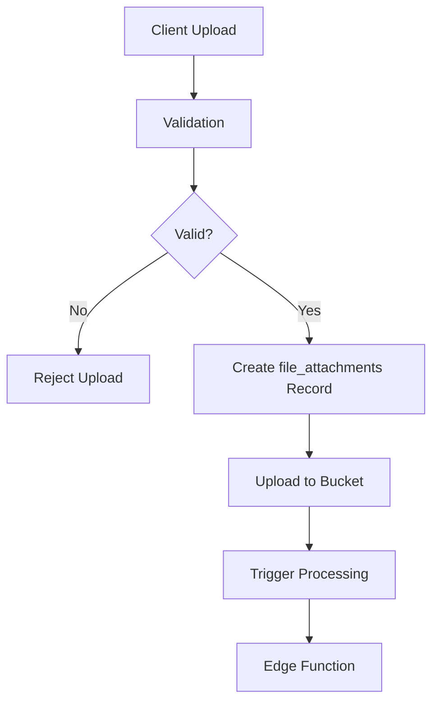

# TripSage Storage Architecture

## Overview

TripSage implements a comprehensive file storage infrastructure built on Supabase Storage with advanced security, processing, and collaboration features. The system supports multiple file types with intelligent processing, virus scanning, and fine-grained access control.

## Storage Buckets

### 1. Attachments Bucket (`attachments`)

**Purpose**: Store trip-related documents and chat attachments

**Configuration**:
- **Access**: Private (authentication required)
- **Size Limit**: 50MB per file
- **Allowed Types**: PDF, Word docs, Excel files, images, text files
- **Security**: RLS policies based on trip ownership/collaboration

**File Organization**:
```
attachments/
├── trip_123/
│   ├── documents/
│   │   ├── itinerary.pdf
│   │   └── booking_confirmation.docx
│   └── images/
│       ├── passport.jpg
│       └── visa.png
└── user_uuid/
    ├── personal_documents/
    └── temp_uploads/
```

### 2. Avatars Bucket (`avatars`)

**Purpose**: Store user profile images

**Configuration**:
- **Access**: Public (anyone can view)
- **Size Limit**: 5MB per file
- **Allowed Types**: JPEG, PNG, GIF, WebP, AVIF
- **Security**: Users can only upload/modify their own avatar

**File Organization**:
```
avatars/
├── user_uuid_1.jpg
├── user_uuid_2.png
└── user_uuid_3.webp
```

### 3. Trip Images Bucket (`trip-images`)

**Purpose**: Store trip-related photos and media

**Configuration**:
- **Access**: Private (controlled by RLS)
- **Size Limit**: 20MB per file
- **Allowed Types**: All image formats including HEIC/HEIF
- **Security**: Trip collaboration permissions apply

**File Organization**:
```
trip-images/
├── trip_123/
│   ├── destinations/
│   │   ├── paris_eiffel_tower.jpg
│   │   └── rome_colosseum.heic
│   ├── accommodations/
│   │   └── hotel_room.png
│   └── activities/
│       └── museum_visit.jpg
```

### 4. Thumbnails Bucket (`thumbnails`)

**Purpose**: Store auto-generated thumbnails

**Configuration**:
- **Access**: Private (auto-generated)
- **Size Limit**: 10MB per file
- **Allowed Types**: JPEG, PNG, WebP, AVIF
- **Security**: Inherited from original file permissions

### 5. Quarantine Bucket (`quarantine`)

**Purpose**: Isolate files flagged by virus scanning

**Configuration**:
- **Access**: Service role only
- **Size Limit**: 100MB per file
- **Allowed Types**: Any (for quarantine purposes)
- **Security**: Admin access only

## Security Model

### Row Level Security (RLS)

#### Trip-Based Access Control

```sql
-- Users can access files from trips they own or collaborate on
CREATE POLICY "trip_file_access" ON storage.objects
FOR SELECT TO authenticated
USING (
    bucket_id IN ('attachments', 'trip-images') AND
    storage.user_has_trip_access(auth.uid(), storage.extract_trip_id_from_path(name))
);
```

#### User File Ownership

```sql
-- Users can only modify files they uploaded
CREATE POLICY "user_file_ownership" ON storage.objects
FOR UPDATE TO authenticated
USING (owner = auth.uid());
```

### Permission Hierarchy

1. **Trip Owner**: Full access to all trip files
2. **Admin Collaborator**: Can upload/delete trip files
3. **Edit Collaborator**: Can upload files, view all
4. **View Collaborator**: Can only view files
5. **File Owner**: Can always modify their own uploads

## File Processing Pipeline

### 1. Upload Flow



### 2. Processing Operations

#### Virus Scanning
- **Trigger**: On upload completion
- **Service**: ClamAV integration
- **Action**: Quarantine infected files
- **Status**: Tracked in `virus_scan_status`

#### Thumbnail Generation
- **Trigger**: Image uploads
- **Output**: Multiple sizes (150x150, 300x300, 600x600)
- **Format**: WebP for efficiency
- **Storage**: Thumbnails bucket

#### Metadata Extraction
- **Documents**: Page count, word count, language
- **Images**: EXIF data, dimensions, GPS coordinates
- **Storage**: JSON metadata in `file_attachments.metadata`

### 3. File Versioning

```sql
-- File versions table tracks changes
CREATE TABLE file_versions (
    id BIGINT PRIMARY KEY,
    file_attachment_id UUID REFERENCES file_attachments(id),
    version_number INTEGER,
    file_path TEXT,
    file_size BIGINT,
    checksum TEXT,
    created_by UUID,
    is_current BOOLEAN
);
```

## API Integration

### Upload Endpoints

#### Signed URL Upload
```typescript
// Get signed upload URL
const { data, error } = await supabase.storage
  .from('attachments')
  .createSignedUploadUrl(`trip_${tripId}/documents/${filename}`);

// Upload file
const { error: uploadError } = await supabase.storage
  .from('attachments')
  .upload(data.path, file, {
    token: data.token
  });
```

#### Direct Upload with Validation
```typescript
// Validate before upload
const validation = await supabase.rpc('validate_file_upload', {
  p_user_id: userId,
  p_bucket_name: 'attachments',
  p_file_size: file.size,
  p_mime_type: file.type,
  p_trip_id: tripId
});

if (validation.valid) {
  // Proceed with upload
}
```

### Download Endpoints

#### Public Files (Avatars)
```typescript
const { data } = supabase.storage
  .from('avatars')
  .getPublicUrl(`${userId}.jpg`);
```

#### Private Files (Signed URLs)
```typescript
const { data, error } = await supabase.storage
  .from('attachments')
  .createSignedUrl(`trip_${tripId}/document.pdf`, 3600);
```

## Storage Quotas

### User Quotas
- **Attachments**: 5GB per user
- **Avatars**: 50MB per user
- **Trip Images**: 2GB per user

### Trip Quotas
- **Documents**: 10GB per trip
- **Images**: 20GB per trip
- **Collaborators**: Shared quota pool

### Quota Management
```sql
-- Check user storage usage
SELECT * FROM get_user_storage_usage('user-uuid');

-- Validate against quota
SELECT check_storage_quota('user-uuid', file_size, 'attachments');
```

## Monitoring and Maintenance

### Automated Cleanup

#### Orphaned Files
```sql
-- Run daily
SELECT cleanup_orphaned_files();
```

#### Processing Queue
```sql
-- Clear completed jobs older than 7 days
DELETE FROM file_processing_queue
WHERE status = 'completed'
AND completed_at < NOW() - INTERVAL '7 days';
```

### Performance Monitoring

#### Storage Metrics
- File upload success rate
- Processing completion time
- Virus scan detection rate
- Quota utilization by user/trip

#### Database Indexes
```sql
-- Key indexes for performance
CREATE INDEX idx_file_attachments_user_trip ON file_attachments(user_id, trip_id);
CREATE INDEX idx_file_attachments_status ON file_attachments(upload_status, virus_scan_status);
CREATE INDEX idx_file_processing_pending ON file_processing_queue(status, scheduled_at);
```

## Edge Function Integration

### File Processor Function

The `file-processor` Edge Function handles:
- Virus scanning integration
- Thumbnail generation
- Metadata extraction
- File optimization

#### Webhook Configuration
```sql
-- Trigger on file upload completion
CREATE TRIGGER file_attachments_processor_trigger
  AFTER INSERT OR UPDATE ON file_attachments
  FOR EACH ROW
  EXECUTE FUNCTION notify_file_processor();
```

### Processing Queue

Files are processed asynchronously through a queue system:

```sql
-- Add processing job
INSERT INTO file_processing_queue (
    file_attachment_id,
    operation,
    priority
) VALUES (
    'file-uuid',
    'virus_scan',
    1  -- High priority
);
```

## Error Handling

### Upload Failures
- Automatic retry for network issues
- Size/type validation before upload
- Quota checking with user feedback
- Partial upload cleanup

### Processing Failures
- Retry mechanism with exponential backoff
- Error logging with context
- Manual retry capability
- Fallback processing modes

### Security Incidents
- Automatic quarantine for infected files
- Admin notification system
- Audit trail for all file operations
- Incident response procedures

## Configuration

### Environment Variables
```bash
# Required for storage functionality
SUPABASE_URL=your_supabase_url
SUPABASE_SERVICE_ROLE_KEY=your_service_role_key
SUPABASE_ANON_KEY=your_anon_key

# File processing
FILE_PROCESSOR_WEBHOOK_URL=https://your-project.supabase.co/functions/v1/file-processor
VIRUS_SCAN_API_KEY=your_virus_scan_api_key
```

### CORS Configuration
```json
{
  "allowedOrigins": ["http://localhost:3000", "https://tripsage.com"],
  "allowedMethods": ["GET", "POST", "PUT", "DELETE"],
  "allowedHeaders": ["authorization", "x-client-info", "apikey", "content-type"],
  "maxAgeSeconds": 3600
}
```

## Best Practices

### Client-Side
1. **Validate files before upload** (size, type, count)
2. **Show upload progress** with cancellation option
3. **Handle errors gracefully** with retry options
4. **Use signed URLs** for secure downloads
5. **Implement chunked uploads** for large files

### Server-Side
1. **Always validate permissions** before file operations
2. **Implement rate limiting** for uploads
3. **Monitor storage usage** and quotas
4. **Regular cleanup** of orphaned files
5. **Audit file operations** for security

### Security
1. **Never trust client validation** alone
2. **Scan all uploads** for viruses
3. **Implement file type verification** beyond MIME types
4. **Use signed URLs** for private content
5. **Regular security audits** of policies

## Troubleshooting

### Common Issues

#### Upload Failures
```sql
-- Check failed uploads
SELECT * FROM file_attachments
WHERE upload_status = 'failed'
ORDER BY created_at DESC;
```

#### Policy Violations
```sql
-- Check RLS policy denials
SELECT * FROM pg_stat_activity
WHERE query LIKE '%storage.objects%'
AND state = 'idle';
```

#### Processing Delays
```sql
-- Check processing queue backlog
SELECT 
    operation,
    status,
    COUNT(*) as count
FROM file_processing_queue
GROUP BY operation, status;
```

### Support Tools

#### Storage Health Check
```sql
-- Run comprehensive health check
SELECT 
    bucket_id,
    COUNT(*) as file_count,
    SUM(metadata->>'size')::bigint / 1024 / 1024 as total_mb
FROM storage.objects
GROUP BY bucket_id;
```

#### User Storage Report
```sql
-- Generate user storage report
SELECT 
    fa.user_id,
    fa.bucket_name,
    COUNT(*) as files,
    SUM(fa.file_size) / 1024 / 1024 as size_mb
FROM file_attachments fa
WHERE fa.upload_status = 'completed'
GROUP BY fa.user_id, fa.bucket_name
ORDER BY size_mb DESC;
```