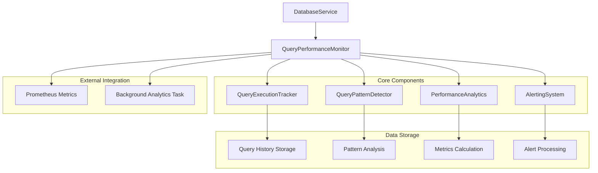

# Query Performance Monitoring System

The TripSage Query Performance Monitoring System provides comprehensive real-time monitoring of database operations with sub-millisecond precision timing, pattern detection, performance analytics, and alerting capabilities.

## Table of Contents

- [Overview](#overview)
- [Features](#features)
- [Architecture](#architecture)
- [Quick Start](#quick-start)
- [Configuration](#configuration)
- [Usage Examples](#usage-examples)
- [API Reference](#api-reference)
- [Performance Patterns](#performance-patterns)
- [Alerting and Notifications](#alerting-and-notifications)
- [Metrics and Analytics](#metrics-and-analytics)
- [Best Practices](#best-practices)
- [Troubleshooting](#troubleshooting)

## Overview

The Query Performance Monitoring System is designed to provide deep insights into database operation performance, helping identify bottlenecks, inefficient queries, and performance degradation patterns in real-time.

### Key Components

1. **QueryExecutionTracker** - Sub-millisecond precision query timing
2. **QueryPatternDetector** - N+1 query and pattern detection
3. **PerformanceAnalytics** - Real-time metrics and trending
4. **AlertingSystem** - Configurable alerts and notifications
5. **EnhancedDatabaseService** - Seamless integration with existing database operations

## Features

### ✅ Core Monitoring

- Sub-millisecond precision query timing
- Automatic query categorization (SELECT, INSERT, UPDATE, DELETE, etc.)
- Connection pool utilization monitoring
- Real-time performance metrics collection

### ✅ Pattern Detection

- N+1 query pattern detection with configurable thresholds
- Repetitive query identification
- Query frequency analysis
- Performance degradation detection

### ✅ Analytics & Reporting

- Real-time performance dashboards
- Historical trend analysis
- Per-table and per-user statistics
- Percentile-based performance metrics (P95, P99)

### ✅ Alerting & Notifications

- Configurable slow query alerts
- Performance degradation notifications
- High error rate detection
- Custom alert callbacks

### ✅ Integration

- Seamless DatabaseService integration
- Prometheus metrics export
- Context manager and decorator support
- Background analytics aggregation

## Architecture



## Quick Start

### 1. Basic Setup

```python
from tripsage_core.services.infrastructure.enhanced_database_service_with_monitoring import (
    EnhancedDatabaseService
)
from tripsage_core.services.infrastructure.query_monitor import QueryMonitorConfig

# Configure monitoring
monitor_config = QueryMonitorConfig(
    enabled=True,
    slow_query_threshold=1.0,  # 1 second
    n_plus_one_threshold=10,   # Detect after 10 similar queries
    error_rate_threshold=0.05, # 5% error rate
)

# Initialize enhanced database service
db_service = EnhancedDatabaseService(
    monitor_config=monitor_config,
    enable_monitoring=True,
)

# Connect and start monitoring
await db_service.connect()
```

### 2. Basic Usage

```python
# Database operations are automatically monitored
users = await db_service.select(
    "users", 
    "*", 
    {"active": True},
    user_id="current_user",
    session_id="session_123"
)

# Insert with monitoring
new_user = await db_service.insert(
    "users",
    {"name": "John Doe", "email": "john@example.com"},
    user_id="admin_user"
)
```

### 3. Performance Reporting

```python
# Get overall performance metrics
metrics = await db_service.get_query_performance_metrics()
print(f"Total queries: {metrics['performance_metrics']['total_queries']}")
print(f"Average duration: {metrics['performance_metrics']['avg_duration']:.3f}s")

# Get slow queries report
slow_queries = await db_service.get_slow_queries_report(limit=10)
for query in slow_queries:
    print(f"Slow query: {query['duration']:.3f}s - {query['query_type']} on {query['table_name']}")
```

## Configuration

### QueryMonitorConfig Options

```python
from tripsage_core.services.infrastructure.query_monitor import QueryMonitorConfig

config = QueryMonitorConfig(
    # Monitoring toggles
    enabled=True,                          # Enable/disable monitoring
    track_patterns=True,                   # Enable pattern detection
    collect_stack_traces=True,             # Collect stack traces for slow queries
    
    # Timing thresholds (seconds)
    slow_query_threshold=1.0,              # Slow query threshold
    very_slow_query_threshold=5.0,         # Very slow query threshold
    critical_query_threshold=10.0,         # Critical query threshold
    
    # Pattern detection
    n_plus_one_threshold=10,               # N+1 detection threshold
    n_plus_one_time_window=60.0,           # N+1 detection time window
    
    # Error monitoring
    error_rate_threshold=0.05,             # Error rate threshold (5%)
    error_rate_window=300.0,               # Error rate calculation window
    
    # Performance degradation
    degradation_threshold=0.5,             # 50% performance degradation
    degradation_baseline_window=3600.0,    # 1 hour baseline window
    
    # History retention
    max_query_history=10000,               # Maximum query history entries
    max_pattern_history=1000,              # Maximum pattern history entries
    max_alert_history=5000,                # Maximum alert history entries
    
    # Prometheus integration
    export_prometheus=True,                # Export Prometheus metrics
    metrics_prefix="tripsage_query",       # Metrics prefix
)
```

## Usage Examples

### Context Manager Monitoring

```python
from tripsage_core.services.infrastructure.query_monitor import (
    QueryType, get_query_monitor
)

monitor = get_query_monitor()

# Monitor specific operations
async with monitor.monitor_query(
    QueryType.SELECT,
    table_name="users",
    user_id="user123",
    tags={"operation": "user_lookup"}
) as query_id:
    # Perform database operation
    result = await db.select("users", "*", {"id": "user123"})
```

### Decorator-Based Monitoring

```python
from tripsage_core.services.infrastructure.query_monitor import (
    create_table_extractor, create_user_extractor
)

class UserService:
    def __init__(self, monitor):
        self.monitor = monitor
        self.db = get_database_service()
    
    @monitor.monitor_query_method(
        QueryType.SELECT,
        extract_table_from_args=create_table_extractor(0),
        extract_user_from_args=create_user_extractor("user_id"),
    )
    async def get_user_profile(self, table, user_id):
        """Get user profile with automatic monitoring."""
        return await self.db.select(table, "*", {"id": user_id})
```

### Custom Alert Callbacks

```python
def performance_alert_handler(alert):
    """Handle performance alerts."""
    if alert.severity.value == "critical":
        # Send to monitoring system
        send_to_slack(f"🚨 Critical database alert: {alert.message}")
    
    # Log all alerts
    logger.warning(f"Performance alert: {alert.alert_type.value} - {alert.message}")

# Add alert callback
db_service.add_performance_alert_callback(performance_alert_handler)
```

### Advanced Analytics

```python
# Get table-specific performance
users_performance = await db_service.get_table_performance_report("users")
print(f"Users table - Avg duration: {users_performance['avg_duration']:.3f}s")
print(f"Users table - Error rate: {users_performance['error_rate']:.2%}")

# Get user-specific query statistics
user_stats = await db_service.get_user_query_report("user123")
print(f"User queries: {user_stats['total_queries']}")
print(f"Query types: {', '.join(user_stats['query_types'])}")

# Get detected patterns
patterns = await monitor.get_query_patterns()
for pattern in patterns:
    if pattern.pattern_type == "n_plus_one":
        print(f"N+1 pattern detected on {pattern.table_name}: {pattern.occurrence_count} queries")
```

## API Reference

### EnhancedDatabaseService Methods

#### Performance Monitoring API

```python
# Get overall performance metrics
async def get_query_performance_metrics() -> Dict[str, Any]

# Get table-specific performance report  
async def get_table_performance_report(table_name: str) -> Dict[str, Any]

# Get user-specific query statistics
async def get_user_query_report(user_id: str) -> Dict[str, Any]

# Get slow queries report
async def get_slow_queries_report(limit: int = 50, threshold: Optional[float] = None) -> List[Dict[str, Any]]

# Get performance alerts report
async def get_performance_alerts_report(limit: int = 50) -> List[Dict[str, Any]]
```

#### Configuration Management

```python
# Update monitoring configuration
def update_monitoring_config(**config_updates)

# Add performance alert callback
def add_performance_alert_callback(callback: Callable)
```

### QueryPerformanceMonitor Methods

#### Core Monitoring

```python
# Start/stop monitoring
async def start_monitoring()
async def stop_monitoring()

# Track query execution
async def track_query(query_type: QueryType, table_name: str = None, ...) -> str
async def finish_query(query_id: str, status: QueryStatus = QueryStatus.SUCCESS, ...) -> QueryExecution

# Context manager for query monitoring  
async def monitor_query(query_type: QueryType, ...) -> AsyncContextManager[str]
```

#### Analytics and Reporting

```python
# Get performance metrics
async def get_performance_metrics(window_hours: float = 1.0) -> PerformanceMetrics

# Get slow queries
async def get_slow_queries(limit: int = 100, threshold: Optional[float] = None) -> List[QueryExecution]

# Get detected patterns
async def get_query_patterns(limit: int = 100) -> List[QueryPattern]

# Get performance alerts  
async def get_performance_alerts(limit: int = 100, severity: Optional[AlertSeverity] = None) -> List[PerformanceAlert]
```

## Performance Patterns

### N+1 Query Detection

The system automatically detects N+1 query patterns - a common performance anti-pattern where an application executes multiple similar queries instead of a single optimized query.

**Example N+1 Pattern:**

```python
# BAD: N+1 pattern - will be detected
posts = await db.select("posts", "*")
for post in posts:
    # This creates N additional queries
    comments = await db.select("comments", "*", {"post_id": post["id"]})
```

**Configuration:**

```python
config = QueryMonitorConfig(
    n_plus_one_threshold=10,      # Detect after 10 similar queries
    n_plus_one_time_window=60.0,  # Within 60 seconds
)
```

**Detection Result:**

```python
patterns = await monitor.get_query_patterns()
for pattern in patterns:
    if pattern.pattern_type == "n_plus_one":
        print(f"N+1 detected: {pattern.occurrence_count} queries on {pattern.table_name}")
        print(f"Frequency: {pattern.frequency:.2f} queries/second")
```

### Performance Degradation Detection

The system monitors performance trends and detects degradation compared to historical baselines.

**Configuration:**

```python
config = QueryMonitorConfig(
    degradation_threshold=0.5,             # 50% performance degradation
    degradation_baseline_window=3600.0,    # Compare to 1-hour baseline
)
```

## Alerting and Notifications

### Alert Types

1. **SLOW_QUERY** - Individual slow query detection
2. **N_PLUS_ONE** - N+1 query pattern detection  
3. **HIGH_ERROR_RATE** - High database error rate
4. **PERFORMANCE_DEGRADATION** - Overall performance degradation
5. **CONNECTION_POOL_EXHAUSTION** - Connection pool issues
6. **QUERY_TIMEOUT** - Query timeout detection

### Alert Severity Levels

- **INFO** - Informational alerts
- **WARNING** - Warning-level issues
- **ERROR** - Error conditions requiring attention
- **CRITICAL** - Critical issues requiring immediate action

### Custom Alert Handlers

```python
from tripsage_core.services.infrastructure.query_monitor import AlertType, AlertSeverity

def custom_alert_handler(alert):
    """Custom alert handling logic."""
    if alert.alert_type == AlertType.SLOW_QUERY and alert.severity == AlertSeverity.CRITICAL:
        # Handle critical slow queries
        notify_ops_team(alert)
    
    elif alert.alert_type == AlertType.N_PLUS_ONE:
        # Handle N+1 patterns
        notify_developers(alert)
    
    # Log all alerts
    structured_log(alert)

# Register handler
db_service.add_performance_alert_callback(custom_alert_handler)
```

## Metrics and Analytics

### Prometheus Metrics

The system exports comprehensive Prometheus metrics:

```yaml
# Query execution metrics
tripsage_query_duration_seconds_bucket{service="supabase",operation="SELECT",table="users"}
tripsage_query_total{service="supabase",operation="SELECT",table="users",status="success"}
tripsage_query_errors_total{service="supabase",operation="SELECT",table="users",error_type="timeout"}

# Performance metrics
tripsage_query_slow_total{service="supabase",threshold="1.0"}
tripsage_query_patterns_total{service="supabase",pattern_type="n_plus_one"}

# Health metrics
tripsage_query_monitoring_status{service="supabase"}
```

### Performance Metrics Structure

```python
@dataclass
class PerformanceMetrics:
    total_queries: int = 0
    successful_queries: int = 0
    failed_queries: int = 0
    slow_queries: int = 0
    very_slow_queries: int = 0
    critical_queries: int = 0
    
    avg_duration: float = 0.0
    median_duration: float = 0.0
    p95_duration: float = 0.0      # 95th percentile
    p99_duration: float = 0.0      # 99th percentile
    
    error_rate: float = 0.0
    throughput: float = 0.0        # queries per second
    
    # Per-table and per-operation breakdowns
    table_stats: Dict[str, Dict[str, Union[int, float]]]
    operation_stats: Dict[str, Dict[str, Union[int, float]]]
    
    # Trending data
    trending_data: List[Dict[str, Union[datetime, float]]]
```

## Best Practices

### 1. Configuration Tuning

```python
# Production configuration
production_config = QueryMonitorConfig(
    enabled=True,
    slow_query_threshold=2.0,              # Higher threshold for production
    n_plus_one_threshold=20,               # More lenient for production traffic
    error_rate_threshold=0.01,             # 1% error rate threshold
    max_query_history=50000,               # Larger history for production
    export_prometheus=True,                # Enable metrics export
)

# Development configuration  
development_config = QueryMonitorConfig(
    enabled=True,
    slow_query_threshold=0.5,              # Aggressive threshold for development
    collect_stack_traces=True,             # Full stack traces in development
    n_plus_one_threshold=5,                # Strict N+1 detection
)
```

### 2. Memory Management

```python
# Configure appropriate history limits based on traffic
config = QueryMonitorConfig(
    max_query_history=10000,               # ~10MB memory usage
    max_pattern_history=1000,              # ~1MB memory usage  
    max_alert_history=5000,                # ~5MB memory usage
)
```

### 3. Performance Impact

The monitoring system is designed to have minimal performance impact:

- **Query overhead**: < 0.1ms per query
- **Memory usage**: ~16MB for default history limits
- **CPU usage**: < 1% additional CPU load

### 4. Monitoring Best Practices

```python
# Use context-aware monitoring
async def get_user_data(user_id: str, session_id: str):
    """Example of context-aware monitoring."""
    return await db_service.select(
        "users",
        "*", 
        {"id": user_id},
        user_id=user_id,           # Track which user is making queries
        session_id=session_id,     # Track session context
    )

# Monitor transactions holistically
async def create_user_with_profile(user_data: dict, profile_data: dict):
    """Monitor entire transaction."""
    async with db_service.transaction(
        user_id=user_data.get("id"),
        session_id="registration_flow"
    ):
        user = await db_service.insert("users", user_data)
        profile = await db_service.insert("profiles", {
            **profile_data,
            "user_id": user["id"]
        })
        return user, profile
```

## Troubleshooting

### Common Issues

#### 1. High Memory Usage

**Symptoms:** Gradually increasing memory usage
**Solution:** Reduce history limits

```python
config = QueryMonitorConfig(
    max_query_history=5000,     # Reduce from default 10000
    max_pattern_history=500,    # Reduce from default 1000
    max_alert_history=1000,     # Reduce from default 5000
)
```

#### 2. False N+1 Detection

**Symptoms:** N+1 alerts for legitimate query patterns
**Solution:** Adjust detection parameters

```python
config = QueryMonitorConfig(
    n_plus_one_threshold=50,        # Increase threshold
    n_plus_one_time_window=120.0,   # Increase time window
)
```

#### 3. Too Many Slow Query Alerts

**Symptoms:** Alert fatigue from too many slow query notifications
**Solution:** Adjust thresholds and implement alert filtering

```python
config = QueryMonitorConfig(
    slow_query_threshold=5.0,       # Increase threshold
    very_slow_query_threshold=10.0,
    critical_query_threshold=30.0,
)

# Implement smart alert filtering
def filtered_alert_handler(alert):
    if alert.alert_type == AlertType.SLOW_QUERY:
        # Only alert on very slow queries during business hours
        if alert.severity.value in ["error", "critical"]:
            notify_team(alert)
    else:
        # Handle other alert types normally
        notify_team(alert)
```

### Debugging Tools

#### Enable Debug Logging

```python
import logging

# Enable debug logging for monitoring components
logging.getLogger("tripsage_core.services.infrastructure.query_monitor").setLevel(logging.DEBUG)
logging.getLogger("tripsage_core.services.infrastructure.enhanced_database_service_with_monitoring").setLevel(logging.DEBUG)
```

#### Monitor System Status

```python
# Check monitoring system health
status = await db_service.get_query_performance_metrics()
print(f"Monitoring active: {status['monitoring_status']['monitoring_active']}")
print(f"Total tracked queries: {status['monitoring_status']['statistics']['total_tracked_queries']}")

# Check for system issues
if status['monitoring_status']['statistics']['active_queries'] > 100:
    print("Warning: High number of active queries - possible tracking leak")
```

#### Manual Pattern Analysis

```python
# Manually analyze query patterns
history = await monitor.tracker.get_query_history(limit=1000)

# Group by query hash to find repetitive patterns
from collections import defaultdict
query_groups = defaultdict(list)

for execution in history:
    query_groups[execution.query_hash].append(execution)

# Find potential N+1 patterns
for query_hash, executions in query_groups.items():
    if len(executions) > 10:  # Threshold
        print(f"High frequency query: {len(executions)} executions")
        print(f"Table: {executions[0].table_name}")
        print(f"Query type: {executions[0].query_type.value}")
```

### Performance Tuning

#### Optimize for High-Traffic Applications

```python
# High-traffic configuration
high_traffic_config = QueryMonitorConfig(
    enabled=True,
    track_patterns=True,
    collect_stack_traces=False,        # Disable for performance
    slow_query_threshold=10.0,         # Higher threshold
    max_query_history=25000,           # Larger history buffer
    analytics_window=1800.0,           # 30-minute analytics window
)
```

#### Background Analytics Tuning

```python
# Configure analytics frequency
monitor = get_query_monitor()
monitor._analytics_interval = 300.0  # 5-minute analytics updates (default: 60s)
```

---

For additional support or questions about the Query Performance Monitoring System, please refer to the [TripSage Core Documentation](../README.md) or contact the development team.
