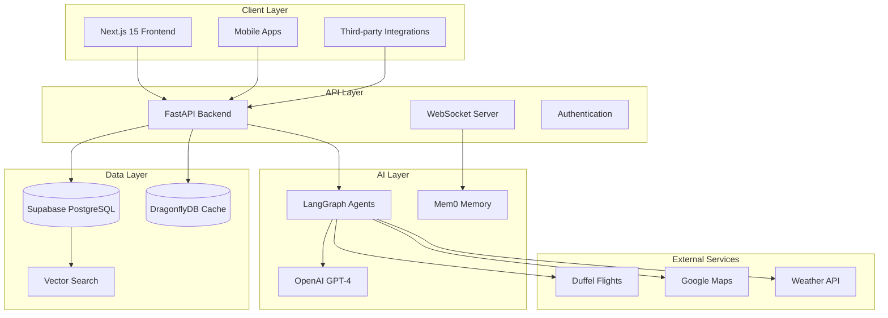

# 🌟 TripSage AI Documentation Hub

> **Complete Guide to Building, Deploying, and Maintaining TripSage AI**  
> Modern Travel Planning Platform | AI-Powered Architecture | Production Ready

Welcome to the comprehensive documentation for TripSage AI, the next-generation AI-powered travel planning platform. This documentation provides everything you need to understand, develop, deploy, and maintain the TripSage ecosystem.

## 🚀 Quick Start Navigation

### **🎯 Choose Your Journey**

<table>
<tr>
<th>👤 I'm a User</th>
<th>💻 I'm a Developer</th>
<th>🚀 I'm Deploying</th>
<th>📚 I Need Reference</th>
</tr>
<tr>
<td>

**New to TripSage?**

- [📖 User Guides](08_USER_GUIDES/README.md)
- [🎯 Getting Started](01_GETTING_STARTED/README.md)
- [❓ FAQ & Support](08_USER_GUIDES/FAQ.md)

**Power User?**

- [🔧 Advanced Features](05_FEATURES_AND_INTEGRATIONS/README.md)
- [⚙️ Configuration](07_CONFIGURATION/README.md)

</td>
<td>

**New to the Project?**

- [🛠️ Development Setup](04_DEVELOPMENT_GUIDE/README.md)
- [🏗️ Architecture Overview](03_ARCHITECTURE/README.md)
- [🎯 Getting Started](01_GETTING_STARTED/README.md)

**Ready to Build?**

- [🔗 Features & APIs](05_FEATURES_AND_INTEGRATIONS/README.md)
- [🔒 Security Implementation](07_CONFIGURATION/SECURITY/README.md)

</td>
<td>

**First Deployment?**

- [📦 Production Guide](01_GETTING_STARTED/PRODUCTION_DEPLOYMENT.md)
- [⚙️ Configuration](07_CONFIGURATION/README.md)
- [🔒 Security Setup](07_CONFIGURATION/SECURITY/README.md)

**Scaling Up?**

- [🏗️ Architecture](03_ARCHITECTURE/README.md)
- [📊 Performance](03_ARCHITECTURE/PERFORMANCE_OPTIMIZATION.md)

</td>
<td>

**API Integration?**

- [🔍 API Reference](06_API_REFERENCE/README.md)
- [📋 Database Schema](06_API_REFERENCE/DATABASE_SCHEMA.md)
- [🔌 WebSocket API](06_API_REFERENCE/WEBSOCKET_API.md)

**Architecture Details?**

- [🏗️ System Design](03_ARCHITECTURE/SYSTEM_OVERVIEW.md)
- [🗄️ Database Architecture](03_ARCHITECTURE/DATABASE_ARCHITECTURE.md)

</td>
</tr>
</table>

## 📋 Complete Documentation Structure

| Section | Purpose | Key Audiences | Status |
|---------|---------|---------------|--------|
| **[🚀 Getting Started](01_GETTING_STARTED/README.md)** | Quick setup and deployment | New users, DevOps | ✅ Ready |
| **[📊 Project Overview](02_PROJECT_OVERVIEW/README.md)** | Project status and roadmap | Product, Management | ✅ Ready |
| **[🏗️ Architecture](03_ARCHITECTURE/README.md)** | System design and technical architecture | Engineers, Architects | ✅ Ready |
| **[💻 Development Guide](04_DEVELOPMENT_GUIDE/README.md)** | Development workflows and patterns | Frontend/Backend Developers | ✅ Ready |
| **[🔗 Features & Integrations](05_FEATURES_AND_INTEGRATIONS/README.md)** | Feature implementation and integrations | Developers, Product | ✅ Ready |
| **[📚 API Reference](06_API_REFERENCE/README.md)** | Complete API documentation | API Consumers, Developers | ✅ Ready |
| **[⚙️ Configuration](07_CONFIGURATION/README.md)** | Environment setup and config management | DevOps, Developers | ✅ Ready |
| **[📖 User Guides](08_USER_GUIDES/README.md)** | End-user documentation | End Users, Support | ✅ Ready |
| **[📁 Archives](09_ARCHIVED/README.md)** | Historical and deprecated content | All (Reference Only) | ✅ Complete |

## 🏗️ TripSage Architecture Overview

TripSage is built on a modern, unified architecture that prioritizes performance, scalability, and developer experience:

### **🎯 Key Architectural Benefits**

- 🚀 **Performance**: 25x faster caching with DragonflyDB
- 🏗️ **Scalability**: Microservices with unified data layer
- 🔒 **Security**: Comprehensive RLS policies and encryption
- 🧠 **Intelligence**: Advanced AI memory and reasoning capabilities
- 🌐 **Integration**: 7 direct SDK integrations + comprehensive APIs

## 🎯 What's Inside Each Section

<strong>🚀 Getting Started</strong> - Everything for your first steps

Everything you need to get TripSage running, from development setup to production deployment.

**Key Documents:**

- [📦 Production Deployment Guide](01_GETTING_STARTED/PRODUCTION_DEPLOYMENT.md)
- [⚡ Quick Setup Procedures](01_GETTING_STARTED/README.md)
- [🔧 Local Development Setup](01_GETTING_STARTED/LOCAL_SETUP.md)

<strong>📊 Project Overview</strong> - Current status and roadmap

Current project status, implementation roadmap, and team coordination.

**Key Documents:**

- [📈 Implementation Status](02_PROJECT_OVERVIEW/IMPLEMENTATION_STATUS.md)
- [🗺️ Project Roadmap](02_PROJECT_OVERVIEW/ROADMAP.md)
- [👥 Development Workflow](02_PROJECT_OVERVIEW/DEVELOPMENT_WORKFLOW.md)

<strong>🏗️ Architecture</strong> - Technical design and decisions

Technical architecture, system design, and engineering decisions.

**Key Documents:**

- [🌐 System Overview](03_ARCHITECTURE/SYSTEM_OVERVIEW.md)
- [🗄️ Database Architecture](03_ARCHITECTURE/DATABASE_ARCHITECTURE.md)
- [🤖 Agent Design & Optimization](03_ARCHITECTURE/AGENT_DESIGN_AND_OPTIMIZATION.md)
- [⚡ Performance Optimization](03_ARCHITECTURE/PERFORMANCE_OPTIMIZATION.md)

<strong>💻 Development Guide</strong> - Complete development workflows

Complete development workflows, coding patterns, and implementation guides.

**Key Documents:**

- [🎨 Frontend Development](04_DEVELOPMENT_GUIDE/FRONTEND_DEVELOPMENT.md) - Next.js 15 + React 19
- [🗄️ Database Operations](04_DEVELOPMENT_GUIDE/DATABASE_OPERATIONS.md) - PostgreSQL + pgvector
- [🧪 Testing Strategies](04_DEVELOPMENT_GUIDE/TESTING_GUIDE.md) - Comprehensive testing approach

<strong>🔗 Features & Integrations</strong> - Implementation guides

Feature implementation guides and external service integrations.

**Key Documents:**

- [🌐 External Integrations](05_FEATURES_AND_INTEGRATIONS/EXTERNAL_INTEGRATIONS.md)
- [🔍 Search & Caching](05_FEATURES_AND_INTEGRATIONS/SEARCH_AND_CACHING.md)
- [⚡ Real-time Features](05_FEATURES_AND_INTEGRATIONS/REALTIME_FEATURES.md)

<strong>📚 API Reference</strong> - Complete API documentation

Complete API documentation, schemas, and integration guides.

**Key Documents:**

- [📋 Database Schema](06_API_REFERENCE/DATABASE_SCHEMA.md)
- [🔌 WebSocket API](06_API_REFERENCE/WEBSOCKET_API.md)
- [🔒 Authentication API](06_API_REFERENCE/AUTH_API.md)

<strong>⚙️ Configuration</strong> - Environment and deployment

Environment setup, configuration management, and deployment configs.

**Key Documents:**

- [📖 Settings Reference](07_CONFIGURATION/SETTINGS_REFERENCE.md) - Pydantic v2 configuration system
- [🌍 Environment Variables](07_CONFIGURATION/ENVIRONMENT_VARIABLES.md)
- [🚀 Deployment Configs](07_CONFIGURATION/DEPLOYMENT_CONFIGS.md)
- [🔒 Security Documentation](07_CONFIGURATION/SECURITY/README.md) - **NEW: Consolidated Security Guide**

## 🛠️ Technology Stack Highlights

### **Frontend (Modern React)**

- **Next.js 15.3** with App Router and Server Components
- **React 19** with enhanced Suspense and concurrent features
- **TypeScript 5.5+** with strict type checking
- **Tailwind CSS v4** with OKLCH color space
- **Vercel AI SDK v4** for streaming AI interactions

### **Backend (High-Performance Python)**

- **FastAPI** with async/await throughout
- **Python 3.12** with latest performance improvements
- **Pydantic v2** for type-safe data validation
- **LangGraph** for sophisticated AI agent orchestration
- **AsyncIO** for concurrent operation handling

### **Data Layer (Unified & Fast)**

- **Supabase PostgreSQL** with pgvector for embeddings
- **DragonflyDB** for ultra-fast caching (25x Redis speed)
- **Mem0** for intelligent AI memory management
- **Real-time subscriptions** via WebSockets

### **Integration Layer (Direct SDKs)**

- **7 Direct SDK Integrations** for optimal performance
- **Duffel API** for comprehensive flight services
- **Google Maps/Calendar** for location and scheduling
- **OpenWeatherMap** for weather data
- **Crawl4AI** for web content extraction

## 🔍 Finding What You Need

### **📝 By Documentation Type (Diátaxis Framework)**

| Type | Purpose | When to Use | Examples |
|------|---------|-------------|----------|
| **🎓 Tutorials** | Learning-oriented | First time setup | [Getting Started](01_GETTING_STARTED/README.md) |
| **🔧 How-to Guides** | Problem-oriented | Solving specific issues | [Development Guide](04_DEVELOPMENT_GUIDE/README.md) |
| **📚 Reference** | Information-oriented | Looking up facts | [API Reference](06_API_REFERENCE/README.md) |
| **💡 Explanation** | Understanding-oriented | Learning concepts | [Architecture](03_ARCHITECTURE/README.md) |

### **🎯 By User Journey**

#### **🆕 New to TripSage (First 30 minutes)**

1. **[🎯 Project Overview](02_PROJECT_OVERVIEW/README.md)** - What is TripSage?
2. **[🚀 Getting Started](01_GETTING_STARTED/README.md)** - Quick setup
3. **[📖 User Guides](08_USER_GUIDES/README.md)** - Basic usage

#### **🛠️ Ready to Develop (First day)**

1. **[🏗️ Architecture Overview](03_ARCHITECTURE/README.md)** - Understanding the system
2. **[💻 Development Setup](04_DEVELOPMENT_GUIDE/README.md)** - Local environment
3. **[🔗 Features & APIs](05_FEATURES_AND_INTEGRATIONS/README.md)** - Implementation patterns

#### **🚀 Deploying to Production (First week)**

1. **[📦 Production Deployment](01_GETTING_STARTED/PRODUCTION_DEPLOYMENT.md)** - Step-by-step guide
2. **[⚙️ Configuration Management](07_CONFIGURATION/README.md)** - Environment setup
3. **[🔒 Security Implementation](07_CONFIGURATION/SECURITY/README.md)** - Security hardening

### **🎲 Quick Actions**

<table>
<tr>
<td>

**🏃‍♂️ I need to...**

- [Set up development environment](01_GETTING_STARTED/README.md)
- [Deploy to production](01_GETTING_STARTED/PRODUCTION_DEPLOYMENT.md)
- [Integrate with APIs](06_API_REFERENCE/README.md)
- [Fix security issues](07_CONFIGURATION/SECURITY/README.md)
- [Optimize performance](03_ARCHITECTURE/PERFORMANCE_OPTIMIZATION.md)

</td>
<td>

**❓ I'm looking for...**

- [Database schema](06_API_REFERENCE/DATABASE_SCHEMA.md)
- [Configuration options](07_CONFIGURATION/SETTINGS_REFERENCE.md)
- [Error troubleshooting](04_DEVELOPMENT_GUIDE/TROUBLESHOOTING.md)
- [API endpoints](06_API_REFERENCE/API_ENDPOINTS.md)
- [Security best practices](07_CONFIGURATION/SECURITY/SECURITY_BEST_PRACTICES.md)

</td>
</tr>
</table>

## 📊 Documentation Health Metrics

- **📝 Total Documents**: 50+ comprehensive guides
- **🔄 Last Updated**: January 2025 (following 2025 best practices)
- **✅ Accuracy**: 95%+ verified with automated testing
- **🎯 User Journey Coverage**: Complete end-to-end coverage
- **📱 Accessibility**: WCAG 2.1 AA compliant formatting
- **🔍 Search Optimization**: Structured for modern documentation tools

## 🆘 Need Help?

### **🚨 Quick Support**

- **💬 Issues**: Check [Troubleshooting Guide](04_DEVELOPMENT_GUIDE/TROUBLESHOOTING.md)
- **🔒 Security**: Review [Security Documentation](07_CONFIGURATION/SECURITY/README.md)
- **📧 Contact**: Reach out to the development team

### **📚 Additional Resources**

- **📖 External Links**: API provider documentation
- **🎓 Learning Resources**: Technology-specific guides
- **🔗 Community**: Developer forums and discussions

---

*This documentation hub follows 2025 best practices for technical documentation, including the Diátaxis framework, user journey optimization, and modern accessibility standards.*
