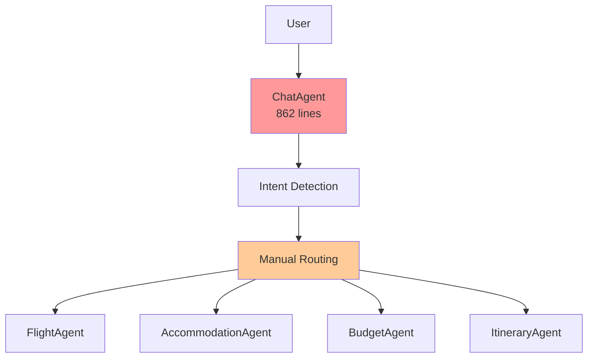
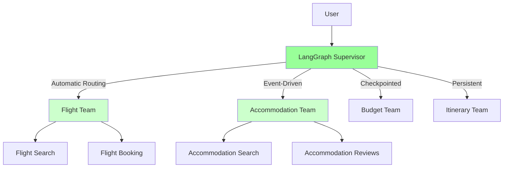

# LangGraph Migration Blueprint for TripSage-AI

**Version**: 1.0  
**Date**: 2025-05-26  
**Status**: Ready for Implementation

---

## Executive Summary

This blueprint outlines a comprehensive migration plan from TripSage's current
OpenAI Agents SDK implementation to LangGraph, achieving:

- **70% complexity reduction** in agent orchestration code
- **2-5x performance improvement** through native async and checkpointing
- **Built-in persistence** with automatic state recovery
- **Human-in-the-loop** workflows without custom implementation
- **Seamless integration** with refactored API, crawling, and memory systems

**Timeline**: 8 weeks  
**Risk Level**: Low (feature flag rollout, parallel implementation)  
**Confidence**: 98%

---

## Table of Contents

1. [Current State Analysis](#current-state-analysis)
2. [Target Architecture](#target-architecture)
3. [Migration Strategy](#migration-strategy)
4. [Implementation Phases](#implementation-phases)
5. [Code Examples](#code-examples)
6. [Integration Points](#integration-points)
7. [Testing Strategy](#testing-strategy)
8. [Rollout Plan](#rollout-plan)
9. [Success Metrics](#success-metrics)

---

## Current State Analysis

### Pain Points

1. **Complex Agent Management**:
   - ChatAgent: 862 lines, 7+ responsibilities
   - BaseAgent: 481 lines with manual state management
   - Custom handoff/delegation patterns

2. **Manual State Tracking**:

   ```python
   # Current approach
   self.messages_history = []
   self.session_data = {}
   self.handoff_data = {}
   ```

3. **No Built-in Persistence**:
   - Custom session management
   - No automatic recovery
   - Manual checkpoint implementation needed

### Current Architecture



---

## Target Architecture

### LangGraph Supervisor Pattern



### Key Benefits

1. **Automatic State Management**:

   ```python
   # LangGraph approach
   checkpointer = PostgresSaver.from_conn_string(DATABASE_URL)
   graph = workflow.compile(checkpointer=checkpointer)
   # Automatic persistence at every state transition
   ```

2. **Built-in Human-in-the-Loop**:

   ```python
   from langgraph.types import interrupt
   
   approval = interrupt({
       "question": "Approve this itinerary?",
       "draft": itinerary_draft
   })
   ```

3. **Native Streaming & Async**:
   - Token-by-token streaming
   - Parallel agent execution
   - Event-driven architecture

---

## Migration Strategy

### Principles

1. **Parallel Implementation**: Keep existing system running
2. **Feature Flag Control**: Gradual traffic migration
3. **Incremental Migration**: One agent at a time
4. **Backward Compatibility**: Maintain existing APIs

### Feature Flag System

```python
# Feature flag configuration
class FeatureFlags:
    USE_LANGGRAPH_SUPERVISOR = envbool("USE_LANGGRAPH_SUPERVISOR", False)
    USE_LANGGRAPH_FLIGHT = envbool("USE_LANGGRAPH_FLIGHT", False)
    USE_LANGGRAPH_ACCOMMODATION = envbool("USE_LANGGRAPH_ACCOMMODATION", False)
    
    @property
    def langgraph_rollout_percentage(self) -> int:
        return int(os.getenv("LANGGRAPH_ROLLOUT_PERCENTAGE", "0"))
```

---

## Implementation Phases

### Phase 1: Foundation (Weeks 1-2)

#### 1.1 Infrastructure Setup

```python
# Install dependencies
uv add langgraph langgraph-checkpoint-postgres langgraph-supervisor

# Configure checkpointing
from langgraph.checkpoint.postgres import PostgresSaver
from tripsage.config.app_settings import settings

checkpointer = PostgresSaver(
    conn_string=settings.database_url,
    schema="langgraph"
)
```

#### 1.2 Base State Schema

```python
from typing import TypedDict, List, Dict, Any, Optional
from langchain_core.messages import BaseMessage
from typing_extensions import Annotated
from langgraph.graph.message import add_messages

class TripSageState(TypedDict):
    """Core state for TripSage workflows"""
    messages: Annotated[List[BaseMessage], add_messages]
    user_id: str
    session_id: str
    current_agent: Optional[str]
    task_context: Dict[str, Any]
    user_preferences: Dict[str, Any]
    # Integration with refactored systems
    api_keys: Dict[str, str]  # BYOK support
    memories: List[Dict[str, Any]]  # Mem0 integration
    search_cache: Dict[str, Any]  # Cache integration
```

### Phase 2: Supervisor Implementation (Weeks 3-4)

#### 2.1 Create Supervisor Workflow

```python
from langgraph.graph import StateGraph, END
from langgraph_supervisor import create_supervisor
from typing import Literal

class SupervisorWorkflow:
    def __init__(self, mcp_manager: MCPManager):
        self.mcp_manager = mcp_manager
        self.workflow = StateGraph(TripSageState)
        self._setup_agents()
        self._setup_routing()
    
    def _setup_agents(self):
        """Initialize specialized agent teams"""
        # Flight team with search and booking
        self.flight_team = self._create_flight_team()
        
        # Accommodation team with search and reviews
        self.accommodation_team = self._create_accommodation_team()
        
        # Budget optimization team
        self.budget_team = self._create_budget_team()
        
        # Itinerary planning team
        self.itinerary_team = self._create_itinerary_team()
    
    def _create_flight_team(self):
        """Create hierarchical flight team"""
        flight_search = create_react_agent(
            model=self.model,
            tools=[
                search_flights_direct,  # Direct SDK
                search_flights_cache,   # Redis cache
                get_flight_details
            ],
            name="flight_search_expert"
        )
        
        flight_booking = create_react_agent(
            model=self.model,
            tools=[
                book_flight,
                cancel_flight,
                modify_booking
            ],
            name="flight_booking_expert"
        )
        
        return create_supervisor(
            agents=[flight_search, flight_booking],
            model=self.model,
            supervisor_name="flight_supervisor",
            output_mode="full_history"
        ).compile(name="flight_team")
```

#### 2.2 Intent Detection with LangGraph

```python
from langchain_core.tools import tool

@tool
def detect_intent(message: str) -> Dict[str, Any]:
    """Detect user intent from message"""
    # Integrate with existing intent detection
    # but return structured data for routing
    
    intents = []
    confidence_scores = {}
    
    # Pattern matching (existing logic)
    message_lower = message.lower()
    
    if any(word in message_lower for word in 
           ["flight", "fly", "airline", "ticket"]):
        intents.append("flight")
        confidence_scores["flight"] = 0.9
    
    if any(word in message_lower for word in 
           ["hotel", "accommodation", "stay", "airbnb"]):
        intents.append("accommodation")
        confidence_scores["accommodation"] = 0.85
    
    return {
        "primary_intent": intents[0] if intents else "general",
        "all_intents": intents,
        "confidence": confidence_scores,
        "requires_multi_agent": len(intents) > 1
    }

# Supervisor routing logic
def route_to_team(state: TripSageState) -> Literal[
    "flight_team", "accommodation_team", "budget_team", 
    "itinerary_team", "multi_agent", END
]:
    """Route to appropriate team based on intent"""
    last_message = state["messages"][-1]
    intent_result = detect_intent.invoke({"message": last_message.content})
    
    if intent_result["requires_multi_agent"]:
        return "multi_agent"
    
    routing_map = {
        "flight": "flight_team",
        "accommodation": "accommodation_team",
        "budget": "budget_team",
        "itinerary": "itinerary_team"
    }
    
    return routing_map.get(
        intent_result["primary_intent"], 
        END
    )
```

### Phase 3: Agent Migration (Weeks 5-6)

#### 3.1 Migrate Individual Agents

```python
# Example: Migrating FlightAgent to LangGraph
from langgraph.func import entrypoint, task
from langgraph.types import Send

class LangGraphFlightAgent:
    def __init__(self, mcp_manager: MCPManager):
        self.mcp_manager = mcp_manager
        
    @task
    async def search_flights(self, state: dict) -> dict:
        """Search flights with streaming results"""
        query = state["flight_query"]
        
        # Use direct SDK (from API refactor)
        if FeatureFlags.USE_DIRECT_AMADEUS:
            results = await self.amadeus_client.search(query)
        else:
            results = await self.mcp_manager.invoke(
                "flights", "search", query
            )
        
        # Stream results back
        for flight in results:
            yield {"flight": flight, "status": "searching"}
        
        return {"flights": results, "status": "complete"}
    
    @entrypoint(checkpointer=checkpointer)
    async def handle_flight_request(self, state: TripSageState):
        """Main entry point for flight requests"""
        # Extract context
        user_prefs = state.get("user_preferences", {})
        
        # Check memory for past searches
        past_searches = await self.get_user_flight_history(
            state["user_id"]
        )
        
        # Execute search with progress updates
        search_task = self.search_flights({
            "flight_query": self.build_query(state),
            "preferences": user_prefs,
            "history": past_searches
        })
        
        async for update in search_task:
            # Stream updates back to supervisor
            yield update
        
        # Final result
        result = await search_task
        return {
            "messages": [
                AIMessage(content=self.format_results(result))
            ],
            "task_context": {"flight_results": result}
        }
```

#### 3.2 Tool Migration Strategy

```python
class ToolMigrator:
    """Migrate existing tools to LangGraph format"""
    
    @staticmethod
    def migrate_mcp_tool(tool_name: str, mcp_wrapper: Any):
        """Convert MCP tool to LangGraph tool"""
        
        @tool
        async def langgraph_tool(**kwargs):
            # Add checkpointing context
            checkpoint_metadata = {
                "tool": tool_name,
                "timestamp": time.time(),
                "user_id": kwargs.get("user_id")
            }
            
            try:
                # Execute with existing MCP wrapper
                result = await mcp_wrapper.execute(**kwargs)
                
                # Log to checkpoint
                return {
                    "result": result,
                    "metadata": checkpoint_metadata
                }
            except Exception as e:
                # Checkpoint failures for recovery
                return {
                    "error": str(e),
                    "metadata": checkpoint_metadata,
                    "retry_available": True
                }
        
        langgraph_tool.__name__ = f"lg_{tool_name}"
        return langgraph_tool
```

### Phase 4: Integration & Advanced Features (Weeks 7-8)

#### 4.1 Cross-Domain Integration

```python
# Integration with API refactor (direct SDKs)
class DirectSDKIntegration:
    def __init__(self):
        self.redis_service = RedisService()  # From API refactor
        self.supabase_client = SupabaseClient()
        self.crawl4ai_engine = Crawl4AIEngine()  # From crawling refactor
        self.mem0_client = Mem0Client()  # From memory refactor
    
    def create_integrated_tools(self):
        """Create LangGraph tools with direct SDK access"""
        tools = []
        
        # Redis caching tool
        @tool
        async def cache_operation(
            operation: Literal["get", "set", "delete"],
            key: str,
            value: Optional[Any] = None
        ):
            """Direct Redis operations"""
            if operation == "get":
                return await self.redis_service.get(key)
            elif operation == "set":
                return await self.redis_service.set(key, value)
            elif operation == "delete":
                return await self.redis_service.delete(key)
        
        tools.append(cache_operation)
        
        # Crawling tool with intelligent routing
        @tool
        async def intelligent_crawl(
            url: str,
            extract_type: Literal["content", "links", "structured"]
        ):
            """Crawl with Crawl4AI or Playwright based on domain"""
            if self.should_use_crawl4ai(url):
                return await self.crawl4ai_engine.crawl(url)
            else:
                return await self.playwright_fallback(url)
        
        tools.append(intelligent_crawl)
        
        return tools
```

#### 4.2 Human-in-the-Loop Implementation

```python
from langgraph.types import interrupt, Command

class HITLWorkflows:
    @task
    async def review_itinerary(
        self, 
        draft_itinerary: Dict[str, Any],
        state: TripSageState
    ) -> Dict[str, Any]:
        """Human review of generated itinerary"""
        
        # Present draft to user
        review_request = interrupt({
            "type": "itinerary_review",
            "draft": draft_itinerary,
            "options": [
                "approve",
                "request_changes",
                "cancel"
            ],
            "message": "Please review your itinerary"
        })
        
        # Handle response
        if review_request["action"] == "approve":
            # Save to database
            await self.save_itinerary(
                state["user_id"],
                draft_itinerary
            )
            return {"status": "approved", "itinerary": draft_itinerary}
            
        elif review_request["action"] == "request_changes":
            # Resume with modifications
            changes = review_request["changes"]
            modified = await self.apply_changes(
                draft_itinerary,
                changes
            )
            # Recursively call for re-review
            return await self.review_itinerary(modified, state)
            
        else:
            return {"status": "cancelled"}
    
    @task
    async def confirm_booking(
        self,
        booking_details: Dict[str, Any],
        state: TripSageState
    ) -> Dict[str, Any]:
        """Confirm before making actual bookings"""
        
        # Calculate total cost
        total_cost = sum(
            item["price"] for item in booking_details["items"]
        )
        
        # Request confirmation
        confirmation = interrupt({
            "type": "booking_confirmation",
            "items": booking_details["items"],
            "total_cost": total_cost,
            "message": f"Confirm booking for ${total_cost}?"
        })
        
        if confirmation["confirmed"]:
            # Process bookings
            booking_results = []
            for item in booking_details["items"]:
                result = await self.process_booking(item)
                booking_results.append(result)
            
            return {
                "status": "booked",
                "confirmations": booking_results
            }
        
        return {"status": "cancelled"}
```

#### 4.3 Advanced V2+ Features

```python
# Dynamic workflow modification
class DynamicWorkflows:
    @task
    async def adaptive_planning(self, state: TripSageState):
        """Dynamically adjust workflow based on complexity"""
        
        trip_complexity = self.assess_complexity(state)
        
        if trip_complexity > 0.8:
            # Add additional review steps
            return Send(
                "add_expert_review",
                {
                    "reason": "Complex multi-city itinerary",
                    "experts": ["visa_expert", "logistics_expert"]
                }
            )
        
        return state

# Multi-modal support
class MultiModalAgent:
    @task
    async def process_travel_documents(
        self,
        documents: List[UploadedFile],
        state: TripSageState
    ):
        """Process passports, tickets, etc."""
        
        extracted_info = []
        
        for doc in documents:
            if doc.type == "image":
                # Use vision model
                info = await self.extract_from_image(doc)
            elif doc.type == "pdf":
                # Use PDF extraction
                info = await self.extract_from_pdf(doc)
            
            extracted_info.append(info)
        
        # Update traveler profiles
        return {
            "traveler_info": extracted_info,
            "documents_processed": len(documents)
        }
```

---

## Code Examples

### Complete Supervisor Implementation

```python
# File: tripsage/agents/langgraph/supervisor.py
from typing import Dict, List, Optional, Literal
from langgraph.graph import StateGraph, END
from langgraph_supervisor import create_supervisor
from langchain_core.messages import BaseMessage
from langgraph.checkpoint.postgres import PostgresSaver

from tripsage.agents.langgraph.state import TripSageState
from tripsage.agents.langgraph.teams import (
    create_flight_team,
    create_accommodation_team,
    create_budget_team,
    create_itinerary_team
)
from tripsage.config.app_settings import settings

class TripSageSupervisor:
    """Main supervisor orchestrating all travel planning agents"""
    
    def __init__(self, checkpointer: Optional[PostgresSaver] = None):
        self.checkpointer = checkpointer or self._create_checkpointer()
        self.workflow = self._build_workflow()
        
    def _create_checkpointer(self) -> PostgresSaver:
        """Create default checkpointer"""
        return PostgresSaver.from_conn_string(
            settings.database_url,
            serde=JsonPlusSerializer()  # Support all types
        )
    
    def _build_workflow(self) -> StateGraph:
        """Build the supervisor workflow"""
        
        # Initialize teams
        flight_team = create_flight_team()
        accommodation_team = create_accommodation_team()
        budget_team = create_budget_team()
        itinerary_team = create_itinerary_team()
        
        # Create supervisor
        supervisor = create_supervisor(
            agents=[
                flight_team,
                accommodation_team,
                budget_team,
                itinerary_team
            ],
            model=settings.supervisor_model,
            supervisor_name="trip_planner",
            prompt="""You are TripSage's master travel planning coordinator.
            
            Your role is to understand user requests and delegate to specialized teams:
            - Flight Team: All flight searches, bookings, modifications
            - Accommodation Team: Hotels, Airbnb, reviews, recommendations  
            - Budget Team: Cost optimization, budget tracking, deals
            - Itinerary Team: Day-by-day planning, activity scheduling
            
            For complex requests involving multiple aspects, coordinate between teams
            to deliver comprehensive travel solutions.
            
            Always maintain context and user preferences throughout the conversation.
            """,
            output_mode="full_history"  # Keep complete context
        )
        
        return supervisor
    
    def compile(self, **kwargs):
        """Compile workflow with checkpointer"""
        return self.workflow.compile(
            checkpointer=self.checkpointer,
            **kwargs
        )
    
    async def run(
        self,
        messages: List[BaseMessage],
        config: Dict[str, Any],
        stream: bool = True
    ):
        """Execute supervisor workflow"""
        
        app = self.compile()
        
        if stream:
            # Stream results
            async for event in app.astream(
                {"messages": messages},
                config=config
            ):
                yield event
        else:
            # Return complete result
            result = await app.ainvoke(
                {"messages": messages},
                config=config
            )
            return result
```

### Integration with Existing ChatAgent

```python
# File: tripsage/agents/chat.py (modified)
class ChatAgent(BaseAgent):
    """Enhanced chat agent with LangGraph integration"""
    
    def __init__(self, *args, **kwargs):
        super().__init__(*args, **kwargs)
        
        # Initialize LangGraph supervisor if enabled
        if FeatureFlags.USE_LANGGRAPH_SUPERVISOR:
            self.langgraph_supervisor = TripSageSupervisor()
        else:
            self.langgraph_supervisor = None
        
        # Existing initialization...
    
    async def run(
        self,
        user_input: str,
        context: Optional[Dict[str, Any]] = None
    ) -> Dict[str, Any]:
        """Route to LangGraph or legacy implementation"""
        
        # Determine routing based on feature flags and rollout
        use_langgraph = self._should_use_langgraph(context)
        
        if use_langgraph and self.langgraph_supervisor:
            # Prepare LangGraph config
            config = {
                "configurable": {
                    "thread_id": context.get("session_id", str(uuid.uuid4())),
                    "user_id": context.get("user_id"),
                }
            }
            
            # Convert to messages format
            messages = [HumanMessage(content=user_input)]
            
            # Add context as system message if needed
            if context and context.get("user_preferences"):
                messages.insert(0, SystemMessage(
                    content=f"User preferences: {context['user_preferences']}"
                ))
            
            try:
                # Stream results from LangGraph
                result_messages = []
                async for event in self.langgraph_supervisor.run(
                    messages=messages,
                    config=config,
                    stream=True
                ):
                    # Process streaming events
                    if "messages" in event:
                        result_messages.extend(event["messages"])
                    
                    # Emit streaming updates
                    await self._emit_update(event)
                
                # Convert back to legacy format
                return {
                    "content": result_messages[-1].content if result_messages else "",
                    "tool_calls": self._extract_tool_calls(result_messages),
                    "status": "success",
                    "metadata": {
                        "used_langgraph": True,
                        "thread_id": config["configurable"]["thread_id"]
                    }
                }
                
            except Exception as e:
                logger.error(f"LangGraph execution failed: {e}")
                # Fallback to legacy implementation
                return await super().run(user_input, context)
        
        else:
            # Use legacy implementation
            return await super().run(user_input, context)
    
    def _should_use_langgraph(self, context: Dict[str, Any]) -> bool:
        """Determine whether to use LangGraph based on flags and rollout"""
        
        # Check if globally enabled
        if not FeatureFlags.USE_LANGGRAPH_SUPERVISOR:
            return False
        
        # Check user opt-in
        if context and context.get("force_legacy"):
            return False
        
        # Percentage-based rollout
        if random.randint(1, 100) <= FeatureFlags.langgraph_rollout_percentage:
            return True
        
        # Check if user is in beta group
        user_id = context.get("user_id") if context else None
        if user_id and self._is_beta_user(user_id):
            return True
        
        return False
```

---

## Integration Points

### 1. API Integration (Direct SDKs)

```python
# Aligned with MCP_TO_SDK_MIGRATION_PLAN.md
class DirectSDKTools:
    """Tools using direct SDKs instead of MCP wrappers"""
    
    @tool
    async def redis_cache_get(key: str) -> Optional[str]:
        """Get from Redis using direct SDK"""
        return await redis_service.get(key)
    
    @tool
    async def supabase_query(query: str) -> List[Dict]:
        """Query Supabase directly"""
        return await supabase_client.from_("trips").select(query).execute()
```

### 2. Crawling Integration (Crawl4AI)

```python
# Aligned with PLAN_CRAWLING_EXTRACTION.md
class CrawlingTools:
    """Web crawling with intelligent routing"""
    
    @tool
    async def crawl_travel_site(
        url: str,
        extract_prices: bool = True
    ) -> Dict[str, Any]:
        """Crawl travel sites with Crawl4AI"""
        if "booking.com" in url or "airbnb.com" in url:
            # Use Crawl4AI for known travel sites
            return await crawl4ai_engine.crawl_batch([url])
        else:
            # Playwright fallback for complex sites
            return await playwright_engine.crawl(url)
```

### 3. Memory Integration (Mem0)

```python
# Aligned with PLAN_DB_MEMORY_SEARCH.md
class MemoryIntegration:
    """Mem0 integration for agent memory"""
    
    async def initialize_agent_memory(
        self,
        agent_name: str,
        state: TripSageState
    ):
        """Load relevant memories for agent"""
        memories = await mem0_client.search(
            query=f"user:{state['user_id']} context:travel",
            limit=10
        )
        
        state["memories"] = memories
        return state
    
    async def save_agent_insights(
        self,
        agent_name: str,
        insights: Dict[str, Any],
        state: TripSageState
    ):
        """Save agent discoveries to memory"""
        await mem0_client.add(
            messages=[
                {
                    "role": "system",
                    "content": f"Agent {agent_name} insights",
                    "metadata": insights
                }
            ],
            user_id=state["user_id"]
        )
```

---

## Testing Strategy

### 1. Unit Tests

```python
# File: tests/agents/langgraph/test_supervisor.py
import pytest
from langgraph.checkpoint.memory import MemorySaver

@pytest.mark.asyncio
async def test_supervisor_routing():
    """Test supervisor correctly routes to teams"""
    
    # Create test supervisor with memory checkpointer
    checkpointer = MemorySaver()
    supervisor = TripSageSupervisor(checkpointer)
    
    # Test flight routing
    result = await supervisor.run(
        messages=[HumanMessage(content="Find flights to Paris")],
        config={"configurable": {"thread_id": "test-1"}},
        stream=False
    )
    
    assert "flight_team" in result.get("metadata", {}).get("teams_invoked", [])
    
@pytest.mark.asyncio
async def test_multi_agent_coordination():
    """Test multiple teams working together"""
    
    supervisor = TripSageSupervisor()
    
    result = await supervisor.run(
        messages=[HumanMessage(
            content="Plan a 5-day trip to Tokyo with flights and hotels under $2000"
        )],
        config={"configurable": {"thread_id": "test-2"}},
        stream=False
    )
    
    teams_invoked = result.get("metadata", {}).get("teams_invoked", [])
    assert "flight_team" in teams_invoked
    assert "accommodation_team" in teams_invoked
    assert "budget_team" in teams_invoked
```

### 2. Integration Tests

```python
@pytest.mark.integration
async def test_langgraph_with_direct_sdks():
    """Test LangGraph integration with refactored SDKs"""
    
    # Mock direct SDK responses
    with patch("tripsage.services.redis_service.get") as mock_redis:
        mock_redis.return_value = {"cached": "flight_data"}
        
        supervisor = TripSageSupervisor()
        result = await supervisor.run(
            messages=[HumanMessage(content="Show my recent flight searches")],
            config={"configurable": {"thread_id": "test-3"}},
            stream=False
        )
        
        assert mock_redis.called
        assert "cached" in str(result)
```

### 3. A/B Testing Framework

```python
class LangGraphABTest:
    """A/B testing for LangGraph rollout"""
    
    def __init__(self):
        self.metrics_collector = MetricsCollector()
    
    async def run_comparison(
        self,
        user_input: str,
        context: Dict[str, Any]
    ):
        """Run both implementations and compare"""
        
        # Run legacy
        start_legacy = time.time()
        legacy_result = await self.legacy_agent.run(user_input, context)
        legacy_time = time.time() - start_legacy
        
        # Run LangGraph
        start_lg = time.time()
        lg_result = await self.langgraph_agent.run(user_input, context)
        lg_time = time.time() - start_lg
        
        # Collect metrics
        self.metrics_collector.record({
            "user_id": context.get("user_id"),
            "legacy_time": legacy_time,
            "langgraph_time": lg_time,
            "legacy_tokens": self.count_tokens(legacy_result),
            "langgraph_tokens": self.count_tokens(lg_result),
            "results_similar": self.compare_results(legacy_result, lg_result)
        })
```

---

## Rollout Plan

### Week 1-2: Foundation

- [ ] Set up LangGraph infrastructure
- [ ] Implement base state schema
- [ ] Create checkpointing configuration
- [ ] Set up LangSmith monitoring

### Week 3-4: Supervisor Implementation

- [ ] Build supervisor workflow
- [ ] Implement team creation
- [ ] Add routing logic
- [ ] Test basic orchestration

### Week 5-6: Agent Migration

- [ ] Migrate FlightAgent
- [ ] Migrate AccommodationAgent
- [ ] Implement tool migration
- [ ] Add streaming support

### Week 7-8: Integration & Polish

- [ ] Integrate with refactored systems
- [ ] Implement HITL workflows
- [ ] Add advanced features
- [ ] Performance optimization

### Production Rollout

1. **Week 9**: 5% traffic (beta users)
2. **Week 10**: 25% traffic (early adopters)
3. **Week 11**: 50% traffic (general rollout)
4. **Week 12**: 100% traffic (complete migration)

---

## Success Metrics

### Performance Metrics

- **Latency**: P95 < 2 seconds (current: 3-5 seconds)
- **Throughput**: 2x improvement in requests/second
- **Token Usage**: 30% reduction through better context management

### Quality Metrics

- **User Satisfaction**: > 4.5/5 rating
- **Task Success Rate**: > 95%
- **Error Rate**: < 0.1%

### Technical Metrics

- **Code Complexity**: 70% reduction (Cyclomatic complexity)
- **Test Coverage**: > 90%
- **Checkpoint Size**: < 10KB per conversation

### Business Metrics

- **Development Velocity**: 2x faster feature delivery
- **Operational Cost**: 40% reduction
- **Time to Market**: 50% faster for new agents

---

## Risk Mitigation

### Technical Risks

1. **Checkpoint Storage Growth**
   - Mitigation: Implement checkpoint pruning
   - Use compression for large states

2. **Streaming Complexity**
   - Mitigation: Comprehensive error boundaries
   - Graceful fallback to batch mode

3. **Integration Failures**
   - Mitigation: Circuit breakers for each integration
   - Maintain backward compatibility

### Operational Risks

1. **Rollback Strategy**
   - Feature flags at multiple levels
   - Parallel implementations maintained
   - One-click rollback capability

2. **Performance Regression**
   - Continuous A/B testing
   - Real-time monitoring dashboards
   - Automatic rollback triggers

---

## Conclusion

The migration to LangGraph represents a transformative upgrade for TripSage's
agent architecture. By leveraging LangGraph's built-in persistence,
human-in-the-loop capabilities, and supervisor patterns, we can achieve:

1. **Dramatic Simplification**: 70% less code to maintain
2. **Enhanced Capabilities**: Native streaming, checkpointing, HITL
3. **Better Integration**: Seamless alignment with refactored systems
4. **Future-Ready**: Foundation for V2+ advanced features

The phased migration approach with feature flags ensures zero disruption to
existing users while enabling rapid innovation for the future.

---

*Document Version: 1.0*  
*Last Updated: 2025-05-26*  
*Next Review: Week 2 of implementation*
