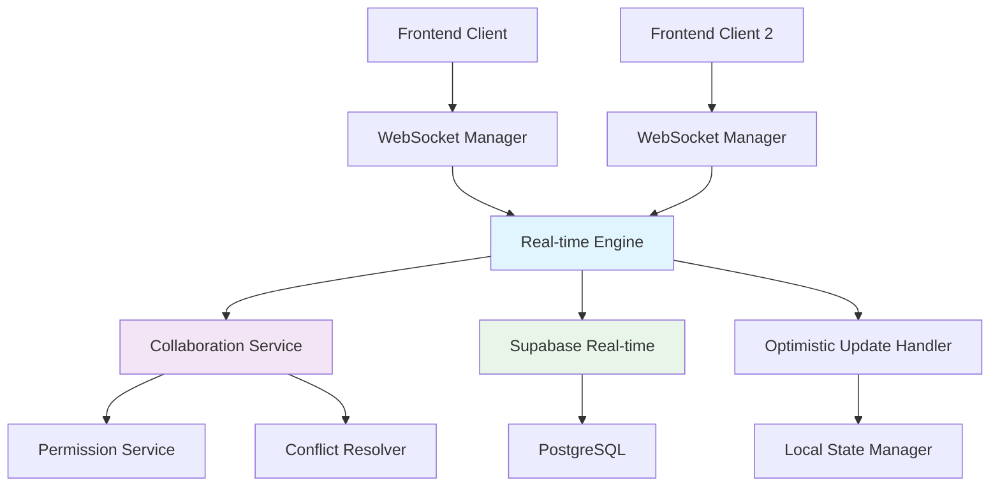

# Real-time Collaboration API Guide

This guide covers TripSage's real-time collaboration API patterns, implementation strategies, and best practices for building collaborative trip planning features.

## Table of Contents

1. [Overview](#overview)
2. [Collaboration Patterns](#collaboration-patterns)
3. [Trip Collaboration Workflows](#trip-collaboration-workflows)
4. [Optimistic Updates Implementation](#optimistic-updates-implementation)
5. [Live Presence and Cursors](#live-presence-and-cursors)
6. [Performance Optimization](#performance-optimization)
7. [Testing Strategies](#testing-strategies)
8. [Feature Reference](#feature-reference)

## Overview

TripSage's real-time collaboration system enables multiple users to work together on trip planning with immediate visual feedback, conflict resolution, and synchronized data updates. The system is built on WebSocket connections with Supabase real-time subscriptions for data persistence.

### Key Features

- **Real-time Trip Editing**: Multi-user editing with live updates
- **Optimistic Updates**: Immediate UI responsiveness with server sync
- **Live Presence**: See who's currently editing and where
- **Conflict Resolution**: Automatic and manual conflict handling
- **Permission Management**: Role-based access control for collaborators
- **Offline Support**: Queue updates when disconnected

### Architecture Overview



## Collaboration Patterns

### 1. Real-time Data Synchronization

#### Basic Trip Update Pattern

```typescript
// Client-side implementation
interface TripCollaborationClient {
  // Subscribe to trip changes
  subscribeToTrip(tripId: string): void;
  
  // Send trip updates
  updateTripField(field: string, value: any, optimistic?: boolean): Promise<void>;
  
  // Handle incoming updates
  onTripUpdate(callback: (update: TripUpdate) => void): void;
}

class TripCollaborationManager implements TripCollaborationClient {
  private websocket: WebSocketManager;
  private supabase: SupabaseClient;
  private optimisticUpdates: Map<string, OptimisticUpdate> = new Map();

  constructor(tripId: string, userId: string) {
    this.websocket = new WebSocketManager(`/ws/trips/${tripId}`);
    this.setupRealTimeSubscription(tripId);
  }

  subscribeToTrip(tripId: string) {
    // WebSocket subscription for real-time events
    this.websocket.subscribe(`trip:${tripId}`, (message) => {
      this.handleWebSocketMessage(message);
    });

    // Supabase subscription for data persistence
    this.supabase
      .channel(`trip-${tripId}`)
      .on('postgres_changes', 
        { event: 'UPDATE', schema: 'public', table: 'trips', filter: `id=eq.${tripId}` },
        (payload) => this.handleDatabaseUpdate(payload)
      )
      .subscribe();
  }

  async updateTripField(field: string, value: any, optimistic = true) {
    const updateId = generateUpdateId();
    
    if (optimistic) {
      // Apply optimistic update immediately
      this.applyOptimisticUpdate(updateId, field, value);
    }

    try {
      // Send to server
      await this.websocket.send({
        type: 'trip_field_update',
        payload: {
          updateId,
          field,
          value,
          optimistic,
          version: this.getCurrentVersion()
        }
      });
    } catch (error) {
      if (optimistic) {
        // Rollback optimistic update on error
        this.rollbackOptimisticUpdate(updateId);
      }
      throw error;
    }
  }

  private handleWebSocketMessage(message: any) {
    switch (message.type) {
      case 'trip_update_confirmed':
        this.confirmOptimisticUpdate(message.payload.updateId);
        break;
        
      case 'trip_update_rejected':
        this.rollbackOptimisticUpdate(message.payload.updateId);
        this.handleConflict(message.payload);
        break;
        
      case 'trip_field_updated':
        this.applyRemoteUpdate(message.payload);
        break;
    }
  }
}
```

#### Data Flow Example

```typescript
// Example: Updating trip destination with real-time sync
const collaborationManager = new TripCollaborationManager('trip-123', 'user-456');

// 1. User starts editing
await collaborationManager.startEditing('destination');

// 2. Apply optimistic update
await collaborationManager.updateTripField('destination', 'Rome, Italy', true);
// UI immediately shows "Rome, Italy"

// 3. Server processes update
// - Validates permissions
// - Checks for conflicts
// - Persists to database
// - Broadcasts to other users

// 4. Confirmation received
// - Optimistic update is confirmed
// - Other users see the change
```

### 2. Live Presence System

#### Presence Implementation

```typescript
interface CollaboratorPresence {
  userId: string;
  userName: string;
  avatarUrl?: string;
  currentField?: string;
  cursor?: { x: number; y: number };
  lastSeen: string;
  isActive: boolean;
  permissions: CollaboratorPermissions;
}

class PresenceManager {
  private activeCollaborators: Map<string, CollaboratorPresence> = new Map();
  private presenceHeartbeat: NodeJS.Timeout;

  constructor(private websocket: WebSocketManager, private tripId: string) {
    this.startPresenceHeartbeat();
    this.subscribeToPresenceEvents();
  }

  // Join collaboration session
  async joinSession() {
    await this.websocket.send({
      type: 'collaboration_join',
      payload: {
        tripId: this.tripId,
        user: getCurrentUser(),
        capabilities: ['editing', 'commenting', 'viewing']
      }
    });
  }

  // Start editing a specific field
  async startEditing(fieldName: string) {
    await this.websocket.send({
      type: 'field_editing_start',
      payload: {
        tripId: this.tripId,
        fieldName,
        timestamp: new Date().toISOString()
      }
    });

    // Update local state
    this.updateLocalPresence({ currentField: fieldName });
  }

  // Stop editing a field
  async stopEditing(fieldName: string) {
    await this.websocket.send({
      type: 'field_editing_stop',
      payload: {
        tripId: this.tripId,
        fieldName,
        timestamp: new Date().toISOString()
      }
    });

    this.updateLocalPresence({ currentField: null });
  }

  // Update cursor position for live cursors
  updateCursor(x: number, y: number, fieldName?: string) {
    this.throttledCursorUpdate({
      tripId: this.tripId,
      cursor: { x, y },
      fieldName,
      timestamp: new Date().toISOString()
    });
  }

  private throttledCursorUpdate = throttle((payload: any) => {
    this.websocket.send({
      type: 'cursor_update',
      payload
    });
  }, 100); // Throttle to 10 updates per second

  private subscribeToPresenceEvents() {
    this.websocket.on('collaborator_joined', (payload) => {
      this.activeCollaborators.set(payload.userId, payload.user);
      this.emitPresenceUpdate();
    });

    this.websocket.on('collaborator_left', (payload) => {
      this.activeCollaborators.delete(payload.userId);
      this.emitPresenceUpdate();
    });

    this.websocket.on('field_editing_start', (payload) => {
      const collaborator = this.activeCollaborators.get(payload.userId);
      if (collaborator) {
        collaborator.currentField = payload.fieldName;
        this.emitPresenceUpdate();
      }
    });

    this.websocket.on('cursor_update', (payload) => {
      const collaborator = this.activeCollaborators.get(payload.userId);
      if (collaborator) {
        collaborator.cursor = payload.cursor;
        this.emitPresenceUpdate();
      }
    });
  }

  private startPresenceHeartbeat() {
    this.presenceHeartbeat = setInterval(() => {
      this.websocket.send({
        type: 'presence_heartbeat',
        payload: {
          tripId: this.tripId,
          timestamp: new Date().toISOString()
        }
      });
    }, 30000); // Send heartbeat every 30 seconds
  }

  getActiveCollaborators(): CollaboratorPresence[] {
    return Array.from(this.activeCollaborators.values());
  }
}
```

### 3. Field-Level Locking

#### Optimistic Locking Strategy

```typescript
interface FieldLock {
  fieldName: string;
  lockedBy: string;
  lockedAt: string;
  lockId: string;
  expiresAt: string;
}

class FieldLockManager {
  private activeLocks: Map<string, FieldLock> = new Map();
  private lockTimeouts: Map<string, NodeJS.Timeout> = new Map();

  async requestFieldLock(fieldName: string): Promise<FieldLock | null> {
    const existingLock = this.activeLocks.get(fieldName);
    
    // Check if field is already locked by another user
    if (existingLock && existingLock.lockedBy !== getCurrentUserId()) {
      if (new Date() < new Date(existingLock.expiresAt)) {
        return null; // Field is locked
      }
    }

    // Create new lock
    const lock: FieldLock = {
      fieldName,
      lockedBy: getCurrentUserId(),
      lockedAt: new Date().toISOString(),
      lockId: generateLockId(),
      expiresAt: new Date(Date.now() + 30000).toISOString() // 30 second lock
    };

    // Send lock request to server
    const response = await this.websocket.send({
      type: 'field_lock_request',
      payload: lock
    });

    if (response.success) {
      this.activeLocks.set(fieldName, lock);
      this.setLockTimeout(lock);
      return lock;
    }

    return null;
  }

  async releaseFieldLock(fieldName: string): Promise<void> {
    const lock = this.activeLocks.get(fieldName);
    if (lock && lock.lockedBy === getCurrentUserId()) {
      await this.websocket.send({
        type: 'field_lock_release',
        payload: {
          fieldName,
          lockId: lock.lockId
        }
      });

      this.activeLocks.delete(fieldName);
      const timeout = this.lockTimeouts.get(fieldName);
      if (timeout) {
        clearTimeout(timeout);
        this.lockTimeouts.delete(fieldName);
      }
    }
  }

  private setLockTimeout(lock: FieldLock) {
    const timeout = setTimeout(() => {
      this.releaseFieldLock(lock.fieldName);
    }, 30000);
    
    this.lockTimeouts.set(lock.fieldName, timeout);
  }

  isFieldLocked(fieldName: string, excludeCurrentUser = false): boolean {
    const lock = this.activeLocks.get(fieldName);
    if (!lock) return false;
    
    if (excludeCurrentUser && lock.lockedBy === getCurrentUserId()) {
      return false;
    }
    
    return new Date() < new Date(lock.expiresAt);
  }
}
```

## Trip Collaboration Workflows

### 1. Starting a Collaboration Session

```typescript
// Complete workflow for starting trip collaboration
class TripCollaborationWorkflow {
  async startCollaboration(tripId: string, inviteEmails: string[]) {
    try {
      // 1. Initialize collaboration session
      const session = await this.collaborationService.createSession({
        tripId,
        initiatedBy: getCurrentUserId(),
        features: ['real_time_editing', 'live_cursors', 'comments']
      });

      // 2. Send invitations
      const invitations = await Promise.all(
        inviteEmails.map(email => 
          this.invitationService.sendInvitation({
            tripId,
            email,
            invitedBy: getCurrentUserId(),
            permissionLevel: 'editor',
            sessionId: session.id
          })
        )
      );

      // 3. Set up real-time subscriptions
      await this.setupRealTimeSubscriptions(tripId, session.id);

      // 4. Initialize presence tracking
      await this.presenceManager.joinSession();

      // 5. Sync initial state
      const currentTripState = await this.getTripState(tripId);
      this.syncInitialState(currentTripState);

      return {
        sessionId: session.id,
        invitations,
        realTimeEnabled: true
      };

    } catch (error) {
      console.error('Failed to start collaboration:', error);
      throw new CollaborationError('COLLABORATION_START_FAILED', error);
    }
  }

  private async setupRealTimeSubscriptions(tripId: string, sessionId: string) {
    // WebSocket subscription for immediate updates
    this.websocket.subscribe(`collaboration:${sessionId}`, {
      onMessage: this.handleCollaborationMessage.bind(this),
      onError: this.handleSubscriptionError.bind(this),
      onReconnect: this.handleReconnection.bind(this)
    });

    // Supabase subscription for data persistence
    this.supabase
      .channel(`trip-collaboration-${tripId}`)
      .on('postgres_changes', 
        { event: '*', schema: 'public', table: 'trips', filter: `id=eq.${tripId}` },
        this.handleDatabaseChange.bind(this)
      )
      .on('postgres_changes',
        { event: '*', schema: 'public', table: 'trip_collaborators', filter: `trip_id=eq.${tripId}` },
        this.handleCollaboratorsChange.bind(this)
      )
      .subscribe();
  }
}
```

### 2. Handling Collaborator Permissions

```typescript
interface CollaboratorPermissions {
  canView: boolean;
  canEdit: boolean;
  canComment: boolean;
  canInvite: boolean;
  canManagePermissions: boolean;
  canDelete: boolean;
}

class PermissionManager {
  private permissions: Map<string, CollaboratorPermissions> = new Map();

  async updateCollaboratorPermissions(
    tripId: string, 
    userId: string, 
    permissions: Partial<CollaboratorPermissions>
  ) {
    // Validate current user has permission to modify permissions
    const currentUserPermissions = await this.getUserPermissions(tripId, getCurrentUserId());
    if (!currentUserPermissions.canManagePermissions) {
      throw new PermissionError('INSUFFICIENT_PERMISSIONS');
    }

    // Update permissions
    const updatedPermissions = {
      ...this.permissions.get(userId),
      ...permissions
    };

    // Persist to database
    await this.collaborationService.updatePermissions(tripId, userId, updatedPermissions);

    // Broadcast change to all collaborators
    await this.websocket.broadcast(`trip:${tripId}`, {
      type: 'permissions_updated',
      payload: {
        userId,
        permissions: updatedPermissions,
        updatedBy: getCurrentUserId()
      }
    });

    this.permissions.set(userId, updatedPermissions);
  }

  canUserPerformAction(userId: string, action: keyof CollaboratorPermissions): boolean {
    const permissions = this.permissions.get(userId);
    return permissions?.[action] ?? false;
  }

  // Permission-aware field update
  async updateFieldWithPermissionCheck(fieldName: string, value: any, userId: string) {
    if (!this.canUserPerformAction(userId, 'canEdit')) {
      throw new PermissionError('EDIT_PERMISSION_DENIED');
    }

    // Check field-specific permissions
    const fieldPermissions = this.getFieldPermissions(fieldName);
    if (fieldPermissions.requiresSpecialPermission && 
        !this.canUserPerformAction(userId, fieldPermissions.requiredPermission)) {
      throw new PermissionError('FIELD_PERMISSION_DENIED');
    }

    return this.updateField(fieldName, value, userId);
  }
}
```

### 3. Multi-user Editing Flow

```typescript
// Complete multi-user editing implementation
class MultiUserEditingManager {
  private editingSessions: Map<string, EditingSession> = new Map();
  private conflictResolver: ConflictResolver;

  async handleFieldEdit(fieldName: string, newValue: any, userId: string) {
    const sessionId = `${fieldName}-${userId}`;
    
    // 1. Check if another user is editing this field
    const activeSession = this.getActiveEditingSession(fieldName);
    if (activeSession && activeSession.userId !== userId) {
      // Handle concurrent editing
      return this.handleConcurrentEdit(fieldName, newValue, userId, activeSession);
    }

    // 2. Start editing session
    const editingSession = this.startEditingSession(fieldName, userId);

    // 3. Apply optimistic update
    const optimisticUpdate = await this.applyOptimisticUpdate(fieldName, newValue, userId);

    // 4. Broadcast editing state to other users
    await this.broadcastEditingState(fieldName, userId, 'started');

    try {
      // 5. Validate and persist change
      const result = await this.persistFieldChange(fieldName, newValue, userId);

      // 6. Confirm optimistic update
      await this.confirmOptimisticUpdate(optimisticUpdate.id, result);

      // 7. Broadcast successful update
      await this.broadcastFieldUpdate(fieldName, newValue, userId, result.version);

      return result;

    } catch (error) {
      // Rollback optimistic update
      await this.rollbackOptimisticUpdate(optimisticUpdate.id);
      
      // Handle specific error types
      if (error instanceof ConflictError) {
        return this.conflictResolver.resolveConflict(error.conflictData);
      }
      
      throw error;
    } finally {
      // 8. End editing session
      this.endEditingSession(sessionId);
      await this.broadcastEditingState(fieldName, userId, 'stopped');
    }
  }

  private async handleConcurrentEdit(
    fieldName: string, 
    newValue: any, 
    userId: string, 
    activeSession: EditingSession
  ) {
    // Check if values are the same (no conflict)
    if (this.valuesAreEqual(newValue, activeSession.currentValue)) {
      return { success: true, conflict: false };
    }

    // Create conflict resolution request
    const conflict = await this.conflictResolver.createConflict({
      fieldName,
      conflictingValues: [
        { value: activeSession.currentValue, userId: activeSession.userId },
        { value: newValue, userId }
      ],
      timestamp: new Date().toISOString()
    });

    // Notify both users of conflict
    await this.notifyConflict(conflict);

    return { success: false, conflict: true, conflictId: conflict.id };
  }
}
```

## Optimistic Updates Implementation

### 1. Core Optimistic Update System

```typescript
interface OptimisticUpdate {
  id: string;
  fieldName: string;
  oldValue: any;
  newValue: any;
  timestamp: string;
  status: 'pending' | 'confirmed' | 'rejected' | 'rolled_back';
  userId: string;
  version: number;
}

class OptimisticUpdateManager {
  private pendingUpdates: Map<string, OptimisticUpdate> = new Map();
  private confirmationCallbacks: Map<string, Function> = new Map();

  async applyOptimisticUpdate(
    fieldName: string, 
    newValue: any, 
    oldValue: any
  ): Promise<OptimisticUpdate> {
    const update: OptimisticUpdate = {
      id: generateUpdateId(),
      fieldName,
      oldValue,
      newValue,
      timestamp: new Date().toISOString(),
      status: 'pending',
      userId: getCurrentUserId(),
      version: this.getCurrentVersion()
    };

    // Store pending update
    this.pendingUpdates.set(update.id, update);

    // Apply to UI immediately
    this.applyToUI(fieldName, newValue, update.id);

    // Set up confirmation timeout
    this.setConfirmationTimeout(update.id);

    // Send to server
    await this.sendToServer(update);

    return update;
  }

  async confirmUpdate(updateId: string, serverData?: any) {
    const update = this.pendingUpdates.get(updateId);
    if (!update) return;

    update.status = 'confirmed';
    
    // Update with server data if provided
    if (serverData) {
      this.applyToUI(update.fieldName, serverData.value, updateId, true);
    }

    // Execute confirmation callback
    const callback = this.confirmationCallbacks.get(updateId);
    if (callback) {
      callback(update, serverData);
      this.confirmationCallbacks.delete(updateId);
    }

    // Clean up
    this.pendingUpdates.delete(updateId);
  }

  async rollbackUpdate(updateId: string, reason?: string) {
    const update = this.pendingUpdates.get(updateId);
    if (!update) return;

    update.status = 'rolled_back';

    // Restore original value in UI
    this.applyToUI(update.fieldName, update.oldValue, updateId, true);

    // Notify user of rollback
    this.notifyRollback(update, reason);

    // Clean up
    this.pendingUpdates.delete(updateId);
    this.confirmationCallbacks.delete(updateId);
  }

  private applyToUI(fieldName: string, value: any, updateId: string, isConfirmed = false) {
    // Emit update event for UI components to handle
    this.emit('ui_update', {
      fieldName,
      value,
      updateId,
      isOptimistic: !isConfirmed,
      isConfirmed
    });
  }

  private setConfirmationTimeout(updateId: string) {
    setTimeout(() => {
      if (this.pendingUpdates.has(updateId)) {
        this.rollbackUpdate(updateId, 'CONFIRMATION_TIMEOUT');
      }
    }, 10000); // 10 second timeout
  }

  // Get current state with optimistic updates applied
  getCurrentState(baseState: any): any {
    let state = { ...baseState };

    // Apply all pending optimistic updates
    for (const update of this.pendingUpdates.values()) {
      if (update.status === 'pending') {
        state[update.fieldName] = update.newValue;
      }
    }

    return state;
  }

  // Check if field has pending optimistic updates
  hasPendingUpdates(fieldName?: string): boolean {
    if (fieldName) {
      return Array.from(this.pendingUpdates.values())
        .some(update => update.fieldName === fieldName && update.status === 'pending');
    }
    
    return this.pendingUpdates.size > 0;
  }
}
```

### 2. React Integration for Optimistic Updates

```typescript
// Custom hook for optimistic updates
function useOptimisticTripUpdate(tripId: string) {
  const [optimisticState, setOptimisticState] = useState<any>({});
  const [pendingUpdates, setPendingUpdates] = useState<Set<string>>(new Set());
  const optimisticManager = useRef(new OptimisticUpdateManager());

  const updateField = useCallback(async (fieldName: string, value: any) => {
    const currentValue = optimisticState[fieldName];
    
    // Apply optimistic update
    setOptimisticState(prev => ({ ...prev, [fieldName]: value }));
    setPendingUpdates(prev => new Set([...prev, fieldName]));

    try {
      const update = await optimisticManager.current.applyOptimisticUpdate(
        fieldName, 
        value, 
        currentValue
      );

      // Set up confirmation handler
      optimisticManager.current.onConfirmation(update.id, () => {
        setPendingUpdates(prev => {
          const next = new Set(prev);
          next.delete(fieldName);
          return next;
        });
      });

      // Set up rollback handler
      optimisticManager.current.onRollback(update.id, () => {
        setOptimisticState(prev => ({ ...prev, [fieldName]: currentValue }));
        setPendingUpdates(prev => {
          const next = new Set(prev);
          next.delete(fieldName);
          return next;
        });
      });

    } catch (error) {
      // Revert optimistic update on error
      setOptimisticState(prev => ({ ...prev, [fieldName]: currentValue }));
      setPendingUpdates(prev => {
        const next = new Set(prev);
        next.delete(fieldName);
        return next;
      });
      
      throw error;
    }
  }, [optimisticState]);

  return {
    optimisticState,
    pendingUpdates,
    updateField,
    hasPendingUpdates: (field?: string) => 
      field ? pendingUpdates.has(field) : pendingUpdates.size > 0
  };
}

// Usage in component
function TripEditor({ tripId }: { tripId: string }) {
  const { trip, updateTrip } = useTrip(tripId);
  const { optimisticState, pendingUpdates, updateField } = useOptimisticTripUpdate(tripId);

  // Merge server state with optimistic updates
  const currentState = useMemo(() => {
    return { ...trip, ...optimisticState };
  }, [trip, optimisticState]);

  const handleFieldChange = async (fieldName: string, value: any) => {
    try {
      // Apply optimistic update immediately
      await updateField(fieldName, value);
      
      // Send to server (this will confirm or reject the optimistic update)
      await updateTrip({ [fieldName]: value });
    } catch (error) {
      // Optimistic update will be automatically rolled back
      showErrorToast(`Failed to update ${fieldName}: ${error.message}`);
    }
  };

  return (
    <div className="trip-editor">
      <TripField
        name="destination"
        value={currentState.destination}
        onChange={(value) => handleFieldChange('destination', value)}
        isPending={pendingUpdates.has('destination')}
      />
      
      <TripField
        name="budget"
        value={currentState.budget}
        onChange={(value) => handleFieldChange('budget', value)}
        isPending={pendingUpdates.has('budget')}
      />
      
      {pendingUpdates.size > 0 && (
        <PendingUpdatesIndicator count={pendingUpdates.size} />
      )}
    </div>
  );
}
```

### 3. Conflict Resolution Implementation

```typescript
interface ConflictResolutionStrategy {
  name: string;
  description: string;
  resolve(conflict: Conflict): Promise<ConflictResolution>;
}

interface Conflict {
  id: string;
  fieldName: string;
  tripId: string;
  conflictingValues: ConflictingValue[];
  detectedAt: string;
  status: 'pending' | 'resolved' | 'escalated';
}

interface ConflictingValue {
  value: any;
  userId: string;
  timestamp: string;
  version: number;
}

class ConflictResolver {
  private strategies: Map<string, ConflictResolutionStrategy> = new Map();
  private activeConflicts: Map<string, Conflict> = new Map();

  constructor() {
    this.registerDefaultStrategies();
  }

  private registerDefaultStrategies() {
    // Last Write Wins
    this.strategies.set('last_write_wins', {
      name: 'Last Write Wins',
      description: 'Use the most recent change',
      resolve: async (conflict) => {
        const latest = conflict.conflictingValues
          .sort((a, b) => new Date(b.timestamp).getTime() - new Date(a.timestamp).getTime())[0];
        
        return {
          resolvedValue: latest.value,
          winningUserId: latest.userId,
          strategy: 'last_write_wins'
        };
      }
    });

    // Manual Resolution
    this.strategies.set('manual', {
      name: 'Manual Resolution',
      description: 'Let users choose how to resolve',
      resolve: async (conflict) => {
        return this.requestManualResolution(conflict);
      }
    });

    // Merge Strategy (for compatible values)
    this.strategies.set('merge', {
      name: 'Smart Merge',
      description: 'Automatically merge compatible changes',
      resolve: async (conflict) => {
        return this.attemptMerge(conflict);
      }
    });
  }

  async resolveConflict(conflict: Conflict, strategy?: string): Promise<ConflictResolution> {
    const strategyName = strategy || this.selectStrategy(conflict);
    const resolutionStrategy = this.strategies.get(strategyName);

    if (!resolutionStrategy) {
      throw new Error(`Unknown resolution strategy: ${strategyName}`);
    }

    try {
      const resolution = await resolutionStrategy.resolve(conflict);
      
      // Apply resolution
      await this.applyResolution(conflict, resolution);
      
      // Notify all collaborators
      await this.notifyResolution(conflict, resolution);
      
      // Clean up
      this.activeConflicts.delete(conflict.id);
      
      return resolution;
    } catch (error) {
      console.error('Conflict resolution failed:', error);
      throw new ConflictResolutionError('RESOLUTION_FAILED', error);
    }
  }

  private selectStrategy(conflict: Conflict): string {
    // Simple strategy selection logic
    if (conflict.conflictingValues.length === 2) {
      const [val1, val2] = conflict.conflictingValues;
      
      // If values are very similar, try to merge
      if (this.areValuesSimilar(val1.value, val2.value)) {
        return 'merge';
      }
    }

    // For complex conflicts, use manual resolution
    if (conflict.conflictingValues.length > 2) {
      return 'manual';
    }

    // Default to last write wins
    return 'last_write_wins';
  }

  private async requestManualResolution(conflict: Conflict): Promise<ConflictResolution> {
    return new Promise((resolve) => {
      // Send conflict resolution request to all collaborators
      this.websocket.broadcast(`trip:${conflict.tripId}`, {
        type: 'conflict_resolution_required',
        payload: {
          conflict,
          options: conflict.conflictingValues.map((val, index) => ({
            id: `option-${index}`,
            value: val.value,
            description: `Value from ${val.userId}`,
            timestamp: val.timestamp
          })),
          timeout: 30000 // 30 second timeout
        }
      });

      // Wait for resolution or timeout
      const timeout = setTimeout(() => {
        // Auto-resolve on timeout using last write wins
        this.strategies.get('last_write_wins')!.resolve(conflict).then(resolve);
      }, 30000);

      // Listen for resolution choice
      this.websocket.once(`conflict_resolution:${conflict.id}`, (choice) => {
        clearTimeout(timeout);
        resolve({
          resolvedValue: choice.value,
          winningUserId: choice.chosenBy,
          strategy: 'manual',
          manualChoice: choice
        });
      });
    });
  }

  private async attemptMerge(conflict: Conflict): Promise<ConflictResolution> {
    const [val1, val2] = conflict.conflictingValues;

    // Attempt different merge strategies based on field type
    switch (conflict.fieldName) {
      case 'budget':
        // For budget, take the average
        const avgBudget = (val1.value + val2.value) / 2;
        return {
          resolvedValue: avgBudget,
          strategy: 'merge',
          mergeType: 'average'
        };

      case 'destinations':
        // For arrays, merge unique values
        const mergedDestinations = [...new Set([...val1.value, ...val2.value])];
        return {
          resolvedValue: mergedDestinations,
          strategy: 'merge',
          mergeType: 'union'
        };

      default:
        // Can't merge, fallback to manual resolution
        return this.requestManualResolution(conflict);
    }
  }
}
```

## Live Presence and Cursors

### 1. Live Cursor Implementation

```typescript
interface CursorPosition {
  x: number;
  y: number;
  fieldName?: string;
  elementId?: string;
}

interface UserCursor extends CursorPosition {
  userId: string;
  userName: string;
  color: string;
  lastUpdate: string;
}

class LiveCursorManager {
  private cursors: Map<string, UserCursor> = new Map();
  private cursorElements: Map<string, HTMLElement> = new Map();
  private mouseTracking = false;

  constructor(private websocket: WebSocketManager, private tripId: string) {
    this.setupCursorTracking();
    this.subscribeToCursorUpdates();
  }

  startTracking() {
    this.mouseTracking = true;
    document.addEventListener('mousemove', this.handleMouseMove);
    document.addEventListener('mouseenter', this.handleMouseEnter);
    document.addEventListener('mouseleave', this.handleMouseLeave);
  }

  stopTracking() {
    this.mouseTracking = false;
    document.removeEventListener('mousemove', this.handleMouseMove);
    document.removeEventListener('mouseenter', this.handleMouseEnter);
    document.removeEventListener('mouseleave', this.handleMouseLeave);
  }

  private handleMouseMove = throttle((event: MouseEvent) => {
    if (!this.mouseTracking) return;

    const target = event.target as HTMLElement;
    const fieldName = target.dataset.fieldName;
    const elementId = target.id;

    // Get relative position within the viewport
    const x = event.clientX;
    const y = event.clientY;

    this.updateCursor({ x, y, fieldName, elementId });
  }, 50); // 20 FPS

  private updateCursor(position: CursorPosition) {
    this.websocket.send({
      type: 'cursor_update',
      payload: {
        tripId: this.tripId,
        ...position,
        timestamp: new Date().toISOString()
      }
    });
  }

  private subscribeToCursorUpdates() {
    this.websocket.on('cursor_update', (payload) => {
      if (payload.userId === getCurrentUserId()) return; // Ignore own cursor

      const cursor: UserCursor = {
        ...payload,
        color: this.getUserColor(payload.userId),
        userName: this.getUserName(payload.userId),
        lastUpdate: payload.timestamp
      };

      this.cursors.set(payload.userId, cursor);
      this.renderCursor(cursor);
    });

    this.websocket.on('user_left', (payload) => {
      this.removeCursor(payload.userId);
    });
  }

  private renderCursor(cursor: UserCursor) {
    let cursorElement = this.cursorElements.get(cursor.userId);

    if (!cursorElement) {
      cursorElement = this.createCursorElement(cursor);
      this.cursorElements.set(cursor.userId, cursorElement);
      document.body.appendChild(cursorElement);
    }

    // Update cursor position
    cursorElement.style.left = `${cursor.x}px`;
    cursorElement.style.top = `${cursor.y}px`;
    cursorElement.style.borderColor = cursor.color;

    // Update cursor label
    const label = cursorElement.querySelector('.cursor-label');
    if (label) {
      label.textContent = cursor.userName;
      label.style.backgroundColor = cursor.color;
    }

    // Show cursor
    cursorElement.style.display = 'block';

    // Hide cursor after inactivity
    this.setCursorTimeout(cursor.userId);
  }

  private createCursorElement(cursor: UserCursor): HTMLElement {
    const cursorEl = document.createElement('div');
    cursorEl.className = 'live-cursor';
    cursorEl.innerHTML = `
      <div class="cursor-pointer" style="border-color: ${cursor.color}"></div>
      <div class="cursor-label" style="background-color: ${cursor.color}">
        ${cursor.userName}
      </div>
    `;

    // Add CSS
    cursorEl.style.cssText = `
      position: fixed;
      pointer-events: none;
      z-index: 10000;
      transition: all 0.1s ease;
    `;

    return cursorEl;
  }

  private setCursorTimeout(userId: string) {
    setTimeout(() => {
      const cursorElement = this.cursorElements.get(userId);
      if (cursorElement) {
        cursorElement.style.display = 'none';
      }
    }, 5000); // Hide after 5 seconds of inactivity
  }

  private getUserColor(userId: string): string {
    // Generate consistent color for user
    const colors = [
      '#FF6B6B', '#4ECDC4', '#45B7D1', '#FFA07A', 
      '#98D8C8', '#F7DC6F', '#BB8FCE', '#85C1E9'
    ];
    
    const index = userId.split('').reduce((acc, char) => acc + char.charCodeAt(0), 0);
    return colors[index % colors.length];
  }
}
```

### 2. Field Selection Indicators

```typescript
class FieldSelectionManager {
  private selectedFields: Map<string, FieldSelection> = new Map();
  private selectionIndicators: Map<string, HTMLElement> = new Map();

  showFieldSelection(fieldName: string, userId: string, userName: string) {
    const selection: FieldSelection = {
      fieldName,
      userId,
      userName,
      timestamp: new Date().toISOString(),
      color: this.getUserColor(userId)
    };

    this.selectedFields.set(`${fieldName}-${userId}`, selection);
    this.renderFieldSelection(selection);

    // Broadcast to other users
    this.websocket.send({
      type: 'field_selection',
      payload: {
        tripId: this.tripId,
        fieldName,
        action: 'select'
      }
    });
  }

  hideFieldSelection(fieldName: string, userId: string) {
    const key = `${fieldName}-${userId}`;
    this.selectedFields.delete(key);
    
    const indicator = this.selectionIndicators.get(key);
    if (indicator) {
      indicator.remove();
      this.selectionIndicators.delete(key);
    }

    // Broadcast to other users
    this.websocket.send({
      type: 'field_selection',
      payload: {
        tripId: this.tripId,
        fieldName,
        action: 'deselect'
      }
    });
  }

  private renderFieldSelection(selection: FieldSelection) {
    const fieldElement = document.querySelector(`[data-field-name="${selection.fieldName}"]`);
    if (!fieldElement) return;

    const indicator = document.createElement('div');
    indicator.className = 'field-selection-indicator';
    indicator.innerHTML = `
      <div class="selection-border" style="border-color: ${selection.color}"></div>
      <div class="selection-label" style="background-color: ${selection.color}">
        ${selection.userName} is editing
      </div>
    `;

    // Position indicator
    const rect = fieldElement.getBoundingClientRect();
    indicator.style.cssText = `
      position: absolute;
      top: ${rect.top - 2}px;
      left: ${rect.left - 2}px;
      width: ${rect.width + 4}px;
      height: ${rect.height + 4}px;
      pointer-events: none;
      z-index: 1000;
    `;

    document.body.appendChild(indicator);
    this.selectionIndicators.set(`${selection.fieldName}-${selection.userId}`, indicator);
  }
}
```

## Performance Optimization

### 1. Message Batching and Throttling

```typescript
class MessageBatchingManager {
  private batchQueue: any[] = [];
  private batchTimeout: NodeJS.Timeout | null = null;
  private readonly batchSize = 10;
  private readonly batchDelay = 100; // ms

  constructor(private websocket: WebSocketManager) {}

  send(message: any, immediate = false) {
    if (immediate || this.shouldSendImmediately(message)) {
      return this.websocket.send(message);
    }

    // Add to batch queue
    this.batchQueue.push(message);

    // Set batch timeout if not already set
    if (!this.batchTimeout) {
      this.batchTimeout = setTimeout(() => {
        this.flushBatch();
      }, this.batchDelay);
    }

    // Flush immediately if batch is full
    if (this.batchQueue.length >= this.batchSize) {
      this.flushBatch();
    }
  }

  private flushBatch() {
    if (this.batchQueue.length === 0) return;

    if (this.batchQueue.length === 1) {
      // Send single message directly
      this.websocket.send(this.batchQueue[0]);
    } else {
      // Send as batch
      this.websocket.send({
        type: 'message_batch',
        payload: {
          messages: this.batchQueue
        }
      });
    }

    // Clear batch
    this.batchQueue = [];
    
    if (this.batchTimeout) {
      clearTimeout(this.batchTimeout);
      this.batchTimeout = null;
    }
  }

  private shouldSendImmediately(message: any): boolean {
    // High priority messages that shouldn't be batched
    const immediatePriority = [
      'authentication',
      'heartbeat',
      'error',
      'conflict_resolution'
    ];

    return immediatePriority.includes(message.type);
  }
}
```

### 2. Connection Pooling and Load Balancing

```typescript
class WebSocketConnectionPool {
  private connections: WebSocketManager[] = [];
  private currentIndex = 0;
  private readonly maxConnections = 3;

  constructor(private baseUrl: string, private token: string) {
    this.initializeConnections();
  }

  private async initializeConnections() {
    for (let i = 0; i < this.maxConnections; i++) {
      const connection = new WebSocketManager(`${this.baseUrl}?pool=${i}`, this.token);
      await connection.connect();
      this.connections.push(connection);
    }
  }

  getConnection(): WebSocketManager {
    // Round-robin load balancing
    const connection = this.connections[this.currentIndex];
    this.currentIndex = (this.currentIndex + 1) % this.connections.length;
    return connection;
  }

  broadcast(message: any) {
    // Send to all connections for redundancy
    return Promise.all(
      this.connections.map(conn => conn.send(message))
    );
  }

  getHealthiestConnection(): WebSocketManager {
    // Return connection with best metrics
    return this.connections
      .filter(conn => conn.isConnected())
      .sort((a, b) => a.getLatency() - b.getLatency())[0];
  }
}
```

## Testing Strategies

### 1. Unit Testing Collaboration Features

```typescript
describe('TripCollaborationManager', () => {
  let collaborationManager: TripCollaborationManager;
  let mockWebSocket: jest.Mocked<WebSocketManager>;
  let mockSupabase: jest.Mocked<SupabaseClient>;

  beforeEach(() => {
    mockWebSocket = createMockWebSocket();
    mockSupabase = createMockSupabase();
    collaborationManager = new TripCollaborationManager('trip-123', 'user-456');
  });

  describe('optimistic updates', () => {
    it('should apply optimistic update immediately', async () => {
      const onUpdate = jest.fn();
      collaborationManager.onTripUpdate(onUpdate);

      await collaborationManager.updateTripField('destination', 'Paris', true);

      expect(onUpdate).toHaveBeenCalledWith({
        fieldName: 'destination',
        value: 'Paris',
        isOptimistic: true
      });
    });

    it('should rollback optimistic update on server error', async () => {
      mockWebSocket.send.mockRejectedValue(new Error('Server error'));
      const onUpdate = jest.fn();
      collaborationManager.onTripUpdate(onUpdate);

      await expect(
        collaborationManager.updateTripField('destination', 'Paris', true)
      ).rejects.toThrow('Server error');

      expect(onUpdate).toHaveBeenCalledWith({
        fieldName: 'destination',
        isRollback: true
      });
    });

    it('should confirm optimistic update on server success', async () => {
      const onUpdate = jest.fn();
      collaborationManager.onTripUpdate(onUpdate);

      await collaborationManager.updateTripField('destination', 'Paris', true);

      // Simulate server confirmation
      mockWebSocket.simulateMessage({
        type: 'trip_update_confirmed',
        payload: { updateId: 'update-123', fieldName: 'destination' }
      });

      expect(onUpdate).toHaveBeenCalledWith({
        fieldName: 'destination',
        value: 'Paris',
        isConfirmed: true
      });
    });
  });

  describe('conflict resolution', () => {
    it('should detect and handle conflicts', async () => {
      const conflictHandler = jest.fn();
      collaborationManager.onConflict(conflictHandler);

      // Simulate conflict
      mockWebSocket.simulateMessage({
        type: 'trip_conflict_detected',
        payload: {
          fieldName: 'budget',
          conflictingValues: [
            { value: 1000, userId: 'user-123' },
            { value: 1500, userId: 'user-456' }
          ]
        }
      });

      expect(conflictHandler).toHaveBeenCalledWith({
        fieldName: 'budget',
        conflictingValues: expect.any(Array)
      });
    });
  });
});
```

### 2. Integration Testing with Playwright

```typescript
import { test, expect } from '@playwright/test';

test.describe('Real-time Collaboration', () => {
  test('multiple users can edit trip simultaneously', async ({ context }) => {
    // Create two browser pages for different users
    const page1 = await context.newPage();
    const page2 = await context.newPage();

    // Navigate both users to the same trip
    await page1.goto('/trips/123/edit');
    await page2.goto('/trips/123/edit');

    // Wait for collaboration to initialize
    await page1.waitForSelector('[data-testid="collaboration-status"][data-status="connected"]');
    await page2.waitForSelector('[data-testid="collaboration-status"][data-status="connected"]');

    // User 1 updates destination
    await page1.fill('[data-testid="destination-input"]', 'Paris, France');
    await page1.keyboard.press('Tab');

    // Verify user 2 sees the update
    await expect(page2.locator('[data-testid="destination-input"]')).toHaveValue('Paris, France');

    // User 2 updates budget
    await page2.fill('[data-testid="budget-input"]', '2500');
    await page2.keyboard.press('Tab');

    // Verify user 1 sees the update
    await expect(page1.locator('[data-testid="budget-input"]')).toHaveValue('2500');

    // Check that both users see each other in presence indicators
    await expect(page1.locator('[data-testid="active-collaborators"]')).toContainText('User 2');
    await expect(page2.locator('[data-testid="active-collaborators"]')).toContainText('User 1');
  });

  test('handles optimistic updates correctly', async ({ page }) => {
    await page.goto('/trips/123/edit');

    // Update a field
    await page.fill('[data-testid="destination-input"]', 'Tokyo, Japan');

    // Should immediately show optimistic update
    await expect(page.locator('[data-testid="destination-input"]')).toHaveValue('Tokyo, Japan');
    await expect(page.locator('[data-testid="pending-indicator"]')).toBeVisible();

    // Wait for server confirmation
    await expect(page.locator('[data-testid="pending-indicator"]')).not.toBeVisible({ timeout: 5000 });
    await expect(page.locator('[data-testid="destination-input"]')).toHaveValue('Tokyo, Japan');
  });

  test('shows conflict resolution UI when conflicts occur', async ({ context }) => {
    const page1 = await context.newPage();
    const page2 = await context.newPage();

    await page1.goto('/trips/123/edit');
    await page2.goto('/trips/123/edit');

    // Both users edit the same field simultaneously
    await Promise.all([
      page1.fill('[data-testid="budget-input"]', '3000'),
      page2.fill('[data-testid="budget-input"]', '2000')
    ]);

    // Submit changes at the same time
    await Promise.all([
      page1.keyboard.press('Tab'),
      page2.keyboard.press('Tab')
    ]);

    // Conflict resolution dialog should appear
    await expect(page1.locator('[data-testid="conflict-resolution-dialog"]')).toBeVisible();
    await expect(page2.locator('[data-testid="conflict-resolution-dialog"]')).toBeVisible();

    // User 1 resolves conflict
    await page1.click('[data-testid="resolve-conflict-option-1"]');

    // Conflict should be resolved for both users
    await expect(page1.locator('[data-testid="conflict-resolution-dialog"]')).not.toBeVisible();
    await expect(page2.locator('[data-testid="conflict-resolution-dialog"]')).not.toBeVisible();
  });
});
```

## Feature Reference

### 1. Collaborative Commenting System

```typescript
interface TripComment {
  id: string;
  tripId: string;
  userId: string;
  content: string;
  fieldName?: string;
  position?: { x: number; y: number };
  replies: TripCommentReply[];
  createdAt: string;
  updatedAt: string;
  isResolved: boolean;
}

class CollaborativeCommentingSystem {
  private comments: Map<string, TripComment> = new Map();
  private activeCommentThreads: Set<string> = new Set();

  async addComment(
    fieldName: string, 
    content: string, 
    position?: { x: number; y: number }
  ): Promise<TripComment> {
    const comment: TripComment = {
      id: generateCommentId(),
      tripId: this.tripId,
      userId: getCurrentUserId(),
      content,
      fieldName,
      position,
      replies: [],
      createdAt: new Date().toISOString(),
      updatedAt: new Date().toISOString(),
      isResolved: false
    };

    // Store locally
    this.comments.set(comment.id, comment);

    // Broadcast to other collaborators
    await this.websocket.send({
      type: 'comment_added',
      payload: { comment }
    });

    // Persist to database
    await this.persistComment(comment);

    return comment;
  }

  async addReply(commentId: string, content: string): Promise<TripCommentReply> {
    const comment = this.comments.get(commentId);
    if (!comment) throw new Error('Comment not found');

    const reply: TripCommentReply = {
      id: generateReplyId(),
      commentId,
      userId: getCurrentUserId(),
      content,
      createdAt: new Date().toISOString()
    };

    comment.replies.push(reply);

    // Broadcast and persist
    await this.websocket.send({
      type: 'comment_reply_added',
      payload: { commentId, reply }
    });

    await this.persistReply(reply);
    return reply;
  }

  async resolveComment(commentId: string): Promise<void> {
    const comment = this.comments.get(commentId);
    if (!comment) return;

    comment.isResolved = true;
    comment.updatedAt = new Date().toISOString();

    await this.websocket.send({
      type: 'comment_resolved',
      payload: { commentId, resolvedBy: getCurrentUserId() }
    });

    await this.updateComment(comment);
  }

  getCommentsForField(fieldName: string): TripComment[] {
    return Array.from(this.comments.values())
      .filter(comment => comment.fieldName === fieldName && !comment.isResolved);
  }
}
```

### 2. Version History and Rollback

```typescript
interface TripVersion {
  id: string;
  tripId: string;
  version: number;
  changes: FieldChange[];
  createdBy: string;
  createdAt: string;
  description?: string;
}

interface FieldChange {
  fieldName: string;
  oldValue: any;
  newValue: any;
  changeType: 'create' | 'update' | 'delete';
}

class TripVersionManager {
  private versions: TripVersion[] = [];
  private currentVersion = 0;

  async createVersion(changes: FieldChange[], description?: string): Promise<TripVersion> {
    const version: TripVersion = {
      id: generateVersionId(),
      tripId: this.tripId,
      version: ++this.currentVersion,
      changes,
      createdBy: getCurrentUserId(),
      createdAt: new Date().toISOString(),
      description
    };

    this.versions.push(version);

    // Persist version
    await this.persistVersion(version);

    // Notify collaborators
    await this.websocket.send({
      type: 'version_created',
      payload: { version }
    });

    return version;
  }

  async rollbackToVersion(versionNumber: number): Promise<void> {
    const targetVersion = this.versions.find(v => v.version === versionNumber);
    if (!targetVersion) throw new Error('Version not found');

    // Calculate rollback changes
    const rollbackChanges = this.calculateRollbackChanges(versionNumber);

    // Apply rollback
    await this.applyChanges(rollbackChanges);

    // Create new version for rollback
    await this.createVersion(rollbackChanges, `Rollback to version ${versionNumber}`);

    // Notify collaborators
    await this.websocket.send({
      type: 'version_rollback',
      payload: { 
        fromVersion: this.currentVersion,
        toVersion: versionNumber,
        rollbackBy: getCurrentUserId()
      }
    });
  }

  getVersionHistory(): TripVersion[] {
    return [...this.versions].sort((a, b) => b.version - a.version);
  }

  compareVersions(version1: number, version2: number): FieldChange[] {
    const v1 = this.versions.find(v => v.version === version1);
    const v2 = this.versions.find(v => v.version === version2);

    if (!v1 || !v2) throw new Error('Version not found');

    // Implementation for comparing versions
    return this.calculateDifferences(v1, v2);
  }
}
```

---

## Summary

This Real-time Collaboration API Guide provides everything needed to implement sophisticated collaborative trip planning features in TripSage:

### Key Achievements

- ✅ **Complete Collaboration Patterns**: Multi-user editing, presence, and conflict resolution
- ✅ **Optimistic Updates**: Immediate UI responsiveness with server synchronization
- ✅ **Live Features**: Real-time cursors, field selection, and presence indicators
- ✅ **Performance Optimization**: Message batching, connection pooling, and efficient updates
- ✅ **Testing Strategies**: Unit and integration testing approaches
- ✅ **Feature Reference**: Commenting, version history, and rollback capabilities

### Implementation Highlights

- **WebSocket-based Real-time Communication**: Instant updates across all connected clients
- **Supabase Integration**: Persistent data storage with real-time subscriptions
- **React/Vue.js Hooks**: Easy integration with modern frontend frameworks
- **Conflict Resolution**: Automated and manual conflict handling strategies
- **Permission Management**: Role-based access control for collaborative features

### Next Steps

1. **Implement Core Patterns**: Start with basic optimistic updates and presence
2. **Add Live Features**: Implement cursors and field selection indicators
3. **Build Conflict Resolution**: Add automated and manual conflict handling
4. **Optimize Performance**: Implement batching and connection management
5. **Test Thoroughly**: Use provided testing strategies for reliability

This guide enables the creation of a world-class collaborative trip planning experience that rivals tools like Google Docs and Figma in terms of real-time responsiveness and user experience.

---

*Last updated: 2025-10-22*  
*Real-time Collaboration Guide: Complete*  
*Coverage: Multi-user editing, optimistic updates, live presence, performance optimization*
