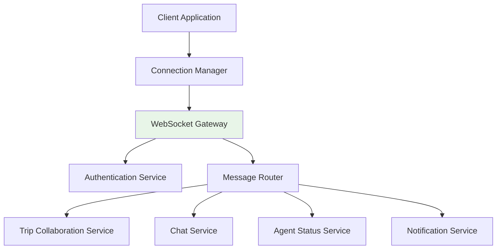

# WebSocket Connection Guide

This guide covers TripSage's WebSocket connection infrastructure, including architecture, establishment, authentication, lifecycle management, reconnection strategies, and message queue management.

## Table of Contents

1. [Connection Architecture](#connection-architecture)
2. [Connection Establishment](#connection-establishment)
3. [Authentication and Authorization](#authentication-and-authorization)
4. [Connection Lifecycle Management](#connection-lifecycle-management)
5. [Reconnection Strategies](#reconnection-strategies)
6. [Message Queue Management](#message-queue-management)

## Connection Architecture

### Overview

TripSage's WebSocket infrastructure supports multiple connection types with intelligent routing, load balancing, and failover capabilities.



### Connection Types

| Connection Type    | Purpose                       | URL Pattern                   | Max Connections |
| ------------------ | ----------------------------- | ----------------------------- | --------------- |
| Chat               | Real-time chat with AI agents | `/ws/chat/{session_id}`       | 1 per session   |
| Agent Status       | Agent workflow monitoring     | `/ws/agent-status/{user_id}`  | 1 per user      |
| Trip Collaboration | Multi-user trip editing       | `/ws/trips/{trip_id}/collab`  | 3 per trip      |
| Notifications      | System notifications          | `/ws/notifications/{user_id}` | 1 per user      |

## Connection Establishment

### Basic Connection Setup

```typescript
interface ConnectionConfig {
  url: string;
  token: string;
  reconnectAttempts: number;
  heartbeatInterval: number;
  protocols?: string[];
}

class WebSocketConnection {
  private socket: WebSocket | null = null;
  private reconnectTimer: number | null = null;
  private heartbeatTimer: number | null = null;

  constructor(private config: ConnectionConfig) {}

  async connect(): Promise<void> {
    return new Promise((resolve, reject) => {
      try {
        this.socket = new WebSocket(this.config.url, this.config.protocols);

        this.socket.onopen = () => {
          console.log("WebSocket connected");
          this.startHeartbeat();
          resolve();
        };

        this.socket.onmessage = (event) => {
          this.handleMessage(event.data);
        };

        this.socket.onclose = (event) => {
          console.log("WebSocket closed:", event.code, event.reason);
          this.handleReconnect();
        };

        this.socket.onerror = (error) => {
          console.error("WebSocket error:", error);
          reject(error);
        };
      } catch (error) {
        reject(error);
      }
    });
  }

  private startHeartbeat(): void {
    this.heartbeatTimer = window.setInterval(() => {
      if (this.socket?.readyState === WebSocket.OPEN) {
        this.socket.send(JSON.stringify({ type: "heartbeat" }));
      }
    }, this.config.heartbeatInterval);
  }

  private handleMessage(data: string): void {
    try {
      const message = JSON.parse(data);
      this.emit("message", message);
    } catch (error) {
      console.error("Failed to parse message:", error);
    }
  }

  private handleReconnect(): void {
    if (this.config.reconnectAttempts > 0) {
      this.config.reconnectAttempts--;
      this.reconnectTimer = window.setTimeout(() => {
        this.connect();
      }, 1000 * Math.pow(2, 5 - this.config.reconnectAttempts)); // Exponential backoff
    }
  }

  disconnect(): void {
    if (this.heartbeatTimer) {
      clearInterval(this.heartbeatTimer);
    }
    if (this.reconnectTimer) {
      clearTimeout(this.reconnectTimer);
    }
    if (this.socket) {
      this.socket.close();
    }
  }

  send(message: any): void {
    if (this.socket?.readyState === WebSocket.OPEN) {
      this.socket.send(JSON.stringify(message));
    }
  }

  // Event emitter pattern
  private listeners: { [event: string]: Function[] } = {};

  on(event: string, callback: Function): void {
    if (!this.listeners[event]) {
      this.listeners[event] = [];
    }
    this.listeners[event].push(callback);
  }

  private emit(event: string, data: any): void {
    if (this.listeners[event]) {
      this.listeners[event].forEach((callback) => callback(data));
    }
  }
}
```

### Connection Pool Management

```typescript
interface PoolConfig {
  maxConnections: number;
  maxConnectionsPerHost: number;
  connectionTimeout: number;
  idleTimeout: number;
}

class WebSocketConnectionPool {
  private connections: Map<string, WebSocketConnection[]> = new Map();
  private activeConnections: Set<WebSocketConnection> = new Set();

  constructor(private config: PoolConfig) {}

  async getConnection(
    url: string,
    token: string
  ): Promise<WebSocketConnection> {
    const key = `${url}:${token}`;
    let connectionList = this.connections.get(key);

    if (!connectionList) {
      connectionList = [];
      this.connections.set(key, connectionList);
    }

    // Find available connection
    let connection = connectionList.find(
      (conn) => !this.activeConnections.has(conn)
    );

    if (
      !connection &&
      connectionList.length < this.config.maxConnectionsPerHost
    ) {
      connection = new WebSocketConnection({
        url,
        token,
        reconnectAttempts: 3,
        heartbeatInterval: 30000,
      });
      connectionList.push(connection);
    }

    if (connection) {
      this.activeConnections.add(connection);
      return connection;
    }

    throw new Error("No available connections");
  }

  releaseConnection(connection: WebSocketConnection): void {
    this.activeConnections.delete(connection);
  }

  closeAll(): void {
    for (const connectionList of this.connections.values()) {
      connectionList.forEach((conn) => conn.disconnect());
    }
    this.connections.clear();
    this.activeConnections.clear();
  }
}
```

## Authentication and Authorization

### JWT-based Authentication

All WebSocket connections require JWT authentication sent immediately after connection establishment:

```json
{
  "token": "eyJhbGciOiJIUzI1NiIsInR5cCI6IkpXVCJ9...",
  "sessionId": "session-123",
  "channels": ["chat:session-123", "agent:user-456"]
}
```

**Authentication Response:**

```json
{
  "success": true,
  "userId": "user-123",
  "sessionId": "session-456",
  "availableChannels": ["chat:session-123", "agent:user-456"],
  "permissions": ["read", "write"]
}
```

### Channel-based Authorization

```typescript
interface ChannelPermissions {
  canSubscribe: boolean;
  canPublish: boolean;
  rateLimit?: number;
  allowedEvents: string[];
}

class ChannelAuthorizationManager {
  private channelPermissions: Map<string, ChannelPermissions> = new Map();

  constructor() {
    // Initialize with default permissions
    this.channelPermissions.set("chat:*", {
      canSubscribe: true,
      canPublish: true,
      rateLimit: 10,
      allowedEvents: ["user_message", "typing_start", "typing_stop"],
    });

    this.channelPermissions.set("agent:*", {
      canSubscribe: true,
      canPublish: false,
      allowedEvents: ["status_update", "task_start", "task_complete"],
    });
  }

  authorizeChannel(
    channel: string,
    userId: string,
    action: "subscribe" | "publish"
  ): boolean {
    const permissions = this.getChannelPermissions(channel);
    if (!permissions) return false;

    switch (action) {
      case "subscribe":
        return permissions.canSubscribe;
      case "publish":
        return permissions.canPublish;
      default:
        return false;
    }
  }

  authorizeEvent(channel: string, eventType: string): boolean {
    const permissions = this.getChannelPermissions(channel);
    return permissions?.allowedEvents.includes(eventType) ?? false;
  }

  private getChannelPermissions(
    channel: string
  ): ChannelPermissions | undefined {
    // Check exact match first
    if (this.channelPermissions.has(channel)) {
      return this.channelPermissions.get(channel);
    }

    // Check wildcard patterns
    for (const [pattern, permissions] of this.channelPermissions.entries()) {
      if (this.matchesPattern(channel, pattern)) {
        return permissions;
      }
    }

    return undefined;
  }

  private matchesPattern(channel: string, pattern: string): boolean {
    const regex = new RegExp("^" + pattern.replace(/\*/g, ".*") + "$");
    return regex.test(channel);
  }
}
```

## Connection Lifecycle Management

### Connection State Management

```typescript
type ConnectionState =
  | "disconnected"
  | "connecting"
  | "authenticating"
  | "connected"
  | "reconnecting"
  | "error";

interface ConnectionMetrics {
  connectedAt?: number;
  lastMessageAt?: number;
  messagesSent: number;
  messagesReceived: number;
  errors: number;
  reconnectAttempts: number;
}

class ConnectionLifecycleManager {
  private state: ConnectionState = "disconnected";
  private metrics: ConnectionMetrics = {
    messagesSent: 0,
    messagesReceived: 0,
    errors: 0,
    reconnectAttempts: 0,
  };

  constructor(private connection: WebSocketConnection) {
    this.setupEventHandlers();
  }

  private setupEventHandlers(): void {
    this.connection.on("connecting", () => {
      this.state = "connecting";
      this.emit("stateChange", this.state);
    });

    this.connection.on("open", () => {
      this.state = "authenticating";
      this.metrics.connectedAt = Date.now();
      this.emit("stateChange", this.state);
    });

    this.connection.on("authenticated", () => {
      this.state = "connected";
      this.emit("stateChange", this.state);
    });

    this.connection.on("message", (message) => {
      this.metrics.messagesReceived++;
      this.metrics.lastMessageAt = Date.now();
    });

    this.connection.on("error", (error) => {
      this.state = "error";
      this.metrics.errors++;
      this.emit("stateChange", this.state);
      this.handleError(error);
    });

    this.connection.on("close", () => {
      this.state = "disconnected";
      this.emit("stateChange", this.state);
    });
  }

  private handleError(error: any): void {
    if (this.shouldReconnect(error)) {
      this.state = "reconnecting";
      this.metrics.reconnectAttempts++;
      this.emit("stateChange", this.state);
      this.scheduleReconnect();
    }
  }

  private shouldReconnect(error: any): boolean {
    // Implement reconnection logic based on error type
    return error.code !== 1000; // 1000 is normal closure
  }

  private scheduleReconnect(): void {
    const delay = Math.min(
      1000 * Math.pow(2, this.metrics.reconnectAttempts),
      30000
    );
    setTimeout(() => {
      this.connection.connect();
    }, delay);
  }

  getState(): ConnectionState {
    return this.state;
  }

  getMetrics(): ConnectionMetrics {
    return { ...this.metrics };
  }

  // Event emitter pattern
  private listeners: { [event: string]: Function[] } = {};

  on(event: string, callback: Function): void {
    if (!this.listeners[event]) {
      this.listeners[event] = [];
    }
    this.listeners[event].push(callback);
  }

  private emit(event: string, data: any): void {
    if (this.listeners[event]) {
      this.listeners[event].forEach((callback) => callback(data));
    }
  }
}
```

## Reconnection Strategies

### Exponential Backoff with Jitter

```typescript
interface ReconnectionConfig {
  maxAttempts: number;
  baseDelay: number;
  maxDelay: number;
  jitter: boolean;
  resetAfter: number;
}

class ExponentialBackoffReconnection {
  private attemptCount = 0;
  private lastSuccessTime = 0;

  constructor(private config: ReconnectionConfig) {}

  shouldReconnect(): boolean {
    return this.attemptCount < this.config.maxAttempts;
  }

  getNextDelay(): number {
    if (Date.now() - this.lastSuccessTime > this.config.resetAfter) {
      this.attemptCount = 0;
    }

    const exponentialDelay =
      this.config.baseDelay * Math.pow(2, this.attemptCount);
    const delay = Math.min(exponentialDelay, this.config.maxDelay);

    this.attemptCount++;

    if (this.config.jitter) {
      // Add random jitter to prevent thundering herd
      return delay * (0.5 + Math.random() * 0.5);
    }

    return delay;
  }

  recordSuccess(): void {
    this.lastSuccessTime = Date.now();
    this.attemptCount = 0;
  }

  recordFailure(): void {
    // Attempt count already incremented in getNextDelay
  }
}
```

### Network-Aware Reconnection

```typescript
type NetworkStatus = "online" | "offline" | "slow" | "unstable";

class NetworkAwareReconnection {
  private networkStatus: NetworkStatus = "online";
  private lastConnectivityCheck = 0;
  private connectivityCheckInterval = 30000; // 30 seconds

  constructor(private backoff: ExponentialBackoffReconnection) {
    this.setupNetworkMonitoring();
  }

  private setupNetworkMonitoring(): void {
    window.addEventListener("online", () => {
      this.networkStatus = "online";
      this.checkConnectivity();
    });

    window.addEventListener("offline", () => {
      this.networkStatus = "offline";
    });

    // Periodic connectivity checks
    setInterval(() => {
      this.checkConnectivity();
    }, this.connectivityCheckInterval);
  }

  private async checkConnectivity(): Promise<void> {
    if (navigator.onLine === false) {
      this.networkStatus = "offline";
      return;
    }

    try {
      const startTime = Date.now();
      const response = await fetch("/api/health", {
        method: "HEAD",
        cache: "no-cache",
      });
      const latency = Date.now() - startTime;

      if (response.ok) {
        if (latency > 5000) {
          this.networkStatus = "slow";
        } else if (latency > 1000) {
          this.networkStatus = "unstable";
        } else {
          this.networkStatus = "online";
        }
      } else {
        this.networkStatus = "offline";
      }
    } catch (error) {
      this.networkStatus = "offline";
    }

    this.lastConnectivityCheck = Date.now();
  }

  shouldReconnect(): boolean {
    switch (this.networkStatus) {
      case "online":
        return this.backoff.shouldReconnect();
      case "slow":
      case "unstable":
        // More aggressive reconnection for poor connections
        return true;
      case "offline":
        // Don't attempt reconnection when offline
        return false;
      default:
        return false;
    }
  }

  getReconnectionDelay(): number {
    switch (this.networkStatus) {
      case "slow":
        return Math.max(this.backoff.getNextDelay(), 5000); // Minimum 5 seconds
      case "unstable":
        return Math.max(this.backoff.getNextDelay(), 2000); // Minimum 2 seconds
      default:
        return this.backoff.getNextDelay();
    }
  }

  getNetworkStatus(): NetworkStatus {
    return this.networkStatus;
  }
}
```

## Message Queue Management

### Priority Message Queue

```typescript
interface QueuedMessage {
  id: string;
  message: any;
  priority: MessagePriority;
  timestamp: number;
  retryCount: number;
  resolve: Function;
  reject: Function;
}

type MessagePriority = "critical" | "high" | "normal" | "low";

class PriorityMessageQueue {
  private queues: Map<MessagePriority, QueuedMessage[]> = new Map([
    ["critical", []],
    ["high", []],
    ["normal", []],
    ["low", []],
  ]);
  private processing = false;
  private maxRetries = 3;
  private retryDelay = 1000;

  enqueue(message: any, priority: MessagePriority = "normal"): Promise<void> {
    return new Promise((resolve, reject) => {
      const queuedMessage: QueuedMessage = {
        id: this.generateId(),
        message,
        priority,
        timestamp: Date.now(),
        retryCount: 0,
        resolve,
        reject,
      };

      this.queues.get(priority)!.push(queuedMessage);
      this.processQueue();
    });
  }

  private async processQueue(): Promise<void> {
    if (this.processing) return;
    this.processing = true;

    try {
      while (this.hasMessages()) {
        const message = this.dequeue();
        if (message) {
          await this.sendMessage(message);
        }
      }
    } finally {
      this.processing = false;
    }
  }

  private dequeue(): QueuedMessage | null {
    // Process in priority order
    const priorities: MessagePriority[] = ["critical", "high", "normal", "low"];

    for (const priority of priorities) {
      const queue = this.queues.get(priority)!;
      if (queue.length > 0) {
        return queue.shift()!;
      }
    }

    return null;
  }

  private async sendMessage(queuedMessage: QueuedMessage): Promise<void> {
    try {
      // Attempt to send the message
      await this.attemptSend(queuedMessage.message);
      queuedMessage.resolve();
    } catch (error) {
      queuedMessage.retryCount++;

      if (queuedMessage.retryCount < this.maxRetries) {
        // Re-queue with backoff
        setTimeout(() => {
          this.queues.get(queuedMessage.priority)!.unshift(queuedMessage);
          this.processQueue();
        }, this.retryDelay * queuedMessage.retryCount);
      } else {
        queuedMessage.reject(error);
      }
    }
  }

  private async attemptSend(message: any): Promise<void> {
    // Implementation depends on WebSocket connection
    if (this.connection?.readyState === WebSocket.OPEN) {
      this.connection.send(JSON.stringify(message));
    } else {
      throw new Error("Connection not available");
    }
  }

  private hasMessages(): boolean {
    return Array.from(this.queues.values()).some((queue) => queue.length > 0);
  }

  private generateId(): string {
    return Date.now().toString(36) + Math.random().toString(36).substr(2);
  }

  // Reference to WebSocket connection (to be set externally)
  private connection: WebSocket | null = null;

  setConnection(connection: WebSocket): void {
    this.connection = connection;
  }
}
```

### Message Deduplication

```typescript
interface SentMessage {
  id: string;
  timestamp: number;
  expiresAt: number;
}

class MessageDeduplicationManager {
  private sentMessages: Map<string, SentMessage> = new Map();
  private cleanupInterval: number;
  private messageTtl = 300000; // 5 minutes

  constructor() {
    this.cleanupInterval = window.setInterval(() => {
      this.cleanup();
    }, 60000); // Clean up every minute
  }

  isDuplicate(messageId: string): boolean {
    return this.sentMessages.has(messageId);
  }

  recordMessage(messageId: string): void {
    const sentMessage: SentMessage = {
      id: messageId,
      timestamp: Date.now(),
      expiresAt: Date.now() + this.messageTtl,
    };

    this.sentMessages.set(messageId, sentMessage);
  }

  private cleanup(): void {
    const now = Date.now();
    for (const [id, message] of this.sentMessages.entries()) {
      if (now > message.expiresAt) {
        this.sentMessages.delete(id);
      }
    }
  }

  destroy(): void {
    if (this.cleanupInterval) {
      clearInterval(this.cleanupInterval);
    }
    this.sentMessages.clear();
  }
}
```
