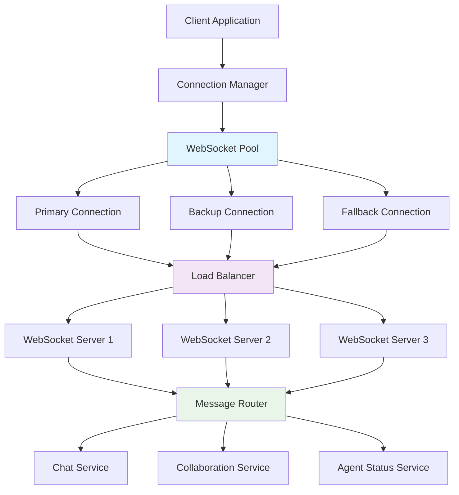

# WebSocket Connection Management Guide

This guide provides comprehensive patterns and best practices for managing WebSocket connections in TripSage, including connection establishment, lifecycle management, error handling, and performance optimization.

## Table of Contents

1. [Connection Architecture](#connection-architecture)
2. [Connection Establishment](#connection-establishment)
3. [Authentication and Authorization](#authentication-and-authorization)
4. [Connection Lifecycle Management](#connection-lifecycle-management)
5. [Reconnection Strategies](#reconnection-strategies)
6. [Message Queue Management](#message-queue-management)
7. [Performance Monitoring](#performance-monitoring)
8. [Client Libraries](#client-libraries)
9. [Testing Connection Management](#testing-connection-management)

## Connection Architecture

### Overview

TripSage's WebSocket infrastructure supports multiple connection types with intelligent routing, load balancing, and failover capabilities.



### Connection Types

| Connection Type | Purpose | URL Pattern | Max Connections |
|----------------|---------|-------------|-----------------|
| Chat | Real-time chat with AI agents | `/ws/chat/{session_id}` | 1 per session |
| Agent Status | Agent workflow monitoring | `/ws/agent-status/{user_id}` | 1 per user |
| Collaboration | Trip collaboration features | `/ws/trips/{trip_id}/collab` | 3 per trip |
| Notifications | System notifications | `/ws/notifications/{user_id}` | 1 per user |

## Connection Establishment

### 1. Basic Connection Setup

```typescript
interface ConnectionConfig {
  url: string;
  token: string;
  maxReconnectAttempts?: number;
  reconnectDelay?: number;
  heartbeatInterval?: number;
  messageTimeout?: number;
  enableCompression?: boolean;
  protocols?: string[];
}

class WebSocketConnection {
  private socket: WebSocket | null = null;
  private config: ConnectionConfig;
  private state: ConnectionState = 'disconnected';
  private reconnectAttempts = 0;
  private messageQueue: QueuedMessage[] = [];
  private heartbeatTimer: NodeJS.Timeout | null = null;
  private messageHandlers: Map<string, Function[]> = new Map();

  constructor(config: ConnectionConfig) {
    this.config = {
      maxReconnectAttempts: 5,
      reconnectDelay: 1000,
      heartbeatInterval: 30000,
      messageTimeout: 10000,
      enableCompression: true,
      ...config
    };
  }

  async connect(): Promise<void> {
    return new Promise((resolve, reject) => {
      try {
        this.state = 'connecting';
        this.emit('state-change', { state: this.state });

        // Create WebSocket with optional protocols
        this.socket = new WebSocket(this.config.url, this.config.protocols);

        // Enable compression if supported
        if (this.config.enableCompression && 'extensions' in this.socket) {
          // @ts-ignore - WebSocket extensions not in standard types
          this.socket.extensions = 'permessage-deflate';
        }

        // Set up event handlers
        this.socket.onopen = () => {
          this.state = 'connected';
          this.reconnectAttempts = 0;
          this.emit('state-change', { state: this.state });
          this.emit('connected');
          
          // Start authentication
          this.authenticate().then(() => {
            this.startHeartbeat();
            this.processMessageQueue();
            resolve();
          }).catch(reject);
        };

        this.socket.onmessage = (event) => {
          this.handleMessage(event);
        };

        this.socket.onclose = (event) => {
          this.handleClose(event);
        };

        this.socket.onerror = (error) => {
          this.handleError(error);
          reject(error);
        };

        // Connection timeout
        setTimeout(() => {
          if (this.state === 'connecting') {
            this.socket?.close();
            reject(new Error('Connection timeout'));
          }
        }, 10000);

      } catch (error) {
        this.state = 'disconnected';
        this.emit('state-change', { state: this.state });
        reject(error);
      }
    });
  }

  private async authenticate(): Promise<void> {
    return new Promise((resolve, reject) => {
      const authMessage = {
        type: 'auth',
        payload: {
          token: this.config.token,
          timestamp: new Date().toISOString(),
          clientVersion: '1.0.0'
        }
      };

      // Set up auth response handler
      const authTimeout = setTimeout(() => {
        this.off('auth-response', authHandler);
        reject(new Error('Authentication timeout'));
      }, 5000);

      const authHandler = (response: any) => {
        clearTimeout(authTimeout);
        if (response.success) {
          this.state = 'authenticated';
          this.emit('state-change', { state: this.state });
          this.emit('authenticated', response);
          resolve();
        } else {
          reject(new Error(response.error || 'Authentication failed'));
        }
      };

      this.once('auth-response', authHandler);
      this.send(authMessage);
    });
  }

  send(message: any): Promise<void> {
    return new Promise((resolve, reject) => {
      if (this.state !== 'authenticated') {
        // Queue message for later
        this.queueMessage(message, resolve, reject);
        return;
      }

      if (!this.socket || this.socket.readyState !== WebSocket.OPEN) {
        this.queueMessage(message, resolve, reject);
        return;
      }

      try {
        const messageStr = JSON.stringify({
          id: generateMessageId(),
          timestamp: new Date().toISOString(),
          ...message
        });

        this.socket.send(messageStr);
        resolve();
      } catch (error) {
        reject(error);
      }
    });
  }

  private queueMessage(message: any, resolve: Function, reject: Function) {
    this.messageQueue.push({
      message,
      resolve,
      reject,
      timestamp: Date.now()
    });

    // Limit queue size
    if (this.messageQueue.length > 100) {
      const dropped = this.messageQueue.shift();
      dropped?.reject(new Error('Message queue overflow'));
    }
  }

  disconnect(): void {
    this.state = 'disconnecting';
    this.emit('state-change', { state: this.state });

    this.stopHeartbeat();
    
    if (this.socket) {
      this.socket.close(1000, 'Client disconnect');
      this.socket = null;
    }

    this.state = 'disconnected';
    this.emit('state-change', { state: this.state });
    this.emit('disconnected');
  }
}
```

### 2. Connection Pool Management

```typescript
interface PoolConfig {
  maxConnections: number;
  loadBalanceStrategy: 'round-robin' | 'least-connections' | 'random';
  healthCheckInterval: number;
  connectionTimeout: number;
}

class WebSocketConnectionPool {
  private connections: WebSocketConnection[] = [];
  private activeIndex = 0;
  private config: PoolConfig;
  private healthCheckTimer: NodeJS.Timeout | null = null;

  constructor(config: PoolConfig) {
    this.config = config;
    this.startHealthChecks();
  }

  async addConnection(connectionConfig: ConnectionConfig): Promise<WebSocketConnection> {
    if (this.connections.length >= this.config.maxConnections) {
      throw new Error('Connection pool is full');
    }

    const connection = new WebSocketConnection(connectionConfig);
    
    // Set up connection event handlers
    connection.on('connected', () => {
      this.emit('connection-added', { connection });
    });

    connection.on('disconnected', () => {
      this.handleConnectionLoss(connection);
    });

    connection.on('error', (error) => {
      this.handleConnectionError(connection, error);
    });

    await connection.connect();
    this.connections.push(connection);

    return connection;
  }

  getConnection(): WebSocketConnection | null {
    const healthyConnections = this.connections.filter(conn => 
      conn.getState() === 'authenticated'
    );

    if (healthyConnections.length === 0) {
      return null;
    }

    switch (this.config.loadBalanceStrategy) {
      case 'round-robin':
        const connection = healthyConnections[this.activeIndex % healthyConnections.length];
        this.activeIndex++;
        return connection;

      case 'least-connections':
        return healthyConnections.reduce((prev, current) => 
          current.getActiveRequests() < prev.getActiveRequests() ? current : prev
        );

      case 'random':
        const randomIndex = Math.floor(Math.random() * healthyConnections.length);
        return healthyConnections[randomIndex];

      default:
        return healthyConnections[0];
    }
  }

  async broadcast(message: any): Promise<void> {
    const promises = this.connections
      .filter(conn => conn.getState() === 'authenticated')
      .map(conn => conn.send(message));

    await Promise.allSettled(promises);
  }

  private startHealthChecks() {
    this.healthCheckTimer = setInterval(() => {
      this.performHealthChecks();
    }, this.config.healthCheckInterval);
  }

  private async performHealthChecks() {
    const healthPromises = this.connections.map(async (connection) => {
      try {
        const startTime = Date.now();
        await connection.send({ type: 'ping' });
        
        return new Promise<number>((resolve) => {
          const timeout = setTimeout(() => resolve(-1), 5000);
          
          connection.once('pong', () => {
            clearTimeout(timeout);
            resolve(Date.now() - startTime);
          });
        });
      } catch (error) {
        return -1; // Health check failed
      }
    });

    const results = await Promise.all(healthPromises);
    
    results.forEach((latency, index) => {
      const connection = this.connections[index];
      if (latency === -1) {
        this.handleUnhealthyConnection(connection);
      } else {
        connection.updateLatency(latency);
      }
    });
  }

  private handleUnhealthyConnection(connection: WebSocketConnection) {
    // Remove unhealthy connection
    const index = this.connections.indexOf(connection);
    if (index > -1) {
      this.connections.splice(index, 1);
      connection.disconnect();
      this.emit('connection-removed', { connection, reason: 'unhealthy' });
    }
  }

  getPoolStats(): PoolStats {
    return {
      totalConnections: this.connections.length,
      healthyConnections: this.connections.filter(c => c.getState() === 'authenticated').length,
      averageLatency: this.calculateAverageLatency(),
      totalMessages: this.connections.reduce((sum, c) => sum + c.getMessageCount(), 0)
    };
  }
}
```

## Authentication and Authorization

### 1. JWT-based Authentication

```typescript
interface AuthenticationManager {
  authenticate(connection: WebSocketConnection, token: string): Promise<AuthResult>;
  refreshToken(connection: WebSocketConnection): Promise<string>;
  validatePermissions(userId: string, action: string, resource: string): boolean;
}

class SupabaseAuthManager implements AuthenticationManager {
  constructor(private supabase: SupabaseClient) {}

  async authenticate(connection: WebSocketConnection, token: string): Promise<AuthResult> {
    try {
      // Verify JWT token with Supabase
      const { data: { user }, error } = await this.supabase.auth.getUser(token);
      
      if (error || !user) {
        throw new AuthenticationError('INVALID_TOKEN', error?.message);
      }

      // Check if token is about to expire
      const payload = this.parseJWTPayload(token);
      const expiresAt = payload.exp * 1000;
      const now = Date.now();
      const timeUntilExpiry = expiresAt - now;

      if (timeUntilExpiry < 0) {
        throw new AuthenticationError('TOKEN_EXPIRED');
      }

      // Set up token refresh if needed
      if (timeUntilExpiry < 300000) { // Less than 5 minutes
        this.scheduleTokenRefresh(connection, timeUntilExpiry - 60000);
      }

      // Get user permissions
      const permissions = await this.getUserPermissions(user.id);

      return {
        success: true,
        user: {
          id: user.id,
          email: user.email,
          metadata: user.user_metadata
        },
        permissions,
        expiresAt
      };

    } catch (error) {
      return {
        success: false,
        error: error instanceof AuthenticationError ? error.code : 'AUTH_FAILED',
        message: error.message
      };
    }
  }

  async refreshToken(connection: WebSocketConnection): Promise<string> {
    try {
      const { data, error } = await this.supabase.auth.refreshSession();
      
      if (error || !data.session) {
        throw new AuthenticationError('REFRESH_FAILED', error?.message);
      }

      // Update connection with new token
      connection.updateAuthToken(data.session.access_token);

      return data.session.access_token;
    } catch (error) {
      // Force re-authentication
      connection.disconnect();
      throw error;
    }
  }

  private scheduleTokenRefresh(connection: WebSocketConnection, delay: number) {
    setTimeout(async () => {
      try {
        await this.refreshToken(connection);
      } catch (error) {
        console.error('Token refresh failed:', error);
        connection.emit('auth-error', error);
      }
    }, delay);
  }

  validatePermissions(userId: string, action: string, resource: string): boolean {
    // Implementation depends on your permission system
    // This is a simplified example
    const userPermissions = this.getUserPermissions(userId);
    return userPermissions.some(permission => 
      permission.action === action && permission.resource === resource
    );
  }
}
```

### 2. Channel-based Authorization

```typescript
interface ChannelPermissions {
  canSubscribe: boolean;
  canPublish: boolean;
  canPresence: boolean;
  maxConnections?: number;
  rateLimit?: number;
}

class ChannelAuthorizationManager {
  private channelPermissions: Map<string, ChannelPermissions> = new Map();

  async authorizeChannelAccess(
    userId: string, 
    channelName: string, 
    action: 'subscribe' | 'publish' | 'presence'
  ): Promise<boolean> {
    // Parse channel name to determine resource
    const channelInfo = this.parseChannelName(channelName);
    
    switch (channelInfo.type) {
      case 'trip':
        return this.authorizeTripChannel(userId, channelInfo.resourceId, action);
      
      case 'chat':
        return this.authorizeChatChannel(userId, channelInfo.resourceId, action);
      
      case 'user':
        return this.authorizeUserChannel(userId, channelInfo.resourceId, action);
      
      default:
        return false;
    }
  }

  private async authorizeTripChannel(
    userId: string, 
    tripId: string, 
    action: string
  ): Promise<boolean> {
    // Check if user has access to the trip
    const trip = await this.getTripAccess(userId, tripId);
    
    if (!trip) return false;

    // Check specific permissions based on user role
    switch (action) {
      case 'subscribe':
        return trip.permissions.canView;
      
      case 'publish':
        return trip.permissions.canEdit;
      
      case 'presence':
        return trip.permissions.canView;
      
      default:
        return false;
    }
  }

  private parseChannelName(channelName: string): ChannelInfo {
    // Channel naming convention: type:resource_id:sub_channel
    // Examples:
    // - trip:123:collaboration
    // - chat:session-456
    // - user:789:notifications
    
    const parts = channelName.split(':');
    return {
      type: parts[0],
      resourceId: parts[1],
      subChannel: parts[2]
    };
  }

  setChannelPermissions(channelName: string, permissions: ChannelPermissions) {
    this.channelPermissions.set(channelName, permissions);
  }

  getChannelPermissions(channelName: string): ChannelPermissions | null {
    return this.channelPermissions.get(channelName) || null;
  }
}
```

## Connection Lifecycle Management

### 1. Connection State Management

```typescript
type ConnectionState = 
  | 'disconnected' 
  | 'connecting' 
  | 'connected' 
  | 'authenticating' 
  | 'authenticated' 
  | 'reconnecting' 
  | 'disconnecting' 
  | 'error';

interface ConnectionMetrics {
  connectedAt?: number;
  lastMessageAt?: number;
  messagesSent: number;
  messagesReceived: number;
  reconnectCount: number;
  latency: number;
  errors: number;
}

class ConnectionLifecycleManager {
  private state: ConnectionState = 'disconnected';
  private metrics: ConnectionMetrics = {
    messagesSent: 0,
    messagesReceived: 0,
    reconnectCount: 0,
    latency: 0,
    errors: 0
  };
  private stateHistory: Array<{ state: ConnectionState; timestamp: number }> = [];

  setState(newState: ConnectionState): void {
    const previousState = this.state;
    this.state = newState;
    
    // Record state change
    this.stateHistory.push({
      state: newState,
      timestamp: Date.now()
    });

    // Limit history size
    if (this.stateHistory.length > 100) {
      this.stateHistory.shift();
    }

    // Update metrics based on state change
    this.updateMetricsOnStateChange(previousState, newState);

    // Emit state change event
    this.emit('state-change', {
      previousState,
      currentState: newState,
      timestamp: Date.now()
    });

    // Handle state-specific logic
    this.handleStateChange(newState, previousState);
  }

  private updateMetricsOnStateChange(previous: ConnectionState, current: ConnectionState) {
    switch (current) {
      case 'connected':
        if (previous === 'connecting') {
          this.metrics.connectedAt = Date.now();
        }
        break;

      case 'reconnecting':
        if (previous === 'connected' || previous === 'authenticated') {
          this.metrics.reconnectCount++;
        }
        break;

      case 'error':
        this.metrics.errors++;
        break;
    }
  }

  private handleStateChange(current: ConnectionState, previous: ConnectionState) {
    switch (current) {
      case 'connected':
        this.startConnectionHealthCheck();
        break;

      case 'disconnected':
        this.stopConnectionHealthCheck();
        this.clearMetrics();
        break;

      case 'error':
        this.handleErrorState();
        break;

      case 'authenticated':
        this.onAuthenticationSuccess();
        break;
    }
  }

  getConnectionInfo(): ConnectionInfo {
    const uptime = this.metrics.connectedAt ? Date.now() - this.metrics.connectedAt : 0;
    
    return {
      state: this.state,
      uptime,
      metrics: { ...this.metrics },
      health: this.calculateConnectionHealth(),
      stateHistory: [...this.stateHistory]
    };
  }

  private calculateConnectionHealth(): number {
    // Calculate connection health score (0-1)
    let score = 1.0;

    // Penalize for errors
    if (this.metrics.errors > 0) {
      score -= Math.min(this.metrics.errors * 0.1, 0.3);
    }

    // Penalize for reconnections
    if (this.metrics.reconnectCount > 0) {
      score -= Math.min(this.metrics.reconnectCount * 0.05, 0.2);
    }

    // Penalize for high latency
    if (this.metrics.latency > 1000) {
      score -= Math.min((this.metrics.latency - 1000) / 10000, 0.3);
    }

    // Ensure score is between 0 and 1
    return Math.max(0, Math.min(1, score));
  }

  isHealthy(): boolean {
    return this.calculateConnectionHealth() > 0.7;
  }

  updateLatency(latency: number): void {
    // Use exponential moving average for latency
    this.metrics.latency = this.metrics.latency * 0.8 + latency * 0.2;
    
    this.emit('latency-update', { latency: this.metrics.latency });
  }

  recordMessageSent(): void {
    this.metrics.messagesSent++;
    this.metrics.lastMessageAt = Date.now();
  }

  recordMessageReceived(): void {
    this.metrics.messagesReceived++;
    this.metrics.lastMessageAt = Date.now();
  }
}
```

### 2. Automatic Cleanup and Resource Management

```typescript
class ConnectionResourceManager {
  private cleanupTasks: Map<string, CleanupTask> = new Map();
  private resourceTimers: Map<string, NodeJS.Timeout> = new Map();

  registerCleanupTask(taskId: string, task: CleanupTask): void {
    this.cleanupTasks.set(taskId, task);
    
    // Set up automatic cleanup timer if specified
    if (task.timeout) {
      const timer = setTimeout(() => {
        this.executeCleanupTask(taskId);
      }, task.timeout);
      
      this.resourceTimers.set(taskId, timer);
    }
  }

  async executeCleanupTask(taskId: string): Promise<void> {
    const task = this.cleanupTasks.get(taskId);
    if (!task) return;

    try {
      await task.cleanup();
      this.cleanupTasks.delete(taskId);
      
      const timer = this.resourceTimers.get(taskId);
      if (timer) {
        clearTimeout(timer);
        this.resourceTimers.delete(taskId);
      }
    } catch (error) {
      console.error(`Cleanup task ${taskId} failed:`, error);
    }
  }

  async cleanupAll(): Promise<void> {
    const cleanupPromises = Array.from(this.cleanupTasks.keys())
      .map(taskId => this.executeCleanupTask(taskId));

    await Promise.allSettled(cleanupPromises);
  }

  // Automatic resource monitoring
  startResourceMonitoring(connection: WebSocketConnection): void {
    const monitoringInterval = setInterval(() => {
      this.checkResourceUsage(connection);
    }, 30000); // Check every 30 seconds

    this.registerCleanupTask('resource-monitoring', {
      cleanup: async () => {
        clearInterval(monitoringInterval);
      }
    });
  }

  private checkResourceUsage(connection: WebSocketConnection): void {
    const info = connection.getConnectionInfo();

    // Check for memory leaks in message queue
    if (info.queuedMessages > 1000) {
      console.warn('Large message queue detected, clearing old messages');
      connection.clearOldQueuedMessages();
    }

    // Check for stale subscriptions
    if (info.subscriptions > 100) {
      console.warn('Too many subscriptions, cleaning up inactive ones');
      connection.cleanupInactiveSubscriptions();
    }

    // Check connection health
    if (info.health < 0.5) {
      console.warn('Poor connection health, considering reconnection');
      this.emit('poor-connection-health', { connection, health: info.health });
    }
  }
}
```

## Reconnection Strategies

### 1. Exponential Backoff with Jitter

```typescript
interface ReconnectionConfig {
  maxAttempts: number;
  baseDelay: number;
  maxDelay: number;
  backoffMultiplier: number;
  jitterRatio: number;
  resetAfter: number; // Reset attempt count after successful connection for this duration
}

class ExponentialBackoffReconnection {
  private attemptCount = 0;
  private lastSuccessfulConnection = 0;
  private reconnectionTimer: NodeJS.Timeout | null = null;

  constructor(private config: ReconnectionConfig) {}

  async attemptReconnection(connection: WebSocketConnection): Promise<void> {
    if (this.attemptCount >= this.config.maxAttempts) {
      throw new ReconnectionError('MAX_ATTEMPTS_EXCEEDED');
    }

    // Reset attempt count if enough time has passed since last successful connection
    if (Date.now() - this.lastSuccessfulConnection > this.config.resetAfter) {
      this.attemptCount = 0;
    }

    this.attemptCount++;
    const delay = this.calculateDelay();

    console.log(`Reconnection attempt ${this.attemptCount}/${this.config.maxAttempts} in ${delay}ms`);

    return new Promise((resolve, reject) => {
      this.reconnectionTimer = setTimeout(async () => {
        try {
          await connection.connect();
          this.lastSuccessfulConnection = Date.now();
          this.attemptCount = 0; // Reset on success
          resolve();
        } catch (error) {
          reject(error);
        }
      }, delay);
    });
  }

  private calculateDelay(): number {
    // Calculate exponential backoff: baseDelay * (backoffMultiplier ^ attemptCount)
    const exponentialDelay = this.config.baseDelay * 
      Math.pow(this.config.backoffMultiplier, this.attemptCount - 1);

    // Cap at maximum delay
    const cappedDelay = Math.min(exponentialDelay, this.config.maxDelay);

    // Add jitter to prevent thundering herd
    const jitter = cappedDelay * this.config.jitterRatio * Math.random();
    
    return Math.floor(cappedDelay + jitter);
  }

  cancelReconnection(): void {
    if (this.reconnectionTimer) {
      clearTimeout(this.reconnectionTimer);
      this.reconnectionTimer = null;
    }
  }

  reset(): void {
    this.attemptCount = 0;
    this.cancelReconnection();
  }

  getReconnectionInfo(): ReconnectionInfo {
    return {
      attemptCount: this.attemptCount,
      maxAttempts: this.config.maxAttempts,
      nextDelay: this.attemptCount < this.config.maxAttempts ? this.calculateDelay() : null,
      isReconnecting: this.reconnectionTimer !== null
    };
  }
}
```

### 2. Smart Reconnection with Network Awareness

```typescript
class NetworkAwareReconnection {
  private networkStatus: NetworkStatus = 'online';
  private lastNetworkChange = Date.now();
  private reconnectionStrategy: ReconnectionStrategy;

  constructor() {
    this.setupNetworkMonitoring();
    this.reconnectionStrategy = new ExponentialBackoffReconnection({
      maxAttempts: 10,
      baseDelay: 1000,
      maxDelay: 30000,
      backoffMultiplier: 1.5,
      jitterRatio: 0.1,
      resetAfter: 300000 // 5 minutes
    });
  }

  private setupNetworkMonitoring(): void {
    // Browser API for network status
    if ('onLine' in navigator) {
      window.addEventListener('online', () => {
        this.handleNetworkChange('online');
      });

      window.addEventListener('offline', () => {
        this.handleNetworkChange('offline');
      });

      this.networkStatus = navigator.onLine ? 'online' : 'offline';
    }

    // Network Information API (if available)
    if ('connection' in navigator) {
      const connection = (navigator as any).connection;
      
      connection.addEventListener('change', () => {
        this.handleConnectionChange(connection);
      });
    }
  }

  private handleNetworkChange(status: NetworkStatus): void {
    const previousStatus = this.networkStatus;
    this.networkStatus = status;
    this.lastNetworkChange = Date.now();

    this.emit('network-change', { 
      previous: previousStatus, 
      current: status, 
      timestamp: this.lastNetworkChange 
    });

    // Adjust reconnection strategy based on network status
    if (status === 'online' && previousStatus === 'offline') {
      // Network came back online, attempt immediate reconnection
      this.attemptImmediateReconnection();
    } else if (status === 'offline') {
      // Network went offline, pause reconnection attempts
      this.pauseReconnection();
    }
  }

  private handleConnectionChange(connection: any): void {
    const connectionInfo = {
      effectiveType: connection.effectiveType, // '4g', '3g', '2g', 'slow-2g'
      downlink: connection.downlink, // Mbps
      rtt: connection.rtt, // ms
      saveData: connection.saveData
    };

    this.emit('connection-change', connectionInfo);

    // Adjust reconnection behavior based on connection quality
    this.adjustReconnectionForConnectionQuality(connectionInfo);
  }

  private adjustReconnectionForConnectionQuality(info: any): void {
    // Slower connections should have longer delays and fewer attempts
    switch (info.effectiveType) {
      case 'slow-2g':
      case '2g':
        this.reconnectionStrategy.updateConfig({
          baseDelay: 5000,
          maxDelay: 60000,
          maxAttempts: 3
        });
        break;

      case '3g':
        this.reconnectionStrategy.updateConfig({
          baseDelay: 2000,
          maxDelay: 30000,
          maxAttempts: 5
        });
        break;

      case '4g':
      default:
        this.reconnectionStrategy.updateConfig({
          baseDelay: 1000,
          maxDelay: 15000,
          maxAttempts: 10
        });
        break;
    }
  }

  async attemptReconnection(connection: WebSocketConnection): Promise<void> {
    // Don't attempt reconnection if offline
    if (this.networkStatus === 'offline') {
      throw new ReconnectionError('NETWORK_OFFLINE');
    }

    // Wait for network to stabilize after a change
    const timeSinceNetworkChange = Date.now() - this.lastNetworkChange;
    if (timeSinceNetworkChange < 2000) {
      await new Promise(resolve => setTimeout(resolve, 2000 - timeSinceNetworkChange));
    }

    return this.reconnectionStrategy.attemptReconnection(connection);
  }

  private async attemptImmediateReconnection(): Promise<void> {
    // Reset reconnection attempts since network is back
    this.reconnectionStrategy.reset();
    
    // Attempt immediate reconnection
    this.emit('immediate-reconnection-requested');
  }

  private pauseReconnection(): void {
    this.reconnectionStrategy.cancelReconnection();
    this.emit('reconnection-paused', { reason: 'network-offline' });
  }
}
```

## Message Queue Management

### 1. Priority Message Queue

```typescript
interface QueuedMessage {
  id: string;
  message: any;
  priority: MessagePriority;
  timestamp: number;
  retries: number;
  maxRetries: number;
  expiresAt?: number;
  resolve: Function;
  reject: Function;
}

type MessagePriority = 'critical' | 'high' | 'normal' | 'low';

class PriorityMessageQueue {
  private queues: Map<MessagePriority, QueuedMessage[]> = new Map([
    ['critical', []],
    ['high', []],
    ['normal', []],
    ['low', []]
  ]);
  private processing = false;
  private maxQueueSize = 1000;
  private processingInterval: NodeJS.Timeout | null = null;

  constructor(private connection: WebSocketConnection) {
    this.startProcessing();
  }

  enqueue(
    message: any, 
    priority: MessagePriority = 'normal',
    options: QueueOptions = {}
  ): Promise<void> {
    return new Promise((resolve, reject) => {
      const queuedMessage: QueuedMessage = {
        id: generateMessageId(),
        message,
        priority,
        timestamp: Date.now(),
        retries: 0,
        maxRetries: options.maxRetries || 3,
        expiresAt: options.expiresIn ? Date.now() + options.expiresIn : undefined,
        resolve,
        reject
      };

      const queue = this.queues.get(priority)!;
      
      // Check queue size limits
      if (queue.length >= this.maxQueueSize / 4) {
        // Queue is getting full, reject low priority messages
        if (priority === 'low') {
          reject(new Error('Queue full, low priority message rejected'));
          return;
        }
        
        // Remove oldest low priority messages to make room
        this.evictLowPriorityMessages();
      }

      queue.push(queuedMessage);
      this.emit('message-queued', { messageId: queuedMessage.id, priority });
    });
  }

  private startProcessing(): void {
    this.processingInterval = setInterval(() => {
      this.processQueue();
    }, 100); // Process every 100ms
  }

  private async processQueue(): Promise<void> {
    if (this.processing || this.connection.getState() !== 'authenticated') {
      return;
    }

    this.processing = true;

    try {
      // Process messages in priority order
      const priorities: MessagePriority[] = ['critical', 'high', 'normal', 'low'];
      
      for (const priority of priorities) {
        const queue = this.queues.get(priority)!;
        
        while (queue.length > 0) {
          const queuedMessage = queue.shift()!;
          
          // Check if message has expired
          if (queuedMessage.expiresAt && Date.now() > queuedMessage.expiresAt) {
            queuedMessage.reject(new Error('Message expired'));
            continue;
          }

          try {
            await this.connection.send(queuedMessage.message);
            queuedMessage.resolve();
            this.emit('message-sent', { messageId: queuedMessage.id, priority });
          } catch (error) {
            await this.handleMessageError(queuedMessage, error);
          }

          // Yield control to allow other operations
          await new Promise(resolve => setImmediate(resolve));
          
          // Don't process too many messages at once
          if (Date.now() - this.processing > 50) break;
        }
      }
    } finally {
      this.processing = false;
    }
  }

  private async handleMessageError(queuedMessage: QueuedMessage, error: any): Promise<void> {
    queuedMessage.retries++;

    if (queuedMessage.retries <= queuedMessage.maxRetries) {
      // Retry with exponential backoff
      const delay = Math.min(1000 * Math.pow(2, queuedMessage.retries - 1), 10000);
      
      setTimeout(() => {
        const queue = this.queues.get(queuedMessage.priority)!;
        queue.unshift(queuedMessage); // Add back to front of queue
      }, delay);
      
      this.emit('message-retry', { 
        messageId: queuedMessage.id, 
        retries: queuedMessage.retries,
        delay 
      });
    } else {
      queuedMessage.reject(error);
      this.emit('message-failed', { 
        messageId: queuedMessage.id, 
        error: error.message 
      });
    }
  }

  private evictLowPriorityMessages(): void {
    const lowQueue = this.queues.get('low')!;
    const evicted = lowQueue.splice(0, Math.ceil(lowQueue.length / 2));
    
    evicted.forEach(message => {
      message.reject(new Error('Message evicted due to queue pressure'));
    });

    this.emit('messages-evicted', { count: evicted.length });
  }

  getQueueStats(): QueueStats {
    const stats: QueueStats = {
      total: 0,
      byPriority: {}
    };

    for (const [priority, queue] of this.queues) {
      stats.byPriority[priority] = queue.length;
      stats.total += queue.length;
    }

    return stats;
  }

  clear(): void {
    for (const queue of this.queues.values()) {
      queue.forEach(message => {
        message.reject(new Error('Queue cleared'));
      });
      queue.length = 0;
    }
  }

  stop(): void {
    if (this.processingInterval) {
      clearInterval(this.processingInterval);
      this.processingInterval = null;
    }
    this.clear();
  }
}
```

### 2. Message Deduplication

```typescript
class MessageDeduplicationManager {
  private sentMessages: Map<string, SentMessage> = new Map();
  private maxCacheSize = 10000;
  private cleanupInterval: NodeJS.Timeout;

  constructor() {
    // Clean up old messages every minute
    this.cleanupInterval = setInterval(() => {
      this.cleanupOldMessages();
    }, 60000);
  }

  isDuplicate(message: any): boolean {
    const messageHash = this.generateMessageHash(message);
    
    const existing = this.sentMessages.get(messageHash);
    if (!existing) {
      return false;
    }

    // Consider duplicate if sent within last 5 seconds
    const timeDiff = Date.now() - existing.timestamp;
    return timeDiff < 5000;
  }

  recordMessage(message: any): void {
    const messageHash = this.generateMessageHash(message);
    
    this.sentMessages.set(messageHash, {
      hash: messageHash,
      timestamp: Date.now(),
      messageType: message.type
    });

    // Limit cache size
    if (this.sentMessages.size > this.maxCacheSize) {
      this.cleanupOldMessages();
    }
  }

  private generateMessageHash(message: any): string {
    // Create hash based on message content (excluding timestamp and id)
    const content = {
      type: message.type,
      payload: message.payload
    };
    
    return btoa(JSON.stringify(content));
  }

  private cleanupOldMessages(): void {
    const cutoffTime = Date.now() - 300000; // 5 minutes ago
    
    for (const [hash, sentMessage] of this.sentMessages) {
      if (sentMessage.timestamp < cutoffTime) {
        this.sentMessages.delete(hash);
      }
    }
  }

  getStats(): DeduplicationStats {
    return {
      cacheSize: this.sentMessages.size,
      oldestMessage: Math.min(...Array.from(this.sentMessages.values()).map(m => m.timestamp)),
      newestMessage: Math.max(...Array.from(this.sentMessages.values()).map(m => m.timestamp))
    };
  }

  destroy(): void {
    clearInterval(this.cleanupInterval);
    this.sentMessages.clear();
  }
}
```

## Performance Monitoring

### 1. Connection Performance Metrics

```typescript
interface PerformanceMetrics {
  connection: ConnectionMetrics;
  messages: MessageMetrics;
  network: NetworkMetrics;
  errors: ErrorMetrics;
}

interface ConnectionMetrics {
  uptime: number;
  reconnectionCount: number;
  currentLatency: number;
  averageLatency: number;
  maxLatency: number;
  healthScore: number;
}

interface MessageMetrics {
  totalSent: number;
  totalReceived: number;
  messagesPerSecond: number;
  averageMessageSize: number;
  queuedMessages: number;
  droppedMessages: number;
}

class PerformanceMonitor {
  private metrics: PerformanceMetrics;
  private metricsHistory: PerformanceSnapshot[] = [];
  private monitoringInterval: NodeJS.Timeout;

  constructor(private connection: WebSocketConnection) {
    this.metrics = this.initializeMetrics();
    this.startMonitoring();
  }

  private startMonitoring(): void {
    this.monitoringInterval = setInterval(() => {
      this.collectMetrics();
      this.analyzePerformance();
    }, 10000); // Collect metrics every 10 seconds
  }

  private collectMetrics(): void {
    const connectionInfo = this.connection.getConnectionInfo();
    const queueStats = this.connection.getQueueStats();

    // Update connection metrics
    this.metrics.connection = {
      uptime: connectionInfo.uptime,
      reconnectionCount: connectionInfo.metrics.reconnectCount,
      currentLatency: connectionInfo.metrics.latency,
      averageLatency: this.calculateAverageLatency(),
      maxLatency: this.getMaxLatency(),
      healthScore: connectionInfo.health
    };

    // Update message metrics
    this.metrics.messages = {
      totalSent: connectionInfo.metrics.messagesSent,
      totalReceived: connectionInfo.metrics.messagesReceived,
      messagesPerSecond: this.calculateMessagesPerSecond(),
      averageMessageSize: this.calculateAverageMessageSize(),
      queuedMessages: queueStats.total,
      droppedMessages: this.getDroppedMessageCount()
    };

    // Store snapshot for history
    this.storeMetricsSnapshot();

    // Emit metrics update
    this.emit('metrics-update', { metrics: this.metrics });
  }

  private analyzePerformance(): void {
    const issues = this.detectPerformanceIssues();
    
    if (issues.length > 0) {
      this.emit('performance-issues', { issues });
      this.generatePerformanceRecommendations(issues);
    }
  }

  private detectPerformanceIssues(): PerformanceIssue[] {
    const issues: PerformanceIssue[] = [];

    // High latency
    if (this.metrics.connection.currentLatency > 2000) {
      issues.push({
        type: 'high-latency',
        severity: 'warning',
        value: this.metrics.connection.currentLatency,
        threshold: 2000,
        description: 'Connection latency is high'
      });
    }

    // Low health score
    if (this.metrics.connection.healthScore < 0.7) {
      issues.push({
        type: 'poor-health',
        severity: 'critical',
        value: this.metrics.connection.healthScore,
        threshold: 0.7,
        description: 'Connection health is poor'
      });
    }

    // Large message queue
    if (this.metrics.messages.queuedMessages > 100) {
      issues.push({
        type: 'large-queue',
        severity: 'warning',
        value: this.metrics.messages.queuedMessages,
        threshold: 100,
        description: 'Message queue is getting large'
      });
    }

    // High message drop rate
    const dropRate = this.metrics.messages.droppedMessages / this.metrics.messages.totalSent;
    if (dropRate > 0.05) {
      issues.push({
        type: 'high-drop-rate',
        severity: 'critical',
        value: dropRate,
        threshold: 0.05,
        description: 'High message drop rate detected'
      });
    }

    return issues;
  }

  private generatePerformanceRecommendations(issues: PerformanceIssue[]): void {
    const recommendations: PerformanceRecommendation[] = [];

    for (const issue of issues) {
      switch (issue.type) {
        case 'high-latency':
          recommendations.push({
            issue: issue.type,
            action: 'Consider switching to a closer server or checking network connection',
            priority: 'medium',
            automated: false
          });
          break;

        case 'poor-health':
          recommendations.push({
            issue: issue.type,
            action: 'Restart connection or check server status',
            priority: 'high',
            automated: true
          });
          break;

        case 'large-queue':
          recommendations.push({
            issue: issue.type,
            action: 'Reduce message frequency or increase processing capacity',
            priority: 'medium',
            automated: true
          });
          break;

        case 'high-drop-rate':
          recommendations.push({
            issue: issue.type,
            action: 'Check network stability and consider reconnection',
            priority: 'high',
            automated: true
          });
          break;
      }
    }

    this.emit('performance-recommendations', { recommendations });
    this.executeAutomatedRecommendations(recommendations);
  }

  private executeAutomatedRecommendations(recommendations: PerformanceRecommendation[]): void {
    for (const rec of recommendations) {
      if (!rec.automated) continue;

      switch (rec.issue) {
        case 'poor-health':
          this.connection.requestReconnection();
          break;

        case 'large-queue':
          this.connection.optimizeQueueProcessing();
          break;

        case 'high-drop-rate':
          this.connection.enableQualityOfService();
          break;
      }
    }
  }

  getPerformanceReport(): PerformanceReport {
    return {
      current: this.metrics,
      history: this.metricsHistory.slice(-100), // Last 100 snapshots
      recommendations: this.getActiveRecommendations(),
      healthTrend: this.calculateHealthTrend()
    };
  }

  private calculateHealthTrend(): 'improving' | 'stable' | 'degrading' {
    if (this.metricsHistory.length < 5) return 'stable';

    const recent = this.metricsHistory.slice(-5);
    const trend = recent.reduce((sum, snapshot, index) => {
      if (index === 0) return 0;
      return sum + (snapshot.connection.healthScore - recent[index - 1].connection.healthScore);
    }, 0);

    if (trend > 0.1) return 'improving';
    if (trend < -0.1) return 'degrading';
    return 'stable';
  }
}
```

## Client Libraries

### 1. React Hook for WebSocket Management

```typescript
interface UseWebSocketOptions {
  url: string;
  token: string;
  autoConnect?: boolean;
  reconnectConfig?: ReconnectionConfig;
  onMessage?: (message: any) => void;
  onStateChange?: (state: ConnectionState) => void;
  onError?: (error: Error) => void;
}

interface UseWebSocketReturn {
  connectionState: ConnectionState;
  isConnected: boolean;
  isAuthenticated: boolean;
  lastMessage: any;
  connectionInfo: ConnectionInfo;
  send: (message: any, priority?: MessagePriority) => Promise<void>;
  connect: () => Promise<void>;
  disconnect: () => void;
  subscribe: (channel: string) => void;
  unsubscribe: (channel: string) => void;
  error: Error | null;
}

export function useWebSocket(options: UseWebSocketOptions): UseWebSocketReturn {
  const [connectionState, setConnectionState] = useState<ConnectionState>('disconnected');
  const [lastMessage, setLastMessage] = useState<any>(null);
  const [connectionInfo, setConnectionInfo] = useState<ConnectionInfo | null>(null);
  const [error, setError] = useState<Error | null>(null);
  
  const connectionRef = useRef<WebSocketConnection | null>(null);
  const reconnectionRef = useRef<NetworkAwareReconnection | null>(null);

  // Initialize connection
  useEffect(() => {
    const connection = new WebSocketConnection({
      url: options.url,
      token: options.token,
      ...options.reconnectConfig
    });

    const reconnection = new NetworkAwareReconnection();

    // Set up event handlers
    connection.on('state-change', ({ currentState }) => {
      setConnectionState(currentState);
      options.onStateChange?.(currentState);
    });

    connection.on('message', (message) => {
      setLastMessage(message);
      options.onMessage?.(message);
    });

    connection.on('connection-info', (info) => {
      setConnectionInfo(info);
    });

    connection.on('error', (err) => {
      setError(err);
      options.onError?.(err);
    });

    connection.on('disconnected', async () => {
      // Attempt automatic reconnection
      try {
        await reconnection.attemptReconnection(connection);
      } catch (error) {
        console.error('Reconnection failed:', error);
        setError(error as Error);
      }
    });

    connectionRef.current = connection;
    reconnectionRef.current = reconnection;

    // Auto-connect if requested
    if (options.autoConnect !== false) {
      connection.connect().catch(setError);
    }

    // Cleanup on unmount
    return () => {
      connection.disconnect();
    };
  }, [options.url, options.token]);

  // Update token when it changes
  useEffect(() => {
    if (connectionRef.current && options.token) {
      connectionRef.current.updateAuthToken(options.token);
    }
  }, [options.token]);

  const send = useCallback(async (message: any, priority: MessagePriority = 'normal') => {
    if (!connectionRef.current) {
      throw new Error('Connection not initialized');
    }
    
    return connectionRef.current.send(message, priority);
  }, []);

  const connect = useCallback(async () => {
    if (!connectionRef.current) {
      throw new Error('Connection not initialized');
    }
    
    setError(null);
    return connectionRef.current.connect();
  }, []);

  const disconnect = useCallback(() => {
    if (connectionRef.current) {
      connectionRef.current.disconnect();
    }
  }, []);

  const subscribe = useCallback((channel: string) => {
    if (connectionRef.current) {
      connectionRef.current.subscribe(channel);
    }
  }, []);

  const unsubscribe = useCallback((channel: string) => {
    if (connectionRef.current) {
      connectionRef.current.unsubscribe(channel);
    }
  }, []);

  return {
    connectionState,
    isConnected: connectionState === 'connected' || connectionState === 'authenticated',
    isAuthenticated: connectionState === 'authenticated',
    lastMessage,
    connectionInfo: connectionInfo || {
      state: connectionState,
      uptime: 0,
      metrics: { messagesSent: 0, messagesReceived: 0, reconnectCount: 0, latency: 0, errors: 0 },
      health: 0
    },
    send,
    connect,
    disconnect,
    subscribe,
    unsubscribe,
    error
  };
}
```

### 2. Vue.js Composition API

```typescript
import { ref, reactive, onMounted, onUnmounted, watch } from 'vue';

export function useWebSocketConnection(options: UseWebSocketOptions) {
  const connectionState = ref<ConnectionState>('disconnected');
  const lastMessage = ref<any>(null);
  const error = ref<Error | null>(null);
  const connectionInfo = reactive<ConnectionInfo>({
    state: 'disconnected',
    uptime: 0,
    metrics: { messagesSent: 0, messagesReceived: 0, reconnectCount: 0, latency: 0, errors: 0 },
    health: 0
  });

  let connection: WebSocketConnection | null = null;
  let reconnection: NetworkAwareReconnection | null = null;

  const initializeConnection = async () => {
    connection = new WebSocketConnection({
      url: options.url,
      token: options.token,
      ...options.reconnectConfig
    });

    reconnection = new NetworkAwareReconnection();

    // Set up event handlers
    connection.on('state-change', ({ currentState }) => {
      connectionState.value = currentState;
      options.onStateChange?.(currentState);
    });

    connection.on('message', (message) => {
      lastMessage.value = message;
      options.onMessage?.(message);
    });

    connection.on('connection-info', (info) => {
      Object.assign(connectionInfo, info);
    });

    connection.on('error', (err) => {
      error.value = err;
      options.onError?.(err);
    });

    connection.on('disconnected', async () => {
      try {
        await reconnection!.attemptReconnection(connection!);
      } catch (error) {
        console.error('Reconnection failed:', error);
      }
    });

    if (options.autoConnect !== false) {
      await connection.connect();
    }
  };

  const send = async (message: any, priority: MessagePriority = 'normal') => {
    if (!connection) {
      throw new Error('Connection not initialized');
    }
    return connection.send(message, priority);
  };

  const connect = async () => {
    if (!connection) {
      throw new Error('Connection not initialized');
    }
    error.value = null;
    return connection.connect();
  };

  const disconnect = () => {
    if (connection) {
      connection.disconnect();
    }
  };

  const subscribe = (channel: string) => {
    if (connection) {
      connection.subscribe(channel);
    }
  };

  const unsubscribe = (channel: string) => {
    if (connection) {
      connection.unsubscribe(channel);
    }
  };

  // Watch for token changes
  watch(() => options.token, (newToken) => {
    if (connection && newToken) {
      connection.updateAuthToken(newToken);
    }
  });

  onMounted(() => {
    initializeConnection().catch(err => {
      error.value = err;
    });
  });

  onUnmounted(() => {
    if (connection) {
      connection.disconnect();
    }
  });

  return {
    connectionState: readonly(connectionState),
    isConnected: computed(() => 
      connectionState.value === 'connected' || connectionState.value === 'authenticated'
    ),
    isAuthenticated: computed(() => connectionState.value === 'authenticated'),
    lastMessage: readonly(lastMessage),
    connectionInfo: readonly(connectionInfo),
    error: readonly(error),
    send,
    connect,
    disconnect,
    subscribe,
    unsubscribe
  };
}
```

## Testing Connection Management

### 1. Unit Tests for Connection Logic

```typescript
describe('WebSocketConnection', () => {
  let connection: WebSocketConnection;
  let mockWebSocket: jest.Mocked<WebSocket>;

  beforeEach(() => {
    mockWebSocket = createMockWebSocket();
    global.WebSocket = jest.fn(() => mockWebSocket);
    
    connection = new WebSocketConnection({
      url: 'ws://localhost:8000/test',
      token: 'test-token'
    });
  });

  describe('connection establishment', () => {
    it('should connect and authenticate successfully', async () => {
      const connectPromise = connection.connect();

      // Simulate successful connection
      mockWebSocket.onopen!(new Event('open'));
      
      // Simulate successful authentication
      mockWebSocket.onmessage!(new MessageEvent('message', {
        data: JSON.stringify({
          type: 'auth-response',
          payload: { success: true, userId: 'user-123' }
        })
      }));

      await expect(connectPromise).resolves.toBeUndefined();
      expect(connection.getState()).toBe('authenticated');
    });

    it('should handle authentication failure', async () => {
      const connectPromise = connection.connect();

      mockWebSocket.onopen!(new Event('open'));
      
      // Simulate authentication failure
      mockWebSocket.onmessage!(new MessageEvent('message', {
        data: JSON.stringify({
          type: 'auth-response',
          payload: { success: false, error: 'Invalid token' }
        })
      }));

      await expect(connectPromise).rejects.toThrow('Invalid token');
      expect(connection.getState()).toBe('disconnected');
    });

    it('should handle connection timeout', async () => {
      jest.useFakeTimers();
      
      const connectPromise = connection.connect();

      // Fast forward past connection timeout
      jest.advanceTimersByTime(11000);

      await expect(connectPromise).rejects.toThrow('Connection timeout');
      
      jest.useRealTimers();
    });
  });

  describe('reconnection behavior', () => {
    it('should attempt reconnection after disconnect', async () => {
      const reconnectionSpy = jest.spyOn(connection, 'attemptReconnection');
      
      // Connect first
      await connection.connect();
      mockWebSocket.onopen!(new Event('open'));
      mockWebSocket.onmessage!(new MessageEvent('message', {
        data: JSON.stringify({ type: 'auth-response', payload: { success: true } })
      }));

      // Simulate disconnect
      mockWebSocket.onclose!(new CloseEvent('close', { code: 1006 }));

      expect(reconnectionSpy).toHaveBeenCalled();
    });

    it('should use exponential backoff for reconnection delays', () => {
      const reconnection = new ExponentialBackoffReconnection({
        maxAttempts: 5,
        baseDelay: 1000,
        maxDelay: 30000,
        backoffMultiplier: 2,
        jitterRatio: 0.1,
        resetAfter: 300000
      });

      // First attempt should use base delay
      const delay1 = reconnection.calculateDelay();
      expect(delay1).toBeGreaterThanOrEqual(900); // Base + jitter
      expect(delay1).toBeLessThanOrEqual(1100);

      // Second attempt should double
      reconnection.attemptCount = 2;
      const delay2 = reconnection.calculateDelay();
      expect(delay2).toBeGreaterThanOrEqual(1800);
      expect(delay2).toBeLessThanOrEqual(2200);
    });
  });

  describe('message queue management', () => {
    it('should queue messages when disconnected', async () => {
      const messagePromise = connection.send({ type: 'test', data: 'hello' });
      
      expect(connection.getQueueStats().total).toBe(1);
      
      // Connect and authenticate
      await connection.connect();
      mockWebSocket.onopen!(new Event('open'));
      mockWebSocket.onmessage!(new MessageEvent('message', {
        data: JSON.stringify({ type: 'auth-response', payload: { success: true } })
      }));

      await messagePromise;
      expect(mockWebSocket.send).toHaveBeenCalled();
      expect(connection.getQueueStats().total).toBe(0);
    });

    it('should respect message priorities', async () => {
      const queue = new PriorityMessageQueue(connection);
      
      // Add messages with different priorities
      queue.enqueue({ type: 'low-priority' }, 'low');
      queue.enqueue({ type: 'critical' }, 'critical');
      queue.enqueue({ type: 'normal' }, 'normal');

      const stats = queue.getQueueStats();
      expect(stats.byPriority.critical).toBe(1);
      expect(stats.byPriority.normal).toBe(1);
      expect(stats.byPriority.low).toBe(1);
    });
  });
});
```

### 2. Integration Tests with Playwright

```typescript
import { test, expect } from '@playwright/test';

test.describe('WebSocket Connection Management', () => {
  test('should establish connection and authenticate', async ({ page }) => {
    await page.goto('/');
    
    // Wait for WebSocket connection
    await page.waitForFunction(() => {
      return window.websocketConnection?.getState() === 'authenticated';
    });

    // Verify connection status indicator
    await expect(page.locator('[data-testid="connection-status"]')).toHaveText('Connected');
  });

  test('should handle connection loss and reconnection', async ({ page, context }) => {
    await page.goto('/');
    
    // Wait for initial connection
    await page.waitForFunction(() => 
      window.websocketConnection?.getState() === 'authenticated'
    );

    // Simulate network interruption
    await context.setOffline(true);
    
    // Verify disconnected state
    await expect(page.locator('[data-testid="connection-status"]')).toHaveText('Disconnected');

    // Restore network
    await context.setOffline(false);
    
    // Wait for reconnection
    await page.waitForFunction(() => 
      window.websocketConnection?.getState() === 'authenticated'
    );

    await expect(page.locator('[data-testid="connection-status"]')).toHaveText('Connected');
  });

  test('should queue messages during disconnection', async ({ page, context }) => {
    await page.goto('/');
    
    // Wait for connection
    await page.waitForFunction(() => 
      window.websocketConnection?.getState() === 'authenticated'
    );

    // Go offline
    await context.setOffline(true);
    
    // Send a message while offline
    await page.click('[data-testid="send-message-button"]');
    
    // Verify message is queued
    await expect(page.locator('[data-testid="queued-messages"]')).toHaveText('1 queued');

    // Go back online
    await context.setOffline(false);
    
    // Wait for reconnection and message delivery
    await page.waitForFunction(() => 
      window.websocketConnection?.getQueueStats().total === 0
    );

    await expect(page.locator('[data-testid="queued-messages"]')).toHaveText('0 queued');
  });
});
```

---

## Summary

This comprehensive WebSocket Connection Management Guide provides everything needed to implement robust, scalable WebSocket connections in TripSage:

### Key Features Covered

- ✅ **Connection Architecture**: Multi-connection pools with load balancing
- ✅ **Authentication & Authorization**: JWT-based auth with channel permissions
- ✅ **Lifecycle Management**: State tracking with automatic cleanup
- ✅ **Reconnection Strategies**: Network-aware exponential backoff
- ✅ **Message Queue Management**: Priority queues with deduplication
- ✅ **Performance Monitoring**: Real-time metrics and issue detection
- ✅ **Client Libraries**: React hooks and Vue.js composition API
- ✅ **Testing Strategies**: Unit and integration testing patterns

### Implementation Highlights

- **Resilient Connections**: Automatic reconnection with intelligent backoff
- **Performance Optimization**: Message batching, compression, and monitoring
- **Error Recovery**: Graceful handling of network issues and server problems
- **Developer Experience**: Easy-to-use hooks and comprehensive debugging tools

### Best Practices Implemented

- Connection pooling for high availability
- Network-aware reconnection strategies
- Message priority and queue management
- Comprehensive performance monitoring
- Automated error recovery
- Resource cleanup and memory management

This guide enables the creation of enterprise-grade WebSocket connections that can handle high-load scenarios, network instability, and provide excellent user experience even under adverse conditions.

---

*Last updated: 2025-11-06*  
*WebSocket Connection Management Guide: Complete*  
*Coverage: Connection Pools, Authentication, Lifecycle, Reconnection, Performance*
