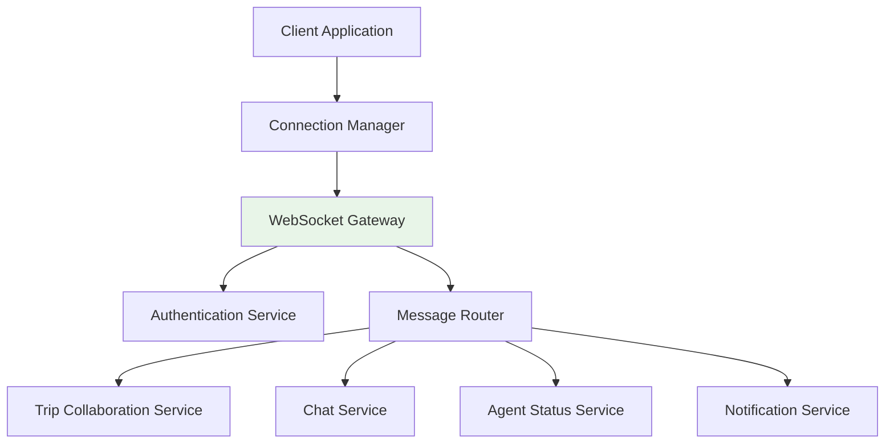

# WebSocket and Real-time API Overview

This guide provides an overview of TripSage's WebSocket infrastructure and real-time collaboration features. For detailed implementation guidance, refer to the specialized guides below.

## Table of Contents

1. [Overview](#overview)
2. [Architecture](#architecture)
3. [Connection Types](#connection-types)
4. [Specialized Guides](#specialized-guides)
5. [Quick Start](#quick-start)
6. [Security Considerations](#security-considerations)
7. [Performance Characteristics](#performance-characteristics)
8. [Next Steps](#next-steps)

## Overview

TripSage's WebSocket infrastructure enables real-time collaboration, AI agent interactions, and live notifications for travel planning applications. The system supports multiple connection types with intelligent routing, load balancing, and automatic failover.

### Key Features

- **Real-time Collaboration**: Multi-user trip editing with conflict resolution
- **AI Agent Chat**: Interactive conversations with travel planning assistants
- **Live Notifications**: Instant updates for trip changes and system events
- **Agent Status Monitoring**: Real-time visibility into AI workflow progress
- **Automatic Reconnection**: Robust connection management with exponential backoff
- **Rate Limiting**: Built-in protection against abuse and performance issues
- **Optimistic Updates**: Immediate UI feedback with server synchronization

## Architecture



The architecture consists of:

- **WebSocket Gateway**: Entry point for all WebSocket connections
- **Message Router**: Intelligent routing based on connection type and user permissions
- **Service Layer**: Specialized services for different real-time features
- **Authentication Service**: JWT token validation and user authorization

## Connection Types

| Connection Type    | Purpose                       | URL Pattern                   | Max Connections | Guide                                   |
| ------------------ | ----------------------------- | ----------------------------- | --------------- | --------------------------------------- |
| Chat               | Real-time chat with AI agents | `/ws/chat/{session_id}`       | 1 per session   | [Events Guide](#websocket-events-guide) |
| Agent Status       | Agent workflow monitoring     | `/ws/agent-status/{user_id}`  | 1 per user      | [Events Guide](#websocket-events-guide) |
| Trip Collaboration | Multi-user trip editing       | `/ws/trips/{trip_id}/collab`  | 3 per trip      | [Events Guide](#websocket-events-guide) |
| Notifications      | System notifications          | `/ws/notifications/{user_id}` | 1 per user      | [Events Guide](#websocket-events-guide) |

## Specialized Guides

For detailed implementation information, refer to these focused guides:

### [WebSocket Connection Guide](websocket-connection-guide.md)

- Connection establishment and authentication
- Lifecycle management and reconnection strategies
- Message queuing and priority handling
- Connection monitoring and diagnostics

### [WebSocket Events Guide](websocket-events-guide.md)

- Event types and message formats
- Real-time collaboration patterns
- Optimistic updates and conflict resolution
- Agent status monitoring

### [WebSocket Integration Guide](websocket-integration-guide.md)

- Client-side integration (React/Vue.js)
- Testing strategies and Playwright integration
- Error handling and recovery patterns
- Rate limiting and performance monitoring

## Quick Start

### 1. Establish Connection

```typescript
import { useWebSocket } from "./hooks/useWebSocket";

function TripEditor({ tripId }: { tripId: string }) {
  const { connectionState, sendMessage, lastMessage } = useWebSocket({
    url: `ws://localhost:8000/ws/trips/${tripId}/collab`,
    token: localStorage.getItem("auth_token"),
  });

  return (
    <div>
      <div>Status: {connectionState}</div>
      {/* Your trip editing UI */}
    </div>
  );
}
```

### 2. Send Messages

```typescript
// Send a trip update
sendMessage({
  type: "trip_update",
  data: {
    field: "name",
    value: "European Adventure 2025",
  },
});
```

### 3. Handle Events

```typescript
useEffect(() => {
  if (lastMessage?.type === "collaborator_joined") {
    // Update UI to show new collaborator
    setCollaborators((prev) => [...prev, lastMessage.data.user]);
  }
}, [lastMessage]);
```

### 4. Error Handling

```typescript
const { error } = useWebSocket({ ...options });

useEffect(() => {
  if (error) {
    console.error("WebSocket error:", error);
    // Show user-friendly error message
  }
}, [error]);
```

## Security Considerations

- All connections require valid JWT tokens
- Messages are validated server-side
- Rate limiting prevents abuse
- Connections are automatically terminated on token expiry
- Sensitive data is never transmitted via WebSocket

## Performance Characteristics

- **Latency**: <100ms for local connections, <500ms global
- **Throughput**: 1000+ messages/second per connection
- **Concurrent Users**: 10,000+ active connections
- **Message Size**: Up to 64KB per message
- **Reconnection**: Automatic with exponential backoff

## Next Steps

1. Review the [Connection Guide](websocket-connection-guide.md) for setup details
2. Check the [Events Guide](websocket-events-guide.md) for message formats
3. Follow the [Integration Guide](websocket-integration-guide.md) for client implementation
4. Run the test suites to validate your implementation
