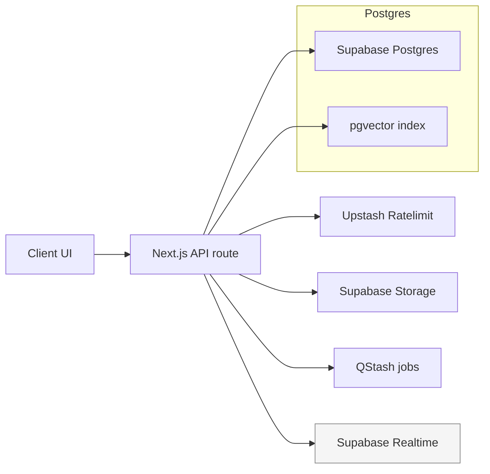

# Data Architecture

Audience: engineers designing or querying data paths for TripSage. Focuses on current, supported components only.

## Platform

- Single Supabase PostgreSQL instance (managed) with pgvector enabled.
- Supabase Auth + Vault for BYOK secret storage.
- Supabase Realtime for presence/broadcast (not for LLM token streaming).
- Supabase Storage for uploads; signed URL access.
- Upstash Redis for cache/rate-limit state; Upstash QStash for asynchronous jobs.

## Feature Highlights

- Chat, memory, and tool-call data live in Supabase with pgvector-backed embeddings for semantic recall.
- BYOK secrets stored in Vault; access controlled via security-definer RPCs and RLS.
- Attachments persisted in Supabase Storage with metadata rows (owner, MIME, size, path) and signed URL access.
- QStash-driven memory sync jobs validate Upstash signatures, enforce idempotency via Redis keys, and cap batches to 50 messages to bound write load.
- Realtime channels deliver presence/broadcast events only; no LLM token data in Realtime.

## Core Principles

- **RLS-first**: Every user-owned table enforces Row Level Security; BYOK access is gated through security-definer RPCs.
- **Schema correctness over flexibility**: Prefer normalized table design; use JSONB only for genuinely flexible metadata.
- **One source of truth**: No shadow datastores; all persisted data lives in Supabase.
- **pgvector for embeddings**: Vector data stays in Postgres; similarity search uses HNSW indexes where performance needs justify it.
- **Final-only**: Legacy tables and unused columns should be removed when superseded; no dual-write paths.

## Logical Domains (current)

- **Auth & Keys**: Supabase auth tables plus Vault-backed BYOK secrets.
- **Chat & Memory**: Chat sessions/messages, tool-call logs, and embedding-backed memory records stored in Postgres with pgvector indexes.
- **Trips & Content**: Trip entities, itinerary content, attachments referenced via Storage.
- **Telemetry/Events**: Lightweight operational events stored for troubleshooting (span/trace data exported via OpenTelemetry, not persisted locally by default).

## Data Flows

1. **API route** validates input (Zod) and authenticates via Supabase SSR client.
2. **Rate limit + cache** checks run against Upstash Redis.
3. **Reads/Writes** occur in Supabase; vector operations stay in Postgres.
4. **Async work** (e.g., memory sync) is enqueued to QStash; callbacks land on dedicated route handlers.
5. **Realtime fanout** (chat events, presence) uses Supabase Realtime channels created through `use-realtime-channel` wrappers.

### Visual: data write path (chat + memory)

## Storage Patterns

- **Relational**: Primary entities with foreign keys; timezone-aware timestamps; UUID primary keys where appropriate.
- **Vector**: pgvector columns for embeddings with HNSW indexes; cosine distance default.
- **JSONB**: Limited to optional metadata; avoid unbounded schemaless blobs.
- **Attachments**: Stored in Supabase Storage buckets; Postgres rows keep paths, MIME type, size, and ownership; access via signed URLs only.

## Caching & Rate Limiting

- Upstash Redis holds sliding-window counters and short-lived caches (e.g., deduplication, transient lookup results). TTLs are short; no authoritative data stored in Redis.
- Rate limiting is applied per user/IP/API key within route handlers; limits are configured per endpoint type (e.g., streaming vs non-streaming).

## Resilience & Safety

- PITR and backups are handled by Supabase managed services.
- Idempotent QStash handlers prevent duplicate side effects.
- No direct console logging of data; telemetry emitted through logging/telemetry helpers.

## What Is Out of Scope

- Legacy FastAPI/Python data paths and services are removed and unsupported.
- Alternative databases or data lakes are not part of the current system.
