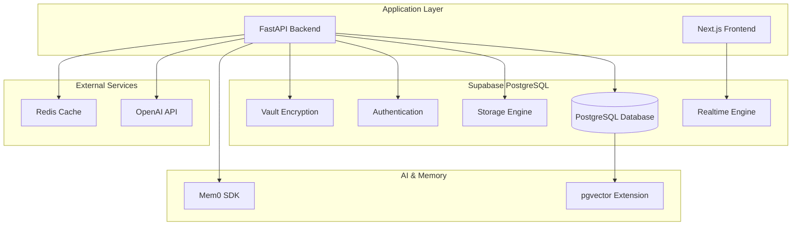

# Data Architecture

> **Target Audience**: Data architects, database engineers, technical leads
> **Status**: Production Ready - Unified Supabase PostgreSQL Architecture

This document describes TripSage's data architecture, storage patterns, and database design decisions. For implementation details and schema definitions, see the database migration files in `supabase/migrations/`.

## Table of Contents

- [Architecture Overview](#architecture-overview)
- [Database Design](#database-design)
- [Core Data Models](#core-data-models)
- [Memory and AI Systems](#memory-and-ai-systems)
- [Security and Access Control](#security-and-access-control)
- [Performance and Indexing](#performance-and-indexing)

## Architecture Overview

TripSage uses a unified Supabase PostgreSQL architecture with integrated extensions for all data persistence needs.



### Key Components

- **Supabase PostgreSQL**: Primary database with extensions
- **pgvector**: Vector similarity search for embeddings
- **Mem0**: External memory management SDK
- **Vault**: Encrypted API key storage
- **Realtime**: Live data synchronization
- **Storage**: File attachment management

## Database Design

### Schema Organization

The database uses a modular schema design with clear separation of concerns:

- **Core Trip Management**: `trips`, `flights`, `accommodations`, `transportation`, `itinerary_items`
- **Chat System**: `chat_sessions`, `chat_messages`, `chat_tool_calls`
- **Memory System**: `memories`, `session_memories`
- **Collaboration**: `trip_collaborators`
- **Search Cache**: `search_*` tables for performance optimization
- **Security**: `api_keys` with Vault integration

### Table Naming Conventions

- Primary keys: `BIGINT GENERATED ALWAYS AS IDENTITY`
- Foreign keys: Named `{table}_id` with appropriate references
- Timestamps: `created_at`, `updated_at` with timezone
- Status fields: Enum constraints with allowed values
- Metadata: `JSONB` for flexible extensions

## Core Data Models

### Trip Management

```sql
CREATE TABLE trips (
    id BIGINT GENERATED ALWAYS AS IDENTITY PRIMARY KEY,
    user_id UUID NOT NULL REFERENCES auth.users(id) ON DELETE CASCADE,
    name TEXT NOT NULL,
    start_date DATE NOT NULL,
    end_date DATE NOT NULL,
    destination TEXT NOT NULL,
    budget NUMERIC NOT NULL,
    travelers INTEGER NOT NULL,
    status TEXT NOT NULL DEFAULT 'planning',
    trip_type TEXT NOT NULL DEFAULT 'leisure',
    flexibility JSONB DEFAULT '{}',
    notes TEXT[],
    search_metadata JSONB DEFAULT '{}',
    created_at TIMESTAMP WITH TIME ZONE DEFAULT NOW(),
    updated_at TIMESTAMP WITH TIME ZONE DEFAULT NOW(),

    CONSTRAINT trips_date_check CHECK (end_date >= start_date),
    CONSTRAINT trips_travelers_check CHECK (travelers > 0),
    CONSTRAINT trips_budget_check CHECK (budget > 0),
    CONSTRAINT trips_status_check CHECK (status IN ('planning', 'booked', 'completed', 'cancelled')),
    CONSTRAINT trips_type_check CHECK (trip_type IN ('leisure', 'business', 'family', 'solo', 'other'))
);
```

### Travel Options

```sql
CREATE TABLE flights (
    id BIGINT GENERATED ALWAYS AS IDENTITY PRIMARY KEY,
    trip_id BIGINT NOT NULL REFERENCES trips(id) ON DELETE CASCADE,
    origin TEXT NOT NULL,
    destination TEXT NOT NULL,
    departure_date DATE NOT NULL,
    return_date DATE,
    flight_class TEXT NOT NULL DEFAULT 'economy',
    price NUMERIC NOT NULL,
    currency TEXT NOT NULL DEFAULT 'USD',
    airline TEXT,
    flight_number TEXT,
    booking_status TEXT NOT NULL DEFAULT 'available',
    external_id TEXT,
    metadata JSONB DEFAULT '{}',
    created_at TIMESTAMP WITH TIME ZONE DEFAULT NOW(),
    updated_at TIMESTAMP WITH TIME ZONE DEFAULT NOW(),

    CONSTRAINT flights_price_check CHECK (price >= 0),
    CONSTRAINT flights_class_check CHECK (flight_class IN ('economy', 'premium_economy', 'business', 'first')),
    CONSTRAINT flights_status_check CHECK (booking_status IN ('available', 'reserved', 'booked', 'cancelled'))
);

CREATE TABLE accommodations (
    id BIGINT GENERATED ALWAYS AS IDENTITY PRIMARY KEY,
    trip_id BIGINT NOT NULL REFERENCES trips(id) ON DELETE CASCADE,
    name TEXT NOT NULL,
    address TEXT,
    check_in_date DATE NOT NULL,
    check_out_date DATE NOT NULL,
    room_type TEXT,
    price_per_night NUMERIC NOT NULL,
    total_price NUMERIC NOT NULL,
    currency TEXT NOT NULL DEFAULT 'USD',
    rating NUMERIC,
    amenities TEXT[],
    booking_status TEXT NOT NULL DEFAULT 'available',
    external_id TEXT,
    metadata JSONB DEFAULT '{}',
    created_at TIMESTAMP WITH TIME ZONE DEFAULT NOW(),
    updated_at TIMESTAMP WITH TIME ZONE DEFAULT NOW(),

    CONSTRAINT accommodations_price_check CHECK (price_per_night >= 0 AND total_price >= 0),
    CONSTRAINT accommodations_dates_check CHECK (check_out_date > check_in_date),
    CONSTRAINT accommodations_rating_check CHECK (rating IS NULL OR (rating >= 0 AND rating <= 5)),
    CONSTRAINT accommodations_status_check CHECK (booking_status IN ('available', 'reserved', 'booked', 'cancelled'))
);
```

### Chat System

```sql
CREATE TABLE chat_sessions (
    id UUID PRIMARY KEY DEFAULT gen_random_uuid(),
    user_id UUID NOT NULL REFERENCES auth.users(id) ON DELETE CASCADE,
    trip_id BIGINT REFERENCES trips(id) ON DELETE SET NULL,
    created_at TIMESTAMP WITH TIME ZONE DEFAULT NOW(),
    updated_at TIMESTAMP WITH TIME ZONE DEFAULT NOW(),
    ended_at TIMESTAMP WITH TIME ZONE,
    metadata JSONB DEFAULT '{}'
);

CREATE TABLE chat_messages (
    id BIGINT GENERATED ALWAYS AS IDENTITY PRIMARY KEY,
    session_id UUID NOT NULL REFERENCES chat_sessions(id) ON DELETE CASCADE,
    role TEXT NOT NULL,
    content TEXT NOT NULL,
    created_at TIMESTAMP WITH TIME ZONE DEFAULT NOW(),
    metadata JSONB DEFAULT '{}',

    CONSTRAINT chat_messages_role_check CHECK (role IN ('user', 'assistant', 'system')),
    CONSTRAINT chat_messages_content_length CHECK (length(content) <= 32768)
);
```

## Memory and AI Systems

### Vector Storage

The memory system uses pgvector for similarity search with 1536-dimensional embeddings:

```sql
CREATE TABLE memories (
    id BIGINT GENERATED ALWAYS AS IDENTITY PRIMARY KEY,
    user_id UUID NOT NULL REFERENCES auth.users(id) ON DELETE CASCADE,
    memory_type TEXT NOT NULL DEFAULT 'user_preference',
    content TEXT NOT NULL,
    embedding vector(1536),
    metadata JSONB DEFAULT '{}',
    created_at TIMESTAMP WITH TIME ZONE DEFAULT NOW(),
    updated_at TIMESTAMP WITH TIME ZONE DEFAULT NOW(),

    CONSTRAINT memories_type_check CHECK (memory_type IN ('user_preference', 'trip_history', 'search_pattern', 'conversation_context', 'other'))
);

CREATE TABLE session_memories (
    id BIGINT GENERATED ALWAYS AS IDENTITY PRIMARY KEY,
    session_id UUID NOT NULL REFERENCES chat_sessions(id) ON DELETE CASCADE,
    user_id UUID NOT NULL REFERENCES auth.users(id) ON DELETE CASCADE,
    content TEXT NOT NULL,
    embedding vector(1536),
    metadata JSONB DEFAULT '{}',
    created_at TIMESTAMP WITH TIME ZONE DEFAULT NOW(),

    CONSTRAINT session_memories_content_length CHECK (length(content) <= 8192)
);
```

### Vector Search Queries

```sql
-- Semantic similarity search
SELECT
    id,
    content,
    metadata,
    embedding <=> %s::vector AS similarity_score
FROM memories
WHERE user_id = %s
    AND memory_type = %s
ORDER BY embedding <=> %s::vector
LIMIT 10;
```

### Mem0 Integration

Memory operations are handled through the Mem0 SDK with automatic synchronization to PostgreSQL vector tables. The system provides:

- Long-term user preference storage
- Conversation context management
- Trip history insights
- Real-time memory updates

## Security and Access Control

### Row Level Security

All user data tables use Row Level Security (RLS) with owner-based policies:

```sql
-- Enable RLS on user data tables
ALTER TABLE trips ENABLE ROW LEVEL SECURITY;
ALTER TABLE chat_sessions ENABLE ROW LEVEL SECURITY;
ALTER TABLE memories ENABLE ROW LEVEL SECURITY;

-- Owner-only access policy
CREATE POLICY "owner_access" ON trips
    FOR ALL USING (auth.uid() = user_id);
```

### API Key Management

User API keys are stored encrypted in Supabase Vault:

```sql
CREATE TABLE api_keys (
    id UUID PRIMARY KEY DEFAULT gen_random_uuid(),
    user_id UUID NOT NULL REFERENCES auth.users(id) ON DELETE CASCADE,
    service TEXT NOT NULL,
    vault_secret_name TEXT NOT NULL,
    created_at TIMESTAMPTZ NOT NULL DEFAULT now(),
    last_used TIMESTAMPTZ,
    CONSTRAINT api_keys_user_service_uniq UNIQUE (user_id, service)
);
```

Access is controlled through security definer functions that validate service role execution.

## Performance and Indexing

### Vector Indexing

HNSW indexing provides efficient similarity search:

```sql
CREATE INDEX idx_memories_embedding
ON memories USING hnsw (embedding vector_cosine_ops)
WITH (m = 16, ef_construction = 200);

CREATE INDEX idx_session_memories_embedding
ON session_memories USING hnsw (embedding vector_cosine_ops)
WITH (m = 16, ef_construction = 200);
```

### Query Optimization

Common query patterns are optimized with appropriate indexes:

```sql
-- Trip queries
CREATE INDEX idx_trips_user_dates ON trips(user_id, start_date, end_date);
CREATE INDEX idx_trips_status ON trips(status);

-- Chat performance
CREATE INDEX idx_chat_sessions_user_trip ON chat_sessions(user_id, trip_id);
CREATE INDEX idx_chat_messages_session_created ON chat_messages(session_id, created_at);

-- Search cache
CREATE INDEX idx_search_destinations_user_query ON search_destinations(user_id, query_hash);
```

### Connection Management

Database connections are managed through the DatabaseService with:

- Connection pooling via configuration
- Circuit breaker pattern for fault tolerance
- Rate limiting per user
- Query metrics and monitoring
- Automatic retry logic

## Migration Management

Database schema changes are managed through Supabase migrations:

- Migration files stored in `supabase/migrations/`
- Versioned with timestamp prefixes
- Applied through Supabase CLI or custom runner
- Rollback support for complex changes

## Monitoring and Observability

### Database Health Checks

```sql
-- Connection and performance monitoring
CREATE VIEW database_health AS
SELECT
    'active_connections' as metric,
    count(*)::text as value,
    CASE WHEN count(*) > 150 THEN 'warning' ELSE 'ok' END as status
FROM pg_stat_activity
WHERE state = 'active';
```

### Query Performance

The system tracks query performance through OpenTelemetry metrics and custom monitoring:

- Query duration histograms
- Error rate tracking
- Connection pool utilization
- Vector search performance

## File Storage

File attachments are managed through Supabase Storage:

```sql
CREATE TABLE file_attachments (
    id UUID PRIMARY KEY DEFAULT gen_random_uuid(),
    user_id UUID NOT NULL REFERENCES auth.users(id) ON DELETE CASCADE,
    trip_id BIGINT REFERENCES trips(id) ON DELETE CASCADE,
    chat_message_id BIGINT REFERENCES chat_messages(id) ON DELETE CASCADE,
    filename TEXT NOT NULL,
    original_filename TEXT NOT NULL,
    file_size BIGINT NOT NULL,
    mime_type TEXT NOT NULL,
    file_path TEXT NOT NULL,
    bucket_name TEXT NOT NULL DEFAULT 'attachments',
    upload_status TEXT NOT NULL DEFAULT 'uploading',
    virus_scan_status TEXT DEFAULT 'pending',
    virus_scan_result JSONB DEFAULT '{}',
    metadata JSONB DEFAULT '{}',
    created_at TIMESTAMP WITH TIME ZONE DEFAULT NOW(),
    updated_at TIMESTAMP WITH TIME ZONE DEFAULT NOW(),

    CONSTRAINT file_attachments_size_check CHECK (file_size > 0),
    CONSTRAINT file_attachments_upload_status_check CHECK (upload_status IN ('uploading', 'completed', 'failed')),
    CONSTRAINT file_attachments_virus_status_check CHECK (virus_scan_status IN ('pending', 'clean', 'infected', 'failed'))
);
```

---

This architecture provides a scalable, secure foundation for TripSage's travel planning platform with integrated AI capabilities and real-time features.
