# 🏗️ Database Architecture Diagrams

> **Simplified Database Infrastructure | Performance Optimization | BJO-212**  
> Comprehensive architectural diagrams showcasing the 64.8% code reduction achievement  
> *Last updated: June 17, 2025*

## 📋 Table of Contents

- [High-Level Architecture](#high-level-architecture)
- [Simplified PGVector Service Architecture](#simplified-pgvector-service-architecture)
- [Data Flow for Vector Operations](#data-flow-for-vector-operations)
- [Connection Pooling Architecture](#connection-pooling-architecture)
- [Cache Integration Pattern](#cache-integration-pattern)
- [Memory Service Integration](#memory-service-integration)
- [Monitoring Architecture](#monitoring-architecture)
- [Before vs After Complexity](#before-vs-after-complexity)
- [Performance Optimization Profiles](#performance-optimization-profiles)
- [Deployment Architecture](#deployment-architecture)
- [Key Benefits Visualization](#key-benefits-visualization)

## Overview

This document provides architectural diagrams for the simplified database infrastructure implemented as part of BJO-212 - Database Service Performance Optimization Framework.

## High-Level Architecture

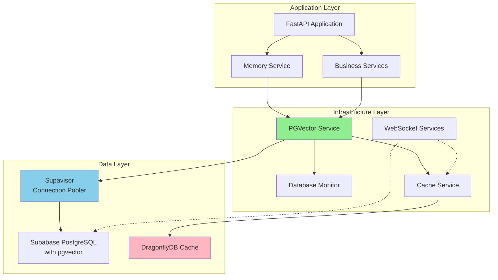

## Simplified PGVector Service Architecture

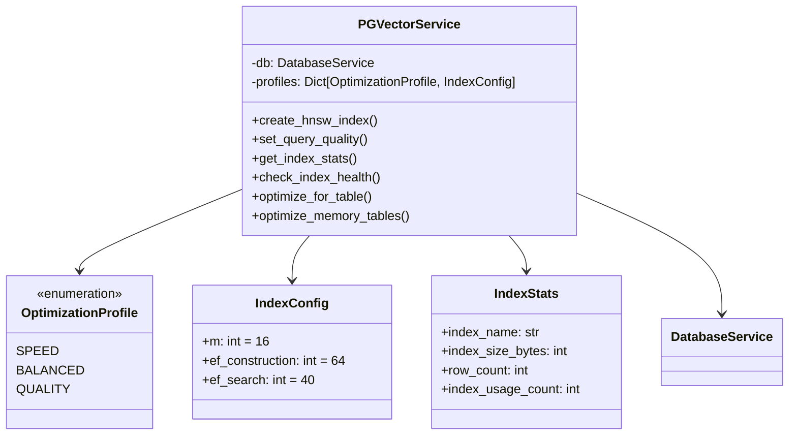

## Data Flow for Vector Operations

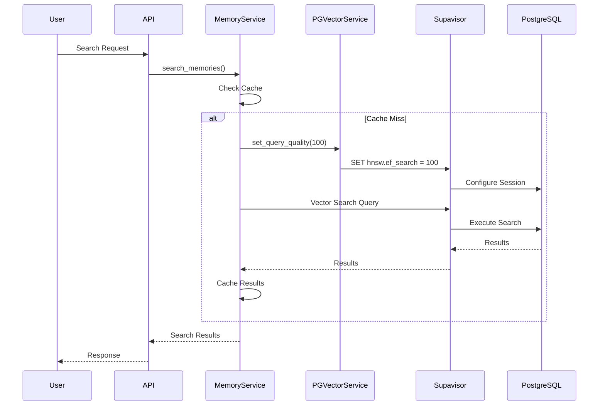

## Connection Pooling Architecture

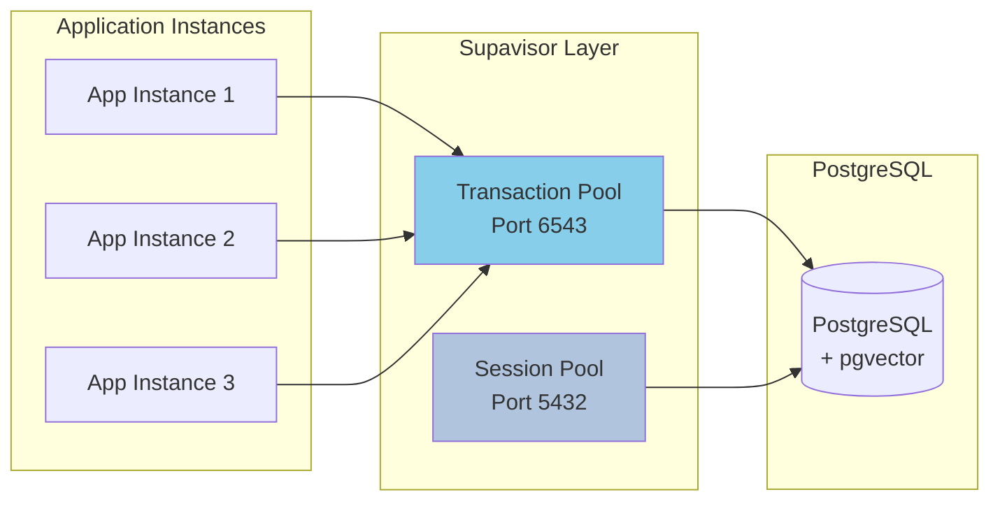

## Cache Integration Pattern

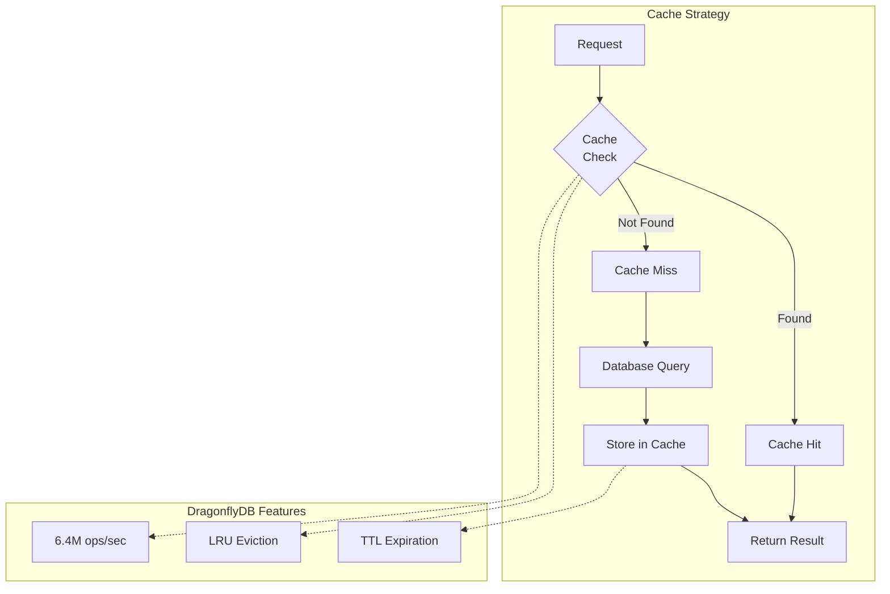

## Memory Service Integration

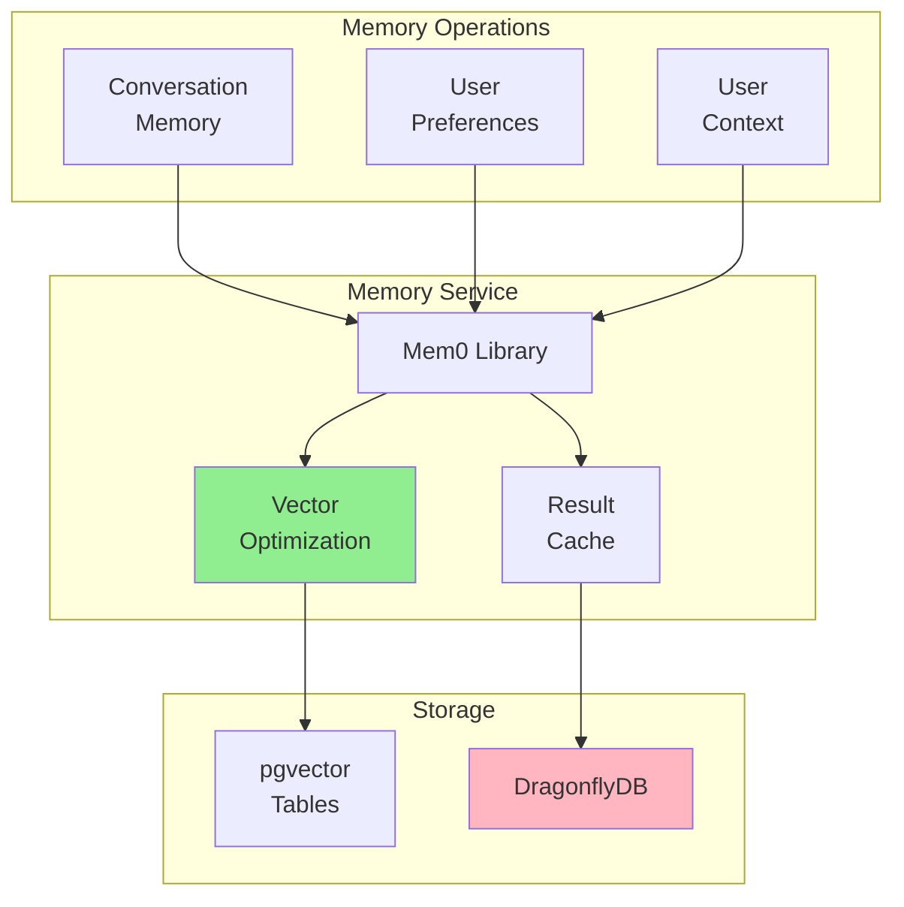

## Monitoring Architecture

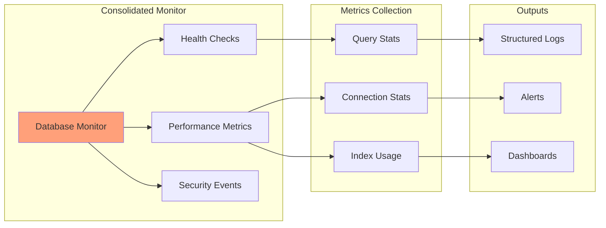

## Before vs After Complexity

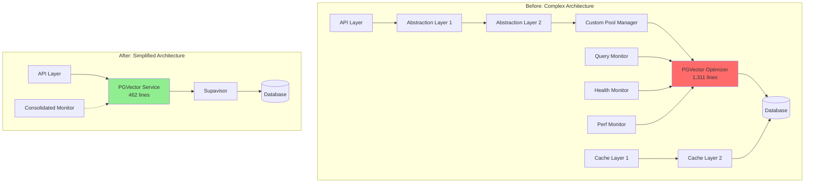

## Performance Optimization Profiles

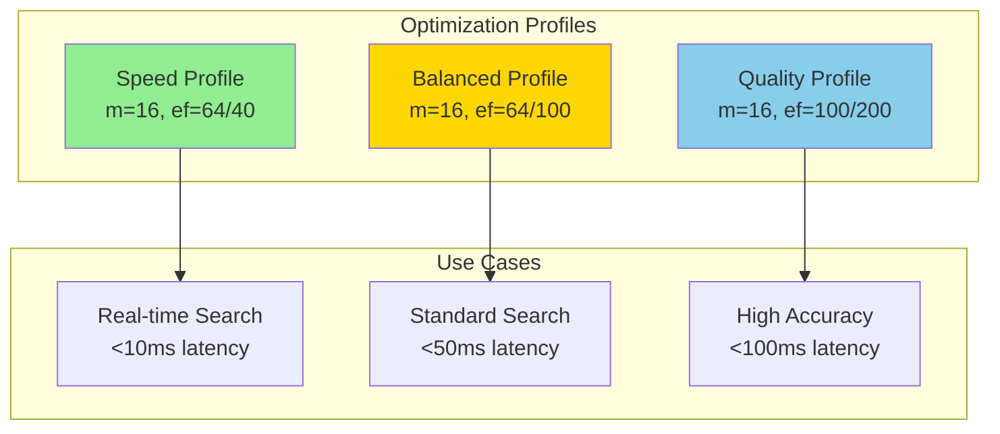

## Deployment Architecture

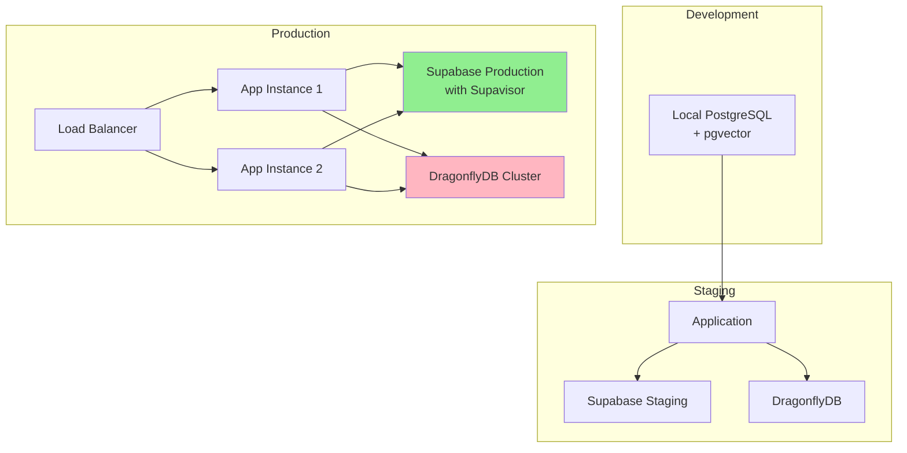

## Key Benefits Visualization

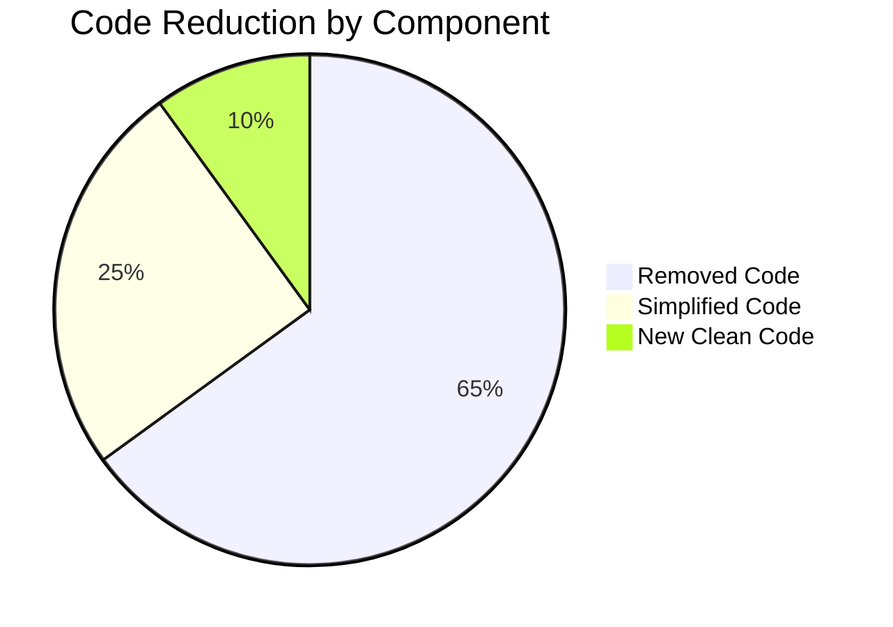

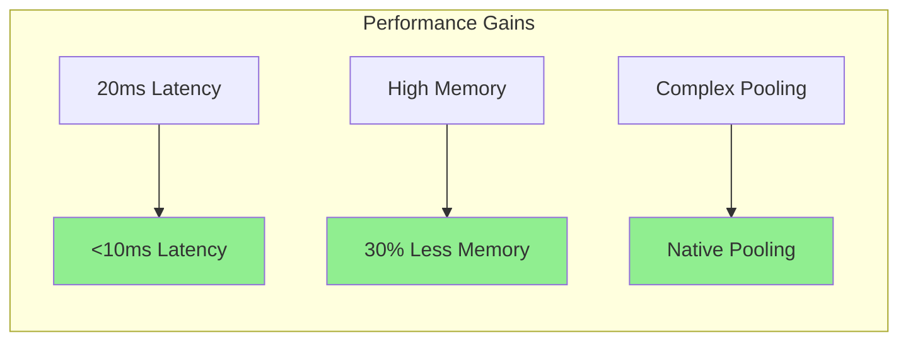

---

## Next Steps

- [PGVector Monitoring Guide](/docs/operators/pgvector-monitoring-guide.md) - Set up production monitoring
- [Database Optimization Lessons](/docs/developers/database-optimization-lessons.md) - Learn from our optimization journey
- [Performance Optimization Guide](/docs/developers/performance-optimization.md) - General performance best practices

---

*Architecture diagrams created: June 17, 2025*  
*Project: BJO-212 - Database Service Performance Optimization Framework*