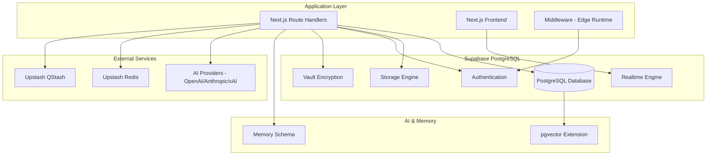

# TripSage Database Design

Architecture-focused reference for how TripSage stores, secures, and moves data in Supabase. For operational tasks (bootstrap, BYOK setup, webhook debugging), see the runbook in `../operations/runbooks/database-ops.md`.

## Platform Overview

- Single managed Supabase PostgreSQL instance with pgvector enabled for embeddings.
- Supabase Auth + Vault for BYOK secret storage; Realtime for presence/broadcast only (no token streaming).
- Supabase Storage for attachments; signed URL access only.
- Upstash Redis for cache/rate-limit state and idempotency keys; Upstash QStash for async jobs.

## Architecture Diagram



## Integration Patterns

- **SSR clients (Next.js 16)**: `createServerSupabase()` wraps `@supabase/ssr.createServerClient` with `cookies()`; used in Server Components and route handlers. Middleware refreshes sessions; BYOK/BYOR routes import `"server-only"` and stay dynamic (`dynamic = "force-dynamic"` when needed).
- **Browser client**: `getBrowserClient()` + `useSupabase()` provide the singleton; always call `supabase.realtime.setAuth(access_token)` on login/refresh before joining channels.
- **Route handlers**: `withApiGuards` builds an authenticated Supabase client plus user context per request; keep auth/zod validation at the edge of each handler:

```ts
import { withApiGuards } from '@/lib/api/factory';

export const GET = withApiGuards({
  auth: true,
  rateLimit: { limit: 100, window: '1m' },
})(async ({ supabase, user }) => {
  const { data } = await supabase.from('trips').select('*').eq('user_id', user.id);
  return Response.json(data);
});
```

- **Telemetry**: wrap service-layer DB calls with `withTelemetrySpan`; never use `console.*` in server paths.
- **Middleware client (Edge)**: `createMiddlewareSupabase()` from `@/lib/supabase/factory` uses client-only env vars for Edge runtime; tracing disabled by default.

## Schema & Domains

- **Trips & Content**: `trips`, `flights`, `accommodations`, `transportation`, `itinerary_items`, `trip_collaborators`, `bookings`.
- **Chat & Memory**: `chat_sessions`, `chat_messages`, `chat_tool_calls`, `accommodation_embeddings`; `memories` schema tables (`memories.sessions`, `memories.turns`, `memories.turn_embeddings`).
- **Auth & Keys**: Vault-backed `api_keys`, `user_gateway_configs`, `user_settings`; SECURITY DEFINER RPCs gate all BYOK operations.
- **MFA & Recovery**: `mfa_enrollments` tracks TOTP enrollment lifecycle (pending/consumed/expired) with RLS; `auth_backup_codes` stores hashed backup codes (peppered) and is replaced atomically via the `replace_backup_codes` RPC; `mfa_backup_code_audit` logs regeneration/consumption metadata (user_id, event, count, ip, user_agent) for forensics.
- **Telemetry & Webhooks**: `webhook_configs`, `webhook_logs`, `webhook_events`, `system_metrics`; helper RPCs for realtime topics.
- **Search Cache**: `search_*` tables for cached destination/activity/flight/hotel lookups.
- **Storage Metadata**: `file_attachments` rows store ownership, MIME, size, and storage path for Supabase buckets.

### Naming & Constraints

- Primary keys: `BIGINT GENERATED ALWAYS AS IDENTITY` for relational tables; UUIDs for external-facing IDs and webhook/file records.
- Timestamp columns are timezone-aware (`TIMESTAMPTZ`) with `created_at`/`updated_at` defaults.
- Status/enum fields constrained via `CHECK` clauses; metadata kept in bounded `JSONB` columns only where flexibility is required.

## Security & RLS

- **RLS-first**: All user-owned tables enable Row Level Security with owner policies (e.g., `auth.uid() = user_id`).
- **Collaboration**: `trip_collaborators` policies permit shared access on trip-scoped rows; realtime topic helpers enforce the same audience.
- **BYOK**: API keys live in Vault; access only via SECURITY DEFINER RPCs (`insert/get/delete/touch_user_api_key`, gateway config helpers) running under service role with validated ownership.
- **Server-only use**: Sensitive operations stay in route handlers/Server Components; BYOK routes import `"server-only"` and export `dynamic = "force-dynamic"` when required.

### API Key Security

- **Encryption at rest**: All API keys encrypted via Supabase Vault
- **Access control**: SECURITY DEFINER RPCs with ownership validation; service role only
- **Audit logging**: `last_used` timestamps track access patterns
- **Rotation support**: Keys can be updated without service disruption via upsert semantics
- **Data isolation**: RLS ensures users only access their own keys

### BYOK Access Pattern

1. **Store**: `insert_user_api_key(userId, service, key)` encrypts and stores in Vault
2. **Retrieve**: `get_user_api_key(userId, service)` decrypts via SECURITY DEFINER
3. **Validate**: RPCs verify JWT claims include `role: "service_role"` and ownership
4. **Use**: Keys never exposed to client-side code (`"server-only"` imports)

### Provider Resolution (BYOK)

Four-tier resolution strategy in `@ai/models/registry`:

1. **User Gateway key** (highest priority)
   - User's own Vercel AI Gateway API key stored in Vault
   - `getUserApiKey(userId, "gateway")` + `getUserGatewayBaseUrl(userId)`
   - `createGateway({ apiKey, baseURL })`

2. **User BYOK provider keys**
   - Provider-specific keys (OpenAI, OpenRouter, Anthropic, xAI) stored in Vault
   - Resolved concurrently via `getUserApiKey(userId, provider)`
   - Provider preference order: openai → openrouter → anthropic → xai

3. **Server-side fallback keys**
   - Environment variables: `OPENAI_API_KEY`, `OPENROUTER_API_KEY`, `ANTHROPIC_API_KEY`, `XAI_API_KEY`
   - Same preference order as BYOK; used when user has no keys

4. **Team Gateway fallback** (lowest priority)
   - Environment `AI_GATEWAY_API_KEY` + `AI_GATEWAY_URL`
   - Requires user consent via `allowGatewayFallback` setting (default true)
   - Error thrown if user disabled fallback and no keys found

Keys are never exposed client-side; all resolution occurs server-side via `"server-only"` imports.

## Extensions

| Extension | Purpose | Notes |
| --- | --- | --- |
| `vector` | Embedding storage + indexes for semantic search (1536 dims) | Schema: `extensions`; uses ivfflat for accommodation_embeddings |
| `pgcrypto` | `gen_random_uuid()` and hashing | Required for UUID PKs |
| `pg_trgm` | Fuzzy search and text search helpers | Used in search tables |
| `pgjwt` | Supabase auth helpers | Required for auth RPCs |
| `supabase_vault` | Vault-backed BYOK storage | Falls back to stub schema in local/CI |
| `realtime` | Channel policies for presence/broadcast | Required for topic helpers |
| `pg_stat_statements` | Query performance monitoring | Optional; enable for production |
| `pg_net` | Outbound webhook helpers | Enable only if webhook functions used |
| `pg_cron` | Scheduled jobs | For maintenance tasks |
| `btree_gist` | GiST index support | For range queries |
| `uuid-ossp` | UUID generation functions | Alternative to pgcrypto UUIDs |

## Data Flows

1. Request hits Next.js route handler; Zod validates input and Supabase SSR client authenticates.
2. Upstash rate limits and cache checks run before DB writes.
3. Reads/writes occur in Supabase; vector similarity stays in Postgres (`memories`, `accommodation_embeddings`).
4. Async work (e.g., memory sync) is enqueued to QStash; callbacks land on dedicated handlers.
5. Realtime fan-out uses Supabase channels (`user:{id}`, `session:{uuid}`, `trip:{id}`) with RLS-backed topic helpers.
6. Attachments upload to Supabase Storage; rows in `file_attachments` gate access via signed URLs.

## Data Models (Highlights)

- **Trips**: Trip metadata plus related flights/accommodations/transportation; constraints enforce valid dates, traveler counts, and status enums.
- **Chat**: `chat_sessions` (UUID PK) with `chat_messages` constrained to `user|assistant|system` roles; tool calls tracked in `chat_tool_calls`.
- **Memory**: `memories` and `session_memories` store text + `vector(1536)` embeddings with HNSW indexes for cosine search.
- **Files**: `file_attachments` record bucket, MIME, size, owner, and virus-scan status; access via signed URLs only.
- **Webhooks**: `webhook_configs/logs/events` capture DB → Vercel integrations and retries; signatures validated with HMAC.

### Memory Schema

The `memories` schema stores conversation history with embeddings for semantic search:

- `memories.sessions`: Session metadata with user ownership and sync timestamps
- `memories.turns`: Individual conversation turns (user/assistant/system roles) with JSONB content, attachments, tool calls/results
- `memories.turn_embeddings`: Vector embeddings (1536-d) for semantic search over turns

All memory tables have owner-only RLS policies (`auth.uid() = user_id`).

### Webhook Architecture

Database triggers post to Vercel route handlers on table changes:

| Webhook | Trigger Tables | Route | Purpose |
|---------|---------------|-------|---------|
| Trips | `trip_collaborators` | `/api/hooks/trips` | Trip collaboration sync via QStash |
| Cache | `trips`, `flights`, `accommodations`, `search_*`, `chat_*` | `/api/hooks/cache` | Invalidate Upstash cache tags |
| Files | `file_attachments` | `/api/hooks/files` | Process uploads |

Webhook handlers use HMAC signature verification (`X-Signature-HMAC` header) with `HMAC_SECRET` env var. Idempotency via Upstash Redis with 300s TTL.

## Performance & Indexing

- Vector indexes on memory tables: HNSW (`vector_cosine_ops`) with tuned `m`/`ef_construction` parameters.
- Common query indexes: `trips(user_id, start_date, end_date)`, `trips(status)`, `chat_sessions(user_id, trip_id)`, `chat_messages(session_id, created_at)`.
- Connection management via Supabase pooling; monitor with `pg_stat_statements` views and app telemetry.

## Migration & Tooling

- Single-source schema lives in `supabase/schema.sql` (plus migrations); supports bootstrapping a new project in one apply.
- Prefer Supabase migrations for changes; keep table and function inventory aligned with above domains.
- Regenerate TypeScript types after schema updates: `supabase gen types typescript --local > frontend/src/lib/supabase/database.types.ts`.

## Function / RPC Inventory (keep)

- Vault/BYOK: `insert_user_api_key`, `get_user_api_key`, `delete_user_api_key`, `touch_user_api_key`.
- Gateway configs: `upsert_user_gateway_config`, `get_user_gateway_base_url`, `get_user_allow_gateway_fallback`, `delete_user_gateway_config`.
- Realtime helpers: `rt_topic_prefix`, `rt_topic_suffix`, `rt_is_session_member`.
- Vector search: `match_accommodation_embeddings` over `vector(1536)` embeddings.
- Webhooks/supporting helpers: keep only actively used retry/send functions; retire unused ones alongside migrations.

## Related How-To

- Operational steps (bootstrap, BYOK verification, webhook/debug routines): `../operations/runbooks/database-ops.md`.
