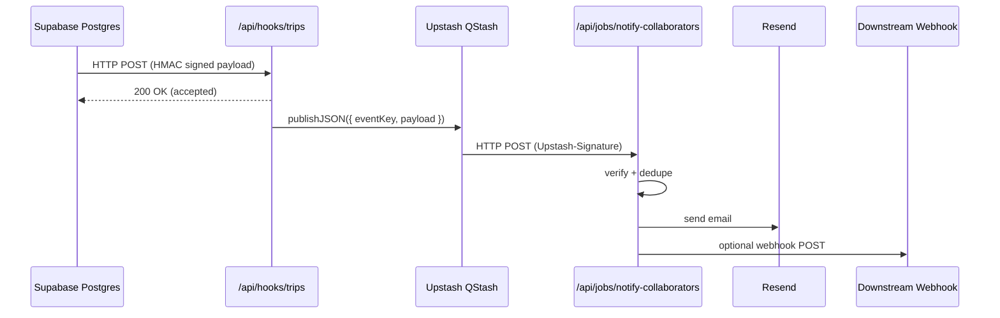

# ADR-0041: Webhook Notifications via QStash and Resend

**Version**: 1.0.0  
**Status**: Accepted  
**Date**: 2025-11-13  
**Category**: Architecture/Platform  
**Domain**: Backend, Integrations  
**Related ADRs**: ADR-0003, ADR-0023, ADR-0028, ADR-0040  
**Related Specs**: SPEC-0021, SPEC-0025 (Notifications Pipeline)

## Context

After consolidating Supabase Edge Functions into Vercel Route Handlers (ADR-0040, SPEC-0021),
trip collaborator notifications are delivered from the `/api/hooks/trips` route. The route
validates HMAC signatures, uses Upstash Redis for idempotency, and then needs to send
collaborator-facing messages:

- Transactional emails (via Resend).
- Optional downstream webhooks for external systems.

Initial implementations considered running these side effects directly inside the route
handler (or via `after()`), but this has limitations:

- No durable queue: if the process crashes after acknowledging the webhook, work is lost.
- No built-in retries or dead-letter queue (DLQ).
- Backpressure under bursts (e.g., many `trip_collaborators` changes) can exhaust function
  duration budgets and create failures that are hard to reason about.

We already use Upstash Redis (ADR-0003) and want to stay within a serverless-friendly,
managed tooling stack.

## Decision

Use **Upstash QStash** as the primary execution path for webhook-triggered notification
work, with a small Vercel worker route that processes jobs and calls Resend and any
downstream collaborator webhooks.

**Key elements:**

- `/api/hooks/trips` remains the Supabase Database Webhook entry point.
  - Verifies HMAC signature and basic payload shape.
  - Computes a stable `eventKey` via `buildEventKey` and guards with Upstash Redis
    `tryReserveKey` for idempotency.
  - If `QSTASH_TOKEN` is configured, publishes a JSON job `{ eventKey, payload }` to
    `/api/jobs/notify-collaborators` via QStash and returns HTTP 200 immediately.
  - If `QSTASH_TOKEN` is not configured (development/test), falls back to using
    `after()` with a fire-and-forget call to the same notification logic.

- `/api/jobs/notify-collaborators` is a Node runtime worker route that:
  - Verifies the `Upstash-Signature` header with QStash signing keys.
  - Validates the job body with a Zod v4 schema (`NotifyJob`).
  - Deduplicates again (`tryReserveKey("notify:" + eventKey)`) to avoid double-send
    on retries.
  - Calls a typed notification adapter that sends Resend emails and optional
    downstream webhooks, with telemetry spans.

- Resend is the canonical email provider for collaborator notifications.

### High-level flow

## Consequences

### Positive

- **Durable delivery and retries**: Notification work survives transient outages of the
  worker route or downstream providers.
- **Clear separation of concerns**: `/api/hooks/trips` focuses on validation and acceptance;
  `/api/jobs/notify-collaborators` encapsulates side effects.
- **Leverages existing stack**: Builds on Upstash (ADR-0003) and Resend, with minimal
  custom infrastructure.
- **Observability**: Telemetry spans around enqueue and worker execution make it easier to
  troubleshoot failures.

### Negative

- Adds another Upstash product (QStash) to manage and configure.
- Requires operators to provision QStash credentials and signing keys.

### Neutral

- Development environments can still run without QStash; the `after()` fallback is
  acceptable for local testing but not recommended in production.

## Alternatives Considered

### A. `after()` only (Next.js background work)

Pros:

- No new infrastructure or credentials.
- Very simple to implement.

Cons:

- No durable queue or DLQ.
- Harder to reason about retries, backpressure, and failure handling.
- Increased risk of silently dropped notifications under load.

### B. Dedicated background workers (custom queues)

Pros:

- Full control over job orchestration.

Cons:

- Significant engineering and operational overhead to match QStash features.
- More moving parts for on-call to manage.

## Status and Migration

- This ADR **extends** ADR-0040 and SPEC-0021 by defining the execution model for
  trip collaborator notifications.
- No Supabase Deno functions remain; all notifications flow through Vercel routes
  and QStash.

## Implementation Notes

- Environment:

  - `QSTASH_TOKEN`, `QSTASH_CURRENT_SIGNING_KEY`, `QSTASH_NEXT_SIGNING_KEY` for
    QStash client and signature verification.
  - `RESEND_API_KEY`, `RESEND_FROM_EMAIL`, `RESEND_FROM_NAME` for email.
  - Optional `COLLAB_WEBHOOK_URL` for downstream collaborator webhooks.

- Security:

  - Supabase→Vercel webhooks still use HMAC (`HMAC_SECRET`) as defined in SPEC-0021.
  - QStash→Vercel worker calls are verified via `Upstash-Signature`.
  - No secrets are exposed to the browser.
