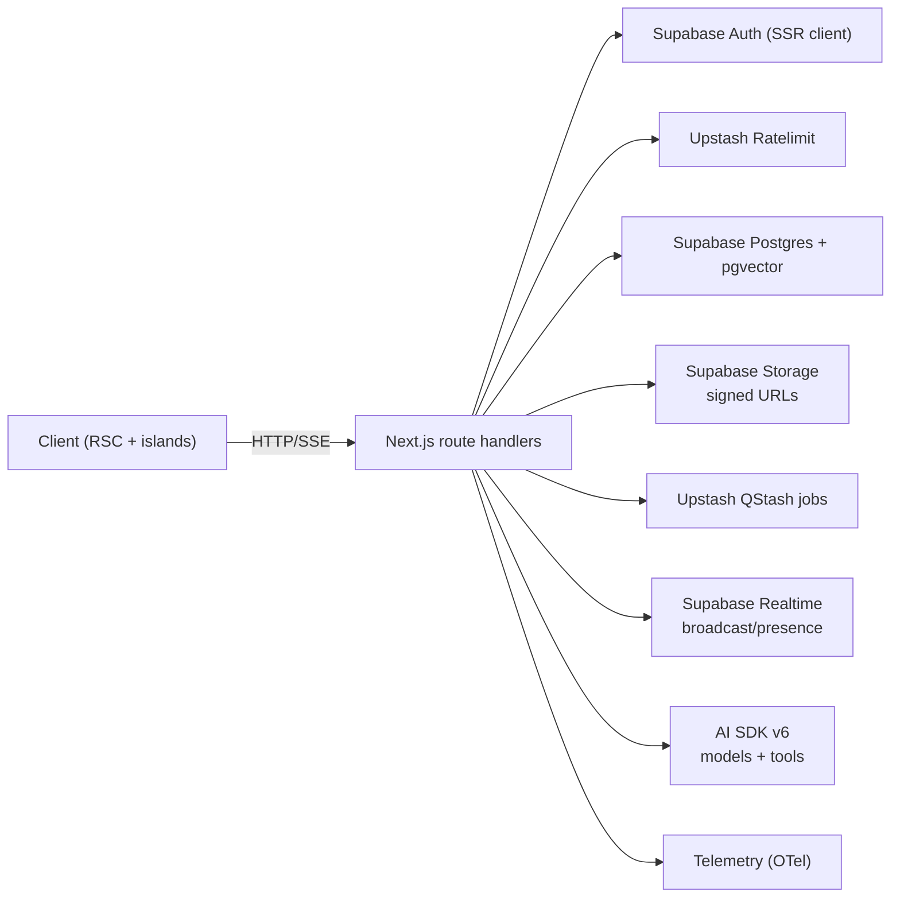

# Frontend Architecture

Audience: frontend engineers working on the Next.js application. Content is implementation-first and free of marketing language.

## Platform Overview

- Next.js `^16.1.3` with React `^19.2.3`, App Router, RSC-first; React Compiler enabled via `next.config.ts`.
- TypeScript `^5.9.3`, strict mode; lint/format via Biome (`pnpm biome:check`); tests via Vitest/Playwright.
- AI SDK v6 is the only LLM transport (see [Stack Versions](system-overview.md#stack-versions-source-of-truth-packagejson)).
- Supabase for auth, database, Realtime, Storage, and Vault (BYOK keys).
- Upstash Redis/Ratelimit for cache and throttling; Upstash QStash for async jobs.
- UI stack: Radix primitives, Tailwind CSS v4, shadcn/ui compositions, Motion (`motion` package).
- Design system uses semantic UI tokens (`success`, `warning`, `info`, `highlight`, `overlay`) via Tailwind classes (e.g., `bg-overlay/50` for dialog overlays).
- Payments/Email: Stripe `20.2.0`, Resend `^6.7.0`.
- Calendar/Scheduling: `ical-generator@10.0.0` with Google Calendar REST integration in `src/lib/calendar`.

## Library Details (from `package.json`)

> Keep this list high-level to avoid docs drift; use `package.json` as the source of truth for exact semver ranges.

- **Framework:** Next.js, React, TypeScript (see `package.json`)
- **AI SDK v6:** core + providers (see [Stack Versions](system-overview.md#stack-versions-source-of-truth-packagejson))
- **Data/Auth:** Supabase SSR + browser client
- **State:** Zustand, TanStack Query
- **Caching/Jobs:** Upstash Redis/Ratelimit/QStash
- **UI:** Radix primitives, Tailwind CSS v4, shadcn/ui compositions, Motion
- **Forms/Validation:** React Hook Form + Zod v4
- **Observability:** `@vercel/otel`, `@opentelemetry/*` (wrappers in `src/lib/telemetry`; see [Observability](../development/backend/observability.md#approved-telemetry--logging-entrypoints))
- **Testing/Tooling:** Biome, Vitest, Playwright, `pnpm boundary:check`

## Project Layout

```text
src/
  app/                 # App Router (pages, layouts, API route handlers)
    api/**/route.ts    # Server-only handlers; no module-scope state
  components/          # UI primitives and features (client/server as needed)
  domain/              # Domain logic (e.g., accommodations, amadeus)
    schemas/           # Zod schemas (shared validation/structured outputs)
  hooks/               # Reusable React hooks (client)
  lib/                 # Providers, telemetry, supabase, security, cache, etc.
  ai/                  # AI SDK tools, models, and helpers
  stores/              # Zustand client stores
  prompts/             # Prompt templates
  styles/              # Tailwind + global styles
  test/                # Vitest mocks/fixtures
  test-utils/          # Shared testing helpers
  __tests__/           # Contract/integration test suites
```

Path aliases:

- `@/` → `src/*`
- `@ai/*` → `src/ai/*`
- `@domain/*` → `src/domain/*`
- `@schemas/*` → `src/domain/schemas/*`
Avoid new barrels; import concrete modules.

## Feature Highlights

- Streaming chat with AI SDK v6 (`/api/chat`) using shared schemas for deterministic tool and output handling.
- Agent endpoints under `/api/agents/*` (flights, accommodations, destinations, itineraries, budget, memory) with domain-specific tool registries.
- BYOK + Gateway provider resolution with request-scoped registry in `src/ai/models/registry.ts`.
- Realtime presence/broadcast via `use-realtime-channel` wrappers; no LLM tokens over Realtime.
- Attachments pipeline: Supabase Storage (`attachments`), Postgres metadata, signed URL access; enforced server-side.
- Memory sync pipeline using QStash webhook `/api/jobs/memory-sync` with Upstash signature verification and Redis idempotency gates.
- Payments/notifications via server-only Stripe/Resend helpers.
- Security dashboard sessions: `/api/security/sessions` (list) and `/api/security/sessions/[sessionId]` (DELETE) use `withApiGuards`, Supabase service-role client on auth schema, and rate limits (`security:sessions:list`, `security:sessions:terminate`).
- Destination search form now calls `/api/places/search` with debounced, abortable requests and client-side type filtering; autocomplete no longer uses mock data.

## Core Patterns

- **RSC-first**: Server Components by default; add `"use client"` only for interactive islands.
- **Route Handlers**: Parse `NextRequest`, create request-scoped Supabase client, Upstash limiter, and provider registry inside the handler, then delegate to a pure `_handler` function. BYOK routes import `"server-only"`. No module-scope singletons beyond config constants.
- **AI SDK Integration**: Use `streamText`, `generateObject`, or `streamObject` with Zod schemas from `src/schemas`. UI hooks use `useChat`/`useAssistant` with `DefaultChatTransport`. No custom streaming stacks.
- **Validation**: Zod v4 schemas kept in domain files per AGENTS rules (see AGENTS.md §4.4–4.5 for schema organization and helpers). Structured outputs share the same schemas across server and client. Canonical types (e.g., `UiTrip`, `TripSuggestion`) defined in `@schemas/*`; stores/hooks re-export for convenience.
- **State**: Client UI state via Zustand slices in `src/stores`; server data via TanStack Query. Realtime channel lifecycle is encapsulated in `use-realtime-channel` and thin wrappers only.
- **Security**: Supabase SSR auth only. Random IDs/timestamps from `@/lib/security/random`. BYOK resolution lives in `src/ai/models/registry.ts`; keys never leave server.
- **Provider precedence**: user gateway key → user provider key (OpenAI/Anthropic/xAI/OpenRouter) → team gateway fallback (opt-in).
- **Caching & Limits**: Upstash Ratelimit/Redis in handlers; auth-bound routes are dynamic (no `'use cache'`).
  Routes accessing `cookies()` or `headers()` cannot use cache directives per Next.js Cache Components restrictions.
  Server Components that need time-based APIs (directly or indirectly, e.g. `Date.now()` via telemetry helpers) should force runtime rendering with `await connection()` to ensure values are computed at request time rather than build time.
  Do not use route-segment `dynamic` overrides when `cacheComponents: true` is enabled; cache directives take precedence and config conflicts cause build errors.
  See [Spec: BYOK Routes and Security (Next.js + Supabase Vault)](../specs/archive/0011-spec-byok-routes-and-security.md).
  Public data may use cache directives sparingly.
- **Background Work**: QStash webhooks for async tasks (e.g., memory sync). Handlers must be idempotent and stateless.
- **Telemetry**: Wrap server logic with `withTelemetrySpan` / `withTelemetrySpanSync` and `createServerLogger`; emit operational alerts via `emitOperationalAlert` for critical failures. Avoid `console.*` in server code.

## Performance Guidance (Vercel)

- Avoid data-fetch waterfalls; parallelize independent async work and add Suspense boundaries where streaming helps UX.
- Avoid barrel imports; import concrete modules directly (see [Import Paths](../development/standards/standards.md#import-paths)).
- Use `next/dynamic` for heavy, rarely-used client components.
- Keep client components small; move data fetching to server components or route handlers where possible.

## Layout & Accessibility

- Root layout provides a skip link to `#main-content`.
- Pages and layouts should render a single main landmark: `<main id="main-content" tabIndex={-1}>…</main>`.

## Caching Strategy

TripSage uses a **three-tier caching architecture**. Choose the right tier based on data sensitivity and access patterns.

### Decision Matrix

| Data Type | Access Pattern | Cache Tier | Reason |
| :--- | :--- | :--- | :--- |
| Per-user data | Auth required | Upstash Redis | Dynamic, user-scoped |
| Public global data | No auth | Next.js Cache Components | HTTP-level, CDN cacheable |
| Client state | Interactive | TanStack Query | Deduplication, SWR |

### Tier 1: Upstash Redis (Server-side)

**When to use:**

- Auth-protected routes (access `cookies()`, `headers()`, auth state)
- Per-user personalized data
- Cross-request deduplication for expensive operations (AI, external APIs)

**Files:**

- `src/lib/cache/upstash.ts` – `getCachedJson()`, `setCachedJson()`
- `src/lib/cache/tags.ts` – `versionedKey()`, `bumpTag()`
- `src/lib/cache/registry.ts` – Table-to-tag mappings

**Pattern:**

```typescript
const cacheKey = await versionedKey("trips", `user:${userId}:list`);
const cached = await getCachedJson<Trip[]>(cacheKey);
if (cached) return cached;

const data = await fetchTrips(userId);
await setCachedJson(cacheKey, data, 300); // 5 min TTL
return data;
```

**Invalidation:** Webhook-driven via `/api/hooks/cache/route.ts` or manual `bumpTag()`.

### Tier 2: Next.js Cache Components (HTTP-level)

**When to use:**

- Public, unauthenticated data only
- Static or slow-changing content
- No access to `cookies()`, `headers()`, `params`, `searchParams`, or auth state

**Constraint:** Cannot use `"use cache"` in routes that call any request-scoped APIs.

If a Server Component must use time/random APIs (e.g. `Date.now()`, `new Date()`, `Math.random()`), force runtime rendering with `await connection()` instead of route-segment config overrides.

This ensures values are computed at request time; route-segment `dynamic` overrides conflict with component-level caching and can cause build errors.

**Files:**

- `src/lib/cache/next-cache.ts` – `applyCacheProfile()`, `nextCacheTags`

**Pattern (future public endpoints only):**

```typescript
"use cache";
import { applyCacheProfile, nextCacheTags } from "@/lib/cache/next-cache";
import { revalidateTag } from "next/cache";

async function getPublicConfig() {
  applyCacheProfile("hour", nextCacheTags.publicConfig);
  return await fetchConfig();
}

// Invalidate when config changes:
revalidateTag(nextCacheTags.publicConfig);
```

**Current status:** No routes currently qualify. All data routes are auth-protected.

### Tier 3: TanStack Query (Client-side)

**When to use:**

- Client-side data fetching from Server Actions (preferred) or API routes (read-only/public)
- Real-time updates with Supabase subscriptions
- Optimistic updates on mutations

**Files:**

- `src/app/(app)/providers.tsx` – QueryClientProvider wiring + devtools
- `src/lib/query/query-client.ts` – canonical QueryClient defaults
- `src/lib/query/config.ts` – canonical `staleTimes` / `cacheTimes`
- `src/lib/keys.ts` – Query key factory

**Pattern:**

```typescript
const { data } = useQuery({
  queryKey: keys.trips.list(userId),
  queryFn: async () => {
    const result = await getTripsForUser();
    if (!result.ok) throw new Error(result.error.reason);
    return result.data;
  },
  staleTime: staleTimes.trips, // 2 min
});

// Invalidate on mutation:
useMutation({
  mutationFn: async (input) => {
    const result = await createTrip(input);
    if (!result.ok) throw new Error(result.error.reason);
    return result.data;
  },
  onSuccess: () => {
    queryClient.invalidateQueries({ queryKey: keys.trips.user(userId) });
  },
});
```

### Coordination: Upstash + Next.js + TanStack Query

For full-stack invalidation:

1. **Server mutation** → `bumpTag()` (Upstash) + `revalidateTag()` (Next.js)
2. **API response** → Include cache headers
3. **Client** → `invalidateQueries()` or real-time subscription triggers refetch

See also: [Cache Versioned Keys](../development/backend/cache-versioned-keys.md#cache-versioned-keys--developer-recipe) for detailed Upstash patterns.

## Workflow Examples

- **Chat streaming**: Client `useChat` (DefaultChatTransport) → `/api/chat` → provider resolved via registry → `streamText` with tools → `toUIMessageStreamResponse()` UI stream to client → UI renders progressive tokens.
- **Flight search agent**: Client sends message tagged for flights → `/api/agents/flights` handler → Supabase auth + rate limit + schema validation → AI SDK call with flight tools → structured flight offers streamed back; optional Realtime broadcast for collaboration.
- **Memory sync job**: Chat UI enqueues QStash job → `/api/jobs/memory-sync` verifies Upstash signature + Redis idempotency → caps batch to 50 conversation messages → inserts memories + updates `chat_sessions` in Supabase → returns `{ ok: true, memoriesStored, contextUpdated }`.
- **Attachment upload/use**: Client uploads to `attachments` bucket (signed URL) → Postgres row stores path/MIME/owner → API routes include signed URLs in responses; AI tools may fetch via signed URL for processing.
- **BYOK flow**: User sets keys (Supabase Vault). On request, registry picks user gateway key, else provider key, else team gateway fallback (if consented). Keys never reach client; BYOK routes import `"server-only"`.

## Dependency Roles (cheat sheet)

- **Next.js + React Compiler**: App Router, RSC-first rendering, edge-friendly API routes.
- **AI SDK stack**: Single LLM transport, tool execution, structured outputs—no custom streaming needed.
- **Supabase (Auth/DB/Realtime/Storage/Vault)**: Auth/session source, pgvector DB, presence/broadcast, signed-url storage, BYOK secret vault.
- **Upstash (Redis/Ratelimit/QStash)**: Throttling, short-lived caches/dedup keys, webhook-driven jobs.
- **Zustand + TanStack Query**: Split UI vs server state; colocated hooks in `src/stores` and `src/hooks`.
- **Radix + Tailwind + shadcn/ui + Framer Motion**: Accessible base components, utility styling, composed UI, animations.
- **React Hook Form + Zod**: Forms with shared runtime validation schemas; consistent server/client parsing.
- **Stripe + Resend**: Payments and transactional email; server-only key handling.
- **Telemetry libs**: `@vercel/otel` + OTEL SDKs with app wrappers for spans/logs.

## Data & Realtime

- Supabase PostgreSQL with pgvector for embeddings; JSONB for flexible metadata.
- Supabase Storage for file uploads; access via signed URLs.
- Supabase Realtime for broadcast/presence only. Do not stream LLM tokens over Realtime—AI SDK SSE handles that. All channels created via `use-realtime-channel` or thin wrappers; no direct `supabase.channel()` in new code.
- Connection health is centralized in `useRealtimeConnectionStore` (`src/stores/realtime-connection-store.ts`), which tracks channel status/activity, errors, and exponential backoff. Status values are the app-level enum: `connecting | connected | disconnected | reconnecting | error`. UI surfaces (`ConnectionStatusMonitor` / `ConnectionStatusIndicator`) read from this store; reconnection uses `reconnectAll()` (per-channel unsubscribe/resubscribe) rather than ad-hoc polling or mock state.

### Visual: client <> server data paths



## AI Routes & Tools

- Chat and agent endpoints live under `/api/chat/*` and `/api/agents/*`; they exclusively use AI SDK v6 and return `toUIMessageStreamResponse()` for streaming.
- Tools are defined with `createAiTool` factory inside server modules (`src/ai/tools/**`) and validated with Zod schemas. Raw `tool()` usage in `src/ai/tools/server/**` is blocked by `pnpm ai-tools:check`. Keep tool registration centralized via `src/ai/tools/index.ts` (no ad-hoc exports).
- Attachments flow: uploads go to Supabase Storage (bucket `attachments`), metadata persisted in Postgres rows with size/MIME/owner; signed URLs issued per-request.
- Validation flow: request body parsed with shared schemas from `@schemas/*`; handler rejects on Zod failure before provider resolution.

## Testing & Quality Gates

- Lint/format: `pnpm biome:check`.
- Types: `pnpm type-check`.
- Tests: `pnpm test*` (Vitest projects; add `/** @vitest-environment jsdom */` when DOM is used).
- Typical targeted runs: `pnpm test:unit` (unit), `pnpm test:components` (UI), `pnpm test:api` (route handlers), `pnpm test:e2e:chromium` (Playwright, Chromium-only), `pnpm test:e2e` (Playwright, all browsers).
- Playwright patterns and gotchas: see [Testing](../development/testing/testing.md#playwright-e2e).
- Follow AGENTS “final-only” rule: delete superseded code and tests when replacements land.

## Deployment

- Local: `pnpm dev`; Supabase CLI for local DB; Upstash cloud or mocks for Redis/QStash.
- Production: Vercel for frontend + API routes; Supabase managed services; Upstash Redis/QStash; AI Gateway for model routing.
- Build flags: React Compiler enabled; bundle analyzer via `pnpm build:analyze`; architecture boundaries check via `pnpm boundary:check`.
