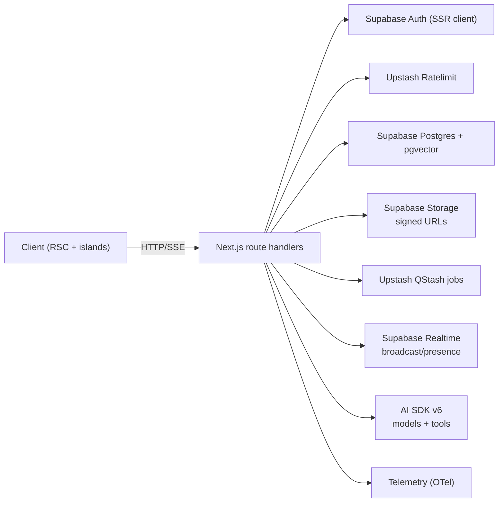

# Frontend Architecture

Audience: frontend engineers working on the Next.js application. Content is implementation-first and free of marketing language.

## Platform Overview

- Next.js `16.0.3` with React `19.2.x`, App Router, RSC-first; React Compiler enabled via `next.config.ts`.
- TypeScript `5.9.x`, strict mode; lint/format via Biome (`pnpm biome:check`); tests via Vitest/Playwright.
- AI SDK v6 (`ai@6.0.0-beta.99`, `@ai-sdk/react@3.0.0-beta.99`) is the only LLM transport.
- Supabase for auth, database, Realtime, Storage, and Vault (BYOK keys).
- Upstash Redis/Ratelimit for cache and throttling; Upstash QStash for async jobs.
- UI stack: Radix primitives, Tailwind CSS v4, shadcn/ui compositions, Framer Motion.
- Payments/Email: Stripe `^19.3.0`, Resend `^6.5.0`.
- Calendar/Scheduling: `ical-generator@10.0.0` with Google Calendar REST integration in `src/lib/calendar`.

## Library Details (versions from `frontend/package.json`)

- **Framework**
  - Next.js `16.0.3`: App Router, RSC-first, React Compiler enabled.
  - React `19.2.x`: UI runtime aligned to Next.js 16.
  - TypeScript `5.9.x`: strict type-checking.
- **AI & Providers**
  - `ai@6.0.0-beta.99`: `streamText/streamObject/generateObject` transports.
  - `@ai-sdk/react@3.0.0-beta.99`: `useChat`, `useAssistant`, `DefaultChatTransport`.
  - `@ai-sdk/openai@3.0.0-beta.60`, `@ai-sdk/anthropic@3.0.0-beta.54`, `@ai-sdk/xai@3.0.0-beta.38`: model connectors.
  - `createGateway`: Vercel AI Gateway routing for BYOK/Gateway keys.
- **Data / Auth**
  - `@supabase/ssr@0.7.0`: SSR client + cookie refresh.
  - `@supabase/supabase-js@2.80.0`: Supabase client (DB, Storage, Realtime).
  - `@supabase/postgrest-js@2.80.0`: typed PostgREST queries.
- **State**
  - `zustand@5.0.8`: client UI state stores.
  - `@tanstack/react-query@5.90.x`: server state cache/fetching + devtools.
- **Realtime**
  - Supabase Realtime (via `supabase-js`): presence/broadcast; wrapped by `use-realtime-channel`.
- **Caching / Rate Limit / Jobs**
  - `@upstash/redis@1.35.6`: HTTP Redis for caches/dedup keys.
  - `@upstash/ratelimit@2.0.7`: sliding-window throttling per route.
  - `@upstash/qstash@2.8.4`: webhook-based background jobs.
- **UI / UX**
  - Radix UI (`@radix-ui/react-*`): accessible primitives.
  - Tailwind CSS v4 + `shadcn/ui`: utility styling + composed components.
  - `framer-motion@12.23.24`: animation; `lucide-react@0.554.0`: icons.
  - `class-variance-authority`, `tailwind-merge`: variant/class helpers.
- **Forms / Validation**
  - `react-hook-form@7.66.1`: form state.
  - Zod `4.1.12` + `@hookform/resolvers`: shared schemas in `src/domain/schemas`.
- **Observability**
  - `@vercel/otel`, `@opentelemetry/api/core/sdk-*`, `@opentelemetry/exporter-trace-otlp-http`: tracing stack; app wrappers in `src/lib/telemetry` and `src/lib/logging`.
- **Security / IDs**
  - `nanoid@5.1.6`, `@/lib/security/random`: ids/timestamps; `jose@6.1.2` for JWT work.
- **Media / Rendering**
  - `html-to-text`, `react-syntax-highlighter`, `streamdown`: markdown/code rendering in streams.
- **Testing / Tooling**
  - Vitest `^4.0.10`, Playwright `^1.56.1`: unit/e2e.
  - Biome `^2.3.6`: lint/format; `tsx@4.20.6`: scripting.
  - `pnpm boundary:check`: enforce architecture boundaries.

## Project Layout (frontend/)

```text
src/
  app/                 # App Router (pages, layouts, API route handlers)
    api/**/route.ts    # Server-only handlers; no module-scope state
  components/          # UI primitives and features (client/server as needed)
  domain/              # Domain logic (e.g., accommodations, amadeus)
  hooks/               # Reusable React hooks (client)
  lib/                 # Providers, telemetry, supabase, security, cache, etc.
  ai/                  # AI SDK tools, models, and helpers
  stores/              # Zustand client stores
  schemas/             # Zod schemas (shared validation/structured outputs)
  prompts/             # Prompt templates
test/, test-utils/, __tests__/ # Vitest utilities and suites
```

Path aliases:

- `@/` → `frontend/src/*`
- `@ai/*` → `frontend/src/ai/*`
- `@domain/*` → `frontend/src/domain/*`
- `@schemas/*` → `frontend/src/domain/schemas/*`
Avoid new barrels; import concrete modules.

## Feature Highlights

- Streaming chat with AI SDK v6 (`/api/chat/stream`) using shared schemas for deterministic tool and output handling.
- Agent endpoints under `/api/agents/*` (flights, accommodations, destinations, itineraries, budget, memory) with domain-specific tool registries.
- BYOK + Gateway provider resolution with request-scoped registry in `src/ai/models/registry.ts`.
- Realtime presence/broadcast via `use-realtime-channel` wrappers; no LLM tokens over Realtime.
- Attachments pipeline: Supabase Storage (`attachments`), Postgres metadata, signed URL access; enforced server-side.
- Memory sync pipeline using QStash webhook `/api/jobs/memory-sync` with Upstash signature verification and Redis idempotency gates.
- Payments/notifications via server-only Stripe/Resend helpers.
- Security dashboard sessions: `/api/security/sessions` (list) and `/api/security/sessions/[sessionId]` (DELETE) use `withApiGuards`, Supabase service-role client on auth schema, and rate limits (`security:sessions:list`, `security:sessions:terminate`).
- Destination search form now calls `/api/places/search` with debounced, abortable requests and client-side type filtering; autocomplete no longer uses mock data.

## Core Patterns

- **RSC-first**: Server Components by default; add `"use client"` only for interactive islands.
- **Route Handlers**: Parse `NextRequest`, create request-scoped Supabase client, Upstash limiter, and provider registry inside the handler, then delegate to a pure `_handler` function. BYOK routes import `"server-only"`. No module-scope singletons beyond config constants.
- **AI SDK Integration**: Use `streamText`, `generateObject`, or `streamObject` with Zod schemas from `src/schemas`. UI hooks use `useChat`/`useAssistant` with `DefaultChatTransport`. No custom streaming stacks.
- **Validation**: Zod v4 schemas kept in domain files per AGENTS rules (see AGENTS.md §4.4–4.5 for schema organization and helpers). Structured outputs share the same schemas across server and client. Canonical types (e.g., `UiTrip`, `TripSuggestion`) defined in `@schemas/*`; stores/hooks re-export for convenience.
- **State**: Client UI state via Zustand slices in `src/stores`; server data via TanStack Query. Realtime channel lifecycle is encapsulated in `use-realtime-channel` and thin wrappers only.
- **Security**: Supabase SSR auth only. Random IDs/timestamps from `@/lib/security/random`. BYOK resolution lives in `src/ai/models/registry.ts`; keys never leave server.
- **Provider precedence**: user gateway key → user provider key (OpenAI/Anthropic/xAI/OpenRouter) → team gateway fallback (opt-in).
- **Caching & Limits**: Upstash Ratelimit/Redis in handlers; auth-bound routes are dynamic (no `'use cache'`).
  Routes accessing `cookies()` or `headers()` cannot use cache directives per Next.js Cache Components restrictions.
  See [Spec: BYOK Routes and Security (Next.js + Supabase Vault)](../specs/0011-spec-byok-routes-and-security.md).
  Public data may use cache directives sparingly.
- **Background Work**: QStash webhooks for async tasks (e.g., memory sync). Handlers must be idempotent and stateless.
- **Telemetry**: Wrap server logic with `withTelemetrySpan` / `withTelemetrySpanSync` and `createServerLogger`; emit operational alerts via `emitOperationalAlert` for critical failures. Avoid `console.*` in server code.

## Workflow Examples

- **Chat streaming**: Client `useChat` (DefaultChatTransport) → `/api/chat/stream` → provider resolved via registry → `streamText` with tools → `toUIMessageStreamResponse()` SSE to client → UI renders progressive tokens.
- **Flight search agent**: Client sends message tagged for flights → `/api/agents/flights` handler → Supabase auth + rate limit + schema validation → AI SDK call with flight tools → structured flight offers streamed back; optional Realtime broadcast for collaboration.
- **Memory sync job**: Chat UI enqueues QStash job → `/api/jobs/memory-sync` verifies Upstash signature + Redis idempotency → caps batch to 50 conversation messages → inserts memories + updates `chat_sessions` in Supabase → returns `{ ok: true, memoriesStored, contextUpdated }`.
- **Attachment upload/use**: Client uploads to `attachments` bucket (signed URL) → Postgres row stores path/MIME/owner → API routes include signed URLs in responses; AI tools may fetch via signed URL for processing.
- **BYOK flow**: User sets keys (Supabase Vault). On request, registry picks user gateway key, else provider key, else team gateway fallback (if consented). Keys never reach client; BYOK routes import `"server-only"`.

## Dependency Roles (cheat sheet)

- **Next.js + React Compiler**: App Router, RSC-first rendering, edge-friendly API routes.
- **AI SDK stack**: Single LLM transport, tool execution, structured outputs—no custom streaming needed.
- **Supabase (Auth/DB/Realtime/Storage/Vault)**: Auth/session source, pgvector DB, presence/broadcast, signed-url storage, BYOK secret vault.
- **Upstash (Redis/Ratelimit/QStash)**: Throttling, short-lived caches/dedup keys, webhook-driven jobs.
- **Zustand + TanStack Query**: Split UI vs server state; colocated hooks in `src/stores` and `src/hooks`.
- **Radix + Tailwind + shadcn/ui + Framer Motion**: Accessible base components, utility styling, composed UI, animations.
- **React Hook Form + Zod**: Forms with shared runtime validation schemas; consistent server/client parsing.
- **Stripe + Resend**: Payments and transactional email; server-only key handling.
- **Telemetry libs**: `@vercel/otel` + OTEL SDKs with app wrappers for spans/logs.

## Data & Realtime

- Supabase PostgreSQL with pgvector for embeddings; JSONB for flexible metadata.
- Supabase Storage for file uploads; access via signed URLs.
- Supabase Realtime for broadcast/presence only. Do not stream LLM tokens over Realtime—AI SDK SSE handles that. All channels created via `use-realtime-channel` or thin wrappers; no direct `supabase.channel()` in new code.
- Connection health is centralized in `useRealtimeConnectionStore` (`src/stores/realtime-connection-store.ts`), which tracks channel status/activity, errors, and exponential backoff. Status values are the app-level enum: `connecting | connected | disconnected | reconnecting | error`. UI surfaces (`ConnectionStatusMonitor` / `ConnectionStatusIndicator`) read from this store; reconnection uses `reconnectAll()` (per-channel unsubscribe/resubscribe) rather than ad-hoc polling or mock state.

### Visual: client <> server data paths



## AI Routes & Tools

- Chat and agent endpoints live under `/api/chat/*` and `/api/agents/*`; they exclusively use AI SDK v6 and return `toUIMessageStreamResponse()` for streaming.
- Tools are defined with `createAiTool` factory inside server modules (`src/ai/tools/**`) and validated with Zod schemas. Keep tool registration centralized via `src/ai/tools/index.ts` (no ad-hoc exports).
- Attachments flow: uploads go to Supabase Storage (bucket `attachments`), metadata persisted in Postgres rows with size/MIME/owner; signed URLs issued per-request.
- Validation flow: request body parsed with shared schemas from `@schemas/*`; handler rejects on Zod failure before provider resolution.

## Testing & Quality Gates

- Lint/format: `pnpm biome:check`.
- Types: `pnpm type-check`.
- Tests: `pnpm test*` (Vitest projects; add `/** @vitest-environment jsdom */` when DOM is used).
- Typical targeted runs: `pnpm test:unit` (unit), `pnpm test:components` (UI), `pnpm test:api` (route handlers), `pnpm test:e2e` (Playwright).
- Follow AGENTS “final-only” rule: delete superseded code and tests when replacements land.

## Deployment

- Local: `pnpm dev`; Supabase CLI for local DB; Upstash cloud or mocks for Redis/QStash.
- Production: Vercel for frontend + API routes; Supabase managed services; Upstash Redis/QStash; AI Gateway for model routing.
- Build flags: React Compiler enabled; bundle analyzer via `pnpm build:analyze`; architecture boundaries check via `pnpm boundary:check`.
