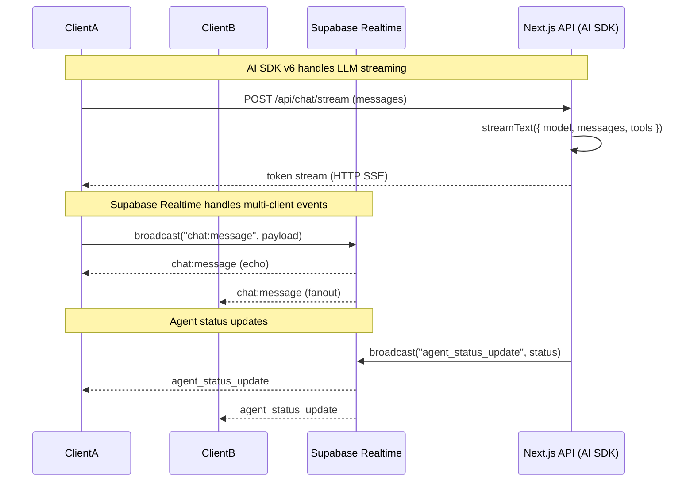

# Frontend Architecture

> **Target Audience**: Frontend developers, architects, and technical stakeholders
> working with the TripSage AI frontend application.

This document provides a comprehensive overview of the TripSage AI frontend
architecture, covering application structure, component organization, data flows,
AI SDK integration, authentication, state management, and how all systems work
together.

## Table of Contents

1. [Overview](#overview)
2. [Technology Stack](#technology-stack)
3. [Application Structure](#application-structure)
4. [Core Architecture Patterns](#core-architecture-patterns)
5. [AI SDK v6 Integration](#ai-sdk-v6-integration)
6. [Authentication & Security](#authentication--security)
7. [State Management](#state-management)
8. [Data Flow & API Integration](#data-flow--api-integration)
9. [UI Components & Pages](#ui-components--pages)
10. [Tool System & Agent Orchestration](#tool-system--agent-orchestration)
11. [Performance & Optimization](#performance--optimization)
12. [Testing Strategy](#testing-strategy)

## Overview

TripSage AI Frontend is a Next.js 16 application built with React 19 that provides
an intelligent travel planning interface powered by AI SDK v6. The application
combines:

- **Multi-provider AI routing** with BYOK (Bring Your Own Keys) support
- **Agentic tool calling** with 15+ production tools via AI SDK v6
- **Streaming chat interface** with generative UI components
- **Real-time collaboration** via Supabase Realtime
- **Server-side rendering** with secure authentication
- **Type-safe end-to-end** with TypeScript and Zod validation

### Key Architectural Principles

1. **Server-First Security**: All sensitive operations (BYOK keys, API calls)
   happen server-side only
2. **Streaming Everything**: SSE-based streaming for chat, tool calls, and UI updates
3. **Type Safety**: End-to-end TypeScript with Zod runtime validation
4. **Library-First**: Leverage proven libraries (AI SDK v6, Supabase, Upstash)
   over custom abstractions
5. **Component-Driven UI**: Modular, reusable components with clear separation
   of concerns

## Technology Stack

### Core Framework

- **Next.js 16.0.1** - App Router with React Server Components
- **React 19.2.0** - Latest React with React Compiler enabled
- **TypeScript 5.9** - Strict mode with full type coverage

### AI & Intelligence

- **AI SDK v6** (`ai@6.0.0-beta.99`) - Core streaming, tools, structured outputs
- **AI SDK React** (`@ai-sdk/react@3.0.0-beta.99`) - `useChat`, `useAssistant` hooks
- **AI SDK Providers**:
  - `@ai-sdk/openai@3.0.0-beta.57` - OpenAI & OpenRouter (via baseURL)
  - `@ai-sdk/anthropic@3.0.0-beta.53` - Claude models
  - `@ai-sdk/xai@3.0.0-beta.37` - xAI Grok models
  - `createGateway` from `ai` - Vercel AI Gateway routing

### Data & Authentication

- **Supabase SSR** (`@supabase/ssr@0.7.0`) - Server-side auth with cookie management
- **Supabase Client** (`@supabase/supabase-js@2.76.1`) - Browser client for Realtime
- **PostgreSQL** (via Supabase) - Primary database with pgvector for embeddings

### Caching & Rate Limiting

- **Upstash Redis** (`@upstash/redis@1.35.6`) - Serverless Redis for caching
- **Upstash Ratelimit** (`@upstash/ratelimit@2.0.7`) - Distributed rate limiting

### State Management

- **Zustand** (`zustand@5.0.8`) - Client-side state management
- **TanStack Query** (`@tanstack/react-query@5.90.5`) - Server state management

### UI & Styling

- **Tailwind CSS v4** - Utility-first CSS with CSS-first configuration
- **Radix UI** - Accessible component primitives
- **shadcn/ui** - Pre-built component library
- **Framer Motion** (`framer-motion@12.23.24`) - Animations

### Validation & Schemas

- **Zod** (`zod@4.1.12`) - Runtime validation and type inference
- **React Hook Form** (`react-hook-form@7.66.0`) - Form state management

## Application Structure

```text
frontend/
├── src/
│   ├── app/                    # Next.js App Router pages & routes
│   │   ├── (auth)/            # Auth route group (login, register, reset)
│   │   ├── (dashboard)/       # Protected dashboard routes
│   │   ├── api/               # API route handlers (server-only)
│   │   ├── chat/              # Chat interface page
│   │   ├── settings/          # User settings pages
│   │   └── layout.tsx         # Root layout with providers
│   ├── components/            # React components
│   │   ├── ai-elements/       # AI SDK UI primitives
│   │   ├── admin/             # Admin panel components
│   │   ├── auth/              # Authentication components
│   │   ├── calendar/          # Calendar UI components
│   │   ├── charts/            # Data visualization
│   │   ├── features/          # Feature-specific components
│   │   ├── layouts/           # Layout components (Navbar, etc.)
│   │   └── ui/                # Base UI components (shadcn)
│   ├── lib/                   # Utility libraries & integrations
│   │   ├── agents/           # Agent runtime & orchestration
│   │   ├── calendar/         # Google Calendar integration
│   │   ├── embeddings/       # Vector embeddings & RAG
│   │   ├── providers/        # AI provider registry & BYOK
│   │   ├── supabase/         # Supabase clients & RPCs
│   │   ├── telemetry/        # OpenTelemetry instrumentation
│   │   ├── tools/             # AI SDK v6 tool definitions
│   │   └── ...                # Other utilities
│   ├── hooks/                 # Custom React hooks
│   ├── stores/                # Zustand stores
│   ├── types/                 # TypeScript type definitions
│   ├── schemas/               # Zod validation schemas
│   └── prompts/               # AI prompt templates
├── middleware.ts              # Next.js middleware (Supabase auth)
├── package.json               # Dependencies & scripts
└── tsconfig.json              # TypeScript configuration
```

## Core Architecture Patterns

### Server Components vs Client Components

The application follows Next.js 16 patterns:

- **Server Components** (default): All pages, layouts, and API routes are
  server components
- **Client Components** (`"use client"`): Only interactive UI components (forms,
  chat, real-time updates)
- **Server Actions**: Form submissions and mutations handled server-side

### Route Organization

- **Route Groups**: `(auth)` and `(dashboard)` organize routes without
  affecting URLs
- **API Routes**: All under `/api/` with `"server-only"` imports
- **Dynamic Routes**: `[id]`, `[service]` for parameterized routes

### File Naming Conventions

- **Pages**: `page.tsx` (App Router convention)
- **Layouts**: `layout.tsx` (nested layouts supported)
- **API Routes**: `route.ts` (GET, POST, etc. exports)
- **Components**: PascalCase (`ChatPage.tsx`)
- **Utilities**: camelCase (`resolveProvider.ts`)

## AI SDK v6 Integration

### Provider Registry System

The provider registry (`src/lib/providers/registry.ts`) implements a three-tier
resolution strategy:

1. **Per-User Gateway Key** (highest precedence)
   - User's own Vercel AI Gateway API key
   - Resolved via `getUserApiKey(userId, "gateway")`
   - Uses `createGateway({ apiKey, baseURL })` from `ai` package

2. **Per-Provider BYOK Keys**
   - User's provider-specific keys (OpenAI, Anthropic, xAI, OpenRouter)
   - Stored encrypted in Supabase Vault, accessed via SECURITY DEFINER RPCs
   - OpenRouter uses `createOpenAI({ apiKey, baseURL: "https://openrouter.ai/api/v1"
  })`
   - xAI uses `createXAI({ apiKey })` from `@ai-sdk/xai`
   - Anthropic uses `createAnthropic({ apiKey })` from `@ai-sdk/anthropic`

3. **Team Gateway Fallback** (lowest precedence)
   - Server-side `AI_GATEWAY_API_KEY` environment variable
   - Requires user consent (`allowGatewayFallback` setting)
   - Uses `createGateway({ apiKey, baseURL })` for consistency

### Streaming Chat Architecture

The chat system (`src/app/chat/page.tsx`) uses AI SDK v6's `useChat` hook with `DefaultChatTransport`:

```typescript
const transport = new DefaultChatTransport({
  api: "/api/chat/stream",
  body: () => ({ user_id: userId }),
  credentials: "include",
  prepareSendMessagesRequest: ({ messages, id }) => {
    // Route to agent endpoints based on metadata
    if (metadata.agent === "flightSearch") {
      return { api: "/api/agents/flights", body: metadata.request };
    }
    // Default to general chat stream
    return { api: "/api/chat/stream", body: { id, messages, user_id: userId } };
  },
});
```

**Key Features:**

- Resumable streams with automatic reconnection
- Agent routing based on message metadata
- Tool call interleaving in streams
- Attachment support (images only)

### Tool System

All AI tools are defined in `src/lib/tools/` using AI SDK v6's `tool()` function:

```typescript
export const searchFlights = tool({
  description: "Search for flight options",
  parameters: z.object({
    origin: z.string(),
    destination: z.string(),
    departureDate: z.string(),
  }),
  execute: async ({ origin, destination, departureDate, userId }) => {
    // Server-only execution with rate limiting
  },
});
```

**Tool Categories:**

- **Accommodations**: Search, check availability, book (via MCP)
- **Flights**: Search flights (Duffel API)
- **Maps**: Geocoding, distance matrix (Google Maps)
- **Calendar**: Create events, check availability (Google Calendar)
- **Memory**: Store/retrieve conversation context
- **Planning**: Create/update travel plans
- **Web Search**: Search web, crawl URLs
- **Weather**: Current weather lookup
- **Travel Advisory**: Safety information

**Tool Registry**: All tools exported from `src/lib/tools/index.ts` as a unified
registry for dynamic selection.

### Structured Outputs

The application uses `generateObject` and `streamObject` for schema-first responses:

```typescript
const result = await generateObject({
  model: llm,
  schema: z.object({
    destinations: z.array(z.object({ name: z.string(), reason: z.string() })),
  }),
});
```

This ensures deterministic parsing and type safety for AI responses.

## Authentication & Security

### Supabase SSR Authentication

**Middleware** (`middleware.ts`):

- Runs on every request (except static assets)
- Creates Supabase server client with cookie handling
- Refreshes session and syncs cookies for React Server Components

**Server Client** (`src/lib/supabase/server.ts`):

- Uses `createServerClient` from `@supabase/ssr`
- Cookie-based session management
- Accessible in Server Components and API routes

**Browser Client** (`src/lib/supabase/client.ts`):

- Singleton pattern for browser-side Supabase client
- Used for Realtime subscriptions and client-side queries
- Accessed via `useSupabase()` hook

### BYOK Key Management

**Storage**: User API keys encrypted in Supabase Vault (`api_keys` table)

**Access Pattern**:

1. Keys stored via `setUserApiKey(userId, service, key)` RPC
2. Keys retrieved via `getUserApiKey(userId, service)` RPC (SECURITY DEFINER)
3. RPCs validate JWT claims and user ownership
4. Keys never exposed to client-side code (`"server-only"` imports)

**Security Features**:

- Encryption at rest in Supabase Vault
- SECURITY DEFINER RPCs with row-level security
- Server-only key access (no client-side exposure)
- Rate limiting on key validation endpoints

### Rate Limiting

**Upstash Redis Integration**:

- Sliding window rate limiting per user/IP
- Tiered limits: 40 req/min (streaming), 20 req/min (validation)
- Deployed as Next.js Route Handlers/Background Functions on Vercel

**Implementation**:

```typescript
const limiter = new Ratelimit({
  redis: Redis.fromEnv(),
  limiter: Ratelimit.slidingWindow(40, "1 m"),
  prefix: "ratelimit:chat",
});
```

## State Management & Data Flow

### Client State (Zustand)

Zustand stores in `src/stores/`:

- **`chat-store.ts`**: Chat message history, session management
- **`search-filters-store.ts`**: Search filter state (destinations, dates,
  etc.)
- **`search-history-store.ts`**: Search history persistence
- **`user-store.ts`**: User profile and preferences
- **`currency-store.ts`**: Currency conversion state

**Pattern**: Stores are lightweight, focused on UI state. Server state handled
by TanStack Query.

### Server State (TanStack Query)

All data fetching uses TanStack Query:

```typescript
const { data, isLoading } = useQuery({
  queryKey: ["trips", tripId],
  queryFn: () => apiClient.get(`/api/trips/${tripId}`),
});
```

**Benefits**:

- Automatic caching and deduplication
- Background refetching
- Optimistic updates
- Error handling

### Real-time State (Supabase Realtime)

Supabase Realtime subscriptions for live updates:

- **Trip collaboration**: Multi-user trip editing
- **Agent status**: Live agent execution updates
- **Notifications**: Real-time user notifications

**Pattern**: Subscriptions managed in `RealtimeAuthProvider` component.

## Realtime and AI SDK Responsibilities

This section documents the architectural invariants that govern how Supabase Realtime and AI SDK v6 are used in the frontend application. These invariants ensure clear separation of concerns and prevent architectural drift.

### Transport Separation

**Invariant**: All LLM responses, token streams, and model interactions flow **only** through AI SDK v6 (via `useChat` on the client and `streamText` / `streamObject` on the server).

- **Client-side**: `useChat` hook from `@ai-sdk/react` with `DefaultChatTransport` manages all chat streaming
- **Server-side**: Route handlers use `streamText`, `streamObject`, `generateObject`, and `convertToModelMessages` from `ai` package
- **Never**: Supabase Realtime is never used for streaming model tokens or LLM responses

**Rationale**: AI SDK v6 provides optimized streaming, resumable connections, tool calling, and structured outputs. Mixing transports would create complexity and break AI SDK's built-in features.

### Realtime Backbone

**Invariant**: All multi-client chat events, presence, and agent status updates use Supabase Realtime broadcast and presence.

- **Multi-client chat events**: Message fanout, typing indicators, session broadcasts
- **Agent status updates**: Live agent execution progress, task updates, resource usage
- **Presence**: User online/offline status, active sessions
- **Channel pattern**: All realtime channels are created through `useRealtimeChannel` or its thin wrappers (`useWebSocketChat`, `useTripRealtime`, `useChatRealtime`)

**Rationale**: Supabase Realtime provides efficient pub/sub, presence, and Postgres change subscriptions. It's optimized for multi-client fanout, not token streaming.

### Single Low-Level Hook

**Invariant**: All Supabase Realtime usage is funneled through **one hook**: `useRealtimeChannel` (and possibly very thin wrappers).

- **Core hook**: `useRealtimeChannel` in `frontend/src/hooks/use-realtime-channel.ts` handles all channel lifecycle
- **Wrappers**: `useWebSocketChat`, `useTripRealtime`, `useChatRealtime` are thin wrappers that delegate to `useRealtimeChannel`
- **Never**: Feature code never directly instantiates `RealtimeChannel` or calls `supabase.channel(...)` directly

**Current violations** (to be refactored in later phases):

- `frontend/src/stores/chat-store.ts` line 461: Direct `supabase.channel()` call in `connectRealtime`
- `frontend/src/hooks/use-agent-status-websocket.ts` line 261: Direct `supabase.channel()` call
- `frontend/src/hooks/use-trips.ts` lines 415, 574: Direct `supabase.channel()` calls for Postgres changes

**Rationale**: Centralizing channel management ensures consistent error handling, reconnection logic, and resource cleanup.

### Hooks Own Connections, Stores Own State

**Invariant**: Hooks handle connection lifecycles, subscribe/unsubscribe, and backoff. Zustand stores hold logical state and lightweight realtime snapshots.

- **Hooks responsibility**: Connection state (`isConnected`, `error`), subscription lifecycle, reconnection logic
- **Stores responsibility**: Logical state (messages, typing users, agent status objects), UI state snapshots
- **Pattern**: Hooks update stores via callbacks or direct store mutations; stores never own channels

**Example pattern**:

```typescript
// Hook manages connection
const { isConnected, onBroadcast } = useRealtimeChannel(`session:${sessionId}`);

// Hook updates store on events
useEffect(() => {
  onBroadcast({ event: "chat:message" }, (payload) => {
    useChatStore.getState().addMessage(sessionId, payload);
  });
}, [onBroadcast, sessionId]);
```

**Rationale**: Separating connection management from state management improves testability and allows stores to be pure state containers.

### Security and Privacy

**Invariant**: Private channels (per user or per session) use Realtime Authorization and appropriate RLS rules. Sensitive content is not broadcast to public channels.

- **Private channels**: All user-specific and session-specific channels use `{ private: true }` config
- **Channel topics**: Follow patterns like `user:${userId}`, `session:${sessionId}`, `trip:${tripId}`
- **Authorization**: Supabase Realtime Authorization policies enforce access control
- **RLS**: Row-level security rules prevent unauthorized access to channel data

**Rationale**: Security boundaries must be enforced at the transport layer to prevent data leaks.

### Architecture Flow Diagram



### Inventory

#### Supabase Realtime Entry Points

1. **`useRealtimeChannel`** (`frontend/src/hooks/use-realtime-channel.ts`)
   - Core hook for all Realtime channel subscriptions
   - Manages connection lifecycle, error handling, broadcast helpers
   - Used by: `useWebSocketChat`, `useTripRealtime`

2. **`useWebSocketChat`** (`frontend/src/hooks/use-websocket-chat.ts`)
   - Wrapper around `useRealtimeChannel` for chat-specific events
   - Handles: `chat:message`, `chat:typing` broadcasts
   - Used by: `useChatRealtime`

3. **`useTripRealtime`** (`frontend/src/hooks/use-supabase-realtime.ts`)
   - Wrapper around `useRealtimeChannel` for trip-specific channels
   - Topic pattern: `trip:${tripId}`
   - Used by: Trip detail pages, collaboration features

4. **`useChatRealtime`** (`frontend/src/hooks/use-supabase-realtime.ts`)
   - Wrapper around `useWebSocketChat` for session-based chat
   - Topic pattern: `session:${sessionId}`
   - Used by: Chat session components

5. **`useAgentStatusWebSocket`** (`frontend/src/hooks/use-agent-status-websocket.ts`)
   - **VIOLATION**: Directly calls `supabase.channel()` (should use `useRealtimeChannel`)
   - Handles: `agent_status_update`, `agent_task_start`, `agent_task_progress`, `agent_task_complete`, `agent_error`
   - Topic pattern: `user:${userId}`
   - Used by: Agent monitoring dashboard

6. **`chat-messages.ts`** (`frontend/src/stores/chat/chat-messages.ts`)
   - Zustand slice for message management and UI state
   - Handles: Message CRUD, attachments, URL object lifecycle
   - No direct Realtime calls (uses hooks for coordination)

7. **`chat-memory.ts`** (`frontend/src/stores/chat/chat-memory.ts`)
   - Zustand slice for memory context and sync preferences
   - Handles: Memory sync preferences, calls `/api/memory/sync` endpoint
   - No direct server imports (uses API endpoints)

8. **`useChatActions`** (`frontend/src/hooks/useChatActions.ts`)
   - Orchestrator hook for coordinated chat operations
   - Combines `chat-messages` and `chat-memory` operations without violating slice isolation
   - Used by: Chat components for message + memory sync operations

9. **`use-trips.ts`** (`frontend/src/hooks/use-trips.ts`)
   - **VIOLATION**: Directly calls `supabase.channel()` for Postgres changes (should use `useRealtimeChannel`)
   - Handles: Postgres changes on `trips` table
   - Topic patterns: `trips:${userId}`, `trip:${tripId}`

#### AI SDK v6 Entry Points

1. **Route Handlers**:
   - **`/api/chat/stream`** (`frontend/src/app/api/chat/stream/route.ts` + `_handler.ts`)
     - Uses: `streamText`, `convertToModelMessages`, `tool`, `generateObject`, `experimental_repairToolCall`, `stepCountIs(10)`
     - Returns: `result.toUIMessageStreamResponse()` with `messageMetadata` and error handling
     - Handles: Main chat streaming with advanced tool calling and memory integration

   - **`/api/chat/send`** (`frontend/src/app/api/chat/send/route.ts`)
     - Uses: `generateText`, `convertToModelMessages`
     - Returns: JSON response with completion data
     - Handles: Non-streaming chat completions

   - **`/api/memory/sync`** (`frontend/src/app/api/memory/sync/route.ts`)
     - Uses: QStash enqueue functions server-side
     - Returns: JSON response with job status
     - Handles: Background memory synchronization jobs

   - **`/api/ai/stream`** (`frontend/src/app/api/ai/stream/route.ts`)
     - Uses: `streamText`
     - Returns: `result.toUIMessageStreamResponse()`
     - Purpose: Demo/development route

   - **`/api/agents/*`** (multiple routes)
     - Uses: `streamText`, `generateObject`, `tool`
     - Specialized agent endpoints (flights, accommodations, destinations, etc.)

2. **Client Components**:
   - **`/chat`** (`frontend/src/app/chat/page.tsx`)
     - Uses: `useChat` from `@ai-sdk/react`, `DefaultChatTransport` from `ai`
     - Manages: Chat UI state, message streaming, resumable connections
     - AI Elements: Uses `Conversation`, `Message`, `Response`, `PromptInput`, `Sources` components

3. **Client API Helpers**:
   - **`@/lib/chat/api-client.ts`**
     - `sendChatMessage()`: Calls `/api/chat/send` for non-streaming completions
     - `streamChatMessage()`: Calls `/api/chat/stream`, parses SSE for `text-delta` chunks
     - `convertToUiMessages()`: Converts internal `Message[]` to AI SDK `UIMessage[]` format
     - Handles: `UIMessage` construction with `parts` array, SSE stream consumption

4. **State Management (Chat)**:
   - **`useChatMessages`** (`frontend/src/stores/chat/chat-messages.ts`)
     - Message CRUD operations, attachment handling, URL object lifecycle management
     - No direct AI operations (delegates to API routes)
   - **`useChatMemory`** (`frontend/src/stores/chat/chat-memory.ts`)
     - Memory sync preferences, calls `/api/memory/sync` for background jobs
     - No server-only imports (uses REST endpoints)
   - **`useChatActions`** (`frontend/src/hooks/useChatActions.ts`)
     - Orchestrator hook combining message and memory operations
     - Maintains slice isolation while enabling coordinated workflows

## Data Flow & API Integration

### API Route Architecture

All API routes follow this pattern:

```typescript
import "server-only";

export const dynamic = "force-dynamic"; // No caching for auth-dependent routes

export async function POST(req: NextRequest) {
  // 1. Authenticate via Supabase
  const supabase = await createServerSupabase();
  const { data: { user } } = await supabase.auth.getUser();
  
  // 2. Rate limit
  const limiter = getRateLimiter();
  await limiter.limit(user?.id ?? ip);
  
  // 3. Resolve provider (BYOK)
  const { model } = await resolveProvider(user.id, modelHint);
  
  // 4. Execute AI SDK operation
  const result = await streamText({ model, messages, tools });
  
  // 5. Return stream
  return result.toUIMessageStreamResponse();
}
```

### API Route Categories

1. **Chat Routes** (`/api/chat/stream`):
   - Main streaming chat endpoint
   - Handles tool calling, memory integration
   - Token budgeting and usage tracking

2. **Agent Routes** (`/api/agents/*`):
   - Specialized agent endpoints (flights, accommodations, etc.)
   - Agent-specific tool orchestration
   - Structured output generation

3. **Key Management** (`/api/keys/*`):
   - BYOK key CRUD operations
   - Key validation against providers
   - Server-only, Vault-backed

4. **User Settings** (`/api/user-settings`):
   - User preferences (Gateway fallback consent, etc.)
   - Supabase RPC-backed

5. **Attachments** (`/api/attachments/*`):
   - File upload to Supabase Storage
   - Signed URL generation
   - Content validation

### Data Fetching Pattern

**Client-Side**:

```typescript
const { useAuthenticatedApi } = require("@/lib/api/client");
const apiClient = useAuthenticatedApi();
const { data } = useQuery({
  queryKey: ["trips"],
  queryFn: () => apiClient.get("/api/trips"),
});
```

**Server-Side**:

```typescript
// In Server Components or API routes
const supabase = await createServerSupabase();
const { data } = await supabase.from("trips").select("*");
```

## UI Components & Pages

### Page Structure

**Public Pages** (`(auth)` route group):

- `/login` - User authentication
- `/register` - User registration
- `/reset-password` - Password reset flow

**Protected Pages** (`(dashboard)` route group):

- `/` - Dashboard home
- `/chat` - Main AI chat interface
- `/trips` - Trip management and planning
- `/trips/[id]` - Individual trip view
- `/trips/[id]/collaborate` - Multi-user collaboration
- `/search/*` - Search interfaces (destinations, flights, hotels, activities)
- `/calendar` - Calendar integration view
- `/settings` - User settings
- `/settings/api-keys` - BYOK key management
- `/admin/*` - Admin panel (configuration, agents)

### AI Elements Components

Custom UI primitives in `src/components/ai-elements/`:

- **`PromptInput`**: Chat input with attachments, tool selection
- **`Message`**: Message display with avatar, content, metadata
- **`Response`**: AI response rendering with markdown
- **`Conversation`**: Chat conversation container with scrolling
- **`Sources`**: Citation and source display for RAG responses
- **`ItineraryTimeline`**: Visual itinerary display
- **`FlightOfferCard`**: Flight search result card
- **`StayCard`**: Accommodation result card
- **`DestinationCard`**: Destination information card
- **`BudgetChart`**: Budget visualization

**Design Philosophy**: Components are composable, accessible (Radix UI), and
optimized for streaming content.

### Layout Components

- **`Navbar`**: Top navigation with user menu, theme toggle
- **`ThemeProvider`**: Dark/light mode management
- **`RealtimeAuthProvider`**: Supabase Realtime authentication wrapper
- **`TanStackQueryProvider`**: Query client setup
- **`PerformanceMonitor`**: Web Vitals tracking

## Tool System & Agent Orchestration

### Tool Execution Flow

1. **User sends message** → Chat page (`/chat`)
2. **Message routed** → API route (`/api/chat/stream` or `/api/agents/*`)
3. **Provider resolved** → BYOK registry (`resolveProvider`)
4. **Tools selected** → Tool registry (`toolRegistry`)
5. **AI SDK streams** → `streamText({ model, messages, tools })`
6. **Tool calls interleaved** → Tool execution server-side
7. **Results streamed** → Client receives updates via SSE
8. **UI updates** → Components render tool results

### Agent Routes

Specialized agent endpoints for complex workflows:

- **`/api/agents/flights`**: Flight search agent with structured outputs
- **`/api/agents/accommodations`**: Accommodation search via MCP
- **`/api/agents/destinations`**: Destination research with RAG
- **`/api/agents/itineraries`**: Itinerary planning with LangGraph.js
- **`/api/agents/budget`**: Budget planning with calculations
- **`/api/agents/memory`**: Memory storage and retrieval

**Agent Pattern**: Each agent route uses specialized tool sets and structured
output schemas for deterministic results.

### Tool Approval Flow

Sensitive operations (bookings, payments) require explicit approval:

1. Tool execution paused
2. Approval UI displayed
3. User confirms or rejects
4. Tool execution resumes or cancels

**Implementation**: `src/lib/tools/approvals.ts` provides approval workflow helpers.

## Performance & Optimization

### React Compiler

React Compiler enabled (`reactCompiler: true` in `next.config.ts`):

- Automatic memoization
- Optimized re-renders
- Zero-overhead reactive updates

### Streaming Optimizations

- **SSE Streaming**: All AI responses streamed (no waiting for completion)
- **Tool Call Interleaving**: Tool results appear as they complete
- **Resumable Streams**: Automatic reconnection on network issues
- **Progressive Rendering**: UI updates incrementally as content arrives

### Caching Strategy

- **Upstash Redis**: Distributed caching for rate limits, tool results
- **Next.js Cache**: Static page generation where possible
- **TanStack Query**: Client-side request caching and deduplication
- **Supabase Cache**: Built-in query result caching

### Code Splitting

- **Route-based**: Each route loads only its dependencies
- **Dynamic Imports**: Heavy components loaded on demand
- **Tree Shaking**: Unused code eliminated at build time

### Image Optimization

- **Next.js Image**: Automatic optimization, lazy loading
- **Supabase Storage**: CDN-backed image delivery
- **Signed URLs**: Secure, time-limited image access

## Testing Strategy

### Unit Tests (Vitest)

- **Location**: `src/**/__tests__/`
- **Coverage Target**: 85%+
- **Pattern**: Isolated component/function tests with mocks

### Integration Tests (Vitest)

- **API Routes**: Full request/response cycle testing
- **Tool Execution**: End-to-end tool calling with mocked external APIs
- **Provider Resolution**: BYOK key resolution flow testing

### E2E Tests (Playwright)

- **Location**: `e2e/`
- **Scenarios**: User flows (login, chat, trip creation)
- **Coverage**: Critical user paths

### Test Utilities

- **`src/test-setup.ts`**: Global test configuration
- **`src/test-utils/`**: Shared test helpers and mocks
- **Mocking**: Supabase, Upstash, AI SDK providers mocked at adapter boundary

## Key Integration Points

### AI SDK v6 ↔ Provider Registry

- Registry resolves user keys → Returns `LanguageModel` instance
- AI SDK consumes model → Streams responses
- Telemetry tracks provider usage → Observability

### Supabase ↔ Authentication

- Middleware refreshes session → Server Components get user
- RPCs access Vault → BYOK keys retrieved securely
- Realtime subscriptions → Live updates to UI

### Upstash ↔ Rate Limiting

- Rate limiter checks limits → Allows/denies requests
- Redis caches tool results → Reduces external API calls
- Distributed across Edge → Global rate limiting

### Tools ↔ External APIs

- Tools call external APIs → Results returned to AI
- Rate limiting per tool → Prevents API abuse
- Error handling → Graceful degradation

## Summary

The TripSage AI frontend is a modern, type-safe Next.js application that
seamlessly integrates:

- **AI SDK v6** for streaming AI interactions with multi-provider support
- **Supabase** for authentication, database, and real-time features
- **Upstash Redis** for distributed caching and rate limiting
- **Zustand + TanStack Query** for efficient state management
- **Radix UI + Tailwind** for accessible, performant components

The architecture prioritizes security (server-only BYOK), performance (streaming
everything), and developer experience (type safety, clear patterns). All systems
work together through well-defined interfaces and consistent patterns, making
the codebase maintainable and extensible.
