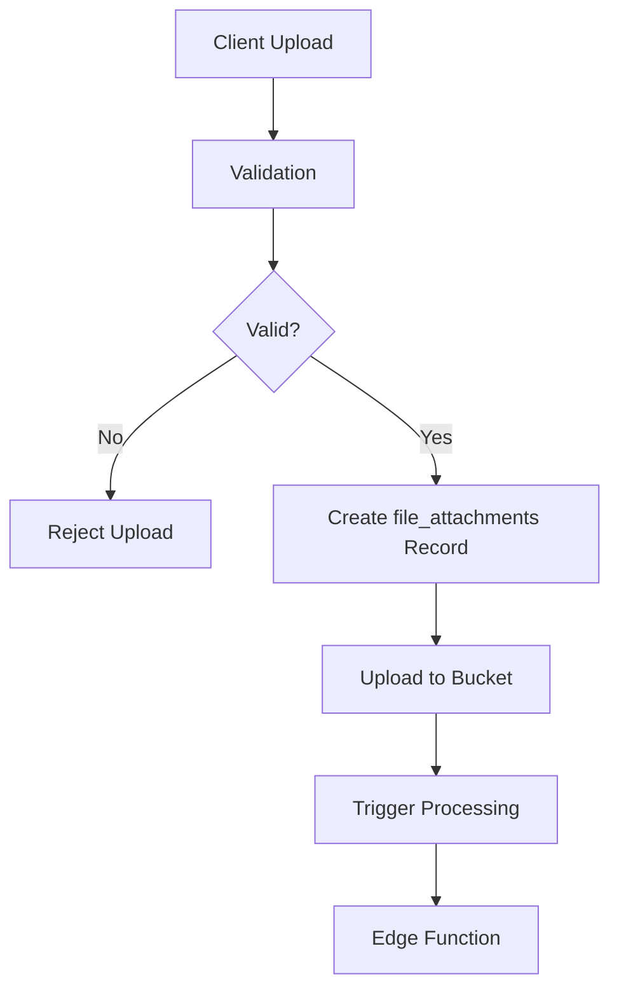

# Storage Architecture

> **Target Audience**: System architects, security engineers, infrastructure leads

This document describes TripSage's storage architecture, security model, and file processing patterns. For implementation details and API usage, see the [Storage Implementation Guide](../developers/storage-guide.md).

## Storage Buckets

### 1. Attachments Bucket (`attachments`)

**Purpose**: Store trip-related documents and chat attachments

**Configuration**:

- **Access**: Private (authentication required)
- **Size Limit**: 50MB per file
- **Allowed Types**: PDF, Word docs, Excel files, images, text files
- **Security**: RLS policies based on trip ownership/collaboration

**File Organization**:

```text
attachments/
├── trip_123/
│   ├── documents/
│   │   ├── itinerary.pdf
│   │   └── booking_confirmation.docx
│   └── images/
│       ├── passport.jpg
│       └── visa.png
└── user_uuid/
    ├── personal_documents/
    └── temp_uploads/
```

### 2. Avatars Bucket (`avatars`)

**Purpose**: Store user profile images

**Configuration**:

- **Access**: Public (anyone can view)
- **Size Limit**: 5MB per file
- **Allowed Types**: JPEG, PNG, GIF, WebP, AVIF
- **Security**: Users can only upload/modify their own avatar

**File Organization**:

```text
avatars/
├── user_uuid_1.jpg
├── user_uuid_2.png
└── user_uuid_3.webp
```

### 3. Trip Images Bucket (`trip-images`)

**Purpose**: Store trip-related photos and media

**Configuration**:

- **Access**: Private (controlled by RLS)
- **Size Limit**: 20MB per file
- **Allowed Types**: All image formats including HEIC/HEIF
- **Security**: Trip collaboration permissions apply

**File Organization**:

```text
trip-images/
├── trip_123/
│   ├── destinations/
│   │   ├── paris_eiffel_tower.jpg
│   │   └── rome_colosseum.heic
│   ├── accommodations/
│   │   └── hotel_room.png
│   └── activities/
│       └── museum_visit.jpg
```

### 4. Thumbnails Bucket (`thumbnails`)

**Purpose**: Store auto-generated thumbnails

**Configuration**:

- **Access**: Private (auto-generated)
- **Size Limit**: 10MB per file
- **Allowed Types**: JPEG, PNG, WebP, AVIF
- **Security**: Inherited from original file permissions

### 5. Quarantine Bucket (`quarantine`)

**Purpose**: Isolate files flagged by virus scanning

**Configuration**:

- **Access**: Service role only
- **Size Limit**: 100MB per file
- **Allowed Types**: Any (for quarantine purposes)
- **Security**: Admin access only

## Security Model

### Row Level Security (RLS)

The storage system implements **fine-grained access control** at the database level:

#### Access Control Patterns

- **Trip-Based Access**: Files scoped to trips with collaboration permissions
- **User Ownership**: Upload-based ownership tracking
- **Bucket Isolation**: Different security rules per storage bucket
- **Path-Based Security**: Hierarchical permission inheritance
- **Role-Based Access**: Admin, editor, viewer permission levels

### Permission Hierarchy

1. **Trip Owner**: Full access to all trip files
2. **Admin Collaborator**: Can upload/delete trip files
3. **Edit Collaborator**: Can upload files, view all
4. **View Collaborator**: Can only view files
5. **File Owner**: Can always modify their own uploads

## File Processing Pipeline

### 1. Upload Flow



### 2. Processing Operations

#### Virus Scanning

- **Trigger**: On upload completion
- **Service**: ClamAV integration
- **Action**: Quarantine infected files
- **Status**: Tracked in `virus_scan_status`

#### Thumbnail Generation

- **Trigger**: Image uploads
- **Output**: Multiple sizes (150x150, 300x300, 600x600)
- **Format**: WebP for efficiency
- **Storage**: Thumbnails bucket

#### Metadata Extraction

- **Documents**: Page count, word count, language
- **Images**: EXIF data, dimensions, GPS coordinates
- **Storage**: JSON metadata in `file_attachments.metadata`

### 3. File Versioning Architecture

The system maintains **comprehensive version history**:

- **Version Tracking**: All file modifications create new versions
- **Checksum Validation**: Integrity verification for each version
- **Current Version Pointer**: Fast access to latest version
- **Version Metadata**: Upload user, timestamp, and changes
- **Rollback Support**: Restore to any previous version

## API Architecture

### Upload Architecture

The system provides **multiple upload patterns** for flexibility:

#### Upload Patterns - Storage

1. **Signed URL Upload**: Pre-authenticated URLs for direct client upload
2. **Direct Upload**: Server-mediated upload with validation
3. **Chunked Upload**: Large file support with resume capability
4. **Batch Upload**: Multiple files in single operation
5. **Background Upload**: Async processing for large operations

#### Validation Architecture

- **Pre-upload Validation**: Size, type, and quota checks
- **Server-side Validation**: Additional security verification
- **Async Validation**: Virus scanning and content analysis
- **Quota Enforcement**: User and trip-level limits
- **Error Recovery**: Partial upload cleanup

### Download Architecture

**Secure file access** with multiple patterns:

- **Public URLs**: CDN-accelerated public assets
- **Signed URLs**: Time-limited authenticated access
- **Streaming Download**: Large file support
- **Batch Download**: Multiple files as archive
- **Progressive Download**: Partial content support

## Storage Quotas

### User Quotas

- **Attachments**: 5GB per user
- **Avatars**: 50MB per user
- **Trip Images**: 2GB per user

### Trip Quotas

- **Documents**: 10GB per trip
- **Images**: 20GB per trip
- **Collaborators**: Shared quota pool

### Quota Management Architecture

**Intelligent quota system** with multiple enforcement levels:

- **Real-time Tracking**: Live usage monitoring
- **Pre-flight Checks**: Validation before upload
- **Soft Limits**: Warnings before hard limits
- **Grace Periods**: Temporary quota extensions
- **Usage Analytics**: Historical usage patterns

## Monitoring and Maintenance

### Maintenance Architecture

The system implements **automated maintenance** procedures:

#### Cleanup Strategies

- **Orphaned File Detection**: Identify unlinked files
- **Expired File Removal**: Time-based cleanup policies
- **Version Pruning**: Keep only recent versions
- **Temporary File Cleanup**: Session-based file removal
- **Failed Upload Cleanup**: Incomplete upload recovery

#### Performance Optimization - Storage

**Storage performance** maintained through:

- **Strategic Indexing**: Optimized query performance
- **Partitioning**: Large table management
- **Archival Strategy**: Cold storage for old files
- **CDN Caching**: Edge delivery optimization
- **Compression**: Storage efficiency for text files

## Processing Architecture

### Edge Function Integration

The system uses **serverless functions** for file processing:

#### Processing Operations

- **Virus Scanning**: Real-time malware detection
- **Thumbnail Generation**: Multiple sizes and formats
- **Metadata Extraction**: Document analysis and indexing
- **Content Optimization**: Compression and format conversion
- **AI Analysis**: Content classification and tagging

#### Processing Queue Architecture

**Asynchronous processing** ensures performance:

- **Priority Queue**: Critical operations processed first
- **Retry Logic**: Automatic failure recovery
- **Batch Processing**: Efficient resource utilization
- **Status Tracking**: Real-time processing visibility
- **Resource Limits**: Prevent system overload

## Error Handling

### Upload Failures

- Automatic retry for network issues
- Size/type validation before upload
- Quota checking with user feedback
- Partial upload cleanup

### Processing Failures

- Retry mechanism with exponential backoff
- Error logging with context
- Manual retry capability
- Fallback processing modes

### Security Incidents

- Automatic quarantine for infected files
- Admin notification system
- Audit trail for all file operations
- Incident response procedures

## Security Architecture

### Multi-Layer Security

The storage system implements **defense in depth**:

#### Security Layers

1. **Authentication**: JWT-based user verification
2. **Authorization**: RLS policies at database level
3. **Validation**: File type and size restrictions
4. **Scanning**: Real-time virus detection
5. **Encryption**: At-rest and in-transit protection

#### Security Patterns

- **Least Privilege**: Minimal required permissions
- **Separation of Concerns**: Isolated bucket security
- **Audit Trail**: Complete operation logging
- **Incident Response**: Automated threat handling
- **Compliance**: GDPR and data protection

## Architectural Patterns

### Upload Patterns

**Best practices** for file uploads:

1. **Progressive Enhancement**: Basic upload with advanced features
2. **Optimistic UI**: Immediate feedback with async processing
3. **Resilient Design**: Automatic retry and resume
4. **Security First**: Client and server validation
5. **Performance**: Chunked uploads for large files

### Storage Patterns

**Architectural patterns** for storage:

- **Hierarchical Organization**: Logical file structure
- **Metadata-Driven**: Rich file metadata for search
- **Version Control**: Complete file history
- **Access Patterns**: Optimize for common queries
- **Lifecycle Management**: Automated retention policies

## Scalability Architecture

### Horizontal Scaling

The storage system supports **unlimited scale**:

- **Bucket Sharding**: Distribute files across buckets
- **CDN Integration**: Global edge delivery
- **Parallel Processing**: Concurrent file operations
- **Queue Scaling**: Dynamic worker allocation
- **Database Partitioning**: Large table management

### Performance Optimization

**Multi-level optimization** strategy:

1. **Edge Caching**: CDN for public assets
2. **Database Caching**: Query result caching
3. **Processing Pipeline**: Parallel operations
4. **Lazy Loading**: On-demand processing
5. **Resource Pooling**: Connection reuse

## Architecture Summary

TripSage's storage architecture provides:

- **Security**: Multi-layer protection with RLS
- **Scalability**: Unlimited storage with CDN delivery
- **Performance**: Async processing with queuing
- **Reliability**: Version control and backup
- **Flexibility**: Multiple upload/download patterns

The architecture balances security, performance, and user experience while maintaining simplicity and reliability.

---

*Architecture Version: 2.0.0*  
*Last Updated: June 2025*

For implementation details, see the [Storage Implementation Guide](../developers/storage-guide.md). For operational procedures, see the [Storage Operations Guide](../operators/storage-operations.md).
