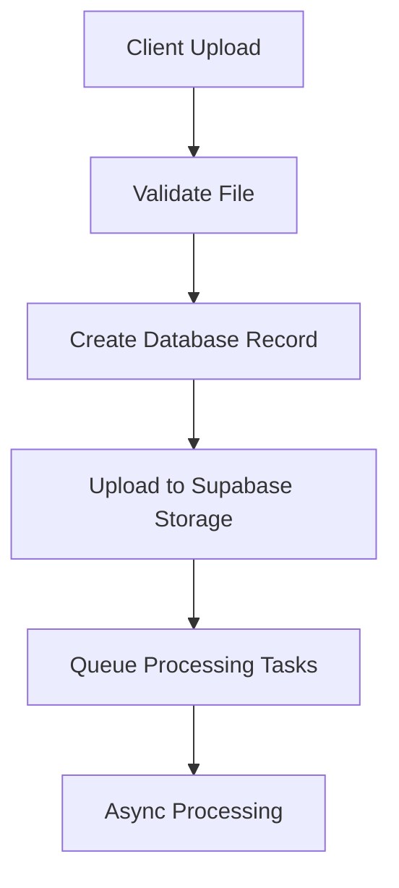

# Storage Architecture

> **Target Audience**: System architects, security engineers, infrastructure leads

This document describes TripSage's file storage system, security policies, and processing workflows. For implementation details, see the storage migration files in `supabase/migrations/`.

## Storage Buckets

### Attachments Bucket

**Purpose**: Trip documents and chat file attachments

**Configuration**:

- Access: Private (authenticated users only)
- Size limit: 50MB per file
- MIME types: PDF, Word, Excel, text files, images
- Security: RLS policies based on trip ownership and collaboration

### Avatars Bucket

**Purpose**: User profile images

**Configuration**:

- Access: Public (browsable without authentication)
- Size limit: 5MB per file
- MIME types: JPEG, PNG, GIF, WebP, AVIF
- Security: Users can only modify their own avatars

### Trip Images Bucket

**Purpose**: Trip-related photos and media

**Configuration**:

- Access: Private (authenticated users with trip access)
- Size limit: 20MB per file
- MIME types: JPEG, PNG, GIF, WebP, AVIF, HEIC, HEIF
- Security: Trip collaboration permissions required

## Security Model

### Row Level Security

File access is controlled through PostgreSQL Row Level Security policies:

#### Bucket-Specific Policies

**Attachments**:

- Users can access files for trips they own or collaborate on
- Collaboration levels: view, edit, admin
- File ownership tracked via `user_id` in `file_attachments` table

**Avatars**:

- Public read access for all users
- Users can only modify their own avatar files
- File ownership verified against authenticated user ID

**Trip Images**:

- Access requires trip collaboration permissions
- Path-based trip ID extraction for permission checking
- Collaboration roles determine upload/delete capabilities

#### Permission Levels

- **Owner**: Full access to all trip-related files
- **Admin**: Can upload, delete, and modify trip files
- **Edit**: Can upload and view all trip files
- **View**: Can only view trip files

## File Processing

### Upload Flow

### Processing Operations

#### Virus Scanning

- Trigger: Post-upload via edge functions
- Status tracking: `virus_scan_status` and `virus_scan_result` fields
- Quarantine: Infected files moved to restricted access

#### Metadata Extraction

- Documents: File type, size, page count (when available)
- Images: Dimensions, format, EXIF data
- Storage: Metadata stored in `file_attachments.metadata` JSONB field

### File Tracking

Files are tracked in the `file_attachments` table with:

- Upload status: `uploading`, `completed`, `failed`
- Processing status: Scan results and metadata
- Ownership: Linked to users and trips
- Access control: RLS policies enforce permissions

## API Integration

### Upload Methods

File uploads support multiple approaches:

- **Direct upload**: Client uploads directly to Supabase Storage
- **Signed URLs**: Pre-authenticated URLs for secure uploads
- **Server-mediated**: API handles upload with validation

### Download Access

File downloads use Supabase Storage URLs:

- **Public access**: Avatars accessible without authentication
- **Authenticated access**: Private files require valid JWT
- **Signed URLs**: Time-limited access for secure sharing

### Validation

Upload validation includes:

- File size limits per bucket
- MIME type restrictions
- User permissions via RLS
- Virus scanning (async post-upload)

## Storage Quotas

### Per-User Limits

Storage quotas are enforced per user across all buckets:

- **Attachments**: 5GB total
- **Avatars**: 50MB total
- **Trip Images**: 2GB total

### Quota Enforcement

Quota checking occurs before file uploads:

- **Pre-upload validation**: Size checked against remaining quota
- **Database tracking**: Usage calculated via storage functions
- **Hard limits**: Uploads rejected when quota exceeded
- **Per-bucket limits**: Separate quotas for different file types

## Monitoring and Maintenance

### Automated Maintenance

Database functions handle storage maintenance:

#### Cleanup Operations

- **Orphaned files**: Remove files not referenced in database
- **Failed uploads**: Clean incomplete upload records
- **Usage tracking**: Monitor storage consumption per user

#### Storage Functions

Database provides utility functions for:

- **Quota checking**: Validate uploads against limits
- **Usage calculation**: Track per-user storage consumption
- **File cleanup**: Remove orphaned storage objects

## Processing Architecture

### Async Processing

File processing uses database-driven queues:

#### Processing Queue

- **file_processing_queue table**: Tracks async processing tasks
- **Priority levels**: High/low priority processing
- **Status tracking**: Monitor processing completion
- **Retry handling**: Failed operations can be retried

#### Processing Types

- **Virus scanning**: Malware detection via ClamAV
- **Metadata extraction**: File information and properties
- **Content analysis**: Basic file validation and processing

## Error Handling

### Upload Errors

- **Validation failures**: Size, type, or permission errors
- **Quota exceeded**: User storage limit reached
- **Network issues**: Connection problems during upload
- **Permission denied**: RLS policy violations

### Processing Errors

- **Virus detection**: Infected files quarantined
- **Metadata extraction failures**: Logged with retry capability
- **Storage errors**: Supabase Storage API failures

### Recovery

- **Failed uploads**: Cleanup of partial database records
- **Processing failures**: Retry queue for failed operations
- **Quarantine**: Admin review process for flagged files

## Security Architecture

### Security Layers

File storage security includes multiple controls:

#### Access Control

- **Authentication**: Supabase JWT token validation
- **Authorization**: PostgreSQL RLS policies per bucket
- **File ownership**: User ID tracking and verification
- **Collaboration**: Trip-based permission sharing

#### Content Security

- **Virus scanning**: ClamAV integration for malware detection
- **File validation**: Type and size restrictions per bucket
- **Quarantine**: Automatic isolation of suspicious files

#### Data Protection

- **Encryption**: Supabase-managed encryption at rest
- **Access logging**: File operation audit trail
- **Secure URLs**: Signed URLs for private file access

## Architecture Patterns

### Upload Patterns

File uploads follow these patterns:

- **Direct uploads**: Client to Supabase Storage with validation
- **Server validation**: API checks permissions and quotas
- **Async processing**: Post-upload tasks via database queues
- **Error recovery**: Cleanup on failed operations

### Storage Organization

Files are organized by:

- **Bucket separation**: Different buckets for different content types
- **User ownership**: Files linked to uploading users
- **Trip association**: Files optionally linked to specific trips
- **Metadata storage**: File properties stored in database

## Scalability

### Storage Scaling

- **Supabase Storage**: Managed object storage with global CDN
- **Database scaling**: PostgreSQL handles metadata at scale
- **Quota management**: Per-user limits prevent abuse
- **Processing queues**: Async operations prevent bottlenecks

### Performance

- **CDN delivery**: Fast access to stored files
- **Direct uploads**: Client-side uploads reduce server load
- **Async processing**: Non-blocking file operations
- **Database indexing**: Optimized queries for file metadata

---

This storage architecture provides secure, scalable file management integrated with TripSage's travel planning platform.
