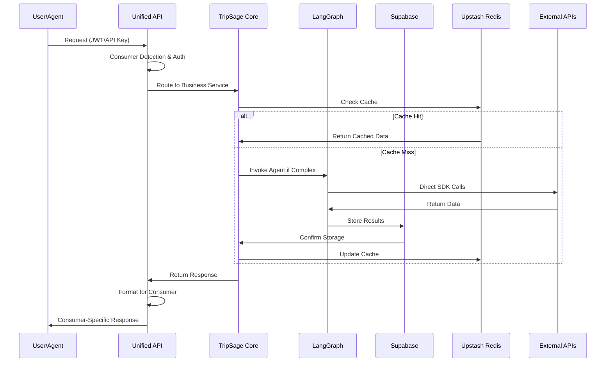

# TripSage System Architecture Overview

> **Target Audience**: Technical architects, senior developers, technical stakeholders

This document provides an overview of TripSage's system architecture, focusing on design patterns and component interactions. For implementation details, see the Developer Guide.

## High-Level Architecture

```mermaid
graph TD
    subgraph "Presentation Layer"
        F[Frontend<br/>Next.js 15<br/>• React Server<br/>Components<br/>• Real-time UI<br/>• Supabase Realtime<br/>• State Mgmt]
        A[AI Agents<br/>LangGraph<br/>• Planning<br/>• Flight Agent<br/>• Hotel Agent<br/>• Budget Agent<br/>• Memory Agent]
        E[External APIs<br/>Travel Partners<br/>• Flight APIs<br/>• Hotel APIs<br/>• Maps APIs<br/>• Weather APIs<br/>• Calendar APIs]
    end

    subgraph "Unified API Layer<br/>FastAPI with<br/>Consumer Support"
        G[API Gateway<br/>• Frontend Adapter<br/>• Agent Adapter<br/>• Auth Middleware]
        R["API Routers<br/>Auth | Chat | Trips | Flights |<br/>Hotels | Destinations |<br/>Memory | WS"]
    end

    subgraph "Business Logic Layer<br/>TripSage Core"
        BS[Business Services<br/>• Auth Service<br/>• Memory Svc<br/>• Chat Service<br/>• Flight Svc<br/>• Hotel Service]
        ES[External API Services<br/>• Google Maps<br/>• Weather API<br/>• Calendar API<br/>• Document AI<br/>• Crawl4AI]
        IS[Infrastructure Services<br/>• Database Service<br/>• Cache Service<br/>Upstash Redis (HTTP)<br/>• Key Monitoring
Service<br/>• Security Service]
        LG["LangGraph Orchestration<br/>PostgreSQL Checkpointing |<br/>Memory Bridge |<br/>Handoff Coordination"]
    end

    subgraph "Infrastructure Layer<br/>Storage<br/>Architecture"
        D[Database<br/>Supabase<br/>• PostgreSQL<br/>• pgvector<br/>• Mem0 backend<br/>• RLS security<br/>• Migrations]
        C[Cache<br/>Upstash Redis (HTTP)
• Redis compat
• HTTP client
• Smart TTL]
        EX[External Services<br/>• Duffel Flights<br/>• Google Maps/Cal<br/>• Weather API<br/>• Airbnb MCP<br/>Only MCP]
    end

    F --> G
    A --> G
    E --> G
    G --> BS
    G --> ES
    G --> IS
    G --> R
    BS --> LG
    ES --> LG
    IS --> LG
    BS --> D
    BS --> C
    BS --> EX
    ES --> D
    ES --> C
    ES --> EX
    IS --> D
    IS --> C
    IS --> EX
    LG --> D
    LG --> C
    LG --> EX
```

## Technology Stack

### Technology Selection Principles

1. **Production-Proven**: Technologies with demonstrated reliability at scale
2. **Developer Experience**: Tools that enhance productivity and reduce complexity
3. **Performance First**: Technologies delivering measurable performance benefits
4. **Cost Efficient**: Solutions optimizing infrastructure and operational costs
5. **Future-Proof**: Technologies with strong communities and long-term viability

### Core Technologies

- **Backend**: FastAPI (Python 3.11+) - Async performance, type safety, auto-documentation
- **Database**: Supabase PostgreSQL - Unified platform with pgvector for AI workloads
- **Cache**: Upstash Redis (HTTP) - Serverless, connectionless HTTP client
- **AI Framework**: LangGraph - Production-ready agent orchestration with state persistence
- **Memory System**: Mem0 + pgvector - Intelligent context management
- **Frontend**: Next.js 15 - Server components, App Router, TypeScript
- **Testing**: pytest, vitest, Playwright - Comprehensive test coverage (90%+)

### External Integrations

- **Flight API**: Duffel SDK - Direct integration, 70% latency reduction
- **Maps**: Google Maps Platform SDK - Location services and geocoding
- **Weather**: OpenWeatherMap API - Real-time weather data
- **Browser Automation**: Playwright - Headless browser operations

## Architecture Components

### Presentation Layer

#### Frontend (Next.js 15)

- App Router: Routing with server-side rendering
- React Server Components: Server-side rendering
- Real-time Features: Supabase Realtime (private channels + RLS)
- State Management: Zustand stores with persistence
- Component Architecture: Modular components
- Performance: Code splitting and lazy loading

#### AI Agents (LangGraph)

- Planning Agent: Coordinator for trip planning
- Specialized Agents: Flight, Accommodation, Budget,
  Destination
- Memory Agent: Context management and user preference
  learning
- Orchestration: PostgreSQL checkpointing and agent
  handoffs
- Tool Integration: External service integration

### Unified API Layer (FastAPI)

#### Consumer-Aware Design

The API adapts responses based on consumer type:

**Frontend Consumers**:

- Error messages and UI metadata
- Pagination and display hints
- Rate limits for human interaction
- Sanitized data for web display

**Agent Consumers**:

- Error context and debugging information
- Tool integration metadata
- Rate limits for automated workflows
- Raw data access for AI processing

#### Core Features

- Authentication: JWT for users, API keys for agents, BYOK
  support
- Rate Limiting: Limits with principal tracking
- WebSocket Support: Real-time communication
- Error Handling: Error processing with context
- Response Formatting: Response adaptation

### Business Logic Layer (TripSage Core)

#### Service Architecture

Unified service design in TripSage Core:

**Business Services** (tripsage_core/services/business/):

- AuthService, MemoryService, ChatService
- FlightService, AccommodationService, DestinationService
- TripService, ItineraryService, UserService
- KeyManagementService, FileProcessingService

**External API Services**
(tripsage_core/services/external_apis/):

- GoogleMapsService, WeatherService, CalendarService
- DocumentAnalyzer, WebcrawlService, PlaywrightService
- TimeService with timezone handling

**Infrastructure Services**
(tripsage_core/services/infrastructure/):

- DatabaseService with transaction management
- CacheService with Upstash Redis (HTTP) integration
- WebSocketManager for real-time communication
- KeyMonitoringService for security

#### LangGraph Orchestration

- **Graph-based Workflows**: Deterministic multi-step planning processes
- **PostgreSQL Checkpointing**: Persistent state management across sessions
- **Memory Bridge**: Mem0 integration for contextual relationship data
- **Handoff Coordination**: Seamless agent collaboration and state transfer
- **Error Recovery**: Built-in retry mechanisms and graceful degradation

#### Specialized Agent Nodes

**Router Node**: Intelligent request routing based on conversation analysis and intent classification.

**Flight Agent**: Multi-airline search, price comparison, route optimization, and booking assistance with user preference learning.

**Accommodation Agent**: Hotel/Airbnb search, property comparison, amenity filtering, and location-based recommendations.

**Budget Agent**: Expense tracking, cost optimization, multi-currency support, and personalized spending recommendations.

**Destination Research Agent**: Local insights, activity recommendations, weather integration, and personalized destination guidance.

**Itinerary Agent**: Day-by-day planning, scheduling optimization, calendar integration, and logistics coordination.

### Infrastructure Layer

#### Database (Supabase)

- PostgreSQL: Data storage with ACID compliance
- pgvector Extension: Vector similarity search
- Row Level Security: Access control
- Real-time Subscriptions: Data updates
- Migration System: Schema evolution

#### Cache (Upstash Redis)

- Redis Compatibility: Replacement with features
- Multi-tier TTL Strategy: Data management
- Memory Efficiency: For large datasets

#### Memory System (Mem0 + pgvector)

- Vector Storage: pgvector backend for similarity search
- Context Compression: Memory summarization
- User Learning: Preference and behavior patterns
- Conversation Continuity: Context across sessions

## Data Flow

### Unified Request Processing



### Memory and Context Flow

The memory system uses a context pipeline:

1. Memory Retrieval: Vector similarity search retrieves
   context
2. Context Aggregation: Conversation history and user
   preferences combined
3. Agent Processing: LangGraph agents process with context
   awareness
4. Memory Persistence: Insights stored for future use

## Security Architecture

### Multi-Layer Security

**Authentication & Authorization**:

- JWT Tokens: For user sessions with refresh
- API Keys: For service-to-service communication
- BYOK System: User-provided API key management
- Row Level Security: Database-level access control

**Data Protection**:

- Encryption at Rest: AES-256 for sensitive data
- Encryption in Transit: TLS 1.3 for communications
- Key Rotation: Encryption key rotation
- BYOK Encryption: User-specific salt and key derivation

**Rate Limiting & Monitoring**:

- Consumer-Aware Limits: Limits for frontend vs agents
- Principal-Based Tracking: Per-user and per-API key
  monitoring
- Security Event Logging: Audit trail
- Anomaly Detection: Threat detection

## Real-time Communication Architecture

### WebSocket Management

The system uses WebSocket for real-time features:

- Consumer-Aware Connections: Handling for frontend vs
  agent connections
- Connection Pooling: Management of concurrent connections
- Message Routing: Routing based on message type and consumer
- Graceful Disconnection: Cleanup and state preservation
- Error Recovery: Reconnection strategies with backoff

### Real-time Features

**Live Trip Planning**:

- Multi-user collaboration on trip planning
- Updates for itinerary changes
- Shared workspace with conflict resolution

**Agent Status Updates**:

- Progress tracking for AI agent operations
- Notifications for long-running tasks
- Error reporting and recovery status

**Chat Integration**:

- Messaging with AI agents
- Typing indicators and presence
- Message delivery confirmation

## Deployment Architecture

### Container Orchestration

**Production Deployment**:

- Kubernetes: Container orchestration with auto-scaling
- Docker Compose: Development environment
- Service Mesh: Inter-service communication
- Load Balancing: Traffic distribution and failover

**Scaling Strategy**:

- API Service: Auto-scaling based on request volume
- Frontend: CDN distribution with edge caching
- Database: Read replicas for query distribution
- Cache: Upstash Redis (managed)

### Monitoring & Observability

**Performance Monitoring**:

- Request/Response Times: Per-endpoint monitoring
- Error Rates: By consumer type and service
- Cache Metrics: Hit rates and performance data
- Database Performance: Query optimization and indexing

**Health Checks**:

- Service Health: Individual service monitoring
- Database Connectivity: Connection pool status
- External API Status: Provider availability
- Memory System: Context and performance metrics

## Future Considerations

### Planned Enhancements

**SDK Migration Completion**:

- Google Maps, Calendar, Weather, Time services

**AI Features**:

- LangGraph workflows
- Multi-modal input processing
- Reasoning capabilities

**Scalability Improvements**:

- Global deployment with edge computing
- Caching strategies
- Database sharding for scale

---

TripSage's architecture uses LangGraph for AI orchestration,
Supabase for storage, Upstash Redis for caching, consolidated
TripSage Core services, and direct SDK integrations.
