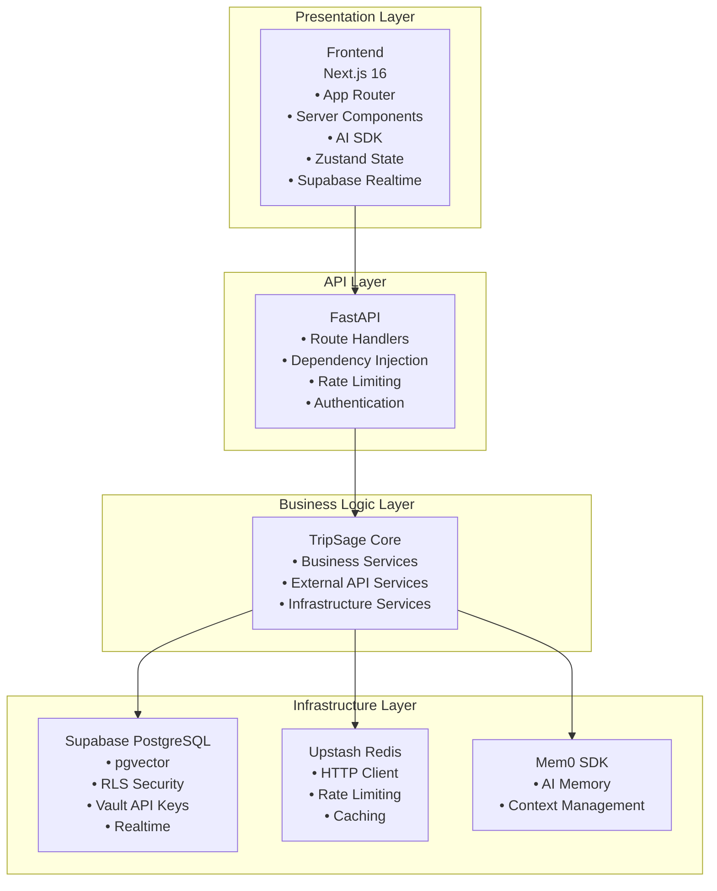
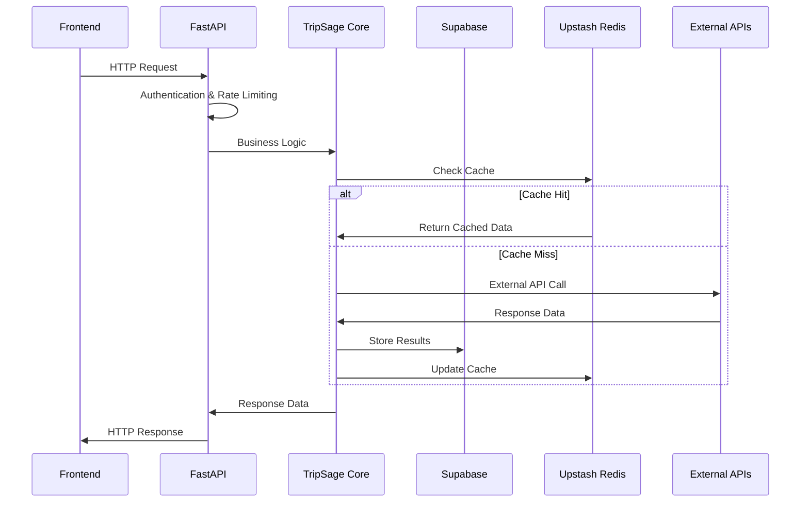

# System Architecture

> **Target Audience**: Technical architects, senior developers, technical stakeholders

This document describes TripSage's system architecture, focusing on component interactions and design patterns. For implementation details, see the codebase documentation.

## High-Level Architecture

## Technology Stack

### Core Technologies

- **Backend**: FastAPI (Python 3.11+) - Async API framework with automatic OpenAPI documentation
- **Database**: Supabase PostgreSQL - Database with pgvector for embeddings
- **Cache**: Upstash Redis (HTTP) - Serverless Redis with HTTP client
- **Memory System**: Mem0 SDK - AI context and conversation memory
- **Frontend**: Next.js 16 - React framework with App Router and Server Components
- **AI**: AI SDK (@ai-sdk/react) - Unified interface for AI providers
- **State Management**: Zustand - Lightweight state management
- **UI**: shadcn/ui + Tailwind CSS v4 - Component library and styling
- **Testing**: pytest, vitest, Playwright - Unit, integration, and e2e testing

### External Integrations

- **Flight API**: Duffel SDK - Flight search and booking
- **Maps**: Google Maps Platform - Location services and geocoding
- **Weather**: OpenWeatherMap API - Weather data
- **Calendar**: Google Calendar API - Calendar integration
- **Browser Automation**: Playwright - Web scraping and automation

## Architecture Components

### Presentation Layer

#### Frontend (Next.js 16)

- App Router: File-based routing with nested layouts
- Server Components: Server-side rendering with client components for interactivity
- AI Integration: AI SDK for streaming chat and tool calling
- State Management: Zustand stores with persistence
- Real-time: Supabase Realtime for live updates
- UI: shadcn/ui components with Tailwind CSS v4
- Authentication: Supabase auth with SSR support

### API Layer (FastAPI)

#### Route Handlers

- Thin adapters: Parse requests and construct dependencies
- Dependency injection: Pure handler functions with injected services
- Authentication: JWT tokens and API keys with BYOK support
- Rate limiting: Per-user and per-API key limits using Upstash Redis
- Error handling: Structured error responses with appropriate HTTP codes
- OpenAPI: Automatic API documentation generation

#### API Routers

Available routers for different domains:

- auth: User authentication and session management
- users: User profiles and preferences
- trips: Trip planning and management
- destinations: Location and destination data
- activities: Activity recommendations
- itineraries: Trip itinerary management
- memory: AI memory and context
- search: Unified search across providers
- attachments: File upload and management
- dashboard: Analytics and reporting
- health: Health checks and monitoring

**Note:** Flight and accommodation operations are handled by frontend-only AI agents (`/api/agents/flights` and `/api/agents/accommodations`) implemented with Vercel AI SDK v6. The legacy Python routers for these domains have been removed.

### Business Logic Layer (TripSage Core)

#### Service Organization

TripSage Core provides modular services organized by responsibility:

**Business Services** (`tripsage_core/services/business/`):

- `TripService`: Trip planning and management
- `FlightService`: Flight search and booking via Duffel (used by frontend agents)
- `AccommodationService`: Hotel search and booking (used by frontend agents)
- `ItineraryService`: Trip itinerary management
- `MemoryService`: AI memory and context management via Mem0
- `ChatService`: Chat session management
- `UserService`: User profiles and preferences
- `DestinationService`, `SearchService`, `ActivityService`: Removed; handled via frontend AI SDK v6 agents
- `FileProcessingService`: Document analysis and processing

**Note:** `FlightService` and `AccommodationService` are now primarily used by frontend AI agents (`/api/agents/flights` and `/api/agents/accommodations`) rather than direct Python API endpoints.

**External API Services** (`tripsage_core/services/external_apis/`):

> [!NOTE]
> Location/POI (Google Maps), weather, and calendar tooling are implemented in Next.js using AI SDK v6 tools. The Python backend no longer provides GoogleMapsService, WeatherService, or CalendarService.
> Time-related utilities are no longer exported from Core external_apis; use frontend or direct libs as appropriate.
> Calendar integrations are implemented in `frontend/src/lib/calendar/` with Google Calendar REST API v3, ICS import/export, and AI SDK tools. See [calendar-service.md](./calendar-service.md) for details.

- `DuffelProvider`: Flight search and booking
- `PlaywrightService`: Browser automation
- `DocumentAnalyzer`: File processing

**Infrastructure Services** (`tripsage_core/services/infrastructure/`):

- `DatabaseService`: Supabase operations and transactions
- `CacheService`: Upstash Redis caching
- `SupabaseClient`: Supabase client management
- `DatabaseMonitor`: Connection health monitoring
- `KeyMonitoringService`: API key usage tracking

### Infrastructure Layer

#### Database (Supabase PostgreSQL)

- Relational data: ACID-compliant PostgreSQL with JSONB support
- Vector search: pgvector extension for 1536-dimensional embeddings
- Security: Row Level Security (RLS) for data access control
- Real-time: Live data synchronization via Supabase Realtime
- Migrations: Versioned schema changes with rollback support
- API keys: Encrypted storage via Supabase Vault

#### Cache (Upstash Redis)

- HTTP client: Serverless Redis with REST API
- Rate limiting: Per-user and per-API key limits
- Session data: Temporary storage with configurable TTL
- Search cache: API response caching for performance

#### Memory System (Mem0)

- Context management: AI conversation memory and user preferences
- Vector storage: Embeddings stored in PostgreSQL via pgvector
- Session continuity: Persistent context across chat sessions
- Learning: User behavior pattern recognition

## Data Flow

### Request Processing

### AI Memory Flow

Memory operations follow this pattern:

1. Context retrieval: Mem0 SDK fetches relevant conversation history
2. AI processing: Frontend uses AI SDK with retrieved context
3. Memory updates: New interactions stored via Mem0 for future use
4. Vector storage: Embeddings persisted in PostgreSQL via pgvector

## Security Architecture

### Authentication

- JWT tokens: Supabase-managed authentication with refresh tokens
- API keys: Bring Your Own Key (BYOK) system with Vault encryption; Next.js routes import `"server-only"` and export `dynamic = "force-dynamic"` so every key request is evaluated per user per request
- Session management: Secure token handling with automatic refresh
- Multi-factor support: Supabase auth with MFA capabilities

### Authorization

- Row Level Security: PostgreSQL RLS policies for data access control
- User ownership: All data scoped to authenticated users
- Trip collaboration: Granular permissions (view, edit, admin) for shared trips
- API key scoping: Keys limited to specific services and users

### Data Protection

- Encryption at rest: Supabase-managed encryption for all data
- Encryption in transit: TLS 1.3 for all communications
- API key encryption: Vault-secured storage with service role access
- File security: Virus scanning and secure upload handling

### Rate Limiting

- Per-user limits: Request throttling based on user identity
- Per-API key limits: Service-specific rate limiting
- Upstash Redis: Distributed rate limiting with burst protection
- Monitoring: Rate limit events logged for analysis

## Real-time Features

### Supabase Realtime

Real-time functionality is provided by Supabase Realtime:

- Live updates: Automatic UI updates for data changes
- Private channels: User-scoped real-time subscriptions
- Row Level Security: Real-time queries respect RLS policies
- Connection management: Automatic reconnection and error handling
- Presence: User online/offline status tracking

### Real-time Use Cases

- Trip collaboration: Multiple users editing trips simultaneously
- Chat updates: Live message delivery and typing indicators
- Status notifications: Real-time progress updates for long operations
- Live search results: Streaming results from external APIs

## Deployment

### Development

- Docker Compose: Local development environment
- Hot reloading: FastAPI and Next.js development servers
- Local Supabase: Supabase CLI for local database development

### Production

- Vercel: Frontend deployment with edge functions
- Railway/Fly.io: Backend deployment options
- Supabase: Managed database and real-time services
- Upstash Redis: Managed caching and rate limiting

## Monitoring

### Health Checks

- API endpoints: `/health` endpoint for service status
- Database monitoring: Connection health and performance metrics
- External API status: Provider availability tracking

### Observability

- OpenTelemetry: Distributed tracing and metrics
- Error logging: Structured logging with context
- Performance monitoring: Response times and error rates

---

This architecture provides a scalable foundation for TripSage's travel planning platform with integrated AI capabilities and real-time collaboration features.
