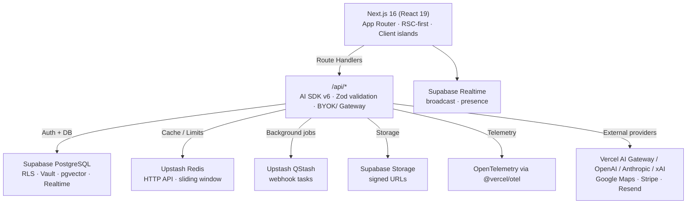
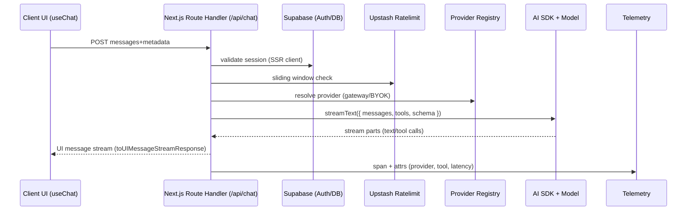
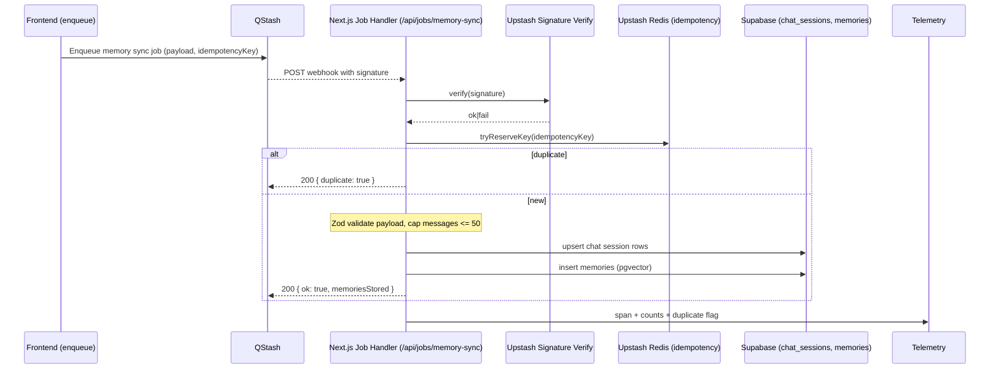

# System Architecture

Audience: technical contributors who need an up-to-date, implementation-focused picture of TripSage.

## Runtime Topology

## Stack Versions (source of truth: package.json)

- ai: 6.0.49
- @ai-sdk/react: 3.0.51
- @ai-sdk/openai: 3.0.18
- @ai-sdk/anthropic: 3.0.23
- @ai-sdk/xai: 3.0.33
- @ai-sdk/togetherai: 2.0.20
- @ai-sdk/provider: 3.0.5
- zod: 4.3.6

## Stack Snapshot (high level)

- Framework: Next.js App Router + React 19 + TypeScript
- AI: AI SDK v6 with Gateway/BYOK provider routing
- Data: Supabase Postgres (RLS-first), Realtime, Storage, Vault
- Cache/Jobs: Upstash Redis/Ratelimit/QStash
- UI: Radix primitives + Tailwind CSS v4 + Motion
- Observability: OpenTelemetry via `@vercel/otel`

## Key Capabilities

- Streaming chat and tool calling via AI SDK v6 using shared Zod schemas in `src/schemas`.
- Agent routes for flights, accommodations, destinations, itineraries, budget, and memory (`/api/agents/*`) with domain-specific tool sets.
- BYOK + Vercel AI Gateway routing with explicit precedence: user gateway → user provider (OpenAI/Anthropic/xAI/OpenRouter) → team gateway fallback (opt-in).
- Memory pipeline backed by Supabase Postgres + pgvector; QStash jobs cap inserts to 50 messages per batch and enforce idempotency.
- Realtime collaboration (presence/broadcast) via Supabase Realtime; AI token streaming stays on AI SDK SSE.
- Attachments stored in Supabase Storage (`attachments` bucket) with Postgres metadata rows (owner, size, MIME, path) and signed URL access.
- Payments and notifications available through Stripe and Resend (keys remain server-side).

## Core Components

### Next.js Application

- App Router with RSC-first rendering; client components only where interactivity is required.
- Route handlers live in `src/app/api/**/route.ts`. They parse input (Zod), create request-scoped collaborators (Supabase, rate limiter, providers), and delegate to pure handlers. No module-scope state.
- AI SDK v6 is the only LLM transport (`streamText`, `generateText` + `Output.object`); structured outputs use Zod schemas under `src/schemas`.
- Caching and rate limiting use per-request Upstash Redis/RateLimit instances. Auth-dependent routes remain dynamic (no cache).
- Background/async work uses QStash webhooks; handlers are stateless and idempotent.

### Identity and Security

- Supabase Auth uses `src/lib/supabase/server.ts` for SSR client creation and server-side session access; `src/proxy.ts` forwards requests and propagates/refreshes auth cookies between browser and server (no duplicated SSR client logic). Browser client is only for Realtime/subscriptions.
- Vault stores BYOK keys; provider resolution happens server-side through `src/ai/models/registry.ts`. BYOK routes import `"server-only"`.
- Randomness/timestamps come from `@/lib/security/random`; no `Math.random` or `crypto.randomUUID`.
- Key precedence (highest → lowest): user gateway key, user provider key (OpenAI/Anthropic/xAI/OpenRouter), team gateway key fallback (requires user consent flag).
- Auth-bound routes stay dynamic; do not add `'use cache'` or static revalidation to BYOK/user-scoped handlers.
  Routes accessing `cookies()` or `headers()` (required for Supabase SSR auth) cannot use cache directives per Next.js Cache Components restrictions.
  See [Spec: BYOK Routes and Security (Next.js + Supabase Vault)](../specs/archive/0011-spec-byok-routes-and-security.md).

### Data & Storage

- Single Supabase PostgreSQL with pgvector and JSONB for flexible metadata.
- Supabase Storage for uploads; access via signed URLs.
- Supabase Realtime for presence/broadcast; all channels created through `use-realtime-channel` and its thin wrappers (no direct `supabase.channel()` in new code).
- Storage buckets: primary bucket `attachments`; per-object metadata persisted in Postgres (size, MIME, path, owner) for auditability.

### Observability

- Use `withTelemetrySpan` / `withTelemetrySpanSync`, `recordTelemetryEvent`, and `createServerLogger` (see `src/lib/telemetry` and [Observability](../development/backend/observability.md#approved-telemetry--logging-entrypoints)). Console logging is reserved for tests/client-only code.
- OpenTelemetry exporters are wired through `@vercel/otel`; spans wrap API handlers and external calls.
- Automatic tracing is registered in `src/instrumentation.ts` via `registerOTel({ serviceName: "tripsage-frontend" })`.
- Critical-path failures should emit `emitOperationalAlert` for downstream alerting (see `src/lib/telemetry/alerts.ts`).

### External Integrations (present in repo)

- AI providers via Vercel AI Gateway or BYOK (OpenAI, Anthropic, xAI).
- Supabase platform services (Auth, Realtime, Storage, Vault, pgvector).
- Upstash Redis/Ratelimit for caching and throttling; Upstash QStash for jobs.
- Google Maps (types present), Stripe, Resend email, Playwright for browser automation.

## Representative Workflows

- **Chat + tool calling**: `POST /api/chat` → Zod validation → Supabase auth → Upstash rate limit → provider resolution → `streamText` with tools → AI SDK UI message stream to UI → telemetry span with provider/tool attributes.
- **Flight or accommodation search**: `POST /api/agents/flights|accommodations` → same guard pipeline → domain tools (external API or MCP adapters) → structured results streamed back; attachments handled via signed URLs when present.
- **Memory sync job (QStash)**: Frontend enqueues job → QStash webhook calls `/api/jobs/memory-sync` with Upstash signature → signature verify + Redis idempotency key → payload validated → batch limited to 50 messages → Supabase inserts/updates chat session + memories → telemetry recorded; duplicates short-circuit with `{ duplicate: true }`.
- **Realtime collaboration**: Clients subscribe via `use-realtime-channel` to `session:{id}` / `trip:{id}` topics for presence/broadcast; server never emits LLM tokens over Realtime.
- **Attachments**: Client uploads to Supabase Storage (`attachments` bucket); server issues signed URLs; Postgres rows track ownership and metadata.
- **Notifications/Payments**: Stripe and Resend integrations are server-only; credentials resolved from env and never exposed to clients.

### Workflow visuals (Mermaid)

#### Chat streaming with tools

#### QStash memory sync job

## End-to-End Request Flow

1. Request enters `/api/*` route handler.
2. Supabase SSR client is created; session validated.
3. Guards: rate limiting and Zod input validation.
4. Provider resolution via registry (Gateway/BYOK).
5. Execution: AI SDK call and domain logic; optional QStash enqueue.
6. Persistence: Supabase read/write; Redis cache when applicable.
7. Response: SSE stream for chat routes or JSON for synchronous calls; telemetry spans emitted.

- Typical rate-limit profile (tuned per endpoint): streaming routes ~40 req/min sliding window; non-streaming ~20 req/min; keyed by user or IP.
- QStash handlers validate signatures and include idempotency keys to avoid duplicate side effects.

## Realtime Responsibilities

- Supabase Realtime handles multi-client fanout (chat events, presence, agent status). All subscriptions go through `use-realtime-channel` or thin wrappers; no direct `supabase.channel()` creation in new code.
- AI token streaming uses AI SDK SSE transports only; Realtime is never used for LLM token delivery.

## Deployment & Environments

- Local: `pnpm dev` for Next.js; Supabase CLI for local DB; Redis/QStash via Upstash cloud or mocks.
- Production: Vercel for frontend + API routes; Supabase managed Postgres/Storage/Realtime; Upstash Redis/QStash for cache/limits/jobs; AI Gateway for provider routing.
- Quality gates on touched code: `pnpm biome:check`, `pnpm type-check`, and relevant `pnpm test*`.

## Invariants

- Single Next.js codebase; legacy Python/FastAPI services are removed and unsupported.
- No custom streaming frameworks—AI SDK v6 is the sole LLM transport.
- Remove deprecated paths when new implementations land (final-only policy).
