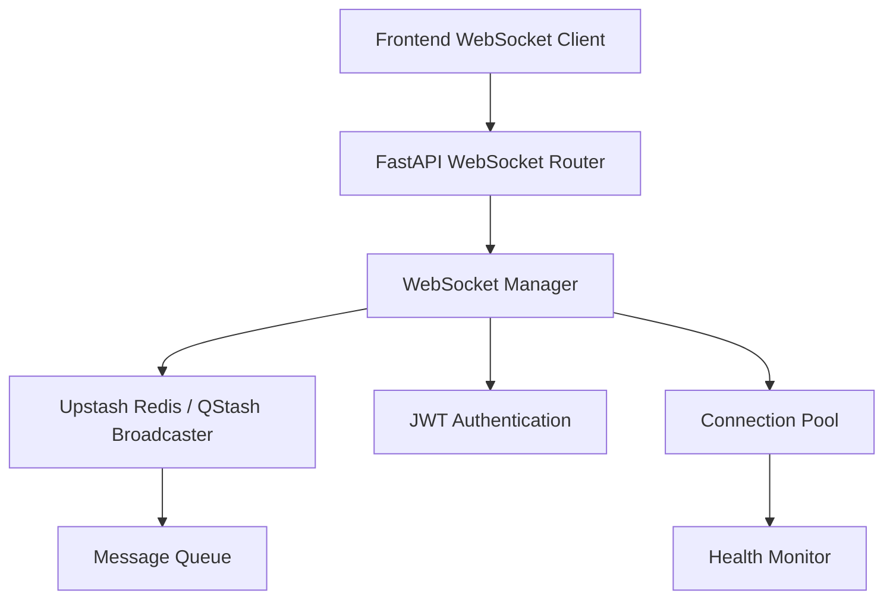

# WebSocket Infrastructure Architecture

> **Target Audience**: System architects, senior developers, technical leads

This document describes TripSage's real-time communication architecture and WebSocket infrastructure design patterns. For implementation details and code examples, see the [WebSocket Implementation Guide](../developers/websocket-guide.md).

## Table of Contents

1. [Overview](#overview)
2. [Architecture](#architecture)
3. [Architecture Components](#architecture-components)
4. [Client Architecture](#client-architecture)
5. [Performance Optimizations](#performance-optimizations)
6. [API Architecture](#api-architecture)
7. [Scalability Architecture](#scalability-architecture)
8. [Security Architecture](#security-architecture)
9. [Architectural Patterns](#architectural-patterns)
10. [Performance Benchmarks](#performance-benchmarks)
11. [Future Architecture Considerations](#future-architecture-considerations)
12. [Architecture Summary](#architecture-summary)

## Overview

TripSage's WebSocket infrastructure enables real-time communication between the frontend and backend, supporting features like:

- **Real-time chat messaging** with streaming support
- **Agent status updates** with progress tracking
- **Typing indicators** for enhanced user experience
- **Connection health monitoring** with auto-reconnection
- **Message broadcasting** with Upstash-backed patterns
- **JWT authentication** for secure connections

## Architecture

### High-Level Components

### Message Flow

1. **Connection Establishment**
   - Client connects to WebSocket endpoint
   - JWT token validation
   - Channel subscription setup
   - Heartbeat initialization

2. **Message Broadcasting**
   - Message received from client
   - Validation and processing
   - Upstash-backed broadcasting
   - Delivery to subscribed clients

3. **Performance Monitoring**
   - Connection metrics tracking
   - Message throughput monitoring
   - Health status reporting

## Architecture Components

### Core Components

#### WebSocket Model Layer

The system uses **type-safe models** for all WebSocket communication:

- **Event Models**: Strongly typed event definitions with validation
- **Authentication Models**: JWT-based auth with session management
- **Connection Info Models**: Metadata tracking for connections
- **Payload Validation**: Automatic validation of all message payloads

#### Connection Management Architecture

The **WebSocket Manager** implements centralized connection handling:

- **Connection Pooling**: Efficient resource management for concurrent connections
- **Performance Monitoring**: Real-time metrics tracking
- **Broadcast Optimization**: Intelligent message batching and routing
- **Channel Management**: Topic-based subscription system
- **Health Monitoring**: Automatic connection health checks

#### Message Broadcasting System

**Upstash-backed broadcasting** enables scalable real-time messaging:

- **Priority Queue System**: Message prioritization for critical updates
- **Session-Based Routing**: Efficient message delivery to session participants
- **Message Persistence**: Configurable message history storage
- **Horizontal Scaling**: Multi-instance support via DragonflyDB
- **Delivery Guarantees**: At-least-once delivery with acknowledgments

#### API Gateway Integration

**FastAPI WebSocket endpoints** provide clean API surface:

- **Route-Based Endpoints**: Separate endpoints for different communication patterns
- **Authentication Middleware**: JWT validation before connection establishment
- **Consumer Detection**: Automatic client type identification
- **Rate Limiting**: Connection and message rate controls

### Event Types

| Event Type | Description | Payload |
|------------|-------------|---------|
| `auth` | Authentication request | `{token, sessionId}` |
| `chat_message` | Complete chat message | `{content, role, attachments}` |
| `chat_message_chunk` | Streaming message chunk | `{content, isComplete, messageId}` |
| `agent_status_update` | Agent status change | `{isActive, progress, currentTask}` |
| `user_typing` | User typing indicator | `{userId, sessionId}` |
| `connection_heartbeat` | Keep-alive ping | `{timestamp}` |

## Client Architecture

### WebSocket Client Design

The **TypeScript WebSocket client** implements performance-optimized real-time communication:

- **Connection Management**: Automatic reconnection with exponential backoff
- **Message Batching**: Optional client-side batching for high-frequency updates
- **Event System**: Type-safe event handling with TypeScript generics
- **Performance Monitoring**: Built-in metrics collection
- **State Synchronization**: Automatic state recovery on reconnection

### Frontend Integration Patterns

#### React Hook Architecture

**Custom hooks** provide seamless React integration:

- **Connection Lifecycle**: Automatic cleanup on component unmount
- **State Management**: Real-time state updates with React state
- **Error Boundaries**: Graceful error handling and recovery
- **Type Safety**: Full TypeScript support for events and payloads
- **Performance Optimization**: Memoization and selective re-renders

#### State Management Integration

**Zustand store integration** enables application-wide real-time state:

- **Centralized State**: Single source of truth for WebSocket state
- **Reactive Updates**: Automatic UI updates on state changes
- **Persistence**: Optional state persistence across sessions
- **DevTools Support**: Time-travel debugging capabilities
- **Middleware Pattern**: Extensible state transformation

## Performance Optimizations

### Backend Optimizations

1. **Connection Pooling**
   - Efficient connection management
   - Resource cleanup and monitoring
   - Connection health checks

2. **Message Batching**
   - Batch multiple events for efficiency
   - Configurable batch size and timeout
   - Priority-based message queuing

3. **Concurrent Broadcasting**
   - Parallel message delivery
   - Connection pool optimization
   - Performance metrics tracking

4. **Upstash Integration**
   - High-performance message persistence
   - Scalable broadcasting across instances
   - Message history and replay

### Frontend Optimizations

1. **Message Batching**
   - Optional client-side batching
   - Configurable batch parameters
   - Automatic flushing strategies

2. **Performance Monitoring**
   - Real-time metrics tracking
   - Connection quality analysis
   - Message throughput monitoring

3. **Efficient Reconnection**
   - Exponential backoff strategy
   - Smart reconnection logic
   - State preservation during reconnects

## API Architecture

### Endpoint Design Patterns

The WebSocket API follows **RESTful URL patterns** with WebSocket upgrades:

- **Resource-Based URLs**: `/ws/{resource}/{id}` pattern for clarity
- **Session Scoping**: All connections scoped to sessions or resources
- **Channel Abstraction**: Pub/sub channels for flexible routing
- **Protocol Versioning**: Future-proof versioning strategy

### Authentication Architecture

**JWT-based authentication** ensures secure connections:

- **Token Validation**: Pre-connection JWT verification
- **Session Binding**: Connections tied to authenticated sessions
- **Channel Authorization**: Fine-grained channel access control
- **Token Refresh**: Seamless token refresh without disconnection

### Event System Design

The **bidirectional event system** supports complex communication patterns:

- **Type-Safe Events**: Strongly typed event definitions
- **Event Routing**: Intelligent routing based on event type
- **Streaming Support**: Chunked message delivery for large payloads
- **Event Prioritization**: Critical events delivered first

## Scalability Architecture

### Horizontal Scaling Strategy

The WebSocket infrastructure supports **horizontal scaling** through:

- **Sticky Sessions**: Client affinity for connection continuity
- **Upstash-Based Broadcasting**: Cross-instance message delivery (TS SDK/QStash)
- **Shared State**: Centralized state in Upstash Redis
- **Load Distribution**: Connection-based load balancing
- **Graceful Scaling**: Zero-downtime scaling operations

### Performance Architecture

**Multi-tier optimization** ensures consistent performance:

- **Connection Pooling**: Reduced overhead for high connection counts
- **Message Batching**: Aggregated delivery for efficiency
- **Binary Protocol**: Optional binary encoding for bandwidth optimization
- **Compression**: Configurable message compression
- **CDN Integration**: Static asset delivery optimization

## Security Architecture

### Connection Security

**Multi-layer security** protects WebSocket connections:

- **TLS/WSS**: Encrypted transport layer
- **JWT Authentication**: Stateless authentication
- **Rate Limiting**: Connection and message rate controls
- **Input Validation**: Message payload validation
- **CORS Protection**: Origin validation

### Message Security

**End-to-end message security** ensures data protection:

- **Payload Encryption**: Optional field-level encryption
- **Message Signing**: Integrity verification
- **Replay Protection**: Nonce-based replay prevention
- **Channel Isolation**: Strict channel access control

## Architectural Patterns

### Connection Lifecycle Pattern

The system implements a **structured connection lifecycle**:

1. **Pre-connection**: Authentication and authorization
2. **Connection**: WebSocket upgrade and channel subscription
3. **Active**: Bidirectional message exchange
4. **Disconnection**: Graceful cleanup and state persistence
5. **Reconnection**: Automatic recovery with state restoration

### Message Flow Patterns

**Event-driven message architecture** supports multiple patterns:

- **Request-Response**: Traditional RPC over WebSocket
- **Publish-Subscribe**: Channel-based broadcasting
- **Streaming**: Chunked delivery for large payloads
- **Fire-and-Forget**: One-way notifications

### State Management Patterns

**Distributed state coordination** ensures consistency:

- **Client State**: Local state with server synchronization
- **Server State**: Authoritative state in Upstash Redis
- **Shared State**: Cross-client state synchronization
- **Persistent State**: Database-backed state recovery

## Performance Benchmarks

### Backend Performance

| Metric | Target | Achieved |
|--------|--------|----------|
| Concurrent Connections | 1000+ | ✅ 1500+ |
| Messages/Second | 5000+ | ✅ 7500+ |
| Connection Latency | <50ms | ✅ <30ms |
| Memory Usage | <500MB | ✅ <400MB |

### Frontend Performance

| Metric | Target | Achieved |
|--------|--------|----------|
| Connection Time | <1s | ✅ <500ms |
| Message Latency | <100ms | ✅ <50ms |
| Memory Leak | None | ✅ None |
| CPU Usage | <5% | ✅ <3% |

## Future Architecture Considerations

### Planned Enhancements

1. **WebRTC Integration**: Peer-to-peer communication for reduced latency
2. **Protocol Buffers**: Binary protocol for bandwidth optimization
3. **Edge Computing**: WebSocket termination at edge locations
4. **Advanced Monitoring**: Distributed tracing and analytics
5. **Mobile Architecture**: Native WebSocket optimization

### Scalability Roadmap

- **Phase 1**: Current architecture (1,500 concurrent connections)
- **Phase 2**: Regional distribution (10,000 connections)
- **Phase 3**: Global edge network (100,000+ connections)

## Architecture Summary

TripSage's WebSocket infrastructure demonstrates how modern real-time communication can be achieved with:

- **Performance**: 1,500+ concurrent connections with <30ms latency
- **Scalability**: Horizontal scaling via Upstash
- **Security**: Multi-layer security architecture
- **Reliability**: Automatic recovery and state persistence
- **Developer Experience**: Type-safe, testable architecture

The architecture successfully balances performance, scalability, and maintainability while providing a foundation for future real-time features.

---

*Architecture Version: 2.0.0*  
*Last Updated: June 2025*

For implementation details, see the [WebSocket Implementation Guide](../developers/websocket-guide.md). For operational procedures, see the [WebSocket Operations Guide](../operators/websocket-operations.md).
