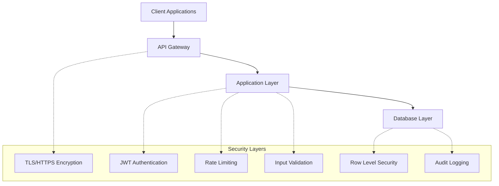

# 🔐 TripSage Security Overview

> **High-Level Security Architecture and Principles**  
> Understanding TripSage's multi-layered security approach and implementation strategy

## 📋 Table of Contents

- [🏗️ Security Architecture](#️-security-architecture)
- [🔑 Authentication & Authorization](#-authentication--authorization)
- [🛡️ Row Level Security (RLS)](#️-row-level-security-rls)
- [🌐 API Security](#-api-security)
- [🗄️ Data Protection](#️-data-protection)
- [🏢 Infrastructure Security](#-infrastructure-security)
- [📋 Compliance & Standards](#-compliance--standards)

## 🏗️ Security Architecture

TripSage implements a **defense-in-depth** security model with multiple layers of protection:



### Core Security Principles

1. **Zero Trust** - Never trust, always verify
2. **Least Privilege** - Minimum necessary access only
3. **Defense in Depth** - Multiple security layers
4. **Fail Secure** - Default to deny access
5. **Transparency** - Comprehensive audit logging

## 🔑 Authentication & Authorization

### Authentication Methods

| Method | Use Case | Security Level | Implementation |
|--------|----------|----------------|----------------|
| **JWT Tokens** | User sessions | High | Supabase Auth |
| **API Keys** | Server-to-server | High | Custom implementation |
| **Service Tokens** | Internal services | Medium | Custom implementation |

### Authorization Hierarchy

```text
Organization Admin
├── Project Owner
│   ├── Project Editor
│   ├── Project Viewer
│   └── External Collaborator
└── User (Own Data Only)
```

### Key Features

- **Multi-tenant isolation** - Complete data separation between organizations
- **Role-based access control** - Granular permission management
- **Session management** - Secure token lifecycle
- **Password policies** - Strong authentication requirements

## 🛡️ Row Level Security (RLS)

PostgreSQL Row Level Security provides database-level access control:

### RLS Policy Categories

1. **User Isolation** - Users access only their own data
2. **Collaborative Access** - Shared access with permission levels
3. **System Tables** - Restricted to service roles only
4. **Audit Tables** - Append-only with no user deletion

### Security Patterns

```sql
-- User Isolation Pattern
CREATE POLICY "user_isolation" ON table_name
FOR ALL TO authenticated
USING (user_id = auth.uid())
WITH CHECK (user_id = auth.uid());

-- Collaborative Access Pattern  
CREATE POLICY "collaborative_access" ON trips
FOR SELECT TO authenticated
USING (
    user_id = auth.uid() OR 
    id IN (
        SELECT trip_id FROM trip_collaborators 
        WHERE user_id = auth.uid()
    )
);
```

### Performance Optimization

- ✅ **Indexed RLS columns** for optimal query performance
- ✅ **Cached function calls** using SELECT wrapper pattern
- ✅ **Security definer functions** to bypass RLS on joins
- ✅ **Application-level filtering** to help query planner

## 🌐 API Security

### Protection Mechanisms

1. **Rate Limiting** - Prevents abuse and DoS attacks
2. **Input Validation** - Pydantic schemas for all endpoints
3. **CORS Configuration** - Controlled cross-origin access
4. **Request/Response Logging** - Complete audit trail

### Security Headers

```python
# Implemented security headers
{
    "X-Content-Type-Options": "nosniff",
    "X-Frame-Options": "DENY", 
    "X-XSS-Protection": "1; mode=block",
    "Strict-Transport-Security": "max-age=31536000",
    "Content-Security-Policy": "default-src 'self'"
}
```

### Rate Limiting Strategy

| Authentication Level | Requests/Minute | Burst Limit |
|---------------------|-----------------|-------------|
| Unauthenticated | 10 | 20 |
| JWT Token | 100 | 200 |
| API Key (Basic) | 200 | 400 |
| API Key (Premium) | 1000 | 2000 |

## 🗄️ Data Protection

### Encryption Standards

- **In Transit** - TLS 1.3 encryption for all communications
- **At Rest** - AES-128 encryption for sensitive data fields
- **Application Level** - Additional encryption for PII data

### Data Classification

| Level | Description | Examples | Protection |
|-------|-------------|----------|------------|
| **Public** | Openly accessible | API documentation | Basic |
| **Internal** | Company confidential | System metrics | Access control |
| **Restricted** | User personal data | Trip details, memories | RLS + Encryption |
| **Highly Sensitive** | Payment/auth data | API keys, tokens | Strong encryption |

### Privacy Protection

- **Data Minimization** - Collect only necessary data
- **User Control** - Users can export/delete their data
- **Anonymization** - Remove PII from analytics
- **Retention Policies** - Automatic data cleanup

## 🏢 Infrastructure Security

### Network Security

- **VPC Isolation** - Private network segments
- **Firewall Rules** - Restrictive inbound/outbound rules
- **DDoS Protection** - Cloudflare enterprise protection
- **Geographic Restrictions** - IP-based access controls

### Service Security

- **Container Security** - Minimal attack surface
- **Secret Management** - Encrypted environment variables
- **Vulnerability Scanning** - Automated security assessments
- **Dependency Management** - Regular security updates

## 📋 Compliance & Standards

### Security Standards

- ✅ **OWASP Top 10** - Complete coverage and mitigation
- ✅ **SOC 2 Type 2** - Comprehensive security controls
- ✅ **GDPR Compliance** - EU data protection requirements
- ✅ **CCPA Compliance** - California privacy regulations

### Audit & Monitoring

- **Security Event Logging** - All access attempts logged
- **Anomaly Detection** - Automated threat detection
- **Incident Response** - Defined procedures and escalation
- **Regular Assessments** - Quarterly security reviews

## 🚨 Security Alerts & Updates

### Critical Security Requirements

1. **All new tables MUST have RLS policies** before production
2. **Security tests MUST pass** before deployment
3. **Regular security updates** required for dependencies
4. **Incident reporting** within 24 hours of detection

### Recent Security Enhancements (Jun 2025)

- ✅ Fixed 8 critical RLS policy vulnerabilities
- ✅ Implemented comprehensive audit logging
- ✅ Added AES-128 encryption for sensitive fields
- ✅ Enhanced rate limiting and DDoS protection

## 🔗 Next Steps

1. **[RLS Implementation Guide](RLS_IMPLEMENTATION.md)** - Hands-on implementation
2. **[Security Best Practices](SECURITY_BEST_PRACTICES.md)** - Development guidelines
3. **[Security Testing](SECURITY_TESTING.md)** - Validation procedures

---

*This overview provides the foundation for understanding TripSage's comprehensive security implementation. For detailed implementation guidance, see the specific security guides.*
