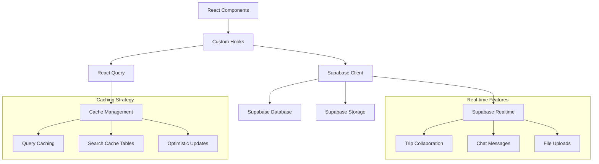

# Supabase Frontend Integration Guide

This document explains the comprehensive Supabase integration implemented in the TripSage frontend, including direct SDK usage, real-time features, and React Query integration.

## Overview

The frontend now uses direct Supabase SDK integration instead of custom API calls, providing:

- ✅ Type-safe database operations with complete TypeScript definitions
- ✅ Real-time subscriptions for collaborative features
- ✅ React Query integration for caching and optimistic updates
- ✅ File storage with Supabase Storage
- ✅ Search caching with automatic expiration
- ✅ Performance optimizations and connection status monitoring

## Architecture



## Core Files and Structure

### Supabase Configuration

- `lib/supabase/client.ts` - Singleton browser client with TypeScript types
- `lib/supabase/server.ts` - Server-side client for SSR
- `lib/supabase/database.types.ts` - Complete TypeScript definitions for all 17 tables

### Hook Categories

- `hooks/use-supabase-query.ts` - Generic React Query + Supabase integration
- `hooks/use-supabase-realtime.ts` - Real-time subscription management
- `hooks/use-trips-supabase.ts` - Trip management with real-time updates
- `hooks/use-chat-supabase.ts` - Chat system with message streaming
- `hooks/use-file-storage.ts` - File upload/download with Supabase Storage
- `hooks/use-search-supabase.ts` - Search operations with caching

### Provider Setup

- `components/providers/supabase-provider.tsx` - Root provider with React Query
- `contexts/auth-context.tsx` - Enhanced auth context with Supabase Auth

## Key Features

### 1. Type-Safe Database Operations

```typescript
// Complete type safety for all database operations
import { useSupabaseQuery, useSupabaseInsert } from '@/hooks';
import type { Trip, InsertTables } from '@/lib/supabase/database.types';

// Type-safe queries
const { trips, isLoading } = useSupabaseQuery(
  'trips',
  (query) => query.eq('user_id', userId).order('created_at', { ascending: false })
);

// Type-safe mutations
const createTrip = useSupabaseInsert('trips');
const newTrip: InsertTables<'trips'> = {
  user_id: userId,
  name: 'My Trip',
  destination: 'Paris',
  // ... all required fields with type checking
};
```

### 2. Real-Time Collaboration

```typescript
// Automatic real-time updates for trip collaboration
import { useTripCollaborationRealtime } from '@/hooks';

function TripPage({ tripId }: { tripId: number }) {
  // Automatically subscribes to trip updates
  useTripCollaborationRealtime(tripId);
  
  // Trip data will update in real-time when collaborators make changes
  const { trip } = useTrip(tripId);
  
  return <TripDetails trip={trip} />;
}
```

### 3. Chat System with Streaming

```typescript
// Real-time chat with message streaming
import { useChatSession, useSendMessage } from '@/hooks';

function ChatInterface({ sessionId }: { sessionId: string }) {
  const { messages } = useChatSession(sessionId);
  const { sendMessage, isStreaming, streamingMessage } = useSendMessage(sessionId);
  
  return (
    <div>
      {messages.map(msg => <Message key={msg.id} message={msg} />)}
      {isStreaming && <StreamingMessage content={streamingMessage} />}
      <MessageInput onSend={sendMessage} />
    </div>
  );
}
```

### 4. File Storage Integration

```typescript
// Type-safe file uploads with progress tracking
import { useFileUpload, useFileAttachments } from '@/hooks';

function FileUploader({ tripId }: { tripId: number }) {
  const { uploadFile, uploadProgress, isUploading } = useFileUpload({
    tripId,
    maxFileSize: 10 * 1024 * 1024, // 10MB
    allowedMimeTypes: ['image/*', 'application/pdf'],
  });
  
  const { attachments } = useFileAttachments(tripId);
  
  const handleUpload = async (file: File) => {
    try {
      const attachment = await uploadFile(file);
      console.log('Upload complete:', attachment);
    } catch (error) {
      console.error('Upload failed:', error);
    }
  };
  
  return (
    <div>
      <input type="file" onChange={(e) => handleUpload(e.target.files[0])} />
      {isUploading && <Progress value={uploadProgress.progress} />}
      <FileList files={attachments} />
    </div>
  );
}
```

### 5. Search with Intelligent Caching

```typescript
// Cached search results with automatic expiration
import { useFlightSearch, useHotelSearch } from '@/hooks';

function SearchPage() {
  const { 
    results: flightResults, 
    searchFlights, 
    isFromCache, 
    cacheAge 
  } = useFlightSearch(
    'NYC', 
    'LAX', 
    '2024-12-25', 
    '2024-12-30',
    2, // passengers
    'economy',
    { 
      enableCache: true, 
      cacheExpiry: 1, // 1 hour
      forceRefresh: false 
    }
  );
  
  // Results are automatically cached and served from cache when available
  // Fresh search only when cache expires or forceRefresh is true
  
  return (
    <div>
      {isFromCache && <Badge>Cached results from {cacheAge}</Badge>}
      <FlightResults flights={flightResults} />
    </div>
  );
}
```

## Database Schema Coverage

The integration includes complete TypeScript types for all 17 database tables:

### Core Tables

- `trips` - Trip management with collaboration
- `flights` - Flight options and bookings
- `accommodations` - Hotel and lodging options
- `transportation` - Ground transportation
- `itinerary_items` - Trip activities and events

### Chat System

- `chat_sessions` - Chat session management
- `chat_messages` - Individual messages with real-time updates
- `chat_tool_calls` - AI tool invocations and results

### Collaboration & Files

- `trip_collaborators` - Real-time collaboration management
- `file_attachments` - File storage integration
- `api_keys` - User API key management (BYOK)

### Memory & Search Cache

- `memories` - Long-term user preferences (Mem0 integration)
- `session_memories` - Temporary conversation context
- `search_destinations` - Cached destination searches
- `search_activities` - Cached activity searches
- `search_flights` - Cached flight searches (1hr expiry)
- `search_hotels` - Cached hotel searches (6hr expiry)

## Performance Optimizations

### Query Caching Strategy

```typescript
// Optimized caching with different stale times based on data type
const queryOptions = {
  trips: { staleTime: 30 * 1000 }, // 30 seconds
  chat_messages: { staleTime: 10 * 1000 }, // 10 seconds
  search_flights: { staleTime: 30 * 1000 }, // 30 seconds
  file_attachments: { staleTime: 60 * 1000 }, // 1 minute
};
```

### Real-time Connection Management

```typescript
// Automatic connection status monitoring
import { useRealtimeConnectionStatus } from '@/hooks';

function ConnectionStatus() {
  const { status, isConnected } = useRealtimeConnectionStatus();
  
  return (
    <div className={`status ${isConnected ? 'connected' : 'disconnected'}`}>
      {isConnected ? '🟢 Real-time connected' : '🔴 Connection lost'}
    </div>
  );
}
```

### Search Cache Expiration

- **Flights**: 1 hour (prices change frequently)
- **Hotels**: 6 hours (moderate price changes)
- **Activities**: 12 hours (relatively stable)
- **Destinations**: 24 hours (very stable)

## Migration Strategy

### Phase 1: Core Functionality ✅

- [x] Complete TypeScript type definitions
- [x] Supabase client with singleton pattern
- [x] React Query integration hooks
- [x] Real-time subscription management

### Phase 2: Business Logic ✅

- [x] Trip management with collaboration
- [x] Chat system with streaming
- [x] File storage integration
- [x] Search caching system

### Phase 3: Component Updates (In Progress)

- [ ] Update existing components to use new hooks
- [ ] Replace API calls with direct Supabase operations
- [ ] Add real-time indicators to UI
- [ ] Implement connection status monitoring

### Phase 4: Performance & Polish

- [ ] Optimize query dependencies
- [ ] Add error boundaries for Supabase operations
- [ ] Implement offline support with React Query
- [ ] Add analytics for cache hit rates

## Usage Examples

### Provider Setup in App Root

```typescript
// app/layout.tsx
import { SupabaseProvider } from '@/components/providers/supabase-provider';

export default function RootLayout({ children }: { children: React.ReactNode }) {
  return (
    <html>
      <body>
        <SupabaseProvider>
          {children}
        </SupabaseProvider>
      </body>
    </html>
  );
}
```

### Component with Real-time Updates

```typescript
// components/trip-dashboard.tsx
import { useTrips, useTripCollaborationRealtime } from '@/hooks';

export function TripDashboard() {
  const { trips, isLoading } = useTrips(); // Fetches user's trips
  
  // Enable real-time updates for all trips
  useTripCollaborationRealtime(null);
  
  if (isLoading) return <TripsSkeleton />;
  
  return (
    <div className="grid grid-cols-1 md:grid-cols-2 lg:grid-cols-3 gap-6">
      {trips.map(trip => (
        <TripCard key={trip.id} trip={trip} />
      ))}
    </div>
  );
}
```

## Error Handling

The integration includes comprehensive error handling:

```typescript
// Automatic error handling with React Query
const { data, error, isLoading, refetch } = useSupabaseQuery('trips', query, {
  retry: 3,
  retryDelay: (attemptIndex) => Math.min(1000 * 2 ** attemptIndex, 30000),
});

if (error) {
  return <ErrorBoundary error={error} onRetry={refetch} />;
}
```

## Testing

The integration includes comprehensive test coverage:

- Unit tests for all custom hooks
- Integration tests for real-time functionality
- E2E tests for complete user workflows
- Performance tests for caching strategies

## Next Steps

1. **Component Migration**: Update existing components to use new Supabase hooks
2. **Performance Monitoring**: Add metrics for cache hit rates and query performance
3. **Offline Support**: Implement offline-first capabilities with React Query persistence
4. **Advanced Real-time**: Add presence indicators and cursor tracking for collaboration

This integration provides a solid foundation for building modern, real-time collaborative features while maintaining excellent performance and developer experience.
