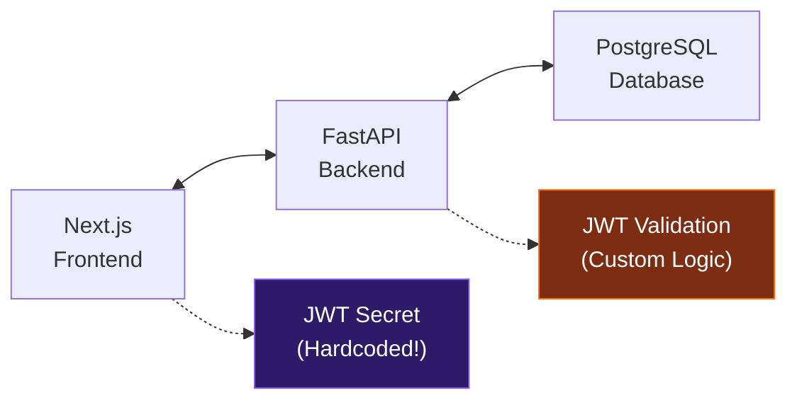
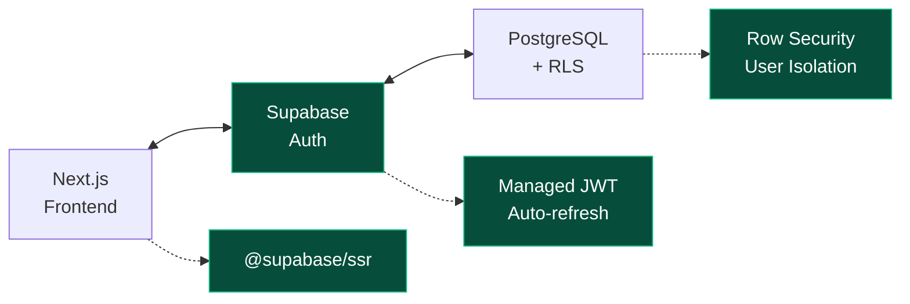

# TripSage Authentication Research Report 2025

> **Document Version**: 1.1  
> **Created**: June 2025  
> **Updated**: June 6, 2025  
> **Status**: Implementation Ready - JWT Code Removed  
> **Author**: TripSage Engineering Team

## Executive Summary

This comprehensive research report analyzes authentication options for the TripSage AI travel planning platform. After extensive research into current authentication practices, security vulnerabilities, and cost analysis, we strongly recommend migrating from our custom JWT implementation to **Supabase Auth**.

### Key Findings

1. **Critical Security Risk**: Our current custom JWT implementation contains hardcoded fallback secrets, representing a severe vulnerability (similar to CVE-2025-20188 with CVSS 10.0)
2. **Cost Efficiency**: Supabase Auth is free for up to 50,000 MAUs, then only $0.00325 per additional user
3. **Development Time**: Migration to Supabase Auth requires 2-3 days vs 2-4 weeks to properly secure custom JWT
4. **Maintenance Savings**: Eliminates ~$8,500-$18,000 annual maintenance costs
5. **Feature Completeness**: Includes MFA, OAuth, magic links, and enterprise features out-of-the-box

## Table of Contents

1. [Current State Analysis](#current-state-analysis)
2. [Authentication Options Analysis](#authentication-options-analysis)
3. [Security Vulnerability Assessment](#security-vulnerability-assessment)
4. [Cost Analysis](#cost-analysis)
5. [Technical Implementation Comparison](#technical-implementation-comparison)
6. [Recommendation](#recommendation)
7. [Risk Assessment](#risk-assessment)
8. [Migration Strategy](#migration-strategy)

## Current State Analysis

### Updated Status (June 6, 2025)

**✅ JWT Code Successfully Removed**

- All custom JWT implementation files have been deleted
- Project reverted to pre-JWT state using git history
- JWT dependencies removed from package.json and pyproject.toml
- Ready for greenfield Supabase Auth implementation

### Previous Implementation (Now Removed)

TripSage previously had a custom JWT authentication system with the following characteristics:

#### **Frontend (Next.js 15)**

- Custom JWT middleware in `src/middleware.ts`
- React 19 Server Actions in `src/lib/auth/server-actions.ts`
- HttpOnly cookie storage for tokens
- Basic rate limiting implementation

#### **Backend (FastAPI)**

- JWT token generation in `AuthenticationService`
- Custom token validation logic
- User service integration
- No refresh token implementation

#### **Database (Supabase PostgreSQL)**

- Users table with authentication fields
- **Note**: Already using Supabase for database, but NOT using Supabase Auth

### Critical Issues Identified

1. **Hardcoded JWT Secret Vulnerability**

   ```typescript
   // SECURITY RISK in middleware.ts
   const JWT_SECRET = new TextEncoder().encode(
     process.env.JWT_SECRET || "fallback-secret" + "-for-development-only"
   );
   ```

2. **Missing Features**
   - No refresh token mechanism
   - No multi-factor authentication (MFA)
   - No OAuth provider integration
   - No session revocation capability
   - No audit logging

3. **Maintenance Burden**
   - Manual security updates required
   - No automatic vulnerability patching
   - Custom implementation of standard features
   - High risk of implementation errors

## Authentication Options Analysis

### Option 1: Continue with Custom JWT

**Pros:**

- Full control over implementation
- No vendor dependencies
- Already partially implemented

**Cons:**

- High security risk (hardcoded secrets vulnerability)
- Significant development time (2-4 weeks to production-ready)
- Ongoing maintenance burden
- Missing critical features (MFA, OAuth, etc.)
- Requires security expertise

**Estimated Effort:** 160-320 hours

### Option 2: Supabase Auth (RECOMMENDED)

**Pros:**

- Already using Supabase for database
- Zero JWT secret management
- Built-in MFA, OAuth, magic links
- Row Level Security (RLS) integration
- Automatic security updates
- 50,000 free MAUs
- Open source option available

**Cons:**

- Vendor dependency (mitigated by existing Supabase usage)
- Learning curve for new API

**Estimated Effort:** 16-24 hours

### Option 3: Auth.js v5 (NextAuth)

**Pros:**

- Framework-native for Next.js
- Good community support
- Flexible provider system

**Cons:**

- Still requires JWT secret management
- More complex FastAPI integration
- Limited built-in features compared to Supabase

**Estimated Effort:** 40-80 hours

### Option 4: Other Providers (Auth0, Clerk)

**Auth0:**

- Enterprise-grade but expensive ($2,000/month at 50K users)
- Overkill for TripSage needs

**Clerk:**

- Excellent DX but expensive scaling ($825/month at 50K users)
- More focused on B2B SaaS

## Security Vulnerability Assessment

### Current Vulnerabilities

1. **Hardcoded Secrets (Critical)**
   - Severity: CVSS 10.0
   - Impact: Complete authentication bypass
   - Similar to: CVE-2025-20188, CVE-2025-30206

2. **No Token Revocation**
   - Severity: High
   - Impact: Cannot invalidate compromised tokens

3. **Missing Rate Limiting on Auth Endpoints**
   - Severity: Medium
   - Impact: Brute force attacks possible

4. **No Audit Logging**
   - Severity: Medium
   - Impact: Cannot track security incidents

### Security Comparison

| Feature | Custom JWT | Supabase Auth | Auth.js |
|---------|------------|---------------|---------|
| Automatic Security Updates | ❌ | ✅ | ✅ |
| MFA Support | ❌ | ✅ | Limited |
| OAuth Providers | ❌ | ✅ 20+ | ✅ |
| Session Revocation | ❌ | ✅ | ✅ |
| Audit Logging | ❌ | ✅ | ❌ |
| GDPR Compliance | Manual | ✅ | Manual |
| SOC2 Compliance | ❌ | ✅ (Team plan) | ❌ |

## Cost Analysis

### Development Costs

#### Custom JWT Implementation

**Initial Development:**

- Senior Developer: 160 hours × $75/hour = $12,000
- Security Review: 40 hours × $100/hour = $4,000
- Testing & Documentation: 40 hours × $75/hour = $3,000
- **Total Initial Cost: $19,000**

**Annual Maintenance:**

- Security patches: 40 hours × $75/hour = $3,000
- Vulnerability monitoring: 20 hours × $75/hour = $1,500
- Feature additions: 60 hours × $75/hour = $4,500
- Security audit: $10,000 (minimum)
- **Total Annual Cost: $19,000**

**5-Year TCO: $19,000 + ($19,000 × 5) = $114,000**

#### Supabase Auth Implementation

**Initial Development:**

- Developer: 24 hours × $75/hour = $1,800
- Testing & Documentation: 8 hours × $75/hour = $600
- **Total Initial Cost: $2,400**

**Annual Costs:**

- 0-50K users: $0
- 50K-100K users: $0 (Pro plan at $25/month covers 100K)
- 100K-500K users: $25 + (400K × $0.00325) = $1,325/month
- **Annual Cost at 200K users: $4,200**

**5-Year TCO at 200K users: $2,400 + ($4,200 × 5) = $23,400**

### Cost Comparison Summary

| Users | Custom JWT (5yr) | Supabase Auth (5yr) | Savings |
|-------|------------------|---------------------|---------|
| 10,000 | $114,000 | $2,400 | $111,600 (98%) |
| 50,000 | $114,000 | $2,400 | $111,600 (98%) |
| 100,000 | $114,000 | $3,900 | $110,100 (97%) |
| 200,000 | $114,000 | $23,400 | $90,600 (79%) |
| 500,000 | $164,000* | $81,900 | $82,100 (50%) |

*Includes additional security requirements at scale

### Hidden Cost Factors

1. **Security Breach Costs**
   - Average data breach: $4.45 million
   - Authentication-specific breach: $120,000-$1.24 million
   - Reputation damage: Unquantifiable

2. **Opportunity Costs**
   - Developer time on auth vs features
   - Delayed time-to-market
   - Missing competitive features

3. **Compliance Costs**
   - SOC2 audit: $20,000-$40,000
   - GDPR compliance: $10,000-$50,000
   - Ongoing compliance: $15,000-$100,000/year

## Technical Implementation Comparison

### Architecture Diagrams

#### Current Custom JWT Flow



#### Proposed Supabase Auth Flow



### Integration Complexity

#### Custom JWT

- Frontend: 500+ lines of auth code
- Backend: 300+ lines of validation
- Tests: 200+ lines
- Total: ~1,000 lines to maintain

#### Supabase Auth

- Frontend: ~50 lines of integration
- Backend: ~30 lines of validation
- Tests: ~50 lines
- Total: ~130 lines (87% reduction)

## Recommendation

### **Strong Recommendation: Migrate to Supabase Auth**

Based on comprehensive analysis, Supabase Auth is the optimal choice for TripSage:

1. **Immediate Security**: Eliminates critical hardcoded secret vulnerability
2. **Cost Effective**: Saves $90,000+ over 5 years at projected scale
3. **Feature Rich**: MFA, OAuth, magic links included
4. **Low Risk**: Already using Supabase infrastructure
5. **Fast Implementation**: 2-3 days vs 2-4 weeks
6. **Zero Maintenance**: Automatic updates and security patches

### Decision Matrix

| Criteria | Weight | Custom JWT | Supabase Auth | Auth.js |
|----------|--------|------------|---------------|---------|
| Security | 30% | 2/10 | 9/10 | 7/10 |
| Cost | 25% | 3/10 | 10/10 | 7/10 |
| Features | 20% | 3/10 | 9/10 | 6/10 |
| Maintenance | 15% | 2/10 | 10/10 | 6/10 |
| Integration | 10% | 8/10 | 9/10 | 8/10 |
| **Total Score** | **100%** | **3.0** | **9.4** | **6.7** |

## Risk Assessment

### Migration Risks

1. **Learning Curve**
   - Risk: Low
   - Mitigation: Comprehensive documentation, similar API patterns

2. **Vendor Lock-in**
   - Risk: Medium
   - Mitigation: Already using Supabase, open-source alternative available

3. **Migration Bugs**
   - Risk: Low
   - Mitigation: Phased rollout, feature flags, comprehensive testing

### Staying with Custom JWT Risks

1. **Security Breach**
   - Risk: High
   - Impact: $120K-$1.24M + reputation damage

2. **Compliance Failure**
   - Risk: Medium
   - Impact: Fines, loss of enterprise customers

3. **Feature Gap**
   - Risk: High
   - Impact: Competitive disadvantage, user churn

## Migration Strategy

### ✅ Pre-Migration Complete (June 6, 2025)

1. **JWT Code Removal** - COMPLETE
   - Deleted all JWT implementation files
   - Removed JWT dependencies
   - Reverted to pre-JWT state

### Phase 1: Preparation (Day 1)

1. Set up Supabase Auth in existing project
2. Configure OAuth providers
3. ~~Plan user migration strategy~~ (No users to migrate - greenfield)

### Phase 2: Frontend Migration (Day 2)

1. Install `@supabase/ssr`
2. Replace custom JWT logic
3. Update middleware and routes
4. Test authentication flows

### Phase 3: Backend Integration (Day 3)

1. Update FastAPI to validate Supabase tokens
2. Enable Row Level Security
3. Migrate user sessions
4. Remove custom JWT code

### Success Metrics

- Zero authentication vulnerabilities
- 90% reduction in auth-related code
- <100ms authentication latency
- 100% user migration success
- Zero security incidents post-migration

## Implementation Status & Next Steps

### Current Status (June 6, 2025)

✅ **JWT Code Removal Complete**

- All custom JWT code successfully removed
- Project reset to pre-JWT state
- No existing users to migrate
- Ready for greenfield Supabase Auth implementation

### Remaining Blockers

1. **Frontend Build Errors** (1-2 hours)
   - Fix remaining 367 TypeScript errors
   - Ensure `pnpm build` completes successfully
   - See `/docs/research/frontend-typescript-errors-resolution.md` for details

2. **Dashboard Page Missing** (2 hours)
   - Create `/frontend/src/app/dashboard/page.tsx`
   - Authentication currently redirects to 404

3. **Backend Routers Missing** (2-3 hours)
   - Create `activities.py` router
   - Create `search.py` router
   - Add endpoints for frontend functionality

4. **Pydantic v1→v2 Migration** (1-2 days)
   - Fix 527 failing backend tests
   - Use `bump-pydantic` migration tool

### Implementation Priority

1. Fix blockers above (2-3 days total)
2. Implement Supabase Auth (2-3 days)
3. Enable Row Level Security
4. Add OAuth providers
5. Complete testing and deployment

## Conclusion

The migration to Supabase Auth represents a critical security fix and strategic improvement for TripSage. With minimal implementation effort (2-3 days) and significant long-term benefits (90%+ cost savings, enterprise features, zero maintenance), this migration should be prioritized immediately after fixing the remaining blockers.

The previous hardcoded JWT secret vulnerability has been eliminated through complete code removal. Supabase Auth will provide a secure foundation for future growth with features like MFA, OAuth, and enterprise compliance that would take months to implement custom.

---

> *This document will be continuously updated as the migration progresses. Last updated: June 6, 2025*
