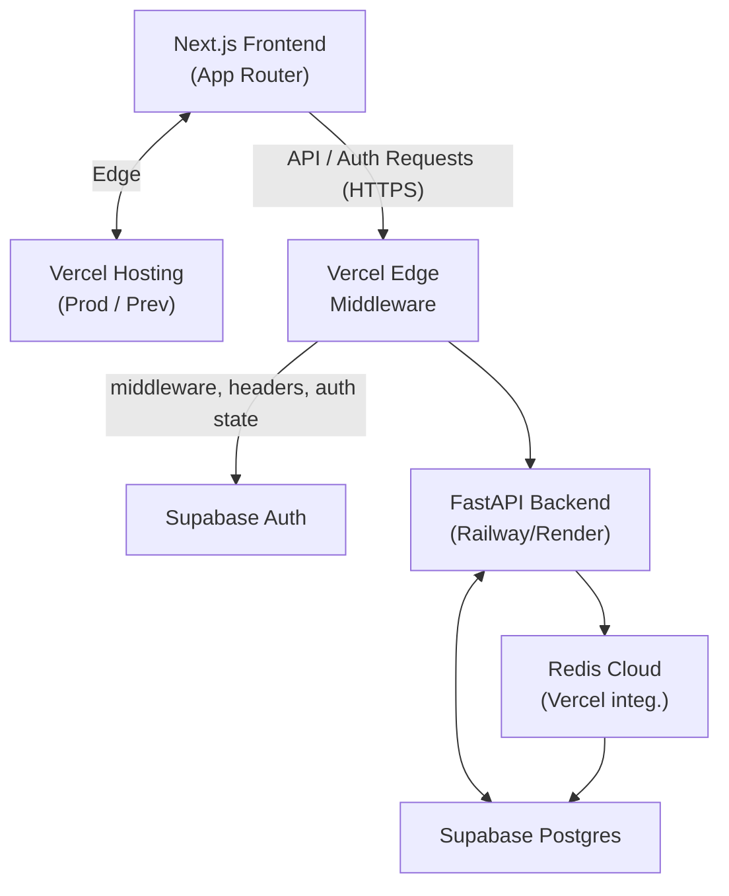

# Deployment Playbook

## High-Level Architecture

- **Next.js frontend** deployed on Vercel (Preview + Production environments).
- **FastAPI backend** hosted on a managed container platform (Railway or Render) for long-running Python services.
- **Supabase** provides Postgres database, authentication, storage, and branching.
- **Redis Cloud** provisioned via the Vercel marketplace for caching/session workloads.
- **Edge Middleware** handles auth token refresh, request enrichment, and routing to backend services.

## Environments & Branching

### Vercel

- **Production**: `main` branch → `https://tripsage.ai`
- **Preview**: every PR → `https://<branch>.tripsage.ai`
- Optional **Custom Environments** (e.g., `staging`) created via Vercel dashboard and branch targeting.[^vercel-env]

### Supabase

- Use [Supabase branching](https://supabase.com/docs/guides/deployment/branching) for staging environments.
- Each branch manages isolated database schema/data; merge to production triggers migration via GitHub integration or CLI.[^supabase-deploy]

### FastAPI Host (Railway/Render)

- Create separate services per environment (`development`, `staging`, `production`).
- Use Git-based auto-deploy or Docker image builds.
- Configure environment variables to match Supabase/Redis credentials.

### Redis Cloud

- Provision via Vercel Storage → Redis Cloud integration.[^redis-vercel]
- Link database to each Vercel environment (Preview/Production) using the Storage tab.

## Environment Variables

| Scope | Variable | Source |
|-------|----------|--------|
| Global | `SUPABASE_URL` / `SUPABASE_SERVICE_ROLE_KEY` | Supabase project settings |
| Frontend (public) | `NEXT_PUBLIC_SUPABASE_URL` / `NEXT_PUBLIC_SUPABASE_PUBLISHABLE_KEY` | Supabase dashboard |
| Backend | `SUPABASE_URL`, `SUPABASE_SERVICE_ROLE_KEY`, `SUPABASE_JWT_SECRET` | Supabase |
| Backend | `REDIS_URL`, `REDIS_USERNAME`, `REDIS_PASSWORD` | Redis Cloud integration |
| Frontend Edge Middleware | `FASTAPI_BASE_URL` (per environment) | Railway/Render |

Use `vercel env pull` to sync local `.env` with Vercel environments.[^vercel-env]

## CI/CD Workflow

### GitHub Actions

- Existing `.github/workflows/deploy.yml` becomes wrapper to trigger environment-specific deploys.
- Add steps:
  1. Run `pnpm install && pnpm lint && pnpm test`.
  2. Deploy frontend via `vercel deploy --prebuilt --prod` (or preview) with `VERCEL_TOKEN` and `VERCEL_PROJECT_ID` secrets.
  3. Trigger FastAPI deploy via provider CLI/API (Railway `railway up`, Render deploy hook).
  4. Post deployment status via existing job.

### Frontend Deploy

- Production: `vercel deploy --prod --yes` after CI passes.
- Preview: `vercel deploy --yes` triggered automatically on PR pushes.
- Configure `vercel.json` if needed for build overrides (rare for Next.js).[^
vercel-build]

### Backend Deploy

- Railway: `railway up --service tripsage-api --environment production`.
- Render: Trigger deploy hook (`curl -X POST $RENDER_DEPLOY_HOOK_URL`).
- Ensure migrations handled via Alembic/SQLModel scripts or Supabase CLI (if using Supabase DB directly).

## Supabase Integration

- Use Supabase Auth for user management; follow Next.js server-side auth setup (`@supabase/ssr`).[^supabase-auth-next]
- Configure middleware to refresh Supabase session tokens and pass to backend.
- Apply Row Level Security (RLS) policies leveraging `auth.uid()` and Supabase JWT claims for backend access control.[^supabase-rls]

## FastAPI Service

- Expose REST/websocket endpoints consumed by frontend.
- Use Supabase Python client for DB interactions.[^supabase-python]
- Connect to Redis Cloud for caching, rate limiting, or session storage using provided credentials.
- Add health check endpoint (`/healthz`) for platform health probes.
- Logging/metrics: integrate OTEL exporter or platform-native logging.

### Authentication Flow

1. Client signs in via Supabase Auth (email/password, OAuth, etc.).
2. Supabase sends session via cookies; Edge Middleware refreshes tokens using `supabase.auth.getUser`.
3. Middleware attaches auth headers (e.g., `Authorization: Bearer <JWT>`) when proxying to FastAPI.
4. FastAPI verifies Supabase JWT using service role key or `supabase.auth.api` endpoints.

## Redis Cloud Usage

- Provision via Vercel integration to auto-sync environment variables.[^vercel-supabase]
- Common use cases:
  - Cache Supabase query results.
  - Store session state or rate limiting counters.
  - Queue background tasks (with separate worker service if needed).
- Configure eviction policy (`allkeys-lru` or similar) in Redis Cloud console if defaults (`noeviction`) unsuitable.[^redis-vercel]

## Observability & Operations

- Vercel Observability for edge/frontend metrics.[^vercel-functions]
- Railway/Render dashboards for FastAPI logs and metrics.
- Supabase monitoring for database metrics; configure alerts on usage quotas.[^supabase-deploy]
- Redis Cloud console for memory usage and alerts.

## Cron Jobs & Background Tasks

- Use Vercel Cron Jobs for frontend tasks (e.g., static regeneration).[^
vercel-cron]
- For backend scheduled tasks, leverage host-specific schedulers (Railway cron, Render cron jobs) or an external scheduler hitting FastAPI endpoints.

## Disaster Recovery & Rollback

- **Frontend**: Use Vercel instant rollback to previous deployment via dashboard or CLI.[^vercel-rollbacks]
- **Backend**: Railway/Render support redeploying previous build or pinning Docker image.
- **Database**: Supabase offers point-in-time backups; ensure branching strategy includes rollback plan.
- **Redis**: Export snapshot through Redis Cloud before major releases if data critical.

## Documentation Deliverables

1. **Architecture Overview** (this document).
2. **Environment variable matrix** per service (maintain in `docs/deployments/env.md`).
3. **CI/CD pipeline instructions** with secrets configuration.
4. **Runbooks** for deploy, rollback, and on-call troubleshooting (Supabase auth failures, Redis connectivity, FastAPI downtime).

## References

- Vercel environments & CLI workflow.[^vercel-env][^vercel-cli]
- Vercel build configuration.[^vercel-build]
- Vercel Functions & Python runtime.[^vercel-functions][^vercel-python]
- Vercel storage options (Redis integration).[^
vercel-storage]
- Supabase deployment & branching.[^supabase-deploy]
- Supabase Python client reference.[^supabase-python]
- Supabase Auth guides for Next.js.[^supabase-auth-next]
- Supabase Row Level Security best practices.[^supabase-rls]
- Redis Cloud with Vercel integration guide.[^redis-vercel]

[^vercel-env]: [Vercel Environments](https://vercel.com/docs/deployments/environments)
[^vercel-cli]: [Vercel CLI Overview](https://vercel.com/docs/cli)
[^vercel-build]: [Configure a Build](https://vercel.com/docs/deployments/configure-a-build)
[^vercel-functions]: [Vercel Functions Overview](https://vercel.com/docs/functions/serverless-functions)
[^vercel-python]: [Vercel Python Runtime](https://vercel.com/docs/functions/runtimes/python)
[^vercel-supabase]: [Supabase Vercel Integration](https://vercel.com/marketplace/supabase)
[^vercel-rollbacks]: [Vercel Rollbacks](https://vercel.com/docs/instant-rollback)
[^supabase-deploy]: [Supabase Deployment Guide](https://supabase.com/docs/guides/deployment)
[^supabase-python]: [Supabase Python Reference](https://supabase.com/docs/reference/python/start)
[^supabase-auth-next]: [Supabase Next.js Server Auth](https://supabase.com/docs/guides/auth/server-side/nextjs)
[^supabase-rls]: [Supabase Row Level Security](https://supabase.com/docs/guides/auth/row-level-security)
[^redis-vercel]: [Redis Cloud + Vercel Integration](https://redis.io/docs/latest/operate/rc/cloud-integrations/vercel/)
