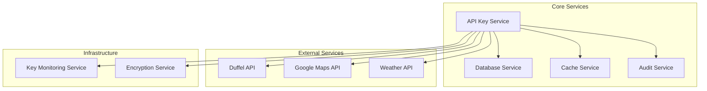

# API Key Service - Internal Implementation Guide

> Internal Development Documentation
> Implementation guide for the TripSage API Key Service architecture and patterns

## Table of Contents

- [Service Overview](#service-overview)
- [Architecture & Design](#architecture--design)
- [Implementation Details](#implementation-details)
- [Database Schema](#database-schema)
- [Security Implementation](#security-implementation)
- [Performance Considerations](#performance-considerations)
- [Testing Strategy](#testing-strategy)
- [Monitoring & Debugging](#monitoring--debugging)
- [Development Workflow](#development-workflow)
- [Migration Notes](#migration-notes)

---

## Service Overview

The API Key Service manages third-party API keys (BYOK) for TripSage integrations.

### Core Capabilities

- **Secure Storage**: Envelope encryption with rotation
- **Validation**: Service-specific API key validation
- **Health Monitoring**: Health checking and alerting
- **Audit Logging**: Usage tracking and audit trails
- **Lifecycle Management**: CRUD operations with expiration handling

### Service Dependencies



---

## Architecture & Design

### Architecture

The service follows KISS principles with security and reliability.

#### Service Layer Pattern

```python
# tripsage_core/services/business/api_key_service.py
class ApiKeyService:
    """API Key Service with explicit dependencies."""
    
    def __init__(
        self,
        db: "DatabaseService",
        cache: Optional["CacheService"] = None,
        settings: Optional["Settings"] = None,
        validation_timeout: int = 10,
    ):
        self.db = db
        self.cache = cache
        self.settings = settings or get_settings()
        self.validation_timeout = validation_timeout
        self._setup_http_client()
    
    async def create_key(
        self, 
        user_id: str, 
        key_data: ApiKeyCreate
    ) -> ApiKeyResponse:
        """Create API key with atomic transaction."""
        # Atomic transaction: create key + log operation
        async with self.db.transaction() as tx:
            # Store encrypted key
            db_key_data = {
                "user_id": user_id,
                "name": key_data.name,
                "service": key_data.service,
                "encrypted_key": await self._encrypt_key(key_data.key),
                "description": key_data.description,
                "expires_at": key_data.expires_at,
                "created_at": datetime.utcnow(),
                "updated_at": datetime.utcnow(),
            }
            
            key_result = tx.insert("api_keys", db_key_data)
            
            # Log creation event
            usage_log_data = {
                "key_id": key_result["id"],
                "user_id": user_id,
                "operation": "create",
                "success": True,
                "timestamp": datetime.utcnow(),
            }
            
            tx.insert("api_key_usage_logs", usage_log_data)
            
            # Execute transaction
            results = await tx.execute()
        
        # Fire-and-forget audit logging
        asyncio.create_task(
            self._audit_key_creation(user_id, results[0]["id"], key_data.service)
        )
        
        return ApiKeyResponse.model_validate(results[0])
```

### FastAPI Integration

**Dependency injection pattern**:

```python
# Dependency provider
ApiKeyServiceDep = Annotated[
    ApiKeyService, 
    Depends(get_api_key_service)
]

# Router usage
@router.post("/api/keys", response_model=ApiKeyResponse)
async def create_key(
    key_data: ApiKeyCreate,
    principal: Principal = Depends(require_principal),
    key_service: ApiKeyServiceDep,  # Injection
):
    user_id = get_principal_id(principal)
    return await key_service.create_key(user_id, key_data)
```

---

## Implementation Details

### Current Router Endpoints

The API Key router is at `tripsage/api/routers/keys.py`:

```python
# Endpoint mapping
GET    /api/keys           -> list_keys()      # List user's API keys
POST   /api/keys           -> create_key()     # Create new API key
DELETE /api/keys/{key_id}  -> delete_key()     # Delete API key
POST   /api/keys/validate  -> validate_key()   # Validate API key
POST   /api/keys/{key_id}/rotate -> rotate_key() # Rotate API key
GET    /api/keys/metrics   -> get_metrics()    # Health metrics (admin)
GET    /api/keys/audit     -> get_audit_log()  # Audit logs
```

### Pydantic V2 Schemas

At `tripsage/api/schemas/api_keys.py`:

```python
class ApiKeyCreate(BaseModel):
    """API key creation request model."""
    name: str = Field(min_length=1, max_length=255)
    service: str = Field(min_length=1, max_length=255)
    key: str
    description: Optional[str] = None
    expires_at: Optional[datetime] = None

class ApiKeyResponse(BaseModel):
    """API key response model."""
    id: str
    name: str
    service: str
    description: Optional[str] = None
    created_at: datetime
    updated_at: datetime
    expires_at: Optional[datetime] = None
    is_valid: bool = True
    last_used: Optional[datetime] = None

class ApiKeyValidateResponse(BaseModel):
    """API key validation response model."""
    is_valid: bool
    service: str
    message: str
```

### Service Validation Logic

```python
async def validate_key(
    self, 
    key: str, 
    service: str, 
    user_id: Optional[str] = None
) -> ApiKeyValidateResponse:
    """Validate API key with service-specific logic."""
    
    # Service-specific validation patterns
    validators = {
        "duffel": self._validate_duffel_key,
        "google_maps": self._validate_google_maps_key,
        "openweather": self._validate_openweather_key,
    }
    
    validator = validators.get(service.lower())
    if not validator:
        return ApiKeyValidateResponse(
            is_valid=False,
            service=service,
            message=f"Unsupported service: {service}"
        )
    
    try:
        # Use cached result if available
        cache_key = f"api_key_validation:{service}:{hashlib.sha256(key.encode()).hexdigest()}"
        
        if self.cache:
            cached_result = await self.cache.get(cache_key)
            if cached_result:
                return ApiKeyValidateResponse.model_validate(cached_result)
        
        # Perform validation
        is_valid, message = await validator(key)
        
        result = ApiKeyValidateResponse(
            is_valid=is_valid,
            service=service,
            message=message
        )
        
        # Cache result for 5 minutes
        if self.cache:
            await self.cache.set(cache_key, result.model_dump(), ttl=300)
        
        # Log validation attempt (fire-and-forget)
        if user_id:
            asyncio.create_task(
                self._log_validation_attempt(user_id, service, is_valid)
            )
        
        return result
        
    except Exception as e:
        logger.exception(f"Validation failed for service {service}: {e}")
        return ApiKeyValidateResponse(
            is_valid=False,
            service=service,
            message=f"Validation error: {str(e)}"
        )

async def _validate_duffel_key(self, key: str) -> tuple[bool, str]:
    """Validate Duffel API key."""
    try:
        headers = {
            "Authorization": f"Bearer {key}",
            "Duffel-Version": "v1",
            "Accept": "application/json"
        }
        
        async with self.http_client.get(
            "https://api.duffel.com/air/airlines",
            headers=headers,
            timeout=self.validation_timeout
        ) as response:
            if response.status == 200:
                return True, "Valid Duffel API key"
            elif response.status == 401:
                return False, "Invalid or expired Duffel API key"
            else:
                return False, f"Duffel API returned status {response.status}"
                
    except asyncio.TimeoutError:
        return False, "Duffel API validation timed out"
    except Exception as e:
        return False, f"Duffel API validation failed: {str(e)}"
```

---

## Database Schema

### Core Tables

```sql
-- API Keys table
CREATE TABLE api_keys (
    id UUID PRIMARY KEY DEFAULT gen_random_uuid(),
    user_id UUID NOT NULL REFERENCES auth.users(id) ON DELETE CASCADE,
    name VARCHAR(255) NOT NULL,
    service VARCHAR(100) NOT NULL,
    encrypted_key TEXT NOT NULL,
    key_hash VARCHAR(64) NOT NULL, -- SHA-256 for deduplication
    description TEXT,
    created_at TIMESTAMPTZ DEFAULT NOW(),
    updated_at TIMESTAMPTZ DEFAULT NOW(),
    expires_at TIMESTAMPTZ,
    is_active BOOLEAN DEFAULT TRUE,
    last_used TIMESTAMPTZ,
    usage_count INTEGER DEFAULT 0,
    
    CONSTRAINT unique_user_service_name UNIQUE(user_id, service, name),
    CONSTRAINT unique_key_hash UNIQUE(key_hash)
);

-- Usage logs for audit trail
CREATE TABLE api_key_usage_logs (
    id UUID PRIMARY KEY DEFAULT gen_random_uuid(),
    key_id UUID REFERENCES api_keys(id) ON DELETE CASCADE,
    user_id UUID NOT NULL,
    operation VARCHAR(50) NOT NULL, -- 'create', 'validate', 'rotate', 'delete'
    success BOOLEAN NOT NULL,
    error_message TEXT,
    timestamp TIMESTAMPTZ DEFAULT NOW(),
    ip_address INET,
    user_agent TEXT
);

-- Health check results
CREATE TABLE api_key_health_checks (
    id UUID PRIMARY KEY DEFAULT gen_random_uuid(),
    key_id UUID REFERENCES api_keys(id) ON DELETE CASCADE,
    service VARCHAR(100) NOT NULL,
    status VARCHAR(20) NOT NULL, -- 'healthy', 'unhealthy', 'timeout'
    response_time_ms INTEGER,
    error_message TEXT,
    checked_at TIMESTAMPTZ DEFAULT NOW()
);
```

### Indexes for Performance

```sql
-- Performance indexes
CREATE INDEX idx_api_keys_user_id ON api_keys(user_id);
CREATE INDEX idx_api_keys_service ON api_keys(service);
CREATE INDEX idx_api_keys_expires_at ON api_keys(expires_at) WHERE expires_at IS NOT NULL;
CREATE INDEX idx_api_keys_active ON api_keys(is_active) WHERE is_active = TRUE;

CREATE INDEX idx_usage_logs_key_id ON api_key_usage_logs(key_id);
CREATE INDEX idx_usage_logs_timestamp ON api_key_usage_logs(timestamp);
CREATE INDEX idx_usage_logs_user_operation ON api_key_usage_logs(user_id, operation);

CREATE INDEX idx_health_checks_key_service ON api_key_health_checks(key_id, service);
CREATE INDEX idx_health_checks_status ON api_key_health_checks(status, checked_at);
```

---

## Security Implementation

### Envelope Encryption

```python
class KeyEncryption:
    """Envelope encryption for API keys."""
    
    def __init__(self, master_key: str):
        self.master_key = master_key.encode()
    
    async def encrypt_key(self, plaintext_key: str) -> str:
        """Encrypt API key using envelope encryption."""
        # Generate data encryption key (DEK)
        dek = os.urandom(32)  # 256-bit key
        
        # Encrypt the actual API key with DEK
        cipher = Fernet(base64.urlsafe_b64encode(dek))
        encrypted_key = cipher.encrypt(plaintext_key.encode())
        
        # Encrypt DEK with master key
        master_cipher = Fernet(base64.urlsafe_b64encode(self.master_key[:32]))
        encrypted_dek = master_cipher.encrypt(dek)
        
        # Combine encrypted DEK + encrypted key
        envelope = {
            "dek": base64.b64encode(encrypted_dek).decode(),
            "key": base64.b64encode(encrypted_key).decode(),
            "version": "v1"
        }
        
        return base64.b64encode(json.dumps(envelope).encode()).decode()
    
    async def decrypt_key(self, encrypted_envelope: str) -> str:
        """Decrypt API key from envelope."""
        # Parse envelope
        envelope_data = json.loads(base64.b64decode(encrypted_envelope))
        
        # Decrypt DEK with master key
        master_cipher = Fernet(base64.urlsafe_b64encode(self.master_key[:32]))
        encrypted_dek = base64.b64decode(envelope_data["dek"])
        dek = master_cipher.decrypt(encrypted_dek)
        
        # Decrypt API key with DEK
        cipher = Fernet(base64.urlsafe_b64encode(dek))
        encrypted_key = base64.b64decode(envelope_data["key"])
        plaintext_key = cipher.decrypt(encrypted_key)
        
        return plaintext_key.decode()
```

### Key Hashing for Deduplication

```python
def generate_key_hash(self, key: str) -> str:
    """Generate SHA-256 hash for key deduplication."""
    return hashlib.sha256(key.encode()).hexdigest()
```

---

## Performance Considerations

### Caching Strategy

```python
# Validation result caching (5 minutes)
cache_key = f"api_key_validation:{service}:{key_hash}"
await self.cache.set(cache_key, validation_result, ttl=300)

# Health check caching (1 hour)
health_cache_key = f"api_key_health:{service}:{key_id}"
await self.cache.set(health_cache_key, health_status, ttl=3600)
```

### Connection Pooling

```python
# HTTP client with connection pooling
self.http_client = aiohttp.ClientSession(
    timeout=aiohttp.ClientTimeout(total=self.validation_timeout),
    connector=aiohttp.TCPConnector(
        limit=100,          # Total connection pool size
        limit_per_host=30,  # Connections per host
        ttl_dns_cache=300,  # DNS cache TTL
        use_dns_cache=True,
    )
)
```

### Database Optimization

- **Atomic Transactions**: Batch related operations
- **Prepared Statements**: Reuse query plans
- **Connection Pooling**: Connection management
- **Selective Indexes**: Query-specific optimization

---

## Testing Strategy

### Unit Tests

```python
# tests/unit/services/test_api_key_service.py
async def test_create_api_key():
    """Test API key creation with atomic transaction."""
    mock_db = Mock(spec=DatabaseService)
    mock_cache = Mock(spec=CacheService)
    
    service = ApiKeyService(db=mock_db, cache=mock_cache)
    
    # Test data
    user_id = "user-123"
    key_data = ApiKeyCreate(
        name="Test Key",
        service="duffel",
        key="test-api-key-123"
    )
    
    # Execute
    result = await service.create_key(user_id, key_data)
    
    # Assertions
    mock_db.transaction.assert_called_once()
    assert result.name == "Test Key"
    assert result.service == "duffel"
```

### Integration Tests

```python
# tests/integration/test_api_key_service_integration.py
@pytest.mark.integration
async def test_api_key_full_workflow():
    """Test complete API key lifecycle."""
    async with get_database_service() as db:
        service = ApiKeyService(db=db)
        
        # Create user
        user_id = await create_test_user()
        
        # Create API key
        key_data = ApiKeyCreate(
            name="Integration Test Key",
            service="duffel",
            key=os.getenv("TEST_DUFFEL_ACCESS_TOKEN")
        )
        
        created_key = await service.create_key(user_id, key_data)
        assert created_key.id is not None
        
        # Validate key
        validation = await service.validate_key(
            key_data.key, 
            key_data.service, 
            user_id
        )
        assert validation.is_valid is True
        
        # List keys
        user_keys = await service.list_user_keys(user_id)
        assert len(user_keys) == 1
        assert user_keys[0].id == created_key.id
        
        # Delete key
        await service.delete_key(created_key.id)
        
        # Verify deletion
        user_keys_after = await service.list_user_keys(user_id)
        assert len(user_keys_after) == 0
```

### Performance Tests

```python
# tests/performance/test_api_key_performance.py
@pytest.mark.performance
async def test_concurrent_validations():
    """Test concurrent API key validations."""
    service = ApiKeyService(db=await get_database_service())
    
    async def validate_key_task():
        return await service.validate_key("test-key", "duffel")
    
    # Run 100 concurrent validations
    tasks = [validate_key_task() for _ in range(100)]
    start_time = time.time()
    
    results = await asyncio.gather(*tasks)
    
    end_time = time.time()
    duration = end_time - start_time
    
    # Performance assertions
    assert duration < 5.0  # Should complete within 5 seconds
    assert all(isinstance(r, ApiKeyValidateResponse) for r in results)
```

---

## Monitoring & Debugging

### Health Check Implementation

```python
async def check_service_health(self, service: str) -> dict:
    """Check health of external service."""
    health_checks = {
        "duffel": self._check_duffel_health,
        "google_maps": self._check_google_maps_health,
        "openweather": self._check_openweather_health,
    }
    
    checker = health_checks.get(service.lower())
    if not checker:
        return {"status": "unknown", "message": "Unsupported service"}
    
    try:
        start_time = time.time()
        is_healthy, message = await checker()
        response_time = int((time.time() - start_time) * 1000)
        
        return {
            "status": "healthy" if is_healthy else "unhealthy",
            "message": message,
            "response_time_ms": response_time,
            "checked_at": datetime.utcnow().isoformat()
        }
    except Exception as e:
        return {
            "status": "error",
            "message": f"Health check failed: {str(e)}",
            "checked_at": datetime.utcnow().isoformat()
        }
```

### Metrics Collection

```python
async def get_key_health_metrics() -> dict:
    """Get aggregated API key health metrics."""
    # Query health check results from last 24 hours
    query = """
    SELECT 
        service,
        status,
        COUNT(*) as count,
        AVG(response_time_ms) as avg_response_time,
        MAX(response_time_ms) as max_response_time
    FROM api_key_health_checks 
    WHERE checked_at > NOW() - INTERVAL '24 hours'
    GROUP BY service, status
    ORDER BY service, status
    """
    
    results = await db.fetch_all(query)
    
    # Aggregate metrics
    metrics = {}
    for row in results:
        service = row["service"]
        if service not in metrics:
            metrics[service] = {"healthy": 0, "unhealthy": 0, "error": 0}
        
        metrics[service][row["status"]] = {
            "count": row["count"],
            "avg_response_time": row["avg_response_time"],
            "max_response_time": row["max_response_time"]
        }
    
    return {
        "timestamp": datetime.utcnow().isoformat(),
        "services": metrics,
        "summary": {
            "total_services": len(metrics),
            "total_checks": sum(
                sum(status["count"] for status in service.values()) 
                for service in metrics.values()
            )
        }
    }
```

### Logging Configuration

```python
# Structured logging for API key operations
logger = logging.getLogger("tripsage.api_key_service")

async def _log_operation(
    self,
    operation: str,
    user_id: str,
    key_id: Optional[str] = None,
    service: Optional[str] = None,
    success: bool = True,
    error_message: Optional[str] = None
):
    """Log API key operation with structured data."""
    log_data = {
        "operation": operation,
        "user_id": user_id,
        "key_id": key_id,
        "service": service,
        "success": success,
        "timestamp": datetime.utcnow().isoformat()
    }
    
    if error_message:
        log_data["error_message"] = error_message
    
    if success:
        logger.info(f"API key {operation} successful", extra=log_data)
    else:
        logger.exception(f"API key {operation} failed", extra=log_data)
```

---

## Development Workflow

### Local Development Setup

```bash
# 1. Install dependencies
uv install

# 2. Set up environment variables
cp tripsage/config/env_example .env

# Required environment variables
export TRIPSAGE_MASTER_SECRET_KEY="your-32-char-secret-key"
export DUFFEL_ACCESS_TOKEN="your-test-duffel-access-token"  # For testing
export GOOGLE_MAPS_API_KEY="your-test-maps-key"  # For testing

# 3. Run database migrations
uv run python scripts/database/run_migrations.py

# 4. Run tests
uv run pytest tests/unit/services/test_api_key_service.py -v
uv run pytest tests/integration/test_api_key_service_integration.py -v

# 5. Start development server
uv run python -m tripsage.api.main
```

### Code Quality Checks

```bash
# Linting and formatting
ruff check . --fix
ruff format .

# Type checking
mypy tripsage_core/services/business/api_key_service.py

# Security scanning
bandit -r tripsage_core/services/business/api_key_service.py
```

### Testing Commands

```bash
# Unit tests only
uv run pytest tests/unit/services/test_api_key_service.py

# Integration tests (requires database)
uv run pytest tests/integration/test_api_key_service_integration.py

# Performance tests
uv run pytest tests/performance/test_api_key_performance.py -v

# Full test suite with coverage
uv run pytest --cov=tripsage_core.services.business.api_key_service \
  --cov-report=html tests/
```

---

## Migration Notes

### From Legacy Implementation

The service has been simplified from the previous version.

#### Key Changes Made

1. **Constructor Simplification**
   - Removed late imports and optional dependency resolution
   - Explicit dependency injection for testability
   - Clear initialization without complex setup logic

2. **Atomic Operations**
   - Database transactions ensure consistency
   - Combined operations (create + log) in single transaction
   - Fire-and-forget audit logging to avoid blocking

3. **Error Handling**
   - Removed complex exception masking
   - Let ServiceError bubble up to FastAPI exception handlers
   - Clear error messages with HTTP status codes

4. **Performance Improvements**
   - Connection pooling for HTTP clients
   - Caching of validation results
   - Optimized database queries with indexing

#### Migration Checklist

- [ ] Update dependency injection in router endpoints
- [ ] Replace old exception handling patterns
- [ ] Update test cases to use explicit dependencies
- [ ] Verify database schema matches current implementation
- [ ] Update monitoring dashboards for new metrics structure

### Breaking Changes

- **Constructor signature changed**: Requires explicit dependencies
- **Exception types updated**: Uses ServiceError consistently
- **Database schema updated**: Added audit and health tables
- **API responses standardized**: Consistent response models

---

## Related Documentation

### Internal References

- [API Development Guide](api-development.md) - FastAPI patterns
- [Database Guide](unified-database-guide.md) - Database connection and migration
- [Testing Guide](testing-guide.md) - Testing strategies and fixtures
- [Security Guide](../operators/security-guide.md) - Security details

### External API Documentation

- [External Authentication Guide](../api/authentication.md) - Client-side usage patterns
- [API Examples](../api/usage-examples.md) - Code examples for API integration

### Architecture References

- [System Overview](../architecture/system-overview.md) - High-level architecture context
- [Security Architecture](../architecture/security-architecture.md) - Security design patterns

---

> **Next Steps**: Review the [External Authentication Guide](../api/authentication.md) for client-side patterns, then explore the [Testing Guide](testing-guide.md) for testing strategies.
