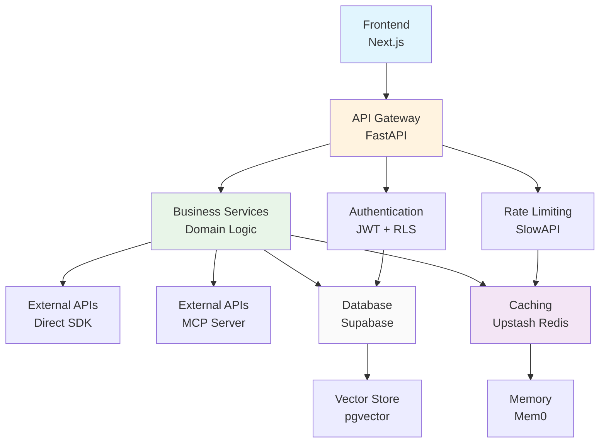
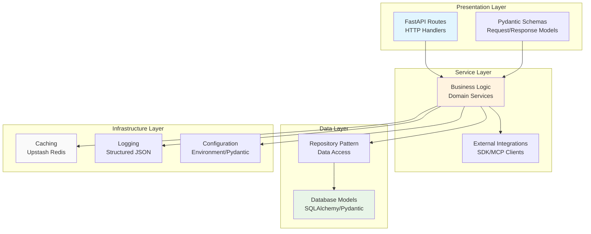
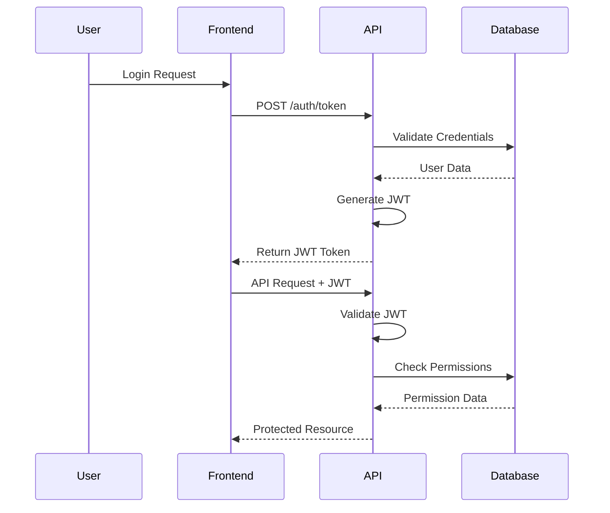
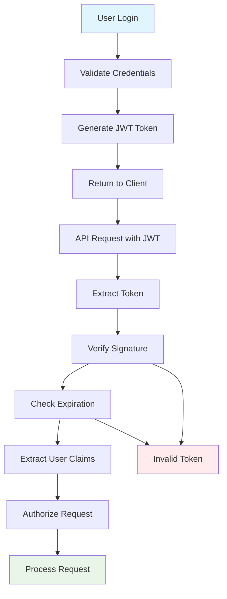
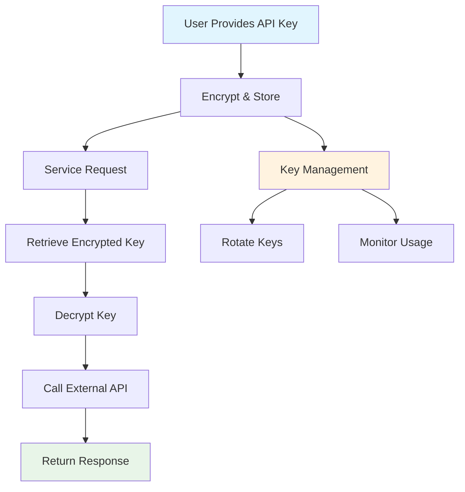
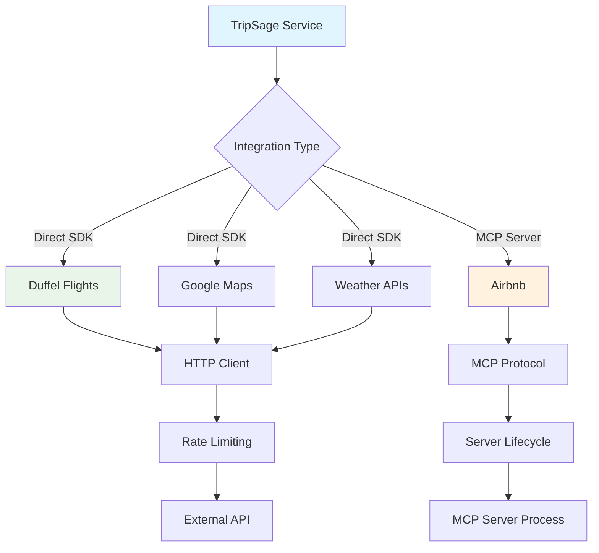
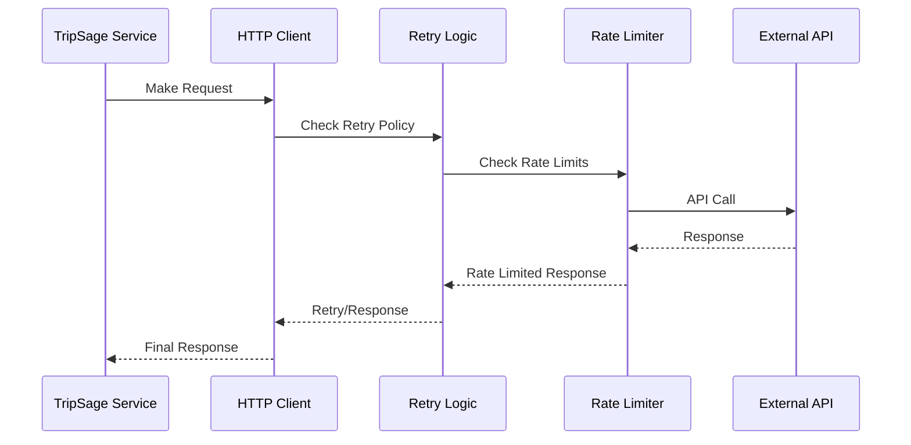
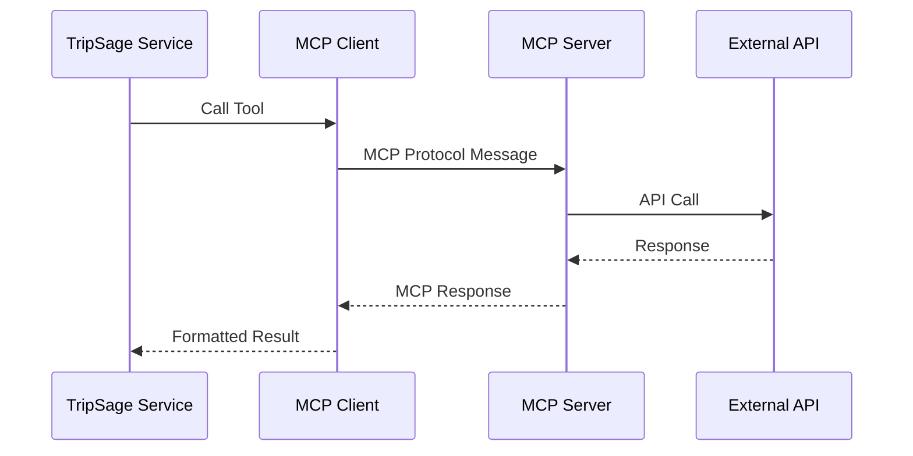

# Backend Development

TripSage backend architecture, development patterns, and operational guidance.

## Architecture Overview

The TripSage backend follows a layered architecture with clear separation of concerns:

### System Architecture



### Layered Architecture



### Key Design Principles

1. **Async First**: All I/O operations use async/await for scalability
2. **Dependency Injection**: Clean separation using FastAPI's dependency system
3. **Type Safety**: Full Pydantic models and type hints throughout
4. **Error Handling**: Structured error responses with proper HTTP status codes
5. **Security**: JWT authentication with Row Level Security in database
6. **Observability**: Structured logging and monitoring throughout

## Getting Started

### Development Environment

1. **Prerequisites**: Python 3.13+, Node.js 24+, pnpm
2. **Install dependencies**: `uv sync` for Python, `cd frontend && pnpm install`
3. **Start services**: `uv run python -m tripsage.api.main` (port 8000)
4. **API documentation**: Visit `http://localhost:8000/docs`

### Project Structure

```text
tripsage/api/
├── main.py          # FastAPI application entry point
├── config/          # Configuration and settings management
├── endpoints/       # HTTP route handlers (controllers)
├── middleware/      # Custom middleware (CORS, auth, logging)
├── schemas/         # Pydantic request/response models
├── services/        # Business logic and external integrations
└── dependencies/   # Dependency injection utilities

tripsage/core/
├── config.py        # Global configuration
├── database.py      # Database connection and session management
├── exceptions.py    # Custom exception classes
├── logging.py       # Logging configuration
└── models/          # SQLAlchemy/Pydantic data models
```

## API Development Patterns

### Route Organization

Routes are organized by domain in the `endpoints/` directory. Each module handles a specific business domain (trips, flights, auth, etc.) and follows consistent patterns:

- **Path Parameters**: Use descriptive names (`trip_id`, `user_id`)
- **Query Parameters**: Optional filters and pagination
- **Request Bodies**: Use Pydantic schemas for validation
- **Response Models**: Structured JSON responses with metadata

### Common Route Patterns

- **CRUD Operations**: Standard Create, Read, Update, Delete for resources
- **Search Endpoints**: Complex filtering with query parameters
- **Bulk Operations**: Batch processing for efficiency
- **Real-time Updates**: WebSocket integration for live data

## Authentication & Authorization

TripSage uses a dual authentication system supporting both user accounts and API keys:

### Authentication Flow



### JWT Authentication (Primary)



- **Login Flow**: Email/password → JWT token generation
- **Token Validation**: Middleware validates tokens on protected routes
- **User Context**: Current user injected via dependency injection
- **Session Management**: Tokens expire and require refresh

### API Key Authentication (BYOK)



- **Service Integration**: External APIs require user-provided keys
- **Secure Storage**: Encrypted storage in database
- **Scoped Access**: Keys limited to specific services
- **Usage Tracking**: Monitor and limit key usage

## External Service Integration

TripSage integrates with multiple external APIs using two approaches:

### Integration Patterns



### Direct SDK Integration



For services with good SDKs (Duffel flights, Google Maps, Weather APIs):

- **Client Management**: Dedicated service classes with connection pooling
- **Retry Logic**: Tenacity decorators for resilience
- **Rate Limiting**: Outbound limiting to respect API quotas
- **Error Handling**: Service-specific error translation

### MCP Server Pattern



For services without official SDKs (Airbnb):

- **Protocol Layer**: Standardized communication via MCP
- **Tool Calling**: Function invocation through MCP protocol
- **Lifecycle Management**: Server startup/shutdown handling
- **Fallback Logic**: Graceful degradation when MCP unavailable

## Performance & Scalability

### Rate Limiting Strategy

**Inbound Limiting**: Protects against abuse and ensures fair usage

- Global limits per IP/client
- Per-user limits for authenticated requests
- Burst handling for legitimate traffic spikes

**Outbound Limiting**: Respects external API quotas

- Per-service rate limits
- Request queuing during quota exhaustion
- Backoff strategies for rate limit recovery

### Caching Architecture

- **Upstash Redis**: Serverless HTTP-based caching
- **TTL Strategy**: Intelligent cache expiration based on data freshness
- **Cache Keys**: Structured naming for efficient invalidation
- **Fallback Behavior**: Graceful degradation when cache unavailable

## Error Handling & Resilience

### Error Classification

- **Client Errors** (4xx): Validation, authentication, permissions
- **Server Errors** (5xx): Internal failures, external service issues
- **Business Logic Errors**: Domain-specific validation failures

### Error Response Format

```json
{
  "error": true,
  "message": "Human-readable description",
  "code": "MACHINE_READABLE_CODE",
  "details": {
    "field_errors": ["specific validation issues"],
    "context": "additional debugging info"
  }
}
```

### Exception Handling Patterns

- **Global Handlers**: Catch-all for unhandled exceptions
- **Custom Exceptions**: Domain-specific error classes
- **Logging Integration**: Structured error logging with context
- **Recovery Strategies**: Automatic retry for transient failures

## Testing Strategy

### Test Organization

- **Unit Tests**: Individual functions and classes
- **Integration Tests**: Component interactions
- **End-to-End Tests**: Full request/response cycles
- **Performance Tests**: Load testing and profiling

### Testing Best Practices

- **Async Testing**: Proper async test setup with pytest-asyncio
- **Database Fixtures**: Clean test data setup and teardown
- **Mock External Services**: Isolate external dependencies
- **Assertion Patterns**: Clear, descriptive test assertions

## Development Workflow

### Local Development

1. **Environment Setup**: Configure local Supabase and Redis
2. **Dependency Installation**: Use `uv sync` for consistent environments
3. **Service Startup**: Run API with hot reload enabled
4. **Testing**: Run tests in watch mode during development

### Code Quality

- **Linting**: Ruff for Python code quality
- **Type Checking**: Pyright for static type analysis
- **Testing**: Pytest with coverage requirements
- **Documentation**: Auto-generated API docs via FastAPI

### Deployment Considerations

- **Containerization**: Docker for consistent environments
- **Configuration**: Environment-based configuration management
- **Monitoring**: Structured logging and metrics collection
- **Scaling**: Horizontal scaling with stateless design

## Common Development Tasks

### Adding New Endpoints

1. Define Pydantic schemas in `schemas/`
2. Implement business logic in `services/`
3. Create route handler in appropriate `endpoints/` module
4. Add tests covering success and error cases
5. Update API documentation

### Integrating New External Services

1. Evaluate SDK availability and quality
2. Choose integration approach (Direct SDK vs MCP)
3. Implement service class with proper error handling
4. Add rate limiting and retry logic
5. Test with realistic data and failure scenarios

### Database Schema Changes

1. Create migration scripts in `scripts/migrations/`
2. Update Pydantic models to reflect changes
3. Modify service layer for new queries
4. Update affected endpoints
5. Test data integrity and performance
