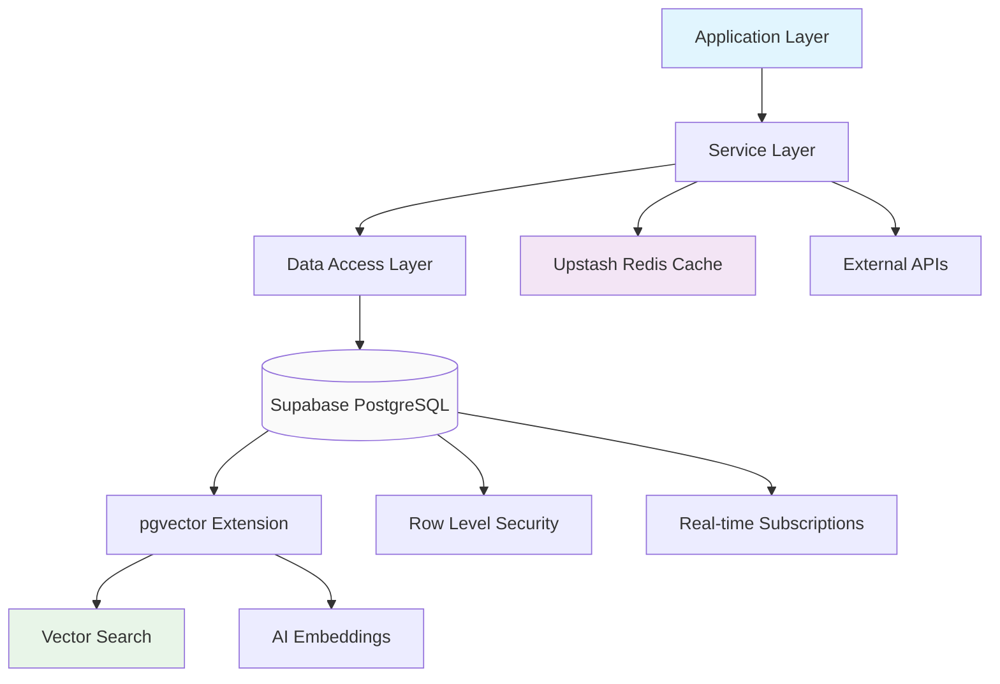
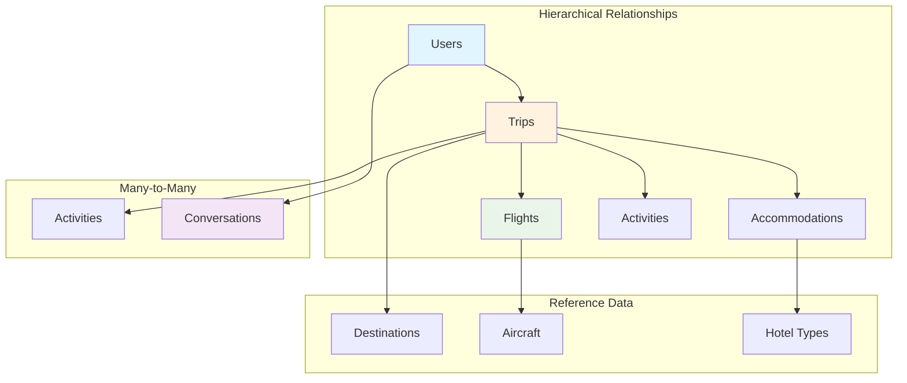
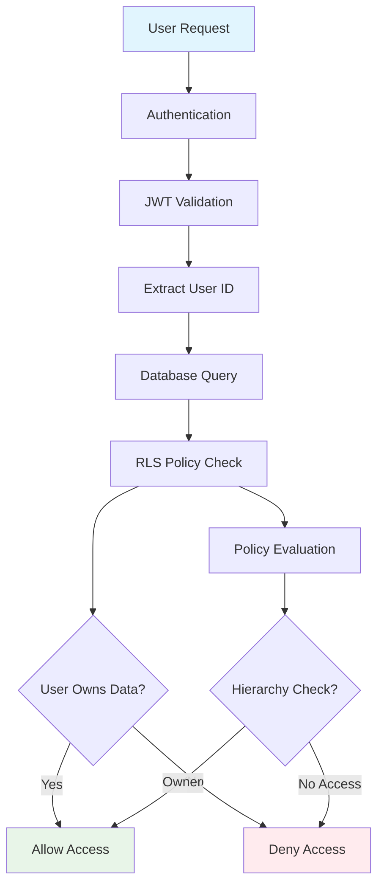
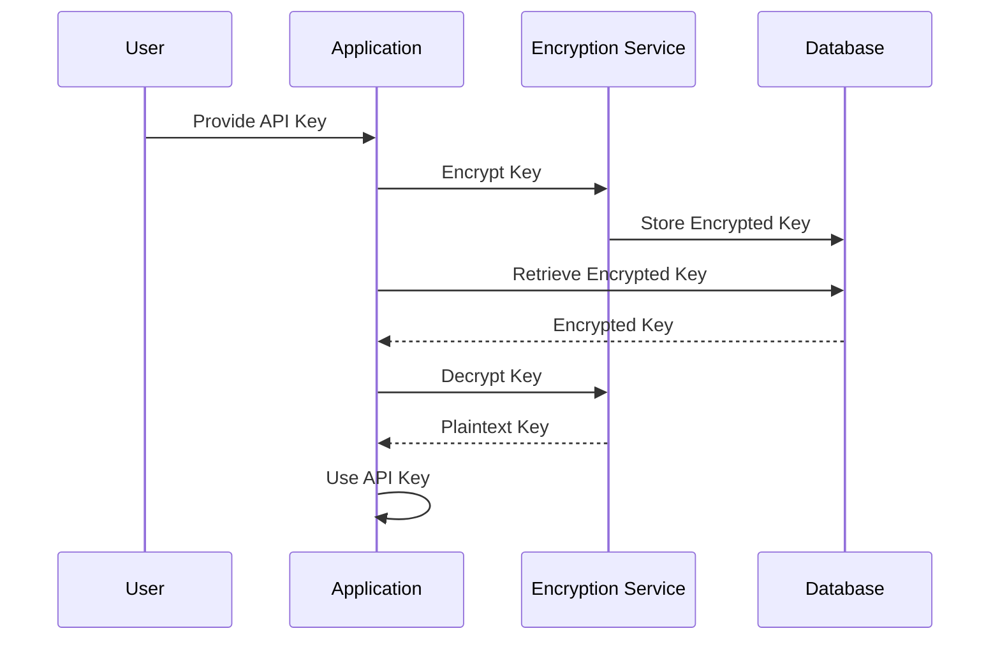
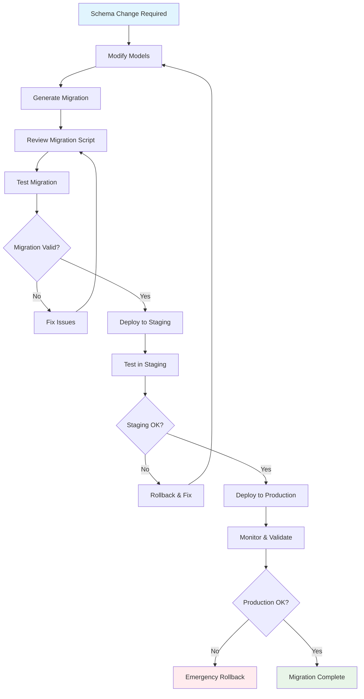
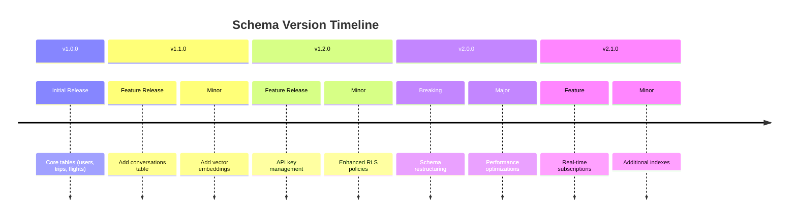

# Database Architecture

TripSage database design, data modeling, and persistence patterns.

## Architecture Overview

TripSage uses a unified database architecture built on Supabase PostgreSQL with specialized extensions for AI features. The design prioritizes security, performance, and developer experience.

### Core Principles

1. **Unified Storage**: Single PostgreSQL instance for all data types
2. **Row Level Security**: Database-level access control and data isolation
3. **Vector Search**: Native AI embeddings and semantic search capabilities
4. **Encrypted Secrets**: Secure storage of user-provided API keys
5. **Async Operations**: Full async/await support for scalability
6. **Migration Safety**: Versioned schema changes with rollback capabilities

## Database Technology Stack

### Supabase PostgreSQL

**Why Supabase?**

- **Managed Service**: Reduces operational overhead
- **Built-in Auth**: Integrated user authentication and authorization
- **Real-time**: Live data synchronization capabilities
- **Extensions**: Rich ecosystem of PostgreSQL extensions

**Key Features Used:**

- **Authentication**: User management and JWT token validation
- **Row Level Security**: Automatic data filtering by user context
- **Real-time Subscriptions**: Live updates for collaborative features
- **Edge Functions**: Serverless compute for complex operations

### pgvector Extension

**Purpose**: Native vector storage and similarity search for AI features

**Use Cases:**

- **Semantic Search**: Finding relevant conversations and context
- **Recommendation Engine**: Personalized travel suggestions
- **Memory Management**: AI agent context persistence
- **Similarity Matching**: Content-based search across user data

**Performance Characteristics:**

- **Indexing**: IVFFlat and HNSW indexes for fast approximate search
- **Distance Metrics**: Cosine, Euclidean, and inner product similarity
- **Scalability**: Efficient handling of high-dimensional vectors

## Data Model Design

### Schema Overview

```mermaid
erDiagram
    users ||--o{ trips : owns
    users ||--o{ conversations : has

    trips ||--o{ flights : contains
    trips ||--o{ accommodations : contains
    trips ||--o{ activities : contains

    conversations {
        uuid id PK
        uuid user_id FK
        text message
        vector embedding
        timestamp created_at
    }

        uuid id PK
        uuid user_id FK
        varchar service
        text encrypted_key
        boolean is_valid
    }

    trips {
        uuid id PK
        uuid user_id FK
        varchar name
        text_array destinations
        date start_date
        varchar status
    }

    flights {
        uuid id PK
        uuid trip_id FK
        varchar flight_number
        decimal price
    }
```

### Data Flow Architecture



### Core Entities

#### Users

- Central identity entity linking all user data
- Authentication context for security policies
- Profile information and preferences

#### Trips

- Primary business entity representing travel plans
- Contains destinations, dates, and trip metadata
- Hierarchical relationship with flights, accommodations, and activities

#### Conversations

- AI chat history with semantic embeddings
- Context for personalized recommendations
- Searchable user interaction history

#### API Keys (BYOK)

- Encrypted storage of third-party service credentials
- Scoped access to specific external services
- User-controlled credential management

### Relationship Patterns



- **Hierarchical**: Users → Trips → Bookings (flights, accommodations)
- **Many-to-Many**: Trips ↔ Activities, Users ↔ Conversations
- **Soft Deletes**: Logical deletion with data preservation
- **Audit Trail**: Change tracking for critical operations

## Security Architecture

### Row Level Security (RLS)



**Implementation Strategy:**

- **Policy-Based Access**: Database policies control data access
- **User Context**: `auth.uid()` function provides current user identity
- **Automatic Filtering**: Transparent security at the query level

**Security Policies:**

- **Ownership**: Users can only access their own data
- **Hierarchy**: Trip owners control all related bookings
- **Public Data**: Read-only access to reference data (airports, cities)
- **Admin Access**: Elevated permissions for system operations

### Data Encryption



**API Key Storage:**

- **AES Encryption**: Symmetric encryption at rest
- **Key Rotation**: Regular encryption key updates
- **Access Logging**: Audit trail for key usage
- **Secure Retrieval**: Runtime decryption for service integration

**Sensitive Data:**

- **PII Protection**: Encryption for personal identifiable information
- **Compliance**: GDPR and privacy regulation compliance
- **Access Controls**: Principle of least privilege

## Performance Optimization

### Indexing Strategy

**Primary Indexes:**

- **Unique Constraints**: Email addresses, API key combinations
- **Foreign Keys**: Optimized joins for hierarchical queries
- **Composite Indexes**: Multi-column indexes for common query patterns

**Vector Indexes:**

- **IVFFlat**: Fast approximate search for large datasets
- **HNSW**: High-precision search for smaller, critical datasets
- **Index Maintenance**: Automated reindexing for data updates

### Query Optimization

**Common Patterns:**

- **Eager Loading**: Reduce N+1 queries with strategic joins
- **Pagination**: Cursor-based pagination for large result sets
- **Connection Pooling**: Efficient database connection management
- **Query Planning**: EXPLAIN analysis for complex queries

**Caching Strategy:**

- **Application Cache**: Upstash Redis for frequently accessed data
- **Query Cache**: Result caching for expensive computations
- **Invalidation**: Smart cache invalidation on data changes

## Schema Evolution

### Migration Management



**Alembic Workflow:**

1. **Schema Changes**: Modify SQLAlchemy models
2. **Migration Generation**: Auto-generate migration scripts
3. **Review & Testing**: Validate changes in staging environment
4. **Deployment**: Zero-downtime migration execution
5. **Rollback Plan**: Tested rollback procedures

**Migration Best Practices:**

- **Incremental Changes**: Small, focused migrations
- **Backward Compatibility**: Support old schema during transition
- **Data Migration**: Safe data transformation scripts
- **Testing**: Comprehensive testing before production deployment

### Version Control



**Schema Versioning:**

- **Semantic Versioning**: Major.minor.patch for schema changes
- **Breaking Changes**: Major version bumps for incompatible changes
- **Deprecation**: Graceful handling of deprecated fields
- **Documentation**: Comprehensive changelog for schema evolution

## Data Consistency

### Transaction Management

**Transaction Patterns:**

- **Atomic Operations**: All-or-nothing booking operations
- **Isolation Levels**: Appropriate isolation for concurrent access
- **Deadlock Prevention**: Ordered resource acquisition
- **Compensation**: Rollback strategies for failed operations

**Consistency Models:**

- **Strong Consistency**: Critical financial operations
- **Eventual Consistency**: Background processing and caching
- **Conflict Resolution**: Merge strategies for concurrent updates

## Monitoring & Observability

### Database Metrics

**Key Metrics:**

- **Query Performance**: Slow query identification and optimization
- **Connection Pool**: Pool utilization and wait times
- **Storage Usage**: Table sizes and growth trends
- **Replication Lag**: Data synchronization health

**Monitoring Tools:**

- **pg_stat_statements**: Query performance analysis
- **pg_stat_activity**: Active connection monitoring
- **Supabase Dashboard**: Built-in monitoring and alerts
- **Custom Telemetry**: Application-specific metrics

## Development Workflow

### Local Development

1. **Environment Setup**: Local Supabase instance with Docker
2. **Schema Initialization**: Automated schema setup scripts
3. **Data Seeding**: Realistic test data for development
4. **Migration Testing**: Local migration validation

### Testing Strategy

**Database Testing:**

- **Unit Tests**: Individual query and function testing
- **Integration Tests**: Full transaction testing with rollbacks
- **Migration Tests**: Schema change validation
- **Performance Tests**: Load testing with realistic data volumes

**Data Integrity:**

- **Constraint Testing**: Foreign key and unique constraint validation
- **Data Validation**: Pydantic model integration testing
- **Backup/Restore**: Disaster recovery testing

## Common Patterns & Anti-patterns

### Recommended Patterns

- **Repository Pattern**: Centralized data access logic
- **Unit of Work**: Transaction-scoped operations
- **CQRS**: Separate read/write models where beneficial
- **Event Sourcing**: Audit trail for critical business operations

### Anti-patterns to Avoid

- **God Objects**: Overly complex entities with too many responsibilities
- **N+1 Queries**: Inefficient lazy loading patterns
- **Tight Coupling**: Direct database calls in presentation layer
- **Schema-less Design**: Proper schema design over document storage

## Scaling Considerations

### Horizontal Scaling

- **Read Replicas**: Distribute read load across multiple instances
- **Sharding**: Data partitioning for massive scale
- **Connection Pooling**: Efficient connection management
- **Caching Layers**: Multi-level caching strategy

### Performance Bottlenecks

- **Vector Search**: Index optimization and query tuning
- **Complex Joins**: Denormalization for frequently accessed data
- **Large Datasets**: Pagination and result limiting
- **Concurrent Access**: Optimistic locking and conflict resolution

## Troubleshooting Guide

### Common Issues

**Slow Queries:**

- Check query execution plans
- Review index usage and selectivity
- Consider query rewriting or denormalization

**Connection Issues:**

- Monitor connection pool utilization
- Check network connectivity and timeouts
- Review connection string configuration

**Data Consistency:**

- Validate transaction isolation levels
- Check for race conditions in concurrent operations
- Review application-level locking strategies

**Migration Problems:**

- Test migrations in staging environment
- Verify rollback procedures
- Check for long-running migration operations
