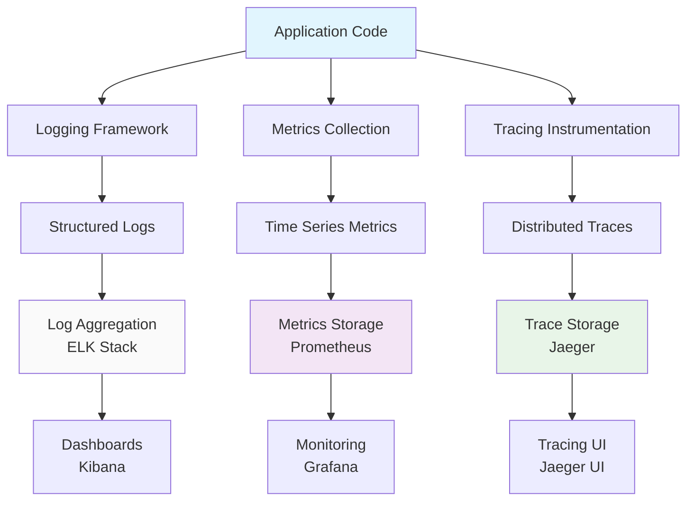
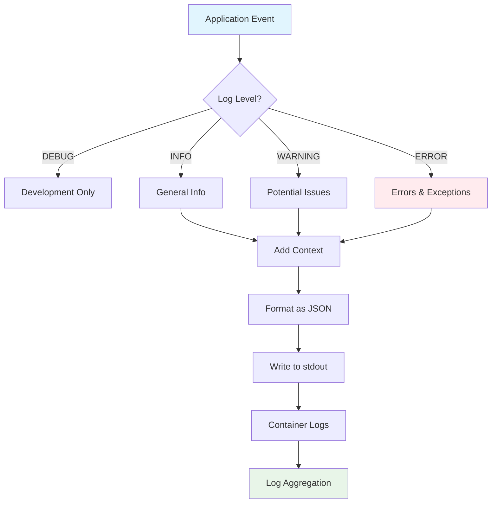
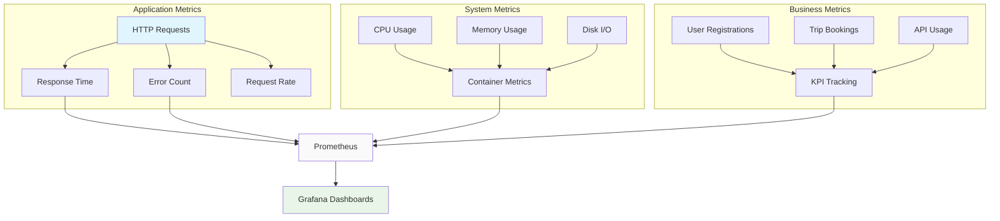
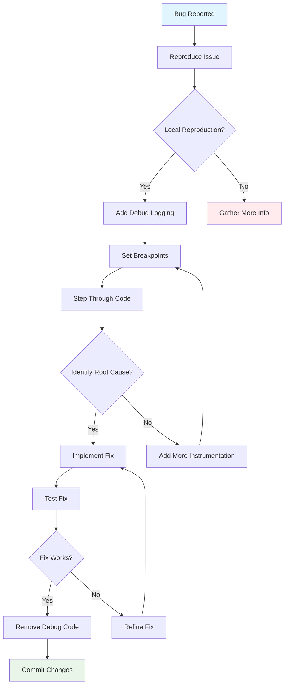
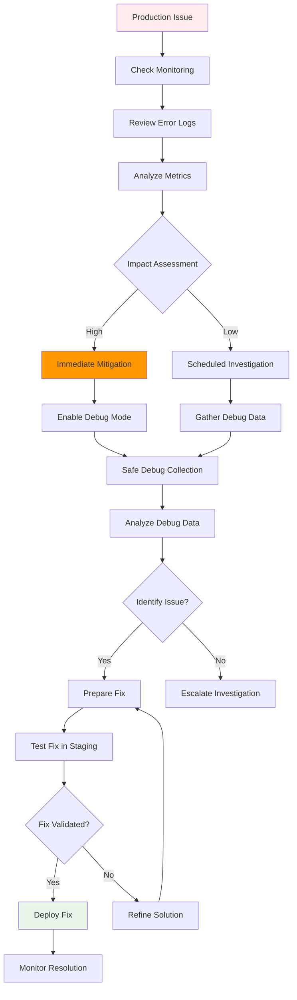

# Debugging & Performance

Comprehensive debugging techniques and performance optimization strategies for TripSage development.

## Observability Strategy

TripSage implements a multi-layered observability approach combining structured logging, metrics collection, and distributed tracing to provide complete system visibility.

### Observability Architecture

### Logging Architecture

**Structured Logging Principles:**

- **Context-Rich**: Every log entry includes relevant context (user, request, operation)
- **Machine-Readable**: JSON format for log aggregation and analysis
- **Level-Appropriate**: Appropriate log levels (DEBUG, INFO, WARNING, ERROR)
- **Performance-Aware**: Minimal overhead in production environments

**Log Categories:**

- **Request Logs**: HTTP request/response cycles with timing
- **Error Logs**: Exception details with stack traces and context
- **Business Logs**: Domain-specific events and state changes
- **Performance Logs**: Slow operations and resource utilization

### Metrics Collection

**Key Metrics to Monitor:**

- **Response Times**: P95, P99 latency for all endpoints
- **Error Rates**: 4xx/5xx rates by endpoint and time period
- **Resource Usage**: CPU, memory, database connections
- **Business KPIs**: Conversion rates, user engagement metrics

**Collection Strategy:**

- **Application Metrics**: Custom metrics using Prometheus client
- **Infrastructure Metrics**: Host-level monitoring via system tools
- **Business Metrics**: Domain-specific KPIs and SLIs

## Performance Profiling

### Code Profiling Techniques

**cProfile for CPU Analysis:**

- **Function-Level Timing**: Identify bottlenecks in specific functions
- **Call Graph Analysis**: Understand execution flow and hotspots
- **Memory Allocation Tracking**: Detect memory-intensive operations

**Best Practices:**

- **Targeted Profiling**: Profile specific operations, not entire applications
- **Statistical Sampling**: Use sampling for long-running processes
- **Baseline Comparison**: Compare performance across versions

### Database Performance

**Query Optimization:**

- **EXPLAIN Analysis**: Understand query execution plans
- **Index Utilization**: Ensure proper index usage for common queries
- **Connection Pooling**: Efficient database connection management

**Common Issues:**

- **N+1 Query Problem**: Multiple round trips for related data
- **Missing Indexes**: Slow queries due to table scans
- **Lock Contention**: Concurrent access blocking

**Monitoring Queries:**

- **Slow Query Logs**: Automatic logging of queries exceeding thresholds
- **Query Metrics**: Response times and frequency analysis
- **Connection Monitoring**: Pool utilization and wait times

## Memory Management

### Memory Leak Detection

**tracemalloc Usage:**

- **Allocation Tracking**: Monitor memory allocation patterns
- **Leak Identification**: Compare snapshots to find growing memory usage
- **Object Lifecycles**: Understand when objects are created and destroyed

**psutil Integration:**

- **Process Monitoring**: Overall memory usage and system impact
- **Resource Limits**: Respect container memory constraints
- **Garbage Collection**: Monitor Python GC behavior

### Memory Optimization Patterns

- **Object Reuse**: Pool frequently used objects
- **Lazy Loading**: Defer expensive operations until needed
- **Streaming**: Process large datasets incrementally
- **Caching**: Intelligent caching with TTL and size limits

## API Performance

### Response Time Optimization

**Middleware Timing:**

- **Request/Response Timing**: Measure total request duration
- **Component Breakdown**: Time individual pipeline stages
- **Slow Request Alerts**: Automatic alerting for performance degradation

**Optimization Techniques:**

- **Async Processing**: Non-blocking I/O operations
- **Response Compression**: Reduce payload sizes
- **Connection Reuse**: HTTP/2 and connection pooling
- **Caching Strategy**: HTTP caching headers and CDN integration

### Load Testing

**Testing Strategy:**

- **Gradual Load Increase**: Ramp up concurrent users
- **Realistic Scenarios**: Use production-like data and traffic patterns
- **Bottleneck Identification**: Monitor system resources during load
- **Capacity Planning**: Determine scaling requirements

## Debugging Workflows

### Local Development Debugging

1. **Environment Setup**: Configure debug logging and breakpoints
2. **Reproduction**: Create minimal test cases for issues
3. **Instrumentation**: Add temporary logging for problem isolation
4. **Root Cause Analysis**: Use profiling tools to identify bottlenecks

### Production Debugging

**Safe Production Debugging:**

- **Feature Flags**: Enable/disable debug features without deployment
- **Sampling**: Debug only a percentage of requests
- **Anonymized Data**: Protect user privacy in debug logs
- **Rate Limiting**: Prevent debug operations from impacting performance

**Incident Response:**

1. **Alert Triage**: Classify and prioritize performance issues
2. **Data Collection**: Gather relevant logs and metrics
3. **Hypothesis Testing**: Form and test potential causes
4. **Solution Implementation**: Apply fixes with rollback plans

## Performance Optimization Framework

### Systematic Optimization Process

1. **Measurement**: Establish current performance baselines
2. **Analysis**: Identify bottlenecks using profiling tools
3. **Hypothesis**: Form theories about performance improvements
4. **Testing**: Validate changes with appropriate tests
5. **Monitoring**: Track impact of optimizations over time

### Optimization Priorities

**High Impact, Low Risk:**

- **Database Indexing**: Add missing indexes for slow queries
- **Caching**: Implement caching for expensive operations
- **Connection Pooling**: Optimize database and external service connections

**High Impact, High Risk:**

- **Architecture Changes**: Major refactoring for performance
- **Algorithm Optimization**: Replace O(n²) with O(n) algorithms
- **Data Structure Changes**: Optimize data models for access patterns

## Monitoring & Alerting

### Alert Design

**Alert Types:**

- **Threshold Alerts**: Resource usage or performance metric thresholds
- **Anomaly Detection**: Statistical deviation from normal patterns
- **Trend Alerts**: Performance degradation over time
- **Business Alerts**: Impact on user experience or business metrics

**Alert Quality:**

- **Actionable**: Clear next steps for responders
- **Non-Noisy**: Minimize false positives
- **Escalation**: Appropriate routing based on severity
- **Context**: Include relevant debugging information

### Dashboard Design

**Key Dashboards:**

- **System Health**: Overall system status and resource usage
- **Application Performance**: Response times and error rates
- **Business Metrics**: User engagement and conversion tracking
- **Infrastructure**: Server and database performance

## Development Best Practices

### Performance-Aware Development

**Code Review Checklist:**

- **Algorithm Complexity**: Review time and space complexity
- **Database Queries**: Check for N+1 problems and missing indexes
- **Async Usage**: Ensure proper async/await patterns
- **Resource Management**: Verify proper cleanup and connection pooling

**Testing Strategy:**

- **Performance Tests**: Automated performance regression testing
- **Load Tests**: Regular capacity and scalability testing
- **Integration Tests**: End-to-end performance validation

### Continuous Improvement

**Performance Culture:**

- **Regular Reviews**: Periodic performance assessments
- **Benchmarking**: Track performance against industry standards
- **Knowledge Sharing**: Document and share optimization techniques
- **Tool Investment**: Maintain up-to-date profiling and monitoring tools

## Troubleshooting Guide

### Common Performance Issues

**High CPU Usage:**

- Check for infinite loops or recursive functions
- Review algorithm complexity for large datasets
- Monitor thread contention and deadlocks

**High Memory Usage:**

- Look for memory leaks in long-running processes
- Check for large object retention in caches
- Review data structure choices for memory efficiency

**Slow Database Queries:**

- Analyze query execution plans
- Check index usage and selectivity
- Consider query rewriting or denormalization

**High Error Rates:**

- Review error logs for patterns
- Check external service dependencies
- Validate input validation and error handling

### Emergency Response

**Performance Incident Response:**

1. **Triage**: Assess impact and urgency
2. **Investigation**: Gather telemetry and logs
3. **Mitigation**: Apply immediate fixes or rollbacks
4. **Analysis**: Root cause analysis and permanent fixes
5. **Prevention**: Implement monitoring and automated tests

**Communication:**

- **Stakeholder Updates**: Regular status updates during incidents
- **Post-Mortem**: Detailed analysis and action items
- **Documentation**: Update runbooks and procedures
