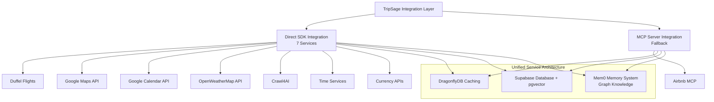

# TripSage AI External Integrations

> Status: 7 Direct SDK Integrations + MCP Fallbacks
> Performance: Direct SDK calls
> Architecture: Service clients with failover

This document covers TripSage's external service integrations, including direct SDK implementations and MCP servers for travel planning.

## Table of Contents

- [Integration Strategy Overview](#integration-strategy-overview)
- [Direct SDK Integrations](#direct-sdk-integrations)
- [MCP Integrations](#mcp-integrations)
- [Authentication and Security](#authentication-and-security)
- [Performance and Monitoring](#performance-and-monitoring)
- [Future Integrations](#future-integrations)

## Integration Strategy Overview

TripSage uses a hybrid integration architecture with direct SDK calls as primary and MCP servers as fallback.



### Integration Philosophy

1. Direct SDK integration for primary services
2. MCP servers for fallback and additional capabilities
3. BYOK: Users provide API keys for services
4. Unified interface abstracts integration details
5. Caching with DragonflyDB

## Direct SDK Integrations

### 1. Duffel Flight Services (API v2)

#### Duffel Overview

- Technology: Duffel API v2 via httpx (DuffelProvider)
- Coverage: 300+ airlines, global flight inventory

#### Duffel Implementation

```python
from tripsage_core.services.external_apis.duffel_provider import DuffelProvider

provider = DuffelProvider(access_token="<your_token>")

offers = await provider.search_flights(
    origin="LAX",
    destination="NRT",
    departure_date=date(2025, 4, 1),
    return_date=None,
    passengers=[{"type": "adult"}],
    cabin_class="economy",
    max_connections=0,
    currency="USD",
)

# Map raw Duffel offers to TripSage models
from tripsage_core.models.mappers.flights_mapper import duffel_offer_to_service_offer
canonical_offers = [
    duffel_offer_to_service_offer(o) for o in offers
]
```

#### Duffel Key Features

- Real-time Flight Search: Live inventory with pricing
- Booking Management: Create, modify, and cancel bookings
- Seat Selection: Seat maps and selection
- Fare Rules: Fare conditions and restrictions
- Multi-city Support: Itinerary planning

#### Duffel Detailed API Specification

**Base URL**: `https://api.duffel.com`
**Headers**: `Authorization: Bearer <your_duffel_access_token>`,
`Duffel-Version: v2`, `Accept: application/json`,
`Content-Type: application/json`
**Versioning**: Via `Duffel-Version` header (e.g., `2023-06-02`)

**Key Endpoints Used by TripSage**:

- `POST /air/offer_requests`: Initiate flight search
- `GET /air/offers?offer_request_id={id}`: Retrieve flight offers
- `GET /air/offers/{id}`: Get offer details and pricing
- `GET /air/seat_maps?offer_id={id}`: Access seat selection
- `POST /air/orders`: Create flight booking
- `GET /air/orders/{id}`: Retrieve booking status

**Coverage**: 300+ airlines including NDC, GDS, and Low-Cost Carriers
**Pricing Model**: Transaction-based fees
**Rate Limits**: 1000 requests per minute (production tier)

### 2. Google Maps and Places API

#### Google Maps Overview

- Technology: Google Maps Platform SDK
- Coverage: Global location data, place information

#### Google Maps Implementation

```python
from tripsage_core.services.external_apis.google_maps_service import GoogleMapsService

class LocationService:
    """Unified location service with Google Maps integration."""
    
    def __init__(self):
        self.maps_client = GoogleMapsService()
        self.cache_service = DragonflyDBService()
    
    @cache_result(ttl=86400, namespace="locations")  # 24 hour cache
    async def search_places(
        self, query: str, location_bias: Optional[str] = None
    ) -> PlaceResults:
        """Search places using Google Places API with location bias."""
        
        results = await self.maps_client.text_search(
            query=query,
            location_bias=location_bias,
            type="tourist_attraction|lodging|restaurant"
        )
        
        return PlaceResults(
            places=[self._normalize_place(place) for place in results],
            query=query,
            provider="google_maps"
        )
    
    @cache_result(ttl=3600, namespace="directions")  # 1 hour cache
    async def get_directions(
        self, origin: str, destination: str, mode: str = "driving"
    ) -> DirectionsResult:
        """Get directions between two points."""
        
        directions = await self.maps_client.directions(
            origin=origin,
            destination=destination,
            mode=mode,
            alternatives=True
        )
        
        return DirectionsResult(
            routes=directions.routes,
            distance=directions.distance,
            duration=directions.duration,
            provider="google_maps"
        )
```

#### Google Maps Key Features

- Place Search: Place discovery and details
- Geocoding: Address to coordinates conversion
- Directions: Multi-modal routing
- Nearby Search: Location-based discovery
- Place Photos: Imagery for locations

### 3. Google Calendar Integration

#### Google Calendar Overview

- Technology: Google Calendar API v3
- Purpose: Trip planning and schedule coordination

#### Google Calendar Implementation

```python
from tripsage_core.services.external_apis.calendar_service import CalendarService

class TripCalendarService:
    """Trip planning with calendar integration."""
    
    def __init__(self):
        self.calendar_client = CalendarService()
        self.cache_service = DragonflyDBService()
    
    async def create_trip_calendar(
        self, trip_id: str, trip_details: TripDetails
    ) -> CalendarResult:
        """Create a dedicated calendar for trip planning."""
        
        calendar = await self.calendar_client.create_calendar(
            summary=f"Trip to {trip_details.destination}",
            description=f"Travel itinerary for {trip_details.title}",
            time_zone=trip_details.timezone
        )
        
        # Add flight events
        for flight in trip_details.flights:
            await self.calendar_client.create_event(
                calendar_id=calendar.id,
                event=self._create_flight_event(flight)
            )
        
        return CalendarResult(
            calendar_id=calendar.id,
            calendar_url=calendar.html_link,
            events_created=len(trip_details.flights)
        )
```

#### Google Calendar Key Features

- Trip Calendars: Dedicated calendars for each trip
- Automated Events: Flight, hotel, and activity scheduling
- Conflict Detection: Avoid scheduling conflicts
- Sharing: Collaborative trip planning
- Synchronization: Real-time updates

### 4. OpenWeatherMap Integration

#### OpenWeatherMap Overview

- Technology: OpenWeatherMap API v3.0
- Coverage: Global weather data with forecasts

#### OpenWeatherMap Implementation

```python
from tripsage_core.services.external_apis.weather_service import WeatherService

class TravelWeatherService:
    """Weather service for travel planning."""
    
    def __init__(self):
        self.weather_client = WeatherService()
        self.cache_service = DragonflyDBService()
    
    @cache_result(ttl=1800, namespace="weather")  # 30 minute cache
    async def get_destination_weather(
        self, destination: str, travel_dates: DateRange
    ) -> WeatherForecast:
        """Get weather forecast for travel destination and dates."""
        
        # Get coordinates for destination
        coordinates = await self.location_service.geocode(destination)
        
        # Fetch weather forecast
        forecast = await self.weather_client.get_forecast(
            lat=coordinates.latitude,
            lon=coordinates.longitude,
            start_date=travel_dates.start_date,
            end_date=travel_dates.end_date
        )
        
        return WeatherForecast(
            destination=destination,
            daily_forecasts=forecast.daily,
            travel_recommendations=self._generate_travel_advice(forecast),
            provider="openweathermap"
        )
```

#### OpenWeatherMap Key Features

- Travel-Specific Forecasts: Weather data for trip planning
- Packing Recommendations: Clothing and gear suggestions
- Activity Suitability: Weather-based activity recommendations
- Severe Weather Alerts: Travel warnings
- Historical Data: Climate patterns

### 5. Crawl4AI Web Content Extraction

#### Crawl4AI Overview

- Technology: Crawl4AI Python SDK
- Purpose: Web content extraction for travel

#### Crawl4AI Implementation

```python
from tripsage.tools.webcrawl.crawl4ai_client import Crawl4AIClient

class TravelContentService:
    """Web content extraction and analysis."""
    
    def __init__(self):
        self.crawl_client = Crawl4AIClient()
        self.cache_service = DragonflyDBService()
    
    @cache_result(ttl=3600, namespace="content")  # 1 hour cache
    async def extract_destination_info(
        self, destination: str, content_type: str = "comprehensive"
    ) -> DestinationContent:
        """Extract destination information from travel websites."""
        
        search_urls = await self._generate_destination_urls(destination)
        
        extraction_results = []
        for url in search_urls[:5]:  # Limit to top 5 sources
            try:
                crawl_output = await self.crawl_client.scrape_url(url)
                if crawl_output["success"]:
                    extraction_results.extend(crawl_output["items"])
            except Exception as exc:
                logger.warning(
                    "Content extraction failed for %s: %s", url, exc
                )
        
        return DestinationContent(
            destination=destination,
            sources=extraction_results,
            aggregated_data=self._aggregate_content(extraction_results),
            last_updated=datetime.utcnow()
        )
```

#### Crawl4AI Key Features

- Structured Extraction: Convert web content to structured data
- Multi-source Aggregation: Combine information from sources
- Content Classification: Categorization of travel information
- Real-time Updates: Fresh destination information
- Quality Scoring: Rank content sources

### 6. Time and Timezone Services

#### Time Services Overview

- Technology: Timezone and time APIs
- Purpose: Multi-timezone trip coordination

#### Time Services Implementation

```python
from tripsage_core.services.external_apis.time_service import TimeService

class TravelTimeService:
    """Timezone and time management for travel planning."""
    
    def __init__(self):
        self.time_client = TimeService()
        self.cache_service = DragonflyDBService()
    
    @cache_result(ttl=86400, namespace="timezones")  # 24 hour cache
    async def get_destination_timezone(
        self, destination: str
    ) -> TimezoneInfo:
        """Get timezone information for travel destination."""
        
        coordinates = await self.location_service.geocode(destination)
        
        timezone_info = await self.time_client.get_timezone(
            lat=coordinates.latitude,
            lon=coordinates.longitude
        )
        
        return TimezoneInfo(
            destination=destination,
            timezone=timezone_info.timezone,
            offset=timezone_info.offset,
            dst_active=timezone_info.dst_active,
            local_time=timezone_info.local_time
        )
    
    async def calculate_travel_times(
        self, itinerary: TravelItinerary
    ) -> TravelTimeAnalysis:
        """Calculate travel times considering timezones."""
        
        timezone_map = {}
        for destination in itinerary.destinations:
            timezone_map[destination] = await self.get_destination_timezone(
                destination
            )
        
        return TravelTimeAnalysis(
            itinerary_id=itinerary.id,
            timezone_map=timezone_map,
            optimal_flight_times=self._calculate_optimal_times(
                itinerary, timezone_map
            ),
            jet_lag_analysis=self._analyze_jet_lag(
                itinerary, timezone_map
            )
        )
```

#### Time Services Key Features

- Multi-timezone Coordination: Timezone calculations
- Jet Lag Analysis: Optimize travel times
- Local Time Display: Show local times
- DST Awareness: Handle daylight saving time
- Time Zone Conversion: Time conversions

### 7. Currency and Exchange Services

#### Currency Services Overview

- Technology: Currency APIs with fallbacks
- Purpose: Multi-currency travel budgeting

#### Currency Services Implementation

```python
from tripsage_core.services.external_apis.currency_service import CurrencyService

class TravelCurrencyService:
    """Multi-currency support for travel planning."""
    
    def __init__(self):
        self.currency_client = CurrencyService()
        self.cache_service = DragonflyDBService()
    
    @cache_result(ttl=3600, namespace="exchange_rates")  # 1 hour cache
    async def get_exchange_rates(
        self, base_currency: str, target_currencies: List[str]
    ) -> ExchangeRates:
        """Get current exchange rates for travel currencies."""
        
        rates = await self.currency_client.get_latest_rates(
            base=base_currency,
            symbols=target_currencies
        )
        
        return ExchangeRates(
            base_currency=base_currency,
            rates=rates.rates,
            last_updated=rates.timestamp,
            provider="currency_api"
        )
    
    async def convert_travel_budget(
        self, budget: TravelBudget, target_currency: str
    ) -> ConvertedBudget:
        """Convert entire travel budget to target currency."""
        
        exchange_rates = await self.get_exchange_rates(
            base_currency=budget.base_currency,
            target_currencies=[target_currency]
        )
        
        rate = exchange_rates.rates[target_currency]
        
        return ConvertedBudget(
            original_budget=budget,
            converted_currency=target_currency,
            converted_amounts={
                category: amount * rate 
                for category, amount in budget.category_amounts.items()
            },
            exchange_rate=rate,
            conversion_date=datetime.utcnow()
        )
```

#### Currency Services Key Features

- Real-time Exchange Rates: Currency conversions
- Multi-currency Budgeting: Budget calculations
- Historical Rate Analysis: Currency trends
- Cost Optimization: Exchange opportunities
- Regional Currency Support: Local currency needs

## MCP Integrations

### Airbnb Integration (MCP Server)

#### Airbnb Overview

TripSage integrates with Airbnb through the OpenBnB MCP Server for vacation rentals and accommodations.

#### Airbnb Integration Architecture

```python
# FINAL-ONLY: Use DI-managed MCP service via API wiring; avoid importing singletons

class AccommodationService:
    """Unified accommodation service with multi-provider support."""
    
    def __init__(self):
        self.airbnb_client = AirbnbWrapper()
        self.cache_service = DragonflyDBService()
    
    @cache_result(ttl=1800, namespace="accommodations")  # 30 minute cache
    async def search_accommodations(
        self, search_params: AccommodationSearchParams
    ) -> AccommodationResults:
        """Search accommodations across all configured providers."""
        
        results = []
        
        # Search Airbnb via MCP
        if "airbnb" in search_params.providers:
            airbnb_results = await self.airbnb_client.search_listings(
                location=search_params.location,
                check_in=search_params.check_in_date,
                check_out=search_params.check_out_date,
                adults=search_params.adults,
                children=search_params.children
            )
            results.extend(self._normalize_airbnb_results(airbnb_results))
        
        # Add other providers (Booking.com, etc.)
        # ...
        
        return AccommodationResults(
            accommodations=results,
            total_results=len(results),
            search_params=search_params,
            providers_used=search_params.providers
        )
```

#### Airbnb Key Features

- Vacation Rental Search: Access to Airbnb's inventory
- Detailed Property Information: Photos, amenities, house rules, reviews
- Price Comparison: Compare costs across providers
- Availability Checking: Real-time availability
- Review Integration: Guest reviews and ratings

#### Airbnb MCP Tools Exposed

- `airbnb_search`: Search for Airbnb listings by location and dates
- `airbnb_listing_details`: Get detailed information for listings
- `airbnb_reviews`: Retrieve guest reviews for properties
- `airbnb_availability`: Check real-time availability

## Authentication and Security

### API Key Management (BYOK)

TripSage implements a BYOK system for users to provide and manage API keys for external services.

#### BYOK Secure Key Storage

```python
from tripsage_core.services.business.key_management_service import KeyManagementService

class SecureKeyManagementService:
    """Management of user-provided API keys."""
    
    def __init__(self):
        self.encryption_service = EncryptionService()
        self.database_service = DatabaseService()
        self.monitoring_service = KeyMonitoringService()
    
    async def store_api_key(
        self, user_id: str, service: str, api_key: str
    ) -> KeyStorageResult:
        """Store user's API key with encryption."""
        
        # Validate API key with service
        validation_result = await self._validate_api_key(service, api_key)
        
        if not validation_result.is_valid:
            raise InvalidAPIKeyError(
                f"API key validation failed for {service}"
            )
        
        # Encrypt API key
        encrypted_key = await self.encryption_service.encrypt(api_key)
        
        # Store in database
        key_record = await self.database_service.store_api_key(
            user_id=user_id,
            service=service,
            encrypted_key=encrypted_key,
            key_permissions=validation_result.permissions,
            rate_limits=validation_result.rate_limits
        )
        
        # Set up monitoring
        await self.monitoring_service.setup_key_monitoring(key_record.id)
        
        return KeyStorageResult(
            key_id=key_record.id,
            service=service,
            permissions=validation_result.permissions,
            status="active"
        )
```

#### BYOK Key Security Features

- Encryption at Rest: API keys encrypted with user-specific keys
- Access Control: Role-based access to key management
- Usage Monitoring: Track key usage and detect anomalies
- Automatic Rotation: Support for key rotation
- Audit Logging: Audit trail of key access and usage

### Rate Limiting and Quota Management

#### Rate Limiting and Quota

```python
class RateLimiter:
    """Manage API rate limits across services and users."""
    
    def __init__(self):
        self.cache_service = DragonflyDBService()
        self.monitoring_service = MonitoringService()
    
    async def check_rate_limit(
        self, user_id: str, service: str, endpoint: str
    ) -> RateLimitResult:
        """Check if user can make API call within rate limits."""
        
        # Get user's rate limit configuration
        rate_config = await self._get_rate_limit_config(user_id, service)
        
        # Check current usage
        current_usage = await self._get_current_usage(
            user_id, service, endpoint
        )
        
        # Calculate remaining quota
        remaining_quota = rate_config.max_requests - current_usage.requests_count
        
        if remaining_quota <= 0:
            return RateLimitResult(
                allowed=False,
                remaining_quota=0,
                reset_time=current_usage.reset_time,
                retry_after=self._calculate_retry_after(
                    current_usage.reset_time
                )
            )
        
        return RateLimitResult(
            allowed=True,
            remaining_quota=remaining_quota,
            reset_time=current_usage.reset_time
        )
    
    async def record_api_call(
        self, user_id: str, service: str, endpoint: str, response_time: float
    ):
        """Record API call for rate limiting and monitoring."""
        
        # Update usage counters
        await self.cache_service.increment(
            key=f"rate_limit:{user_id}:{service}:{endpoint}",
            amount=1,
            ttl=3600  # 1 hour window
        )
        
        # Record performance metrics
        await self.monitoring_service.record_api_performance(
            user_id=user_id,
            service=service,
            endpoint=endpoint,
            response_time=response_time,
            timestamp=datetime.utcnow()
        )
```

## Performance and Monitoring

### Integration Performance Metrics

TripSage monitors performance across external integrations.

#### Performance Monitoring

```python
class IntegrationPerformanceMonitor:
    """Monitor integration performance."""
    
    def __init__(self):
        self.metrics_service = MetricsService()
        self.alerting_service = AlertingService()
    
    async def record_integration_metrics(
        self, integration: str, operation: str, metrics: PerformanceMetrics
    ):
        """Record performance metrics for integration operations."""
        
        await self.metrics_service.record_metrics(
            namespace="integrations",
            metrics={
                f"{integration}.{operation}.response_time": metrics.response_time,
                f"{integration}.{operation}.success_rate": 1 if metrics.success else 0,
                f"{integration}.{operation}.error_rate": 1 if not metrics.success else 0,
                f"{integration}.{operation}.cache_hit_rate": 1 if metrics.cache_hit else 0
            }
        )
        
        # Check for performance degradation
        if metrics.response_time > self._get_performance_threshold(
            integration, operation
        ):
            await self.alerting_service.send_performance_alert(
                integration=integration,
                operation=operation,
                current_performance=metrics.response_time,
                threshold=self._get_performance_threshold(
                    integration, operation
                )
            )
```

### Integration Health Monitoring

#### Health Checks

```python
class IntegrationHealthMonitor:
    """Monitor health of external integrations."""
    
    async def run_health_checks(self) -> HealthCheckReport:
        """Run health checks on all integrations."""
        
        health_results = {}
        
        # Check each integration
        for integration in self.MONITORED_INTEGRATIONS:
            try:
                health_result = await self._check_integration_health(integration)
                health_results[integration] = health_result
            except Exception as e:
                health_results[integration] = HealthResult(
                    status="unhealthy",
                    error=str(e),
                    last_success=await self._get_last_success(integration)
                )
        
        # Generate overall health report
        overall_health = self._calculate_overall_health(health_results)
        
        return HealthCheckReport(
            timestamp=datetime.utcnow(),
            overall_health=overall_health,
            integration_health=health_results,
            recommendations=self._generate_health_recommendations(health_results)
        )
```

### Current Performance Metrics

#### External Integration Performance Metrics

- Direct SDK Integrations: SDK calls
- Duffel Flight Search: Average response time (P95)
- Google Maps Operations: Geocoding, place search (P95)
- Weather Data Retrieval: Forecast data (P95)
- Content Extraction: Web crawling (P95)

#### Caching Performance

- DragonflyDB Operations: Faster than Redis
- Cache Hit Rates: For accessed data
- Memory Efficiency: Compression
- Throughput: Operations/second

#### Overall System Performance

- API Response Times: End-to-end for operations (P95)
- Concurrent Users: Users supported
- Service Availability: Uptime
- Error Rates: For operations

## Future Integrations

### Hotel Integrations

#### Planned Hotel Providers

1. Booking.com (via Apify scraper integration)
2. Hotels.com (direct API when available)
3. Expedia (partner API integration)
4. Local Hotel Chains (direct partnerships)

#### Unified Accommodation Interface

```python
class UnifiedAccommodationInterface:
    """Abstract interface for all accommodation providers."""
    
    async def search_properties(
        self, criteria: SearchCriteria
    ) -> List[Property]:
        """Search properties across all providers."""
        pass
    
    async def get_property_details(
        self, property_id: str, provider: str
    ) -> PropertyDetails:
        """Get detailed property information."""
        pass
    
    async def check_availability(
        self, property_id: str, dates: DateRange
    ) -> AvailabilityResult:
        """Check real-time availability and pricing."""
        pass
    
    async def get_reviews(
        self, property_id: str, limit: int = 10
    ) -> List[Review]:
        """Retrieve property reviews and ratings."""
        pass
```

### Ground Transportation Integrations

#### Planned Ground Transportation Providers

1. Uber/Lyft APIs: Ride-sharing for airport transfers
2. Car Rental APIs: Hertz, Avis, Enterprise
3. Public Transit APIs: Local transit information
4. Train Services: Rail booking

### Location-Based Recommendations

#### Recommendation Engine

```python
class LocationRecommendationEngine:
    """Location recommendations based on user preferences."""
    
    async def generate_recommendations(
        self, user_profile: UserProfile, destination: str
    ) -> Recommendations:
        """Generate personalized location recommendations."""
        
        # Analyze user travel history and preferences
        user_preferences = await self.analyze_user_preferences(user_profile)
        
        # Get location data
        destination_analysis = await self.location_service.analyze_destination(
            destination
        )
        
        # Apply ML model for recommendations
        recommendations = await self.ml_service.predict_recommendations(
            user_preferences=user_preferences,
            destination_data=destination_analysis,
            context={"travel_dates": user_profile.current_trip_dates}
        )
        
        return Recommendations(
            attractions=recommendations.top_attractions,
            restaurants=recommendations.dining_suggestions,
            activities=recommendations.recommended_activities,
            confidence_scores=recommendations.confidence_levels
        )
```

---

> This external integrations architecture provides connectivity to travel services with security, reliability, and user experience considerations.
