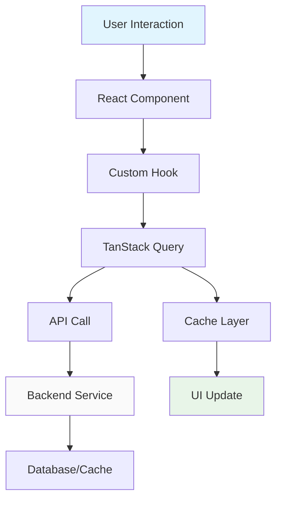

# Frontend Development

TripSage frontend architecture and development patterns.

## Technology Stack

- **Framework**: Next.js 15 with App Router
- **React**: React 19 with concurrent features
- **Language**: TypeScript with strict mode
- **Styling**: Tailwind CSS with component library
- **State Management**: Zustand for client state
- **Data Fetching**: TanStack Query for server state
- **AI Integration**: AI SDK for LLM interactions
- **Testing**: Vitest + Playwright
- **Linting**: Biome for code quality

## Architecture Overview

### Application Structure

```text
frontend/src/
├── app/           # Next.js App Router pages
├── components/    # Reusable UI components
├── contexts/      # React context providers
├── hooks/         # Custom React hooks
├── lib/           # Utilities and configurations
├── stores/        # Zustand state stores
├── types/         # TypeScript definitions
├── schemas/       # Zod validation schemas
└── styles/        # Global styles and Tailwind config
```

### Data Flow



## Component Development

### Component Patterns

Use functional components with proper TypeScript typing:

```typescript
interface TripCardProps {
  trip: Trip;
  onEdit: (tripId: string) => void;
}

export function TripCard({ trip, onEdit }: TripCardProps) {
  return (
    <div className="border rounded-lg p-4">
      <h3 className="text-lg font-semibold">{trip.name}</h3>
      <button
        onClick={() => onEdit(trip.id)}
        className="mt-2 px-4 py-2 bg-blue-500 text-white rounded"
      >
        Edit Trip
      </button>
    </div>
  );
}
```

### Custom Hooks

Encapsulate reusable logic in custom hooks:

```typescript
function useTrips() {
  const queryClient = useQueryClient();

  const { data: trips, isLoading } = useQuery({
    queryKey: ['trips'],
    queryFn: () => api.getTrips(),
  });

  const createTrip = useMutation({
    mutationFn: (tripData: TripCreate) => api.createTrip(tripData),
    onSuccess: () => {
      queryClient.invalidateQueries({ queryKey: ['trips'] });
    },
  });

  return {
    trips: trips || [],
    isLoading,
    createTrip: createTrip.mutateAsync,
  };
}
```

## State Management

### Client State (Zustand)

Use Zustand for complex client state:

```typescript
interface TripState {
  currentTrip: Trip | null;
  setCurrentTrip: (trip: Trip | null) => void;
  updateTrip: (updates: Partial<Trip>) => void;
}

export const useTripStore = create<TripState>((set, get) => ({
  currentTrip: null,
  setCurrentTrip: (trip) => set({ currentTrip: trip }),
  updateTrip: (updates) =>
    set((state) => ({
      currentTrip: state.currentTrip
        ? { ...state.currentTrip, ...updates }
        : null,
    })),
}));
```

### Server State (TanStack Query)

Use TanStack Query for server state:

```typescript
// In component
function TripList() {
  const { trips, isLoading, createTrip } = useTrips();

  if (isLoading) return <div>Loading...</div>;

  return (
    <div>
      {trips.map((trip) => (
        <TripCard key={trip.id} trip={trip} />
      ))}
    </div>
  );
}
```

## AI Integration

### Chat Interface

```typescript
function ChatInterface() {
  const [messages, setMessages] = useState<ChatMessage[]>([]);
  const [input, setInput] = useState('');

  const { complete, isLoading } = useCompletion({
    api: '/api/chat/completions',
    onFinish: (completion) => {
      setMessages(prev => [...prev, {
        role: 'assistant',
        content: completion,
      }]);
    },
  });

  const handleSubmit = (e: React.FormEvent) => {
    e.preventDefault();
    if (!input.trim()) return;

    const userMessage = { role: 'user', content: input };
    setMessages(prev => [...prev, userMessage]);
    complete(input);
    setInput('');
  };

  return (
    <div className="flex flex-col h-full">
      <div className="flex-1 overflow-y-auto">
        {messages.map((msg, i) => (
          <div key={i} className={`p-2 ${msg.role === 'user' ? 'text-right' : 'text-left'}`}>
            {msg.content}
          </div>
        ))}
      </div>
      <form onSubmit={handleSubmit} className="flex gap-2">
        <input
          value={input}
          onChange={(e) => setInput(e.target.value)}
          className="flex-1 p-2 border rounded"
          disabled={isLoading}
        />
        <button
          type="submit"
          disabled={isLoading}
          className="px-4 py-2 bg-blue-500 text-white rounded"
        >
          Send
        </button>
      </form>
    </div>
  );
}
```

## Authentication

### Supabase Auth Integration

```typescript
function useAuth() {
  const [user, setUser] = useState<User | null>(null);
  const [loading, setLoading] = useState(true);

  useEffect(() => {
    // Get initial session
    supabase.auth.getSession().then(({ data: { session } }) => {
      setUser(session?.user ?? null);
      setLoading(false);
    });

    // Listen for auth changes
    const {
      data: { subscription },
    } = supabase.auth.onAuthStateChange((_event, session) => {
      setUser(session?.user ?? null);
    });

    return () => subscription.unsubscribe();
  }, []);

  const signIn = async (email: string, password: string) => {
    const { error } = await supabase.auth.signInWithPassword({
      email,
      password,
    });
    if (error) throw error;
  };

  const signOut = async () => {
    const { error } = await supabase.auth.signOut();
    if (error) throw error;
  };

  return {
    user,
    loading,
    signIn,
    signOut,
  };
}
```

## Performance Optimization

### Code Splitting

Use dynamic imports for large components:

```typescript
import dynamic from 'next/dynamic';

const HeavyChart = dynamic(() => import('./HeavyChart'), {
  loading: () => <div>Loading chart...</div>,
  ssr: false, // Disable SSR for client-only components
});
```

### Image Optimization

Use Next.js Image component:

```typescript
import Image from 'next/image';

export function OptimizedImage({ src, alt }: { src: string; alt: string }) {
  return (
    <Image
      src={src}
      alt={alt}
      width={400}
      height={300}
      priority // For above-the-fold images
      placeholder="blur" // Show blur placeholder while loading
    />
  );
}
```

## Testing

### Component Testing

```typescript
import { render, screen } from '@testing-library/react';
import userEvent from '@testing-library/user-event';
import { describe, expect, it } from 'vitest';
import { TripCard } from './TripCard';

describe('TripCard', () => {
  it('displays trip information', () => {
    const mockTrip = {
      id: '1',
      name: 'Paris Trip',
      destinations: ['Paris'],
    };

    render(<TripCard trip={mockTrip} onEdit={() => {}} />);

    expect(screen.getByText('Paris Trip')).toBeInTheDocument();
  });

  it('calls onEdit when edit button is clicked', async () => {
    const mockOnEdit = vi.fn();
    const mockTrip = { id: '1', name: 'Test Trip' };

    render(<TripCard trip={mockTrip} onEdit={mockOnEdit} />);

    await userEvent.click(screen.getByRole('button', { name: /edit/i }));

    expect(mockOnEdit).toHaveBeenCalledWith('1');
  });
});
```

## Development Workflow

### Scripts

```bash
# Development
pnpm dev          # Start dev server
pnpm build        # Production build
pnpm start        # Production server

# Code quality
pnpm lint         # Lint and fix
pnpm type-check   # TypeScript check
pnpm format       # Format code

# Testing
pnpm test         # Unit tests
pnpm test:e2e     # E2E tests
pnpm test:coverage # Coverage report
```

### Best Practices

- Use TypeScript strictly - no `any` types
- Keep components small and focused
- Use custom hooks for shared logic
- Optimize images and bundle splitting
- Test user interactions, not implementation details
- Follow accessibility guidelines
