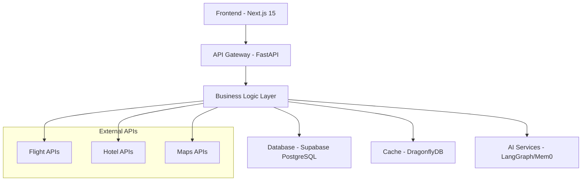

# ⚡ Developer Quick Start Guide

> **New to TripSage?** Get productive in 15 minutes with this comprehensive onboarding guide.  
> **Target Audience**: New developers joining the TripSage AI team

This guide will get you from zero to productive development in minimal time, covering essential setup, key concepts, and your first contributions to the TripSage AI platform.

## 📋 Table of Contents

- [🎯 5-Minute Setup](#-5-minute-setup)
- [🔄 Development Workflow](#-development-workflow)
- [🏗️ Architecture Overview](#️-architecture-overview)
- [🛠️ Essential Commands](#️-essential-commands)
- [🧪 Testing & Quality](#-testing--quality)
- [📚 Next Steps](#-next-steps)

## 🎯 5-Minute Setup

### **Prerequisites Installation**

```bash
# 1. Install core dependencies
# Python 3.13+ (recommended: pyenv)
curl https://pyenv.run | bash
pyenv install 3.13.1
pyenv global 3.13.1

# Node.js 20+ (recommended: fnm)
curl -fsSL https://fnm.vercel.app/install | bash
fnm install 20
fnm use 20

# uv (Python package manager)
curl -LsSf https://astral.sh/uv/install.sh | sh

# pnpm (Node.js package manager)
npm install -g pnpm

# Docker (optional, for local services)
# Follow instructions at: https://docs.docker.com/get-docker/
```

### **Project Setup**

```bash
# 2. Clone and setup the project
git clone [repository-url]
cd tripsage-ai

# 3. Python environment setup
uv install  # Installs all Python dependencies

# 4. Frontend environment setup
cd frontend
pnpm install
cd ..

# 5. Environment configuration
cp .env.example .env
# Edit .env with your configuration (see Configuration section below)

# 6. Verify installation
uv run python --version  # Should show Python 3.13+
pnpm --version           # Should show pnpm version
```

### **Environment Configuration**

Create your `.env` file with these essential variables:

```bash
# Database Configuration
SUPABASE_URL=your_supabase_project_url
SUPABASE_ANON_KEY=your_supabase_anon_key
SUPABASE_SERVICE_ROLE_KEY=your_service_role_key

# DragonflyDB Cache (local development)
DRAGONFLY_URL=redis://localhost:6379
DRAGONFLY_PASSWORD=tripsage_secure_password

# AI Services (optional for basic development)
OPENAI_API_KEY=your_openai_key  # For embeddings/chat
ANTHROPIC_API_KEY=your_anthropic_key  # For advanced AI features

# Development Settings
DEBUG=true
LOG_LEVEL=INFO
ENVIRONMENT=development
```

### **Start Local Services**

```bash
# 7. Start DragonflyDB (optional but recommended)
docker run -d --name tripsage-dragonfly -p 6379:6379 \
  docker.dragonflydb.io/dragonflydb/dragonfly:latest \
  --logtostderr --cache_mode --requirepass tripsage_secure_password

# 8. Verify services
uv run python scripts/verification/verify_dragonfly.py
```

## 🔄 Development Workflow

### **Daily Development Cycle**

```bash
# 1. Start backend development server
uv run python -m tripsage.api.main
# Server runs on: http://localhost:8001

# 2. Start frontend development server (separate terminal)
cd frontend
pnpm dev
# Frontend runs on: http://localhost:3000

# 3. Run tests (separate terminal)
uv run pytest                    # Backend tests
cd frontend && pnpm test        # Frontend tests
```

### **"Hello World" Examples**

#### **Backend API Example**

Create a simple endpoint to test your setup:

```python
# File: tripsage/api/routes/hello.py
from fastapi import APIRouter

router = APIRouter(prefix="/hello", tags=["hello"])

@router.get("/world")
async def hello_world():
    """Simple hello world endpoint."""
    return {"message": "Hello from TripSage AI!"}

@router.get("/user/{user_id}")
async def hello_user(user_id: str):
    """Personalized hello endpoint."""
    return {"message": f"Hello, user {user_id}! Welcome to TripSage AI."}
```

#### **Frontend Component Example**

Create a simple component to test your setup:

```typescript
// File: frontend/src/components/HelloWorld.tsx
import React from 'react';

interface HelloWorldProps {
  userName?: string;
}

export const HelloWorld: React.FC<HelloWorldProps> = ({ userName = "Developer" }) => {
  return (
    <div className="p-4 border rounded-lg bg-blue-50">
      <h2 className="text-xl font-bold text-blue-800">
        Hello, {userName}!
      </h2>
      <p className="text-blue-600">
        Welcome to TripSage AI development. You're all set up! 🚀
      </p>
    </div>
  );
};
```

#### **Database Query Example**

Test database connectivity:

```python
# File: scripts/hello_database.py
import asyncio
from tripsage.core.database import get_database_session
from sqlalchemy import text

async def hello_database():
    """Test database connectivity."""
    async with get_database_session() as session:
        result = await session.execute(text("SELECT 'Hello from PostgreSQL!' as message"))
        message = result.scalar()
        print(f"✅ Database connection successful: {message}")

if __name__ == "__main__":
    asyncio.run(hello_database())
```

### **Testing Patterns**

#### **Backend Test Example**

```python
# File: tests/api/test_hello.py
import pytest
from httpx import AsyncClient
from tripsage.api.main import app

@pytest.mark.asyncio
async def test_hello_world():
    """Test hello world endpoint."""
    async with AsyncClient(app=app, base_url="http://test") as client:
        response = await client.get("/hello/world")
        assert response.status_code == 200
        assert response.json() == {"message": "Hello from TripSage AI!"}

@pytest.mark.asyncio
async def test_hello_user():
    """Test personalized hello endpoint."""
    async with AsyncClient(app=app, base_url="http://test") as client:
        response = await client.get("/hello/user/123")
        assert response.status_code == 200
        assert "Hello, user 123!" in response.json()["message"]
```

#### **Frontend Test Example**

```typescript
// File: frontend/tests/components/HelloWorld.test.tsx
import { render, screen } from '@testing-library/react';
import { HelloWorld } from '@/components/HelloWorld';

describe('HelloWorld', () => {
  it('renders default greeting', () => {
    render(<HelloWorld />);
    expect(screen.getByText(/Hello, Developer!/)).toBeInTheDocument();
  });

  it('renders custom user name', () => {
    render(<HelloWorld userName="Alice" />);
    expect(screen.getByText(/Hello, Alice!/)).toBeInTheDocument();
  });
});
```

### **Debugging Basics**

#### **Backend Debugging**

```python
# Use logging for debugging
import logging

logger = logging.getLogger(__name__)

@router.get("/debug-example")
async def debug_example():
    logger.info("Debug endpoint called")
    logger.debug("Detailed debug information")
    
    try:
        # Your code here
        result = some_operation()
        logger.info(f"Operation successful: {result}")
        return {"result": result}
    except Exception as e:
        logger.exception(f"Operation failed: {str(e)}")
        raise
```

#### **Frontend Debugging**

```typescript
// Use console methods and React DevTools
const debugComponent = () => {
  console.log('Component rendered');
  console.group('Debug Info');
  console.log('Props:', props);
  console.log('State:', state);
  console.groupEnd();
  
  // Use debugger for breakpoints
  // debugger;
};
```

## 🏗️ Architecture Overview

### **System Components Overview**



### **Key Patterns and Conventions**

#### **Backend Architecture Patterns**

1. **Dependency Injection**: Use FastAPI's dependency injection for services
2. **Repository Pattern**: Database operations through repository classes
3. **Service Layer**: Business logic separated from API endpoints
4. **Async/Await**: All I/O operations are asynchronous
5. **Type Safety**: Full Pydantic models and type hints

#### **Frontend Architecture Patterns**

1. **Component Composition**: Small, reusable components
2. **Custom Hooks**: Shared logic in custom React hooks
3. **State Management**: Context API + useReducer for complex state
4. **Type Safety**: TypeScript with strict configuration
5. **Performance**: Code splitting and lazy loading

#### **Database Patterns**

1. **Single Source of Truth**: Supabase PostgreSQL for all data
2. **Vector Search**: pgvector for AI embeddings
3. **Row Level Security**: Supabase RLS for data protection
4. **Migrations**: Supabase CLI for schema management
5. **Caching**: DragonflyDB for high-performance caching

### **Integration Points**

- **Authentication**: Supabase Auth with JWT tokens
- **Real-time**: Supabase Realtime for live updates
- **File Storage**: Supabase Storage for file uploads
- **AI Processing**: LangGraph for agent workflows
- **Memory**: Mem0 for conversational memory
- **Cache**: DragonflyDB for response/session caching

## 🛠️ Essential Commands

### **Development Commands**

```bash
# Backend Development
uv run python -m tripsage.api.main          # Start API server
uv run python scripts/dev/reset_database.py # Reset local database
uv run python scripts/dev/seed_data.py      # Seed test data

# Frontend Development
cd frontend
pnpm dev                                     # Start Next.js dev server
pnpm build                                   # Build for production
pnpm start                                   # Start production server

# Database Operations
supabase start                               # Start local Supabase
supabase db reset                            # Reset local database
supabase migration new "description"         # Create new migration
supabase db push                             # Push migrations to remote
```

### **Testing Commands**

```bash
# Backend Testing
uv run pytest                               # Run all tests
uv run pytest tests/api/                    # Run API tests only
uv run pytest --cov=tripsage                # Run with coverage
uv run pytest -xvs tests/test_hello.py      # Run specific test file

# Frontend Testing
cd frontend
pnpm test                                    # Run unit tests
pnpm test:watch                              # Run tests in watch mode
pnpm test:e2e                                # Run E2E tests
pnpm test:coverage                           # Run with coverage report
```

### **Code Quality Commands**

```bash
# Python Code Quality
ruff check . --fix                          # Lint and auto-fix
ruff format .                               # Format code
uv run mypy tripsage                        # Type checking

# TypeScript Code Quality
cd frontend
npx biome lint --apply .                    # Lint and auto-fix
npx biome format . --write                  # Format code
pnpm type-check                             # Type checking
```

## 🧪 Testing & Quality

### **Test Coverage Requirements**

- **Backend**: ≥90% test coverage required
- **Frontend**: ≥85% test coverage target
- **E2E Tests**: Critical user flows covered
- **Security**: No hardcoded secrets allowed

### **Quality Gates**

Before committing code, ensure:

```bash
# 1. All tests pass
uv run pytest
cd frontend && pnpm test

# 2. Code is properly formatted
ruff format .
npx biome format . --write

# 3. Linting passes
ruff check . --fix
npx biome lint --apply .

# 4. Type checking passes
uv run mypy tripsage
cd frontend && pnpm type-check

# 5. No security issues
git grep -i "fallback-secret\|development-only" .  # Should return empty
```

### **Git Workflow**

```bash
# 1. Create feature branch
git checkout -b feature/your-feature-name

# 2. Make changes and commit frequently
git add .
git commit -m "feat: add user greeting functionality"

# 3. Push and create PR
git push origin feature/your-feature-name
# Open PR in GitHub/GitLab

# 4. After review, merge to main
git checkout main
git pull origin main
git branch -d feature/your-feature-name
```

## 📚 Next Steps

### **Immediate Actions (First Week)**

1. **Complete Setup**: Ensure all services run locally
2. **Read Core Docs**: Review [Architecture Guide](architecture-guide.md) and [Code Standards](code-standards.md)
3. **Make First Contribution**: Fix a small bug or add a simple feature
4. **Join Team Rituals**: Attend standups, code reviews, and planning sessions

### **Learning Path (First Month)**

#### **Week 1: Environment & Basics**

- [ ] Complete quick start setup
- [ ] Read [Database Guide](unified-database-guide.md)
- [ ] Submit first hello-world PR
- [ ] Shadow a code review session

#### **Week 2: Core Features**

- [ ] Review [API Development](api-development.md) guide
- [ ] Study [Frontend Development](frontend-development.md) patterns
- [ ] Implement a simple CRUD feature
- [ ] Write comprehensive tests

#### **Week 3: Advanced Topics**

- [ ] Learn [Performance Optimization](performance-optimization.md) techniques
- [ ] Understand [External Integrations](external-integrations.md)
- [ ] Contribute to AI/ML features
- [ ] Practice debugging complex issues

#### **Week 4: Team Integration**

- [ ] Lead a code review
- [ ] Participate in architecture discussions
- [ ] Propose and implement improvements
- [ ] Mentor newer team members

### **Advanced Topics to Explore**

- **AI Integration**: LangGraph agents, Mem0 memory system
- **Performance**: Vector search optimization, caching strategies
- **Security**: Authentication flows, data protection
- **DevOps**: CI/CD pipelines, deployment strategies
- **Monitoring**: Observability, error tracking, performance metrics

### **Helpful Resources**

#### **Internal Documentation**

- [Testing Guide](testing-guide.md) - Comprehensive testing strategies
- [Debugging Guide](debugging-guide.md) - Troubleshooting techniques  
- [Performance Optimization](performance-optimization.md) - Speed & efficiency
- [External Integrations](external-integrations.md) - Third-party APIs

#### **External Resources**

- [FastAPI Documentation](https://fastapi.tiangolo.com/)
- [Next.js Documentation](https://nextjs.org/docs)
- [Supabase Documentation](https://supabase.com/docs)
- [PostgreSQL Documentation](https://www.postgresql.org/docs/)
- [React Testing Library](https://testing-library.com/docs/react-testing-library/intro/)

#### **Team Communication**

- **Slack Channels**: #development, #architecture, #questions
- **Code Reviews**: GitHub/GitLab PR discussions
- **Documentation**: Internal wiki and architecture docs
- **Meetings**: Daily standups, weekly tech talks, monthly architecture reviews

### **Common Gotchas & Solutions**

#### **Database Issues**

```bash
# Database connection failed
# Solution: Check Supabase credentials in .env
supabase status  # Verify local services

# Migration conflicts
# Solution: Reset local database
supabase db reset
```

#### **Cache Issues**

```bash
# DragonflyDB connection failed
# Solution: Verify Docker container is running
docker ps | grep dragonfly
docker restart tripsage-dragonfly
```

#### **Frontend Build Issues**

```bash
# Node modules issues
# Solution: Clean install
rm -rf node_modules package-lock.json
pnpm install

# Type errors
# Solution: Generate latest types
cd .. && supabase gen types typescript --local > frontend/types/database.ts
```

#### **Python Environment Issues**

```bash
# Package conflicts
# Solution: Clean reinstall
uv cache clean
uv install --reinstall
```

---

🎉 **Congratulations!** You're now ready to contribute effectively to TripSage AI. Remember: when in doubt, ask questions in Slack or schedule a pairing session with a team member. We're here to help you succeed!

*Next recommended read: [Code Standards](code-standards.md) for detailed coding guidelines and best practices.*
