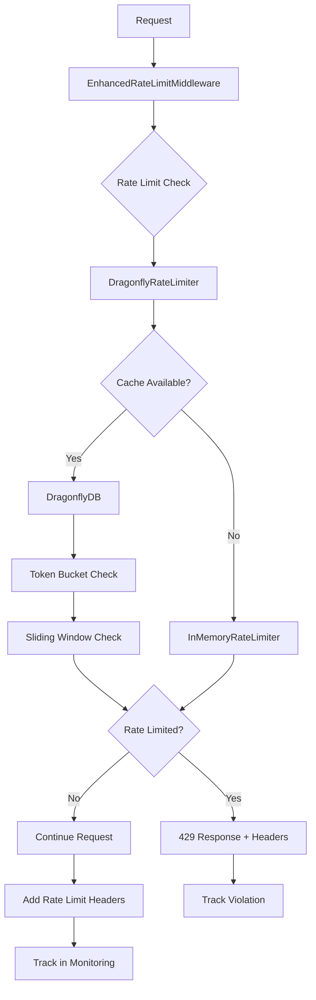

# Enhanced Rate Limiting Implementation

This document describes the production-ready rate limiting implementation for the TripSage API, featuring per-API-key configurable limits, service-specific thresholds, and comprehensive monitoring integration.

> **Related Documentation:**
> - [Dashboard API](../api/dashboard-api.md) - Rate limit monitoring and analytics endpoints
> - [Performance Optimization](performance-optimization.md) - System performance tuning
> - [Architecture Guide](architecture-guide.md) - Overall system architecture
> - [API Development](api-development.md) - API development best practices

## Features

### Core Capabilities
- **Per-API-key configurable limits** with persistent storage in DragonflyDB
- **Service-specific rate limits** (OpenAI, Weather API, Flight Search, etc.)
- **Hybrid algorithms**: Sliding window + Token bucket for optimal performance
- **Graceful degradation** with in-memory fallback when cache is unavailable
- **Comprehensive rate limit headers** (RFC 6585 compliant)
- **Real-time monitoring** integration with API key usage tracking

### Advanced Features
- **Endpoint-specific overrides** for fine-grained control
- **Request cost multipliers** based on endpoint complexity
- **Tiered rate limits** (user, agent, premium tiers)
- **Burst protection** with configurable token bucket sizes
- **Distributed rate limiting** across multiple application instances
- **Analytics and anomaly detection** through monitoring service integration

## Architecture



## Configuration

### Environment Variables

```bash
# Enable/disable rate limiting
RATE_LIMIT_ENABLED=true
RATE_LIMIT_USE_DRAGONFLY=true

# Default limits (applied as base before multipliers)
RATE_LIMIT_REQUESTS_PER_MINUTE=60
RATE_LIMIT_REQUESTS_PER_HOUR=1000
RATE_LIMIT_REQUESTS_PER_DAY=10000
RATE_LIMIT_BURST_SIZE=10

# Algorithm configuration
RATE_LIMIT_ENABLE_SLIDING_WINDOW=true
RATE_LIMIT_ENABLE_TOKEN_BUCKET=true
RATE_LIMIT_ENABLE_BURST_PROTECTION=true

# Monitoring integration
RATE_LIMIT_ENABLE_MONITORING=true
```

### Programmatic Configuration

```python
from tripsage.api.middlewares.rate_limiting import (
    EnhancedRateLimitMiddleware,
    RateLimitConfig,
    create_middleware_from_settings
)

# Option 1: Use settings-based configuration
app.add_middleware(create_middleware_from_settings(app))

# Option 2: Custom configuration
custom_config = RateLimitConfig(
    requests_per_minute=100,
    requests_per_hour=5000,
    requests_per_day=50000,
    burst_size=25,
    service_multipliers={
        "openai": 2.0,    # 2x base limits for OpenAI service
        "weather": 3.0,   # 3x base limits for Weather API
    },
    endpoint_overrides={
        "/api/ai/chat": {
            "requests_per_minute": 50,
            "burst_size": 10,
        }
    }
)
```

## Rate Limit Tiers

### Default Tiers

| Tier | Requests/Min | Requests/Hour | Requests/Day | Burst Size |
|------|--------------|---------------|--------------|------------|
| Unauthenticated | 12 | 200 | 2,000 | 2 |
| User | 60 | 1,000 | 10,000 | 10 |
| Premium User | 120 | 2,000 | 20,000 | 20 |
| Agent | 180 | 3,000 | 30,000 | 30 |
| Premium Agent | 600 | 10,000 | 100,000 | 100 |

### Service Multipliers

Service-specific multipliers are applied to base tier limits:

- **OpenAI**: 2.0x (AI operations are more expensive)
- **Weather**: 3.0x (High-frequency weather data requests)
- **Flights**: 1.5x (Search operations)
- **Hotels**: 1.5x (Search operations)

## API Integration

### Adding to FastAPI Application

```python
from fastapi import FastAPI
from tripsage.api.middlewares.rate_limiting import create_middleware_from_settings

app = FastAPI()

# Add rate limiting middleware (reads from settings)
rate_limit_middleware = create_middleware_from_settings(app)
if rate_limit_middleware:
    app.add_middleware(type(rate_limit_middleware), **rate_limit_middleware.__dict__)
```

### Response Headers

#### Successful Requests
```http
X-RateLimit-Limit: 60
X-RateLimit-Remaining: 45
X-RateLimit-Reset: 1640995200
X-RateLimit-Scope: minute
X-RateLimit-Policy: 60;w=minute
X-RateLimit-Service: openai
X-RateLimit-Cost: 2
```

#### Rate Limited Requests (429)
```http
HTTP/1.1 429 Too Many Requests
Retry-After: 30
X-RateLimit-Limit: 60
X-RateLimit-Remaining: 0
X-RateLimit-Reset: 1640995200
X-RateLimit-Reset-After: 30
X-RateLimit-Scope: minute
X-RateLimit-Policy: 60;w=minute

{
  "error": "rate_limit_exceeded",
  "message": "Rate limit exceeded: 60 requests per minute allowed. Try again in 30 seconds.",
  "retry_after": 30,
  "limit": 60,
  "scope": "minute",
  "reset_time": "2024-01-01T00:00:00Z"
}
```

## Algorithms

### Sliding Window
- **Purpose**: Sustained rate limiting over time periods
- **Windows**: minute, hour, day
- **Implementation**: DragonflyDB sorted sets with automatic cleanup
- **Precision**: Tracks exact request timestamps

### Token Bucket
- **Purpose**: Burst control and traffic shaping
- **Refill Rate**: Configurable tokens per second
- **Burst Size**: Maximum tokens available at once
- **Implementation**: Atomic operations using DragonflyDB pipelines

## Monitoring Integration

The rate limiting middleware integrates with the API Key Monitoring Service to provide:

### Real-time Tracking
- Rate limit violations with detailed context
- Request patterns and usage analytics
- Service-specific usage metrics
- Endpoint performance data

### Alerting
- Anomaly detection for unusual usage patterns
- Rate limit violation notifications
- Performance degradation alerts

### Dashboard Data
- Usage trends and patterns
- Top API key consumers
- Service health monitoring
- Rate limit effectiveness metrics

See the [Dashboard API documentation](../api/dashboard-api.md) for complete monitoring endpoints and real-time rate limit data access.

## Performance Considerations

### DragonflyDB Optimizations
- **Atomic Operations**: Uses pipelines for consistent state updates
- **Key Expiration**: Automatic cleanup of old rate limit data
- **Memory Efficiency**: Optimized data structures for high-throughput scenarios

### Graceful Degradation
- **Fallback Strategy**: In-memory rate limiting when cache unavailable
- **Error Handling**: Continues processing requests if monitoring fails
- **Circuit Breaker**: Automatic fallback to prevent cascade failures

### Scalability
- **Distributed**: Works across multiple application instances
- **Configurable**: Adjust limits without application restart
- **Monitoring**: Real-time visibility into rate limiting effectiveness

## Development and Testing

### Example Usage

```python
# Test different rate limit scenarios
async def test_rate_limits():
    from tripsage.api.middlewares.rate_limiting import InMemoryRateLimiter, RateLimitConfig
    
    limiter = InMemoryRateLimiter()
    config = RateLimitConfig(requests_per_minute=10, burst_size=5)
    
    # Normal operation
    result = await limiter.check_rate_limit("test_key", config)
    print(f"Limited: {result.is_limited}, Remaining: {result.remaining}")
    
    # Test service multipliers
    result = await limiter.check_rate_limit("test_key", config, service="openai")
    print(f"OpenAI service limit: {result.limit_value}")
```

### Load Testing

The implementation is designed to handle:
- **10,000+ requests/second** per application instance
- **1M+ API keys** with individual rate limits
- **Sub-millisecond latency** for rate limit checks
- **Automatic scaling** with DragonflyDB cluster expansion

## Security Considerations

### IP-based Rate Limiting
- Unauthenticated requests are limited by IP address
- Supports X-Real-IP and X-Forwarded-For headers
- Protects against distributed attacks

### API Key Protection
- Per-key rate limits prevent abuse
- Service-specific limits protect downstream APIs
- Monitoring detects unusual patterns

### Data Privacy
- No sensitive data stored in rate limit keys
- Configurable data retention periods
- Secure key generation and storage

## Troubleshooting

### Common Issues

1. **Cache Connection Failures**
   - Automatic fallback to in-memory rate limiting
   - Monitor logs for DragonflyDB connectivity issues
   - Check network configuration and credentials

2. **Rate Limits Too Restrictive**
   - Adjust tier multipliers in configuration
   - Use endpoint-specific overrides for high-traffic endpoints
   - Monitor usage patterns through dashboard

3. **Performance Issues**
   - Enable pipeline batching for high-throughput scenarios
   - Optimize DragonflyDB configuration
   - Consider rate limit cache TTL adjustments

### Monitoring Commands

```bash
# Check rate limit status for a key
curl -H "Authorization: Bearer <api_key>" \
     "http://localhost:8000/api/monitoring/rate-limits/status"

# Reset rate limits for testing
curl -X POST -H "Authorization: Bearer <admin_key>" \
     "http://localhost:8000/api/admin/rate-limits/reset" \
     -d '{"key": "user:123"}'
```

## Future Enhancements

### Planned Features
- **Geographic rate limiting** based on request origin
- **Dynamic rate limit adjustment** based on system load
- **Machine learning-based anomaly detection**
- **GraphQL query complexity-based rate limiting**
- **Integration with external rate limiting services**

### Configuration Improvements
- **Hot configuration reloading** without restart
- **Database-backed configuration** for enterprise deployments
- **A/B testing framework** for rate limit experiments

## See Also

- [Dashboard API](../api/dashboard-api.md) - Monitoring and analytics endpoints for rate limits
- [Performance Optimization](performance-optimization.md) - System performance best practices
- [Testing Guide](testing-guide.md) - Testing rate limiting implementations
- [Architecture Guide](architecture-guide.md) - System architecture overview
- [Environment Configuration](../operators/environment-configuration.md) - Production configuration setup