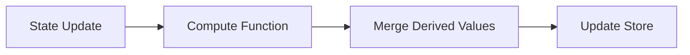

# Zustand Computed Middleware

## Overview

The `withComputed` middleware provides automatic computed properties for Zustand stores. Computed values update automatically when base state changes.

**Location**: `src/stores/middleware/computed.ts`

---

## How It Works

The middleware intercepts Zustand's `set()` and `setState()` calls:



Behavior:

1. Compute function runs after every state mutation
2. Returned derived values are merged into the state update
3. Components subscribe to computed properties like any other state
4. Computed values stay synchronized with base state

---

## When to Use

- **Aggregations from collections**: `activeFilterCount: Object.keys(state.activeFilters || {}).length`
- **Validation flags**: `isFormValid: state.name.length > 0 && state.email.includes('@')`
- **Sorted/filtered lists**: `sortedItems: [...state.items].sort(...)` (prefer selectors for large collections)
- **Multi-property flags**: `canSubmit: state.isFormValid && !state.isSubmitting && state.hasChanges`

---

## Pitfalls

### 1. Simple property access

Use selectors instead of computed:

```typescript
// Wrong
compute: (state) => ({ userName: state.user?.name })

// Correct
const userName = useStore(state => state.user?.name);
```

### 2. Rarely-accessed values

Compute on-demand with `useMemo`:

```typescript
// Wrong - computes on every state update
compute: (state) => ({ expensiveCalculation: heavyCompute(state.data) })

// Correct
const result = useMemo(() => heavyCompute(data), [data]);
```

### 3. Async operations

Compute functions must be synchronous and pure:

```typescript
// Wrong
compute: (state) => ({ userProfile: await fetchUser(state.userId) })

// Correct - use async actions
fetchUserProfile: async (userId) => {
  const profile = await fetchUser(userId);
  set({ userProfile: profile });
}
```

### 4. Values dependent on props/context

Compute has no access to React context:

```typescript
// Wrong
compute: (state) => ({ filteredByTheme: filterByTheme(state.items, currentTheme) })

// Correct - use selector with props
const items = useStore(state => filterByTheme(state.items, currentTheme));
```

### 5. Missing initial values

Always provide initial values for computed properties:

```typescript
// Wrong - TypeScript error
const store = create<State>()(
  withComputed(
    { compute: (state) => ({ doubled: state.count * 2 }) },
    (set) => ({ count: 0 }) // Missing doubled
  )
);

// Correct
const store = create<State>()(
  withComputed(
    { compute: (state) => ({ doubled: state.count * 2 }) },
    (set) => ({ count: 0, doubled: 0 })
  )
);
```

When adding `persist`, configure `partialize` to store only base state (e.g., `count`, `multiplier`) and exclude computed fields (`doubled`, `total`) so they recompute on hydration.

### 6. Side effects

Compute functions must be pure:

```typescript
// Wrong
compute: (state) => {
  console.log(state.filters.length); // Side effect
  return { filterCount: state.filters.length };
}

// Correct
compute: (state) => ({ filterCount: state.filters.length })
```

### 7. Mutating state

Return new values, don't mutate:

```typescript
// Wrong
compute: (state) => {
  state.items.sort(); // Mutation
  return { sortedItems: state.items };
}

// Correct
compute: (state) => ({ sortedItems: [...state.items].sort() })
```

### 8. Circular dependencies

Computed values can reference other computed values, but avoid circular dependencies:

```typescript
// Wrong - infinite loop
compute: (state) => ({ total: state.total + state.newValue })

// Correct
compute: (state) => ({ total: state.quantity * state.price })
```

---

## Usage

```typescript
import { create } from 'zustand';
import { withComputed, createComputeFn } from '@/stores/middleware/computed';

interface CounterState {
  count: number;
  multiplier: number;
}

interface CounterComputed {
  doubled: number;
  total: number;
}

interface CounterActions {
  increment: () => void;
  setMultiplier: (multiplier: number) => void;
}

type CounterStore = CounterState & CounterComputed & CounterActions;

const computeCounterState = createComputeFn<CounterStore>({
  doubled: (state) => state.count * 2,
  total: (state) => state.count * state.multiplier,
});

export const useCounterStore = create<CounterStore>()(
  withComputed(
    { compute: computeCounterState },
    (set) => ({
      count: 0,
      multiplier: 1,
      doubled: 0,
      total: 0,
      increment: () => set((state) => ({ count: state.count + 1 })),
      setMultiplier: (multiplier: number) => set({ multiplier }),
    })
  )
);

// Usage in component
const doubled = useCounterStore(state => state.doubled);
const total = useCounterStore(state => state.total);
```

---

## Middleware Order

Recommended order: `devtools` → `persist` → `withComputed` → store

```typescript
import { create } from 'zustand';
import { devtools, persist } from 'zustand/middleware';
import { withComputed } from '@/stores/middleware/computed';

export const useStore = create<State>()(
  devtools(
    persist(
      withComputed(
        { compute: computeFn },
        (set, get) => ({ /* base state */ })
      ),
      { name: 'my-store', /* partialize: (state) => ({ baseOnly: state.baseOnly }) */ }
    ),
    { name: 'MyStore' }
  )
);
```

Order rationale: devtools logs all changes; persist saves only base state via `partialize` so computed values are excluded; withComputed runs innermost to ensure derived values exist before the persistence layer rehydrates. Do not persist computed fields—use `partialize` to drop them and recompute on hydration.

---

## Performance

Compute functions run on every state update. Keep them efficient:

- Prefer O(1) operations: `total: state.quantity * state.price`
- O(n) acceptable for small collections: `validItems: state.items.filter(i => i.isValid)`
- Avoid O(n²) or expensive operations: sorting large arrays, deep nested iterations
- Compute only frequently-accessed values; use `useMemo` for rare cases
- Avoid redundant computations: calculate once and derive multiple values
- For filtered arrays, consider selectors with `shallow` equality instead of computed

---

## Testing

```typescript
import { describe, it, expect, beforeEach } from 'vitest';
import { useMyStore } from './my-store';

describe('MyStore computed properties', () => {
  beforeEach(() => {
    useMyStore.getState().reset();
  });

  it('computes activeFilterCount correctly', () => {
    const { setActiveFilter } = useMyStore.getState();
    expect(useMyStore.getState().activeFilterCount).toBe(0);
    setActiveFilter('price', { min: 0, max: 100 });
    expect(useMyStore.getState().activeFilterCount).toBe(1);
  });
});
```

---

## API Reference

### `withComputed<T>(config, stateCreator)`

Middleware that enables automatic computed properties.

**Type Parameters**:

- `T` - Store state type (must include both base and computed properties)

**Parameters**:

- `config: ComputedConfig<T>` - Configuration object
  - `compute: (state: T) => Partial<T>` - Function that returns computed values
- `stateCreator: StateCreator<T>` - Zustand state creator

**Returns**: `StateCreator<T>` - Middleware-wrapped state creator

### `createComputeFn<T>(computedProps)`

Helper to create compute functions from individual property definitions.

**Type Parameters**:

- `T` - Store state type

**Parameters**:

- `computedProps: { [K in keyof Partial<T>]: (state: T) => T[K] }` - Object mapping property names to compute functions

**Returns**: `(state: T) => Partial<T>` - Combined compute function

**Example**:

```typescript
const compute = createComputeFn<MyState>({
  total: (state) => state.price * state.quantity,
  isValid: (state) => state.total > 0 && state.total < 1000,
});
```

---

## Related Documentation

- [Zustand Store Patterns](./standards.md#zustand-stores) - General store organization
- [Testing Guide](./testing.md) - Store testing patterns
- [Performance Best Practices](./standards.md#performance) - App-wide performance guidelines
- [ADR-0057](../adrs/0057-search-filter-panel-architecture.md) - Filter panel architecture using computed middleware

---

## Changelog

- **2025-12-03**: Initial documentation created for computed middleware pattern
- **Reference**: Implementation in `src/stores/middleware/computed.ts`
- **Related**: ADR-0057 (Search Filter Panel Architecture)
