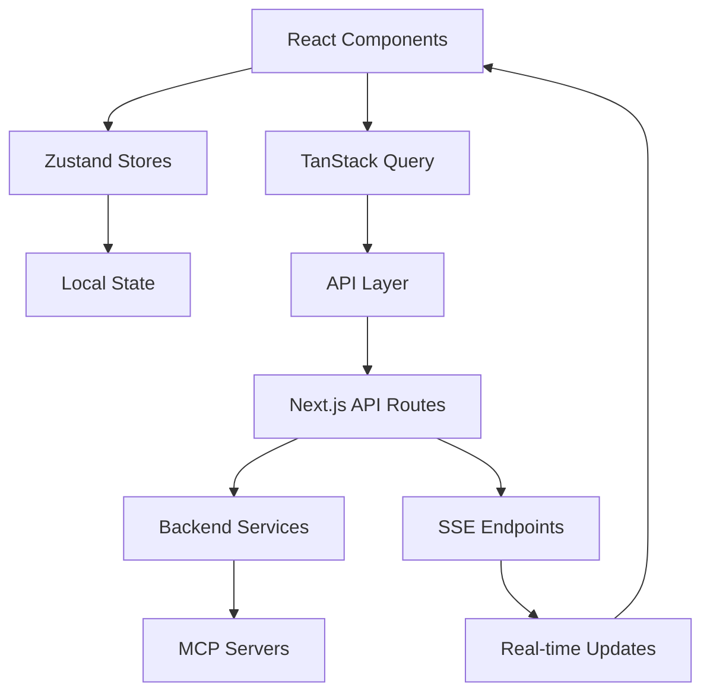

# TripSage Frontend Architecture (v2.0)

## Executive Summary

This document defines the state-of-the-art frontend architecture for TripSage AI Travel Application. The architecture prioritizes AI-centric features, security, scalability, and modern web standards while aligning with the backend architecture and leveraging the latest stable technology versions.

## 1. Core Technology Stack

### 1.1 Framework & Runtime

- **Next.js 15.3.1** (Latest stable as of May 2025)

  - App Router for enhanced performance and developer experience
  - React Server Components for optimized data fetching
  - Built-in API routes for backend integration
  - Edge Runtime support for global performance

- **React 19.1.0** (Latest stable)
  - Server Components & Actions
  - Improved Suspense boundaries
  - Enhanced concurrent features
  - Built-in `useSyncExternalStore`

### 1.2 Language & Type Safety

- **TypeScript 5.5+** (Strict mode enabled)
  - Complete type safety across the codebase
  - Template literal types for API routes
  - Improved type inference
  - Better module resolution

### 1.3 Styling & UI Components

- **Tailwind CSS v4.0**
  - OKLCH color space for wider gamut colors
  - CSS-based configuration
  - Container queries built-in
  - Performance optimizations
- **shadcn/ui v3**
  - Radix UI primitives
  - Accessible components
  - Customizable themes
  - Copy-paste architecture

### 1.4 State Management

- **Zustand v5.0.4** (Latest stable)

  - Native `useSyncExternalStore` integration
  - Simplified API with no boilerplate
  - TypeScript-first design
  - Middleware support

- **TanStack Query v5**
  - Suspense support (non-experimental)
  - Improved optimistic updates
  - Shareable mutation state
  - Enhanced devtools

### 1.5 AI & Streaming

- **Vercel AI SDK v5**
  - Streaming responses
  - Tool calling support
  - Provider abstraction
  - React Hooks integration

### 1.6 Forms & Validation

- **React Hook Form v8**
  - Performance optimized
  - Built-in validation
  - TypeScript support
- **Zod v3**
  - Schema validation
  - Type inference
  - Runtime safety

### 1.7 Additional Libraries

- **Recharts** - Data visualization
- **date-fns** - Date manipulation
- **React Email** - Email templates
- **Framer Motion** - Animations
- **React Hot Toast** - Notifications

## 2. Architecture Patterns

### 2.1 Component Architecture

```plaintext
src/
├── app/                            # Next.js App Router
│   ├── (auth)/                    # Auth group routes
│   │   ├── login/                 # Login page
│   │   ├── register/              # Registration page
│   │   └── reset-password/        # Password reset
│   ├── (dashboard)/               # Dashboard routes
│   │   ├── page.tsx              # Main dashboard
│   │   ├── trips/                # Trip management
│   │   │   ├── page.tsx          # Saved trips list
│   │   │   ├── [id]/             # Individual trip details
│   │   │   └── new/              # Create new trip
│   │   ├── search/               # Search interfaces
│   │   │   ├── flights/          # Flight search page
│   │   │   ├── hotels/           # Hotel search page
│   │   │   ├── activities/       # Activities search
│   │   │   └── destinations/     # Destination search
│   │   ├── chat/                 # AI Chat interface
│   │   │   ├── page.tsx          # Main chat UI
│   │   │   └── [sessionId]/      # Specific chat session
│   │   ├── agent-status/         # Agent workflow visualization
│   │   ├── profile/              # User profile
│   │   ├── settings/             # App settings
│   │   │   ├── api-keys/         # API key management
│   │   │   └── preferences/      # User preferences
│   │   └── analytics/            # Trip analytics
│   ├── api/                       # API routes
│   │   ├── chat/                 # AI chat endpoints
│   │   ├── trips/                # Trip CRUD operations
│   │   ├── search/               # Search endpoints
│   │   └── agents/               # Agent status endpoints
│   └── layout.tsx                 # Root layout
├── components/
│   ├── ui/                        # shadcn/ui components
│   ├── features/                  # Feature-specific components
│   │   ├── trips/                # Trip-related components
│   │   ├── search/               # Search components
│   │   ├── chat/                 # Chat components
│   │   ├── agents/               # Agent visualization
│   │   └── analytics/            # Analytics components
│   └── layouts/                   # Layout components
├── lib/
│   ├── api/                      # API client layer
│   ├── hooks/                    # Custom React hooks
│   ├── stores/                   # Zustand stores
│   └── utils/                    # Utility functions
├── types/                        # TypeScript definitions
└── config/                       # Configuration files
```

### 2.2 Data Flow Architecture



### 2.3 Security Architecture

- **BYOK Implementation**

  - Frontend never stores raw API keys
  - Envelope encryption handled server-side
  - Secure key submission flow
  - Auto-clearing forms for sensitive data

- **Authentication & Authorization**
  - Supabase Auth integration
  - JWT-based session management
  - Role-based access control
  - Secure cookie handling

## 3. Key Design Decisions

### 3.1 AI-Centric Features

```typescript
// AI Streaming Component
export function AIChat() {
  const { messages, input, handleSubmit, isLoading } = useChat({
    api: "/api/chat",
    streamProtocol: "sse",
  });

  return (
    <StreamingChat
      messages={messages}
      onSubmit={handleSubmit}
      isStreaming={isLoading}
    />
  );
}
```

### 3.2 Real-time Communication

- Server-Sent Events (SSE) for AI streaming
- WebSocket fallback for bidirectional communication
- Automatic reconnection handling
- Event-based state synchronization

### 3.3 Performance Optimizations

- React Server Components for initial page loads
- Dynamic imports for code splitting
- Image optimization with Next.js Image
- Route prefetching strategies
- Edge caching for static content

### 3.4 Progressive Enhancement

- Works without JavaScript (basic functionality)
- Enhanced with client-side interactivity
- Graceful degradation for older browsers
- Accessibility-first approach

## 4. Key Pages & Features

### 4.1 Core Pages

#### Dashboard (`/dashboard`)

```typescript
export default function DashboardPage() {
  return (
    <DashboardLayout>
      <RecentTrips />
      <UpcomingFlights />
      <QuickActions />
      <TripSuggestions />
    </DashboardLayout>
  );
}
```

#### Saved Trips (`/dashboard/trips`)

```typescript
export default function SavedTripsPage() {
  const { data: trips } = useSuspenseQuery({
    queryKey: ["trips"],
    queryFn: api.trips.getAll,
  });

  return (
    <div className="grid grid-cols-1 md:grid-cols-2 lg:grid-cols-3 gap-6">
      {trips.map((trip) => (
        <TripCard key={trip.id} trip={trip} />
      ))}
    </div>
  );
}
```

#### Trip Details (`/dashboard/trips/[id]`)

```typescript
export default function TripDetailsPage({
  params,
}: {
  params: { id: string };
}) {
  return (
    <TripDetailsLayout>
      <TripHeader tripId={params.id} />
      <TripItinerary tripId={params.id} />
      <TripBudget tripId={params.id} />
      <TripDocuments tripId={params.id} />
      <TripCollaborators tripId={params.id} />
    </TripDetailsLayout>
  );
}
```

#### AI Chat Interface (`/dashboard/chat`)

```typescript
export default function ChatPage() {
  return (
    <ChatLayout>
      <ChatSidebar />
      <ChatWindow />
      <AgentStatusPanel />
    </ChatLayout>
  );
}
```

#### Search Pages (`/dashboard/search/*`)

```typescript
// Flight Search
export default function FlightSearchPage() {
  return (
    <SearchLayout>
      <FlightSearchForm />
      <FlightResults />
      <FlightFilters />
      <PriceAlerts />
    </SearchLayout>
  );
}

// Hotel Search
export default function HotelSearchPage() {
  return (
    <SearchLayout>
      <HotelSearchForm />
      <MapView />
      <HotelResults />
      <HotelFilters />
    </SearchLayout>
  );
}
```

#### Agent Status Visualization (`/dashboard/agent-status`)

```typescript
export default function AgentStatusPage() {
  return (
    <AgentLayout>
      <AgentWorkflowDiagram />
      <ActiveAgentsList />
      <TaskTimeline />
      <ResourceMetrics />
    </AgentLayout>
  );
}
```

### 4.2 Key UI Components

#### AgentWorkflowVisualizer

```typescript
export function AgentWorkflowVisualizer({ agentId }: { agentId: string }) {
  const { data: workflow } = useAgentWorkflow(agentId);

  return (
    <ReactFlow
      nodes={workflow.nodes}
      edges={workflow.edges}
      nodeTypes={nodeTypes}
    >
      <MiniMap />
      <Controls />
      <Background />
    </ReactFlow>
  );
}
```

#### TripTimeline

```typescript
export function TripTimeline({ tripId }: { tripId: string }) {
  const { data: events } = useTripEvents(tripId);

  return (
    <div className="relative">
      {events.map((event, index) => (
        <TimelineEvent
          key={event.id}
          event={event}
          isLast={index === events.length - 1}
        />
      ))}
    </div>
  );
}
```

#### AIAssistantPanel

```typescript
export function AIAssistantPanel() {
  const { isProcessing, currentTask, suggestions } = useAIAssistant();

  return (
    <Card className="p-4">
      <CardHeader>
        <CardTitle>AI Assistant</CardTitle>
        {isProcessing && <LoadingIndicator />}
      </CardHeader>
      <CardContent>
        {currentTask && <TaskProgress task={currentTask} />}
        <SuggestionsList suggestions={suggestions} />
      </CardContent>
    </Card>
  );
}
```

### 4.3 Feature-Specific Components

#### Search Components

- `FlightSearchForm`: Multi-city, date flexibility options
- `HotelSearchForm`: Location, dates, guest configuration
- `SearchResults`: Paginated, filterable results
- `PriceGraph`: Price trends visualization
- `MapSearchView`: Interactive map with markers

#### Trip Management Components

- `TripCard`: Summary view of saved trips
- `ItineraryBuilder`: Drag-and-drop timeline
- `BudgetTracker`: Expense categorization
- `DocumentManager`: File uploads, organization
- `ShareModal`: Collaboration settings

#### Chat Components

- `MessageList`: Scrollable chat history
- `MessageInput`: Rich text, file attachments
- `AgentAvatar`: Status indicators
- `StreamingMessage`: Real-time text display
- `ChatActionButtons`: Quick actions

#### Analytics Components

- `SpendingChart`: Budget visualization
- `TripStats`: Key metrics display
- `PopularDestinations`: Heat map
- `CostBreakdown`: Category analysis
- `TravelHistory`: Timeline view

#### Budget Management Components

- `BudgetDashboard`: Overview of trip costs
- `PricePredictor`: AI-powered price forecasting
- `FareAlertManager`: Price tracking and notifications
- `ExpenseTracker`: Real-time expense logging
- `CurrencyConverter`: Multi-currency support
- `GroupCostSplitter`: Shared expense calculations
- `DealsFinder`: Aggregated deals and discounts
- `HiddenCityFinder`: Alternative routing options
- `BudgetTemplates`: Pre-built trip budgets
- `CostComparator`: Side-by-side price analysis

## 5. Component Strategy

### 5.1 UI Component Hierarchy

```typescript
// Base component with shadcn/ui
import { Button } from "@/components/ui/button";
import { Card } from "@/components/ui/card";

// Feature component
export function FlightSearchCard() {
  return (
    <Card>
      <CardHeader>
        <CardTitle>Search Flights</CardTitle>
      </CardHeader>
      <CardContent>
        <FlightSearchForm />
      </CardContent>
    </Card>
  );
}

// Composite component with AI features
export function SmartFlightSearch() {
  const { suggestions, isLoading } = useAISuggestions();

  return (
    <div className="space-y-4">
      <FlightSearchCard />
      {isLoading ? (
        <LoadingSpinner />
      ) : (
        <SuggestionsList suggestions={suggestions} />
      )}
    </div>
  );
}
```

### 4.2 State Management Patterns

```typescript
// Zustand store for trip planning
interface TripStore {
  currentTrip: Trip | null;
  destinations: Destination[];
  addDestination: (destination: Destination) => void;
  updateItinerary: (itinerary: Partial<Itinerary>) => void;
  saveTrip: () => Promise<void>;
}

export const useTripStore = create<TripStore>((set, get) => ({
  currentTrip: null,
  destinations: [],

  addDestination: (destination) =>
    set((state) => ({
      destinations: [...state.destinations, destination],
    })),

  updateItinerary: (itinerary) =>
    set((state) => ({
      currentTrip: state.currentTrip
        ? { ...state.currentTrip, itinerary }
        : null,
    })),

  saveTrip: async () => {
    const trip = get().currentTrip;
    if (!trip) return;

    await api.trips.save(trip);
    // Additional logic...
  },
}));

// Zustand store for budget management
interface BudgetStore {
  tripBudget: number;
  expenses: Expense[];
  categories: CategoryBudget[];
  currency: string;
  addExpense: (expense: Expense) => void;
  updateBudget: (budget: number) => void;
  setCurrency: (currency: string) => void;
  getRemaining: () => number;
  getCategorySpending: (category: string) => number;
}

export const useBudgetStore = create<BudgetStore>((set, get) => ({
  tripBudget: 0,
  expenses: [],
  categories: [],
  currency: "USD",

  addExpense: (expense) =>
    set((state) => ({
      expenses: [...state.expenses, expense],
    })),

  updateBudget: (budget) =>
    set({ tripBudget: budget }),

  setCurrency: (currency) =>
    set({ currency }),

  getRemaining: () => {
    const state = get();
    const totalSpent = state.expenses.reduce((sum, exp) => sum + exp.amount, 0);
    return state.tripBudget - totalSpent;
  },

  getCategorySpending: (category) => {
    const state = get();
    return state.expenses
      .filter((exp) => exp.category === category)
      .reduce((sum, exp) => sum + exp.amount, 0);
  },
}));
```

## 5. Integration Patterns

### 5.1 MCP Client Integration

```typescript
// Abstracted MCP client hook
export function useWeatherData(location: string) {
  return useQuery({
    queryKey: ["weather", location],
    queryFn: () => api.mcp.weather.getCurrentWeather(location),
    staleTime: 5 * 60 * 1000, // 5 minutes
  });
}

// Usage in component
export function WeatherWidget({ location }: { location: string }) {
  const { data, isLoading } = useWeatherData(location);

  if (isLoading) return <WeatherSkeleton />;

  return (
    <div className="weather-widget">
      <Temperature value={data.temperature} />
      <Conditions status={data.conditions} />
    </div>
  );
}
```

### 5.2 Error Handling

```typescript
// Global error boundary
export function GlobalErrorBoundary({ children }: PropsWithChildren) {
  return (
    <ErrorBoundary
      fallback={<ErrorFallback />}
      onError={(error) => {
        console.error("Application error:", error);
        // Send to error tracking service
      }}
    >
      {children}
    </ErrorBoundary>
  );
}

// API error handling with retry logic
export function useApiQuery<T>(queryKey: QueryKey, queryFn: QueryFunction<T>) {
  return useQuery({
    queryKey,
    queryFn,
    retry: (failureCount, error) => {
      if (error.status === 401) return false; // Don't retry auth errors
      return failureCount < 3;
    },
    retryDelay: (attemptIndex) => Math.min(1000 * 2 ** attemptIndex, 30000),
  });
}
```

## 6. Security Implementation

### 6.1 BYOK Security Flow

```typescript
// Secure API key submission
export function ApiKeyForm() {
  const [isVisible, setIsVisible] = useState(false);
  const { register, handleSubmit, reset } = useForm<ApiKeyFormData>();

  // Auto-clear after 60 seconds
  useEffect(() => {
    const timer = setTimeout(() => {
      reset();
      setIsVisible(false);
    }, 60000);

    return () => clearTimeout(timer);
  }, [reset]);

  const onSubmit = async (data: ApiKeyFormData) => {
    try {
      await api.keys.encrypt(data);
      toast.success("API key securely stored");
      reset();
    } catch (error) {
      toast.error("Failed to store API key");
    }
  };

  return (
    <form onSubmit={handleSubmit(onSubmit)}>
      <PasswordInput
        {...register("apiKey", { required: true })}
        visible={isVisible}
        onVisibilityChange={setIsVisible}
      />
      <Button type="submit">Save Securely</Button>
    </form>
  );
}
```

### 6.2 Authentication Flow

```typescript
// Protected route wrapper
export function ProtectedRoute({ children }: PropsWithChildren) {
  const { user, isLoading } = useAuth();
  const router = useRouter();

  useEffect(() => {
    if (!isLoading && !user) {
      router.push("/login");
    }
  }, [user, isLoading, router]);

  if (isLoading) return <LoadingScreen />;
  if (!user) return null;

  return <>{children}</>;
}
```

## 7. Performance Considerations

### 7.1 Code Splitting Strategy

```typescript
// Dynamic imports for heavy components
const MapView = dynamic(() => import("@/components/features/MapView"), {
  loading: () => <MapSkeleton />,
  ssr: false,
});

// Route-based code splitting
const AdminDashboard = lazy(() => import("@/pages/admin"));
```

### 7.2 Data Fetching Optimization

```typescript
// Parallel data fetching with React Server Components
export async function TripDetailsPage({ params }: { params: { id: string } }) {
  // Parallel fetching
  const [trip, flights, hotels] = await Promise.all([
    api.trips.getById(params.id),
    api.flights.getByTripId(params.id),
    api.hotels.getByTripId(params.id),
  ]);

  return <TripDetails trip={trip} flights={flights} hotels={hotels} />;
}
```

### 7.3 Caching Strategy

```typescript
// TanStack Query caching configuration
const queryClient = new QueryClient({
  defaultOptions: {
    queries: {
      staleTime: 5 * 60 * 1000, // 5 minutes
      gcTime: 10 * 60 * 1000, // 10 minutes
      refetchOnWindowFocus: false,
      retry: 2,
    },
  },
});

// Optimistic updates
export function useUpdateTrip() {
  const queryClient = useQueryClient();

  return useMutation({
    mutationFn: api.trips.update,
    onMutate: async (newTrip) => {
      await queryClient.cancelQueries({ queryKey: ["trips", newTrip.id] });

      const previousTrip = queryClient.getQueryData(["trips", newTrip.id]);
      queryClient.setQueryData(["trips", newTrip.id], newTrip);

      return { previousTrip };
    },
    onError: (err, newTrip, context) => {
      queryClient.setQueryData(["trips", newTrip.id], context?.previousTrip);
    },
  });
}
```

## 8. Deployment Architecture

### 8.1 Build Configuration

```javascript
// next.config.js
module.exports = {
  reactStrictMode: true,
  images: {
    domains: ["images.tripsage.com"],
    formats: ["image/avif", "image/webp"],
  },
  experimental: {
    serverActions: true,
    ppr: true, // Partial Prerendering
  },
  env: {
    NEXT_PUBLIC_API_URL: process.env.API_URL,
  },
};
```

### 8.2 Environment Strategy

- Development: Local environment with hot reloading
- Staging: Mirror of production with test data
- Production: Optimized builds with CDN distribution

### 8.3 CI/CD Pipeline

```yaml
# GitHub Actions workflow
name: Deploy Frontend
on:
  push:
    branches: [main]

jobs:
  deploy:
    runs-on: ubuntu-latest
    steps:
      - uses: actions/checkout@v3
      - uses: actions/setup-node@v3
        with:
          node-version: "20"
      - run: npm ci
      - run: npm run build
      - run: npm run test
      - uses: vercel/action@v1
        with:
          vercel-token: ${{ secrets.VERCEL_TOKEN }}
```

## 9. Testing Strategy

### 9.1 Unit Testing

```typescript
// Component testing with React Testing Library
describe("FlightSearchForm", () => {
  it("validates required fields", async () => {
    render(<FlightSearchForm />);

    const submitButton = screen.getByRole("button", { name: /search/i });
    fireEvent.click(submitButton);

    expect(await screen.findByText(/origin is required/i)).toBeInTheDocument();
  });
});
```

### 9.2 Integration Testing

```typescript
// API integration tests
describe("Trip API", () => {
  it("creates a new trip with flights", async () => {
    const trip = await api.trips.create({
      name: "European Adventure",
      destinations: ["Paris", "Rome"],
    });

    expect(trip.id).toBeDefined();
    expect(trip.destinations).toHaveLength(2);
  });
});
```

### 9.3 E2E Testing

```typescript
// Playwright E2E tests
test("complete trip booking flow", async ({ page }) => {
  await page.goto("/trips/new");

  // Search for flights
  await page.fill('[name="origin"]', "NYC");
  await page.fill('[name="destination"]', "LON");
  await page.click('button[type="submit"]');

  // Select flight
  await page.click(".flight-option:first-child");

  // Continue to booking
  await page.click("text=Continue to Booking");

  // Assert success
  await expect(page).toHaveURL(/\/booking\/confirmation/);
});
```

## 10. Monitoring & Analytics

### 10.1 Error Tracking

- Sentry for error monitoring
- Custom error boundaries
- Performance monitoring
- User session replay

### 10.2 Analytics

- Google Analytics 4
- Custom event tracking
- User behavior analysis
- Conversion tracking

### 10.3 Performance Monitoring

```typescript
// Web Vitals tracking
export function reportWebVitals(metric: NextWebVitalsMetric) {
  switch (metric.name) {
    case "FCP":
    case "LCP":
    case "CLS":
    case "FID":
    case "TTFB":
      // Send to analytics
      analytics.track("Web Vitals", {
        metric: metric.name,
        value: Math.round(metric.value),
      });
      break;
  }
}
```

## 11. Gap Analysis & Recommendations

### 11.1 Identified Gaps

1. **Offline Support** - Limited offline functionality
2. **PWA Features** - No Progressive Web App capabilities
3. **Internationalization** - Basic i18n support needed
4. **Advanced Caching** - Could benefit from service workers
5. **Native Features** - No mobile app bridge

### 11.2 Recommendations

1. **Implement Service Workers**

   - Offline caching strategy
   - Background sync for failed requests
   - Push notifications support

2. **Add PWA Support**

   - Web app manifest
   - Install prompts
   - Native-like experience

3. **Enhance Accessibility**

   - ARIA labels improvement
   - Keyboard navigation enhancement
   - Screen reader optimization

4. **Implement Advanced Features**

   - Voice search capabilities
   - Gesture controls
   - AR/VR previews for destinations

5. **Performance Enhancements**
   - WebAssembly for compute-intensive tasks
   - Edge computing for global performance
   - Advanced prefetching strategies

## 12. Future Roadmap

### Phase 1: Foundation (Months 1-2)

- Set up Next.js 15 with TypeScript
- Implement authentication flow
- Basic UI components with shadcn/ui
- Initial state management setup

### Phase 2: Core Features (Months 3-4)

- AI chat integration
- Trip planning interface
- Search functionality
- Booking flows

### Phase 3: Advanced Features (Months 5-6)

- Real-time updates
- Collaborative planning
- Advanced filtering
- Performance optimizations

### Phase 4: Enhancement (Months 7-8)

- PWA implementation
- Offline support
- Internationalization
- Advanced analytics

## Conclusion

This architecture provides a robust, scalable foundation for TripSage's frontend, leveraging the latest web technologies while maintaining security, performance, and developer experience. The modular design allows for incremental improvements and easy maintenance as the application grows.
