# TripSage Frontend Architecture Diagram (Validated 2025)

## High-Level Architecture Overview

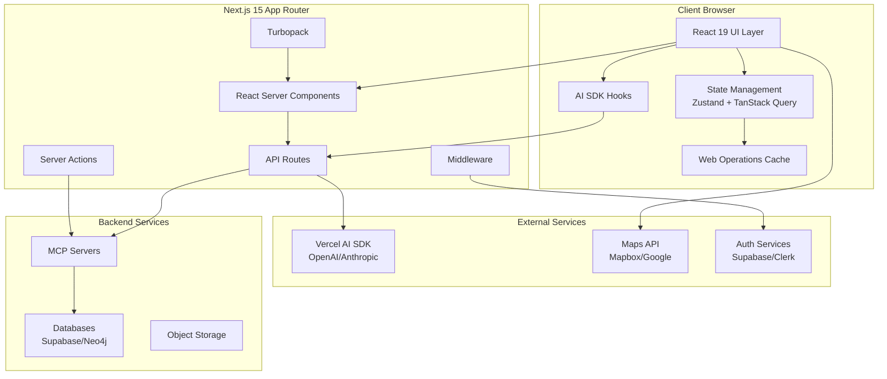

## Component Architecture

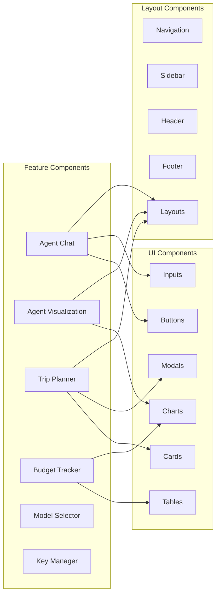

## Data Flow Architecture

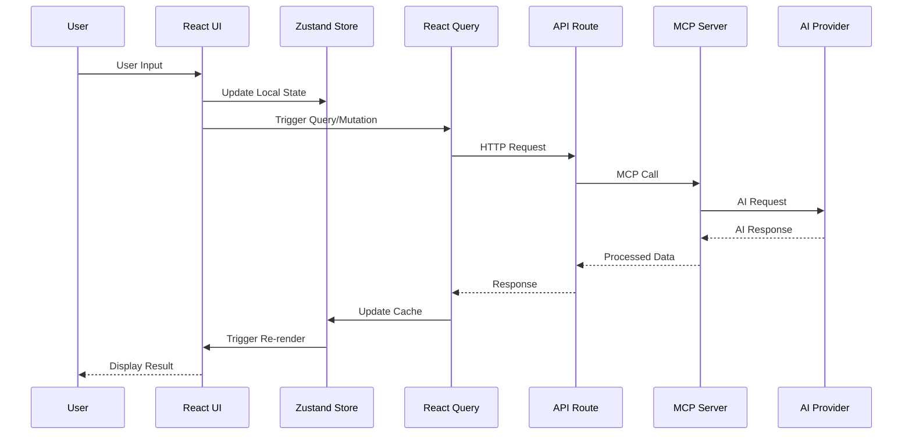

## State Management Architecture

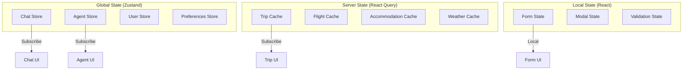

## Agent Visualization Flow

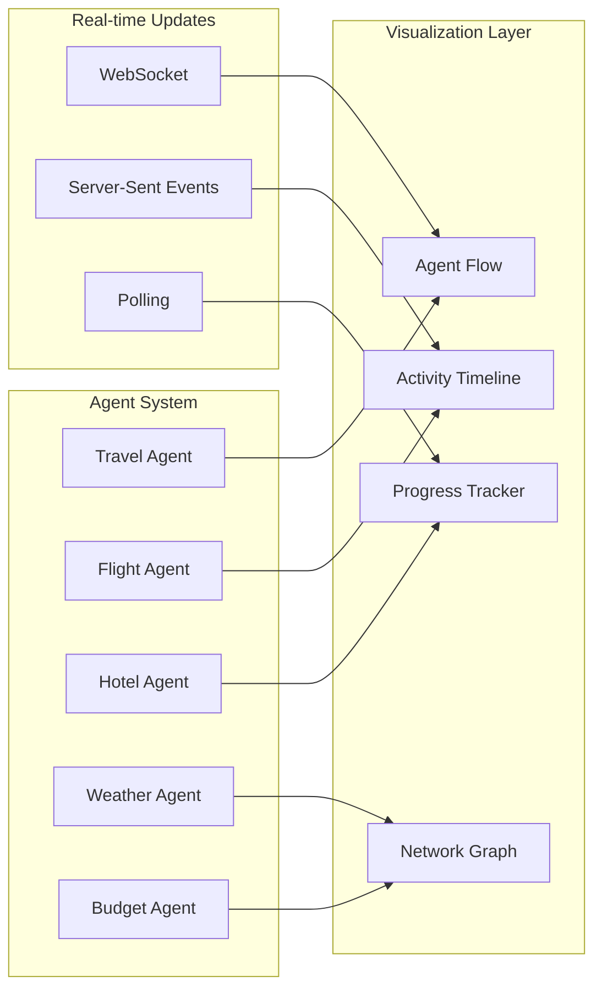

## Frontend Build Pipeline

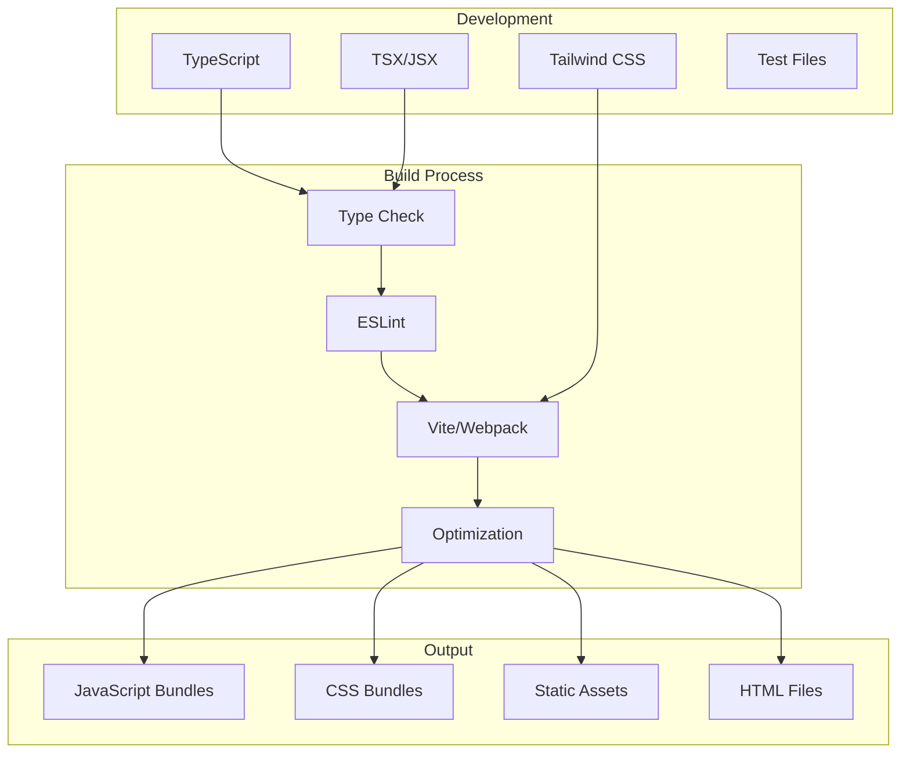

## API Integration Architecture

```mermaid
graph TB
    subgraph "Frontend API Layer"
        AX[Axios Client]
        FE[Fetch Wrapper]
        RT[React Query]
        SW[SWR]
    end
    
    subgraph "API Routes"
        CH[/api/chat]
        TR[/api/trips]
        FL[/api/flights]
        AC[/api/accommodations]
        AU[/api/auth]
    end
    
    subgraph "External APIs"
        OA[OpenAI API]
        AN[Anthropic API]
        MP[Maps APIs]
        BK[Booking APIs]
    end
    
    AX --> CH
    FE --> TR
    RT --> FL
    SW --> AC
    
    CH --> OA
    CH --> AN
    TR --> MP
    FL --> BK
```

## Performance Optimization Strategy

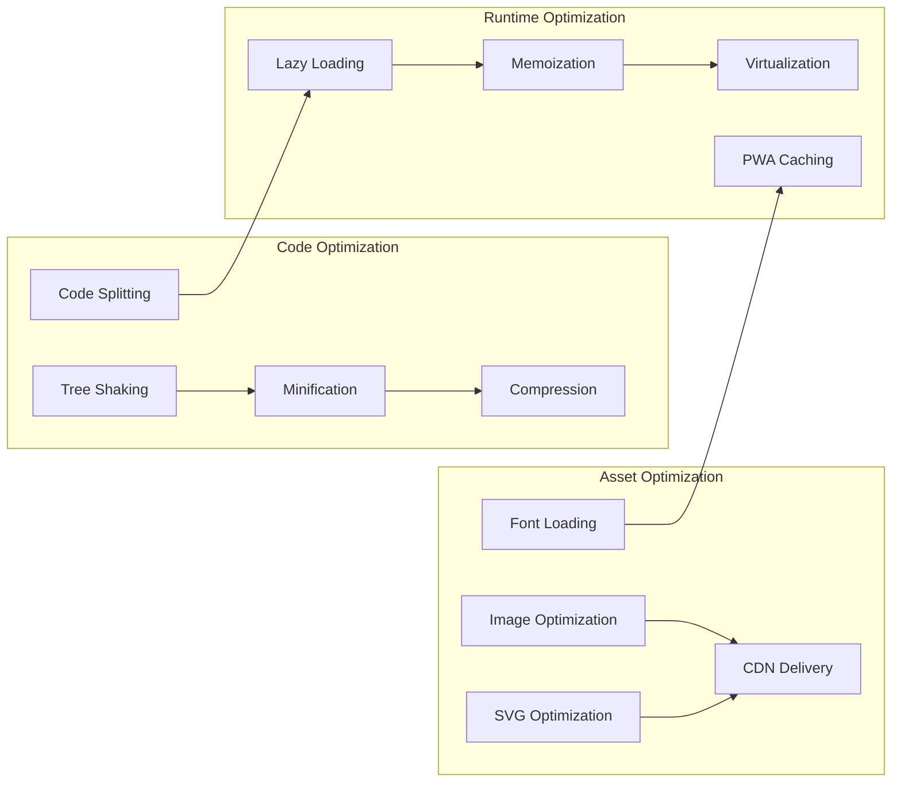

## Security Architecture

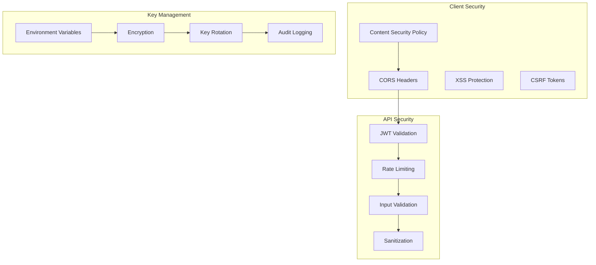

## Deployment Architecture

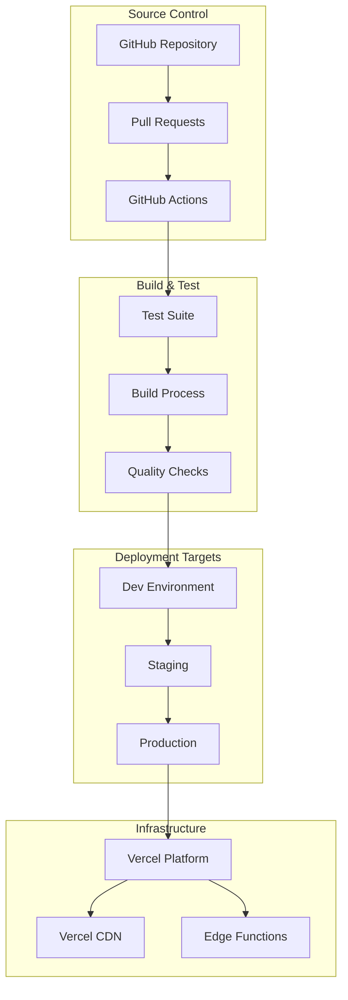

## Error Handling Flow

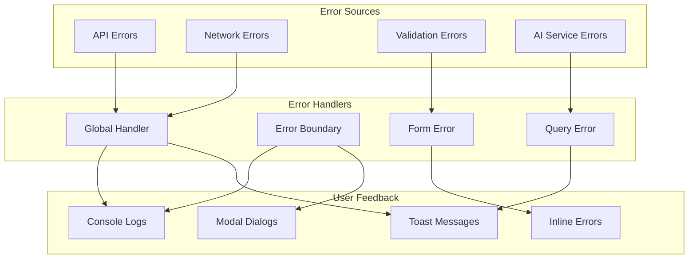

## Testing Architecture

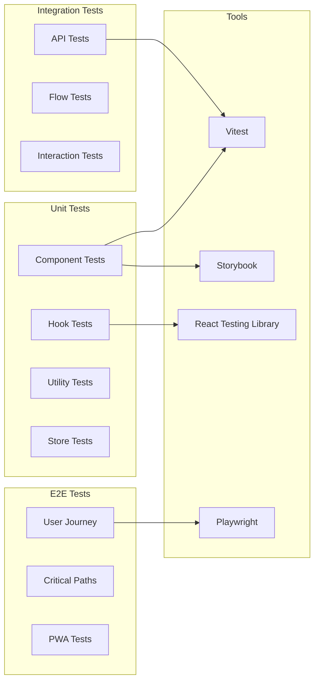

This comprehensive architecture diagram outlines the structure, data flow, and key architectural decisions for the TripSage frontend application, providing a visual guide for development and maintenance.