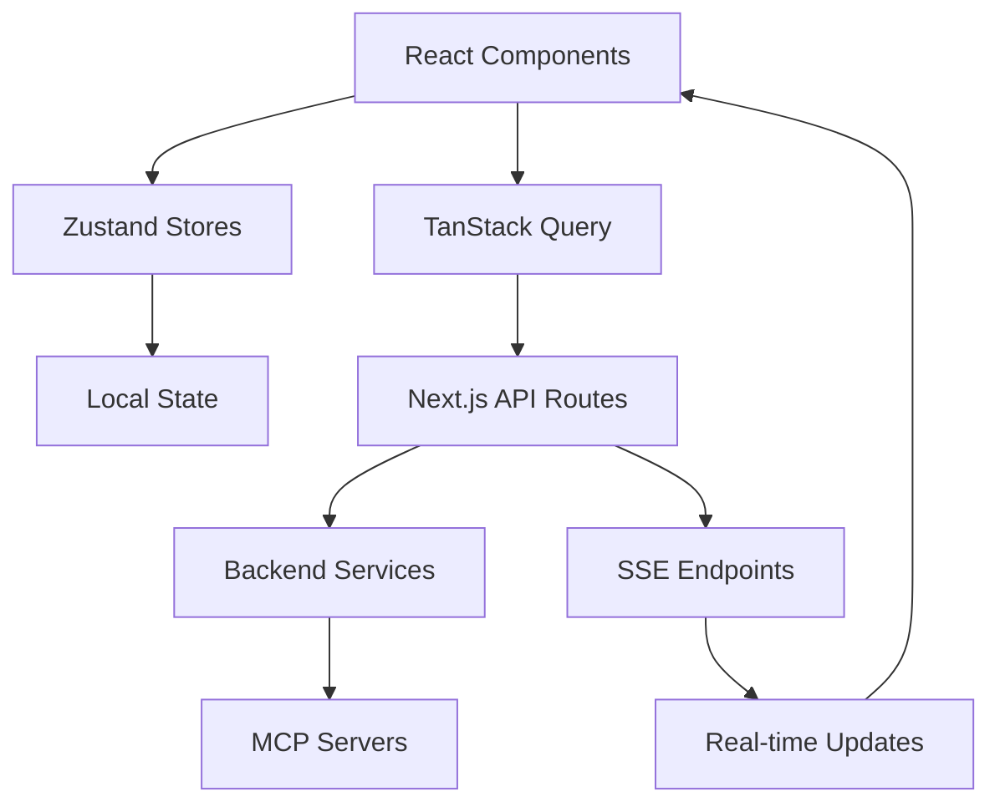

# TripSage Frontend Specifications (v2.0)

This document outlines the technical specifications, design patterns, and implementation details for the TripSage frontend application using the latest v2 architecture.

## 1. Technology Stack

### Core Technologies

- **Next.js 15.3.1**: App Router, Server Components, API routes
- **React 19.1.0**: Server Components, improved Suspense, concurrent features
- **TypeScript 5.5+**: Strict type safety, template literal types
- **Supabase JS Client**: Database integration and authentication

### UI Framework and Styling

- **Tailwind CSS v4.0**: OKLCH color space, CSS-based config, container queries
- **shadcn/ui v3**: Copy-paste components built on Radix UI
- **Framer Motion v11**: Modern animations and transitions
- **Lucide Icons**: Consistent icon library
- **clsx & tailwind-merge**: Conditional styling utilities

### State Management

- **Zustand v5.0.4**: Simple state management with native `useSyncExternalStore`
- **TanStack Query v5**: Server state, caching, and data synchronization
- **React Context API**: For isolated state within feature boundaries

### AI Integration

- **Vercel AI SDK v5**: Streaming AI responses, tool calling
- **Server-Sent Events (SSE)**: Real-time AI streaming
- **OpenAI SDK**: Direct API integration when needed

### Form Handling

- **React Hook Form v8**: Performance-optimized form handling
- **Zod v3**: TypeScript-first schema validation

### Testing

- **Vitest**: Fast unit testing with TypeScript support
- **React Testing Library**: Component testing with modern patterns
- **Playwright**: E2E testing with cross-browser support

### Building and Deployment

- **Turbopack**: Next.js built-in bundler (faster than Webpack)
- **SWC**: Rust-based TypeScript/JSX compiler
- **Vercel**: Optimized deployment for Next.js apps

## 2. Application Architecture

### Directory Structure

```plaintext
src/
├── app/                      # Next.js App Router
│   ├── (auth)/              # Authentication group routes
│   ├── (dashboard)/         # Dashboard routes
│   ├── api/                 # API routes
│   ├── layout.tsx           # Root layout
│   └── providers.tsx        # Client providers
├── components/              # Reusable UI components
│   ├── ui/                  # shadcn/ui components
│   ├── features/           # Feature-specific components
│   ├── layouts/            # Layout components
│   └── providers/          # Context providers
├── lib/                     # Utility functions and services
│   ├── api/                # API client layer
│   ├── hooks/              # Custom React hooks
│   ├── stores/             # Zustand stores
│   ├── utils/              # Helper functions
│   └── constants/          # App constants
├── types/                   # TypeScript type definitions
├── config/                  # Configuration files
└── tests/                   # Test files and utilities
```

### Component Architecture

- **Server Components by Default**: Leverage React 19 Server Components
- **Client Components**: Use `'use client'` only when needed
- **Suspense Boundaries**: Strategic loading states
- **Error Boundaries**: Comprehensive error handling

### State Management Strategy

1. **Server State**: TanStack Query v5 for all API data
2. **Client State**: Zustand v5 for complex UI state
3. **Form State**: React Hook Form for all forms
4. **URL State**: Next.js router for navigation state

### Data Flow Patterns



## 3. Key Features Implementation

### Authentication & Security

- **Supabase Auth**: OAuth providers, magic links, JWT sessions
- **Row Level Security (RLS)**: Database-level access control
- **BYOK Implementation**: Secure API key management
  - Envelope encryption on backend
  - Auto-clearing forms in UI
  - Never store raw keys in frontend

### Trip Planning Interface

- **Multi-step Wizard**: Progressive disclosure pattern
- **Real-time Validation**: Immediate feedback
- **Auto-save**: Prevent data loss
- **Collaborative Features**: Real-time updates via SSE

### Search & Discovery

- **Faceted Search**: Advanced filtering
- **Instant Results**: Optimistic UI updates
- **Search History**: Recent searches
- **AI-Powered Suggestions**: Context-aware recommendations

### AI Chat Integration

```typescript
// Example AI Chat Component
export function AIChat() {
  const { messages, input, handleSubmit, isLoading } = useChat({
    api: '/api/chat',
    streamProtocol: 'sse',
  });

  return (
    <StreamingChat
      messages={messages}
      onSubmit={handleSubmit}
      isStreaming={isLoading}
    />
  );
}
```

### Performance Optimization

- **Code Splitting**: Dynamic imports for heavy components
- **Image Optimization**: Next.js Image component
- **Route Prefetching**: Predictive loading
- **Bundle Optimization**: Tree shaking, minification

## 4. Design System

### Theme Configuration

```typescript
// tailwind.config.ts
export default {
  theme: {
    extend: {
      colors: {
        primary: 'oklch(0.75 0.18 240)',
        secondary: 'oklch(0.65 0.15 120)',
        accent: 'oklch(0.85 0.20 330)',
      },
    },
  },
};
```

### Component Patterns

- **Compound Components**: Flexible, composable interfaces
- **Render Props**: Sharing component logic
- **Custom Hooks**: Reusable business logic
- **Higher-Order Components**: Cross-cutting concerns

## 5. API Integration

### REST API Client

```typescript
// lib/api/client.ts
export const apiClient = {
  get: <T>(url: string) => fetcher<T>('GET', url),
  post: <T>(url: string, data: unknown) => fetcher<T>('POST', url, data),
  put: <T>(url: string, data: unknown) => fetcher<T>('PUT', url, data),
  delete: <T>(url: string) => fetcher<T>('DELETE', url),
};
```

### Real-time Features

- **Server-Sent Events**: For AI streaming
- **WebSocket Fallback**: For bidirectional communication
- **Polling**: As last resort for real-time updates

## 6. Error Handling

### Global Error Boundary

```typescript
export function GlobalErrorBoundary({ children }: PropsWithChildren) {
  return (
    <ErrorBoundary
      fallback={<ErrorFallback />}
      onError={(error) => {
        console.error('Application error:', error);
        // Send to error tracking service
      }}
    >
      {children}
    </ErrorBoundary>
  );
}
```

### API Error Handling

- **Retry Logic**: Exponential backoff
- **Error Classification**: User vs system errors
- **Graceful Degradation**: Fallback behaviors

## 7. Performance Targets

- **First Contentful Paint**: <1.5s
- **Time to Interactive**: <3s
- **Lighthouse Score**: >95
- **Bundle Size**: <200KB initial JS
- **Core Web Vitals**: All green

## 8. Accessibility

- **WCAG 2.1 AA Compliance**: Minimum standard
- **Keyboard Navigation**: Full support
- **Screen Reader Support**: ARIA labels
- **Color Contrast**: 4.5:1 minimum
- **Focus Management**: Clear focus indicators

## 9. Testing Strategy

### Unit Tests

- Component logic testing
- Custom hook testing
- Utility function testing

### Integration Tests

- API integration testing
- State management testing
- Route testing

### E2E Tests

- Critical user flows
- Cross-browser testing
- Mobile responsiveness

## 10. Deployment

### CI/CD Pipeline

```yaml
# .github/workflows/deploy.yml
name: Deploy
on:
  push:
    branches: [main]

jobs:
  deploy:
    runs-on: ubuntu-latest
    steps:
      - uses: actions/checkout@v3
      - uses: actions/setup-node@v3
      - run: npm ci
      - run: npm run build
      - run: npm run test
      - uses: vercel/action@v1
```

### Environment Strategy

- **Development**: Local with hot reloading
- **Staging**: Preview deployments
- **Production**: Optimized builds with CDN

## 11. Monitoring & Analytics

- **Error Tracking**: Sentry integration
- **Performance Monitoring**: Web Vitals tracking
- **User Analytics**: Privacy-focused analytics
- **Custom Events**: User behavior tracking

## 12. Future Enhancements

- **Progressive Web App**: Offline support
- **Internationalization**: Multi-language support
- **Advanced Caching**: Service workers
- **Native Features**: Mobile app bridge
