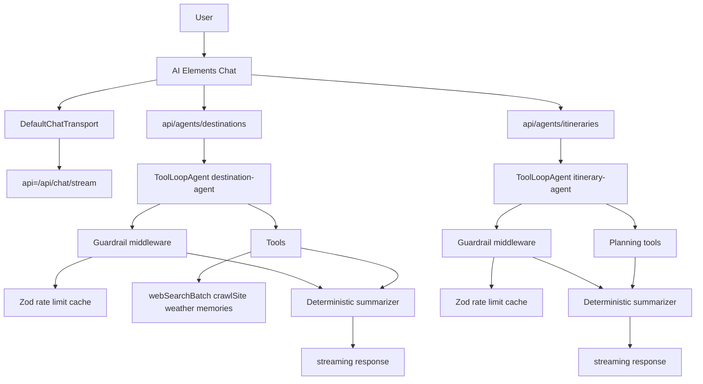

# SPEC-0019: Hybrid Destination & Itinerary Agents (Frontend)

**Version**: 1.0.0  
**Status**: Accepted  
**Date**: 2025-11-12

## Scope

Deliver feature parity for destination research and itinerary planning directly in `frontend/` using AI SDK v6 ToolLoopAgent workflows with deterministic guardrails, Supabase auth, BYOK provider registry, and Upstash caching. This spec covers:

- Two streaming Route Handlers in Next.js (`/api/agents/destinations`, `/api/agents/itineraries`).
- TypeScript tool orchestrators, schemas, prompts, and summarizers.
- AI Elements chat UX upgrades (quick actions, cards, timelines, progress states).
- Telemetry, rate limiting, caching, and rollout guidance.
- Operators runbook for deployment and validation (see `docs/operations/agent-frontend.md`).
- Removal of any dependency on `tripsage/` or `tripsage_core` for these agents.

Out of scope: implementing new upstream travel data providers (reuse existing tools), rewriting Supabase auth helpers, or modifying backend FastAPI services (Python backend has been completely removed; all functionality runs in Next.js TypeScript).

## Architecture Summary

## Deliverables by Area

### 1. Schemas, Prompts, and Shared Types

- **Files**: `frontend/src/schemas/agents.ts`, `frontend/src/prompts/{destination,itinerary}.ts`.
- **Requirements**:
  - Define `DestinationResearchRequest`, `DestinationResearchResult`, `ItineraryPlanRequest`, `ItineraryPlanResult` (Zod + TypeScript types). Include `schemaVersion` and `sources[]` metadata.
  - Export prompt builders that accept user context (preferences, travel dates) and output instructions for ToolLoopAgent.
  - Ensure schemas are serializable on client (no `Date` objects) and re-exported for UI inference.

### 2. Provider & Infra Enhancements

- **Files**: `frontend/src/ai/models/registry.ts`, `frontend/src/lib/cache/upstash.ts`, `frontend/src/lib/ratelimit/{destinations,itineraries}.ts`.
- **Requirements**:
  - Add fallback to Vercel AI Gateway when BYOK keys missing; attach metadata describing provider used.
  - Implement Upstash helper functions `withCache(key, ttl, fn)` and `takeToken(bucket, limit)`.
  - Provide typed wrappers so tool orchestrators automatically log cache hits/misses.

### 3. Tool Registry & Orchestrators

- **Files**: `frontend/src/lib/tools/index.ts`, `frontend/src/lib/tools/research-destination.ts`, `frontend/src/lib/tools/generate-itinerary.ts` (new), plus updates to existing tool modules.
- **Requirements**:
  - Compose high-level tools that call existing primitives (web search, crawl, planning) and return structured payloads defined in schemas.
  - Register new tools in `toolRegistry` with unique names (`researchDestination`, `generateItineraryPlan`).
  - Add Vitest coverage for orchestrator logic (mocking downstream tools and verifying caching + telemetry integration).

### 4. Route Handlers & Agents

- **Files**: `frontend/src/app/api/agents/destinations/route.ts`, `frontend/src/app/api/agents/itineraries/route.ts`, `frontend/src/lib/agents/{destination,itinerary}-agent.ts`, `frontend/src/lib/agents/middleware.ts`, `frontend/src/lib/agents/summarizers.ts`.
- **Requirements**:
  - Each route imports Supabase auth helper to resolve user ID, then obtains provider via `resolveProvider` (with optional `modelHint` query param).
  - Instantiate `ToolLoopAgent` (AI SDK v6) with:
    - `instructions` from prompt module.
    - `tools` referencing `toolRegistry` entries.
    - `stopWhen` conditions: `stepCountIs(N)` + custom predicate checking Upstash budgets.
  - Wrap `agent.run`/`stream` using middleware that validates tool inputs (Zod), checks rate limits, performs caching, and logs telemetry.
  - Convert final trace to `DestinationResearchResult` or `ItineraryPlanResult` via summarizer; include intermediate progress events (AI SDK tool event streaming) before final structured message.
  - Return `result.toUIMessageStreamResponse()` for compatibility with `useChat`.

### 5. UI/UX Enhancements

- **Files**: `frontend/src/app/chat/page.tsx`, `frontend/src/components/ai-elements/{destination-card,itinerary-timeline}.tsx`, optional `frontend/src/components/ai-elements/progress.tsx`.
- **Requirements**:
  - Add PromptInput Action Menu entries to trigger research/itinerary flows (pre-seeding JSON payloads or referencing new API endpoints).
  - Render destination results using cards (title, climate, top attractions, sources) and show AI Elements `Sources` drawer for links.
  - Render itinerary results via timeline/day-planner component (AI Elements timeline primitives or custom). Show budgets, logistics, and callouts per day.
  - Display progress states when tool calls stream (e.g., “Fetching weather”, “Aggregating attractions”).

### 6. Telemetry, Testing, Rollout

- **Telemetry Files**: `frontend/src/lib/telemetry/agents.ts`, instrumentation hooks in middleware.
- **Testing**: Vitest (agents, tools, components), Playwright (chat flows), integration tests hitting new route handlers with mocked AI client.
- Rollout: complete cutover with frontend-only agents (no flags). Telemetry monitors success and latency; rollback is by reverting the deploy.

## Acceptance Criteria

- Backend directories contain no destination/itinerary orchestration code (already removed); frontend endpoints deliver identical or improved outputs.
- Hybrid ToolLoop approach achieves ≥9/10 Decision Framework score (documented in [ADR-0038](../../architecture/decisions/adr-0038-hybrid-frontend-agents.md)).
- UI renders structured cards/timelines with AI Elements, no raw JSON surfaces.
- Guardrail middleware logs every tool invocation with result + cache metadata; Upstash limits enforced per user/workflow.
- Automated tests cover schemas, agents, and UI; manual checklist documented for release.

## Status

- P0 completed (platform hardening: schemas, prompts, guardrails, telemetry, caching).
- P1 completed (flight + accommodation agents shipped in frontend; schema-aware UI cards and route tests).
- Next phase: P2 - Budget & Memory agents (design/implementation starting).

## References

- [ADR-0038](../../architecture/decisions/adr-0038-hybrid-frontend-agents.md) Hybrid Frontend Agents (decision record).  
- AI SDK v6 documentation for ToolLoopAgent, tool calling, and structured outputs.  
- Next.js Route Handler docs (`/docs/app/building-your-application/routing/route-handlers`).  
- AI Elements documentation for PromptInput, Conversation, and related components.
