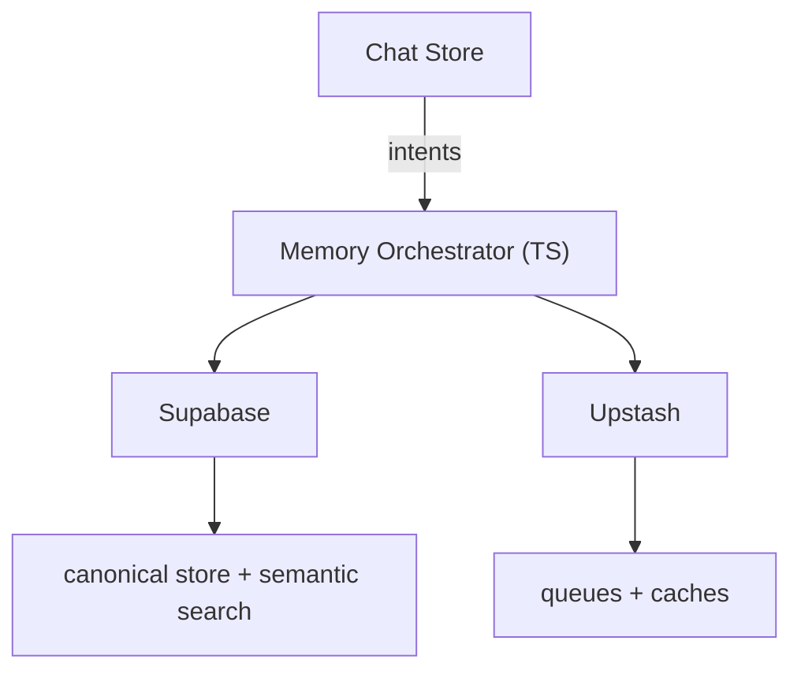

# SPEC-0026: Supabase Memory Orchestrator & Provider Adapters

**Version**: 1.1.0
**Status**: Complete
**Date**: 2025-12-30

## Status

- Implementation complete. Orchestrator module (`lib/memory/orchestrator.ts`) is fully implemented with Supabase and Upstash adapters.
- Supabase adapter provides native semantic search via `match_turn_embeddings` RPC using pgvector.
- Integrated into chat stream handler (`api/chat/stream/_handler.ts`) via `persistMemoryTurn()`.
- All adapters support required intents: `onTurnCommitted`, `syncSession`, `backfillSession`, `fetchContext`.

> **v1.1.0 Update (2025-12-30)**: Removed Mem0 adapter dependency. Supabase adapter now handles semantic search directly via pgvector (`match_turn_embeddings` RPC), eliminating external API calls and reducing dependency surface.

## Goals

- Establish a canonical `memories` schema in Supabase Postgres with pgvector
  columns, Row Level Security, and automated embeddings pipelines.
- Introduce a Memory Orchestrator service (TypeScript module) that receives
  intents (`onTurnCommitted`, `syncSession`, `backfillSession`, `fetchContext`)
  and fans out to pluggable adapters.
- Provide first-party adapters: `SupabaseAdapter` (authoritative storage with
  native semantic search via pgvector), `UpstashAdapter` (queues/caches).
- Ensure AI SDK v6 chat flows, Query Clients, and hooks interact with memory via
  orchestrator only—no direct provider calls from UI stores.
- Deliver actionable telemetry, retry, and PII redaction pipelines.

## Non-Goals

- Replacing existing client-side persistence (Zustand + storage) immediately.
- Introducing new backend runtimes; all logic stays within Next.js Route
  Handlers or shared libraries.
- Managing bespoke embedding models; we rely on OpenAI text-embedding-3-small
  via AI SDK v6 `embed()` function.

## Architecture Overview



- **Orchestrator module** (`src/lib/memory/orchestrator.ts`)
  - Validates intents, enforces feature flags, runs PII redaction helpers, and
    emits OTLP spans/metrics.
  - Dispatches intents to adapters sequentially (Supabase → Upstash by default)
    with per-adapter error handling and exponential backoff metadata.

- **Adapters**
  - `SupabaseAdapter`: inserts/updates rows via `@supabase/postgrest-js`
    service role, generates embeddings using AI SDK v6 `embed()` with
    text-embedding-3-small (1536 dimensions), and provides semantic search
    via `match_turn_embeddings` RPC with configurable HNSW parameters.
  - `UpstashAdapter`: publishes messages to QStash (`memory.sync` topic) and
    writes ephemeral caches to Redis (`memory:{user}:{session}`). Supports TTL
    invalidation and multi-region fanout.

## Data Model

- `memories.sessions`
  - `id (uuid PK)`, `user_id`, `title`, `last_synced_at`, `metadata jsonb`.
- `memories.turns`
  - `id (uuid PK)`, `session_id`, `role`, `content jsonb`, `attachments jsonb`,
    `tool_calls jsonb`, `tool_results jsonb`, `created_at`, `pii_scrubbed boolean`.
- `memories.turn_embeddings`
  - `turn_id`, `embedding vector(1536)`, `model`, `created_at`.
  - HNSW index with `m=32`, `ef_construction=180` for latency-sensitive search.

## API Contracts

```ts
type MemoryIntent =
  | { type: "onTurnCommitted"; sessionId: string; userId: string; turn: Message }
  | { type: "syncSession"; sessionId: string; userId: string }
  | { type: "backfillSession"; sessionId: string; userId: string }
  | { type: "fetchContext"; sessionId: string; userId: string; limit?: number };

interface MemoryAdapter {
  supportedIntents: MemoryIntent["type"][];
  handle(intent: MemoryIntent, ctx: MemoryContext): Promise<MemoryResult>;
}
```

## Security & Compliance

- Supabase schema secured via RLS: `user_id = auth.uid()` for user-facing
  reads; service role functions for background jobs.
- PII redaction service strips emails, phone numbers, payment card patterns
  prior to embedding generation. Hashes stored in metadata for auditing.
- Secrets: Upstash keys remain server-side; orchestrator obtains them via
  existing provider registry ([ADR-0028](../../architecture/decisions/adr-0028-provider-registry.md)).

## Observability & Retry

- OTLP spans: `memory.intent`, `adapter.supabase`, `adapter.upstash`
  with status + duration.
- Upstash QStash retry policy: exponential backoff, DLQ queue `memory.dlq`.
- Supabase Edge Functions log to central observability stack.

## Testing Strategy

- Unit tests for orchestrator + adapters (Vitest, mocked providers).
- Integration tests using Supabase test instance + Upstash HTTP mocks.
- Playwright scenario verifying conversation memory recall round-trip.

## Rollout Plan

**Status: COMPLETE** (2025-12-30)

- [x] Shipped orchestrator behind `memory.orchestrator` flag; chat store emits intents.
- [x] Enabled Supabase adapter with native semantic search via pgvector.
- [x] Rolled out Upstash adapter for async pipelines and caching.
- [x] Removed Mem0 adapter (v1.1.0) - semantic search handled natively by Supabase.
- [x] Feature flag removed; orchestrator is production default.

## References

- [ADR-0042](../../architecture/decisions/adr-0042-supabase-memory-orchestrator.md): Supabase-Centric Memory Orchestrator.
- Supabase Vector documentation - <https://supabase.com/modules/vector?utm_source=openai>
- Upstash AI SDK article - <https://upstash.com/blog/vercel-ai-sdk?utm_source=openai>
