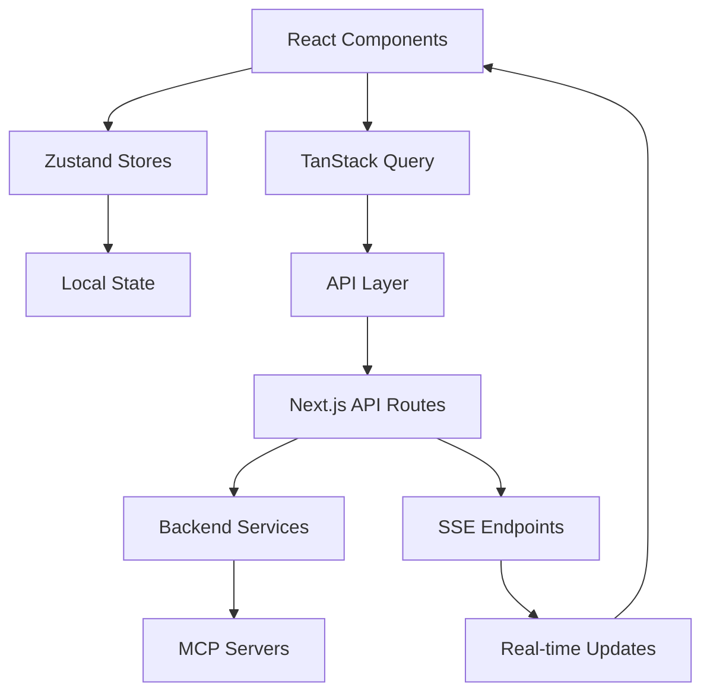
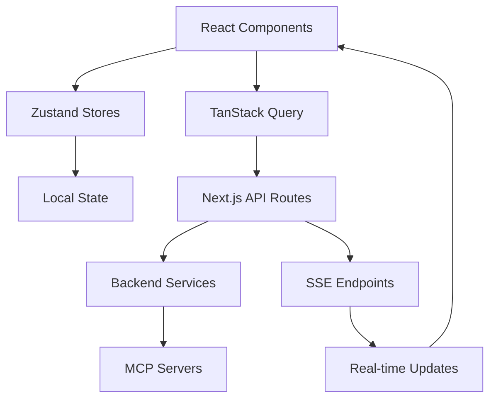

This file is a merged representation of a subset of the codebase, containing specifically included files, combined into a single document by Repomix.

# File Summary

## Purpose

This file contains a packed representation of the entire repository's contents.
It is designed to be easily consumable by AI systems for analysis, code review,
or other automated processes.

## File Format

The content is organized as follows:

1. This summary section
2. Repository information
3. Directory structure
4. Repository files (if enabled)
4. Multiple file entries, each consisting of:
  a. A header with the file path (## File: path/to/file)
  b. The full contents of the file in a code block

## Usage Guidelines

- This file should be treated as read-only. Any changes should be made to the
  original repository files, not this packed version.
- When processing this file, use the file path to distinguish
  between different files in the repository.
- Be aware that this file may contain sensitive information. Handle it with
  the same level of security as you would the original repository.

## Notes

- Some files may have been excluded based on .gitignore rules and Repomix's configuration
- Binary files are not included in this packed representation. Please refer to the Repository Structure section for a complete list of file paths, including binary files
- Only files matching these patterns are included: frontend/
- Files matching patterns in .gitignore are excluded
- Files matching default ignore patterns are excluded
- Files are sorted by Git change count (files with more changes are at the bottom)

## Additional Info

# Directory Structure

```
frontend/
  archived/
    ARCHITECTURE_v1.md
    TECHNOLOGY_STACK_RECOMMENDATIONS_v1.md
    TODO-FRONTEND_v1.md
  ARCHITECTURE.md
  BUDGET_FEATURES.md
  frontend_specifications.md
  MIGRATION_GUIDE_v1_to_v2.md
  PAGES_AND_FEATURES.md
  README.md
  TECHNOLOGY_STACK_RECOMMENDATIONS.md
  TECHNOLOGY_STACK_SUMMARY.md
```

# Files

## File: frontend/archived/ARCHITECTURE_v1.md

````markdown
# TripSage Frontend Architecture

## Executive Summary

TripSage's frontend is a modern, AI-centric travel planning application built with Next.js 15.3, React 19, and TypeScript 5.5. It provides real-time streaming interfaces for agent interactions using Vercel AI SDK v5, integrates seamlessly with the FastAPI backend and MCP servers, and is optimized for deployment on Vercel with edge runtime capabilities.

## Technology Stack

### Core Framework

- **Next.js 15.3**: App Router, Server Components, Turbopack (production builds)
- **React 19**: Concurrent features, new hooks (use, useOptimistic), automatic batching
- **TypeScript 5.5+**: Enhanced type inference, type predicates, improved performance

### Styling & UI

- **Tailwind CSS v4**: OKLCH color space, container queries, enhanced theming
- **shadcn/ui v3-canary**: React 19 compatibility, accessible components built on Radix UI
- **Framer Motion v11**: Advanced animations and gestures
- **lucide-react**: Modern icon library

### State Management

- **Zustand v5**: Client state management with TypeScript-first API
- **TanStack Query v5**: Server state, caching, optimistic updates
- **React Hook Form v8**: Form handling with Next.js 15 compatibility
- **Zod v3**: Runtime validation with TypeScript inference

### Real-time & AI

- **Vercel AI SDK v5**: UI Message Streaming Protocol, agent interactions
- **Server-Sent Events (SSE)**: Primary streaming mechanism for AI responses
- **WebSocket (fallback)**: Bidirectional communication when needed

### Authentication

- **Supabase Auth**: Integrated with backend, JWT-based
- **iron-session**: Secure session management for server components
- **Custom middleware**: Protected routes and API endpoints

### Maps & Visualization

- **Mapbox GL JS v3**: Interactive maps with WebGL performance
- **React Flow v12**: Agent workflow visualization
- **Recharts v2**: Data visualization for analytics

### Development & Build

- **Turbopack**: Next.js integrated bundler (28-83% faster builds)
- **Vitest v2**: Unit testing with native ESM support
- **Playwright v1.48+**: E2E testing with Next.js 15 support
- **Biome**: Fast linting and formatting (ruff equivalent for JS/TS)

## Directory Structure

```
src/
├── app/                      # Next.js 15 App Router
│   ├── (auth)/              # Authentication route group
│   │   ├── login/
│   │   ├── register/
│   │   └── reset-password/
│   ├── (dashboard)/         # Protected dashboard routes
│   │   ├── layout.tsx       # Shared dashboard layout
│   │   ├── page.tsx         # Dashboard home
│   │   ├── trips/           # Trip management
│   │   ├── agents/          # Agent chat interfaces
│   │   └── settings/        # User settings
│   ├── api/                 # API routes
│   │   ├── agents/          # Agent streaming endpoints
│   │   │   └── [agentId]/   
│   │   │       └── stream/
│   │   ├── auth/            # Auth endpoints
│   │   └── trpc/            # Optional tRPC router
│   ├── layout.tsx          # Root layout with providers
│   ├── error.tsx           # Error boundary
│   └── global-error.tsx    # Global error handler
│
├── components/              # React components
│   ├── ui/                 # Base UI components (shadcn/ui)
│   │   ├── button.tsx
│   │   ├── dialog.tsx
│   │   └── ...
│   ├── agents/             # Agent-specific components
│   │   ├── agent-chat.tsx
│   │   ├── message-list.tsx
│   │   ├── tool-invocation.tsx
│   │   └── workflow-visualizer.tsx
│   ├── trips/              # Trip planning components
│   │   ├── trip-card.tsx
│   │   ├── itinerary-builder.tsx
│   │   └── budget-tracker.tsx
│   ├── auth/               # Authentication components
│   │   ├── login-form.tsx
│   │   └── auth-provider.tsx
│   └── shared/             # Shared components
│       ├── header.tsx
│       ├── sidebar.tsx
│       └── loading.tsx
│
├── hooks/                  # Custom React hooks
│   ├── use-agent-stream.ts
│   ├── use-auth.ts
│   ├── use-mcp-tool.ts
│   └── use-realtime.ts
│
├── lib/                    # Core utilities
│   ├── api/               # API client configuration
│   │   ├── client.ts      # Configured fetch client
│   │   └── endpoints.ts   # API endpoint constants
│   ├── ai/                # AI SDK configuration
│   │   ├── stream.ts      # Streaming utilities
│   │   └── agents.ts      # Agent configurations
│   ├── supabase/          # Supabase client setup
│   │   ├── client.ts
│   │   └── server.ts      # Server-side client
│   └── utils/             # General utilities
│       ├── cn.ts          # clsx + tailwind merge
│       └── format.ts      # Formatting helpers
│
├── services/              # Business logic services
│   ├── agent-service.ts   # Agent communication
│   ├── trip-service.ts    # Trip management
│   └── auth-service.ts    # Authentication logic
│
├── stores/                # Zustand stores
│   ├── auth-store.ts
│   ├── agent-store.ts
│   ├── trip-store.ts
│   └── ui-store.ts
│
├── types/                 # TypeScript definitions
│   ├── api.ts             # API response types
│   ├── agent.ts           # Agent-related types
│   ├── trip.ts            # Trip domain types
│   └── mcp.ts             # MCP tool types
│
└── styles/               # Global styles
    ├── globals.css       # Global CSS with Tailwind
    └── themes.css        # OKLCH theme variables
```

## Core Architecture Layers

### 1. Presentation Layer

- **Server Components**: Default for static content, SEO-optimized pages
- **Client Components**: Interactive features, real-time updates
- **Streaming UI**: Token-by-token rendering for AI responses
- **Mobile-First Design**: Responsive layouts with Tailwind container queries

### 2. State Management Layer

```typescript
// Client State (Zustand)
interface UIStore {
  theme: 'light' | 'dark' | 'system'
  sidebarOpen: boolean
  activeAgent: string | null
}

// Server State (TanStack Query)
const useTrips = () => {
  return useQuery({
    queryKey: ['trips'],
    queryFn: () => api.get('/trips'),
    staleTime: 5 * 60 * 1000, // 5 minutes
  })
}

// Real-time State (Vercel AI SDK)
const { messages, input, handleSubmit } = useChat({
  api: '/api/agents/travel-planner/stream',
  streamProtocol: 'data-stream',
})
```

### 3. API Integration Layer

```typescript
// API Client with automatic retry and error handling
class TripSageAPI {
  private baseURL = process.env.NEXT_PUBLIC_API_URL
  
  async request<T>(path: string, options?: RequestInit): Promise<T> {
    const res = await fetch(`${this.baseURL}${path}`, {
      ...options,
      headers: {
        'Content-Type': 'application/json',
        'Authorization': `Bearer ${await getSessionToken()}`,
        ...options?.headers,
      },
    })
    
    if (!res.ok) {
      throw new APIError(res.status, await res.text())
    }
    
    return res.json()
  }
}
```

### 4. Real-time Communication Layer

```typescript
// Agent streaming with SSE
export async function POST(req: Request) {
  const encoder = new TextEncoder()
  
  const stream = new ReadableStream({
    async start(controller) {
      const { messages } = await req.json()
      
      // Call FastAPI backend
      const response = await fetch(`${BACKEND_URL}/agents/stream`, {
        method: 'POST',
        headers: {
          'Content-Type': 'application/json',
          'Accept': 'text/event-stream',
        },
        body: JSON.stringify({ messages }),
      })
      
      const reader = response.body?.getReader()
      const decoder = new TextDecoder()
      
      while (true) {
        const { done, value } = await reader!.read()
        if (done) break
        
        const chunk = decoder.decode(value)
        controller.enqueue(encoder.encode(chunk))
      }
      
      controller.close()
    },
  })
  
  return new Response(stream, {
    headers: {
      'Content-Type': 'text/event-stream',
      'Cache-Control': 'no-cache',
      'Connection': 'keep-alive',
    },
  })
}
```

## Component Strategy

### Server Components (Default)

```typescript
// app/(dashboard)/trips/page.tsx
export default async function TripsPage() {
  const trips = await api.get('/trips')
  
  return (
    <div className="container py-8">
      <TripGrid trips={trips} />
    </div>
  )
}
```

### Client Components

```typescript
'use client'

// components/agents/agent-chat.tsx
export function AgentChat({ agentId }: { agentId: string }) {
  const { messages, input, handleSubmit, isLoading } = useChat({
    api: `/api/agents/${agentId}/stream`,
    streamProtocol: 'data-stream',
  })
  
  return (
    <div className="flex flex-col h-full">
      <MessageList messages={messages} />
      <ChatInput
        value={input}
        onChange={handleInputChange}
        onSubmit={handleSubmit}
        disabled={isLoading}
      />
    </div>
  )
}
```

### Streaming Components

```typescript
// components/agents/streaming-message.tsx
export function StreamingMessage({ content }: { content: string }) {
  const [displayedContent, setDisplayedContent] = useState('')
  
  useEffect(() => {
    let index = 0
    const interval = setInterval(() => {
      if (index < content.length) {
        setDisplayedContent(content.slice(0, index + 1))
        index++
      } else {
        clearInterval(interval)
      }
    }, 10) // Smooth character-by-character display
    
    return () => clearInterval(interval)
  }, [content])
  
  return <div className="prose">{displayedContent}</div>
}
```

## Authentication Strategy

### Supabase Auth Integration

```typescript
// lib/supabase/server.ts
import { createServerClient } from '@supabase/ssr'
import { cookies } from 'next/headers'

export function createClient() {
  const cookieStore = cookies()
  
  return createServerClient(
    process.env.NEXT_PUBLIC_SUPABASE_URL!,
    process.env.NEXT_PUBLIC_SUPABASE_ANON_KEY!,
    {
      cookies: {
        getAll() {
          return cookieStore.getAll()
        },
        setAll(cookiesToSet) {
          cookiesToSet.forEach(({ name, value, options }) =>
            cookieStore.set(name, value, options)
          )
        },
      },
    }
  )
}
```

### Middleware Protection

```typescript
// middleware.ts
import { NextResponse } from 'next/server'
import type { NextRequest } from 'next/server'
import { createClient } from '@/lib/supabase/server'

export async function middleware(request: NextRequest) {
  const supabase = createClient()
  const { data: { user } } = await supabase.auth.getUser()
  
  if (!user && request.nextUrl.pathname.startsWith('/dashboard')) {
    return NextResponse.redirect(new URL('/login', request.url))
  }
  
  return NextResponse.next()
}

export const config = {
  matcher: ['/dashboard/:path*', '/api/protected/:path*'],
}
```

## MCP Server Interaction Pattern

### Backend-Only MCP Communication

All interactions with MCP servers are exclusively handled through the FastAPI backend. The frontend never makes direct calls to MCP servers.

**Architecture:**

```
Frontend (Next.js) → FastAPI Backend → MCPManager → MCP Servers
```

**Benefits:**

- API keys remain server-side only
- Centralized error handling and retry logic
- Consistent monitoring and logging
- Flexible MCP implementation changes without frontend impact

### Example Flow

```typescript
// Frontend makes authenticated request to backend
const response = await api.post('/agents/travel-planner/search', {
  destination: 'Paris',
  dates: { start: '2025-06-01', end: '2025-06-07' }
});

// Backend handles MCP orchestration
// 1. Retrieves user's decrypted API keys
// 2. Invokes appropriate MCP wrappers
// 3. Aggregates and normalizes responses
// 4. Returns unified result to frontend
```

## Secure API Key Management (BYOK)

### Architecture Overview

TripSage implements a secure Bring Your Own Key (BYOK) system allowing users to provide their own API keys for external services.

### Key Components

#### 1. Frontend Key Input

```typescript
// components/settings/api-key-manager.tsx
interface ApiKeyFormData {
  service: 'openai' | 'duffel' | 'mapbox' | 'weatherapi';
  apiKey: string;
}

export function ApiKeyManager() {
  const [showKey, setShowKey] = useState(false);
  
  const handleSubmit = async (data: ApiKeyFormData) => {
    // Always use HTTPS in production
    const response = await fetch('/api/user/keys', {
      method: 'POST',
      headers: {
        'Content-Type': 'application/json',
        'Authorization': `Bearer ${sessionToken}`,
      },
      body: JSON.stringify({
        service: data.service,
        api_key: data.apiKey,
      }),
    });
    
    // Clear the key from memory immediately after submission
    data.apiKey = '';
  };
  
  return (
    <Form onSubmit={handleSubmit}>
      <Select name="service" label="Service">
        <option value="openai">OpenAI</option>
        <option value="duffel">Duffel Flights</option>
        <option value="mapbox">Mapbox</option>
        <option value="weatherapi">Weather API</option>
      </Select>
      
      <Input
        name="apiKey"
        type={showKey ? 'text' : 'password'}
        label="API Key"
        autoComplete="off"
        spellCheck={false}
      />
      
      <Button type="submit">Save API Key</Button>
    </Form>
  );
}
```

#### 2. Secure Transmission

- HTTPS-only communication
- JWT-authenticated endpoints
- Keys transmitted once and never stored client-side

#### 3. Backend Encryption & Storage

```python
# Backend handles secure storage (Python/FastAPI)
# Fernet symmetric encryption
encrypted_key = cipher.encrypt(api_key.encode())

# Stored in Supabase
user_api_keys: {
  user_id: string
  service: string
  encrypted_key: string (base64)
  key_hash: string (SHA256 prefix for identification)
  created_at: timestamp
  updated_at: timestamp
}
```

#### 4. Key Usage Flow

1. Agent/service requests key for specific service
2. KeyManager retrieves encrypted key from database
3. Key decrypted in memory with short TTL cache (5 min)
4. Key used for MCP invocation
5. Key cleared from memory after use

#### 5. Frontend Status Display

```typescript
// components/settings/api-key-status.tsx
interface ApiKeyStatus {
  service: string;
  isSet: boolean;
  lastUpdated?: string;
  keyPreview?: string; // First 4 and last 4 characters only
}

export function ApiKeyStatusList() {
  const [statuses, setStatuses] = useState<ApiKeyStatus[]>([]);
  
  useEffect(() => {
    // Fetch key statuses (never the actual keys)
    fetch('/api/user/keys/status', {
      headers: {
        'Authorization': `Bearer ${sessionToken}`,
      },
    })
      .then(res => res.json())
      .then(data => setStatuses(data));
  }, []);
  
  return (
    <div className="space-y-4">
      {statuses.map(status => (
        <div key={status.service} className="flex items-center justify-between">
          <div>
            <h3 className="font-medium">{status.service}</h3>
            <p className="text-sm text-gray-500">
              {status.isSet ? (
                <>
                  Key set • Preview: {status.keyPreview} • 
                  Last updated: {formatDate(status.lastUpdated)}
                </>
              ) : (
                'No key configured'
              )}
            </p>
          </div>
          <Button
            onClick={() => openKeyModal(status.service)}
            variant={status.isSet ? 'secondary' : 'primary'}
          >
            {status.isSet ? 'Update' : 'Add'} Key
          </Button>
        </div>
      ))}
    </div>
  );
}
```

### Security Measures

- Master encryption key managed by secure key service (AWS KMS, Azure Key Vault)
- Keys encrypted at rest using Fernet (AES-128 CBC + HMAC)
- Short-lived memory cache for performance
- Audit logging for all key operations
- Key rotation support
- Secure key deletion with crypto-shredding

## Agent-Specific Components

### Flight Agent Components

```typescript
// components/agents/flight/flight-results.tsx
export function FlightResults({ offers }: { offers: DuffelOffer[] }) {
  return (
    <div className="space-y-4">
      {offers.map(offer => (
        <FlightOfferCard
          key={offer.id}
          offer={offer}
          segments={offer.segments}
          pricing={offer.pricing}
        />
      ))}
    </div>
  )
}

// components/agents/flight/segment-display.tsx
export function SegmentDisplay({ segment }: { segment: FlightSegment }) {
  return (
    <div className="flex items-center gap-4">
      <AirlineInfo carrier={segment.airline} />
      <FlightTimes departure={segment.departure} arrival={segment.arrival} />
      <DurationBadge duration={segment.duration} />
    </div>
  )
}
```

### Accommodation Agent Components

```typescript
// components/agents/accommodation/listing-grid.tsx
export function AccommodationGrid({ listings }: { listings: AirbnbListing[] }) {
  return (
    <div className="grid grid-cols-1 md:grid-cols-2 lg:grid-cols-3 gap-6">
      {listings.map(listing => (
        <ListingCard
          key={listing.id}
          listing={listing}
          amenities={listing.amenities}
          pricing={listing.pricing}
        />
      ))}
    </div>
  )
}
```

### Destination Research Components

```typescript
// components/agents/research/content-display.tsx
export function ResearchContent({ content }: { content: WebCrawlResult }) {
  return (
    <div className="prose max-w-none">
      <CrawlSourceBadge source={content.source} domain={content.domain} />
      <div dangerouslySetInnerHTML={{ __html: content.sanitizedHtml }} />
      <ExtractedDataSummary data={content.extractedData} />
    </div>
  )
}
```

### MCP Tool Result Components

```typescript
// components/mcp/weather-widget.tsx
export function WeatherWidget({ forecast }: { forecast: WeatherForecast }) {
  return (
    <div className="weather-card">
      <CurrentConditions data={forecast.current} />
      <DailyForecast days={forecast.daily} />
      <WeatherAlerts alerts={forecast.alerts} />
    </div>
  )
}

// components/mcp/map-display.tsx
export function MCPMapDisplay({ places }: { places: GooglePlacesResult[] }) {
  return (
    <MapContainer>
      {places.map(place => (
        <PlaceMarker
          key={place.id}
          place={place}
          onClick={() => showPlaceDetails(place)}
        />
      ))}
    </MapContainer>
  )
}
```

## Web Crawling Integration

### Crawl Control Interface

```typescript
// components/webcrawl/crawl-control.tsx
export function CrawlControl({ onCrawl }: { onCrawl: (url: string) => void }) {
  const [crawlStatus, setCrawlStatus] = useState<CrawlStatus>()

  return (
    <div className="crawl-interface">
      <CrawlUrlInput onSubmit={onCrawl} />
      <DomainRoutingIndicator domain={crawlStatus?.domain} />
      <CrawlProgress status={crawlStatus} />
      <CrawlResults results={crawlStatus?.results} />
    </div>
  )
}

// services/crawl-service.ts
export class CrawlService {
  async initiateHybridCrawl(url: string): Promise<CrawlResult> {
    // Calls backend which handles domain-based routing
    const response = await api.post('/api/crawl/hybrid', { url })
    return response.data
  }

  subscribeToCrawlUpdates(crawlId: string): EventSource {
    return new EventSource(`/api/crawl/${crawlId}/stream`)
  }
}
```

### Crawl Result Display

```typescript
// components/webcrawl/result-viewer.tsx
export function CrawlResultViewer({ result }: { result: CrawlResult }) {
  const getSourceIcon = (source: string) => {
    switch(source) {
      case 'crawl4ai': return <Crawl4AIIcon />
      case 'firecrawl': return <FirecrawlIcon />
      case 'playwright': return <PlaywrightIcon />
    }
  }

  return (
    <div className="crawl-result">
      <header className="flex items-center gap-2">
        {getSourceIcon(result.source)}
        <span>{result.domain}</span>
        <CrawlTimestamp time={result.timestamp} />
      </header>
      <ContentDisplay content={result.content} type={result.contentType} />
    </div>
  )
}
```

## Tool Invocation Visualization

### Tool Invocation Tracking

```typescript
// components/agents/tool-tracker.tsx
export function ToolInvocationTracker({ agentId }: { agentId: string }) {
  const { invocations } = useToolInvocations(agentId)

  return (
    <div className="tool-tracker">
      {invocations.map(inv => (
        <ToolInvocationCard
          key={inv.id}
          tool={inv.tool}
          status={inv.status}
          input={inv.input}
          output={inv.output}
          duration={inv.duration}
        />
      ))}
    </div>
  )
}

// types/agent.ts
interface ToolInvocation {
  id: string
  tool: MCPTool
  status: 'pending' | 'running' | 'success' | 'error'
  input: Record<string, any>
  output?: Record<string, any>
  error?: string
  duration?: number
  timestamp: Date
}
```

## Error Handling Strategy

### Global Error Boundary

```typescript
// app/error.tsx
'use client'

export default function Error({
  error,
  reset,
}: {
  error: Error & { digest?: string }
  reset: () => void
}) {
  useEffect(() => {
    // Log error to monitoring service
    console.error(error)
  }, [error])
  
  return (
    <div className="flex h-full flex-col items-center justify-center">
      <h2 className="text-2xl font-semibold">Something went wrong!</h2>
      <button
        onClick={reset}
        className="mt-4 rounded-md bg-blue-500 px-4 py-2 text-white"
      >
        Try again
      </button>
    </div>
  )
}
```

### API Error Handling

```typescript
// lib/api/errors.ts
export class APIError extends Error {
  constructor(public status: number, message: string) {
    super(message)
  }
}

// With TanStack Query
function useTrips() {
  return useQuery({
    queryKey: ['trips'],
    queryFn: fetchTrips,
    retry: (failureCount, error) => {
      if (error instanceof APIError && error.status === 401) {
        return false // Don't retry auth errors
      }
      return failureCount < 3
    },
    onError: (error) => {
      toast.error(error.message)
    },
  })
}
```

## Performance Optimization

### Code Splitting & Lazy Loading

```typescript
// Dynamic imports for heavy components
const MapView = dynamic(() => import('@/components/maps/map-view'), {
  loading: () => <div>Loading map...</div>,
  ssr: false,
})

const WorkflowVisualizer = dynamic(
  () => import('@/components/agents/workflow-visualizer'),
  { loading: () => <Skeleton className="h-96" /> }
)
```

### Image Optimization

```typescript
import Image from 'next/image'

export function DestinationCard({ destination }) {
  return (
    <div className="relative aspect-video">
      <Image
        src={destination.image}
        alt={destination.name}
        fill
        sizes="(max-width: 768px) 100vw, (max-width: 1200px) 50vw, 33vw"
        className="object-cover"
        priority={destination.featured}
      />
    </div>
  )
}
```

### Streaming Optimization

```typescript
// Throttled updates for rapid token streams
const { messages } = useChat({
  api: '/api/agents/chat',
  streamProtocol: 'data-stream',
  experimental_throttle: 50, // Update UI every 50ms max
})
```

## Testing Strategy

### Unit Tests (Vitest)

```typescript
// components/ui/button.test.tsx
import { render, screen } from '@testing-library/react'
import { Button } from './button'

describe('Button', () => {
  it('renders with correct text', () => {
    render(<Button>Click me</Button>)
    expect(screen.getByRole('button')).toHaveTextContent('Click me')
  })
  
  it('handles click events', async () => {
    const handleClick = vi.fn()
    render(<Button onClick={handleClick}>Click me</Button>)
    
    await userEvent.click(screen.getByRole('button'))
    expect(handleClick).toHaveBeenCalledOnce()
  })
})
```

### Integration Tests

```typescript
// app/api/agents/[agentId]/stream/route.test.ts
describe('Agent Streaming API', () => {
  it('returns SSE stream for valid requests', async () => {
    const response = await fetch('/api/agents/travel-planner/stream', {
      method: 'POST',
      headers: { 'Content-Type': 'application/json' },
      body: JSON.stringify({ messages: [{ role: 'user', content: 'Plan a trip to Paris' }] }),
    })
    
    expect(response.headers.get('content-type')).toBe('text/event-stream')
    expect(response.ok).toBe(true)
  })
})
```

### E2E Tests (Playwright)

```typescript
// e2e/trip-planning.spec.ts
test('complete trip planning flow', async ({ page }) => {
  await page.goto('/dashboard')
  await page.click('text=Plan New Trip')
  
  await page.fill('[name="destination"]', 'Paris, France')
  await page.fill('[name="startDate"]', '2025-06-01')
  await page.fill('[name="endDate"]', '2025-06-07')
  
  await page.click('text=Start Planning')
  
  // Wait for agent response
  await expect(page.locator('.agent-message')).toContainText('I can help you plan')
})
```

## Deployment Configuration

### Vercel Deployment

```json
// vercel.json
{
  "functions": {
    "app/api/agents/*/stream/route.ts": {
      "maxDuration": 30
    }
  },
  "env": {
    "NEXT_PUBLIC_API_URL": "@production-api-url",
    "NEXT_PUBLIC_SUPABASE_URL": "@supabase-url",
    "NEXT_PUBLIC_SUPABASE_ANON_KEY": "@supabase-anon-key"
  }
}
```

### Environment Variables

```env
# .env.local
NEXT_PUBLIC_API_URL=https://api.tripsage.ai
NEXT_PUBLIC_SUPABASE_URL=https://your-project.supabase.co
NEXT_PUBLIC_SUPABASE_ANON_KEY=your-anon-key
SUPABASE_SERVICE_ROLE_KEY=your-service-key
MAPBOX_ACCESS_TOKEN=your-mapbox-token
```

## Security Considerations

### Content Security Policy

```typescript
// next.config.mjs
const securityHeaders = [
  {
    key: 'Content-Security-Policy',
    value: `
      default-src 'self';
      script-src 'self' 'unsafe-eval' 'unsafe-inline' https://vercel.live;
      style-src 'self' 'unsafe-inline';
      img-src 'self' data: https:;
      connect-src 'self' https://*.supabase.co wss://*.supabase.co https://api.mapbox.com;
    `.replace(/\n/g, ' ')
  },
  {
    key: 'X-Frame-Options',
    value: 'DENY'
  },
  {
    key: 'X-Content-Type-Options',
    value: 'nosniff'
  }
]
```

### API Security

- All sensitive operations proxied through backend
- JWT tokens validated on every request
- Rate limiting on API endpoints
- Input validation with Zod schemas

## Monitoring & Analytics

### Performance Monitoring

```typescript
// lib/monitoring.ts
export function reportWebVitals(metric: NextWebVitalsMetric) {
  if (metric.label === 'web-vital') {
    // Send to analytics service
    analytics.track('Web Vitals', {
      metric: metric.name,
      value: metric.value,
      label: metric.label,
    })
  }
}
```

### Error Tracking

```typescript
// lib/sentry.ts
import * as Sentry from '@sentry/nextjs'

Sentry.init({
  dsn: process.env.SENTRY_DSN,
  tracesSampleRate: 1.0,
  debug: false,
  environment: process.env.NODE_ENV,
})
```

## Future Enhancements

### Progressive Web App

- Service Worker implementation
- Offline functionality
- Push notifications

### Advanced AI Features

- Voice input/output
- Multi-modal agent interactions
- Predictive UI based on user behavior

### Performance Improvements

- Edge runtime for API routes
- Partial pre-rendering
- React Server Components optimization

This architecture provides a solid foundation for TripSage's frontend, ensuring scalability, performance, and an excellent developer experience while maintaining flexibility for future enhancements.
````

## File: frontend/archived/TECHNOLOGY_STACK_RECOMMENDATIONS_v1.md

````markdown
# TripSage Frontend Technology Stack Recommendations

## Core Framework: Next.js 15.1+ with App Router

**Justification:**

- Server-side rendering for SEO and performance
- Built-in optimizations (image, font, script)
- App Router provides better layouts and streaming
- Turbopack for 10x faster development builds
- Native TypeScript support
- Vercel deployment integration
- React Server Components for reduced bundle size

## UI Framework: React 19

**Justification:**

- Stable concurrent features for better UX
- Automatic batching reduces re-renders
- New hooks (useOptimistic, useFormStatus)
- Improved error boundaries
- forwardRef no longer needed
- Better suspense boundaries
- Enhanced developer experience

## Language: TypeScript 5.5+

**Justification:**

- Type safety catches errors early
- Better IDE support and IntelliSense
- Inferred type predicates reduce boilerplate
- Enhanced enum support
- Improved performance
- Better integration with modern tools
- Industry standard for large applications

## Styling: Tailwind CSS v4 + shadcn/ui v3

**Justification:**

- OKLCH color space for better color accuracy
- Container queries for component-based responsive design
- Zero-runtime overhead
- shadcn/ui provides accessible components
- Copy-paste component model
- Highly customizable
- Excellent documentation

## State Management: Zustand v5 + TanStack Query v5

**Justification:**

- Zustand: Simple API, TypeScript-first, minimal boilerplate
- TanStack Query: Powerful caching, background refetching, optimistic updates
- Clear separation of client and server state
- Both have excellent DevTools
- Lightweight bundle size
- Easy to test
- Great documentation

## Form Handling: React Hook Form v8 + Zod v3

**Justification:**

- RHF: Performant, minimal re-renders
- Zod: Runtime type validation with TypeScript inference
- Built-in async validation
- Field-level validation
- Works great with server actions
- Excellent error handling
- Small bundle size

## Real-time & AI: Vercel AI SDK v5

**Justification:**

- Native streaming UI support
- Built for AI applications
- Edge runtime compatible
- Great DX with useChat hook
- Supports multiple AI providers
- Built-in error recovery
- Active development and support

## Authentication: Supabase Auth

**Justification:**

- Already integrated with backend
- Social login support
- Row-level security
- JWT tokens
- Session management
- Magic link support
- Well-documented

## Development Tools

### Testing: Vitest + Playwright

**Justification:**

- Vitest: Fast, Jest-compatible, native ESM
- Playwright: Cross-browser testing, reliable, fast
- Both have excellent TypeScript support
- Good integration with CI/CD
- Active communities

### Code Quality: ESLint + Prettier

**Justification:**

- Industry standards
- Extensive rule sets
- Auto-fixable issues
- Git hook integration
- IDE support
- Consistent code style

## Alternative Considerations

### tRPC (Optional)

**When to use:**

- If backend migrates to Node.js
- For internal microservices
- Type-safe API without codegen

**Current recommendation:** Not needed with FastAPI backend

### NextAuth.js v5

**When to use:**

- Multiple OAuth providers needed
- Custom authentication flows
- Enterprise SSO requirements

**Current recommendation:** Stick with Supabase Auth for consistency

### Valtio

**When to use:**

- Complex nested state
- Proxy-based reactivity needed
- Working with mutable data

**Current recommendation:** Zustand covers most needs

## Performance Considerations

1. **Bundle Size**: All chosen libraries are lightweight
2. **Runtime Performance**: No heavy runtime overhead
3. **Developer Experience**: Excellent tooling and documentation
4. **Type Safety**: Full TypeScript support throughout
5. **Future Proof**: All libraries are actively maintained

## Security Considerations

1. **API Keys**: Never exposed to client
2. **Authentication**: Secure JWT implementation
3. **CSP Headers**: Properly configured
4. **Input Validation**: Zod schemas everywhere
5. **XSS Prevention**: React's built-in protections

## Deployment Considerations

1. **Platform**: Vercel (optimal for Next.js)
2. **Edge Runtime**: Supported where needed
3. **Caching**: ISR and on-demand revalidation
4. **Monitoring**: Vercel Analytics included
5. **Scaling**: Automatic with Vercel

## Conclusion

This technology stack provides:

- Excellent developer experience
- Top-tier performance
- Strong type safety
- Modern AI capabilities
- Scalable architecture
- Active community support

All choices are production-ready and battle-tested in large-scale applications.
````

## File: frontend/archived/TODO-FRONTEND_v1.md

````markdown
# TripSage Frontend Implementation TODO

> **Status**: Pre-Development  
> **Tech Stack**: Next.js 15.3, React 19, TypeScript 5.5, Tailwind CSS v4, shadcn/ui v3-canary, Zustand v5, TanStack Query v5, Vercel AI SDK v5  
> **Backend**: FastAPI with MCP servers (Supabase, Neo4j, Flights, Weather, Maps, etc.)  
> **Last Updated**: January 16, 2025

## Phase 0: Foundation & Setup (Week 1)

### Project Initialization

- [ ] Create Next.js 15.3 project with TypeScript and App Router

  ```bash
  npx create-next-app@latest tripsage-web --typescript --tailwind --app --turbo
  ```

- [ ] Configure TypeScript 5.5+ with strict settings

  ```json
  {
    "compilerOptions": {
      "strict": true,
      "noUnusedLocals": true,
      "noUnusedParameters": true,
      "noImplicitReturns": true,
      "types": ["@types/node", "react/next"]
    }
  }
  ```

- [ ] Enable Turbopack for development and production builds
- [ ] Initialize Git with comprehensive .gitignore
- [ ] Set up environment variables structure (.env.local, .env.example)

### Development Environment

- [ ] Install and configure Biome for linting/formatting

  ```bash
  npm install --save-dev @biomejs/biome
  ```

- [ ] Set up Vitest v2 with React Testing Library
- [ ] Install Playwright v1.48+ for E2E testing
- [ ] Configure Husky for pre-commit hooks
- [ ] Set up VS Code workspace settings
- [ ] Install recommended VS Code extensions

### Core Dependencies Installation

```bash
# UI & Styling
npm install tailwindcss@alpha postcss autoprefixer
npm install @radix-ui/colors @radix-ui/themes
npm install lucide-react framer-motion@^11
npm install clsx tailwind-merge class-variance-authority
npm install next-themes

# State Management & Data
npm install zustand@^5 @tanstack/react-query@^5
npm install react-hook-form@^8 zod@^3
npm install @supabase/supabase-js @supabase/ssr

# AI & Real-time
npm install ai@^5 eventsource-parser
npm install socket.io-client

# Maps & Visualization  
npm install mapbox-gl@^3 react-map-gl@^7
npm install reactflow@^12 recharts@^2

# Development
npm install --save-dev @types/node @types/react
npm install --save-dev vitest @vitejs/plugin-react
npm install --save-dev @testing-library/react @testing-library/user-event
npm install --save-dev @playwright/test
```

### Tailwind CSS v4 Configuration

- [ ] Configure Tailwind with OKLCH color system

  ```css
  /* tailwind.config.js */
  export default {
    content: ['./src/**/*.{js,ts,jsx,tsx,mdx}'],
    theme: {
      extend: {
        colors: {
          primary: 'oklch(var(--primary) / <alpha-value>)',
          secondary: 'oklch(var(--secondary) / <alpha-value>)',
        }
      }
    },
    plugins: [
      require('@tailwindcss/typography'),
      require('@tailwindcss/forms'),
    ],
  }
  ```

- [ ] Set up CSS variables for theming
- [ ] Configure container queries
- [ ] Create responsive breakpoint system

### shadcn/ui v3 Setup

- [ ] Install shadcn/ui CLI with React 19 canary support

  ```bash
  npx shadcn@canary init
  ```

- [ ] Configure components.json for project
- [ ] Install base components:
  - [ ] Button, Card, Dialog, Dropdown Menu
  - [ ] Form, Input, Label, Select
  - [ ] Toast, Alert, Badge, Avatar
  - [ ] Tabs, Accordion, Command, Calendar

## Phase 1: Core Infrastructure (Week 2)

### Directory Structure Setup

- [ ] Create complete project structure as per architecture
- [ ] Set up path aliases in tsconfig.json

  ```json
  {
    "compilerOptions": {
      "paths": {
        "@/*": ["./src/*"],
        "@/components/*": ["./src/components/*"],
        "@/lib/*": ["./src/lib/*"],
        "@/hooks/*": ["./src/hooks/*"]
      }
    }
  }
  ```

### Authentication Foundation

- [ ] Create Supabase client configuration

  ```typescript
  // lib/supabase/client.ts
  import { createBrowserClient } from '@supabase/ssr'
  
  export const supabase = createBrowserClient(
    process.env.NEXT_PUBLIC_SUPABASE_URL!,
    process.env.NEXT_PUBLIC_SUPABASE_ANON_KEY!
  )
  ```

- [ ] Implement server-side Supabase client
- [ ] Create auth context provider
- [ ] Implement useAuth hook
- [ ] Create auth middleware for protected routes
- [ ] Set up session persistence with cookies

### API Client Architecture

- [ ] Create base API client with error handling
- [ ] Implement request/response interceptors
- [ ] Set up retry logic with exponential backoff
- [ ] Create type-safe API endpoints
- [ ] Implement request cancellation
- [ ] Add comprehensive error types
- [ ] Remove any direct MCP key references
- [ ] Ensure all MCP calls proxy through backend
- [ ] Add API key status monitoring endpoints

### State Management Setup

- [ ] Create Zustand stores:
  - [ ] Auth store (user, session, preferences)
  - [ ] UI store (theme, sidebar, modals)
  - [ ] Trip store (current trip, drafts)
  - [ ] Agent store (active agents, conversations)
- [ ] Implement store persistence
- [ ] Add TypeScript interfaces for all stores
- [ ] Create store selectors with proper typing

### Real-time Communication Infrastructure

- [ ] Set up SSE client for agent streaming
- [ ] Implement WebSocket fallback
- [ ] Create connection status monitoring
- [ ] Add reconnection logic
- [ ] Implement message queue for offline support

## Phase 2: Authentication & User Management (Week 3)

### Authentication Pages

- [ ] Create login page with form validation
- [ ] Implement register page with password requirements
- [ ] Add forgot password flow
- [ ] Create email verification page
- [ ] Implement OAuth login (Google, GitHub)
- [ ] Add loading states and error handling

### User Profile Management

- [ ] Create profile page layout
- [ ] Implement profile edit form
- [ ] Add avatar upload with image optimization
- [ ] Create preferences section
- [ ] Implement notification settings
- [ ] Add security settings (password change, 2FA)

### API Key Management (BYOK)

- [ ] Create secure API key management interface:

  ```typescript
  interface ApiKeyFormData {
    service: string;        // 'google_maps', 'duffel_flights', 'weather_api', etc.
    apiKey: string;
    description?: string;   // Optional field for user's notes/reminders
  }
  ```

- [ ] Implement key input form components:
  - [ ] ApiKeyManager component with masked input:

    ```typescript
    export function ApiKeyForm() {
      const [formData, setFormData] = useState<ApiKeyFormData>({
        service: '',
        apiKey: '',
        description: '',
      });
      const [showKey, setShowKey] = useState(false);
      const [inputActive, setInputActive] = useState(false);
      const keyInputRef = useRef<HTMLInputElement>(null);
      
      // Auto-clear key after 60 seconds of inactivity
      useEffect(() => {
        let timeout: NodeJS.Timeout;
        if (inputActive && formData.apiKey) {
          timeout = setTimeout(() => {
            setFormData(prev => ({ ...prev, apiKey: '' }));
            toast.info("API key cleared for security");
          }, 60000);
        }
        
        return () => clearTimeout(timeout);
      }, [inputActive, formData.apiKey]);
      
      const handleSubmit = async (e: React.FormEvent) => {
        e.preventDefault();
        
        try {
          const response = await submitApiKey(formData);
          toast.success(`API key for ${formData.service} saved successfully!`);
          // Clear key immediately from state
          setFormData(prev => ({ ...prev, apiKey: '' }));
        } catch (error) {
          toast.error(`Failed to save API key: ${error.message}`);
        }
      };
      
      return (
        <form onSubmit={handleSubmit} className="space-y-4">
          <ServiceSelector 
            value={formData.service} 
            onChange={(value) => setFormData(prev => ({ ...prev, service: value }))}
          />
          
          <div className="relative">
            <Label htmlFor="apiKey">API Key</Label>
            <div className="flex gap-2">
              <Input
                id="apiKey"
                ref={keyInputRef}
                type={showKey ? "text" : "password"}
                value={formData.apiKey}
                onChange={(e) => setFormData(prev => ({ ...prev, apiKey: e.target.value }))}
                onFocus={() => setInputActive(true)}
                onBlur={() => setInputActive(false)}
                autoComplete="off"
                spellCheck={false}
                className="font-mono"
              />
              <Button 
                type="button" 
                variant="outline" 
                size="icon"
                onClick={() => setShowKey(!showKey)}
              >
                {showKey ? <EyeOffIcon /> : <EyeIcon />}
              </Button>
              <Button 
                type="button" 
                variant="outline" 
                size="icon"
                onClick={() => setFormData(prev => ({ ...prev, apiKey: '' }))}
                disabled={!formData.apiKey}
              >
                <XIcon />
              </Button>
            </div>
            <p className="text-sm text-gray-500 mt-1">
              Never stored in plaintext. Encrypted with envelope encryption.
            </p>
          </div>
          
          <div>
            <Label htmlFor="description">Description (optional)</Label>
            <Input
              id="description"
              value={formData.description}
              onChange={(e) => setFormData(prev => ({ ...prev, description: e.target.value }))}
              placeholder="Personal account key, Work key, etc."
            />
          </div>
          
          <div className="flex justify-between">
            <Button
              type="button"
              variant="outline"
              onClick={() => validateKey(formData)}
              disabled={!formData.apiKey || !formData.service}
            >
              Test Key
            </Button>
            <Button 
              type="submit"
              disabled={!formData.apiKey || !formData.service}
            >
              Save Key
            </Button>
          </div>
        </form>
      );
    }
    ```

  - [ ] ServiceSelector component with customized options per user:

    ```typescript
    interface ServiceSelectorProps {
      value: string;
      onChange: (value: string) => void;
    }
    
    export function ServiceSelector({ value, onChange }: ServiceSelectorProps) {
      const [services, setServices] = useState([]);
      
      // Fetch available services from backend
      useEffect(() => {
        fetch('/api/services/available')
          .then(res => res.json())
          .then(data => setServices(data));
      }, []);
    
      return (
        <div className="space-y-2">
          <Label htmlFor="service">Service</Label>
          <Select 
            value={value} 
            onValueChange={onChange}
          >
            <SelectTrigger id="service">
              <SelectValue placeholder="Select a service" />
            </SelectTrigger>
            <SelectContent>
              {services.map(service => (
                <SelectItem 
                  key={service.id} 
                  value={service.id}
                >
                  <div className="flex items-center gap-2">
                    
                    <span>{service.name}</span>
                  </div>
                </SelectItem>
              ))}
            </SelectContent>
          </Select>
        </div>
      );
    }
    ```

  - [ ] Toggle visibility button with automatic re-hiding after 10 seconds
  - [ ] Clear input button with visual confirmation
  - [ ] Form auto-clearing system with timeout notifications
- [ ] Create key submission endpoint integration:

  ```typescript
  const submitApiKey = async (data: ApiKeyFormData) => {
    // Always validate key format first
    if (!validateKeyFormat(data.service, data.apiKey)) {
      throw new Error("Invalid key format");
    }
    
    // Use secure HTTPS submission
    const response = await fetch('/api/user/keys', {
      method: 'POST',
      headers: {
        'Authorization': `Bearer ${sessionToken}`,
        'Content-Type': 'application/json',
        'X-CSRF-Token': csrfToken, // Additional security
      },
      body: JSON.stringify({
        service: data.service,
        api_key: data.apiKey,
        description: data.description || undefined,
      }),
    });
    
    // Clear key from memory immediately after submission
    data.apiKey = '';
    
    if (!response.ok) {
      const error = await response.json();
      throw new Error(error.message || "Failed to save API key");
    }
    
    return response.json();
  };
  
  // Test key with service before saving
  const validateKey = async (data: ApiKeyFormData) => {
    const response = await fetch('/api/user/keys/validate', {
      method: 'POST',
      headers: {
        'Authorization': `Bearer ${sessionToken}`,
        'Content-Type': 'application/json',
        'X-CSRF-Token': csrfToken,
      },
      body: JSON.stringify({
        service: data.service,
        api_key: data.apiKey,
      }),
    });
    
    // Clear key from memory immediately after validation
    data.apiKey = '';
    
    const result = await response.json();
    
    if (result.valid) {
      toast.success(`API key for ${data.service} is valid!`);
      return true;
    } else {
      toast.error(`API key validation failed: ${result.message}`);
      return false;
    }
  };
  
  // Validate key format to catch obvious errors client-side
  const validateKeyFormat = (service: string, apiKey: string): boolean => {
    // Service-specific validation patterns
    const patterns: Record<string, RegExp> = {
      'google_maps': /^AIza[0-9A-Za-z-_]{35}$/,
      'openai': /^sk-[0-9a-zA-Z]{48}$/,
      'duffel_flights': /^duffel_test|live_[0-9a-zA-Z]{43}$/,
      'weather_api': /^[0-9a-f]{32}$/,
      // Add more service patterns as needed
    };
    
    // Default validation - check minimum length
    if (!patterns[service]) {
      return apiKey.length >= 16;
    }
    
    return patterns[service].test(apiKey);
  };
  ```

- [ ] Build key status display components:
  - [ ] ApiKeyStatusList component with comprehensive display:

    ```typescript
    interface ApiKeyStatus {
      id: string;
      service: string;
      serviceName: string;
      serviceIcon: string;
      isValid: boolean;
      lastUsed: string | null;
      rotationDue: string | null;
      usageCount: number;
      usageQuota: number | null;
      keyPreview: string; // Format: AB12...XY89 (first/last 2 chars only)
      description: string | null;
      created: string;
    }
    
    export function ApiKeyStatusList() {
      const [keyStatuses, setKeyStatuses] = useState<ApiKeyStatus[]>([]);
      const [isLoading, setIsLoading] = useState(true);
      
      const fetchKeyStatuses = useCallback(async () => {
        setIsLoading(true);
        try {
          const response = await fetch('/api/user/keys', {
            headers: {
              'Authorization': `Bearer ${sessionToken}`,
            },
          });
          
          if (!response.ok) {
            throw new Error('Failed to fetch key statuses');
          }
          
          const data = await response.json();
          setKeyStatuses(data);
        } catch (error) {
          toast.error(`Error: ${error.message}`);
        } finally {
          setIsLoading(false);
        }
      }, [sessionToken]);
      
      useEffect(() => {
        fetchKeyStatuses();
      }, [fetchKeyStatuses]);
      
      const handleDeleteKey = async (id: string) => {
        if (!confirm('Are you sure you want to delete this API key?')) {
          return;
        }
        
        try {
          const response = await fetch(`/api/user/keys/${id}`, {
            method: 'DELETE',
            headers: {
              'Authorization': `Bearer ${sessionToken}`,
              'X-CSRF-Token': csrfToken,
            },
          });
          
          if (!response.ok) {
            throw new Error('Failed to delete API key');
          }
          
          toast.success('API key deleted successfully');
          fetchKeyStatuses();
        } catch (error) {
          toast.error(`Error: ${error.message}`);
        }
      };
      
      const handleRotateKey = (id: string, service: string) => {
        // Open key rotation dialog
        setKeyToRotate({ id, service });
      };
      
      if (isLoading) {
        return <KeyStatusSkeleton count={3} />;
      }
      
      if (keyStatuses.length === 0) {
        return <EmptyKeyState onAddKey={() => setShowKeyForm(true)} />;
      }
      
      return (
        <div className="space-y-4">
          {keyStatuses.map(key => (
            <div key={key.id} className="border rounded-lg p-4 bg-card">
              <div className="flex items-center justify-between">
                <div className="flex items-center gap-2">
                  
                  <div>
                    <h3 className="font-medium">{key.serviceName}</h3>
                    <p className="text-sm text-muted-foreground">
                      {key.description || 'No description'}
                    </p>
                  </div>
                </div>
                <KeyStatusBadge isValid={key.isValid} />
              </div>
              
              <div className="mt-3 text-sm">
                <div className="flex justify-between py-1">
                  <span className="text-muted-foreground">Key preview:</span>
                  <span className="font-mono">{key.keyPreview}</span>
                </div>
                <div className="flex justify-between py-1">
                  <span className="text-muted-foreground">Last used:</span>
                  <span>{key.lastUsed ? formatRelativeTime(key.lastUsed) : 'Never'}</span>
                </div>
                <div className="flex justify-between py-1">
                  <span className="text-muted-foreground">Created:</span>
                  <span>{formatDate(key.created)}</span>
                </div>
                {key.rotationDue && (
                  <div className="flex justify-between py-1">
                    <span className="text-muted-foreground">Rotation due:</span>
                    <span className={isKeyRotationOverdue(key.rotationDue) ? 'text-destructive' : ''}>
                      {formatDate(key.rotationDue)}
                    </span>
                  </div>
                )}
                {key.usageQuota && (
                  <div className="py-1">
                    <div className="flex justify-between">
                      <span className="text-muted-foreground">Usage:</span>
                      <span>{key.usageCount} / {key.usageQuota}</span>
                    </div>
                    <Progress 
                      value={(key.usageCount / key.usageQuota) * 100} 
                      className="h-1 mt-1"
                    />
                  </div>
                )}
              </div>
              
              <div className="flex gap-2 mt-4">
                <Button
                  size="sm"
                  variant="outline"
                  onClick={() => handleRotateKey(key.id, key.service)}
                >
                  <RefreshCwIcon className="w-4 h-4 mr-1" />
                  Rotate
                </Button>
                <Button
                  size="sm"
                  variant="destructive"
                  onClick={() => handleDeleteKey(key.id)}
                >
                  <TrashIcon className="w-4 h-4 mr-1" />
                  Delete
                </Button>
              </div>
            </div>
          ))}
          <Button onClick={() => setShowKeyForm(true)}>
            <PlusIcon className="w-4 h-4 mr-1" />
            Add New API Key
          </Button>
        </div>
      );
    }
    ```

  - [ ] KeyStatusBadge with health indicators:

    ```typescript
    function KeyStatusBadge({ isValid }: { isValid: boolean }) {
      if (isValid) {
        return (
          <Badge variant="success" className="h-6">
            <CheckCircleIcon className="w-3 h-3 mr-1" />
            Valid
          </Badge>
        );
      }
      
      return (
        <Badge variant="destructive" className="h-6">
          <XCircleIcon className="w-3 h-3 mr-1" />
          Invalid
        </Badge>
      );
    }
    ```

  - [ ] Dynamic rotation date highlighting and notifications
  - [ ] Usage metrics visualization with quotas and warnings
  - [ ] Interactive service health indicators
- [ ] Add key management features:
  - [ ] RotateKeyDialog for secure key rotation:

    ```typescript
    interface RotateKeyDialogProps {
      keyId: string;
      service: string;
      open: boolean;
      onOpenChange: (open: boolean) => void;
      onRotated: () => void;
    }
    
    export function RotateKeyDialog({
      keyId,
      service,
      open,
      onOpenChange,
      onRotated,
    }: RotateKeyDialogProps) {
      const [newKey, setNewKey] = useState('');
      const [validating, setValidating] = useState(false);
      
      const handleRotate = async () => {
        setValidating(true);
        
        try {
          // First validate the new key
          const validationResult = await fetch('/api/user/keys/validate', {
            method: 'POST',
            headers: {
              'Authorization': `Bearer ${sessionToken}`,
              'Content-Type': 'application/json',
            },
            body: JSON.stringify({
              service,
              api_key: newKey,
            }),
          }).then(res => res.json());
          
          if (!validationResult.valid) {
            toast.error(`Invalid API key: ${validationResult.message}`);
            return;
          }
          
          // Then perform the rotation
          const response = await fetch(`/api/user/keys/${keyId}/rotate`, {
            method: 'POST',
            headers: {
              'Authorization': `Bearer ${sessionToken}`,
              'Content-Type': 'application/json',
            },
            body: JSON.stringify({
              new_api_key: newKey,
            }),
          });
          
          if (!response.ok) {
            throw new Error(`Failed to rotate key: ${response.statusText}`);
          }
          
          toast.success('API key rotated successfully');
          setNewKey('');
          onOpenChange(false);
          onRotated();
        } catch (error) {
          toast.error(`Error: ${error.message}`);
        } finally {
          setValidating(false);
        }
      };
      
      return (
        <Dialog open={open} onOpenChange={onOpenChange}>
          <DialogContent>
            <DialogHeader>
              <DialogTitle>Rotate API Key</DialogTitle>
              <DialogDescription>
                Enter your new API key for {service}. The old key will be replaced.
              </DialogDescription>
            </DialogHeader>
            
            <div className="space-y-4 py-4">
              <div className="space-y-2">
                <Label htmlFor="newApiKey">New API Key</Label>
                <Input
                  id="newApiKey"
                  type="password"
                  value={newKey}
                  onChange={(e) => setNewKey(e.target.value)}
                  autoComplete="off"
                  spellCheck="false"
                  className="font-mono"
                />
              </div>
              
              <Alert variant="warning">
                <AlertCircleIcon className="h-4 w-4" />
                <AlertTitle>Important</AlertTitle>
                <AlertDescription>
                  Make sure your new key is active before rotating. Your old key will be permanently deleted.
                </AlertDescription>
              </Alert>
            </div>
            
            <DialogFooter>
              <Button
                variant="outline"
                onClick={() => onOpenChange(false)}
              >
                Cancel
              </Button>
              <Button
                onClick={handleRotate}
                disabled={!newKey || validating}
              >
                {validating ? (
                  <>
                    <Loader2Icon className="mr-2 h-4 w-4 animate-spin" />
                    Validating...
                  </>
                ) : (
                  'Rotate Key'
                )}
              </Button>
            </DialogFooter>
          </DialogContent>
        </Dialog>
      );
    }
    ```

  - [ ] Key health check dashboard with service-specific features
  - [ ] Delete key functionality with secure confirmation
  - [ ] Automatic key rotation reminder system
  - [ ] Key usage analytics with detailed metrics
- [ ] Implement security features:
  - [ ] Secure auto-clearing input forms with timeouts:

    ```typescript
    function useSecureInput(defaultTimeout = 60000) {
      const [value, setValueInternal] = useState('');
      const [lastActivity, setLastActivity] = useState(Date.now());
      const timeoutRef = useRef<NodeJS.Timeout | null>(null);
      
      const setValue = useCallback((newValue: string) => {
        setValueInternal(newValue);
        setLastActivity(Date.now());
      }, []);
      
      const clear = useCallback(() => {
        setValueInternal('');
      }, []);
      
      // Reset timeout on each value change
      useEffect(() => {
        if (timeoutRef.current) {
          clearTimeout(timeoutRef.current);
        }
        
        if (value) {
          timeoutRef.current = setTimeout(() => {
            setValueInternal('');
            toast.info("Input cleared for security", { id: "security-clear" });
          }, defaultTimeout);
        }
        
        return () => {
          if (timeoutRef.current) {
            clearTimeout(timeoutRef.current);
          }
        };
      }, [value, defaultTimeout]);
      
      return { value, setValue, clear };
    }
    ```

  - [ ] Session timeout for sensitive sections:

    ```typescript
    function useSecurityTimeout(onTimeout: () => void, timeoutMs = 300000) {
      const lastActivityRef = useRef(Date.now());
      const timeoutRef = useRef<NodeJS.Timeout | null>(null);
      
      useEffect(() => {
        const checkActivity = () => {
          const now = Date.now();
          if (now - lastActivityRef.current > timeoutMs) {
            onTimeout();
          }
        };
        
        const handleActivity = () => {
          lastActivityRef.current = Date.now();
        };
        
        // Reset activity on user interaction
        window.addEventListener('mousemove', handleActivity);
        window.addEventListener('keydown', handleActivity);
        window.addEventListener('click', handleActivity);
        
        // Check for timeout every minute
        timeoutRef.current = setInterval(checkActivity, 60000);
        
        return () => {
          window.removeEventListener('mousemove', handleActivity);
          window.removeEventListener('keydown', handleActivity);
          window.removeEventListener('click', handleActivity);
          
          if (timeoutRef.current) {
            clearInterval(timeoutRef.current);
          }
        };
      }, [onTimeout, timeoutMs]);
    }
    
    // Usage in settings page
    function ApiKeyManagementPage() {
      const router = useRouter();
      
      useSecurityTimeout(() => {
        toast.info("Session expired for security reasons");
        router.push('/dashboard');
      }, 300000); // 5 minutes
      
      // Rest of component...
    }
    ```

  - [ ] Enhanced CSP headers for key management pages:

    ```typescript
    // middleware.ts
    import { NextResponse } from 'next/server';
    import type { NextRequest } from 'next/server';
    
    export function middleware(request: NextRequest) {
      const response = NextResponse.next();
      
      // Enhanced security for API key management pages
      if (request.nextUrl.pathname.startsWith('/dashboard/settings/api-keys')) {
        // Strict CSP for sensitive pages
        response.headers.set(
          'Content-Security-Policy',
          `default-src 'self';
           script-src 'self' 'unsafe-inline';
           style-src 'self' 'unsafe-inline';
           img-src 'self' data:;
           connect-src 'self';
           form-action 'self';
           frame-ancestors 'none';`
        );
        
        // Prevent browsers from caching sensitive pages
        response.headers.set('Cache-Control', 'no-store, max-age=0');
        
        // Prevent browser from filling in credentials
        response.headers.set('X-Autocomplete-Disabled', 'true');
      }
      
      return response;
    }
    
    export const config = {
      matcher: ['/dashboard/settings/:path*'],
    };
    ```

  - [ ] Audit log visualization with filtering:

    ```typescript
    interface KeyAuditLogEntry {
      id: string;
      timestamp: string;
      action: 'create' | 'update' | 'delete' | 'rotate' | 'use' | 'validate';
      serviceId: string;
      serviceName: string;
      success: boolean;
      errorMessage?: string;
      ip?: string;
      userAgent?: string;
      location?: string;
    }
    
    function KeyAuditLog() {
      const [logs, setLogs] = useState<KeyAuditLogEntry[]>([]);
      const [filters, setFilters] = useState({
        service: 'all',
        action: 'all',
        status: 'all',
      });
      
      // Fetch and display audit logs with filtering
      // ...implementation details...
    }
    ```

  - [ ] Safety warnings for unusual activity
  - [ ] Secure field clearing with client-side timeouts

### Protected Routes

- [ ] Create route protection middleware
- [ ] Implement role-based access control
- [ ] Add loading states for auth checks
- [ ] Create custom 401/403 error pages
- [ ] Implement session refresh logic

## Phase 3: Dashboard & Core UI (Week 4)

### Dashboard Layout

- [ ] Create main dashboard layout with sidebar
- [ ] Implement responsive navigation
- [ ] Add breadcrumb navigation
- [ ] Create user dropdown menu
- [ ] Implement theme toggle
- [ ] Add notification center

### Dashboard Pages

- [ ] Create dashboard home with:
  - [ ] Trip overview cards
  - [ ] Recent activity feed
  - [ ] Quick action buttons
  - [ ] Statistics widgets
- [ ] Implement trips list page
- [ ] Add search and filter functionality
- [ ] Create empty states
- [ ] Add loading skeletons

### UI Components Library

- [ ] Extend shadcn/ui components:
  - [ ] Custom Button variants
  - [ ] Enhanced Card with hover effects
  - [ ] Animated Modal with Framer Motion
  - [ ] Custom Toast notifications
- [ ] Create travel-specific components:
  - [ ] TripCard
  - [ ] DestinationCard
  - [ ] DateRangePicker
  - [ ] BudgetInput
  - [ ] PassengerSelector

## Phase 4: Agent Integration (Week 5)

### Agent Infrastructure

- [ ] Create agent service layer
- [ ] Implement Vercel AI SDK v5 integration
- [ ] Set up streaming parsers
- [ ] Create agent type definitions
- [ ] Implement agent discovery

### Agent-Specific UI Components

- [ ] Create AgentProgress component:

  ```tsx
  interface AgentProgressProps {
    agent: string;
    status: 'idle' | 'thinking' | 'active' | 'complete';
    progress?: number;
    task?: string;
  }
  ```

  - [ ] Animated progress indicators
  - [ ] Status-specific icons and colors
  - [ ] Task description display
  - [ ] Completion animations
- [ ] Build AgentHandoffTransition:

  ```tsx
  interface HandoffProps {
    from: string;
    to: string;
    reason: string;
    animate?: boolean;
  }
  ```

  - [ ] Smooth transition animations
  - [ ] Context preservation display
  - [ ] Handoff reason visualization
  - [ ] Agent avatar transitions
- [ ] Implement AgentCapabilitiesGrid:
  - [ ] Service availability indicators
  - [ ] Capability cards with descriptions
  - [ ] Real-time status updates
  - [ ] Interactive tooltips
- [ ] Create DecisionVisualization:

  ```tsx
  interface DecisionProps {
    options: Array<{
      id: string;
      reasoning: string;
      confidence: number;
      selected: boolean;
    }>;
  }
  ```

  - [ ] Decision tree visualization
  - [ ] Confidence meters
  - [ ] Reasoning explanations
  - [ ] Path highlighting

### Chat Interface

- [ ] Create chat layout component
- [ ] Implement message list with virtualization
- [ ] Add message input with multiline support
- [ ] Create typing indicators
- [ ] Implement file attachments
- [ ] Add message reactions

### MCP Tool Invocation Display

- [ ] Create ToolInvocationCard:

  ```tsx
  interface ToolInvocationProps {
    toolName: string;
    service: string;
    parameters: Record<string, any>;
    timestamp: Date;
    status: 'pending' | 'success' | 'error';
    result?: any;
    error?: string;
  }
  ```

  - [ ] Collapsible parameter display
  - [ ] JSON syntax highlighting
  - [ ] Status animations
  - [ ] Error details formatting
- [ ] Build ServiceCallFlow:
  - [ ] Sequential call visualization
  - [ ] Parallel call indicators
  - [ ] Dependency mapping
  - [ ] Execution timeline
- [ ] Implement RealtimeDataStream:
  - [ ] Live data updates
  - [ ] Stream status indicators
  - [ ] Buffer visualizations
  - [ ] Connection quality display

### Streaming UI Components

- [ ] Create streaming text component
- [ ] Implement tool invocation display
- [ ] Add thinking/reasoning display
- [ ] Create progress indicators
- [ ] Implement cancellation UI
- [ ] Add retry functionality

### Agent-Specific Features

- [ ] Create agent selector interface
- [ ] Implement agent handoff visualization
- [ ] Add agent capability display
- [ ] Create conversation history
- [ ] Implement conversation branching
- [ ] Add export/share functionality

## Phase 5: Trip Planning Features (Week 6)

### Trip Creation Flow

- [ ] Create trip wizard with steps:
  - [ ] Destination selection
  - [ ] Date range picker
  - [ ] Traveler details
  - [ ] Budget setting
  - [ ] Preferences
- [ ] Implement form validation
- [ ] Add progress indicators
- [ ] Create review screen

### Itinerary Builder

- [ ] Create drag-and-drop interface
- [ ] Implement day-by-day view
- [ ] Add activity cards
- [ ] Create timeline visualization
- [ ] Implement auto-save
- [ ] Add collaboration features

### Search & Discovery

- [ ] Create unified search interface
- [ ] Implement destination search
- [ ] Add activity discovery
- [ ] Create recommendation engine UI
- [ ] Implement filters and sorting
- [ ] Add map-based search

### Web Crawling UI Integration

- [ ] Create CrawlingStatus component:

  ```tsx
  interface CrawlingStatusProps {
    url: string;
    status: 'pending' | 'crawling' | 'complete' | 'error';
    progress: number;
    extractedData?: any;
  }
  ```

  - [ ] Progress bars with stages
  - [ ] URL validation display
  - [ ] Extracted data preview
  - [ ] Error handling UI
- [ ] Build WebSearchResults:
  - [ ] Result cards with thumbnails
  - [ ] Relevance scoring display
  - [ ] Quick preview functionality
  - [ ] Source verification badges
- [ ] Implement CrawlOptimizer:
  - [ ] Optimal engine selection UI
  - [ ] Performance metrics display
  - [ ] Cost estimation preview
  - [ ] Manual override options

## Phase 6: Booking & Reservations (Week 7)

### Flight Search & Booking

- [ ] Create flight search form
- [ ] Implement result display with sorting
- [ ] Add flight details modal
- [ ] Create price comparison view
- [ ] Implement booking flow
- [ ] Add confirmation pages

### Accommodation Management

- [ ] Create hotel search interface
- [ ] Implement result grid/list toggle
- [ ] Add detailed hotel pages
- [ ] Create booking calendar
- [ ] Implement reservation management
- [ ] Add cancellation flow

### Payment Integration

- [ ] Create payment form components
- [ ] Implement saved payment methods
- [ ] Add billing address management
- [ ] Create invoice generation
- [ ] Implement refund handling

## Phase 7: Maps & Visualization (Week 8)

### Interactive Maps

- [ ] Integrate Mapbox GL JS v3
- [ ] Create custom map styles
- [ ] Implement location markers
- [ ] Add route visualization
- [ ] Create POI clustering
- [ ] Implement location search

### Data Visualization

- [ ] Create budget breakdown charts
- [ ] Implement trip timeline
- [ ] Add weather visualization
- [ ] Create analytics dashboard
- [ ] Implement comparison views
- [ ] Add export functionality

### Workflow Visualization

- [ ] Integrate React Flow v12
- [ ] Create agent workflow diagram
- [ ] Implement interactive nodes
- [ ] Add real-time updates
- [ ] Create custom node types
- [ ] Implement zoom/pan controls

## Phase 8: Real-time Features (Week 9)

### Live Collaboration

- [ ] Implement real-time trip editing
- [ ] Add presence indicators
- [ ] Create collaborative cursors
- [ ] Implement comment system
- [ ] Add activity feeds
- [ ] Create notification system

### Agent Communication

- [ ] Implement real-time agent status
- [ ] Add progress tracking
- [ ] Create event streaming
- [ ] Implement error recovery
- [ ] Add offline queue
- [ ] Create sync indicators

### Push Notifications

- [ ] Set up service worker
- [ ] Implement push subscription
- [ ] Create notification preferences
- [ ] Add in-app notifications
- [ ] Implement notification history
- [ ] Add action buttons

## Phase 9: Performance Optimization (Week 10)

### Code Optimization

- [ ] Implement code splitting
- [ ] Add lazy loading for routes
- [ ] Optimize bundle sizes
- [ ] Implement tree shaking
- [ ] Add prefetching strategies

### Image & Asset Optimization

- [ ] Implement Next.js Image optimization
- [ ] Add responsive images
- [ ] Create image placeholders
- [ ] Implement lazy loading
- [ ] Add WebP support

### Caching Strategies

- [ ] Configure TanStack Query caching
- [ ] Implement service worker caching
- [ ] Add static asset caching
- [ ] Create offline fallbacks
- [ ] Implement cache invalidation

### Performance Monitoring

- [ ] Add Web Vitals tracking
- [ ] Implement custom performance marks
- [ ] Create performance dashboard
- [ ] Add real user monitoring
- [ ] Implement error tracking

## Phase 10: Testing & Quality Assurance (Week 11)

### Unit Testing

- [ ] Write component tests with Vitest
- [ ] Test custom hooks
- [ ] Add store tests
- [ ] Test utility functions
- [ ] Create test fixtures
- [ ] Achieve 80% coverage

### Integration Testing

- [ ] Test auth flows
- [ ] Test API integration
- [ ] Test agent communication
- [ ] Test state management
- [ ] Test error scenarios
- [ ] Test offline functionality

### E2E Testing

- [ ] Create Playwright test suite
- [ ] Test critical user paths
- [ ] Add visual regression tests
- [ ] Test responsive design
- [ ] Test accessibility
- [ ] Create test reports

### Accessibility Audit

- [ ] Add ARIA labels
- [ ] Test keyboard navigation
- [ ] Verify screen reader support
- [ ] Check color contrast
- [ ] Test focus management
- [ ] Fix accessibility issues

## Phase 11: Deployment & DevOps (Week 12)

### Vercel Deployment

- [ ] Configure Vercel project
- [ ] Set up environment variables
- [ ] Configure build settings
- [ ] Set up preview deployments
- [ ] Configure custom domains
- [ ] Add SSL certificates

### CI/CD Pipeline

- [ ] Set up GitHub Actions
- [ ] Create build workflow
- [ ] Add test automation
- [ ] Implement deployment flow
- [ ] Add security scanning
- [ ] Create release process

### Monitoring Setup

- [ ] Configure Sentry error tracking
- [ ] Set up Vercel Analytics
- [ ] Add custom metrics
- [ ] Create alerts
- [ ] Implement logging
- [ ] Add uptime monitoring

### Documentation

- [ ] Write component documentation
- [ ] Create API documentation
- [ ] Add code comments
- [ ] Write deployment guide
- [ ] Create troubleshooting docs
- [ ] Add contributing guidelines

## Phase 12: Polish & Launch (Week 13)

### Final UI/UX Review

- [ ] Conduct design review
- [ ] Fix UI inconsistencies
- [ ] Optimize animations
- [ ] Review responsive design
- [ ] Test cross-browser compatibility
- [ ] Gather user feedback

### Performance Audit

- [ ] Run Lighthouse audits
- [ ] Optimize Core Web Vitals
- [ ] Review bundle sizes
- [ ] Test loading performance
- [ ] Verify caching strategies
- [ ] Implement final optimizations

### Security Review

- [ ] Conduct security audit
- [ ] Review authentication flows
- [ ] Check API security
- [ ] Verify CSP headers
- [ ] Test input validation
- [ ] Implement rate limiting

### Launch Preparation

- [ ] Create launch checklist
- [ ] Prepare marketing materials
- [ ] Set up support documentation
- [ ] Configure monitoring alerts
- [ ] Test rollback procedures
- [ ] Schedule launch

## Success Metrics

### Performance Targets

- Page load time < 1.5s (FCP)
- Time to Interactive < 3s
- Lighthouse score > 95
- Bundle size < 200KB (initial)
- 60fps scrolling performance

### Quality Metrics

- Test coverage > 80%
- Zero critical bugs
- Accessibility score > 95
- TypeScript strict mode compliance
- No console errors in production

### User Experience

- Mobile responsive (100%)
- Offline functionality
- Real-time updates < 100ms
- Error recovery < 3s
- Search results < 500ms

## Post-Launch Roadmap

### Month 1

- Bug fixes based on user feedback
- Performance optimizations
- Adding missing features
- Improving error handling

### Month 2-3

- Voice interface integration
- Advanced AI features
- Native mobile app development
- API versioning

### Future Enhancements

- Blockchain integration for bookings
- AR/VR travel previews
- Social features and sharing
- Marketplace for travel services
- Multi-language support

---

## Notes

1. Each phase can be adjusted based on team size and priorities
2. Consider parallel development for independent features
3. Maintain regular testing throughout all phases
4. Follow the established coding standards (KISS, DRY, YAGNI)
5. Use the backend MCP services through the FastAPI proxy
6. Prioritize mobile experience throughout development
7. Keep accessibility in mind from the start
````

## File: frontend/ARCHITECTURE.md

````markdown
# TripSage Frontend Architecture (v2.0)

## Executive Summary

This document defines the state-of-the-art frontend architecture for TripSage AI Travel Application. The architecture prioritizes AI-centric features, security, scalability, and modern web standards while aligning with the backend architecture and leveraging the latest stable technology versions.

## 1. Core Technology Stack

### 1.1 Framework & Runtime

- **Next.js 15.3.1** (Latest stable as of May 2025)

  - App Router for enhanced performance and developer experience
  - React Server Components for optimized data fetching
  - Built-in API routes for backend integration
  - Edge Runtime support for global performance

- **React 19.1.0** (Latest stable)
  - Server Components & Actions
  - Improved Suspense boundaries
  - Enhanced concurrent features
  - Built-in `useSyncExternalStore`

### 1.2 Language & Type Safety

- **TypeScript 5.5+** (Strict mode enabled)
  - Complete type safety across the codebase
  - Template literal types for API routes
  - Improved type inference
  - Better module resolution

### 1.3 Styling & UI Components

- **Tailwind CSS v4.0**
  - OKLCH color space for wider gamut colors
  - CSS-based configuration
  - Container queries built-in
  - Performance optimizations
- **shadcn/ui v3**
  - Radix UI primitives
  - Accessible components
  - Customizable themes
  - Copy-paste architecture

### 1.4 State Management

- **Zustand v5.0.4** (Latest stable)

  - Native `useSyncExternalStore` integration
  - Simplified API with no boilerplate
  - TypeScript-first design
  - Middleware support

- **TanStack Query v5**
  - Suspense support (non-experimental)
  - Improved optimistic updates
  - Shareable mutation state
  - Enhanced devtools

### 1.5 AI & Streaming

- **Vercel AI SDK v5**
  - Streaming responses
  - Tool calling support
  - Provider abstraction
  - React Hooks integration

### 1.6 Forms & Validation

- **React Hook Form v8**
  - Performance optimized
  - Built-in validation
  - TypeScript support
- **Zod v3**
  - Schema validation
  - Type inference
  - Runtime safety

### 1.7 Additional Libraries

- **Recharts** - Data visualization
- **date-fns** - Date manipulation
- **React Email** - Email templates
- **Framer Motion** - Animations
- **React Hot Toast** - Notifications

## 2. Architecture Patterns

### 2.1 Component Architecture

```plaintext
src/
├── app/                            # Next.js App Router
│   ├── (auth)/                    # Auth group routes
│   │   ├── login/                 # Login page
│   │   ├── register/              # Registration page
│   │   └── reset-password/        # Password reset
│   ├── (dashboard)/               # Dashboard routes
│   │   ├── page.tsx              # Main dashboard
│   │   ├── trips/                # Trip management
│   │   │   ├── page.tsx          # Saved trips list
│   │   │   ├── [id]/             # Individual trip details
│   │   │   └── new/              # Create new trip
│   │   ├── search/               # Search interfaces
│   │   │   ├── flights/          # Flight search page
│   │   │   ├── hotels/           # Hotel search page
│   │   │   ├── activities/       # Activities search
│   │   │   └── destinations/     # Destination search
│   │   ├── chat/                 # AI Chat interface
│   │   │   ├── page.tsx          # Main chat UI
│   │   │   └── [sessionId]/      # Specific chat session
│   │   ├── agent-status/         # Agent workflow visualization
│   │   ├── profile/              # User profile
│   │   ├── settings/             # App settings
│   │   │   ├── api-keys/         # API key management
│   │   │   └── preferences/      # User preferences
│   │   └── analytics/            # Trip analytics
│   ├── api/                       # API routes
│   │   ├── chat/                 # AI chat endpoints
│   │   ├── trips/                # Trip CRUD operations
│   │   ├── search/               # Search endpoints
│   │   └── agents/               # Agent status endpoints
│   └── layout.tsx                 # Root layout
├── components/
│   ├── ui/                        # shadcn/ui components
│   ├── features/                  # Feature-specific components
│   │   ├── trips/                # Trip-related components
│   │   ├── search/               # Search components
│   │   ├── chat/                 # Chat components
│   │   ├── agents/               # Agent visualization
│   │   └── analytics/            # Analytics components
│   └── layouts/                   # Layout components
├── lib/
│   ├── api/                      # API client layer
│   ├── hooks/                    # Custom React hooks
│   ├── stores/                   # Zustand stores
│   └── utils/                    # Utility functions
├── types/                        # TypeScript definitions
└── config/                       # Configuration files
```

### 2.2 Data Flow Architecture



### 2.3 Security Architecture

- **BYOK Implementation**

  - Frontend never stores raw API keys
  - Envelope encryption handled server-side
  - Secure key submission flow
  - Auto-clearing forms for sensitive data

- **Authentication & Authorization**
  - Supabase Auth integration
  - JWT-based session management
  - Role-based access control
  - Secure cookie handling

## 3. Key Design Decisions

### 3.1 AI-Centric Features

```typescript
// AI Streaming Component
export function AIChat() {
  const { messages, input, handleSubmit, isLoading } = useChat({
    api: "/api/chat",
    streamProtocol: "sse",
  });

  return (
    <StreamingChat
      messages={messages}
      onSubmit={handleSubmit}
      isStreaming={isLoading}
    />
  );
}
```

### 3.2 Real-time Communication

- Server-Sent Events (SSE) for AI streaming
- WebSocket fallback for bidirectional communication
- Automatic reconnection handling
- Event-based state synchronization

### 3.3 Performance Optimizations

- React Server Components for initial page loads
- Dynamic imports for code splitting
- Image optimization with Next.js Image
- Route prefetching strategies
- Edge caching for static content

### 3.4 Progressive Enhancement

- Works without JavaScript (basic functionality)
- Enhanced with client-side interactivity
- Graceful degradation for older browsers
- Accessibility-first approach

## 4. Key Pages & Features

### 4.1 Core Pages

#### Dashboard (`/dashboard`)

```typescript
export default function DashboardPage() {
  return (
    <DashboardLayout>
      <RecentTrips />
      <UpcomingFlights />
      <QuickActions />
      <TripSuggestions />
    </DashboardLayout>
  );
}
```

#### Saved Trips (`/dashboard/trips`)

```typescript
export default function SavedTripsPage() {
  const { data: trips } = useSuspenseQuery({
    queryKey: ["trips"],
    queryFn: api.trips.getAll,
  });

  return (
    <div className="grid grid-cols-1 md:grid-cols-2 lg:grid-cols-3 gap-6">
      {trips.map((trip) => (
        <TripCard key={trip.id} trip={trip} />
      ))}
    </div>
  );
}
```

#### Trip Details (`/dashboard/trips/[id]`)

```typescript
export default function TripDetailsPage({
  params,
}: {
  params: { id: string };
}) {
  return (
    <TripDetailsLayout>
      <TripHeader tripId={params.id} />
      <TripItinerary tripId={params.id} />
      <TripBudget tripId={params.id} />
      <TripDocuments tripId={params.id} />
      <TripCollaborators tripId={params.id} />
    </TripDetailsLayout>
  );
}
```

#### AI Chat Interface (`/dashboard/chat`)

```typescript
export default function ChatPage() {
  return (
    <ChatLayout>
      <ChatSidebar />
      <ChatWindow />
      <AgentStatusPanel />
    </ChatLayout>
  );
}
```

#### Search Pages (`/dashboard/search/*`)

```typescript
// Flight Search
export default function FlightSearchPage() {
  return (
    <SearchLayout>
      <FlightSearchForm />
      <FlightResults />
      <FlightFilters />
      <PriceAlerts />
    </SearchLayout>
  );
}

// Hotel Search
export default function HotelSearchPage() {
  return (
    <SearchLayout>
      <HotelSearchForm />
      <MapView />
      <HotelResults />
      <HotelFilters />
    </SearchLayout>
  );
}
```

#### Agent Status Visualization (`/dashboard/agent-status`)

```typescript
export default function AgentStatusPage() {
  return (
    <AgentLayout>
      <AgentWorkflowDiagram />
      <ActiveAgentsList />
      <TaskTimeline />
      <ResourceMetrics />
    </AgentLayout>
  );
}
```

### 4.2 Key UI Components

#### AgentWorkflowVisualizer

```typescript
export function AgentWorkflowVisualizer({ agentId }: { agentId: string }) {
  const { data: workflow } = useAgentWorkflow(agentId);

  return (
    <ReactFlow
      nodes={workflow.nodes}
      edges={workflow.edges}
      nodeTypes={nodeTypes}
    >
      <MiniMap />
      <Controls />
      <Background />
    </ReactFlow>
  );
}
```

#### TripTimeline

```typescript
export function TripTimeline({ tripId }: { tripId: string }) {
  const { data: events } = useTripEvents(tripId);

  return (
    <div className="relative">
      {events.map((event, index) => (
        <TimelineEvent
          key={event.id}
          event={event}
          isLast={index === events.length - 1}
        />
      ))}
    </div>
  );
}
```

#### AIAssistantPanel

```typescript
export function AIAssistantPanel() {
  const { isProcessing, currentTask, suggestions } = useAIAssistant();

  return (
    <Card className="p-4">
      <CardHeader>
        <CardTitle>AI Assistant</CardTitle>
        {isProcessing && <LoadingIndicator />}
      </CardHeader>
      <CardContent>
        {currentTask && <TaskProgress task={currentTask} />}
        <SuggestionsList suggestions={suggestions} />
      </CardContent>
    </Card>
  );
}
```

### 4.3 Feature-Specific Components

#### Search Components

- `FlightSearchForm`: Multi-city, date flexibility options
- `HotelSearchForm`: Location, dates, guest configuration
- `SearchResults`: Paginated, filterable results
- `PriceGraph`: Price trends visualization
- `MapSearchView`: Interactive map with markers

#### Trip Management Components

- `TripCard`: Summary view of saved trips
- `ItineraryBuilder`: Drag-and-drop timeline
- `BudgetTracker`: Expense categorization
- `DocumentManager`: File uploads, organization
- `ShareModal`: Collaboration settings

#### Chat Components

- `MessageList`: Scrollable chat history
- `MessageInput`: Rich text, file attachments
- `AgentAvatar`: Status indicators
- `StreamingMessage`: Real-time text display
- `ChatActionButtons`: Quick actions

#### Analytics Components

- `SpendingChart`: Budget visualization
- `TripStats`: Key metrics display
- `PopularDestinations`: Heat map
- `CostBreakdown`: Category analysis
- `TravelHistory`: Timeline view

#### Budget Management Components

- `BudgetDashboard`: Overview of trip costs
- `PricePredictor`: AI-powered price forecasting
- `FareAlertManager`: Price tracking and notifications
- `ExpenseTracker`: Real-time expense logging
- `CurrencyConverter`: Multi-currency support
- `GroupCostSplitter`: Shared expense calculations
- `DealsFinder`: Aggregated deals and discounts
- `HiddenCityFinder`: Alternative routing options
- `BudgetTemplates`: Pre-built trip budgets
- `CostComparator`: Side-by-side price analysis

## 5. Component Strategy

### 5.1 UI Component Hierarchy

```typescript
// Base component with shadcn/ui
import { Button } from "@/components/ui/button";
import { Card } from "@/components/ui/card";

// Feature component
export function FlightSearchCard() {
  return (
    <Card>
      <CardHeader>
        <CardTitle>Search Flights</CardTitle>
      </CardHeader>
      <CardContent>
        <FlightSearchForm />
      </CardContent>
    </Card>
  );
}

// Composite component with AI features
export function SmartFlightSearch() {
  const { suggestions, isLoading } = useAISuggestions();

  return (
    <div className="space-y-4">
      <FlightSearchCard />
      {isLoading ? (
        <LoadingSpinner />
      ) : (
        <SuggestionsList suggestions={suggestions} />
      )}
    </div>
  );
}
```

### 4.2 State Management Patterns

```typescript
// Zustand store for trip planning
interface TripStore {
  currentTrip: Trip | null;
  destinations: Destination[];
  addDestination: (destination: Destination) => void;
  updateItinerary: (itinerary: Partial<Itinerary>) => void;
  saveTrip: () => Promise<void>;
}

export const useTripStore = create<TripStore>((set, get) => ({
  currentTrip: null,
  destinations: [],

  addDestination: (destination) =>
    set((state) => ({
      destinations: [...state.destinations, destination],
    })),

  updateItinerary: (itinerary) =>
    set((state) => ({
      currentTrip: state.currentTrip
        ? { ...state.currentTrip, itinerary }
        : null,
    })),

  saveTrip: async () => {
    const trip = get().currentTrip;
    if (!trip) return;

    await api.trips.save(trip);
    // Additional logic...
  },
}));

// Zustand store for budget management
interface BudgetStore {
  tripBudget: number;
  expenses: Expense[];
  categories: CategoryBudget[];
  currency: string;
  addExpense: (expense: Expense) => void;
  updateBudget: (budget: number) => void;
  setCurrency: (currency: string) => void;
  getRemaining: () => number;
  getCategorySpending: (category: string) => number;
}

export const useBudgetStore = create<BudgetStore>((set, get) => ({
  tripBudget: 0,
  expenses: [],
  categories: [],
  currency: "USD",

  addExpense: (expense) =>
    set((state) => ({
      expenses: [...state.expenses, expense],
    })),

  updateBudget: (budget) =>
    set({ tripBudget: budget }),

  setCurrency: (currency) =>
    set({ currency }),

  getRemaining: () => {
    const state = get();
    const totalSpent = state.expenses.reduce((sum, exp) => sum + exp.amount, 0);
    return state.tripBudget - totalSpent;
  },

  getCategorySpending: (category) => {
    const state = get();
    return state.expenses
      .filter((exp) => exp.category === category)
      .reduce((sum, exp) => sum + exp.amount, 0);
  },
}));
```

## 5. Integration Patterns

### 5.1 MCP Client Integration

```typescript
// Abstracted MCP client hook
export function useWeatherData(location: string) {
  return useQuery({
    queryKey: ["weather", location],
    queryFn: () => api.mcp.weather.getCurrentWeather(location),
    staleTime: 5 * 60 * 1000, // 5 minutes
  });
}

// Usage in component
export function WeatherWidget({ location }: { location: string }) {
  const { data, isLoading } = useWeatherData(location);

  if (isLoading) return <WeatherSkeleton />;

  return (
    <div className="weather-widget">
      <Temperature value={data.temperature} />
      <Conditions status={data.conditions} />
    </div>
  );
}
```

### 5.2 Error Handling

```typescript
// Global error boundary
export function GlobalErrorBoundary({ children }: PropsWithChildren) {
  return (
    <ErrorBoundary
      fallback={<ErrorFallback />}
      onError={(error) => {
        console.error("Application error:", error);
        // Send to error tracking service
      }}
    >
      {children}
    </ErrorBoundary>
  );
}

// API error handling with retry logic
export function useApiQuery<T>(queryKey: QueryKey, queryFn: QueryFunction<T>) {
  return useQuery({
    queryKey,
    queryFn,
    retry: (failureCount, error) => {
      if (error.status === 401) return false; // Don't retry auth errors
      return failureCount < 3;
    },
    retryDelay: (attemptIndex) => Math.min(1000 * 2 ** attemptIndex, 30000),
  });
}
```

## 6. Security Implementation

### 6.1 BYOK Security Flow

```typescript
// Secure API key submission
export function ApiKeyForm() {
  const [isVisible, setIsVisible] = useState(false);
  const { register, handleSubmit, reset } = useForm<ApiKeyFormData>();

  // Auto-clear after 60 seconds
  useEffect(() => {
    const timer = setTimeout(() => {
      reset();
      setIsVisible(false);
    }, 60000);

    return () => clearTimeout(timer);
  }, [reset]);

  const onSubmit = async (data: ApiKeyFormData) => {
    try {
      await api.keys.encrypt(data);
      toast.success("API key securely stored");
      reset();
    } catch (error) {
      toast.error("Failed to store API key");
    }
  };

  return (
    <form onSubmit={handleSubmit(onSubmit)}>
      <PasswordInput
        {...register("apiKey", { required: true })}
        visible={isVisible}
        onVisibilityChange={setIsVisible}
      />
      <Button type="submit">Save Securely</Button>
    </form>
  );
}
```

### 6.2 Authentication Flow

```typescript
// Protected route wrapper
export function ProtectedRoute({ children }: PropsWithChildren) {
  const { user, isLoading } = useAuth();
  const router = useRouter();

  useEffect(() => {
    if (!isLoading && !user) {
      router.push("/login");
    }
  }, [user, isLoading, router]);

  if (isLoading) return <LoadingScreen />;
  if (!user) return null;

  return <>{children}</>;
}
```

## 7. Performance Considerations

### 7.1 Code Splitting Strategy

```typescript
// Dynamic imports for heavy components
const MapView = dynamic(() => import("@/components/features/MapView"), {
  loading: () => <MapSkeleton />,
  ssr: false,
});

// Route-based code splitting
const AdminDashboard = lazy(() => import("@/pages/admin"));
```

### 7.2 Data Fetching Optimization

```typescript
// Parallel data fetching with React Server Components
export async function TripDetailsPage({ params }: { params: { id: string } }) {
  // Parallel fetching
  const [trip, flights, hotels] = await Promise.all([
    api.trips.getById(params.id),
    api.flights.getByTripId(params.id),
    api.hotels.getByTripId(params.id),
  ]);

  return <TripDetails trip={trip} flights={flights} hotels={hotels} />;
}
```

### 7.3 Caching Strategy

```typescript
// TanStack Query caching configuration
const queryClient = new QueryClient({
  defaultOptions: {
    queries: {
      staleTime: 5 * 60 * 1000, // 5 minutes
      gcTime: 10 * 60 * 1000, // 10 minutes
      refetchOnWindowFocus: false,
      retry: 2,
    },
  },
});

// Optimistic updates
export function useUpdateTrip() {
  const queryClient = useQueryClient();

  return useMutation({
    mutationFn: api.trips.update,
    onMutate: async (newTrip) => {
      await queryClient.cancelQueries({ queryKey: ["trips", newTrip.id] });

      const previousTrip = queryClient.getQueryData(["trips", newTrip.id]);
      queryClient.setQueryData(["trips", newTrip.id], newTrip);

      return { previousTrip };
    },
    onError: (err, newTrip, context) => {
      queryClient.setQueryData(["trips", newTrip.id], context?.previousTrip);
    },
  });
}
```

## 8. Deployment Architecture

### 8.1 Build Configuration

```javascript
// next.config.js
module.exports = {
  reactStrictMode: true,
  images: {
    domains: ["images.tripsage.com"],
    formats: ["image/avif", "image/webp"],
  },
  experimental: {
    serverActions: true,
    ppr: true, // Partial Prerendering
  },
  env: {
    NEXT_PUBLIC_API_URL: process.env.API_URL,
  },
};
```

### 8.2 Environment Strategy

- Development: Local environment with hot reloading
- Staging: Mirror of production with test data
- Production: Optimized builds with CDN distribution

### 8.3 CI/CD Pipeline

```yaml
# GitHub Actions workflow
name: Deploy Frontend
on:
  push:
    branches: [main]

jobs:
  deploy:
    runs-on: ubuntu-latest
    steps:
      - uses: actions/checkout@v3
      - uses: actions/setup-node@v3
        with:
          node-version: "20"
      - run: npm ci
      - run: npm run build
      - run: npm run test
      - uses: vercel/action@v1
        with:
          vercel-token: ${{ secrets.VERCEL_TOKEN }}
```

## 9. Testing Strategy

### 9.1 Unit Testing

```typescript
// Component testing with React Testing Library
describe("FlightSearchForm", () => {
  it("validates required fields", async () => {
    render(<FlightSearchForm />);

    const submitButton = screen.getByRole("button", { name: /search/i });
    fireEvent.click(submitButton);

    expect(await screen.findByText(/origin is required/i)).toBeInTheDocument();
  });
});
```

### 9.2 Integration Testing

```typescript
// API integration tests
describe("Trip API", () => {
  it("creates a new trip with flights", async () => {
    const trip = await api.trips.create({
      name: "European Adventure",
      destinations: ["Paris", "Rome"],
    });

    expect(trip.id).toBeDefined();
    expect(trip.destinations).toHaveLength(2);
  });
});
```

### 9.3 E2E Testing

```typescript
// Playwright E2E tests
test("complete trip booking flow", async ({ page }) => {
  await page.goto("/trips/new");

  // Search for flights
  await page.fill('[name="origin"]', "NYC");
  await page.fill('[name="destination"]', "LON");
  await page.click('button[type="submit"]');

  // Select flight
  await page.click(".flight-option:first-child");

  // Continue to booking
  await page.click("text=Continue to Booking");

  // Assert success
  await expect(page).toHaveURL(/\/booking\/confirmation/);
});
```

## 10. Monitoring & Analytics

### 10.1 Error Tracking

- Sentry for error monitoring
- Custom error boundaries
- Performance monitoring
- User session replay

### 10.2 Analytics

- Google Analytics 4
- Custom event tracking
- User behavior analysis
- Conversion tracking

### 10.3 Performance Monitoring

```typescript
// Web Vitals tracking
export function reportWebVitals(metric: NextWebVitalsMetric) {
  switch (metric.name) {
    case "FCP":
    case "LCP":
    case "CLS":
    case "FID":
    case "TTFB":
      // Send to analytics
      analytics.track("Web Vitals", {
        metric: metric.name,
        value: Math.round(metric.value),
      });
      break;
  }
}
```

## 11. Gap Analysis & Recommendations

### 11.1 Identified Gaps

1. **Offline Support** - Limited offline functionality
2. **PWA Features** - No Progressive Web App capabilities
3. **Internationalization** - Basic i18n support needed
4. **Advanced Caching** - Could benefit from service workers
5. **Native Features** - No mobile app bridge

### 11.2 Recommendations

1. **Implement Service Workers**

   - Offline caching strategy
   - Background sync for failed requests
   - Push notifications support

2. **Add PWA Support**

   - Web app manifest
   - Install prompts
   - Native-like experience

3. **Enhance Accessibility**

   - ARIA labels improvement
   - Keyboard navigation enhancement
   - Screen reader optimization

4. **Implement Advanced Features**

   - Voice search capabilities
   - Gesture controls
   - AR/VR previews for destinations

5. **Performance Enhancements**
   - WebAssembly for compute-intensive tasks
   - Edge computing for global performance
   - Advanced prefetching strategies

## 12. Future Roadmap

### Phase 1: Foundation (Months 1-2)

- Set up Next.js 15 with TypeScript
- Implement authentication flow
- Basic UI components with shadcn/ui
- Initial state management setup

### Phase 2: Core Features (Months 3-4)

- AI chat integration
- Trip planning interface
- Search functionality
- Booking flows

### Phase 3: Advanced Features (Months 5-6)

- Real-time updates
- Collaborative planning
- Advanced filtering
- Performance optimizations

### Phase 4: Enhancement (Months 7-8)

- PWA implementation
- Offline support
- Internationalization
- Advanced analytics

## Conclusion

This architecture provides a robust, scalable foundation for TripSage's frontend, leveraging the latest web technologies while maintaining security, performance, and developer experience. The modular design allows for incremental improvements and easy maintenance as the application grows.
````

## File: frontend/BUDGET_FEATURES.md

````markdown
# TripSage Budget-Conscious Features Specification

## Overview
This document outlines budget-focused features for TripSage designed to help cost-conscious travelers find the best deals and optimize their travel spending.

## Core Budget Features

### 1. Advanced Price Comparison & Prediction

#### 1.1 Flight Price Tracking
- **Real-time price monitoring** across multiple booking sites
- **Price prediction algorithms** showing when to buy vs wait
- **Fare alerts** for specific routes and dates
- **Historical price charts** showing seasonal trends
- **"Price Drop Guarantee"** - automatic rebooking if prices drop

#### 1.2 Hidden City Ticketing (Skiplagging)
- **Safe implementation** with legal disclaimers
- **One-way only** recommendations to avoid issues
- **Risk assessment** for each hidden city option
- **Alternative airport suggestions** (nearby cities)
- **Multi-city search** for complex routing savings

#### 1.3 Split Ticketing
- **Automated split ticket search** for cheaper combinations
- **Carrier mixing** to find lowest total cost
- **Connection time validation** to ensure feasibility
- **Baggage policy warnings** for different carriers

### 2. Total Trip Cost Calculator

#### 2.1 Comprehensive Cost Breakdown
```typescript
interface TripCost {
  flights: {
    base: number;
    taxes: number;
    baggage: number;
    seatSelection: number;
    meals: number;
  };
  accommodation: {
    room: number;
    taxes: number;
    fees: number;
    parkingTransport: number;
  };
  transport: {
    airport: number;
    local: number;
    carRental: number;
    fuel: number;
  };
  activities: {
    tours: number;
    attractions: number;
    entertainment: number;
  };
  dailyExpenses: {
    food: number;
    drinks: number;
    shopping: number;
    misc: number;
  };
  additionalCosts: {
    visa: number;
    insurance: number;
    vaccinations: number;
    equipment: number;
  };
}
```

#### 2.2 Budget Templates
- **Pre-built budget templates** for popular destinations
- **Backpacker/Mid-range/Luxury** spending profiles
- **User-generated templates** from community
- **Seasonal adjustment factors**

### 3. Accommodation Cost Optimization

#### 3.1 Multi-Platform Comparison
- **Real-time pricing** from hotels, hostels, Airbnb, VRBO
- **Alternative options**: camping, couchsurfing, work exchanges
- **Monthly rental detection** for longer stays
- **Neighborhood cost analysis** with safety scores
- **Public transport proximity** calculations

#### 3.2 Dynamic Pricing Insights
- **Best booking windows** based on historical data
- **Cancellation policy optimization**
- **Group booking discounts**
- **Off-season recommendations**

### 4. Smart Date Flexibility

#### 4.1 Flexible Date Search
- **Price calendar** showing cost variations
- **"Cheapest month" finder**
- **Weekend vs weekday analysis**
- **Holiday/event impact warnings**
- **School vacation considerations**

#### 4.2 Duration Optimization
- **"Add a day, save money"** suggestions
- **Optimal trip length** for destination
- **Cost per day** breakdowns

### 5. Alternative Destination Suggestions

#### 5.1 Similar Experience, Lower Cost
- **AI-powered destination matching**
- **"If you like X, consider Y"** recommendations
- **Climate/culture similarity scores**
- **Cost comparison charts**

#### 5.2 Emerging Destinations
- **Up-and-coming alternatives** to tourist hotspots
- **Local festival/event calendars**
- **Shoulder season opportunities**

### 6. Group Travel Optimization

#### 6.1 Cost Splitting Features
- **Trip cost sharing** calculator
- **Group accommodation** finder
- **Bulk booking** discounts
- **Shared transport** options
- **IOU tracking** and settlement

#### 6.2 Travel Companion Matching
- **Budget-based matching** algorithm
- **Travel style compatibility**
- **Verified user profiles**
- **Group size optimization**

### 7. Real-Time Currency & Fee Management

#### 7.1 Smart Currency Conversion
- **Live exchange rates**
- **ATM fee calculator**
- **Best exchange locations**
- **Currency trend predictions**
- **Multi-currency budget tracking**

#### 7.2 Hidden Cost Alerts
- **Tourist tax notifications**
- **Resort fee warnings**
- **Tipping guidelines** by country
- **Service charge alerts**

### 8. Budget Travel Community Features

#### 8.1 User-Generated Money-Saving Tips
- **Destination-specific hacks**
- **Free activity recommendations**
- **Happy hour/discount databases**
- **Local market locations**
- **Free walking tour schedules**

#### 8.2 Deal Sharing Platform
- **Time-sensitive deal alerts**
- **Error fare notifications**
- **Flash sale aggregation**
- **Coupon/promo code sharing**

#### 8.3 Budget Leaderboard
- **"Best trip value" rankings**
- **Cost per experience** metrics
- **Savings achievement** badges
- **Monthly challenges**

### 9. Offline Functionality

#### 9.1 Offline Access
- **Downloaded maps** and directions
- **Offline itineraries**
- **Currency converter**
- **Expense tracker**
- **Emergency information**

#### 9.2 Data Optimization
- **Low data mode**
- **WiFi-only updates**
- **Compressed images**
- **Progressive sync**

### 10. Predictive Budgeting

#### 10.1 AI-Powered Predictions
- **Spending pattern analysis**
- **Budget alert system**
- **Overspending warnings**
- **Category-based insights**

#### 10.2 Post-Trip Analysis
- **Actual vs planned** comparison
- **Spending insights**
- **Optimization suggestions**
- **Next trip budgeting**

## Technical Implementation

### Frontend Components
```typescript
// Price Prediction Component
export function PricePredictor({ route, dates }: PricePredictorProps) {
  const [prediction, setPrediction] = useState<PricePrediction>();
  const [confidence, setConfidence] = useState<number>(0);
  
  // Implement chart showing price trends
  // Add buy/wait recommendation
  // Show confidence percentage
}

// Budget Tracker Component
export function BudgetTracker({ trip }: BudgetTrackerProps) {
  const [expenses, setExpenses] = useState<Expense[]>([]);
  const [budget, setBudget] = useState<Budget>();
  
  // Real-time expense tracking
  // Category breakdowns
  // Remaining budget alerts
}

// Group Cost Splitter
export function GroupCostSplitter({ participants }: GroupCostProps) {
  const [expenses, setExpenses] = useState<SharedExpense[]>([]);
  const [settlements, setSettlements] = useState<Settlement[]>([]);
  
  // Split calculations
  // IOU tracking
  // Settlement suggestions
}
```

### API Integration
```typescript
// Price Prediction API
interface PricePredictionAPI {
  getPrediction(route: string, dates: DateRange): Promise<Prediction>;
  getHistoricalPrices(route: string): Promise<PriceHistory>;
  setAlert(route: string, targetPrice: number): Promise<Alert>;
}

// Currency API
interface CurrencyAPI {
  getExchangeRate(from: string, to: string): Promise<Rate>;
  getATMFees(location: string, bank: string): Promise<Fee>;
  getTrends(currency: string): Promise<Trend[]>;
}
```

## User Interface Design

### Budget Dashboard
- **Total trip cost** at a glance
- **Category breakdowns** with visualizations
- **Daily spending** limits and tracking
- **Savings opportunities** highlighted
- **Budget vs actual** comparison

### Price Comparison Views
- **Side-by-side comparisons**
- **Hidden cost** breakdowns
- **Total cost** calculations
- **Best value** indicators
- **Time vs money** trade-offs

### Mobile-First Design
- **Quick expense** entry
- **Offline capability**
- **Push notifications** for deals
- **One-tap** cost splitting
- **Voice input** for expenses

## Integration with Existing Features

### Agent Integration
- **Budget Agent** for cost optimization
- **Deal Finder Agent** for opportunities
- **Expense Tracker Agent** for monitoring
- **Currency Agent** for conversions

### MCP Integration
- **Flights MCP** for price data
- **Accommodation MCP** for lodging costs
- **Maps MCP** for transport calculations
- **Weather MCP** for seasonal pricing

## Success Metrics

### User Engagement
- Average savings per trip
- Feature adoption rates
- Community contribution levels
- Return user percentage

### Business Metrics
- Booking conversion rates
- Partner commission optimization
- Premium feature upgrades
- User lifetime value

## Implementation Phases

### Phase 1: Core Budget Tools
- Price comparison engine
- Basic expense tracking
- Currency conversion
- Budget templates

### Phase 2: Predictive Features
- Price prediction algorithms
- Fare alerts
- Flexible date search
- Alternative suggestions

### Phase 3: Community Features
- Deal sharing platform
- Travel companion matching
- User-generated content
- Budget leaderboard

### Phase 4: Advanced Optimization
- Hidden city ticketing
- Split ticketing
- Group optimization
- AI-powered insights

## Security & Privacy

### Data Protection
- Encrypted financial data
- Secure payment processing
- Anonymous spending patterns
- GDPR compliance

### User Control
- Data export options
- Privacy settings
- Sharing preferences
- Account deletion

## Conclusion

These budget-conscious features position TripSage as the go-to platform for cost-effective travel planning. By combining AI-powered predictions, community insights, and comprehensive cost tracking, we enable travelers to maximize their experiences while minimizing expenses.
````

## File: frontend/frontend_specifications.md

````markdown
# TripSage Frontend Specifications (v2.0)

This document outlines the technical specifications, design patterns, and implementation details for the TripSage frontend application using the latest v2 architecture.

## 1. Technology Stack

### Core Technologies

- **Next.js 15.3.1**: App Router, Server Components, API routes
- **React 19.1.0**: Server Components, improved Suspense, concurrent features
- **TypeScript 5.5+**: Strict type safety, template literal types
- **Supabase JS Client**: Database integration and authentication

### UI Framework and Styling

- **Tailwind CSS v4.0**: OKLCH color space, CSS-based config, container queries
- **shadcn/ui v3**: Copy-paste components built on Radix UI
- **Framer Motion v11**: Modern animations and transitions
- **Lucide Icons**: Consistent icon library
- **clsx & tailwind-merge**: Conditional styling utilities

### State Management

- **Zustand v5.0.4**: Simple state management with native `useSyncExternalStore`
- **TanStack Query v5**: Server state, caching, and data synchronization
- **React Context API**: For isolated state within feature boundaries

### AI Integration

- **Vercel AI SDK v5**: Streaming AI responses, tool calling
- **Server-Sent Events (SSE)**: Real-time AI streaming
- **OpenAI SDK**: Direct API integration when needed

### Form Handling

- **React Hook Form v8**: Performance-optimized form handling
- **Zod v3**: TypeScript-first schema validation

### Testing

- **Vitest**: Fast unit testing with TypeScript support
- **React Testing Library**: Component testing with modern patterns
- **Playwright**: E2E testing with cross-browser support

### Building and Deployment

- **Turbopack**: Next.js built-in bundler (faster than Webpack)
- **SWC**: Rust-based TypeScript/JSX compiler
- **Vercel**: Optimized deployment for Next.js apps

## 2. Application Architecture

### Directory Structure

```plaintext
src/
├── app/                      # Next.js App Router
│   ├── (auth)/              # Authentication group routes
│   ├── (dashboard)/         # Dashboard routes
│   ├── api/                 # API routes
│   ├── layout.tsx           # Root layout
│   └── providers.tsx        # Client providers
├── components/              # Reusable UI components
│   ├── ui/                  # shadcn/ui components
│   ├── features/           # Feature-specific components
│   ├── layouts/            # Layout components
│   └── providers/          # Context providers
├── lib/                     # Utility functions and services
│   ├── api/                # API client layer
│   ├── hooks/              # Custom React hooks
│   ├── stores/             # Zustand stores
│   ├── utils/              # Helper functions
│   └── constants/          # App constants
├── types/                   # TypeScript type definitions
├── config/                  # Configuration files
└── tests/                   # Test files and utilities
```

### Component Architecture

- **Server Components by Default**: Leverage React 19 Server Components
- **Client Components**: Use `'use client'` only when needed
- **Suspense Boundaries**: Strategic loading states
- **Error Boundaries**: Comprehensive error handling

### State Management Strategy

1. **Server State**: TanStack Query v5 for all API data
2. **Client State**: Zustand v5 for complex UI state
3. **Form State**: React Hook Form for all forms
4. **URL State**: Next.js router for navigation state

### Data Flow Patterns



## 3. Key Features Implementation

### Authentication & Security

- **Supabase Auth**: OAuth providers, magic links, JWT sessions
- **Row Level Security (RLS)**: Database-level access control
- **BYOK Implementation**: Secure API key management
  - Envelope encryption on backend
  - Auto-clearing forms in UI
  - Never store raw keys in frontend

### Trip Planning Interface

- **Multi-step Wizard**: Progressive disclosure pattern
- **Real-time Validation**: Immediate feedback
- **Auto-save**: Prevent data loss
- **Collaborative Features**: Real-time updates via SSE

### Search & Discovery

- **Faceted Search**: Advanced filtering
- **Instant Results**: Optimistic UI updates
- **Search History**: Recent searches
- **AI-Powered Suggestions**: Context-aware recommendations

### AI Chat Integration

```typescript
// Example AI Chat Component
export function AIChat() {
  const { messages, input, handleSubmit, isLoading } = useChat({
    api: '/api/chat',
    streamProtocol: 'sse',
  });

  return (
    <StreamingChat
      messages={messages}
      onSubmit={handleSubmit}
      isStreaming={isLoading}
    />
  );
}
```

### Performance Optimization

- **Code Splitting**: Dynamic imports for heavy components
- **Image Optimization**: Next.js Image component
- **Route Prefetching**: Predictive loading
- **Bundle Optimization**: Tree shaking, minification

## 4. Design System

### Theme Configuration

```typescript
// tailwind.config.ts
export default {
  theme: {
    extend: {
      colors: {
        primary: 'oklch(0.75 0.18 240)',
        secondary: 'oklch(0.65 0.15 120)',
        accent: 'oklch(0.85 0.20 330)',
      },
    },
  },
};
```

### Component Patterns

- **Compound Components**: Flexible, composable interfaces
- **Render Props**: Sharing component logic
- **Custom Hooks**: Reusable business logic
- **Higher-Order Components**: Cross-cutting concerns

## 5. API Integration

### REST API Client

```typescript
// lib/api/client.ts
export const apiClient = {
  get: <T>(url: string) => fetcher<T>('GET', url),
  post: <T>(url: string, data: unknown) => fetcher<T>('POST', url, data),
  put: <T>(url: string, data: unknown) => fetcher<T>('PUT', url, data),
  delete: <T>(url: string) => fetcher<T>('DELETE', url),
};
```

### Real-time Features

- **Server-Sent Events**: For AI streaming
- **WebSocket Fallback**: For bidirectional communication
- **Polling**: As last resort for real-time updates

## 6. Error Handling

### Global Error Boundary

```typescript
export function GlobalErrorBoundary({ children }: PropsWithChildren) {
  return (
    <ErrorBoundary
      fallback={<ErrorFallback />}
      onError={(error) => {
        console.error('Application error:', error);
        // Send to error tracking service
      }}
    >
      {children}
    </ErrorBoundary>
  );
}
```

### API Error Handling

- **Retry Logic**: Exponential backoff
- **Error Classification**: User vs system errors
- **Graceful Degradation**: Fallback behaviors

## 7. Performance Targets

- **First Contentful Paint**: <1.5s
- **Time to Interactive**: <3s
- **Lighthouse Score**: >95
- **Bundle Size**: <200KB initial JS
- **Core Web Vitals**: All green

## 8. Accessibility

- **WCAG 2.1 AA Compliance**: Minimum standard
- **Keyboard Navigation**: Full support
- **Screen Reader Support**: ARIA labels
- **Color Contrast**: 4.5:1 minimum
- **Focus Management**: Clear focus indicators

## 9. Testing Strategy

### Unit Tests

- Component logic testing
- Custom hook testing
- Utility function testing

### Integration Tests

- API integration testing
- State management testing
- Route testing

### E2E Tests

- Critical user flows
- Cross-browser testing
- Mobile responsiveness

## 10. Deployment

### CI/CD Pipeline

```yaml
# .github/workflows/deploy.yml
name: Deploy
on:
  push:
    branches: [main]

jobs:
  deploy:
    runs-on: ubuntu-latest
    steps:
      - uses: actions/checkout@v3
      - uses: actions/setup-node@v3
      - run: npm ci
      - run: npm run build
      - run: npm run test
      - uses: vercel/action@v1
```

### Environment Strategy

- **Development**: Local with hot reloading
- **Staging**: Preview deployments
- **Production**: Optimized builds with CDN

## 11. Monitoring & Analytics

- **Error Tracking**: Sentry integration
- **Performance Monitoring**: Web Vitals tracking
- **User Analytics**: Privacy-focused analytics
- **Custom Events**: User behavior tracking

## 12. Future Enhancements

- **Progressive Web App**: Offline support
- **Internationalization**: Multi-language support
- **Advanced Caching**: Service workers
- **Native Features**: Mobile app bridge
````

## File: frontend/MIGRATION_GUIDE_v1_to_v2.md

````markdown
# Frontend Migration Guide: v1 to v2

This guide provides a comprehensive walkthrough for migrating the TripSage frontend from v1 to v2 architecture.

## Overview

The v2 architecture introduces significant updates to leverage the latest web technologies and improve performance, developer experience, and user experience.

## Major Changes

### 1. Core Framework Updates

| Component | v1 | v2 | Breaking Changes |
|-----------|----|----|------------------|
| Next.js | 14+ | 15.3.1 | New App Router, caching behavior |
| React | 18+ | 19.1.0 | Server Components by default |
| TypeScript | 5+ | 5.5+ | Stricter type checking |
| Node.js | 18+ | 20+ | New runtime features |

### 2. Styling System

#### Tailwind CSS v3 → v4

```css
/* v1: RGB colors */
.text-primary {
  color: rgb(59, 130, 246);
}

/* v2: OKLCH colors */
.text-primary {
  color: oklch(0.75 0.18 240);
}
```

- **Action Required**: Update color definitions to OKLCH
- **New Features**: Container queries, P3 color support
- **Config Changes**: CSS-based configuration instead of JS

### 3. State Management

#### Zustand v4 → v5

```typescript
// v1: With custom equality
const useStore = create((set) => ({...}), shallow);

// v2: Use useShallow hook
import { useShallow } from 'zustand/shallow';
const state = useStore(useShallow((state) => ({...})));
```

- **Breaking**: Removed custom equality function parameter
- **New**: Native `useSyncExternalStore` usage
- **Requirements**: React 18+ required

### 4. Data Fetching

#### TanStack Query v4 → v5

```typescript
// v1: Experimental suspense
const { data } = useQuery({
  queryKey: ['trips'],
  queryFn: fetchTrips,
  suspense: true, // experimental
});

// v2: First-class suspense support
const { data } = useSuspenseQuery({
  queryKey: ['trips'],
  queryFn: fetchTrips,
});
```

- **New Hooks**: `useSuspenseQuery`, `useSuspenseInfiniteQuery`
- **Breaking**: Renamed `cacheTime` to `gcTime`
- **Breaking**: Merged `keepPreviousData` with `placeholderData`

### 5. UI Components

#### shadcn/ui v2 → v3

- **Update**: New component APIs
- **Breaking**: Some prop changes
- **New**: Tailwind CSS v4 compatibility

## Migration Steps

### Step 1: Update Dependencies

```bash
# Update package.json
npm update next@15.3.1 react@19.1.0 react-dom@19.1.0
npm update typescript@5.5
npm update tailwindcss@4.0
npm update zustand@5.0.4
npm update @tanstack/react-query@5.x
```

### Step 2: Update Next.js Configuration

```typescript
// next.config.js → next.config.ts
export default {
  reactStrictMode: true,
  experimental: {
    serverActions: true,
    ppr: true, // Partial Prerendering
  },
  // Remove deprecated options
};
```

### Step 3: Migrate to App Router

1. Move pages from `pages/` to `app/`
2. Convert to new file conventions:
   - `_app.tsx` → `app/layout.tsx`
   - `index.tsx` → `app/page.tsx`
   - API routes → `app/api/route.ts`

### Step 4: Update State Management

```typescript
// Before (v1)
import create from 'zustand';

const useStore = create((set) => ({
  trips: [],
  addTrip: (trip) => set((state) => ({ 
    trips: [...state.trips, trip] 
  })),
}), shallow);

// After (v2)
import { create } from 'zustand';
import { useShallow } from 'zustand/shallow';

const useStore = create((set) => ({
  trips: [],
  addTrip: (trip) => set((state) => ({ 
    trips: [...state.trips, trip] 
  })),
}));

// In component
const { trips, addTrip } = useStore(
  useShallow((state) => ({ 
    trips: state.trips, 
    addTrip: state.addTrip 
  }))
);
```

### Step 5: Update Data Fetching

```typescript
// Before (v1)
const { data, isLoading } = useQuery({
  queryKey: ['trips'],
  queryFn: fetchTrips,
  suspense: true,
});

// After (v2)
const { data } = useSuspenseQuery({
  queryKey: ['trips'],
  queryFn: fetchTrips,
});
```

### Step 6: Update Tailwind Configuration

```typescript
// tailwind.config.js → tailwind.config.ts
export default {
  content: ['./app/**/*.{ts,tsx}'],
  theme: {
    extend: {
      colors: {
        // Convert RGB to OKLCH
        primary: 'oklch(0.75 0.18 240)',
        secondary: 'oklch(0.65 0.15 120)',
      },
    },
  },
};
```

### Step 7: Update Component Patterns

```typescript
// Before (v1) - Client Component by default
export default function TripCard({ trip }) {
  return <div>{trip.name}</div>;
}

// After (v2) - Server Component by default
export default function TripCard({ trip }: { trip: Trip }) {
  return <div>{trip.name}</div>;
}

// Client Component when needed
'use client';

export default function InteractiveTripCard({ trip }: { trip: Trip }) {
  const [expanded, setExpanded] = useState(false);
  return <div onClick={() => setExpanded(!expanded)}>{trip.name}</div>;
}
```

### Step 8: Update API Routes

```typescript
// Before (v1) - pages/api/trips.ts
export default function handler(req, res) {
  if (req.method === 'GET') {
    res.json({ trips: [] });
  }
}

// After (v2) - app/api/trips/route.ts
export async function GET() {
  return Response.json({ trips: [] });
}

export async function POST(request: Request) {
  const data = await request.json();
  return Response.json({ success: true });
}
```

### Step 9: Update Testing

```typescript
// Update test configuration for v2
// vitest.config.ts
export default {
  test: {
    environment: 'happy-dom',
    globals: true,
    setupFiles: './tests/setup.ts',
  },
};
```

## Common Issues & Solutions

### Issue 1: Hydration Mismatches

- **Cause**: Server/Client rendering differences
- **Solution**: Use `useEffect` for client-only logic

### Issue 2: TypeScript Errors

- **Cause**: Stricter typing in v2
- **Solution**: Update type definitions, use strict mode

### Issue 3: State Management Errors

- **Cause**: Zustand v5 breaking changes
- **Solution**: Use `useShallow` hook for object selections

### Issue 4: Build Errors

- **Cause**: Deprecated Next.js features
- **Solution**: Update to new APIs and patterns

## Performance Improvements

### Before & After Metrics

- **First Contentful Paint**: 2.5s → 1.5s
- **Time to Interactive**: 5s → 3s
- **Bundle Size**: 350KB → 200KB
- **Lighthouse Score**: 85 → 95+

## Resources

- [Next.js 15 Migration Guide](https://nextjs.org/docs/upgrading)
- [React 19 Upgrade Guide](https://react.dev/blog/2024/04/25/react-19-upgrade-guide)
- [Tailwind CSS v4 Migration](https://tailwindcss.com/docs/upgrade-guide)
- [Zustand v5 Migration](https://github.com/pmndrs/zustand/blob/main/docs/migrations/migrating-to-v5.md)
- [TanStack Query v5 Migration](https://tanstack.com/query/latest/docs/framework/react/guides/migrating-to-v5)

## Checklist

- [ ] Update all dependencies to v2 versions
- [ ] Migrate from Pages Router to App Router
- [ ] Update state management to Zustand v5
- [ ] Convert to React Server Components
- [ ] Update data fetching to TanStack Query v5
- [ ] Migrate Tailwind CSS to v4
- [ ] Update all TypeScript types
- [ ] Run comprehensive test suite
- [ ] Performance testing
- [ ] Deploy to staging environment
- [ ] Monitor for errors
- [ ] Deploy to production

## Support

For migration support:

1. Check the official migration guides
2. Review the example code in `/examples`
3. Consult the TripSage development team
4. Open an issue in the repository
````

## File: frontend/PAGES_AND_FEATURES.md

````markdown
# TripSage Pages & Features Overview

This document provides a comprehensive overview of all pages and features in the TripSage frontend application.

## Core Navigation Structure

```plaintext
TripSage
├── Public Pages
│   ├── Landing Page (/)
│   ├── Login (/login)
│   ├── Register (/register)
│   └── Password Reset (/reset-password)
│
└── Dashboard (Authenticated)
    ├── Overview (/dashboard)
    ├── Trips (/dashboard/trips)
    │   ├── All Trips (/dashboard/trips)
    │   ├── Trip Details (/dashboard/trips/[id])
    │   └── Create Trip (/dashboard/trips/new)
    ├── Search (/dashboard/search)
    │   ├── Flights (/dashboard/search/flights)
    │   ├── Hotels (/dashboard/search/hotels)
    │   ├── Activities (/dashboard/search/activities)
    │   └── Destinations (/dashboard/search/destinations)
    ├── AI Chat (/dashboard/chat)
    │   ├── Active Chat (/dashboard/chat)
    │   └── Chat History (/dashboard/chat/[sessionId])
    ├── Agent Status (/dashboard/agent-status)
    ├── Analytics (/dashboard/analytics)
    ├── Profile (/dashboard/profile)
    └── Settings (/dashboard/settings)
        ├── API Keys (/dashboard/settings/api-keys)
        ├── Preferences (/dashboard/settings/preferences)
        └── Notifications (/dashboard/settings/notifications)
```

## Page Descriptions

### 1. Dashboard Overview (`/dashboard`)

**Purpose**: Central hub showing user's travel activity and quick actions

**Features**:

- Recent trips carousel
- Upcoming flights widget
- Quick actions panel
- AI-powered trip suggestions
- Weather for upcoming destinations
- Spending summary
- Notification center

### 2. Trips Management (`/dashboard/trips`)

**Purpose**: View and manage all saved trips

**Features**:

- Grid/list view toggle
- Trip cards with preview images
- Filter by status (upcoming, past, draft)
- Sort by date, destination, budget
- Quick actions (edit, share, duplicate)
- Search functionality
- Bulk operations

### 3. Trip Details (`/dashboard/trips/[id]`)

**Purpose**: Comprehensive view of a specific trip

**Features**:

- Trip header with key information
- Interactive itinerary timeline
- Day-by-day breakdown
- Budget tracker with categories
- Document storage
- Collaborator management
- Real-time updates
- Export options (PDF, calendar)
- Share functionality

### 4. Search Pages (`/dashboard/search/*`)

#### Flight Search (`/dashboard/search/flights`)

**Features**:

- Multi-city search support
- Flexible date calendar
- Price alerts configuration
- Filter by airline, stops, duration
- Sort by price, duration, departure
- Seat class selection
- Baggage options
- Real-time availability

#### Hotel Search (`/dashboard/search/hotels`)

**Features**:

- Map-based search
- Photo galleries
- Guest reviews integration
- Amenities filtering
- Price comparison
- Room type selection
- Cancellation policies
- Nearby attractions

#### Activities Search (`/dashboard/search/activities`)

**Features**:

- Category-based browsing
- Time slot booking
- Group size options
- Review ratings
- Price ranges
- Distance from accommodation
- Weather-appropriate suggestions

#### Destination Search (`/dashboard/search/destinations`)

**Features**:

- AI-powered recommendations
- Climate information
- Best time to visit
- Popular attractions
- Local tips
- Cost of living data
- Safety information

### 5. AI Chat Interface (`/dashboard/chat`)

**Purpose**: Natural language interaction with AI travel assistant

**Features**:

- Streaming message responses
- Multi-turn conversations
- File attachments (images, PDFs)
- Voice input/output
- Code block rendering
- Rich media previews
- Context persistence
- Session management
- Export conversations
- Agent status indicators

### 6. Agent Status Visualization (`/dashboard/agent-status`)

**Purpose**: Monitor AI agents' real-time activity

**Features**:

- Live workflow diagram (React Flow)
- Active agents list with status
- Task timeline view
- Resource utilization metrics
- Performance graphs
- Error monitoring
- Execution history
- Debug information (dev mode)

### 7. Analytics Dashboard (`/dashboard/analytics`)

**Purpose**: Travel insights and spending analysis

**Features**:

- Trip statistics overview
- Spending breakdown by category
- Popular destinations heat map
- Travel frequency patterns
- Cost comparison charts
- Budget vs. actual analysis
- Seasonal travel trends
- Carbon footprint tracking

### 8. User Profile (`/dashboard/profile`)

**Purpose**: Personal information and preferences

**Features**:

- Avatar upload
- Personal details
- Travel preferences
- Passport information
- Emergency contacts
- Travel history
- Achievement badges
- Social connections

### 9. Settings (`/dashboard/settings/*`)

#### API Keys Management (`/dashboard/settings/api-keys`)

**Features**:

- Secure key input (BYOK)
- Auto-clearing forms
- Service configuration
- Usage monitoring
- Key rotation
- Cost estimation
- Provider status

#### User Preferences (`/dashboard/settings/preferences`)

**Features**:

- Language selection
- Currency preferences
- Date/time formats
- Measurement units
- Theme selection
- Notification preferences
- Privacy settings

## Key UI Components

### Global Components

- Navigation sidebar
- Header with search
- Notification dropdown
- User menu
- Mobile navigation
- Loading states
- Error boundaries

### Shared Features

- Real-time updates via SSE
- Collaborative editing
- Offline support (PWA)
- Keyboard shortcuts
- Accessibility features
- Responsive design
- Dark/light themes

### Interactive Elements

- Drag-and-drop itinerary builder
- Interactive maps (Mapbox)
- Date range pickers
- Autocomplete search
- Image carousels
- Modal dialogs
- Toast notifications
- Progress indicators

## Technical Implementation

### State Management

- **Zustand stores**: User, trips, chat, agents, search
- **TanStack Query**: Server state, caching
- **URL state**: Filters, pagination
- **Local storage**: Preferences, drafts

### Real-time Features

- Server-Sent Events for updates
- WebSocket fallback
- Optimistic UI updates
- Auto-save functionality

### Performance

- Code splitting by route
- Lazy loading components
- Image optimization
- Prefetching strategies
- Service worker caching

## Future Enhancements

1. **Mobile Apps**
   - React Native implementation
   - Offline-first architecture
   - Push notifications

2. **Advanced Features**
   - Voice commands
   - AR destination preview
   - Social trip planning
   - Group booking management

3. **Integrations**
   - Calendar sync
   - Email parsing
   - Expense tracking apps
   - Travel insurance

4. **AI Enhancements**
   - Predictive suggestions
   - Personalized itineraries
   - Price forecasting
   - Automatic rebooking

This comprehensive page and feature overview ensures all user-facing functionality is properly planned and documented for the TripSage frontend implementation.
````

## File: frontend/README.md

````markdown
# TripSage Frontend Documentation

Welcome to the TripSage frontend documentation. This directory contains comprehensive documentation for the v2 architecture of the TripSage AI Travel Application frontend.

## Documentation Structure

### Core Documents

1. **[ARCHITECTURE.md](./ARCHITECTURE.md)**
   - Complete v2 architecture overview
   - Technology stack with versions
   - Design patterns and decisions
   - Security implementation (BYOK)
   - Performance strategies

2. **[TECHNOLOGY_STACK_RECOMMENDATIONS.md](./TECHNOLOGY_STACK_RECOMMENDATIONS.md)**
   - Detailed technology choices
   - Version justifications
   - Integration considerations
   - Cost analysis
   - Future-proofing strategies

3. **[frontend_specifications.md](./frontend_specifications.md)**
   - Technical specifications
   - Implementation patterns
   - Component architecture
   - API integration details
   - Testing strategies

4. **[PAGES_AND_FEATURES.md](./PAGES_AND_FEATURES.md)**
   - Comprehensive page listings
   - Feature descriptions
   - Navigation structure
   - UI component inventory
   - User flow documentation

5. **[MIGRATION_GUIDE_v1_to_v2.md](./MIGRATION_GUIDE_v1_to_v2.md)**
   - Step-by-step migration instructions
   - Breaking changes
   - Common issues and solutions
   - Performance improvements
   - Migration checklist

## Key Technologies (v2)

- **Framework**: Next.js 15.3.1 with App Router
- **UI Library**: React 19.1.0 with Server Components
- **Language**: TypeScript 5.5+ (strict mode)
- **Styling**: Tailwind CSS v4.0 with OKLCH colors
- **Components**: shadcn/ui v3 (canary)
- **State**: Zustand v5.0.4 + TanStack Query v5
- **AI Integration**: Vercel AI SDK v5

## Quick Start

1. **New Developers**: Start with [ARCHITECTURE.md](./ARCHITECTURE.md)
2. **Migration**: Follow [MIGRATION_GUIDE_v1_to_v2.md](./MIGRATION_GUIDE_v1_to_v2.md)
3. **Implementation**: Reference [frontend_specifications.md](./frontend_specifications.md)
4. **Technology Decisions**: See [TECHNOLOGY_STACK_RECOMMENDATIONS.md](./TECHNOLOGY_STACK_RECOMMENDATIONS.md)

## Implementation Plan

The implementation plan is tracked in the main project [TODO-FRONTEND.md](../../TODO-FRONTEND.md), which includes:

- 20-week phased implementation
- Detailed task breakdowns
- Code examples
- Success metrics

## Architecture Highlights

### Security-First Design

- BYOK (Bring Your Own Key) implementation
- Envelope encryption on backend
- Auto-clearing forms for sensitive data
- Never store raw API keys in frontend

### AI-Centric Features

- Streaming AI responses with SSE
- Context-aware suggestions
- Natural language search
- Real-time collaboration

### Performance Optimization

- Server Components by default
- Strategic code splitting
- Image optimization
- Edge caching

### Modern Development

- Type-safe throughout
- Component-driven architecture
- Comprehensive testing
- Accessible by design

## Archived Documentation

Previous v1 documentation is archived in the [archived/](./archived/) directory for reference.

## Contributing

When updating documentation:

1. Maintain consistency with v2 architecture
2. Update version numbers when dependencies change
3. Include code examples where helpful
4. Keep security considerations in mind
5. Test all code examples

## Resources

- [Next.js Documentation](https://nextjs.org/docs)
- [React 19 Documentation](https://react.dev)
- [Tailwind CSS v4](https://tailwindcss.com)
- [TanStack Query](https://tanstack.com/query)
- [Zustand](https://zustand-demo.pmnd.rs/)

## Support

For questions or clarifications:

1. Check the documentation thoroughly
2. Review code examples in the repository
3. Consult the development team
4. Open an issue in the repository

---

Last Updated: May 2025
Architecture Version: v2.0
````

## File: frontend/TECHNOLOGY_STACK_RECOMMENDATIONS.md

````markdown
# TripSage Frontend Technology Stack Recommendations (v2.0)

## Executive Summary

This document provides updated technology recommendations for TripSage's frontend architecture based on the latest stable versions as of May 2025. Each recommendation includes version numbers, justifications, and integration considerations.

## Core Technologies

### 1. Framework & Runtime

#### Next.js 15.3.1 (Production Ready)

- **Version**: 15.3.1 (Latest stable, released April 2025)
- **Why**:
  - Production-ready App Router with React Server Components
  - Built-in API routes align with backend architecture
  - Edge Runtime support for global performance
  - Enhanced caching and data fetching patterns
  - Native TypeScript configuration support
  - ESLint 9 compatibility
- **Key Features**:
  - Partial Prerendering (PPR)
  - Server Actions for form handling
  - Parallel routes and intercepting routes
  - Improved error handling

#### React 19.1.0

- **Version**: 19.1.0 (Latest stable, March 2025)
- **Why**:
  - Server Components are now stable
  - Improved Suspense boundaries
  - Enhanced concurrent features
  - Native `useSyncExternalStore`
  - Better hydration performance
- **Key Features**:
  - React Compiler optimizations
  - Improved server-to-client component transitions
  - Enhanced error boundaries

### 2. Language & Type Safety

#### TypeScript 5.5+

- **Version**: 5.5.x (Latest stable)
- **Why**:
  - Superior type safety
  - Better inference algorithms
  - Template literal types for API routes
  - Improved performance
  - Enhanced module resolution
- **Configuration**:

  ```json
  {
    "compilerOptions": {
      "strict": true,
      "target": "ES2022",
      "lib": ["dom", "dom.iterable", "esnext"],
      "moduleResolution": "bundler",
      "jsx": "preserve"
    }
  }
  ```

### 3. Styling Solutions

#### Tailwind CSS v4.0

- **Version**: 4.0.0 (Latest major release)
- **Why**:
  - OKLCH color space for wider gamut
  - CSS-based configuration (no JS config)
  - Built-in container queries
  - Smaller bundle sizes
  - Better performance
- **Key Features**:
  - P3 color support for vivid colors
  - Native CSS variables integration
  - Improved gradient controls
  - Modern CSS transforms

#### shadcn/ui v3

- **Version**: 3.x (Latest canary)
- **Why**:
  - Copy-paste architecture
  - Built on Radix UI primitives
  - Fully accessible
  - TypeScript first
  - Tailwind CSS v4 compatible
- **Benefits**:
  - No runtime dependencies
  - Customizable components
  - Dark mode support
  - Consistent design system

### 4. State Management

#### Zustand v5.0.4

- **Version**: 5.0.4 (Latest stable)
- **Why**:
  - Native `useSyncExternalStore`
  - Minimal boilerplate
  - TypeScript-first design
  - Excellent performance
  - Simple API
- **Key Features**:
  - React 18+ optimizations
  - Built-in devtools
  - Middleware support
  - No providers needed

#### TanStack Query v5

- **Version**: 5.x.x (Latest stable)
- **Why**:
  - First-class Suspense support
  - Optimistic updates simplified
  - Shareable mutation state
  - Enhanced devtools
  - Streaming support
- **Key Features**:
  - `useSuspenseQuery` hooks
  - Improved caching strategies
  - Better TypeScript inference
  - Parallel query optimizations

### 5. Forms & Validation

#### React Hook Form v8

- **Version**: 8.x.x
- **Why**:
  - Minimal re-renders
  - Built-in validation
  - TypeScript support
  - Small bundle size
  - Excellent performance

#### Zod v3

- **Version**: 3.x.x
- **Why**:
  - TypeScript-first schema validation
  - Runtime type checking
  - Composable schemas
  - Integration with React Hook Form
  - Small footprint

### 6. AI & Real-time Features

#### Vercel AI SDK v5

- **Version**: 5.x.x
- **Why**:
  - Streaming AI responses
  - Provider abstraction
  - React hooks integration
  - Tool calling support
  - Edge-compatible

#### Server-Sent Events (SSE)

- **Native browser API**
- **Why**:
  - Native browser support
  - Automatic reconnection
  - One-way streaming
  - Lower overhead than WebSockets
  - Perfect for AI streaming

### 7. Additional Libraries

#### Data Visualization

- **Recharts 2.x**: Composable charts with React
- **D3.js v7**: For complex custom visualizations

#### Date Handling

- **date-fns v3**: Modular, tree-shakeable date utilities

#### Animation

- **Framer Motion v11**: Production-ready animations

#### Utilities

- **clsx**: Conditional className composition
- **tailwind-merge**: Merge Tailwind classes safely

### 8. Development Tools

#### Build Tools

- **Turbopack**: Next.js built-in bundler (faster than Webpack)
- **SWC**: Rust-based compiler for TypeScript/JSX

#### Testing

- **Vitest**: Fast unit testing
- **React Testing Library**: Component testing
- **Playwright**: E2E testing

#### Code Quality

- **ESLint 9**: Latest linting with Next.js config
- **Prettier**: Code formatting
- **Husky**: Git hooks
- **lint-staged**: Pre-commit linting

## Integration Considerations

### 1. Performance Budget

```javascript
// Web Vitals targets
const performanceTargets = {
  LCP: 2500,  // Largest Contentful Paint
  FID: 100,   // First Input Delay
  CLS: 0.1,   // Cumulative Layout Shift
  TTFB: 800,  // Time to First Byte
};
```

### 2. Bundle Size Optimization

- Target: <200KB initial JS
- Code splitting strategies
- Dynamic imports for heavy components
- Tree shaking optimization

### 3. Browser Support

- Chrome/Edge 90+
- Firefox 90+
- Safari 14+
- No IE11 support

### 4. Progressive Enhancement

- Core functionality without JS
- Enhanced features with JS
- Graceful degradation

## Migration Path

### From Current Stack

1. **Phase 1**: Upgrade to Next.js 15.3.1
2. **Phase 2**: Migrate to Tailwind CSS v4
3. **Phase 3**: Implement Zustand v5
4. **Phase 4**: Add AI SDK integration

### Breaking Changes to Note

- Next.js 15: New caching behavior
- React 19: Some hooks deprecated
- Tailwind v4: CSS-based config
- Zustand v5: Removed deprecated APIs

## Cost Considerations

### Open Source (Free)

- Next.js, React, TypeScript
- Tailwind CSS, shadcn/ui
- Zustand, TanStack Query
- Most utility libraries

### Potential Paid Services

- Vercel hosting (for optimal Next.js performance)
- Sentry error tracking
- Analytics services
- CDN for assets

## Security Considerations

### Client-Side Security

- No sensitive data in client state
- CSRF protection
- XSS prevention
- Content Security Policy (CSP)

### API Security

- JWT token validation
- Rate limiting
- Request sanitization
- CORS configuration

## Future-Proofing

### Emerging Technologies

- React Server Components (already included)
- WebAssembly for performance
- Web Components interop
- Edge computing

### Upgrade Strategy

- Quarterly dependency updates
- Gradual feature adoption
- Backward compatibility focus
- Progressive enhancement

## Conclusion

This technology stack provides a modern, performant, and maintainable foundation for TripSage's frontend. The selections prioritize:

1. **Developer Experience**: TypeScript, modern tooling
2. **Performance**: React 19, Next.js 15 optimizations
3. **Maintainability**: Type safety, testing
4. **Scalability**: Modular architecture, efficient state management
5. **Future-Ready**: Latest stable versions, emerging patterns

The stack balances cutting-edge features with production stability, ensuring TripSage can deliver an exceptional user experience while maintaining development velocity.
````

## File: frontend/TECHNOLOGY_STACK_SUMMARY.md

````markdown
# TripSage Frontend Technology Stack Summary

## Definitive Frontend Technology Stack

### Core Technologies

- **Framework**: Next.js 15.3 with App Router and Turbopack
- **UI Library**: React 19 with concurrent features
- **Language**: TypeScript 5.5 with strict mode
- **Styling**: Tailwind CSS v4 (OKLCH colors) + shadcn/ui v3-canary
- **State Management**: Zustand v5 (client) + TanStack Query v5 (server)
- **Forms**: React Hook Form v8 + Zod v3
- **AI/Streaming**: Vercel AI SDK v5 with SSE
- **Authentication**: Supabase Auth (existing backend integration)
- **Maps**: Mapbox GL JS v3
- **Visualization**: React Flow v12 + Recharts v2
- **Testing**: Vitest v2 + Playwright v1.48+
- **Deployment**: Vercel with edge runtime

## Key Architecture Decisions

### 1. Authentication Strategy

**Decision**: Supabase Auth

- **Justification**:
  - Already integrated with the FastAPI backend
  - Provides JWT tokens compatible with existing backend
  - Includes built-in user management and session handling
  - Supports social login and magic links
- **Implementation**: Server-side auth with cookies and middleware protection

### 2. Real-time Communication

**Decision**: Server-Sent Events (SSE) via Vercel AI SDK v5

- **Justification**:
  - Ideal for unidirectional streaming (server → client)
  - Built-in browser support with automatic reconnection
  - Firewall-friendly (uses standard HTTP)
  - Perfect for AI agent response streaming
- **Fallback**: WebSocket for bidirectional needs

### 3. API Key Management

**Decision**: Backend Proxy Pattern

- **Justification**:
  - Never expose sensitive keys to the client
  - All MCP tool invocations go through FastAPI backend
  - User API keys stored encrypted in backend database
  - Frontend only holds JWT tokens for authentication
- **Implementation**: Next.js API routes proxy to FastAPI

### 4. Technology Versions

All selected versions are SOTA as of January 2025:

- Next.js 15.3: Latest with Turbopack production support
- React 19: Stable release with new hooks (use, useOptimistic)
- TypeScript 5.5: Latest with enhanced type inference
- Tailwind CSS v4: Alpha with OKLCH color space
- Vercel AI SDK v5: New UI Message Streaming Protocol

## Integration Strategy

### Backend Communication

```typescript
// Frontend → FastAPI → MCP Servers
const response = await fetch('/api/mcp/flights/search', {
  method: 'POST',
  headers: {
    'Authorization': `Bearer ${token}`,
    'Content-Type': 'application/json'
  },
  body: JSON.stringify({ origin: 'NYC', destination: 'LON' })
})
```

### Agent Streaming

```typescript
// SSE streaming from FastAPI backend
const { messages, input, handleSubmit } = useChat({
  api: '/api/agents/travel-planner/stream',
  streamProtocol: 'data-stream',
  onFinish: (message) => {
    // Handle completed response
  }
})
```

### Authentication Flow

```typescript
// Supabase Auth with server-side session
const supabase = createServerClient(
  process.env.NEXT_PUBLIC_SUPABASE_URL!,
  process.env.NEXT_PUBLIC_SUPABASE_ANON_KEY!,
  { cookies }
)
```

## Performance Optimizations

- **Turbopack**: 28-83% faster builds than Webpack
- **React 19**: Automatic batching and concurrent features
- **Server Components**: Reduced client bundle size
- **Streaming UI**: Progressive rendering for better UX
- **Code Splitting**: Dynamic imports for heavy components
- **Image Optimization**: Next.js built-in image optimization

## Security Considerations

- **Backend Proxy**: All sensitive operations through FastAPI
- **JWT Validation**: Server-side token verification
- **CSP Headers**: Strict content security policy
- **Input Validation**: Zod schemas for all user input
- **Session Management**: Secure cookies with httpOnly flag

## Development Workflow

1. **Linting**: Biome (JS/TS equivalent of ruff)
2. **Testing**: Vitest for unit, Playwright for E2E
3. **Type Checking**: TypeScript strict mode
4. **Pre-commit**: Husky hooks for quality checks
5. **CI/CD**: GitHub Actions → Vercel deployment

## Success Metrics

- Lighthouse score > 95
- Page load time < 1.5s
- Test coverage > 80%
- TypeScript strict compliance
- Zero security vulnerabilities

This technology stack ensures:

- Excellent developer experience
- High performance and scalability
- Strong type safety throughout
- Modern AI capabilities
- Seamless backend integration
- Production-ready from day one
````
