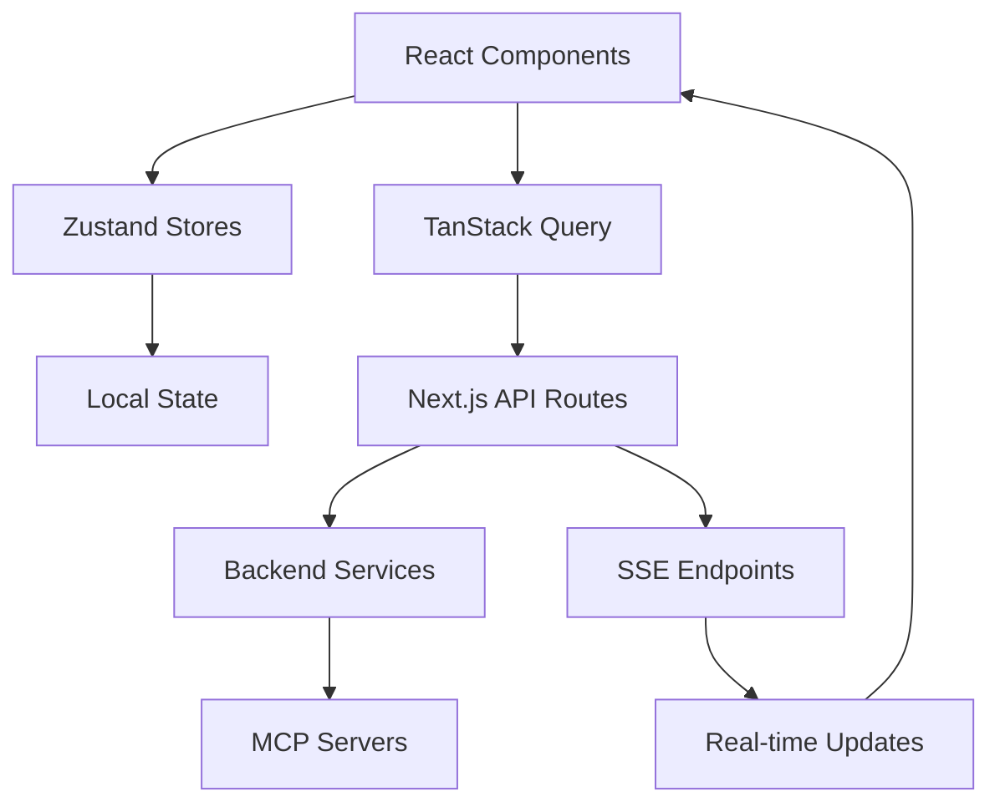

# TripSage Frontend: Architecture and Specifications

This document provides a comprehensive overview of the TripSage frontend application's architecture, technical specifications, design patterns, technology stack, and implementation details.

## 1. Executive Summary

TripSage's frontend is a modern, AI-centric travel planning application designed to provide a responsive, performant, and intuitive user experience. Built with Next.js 15.3+ and React 19, it leverages the latest web technologies to deliver an exceptional user interface for travel planning and management.

## 2. Technology Stack

### Core Technologies

- **Next.js 15.3.1**: App Router, Server Components, API routes
- **React 19.1.0**: Server Components, improved Suspense, concurrent features
- **TypeScript 5.5+**: Strict type safety, template literal types
- **Supabase JS Client**: Database integration and authentication

### UI Framework and Styling

- **Tailwind CSS v4.0**: OKLCH color space, CSS-based config, container queries
- **shadcn/ui v3**: Copy-paste components built on Radix UI
- **Framer Motion v11**: Modern animations and transitions
- **Lucide Icons**: Consistent icon library
- **clsx & tailwind-merge**: Conditional styling utilities

### State Management

- **Zustand v5.0.4**: Simple state management with native `useSyncExternalStore`
- **TanStack Query v5**: Server state, caching, and data synchronization
- **React Context API**: For isolated state within feature boundaries

### AI Integration

- **Vercel AI SDK v4.3.16**: ✅ **IMPLEMENTED** - Streaming AI responses, tool calling, file attachments
- **Server-Sent Events (SSE)**: Real-time AI streaming
- **OpenAI SDK**: Direct API integration when needed
- **Custom useChatAi Hook**: Zustand integration with AI SDK for state management

### Form Handling

- **React Hook Form v8**: Performance-optimized form handling
- **Zod v3**: TypeScript-first schema validation

### Additional Libraries

- **Recharts**: Data visualization
- **date-fns**: Date manipulation
- **React Email**: Email templates
- **Framer Motion**: Animations
- **React Hot Toast**: Notifications

### Testing

- **Vitest**: Fast unit testing with TypeScript support
- **React Testing Library**: Component testing with modern patterns
- **Playwright**: E2E testing with cross-browser support

### Building and Deployment

- **Turbopack**: Next.js built-in bundler (faster than Webpack)
- **SWC**: Rust-based TypeScript/JSX compiler
- **Vercel**: Optimized deployment for Next.js apps

## 3. Application Architecture

### 3.1. Detailed Directory Structure

```plaintext
src/
├── app/                            # Next.js App Router
│   ├── (auth)/                    # Auth group routes
│   │   ├── login/                 # Login page
│   │   ├── register/              # Registration page
│   │   └── reset-password/        # Password reset
│   ├── (dashboard)/               # Dashboard routes
│   │   ├── page.tsx              # Main dashboard
│   │   ├── trips/                # Trip management
│   │   │   ├── page.tsx          # Saved trips list
│   │   │   ├── [id]/             # Individual trip details
│   │   │   └── new/              # Create new trip
│   │   ├── search/               # Search interfaces
│   │   │   ├── flights/          # Flight search page
│   │   │   ├── hotels/           # Hotel search page
│   │   │   ├── activities/       # Activities search
│   │   │   └── destinations/     # Destination search
│   │   ├── chat/                 # AI Chat interface
│   │   │   ├── page.tsx          # Main chat UI
│   │   │   └── [sessionId]/      # Specific chat session
│   │   ├── agent-status/         # Agent workflow visualization
│   │   ├── profile/              # User profile
│   │   ├── settings/             # App settings
│   │   │   ├── api-keys/         # API key management
│   │   │   └── preferences/      # User preferences
│   │   └── analytics/            # Trip analytics
│   ├── api/                       # API routes
│   │   ├── chat/                 # AI chat endpoints
│   │   ├── trips/                # Trip CRUD operations
│   │   ├── search/               # Search endpoints
│   │   └── agents/               # Agent status endpoints
│   └── layout.tsx                 # Root layout
├── components/
│   ├── ui/                        # shadcn/ui components
│   ├── features/                  # Feature-specific components
│   │   ├── trips/                # Trip-related components
│   │   ├── search/               # Search components
│   │   ├── chat/                 # Chat components
│   │   ├── agents/               # Agent visualization
│   │   └── analytics/            # Analytics components
│   └── layouts/                   # Layout components
├── lib/
│   ├── api/                      # API client layer
│   ├── hooks/                    # Custom React hooks
│   ├── stores/                   # Zustand stores
│   ├── utils/                    # Utility functions
│   └── constants/                # App constants
├── types/                        # TypeScript definitions
├── config/                       # Configuration files
└── tests/                        # Test files and utilities
```

### 3.2. Core Layers

- **Presentation Layer**:
  - Server Components by default for improved initial load
  - Client Components (`'use client'`) only when needed for interactivity
  - Suspense boundaries for strategic loading states
  - Error boundaries for comprehensive error handling

- **State Management Layer**:
  - Zustand for client state (UI state, form state)
  - TanStack Query for server state (API data, caching)
  - URL state via Next.js router for navigation
  - Local storage for persistent preferences

- **API Integration Layer**:
  - Unified API client with type safety
  - Next.js API routes for backend communication
  - Error handling and retry logic
  - Real-time updates via SSE

- **Security Layer**:
  - Supabase Auth for authentication
  - JWT token validation
  - BYOK (Bring Your Own Key) implementation
  - Row-level security

### 3.3. Data Flow Patterns



## 4. Routing Strategy

- **App Router** with file-system based routing
- **Route groups** for logical organization (`(auth)`, `(dashboard)`)
- **Parallel routes** for simultaneous content display
- **Intercepting routes** for modals and overlays
- **Dynamic segments** for parametrized routes (`[id]`)
- **Loading and error states** for each route segment

## 5. Data Fetching and Caching

### Server-Side Data Fetching

```typescript
// app/(dashboard)/trips/[id]/page.tsx
export default async function TripPage({ params }: PageProps) {
  // Parallel data fetching
  const [trip, flights, hotels, weather] = await Promise.all([
    api.trips.getById(params.id),
    api.flights.getByTripId(params.id),
    api.hotels.getByTripId(params.id),
    api.weather.getForTrip(params.id),
  ]).catch(() => notFound());

  return <TripDetails trip={trip} flights={flights} hotels={hotels} weather={weather} />;
}
```

### Client-Side Data Fetching

```typescript
// components/features/trips/LiveTripUpdates.tsx
'use client';

export function LiveTripUpdates({ tripId }: { tripId: string }) {
  const { data, isLoading } = useSuspenseQuery({
    queryKey: ['trip-updates', tripId],
    queryFn: () => api.trips.getLiveUpdates(tripId),
    refetchInterval: 30000, // Poll every 30 seconds
  });

  // Render updates...
}
```

### Caching Strategy

- **TanStack Query** for client-side caching:
  - `staleTime`: 5 minutes for stable data, 1 minute for volatile data
  - `gcTime`: 10 minutes for cleanup
  - Optimistic updates for real-time UI changes
  - Query invalidation on mutations

- **Next.js caching** for server-side:
  - Static pages with ISR (revalidate: 3600)
  - Dynamic routes with dynamic data
  - Cache tags for targeted invalidation

### Optimistic Updates

```typescript
// Optimistic updates
export function useUpdateTrip() {
  const queryClient = useQueryClient();

  return useMutation({
    mutationFn: api.trips.update,
    onMutate: async (newTrip) => {
      await queryClient.cancelQueries({ queryKey: ["trips", newTrip.id] });

      const previousTrip = queryClient.getQueryData(["trips", newTrip.id]);
      queryClient.setQueryData(["trips", newTrip.id], newTrip);

      return { previousTrip };
    },
    onError: (err, newTrip, context) => {
      queryClient.setQueryData(["trips", newTrip.id], context?.previousTrip);
    },
  });
}
```

## 6. UI/UX Design System

### Design Principles

- **Clean and Minimal**: Focus on content and functionality
- **AI-Centric**: Guidance and suggestions through AI
- **Responsive**: Mobile-first approach with adaptations for larger screens
- **Accessible**: WCAG 2.1 AA compliance
- **Consistent**: Unified component language

### Color Palette

```typescript
// tailwind.config.ts
export default {
  theme: {
    extend: {
      colors: {
        primary: 'oklch(0.75 0.18 240)', // Indigo
        secondary: 'oklch(0.65 0.15 120)', // Emerald
        accent: 'oklch(0.85 0.20 330)', // Amber
        background: 'oklch(0.98 0.01 240)',
        foreground: 'oklch(0.25 0.01 240)',
      },
    },
  },
};
```

### Typography

- **Base Font**: Inter (sans-serif)
- **Heading Font**: Inter (sans-serif)
- **Editorial Font**: Optional serif for content-heavy sections
- **Code Font**: Mono for technical displays

### Component System

- **Base Components**: shadcn/ui for foundational UI
- **Feature Components**: Custom components for specific features
- **Layout Components**: Page structure and organization
- **Pattern Library**: Reusable interaction patterns

## 7. Key Features and Components

### 7.1 Core Page Components

#### Dashboard Page

```typescript
export default function DashboardPage() {
  return (
    <DashboardLayout>
      <RecentTrips />
      <UpcomingFlights />
      <QuickActions />
      <TripSuggestions />
    </DashboardLayout>
  );
}
```

#### Saved Trips Page

```typescript
export default function SavedTripsPage() {
  const { data: trips } = useSuspenseQuery({
    queryKey: ["trips"],
    queryFn: api.trips.getAll,
  });

  return (
    <div className="grid grid-cols-1 md:grid-cols-2 lg:grid-cols-3 gap-6">
      {trips.map((trip) => (
        <TripCard key={trip.id} trip={trip} />
      ))}
    </div>
  );
}
```

#### Trip Details Page

```typescript
export default function TripDetailsPage({
  params,
}: {
  params: { id: string };
}) {
  return (
    <TripDetailsLayout>
      <TripHeader tripId={params.id} />
      <TripItinerary tripId={params.id} />
      <TripBudget tripId={params.id} />
      <TripDocuments tripId={params.id} />
      <TripCollaborators tripId={params.id} />
    </TripDetailsLayout>
  );
}
```

#### AI Chat Interface

```typescript
export default function ChatPage() {
  return (
    <ChatLayout>
      <ChatSidebar />
      <ChatWindow />
      <AgentStatusPanel />
    </ChatLayout>
  );
}
```

#### Search Pages

```typescript
// Flight Search
export default function FlightSearchPage() {
  return (
    <SearchLayout>
      <FlightSearchForm />
      <FlightResults />
      <FlightFilters />
      <PriceAlerts />
    </SearchLayout>
  );
}

// Hotel Search
export default function HotelSearchPage() {
  return (
    <SearchLayout>
      <HotelSearchForm />
      <MapView />
      <HotelResults />
      <HotelFilters />
    </SearchLayout>
  );
}
```

#### Agent Status Visualization

```typescript
export default function AgentStatusPage() {
  return (
    <AgentLayout>
      <AgentWorkflowDiagram />
      <ActiveAgentsList />
      <TaskTimeline />
      <ResourceMetrics />
    </AgentLayout>
  );
}
```

### 7.2 Feature-Specific Components

#### AgentWorkflowVisualizer

```typescript
export function AgentWorkflowVisualizer({ agentId }: { agentId: string }) {
  const { data: workflow } = useAgentWorkflow(agentId);

  return (
    <ReactFlow
      nodes={workflow.nodes}
      edges={workflow.edges}
      nodeTypes={nodeTypes}
    >
      <MiniMap />
      <Controls />
      <Background />
    </ReactFlow>
  );
}
```

#### TripTimeline

```typescript
export function TripTimeline({ tripId }: { tripId: string }) {
  const { data: events } = useTripEvents(tripId);

  return (
    <div className="relative">
      {events.map((event, index) => (
        <TimelineEvent
          key={event.id}
          event={event}
          isLast={index === events.length - 1}
        />
      ))}
    </div>
  );
}
```

#### AIAssistantPanel

```typescript
export function AIAssistantPanel() {
  const { isProcessing, currentTask, suggestions } = useAIAssistant();

  return (
    <Card className="p-4">
      <CardHeader>
        <CardTitle>AI Assistant</CardTitle>
        {isProcessing && <LoadingIndicator />}
      </CardHeader>
      <CardContent>
        {currentTask && <TaskProgress task={currentTask} />}
        <SuggestionsList suggestions={suggestions} />
      </CardContent>
    </Card>
  );
}
```

#### Component Hierarchy Pattern

```typescript
// Base component with shadcn/ui
import { Button } from "@/components/ui/button";
import { Card } from "@/components/ui/card";

// Feature component
export function FlightSearchCard() {
  return (
    <Card>
      <CardHeader>
        <CardTitle>Search Flights</CardTitle>
      </CardHeader>
      <CardContent>
        <FlightSearchForm />
      </CardContent>
    </Card>
  );
}

// Composite component with AI features
export function SmartFlightSearch() {
  const { suggestions, isLoading } = useAISuggestions();

  return (
    <div className="space-y-4">
      <FlightSearchCard />
      {isLoading ? (
        <LoadingSpinner />
      ) : (
        <SuggestionsList suggestions={suggestions} />
      )}
    </div>
  );
}
```

### 7.3 Component Categories

#### Search Components

- `FlightSearchForm`: Multi-city, date flexibility options
- `HotelSearchForm`: Location, dates, guest configuration
- `SearchResults`: Paginated, filterable results
- `PriceGraph`: Price trends visualization
- `MapSearchView`: Interactive map with markers

#### Trip Management Components

- `TripCard`: Summary view of saved trips
- `ItineraryBuilder`: Drag-and-drop timeline
- `BudgetTracker`: Expense categorization
- `DocumentManager`: File uploads, organization
- `ShareModal`: Collaboration settings

#### Chat Components ✅ **IMPLEMENTED**

- `ChatContainer`: Main chat interface component with layout integration
- `MessageList`: Scrollable chat history with infinite scroll support
- `MessageInput`: Rich text, file attachments with drag-and-drop
- `MessageBubble`: Individual message rendering with markdown support
- `MessageAttachments`: File attachment display and management
- `MessageToolCalls`: Tool execution display and results
- `AgentStatusPanel`: Real-time agent status with visual indicators
- `StreamingMessage`: Real-time text display with typing animation
- `useChatAi`: Custom hook integrating Vercel AI SDK with Zustand store

**Status**: Frontend implementation complete. Backend integration in progress.
**Reference**: See `tasks/TODO-INTEGRATION.md` for remaining integration tasks.

#### Analytics Components

- `SpendingChart`: Budget visualization
- `TripStats`: Key metrics display
- `PopularDestinations`: Heat map
- `CostBreakdown`: Category analysis
- `TravelHistory`: Timeline view

#### Budget Management Components

- `BudgetDashboard`: Overview of trip costs
- `PricePredictor`: AI-powered price forecasting
- `FareAlertManager`: Price tracking and notifications
- `ExpenseTracker`: Real-time expense logging
- `CurrencyConverter`: Multi-currency support
- `GroupCostSplitter`: Shared expense calculations
- `DealsFinder`: Aggregated deals and discounts
- `HiddenCityFinder`: Alternative routing options
- `BudgetTemplates`: Pre-built trip budgets
- `CostComparator`: Side-by-side price analysis

### 7.4 Authentication & Security

- **Supabase Auth**: OAuth providers, magic links, JWT sessions
- **Row Level Security (RLS)**: Database-level access control
- **BYOK Implementation**: Secure API key management
  - Envelope encryption on backend
  - Auto-clearing forms in UI
  - Never store raw keys in frontend

#### BYOK Security Flow

```typescript
// Secure API key submission
export function ApiKeyForm() {
  const [isVisible, setIsVisible] = useState(false);
  const { register, handleSubmit, reset } = useForm<ApiKeyFormData>();

  // Auto-clear after 60 seconds
  useEffect(() => {
    const timer = setTimeout(() => {
      reset();
      setIsVisible(false);
    }, 60000);

    return () => clearTimeout(timer);
  }, [reset]);

  const onSubmit = async (data: ApiKeyFormData) => {
    try {
      await api.keys.encrypt(data);
      toast.success("API key securely stored");
      reset();
    } catch (error) {
      toast.error("Failed to store API key");
    }
  };

  return (
    <form onSubmit={handleSubmit(onSubmit)}>
      <PasswordInput
        {...register("apiKey", { required: true })}
        visible={isVisible}
        onVisibilityChange={setIsVisible}
      />
      <Button type="submit">Save Securely</Button>
    </form>
  );
}
```

#### Protected Route

```typescript
// Protected route wrapper
export function ProtectedRoute({ children }: PropsWithChildren) {
  const { user, isLoading } = useAuth();
  const router = useRouter();

  useEffect(() => {
    if (!isLoading && !user) {
      router.push("/login");
    }
  }, [user, isLoading, router]);

  if (isLoading) return <LoadingScreen />;
  if (!user) return null;

  return <>{children}</>;
}
```

### 7.5 Trip Planning Interface

- **Multi-step Wizard**: Progressive disclosure pattern
- **Real-time Validation**: Immediate feedback
- **Auto-save**: Prevent data loss
- **Collaborative Features**: Real-time updates via SSE

### 7.6 Search & Discovery

- **Faceted Search**: Advanced filtering
- **Instant Results**: Optimistic UI updates
- **Search History**: Recent searches
- **AI-Powered Suggestions**: Context-aware recommendations

### 7.7 AI Chat Integration ✅ **IMPLEMENTED**

**Status**: Frontend implementation complete with Vercel AI SDK v4.3.16

```typescript
// Implemented AI Chat Integration
export function ChatContainer() {
  const { 
    messages, 
    input, 
    handleSubmit, 
    isLoading, 
    append, 
    setInput,
    handleInputChange 
  } = useChatAi();

  return (
    <div className="flex h-full flex-col">
      <div className="flex-1 overflow-hidden">
        <MessageList 
          messages={messages} 
          isLoading={isLoading}
        />
      </div>
      <div className="border-t p-4">
        <MessageInput
          input={input}
          setInput={setInput}
          handleSubmit={handleSubmit}
          isLoading={isLoading}
          onAppend={append}
        />
      </div>
    </div>
  );
}

// Custom hook with Zustand integration
export function useChatAi() {
  const chatStore = useChatStore();
  
  const { messages, input, handleSubmit, isLoading, append, setInput } = useChat({
    api: '/api/chat',
    initialMessages: chatStore.messages,
    onFinish: (message) => {
      chatStore.addMessage(message);
    },
    onError: (error) => {
      chatStore.setError(error.message);
    }
  });

  return { messages, input, handleSubmit, isLoading, append, setInput };
}
```

**Key Features Implemented**:
- Real-time streaming responses
- File attachment support with drag-and-drop
- Tool calling visualization
- Agent status monitoring
- Session management with persistence
- Markdown rendering for rich content
- Error handling and retry logic

**Next Steps**: Backend integration (see `tasks/TODO-INTEGRATION.md`)

## 8. State Management

### 8.1 Zustand Stores

```typescript
// Zustand store for trip planning
interface TripStore {
  currentTrip: Trip | null;
  destinations: Destination[];
  addDestination: (destination: Destination) => void;
  updateItinerary: (itinerary: Partial<Itinerary>) => void;
  saveTrip: () => Promise<void>;
}

export const useTripStore = create<TripStore>((set, get) => ({
  currentTrip: null,
  destinations: [],

  addDestination: (destination) =>
    set((state) => ({
      destinations: [...state.destinations, destination],
    })),

  updateItinerary: (itinerary) =>
    set((state) => ({
      currentTrip: state.currentTrip
        ? { ...state.currentTrip, itinerary }
        : null,
    })),

  saveTrip: async () => {
    const trip = get().currentTrip;
    if (!trip) return;

    await api.trips.save(trip);
    // Additional logic...
  },
}));
```

### 8.2 Budget Store

```typescript
// Zustand store for budget management
interface BudgetStore {
  tripBudget: number;
  expenses: Expense[];
  categories: CategoryBudget[];
  currency: string;
  addExpense: (expense: Expense) => void;
  updateBudget: (budget: number) => void;
  setCurrency: (currency: string) => void;
  getRemaining: () => number;
  getCategorySpending: (category: string) => number;
}

export const useBudgetStore = create<BudgetStore>((set, get) => ({
  tripBudget: 0,
  expenses: [],
  categories: [],
  currency: "USD",

  addExpense: (expense) =>
    set((state) => ({
      expenses: [...state.expenses, expense],
    })),

  updateBudget: (budget) =>
    set({ tripBudget: budget }),

  setCurrency: (currency) =>
    set({ currency }),

  getRemaining: () => {
    const state = get();
    const totalSpent = state.expenses.reduce((sum, exp) => sum + exp.amount, 0);
    return state.tripBudget - totalSpent;
  },

  getCategorySpending: (category) => {
    const state = get();
    return state.expenses
      .filter((exp) => exp.category === category)
      .reduce((sum, exp) => sum + exp.amount, 0);
  },
}));
```

## 9. Error Handling

### Global Error Boundary

```typescript
export function GlobalErrorBoundary({ children }: PropsWithChildren) {
  return (
    <ErrorBoundary
      fallback={<ErrorFallback />}
      onError={(error) => {
        console.error('Application error:', error);
        // Send to error tracking service
      }}
    >
      {children}
    </ErrorBoundary>
  );
}
```

### Route Error Handling

```typescript
// app/(dashboard)/error.tsx
'use client';

export default function DashboardError({
  error,
  reset,
}: {
  error: Error & { digest?: string };
  reset: () => void;
}) {
  return (
    <div className="error-container">
      <h2>Something went wrong</h2>
      <p>{error.message}</p>
      <button onClick={reset}>Try again</button>
    </div>
  );
}
```

### API Error Handling with Retry Logic

```typescript
// API error handling with retry logic
export function useApiQuery<T>(queryKey: QueryKey, queryFn: QueryFunction<T>) {
  return useQuery({
    queryKey,
    queryFn,
    retry: (failureCount, error) => {
      if (error.status === 401) return false; // Don't retry auth errors
      return failureCount < 3;
    },
    retryDelay: (attemptIndex) => Math.min(1000 * 2 ** attemptIndex, 30000),
  });
}
```

## 10. Performance Optimization

### Code Splitting

```typescript
// Dynamic imports for heavy components
const MapView = dynamic(() => import("@/components/features/MapView"), {
  loading: () => <MapSkeleton />,
  ssr: false,
});

// Route-based code splitting
const AdminDashboard = lazy(() => import("@/pages/admin"));
```

### Other Optimizations

- **Image Optimization**: Next.js Image component with proper sizing
- **Bundle Optimization**: Tree shaking, minification
- **Lazy Loading**: Components and routes
- **Server Components**: Reduced client-side JavaScript
- **Edge Runtime**: Global CDN distribution
- **Static Generation**: For stable content
- **Partial Prerendering (PPR)**: Best of static and dynamic worlds

## 11. Testing Strategy

### Unit Tests

```typescript
// Component testing with React Testing Library
describe("FlightSearchForm", () => {
  it("validates required fields", async () => {
    render(<FlightSearchForm />);

    const submitButton = screen.getByRole("button", { name: /search/i });
    fireEvent.click(submitButton);

    expect(await screen.findByText(/origin is required/i)).toBeInTheDocument();
  });
});
```

### Integration Tests

```typescript
// API integration tests
describe("Trip API", () => {
  it("creates a new trip with flights", async () => {
    const trip = await api.trips.create({
      name: "European Adventure",
      destinations: ["Paris", "Rome"],
    });

    expect(trip.id).toBeDefined();
    expect(trip.destinations).toHaveLength(2);
  });
});
```

### E2E Tests

```typescript
// Playwright E2E tests
test("complete trip booking flow", async ({ page }) => {
  await page.goto("/trips/new");

  // Search for flights
  await page.fill('[name="origin"]', "NYC");
  await page.fill('[name="destination"]', "LON");
  await page.click('button[type="submit"]');

  // Select flight
  await page.click(".flight-option:first-child");

  // Continue to booking
  await page.click("text=Continue to Booking");

  // Assert success
  await expect(page).toHaveURL(/\/booking\/confirmation/);
});
```

## 12. Deployment

### Build Configuration

```javascript
// next.config.js
module.exports = {
  reactStrictMode: true,
  images: {
    domains: ["images.tripsage.com"],
    formats: ["image/avif", "image/webp"],
  },
  experimental: {
    serverActions: true,
    ppr: true, // Partial Prerendering
  },
  env: {
    NEXT_PUBLIC_API_URL: process.env.API_URL,
  },
};
```

### CI/CD Pipeline

```yaml
# GitHub Actions workflow
name: Deploy Frontend
on:
  push:
    branches: [main]

jobs:
  deploy:
    runs-on: ubuntu-latest
    steps:
      - uses: actions/checkout@v3
      - uses: actions/setup-node@v3
        with:
          node-version: "20"
      - run: npm ci
      - run: npm run build
      - run: npm run test
      - uses: vercel/action@v1
        with:
          vercel-token: ${{ secrets.VERCEL_TOKEN }}
```

### Environment Strategy

- **Development**: Local with hot reloading
- **Staging**: Preview deployments for testing
- **Production**: Optimized builds with CDN distribution
- **Feature Branches**: Isolated environments for feature development

## 13. Monitoring & Analytics

### Web Vitals Tracking

```typescript
// Web Vitals tracking
export function reportWebVitals(metric: NextWebVitalsMetric) {
  switch (metric.name) {
    case "FCP":
    case "LCP":
    case "CLS":
    case "FID":
    case "TTFB":
      // Send to analytics
      analytics.track("Web Vitals", {
        metric: metric.name,
        value: Math.round(metric.value),
      });
      break;
  }
}
```

### Other Monitoring & Analytics

- **Error Tracking**: Sentry integration
- **Performance Monitoring**: Web Vitals tracking
- **User Analytics**: Privacy-focused analytics
- **Custom Events**: User behavior tracking
- **Real-time Dashboards**: System health and usage

## 14. Performance Targets

- **First Contentful Paint**: <1.5s
- **Time to Interactive**: <3s
- **Lighthouse Score**: >95
- **Bundle Size**: <200KB initial JS
- **Core Web Vitals**: All green

## 15. Accessibility

- **WCAG 2.1 AA Compliance**: Minimum standard
- **Keyboard Navigation**: Full support
- **Screen Reader Support**: ARIA labels
- **Color Contrast**: 4.5:1 minimum
- **Focus Management**: Clear focus indicators
- **Skip Links**: For main content
- **Semantic HTML**: Proper element usage

## 16. Future Enhancements

### Potential Enhancements

1. **Offline Support**
   - Offline caching strategy
   - Background sync for failed requests
   - Push notifications support

2. **Progressive Web App Features**
   - Web app manifest
   - Install prompts
   - Native-like experience

3. **Internationalization**
   - Multi-language support
   - RTL layout support
   - Currency and date formatting

4. **Advanced Performance**
   - Service workers for caching
   - WebAssembly for compute-intensive tasks
   - Edge computing for global performance
   - Advanced prefetching strategies

5. **Enhanced Capabilities**
   - Voice search
   - Gesture controls
   - AR/VR previews for destinations
   - Native app integration

## 17. Implementation Roadmap

### Phase 1: Foundation (Months 1-2)

- Set up Next.js with TypeScript
- Implement authentication flow
- Basic UI components with shadcn/ui
- Initial state management setup

### Phase 2: Core Features (Months 3-4)

- AI chat integration
- Trip planning interface
- Search functionality
- Booking flows

### Phase 3: Advanced Features (Months 5-6)

- Real-time updates
- Collaborative planning
- Advanced filtering
- Performance optimizations

### Phase 4: Enhancement (Months 7-8)

- Progressive web app implementation
- Offline support
- Internationalization
- Advanced analytics

## 18. Conclusion

This architecture provides a robust, scalable foundation for TripSage's frontend, leveraging the latest web technologies while maintaining security, performance, and developer experience. The modular design allows for incremental improvements and easy maintenance as the application grows.
