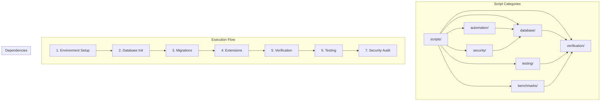
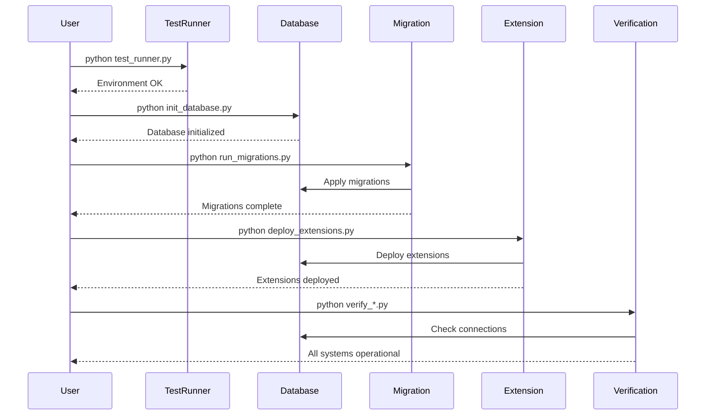
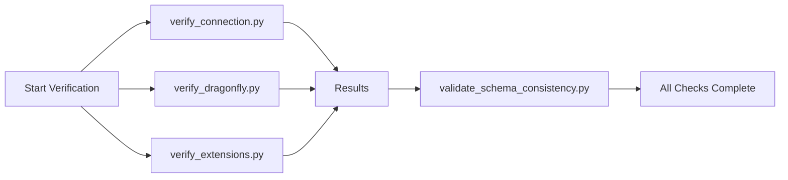
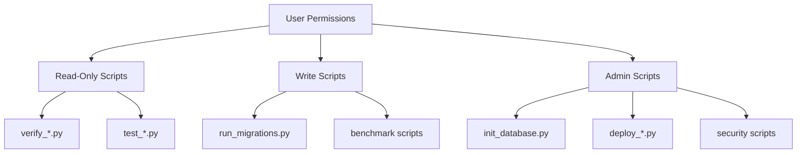

# Script Architecture Overview

## Directory Structure and Dependencies



## Script Dependency Matrix

| Script | Depends On | Required Services | Output |
|--------|------------|-------------------|---------|
| `test_runner.py` | Python env | None | Environment status |
| `init_database.py` | - | PostgreSQL | Initialized DB |
| `run_migrations.py` | init_database | PostgreSQL | Updated schema |
| `deploy_extensions.py` | run_migrations | PostgreSQL, Supabase | Deployed extensions |
| `verify_connection.py` | Database setup | PostgreSQL | Connection status |
| `verify_dragonfly.py` | - | DragonflyDB/Redis | Cache status |
| `verify_extensions.py` | deploy_extensions | PostgreSQL | Extension status |
| `validate_schema_consistency.py` | All DB scripts | PostgreSQL | Schema report |
| `run_tests_with_coverage.py` | All verification | All services | Test report |
| `dragonfly_performance.py` | verify_dragonfly | DragonflyDB | Performance metrics |
| `security_validation.py` | All setup | All services | Security report |

## Execution Patterns

### Sequential Execution (Setup)



### Parallel Execution (Verification)



## Script Communication

### Environment Variables

Scripts communicate through shared environment variables:

```bash
# Core Configuration
DATABASE_URL          # PostgreSQL connection
REDIS_URL            # Cache connection
SUPABASE_URL         # Supabase endpoint
SUPABASE_ANON_KEY    # Public API key
SUPABASE_SERVICE_KEY # Admin API key

# Script Configuration
LOG_LEVEL            # DEBUG, INFO, WARNING, ERROR
ENVIRONMENT          # development, staging, production
DRY_RUN             # true/false for preview mode
```

### File-Based Communication

Scripts may create/read files for communication:

```text
/tmp/
├── migration_status.json    # Migration state
├── verification_report.json # Verification results
├── benchmark_results.json   # Performance data
└── security_audit.json      # Security findings
```

### Database State

Scripts track state in database tables:

- `migration_history`: Applied migrations
- `script_execution_log`: Script run history
- `health_check_results`: Verification outcomes

## Error Handling Strategy

### Exit Codes

All scripts follow consistent exit codes:

- `0`: Success
- `1`: General error
- `2`: Dependency error
- `3`: Configuration error
- `4`: Connection error
- `5`: Permission error
- `10`: Dry run completed (no changes made)

### Error Propagation

```python
# Parent script example
import subprocess
import sys

def run_setup():
    scripts = [
        "scripts/database/init_database.py",
        "scripts/database/run_migrations.py",
        "scripts/automation/deploy_extensions.py"
    ]
    
    for script in scripts:
        result = subprocess.run([sys.executable, script])
        if result.returncode != 0:
            print(f"Failed at: {script}")
            sys.exit(result.returncode)
```

## Logging Architecture

### Log Levels by Script Type

- **Setup Scripts**: INFO level (important steps)
- **Verification Scripts**: DEBUG level (detailed checks)
- **Migration Scripts**: INFO level (changes made)
- **Security Scripts**: WARNING level (findings)
- **Benchmark Scripts**: INFO level (results)

### Log Format

```text
[2025-06-17 10:30:00] [INFO] [script_name] Message
[2025-06-17 10:30:01] [ERROR] [script_name] Error details
```

## Performance Considerations

### Script Execution Times

Expected execution times under normal conditions:

| Script Type | Expected Time | Timeout |
|-------------|---------------|---------|
| Verification | < 5 seconds | 30 seconds |
| Migration | < 1 minute | 5 minutes |
| Benchmark | 2-5 minutes | 10 minutes |
| Security Audit | 5-10 minutes | 30 minutes |
| Full Test Suite | 10-20 minutes | 60 minutes |

### Resource Usage

- **CPU**: Most scripts are I/O bound, low CPU usage
- **Memory**: < 256MB for most scripts
- **Network**: Verification scripts make multiple connections
- **Disk I/O**: Migration scripts may have high I/O

## Security Model

### Permission Requirements



### Credential Management

1. **Never hardcode credentials**
2. **Use environment variables**
3. **Implement least privilege**
4. **Rotate credentials regularly**
5. **Audit credential usage**

## Monitoring Integration

Scripts can be monitored through:

1. **Exit Code Monitoring**: Track script success/failure
2. **Log Aggregation**: Centralize script logs
3. **Metric Collection**: Export performance data
4. **Alert Integration**: Notify on failures

Example Prometheus metrics:

```text
script_execution_duration_seconds{script="run_migrations.py"} 45.2
script_execution_status{script="verify_connection.py"} 1
script_last_run_timestamp{script="security_validation.py"} 1718701800
```

## Future Enhancements

### Planned Improvements

1. **Script Orchestration**: Workflow engine for complex sequences
2. **Web UI**: Browser-based script execution
3. **Scheduling**: Cron-like script scheduling
4. **Notifications**: Slack/email integration
5. **History Tracking**: Complete audit trail
6. **Rollback Automation**: One-click rollbacks

### Extension Points

Scripts are designed to be extended:

- Custom verification checks
- Additional benchmarks
- New security tests
- Integration with CI/CD
- Custom reporting formats
