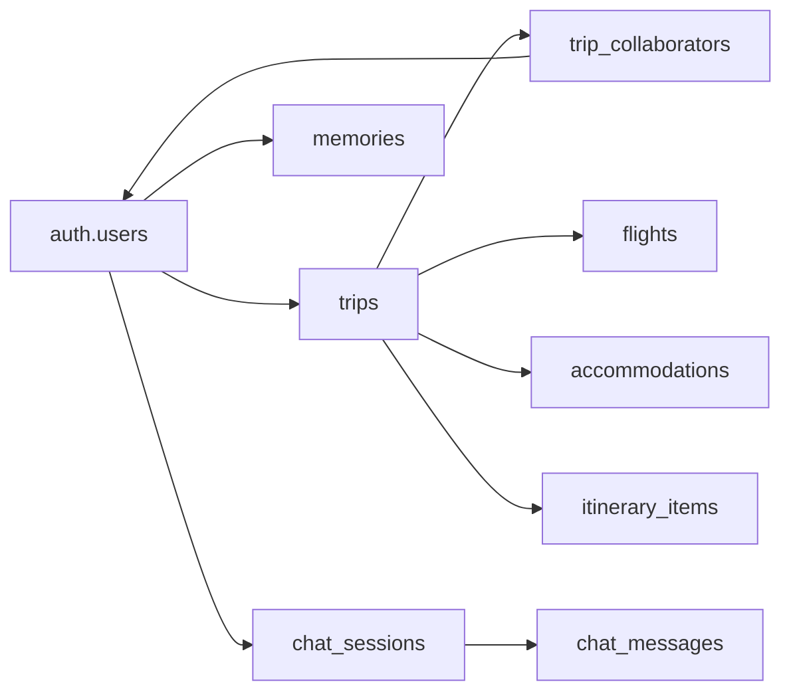

# TripSage Declarative Database Schemas

This directory contains declarative SQL schema files that define the complete database structure for TripSage. Using Supabase's declarative schema approach simplifies database management and ensures consistency across environments.

## 📋 What are Declarative Schemas?

Declarative schemas allow you to:

- Define your entire database structure in organized SQL files
- Generate migrations automatically by diffing against the current state
- Maintain a single source of truth for your database schema
- Simplify collaboration and code reviews

## 📁 Schema Files Organization

| File | Purpose | Dependencies |
|------|---------|--------------|
| `00_extensions.sql` | PostgreSQL extensions (uuid, pgvector, etc.) | None |
| `01_tables.sql` | Core table definitions and relationships | 00_extensions |
| `02_indexes.sql` | Performance indexes and search optimization | 01_tables |
| `03_functions.sql` | Stored procedures and utility functions | 01_tables |
| `04_triggers.sql` | Automated triggers for data consistency | 03_functions |
| `05_policies.sql` | Row Level Security (RLS) policies | 01_tables |
| `05_policies_extended.sql` | Additional RLS policies for edge cases | 05_policies |
| `06_views.sql` | Database views for common queries | 01_tables |
| `07_automation.sql` | Background jobs and scheduled tasks | 03_functions |
| `08_webhooks.sql` | Webhook configurations and triggers | 01_tables |

## 🚀 Working with Declarative Schemas

### Making Schema Changes

1. **Stop local database:**

   ```bash
   supabase db stop
   ```

2. **Edit appropriate schema file:**

   ```sql
   -- In 01_tables.sql, add new column
   ALTER TABLE public.trips 
   ADD COLUMN tags text[] DEFAULT '{}';
   ```

3. **Generate migration:**

   ```bash
   supabase db diff --file add_trip_tags
   ```

4. **Review and apply:**

   ```bash
   # Review generated migration
   cat supabase/migrations/*_add_trip_tags.sql
   
   # Apply to local database
   supabase db reset
   ```

### Schema File Best Practices

#### 1. **Use Idempotent Statements**

```sql
-- Good: Won't error if already exists
CREATE TABLE IF NOT EXISTS public.users (...);
CREATE INDEX IF NOT EXISTS idx_users_email ON public.users(email);

-- Bad: Will error if already exists
CREATE TABLE public.users (...);
CREATE INDEX idx_users_email ON public.users(email);
```

#### 2. **Order Matters**

Files are executed in lexicographic order:

- Extensions first (00_)
- Tables before functions (01_before 03_)
- Functions before triggers (03_before 04_)
- Tables before policies (01_before 05_)

#### 3. **Group Related Objects**

```sql
-- In 01_tables.sql - Keep related tables together
-- === TRIP MANAGEMENT TABLES ===
CREATE TABLE public.trips (...);
CREATE TABLE public.trip_collaborators (...);
CREATE TABLE public.itinerary_items (...);

-- === USER MANAGEMENT TABLES ===
CREATE TABLE public.user_preferences (...);
CREATE TABLE public.user_profiles (...);
```

## 📝 Schema Patterns

### Table Definition Pattern

```sql
-- Standard table with all common fields
CREATE TABLE IF NOT EXISTS public.table_name (
    -- Primary key
    id bigint GENERATED BY DEFAULT AS IDENTITY PRIMARY KEY,
    
    -- Foreign keys
    user_id uuid NOT NULL REFERENCES auth.users(id) ON DELETE CASCADE,
    parent_id bigint REFERENCES public.parent_table(id) ON DELETE CASCADE,
    
    -- Core fields
    name text NOT NULL,
    description text,
    status text DEFAULT 'active',
    
    -- JSONB for flexible data
    metadata jsonb DEFAULT '{}',
    
    -- Timestamps
    created_at timestamptz DEFAULT now(),
    updated_at timestamptz DEFAULT now(),
    
    -- Constraints
    CONSTRAINT check_status CHECK (status IN ('active', 'inactive', 'deleted')),
    CONSTRAINT unique_name_per_user UNIQUE(user_id, name)
);

-- Enable RLS
ALTER TABLE public.table_name ENABLE ROW LEVEL SECURITY;

-- Add indexes
CREATE INDEX IF NOT EXISTS idx_table_name_user_id ON public.table_name(user_id);
CREATE INDEX IF NOT EXISTS idx_table_name_created_at ON public.table_name(created_at DESC);

-- Add comments
COMMENT ON TABLE public.table_name IS 'Description of table purpose';
COMMENT ON COLUMN public.table_name.metadata IS 'Flexible JSON storage for additional properties';
```

### Function Definition Pattern

```sql
-- Secure function with proper settings
CREATE OR REPLACE FUNCTION public.function_name(
    p_param1 uuid,
    p_param2 text DEFAULT NULL
)
RETURNS TABLE(
    id bigint,
    name text,
    created_at timestamptz
)
LANGUAGE plpgsql
SECURITY DEFINER
SET search_path = public
AS $$
BEGIN
    -- Validate inputs
    IF p_param1 IS NULL THEN
        RAISE EXCEPTION 'Parameter p_param1 is required';
    END IF;
    
    -- Main logic
    RETURN QUERY
    SELECT t.id, t.name, t.created_at
    FROM public.table_name t
    WHERE t.user_id = p_param1
    AND (p_param2 IS NULL OR t.name = p_param2);
END;
$$;

-- Grant permissions
GRANT EXECUTE ON FUNCTION public.function_name TO authenticated;

-- Add comment
COMMENT ON FUNCTION public.function_name IS 'Description of function purpose';
```

### RLS Policy Pattern

```sql
-- Comprehensive RLS policies for a table
-- 1. Enable RLS
ALTER TABLE public.table_name ENABLE ROW LEVEL SECURITY;

-- 2. SELECT policy - Users can view their own records
CREATE POLICY "Users can view own records"
ON public.table_name FOR SELECT TO authenticated
USING (user_id = auth.uid());

-- 3. INSERT policy - Users can create records
CREATE POLICY "Users can create records"
ON public.table_name FOR INSERT TO authenticated
WITH CHECK (user_id = auth.uid());

-- 4. UPDATE policy - Users can update their own records
CREATE POLICY "Users can update own records"
ON public.table_name FOR UPDATE TO authenticated
USING (user_id = auth.uid())
WITH CHECK (user_id = auth.uid());

-- 5. DELETE policy - Users can delete their own records
CREATE POLICY "Users can delete own records"
ON public.table_name FOR DELETE TO authenticated
USING (user_id = auth.uid());

-- 6. Service role bypass (for backend operations)
CREATE POLICY "Service role has full access"
ON public.table_name FOR ALL TO service_role
USING (true) WITH CHECK (true);
```

## 🔍 Schema Documentation

### Core Tables

#### `trips` - Travel itineraries

- Primary storage for user travel plans
- Supports collaboration through `trip_collaborators`
- Includes budget tracking and date management

#### `trip_collaborators` - Sharing system

- Junction table for trip sharing
- Permission levels: `view`, `edit`, `admin`
- Maintains collaboration audit trail

#### `memories` - AI memory system

- Stores user preferences and history
- Uses pgvector for semantic search
- Supports personalized recommendations

### Key Relationships



## 🧪 Testing Schemas

### Validate Schema Syntax

```bash
# Check SQL syntax
supabase db lint

# Test schema application
supabase db reset --debug
```

### Verify Object Creation

```sql
-- Check tables exist
SELECT table_name FROM information_schema.tables 
WHERE table_schema = 'public' 
ORDER BY table_name;

-- Check functions
SELECT routine_name FROM information_schema.routines 
WHERE routine_schema = 'public' 
AND routine_type = 'FUNCTION';

-- Check policies
SELECT schemaname, tablename, policyname 
FROM pg_policies 
WHERE schemaname = 'public';
```

## 🔄 Migration Generation

### From Schema Changes

```bash
# 1. Make changes to schema files
# 2. Stop local database
supabase db stop

# 3. Generate migration
supabase db diff --file descriptive_name

# 4. Review generated migration
cat supabase/migrations/*_descriptive_name.sql

# 5. Test locally
supabase db reset
```

### Common Diff Scenarios

1. **Adding a column:**

   ```sql
   -- Schema file change
   my_column text DEFAULT 'value',
   
   -- Generated migration
   ALTER TABLE public.table_name 
   ADD COLUMN my_column text DEFAULT 'value';
   ```

2. **Adding an index:**

   ```sql
   -- Schema file change
   CREATE INDEX idx_table_column ON public.table_name(column);
   
   -- Generated migration
   CREATE INDEX idx_table_column ON public.table_name(column);
   ```

3. **Modifying RLS policy:**

   ```sql
   -- Generated migration
   DROP POLICY "old_policy" ON public.table_name;
   CREATE POLICY "new_policy" ON public.table_name ...;
   ```

## 🚨 Common Issues

### Schema Diff Limitations

- DML statements (INSERT, UPDATE) are not captured
- Some complex constraints might need manual migration
- Custom types may require special handling

### Troubleshooting

```bash
# Clean diff with verbose output
supabase db diff --file test --verbose

# Check for schema conflicts
supabase db lint

# Reset to clean state
supabase db reset --debug
```

## 📚 Best Practices Summary

1. **Organize by dependency order** (extensions → tables → functions → policies)
2. **Use idempotent statements** (IF NOT EXISTS, OR REPLACE)
3. **Document with comments** in schema files
4. **Test locally first** before generating migrations
5. **Review generated migrations** before applying
6. **Keep schemas focused** - one concern per file section
7. **Version control everything** including schema files

## 🔗 Related Documentation

- [Migration Guide](../migrations/README.md)
- [Database Architecture](../../docs/03_ARCHITECTURE/DATABASE_ARCHITECTURE.md)
- [Supabase Declarative Schemas](https://supabase.com/docs/guides/local-development/declarative-schemas)
- [PostgreSQL Schema Design](https://www.postgresql.org/docs/current/ddl-schemas.html)

---

**Note:** Schema files are the source of truth. Always modify schemas here rather than directly in the database, then generate migrations from the changes.
