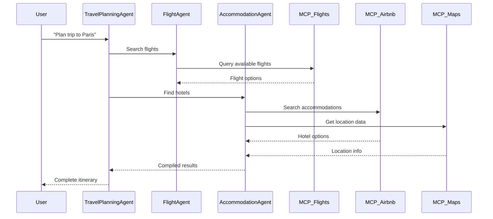
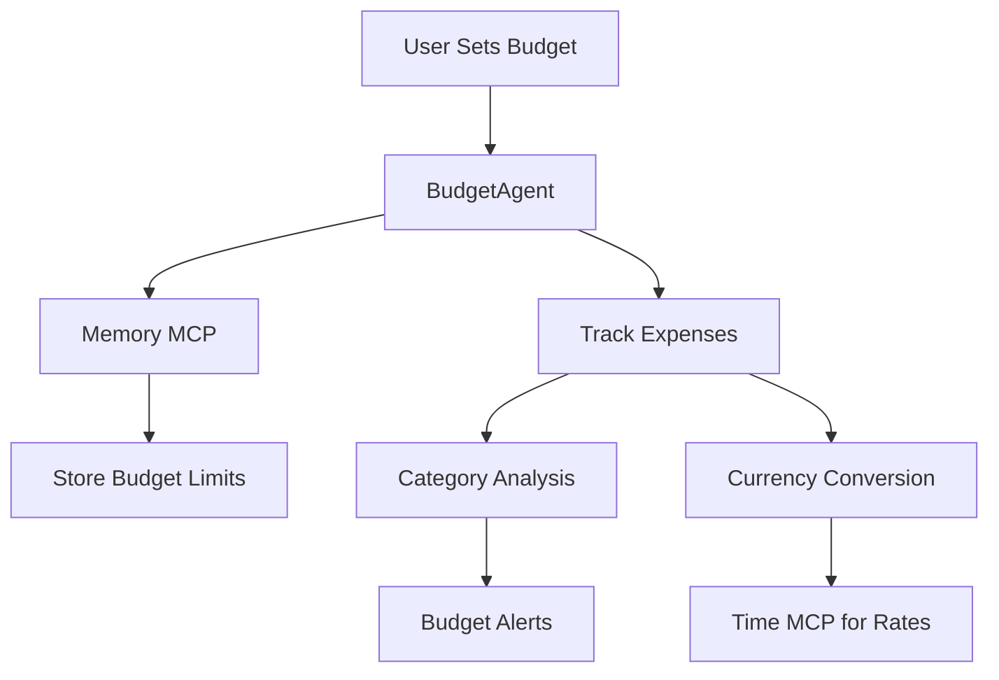
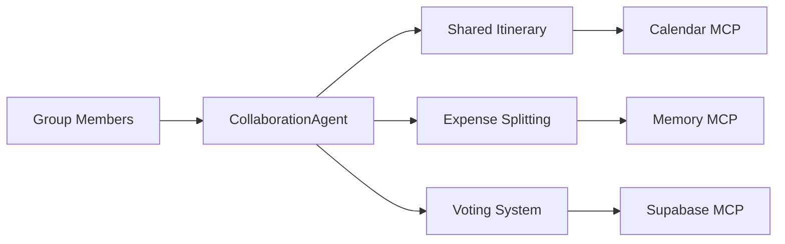
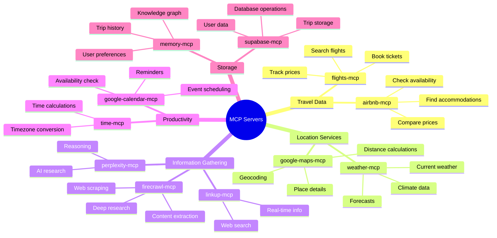
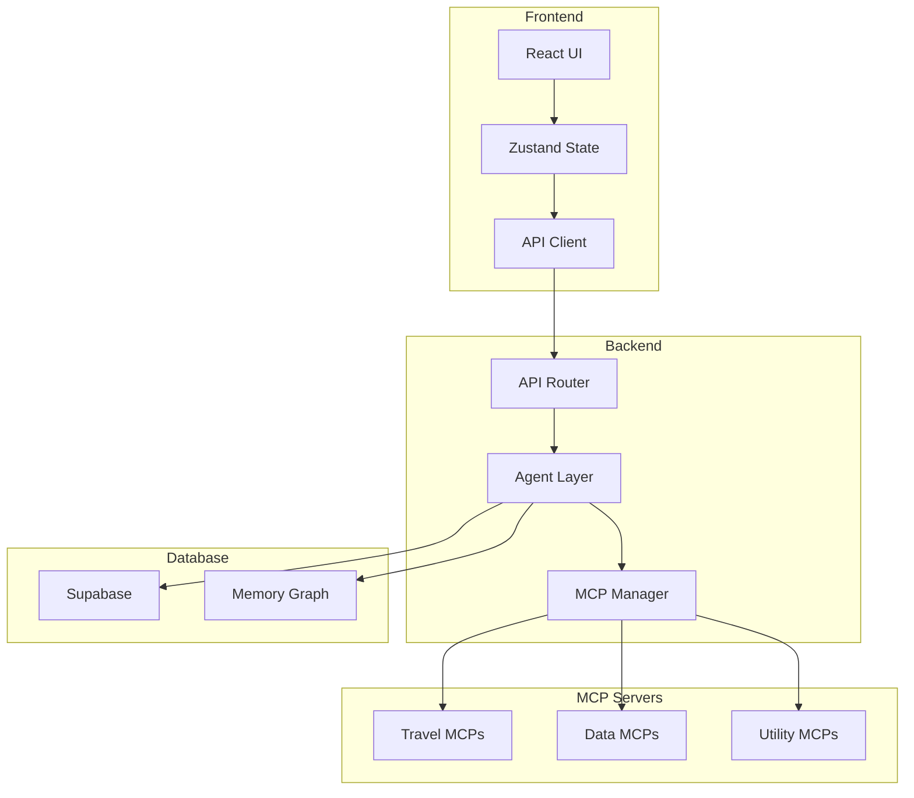
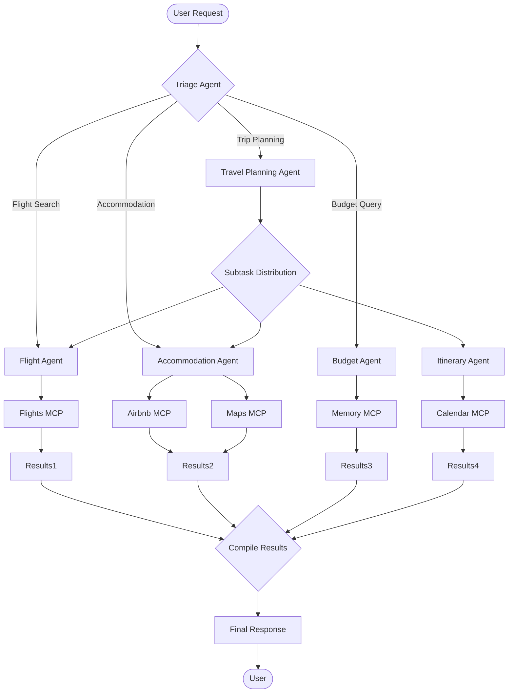
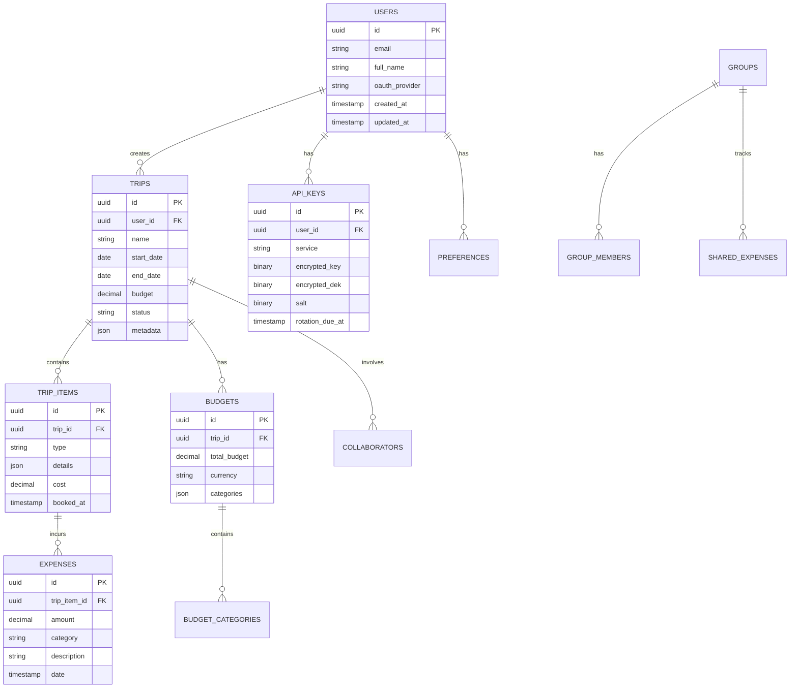
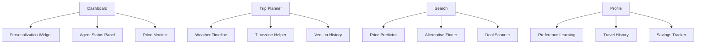

# TripSage Comprehensive Use Cases and System Capabilities

## Executive Summary

This document outlines all use cases for TripSage AI Travel Application, detailing how agents and MCP (Model Context Protocol) servers work together to deliver comprehensive travel planning capabilities. It includes gaps analysis, database requirements, and implementation roadmap divided into MVP and future releases.

## Table of Contents

1. [Core Use Cases](#core-use-cases)
2. [Agent and MCP Server Utilization](#agent-and-mcp-server-utilization)
3. [System Architecture Diagrams](#system-architecture-diagrams)
4. [Database Requirements](#database-requirements)
5. [UI/UX Gaps Analysis](#uiux-gaps-analysis)
6. [MVP vs. Next Release Features](#mvp-vs-next-release-features)
7. [Implementation Roadmap](#implementation-roadmap)

## Core Use Cases

### 1. Trip Planning and Booking

#### 1.1 Basic Trip Planning

**User Goal**: Plan a simple vacation with flights and hotels
**Agents Involved**: `TravelPlanningAgent`, `FlightAgent`, `AccommodationAgent`
**MCP Servers Used**: `flights-mcp`, `airbnb-mcp`, `google-maps-mcp`, `weather-mcp`



#### 1.2 Multi-Destination Trip

**User Goal**: Plan complex trip with multiple cities
**Agents Involved**: `TravelPlanningAgent`, `FlightAgent`, `ItineraryAgent`
**MCP Servers Used**: `flights-mcp`, `time-mcp`, `google-maps-mcp`

### 2. Budget Management

#### 2.1 Budget Tracking

**User Goal**: Track expenses and stay within budget
**Agents Involved**: `BudgetAgent`, `TravelPlanningAgent`
**MCP Servers Used**: `memory-mcp`, `time-mcp`



#### 2.2 Price Monitoring

**User Goal**: Get alerts when prices drop
**Agents Involved**: `FlightAgent`, `BudgetAgent`
**MCP Servers Used**: `flights-mcp`, `browser-mcp`, `memory-mcp`

### 3. Collaborative Travel

#### 3.1 Group Trip Planning

**User Goal**: Plan trip with multiple people
**Agents Involved**: `TravelPlanningAgent`, `CollaborationAgent`
**MCP Servers Used**: `google-calendar-mcp`, `memory-mcp`, `supabase-mcp`



### 4. AI-Powered Recommendations

#### 4.1 Personalized Suggestions

**User Goal**: Get recommendations based on preferences
**Agents Involved**: `TravelInsightsAgent`, `DestinationResearchAgent`
**MCP Servers Used**: `memory-mcp`, `linkup-mcp`, `firecrawl-mcp`

#### 4.2 Weather-Based Planning

**User Goal**: Plan activities based on weather
**Agents Involved**: `TravelPlanningAgent`, `ItineraryAgent`
**MCP Servers Used**: `weather-mcp`, `google-maps-mcp`

### 5. Real-Time Travel Management

#### 5.1 Flight Status Updates

**User Goal**: Get real-time flight updates
**Agents Involved**: `FlightAgent`
**MCP Servers Used**: `flights-mcp`, `time-mcp`

#### 5.2 Dynamic Itinerary Adjustments

**User Goal**: Adjust plans based on changes
**Agents Involved**: `ItineraryAgent`, `TravelPlanningAgent`
**MCP Servers Used**: All relevant MCPs

## Agent and MCP Server Utilization

### Agent-MCP Server Matrix

| Agent | Primary MCP Servers | Use Cases |
|-------|-------------------|-----------|
| TravelPlanningAgent | google-maps, weather, time | Overall trip coordination |
| FlightAgent | flights, time, browser | Flight search and booking |
| AccommodationAgent | airbnb, google-maps | Hotel/accommodation search |
| BudgetAgent | memory, time | Expense tracking, budgeting |
| ItineraryAgent | calendar, time, memory | Schedule management |
| DestinationResearchAgent | firecrawl, linkup, perplexity | Research and recommendations |
| TravelInsightsAgent | memory, linkup, weather | Personalized insights |

### MCP Server Capabilities



## System Architecture Diagrams

### Overall System Architecture



### Agent Orchestration Flow



## Database Requirements

### Core Database Schema



### Additional Tables Needed

```sql
-- User preferences and personalization
CREATE TABLE user_preferences (
    id UUID PRIMARY KEY,
    user_id UUID REFERENCES users(id),
    preferred_airlines TEXT[],
    dietary_restrictions TEXT[],
    travel_style VARCHAR(50),
    budget_range VARCHAR(50),
    created_at TIMESTAMPTZ DEFAULT CURRENT_TIMESTAMP,
    updated_at TIMESTAMPTZ DEFAULT CURRENT_TIMESTAMP
);

-- Search history for recommendations
CREATE TABLE search_history (
    id UUID PRIMARY KEY,
    user_id UUID REFERENCES users(id),
    search_type VARCHAR(50),
    query JSONB,
    results_count INT,
    created_at TIMESTAMPTZ DEFAULT CURRENT_TIMESTAMP
);

-- Price alerts and monitoring
CREATE TABLE price_alerts (
    id UUID PRIMARY KEY,
    user_id UUID REFERENCES users(id),
    trip_id UUID REFERENCES trips(id),
    alert_type VARCHAR(50),
    criteria JSONB,
    is_active BOOLEAN DEFAULT true,
    last_triggered TIMESTAMPTZ,
    created_at TIMESTAMPTZ DEFAULT CURRENT_TIMESTAMP
);

-- Chat sessions for AI interactions
CREATE TABLE chat_sessions (
    id UUID PRIMARY KEY,
    user_id UUID REFERENCES users(id),
    session_data JSONB,
    agent_states JSONB,
    created_at TIMESTAMPTZ DEFAULT CURRENT_TIMESTAMP,
    updated_at TIMESTAMPTZ DEFAULT CURRENT_TIMESTAMP
);

-- Agent interactions tracking
CREATE TABLE agent_interactions (
    id UUID PRIMARY KEY,
    session_id UUID REFERENCES chat_sessions(id),
    agent_name VARCHAR(100),
    action VARCHAR(100),
    mcp_servers TEXT[],
    input JSONB,
    output JSONB,
    duration_ms INT,
    created_at TIMESTAMPTZ DEFAULT CURRENT_TIMESTAMP
);
```

## UI/UX Gaps Analysis

### Current Gaps Not Leveraging Full Capabilities

1. **Memory MCP Underutilization**
   - Missing: Personalized recommendations based on past trips
   - Missing: Learning user preferences over time
   - Solution: Add "Recommended for You" section on dashboard

2. **Time MCP Integration**
   - Missing: Timezone-aware scheduling
   - Missing: Travel time calculations
   - Solution: Add timezone converter widget and travel time estimates

3. **Weather MCP Enhancement**
   - Missing: Weather-based activity suggestions
   - Missing: Climate comparison tools
   - Solution: Integrate weather data into itinerary planning

4. **Browser MCP for Monitoring**
   - Missing: Automated price tracking
   - Missing: Competitor price comparisons
   - Solution: Add price monitoring dashboard

5. **GitHub MCP for Versioning**
   - Missing: Itinerary version control
   - Missing: Collaborative editing history
   - Solution: Add version history for trips

6. **Agent Workflow Visualization**
   - Missing: Real-time agent collaboration view
   - Missing: Task progress indicators
   - Solution: Add agent status dashboard

### New UI Components Needed



## MVP vs. Next Release Features

### MVP Features (Version 1.0)

#### Core Functionality

1. **User Authentication**
   - OAuth login (Google, Facebook)
   - Basic profile management
   - Secure API key storage (BYOK)

2. **Trip Planning**
   - Single destination trips
   - Flight search and booking
   - Hotel search and booking
   - Basic itinerary builder

3. **Budget Management**
   - Trip budget setting
   - Expense tracking
   - Simple currency conversion

4. **AI Chat Interface**
   - Basic conversational planning
   - Simple agent interactions
   - Text-based responses

5. **Essential MCP Integrations**
   - flights-mcp
   - airbnb-mcp
   - google-maps-mcp
   - weather-mcp
   - supabase-mcp

#### Database Tables for MVP

- users
- trips
- trip_items
- budgets
- expenses
- api_keys
- chat_sessions

### Next Release Features (Version 2.0)

#### Advanced Features

1. **Collaborative Travel**
   - Group trip planning
   - Expense splitting
   - Shared itineraries
   - Voting mechanisms

2. **Price Intelligence**
   - Price prediction
   - Fare alerts
   - Alternative routing
   - Deal aggregation

3. **Enhanced Personalization**
   - Learning preferences
   - Recommendation engine
   - Trip templates
   - Custom alerts

4. **Advanced Agent Orchestration**
   - Multi-agent workflows
   - Visual task tracking
   - Complex reasoning
   - Parallel processing

5. **Additional MCP Integrations**
   - memory-mcp (full implementation)
   - browser-mcp
   - github-mcp
   - perplexity-mcp
   - firecrawl-mcp
   - linkup-mcp
   - google-calendar-mcp

#### Additional Database Tables

- user_preferences
- search_history
- price_alerts
- agent_interactions
- groups
- group_members
- shared_expenses
- itinerary_versions

### Feature Comparison Matrix

| Feature Category | MVP | Next Release |
|-----------------|-----|--------------|
| Trip Types | Single destination | Multi-city, round-the-world |
| Budget Features | Basic tracking | Prediction, alerts, optimization |
| Collaboration | None | Full group planning |
| Personalization | Basic preferences | AI learning, recommendations |
| Agent Complexity | Simple queries | Complex orchestration |
| MCP Coverage | 5 servers | 12+ servers |
| Offline Support | None | Full PWA support |
| Mobile Apps | None | iOS/Android apps |

## Implementation Roadmap

### Phase 1: MVP Development (3 months)

#### Month 1: Foundation

- [ ] Set up Next.js frontend
- [ ] Implement authentication
- [ ] Create basic UI components
- [ ] Set up core database tables
- [ ] Initialize agent framework

#### Month 2: Core Features

- [ ] Flight search and booking
- [ ] Hotel search and booking
- [ ] Basic itinerary builder
- [ ] Simple budget tracking
- [ ] Basic AI chat

#### Month 3: Integration & Polish

- [ ] MCP server integration
- [ ] Agent orchestration
- [ ] Testing and bug fixes
- [ ] Performance optimization
- [ ] MVP release

### Phase 2: Advanced Features (6 months)

#### Months 4-5: Collaboration & Groups

- [ ] Group trip planning
- [ ] Expense splitting
- [ ] Shared itineraries
- [ ] Real-time sync

#### Months 6-7: Intelligence & Personalization

- [ ] Price prediction engine
- [ ] Learning algorithms
- [ ] Recommendation system
- [ ] Advanced search

#### Months 8-9: Platform Enhancement

- [ ] Additional MCP servers
- [ ] Complex agent workflows
- [ ] Mobile app development
- [ ] Enterprise features

## Conclusion

TripSage represents a comprehensive travel planning platform that leverages AI agents and MCP servers to deliver unparalleled user experiences. By focusing on MVP features first, we can quickly deliver value while building toward a more sophisticated system. The architecture supports scalability and extensibility, allowing for continuous improvement and feature additions.

The key to success lies in:

1. Proper agent orchestration
2. Effective MCP server utilization
3. User-centric design
4. Robust database architecture
5. Phased implementation approach

This document serves as the blueprint for building TripSage into the premier AI-powered travel planning platform.
