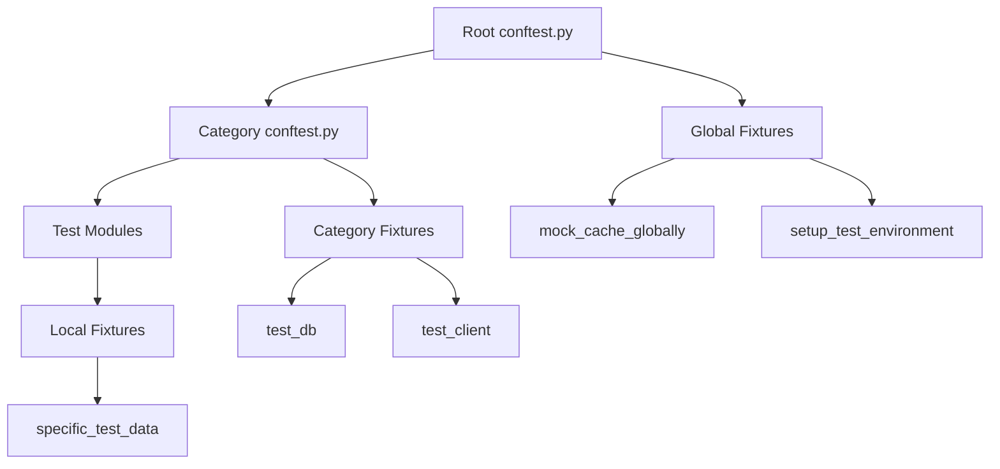
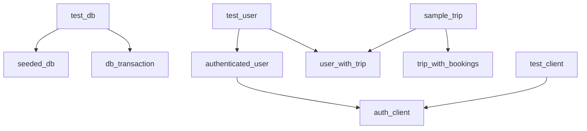

# TripSage Test Fixtures Guide

## Table of Contents

1. [Overview](#overview)
2. [Fixture Architecture](#fixture-architecture)
3. [Core Fixtures](#core-fixtures)
4. [Domain-Specific Fixtures](#domain-specific-fixtures)
5. [Database Fixtures](#database-fixtures)
6. [API Testing Fixtures](#api-testing-fixtures)
7. [Mock Service Fixtures](#mock-service-fixtures)
8. [Fixture Best Practices](#fixture-best-practices)
9. [Creating Custom Fixtures](#creating-custom-fixtures)
10. [Fixture Scopes](#fixture-scopes)
11. [Fixture Dependencies](#fixture-dependencies)
12. [Troubleshooting](#troubleshooting)

## Overview

Fixtures in TripSage provide reusable test data, configurations, and setup/teardown logic. This guide documents all available fixtures and how to use them effectively.

### What are Fixtures?

Fixtures are functions that:

- Set up test prerequisites
- Provide test data
- Clean up after tests
- Ensure test isolation
- Promote code reuse

### Fixture Locations

```text
tests/
├── conftest.py              # Root fixtures (global)
├── unit/
│   └── conftest.py         # Unit test fixtures
├── integration/
│   └── conftest.py         # Integration fixtures
├── e2e/
│   └── conftest.py         # E2E fixtures
└── fixtures/               # Shared fixture modules
    ├── __init__.py
    ├── database.py         # Database fixtures
    ├── models.py           # Model fixtures
    ├── api.py              # API client fixtures
    └── mocks.py            # Mock fixtures
```

## Fixture Architecture

### Fixture Hierarchy



### Fixture Loading Order

1. Root `conftest.py` loads first
2. Category-specific `conftest.py` files
3. Test module fixtures
4. Fixtures execute based on scope and dependencies

## Core Fixtures

### Environment Setup

```python
@pytest.fixture(scope="session", autouse=True)
def setup_test_environment():
    """Set up test environment variables.
    
    Scope: session
    Auto-use: Yes
    Location: tests/conftest.py
    
    Sets:
    - TEST_MODE=true
    - Disables external service calls
    - Configures test database
    """
    pass
```

### Cache Mocking

```python
@pytest.fixture(scope="session", autouse=True)
def mock_cache_globally(session_mocker):
    """Mock Redis/DragonflyDB globally.
    
    Scope: session
    Auto-use: Yes
    Location: tests/conftest.py
    
    Provides:
    - In-memory cache implementation
    - Prevents actual Redis connections
    - Isolated cache per test
    """
    pass
```

### Temporary Directories

```python
@pytest.fixture
def temp_dir(tmp_path):
    """Provide temporary directory for test files.
    
    Scope: function
    Location: built-in (pytest)
    
    Usage:
        def test_file_creation(temp_dir):
            file_path = temp_dir / "test.txt"
            file_path.write_text("content")
    """
    return tmp_path
```

### Event Loop

```python
@pytest.fixture
def event_loop():
    """Create event loop for async tests.
    
    Scope: function
    Location: tests/conftest.py
    
    Usage:
        async def test_async_operation(event_loop):
            result = await async_function()
    """
    loop = asyncio.new_event_loop()
    yield loop
    loop.close()
```

## Domain-Specific Fixtures

### User Fixtures

```python
@pytest.fixture
def test_user():
    """Create a test user.
    
    Scope: function
    Location: tests/fixtures/models.py
    
    Returns:
        User: User instance with ID 'test-user-123'
    
    Usage:
        def test_user_operations(test_user):
            assert test_user.email == "test@example.com"
    """
    return User(
        id="test-user-123",
        email="test@example.com",
        name="Test User"
    )

@pytest.fixture
def authenticated_user(test_user):
    """Create authenticated user with session.
    
    Scope: function
    Location: tests/fixtures/models.py
    Dependencies: test_user
    
    Returns:
        dict: User with auth token
    
    Usage:
        def test_protected_endpoint(authenticated_user):
            headers = {"Authorization": f"Bearer {authenticated_user['token']}"}
    """
    return {
        "user": test_user,
        "token": "test-jwt-token",
        "session_id": "test-session-123"
    }
```

### Trip Fixtures

```python
@pytest.fixture
def sample_trip(test_user):
    """Create a sample trip.
    
    Scope: function
    Location: tests/fixtures/models.py
    Dependencies: test_user
    
    Returns:
        Trip: Trip instance with destinations
    
    Usage:
        def test_trip_operations(sample_trip):
            assert len(sample_trip.destinations) == 2
    """
    return Trip(
        id="trip-123",
        user_id=test_user.id,
        name="Europe Adventure",
        start_date=datetime(2025, 6, 1),
        end_date=datetime(2025, 6, 15),
        destinations=["Paris", "Rome"]
    )

@pytest.fixture
def trip_with_collaborators(sample_trip, test_user):
    """Create trip with multiple collaborators.
    
    Scope: function
    Location: tests/fixtures/models.py
    Dependencies: sample_trip, test_user
    
    Returns:
        dict: Trip with collaborator details
    """
    return {
        "trip": sample_trip,
        "owner": test_user,
        "collaborators": [
            TripCollaborator(user_id="user-2", role="editor"),
            TripCollaborator(user_id="user-3", role="viewer")
        ]
    }
```

### Agent Fixtures

```python
@pytest.fixture
def mock_agent_response():
    """Mock AI agent response.
    
    Scope: function
    Location: tests/fixtures/mocks.py
    
    Returns:
        dict: Typical agent response structure
    
    Usage:
        def test_agent_parsing(mock_agent_response):
            parsed = parse_agent_response(mock_agent_response)
    """
    return {
        "message": "I found 3 flights matching your criteria",
        "data": {
            "flights": [...],
            "hotels": [...],
            "recommendations": [...]
        },
        "metadata": {
            "confidence": 0.95,
            "sources": ["amadeus", "booking.com"]
        }
    }
```

## Database Fixtures

### Test Database Connection

```python
@pytest_asyncio.fixture
async def test_db():
    """Provide test database connection.
    
    Scope: function
    Location: tests/integration/conftest.py
    
    Setup:
    - Creates test database
    - Runs migrations
    - Enables RLS
    
    Teardown:
    - Rolls back transactions
    - Cleans test data
    
    Usage:
        async def test_database_operation(test_db):
            result = await test_db.execute("SELECT * FROM users")
    """
    async with get_test_database() as db:
        await setup_test_schema(db)
        yield db
        await cleanup_test_data(db)
```

### Database Transactions

```python
@pytest_asyncio.fixture
async def db_transaction(test_db):
    """Provide database transaction.
    
    Scope: function
    Location: tests/integration/conftest.py
    Dependencies: test_db
    
    Automatically rolls back after test.
    
    Usage:
        async def test_with_transaction(db_transaction):
            await db_transaction.execute("INSERT INTO ...")
            # Automatically rolled back
    """
    async with test_db.transaction() as tx:
        yield tx
        await tx.rollback()
```

### Seeded Database

```python
@pytest_asyncio.fixture
async def seeded_db(test_db):
    """Database with sample data.
    
    Scope: function
    Location: tests/integration/conftest.py
    Dependencies: test_db
    
    Seeds:
    - 10 users
    - 50 trips
    - 100 bookings
    - Agent conversations
    
    Usage:
        async def test_with_data(seeded_db):
            users = await seeded_db.fetch("SELECT * FROM users")
            assert len(users) >= 10
    """
    await seed_test_data(test_db)
    yield test_db
    await cleanup_test_data(test_db)
```

## API Testing Fixtures

### Test Client

```python
@pytest_asyncio.fixture
async def test_client():
    """FastAPI test client.
    
    Scope: function
    Location: tests/integration/conftest.py
    
    Features:
    - Async request support
    - Automatic JSON encoding
    - Cookie/session handling
    
    Usage:
        async def test_api_endpoint(test_client):
            response = await test_client.get("/api/v1/health")
            assert response.status_code == 200
    """
    async with AsyncClient(app=app, base_url="http://test") as client:
        yield client
```

### Authenticated Client

```python
@pytest_asyncio.fixture
async def auth_client(test_client, authenticated_user):
    """Authenticated API client.
    
    Scope: function
    Location: tests/integration/conftest.py
    Dependencies: test_client, authenticated_user
    
    Includes:
    - Valid JWT token
    - User session
    
    Usage:
        async def test_protected_api(auth_client):
            response = await auth_client.get("/api/v1/users/me")
            assert response.status_code == 200
    """
    test_client.headers["Authorization"] = f"Bearer {authenticated_user['token']}"
    yield test_client
```

### API Response Fixtures

```python
@pytest.fixture
def success_response():
    """Standard success response.
    
    Scope: function
    Location: tests/fixtures/api.py
    
    Returns:
        dict: API success response format
    """
    return {
        "status": "success",
        "data": {},
        "message": "Operation completed successfully"
    }

@pytest.fixture
def error_response():
    """Standard error response.
    
    Scope: function
    Location: tests/fixtures/api.py
    
    Returns:
        dict: API error response format
    """
    return {
        "status": "error",
        "error": {
            "code": "VALIDATION_ERROR",
            "message": "Invalid input",
            "details": []
        }
    }
```

## Mock Service Fixtures

### External API Mocks

```python
@pytest.fixture
def mock_openai(mocker):
    """Mock OpenAI API.
    
    Scope: function
    Location: tests/fixtures/mocks.py
    
    Mocks:
    - Chat completions
    - Embeddings
    - Error responses
    
    Usage:
        def test_with_openai(mock_openai):
            mock_openai.chat.completions.create.return_value = {...}
    """
    mock = mocker.patch("openai.OpenAI")
    mock.return_value.chat.completions.create.return_value = Mock(
        choices=[Mock(message=Mock(content="Mocked response"))]
    )
    return mock

@pytest.fixture
def mock_amadeus(mocker):
    """Mock Amadeus travel API.
    
    Scope: function
    Location: tests/fixtures/mocks.py
    
    Mocks:
    - Flight search
    - Hotel search
    - Booking operations
    
    Usage:
        def test_flight_search(mock_amadeus):
            mock_amadeus.flight_search.return_value = [...]
    """
    mock = mocker.patch("amadeus.Client")
    return mock.return_value
```

### Service Stubs

```python
@pytest.fixture
def email_service_stub():
    """Email service stub.
    
    Scope: function
    Location: tests/fixtures/mocks.py
    
    Provides:
    - Send tracking
    - Template rendering
    - Delivery status
    
    Usage:
        def test_email_sending(email_service_stub):
            email_service_stub.send(...)
            assert email_service_stub.sent_count == 1
    """
    class EmailStub:
        def __init__(self):
            self.sent_emails = []
            self.sent_count = 0
        
        async def send(self, to, subject, body):
            self.sent_emails.append({
                "to": to,
                "subject": subject,
                "body": body
            })
            self.sent_count += 1
            return {"id": f"email-{self.sent_count}"}
    
    return EmailStub()
```

## Fixture Best Practices

### 1. Scope Management

```python
# Good: Appropriate scope
@pytest.fixture(scope="module")
def expensive_resource():
    """Create once per module."""
    resource = create_expensive_resource()
    yield resource
    cleanup_resource(resource)

# Bad: Wrong scope
@pytest.fixture(scope="session")
def mutable_data():
    """Don't share mutable data across tests!"""
    return []  # This will cause test pollution
```

### 2. Dependency Injection

```python
# Good: Clear dependencies
@pytest.fixture
def user_with_trip(test_user, sample_trip):
    """Compose fixtures."""
    test_user.trips.append(sample_trip)
    return test_user

# Bad: Hidden dependencies
@pytest.fixture
def complex_setup():
    """Avoid creating everything in one fixture."""
    user = create_user()
    trip = create_trip(user)
    bookings = create_bookings(trip)
    # Too much in one place
```

### 3. Cleanup

```python
# Good: Proper cleanup
@pytest_asyncio.fixture
async def websocket_connection():
    """Ensure cleanup happens."""
    ws = await connect_websocket()
    yield ws
    await ws.close()  # Always runs

# Good: Using context managers
@pytest.fixture
def file_resource(tmp_path):
    """Automatic cleanup with context manager."""
    with open(tmp_path / "test.txt", "w") as f:
        yield f
    # File automatically closed
```

### 4. Parametrization

```python
# Good: Flexible fixtures
@pytest.fixture
def api_client(request):
    """Parametrizable fixture."""
    base_url = getattr(request, "param", "http://localhost")
    return APIClient(base_url=base_url)

# Usage
@pytest.mark.parametrize("api_client", [
    "http://localhost",
    "http://staging.api"
], indirect=True)
def test_api_endpoints(api_client):
    pass
```

## Creating Custom Fixtures

### Template for New Fixtures

```python
@pytest.fixture(scope="function")
def my_custom_fixture(request, dependencies):
    """Brief description of fixture.
    
    Scope: function|class|module|session
    Location: where to find this
    Dependencies: list dependencies
    
    Setup:
    - What it creates/configures
    
    Teardown:
    - What it cleans up
    
    Args:
        request: pytest request object
        dependencies: other fixtures
    
    Returns:
        type: Description of return value
    
    Usage:
        def test_example(my_custom_fixture):
            # How to use it
    """
    # Setup
    resource = create_resource()
    
    # Optional: Add finalizer
    def cleanup():
        destroy_resource(resource)
    request.addfinalizer(cleanup)
    
    # Provide to test
    yield resource
    
    # Alternative cleanup (if not using finalizer)
    # cleanup_resource(resource)
```

### Fixture Factory Pattern

```python
@pytest.fixture
def user_factory(test_db):
    """Factory for creating test users.
    
    Scope: function
    Location: tests/fixtures/factories.py
    
    Usage:
        def test_multiple_users(user_factory):
            user1 = user_factory(email="user1@test.com")
            user2 = user_factory(email="user2@test.com")
    """
    created_users = []
    
    def _create_user(**kwargs):
        defaults = {
            "email": "test@example.com",
            "name": "Test User",
            "password": "secure123"
        }
        user_data = {**defaults, **kwargs}
        user = User(**user_data)
        test_db.add(user)
        created_users.append(user)
        return user
    
    yield _create_user
    
    # Cleanup all created users
    for user in created_users:
        test_db.delete(user)
```

## Fixture Scopes

### Scope Hierarchy

```text
session     # Once per test session
  ↓
package     # Once per package
  ↓
module      # Once per module
  ↓
class       # Once per class
  ↓
function    # Once per test (default)
```

### Choosing the Right Scope

| Scope | Use When | Example |
|-------|----------|---------|
| `session` | Expensive setup, read-only | Database schema, external services |
| `module` | Shared within file | Test data for module |
| `class` | Shared within class | Class-specific setup |
| `function` | Default, isolated | Most fixtures |

### Scope Examples

```python
@pytest.fixture(scope="session")
def database_schema():
    """Create once for all tests."""
    create_schema()
    yield
    # Don't drop schema - too expensive

@pytest.fixture(scope="module")
def module_data():
    """Create once per test file."""
    return load_test_data("module_data.json")

@pytest.fixture(scope="function")
def isolated_data():
    """Create fresh for each test."""
    return {"counter": 0}
```

## Fixture Dependencies

### Dependency Graph



### Managing Dependencies

```python
# Good: Clear dependency chain
@pytest.fixture
def base_data():
    return {"id": 1}

@pytest.fixture
def extended_data(base_data):
    return {**base_data, "name": "Test"}

@pytest.fixture
def complete_data(extended_data):
    return {**extended_data, "active": True}

# Bad: Circular dependencies
@pytest.fixture
def fixture_a(fixture_b):  # Will fail!
    return fixture_b + 1

@pytest.fixture
def fixture_b(fixture_a):  # Circular!
    return fixture_a + 2
```

### Fixture Request Order

```python
def test_example(fixture_c, fixture_a, fixture_b):
    """
    Execution order:
    1. fixture_a (if fixture_c doesn't depend on it)
    2. fixture_b (if fixture_c doesn't depend on it)
    3. fixture_c
    4. test_example
    """
    pass
```

## Troubleshooting

### Common Issues

#### 1. Fixture Not Found

**Error**: `fixture 'my_fixture' not found`

**Solutions**:

- Check fixture is defined in correct `conftest.py`
- Verify import path for fixture modules
- Ensure fixture name matches exactly
- Check fixture scope is appropriate

#### 2. Scope Mismatch

**Error**: `ScopeMismatch: Cannot use function-scoped fixture in session-scoped fixture`

**Solution**:

```python
# Bad
@pytest.fixture(scope="session")
def session_fixture(function_fixture):  # Error!
    pass

# Good
@pytest.fixture(scope="function")
def function_fixture(session_fixture):  # OK
    pass
```

#### 3. Async Fixture Issues

**Error**: `RuntimeError: Event loop is closed`

**Solution**:

```python
# Use pytest-asyncio fixtures
@pytest_asyncio.fixture
async def async_fixture():
    async with aiohttp.ClientSession() as session:
        yield session

# Not regular pytest fixture
@pytest.fixture  # Wrong!
async def bad_async_fixture():
    pass
```

#### 4. Fixture Cleanup Failures

**Issue**: Cleanup code not running

**Solution**:

```python
# Good: Use yield for cleanup
@pytest.fixture
def resource():
    r = acquire_resource()
    yield r
    release_resource(r)  # Always runs

# Good: Use finalizer
@pytest.fixture
def resource(request):
    r = acquire_resource()
    request.addfinalizer(lambda: release_resource(r))
    return r
```

### Debugging Fixtures

```bash
# List available fixtures
pytest --fixtures

# Show fixture execution order
pytest --setup-show

# Debug specific fixture
pytest -vv -k "test_name" --setup-show

# Check fixture scope
pytest --fixtures-per-test
```

### Performance Tips

1. **Use appropriate scope**: Don't recreate expensive resources
2. **Lazy initialization**: Create resources only when needed
3. **Batch operations**: Group database operations
4. **Mock external services**: Avoid network calls in unit tests
5. **Profile fixture setup**: Identify slow fixtures

```python
# Profile fixture timing
@pytest.fixture
def timed_fixture(request):
    start = time.time()
    resource = expensive_operation()
    duration = time.time() - start
    print(f"Fixture setup took {duration:.2f}s")
    yield resource
```

## Fixture Reference

### Quick Lookup Table

| Fixture | Scope | Location | Purpose |
|---------|-------|----------|---------|
| `setup_test_environment` | session | root conftest | Environment setup |
| `mock_cache_globally` | session | root conftest | Cache mocking |
| `test_db` | function | integration | Database connection |
| `test_client` | function | integration | API client |
| `test_user` | function | fixtures/models | User instance |
| `sample_trip` | function | fixtures/models | Trip instance |
| `mock_openai` | function | fixtures/mocks | OpenAI mock |
| `auth_client` | function | integration | Authenticated client |

### Import Examples

```python
# Fixtures are auto-discovered from conftest.py files
def test_auto_discovery(test_user):
    """test_user automatically available."""
    pass

# Import from fixture modules
from tests.fixtures.models import trip_factory
def test_with_factory(trip_factory):
    trip = trip_factory(name="Custom Trip")
```

## Summary

Fixtures are essential for:

- Test isolation
- Code reuse
- Clean test setup/teardown
- Dependency management
- Performance optimization

Follow these guidelines for effective fixture usage:

1. Choose appropriate scope
2. Keep fixtures focused
3. Document fixture purpose
4. Handle cleanup properly
5. Avoid fixture pollution
6. Use dependency injection
7. Profile performance impact

For more information:

- [pytest fixtures documentation](https://docs.pytest.org/en/stable/fixture.html)
- [Testing Guide](TESTING_GUIDE.md)
- [Unit Test Guide](unit/README.md)
- [Integration Test Guide](integration/README.md)
